# F01. Design Principles

## Part Context
**Part:** Part 0 — System Design Foundations & Principles
**Position:** Chapter F01 of F12
**Why this part exists:** Before diving into distributed databases, message queues, or load-balancer algorithms, engineers need a shared vocabulary of design principles that govern how systems are structured, evolved, and reasoned about. This chapter establishes that vocabulary — from code-level habits to system-level architectural constraints — so that every subsequent chapter can reference these principles by name.

---

## Overview

Design principles are the load-bearing walls of software engineering. Individual technologies come and go — a team may switch from PostgreSQL to CockroachDB, from REST to gRPC, from EC2 to Kubernetes — but the principles that determine whether a system is maintainable, scalable, and resilient remain constant across decades and technology stacks.

This chapter is divided into **three major sections**:

### Section 1 — Core Software Principles
The battle-tested rules that guide code structure: SOLID, DRY, KISS, YAGNI, Separation of Concerns, Composition over Inheritance, and the Law of Demeter. Each principle is examined with definition, motivation, real-world examples, code transformations, trade-offs, common mistakes, and interview relevance.

### Section 2 — Code-Level Design
The craft of writing code that humans can read, review, and refactor: clean code habits, naming conventions for APIs and databases, refactoring patterns, and modularity metrics.

### Section 3 — System-Level Principles
The architectural forces that shape distributed systems: loose coupling, high cohesion, idempotency, statelessness, fault isolation, backward compatibility, and extensibility. Each includes Mermaid diagrams, real-world case studies, and concrete implementation strategies.

The chapter closes with Architecture Decision Records, an interview angle guide, an evolution roadmap, and 15+ practice questions.

---

## Why This Chapter Matters

- Every system design interview begins with implicit assumptions about principle literacy. Candidates who can name the principle they are applying ("I'm choosing stateless services here to enable horizontal scaling") demonstrate senior-level reasoning.
- Principles act as a **shared language** across teams. When a code reviewer says "this violates SRP," both parties know the conversation is about responsibility boundaries, not personal preference.
- Principles create **guardrails for trade-off analysis**. Without YAGNI, teams gold-plate. Without extensibility thinking, teams paint themselves into corners. The tension between principles is where real engineering happens.
- Large-scale system failures — from Knight Capital's $440M loss to Cloudflare's global outage — can often be traced to principle violations: tight coupling, missing idempotency, insufficient fault isolation.
- Understanding principles lets engineers reason about systems they have never built before, which is exactly the skill tested in system design interviews.

---

# SECTION 1: Core Software Principles

This section covers the foundational principles that govern how code is structured, organized, and evolved. Each principle is presented with a consistent template to support both learning and interview preparation.

---

## 1.1 SOLID Principles

SOLID is an acronym coined by Robert C. Martin (Uncle Bob) representing five principles of object-oriented design. While originally framed for OOP, every principle has direct analogs in microservice architecture, API design, and distributed systems.

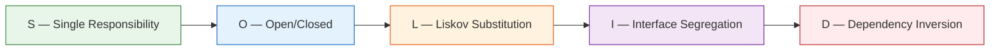

---

### 1.1.1 Single Responsibility Principle (SRP)

#### Definition

> A class (or module, service, function) should have one, and only one, reason to change.

The "reason to change" maps to a **stakeholder** or **actor**. If two different business departments can independently request changes to the same module, that module has two responsibilities.

#### Why It Matters in System Design

- In microservices, SRP manifests as service boundaries. A service that handles both user authentication and billing has two reasons to change: security policy updates and pricing model changes.
- SRP violations create **deployment coupling**: changing a billing rule forces redeploying the authentication service, introducing unnecessary risk.
- SRP is the principle most directly responsible for determining microservice granularity.

#### Real-World Example

**Before (SRP Violation):**

An `OrderService` that handles order creation, payment processing, inventory updates, and email notifications.

```python
# BEFORE: SRP Violation — OrderService does too much
class OrderService:
    def __init__(self, db, payment_gateway, inventory_db, email_client):
        self.db = db
        self.payment_gateway = payment_gateway
        self.inventory_db = inventory_db
        self.email_client = email_client

    def create_order(self, user_id, items, payment_info):
        # Responsibility 1: Order persistence
        order = Order(user_id=user_id, items=items, status="pending")
        self.db.save(order)

        # Responsibility 2: Payment processing
        charge = self.payment_gateway.charge(
            amount=order.total,
            card_token=payment_info["card_token"]
        )
        if not charge.success:
            order.status = "payment_failed"
            self.db.save(order)
            raise PaymentError(charge.error)

        # Responsibility 3: Inventory management
        for item in items:
            stock = self.inventory_db.get_stock(item.sku)
            if stock < item.quantity:
                raise OutOfStockError(item.sku)
            self.inventory_db.decrement(item.sku, item.quantity)

        # Responsibility 4: Notification
        self.email_client.send(
            to=user_id,
            template="order_confirmation",
            data={"order_id": order.id}
        )

        order.status = "confirmed"
        self.db.save(order)
        return order
```

**After (SRP Applied):**

```python
# AFTER: Each class has a single reason to change

class OrderService:
    """Responsibility: Order lifecycle management only."""
    def __init__(self, db, payment_service, inventory_service, notification_service):
        self.db = db
        self.payment_service = payment_service
        self.inventory_service = inventory_service
        self.notification_service = notification_service

    def create_order(self, user_id, items, payment_info):
        order = Order(user_id=user_id, items=items, status="pending")
        self.db.save(order)

        self.inventory_service.reserve(order.id, items)
        self.payment_service.authorize(order.id, order.total, payment_info)

        order.status = "confirmed"
        self.db.save(order)

        self.notification_service.send_order_confirmation(order)
        return order


class PaymentService:
    """Responsibility: Payment processing only."""
    def __init__(self, gateway, ledger):
        self.gateway = gateway
        self.ledger = ledger

    def authorize(self, order_id, amount, payment_info):
        charge = self.gateway.charge(amount, payment_info["card_token"])
        self.ledger.record(order_id, charge)
        if not charge.success:
            raise PaymentError(charge.error)
        return charge


class InventoryService:
    """Responsibility: Stock tracking and reservation only."""
    def __init__(self, inventory_db):
        self.inventory_db = inventory_db

    def reserve(self, order_id, items):
        for item in items:
            stock = self.inventory_db.get_stock(item.sku)
            if stock < item.quantity:
                raise OutOfStockError(item.sku)
            self.inventory_db.reserve(item.sku, item.quantity, order_id)


class NotificationService:
    """Responsibility: Sending notifications only."""
    def __init__(self, email_client):
        self.email_client = email_client

    def send_order_confirmation(self, order):
        self.email_client.send(
            to=order.user_id,
            template="order_confirmation",
            data={"order_id": order.id}
        )
```

#### When to Use SRP

- When defining microservice boundaries — each service should have a single domain responsibility.
- When a class has grown beyond 200-300 lines and serves multiple stakeholders.
- When a change request from one business unit requires modifying code that another unit also depends on.
- When writing unit tests becomes difficult because a class requires many unrelated mocks.

#### When NOT to Use SRP

- In early prototypes where the domain boundaries are not yet clear. Premature splitting can create artificial seams.
- In simple CRUD applications where the overhead of multiple classes exceeds the benefit of separation.
- When the "single responsibility" is so narrowly defined that you end up with hundreds of trivial classes ("class StringValidator," "class IntegerValidator," "class EmailValidator" each in separate files).

#### Trade-offs

| Benefit | Cost |
|---|---|
| Each unit is easier to understand | More files, classes, and indirection |
| Changes are localized | Requires careful interface design between units |
| Independently testable | Can lead to "class explosion" if taken to extremes |
| Independently deployable (at service level) | Distributed transactions become necessary |

#### Common Mistakes

1. **Confusing SRP with "do one thing."** A class can contain many methods as long as they all serve the same actor. An `InvoiceFormatter` with methods for PDF, CSV, and HTML output has a single responsibility: invoice formatting.
2. **Splitting too early.** Engineers sometimes create five microservices on day one when a well-structured monolith module would suffice. SRP does not mandate microservices.
3. **Ignoring the "reason to change" test.** Instead of asking "does this class do one thing?" ask "who would request a change to this class?" If only one stakeholder would, it satisfies SRP.

#### Interview Insights

- When asked "How would you split this monolith?" start by identifying responsibilities (actors) and draw boundaries along SRP lines.
- Interviewers appreciate when candidates say: "I would keep these together initially because they share the same reason to change, and split them when the deployment or scaling requirements diverge."

#### Relationship With Other Principles

- SRP is the foundation of **loose coupling**: if each module has one responsibility, the surface area for inter-module dependencies is minimized.
- SRP directly enables the **Open/Closed Principle**: a module with a single responsibility is easier to extend without modification.
- At the system level, SRP maps to **bounded contexts** in Domain-Driven Design.

---

### 1.1.2 Open/Closed Principle (OCP)

#### Definition

> Software entities should be open for extension but closed for modification.

You should be able to add new behavior to a system without changing existing, tested, deployed code.

#### Why It Matters in System Design

- In distributed systems, OCP manifests as **plugin architectures**, **event-driven extensions**, and **API versioning**. Adding a new payment provider should not require modifying the checkout service's core logic.
- OCP reduces **regression risk**: if existing code is not modified, existing tests remain valid.
- At the infrastructure level, OCP appears in load balancer configurations (add a new backend without changing the routing rules), feature flags (enable new behavior without deploying new code), and schema evolution (add columns without breaking existing queries).

#### Real-World Example

**Before (OCP Violation):**

```python
# BEFORE: Adding a new payment method requires modifying this function
class PaymentProcessor:
    def process(self, payment):
        if payment.method == "credit_card":
            return self._charge_credit_card(payment)
        elif payment.method == "paypal":
            return self._charge_paypal(payment)
        elif payment.method == "bank_transfer":
            return self._charge_bank_transfer(payment)
        # Every new payment method requires modifying this class
        else:
            raise UnsupportedPaymentMethod(payment.method)

    def _charge_credit_card(self, payment):
        # Credit card logic
        pass

    def _charge_paypal(self, payment):
        # PayPal logic
        pass

    def _charge_bank_transfer(self, payment):
        # Bank transfer logic
        pass
```

**After (OCP Applied):**

```python
# AFTER: New payment methods are added by creating new classes, not modifying existing ones

from abc import ABC, abstractmethod

class PaymentHandler(ABC):
    @abstractmethod
    def can_handle(self, method: str) -> bool:
        pass

    @abstractmethod
    def charge(self, payment) -> ChargeResult:
        pass


class CreditCardHandler(PaymentHandler):
    def can_handle(self, method: str) -> bool:
        return method == "credit_card"

    def charge(self, payment) -> ChargeResult:
        # Credit card logic
        pass


class PayPalHandler(PaymentHandler):
    def can_handle(self, method: str) -> bool:
        return method == "paypal"

    def charge(self, payment) -> ChargeResult:
        # PayPal logic
        pass


class PaymentProcessor:
    """Closed for modification — new methods are added by registering new handlers."""
    def __init__(self, handlers: list[PaymentHandler]):
        self.handlers = handlers

    def process(self, payment):
        for handler in self.handlers:
            if handler.can_handle(payment.method):
                return handler.charge(payment)
        raise UnsupportedPaymentMethod(payment.method)


# Adding Apple Pay requires ZERO changes to PaymentProcessor:
class ApplePayHandler(PaymentHandler):
    def can_handle(self, method: str) -> bool:
        return method == "apple_pay"

    def charge(self, payment) -> ChargeResult:
        # Apple Pay logic
        pass
```

#### When to Use OCP

- When the domain has a known dimension of variability (payment methods, notification channels, export formats, storage backends).
- When you are building a framework or library that others will extend.
- When regulatory or business requirements cause frequent additions to a category (new tax rules, new shipping carriers, new fraud checks).

#### When NOT to Use OCP

- When the set of variants is stable and small (e.g., a system that only ever supports "active" and "inactive" status).
- In early-stage products where the abstraction boundary is not yet clear. Premature OCP creates unnecessary indirection.
- When the cost of the abstraction (interfaces, registries, dependency injection) exceeds the cost of occasional modification.

#### Trade-offs

| Benefit | Cost |
|---|---|
| New features without touching existing code | Requires upfront abstraction design |
| Reduces regression risk | More classes and interfaces |
| Enables parallel development | Harder to understand the full flow (indirection) |
| Supports plugin ecosystems | Over-abstraction can make simple things complex |

#### Common Mistakes

1. **Premature abstraction.** Creating an interface with only one implementation "because OCP says so" adds complexity without benefit. Wait for the second variant before abstracting.
2. **Leaky abstractions.** An interface that exposes implementation details (e.g., a `PaymentHandler` with a `getStripeApiKey()` method) defeats the purpose.
3. **Confusing OCP with never changing code.** Bug fixes and refactoring are still allowed. OCP applies to adding new behavior, not all changes.

#### Interview Insights

- When designing a notification system, explain: "I would define a `NotificationChannel` interface so that adding SMS, push, or Slack does not modify the notification dispatcher."
- OCP is the principle behind **strategy pattern**, **observer pattern**, and **plugin architectures** — all common interview topics.

#### Relationship With Other Principles

- OCP depends on **Dependency Inversion** (coding to interfaces enables extension without modification).
- OCP is the system-level principle behind **backward compatibility** (Section 3).
- OCP and **YAGNI** are in tension: OCP encourages designing for extension, YAGNI warns against building for hypothetical futures. The resolution is to apply OCP only along **known axes of change**.

---

### 1.1.3 Liskov Substitution Principle (LSP)

#### Definition

> Subtypes must be substitutable for their base types without altering the correctness of the program.

If `S` is a subtype of `T`, then objects of type `T` can be replaced with objects of type `S` without breaking the program.

#### Why It Matters in System Design

- LSP violations create **silent bugs**. A `ReadOnlyCache` that extends `Cache` but throws an exception on `write()` breaks any code that expects a `Cache`.
- In microservices, LSP applies to **API contracts**: a v2 endpoint must honor all guarantees of v1 (response shape, error codes, idempotency behavior) if it claims backward compatibility.
- LSP is the formal basis for **contract testing** in distributed systems.

#### Real-World Example

**Before (LSP Violation):**

```python
# BEFORE: Square violates LSP as a subtype of Rectangle
class Rectangle:
    def __init__(self, width, height):
        self._width = width
        self._height = height

    def set_width(self, w):
        self._width = w

    def set_height(self, h):
        self._height = h

    def area(self):
        return self._width * self._height


class Square(Rectangle):
    """LSP VIOLATION: Square overrides behavior in a way that
    breaks expectations of code written for Rectangle."""
    def set_width(self, w):
        self._width = w
        self._height = w  # Surprise! Setting width changes height

    def set_height(self, h):
        self._width = h  # Surprise! Setting height changes width
        self._height = h


def resize_and_check(rect: Rectangle):
    """This function assumes Rectangle behavior."""
    rect.set_width(5)
    rect.set_height(10)
    assert rect.area() == 50  # Fails for Square! area() returns 100
```

**After (LSP Applied):**

```python
# AFTER: Use composition or separate types instead of broken inheritance
from abc import ABC, abstractmethod

class Shape(ABC):
    @abstractmethod
    def area(self) -> float:
        pass

class Rectangle(Shape):
    def __init__(self, width: float, height: float):
        self.width = width
        self.height = height

    def area(self) -> float:
        return self.width * self.height

class Square(Shape):
    def __init__(self, side: float):
        self.side = side

    def area(self) -> float:
        return self.side * self.side

# Both are Shapes, but Square does not pretend to be a Rectangle.
# Code that needs width != height uses Rectangle explicitly.
```

**System-level LSP example — API contract substitutability:**

```python
# API v1 contract
# GET /api/v1/users/123 -> {"id": 123, "name": "Alice", "email": "alice@example.com"}

# API v2 (LSP-compliant): adds fields but preserves all v1 fields
# GET /api/v2/users/123 -> {"id": 123, "name": "Alice", "email": "alice@example.com",
#                            "avatar_url": "...", "created_at": "..."}

# API v2 (LSP-violating): renames field, breaking v1 consumers
# GET /api/v2/users/123 -> {"user_id": 123, "full_name": "Alice", ...}
```

#### When to Use LSP

- When designing inheritance hierarchies — every subclass must honor the parent's behavioral contract.
- When versioning APIs — every new version must be substitutable for the previous version by existing consumers.
- When implementing adapter or decorator patterns — the wrapper must preserve the wrapped object's contract.

#### When NOT to Use LSP

- LSP applies to behavioral subtyping. It does not apply to unrelated types that happen to share method names.
- In dynamically typed languages, LSP is harder to enforce statically but remains important as a design guideline.

#### Trade-offs

| Benefit | Cost |
|---|---|
| Polymorphism works correctly | Constrains what subtypes can do |
| Enables confident refactoring | May require rethinking inheritance hierarchies |
| Supports contract testing | Sometimes "natural" hierarchies violate LSP (Square/Rectangle) |

#### Common Mistakes

1. **Throwing exceptions in overridden methods.** A subclass that throws `NotImplementedError` for an inherited method violates LSP.
2. **Strengthening preconditions.** A subclass that requires stricter input than the parent breaks substitutability.
3. **Weakening postconditions.** A subclass that returns less than what the parent promises breaks consumer expectations.

#### Interview Insights

- LSP appears in interview discussions about API versioning. Saying "v2 must be a superset of v1's contract to preserve backward compatibility" demonstrates LSP thinking.
- When asked about database migration strategies, LSP thinking leads to "additive-only" schema changes (add columns, never rename or remove).

---

### 1.1.4 Interface Segregation Principle (ISP)

#### Definition

> No client should be forced to depend on methods it does not use.

Prefer many small, focused interfaces over one large, general-purpose interface.

#### Why It Matters in System Design

- In microservices, ISP maps to **API surface area**. A single monolithic API that exposes 200 endpoints forces every consumer to depend on the entire surface, even if they only use three endpoints.
- ISP violations cause **unnecessary coupling**: when the unused portion of an interface changes, all clients must be updated and redeployed, even those that never call the changed methods.
- ISP is the principle behind **Backend for Frontend (BFF)** patterns: each frontend (web, mobile, IoT) gets a tailored API surface.

#### Real-World Example

**Before (ISP Violation):**

```python
# BEFORE: One fat interface forces all implementors to support everything
from abc import ABC, abstractmethod

class DataStore(ABC):
    @abstractmethod
    def read(self, key: str) -> bytes:
        pass

    @abstractmethod
    def write(self, key: str, value: bytes) -> None:
        pass

    @abstractmethod
    def delete(self, key: str) -> None:
        pass

    @abstractmethod
    def list_keys(self, prefix: str) -> list[str]:
        pass

    @abstractmethod
    def create_snapshot(self) -> str:
        pass

    @abstractmethod
    def restore_snapshot(self, snapshot_id: str) -> None:
        pass

    @abstractmethod
    def get_metrics(self) -> dict:
        pass


class RedisCache(DataStore):
    """Redis supports read/write/delete but does NOT support
    snapshots or metrics in the same way. Forced to implement stubs."""
    def read(self, key): ...
    def write(self, key, value): ...
    def delete(self, key): ...
    def list_keys(self, prefix): ...

    def create_snapshot(self):
        raise NotImplementedError("Redis cache does not support snapshots")

    def restore_snapshot(self, snapshot_id):
        raise NotImplementedError("Redis cache does not support snapshots")

    def get_metrics(self):
        raise NotImplementedError("Use Redis INFO command directly")
```

**After (ISP Applied):**

```python
# AFTER: Small, focused interfaces that clients can compose

class Readable(ABC):
    @abstractmethod
    def read(self, key: str) -> bytes:
        pass

class Writable(ABC):
    @abstractmethod
    def write(self, key: str, value: bytes) -> None:
        pass

    @abstractmethod
    def delete(self, key: str) -> None:
        pass

class Listable(ABC):
    @abstractmethod
    def list_keys(self, prefix: str) -> list[str]:
        pass

class Snapshottable(ABC):
    @abstractmethod
    def create_snapshot(self) -> str:
        pass

    @abstractmethod
    def restore_snapshot(self, snapshot_id: str) -> None:
        pass

class Observable(ABC):
    @abstractmethod
    def get_metrics(self) -> dict:
        pass


class RedisCache(Readable, Writable, Listable):
    """Redis only implements the interfaces it genuinely supports."""
    def read(self, key): ...
    def write(self, key, value): ...
    def delete(self, key): ...
    def list_keys(self, prefix): ...


class S3Storage(Readable, Writable, Listable, Snapshottable, Observable):
    """S3 supports everything."""
    def read(self, key): ...
    def write(self, key, value): ...
    def delete(self, key): ...
    def list_keys(self, prefix): ...
    def create_snapshot(self): ...
    def restore_snapshot(self, snapshot_id): ...
    def get_metrics(self): ...


# Client code depends only on what it needs:
def backup_data(source: Readable, destination: Writable):
    """This function only cares about reading and writing."""
    for key in ["config", "state", "logs"]:
        data = source.read(key)
        destination.write(f"backup/{key}", data)
```

#### When to Use ISP

- When an interface has grown to include methods that some implementors leave as stubs or throw `NotImplementedError`.
- When designing API gateways — each consumer should see only the endpoints it needs.
- When defining gRPC service definitions — smaller `.proto` services are easier to evolve than monolithic ones.

#### When NOT to Use ISP

- When the interface is genuinely cohesive and all implementors need all methods.
- When splitting creates trivial single-method interfaces that add overhead without value.

#### Trade-offs

| Benefit | Cost |
|---|---|
| Clients only depend on what they use | More interfaces to manage |
| Easier to mock in tests | Composition of many interfaces can be verbose |
| Reduces recompilation/redeployment | Requires thoughtful interface design upfront |

#### Common Mistakes

1. **Creating interfaces prematurely.** If there is only one implementor, an interface adds indirection without benefit.
2. **Going too granular.** An interface per method is ISP taken to absurdity. Group methods by cohesive usage patterns.
3. **Ignoring ISP at the API level.** A REST API with 100 endpoints in one service is the HTTP equivalent of a fat interface.

#### Interview Insights

- When designing a storage layer, explain: "I would define separate read and write interfaces so that read-only services (like a reporting dashboard) are not coupled to write operations."
- ISP thinking directly leads to the BFF pattern discussion.

---

### 1.1.5 Dependency Inversion Principle (DIP)

#### Definition

> High-level modules should not depend on low-level modules. Both should depend on abstractions. Abstractions should not depend on details. Details should depend on abstractions.

The direction of source code dependency should be **opposite** to the direction of control flow.

#### Why It Matters in System Design

- DIP is the principle that enables **swappable infrastructure**. Your order processing logic should not directly import the PostgreSQL driver; it should depend on a repository interface that PostgreSQL implements.
- In microservices, DIP appears as **contract-first API design**: services depend on shared API contracts (OpenAPI specs, protobuf definitions), not on each other's implementations.
- DIP enables **testability**: unit tests can inject mock implementations of infrastructure dependencies.

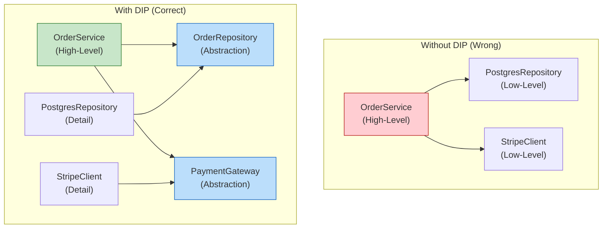

#### Real-World Example

**Before (DIP Violation):**

```python
# BEFORE: High-level module directly depends on low-level implementation
import psycopg2
import stripe

class OrderService:
    def __init__(self):
        # Directly coupled to PostgreSQL and Stripe
        self.conn = psycopg2.connect("dbname=orders host=localhost")
        stripe.api_key = "sk_live_..."

    def create_order(self, user_id, items):
        cursor = self.conn.cursor()
        cursor.execute(
            "INSERT INTO orders (user_id, status) VALUES (%s, %s) RETURNING id",
            (user_id, "pending")
        )
        order_id = cursor.fetchone()[0]

        total = sum(item.price * item.qty for item in items)
        charge = stripe.Charge.create(amount=int(total * 100), currency="usd")

        cursor.execute(
            "UPDATE orders SET status = %s WHERE id = %s",
            ("confirmed", order_id)
        )
        self.conn.commit()
        return order_id
```

**After (DIP Applied):**

```python
# AFTER: High-level module depends on abstractions

from abc import ABC, abstractmethod

class OrderRepository(ABC):
    @abstractmethod
    def save(self, order: Order) -> str:
        pass

    @abstractmethod
    def update_status(self, order_id: str, status: str) -> None:
        pass

class PaymentGateway(ABC):
    @abstractmethod
    def charge(self, amount_cents: int, currency: str) -> ChargeResult:
        pass


class OrderService:
    """High-level module depends only on abstractions."""
    def __init__(self, repo: OrderRepository, gateway: PaymentGateway):
        self.repo = repo
        self.gateway = gateway

    def create_order(self, user_id: str, items: list) -> str:
        order = Order(user_id=user_id, items=items, status="pending")
        order_id = self.repo.save(order)

        total_cents = sum(item.price_cents * item.qty for item in items)
        result = self.gateway.charge(total_cents, "usd")

        if result.success:
            self.repo.update_status(order_id, "confirmed")
        else:
            self.repo.update_status(order_id, "payment_failed")

        return order_id


# Low-level implementations depend on the abstractions:
class PostgresOrderRepository(OrderRepository):
    def __init__(self, connection_string: str):
        self.conn = psycopg2.connect(connection_string)

    def save(self, order: Order) -> str: ...
    def update_status(self, order_id: str, status: str) -> None: ...


class StripePaymentGateway(PaymentGateway):
    def __init__(self, api_key: str):
        stripe.api_key = api_key

    def charge(self, amount_cents: int, currency: str) -> ChargeResult: ...


# In tests, inject mocks:
class MockOrderRepository(OrderRepository):
    def __init__(self):
        self.orders = {}

    def save(self, order): ...
    def update_status(self, order_id, status): ...
```

#### When to Use DIP

- Always for core business logic. Business rules should never depend on infrastructure details.
- When building systems that must support multiple infrastructure backends (e.g., local development uses SQLite, production uses PostgreSQL).
- When writing testable code — DIP enables dependency injection, which enables mocking.

#### When NOT to Use DIP

- In glue code or infrastructure code where the implementation is the point (a database migration script necessarily depends on the specific database).
- In scripts or one-off utilities where testability and swappability are not required.

#### Trade-offs

| Benefit | Cost |
|---|---|
| Swappable infrastructure | More interfaces and boilerplate |
| Testable business logic | Dependency injection setup can be complex |
| Decoupled deployment | Requires disciplined architecture |

#### Common Mistakes

1. **Creating abstractions that mirror implementations.** An `IPostgresRepository` interface defeats the purpose — the abstraction should be `OrderRepository`, not tied to any implementation.
2. **Service locator anti-pattern.** Using a global registry to resolve dependencies hides coupling instead of eliminating it.
3. **Forgetting DIP at the service level.** Microservices that directly call each other's internal APIs are DIP violations. Services should communicate through well-defined contracts (API specs, event schemas).

#### Interview Insights

- When asked "How would you test this service?" answer with DIP: "I would inject a mock repository and a mock payment gateway, allowing me to test business logic without hitting real infrastructure."
- DIP is the principle behind dependency injection frameworks (Spring, Guice, Dagger) — knowing the principle is more valuable than knowing the framework.

---

## 1.2 DRY — Don't Repeat Yourself

### Definition

> Every piece of knowledge must have a single, unambiguous, authoritative representation within a system.

DRY is not about eliminating duplicate code — it is about eliminating **duplicate knowledge**. Two functions with identical code may represent different concepts (and should stay separate). Two functions with different code may represent the same concept (and should be unified).

### Why It Matters in System Design

- Duplicate knowledge creates **consistency bugs**: when a business rule changes, engineers must remember to update it in every location. Forgotten copies become silent errors.
- In distributed systems, DRY applies to **schema definitions** (a protobuf definition should be the single source of truth, not copied into each service), **configuration** (timeouts should be defined once, not scattered across deployment files), and **API contracts**.

### Real-World Example

**Before (DRY Violation):**

```python
# BEFORE: Tax calculation logic duplicated in three places

# In the cart service:
def calculate_cart_total(items, state):
    subtotal = sum(item.price * item.qty for item in items)
    if state == "CA":
        tax = subtotal * 0.0725
    elif state == "TX":
        tax = subtotal * 0.0625
    elif state == "NY":
        tax = subtotal * 0.08
    else:
        tax = 0
    return subtotal + tax

# In the checkout service (copy-pasted):
def calculate_checkout_total(items, shipping, state):
    subtotal = sum(item.price * item.qty for item in items)
    if state == "CA":
        tax = subtotal * 0.0725
    elif state == "TX":
        tax = subtotal * 0.0625
    elif state == "NY":
        tax = subtotal * 0.08  # Bug: was 0.0725, fixed here but not in cart
    else:
        tax = 0
    return subtotal + tax + shipping

# In the invoice service (another copy):
def generate_invoice_total(line_items, state_code):
    subtotal = sum(li.amount for li in line_items)
    if state_code == "CA":
        tax = subtotal * 0.0725
    elif state_code == "TX":
        tax = subtotal * 0.0625
    elif state_code == "NY":
        tax = subtotal * 0.0725  # Bug: still has old NY rate!
    else:
        tax = 0
    return subtotal + tax
```

**After (DRY Applied):**

```python
# AFTER: Single authoritative tax calculation

class TaxCalculator:
    """Single source of truth for tax rates and calculation logic."""

    TAX_RATES = {
        "CA": 0.0725,
        "TX": 0.0625,
        "NY": 0.08,
        # Add new states here — one place to update
    }

    @classmethod
    def calculate_tax(cls, subtotal: float, state: str) -> float:
        rate = cls.TAX_RATES.get(state, 0.0)
        return subtotal * rate


# All services use the single source of truth:
def calculate_cart_total(items, state):
    subtotal = sum(item.price * item.qty for item in items)
    tax = TaxCalculator.calculate_tax(subtotal, state)
    return subtotal + tax

def calculate_checkout_total(items, shipping, state):
    subtotal = sum(item.price * item.qty for item in items)
    tax = TaxCalculator.calculate_tax(subtotal, state)
    return subtotal + tax + shipping
```

### The Over-DRY Anti-Pattern (WET: Write Everything Twice)

DRY can be taken too far. The **over-DRY anti-pattern** occurs when engineers extract shared code that is coincidentally similar but conceptually different.

```python
# OVER-DRY: Forced abstraction because two functions happen to look similar

def generic_process(items, config):
    """This 'shared' function serves two unrelated use cases
    and has become a maintenance nightmare."""
    result = []
    for item in items:
        if config.get("mode") == "pricing":
            value = item.base_price * config["markup"]
            if config.get("apply_discount"):
                value -= config["discount_amount"]
        elif config.get("mode") == "shipping":
            value = item.weight * config["rate_per_kg"]
            if config.get("add_insurance"):
                value += config["insurance_fee"]
        result.append(value)
    return result

# BETTER: Keep separate because they are conceptually different
# even though the loop structure is similar.

def calculate_prices(items, markup, discount=None):
    """Pricing is its own concept with its own evolution path."""
    return [
        item.base_price * markup - (discount or 0)
        for item in items
    ]

def calculate_shipping_costs(items, rate_per_kg, insurance_fee=0):
    """Shipping cost is its own concept with its own evolution path."""
    return [
        item.weight * rate_per_kg + insurance_fee
        for item in items
    ]
```

### When to Use DRY

- When the same **business rule** is expressed in multiple places.
- When a change to a concept (tax rate, validation rule, API contract) requires updating multiple files.
- For shared libraries, protobuf definitions, and configuration schemas.

### When NOT to Use DRY

- When two pieces of code are coincidentally similar but serve different stakeholders and will evolve independently.
- When DRY-ing would create tight coupling between unrelated modules.
- The "Rule of Three": do not extract until you see the same pattern three times.

### Trade-offs

| Benefit | Cost |
|---|---|
| Single source of truth | Shared code becomes a coupling point |
| Consistency across system | Changes to shared code affect all consumers |
| Fewer bugs from divergence | May require versioning shared libraries |

### Interview Insights

- When asked about shared libraries in microservices, acknowledge the DRY tension: "Shared libraries enforce DRY but create deployment coupling. I would use shared libraries for stable, cross-cutting concerns (logging, tracing) but not for business logic."

---

## 1.3 KISS — Keep It Simple, Stupid

### Definition

> Most systems work best if they are kept simple rather than made complicated. Simplicity should be a key goal in design, and unnecessary complexity should be avoided.

### Why It Matters in System Design

- Complex systems have more failure modes. Every moving part (load balancer, cache layer, message queue, sidecar proxy) is a potential failure point.
- Operational complexity scales super-linearly: a system with 10 services is not just 2x harder to operate than a system with 5 — it is often 4x harder due to interaction effects.
- Simple systems are easier to reason about during incidents. When the pager fires at 3 AM, the engineer debugging the system needs to hold the architecture in their head.

### Real-World Example

**Over-engineered (KISS Violation):**

```
User Request → API Gateway → Auth Service → Rate Limiter Service →
Request Router → Feature Flag Service → A/B Test Service →
Primary Service → Cache Warmer → Database Proxy → Database
```

**Simple (KISS Applied) — same functionality:**

```
User Request → API Gateway (auth + rate limit built in) →
Service (feature flags via config) → Database (with connection pooling)
```

The second architecture may use middleware within the API gateway for auth and rate limiting, feature flags from a configuration file or environment variables, and direct database connections with a connection pool. It achieves the same result with fewer moving parts, fewer network hops, and fewer potential failure points.

### Simplicity vs. Oversimplification

KISS does not mean "use the dumbest approach possible." There is a critical difference:

| Simplicity | Oversimplification |
|---|---|
| Fewest moving parts that solve the problem | Ignoring real requirements to reduce parts |
| Straightforward data flow | Stuffing everything into one database table |
| Readable code over clever code | No error handling because "it's simpler" |
| Well-chosen abstractions | No abstractions at all |

**Example of oversimplification:** using a single PostgreSQL database for everything (user data, sessions, event logs, analytics, full-text search) because "one database is simpler." The result: the analytics queries slow down the user-facing reads, the event log table grows to billions of rows, and full-text search performance degrades. The "simple" choice created operational complexity.

**Correct KISS application:** use PostgreSQL for relational data and Elasticsearch for full-text search. Two systems, but the right two systems for the problem.

### When to Use KISS

- Always. KISS is a meta-principle. The burden of proof is on complexity, not simplicity.
- When choosing between two architectures that solve the same problem, prefer the simpler one unless there is a quantified reason for the complex one.

### When NOT to Use KISS

- When simplicity means ignoring real non-functional requirements (latency, throughput, fault tolerance).
- When "keeping it simple" means accumulating technical debt that will cost more later.

### Trade-offs

| Benefit | Cost |
|---|---|
| Fewer failure modes | May not handle future scale |
| Faster to build and debug | May require rearchitecting later |
| Lower operational burden | Can be seen as "not enterprise-grade" |

### Interview Insights

- Interviewers value candidates who start simple and add complexity only when justified. Say: "I would start with a single database and add caching only if we measure read latency above our SLA."
- KISS is the antidote to "resume-driven development" — choosing Kubernetes, Kafka, and GraphQL because they look impressive, not because the problem requires them.

---

## 1.4 YAGNI — You Aren't Gonna Need It

### Definition

> Do not add functionality until it is necessary. Implement things when you actually need them, never when you just foresee that you might need them.

### Why It Matters in System Design

- Every feature has ongoing maintenance cost. Unused features still require security patches, dependency updates, documentation, and cognitive overhead.
- Speculative generality is one of the most common sources of over-engineering. Building a "generic event processing pipeline" when you only need to send order confirmation emails is YAGNI-violating.
- In system design interviews, YAGNI manifests as candidates who design for 10 billion users when the prompt says "a few million."

### YAGNI vs. Legitimate Future-Proofing

The tension between YAGNI and future-proofing is one of the most important judgment calls in engineering. Here is a framework:

| Apply YAGNI | Apply Future-Proofing |
|---|---|
| Speculative features with no current requirement | Known upcoming requirements on the roadmap |
| "What if we need to support X someday?" | "We are launching in 3 markets now, 10 more in 6 months" |
| Adding a message queue "just in case" | Designing schema for multi-currency when the business plan says so |
| Building a custom ORM | Choosing a database that can handle 10x current load (1-2 year horizon) |
| Implementing 5 storage backends when only 1 is needed | Making interfaces pluggable when management confirms a second backend |

**The key question:** Is there a concrete, time-bound business need, or is this hypothetical?

### Real-World Example

```python
# YAGNI VIOLATION: Speculative generality
class MessageBroker:
    """Built because 'we might need async processing someday.'
    Currently used for exactly zero messages."""
    def __init__(self, broker_type="kafka"):
        if broker_type == "kafka":
            self.client = KafkaClient()
        elif broker_type == "rabbitmq":
            self.client = RabbitMQClient()
        elif broker_type == "sqs":
            self.client = SQSClient()
        elif broker_type == "redis_streams":
            self.client = RedisStreamsClient()

    def publish(self, topic, message): ...
    def subscribe(self, topic, handler): ...
    def create_dead_letter_queue(self, topic): ...
    def setup_retry_policy(self, topic, max_retries): ...


# YAGNI APPLIED: Direct function call until async is actually needed
def send_order_confirmation(order):
    """When we need async, we'll add it. Today, this is a function call."""
    email_service.send(
        to=order.user_email,
        template="order_confirmation",
        data=order.to_dict()
    )
```

### Trade-offs

| Benefit | Cost |
|---|---|
| Faster delivery | May need refactoring later |
| Less code to maintain | Risk of "too late" for some changes (data model) |
| Simpler system | Requires discipline to refactor when the need arrives |

### Interview Insights

- Demonstrate YAGNI by scoping your design to the stated requirements: "The prompt asks for 1 million users, so I will design for that with a clear scaling path, rather than building for 1 billion from day one."
- Show awareness of where YAGNI does NOT apply: "For the database schema, I will design for multi-region from the start because migration is expensive."

---

## 1.5 Separation of Concerns (SoC)

### Definition

> Each module or layer in a system should address a distinct concern and should know as little as possible about other concerns.

### Why It Matters in System Design

- SoC is the principle that creates **layers** (presentation, business logic, data access) and **boundaries** (API gateway, service mesh, database abstraction).
- Violations of SoC create **ripple effects**: a change in the database schema forces changes in the API response format, which forces changes in the frontend rendering.
- At the system level, SoC manifests as the distinction between **data plane** and **control plane**, between **read path** and **write path**, and between **hot path** and **cold path**.

### SoC at Three Levels

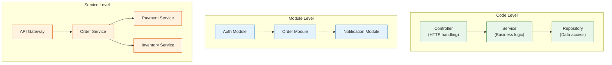

### Real-World Example

**Before (SoC Violation):**

```python
# BEFORE: HTTP handling, business logic, and database access all mixed together
@app.route("/api/orders", methods=["POST"])
def create_order():
    # HTTP concern: parsing request
    data = request.get_json()
    if not data.get("items"):
        return jsonify({"error": "items required"}), 400

    # Business logic concern: validation
    user = db.session.query(User).get(data["user_id"])
    if not user.is_verified:
        return jsonify({"error": "user not verified"}), 403

    # Database concern: direct SQL
    total = 0
    for item in data["items"]:
        product = db.session.query(Product).get(item["product_id"])
        if product.stock < item["quantity"]:
            return jsonify({"error": f"{product.name} out of stock"}), 409
        total += product.price * item["quantity"]

    # Business logic: discount calculation mixed with DB access
    if total > 100:
        total *= 0.9  # 10% discount for orders over $100

    # Database concern: creating records
    order = Order(user_id=data["user_id"], total=total, status="pending")
    db.session.add(order)
    db.session.commit()

    # Side effect concern: sending email
    send_email(user.email, "Order confirmed", f"Order #{order.id}")

    # HTTP concern: formatting response
    return jsonify({"order_id": order.id, "total": total}), 201
```

**After (SoC Applied):**

```python
# AFTER: Each concern is in its own layer

# --- Controller (HTTP concern) ---
@app.route("/api/orders", methods=["POST"])
def create_order_endpoint():
    data = request.get_json()
    try:
        result = order_service.create_order(
            user_id=data["user_id"],
            items=data["items"]
        )
        return jsonify(result.to_dict()), 201
    except ValidationError as e:
        return jsonify({"error": str(e)}), 400
    except InsufficientStockError as e:
        return jsonify({"error": str(e)}), 409


# --- Service (Business logic concern) ---
class OrderService:
    def __init__(self, user_repo, product_repo, order_repo, notifier):
        self.user_repo = user_repo
        self.product_repo = product_repo
        self.order_repo = order_repo
        self.notifier = notifier

    def create_order(self, user_id, items):
        user = self.user_repo.get(user_id)
        if not user.is_verified:
            raise ValidationError("User not verified")

        line_items = self._validate_and_price(items)
        total = self._calculate_total(line_items)

        order = self.order_repo.create(user_id=user_id, total=total)
        self.notifier.order_confirmed(user, order)
        return order

    def _calculate_total(self, line_items):
        subtotal = sum(li.subtotal for li in line_items)
        if subtotal > 100:
            return subtotal * 0.9
        return subtotal


# --- Repository (Data access concern) ---
class OrderRepository:
    def create(self, user_id, total):
        order = Order(user_id=user_id, total=total, status="pending")
        db.session.add(order)
        db.session.commit()
        return order
```

### Trade-offs

| Benefit | Cost |
|---|---|
| Independent evolution of each concern | More files and layers |
| Easier testing (mock one layer at a time) | Indirection can obscure the "happy path" |
| Team autonomy (frontend team, backend team, DBA) | Requires shared interface contracts |

### Interview Insights

- SoC is the first principle to mention when explaining why you separate read and write paths (CQRS), or why you place a cache between the API and the database.

---

## 1.6 Composition Over Inheritance

### Definition

> Favor building complex behavior by combining simple, independent components (composition) over building hierarchies of classes that inherit behavior from parent classes (inheritance).

### Why It Matters in System Design

- Deep inheritance hierarchies create **fragile base class problems**: a change in a parent class ripples unpredictably to all subclasses.
- In microservices, composition is the default. Services are composed (orchestrated, choreographed) rather than inherited.
- Modern frameworks favor composition: React components, Go interfaces (implicit satisfaction), and Rust traits all emphasize composability over hierarchy.

### Real-World Example

**Before (Inheritance-heavy):**

```python
# BEFORE: Deep inheritance hierarchy for notification sending
class BaseNotifier:
    def format_message(self, msg): ...
    def log(self, msg): ...

class EmailNotifier(BaseNotifier):
    def send(self, to, msg): ...

class HtmlEmailNotifier(EmailNotifier):
    def format_message(self, msg):
        return f"<html><body>{msg}</body></html>"

class HtmlEmailWithTrackingNotifier(HtmlEmailNotifier):
    def send(self, to, msg):
        tracking_pixel = self._generate_tracking_pixel()
        html = self.format_message(msg) + tracking_pixel
        super().send(to, html)

class HtmlEmailWithTrackingAndRetryNotifier(HtmlEmailWithTrackingNotifier):
    def send(self, to, msg):
        for attempt in range(3):
            try:
                super().send(to, msg)
                return
            except SendError:
                if attempt == 2:
                    raise
# This 5-level hierarchy is fragile. Changing BaseNotifier.format_message
# affects every subclass in unpredictable ways.
```

**After (Composition):**

```python
# AFTER: Compose behaviors from independent, reusable components

class EmailSender:
    """Sends email. That's it."""
    def send(self, to: str, body: str) -> None: ...

class HtmlFormatter:
    """Formats text as HTML. That's it."""
    def format(self, text: str) -> str:
        return f"<html><body>{text}</body></html>"

class TrackingPixelAdder:
    """Adds a tracking pixel to HTML content."""
    def add_tracking(self, html: str) -> str:
        pixel = ''
        return html.replace("</body>", f"{pixel}</body>")

class RetryWrapper:
    """Retries any callable on failure."""
    def __init__(self, max_retries: int = 3):
        self.max_retries = max_retries

    def execute(self, fn, *args, **kwargs):
        for attempt in range(self.max_retries):
            try:
                return fn(*args, **kwargs)
            except Exception:
                if attempt == self.max_retries - 1:
                    raise


class NotificationPipeline:
    """Composes behaviors. Mix and match as needed."""
    def __init__(self, sender, formatter=None, tracker=None, retrier=None):
        self.sender = sender
        self.formatter = formatter
        self.tracker = tracker
        self.retrier = retrier

    def send(self, to: str, message: str):
        body = message
        if self.formatter:
            body = self.formatter.format(body)
        if self.tracker:
            body = self.tracker.add_tracking(body)

        send_fn = lambda: self.sender.send(to, body)
        if self.retrier:
            self.retrier.execute(send_fn)
        else:
            send_fn()


# Usage: compose the exact pipeline you need
pipeline = NotificationPipeline(
    sender=EmailSender(),
    formatter=HtmlFormatter(),
    tracker=TrackingPixelAdder(),
    retrier=RetryWrapper(max_retries=3)
)
pipeline.send("user@example.com", "Your order has shipped!")
```

### Trade-offs

| Benefit | Cost |
|---|---|
| Flat, understandable structure | Requires explicit wiring |
| Each component independently testable | Slightly more boilerplate |
| Mix-and-match capabilities | Composition root can become complex |

### Interview Insights

- When designing middleware stacks (auth, logging, rate limiting, compression), describe them as composed layers, not an inheritance chain.
- Composition maps directly to **pipeline** and **decorator** patterns — both frequent interview topics.

---

## 1.7 Law of Demeter (LoD) — "Don't Talk to Strangers"

### Definition

> A method should only call methods on:
> 1. Its own object (`self`)
> 2. Objects passed as parameters
> 3. Objects it creates
> 4. Its direct component objects

A method should NOT call methods on objects returned by other method calls (no "train wrecks" like `a.getB().getC().doThing()`).

### Why It Matters in System Design

- LoD violations create **hidden coupling**: the caller knows about the internal structure of objects multiple levels deep.
- In microservices, LoD violations appear as **service chains**: Service A calls Service B, which calls Service C, which calls Service D. If Service D is slow, the entire chain is slow.
- LoD is the code-level principle behind **API gateways** and **facade services** that shield callers from internal service topology.

### Real-World Example

**Before (LoD Violation):**

```python
# BEFORE: Train wreck — caller knows the entire object graph
def get_shipping_address(order):
    street = order.get_customer().get_address().get_street()
    city = order.get_customer().get_address().get_city()
    zip_code = order.get_customer().get_address().get_zip()
    return f"{street}, {city} {zip_code}"

# If Address changes its internal structure (e.g., street becomes
# street_line_1 + street_line_2), this code breaks even though
# it has nothing to do with Address internals.
```

**After (LoD Applied):**

```python
# AFTER: Ask, don't dig
class Order:
    def get_shipping_label(self) -> str:
        """Order delegates to its customer, which delegates to its address.
        The caller doesn't know about Customer or Address internals."""
        return self.customer.get_shipping_label()

class Customer:
    def get_shipping_label(self) -> str:
        return self.address.format_for_shipping()

class Address:
    def format_for_shipping(self) -> str:
        return f"{self.street}, {self.city} {self.zip_code}"


# Caller code is simple and decoupled:
def get_shipping_address(order):
    return order.get_shipping_label()
```

**System-level LoD — API Gateway as facade:**

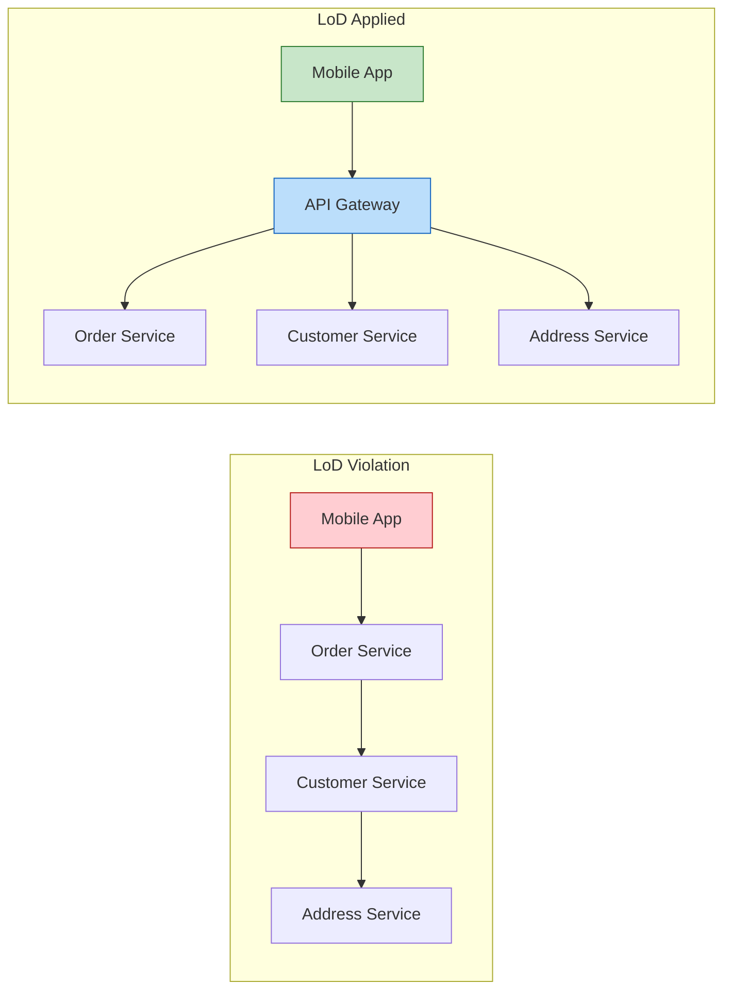

### Trade-offs

| Benefit | Cost |
|---|---|
| Reduced coupling | More delegation methods |
| Easier refactoring of internal structure | Can feel like "unnecessary wrapping" |
| Clearer API boundaries | Requires discipline |

### Interview Insights

- LoD is the principle behind the "API Gateway" discussion. When an interviewer asks why you place a gateway between clients and services, cite LoD: "Clients should not need to know the internal service topology."

---

# SECTION 2: Code-Level Design

This section covers the craft of writing maintainable code — naming, structure, readability metrics, refactoring patterns, and modularity.

---

## 2.1 Clean Code Principles

### Naming

Names are the most pervasive form of documentation. A good name eliminates the need for a comment.

#### Rules for Good Names

| Rule | Bad Example | Good Example |
|---|---|---|
| Use intention-revealing names | `d` (elapsed time in days) | `elapsed_days` |
| Avoid encodings | `strName`, `iCount` | `name`, `count` |
| Use pronounceable names | `genymdhms` | `generation_timestamp` |
| Use searchable names | `7` (magic number) | `MAX_RETRIES = 7` |
| Avoid mental mapping | `r` (URL) | `url` |
| Class names = nouns | `Process`, `DoWork` | `OrderProcessor`, `PaymentGateway` |
| Method names = verbs | `data()`, `result()` | `fetch_data()`, `calculate_result()` |
| One word per concept | `get`/`fetch`/`retrieve` mixed | Pick one: `get_user()`, `get_order()` |
| Avoid noise words | `UserData`, `UserInfo`, `UserObject` | `User` |

#### Naming Conventions for System Design Artifacts

| Artifact | Convention | Example |
|---|---|---|
| REST endpoints | lowercase, hyphens, plural nouns | `/api/v1/order-items` |
| gRPC services | PascalCase | `OrderService`, `PaymentService` |
| Database tables | lowercase, underscores, plural | `order_items`, `user_addresses` |
| Database columns | lowercase, underscores | `created_at`, `user_id`, `is_active` |
| Event names | PascalCase, past tense | `OrderCreated`, `PaymentFailed` |
| Queue names | lowercase, dots or hyphens | `order.created`, `payment-failed` |
| Environment variables | UPPER_SNAKE_CASE | `DATABASE_URL`, `MAX_RETRY_COUNT` |
| Feature flags | lowercase, dots | `checkout.express_enabled` |
| Metrics | lowercase, dots, type suffix | `order.created.count`, `api.latency.p99` |

### Functions

#### Rules for Good Functions

1. **Small.** A function should fit on one screen (roughly 20-30 lines). If it is longer, it probably does too much.

2. **Do one thing.** A function that validates input, processes data, and sends a notification does three things.

3. **One level of abstraction.** A function should not mix high-level operations (create order, charge payment) with low-level details (SQL queries, HTTP headers).

4. **Descriptive names.** A long, descriptive name is better than a short, cryptic one. `calculate_monthly_subscription_cost()` is better than `calc()`.

5. **Few arguments.** Zero arguments (niladic) is best. One (monadic) is good. Two (dyadic) is acceptable. Three (triadic) should be avoided. More than three should be wrapped in an object.

```python
# BAD: Too many arguments
def create_user(first_name, last_name, email, phone, address_line_1,
                address_line_2, city, state, zip_code, country):
    ...

# GOOD: Wrap related arguments in an object
@dataclass
class CreateUserRequest:
    name: Name
    email: str
    phone: str
    address: Address

def create_user(request: CreateUserRequest):
    ...
```

6. **No side effects.** A function named `check_password()` should not also initialize the session. If it does, rename it `check_password_and_initialize_session()` (or better, split it into two functions).

7. **Command-Query Separation.** A function should either change state (command) or return information (query), never both.

```python
# BAD: Command and query mixed
def set_name(self, name: str) -> bool:
    """Sets the name AND returns whether it changed."""
    if self.name != name:
        self.name = name
        return True
    return False

# GOOD: Separate command and query
def set_name(self, name: str) -> None:
    self.name = name

def has_name_changed(self, new_name: str) -> bool:
    return self.name != new_name
```

### Comments

#### When Comments Are Necessary

- **Legal comments:** License headers, copyright notices.
- **Informative comments:** Regex explanations, algorithm citations.
- **Explanation of intent:** Why a non-obvious design decision was made.
- **Warning of consequences:** "This test takes 30 minutes to run."
- **TODO comments:** Technical debt markers (should be tracked in issue tracker too).

#### When Comments Are Code Smells

- **Redundant comments:** `i += 1  # increment i` — adds nothing.
- **Mandated comments:** Javadoc on every getter/setter — noise.
- **Journal comments:** Change logs in source files — use version control.
- **Commented-out code:** Delete it; version control has the history.
- **Position markers:** `// -------- PRIVATE METHODS --------` — indicates the class is too large.

### Formatting

- **Vertical density:** Related code should be close together. Do not separate a function's implementation from its callers with hundreds of lines.
- **Horizontal alignment:** Avoid aligning assignments by adding spaces; it draws attention to alignment, not content.
- **Team consistency:** The specific style matters less than the entire team using the same style. Use automated formatters (Prettier, Black, gofmt).

---

## 2.2 Code Readability

### Cognitive Complexity

Cognitive complexity measures how hard code is for a human to understand. Unlike cyclomatic complexity (which counts execution paths), cognitive complexity penalizes nesting and non-linear flow.

```python
# Cognitive Complexity: 1 (simple)
def is_eligible(user):
    return user.age >= 18 and user.is_verified

# Cognitive Complexity: 7 (hard to read)
def is_eligible(user):
    if user.age >= 18:                    # +1
        if user.is_verified:              # +2 (nesting)
            if not user.is_banned:        # +3 (nesting)
                if user.has_payment:      # +4 (nesting)
                    return True
    return False

# Refactored to reduce cognitive complexity:
def is_eligible(user):
    if user.age < 18:
        return False
    if not user.is_verified:
        return False
    if user.is_banned:
        return False
    if not user.has_payment:
        return False
    return True
```

The third version uses **guard clauses** (early returns) to eliminate nesting. Each condition is independent and reads linearly.

### Cyclomatic Complexity

Cyclomatic complexity counts the number of linearly independent paths through a function. It equals the number of decision points (if, else, for, while, case) plus one.

| Complexity | Risk | Action |
|---|---|---|
| 1-5 | Low | Simple, well-structured |
| 6-10 | Moderate | Consider refactoring |
| 11-20 | High | Refactor — too many paths |
| 21+ | Very high | Untestable — must refactor |

### Guidelines for Readable Code

1. **Prefer explicit over implicit.** `timeout_seconds=30` is better than `timeout=30`.
2. **Use guard clauses.** Return early for error cases; the "happy path" flows straight down.
3. **Avoid boolean parameters.** `render(document, as_pdf=True)` is less readable than `render_as_pdf(document)`.
4. **Avoid deep nesting.** More than 3 levels of nesting is a readability red flag.
5. **Use domain language.** If the business calls it a "fulfillment," do not call it a "completion" in code.

---

## 2.3 Naming Conventions

### API Naming

```
# REST — resource-oriented, plural nouns
GET    /api/v1/orders              # List orders
POST   /api/v1/orders              # Create order
GET    /api/v1/orders/{id}         # Get order
PUT    /api/v1/orders/{id}         # Update order (full)
PATCH  /api/v1/orders/{id}         # Update order (partial)
DELETE /api/v1/orders/{id}         # Delete order

# Nested resources
GET    /api/v1/orders/{id}/items   # List order items
POST   /api/v1/orders/{id}/items   # Add item to order

# Actions (when CRUD doesn't fit)
POST   /api/v1/orders/{id}/cancel  # Cancel order
POST   /api/v1/orders/{id}/refund  # Refund order

# Query parameters for filtering, pagination, sorting
GET    /api/v1/orders?status=pending&sort=-created_at&page=2&per_page=20
```

### Database Naming

```sql
-- Tables: plural, snake_case
CREATE TABLE order_items (
    id              BIGSERIAL PRIMARY KEY,
    order_id        BIGINT NOT NULL REFERENCES orders(id),
    product_id      BIGINT NOT NULL REFERENCES products(id),
    quantity        INT NOT NULL CHECK (quantity > 0),
    unit_price_cents BIGINT NOT NULL,
    created_at      TIMESTAMPTZ NOT NULL DEFAULT NOW(),
    updated_at      TIMESTAMPTZ NOT NULL DEFAULT NOW()
);

-- Indexes: table_column(s)_idx
CREATE INDEX order_items_order_id_idx ON order_items(order_id);

-- Foreign keys: fk_child_parent
ALTER TABLE order_items
    ADD CONSTRAINT fk_order_items_orders
    FOREIGN KEY (order_id) REFERENCES orders(id);

-- Boolean columns: is_ or has_ prefix
ALTER TABLE users ADD COLUMN is_verified BOOLEAN DEFAULT FALSE;
ALTER TABLE users ADD COLUMN has_payment_method BOOLEAN DEFAULT FALSE;
```

### Service and Event Naming

```
# Service names: <domain>-service
order-service
payment-service
inventory-service
notification-service

# Event names: <Entity><PastTenseVerb>
OrderCreated
OrderCancelled
PaymentAuthorized
PaymentCaptured
PaymentFailed
InventoryReserved
InventoryReleased
ShipmentDispatched
ShipmentDelivered
```

---

## 2.4 Refactoring Patterns

### Extract Method

When a function is too long or does too many things, extract a portion into a named method.

```python
# BEFORE: Long method
def process_order(order):
    # Validate
    if not order.items:
        raise ValueError("No items")
    for item in order.items:
        if item.quantity <= 0:
            raise ValueError(f"Invalid quantity for {item.sku}")
        product = catalog.get(item.sku)
        if not product:
            raise ValueError(f"Unknown SKU: {item.sku}")
        if product.stock < item.quantity:
            raise ValueError(f"Insufficient stock for {item.sku}")

    # Calculate total
    subtotal = 0
    for item in order.items:
        product = catalog.get(item.sku)
        line_total = product.price * item.quantity
        subtotal += line_total
    tax = subtotal * 0.08
    total = subtotal + tax

    # Save
    order.total = total
    order.status = "confirmed"
    db.save(order)
    return order


# AFTER: Extracted methods
def process_order(order):
    validate_order(order)
    order.total = calculate_total(order)
    order.status = "confirmed"
    db.save(order)
    return order

def validate_order(order):
    if not order.items:
        raise ValueError("No items")
    for item in order.items:
        validate_item(item)

def validate_item(item):
    if item.quantity <= 0:
        raise ValueError(f"Invalid quantity for {item.sku}")
    product = catalog.get(item.sku)
    if not product:
        raise ValueError(f"Unknown SKU: {item.sku}")
    if product.stock < item.quantity:
        raise ValueError(f"Insufficient stock for {item.sku}")

def calculate_total(order):
    subtotal = sum(
        catalog.get(item.sku).price * item.quantity
        for item in order.items
    )
    tax = subtotal * 0.08
    return subtotal + tax
```

### Replace Conditional with Polymorphism

When a function has a long if/elif/else or switch/case chain that selects behavior based on a type, replace it with polymorphism.

```python
# BEFORE: Conditional logic
def calculate_shipping(order):
    if order.shipping_method == "standard":
        return 5.99
    elif order.shipping_method == "express":
        return 15.99
    elif order.shipping_method == "overnight":
        return 29.99
    elif order.shipping_method == "freight":
        weight = sum(item.weight for item in order.items)
        return weight * 0.50 + 20.00

# AFTER: Polymorphism
class ShippingCalculator(ABC):
    @abstractmethod
    def calculate(self, order) -> float:
        pass

class StandardShipping(ShippingCalculator):
    def calculate(self, order) -> float:
        return 5.99

class ExpressShipping(ShippingCalculator):
    def calculate(self, order) -> float:
        return 15.99

class OvernightShipping(ShippingCalculator):
    def calculate(self, order) -> float:
        return 29.99

class FreightShipping(ShippingCalculator):
    def calculate(self, order) -> float:
        weight = sum(item.weight for item in order.items)
        return weight * 0.50 + 20.00

SHIPPING_CALCULATORS = {
    "standard": StandardShipping(),
    "express": ExpressShipping(),
    "overnight": OvernightShipping(),
    "freight": FreightShipping(),
}

def calculate_shipping(order):
    calculator = SHIPPING_CALCULATORS[order.shipping_method]
    return calculator.calculate(order)
```

### Introduce Parameter Object

When a function takes many related parameters, group them into a data class.

```python
# BEFORE: Many related parameters
def search_products(query, category, min_price, max_price, brand,
                    sort_by, sort_order, page, per_page, include_out_of_stock):
    ...

# AFTER: Parameter object
@dataclass
class ProductSearchCriteria:
    query: str
    category: str | None = None
    min_price: float | None = None
    max_price: float | None = None
    brand: str | None = None
    sort_by: str = "relevance"
    sort_order: str = "desc"
    page: int = 1
    per_page: int = 20
    include_out_of_stock: bool = False

def search_products(criteria: ProductSearchCriteria):
    ...
```

### Replace Magic Numbers with Named Constants

```python
# BEFORE: Magic numbers
if retry_count > 3:
    ...
if response.status_code == 429:
    time.sleep(60)

# AFTER: Named constants
MAX_RETRIES = 3
HTTP_TOO_MANY_REQUESTS = 429
RATE_LIMIT_BACKOFF_SECONDS = 60

if retry_count > MAX_RETRIES:
    ...
if response.status_code == HTTP_TOO_MANY_REQUESTS:
    time.sleep(RATE_LIMIT_BACKOFF_SECONDS)
```

---

## 2.5 Modularity

### What Makes a Good Module

A module (package, library, service) should have:

1. **High cohesion:** Everything inside the module is related to a single purpose.
2. **Low coupling:** The module has minimal dependencies on other modules.
3. **Clear interface:** The module exposes a well-defined API and hides its internals.
4. **Independent deployability:** (At the service level) the module can be deployed without coordinating with other modules.

### Cohesion Metrics

| Cohesion Type | Description | Quality |
|---|---|---|
| Functional | Every element contributes to a single, well-defined task | Best |
| Sequential | Output of one element is input to the next | Good |
| Communicational | Elements operate on the same data | Acceptable |
| Temporal | Elements are grouped because they execute at the same time | Weak |
| Logical | Elements are grouped because they are logically similar (all "validators") | Poor |
| Coincidental | Elements have no meaningful relationship | Worst |

### Package Design Principles

**Release-Reuse Equivalency Principle:** The granule of reuse is the granule of release. If you release a library, everything in it should be reusable together.

**Common Closure Principle:** Classes that change together belong together. If a regulatory change requires modifying classes A and B, they should be in the same package.

**Common Reuse Principle:** Classes that are used together belong together. If a client uses class A, it should not be forced to depend on unrelated class B in the same package.

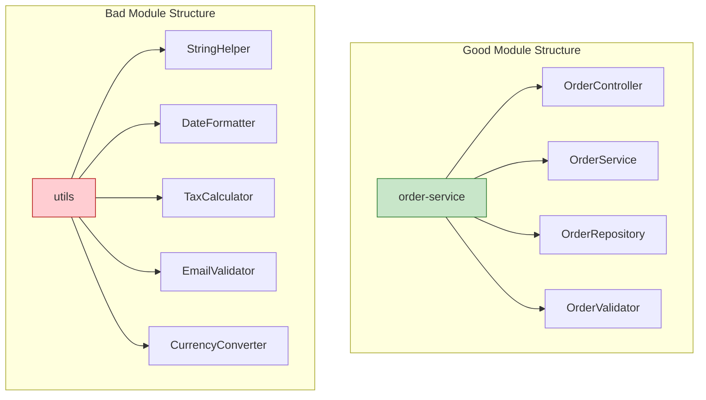

The "utils" package is a classic example of **coincidental cohesion** — unrelated elements grouped because no one knew where else to put them. Every element in it should migrate to a domain-specific module.

---

# SECTION 3: System-Level Principles

This section covers the architectural principles that shape distributed system design. Each principle includes deep explanation, Mermaid diagrams, and real-world examples.

---

## 3.1 Loose Coupling

### Definition

Coupling measures the degree to which one module depends on another. Loose coupling means modules interact through well-defined interfaces with minimal knowledge of each other's internals.

### Types of Coupling (From Tight to Loose)

| Coupling Type | Description | Example | Severity |
|---|---|---|---|
| Content coupling | Module A directly accesses internal data of module B | Service A reads directly from Service B's database | Worst |
| Common coupling | Modules share a global variable or data structure | Two services writing to the same database table | High |
| Control coupling | Module A passes a control flag that dictates B's behavior | `process(data, mode="batch")` | Moderate |
| Stamp coupling | Module A passes a large data structure but B only uses part of it | Passing an entire `User` object when only `user_id` is needed | Moderate |
| Data coupling | Modules share only the data they need through parameters | `get_user_name(user_id)` | Low |
| Message coupling | Modules communicate only through messages (events) | Service A emits `OrderCreated`, Service B subscribes | Best |

### Measuring Coupling

**Afferent coupling (Ca):** The number of modules that depend on this module. High Ca means the module is widely used — changes are risky.

**Efferent coupling (Ce):** The number of modules this module depends on. High Ce means the module depends on many things — it is fragile.

**Instability (I) = Ce / (Ca + Ce):**
- I = 0: Maximally stable (many depend on it, it depends on nothing). Example: a utility library.
- I = 1: Maximally unstable (nothing depends on it, it depends on many). Example: a top-level application.

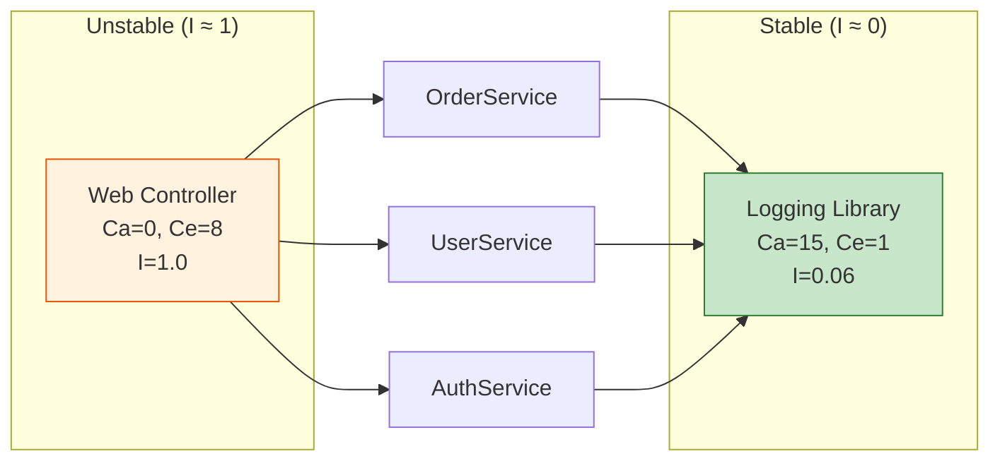

**Stable Abstractions Principle:** A module should be as abstract as it is stable. Stable modules (high Ca) should be abstract (interfaces). Unstable modules (high Ce) should be concrete (implementations).

### Decoupling Strategies

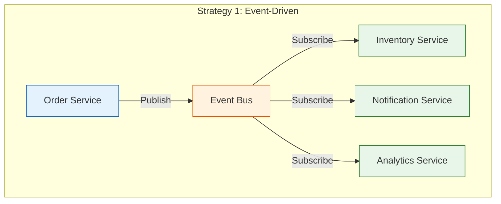

| Strategy | How It Works | Best For |
|---|---|---|
| Event-driven (async) | Publish events; subscribers react | Non-blocking side effects |
| API Gateway / BFF | Gateway aggregates internal calls | Client decoupling |
| Shared-nothing | Each service owns its data store | Data isolation |
| Contract testing | Verify interface compliance without integration | API evolution |
| Interface abstraction | Code to interfaces, not implementations | Infrastructure swaps |
| Message queues | Buffer between producer and consumer | Load leveling, resilience |

### Real-World Example: Database Per Service

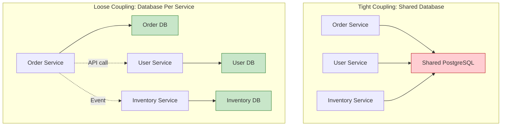

**Trade-off:** Database-per-service eliminates shared database coupling but introduces **distributed data consistency** challenges. Cross-service queries require API calls or eventual consistency via events. This is the foundational trade-off of microservice architecture.

### Interview Insights

- When asked about microservice communication, describe the coupling spectrum: synchronous HTTP calls (tighter) vs. asynchronous events (looser).
- A strong answer: "I would use synchronous calls for the critical path (order creation needs real-time inventory check) and asynchronous events for non-critical side effects (analytics, notifications)."

---

## 3.2 High Cohesion

### Definition

Cohesion measures how strongly related the elements within a module are. High cohesion means every element in the module contributes to a single, well-defined purpose.

### Types of Cohesion (Ranked Best to Worst)

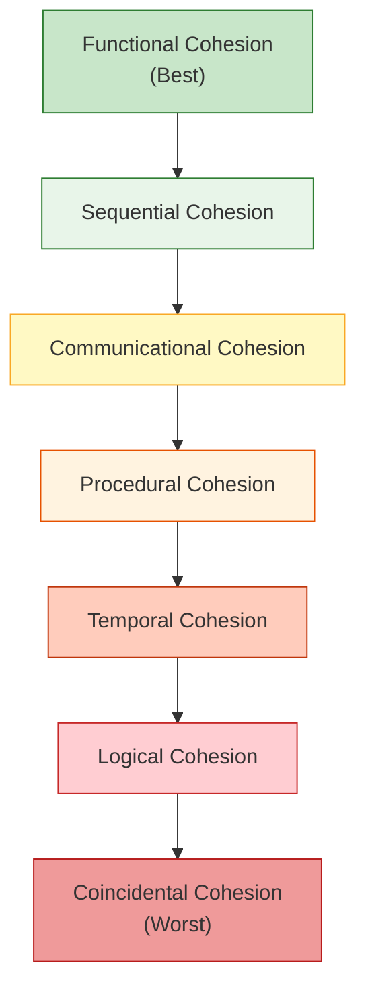

| Type | Description | Example |
|---|---|---|
| **Functional** | All elements contribute to a single task | `PaymentProcessor`: authorize, capture, refund |
| **Sequential** | Output of one element feeds into the next | Pipeline: parse → validate → transform → store |
| **Communicational** | Elements operate on the same data | `UserProfile`: get_name, get_email, get_avatar (all from user record) |
| **Procedural** | Elements are related by execution order | `Startup`: init_db, init_cache, init_logging |
| **Temporal** | Elements execute at the same time | `Cleanup`: delete_temp_files, clear_cache, rotate_logs |
| **Logical** | Elements do similar things but are unrelated | `Utils`: format_date, validate_email, compress_image |
| **Coincidental** | No meaningful relationship | `Helpers`: random_string, parse_csv, send_slack_message |

### Measuring Cohesion: LCOM (Lack of Cohesion of Methods)

LCOM counts method pairs that do NOT share instance variables minus pairs that DO share instance variables.

- **LCOM = 0:** Perfect cohesion — all methods use the same fields.
- **LCOM > 0:** Some methods use disjoint sets of fields — consider splitting the class.

```python
# LCOM = 0 (high cohesion) — all methods use self.items
class ShoppingCart:
    def __init__(self):
        self.items = []

    def add_item(self, item):
        self.items.append(item)

    def remove_item(self, item_id):
        self.items = [i for i in self.items if i.id != item_id]

    def total(self):
        return sum(i.price * i.quantity for i in self.items)

    def item_count(self):
        return sum(i.quantity for i in self.items)


# LCOM > 0 (low cohesion) — two disjoint groups of methods
class UserManager:
    def __init__(self):
        self.db = Database()
        self.email_client = EmailClient()  # Different concern!

    # Group 1: Uses self.db
    def create_user(self, name, email): ...
    def get_user(self, user_id): ...
    def delete_user(self, user_id): ...

    # Group 2: Uses self.email_client (should be a separate class)
    def send_welcome_email(self, user): ...
    def send_password_reset(self, user): ...
    def send_newsletter(self, users): ...
```

### Interview Insights

- When designing services, explain: "I group these operations together because they have functional cohesion — they all operate on the order lifecycle."
- When splitting a monolith, identify groups of methods that share data (communicational cohesion) as candidates for separate services.

---

## 3.3 Idempotency

### Definition

An operation is **idempotent** if performing it multiple times produces the same result as performing it once. Mathematically: f(f(x)) = f(x).

### Why It Matters in System Design

- Networks are unreliable. Clients retry. Messages are delivered more than once. Without idempotency, retries cause duplicate orders, double charges, and data corruption.
- Idempotency is a **fundamental requirement** for any system that involves retries, at-least-once delivery, or crash recovery.

### Idempotency in Different Contexts

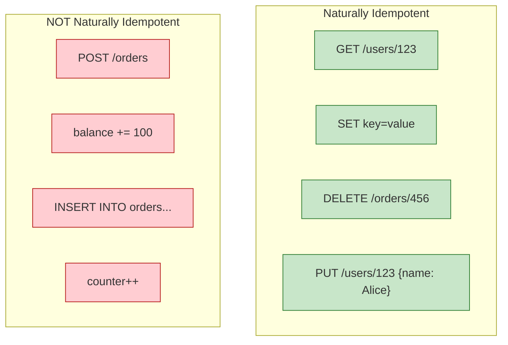

### Making Non-Idempotent Operations Idempotent

#### Strategy 1: Idempotency Keys

The client generates a unique key for each logical operation. The server uses this key to detect duplicates.

```python
# Client sends:
# POST /api/v1/payments
# Idempotency-Key: 550e8400-e29b-41d4-a716-446655440000
# Body: {"order_id": 123, "amount_cents": 5000}

class PaymentService:
    def create_payment(self, idempotency_key: str, order_id: int, amount_cents: int):
        # Check if we already processed this key
        existing = self.idempotency_store.get(idempotency_key)
        if existing:
            return existing  # Return the same response as the first call

        # Process the payment
        result = self.gateway.charge(amount_cents)

        # Store the result keyed by idempotency key
        self.idempotency_store.save(
            key=idempotency_key,
            result=result,
            ttl=timedelta(hours=24)  # Keys expire after 24 hours
        )
        return result
```

#### Strategy 2: Natural Idempotency via Upserts

```sql
-- Non-idempotent:
INSERT INTO order_items (order_id, product_id, quantity)
VALUES (123, 456, 2);
-- Running this twice creates two rows!

-- Idempotent via upsert:
INSERT INTO order_items (order_id, product_id, quantity)
VALUES (123, 456, 2)
ON CONFLICT (order_id, product_id)
DO UPDATE SET quantity = EXCLUDED.quantity;
-- Running this twice produces the same result.
```

#### Strategy 3: Conditional Updates

```sql
-- Non-idempotent:
UPDATE accounts SET balance = balance + 100 WHERE id = 1;
-- Running this twice adds 200!

-- Idempotent via conditional update:
UPDATE accounts
SET balance = balance + 100,
    last_deposit_id = 'dep_abc123'
WHERE id = 1
  AND last_deposit_id != 'dep_abc123';
-- Running this twice adds only 100 because the second attempt
-- matches zero rows.
```

#### Strategy 4: Event Deduplication in Message Processing

```python
class OrderEventProcessor:
    def __init__(self, processed_events_store):
        self.processed_events_store = processed_events_store

    def handle_event(self, event):
        # Check if already processed
        if self.processed_events_store.contains(event.id):
            logger.info(f"Skipping duplicate event: {event.id}")
            return

        # Process the event
        self._process(event)

        # Mark as processed (within same transaction if possible)
        self.processed_events_store.add(event.id, ttl=timedelta(days=7))
```

### Idempotency in Distributed Systems

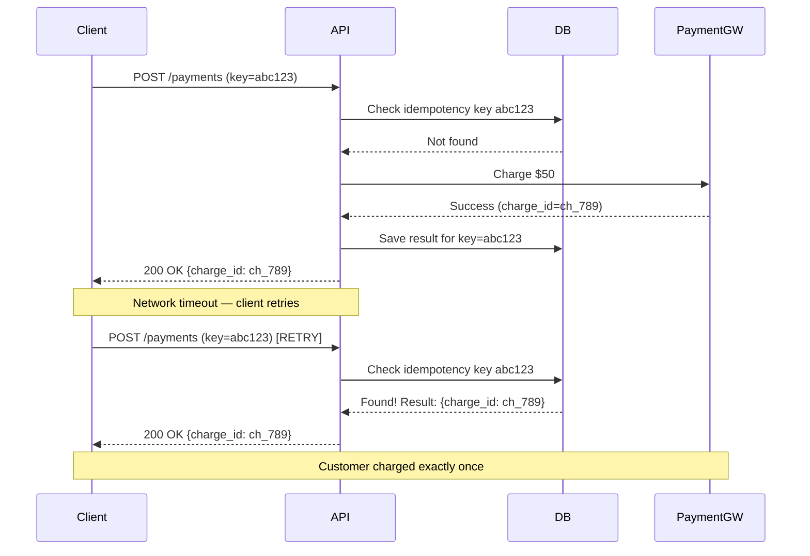

### Trade-offs

| Benefit | Cost |
|---|---|
| Safe retries | Requires storage for idempotency keys |
| At-least-once delivery becomes safe | Key expiration policy must be designed |
| Crash recovery without side effects | Adds latency (key lookup on every request) |

### Common Mistakes

1. **Using server-generated IDs as idempotency keys.** The key must be generated by the caller, not the server.
2. **Forgetting to make the idempotency check and the operation atomic.** A race condition between check and insert can allow duplicates.
3. **Not handling partial failures.** If the payment succeeds but the idempotency key save fails, the retry will charge again.

### Interview Insights

- Idempotency is expected in every payment, order, or message processing design. Always mention it proactively.
- Strong answer: "Every mutating API endpoint will accept an idempotency key. The server stores the key and result atomically, so retries return the same response without re-executing the operation."

---

## 3.4 Statelessness

### Definition

A **stateless service** does not store client session state between requests. Every request contains all the information needed to process it. Server-side state (database records, cache entries) is externalized to shared stores.

### Why It Matters in System Design

- Stateless services can be horizontally scaled by adding more instances behind a load balancer. Any instance can handle any request.
- Stateless services can be freely restarted, replaced, or autoscaled without worrying about losing in-memory state.
- Stateless design is a prerequisite for container orchestration (Kubernetes), serverless (Lambda), and blue-green deployments.

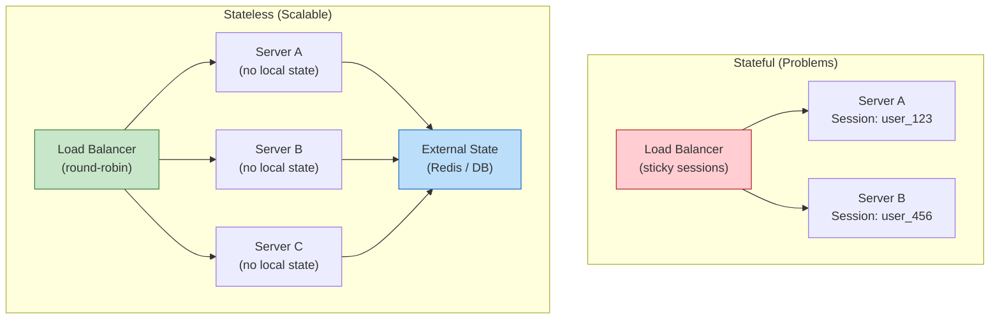

### Externalizing State

| State Type | Stateful Approach | Stateless Approach |
|---|---|---|
| User session | In-memory on server | JWT token or Redis session store |
| Shopping cart | Server-side HashMap | Redis or DynamoDB with user_id key |
| File upload progress | Server memory | S3 multipart upload with client-tracked ETag |
| WebSocket connections | In-memory connection map | Connection registry in Redis |
| Rate limit counters | In-memory counter | Redis INCR with TTL |

### Session Management Strategies

```python
# Strategy 1: JWT (fully stateless — no server-side session storage)
# Pros: No session store needed, scales infinitely
# Cons: Cannot revoke individual tokens without a blocklist

import jwt

def create_token(user_id: int, roles: list[str]) -> str:
    payload = {
        "sub": user_id,
        "roles": roles,
        "exp": datetime.utcnow() + timedelta(hours=1),
        "iat": datetime.utcnow(),
    }
    return jwt.encode(payload, SECRET_KEY, algorithm="HS256")

def authenticate(request):
    token = request.headers.get("Authorization", "").replace("Bearer ", "")
    payload = jwt.decode(token, SECRET_KEY, algorithms=["HS256"])
    return payload["sub"], payload["roles"]


# Strategy 2: Token + Redis session (hybrid)
# Pros: Can revoke sessions, can store mutable session data
# Cons: Redis becomes a dependency

def create_session(user_id: int) -> str:
    session_id = str(uuid.uuid4())
    redis.setex(
        f"session:{session_id}",
        timedelta(hours=1),
        json.dumps({"user_id": user_id, "created_at": time.time()})
    )
    return session_id

def authenticate(request):
    session_id = request.cookies.get("session_id")
    session_data = redis.get(f"session:{session_id}")
    if not session_data:
        raise AuthenticationError("Invalid session")
    return json.loads(session_data)
```

### Trade-offs

| Benefit | Cost |
|---|---|
| Horizontal scalability | External state store becomes a dependency |
| Simple deployment and restart | Network latency for every state access |
| Cloud-native compatibility | State store must be highly available |

### Interview Insights

- When asked how to scale a service, the first answer is: "Make it stateless, externalize session state to Redis, and scale horizontally behind a load balancer."
- Follow up with: "The trade-off is that Redis becomes a critical dependency, so I would use Redis Cluster with replication for high availability."

---

## 3.5 Fault Isolation

### Definition

Fault isolation ensures that a failure in one component does not cascade to bring down the entire system. The "blast radius" of any failure should be contained.

### Why It Matters in System Design

- In distributed systems, failures are not exceptional — they are the norm. Networks partition, services crash, databases become unavailable.
- Without fault isolation, a slow database query in the recommendation service can exhaust the thread pool of the order service, causing checkout to fail.
- Fault isolation is the difference between "the recommendation widget is blank" and "the entire website is down."

### Strategies for Fault Isolation

#### Bulkhead Pattern

Named after ship compartments that prevent flooding from sinking the entire vessel.

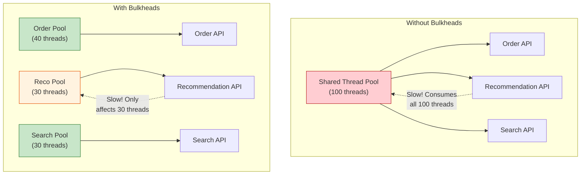

#### Circuit Breaker Pattern

```python
import time

class CircuitBreaker:
    """Prevents cascading failures by short-circuiting calls
    to a failing service."""

    CLOSED = "closed"      # Normal operation
    OPEN = "open"          # Failing — reject calls immediately
    HALF_OPEN = "half_open" # Testing — allow one call through

    def __init__(self, failure_threshold=5, recovery_timeout=30):
        self.failure_threshold = failure_threshold
        self.recovery_timeout = recovery_timeout
        self.state = self.CLOSED
        self.failure_count = 0
        self.last_failure_time = None

    def call(self, fn, *args, **kwargs):
        if self.state == self.OPEN:
            if time.time() - self.last_failure_time > self.recovery_timeout:
                self.state = self.HALF_OPEN
            else:
                raise CircuitOpenError("Circuit is open — call rejected")

        try:
            result = fn(*args, **kwargs)
            self._on_success()
            return result
        except Exception as e:
            self._on_failure()
            raise

    def _on_success(self):
        self.failure_count = 0
        self.state = self.CLOSED

    def _on_failure(self):
        self.failure_count += 1
        self.last_failure_time = time.time()
        if self.failure_count >= self.failure_threshold:
            self.state = self.OPEN


# Usage:
recommendation_breaker = CircuitBreaker(failure_threshold=5, recovery_timeout=30)

def get_recommendations(user_id):
    try:
        return recommendation_breaker.call(recommendation_service.get, user_id)
    except CircuitOpenError:
        return []  # Graceful degradation: show empty recommendations
```

#### Failure Domains

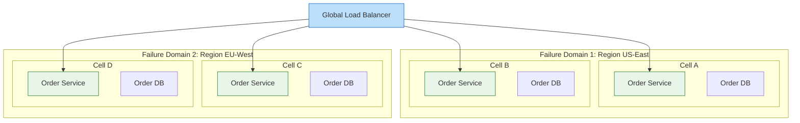

**Cell-based architecture** divides the system into independent cells, each serving a subset of users. A failure in Cell A affects only 25% of users, not all of them.

#### Blast Radius Containment

| Strategy | Blast Radius |
|---|---|
| Monolith | Everything |
| Microservices (shared DB) | All services using the shared DB |
| Microservices (DB per service) | Single service |
| Cell-based | Single cell (fraction of users) |
| Multi-region active-active | Single region |

### Real-World Patterns

**Timeout + Retry + Circuit Breaker + Fallback:**

```python
def get_product_details(product_id):
    """Layered fault isolation for product detail page."""

    # Layer 1: Cache (fastest, most resilient)
    cached = cache.get(f"product:{product_id}")
    if cached:
        return cached

    # Layer 2: Primary service with circuit breaker
    try:
        result = product_breaker.call(
            lambda: product_service.get(product_id, timeout=2.0)
        )
        cache.set(f"product:{product_id}", result, ttl=300)
        return result
    except (CircuitOpenError, TimeoutError):
        pass

    # Layer 3: Stale cache (better than nothing)
    stale = cache.get_stale(f"product:{product_id}")
    if stale:
        return stale

    # Layer 4: Static fallback
    return ProductFallback(id=product_id, name="Product Unavailable")
```

### Trade-offs

| Benefit | Cost |
|---|---|
| Failures are contained | More complex architecture |
| Graceful degradation | Requires defining fallback behavior for every dependency |
| Higher overall availability | Resource overhead (separate pools, redundant instances) |

### Interview Insights

- Always mention fault isolation when designing systems with multiple dependencies: "The product detail page depends on the catalog, pricing, inventory, and review services. I would use circuit breakers on each dependency so that a review service outage does not prevent users from viewing products."
- The phrase "blast radius" signals senior thinking.

---

## 3.6 Backward Compatibility

### Definition

A system maintains backward compatibility when newer versions continue to work correctly with clients, data, and protocols designed for older versions.

### Why It Matters in System Design

- In distributed systems, you cannot deploy all services simultaneously. During a rolling deployment, old and new versions coexist. Without backward compatibility, the deployment itself causes failures.
- APIs have external consumers (mobile apps, partner integrations) that cannot be force-upgraded.
- Database schemas evolve over years. A migration that breaks existing queries causes downtime.

### API Versioning Strategies

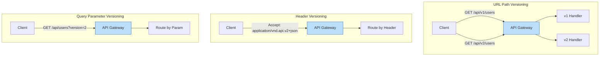

| Strategy | Pros | Cons |
|---|---|---|
| URL path (`/v1/`, `/v2/`) | Explicit, easy to route | URL pollution, hard to deprecate |
| Header (`Accept: vnd.api.v2`) | Clean URLs | Hidden versioning, harder to test |
| Query parameter (`?version=2`) | Easy to add | Easy to forget, caching issues |
| Content negotiation | Standards-based | Complex implementation |

### Schema Evolution Rules

**Safe (backward-compatible) changes:**
- Add a new optional field (with a default value)
- Add a new endpoint
- Add a new event type
- Add a new enum value (if consumers handle unknown values)

**Unsafe (breaking) changes:**
- Remove or rename a field
- Change a field's type
- Change the meaning of a field
- Remove an endpoint
- Change an endpoint's URL
- Make an optional field required

### Database Schema Evolution

```sql
-- SAFE: Add a new nullable column (no existing queries break)
ALTER TABLE users ADD COLUMN avatar_url TEXT;

-- SAFE: Add a new column with a default (existing inserts still work)
ALTER TABLE users ADD COLUMN is_premium BOOLEAN DEFAULT FALSE;

-- UNSAFE: Rename a column (all queries using old name break)
-- DON'T: ALTER TABLE users RENAME COLUMN name TO full_name;

-- SAFE migration pattern for column rename:
-- Step 1: Add new column
ALTER TABLE users ADD COLUMN full_name TEXT;
-- Step 2: Backfill data
UPDATE users SET full_name = name WHERE full_name IS NULL;
-- Step 3: Update application to write to BOTH columns
-- Step 4: Update application to read from new column
-- Step 5: (Much later) Drop old column after all consumers migrate
ALTER TABLE users DROP COLUMN name;
```

### Protocol Buffers and Schema Evolution

Protocol Buffers (protobuf) have built-in backward compatibility rules:

```protobuf
// Version 1
message User {
    int64 id = 1;
    string name = 2;
    string email = 3;
}

// Version 2 — backward compatible
message User {
    int64 id = 1;
    string name = 2;
    string email = 3;
    string avatar_url = 4;       // NEW: old clients ignore unknown fields
    repeated string roles = 5;   // NEW: old clients ignore this too
    // Field 6 was removed (reserved to prevent reuse)
    reserved 6;
    reserved "phone_number";     // Prevents accidental reuse of field name
}
```

**Protobuf compatibility rules:**
- Never change the field number of an existing field.
- Never reuse a field number (use `reserved`).
- New fields must be optional or have default values.
- Renaming fields is safe (protobuf uses numbers, not names, on the wire).

### The Expand-Contract Pattern

For large-scale migrations, use the expand-contract (also called parallel change) pattern:

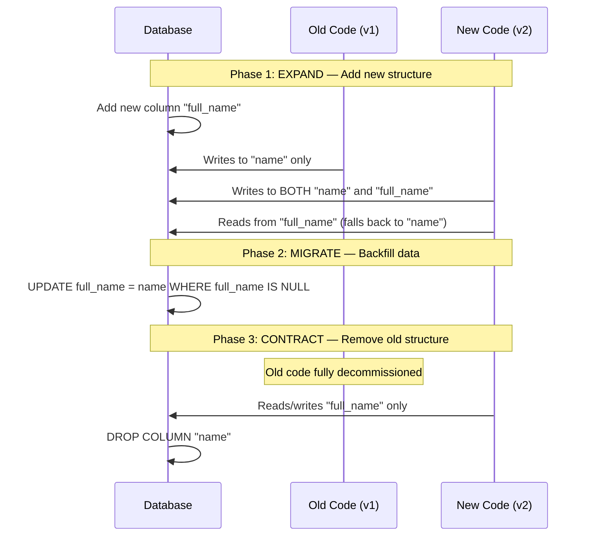

### Trade-offs

| Benefit | Cost |
|---|---|
| Zero-downtime deployments | Slower schema evolution |
| External consumers not broken | Must maintain multiple versions |
| Safe rolling updates | Code complexity for dual-write periods |

### Interview Insights

- When asked about API evolution, describe versioning strategy and backward compatibility rules.
- When designing database changes, always mention the expand-contract pattern for zero-downtime migrations.

---

## 3.7 Extensibility

### Definition

Extensibility is the ability of a system to accommodate new functionality with minimal changes to existing code and infrastructure.

### Why It Matters in System Design

- Business requirements change constantly. A system that is easy to extend delivers value faster.
- Extensibility reduces the cost of future features. In a well-designed system, adding a new payment method should take days, not months.
- Extensibility is the long-term payoff of applying OCP, DIP, and loose coupling.

### Plugin Architectures

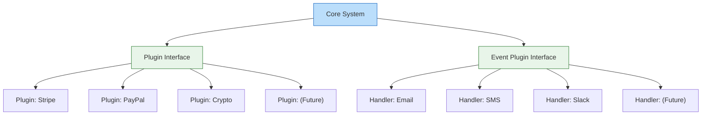

### Extension Points

An extension point is a well-defined place in the system where new behavior can be plugged in without modifying the core.

```python
# Extension point via registry pattern

class WebhookRegistry:
    """Core system provides the registry. Extensions register themselves."""
    def __init__(self):
        self._handlers: dict[str, list[callable]] = {}

    def register(self, event_type: str, handler: callable):
        self._handlers.setdefault(event_type, []).append(handler)

    def emit(self, event_type: str, payload: dict):
        for handler in self._handlers.get(event_type, []):
            try:
                handler(payload)
            except Exception as e:
                logger.error(f"Handler {handler.__name__} failed: {e}")


# Core system creates the registry
webhook_registry = WebhookRegistry()

# Extensions register themselves (no core code changes needed)
def on_order_created(payload):
    slack.post(f"New order #{payload['order_id']}")

def on_order_created_analytics(payload):
    analytics.track("order_created", payload)

webhook_registry.register("order.created", on_order_created)
webhook_registry.register("order.created", on_order_created_analytics)


# Core system emits events at extension points
class OrderService:
    def create_order(self, data):
        order = self._save_order(data)
        webhook_registry.emit("order.created", {"order_id": order.id})
        return order
```

### Open-Closed in Practice: Middleware Stacks

```python
# Extensible middleware pipeline — new middleware is added
# without modifying the pipeline runner

class MiddlewarePipeline:
    def __init__(self):
        self.middlewares = []

    def use(self, middleware):
        """Add middleware to the pipeline."""
        self.middlewares.append(middleware)
        return self

    def execute(self, request):
        """Execute the pipeline."""
        handler = self._build_chain()
        return handler(request)

    def _build_chain(self):
        def terminal(request):
            return {"status": 404, "body": "Not Found"}

        handler = terminal
        for middleware in reversed(self.middlewares):
            next_handler = handler
            handler = lambda req, mw=middleware, nh=next_handler: mw(req, nh)
        return handler


# Middlewares are independent, composable functions:
def auth_middleware(request, next_handler):
    if not request.get("auth_token"):
        return {"status": 401, "body": "Unauthorized"}
    request["user"] = validate_token(request["auth_token"])
    return next_handler(request)

def logging_middleware(request, next_handler):
    start = time.time()
    response = next_handler(request)
    duration = time.time() - start
    logger.info(f"{request['method']} {request['path']} -> {response['status']} ({duration:.3f}s)")
    return response

def rate_limit_middleware(request, next_handler):
    if rate_limiter.is_limited(request["client_ip"]):
        return {"status": 429, "body": "Rate limited"}
    return next_handler(request)


# Compose the pipeline:
pipeline = MiddlewarePipeline()
pipeline.use(logging_middleware)
pipeline.use(rate_limit_middleware)
pipeline.use(auth_middleware)
# Adding new middleware requires ZERO changes to existing code
```

### Extensibility Anti-Patterns

| Anti-Pattern | Description | Fix |
|---|---|---|
| God class | One class that handles everything | Split along SRP boundaries |
| Hardcoded dependencies | `if provider == "stripe"` scattered everywhere | Plugin interface + registry |
| Configuration sprawl | Hundreds of config flags controlling behavior | Feature modules instead of flags |
| Monolithic deployment | All features in one deployable unit | Modular monolith or microservices |

### Trade-offs

| Benefit | Cost |
|---|---|
| Fast feature delivery | Upfront design investment |
| Third-party integrations | Plugin API must be well-designed |
| Reduced regression risk | Plugin isolation and security |

### Interview Insights

- When asked "How would you add support for a new X?" the answer should involve extension points, not modification of existing code.
- Describe the registry pattern: "Payment methods are registered in a plugin registry. Adding Apple Pay means creating a new class that implements the PaymentHandler interface and registering it. No existing code changes."

---

# Architecture Decision Records (ADRs)

ADRs document the reasoning behind significant architectural decisions. They serve as organizational memory — when a new engineer asks "Why do we use event sourcing for orders?" the ADR provides the answer.

### ADR Template

```markdown
# ADR-001: Use Event-Driven Architecture for Post-Order Processing

## Status
Accepted

## Context
After an order is created, multiple downstream systems must react:
inventory, notifications, analytics, fraud review, and loyalty points.
The current synchronous approach creates tight coupling and makes the
checkout flow fragile — if the notification service is slow, checkout
is slow.

## Decision
We will adopt event-driven architecture for all post-order processing.
The order service will publish an OrderCreated event to a message broker
(Kafka). Downstream services will subscribe to relevant events and
process them asynchronously.

## Consequences
### Positive
- Checkout latency is decoupled from downstream processing.
- New consumers can be added without modifying the order service.
- Failed consumers can be retried independently.

### Negative
- Eventual consistency: downstream views may lag by seconds.
- Debugging distributed workflows is harder (need distributed tracing).
- Message ordering must be handled explicitly (partition by order_id).

### Risks
- Kafka becomes a single point of failure (mitigated by multi-broker cluster).
- Event schema evolution must be managed carefully.

## Alternatives Considered
1. **Synchronous HTTP calls:** Rejected due to coupling and cascading failure risk.
2. **Database triggers:** Rejected due to tight coupling to DB internals and poor testability.
3. **Outbox pattern with polling:** Considered as a complement — used for reliable event publishing.
```

### When to Write an ADR

- Choosing a database technology
- Selecting a communication pattern (sync vs. async)
- Defining service boundaries
- Choosing an authentication mechanism
- Selecting a deployment strategy
- Any decision that would be expensive to reverse

---

# Interview Angle

### How to Use Principles in Interviews

Interviews test whether you can apply principles, not whether you can recite them. Here is how to weave principles into your design:

| Interview Moment | Principle to Apply | What to Say |
|---|---|---|
| Defining service boundaries | SRP + Bounded Contexts | "Each service owns a single domain — orders, payments, inventory — so they can evolve independently." |
| Handling payment methods | OCP + DIP | "I would define a PaymentHandler interface so adding new methods does not require modifying the checkout service." |
| Scaling the system | Statelessness | "All services are stateless with externalized session state, so I can horizontally scale by adding instances." |
| Handling retries | Idempotency | "Every mutating endpoint accepts an idempotency key to ensure retries are safe." |
| Dealing with service failures | Fault Isolation | "I would use circuit breakers on all inter-service calls and define graceful degradation for non-critical dependencies." |
| Evolving the API | Backward Compatibility | "I would use URL-based versioning and follow additive-only change rules." |
| Adding new features | Extensibility | "The notification system uses a plugin registry, so adding a new channel is a new class with zero changes to existing code." |
| Structuring code | SoC + Clean Code | "The controller handles HTTP, the service handles business logic, and the repository handles data access." |

### Common Interview Anti-Patterns

| Anti-Pattern | What the Candidate Does | Better Approach |
|---|---|---|
| Technology-first | "I would use Kafka, Redis, Kubernetes..." | Start with requirements, then justify technology choices |
| Over-engineering | Designs for 10B users when the prompt says 1M | Design for stated requirements with a scaling path |
| Ignoring trade-offs | "This is the best approach" | "This approach has trade-off X; I chose it because..." |
| No principles | Makes design decisions without explaining why | Name the principle: "I chose this because of SRP..." |
| Buzzword salad | Drops terms without understanding | Explain what the term means and why it applies here |

---

# Evolution Roadmap

### How These Principles Scale With System Maturity

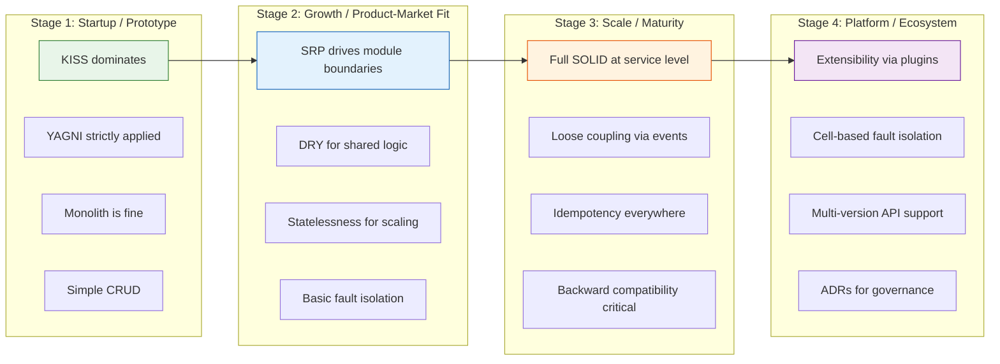

| Principle | Early Stage | Growth Stage | Mature Stage |
|---|---|---|---|
| KISS | Maximum priority | Still important | Complexity is justified |
| YAGNI | Strict | Selective future-proofing | Strategic investment in extensibility |
| SRP | Within monolith modules | Drives service extraction | Service boundary governance |
| DRY | Within single codebase | Shared libraries (cautiously) | Schema registries, contract-first |
| Statelessness | Nice to have | Required for horizontal scaling | Foundation of infrastructure |
| Idempotency | For payments only | For all mutations | For all events and messages |
| Fault isolation | Basic error handling | Circuit breakers | Cell-based architecture |
| Backward compatibility | Not needed (no users) | API versioning | Full schema evolution |
| Extensibility | Not needed | Internal plugin points | External developer ecosystem |

---

# Practice Questions

### Conceptual Questions

**Q1.** You are designing a notification service that currently supports email. The product team says "we might add SMS and push notifications someday, but not in the next 6 months." How do you balance OCP and YAGNI?

**Expected answer:** Apply YAGNI for now — implement email directly without a notification abstraction. However, structure the code so that extracting a `NotificationChannel` interface later is straightforward (clean separation between message construction and message delivery). When SMS is confirmed on the roadmap, apply OCP by introducing the interface.

---

**Q2.** A team has a "utils" package containing 50 helper functions used across 12 services. What principles does this violate, and how would you refactor it?

**Expected answer:** The utils package violates SRP (many unrelated responsibilities), ISP (services depend on functions they do not use), and has coincidental cohesion. Refactor by migrating each function to the domain-specific package where it belongs (tax calculation to the pricing module, email validation to the user module). Functions with no clear domain home (e.g., string formatting) can remain in a minimal shared library.

---

**Q3.** Explain how idempotency keys work and why the key must be generated by the client, not the server.

**Expected answer:** An idempotency key is a unique identifier attached to a mutating request. The server stores the key and the result. On retry, the server returns the stored result instead of re-executing. The key must be client-generated because the purpose is to deduplicate retries of the same logical operation. If the server generated the key, the client would not have it when retrying (since the first response was lost).

---

**Q4.** You have a service that stores user sessions in local memory. The ops team wants to autoscale it. What principle is violated, and how do you fix it?

**Expected answer:** The service violates statelessness. Fix: externalize session state to Redis (or another shared store) so that any instance can handle any request. This allows the load balancer to use round-robin instead of sticky sessions, and autoscaling can add or remove instances freely.

---

**Q5.** What is the difference between afferent coupling and efferent coupling? Which is more dangerous to change?

**Expected answer:** Afferent coupling (Ca) counts how many modules depend on this module. Efferent coupling (Ce) counts how many modules this module depends on. A module with high afferent coupling is more dangerous to change because changes ripple to all dependents. A module with high efferent coupling is fragile (breaks when any dependency changes) but changes to it do not affect others.

---

### Design Questions

**Q6.** Design a payment processing system that supports multiple payment providers (Stripe, PayPal, Braintree) and can add new providers without modifying existing code.

**Expected answer:** Apply OCP and DIP. Define a `PaymentProvider` interface with methods like `authorize()`, `capture()`, and `refund()`. Each provider implements this interface. Use a registry or factory to resolve the correct provider at runtime. The checkout service depends only on the `PaymentProvider` abstraction. Adding a new provider means creating a new class and registering it.

---

**Q7.** Your e-commerce platform has a checkout service that calls the inventory, payment, and notification services synchronously. During a flash sale, the notification service becomes slow, causing checkout timeouts. How do you fix this using fault isolation principles?

**Expected answer:** Apply fault isolation at multiple levels: (1) Make notification calls asynchronous — publish an `OrderCreated` event and let the notification service consume it from a queue. Checkout should not wait for notifications. (2) Add circuit breakers on the remaining synchronous calls (inventory, payment). (3) Define timeouts: inventory check gets 500ms, payment authorization gets 5s. (4) Implement graceful degradation: if inventory check times out, use cached stock levels with a warning.

---

**Q8.** You need to rename a database column from `name` to `full_name` across 15 services that read from this table. Describe the migration strategy.

**Expected answer:** Use the expand-contract pattern: (1) Add the `full_name` column. (2) Update the write path to write to both `name` and `full_name`. (3) Backfill existing rows. (4) Update read paths to prefer `full_name`, falling back to `name`. (5) Once all 15 services have migrated, remove the write to `name`. (6) Finally, drop the `name` column. Each step is independently deployable and backward compatible.

---

**Q9.** A colleague argues that every class should have an interface "for testability." Using ISP and YAGNI, how would you respond?

**Expected answer:** Applying YAGNI, creating an interface for a class with only one implementation adds indirection without benefit. Applying ISP, an interface should exist only when there are multiple consumers with different needs. For testability, many languages support mocking concrete classes directly. Create interfaces when you actually need polymorphism (multiple implementations or seam for testing a critical boundary), not as a blanket rule.

---

**Q10.** How does the Law of Demeter apply to microservice API design?

**Expected answer:** LoD at the service level means a client should not need to call Service A to get data, then use that data to call Service B, then use that data to call Service C. Instead, provide a facade or gateway that aggregates the necessary data in a single call. This reduces the client's coupling to internal service topology and reduces the number of network round-trips.

---

**Q11.** Explain the relationship between SRP and microservice granularity. How do you decide whether to split a monolith module into a separate service?

**Expected answer:** SRP defines the conceptual boundary (single reason to change), but that is necessary, not sufficient, for a service split. Additional criteria: (1) Does the module need to scale independently? (2) Does it need a different technology stack? (3) Does it need a different deployment cadence? (4) Is the operational overhead of a separate service justified? A module can satisfy SRP within a monolith. Extract it into a service only when there is a concrete benefit beyond just responsibility separation.

---

**Q12.** You are building a REST API. A mobile client needs 3 fields from the user profile, but the API returns 50 fields. Which principles apply, and what is the solution?

**Expected answer:** ISP applies — the mobile client should not be forced to receive data it does not use. Solutions: (1) Field selection via query parameter: `GET /users/123?fields=name,email,avatar`. (2) Backend for Frontend (BFF): a mobile-specific API that returns only what the mobile client needs. (3) GraphQL: the client specifies exactly which fields it wants. Option 1 is simplest; Option 2 provides the most control.

---

**Q13.** What are the risks of applying DRY across microservice boundaries?

**Expected answer:** DRY across services means shared libraries. Risks: (1) Deployment coupling — updating the shared library requires redeploying all services that use it. (2) Version conflicts — different services may need different versions. (3) Lowest common denominator — the library must satisfy all consumers, potentially compromising any individual consumer's needs. Mitigation: keep shared libraries limited to truly cross-cutting concerns (logging, tracing, error formatting) and version them strictly. Business logic should not be shared.

---

**Q14.** Design an extensible event processing system where new event handlers can be added without modifying the core pipeline.

**Expected answer:** The core system defines an `EventHandler` interface with `can_handle(event_type)` and `process(event)` methods. Handlers register themselves with an `EventRouter`. When an event arrives, the router dispatches it to all registered handlers for that event type. New handlers are added by implementing the interface and registering — zero changes to the router or existing handlers. Include error isolation (one handler's failure should not prevent other handlers from executing) and dead-letter queues for failed events.

---

**Q15.** A system has 99.9% uptime but a single-point-of-failure database. The team wants to add a read replica. Which principles guide this decision, and what are the trade-offs?

**Expected answer:** Fault isolation (removing SPOF), statelessness (read replicas are interchangeable), and eventual consistency (replicas may lag). Trade-offs: (1) Read-after-write consistency — a user who just updated their profile may see stale data from a replica. Solution: route reads to the primary for N seconds after a write. (2) Operational complexity — monitoring replication lag, handling replica failures. (3) Cost — additional database instances. The decision is justified because the current SPOF means any database issue takes down the entire system.

---

**Q16.** Compare composition over inheritance at the code level and at the system level. Provide examples of each.

**Expected answer:** Code level: instead of a `LoggingEmailSender extends EmailSender` hierarchy, compose a `LoggingDecorator` with an `EmailSender`. System level: instead of building a monolithic service that inherits features by copying code from other services, compose independent services (order, payment, inventory) that communicate through APIs and events. The principle is the same: build complex behavior by combining simple, independent components rather than building deep hierarchies.

---

## Summary

Design principles are not rules to be followed blindly — they are **forces** that pull in different directions. The art of system design is understanding which principles apply in a given context and how to resolve the tensions between them.

**Key tensions to navigate:**
- **YAGNI vs. Extensibility:** Build only what is needed now, but make it easy to add what will be needed later.
- **DRY vs. Coupling:** Eliminate duplication, but not at the cost of creating tight coupling between unrelated modules.
- **KISS vs. Fault tolerance:** Keep it simple, but real systems need circuit breakers, retries, and fallbacks.
- **SRP vs. Performance:** Clean separation creates more network calls in distributed systems. Sometimes denormalization and co-location are necessary.
- **Loose coupling vs. Consistency:** Event-driven systems are loosely coupled but eventually consistent. Synchronous calls are tightly coupled but strongly consistent.

The engineer who can name these tensions, explain the trade-offs, and make a justified decision is the engineer who passes senior-level system design interviews.

---

## Cross-References

- **Chapter F02:** Design Patterns — concrete implementations of these principles
- **Chapter F03:** Architectural Styles — how principles shape system topology
- **Chapter F04:** Non-Functional Requirements — the constraints that determine which principles to prioritize
- **Chapter F05:** Trade-off Analysis — frameworks for resolving principle tensions
- **Chapter F06:** Estimation & Capacity Planning — quantifying the impact of design decisions
