# F02. Design Patterns (GoF + Practical)

## Part Context
**Part:** Part 0 — System Design Foundations & Principles
**Position:** Chapter F02 of F12
**Why this part exists:** Design patterns are the shared vocabulary of software engineering. They encode decades of collective experience into reusable solutions for recurring problems. This chapter bridges classical Gang-of-Four (GoF) patterns with the practical backend patterns that drive modern distributed systems — giving you the mental toolkit to recognize, apply, and discuss patterns fluently in both production codebases and system design interviews.

---

## Overview

Design patterns are not copy-paste templates. They are **named solutions to recurring design problems** that communicate intent, reduce cognitive load, and prevent reinvention. The original 23 patterns catalogued by Gamma, Helm, Johnson, and Vlissides (the "Gang of Four") in 1994 remain foundational, but modern backend systems have evolved additional patterns that address concerns like dependency management, data access abstraction, middleware composition, and service layering.

This chapter covers **24 patterns** across four sections:

### Section 1 — Creational Patterns
Patterns that control object creation, ensuring flexibility and decoupling between the code that creates objects and the code that uses them:
1. **Singleton** — ensuring a class has exactly one instance with a global access point.
2. **Factory Method** — defining an interface for creation but letting subclasses decide which class to instantiate.
3. **Abstract Factory** — producing families of related objects without specifying concrete classes.
4. **Builder** — constructing complex objects step by step with a fluent interface.
5. **Prototype** — creating new objects by cloning existing instances.

### Section 2 — Structural Patterns
Patterns that compose classes and objects into larger structures while keeping those structures flexible and efficient:
1. **Adapter** — converting the interface of one class into another interface clients expect.
2. **Facade** — providing a simplified interface to a complex subsystem.
3. **Proxy** — providing a surrogate or placeholder for another object to control access.
4. **Decorator** — attaching additional responsibilities to an object dynamically.
5. **Composite** — composing objects into tree structures to represent part-whole hierarchies.

### Section 3 — Behavioral Patterns
Patterns that manage algorithms, relationships, and responsibilities between objects:
1. **Observer** — defining a one-to-many dependency so that when one object changes state, all dependents are notified.
2. **Strategy** — defining a family of algorithms, encapsulating each one, and making them interchangeable.
3. **Command** — encapsulating a request as an object, allowing parameterization, queuing, and undo.
4. **State** — allowing an object to alter its behavior when its internal state changes.
5. **Chain of Responsibility** — passing a request along a chain of handlers until one handles it.

### Section 4 — Modern Backend Patterns
Patterns that have emerged from real-world backend development and are critical in microservice and layered architectures:
1. **Repository Pattern** — abstracting data access behind a collection-like interface.
2. **Service Layer Pattern** — encapsulating business logic with clear transaction boundaries.
3. **Dependency Injection** — supplying dependencies from outside rather than creating them internally.
4. **Middleware Pattern** — composing cross-cutting concerns as a pipeline of handlers.

Every pattern includes a definition, structural diagram, sequence diagram, real-world application, multi-language code examples, usage guidance, trade-offs, common mistakes, and interview insights.

---

## Why Design Patterns Matter in System Design

- **Shared vocabulary**: Saying "we use a Strategy pattern for pricing" communicates more in five words than a paragraph of implementation details.
- **Interview fluency**: Interviewers expect candidates to recognize and name patterns — not just implement them. Identifying a pattern shows architectural maturity.
- **Reduced coupling**: Patterns like Factory, Observer, and DI systematically reduce dependencies between components, making systems easier to test, extend, and deploy independently.
- **Proven trade-offs**: Each pattern encodes known trade-offs. Understanding these prevents over-engineering and under-engineering alike.
- **Bridge to distributed patterns**: GoF patterns at the object level map directly to distributed-system patterns — Observer becomes pub/sub, Proxy becomes API gateway, Strategy becomes feature-flagged routing.

---

## Pattern Selection Decision Framework

Before diving into individual patterns, use this decision tree to identify which category of pattern applies to your problem:

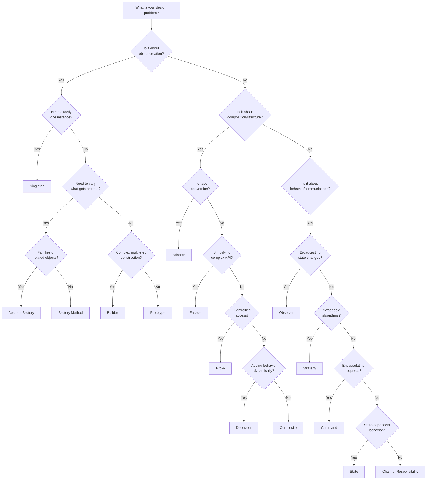
```mermaid
flowchart TD
    A["What is your design problem?"] --> B{"Is it about\nobject creation?"}
    B -->|Yes| C{"Need exactly\none instance?"}
    C -->|Yes| D["Singleton"]
    C -->|No| E{"Need to vary\nwhat gets created?"}
    E -->|Yes| F{"Families of\nrelated objects?"}
    F -->|Yes| G["Abstract Factory"]
    F -->|No| H["Factory Method"]
    E -->|No| I{"Complex multi-step\nconstruction?"}
    I -->|Yes| J["Builder"]
    I -->|No| K["Prototype"]

    B -->|No| L{"Is it about\ncomposition/structure?"}
    L -->|Yes| M{"Interface\nconversion?"}
    M -->|Yes| N["Adapter"]
    M -->|No| O{"Simplifying\ncomplex API?"}
    O -->|Yes| P["Facade"]
    O -->|No| Q{"Controlling\naccess?"}
    Q -->|Yes| R["Proxy"]
    Q -->|No| S{"Adding behavior\ndynamically?"}
    S -->|Yes| T["Decorator"]
    S -->|No| U["Composite"]

    L -->|No| V{"Is it about\nbehavior/communication?"}
    V -->|Yes| W{"Broadcasting\nstate changes?"}
    W -->|Yes| X["Observer"]
    W -->|No| Y{"Swappable\nalgorithms?"}
    Y -->|Yes| Z["Strategy"]
    Y -->|No| AA{"Encapsulating\nrequests?"}
    AA -->|Yes| AB["Command"]
    AA -->|No| AC{"State-dependent\nbehavior?"}
    AC -->|Yes| AD["State"]
    AC -->|No| AE["Chain of Responsibility"]
```

---

# Section 1: Creational Patterns

Creational patterns abstract the instantiation process. They help make a system independent of how its objects are created, composed, and represented. In distributed systems, creational patterns govern how service instances, configuration objects, connections, and data-transfer objects are constructed.

---

## 1.1 Singleton Pattern

### Definition

The Singleton pattern ensures a class has **exactly one instance** and provides a **global point of access** to it. The class itself is responsible for keeping track of its sole instance and preventing additional instantiation.

### When the Real World Uses Singleton

- **Database connection pools**: A single pool manager shares connections across all request handlers.
- **Configuration managers**: One object loads configuration from environment variables, files, or remote config services and serves it to all consumers.
- **Logger instances**: A single structured logger is configured once and injected everywhere.
- **Thread pools / event loops**: The Node.js event loop, Python's asyncio loop, and Java's ForkJoinPool are effectively singletons.
- **Circuit breakers**: A single circuit-breaker instance per downstream service tracks failure rates and controls access.

### Class Diagram

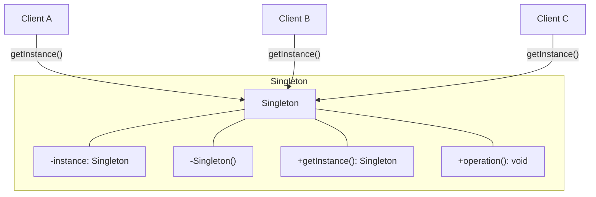
```mermaid
flowchart TD
    subgraph Singleton
        A["Singleton"]
        A --- B["-instance: Singleton"]
        A --- C["-Singleton()"]
        A --- D["+getInstance(): Singleton"]
        A --- E["+operation(): void"]
    end
    F["Client A"] -->|"getInstance()"| A
    G["Client B"] -->|"getInstance()"| A
    H["Client C"] -->|"getInstance()"| A
```

### Sequence Diagram

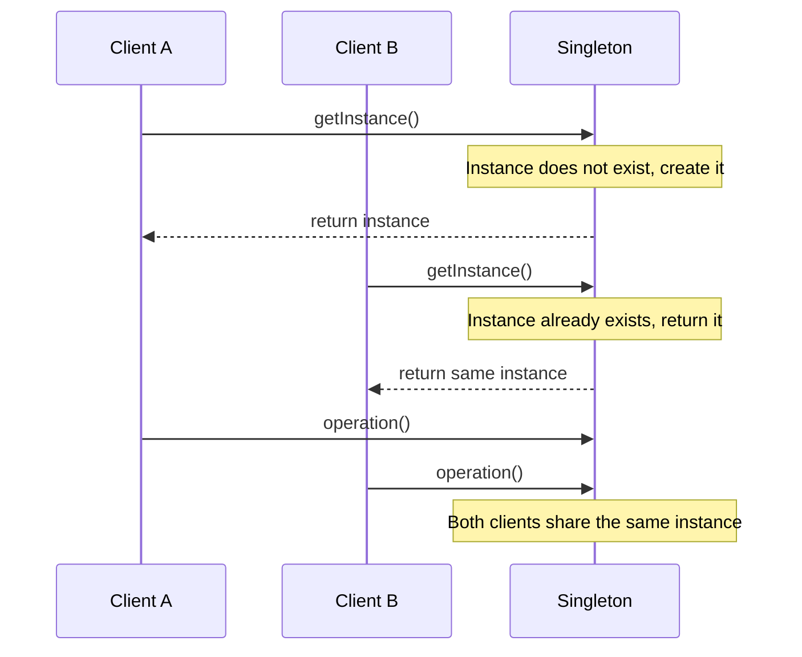
```mermaid
sequenceDiagram
    participant ClientA as Client A
    participant ClientB as Client B
    participant S as Singleton

    ClientA->>S: getInstance()
    Note over S: Instance does not exist, create it
    S-->>ClientA: return instance

    ClientB->>S: getInstance()
    Note over S: Instance already exists, return it
    S-->>ClientB: return same instance

    ClientA->>S: operation()
    ClientB->>S: operation()
    Note over S: Both clients share the same instance
```

### Code Examples

**Python — Thread-Safe Singleton with Metaclass**

```python
import threading

class SingletonMeta(type):
    """Thread-safe Singleton metaclass using double-checked locking."""
    _instances = {}
    _lock = threading.Lock()

    def __call__(cls, *args, **kwargs):
        # First check without lock (fast path)
        if cls not in cls._instances:
            with cls._lock:
                # Second check with lock (thread-safe path)
                if cls not in cls._instances:
                    instance = super().__call__(*args, **kwargs)
                    cls._instances[cls] = instance
        return cls._instances[cls]


class DatabaseConnectionPool(metaclass=SingletonMeta):
    """A singleton connection pool shared across all request handlers."""

    def __init__(self, dsn: str = "postgresql://localhost/mydb", pool_size: int = 10):
        self.dsn = dsn
        self.pool_size = pool_size
        self._connections: list = []
        self._initialize_pool()

    def _initialize_pool(self):
        print(f"Initializing pool with {self.pool_size} connections to {self.dsn}")
        # In production, create actual connections here
        self._connections = [f"conn-{i}" for i in range(self.pool_size)]

    def get_connection(self) -> str:
        if not self._connections:
            raise RuntimeError("No available connections in pool")
        return self._connections.pop()

    def release_connection(self, conn: str):
        self._connections.append(conn)


# Usage
pool1 = DatabaseConnectionPool()
pool2 = DatabaseConnectionPool()
assert pool1 is pool2  # Same instance
```

**Java — Enum Singleton (Recommended)**

```java
public enum ConfigurationManager {
    INSTANCE;

    private final Map<String, String> config = new ConcurrentHashMap<>();

    ConfigurationManager() {
        // Load configuration from environment or file
        config.put("db.host", System.getenv("DB_HOST"));
        config.put("db.port", System.getenv("DB_PORT"));
        config.put("cache.ttl", System.getenv("CACHE_TTL"));
    }

    public String get(String key) {
        return config.get(key);
    }

    public String get(String key, String defaultValue) {
        return config.getOrDefault(key, defaultValue);
    }

    public void reload() {
        // Re-read configuration from source
        config.clear();
        config.put("db.host", System.getenv("DB_HOST"));
        config.put("db.port", System.getenv("DB_PORT"));
        config.put("cache.ttl", System.getenv("CACHE_TTL"));
    }
}

// Usage
String host = ConfigurationManager.INSTANCE.get("db.host");
```

**TypeScript — Module-Level Singleton**

```typescript
class Logger {
  private static instance: Logger;
  private level: string;

  private constructor(level: string = "info") {
    this.level = level;
  }

  static getInstance(level?: string): Logger {
    if (!Logger.instance) {
      Logger.instance = new Logger(level);
    }
    return Logger.instance;
  }

  info(message: string, context?: Record<string, unknown>): void {
    console.log(JSON.stringify({ level: "info", message, ...context, timestamp: new Date().toISOString() }));
  }

  error(message: string, error?: Error, context?: Record<string, unknown>): void {
    console.error(JSON.stringify({
      level: "error",
      message,
      stack: error?.stack,
      ...context,
      timestamp: new Date().toISOString(),
    }));
  }
}

// Usage
const logger = Logger.getInstance("debug");
logger.info("Server started", { port: 3000 });
```

### Thread Safety Considerations

| Approach | Thread-Safe? | Lazy? | Serialization-Safe? | Reflection-Safe? |
|---|---|---|---|---|
| Eager initialization (static field) | Yes | No | No | No |
| Synchronized method | Yes | Yes | No | No |
| Double-checked locking | Yes | Yes | No | No |
| Bill Pugh (inner class holder) | Yes | Yes | No | No |
| Enum singleton (Java) | Yes | No | Yes | Yes |
| Module-level (Python/TS) | Yes (GIL/single-thread) | Yes | N/A | N/A |

### Registry Pattern (Multi-Singleton)

When you need **one instance per key** rather than one global instance, use a registry:

```python
class ServiceRegistry:
    """Registry pattern: one singleton per named service."""
    _instances: dict[str, object] = {}
    _lock = threading.Lock()

    @classmethod
    def get(cls, name: str, factory=None):
        if name not in cls._instances:
            with cls._lock:
                if name not in cls._instances:
                    if factory is None:
                        raise ValueError(f"No factory registered for {name}")
                    cls._instances[name] = factory()
        return cls._instances[name]

    @classmethod
    def register(cls, name: str, instance: object):
        with cls._lock:
            cls._instances[name] = instance
```

### Service Locator Anti-Pattern

The Service Locator is a registry that provides global access to dependencies. While it solves the "find a service" problem, it creates hidden dependencies and makes testing harder.

**Why it is an anti-pattern:**
- Dependencies are **hidden** — you cannot tell what a class needs by looking at its constructor.
- **Testing is fragile** — you must configure the locator before every test.
- **Refactoring is dangerous** — removing a service from the locator breaks consumers at runtime, not compile time.

**Prefer Dependency Injection** (Section 4.3) over Service Locator in all new code.

### When to Use

- Connection pools, thread pools, and event loops that are expensive to create and must be shared.
- Configuration objects loaded once at startup and read many times.
- Coordinating access to a shared resource (file system handle, hardware interface).

### When NOT to Use

- When you need different configurations in different contexts (e.g., per-tenant configuration).
- When you need testability — singletons are global state and make unit testing harder.
- When the "one instance" constraint is not a real requirement but merely convenience.
- In microservices where each service instance is already isolated — the process boundary provides singleton semantics naturally.

### Trade-offs

| Advantage | Disadvantage |
|---|---|
| Controlled access to sole instance | Global state — hidden coupling |
| Lazy initialization possible | Hard to unit test (mocking requires special setup) |
| Reduced memory for shared resources | Violates Single Responsibility Principle (manages own lifecycle) |
| Thread-safe access to shared state | Can become a bottleneck under contention |

### Common Mistakes

1. **Using Singleton as a global variable bag** — stuffing unrelated state into a single god-object.
2. **Ignoring thread safety** — naive implementations race during lazy initialization.
3. **Singleton in distributed systems** — a singleton is per-process. In a cluster of 20 pods, you have 20 "singletons". Use distributed locks or external coordination for true cluster-wide singletons.
4. **Tight coupling to Singleton.getInstance()** — callers depend on the concrete class. Wrap behind an interface and inject it.

### Interview Insights

- **When asked "how do you manage configuration?"**: Mention loading config once into a singleton-like object, but emphasize injecting it via DI rather than calling `Config.getInstance()` everywhere.
- **When asked about connection pooling**: Describe a singleton pool manager, then discuss how in Kubernetes each pod gets its own pool instance — the pod is the singleton boundary.
- **Red flag if you propose**: A singleton that holds request-scoped state (user session, request context). That is a concurrency disaster.

---

## 1.2 Factory Method Pattern

### Definition

The Factory Method pattern defines an **interface for creating an object** but lets **subclasses decide** which class to instantiate. It lets a class defer instantiation to subclasses, promoting loose coupling between the creator and the product.

### When the Real World Uses Factory Method

- **Notification systems**: A `NotificationFactory` creates `EmailNotification`, `SMSNotification`, or `PushNotification` based on user preference.
- **Payment processing**: A `PaymentProcessorFactory` instantiates `StripeProcessor`, `PayPalProcessor`, or `AdyenProcessor` based on merchant configuration.
- **Serialization**: A `SerializerFactory` creates `JSONSerializer`, `ProtobufSerializer`, or `AvroSerializer` based on content type.
- **Database drivers**: A `ConnectionFactory` creates connections for PostgreSQL, MySQL, or SQLite based on configuration.
- **Cloud provider abstraction**: A `StorageFactory` creates `S3Storage`, `GCSStorage`, or `AzureBlobStorage` based on deployment target.

### Class Diagram

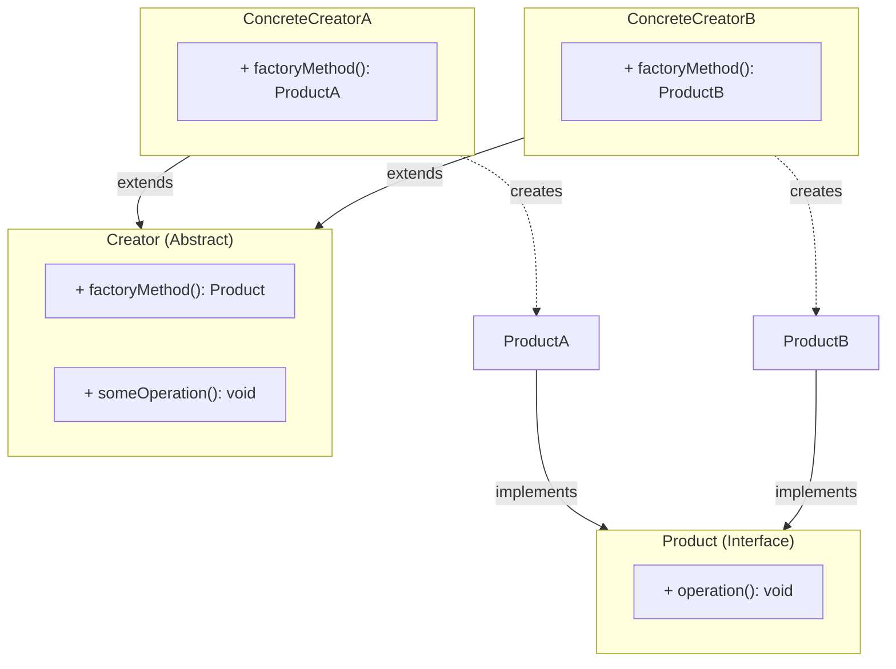
```mermaid
flowchart TD
    subgraph Creator["Creator (Abstract)"]
        A["+ factoryMethod(): Product"]
        B["+ someOperation(): void"]
    end

    subgraph ConcreteCreatorA["ConcreteCreatorA"]
        C["+ factoryMethod(): ProductA"]
    end

    subgraph ConcreteCreatorB["ConcreteCreatorB"]
        D["+ factoryMethod(): ProductB"]
    end

    subgraph Product["Product (Interface)"]
        E["+ operation(): void"]
    end

    F["ProductA"]
    G["ProductB"]

    ConcreteCreatorA -->|extends| Creator
    ConcreteCreatorB -->|extends| Creator
    F -->|implements| Product
    G -->|implements| Product
    ConcreteCreatorA -.->|creates| F
    ConcreteCreatorB -.->|creates| G
```

### Sequence Diagram

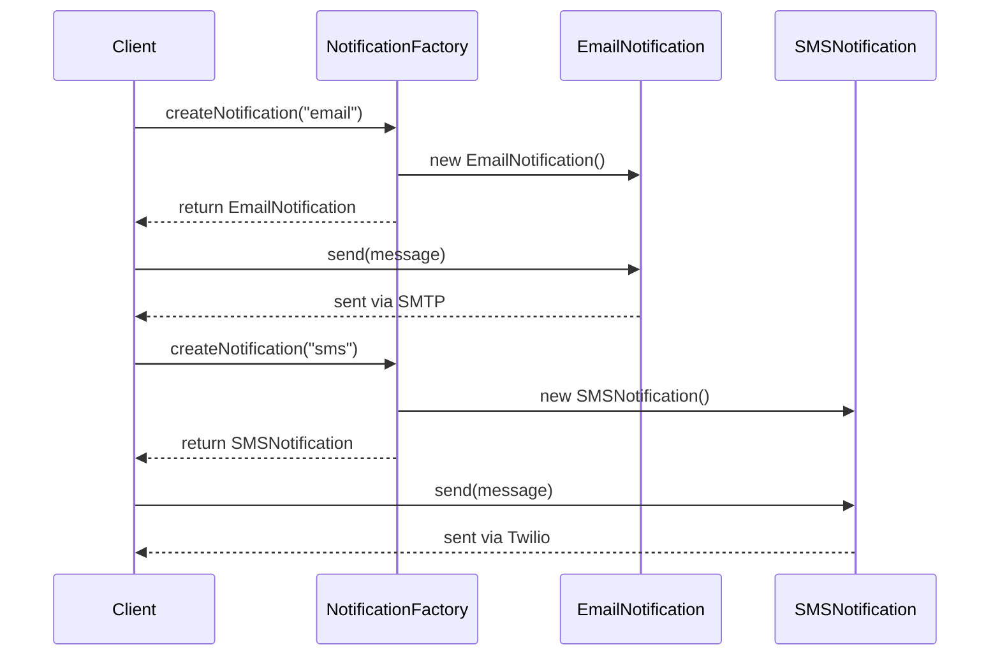
```mermaid
sequenceDiagram
    participant Client
    participant Factory as NotificationFactory
    participant Email as EmailNotification
    participant SMS as SMSNotification

    Client->>Factory: createNotification("email")
    Factory->>Email: new EmailNotification()
    Factory-->>Client: return EmailNotification

    Client->>Email: send(message)
    Email-->>Client: sent via SMTP

    Client->>Factory: createNotification("sms")
    Factory->>SMS: new SMSNotification()
    Factory-->>Client: return SMSNotification

    Client->>SMS: send(message)
    SMS-->>Client: sent via Twilio
```

### Code Examples

**Python — Notification Factory with Registry**

```python
from abc import ABC, abstractmethod
from typing import Type

class Notification(ABC):
    """Abstract product."""
    @abstractmethod
    def send(self, recipient: str, message: str) -> bool:
        pass

class EmailNotification(Notification):
    def send(self, recipient: str, message: str) -> bool:
        print(f"Sending email to {recipient}: {message}")
        # SMTP logic here
        return True

class SMSNotification(Notification):
    def send(self, recipient: str, message: str) -> bool:
        print(f"Sending SMS to {recipient}: {message}")
        # Twilio API call here
        return True

class PushNotification(Notification):
    def send(self, recipient: str, message: str) -> bool:
        print(f"Sending push to {recipient}: {message}")
        # Firebase/APNs call here
        return True


class NotificationFactory:
    """Factory with self-registration registry."""
    _registry: dict[str, Type[Notification]] = {}

    @classmethod
    def register(cls, channel: str, notification_cls: Type[Notification]):
        cls._registry[channel] = notification_cls

    @classmethod
    def create(cls, channel: str) -> Notification:
        if channel not in cls._registry:
            raise ValueError(f"Unknown notification channel: {channel}")
        return cls._registry[channel]()


# Register at module load time
NotificationFactory.register("email", EmailNotification)
NotificationFactory.register("sms", SMSNotification)
NotificationFactory.register("push", PushNotification)

# Usage
notifier = NotificationFactory.create("email")
notifier.send("user@example.com", "Your order has shipped!")
```

**Java — Factory Method with Enum**

```java
public interface PaymentProcessor {
    PaymentResult process(PaymentRequest request);
    void refund(String transactionId, BigDecimal amount);
}

public class StripeProcessor implements PaymentProcessor {
    @Override
    public PaymentResult process(PaymentRequest request) {
        // Stripe SDK call
        return new PaymentResult(true, "stripe-txn-123");
    }

    @Override
    public void refund(String transactionId, BigDecimal amount) {
        // Stripe refund API
    }
}

public class PayPalProcessor implements PaymentProcessor {
    @Override
    public PaymentResult process(PaymentRequest request) {
        // PayPal REST API call
        return new PaymentResult(true, "paypal-txn-456");
    }

    @Override
    public void refund(String transactionId, BigDecimal amount) {
        // PayPal refund API
    }
}

public class PaymentProcessorFactory {
    public static PaymentProcessor create(String provider) {
        return switch (provider.toLowerCase()) {
            case "stripe" -> new StripeProcessor();
            case "paypal" -> new PayPalProcessor();
            default -> throw new IllegalArgumentException("Unknown provider: " + provider);
        };
    }
}

// Usage
PaymentProcessor processor = PaymentProcessorFactory.create("stripe");
PaymentResult result = processor.process(request);
```

**TypeScript — Factory with DI Container Integration**

```typescript
interface Serializer<T> {
  serialize(data: T): string | Buffer;
  deserialize(raw: string | Buffer): T;
}

class JSONSerializer<T> implements Serializer<T> {
  serialize(data: T): string {
    return JSON.stringify(data);
  }
  deserialize(raw: string): T {
    return JSON.parse(raw as string) as T;
  }
}

class ProtobufSerializer<T> implements Serializer<T> {
  serialize(data: T): Buffer {
    // protobuf encode
    return Buffer.from(JSON.stringify(data)); // simplified
  }
  deserialize(raw: Buffer): T {
    // protobuf decode
    return JSON.parse(raw.toString()) as T;
  }
}

class SerializerFactory {
  private static registry = new Map<string, new () => Serializer<any>>();

  static register(format: string, cls: new () => Serializer<any>): void {
    SerializerFactory.registry.set(format, cls);
  }

  static create<T>(format: string): Serializer<T> {
    const cls = SerializerFactory.registry.get(format);
    if (!cls) throw new Error(`Unknown serializer format: ${format}`);
    return new cls();
  }
}

SerializerFactory.register("json", JSONSerializer);
SerializerFactory.register("protobuf", ProtobufSerializer);

// Usage
const serializer = SerializerFactory.create<User>("json");
const payload = serializer.serialize({ id: 1, name: "Alice" });
```

### Factory Registry Pattern

The Factory Registry decouples product registration from the factory itself. New products can be added without modifying the factory class — just register them:

```python
# Plugin-style registration using decorators
def register_notification(channel: str):
    def decorator(cls):
        NotificationFactory.register(channel, cls)
        return cls
    return decorator

@register_notification("slack")
class SlackNotification(Notification):
    def send(self, recipient: str, message: str) -> bool:
        print(f"Sending Slack message to {recipient}: {message}")
        return True
```

### When to Use

- When a class cannot anticipate the type of objects it needs to create.
- When you want to localize the knowledge of which concrete class gets created.
- When adding new product types should not require modifying existing factory code (Open/Closed Principle).
- When building plugin architectures where new implementations are registered at runtime.

### When NOT to Use

- When there is only one concrete product and no foreseeable variation — a factory adds unnecessary indirection.
- When object creation is trivial (no configuration, no dependencies) — direct instantiation is simpler.
- When the factory would just wrap a constructor call with no additional logic.

### Trade-offs

| Advantage | Disadvantage |
|---|---|
| Decouples creation from usage | Adds classes/interfaces (code volume) |
| Supports Open/Closed Principle | Indirection can obscure what is created |
| Enables plugin architectures | Registry must be populated (startup cost) |
| Centralizes creation logic | Over-abstraction for simple cases |

### Common Mistakes

1. **Factory that returns concrete types** — the return type should be the abstract product interface, not a concrete class.
2. **God factory** — a single factory that creates everything. Split by domain.
3. **Forgetting error handling** — what happens when the requested product type is unknown? Throw a clear exception.
4. **Not using DI with factories** — factories themselves should be injectable, not accessed via static methods in production code.

### Interview Insights

- **When designing a notification system**: Lead with the Factory pattern to show you understand extensibility. "We use a factory so adding a WhatsApp channel requires zero changes to existing code."
- **When asked about microservice communication**: "We use a factory to create the appropriate client — REST, gRPC, or GraphQL — based on the target service's protocol."
- **Distinguish Factory Method from Abstract Factory**: Factory Method creates one product; Abstract Factory creates families of related products.

---

## 1.3 Abstract Factory Pattern

### Definition

The Abstract Factory pattern provides an **interface for creating families of related or dependent objects** without specifying their concrete classes. It is a "factory of factories" — each concrete factory produces a consistent set of products that belong together.

### When the Real World Uses Abstract Factory

- **Cross-platform UI toolkits**: A `UIFactory` produces `Button`, `TextField`, and `Checkbox` that are all Windows-styled or all macOS-styled.
- **Database abstraction layers**: A `DatabaseFactory` produces `Connection`, `Command`, and `Transaction` objects that are all PostgreSQL or all MySQL.
- **Cloud provider SDKs**: A `CloudFactory` produces `Storage`, `Queue`, and `Cache` clients that are all AWS or all GCP.
- **Theme systems**: A `ThemeFactory` produces `ColorPalette`, `Typography`, and `IconSet` that form a cohesive visual theme.

### Class Diagram

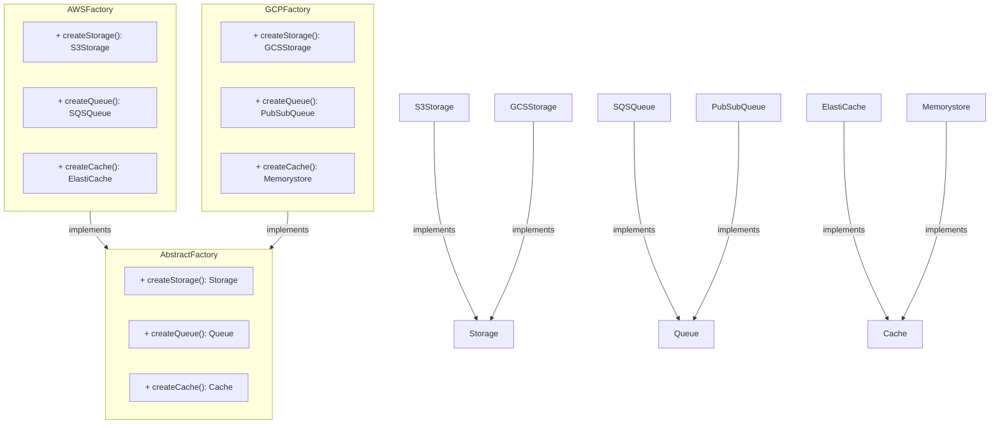
```mermaid
flowchart TD
    subgraph AbstractFactory["AbstractFactory"]
        AF1["+ createStorage(): Storage"]
        AF2["+ createQueue(): Queue"]
        AF3["+ createCache(): Cache"]
    end

    subgraph AWSFactory["AWSFactory"]
        AW1["+ createStorage(): S3Storage"]
        AW2["+ createQueue(): SQSQueue"]
        AW3["+ createCache(): ElastiCache"]
    end

    subgraph GCPFactory["GCPFactory"]
        GC1["+ createStorage(): GCSStorage"]
        GC2["+ createQueue(): PubSubQueue"]
        GC3["+ createCache(): Memorystore"]
    end

    AWSFactory -->|implements| AbstractFactory
    GCPFactory -->|implements| AbstractFactory

    S3["S3Storage"] -->|implements| Storage["Storage"]
    GCS["GCSStorage"] -->|implements| Storage
    SQS["SQSQueue"] -->|implements| Queue["Queue"]
    PubSub["PubSubQueue"] -->|implements| Queue
    Elasti["ElastiCache"] -->|implements| Cache["Cache"]
    Memory["Memorystore"] -->|implements| Cache
```

### Code Example — Python

```python
from abc import ABC, abstractmethod

# Abstract products
class Storage(ABC):
    @abstractmethod
    def put(self, key: str, data: bytes) -> str: ...
    @abstractmethod
    def get(self, key: str) -> bytes: ...

class Queue(ABC):
    @abstractmethod
    def enqueue(self, message: str) -> str: ...
    @abstractmethod
    def dequeue(self) -> str | None: ...

class Cache(ABC):
    @abstractmethod
    def set(self, key: str, value: str, ttl: int = 300) -> None: ...
    @abstractmethod
    def get(self, key: str) -> str | None: ...

# Abstract factory
class CloudFactory(ABC):
    @abstractmethod
    def create_storage(self) -> Storage: ...
    @abstractmethod
    def create_queue(self) -> Queue: ...
    @abstractmethod
    def create_cache(self) -> Cache: ...

# AWS concrete products
class S3Storage(Storage):
    def put(self, key: str, data: bytes) -> str:
        print(f"S3: Uploading {key}")
        return f"s3://bucket/{key}"
    def get(self, key: str) -> bytes:
        print(f"S3: Downloading {key}")
        return b"data"

class SQSQueue(Queue):
    def enqueue(self, message: str) -> str:
        print(f"SQS: Enqueuing message")
        return "msg-id-123"
    def dequeue(self) -> str | None:
        return "message-body"

class ElastiCacheClient(Cache):
    def set(self, key: str, value: str, ttl: int = 300) -> None:
        print(f"ElastiCache: SET {key}")
    def get(self, key: str) -> str | None:
        return "cached-value"

# AWS concrete factory
class AWSFactory(CloudFactory):
    def create_storage(self) -> Storage:
        return S3Storage()
    def create_queue(self) -> Queue:
        return SQSQueue()
    def create_cache(self) -> Cache:
        return ElastiCacheClient()

# GCP concrete factory (analogous structure)
class GCPFactory(CloudFactory):
    def create_storage(self) -> Storage:
        return GCSStorage()  # similar implementations
    def create_queue(self) -> Queue:
        return PubSubQueue()
    def create_cache(self) -> Cache:
        return MemorystoreClient()

# Client code — completely cloud-agnostic
def provision_infrastructure(factory: CloudFactory):
    storage = factory.create_storage()
    queue = factory.create_queue()
    cache = factory.create_cache()
    return storage, queue, cache

# Switch cloud providers by changing one line
factory = AWSFactory()
storage, queue, cache = provision_infrastructure(factory)
```

### When to Use

- When a system must work with multiple families of related products (cloud providers, UI themes, database engines).
- When you want to enforce that products from the same family are used together (no mixing AWS storage with GCP queue).
- When the system needs to be configured with one of multiple families at deployment time.

### When NOT to Use

- When there is only one family of products — use simple Factory Method instead.
- When products are not related or interdependent — the "family" constraint adds unnecessary rigidity.
- When new product types are added frequently — adding a new abstract method forces changes to all concrete factories.

### Trade-offs

| Advantage | Disadvantage |
|---|---|
| Enforces product family consistency | Adding a new product type requires changing all factories |
| Isolates concrete classes from client | Significant class proliferation |
| Easy to swap entire families | Over-engineered for single-family use cases |

### Common Mistakes

1. **Mixing products from different families** — the whole point is consistency. If you allow mixing, you do not need Abstract Factory.
2. **Using Abstract Factory when Factory Method suffices** — if you only create one type of product, Abstract Factory is overkill.
3. **Not providing a default factory** — always have a fallback for development/testing.

### Interview Insights

- **When designing a multi-cloud system**: "We use an Abstract Factory to ensure all infrastructure clients (storage, queue, cache) are from the same cloud provider, preventing accidental cross-provider dependencies."
- **When asked to compare Factory Method vs Abstract Factory**: "Factory Method creates one product via subclass override. Abstract Factory creates a family of products via a factory object."

---

## 1.4 Builder Pattern

### Definition

The Builder pattern separates the **construction of a complex object from its representation**, allowing the same construction process to create different representations. Builders are especially useful when an object has many optional parameters, configuration steps, or needs to be constructed in stages.

### When the Real World Uses Builder

- **HTTP request builders**: Libraries like OkHttp, Apache HttpClient, and Python's `requests.Request` use builders to assemble method, headers, body, and auth.
- **SQL query builders**: ORMs like SQLAlchemy, Knex.js, and JOOQ construct queries with method chaining.
- **gRPC/Protobuf message builders**: Protocol buffer messages are constructed via builders in Java and C++.
- **Docker/Kubernetes manifest builders**: Programmatic construction of deployment specs.
- **Notification builders**: Assembling notifications with title, body, image, actions, priority, and delivery channel.

### Class Diagram

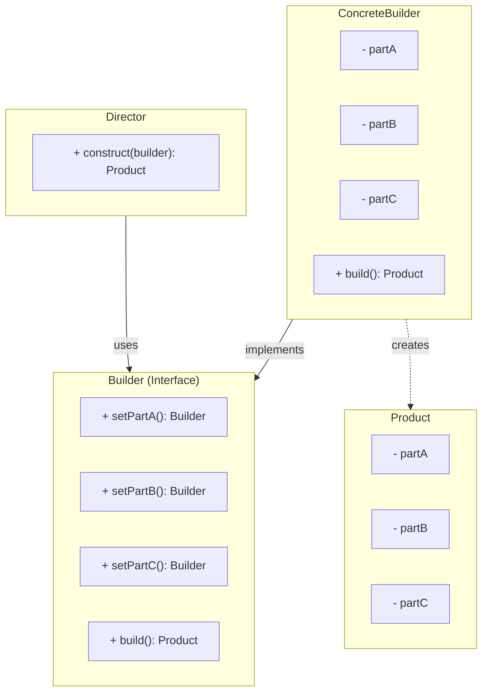
```mermaid
flowchart TD
    subgraph Director["Director"]
        D1["+ construct(builder): Product"]
    end

    subgraph Builder["Builder (Interface)"]
        B1["+ setPartA(): Builder"]
        B2["+ setPartB(): Builder"]
        B3["+ setPartC(): Builder"]
        B4["+ build(): Product"]
    end

    subgraph ConcreteBuilder["ConcreteBuilder"]
        CB1["- partA"]
        CB2["- partB"]
        CB3["- partC"]
        CB4["+ build(): Product"]
    end

    subgraph Product["Product"]
        P1["- partA"]
        P2["- partB"]
        P3["- partC"]
    end

    Director -->|uses| Builder
    ConcreteBuilder -->|implements| Builder
    ConcreteBuilder -.->|creates| Product
```

### Sequence Diagram

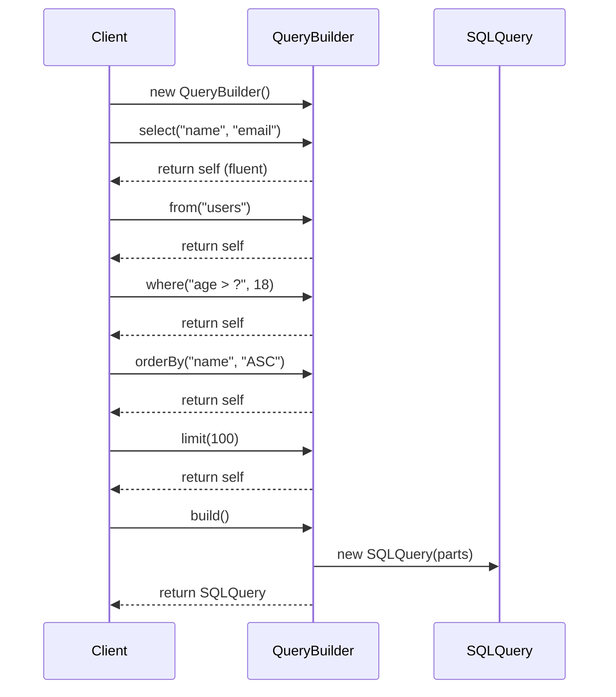
```mermaid
sequenceDiagram
    participant Client
    participant Builder as QueryBuilder
    participant Query as SQLQuery

    Client->>Builder: new QueryBuilder()
    Client->>Builder: select("name", "email")
    Builder-->>Client: return self (fluent)
    Client->>Builder: from("users")
    Builder-->>Client: return self
    Client->>Builder: where("age > ?", 18)
    Builder-->>Client: return self
    Client->>Builder: orderBy("name", "ASC")
    Builder-->>Client: return self
    Client->>Builder: limit(100)
    Builder-->>Client: return self
    Client->>Builder: build()
    Builder->>Query: new SQLQuery(parts)
    Builder-->>Client: return SQLQuery
```

### Code Examples

**Python — HTTP Request Builder**

```python
from dataclasses import dataclass, field
from typing import Any

@dataclass(frozen=True)
class HttpRequest:
    method: str
    url: str
    headers: dict[str, str]
    query_params: dict[str, str]
    body: Any
    timeout: int
    retries: int

class HttpRequestBuilder:
    """Fluent builder for HTTP requests."""

    def __init__(self):
        self._method: str = "GET"
        self._url: str = ""
        self._headers: dict[str, str] = {}
        self._query_params: dict[str, str] = {}
        self._body: Any = None
        self._timeout: int = 30
        self._retries: int = 3

    def method(self, method: str) -> "HttpRequestBuilder":
        self._method = method.upper()
        return self

    def url(self, url: str) -> "HttpRequestBuilder":
        self._url = url
        return self

    def header(self, key: str, value: str) -> "HttpRequestBuilder":
        self._headers[key] = value
        return self

    def auth_bearer(self, token: str) -> "HttpRequestBuilder":
        self._headers["Authorization"] = f"Bearer {token}"
        return self

    def query(self, key: str, value: str) -> "HttpRequestBuilder":
        self._query_params[key] = value
        return self

    def json_body(self, data: dict) -> "HttpRequestBuilder":
        self._body = data
        self._headers["Content-Type"] = "application/json"
        return self

    def timeout(self, seconds: int) -> "HttpRequestBuilder":
        self._timeout = seconds
        return self

    def retries(self, count: int) -> "HttpRequestBuilder":
        self._retries = count
        return self

    def build(self) -> HttpRequest:
        if not self._url:
            raise ValueError("URL is required")
        return HttpRequest(
            method=self._method,
            url=self._url,
            headers=dict(self._headers),
            query_params=dict(self._query_params),
            body=self._body,
            timeout=self._timeout,
            retries=self._retries,
        )


# Usage — fluent chaining
request = (
    HttpRequestBuilder()
    .method("POST")
    .url("https://api.example.com/orders")
    .auth_bearer("eyJhbGciOi...")
    .header("X-Request-Id", "req-123")
    .json_body({"item": "widget", "quantity": 5})
    .timeout(10)
    .retries(2)
    .build()
)
```

**TypeScript — Query Builder**

```typescript
class QueryBuilder {
  private _select: string[] = ["*"];
  private _from: string = "";
  private _wheres: string[] = [];
  private _params: unknown[] = [];
  private _orderBy: string | null = null;
  private _limit: number | null = null;
  private _offset: number | null = null;

  select(...columns: string[]): this {
    this._select = columns;
    return this;
  }

  from(table: string): this {
    this._from = table;
    return this;
  }

  where(condition: string, ...params: unknown[]): this {
    this._wheres.push(condition);
    this._params.push(...params);
    return this;
  }

  orderBy(column: string, direction: "ASC" | "DESC" = "ASC"): this {
    this._orderBy = `${column} ${direction}`;
    return this;
  }

  limit(n: number): this {
    this._limit = n;
    return this;
  }

  offset(n: number): this {
    this._offset = n;
    return this;
  }

  build(): { sql: string; params: unknown[] } {
    if (!this._from) throw new Error("FROM clause is required");
    let sql = `SELECT ${this._select.join(", ")} FROM ${this._from}`;
    if (this._wheres.length > 0) {
      sql += ` WHERE ${this._wheres.join(" AND ")}`;
    }
    if (this._orderBy) sql += ` ORDER BY ${this._orderBy}`;
    if (this._limit !== null) sql += ` LIMIT ${this._limit}`;
    if (this._offset !== null) sql += ` OFFSET ${this._offset}`;
    return { sql, params: this._params };
  }
}

// Usage
const query = new QueryBuilder()
  .select("id", "name", "email")
  .from("users")
  .where("status = ?", "active")
  .where("created_at > ?", "2025-01-01")
  .orderBy("name", "ASC")
  .limit(50)
  .offset(100)
  .build();
// { sql: "SELECT id, name, email FROM users WHERE status = ? AND created_at > ? ORDER BY name ASC LIMIT 50 OFFSET 100", params: ["active", "2025-01-01"] }
```

### When to Use

- When constructing objects with many optional parameters (avoids "telescoping constructor" anti-pattern).
- When the construction process must allow different representations (HTML builder, XML builder, JSON builder all from the same construction steps).
- When you want immutable objects — the builder accumulates state, then produces a frozen product.
- When construction involves validation that should happen at build time, not after.

### When NOT to Use

- When the object has few, required fields — a simple constructor suffices.
- When the construction order does not matter and there is no validation — named parameters or a data class is simpler.

### Trade-offs

| Advantage | Disadvantage |
|---|---|
| Readable construction of complex objects | More code than a simple constructor |
| Enforces valid construction (validation in build) | Builder must be kept in sync with product |
| Supports immutable products | Can be overkill for simple objects |
| Self-documenting via method names | Fluent API can be abused (excessively long chains) |

### Common Mistakes

1. **Mutable builder producing mutable product** — the builder should produce an immutable object. If the product is mutable, the builder loses its value.
2. **No validation in build()** — the whole point of a builder is to validate before creating. Skipping validation makes the builder a glorified setter chain.
3. **Builder that exposes internal state** — the builder should be write-only until `build()` is called.

### Interview Insights

- **When designing an API client**: "We use a Builder to construct requests with method, URL, headers, auth, body, timeout, and retries — all validated at build time."
- **When asked about immutability**: "The Builder pattern lets us create immutable configuration objects with many fields without requiring a 15-parameter constructor."

---

## 1.5 Prototype Pattern

### Definition

The Prototype pattern specifies the kinds of objects to create using a **prototypical instance** and creates new objects by **cloning this prototype**. Instead of building from scratch, you copy an existing object and modify only what differs.

### When the Real World Uses Prototype

- **Configuration templates**: Clone a base server configuration and override per-environment values.
- **Copy-on-write data structures**: Redis's fork-based persistence, Linux process forking.
- **Document templates**: Clone a base document and customize fields.
- **Game objects**: Clone a base enemy with health, speed, and attack, then vary specific attributes.
- **Kubernetes manifests**: Clone a base deployment spec and override image, replicas, and environment variables.

### Class Diagram

```mermaid
flowchart TD
    subgraph Prototype["Prototype (Interface)"]
        P1["+ clone(): Prototype"]
    end

    subgraph ConcretePrototypeA["ConcretePrototypeA"]
        A1["- field1"]
        A2["- field2"]
        A3["+ clone(): ConcretePrototypeA"]
    end

    subgraph ConcretePrototypeB["ConcretePrototypeB"]
        B1["- field1"]
        B2["- field3"]
        B3["+ clone(): ConcretePrototypeB"]
    end

    ConcretePrototypeA -->|implements| Prototype
    ConcretePrototypeB -->|implements| Prototype

    Client["Client"] -->|clone()| Prototype
```

### Code Example — Python

```python
import copy
from dataclasses import dataclass, field

@dataclass
class ServerConfig:
    """Prototype for server configuration templates."""
    name: str
    cpu_cores: int
    memory_gb: int
    disk_gb: int
    region: str
    tags: dict[str, str] = field(default_factory=dict)
    env_vars: dict[str, str] = field(default_factory=dict)
    security_groups: list[str] = field(default_factory=list)

    def clone(self, **overrides) -> "ServerConfig":
        """Deep clone with optional field overrides."""
        cloned = copy.deepcopy(self)
        for key, value in overrides.items():
            if hasattr(cloned, key):
                setattr(cloned, key, value)
            else:
                raise AttributeError(f"ServerConfig has no field '{key}'")
        return cloned


# Base templates
web_server_template = ServerConfig(
    name="web-base",
    cpu_cores=4,
    memory_gb=8,
    disk_gb=50,
    region="us-east-1",
    tags={"tier": "web", "managed": "true"},
    env_vars={"LOG_LEVEL": "info", "NODE_ENV": "production"},
    security_groups=["sg-web-public", "sg-internal"],
)

# Clone and customize for specific environments
staging_web = web_server_template.clone(
    name="web-staging",
    cpu_cores=2,
    memory_gb=4,
    region="us-east-1",
)
staging_web.env_vars["NODE_ENV"] = "staging"
staging_web.tags["environment"] = "staging"

production_web = web_server_template.clone(
    name="web-prod",
    cpu_cores=8,
    memory_gb=16,
    disk_gb=100,
)
production_web.tags["environment"] = "production"
```

### Shallow vs Deep Copy

| Aspect | Shallow Copy | Deep Copy |
|---|---|---|
| Primitives | Copied by value | Copied by value |
| Objects/collections | Copied by reference (shared) | Recursively cloned (independent) |
| Performance | Fast | Slower (recursive traversal) |
| Use when | Nested objects are immutable | Nested objects will be mutated independently |
| Risk | Unintended shared mutation | Higher memory usage |

### When to Use

- When creating objects is expensive (database queries, API calls) and cloning is cheaper.
- When you need many similar objects that differ in a few fields.
- When the system uses configuration templates that are customized per deployment.
- When implementing copy-on-write semantics for performance optimization.

### When NOT to Use

- When objects have circular references that complicate deep cloning.
- When objects hold external resources (file handles, connections) that cannot be meaningfully cloned.
- When a Builder is more appropriate because the construction process is complex.

### Trade-offs

| Advantage | Disadvantage |
|---|---|
| Avoids expensive construction | Deep copy can be slow for large object graphs |
| Simplifies creating variants | Circular references cause infinite loops |
| Decouples creation from class hierarchy | Must maintain clone correctness as fields change |

### Interview Insights

- **When designing configuration management**: "We use the Prototype pattern to clone base configurations per environment, which is faster than rebuilding from scratch and ensures consistency."
- **When discussing copy-on-write**: "Redis uses fork() for background persistence — a form of Prototype where the child process gets a copy-on-write clone of the parent's memory."

---

# Section 2: Structural Patterns

Structural patterns are concerned with how classes and objects are **composed** to form larger structures. They use inheritance and composition to create new functionality from existing components, adapting interfaces and building flexible hierarchies.

---

## 2.1 Adapter Pattern

### Definition

The Adapter pattern converts the **interface of a class into another interface** that clients expect. It lets classes work together that could not otherwise because of incompatible interfaces. Adapter acts as a translator between two incompatible interfaces.

### When the Real World Uses Adapter

- **API translation layers**: Wrapping a third-party API (Stripe, Twilio, SendGrid) behind a unified internal interface.
- **Legacy system integration**: Wrapping a SOAP service behind a REST interface.
- **Database migration**: Wrapping a new database behind the old database's interface during migration.
- **Protocol bridges**: Converting between gRPC and REST, or between GraphQL and REST.
- **Library swaps**: Wrapping a new logging library to match the old library's API during migration.

### Class Diagram

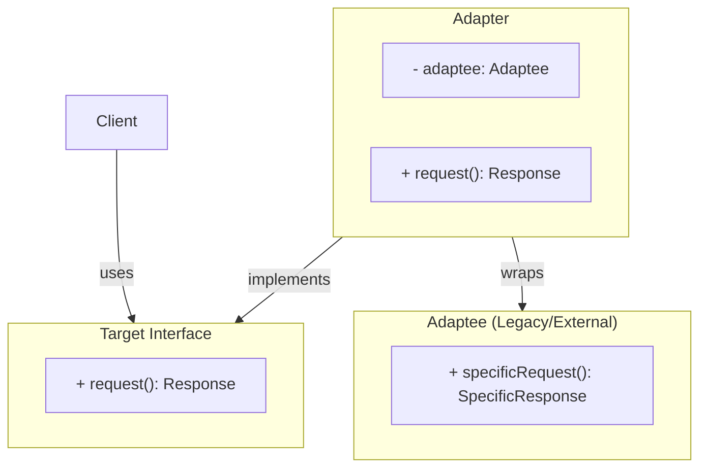
```mermaid
flowchart TD
    subgraph Target["Target Interface"]
        T1["+ request(): Response"]
    end

    subgraph Adapter["Adapter"]
        A1["- adaptee: Adaptee"]
        A2["+ request(): Response"]
    end

    subgraph Adaptee["Adaptee (Legacy/External)"]
        AD1["+ specificRequest(): SpecificResponse"]
    end

    Client["Client"] -->|uses| Target
    Adapter -->|implements| Target
    Adapter -->|wraps| Adaptee
```

### Sequence Diagram

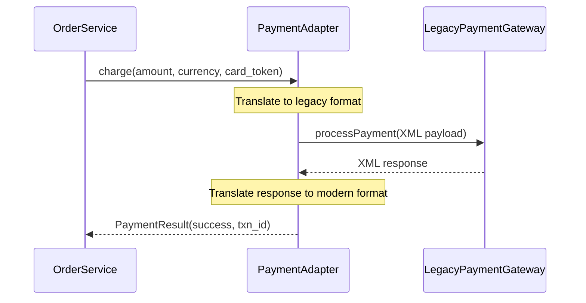
```mermaid
sequenceDiagram
    participant Client as OrderService
    participant Adapter as PaymentAdapter
    participant Legacy as LegacyPaymentGateway

    Client->>Adapter: charge(amount, currency, card_token)
    Note over Adapter: Translate to legacy format
    Adapter->>Legacy: processPayment(XML payload)
    Legacy-->>Adapter: XML response
    Note over Adapter: Translate response to modern format
    Adapter-->>Client: PaymentResult(success, txn_id)
```

### Code Examples

**Python — Payment Gateway Adapter**

```python
from abc import ABC, abstractmethod
from dataclasses import dataclass

@dataclass
class PaymentResult:
    success: bool
    transaction_id: str
    message: str

class PaymentGateway(ABC):
    """Target interface — what our system expects."""
    @abstractmethod
    def charge(self, amount_cents: int, currency: str, token: str) -> PaymentResult:
        pass

    @abstractmethod
    def refund(self, transaction_id: str, amount_cents: int) -> PaymentResult:
        pass


class StripeGateway(PaymentGateway):
    """Native implementation — already matches our interface."""
    def charge(self, amount_cents: int, currency: str, token: str) -> PaymentResult:
        # Direct Stripe SDK call
        return PaymentResult(True, "stripe_ch_123", "Charge successful")

    def refund(self, transaction_id: str, amount_cents: int) -> PaymentResult:
        return PaymentResult(True, "stripe_re_456", "Refund successful")


class LegacyPayPalService:
    """Adaptee — external service with incompatible interface."""
    def create_payment(self, amount: float, currency_code: str, nonce: str) -> dict:
        # PayPal SDK call — different parameter types and return format
        return {"status": "COMPLETED", "id": "PAYPAL-789", "message": "OK"}

    def create_refund(self, payment_id: str, amount: float) -> dict:
        return {"status": "REFUNDED", "id": "PAYPAL-REF-012", "message": "OK"}


class PayPalAdapter(PaymentGateway):
    """Adapter — translates our interface to PayPal's interface."""

    def __init__(self, paypal_service: LegacyPayPalService):
        self._paypal = paypal_service

    def charge(self, amount_cents: int, currency: str, token: str) -> PaymentResult:
        # Translate: cents -> dollars, currency -> currency_code, token -> nonce
        amount_dollars = amount_cents / 100.0
        result = self._paypal.create_payment(amount_dollars, currency, token)
        return PaymentResult(
            success=result["status"] == "COMPLETED",
            transaction_id=result["id"],
            message=result["message"],
        )

    def refund(self, transaction_id: str, amount_cents: int) -> PaymentResult:
        amount_dollars = amount_cents / 100.0
        result = self._paypal.create_refund(transaction_id, amount_dollars)
        return PaymentResult(
            success=result["status"] == "REFUNDED",
            transaction_id=result["id"],
            message=result["message"],
        )


# Usage — client code is gateway-agnostic
def process_order(gateway: PaymentGateway, amount_cents: int, token: str):
    result = gateway.charge(amount_cents, "USD", token)
    if result.success:
        print(f"Payment successful: {result.transaction_id}")
    return result

# Works with both:
process_order(StripeGateway(), 4999, "tok_visa")
process_order(PayPalAdapter(LegacyPayPalService()), 4999, "nonce_123")
```

**TypeScript — REST-to-gRPC Adapter**

```typescript
// Target interface (what our API gateway expects)
interface UserService {
  getUser(id: string): Promise<User>;
  createUser(data: CreateUserRequest): Promise<User>;
}

// Adaptee (gRPC client with different interface)
class UserGrpcClient {
  async getUserById(request: { userId: string }): Promise<GrpcUserResponse> {
    // gRPC call
    return { user: { id: "1", firstName: "Alice", lastName: "Smith", emailAddress: "alice@example.com" } };
  }
  async insertUser(request: GrpcCreateUserRequest): Promise<GrpcUserResponse> {
    // gRPC call
    return { user: { id: "2", firstName: "Bob", lastName: "Jones", emailAddress: "bob@example.com" } };
  }
}

// Adapter
class UserGrpcAdapter implements UserService {
  constructor(private grpcClient: UserGrpcClient) {}

  async getUser(id: string): Promise<User> {
    const response = await this.grpcClient.getUserById({ userId: id });
    return this.mapGrpcUser(response.user);
  }

  async createUser(data: CreateUserRequest): Promise<User> {
    const grpcRequest: GrpcCreateUserRequest = {
      firstName: data.name.split(" ")[0],
      lastName: data.name.split(" ").slice(1).join(" "),
      emailAddress: data.email,
    };
    const response = await this.grpcClient.insertUser(grpcRequest);
    return this.mapGrpcUser(response.user);
  }

  private mapGrpcUser(grpcUser: GrpcUser): User {
    return {
      id: grpcUser.id,
      name: `${grpcUser.firstName} ${grpcUser.lastName}`,
      email: grpcUser.emailAddress,
    };
  }
}
```

### When to Use

- When integrating with third-party services that have different interfaces than your internal abstractions.
- When migrating between implementations (old DB to new DB, old API to new API) — the adapter provides continuity.
- When you want to reuse an existing class but its interface does not match what you need.
- When building anti-corruption layers in Domain-Driven Design.

### When NOT to Use

- When you can modify the existing interface directly — adapters add indirection.
- When the interface mismatch is trivial (e.g., just a renamed method) — a thin wrapper may suffice.
- When you need bidirectional adaptation — adapters are typically unidirectional.

### Trade-offs

| Advantage | Disadvantage |
|---|---|
| Enables reuse of incompatible classes | Adds indirection and complexity |
| Isolates integration-specific code | Translation logic can be error-prone |
| Supports Open/Closed Principle | Two adapters needed for bidirectional adaptation |
| Enables parallel development teams | Performance overhead from translation |

### Common Mistakes

1. **Leaking adaptee types** — the adapter's public interface should only use target types. Never expose PayPal-specific types through the adapter.
2. **Incomplete adaptation** — mapping only the success path and ignoring error translation.
3. **God adapter** — an adapter that tries to adapt multiple unrelated services. One adapter per service boundary.
4. **Not testing the adapter** — the translation logic is where bugs live. Test it thoroughly.

### Interview Insights

- **When designing payment systems**: "We wrap each payment provider behind a common PaymentGateway interface using the Adapter pattern. This lets us add new providers without changing the checkout flow."
- **When discussing legacy migration**: "The Adapter pattern lets us incrementally migrate — we adapter-wrap the legacy service, then swap the adapter's internals from legacy to new without changing consumers."

---

## 2.2 Facade Pattern

### Definition

The Facade pattern provides a **unified, simplified interface** to a set of interfaces in a subsystem. It defines a higher-level interface that makes the subsystem easier to use, hiding the complexity of multiple interactions behind a single entry point.

### When the Real World Uses Facade

- **API Gateways**: Kong, AWS API Gateway, and Envoy act as facades for backend microservices.
- **SDK client libraries**: The AWS SDK's `S3Client` is a facade over HTTP requests, authentication, retries, and serialization.
- **Order placement**: A `PlaceOrderFacade` orchestrates inventory check, payment, order creation, notification, and analytics.
- **CI/CD pipelines**: A `DeploymentFacade` orchestrates build, test, package, deploy, and health check.
- **ORM session management**: SQLAlchemy's `Session` facades connection management, transaction control, identity mapping, and SQL generation.

### Class Diagram

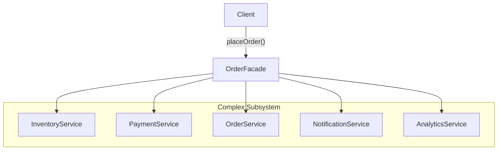
```mermaid
flowchart TD
    Client["Client"] -->|"placeOrder()"| Facade["OrderFacade"]

    Facade --> Inv["InventoryService"]
    Facade --> Pay["PaymentService"]
    Facade --> Ord["OrderService"]
    Facade --> Notify["NotificationService"]
    Facade --> Analytics["AnalyticsService"]

    subgraph Subsystem["Complex Subsystem"]
        Inv
        Pay
        Ord
        Notify
        Analytics
    end
```

### Sequence Diagram

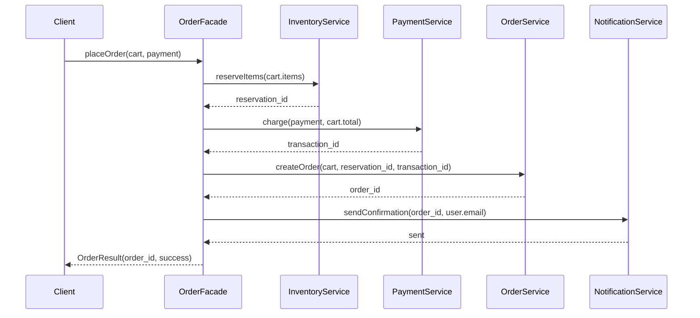
```mermaid
sequenceDiagram
    participant Client
    participant Facade as OrderFacade
    participant Inv as InventoryService
    participant Pay as PaymentService
    participant Ord as OrderService
    participant Notif as NotificationService

    Client->>Facade: placeOrder(cart, payment)

    Facade->>Inv: reserveItems(cart.items)
    Inv-->>Facade: reservation_id

    Facade->>Pay: charge(payment, cart.total)
    Pay-->>Facade: transaction_id

    Facade->>Ord: createOrder(cart, reservation_id, transaction_id)
    Ord-->>Facade: order_id

    Facade->>Notif: sendConfirmation(order_id, user.email)
    Notif-->>Facade: sent

    Facade-->>Client: OrderResult(order_id, success)
```

### Code Example — Python

```python
from dataclasses import dataclass

@dataclass
class OrderResult:
    order_id: str
    success: bool
    message: str

class OrderFacade:
    """Facade that simplifies the complex order placement process."""

    def __init__(
        self,
        inventory: "InventoryService",
        payment: "PaymentService",
        order: "OrderService",
        notification: "NotificationService",
        analytics: "AnalyticsService",
    ):
        self._inventory = inventory
        self._payment = payment
        self._order = order
        self._notification = notification
        self._analytics = analytics

    def place_order(self, cart: "Cart", payment_info: "PaymentInfo") -> OrderResult:
        """Single entry point that orchestrates five subsystems."""
        try:
            # Step 1: Reserve inventory
            reservation = self._inventory.reserve(cart.items)
            if not reservation.success:
                return OrderResult("", False, "Items unavailable")

            # Step 2: Charge payment
            transaction = self._payment.charge(
                amount=cart.total,
                currency=cart.currency,
                method=payment_info,
            )
            if not transaction.success:
                self._inventory.release(reservation.id)
                return OrderResult("", False, "Payment failed")

            # Step 3: Create order record
            order = self._order.create(
                cart=cart,
                reservation_id=reservation.id,
                transaction_id=transaction.id,
            )

            # Step 4: Send confirmation (fire-and-forget)
            self._notification.send_order_confirmation(order.id, cart.user_email)

            # Step 5: Track analytics
            self._analytics.track_purchase(order.id, cart.total)

            return OrderResult(order.id, True, "Order placed successfully")

        except Exception as e:
            # Compensating actions
            if reservation and reservation.success:
                self._inventory.release(reservation.id)
            if transaction and transaction.success:
                self._payment.refund(transaction.id)
            return OrderResult("", False, f"Order failed: {str(e)}")
```

### API Gateway as Facade

In microservice architectures, the **API Gateway** is the most common facade:

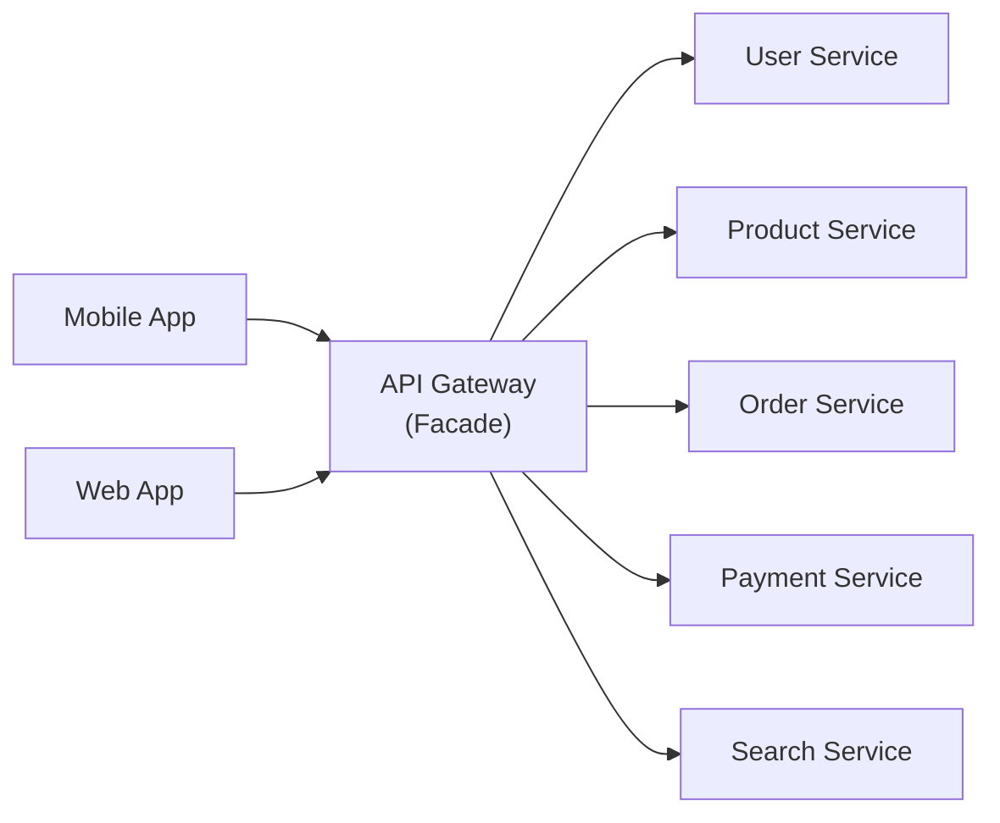
```mermaid
flowchart LR
    Mobile["Mobile App"] --> GW["API Gateway\n(Facade)"]
    Web["Web App"] --> GW
    GW --> UserSvc["User Service"]
    GW --> ProductSvc["Product Service"]
    GW --> OrderSvc["Order Service"]
    GW --> PaySvc["Payment Service"]
    GW --> SearchSvc["Search Service"]
```

The gateway facades:
- **Authentication**: Validates JWT tokens before forwarding requests.
- **Request routing**: Maps external URLs to internal service endpoints.
- **Response aggregation**: Combines responses from multiple services into a single response.
- **Rate limiting**: Applies per-client rate limits.
- **Protocol translation**: Accepts REST from clients, speaks gRPC to internal services.

### When to Use

- When a subsystem is complex and clients need a simpler interface.
- When you want to layer your subsystem and provide an entry point to each layer.
- When reducing coupling between clients and subsystem components.
- When implementing the Backend-for-Frontend (BFF) pattern.

### When NOT to Use

- When the subsystem is already simple — a facade over a single service is unnecessary wrapping.
- When clients need fine-grained control over subsystem components — the facade may be too restrictive.
- When the facade becomes a "god object" that does everything — split into multiple facades.

### Trade-offs

| Advantage | Disadvantage |
|---|---|
| Simplifies client code | Can become a god class if not bounded |
| Reduces coupling to subsystem | Adds another layer of indirection |
| Provides a convenient default for common tasks | May hide functionality that clients need |
| Enables subsystem evolution without client changes | Facade must evolve with the subsystem |

### Interview Insights

- **When designing microservices**: "The API Gateway is our facade — clients interact with one endpoint, and the gateway handles routing, auth, and response aggregation."
- **When asked about complexity management**: "We use facades at service boundaries. The OrderFacade hides the coordination between inventory, payment, and fulfillment from the API layer."

---

## 2.3 Proxy Pattern

### Definition

The Proxy pattern provides a **surrogate or placeholder** for another object to control access to it. The proxy has the same interface as the real object, so clients cannot tell the difference, but the proxy adds behavior before or after delegating to the real object.

### Types of Proxy

| Type | Purpose | Example |
|---|---|---|
| **Remote Proxy** | Represents an object in a different address space | gRPC stub, REST client |
| **Virtual Proxy** | Delays creation of expensive objects until needed | Lazy-loading ORM relationships |
| **Protection Proxy** | Controls access based on permissions | Auth middleware, RBAC checks |
| **Caching Proxy** | Caches results of expensive operations | CDN, Redis cache layer |
| **Logging Proxy** | Logs method calls for debugging/auditing | Request logging middleware |
| **Smart Reference** | Manages reference counting or additional bookkeeping | Connection pool checkout |

### Class Diagram

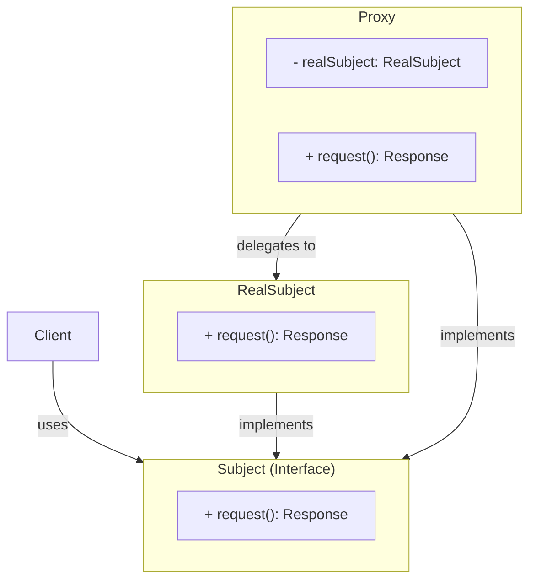
```mermaid
flowchart TD
    subgraph Subject["Subject (Interface)"]
        S1["+ request(): Response"]
    end

    subgraph RealSubject["RealSubject"]
        R1["+ request(): Response"]
    end

    subgraph Proxy["Proxy"]
        P1["- realSubject: RealSubject"]
        P2["+ request(): Response"]
    end

    Client["Client"] -->|uses| Subject
    RealSubject -->|implements| Subject
    Proxy -->|implements| Subject
    Proxy -->|delegates to| RealSubject
```

### Sequence Diagram — Caching Proxy

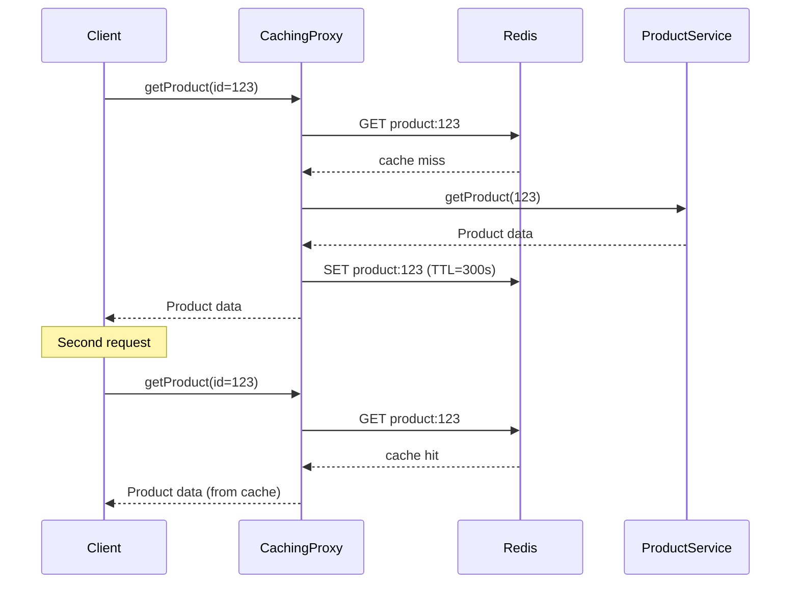
```mermaid
sequenceDiagram
    participant Client
    participant Proxy as CachingProxy
    participant Cache as Redis
    participant Service as ProductService

    Client->>Proxy: getProduct(id=123)
    Proxy->>Cache: GET product:123
    Cache-->>Proxy: cache miss

    Proxy->>Service: getProduct(123)
    Service-->>Proxy: Product data

    Proxy->>Cache: SET product:123 (TTL=300s)
    Proxy-->>Client: Product data

    Note over Client: Second request
    Client->>Proxy: getProduct(id=123)
    Proxy->>Cache: GET product:123
    Cache-->>Proxy: cache hit
    Proxy-->>Client: Product data (from cache)
```

### Code Examples

**Python — Caching Proxy**

```python
import time
import hashlib
import json
from abc import ABC, abstractmethod
from functools import wraps

class ProductService(ABC):
    @abstractmethod
    def get_product(self, product_id: str) -> dict:
        pass

    @abstractmethod
    def search_products(self, query: str, limit: int) -> list[dict]:
        pass

class RealProductService(ProductService):
    """Real service that hits the database."""
    def get_product(self, product_id: str) -> dict:
        # Simulates expensive DB query
        time.sleep(0.1)
        return {"id": product_id, "name": "Widget", "price": 29.99}

    def search_products(self, query: str, limit: int) -> list[dict]:
        time.sleep(0.5)  # Expensive search
        return [{"id": "1", "name": f"Result for {query}"}]

class CachingProductProxy(ProductService):
    """Caching proxy that sits in front of the real service."""

    def __init__(self, real_service: ProductService, cache_client, default_ttl: int = 300):
        self._service = real_service
        self._cache = cache_client
        self._ttl = default_ttl

    def get_product(self, product_id: str) -> dict:
        cache_key = f"product:{product_id}"
        cached = self._cache.get(cache_key)
        if cached:
            return json.loads(cached)

        result = self._service.get_product(product_id)
        self._cache.set(cache_key, json.dumps(result), ex=self._ttl)
        return result

    def search_products(self, query: str, limit: int) -> list[dict]:
        cache_key = f"search:{hashlib.md5(f'{query}:{limit}'.encode()).hexdigest()}"
        cached = self._cache.get(cache_key)
        if cached:
            return json.loads(cached)

        results = self._service.search_products(query, limit)
        self._cache.set(cache_key, json.dumps(results), ex=60)  # Shorter TTL for searches
        return results
```

**Python — Protection Proxy**

```python
class ProtectionProxy(ProductService):
    """Protection proxy that enforces access control."""

    def __init__(self, real_service: ProductService, auth_service: "AuthService"):
        self._service = real_service
        self._auth = auth_service

    def get_product(self, product_id: str) -> dict:
        # Public endpoint — no auth required
        return self._service.get_product(product_id)

    def update_product(self, product_id: str, data: dict, user_token: str) -> dict:
        # Protected endpoint — requires admin role
        user = self._auth.validate_token(user_token)
        if "admin" not in user.roles:
            raise PermissionError(f"User {user.id} lacks admin role")
        return self._service.update_product(product_id, data)
```

### When to Use

- **Caching Proxy**: When repeated calls to an expensive service return the same result and can be cached.
- **Protection Proxy**: When you need to enforce access control without modifying the real service.
- **Remote Proxy**: When the real object is on a remote server and you want to hide the network communication.
- **Virtual Proxy**: When object creation is expensive and you want to delay it until first use.

### When NOT to Use

- When the overhead of the proxy layer is not justified by the benefit.
- When the proxy would need to expose every method of a large interface (consider Facade instead).
- When caching semantics are complex enough to warrant a dedicated caching layer rather than a proxy.

### Trade-offs

| Advantage | Disadvantage |
|---|---|
| Transparent to clients (same interface) | Cache invalidation complexity |
| Separation of cross-cutting concerns | Adds latency for cache-miss paths |
| Enables lazy initialization | Must keep proxy interface in sync with real subject |
| Controls access without modifying the real subject | Can mask the true cost of operations |

### Common Mistakes

1. **Stale cache** — no invalidation strategy. Always define TTL and invalidation triggers.
2. **Proxy explosion** — stacking multiple proxies (cache + auth + logging + metrics). Consider Decorator or middleware instead.
3. **Inconsistent interface** — the proxy adds methods the real subject does not have, breaking substitutability.

### Interview Insights

- **When designing a caching layer**: "We use a Caching Proxy that sits between the API handler and the database service. It checks Redis first, falls back to the DB, and populates the cache on miss."
- **When discussing CDNs**: "A CDN is effectively a global caching proxy — same URL interface, but requests are served from edge caches."

---

## 2.4 Decorator Pattern

### Definition

The Decorator pattern attaches **additional responsibilities to an object dynamically**. Decorators provide a flexible alternative to subclassing for extending functionality. Each decorator wraps the object and adds behavior before or after delegating to it.

### When the Real World Uses Decorator

- **Middleware chains**: Express.js middleware, Django middleware, and Java Servlet Filters are decorator chains.
- **Logging decorators**: Wrapping a service to log every call with timing and parameters.
- **Authentication decorators**: Wrapping endpoints to verify JWT tokens before processing.
- **Retry decorators**: Wrapping an HTTP client to retry failed requests with exponential backoff.
- **Compression decorators**: Wrapping response writers to compress output (gzip).
- **Python decorators**: `@functools.lru_cache`, `@retry`, `@login_required` — the language feature is named after this pattern.

### Class Diagram

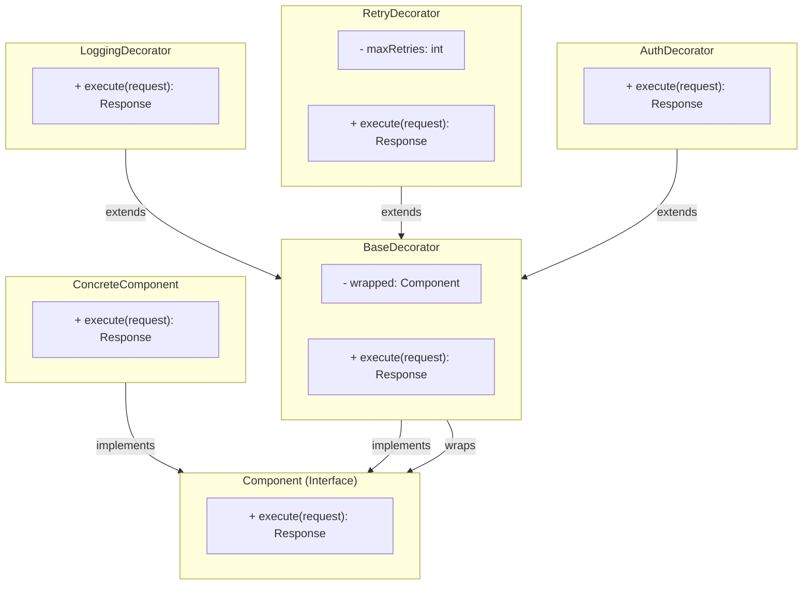
```mermaid
flowchart TD
    subgraph Component["Component (Interface)"]
        C1["+ execute(request): Response"]
    end

    subgraph ConcreteComponent["ConcreteComponent"]
        CC1["+ execute(request): Response"]
    end

    subgraph BaseDecorator["BaseDecorator"]
        BD1["- wrapped: Component"]
        BD2["+ execute(request): Response"]
    end

    subgraph LoggingDecorator["LoggingDecorator"]
        LD1["+ execute(request): Response"]
    end

    subgraph RetryDecorator["RetryDecorator"]
        RD1["- maxRetries: int"]
        RD2["+ execute(request): Response"]
    end

    subgraph AuthDecorator["AuthDecorator"]
        AD1["+ execute(request): Response"]
    end

    ConcreteComponent -->|implements| Component
    BaseDecorator -->|implements| Component
    BaseDecorator -->|wraps| Component
    LoggingDecorator -->|extends| BaseDecorator
    RetryDecorator -->|extends| BaseDecorator
    AuthDecorator -->|extends| BaseDecorator
```

### Sequence Diagram

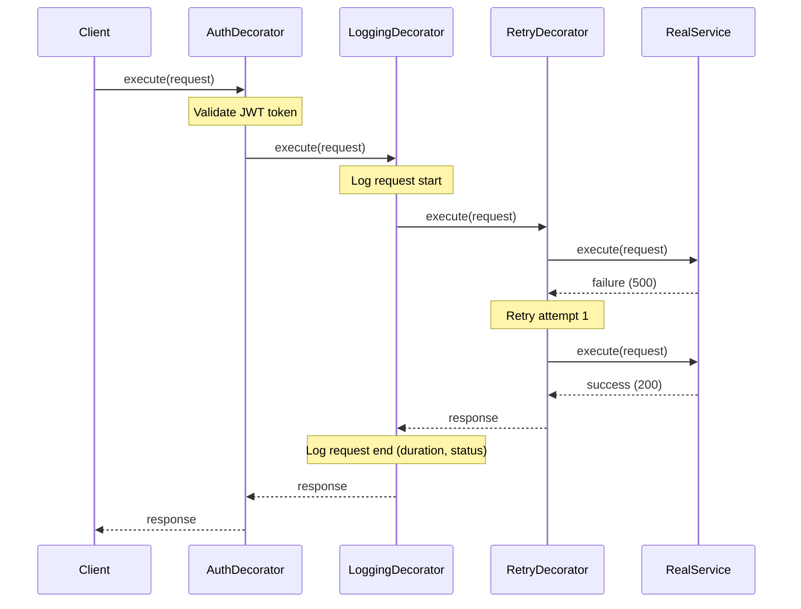
```mermaid
sequenceDiagram
    participant Client
    participant Auth as AuthDecorator
    participant Log as LoggingDecorator
    participant Retry as RetryDecorator
    participant Service as RealService

    Client->>Auth: execute(request)
    Note over Auth: Validate JWT token
    Auth->>Log: execute(request)
    Note over Log: Log request start
    Log->>Retry: execute(request)
    Retry->>Service: execute(request)
    Service-->>Retry: failure (500)
    Note over Retry: Retry attempt 1
    Retry->>Service: execute(request)
    Service-->>Retry: success (200)
    Retry-->>Log: response
    Note over Log: Log request end (duration, status)
    Log-->>Auth: response
    Auth-->>Client: response
```

### Code Examples

**Python — Function Decorators for Service Layer**

```python
import time
import logging
import functools
from typing import Callable, TypeVar, ParamSpec

P = ParamSpec("P")
T = TypeVar("T")

logger = logging.getLogger(__name__)

def with_logging(func: Callable[P, T]) -> Callable[P, T]:
    """Decorator that logs function entry, exit, and duration."""
    @functools.wraps(func)
    def wrapper(*args: P.args, **kwargs: P.kwargs) -> T:
        start = time.monotonic()
        logger.info(f"Calling {func.__name__} with args={args[1:]}, kwargs={kwargs}")
        try:
            result = func(*args, **kwargs)
            duration = time.monotonic() - start
            logger.info(f"{func.__name__} completed in {duration:.3f}s")
            return result
        except Exception as e:
            duration = time.monotonic() - start
            logger.error(f"{func.__name__} failed after {duration:.3f}s: {e}")
            raise
    return wrapper

def with_retry(max_retries: int = 3, backoff_factor: float = 1.0):
    """Decorator that retries on transient failures with exponential backoff."""
    def decorator(func: Callable[P, T]) -> Callable[P, T]:
        @functools.wraps(func)
        def wrapper(*args: P.args, **kwargs: P.kwargs) -> T:
            last_exception = None
            for attempt in range(max_retries + 1):
                try:
                    return func(*args, **kwargs)
                except (ConnectionError, TimeoutError) as e:
                    last_exception = e
                    if attempt < max_retries:
                        wait = backoff_factor * (2 ** attempt)
                        logger.warning(f"Retry {attempt + 1}/{max_retries} for {func.__name__} after {wait}s")
                        time.sleep(wait)
            raise last_exception
        return wrapper
    return decorator

def require_role(role: str):
    """Decorator that enforces RBAC before method execution."""
    def decorator(func: Callable[P, T]) -> Callable[P, T]:
        @functools.wraps(func)
        def wrapper(*args: P.args, **kwargs: P.kwargs) -> T:
            # Assumes first arg is self, second is request context
            context = kwargs.get("context") or (args[1] if len(args) > 1 else None)
            if context and role not in context.user_roles:
                raise PermissionError(f"Role '{role}' required")
            return func(*args, **kwargs)
        return wrapper
    return decorator


# Usage — stacking decorators
class OrderService:
    @with_logging
    @with_retry(max_retries=2)
    @require_role("customer")
    def place_order(self, context, cart):
        # Business logic here
        return {"order_id": "ORD-123", "status": "confirmed"}
```

**TypeScript — Class-Based Decorator Chain**

```typescript
interface HttpClient {
  request(config: RequestConfig): Promise<Response>;
}

class BaseHttpClient implements HttpClient {
  async request(config: RequestConfig): Promise<Response> {
    return fetch(config.url, {
      method: config.method,
      headers: config.headers,
      body: config.body ? JSON.stringify(config.body) : undefined,
    });
  }
}

class LoggingHttpClient implements HttpClient {
  constructor(private wrapped: HttpClient) {}

  async request(config: RequestConfig): Promise<Response> {
    const start = Date.now();
    console.log(`[HTTP] ${config.method} ${config.url}`);
    try {
      const response = await this.wrapped.request(config);
      console.log(`[HTTP] ${config.method} ${config.url} -> ${response.status} (${Date.now() - start}ms)`);
      return response;
    } catch (error) {
      console.error(`[HTTP] ${config.method} ${config.url} -> FAILED (${Date.now() - start}ms)`);
      throw error;
    }
  }
}

class RetryHttpClient implements HttpClient {
  constructor(private wrapped: HttpClient, private maxRetries = 3) {}

  async request(config: RequestConfig): Promise<Response> {
    let lastError: Error | undefined;
    for (let attempt = 0; attempt <= this.maxRetries; attempt++) {
      try {
        const response = await this.wrapped.request(config);
        if (response.status >= 500 && attempt < this.maxRetries) {
          await new Promise((r) => setTimeout(r, 1000 * 2 ** attempt));
          continue;
        }
        return response;
      } catch (error) {
        lastError = error as Error;
        if (attempt < this.maxRetries) {
          await new Promise((r) => setTimeout(r, 1000 * 2 ** attempt));
        }
      }
    }
    throw lastError;
  }
}

// Compose decorators — order matters
const client: HttpClient = new LoggingHttpClient(
  new RetryHttpClient(new BaseHttpClient(), 3)
);
```

### When to Use

- When you need to add responsibilities to individual objects without affecting others.
- When extension by subclassing is impractical (too many combinations of behaviors).
- When behaviors need to be added and removed at runtime.
- When building middleware pipelines.

### When NOT to Use

- When the decorator chain becomes deeply nested and hard to debug.
- When order sensitivity creates subtle bugs (auth must come before logging, or vice versa).
- When a simple if/else or strategy pattern would be clearer.

### Trade-offs

| Advantage | Disadvantage |
|---|---|
| More flexible than static inheritance | Many small objects that look alike |
| Add/remove behavior at runtime | Order-dependent composition |
| Single Responsibility per decorator | Debugging through wrapped layers is harder |
| Composable (stack decorators freely) | Identity checks (isinstance) may not work as expected |

### Interview Insights

- **When designing middleware**: "Each middleware is a decorator — it wraps the next handler, adds behavior (auth, logging, rate limiting), and delegates."
- **When asked about cross-cutting concerns**: "We use decorators for logging, metrics, retry, and circuit-breaking so the core service logic stays clean."

---

## 2.5 Composite Pattern

### Definition

The Composite pattern composes objects into **tree structures** to represent **part-whole hierarchies**. It lets clients treat individual objects and compositions of objects uniformly through a common interface.

### When the Real World Uses Composite

- **File systems**: Files and directories share a common interface; a directory contains files and other directories.
- **UI component trees**: React's component tree, Android's View hierarchy.
- **Organization hierarchies**: Departments contain teams; teams contain individuals.
- **Menu systems**: A menu item can be a leaf (action) or a submenu (contains more items).
- **Permission systems**: A permission group contains individual permissions and other groups.
- **Pricing rules**: A composite discount applies multiple individual discounts.

### Class Diagram

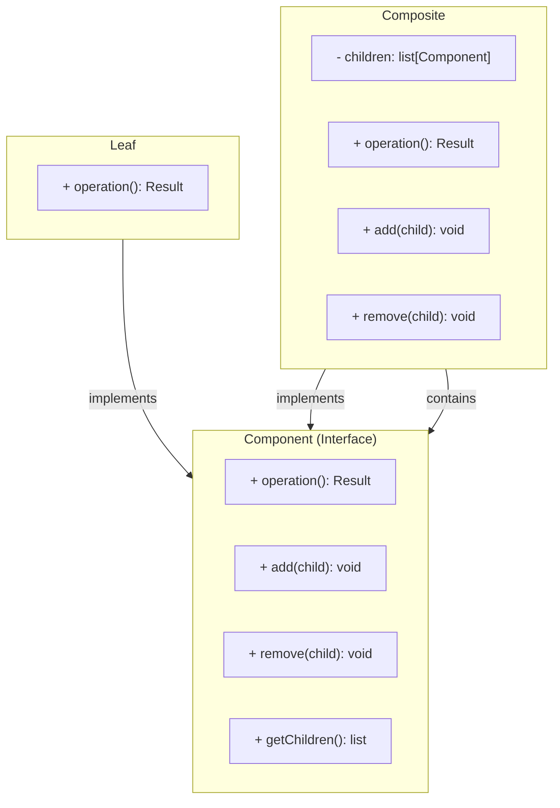
```mermaid
flowchart TD
    subgraph Component["Component (Interface)"]
        C1["+ operation(): Result"]
        C2["+ add(child): void"]
        C3["+ remove(child): void"]
        C4["+ getChildren(): list"]
    end

    subgraph Leaf["Leaf"]
        L1["+ operation(): Result"]
    end

    subgraph CompositeNode["Composite"]
        CN1["- children: list[Component]"]
        CN2["+ operation(): Result"]
        CN3["+ add(child): void"]
        CN4["+ remove(child): void"]
    end

    Leaf -->|implements| Component
    CompositeNode -->|implements| Component
    CompositeNode -->|contains| Component
```

### Code Example — Python (Organization Cost Calculator)

```python
from abc import ABC, abstractmethod

class OrganizationUnit(ABC):
    """Component — common interface for individuals and groups."""
    def __init__(self, name: str):
        self.name = name

    @abstractmethod
    def get_total_cost(self) -> float:
        """Calculate total salary/budget for this unit and all sub-units."""
        pass

    @abstractmethod
    def get_headcount(self) -> int:
        pass

    @abstractmethod
    def display(self, indent: int = 0) -> str:
        pass

class Employee(OrganizationUnit):
    """Leaf — an individual contributor."""
    def __init__(self, name: str, salary: float, role: str):
        super().__init__(name)
        self.salary = salary
        self.role = role

    def get_total_cost(self) -> float:
        return self.salary

    def get_headcount(self) -> int:
        return 1

    def display(self, indent: int = 0) -> str:
        return f"{'  ' * indent}- {self.name} ({self.role}): ${self.salary:,.0f}"

class Department(OrganizationUnit):
    """Composite — contains employees and sub-departments."""
    def __init__(self, name: str):
        super().__init__(name)
        self._children: list[OrganizationUnit] = []

    def add(self, unit: OrganizationUnit):
        self._children.append(unit)

    def remove(self, unit: OrganizationUnit):
        self._children.remove(unit)

    def get_total_cost(self) -> float:
        return sum(child.get_total_cost() for child in self._children)

    def get_headcount(self) -> int:
        return sum(child.get_headcount() for child in self._children)

    def display(self, indent: int = 0) -> str:
        lines = [f"{'  ' * indent}[{self.name}] ({self.get_headcount()} people, ${self.get_total_cost():,.0f})"]
        for child in self._children:
            lines.append(child.display(indent + 1))
        return "\n".join(lines)


# Build the tree
engineering = Department("Engineering")
backend = Department("Backend Team")
backend.add(Employee("Alice", 180000, "Senior Engineer"))
backend.add(Employee("Bob", 150000, "Engineer"))
frontend = Department("Frontend Team")
frontend.add(Employee("Charlie", 160000, "Senior Engineer"))
engineering.add(backend)
engineering.add(frontend)
engineering.add(Employee("Diana", 220000, "VP Engineering"))

print(engineering.display())
# [Engineering] (4 people, $710,000)
#   [Backend Team] (2 people, $330,000)
#     - Alice (Senior Engineer): $180,000
#     - Bob (Engineer): $150,000
#   [Frontend Team] (1 people, $160,000)
#     - Charlie (Senior Engineer): $160,000
#   - Diana (VP Engineering): $220,000
```

### When to Use

- When you need to represent part-whole hierarchies.
- When clients should treat individual objects and compositions uniformly.
- When you want recursive tree operations (total cost, total count, display, search).

### When NOT to Use

- When the hierarchy is flat or fixed — arrays and simple loops are simpler.
- When leaf and composite behaviors diverge significantly — forcing a common interface becomes awkward.
- When the tree is massive and recursive operations cause stack overflow — consider iterative traversal.

### Trade-offs

| Advantage | Disadvantage |
|---|---|
| Uniform treatment of leaf and composite | Can be hard to restrict what types a composite can contain |
| Easy to add new component types | Overly general design may allow invalid trees |
| Recursive operations are natural | Memory overhead for small trees |

### Interview Insights

- **When designing permission systems**: "Permissions form a composite tree — a role contains permission groups, which contain individual permissions. Checking access is a recursive tree walk."
- **When discussing UI architecture**: "React components form a composite tree. A Container component renders child components, which can be leaves or other containers."

---

# Section 3: Behavioral Patterns

Behavioral patterns are concerned with **algorithms and the assignment of responsibilities** between objects. They describe not just patterns of objects or classes but also the patterns of communication between them.

---

## 3.1 Observer Pattern

### Definition

The Observer pattern defines a **one-to-many dependency** between objects so that when one object (the subject) changes state, all its dependents (observers) are **notified and updated automatically**. This is the foundation of event-driven programming.

### When the Real World Uses Observer

- **Event systems**: DOM events in browsers, Node.js EventEmitter, Java Swing listeners.
- **Pub/Sub messaging**: Kafka consumers, RabbitMQ subscribers, Redis Pub/Sub.
- **Reactive streams**: RxJS, Project Reactor, Akka Streams.
- **Database change data capture**: Debezium triggers observers when database rows change.
- **Webhooks**: GitHub, Stripe, and Shopify notify registered URLs when events occur.
- **Stock tickers**: Multiple display widgets update when a stock price changes.

### Class Diagram

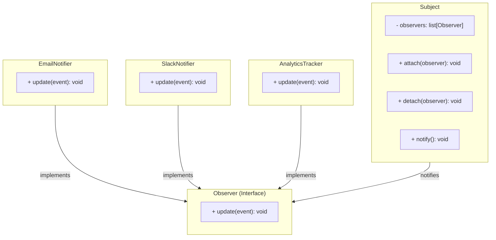
```mermaid
flowchart TD
    subgraph Subject["Subject"]
        S1["- observers: list[Observer]"]
        S2["+ attach(observer): void"]
        S3["+ detach(observer): void"]
        S4["+ notify(): void"]
    end

    subgraph Observer["Observer (Interface)"]
        O1["+ update(event): void"]
    end

    subgraph ConcreteObserverA["EmailNotifier"]
        A1["+ update(event): void"]
    end

    subgraph ConcreteObserverB["SlackNotifier"]
        B1["+ update(event): void"]
    end

    subgraph ConcreteObserverC["AnalyticsTracker"]
        C1["+ update(event): void"]
    end

    ConcreteObserverA -->|implements| Observer
    ConcreteObserverB -->|implements| Observer
    ConcreteObserverC -->|implements| Observer
    Subject -->|notifies| Observer
```

### Sequence Diagram

```mermaid
sequenceDiagram
    participant OrderSvc as OrderService (Subject)
    participant Email as EmailNotifier
    participant Slack as SlackNotifier
    participant Analytics as AnalyticsTracker
    participant Inventory as InventoryUpdater

    Note over OrderSvc: Order placed
    OrderSvc->>Email: update(OrderPlaced)
    OrderSvc->>Slack: update(OrderPlaced)
    OrderSvc->>Analytics: update(OrderPlaced)
    OrderSvc->>Inventory: update(OrderPlaced)

    Email-->>OrderSvc: ack
    Slack-->>OrderSvc: ack
    Analytics-->>OrderSvc: ack
    Inventory-->>OrderSvc: ack
```

### Code Examples

**Python — Type-Safe Event System**

```python
from dataclasses import dataclass, field
from typing import Callable, Any
from collections import defaultdict
import asyncio

@dataclass(frozen=True)
class OrderPlacedEvent:
    order_id: str
    user_id: str
    total_amount: float
    items: list[str]

@dataclass(frozen=True)
class OrderCancelledEvent:
    order_id: str
    user_id: str
    reason: str

class EventBus:
    """In-process event bus implementing the Observer pattern."""

    def __init__(self):
        self._handlers: dict[type, list[Callable]] = defaultdict(list)

    def subscribe(self, event_type: type, handler: Callable) -> None:
        self._handlers[event_type].append(handler)

    def unsubscribe(self, event_type: type, handler: Callable) -> None:
        self._handlers[event_type].remove(handler)

    def publish(self, event: Any) -> None:
        """Synchronously notify all observers."""
        for handler in self._handlers[type(event)]:
            try:
                handler(event)
            except Exception as e:
                print(f"Handler {handler.__name__} failed: {e}")
                # In production: log, track metrics, potentially dead-letter

    async def publish_async(self, event: Any) -> None:
        """Asynchronously notify all observers."""
        tasks = []
        for handler in self._handlers[type(event)]:
            if asyncio.iscoroutinefunction(handler):
                tasks.append(handler(event))
            else:
                handler(event)
        if tasks:
            await asyncio.gather(*tasks, return_exceptions=True)


# Observers
def send_order_email(event: OrderPlacedEvent):
    print(f"Email: Order {event.order_id} confirmation sent to user {event.user_id}")

def track_analytics(event: OrderPlacedEvent):
    print(f"Analytics: Order {event.order_id} tracked, amount=${event.total_amount}")

def update_inventory(event: OrderPlacedEvent):
    print(f"Inventory: Decremented stock for items {event.items}")

def notify_slack_cancellation(event: OrderCancelledEvent):
    print(f"Slack: Order {event.order_id} cancelled - reason: {event.reason}")


# Wire up
bus = EventBus()
bus.subscribe(OrderPlacedEvent, send_order_email)
bus.subscribe(OrderPlacedEvent, track_analytics)
bus.subscribe(OrderPlacedEvent, update_inventory)
bus.subscribe(OrderCancelledEvent, notify_slack_cancellation)

# Publish
bus.publish(OrderPlacedEvent(
    order_id="ORD-123",
    user_id="USR-456",
    total_amount=99.99,
    items=["SKU-A", "SKU-B"],
))
```

### Observer vs Pub/Sub

| Aspect | Observer (In-Process) | Pub/Sub (Distributed) |
|---|---|---|
| Coupling | Subject knows observers exist | Publisher does not know subscribers |
| Transport | Direct method calls | Message broker (Kafka, RabbitMQ, SNS) |
| Delivery guarantee | Best-effort (in-process) | At-least-once, exactly-once (configurable) |
| Ordering | Deterministic (iteration order) | Partition-ordered or unordered |
| Failure isolation | Observer failure can affect subject | Subscriber failure is isolated |
| Scalability | Single process | Horizontally scalable consumers |

### When to Use

- When a change to one object requires changing others, and you do not know how many objects need to change.
- When an object should be able to notify others without making assumptions about who those others are.
- When building event-driven architectures where producers and consumers are decoupled.

### When NOT to Use

- When you need guaranteed delivery — in-process Observer does not survive crashes. Use a message broker.
- When the number of observers is very large and notification must be fast — consider async notification or batching.
- When observers have ordering dependencies — the Observer pattern does not guarantee notification order in most implementations.

### Trade-offs

| Advantage | Disadvantage |
|---|---|
| Loose coupling between subject and observers | Memory leaks from forgotten subscriptions |
| Supports broadcast communication | Unexpected update cascades |
| New observers added without modifying subject | Debugging event chains is difficult |
| Foundation for reactive programming | No guaranteed delivery without a broker |

### Common Mistakes

1. **Memory leaks** — observers subscribe but never unsubscribe. Use weak references or explicit lifecycle management.
2. **Cascade storms** — Observer A updates Subject B, which notifies Observer C, which updates Subject A. Guard against cycles.
3. **Synchronous notification blocking** — a slow observer blocks all subsequent observers. Use async dispatch for I/O-bound observers.
4. **Fat events** — events carrying too much data. Keep events slim; let observers query for additional data if needed.

### Interview Insights

- **When designing a notification system**: "We use the Observer pattern internally — when an order event fires, it notifies email, SMS, push, and analytics observers. For cross-service communication, we upgrade to Kafka pub/sub."
- **When asked about event-driven architecture**: "Observer is the in-process foundation. At scale, we externalize it into pub/sub with Kafka for durability, ordering, and replay."

---

## 3.2 Strategy Pattern

### Definition

The Strategy pattern defines a **family of algorithms**, encapsulates each one, and makes them **interchangeable**. Strategy lets the algorithm vary independently from the clients that use it. The client selects a strategy at runtime and delegates the algorithmic work to it.

### When the Real World Uses Strategy

- **Pricing strategies**: Different pricing algorithms for regular, premium, wholesale, and promotional customers.
- **Routing strategies**: Load balancers choosing between round-robin, least-connections, and weighted routing.
- **Sorting/ranking**: Different ranking algorithms for search results (relevance, price, rating, newest).
- **Compression**: Choosing between gzip, brotli, snappy, and zstd based on content type and client support.
- **Authentication**: Supporting JWT, OAuth, API key, and Basic Auth strategies.
- **Payment processing**: Selecting payment flow based on payment method (card, bank transfer, wallet).

### Class Diagram

```mermaid
flowchart TD
    subgraph Context["PricingEngine"]
        CT1["- strategy: PricingStrategy"]
        CT2["+ setStrategy(strategy): void"]
        CT3["+ calculatePrice(item): Price"]
    end

    subgraph Strategy["PricingStrategy (Interface)"]
        S1["+ calculate(item, context): Price"]
    end

    subgraph RegularPricing["RegularPricing"]
        R1["+ calculate(item, context): Price"]
    end

    subgraph PremiumPricing["PremiumPricing"]
        P1["+ calculate(item, context): Price"]
    end

    subgraph WholesalePricing["WholesalePricing"]
        W1["+ calculate(item, context): Price"]
    end

    RegularPricing -->|implements| Strategy
    PremiumPricing -->|implements| Strategy
    WholesalePricing -->|implements| Strategy
    Context -->|uses| Strategy
```

### Code Example — Python

```python
from abc import ABC, abstractmethod
from dataclasses import dataclass
from decimal import Decimal

@dataclass
class PricingContext:
    customer_tier: str  # "regular", "premium", "wholesale"
    quantity: int
    base_price: Decimal
    is_promotional: bool = False

@dataclass
class PriceResult:
    unit_price: Decimal
    total_price: Decimal
    discount_pct: Decimal
    strategy_name: str

class PricingStrategy(ABC):
    @abstractmethod
    def calculate(self, ctx: PricingContext) -> PriceResult:
        pass

class RegularPricing(PricingStrategy):
    def calculate(self, ctx: PricingContext) -> PriceResult:
        total = ctx.base_price * ctx.quantity
        return PriceResult(ctx.base_price, total, Decimal("0"), "regular")

class PremiumPricing(PricingStrategy):
    """Premium customers get 15% discount."""
    DISCOUNT = Decimal("0.15")

    def calculate(self, ctx: PricingContext) -> PriceResult:
        unit = ctx.base_price * (1 - self.DISCOUNT)
        total = unit * ctx.quantity
        return PriceResult(unit, total, self.DISCOUNT * 100, "premium")

class WholesalePricing(PricingStrategy):
    """Tiered volume discount."""
    TIERS = [(100, Decimal("0.30")), (50, Decimal("0.20")), (10, Decimal("0.10"))]

    def calculate(self, ctx: PricingContext) -> PriceResult:
        discount = Decimal("0")
        for threshold, disc in self.TIERS:
            if ctx.quantity >= threshold:
                discount = disc
                break
        unit = ctx.base_price * (1 - discount)
        total = unit * ctx.quantity
        return PriceResult(unit, total, discount * 100, "wholesale")

class PromotionalPricing(PricingStrategy):
    """Buy 2 get 1 free."""
    def calculate(self, ctx: PricingContext) -> PriceResult:
        free_items = ctx.quantity // 3
        paid_items = ctx.quantity - free_items
        total = ctx.base_price * paid_items
        effective_unit = total / ctx.quantity if ctx.quantity > 0 else ctx.base_price
        discount_pct = (Decimal("1") - effective_unit / ctx.base_price) * 100
        return PriceResult(effective_unit, total, discount_pct, "promotional")


class PricingEngine:
    """Context that delegates to the selected strategy."""
    _strategies: dict[str, PricingStrategy] = {
        "regular": RegularPricing(),
        "premium": PremiumPricing(),
        "wholesale": WholesalePricing(),
        "promotional": PromotionalPricing(),
    }

    def calculate_price(self, ctx: PricingContext) -> PriceResult:
        strategy_key = "promotional" if ctx.is_promotional else ctx.customer_tier
        strategy = self._strategies.get(strategy_key, self._strategies["regular"])
        return strategy.calculate(ctx)


# Usage
engine = PricingEngine()
result = engine.calculate_price(PricingContext(
    customer_tier="wholesale",
    quantity=100,
    base_price=Decimal("49.99"),
))
print(f"Strategy: {result.strategy_name}, Total: ${result.total_price}, Discount: {result.discount_pct}%")
```

### Strategy vs If/Else

| Aspect | Strategy Pattern | If/Else Chain |
|---|---|---|
| New algorithm | Add a class, register it | Modify existing function |
| Testing | Test each strategy in isolation | Test all branches together |
| Complexity | Higher for < 3 algorithms | Simpler for 2-3 options |
| Open/Closed | Yes — closed for modification | No — must modify to extend |
| Runtime flexibility | Swap strategies dynamically | Fixed at code-write time |

### When to Use

- When you have multiple algorithms for a task and want to switch between them at runtime.
- When conditional statements (if/else, switch) for selecting algorithms become complex.
- When the algorithm needs to be selected based on runtime configuration, feature flags, or A/B tests.
- When algorithms have different trade-offs (speed vs accuracy, cost vs quality) and the choice depends on context.

### When NOT to Use

- When there are only 2-3 simple options — an if/else is clearer and has less ceremony.
- When algorithms share significant state — the Strategy interface may become too wide.
- When the algorithm never changes at runtime — direct implementation is simpler.

### Interview Insights

- **When designing a pricing engine**: "We use Strategy to encapsulate each pricing algorithm. Adding a new customer tier means adding a new strategy class — zero changes to the pricing engine."
- **When asked about feature flags**: "Feature-flagged behavior is a Strategy pattern — the flag selects which strategy (algorithm) runs for a given user segment."

---

## 3.3 Command Pattern

### Definition

The Command pattern encapsulates a **request as an object**, thereby allowing parameterization, queuing, logging, and undoing of requests. It decouples the object that invokes the operation from the object that performs it.

### When the Real World Uses Command

- **CQRS (Command Query Responsibility Segregation)**: Write operations are modeled as command objects separate from read queries.
- **Job queues**: Celery tasks, Sidekiq jobs, and Bull queues are command objects serialized to a queue.
- **Undo/Redo systems**: Text editors, design tools, and database migration tools.
- **Transaction scripts**: Each business operation is a command with execute and compensate methods.
- **Macro recording**: Recording a sequence of commands for replay.
- **Smart home automation**: Commands for "turn on light", "set temperature", "lock door".

### Class Diagram

```mermaid
flowchart TD
    subgraph Command["Command (Interface)"]
        C1["+ execute(): Result"]
        C2["+ undo(): void"]
    end

    subgraph ConcreteCommandA["CreateOrderCommand"]
        A1["- orderData: OrderData"]
        A2["+ execute(): OrderResult"]
        A3["+ undo(): void"]
    end

    subgraph ConcreteCommandB["CancelOrderCommand"]
        B1["- orderId: string"]
        B2["+ execute(): CancelResult"]
        B3["+ undo(): void"]
    end

    subgraph Invoker["CommandBus / Queue"]
        I1["- history: list[Command]"]
        I2["+ dispatch(command): Result"]
        I3["+ undoLast(): void"]
    end

    subgraph Receiver["OrderService"]
        R1["+ createOrder(data): Order"]
        R2["+ cancelOrder(id): void"]
    end

    ConcreteCommandA -->|implements| Command
    ConcreteCommandB -->|implements| Command
    ConcreteCommandA -->|calls| Receiver
    ConcreteCommandB -->|calls| Receiver
    Invoker -->|dispatches| Command
```

### Sequence Diagram — CQRS Command Flow

```mermaid
sequenceDiagram
    participant API as API Controller
    participant Bus as CommandBus
    participant Validator as CommandValidator
    participant Handler as CommandHandler
    participant DB as Database
    participant Events as EventBus

    API->>Bus: dispatch(CreateOrderCommand)
    Bus->>Validator: validate(command)
    Validator-->>Bus: valid

    Bus->>Handler: handle(command)
    Handler->>DB: INSERT order
    DB-->>Handler: order_id

    Handler->>Events: publish(OrderCreatedEvent)
    Handler-->>Bus: OrderResult(order_id)
    Bus-->>API: OrderResult
```

### Code Example — Python

```python
from abc import ABC, abstractmethod
from dataclasses import dataclass, field
from datetime import datetime
from typing import Any

class Command(ABC):
    @abstractmethod
    def execute(self) -> Any:
        pass

    def undo(self) -> None:
        raise NotImplementedError("Undo not supported for this command")

@dataclass
class CreateOrderCommand(Command):
    user_id: str
    items: list[dict]
    shipping_address: str
    payment_method: str
    _created_order_id: str | None = field(default=None, init=False)

    def execute(self) -> dict:
        # In real code, this delegates to a service/repository
        order_id = f"ORD-{datetime.now().strftime('%Y%m%d%H%M%S')}"
        self._created_order_id = order_id
        print(f"Creating order {order_id} for user {self.user_id}")
        return {"order_id": order_id, "status": "created"}

    def undo(self) -> None:
        if self._created_order_id:
            print(f"Cancelling order {self._created_order_id}")
            # Cancel the order, release inventory, refund payment

@dataclass
class UpdateInventoryCommand(Command):
    sku: str
    quantity_delta: int
    _previous_quantity: int | None = field(default=None, init=False)

    def execute(self) -> dict:
        # Store previous state for undo
        self._previous_quantity = 100  # Retrieved from DB
        new_quantity = self._previous_quantity + self.quantity_delta
        print(f"Updating {self.sku}: {self._previous_quantity} -> {new_quantity}")
        return {"sku": self.sku, "quantity": new_quantity}

    def undo(self) -> None:
        if self._previous_quantity is not None:
            print(f"Reverting {self.sku} to {self._previous_quantity}")


class CommandBus:
    """Invoker that dispatches commands and maintains history for undo."""

    def __init__(self):
        self._history: list[Command] = []
        self._handlers: dict[type, Any] = {}

    def register_handler(self, command_type: type, handler):
        self._handlers[command_type] = handler

    def dispatch(self, command: Command) -> Any:
        result = command.execute()
        self._history.append(command)
        return result

    def undo_last(self) -> None:
        if self._history:
            command = self._history.pop()
            command.undo()

    def undo_all(self) -> None:
        while self._history:
            self.undo_last()


# Usage
bus = CommandBus()
result = bus.dispatch(CreateOrderCommand(
    user_id="USR-123",
    items=[{"sku": "WIDGET-A", "qty": 2}],
    shipping_address="123 Main St",
    payment_method="card_visa_4242",
))
print(f"Order created: {result['order_id']}")

# Undo
bus.undo_last()
```

### When to Use

- When you need to parameterize objects with operations (callbacks on steroids).
- When you need to queue, schedule, or log operations.
- When you need undo/redo functionality.
- When implementing CQRS — commands represent write operations.
- When building job/task queue systems.

### When NOT to Use

- When the operation is simple and does not need queuing, logging, or undo.
- When the command is just a thin wrapper around a single method call with no additional behavior.

### Trade-offs

| Advantage | Disadvantage |
|---|---|
| Decouples invoker from executor | More classes for simple operations |
| Enables undo, queuing, logging | Command serialization can be complex |
| Supports macro commands (composite) | Undo logic adds maintenance burden |
| Natural fit for CQRS | State management for undo is tricky |

### Interview Insights

- **When designing a CQRS system**: "Write operations are Command objects dispatched through a CommandBus. This gives us validation, logging, and audit trails for free."
- **When asked about job queues**: "Each background job is a Command — serialized, enqueued, and executed by a worker. Failed commands can be retried or dead-lettered."

---

## 3.4 State Pattern

### Definition

The State pattern allows an object to **alter its behavior when its internal state changes**. The object will appear to change its class. Each state is represented as a separate class, and the context delegates state-specific behavior to the current state object.

### When the Real World Uses State

- **Order state machines**: Draft -> Confirmed -> Paid -> Shipped -> Delivered -> Completed (or Cancelled/Returned at various points).
- **Payment state machines**: Pending -> Authorized -> Captured -> Settled (or Failed/Refunded).
- **Workflow engines**: Document approval workflows with states like Draft, Review, Approved, Published.
- **TCP connections**: LISTEN, SYN_SENT, ESTABLISHED, FIN_WAIT, CLOSED.
- **Game entities**: Idle, Walking, Running, Jumping, Attacking.
- **CI/CD pipelines**: Queued, Running, Passed, Failed, Cancelled.

### State Machine Diagram

```mermaid
flowchart LR
    Draft["Draft"] -->|"confirm()"| Confirmed["Confirmed"]
    Confirmed -->|"pay()"| Paid["Paid"]
    Paid -->|"ship()"| Shipped["Shipped"]
    Shipped -->|"deliver()"| Delivered["Delivered"]
    Delivered -->|"complete()"| Completed["Completed"]

    Draft -->|"cancel()"| Cancelled["Cancelled"]
    Confirmed -->|"cancel()"| Cancelled
    Paid -->|"cancel()"| Cancelled

    Delivered -->|"return()"| Returned["Returned"]
    Returned -->|"refund()"| Refunded["Refunded"]
```

### Code Example — Python

```python
from abc import ABC, abstractmethod
from datetime import datetime

class OrderState(ABC):
    """Abstract state — defines the interface for all states."""

    @abstractmethod
    def confirm(self, order: "Order") -> None: ...
    @abstractmethod
    def pay(self, order: "Order") -> None: ...
    @abstractmethod
    def ship(self, order: "Order") -> None: ...
    @abstractmethod
    def deliver(self, order: "Order") -> None: ...
    @abstractmethod
    def cancel(self, order: "Order") -> None: ...

    def _invalid(self, action: str, state: str):
        raise InvalidStateTransitionError(f"Cannot {action} from state {state}")

class DraftState(OrderState):
    def confirm(self, order: "Order"):
        order.confirmed_at = datetime.now()
        order._set_state(ConfirmedState())
        print(f"Order {order.id} confirmed")

    def pay(self, order): self._invalid("pay", "Draft")
    def ship(self, order): self._invalid("ship", "Draft")
    def deliver(self, order): self._invalid("deliver", "Draft")

    def cancel(self, order: "Order"):
        order._set_state(CancelledState())
        print(f"Order {order.id} cancelled from draft")

class ConfirmedState(OrderState):
    def confirm(self, order): self._invalid("confirm", "Confirmed")

    def pay(self, order: "Order"):
        order.paid_at = datetime.now()
        order._set_state(PaidState())
        print(f"Order {order.id} paid")

    def ship(self, order): self._invalid("ship", "Confirmed")
    def deliver(self, order): self._invalid("deliver", "Confirmed")

    def cancel(self, order: "Order"):
        order._set_state(CancelledState())
        print(f"Order {order.id} cancelled after confirmation")

class PaidState(OrderState):
    def confirm(self, order): self._invalid("confirm", "Paid")
    def pay(self, order): self._invalid("pay", "Paid")

    def ship(self, order: "Order"):
        order.shipped_at = datetime.now()
        order._set_state(ShippedState())
        print(f"Order {order.id} shipped")

    def deliver(self, order): self._invalid("deliver", "Paid")

    def cancel(self, order: "Order"):
        # Must refund before cancelling
        print(f"Order {order.id} cancelled — refund initiated")
        order._set_state(CancelledState())

class ShippedState(OrderState):
    def confirm(self, order): self._invalid("confirm", "Shipped")
    def pay(self, order): self._invalid("pay", "Shipped")
    def ship(self, order): self._invalid("ship", "Shipped")

    def deliver(self, order: "Order"):
        order.delivered_at = datetime.now()
        order._set_state(DeliveredState())
        print(f"Order {order.id} delivered")

    def cancel(self, order): self._invalid("cancel", "Shipped")

class DeliveredState(OrderState):
    def confirm(self, order): self._invalid("confirm", "Delivered")
    def pay(self, order): self._invalid("pay", "Delivered")
    def ship(self, order): self._invalid("ship", "Delivered")
    def deliver(self, order): self._invalid("deliver", "Delivered")
    def cancel(self, order): self._invalid("cancel", "Delivered")

class CancelledState(OrderState):
    def confirm(self, order): self._invalid("confirm", "Cancelled")
    def pay(self, order): self._invalid("pay", "Cancelled")
    def ship(self, order): self._invalid("ship", "Cancelled")
    def deliver(self, order): self._invalid("deliver", "Cancelled")
    def cancel(self, order): self._invalid("cancel", "Cancelled")

class InvalidStateTransitionError(Exception):
    pass


class Order:
    """Context — delegates behavior to the current state."""

    def __init__(self, order_id: str):
        self.id = order_id
        self._state: OrderState = DraftState()
        self.created_at = datetime.now()
        self.confirmed_at: datetime | None = None
        self.paid_at: datetime | None = None
        self.shipped_at: datetime | None = None
        self.delivered_at: datetime | None = None

    def _set_state(self, state: OrderState):
        self._state = state

    @property
    def state_name(self) -> str:
        return self._state.__class__.__name__.replace("State", "")

    def confirm(self): self._state.confirm(self)
    def pay(self): self._state.pay(self)
    def ship(self): self._state.ship(self)
    def deliver(self): self._state.deliver(self)
    def cancel(self): self._state.cancel(self)


# Usage
order = Order("ORD-001")
print(f"State: {order.state_name}")  # Draft
order.confirm()  # -> Confirmed
order.pay()      # -> Paid
order.ship()     # -> Shipped
order.deliver()  # -> Delivered
```

### State Pattern vs If/Else State Management

| Aspect | State Pattern | If/Else in Methods |
|---|---|---|
| Adding a state | Add a class | Modify every method |
| State-specific logic | Encapsulated in state class | Spread across methods |
| Invalid transitions | Clear per-state enforcement | Easy to miss edge cases |
| Testing | Test each state independently | Test all combinations |
| Complexity threshold | Worth it for 4+ states | Simpler for 2-3 states |

### When to Use

- When an object's behavior depends on its state, and it must change behavior at runtime.
- When state-specific behavior is complex enough to warrant separate classes.
- When you have many conditional statements (if/switch on state) spread across multiple methods.
- When building order management, workflow engines, or protocol implementations.

### When NOT to Use

- When there are only 2-3 simple states with minimal behavior differences.
- When state transitions are simple enough for an enum and a switch statement.
- When states do not have significantly different behavior — the pattern adds classes for no benefit.

### Interview Insights

- **When designing an order system**: "We model the order lifecycle as a State pattern. Each state encapsulates valid transitions and state-specific behavior — the Order delegates to its current state."
- **When asked about state machines**: "For simple state machines, an enum with a transition table suffices. For complex state-specific behavior (different validation, different side effects per state), the State pattern gives us clean encapsulation."

---

## 3.5 Chain of Responsibility Pattern

### Definition

The Chain of Responsibility pattern passes a request along a **chain of handlers**. Upon receiving a request, each handler decides either to process the request or to **pass it to the next handler** in the chain. This decouples the sender of a request from its receivers.

### When the Real World Uses Chain of Responsibility

- **Middleware pipelines**: Express.js middleware, Django middleware, ASP.NET pipeline.
- **Servlet filter chains**: Java Servlet API's `FilterChain`.
- **Validation chains**: Sequential validation rules where each rule can pass or reject.
- **Event bubbling**: DOM event propagation from child to parent elements.
- **Approval workflows**: A purchase request goes through manager, director, VP based on amount.
- **Exception handling**: Try/catch chains where each level handles specific exception types.
- **Security filter chains**: Spring Security's filter chain.

### Class Diagram

```mermaid
flowchart TD
    subgraph Handler["Handler (Interface)"]
        H1["- next: Handler"]
        H2["+ handle(request): Response"]
        H3["+ setNext(handler): Handler"]
    end

    subgraph AuthHandler["AuthHandler"]
        A1["+ handle(request): Response"]
    end

    subgraph RateLimitHandler["RateLimitHandler"]
        R1["+ handle(request): Response"]
    end

    subgraph ValidationHandler["ValidationHandler"]
        V1["+ handle(request): Response"]
    end

    subgraph BusinessLogicHandler["BusinessLogicHandler"]
        B1["+ handle(request): Response"]
    end

    AuthHandler -->|implements| Handler
    RateLimitHandler -->|implements| Handler
    ValidationHandler -->|implements| Handler
    BusinessLogicHandler -->|implements| Handler

    AuthHandler -->|"next"| RateLimitHandler
    RateLimitHandler -->|"next"| ValidationHandler
    ValidationHandler -->|"next"| BusinessLogicHandler
```

### Sequence Diagram

```mermaid
sequenceDiagram
    participant Client
    participant Auth as AuthHandler
    participant Rate as RateLimitHandler
    participant Valid as ValidationHandler
    participant Logic as BusinessLogicHandler

    Client->>Auth: handle(request)
    Note over Auth: Validate JWT token
    Auth->>Rate: handle(request)
    Note over Rate: Check rate limit (100 req/min)
    Rate->>Valid: handle(request)
    Note over Valid: Validate request body
    Valid->>Logic: handle(request)
    Note over Logic: Execute business logic
    Logic-->>Valid: Response(200, data)
    Valid-->>Rate: Response(200, data)
    Rate-->>Auth: Response(200, data)
    Auth-->>Client: Response(200, data)
```

### Code Example — Python

```python
from abc import ABC, abstractmethod
from dataclasses import dataclass
from typing import Optional

@dataclass
class Request:
    path: str
    method: str
    headers: dict[str, str]
    body: dict | None
    user: dict | None = None  # Set by auth handler

@dataclass
class Response:
    status: int
    body: dict

class Handler(ABC):
    """Base handler with chain linking."""

    def __init__(self):
        self._next: Optional["Handler"] = None

    def set_next(self, handler: "Handler") -> "Handler":
        self._next = handler
        return handler  # Enable chaining: a.set_next(b).set_next(c)

    @abstractmethod
    def handle(self, request: Request) -> Response:
        pass

    def _pass_to_next(self, request: Request) -> Response:
        if self._next:
            return self._next.handle(request)
        return Response(404, {"error": "No handler found"})


class AuthenticationHandler(Handler):
    def handle(self, request: Request) -> Response:
        auth_header = request.headers.get("Authorization", "")
        if not auth_header.startswith("Bearer "):
            return Response(401, {"error": "Missing or invalid authorization header"})

        token = auth_header[7:]
        # Validate JWT (simplified)
        if token == "invalid":
            return Response(401, {"error": "Invalid token"})

        request.user = {"id": "user-123", "roles": ["admin"]}
        return self._pass_to_next(request)


class RateLimitHandler(Handler):
    def __init__(self, max_requests: int = 100):
        super().__init__()
        self._max_requests = max_requests
        self._request_counts: dict[str, int] = {}

    def handle(self, request: Request) -> Response:
        client_ip = request.headers.get("X-Forwarded-For", "unknown")
        count = self._request_counts.get(client_ip, 0)

        if count >= self._max_requests:
            return Response(429, {"error": "Rate limit exceeded", "retry_after": 60})

        self._request_counts[client_ip] = count + 1
        return self._pass_to_next(request)


class ValidationHandler(Handler):
    def handle(self, request: Request) -> Response:
        if request.method in ("POST", "PUT", "PATCH"):
            if request.body is None:
                return Response(400, {"error": "Request body required"})

            # Validate required fields (example)
            if "name" not in request.body:
                return Response(400, {"error": "Field 'name' is required"})

        return self._pass_to_next(request)


class BusinessLogicHandler(Handler):
    def handle(self, request: Request) -> Response:
        # Actual business logic
        return Response(200, {
            "message": "Success",
            "user": request.user,
            "data": request.body,
        })


# Build the chain
auth = AuthenticationHandler()
rate_limit = RateLimitHandler(max_requests=100)
validation = ValidationHandler()
logic = BusinessLogicHandler()

auth.set_next(rate_limit).set_next(validation).set_next(logic)

# Process request through the chain
request = Request(
    path="/api/orders",
    method="POST",
    headers={"Authorization": "Bearer valid-jwt-token", "X-Forwarded-For": "192.168.1.1"},
    body={"name": "New Order", "items": [{"sku": "A", "qty": 1}]},
)

response = auth.handle(request)
print(f"Status: {response.status}, Body: {response.body}")
```

### When to Use

- When more than one object may handle a request, and the handler is not known in advance.
- When you want to issue a request to one of several objects without specifying the receiver explicitly.
- When the set of handlers should be specified dynamically (composable pipelines).
- When building middleware, validation, or approval systems.

### When NOT to Use

- When the request must be handled by a specific handler — direct dispatch is simpler.
- When the chain is always the same and never changes — a procedural pipeline may be clearer.
- When performance is critical and the chain adds too many hops.

### Trade-offs

| Advantage | Disadvantage |
|---|---|
| Reduces coupling between sender and receivers | No guarantee a request will be handled |
| Handlers can be added/removed dynamically | Debugging through the chain is harder |
| Each handler has single responsibility | Request may pass through unnecessary handlers |
| Composable and reusable handlers | Chain construction can be error-prone |

### Interview Insights

- **When designing API middleware**: "Our request pipeline is a Chain of Responsibility — auth, rate limiting, validation, and business logic are independent handlers that can be composed per route."
- **When asked about validation**: "We chain validators — each checks one rule and passes to the next. Adding a new validation rule means adding a handler, not modifying existing ones."

---

# Section 4: Modern Backend Patterns

These patterns have emerged from practical backend development and are not part of the original GoF catalog, but they are equally important — and arguably more commonly discussed in system design interviews.

---

## 4.1 Repository Pattern

### Definition

The Repository pattern mediates between the domain and data-mapping layers using a **collection-like interface** for accessing domain objects. It encapsulates the logic required to access data sources, centralizing common data access functionality and providing better maintainability and decoupling.

### When the Real World Uses Repository

- **ORM layers**: Django ORM's Managers, SQLAlchemy's Session as a repository-like interface.
- **Data access layers**: Spring Data JPA repositories, TypeORM repositories.
- **Microservice data access**: Each service has its own repository abstracting the underlying datastore.
- **CQRS read models**: Separate read repositories optimized for queries.
- **Multi-datastore systems**: A repository that transparently reads from cache, falls back to database.

### Class Diagram

```mermaid
flowchart TD
    subgraph Repository["UserRepository (Interface)"]
        R1["+ find_by_id(id): User"]
        R2["+ find_by_email(email): User"]
        R3["+ find_all(filter): list[User]"]
        R4["+ save(user): User"]
        R5["+ delete(id): void"]
    end

    subgraph PostgresRepo["PostgresUserRepository"]
        P1["- db_session: Session"]
        P2["+ find_by_id(id): User"]
        P3["+ save(user): User"]
    end

    subgraph InMemoryRepo["InMemoryUserRepository"]
        I1["- store: dict"]
        I2["+ find_by_id(id): User"]
        I3["+ save(user): User"]
    end

    subgraph CachingRepo["CachingUserRepository"]
        C1["- cache: Redis"]
        C2["- delegate: UserRepository"]
        C3["+ find_by_id(id): User"]
    end

    PostgresRepo -->|implements| Repository
    InMemoryRepo -->|implements| Repository
    CachingRepo -->|implements| Repository
    CachingRepo -->|wraps| Repository

    Service["UserService"] -->|uses| Repository
```

### Sequence Diagram — Repository with Caching

```mermaid
sequenceDiagram
    participant Service as UserService
    participant Repo as CachingUserRepository
    participant Cache as Redis
    participant DB as PostgresUserRepository

    Service->>Repo: find_by_id("usr-123")
    Repo->>Cache: GET user:usr-123
    Cache-->>Repo: cache miss

    Repo->>DB: find_by_id("usr-123")
    DB-->>Repo: User object

    Repo->>Cache: SET user:usr-123 (TTL=300)
    Repo-->>Service: User object

    Note over Service: Second request
    Service->>Repo: find_by_id("usr-123")
    Repo->>Cache: GET user:usr-123
    Cache-->>Repo: User object (cache hit)
    Repo-->>Service: User object
```

### Code Example — Python

```python
from abc import ABC, abstractmethod
from dataclasses import dataclass
from typing import Optional
from datetime import datetime

@dataclass
class User:
    id: str
    email: str
    name: str
    created_at: datetime
    is_active: bool = True

@dataclass
class UserFilter:
    is_active: Optional[bool] = None
    email_domain: Optional[str] = None
    created_after: Optional[datetime] = None
    limit: int = 50
    offset: int = 0


class UserRepository(ABC):
    """Abstract repository — defines the data access contract."""

    @abstractmethod
    def find_by_id(self, user_id: str) -> Optional[User]:
        pass

    @abstractmethod
    def find_by_email(self, email: str) -> Optional[User]:
        pass

    @abstractmethod
    def find_all(self, filter: UserFilter) -> list[User]:
        pass

    @abstractmethod
    def save(self, user: User) -> User:
        pass

    @abstractmethod
    def delete(self, user_id: str) -> bool:
        pass


class PostgresUserRepository(UserRepository):
    """Concrete repository backed by PostgreSQL."""

    def __init__(self, db_session):
        self._session = db_session

    def find_by_id(self, user_id: str) -> Optional[User]:
        row = self._session.execute(
            "SELECT * FROM users WHERE id = %s", (user_id,)
        ).fetchone()
        return self._map_to_user(row) if row else None

    def find_by_email(self, email: str) -> Optional[User]:
        row = self._session.execute(
            "SELECT * FROM users WHERE email = %s", (email,)
        ).fetchone()
        return self._map_to_user(row) if row else None

    def find_all(self, filter: UserFilter) -> list[User]:
        query = "SELECT * FROM users WHERE 1=1"
        params = []
        if filter.is_active is not None:
            query += " AND is_active = %s"
            params.append(filter.is_active)
        if filter.email_domain:
            query += " AND email LIKE %s"
            params.append(f"%@{filter.email_domain}")
        if filter.created_after:
            query += " AND created_at > %s"
            params.append(filter.created_after)
        query += f" LIMIT {filter.limit} OFFSET {filter.offset}"
        rows = self._session.execute(query, params).fetchall()
        return [self._map_to_user(row) for row in rows]

    def save(self, user: User) -> User:
        self._session.execute(
            """INSERT INTO users (id, email, name, created_at, is_active)
               VALUES (%s, %s, %s, %s, %s)
               ON CONFLICT (id) DO UPDATE SET
                 email = EXCLUDED.email,
                 name = EXCLUDED.name,
                 is_active = EXCLUDED.is_active""",
            (user.id, user.email, user.name, user.created_at, user.is_active),
        )
        self._session.commit()
        return user

    def delete(self, user_id: str) -> bool:
        result = self._session.execute("DELETE FROM users WHERE id = %s", (user_id,))
        self._session.commit()
        return result.rowcount > 0

    @staticmethod
    def _map_to_user(row) -> User:
        return User(
            id=row["id"], email=row["email"], name=row["name"],
            created_at=row["created_at"], is_active=row["is_active"],
        )


class InMemoryUserRepository(UserRepository):
    """In-memory repository for testing."""

    def __init__(self):
        self._store: dict[str, User] = {}

    def find_by_id(self, user_id: str) -> Optional[User]:
        return self._store.get(user_id)

    def find_by_email(self, email: str) -> Optional[User]:
        for user in self._store.values():
            if user.email == email:
                return user
        return None

    def find_all(self, filter: UserFilter) -> list[User]:
        results = list(self._store.values())
        if filter.is_active is not None:
            results = [u for u in results if u.is_active == filter.is_active]
        return results[filter.offset:filter.offset + filter.limit]

    def save(self, user: User) -> User:
        self._store[user.id] = user
        return user

    def delete(self, user_id: str) -> bool:
        return self._store.pop(user_id, None) is not None
```

### Unit of Work Pattern

The Unit of Work pattern is often paired with Repository. It maintains a list of objects affected by a business transaction and coordinates writing out changes and resolving concurrency problems.

```python
class UnitOfWork:
    """Tracks changes and commits them atomically."""

    def __init__(self, session):
        self._session = session
        self.users = PostgresUserRepository(session)
        self.orders = PostgresOrderRepository(session)

    def __enter__(self):
        return self

    def __exit__(self, exc_type, exc_val, exc_tb):
        if exc_type:
            self.rollback()
        else:
            self.commit()

    def commit(self):
        self._session.commit()

    def rollback(self):
        self._session.rollback()


# Usage
with UnitOfWork(db_session) as uow:
    user = uow.users.find_by_id("usr-123")
    user.name = "Alice Updated"
    uow.users.save(user)
    # Auto-commits on exit, auto-rollbacks on exception
```

### When to Use

- When you want to decouple business logic from data access technology.
- When you need to swap data stores (SQL to NoSQL, one DB to another) without changing business logic.
- When you need testable business logic with in-memory repositories.
- When implementing CQRS with separate read and write repositories.

### When NOT to Use

- When the application is simple CRUD with no business logic — the repository adds unnecessary abstraction.
- When the ORM already provides a repository-like interface (Rails ActiveRecord, Django ORM) and you do not need to swap data stores.
- When the abstraction leaks ORM-specific concerns (lazy loading, session management) into the interface.

### Trade-offs

| Advantage | Disadvantage |
|---|---|
| Testable (mock/in-memory repos) | Additional abstraction layer |
| Technology-agnostic business logic | Can become a thin wrapper around ORM |
| Centralized query logic | Complex queries may not fit the pattern |
| Supports multiple data sources | Must maintain interface compatibility |

### Interview Insights

- **When designing data access**: "Each microservice has a repository interface for its domain entities. In production, it is backed by PostgreSQL; in tests, by an in-memory implementation."
- **When asked about testing strategy**: "The Repository pattern lets us test business logic without a database — we inject an InMemoryRepository and verify behavior."

---

## 4.2 Service Layer Pattern

### Definition

The Service Layer pattern defines an application's **boundary with a layer of services** that establishes a set of available operations and coordinates the application's response in each operation. It encapsulates business logic and manages transactions.

### When the Real World Uses Service Layer

- **Web application backends**: The service layer sits between controllers/handlers and repositories.
- **Microservice business logic**: Each microservice has a service layer that orchestrates its domain operations.
- **API backends**: Services coordinate multiple repositories, external calls, and event publishing.
- **Transaction management**: Services define transaction boundaries — each public method is a transaction.

### Architecture Diagram

```mermaid
flowchart TD
    subgraph Presentation["Presentation Layer"]
        API["REST API Controllers"]
        GQL["GraphQL Resolvers"]
        GRPC["gRPC Handlers"]
    end

    subgraph ServiceLayer["Service Layer"]
        UserSvc["UserService"]
        OrderSvc["OrderService"]
        PaySvc["PaymentService"]
    end

    subgraph Domain["Domain Layer"]
        UserModel["User"]
        OrderModel["Order"]
        PayModel["Payment"]
    end

    subgraph DataAccess["Data Access Layer"]
        UserRepo["UserRepository"]
        OrderRepo["OrderRepository"]
        PayRepo["PaymentRepository"]
    end

    API --> ServiceLayer
    GQL --> ServiceLayer
    GRPC --> ServiceLayer

    ServiceLayer --> Domain
    ServiceLayer --> DataAccess
```

### Code Example — Python

```python
from dataclasses import dataclass
from datetime import datetime

@dataclass
class CreateOrderRequest:
    user_id: str
    items: list[dict]
    shipping_address: str
    payment_token: str

@dataclass
class OrderResponse:
    order_id: str
    status: str
    total: float
    created_at: datetime

class OrderService:
    """Service layer — orchestrates business logic with clear transaction boundaries."""

    def __init__(
        self,
        order_repo: "OrderRepository",
        user_repo: "UserRepository",
        inventory_service: "InventoryService",
        payment_service: "PaymentService",
        event_bus: "EventBus",
    ):
        self._orders = order_repo
        self._users = user_repo
        self._inventory = inventory_service
        self._payment = payment_service
        self._events = event_bus

    def create_order(self, request: CreateOrderRequest) -> OrderResponse:
        """
        Create an order — this method defines a transaction boundary.
        All steps must succeed or the entire operation is rolled back.
        """
        # 1. Validate user exists and is active
        user = self._users.find_by_id(request.user_id)
        if not user or not user.is_active:
            raise ValueError(f"User {request.user_id} not found or inactive")

        # 2. Validate and reserve inventory
        reservation = self._inventory.reserve(request.items)
        if not reservation.success:
            raise InsufficientInventoryError(reservation.failed_items)

        try:
            # 3. Calculate total
            total = sum(item["price"] * item["quantity"] for item in request.items)

            # 4. Process payment
            payment = self._payment.charge(
                amount=total,
                token=request.payment_token,
                idempotency_key=f"order-{request.user_id}-{datetime.now().isoformat()}",
            )
            if not payment.success:
                raise PaymentFailedError(payment.error)

            # 5. Create order record
            order = Order(
                user_id=request.user_id,
                items=request.items,
                total=total,
                payment_id=payment.transaction_id,
                shipping_address=request.shipping_address,
                status="confirmed",
            )
            saved_order = self._orders.save(order)

            # 6. Publish domain event
            self._events.publish(OrderCreatedEvent(
                order_id=saved_order.id,
                user_id=request.user_id,
                total=total,
            ))

            return OrderResponse(
                order_id=saved_order.id,
                status=saved_order.status,
                total=total,
                created_at=saved_order.created_at,
            )

        except Exception:
            # Compensating actions
            self._inventory.release(reservation.id)
            raise

    def cancel_order(self, order_id: str, user_id: str) -> OrderResponse:
        """Cancel an order with compensation."""
        order = self._orders.find_by_id(order_id)
        if not order:
            raise OrderNotFoundError(order_id)
        if order.user_id != user_id:
            raise PermissionError("Cannot cancel another user's order")
        if order.status not in ("confirmed", "paid"):
            raise InvalidStateTransitionError(f"Cannot cancel order in state {order.status}")

        # Refund payment
        if order.payment_id:
            self._payment.refund(order.payment_id, order.total)

        # Release inventory
        self._inventory.release_for_order(order_id)

        # Update order
        order.status = "cancelled"
        order.cancelled_at = datetime.now()
        saved = self._orders.save(order)

        # Publish event
        self._events.publish(OrderCancelledEvent(order_id=order_id, user_id=user_id))

        return OrderResponse(order_id=saved.id, status=saved.status, total=saved.total, created_at=saved.created_at)
```

### When to Use

- When you need a clear boundary between presentation and business logic.
- When business operations involve multiple repositories, external services, and events.
- When you need well-defined transaction boundaries.
- When multiple presentation layers (REST, gRPC, GraphQL) need to share business logic.

### When NOT to Use

- When the application is purely CRUD with no business logic — the service layer becomes a pass-through to the repository.
- When each operation touches only one repository with no cross-cutting concerns.

### Trade-offs

| Advantage | Disadvantage |
|---|---|
| Clear separation of concerns | Extra layer for simple CRUD |
| Reusable across presentation formats | Risk of "anemic" services (just delegates) |
| Well-defined transaction boundaries | Can accumulate too much logic (god service) |
| Testable with mocked dependencies | Coordination logic can be complex |

### Interview Insights

- **When designing a microservice**: "The service layer orchestrates the business operation — it coordinates repositories, external APIs, and events within a transaction boundary."
- **When asked about error handling**: "Compensating actions live in the service layer. If payment succeeds but order creation fails, the service refunds the payment before propagating the error."

---

## 4.3 Dependency Injection Pattern

### Definition

Dependency Injection (DI) is a technique where an object **receives its dependencies from outside** rather than creating them internally. Dependencies are "injected" through the constructor, method parameters, or setters, making the object decoupled from specific implementations.

### When the Real World Uses DI

- **Spring Framework**: The entire Spring ecosystem is built around DI (Inversion of Control container).
- **Angular**: Components declare dependencies in their constructor, and Angular's injector provides them.
- **NestJS**: Module-based DI with `@Injectable()` decorators.
- **Python (FastAPI)**: `Depends()` for request-scoped dependency injection.
- **Go**: Constructor injection is the standard pattern (no framework needed).
- **Testing**: Every mock or stub is a form of DI — replacing real dependencies with test doubles.

### Architecture Diagram

```mermaid
flowchart TD
    subgraph WithoutDI["Without DI (Tight Coupling)"]
        S1["OrderService"] -->|"creates internally"| R1["PostgresRepository"]
        S1 -->|"creates internally"| P1["StripePayment"]
        S1 -->|"creates internally"| E1["SmtpEmailer"]
    end

    subgraph WithDI["With DI (Loose Coupling)"]
        Container["DI Container / Composition Root"]
        Container -->|"injects"| S2["OrderService"]
        Container -->|"creates"| R2["PostgresRepository"]
        Container -->|"creates"| P2["StripePayment"]
        Container -->|"creates"| E2["SmtpEmailer"]
        S2 -.->|"depends on interface"| RI["Repository"]
        S2 -.->|"depends on interface"| PI["PaymentGateway"]
        S2 -.->|"depends on interface"| EI["Emailer"]
        R2 -->|implements| RI
        P2 -->|implements| PI
        E2 -->|implements| EI
    end
```

### DI Approaches Comparison

| Approach | Description | Pros | Cons |
|---|---|---|---|
| **Constructor Injection** | Dependencies passed via constructor | Immutable, clear contract | Long parameter lists for many deps |
| **Setter Injection** | Dependencies set via setter methods | Optional dependencies | Object may be in incomplete state |
| **Interface Injection** | Interface defines injection method | Explicit injection contract | Extra interface per dependency |
| **Parameter Injection** | Dependencies passed to each method call | Fine-grained control | Verbose call sites |

### Code Examples

**Python — Constructor Injection (No Framework)**

```python
class OrderService:
    """Dependencies are injected via constructor — no internal creation."""

    def __init__(
        self,
        order_repo: OrderRepository,      # Interface, not concrete class
        payment: PaymentGateway,            # Interface, not StripeGateway
        notifier: NotificationService,      # Interface, not EmailNotifier
        event_bus: EventBus,
    ):
        self._orders = order_repo
        self._payment = payment
        self._notifier = notifier
        self._events = event_bus

    def create_order(self, request: CreateOrderRequest) -> OrderResponse:
        # Uses injected dependencies — doesn't know or care about concrete types
        order = Order.from_request(request)
        saved = self._orders.save(order)
        self._payment.charge(saved.total, request.payment_token)
        self._notifier.send(saved.user_id, f"Order {saved.id} confirmed")
        self._events.publish(OrderCreatedEvent(saved.id))
        return OrderResponse.from_order(saved)


# Composition root — where concrete types are wired together
def create_order_service(config: AppConfig) -> OrderService:
    db_session = create_db_session(config.database_url)
    return OrderService(
        order_repo=PostgresOrderRepository(db_session),
        payment=StripeGateway(config.stripe_api_key),
        notifier=EmailNotificationService(config.smtp_config),
        event_bus=KafkaEventBus(config.kafka_brokers),
    )


# In tests — inject test doubles
def test_create_order():
    service = OrderService(
        order_repo=InMemoryOrderRepository(),
        payment=FakePaymentGateway(always_succeeds=True),
        notifier=FakeNotifier(),
        event_bus=InMemoryEventBus(),
    )
    result = service.create_order(sample_request)
    assert result.status == "confirmed"
```

**TypeScript — DI with Decorator Pattern (NestJS-style)**

```typescript
// Interfaces
interface OrderRepository {
  findById(id: string): Promise<Order | null>;
  save(order: Order): Promise<Order>;
}

interface PaymentGateway {
  charge(amount: number, token: string): Promise<PaymentResult>;
}

// Service with constructor injection
class OrderService {
  constructor(
    private readonly orderRepo: OrderRepository,
    private readonly paymentGateway: PaymentGateway,
    private readonly eventBus: EventBus,
  ) {}

  async createOrder(request: CreateOrderRequest): Promise<OrderResponse> {
    const order = Order.fromRequest(request);
    const payment = await this.paymentGateway.charge(order.total, request.paymentToken);
    if (!payment.success) throw new PaymentError(payment.error);

    order.paymentId = payment.transactionId;
    const saved = await this.orderRepo.save(order);
    await this.eventBus.publish(new OrderCreatedEvent(saved.id));
    return OrderResponse.fromOrder(saved);
  }
}

// Composition root
function createContainer(): Container {
  const container = new Container();
  container.bind<OrderRepository>("OrderRepository").to(PostgresOrderRepository);
  container.bind<PaymentGateway>("PaymentGateway").to(StripeGateway);
  container.bind<EventBus>("EventBus").to(KafkaEventBus);
  container.bind<OrderService>("OrderService").to(OrderService);
  return container;
}
```

### When to Use

- **Always** in non-trivial applications. DI is a foundational practice, not an optional pattern.
- When you need to test components in isolation.
- When you need to swap implementations (production vs testing, provider A vs provider B).
- When you want to manage component lifecycles (singleton, request-scoped, transient).

### When NOT to Use

- In simple scripts or small utilities where the overhead of DI adds unnecessary complexity.
- When a class has no dependencies or only depends on value types.
- When using DI frameworks becomes cargo-culting — manual constructor injection is often sufficient.

### Trade-offs

| Advantage | Disadvantage |
|---|---|
| Testable — inject mocks/fakes | Learning curve for DI containers |
| Loose coupling via interfaces | Over-abstraction possible |
| Flexible configuration per environment | Wiring errors detected at runtime (unless using compile-time DI) |
| Single Responsibility — classes do not create their own deps | Dependency graphs can be hard to trace |

### Common Mistakes

1. **Service Locator masquerading as DI** — calling `container.get(Service)` inside a class is not DI; it is Service Locator.
2. **Constructor with 10+ parameters** — a sign the class has too many responsibilities. Split it.
3. **Injecting the container itself** — the container should not be a dependency. Only the composition root should know about the container.
4. **Overusing interfaces** — creating an interface for every class even when there is only one implementation and no testing need.

### Interview Insights

- **When designing any system**: "All service dependencies are injected via constructors. This lets us test in isolation with in-memory implementations and swap providers without changing business logic."
- **When asked about testing**: "DI is what makes unit testing possible. We inject a FakePaymentGateway in tests so we never hit real payment APIs."

---

## 4.4 Middleware Pattern

### Definition

The Middleware pattern composes a pipeline of **handlers that process a request sequentially**, where each handler can modify the request, modify the response, short-circuit the pipeline, or pass control to the next handler. It is the practical application of Chain of Responsibility in web frameworks.

### When the Real World Uses Middleware

- **Express.js / Koa**: `app.use(cors())`, `app.use(helmet())`, `app.use(morgan())`.
- **Django**: `MIDDLEWARE` setting with ordered list of middleware classes.
- **ASP.NET Core**: `app.UseAuthentication()`, `app.UseAuthorization()`, `app.UseRouting()`.
- **gRPC interceptors**: Server-side and client-side interceptors for logging, auth, metrics.
- **AWS Lambda middleware**: Middy middleware engine for Lambda functions.
- **Kafka consumer interceptors**: Deserialization, validation, and error handling middleware.

### Pipeline Diagram

```mermaid
flowchart LR
    Request["Request"] --> CORS["CORS\nMiddleware"]
    CORS --> Auth["Auth\nMiddleware"]
    Auth --> RateLimit["Rate Limit\nMiddleware"]
    RateLimit --> Logging["Logging\nMiddleware"]
    Logging --> Validation["Validation\nMiddleware"]
    Validation --> Handler["Route\nHandler"]
    Handler --> Logging
    Logging --> RateLimit
    RateLimit --> Auth
    Auth --> CORS
    CORS --> Response["Response"]
```

### Sequence Diagram

```mermaid
sequenceDiagram
    participant Client
    participant CORS as CORS MW
    participant Auth as Auth MW
    participant Log as Logging MW
    participant Route as Route Handler

    Client->>CORS: Request
    Note over CORS: Add CORS headers
    CORS->>Auth: next()
    Note over Auth: Validate JWT
    Auth->>Log: next()
    Note over Log: Start timer
    Log->>Route: next()
    Note over Route: Business logic
    Route-->>Log: Response(200)
    Note over Log: Log: 200 in 45ms
    Log-->>Auth: Response(200)
    Auth-->>CORS: Response(200)
    Note over CORS: Add Access-Control headers
    CORS-->>Client: Response(200)
```

### Code Examples

**Python — Generic Middleware Pipeline**

```python
from typing import Callable, Any
from dataclasses import dataclass, field
from time import monotonic

@dataclass
class Context:
    """Request context that flows through the middleware pipeline."""
    request: dict
    response: dict = field(default_factory=dict)
    user: dict | None = None
    metadata: dict = field(default_factory=dict)

# Middleware type: receives context and a next function
Middleware = Callable[[Context, Callable], Any]

class Pipeline:
    """Composable middleware pipeline."""

    def __init__(self):
        self._middlewares: list[Middleware] = []
        self._handler: Callable[[Context], Any] | None = None

    def use(self, middleware: Middleware) -> "Pipeline":
        self._middlewares.append(middleware)
        return self

    def handle(self, handler: Callable[[Context], Any]) -> "Pipeline":
        self._handler = handler
        return self

    def execute(self, context: Context) -> Any:
        """Build and execute the middleware chain."""
        def build_chain(index: int) -> Callable:
            if index >= len(self._middlewares):
                return lambda ctx: self._handler(ctx) if self._handler else None
            middleware = self._middlewares[index]
            next_fn = build_chain(index + 1)
            return lambda ctx: middleware(ctx, next_fn)

        chain = build_chain(0)
        return chain(context)


# Middleware implementations
def cors_middleware(ctx: Context, next_fn: Callable) -> Any:
    """Add CORS headers to response."""
    result = next_fn(ctx)
    ctx.response["headers"] = ctx.response.get("headers", {})
    ctx.response["headers"]["Access-Control-Allow-Origin"] = "*"
    ctx.response["headers"]["Access-Control-Allow-Methods"] = "GET, POST, PUT, DELETE"
    return result

def auth_middleware(ctx: Context, next_fn: Callable) -> Any:
    """Validate authentication token."""
    token = ctx.request.get("headers", {}).get("Authorization", "")
    if not token.startswith("Bearer "):
        ctx.response = {"status": 401, "body": {"error": "Unauthorized"}}
        return  # Short-circuit — do not call next
    ctx.user = {"id": "usr-123", "roles": ["admin"]}
    return next_fn(ctx)

def logging_middleware(ctx: Context, next_fn: Callable) -> Any:
    """Log request timing."""
    start = monotonic()
    path = ctx.request.get("path", "unknown")
    method = ctx.request.get("method", "GET")
    print(f"[REQ] {method} {path}")

    result = next_fn(ctx)

    duration = (monotonic() - start) * 1000
    status = ctx.response.get("status", 200)
    print(f"[RES] {method} {path} -> {status} ({duration:.1f}ms)")
    return result

def rate_limit_middleware(max_per_minute: int = 100):
    """Factory for rate-limit middleware with configurable limit."""
    counters: dict[str, int] = {}

    def middleware(ctx: Context, next_fn: Callable) -> Any:
        client_ip = ctx.request.get("ip", "unknown")
        count = counters.get(client_ip, 0)
        if count >= max_per_minute:
            ctx.response = {"status": 429, "body": {"error": "Rate limit exceeded"}}
            return
        counters[client_ip] = count + 1
        return next_fn(ctx)

    return middleware


# Compose the pipeline
pipeline = (
    Pipeline()
    .use(cors_middleware)
    .use(auth_middleware)
    .use(logging_middleware)
    .use(rate_limit_middleware(max_per_minute=100))
    .handle(lambda ctx: ctx.response.update({
        "status": 200,
        "body": {"message": "Hello", "user": ctx.user},
    }))
)

# Execute
ctx = Context(request={
    "method": "GET",
    "path": "/api/orders",
    "headers": {"Authorization": "Bearer valid-token"},
    "ip": "192.168.1.1",
})
pipeline.execute(ctx)
print(f"Response: {ctx.response}")
```

**TypeScript — Express-style Middleware**

```typescript
type NextFunction = () => Promise<void> | void;
type Middleware = (ctx: RequestContext, next: NextFunction) => Promise<void> | void;

class RequestContext {
  request: Record<string, any>;
  response: Record<string, any> = {};
  user?: { id: string; roles: string[] };
  state: Record<string, any> = {};

  constructor(request: Record<string, any>) {
    this.request = request;
  }
}

class App {
  private middlewares: Middleware[] = [];

  use(middleware: Middleware): this {
    this.middlewares.push(middleware);
    return this;
  }

  async handle(ctx: RequestContext): Promise<void> {
    let index = 0;
    const next = async (): Promise<void> => {
      if (index < this.middlewares.length) {
        const mw = this.middlewares[index++];
        await mw(ctx, next);
      }
    };
    await next();
  }
}

// Usage
const app = new App();
app.use(async (ctx, next) => {
  const start = Date.now();
  await next();
  console.log(`${ctx.request.method} ${ctx.request.path} - ${Date.now() - start}ms`);
});
app.use(async (ctx, next) => {
  if (!ctx.request.headers?.authorization) {
    ctx.response = { status: 401, body: { error: "Unauthorized" } };
    return; // Short-circuit
  }
  ctx.user = { id: "usr-1", roles: ["admin"] };
  await next();
});
app.use(async (ctx, _next) => {
  ctx.response = { status: 200, body: { message: "OK", user: ctx.user } };
});
```

### When to Use

- When you need to compose cross-cutting concerns (auth, logging, rate limiting, CORS) without polluting business logic.
- When middleware should be reusable across multiple routes or applications.
- When the processing order matters (auth before validation, logging wrapping everything).
- When building web servers, API gateways, or message processing pipelines.

### When NOT to Use

- When there is only one piece of middleware — just call it directly.
- When the pipeline is so complex that debugging through layers becomes unmanageable.
- When middleware has heavy inter-dependencies — the "linear pipeline" model breaks down.

### Trade-offs

| Advantage | Disadvantage |
|---|---|
| Clean separation of cross-cutting concerns | Order-dependent (subtle bugs if misordered) |
| Reusable across routes/applications | Debugging through layers is harder |
| Easy to add/remove behavior | Short-circuiting can be surprising |
| Industry-standard (Express, Django, ASP.NET) | Context object can become a "god bag" |

### Interview Insights

- **When designing an API**: "Our middleware pipeline handles CORS, auth, rate limiting, logging, and validation before the request reaches the handler. Each concern is a composable middleware."
- **When asked about request lifecycle**: "A request flows through middleware like an onion — each layer wraps the next. On the way in, middleware can modify the request or short-circuit. On the way out, it can modify the response."

---

# Pattern Comparison Tables

## Creational Patterns Comparison

| Pattern | Purpose | Complexity | Use When | Avoid When |
|---|---|---|---|---|
| Singleton | Ensure one instance | Low | Shared resources (pools, config) | Need testability, multi-instance |
| Factory Method | Delegate creation to subclasses | Medium | Multiple product types, extensibility | Only one product, trivial creation |
| Abstract Factory | Create product families | High | Multi-platform, multi-provider systems | Single family, infrequent new products |
| Builder | Step-by-step construction | Medium | Many optional params, immutable objects | Few required params, simple objects |
| Prototype | Clone existing objects | Low | Expensive creation, template-based | Circular refs, external resources |

## Structural Patterns Comparison

| Pattern | Purpose | Complexity | Use When | Avoid When |
|---|---|---|---|---|
| Adapter | Interface translation | Low | Third-party integration, legacy wrapping | Modifiable interfaces |
| Facade | Simplify complex subsystems | Low | Complex orchestration, API gateway | Simple subsystems |
| Proxy | Control access to an object | Medium | Caching, auth, lazy loading | No cross-cutting need |
| Decorator | Add behavior dynamically | Medium | Middleware, composable behaviors | Too many layers |
| Composite | Tree structures | Medium | Hierarchies, recursive operations | Flat structures |

## Behavioral Patterns Comparison

| Pattern | Purpose | Complexity | Use When | Avoid When |
|---|---|---|---|---|
| Observer | Broadcast state changes | Medium | Event systems, reactive UIs | Guaranteed delivery needed |
| Strategy | Swappable algorithms | Low | Multiple algorithms, runtime selection | 2-3 simple options |
| Command | Encapsulate requests | Medium | CQRS, undo, job queues | Simple operations |
| State | State-dependent behavior | Medium | Complex state machines, workflows | 2-3 simple states |
| Chain of Resp. | Pipeline processing | Medium | Middleware, validation chains | Direct dispatch sufficient |

## Modern Backend Patterns Comparison

| Pattern | Purpose | Complexity | Use When | Avoid When |
|---|---|---|---|---|
| Repository | Abstract data access | Medium | Multiple data stores, testability | Pure CRUD, ORM already sufficient |
| Service Layer | Business logic boundary | Medium | Complex orchestration, multi-presenter | Simple pass-through CRUD |
| Dependency Injection | Decouple creation from use | Low-Medium | Testability, flexibility | Trivial scripts |
| Middleware | Compose cross-cutting concerns | Medium | Web frameworks, pipelines | Single concern, no composition |

---

# Architectural Decision Records (ADRs)

## ADR-001: Choosing Between Strategy and If/Else

**Context**: The pricing engine needs to support multiple pricing algorithms that may vary by customer tier and promotional period.

**Decision**: Use the Strategy pattern with a registry of pricing strategies.

**Rationale**:
- 5+ pricing algorithms exist and new ones are added quarterly.
- Algorithms are A/B tested — runtime selection is required.
- Each algorithm has complex logic (50+ lines) — inlining in if/else creates an unmaintainable method.
- Strategies can be tested independently.

**Consequences**:
- (+) New pricing algorithms added without modifying existing code.
- (+) Each algorithm testable in isolation.
- (-) More classes than a monolithic method.
- (-) Registry must be populated at startup.

---

## ADR-002: Repository Pattern vs Direct ORM Access

**Context**: Services need data access, and we use SQLAlchemy as our ORM.

**Decision**: Use the Repository pattern with an abstract interface and a SQLAlchemy-backed implementation.

**Rationale**:
- Services must be testable without a database.
- We may migrate from PostgreSQL to DynamoDB for specific entities.
- Query logic should be centralized rather than scattered across services.

**Consequences**:
- (+) Services testable with InMemoryRepository.
- (+) Data store migration is isolated to the repository implementation.
- (-) Additional abstraction layer.
- (-) Complex ORM features (lazy loading) may not map cleanly to the interface.

---

## ADR-003: Middleware Pipeline vs Decorator Chain

**Context**: API requests need authentication, rate limiting, logging, and validation applied consistently.

**Decision**: Use the Middleware pattern with a composable pipeline.

**Rationale**:
- Cross-cutting concerns are composable and order-dependent.
- Express.js and FastAPI middleware conventions are well-understood by the team.
- Middleware can short-circuit (return early on auth failure).
- Individual middleware are reusable across routes.

**Consequences**:
- (+) Clean separation of concerns.
- (+) Industry-standard pattern understood by new hires.
- (-) Debugging through middleware layers requires tracing tooling.
- (-) Middleware ordering errors can cause subtle bugs.

---

## ADR-004: State Pattern vs Enum-Based State Machine

**Context**: Orders have 8 states with state-specific behavior (different validations, different side effects per transition).

**Decision**: Use the State pattern with each state as a class.

**Rationale**:
- Each state has 5+ methods with distinct behavior.
- Invalid transitions must throw clear errors.
- State-specific behavior includes side effects (payment, inventory, notifications).
- An enum + switch would require every method to switch on the state.

**Consequences**:
- (+) State-specific behavior is encapsulated and testable.
- (+) Adding a new state means adding a class, not modifying every method.
- (-) 8+ state classes for a single entity.
- (-) Transition logic is distributed across state classes.

---

# Interview Angle

## How Patterns Come Up in System Design Interviews

Design patterns rarely appear as direct questions ("explain the Observer pattern"). Instead, they surface when you describe **how** you would build a component:

1. **"How would you handle payments with multiple providers?"** — Factory + Adapter. "We use a Factory to select the provider and an Adapter to normalize each provider's interface."

2. **"How would you add logging and auth to your API?"** — Middleware/Decorator. "Cross-cutting concerns live in a middleware pipeline — each middleware handles one concern."

3. **"How do you model the order lifecycle?"** — State pattern. "Each order state is a class that enforces valid transitions and encapsulates state-specific behavior."

4. **"How do you decouple services?"** — Observer/Event Bus. "Services communicate through events. The order service publishes OrderCreated, and notification, inventory, and analytics services subscribe independently."

5. **"How do you test your services?"** — DI + Repository. "All dependencies are injected. In tests, we use in-memory repositories and fake gateways."

## Patterns to Name-Drop at Key Moments

| Interview Moment | Pattern to Mention | Why |
|---|---|---|
| Discussing external API integration | Adapter | Shows you think about interface boundaries |
| Designing notification system | Observer + Factory | Shows event-driven thinking |
| Modeling complex workflows | State | Shows you understand state machines |
| Adding cross-cutting concerns | Middleware / Decorator | Shows you keep business logic clean |
| Discussing data access | Repository + UoW | Shows you value testability and separation |
| Swapping algorithms at runtime | Strategy | Shows Open/Closed Principle awareness |
| Building request/response objects | Builder | Shows attention to API ergonomics |
| Managing shared resources | Singleton (with DI caveat) | Shows awareness of lifecycle management |

## Red Flags to Avoid

- **Pattern name-dropping without substance**: Do not just say "we use a Factory." Explain what it creates, why it varies, and what the interface looks like.
- **Using Singleton as a crutch**: If every shared resource is a Singleton, you do not understand DI.
- **Over-engineering simple problems**: Using Abstract Factory when Factory Method suffices, or State pattern for a boolean flag.
- **Ignoring trade-offs**: Every pattern has costs. Mentioning only benefits signals shallow understanding.
- **Applying patterns dogmatically**: "We always use Repository" — no, sometimes direct ORM access is fine for simple CRUD.

---

# Practice Questions

## Conceptual Questions

**Q1.** You are designing a notification system that must support email, SMS, push, and Slack. A new channel (WhatsApp) will be added next quarter. Which pattern(s) would you use and why?

**Expected answer**: Factory Method (or Factory with Registry) to create notification senders. Each channel implements a `NotificationSender` interface. Adding WhatsApp means registering a new class — zero changes to existing code. Optionally, Observer pattern if notifications are event-triggered.

---

**Q2.** Your API currently talks to PostgreSQL directly. You need to add Redis caching for frequently read entities without changing existing service code. Which pattern would you use?

**Expected answer**: Proxy pattern (Caching Proxy). Create a `CachingUserRepository` that implements the same `UserRepository` interface, checks Redis first, delegates to the real repository on cache miss, and populates the cache. Service code does not change because the interface is unchanged.

---

**Q3.** An order goes through states: Draft, Confirmed, Paid, Shipped, Delivered, Cancelled, Returned. Each state has different valid transitions and different side effects. How would you model this?

**Expected answer**: State pattern. Each state is a class implementing the `OrderState` interface. The `Order` class delegates state-dependent methods to the current state object. Invalid transitions throw immediately. Each state encapsulates its transition logic and side effects.

---

**Q4.** Your checkout flow needs to call InventoryService, PaymentService, and OrderService in sequence. If payment fails, inventory must be released. How would you structure this?

**Expected answer**: Facade pattern for the orchestration (a `CheckoutFacade` or `CheckoutService`). The facade coordinates the steps and implements compensating actions (release inventory if payment fails). Internally, the facade uses the Service Layer pattern for transaction boundaries.

---

**Q5.** You are integrating with three payment providers: Stripe (REST), PayPal (REST with different schema), and a legacy bank gateway (SOAP/XML). How do you handle the interface differences?

**Expected answer**: Adapter pattern. Define a `PaymentGateway` interface with `charge()` and `refund()`. Implement `StripeAdapter`, `PayPalAdapter`, and `BankGatewayAdapter`. Each adapter translates between the internal interface and the provider-specific API. Use a Factory to select the appropriate adapter at runtime.

---

**Q6.** You need to add authentication, rate limiting, request logging, and input validation to every API endpoint. How would you avoid duplicating this logic across 50 route handlers?

**Expected answer**: Middleware pattern (or Chain of Responsibility). Compose a middleware pipeline: `auth -> rateLimit -> logging -> validation -> handler`. Each middleware is independent, reusable, and testable. Order matters: auth runs first so rate limiting and logging can use the authenticated user identity.

---

**Q7.** Your configuration system needs to create consistent sets of infrastructure clients. If you are on AWS, you need S3 + SQS + ElastiCache. If on GCP, you need GCS + Pub/Sub + Memorystore. How do you prevent mixing AWS storage with GCP queuing?

**Expected answer**: Abstract Factory. A `CloudInfrastructureFactory` interface has methods `createStorage()`, `createQueue()`, and `createCache()`. `AWSFactory` and `GCPFactory` implement it, each producing consistent families. The application is configured with one factory at deploy time.

---

**Q8.** How would you make your `OrderService` testable without a real database, real payment provider, or real message broker?

**Expected answer**: Dependency Injection. The `OrderService` constructor takes interfaces (`OrderRepository`, `PaymentGateway`, `EventBus`). In production, inject real implementations. In tests, inject `InMemoryOrderRepository`, `FakePaymentGateway`, and `InMemoryEventBus`. No DI framework required — constructor injection is sufficient.

---

## Scenario-Based Questions

**Q9.** You are building an HTTP client library for your company. The client needs to support configuring: base URL, timeout, retry count, custom headers, authentication (Bearer, API key, or Basic), and response format (JSON or Protobuf). Design the public API.

**Expected answer**: Builder pattern for the client. `HttpClientBuilder().baseUrl("...").timeout(30).retries(3).header("X-Custom", "value").authBearer("token").responseFormat("json").build()`. The builder validates configuration at `build()` time and produces an immutable `HttpClient`. Strategy pattern for the response deserializer (JSON vs Protobuf).

---

**Q10.** Your e-commerce platform processes events from multiple sources: order events, payment events, inventory events, and user events. Different services need to react to different event types. Some services care about order events, others about payment events, and some about both. How do you design this?

**Expected answer**: Observer pattern implemented as an EventBus with topic-based subscription. Services subscribe to specific event types. At scale, externalize the EventBus to Kafka with topics per event type. Each service is an independent consumer group. For in-process use, a type-safe EventBus with handler registration per event class.

---

**Q11.** You have a document approval workflow: Draft -> Review -> Legal Review -> Executive Approval -> Published. Different document types skip certain steps (e.g., internal memos skip Legal Review). How would you model this?

**Expected answer**: State pattern for the workflow states. Strategy pattern (or configuration) for determining which transitions apply to each document type. The document holds a reference to its current state, and each state knows its valid transitions. A `WorkflowConfig` per document type determines which states are in the chain.

---

**Q12.** Your team is building a validation framework. A request must pass: schema validation, business rule validation, authorization check, and rate limit check. Different endpoints may have different combinations of these validators. How would you design this?

**Expected answer**: Chain of Responsibility pattern for the validation pipeline. Each validator is a handler that either passes or rejects. The chain is composed per endpoint — some endpoints use all four validators, others skip schema validation for simple GETs. Alternative: Middleware pattern if the validators also need to modify the response.

---

**Q13.** You are migrating from a monolithic database to microservices with separate databases. During migration, some queries need to hit the old monolith DB and others need to hit the new service. How do you manage this transition?

**Expected answer**: Repository pattern with two implementations behind the same interface. A `RoutingRepository` (Proxy pattern) checks a feature flag or migration table to decide whether to delegate to `MonolithRepository` or `MicroserviceRepository`. As migration progresses, more entities route to the new service. When migration completes, remove the routing proxy.

---

**Q14.** Your system sends reports in multiple formats: PDF, CSV, Excel, and HTML. The report data is the same, but the rendering differs. A new format (Parquet) needs to be added quarterly. How would you design this?

**Expected answer**: Strategy pattern for the report formatter. `ReportFormatter` interface with `format(data): bytes`. Implementations: `PdfFormatter`, `CsvFormatter`, `ExcelFormatter`, `HtmlFormatter`. New formats are added by implementing the interface and registering in the factory. Use Factory Method to select the formatter by name.

---

**Q15.** Design a pluggable authentication system that supports JWT, OAuth 2.0, API Key, and LDAP authentication. Different API endpoints may use different auth methods. How would you structure this?

**Expected answer**: Strategy pattern for auth methods — each implements an `Authenticator` interface with `authenticate(request) -> User`. Chain of Responsibility to try multiple auth methods in sequence (check JWT first, then API key, then LDAP). Factory to select the authenticator per endpoint based on route configuration. Middleware pattern to integrate auth into the request pipeline.

---

# Key Takeaways

1. **Patterns are vocabulary, not recipes.** Know them well enough to name them in conversation and explain their trade-offs — but always adapt to the specific problem rather than forcing a pattern.

2. **Most backend systems use 5-7 patterns heavily**: Factory, Adapter, Observer, Strategy, Repository, Service Layer, and Middleware. Master these first.

3. **Every pattern has a cost.** Adding a pattern introduces indirection, classes, and complexity. The benefit must outweigh the cost for the specific problem.

4. **Patterns compose.** A real system combines patterns: a Facade orchestrates Services (Service Layer), which use Repositories (Repository), and publish events (Observer), all accessed via DI (Dependency Injection) and wrapped in middleware (Middleware/Decorator).

5. **In-process patterns map to distributed patterns.** Observer becomes pub/sub (Kafka). Proxy becomes API gateway. Strategy becomes feature-flagged routing. Factory becomes service mesh configuration.

6. **Interview success = naming + justifying.** Name the pattern. Explain why it fits. Mention what you considered and rejected. Acknowledge the trade-off. This demonstrates engineering maturity.

---

## Further Reading

- **Gang of Four (GoF) Book**: "Design Patterns: Elements of Reusable Object-Oriented Software" — Gamma, Helm, Johnson, Vlissides (1994).
- **Head First Design Patterns** — Freeman, Robson (2004). Accessible introduction with visual learning.
- **Patterns of Enterprise Application Architecture** — Martin Fowler (2002). Repository, Unit of Work, Service Layer, and other enterprise patterns.
- **Refactoring to Patterns** — Joshua Kerievsky (2004). How to evolve code toward patterns incrementally.
- **Clean Architecture** — Robert C. Martin (2017). Dependency Injection, boundary design, and architecture patterns.

---

*This chapter is part of the System Design Mastery series. Patterns covered here are referenced throughout subsequent chapters on distributed systems, data storage, API design, and real-world system architectures.*
