# F03. System Architecture Styles

## Part Context
**Part:** Part 0 — System Design Foundations & Principles
**Position:** Chapter F03 of F12
**Why this part exists:** Architecture is the skeleton of every system. Before designing any real-world product — a payment gateway, a social feed, a ride-matching engine — you must internalize the structural paradigms that constrain and enable every technical decision. This chapter catalogs the dominant architecture styles, dissects their trade-offs with production-grade depth, and equips you with a decision framework for choosing the right style for the right problem.

---

## Overview

Every system, whether consciously or not, embodies an architecture style. A startup shipping its first feature in a single Express.js application is building a monolith. A team that splits that application into twelve independently deployable services has adopted microservices. A team that routes every state change through an append-only log is practicing event-driven architecture. The style you choose determines how your system scales, how your teams coordinate, how failures propagate, and how expensive change becomes over time.

This chapter performs a deep-dive into **eight architecture styles** that together cover the vast majority of production systems:

### Style 1 — Monolithic Architecture
The single deployable unit: modular monolith, deployment monolith, the "big ball of mud", when the monolith is the RIGHT choice, and the monolith-first strategy.

### Style 2 — Layered (N-Tier) Architecture
Horizontal slicing by concern: presentation, business logic, data access, and the rules that govern layer dependencies.

### Style 3 — Microservices Architecture
Vertical slicing by business capability: service boundaries via DDD bounded contexts, data ownership, service mesh, sidecar patterns, and decomposition strategies.

### Style 4 — Event-Driven Architecture
Asynchronous communication through events: event sourcing, CQRS+ES, event bus, event store, choreography vs orchestration, and eventual consistency.

### Style 5 — Serverless Architecture
Execution without infrastructure management: FaaS, BaaS, cold starts, execution limits, anti-patterns, and the boundaries where serverless breaks.

### Style 6 — Hexagonal Architecture (Ports & Adapters)
Dependency inversion at the application boundary: ports, adapters, driving vs driven side, and testability advantages.

### Style 7 — Clean Architecture
Concentric dependency rings: entities, use cases, interface adapters, and the dependency rule that keeps business logic framework-agnostic.

### Style 8 — CQRS Pattern
Separation of read and write models: command side, query side, separate databases, eventual consistency, and when CQRS is overkill.

Every section is written to be useful for engineers building production systems, learners constructing mental models, and candidates preparing for system design interviews.

---

## Why Architecture Styles Matter in Real Systems

- The architecture style is the **single most consequential technical decision** a team makes — it constrains every subsequent choice about deployment, data, team structure, and operational complexity.
- Choosing the wrong style for your scale creates either **premature complexity** (microservices for a 3-person startup) or **structural debt** (monolith for a 500-engineer organization with 50 teams).
- Architecture styles are **not mutually exclusive** — production systems routinely combine multiple styles. Netflix runs microservices with event-driven communication and CQRS read models. Shopify runs a modular monolith with event-driven integrations.
- Migration between styles is **the most expensive refactoring** in software. Understanding the migration paths before you start prevents multi-year rewrites.
- In interviews, demonstrating that you **chose** an architecture (and can articulate why) separates senior candidates from those who default to microservices because it sounds impressive.

---

## Architecture Comparison Matrix

Before diving into each style, this matrix provides a high-level comparison across the dimensions that matter most in production and interviews.

| Dimension | Monolithic | Layered (N-Tier) | Microservices | Event-Driven | Serverless | Hexagonal | Clean | CQRS |
|---|---|---|---|---|---|---|---|---|
| **Deployment Unit** | Single | Single | Per-service | Per-consumer/producer | Per-function | Single | Single | Per-side |
| **Team Coupling** | High | High | Low | Low | Low | Medium | Medium | Medium |
| **Data Ownership** | Shared DB | Shared DB | DB-per-service | Event store / per-service | Per-function (BaaS) | Application-owned | Application-owned | Separate read/write |
| **Latency Profile** | Low (in-process) | Low (in-process) | Higher (network) | Higher (async) | Variable (cold start) | Low (in-process) | Low (in-process) | Read: low, Write: varies |
| **Scalability** | Vertical | Vertical | Horizontal (per-service) | Horizontal (per-partition) | Auto-scale (per-function) | Vertical | Vertical | Independent per side |
| **Operational Complexity** | Low | Low | Very High | High | Medium (vendor) | Low | Low | High |
| **Best Team Size** | 1-30 engineers | 1-30 engineers | 30-1000+ engineers | 10-500+ engineers | 1-50 engineers | 1-30 engineers | 1-30 engineers | 10-200 engineers |
| **Consistency Model** | Strong (single DB) | Strong (single DB) | Eventual (sagas) | Eventual | Eventual | Application-defined | Application-defined | Eventual (read side) |
| **Testing Complexity** | Low | Low-Medium | High | High | Medium | Low (excellent isolation) | Low (excellent isolation) | High |
| **Interview Frequency** | High | Medium | Very High | High | Medium | Low-Medium | Low-Medium | High |

---

## Decision Flowchart: Choosing an Architecture Style

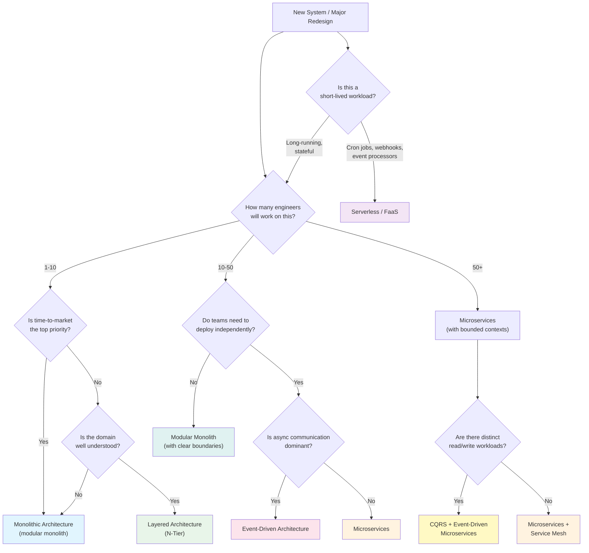

---

# Style 1: Monolithic Architecture

## Definition

A monolithic architecture deploys the entire application as a **single unit** — one binary, one WAR file, one container image, one process. All modules share the same memory space, the same database connection pool, and the same deployment lifecycle. A change to any module requires redeploying the entire application.

This does **not** mean the code is a tangled mess. The term "monolith" describes the **deployment model**, not the code quality. A well-structured monolith with clear module boundaries, enforced dependency rules, and strong encapsulation is called a **modular monolith** — and it is one of the most effective architectures for small-to-medium teams.

---

## Architecture Diagram

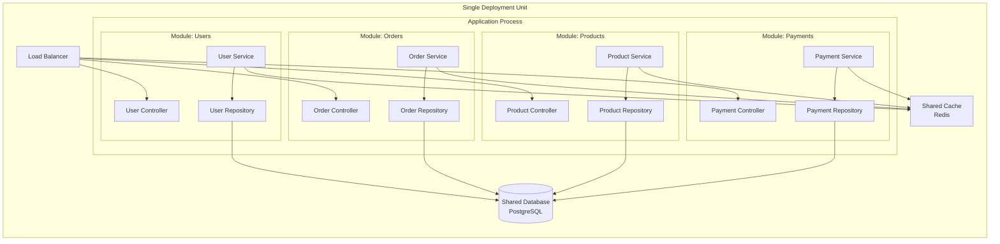

---

## The Three Faces of the Monolith

### 1. The Modular Monolith (Good)

A modular monolith enforces boundaries between modules at the code level, even though everything deploys together. Modules communicate through well-defined internal APIs (method calls, not HTTP). Each module owns its own database tables and does not reach into another module's tables directly.

**Characteristics:**
- Clear module boundaries enforced by package/namespace visibility rules
- Internal API contracts between modules (interfaces, not direct class references)
- Each module owns its schema; cross-module data access goes through the module's public API
- Shared deployment but independent development workflows
- Can be extracted into microservices later with minimal rewriting

**Real-world example:** Shopify runs one of the largest modular monoliths in the world — a Ruby on Rails application serving millions of merchants. They enforce module boundaries through a system called "componentization" and have chosen to keep the monolith rather than decompose into microservices.

### 2. The Deployment Monolith (Neutral)

A deployment monolith is simply any application that ships as a single unit. It may or may not have clean internal boundaries. Most early-stage startups build deployment monoliths by default — not as a conscious architecture choice, but because it is the fastest path to shipping.

**Characteristics:**
- Single deployable artifact
- May have some internal structure (MVC folders, service classes)
- Module boundaries are conventions, not enforced by tooling
- Database tables are shared freely across modules
- Works well until the team grows beyond 10-15 engineers

### 3. The Big Ball of Mud (Bad)

The "big ball of mud" is what happens when a deployment monolith grows without intentional structure. Every class depends on every other class. Database queries span dozens of tables in single joins. Changing one feature breaks three others. Deployment requires a full regression test. No one understands the entire system.

**Characteristics:**
- No discernible module boundaries
- Circular dependencies everywhere
- God classes (3,000+ line files that do everything)
- Shared mutable state across the application
- Fear-driven development: engineers are afraid to change code because they cannot predict the blast radius
- Deployment is an all-day event requiring manual QA

---

## When Monolith Is the RIGHT Choice

The industry bias toward microservices has created a harmful misconception that monoliths are legacy. In reality, a monolith is the correct starting architecture for the majority of new projects.

**Choose a monolith when:**

1. **Your team is small (1-15 engineers).** The coordination overhead of microservices exceeds the benefits. A single repo, single deployment, single database is radically simpler.

2. **The domain is not well understood.** Drawing microservice boundaries requires deep domain knowledge. If you draw them wrong, you pay the cost of distributed systems *plus* the cost of incorrect boundaries (services that must change together, defeating the purpose of independence). Build the monolith, learn the domain, then extract.

3. **Time-to-market is critical.** Monoliths have zero infrastructure overhead for service discovery, API gateways, distributed tracing, circuit breakers, or saga orchestration. You write code and ship.

4. **Strong consistency is a hard requirement.** A single database with ACID transactions is simpler and more correct than distributed sagas across microservices. If your domain requires it (financial systems, inventory management), a monolith with a strong database is a valid long-term choice.

5. **You are building an internal tool or back-office system.** Not every system needs to scale to millions of users. Internal tools serving hundreds of users are perfectly suited to monoliths.

---

## The Monolith-First Strategy

Martin Fowler and Sam Newman advocate the "monolith-first" approach:

1. Start with a well-structured monolith.
2. Enforce module boundaries from day one (even though deployment is shared).
3. As the team and domain mature, extract modules into services **only when there is a clear, measured need** (independent scaling, independent deployment cadence, team autonomy).
4. Never extract a service "just in case" — extraction is expensive and increases operational complexity.

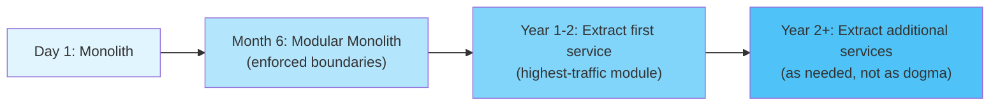

---

## Real-World Examples

| Company | Approach | Details |
|---|---|---|
| **Shopify** | Modular Monolith | ~3M lines of Ruby. Componentized modules. Chose monolith over microservices. |
| **Basecamp / 37signals** | Monolith (Rails) | Single Rails app serving all products. Team of ~70. |
| **Stack Overflow** | Monolith (.NET) | Single monolith serves 1.3B monthly page views. Vertical scaling on beefy hardware. |
| **Etsy** | Monolith (PHP) | Ran a PHP monolith for years. Deployed 50+ times per day via continuous deployment. |
| **Early Twitter** | Monolith (Rails) | Started as a Rails monolith. Later decomposed into services as scale demanded. |

---

## Trade-offs

| Advantage | Disadvantage |
|---|---|
| Simple development workflow | Entire app redeploys for any change |
| In-process calls (zero network latency) | Scaling requires scaling everything |
| Single database with ACID transactions | Long build/test times as codebase grows |
| Easy debugging (single process, single stack trace) | Technology lock-in (one language, one framework) |
| Simple deployment pipeline | Large blast radius (one bug can crash everything) |
| Easy to reason about data consistency | Team coupling increases with team size |
| Low operational overhead | Module boundary erosion over time without discipline |

---

## Migration Paths

### From Monolith

| Target Style | Difficulty | Strategy |
|---|---|---|
| Modular Monolith | Low | Enforce boundaries within existing codebase. No infrastructure change. |
| Microservices | High | Strangler Fig pattern. Extract one module at a time behind an API gateway. |
| Event-Driven | Medium | Introduce event bus. Modules publish events instead of direct calls. Database still shared initially. |
| Serverless | Medium | Extract stateless functions (image processing, email sending) to FaaS. Keep core in monolith. |

### To Monolith

| Source Style | Why? | Strategy |
|---|---|---|
| Microservices | Operational overhead too high for team size | Merge services back into single deployable. Consolidate databases. |
| Serverless | Cold starts, debugging difficulty, cost at scale | Rewrite functions as modules in a single application. |

---

## Common Mistakes

1. **Treating "monolith" as a dirty word.** Teams adopt microservices prematurely because monolith sounds outdated. This creates distributed monolith — the worst of both worlds.
2. **No internal boundaries.** Deploying as a monolith does not mean abandoning modularity. Enforce module boundaries from day one.
3. **Shared database tables across modules.** When Module A reads Module B's tables directly, you have invisible coupling that prevents future extraction.
4. **Vertical scaling panic.** "Our monolith can't scale!" — in most cases, a single modern server (64 cores, 256 GB RAM) handles far more traffic than teams realize. Stack Overflow serves 1.3B page views from a few servers.
5. **Ignoring deployment pipeline.** A monolith needs fast CI/CD. If deployment takes 45 minutes, the problem is the pipeline, not the architecture.

---

## Interview Insights

**When an interviewer asks "How would you architect this system?"** — starting with a monolith for a new product is often the right answer, especially if the requirements suggest a small team or unclear domain boundaries.

**Signal strength:** Candidates who can articulate *when* a monolith is superior to microservices demonstrate deeper architectural maturity than those who default to microservices.

**Common interview pattern:** "You have a 5-person team building a new product. How would you structure the system?" The strong answer is a modular monolith with clear boundaries and a plan for future extraction — not twelve microservices with Kubernetes.

---

## Architecture Decision Record (ADR): Monolithic Architecture

**Status:** Accepted
**Context:** We are a 10-person engineering team building a new B2B SaaS platform. The domain is partially understood. Time-to-market is critical — we need to ship an MVP in 3 months. Our expected traffic is under 10,000 DAU for the first year.
**Decision:** We will build a modular monolith using a single deployable unit with enforced module boundaries.
**Consequences:**
- (+) Simple deployment and operations with minimal DevOps overhead.
- (+) Fast development velocity — no network calls between modules, no distributed debugging.
- (+) ACID transactions across the entire domain.
- (-) Must enforce module boundaries through code reviews and linting — no physical enforcement.
- (-) All modules share a deployment cadence — no independent releases.
- (-) If the team grows to 30+ engineers, we may need to extract high-contention modules into separate services.

---

# Style 2: Layered (N-Tier) Architecture

## Definition

Layered architecture (also called N-Tier architecture) organizes code into **horizontal layers**, where each layer has a specific responsibility and can only depend on the layer directly below it. The most common form is the three-tier architecture: Presentation, Business Logic, and Data Access.

This is the most widely taught and widely used architecture style in enterprise software. It is the default structure of most web frameworks (Rails MVC, Spring Boot, Django, ASP.NET).

---

## Architecture Diagram

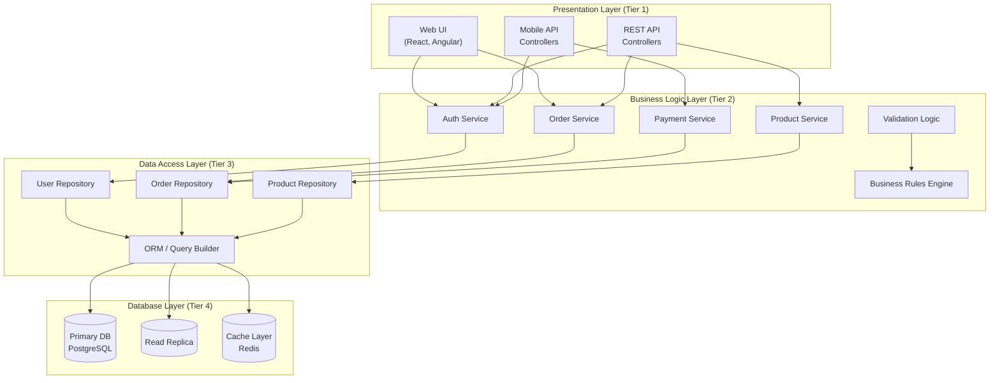

---

## Layer Dependency Rules

The fundamental rule of layered architecture: **each layer can only depend on the layer directly below it.** Layer skipping (presentation calling data access directly) violates the architecture and creates unmaintainable coupling.

```
┌─────────────────────────────┐
│     Presentation Layer      │  ← Handles HTTP requests, renders responses
│   (Controllers, Views, DTOs)│     Depends on: Business Logic Layer ONLY
├─────────────────────────────┤
│     Business Logic Layer    │  ← Contains domain rules, orchestration
│ (Services, Domain Objects)  │     Depends on: Data Access Layer ONLY
├─────────────────────────────┤
│     Data Access Layer       │  ← Manages persistence, queries
│  (Repositories, ORM, DAO)  │     Depends on: Database ONLY
├─────────────────────────────┤
│     Database / External     │  ← PostgreSQL, Redis, external APIs
│    Systems Layer            │
└─────────────────────────────┘
```

### Strict vs Relaxed Layering

- **Strict layering:** Each layer can ONLY call the layer immediately below it. The presentation layer cannot call the data access layer.
- **Relaxed layering:** Each layer can call any layer below it. The presentation layer can call the data access layer directly. This is more pragmatic but creates tighter coupling.

Most production systems use **relaxed layering with guidelines** — the business logic layer is the primary path, but simple read-only queries may bypass it.

---

## The Anti-Corruption Layer

When integrating with external systems (third-party APIs, legacy systems, partner services), an **anti-corruption layer (ACL)** translates between the external system's model and your internal domain model. This prevents external data formats, naming conventions, and assumptions from "corrupting" your clean internal model.

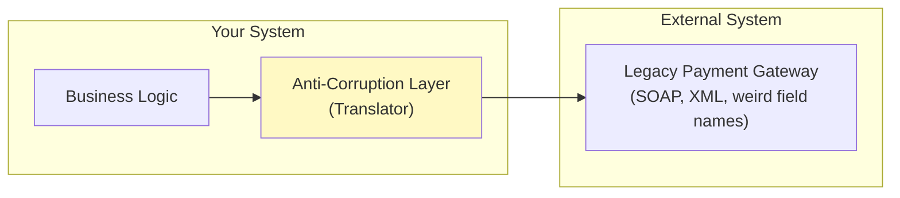

**Example:** A legacy payment system returns `txn_amt_cents` as a string. Your domain model uses `amount: Money(value: Decimal, currency: Currency)`. The ACL translates between these representations, keeping your domain model clean.

---

## Real-World Examples

| Company / Framework | Approach | Details |
|---|---|---|
| **Spring Boot** (Java ecosystem) | Controller → Service → Repository | The default layered pattern in Spring applications. |
| **Django** (Python) | View → Service → Model/ORM | Django's MTV pattern is layered architecture. |
| **Ruby on Rails** | Controller → Model (Service optional) | Rails' "skinny controller, fat model" is a 2-layer variant. |
| **ASP.NET MVC** | Controller → Service → Repository → EF Core | Microsoft's enterprise stack defaults to N-Tier. |
| **Most enterprise Java/C# applications** | Classic 3-Tier | The dominant pattern in corporate software for 20+ years. |

---

## When to Use

1. **CRUD-dominant applications.** If most operations are simple create/read/update/delete with light business logic, layered architecture is ideal.
2. **Small-to-medium teams (1-20 engineers).** The structure is intuitive — new engineers understand it immediately.
3. **Well-understood domains.** When the business logic is stable and well-defined, horizontal layers map cleanly to concerns.
4. **Rapid prototyping.** Every major web framework defaults to layered architecture, so you get scaffolding for free.
5. **Enterprise back-office systems.** Internal CRUD tools, admin panels, reporting dashboards.

---

## When NOT to Use

1. **Complex business logic with many cross-cutting concerns.** Layered architecture forces business logic into a "service layer" that becomes a dumping ground for procedural code.
2. **Systems requiring independent scaling of read vs write paths.** Layers share the same deployment and database — you cannot scale reads independently.
3. **Event-heavy systems.** If most interactions are asynchronous events, the request-response model of layered architecture is a poor fit.
4. **When domain logic is the primary complexity.** If the business rules are the hard part (not the I/O), hexagonal or clean architecture better isolates the domain.

---

## Trade-offs

| Advantage | Disadvantage |
|---|---|
| Universally understood pattern | Encourages procedural "service layer" code |
| Framework support (Spring, Django, Rails) | Business logic tends to leak into controllers or repositories |
| Clear separation of concerns | Layer skipping is easy and tempting |
| Easy onboarding for new engineers | Shared database makes scaling difficult |
| Simple testing (mock layer below) | Changes often require touching all layers |
| Natural fit for CRUD applications | "Anemic domain model" anti-pattern is common |

---

## Common Mistakes

1. **Anemic domain model.** Business objects become dumb data containers (getters/setters only) with all logic living in service classes. This is procedural programming disguised as OOP.
2. **Layer skipping.** Controllers calling repositories directly "for performance" or "because it's just a simple query." This erodes the architecture incrementally.
3. **God services.** A single `OrderService` class with 3,000 lines and 50 methods. Break services by use case, not by entity.
4. **Leaking persistence concerns upward.** When business logic references database-specific types (Hibernate entities, Active Record callbacks), the layers are not properly separated.
5. **No anti-corruption layer for external systems.** External API response shapes leak into domain objects, creating tight coupling to third-party formats.

---

## Migration Paths

### From Layered

| Target Style | Difficulty | Strategy |
|---|---|---|
| Hexagonal / Clean | Medium | Invert dependencies. Move domain logic to the center. Make data access implement domain-defined interfaces. |
| Microservices | High | Group layers by vertical slice (feature), then extract each slice as a service. |
| CQRS | Medium | Separate read models (optimized queries) from write models (domain logic + validation). |

### To Layered

| Source Style | Why? | Strategy |
|---|---|---|
| Over-engineered Clean Architecture | Excessive abstraction for simple CRUD | Flatten layers, remove unnecessary indirection. |
| Microservices (for small teams) | Too much operational overhead | Merge services into a single layered application. |

---

## Interview Insights

**Layered architecture is rarely the "answer" in a system design interview**, but it is often the implicit starting point. When an interviewer asks you to design an API or a service, the internal structure of that service is typically layered (controller → service → repository).

**Signal strength:** Candidates who can explain why layered architecture falls short for complex domains (and what to use instead) demonstrate deep understanding.

---

## Architecture Decision Record (ADR): Layered Architecture

**Status:** Accepted
**Context:** We are building an internal HR management system. The operations are predominantly CRUD. The team has 6 engineers, all with Spring Boot experience. The system will serve 500 internal users. Business logic is straightforward — form validation, approval workflows, report generation.
**Decision:** We will use a standard 3-tier layered architecture (Controller → Service → Repository) with Spring Boot.
**Consequences:**
- (+) Fastest path to delivery — all engineers know this pattern.
- (+) Framework generates scaffolding for layers automatically.
- (+) Simple testing — mock the repository to test services, mock the service to test controllers.
- (-) If business logic grows complex (multi-step approval workflows with conditional routing), the service layer will become bloated.
- (-) No natural place for cross-cutting concerns (audit logging, authorization checks) — may need AOP or middleware.

---

# Style 3: Microservices Architecture

## Definition

Microservices architecture decomposes a system into a collection of **small, independently deployable services**, each owning its own data and communicating over the network (HTTP, gRPC, async messaging). Each service is organized around a **business capability** (not a technical layer), developed by a small autonomous team, and can be written in any language or framework.

The key properties that define true microservices (as opposed to "small services that share a database"):

1. **Independent deployability.** You can deploy Service A without deploying Service B.
2. **Data ownership.** Each service owns its database (or schema). No shared tables.
3. **Business capability alignment.** Services map to business domains, not technical layers.
4. **Autonomous teams.** Each team owns the full lifecycle of their service(s): dev, test, deploy, operate.
5. **Decentralized governance.** Teams choose their own technology stacks.

---

## Architecture Diagram

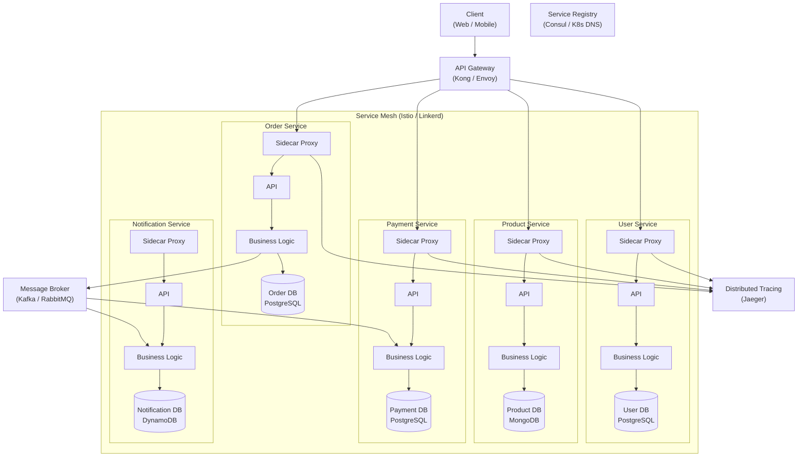

---

## Service Boundaries: DDD Bounded Contexts

The hardest problem in microservices is **where to draw the boundaries**. Domain-Driven Design (DDD) provides the most reliable framework: each microservice maps to a **bounded context** — a boundary within which a particular domain model is consistent and meaningful.

**Example: E-Commerce Domain**

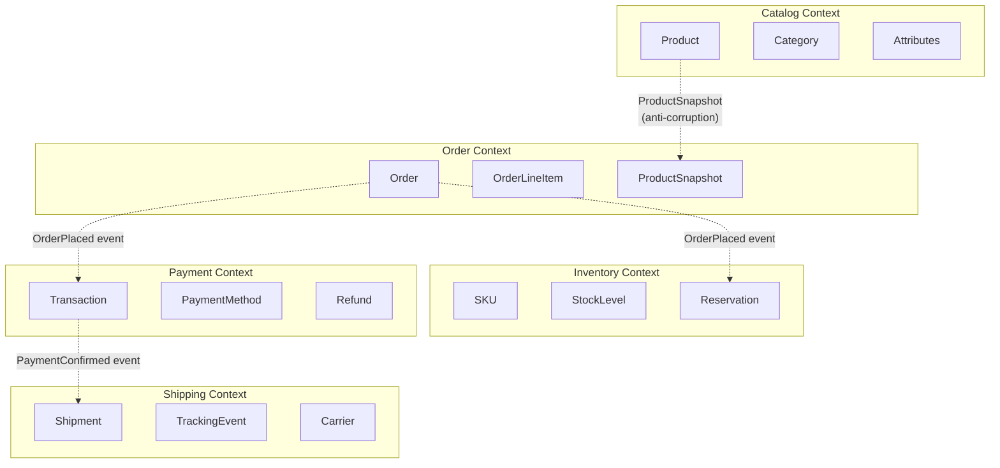

**Key insight:** "Product" means different things in different contexts. In the Catalog context, a Product has rich descriptions, images, and attributes. In the Order context, a ProductSnapshot is a frozen copy of the product at purchase time (name, price, SKU). These are different models in different bounded contexts, connected by events or anti-corruption layers.

---

## Data Ownership

The database-per-service pattern is the most important — and most violated — rule of microservices.

**Rule:** Each service owns its data. No other service may read from or write to another service's database.

**Why this matters:**
- If Service A reads Service B's database directly, you have a hidden dependency. You cannot change B's schema without coordinating with A.
- Shared databases prevent independent deployment — the core benefit of microservices.
- Schema changes become cross-team coordination nightmares.

**How services share data:**
1. **Synchronous API calls.** Service A calls Service B's API to get data. Simple but creates runtime coupling.
2. **Asynchronous events.** Service B publishes events. Service A consumes them and builds a local read model. Decoupled but eventually consistent.
3. **Data replication via CDC.** Change Data Capture streams database changes as events. Services build local projections.

---

## The Service Mesh and Sidecar Pattern

A service mesh is an infrastructure layer that handles service-to-service communication, providing:
- **Traffic management:** Load balancing, circuit breaking, retries, timeouts
- **Security:** Mutual TLS (mTLS) between services, authorization policies
- **Observability:** Distributed tracing, metrics collection, logging

The **sidecar pattern** deploys a proxy container alongside each service container. All network traffic flows through the sidecar, which enforces mesh policies without the service needing to know.

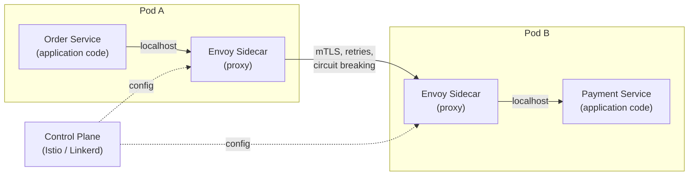

---

## Decomposition Strategies

| Strategy | Description | When to Use |
|---|---|---|
| **By Business Capability** | Each service = one business capability (payments, inventory, shipping) | Most common and most correct approach |
| **By Subdomain (DDD)** | Each service = one bounded context from domain analysis | When you have done proper domain modeling |
| **Strangler Fig** | Extract one module at a time from a monolith behind a routing layer | Migrating from monolith to microservices |
| **By Team** | Each team owns one or more services that they can deploy independently | When organizational autonomy is the primary driver |
| **By Data** | Each service owns one aggregate or one data entity | Risk of creating too-fine-grained services |
| **By Use Case** | Each service handles one user journey end-to-end | Works for isolated workflows (e.g., onboarding) |

---

## Real-World Examples

| Company | Services | Details |
|---|---|---|
| **Netflix** | ~1,000+ | Pioneered microservices at scale. Built Hystrix, Eureka, Zuul, Ribbon. |
| **Amazon** | ~1,000+ | Two-pizza teams. Each team owns services end-to-end. Service-oriented since ~2002. |
| **Uber** | ~4,000+ | Microservices with a custom service mesh (Peloton). |
| **Spotify** | ~800+ | Squad model — each squad owns microservices aligned to features. |
| **Twitter** | ~500+ | Migrated from Rails monolith to JVM microservices. |

---

## When to Use

1. **Large engineering organizations (50+ engineers).** Multiple teams need to deploy independently.
2. **Well-understood domains.** You can draw correct boundaries because you know the domain deeply.
3. **Different scaling requirements per component.** The search service needs 100 instances; the admin service needs 2.
4. **Different technology requirements per component.** ML models in Python, real-time processing in Go, CRUD services in Java.
5. **High deployment frequency.** Teams ship multiple times per day without coordinating with other teams.

---

## When NOT to Use

1. **Small teams (under 20 engineers).** The operational overhead of microservices will consume more time than the architecture saves.
2. **Unclear domain boundaries.** If you don't know where the boundaries are, you will draw them wrong — creating a distributed monolith.
3. **Startups searching for product-market fit.** The domain changes constantly. Monolith allows faster pivots.
4. **Strong consistency requirements.** Distributed transactions (sagas) are orders of magnitude more complex than single-database ACID transactions.
5. **No DevOps maturity.** Microservices require CI/CD pipelines, container orchestration, monitoring, distributed tracing, and on-call rotations per service.

---

## Trade-offs

| Advantage | Disadvantage |
|---|---|
| Independent deployment per service | Distributed system complexity (network failures, partial failures) |
| Independent scaling per service | Data consistency requires sagas (eventual consistency) |
| Technology diversity per service | Operational overhead (monitoring, tracing, logging per service) |
| Team autonomy and ownership | Cross-service debugging is difficult |
| Fault isolation (one service crash doesn't crash all) | Increased latency (network calls between services) |
| Clear ownership boundaries | Service discovery, load balancing, circuit breaking needed |
| Enables Conway's Law alignment | Testing requires contract tests, integration environments |

---

## Common Mistakes

1. **Distributed monolith.** Services that must deploy together, share a database, or cannot function independently. You have all the complexity of microservices with none of the benefits.
2. **Too many services too early.** Starting with 30 microservices when you have 5 engineers. Each service needs CI/CD, monitoring, on-call. That is 30x the operational burden.
3. **Synchronous chains.** Service A calls B, which calls C, which calls D. Latency compounds. Failure cascades. Use async communication where possible.
4. **No API versioning.** Changing a service's API breaks all consumers. Version APIs from day one.
5. **Shared libraries with business logic.** A "common" library that every service depends on creates invisible coupling. Changes to the library require redeploying every service.
6. **Entity services.** A "Product Service," an "Order Service," and a "Customer Service" that mirror database tables. Services should model business capabilities, not data entities.
7. **Ignoring data ownership.** Two services reading the same database table. This defeats the purpose of microservices.

---

## Interview Insights

**Microservices appear in almost every system design interview** — but the strongest candidates know when NOT to use them.

**Pattern to demonstrate:**
1. Start with a modular structure (high-level components).
2. Explain which components could be independent services and why.
3. Identify which components should remain together (shared transactions, tight coupling).
4. Discuss the communication pattern (sync vs async) between services.
5. Address data ownership — which service owns which data?

**Red flag for interviewers:** A candidate who immediately draws 15 microservices without discussing trade-offs, team size, or domain boundaries.

---

## Architecture Decision Record (ADR): Microservices Architecture

**Status:** Accepted
**Context:** We are a 200-person engineering organization with 25 teams. Our monolith has become a deployment bottleneck — 3 teams are blocked on each deploy. Different components have 10x different scaling needs. Teams want technology freedom (some prefer Go, others Python, others Java). Domain boundaries are well-understood after 4 years of operating the monolith.
**Decision:** We will decompose into microservices aligned to DDD bounded contexts, starting with the Strangler Fig pattern for the highest-contention modules.
**Consequences:**
- (+) Teams can deploy independently, unblocking the 3-team deployment bottleneck.
- (+) Components can scale independently — the search cluster can scale to 100 nodes without scaling the admin panel.
- (+) Teams can choose technology stacks that fit their problems.
- (-) We must invest in a service mesh, distributed tracing, and centralized logging.
- (-) Data consistency between services requires implementing sagas for cross-service transactions.
- (-) Operational complexity increases significantly — we need per-service monitoring and alerting.
- (-) Developer onboarding becomes harder — understanding the full system requires understanding 20+ services.

---

# Style 4: Event-Driven Architecture

## Definition

Event-Driven Architecture (EDA) organizes system communication around **events** — immutable records of something that happened. Instead of Service A calling Service B directly (request-response), Service A publishes an event ("OrderPlaced"), and any interested service consumes it independently. This decouples producers from consumers in both time and space.

EDA is not a standalone architecture — it is a **communication paradigm** that can be applied within monoliths, between microservices, or across entire organizations. The distinguishing characteristic is that **the event is the primary integration mechanism**, not the synchronous API call.

---

## Architecture Diagram

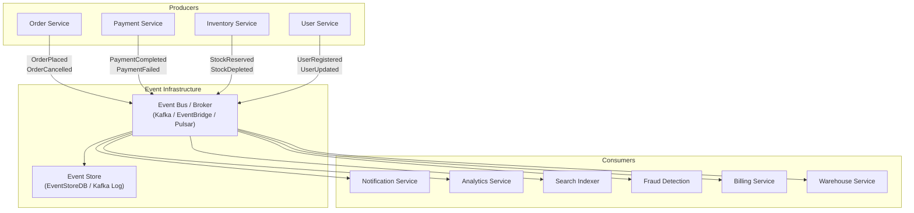

---

## Event Sourcing

Event sourcing is a data storage pattern where **state is derived from a sequence of events** rather than stored as a mutable row. Instead of storing the current balance of an account, you store every transaction that affected it. The current state is computed by replaying the events.

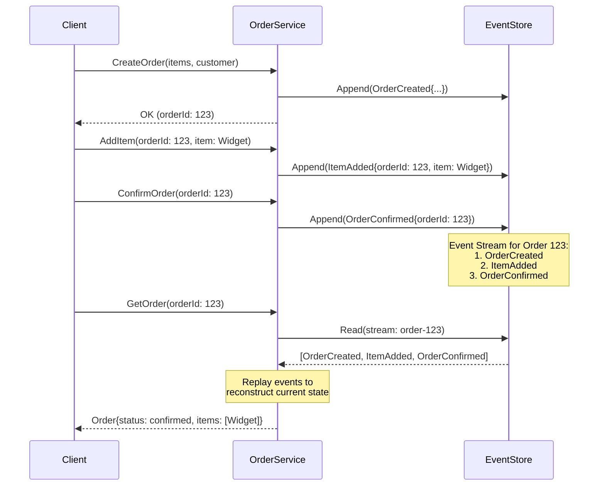

**Benefits of event sourcing:**
- **Complete audit trail.** Every state change is recorded. You can answer "what happened and when" for any entity.
- **Temporal queries.** You can reconstruct the state of the system at any past point in time.
- **Event replay.** You can rebuild read models, fix bugs by replaying corrected logic, or populate new projections.
- **Natural fit for event-driven systems.** Events are the source of truth AND the integration mechanism.

**Costs of event sourcing:**
- **Complexity.** Developers must think in events, not in current state. This is a significant mental shift.
- **Event schema evolution.** Events are immutable — you cannot change old events. Schema versioning is essential.
- **Replay performance.** For entities with thousands of events, replay is slow. Snapshots mitigate this.
- **Eventual consistency.** Read models are projections of events and may lag behind the write side.

---

## CQRS + Event Sourcing (CQRS+ES)

CQRS+ES combines event sourcing (write side) with separate read models (query side). This is the most powerful — and most complex — form of event-driven architecture.

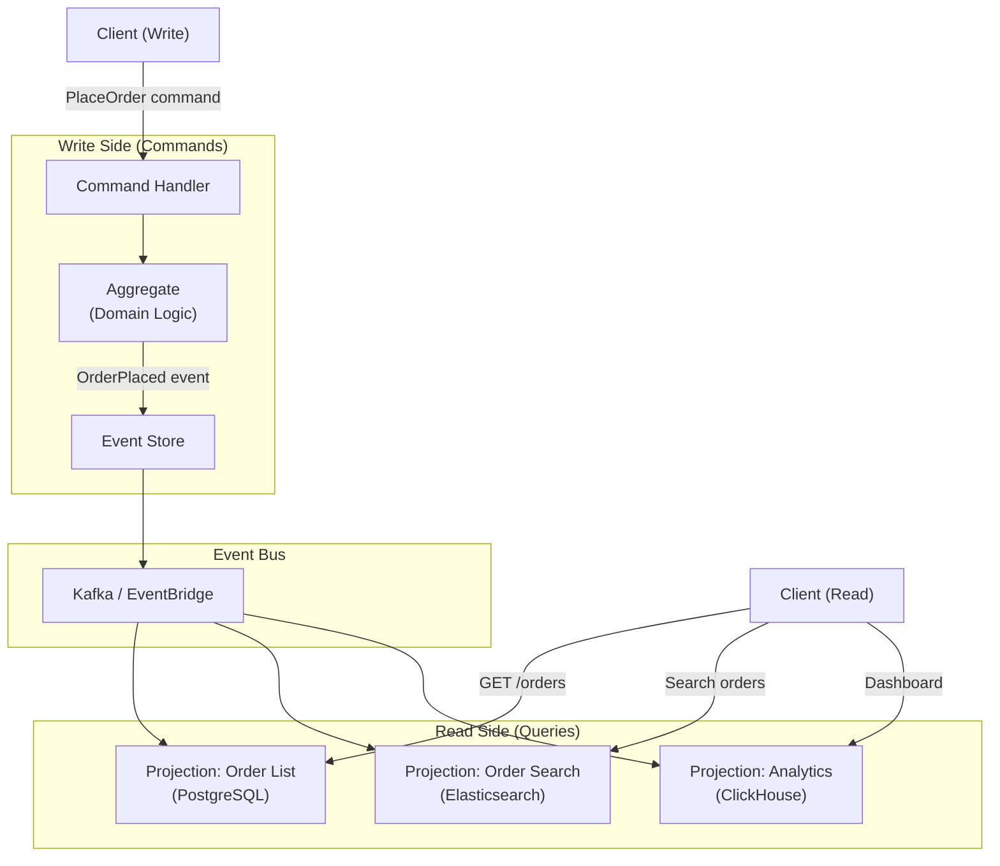

---

## Choreography vs Orchestration

There are two approaches to coordinating multi-service workflows in event-driven systems.

### Choreography

Each service reacts to events independently. No central coordinator. Services publish events and consume events from other services.

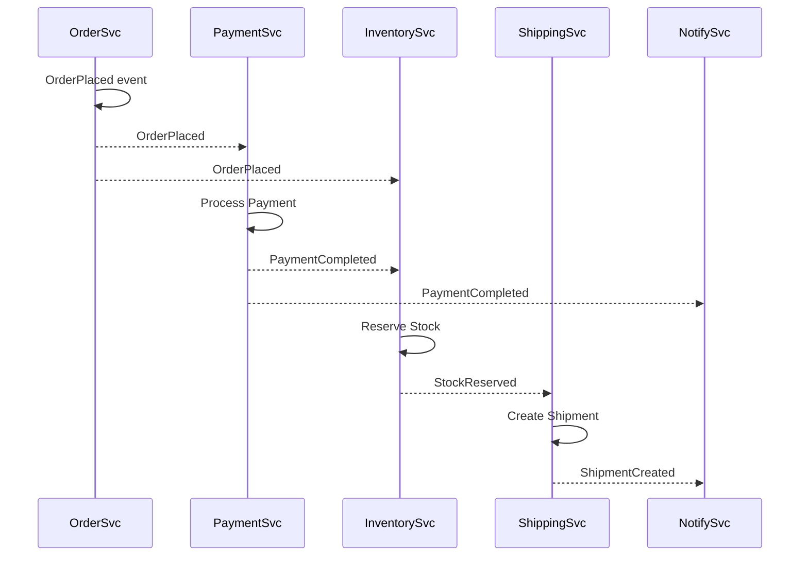

**Pros:** Loose coupling, no single point of failure, services are independently evolvable.
**Cons:** Hard to understand the overall workflow, no central place to see progress, difficult to handle failures and compensation.

### Orchestration

A central orchestrator (saga coordinator) directs the workflow. It sends commands to services and listens for responses.

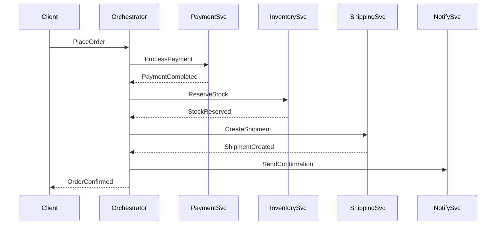

**Pros:** Easy to understand the workflow, centralized error handling, clear saga state.
**Cons:** Single point of failure (orchestrator), coupling to the orchestrator, orchestrator can become a god service.

### When to Use Each

| Aspect | Choreography | Orchestration |
|---|---|---|
| **Number of services** | 2-4 per workflow | 4+ per workflow |
| **Workflow complexity** | Simple, linear | Complex, branching, conditional |
| **Error handling** | Distributed (each service handles its own) | Centralized (orchestrator manages compensation) |
| **Visibility** | Low (must correlate events) | High (orchestrator has full state) |
| **Coupling** | Very loose | Moderate (services coupled to orchestrator) |

---

## Real-World Examples

| Company | Approach | Details |
|---|---|---|
| **Netflix** | Event-driven microservices | Conductor (orchestration engine) for multi-service workflows. Kafka for event streaming. |
| **Uber** | Event sourcing + CQRS | Cadence (later Temporal) for workflow orchestration. Kafka for event streaming. |
| **LinkedIn** | Kafka-centric EDA | Built Kafka. Uses it as the central nervous system for all data flow. |
| **Walmart** | Event-driven order management | Order events flow through Kafka to inventory, fulfillment, and notification services. |
| **Capital One** | Event sourcing for transactions | Financial events are append-only. Audit trail is built into the architecture. |

---

## When to Use

1. **Systems with high fan-out.** One event triggers processing in many independent consumers (order placed triggers: payment, inventory, notification, analytics, fraud check).
2. **Systems requiring audit trails.** Event sourcing provides a complete, immutable history of every state change.
3. **Systems with different consistency requirements per consumer.** The payment service needs strong consistency; the analytics service can tolerate minutes of delay.
4. **Systems with unpredictable consumers.** New consumers can subscribe to existing events without changing the producer.
5. **Systems with bursty workloads.** Event queues buffer spikes, allowing consumers to process at their own pace.

---

## When NOT to Use

1. **Simple CRUD applications.** Event-driven architecture adds significant complexity for no benefit when operations are synchronous and independent.
2. **When strong consistency is required across all operations.** Eventual consistency is inherent in EDA. If every read must reflect the latest write, EDA fights you.
3. **Small teams without event infrastructure experience.** Operating Kafka, managing event schemas, handling dead letter queues, and debugging async flows requires specialized skills.
4. **Request-response dominant systems.** If 90% of interactions are "user requests data, system responds immediately," EDA adds latency and complexity without benefit.

---

## Trade-offs

| Advantage | Disadvantage |
|---|---|
| Loose coupling between services | Eventual consistency (reads may be stale) |
| Natural audit trail (event sourcing) | Complex debugging (async, distributed) |
| Scalable (consumers scale independently) | Event schema evolution is hard |
| Resilient (queue buffers failures) | Ordering guarantees require careful partition design |
| Temporal queries (event sourcing) | Idempotency required (events may be delivered more than once) |
| New consumers without changing producers | Dead letter queue management |

---

## Common Mistakes

1. **Event notification vs event-carried state transfer.** Event notification says "OrderPlaced (orderId: 123)" — consumers must call back for details. Event-carried state transfer says "OrderPlaced (orderId: 123, items: [...], total: $50)" — consumers have everything they need. Prefer carried state for decoupling.
2. **Fat events with entire entity snapshots.** Putting the entire order object (100 fields) in every event creates tight coupling to the event schema. Include only what consumers need.
3. **Ignoring idempotency.** Events may be delivered more than once (at-least-once delivery). Consumers must be idempotent — processing the same event twice must produce the same result.
4. **No dead letter queue.** When a consumer fails to process an event, it must go somewhere. Without a DLQ, failed events are lost or block the queue.
5. **Treating events as commands.** Events describe what happened ("OrderPlaced"). Commands describe what should happen ("ProcessPayment"). Mixing them creates tight coupling.
6. **No schema registry.** As event schemas evolve, producers and consumers must agree on format. A schema registry (Confluent Schema Registry, AWS Glue) enforces compatibility.

---

## Interview Insights

**Event-driven architecture appears frequently in interviews** for systems with high fan-out (notifications, analytics pipelines) or audit requirements (financial systems).

**Pattern to demonstrate:**
1. Identify which interactions are inherently asynchronous (notifications, analytics, search indexing).
2. Draw the event flow with producers, event bus, and consumers.
3. Discuss ordering guarantees (partition key), idempotency, and dead letter handling.
4. If event sourcing is relevant, explain how state is reconstructed from events.
5. Choose choreography vs orchestration based on workflow complexity.

---

## Architecture Decision Record (ADR): Event-Driven Architecture

**Status:** Accepted
**Context:** Our e-commerce platform processes 500K orders/day. When an order is placed, 8 downstream systems must be notified: payment, inventory, warehouse, shipping, notification (email + SMS), analytics, fraud, and tax. Currently, the order service makes 8 synchronous HTTP calls, creating a 2.5-second response time and cascading failures when any downstream service is slow.
**Decision:** We will adopt event-driven architecture using Kafka as the event bus. The order service will publish an `OrderPlaced` event. Each downstream system will consume the event independently.
**Consequences:**
- (+) Order placement response time drops from 2.5s to ~200ms (write to Kafka + respond).
- (+) Downstream service failures no longer cascade to the order service.
- (+) New consumers (e.g., ML model training pipeline) can subscribe without changing the order service.
- (-) Events are eventually consistent — the inventory read model may lag by 1-2 seconds.
- (-) We must implement idempotent consumers (Kafka guarantees at-least-once delivery).
- (-) We need a dead letter queue strategy for events that fail processing after retries.
- (-) Debugging requires distributed tracing (correlation IDs across events).

---

# Style 5: Serverless Architecture

## Definition

Serverless architecture abstracts away all server management. Developers write functions (FaaS — Functions as a Service) or use managed backend services (BaaS — Backend as a Service) without provisioning, scaling, or patching servers. The cloud provider handles execution, scaling (to zero and to thousands), and billing (per-invocation, not per-hour).

**Key distinction:** "Serverless" does not mean "no servers." Servers exist — you just don't manage them. The term describes the developer experience, not the infrastructure reality.

---

## Architecture Diagram

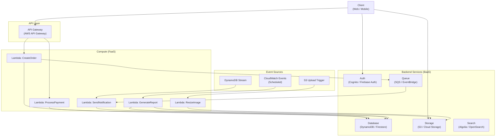

---

## FaaS vs BaaS

| Aspect | FaaS (Functions as a Service) | BaaS (Backend as a Service) |
|---|---|---|
| **What it is** | Short-lived functions executed on demand | Managed backend components (auth, DB, storage) |
| **Examples** | AWS Lambda, Google Cloud Functions, Azure Functions | Firebase, AWS Cognito, DynamoDB, S3, Algolia |
| **You write** | Function code | Configuration, rules |
| **Scaling** | Per-invocation | Managed by provider |
| **Billing** | Per execution + duration | Per request / per GB stored |
| **State** | Stateless (by design) | Stateful (managed by provider) |

---

## Cold Starts

The most discussed limitation of serverless. When a function hasn't been invoked recently, the cloud provider must:
1. Allocate a container
2. Load the runtime (Node.js, Python, Java JVM)
3. Load your code and dependencies
4. Execute the function

This initialization adds latency — the **cold start penalty.**

| Runtime | Typical Cold Start | Notes |
|---|---|---|
| **Python** | 100-300ms | Lightweight runtime |
| **Node.js** | 100-300ms | Lightweight runtime |
| **Go** | 50-100ms | Compiled, minimal runtime |
| **Java** | 1-5 seconds | JVM startup is slow. GraalVM native images reduce this. |
| **C# / .NET** | 500ms-2s | CLR initialization |

**Mitigation strategies:**
- **Provisioned concurrency** (AWS): Keep N instances warm. Eliminates cold starts but eliminates the cost benefit of scaling to zero.
- **Smaller deployment packages.** Fewer dependencies = faster initialization.
- **Lighter runtimes.** Use Go or Rust instead of Java for latency-sensitive functions.
- **Keep functions warm.** Scheduled pings every 5-10 minutes. Hacky but effective.

---

## Execution Limits

Serverless functions operate within strict constraints:

| Limit | AWS Lambda | Google Cloud Functions | Azure Functions |
|---|---|---|---|
| **Max execution time** | 15 minutes | 9 minutes (HTTP), 60 min (event) | 5-10 minutes (consumption plan) |
| **Max memory** | 10 GB | 32 GB | 1.5 GB (consumption plan) |
| **Max payload** | 6 MB (sync), 256 KB (async) | 10 MB | 100 MB |
| **Max concurrent** | 1,000 (default, increasable) | 1,000 (default) | 200 (default) |
| **Temp storage** | 512 MB (10 GB with ephemeral) | In-memory only | Varies |

---

## Serverless Anti-Patterns

### 1. Lambda Monolith
Putting your entire application into a single Lambda function. You lose all benefits of serverless (per-function scaling, isolation, fast deployment) and gain all disadvantages (cold starts for a large package, 15-minute timeout).

### 2. Synchronous Chains
Lambda A calls Lambda B, which calls Lambda C synchronously. Latency compounds. If any function times out, the entire chain fails. Use Step Functions (orchestration) or event-driven (async) patterns instead.

### 3. Lambda-to-Lambda Direct Invocation
Calling one Lambda from another using the AWS SDK. This creates tight coupling and makes it impossible to insert middleware, retries, or monitoring between the functions. Use a queue (SQS) or event bus (EventBridge) between them.

### 4. Fat Functions
Packaging massive dependencies into a Lambda (e.g., the entire TensorFlow library for a simple inference). Cold starts become unacceptable. Use layers, optimize dependencies, or consider containerized Lambdas.

### 5. Ignoring Idempotency
Event sources may invoke the same function twice (at-least-once delivery). Without idempotent processing, you get duplicate records, double charges, or duplicate notifications.

---

## When Serverless Fails

Serverless is not appropriate for:

1. **Long-running processes.** Anything that takes more than 15 minutes needs containers or VMs.
2. **Latency-sensitive hot paths.** If P99 latency must be under 50ms, cold starts make serverless risky for user-facing APIs.
3. **High-volume, steady-state workloads.** At sustained high throughput, serverless is more expensive than reserved containers. A Lambda running 24/7 costs 3-5x more than an equivalent Fargate container.
4. **Stateful workloads.** Functions are stateless. If your workload requires in-memory state (WebSocket connections, in-memory caches, ML model loading), serverless is a poor fit.
5. **Complex local development.** Emulating Lambda + API Gateway + DynamoDB + SQS + EventBridge locally requires tools like SAM, Serverless Framework, or LocalStack — none of which perfectly replicate production behavior.

---

## Real-World Examples

| Company | Approach | Details |
|---|---|---|
| **iRobot** | Full serverless backend | Robot fleet management on Lambda + DynamoDB + IoT Core. |
| **Coca-Cola** | Serverless vending machines | Vending machine events processed by Lambda functions. |
| **Capital One** | Serverless event processing | Real-time fraud detection using Lambda and Kinesis. |
| **BBC** | Serverless media processing | Video transcoding and thumbnail generation via Lambda. |
| **Figma** | Serverless for internal tools | Internal tooling and automation built on serverless. |

---

## Trade-offs

| Advantage | Disadvantage |
|---|---|
| Zero server management | Cold start latency |
| Auto-scaling (to zero and to thousands) | Execution time limits |
| Pay-per-use pricing | Vendor lock-in |
| Fast deployment (deploy one function) | Debugging is harder (no local state) |
| Built-in high availability | Limited control over infrastructure |
| Reduced operational burden | More expensive at sustained high load |

---

## Common Mistakes

1. **Treating serverless as a cost-saving strategy without analysis.** At low scale, serverless is cheaper. At high, steady-state scale, it is significantly more expensive than containers.
2. **No timeout configuration.** Leaving Lambda timeout at the maximum (15 minutes) when the function should complete in 3 seconds. A downstream failure causes your function to run (and bill) for 15 minutes.
3. **No concurrency limits.** An unexpected traffic spike spins up 10,000 Lambda instances, overwhelming your database with 10,000 connections. Set concurrency limits and use connection pooling (RDS Proxy).
4. **Ignoring cold start impact on user experience.** The first user after a quiet period experiences 1-3 seconds of latency. Use provisioned concurrency for user-facing APIs.
5. **Over-decomposing into nano-functions.** One function per HTTP method per resource creates hundreds of functions that are impossible to manage. Group related operations.

---

## Migration Paths

### From Serverless

| Target Style | Difficulty | Strategy |
|---|---|---|
| Containerized Microservices | Medium | Move function logic into containers. Replace BaaS with self-managed services. |
| Monolith | Medium | Consolidate functions into a single application. Replace BaaS with local services. |

### To Serverless

| Source Style | Difficulty | Strategy |
|---|---|---|
| Monolith | High | Extract stateless, event-driven workloads first (image processing, notifications, cron jobs). |
| Microservices | Low | Replace lightweight services with Lambda functions. Keep stateful services as containers. |

---

## Interview Insights

**Serverless appears in interviews for specific workloads** — not as a full system architecture, but as a component: image processing, webhook handlers, scheduled jobs, event consumers.

**Signal strength:** Candidates who suggest serverless for a specific component (e.g., "image thumbnailing via Lambda triggered by S3 upload") while keeping the core on containers/services demonstrate practical judgment.

**Red flag:** Designing an entire high-throughput e-commerce system on serverless without discussing cold starts, execution limits, or cost at scale.

---

## Architecture Decision Record (ADR): Serverless Architecture

**Status:** Accepted (for specific workloads)
**Context:** Our e-commerce platform needs to generate image thumbnails when sellers upload product photos. The workload is bursty (100 uploads/minute during business hours, near-zero at night). Each thumbnail generation takes 2-5 seconds and is CPU-intensive.
**Decision:** We will use AWS Lambda triggered by S3 upload events for thumbnail generation. The Lambda function reads the original image from S3, generates thumbnails at 3 sizes, and writes them back to S3.
**Consequences:**
- (+) Scales to zero at night — no cost when no uploads occur.
- (+) Scales to hundreds of concurrent executions during peak upload periods.
- (+) No infrastructure to manage — no EC2 instances, no auto-scaling groups.
- (-) Cold starts add ~300ms to the first invocation after idle periods. Acceptable for background processing.
- (-) Maximum execution time of 15 minutes. Acceptable — thumbnail generation takes 2-5 seconds.
- (-) Vendor lock-in to AWS Lambda + S3 trigger integration.

---

# Style 6: Hexagonal Architecture (Ports & Adapters)

## Definition

Hexagonal Architecture (also called Ports & Adapters), proposed by Alistair Cockburn, structures an application so that the **core business logic has no dependencies on external systems**. The core defines **ports** (interfaces) that describe what it needs from the outside world. **Adapters** implement those ports by connecting to real external systems (databases, APIs, message queues, UI frameworks).

The fundamental insight: business logic should not know whether it is being driven by an HTTP request, a CLI command, a message queue event, or a unit test. And it should not know whether it is storing data in PostgreSQL, MongoDB, a file, or an in-memory map.

---

## Architecture Diagram

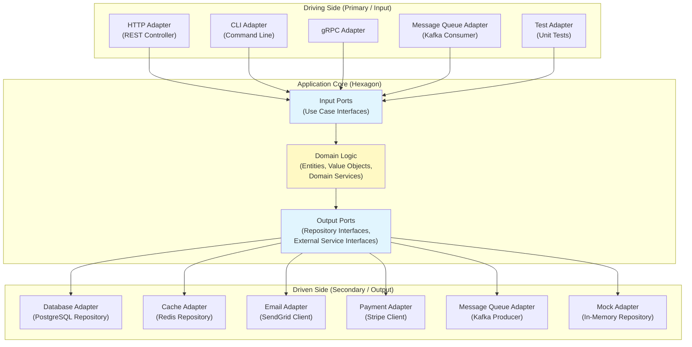

---

## Ports and Adapters Explained

### Ports
Ports are **interfaces** defined by the application core. They describe what the core needs without specifying how it is provided.

**Input Ports (Driving Ports):** Define use cases the application supports.
```
// Input Port (defined in the core)
interface PlaceOrderUseCase {
    OrderResult placeOrder(PlaceOrderCommand command);
}
```

**Output Ports (Driven Ports):** Define what the application needs from the outside world.
```
// Output Port (defined in the core)
interface OrderRepository {
    void save(Order order);
    Optional<Order> findById(OrderId id);
}

interface PaymentGateway {
    PaymentResult charge(PaymentRequest request);
}
```

### Adapters
Adapters are **implementations** of ports that connect to real systems.

**Driving Adapters (Primary):** Translate external inputs into calls to input ports.
```
// Driving Adapter (implements HTTP → use case translation)
class OrderController {
    private final PlaceOrderUseCase placeOrder;

    @PostMapping("/orders")
    ResponseEntity<OrderResponse> createOrder(@RequestBody OrderRequest req) {
        PlaceOrderCommand cmd = toCommand(req);
        OrderResult result = placeOrder.placeOrder(cmd);
        return toResponse(result);
    }
}
```

**Driven Adapters (Secondary):** Implement output ports by connecting to real infrastructure.
```
// Driven Adapter (implements repository port using PostgreSQL)
class PostgresOrderRepository implements OrderRepository {
    private final JdbcTemplate jdbc;

    void save(Order order) {
        jdbc.update("INSERT INTO orders ...", order.getId(), ...);
    }
}
```

---

## Driving vs Driven Side

| Aspect | Driving Side (Primary) | Driven Side (Secondary) |
|---|---|---|
| **Direction** | Outside → Core | Core → Outside |
| **Who initiates?** | External actor (user, API client, message) | The application core |
| **Port type** | Input port (use case interface) | Output port (repository, gateway interface) |
| **Adapter role** | Translates external format to domain command | Translates domain request to infrastructure call |
| **Examples** | REST controller, CLI handler, Kafka consumer, test harness | PostgreSQL repository, Stripe payment adapter, SendGrid email adapter |

---

## Testing Advantages

The primary benefit of hexagonal architecture is **testability**. Because the core depends only on interfaces (ports), you can replace any adapter with a mock or in-memory implementation.

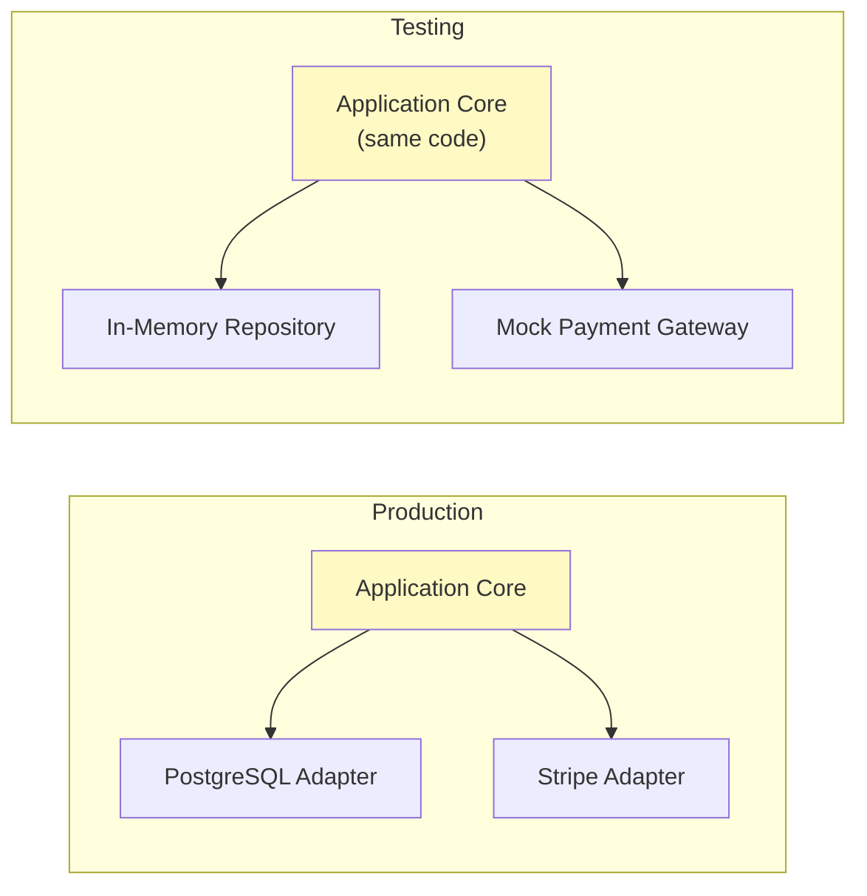

**Test the core without any infrastructure.** No database needed. No HTTP server needed. No external APIs needed. Pure business logic tests that run in milliseconds.

---

## Real-World Implementations

| Company / Project | Details |
|---|---|
| **Netflix** | Hexagonal patterns in microservices — each service has clear port/adapter boundaries. |
| **Spotify** | Backend services structured with ports and adapters for testability. |
| **DDD-heavy enterprises** | Financial services, insurance companies where domain logic is the primary complexity. |
| **Open source: Spring Modulith** | Spring's modular monolith framework encourages hexagonal structure. |

---

## When to Use

1. **Domain logic is the primary complexity.** If the hard part is business rules (not I/O), hexagonal architecture isolates and protects that complexity.
2. **Multiple input channels.** The same business logic is accessed via REST, gRPC, CLI, message queues, and scheduled jobs. Hexagonal architecture makes this natural.
3. **Frequent infrastructure changes.** Switching from PostgreSQL to MongoDB, or from Stripe to Adyen, requires changing only the adapter — the core is untouched.
4. **High test coverage requirements.** Regulated industries (finance, healthcare) where business logic must be thoroughly tested without infrastructure dependencies.

---

## When NOT to Use

1. **Simple CRUD applications.** The indirection of ports and adapters adds boilerplate without benefit when business logic is trivial.
2. **Prototyping.** When speed of development matters more than architecture, the additional abstraction slows you down.
3. **Teams unfamiliar with the pattern.** Hexagonal architecture requires discipline — without understanding, teams create incorrect adapter boundaries or leak infrastructure into the core.

---

## Trade-offs

| Advantage | Disadvantage |
|---|---|
| Business logic is framework-agnostic | More files and indirection (ports, adapters, mappers) |
| Excellent testability (no infra needed) | Over-engineering risk for simple applications |
| Easy to swap infrastructure | Learning curve for teams new to the pattern |
| Clear separation of concerns | Mapping between layers adds boilerplate |
| Supports multiple input/output channels | Can feel like unnecessary abstraction for CRUD |

---

## Common Mistakes

1. **Leaking infrastructure types into the core.** Using JPA entities in the domain layer. The domain should have its own models; adapters map between them.
2. **Putting business logic in adapters.** Validation, calculations, or orchestration logic in the REST controller or repository adapter. Keep all logic in the core.
3. **Too many ports.** Creating a port for every single method. Group related operations into cohesive port interfaces.
4. **No clear mapping layer.** Domain objects exposed directly as API responses. Changes to the domain model break the API contract. Use DTOs at the adapter boundary.
5. **Confusing ports with adapters.** Ports are interfaces (defined in the core). Adapters are implementations (defined outside the core). The dependency arrow always points inward.

---

## Architecture Decision Record (ADR): Hexagonal Architecture

**Status:** Accepted
**Context:** We are building a loan origination system for a bank. The domain logic is highly complex — credit scoring rules, regulatory compliance checks, multi-step approval workflows. The system must be accessible via REST API, a batch file processor, and an internal event stream. We expect to change the credit scoring vendor twice in the next 3 years. Business logic must have 95%+ test coverage for regulatory compliance.
**Decision:** We will use hexagonal architecture with clear port/adapter boundaries.
**Consequences:**
- (+) Domain logic is fully testable without infrastructure dependencies — achieving 95%+ coverage is straightforward.
- (+) Switching credit scoring vendors requires only a new adapter, not changes to domain logic.
- (+) REST, batch, and event-driven inputs are all just different driving adapters calling the same use case ports.
- (-) More boilerplate code — DTOs, mappers, port interfaces, adapter implementations.
- (-) Engineers must learn the pattern and resist shortcuts (e.g., using JPA entities as domain objects).
- (-) Simple CRUD operations (e.g., updating a customer's address) feel over-engineered.

---

# Style 7: Clean Architecture

## Definition

Clean Architecture, proposed by Robert C. Martin (Uncle Bob), is a set of concentric rings where **dependencies point inward** — outer rings depend on inner rings, never the reverse. The innermost ring contains enterprise business rules (entities), and the outermost ring contains frameworks, drivers, and UI. The **dependency rule** is absolute: source code dependencies can only point inward.

Clean Architecture generalizes and unifies Hexagonal Architecture, Onion Architecture, and other similar approaches under a single framework.

---

## Architecture Diagram

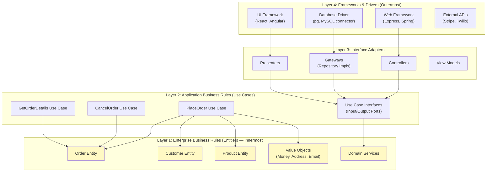

---

## The Four Layers

### Layer 1: Entities (Enterprise Business Rules)

Entities encapsulate the most general, high-level business rules. They are the core domain objects that would exist regardless of the application. An `Order` entity with rules like "an order cannot have negative total" or "an order transitions from PENDING to CONFIRMED only after payment" belongs here.

**Entities are:**
- Independent of any framework, database, or UI
- The least likely to change when something external changes
- Usable across multiple applications in the same enterprise

### Layer 2: Use Cases (Application Business Rules)

Use cases contain **application-specific** business rules. They orchestrate the flow of data to and from entities and direct those entities to use their critical business rules to achieve the goals of the use case.

**Examples:**
- `PlaceOrderUseCase`: Validates input, creates order entity, charges payment, reserves inventory, publishes event.
- `CancelOrderUseCase`: Validates cancellation policy, updates order state, triggers refund.
- `GetOrderDetailsUseCase`: Retrieves order, enriches with customer and product data, returns DTO.

**Use cases depend on entities but not on frameworks, databases, or UI.**

### Layer 3: Interface Adapters

This layer converts data from the format most convenient for the use cases and entities to the format most convenient for some external agency such as the database or the web.

**Contains:**
- **Controllers:** Convert HTTP requests to use case input.
- **Presenters:** Convert use case output to HTTP responses or view models.
- **Gateways:** Implement repository interfaces defined by use cases, using specific database technology.

### Layer 4: Frameworks & Drivers

The outermost layer is composed of frameworks and tools (database, web framework, UI framework). This layer is where all the details go. The web is a detail. The database is a detail. We keep these things on the outside where they can do little harm.

---

## The Dependency Rule

**Source code dependencies must point inward only.** Nothing in an inner ring can know anything about anything in an outer ring. In particular, the name of something declared in an outer ring must not be mentioned by the code in an inner ring. That includes functions, classes, variables, or any other named software entity.

```
Frameworks → Interface Adapters → Use Cases → Entities
     ↑              ↑                ↑          ↑
  (outer)        (middle)        (middle)    (inner)

Dependencies only point →→→ inward
```

**The dependency rule is what makes Clean Architecture work.** It ensures that the business logic (entities and use cases) is completely independent of external concerns. You can change the database, the web framework, or the UI without touching business logic.

---

## Clean Architecture vs Hexagonal Architecture

| Aspect | Clean Architecture | Hexagonal Architecture |
|---|---|---|
| **Origin** | Robert C. Martin (2012) | Alistair Cockburn (2005) |
| **Structure** | Concentric rings | Hexagon with ports/adapters |
| **Layers** | 4 explicit layers | 3 zones (driving, core, driven) |
| **Focus** | Dependency rule across all layers | Separation of core from infrastructure |
| **Entities vs Domain** | Entities are a distinct inner ring | Domain model is the core of the hexagon |
| **Use Cases** | Explicit layer between entities and adapters | Use cases live inside the core |
| **In Practice** | Very similar to Hexagonal when implemented | Very similar to Clean when implemented |

In practice, these two architectures are **nearly identical in implementation**. The primary difference is pedagogical — Clean Architecture provides a more explicit layer structure.

---

## Real-World Implementations

| Context | Details |
|---|---|
| **Android development** | Google's recommended architecture for Android apps follows Clean Architecture. |
| **Spring Boot applications** | Many enterprise Java applications structure packages as entities, use-cases, adapters. |
| **Go microservices** | Go's package system naturally enforces dependency direction. |
| **DDD-heavy systems** | Financial, insurance, and healthcare systems where domain correctness is critical. |

---

## When to Use

1. **Long-lived systems (5+ year lifespan).** The isolation of business logic from frameworks pays off when you inevitably upgrade or replace frameworks.
2. **Complex domain logic.** When the hard part is getting the business rules right, not the I/O.
3. **High test coverage requirements.** Entities and use cases are testable without any infrastructure.
4. **Multiple delivery mechanisms.** Same business logic served via REST, GraphQL, CLI, and message queue.

---

## When NOT to Use

1. **Simple CRUD applications.** Four layers of abstraction for a TODO app is over-engineering.
2. **Short-lived or throwaway projects.** Prototypes, hackathon projects, internal scripts.
3. **Teams without OOP/DDD experience.** The pattern requires understanding of dependency inversion, interfaces, and domain modeling.

---

## Trade-offs

| Advantage | Disadvantage |
|---|---|
| Business logic completely independent of frameworks | Significant boilerplate (interfaces, DTOs, mappers) |
| Excellent testability at every layer | Learning curve for teams |
| Framework changes don't affect business logic | Over-engineering for simple applications |
| Clear dependency direction | More files and indirection |
| Long-term maintainability | Short-term development speed decrease |

---

## Common Mistakes

1. **Skipping the use case layer.** Controllers calling entities directly. The use case layer is where application-specific orchestration lives — it is not optional.
2. **Entities with framework annotations.** `@Entity`, `@Table`, `@Column` on domain objects. These belong on persistence models in the adapter layer, not on domain entities.
3. **Use cases returning framework types.** A use case returning `ResponseEntity<>` or `HttpResponse`. Use cases return domain objects or DTOs — the adapter converts to HTTP.
4. **Treating Clean Architecture as folder structure.** Having folders named `entities`, `usecases`, `adapters` but not enforcing the dependency rule. The folder names are meaningless without dependency direction.
5. **Mapping everything twice.** Domain entity → persistence entity → DTO → view model. Four representations of the same data. For simple CRUD, this is wasteful. Apply Clean Architecture selectively to complex domains.

---

## Architecture Decision Record (ADR): Clean Architecture

**Status:** Accepted
**Context:** We are building a healthcare claims processing system. The domain logic is extremely complex — hundreds of rules governing claim validation, adjudication, reimbursement calculation, and fraud detection. The system must pass regulatory audits with demonstrable test coverage of all business rules. We expect to replace the database (Oracle to PostgreSQL) within 2 years and the web framework (legacy JSP to REST API) within 1 year.
**Decision:** We will adopt Clean Architecture with strict dependency rule enforcement.
**Consequences:**
- (+) Business rules (entities + use cases) are testable without Oracle, JSP, or any infrastructure. We can achieve 98%+ coverage of the critical adjudication logic.
- (+) The planned Oracle-to-PostgreSQL migration only affects the gateway layer — zero changes to business logic.
- (+) The JSP-to-REST migration only affects the controller/presenter layer.
- (-) Initial development is slower due to interface definitions, DTOs, and mappers at each layer boundary.
- (-) Engineers must be trained on the dependency rule and resist "just this once" shortcuts.
- (-) Simple CRUD operations (e.g., update provider address) flow through all four layers unnecessarily.

---

# Style 8: CQRS (Command Query Responsibility Segregation)

## Definition

CQRS separates the **write model** (commands) from the **read model** (queries) into distinct models, potentially with separate databases. Instead of a single model that handles both reading and writing, you have:

- **Command side:** Handles create, update, delete operations. Enforces business rules, validation, and invariants. Optimized for correctness.
- **Query side:** Handles read operations. Denormalized, pre-computed views optimized for fast queries. No business logic — just data retrieval.

CQRS is a pattern, not a full architecture. It can be applied within a monolith, within a microservice, or across services.

---

## Architecture Diagram

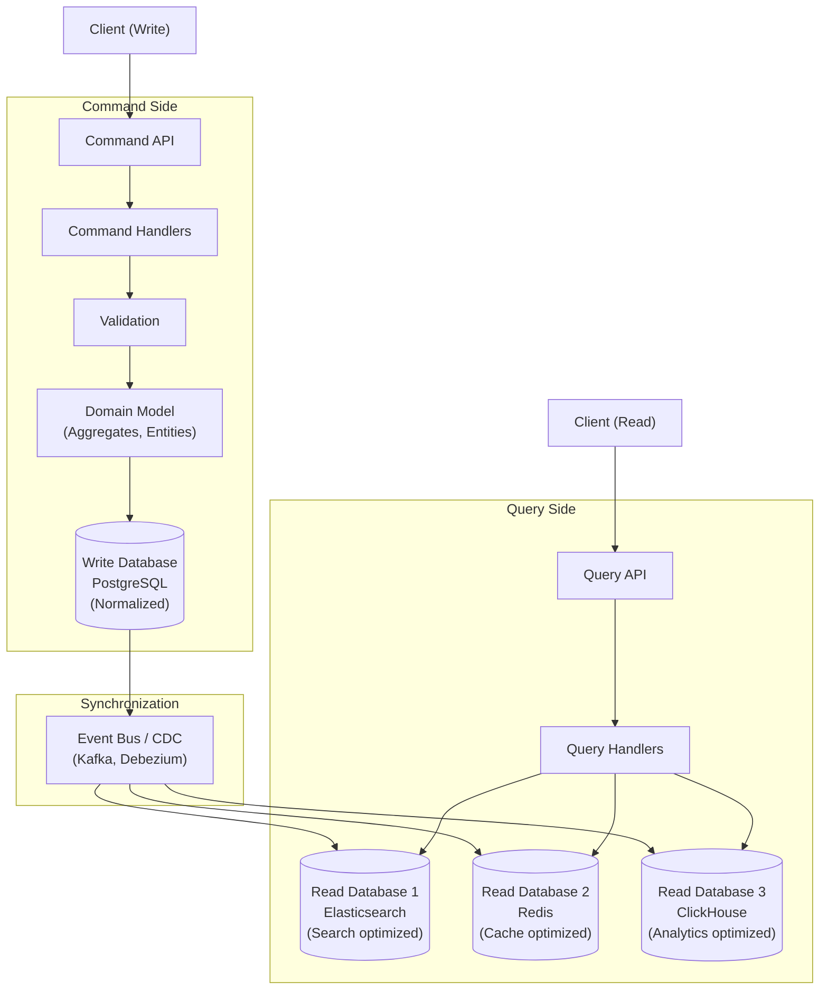

---

## Command Side Deep Dive

The command side is responsible for **enforcing business rules and maintaining data integrity.**

**Components:**
- **Command:** An intent to change state. `PlaceOrder(customerId, items[], shippingAddress)`. Commands can be rejected.
- **Command Handler:** Receives the command, loads the aggregate, validates business rules, applies changes, persists.
- **Aggregate:** The DDD concept — a cluster of entities treated as a unit for data changes. The aggregate enforces invariants.
- **Write Database:** Normalized, optimized for writes and consistency. Typically a relational database.

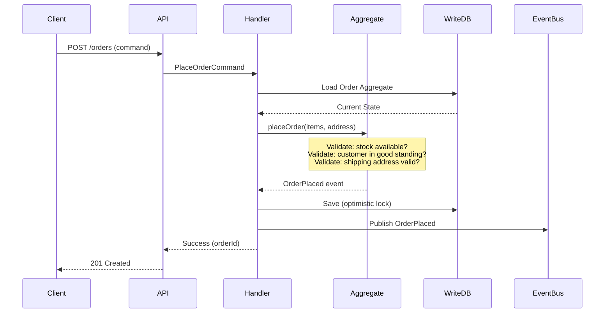

---

## Query Side Deep Dive

The query side is responsible for **serving read requests as fast as possible.** It has no business logic — it is a pre-computed, denormalized view of the data optimized for specific query patterns.

**Key characteristics:**
- **Denormalized.** Data is duplicated and pre-joined. A single query returns everything the UI needs without joins.
- **Eventually consistent.** The query side lags behind the command side by the time it takes to process events (milliseconds to seconds).
- **Multiple projections.** Different read models for different use cases — a search-optimized model in Elasticsearch, a dashboard model in ClickHouse, a cache in Redis.
- **Replaceable.** You can rebuild any read model by replaying events from the event store.

---

## Separate Databases

CQRS does not require separate databases, but it enables them. The three levels of CQRS:

### Level 1: Same Database, Separate Models
```
Write Model: Normalized tables (orders, order_items, customers)
Read Model:  Denormalized views (order_summary_view with JOIN)
Database:    Same PostgreSQL instance
```
Simple. Low operational overhead. Views may be slow for complex queries.

### Level 2: Same Database, Materialized Views
```
Write Model: Normalized tables
Read Model:  Materialized views (refreshed periodically or via triggers)
Database:    Same PostgreSQL instance
```
Better read performance. Staleness depends on refresh interval.

### Level 3: Separate Databases, Event Synchronization
```
Write Database: PostgreSQL (normalized, ACID)
Read Database:  Elasticsearch (search), Redis (cache), ClickHouse (analytics)
Sync:           Kafka / CDC (Debezium)
```
Maximum flexibility and performance. Highest operational complexity.

---

## Eventual Consistency in CQRS

When the read side is a separate database synchronized via events, reads may not reflect the latest writes. This is **eventual consistency** — the read model will eventually catch up, but there is a window where it is stale.

**Practical implications:**
- A user places an order and immediately refreshes the order list — the new order may not appear for 1-2 seconds.
- Mitigation: After a write, redirect to a page that reads from the write database (or use client-side optimistic updates).
- For most read-heavy workloads, the read model is current within milliseconds.

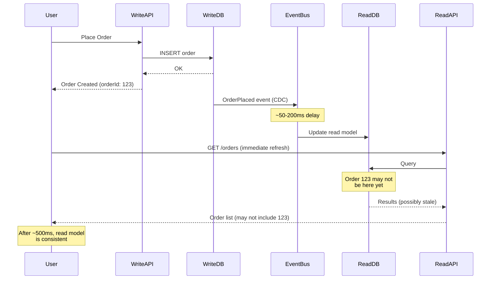

---

## When CQRS Is Overkill

CQRS adds complexity. Use it only when the benefits outweigh the costs.

**CQRS is overkill when:**

1. **Read and write models are nearly identical.** If your API returns the same data it writes, CQRS adds a synchronization layer for no benefit.
2. **Traffic is balanced between reads and writes.** CQRS shines when reads outnumber writes by 100:1. If the ratio is 2:1, separate models add complexity without meaningful scaling benefit.
3. **Strong consistency is required for all reads.** If every read must reflect the absolute latest state, eventual consistency in the read model is a problem you must solve (often by reading from the write database, defeating the purpose).
4. **The team is small and lacks event infrastructure experience.** CQRS with event synchronization requires operating Kafka/CDC, managing projections, handling failed events, and debugging async flows.
5. **Simple CRUD with no complex queries.** A blog, a TODO app, a contact form — CQRS adds zero value.

---

## Real-World Examples

| Company | Approach | Details |
|---|---|---|
| **Microsoft (Azure)** | CQRS in internal services | Microsoft published the foundational CQRS guidance. Uses it in Azure services. |
| **Uber** | CQRS for trip data | Trip write model handles state transitions. Read model serves rider/driver apps. |
| **Netflix** | CQRS for content metadata | Content ingestion (write) separate from content serving (read, optimized for millions of concurrent users). |
| **Event Store Ltd** | CQRS + Event Sourcing | Open-source EventStoreDB designed explicitly for CQRS+ES. |
| **LMAX Exchange** | CQRS for trading | Financial exchange uses CQRS to separate trade execution (write) from market data feeds (read). |

---

## Trade-offs

| Advantage | Disadvantage |
|---|---|
| Independent scaling of read/write sides | Increased complexity (two models, synchronization) |
| Optimized read models (denormalized, pre-computed) | Eventual consistency between sides |
| Different storage technologies per side | Data duplication across read/write stores |
| Write model focused on correctness | Projection management (build, rebuild, monitor) |
| Read model focused on performance | Debugging requires correlating across models |

---

## Common Mistakes

1. **Applying CQRS everywhere.** CQRS should be applied per-aggregate or per-bounded context, not to the entire system. Most CRUD entities do not benefit from CQRS.
2. **No strategy for handling eventual consistency.** Users see stale data after writes. Implement optimistic UI updates or read-your-writes guarantees.
3. **Projections that are too complex.** A projection that joins data from 10 event streams is fragile. Keep projections simple — one or two event sources per projection.
4. **No monitoring of projection lag.** If the read model falls 10 minutes behind, users see severely stale data. Monitor and alert on projection lag.
5. **Treating the read model as the source of truth.** The write model (or event store) is the source of truth. Read models are derived and can be rebuilt from events.

---

## Migration Paths

### From CQRS

| Target Style | Difficulty | Strategy |
|---|---|---|
| Simple CRUD (monolith) | Medium | Merge read/write models into single model. Remove event synchronization. |

### To CQRS

| Source Style | Difficulty | Strategy |
|---|---|---|
| Monolith with slow queries | Low-Medium | Create materialized views or read-optimized tables. Add event-based sync later. |
| Microservices | Medium | Introduce read models per service for query-heavy endpoints. Use Kafka/CDC for sync. |

---

## Interview Insights

**CQRS appears in interviews for high-read-volume systems** — social media feeds, e-commerce product pages, analytics dashboards.

**Pattern to demonstrate:**
1. Identify the read/write asymmetry (e.g., "100K reads/sec for the product page but only 100 writes/sec for product updates").
2. Propose separate read models optimized for the dominant query pattern.
3. Discuss the synchronization mechanism (CDC, events).
4. Address eventual consistency — how does the user experience handle stale reads?
5. Mention that CQRS is applied to the high-traffic component, not the entire system.

---

## Architecture Decision Record (ADR): CQRS Pattern

**Status:** Accepted (for product catalog reads)
**Context:** Our e-commerce platform's product detail page receives 100,000 requests/second at peak. The product data is assembled from 6 normalized tables (product, pricing, inventory, reviews, images, attributes). The JOIN query takes 50ms under load, and the read replicas are at capacity. Meanwhile, product updates (price changes, inventory updates, new images) occur at only 500 writes/second.
**Decision:** We will implement CQRS for the product catalog. A denormalized read model in Elasticsearch will serve product detail page queries. The write model remains in PostgreSQL. Debezium CDC will synchronize changes to Elasticsearch.
**Consequences:**
- (+) Product detail page queries drop from 50ms (6-table JOIN) to 5ms (single Elasticsearch document lookup).
- (+) Read capacity scales horizontally by adding Elasticsearch nodes — independent of the write database.
- (+) Product search becomes a natural extension of the Elasticsearch read model.
- (-) Product updates are eventually consistent — a price change may take 1-2 seconds to appear on the product page.
- (-) We must operate and monitor a Debezium CDC pipeline and an Elasticsearch cluster.
- (-) Elasticsearch index schema must be managed and versioned alongside the PostgreSQL schema.

---

# Migration Paths Between Architecture Styles

Understanding how to migrate between architecture styles is critical for both production systems and interviews. Most real-world systems evolve through multiple styles over their lifetime.

## Migration Map

```mermaid
graph LR
    MONO["Monolith"]
    LAYER["Layered"]
    HEX["Hexagonal"]
    CLEAN["Clean"]
    MICRO["Microservices"]
    EDA["Event-Driven"]
    CQRS_S["CQRS"]
    SLESS["Serverless"]

    MONO -->|"Enforce boundaries"| LAYER
    MONO -->|"Invert dependencies"| HEX
    MONO -->|"Strangler Fig"| MICRO
    MONO -->|"Add event bus"| EDA

    LAYER -->|"Invert dependencies"| HEX
    LAYER -->|"Add use case layer"| CLEAN
    LAYER -->|"Vertical slice extraction"| MICRO

    HEX -->|"Add use case layer"| CLEAN
    HEX -->|"Extract bounded contexts"| MICRO

    MICRO -->|"Add event bus"| EDA
    MICRO -->|"Extract FaaS"| SLESS
    MICRO -->|"Separate read/write"| CQRS_S

    EDA -->|"Separate read/write"| CQRS_S

    MICRO -->|"Consolidate<br/>(too complex)"| MONO
    SLESS -->|"Consolidate<br/>(cost/latency)"| MICRO

    style MONO fill:#e1f5fe
    style LAYER fill:#e8f5e9
    style HEX fill:#fff9c4
    style CLEAN fill:#fff9c4
    style MICRO fill:#fff3e0
    style EDA fill:#fce4ec
    style CQRS_S fill:#f3e5f5
    style SLESS fill:#e0f2f1
```

## Common Migration Patterns

### Monolith to Microservices (Strangler Fig)

The most common and most studied migration. The Strangler Fig pattern wraps the monolith with a routing layer (API gateway) and gradually extracts modules into independent services. Traffic is shifted from the monolith to the new service incrementally.

```mermaid
graph TB
    subgraph "Phase 1: Monolith with Gateway"
        GW1["API Gateway"]
        MONO1["Monolith<br/>(all features)"]
        GW1 -->|"all traffic"| MONO1
    end

    subgraph "Phase 2: First Service Extracted"
        GW2["API Gateway"]
        MONO2["Monolith<br/>(minus user feature)"]
        SVC2["User Service<br/>(extracted)"]
        GW2 -->|"/users/*"| SVC2
        GW2 -->|"everything else"| MONO2
    end

    subgraph "Phase 3: Multiple Services Extracted"
        GW3["API Gateway"]
        MONO3["Monolith<br/>(shrinking)"]
        SVC3A["User Service"]
        SVC3B["Order Service"]
        SVC3C["Product Service"]
        GW3 -->|"/users/*"| SVC3A
        GW3 -->|"/orders/*"| SVC3B
        GW3 -->|"/products/*"| SVC3C
        GW3 -->|"remaining"| MONO3
    end
```

### Layered to Hexagonal

Invert the dependency direction. Instead of the business layer depending on the data access layer, define repository interfaces in the business layer and implement them in the data access layer. This is a code-level refactoring — no infrastructure changes.

### Microservices to Event-Driven

Replace synchronous HTTP calls between services with event-based communication. Introduce a message broker (Kafka). Services publish events instead of calling APIs. Consumers build local read models from events.

---

# Interview Practice Questions

## Beginner Level

**Q1.** What is the difference between a monolith and microservices? When would you choose each?

**Q2.** Explain the layered architecture pattern. What are the typical layers, and what is the dependency rule between them?

**Q3.** What is a "distributed monolith" and why is it considered worse than both a monolith and true microservices?

**Q4.** What is the cold start problem in serverless computing? How would you mitigate it?

**Q5.** Explain the difference between event choreography and event orchestration. Give an example of when each is appropriate.

## Intermediate Level

**Q6.** You are designing a social media platform with 10M DAU. The feed page is read 1000x more often than users post new content. Which architecture patterns would you apply specifically to the feed feature, and why?

**Q7.** A company has a 5-year-old monolith with 200 engineers. Deployments take 4 hours and require coordination between 15 teams. How would you approach migrating to microservices? What would you extract first?

**Q8.** Explain the "database-per-service" pattern in microservices. What problem does it solve, and what new problems does it create? How would you handle a query that needs data from multiple services?

**Q9.** You are building an e-commerce inventory system. Should you use event sourcing? What are the specific benefits and costs for this domain?

**Q10.** Compare hexagonal architecture and clean architecture. Are they fundamentally different, or variations of the same idea? When would you choose one over the other?

## Advanced Level

**Q11.** Design a CQRS system for a financial trading platform. The write side processes 50,000 trades/second with strict ordering. The read side serves real-time dashboards to 10,000 concurrent users. What databases would you use for each side? How would you handle the consistency gap?

**Q12.** You are the architect for a company migrating from a serverless-first architecture (500+ Lambda functions) to containers because of cost and cold start issues. How would you approach this migration without disrupting the running business?

**Q13.** A 50-person startup adopted microservices from day one and now has 40 services, 3 engineers per service on average, and significant operational overhead. Teams spend 40% of their time on infrastructure rather than features. What would you recommend?

**Q14.** Design a system that combines event-driven architecture with CQRS for a ride-sharing platform. The write side handles ride requests and driver matching. The read side shows nearby drivers on a map (updated every 2 seconds for 5M concurrent users). Detail the event flow, data stores, and consistency model.

**Q15.** Your team is debating between a modular monolith and microservices for a new fintech product. The team has 25 engineers, the domain is partially understood, and regulatory requirements demand strong audit trails and high test coverage. Make a recommendation with full justification, including your plan for evolution over the next 3 years.

**Q16.** Explain how you would implement the saga pattern for a multi-step order process (reserve inventory, charge payment, create shipment) using both choreography and orchestration. For each approach, describe the compensation (rollback) flow when the payment step fails.

**Q17.** An interviewer says: "Our system uses Clean Architecture but tests are still slow because they hit the database." Diagnose the problem and explain how Clean Architecture should enable fast tests.

---

# Summary: Architecture Style Selection Guide

## By Team Size

| Team Size | Recommended Style | Rationale |
|---|---|---|
| 1-5 engineers | Monolith (possibly layered) | Minimize overhead. Ship fast. |
| 5-15 engineers | Modular Monolith | Enforce boundaries. Prepare for future extraction. |
| 15-50 engineers | Modular Monolith OR early microservices | Extract highest-contention modules first. |
| 50-200 engineers | Microservices (DDD bounded contexts) | Independent teams, independent deployment. |
| 200+ engineers | Microservices + Event-Driven + CQRS | Full distributed architecture with async communication. |

## By Domain Complexity

| Complexity | Recommended Style | Rationale |
|---|---|---|
| Simple CRUD | Layered (N-Tier) | Straightforward. Framework-supported. |
| Moderate business logic | Modular Monolith | Balance between structure and simplicity. |
| Complex domain logic | Hexagonal / Clean Architecture | Isolate domain from infrastructure. |
| High fan-out workflows | Event-Driven Architecture | Decouple producers from consumers. |
| Read-heavy with write-light | CQRS | Optimize read and write paths independently. |
| Bursty, stateless workloads | Serverless (FaaS) | Scale to zero, scale to thousands. |

## By Scale

| Scale | Recommended Style | Rationale |
|---|---|---|
| < 1K RPS | Monolith on a single server | Vertical scaling is sufficient. |
| 1K-10K RPS | Monolith + read replicas / caching | Add caching before adding services. |
| 10K-100K RPS | Microservices (hot paths extracted) | Scale components independently. |
| 100K+ RPS | Microservices + CQRS + Event-Driven | Full distributed architecture. |

---

# Appendix A: Architecture Anti-Pattern Catalog

| Anti-Pattern | Description | Style Where It Appears | Remedy |
|---|---|---|---|
| **Distributed Monolith** | Services that must deploy together, share a database, or cannot function independently | Microservices | Enforce data ownership. Async communication. Independent deploys. |
| **Big Ball of Mud** | No discernible structure. Everything depends on everything. | Monolith | Enforce module boundaries. Refactor incrementally. |
| **Anemic Domain Model** | Domain objects are data bags (getters/setters) with logic in services | Layered, Clean | Move behavior into entities. Domain objects should enforce their own invariants. |
| **God Service** | One service/class that handles everything | All styles | Split by bounded context or use case. Single Responsibility. |
| **Chatty Services** | Service A makes 50 HTTP calls to Service B per request | Microservices | Batch APIs. Event-carried state transfer. API gateway aggregation. |
| **Shared Database** | Multiple services read/write the same tables | Microservices | Database-per-service. CDC for synchronization. |
| **Lambda Monolith** | Entire application in one Lambda function | Serverless | Split by route/event. Use framework routing within Lambda. |
| **Synchronous Chain** | A → B → C → D synchronous calls | Microservices, Serverless | Use async messaging for non-critical paths. Parallel calls where possible. |
| **CQRS Everywhere** | Applying CQRS to simple CRUD entities | CQRS | Apply CQRS only where read/write asymmetry exists. |
| **Event Soup** | Hundreds of event types with no schema governance | Event-Driven | Schema registry. Event catalog. Naming conventions. |
| **Layer Skipping** | Controllers accessing repositories directly | Layered | Enforce layer dependencies via linting or architecture tests. |
| **Framework Coupling in Core** | Business logic depends on Spring, Django, or Express types | Hexagonal, Clean | Dependency inversion. Framework types only in adapters. |

---

# Appendix B: Technology Mapping

| Architecture Style | Common Technologies |
|---|---|
| **Monolith** | Rails, Django, Spring Boot, ASP.NET, Laravel, Express.js |
| **Layered** | Spring MVC, Django MTV, Rails MVC, ASP.NET MVC |
| **Microservices** | Kubernetes, Docker, Istio, Linkerd, Kong, gRPC, REST |
| **Event-Driven** | Kafka, RabbitMQ, Amazon EventBridge, Pulsar, NATS |
| **Event Sourcing** | EventStoreDB, Kafka (as event store), Axon Framework |
| **Serverless** | AWS Lambda, Google Cloud Functions, Azure Functions, Vercel, Cloudflare Workers |
| **Hexagonal** | No specific tech — pattern applied in any language/framework |
| **Clean Architecture** | No specific tech — pattern applied in any language/framework |
| **CQRS** | Axon Framework, MediatR (.NET), Elasticsearch (read side), Debezium (CDC) |
| **Service Mesh** | Istio, Linkerd, Consul Connect, AWS App Mesh |
| **Saga Orchestration** | Temporal, Netflix Conductor, AWS Step Functions, Camunda |

---

# Appendix C: Quick Reference — When to Use What

```
Need to ship fast with small team?           → Monolith
Need clear structure for enterprise CRUD?    → Layered (N-Tier)
Need independent team deployment?            → Microservices
Need async, decoupled communication?         → Event-Driven
Need scale-to-zero for bursty workloads?     → Serverless
Need to isolate domain from infrastructure?  → Hexagonal / Clean
Need to optimize reads separately from writes? → CQRS
Need complete audit trail of state changes?  → Event Sourcing
Need all of the above at scale?              → Microservices + EDA + CQRS + ES
```

---

# Key Takeaways

1. **There is no universally correct architecture.** Every style is a set of trade-offs. The right choice depends on team size, domain complexity, scale requirements, and organizational structure.

2. **Start simple, evolve intentionally.** The monolith-first strategy is not a compromise — it is the optimal path for most new projects. Extract services when the need is measured, not imagined.

3. **Architecture styles compose.** A microservices system can use CQRS in one service, event sourcing in another, and layered architecture in a third. Choose per-component, not globally.

4. **Conway's Law is real.** Your architecture will mirror your organization's communication structure. If you have 3 teams, you will have roughly 3 services — regardless of what the diagram says.

5. **Migration between styles is the most expensive refactoring in software.** Choose intentionally, but design for evolution. Enforce boundaries early so that extraction is possible later.

6. **In interviews, the style choice is a signal.** Choosing microservices for a 3-person startup is a red flag. Choosing a monolith for 500 engineers is a red flag. Demonstrating that you can match the style to the context is what separates senior from junior.

7. **Operational complexity is the hidden cost.** Microservices, event-driven, and CQRS architectures shift complexity from code to operations. If your team cannot operate distributed systems (monitoring, tracing, alerting, incident response), the architecture will fail.

8. **The dependency rule is the most important principle.** Whether you call it hexagonal, clean, or ports-and-adapters — the idea that business logic should not depend on frameworks, databases, or delivery mechanisms is the single most valuable structural insight in software architecture.

---

# Deep Dive: Monolith Scaling Strategies

Before teams jump to microservices, a well-operated monolith can scale remarkably far with the right techniques.

## Vertical Scaling

Adding more resources (CPU, memory, faster disks) to a single machine. Modern hardware is extraordinarily powerful — a single server with 96 cores and 768 GB of RAM can handle workloads that teams assume require a cluster.

**Stack Overflow case study:** Serves 1.3 billion monthly page views with 9 web servers and 4 SQL servers. Their monolithic .NET application is heavily optimized with aggressive caching, minimal allocations, and hand-tuned SQL queries.

```
Single Server Capacity (2024 hardware):
┌──────────────────────────────────────────────┐
│  96 vCPU, 768 GB RAM, NVMe SSD              │
│                                              │
│  Web requests:     50,000-100,000 RPS        │
│  Database queries: 100,000+ QPS (in-memory)  │
│  Background jobs:  Thousands concurrent      │
│                                              │
│  Cost: ~$3,000/month (cloud)                 │
│  Operational complexity: LOW                 │
└──────────────────────────────────────────────┘
```

## Horizontal Scaling a Monolith

Even monoliths can scale horizontally by running multiple instances behind a load balancer. The constraint is the shared database, which becomes the bottleneck.

```mermaid
graph TB
    LB["Load Balancer<br/>(NGINX / ALB)"]

    subgraph "Application Tier (Horizontally Scaled)"
        APP1["Monolith Instance 1"]
        APP2["Monolith Instance 2"]
        APP3["Monolith Instance 3"]
        APP4["Monolith Instance N"]
    end

    subgraph "Caching Tier"
        REDIS["Redis Cluster"]
    end

    subgraph "Database Tier"
        PRIMARY[("Primary DB<br/>(writes)")]
        READ1[("Read Replica 1")]
        READ2[("Read Replica 2")]
        READ3[("Read Replica N")]
    end

    LB --> APP1
    LB --> APP2
    LB --> APP3
    LB --> APP4

    APP1 --> REDIS
    APP2 --> REDIS
    APP3 --> REDIS
    APP4 --> REDIS

    APP1 -->|"writes"| PRIMARY
    APP2 -->|"writes"| PRIMARY
    APP1 -->|"reads"| READ1
    APP2 -->|"reads"| READ2
    APP3 -->|"reads"| READ3
    APP4 -->|"reads"| READ1

    PRIMARY -->|"replication"| READ1
    PRIMARY -->|"replication"| READ2
    PRIMARY -->|"replication"| READ3
```

**Scaling strategies for monoliths:**

| Strategy | What It Does | Capacity Gain |
|---|---|---|
| **Read replicas** | Route read queries to replicas | 3-10x read throughput |
| **Application-level caching (Redis)** | Cache hot data in memory | 10-100x for cached queries |
| **CDN for static assets** | Serve images, CSS, JS from edge | Removes 60-80% of request volume |
| **Connection pooling** | Reuse database connections | 2-5x connection efficiency |
| **Query optimization** | Indexes, query plans, denormalization | 10-100x for slow queries |
| **Background job queues** | Move slow work off the request path | Lower P99 latency |
| **Database partitioning** | Shard by tenant or time | 5-20x write throughput |

---

# Deep Dive: Microservices Communication Patterns

## Synchronous Communication

### REST over HTTP

The most common pattern. Services expose RESTful APIs and call each other using HTTP.

**Pros:** Simple, widely understood, tooling-rich.
**Cons:** Tight temporal coupling (caller waits for response), cascading failures.

```
Order Service ──HTTP GET /users/123──> User Service
                <──200 OK {name: "Alice"}──
```

### gRPC

Binary protocol using Protocol Buffers for serialization. Faster than JSON/REST. Supports streaming.

**Pros:** 5-10x faster than REST/JSON. Strong typing via .proto files. Bidirectional streaming.
**Cons:** Harder to debug (binary). Requires code generation. Not browser-native (needs gRPC-Web proxy).

```
Order Service ──gRPC GetUser(id: 123)──> User Service
                <──UserResponse{name: "Alice"}──
```

### GraphQL Federation

A GraphQL gateway federates queries across multiple services. Each service owns its portion of the graph.

**Pros:** Single API for clients. No over-fetching/under-fetching.
**Cons:** Complex gateway. Latency from resolver chains. N+1 query problems.

```mermaid
graph TB
    CLIENT["Client"]
    GW["GraphQL Gateway<br/>(Apollo Federation)"]

    CLIENT -->|"query { order { items { product { name } } } }"| GW

    subgraph "Services"
        ORDER["Order Service<br/>(owns: Order, OrderItem)"]
        PRODUCT["Product Service<br/>(owns: Product)"]
        USER["User Service<br/>(owns: User)"]
    end

    GW -->|"resolve order"| ORDER
    GW -->|"resolve product"| PRODUCT
    GW -->|"resolve user"| USER
```

## Asynchronous Communication

### Message Queue (Point-to-Point)

One producer sends a message, one consumer receives it. Used for task distribution.

**Technologies:** RabbitMQ, Amazon SQS, Redis Streams.

```
Order Service ──enqueue──> [   Queue   ] ──dequeue──> Payment Service
                           (SQS / RabbitMQ)
```

### Publish-Subscribe (Fan-Out)

One producer publishes an event, multiple consumers receive it independently.

**Technologies:** Kafka, Amazon SNS+SQS, Google Pub/Sub, NATS.

```
                              ┌──> Notification Service
Order Service ──publish──> Topic ──> Analytics Service
                              ├──> Inventory Service
                              └──> Fraud Detection Service
```

### Event Streaming

Events are stored in a persistent, ordered log. Consumers read from the log at their own pace. The log retains events for a configured duration (days, weeks, or forever).

**Technologies:** Apache Kafka, Amazon Kinesis, Apache Pulsar, Redpanda.

```mermaid
graph LR
    PROD["Producers"]
    subgraph "Kafka Topic: order-events"
        P0["Partition 0<br/>───────────────<br/>e1 → e4 → e7 → e10"]
        P1["Partition 1<br/>───────────────<br/>e2 → e5 → e8 → e11"]
        P2["Partition 2<br/>───────────────<br/>e3 → e6 → e9 → e12"]
    end
    CG1["Consumer Group A<br/>(Notification Svc)"]
    CG2["Consumer Group B<br/>(Analytics Svc)"]

    PROD --> P0
    PROD --> P1
    PROD --> P2

    P0 --> CG1
    P1 --> CG1
    P2 --> CG1

    P0 --> CG2
    P1 --> CG2
    P2 --> CG2
```

## Communication Pattern Decision Matrix

| Pattern | Latency | Coupling | Failure Handling | Use When |
|---|---|---|---|---|
| REST/HTTP | Low (sync) | High (temporal) | Retries, circuit breakers | Simple request-response |
| gRPC | Very Low (sync) | High (temporal) | Same as REST, binary | High-performance internal calls |
| GraphQL | Medium (sync) | Medium | Per-resolver error handling | Client needs flexible queries |
| Message Queue | Medium (async) | Low | Dead letter queue, retries | Task distribution, load leveling |
| Pub/Sub | Medium (async) | Very Low | Per-consumer DLQ | Fan-out to multiple consumers |
| Event Streaming | Medium (async) | Very Low | Replay from offset | Ordered events, audit trail |

---

# Deep Dive: Event Sourcing Implementation Details

## Event Store Structure

An event store is an append-only log organized by **streams** (one stream per aggregate instance).

```
Stream: order-abc-123
┌────┬──────────────────┬─────────────────────────────────────────┬────────────────────┐
│ #  │ Event Type       │ Data                                    │ Timestamp          │
├────┼──────────────────┼─────────────────────────────────────────┼────────────────────┤
│ 1  │ OrderCreated     │ {customer: "C1", items: ["A", "B"]}     │ 2024-01-15 10:00   │
│ 2  │ ItemAdded        │ {item: "C", quantity: 2}                │ 2024-01-15 10:05   │
│ 3  │ ItemRemoved      │ {item: "A"}                             │ 2024-01-15 10:10   │
│ 4  │ OrderConfirmed   │ {total: 150.00, currency: "USD"}        │ 2024-01-15 10:15   │
│ 5  │ PaymentReceived  │ {txnId: "T99", amount: 150.00}          │ 2024-01-15 10:20   │
│ 6  │ OrderShipped     │ {trackingId: "TRACK-456", carrier: "UPS"}│ 2024-01-16 14:00  │
└────┴──────────────────┴─────────────────────────────────────────┴────────────────────┘

Current State (derived by replaying events):
{
  orderId: "abc-123",
  customer: "C1",
  items: ["B", "C", "C"],
  status: "SHIPPED",
  total: 150.00,
  trackingId: "TRACK-456"
}
```

## Snapshots

For aggregates with many events, replaying from event 1 is slow. **Snapshots** periodically save the current state so that replay starts from the snapshot instead of the beginning.

```
Events:  [1] [2] [3] [4] ... [97] [98] [99] [SNAPSHOT@99] [100] [101] [102]
                                                    ↑
                                            Replay starts here
                                            instead of event 1

Without snapshot: Replay 102 events (slow)
With snapshot:    Load snapshot + replay 3 events (fast)
```

**Snapshot strategy:** Take a snapshot every N events (e.g., every 100 events) or when the event count exceeds a threshold.

## Event Schema Evolution

Events are immutable — you cannot change old events. But event schemas evolve over time. Strategies for handling schema changes:

| Strategy | Description | Complexity |
|---|---|---|
| **Versioned events** | `OrderCreatedV1`, `OrderCreatedV2` — consumers handle all versions | Low |
| **Upcasting** | Transform old events to new schema at read time (in-memory) | Medium |
| **Lazy migration** | When an aggregate is loaded, convert old events to new schema and append a migration event | Medium |
| **Schema registry** | Register event schemas. Enforce backward/forward compatibility rules. | High (but safest) |

## Projections and Read Models

A **projection** (also called a **read model** or **view**) is a denormalized data structure built by processing events. Different projections serve different query needs.

```mermaid
graph TB
    subgraph "Event Store"
        ES["Event Log<br/>(OrderCreated, ItemAdded,<br/>PaymentReceived, OrderShipped...)"]
    end

    subgraph "Projections"
        P1["Order List Projection<br/>───────────────────<br/>PostgreSQL table:<br/>order_id | status | total | date<br/>Optimized for: list/filter/sort"]

        P2["Order Search Projection<br/>───────────────────<br/>Elasticsearch index:<br/>Full-text search on order data<br/>Optimized for: search"]

        P3["Revenue Dashboard Projection<br/>───────────────────<br/>ClickHouse table:<br/>daily_revenue | by_category | by_region<br/>Optimized for: analytics"]

        P4["Customer Order History Projection<br/>───────────────────<br/>DynamoDB table:<br/>customer_id → [order summaries]<br/>Optimized for: per-customer lookup"]
    end

    ES --> P1
    ES --> P2
    ES --> P3
    ES --> P4
```

**Key insight:** Projections are **disposable**. If a projection becomes corrupted or needs a new schema, you can delete it and rebuild from the event store. This is one of the most powerful properties of event sourcing.

---

# Deep Dive: Saga Pattern for Distributed Transactions

In microservices, a single business operation (e.g., placing an order) may span multiple services. Since distributed ACID transactions are impractical, the **saga pattern** coordinates a sequence of local transactions across services, with **compensating transactions** to undo work if a step fails.

## Choreography-Based Saga

```mermaid
sequenceDiagram
    participant OrderSvc
    participant InventorySvc
    participant PaymentSvc
    participant ShippingSvc

    Note over OrderSvc: Step 1: Create Order
    OrderSvc->>OrderSvc: Create order (PENDING)
    OrderSvc-->>InventorySvc: OrderCreated event

    Note over InventorySvc: Step 2: Reserve Inventory
    InventorySvc->>InventorySvc: Reserve stock
    InventorySvc-->>PaymentSvc: InventoryReserved event

    Note over PaymentSvc: Step 3: Process Payment
    PaymentSvc->>PaymentSvc: Charge customer
    PaymentSvc-->>ShippingSvc: PaymentProcessed event

    Note over ShippingSvc: Step 4: Create Shipment
    ShippingSvc->>ShippingSvc: Create shipment
    ShippingSvc-->>OrderSvc: ShipmentCreated event

    Note over OrderSvc: Step 5: Confirm Order
    OrderSvc->>OrderSvc: Update order (CONFIRMED)
```

### Compensation Flow (Payment Fails)

```mermaid
sequenceDiagram
    participant OrderSvc
    participant InventorySvc
    participant PaymentSvc

    Note over OrderSvc: Step 1: Create Order
    OrderSvc->>OrderSvc: Create order (PENDING)
    OrderSvc-->>InventorySvc: OrderCreated event

    Note over InventorySvc: Step 2: Reserve Inventory
    InventorySvc->>InventorySvc: Reserve stock
    InventorySvc-->>PaymentSvc: InventoryReserved event

    Note over PaymentSvc: Step 3: Payment FAILS
    PaymentSvc->>PaymentSvc: Charge fails (insufficient funds)
    PaymentSvc-->>InventorySvc: PaymentFailed event

    Note over InventorySvc: Compensate: Release Inventory
    InventorySvc->>InventorySvc: Release reserved stock
    InventorySvc-->>OrderSvc: InventoryReleased event

    Note over OrderSvc: Compensate: Cancel Order
    OrderSvc->>OrderSvc: Update order (CANCELLED)
```

## Orchestration-Based Saga

```mermaid
graph TB
    subgraph "Saga Orchestrator"
        direction TB
        S1["Step 1: Create Order"]
        S2["Step 2: Reserve Inventory"]
        S3["Step 3: Process Payment"]
        S4["Step 4: Create Shipment"]
        S5["Step 5: Confirm Order"]

        C3["Compensate: Refund Payment"]
        C2["Compensate: Release Inventory"]
        C1["Compensate: Cancel Order"]

        S1 -->|success| S2
        S2 -->|success| S3
        S3 -->|success| S4
        S4 -->|success| S5

        S3 -->|failure| C2
        C2 --> C1

        S4 -->|failure| C3
        C3 --> C2
        C2 --> C1
    end

    S1 --> ORDER["Order Service"]
    S2 --> INV["Inventory Service"]
    S3 --> PAY["Payment Service"]
    S4 --> SHIP["Shipping Service"]

    C3 --> PAY
    C2 --> INV
    C1 --> ORDER
```

## Saga Implementation Technologies

| Technology | Type | Details |
|---|---|---|
| **Temporal** | Orchestration | Workflow engine. Durable execution. Automatic retries and compensation. |
| **AWS Step Functions** | Orchestration | Serverless state machine. Visual workflow designer. |
| **Netflix Conductor** | Orchestration | Open-source workflow orchestration for microservices. |
| **Camunda** | Orchestration | BPMN-based workflow engine. |
| **Kafka + custom logic** | Choreography | Events on Kafka topics. Each service handles its own saga step. |
| **Axon Framework** | Both | Java framework supporting both saga styles with event sourcing. |

---

# Deep Dive: Serverless Patterns

## Common Serverless Architecture Patterns

### 1. API + Lambda + DynamoDB

The most basic serverless pattern. API Gateway routes requests to Lambda functions that read/write DynamoDB.

```mermaid
graph LR
    CLIENT["Client"] --> APIGW["API Gateway"]
    APIGW --> FN["Lambda Function"]
    FN --> DB["DynamoDB"]
```

### 2. Event Processing Pipeline

Events flow through a chain of Lambda functions connected by queues or streams.

```mermaid
graph LR
    SOURCE["Event Source<br/>(S3, IoT, API)"]
    SOURCE --> STREAM["Kinesis Stream"]
    STREAM --> FN1["Lambda: Validate"]
    FN1 --> QUEUE["SQS Queue"]
    QUEUE --> FN2["Lambda: Transform"]
    FN2 --> DB["DynamoDB"]
    FN2 --> NOTIFY["Lambda: Notify"]
    NOTIFY --> SNS["SNS → Email/SMS"]
```

### 3. Fan-Out Pattern

One event triggers multiple independent Lambda functions in parallel.

```mermaid
graph TB
    SOURCE["S3: Image Uploaded"]
    SOURCE --> SNS["SNS Topic"]
    SNS --> FN1["Lambda: Generate Thumbnail"]
    SNS --> FN2["Lambda: Extract Metadata"]
    SNS --> FN3["Lambda: Run Moderation"]
    SNS --> FN4["Lambda: Update Catalog"]
    FN1 --> S3["S3: Thumbnails"]
    FN2 --> DB["DynamoDB: Metadata"]
    FN3 --> QUEUE["SQS: Moderation Queue"]
    FN4 --> ES["Elasticsearch"]
```

### 4. Scheduled Processing

CloudWatch Events (or EventBridge) triggers Lambda functions on a schedule.

```
CloudWatch Rule: "rate(1 hour)"
    └──> Lambda: Aggregate hourly metrics
            └──> Write to ClickHouse

CloudWatch Rule: "cron(0 9 * * ? *)"  (9 AM daily)
    └──> Lambda: Generate daily report
            └──> Email via SES
```

### 5. Step Functions Orchestration

AWS Step Functions orchestrates multiple Lambda functions with branching, parallel execution, retries, and error handling.

```mermaid
graph TB
    START["Start: Order Received"]
    START --> VALIDATE["Lambda: Validate Order"]
    VALIDATE -->|valid| PARALLEL["Parallel"]

    subgraph "Parallel Execution"
        PARALLEL --> RESERVE["Lambda: Reserve Inventory"]
        PARALLEL --> FRAUD["Lambda: Fraud Check"]
    end

    RESERVE --> WAIT_PARALLEL["Wait for both"]
    FRAUD --> WAIT_PARALLEL

    WAIT_PARALLEL -->|both pass| CHARGE["Lambda: Charge Payment"]
    WAIT_PARALLEL -->|fraud detected| REJECT["Lambda: Reject Order"]

    CHARGE -->|success| CONFIRM["Lambda: Confirm Order"]
    CHARGE -->|failure| COMPENSATE["Lambda: Release Inventory"]

    CONFIRM --> END_OK["End: Order Confirmed"]
    REJECT --> END_FAIL["End: Order Rejected"]
    COMPENSATE --> END_FAIL
```

---

## Serverless Cost Analysis

Serverless pricing follows a **per-invocation + per-duration** model. This is cheaper at low scale and more expensive at high, steady-state scale.

```
AWS Lambda Pricing (approximate):
- $0.20 per 1M invocations
- $0.0000166667 per GB-second

Example: 10M invocations/month, 256 MB memory, 200ms average duration
- Invocations: 10M × $0.20/M = $2.00
- Compute:     10M × 0.256 GB × 0.2s × $0.0000166667 = $8.53
- Total:       ~$10.53/month

Same workload on a t3.medium EC2 instance (24/7):
- $30.37/month
- Can handle ~10M simple invocations easily

Breakeven: Serverless is cheaper below ~30M invocations/month
           for this workload profile
```

**Rule of thumb:** If your Lambda runs at >30% utilization consistently, a container is likely cheaper. If utilization is bursty (high spikes, long idle), serverless wins.

---

# Deep Dive: Hexagonal Architecture Testing Strategy

## Test Pyramid for Hexagonal Architecture

```mermaid
graph TB
    subgraph "Test Pyramid"
        direction TB
        E2E["End-to-End Tests<br/>(Few, slow, fragile)<br/>Full HTTP → DB round trip"]
        INTEGRATION["Integration Tests<br/>(Some, medium speed)<br/>Adapter tests with real infra"]
        UNIT["Unit Tests<br/>(Many, fast, stable)<br/>Domain + Use Cases with mocks"]
    end

    style E2E fill:#fce4ec
    style INTEGRATION fill:#fff9c4
    style UNIT fill:#e8f5e9
```

### Unit Tests: Core Domain Logic

Tests that verify business rules using in-memory adapters. No database, no HTTP, no external services. Execute in milliseconds.

```
Test: "Order total is calculated correctly with discounts"
- Create: InMemoryProductRepository (mock adapter)
- Create: InMemoryOrderRepository (mock adapter)
- Create: PlaceOrderUseCase (real domain logic)
- Execute: placeOrder(items: [Widget x2, Gadget x1], discount: 10%)
- Assert: order.total == $90.00

Execution time: ~5ms
Dependencies: NONE (pure business logic)
```

### Integration Tests: Adapter Verification

Tests that verify adapters work correctly with real infrastructure. One adapter at a time.

```
Test: "PostgresOrderRepository correctly saves and loads an order"
- Setup: Real PostgreSQL (testcontainer)
- Create: PostgresOrderRepository (real adapter)
- Execute: repository.save(testOrder)
- Execute: loaded = repository.findById(testOrder.id)
- Assert: loaded == testOrder

Execution time: ~500ms
Dependencies: PostgreSQL (via testcontainer)
```

### End-to-End Tests: Full Flow Verification

Tests that verify the complete flow from HTTP request to database and back. Fewest in number, most expensive to run.

```
Test: "POST /orders creates an order and returns 201"
- Setup: Full application with real DB
- Execute: HTTP POST /orders {items: [...]}
- Assert: Response status 201
- Assert: Response body contains orderId
- Assert: Database contains the order

Execution time: ~2-5 seconds
Dependencies: Full application stack
```

---

# Deep Dive: CQRS Read Model Patterns

## Read Model Synchronization Strategies

### 1. Synchronous (In-Process)

The write operation directly updates the read model in the same transaction. No eventual consistency, but tight coupling.

```
Write Transaction:
    BEGIN
    INSERT INTO orders (...) VALUES (...)
    INSERT INTO order_search_index (...) VALUES (...)
    COMMIT
```

**Use when:** You need strong consistency and the read model is in the same database.

### 2. Change Data Capture (CDC)

A CDC tool (Debezium) monitors the write database's transaction log and streams changes to the read database.

```mermaid
graph LR
    WRITE_DB[("Write DB<br/>PostgreSQL")] -->|"WAL (transaction log)"| DEBEZIUM["Debezium<br/>(CDC)"]
    DEBEZIUM -->|"Change events"| KAFKA["Kafka"]
    KAFKA --> CONSUMER["Read Model Updater"]
    CONSUMER --> READ_DB[("Read DB<br/>Elasticsearch")]
```

**Use when:** You want to decouple the write and read sides without changing application code. Lag: ~100ms-1s.

### 3. Domain Events

The application publishes domain events after a write. A separate consumer processes events and updates the read model.

```mermaid
graph LR
    APP["Application<br/>(Write Side)"] -->|"OrderPlaced event"| KAFKA["Kafka"]
    KAFKA --> PROJECTOR["Projector<br/>(Read Side Updater)"]
    PROJECTOR --> READ_DB[("Read DB<br/>Elasticsearch")]
```

**Use when:** You have full control over the event schema and want rich, domain-meaningful events. Lag: ~100ms-2s.

### 4. Polling

The read side periodically queries the write database for changes. Simple but high-latency.

```
Every 30 seconds:
    SELECT * FROM orders WHERE updated_at > last_sync_timestamp
    → Update read model
```

**Use when:** Low-frequency updates where minutes of lag are acceptable (e.g., analytics dashboards).

## Read Model Rebuild Strategy

One of the most powerful features of CQRS: you can **rebuild any read model from scratch** without affecting the write side.

```
Rebuild Process:
1. Create new read model index (e.g., orders_v2 in Elasticsearch)
2. Replay all events (or scan write DB) to populate orders_v2
3. Switch read traffic from orders_v1 to orders_v2 (alias swap)
4. Delete orders_v1

Zero-downtime. No write-side changes. No data loss risk.
```

This capability is invaluable when:
- A bug corrupted the read model
- The read model schema needs to change (new fields, new structure)
- You want to create an entirely new read model for a new use case
- The read database technology is changing (PostgreSQL views → Elasticsearch)

---

# Deep Dive: Service Mesh Architecture

## Service Mesh Components

```mermaid
graph TB
    subgraph "Control Plane"
        PILOT["Pilot<br/>(Traffic Management)"]
        CITADEL["Citadel<br/>(Certificate Authority)"]
        GALLEY["Galley<br/>(Configuration)"]
        MIXER["Telemetry<br/>(Metrics, Logs)"]
    end

    subgraph "Data Plane"
        subgraph "Pod A"
            SVC_A["Service A"]
            PROXY_A["Envoy Proxy"]
        end
        subgraph "Pod B"
            SVC_B["Service B"]
            PROXY_B["Envoy Proxy"]
        end
        subgraph "Pod C"
            SVC_C["Service C"]
            PROXY_C["Envoy Proxy"]
        end
    end

    PILOT -.->|"routing rules"| PROXY_A
    PILOT -.->|"routing rules"| PROXY_B
    PILOT -.->|"routing rules"| PROXY_C

    CITADEL -.->|"TLS certs"| PROXY_A
    CITADEL -.->|"TLS certs"| PROXY_B
    CITADEL -.->|"TLS certs"| PROXY_C

    SVC_A --> PROXY_A
    PROXY_A -->|"mTLS"| PROXY_B
    PROXY_B --> SVC_B
    PROXY_A -->|"mTLS"| PROXY_C
    PROXY_C --> SVC_C

    PROXY_A -.->|"metrics"| MIXER
    PROXY_B -.->|"metrics"| MIXER
    PROXY_C -.->|"metrics"| MIXER
```

## Service Mesh Capabilities

| Capability | What It Does | Why It Matters |
|---|---|---|
| **Mutual TLS (mTLS)** | Encrypts all service-to-service traffic | Zero-trust security without code changes |
| **Traffic splitting** | Route 10% of traffic to v2, 90% to v1 | Canary deployments, A/B testing |
| **Circuit breaking** | Stop calling a failing service after N failures | Prevent cascading failures |
| **Retries with budget** | Retry failed calls (with configurable limits) | Improve reliability without retry storms |
| **Timeout enforcement** | Enforce max request duration | Prevent slow services from blocking callers |
| **Rate limiting** | Limit requests per service/user | Prevent noisy-neighbor problems |
| **Distributed tracing** | Propagate trace context across services | End-to-end request visibility |
| **Load balancing** | Intelligent routing (least connections, round robin) | Even load distribution |

## When to Add a Service Mesh

A service mesh is **not** needed for every microservices deployment. It adds complexity (sidecar resource overhead, control plane operations, debugging complexity).

**Add a service mesh when:**
- You have 20+ services and need uniform security (mTLS) without per-service implementation
- You need traffic management (canary, blue-green) across many services
- You need consistent observability (metrics, tracing) without instrumenting each service
- Regulatory requirements mandate encrypted inter-service communication

**Skip the service mesh when:**
- You have fewer than 10 services
- Your services already handle their own retries, timeouts, and circuit breaking
- Your team lacks Kubernetes operations expertise
- The resource overhead of sidecars (50-100 MB RAM per pod) is significant for your budget

---

# Deep Dive: Clean Architecture File Structure

## Recommended Package Structure (Java/Kotlin)

```
src/
├── domain/                          ← Layer 1: Entities
│   ├── model/
│   │   ├── Order.java               ← Aggregate root
│   │   ├── OrderItem.java           ← Entity
│   │   ├── OrderStatus.java         ← Enum / Value Object
│   │   ├── Money.java               ← Value Object
│   │   └── Address.java             ← Value Object
│   ├── service/
│   │   └── PricingService.java      ← Domain Service (pure logic)
│   ├── event/
│   │   ├── OrderCreated.java        ← Domain Event
│   │   └── OrderShipped.java        ← Domain Event
│   └── exception/
│       ├── OrderNotFoundException.java
│       └── InsufficientStockException.java
│
├── application/                     ← Layer 2: Use Cases
│   ├── port/
│   │   ├── input/                   ← Input Ports (Driving)
│   │   │   ├── PlaceOrderUseCase.java
│   │   │   ├── CancelOrderUseCase.java
│   │   │   └── GetOrderDetailsUseCase.java
│   │   └── output/                  ← Output Ports (Driven)
│   │       ├── OrderRepository.java
│   │       ├── PaymentGateway.java
│   │       ├── InventoryService.java
│   │       └── EventPublisher.java
│   ├── service/                     ← Use Case Implementations
│   │   ├── PlaceOrderService.java
│   │   ├── CancelOrderService.java
│   │   └── GetOrderDetailsService.java
│   └── dto/
│       ├── PlaceOrderCommand.java
│       ├── CancelOrderCommand.java
│       └── OrderDetailsResponse.java
│
├── adapter/                         ← Layer 3: Interface Adapters
│   ├── input/                       ← Driving Adapters
│   │   ├── rest/
│   │   │   ├── OrderController.java
│   │   │   ├── OrderRequest.java
│   │   │   └── OrderResponse.java
│   │   ├── grpc/
│   │   │   └── OrderGrpcService.java
│   │   └── messaging/
│   │       └── OrderEventConsumer.java
│   └── output/                      ← Driven Adapters
│       ├── persistence/
│       │   ├── PostgresOrderRepository.java
│       │   ├── OrderJpaEntity.java
│       │   └── OrderEntityMapper.java
│       ├── payment/
│       │   └── StripePaymentGateway.java
│       ├── inventory/
│       │   └── HttpInventoryService.java
│       └── messaging/
│           └── KafkaEventPublisher.java
│
└── infrastructure/                  ← Layer 4: Frameworks & Config
    ├── config/
    │   ├── DatabaseConfig.java
    │   ├── KafkaConfig.java
    │   └── SecurityConfig.java
    └── Application.java             ← Spring Boot main class
```

**Dependency direction enforcement:**
- `domain` has ZERO imports from `application`, `adapter`, or `infrastructure`
- `application` imports from `domain` only
- `adapter` imports from `application` and `domain`
- `infrastructure` imports from all layers (it wires everything together)

Tools like **ArchUnit** (Java) or **Dependency Cruiser** (JavaScript) can enforce these rules in CI.

---

# Architecture Fitness Functions

Fitness functions are automated tests that verify architectural properties are maintained over time. They prevent architectural erosion — the gradual degradation of architecture through small, seemingly harmless violations.

## Examples

| Fitness Function | What It Tests | Tool |
|---|---|---|
| **No layer violations** | Domain layer has no imports from infrastructure | ArchUnit, Dependency Cruiser |
| **No circular dependencies** | Package A does not depend on Package B which depends on Package A | ArchUnit, madge |
| **Service independence** | No shared database tables between microservices | Custom DB schema test |
| **API backward compatibility** | New API version does not break existing consumers | Pact, OpenAPI diff |
| **Maximum service coupling** | No service calls more than N other services synchronously | Custom dependency graph analysis |
| **Deployment independence** | Service A can deploy without Service B | CI pipeline test |
| **Response time budget** | P99 latency remains under threshold | Load test in CI |

```
// ArchUnit test (Java) — enforcing Clean Architecture layers
@Test
void domainLayerDoesNotDependOnAdapters() {
    noClasses()
        .that().resideInAPackage("..domain..")
        .should().dependOnClassesThat()
        .resideInAnyPackage("..adapter..", "..infrastructure..")
        .check(importedClasses);
}

@Test
void applicationLayerDoesNotDependOnAdapters() {
    noClasses()
        .that().resideInAPackage("..application..")
        .should().dependOnClassesThat()
        .resideInAnyPackage("..adapter..", "..infrastructure..")
        .check(importedClasses);
}
```

---

# Hybrid Architecture Patterns in Production

Real-world systems rarely use a single architecture style. Here are common hybrid patterns found in production.

## Pattern 1: Modular Monolith + Event-Driven Integrations

The core application is a modular monolith. External integrations (notifications, analytics, search indexing) are connected via an event bus.

```mermaid
graph TB
    subgraph "Modular Monolith"
        USERS["Users Module"]
        ORDERS["Orders Module"]
        PRODUCTS["Products Module"]
        PAYMENTS["Payments Module"]
        EB_INT["Internal Event Bus<br/>(in-process)"]
    end

    EXT_EB["External Event Bus<br/>(Kafka)"]

    subgraph "External Services"
        NOTIFY["Notification Service<br/>(Lambda)"]
        SEARCH["Search Indexer<br/>(Lambda → ES)"]
        ANALYTICS["Analytics Pipeline<br/>(Kinesis → Redshift)"]
    end

    ORDERS --> EB_INT
    EB_INT --> PAYMENTS
    EB_INT --> EXT_EB

    EXT_EB --> NOTIFY
    EXT_EB --> SEARCH
    EXT_EB --> ANALYTICS
```

## Pattern 2: Microservices + CQRS for Hot Paths

Most services use simple CRUD. The highest-traffic service (product catalog) uses CQRS with a separate read model.

```mermaid
graph TB
    GW["API Gateway"]

    subgraph "Standard Services (Simple CRUD)"
        USER_SVC["User Service<br/>(PostgreSQL)"]
        CART_SVC["Cart Service<br/>(Redis)"]
        PAYMENT_SVC["Payment Service<br/>(PostgreSQL)"]
    end

    subgraph "CQRS Service (High Traffic)"
        PRODUCT_WRITE["Product Write Service<br/>(PostgreSQL)"]
        CDC["CDC (Debezium)"]
        PRODUCT_READ["Product Read Service<br/>(Elasticsearch)"]
    end

    GW --> USER_SVC
    GW --> CART_SVC
    GW --> PAYMENT_SVC
    GW -->|"reads<br/>(100K RPS)"| PRODUCT_READ
    GW -->|"writes<br/>(100 RPS)"| PRODUCT_WRITE

    PRODUCT_WRITE --> CDC
    CDC --> PRODUCT_READ
```

## Pattern 3: Serverless + Containers

Core business logic runs in containers (ECS, Kubernetes). Stateless, bursty workloads run as serverless functions.

```mermaid
graph TB
    subgraph "Container-Based (Steady State)"
        API["API Service<br/>(ECS/Fargate)"]
        WORKER["Background Worker<br/>(ECS/Fargate)"]
        DB[("PostgreSQL<br/>(RDS)")]
    end

    subgraph "Serverless (Bursty / Event-Driven)"
        IMG_FN["Lambda: Image Processing"]
        EMAIL_FN["Lambda: Email Sending"]
        REPORT_FN["Lambda: Report Generation"]
        WEBHOOK_FN["Lambda: Webhook Handler"]
    end

    API --> DB
    WORKER --> DB

    API -->|"S3 upload event"| IMG_FN
    API -->|"SQS message"| EMAIL_FN
    API -->|"CloudWatch schedule"| REPORT_FN
    API -->|"API Gateway"| WEBHOOK_FN
```

---

# Extended Interview Practice: Scenario-Based Questions

## Scenario 1: Architecture Evolution

**Question:** You joined a startup 2 years ago as the first engineer. The company now has 35 engineers and the original Django monolith is becoming painful — deployments are slow, the test suite takes 45 minutes, and teams step on each other's code. The CTO wants to move to microservices. What do you recommend?

**Strong answer framework:**
1. **Assess before migrating.** Is the pain from the architecture or from poor practices? A 45-minute test suite might be fixable with test parallelization. Slow deployments might be a CI/CD problem, not an architecture problem.
2. **Consider the modular monolith as a middle step.** Enforce module boundaries within the Django app. Use Django apps as modules with clear interfaces. This gives team independence without distributed system complexity.
3. **If microservices are justified, use Strangler Fig.** Identify the highest-contention module (the one that causes the most merge conflicts and deployment coordination). Extract it first. Keep everything else in the monolith.
4. **Set prerequisites before extraction.** Before extracting the first service, you need: CI/CD per service, centralized logging, distributed tracing, monitoring/alerting, and an API gateway.
5. **Plan for 6-12 months, not 6-12 weeks.** A monolith-to-microservices migration is a multi-quarter initiative. Set milestones: first service extracted (month 3), second service (month 6), evaluate and adjust (month 9).

## Scenario 2: Consistency vs Availability

**Question:** You are designing an inventory management system for a flash sale that expects 100,000 concurrent users trying to buy 1,000 units of a limited product. How do you prevent overselling while maintaining sub-second response times?

**Strong answer framework:**
1. **This is a consistency-critical write path.** Unlike a social feed (eventual consistency is fine), inventory must never go negative.
2. **Use optimistic locking on a single counter.** The inventory count is a single row with a version number. Decrement with `UPDATE inventory SET count = count - 1, version = version + 1 WHERE sku = ? AND count > 0 AND version = ?`. If the version check fails, retry.
3. **Pre-partition the inventory.** Split 1,000 units across 10 Redis counters (100 each). Each request decrements a random counter. This reduces contention 10x. When a counter reaches zero, redirect to another.
4. **Queue excess demand.** If all counters are zero, put the user in a virtual queue. Process the queue as cancellations free up inventory.
5. **Architecture style:** This specific component benefits from a monolithic approach (single database, single counter) rather than microservices. Distributing inventory across services adds eventual consistency where you need strong consistency.

## Scenario 3: Choosing Architecture for a New Product

**Question:** Your company is launching a new product: a collaborative document editor (like Google Docs). You have 12 engineers and 6 months to launch an MVP. What architecture would you choose?

**Strong answer framework:**
1. **Monolith for the MVP.** 12 engineers, 6 months, new product — this is the textbook case for a monolith. No microservices overhead.
2. **Real-time collaboration requires specialized architecture.** The document editing engine needs Operational Transformation (OT) or CRDTs — this is an application-level concern, not an architecture-level concern. It lives as a module within the monolith.
3. **WebSocket server for real-time.** A dedicated WebSocket handler (within the monolith) manages real-time cursor positions and edits. This could be the first module extracted as a separate service later (different scaling characteristics from REST API).
4. **Event sourcing for document history.** Every edit is an event. This naturally supports undo/redo, version history, and conflict resolution. Apply event sourcing to the document module specifically, not to the entire application.
5. **Evolution plan:** After launch, if the WebSocket server needs different scaling (persistent connections vs stateless HTTP), extract it as the first microservice. The document storage and user management remain in the monolith.

---

# Glossary

| Term | Definition |
|---|---|
| **Aggregate** | A cluster of domain objects treated as a single unit for data changes (DDD concept). |
| **Anti-Corruption Layer (ACL)** | A translation layer that prevents external system models from corrupting internal domain models. |
| **Bounded Context** | A boundary within which a particular domain model is defined and applicable (DDD concept). |
| **CDC (Change Data Capture)** | A technique for capturing row-level changes from a database transaction log and streaming them as events. |
| **CQRS** | Command Query Responsibility Segregation — separating read and write models. |
| **Domain Event** | An event that represents something meaningful that happened in the domain. |
| **Event Sourcing** | Storing state as a sequence of events rather than as mutable current state. |
| **Event Store** | An append-only database optimized for storing and retrieving event streams. |
| **FaaS** | Functions as a Service — serverless compute where you deploy individual functions. |
| **BaaS** | Backend as a Service — managed backend services (auth, database, storage). |
| **Fitness Function** | An automated test that verifies an architectural property is maintained. |
| **Modular Monolith** | A monolith with enforced module boundaries that enable independent development but shared deployment. |
| **Port** | An interface defined by the application core describing what it needs from the outside world (Hexagonal Architecture). |
| **Adapter** | An implementation of a port that connects to real infrastructure (Hexagonal Architecture). |
| **Projection** | A read model built by processing events, optimized for specific query patterns. |
| **Saga** | A pattern for managing distributed transactions across microservices using a sequence of local transactions with compensating actions. |
| **Service Mesh** | An infrastructure layer for managing service-to-service communication (traffic, security, observability). |
| **Sidecar** | A proxy container deployed alongside a service container, handling cross-cutting concerns. |
| **Snapshot** | A point-in-time capture of aggregate state used to optimize event replay performance. |
| **Strangler Fig** | A migration pattern where a new system gradually replaces an old system by intercepting requests at the edge. |
| **Upcasting** | Transforming an old event schema to a new schema at read time without modifying the stored event. |
