# F04. Microservices & Distributed Patterns

## Part Context
**Part:** Part 0 — System Design Foundations & Principles
**Position:** Chapter F04 of F12
**Why this part exists:** This section builds the foundational mental models every engineer needs before diving into specific system designs. Microservices and distributed patterns form the architectural vocabulary of modern backend systems — understanding them deeply is a prerequisite for designing anything at scale.

---

## Overview

Microservices architecture decomposes a system into independently deployable services, each owning a bounded context. This decomposition brings enormous benefits — independent scaling, technology heterogeneity, team autonomy, fault isolation — but it also introduces an entirely new class of problems: network unreliability, partial failures, data consistency across service boundaries, distributed tracing, and operational complexity that can overwhelm teams unprepared for it.

This chapter provides a comprehensive reference for the **four pillars** of microservices architecture:

### Section 1 — Communication Patterns
How services talk to each other: synchronous protocols (REST, gRPC, GraphQL), asynchronous messaging (Kafka, RabbitMQ, SQS), publish-subscribe topologies, and event sourcing as a communication paradigm.

### Section 2 — Data Patterns
How services own and share data: database-per-service, the shared database anti-pattern, the saga pattern for distributed transactions, event sourcing for audit-complete state management, and CQRS for separating read and write workloads.

### Section 3 — Resilience Patterns
How services survive failure: circuit breakers, retries with backoff, timeout management, bulkhead isolation, and fallback strategies that keep the system functional when components degrade.

### Section 4 — API Patterns
How services expose functionality to clients: API gateways, backend-for-frontend (BFF) layers, and aggregator patterns that compose multiple service calls into cohesive client responses.

Every pattern is presented with its definition, architecture diagram, real-world example, implementation details, guidance on when to use (and when not to), trade-offs, common mistakes, and interview insights.

---

## Why These Patterns Matter in Real Systems

- Every large-scale system (Netflix, Uber, Amazon, Stripe) is built on microservices — understanding the patterns is mandatory for senior engineering roles.
- Distributed systems fail in ways monoliths never do: network partitions, message ordering violations, split-brain scenarios, and cascading failures require specific architectural countermeasures.
- Choosing the wrong communication pattern can add 100ms+ of latency per hop; choosing the wrong data pattern can create data inconsistency that takes months to untangle.
- These patterns appear in **every** system design interview at the staff+ level, either explicitly ("How would you handle a distributed transaction?") or implicitly (the interviewer expects you to apply them without being prompted).
- The patterns interact: a saga pattern requires idempotent operations, which requires careful retry design, which interacts with timeout budgets, which must account for circuit breaker state.

---

## Prerequisites

Before reading this chapter, you should be comfortable with:
- Basic networking (HTTP, TCP, DNS) — covered in F01.
- Consistency models (strong, eventual, causal) — covered in F02.
- CAP theorem and its practical implications — covered in F02.
- Database fundamentals (ACID, indexing, replication) — covered in F03.

---

# Section 1: Communication Patterns

Communication is the connective tissue of a microservices architecture. Every business operation that spans more than one service requires a communication decision: synchronous or asynchronous? Point-to-point or broadcast? Request-response or fire-and-forget? The choice determines latency, coupling, failure modes, and operational complexity.

This section covers the four major communication paradigms and the protocols within each.

---

## 1.1 Synchronous Communication

In synchronous communication, the caller sends a request and **blocks** (or awaits) until the callee responds. This is the most natural pattern for engineers coming from monolithic systems, but it introduces tight temporal coupling — if the callee is slow or down, the caller is directly affected.

---

### 1.1.1 REST (Representational State Transfer)

**Definition:**
REST is an architectural style for designing networked applications. It uses HTTP methods (GET, POST, PUT, DELETE, PATCH) to perform CRUD operations on resources identified by URIs. RESTful APIs are stateless, cacheable, and use standard HTTP status codes for response semantics.

**Richardson Maturity Model:**

The Richardson Maturity Model classifies REST APIs into four levels of maturity:

| Level | Name | Description | Example |
|-------|------|-------------|---------|
| 0 | The Swamp of POX | Single URI, single HTTP method (typically POST). RPC-over-HTTP. | `POST /api` with action in body |
| 1 | Resources | Multiple URIs, one per resource type. Still typically uses POST for everything. | `POST /orders`, `POST /users` |
| 2 | HTTP Verbs | Uses correct HTTP methods (GET, POST, PUT, DELETE) with proper status codes. | `GET /orders/123`, `DELETE /orders/123` |
| 3 | Hypermedia (HATEOAS) | Responses include links to related actions and resources. Self-descriptive messages. | Response includes `_links` with next actions |

Most production APIs operate at Level 2. Level 3 (HATEOAS) is rarely implemented in practice because it adds significant complexity with limited tooling support.

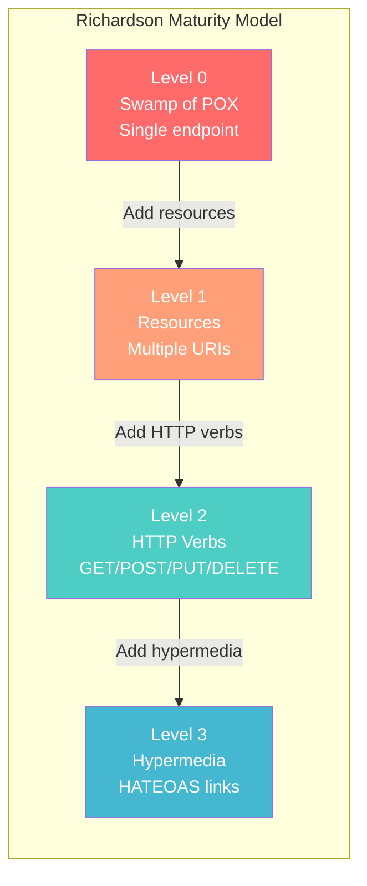

**Architecture Diagram:**

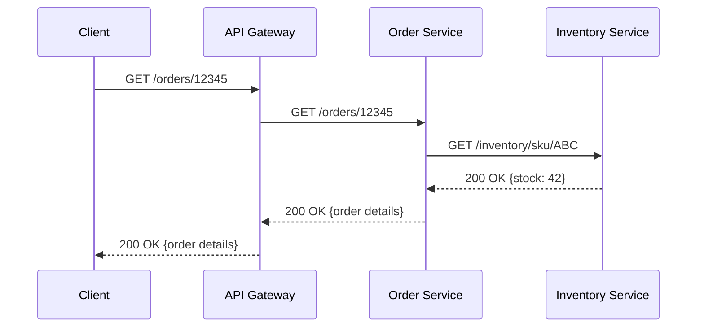

**Real-World Example:**
Stripe's API is widely regarded as the gold standard for REST API design. It uses Level 2 maturity with consistent resource naming (`/v1/charges`, `/v1/customers`), proper HTTP verbs, idempotency keys for safe retries, and cursor-based pagination.

**Implementation Details:**

```
// Resource Design Principles
// 1. Nouns, not verbs: /orders not /getOrders
// 2. Plural resources: /orders not /order
// 3. Nested resources for relationships: /orders/123/items
// 4. Query parameters for filtering: /orders?status=pending&limit=20

// Idempotency for safe retries
POST /orders
Headers:
  Idempotency-Key: unique-client-generated-uuid
  Content-Type: application/json
Body:
  { "items": [...], "customer_id": "cust_123" }

// Versioning strategies
// URI versioning:  /v1/orders  (most common)
// Header versioning: Accept: application/vnd.myapi.v1+json
// Query param: /orders?version=1

// Pagination
// Cursor-based (preferred for large datasets):
GET /orders?cursor=eyJpZCI6MTIzfQ&limit=20
// Offset-based (simpler, but has consistency issues):
GET /orders?offset=40&limit=20

// Standard HTTP Status Codes
// 200 OK — successful GET/PUT/PATCH
// 201 Created — successful POST
// 204 No Content — successful DELETE
// 400 Bad Request — validation error
// 401 Unauthorized — missing/invalid auth
// 403 Forbidden — insufficient permissions
// 404 Not Found — resource doesn't exist
// 409 Conflict — state conflict (e.g., concurrent update)
// 429 Too Many Requests — rate limited
// 500 Internal Server Error — server fault
// 503 Service Unavailable — temporary overload
```

**When to Use REST:**
- Public-facing APIs consumed by third-party developers (discoverability, tooling ecosystem).
- CRUD-heavy domains where resources map cleanly to database entities.
- Systems where caching is critical (HTTP caching headers, CDN compatibility).
- When you need broad client compatibility (every language has an HTTP client).

**When NOT to Use REST:**
- High-throughput internal service-to-service communication (HTTP/1.1 overhead adds up).
- Streaming or bi-directional communication (REST is request-response only).
- Operations that don't map to CRUD semantics (e.g., "transfer $100 from A to B").
- When payload size matters — JSON is verbose compared to binary formats.

**Trade-offs:**

| Advantage | Disadvantage |
|-----------|-------------|
| Universal tooling and knowledge | Verbose payloads (JSON) |
| HTTP caching support | No built-in streaming |
| Self-documenting with OpenAPI/Swagger | Over-fetching / under-fetching |
| Stateless — easy horizontal scaling | No compile-time type safety across services |
| Browser-compatible | Multiple round-trips for complex queries |

**Common Mistakes:**
1. Using POST for everything (Level 0 maturity) — loses caching, idempotency, and semantic clarity.
2. Returning 200 OK for errors with error details in the body — breaks standard HTTP client behavior.
3. Not implementing pagination — returning 50,000 results in a single response.
4. Exposing database IDs directly — leaks implementation details and creates security risks.
5. Ignoring HATEOAS completely — at minimum, include `self` links and pagination cursors.
6. No idempotency keys on POST/PATCH — makes retries dangerous.
7. Versioning by adding fields to existing endpoints without bumping version — breaks backward compatibility.

**Interview Insights:**
- Interviewers expect you to default to REST for external APIs and articulate why.
- Be ready to explain idempotency: "If a POST /orders request times out, how does the client safely retry?" Answer: idempotency keys.
- Know the trade-off between URI versioning and header versioning — URI is simpler, header is more "RESTful."
- If asked about REST vs gRPC, don't just say "gRPC is faster" — explain binary serialization, HTTP/2 multiplexing, and generated client stubs.

---

### 1.1.2 gRPC (Google Remote Procedure Call)

**Definition:**
gRPC is a high-performance, open-source RPC framework that uses Protocol Buffers (protobuf) for serialization and HTTP/2 for transport. It provides strongly-typed service contracts, bidirectional streaming, and automatic client/server code generation across multiple languages.

**Architecture Diagram:**

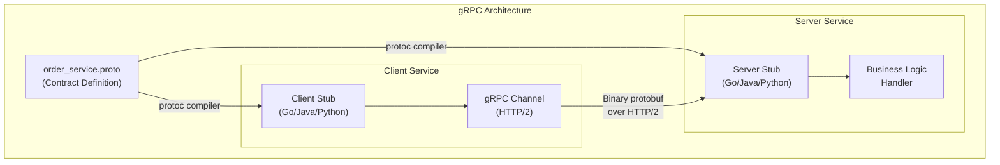

**gRPC Communication Patterns:**

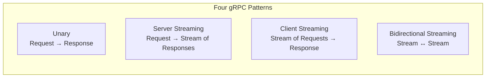

| Pattern | Use Case | Example |
|---------|----------|---------|
| Unary | Standard request-response | Get order details |
| Server streaming | Server sends multiple responses | Real-time price updates |
| Client streaming | Client sends multiple requests | Uploading log entries |
| Bidirectional streaming | Both sides send streams | Chat, live dashboards |

**Protobuf Definition Example:**

```
// order_service.proto
syntax = "proto3";
package commerce;

service OrderService {
  // Unary
  rpc GetOrder(GetOrderRequest) returns (OrderResponse);
  // Server streaming
  rpc WatchOrderStatus(WatchOrderRequest) returns (stream OrderStatusUpdate);
  // Client streaming
  rpc BatchCreateOrders(stream CreateOrderRequest) returns (BatchCreateResponse);
  // Bidirectional streaming
  rpc OrderChat(stream ChatMessage) returns (stream ChatMessage);
}

message GetOrderRequest {
  string order_id = 1;
}

message OrderResponse {
  string order_id = 1;
  string status = 2;
  repeated OrderItem items = 3;
  int64 total_cents = 4;
  google.protobuf.Timestamp created_at = 5;
}

message OrderItem {
  string sku = 1;
  int32 quantity = 2;
  int64 unit_price_cents = 3;
}
```

**Interceptors (Middleware):**

gRPC interceptors are the equivalent of HTTP middleware. They wrap every RPC call for cross-cutting concerns:

```
// Common interceptor chain
Client Request
  → Logging Interceptor (log request metadata)
    → Auth Interceptor (attach JWT/API key)
      → Retry Interceptor (retry on transient errors)
        → Timeout Interceptor (enforce deadline)
          → Metrics Interceptor (record latency, status)
            → Network → Server

Server receives request
  → Auth Interceptor (validate token)
    → Rate Limit Interceptor (check quota)
      → Logging Interceptor (log request)
        → Tracing Interceptor (propagate trace ID)
          → Business Logic Handler
```

**Real-World Example:**
Google uses gRPC internally for all service-to-service communication across its infrastructure. Netflix migrated from REST to gRPC for critical internal APIs, achieving a 60% reduction in payload size and significant latency improvements.

**When to Use gRPC:**
- Internal service-to-service communication where latency matters.
- Polyglot environments (auto-generated stubs for Go, Java, Python, C++, etc.).
- Streaming use cases (real-time feeds, event streams, bidirectional communication).
- When type safety across service boundaries is important.
- High-throughput scenarios (binary serialization + HTTP/2 multiplexing).

**When NOT to Use gRPC:**
- Public-facing APIs consumed by browsers (limited browser support without grpc-web proxy).
- Teams unfamiliar with protobuf (learning curve for schema management).
- Simple CRUD APIs where REST tooling is sufficient.
- When human-readable payloads are important for debugging.

**Trade-offs:**

| Advantage | Disadvantage |
|-----------|-------------|
| 5-10x smaller payloads than JSON | Not human-readable (binary format) |
| Strong type safety via protobuf | Requires proto file management |
| HTTP/2 multiplexing (no head-of-line blocking) | Limited browser support |
| Built-in streaming support | Steeper learning curve |
| Auto-generated client libraries | Harder to debug with curl/Postman |
| Deadline propagation built-in | Proto schema evolution requires care |

**Common Mistakes:**
1. Not using deadlines — gRPC calls without deadlines can hang forever, leaking resources.
2. Ignoring proto schema evolution rules — removing fields or changing field numbers breaks backward compatibility.
3. Sending large payloads — gRPC has a default 4MB message limit; use streaming for large data.
4. Not implementing health checks — gRPC has a standard health checking protocol; use it.
5. Skipping interceptors for observability — without logging/tracing/metrics interceptors, debugging is nearly impossible.

**Interview Insights:**
- If the system design involves internal microservice communication, suggest gRPC and explain why: type safety, performance, streaming.
- Know the four communication patterns (unary, server streaming, client streaming, bidirectional) and when each applies.
- Be ready to discuss proto schema evolution: "What happens when you add a field? Remove one? Change a type?"
- Mention deadline propagation: "If Service A has a 5s deadline and calls Service B, Service B inherits the remaining deadline."

---

### 1.1.3 GraphQL

**Definition:**
GraphQL is a query language for APIs that allows clients to request exactly the data they need. Instead of multiple REST endpoints returning fixed data shapes, a single GraphQL endpoint accepts queries that specify the exact fields, nested relationships, and aggregations required.

**Architecture Diagram:**

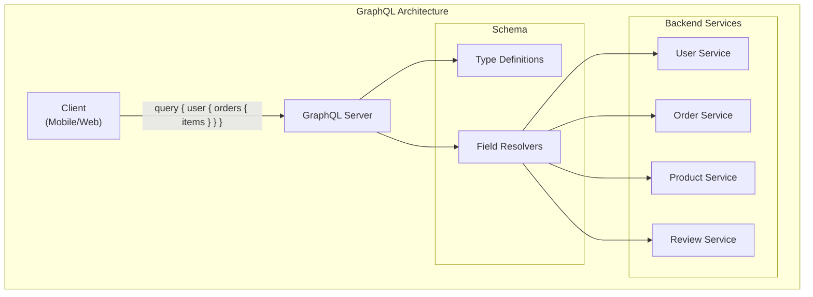

**The N+1 Problem:**

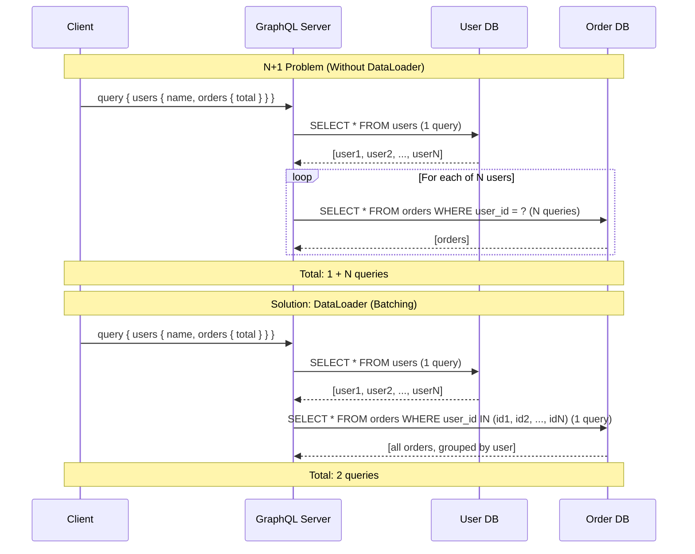

**Schema Design:**

```
# GraphQL Schema Definition Language (SDL)

type Query {
  user(id: ID!): User
  orders(userId: ID!, status: OrderStatus, first: Int, after: String): OrderConnection!
  product(id: ID!): Product
  search(query: String!, filters: SearchFilters): SearchResults!
}

type Mutation {
  createOrder(input: CreateOrderInput!): CreateOrderPayload!
  updateOrderStatus(orderId: ID!, status: OrderStatus!): Order!
  cancelOrder(orderId: ID!, reason: String): CancelOrderPayload!
}

type Subscription {
  orderStatusChanged(orderId: ID!): OrderStatusEvent!
  inventoryUpdated(skuId: ID!): InventoryEvent!
}

type User {
  id: ID!
  email: String!
  name: String!
  orders(first: Int, after: String): OrderConnection!
  addresses: [Address!]!
  createdAt: DateTime!
}

type Order {
  id: ID!
  status: OrderStatus!
  items: [OrderItem!]!
  totalCents: Int!
  user: User!
  shippingAddress: Address!
  createdAt: DateTime!
  updatedAt: DateTime!
}

type OrderItem {
  id: ID!
  product: Product!
  quantity: Int!
  unitPriceCents: Int!
}

# Relay-style pagination
type OrderConnection {
  edges: [OrderEdge!]!
  pageInfo: PageInfo!
  totalCount: Int!
}

type OrderEdge {
  node: Order!
  cursor: String!
}

type PageInfo {
  hasNextPage: Boolean!
  hasPreviousPage: Boolean!
  startCursor: String
  endCursor: String
}

enum OrderStatus {
  PENDING
  CONFIRMED
  SHIPPED
  DELIVERED
  CANCELLED
}
```

**Resolver Implementation Pattern:**

```
// Resolver map (pseudocode)
resolvers = {
  Query: {
    user: (parent, { id }, context) => userService.getById(id),
    orders: (parent, { userId, status, first, after }, context) =>
      orderService.list({ userId, status, first, after }),
  },

  User: {
    // Field-level resolver — only called if client requests 'orders'
    orders: (user, { first, after }, context) =>
      // Uses DataLoader to batch across multiple user resolutions
      context.loaders.ordersByUser.load(user.id),
  },

  Order: {
    // Resolves the user field on an order — also batched
    user: (order, args, context) =>
      context.loaders.userById.load(order.userId),
    items: (order, args, context) =>
      context.loaders.orderItems.load(order.id),
  },

  OrderItem: {
    product: (item, args, context) =>
      context.loaders.productById.load(item.productId),
  },

  Mutation: {
    createOrder: (parent, { input }, context) => {
      authorize(context.user, 'CREATE_ORDER');
      return orderService.create(input);
    },
  },
}
```

**Real-World Example:**
GitHub's API v4 is entirely GraphQL, allowing clients to fetch exactly the repository, issue, pull request, and review data they need in a single request — replacing dozens of REST round-trips. Shopify uses GraphQL for its Storefront API, enabling merchants to build custom storefronts that fetch only the product data their templates require.

**When to Use GraphQL:**
- Client-driven data requirements (mobile apps with limited bandwidth).
- Multiple client types (web, mobile, TV) needing different data shapes from the same backend.
- Aggregation layer over multiple microservices.
- Rapid frontend development (frontend teams can query what they need without backend changes).

**When NOT to Use GraphQL:**
- Simple APIs with fixed, predictable query patterns.
- File upload heavy applications (GraphQL handles files awkwardly).
- When query complexity control is difficult (malicious nested queries can DDoS your database).
- Caching-heavy scenarios (REST + HTTP caching is simpler and more effective).
- Internal service-to-service communication (gRPC is better here).

**Trade-offs:**

| Advantage | Disadvantage |
|-----------|-------------|
| No over-fetching or under-fetching | Query complexity attacks |
| Single endpoint simplifies routing | Caching is harder (no HTTP caching) |
| Strong typing via schema | N+1 problem without DataLoader |
| Self-documenting (introspection) | Error handling is non-standard |
| Real-time via subscriptions | Steeper backend learning curve |
| Frontend autonomy | File uploads require workarounds |

**Common Mistakes:**
1. Not implementing DataLoader — the N+1 problem will destroy your database at scale.
2. No query depth/complexity limits — a deeply nested query can generate thousands of database queries.
3. Exposing the entire schema without authorization — every field resolver must check permissions.
4. Not using persisted queries in production — allows arbitrary queries from untrusted clients.
5. Over-engineering the schema — GraphQL doesn't mean you need one unified graph for everything.

**Interview Insights:**
- GraphQL is typically proposed as a BFF (Backend-for-Frontend) layer, not for service-to-service communication.
- Know the N+1 problem cold: describe it, explain DataLoader batching, and estimate the query count with and without it.
- Be ready to discuss query complexity: "How do you prevent a client from sending a query that joins 10 levels deep?"
- Mention that GraphQL subscriptions use WebSockets under the hood for real-time features.

---

### Synchronous Communication Comparison Table

| Dimension | REST | gRPC | GraphQL |
|-----------|------|------|---------|
| **Protocol** | HTTP/1.1 or HTTP/2 | HTTP/2 | HTTP (typically POST) |
| **Serialization** | JSON (text) | Protobuf (binary) | JSON (text) |
| **Type Safety** | OpenAPI (optional) | Protobuf (enforced) | Schema (enforced) |
| **Streaming** | Not native | Built-in (4 patterns) | Subscriptions (WebSocket) |
| **Browser Support** | Full | Limited (needs grpc-web) | Full |
| **Caching** | HTTP caching, CDN-friendly | Custom caching needed | Complex (no HTTP caching) |
| **Code Generation** | Optional (OpenAPI codegen) | Built-in (protoc) | Optional (codegen tools) |
| **Payload Size** | Large (JSON + headers) | Small (binary) | Variable (client-specified) |
| **Learning Curve** | Low | Medium | Medium-High |
| **Best For** | Public APIs, CRUD | Internal services, streaming | Client-facing aggregation |

---

## 1.2 Asynchronous Communication

Asynchronous communication decouples the sender from the receiver. The sender publishes a message and continues without waiting for a response. This eliminates temporal coupling, enables better fault tolerance, and allows independent scaling of producers and consumers — at the cost of increased complexity, eventual consistency, and harder debugging.

---

### 1.2.1 Apache Kafka

**Definition:**
Apache Kafka is a distributed, partitioned, replicated commit log designed for high-throughput, fault-tolerant messaging. Unlike traditional message queues, Kafka retains messages for a configurable duration (days or weeks), allowing consumers to replay events. Kafka's design makes it ideal for event streaming, change data capture, and building event-driven architectures.

**Architecture Diagram:**

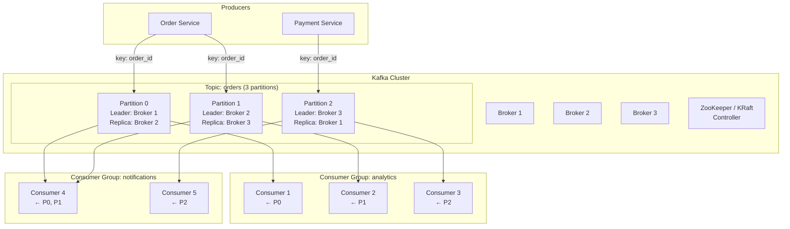

**Core Concepts:**

| Concept | Description |
|---------|-------------|
| **Topic** | A named category/feed of messages. Analogous to a table in a database. |
| **Partition** | A topic is split into partitions for parallelism. Each partition is an ordered, immutable sequence of messages. |
| **Offset** | A unique sequential ID for each message within a partition. Consumers track their position via offsets. |
| **Producer** | Publishes messages to topics. Chooses partition via key hashing or round-robin. |
| **Consumer Group** | A set of consumers that cooperatively consume a topic. Each partition is assigned to exactly one consumer in the group. |
| **Replication Factor** | Number of copies of each partition across brokers. RF=3 means data survives 2 broker failures. |
| **ISR (In-Sync Replicas)** | The set of replicas that are fully caught up with the leader. Only ISR members can be elected leader. |

**Partitioning and Ordering:**

```
// Message key determines partition assignment
// Same key → same partition → guaranteed ordering

Producer sends:
  { key: "order-123", value: "CREATED" }  → Partition 2
  { key: "order-123", value: "PAID" }     → Partition 2  (same key = same partition)
  { key: "order-123", value: "SHIPPED" }  → Partition 2  (ordering guaranteed)

  { key: "order-456", value: "CREATED" }  → Partition 0  (different key, different partition)
  { key: "order-456", value: "PAID" }     → Partition 0  (ordering guaranteed within partition)

// CRITICAL: Ordering is guaranteed ONLY within a single partition
// Cross-partition ordering is NOT guaranteed
```

**Consumer Group Rebalancing:**

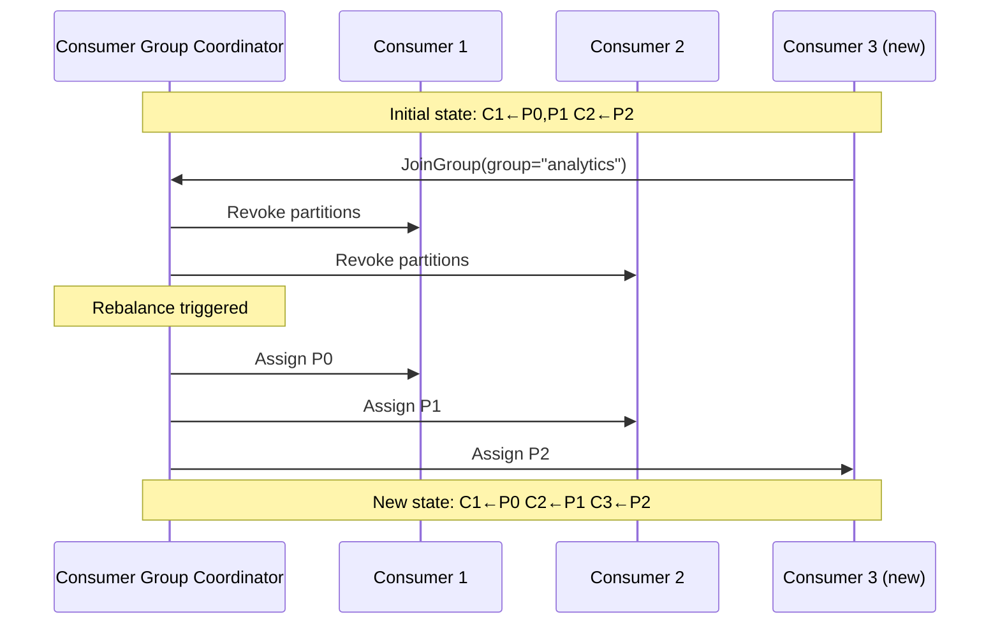

**Delivery Guarantees:**

| Guarantee | Configuration | Trade-off |
|-----------|--------------|-----------|
| **At-most-once** | `acks=0` on producer, auto-commit offsets | Fast, but messages can be lost |
| **At-least-once** | `acks=all` on producer, manual offset commit after processing | Safe, but consumers must be idempotent |
| **Exactly-once** | `enable.idempotence=true` + transactional API | Safest, but adds latency and complexity |

**Real-World Example:**
LinkedIn (Kafka's creator) processes over 7 trillion messages per day through Kafka. Uber uses Kafka as the backbone of its event-driven architecture, with thousands of topics handling ride events, driver location updates, pricing calculations, and financial transactions.

**When to Use Kafka:**
- High-throughput event streaming (100K+ messages/sec per partition).
- Event sourcing and event-driven architectures.
- Change data capture (CDC) from databases.
- Log aggregation and pipeline processing.
- When message replay capability is needed (consumers can rewind offsets).
- Decoupling services in a microservices architecture.

**When NOT to Use Kafka:**
- Simple task queues with limited throughput (RabbitMQ or SQS are simpler).
- When you need complex routing logic (exchanges, routing keys) — RabbitMQ is better.
- Extremely low-latency requirements (sub-millisecond) — Kafka adds 2-10ms at minimum.
- Small teams with limited operational expertise — Kafka is operationally complex.

**Common Mistakes:**
1. Too few partitions — limits consumer parallelism (you can never reduce partitions, only add).
2. Too many partitions — increases metadata overhead, rebalance time, and end-to-end latency.
3. Not setting message keys — round-robin assignment breaks ordering guarantees.
4. Auto-committing offsets — if processing fails after commit, messages are lost.
5. Consumer group with more consumers than partitions — excess consumers sit idle.
6. Not monitoring consumer lag — falling behind silently until data retention expires.
7. Large messages (>1MB) — Kafka is optimized for small messages; use claim-check pattern for large payloads.

**Interview Insights:**
- When discussing event-driven systems, Kafka should be your default choice. Explain partitioning, consumer groups, and replication.
- Know the ordering guarantee: "Kafka guarantees ordering within a partition, not across partitions. Use the entity ID as the message key to ensure all events for one entity land in the same partition."
- Be ready to discuss consumer lag: "How do you detect that a consumer is falling behind?" Answer: monitor the offset gap between producer and consumer; alert when lag exceeds a threshold.
- Explain the exactly-once semantics trade-off: "Exactly-once requires idempotent producers and transactional consumers, which adds latency. Most systems use at-least-once with idempotent consumers instead."

---

### 1.2.2 RabbitMQ

**Definition:**
RabbitMQ is a traditional message broker implementing the Advanced Message Queuing Protocol (AMQP). Unlike Kafka's log-based model, RabbitMQ uses exchanges, queues, and bindings to route messages. It excels at complex routing patterns, priority queues, and traditional work queue scenarios.

**Architecture Diagram:**

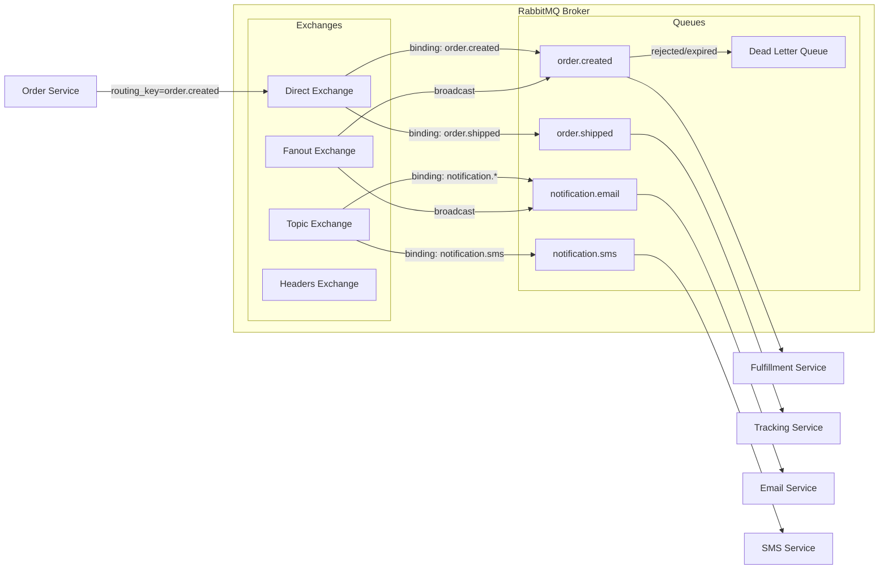

**Exchange Types:**

| Exchange Type | Routing Behavior | Use Case |
|---------------|-----------------|----------|
| **Direct** | Exact match on routing key | Task routing to specific queues |
| **Topic** | Pattern match with wildcards (`*` = one word, `#` = zero or more) | Event routing by category (e.g., `order.*.us`) |
| **Fanout** | Broadcast to all bound queues | Notifications, cache invalidation |
| **Headers** | Match on message headers (not routing key) | Complex routing based on message metadata |

**Message Acknowledgment:**

```
// Consumer acknowledgment patterns

// 1. Auto-ack (fire and forget — dangerous)
channel.consume(queue, (msg) => {
  process(msg); // If this fails, message is lost
}, { noAck: true });

// 2. Manual ack (safe — message redelivered on failure)
channel.consume(queue, (msg) => {
  try {
    process(msg);
    channel.ack(msg);     // Success: remove from queue
  } catch (err) {
    channel.nack(msg, false, true);  // Failure: requeue
  }
});

// 3. Dead letter exchange (DLX) — handle poison messages
// After N redelivery attempts, route to DLQ for investigation
// Configure via queue arguments:
//   x-dead-letter-exchange: "dlx"
//   x-dead-letter-routing-key: "failed.orders"
//   x-message-ttl: 60000 (expire after 60s)
```

**Real-World Example:**
Instagram uses RabbitMQ for its notification pipeline, routing different notification types (likes, comments, follows, DMs) to specialized handler queues. The topic exchange enables flexible routing as new notification types are added without modifying existing consumers.

**When to Use RabbitMQ:**
- Complex routing requirements (topic-based, header-based routing).
- Traditional work queues with competing consumers.
- When message acknowledgment and redelivery guarantees are critical.
- Priority queues (RabbitMQ supports message priority natively).
- Moderate throughput scenarios (10K-50K messages/sec).
- When you need dead letter queues and message TTL out of the box.

**When NOT to Use RabbitMQ:**
- High-throughput event streaming (Kafka handles 10x-100x more throughput).
- When message replay/rewind is needed (RabbitMQ deletes messages after consumption).
- Event sourcing architectures (Kafka's log retention is essential).
- When you need infinite message retention.

**Trade-offs:**

| Advantage | Disadvantage |
|-----------|-------------|
| Rich routing capabilities | Lower throughput than Kafka |
| Built-in DLQ, TTL, priority | No message replay |
| Multiple protocols (AMQP, MQTT, STOMP) | Messages deleted after consumption |
| Easier to operate than Kafka | Cluster management can be fragile |
| Mature ecosystem and tooling | Memory-based queues can OOM under load |

**Common Mistakes:**
1. Not using manual acknowledgments — auto-ack loses messages when consumers crash.
2. No dead letter queue — poison messages block the queue forever.
3. Unbounded queues — queue growth without flow control leads to memory exhaustion.
4. Single node deployment — no fault tolerance; use mirrored/quorum queues.
5. Not setting prefetch count — one consumer grabs all messages, starving others.

---

### 1.2.3 Amazon SQS

**Definition:**
Amazon Simple Queue Service (SQS) is a fully managed message queuing service that offers two queue types: Standard (best-effort ordering, at-least-once delivery) and FIFO (exactly-once processing, strict ordering). SQS eliminates the operational burden of running a message broker.

**Architecture Diagram:**

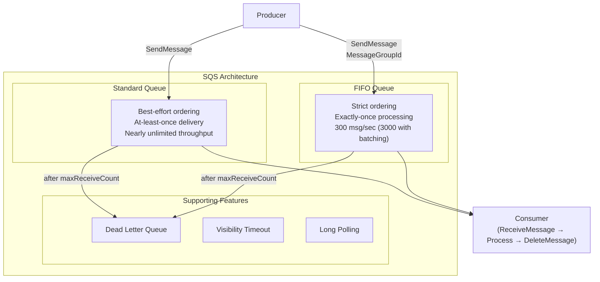

**Standard vs FIFO Queues:**

| Feature | Standard Queue | FIFO Queue |
|---------|---------------|------------|
| **Throughput** | Nearly unlimited | 300 msg/sec (3,000 with batching) |
| **Ordering** | Best-effort | Strict within MessageGroupId |
| **Delivery** | At-least-once (may duplicate) | Exactly-once |
| **Deduplication** | Not supported | Content-based or MessageDeduplicationId |
| **Use Case** | High-throughput background jobs | Financial transactions, order processing |

**Visibility Timeout Pattern:**

```
// SQS visibility timeout prevents duplicate processing

1. Consumer A calls ReceiveMessage → gets Message X
   Message X becomes "invisible" for visibilityTimeout (default: 30s)

2. Consumer A processes Message X successfully
   Consumer A calls DeleteMessage(receiptHandle)
   Message X is permanently removed

3. If Consumer A crashes before DeleteMessage:
   After visibilityTimeout expires, Message X becomes visible again
   Consumer B (or A) picks it up and retries

// CRITICAL: Set visibilityTimeout > max processing time
// If processing takes 60s but timeout is 30s, another consumer
// will pick up the message while the first is still processing it
```

**When to Use SQS:**
- You want zero operational overhead (fully managed, no brokers to maintain).
- Simple producer-consumer patterns without complex routing.
- AWS-native architectures (integrates with Lambda, SNS, EventBridge).
- When you need the exact-once delivery of FIFO queues.

**When NOT to Use SQS:**
- Complex routing patterns (no exchange/topic equivalent — use SNS + SQS).
- Message replay capability needed (messages deleted after consumption).
- Cross-cloud or on-premise deployments (AWS lock-in).
- High-throughput streaming (FIFO limit of 3,000 msg/sec is low for some use cases).

---

### Asynchronous Communication Comparison Table

| Dimension | Kafka | RabbitMQ | Amazon SQS |
|-----------|-------|----------|------------|
| **Model** | Distributed log | Message broker | Managed queue |
| **Throughput** | Millions/sec | 10K-50K/sec | Unlimited (Standard) / 3K (FIFO) |
| **Ordering** | Per-partition | Per-queue | Best-effort (Standard) / Per-group (FIFO) |
| **Replay** | Yes (configurable retention) | No | No |
| **Routing** | Topic-based only | Exchanges (direct, topic, fanout, headers) | None (use SNS for fan-out) |
| **Delivery** | At-least-once / Exactly-once | At-least-once / At-most-once | At-least-once (Standard) / Exactly-once (FIFO) |
| **Operations** | Complex (brokers, ZK/KRaft) | Moderate (cluster mgmt) | Zero (fully managed) |
| **Retention** | Days/weeks (configurable) | Until consumed | 14 days max |
| **Best For** | Event streaming, CDC, event sourcing | Work queues, complex routing | Simple queues on AWS |

---

## 1.3 Publish-Subscribe (Pub/Sub)

**Definition:**
Pub/Sub is a messaging paradigm where publishers emit events without knowledge of subscribers. A message broker or event bus mediates delivery. Subscribers express interest in event types and receive matching events asynchronously. This pattern maximally decouples producers from consumers.

**Architecture Diagram:**

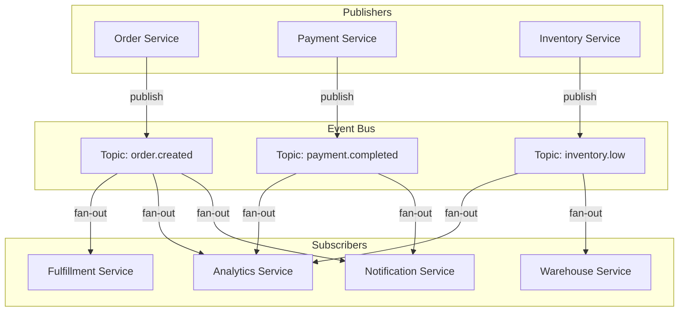

### Fan-Out Pattern

Fan-out delivers a single message to multiple subscribers simultaneously. Every subscriber gets every message published to the topic.

```
// Fan-out example: Order Created event
OrderService publishes: { event: "order.created", orderId: "123", userId: "u789" }

Subscribers (all receive the same event):
  → Notification Service: sends order confirmation email
  → Analytics Service: records conversion event
  → Fulfillment Service: initiates picking/packing
  → Fraud Service: runs post-order fraud check
  → Loyalty Service: accrues reward points

// Each subscriber processes independently
// Failure of one subscriber does NOT affect others
```

### Topic-Based Filtering

Subscribers filter messages by topic name or topic hierarchy. This is the most common pub/sub pattern.

```
// Topic hierarchy example
events/
  orders/
    created    → Fulfillment, Analytics, Notifications
    cancelled  → Refund, Analytics, Notifications
    shipped    → Tracking, Analytics, Notifications
  payments/
    authorized → Order Service
    captured   → Settlement, Analytics
    refunded   → Order Service, Notifications
  inventory/
    low-stock  → Procurement, Alerts
    restocked  → Catalog Service
```

### Content-Based Filtering

Subscribers filter based on message content/attributes rather than topic name. This provides finer-grained routing without topic explosion.

```
// Content-based filtering (e.g., AWS SNS filter policies)
Topic: "orders"

Subscriber: High-Value-Order-Handler
  Filter: { "order_total": [{ "numeric": [">=", 100000] }] }
  // Only receives orders >= $1,000

Subscriber: International-Order-Handler
  Filter: { "shipping_country": [{ "anything-but": "US" }] }
  // Receives all non-US orders

Subscriber: Priority-Customer-Handler
  Filter: { "customer_tier": ["platinum", "gold"] }
  // Only receives orders from premium customers
```

**When to Use Pub/Sub:**
- One event triggers multiple independent downstream actions (fan-out).
- You need to add new subscribers without modifying the publisher.
- Event-driven architectures where services react to state changes.
- Cross-team boundaries where teams own their own consumers.

**When NOT to Use Pub/Sub:**
- Request-response patterns where the caller needs a result.
- Ordered, sequential processing of a workflow (use a queue or orchestrator instead).
- When delivery guarantees must be exactly-once (most pub/sub is at-least-once).

**Trade-offs:**

| Advantage | Disadvantage |
|-----------|-------------|
| Maximum decoupling | Harder to debug event flows |
| Easy to add new subscribers | Message ordering not guaranteed across subscribers |
| Independent scaling per subscriber | Eventual consistency |
| Fault isolation between subscribers | Duplicate delivery requires idempotent consumers |

---

## 1.4 Event Sourcing (as a Communication Paradigm)

**Definition:**
Event sourcing stores every state change as an immutable event in an append-only event store, rather than storing only the current state. The current state is derived by replaying events. Events serve as the system of record and the communication mechanism simultaneously.

**Architecture Diagram:**

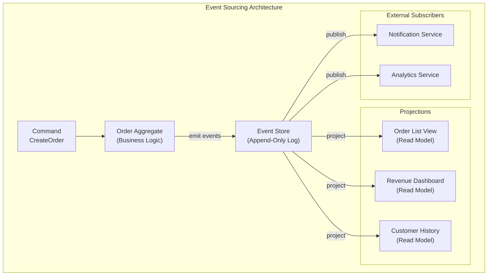

**Event Store Structure:**

```
// Event Store for Order aggregate
// Each row is an immutable event

| stream_id   | version | event_type       | data                                          | timestamp           |
|-------------|---------|------------------|-----------------------------------------------|---------------------|
| order-123   | 1       | OrderCreated     | { userId: "u1", items: [...], total: 5999 }   | 2025-01-15T10:00:00 |
| order-123   | 2       | PaymentAuthorized| { paymentId: "pay_1", amount: 5999 }          | 2025-01-15T10:00:05 |
| order-123   | 3       | OrderConfirmed   | { confirmedBy: "system" }                     | 2025-01-15T10:00:06 |
| order-123   | 4       | ItemShipped      | { trackingId: "TRK001", carrier: "FedEx" }    | 2025-01-16T14:30:00 |
| order-123   | 5       | OrderDelivered   | { deliveredAt: "2025-01-18T09:15:00" }        | 2025-01-18T09:15:00 |

// Rebuilding current state:
// Replay events 1-5 → Order { status: DELIVERED, total: 5999, ... }
```

**Snapshots for Performance:**

```
// Problem: Replaying 10,000 events to rebuild state is slow
// Solution: Periodic snapshots

| stream_id | snapshot_version | state                                    | timestamp           |
|-----------|-----------------|------------------------------------------|---------------------|
| order-123 | 3               | { status: CONFIRMED, total: 5999, ... }  | 2025-01-15T10:00:06 |

// Rebuild: Load snapshot (version 3), then replay events 4-5
// Instead of replaying all 5 events, we replay only 2
// Take snapshots every N events (e.g., every 100)
```

**Event Replay for Projection Rebuilds:**

```
// Scenario: New "Seller Revenue" read model needs historical data
// Solution: Replay all events from the beginning

1. Deploy new projection with offset = 0
2. Projection reads events sequentially from event store
3. For each event, update the read model
4. Once caught up to real-time, switch to live processing

// This is why event sourcing enables retroactive features:
// You have the complete history, not just current state
```

**When to Use Event Sourcing:**
- Audit-complete domains (finance, healthcare, legal) where the full history of changes matters.
- Systems where you need to rebuild state at any point in time.
- Complex domain logic where the sequence of state transitions is important.
- When retroactive projections/reports are needed.

**When NOT to Use Event Sourcing:**
- Simple CRUD applications where current state is all you need.
- Systems where event schema evolution is a major concern.
- Small teams without experience in event-driven architectures.
- When storage cost of retaining all events is prohibitive.

**Common Mistakes:**
1. Treating events as commands — events are facts that happened; commands are requests that may be rejected.
2. Not versioning events — when event schema changes, old events must still be deserializable.
3. No snapshots — performance degrades as event count grows per aggregate.
4. Coupling projection logic to event structure — projections should handle unknown event types gracefully.
5. Storing derived data in events — events should contain only the minimal data that changed, not computed values.

**Interview Insights:**
- Event sourcing is often combined with CQRS in system design interviews. Be ready to explain both together.
- Key selling point: "With event sourcing, we can answer questions we haven't thought of yet by replaying the event log."
- Know the snapshot optimization: "For hot aggregates with thousands of events, we take periodic snapshots to avoid replaying the full history."

---

### Section 1 — Architecture Decision Record

**ADR-001: Communication Pattern Selection**

| Decision Point | Choice | Rationale |
|---------------|--------|-----------|
| External client → API | REST (Level 2) | Universal tooling, cacheability, developer experience |
| Internal service → service (latency-sensitive) | gRPC | Binary serialization, type safety, HTTP/2 multiplexing |
| Client → aggregation layer | GraphQL | Flexible queries, no over-fetching for multiple clients |
| Service → service (decoupled) | Kafka | High throughput, message replay, event sourcing support |
| Task queue (work distribution) | RabbitMQ or SQS | Complex routing (RabbitMQ) or zero-ops (SQS) |
| One-to-many notifications | Pub/Sub (SNS/Kafka) | Fan-out delivery, subscriber independence |
| Audit-complete state management | Event Sourcing | Full history, replayability, retroactive projections |

---

# Section 2: Data Patterns

Data management in a microservices architecture is fundamentally different from a monolith. In a monolith, a single database provides ACID transactions, JOIN operations, and referential integrity across all domain entities. When you decompose into microservices, you lose all of these guarantees and must replace them with distributed patterns that are more complex, more fragile, and require more engineering effort — but are essential for independent deployment, scaling, and fault isolation.

---

## 2.1 Database Per Service

**Definition:**
Each microservice owns its database (or schema), and no other service may access it directly. All inter-service data access happens through the service's API. This is the foundational data pattern of microservices architecture.

**Architecture Diagram:**

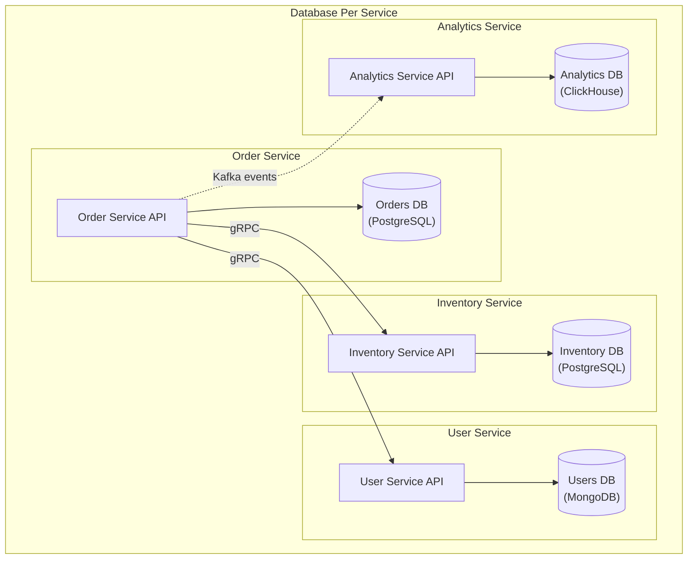

**Schema Ownership Model:**

```
// Each service owns its schema completely

// Order Service owns:
//   - orders table
//   - order_items table
//   - order_status_history table
//   Stores: user_id (reference, NOT foreign key to User DB)

// User Service owns:
//   - users table
//   - user_addresses table
//   - user_preferences table

// FORBIDDEN: Order Service reading directly from users table
// CORRECT: Order Service calls User Service API to get user data
```

**Handling Cross-Service Joins:**

```
// Problem: "Show order with customer name and product details"
// In a monolith: SELECT o.*, u.name, p.title FROM orders o
//                JOIN users u ON o.user_id = u.id
//                JOIN products p ON oi.product_id = p.id

// In microservices: No cross-service JOINs possible

// Solution 1: API Composition (synchronous)
orderDetails = orderService.getOrder(orderId)
user = userService.getUser(orderDetails.userId)
products = productService.getProducts(orderDetails.productIds)
return merge(orderDetails, user, products)

// Solution 2: Data Denormalization (eventual consistency)
// Order Service stores a snapshot of user name and product title
// at order creation time. Stale but fast.
orders table:
  order_id | user_id | user_name_snapshot | items_json | ...

// Solution 3: CQRS Read Model (materialized view)
// A dedicated read model joins data from multiple event streams
// Updated asynchronously via events from each service
order_details_view:
  order_id | user_name | product_titles | total | status | ...
```

**When to Use Database Per Service:**
- You need independent deployment and scaling of services.
- Services have different data storage requirements (SQL for orders, document store for product catalog, time-series for analytics).
- Teams own their services end-to-end and need schema autonomy.
- You need fault isolation — one service's database issues should not affect others.

**When NOT to Use Database Per Service:**
- Small teams (< 5 engineers) where operational overhead of multiple databases is unjustified.
- Tightly coupled domains where most operations require data from multiple entities.
- Early-stage products where domain boundaries are still unclear.
- When strong consistency across entities is a hard requirement.

**Trade-offs:**

| Advantage | Disadvantage |
|-----------|-------------|
| Independent deployment | No cross-service JOINs |
| Technology heterogeneity | Distributed transactions are complex |
| Fault isolation | Data duplication and eventual consistency |
| Independent scaling | Reporting across services requires data aggregation |
| Schema autonomy | More databases to operate and monitor |

**Common Mistakes:**
1. Sharing a database but calling it "database per service" — if two services read/write the same tables, it's a shared database.
2. Not denormalizing enough — making synchronous API calls for every read operation creates latency and coupling.
3. Ignoring referential integrity — foreign key references across services are logical only; there's no enforcement.
4. Not planning for cross-service queries from the start — reporting needs often drive you back to a shared database.

---

## 2.2 Shared Database Anti-Pattern

**Definition:**
Multiple microservices share a single database, often reading and writing the same tables. This pattern is called an "anti-pattern" because it negates the core benefits of microservices: independent deployment, fault isolation, and schema autonomy.

**Architecture Diagram:**

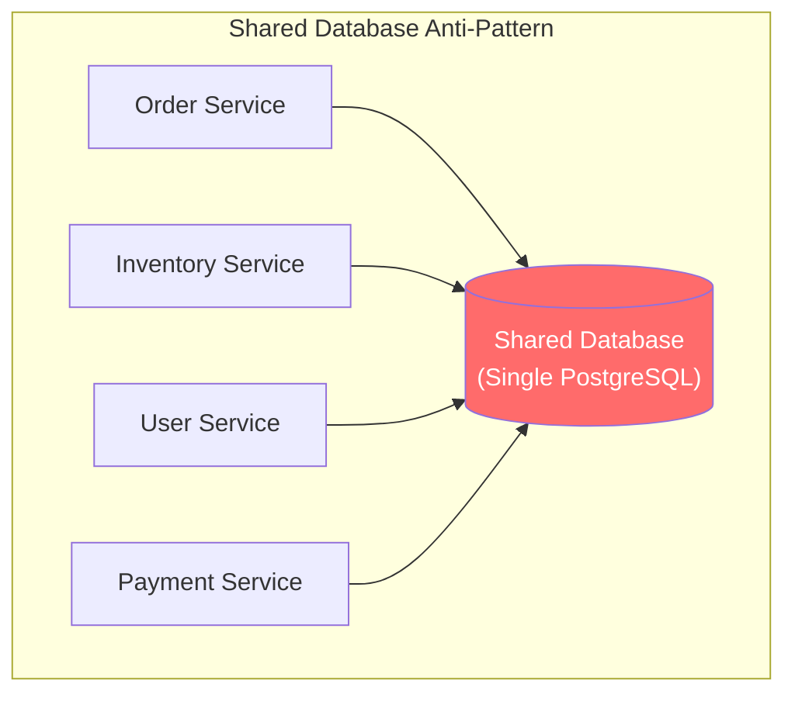

**Why It Fails:**

| Problem | Explanation |
|---------|-------------|
| **Tight coupling** | Schema change in one service's tables can break other services. |
| **No independent deployment** | Database migration must coordinate across all services. |
| **No fault isolation** | One service running expensive queries degrades performance for all. |
| **No technology heterogeneity** | All services are locked into the same database technology. |
| **Scaling limitations** | Cannot scale one service's data independently. |
| **Ownership ambiguity** | Who owns the "users" table? Multiple services write to it. |

**When It Is Acceptable:**
Despite being an anti-pattern, a shared database is sometimes the right pragmatic choice:

1. **Monolith-to-microservices migration**: As a transitional step, services share the database while being extracted. The shared DB is temporary.
2. **Read-only sharing**: Service A owns the table, Service B has read-only access. Less coupling than read-write sharing.
3. **Small team with a single product**: If you have 3 engineers and a single product, the operational overhead of multiple databases is not justified.
4. **Reporting/analytics**: A shared read replica for BI tools is acceptable if it doesn't affect the write path.

**Migration Strategy from Shared DB:**

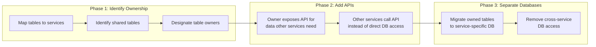

**Interview Insights:**
- If you propose a shared database in an interview, acknowledge it as a trade-off and explain your reasoning (e.g., "For an early-stage system with 3 engineers, the operational overhead of separate databases outweighs the benefits").
- Know the migration path: "We start with a shared database and progressively extract service-specific databases as domain boundaries solidify."

---

## 2.3 Saga Pattern

**Definition:**
A saga is a sequence of local transactions across multiple services. Each local transaction updates the service's database and publishes an event (or triggers the next step). If any step fails, compensating transactions undo the preceding changes. Sagas replace distributed ACID transactions (2PC) with eventual consistency and explicit compensation logic.

**Two Saga Coordination Strategies:**

### 2.3.1 Choreography-Based Saga

Each service listens for events and decides locally whether to act. There is no central coordinator. Services communicate through events.

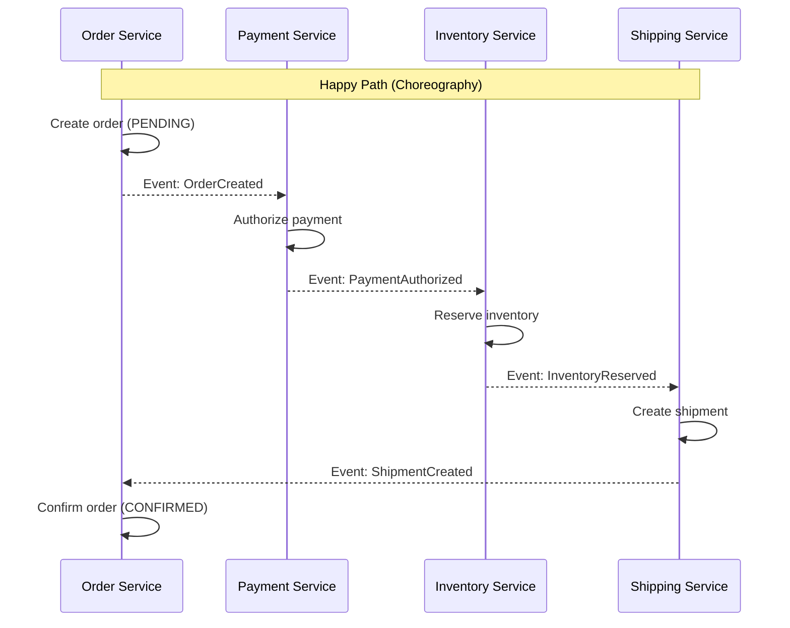

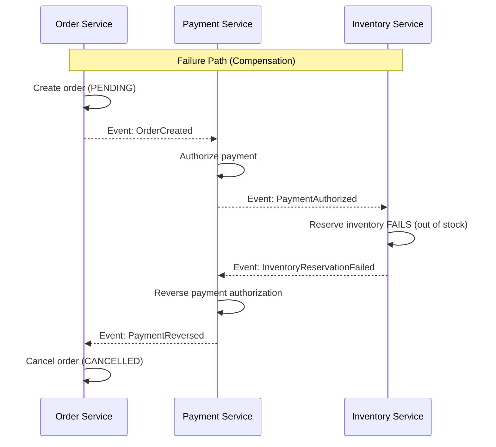

### 2.3.2 Orchestration-Based Saga

A central saga orchestrator coordinates the entire sequence. It sends commands to services and handles responses. The orchestrator contains all the workflow logic.

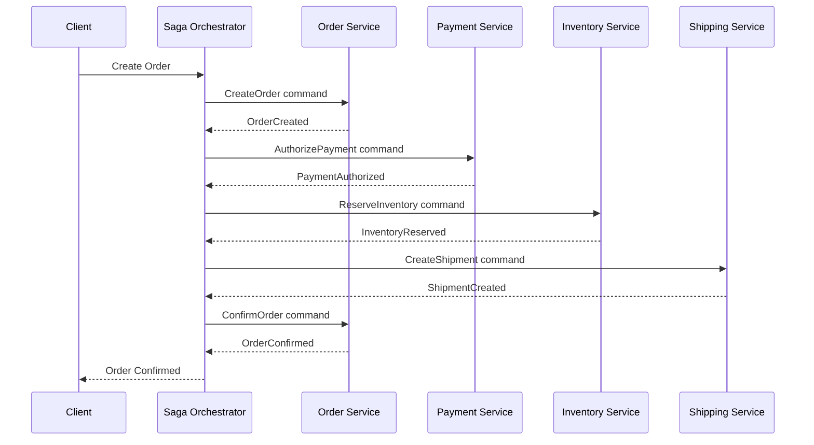

**Saga State Machine (Orchestrator):**

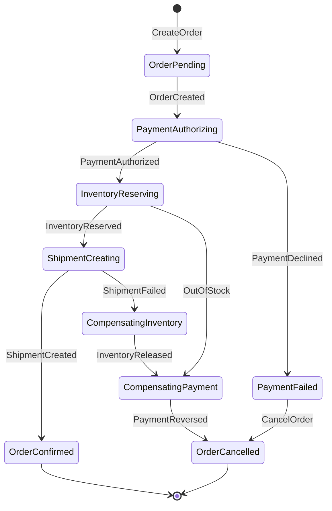

**Compensating Transactions:**

```
// Each saga step has a forward action and a compensating action

| Step | Forward Action | Compensating Action |
|------|---------------|-------------------|
| 1. Create Order | Insert order (PENDING) | Cancel order (CANCELLED) |
| 2. Authorize Payment | Charge credit card | Reverse authorization |
| 3. Reserve Inventory | Decrement stock count | Release reserved stock |
| 4. Create Shipment | Schedule pickup | Cancel shipment |

// Compensating transactions are NOT rollbacks
// They are new transactions that semantically undo the effect
// Example: Payment compensation is a refund, not a database rollback
```

**Choreography vs Orchestration Comparison:**

| Dimension | Choreography | Orchestration |
|-----------|-------------|---------------|
| **Coupling** | Loose (event-driven) | Tighter (orchestrator knows all steps) |
| **Complexity** | Distributed across services | Centralized in orchestrator |
| **Visibility** | Hard to see full workflow | Easy to trace entire saga |
| **Adding steps** | New service subscribes to events | Modify orchestrator |
| **Testing** | Integration tests across services | Unit test the orchestrator |
| **Failure handling** | Each service handles its own compensation | Orchestrator manages all compensation |
| **Best for** | Simple sagas (2-3 steps) | Complex sagas (4+ steps) |

**Real-World Example:**
Uber uses orchestration-based sagas for ride completion: authorize payment, charge rider, pay driver, update ride status, generate receipt. If any step fails, the orchestrator triggers compensating transactions to reverse the preceding steps.

**When to Use Sagas:**
- Business operations that span multiple microservices.
- When distributed ACID transactions (2PC) are too slow or operationally complex.
- Long-running business processes (minutes, hours, or days).
- When compensating transactions are semantically meaningful (refund, release, cancel).

**When NOT to Use Sagas:**
- Operations within a single service (use local ACID transactions).
- When all-or-nothing atomicity is strictly required (sagas provide eventual consistency, not atomicity).
- Simple read-only aggregation across services (use API composition instead).

**Common Mistakes:**
1. Not designing compensating transactions from the start — retrofitting compensation is extremely difficult.
2. Non-idempotent saga steps — if a step is retried, it must produce the same result.
3. Missing the "pivot transaction" concept — after the pivot step, compensation is not possible (e.g., package delivered).
4. No saga timeout — a saga stuck in an intermediate state forever wastes resources.
5. Choreography for complex workflows — debugging event chains across 6+ services is a nightmare.
6. Not persisting saga state — if the orchestrator crashes, it must resume from where it left off.

**Interview Insights:**
- Sagas are the go-to answer for "How do you handle distributed transactions?" in interviews.
- Always mention the two strategies (choreography and orchestration) and recommend orchestration for complex workflows.
- Be ready to draw the compensating transaction table for any multi-service operation.
- Know the saga state machine: "The orchestrator is a state machine that tracks the saga through its stages and handles both success and failure paths."

---

## 2.4 Event Sourcing (Data Pattern)

**Definition:**
Event sourcing stores every state change as an immutable event, creating a complete audit trail of how the current state was reached. The current state is derived by replaying events (or loading a snapshot and replaying recent events). This section focuses on the data storage and management aspects of event sourcing.

**Event Store Design:**

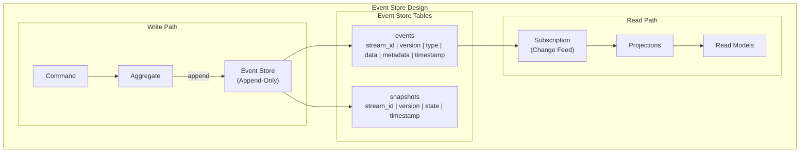

**Event Versioning Strategies:**

```
// Problem: Event schema evolves over time
// Event: OrderCreated v1 has {items, total}
// Event: OrderCreated v2 adds {currency, shipping_method}

// Strategy 1: Upcasting (transform old events to new schema on read)
function upcast(event) {
  if (event.type === "OrderCreated" && event.version === 1) {
    return {
      ...event,
      data: {
        ...event.data,
        currency: "USD",           // default value
        shipping_method: "standard" // default value
      },
      version: 2
    };
  }
  return event;
}

// Strategy 2: Weak Schema (add optional fields, never remove)
// All consumers must handle missing fields gracefully

// Strategy 3: New Event Type
// Instead of changing OrderCreated, create OrderCreatedV2
// Consumers handle both event types

// RECOMMENDED: Use upcasting for minor changes, new event types for major changes
```

**Projection Rebuild Process:**

```
// Scenario: Bug in projection logic caused incorrect read model
// Solution: Fix the bug, then rebuild the projection from scratch

Step 1: Stop the projection
Step 2: Drop the read model table
Step 3: Reset the projection's checkpoint to 0
Step 4: Restart the projection
Step 5: Projection replays ALL events, building correct read model
Step 6: Once caught up, projection processes live events

// This is the killer feature of event sourcing:
// Read models are disposable and rebuildable

// For large event stores, parallel replay:
// - Shard by stream_id
// - Replay each shard in parallel
// - Merge into read model
```

**Trade-offs:**

| Advantage | Disadvantage |
|-----------|-------------|
| Complete audit trail | Higher storage requirements |
| Time-travel debugging | Event schema evolution is complex |
| Rebuildable read models | Eventually consistent read models |
| Retroactive features via replay | Higher learning curve |
| Natural fit for event-driven systems | Not suitable for all domains |

---

## 2.5 CQRS (Command Query Responsibility Segregation)

**Definition:**
CQRS separates the read model (queries) from the write model (commands). Instead of a single data model serving both reads and writes, the system maintains optimized models for each. Commands mutate state through the write model; queries read from purpose-built read models updated asynchronously.

**Architecture Diagram:**

```mermaid
graph TB
    subgraph "CQRS Architecture"
        subgraph "Command Side (Write)"
            CmdAPI["Command API"]
            CmdHandler["Command Handlers"]
            Domain["Domain Model"]
            WriteDB[("Write Database<br/>(Normalized, PostgreSQL)")]
        end

        subgraph "Event Bus"
            EB["Events<br/>(Kafka / Event Store)"]
        end

        subgraph "Query Side (Read)"
            QueryAPI["Query API"]
            QueryHandler["Query Handlers"]
            ReadDB1[("Read Model 1<br/>Order List (Elasticsearch)")]
            ReadDB2[("Read Model 2<br/>Dashboard (Redis)")]
            ReadDB3[("Read Model 3<br/>Reports (ClickHouse)")]
        end

        subgraph "Projections"
            Proj1["Order List Projection"]
            Proj2["Dashboard Projection"]
            Proj3["Report Projection"]
        end
    end

    CmdAPI --> CmdHandler
    CmdHandler --> Domain
    Domain --> WriteDB
    Domain -->|"emit events"| EB

    EB --> Proj1
    EB --> Proj2
    EB --> Proj3

    Proj1 --> ReadDB1
    Proj2 --> ReadDB2
    Proj3 --> ReadDB3

    QueryAPI --> QueryHandler
    QueryHandler --> ReadDB1
    QueryHandler --> ReadDB2
    QueryHandler --> ReadDB3
```

**Separate Read Models (Materialized Views):**

```
// Write Model (normalized, optimized for consistency)
orders:     order_id | user_id | status | created_at
order_items: item_id | order_id | product_id | quantity | unit_price
products:   product_id | name | category | seller_id
users:      user_id | name | email

// Read Model 1: Order Dashboard (denormalized for fast queries)
order_dashboard_view:
  order_id | user_name | user_email | status |
  item_count | total_amount | product_names | created_at

// Read Model 2: Seller Analytics (aggregated for reporting)
seller_daily_stats:
  seller_id | date | orders_count | revenue | top_product | avg_order_value

// Read Model 3: Search Index (Elasticsearch for full-text search)
order_search_index:
  order_id | user_name | product_names | status | amount | date
  // Supports: full-text search, faceted filtering, sorting

// Each read model is updated asynchronously via projections
// Each can use a different storage technology
// Each is optimized for its specific query pattern
```

**CQRS Without Event Sourcing:**

```
// CQRS does NOT require event sourcing
// You can use CQRS with a traditional database + change data capture

Write Path:
  1. Command arrives
  2. Domain logic validates and processes
  3. Write to PostgreSQL (traditional UPDATE/INSERT)
  4. CDC (Debezium) captures the change
  5. Change event published to Kafka

Read Path:
  1. Kafka consumer receives change event
  2. Projection updates the read model (Elasticsearch, Redis, etc.)
  3. Query API reads from the read model
```

**When to Use CQRS:**
- Read and write workloads have dramatically different characteristics (1000:1 read-to-write ratio).
- You need multiple optimized read models for different query patterns.
- The domain is complex enough that a single model cannot efficiently serve both reads and writes.
- Used with event sourcing for complete state management.

**When NOT to Use CQRS:**
- Simple CRUD applications where reads and writes are similar in shape and volume.
- When eventual consistency between read and write models is not acceptable.
- Small teams where the additional complexity is not justified.
- When you don't have different query patterns requiring different optimizations.

**Trade-offs:**

| Advantage | Disadvantage |
|-----------|-------------|
| Optimized read models per query pattern | Eventual consistency (read lag) |
| Independent scaling of read and write | More infrastructure to maintain |
| Technology flexibility per read model | Increased system complexity |
| Better performance for read-heavy systems | Data duplication across models |

**Common Mistakes:**
1. Applying CQRS everywhere — most services don't need it; use it selectively for complex domains.
2. Ignoring eventual consistency in the UI — users expect to see their changes immediately.
3. Not handling projection failures — if a projection crashes, the read model becomes stale.
4. Over-engineering read models — start with one read model and add more only when needed.
5. Confusing CQRS with event sourcing — they are complementary but independent patterns.

**Interview Insights:**
- CQRS is a strong answer for "How do you handle a system with 1000:1 read-to-write ratio?"
- Explain the eventual consistency trade-off: "The read model may be a few seconds behind the write model. For most UIs, we handle this with optimistic updates on the client."
- Know when to combine CQRS with event sourcing vs. CQRS with CDC: "Event sourcing gives us full history and replay; CDC is simpler if we only need eventual consistency."

---

### Section 2 — Architecture Decision Record

**ADR-002: Data Pattern Selection**

| Decision Point | Choice | Rationale |
|---------------|--------|-----------|
| Service data ownership | Database per service | Independent deployment, fault isolation, team autonomy |
| Cross-service data query | API composition + CQRS read models | Avoid direct DB access; denormalize for performance |
| Multi-service transactions | Orchestration-based saga | Visibility, testability, complex compensation logic |
| Audit-complete domains | Event sourcing | Complete history, replayability, regulatory compliance |
| High read-to-write ratio | CQRS | Separate optimized read models, independent scaling |
| Transitional migration | Shared database (temporary) | Pragmatic step during monolith decomposition |

---

# Section 3: Resilience Patterns

In a distributed system, failure is not a possibility — it is a certainty. Networks partition. Services crash. Databases become unreachable. Downstream dependencies slow down. Disk fills up. A resilient system doesn't prevent failures; it survives them gracefully, continues serving traffic at reduced capacity, and recovers automatically.

This section covers the five foundational resilience patterns that every microservices architecture must implement.

---

## 3.1 Circuit Breaker

**Definition:**
The circuit breaker pattern prevents a service from repeatedly calling a failing downstream dependency. Like an electrical circuit breaker, it "trips" when failures exceed a threshold, short-circuiting subsequent calls and returning an immediate error (or fallback) instead of waiting for a timeout. After a cooldown period, it allows a test request through to check if the dependency has recovered.

**State Machine:**

```mermaid
stateDiagram-v2
    [*] --> Closed
    Closed --> Open: Failure threshold exceeded
    Open --> HalfOpen: Cooldown timer expires
    HalfOpen --> Closed: Test request succeeds
    HalfOpen --> Open: Test request fails

    state Closed {
        [*] --> Monitoring
        Monitoring: Requests pass through
        Monitoring: Track success/failure rate
        Monitoring: Trip if failure rate > threshold
    }

    state Open {
        [*] --> Blocking
        Blocking: All requests fail fast
        Blocking: Return error/fallback immediately
        Blocking: Wait for cooldown period
    }

    state HalfOpen {
        [*] --> Testing
        Testing: Allow limited test requests
        Testing: If test succeeds → Closed
        Testing: If test fails → Open
    }
```

**Sequence Diagram:**

```mermaid
sequenceDiagram
    participant Client
    participant CB as Circuit Breaker
    participant Downstream as Payment Service

    Note over CB: State: CLOSED
    Client->>CB: Request 1
    CB->>Downstream: Forward request
    Downstream-->>CB: 500 Error
    CB-->>Client: Error (failure count: 1)

    Client->>CB: Request 2
    CB->>Downstream: Forward request
    Downstream-->>CB: Timeout
    CB-->>Client: Error (failure count: 2)

    Client->>CB: Request 3
    CB->>Downstream: Forward request
    Downstream-->>CB: 500 Error
    Note over CB: Failure threshold (3) reached
    Note over CB: State: OPEN
    CB-->>Client: Error (failure count: 3)

    Client->>CB: Request 4
    Note over CB: Circuit is OPEN
    CB-->>Client: FAST FAIL (no downstream call)

    Client->>CB: Request 5
    CB-->>Client: FAST FAIL (no downstream call)

    Note over CB: Cooldown timer (30s) expires
    Note over CB: State: HALF-OPEN

    Client->>CB: Request 6 (test request)
    CB->>Downstream: Forward test request
    Downstream-->>CB: 200 OK
    Note over CB: Test passed → State: CLOSED
    CB-->>Client: Success
```

**Configuration Parameters:**

```
// Circuit breaker configuration (Resilience4j example)

CircuitBreakerConfig:
  // Failure rate threshold (percentage)
  failureRateThreshold: 50          // Open circuit if >50% of requests fail

  // Minimum number of calls before evaluating failure rate
  minimumNumberOfCalls: 10          // Don't trip on first few calls

  // Sliding window type and size
  slidingWindowType: COUNT_BASED    // or TIME_BASED
  slidingWindowSize: 20             // Last 20 calls (or 20 seconds)

  // Duration the circuit stays open before trying half-open
  waitDurationInOpenState: 30s

  // Number of test calls allowed in half-open state
  permittedNumberOfCallsInHalfOpenState: 3

  // Which exceptions count as failures
  recordExceptions: [IOException, TimeoutException, ServiceUnavailableException]

  // Which exceptions are ignored (don't count toward threshold)
  ignoreExceptions: [BusinessValidationException]

  // Slow call handling
  slowCallDurationThreshold: 2s     // Calls slower than 2s are "slow"
  slowCallRateThreshold: 80         // Open if >80% of calls are slow
```

**Real-World Example:**
Netflix's Hystrix (now deprecated, succeeded by Resilience4j) was the pioneering circuit breaker library. Netflix uses circuit breakers on every downstream dependency call. When the recommendation service is slow, the circuit breaker trips, and the homepage falls back to showing trending content instead of personalized recommendations.

**When to Use Circuit Breaker:**
- Calling external or unreliable downstream services.
- When a failing dependency can cause cascading failures.
- When you have a meaningful fallback (cached data, default response, degraded feature).
- High-throughput systems where waiting for timeouts wastes threads/connections.

**When NOT to Use Circuit Breaker:**
- Calling a local in-process dependency (no network failure mode).
- When every call failure must be reported accurately (circuit breaker hides some failures).
- When there is no meaningful fallback and the failure must propagate to the client.

**Trade-offs:**

| Advantage | Disadvantage |
|-----------|-------------|
| Prevents cascading failures | Fallback responses may confuse users |
| Fail-fast saves resources | Configuration tuning is tricky |
| Automatic recovery detection | Adds latency for state checking |
| Protects downstream from overload | Can mask real issues if fallback is too seamless |

**Common Mistakes:**
1. Setting threshold too low — circuit trips on normal transient errors.
2. Setting threshold too high — circuit doesn't trip fast enough during real outages.
3. No fallback implementation — tripping the circuit returns an ugly error instead of a degraded experience.
4. Not monitoring circuit state — you should alert when any circuit opens.
5. Sharing a circuit across unrelated calls — one failing endpoint trips the circuit for all endpoints.
6. Forgetting slow calls — a dependency that responds in 30s instead of 200ms is just as dangerous as one that returns 500.

**Interview Insights:**
- Circuit breaker is expected knowledge in any system design involving microservices.
- Draw the three-state diagram (Closed → Open → Half-Open → Closed) without hesitation.
- Explain the cascading failure scenario: "If Service A calls Service B, and B is slow, A's thread pool fills up waiting for B. Now A can't serve its own clients. The circuit breaker on A's calls to B prevents this."
- Mention that service meshes (Istio, Linkerd) provide circuit breaking at the infrastructure level, not just application level.

---

## 3.2 Retry Pattern

**Definition:**
The retry pattern automatically re-attempts a failed operation, assuming the failure is transient (network glitch, temporary overload). Retries are essential for resilience but must be implemented carefully to avoid amplifying failures.

**Retry Strategies:**

```mermaid
graph TB
    subgraph "Retry Strategies"
        subgraph "Immediate Retry"
            IR["Attempt 1 → Fail → Attempt 2 → Fail → Attempt 3"]
            IRN["Interval: 0ms, 0ms, 0ms"]
        end

        subgraph "Fixed Interval"
            FI["Attempt 1 → 1s → Attempt 2 → 1s → Attempt 3"]
            FIN["Interval: 1s, 1s, 1s"]
        end

        subgraph "Exponential Backoff"
            EB2["Attempt 1 → 1s → Attempt 2 → 2s → Attempt 3 → 4s → Attempt 4"]
            EBN["Interval: 1s, 2s, 4s, 8s"]
        end

        subgraph "Exponential Backoff + Jitter"
            EBJ["Attempt 1 → 0.8s → Attempt 2 → 2.3s → Attempt 3 → 3.7s → Attempt 4"]
            EBJN["Interval: random(0, 1s), random(0, 2s), random(0, 4s)"]
        end
    end
```

**Why Jitter Matters — The Thundering Herd:**

```
// Without jitter: All clients retry at the same time
// T=0: 1000 clients call Service B. Service B is overloaded, all fail.
// T=1s: 1000 clients retry simultaneously. Service B is still overloaded.
// T=2s: 1000 clients retry simultaneously. System collapse.

// With jitter: Retries are spread over time
// T=0: 1000 clients call Service B. Service B is overloaded, all fail.
// T=0.3s-1.0s: Clients retry at random intervals. ~300 succeed.
// T=0.8s-2.0s: Remaining clients retry at random intervals. ~400 succeed.
// T=1.5s-4.0s: Final clients retry. All succeed.

// Jitter formulas:
// Full jitter:  sleep = random(0, min(cap, base * 2^attempt))
// Equal jitter: temp = min(cap, base * 2^attempt)
//               sleep = temp/2 + random(0, temp/2)
// Decorrelated: sleep = min(cap, random(base, prev_sleep * 3))
```

**Retry Budget:**

```
// Problem: If 10 services each retry 3 times, a single failure generates
// 10 * 3 = 30 requests to the failing service, amplifying the problem.

// Solution: Retry budget limits the percentage of retries relative to
// total traffic

RetryBudget:
  // Allow retries up to 20% of total request volume
  retryBudgetPercent: 20

  // Minimum retries per second (ensures low-traffic services can still retry)
  minRetriesPerSecond: 10

  // Example:
  //   Sending 100 req/sec → budget allows 20 retries/sec
  //   Sending 1000 req/sec → budget allows 200 retries/sec
  //   If 300 requests fail → only 200 are retried, 100 fail immediately
```

**Idempotency Requirement:**

```
// CRITICAL: Retried operations MUST be idempotent
// Idempotent: Applying the operation N times has the same effect as applying it once

// SAFE to retry (idempotent):
//   GET /orders/123         → always returns the same order
//   PUT /orders/123 {body}  → replaces the entire resource
//   DELETE /orders/123      → deletes once, subsequent calls return 404

// DANGEROUS to retry (not idempotent by default):
//   POST /orders            → creates a new order each time!
//   POST /payments          → charges the credit card each time!

// Making POST idempotent with idempotency keys:
POST /orders
Headers:
  Idempotency-Key: "client-generated-uuid-abc123"

// Server behavior:
// 1. Check if idempotency key exists in cache/DB
// 2. If yes, return the cached response (no new order created)
// 3. If no, process the request, store the result with the key
// 4. Key expires after 24h
```

**When to Use Retry:**
- Transient network errors (connection reset, DNS resolution failure).
- Downstream service returning 503 (Service Unavailable) or 429 (Too Many Requests).
- Database connection pool exhaustion (temporary).
- Any operation that is idempotent or can be made idempotent.

**When NOT to Use Retry:**
- Permanent errors (400 Bad Request, 401 Unauthorized, 404 Not Found) — retrying won't help.
- Non-idempotent operations without idempotency keys — retrying creates duplicates.
- When the downstream is known to be down (circuit breaker should handle this).
- Long-running operations — retrying a 30-second operation doubles the latency.

**Common Mistakes:**
1. Retrying on all errors — only retry on transient, retriable errors (5xx, timeout, connection error).
2. No backoff — immediate retries hammer the struggling dependency.
3. No jitter — all clients retry at the same time (thundering herd).
4. No max attempts — infinite retries exhaust client resources.
5. Retrying non-idempotent operations — creates duplicate orders, double charges.
6. Not using retry budgets — retries amplify load on failing services.

**Interview Insights:**
- Always pair retries with circuit breakers: "Retries handle transient failures; circuit breakers stop retrying when the dependency is truly down."
- Know exponential backoff with jitter cold: "Base delay doubles each attempt, and we add random jitter to avoid thundering herd."
- Mention idempotency: "Retries are only safe if the operation is idempotent. For POST endpoints, we use idempotency keys."

---

## 3.3 Timeout Pattern

**Definition:**
Every remote call must have a timeout. Without timeouts, a slow downstream service ties up threads, connections, and memory indefinitely, eventually bringing down the caller. Timeout management in a microservices architecture involves cascading timeouts, deadline propagation, and timeout budgets.

**Cascading Timeout Problem:**

```mermaid
sequenceDiagram
    participant Client
    participant A as Service A<br/>timeout: 10s
    participant B as Service B<br/>timeout: 10s
    participant C as Service C<br/>timeout: 10s
    participant DB as Database<br/>slow query

    Client->>A: Request (user expects <3s)
    A->>B: Call B (timeout: 10s)
    B->>C: Call C (timeout: 10s)
    C->>DB: Query (database is slow)

    Note over DB: Query takes 9.5s
    DB-->>C: Response at T=9.5s
    C-->>B: Response at T=9.7s
    B-->>A: Response at T=9.9s
    A-->>Client: Response at T=10.1s

    Note over Client: User waited 10 seconds!
    Note over Client: Even though each service<br/>was within its timeout
```

**Deadline Propagation (Solution):**

```mermaid
sequenceDiagram
    participant Client
    participant A as Service A
    participant B as Service B
    participant C as Service C
    participant DB as Database

    Client->>A: Request (deadline: T+3s)
    Note over A: Remaining: 3s
    A->>B: Call B (deadline: T+2.8s, accounting for own processing)
    Note over B: Remaining: 2.6s
    B->>C: Call C (deadline: T+2.4s)
    Note over C: Remaining: 2.2s
    C->>DB: Query (deadline: T+2.0s)

    Note over DB: Query takes 2.5s — exceeds deadline
    Note over C: Deadline exceeded at T+2.0s
    C-->>B: DEADLINE_EXCEEDED
    B-->>A: DEADLINE_EXCEEDED
    A-->>Client: 504 Gateway Timeout (within 3s budget)
```

**Timeout Budget Strategy:**

```
// Total timeout budget: 3 seconds

Service A processing: 200ms budget
  → Call to Service B: 2500ms budget
    Service B processing: 200ms budget
      → Call to Service C: 1800ms budget
        Service C processing: 200ms budget
          → Database query: 1400ms budget
  → Call to Service D (parallel): 2500ms budget
    Service D processing: 100ms budget
      → Cache lookup: 50ms budget (fast path)

// Rules:
// 1. Each service subtracts its own processing time from the remaining budget
// 2. Downstream calls get the remaining budget, not a new fixed timeout
// 3. gRPC supports deadline propagation natively via metadata
// 4. For HTTP/REST, propagate via custom header: X-Request-Deadline
```

**When to Use Timeout:**
- Every remote call (no exceptions). This is not optional.
- Database queries, HTTP calls, gRPC calls, message queue operations.

**When NOT to Use Timeout:**
- There is no scenario where you should omit timeouts on remote calls.
- Even "fast" local operations benefit from timeouts for defensive programming.

**Common Mistakes:**
1. No timeout at all — the number one cause of cascading failures.
2. Timeout too long (30s default) — user has already left by the time you respond.
3. Timeout too short (100ms) — triggers false failures during normal load spikes.
4. Same timeout at every level — doesn't account for call chain depth.
5. Not propagating deadlines — each service sets its own timeout, ignoring the overall budget.
6. Timeout without retry — if you time out, should you retry? Only if the operation is idempotent and the deadline hasn't been fully consumed.

**Interview Insights:**
- Mention deadline propagation proactively: "Each service passes the remaining time budget to downstream calls, so the total response time never exceeds the original deadline."
- gRPC has built-in deadline propagation; REST requires a custom header.
- Connect timeouts to circuit breakers: "If a service consistently times out, the circuit breaker should trip to fail fast."

---

## 3.4 Bulkhead Pattern

**Definition:**
The bulkhead pattern isolates failures by partitioning system resources (threads, connections, memory) into independent pools. Named after ship bulkheads that prevent flooding from spreading, this pattern ensures that a failure in one area doesn't consume all resources and bring down the entire system.

**Architecture Diagram:**

```mermaid
graph TB
    subgraph "Without Bulkhead"
        SP["Shared Thread Pool<br/>(100 threads)"]
        SA["Service A calls"] -->|"60 threads"| SP
        SB["Service B calls"] -->|"30 threads"| SP
        SC["Service C calls<br/>(SLOW)"] -->|"10 threads"| SP

        Note1["If Service C becomes slow,<br/>its threads block and steal<br/>threads from A and B"]
    end
```

```mermaid
graph TB
    subgraph "With Bulkhead"
        subgraph "Pool A (40 threads)"
            PA["Service A calls"]
        end
        subgraph "Pool B (30 threads)"
            PB["Service B calls"]
        end
        subgraph "Pool C (30 threads)"
            PC["Service C calls<br/>(SLOW — pool exhausted)"]
        end

        Note2["Service C slowness only<br/>exhausts Pool C.<br/>A and B are unaffected."]
    end
```

**Bulkhead Types:**

| Type | Mechanism | Isolation Level | Overhead |
|------|-----------|----------------|----------|
| **Thread pool isolation** | Separate thread pool per dependency | High (OS thread per call) | High (context switching, memory) |
| **Semaphore isolation** | Counting semaphore limits concurrent calls | Medium (no extra threads) | Low (just a counter) |
| **Service mesh bulkhead** | Connection pool limits at proxy level | High (infrastructure-level) | Low (handled by sidecar) |

**Thread Pool vs Semaphore:**

```
// Thread Pool Isolation
// - Each dependency gets its own thread pool
// - Caller's thread is freed immediately (submits to dependency's pool)
// - Supports timeout on the pool (task.get(timeout))
// - Higher memory overhead (each thread ~1MB stack)
// - Use for: untrusted or slow dependencies

// Semaphore Isolation
// - Limits concurrent calls using a semaphore count
// - Caller's thread executes the call (no extra thread)
// - Lower overhead
// - Timeout is less precise (depends on the call itself timing out)
// - Use for: trusted dependencies where you just want to limit concurrency

// Configuration example (Resilience4j Bulkhead)
BulkheadConfig:
  maxConcurrentCalls: 25        // Max 25 simultaneous calls
  maxWaitDuration: 500ms        // Wait max 500ms for a permit

ThreadPoolBulkheadConfig:
  maxThreadPoolSize: 20         // Max 20 threads in pool
  coreThreadPoolSize: 10        // Min 10 threads kept alive
  queueCapacity: 50             // Queue up to 50 requests
  keepAliveDuration: 100ms      // Idle thread TTL
```

**Real-World Example:**
Amazon isolates each downstream service dependency with its own connection pool and thread pool. When the recommendation service is slow, only the threads allocated to recommendation calls are affected. The product detail page still loads quickly using the catalog and pricing thread pools.

**When to Use Bulkhead:**
- Calling multiple downstream services where one might be slow or unreliable.
- When failure of one dependency should not affect calls to other dependencies.
- High-availability systems where partial functionality is better than total outage.

**When NOT to Use Bulkhead:**
- Single-dependency services (nothing to isolate from).
- When the overhead of multiple thread pools is too high for the service's resource constraints.
- Very low-traffic services where resource contention is unlikely.

**Common Mistakes:**
1. Pool sizes too small — legitimate traffic gets rejected during normal operation.
2. Pool sizes too large — defeats the purpose; all threads are consumed by the slow dependency.
3. No monitoring on pool utilization — you don't know when a pool is near exhaustion.
4. Not combining with circuit breaker — bulkhead limits damage, circuit breaker stops the bleeding.

---

## 3.5 Fallback Pattern

**Definition:**
The fallback pattern provides an alternative response when the primary path fails. Instead of returning an error to the user, the system gracefully degrades by serving cached data, default values, or simplified responses.

**Fallback Strategy Hierarchy:**

```mermaid
graph TB
    Req["Incoming Request"]
    Primary["Primary Path<br/>(Live Service Call)"]
    Cache["Fallback 1: Cache<br/>(Return cached data)"]
    Default["Fallback 2: Default<br/>(Return default response)"]
    Degraded["Fallback 3: Degraded<br/>(Simplified response)"]
    Error["Final: Error Response<br/>(User-friendly error)"]

    Req --> Primary
    Primary -->|"Success"| Response["200 OK<br/>(Fresh data)"]
    Primary -->|"Failure"| Cache
    Cache -->|"Cache hit"| CacheResp["200 OK<br/>(Stale data + header)"]
    Cache -->|"Cache miss"| Default
    Default -->|"Default available"| DefaultResp["200 OK<br/>(Default data)"]
    Default -->|"No default"| Degraded
    Degraded -->|"Feature flag"| DegradedResp["200 OK<br/>(Partial response)"]
    Degraded -->|"Nothing works"| Error
```

**Fallback Strategies:**

```
// Strategy 1: Cache Fallback
// Return the last known good response from cache
function getProductRecommendations(userId) {
  try {
    return recommendationService.getPersonalized(userId);
  } catch (error) {
    // Serve cached recommendations (may be stale)
    cached = cache.get("recommendations:" + userId);
    if (cached) {
      return { data: cached, stale: true };
    }
    // Fall through to next strategy
  }
}

// Strategy 2: Default Response
// Return a sensible default when no cached data exists
function getProductRecommendations(userId) {
  // ... cache fallback above ...
  // Return trending products as default
  return { data: getTrendingProducts(), default: true };
}

// Strategy 3: Feature Flag Degradation
// Disable non-critical features when dependencies are down
function getProductPage(productId) {
  product = catalogService.get(productId);  // Required

  // Non-critical features with fallbacks
  reviews = featureFlag.isEnabled("reviews")
    ? reviewService.get(productId)
    : { reviews: [], message: "Reviews temporarily unavailable" };

  recommendations = featureFlag.isEnabled("recommendations")
    ? recommendationService.get(productId)
    : { items: [] };  // Empty section

  return { product, reviews, recommendations };
}

// Strategy 4: Graceful Degradation Tiers
// Tier 1 (normal):    Full page with personalized content, reviews, recommendations
// Tier 2 (degraded):  Full page with cached content, no personalization
// Tier 3 (minimal):   Product info only, no dynamic content
// Tier 4 (static):    Static product page from CDN
// Tier 5 (error):     User-friendly error page with retry option
```

**Real-World Example:**
Netflix implements multiple fallback tiers. If the personalization service is down, the homepage shows cached personalized rows. If the cache is empty, it shows trending content. If even that fails, it shows a statically compiled list of popular titles. The user always sees content, even during severe outages.

**When to Use Fallback:**
- User-facing services where showing something is better than showing an error.
- When stale data is acceptable (product catalog, recommendations, content feeds).
- When default responses are meaningful (trending, popular, or empty states).
- Combined with circuit breakers (fallback is invoked when the circuit is open).

**When NOT to Use Fallback:**
- Financial transactions — you cannot "fall back" to an approximate payment amount.
- When stale data is dangerous (real-time inventory, account balance).
- When the fallback masks a critical failure that should trigger an alert.

**Common Mistakes:**
1. Fallback that calls another unreliable service — the fallback itself fails.
2. No indication to the user that data is stale — users make decisions based on outdated information.
3. Fallback that is never tested — it fails in production when you need it most.
4. Over-aggressive fallback that hides real issues — the service is broken for days and nobody notices.

**Interview Insights:**
- Always pair circuit breakers with fallbacks: "When the circuit opens, we serve cached recommendations instead of returning a 500 error."
- Show you understand the user experience: "The user sees a slightly stale product page instead of an error screen. We add a banner saying 'showing cached results.'"

---

### Resilience Patterns — Combined Architecture

In production, resilience patterns are layered together:

```mermaid
graph LR
    Req2["Request"] --> Timeout["Timeout<br/>(3s deadline)"]
    Timeout --> Retry["Retry<br/>(3 attempts,<br/>exp backoff + jitter)"]
    Retry --> CB2["Circuit Breaker<br/>(trip at 50% failure)"]
    CB2 --> BH["Bulkhead<br/>(25 concurrent max)"]
    BH --> Call["Downstream Call"]
    CB2 -->|"Circuit OPEN"| FB["Fallback<br/>(cached data)"]
    BH -->|"Pool exhausted"| FB
    Call -->|"Failure"| Retry
    Retry -->|"All retries exhausted"| FB
```

**Combined Configuration Example:**

```
// Production resilience stack for a service call

callWithResilience(paymentService::authorize):
  timeout: 3s
  retry:
    maxAttempts: 3
    backoff: exponential(base=200ms, max=2s)
    jitter: full
    retryOn: [IOException, TimeoutException, 503, 429]
    doNotRetryOn: [400, 401, 403, 404, 409]
  circuitBreaker:
    failureRateThreshold: 50%
    slidingWindowSize: 20
    waitDurationInOpenState: 30s
    fallback: returnCachedAuthorization() or rejectGracefully()
  bulkhead:
    maxConcurrentCalls: 25
    maxWaitDuration: 500ms

// Execution order:
// 1. Bulkhead: Acquire permit (or reject if pool full)
// 2. Circuit Breaker: Check state (fast-fail if OPEN)
// 3. Timeout: Start deadline timer
// 4. Execute call
// 5. On failure → Retry (with backoff + jitter)
// 6. All retries exhausted → Fallback
```

### Section 3 — Architecture Decision Record

**ADR-003: Resilience Strategy**

| Decision Point | Choice | Rationale |
|---------------|--------|-----------|
| Downstream call protection | Circuit breaker (Resilience4j) | Prevents cascading failure, auto-recovery |
| Transient failure handling | Retry with exponential backoff + jitter | Handles temporary issues without thundering herd |
| Timeout management | Deadline propagation | Ensures total latency stays within user-facing SLA |
| Resource isolation | Semaphore bulkhead | Lightweight isolation for trusted internal services |
| Failure UX | Multi-tier fallback | Cache → default → degraded → error |
| Infrastructure-level resilience | Service mesh (Istio) circuit breaking | Handles cross-cutting resilience without code changes |

---

### Resilience Patterns Comparison Table

| Pattern | Protects Against | Mechanism | Requires |
|---------|-----------------|-----------|----------|
| **Circuit Breaker** | Cascading failures, overloading failing services | State machine (Closed/Open/Half-Open) | Failure threshold tuning, fallback implementation |
| **Retry** | Transient failures, network glitches | Repeated attempts with backoff | Idempotent operations, backoff strategy |
| **Timeout** | Slow dependencies, resource leaks | Deadline-based cancellation | Timeout budget allocation, deadline propagation |
| **Bulkhead** | One dependency consuming all resources | Resource pool isolation | Pool sizing, monitoring |
| **Fallback** | Any failure in primary path | Alternative response strategy | Cached data, defaults, feature flags |

---

# Section 4: API Patterns

API patterns define how clients interact with the microservices architecture. While individual services communicate via gRPC, Kafka, or REST, the external-facing API layer must handle cross-cutting concerns: authentication, rate limiting, request routing, response aggregation, and client-specific data shaping. This section covers the three core API patterns.

---

## 4.1 API Gateway

**Definition:**
An API Gateway is a single entry point for all client requests. It routes requests to the appropriate backend service, handles cross-cutting concerns (authentication, rate limiting, logging), and optionally aggregates responses from multiple services.

**Architecture Diagram:**

```mermaid
graph TB
    subgraph "Clients"
        Web["Web App"]
        Mobile["Mobile App"]
        Partner["Partner API"]
    end

    subgraph "API Gateway"
        GW["API Gateway<br/>(Kong / AWS API Gateway / Envoy)"]

        subgraph "Cross-Cutting Concerns"
            Auth["Authentication<br/>& Authorization"]
            RL["Rate Limiting"]
            Cache2["Response Caching"]
            Log["Logging & Tracing"]
            TLS["TLS Termination"]
            Trans["Request/Response<br/>Transformation"]
        end
    end

    subgraph "Backend Services"
        OS3["Order Service"]
        US3["User Service"]
        PS3["Product Service"]
        SS3["Search Service"]
    end

    Web --> GW
    Mobile --> GW
    Partner --> GW

    GW --> Auth
    GW --> RL
    GW --> Cache2
    GW --> Log
    GW --> TLS
    GW --> Trans

    GW -->|"/api/orders/*"| OS3
    GW -->|"/api/users/*"| US3
    GW -->|"/api/products/*"| PS3
    GW -->|"/api/search/*"| SS3
```

**Gateway Responsibilities:**

| Concern | Implementation | Example |
|---------|---------------|---------|
| **Routing** | Path-based, header-based, weight-based | `/api/v1/orders` → Order Service |
| **Authentication** | JWT validation, OAuth2, API key | Validate token before forwarding |
| **Rate Limiting** | Per-user, per-IP, per-API key | 100 req/min for free tier |
| **Request Aggregation** | Combine multiple backend calls | Product page = catalog + pricing + reviews |
| **Response Caching** | Cache GET responses by URL/headers | Cache product listings for 60s |
| **Protocol Translation** | REST to gRPC, HTTP to WebSocket | Client speaks REST, backend speaks gRPC |
| **Load Balancing** | Round-robin, least-connections, weighted | Distribute across service instances |
| **Circuit Breaking** | Gateway-level circuit breaker | Return 503 when backend is down |
| **Request/Response Transform** | Header injection, body transformation | Add `X-Request-ID`, rename fields |

**Rate Limiting Implementation:**

```
// Token Bucket Algorithm (most common)

Bucket:
  capacity: 100          // Max tokens
  refillRate: 10/sec     // 10 tokens added per second
  currentTokens: 100     // Starts full

handleRequest(request):
  key = request.apiKey   // or IP, userId, etc.
  bucket = getBucket(key)

  if bucket.currentTokens >= 1:
    bucket.currentTokens -= 1
    forward(request)
    return 200 OK
  else:
    return 429 Too Many Requests
    Headers:
      Retry-After: 1          // Seconds until bucket refills
      X-RateLimit-Limit: 100  // Total limit
      X-RateLimit-Remaining: 0
      X-RateLimit-Reset: 1679529600  // Unix timestamp

// Sliding Window Rate Limiting
// More precise than token bucket for bursty traffic
// Tracks request count in sliding time windows
// Implementation: Redis sorted set with timestamp scores
```

**Request Aggregation:**

```mermaid
sequenceDiagram
    participant Client
    participant GW as API Gateway
    participant CatalogSvc as Catalog Service
    participant PricingSvc as Pricing Service
    participant ReviewSvc as Review Service
    participant InventorySvc as Inventory Service

    Client->>GW: GET /api/products/123/full

    par Parallel Backend Calls
        GW->>CatalogSvc: GET /catalog/123
        GW->>PricingSvc: GET /pricing/123
        GW->>ReviewSvc: GET /reviews?product=123
        GW->>InventorySvc: GET /inventory/123
    end

    CatalogSvc-->>GW: {name, description, images}
    PricingSvc-->>GW: {price, discounts}
    ReviewSvc-->>GW: {rating, reviewCount}
    InventorySvc-->>GW: {inStock, quantity}

    GW->>GW: Merge responses
    GW-->>Client: {product: {name, price, rating, inStock, ...}}
```

**Real-World Example:**
Netflix uses Zuul as its API gateway, handling over 50 billion API requests per day. Zuul performs authentication, routing, load shedding, and request transformation. Amazon API Gateway is a fully managed service that handles authentication, throttling, and caching for serverless architectures.

**When to Use API Gateway:**
- Any microservices architecture with external clients.
- When cross-cutting concerns need to be centralized (auth, rate limiting).
- When clients need aggregated responses from multiple services.
- To decouple client API from internal service structure.

**When NOT to Use API Gateway:**
- Simple monolithic applications with a single backend.
- When the gateway becomes a bottleneck or single point of failure (mitigate with multiple gateway instances).
- If the gateway team becomes a deployment bottleneck for all backend teams.

**Trade-offs:**

| Advantage | Disadvantage |
|-----------|-------------|
| Centralized cross-cutting concerns | Single point of failure (must be HA) |
| Client-facing API decoupled from internals | Added latency (extra network hop) |
| Protocol translation | Can become a development bottleneck |
| Response aggregation reduces client round-trips | Complex configuration management |
| Simplified client code | Risk of becoming a "God gateway" with too much logic |

**Common Mistakes:**
1. Putting business logic in the gateway — it should only handle cross-cutting infrastructure concerns.
2. Single gateway for all clients — leads to different client needs competing for gateway changes.
3. Not scaling the gateway independently — it handles all traffic and must auto-scale.
4. Overly aggressive caching — stale data on POST/PUT/DELETE operations.
5. Not implementing circuit breaking at the gateway — a slow backend takes down all routes.

---

## 4.2 Backend-for-Frontend (BFF)

**Definition:**
The BFF pattern creates a dedicated backend for each client type (web, mobile, TV, partner API). Each BFF aggregates, transforms, and optimizes the response for its specific client's needs, avoiding the "one-size-fits-all" gateway problem.

**Architecture Diagram:**

```mermaid
graph TB
    subgraph "Clients"
        WebApp["Web App<br/>(Desktop)"]
        MobileApp["Mobile App<br/>(iOS/Android)"]
        TVApp["TV App<br/>(Smart TV)"]
    end

    subgraph "BFF Layer"
        WebBFF["Web BFF<br/>(Rich responses,<br/>full product data)"]
        MobileBFF["Mobile BFF<br/>(Compact responses,<br/>image thumbnails)"]
        TVBFF["TV BFF<br/>(Large images,<br/>simplified navigation)"]
    end

    subgraph "Shared Services"
        OS4["Order Service"]
        US4["User Service"]
        PS4["Product Service"]
        RS4["Review Service"]
    end

    WebApp --> WebBFF
    MobileApp --> MobileBFF
    TVApp --> TVBFF

    WebBFF --> OS4
    WebBFF --> US4
    WebBFF --> PS4
    WebBFF --> RS4

    MobileBFF --> OS4
    MobileBFF --> US4
    MobileBFF --> PS4

    TVBFF --> PS4
    TVBFF --> US4
```

**Mobile vs Web BFF Example:**

```
// Web BFF: GET /web/products/123
// Returns rich data for desktop experience
{
  "product": {
    "id": "123",
    "name": "Wireless Headphones",
    "description": "Full description with HTML formatting...",
    "images": {
      "hero": "https://cdn/img/123-hero-1200x800.jpg",
      "gallery": ["https://cdn/img/123-1.jpg", "..."],
      "zoom": "https://cdn/img/123-zoom-3000x2000.jpg"
    },
    "specifications": { /* detailed specs table */ },
    "reviews": { /* paginated reviews with full text */ },
    "relatedProducts": [ /* 12 related products */ ],
    "sellerInfo": { /* full seller profile */ }
  }
}

// Mobile BFF: GET /mobile/products/123
// Returns compact data for mobile experience
{
  "product": {
    "id": "123",
    "name": "Wireless Headphones",
    "shortDescription": "Premium wireless headphones...",
    "image": "https://cdn/img/123-mobile-400x400.jpg",
    "price": "$79.99",
    "rating": 4.5,
    "reviewCount": 1247,
    "inStock": true
  }
}
// Smaller payload, optimized images, fewer fields
// Mobile BFF does NOT fetch reviews, specifications, or related products
// These are loaded on-demand via separate mobile API calls
```

**GraphQL as BFF:**

```
// Instead of separate BFF services, use GraphQL as a universal BFF
// Clients query exactly what they need

// Web client query (rich):
query {
  product(id: "123") {
    name
    description
    images { hero, gallery, zoom }
    specifications { key, value }
    reviews(first: 10) { edges { node { rating, text, author } } }
    relatedProducts(first: 12) { name, price, image }
    seller { name, rating, memberSince }
  }
}

// Mobile client query (compact):
query {
  product(id: "123") {
    name
    shortDescription
    thumbnailImage
    price
    rating
    reviewCount
    inStock
  }
}

// Same GraphQL schema, different queries per client
// No need for separate BFF services
```

**When to Use BFF:**
- Multiple client types with significantly different data needs (web, mobile, TV).
- When a single API gateway becomes a bottleneck due to conflicting client requirements.
- Teams are organized by client type (web team, mobile team) and need autonomy.
- When response payload optimization per client is important (bandwidth constraints on mobile).

**When NOT to Use BFF:**
- Single client type (just use an API gateway).
- When client needs are similar enough that a single API serves all.
- Small team that cannot maintain multiple BFF services.
- When GraphQL can serve as a universal BFF (clients shape their own queries).

**Trade-offs:**

| Advantage | Disadvantage |
|-----------|-------------|
| Client-optimized responses | Code duplication across BFFs |
| Independent deployment per client | More services to maintain |
| Team autonomy (web team owns web BFF) | Shared logic must be factored into libraries |
| Reduced payload size for bandwidth-constrained clients | BFFs can diverge, causing feature inconsistency |

**Common Mistakes:**
1. Too much shared logic across BFFs — extract it into shared libraries or downstream services.
2. BFF doing business logic — it should only aggregate and transform, not enforce business rules.
3. One BFF per team instead of per client type — leads to organizational BFFs, not technical ones.
4. Not considering GraphQL first — it often eliminates the need for separate BFF services.

**Interview Insights:**
- BFF is the answer when the interviewer says "We have web, mobile, and TV clients with different needs."
- Compare BFF with GraphQL: "GraphQL can serve as a universal BFF where clients shape their own queries. We'd use separate BFFs only if client-specific orchestration logic is needed."

---

## 4.3 Aggregator Pattern

**Definition:**
The aggregator pattern composes responses from multiple downstream services into a single response for the client. It is a general pattern that encompasses specific strategies: scatter-gather, chained calls, and service composition.

**Aggregation Strategies:**

```mermaid
graph TB
    subgraph "Scatter-Gather"
        SG_Client["Client"]
        SG_Agg["Aggregator"]
        SG_S1["Service A"]
        SG_S2["Service B"]
        SG_S3["Service C"]

        SG_Client --> SG_Agg
        SG_Agg -->|"parallel"| SG_S1
        SG_Agg -->|"parallel"| SG_S2
        SG_Agg -->|"parallel"| SG_S3
        SG_S1 -->|"response A"| SG_Agg
        SG_S2 -->|"response B"| SG_Agg
        SG_S3 -->|"response C"| SG_Agg
        SG_Agg -->|"merged A+B+C"| SG_Client
    end
```

```mermaid
graph LR
    subgraph "Chained Calls"
        CC_Client["Client"]
        CC_S1["Service A"]
        CC_S2["Service B"]
        CC_S3["Service C"]

        CC_Client --> CC_S1
        CC_S1 -->|"A's response enriches B's request"| CC_S2
        CC_S2 -->|"B's response enriches C's request"| CC_S3
        CC_S3 -->|"final response"| CC_Client
    end
```

**Scatter-Gather Implementation:**

```
// Scatter-Gather: Product Detail Page Assembly

async function getProductDetailPage(productId) {
  // Scatter: Launch all calls in parallel
  const [catalog, pricing, inventory, reviews, recommendations] =
    await Promise.allSettled([
      catalogService.get(productId),           // 50ms typical
      pricingService.get(productId),           // 30ms typical
      inventoryService.check(productId),       // 20ms typical
      reviewService.getSummary(productId),     // 80ms typical
      recommendationService.get(productId),    // 100ms typical
    ]);

  // Gather: Merge results, handle partial failures
  return {
    product: catalog.status === 'fulfilled' ? catalog.value : null,
    price: pricing.status === 'fulfilled' ? pricing.value : null,
    availability: inventory.status === 'fulfilled' ? inventory.value : null,
    reviews: reviews.status === 'fulfilled'
      ? reviews.value
      : { rating: null, count: null },  // Fallback for non-critical data
    recommendations: recommendations.status === 'fulfilled'
      ? recommendations.value
      : [],  // Empty fallback
  };

  // Total latency = max(50, 30, 20, 80, 100) = ~100ms
  // NOT sum(50+30+20+80+100) = 280ms (sequential would be this)
}
```

**Chained Calls Implementation:**

```
// Chained: Order creation pipeline
// Each step depends on the previous step's result

async function createOrder(request) {
  // Step 1: Validate user
  const user = await userService.validate(request.userId);
  // User data needed for: address validation, credit check

  // Step 2: Check inventory (needs product IDs from request)
  const availability = await inventoryService.reserve(request.items);
  // Reservation ID needed for: order creation

  // Step 3: Calculate pricing (needs items + user tier for discounts)
  const pricing = await pricingService.calculate({
    items: request.items,
    userTier: user.tier,
    promoCode: request.promoCode,
  });

  // Step 4: Authorize payment (needs pricing total)
  const payment = await paymentService.authorize({
    userId: user.id,
    amount: pricing.total,
    paymentMethod: request.paymentMethod,
  });

  // Step 5: Create order (needs everything above)
  const order = await orderService.create({
    userId: user.id,
    items: availability.reservedItems,
    pricing: pricing,
    paymentAuth: payment.authorizationId,
  });

  return order;
  // Total latency = sum of all sequential calls
  // Optimization: Parallelize steps 2 and 3 (independent)
}
```

**When to Use Aggregator:**
- Client needs data from multiple services in a single response.
- Building composite APIs (product detail page, user dashboard).
- When reducing client-side round-trips is important (especially for mobile).

**When NOT to Use Aggregator:**
- When the client can make parallel calls itself (modern web browsers handle parallel requests well).
- When aggregation logic is complex enough to warrant a full BFF.
- When aggregation introduces a single point of failure.

**Trade-offs:**

| Advantage | Disadvantage |
|-----------|-------------|
| Reduced client round-trips | Added complexity in aggregator |
| Consistent data assembly | Single point of failure |
| Parallel execution reduces latency | Partial failure handling is complex |
| Centralized data transformation | Aggregator can become a bottleneck |

**Common Mistakes:**
1. Sequential calls when parallel is possible — scatter-gather should be the default.
2. No partial failure handling — if one of five services fails, should the whole response fail?
3. Aggregator doing business logic — keep it as a thin composition layer.
4. No timeout budget — if one slow service exhausts the timeout, faster services' results are wasted.

---

### Section 4 — Architecture Decision Record

**ADR-004: API Layer Strategy**

| Decision Point | Choice | Rationale |
|---------------|--------|-----------|
| External client entry point | API Gateway (Kong/Envoy) | Centralized auth, rate limiting, routing |
| Client-specific optimization | BFF for mobile + GraphQL for web | Mobile needs compact payloads; web benefits from flexible queries |
| Service composition | Scatter-gather in BFF layer | Parallel execution minimizes latency |
| Partner API | Dedicated partner gateway | Different rate limits, auth, and SLAs |
| Internal API between services | gRPC with service mesh | Type safety, performance, infrastructure-level resilience |

---

## API Patterns Comparison Table

| Dimension | API Gateway | BFF | Aggregator |
|-----------|------------|-----|------------|
| **Purpose** | Single entry point, cross-cutting concerns | Client-specific backend | Compose multi-service responses |
| **Scope** | All clients | One client type | One composite API |
| **Business Logic** | None (routing/auth only) | Client-specific orchestration | Thin composition |
| **Owned By** | Platform/infra team | Client team (web, mobile) | Service team |
| **Complexity** | Configuration-heavy | Code-heavy (per client) | Moderate |
| **When to Use** | Always (baseline) | Multiple client types with different needs | Composite pages/responses |

---

# Anti-Patterns and Pitfalls

Understanding what NOT to do is as important as knowing the correct patterns. This section catalogues the most common microservices anti-patterns encountered in production systems and interviews.

## The Distributed Monolith

**Symptom:** Services are deployed independently but are so tightly coupled that you cannot change one without deploying several others simultaneously.

**Causes:**
- Shared database (multiple services read/write the same tables)
- Synchronous call chains (A → B → C → D, all blocking)
- Shared domain models (services import the same library with entity classes)
- Lock-step deployments (all services must be at the same version)

**Detection:**
```
// If your deployment pipeline looks like this, you have a distributed monolith:
deploy:
  - deploy service-A  (v2.3)
  - deploy service-B  (v1.7)  # Must match A's v2.3 interface
  - deploy service-C  (v3.1)  # Must match B's v1.7 interface
  - run integration-tests
  - if any fail, rollback ALL three

// A true microservice deployment:
deploy service-A v2.3:
  - service-A is backward compatible with service-B v1.6 AND v1.7
  - deploy independently
  - service-A's tests pass in isolation
```

**Fix:**
- Enforce database-per-service strictly
- Replace synchronous chains with async events where possible
- Use API versioning and backward compatibility
- Each service must be deployable, testable, and rollbackable independently

## Nano-Services (Over-Decomposition)

**Symptom:** Services are so small that the operational overhead (deployment, monitoring, networking) exceeds the value of decomposition.

**Detection:**
- Services with fewer than 3 API endpoints
- Services that always change together
- 200 services for a team of 10 engineers
- Most service calls are synchronous chains of 5+ hops

**Fix:**
- Merge services that always change together back into a single service
- Apply the "two-pizza team" rule: a service should be owned by a team of 5-8 engineers
- Each service should own a meaningful bounded context, not a single entity

## Chatty Services

**Symptom:** Completing a single user request requires dozens of inter-service calls, each adding network latency.

```
// Anti-pattern: Chatty order creation
createOrder():
  user = userService.getUser(userId)              // 20ms
  address = userService.getAddress(userId)         // 20ms
  creditScore = userService.getCreditScore(userId) // 20ms
  product1 = productService.get(sku1)              // 15ms
  product2 = productService.get(sku2)              // 15ms
  product3 = productService.get(sku3)              // 15ms
  price1 = pricingService.getPrice(sku1)           // 10ms
  price2 = pricingService.getPrice(sku2)           // 10ms
  price3 = pricingService.getPrice(sku3)           // 10ms
  tax = taxService.calculate(items, address)        // 25ms
  // Total: 10 sequential calls = 160ms minimum
  // With retries and timeouts: 300ms+

// Fix: Batch APIs and parallel execution
createOrder():
  [user, products, prices] = await Promise.all([
    userService.getUserFull(userId),               // 25ms (includes address, credit)
    productService.getBatch([sku1, sku2, sku3]),   // 20ms (batch)
    pricingService.getPriceBatch([sku1, sku2, sku3]), // 15ms (batch)
  ]);
  tax = taxService.calculate(items, user.address); // 25ms
  // Total: 25ms (parallel) + 25ms (sequential) = 50ms
```

## God Service

**Symptom:** One service has become the central hub that every other service depends on. It is involved in every transaction and is the single point of failure for the entire system.

**Fix:**
- Identify which bounded contexts are bundled together
- Extract bounded contexts into separate services
- Use events instead of direct calls to reduce coupling

---

# Service Mesh Integration

A service mesh moves cross-cutting concerns (retries, timeouts, circuit breaking, mTLS, observability) out of application code and into infrastructure. This section covers how the patterns in this chapter interact with a service mesh.

## Service Mesh Architecture

```mermaid
graph TB
    subgraph "Service Mesh (Istio/Linkerd)"
        subgraph "Data Plane"
            subgraph "Pod A"
                SvcA["Order Service"]
                ProxyA["Envoy Sidecar<br/>Proxy"]
            end
            subgraph "Pod B"
                SvcB["Payment Service"]
                ProxyB["Envoy Sidecar<br/>Proxy"]
            end
            subgraph "Pod C"
                SvcC["Inventory Service"]
                ProxyC["Envoy Sidecar<br/>Proxy"]
            end
        end

        subgraph "Control Plane"
            Pilot["Pilot<br/>(Config Distribution)"]
            Citadel["Citadel<br/>(mTLS Certificates)"]
            Mixer["Telemetry<br/>(Metrics, Logs, Traces)"]
        end
    end

    SvcA --> ProxyA
    ProxyA -->|"mTLS"| ProxyB
    ProxyB --> SvcB
    ProxyA -->|"mTLS"| ProxyC
    ProxyC --> SvcC

    Pilot --> ProxyA
    Pilot --> ProxyB
    Pilot --> ProxyC
    Citadel --> ProxyA
    Citadel --> ProxyB
    Citadel --> ProxyC
```

## Patterns Handled by Service Mesh vs Application Code

| Pattern | Service Mesh | Application Code | Recommendation |
|---------|-------------|-----------------|----------------|
| **Retry** | Basic retries on 5xx/connection errors | Complex retry logic (idempotency keys, retry budgets) | Mesh for simple, app for complex |
| **Circuit Breaker** | Connection-level circuit breaking | Business-logic-aware circuit breaking | Mesh for infrastructure, app for business |
| **Timeout** | Connection and request timeouts | Deadline propagation across call chains | Both — mesh for outer, app for inner |
| **Bulkhead** | Connection pool limits per service | Thread pool isolation, semaphore limits | Both — different isolation levels |
| **mTLS** | Automatic certificate rotation and enforcement | N/A | Mesh exclusively |
| **Load Balancing** | Client-side LB with health checking | N/A | Mesh exclusively |
| **Tracing** | Automatic span creation and propagation | Business context injection (order ID, user ID) | Both |
| **Rate Limiting** | Per-service rate limits | Per-API, per-tenant limits | Mesh for service-level, app for business-level |

**Key Insight:** The service mesh handles infrastructure-level resilience; application code handles business-level resilience. You need both.

---

# Observability for Distributed Patterns

Distributed systems require distributed observability. Each pattern in this chapter generates signals that must be monitored.

## Monitoring Dashboard Template

```
// Essential metrics for each pattern

// Circuit Breaker Dashboard
circuit_breaker_state{service="payment", dependency="stripe"} = CLOSED|OPEN|HALF_OPEN
circuit_breaker_failure_rate{service="payment", dependency="stripe"} = 0.12
circuit_breaker_calls_total{service="payment", state="rejected"} = 145

// Retry Dashboard
retry_attempts_total{service="order", target="inventory"} = 3421
retry_success_on_attempt{service="order", attempt="1"} = 2800
retry_success_on_attempt{service="order", attempt="2"} = 500
retry_success_on_attempt{service="order", attempt="3"} = 100
retry_exhausted_total{service="order"} = 21

// Kafka Consumer Dashboard
kafka_consumer_lag{group="fulfillment", topic="orders"} = 1523
kafka_consumer_messages_per_sec{group="fulfillment"} = 450
kafka_consumer_rebalance_count{group="fulfillment"} = 2

// Saga Dashboard
saga_in_progress{type="checkout"} = 45
saga_completed{type="checkout"} = 12300
saga_compensated{type="checkout"} = 89
saga_stuck{type="checkout", age_minutes=">5"} = 0  // Alert if > 0

// CQRS Dashboard
cqrs_read_model_lag_seconds{model="order_list"} = 0.8
cqrs_projection_errors{model="order_list"} = 0
cqrs_read_model_rebuild_progress{model="order_list"} = 100%
```

## Alert Rules

```
// Critical alerts

// Circuit breaker opened — a dependency is failing
ALERT CircuitBreakerOpen
  WHEN circuit_breaker_state == "OPEN"
  FOR 1m
  SEVERITY critical
  MESSAGE "Circuit breaker for {dependency} is OPEN in {service}"

// Kafka consumer falling behind
ALERT ConsumerLagHigh
  WHEN kafka_consumer_lag > 10000
  FOR 5m
  SEVERITY warning
  MESSAGE "Consumer group {group} lag is {lag} on topic {topic}"

// Saga stuck in intermediate state
ALERT SagaStuck
  WHEN saga_in_progress AND saga_last_transition_age > 5m
  SEVERITY critical
  MESSAGE "Saga {saga_id} stuck in state {state} for {age}"

// CQRS read model stale
ALERT ReadModelStale
  WHEN cqrs_read_model_lag_seconds > 30
  FOR 2m
  SEVERITY warning
  MESSAGE "Read model {model} is {lag}s behind write model"
```

---

# Cross-Cutting Concerns

## Distributed Tracing

Every request in a microservices architecture touches multiple services. Distributed tracing assigns a unique trace ID to each request and propagates it across service boundaries, creating a call tree that shows latency, errors, and dependencies.

```
// Trace propagation via headers
// OpenTelemetry standard headers:
traceparent: 00-0af7651916cd43dd8448eb211c80319c-b7ad6b7169203331-01
//           version-traceId-spanId-flags

// Each service:
// 1. Reads traceparent from incoming request
// 2. Creates a new span (child of incoming span)
// 3. Propagates traceparent to downstream calls
// 4. Reports span to tracing backend (Jaeger, Zipkin, Datadog)
```

## Service Discovery

Services need to find each other dynamically as instances scale up and down.

```
// Client-side discovery (Netflix Eureka model):
// 1. Service registers itself with discovery server on startup
// 2. Client queries discovery server for service addresses
// 3. Client load-balances across returned addresses

// Server-side discovery (Kubernetes model):
// 1. Service registers via platform (K8s Service object)
// 2. DNS or load balancer resolves service name to available instances
// 3. Client calls service name, platform handles routing

// DNS-based (most common in Kubernetes):
// order-service.production.svc.cluster.local → 10.0.0.15, 10.0.0.16, 10.0.0.17
```

---

# Comprehensive Pattern Interaction Map

```mermaid
graph TB
    subgraph "Client Layer"
        Web2["Web Client"]
        Mobile2["Mobile Client"]
    end

    subgraph "API Layer"
        GW2["API Gateway<br/>(Auth, Rate Limit)"]
        WebBFF2["Web BFF<br/>(GraphQL)"]
        MobileBFF2["Mobile BFF"]
    end

    subgraph "Service Layer"
        OS5["Order Service<br/>(CQRS + Event Sourcing)"]
        PS5["Payment Service<br/>(Saga Orchestrator)"]
        IS5["Inventory Service<br/>(Database per Service)"]
        US5["User Service<br/>(Database per Service)"]
    end

    subgraph "Communication"
        K2["Kafka<br/>(Event Bus)"]
    end

    subgraph "Resilience"
        CB3["Circuit Breakers"]
        RT["Retries + Timeouts"]
        BH2["Bulkheads"]
    end

    Web2 --> GW2
    Mobile2 --> GW2
    GW2 --> WebBFF2
    GW2 --> MobileBFF2

    WebBFF2 -->|"gRPC"| OS5
    WebBFF2 -->|"gRPC"| US5
    MobileBFF2 -->|"gRPC"| OS5
    MobileBFF2 -->|"gRPC"| IS5

    OS5 -->|"Saga"| PS5
    OS5 -->|"Event"| K2
    PS5 -->|"Event"| K2
    IS5 -->|"Event"| K2

    K2 --> OS5
    K2 --> IS5

    OS5 --- CB3
    PS5 --- RT
    IS5 --- BH2
```

---

# Practice Questions

## Beginner Level

**Q1.** What is the fundamental difference between synchronous and asynchronous communication in microservices? When would you choose one over the other?

**Q2.** Explain the circuit breaker pattern. Draw the three-state diagram and describe the transition conditions.

**Q3.** Why is "database per service" considered the default data pattern in microservices? What problem does it solve that a shared database doesn't?

**Q4.** What is the N+1 query problem in GraphQL, and how does DataLoader solve it?

**Q5.** A service call fails intermittently. Should you add a retry? What conditions must be true before retries are safe?

## Intermediate Level

**Q6.** Design a saga for an e-commerce checkout that involves Order Service, Payment Service, Inventory Service, and Shipping Service. Show both the happy path and the compensation path when inventory reservation fails. Would you use choreography or orchestration? Justify your choice.

**Q7.** You are building a product detail page that requires data from five microservices (catalog, pricing, inventory, reviews, recommendations). The page must load in under 200ms. Design the aggregation strategy, including fallback behavior when individual services are slow or down.

**Q8.** Compare Kafka and RabbitMQ for the following use case: An order event must be consumed by the notification service, analytics service, and fulfillment service. Which would you choose and why?

**Q9.** Explain CQRS and when it provides value over a traditional single-model architecture. Design the read models for an e-commerce order system that needs to support: (a) order list by customer, (b) real-time revenue dashboard, and (c) full-text order search.

**Q10.** Your microservices architecture has a cascading timeout problem: Service A → B → C → D, each with a 5-second timeout. Total worst-case latency is 20 seconds. How do you fix this?

## Advanced Level

**Q11.** Design an event sourcing system for a banking application. Address: event schema evolution (what happens when the "TransferCreated" event adds a new "currency" field?), snapshot strategy, and projection rebuild time for an aggregate with 100,000 events.

**Q12.** You are migrating from a monolith to microservices. The monolith has a single PostgreSQL database with 200 tables. Teams have been identified, but the tables have many cross-cutting foreign keys. Design a migration strategy that maintains data consistency during the transition. Include the role of the shared database anti-pattern as a transitional step.

**Q13.** Design the resilience stack for a payment authorization service. The service calls three downstream providers (Stripe, Adyen, PayPal) and must authorize exactly once, never double-charge, and fail gracefully. Show how circuit breaker, retry, timeout, bulkhead, and fallback patterns interact.

**Q14.** An interviewer asks: "Design a notification system that sends push notifications, emails, and SMS when an order ships. The system must handle 100,000 order shipments per hour and guarantee at-least-once delivery." Walk through the communication pattern choice (Kafka vs RabbitMQ vs SQS), consumer design, idempotency strategy, and dead letter queue handling.

**Q15.** Compare API Gateway + BFF + GraphQL approaches for a company that has a web app, iOS app, Android app, and partner API. The web and mobile apps have very different data needs. The partner API has strict rate limits and different authentication. Design the API layer and justify each decision.

**Q16.** You are designing a real-time inventory system. When a customer adds an item to their cart, inventory must be temporarily reserved. The reservation expires after 15 minutes. Multiple microservices need to be aware of the reservation. Design the data flow using event sourcing, explain the event schema, and describe how you would handle the TTL-based reservation expiry.

---

# Interview Cheat Sheet

## Pattern Selection Quick Reference

| Scenario | Pattern | Key Phrase to Use |
|----------|---------|-------------------|
| "How do services communicate?" | REST (external), gRPC (internal), Kafka (async) | "REST for public APIs, gRPC for internal, Kafka for event-driven" |
| "How to handle distributed transactions?" | Saga (orchestration for complex flows) | "Orchestration-based saga with compensating transactions" |
| "What if a service goes down?" | Circuit breaker + fallback | "Circuit breaker trips after 50% failure rate; we serve cached data" |
| "How to handle high read-to-write ratio?" | CQRS with optimized read models | "Separate read models per query pattern, updated via events" |
| "Multiple clients with different needs?" | BFF or GraphQL | "BFF per client type, or GraphQL as a universal BFF" |
| "How to ensure message ordering?" | Kafka with partition keys | "Same entity ID as partition key guarantees ordering within partition" |
| "How to retry safely?" | Exponential backoff + jitter + idempotency | "Exponential backoff with jitter; all operations must be idempotent" |
| "How to prevent cascading timeouts?" | Deadline propagation | "Each service passes remaining time budget to downstream calls" |
| "Need complete audit trail?" | Event sourcing | "Every state change stored as immutable event; current state derived from replay" |
| "How to aggregate data from multiple services?" | Scatter-gather aggregator | "Parallel calls to all services; merge results with partial failure fallback" |

## Five-Minute System Design Resilience Template

When asked to design any distributed system, apply this template:

```
1. Communication:
   - External clients → API Gateway → REST/GraphQL
   - Internal services → gRPC (sync) + Kafka (async)

2. Data:
   - Database per service
   - Cross-service queries via CQRS read models
   - Multi-service transactions via sagas

3. Resilience (apply to EVERY service-to-service call):
   - Timeout: deadline propagation from client SLA
   - Retry: exponential backoff + jitter (only for idempotent ops)
   - Circuit breaker: trip at 50% failure rate over 20 calls
   - Bulkhead: isolate thread pools per dependency
   - Fallback: cache → default → degraded → error

4. API Layer:
   - API Gateway for auth + rate limiting + routing
   - BFF or GraphQL for client-specific optimization
   - Scatter-gather for composite responses

5. Observability:
   - Distributed tracing (trace ID across all hops)
   - Circuit breaker state monitoring
   - Consumer lag monitoring (Kafka)
   - Read model staleness monitoring (CQRS)
```

---

# Detailed Worked Example: E-Commerce Order Flow

This section ties all four pattern categories together by walking through a complete order creation flow.

## System Context

A customer places an order on an e-commerce platform. The system must:
1. Validate the user and shipping address
2. Reserve inventory for all items
3. Calculate pricing (including promotions and tax)
4. Authorize payment
5. Create the order
6. Send confirmation notification
7. Trigger fulfillment

## Pattern Application

```mermaid
sequenceDiagram
    participant Client as Mobile App
    participant GW as API Gateway
    participant BFF as Mobile BFF
    participant Orch as Saga Orchestrator
    participant User as User Service
    participant Inv as Inventory Service
    participant Price as Pricing Service
    participant Pay as Payment Service
    participant Order as Order Service
    participant Kafka as Kafka
    participant Notify as Notification Service
    participant Fulfill as Fulfillment Service

    Note over Client,GW: API Pattern: Gateway (auth, rate limit)
    Client->>GW: POST /mobile/checkout
    GW->>GW: Validate JWT, check rate limit
    GW->>BFF: Forward request

    Note over BFF,Orch: API Pattern: BFF (mobile-optimized)
    BFF->>Orch: CreateCheckoutSaga

    Note over Orch,Order: Data Pattern: Orchestration Saga
    Orch->>User: ValidateUser (gRPC, 500ms timeout)
    Note over User: Resilience: Circuit breaker + retry
    User-->>Orch: UserValid

    par Parallel Steps
        Orch->>Inv: ReserveInventory (gRPC, 1s timeout)
        Orch->>Price: CalculateTotal (gRPC, 800ms timeout)
    end
    Note over Inv,Price: Resilience: Bulkhead isolation
    Inv-->>Orch: InventoryReserved
    Price-->>Orch: PriceCalculated

    Orch->>Pay: AuthorizePayment (gRPC, 3s timeout)
    Note over Pay: Resilience: Retry with idempotency key
    Pay-->>Orch: PaymentAuthorized

    Orch->>Order: CreateOrder (gRPC)
    Note over Order: Data Pattern: Event Sourcing
    Order->>Order: Append OrderCreated event
    Order-->>Orch: OrderCreated

    Orch-->>BFF: CheckoutComplete
    BFF-->>GW: 201 Created (compact mobile response)
    GW-->>Client: 201 Created

    Note over Order,Fulfill: Communication: Async via Kafka
    Order->>Kafka: Publish OrderCreated event
    Kafka->>Notify: OrderCreated (fan-out)
    Kafka->>Fulfill: OrderCreated (fan-out)
    Notify->>Notify: Send confirmation email
    Fulfill->>Fulfill: Initiate picking
```

## Failure Scenario: Payment Authorization Fails

```
Saga State Machine:
  1. UserValidated ✓
  2. InventoryReserved ✓
  3. PriceCalculated ✓
  4. PaymentAuthorized ✗ (declined)

Compensation:
  3. (No compensation needed — price calculation is stateless)
  2. ReleaseInventory → Inventory Service releases reserved stock
  1. (No compensation needed — user validation is read-only)

Result: Order not created. Client receives 402 Payment Required.
Inventory is released. No orphaned reservations.
```

## Failure Scenario: Inventory Service Down

```
// Circuit breaker on Inventory Service is OPEN
// Saga cannot proceed without inventory reservation

Options:
  A. Fail fast → Return "Service temporarily unavailable, try again"
  B. Fallback → Check cached inventory, create order with "pending verification"
     (risky: may oversell)
  C. Queue → Queue the checkout request, process when service recovers
     (user waits for async confirmation)

// Most e-commerce systems choose Option A for checkout (correctness > availability)
// But Option B for product display (showing "in stock" based on cache is acceptable)
```

## Latency Budget Breakdown

```
Total budget: 3 seconds (mobile user expectation)

Gateway processing:        50ms
BFF processing:            30ms
User validation:          100ms (with circuit breaker fast-fail)
Inventory + Pricing:      200ms (parallel, max of the two)
Payment authorization:    800ms (external provider, highest variance)
Order creation:           100ms
Response serialization:    20ms
                         ------
Total:                  ~1300ms typical
Budget remaining:        1700ms (buffer for retries and variance)
```

---

# Technology Selection Guide

## Choosing a Message Broker

```mermaid
graph TD
    Start["Need async messaging?"]
    Start -->|Yes| Q1["Need message replay?"]
    Q1 -->|Yes| Kafka["Apache Kafka"]
    Q1 -->|No| Q2["Need complex routing?"]
    Q2 -->|Yes| RabbitMQ["RabbitMQ"]
    Q2 -->|No| Q3["Running on AWS?"]
    Q3 -->|Yes| SQS["Amazon SQS + SNS"]
    Q3 -->|No| Q4["High throughput >100K/s?"]
    Q4 -->|Yes| Kafka
    Q4 -->|No| RabbitMQ
```

## Choosing a Synchronous Protocol

```mermaid
graph TD
    Start2["Service-to-service call?"]
    Start2 -->|"External/public API"| REST["REST (JSON over HTTP)"]
    Start2 -->|"Internal service"| Q5["Need streaming?"]
    Q5 -->|Yes| gRPC["gRPC (protobuf over HTTP/2)"]
    Q5 -->|No| Q6["Latency critical?"]
    Q6 -->|Yes| gRPC
    Q6 -->|No| Q7["Multiple client types?"]
    Q7 -->|Yes| GraphQL["GraphQL (flexible queries)"]
    Q7 -->|No| REST
```

## Choosing a Data Pattern

```mermaid
graph TD
    Start3["Multi-service data access?"]
    Start3 -->|"Single service"| Local["Local ACID transactions"]
    Start3 -->|"Multiple services"| Q8["Need strong consistency?"]
    Q8 -->|"Yes (financial)"| TwoPC["2PC or Saga with careful design"]
    Q8 -->|"Eventual OK"| Q9["Need full audit trail?"]
    Q9 -->|Yes| ES["Event Sourcing + CQRS"]
    Q9 -->|No| Q10["Complex read patterns?"]
    Q10 -->|Yes| CQRS2["CQRS (separate read models)"]
    Q10 -->|No| Saga2["Saga (choreography or orchestration)"]
```

---

# Microservices Readiness Checklist

Before embarking on a microservices migration, teams must honestly assess whether they have the organizational maturity, technical infrastructure, and domain clarity to succeed. Microservices amplify both the strengths and weaknesses of your engineering organization. If your foundations are weak, microservices will make everything worse, not better.

**Scoring instructions:** Rate each item from 0 (not present) to 3 (fully mature). Total your score and use the thresholds below to guide your architecture decision.

## Organizational Readiness

| # | Criterion | 0 (Not Present) | 1 (Beginning) | 2 (Developing) | 3 (Mature) |
|---|-----------|-----------------|---------------|-----------------|------------|
| O1 | **Team size** | < 5 engineers total | 5-10 engineers, 1 team | 10-25 engineers, 2-3 teams | 25+ engineers, 4+ autonomous teams |
| O2 | **DevOps maturity** | Ops team handles all deployments | Developers deploy with ops approval | Developers deploy independently with guardrails | Full self-service deployment with automated rollback |
| O3 | **On-call culture** | No on-call rotation | On-call exists but response is ad hoc | On-call with runbooks and escalation paths | On-call with SLO-driven alerting, blameless postmortems |
| O4 | **Team autonomy** | Centralized decision-making for all changes | Teams propose, leadership approves | Teams decide within architectural guidelines | Teams own services end-to-end, including production |
| O5 | **Communication overhead** | All coordination is synchronous (meetings) | Mix of sync and async coordination | Async-first with documented ADRs | Self-service with platform abstractions eliminating most coordination |

## Technical Readiness

| # | Criterion | 0 (Not Present) | 1 (Beginning) | 2 (Developing) | 3 (Mature) |
|---|-----------|-----------------|---------------|-----------------|------------|
| T1 | **CI/CD pipeline** | Manual builds and deployments | Automated builds, manual deployments | Full CI/CD with automated testing | CI/CD with canary deployments and automated rollback |
| T2 | **Container orchestration** | No containers | Docker in dev, manual in prod | Kubernetes in production, basic config | K8s with auto-scaling, resource quotas, namespace isolation |
| T3 | **Observability stack** | printf debugging, manual log grep | Centralized logging (ELK/Datadog) | Logging + metrics + basic dashboards | Full observability: logs, metrics, traces, SLO dashboards |
| T4 | **Infrastructure as Code** | Manual server configuration | Partial automation (some Terraform) | Full IaC for infrastructure | IaC + GitOps for both infra and application config |
| T5 | **Automated testing** | Manual testing only | Unit tests, manual integration | Unit + integration + contract tests | Full pyramid: unit, integration, contract, E2E, chaos |

## Domain Readiness

| # | Criterion | 0 (Not Present) | 1 (Beginning) | 2 (Developing) | 3 (Mature) |
|---|-----------|-----------------|---------------|-----------------|------------|
| D1 | **Bounded context clarity** | Monolith with entangled domains | Some domains identified informally | Bounded contexts documented and agreed upon | Contexts validated through event storming, stable for 6+ months |
| D2 | **Domain model stability** | Core model changes weekly | Model changes monthly, breaking changes common | Model stable, changes are additive | Mature domain model with versioned APIs |
| D3 | **Data ownership** | Single shared database, unclear ownership | Some tables have informal owners | Each domain has designated data owners | Strict data ownership with published data contracts |
| D4 | **API contracts** | No formal API definitions | Some OpenAPI/protobuf specs | All APIs have formal contracts | Contract testing in CI, backward compatibility enforced |

## Operational Readiness

| # | Criterion | 0 (Not Present) | 1 (Beginning) | 2 (Developing) | 3 (Mature) |
|---|-----------|-----------------|---------------|-----------------|------------|
| P1 | **Distributed tracing** | No tracing | Basic request IDs propagated | Jaeger/Zipkin deployed, traces searchable | Full distributed tracing with auto-instrumentation and trace-based alerting |
| P2 | **Centralized logging** | Logs on individual servers | Logs forwarded to central store | Structured logging with correlation IDs | Structured logs with auto-correlation, log-based metrics, anomaly detection |
| P3 | **Alerting and SLOs** | No alerting, reactive firefighting | Basic uptime alerts | SLO-based alerting with error budgets | Multi-signal alerting, burn-rate alerts, automated incident response |
| P4 | **Incident response** | No process, ad hoc debugging | Documented escalation path | Runbooks, war rooms, postmortems | Automated diagnostics, chaos engineering, game days |

## Scoring Thresholds

| Total Score | Recommendation | Rationale |
|------------|---------------|-----------|
| **0 - 14** | **Stay with the monolith** | Your organization lacks the foundations. Microservices will create operational chaos. Focus on CI/CD, observability, and team structure first. |
| **15 - 24** | **Adopt a modular monolith** | You have some foundations but gaps remain. Extract modules with clear interfaces inside a single deployable. Build the missing capabilities. |
| **25 - 35** | **Selective extraction** | Extract 1-3 high-value services while keeping the monolith for the rest. Prove the operational model before expanding. |
| **36 - 51** | **Ready for microservices** | Your organization has the maturity to operate a distributed system. Proceed with a clear migration strategy and invest in platform engineering. |

> **Interview insight:** When an interviewer asks "Would you use microservices for this system?", walk through these dimensions out loud. Saying "It depends on team size, domain clarity, and operational maturity" — and then scoring the scenario — demonstrates the kind of pragmatic thinking that distinguishes senior engineers from those who cargo-cult architecture patterns.

---

# When NOT to Split: Microservices Anti-Decision Guide

Microservices are not a goal — they are a tool for managing complexity at scale. Adopting microservices prematurely is one of the most expensive architectural mistakes a team can make. This section provides explicit guardrails.

## Hard Stops: Do Not Adopt Microservices If...

| Condition | Why It Blocks Microservices | What to Do Instead |
|-----------|---------------------------|-------------------|
| **Team < 10 engineers** | You cannot staff independent teams to own independent services. One person will own 5 services and become a bottleneck. | Modular monolith with clear module boundaries. |
| **No CI/CD pipeline** | Without automated build, test, and deploy, each microservice multiplies manual deployment effort by N. | Build CI/CD first. Microservices is a deployment strategy — you need the deployment infrastructure. |
| **No container orchestration** | Running 20 services on bare VMs with manual port management is operational suicide. | Adopt Kubernetes (or equivalent) before decomposing. |
| **Unclear domain boundaries** | If you don't know where to draw the lines, you will draw them wrong. Refactoring service boundaries is 10x harder than refactoring module boundaries. | Run event storming workshops. Build a modular monolith. Let boundaries emerge from production usage. |
| **Shared database with tight coupling** | If services share tables with foreign keys and joins across domains, splitting into services creates a distributed monolith. | Untangle data ownership inside the monolith first. Each module should own its tables exclusively. |
| **No observability stack** | Debugging a distributed system without distributed tracing, centralized logging, and metrics is like flying blind in a storm. | Deploy observability tooling (Datadog, Grafana, Jaeger) and practice with the monolith. |
| **Startup in product-market-fit phase** | Your domain model will change radically and frequently. Microservices make pivots extremely expensive because you must coordinate changes across multiple services. | Monolith or modular monolith. Optimize for iteration speed. Split when the domain stabilizes and the team grows. |

## Decision Flowchart: Should You Adopt Microservices?

```mermaid
graph TD
    Start["Considering microservices?"] --> Q1["Team > 10 engineers?"]
    Q1 -->|No| Stay1["STAY: Modular monolith<br/>Team too small for service ownership"]
    Q1 -->|Yes| Q2["CI/CD pipeline exists?"]
    Q2 -->|No| Stay2["STOP: Build CI/CD first<br/>Microservices multiply deployment complexity"]
    Q2 -->|Yes| Q3["Container orchestration<br/>(K8s or equivalent)?"]
    Q3 -->|No| Stay3["STOP: Adopt K8s first<br/>Manual service management is unsustainable"]
    Q3 -->|Yes| Q4["Clear bounded contexts?<br/>(validated via event storming)"]
    Q4 -->|No| Stay4["WAIT: Run event storming<br/>Build modular monolith first"]
    Q4 -->|Yes| Q5["Observability stack deployed?<br/>(tracing, logging, metrics)"]
    Q5 -->|No| Stay5["STOP: Deploy observability<br/>You cannot debug what you cannot see"]
    Q5 -->|Yes| Q6["Domain model stable?<br/>(not pivoting frequently)"]
    Q6 -->|No| Stay6["WAIT: Domain still evolving<br/>Microservices make pivots expensive"]
    Q6 -->|Yes| Q7["Readiness score >= 25?"]
    Q7 -->|No| Modular["RECOMMENDATION:<br/>Modular monolith with<br/>async module communication"]
    Q7 -->|Yes| Ready["PROCEED: Start with<br/>selective extraction<br/>(1-3 services)"]

    style Stay1 fill:#ff6b6b,color:#fff
    style Stay2 fill:#ff6b6b,color:#fff
    style Stay3 fill:#ff6b6b,color:#fff
    style Stay4 fill:#ffa07a,color:#fff
    style Stay5 fill:#ff6b6b,color:#fff
    style Stay6 fill:#ffa07a,color:#fff
    style Modular fill:#4ecdc4,color:#fff
    style Ready fill:#45b7d1,color:#fff
```

> **Key principle:** "Microservices are an optimization for organizational scaling, not a default architecture. The burden of proof is on the team to show they need microservices, not on the team to justify staying monolithic."

---

# Migration Path: Modular Monolith to Microservices

Successful microservices adoption is a multi-phase journey, not a big-bang rewrite. This section provides a concrete, phased migration strategy with real-world examples.

## The Five-Phase Migration

```mermaid
graph LR
    P1["Phase 1<br/>Identify Bounded<br/>Contexts"] --> P2["Phase 2<br/>Extract Modules<br/>(In-Process)"]
    P2 --> P3["Phase 3<br/>Add Async<br/>Communication"]
    P3 --> P4["Phase 4<br/>Extract First<br/>Service"]
    P4 --> P5["Phase 5<br/>Strangler Fig<br/>Remaining Modules"]

    style P1 fill:#667eea,color:#fff
    style P2 fill:#764ba2,color:#fff
    style P3 fill:#f093fb,color:#fff
    style P4 fill:#4ecdc4,color:#fff
    style P5 fill:#45b7d1,color:#fff
```

### Phase 1: Identify Bounded Contexts Within the Monolith

**Goal:** Map the domain into cohesive contexts without changing any code.

**Activities:**
- Run event storming workshops with domain experts and engineers
- Map all domain events, commands, and aggregates
- Identify context boundaries: where does one domain's language end and another's begin?
- Document data ownership: which context is the source of truth for each entity?
- Identify coupling hotspots: which parts of the codebase are most entangled?

**Output:** A context map showing bounded contexts, their relationships (shared kernel, customer/supplier, anticorruption layer), and data ownership.

**Duration:** 2-4 weeks for a medium-sized monolith.

**Real-world example:** Shopify ran extensive event storming in 2016-2018 to identify bounded contexts before beginning their modular monolith journey. They identified contexts like Checkout, Inventory, Payments, and Shipping — each with distinct domain language and data ownership.

### Phase 2: Extract Modules with Clear Interfaces (In-Process)

**Goal:** Restructure the monolith codebase into modules that align with bounded contexts, communicating through explicit interfaces rather than direct database access.

**Activities:**
- Create module boundaries in the codebase (packages, namespaces, or build modules)
- Define explicit public APIs for each module (interface classes, service facades)
- Eliminate cross-module database access — each module owns its tables
- Replace cross-module method calls with module API calls (still in-process)
- Enforce module boundaries with build tooling (ArchUnit, dependency rules)

**Key constraint:** All communication between modules goes through defined interfaces. No module directly reads another module's database tables.

```
// BEFORE: Entangled code
class OrderService {
  void createOrder(OrderRequest req) {
    // Direct DB access to inventory tables
    db.query("UPDATE inventory SET stock = stock - ? WHERE sku = ?", qty, sku);
    // Direct call to deeply nested payment code
    PaymentProcessor.charge(req.card, req.amount);
  }
}

// AFTER: Module interfaces
class OrderService {
  void createOrder(OrderRequest req) {
    // Call through module interface (still in-process)
    inventoryModule.reserve(sku, qty);
    paymentModule.authorize(req.card, req.amount);
  }
}
```

**Duration:** 2-6 months depending on monolith size and coupling.

### Phase 3: Add Async Communication Between Modules

**Goal:** Replace synchronous inter-module calls with asynchronous events where possible, reducing temporal coupling and preparing for network boundaries.

**Activities:**
- Introduce an in-process event bus (or lightweight message broker)
- Identify which inter-module calls can be async (commands that don't need immediate response)
- Publish domain events from each module (OrderCreated, PaymentAuthorized, InventoryReserved)
- Replace synchronous calls with event-driven patterns for non-critical paths
- Keep synchronous calls for queries and operations requiring immediate consistency

**Key principle:** If the caller doesn't need the result to continue, make it async.

**Duration:** 1-3 months.

### Phase 4: Extract the First Service (Lowest Risk, Highest Value)

**Goal:** Extract one module into a standalone, independently deployed service to prove the operational model.

**Selection criteria for the first service:**
- **Lowest risk:** Not on the critical path (order creation, payment processing). Good candidates: notifications, analytics, search indexing.
- **Highest value:** Will benefit significantly from independent scaling or technology choice.
- **Clearest boundary:** Already communicates with the monolith primarily through async events.
- **Smallest blast radius:** If it fails, the user experience degrades gracefully.

**Activities:**
- Deploy the extracted module as a separate service with its own database
- Replace in-process event bus with a real message broker (Kafka, RabbitMQ)
- Implement the Strangler Fig pattern: route traffic to the new service while keeping the monolith code as fallback
- Build operational tooling: health checks, dashboards, alerts, runbooks
- Validate: independent deployment, independent scaling, independent failure

**Real-world example:** Amazon's service extraction began with their catalog service in the early 2000s. They chose it because it had high read traffic (benefiting from independent scaling) and relatively clear boundaries. The team built all the deployment and monitoring infrastructure around this first service before extracting others.

**Duration:** 1-2 months for extraction, 1-2 months for operational validation.

### Phase 5: Strangler Fig Pattern for Remaining Modules

**Goal:** Systematically extract remaining modules using the operational model proven in Phase 4.

**The Strangler Fig approach:**
1. For each module, create a new service that implements the same interface
2. Route a percentage of traffic to the new service (start at 1%, ramp to 100%)
3. Monitor error rates, latency, and correctness during the ramp
4. When the new service handles 100% of traffic, decommission the monolith module
5. Repeat for the next module

**Prioritization for extraction order:**
1. Services that need independent scaling (high traffic variance)
2. Services that benefit from different technology (ML model serving, search)
3. Services owned by distinct teams (organizational alignment)
4. Services with the clearest boundaries (lowest extraction risk)

**Duration:** 6-18 months for a medium-sized monolith, ongoing for larger systems.

> **Real-world example:** Shopify chose the modular monolith as their long-term architecture, extracting only a few services where independently scaling was critical (e.g., Storefront Renderer). Their monolith serves over 10% of all e-commerce traffic. This is a reminder that full microservices extraction is not always the end goal.

---

# Service Mesh Patterns (Deep Dive)

The earlier "Service Mesh Integration" section covered which patterns the mesh handles versus application code. This section goes deeper into specific service mesh patterns, when a mesh is worth the complexity, and how to choose between implementations.

## mTLS: Zero-Trust Networking Between Services

In a microservices environment, services communicate over the network — which means any compromised service or network segment can intercept traffic. Mutual TLS (mTLS) solves this by requiring both the client and server to present certificates, establishing encrypted and authenticated communication.

**How it works in a service mesh:**
- The mesh control plane acts as a certificate authority (CA)
- Each sidecar proxy receives a short-lived certificate (typically 24h rotation)
- All inter-service traffic is encrypted and authenticated at the proxy level
- Application code is unaware of TLS — it sends plain HTTP to localhost
- Certificate rotation is automatic with zero downtime

**When mTLS matters:**
- Multi-tenant environments where services from different teams share infrastructure
- Compliance requirements (SOC 2, PCI-DSS, HIPAA) mandating encryption in transit
- Zero-trust security models where network perimeter is not trusted

## Traffic Shifting: Canary and Blue-Green via Mesh

Service meshes provide fine-grained traffic control at the proxy level, enabling deployment strategies without application changes.

**Canary deployments:** Route a small percentage of traffic (1-5%) to the new version while monitoring error rates and latency. Gradually increase to 100% if metrics are healthy.

**Blue-green deployments:** Run two full environments (blue = current, green = new). Switch all traffic at once via mesh routing rules.

**Traffic mirroring (dark launching):** Copy production traffic to a new version without serving responses to users. Compare responses for correctness.

```
# Istio VirtualService for canary deployment
apiVersion: networking.istio.io/v1alpha3
kind: VirtualService
metadata:
  name: order-service
spec:
  hosts:
    - order-service
  http:
    - route:
        - destination:
            host: order-service
            subset: stable
          weight: 95
        - destination:
            host: order-service
            subset: canary
          weight: 5
```

## Circuit Breaking at Mesh Level vs Application Level

| Aspect | Mesh-Level Circuit Breaking | Application-Level Circuit Breaking |
|--------|---------------------------|-----------------------------------|
| **What it detects** | Connection failures, 5xx responses, request timeouts | Business logic failures (invalid state, domain errors) |
| **Granularity** | Per-host or per-service | Per-operation, per-tenant, per-resource |
| **Configuration** | Mesh config (YAML), applies uniformly | Code (Resilience4j, Polly), context-aware |
| **Fallback behavior** | Return error immediately | Return cached data, default values, degraded response |
| **Best for** | Infrastructure-level protection | Business-level degradation strategies |

**Recommendation:** Use both. Mesh circuit breaking as the safety net; application circuit breaking for intelligent degradation.

## Sidecar Proxy Pattern

```mermaid
graph TB
    subgraph "Pod (Kubernetes)"
        App["Application Container<br/>(business logic)"]
        Sidecar["Sidecar Proxy<br/>(Envoy / Linkerd-proxy)"]
    end

    App -->|"Plain HTTP<br/>to localhost:8080"| Sidecar
    Sidecar -->|"mTLS encrypted<br/>to remote proxy"| Remote["Remote Service Proxy"]

    subgraph "Sidecar Responsibilities"
        R1["mTLS termination"]
        R2["Load balancing"]
        R3["Circuit breaking"]
        R4["Retry with backoff"]
        R5["Metrics emission"]
        R6["Distributed tracing spans"]
        R7["Rate limiting"]
    end

    Sidecar --- R1
    Sidecar --- R2
    Sidecar --- R3
    Sidecar --- R4
    Sidecar --- R5
    Sidecar --- R6
    Sidecar --- R7

    style App fill:#4ecdc4,color:#fff
    style Sidecar fill:#45b7d1,color:#fff
    style Remote fill:#667eea,color:#fff
```

**How the sidecar intercepts traffic:**
1. Kubernetes init container configures iptables rules to redirect all inbound/outbound traffic through the sidecar proxy
2. Application sends plain HTTP to the destination service hostname
3. Sidecar intercepts the outbound request, applies policies (retry, timeout, circuit breaking), encrypts with mTLS, and forwards to the remote sidecar
4. Remote sidecar decrypts, applies inbound policies, and forwards to the application container

## Istio vs Linkerd Comparison

| Feature | Istio | Linkerd |
|---------|-------|---------|
| **Proxy** | Envoy (C++, feature-rich, complex) | linkerd2-proxy (Rust, lightweight, simple) |
| **Resource overhead** | ~50-100 MB per sidecar | ~10-20 MB per sidecar |
| **Latency overhead** | ~2-5ms p99 added | ~1-2ms p99 added |
| **Complexity** | High — many CRDs, steep learning curve | Low — opinionated defaults, fewer knobs |
| **Traffic management** | Advanced (fault injection, mirroring, header-based routing) | Basic (traffic splitting, retries) |
| **Multi-cluster** | Mature support | Supported but simpler |
| **mTLS** | Manual opt-in (or mesh-wide policy) | On by default, zero config |
| **Best for** | Large orgs needing fine-grained control | Teams wanting simplicity and low overhead |
| **Ecosystem** | Huge (Kiali, Jaeger, Prometheus integrations) | Focused (built-in dashboard, Prometheus) |

## When Service Mesh Is Worth It vs Overkill

**Worth it when:**
- 20+ services in production
- Multiple teams deploying independently
- Compliance requirements mandate mTLS
- Need canary deployments without application changes
- Debugging latency requires automatic distributed tracing

**Overkill when:**
- Fewer than 10 services
- Single team manages all services
- Already using a cloud-native service (AWS App Mesh is simpler but less feature-rich)
- Application-level libraries (Resilience4j, gRPC interceptors) already handle resilience

---

# Platform Engineering and Internal Developer Platforms

As microservices scale, the operational burden shifts from "Can we build services?" to "Can we operate services without every team reinventing the wheel?" Platform engineering solves this by providing an Internal Developer Platform (IDP) — a self-service layer that abstracts infrastructure complexity.

## Why Microservices Need Platform Engineering

Without a platform, each team must independently solve:
- Service scaffolding (boilerplate, project structure, CI/CD config)
- Infrastructure provisioning (databases, message queues, caches)
- Observability setup (logging, metrics, tracing)
- Security compliance (secrets management, mTLS, scanning)
- Deployment pipelines (build, test, canary, rollback)

With 5 teams and 20 services, this creates enormous duplication and inconsistency. Platform engineering provides shared, opinionated solutions.

## Platform Layers

```mermaid
graph TB
    subgraph "Developer Experience Layer"
        Portal["Service Catalog<br/>(Backstage / Port)"]
        Templates["Golden Path Templates<br/>(Cookiecutter / Yeoman)"]
        Docs["API Documentation<br/>(Auto-generated)"]
    end

    subgraph "Platform Orchestration Layer"
        IaC["Infrastructure as Code<br/>(Terraform / Crossplane)"]
        GitOps["GitOps Controller<br/>(ArgoCD / Flux)"]
        Secrets["Secrets Management<br/>(Vault / AWS Secrets Manager)"]
    end

    subgraph "Infrastructure Layer"
        K8s["Kubernetes Clusters"]
        DB["Managed Databases"]
        MQ["Message Brokers"]
        Cache["Cache Clusters"]
        Mesh["Service Mesh"]
    end

    Portal --> Templates
    Portal --> Docs
    Templates --> IaC
    IaC --> GitOps
    GitOps --> K8s
    GitOps --> DB
    GitOps --> MQ
    Secrets --> K8s

    style Portal fill:#667eea,color:#fff
    style Templates fill:#764ba2,color:#fff
    style Docs fill:#f093fb,color:#fff
    style IaC fill:#4ecdc4,color:#fff
    style GitOps fill:#45b7d1,color:#fff
    style Secrets fill:#ffa07a,color:#fff
    style K8s fill:#ff6b6b,color:#fff
    style DB fill:#ff6b6b,color:#fff
    style MQ fill:#ff6b6b,color:#fff
    style Cache fill:#ff6b6b,color:#fff
    style Mesh fill:#ff6b6b,color:#fff
```

## Golden Paths: Standardized Service Templates

A golden path is a pre-built, opinionated template that encodes best practices for creating a new service. Teams can diverge from the golden path, but the default should be production-ready.

**What a golden path includes:**
- Service skeleton (HTTP server, health checks, graceful shutdown)
- CI/CD pipeline configuration (build, test, security scan, deploy)
- Observability setup (structured logging, metrics endpoint, tracing middleware)
- Dockerfile and Kubernetes manifests (resource limits, liveness/readiness probes)
- Database migration tooling (Flyway, Alembic)
- Contract testing setup (Pact, Protovalidate)
- README template with runbook sections

**Benefit:** A new team can go from "we need a new service" to "deployed in staging with full observability" in less than a day instead of two weeks.

## Developer Experience Metrics (DORA)

The DORA (DevOps Research and Assessment) metrics measure the effectiveness of your platform and delivery process:

| Metric | Elite | High | Medium | Low |
|--------|-------|------|--------|-----|
| **Deployment Frequency** | On-demand (multiple/day) | Weekly to monthly | Monthly to every 6 months | Every 6 months+ |
| **Lead Time for Changes** | < 1 hour | 1 day to 1 week | 1 week to 1 month | 1 month to 6 months |
| **Change Failure Rate** | 0-15% | 16-30% | 16-30% | 46-60% |
| **Mean Time to Recovery** | < 1 hour | < 1 day | 1 day to 1 week | 1 week to 1 month |

**How platform engineering improves DORA metrics:**
- **Deployment frequency increases** because golden paths eliminate setup overhead
- **Lead time decreases** because self-service provisioning removes tickets and waiting
- **Change failure rate drops** because templates encode best practices (testing, canary deployments)
- **MTTR improves** because standardized observability makes diagnosis faster

## Platform Catalog Tools

| Tool | Type | Key Features | Best For |
|------|------|-------------|----------|
| **Backstage** (Spotify) | Open-source service catalog | Plugin ecosystem, TechDocs, scaffolding, Kubernetes integration | Organizations wanting full customization |
| **Port** | Commercial IDP | Self-service actions, scorecards, no-code workflows | Teams wanting fast time-to-value |
| **Cortex** | Commercial IDP | Service maturity scorecards, CTO dashboards | Engineering leadership visibility |
| **OpsLevel** | Commercial IDP | Service ownership, maturity rubrics, checks | Compliance-focused organizations |

> **Interview insight:** When discussing microservices in an interview, mentioning platform engineering demonstrates that you understand the operational reality beyond the architecture diagrams. Saying "We would need a platform team to provide golden paths, self-service provisioning, and standardized observability" shows production maturity.

---

# Team Topology and Service Ownership

The most common microservices failure is not technical — it is organizational. Services are split along technical layers (frontend service, backend service, database service) instead of business domains, or services are created without teams to own them. Team topology determines service topology.

## Conway's Law and the Inverse Conway Maneuver

**Conway's Law:** "Any organization that designs a system will produce a design whose structure is a copy of the organization's communication structure."

This means if your organization has a frontend team, a backend team, and a database team, you will build a three-tier architecture regardless of whether that is the right design. The system mirrors the org chart.

**Inverse Conway Maneuver:** Deliberately structure teams to match the architecture you want. If you want independently deployable services around business domains, create teams organized around business domains — not technical layers.

> **Callout: Don't split services without splitting teams.** If a single team owns 8 services, you don't have microservices — you have a distributed monolith operated by an overworked team. Every service must have a clear owning team with the autonomy and capacity to develop, deploy, and operate it independently.

## Team Topologies (Skelton & Pais Model)

| Team Type | Purpose | Service Ownership Pattern | Example |
|-----------|---------|--------------------------|---------|
| **Stream-aligned** | Delivers value along a business domain stream | Owns 1-3 services end-to-end (dev, deploy, operate) | Checkout team owns Checkout Service, Payment Service |
| **Platform** | Provides shared infrastructure and tooling as a service | Owns platform services consumed by stream teams | Platform team owns API Gateway, Service Mesh config, CI/CD pipelines |
| **Enabling** | Helps stream teams adopt new capabilities | Does not own services long-term; coaches and hands off | SRE enablement team helps stream teams adopt observability practices |
| **Complicated-subsystem** | Manages areas requiring deep specialist expertise | Owns services requiring niche expertise | ML team owns Recommendation Engine, Fraud Detection Model |

## Mapping Team Types to Service Ownership

```
Stream-aligned teams (the majority of teams)
├── Own business domain services
├── Full ownership: design, build, deploy, operate, on-call
├── Minimize dependencies on other teams
└── Target: 1-3 services per team (the "cognitive load" principle)

Platform teams (1-2 per organization)
├── Provide self-service infrastructure
├── Own platform services (API Gateway, Service Mesh, CI/CD)
├── Success metric: stream teams can ship without filing tickets
└── Build golden paths and developer experience tooling

Enabling teams (temporary engagements)
├── Help stream teams adopt new practices
├── Example: help Team X adopt event-driven patterns
├── Engagement model: weeks to months, not permanent
└── Measure success by team self-sufficiency

Complicated-subsystem teams (only where needed)
├── Own technically deep services (ML, search, video encoding)
├── Provide APIs consumed by stream teams
├── Justified only when expertise cost > coordination cost
└── Should be rare — most services don't need this
```

## Service Count Should Follow Team Count

A common anti-pattern is creating more services than teams can support. Use this heuristic:

| Team Size | Recommended Max Services | Rationale |
|-----------|------------------------|-----------|
| 1-2 engineers | 1 service (monolith or module) | Cannot sustain on-call for multiple services |
| 3-5 engineers | 1-2 services | Sufficient for primary service + one extraction |
| 5-8 engineers | 2-4 services | Two-pizza team can handle a bounded context |
| 8-12 engineers | 3-6 services | Consider splitting into two stream-aligned teams |
| 12+ engineers | Split into multiple teams | Each sub-team owns 2-4 services |

> **Key principle:** "The number of services should not significantly exceed the number of teams multiplied by three. If it does, teams are spread too thin and services become under-maintained."

## The Cognitive Load Test

Before adding a new service, apply the cognitive load test:

1. **Can the owning team explain the service's domain in 5 minutes?** If not, the bounded context may be too large or poorly defined.
2. **Can the owning team deploy the service without coordinating with other teams?** If not, you have a distributed monolith.
3. **Can the owning team debug a production issue within 30 minutes?** If not, the service may be too complex or observability is insufficient.
4. **Does the team own fewer than 5 services?** If not, they are spread too thin.

If any answer is "no", reconsider the service boundary or team structure.

---

# Summary

This chapter covered the four pillars of microservices architecture:

**Communication Patterns** define how services interact. REST serves external APIs with universal tooling. gRPC accelerates internal communication with binary serialization and streaming. GraphQL empowers clients to query exactly what they need. Kafka provides high-throughput event streaming with replay capability. RabbitMQ handles complex message routing. SQS offers zero-ops queuing. Pub/Sub enables fan-out decoupling. Event sourcing turns state changes into an immutable communication stream.

**Data Patterns** govern how services own and share data. Database-per-service enforces independence at the cost of cross-service query complexity. The shared database anti-pattern should be a transitional step, not a permanent architecture. Sagas replace distributed ACID transactions with choreography or orchestration and compensating transactions. Event sourcing stores complete history for audit and replay. CQRS separates read and write models for independent optimization.

**Resilience Patterns** ensure the system survives failure. Circuit breakers prevent cascading failures. Retries with exponential backoff and jitter handle transient issues. Deadline propagation keeps total latency within SLA bounds. Bulkheads isolate resource consumption per dependency. Fallback strategies keep the user experience functional during partial outages.

**API Patterns** shape the client-facing surface. API gateways centralize cross-cutting concerns. BFFs optimize responses per client type. Aggregators compose multi-service responses with parallel execution and partial failure handling.

These patterns are not academic — they are the vocabulary of production microservices architecture. Every system design interview at the senior level expects fluency in applying them to concrete problems.

---

## References and Further Reading

- "Building Microservices" by Sam Newman — comprehensive guide to microservice architecture patterns.
- "Designing Data-Intensive Applications" by Martin Kleppmann — deep coverage of distributed data patterns.
- "Release It!" by Michael Nygard — production resilience patterns including circuit breakers and bulkheads.
- "Enterprise Integration Patterns" by Gregor Hohpe — messaging pattern catalog.
- Netflix Tech Blog — real-world circuit breaker and resilience implementations.
- Kafka documentation — partitioning, consumer groups, and delivery guarantees.
- gRPC documentation — streaming patterns, interceptors, and deadline propagation.
- Microsoft Azure Architecture Center — cloud design patterns reference.
