# F05. Scalability & Performance

## Part Context
**Part:** Part 0 — System Design Foundations & Principles
**Position:** Chapter F05 of F12
**Why this part exists:** Before designing any system, engineers must internalize the foundational principles that govern how systems grow, how latency creeps in, and how capacity constraints manifest. Scalability and performance are not features you bolt on — they are properties that emerge from every architectural decision, from data model to network topology to caching strategy.

---

## Overview

Scalability is the property of a system to handle a growing amount of work by adding resources. Performance is the measure of how well a system executes a given workload — typically expressed as latency, throughput, or utilization. These two concepts are deeply intertwined but distinct: a system can be performant at small scale but fail to scale, and a system can scale to millions of users while delivering mediocre latency.

This chapter performs a deep-dive into **three domain areas** that together form the complete scalability and performance toolkit:

### Section 1 — Scaling Patterns
The foundational strategies for growing system capacity:

1. **Vertical vs Horizontal Scaling** — understanding cost curves, physical limits, and when each approach applies.
2. **Sharding** — hash-based, range-based, directory-based, consistent hashing, resharding strategies, and hotspot handling.
3. **Replication** — leader-follower, multi-leader, leaderless topologies, quorum reads/writes, and replication lag.
4. **Partitioning** — horizontal (sharding), vertical (column splitting), and functional partitioning.

### Section 2 — Performance Patterns
The techniques that make systems fast at every layer:

1. **Caching Strategies** — cache-aside, read-through, write-through, write-behind, invalidation patterns, thundering herd, hot keys, and multi-tier caching.
2. **CDN Usage** — static vs dynamic CDN, edge computing, CDN invalidation, and multi-CDN strategies.
3. **Lazy Loading** — database lazy loading, UI lazy loading, and lazy initialization.
4. **Batching** — write batching, read batching (DataLoader), micro-batching, and the batch vs stream trade-off.
5. **Connection Pooling** — database pools, HTTP connection pools, and pool sizing.

### Section 3 — Load Handling
The mechanisms that keep systems stable under pressure:

1. **Rate Limiting** — token bucket, leaky bucket, sliding window, distributed rate limiting, and API quotas.
2. **Load Balancing** — L4 vs L7, algorithms, health checks, and session affinity.
3. **Queue Buffering** — back-pressure, priority queues, dead letter queues, and consumer lag.
4. **Auto-scaling** — reactive vs predictive, scaling policies, cool-down periods, and cost optimization.

Every section is written to be useful for learners building mental models, engineers designing production systems, and candidates preparing for system design interviews.

---

## Why This Chapter Matters in Real Systems

- Every system design interview implicitly tests your understanding of scalability and performance — even when the question is about a specific product.
- The difference between a junior and senior engineer often comes down to instinct about where bottlenecks will appear and which scaling pattern resolves them.
- Performance problems are exponentially more expensive to fix after deployment. A 100ms latency regression on Amazon's product page famously costs ~1% of revenue.
- Modern distributed systems combine multiple scaling and performance patterns simultaneously. Understanding each pattern in isolation is necessary but insufficient — you must understand their interactions.
- Cloud billing is directly tied to resource utilization. Poor scaling decisions translate to real money wasted every month.

---

## Problem Framing

### Business Context

A growing platform has reached an inflection point. Traffic doubles every six months. The monolithic database is at 80% CPU during peak hours. P99 latency has degraded from 200ms to 1.2s over the past quarter. The CEO has committed to entering two new geographic markets. The on-call rotation is burning out from load-related incidents every other week.

Key business constraints:
- **Revenue sensitivity to latency**: Every 100ms of added latency reduces conversion rate by ~0.7%.
- **Growth trajectory**: The system must handle 10x current load within 18 months without proportional cost increase.
- **Geographic expansion**: Users in new markets expect sub-200ms page loads, but the current single-region deployment adds 300ms+ of network latency.
- **Cost pressure**: Infrastructure spend is growing faster than revenue; the board wants a plan to bend the cost curve.
- **Reliability requirements**: 99.95% availability SLA, translating to ~22 minutes of downtime per month maximum.

### Assumptions

- Current traffic: **50,000 requests per second** at steady state, peaking at **200,000 RPS** during promotional events.
- Database: **2TB** of hot data, **20TB** total, growing at **500GB/month**.
- Read-to-write ratio: **80:20** for the primary workload.
- Average response payload: **5KB** for API responses, **200KB** for page loads including assets.
- Team size: **40 engineers** across 8 teams, each owning 2-4 microservices.
- Cloud deployment on a major provider (AWS/GCP/Azure) with multi-AZ but single-region today.

---

# Section 1: Scaling Patterns

## 1.1 Vertical vs Horizontal Scaling

### Vertical Scaling (Scale Up)

Vertical scaling means adding more power to an existing machine — more CPU cores, more RAM, faster disks, better network cards. It is the simplest form of scaling because it requires zero application changes.

**How it works:**

You replace or upgrade the machine running your service. A database server moves from 8 cores and 32GB RAM to 64 cores and 512GB RAM. The application code, configuration, and data remain identical.

```
┌─────────────────────────────────────────────┐
│           Vertical Scaling Timeline          │
├──────────┬──────────┬──────────┬─────────────┤
│  Month 1 │  Month 6 │ Month 12 │  Month 18   │
│  4 cores │  8 cores │ 32 cores │  64 cores   │
│  16 GB   │  32 GB   │  128 GB  │  512 GB     │
│  $200/mo │  $500/mo │ $2400/mo │  $8000/mo   │
│  1x perf │  1.8x    │  5x      │  8x         │
└──────────┴──────────┴──────────┴─────────────┘
```

**Cost curve of vertical scaling:**

Vertical scaling follows a superlinear cost curve. Doubling the resources does not double the cost — it often triples or quadruples it. This is because high-end hardware occupies a premium market segment. A server with 1TB of RAM costs far more than 16 servers with 64GB each.

| Resource Level | vCPUs | RAM   | Monthly Cost | Cost per vCPU |
|---------------|-------|-------|-------------|---------------|
| Small         | 4     | 16 GB | $150        | $37.50        |
| Medium        | 16    | 64 GB | $700        | $43.75        |
| Large         | 64    | 256 GB| $3,200      | $50.00        |
| X-Large       | 128   | 512 GB| $8,500      | $66.40        |
| Metal         | 224   | 1.5 TB| $18,000     | $80.36        |

**When vertical scaling applies:**

1. **Early stage systems**: When traffic is low and simplicity matters more than redundancy. A single powerful database server is easier to manage than a distributed cluster.
2. **Stateful workloads with strong consistency**: Some databases (traditional RDBMS) perform best on a single powerful node because distributed transactions add latency.
3. **License-bound software**: Some enterprise software is licensed per-node. Fewer, more powerful nodes reduce licensing costs.
4. **Temporary capacity needs**: If a seasonal spike requires 2x capacity for two weeks, upgrading a cloud instance is faster than re-architecting.

**Hard limits of vertical scaling:**

- **Physical ceiling**: The largest commercially available servers have ~448 cores and 24TB of RAM. No amount of money buys you more.
- **Single point of failure**: One machine means one failure domain. Hardware failure takes the entire service offline.
- **Diminishing returns**: Beyond certain thresholds, additional cores contend on memory buses, lock contention increases, and NUMA effects degrade performance.
- **Downtime for upgrades**: Physical server upgrades require downtime. Cloud instances can be resized, but often require a reboot.

### Horizontal Scaling (Scale Out)

Horizontal scaling means adding more machines to a system rather than making individual machines more powerful. The workload is distributed across multiple nodes.

**How it works:**

Instead of one database server handling all queries, you partition the data across 8 database servers. Instead of one application server handling all requests, you run 20 application servers behind a load balancer.

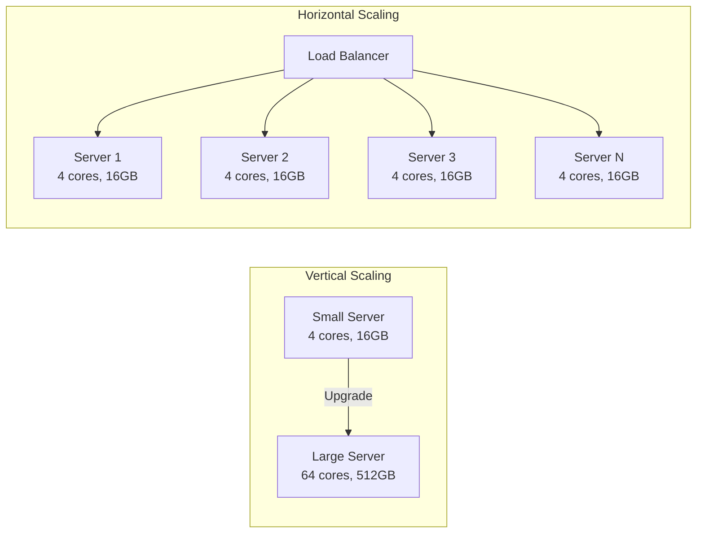
```mermaid
graph LR
    subgraph "Vertical Scaling"
        A1[Small Server<br/>4 cores, 16GB] -->|Upgrade| A2[Large Server<br/>64 cores, 512GB]
    end

    subgraph "Horizontal Scaling"
        B1[Server 1<br/>4 cores, 16GB]
        B2[Server 2<br/>4 cores, 16GB]
        B3[Server 3<br/>4 cores, 16GB]
        B4[Server N<br/>4 cores, 16GB]
        LB[Load Balancer] --> B1
        LB --> B2
        LB --> B3
        LB --> B4
    end
```

**Cost curve of horizontal scaling:**

Horizontal scaling follows a roughly linear cost curve at the infrastructure level, but introduces operational complexity costs that grow sublinearly after initial investment.

| Nodes | Total vCPUs | Total RAM | Monthly Infra Cost | Operational Overhead |
|-------|------------|-----------|-------------------|---------------------|
| 1     | 4          | 16 GB     | $150              | Minimal             |
| 4     | 16         | 64 GB     | $600              | Low                 |
| 16    | 64         | 256 GB    | $2,400            | Moderate            |
| 64    | 256        | 1 TB      | $9,600            | Significant         |
| 256   | 1024       | 4 TB      | $38,400           | High                |

**When horizontal scaling applies:**

1. **Stateless services**: API servers, web servers, and compute workers that do not hold state between requests scale horizontally with near-zero application changes.
2. **Read-heavy workloads**: Read replicas distribute read traffic across multiple database nodes.
3. **Large datasets**: When data exceeds the capacity of a single node, sharding distributes it across multiple nodes.
4. **High availability requirements**: Multiple nodes provide redundancy. Losing one node does not lose the service.
5. **Cost optimization at scale**: At large scale, many commodity machines cost less than fewer premium machines.

**Challenges of horizontal scaling:**

- **Data distribution**: How do you split data across nodes? How do you ensure even distribution?
- **Coordination overhead**: Distributed transactions, consensus protocols, and distributed locking add latency and complexity.
- **Network partitions**: More nodes mean more network links, increasing the probability of partial failures.
- **Operational complexity**: Monitoring, deploying, and debugging across 200 nodes is fundamentally harder than on 1.
- **Data locality**: Queries that span multiple nodes require network round-trips that a single-node query avoids.

### Decision Framework: Vertical vs Horizontal

```
┌─────────────────────────────────────────────────────────────────┐
│              Vertical vs Horizontal Decision Matrix              │
├──────────────────┬──────────────────┬───────────────────────────┤
│ Factor           │ Favor Vertical   │ Favor Horizontal          │
├──────────────────┼──────────────────┼───────────────────────────┤
│ Current load     │ < 10K RPS        │ > 10K RPS                 │
│ Data size        │ < 500 GB         │ > 500 GB                  │
│ Growth rate      │ < 2x / year      │ > 2x / year               │
│ Consistency need │ Strong / ACID    │ Eventual acceptable       │
│ Team expertise   │ Small / DBA-led  │ Distributed-systems exp.  │
│ Budget           │ Hardware $$$ OK  │ Optimize cost at scale    │
│ Availability SLA │ 99.9% (3 nines)  │ 99.99%+ (4+ nines)       │
│ Workload type    │ Complex queries  │ Simple, parallelizable    │
└──────────────────┴──────────────────┴───────────────────────────┘
```

**The hybrid approach:**

In practice, most systems use both. A common pattern is to scale application servers horizontally while keeping the database vertically scaled for as long as possible, then introducing horizontal scaling (sharding or read replicas) for the data tier only when vertical limits are reached.

**Capacity estimation example:**

Your application currently handles 5,000 RPS on a single 8-core server at 60% CPU utilization. Traffic is expected to grow to 50,000 RPS in 12 months.

Vertical approach: You would need roughly 80 cores to handle 50,000 RPS (assuming linear scaling, which is optimistic). The largest single instance available has 128 cores at $18,000/month. This works but leaves no headroom and creates a single point of failure.

Horizontal approach: Each 8-core instance handles 5,000 RPS. You need 10 instances at 60% utilization, or 14 instances at ~43% utilization for headroom. At $500/month each, that is $7,000/month — less than half the cost of the vertical approach, with built-in redundancy.

---

## 1.2 Sharding

Sharding is the practice of splitting a dataset across multiple database instances (shards), where each shard holds a subset of the total data. It is the primary mechanism for horizontally scaling the data tier.

### Why Shard?

When a single database server cannot handle the load — whether due to storage capacity, CPU, memory, or I/O constraints — sharding distributes both the data and the workload across multiple servers.

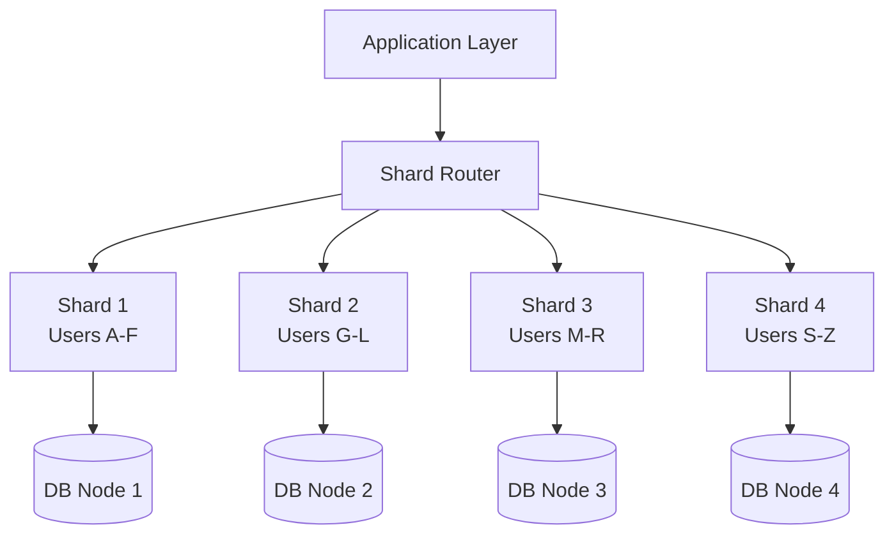
```mermaid
graph TD
    App[Application Layer] --> Router[Shard Router]
    Router --> S1[Shard 1<br/>Users A-F]
    Router --> S2[Shard 2<br/>Users G-L]
    Router --> S3[Shard 3<br/>Users M-R]
    Router --> S4[Shard 4<br/>Users S-Z]

    S1 --> D1[(DB Node 1)]
    S2 --> D2[(DB Node 2)]
    S3 --> D3[(DB Node 3)]
    S4 --> D4[(DB Node 4)]
```

### Sharding Strategies

#### Hash-Based Sharding

The shard is determined by applying a hash function to the shard key and taking the modulus of the number of shards.

```
shard_id = hash(shard_key) % num_shards
```

**Example:** With 4 shards and user_id as the shard key:

| user_id | hash(user_id) | shard_id (hash % 4) |
|---------|--------------|---------------------|
| 1001    | 7823456      | 0                   |
| 1002    | 3456789      | 1                   |
| 1003    | 9012345      | 1                   |
| 1004    | 5678901      | 1                   |
| 1005    | 2345678      | 2                   |
| 1006    | 8901234      | 2                   |
| 1007    | 4567890      | 2                   |
| 1008    | 1234567      | 3                   |

**Advantages:**
- Even distribution (with a good hash function)
- Simple to implement
- No need for a lookup table

**Disadvantages:**
- Adding or removing shards requires rehashing and moving a large fraction of data
- Range queries are impossible (data for a date range is spread across all shards)
- Hotspots can still occur if the shard key has skewed access patterns

#### Range-Based Sharding

Data is split into contiguous ranges of the shard key. Each shard owns a specific range.

```
Shard 1: user_id 1 - 1,000,000
Shard 2: user_id 1,000,001 - 2,000,000
Shard 3: user_id 2,000,001 - 3,000,000
Shard 4: user_id 3,000,001 - 4,000,000
```

**Advantages:**
- Range queries are efficient (all data in a range is on one shard)
- Easy to understand and debug
- New shards can be added by splitting an existing range

**Disadvantages:**
- Uneven distribution is common (recent user_ids get more traffic)
- Hotspots on the shard holding the most active range
- Requires careful range selection and periodic rebalancing

#### Directory-Based Sharding

A lookup table (directory) maps each shard key to its shard. The directory is consulted for every data access.

```
┌────────────┬──────────┐
│ Shard Key  │ Shard ID │
├────────────┼──────────┤
│ user_1001  │ Shard 2  │
│ user_1002  │ Shard 1  │
│ user_1003  │ Shard 4  │
│ user_1004  │ Shard 3  │
│ user_1005  │ Shard 2  │
│ ...        │ ...      │
└────────────┴──────────┘
```

**Advantages:**
- Maximum flexibility: any key can be on any shard
- Supports heterogeneous shard sizes
- Moving data between shards only requires updating the directory

**Disadvantages:**
- The directory itself becomes a bottleneck and single point of failure
- Every data access requires an extra lookup (latency overhead)
- Directory must be highly available and consistent

#### Consistent Hashing

Consistent hashing maps both data keys and shard nodes onto a circular hash space (ring). Each key is assigned to the first node encountered when walking clockwise around the ring from the key's hash position.

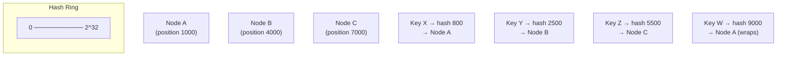
```mermaid
graph TD
    subgraph "Hash Ring"
        direction TB
        Ring["0 ─────────── 2^32"]
    end

    N1["Node A<br/>(position 1000)"]
    N2["Node B<br/>(position 4000)"]
    N3["Node C<br/>(position 7000)"]

    K1["Key X → hash 800<br/>→ Node A"]
    K2["Key Y → hash 2500<br/>→ Node B"]
    K3["Key Z → hash 5500<br/>→ Node C"]
    K4["Key W → hash 9000<br/>→ Node A (wraps)"]
```

**Why consistent hashing matters:**

When a node is added or removed, only the keys between the affected node and its predecessor need to move. In a 4-node cluster, adding a 5th node moves roughly 1/5 of the total keys, compared to hash-mod sharding where adding a node forces rehashing and moving ~80% of keys.

**Virtual nodes:**

To improve balance, each physical node is mapped to multiple virtual positions on the ring. A typical deployment uses 100-200 virtual nodes per physical node. This ensures that when a node fails, its load is spread evenly across remaining nodes rather than being absorbed entirely by one neighbor.

| Physical Nodes | Virtual Nodes/Physical | Total Ring Positions | Max Load Imbalance |
|---------------|----------------------|---------------------|-------------------|
| 3             | 1                    | 3                   | ~2.0x average     |
| 3             | 50                   | 150                 | ~1.15x average    |
| 3             | 150                  | 450                 | ~1.05x average    |
| 10            | 150                  | 1500                | ~1.02x average    |

### Resharding Strategies

Resharding — changing the number of shards or the mapping of keys to shards — is one of the most operationally dangerous procedures in distributed systems.

**Online resharding approach:**

1. **Double-write phase**: Write new data to both the old and new shard configuration simultaneously.
2. **Background migration**: Copy existing data from old shards to new shards in the background, batch by batch.
3. **Verification**: Confirm that all data is present and consistent in the new configuration.
4. **Cutover**: Switch reads to the new shard configuration.
5. **Cleanup**: Remove double-writes and decommission old shards.

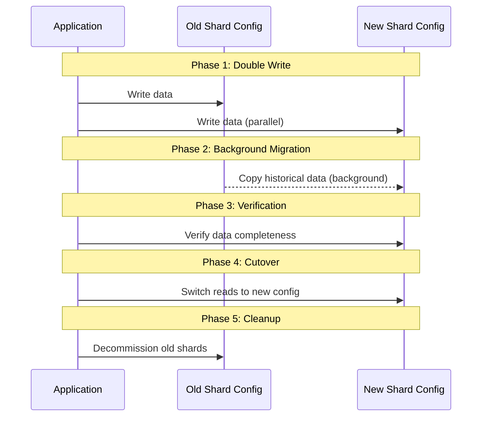
```mermaid
sequenceDiagram
    participant App as Application
    participant Old as Old Shard Config
    participant New as New Shard Config

    Note over App,New: Phase 1: Double Write
    App->>Old: Write data
    App->>New: Write data (parallel)

    Note over App,New: Phase 2: Background Migration
    Old-->>New: Copy historical data (background)

    Note over App,New: Phase 3: Verification
    App->>New: Verify data completeness

    Note over App,New: Phase 4: Cutover
    App->>New: Switch reads to new config

    Note over App,New: Phase 5: Cleanup
    App->>Old: Decommission old shards
```

**Resharding pitfalls:**

- **Data inconsistency**: If the double-write fails silently, the new shard is missing data.
- **Increased latency**: Double-writes increase write latency during migration.
- **Runaway migration**: Background copies can saturate network and disk I/O on production shards.
- **Rollback complexity**: If verification fails, you need a plan to undo the migration.

### Hotspot Handling

A hotspot occurs when one shard receives disproportionately more traffic than others. Common causes:

- **Celebrity user**: A user with millions of followers generates orders of magnitude more reads on their shard.
- **Temporal skew**: Range-sharded by date means the current shard always receives all writes.
- **Key skew**: Hash functions can produce uneven distributions for certain key patterns.

**Hotspot mitigation strategies:**

1. **Shard splitting**: Split the hot shard into two or more shards. Requires resharding the affected range.
2. **Adding salt**: Append a random suffix to the shard key to distribute writes across multiple shards. Reads must scatter-gather across all possible suffixes.
3. **Caching**: Place a cache in front of the hot shard to absorb read traffic.
4. **Application-level routing**: Detect known hot keys and route them to dedicated infrastructure.
5. **Read replicas per shard**: Add read replicas specifically to the overloaded shard.

```
Hot key mitigation with salting:

Original key: celebrity_user_123
Salted keys:  celebrity_user_123_0 → Shard A
              celebrity_user_123_1 → Shard B
              celebrity_user_123_2 → Shard C
              celebrity_user_123_3 → Shard D

Writes: Round-robin across salted keys
Reads:  Scatter to all 4 shards, gather results
```

### Shard Key Selection

Choosing the right shard key is the single most important sharding decision. A bad shard key leads to hotspots, cross-shard queries, and operational nightmares.

**Criteria for a good shard key:**

| Criterion         | Description                                              | Example                    |
|-------------------|----------------------------------------------------------|----------------------------|
| High cardinality  | Many distinct values to distribute evenly                | user_id (millions of values)|
| Even distribution | Values accessed with roughly equal frequency             | Not country_code (US heavy) |
| Query alignment   | Most queries filter on the shard key                     | user_id for user-centric app|
| Growth stability  | Distribution remains even as data grows                  | UUID, not auto-increment    |
| Avoid monotonic   | Sequential keys concentrate writes on one shard          | Not timestamp alone         |

---

## 1.3 Replication

Replication is the practice of maintaining copies of data on multiple nodes. It serves two purposes: **fault tolerance** (data survives node failures) and **performance** (read traffic distributes across replicas).

### Leader-Follower (Primary-Secondary) Replication

One node (the leader) accepts all writes and propagates changes to follower nodes. Followers serve read queries.

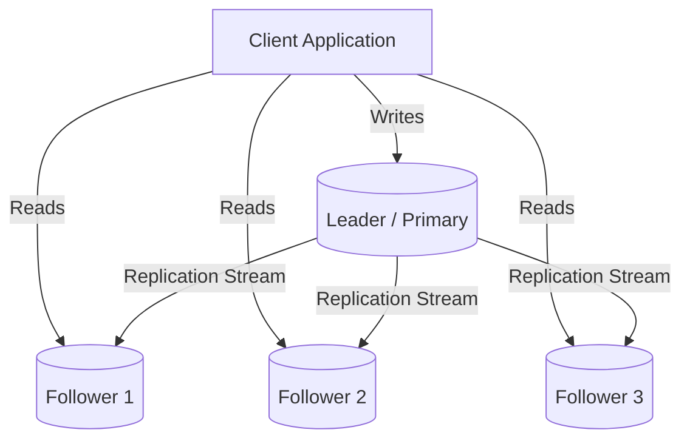
```mermaid
graph TD
    Client[Client Application]
    Client -->|Writes| Leader[(Leader / Primary)]
    Client -->|Reads| F1[(Follower 1)]
    Client -->|Reads| F2[(Follower 2)]
    Client -->|Reads| F3[(Follower 3)]

    Leader -->|Replication Stream| F1
    Leader -->|Replication Stream| F2
    Leader -->|Replication Stream| F3
```

**Synchronous vs Asynchronous replication:**

| Property          | Synchronous                        | Asynchronous                       |
|-------------------|------------------------------------|------------------------------------|
| Write confirmed   | After leader + N followers persist | After leader persists only         |
| Durability        | Strong (data on multiple nodes)    | Weaker (follower may lag)          |
| Write latency     | Higher (wait for followers)        | Lower (immediate leader confirm)   |
| Data loss risk    | Minimal                            | Possible (uncommitted changes)     |
| Availability      | Lower (follower timeout blocks writes)| Higher (leader independent)     |

**Semi-synchronous replication:**

A practical middle ground: the leader waits for acknowledgment from exactly one follower before confirming the write. The remaining followers replicate asynchronously. This guarantees that at least two nodes have the data at write time.

**Failover in leader-follower:**

When the leader fails, a follower must be promoted. This process involves:

1. **Detecting the failure**: Typically via heartbeat timeout (e.g., 10 seconds with no response).
2. **Electing a new leader**: The follower with the most recent data is preferred. Consensus protocols (Raft, Paxos) can automate this.
3. **Reconfiguring clients**: All clients must start sending writes to the new leader.
4. **Reconciling data**: If the old leader had unreplicated writes, those are lost (async) or must be reconciled (semi-sync).

**Failover risks:**

- **Split brain**: If the old leader comes back online and still believes it is the leader, two nodes accept writes, causing data divergence.
- **Data loss window**: With async replication, writes acknowledged but not yet replicated are lost.
- **Cascading failures**: If failover triggers a burst of reconnections, the new leader may be overwhelmed.

### Multi-Leader Replication

Multiple nodes accept writes simultaneously. Each leader replicates its writes to all other leaders.

**Use cases:**

- **Multi-datacenter deployments**: Each datacenter has a local leader to provide low-latency writes. Changes replicate across datacenters asynchronously.
- **Collaborative editing**: Multiple users edit the same document simultaneously (e.g., Google Docs).
- **Offline-capable clients**: Each client has a local "leader" (local database) that syncs when connectivity is restored.

**Write conflict resolution:**

When two leaders independently modify the same record, a conflict exists. Resolution strategies:

1. **Last-writer-wins (LWW)**: The write with the latest timestamp wins. Simple but loses data.
2. **Merge function**: Application-specific logic merges concurrent changes (e.g., union of sets).
3. **Conflict-free Replicated Data Types (CRDTs)**: Data structures designed to merge without conflicts (counters, sets, registers).
4. **Manual resolution**: Flag conflicts and present them to the user (like git merge conflicts).

```
Multi-leader conflict example:

Leader A (US):    UPDATE users SET name='Alice' WHERE id=1  (at T1)
Leader B (EU):    UPDATE users SET name='Alicia' WHERE id=1 (at T1)

LWW resolution:   name='Alicia' (if B's timestamp is later by nanoseconds)
Merge resolution:  name='Alice/Alicia' (present both to user)
CRDT resolution:   Not applicable for single-value register without additional metadata
```

### Leaderless Replication

Every node accepts both reads and writes. No single node is distinguished as the leader. This is the approach used by Dynamo-style systems (Cassandra, Riak, Voldemort).

**Quorum reads and writes:**

In a cluster of N replicas, a write succeeds if acknowledged by W nodes, and a read succeeds if it receives responses from R nodes. To guarantee that a read sees the most recent write:

```
W + R > N
```

**Common quorum configurations:**

| N (replicas) | W (write quorum) | R (read quorum) | W+R   | Properties                         |
|-------------|-----------------|-----------------|-------|-------------------------------------|
| 3           | 2               | 2               | 4 > 3 | Balanced read/write performance     |
| 3           | 3               | 1               | 4 > 3 | Fast reads, slow/durable writes     |
| 3           | 1               | 3               | 4 > 3 | Fast writes, slow reads             |
| 5           | 3               | 3               | 6 > 5 | Higher fault tolerance              |
| 5           | 1               | 5               | 6 > 5 | Maximum write throughput            |

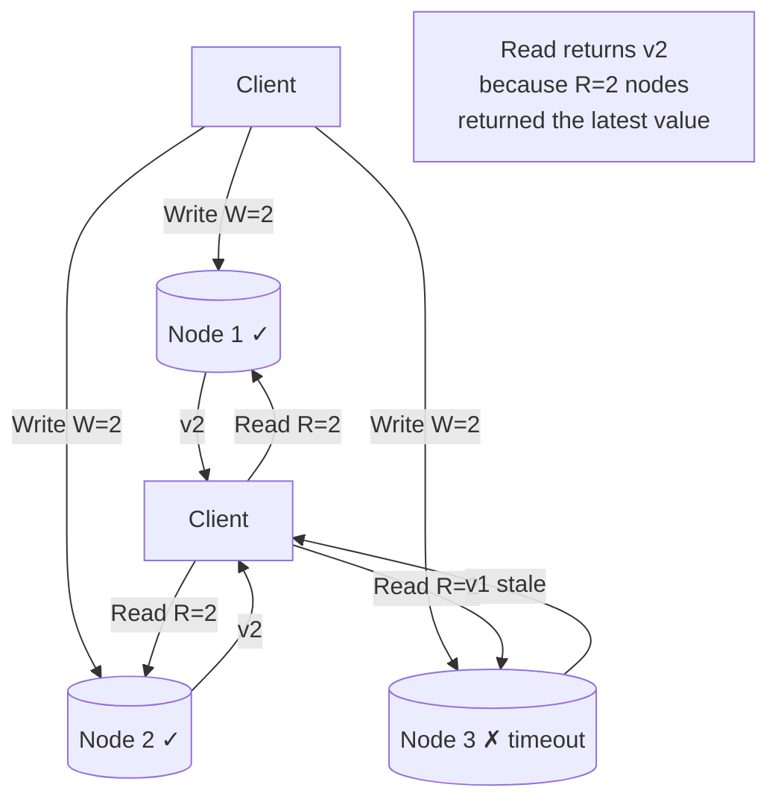
```mermaid
graph TD
    Client[Client] -->|Write W=2| N1[(Node 1 ✓)]
    Client -->|Write W=2| N2[(Node 2 ✓)]
    Client -->|Write W=2| N3[(Node 3 ✗ timeout)]

    Client2[Client] -->|Read R=2| N1
    Client2 -->|Read R=2| N2
    Client2 -->|Read R=2| N3

    N1 -->|v2| Client2
    N2 -->|v2| Client2
    N3 -->|v1 stale| Client2

    Note1[Read returns v2<br/>because R=2 nodes<br/>returned the latest value]
```

**Sloppy quorums and hinted handoff:**

When not enough nodes in the designated quorum are reachable, a sloppy quorum allows the system to write to other nodes temporarily. These "hinted" nodes hold the data until the original node recovers, then hand it off. This improves write availability at the cost of weakened consistency guarantees.

### Replication Lag

In asynchronous replication, followers lag behind the leader. This lag is typically sub-second under normal conditions but can grow to minutes or hours under high load or network issues.

**Consistency problems caused by replication lag:**

1. **Read-your-own-writes violation**: A user writes data, then immediately reads and sees stale data because the read hits a lagging follower.
2. **Monotonic reads violation**: A user makes two consecutive reads and sees newer data first, then older data, because requests hit different followers.
3. **Causal consistency violation**: User A posts a comment, User B replies. A reader sees the reply but not the original comment because different followers have different lag.

**Mitigation strategies:**

| Problem                  | Solution                                                        |
|-------------------------|-----------------------------------------------------------------|
| Read-your-own-writes    | Route reads to the leader for T seconds after a write           |
| Read-your-own-writes    | Track write timestamp; route to follower only if caught up      |
| Monotonic reads         | Pin a user's reads to the same follower (session affinity)      |
| Causal consistency      | Use logical timestamps / vector clocks to order reads           |
| General lag             | Monitor lag; alert if exceeds threshold; add replicas           |

**Benchmark: replication lag under load:**

| Write Rate (ops/sec) | Avg Replication Lag | P99 Replication Lag | Data Loss Window |
|----------------------|--------------------|--------------------|-----------------|
| 1,000                | 5ms                | 50ms               | ~50ms           |
| 10,000               | 20ms               | 200ms              | ~200ms          |
| 50,000               | 100ms              | 2s                 | ~2s             |
| 100,000              | 500ms              | 10s                | ~10s            |

---

## 1.4 Partitioning

Partitioning divides data across multiple storage units. While sharding is often used synonymously, partitioning is a broader concept that includes several strategies.

### Horizontal Partitioning (Sharding)

Splits rows across multiple databases. Each partition holds a subset of rows but all columns. This is what Section 1.2 covered in detail.

```
Users Table (10M rows) → 4 horizontal partitions:

Partition 1: Users 1 - 2,500,000        (all columns)
Partition 2: Users 2,500,001 - 5,000,000 (all columns)
Partition 3: Users 5,000,001 - 7,500,000 (all columns)
Partition 4: Users 7,500,001 - 10,000,000(all columns)
```

### Vertical Partitioning (Column Splitting)

Splits columns of a table across multiple databases. Each partition holds all rows but only a subset of columns.

**When to use vertical partitioning:**

- **Hot/cold column separation**: Frequently accessed columns (user_id, name, email) are separated from rarely accessed columns (bio, preferences, avatar_url). The hot partition stays in fast storage; the cold partition can use cheaper storage.
- **Large columns**: Columns with large values (BLOBs, JSON, text) are split into a separate store to keep the primary table's row size small and cache-friendly.
- **Access pattern alignment**: Different services need different columns. The user service needs profile data; the billing service needs payment data. Vertical partitioning gives each service its own optimized store.

```
Original users table:
┌─────────┬──────┬────────────┬────────┬──────────────┬─────────────┐
│ user_id │ name │ email      │ status │ bio (2KB)    │ avatar (URL)│
└─────────┴──────┴────────────┴────────┴──────────────┴─────────────┘

After vertical partitioning:

Core partition (hot):           Extended partition (cold):
┌─────────┬──────┬────────────┐ ┌─────────┬──────────────┬─────────────┐
│ user_id │ name │ email      │ │ user_id │ bio (2KB)    │ avatar (URL)│
└─────────┴──────┴────────────┘ └─────────┴──────────────┴─────────────┘
```

### Functional Partitioning

Data is partitioned by business function or domain. Each service owns its own database, containing only the data relevant to its function.

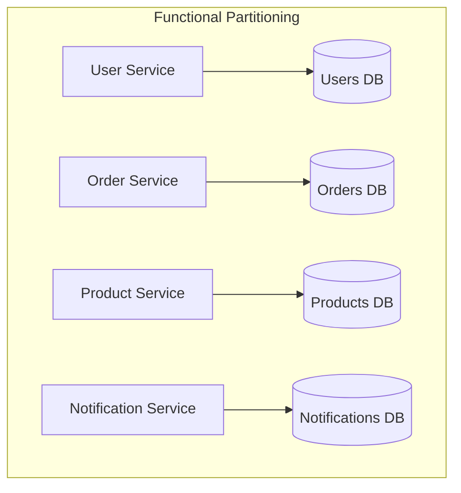
```mermaid
graph TD
    subgraph "Functional Partitioning"
        US[User Service] --> UDB[(Users DB)]
        OS[Order Service] --> ODB[(Orders DB)]
        PS[Product Service] --> PDB[(Products DB)]
        NS[Notification Service] --> NDB[(Notifications DB)]
    end
```

**Benefits of functional partitioning:**

- **Independent scaling**: Each database scales according to its own workload characteristics.
- **Isolation**: A spike in notification writes does not impact product catalog reads.
- **Technology diversity**: The user service might use PostgreSQL while the notification service uses Cassandra.
- **Team ownership**: Each team owns its data store, enabling autonomous deployment.

**Challenges:**

- **Cross-partition queries**: Fetching a user's order history requires joining data across User DB and Order DB. This join moves to the application layer.
- **Distributed transactions**: An operation that spans multiple partitions (e.g., "create order and decrement inventory") requires coordination (saga pattern, two-phase commit).
- **Data duplication**: Some data may be duplicated across partitions for performance (e.g., the product name is stored in both the product DB and the order DB).

### Partitioning Strategy Comparison

| Strategy       | Split Axis | Best For                        | Biggest Risk                  |
|---------------|-----------|--------------------------------|-------------------------------|
| Horizontal    | Rows      | Large datasets, even workloads  | Cross-shard queries           |
| Vertical      | Columns   | Mixed hot/cold access patterns  | Joins across partitions       |
| Functional    | Domain    | Microservices, team boundaries  | Distributed transactions      |

### Architectural Decision Record: Sharding Strategy Selection

**Context:** The orders table has grown to 500M rows. Single-node PostgreSQL cannot handle the combined read and write load during peak hours.

**Options considered:**

| Option                        | Pros                                           | Cons                                               |
|------------------------------|------------------------------------------------|----------------------------------------------------|
| A: Hash on order_id          | Even distribution, simple routing               | Cannot query by user_id without scatter-gather      |
| B: Hash on user_id           | User's orders colocated, efficient user queries  | Power users create hotspots                         |
| C: Range on created_at       | Time-range queries efficient, old data archivable| Current shard always hottest                        |
| D: Compound (user_id + month)| User locality + time-based archival              | Complex routing, more shards to manage              |

**Decision:** Option B (hash on user_id) with hotspot mitigation for power users via dedicated shards.

**Rationale:** 95% of queries filter by user_id. Cross-shard scatter-gather for admin queries is acceptable. Power user hotspots affect <0.1% of users and can be handled with dedicated shards and caching.

---

# Section 2: Performance Patterns

## 2.1 Caching Strategies

Caching is the most impactful performance optimization in distributed systems. A well-placed cache can reduce database load by 90%+ and cut response times from hundreds of milliseconds to single-digit milliseconds.

### Cache-Aside (Lazy Loading)

The application manages the cache explicitly. On read, it checks the cache first; on miss, it reads from the database and populates the cache. On write, it updates the database and invalidates or updates the cache.

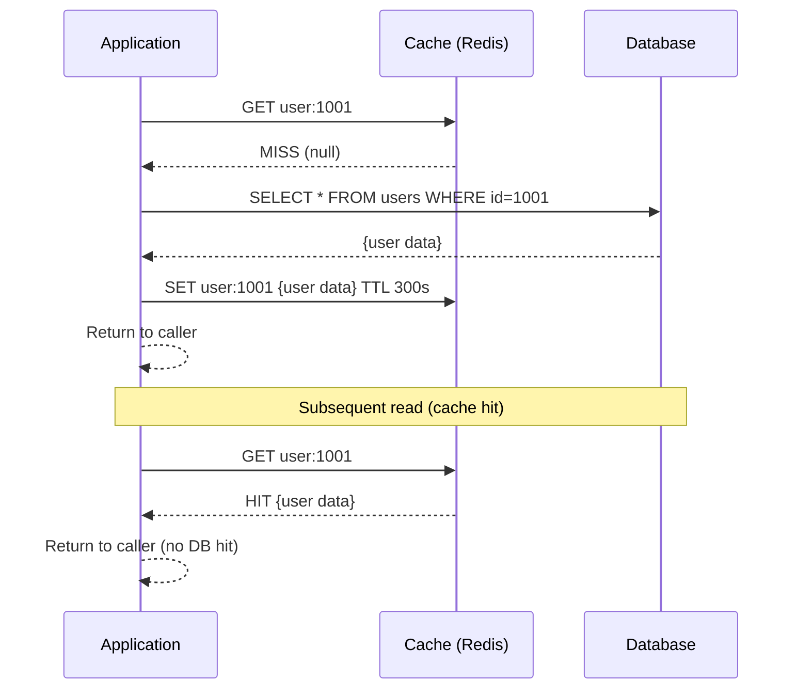
```mermaid
sequenceDiagram
    participant App as Application
    participant Cache as Cache (Redis)
    participant DB as Database

    App->>Cache: GET user:1001
    Cache-->>App: MISS (null)
    App->>DB: SELECT * FROM users WHERE id=1001
    DB-->>App: {user data}
    App->>Cache: SET user:1001 {user data} TTL 300s
    App-->>App: Return to caller

    Note over App,DB: Subsequent read (cache hit)
    App->>Cache: GET user:1001
    Cache-->>App: HIT {user data}
    App-->>App: Return to caller (no DB hit)
```

**Advantages:**
- Simple to implement and reason about.
- Application has full control over what is cached and for how long.
- Cache failures are non-fatal — the application falls back to the database.
- Only requested data is cached (no warming overhead for unused data).

**Disadvantages:**
- First request for any data always hits the database (cold start).
- Stale data is possible between write and cache invalidation.
- Application code is polluted with cache logic.

**Implementation pattern:**

```python
def get_user(user_id):
    # Check cache
    cached = redis.get(f"user:{user_id}")
    if cached:
        return deserialize(cached)

    # Cache miss - read from DB
    user = db.query("SELECT * FROM users WHERE id = %s", user_id)

    # Populate cache
    redis.setex(f"user:{user_id}", 300, serialize(user))

    return user

def update_user(user_id, data):
    # Update database first
    db.execute("UPDATE users SET ... WHERE id = %s", user_id)

    # Invalidate cache (don't update - avoids race conditions)
    redis.delete(f"user:{user_id}")
```

### Read-Through Cache

The cache itself is responsible for loading data from the database on a miss. The application only interacts with the cache, never directly with the database for reads.

```
Application → Cache → (on miss) → Database
                ↑                      │
                └──────────────────────┘
                   Cache auto-populates
```

**Advantages:**
- Application code is cleaner — no cache miss handling logic.
- Cache population logic is centralized.
- Consistent behavior across all callers.

**Disadvantages:**
- Requires cache infrastructure that supports read-through (or a cache library/proxy).
- Harder to customize per-query caching behavior.
- Cold start still hits the database.

### Write-Through Cache

Every write goes through the cache to the database. The cache and database are updated atomically (from the application's perspective).

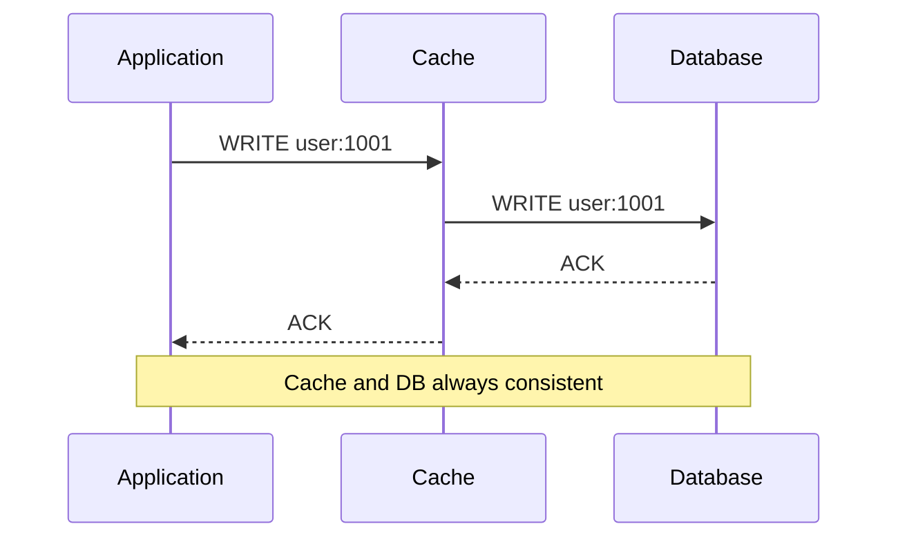
```mermaid
sequenceDiagram
    participant App as Application
    participant Cache as Cache
    participant DB as Database

    App->>Cache: WRITE user:1001
    Cache->>DB: WRITE user:1001
    DB-->>Cache: ACK
    Cache-->>App: ACK

    Note over App,DB: Cache and DB always consistent
```

**Advantages:**
- Cache is always consistent with the database (no stale reads after writes).
- Simplifies cache invalidation — there is none needed.

**Disadvantages:**
- Write latency increases because every write goes through two systems.
- All data is cached, even data that is rarely read (wasted memory).
- If the cache is down, writes fail (unless you add fallback logic).

### Write-Behind (Write-Back) Cache

Writes go to the cache immediately, and the cache asynchronously flushes writes to the database in the background, often in batches.

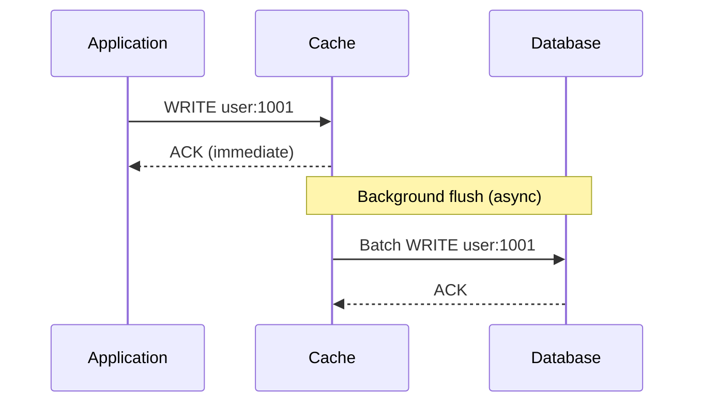
```mermaid
sequenceDiagram
    participant App as Application
    participant Cache as Cache
    participant DB as Database

    App->>Cache: WRITE user:1001
    Cache-->>App: ACK (immediate)

    Note over Cache,DB: Background flush (async)
    Cache->>DB: Batch WRITE user:1001
    DB-->>Cache: ACK
```

**Advantages:**
- Lowest write latency (write to in-memory cache only).
- Batching amortizes database write overhead.
- Database write spikes are smoothed out.

**Disadvantages:**
- Data loss risk: if the cache node crashes before flushing, uncommitted writes are lost.
- Complexity: managing the async flush queue, retry logic, and ordering.
- Debugging is harder because the database is behind the cache.

### Cache Strategy Comparison

| Strategy      | Read Latency | Write Latency | Consistency    | Complexity | Data Loss Risk |
|--------------|-------------|---------------|----------------|------------|----------------|
| Cache-Aside  | Low (on hit) | Same as DB    | Eventual       | Low        | None           |
| Read-Through | Low (on hit) | Same as DB    | Eventual       | Medium     | None           |
| Write-Through| Low (on hit) | Higher than DB | Strong         | Medium     | None           |
| Write-Behind | Low (on hit) | Very Low      | Eventual       | High       | Yes            |

### Cache Invalidation Patterns

Cache invalidation is famously one of the two hard problems in computer science (the other being naming things). The core challenge is ensuring that cached data reflects the current state of the underlying data store.

**Time-based expiration (TTL):**

Every cache entry has a time-to-live. After the TTL expires, the entry is evicted, and the next read triggers a database lookup.

```
TTL Selection Guidelines:

Data Type          │ Recommended TTL  │ Rationale
───────────────────┼──────────────────┼──────────────────────────
User profile       │ 5-15 minutes     │ Changes infrequently
Product catalog    │ 1-5 minutes      │ Price/stock changes
Session data       │ 30 minutes       │ Active session lifetime
Feature flags      │ 30-60 seconds    │ Need fast propagation
Real-time metrics  │ 5-10 seconds     │ Freshness critical
Static config      │ 1-24 hours       │ Rarely changes
```

**Event-based invalidation:**

When data changes, an event is published (e.g., to Kafka), and cache subscribers invalidate or update the relevant entries.

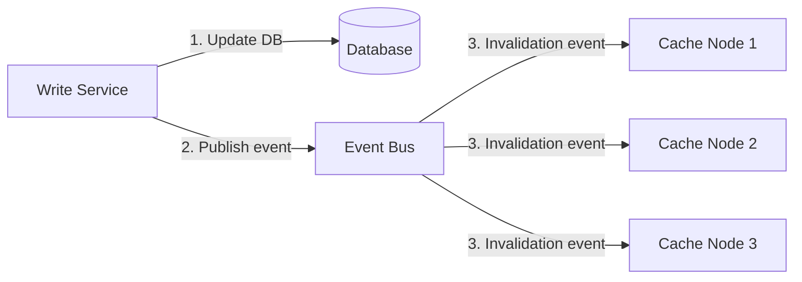
```mermaid
graph LR
    Writer[Write Service] -->|1. Update DB| DB[(Database)]
    Writer -->|2. Publish event| Kafka[Event Bus]
    Kafka -->|3. Invalidation event| Cache1[Cache Node 1]
    Kafka -->|3. Invalidation event| Cache2[Cache Node 2]
    Kafka -->|3. Invalidation event| Cache3[Cache Node 3]
```

**Version-based invalidation:**

Each cache entry includes a version number. Writes increment the version. Reads check if the cached version matches the current version (stored in a lightweight metadata store).

### Thundering Herd Problem

When a popular cache entry expires, hundreds or thousands of concurrent requests simultaneously miss the cache and hit the database. This can overwhelm the database and create a cascading failure.

```
Timeline of a thundering herd:

T=0:    Cache entry "product:hot-item" expires
T=0.001: 500 concurrent requests arrive for "product:hot-item"
T=0.002: All 500 check cache → MISS
T=0.003: All 500 send query to database
T=0.010: Database CPU spikes to 100%
T=0.100: Database connection pool exhausted
T=0.500: Requests start timing out
T=1.000: Cascading failure to upstream services
```

**Mitigation strategies:**

1. **Cache stampede lock (mutex)**: When a cache miss occurs, only one request acquires a lock and queries the database. All other requests wait for the lock holder to populate the cache.

```python
def get_product_with_lock(product_id):
    cached = redis.get(f"product:{product_id}")
    if cached:
        return deserialize(cached)

    # Try to acquire lock
    lock_acquired = redis.set(
        f"lock:product:{product_id}", "1",
        nx=True,  # Only set if not exists
        ex=5      # Lock expires in 5 seconds
    )

    if lock_acquired:
        # I am the one to fetch from DB
        product = db.query("SELECT * FROM products WHERE id = %s", product_id)
        redis.setex(f"product:{product_id}", 300, serialize(product))
        redis.delete(f"lock:product:{product_id}")
        return product
    else:
        # Wait and retry (another request is populating)
        time.sleep(0.05)
        return get_product_with_lock(product_id)
```

2. **Stale-while-revalidate**: Serve stale data from the cache while a background refresh occurs. The cache entry has two TTLs: a soft TTL (after which a background refresh is triggered) and a hard TTL (after which the entry is truly evicted).

3. **Probabilistic early refresh**: Each request that reads a cache entry has a small probability of triggering a refresh before the TTL expires. This spreads refresh load over time.

4. **Warm the cache before expiry**: A background process refreshes hot keys before they expire, ensuring the cache is never cold for popular data.

### Hot Key Problem

A single cache key receives a disproportionate amount of traffic, overloading the cache node that hosts it.

**Example:** During a product launch, the product page for the new item receives 100,000 RPS. The cache key "product:new-launch" is stored on a single Redis node, which can handle ~50,000 operations per second. The node is overwhelmed.

**Solutions:**

1. **Local caching (L1 cache)**: Each application server maintains a small in-process cache (e.g., Caffeine in Java, lru-cache in Python). Hot keys are served from L1 without hitting the distributed cache at all.

2. **Key replication**: Replicate the hot key across multiple cache nodes using suffixed keys.

```
Original:  product:new-launch → Node A (overloaded)

Replicated:
  product:new-launch:0 → Node A
  product:new-launch:1 → Node B
  product:new-launch:2 → Node C
  product:new-launch:3 → Node D

Read routing: random(0..3) to spread load
```

3. **Client-side caching with server-assisted invalidation**: Redis 6+ supports client-side caching where the server tracks which clients cached which keys and sends invalidation messages when keys change.

### Multi-Tier Caching (L1/L2/CDN)

Production systems typically employ multiple layers of caching, each with different characteristics.

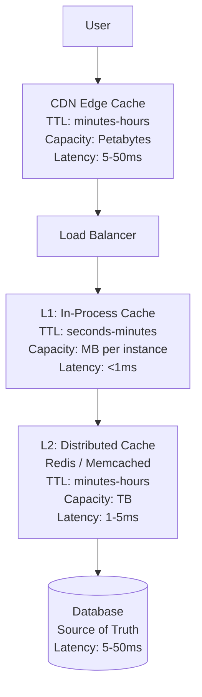
```mermaid
graph TD
    User[User] --> CDN[CDN Edge Cache<br/>TTL: minutes-hours<br/>Capacity: Petabytes<br/>Latency: 5-50ms]
    CDN --> LB[Load Balancer]
    LB --> L1[L1: In-Process Cache<br/>TTL: seconds-minutes<br/>Capacity: MB per instance<br/>Latency: <1ms]
    L1 --> L2[L2: Distributed Cache<br/>Redis / Memcached<br/>TTL: minutes-hours<br/>Capacity: TB<br/>Latency: 1-5ms]
    L2 --> DB[(Database<br/>Source of Truth<br/>Latency: 5-50ms)]
```

**Cache tier characteristics:**

| Tier | Technology         | Latency  | Capacity    | Shared? | Cost/GB  |
|------|--------------------|----------|-------------|---------|----------|
| L1   | In-process (heap)  | <0.1ms   | 100MB-1GB   | No      | ~$0      |
| L2   | Redis / Memcached  | 0.5-2ms  | 10GB-1TB    | Yes     | ~$15/GB  |
| CDN  | CloudFront/Fastly  | 5-50ms   | Unlimited   | Yes     | ~$0.01/GB|
| DB   | PostgreSQL/MySQL   | 5-50ms   | Unlimited   | Yes     | ~$5/GB   |

**Cache hierarchy behavior:**

1. Request arrives. Check L1 (in-process cache). If hit, return immediately (<0.1ms).
2. L1 miss. Check L2 (Redis). If hit, populate L1 and return (~1ms).
3. L2 miss. Query database. Populate L2 and L1. Return (~10ms).
4. For static assets, the CDN sits in front of the entire stack and serves edge-cached content before reaching the application.

**Capacity estimation for caching:**

Your application serves 50,000 RPS with an average response size of 5KB. The cache hit ratio is 95%.

- Total data served: 50,000 * 5KB = 250 MB/sec
- Database load (5% miss rate): 2,500 RPS
- Cache memory needed (assuming 1M unique cacheable items at 5KB each, with 5-minute TTL): 1,000,000 * 5KB = 5GB

Without caching: 50,000 RPS hit the database.
With 95% cache hit rate: 2,500 RPS hit the database.
**Result: 20x reduction in database load.**

---

## 2.2 CDN Usage

A Content Delivery Network (CDN) is a geographically distributed network of servers that caches and serves content from locations close to end users.

### Static vs Dynamic CDN

**Static CDN (traditional):**
Caches static assets — images, CSS, JavaScript, fonts, videos — at edge locations worldwide. These assets change infrequently and are identical for all users.

**Dynamic CDN (edge computing):**
Executes logic at the edge. Cloudflare Workers, AWS Lambda@Edge, and Fastly Compute@Edge can run application code at CDN edge locations, personalizing responses without a round-trip to the origin server.

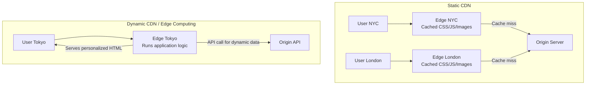
```mermaid
graph TD
    subgraph "Static CDN"
        U1[User NYC] --> E1[Edge NYC<br/>Cached CSS/JS/Images]
        U2[User London] --> E2[Edge London<br/>Cached CSS/JS/Images]
        E1 -->|Cache miss| Origin1[Origin Server]
        E2 -->|Cache miss| Origin1
    end

    subgraph "Dynamic CDN / Edge Computing"
        U3[User Tokyo] --> E3[Edge Tokyo<br/>Runs application logic]
        E3 -->|API call for dynamic data| Origin2[Origin API]
        E3 -->|Serves personalized HTML| U3
    end
```

**What to cache at the CDN:**

| Content Type       | Cacheable? | Typical TTL   | Notes                                   |
|-------------------|-----------|---------------|------------------------------------------|
| Images, fonts     | Yes       | 1 year        | Use content hashing for cache busting    |
| CSS, JavaScript   | Yes       | 1 year        | Use versioned filenames                  |
| HTML pages        | Sometimes | 5-60 seconds  | Only for non-personalized pages          |
| API responses     | Sometimes | 1-60 seconds  | Only for public, non-user-specific data  |
| Video/audio       | Yes       | 1 year        | HLS/DASH segments are immutable          |
| Personalized data | No        | N/A           | Must come from origin                    |

### CDN Invalidation

When cached content changes, it must be invalidated across all edge locations worldwide.

**Invalidation methods:**

1. **Purge by URL**: Invalidate a specific URL at all edge locations. Most CDNs complete this in 1-5 seconds globally.
2. **Purge by tag/surrogate key**: Tag cache entries with metadata (e.g., "product:1001"). Invalidate all entries with that tag in one API call.
3. **Versioned URLs (cache busting)**: Embed a version hash in the URL (e.g., `styles.a3f2b7c.css`). When the content changes, the URL changes, and the old URL naturally expires.
4. **Short TTL**: Set a short TTL (e.g., 30 seconds) so stale content is served for at most 30 seconds.

**Best practice:** Use versioned URLs for static assets (infinite TTL, zero invalidation needed) and tag-based purging for dynamic content.

### Multi-CDN Strategy

Large-scale systems use multiple CDN providers simultaneously for resilience, performance, and cost optimization.

**Why multi-CDN?**

- **Redundancy**: If one CDN has an outage, traffic routes to another.
- **Performance**: Different CDNs perform better in different geographies. A DNS-based routing layer directs users to the fastest CDN for their location.
- **Cost negotiation**: Competition between providers keeps pricing competitive.
- **Feature diversity**: One CDN may have better edge computing; another may have better video delivery.

**Multi-CDN routing approaches:**

1. **DNS-based**: A smart DNS resolver (e.g., NS1, Route53) returns the IP of the best CDN based on user location and CDN health.
2. **Client-side**: The client application measures latency to multiple CDN endpoints and selects the fastest.
3. **Origin-side**: The origin server decides which CDN to use for each response based on content type and user geography.

---

## 2.3 Lazy Loading

Lazy loading defers the initialization or loading of a resource until it is actually needed. This reduces initial load time, memory usage, and unnecessary work.

### Database Lazy Loading

**ORM lazy loading**: Relationships between database entities are not loaded until accessed. A query for a User does not load their Orders until `user.orders` is accessed.

```
Eager loading:
  SELECT * FROM users
  JOIN orders ON orders.user_id = users.id
  JOIN products ON products.id = orders.product_id
  WHERE users.id = 1001
  → Returns user + all orders + all products in ONE query
  → May load 500 rows when you only needed the user name

Lazy loading:
  SELECT * FROM users WHERE id = 1001  → Load user (1 query)
  ... later, if needed ...
  SELECT * FROM orders WHERE user_id = 1001  → Load orders (1 query)
  ... later, if needed ...
  SELECT * FROM products WHERE id IN (...)  → Load products (1 query)
```

**The N+1 query problem:**

Lazy loading can cause N+1 queries when iterating over a collection:

```
users = db.query("SELECT * FROM users LIMIT 100")  # 1 query
for user in users:
    orders = user.orders  # 100 queries (1 per user, lazy loaded)
# Total: 101 queries instead of 1-2 with eager loading
```

**When to use lazy loading vs eager loading:**

| Scenario                              | Lazy Loading | Eager Loading |
|---------------------------------------|-------------|--------------|
| Display user profile (no orders)      | Better       | Wastes data   |
| Display user + all their orders       | N+1 problem  | Better        |
| List 50 users (show names only)       | Better       | Wastes joins  |
| List 50 users with latest order each  | N+1 problem  | Better        |

### UI Lazy Loading

**Image lazy loading**: Images below the fold are not loaded until the user scrolls near them. The `loading="lazy"` HTML attribute implements this natively in modern browsers.

**Code splitting**: JavaScript bundles are split into chunks. Each route or feature loads its own chunk on demand rather than loading the entire application upfront.

```
Without code splitting:
  bundle.js (2.5 MB) → loads entirely on first page visit

With code splitting:
  main.js (200 KB)     → loads immediately
  dashboard.js (400 KB) → loads when user visits /dashboard
  settings.js (100 KB)  → loads when user visits /settings
  reports.js (800 KB)   → loads when user visits /reports
```

**Intersection Observer pattern**: A browser API that efficiently detects when elements enter or leave the viewport, enabling lazy loading of any content (images, components, data) as the user scrolls.

### Lazy Initialization

**Singleton lazy initialization**: A resource-heavy object (database connection pool, ML model, configuration) is not created until it is first requested.

```python
class DatabasePool:
    _instance = None

    @classmethod
    def get_instance(cls):
        if cls._instance is None:
            cls._instance = cls._create_pool()  # Expensive operation
        return cls._instance

    @classmethod
    def _create_pool(cls):
        # Takes 2-3 seconds to establish connections
        return ConnectionPool(host="db.example.com", size=20)
```

**Trade-off:** Lazy initialization reduces startup time but introduces latency on the first request. For latency-sensitive systems, prefer eager initialization during deployment with health checks that only pass after initialization completes.

---

## 2.4 Batching

Batching combines multiple individual operations into a single, larger operation. This amortizes fixed overhead (network round-trips, disk seeks, transaction setup) across many items.

### Write Batching

Instead of inserting rows one at a time, batch them into a single INSERT statement.

```sql
-- Unbatched: 1000 individual inserts (1000 round-trips)
INSERT INTO events (user_id, type, ts) VALUES (1, 'click', NOW());
INSERT INTO events (user_id, type, ts) VALUES (2, 'view', NOW());
-- ... 998 more ...

-- Batched: 1 insert with 1000 rows (1 round-trip)
INSERT INTO events (user_id, type, ts) VALUES
  (1, 'click', NOW()),
  (2, 'view', NOW()),
  -- ... 998 more ...
;
```

**Performance impact of write batching:**

| Batch Size | Rows/Second | Latency per Row | Network Round-Trips |
|-----------|-------------|----------------|---------------------|
| 1         | 500         | 2ms            | 1 per row           |
| 10        | 4,000       | 0.25ms         | 1 per 10 rows       |
| 100       | 25,000      | 0.04ms         | 1 per 100 rows      |
| 1000      | 80,000      | 0.012ms        | 1 per 1000 rows     |
| 10000     | 100,000     | 0.01ms         | 1 per 10000 rows    |

Note: Diminishing returns beyond batch sizes of 1000-5000. Very large batches can cause lock contention and memory pressure.

### Read Batching (DataLoader Pattern)

The DataLoader pattern, popularized by Facebook for GraphQL, collects individual read requests within a single execution frame and combines them into a batch query.

```
Without DataLoader:
  Request 1: SELECT * FROM users WHERE id = 1     → 1 query
  Request 2: SELECT * FROM users WHERE id = 5     → 1 query
  Request 3: SELECT * FROM users WHERE id = 12    → 1 query
  Request 4: SELECT * FROM users WHERE id = 5     → 1 query (duplicate!)
  Total: 4 queries

With DataLoader:
  Collected keys: [1, 5, 12]  (deduplicated)
  Single query: SELECT * FROM users WHERE id IN (1, 5, 12) → 1 query
  Total: 1 query
```

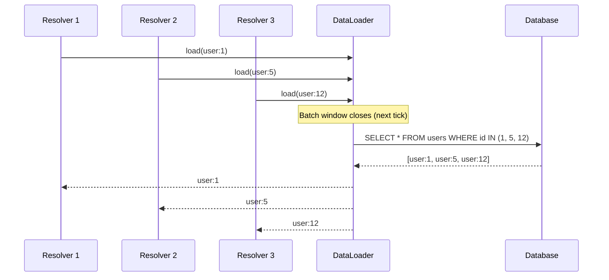
```mermaid
sequenceDiagram
    participant R1 as Resolver 1
    participant R2 as Resolver 2
    participant R3 as Resolver 3
    participant DL as DataLoader
    participant DB as Database

    R1->>DL: load(user:1)
    R2->>DL: load(user:5)
    R3->>DL: load(user:12)

    Note over DL: Batch window closes (next tick)

    DL->>DB: SELECT * FROM users WHERE id IN (1, 5, 12)
    DB-->>DL: [user:1, user:5, user:12]

    DL-->>R1: user:1
    DL-->>R2: user:5
    DL-->>R3: user:12
```

### Micro-Batching

Micro-batching processes data in small, frequent batches rather than one-at-a-time (streaming) or large infrequent batches.

**Comparison:**

| Approach       | Batch Size | Frequency   | Latency        | Throughput   |
|---------------|-----------|-------------|----------------|-------------|
| True streaming | 1 event   | Continuous  | Milliseconds   | Lower       |
| Micro-batch   | 100-10K   | Sub-second  | Sub-second     | High        |
| Batch          | 100K-10M  | Minutes-hours| Minutes-hours | Highest     |

**When to use micro-batching:**

- Log ingestion and analytics pipelines where sub-second latency is acceptable.
- Spark Structured Streaming uses micro-batching internally with batch intervals of 100ms to 1 second.
- Buffering writes to a data warehouse (e.g., collecting 1000 rows before flushing to S3/BigQuery).

### Batch vs Stream Trade-off

```
┌─────────────────────────────────────────────────────────────┐
│                 Batch vs Stream Spectrum                      │
│                                                               │
│  Pure Batch          Micro-Batch          Pure Stream         │
│  ◄────────────────────────────────────────────────────►       │
│                                                               │
│  MapReduce           Spark Streaming       Flink / Kafka      │
│  Hourly jobs         100ms-1s intervals    Event-by-event     │
│  Highest throughput  Balanced              Lowest latency     │
│  Hours of latency    Seconds of latency    Milliseconds       │
│  Simple to reason    Moderate complexity   Complex state mgmt │
│  Cheap compute       Moderate cost         Higher compute cost│
└─────────────────────────────────────────────────────────────┘
```

---

## 2.5 Connection Pooling

Creating a new database or HTTP connection for every request is expensive. Connection pooling maintains a set of pre-established connections that are reused across requests.

### Database Connection Pooling

**Cost of establishing a database connection:**

| Step                    | Time     |
|------------------------|----------|
| TCP handshake          | 0.5-1ms  |
| TLS handshake          | 2-5ms    |
| Authentication         | 1-2ms    |
| Connection setup       | 0.5-1ms  |
| **Total**              | **4-9ms** |

For a system processing 10,000 queries per second, creating a new connection for each query would add 40-90 seconds of cumulative connection overhead per second — clearly impossible.

**How connection pooling works:**

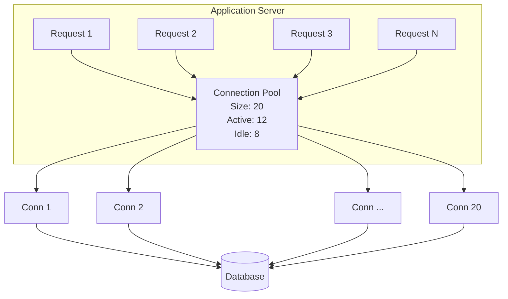
```mermaid
graph TD
    subgraph "Application Server"
        R1[Request 1] --> Pool[Connection Pool<br/>Size: 20<br/>Active: 12<br/>Idle: 8]
        R2[Request 2] --> Pool
        R3[Request 3] --> Pool
        RN[Request N] --> Pool
    end

    Pool --> C1[Conn 1] --> DB[(Database)]
    Pool --> C2[Conn 2] --> DB
    Pool --> C3[Conn ...] --> DB
    Pool --> C20[Conn 20] --> DB
```

**Pool sizing formula:**

The optimal pool size depends on the database's ability to handle concurrent queries. A common starting point:

```
pool_size = (num_cpu_cores * 2) + num_disk_spindles
```

For an SSD-backed database on a 4-core machine:
```
pool_size = (4 * 2) + 1 = 9
```

This is per application instance. With 10 application instances each having a pool of 10 connections, the database sees 100 concurrent connections.

**Connection pool parameters:**

| Parameter         | Description                                      | Typical Value   |
|-------------------|--------------------------------------------------|----------------|
| min_connections   | Minimum idle connections maintained               | 2-5            |
| max_connections   | Maximum total connections                         | 10-30          |
| idle_timeout      | Close idle connections after this duration         | 10-30 minutes  |
| max_lifetime      | Close connections after this duration regardless   | 30-60 minutes  |
| connection_timeout| Timeout for establishing a new connection         | 5-10 seconds   |
| checkout_timeout  | Timeout waiting for a connection from the pool    | 3-5 seconds    |
| validation_query  | Query to verify connection health                 | SELECT 1       |

**Common pitfall: connection exhaustion:**

If application code acquires a connection but fails to return it (e.g., due to an exception), the pool slowly drains. Eventually, all connections are in use, new requests cannot get a connection, and the application hangs.

**Prevention:**
- Always use try/finally or context managers to release connections.
- Set a checkout timeout so requests fail fast rather than hanging.
- Monitor pool utilization; alert if active connections exceed 80% of max.

### HTTP Connection Pooling

HTTP/1.1 connections are also expensive to establish. Connection pooling (keep-alive) reuses TCP connections for multiple HTTP requests.

```
Without pooling:
  Request 1: TCP handshake → TLS handshake → HTTP request → response → close
  Request 2: TCP handshake → TLS handshake → HTTP request → response → close
  Request 3: TCP handshake → TLS handshake → HTTP request → response → close

With pooling (keep-alive):
  Request 1: TCP handshake → TLS handshake → HTTP request → response (keep open)
  Request 2: HTTP request → response (reuse connection)
  Request 3: HTTP request → response (reuse connection)
```

**HTTP/2 multiplexing**: HTTP/2 allows multiple requests and responses to be multiplexed over a single TCP connection. This eliminates the head-of-line blocking problem of HTTP/1.1 pipelining and further reduces the need for multiple connections.

| Protocol | Connections per Host | Requests per Connection | Head-of-Line Blocking |
|----------|---------------------|------------------------|-----------------------|
| HTTP/1.0 | 1 per request       | 1                      | N/A                   |
| HTTP/1.1 | 6-8 (browser limit) | Many (keep-alive)      | Yes (pipelining)      |
| HTTP/2   | 1                   | Unlimited (multiplexed)| No (at HTTP level)    |
| HTTP/3   | 1                   | Unlimited (QUIC)       | No (even at transport)|

### Pool Sizing Under Load

**Capacity estimation:**

Your service makes calls to 3 downstream services, each with average latency of 50ms. Your service handles 5,000 RPS.

Concurrent outbound requests at any instant: 5,000 RPS * 0.05s = 250 concurrent requests per downstream.

With 10 application instances, each instance needs: 250 / 10 = 25 concurrent connections per downstream.

Add 20% headroom: 30 connections per downstream per instance.

Total connections from your service: 10 instances * 30 connections * 3 downstreams = 900 total outbound connections.

---

# Section 3: Load Handling

## 3.1 Rate Limiting

Rate limiting controls the number of requests a client can make within a given time period. It protects services from abuse, ensures fair usage, and prevents cascading failures.

### Token Bucket Algorithm

The token bucket is the most commonly used rate limiting algorithm. A bucket holds tokens, and each request consumes one token. Tokens are added at a fixed rate. If the bucket is empty, the request is rejected.

```
Token Bucket Parameters:
  - Bucket capacity (max burst): 100 tokens
  - Refill rate: 10 tokens/second

Timeline:
  T=0:   Bucket has 100 tokens
  T=0.1: 50 requests arrive → 50 tokens consumed → 50 remaining
  T=0.2: 60 requests arrive → 50 allowed, 10 rejected → 0 remaining + 1 refilled
  T=1.0: 8 more tokens refilled → 9 tokens available
  T=1.0: 20 requests arrive → 9 allowed, 11 rejected
```

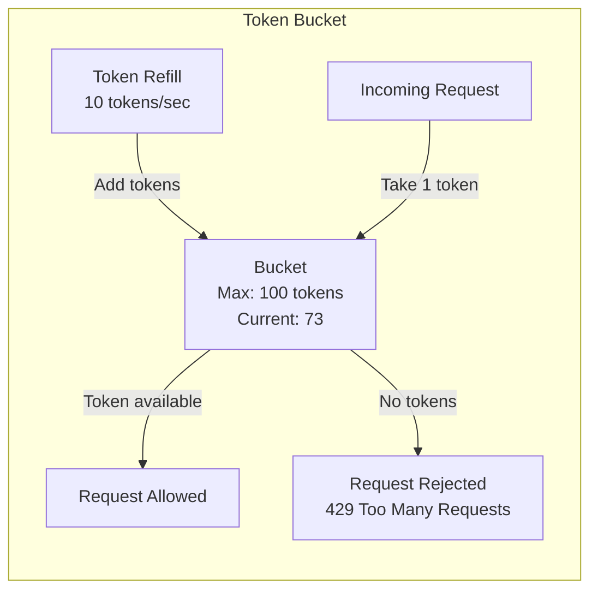
```mermaid
graph LR
    subgraph "Token Bucket"
        Refill[Token Refill<br/>10 tokens/sec] -->|Add tokens| Bucket[Bucket<br/>Max: 100 tokens<br/>Current: 73]
        Request[Incoming Request] -->|Take 1 token| Bucket
        Bucket -->|Token available| Allow[Request Allowed]
        Bucket -->|No tokens| Reject[Request Rejected<br/>429 Too Many Requests]
    end
```

**Advantages:**
- Allows bursts (up to bucket capacity) while enforcing average rate.
- Simple to implement.
- Memory efficient (one counter per bucket).

**Implementation:**

```python
class TokenBucket:
    def __init__(self, capacity, refill_rate):
        self.capacity = capacity
        self.tokens = capacity
        self.refill_rate = refill_rate  # tokens per second
        self.last_refill = time.time()

    def allow_request(self):
        now = time.time()
        elapsed = now - self.last_refill
        self.tokens = min(self.capacity, self.tokens + elapsed * self.refill_rate)
        self.last_refill = now

        if self.tokens >= 1:
            self.tokens -= 1
            return True
        return False
```

### Leaky Bucket Algorithm

The leaky bucket processes requests at a fixed rate. Incoming requests are added to a queue (bucket). If the queue is full, new requests are dropped. Requests are dequeued and processed at a constant rate.

```
Leaky Bucket:
  Queue capacity: 100 requests
  Drain rate: 10 requests/second

  Unlike token bucket, leaky bucket smooths out bursts.
  Even if 100 requests arrive at once, they are processed
  at exactly 10/second. No burst is allowed.
```

**Token Bucket vs Leaky Bucket:**

| Property              | Token Bucket           | Leaky Bucket            |
|----------------------|------------------------|-------------------------|
| Burst behavior       | Allows bursts          | Smooths bursts          |
| Output rate          | Variable (up to burst) | Constant                |
| Implementation       | Counter-based          | Queue-based             |
| Memory               | O(1)                   | O(queue_size)           |
| Best for             | API rate limiting      | Traffic shaping         |

### Sliding Window Algorithm

Combines the precision of fixed windows with the burst control of sliding windows.

**Fixed window counter:**
Divides time into fixed windows (e.g., 1-minute windows). Counts requests in the current window. Resets at window boundaries.

**Problem with fixed windows:** A burst at the boundary of two windows can exceed the intended rate. If the limit is 100 requests per minute, a client can send 100 requests at 11:59:59 and 100 more at 12:00:01, achieving 200 requests in 2 seconds.

**Sliding window log:** Stores the timestamp of every request. To check the limit, count timestamps within the last window duration.

**Sliding window counter:** A hybrid approach. Uses counters from the current and previous windows, weighted by the overlap.

```
Sliding Window Counter Example:
  Rate limit: 100 requests per minute
  Current window (12:01): 40 requests so far
  Previous window (12:00): 80 requests total
  Current position: 15 seconds into the 12:01 window

  Weighted count = 80 * (45/60) + 40 = 60 + 40 = 100
  → At the limit. Next request would be rejected.
```

### Distributed Rate Limiting

In a distributed system with multiple application servers, each server cannot independently track rate limits — a client could send requests to different servers and bypass per-server limits.

**Centralized approach (Redis):**

All servers check and increment a shared counter in Redis. This is the most common approach.

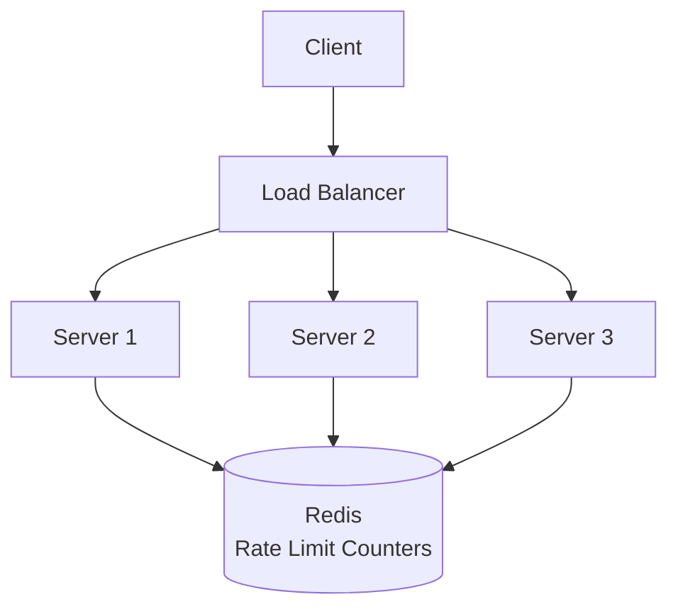
```mermaid
graph TD
    C[Client] --> LB[Load Balancer]
    LB --> S1[Server 1]
    LB --> S2[Server 2]
    LB --> S3[Server 3]

    S1 --> Redis[(Redis<br/>Rate Limit Counters)]
    S2 --> Redis
    S3 --> Redis
```

**Redis rate limiting with Lua script (atomic operation):**

```lua
-- Token bucket in Redis (atomic via Lua)
local key = KEYS[1]
local capacity = tonumber(ARGV[1])
local refill_rate = tonumber(ARGV[2])
local now = tonumber(ARGV[3])

local bucket = redis.call('hmget', key, 'tokens', 'last_refill')
local tokens = tonumber(bucket[1]) or capacity
local last_refill = tonumber(bucket[2]) or now

local elapsed = now - last_refill
tokens = math.min(capacity, tokens + elapsed * refill_rate)

if tokens >= 1 then
    tokens = tokens - 1
    redis.call('hmset', key, 'tokens', tokens, 'last_refill', now)
    redis.call('expire', key, 60)
    return 1  -- Allowed
else
    redis.call('hmset', key, 'tokens', tokens, 'last_refill', now)
    redis.call('expire', key, 60)
    return 0  -- Rejected
end
```

**Challenges of distributed rate limiting:**

- **Latency overhead**: Every request requires a Redis round-trip (0.5-2ms).
- **Redis as SPOF**: If Redis is down, rate limiting fails. Options: fail open (allow all) or fail closed (reject all).
- **Clock skew**: Servers with different clocks may compute windows differently. Use Redis server time, not local time.

### API Quota Management

Rate limiting operates at the request level. Quota management operates at a higher level — limiting total API usage per customer over longer periods (daily, monthly).

```
API Quota Tiers:

Tier     │ Rate Limit    │ Daily Quota   │ Monthly Quota
─────────┼───────────────┼───────────────┼──────────────
Free     │ 10 req/sec    │ 10,000        │ 100,000
Basic    │ 50 req/sec    │ 100,000       │ 1,000,000
Pro      │ 200 req/sec   │ 1,000,000     │ 10,000,000
Enterprise│ Custom        │ Custom        │ Custom
```

**Quota enforcement headers (standard practice):**

```
HTTP/1.1 200 OK
X-RateLimit-Limit: 50
X-RateLimit-Remaining: 42
X-RateLimit-Reset: 1679616000
X-Quota-Limit-Day: 100000
X-Quota-Remaining-Day: 87234
```

---

## 3.2 Load Balancing

A load balancer distributes incoming requests across multiple backend servers. It is the fundamental building block for horizontal scaling of stateless services.

### L4 vs L7 Load Balancing

**Layer 4 (Transport Layer):**

Operates at the TCP/UDP level. The load balancer sees source/destination IP addresses and ports but does not inspect the application-layer content (HTTP headers, URLs, cookies). It forwards raw TCP connections to backend servers.

**Layer 7 (Application Layer):**

Operates at the HTTP level. The load balancer inspects HTTP headers, URLs, cookies, and request bodies. It can make routing decisions based on content — e.g., sending `/api/*` to the API cluster and `/static/*` to the CDN origin.

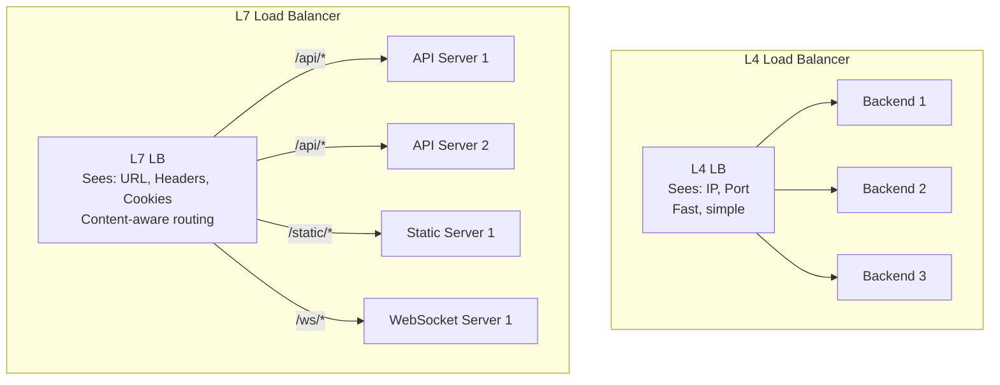
```mermaid
graph TD
    subgraph "L4 Load Balancer"
        L4[L4 LB<br/>Sees: IP, Port<br/>Fast, simple] --> B1[Backend 1]
        L4 --> B2[Backend 2]
        L4 --> B3[Backend 3]
    end

    subgraph "L7 Load Balancer"
        L7[L7 LB<br/>Sees: URL, Headers, Cookies<br/>Content-aware routing]
        L7 -->|/api/*| API1[API Server 1]
        L7 -->|/api/*| API2[API Server 2]
        L7 -->|/static/*| Static1[Static Server 1]
        L7 -->|/ws/*| WS1[WebSocket Server 1]
    end
```

**Comparison:**

| Property         | L4                          | L7                           |
|-----------------|-----------------------------|-------------------------------|
| OSI Layer       | Transport (TCP/UDP)          | Application (HTTP/HTTPS)      |
| Visibility      | IP, port                     | URL, headers, cookies, body   |
| Speed           | Faster (no content parsing)  | Slower (content inspection)   |
| SSL termination | Typically no (pass-through)  | Yes                           |
| Content routing | No                           | Yes                           |
| WebSocket       | Pass-through                 | Can inspect upgrade headers   |
| Sticky sessions | IP-based only                | Cookie-based possible         |
| Use case        | High-throughput TCP services  | HTTP APIs, web applications   |

### Load Balancing Algorithms

#### Round-Robin

Requests are distributed sequentially across backend servers. Server 1, then Server 2, then Server 3, then back to Server 1.

```
Request 1 → Server A
Request 2 → Server B
Request 3 → Server C
Request 4 → Server A
Request 5 → Server B
...
```

**Pros:** Simple, no state required, even distribution when servers are identical.
**Cons:** Ignores server load — a slow server gets the same share as a fast one.

#### Weighted Round-Robin

Each server has a weight proportional to its capacity. A server with weight 3 receives three times as many requests as a server with weight 1.

```
Weights: A=3, B=2, C=1
Request sequence: A, A, A, B, B, C, A, A, A, B, B, C, ...
```

**Use case:** When backend servers have heterogeneous hardware. A server with 16 cores gets weight 4; a server with 4 cores gets weight 1.

#### Least Connections

The request goes to the server with the fewest active connections. This naturally balances load when requests have variable processing times.

```
Server A: 15 active connections
Server B: 8 active connections
Server C: 22 active connections

New request → Server B (fewest connections)
```

**Pros:** Adapts to real-time server load. Handles slow requests well.
**Cons:** Requires tracking active connections at the load balancer.

#### Consistent Hashing (for Load Balancing)

The request is routed based on a hash of a key (e.g., client IP, user ID, request parameter). The same key always routes to the same server (unless servers are added/removed).

**Use case:** When you need session affinity without cookies, or when backend servers maintain per-client state (e.g., in-memory caches that benefit from request locality).

#### Least Response Time

The request goes to the server with the lowest recent average response time. Combines awareness of both load and server performance.

### Health Checks

The load balancer must detect unhealthy backends and stop routing traffic to them.

**Types of health checks:**

| Type       | Method                                    | Detects                    |
|-----------|-------------------------------------------|----------------------------|
| TCP       | Open TCP connection to port               | Server process is running   |
| HTTP      | GET /health returns 200                   | Application is responding   |
| Deep HTTP | GET /healthz checks DB, cache, deps      | All dependencies healthy    |
| gRPC      | gRPC health checking protocol             | gRPC service operational    |

**Health check parameters:**

```
interval: 10 seconds      (how often to check)
timeout: 5 seconds         (how long to wait for response)
healthy_threshold: 3       (consecutive passes to mark healthy)
unhealthy_threshold: 2     (consecutive failures to mark unhealthy)
```

**Graceful degradation:** When backends become unhealthy, the load balancer should implement circuit-breaking behavior. If all backends are unhealthy, serving a degraded response (cached, static) is often better than returning errors.

### Session Affinity (Sticky Sessions)

Some applications require that all requests from a given user go to the same backend server (e.g., because the server holds session state in memory).

**Methods:**

1. **Cookie-based**: The load balancer inserts a cookie identifying the backend server. Subsequent requests include this cookie.
2. **IP-based**: Hash the client IP to determine the backend. Simple but fails when clients share IPs (NAT, corporate proxies).
3. **Header-based**: Route based on a custom header (e.g., `X-Session-Id`).

**Why to avoid sticky sessions when possible:**

- Uneven load distribution (some users generate more traffic than others).
- Server failure loses all sessions pinned to that server.
- Scaling out is less effective (new servers do not receive existing sessions).
- Better alternative: externalize session state to Redis or a database.

---

## 3.3 Queue Buffering

Message queues decouple producers from consumers, absorb traffic spikes, and enable asynchronous processing. When a system cannot handle the incoming request rate synchronously, a queue buffers the excess.

### Back-Pressure

Back-pressure is a mechanism that slows down producers when consumers cannot keep up. Without back-pressure, queues grow unbounded, memory is exhausted, and the system crashes.

**Back-pressure strategies:**

1. **Bounded queues**: The queue has a maximum size. When full, producers are blocked or receive errors. This propagates pressure to the client.
2. **Drop policies**: When the queue is full, drop the oldest message (head), the newest message (tail), or a random message.
3. **Rate limiting producers**: Throttle the rate at which producers can enqueue messages.
4. **Load shedding**: Reject low-priority work to preserve capacity for high-priority work.

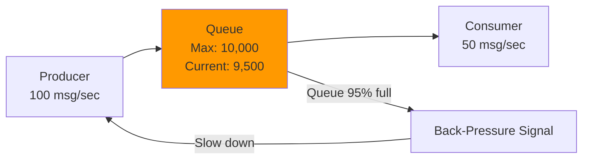
```mermaid
graph LR
    P[Producer<br/>100 msg/sec] --> Q[Queue<br/>Max: 10,000<br/>Current: 9,500]
    Q --> C[Consumer<br/>50 msg/sec]

    Q -->|Queue 95% full| BP[Back-Pressure Signal]
    BP -->|Slow down| P

    style Q fill:#ff9900
```

**Queue depth as a scaling signal:**

| Queue Depth    | Action                                    |
|---------------|-------------------------------------------|
| 0-1,000       | Normal operation                          |
| 1,000-5,000   | Warning: consumers falling behind         |
| 5,000-8,000   | Scale up consumers                        |
| 8,000-9,500   | Activate back-pressure on producers       |
| 9,500-10,000  | Critical: begin load shedding             |

### Priority Queues

Not all messages are equal. A priority queue processes high-priority messages before low-priority ones, even if low-priority messages arrived first.

**Implementation approaches:**

1. **Multiple queues**: Create separate queues for each priority level. Consumers drain the high-priority queue first.
2. **Single queue with priority field**: Messages include a priority field. The queue infrastructure reorders delivery by priority.
3. **Weighted consumers**: Assign more consumers to high-priority queues than low-priority ones.

```
Priority Queue Example:

High Priority Queue:    [Payment Processing] [Fraud Alert]
Medium Priority Queue:  [Order Confirmation] [Inventory Update]
Low Priority Queue:     [Analytics Event] [Email Notification] [Recommendation Update]

Consumer allocation:
  High:   8 consumers (guaranteed low latency)
  Medium: 4 consumers
  Low:    2 consumers (best-effort)
```

**Starvation prevention:** Without safeguards, low-priority messages may never be processed if high-priority messages keep arriving. Solutions:
- Age-based priority boost: Messages waiting longer than a threshold get promoted.
- Weighted fair queuing: Process N high-priority messages, then 1 low-priority message.
- Reserved capacity: Dedicate some consumers exclusively to low-priority work.

### Dead Letter Queues (DLQ)

When a message cannot be processed after multiple retries (e.g., due to a bug, invalid data, or dependency failure), it is moved to a dead letter queue for investigation.

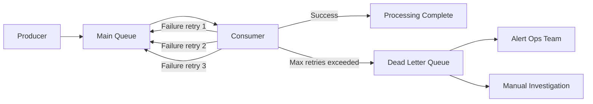
```mermaid
graph LR
    P[Producer] --> Q[Main Queue]
    Q --> C[Consumer]
    C -->|Success| Done[Processing Complete]
    C -->|Failure retry 1| Q
    C -->|Failure retry 2| Q
    C -->|Failure retry 3| Q
    C -->|Max retries exceeded| DLQ[Dead Letter Queue]
    DLQ --> Alert[Alert Ops Team]
    DLQ --> Manual[Manual Investigation]
```

**DLQ configuration:**

```
Main Queue:
  max_receive_count: 3        (max retries before DLQ)
  visibility_timeout: 30s      (time to process before re-delivery)
  message_retention: 7 days

Dead Letter Queue:
  message_retention: 14 days   (longer for investigation)
  alert_threshold: 100 messages
  alarm_on_non_empty: true
```

**DLQ best practices:**

- Always configure a DLQ for production queues. Without one, poison messages block the queue forever.
- Include metadata (original queue, failure count, error message) in DLQ messages.
- Set up alerts when messages arrive in the DLQ.
- Build tooling to replay DLQ messages back to the main queue after fixing the issue.
- Monitor DLQ depth as a key operational metric.

### Consumer Lag

Consumer lag is the difference between the latest message produced and the latest message consumed. It indicates how far behind consumers are.

```
Kafka Consumer Lag Example:

Topic: orders
Partition 0: Latest offset = 1,000,000 | Consumer offset = 999,500 | Lag = 500
Partition 1: Latest offset = 1,200,000 | Consumer offset = 1,100,000 | Lag = 100,000
Partition 2: Latest offset = 900,000   | Consumer offset = 899,000   | Lag = 1,000

Total lag: 101,500 messages
At production rate of 1,000 msg/sec → ~101 seconds behind real-time
```

**Consumer lag thresholds:**

| Lag (messages)  | Lag (time at 1K/sec) | Severity  | Action                            |
|----------------|---------------------|-----------|-----------------------------------|
| 0-1,000        | 0-1 second          | Normal    | No action                         |
| 1,000-10,000   | 1-10 seconds        | Warning   | Monitor closely                   |
| 10,000-100,000 | 10s - 2 minutes     | High      | Scale consumers, investigate       |
| 100,000+       | 2+ minutes          | Critical  | Emergency scaling, check for stuck consumers |

---

## 3.4 Auto-Scaling

Auto-scaling automatically adjusts the number of running instances based on current demand. It ensures that the system has enough capacity during traffic spikes without paying for idle resources during quiet periods.

### Reactive vs Predictive Auto-Scaling

**Reactive auto-scaling:**

Responds to current metrics. When CPU exceeds 70%, add instances. When CPU drops below 30%, remove instances.

```
Reactive Scaling Timeline:

T=0:    Traffic spike begins. 2 instances running.
T=30s:  CloudWatch detects CPU > 70%.
T=60s:  Alarm triggers. Scale-up policy activates.
T=90s:  New instance launched (AMI boot).
T=150s: Instance passes health check. Receives traffic.

Total response time: ~150 seconds from spike to additional capacity.
During these 150 seconds, existing instances are overloaded.
```

**Predictive auto-scaling:**

Uses historical patterns and machine learning to anticipate demand. AWS Predictive Scaling and GCP Predictive Autoscaling analyze past traffic patterns and scale proactively.

```
Predictive Scaling Timeline:

T=-300s: Predictive model forecasts traffic spike (based on historical pattern).
T=-120s: Pre-scaling: new instances launched.
T=-30s:  New instances pass health check. Ready for traffic.
T=0:     Traffic spike begins. Capacity already available.

Total response time: 0 seconds from spike to additional capacity.
```

**Comparison:**

| Property          | Reactive                    | Predictive                    |
|-------------------|-----------------------------|-------------------------------|
| Response time     | Minutes                     | Pre-emptive (zero lag)        |
| Cost              | Lower (scales after need)   | Slightly higher (scales early)|
| Handles surprises | Yes (if not overwhelming)   | No (only predicted patterns)  |
| Handles patterns  | Poorly (always chasing)     | Well (learns daily/weekly)    |
| Setup complexity  | Low                         | Medium                        |
| Best for          | Unpredictable workloads     | Cyclic/periodic workloads     |

### Scaling Policies

**Target tracking:**

Maintain a target value for a metric. The auto-scaler adjusts instances to keep the metric at the target.

```
Target Tracking Example:
  Metric: Average CPU utilization
  Target: 60%
  Current instances: 4
  Current CPU: 85%

  Auto-scaler calculates: need 4 * (85/60) ≈ 6 instances
  Action: Launch 2 additional instances
```

**Step scaling:**

Define step adjustments based on metric thresholds.

```
Step Scaling Policy:
  CPU 60-70%:  Add 1 instance
  CPU 70-80%:  Add 2 instances
  CPU 80-90%:  Add 3 instances
  CPU > 90%:   Add 5 instances

  CPU 40-50%:  Remove 1 instance
  CPU 30-40%:  Remove 2 instances
  CPU < 30%:   Remove 3 instances
```

**Scheduled scaling:**

Pre-configure capacity for known traffic patterns.

```
Scheduled Scaling:
  Weekdays 8 AM:   Scale to 10 instances (business hours begin)
  Weekdays 6 PM:   Scale to 4 instances (business hours end)
  Weekends:        Scale to 2 instances
  Black Friday:    Scale to 50 instances (known sale event)
```

### Cool-Down Periods

After a scaling event, a cool-down period prevents additional scaling actions. This prevents oscillation — rapidly scaling up and down as metrics fluctuate around thresholds.

```
Without cool-down:
  T=0:   CPU=85% → Scale up (4→6 instances)
  T=30s: CPU=45% → Scale down (6→4 instances)   ← New instances barely started
  T=60s: CPU=90% → Scale up (4→7 instances)
  T=90s: CPU=40% → Scale down (7→4 instances)
  → Thrashing: instances constantly launching and terminating

With cool-down (300 seconds):
  T=0:    CPU=85% → Scale up (4→6 instances)
  T=30s:  CPU=45% → Cool-down active, no action
  T=60s:  CPU=55% → Cool-down active, no action
  T=300s: CPU=58% → Cool-down ended, evaluate: stable, no action
  → Stable: instances have time to absorb load
```

**Recommended cool-down values:**

| Scaling Direction | Cool-Down Duration | Rationale                                    |
|------------------|-------------------|----------------------------------------------|
| Scale up         | 180-300 seconds    | Allow new instances to warm up and absorb load|
| Scale down       | 300-600 seconds    | Ensure traffic is truly declining             |

### Cost Optimization

Auto-scaling is not just about capacity — it is also about cost. Running 20 instances when 5 would suffice wastes money.

**Strategies:**

1. **Spot/Preemptible instances**: Use discounted instances for fault-tolerant workloads. Spot instances are 60-90% cheaper than on-demand.

2. **Mixed instance types**: Use a mix of on-demand (for base load) and spot (for bursts).

```
Mixed Instance Strategy:

Base load (always needed):
  4 on-demand instances (guaranteed availability)
  Cost: 4 × $0.10/hr = $0.40/hr

Burst capacity (variable):
  0-16 spot instances (based on demand)
  Cost: 0-16 × $0.03/hr = $0.00-$0.48/hr

Total range: $0.40 - $0.88/hr
vs. 20 on-demand: $2.00/hr
Savings: 56-80%
```

3. **Right-sizing**: Monitor actual resource usage and select instance types that match workload characteristics. A memory-intensive workload on compute-optimized instances wastes CPU budget.

4. **Scale-to-zero**: For infrequent workloads, scale to zero instances when there is no traffic. Serverless platforms (Lambda, Cloud Run) implement this inherently.

```mermaid
graph TD
    subgraph "Auto-Scaling Architecture"
        Metrics[CloudWatch / Prometheus<br/>Metrics Collection]
        Metrics --> ASG[Auto-Scaling Group<br/>Policy Engine]
        ASG -->|Scale Up| Launch[Launch New Instances]
        ASG -->|Scale Down| Terminate[Terminate Idle Instances]

        Launch --> LB[Load Balancer]
        Terminate --> LB

        LB --> I1[Instance 1]
        LB --> I2[Instance 2]
        LB --> I3[Instance 3]
        LB --> IN[Instance N]

        I1 --> Metrics
        I2 --> Metrics
        I3 --> Metrics
        IN --> Metrics
    end
```

**Capacity estimation for auto-scaling:**

Your service handles 10,000 RPS per instance at 60% CPU. Steady-state traffic is 30,000 RPS. Peak traffic reaches 120,000 RPS for 2 hours daily.

Base capacity: 30,000 / 10,000 = 3 instances at 60% → 4 instances (with headroom)
Peak capacity: 120,000 / 10,000 = 12 instances at 60% → 15 instances (with headroom)

On-demand cost (15 instances, 24/7): 15 * $0.10/hr * 720 hrs = $1,080/month
Auto-scaled cost (4 base + 11 peak for 2 hours): (4 * 720 + 11 * 60) * $0.10 = $354/month
**Savings: 67%**

---

# Cross-Cutting Concerns

## Monitoring and Observability for Scalability

Effective scaling requires comprehensive observability. Without metrics, you are scaling blind.

**Key metrics to monitor:**

| Category        | Metric                          | Alert Threshold        |
|----------------|--------------------------------|------------------------|
| Latency        | P50, P95, P99 response time    | P99 > 500ms           |
| Throughput     | Requests per second             | Sudden drop > 30%      |
| Error rate     | 5xx responses / total responses | > 1%                   |
| Saturation     | CPU utilization                 | > 80% sustained        |
| Saturation     | Memory utilization              | > 85%                  |
| Saturation     | Disk I/O utilization            | > 70%                  |
| Queue          | Queue depth                     | > 10,000 messages      |
| Queue          | Consumer lag                    | > 60 seconds           |
| Cache          | Cache hit ratio                 | < 90%                  |
| Cache          | Cache eviction rate             | Sudden spike           |
| Database       | Connection pool utilization     | > 80%                  |
| Database       | Replication lag                 | > 5 seconds            |
| Scaling        | Instance count                  | At max capacity        |

**The Four Golden Signals (Google SRE):**

1. **Latency**: The time it takes to service a request.
2. **Traffic**: How much demand is being placed on the system.
3. **Errors**: The rate of requests that fail.
4. **Saturation**: How "full" the system is (most constrained resource).

## Capacity Planning

Capacity planning is the process of determining what resources are needed to meet future demand.

**Capacity planning formula:**

```
Required capacity = (Expected peak traffic × Safety margin) / Per-instance capacity

Example:
  Expected peak: 200,000 RPS (based on growth projection)
  Safety margin: 1.5x (50% headroom for unexpected spikes)
  Per-instance capacity: 8,000 RPS (measured via load testing)

  Required instances = (200,000 × 1.5) / 8,000 = 37.5 → 38 instances
```

**Growth projection:**

| Quarter | Traffic (RPS) | Growth Rate | Required Instances | Monthly Cost |
|---------|-------------|------------|-------------------|-------------|
| Q1 2026 | 50,000      | —          | 10                | $720        |
| Q2 2026 | 75,000      | 50%        | 15                | $1,080      |
| Q3 2026 | 110,000     | 47%        | 21                | $1,512      |
| Q4 2026 | 160,000     | 45%        | 30                | $2,160      |
| Q1 2027 | 230,000     | 44%        | 44                | $3,168      |

---

## Architectural Decision Records

### ARD 1: Caching Layer Selection

**Context:** The application reads the same product data 10,000 times per second. The database is at 85% CPU. Response times have doubled in the past month.

**Options considered:**

| Option                    | Pros                                          | Cons                                          |
|--------------------------|-----------------------------------------------|-----------------------------------------------|
| A: Redis (cache-aside)   | Simple, flexible, team has experience          | Requires cache invalidation logic             |
| B: Memcached             | Higher throughput for simple key-value          | No data structures, no persistence            |
| C: Application-level cache| Zero network latency, simplest                | Not shared across instances, cold starts      |
| D: Read-through proxy    | Clean application code                         | Additional infrastructure, less flexibility   |

**Decision:** Option A (Redis with cache-aside) with L1 application-level caching for hot keys.

**Rationale:** Redis provides the best balance of performance, features (data structures, TTL, pub/sub for invalidation), and operational familiarity. L1 caching on hot keys addresses the 80/20 rule where 20% of products account for 80% of reads.

### ARD 2: Load Balancing Strategy

**Context:** The platform is expanding from single-region to multi-region. Need to route users to the nearest region while maintaining session affinity within a region.

**Options considered:**

| Option                           | Pros                                  | Cons                                    |
|---------------------------------|---------------------------------------|------------------------------------------|
| A: DNS-based (GeoDNS)          | Simple, no infrastructure required     | Slow failover (DNS TTL), coarse routing  |
| B: Global L7 LB (CloudFront + ALB)| Content-aware routing, fast failover | Higher cost, complexity                  |
| C: Anycast + L4 LB             | Fastest routing, transparent to client | No content-aware routing                 |

**Decision:** Option B (Global L7 load balancing) with CloudFront for static assets and ALB per region for API traffic.

**Rationale:** Content-aware routing is needed to route API traffic differently from static assets. Fast failover (seconds, not minutes) is critical for the 99.95% SLA. The cost increase is justified by the SLA requirement.

### ARD 3: Sharding Strategy for Orders Table

**Context:** The orders table has 800M rows and is growing at 2M rows per day. Single-node PostgreSQL cannot sustain the write load during peak hours.

**Options considered:**

| Option                        | Pros                                           | Cons                                          |
|------------------------------|------------------------------------------------|-----------------------------------------------|
| A: Hash on order_id          | Even write distribution                         | User queries require scatter-gather           |
| B: Hash on customer_id      | User queries are single-shard                   | Whale customers create hotspots               |
| C: Range on created_at      | Time queries efficient, old data archivable      | Current partition always hot                  |
| D: Vitess or CockroachDB    | Managed sharding, less operational burden        | Migration risk, new technology for team       |

**Decision:** Option B with compound shard key (customer_id, order_date) and dedicated shards for whale accounts.

**Rationale:** 92% of order queries are filtered by customer_id. The compound key enables efficient pruning for date-range queries within a customer. Whale accounts (>100K orders) are identified and assigned to dedicated shards with higher resource allocation.

---

## Interview Angle

### How Interviewers Evaluate Scalability Knowledge

**Junior level (0-3 years):**
- Can explain the difference between vertical and horizontal scaling.
- Knows what a load balancer does.
- Can describe basic caching (cache-aside with Redis).
- Understands why databases become bottlenecks.

**Mid level (3-7 years):**
- Can design a sharding strategy for a specific use case, including shard key selection.
- Understands replication topologies and their consistency trade-offs.
- Can explain cache invalidation strategies and the thundering herd problem.
- Knows L4 vs L7 load balancing and can choose the right algorithm.
- Can size connection pools and cache memory.

**Senior level (7+ years):**
- Can design a multi-region scaling strategy with data replication across regions.
- Understands the operational implications of resharding and can plan an online migration.
- Can reason about cost curves and make trade-off decisions between scaling strategies.
- Knows when to use back-pressure vs load shedding vs auto-scaling.
- Can perform capacity planning with growth projections and cost analysis.

### Common Interview Mistakes

1. **Jumping to sharding immediately**: Always exhaust simpler options first (indexing, caching, read replicas, vertical scaling). Sharding is a last resort due to its operational complexity.

2. **Ignoring the read/write ratio**: A 99:1 read-heavy workload benefits enormously from caching and read replicas. Sharding the write path may be unnecessary.

3. **Forgetting about data locality**: Sharding by user_id is great for user queries but terrible for "show all orders in the last hour" queries.

4. **Not considering failure modes**: "We add more instances" — what happens when an instance fails? How does the load balancer detect it? What about in-flight requests?

5. **Over-engineering**: Not every system needs consistent hashing, multi-tier caching, and predictive auto-scaling. Match the solution to the problem scale.

### Interview Strategy

When asked about scaling in an interview:

1. **Clarify the bottleneck**: Is it CPU, memory, I/O, network, or database? The solution depends on the constraint.
2. **Quantify the load**: How many RPS? How much data? What is the growth rate?
3. **Start simple**: Propose the simplest solution that works. Only add complexity when you explain why the simple approach fails.
4. **Show trade-offs**: Every scaling decision has costs. Demonstrate that you understand them.
5. **Think about operations**: How do you monitor it? How do you roll back? What happens at 3 AM when it breaks?

---

## Common Pitfalls and Anti-Patterns

### Premature Optimization

**Anti-pattern:** Building a 16-shard, multi-region, auto-scaling architecture for a system that serves 100 users.

**Why it is harmful:** Over-engineering increases development time, operational complexity, and cost. The system becomes harder to change because every modification must account for distributed behavior.

**Guideline:** Design for 10x current load. Plan for 100x. Build for 1x-10x. When you reach 10x, re-evaluate.

### Distributed Monolith

**Anti-pattern:** Splitting a monolith into microservices but keeping a single shared database. Each service makes direct database queries, creating tight coupling.

**Why it is harmful:** You get the complexity of distributed systems (network failures, partial outages, deployment coordination) without the benefits (independent scaling, isolation, autonomy).

### Cache Stampede Without Protection

**Anti-pattern:** Caching a popular item with a fixed TTL and no stampede protection. When the TTL expires, thousands of requests simultaneously query the database.

**Why it is harmful:** Can take down the database and cascade to a full outage. Especially dangerous for items that are both popular and expensive to compute.

### Unbounded Queues

**Anti-pattern:** Using an unbounded queue between a producer and consumer without monitoring or back-pressure. When the consumer falls behind, the queue grows until memory is exhausted.

**Why it is harmful:** The system appears healthy (no errors) until it suddenly crashes. Memory exhaustion is one of the hardest failures to recover from gracefully.

### Single-Threaded Bottleneck

**Anti-pattern:** A horizontally scaled system with a single-threaded component that serializes all work (e.g., a single Redis instance used for distributed locking with no partitioning).

**Why it is harmful:** The single-threaded component becomes the ceiling for the entire system's throughput, regardless of how many instances you add.

---

## Benchmark Reference Data

### Database Performance Benchmarks

| Database       | Reads/sec (single node) | Writes/sec (single node) | Max Dataset (recommended) |
|---------------|------------------------|--------------------------|---------------------------|
| PostgreSQL    | 50,000-100,000         | 10,000-30,000            | 1-5 TB                   |
| MySQL         | 50,000-100,000         | 10,000-30,000            | 1-5 TB                   |
| Redis         | 100,000-500,000        | 100,000-500,000          | 25-100 GB (memory)       |
| Cassandra     | 20,000-50,000          | 20,000-50,000            | 1-5 TB per node          |
| MongoDB       | 50,000-100,000         | 10,000-30,000            | 1-5 TB                   |
| DynamoDB      | Unlimited (provisioned) | Unlimited (provisioned)  | Unlimited                 |

*Note: These are rough order-of-magnitude benchmarks. Actual performance varies significantly based on hardware, data model, query complexity, and configuration.*

### Network Latency Benchmarks

| Path                              | Typical Latency     |
|----------------------------------|---------------------|
| L1 cache access                  | 0.5 ns              |
| L2 cache access                  | 7 ns                |
| RAM access                       | 100 ns              |
| SSD random read                  | 16 us               |
| HDD random read                  | 2-10 ms             |
| Same datacenter round-trip       | 0.5-1 ms            |
| Same region (cross-AZ)           | 1-2 ms              |
| US East ↔ US West                | 40-70 ms            |
| US ↔ Europe                      | 70-120 ms           |
| US ↔ Asia                        | 150-250 ms          |
| TCP connection setup             | 1 RTT (~1ms same DC)|
| TLS handshake                    | 2 RTTs (~2ms same DC)|

### Throughput Benchmarks

| Component              | Typical Throughput                    |
|-----------------------|---------------------------------------|
| Nginx (static)        | 100,000+ RPS                         |
| Node.js (API)         | 10,000-30,000 RPS                    |
| Go (API)              | 50,000-100,000 RPS                   |
| Java/Spring (API)     | 20,000-50,000 RPS                    |
| PostgreSQL (reads)    | 50,000-100,000 QPS                   |
| Redis (reads)         | 100,000-500,000 OPS                  |
| Kafka (per partition) | 10,000-100,000 msg/sec               |
| SSD sequential write  | 500 MB/sec - 3 GB/sec                |
| 10 Gbps network       | ~1.2 GB/sec theoretical              |

---

## Practice Questions

### Fundamentals (Questions 1-5)

**Question 1:** A social media platform has 10 million daily active users. Each user generates an average of 20 API requests per day. The current single server handles 5,000 RPS at 50% CPU utilization. How would you scale this system?

*Approach:* Calculate total RPS: 10M * 20 / 86,400 ≈ 2,315 RPS average. Peak is typically 3-5x average: ~10,000 RPS peak. A single server at 5,000 RPS / 50% CPU can handle 10,000 RPS at 100% (risky). Minimum 2 servers for redundancy, recommend 3-4 for headroom. Start with horizontal scaling of stateless API servers behind a load balancer with round-robin.

**Question 2:** Your PostgreSQL database has grown to 2TB. Read latency has degraded from 5ms to 50ms. The read-to-write ratio is 95:5. What steps would you take, in order of complexity?

*Approach:* 1) Add indexes for slow queries. 2) Add a Redis cache for frequently read data (95% reads → huge cache benefit). 3) Add read replicas (2-3) and route reads to replicas. 4) Vertical scaling of the primary (more RAM for buffer pool). 5) Consider sharding only if these steps are insufficient.

**Question 3:** Explain the difference between horizontal partitioning, vertical partitioning, and functional partitioning. For each, give a scenario where it is the best choice.

*Key points:* Horizontal splits rows (best for large tables with even access patterns like user data). Vertical splits columns (best for tables with hot and cold columns like user profiles with large bio fields). Functional splits by domain (best for microservices where each service owns its data like separate DBs for users, orders, and products).

**Question 4:** A cache with a 5-minute TTL serves 50,000 reads per second for a popular product page. At TTL expiry, all requests simultaneously hit the database. Describe three ways to prevent this thundering herd.

*Key points:* 1) Stampede lock — only one request queries DB on miss, others wait. 2) Stale-while-revalidate — serve expired data while one request refreshes in background. 3) Probabilistic early refresh — each request has a small chance of refreshing before TTL, spreading the refresh over time. 4) Pre-warming — background job refreshes popular keys before TTL.

**Question 5:** Your API has a rate limit of 100 requests per second per user. Describe how you would implement this in a distributed system with 10 application servers.

*Key points:* Use centralized rate limiting with Redis. Implement token bucket using a Lua script for atomicity. Each request checks Redis before proceeding. Handle Redis failures with a policy decision (fail-open or fail-closed). Consider local rate limiting as a first line of defense to reduce Redis load.

### Intermediate (Questions 6-10)

**Question 6:** Design a sharding strategy for a messaging application where users need to read their own messages and also read messages in group chats. What shard key would you choose and why?

*Approach:* Shard by user_id for personal messages (each user's inbox on one shard). For group messages, store a copy in each participant's shard (fan-out on write) or use a separate group-sharded store (fan-out on read). Trade-off: write amplification vs read scatter-gather. If groups are small (<100 members), fan-out on write is preferred because reads are far more frequent than writes.

**Question 7:** Your system uses leader-follower replication with asynchronous replication. A user writes a post and immediately refreshes the page, but does not see their post. Explain why this happens and how to fix it.

*Approach:* This is a read-your-own-writes violation. The write goes to the leader, but the read is routed to a follower that has not yet received the replication update. Fixes: 1) Route the user's reads to the leader for T seconds after a write. 2) Track the user's last write timestamp and only read from followers that have caught up past that timestamp. 3) Use semi-synchronous replication to reduce lag.

**Question 8:** Compare token bucket and sliding window rate limiting for an API that serves both bursty mobile clients and steady server-to-server integrations.

*Approach:* Token bucket allows bursts up to bucket capacity, which suits mobile clients that may be offline and then send a burst of requests. Sliding window provides more predictable rate enforcement, better for server-to-server integrations where steady throughput matters. Recommendation: use token bucket for mobile clients (higher burst tolerance) and sliding window for server-to-server (tighter control). Implement per-client-type configurations.

**Question 9:** Your team is debating between L4 and L7 load balancing for a system that serves both HTTP APIs and WebSocket connections. What would you recommend?

*Approach:* Use L7 for HTTP APIs (content-aware routing, path-based routing, header inspection, SSL termination) and L4 for WebSocket connections (lower overhead for long-lived connections, no need to inspect frames). Many modern load balancers (ALB, Envoy) handle both. You could use a single L7 LB that routes HTTP normally and upgrades WebSocket connections to pass-through mode.

**Question 10:** A flash sale is expected to bring 50x normal traffic for 30 minutes. The current system handles normal traffic with 10 instances. How would you prepare?

*Approach:* 1) Pre-scale to 500 instances (50x) before the event — do not rely on auto-scaling during the burst. 2) Pre-warm caches with sale item data. 3) Implement queue buffering for order processing to absorb the write spike. 4) Rate limit non-essential endpoints (search, recommendations) during the sale. 5) Use CDN for static content to offload the origin. 6) Set up a virtual waiting room / queue system to throttle concurrent checkout sessions. 7) Load test at 50x before the event.

### Advanced (Questions 11-15)

**Question 11:** You are migrating a monolithic database to a sharded architecture with zero downtime. Describe the step-by-step process, including how you handle the transition period.

*Approach:* 1) Set up new shard cluster alongside the monolith. 2) Implement dual-write: every write goes to both the monolith and the new shards. 3) Run a background migration job to copy historical data from the monolith to shards. 4) Verify data consistency between monolith and shards (checksums, row counts, sample comparisons). 5) Gradually shift reads from monolith to shards (canary, then percentage rollout). 6) Monitor for data inconsistencies and latency regressions. 7) Once 100% of reads are on shards and verified, stop dual-writes to monolith. 8) Decommission monolith after observation period. Key risks: data divergence during dual-write, ordering issues, and the need for a rollback plan at every stage.

**Question 12:** Design a multi-region caching strategy for a global e-commerce platform. Consider cache consistency, invalidation across regions, and user experience during region failover.

*Approach:* Each region has its own Redis cluster (L2 cache). Writes happen in the primary region and propagate to other regions via cross-region replication (Redis Streams or a custom event bus). Cache invalidation events are published to all regions via a global event bus (Kafka with cross-region replication). During region failover, users are routed to the nearest healthy region. The new region's cache may be cold for some data — implement stale-while-revalidate to serve slightly old data while warming. Set shorter TTLs for price/inventory data (30-60 seconds) and longer TTLs for product descriptions (5-15 minutes). Accept eventual consistency for cache data with a bound of TTL.

**Question 13:** Your system has a write-heavy workload (80% writes, 20% reads) with strong consistency requirements. Standard sharding with read replicas does not help because reads must see the latest writes. How would you scale this system?

*Approach:* 1) Vertical scaling of the primary database as far as economically viable. 2) Write-optimized sharding — shard by the write key to distribute write load. 3) Use synchronous replication with a quorum write (W=2, R=2, N=3) for strong consistency. 4) Batch writes to amortize per-write overhead. 5) Use an append-only data model (event sourcing) to convert random writes to sequential writes, which are much faster on SSDs. 6) Consider a write-optimized database (Cassandra for write-heavy, or TiDB/CockroachDB for distributed SQL with strong consistency). 7) Use write-behind caching cautiously — it reduces write latency but risks data loss.

**Question 14:** You need to implement distributed rate limiting that handles 1 million requests per second with sub-millisecond overhead. A single Redis instance cannot handle this throughput. How do you design it?

*Approach:* 1) Local rate limiting first: each application instance maintains a local token bucket that allows `(global_limit / num_instances)` requests per second. This handles 90% of cases with zero network overhead. 2) Periodic sync: every 1-5 seconds, instances report their local counts to a central coordinator and adjust their local limits based on actual distribution. 3) Sharded Redis: partition rate limit counters across multiple Redis instances by client_id hash. 4) Approximate counting: accept small inaccuracies (allow 5% over-limit) in exchange for lower coordination overhead. 5) Hierarchical limiting: local limits at the instance level, regional limits at the cluster level, global limits coordinated asynchronously.

**Question 15:** Design a comprehensive auto-scaling strategy for a microservices platform with 50 services, each with different scaling characteristics. Some are CPU-bound, some are memory-bound, some are I/O-bound, and some scale based on queue depth.

*Approach:* 1) Classify each service by its scaling dimension: CPU (compute workers), memory (in-memory cache services), I/O (database proxy), queue (async workers). 2) Define per-service scaling policies: CPU-bound services use target-tracking on CPU. Memory-bound services scale on memory utilization. Queue-based services scale on queue depth / consumer lag. I/O-bound services scale on network or disk metrics. 3) Use predictive scaling for services with predictable daily patterns. 4) Implement scale-to-zero for infrequent services (nightly batch jobs, low-traffic admin APIs). 5) Set per-service min/max bounds to prevent runaway scaling (cost protection) and ensure minimum availability. 6) Use horizontal pod autoscaler (HPA) in Kubernetes with custom metrics. 7) Implement a platform-wide cost dashboard that shows per-service scaling costs and efficiency ratios (requests served per dollar).

---

## Deep Dive: Scaling Real-World Workloads

### Scaling a Read-Heavy System (E-Commerce Product Catalog)

**Scenario:** An e-commerce product catalog with 50 million products. Traffic: 100,000 product page views per second during peak. The product data is updated 500 times per second (price changes, inventory updates). Average product payload is 8KB.

**Step-by-step scaling approach:**

**Step 1 — Vertical scaling of the primary database:**

Start with the largest practical PostgreSQL instance (64 vCPUs, 512GB RAM). With a 50M row product table at ~400GB, the entire hot dataset fits in RAM. This handles ~80,000 reads/sec and 500 writes/sec comfortably.

Cost: ~$8,000/month.

**Step 2 — Add a caching layer:**

Deploy Redis with 64GB RAM. Cache the top 5 million most-viewed products (40GB at 8KB each). With a 95% cache hit rate, database reads drop from 100,000 to 5,000 per second.

```
Before cache:
  Database load: 100,000 reads/sec + 500 writes/sec
  Database CPU: 95% (critical)

After cache (95% hit rate):
  Cache serves: 95,000 reads/sec
  Database load: 5,000 reads/sec + 500 writes/sec
  Database CPU: 15% (comfortable)
```

Cost: ~$500/month for Redis. Total: $8,500/month.

**Step 3 — Add read replicas:**

Even with caching, a cache failure or invalidation storm could flood the database. Add 2 read replicas.

```
With 2 read replicas:
  Primary: handles all writes (500/sec) + overflow reads
  Replica 1: handles 2,500 reads/sec (cache misses, region A)
  Replica 2: handles 2,500 reads/sec (cache misses, region B)
  Total read capacity: ~250,000 reads/sec (database tier)
```

Cost: ~$16,000/month for primary + 2 replicas. Total: $16,500/month.

**Step 4 — Add CDN for static product data:**

Product images, descriptions, and specifications that change infrequently can be served from a CDN with 30-second TTL.

```
With CDN (60% of product page requests served from edge):
  CDN serves: 60,000 requests/sec
  Application servers handle: 40,000 requests/sec
  Cache serves: 38,000 requests/sec (95% hit of app-layer requests)
  Database handles: 2,000 reads/sec + 500 writes/sec
```

Cost: ~$2,000/month for CDN bandwidth. Total: $18,500/month.

**Step 5 — Introduce L1 caching:**

Each of the 20 application servers maintains an in-process cache of 10,000 products (80MB each). This absorbs the hot-key traffic without even hitting Redis.

```
Final architecture load distribution:
  CDN:           60,000 req/sec (60%)
  L1 cache:      30,000 req/sec (30%)
  L2 cache:      8,000 req/sec  (8%)
  Database:      2,000 req/sec  (2%)
```

**Key insight:** By layering five scaling techniques (vertical scaling, distributed caching, read replicas, CDN, L1 caching), the database load is reduced from 100,000 to 2,000 requests per second — a 50x reduction — without any sharding.

### Scaling a Write-Heavy System (Event Ingestion Pipeline)

**Scenario:** An analytics platform ingests 500,000 events per second from mobile and web clients. Each event is 1KB. Events must be stored durably and queryable within 5 minutes.

**Step-by-step scaling approach:**

**Step 1 — Calculate throughput requirements:**

```
Events: 500,000/sec × 1KB = 500 MB/sec ingest rate
Daily volume: 500 MB/sec × 86,400 sec = 43 TB/day
Monthly volume: 43 TB × 30 = 1.3 PB/month
```

A single database cannot handle 500 MB/sec of writes. This requires a distributed approach from the start.

**Step 2 — Use Kafka as the ingestion buffer:**

Kafka partitions the event stream across multiple brokers. With 100 partitions across 10 brokers, each broker handles 50,000 events/sec (50 MB/sec), well within Kafka's capacity.

```mermaid
graph LR
    C1[Clients] --> LB[Load Balancer]
    LB --> I1[Ingestion API 1]
    LB --> I2[Ingestion API 2]
    LB --> IN[Ingestion API N]

    I1 --> K[Kafka Cluster<br/>100 partitions<br/>10 brokers]
    I2 --> K
    IN --> K

    K --> W1[Writer 1<br/>Batch to S3/Parquet]
    K --> W2[Writer 2]
    K --> WN[Writer N]

    W1 --> S3[(S3 / Data Lake)]
    W2 --> S3
    WN --> S3
```

**Step 3 — Batch writes to the data lake:**

Instead of writing each event individually, consumer workers batch events into Parquet files of 100,000 events each and upload to S3. This converts 500,000 individual writes per second into 5 file uploads per second.

```
Without batching: 500,000 writes/sec to database (impossible)
With batching: 5 Parquet file uploads/sec to S3 (trivial)
```

**Step 4 — Use a query engine for reads:**

Athena/Presto/Trino queries the Parquet files directly in S3. The data is partitioned by date and hour for efficient pruning.

```
Query: "Count events by type for the last hour"
  → Scans 1 hour of Parquet files (1.8 TB)
  → With columnar format and predicate pushdown: reads ~50 GB
  → Query time: ~10 seconds
```

**Step 5 — Add real-time layer for sub-5-minute queries:**

A separate consumer reads from Kafka and writes to a real-time OLAP store (ClickHouse, Druid, or Pinot). This store holds the last 24 hours of data for low-latency queries.

```
Architecture summary:
  Ingestion: Kafka (buffering, partitioning)
  Batch path: Kafka → S3 Parquet (historical queries)
  Real-time path: Kafka → ClickHouse (recent queries, <5 min latency)
  Query layer: Trino for batch, ClickHouse for real-time
```

### Scaling a Global System (Multi-Region Deployment)

**Scenario:** A SaaS platform expanding from US-only to global. Users in Europe experience 150ms+ latency. Regulations require EU data to stay in EU. US traffic: 80,000 RPS. EU traffic: 30,000 RPS.

**Architecture approach:**

```mermaid
graph TD
    subgraph "Global Layer"
        GDNS[Global DNS<br/>GeoDNS Routing]
        GCDN[Global CDN<br/>CloudFront/Fastly]
    end

    subgraph "US Region"
        USLB[US Load Balancer]
        USAPP[US App Servers × 12]
        USDB[(US Database<br/>Primary)]
        USCACHE[US Redis Cluster]
    end

    subgraph "EU Region"
        EULB[EU Load Balancer]
        EUAPP[EU App Servers × 6]
        EUDB[(EU Database<br/>Primary)]
        EUCACHE[EU Redis Cluster]
    end

    GDNS -->|US users| USLB
    GDNS -->|EU users| EULB
    GCDN --> USLB
    GCDN --> EULB

    USLB --> USAPP
    USAPP --> USCACHE
    USAPP --> USDB

    EULB --> EUAPP
    EUAPP --> EUCACHE
    EUAPP --> EUDB

    USDB <-->|Async replication<br/>for shared data| EUDB
```

**Data classification:**

| Data Type          | Storage Location | Replication | Consistency  |
|-------------------|-----------------|-------------|-------------|
| User profile data  | User's home region | None (stays local) | Strong (local) |
| Product catalog    | Both regions    | Bi-directional async | Eventual |
| Order data         | User's home region | None (stays local) | Strong (local) |
| Session data       | User's current region | None | Strong (local) |
| Feature flags      | Both regions    | Bi-directional async | Eventual (30s) |
| Analytics events   | Collected locally, aggregated globally | Event stream | Eventual |

**Latency improvement:**

| User Location | Before (US-only) | After (Multi-Region) | Improvement |
|--------------|------------------|---------------------|-------------|
| US East      | 20ms             | 20ms                | Same        |
| US West      | 50ms             | 40ms                | 20%         |
| UK           | 150ms            | 25ms                | 83%         |
| Germany      | 160ms            | 30ms                | 81%         |
| India        | 250ms            | 80ms*               | 68%         |

*India served from EU region; would improve further with APAC region.

---

## Deep Dive: Performance Optimization Techniques

### Database Query Optimization

Before scaling out, optimize what you have. Query optimization can yield 10-100x improvements at zero infrastructure cost.

**Index optimization:**

```
Slow query (full table scan):
  SELECT * FROM orders WHERE customer_id = 1001 AND status = 'pending'
  → Scans 500M rows → 45 seconds

After adding composite index:
  CREATE INDEX idx_orders_customer_status ON orders(customer_id, status)
  → Index lookup → 2ms

Improvement: 22,500x
```

**Query plan analysis:**

```
EXPLAIN ANALYZE SELECT * FROM orders WHERE customer_id = 1001 AND status = 'pending';

Before index:
  Seq Scan on orders  (cost=0.00..12500000.00 rows=500000000 width=250)
    Filter: (customer_id = 1001 AND status = 'pending')
  Planning Time: 0.5ms
  Execution Time: 45000ms

After index:
  Index Scan using idx_orders_customer_status on orders
    (cost=0.56..8.58 rows=1 width=250)
    Index Cond: (customer_id = 1001 AND status = 'pending')
  Planning Time: 0.3ms
  Execution Time: 2ms
```

**Common query anti-patterns and fixes:**

| Anti-Pattern                        | Problem                              | Fix                                   |
|------------------------------------|--------------------------------------|---------------------------------------|
| SELECT *                           | Returns unused columns, wasted I/O   | Select only needed columns            |
| No WHERE clause on large tables    | Full table scan                      | Add filtering conditions              |
| LIKE '%search%'                    | Cannot use B-tree index              | Use full-text search / trigram index  |
| Function on indexed column         | WHERE YEAR(created_at) = 2026        | WHERE created_at >= '2026-01-01'     |
| Implicit type conversion           | WHERE id = '1001' (id is integer)    | Use correct types                     |
| Missing JOIN index                 | Nested loop join on large tables     | Add index on join column              |
| ORDER BY without index             | Sort operation on large result set   | Add index matching ORDER BY           |

### Connection Multiplexing with PgBouncer

When running many application instances, each with its own connection pool, the total connections to the database can exceed what the database can efficiently handle.

```
Problem:
  20 application instances × 30 connections each = 600 database connections
  PostgreSQL handles ~300 connections efficiently
  At 600 connections: context switching overhead, memory pressure

Solution: PgBouncer (connection multiplexer)

  20 app instances × 30 connections → PgBouncer (manages 600 client connections)
  PgBouncer → Database (maintains only 100 actual connections)

  Result: 600 apparent connections served by 100 real connections
  Database CPU overhead reduced by ~50%
```

**PgBouncer pooling modes:**

| Mode        | Description                                 | Best For                        |
|------------|---------------------------------------------|---------------------------------|
| Session    | Connection assigned per client session       | Applications using prepared statements |
| Transaction| Connection assigned per transaction          | Most web applications           |
| Statement  | Connection assigned per statement            | Simple queries, highest reuse   |

### Compression Strategies

Compression reduces the amount of data transferred over the network and stored on disk, directly improving both latency and throughput.

**HTTP compression:**

| Algorithm   | Compression Ratio | Speed (compress) | Speed (decompress) | Browser Support |
|------------|------------------|-------------------|---------------------|-----------------|
| gzip       | 70-80%           | Medium            | Fast                | Universal       |
| Brotli     | 75-85%           | Slow              | Fast                | Modern browsers |
| zstd       | 75-85%           | Fast              | Very fast           | Limited (APIs)  |

**Impact on response time:**

```
Uncompressed API response: 50KB
  Transfer time (10 Mbps): 40ms
  Total: 40ms transfer

Gzip compressed: 10KB (80% reduction)
  Compression time: 1ms
  Transfer time (10 Mbps): 8ms
  Decompression time: 0.5ms
  Total: 9.5ms

Net improvement: 30.5ms faster (76% reduction in transfer time)
```

**Database compression:**

PostgreSQL TOAST compresses large column values automatically. For time-series data, TimescaleDB adds columnar compression with 90-95% compression ratios, reducing storage costs and improving scan performance.

### Prefetching and Preloading

**DNS prefetching:** The browser resolves DNS for linked domains before the user clicks, eliminating DNS lookup latency (50-200ms).

```html
<link rel="dns-prefetch" href="//api.example.com">
<link rel="dns-prefetch" href="//cdn.example.com">
<link rel="dns-prefetch" href="//analytics.example.com">
```

**Resource preloading:** Critical resources are loaded before they are needed.

```html
<link rel="preload" href="/fonts/main.woff2" as="font" crossorigin>
<link rel="preload" href="/css/critical.css" as="style">
<link rel="preconnect" href="https://api.example.com">
```

**Data prefetching:** The application predicts what data the user will need next and fetches it in advance.

```
User views product list → prefetch top 3 product detail pages
User starts checkout → prefetch shipping options and tax calculation
User types in search box → prefetch autocomplete results for partial query
```

### Response Time Budgets

Allocate a total response time budget and track each component's contribution.

```
Target: 200ms total response time for product page

Component Breakdown:
  DNS resolution:          5ms  (2.5%)
  TCP + TLS handshake:    15ms  (7.5%)    ← amortized with keep-alive
  CDN edge response:      10ms  (5%)       ← static assets
  Load balancer:           1ms  (0.5%)
  Application processing: 20ms  (10%)
  L1 cache lookup:         1ms  (0.5%)
  L2 cache (Redis):        3ms  (1.5%)
  Database query:         15ms  (7.5%)     ← on cache miss only
  Serialization:           5ms  (2.5%)
  Response transfer:      25ms  (12.5%)
  Client rendering:      100ms  (50%)
  ──────────────────────────────────────
  Total:                 200ms  (100%)
```

**When the budget is exceeded:**

If a new feature adds 50ms to the application processing step, the total exceeds 200ms. Options:
1. Optimize the new feature (reduce to 20ms).
2. Move another component faster (e.g., improve cache hit rate to eliminate the 15ms DB query).
3. Renegotiate the budget (accept 230ms if the feature is worth it).
4. Move processing to the edge (reduce network round-trip time).

---

## Deep Dive: Advanced Load Handling Patterns

### Circuit Breaker Pattern

When a downstream service fails, continuing to send requests to it wastes resources and can cause cascading failures. A circuit breaker stops requests to the failing service and provides a fallback.

```mermaid
stateDiagram-v2
    [*] --> Closed
    Closed --> Open: Failure threshold exceeded
    Open --> HalfOpen: Timeout expires
    HalfOpen --> Closed: Test request succeeds
    HalfOpen --> Open: Test request fails

    state Closed {
        [*] --> Monitoring
        Monitoring: Requests pass through
        Monitoring: Track failure rate
    }

    state Open {
        [*] --> Blocking
        Blocking: Requests immediately fail
        Blocking: Return cached/default response
    }

    state HalfOpen {
        [*] --> Testing
        Testing: Allow limited requests
        Testing: Test if service recovered
    }
```

**Circuit breaker configuration:**

```
failure_threshold: 5          (consecutive failures to open circuit)
success_threshold: 3          (consecutive successes to close circuit)
timeout: 30 seconds           (time in open state before testing)
monitoring_window: 60 seconds (window for failure rate calculation)
failure_rate_threshold: 50%   (percentage of failures to open circuit)
```

**Example with Resilience4j:**

```java
CircuitBreakerConfig config = CircuitBreakerConfig.custom()
    .failureRateThreshold(50)           // 50% failure rate
    .waitDurationInOpenState(Duration.ofSeconds(30))
    .slidingWindowSize(10)              // Last 10 calls
    .minimumNumberOfCalls(5)            // Min calls before evaluating
    .build();

CircuitBreaker breaker = CircuitBreaker.of("paymentService", config);

// Wrap the call
String result = breaker.executeSupplier(() -> paymentService.processPayment(order));
```

### Bulkhead Pattern

Isolate components so that a failure in one does not consume all resources and crash the entire system. Named after the watertight compartments in a ship's hull.

```
Without bulkhead:
  Thread pool: 200 threads (shared by all services)
  Payment service goes slow (10s/request)
  → All 200 threads blocked waiting for payment
  → No threads available for catalog, search, or user requests
  → Total system failure

With bulkhead:
  Payment thread pool: 50 threads (isolated)
  Catalog thread pool: 80 threads (isolated)
  Search thread pool: 50 threads (isolated)
  Other thread pool: 20 threads (isolated)

  Payment service goes slow → 50 threads blocked
  → Catalog, search, and other services unaffected (130 threads available)
  → Partial degradation, not total failure
```

### Load Shedding

When the system is overwhelmed, deliberately drop low-priority requests to preserve capacity for high-priority ones.

**Load shedding priority levels:**

| Priority | Request Type                    | Action Under Load         |
|----------|--------------------------------|---------------------------|
| P0       | Payment processing             | Always serve              |
| P1       | Checkout flow                  | Serve if capacity > 20%   |
| P2       | Product search                 | Serve if capacity > 40%   |
| P3       | Recommendations                | Serve if capacity > 60%   |
| P4       | Analytics tracking             | Serve if capacity > 80%   |
| P5       | Background sync                | Serve if capacity > 90%   |

**Implementation:**

```python
def handle_request(request):
    current_load = get_system_load()  # 0.0 to 1.0

    if request.priority == 'P0':
        return process(request)  # Always serve
    elif request.priority == 'P1' and current_load < 0.80:
        return process(request)
    elif request.priority == 'P2' and current_load < 0.60:
        return process(request)
    elif request.priority == 'P3' and current_load < 0.40:
        return process(request)
    else:
        return Response(status=503, body="Service temporarily unavailable")
```

### Retry Strategies

When requests fail, retrying can recover from transient errors. But naive retries can amplify failures (retry storm).

**Exponential backoff with jitter:**

```
Attempt 1: Wait 0ms (immediate)
Attempt 2: Wait random(0, 1000ms)     → e.g., 450ms
Attempt 3: Wait random(0, 2000ms)     → e.g., 1200ms
Attempt 4: Wait random(0, 4000ms)     → e.g., 3100ms
Attempt 5: Wait random(0, 8000ms)     → e.g., 5600ms
Max wait cap: 30 seconds
```

**Why jitter matters:**

Without jitter, all clients retry at the same time after a failure, creating a "retry storm" that overwhelms the recovering service. Jitter spreads retries over time.

```
Without jitter (all retry at T+1s, T+2s, T+4s):
  T+1s: 1000 retries simultaneously → service overwhelmed again
  T+2s: 1000 retries simultaneously → still overwhelmed
  T+4s: 1000 retries simultaneously → still overwhelmed

With jitter (retries spread over window):
  T+0.0s to T+1.0s: ~1000 retries spread across 1 second
  → Service handles ~100/sec recovery rate
  → Gradual recovery without retry storm
```

**Retry budget:**

Limit the total percentage of requests that can be retries. For example, if 20% of all traffic is retries, stop retrying new requests. This prevents retry amplification from turning a partial failure into a complete one.

### Graceful Degradation Strategies

When the system cannot deliver full functionality, degrade gracefully rather than fail completely.

| Feature            | Full Functionality              | Degraded Mode                        |
|-------------------|---------------------------------|--------------------------------------|
| Product search    | Full-text search with ranking   | Return cached popular results        |
| Recommendations   | Personalized ML recommendations | Show generic popular items           |
| User reviews      | Full review display with ratings| Show aggregate star rating only      |
| Inventory check   | Real-time stock count           | Show "In Stock" / "Out of Stock"     |
| Price display     | Dynamic pricing + discounts     | Show base price (cache last known)   |
| Order tracking    | Real-time GPS tracking          | Show last known status               |

---

## Deep Dive: Capacity Estimation Worksheets

### Worksheet 1: Social Media Feed System

**Given:**
- 100 million daily active users
- Average user checks feed 10 times/day
- Each feed load fetches 20 posts
- Average post size: 2KB (text + metadata, images served separately)
- Peak traffic: 3x average

**Calculations:**

```
Feed reads per day:    100M × 10 = 1 billion
Feed reads per second: 1B / 86,400 ≈ 11,574 RPS (average)
Peak RPS:              11,574 × 3 ≈ 34,722 RPS

Data per feed load:    20 posts × 2KB = 40KB
Bandwidth (average):   11,574 × 40KB = 463 MB/sec
Bandwidth (peak):      34,722 × 40KB = 1.39 GB/sec

Posts per day:         100M users × 0.5 posts/day = 50M new posts/day
Write RPS:             50M / 86,400 ≈ 579 writes/sec
Storage per day:       50M × 2KB = 100 GB/day
Storage per year:      100 GB × 365 = 36.5 TB/year
```

**Scaling decisions based on calculations:**

- 34,722 RPS for feed reads → need 5-7 application servers (at 5,000-7,000 RPS each)
- Feed data is highly cacheable (same popular posts in many feeds) → Redis cluster with 128GB
- 579 writes/sec is modest → single primary database with async replicas
- 36.5 TB/year → partition by date, archive older data to cold storage

### Worksheet 2: Chat Messaging System

**Given:**
- 50 million daily active users
- Average user sends 40 messages/day
- Average message size: 500 bytes
- Messages must be delivered within 200ms (real-time)
- WebSocket connections for real-time delivery

**Calculations:**

```
Messages per day:      50M × 40 = 2 billion
Messages per second:   2B / 86,400 ≈ 23,148 msg/sec (average)
Peak messages/sec:     23,148 × 5 ≈ 115,740 msg/sec

Concurrent connections: 50M DAU × 0.1 (10% online at any time) = 5M
WebSocket connections:  5 million simultaneous

Storage per day:       2B × 500B = 1 TB/day
Storage per year:      365 TB/year

Bandwidth (messages):  115,740 × 500B = 58 MB/sec
Bandwidth (WebSocket overhead): 5M × 40B heartbeat/30s = 6.7 MB/sec
```

**Scaling decisions:**

- 5M concurrent WebSocket connections → need ~50 servers (at 100K connections each)
- 115K messages/sec → Kafka with 50+ partitions for message routing
- 365 TB/year → shard message storage by conversation_id
- Real-time delivery → each WebSocket server maintains a local mapping of connected users; a pub/sub layer (Redis pub/sub or dedicated message broker) routes messages to the correct server

### Worksheet 3: URL Shortening Service

**Given:**
- 100 million new URLs shortened per month
- Read-to-write ratio: 100:1
- Average URL length: 200 bytes
- Short URL: 7 characters
- Data retention: 5 years

**Calculations:**

```
Writes per second:     100M / (30 × 86,400) ≈ 38.6 writes/sec
Reads per second:      38.6 × 100 = 3,860 RPS (average)
Peak reads:            3,860 × 10 = 38,600 RPS

Total URLs (5 years):  100M × 12 × 5 = 6 billion URLs
Storage:               6B × (7 + 200 + 50 metadata) ≈ 1.5 TB

Unique short codes:    7 chars base62 = 62^7 = 3.5 trillion possibilities
Collision probability: Negligible at 6 billion URLs
```

**Scaling decisions:**

- 38,600 peak RPS is easily handled by a single Redis instance for lookups
- 1.5 TB fits on a single database server
- Cache hit rate will be very high (popular URLs accessed repeatedly) — expect 99%+ hit rate
- This system can be run on minimal infrastructure with caching

---

## Performance Testing and Benchmarking

### Load Testing Strategy

**Types of load tests:**

| Test Type        | Purpose                                    | Duration  | Load Pattern             |
|-----------------|--------------------------------------------|-----------|--------------------------|
| Smoke test      | Verify system works under minimal load      | 1-5 min   | 1-10 RPS                |
| Load test       | Verify system meets SLA under expected load | 30-60 min | Ramp to expected peak    |
| Stress test     | Find the breaking point                     | 30-60 min | Ramp beyond expected peak|
| Soak test       | Detect memory leaks, resource exhaustion    | 4-24 hrs  | Sustained normal load    |
| Spike test      | Verify behavior under sudden traffic surge  | 10-30 min | Sudden jump to 10x      |

**Load testing tools:**

| Tool       | Language | Protocol Support       | Distributed? | Best For               |
|-----------|----------|------------------------|-------------|------------------------|
| k6         | JS       | HTTP, WebSocket, gRPC  | Yes         | Developer-friendly     |
| Locust     | Python   | HTTP, custom protocols | Yes         | Python teams           |
| Gatling    | Scala    | HTTP, JMS, MQTT        | Yes         | CI/CD integration      |
| JMeter     | Java     | HTTP, JDBC, FTP, LDAP  | Yes         | Enterprise, GUI-based  |
| wrk/wrk2   | C        | HTTP                   | No          | Quick HTTP benchmarks  |

**What to measure during load tests:**

```
Response Time Percentiles:
  P50:  Median response time (50% of requests faster than this)
  P95:  95th percentile (important for user experience)
  P99:  99th percentile (important for SLA compliance)
  P99.9: 99.9th percentile (tail latency, important for high-volume)

Throughput:
  Requests per second (RPS) at various load levels
  Maximum sustained RPS before errors increase

Error Rate:
  Percentage of 5xx responses at each load level
  Connection timeouts, refused connections

Resource Utilization:
  CPU, memory, disk I/O, network I/O per component
  Connection pool utilization
  Cache hit ratio under load
```

### Benchmark Interpretation

**Amdahl's Law:**

The speedup of a system is limited by the fraction of work that cannot be parallelized.

```
Speedup = 1 / (S + P/N)

Where:
  S = fraction of work that is sequential (cannot be parallelized)
  P = fraction of work that is parallel (1 - S)
  N = number of processors/instances

Example:
  If 10% of work is sequential (S=0.1), P=0.9:
  With 10 instances: Speedup = 1 / (0.1 + 0.9/10) = 1 / 0.19 = 5.26x
  With 100 instances: Speedup = 1 / (0.1 + 0.9/100) = 1 / 0.109 = 9.17x
  With 1000 instances: Speedup = 1 / (0.1 + 0.9/1000) = 1 / 0.1009 = 9.91x

  Maximum theoretical speedup: 1 / 0.1 = 10x
  (No matter how many instances you add)
```

**Little's Law:**

The average number of items in a system equals the arrival rate multiplied by the average time an item spends in the system.

```
L = λ × W

Where:
  L = average number of items in the system (concurrency)
  λ = arrival rate (requests per second)
  W = average time in system (response time)

Example:
  If your API handles 5,000 RPS with an average response time of 100ms:
  L = 5,000 × 0.1 = 500 concurrent requests

  If response time degrades to 500ms:
  L = 5,000 × 0.5 = 2,500 concurrent requests
  → 5x more threads/connections needed
  → May exceed thread pool or connection pool limits
```

---

## Scalability Patterns in Modern Infrastructure

### Kubernetes Horizontal Pod Autoscaler (HPA)

```yaml
apiVersion: autoscaling/v2
kind: HorizontalPodAutoscaler
metadata:
  name: api-server-hpa
spec:
  scaleTargetRef:
    apiVersion: apps/v1
    kind: Deployment
    name: api-server
  minReplicas: 3
  maxReplicas: 50
  metrics:
  - type: Resource
    resource:
      name: cpu
      target:
        type: Utilization
        averageUtilization: 60
  - type: Pods
    pods:
      metric:
        name: http_requests_per_second
      target:
        type: AverageValue
        averageValue: "5000"
  behavior:
    scaleUp:
      stabilizationWindowSeconds: 60
      policies:
      - type: Percent
        value: 100
        periodSeconds: 60
    scaleDown:
      stabilizationWindowSeconds: 300
      policies:
      - type: Percent
        value: 10
        periodSeconds: 60
```

### Serverless Scaling

Serverless platforms (AWS Lambda, Google Cloud Functions, Azure Functions) provide automatic scaling with zero configuration. Each request triggers a function instance.

**Serverless scaling characteristics:**

| Property              | Serverless                    | Container-based               |
|----------------------|-------------------------------|-------------------------------|
| Scaling speed        | Milliseconds (per request)    | Minutes (per instance)        |
| Minimum instances    | 0 (scale to zero)             | Usually 1+                    |
| Maximum concurrency  | 1,000-10,000 (configurable)   | Infrastructure-limited        |
| Cold start latency   | 100ms-5s (language dependent) | 0 (always warm)               |
| Cost model           | Per invocation + duration      | Per instance-hour             |
| Best for             | Bursty, unpredictable traffic | Steady, predictable traffic   |

**Cold start latency by runtime:**

| Runtime    | Cold Start (P50) | Cold Start (P99) | With provisioned concurrency |
|-----------|-----------------|------------------|------------------------------|
| Python    | 200ms           | 800ms            | 0ms                         |
| Node.js   | 150ms           | 600ms            | 0ms                         |
| Go        | 100ms           | 300ms            | 0ms                         |
| Java      | 1.5s            | 5s               | 0ms                         |
| .NET      | 500ms           | 2s               | 0ms                         |

### Database Scaling Technologies

| Technology     | Type                | Scaling Model            | Consistency   | Best For                    |
|---------------|---------------------|--------------------------|---------------|------------------------------|
| Vitess        | MySQL sharding proxy| Horizontal (auto-shard)  | Strong        | MySQL at scale (YouTube)     |
| CockroachDB   | Distributed SQL     | Horizontal (auto-shard)  | Serializable  | Global SQL with consistency  |
| TiDB          | Distributed SQL     | Horizontal (auto-shard)  | Snapshot      | MySQL-compatible distributed |
| Citus          | PostgreSQL extension| Horizontal (sharding)    | Strong (local)| PostgreSQL at scale          |
| PlanetScale   | MySQL (Vitess-based)| Horizontal (managed)     | Strong        | Managed MySQL sharding       |
| Spanner       | Distributed SQL     | Horizontal (auto-shard)  | External      | Google-scale SQL             |

---

## Summary

Scalability and performance are not problems you solve once — they are ongoing engineering disciplines that evolve with your system's growth. The key principles:

1. **Measure before optimizing**: Profiling and benchmarking reveal the actual bottleneck. Without data, you optimize the wrong thing.

2. **Scale the bottleneck, not everything**: If the database is the bottleneck, scaling the application tier wastes money. Identify and address the constraint.

3. **Start simple, add complexity when justified**: Caching before sharding. Vertical scaling before horizontal. Single-region before multi-region.

4. **Every scaling decision is a trade-off**: Caching trades consistency for speed. Sharding trades query flexibility for write scalability. Replication trades write performance for read performance and durability.

5. **Operational cost is real cost**: A system that is hard to debug, deploy, and monitor costs more than the infrastructure it runs on. Simplicity has compounding value.

6. **Design for the next order of magnitude**: If you are at 10K RPS, design the system to handle 100K RPS without a rewrite. Plan for 1M RPS. Build for 10K-100K.

The patterns in this chapter — sharding, replication, caching, load balancing, rate limiting, queue buffering, and auto-scaling — are the building blocks of every large-scale system. Mastering them individually is necessary. Understanding their interactions — how cache invalidation interacts with replication lag, how auto-scaling interacts with connection pooling, how sharding interacts with load balancing — is what distinguishes a competent engineer from a great one.

---

## Further Reading and References

- **Designing Data-Intensive Applications** by Martin Kleppmann — the definitive reference for distributed data systems.
- **Google SRE Book** — chapters on load balancing, caching, and capacity planning.
- **Amazon DynamoDB Paper** — consistent hashing, quorum reads/writes, hinted handoff.
- **Facebook TAO Paper** — distributed caching at massive scale.
- **Kafka Documentation** — partitioning, consumer groups, and consumer lag.
- **Redis Documentation** — caching patterns, connection pooling, Lua scripting for rate limiting.
- **AWS Well-Architected Framework: Performance Pillar** — cloud-specific scaling best practices.
