# F06. Data & Storage Design

## Part Context
**Part:** Part 0 — System Design Foundations & Principles
**Position:** Chapter F06 of F12
**Why this part exists:** Data and storage decisions are the most consequential architectural choices you will make. They determine query performance, operational cost, data integrity, scalability ceiling, and migration pain for years after initial deployment. This chapter provides a comprehensive framework for selecting, modeling, and operating data stores across every major paradigm.

---

## Overview

Every software system is, at its core, a machine for **storing, transforming, and retrieving data**. The choice of data store shapes every layer above it: API design, service boundaries, consistency guarantees, deployment topology, and operational runbooks. A poor storage choice made in month one can become a multi-quarter migration project in year three.

This chapter performs a deep-dive into **four major areas** of data and storage design:

### Section 1 — Database Types
A comprehensive tour of every major database paradigm used in modern systems:

1. **Relational (SQL)** — PostgreSQL, MySQL, ACID transactions, joins, stored procedures, materialized views, connection pooling, read replicas.
2. **NoSQL Document** — MongoDB, DynamoDB, schema flexibility, denormalization, aggregation pipelines.
3. **NoSQL Key-Value** — Redis, Memcached, caching, session stores, atomic counters.
4. **NoSQL Column-Family** — Cassandra, HBase, wide columns, time-series patterns, write-heavy workloads.
5. **NoSQL Graph** — Neo4j, Amazon Neptune, graph traversals, social graphs, recommendation engines.
6. **Time-Series** — TimescaleDB, InfluxDB, retention policies, continuous aggregates, downsampling.
7. **Vector** — Pinecone, Milvus, pgvector, approximate nearest neighbor search, embedding storage.
8. **Decision Matrix** — comprehensive comparison table mapping use cases to database types.

### Section 2 — Data Modeling
The art and science of structuring data for correctness, performance, and evolution:

1. **Normalization** — 1NF through 5NF with worked examples and rationale.
2. **Denormalization** — when and why, materialized views, read-optimized models.
3. **Indexing Strategies** — B-tree, hash, GIN, GiST, partial indexes, covering indexes, index bloat.
4. **Partition Keys** — choosing partition keys, hot partitions, composite keys, rebalancing.
5. **Schema Evolution** — migrations, backward compatibility, expand-contract pattern.
6. **Data Lifecycle** — hot/warm/cold storage, TTL, archival strategies, tiered storage.

### Section 3 — Consistency Models
The fundamental trade-offs that govern distributed data systems:

1. **Strong Consistency** — linearizability, serializable isolation, two-phase commit.
2. **Eventual Consistency** — convergence, conflict resolution, LWW, CRDTs, vector clocks.
3. **CAP Theorem** — deep dive with proofs, PACELC extension.
4. **Consistency Levels** — per-operation tunable consistency, quorum reads/writes.
5. **Session Guarantees** — read-your-writes, monotonic reads, causal consistency.

### Section 4 — Advanced Data Patterns
Modern patterns for production data architectures:

1. **CRDTs and Local-First Architecture** — conflict-free replicated data types, offline-first design, collaborative editing.
2. **CDC, Outbox, and Event Sourcing** — change data capture, transactional outbox, event-sourced systems, decision matrix.
3. **Multi-Tenant Data Isolation** — shared schema (RLS), separate schemas, separate databases, hybrid models.
4. **Data Residency and Sovereignty** — GDPR, PIPL, DPDP Act, compliance checklist.
5. **Data Architecture Decision Records** — reusable ADR template for data/storage decisions with worked examples.
6. **Analytical vs Operational Stores** — OLTP/OLAP separation, ETL/ELT/CDC, Lambda/Kappa architecture, data lakehouse.

Every section is written to serve learners building mental models, engineers designing production systems, and candidates preparing for system design interviews.

---

## Why Data & Storage Design Matters in Real Systems

- **Performance ceiling**: A query that takes 2ms with the right index takes 2 seconds without it. No amount of caching or horizontal scaling can fix a fundamentally wrong data model.
- **Operational cost**: Storage is cheap; re-processing is expensive. Choosing the wrong database paradigm can result in 10x higher cloud bills due to inefficient access patterns.
- **Data integrity**: Financial systems, healthcare, and e-commerce all depend on data correctness. A single lost transaction or phantom read can cascade into regulatory violations, financial loss, or user distrust.
- **Migration pain**: Changing your primary data store after two years of production data is one of the most expensive engineering projects a team can undertake. Getting it right early saves months of effort.
- **Interview frequency**: Data storage questions appear in over 80% of system design interviews. Interviewers use them to gauge depth of understanding about trade-offs, not just familiarity with product names.
- **Polyglot persistence**: Modern systems use 3-7 different data stores. Understanding when each is appropriate — and how they interact — is a core architectural competency.

---

# Section 1: Database Types

## 1.1 Relational Databases (SQL)

### Definition

A relational database organizes data into **tables** (relations) consisting of **rows** (tuples) and **columns** (attributes). Relationships between tables are expressed through **foreign keys**. The relational model was formalized by Edgar Codd in 1970 and remains the most widely deployed database paradigm.

Relational databases enforce **ACID** properties:
- **Atomicity**: A transaction either completes entirely or has no effect.
- **Consistency**: Every transaction moves the database from one valid state to another.
- **Isolation**: Concurrent transactions do not interfere with each other.
- **Durability**: Committed transactions survive system failures.

### Why It Matters

Relational databases are the default choice for most applications because they provide:
- **Data integrity** through constraints (NOT NULL, UNIQUE, FOREIGN KEY, CHECK).
- **Flexible querying** through SQL, which supports joins, aggregations, subqueries, window functions, and CTEs.
- **Transactional safety** for operations that must be atomic (e.g., transferring money between accounts).
- **Mature ecosystem** with decades of tooling, monitoring, backup, and replication solutions.

### Real-World Example

A banking system uses PostgreSQL to store account balances, transaction history, and audit logs. When a customer transfers $500 from checking to savings:

```sql
BEGIN;

UPDATE accounts SET balance = balance - 500
WHERE account_id = 'checking_123' AND balance >= 500;

UPDATE accounts SET balance = balance + 500
WHERE account_id = 'savings_456';

INSERT INTO transactions (from_account, to_account, amount, timestamp)
VALUES ('checking_123', 'savings_456', 500, NOW());

COMMIT;
```

If any statement fails, the entire transaction rolls back. The balance check in the first UPDATE prevents overdrafts. The isolation level ensures no concurrent transaction sees a partially-applied transfer.

### When to Use

- Your data has **well-defined relationships** (users have orders, orders have items).
- You need **ACID transactions** for correctness (financial systems, inventory management).
- Your queries require **complex joins** across multiple entities.
- Your schema is **relatively stable** and known at design time.
- You need **strong consistency** guarantees.
- Your dataset fits on a **single node or small replica set** (up to low terabytes).

### When NOT to Use

- Your write throughput exceeds what a single primary can handle (>50K writes/sec sustained).
- Your data is **semi-structured or schema-less** (JSON documents with varying fields).
- You need **horizontal write scaling** across many nodes.
- Your access pattern is exclusively **key-value lookups** (a relational DB is overkill).
- Your data is naturally a **graph** with deep traversals (SQL joins become prohibitively expensive beyond 3-4 hops).

### Trade-offs

| Advantage | Disadvantage |
|---|---|
| ACID guarantees ensure correctness | Vertical scaling has hard limits |
| SQL is expressive and well-known | Schema changes on large tables can be slow |
| Rich ecosystem of tools and expertise | Joins across shards are complex or impossible |
| Strong consistency by default | Write throughput limited by single primary |
| Mature replication and backup solutions | Connection overhead for high-concurrency workloads |

### Key Concepts Deep Dive

#### Transactions and Isolation Levels

```
┌─────────────────────────────────────────────────────────────────────┐
│                    SQL Isolation Levels                              │
├───────────────────┬──────────┬──────────────┬───────────────────────┤
│ Level             │ Dirty    │ Non-Repeatable│ Phantom              │
│                   │ Read     │ Read          │ Read                 │
├───────────────────┼──────────┼──────────────┼───────────────────────┤
│ Read Uncommitted  │ Possible │ Possible      │ Possible             │
│ Read Committed    │ No       │ Possible      │ Possible             │
│ Repeatable Read   │ No       │ No            │ Possible (InnoDB: No)│
│ Serializable      │ No       │ No            │ No                   │
└───────────────────┴──────────┴──────────────┴───────────────────────┘
```

**Read Committed** (PostgreSQL default): Each statement sees only data committed before it began. Different statements within the same transaction may see different committed states.

**Repeatable Read** (MySQL InnoDB default): All statements within a transaction see the same snapshot taken at the first read. Prevents non-repeatable reads.

**Serializable**: Transactions execute as if they ran one at a time. Highest isolation, highest contention, lowest throughput.

#### Joins

```sql
-- Inner join: orders with their items
SELECT o.order_id, o.created_at, oi.product_id, oi.quantity, oi.price
FROM orders o
INNER JOIN order_items oi ON o.order_id = oi.order_id
WHERE o.user_id = 42;

-- Left join: all users with their most recent order (if any)
SELECT u.user_id, u.name, o.order_id, o.total
FROM users u
LEFT JOIN LATERAL (
    SELECT order_id, total
    FROM orders
    WHERE user_id = u.user_id
    ORDER BY created_at DESC
    LIMIT 1
) o ON true;

-- Self-join: find employees and their managers
SELECT e.name AS employee, m.name AS manager
FROM employees e
LEFT JOIN employees m ON e.manager_id = m.employee_id;
```

#### Stored Procedures

```sql
CREATE OR REPLACE FUNCTION transfer_funds(
    p_from_account UUID,
    p_to_account UUID,
    p_amount NUMERIC
) RETURNS VOID AS $$
BEGIN
    -- Debit source account
    UPDATE accounts
    SET balance = balance - p_amount, updated_at = NOW()
    WHERE account_id = p_from_account AND balance >= p_amount;

    IF NOT FOUND THEN
        RAISE EXCEPTION 'Insufficient funds in account %', p_from_account;
    END IF;

    -- Credit destination account
    UPDATE accounts
    SET balance = balance + p_amount, updated_at = NOW()
    WHERE account_id = p_to_account;

    IF NOT FOUND THEN
        RAISE EXCEPTION 'Destination account % not found', p_to_account;
    END IF;

    -- Record transaction
    INSERT INTO ledger_entries (from_account, to_account, amount, created_at)
    VALUES (p_from_account, p_to_account, p_amount, NOW());
END;
$$ LANGUAGE plpgsql;
```

#### Materialized Views

```sql
-- Create a materialized view for daily sales aggregation
CREATE MATERIALIZED VIEW daily_sales_summary AS
SELECT
    DATE(created_at) AS sale_date,
    category_id,
    COUNT(*) AS order_count,
    SUM(total) AS revenue,
    AVG(total) AS avg_order_value
FROM orders o
JOIN order_items oi ON o.order_id = oi.order_id
JOIN products p ON oi.product_id = p.product_id
WHERE o.status = 'completed'
GROUP BY DATE(created_at), category_id;

-- Create index on the materialized view
CREATE INDEX idx_daily_sales_date ON daily_sales_summary(sale_date);

-- Refresh periodically (can be triggered by cron or application)
REFRESH MATERIALIZED VIEW CONCURRENTLY daily_sales_summary;
```

#### Connection Pooling

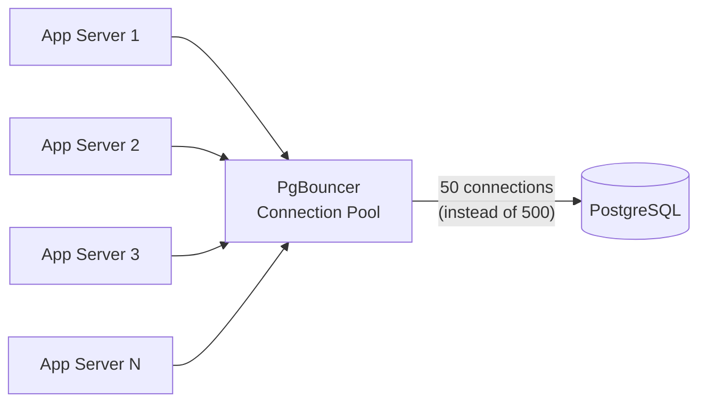

**Why pooling matters**: Each PostgreSQL connection consumes ~10MB of memory. Without pooling, 100 app servers with 10 connections each = 1,000 connections = 10GB of memory just for connection overhead. PgBouncer or pgpool-II reduce this to a manageable pool of 50-100 actual database connections.

**Pooling modes**:
- **Session pooling**: Connection assigned for the full session. Safe for all features.
- **Transaction pooling**: Connection assigned per transaction. Cannot use session-level features (prepared statements, LISTEN/NOTIFY).
- **Statement pooling**: Connection assigned per statement. Most restrictive but highest sharing.

#### Read Replicas

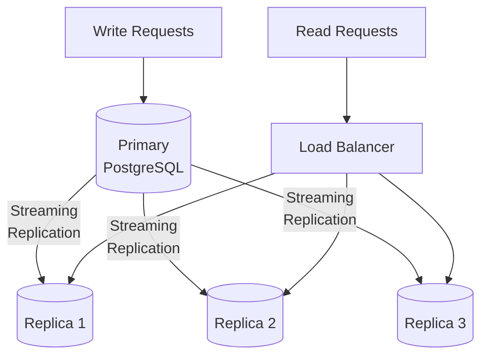

**Replication lag**: Replicas are eventually consistent with the primary. Typical lag is <100ms but can spike during heavy write loads. Applications must handle stale reads gracefully.

**Promoting a replica**: When the primary fails, one replica is promoted. This takes seconds with streaming replication and automated failover (Patroni, pg_auto_failover).

### Common Mistakes

1. **Not using connection pooling**: Raw connections to PostgreSQL from every app server exhaust memory and file descriptors.
2. **Ignoring query plans**: Not running `EXPLAIN ANALYZE` on critical queries leads to sequential scans on million-row tables.
3. **Over-normalizing**: Joining 8 tables for a single page load creates performance problems. Some denormalization is healthy.
4. **Forgetting to index foreign keys**: Foreign key columns without indexes cause full table scans during joins and cascading deletes.
5. **Using SERIALIZABLE everywhere**: The highest isolation level introduces significant contention. Use it only where needed.
6. **Not planning for schema migrations**: `ALTER TABLE` on a 500M row table can lock the table for minutes. Use tools like `pg_repack` or online DDL.

### Interview Insights

Interviewers expect you to:
- Know when SQL is the right choice (most OLTP workloads with complex relationships).
- Understand isolation levels and their impact on correctness and performance.
- Explain how read replicas work and the implications of replication lag.
- Discuss connection pooling as a standard production practice.
- Articulate the scaling ceiling of a single-primary relational database.

---

## 1.2 NoSQL Document Databases

### Definition

A document database stores data as **self-contained documents**, typically in JSON or BSON format. Each document contains all the data needed to represent an entity, including nested objects and arrays. Documents are grouped into **collections** (analogous to tables) but do not require a uniform schema.

### Why It Matters

Document databases solve specific problems that relational databases handle poorly:
- **Schema flexibility**: Different documents in the same collection can have different fields. This is ideal for evolving products, multi-tenant systems, and heterogeneous data.
- **Read performance**: Since all related data lives in a single document, there are no joins. A single read retrieves everything needed.
- **Horizontal scaling**: Document databases are designed for sharding across many nodes.
- **Developer velocity**: The document model maps naturally to objects in application code, reducing ORM impedance mismatch.

### Real-World Example

An e-commerce product catalog in MongoDB:

```json
{
    "_id": "prod_abc123",
    "name": "Wireless Noise-Cancelling Headphones",
    "brand": "AudioMax",
    "category": ["electronics", "audio", "headphones"],
    "price": {
        "amount": 299.99,
        "currency": "USD",
        "discount": {
            "type": "percentage",
            "value": 15,
            "valid_until": "2026-04-01T00:00:00Z"
        }
    },
    "attributes": {
        "color": "Matte Black",
        "battery_life_hours": 30,
        "noise_cancellation": true,
        "driver_size_mm": 40,
        "weight_grams": 250,
        "connectivity": ["Bluetooth 5.3", "3.5mm", "USB-C"]
    },
    "variants": [
        { "sku": "AX-100-BLK", "color": "Matte Black", "stock": 542 },
        { "sku": "AX-100-WHT", "color": "Pearl White", "stock": 218 },
        { "sku": "AX-100-BLU", "color": "Navy Blue", "stock": 0 }
    ],
    "reviews_summary": {
        "average_rating": 4.6,
        "total_reviews": 1283,
        "distribution": { "5": 780, "4": 312, "3": 108, "2": 51, "1": 32 }
    },
    "metadata": {
        "created_at": "2025-06-15T10:00:00Z",
        "updated_at": "2026-03-20T14:30:00Z",
        "indexed": true
    }
}
```

This single document contains everything the product detail page needs. No joins required.

### MongoDB Aggregation Pipeline

```javascript
// Find top-selling categories with average order value
db.orders.aggregate([
    { $match: { status: "completed", created_at: { $gte: ISODate("2026-01-01") } } },
    { $unwind: "$items" },
    { $lookup: {
        from: "products",
        localField: "items.product_id",
        foreignField: "_id",
        as: "product"
    }},
    { $unwind: "$product" },
    { $group: {
        _id: "$product.category",
        total_revenue: { $sum: { $multiply: ["$items.quantity", "$items.price"] } },
        total_orders: { $addToSet: "$_id" },
        avg_item_price: { $avg: "$items.price" }
    }},
    { $addFields: { order_count: { $size: "$total_orders" } } },
    { $sort: { total_revenue: -1 } },
    { $limit: 10 }
]);
```

### DynamoDB: Serverless Document/Key-Value Hybrid

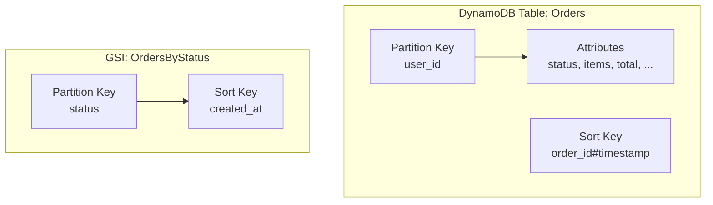

DynamoDB requires you to model access patterns upfront:

| Access Pattern | Key Design |
|---|---|
| Get all orders for a user | PK=user_id, SK begins_with "ORDER#" |
| Get specific order | PK=user_id, SK="ORDER#order_id" |
| Get orders by status | GSI: PK=status, SK=created_at |
| Get recent orders globally | GSI: PK="ALL", SK=created_at (sparse) |

### When to Use

- Your data is **naturally hierarchical** or **self-contained** (product catalogs, user profiles, content management).
- Your schema **varies across records** (multi-tenant systems, flexible forms).
- You need **horizontal write scaling** beyond a single node.
- Your primary access pattern is **read-by-key** or **read-by-document**.
- You prefer **developer velocity** over strict relational integrity.

### When NOT to Use

- You need **cross-document transactions** frequently (though MongoDB 4.0+ supports multi-document transactions, they are expensive).
- Your queries require **complex joins** across multiple collections.
- You need **strict referential integrity** enforced at the database level.
- Your data model is **highly relational** with many-to-many relationships.
- You need **ad-hoc analytical queries** across the entire dataset.

### Trade-offs

| Advantage | Disadvantage |
|---|---|
| Flexible schema accommodates change | No enforced referential integrity |
| Single-document reads are fast | Data duplication increases storage |
| Horizontal scaling is built-in | Complex queries require aggregation pipelines |
| Natural mapping to application objects | Cross-collection joins are expensive |
| High write throughput | Schema-less can lead to data inconsistency |

### Common Mistakes

1. **Using MongoDB as a relational database**: Creating many small collections and joining them in application code negates all document DB advantages.
2. **Unbounded document growth**: Arrays that grow without limit (e.g., all user activity in a single document) hit the 16MB BSON limit and cause performance degradation.
3. **Ignoring DynamoDB partition key design**: A poor partition key creates hot partitions that throttle throughput.
4. **Not modeling for access patterns**: Document databases require you to think about queries before designing the schema. The opposite of "normalize first, query later."
5. **Skipping indexes**: Without proper indexes, MongoDB falls back to collection scans, which are catastrophic at scale.

### Interview Insights

Interviewers expect you to:
- Explain when a document database is preferable to a relational database (and vice versa).
- Design a DynamoDB single-table model for a given set of access patterns.
- Discuss the trade-off between embedding (denormalization) and referencing (normalization) in document databases.
- Know the limitations: document size limits, transaction support, consistency models.

---

## 1.3 NoSQL Key-Value Stores

### Definition

A key-value store is the simplest database paradigm: it maps **keys** (strings or byte arrays) to **values** (strings, numbers, or opaque blobs). The store provides `GET`, `SET`, and `DELETE` operations with O(1) average-case performance. There are no schemas, no indexes (beyond the key), and no query language.

### Why It Matters

Key-value stores provide the **fastest possible data access** for known keys. They serve as the backbone of:
- **Caching layers** (reducing load on primary databases).
- **Session management** (storing user sessions for web applications).
- **Rate limiting** (tracking request counts per IP or user).
- **Real-time counters** (view counts, like counts, online user counts).
- **Feature flags** (fast lookups for configuration values).
- **Distributed locks** (coordinating access to shared resources).

### Real-World Example: Redis

Redis is an in-memory key-value store with rich data structures:

```redis
-- Simple key-value (session store)
SET session:abc123 '{"user_id":42,"role":"admin","expires":1711324800}' EX 3600

-- Hash (user profile cache)
HSET user:42 name "Alice" email "alice@example.com" plan "premium"
HGET user:42 plan  -- Returns "premium"

-- Sorted set (leaderboard)
ZADD leaderboard 9500 "player_1"
ZADD leaderboard 8700 "player_2"
ZADD leaderboard 9200 "player_3"
ZREVRANGE leaderboard 0 9 WITHSCORES  -- Top 10 players

-- Counter with TTL (rate limiting)
MULTI
INCR rate_limit:ip:192.168.1.1
EXPIRE rate_limit:ip:192.168.1.1 60
EXEC

-- Pub/Sub (real-time notifications)
PUBLISH channel:user:42 '{"type":"new_message","from":"user_99"}'

-- Distributed lock (Redlock pattern)
SET lock:order:789 "owner_id" NX EX 30
```

### Redis vs Memcached

| Feature | Redis | Memcached |
|---|---|---|
| Data structures | Strings, hashes, lists, sets, sorted sets, streams, bitmaps | Strings only |
| Persistence | RDB snapshots + AOF | None |
| Replication | Primary-replica with Sentinel/Cluster | None (client-side) |
| Clustering | Redis Cluster (built-in sharding) | Client-side consistent hashing |
| Pub/Sub | Yes | No |
| Lua scripting | Yes | No |
| Max value size | 512 MB | 1 MB (default) |
| Memory efficiency | Moderate (overhead per key) | Higher (slab allocator) |
| Multi-threading | I/O threads in Redis 6+ | Multi-threaded |

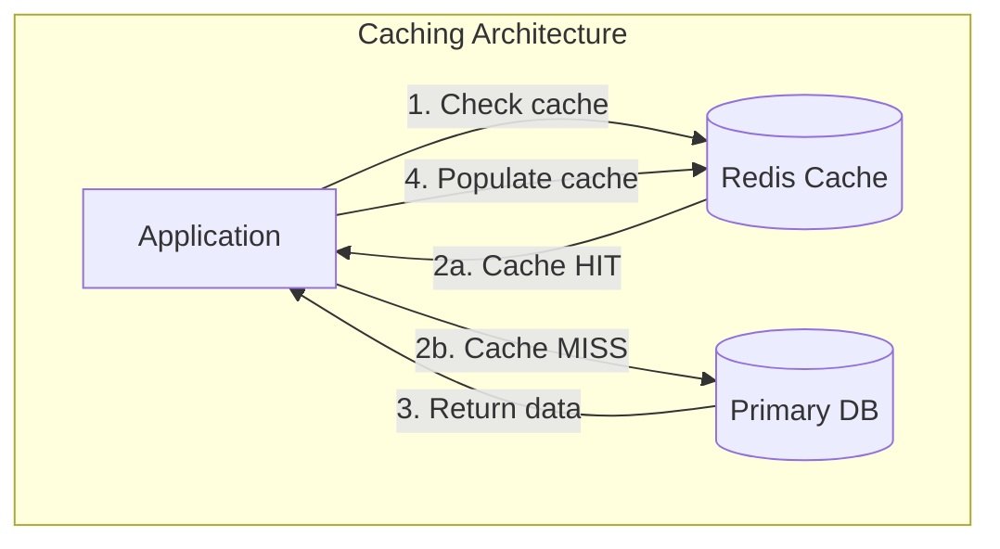

### When to Use

- **Caching**: Reduce latency and load on primary databases.
- **Session storage**: Sub-millisecond session lookups for web applications.
- **Rate limiting**: Atomic counters with TTL for API rate limiting.
- **Leaderboards**: Sorted sets provide O(log N) ranking operations.
- **Real-time messaging**: Pub/Sub and Streams for event distribution.
- **Distributed locks**: Coordinating access to shared resources across services.
- **Feature flags**: Fast configuration lookups for A/B testing and gradual rollouts.

### When NOT to Use

- Your data **must survive restarts** without any risk of loss (Redis persistence has trade-offs).
- Your dataset is **larger than available RAM** (Redis is primarily in-memory).
- You need **complex queries** (joins, aggregations, full-text search).
- You need **strong transactional guarantees** across multiple keys on different nodes.
- Your access pattern is **scan-heavy** rather than point-lookup.

### Trade-offs

| Advantage | Disadvantage |
|---|---|
| Sub-millisecond latency | Data limited by RAM size |
| Rich data structures (Redis) | Persistence is best-effort |
| Atomic operations | No query language for complex queries |
| Built-in TTL for cache expiry | Cluster mode has limitations (multi-key ops) |
| Simple operational model | Memory cost is higher than disk-based stores |

### Common Mistakes

1. **Using Redis as a primary database**: Redis is a cache and data structure store, not a replacement for PostgreSQL. Data loss is possible on crash between snapshots.
2. **Not setting TTLs**: Forgetting TTL on cached data leads to stale reads and memory exhaustion.
3. **Large keys or values**: A single 10MB value blocks the Redis event loop during serialization.
4. **Using KEYS command in production**: `KEYS *` scans the entire keyspace and blocks all other operations. Use `SCAN` instead.
5. **Not planning for eviction**: When Redis hits max memory, it evicts keys. If your application is not idempotent to cache misses, this causes bugs.

### Interview Insights

Interviewers expect you to:
- Propose Redis as a caching layer and explain cache invalidation strategies (TTL, write-through, write-behind).
- Design a rate limiter using Redis atomic operations.
- Explain the difference between Redis Sentinel and Redis Cluster.
- Know when Memcached is preferable (pure caching, multi-threaded, higher memory efficiency).

---

## 1.4 NoSQL Column-Family Databases

### Definition

A column-family database stores data in **rows** identified by a **row key**, with columns grouped into **column families**. Unlike relational databases where a row has a fixed set of columns, each row in a column-family database can have a different set of columns. Data is stored and retrieved by column family, making it efficient for queries that access a subset of columns across many rows.

### Why It Matters

Column-family databases excel at **write-heavy, read-heavy-by-key** workloads at massive scale:
- **Cassandra** handles millions of writes per second across hundreds of nodes.
- **HBase** powers Hadoop-integrated analytical workloads.
- The data model maps naturally to **time-series**, **event logging**, and **IoT telemetry**.

### Real-World Example: Cassandra

```cql
-- Create a keyspace with replication
CREATE KEYSPACE ecommerce
WITH replication = {
    'class': 'NetworkTopologyStrategy',
    'us-east': 3,
    'eu-west': 3
};

-- User activity timeline (write-optimized)
CREATE TABLE user_activity (
    user_id UUID,
    activity_date DATE,
    activity_time TIMESTAMP,
    activity_type TEXT,
    details MAP<TEXT, TEXT>,
    PRIMARY KEY ((user_id, activity_date), activity_time)
) WITH CLUSTERING ORDER BY (activity_time DESC)
  AND default_time_to_live = 7776000;  -- 90 days TTL

-- Insert activity
INSERT INTO user_activity (user_id, activity_date, activity_time, activity_type, details)
VALUES (
    550e8400-e29b-41d4-a716-446655440000,
    '2026-03-24',
    '2026-03-24T10:30:00Z',
    'page_view',
    {'page': '/products/headphones', 'referrer': 'search'}
);

-- Query: Get today's activity for a user (efficient: hits single partition)
SELECT * FROM user_activity
WHERE user_id = 550e8400-e29b-41d4-a716-446655440000
  AND activity_date = '2026-03-24'
ORDER BY activity_time DESC
LIMIT 50;
```

### Cassandra Data Modeling Principles

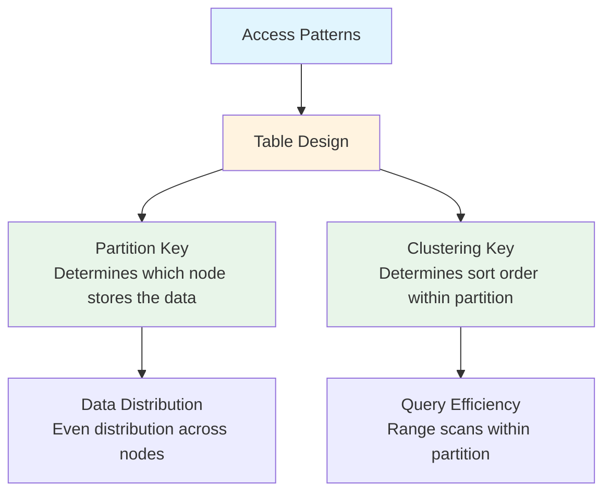

**Rule 1: One table per query pattern.** Unlike SQL, you design Cassandra tables around queries, not entities.

**Rule 2: Partition key determines data locality.** All rows with the same partition key are stored on the same nodes. Choose a partition key that distributes data evenly and matches your query predicates.

**Rule 3: Clustering key determines sort order.** Within a partition, rows are sorted by the clustering key. This enables efficient range queries.

### Time-Series Patterns in Cassandra

```cql
-- Sensor readings with time-bucketed partitions
CREATE TABLE sensor_readings (
    sensor_id TEXT,
    time_bucket TEXT,     -- e.g., '2026-03-24' (daily bucket)
    reading_time TIMESTAMP,
    temperature DOUBLE,
    humidity DOUBLE,
    pressure DOUBLE,
    PRIMARY KEY ((sensor_id, time_bucket), reading_time)
) WITH CLUSTERING ORDER BY (reading_time DESC)
  AND compaction = {'class': 'TimeWindowCompactionStrategy',
                    'compaction_window_unit': 'DAYS',
                    'compaction_window_size': 1};
```

**Why time bucketing**: Without bucketing, a single sensor's partition grows indefinitely. Bucketing by day/hour ensures bounded partition sizes and enables efficient TTL-based cleanup.

### When to Use

- **Write-heavy workloads**: Event logging, IoT telemetry, activity feeds (100K+ writes/sec).
- **Time-series data**: Sensor readings, metrics, user activity timelines.
- **Multi-datacenter replication**: Cassandra's peer-to-peer architecture supports multi-region deployment natively.
- **Known access patterns**: Your queries are well-defined and primarily key-based.
- **Availability over consistency**: Your system can tolerate eventual consistency.

### When NOT to Use

- You need **ad-hoc queries** (Cassandra requires predefined access patterns).
- You need **strong consistency** and **ACID transactions** (Cassandra offers tunable consistency but no cross-partition transactions).
- Your data model requires **frequent updates to existing rows** (Cassandra is append-optimized; updates create tombstones).
- You need **joins** or **aggregations** (Cassandra has no join support).
- Your dataset is **small** (<100GB) — the operational overhead of Cassandra is not justified.

### Trade-offs

| Advantage | Disadvantage |
|---|---|
| Linear horizontal write scaling | No joins or subqueries |
| Multi-datacenter replication built-in | Query patterns must be known upfront |
| Tunable consistency per operation | Deletes create tombstones (compaction overhead) |
| No single point of failure | Operational complexity (compaction, repair, rebalancing) |
| Handles petabyte-scale data | Data modeling requires expertise |

### Common Mistakes

1. **Using Cassandra like a relational database**: Trying to do ad-hoc queries, joins, or secondary index scans negates Cassandra's strengths.
2. **Large partitions**: A partition larger than 100MB causes performance degradation. Use time bucketing or composite partition keys.
3. **Too many tombstones**: Frequent deletes without proper compaction settings cause read latency spikes.
4. **Ignoring compaction strategy**: The default SizeTieredCompactionStrategy is wrong for time-series workloads. Use TimeWindowCompactionStrategy.
5. **Not running repairs**: Anti-entropy repair is essential for data consistency but is often neglected.

### Interview Insights

Interviewers expect you to:
- Know that Cassandra is ideal for write-heavy, time-series, and event-logging workloads.
- Explain partition keys vs clustering keys and how they affect data distribution and query patterns.
- Discuss tunable consistency (ONE, QUORUM, ALL) and the trade-offs.
- Understand why Cassandra is not suitable for ad-hoc analytical queries.

---

## 1.5 NoSQL Graph Databases

### Definition

A graph database stores data as **nodes** (entities), **edges** (relationships), and **properties** (key-value pairs on nodes and edges). The fundamental operation is **graph traversal** — following edges from node to node to discover relationships, paths, and patterns.

### Why It Matters

Some data is inherently relational in a way that SQL joins cannot efficiently express:
- **Social networks**: "Find friends of friends who also like jazz and live in Austin" requires multi-hop traversals.
- **Recommendation engines**: "Users who bought X also bought Y" is a graph pattern.
- **Fraud detection**: "Is this transaction part of a ring of accounts that share phone numbers and addresses?" requires path analysis.
- **Knowledge graphs**: Connecting entities (people, companies, products, concepts) with typed relationships.

In a relational database, each additional hop in a relationship chain requires another JOIN, and performance degrades exponentially with depth. In a graph database, traversal performance depends on the local neighborhood size, not the total dataset size.

### Real-World Example: Neo4j

```cypher
// Create nodes and relationships
CREATE (alice:User {name: 'Alice', id: 'u1'})
CREATE (bob:User {name: 'Bob', id: 'u2'})
CREATE (carol:User {name: 'Carol', id: 'u3'})
CREATE (jazz:Genre {name: 'Jazz'})
CREATE (rock:Genre {name: 'Rock'})

CREATE (alice)-[:FOLLOWS]->(bob)
CREATE (bob)-[:FOLLOWS]->(carol)
CREATE (alice)-[:LIKES]->(jazz)
CREATE (bob)-[:LIKES]->(jazz)
CREATE (carol)-[:LIKES]->(rock)

// Find friends-of-friends who share a music interest
MATCH (alice:User {name: 'Alice'})-[:FOLLOWS]->()-[:FOLLOWS]->(fof:User)
WHERE (fof)-[:LIKES]->(:Genre)<-[:LIKES]-(alice)
  AND NOT (alice)-[:FOLLOWS]->(fof)
RETURN fof.name AS recommendation
```

### Graph Traversal Patterns

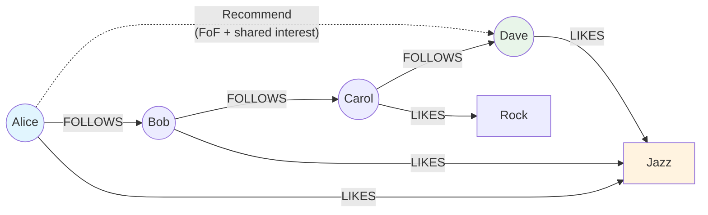

### Fraud Detection Example

```cypher
// Find accounts sharing multiple identity signals (potential fraud ring)
MATCH (a1:Account)-[:HAS_PHONE]->(phone:Phone)<-[:HAS_PHONE]-(a2:Account)
WHERE a1 <> a2
WITH a1, a2, COUNT(phone) AS shared_phones
MATCH (a1)-[:HAS_ADDRESS]->(addr:Address)<-[:HAS_ADDRESS]-(a2)
WITH a1, a2, shared_phones, COUNT(addr) AS shared_addresses
WHERE shared_phones >= 1 AND shared_addresses >= 1
RETURN a1.id, a2.id, shared_phones, shared_addresses
ORDER BY shared_phones + shared_addresses DESC
LIMIT 100
```

### When to Use

- **Social graphs**: Friends, followers, connections, group memberships.
- **Recommendation engines**: Collaborative filtering based on user-item interaction graphs.
- **Fraud detection**: Identifying rings, cycles, and suspicious patterns.
- **Knowledge graphs**: Entity relationships with complex, typed edges.
- **Network topology**: Infrastructure dependencies, service meshes, supply chains.
- **Access control**: Role-based and attribute-based access hierarchies.

### When NOT to Use

- Your queries are **primarily key-value lookups** (overkill for simple data).
- Your data is **tabular with few relationships** (relational DB is simpler and faster).
- You need **high write throughput** for time-series or event data (graph DBs are not optimized for append-heavy workloads).
- Your dataset is **very large** (>1TB) and queries do not involve traversals.
- You need **full ACID transactions** across large subgraphs (performance degrades with transaction scope).

### Trade-offs

| Advantage | Disadvantage |
|---|---|
| Efficient multi-hop traversals | Not optimized for bulk analytics |
| Natural data model for relationships | Smaller ecosystem than SQL/document DBs |
| Pattern matching is expressive | Scaling horizontally is challenging |
| Performance independent of total data size | Write throughput lower than Cassandra/DynamoDB |
| Schema flexibility | Query optimization requires graph expertise |

### Common Mistakes

1. **Using a graph DB for simple CRUD**: If your queries are "get user by ID" and "list all orders," a graph database adds complexity without benefit.
2. **Unbounded traversals**: A query like "find all connected nodes" without depth limits can traverse the entire graph and OOM.
3. **Not creating indexes on frequently-queried properties**: Neo4j needs explicit indexes for property lookups.
4. **Ignoring the supergraph problem**: In social networks, a celebrity node with millions of edges creates hot spots.

### Interview Insights

Interviewers expect you to:
- Identify when a graph database is the right choice (fraud detection, social recommendations).
- Explain index-free adjacency and why traversal performance is constant per hop.
- Discuss the trade-off between graph databases and SQL for relationship queries.
- Know that Amazon Neptune supports both property graph (Gremlin) and RDF (SPARQL) models.

---

## 1.6 Time-Series Databases

### Definition

A time-series database (TSDB) is optimized for storing, querying, and analyzing **timestamped data points** — measurements, events, or observations that are recorded over time. TSDBs provide specialized features like **retention policies**, **continuous aggregates**, **downsampling**, and **gap filling** that general-purpose databases lack.

### Why It Matters

Time-series data is the fastest-growing data category:
- **Infrastructure monitoring**: Server metrics (CPU, memory, disk), network throughput, error rates.
- **IoT**: Sensor readings from millions of devices.
- **Financial markets**: Tick-by-tick price data, trading volumes.
- **Application performance**: Request latency, throughput, error rates.
- **Business analytics**: Daily active users, revenue per hour, conversion rates.

General-purpose databases struggle with time-series workloads because:
- Write rates can reach millions of points per second.
- Queries are almost always time-bounded (last hour, last week).
- Older data needs downsampling (minute-level to hour-level to day-level).
- Storage grows indefinitely without retention policies.

### Real-World Example: TimescaleDB

```sql
-- Create a hypertable (time-partitioned table)
CREATE TABLE metrics (
    time        TIMESTAMPTZ NOT NULL,
    host        TEXT NOT NULL,
    metric_name TEXT NOT NULL,
    value       DOUBLE PRECISION,
    tags        JSONB
);

SELECT create_hypertable('metrics', 'time',
    chunk_time_interval => INTERVAL '1 day');

-- Create a continuous aggregate (materialized rollup)
CREATE MATERIALIZED VIEW metrics_hourly
WITH (timescaledb.continuous) AS
SELECT
    time_bucket('1 hour', time) AS bucket,
    host,
    metric_name,
    AVG(value) AS avg_value,
    MAX(value) AS max_value,
    MIN(value) AS min_value,
    COUNT(*) AS sample_count
FROM metrics
GROUP BY bucket, host, metric_name;

-- Add a retention policy (auto-delete raw data after 30 days)
SELECT add_retention_policy('metrics', INTERVAL '30 days');

-- Add a continuous aggregate policy (keep hourly aggregates for 1 year)
SELECT add_retention_policy('metrics_hourly', INTERVAL '365 days');

-- Query: Average CPU per host over the last 6 hours
SELECT
    time_bucket('15 minutes', time) AS interval,
    host,
    AVG(value) AS avg_cpu
FROM metrics
WHERE metric_name = 'cpu_usage'
  AND time > NOW() - INTERVAL '6 hours'
GROUP BY interval, host
ORDER BY interval DESC;
```

### Time-Series Data Flow

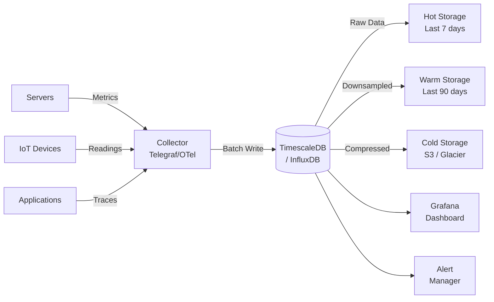

### InfluxDB (Flux Query Language)

```flux
from(bucket: "server_metrics")
  |> range(start: -6h)
  |> filter(fn: (r) => r._measurement == "cpu" and r.host == "web-01")
  |> aggregateWindow(every: 5m, fn: mean, createEmpty: false)
  |> yield(name: "mean_cpu")
```

### When to Use

- **Infrastructure monitoring**: Server and application metrics.
- **IoT telemetry**: Sensor data from thousands or millions of devices.
- **Financial data**: Stock prices, trading volumes, exchange rates.
- **Log analytics**: Structured log events with timestamps.
- **Business metrics**: KPIs tracked over time (DAU, revenue, conversion).

### When NOT to Use

- Your data is **not time-stamped** or does not have a natural time dimension.
- You need **complex relational queries** (joins, subqueries, transactions).
- Your access pattern is primarily **point lookups by non-time keys**.
- Your dataset is **small** and a general-purpose database handles it fine.

### Trade-offs

| Advantage | Disadvantage |
|---|---|
| Optimized for time-range queries | Limited support for non-time queries |
| Built-in retention and downsampling | Smaller ecosystem than SQL/NoSQL |
| High write throughput | Updates to historical data can be expensive |
| Compression optimized for time-series | Not suitable as a general-purpose DB |
| Continuous aggregates reduce query load | Learning curve for specialized query languages |

### Common Mistakes

1. **Not setting retention policies**: Without retention, time-series data grows unboundedly and eventually fills all storage.
2. **Too-granular data without downsampling**: Storing per-second metrics for a year consumes enormous storage. Downsample to per-minute after a week, per-hour after a month.
3. **High-cardinality tags**: A tag with millions of unique values (e.g., user_id as a tag in InfluxDB) causes index explosion.
4. **Not using compression**: Time-series data compresses extremely well (10-20x). Not enabling compression wastes storage.

### Interview Insights

Interviewers expect you to:
- Propose a TSDB when the problem involves monitoring, metrics, or IoT.
- Explain retention policies and tiered storage (hot/warm/cold).
- Know the difference between TimescaleDB (SQL-based, PostgreSQL extension) and InfluxDB (purpose-built).
- Discuss continuous aggregates as a way to pre-compute expensive rollups.

---

## 1.7 Vector Databases

### Definition

A vector database stores and indexes **high-dimensional vectors** (embeddings) and provides **approximate nearest neighbor (ANN) search**. Vectors are numerical representations of unstructured data — text, images, audio, or any data that has been converted to a fixed-size array of floating-point numbers by a machine learning model.

### Why It Matters

The rise of large language models (LLMs) and embedding-based AI has created a new class of data infrastructure:
- **Semantic search**: "Find products similar to this description" using text embeddings.
- **Retrieval-Augmented Generation (RAG)**: Providing LLMs with relevant context from a knowledge base.
- **Recommendation**: Finding similar items/users based on learned representations.
- **Anomaly detection**: Identifying data points that are far from any known cluster.
- **Deduplication**: Finding near-duplicate images, documents, or records.

### How Vector Search Works

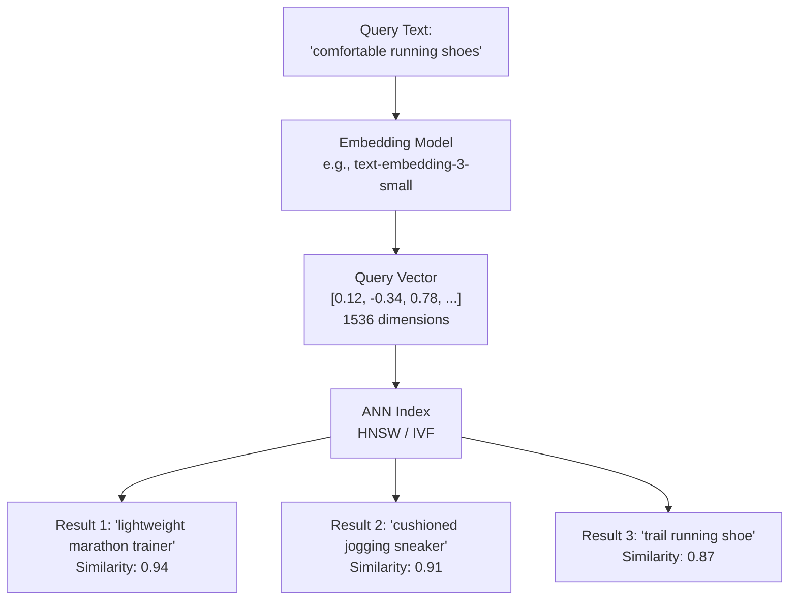

### ANN Index Types

| Index Type | How It Works | Best For |
|---|---|---|
| **HNSW** (Hierarchical Navigable Small World) | Multi-layer graph where each node connects to nearby neighbors. Search starts at top layer and descends. | High recall, low latency. Default choice for most use cases. |
| **IVF** (Inverted File Index) | Clusters vectors into partitions using k-means. Search only scans relevant partitions. | Large datasets where memory is constrained. |
| **PQ** (Product Quantization) | Compresses vectors by splitting into subvectors and quantizing each. | Very large datasets where approximate results are acceptable. |
| **Flat** (Brute Force) | Compares query to every vector. Exact results. | Small datasets (<100K vectors) or ground truth evaluation. |

### pgvector: Vector Search in PostgreSQL

```sql
-- Enable the extension
CREATE EXTENSION vector;

-- Create a table with a vector column
CREATE TABLE documents (
    id SERIAL PRIMARY KEY,
    title TEXT NOT NULL,
    content TEXT NOT NULL,
    embedding vector(1536),  -- OpenAI text-embedding-3-small dimension
    metadata JSONB,
    created_at TIMESTAMPTZ DEFAULT NOW()
);

-- Create an HNSW index for fast ANN search
CREATE INDEX ON documents
USING hnsw (embedding vector_cosine_ops)
WITH (m = 16, ef_construction = 200);

-- Insert a document with its embedding
INSERT INTO documents (title, content, embedding, metadata)
VALUES (
    'System Design Primer',
    'A comprehensive guide to designing scalable systems...',
    '[0.12, -0.34, 0.78, ...]'::vector,  -- 1536-dim embedding
    '{"category": "engineering", "author": "Alex Xu"}'
);

-- Semantic search: find the 5 most similar documents
SELECT id, title, 1 - (embedding <=> $1::vector) AS similarity
FROM documents
WHERE metadata->>'category' = 'engineering'
ORDER BY embedding <=> $1::vector
LIMIT 5;
```

### Pinecone / Milvus (Purpose-Built)

```python
# Pinecone example
import pinecone

index = pinecone.Index("product-embeddings")

# Upsert vectors
index.upsert(vectors=[
    ("prod_1", [0.12, -0.34, ...], {"category": "shoes", "price": 120}),
    ("prod_2", [0.15, -0.31, ...], {"category": "shoes", "price": 95}),
])

# Query with metadata filtering
results = index.query(
    vector=[0.11, -0.33, ...],
    top_k=10,
    filter={"category": {"$eq": "shoes"}, "price": {"$lt": 150}}
)
```

### When to Use

- **Semantic search**: Finding similar documents, images, or products based on meaning rather than keywords.
- **RAG pipelines**: Providing relevant context to LLMs from a knowledge base.
- **Recommendation systems**: Finding similar items or users based on learned embeddings.
- **Multimodal search**: Searching across text, images, and audio using shared embedding spaces.
- **Anomaly detection**: Identifying outliers in high-dimensional spaces.

### When NOT to Use

- Your search is **keyword-based** and exact matching suffices (use full-text search instead).
- You do not have a **trained embedding model** for your data type.
- Your dataset is **very small** (<10K items) — brute force cosine similarity is fast enough.
- You need **exact results** — ANN is approximate by design (though recall is typically >95%).
- Your use case is **purely relational** (no similarity or semantic component).

### Trade-offs

| Advantage | Disadvantage |
|---|---|
| Enables semantic understanding | Requires embedding models (cost + latency) |
| Handles unstructured data search | Approximate results (not 100% recall) |
| Scales to billions of vectors | Index build time can be significant |
| Metadata filtering + vector search | Higher infrastructure cost than text search |
| pgvector keeps data in PostgreSQL | Purpose-built DBs (Pinecone) are vendor-locked |

### Common Mistakes

1. **Wrong embedding model**: Using a generic model for domain-specific data reduces search quality. Fine-tune or choose domain-appropriate models.
2. **Not normalizing vectors**: Cosine similarity requires normalized vectors. Unnormalized vectors produce incorrect results.
3. **Too few dimensions**: Low-dimensional embeddings lose information. Too many dimensions increase storage and search cost.
4. **Ignoring metadata filtering**: Pure vector search without metadata filters returns semantically similar but contextually irrelevant results.
5. **Not evaluating recall**: Not measuring how often the true nearest neighbors appear in ANN results leads to undetected quality degradation.

### Interview Insights

Interviewers expect you to:
- Propose vector search for any system requiring semantic similarity (search, recommendations, RAG).
- Explain the trade-off between recall and latency in ANN indexes.
- Know the difference between pgvector (embedded in PostgreSQL) and Pinecone/Milvus (purpose-built).
- Understand that embeddings come from ML models and must be recomputed when models change.

---

## 1.8 Database Decision Matrix

### Comprehensive Comparison Table

| Use Case | Recommended DB | Why |
|---|---|---|
| User accounts, orders, transactions | **PostgreSQL / MySQL** | ACID transactions, referential integrity, complex joins |
| Product catalog (e-commerce) | **MongoDB / DynamoDB** | Schema flexibility, nested attributes, horizontal scaling |
| Session storage | **Redis** | Sub-ms latency, TTL, in-memory |
| API rate limiting | **Redis** | Atomic counters, TTL, O(1) operations |
| Leaderboards, rankings | **Redis (Sorted Sets)** | O(log N) insert/rank, built-in range queries |
| Activity feeds, event logs | **Cassandra** | Write-heavy, time-ordered, horizontally scalable |
| IoT sensor data | **TimescaleDB / InfluxDB** | Time-series optimized, retention policies, downsampling |
| Server monitoring metrics | **InfluxDB / Prometheus** | Purpose-built for metrics, efficient compression |
| Social graph (friends, followers) | **Neo4j / Neptune** | Multi-hop traversals, pattern matching |
| Fraud detection | **Neo4j / Neptune** | Cycle detection, path analysis, pattern matching |
| Semantic search | **Pinecone / pgvector** | ANN search on embeddings, metadata filtering |
| RAG knowledge base | **Pinecone / Milvus / pgvector** | Vector similarity + metadata filtering |
| Full-text search | **Elasticsearch / OpenSearch** | Inverted index, relevance scoring, fuzzy matching |
| Content management (CMS) | **MongoDB** | Flexible schemas, rich documents, media metadata |
| Financial ledger | **PostgreSQL** | ACID, serializable isolation, audit trails |
| Configuration / feature flags | **Redis / etcd** | Fast reads, distributed consensus (etcd) |
| Message queue (durable) | **Kafka / Pulsar** | Append-only log, replay, consumer groups |
| Geospatial data | **PostgreSQL (PostGIS)** | Spatial indexes, geometry operations, range queries |
| Multi-region, high availability | **CockroachDB / Spanner** | Distributed SQL, serializable, multi-region |

### Decision Flowchart

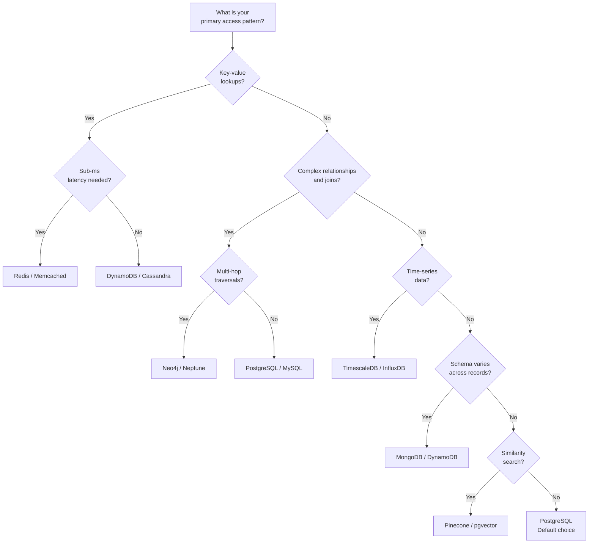

### Polyglot Persistence: Real-World Architecture

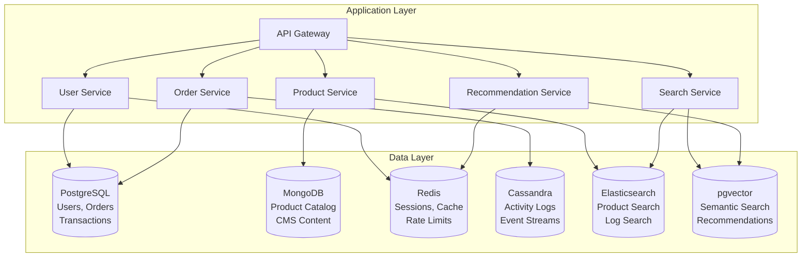

---

# Section 2: Data Modeling

## 2.1 Normalization

### Definition

Database normalization is the process of structuring a relational database to **reduce data redundancy** and **improve data integrity** by organizing columns and tables according to a series of rules called **normal forms**. Each successive normal form builds on the previous one with additional constraints.

### Why It Matters

Without normalization:
- The **same data is stored in multiple places**, leading to update anomalies (change in one place, stale in another).
- **Insert anomalies** prevent recording data without unrelated data (e.g., cannot add a new department without an employee).
- **Delete anomalies** cause unintended data loss (deleting the last employee in a department loses the department info).

### Normal Forms with Examples

#### First Normal Form (1NF)

**Rule**: Every column contains only atomic (indivisible) values. No repeating groups or arrays.

**Violation**:
```
| order_id | customer | items                    |
|----------|----------|--------------------------|
| 1        | Alice    | Widget, Gadget, Sprocket |
```

**1NF Compliant**:
```
| order_id | customer | item     |
|----------|----------|----------|
| 1        | Alice    | Widget   |
| 1        | Alice    | Gadget   |
| 1        | Alice    | Sprocket |
```

#### Second Normal Form (2NF)

**Rule**: In 1NF + every non-key column depends on the **entire** primary key (not just part of a composite key).

**Violation** (composite key: order_id + product_id):
```
| order_id | product_id | product_name | quantity |
|----------|------------|--------------|----------|
| 1        | P1         | Widget       | 3        |
| 1        | P2         | Gadget       | 1        |
```

`product_name` depends only on `product_id`, not on the full composite key.

**2NF Compliant** (split into two tables):
```sql
-- Order Items table
CREATE TABLE order_items (
    order_id   INT REFERENCES orders(order_id),
    product_id INT REFERENCES products(product_id),
    quantity   INT NOT NULL,
    PRIMARY KEY (order_id, product_id)
);

-- Products table
CREATE TABLE products (
    product_id   INT PRIMARY KEY,
    product_name TEXT NOT NULL
);
```

#### Third Normal Form (3NF)

**Rule**: In 2NF + no non-key column depends on another non-key column (no **transitive dependencies**).

**Violation**:
```
| employee_id | department_id | department_name | department_location |
|-------------|---------------|-----------------|---------------------|
| 1           | D1            | Engineering     | Building A          |
| 2           | D1            | Engineering     | Building A          |
```

`department_name` and `department_location` depend on `department_id`, not directly on `employee_id`.

**3NF Compliant**:
```sql
CREATE TABLE employees (
    employee_id   INT PRIMARY KEY,
    name          TEXT NOT NULL,
    department_id INT REFERENCES departments(department_id)
);

CREATE TABLE departments (
    department_id       INT PRIMARY KEY,
    department_name     TEXT NOT NULL,
    department_location TEXT NOT NULL
);
```

#### Boyce-Codd Normal Form (BCNF)

**Rule**: For every functional dependency X -> Y, X must be a superkey. Stricter than 3NF.

**Violation** (3NF but not BCNF):
Consider a table of course scheduling where a student can take a course, and each course is taught by exactly one professor, but a professor teaches only one course:

```
| student_id | course    | professor   |
|------------|-----------|-------------|
| S1         | Databases | Dr. Smith   |
| S2         | Databases | Dr. Smith   |
| S1         | Networks  | Dr. Johnson |
```

Functional dependencies:
- (student_id, course) -> professor
- professor -> course

The second dependency violates BCNF because `professor` is not a superkey.

**BCNF Compliant**:
```sql
CREATE TABLE professor_courses (
    professor TEXT PRIMARY KEY,
    course    TEXT NOT NULL UNIQUE
);

CREATE TABLE student_enrollments (
    student_id TEXT,
    professor  TEXT REFERENCES professor_courses(professor),
    PRIMARY KEY (student_id, professor)
);
```

#### Fourth Normal Form (4NF)

**Rule**: In BCNF + no multi-valued dependencies. A multi-valued dependency exists when one attribute determines a set of values of another attribute, independent of all other attributes.

**Violation**: An employee can have multiple skills and multiple languages, independent of each other.

```
| employee_id | skill  | language |
|-------------|--------|----------|
| 1           | Java   | English  |
| 1           | Java   | Spanish  |
| 1           | Python | English  |
| 1           | Python | Spanish  |
```

Every combination of skill and language must be recorded, leading to a multiplicative explosion.

**4NF Compliant**:
```sql
CREATE TABLE employee_skills (
    employee_id INT,
    skill       TEXT,
    PRIMARY KEY (employee_id, skill)
);

CREATE TABLE employee_languages (
    employee_id INT,
    language    TEXT,
    PRIMARY KEY (employee_id, language)
);
```

#### Fifth Normal Form (5NF)

**Rule**: In 4NF + the table cannot be decomposed into smaller tables without losing information (no **join dependencies** that are not implied by candidate keys).

5NF is rarely encountered in practice. It applies when a table represents a ternary (or higher) relationship that cannot be reconstructed by joining binary projections.

**Example**: A supplier can supply a part to a project, but only if the supplier supplies that part AND the supplier supplies to that project AND the part is needed by that project.

This three-way constraint cannot be decomposed into three two-way tables without losing the three-way semantic. 5NF is the point where the original table is the correct representation.

### Normalization Summary

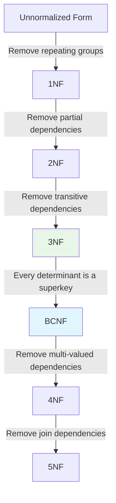

**Practical guidance**: Most production systems normalize to **3NF or BCNF** and then selectively denormalize for performance. Going beyond BCNF is rare and usually academic.

---

## 2.2 Denormalization

### Definition

Denormalization is the intentional introduction of redundancy into a database schema to **improve read performance** at the cost of increased storage and write complexity. It reverses some normalization steps to reduce the number of joins needed for common queries.

### Why It Matters

Normalization optimizes for **write correctness**. Denormalization optimizes for **read performance**. In read-heavy systems (which is most production systems), the trade-off is often worthwhile:
- A product listing page that joins 5 tables for every request can be replaced by a single denormalized document.
- An analytics dashboard that aggregates across millions of rows can use a pre-computed materialized view.
- A search index that stores denormalized copies of data enables sub-100ms full-text search.

### Denormalization Techniques

#### 1. Duplicating Columns

```sql
-- Normalized: order_items references products for the name
SELECT oi.quantity, p.name, p.price
FROM order_items oi
JOIN products p ON oi.product_id = p.product_id
WHERE oi.order_id = 123;

-- Denormalized: product name and price stored directly in order_items
-- (Snapshot at time of order — actually correct here because prices change)
CREATE TABLE order_items (
    order_id     INT,
    product_id   INT,
    product_name TEXT,   -- Denormalized: copied from products
    unit_price   NUMERIC, -- Denormalized: price at time of order
    quantity     INT,
    PRIMARY KEY (order_id, product_id)
);
```

#### 2. Pre-computed Aggregates

```sql
-- Instead of counting reviews every time:
SELECT COUNT(*), AVG(rating) FROM reviews WHERE product_id = 'P1';

-- Store aggregates directly on the product:
ALTER TABLE products ADD COLUMN review_count INT DEFAULT 0;
ALTER TABLE products ADD COLUMN avg_rating NUMERIC(3,2) DEFAULT 0;

-- Update on new review (via trigger or application code):
UPDATE products
SET review_count = review_count + 1,
    avg_rating = (avg_rating * (review_count - 1) + NEW.rating) / review_count
WHERE product_id = NEW.product_id;
```

#### 3. Materialized Views

```sql
-- Materialized view for product search results
CREATE MATERIALIZED VIEW product_search_view AS
SELECT
    p.product_id,
    p.name,
    p.description,
    b.brand_name,
    c.category_name,
    p.price,
    COALESCE(r.avg_rating, 0) AS avg_rating,
    COALESCE(r.review_count, 0) AS review_count,
    COALESCE(i.stock_quantity, 0) AS stock_quantity
FROM products p
LEFT JOIN brands b ON p.brand_id = b.brand_id
LEFT JOIN categories c ON p.category_id = c.category_id
LEFT JOIN (
    SELECT product_id, AVG(rating) AS avg_rating, COUNT(*) AS review_count
    FROM reviews
    GROUP BY product_id
) r ON p.product_id = r.product_id
LEFT JOIN inventory i ON p.product_id = i.product_id;

CREATE UNIQUE INDEX ON product_search_view (product_id);
```

#### 4. JSON Columns for Flexible Attributes

```sql
-- Instead of an EAV table or many nullable columns:
CREATE TABLE products (
    product_id   SERIAL PRIMARY KEY,
    name         TEXT NOT NULL,
    category     TEXT NOT NULL,
    price        NUMERIC(10,2) NOT NULL,
    attributes   JSONB NOT NULL DEFAULT '{}'
);

-- Index specific JSON paths
CREATE INDEX idx_products_brand ON products ((attributes->>'brand'));
CREATE INDEX idx_products_attrs ON products USING GIN (attributes);

-- Query with JSON
SELECT * FROM products
WHERE attributes @> '{"color": "black", "wireless": true}'
  AND price < 300;
```

### When to Denormalize

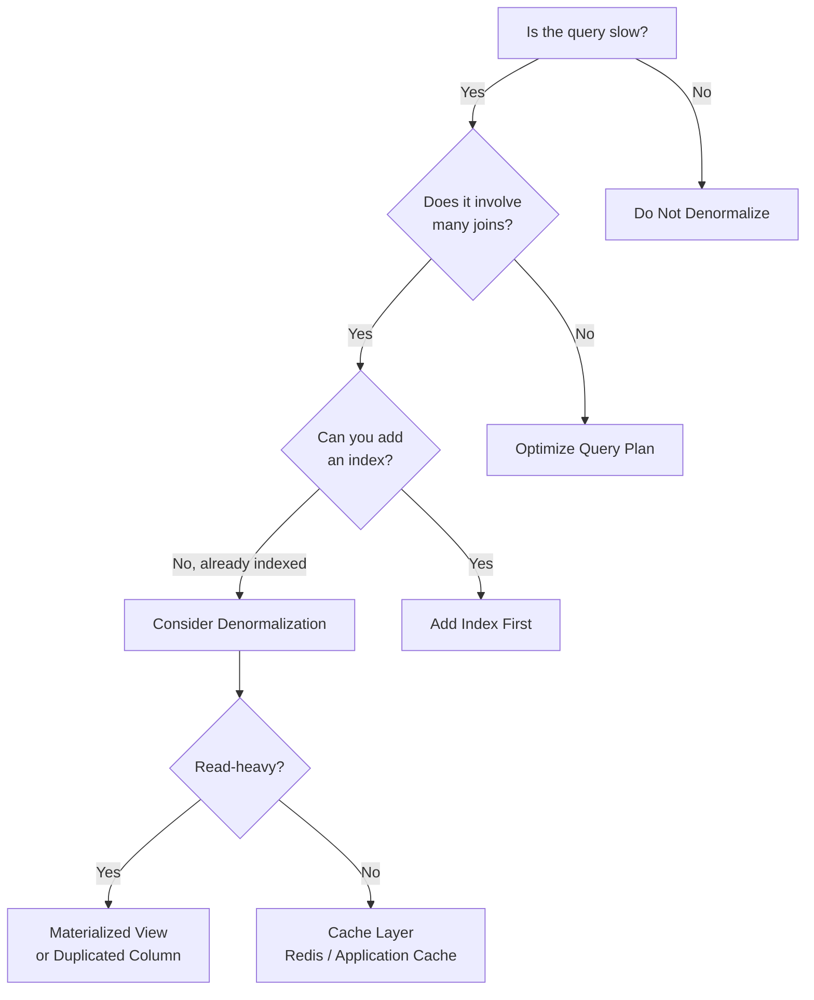

### Trade-offs

| Advantage | Disadvantage |
|---|---|
| Faster reads (fewer joins) | Data redundancy increases storage |
| Simpler read queries | Write complexity increases (must update multiple places) |
| Reduced database load for common queries | Risk of data inconsistency |
| Better cache-ability | Harder to maintain and evolve |

### Common Mistakes

1. **Premature denormalization**: Denormalizing before you have measured performance problems adds complexity without proven benefit.
2. **Not updating denormalized copies**: When the source data changes, all copies must be updated. Missing one creates stale data.
3. **Denormalizing everything**: Only denormalize the hot read paths. Keep the normalized source of truth.
4. **Not using materialized views**: PostgreSQL materialized views provide denormalization benefits with less application complexity than manual duplication.

---

## 2.3 Indexing Strategies

### Definition

A database index is a data structure that improves the speed of data retrieval operations at the cost of additional storage and slower writes. Indexes work like the index in a textbook — instead of scanning every page (full table scan), you look up the topic in the index and jump directly to the right page.

### Why It Matters

The difference between an indexed and unindexed query can be **three orders of magnitude**:
- Without index: Full table scan on 10M rows = ~2 seconds.
- With B-tree index: Index lookup = ~2 milliseconds.

### Index Types

#### B-tree Index (Default)

The most common index type. Stores keys in a balanced tree structure. Supports equality (`=`), range (`<`, `>`, `BETWEEN`), prefix matching (`LIKE 'abc%'`), and ordering (`ORDER BY`).

```sql
-- Simple B-tree index
CREATE INDEX idx_users_email ON users (email);

-- Composite index (column order matters!)
CREATE INDEX idx_orders_user_date ON orders (user_id, created_at DESC);

-- Query that uses the composite index efficiently:
SELECT * FROM orders
WHERE user_id = 42
ORDER BY created_at DESC
LIMIT 20;
-- Uses both columns of the index: filter on user_id, sort by created_at
```

#### Hash Index

Stores a hash of the key. Only supports equality (`=`). Faster than B-tree for exact matches but does not support range queries.

```sql
-- Hash index for exact-match lookups
CREATE INDEX idx_sessions_token ON sessions USING hash (session_token);

-- Efficient:
SELECT * FROM sessions WHERE session_token = 'abc123';

-- Cannot use hash index:
SELECT * FROM sessions WHERE session_token > 'abc';
```

#### GIN (Generalized Inverted Index)

Designed for composite types: arrays, JSONB, full-text search. Maps each element/key to the rows that contain it.

```sql
-- GIN index on JSONB column
CREATE INDEX idx_products_attrs ON products USING GIN (attributes);

-- Efficient containment query:
SELECT * FROM products WHERE attributes @> '{"color": "red"}';

-- GIN index for full-text search
CREATE INDEX idx_articles_search ON articles USING GIN (to_tsvector('english', title || ' ' || body));

-- Full-text search query:
SELECT * FROM articles
WHERE to_tsvector('english', title || ' ' || body) @@ to_tsquery('english', 'distributed & systems');
```

#### GiST (Generalized Search Tree)

Supports geometric data, range types, and full-text search. Used heavily with PostGIS for geospatial queries.

```sql
-- GiST index for geospatial queries
CREATE INDEX idx_locations_geom ON locations USING GIST (geom);

-- Find all locations within 5km of a point
SELECT name, ST_Distance(geom, ST_MakePoint(-73.9857, 40.7484)::geography) AS distance
FROM locations
WHERE ST_DWithin(geom, ST_MakePoint(-73.9857, 40.7484)::geography, 5000)
ORDER BY distance;

-- GiST index for range types
CREATE INDEX idx_events_during ON events USING GIST (time_range);

-- Overlap query:
SELECT * FROM events WHERE time_range && tstzrange('2026-03-24', '2026-03-25');
```

#### Partial Index

An index that includes only rows matching a predicate. Smaller, faster, and more efficient for common query patterns.

```sql
-- Only index active users (80% of queries are for active users)
CREATE INDEX idx_active_users_email ON users (email)
WHERE status = 'active';

-- Only index unprocessed orders
CREATE INDEX idx_pending_orders ON orders (created_at)
WHERE status = 'pending';

-- Query benefits from partial index:
SELECT * FROM orders WHERE status = 'pending' ORDER BY created_at LIMIT 10;
```

#### Covering Index (Index-Only Scan)

An index that includes all columns needed by a query, eliminating the need to read the table itself.

```sql
-- Covering index: includes email AND name
CREATE INDEX idx_users_covering ON users (email) INCLUDE (name, created_at);

-- This query is satisfied entirely from the index (index-only scan):
SELECT email, name, created_at FROM users WHERE email = 'alice@example.com';
```

### Index Bloat

Over time, indexes accumulate dead tuples from updates and deletes. This increases index size and reduces performance.

```sql
-- Check index bloat
SELECT
    schemaname, tablename, indexname,
    pg_size_pretty(pg_relation_size(indexrelid)) AS index_size,
    idx_scan AS times_used
FROM pg_stat_user_indexes
ORDER BY pg_relation_size(indexrelid) DESC
LIMIT 20;

-- Rebuild a bloated index without locking
REINDEX INDEX CONCURRENTLY idx_users_email;
```

### Index Selection Cheat Sheet

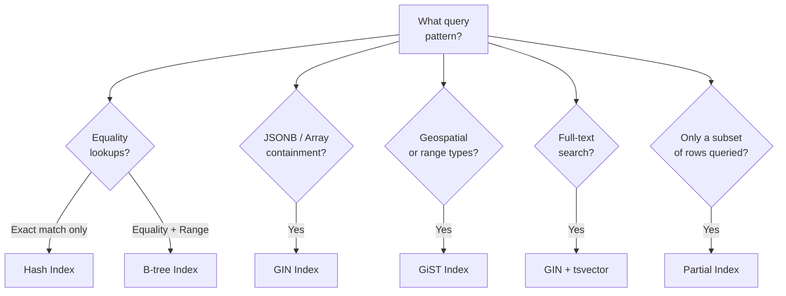

### Common Mistakes

1. **Too many indexes**: Every index slows down writes. A table with 15 indexes has 15x write amplification.
2. **Wrong column order in composite indexes**: The leftmost column must match the query's filter/sort. `(user_id, created_at)` does NOT help `WHERE created_at > '2026-01-01'`.
3. **Not using `EXPLAIN ANALYZE`**: The only way to verify an index is being used is to check the query plan.
4. **Indexing low-cardinality columns**: An index on a boolean column (`is_active`) is rarely useful because it does not filter enough rows (use a partial index instead).
5. **Forgetting to index foreign keys**: PostgreSQL does NOT automatically index foreign key columns. Missing FK indexes cause full table scans during joins.
6. **Never monitoring index usage**: Unused indexes waste disk space and slow writes. Query `pg_stat_user_indexes` to find them.

### Interview Insights

Interviewers expect you to:
- Know the difference between B-tree, hash, GIN, and GiST indexes.
- Explain composite indexes and the importance of column order.
- Propose partial indexes for skewed data distributions.
- Discuss covering indexes as a way to achieve index-only scans.
- Mention index bloat and maintenance as production concerns.

---

## 2.4 Partition Keys

### Definition

A partition key determines how data is distributed across physical storage units (partitions, shards, or nodes). In distributed databases, the partition key is the single most important schema design decision because it determines:
- **Which node** stores a given row.
- **Which queries** can be executed efficiently (partition-local vs. cross-partition).
- **How evenly** data and load are distributed.

### Why It Matters

A poor partition key creates **hot partitions** — a small number of partitions that receive disproportionate traffic while others sit idle. This wastes capacity and creates bottlenecks.

### Partition Key Design Principles

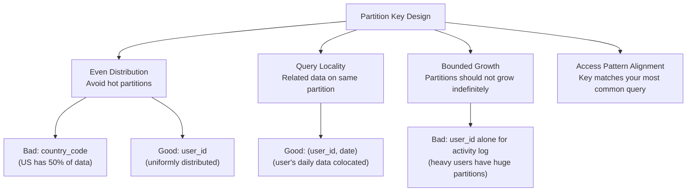

### Hot Partition Problem

```
┌─────────────────────────────────────────────────────────────────┐
│  Partition Key: celebrity_user_id                                │
│                                                                 │
│  Node 1: [user_1] [user_2] [user_3] ... [user_1M]              │
│           ~100 records each                                     │
│                                                                 │
│  Node 2: [celebrity_user]                                       │
│           ~50M records (followers, activity, notifications)     │
│           ← HOT PARTITION — this node is overwhelmed            │
│                                                                 │
│  Node 3: [user_1M+1] [user_1M+2] ... [user_2M]                │
│           ~100 records each                                     │
└─────────────────────────────────────────────────────────────────┘
```

### Strategies for Avoiding Hot Partitions

#### 1. Composite Partition Keys

```sql
-- DynamoDB: Partition by user + date to bound partition size
-- Primary Key: (user_id, activity_date) as partition key, timestamp as sort key
{
    "TableName": "UserActivity",
    "KeySchema": [
        { "AttributeName": "pk", "KeyType": "HASH" },  -- "USER#123#2026-03-24"
        { "AttributeName": "sk", "KeyType": "RANGE" }   -- "ACTIVITY#1711305600"
    ]
}
```

#### 2. Write Sharding (Scatter-Gather)

For items with extreme write traffic (e.g., a global page view counter):

```python
# Write: distribute across N shards
shard = random.randint(0, N-1)
key = f"counter:pageviews:shard:{shard}"
redis.incr(key)

# Read: gather all shards
total = sum(redis.get(f"counter:pageviews:shard:{i}") for i in range(N))
```

#### 3. Time-Based Partitioning

```sql
-- PostgreSQL declarative partitioning by range
CREATE TABLE events (
    event_id    UUID NOT NULL,
    event_time  TIMESTAMPTZ NOT NULL,
    event_type  TEXT NOT NULL,
    payload     JSONB
) PARTITION BY RANGE (event_time);

CREATE TABLE events_2026_q1 PARTITION OF events
    FOR VALUES FROM ('2026-01-01') TO ('2026-04-01');

CREATE TABLE events_2026_q2 PARTITION OF events
    FOR VALUES FROM ('2026-04-01') TO ('2026-07-01');

-- Partition pruning: only scans events_2026_q1
SELECT * FROM events
WHERE event_time BETWEEN '2026-02-01' AND '2026-03-01';
```

### PostgreSQL Partition Types

| Type | Syntax | Use Case |
|---|---|---|
| **Range** | `PARTITION BY RANGE (col)` | Time-based data, numeric ranges |
| **List** | `PARTITION BY LIST (col)` | Categorical data (country, status) |
| **Hash** | `PARTITION BY HASH (col)` | Even distribution when no natural range |

### Common Mistakes

1. **Choosing a low-cardinality partition key**: Partitioning by `status` (3 values) creates only 3 partitions and provides no benefit.
2. **Not considering query patterns**: A partition key that distributes data evenly but does not match queries forces cross-partition scans.
3. **Unbounded partition growth**: Partitioning by `user_id` without time bucketing means active users accumulate data indefinitely.
4. **Too many partitions**: Thousands of partitions in PostgreSQL increases planning time. Keep partition counts manageable (<1,000).
5. **Forgetting partition maintenance**: Old partitions need to be dropped or archived. Automate this.

### Interview Insights

Interviewers expect you to:
- Choose an appropriate partition key for a given access pattern.
- Identify and fix hot partition problems.
- Explain the trade-off between query locality and even distribution.
- Know when to use range vs. hash vs. list partitioning.

---

## 2.5 Schema Evolution

### Definition

Schema evolution is the process of **modifying a database schema** over time as application requirements change. This includes adding columns, changing types, renaming fields, adding tables, and migrating data. The challenge is making these changes **without downtime** and **without breaking existing applications**.

### Why It Matters

- Production databases cannot be taken offline for schema changes.
- Multiple application versions may be running simultaneously during a deployment (blue-green, canary).
- Schema changes on large tables (100M+ rows) can lock tables for minutes or hours if done naively.
- Backward and forward compatibility are essential for zero-downtime deployments.

### The Expand-Contract Pattern

The safest way to make breaking schema changes in production:

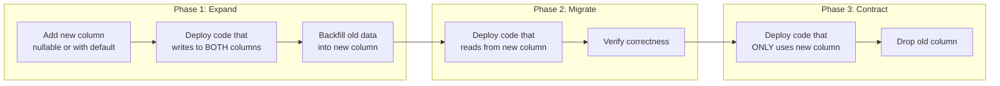

### Example: Renaming a Column

**Goal**: Rename `users.full_name` to `users.display_name`.

```sql
-- Phase 1: Expand — add new column
ALTER TABLE users ADD COLUMN display_name TEXT;

-- Phase 1: Backfill existing data
UPDATE users SET display_name = full_name WHERE display_name IS NULL;
-- (Do this in batches for large tables)

-- Phase 1: Add trigger to keep both columns in sync
CREATE OR REPLACE FUNCTION sync_display_name()
RETURNS TRIGGER AS $$
BEGIN
    IF NEW.display_name IS NULL THEN
        NEW.display_name := NEW.full_name;
    END IF;
    IF NEW.full_name IS NULL THEN
        NEW.full_name := NEW.display_name;
    END IF;
    RETURN NEW;
END;
$$ LANGUAGE plpgsql;

CREATE TRIGGER trg_sync_display_name
BEFORE INSERT OR UPDATE ON users
FOR EACH ROW EXECUTE FUNCTION sync_display_name();

-- Phase 2: Deploy application code that reads display_name
-- Phase 2: Verify all services use display_name

-- Phase 3: Contract — remove old column and trigger
DROP TRIGGER trg_sync_display_name ON users;
ALTER TABLE users DROP COLUMN full_name;
```

### Online DDL Strategies

| Operation | PostgreSQL | MySQL (InnoDB) |
|---|---|---|
| Add nullable column | Instant (metadata only) | Instant (8.0+) |
| Add column with default | Instant (PG 11+) | Instant (8.0.12+) |
| Add NOT NULL column | Requires rewrite or backfill | INSTANT if with default (8.0.12+) |
| Drop column | Instant (marks invisible) | Instant (8.0+) |
| Add index | `CREATE INDEX CONCURRENTLY` (no lock) | `ALGORITHM=INPLACE` (no lock) |
| Change column type | Requires table rewrite | Often requires table copy |
| Rename column | Instant | Instant |

### Migration Best Practices

1. **Always use forward-compatible migrations**: New code should work with both old and new schemas.
2. **Never drop columns immediately**: Old application versions may still reference them.
3. **Backfill in batches**: Updating 100M rows in one transaction locks the table and fills WAL. Process 10K rows at a time with `LIMIT` and `WHERE`.
4. **Use migration tools**: Flyway, Liquibase, Alembic, or Rails Migrations for version-controlled schema changes.
5. **Test migrations on production-sized data**: A migration that takes 1 second on dev data can take 1 hour on production.

### Common Mistakes

1. **Running `ALTER TABLE` with `NOT NULL` on a large table without a default**: This rewrites the entire table and acquires an exclusive lock.
2. **Not testing migration rollback**: If a migration fails midway, you need a plan to undo it.
3. **Applying breaking changes in one step**: Dropping a column that running application instances depend on causes immediate errors.
4. **Forgetting to create indexes concurrently**: `CREATE INDEX` (without `CONCURRENTLY`) locks the table for writes during the entire build.

### Interview Insights

Interviewers expect you to:
- Describe the expand-contract pattern for zero-downtime schema changes.
- Know which DDL operations are online (instant) vs. require table rewrites.
- Explain how to handle backward compatibility during rolling deployments.
- Discuss migration tools and version-controlled schema management.

---

## 2.6 Data Lifecycle Management

### Definition

Data lifecycle management (DLM) is the practice of managing data from creation through archival and deletion based on its **age, access frequency, and business value**. The goal is to optimize the trade-off between **query performance**, **storage cost**, and **regulatory compliance**.

### Why It Matters

- **Storage costs vary 100x**: SSD-backed PostgreSQL costs ~$0.10/GB/month. S3 Glacier costs ~$0.004/GB/month.
- **Performance degrades with data volume**: A table with 10B rows is harder to query, index, and back up than one with 10M rows.
- **Regulatory requirements**: GDPR requires data deletion upon request. Financial regulations require 7-year retention. HIPAA has its own retention rules.
- **Backup and recovery**: Smaller active datasets mean faster backups and faster point-in-time recovery.

### Tiered Storage Architecture

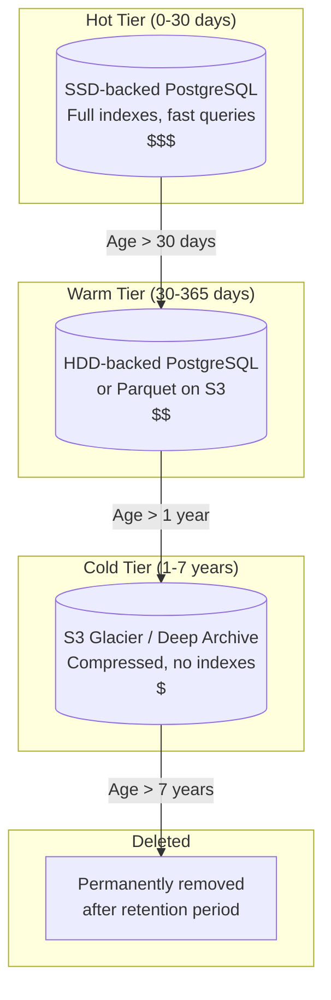

### TTL (Time to Live)

```sql
-- PostgreSQL: pg_partman for automatic partition management
-- Partitions are created automatically and old ones are dropped

-- Redis: Built-in TTL
SET session:user:42 '{"role":"admin"}' EX 3600  -- Expires in 1 hour

-- Cassandra: Column-level TTL
INSERT INTO user_activity (user_id, activity_date, activity_time, details)
VALUES (uuid(), '2026-03-24', NOW(), {'page': '/home'})
USING TTL 7776000;  -- 90 days

-- DynamoDB: TTL attribute
{
    "user_id": "u42",
    "session_id": "sess_abc",
    "ttl": 1711324800  // Unix timestamp when item should be deleted
}
```

### Archival Strategies

#### 1. Partition-Based Archival

```sql
-- Create archive schema
CREATE SCHEMA archive;

-- Move old partition to archive
ALTER TABLE events DETACH PARTITION events_2024_q1;
ALTER TABLE events_2024_q1 SET SCHEMA archive;

-- Or export to Parquet and drop
COPY (SELECT * FROM events_2024_q1) TO PROGRAM
    'parquet-converter --output s3://archive/events/2024-q1.parquet';
DROP TABLE events_2024_q1;
```

#### 2. Change Data Capture (CDC) to Archive

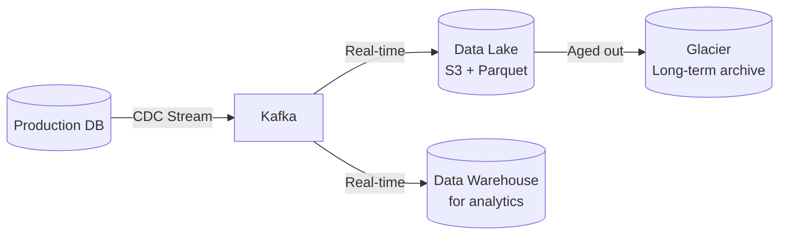

### Data Retention Policy Table

| Data Type | Hot | Warm | Cold | Delete |
|---|---|---|---|---|
| User sessions | 24 hours | N/A | N/A | After expiry |
| API request logs | 7 days | 90 days | 1 year | After 1 year |
| Transaction records | 90 days | 2 years | 7 years | After 7 years |
| User activity | 30 days | 1 year | 3 years | After 3 years |
| Audit logs | 1 year | 3 years | 7 years | Never (regulatory) |
| Analytics events | 30 days | 1 year | Archive | After 5 years |
| Temporary uploads | 24 hours | N/A | N/A | After 24 hours |

### Common Mistakes

1. **No retention policy**: Data grows indefinitely, increasing costs and degrading performance.
2. **Archiving without indexing**: Archived data that cannot be retrieved when needed is useless.
3. **Not considering compliance**: Deleting financial records prematurely violates regulations. Keeping personal data too long violates GDPR.
4. **Manual archival processes**: Forgetting to run the archive job for a month and then facing a massive backlog.
5. **Not testing restores**: Archiving data to Glacier without ever testing retrieval is a ticking time bomb.

### Interview Insights

Interviewers expect you to:
- Propose a tiered storage strategy for a high-volume system.
- Explain TTL-based expiration for ephemeral data (sessions, caches).
- Discuss partition-based archival for time-series and event data.
- Know the cost and latency trade-offs between hot, warm, and cold storage tiers.

---

# Section 3: Consistency Models

## 3.1 Strong Consistency

### Definition

Strong consistency guarantees that every read returns the **most recently written value**. There is a single, global order of operations, and all clients see the same state at any point in time. The two primary forms of strong consistency are:

- **Linearizability**: Every operation appears to take effect atomically at some point between its invocation and completion. Any read that starts after a write completes will see that write.
- **Serializability**: The result of any concurrent execution of transactions is equivalent to some serial execution of those same transactions.

### Why It Matters

Strong consistency is required when:
- **Financial correctness** depends on seeing the latest state (account balances, inventory counts).
- **User expectations** demand immediate visibility (you post a comment and immediately see it).
- **Coordination** between processes requires agreement on current state (leader election, distributed locks).

### Linearizability in Practice

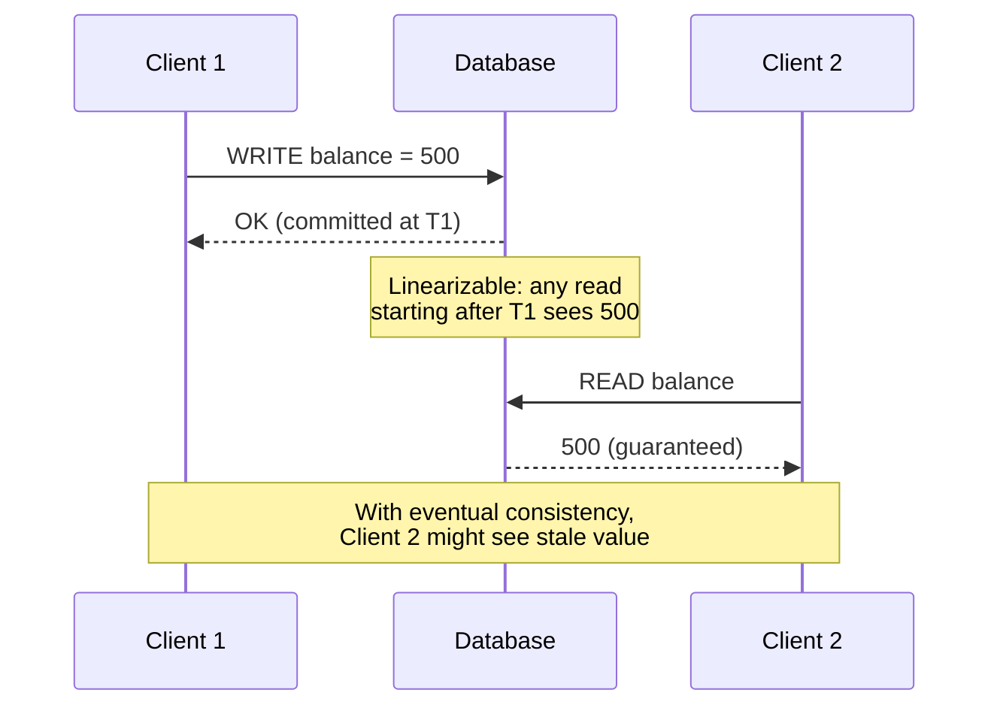

### Two-Phase Commit (2PC)

2PC is a protocol for achieving atomic commits across multiple participants (databases, services, resource managers).

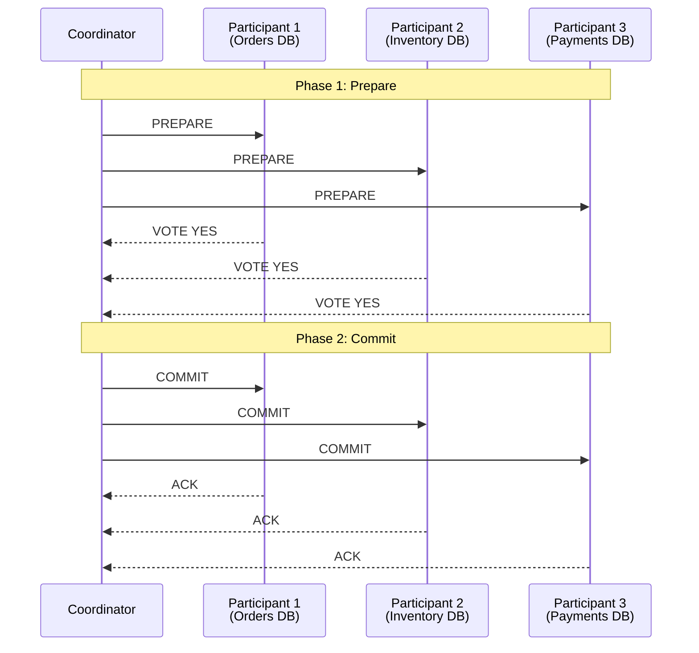

**Problems with 2PC**:
- **Blocking**: If the coordinator crashes after sending PREPARE but before sending COMMIT/ABORT, participants are stuck holding locks.
- **Latency**: Two round trips minimum. Cross-region 2PC can add 100-300ms.
- **Availability**: Any participant failure blocks the entire transaction.

### Serializable Isolation

```sql
-- PostgreSQL Serializable Snapshot Isolation (SSI)
BEGIN ISOLATION LEVEL SERIALIZABLE;

-- Read the current inventory
SELECT quantity FROM inventory WHERE product_id = 'P1';
-- Returns: 5

-- Check and decrement
UPDATE inventory SET quantity = quantity - 1
WHERE product_id = 'P1' AND quantity > 0;

-- If another transaction modified this row concurrently,
-- PostgreSQL will abort one of them with:
-- ERROR: could not serialize access due to concurrent update

COMMIT;
```

### Distributed SQL for Strong Consistency

Systems like **Google Spanner** and **CockroachDB** provide serializable, externally consistent transactions across multiple regions using:
- **TrueTime** (Spanner): GPS and atomic clocks to bound clock uncertainty.
- **Hybrid Logical Clocks** (CockroachDB): Logical clocks augmented with physical timestamps.

### When to Use Strong Consistency

- Financial transactions (double-entry bookkeeping, fund transfers).
- Inventory management (preventing oversell).
- User-facing operations where stale data causes confusion (profile updates, password changes).
- Distributed locks and leader election.
- Regulatory requirements that mandate exact auditability.

### When NOT to Use Strong Consistency

- Read-heavy workloads where occasional staleness is acceptable (product listings, analytics dashboards).
- Systems where **availability** is more important than **consistency** (social media feeds, activity logs).
- Cross-region operations where strong consistency adds unacceptable latency (100ms+ per operation).
- High-throughput event streams where per-event consistency is unnecessary.

### Trade-offs

| Advantage | Disadvantage |
|---|---|
| Simplifies application logic (no stale reads) | Higher latency (coordination overhead) |
| Prevents data anomalies | Lower availability (one node down can block) |
| Easier to reason about correctness | Lower throughput (serialization bottleneck) |
| Required for financial integrity | More expensive infrastructure |

### Common Mistakes

1. **Using strong consistency everywhere**: Most reads in most systems do not need strong consistency. Over-constraining creates unnecessary performance bottlenecks.
2. **Assuming 2PC is the only option**: Saga patterns and eventual consistency with compensation are often better for microservice architectures.
3. **Ignoring clock skew**: In distributed systems, wall-clock time is unreliable. Relying on timestamps for ordering requires synchronized clocks (NTP is insufficient for strong guarantees).
4. **Not measuring the cost**: Strong consistency in a multi-region setup can add 200ms per write. Measure before committing.

### Interview Insights

Interviewers expect you to:
- Define linearizability and explain how it differs from serializability.
- Describe 2PC and its failure modes (coordinator crash, participant crash).
- Know when strong consistency is truly required vs. when eventual consistency suffices.
- Mention Spanner/CockroachDB as distributed SQL solutions for global strong consistency.

---

## 3.2 Eventual Consistency

### Definition

Eventual consistency guarantees that if no new writes are made, all replicas will **eventually converge** to the same state. The time to convergence (consistency window) is typically milliseconds to seconds but is not bounded in the worst case.

### Why It Matters

Eventual consistency is the foundation of highly available, partition-tolerant distributed systems:
- **Multi-region deployments**: Users write to the nearest region and data replicates asynchronously.
- **Caching layers**: Caches serve stale data until TTL expires or invalidation propagates.
- **Event-driven architectures**: Events are processed asynchronously, and downstream services see updates with a delay.
- **DNS**: The entire internet runs on eventual consistency (DNS propagation takes hours).

### Conflict Resolution Strategies

When two replicas accept conflicting writes, the system must resolve the conflict:

#### Last-Writer-Wins (LWW)

```
Replica A: SET user.name = "Alice"  at T=100
Replica B: SET user.name = "Alicia" at T=101

Resolution: "Alicia" wins (higher timestamp)
```

**Problem**: LWW silently drops writes. If both replicas write different fields at the same time, one write is lost entirely.

#### Vector Clocks

Vector clocks track the causal ordering of events across replicas:

```
Replica A: [A:1, B:0] — Alice updates name
Replica B: [A:0, B:1] — Bob updates email

These are concurrent (neither happened before the other).
The system must merge or ask the user to resolve.

Replica A: [A:2, B:1] — Alice updates after seeing Bob's change
This causally follows Bob's change.
```

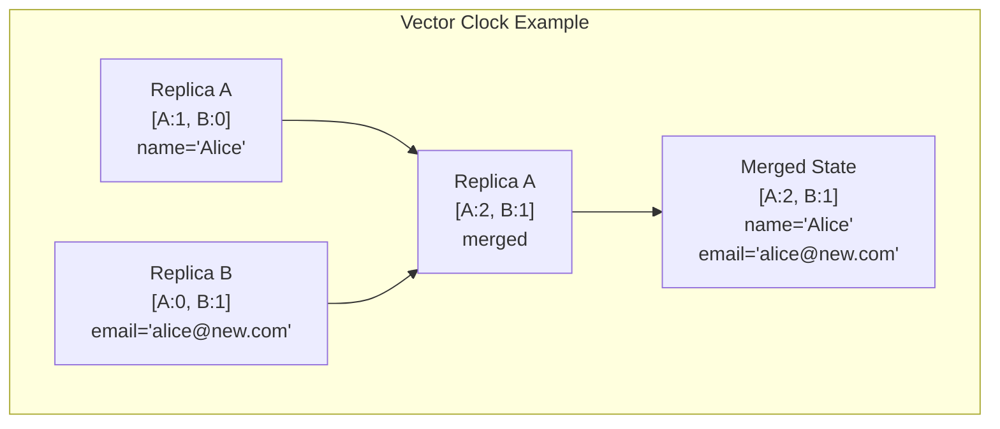

#### CRDTs (Conflict-free Replicated Data Types)

CRDTs are data structures that can be merged automatically without conflicts:

| CRDT Type | Description | Use Case |
|---|---|---|
| **G-Counter** | Grow-only counter (each replica tracks its own count) | Page views, like counts |
| **PN-Counter** | Positive-negative counter (two G-Counters) | Upvotes/downvotes |
| **G-Set** | Grow-only set (elements can be added, never removed) | Tags added to a post |
| **OR-Set** | Observed-remove set (add and remove with unique tags) | Shopping cart items |
| **LWW-Register** | Last-writer-wins register | Simple key-value pairs |
| **LWW-Map** | Map of LWW-Registers | User profile fields |

**G-Counter example**:
```
Replica A increments: {A: 5, B: 0, C: 0}
Replica B increments: {A: 0, B: 3, C: 0}
Replica C increments: {A: 0, B: 0, C: 7}

Merge: {A: max(5,0,0), B: max(0,3,0), C: max(0,0,7)} = {A:5, B:3, C:7}
Total count = 5 + 3 + 7 = 15
```

### Convergence Timeline

```mermaid
sequenceDiagram
    participant W as Writer
    participant R1 as Replica 1<br/>(Primary Region)
    participant R2 as Replica 2<br/>(Secondary Region)
    participant Reader as Reader

    W->>R1: WRITE x = 42
    R1-->>W: ACK (committed locally)
    Note over R1: x = 42

    Reader->>R2: READ x
    R2-->>Reader: x = old_value (stale!)
    Note over R2: Replication in progress...

    R1->>R2: Replicate x = 42
    Note over R2: x = 42 (converged)

    Reader->>R2: READ x
    R2-->>Reader: x = 42 (consistent!)
```

### When to Use Eventual Consistency

- **Social media feeds**: A post appearing 2 seconds late on a follower's feed is acceptable.
- **Product catalog browsing**: A price update propagating in 5 seconds does not harm the user experience.
- **Analytics and metrics**: Approximate real-time counts are sufficient.
- **DNS and CDN**: Propagation delays are expected and designed for.
- **Multi-region systems**: Cross-region strong consistency adds 100-300ms latency per operation.

### When NOT to Use Eventual Consistency

- **Financial transactions**: Seeing a stale balance can lead to overdrafts or double-spending.
- **Inventory management**: Selling an item that was already sold causes overselling.
- **Access control changes**: Revoking access but the revocation not propagating immediately is a security risk.
- **Distributed locks**: A lock that is not immediately visible defeats the purpose.

### Trade-offs

| Advantage | Disadvantage |
|---|---|
| High availability (no coordination needed) | Clients may see stale data |
| Low latency (writes acknowledge locally) | Conflicts must be resolved |
| Tolerant of network partitions | Application logic becomes more complex |
| Natural fit for multi-region | Harder to reason about correctness |
| Scales horizontally | Debugging is difficult |

### Common Mistakes

1. **Assuming "eventual" means "fast"**: In pathological cases (network partitions, overloaded replicas), convergence can take minutes or hours.
2. **Not handling conflicts**: Using LWW without understanding that writes can be silently lost.
3. **Exposing eventual consistency to users**: Showing a user their post is saved but then not displaying it on the next page load breaks trust.
4. **Not measuring replication lag**: If you do not monitor lag, you cannot know when your system is unhealthy.

### Interview Insights

Interviewers expect you to:
- Explain eventual consistency with a concrete example (replication lag, cache staleness).
- Describe conflict resolution strategies (LWW, vector clocks, CRDTs).
- Know when eventual consistency is acceptable and when it is not.
- Discuss the consistency-availability trade-off in the context of multi-region deployment.

---

## 3.3 CAP Theorem

### Definition

The **CAP theorem** (Brewer's theorem, 2000) states that a distributed data store can provide at most **two of three guarantees** simultaneously:

- **Consistency (C)**: Every read receives the most recent write or an error.
- **Availability (A)**: Every request receives a non-error response (though it may not be the most recent write).
- **Partition Tolerance (P)**: The system continues to operate despite arbitrary network partitions between nodes.

### Why It Matters

In any distributed system, **network partitions are inevitable**. When a partition occurs, you must choose between:
- **CP**: Reject requests to maintain consistency (e.g., return errors or block until partition heals).
- **AP**: Serve potentially stale data to maintain availability.

You cannot choose CA in a distributed system because network partitions are a fact of life, not a design choice.

### The Proof (Simplified)

```
Assume a distributed system with two nodes, N1 and N2, connected by a network.

1. A network partition occurs — N1 and N2 cannot communicate.
2. A write arrives at N1: SET x = 42.
3. A read arrives at N2: GET x.

The system must choose:
- CP: N2 rejects the read (unavailable) because it cannot confirm the latest value.
- AP: N2 returns the old value (inconsistent) because it cannot reach N1.
- CA: Impossible — the partition already exists, so P cannot be sacrificed.
```

### CAP Classification of Popular Systems

```mermaid
graph TD
    subgraph "CP Systems"
        PG[PostgreSQL<br/>Single-primary]
        ZK[ZooKeeper]
        ETCD[etcd]
        HBASE[HBase]
        MONGO_CP[MongoDB<br/>w/ majority reads]
        SPANNER[Google Spanner]
    end

    subgraph "AP Systems"
        CASS[Cassandra<br/>w/ ONE consistency]
        DYNAMO[DynamoDB]
        COUCH[CouchDB]
        RIAK[Riak]
        DNS[DNS]
    end

    subgraph "Tunable"
        CASS_T[Cassandra<br/>QUORUM = CP-ish]
        MONGO_T[MongoDB<br/>w/ local reads = AP-ish]
    end
```

### PACELC Extension

The **PACELC** theorem (Abadi, 2012) extends CAP by considering the trade-off when there is **no partition**:

- **If Partition (P)**: Choose between **Availability (A)** and **Consistency (C)**.
- **Else (E)**: Choose between **Latency (L)** and **Consistency (C)**.

```
┌─────────────────────────────────────────────────────────────┐
│                      PACELC Framework                        │
│                                                             │
│  During Partition:        During Normal Operation:          │
│  ┌─────┐  ┌─────┐       ┌─────────┐  ┌─────────┐         │
│  │  A  │  │  C  │       │  L (low │  │  C      │         │
│  │     │  │     │       │ latency)│  │         │         │
│  └─────┘  └─────┘       └─────────┘  └─────────┘         │
│                                                             │
│  Examples:                                                  │
│  PA/EL: Cassandra (ONE) — always fast, sometimes stale     │
│  PC/EC: Spanner — always correct, sometimes slow           │
│  PA/EC: MongoDB (majority) — available in partition,        │
│         consistent normally                                 │
│  PC/EL: PNUTS (Yahoo) — consistent in partition,           │
│         fast normally                                       │
└─────────────────────────────────────────────────────────────┘
```

| System | P: A or C? | E: L or C? | Classification |
|---|---|---|---|
| Cassandra (ONE) | A | L | PA/EL |
| Cassandra (QUORUM) | C | C | PC/EC |
| Google Spanner | C | C | PC/EC |
| DynamoDB | A | L | PA/EL |
| MongoDB (majority) | C | C | PC/EC |
| MongoDB (local read) | A | L | PA/EL |
| PostgreSQL (single primary) | C | C | PC/EC |

### Common Mistakes

1. **Treating CAP as a static, permanent choice**: Most systems let you tune consistency per operation, not per cluster.
2. **Forgetting that partitions are temporary**: During normal operation, CAP does not apply. PACELC addresses this.
3. **Claiming a system is "CA"**: No distributed system can be CA. If someone says their system is CA, they are either not distributed or not tolerating partitions.
4. **Confusing CAP consistency with ACID consistency**: CAP consistency is linearizability. ACID consistency is about maintaining invariants (constraints).

### Interview Insights

Interviewers expect you to:
- State the CAP theorem correctly and explain why P cannot be sacrificed.
- Classify systems as CP or AP and explain why.
- Mention PACELC as an extension that captures the latency-consistency trade-off during normal operation.
- Apply CAP reasoning to justify your database choice for a given system design.

---

## 3.4 Consistency Levels (Tunable Consistency)

### Definition

Many distributed databases allow you to choose the consistency level **per operation** rather than globally. This is called **tunable consistency**. You trade off consistency, latency, and availability on each individual read or write.

### Why It Matters

Not all operations in a system need the same consistency:
- A **checkout** needs strong consistency (do not oversell).
- A **product listing page** can tolerate slightly stale data.
- A **view counter** does not need consistency at all.

Tunable consistency lets you optimize each path independently.

### Cassandra Consistency Levels

| Level | Write: How many replicas must acknowledge? | Read: How many replicas must respond? | Guarantee |
|---|---|---|---|
| **ONE** | 1 | 1 | Fastest; may read stale data |
| **TWO** | 2 | 2 | Moderate; higher durability |
| **THREE** | 3 | 3 | Higher durability |
| **QUORUM** | (N/2)+1 | (N/2)+1 | Strong consistency if R+W > N |
| **ALL** | N (all replicas) | N (all replicas) | Strongest; lowest availability |
| **LOCAL_QUORUM** | Quorum in local DC | Quorum in local DC | Strong within datacenter |
| **EACH_QUORUM** | Quorum in each DC | N/A (write only) | Strong across all datacenters |

### Quorum Formula

```
For a replication factor of N:

Strong consistency: R + W > N

Where:
  R = number of replicas that must respond to a read
  W = number of replicas that must acknowledge a write
  N = total number of replicas

Example (N=3):
  QUORUM read (R=2) + QUORUM write (W=2) = 4 > 3 ✓ Strong consistency
  ONE read (R=1) + QUORUM write (W=2) = 3 = 3 ✗ NOT strong consistency
  ONE read (R=1) + ALL write (W=3) = 4 > 3 ✓ Strong consistency
```

### Consistency Level Decision

```mermaid
graph TD
    OP[Operation Type] --> WRITE{Is it a<br/>critical write?}
    WRITE -->|Yes| WQ[Write: QUORUM<br/>or LOCAL_QUORUM]
    WRITE -->|No| W1[Write: ONE<br/>for speed]

    OP --> READ{Is stale data<br/>acceptable?}
    READ -->|No| RQ[Read: QUORUM<br/>or LOCAL_QUORUM]
    READ -->|Yes| R1[Read: ONE<br/>for speed]

    WQ --> CHECK{R + W > N?}
    RQ --> CHECK
    W1 --> CHECK
    R1 --> CHECK
    CHECK -->|Yes| STRONG[Strong Consistency<br/>Guaranteed]
    CHECK -->|No| EVENTUAL[Eventual Consistency<br/>Possible stale reads]
```

### Per-Operation Consistency Examples

```cql
-- Cassandra: Write with QUORUM, read with QUORUM (strong consistency)
INSERT INTO inventory (product_id, quantity)
VALUES ('P1', 100)
USING CONSISTENCY QUORUM;

SELECT quantity FROM inventory
WHERE product_id = 'P1'
USING CONSISTENCY QUORUM;

-- For non-critical reads (product browsing), use ONE for speed
SELECT name, description, price FROM products
WHERE product_id = 'P1'
USING CONSISTENCY ONE;
```

### DynamoDB Consistency

DynamoDB offers two read consistency options:
- **Eventually Consistent Read** (default): May return stale data. 2x cheaper and lower latency.
- **Strongly Consistent Read**: Returns the most recent write. Consumes 2x the read capacity units.

```python
# DynamoDB: Eventually consistent read (default)
response = table.get_item(Key={'user_id': 'u42'})

# DynamoDB: Strongly consistent read
response = table.get_item(
    Key={'user_id': 'u42'},
    ConsistentRead=True
)
```

### Trade-offs

| Consistency Level | Latency | Availability | Correctness |
|---|---|---|---|
| ONE | Lowest | Highest | Weakest (stale reads possible) |
| QUORUM | Moderate | Moderate | Strong (if R+W>N) |
| ALL | Highest | Lowest | Strongest (but one node down = unavailable) |
| LOCAL_QUORUM | Low-moderate | High | Strong within datacenter |

### Common Mistakes

1. **Using ALL for everything**: One unavailable node blocks all reads and writes. QUORUM provides strong consistency with better availability.
2. **Mixing consistency levels incorrectly**: Writing with ONE and reading with ONE means R+W = 2 < N=3, so you may read stale data.
3. **Not understanding LOCAL_QUORUM vs QUORUM**: QUORUM spans all datacenters (higher latency). LOCAL_QUORUM stays within the local datacenter (lower latency, but cross-DC reads may be stale).
4. **Ignoring the cost of strongly consistent reads in DynamoDB**: Strongly consistent reads cost 2x, which matters at scale.

### Interview Insights

Interviewers expect you to:
- Explain the quorum formula (R + W > N) and why it guarantees strong consistency.
- Choose appropriate consistency levels for different operations in the same system.
- Know the difference between LOCAL_QUORUM and QUORUM in multi-datacenter setups.
- Discuss DynamoDB's two read consistency modes and their cost implications.

---

## 3.5 Session Guarantees

### Definition

Session guarantees provide consistency promises **within a single client session**, even in an eventually consistent system. They bridge the gap between strong consistency (expensive) and pure eventual consistency (confusing for users).

### Why It Matters

The most common user complaint about eventual consistency is not abstract staleness but concrete confusion:
- "I just updated my profile, but when I refresh, I see the old values."
- "I posted a comment, but it does not appear on the page."
- "I changed my settings, navigated away, came back, and my changes are gone."

Session guarantees prevent these specific problems without requiring global strong consistency.

### Types of Session Guarantees

#### Read Your Writes (RYW)

**Guarantee**: If a client writes a value, any subsequent read by the same client will see that write (or a later one).

```mermaid
sequenceDiagram
    participant C as Client (Alice)
    participant P as Primary (US-East)
    participant R as Replica (EU-West)

    C->>P: UPDATE profile SET name='Alice Smith'
    P-->>C: OK

    Note over C: Without RYW, Alice might<br/>read from EU-West replica<br/>and see the old name

    C->>P: SELECT name FROM profile
    Note over C,P: RYW: Route read to primary<br/>or replica that has caught up
    P-->>C: name = 'Alice Smith' ✓
```

**Implementation strategies**:
1. **Sticky sessions**: Route the client to the same replica that processed the write.
2. **Write timestamp tracking**: After a write, record the write timestamp. On subsequent reads, only accept responses from replicas that are at least as fresh.
3. **Read from primary after write**: For a short window after a write, route reads to the primary.

#### Monotonic Reads

**Guarantee**: If a client reads a value, any subsequent read by the same client will return the same or a newer value (never an older one).

```
Without monotonic reads:
  Read 1 → Replica A → balance = 500 (current)
  Read 2 → Replica B → balance = 400 (stale!)  ← Went backward!

With monotonic reads:
  Read 1 → Replica A → balance = 500 (current)
  Read 2 → Replica B → balance = 400... but system knows client
           has seen 500, so routes to a more current replica
           → balance = 500 ✓
```

**Implementation**: Track the last-seen version number or timestamp per client. Only serve reads from replicas at or beyond that version.

#### Causal Consistency

**Guarantee**: If operation A **causally precedes** operation B (B depends on or is aware of A), then every node that sees B will also see A. Operations that are not causally related can be seen in any order.

```mermaid
sequenceDiagram
    participant A as Alice
    participant DB as Distributed DB
    participant B as Bob

    A->>DB: Post: "Anyone want to grab lunch?"
    Note over DB: Causal event 1

    B->>DB: Read Alice's post
    B->>DB: Reply: "Sure, let's go to the Thai place!"
    Note over DB: Causal event 2<br/>(causally depends on event 1)

    Note over A,B: Causal consistency guarantees:<br/>Anyone who sees Bob's reply<br/>will also see Alice's original post.<br/>Without it, someone could see<br/>"Sure, let's go to the Thai place!"<br/>without seeing what it's replying to.
```

**Implementation**: Causal consistency is typically tracked using:
- **Lamport timestamps**: Single counter, orders causally related events.
- **Vector clocks**: Per-node counters, captures the full causal history.
- **Hybrid logical clocks**: Combine physical time with logical counters for bounded clock skew.

### Session Guarantee Summary

| Guarantee | What It Prevents | Implementation Cost |
|---|---|---|
| **Read Your Writes** | "I saved but it disappeared" | Low (sticky sessions or write-timestamp tracking) |
| **Monotonic Reads** | "Values went backward" | Low (version tracking per client) |
| **Monotonic Writes** | "Writes applied in wrong order" | Medium (causal ordering of writes) |
| **Writes Follow Reads** | "Reply appears without the original" | Medium (causal dependency tracking) |
| **Causal Consistency** | All of the above combined | High (vector clocks or dependency tracking) |

### Practical Implementation: Read-Your-Writes with Redis

```python
import time
import redis

class ReadYourWritesProxy:
    def __init__(self, primary_redis, replica_redis):
        self.primary = primary_redis
        self.replica = replica_redis
        self.write_timestamps = {}  # per-session write tracking

    def write(self, session_id, key, value):
        self.primary.set(key, value)
        self.write_timestamps[session_id] = time.time()

    def read(self, session_id, key):
        last_write = self.write_timestamps.get(session_id, 0)
        if time.time() - last_write < 5:  # 5-second RYW window
            return self.primary.get(key)  # Read from primary
        else:
            return self.replica.get(key)  # Safe to read from replica
```

### Common Mistakes

1. **Ignoring session guarantees entirely**: Users notice when their own writes disappear, even temporarily.
2. **Implementing RYW only for the writing endpoint**: The user may write on endpoint A and read on endpoint B (different service, different page).
3. **Using sticky sessions without a fallback**: If the sticky replica goes down, the client is stuck or sees old data.
4. **Not testing replication lag**: Session guarantees only matter when there IS replication lag. Test under realistic lag conditions.

### Interview Insights

Interviewers expect you to:
- Explain the "I saved but it disappeared" problem and how RYW solves it.
- Describe practical implementations (sticky sessions, write-timestamp routing).
- Distinguish between session-level guarantees and global consistency.
- Know that causal consistency is the strongest session guarantee and captures all others.

---

# Section 4: Advanced Data Patterns

## 4.1 CRDTs and Local-First Architecture

### What Are CRDTs?

**Conflict-free Replicated Data Types (CRDTs)** are data structures that can be replicated across multiple nodes, updated independently and concurrently without coordination, and always converge to a consistent state when merged. They achieve **strong eventual consistency** without requiring consensus protocols.

CRDTs solve the fundamental tension between availability and consistency in distributed systems by making conflict resolution automatic and mathematically guaranteed.

### Core CRDT Types

| CRDT Type | Description | Operations | Use Case |
|-----------|-------------|------------|----------|
| **G-Counter** | Grow-only counter; each node maintains its own count, total = sum of all nodes | Increment | View counts, like counts, download counters |
| **PN-Counter** | Pair of G-Counters (positive + negative); supports both increment and decrement | Increment, Decrement | Inventory counts, vote tallies, bidirectional counters |
| **OR-Set** (Observed-Remove Set) | Set where adds and removes can happen concurrently; add wins over concurrent remove | Add, Remove | Shopping carts, tag sets, collaborative lists |
| **LWW-Register** (Last-Writer-Wins) | Single value where concurrent writes are resolved by timestamp | Set | User profile fields, settings, single-value state |
| **LWW-Map** | Map of LWW-Registers; each key resolves independently | Set key, Remove key | Document properties, key-value configuration |
| **RGA** (Replicated Growable Array) | Ordered list supporting insert and delete at any position | Insert, Delete | Collaborative text editing, ordered task lists |

### How CRDT Merge Works

```mermaid
graph TD
    subgraph "Node A (San Francisco)"
        A1["State: {x: 3, y: 1}<br/>G-Counter A"]
        A2["Local op: increment x"]
        A1 --> A2
        A3["State: {x: 4, y: 1}"]
        A2 --> A3
    end

    subgraph "Node B (London)"
        B1["State: {x: 3, y: 1}<br/>G-Counter B"]
        B2["Local op: increment y"]
        B1 --> B2
        B3["State: {x: 3, y: 2}"]
        B2 --> B3
    end

    subgraph "Node C (Tokyo)"
        C1["State: {x: 3, y: 1}<br/>G-Counter C"]
        C2["Local op: increment x"]
        C1 --> C2
        C3["State: {x: 4, y: 1}"]
        C2 --> C3
    end

    A3 -->|"Sync"| M["Merge: element-wise max<br/>{x: max(4,3,4), y: max(1,2,1)}<br/>Result: {x: 4, y: 2}"]
    B3 -->|"Sync"| M
    C3 -->|"Sync"| M
    M --> F["All nodes converge to<br/>{x: 4, y: 2}"]
```

### Local-First Software

**Local-first** software stores data primarily on the user's device and syncs with peers or a server when connectivity is available. This inverts the traditional client-server model:

| Aspect | Cloud-First | Local-First |
|--------|------------|-------------|
| **Data location** | Server is source of truth | Device is source of truth |
| **Offline support** | Degraded or none | Full functionality |
| **Latency** | Network round-trip (50-200ms) | Instant (<1ms) |
| **Collaboration** | Server mediates all changes | Peer-to-peer sync via CRDTs |
| **Data ownership** | Cloud provider holds data | User owns their data |
| **Server dependency** | App unusable without server | App works indefinitely offline |

### When to Use CRDTs / Local-First

- **Collaborative editing**: Multiple users editing the same document (Google Docs-style)
- **Offline-first mobile apps**: Field service apps, note-taking, task management
- **Multi-region writes**: Avoiding cross-region coordination latency
- **Edge computing**: IoT devices that must operate autonomously
- **Distributed counters**: Like counts, view counts across CDN edges

### When NOT to Use

- **Strong consistency required**: Financial transactions, inventory reservations (a brief overcount is unacceptable)
- **Total ordering required**: Sequential ID generation, auction bidding
- **Complex transactions**: Multi-entity ACID operations that cannot be decomposed
- **Storage-constrained devices**: CRDTs can have higher memory overhead due to metadata

### Trade-Offs

| Dimension | CRDTs / Local-First | Server-Authoritative |
|-----------|---------------------|---------------------|
| **Consistency** | Strong eventual (converges) | Strong (linearizable) |
| **Availability** | Always available (offline works) | Unavailable when disconnected |
| **Offline capability** | Full functionality | None or degraded |
| **Latency** | Local speed (<1ms) | Network-bound (50-500ms) |
| **Conflict resolution** | Automatic (math-based) | Manual or last-write-wins |
| **Complexity** | Higher (CRDT logic, sync protocol) | Lower (standard client-server) |
| **Storage overhead** | Higher (tombstones, vector clocks) | Lower (single copy) |

### Real-World Examples

- **Figma**: Uses CRDTs for real-time multiplayer design editing. Each operation (move, resize, color change) is a CRDT update that merges automatically across collaborators.
- **Linear**: Local-first issue tracker. All data lives on-device; sync happens in the background. App feels instant because every operation is local.
- **Notion**: Hybrid approach with CRDT-like operational transforms for real-time collaboration while maintaining a server-authoritative model for persistence.
- **Apple Notes**: Uses CRDTs for cross-device sync without a central server mediating every edit.
- **Automerge / Yjs**: Open-source CRDT libraries used by dozens of collaborative apps.

---

## 4.2 CDC, Outbox Pattern, and Event Sourcing

### Overview

When a service writes to its database, other services often need to know about that change. Three patterns address this **data change propagation** problem with different trade-offs:

1. **Change Data Capture (CDC)**: Read the database's write-ahead log and publish changes
2. **Transactional Outbox**: Write events to an outbox table atomically with business data
3. **Event Sourcing**: Store events as the source of truth; derive current state via projections

### Change Data Capture (CDC)

CDC captures row-level changes from the database's **Write-Ahead Log (WAL)** and publishes them as events to a message broker. The application code does not change; CDC operates at the database level.

**How it works**: Database writes go to the WAL. A CDC connector (e.g., Debezium) tails the WAL, converts each change into a structured event, and publishes to Kafka.

```mermaid
graph LR
    App["Application"] -->|"INSERT/UPDATE/DELETE"| DB[(PostgreSQL)]
    DB -->|"WAL Stream"| CDC["Debezium<br/>CDC Connector"]
    CDC -->|"Change Events"| K["Apache Kafka"]
    K --> C1["Search Indexer<br/>(Elasticsearch)"]
    K --> C2["Cache Invalidator<br/>(Redis)"]
    K --> C3["Analytics Pipeline<br/>(Data Warehouse)"]
    K --> C4["Audit Log<br/>(S3/Parquet)"]

    style CDC fill:#f9f,stroke:#333,stroke-width:2px
```

**Key characteristics**:
- **Low intrusion**: No application code changes required
- **Schema-coupled**: Consumers depend on the database schema; schema changes can break downstream
- **At-least-once delivery**: CDC guarantees at-least-once; consumers must be idempotent
- **Low latency**: Changes propagate within seconds of the commit

### Transactional Outbox Pattern

The application writes business data and an event to an **outbox table** in the same database transaction. A separate relay process reads the outbox and publishes events to the message broker.

```sql
-- Single atomic transaction
BEGIN;

-- Business write
INSERT INTO orders (order_id, user_id, total, status)
VALUES ('ord_123', 'usr_456', 99.99, 'created');

-- Outbox write (same transaction)
INSERT INTO outbox (event_id, aggregate_type, aggregate_id, event_type, payload)
VALUES (
    gen_random_uuid(),
    'Order',
    'ord_123',
    'OrderCreated',
    '{"order_id":"ord_123","user_id":"usr_456","total":99.99}'
);

COMMIT;
```

A relay process (polling or CDC on the outbox table) reads new outbox rows and publishes them to Kafka, then marks them as published.

**Key characteristics**:
- **Atomic with business data**: Event is guaranteed to exist if and only if the business write succeeded
- **Schema-independent**: Event payload is explicitly designed; not coupled to table schema
- **More application code**: Developer must write events to the outbox in every write path
- **Explicit contracts**: Event schema is a deliberate API, not an accidental exposure of internal schema

### Event Sourcing

Instead of storing current state, **event sourcing** stores an immutable append-only log of events as the source of truth. Current state is derived by replaying events (projections).

```mermaid
graph TD
    Cmd["Command:<br/>PlaceOrder"] --> ES["Event Store<br/>(append-only)"]
    ES -->|"Event 1: OrderCreated<br/>Event 2: ItemAdded<br/>Event 3: ItemAdded<br/>Event 4: OrderConfirmed"| ES

    ES --> P1["Projection: Order Summary<br/>(current state view)"]
    ES --> P2["Projection: Revenue Report<br/>(analytics view)"]
    ES --> P3["Projection: Search Index<br/>(Elasticsearch)"]

    P1 --> R1[(Read Model DB<br/>PostgreSQL)]
    P2 --> R2[(Analytics DB<br/>ClickHouse)]
    P3 --> R3[(Search<br/>Elasticsearch)]

    Q["Query: Get Order"] --> R1
```

**Key characteristics**:
- **Complete audit trail**: Every state transition is recorded forever
- **Temporal queries**: "What was the order state at 3pm Tuesday?"
- **Complex read path**: Queries require projections (materialized views of event streams)
- **Event versioning**: Events are immutable; schema evolution requires upcasting

### Decision Matrix: When to Use Each Pattern

| Criterion | CDC | Transactional Outbox | Event Sourcing |
|-----------|-----|---------------------|----------------|
| **Code changes required** | None (infra only) | Moderate (outbox writes) | Extensive (new paradigm) |
| **Schema coupling** | High (tied to DB schema) | Low (explicit event payload) | None (events ARE the schema) |
| **Consistency** | At-least-once from WAL | Exactly-once with business write | Events are the truth |
| **Audit trail** | Partial (captures changes) | Partial (captures events) | Complete (all history) |
| **Temporal queries** | No | No | Yes (replay to any point) |
| **Operational complexity** | Medium (CDC connector) | Low (polling or CDC relay) | High (projections, snapshots) |
| **Best for** | Brownfield systems, analytics sync | Microservice event publishing | Domains requiring full audit |
| **Real-world examples** | LinkedIn (Databus), Airbnb | Shopify, Uber | Banking (LMAX), Evento |

### Trade-Offs Summary

- **CDC**: Low code investment, but consumers are coupled to your database schema. Schema migration becomes a cross-team coordination problem.
- **Outbox**: Explicit event contracts decouple consumers from your schema, but every write path must remember to publish. Best balance for most microservice architectures.
- **Event Sourcing**: Complete audit history and temporal queries, but reads become complex (projections) and the learning curve is steep. Reserve for domains where the audit trail is a business requirement (finance, healthcare, legal).

---

## 4.3 Multi-Tenant Data Isolation Patterns

### Overview

Multi-tenancy is the architectural approach where a single software instance serves multiple customers (tenants). The data isolation strategy is one of the most consequential decisions in SaaS architecture, affecting security, compliance, performance, cost, and operational complexity.

### The Three Fundamental Approaches

```mermaid
graph TD
    subgraph "Pattern 1: Shared Schema"
        SS_DB[(Single Database)]
        SS_T1["Tenant A rows<br/>tenant_id = 'A'"]
        SS_T2["Tenant B rows<br/>tenant_id = 'B'"]
        SS_T3["Tenant C rows<br/>tenant_id = 'C'"]
        SS_DB --> SS_T1
        SS_DB --> SS_T2
        SS_DB --> SS_T3
    end

    subgraph "Pattern 2: Separate Schemas"
        SP_DB[(Single Database)]
        SP_S1["Schema: tenant_a<br/>Full table set"]
        SP_S2["Schema: tenant_b<br/>Full table set"]
        SP_S3["Schema: tenant_c<br/>Full table set"]
        SP_DB --> SP_S1
        SP_DB --> SP_S2
        SP_DB --> SP_S3
    end

    subgraph "Pattern 3: Separate Databases"
        SD_DB1[(DB: tenant_a)]
        SD_DB2[(DB: tenant_b)]
        SD_DB3[(DB: tenant_c)]
    end
```

### Pattern 1: Shared Database, Shared Schema (Row-Level Security)

All tenants share the same tables. Every table has a `tenant_id` column. Access is enforced through **Row-Level Security (RLS)** policies.

```sql
-- Enable RLS
ALTER TABLE orders ENABLE ROW LEVEL SECURITY;

-- Policy: tenants can only see their own rows
CREATE POLICY tenant_isolation ON orders
    USING (tenant_id = current_setting('app.current_tenant')::uuid);

-- Set tenant context at connection time
SET app.current_tenant = 'tenant_abc_123';

-- This query automatically filters to the current tenant
SELECT * FROM orders WHERE status = 'active';
-- Internally becomes: SELECT * FROM orders WHERE status = 'active' AND tenant_id = 'tenant_abc_123'
```

### Pattern 2: Shared Database, Separate Schemas

Each tenant gets their own PostgreSQL **schema** within the same database. Tables are identical across schemas but data is physically separated.

```sql
-- Create schema for new tenant
CREATE SCHEMA tenant_acme;

-- Create tables within tenant schema
CREATE TABLE tenant_acme.orders (
    order_id UUID PRIMARY KEY,
    total NUMERIC NOT NULL,
    status TEXT NOT NULL
);

-- Route queries by setting search_path
SET search_path = 'tenant_acme';
SELECT * FROM orders;  -- queries tenant_acme.orders
```

### Pattern 3: Separate Databases Per Tenant

Each tenant gets a dedicated database instance. Full physical isolation.

### Comparison Table

| Criterion | Shared Schema (RLS) | Separate Schemas | Separate Databases |
|-----------|-------------------|-----------------|-------------------|
| **Isolation** | Logical (row-level) | Logical (schema-level) | Physical (full) |
| **Cost per tenant** | Lowest | Low-Medium | Highest |
| **Operational complexity** | Lowest (one DB to manage) | Medium (schema migrations x N) | Highest (N databases to manage) |
| **Compliance suitability** | Basic (SOC2) | Moderate (SOC2, some HIPAA) | Highest (HIPAA, FedRAMP, PCI) |
| **Noisy neighbor risk** | Highest (shared resources) | Medium (shared DB resources) | None (dedicated resources) |
| **Schema customization** | None (shared tables) | Per-tenant schema variations | Full customization |
| **Cross-tenant queries** | Easy (same tables) | Possible (cross-schema joins) | Hard (requires federation) |
| **Backup/restore granularity** | Tenant-level is complex | Per-schema possible | Per-database (simple) |
| **Max tenants** | 100,000+ | 1,000-10,000 | 100-1,000 |
| **When to use** | High-volume, low-touch SaaS | Mid-market SaaS | Enterprise, regulated industries |

### Hybrid Approach

Most mature SaaS platforms use a **hybrid model**:

- **Free/small tenants**: Shared schema with RLS (cost-efficient at scale)
- **Mid-tier tenants**: Separate schemas (better isolation, moderate cost)
- **Enterprise tenants**: Dedicated databases (full isolation, compliance, custom SLAs)

A **tenant routing layer** maps each request to the correct database/schema based on the tenant's tier.

### Real-World Examples

- **Salesforce**: Shared schema with extensive RLS and Organization ID on every table. Serves 150K+ tenants from shared infrastructure.
- **Slack**: Separate database shards per workspace for performance isolation. Large workspaces get dedicated resources.
- **Shopify**: Hybrid approach. Small merchants share infrastructure; Shopify Plus merchants get dedicated pods with isolated databases.

---

## 4.4 Data Residency and Sovereignty Checklist

### Overview

Data residency laws require that certain categories of data (especially PII and PHI) be stored and processed within specific geographic boundaries. Violating these requirements can result in fines up to 4% of global revenue (GDPR), service bans, or criminal liability.

### Key Regulations

| Regulation | Region | Key Requirement | Penalty |
|-----------|--------|----------------|---------|
| **GDPR** (General Data Protection Regulation) | EU/EEA | Personal data of EU residents must be processed lawfully; transfers outside EU require adequacy decisions or SCCs | Up to 4% of global annual revenue or EUR 20M |
| **China PIPL** (Personal Information Protection Law) | China | Personal data collected in China must be stored in China; cross-border transfers require security assessment | Up to CNY 50M or 5% of annual revenue |
| **India DPDP Act** (Digital Personal Data Protection) | India | Certain categories of personal data must be stored in India; critical data cannot leave India | Up to INR 250 crore (~USD 30M) |
| **Russia Federal Law 242-FZ** | Russia | Personal data of Russian citizens must be stored on servers located in Russia | Service blocking, fines |
| **Brazil LGPD** | Brazil | Personal data must be processed in compliance with Brazilian law; international transfers require adequacy or SCCs | Up to 2% of revenue in Brazil, capped at BRL 50M |

### Cross-Border Transfer Mechanisms

- **Adequacy Decisions**: EU Commission has ruled certain countries' data protection laws are adequate (e.g., Japan, UK, Canada). No additional safeguards needed.
- **Standard Contractual Clauses (SCCs)**: Pre-approved contract terms for data transfers. Must include supplementary technical measures (encryption, pseudonymization).
- **Binding Corporate Rules (BCRs)**: For intra-group transfers within multinational corporations. Requires DPA approval.
- **Data Processing Agreements (DPAs)**: Contractual agreements between data controllers and processors defining data handling obligations.

### Practical Compliance Checklist

```
Data Residency Implementation Checklist
========================================

[ ] 1. IDENTIFY all PII/PHI data fields across all services
       - User profiles, payment data, health records, location data
       - Derived data (analytics, ML features) that contains PII

[ ] 2. CLASSIFY data by sensitivity and applicable regulation
       - Public, Internal, Confidential, Restricted
       - Map each class to applicable regulations (GDPR, PIPL, DPDP)

[ ] 3. MAP data flows across regions
       - Where is data collected? (user geography)
       - Where is data processed? (compute regions)
       - Where is data stored? (database regions)
       - Where is data backed up? (backup regions)

[ ] 4. CHOOSE storage regions per data classification
       - EU user PII → eu-west-1 / europe-west1
       - China user PII → cn-north-1 / cn-northwest-1
       - India critical data → ap-south-1

[ ] 5. IMPLEMENT data routing by user geography
       - Geo-DNS routing at the edge
       - Tenant-aware database routing layer
       - Regional API gateways that enforce data boundaries

[ ] 6. CONFIGURE cross-region replication with sovereignty constraints
       - Replicas must respect residency boundaries
       - Encryption keys must be region-specific (per-region KMS)
       - Backup and DR sites must comply with same residency rules

[ ] 7. IMPLEMENT data access controls
       - Role-based access scoped by region
       - Admin access from outside the region requires justification and audit
       - Break-glass procedures for emergency cross-region access

[ ] 8. SET UP audit logging for compliance evidence
       - Log all cross-region data access
       - Log all data export operations
       - Retain logs per regulation requirements (GDPR: duration of processing + 1yr)

[ ] 9. AUTOMATE compliance validation
       - Infrastructure-as-code policies (OPA, AWS SCP, Azure Policy)
       - Automated scanning for PII in non-compliant regions
       - CI/CD gates that block deployments violating residency rules

[ ] 10. DOCUMENT and maintain records of processing activities (ROPA)
        - Required by GDPR Article 30
        - Must include: purpose, categories, recipients, transfers, retention
```

### Cloud Provider Guidance

- **AWS**: [Well-Architected Framework — Data Residency](https://docs.aws.amazon.com/wellarchitected/latest/security-pillar/data-residency.html) — Use AWS Organizations SCPs to restrict regions, S3 Object Lock for retention, and AWS Config rules for compliance monitoring.
- **GCP**: [Data Residency, Operational Transparency](https://cloud.google.com/architecture/framework/security/data-residency) — Use VPC Service Controls, organization policy constraints for region restriction, and Assured Workloads for regulated environments.
- **Azure**: [Data Residency in Azure](https://azure.microsoft.com/en-us/explore/global-infrastructure/data-residency/) — Use Azure Policy for region enforcement, Customer Lockbox for access control, and Azure Confidential Computing for processing-in-use protection.

---

## 4.5 Data Architecture Decision Record Template

### Why Data ADRs?

Data and storage decisions have the longest lifespan and highest migration cost of any architectural choice. A dedicated **Architecture Decision Record (ADR)** template for data decisions ensures that the rationale, trade-offs, and revisit triggers are captured before the team moves on.

### Template

```
================================================================
DATA ARCHITECTURE DECISION RECORD
================================================================

Title:       [Short descriptive title]
Date:        [YYYY-MM-DD]
Status:      [Proposed | Accepted | Superseded by ADR-XXX]
Authors:     [Names]
Reviewers:   [Names]

DECISION
--------
What storage technology, data pattern, or modeling approach are we choosing?

CONTEXT
-------
What data characteristics drove this decision?
- Volume: How much data? Growth rate?
- Velocity: Write/read throughput requirements?
- Variety: Structured, semi-structured, unstructured?
- Access patterns: Point lookups, range scans, full-text search, graph traversals?
- Consistency requirements: Strong, eventual, causal?
- Regulatory: GDPR, HIPAA, PCI-DSS, data residency?

OPTIONS CONSIDERED
------------------
| Option | Pros | Cons |
|--------|------|------|
| Option A | ... | ... |
| Option B | ... | ... |
| Option C | ... | ... |

CHOSEN OPTION
-------------
[Selected option and brief statement]

WHY THIS OPTION
---------------
Specific reasons tied to data requirements (not generic "it's popular").

DATA MODEL IMPACT
-----------------
How does this affect schema, indexing, partitioning, and denormalization?

MIGRATION PATH
--------------
How do we get from current state to the chosen state?
- Dual-write period?
- Backfill strategy?
- Rollback plan?

CONSISTENCY IMPACT
------------------
What consistency guarantees change? How does this affect user experience?

COST IMPACT
-----------
- Storage cost ($/GB/month)
- Compute cost ($/hour)
- Operational cost (team hours/month)
- Migration cost (one-time)

REVISIT WHEN
-------------
What conditions would make us reconsider this decision?
- Data volume exceeds X TB
- Write throughput exceeds Y ops/sec
- New compliance requirement
- Cost exceeds $Z/month

================================================================
```

### Example ADR 1: Choose DynamoDB for Session Store

```
================================================================
DATA ARCHITECTURE DECISION RECORD
================================================================

Title:       Use DynamoDB for user session storage
Date:        2025-09-15
Status:      Accepted
Authors:     Platform Team
Reviewers:   Security, SRE

DECISION
--------
Replace Redis-based session storage with DynamoDB for all user sessions.

CONTEXT
-------
- Volume: 50M active sessions, ~2KB each = 100GB
- Velocity: 200K reads/sec, 50K writes/sec at peak
- Access pattern: Point lookups by session_id (100%), no scans
- Consistency: Eventual consistency acceptable (session data is soft state)
- Current problem: Redis cluster requires manual scaling; failover causes session loss

OPTIONS CONSIDERED
------------------
| Option | Pros | Cons |
|--------|------|------|
| Redis Cluster (current) | Sub-ms latency, rich data types | Manual scaling, data loss on failover |
| DynamoDB | Auto-scaling, durable, TTL built-in | Higher p99 latency (~5ms vs <1ms) |
| ElastiCache Serverless | Managed Redis, auto-scaling | Higher cost, still Redis complexity |

CHOSEN OPTION
-------------
DynamoDB with on-demand capacity mode.

WHY THIS OPTION
---------------
- Point-lookup-only access pattern is ideal for DynamoDB
- Built-in TTL eliminates custom session expiry logic
- Auto-scaling eliminates capacity planning overhead
- Durable storage means no session loss during failover
- 5ms p99 latency is acceptable for session lookups

DATA MODEL IMPACT
-----------------
- Partition key: session_id (UUID, uniform distribution)
- TTL attribute: expires_at (epoch seconds)
- No secondary indexes needed
- Session data stored as a single JSON attribute

MIGRATION PATH
--------------
1. Deploy dual-write (Redis + DynamoDB) for 1 week
2. Switch reads to DynamoDB, Redis as fallback
3. Monitor for 1 week
4. Decommission Redis cluster
5. Rollback: re-enable Redis reads (data still being written)

CONSISTENCY IMPACT
------------------
No change. Sessions were already eventually consistent in Redis.

COST IMPACT
-----------
- DynamoDB on-demand: ~$3,500/month (vs Redis r6g.xlarge cluster: ~$4,800/month)
- Net savings: ~$1,300/month + elimination of Redis operational overhead
- Migration cost: ~2 engineer-weeks

REVISIT WHEN
-------------
- Need sub-millisecond latency for sessions
- Session data model needs Redis data structures (sorted sets, lists)
- DynamoDB cost exceeds $10K/month
================================================================
```

### Example ADR 2: Add Read Replica for Analytics Queries

```
================================================================
DATA ARCHITECTURE DECISION RECORD
================================================================

Title:       Add PostgreSQL read replica dedicated to analytics queries
Date:        2025-11-02
Status:      Accepted
Authors:     Data Engineering
Reviewers:   Platform, Finance

DECISION
--------
Create a dedicated PostgreSQL read replica for analytics and reporting queries,
isolated from the production OLTP workload.

CONTEXT
-------
- Production PostgreSQL (r6g.2xlarge) running at 78% CPU during business hours
- Analytics queries (Metabase dashboards) cause CPU spikes to 95%+
- Three slow analytics queries scan 100M+ rows with GROUP BY
- Business team needs dashboards refreshed every 15 minutes
- Cannot tolerate production latency impact from reporting queries

OPTIONS CONSIDERED
------------------
| Option | Pros | Cons |
|--------|------|------|
| Read replica (dedicated) | Simple, same SQL, minimal code changes | Replication lag, doubles storage cost |
| Data warehouse (Redshift) | Optimized for analytics, columnar | ETL pipeline, SQL dialect differences |
| Materialized views | No additional infra | Still runs on primary, refresh blocks |

CHOSEN OPTION
-------------
Dedicated read replica (r6g.2xlarge) with analytics queries routed via connection string.

WHY THIS OPTION
---------------
- Simplest migration path: analytics tools just change their connection string
- Same SQL dialect means zero query rewriting
- Replication lag of <1 second is acceptable for 15-minute dashboard refresh
- Avoids building and maintaining an ETL pipeline (option B)
- Can be promoted to primary in disaster recovery scenarios

DATA MODEL IMPACT
-----------------
- No schema changes
- Add analytics-specific indexes on the replica only (won't slow production writes)
- Consider partial indexes for common dashboard date ranges

MIGRATION PATH
--------------
1. Create replica from production snapshot (2 hours)
2. Configure streaming replication
3. Update Metabase connection to point at replica
4. Add analytics-specific indexes on replica
5. Monitor production CPU (should drop 15-20%)

CONSISTENCY IMPACT
------------------
Analytics queries may see data up to ~1 second stale. Acceptable for dashboards.

COST IMPACT
-----------
- Additional r6g.2xlarge: ~$850/month
- Storage (gp3, 500GB): ~$40/month
- Total: ~$890/month
- ROI: Prevents need to upgrade production to r6g.4xlarge ($1,700/month savings)

REVISIT WHEN
-------------
- Analytics query volume outgrows single replica
- Need real-time analytics (sub-second freshness)
- Data volume exceeds 2TB (consider move to data warehouse)
================================================================
```

---

## 4.6 Analytical vs Operational Store

### OLTP vs OLAP Characteristics

| Characteristic | OLTP (Operational) | OLAP (Analytical) |
|---------------|-------------------|-------------------|
| **Primary purpose** | Process transactions | Analyze data for insights |
| **Query pattern** | Point lookups, short transactions | Full scans, aggregations, joins across large datasets |
| **Data model** | Normalized (3NF+) | Denormalized (star/snowflake schema) |
| **Row count per query** | 1-100 rows | Millions to billions of rows |
| **Latency requirement** | <10ms p99 | Seconds to minutes acceptable |
| **Concurrency** | Thousands of concurrent users | Tens of concurrent analysts |
| **Data freshness** | Real-time (current state) | Near-real-time to daily batch |
| **Write pattern** | Many small writes (INSERT/UPDATE) | Bulk loads (ETL/ELT) |
| **Storage format** | Row-oriented (PostgreSQL, MySQL) | Columnar (Parquet, ORC, Redshift) |
| **Optimization target** | Write throughput, transaction latency | Scan speed, compression ratio |
| **Index strategy** | B-tree on primary/foreign keys | Columnar min/max statistics, zone maps |
| **Examples** | PostgreSQL, MySQL, DynamoDB | Snowflake, BigQuery, ClickHouse, Redshift |

### When to Separate Operational and Analytical Stores

**Signals that you need a separate analytical store:**

1. **Reporting queries slow down production**: Dashboard queries cause CPU spikes on your OLTP database
2. **Analysts need joins across multiple services**: Analytics requires combining data from orders, payments, inventory, and user services
3. **Data retention diverges**: Operations needs 90 days; analytics needs 3 years
4. **Query patterns are fundamentally different**: OLTP optimizes for point lookups; OLAP optimizes for full-table scans
5. **Compliance requires separation**: Audit queries on historical data should not touch production systems

### Data Pipeline Patterns

#### ETL (Extract, Transform, Load)

Transform data **before** loading into the warehouse. Traditional approach.

- **Extract**: Pull data from source systems (APIs, database dumps)
- **Transform**: Clean, normalize, aggregate in a staging area
- **Load**: Write transformed data into the warehouse

**Pros**: Clean data in warehouse, lower warehouse compute costs.
**Cons**: Rigid; schema changes require pipeline changes. Slower iteration.

#### ELT (Extract, Load, Transform)

Load raw data **first**, then transform inside the warehouse. Modern approach enabled by cheap warehouse compute.

- **Extract**: Pull raw data from source systems
- **Load**: Dump raw data into the warehouse staging tables
- **Transform**: Use SQL/dbt inside the warehouse to clean and model

**Pros**: Flexible; raw data is always available for re-transformation. Faster iteration.
**Cons**: Higher warehouse compute costs. Raw data can be messy.

#### CDC (Change Data Capture) for Feeding Analytics

Capture real-time changes from OLTP databases and stream them to the analytical store. Combines low latency with low impact on source systems.

### Analytical Pipeline Architecture

```mermaid
graph LR
    subgraph "Operational Layer"
        PG[(PostgreSQL<br/>Orders)]
        MY[(MySQL<br/>Inventory)]
        MG[(MongoDB<br/>Product Catalog)]
    end

    subgraph "Ingestion"
        PG -->|"Debezium CDC"| K["Apache Kafka"]
        MY -->|"Debezium CDC"| K
        MG -->|"Kafka Connect"| K
    end

    subgraph "Processing"
        K --> F["Stream Processing<br/>(Flink / Spark Streaming)"]
        K --> S3["Raw Data Lake<br/>(S3 / GCS — Parquet)"]
    end

    subgraph "Analytical Layer"
        S3 --> DW["Data Warehouse<br/>(Snowflake / BigQuery)"]
        F --> DW
        DW --> DBT["dbt<br/>Transformations"]
        DBT --> MART["Data Marts<br/>(Star Schema)"]
    end

    subgraph "Consumption"
        MART --> BI["BI Tools<br/>(Metabase / Looker)"]
        MART --> NB["Notebooks<br/>(Jupyter)"]
        MART --> ML["ML Training<br/>(SageMaker)"]
    end
```

### Lambda vs Kappa Architecture

These are the two dominant architectures for systems that need both **real-time** and **historical** analytics.

#### Lambda Architecture

Maintains two parallel pipelines:
- **Batch layer**: Processes complete historical data periodically (hourly/daily). Source of truth.
- **Speed layer**: Processes real-time stream for low-latency results. Approximate.
- **Serving layer**: Merges batch and speed results for queries.

```
                    ┌──────────────────────────────────────┐
                    │          Batch Layer (Spark)          │
  Raw Data ────────►│   Full recompute every N hours       │──────┐
       │            │   Accurate, complete, high latency   │      │
       │            └──────────────────────────────────────┘      ▼
       │                                                    ┌───────────┐
       │                                                    │  Serving  │──► Queries
       │                                                    │   Layer   │
       │            ┌──────────────────────────────────────┐│  (merge)  │
       └───────────►│          Speed Layer (Flink)         │├───────────┘
                    │   Real-time, approximate, low latency│──────┘
                    └──────────────────────────────────────┘
```

**Pros**: Batch layer corrects any real-time errors. Proven at LinkedIn, Twitter.
**Cons**: Two codebases (batch + stream) doing the same logic. High maintenance burden.

#### Kappa Architecture

Single stream-processing pipeline handles both real-time and historical data:
- All data enters as a stream (Kafka with long retention)
- Reprocessing = replay the stream from an earlier offset
- No separate batch layer

**Pros**: Single codebase. Simpler operations. Lower maintenance.
**Cons**: Reprocessing very large datasets by replaying streams can be slow. Not all workloads fit a streaming model.

#### When to Choose Which

| Criterion | Lambda | Kappa |
|-----------|--------|-------|
| **Team size** | Large (can maintain 2 pipelines) | Small to medium |
| **Correctness requirement** | Batch provides ground truth correction | Stream must be correct first time |
| **Historical reprocessing** | Fast (batch jobs on data lake) | Slower (replay from Kafka) |
| **Operational complexity** | Higher (2 systems) | Lower (1 system) |
| **Data volume** | Petabyte-scale batch OK | Stream replay at petabyte scale is painful |
| **Use cases** | Recommendation engines, ad ranking | Log analytics, real-time dashboards |

### Data Lakehouse: The Convergence

The **data lakehouse** pattern combines the best of data lakes (cheap storage, open formats) and data warehouses (ACID transactions, SQL performance):

- **Storage**: Open columnar formats (Parquet, Delta Lake, Apache Iceberg) on object storage (S3/GCS)
- **Compute**: Decoupled query engines (Spark, Trino, Databricks, Snowflake)
- **Governance**: ACID transactions on data lake files; schema enforcement; time travel

This pattern is replacing the traditional "data lake + data warehouse" two-tier architecture in many organizations, offering a single store for both raw and curated data with warehouse-grade query performance.

---

# Architectural Reference Diagrams (ARDs)

## ARD 1: Polyglot Persistence Architecture

```mermaid
graph TD
    subgraph "Client Layer"
        WEB[Web App]
        MOB[Mobile App]
        API_EXT[External APIs]
    end

    subgraph "API Layer"
        GW[API Gateway]
    end

    subgraph "Service Layer"
        US[User Service]
        PS[Product Service]
        OS[Order Service]
        SS[Search Service]
        AS[Analytics Service]
        NS[Notification Service]
    end

    subgraph "Data Layer"
        PG[(PostgreSQL<br/>Users, Orders<br/>ACID Transactions)]
        MONGO[(MongoDB<br/>Product Catalog<br/>Flexible Schema)]
        REDIS[(Redis<br/>Sessions, Cache<br/>Rate Limits)]
        CASS[(Cassandra<br/>Activity Logs<br/>Event Streams)]
        ES[(Elasticsearch<br/>Full-text Search<br/>Log Search)]
        TSDB[(TimescaleDB<br/>Metrics<br/>Monitoring)]
        VEC[(pgvector<br/>Embeddings<br/>Semantic Search)]
    end

    subgraph "Streaming Layer"
        KAFKA[Kafka<br/>Event Bus]
    end

    WEB --> GW
    MOB --> GW
    API_EXT --> GW
    GW --> US
    GW --> PS
    GW --> OS
    GW --> SS
    GW --> AS

    US --> PG
    US --> REDIS
    PS --> MONGO
    PS --> ES
    PS --> VEC
    OS --> PG
    OS --> KAFKA
    SS --> ES
    SS --> VEC
    AS --> TSDB
    AS --> CASS
    NS --> REDIS

    KAFKA --> CASS
    KAFKA --> ES
    KAFKA --> TSDB
```

## ARD 2: Data Replication and Consistency Architecture

```mermaid
graph TD
    subgraph "Region: US-East (Primary)"
        W[Write Path] --> PG_P[(PostgreSQL<br/>Primary)]
        PG_P -->|Sync Replication| PG_R1[(PostgreSQL<br/>Replica 1)]
        PG_P -->|Async Replication| PG_R2[(PostgreSQL<br/>Replica 2)]
        R_US[Read Path<br/>US Users] --> LB_US[Load Balancer]
        LB_US --> PG_R1
        LB_US --> PG_R2
    end

    subgraph "Region: EU-West (Secondary)"
        PG_P -->|"Cross-Region<br/>Async Replication<br/>(~100ms lag)"| PG_EU[(PostgreSQL<br/>EU Replica)]
        R_EU[Read Path<br/>EU Users] --> PG_EU
    end

    subgraph "Cache Layer"
        PG_P -->|CDC| INV[Cache Invalidation]
        INV --> REDIS_US[(Redis<br/>US Cache)]
        INV --> REDIS_EU[(Redis<br/>EU Cache)]
        R_US -.->|Cache Hit| REDIS_US
        R_EU -.->|Cache Hit| REDIS_EU
    end
```

## ARD 3: Data Lifecycle Architecture

```mermaid
graph LR
    subgraph "Hot (0-30 days)"
        APP[Application] --> PG_HOT[(PostgreSQL<br/>SSD, Full Indexes<br/>Fast Queries)]
    end

    subgraph "Warm (30-365 days)"
        PG_HOT -->|"Monthly<br/>partition detach"| PG_WARM[(PostgreSQL<br/>HDD, Reduced Indexes<br/>Batch Queries)]
    end

    subgraph "Cold (1-7 years)"
        PG_WARM -->|"Yearly<br/>export + compress"| S3[(S3 + Parquet<br/>No Indexes<br/>Athena Queries)]
    end

    subgraph "Archive (7+ years)"
        S3 -->|"Compliance<br/>archive"| GLACIER[(S3 Glacier<br/>Deep Archive<br/>Hours to retrieve)]
    end

    subgraph "Deleted"
        GLACIER -->|"Retention<br/>expired"| DEL[Permanently<br/>Deleted]
    end
```

---

# Comparison Tables

## Database Paradigm Comparison

| Feature | Relational (SQL) | Document | Key-Value | Column-Family | Graph | Time-Series | Vector |
|---|---|---|---|---|---|---|---|
| **Data Model** | Tables, rows, columns | JSON/BSON documents | Key-value pairs | Wide columns | Nodes, edges | Timestamped points | High-dim vectors |
| **Schema** | Rigid, predefined | Flexible per document | Schema-less | Column families defined | Flexible | Schema per metric | Vector + metadata |
| **Query Language** | SQL | MongoDB Query / DynamoDB PartiQL | GET/SET/DEL | CQL | Cypher / Gremlin | SQL / Flux | ANN + filters |
| **Consistency** | Strong (ACID) | Tunable | Tunable | Tunable | Strong (single node) | Strong (single node) | Eventual |
| **Scaling** | Vertical (mostly) | Horizontal | Horizontal | Horizontal | Limited horizontal | Horizontal | Horizontal |
| **Best For** | Transactions, complex queries | Catalogs, CMS | Caching, sessions | Event logs, IoT | Social graphs, fraud | Monitoring, metrics | Semantic search, RAG |
| **Worst For** | High write throughput | Complex joins | Complex queries | Ad-hoc analytics | Bulk analytics | Non-time data | Exact match search |
| **Examples** | PostgreSQL, MySQL | MongoDB, DynamoDB | Redis, Memcached | Cassandra, HBase | Neo4j, Neptune | TimescaleDB, InfluxDB | Pinecone, pgvector |

## Consistency Model Comparison

| Model | Guarantee | Latency | Availability | Complexity | Use Case |
|---|---|---|---|---|---|
| **Linearizable** | Latest value always | High | Lower | High | Financial transactions |
| **Serializable** | Equivalent to serial execution | High | Lower | High | Inventory management |
| **Causal** | Respects causal ordering | Medium | Medium | Medium | Social feeds, messaging |
| **Read-your-writes** | See your own writes | Low-medium | High | Low | User profile updates |
| **Monotonic reads** | Never go backward | Low | High | Low | Dashboard displays |
| **Eventual** | Converges eventually | Lowest | Highest | Lowest | Analytics, view counts |

## Index Type Comparison

| Index Type | Operations Supported | Best For | Worst For | Storage Overhead |
|---|---|---|---|---|
| **B-tree** | =, <, >, BETWEEN, LIKE prefix, ORDER BY | General purpose | Full-text, containment | Moderate |
| **Hash** | = only | Exact match lookups | Range queries, sorting | Low |
| **GIN** | @>, @@, containment | JSONB, arrays, full-text | Range queries | High |
| **GiST** | &&, @>, distance | Geospatial, range types | Exact match | Moderate |
| **BRIN** | Range queries on sorted data | Large, naturally ordered tables | Random access | Very low |
| **Partial** | Same as underlying type | Filtered subsets | Queries outside filter | Lower (subset of rows) |
| **Covering** | Same as underlying type | Index-only scans | Wide indexes (many columns) | Higher |

---

# Practice Questions

## Question 1: E-Commerce Database Selection
**Scenario**: You are designing the data layer for a new e-commerce platform. The system needs to handle product catalog browsing, user accounts, order processing, product search, and a recommendation engine.

**Question**: Which databases would you use for each component and why?

**Expected Answer**:
- **User accounts and orders**: PostgreSQL — ACID transactions for financial integrity, referential integrity for user-order relationships.
- **Product catalog**: MongoDB or DynamoDB — schema flexibility for varying product attributes across categories.
- **Session and cart**: Redis — sub-ms latency, TTL for expiration, atomic operations.
- **Product search**: Elasticsearch — full-text search with relevance scoring, faceted navigation.
- **Recommendations**: pgvector or Pinecone — vector similarity search on user/product embeddings.
- **Activity tracking**: Cassandra — write-heavy, time-ordered, horizontally scalable.

---

## Question 2: Partition Key Design
**Scenario**: You are storing IoT sensor data in Cassandra. You have 100,000 sensors, each reporting every 10 seconds. You need to query the last hour of data for any given sensor.

**Question**: Design the table schema and explain your partition key choice.

**Expected Answer**:
```cql
CREATE TABLE sensor_readings (
    sensor_id TEXT,
    hour_bucket TEXT,  -- e.g., '2026-03-24T10'
    reading_time TIMESTAMP,
    value DOUBLE,
    PRIMARY KEY ((sensor_id, hour_bucket), reading_time)
) WITH CLUSTERING ORDER BY (reading_time DESC);
```

Partition key `(sensor_id, hour_bucket)` ensures: each partition holds one hour of data for one sensor (~360 readings), data is evenly distributed across nodes, and the query "get last hour for sensor X" hits exactly one partition.

---

## Question 3: Consistency Level Selection
**Scenario**: A social media platform stores user posts in a Cassandra cluster with replication factor 3 across two datacenters. You need to handle: (a) posting new content, (b) reading a user's own timeline, (c) reading a friend's timeline.

**Question**: What consistency level would you choose for each operation?

**Expected Answer**:
- **(a) Posting new content**: `LOCAL_QUORUM` — ensures the post is durably written to at least 2 of 3 local replicas before acknowledging.
- **(b) Reading own timeline**: `LOCAL_QUORUM` — provides read-your-writes guarantee (R+W > N locally).
- **(c) Reading friend's timeline**: `ONE` — eventual consistency is acceptable; the friend's post appearing 1-2 seconds late is fine. Lower latency and higher availability.

---

## Question 4: Schema Evolution
**Scenario**: Your users table has a `phone_number` column stored as a single string. You need to split it into `country_code` and `local_number` for international support. The table has 50 million rows and serves 10,000 requests per second.

**Question**: Describe the migration strategy that avoids downtime.

**Expected Answer**: Use the expand-contract pattern.
1. **Expand**: Add `country_code` and `local_number` columns (nullable). Deploy code that writes to all three columns.
2. **Backfill**: Process 50M rows in batches of 10K, parsing `phone_number` into the new columns.
3. **Migrate**: Deploy code that reads from the new columns (falling back to `phone_number` if new columns are NULL).
4. **Verify**: Confirm all rows are backfilled and all services use new columns.
5. **Contract**: Deploy code that only uses new columns. Drop the `phone_number` column.

---

## Question 5: Denormalization Decision
**Scenario**: Your product detail page requires data from 5 tables: products, brands, categories, reviews (aggregated), and inventory. The page is served 50,000 times per second.

**Question**: Should you denormalize? If so, how?

**Expected Answer**: Yes. Create a materialized view or a denormalized read model that pre-joins all 5 tables. Refresh it every few minutes (or use CDC to keep it near-real-time). Front it with Redis for sub-ms responses. The normalized tables remain the source of truth for writes.

---

## Question 6: CAP Theorem Application
**Scenario**: You are building a ride-sharing app that needs to match riders with nearby drivers. The system operates in 20 cities.

**Question**: Should the matching system be CP or AP? Justify your choice.

**Expected Answer**: **AP**. When a network partition occurs between datacenters, it is better to continue matching riders with drivers (possibly with slightly stale driver location data) than to refuse all matching requests. A driver's location being 5 seconds stale is far less harmful than riders being unable to book at all. Use eventual consistency with short TTLs on driver location data.

---

## Question 7: Index Strategy
**Scenario**: Your orders table has 200 million rows. The most common queries are: (a) get orders by user_id sorted by date, (b) search orders by status='pending', (c) full-text search on order notes.

**Question**: What indexes would you create?

**Expected Answer**:
```sql
-- (a) Composite B-tree for user lookups sorted by date
CREATE INDEX idx_orders_user_date ON orders (user_id, created_at DESC);

-- (b) Partial index for pending orders (only ~2% of total)
CREATE INDEX idx_orders_pending ON orders (created_at)
WHERE status = 'pending';

-- (c) GIN index for full-text search
CREATE INDEX idx_orders_notes_search ON orders
USING GIN (to_tsvector('english', notes));
```

---

## Question 8: Vector Database Design
**Scenario**: You are building a semantic search engine for a knowledge base with 10 million documents. Users type natural language queries and expect the most relevant documents.

**Question**: Design the storage and retrieval architecture.

**Expected Answer**: Use pgvector (if already using PostgreSQL) or Pinecone (for managed infrastructure). Embed each document using a model like text-embedding-3-small (1536 dimensions). Store embeddings with metadata (title, category, date). Create an HNSW index for fast ANN search. At query time, embed the user's query with the same model, search for top-K nearest neighbors, and optionally re-rank results. Apply metadata filters (category, date range) to narrow results.

---

## Question 9: Conflict Resolution
**Scenario**: Two users edit the same shared document simultaneously in different regions. User A changes the title. User B changes the body.

**Question**: How should the system resolve this conflict?

**Expected Answer**: Use field-level CRDTs or field-level LWW. Since the edits are to different fields (title vs. body), they do not conflict semantically. A per-field LWW-Register allows both changes to merge cleanly: the document gets A's title and B's body. For same-field conflicts (both edit the title), use operational transformation (OT) or CRDT text types (like Yjs or Automerge) to merge the edits character by character.

---

## Question 10: Time-Series Design
**Scenario**: You need to store metrics from 10,000 servers, each reporting 50 metrics every 10 seconds. You need to query dashboards showing the last 6 hours with 1-minute resolution, and weekly reports with 1-hour resolution.

**Question**: Design the storage architecture.

**Expected Answer**: Use TimescaleDB. Raw data ingestion: 10,000 servers x 50 metrics x 6 per minute = 3M points/minute. Store raw data with a 7-day retention policy. Create a continuous aggregate for 1-minute rollups (retained 30 days). Create another continuous aggregate for 1-hour rollups (retained 1 year). Dashboard queries hit the 1-minute aggregate. Weekly reports hit the 1-hour aggregate. This reduces query load by 10-60x compared to querying raw data.

---

## Question 11: Hot Partition Mitigation
**Scenario**: Your DynamoDB table tracks page views by URL. The partition key is the URL. A viral article gets 100,000 views per second, causing throttling.

**Question**: How do you fix this?

**Expected Answer**: Use write sharding. Append a random suffix (0-9) to the partition key: `url#0`, `url#1`, ..., `url#9`. Writes are distributed across 10 partitions. For reads, perform a scatter-gather: read all 10 sharded keys and sum the counts. Alternatively, use a counter in Redis (which handles this natively) and periodically flush to DynamoDB.

---

## Question 12: Normalization vs Denormalization
**Scenario**: An HR system needs to track employees, departments, projects, and skills. Employees belong to departments, work on multiple projects, and have multiple skills.

**Question**: Should this be normalized or denormalized?

**Expected Answer**: Normalize. The HR system is write-moderate and read-moderate with complex relationships (many-to-many between employees and projects, employees and skills). Normalization ensures that updating a department name or project status happens in one place. The query patterns involve ad-hoc reporting (which employees have skill X and work on project Y), which benefits from joins. Denormalize only if specific reporting queries become too slow, and then use materialized views.

---

## Question 13: Read-Your-Writes Implementation
**Scenario**: Your social media app uses PostgreSQL with read replicas. Users complain that after posting a comment, it does not appear when they refresh the page.

**Question**: How do you implement read-your-writes consistency?

**Expected Answer**: After a write, set a cookie or session attribute with the write timestamp (e.g., `last_write_at=1711305600`). On subsequent reads within a short window (e.g., 10 seconds), route the request to the primary instead of a replica. After the window expires, resume reading from replicas (by then, replication has likely caught up). For an alternative approach, use `pg_last_wal_receive_lsn()` on replicas to check if they have received the write before serving the read.

---

## Question 14: Multi-Database Transaction
**Scenario**: An order placement involves deducting inventory (DynamoDB), charging payment (Stripe API), and creating an order record (PostgreSQL). How do you ensure consistency across all three?

**Question**: Design the transaction flow.

**Expected Answer**: Use the **Saga pattern** (not 2PC, since these are heterogeneous systems). Orchestrated saga with compensating actions:
1. **Reserve inventory** (DynamoDB: decrement available, increment reserved).
2. **Authorize payment** (Stripe: create a PaymentIntent, authorize but do not capture).
3. **Create order** (PostgreSQL: insert order record with status='confirmed').
4. **Capture payment** (Stripe: capture the authorized amount).
5. **Confirm inventory deduction** (DynamoDB: decrement reserved, confirm sold).

If step 3 fails: compensate by releasing inventory (step 1 reverse) and canceling payment authorization (step 2 reverse). Use an orchestrator service that tracks saga state and triggers compensations on failure.

---

## Question 15: Cold Storage Query Access
**Scenario**: Your compliance team needs to query 3-year-old transaction data stored in S3 Parquet files for an audit. The data was archived from PostgreSQL.

**Question**: How do you provide query access to cold data without restoring it to PostgreSQL?

**Expected Answer**: Use **Amazon Athena** (or Presto/Trino) to query Parquet files directly in S3. Athena is serverless — no infrastructure to manage. Parquet's columnar format means queries only scan relevant columns, reducing cost and time. Partition the Parquet files by date (year/month) to enable partition pruning. For frequently accessed audit queries, create a materialized view in Athena or use AWS Glue to catalog the data. This avoids the cost and time of restoring terabytes of data to PostgreSQL.

---

## Key Takeaways

1. **There is no universal best database.** Every database paradigm excels at specific access patterns and fails at others. The decision matrix in Section 1.8 should be your starting point.

2. **Model your data for your access patterns.** In relational databases, normalize first and denormalize for performance. In NoSQL, design your schema around your queries from day one.

3. **Indexes are the highest-leverage performance optimization.** A missing index is the most common cause of slow queries. But too many indexes slow writes. Monitor and prune.

4. **Partition keys are the most important design decision in distributed databases.** A bad partition key creates hot spots that no amount of scaling can fix.

5. **Schema evolution is a first-class engineering concern.** Use the expand-contract pattern, version-controlled migrations, and online DDL to avoid downtime.

6. **Not all data needs the same consistency.** Use strong consistency for financial transactions and eventual consistency for read-heavy, latency-sensitive paths. Tunable consistency lets you optimize per operation.

7. **Session guarantees are the practical solution to the "I saved but it disappeared" problem.** Read-your-writes and monotonic reads solve 90% of user-facing consistency complaints at minimal cost.

8. **Data has a lifecycle.** Hot data belongs on SSDs with full indexes. Warm data belongs on cheaper storage with reduced indexes. Cold data belongs in object storage with query-on-read (Athena). Plan for this from day one.

9. **Polyglot persistence is the norm, not the exception.** Modern systems use 3-7 data stores. Understanding the strengths and weaknesses of each is a core architectural skill.

10. **In interviews, demonstrate trade-off reasoning, not product knowledge.** Interviewers care about WHY you chose PostgreSQL over DynamoDB, not that you know both exist.

---

# Appendix A: Advanced Replication Topologies

## Single-Primary Replication

```mermaid
graph TD
    C[Clients] -->|Reads + Writes| P[(Primary)]
    P -->|Async Replication| R1[(Replica 1)]
    P -->|Async Replication| R2[(Replica 2)]
    C -.->|Read-only| R1
    C -.->|Read-only| R2
```

**How it works**: All writes go to a single primary node. The primary streams changes (WAL in PostgreSQL, binlog in MySQL) to replicas. Replicas are read-only and serve read traffic.

**Failover**: When the primary fails, a replica is promoted. Automated failover tools (Patroni for PostgreSQL, MHA for MySQL) detect failure and promote within seconds. During promotion, there is a brief write outage (typically 5-30 seconds).

**Replication modes**:
- **Synchronous**: Primary waits for at least one replica to confirm the write before acknowledging the client. Zero data loss but higher latency.
- **Asynchronous**: Primary acknowledges immediately after local commit. Lower latency but potential data loss on primary failure (committed but unreplicated transactions).
- **Semi-synchronous**: Primary waits for at least one replica to receive (but not necessarily apply) the WAL. A middle ground.

```sql
-- PostgreSQL: Check replication lag
SELECT
    client_addr,
    state,
    sent_lsn,
    write_lsn,
    flush_lsn,
    replay_lsn,
    (sent_lsn - replay_lsn) AS replication_lag_bytes
FROM pg_stat_replication;

-- PostgreSQL: Check replica delay in seconds
SELECT
    EXTRACT(EPOCH FROM (now() - pg_last_xact_replay_timestamp())) AS lag_seconds;
```

## Multi-Primary Replication

```mermaid
graph LR
    C1[US Clients] -->|Reads + Writes| P1[(Primary<br/>US-East)]
    C2[EU Clients] -->|Reads + Writes| P2[(Primary<br/>EU-West)]
    P1 <-->|"Bi-directional<br/>Async Replication"| P2
```

**How it works**: Multiple nodes accept writes simultaneously. Changes replicate bidirectionally. Conflicts are resolved using configured strategies (LWW, custom resolvers).

**Use cases**: Multi-region deployments where writes must be low-latency in every region. Examples include Cassandra (peer-to-peer), CockroachDB (distributed consensus), and PostgreSQL BDR (bi-directional replication).

**Challenges**:
- Conflict resolution for concurrent writes to the same row.
- Network partitions between regions cause divergence.
- Schema changes must be coordinated across all primaries.
- Debugging is significantly harder than single-primary setups.

## Cascading Replication

```mermaid
graph TD
    P[(Primary)] -->|Replication| R1[(Replica 1<br/>Regional)]
    R1 -->|Cascading| R2[(Replica 2<br/>Local)]
    R1 -->|Cascading| R3[(Replica 3<br/>Local)]
    P -->|Replication| R4[(Replica 4<br/>Regional)]
    R4 -->|Cascading| R5[(Replica 5<br/>Local)]
```

**How it works**: Replicas replicate from other replicas instead of directly from the primary. This reduces the replication load on the primary (it only sends changes to a few regional replicas, which then fan out to local replicas).

**Use cases**: Large deployments with many replicas across many regions. The primary cannot sustain dozens of direct replication streams.

---

# Appendix B: Write-Ahead Log (WAL) and Recovery

## What is WAL?

The Write-Ahead Log is the fundamental mechanism for durability in relational databases. Before any change is applied to the actual data files, it is first written to the WAL (a sequential, append-only log on disk).

```mermaid
graph LR
    TX[Transaction] -->|1. Write to WAL| WAL[Write-Ahead Log<br/>Sequential, Append-Only]
    WAL -->|2. Acknowledge Client| ACK[Client ACK]
    WAL -->|3. Apply to Data Files<br/>Asynchronously| DATA[(Data Files<br/>Tables, Indexes)]
    WAL -->|4. Stream to Replicas| REP[(Replicas)]
```

**Why WAL exists**:
- Sequential writes are 100x faster than random writes on disk.
- On crash, the database replays uncommitted WAL entries to recover consistent state (crash recovery).
- WAL is the source of truth for replication — replicas apply the same WAL entries.

## Point-in-Time Recovery (PITR)

```mermaid
graph LR
    subgraph "Continuous"
        WAL1[WAL Segments] -->|Archive| S3[(WAL Archive<br/>S3)]
    end
    subgraph "Periodic"
        BASE[Base Backup<br/>Weekly] -->|Upload| S3B[(Base Backup<br/>S3)]
    end
    subgraph "Recovery"
        S3B -->|Restore Base| NEW[(New Instance)]
        S3 -->|Replay WAL to<br/>target timestamp| NEW
    end
```

**How PITR works**:
1. Take periodic base backups (full copy of the data directory).
2. Continuously archive WAL segments to durable storage (S3).
3. To recover to any point in time: restore the most recent base backup, then replay WAL segments up to the target timestamp.

```sql
-- PostgreSQL: Recovery target configuration
-- In postgresql.conf or recovery signal file:
-- restore_command = 'aws s3 cp s3://wal-archive/%f %p'
-- recovery_target_time = '2026-03-24 10:30:00 UTC'
-- recovery_target_action = 'promote'
```

**Use cases**: Recovering from accidental data deletion, corruption, or application bugs. "Undo" the database to the state it was in 5 minutes ago.

---

# Appendix C: Connection Management Patterns

## Connection Pool Sizing

The optimal pool size depends on the database's ability to handle concurrent queries, not the number of application instances.

**Formula** (from PostgreSQL wiki):
```
Optimal connections = (core_count * 2) + effective_spindle_count

For a 4-core SSD machine: (4 * 2) + 1 = 9 connections
For a 16-core machine with RAID: (16 * 2) + 4 = 36 connections
```

**Common mistake**: Setting the pool size to 100+ because you have 100 app servers. This overwhelms the database with context-switching overhead. Use a connection pooler (PgBouncer) between application servers and the database.

## Connection Pooler Architecture

```mermaid
graph TD
    subgraph "Application Tier (100 instances)"
        A1[App 1<br/>10 local conns]
        A2[App 2<br/>10 local conns]
        AN[App N<br/>10 local conns]
    end

    subgraph "Pooler Tier"
        PGB1[PgBouncer 1<br/>Max 25 DB conns]
        PGB2[PgBouncer 2<br/>Max 25 DB conns]
    end

    subgraph "Database Tier"
        PG[(PostgreSQL<br/>max_connections = 100)]
    end

    A1 --> PGB1
    A2 --> PGB1
    AN --> PGB2
    PGB1 -->|25 connections| PG
    PGB2 -->|25 connections| PG

    Note1["100 app instances x 10 = 1,000 logical connections<br/>PgBouncer multiplexes down to 50 actual DB connections"]
```

## Connection Lifecycle

```
1. Application requests connection from pool
2. Pool returns an idle connection (or creates one if under max)
3. Application executes queries
4. Application returns connection to pool
5. Pool keeps connection alive for reuse
6. Pool periodically validates connections (health check)
7. Pool closes connections that exceed max lifetime
```

**Critical settings**:
- `max_pool_size`: Maximum connections in the pool. Too high = DB overload. Too low = application waits.
- `min_pool_size`: Minimum idle connections. Prevents cold-start latency.
- `max_lifetime`: Maximum age of a connection. Prevents stale connections after DB failover.
- `idle_timeout`: Close idle connections after this duration. Frees resources.
- `connection_timeout`: How long the application waits for a connection before failing.

---

# Appendix D: Data Store Cost Comparison

## Storage Cost by Tier (Approximate, AWS US-East, 2026)

| Storage Type | Cost per GB/month | Read Latency | Write Latency | Use Case |
|---|---|---|---|---|
| Redis (ElastiCache) | ~$6.00 | <1ms | <1ms | Hot cache, sessions |
| PostgreSQL RDS (gp3 SSD) | ~$0.12 | 1-5ms | 2-10ms | OLTP, transactions |
| DynamoDB (on-demand) | ~$0.25 | <10ms | <10ms | Key-value, documents |
| MongoDB Atlas (M30) | ~$0.25 | 1-10ms | 2-15ms | Documents, catalogs |
| Elasticsearch | ~$0.15 | 5-50ms | 10-100ms | Search, logs |
| S3 Standard | ~$0.023 | 50-200ms | 50-200ms | Object storage, backups |
| S3 Glacier Instant | ~$0.004 | 50-200ms | N/A | Infrequent access archive |
| S3 Glacier Deep Archive | ~$0.00099 | 12-48 hours | N/A | Long-term compliance |

**Key insight**: There is a 6,000x cost difference between Redis and S3 Glacier Deep Archive. Putting the right data in the right tier is one of the highest-impact cost optimizations in infrastructure.

## Cost Optimization Strategies

1. **Move cold data off SSD-backed databases**: Transaction logs older than 90 days rarely need sub-10ms access. Archive to S3 Parquet.
2. **Use reserved instances for databases**: 1-year reserved instances save 30-40% vs. on-demand for stable workloads.
3. **Right-size connection pools**: Over-provisioned databases (large instance size) often compensate for poor connection management.
4. **Use read replicas instead of scaling up**: A read replica costs the same as doubling the primary's instance size but provides better read scaling.
5. **Compress before archiving**: Parquet with Snappy compression reduces storage by 5-10x compared to raw JSON or CSV.
6. **Set TTLs aggressively on caches**: Unused cache entries waste expensive in-memory storage.

---

# Appendix E: Database Observability

## Key Metrics to Monitor

### PostgreSQL

| Metric | What It Tells You | Alert Threshold |
|---|---|---|
| `pg_stat_activity` (active connections) | How many queries are running concurrently | >80% of max_connections |
| `pg_stat_user_tables` (seq_scan count) | Tables being fully scanned (missing indexes) | Any frequent seq_scan on large tables |
| `pg_stat_user_indexes` (idx_scan = 0) | Unused indexes wasting space and write throughput | idx_scan = 0 for 30+ days |
| Replication lag (bytes or seconds) | How far behind replicas are | >10 seconds |
| Transaction rate (TPS) | Throughput indicator | Baseline deviation >50% |
| Lock waits | Queries blocked by other transactions | >100ms average wait |
| Disk I/O utilization | Whether the database is I/O bound | >80% sustained |
| Cache hit ratio | Buffer cache effectiveness | <95% |
| Dead tuples (bloat) | Tables needing VACUUM | >20% dead tuples |

```sql
-- PostgreSQL: Check cache hit ratio (should be >99% for hot data)
SELECT
    sum(heap_blks_read) AS heap_read,
    sum(heap_blks_hit) AS heap_hit,
    round(sum(heap_blks_hit) / (sum(heap_blks_hit) + sum(heap_blks_read))::numeric, 4) AS ratio
FROM pg_statio_user_tables;

-- Check for long-running queries
SELECT pid, age(clock_timestamp(), query_start), usename, query, state
FROM pg_stat_activity
WHERE state != 'idle'
  AND query NOT ILIKE '%pg_stat_activity%'
ORDER BY query_start;

-- Check table bloat
SELECT
    schemaname, relname,
    n_live_tup, n_dead_tup,
    round(n_dead_tup::numeric / NULLIF(n_live_tup + n_dead_tup, 0) * 100, 2) AS dead_pct
FROM pg_stat_user_tables
WHERE n_dead_tup > 10000
ORDER BY n_dead_tup DESC;
```

### Redis

| Metric | What It Tells You | Alert Threshold |
|---|---|---|
| `used_memory` | Total memory consumed | >80% of maxmemory |
| `evicted_keys` | Keys removed due to memory pressure | >0 (unexpected eviction) |
| `keyspace_hits` / `keyspace_misses` | Cache hit rate | Hit rate <90% |
| `connected_clients` | Active client connections | >80% of maxclients |
| `instantaneous_ops_per_sec` | Current throughput | Baseline deviation >100% |
| `latency` (via `LATENCY LATEST`) | Per-command latency | >1ms average |

### Cassandra

| Metric | What It Tells You | Alert Threshold |
|---|---|---|
| Read/Write latency (p99) | Tail latency per operation | p99 > 100ms |
| Compaction pending | Backlog of compaction work | >100 pending tasks |
| Tombstone count per read | Dead data slowing reads | >1000 tombstones per query |
| Disk usage per node | Storage capacity | >70% capacity |
| Dropped mutations | Writes that timed out | >0 |
| GC pause duration | JVM garbage collection stalls | >500ms |

## Query Performance Analysis

```sql
-- PostgreSQL: Enable query logging for slow queries
-- In postgresql.conf:
-- log_min_duration_statement = 100  -- Log queries taking >100ms

-- Use EXPLAIN ANALYZE to understand query plans
EXPLAIN (ANALYZE, BUFFERS, FORMAT TEXT)
SELECT o.order_id, o.total, u.name
FROM orders o
JOIN users u ON o.user_id = u.user_id
WHERE o.created_at > '2026-03-01'
  AND o.status = 'completed'
ORDER BY o.created_at DESC
LIMIT 50;

-- Example output analysis:
-- Seq Scan on orders → Missing index on (created_at, status)
-- Hash Join → Consider if nested loop with index is better
-- Buffers: shared read=1234 → Cold cache, data not in memory
-- Planning Time: 0.5ms → Acceptable
-- Execution Time: 1250ms → TOO SLOW, needs optimization
```

### EXPLAIN ANALYZE Decision Tree

```mermaid
graph TD
    EA[Run EXPLAIN ANALYZE] --> SCAN{Scan Type?}
    SCAN -->|Seq Scan| IDX{Can you add<br/>an index?}
    IDX -->|Yes| ADD[Add appropriate index<br/>B-tree, partial, or GIN]
    IDX -->|No, table is small| OK1[Acceptable<br/>Sequential scan on<br/>small table is fine]

    SCAN -->|Index Scan| ROWS{Rows estimated<br/>vs actual?}
    ROWS -->|"Estimate way off"| STATS[Run ANALYZE<br/>to update statistics]
    ROWS -->|Close match| PERF{Execution<br/>time acceptable?}
    PERF -->|Yes| DONE[Query is optimized]
    PERF -->|No| DEEPER[Check: buffers,<br/>joins, sorts,<br/>work_mem]

    SCAN -->|Bitmap Scan| PERF
```

---

# Appendix F: Interview Cheat Sheet

## The 60-Second Database Selection Framework

When asked "which database would you use?" in an interview, follow this mental framework:

```
1. What is the PRIMARY access pattern?
   - Key-value lookups → Redis / DynamoDB
   - Complex joins and transactions → PostgreSQL
   - Full-text search → Elasticsearch
   - Graph traversals → Neo4j
   - Time-series aggregations → TimescaleDB
   - Semantic similarity → pgvector / Pinecone

2. What are the CONSISTENCY requirements?
   - Financial / inventory → Strong consistency (PostgreSQL, Spanner)
   - Social / analytics → Eventual consistency OK (Cassandra, DynamoDB)

3. What is the SCALE?
   - <1TB, moderate traffic → PostgreSQL handles most things
   - >1TB, write-heavy → Cassandra, DynamoDB
   - >10TB, analytical → Data warehouse (BigQuery, Redshift)

4. What is the OPERATIONAL preference?
   - Managed service preferred → DynamoDB, Aurora, Atlas
   - Self-hosted OK → PostgreSQL, Cassandra, Redis
```

## Phrases That Impress Interviewers

- "I would use PostgreSQL as the source of truth for transactional data, with Redis as a caching layer to handle the read amplification."
- "For this write-heavy workload, I would choose Cassandra with a partition key of (user_id, date_bucket) to ensure bounded partition sizes and even distribution."
- "The consistency requirement here is read-your-writes, not global linearizability. We can achieve that with sticky sessions to the primary for a short window after writes."
- "I would denormalize the product listing data into a materialized view, refreshed every 5 minutes, and front it with Redis for sub-millisecond responses."
- "This is a classic polyglot persistence problem. I would use PostgreSQL for orders, MongoDB for the product catalog, Redis for sessions, and Elasticsearch for search."

## Common Interview Traps

1. **"Just use PostgreSQL for everything"** — Shows lack of depth. Know when other databases are better.
2. **"Just use MongoDB for everything"** — Same problem in the opposite direction. Know when SQL is necessary.
3. **"Use Cassandra because it scales"** — Cassandra's operational complexity is only justified for specific workloads. Do not use it for a 10GB dataset.
4. **"Use strong consistency everywhere"** — Shows you do not understand the performance implications. Most reads can tolerate eventual consistency.
5. **"I would shard PostgreSQL"** — Sharding a relational database is extremely complex. Consider DynamoDB or Cassandra for workloads that truly need horizontal write scaling.
6. **"Redis is a database"** — Redis is a cache and data structure store. Using it as a primary database risks data loss. Always have a durable backing store.
