# F07. Distributed System Fundamentals

## Part Context
**Part:** Part 0 — System Design Foundations & Principles
**Position:** Chapter F07 of F12
**Why this part exists:** Distributed systems form the backbone of every modern large-scale application. Understanding the theoretical foundations — consensus, time, ordering, fault tolerance, and replication — is essential before designing any system that runs on more than one machine. This chapter provides the rigorous grounding that every subsequent chapter in this book assumes.

---

## Overview

A distributed system is a collection of independent computers that appears to its users as a single coherent system. This deceptively simple definition conceals decades of research, scores of impossibility results, and an enormous design space that every practicing engineer must navigate.

This chapter performs a deep-dive into **three foundational areas** that together form the theoretical and practical basis for distributed system design:

### Section 1 — Core Concepts
The five pillars that define what is and is not possible in a distributed system:

1. **CAP Theorem** — the formal impossibility result that constrains every distributed data store, with proof sketch, real-world examples, and the PACELC extension.
2. **Consistency vs Availability** — why the choice is a spectrum, not a binary toggle, and how tunable consistency works in practice.
3. **Partition Tolerance** — network partition types, split-brain scenarios, and Byzantine failure models.
4. **Distributed Consensus** — the algorithms (Paxos, Raft, ZAB, PBFT) that allow nodes to agree despite failures.
5. **Quorum Systems** — strict quorum, sloppy quorum, hinted handoff, and their role in replication.

### Section 2 — Time & Ordering
The five dimensions of time in systems where "now" has no global meaning:

1. **Physical Clocks** — NTP, GPS clocks, clock drift, and Google Spanner's TrueTime.
2. **Logical Clocks** — Lamport timestamps, vector clocks, and hybrid logical clocks.
3. **Event Ordering** — total order vs partial order, causal ordering, and their system implications.
4. **Clock Skew** — impact on distributed transactions, lease expiry, and cache invalidation.
5. **Happens-Before Relation** — Lamport's formal definition and its application to detecting concurrent events.

### Section 3 — Fault Tolerance
The five mechanisms that keep systems running when components fail:

1. **Replication** — synchronous vs asynchronous, chain replication, and state machine replication.
2. **Leader Election** — Bully algorithm, Raft leader election, lease-based election, and ZooKeeper.
3. **Failover** — hot, warm, and cold standby strategies, plus split-brain resolution.
4. **Byzantine Fault Tolerance** — BFT protocols, practical BFT, and blockchain consensus.
5. **Failure Detection** — heartbeat mechanisms, phi accrual failure detector, and gossip protocols.

Every section is written to be useful for learners building mental models, engineers designing production systems, and candidates preparing for system design interviews.

---

## Why This Topic Matters in Real Systems

- Every system that serves more than a single machine is a distributed system — this includes web applications, mobile backends, databases, message queues, and CDNs.
- The CAP theorem and its extensions define the fundamental constraints that every architecture must respect; ignoring them leads to silent data loss or availability failures.
- Consensus protocols underpin every strongly-consistent store (etcd, ZooKeeper, CockroachDB, Spanner) and every coordination service in production.
- Clock synchronization issues cause real production incidents: expired leases that grant dual leadership, cache entries that refuse to expire, and audit logs that cannot be ordered.
- Replication and failover are the primary mechanisms for achieving the "nines" of availability that SLAs demand — and getting them wrong causes cascading outages.
- Byzantine fault tolerance, once considered academic, now underpins blockchain systems processing billions of dollars in transactions.
- System design interviews increasingly test candidates on these fundamentals — not just "use Kafka" but "why does Kafka use ISR-based replication and what are the consistency trade-offs?"

---

## Foundational Definitions

Before diving into the sections, we establish precise definitions that the rest of the chapter uses.

| Term | Definition |
|---|---|
| **Node** | A single process running on a single machine in the distributed system. |
| **Message** | A unit of communication between nodes, transmitted over the network. |
| **Network Partition** | A failure where some nodes cannot communicate with others, splitting the system into disjoint groups. |
| **Consistency** | Every read receives the most recent write or an error (linearizability is the strongest form). |
| **Availability** | Every request to a non-failing node receives a response (not necessarily the most recent data). |
| **Fault** | A component deviating from its specification. |
| **Failure** | When a fault causes the system as a whole to deviate from its specification. |
| **Byzantine Fault** | A fault where a node behaves arbitrarily — it may send contradictory messages, lie, or collude with other faulty nodes. |
| **Crash Fault** | A fault where a node simply stops responding — it does not send incorrect messages. |
| **Quorum** | A subset of nodes whose agreement is sufficient to make progress. |
| **Epoch / Term** | A monotonically increasing identifier for a leadership period in a consensus protocol. |
| **Linearizability** | The strongest single-object consistency model: operations appear to take effect at a single instant between their invocation and response. |
| **Sequential Consistency** | Operations from each process appear in program order, but there is no real-time constraint across processes. |
| **Causal Consistency** | Operations that are causally related are seen in the same order by all processes; concurrent operations may be seen in different orders. |
| **Eventual Consistency** | If no new updates are made, eventually all replicas converge to the same value. |

---

---

# Section 1: Core Concepts

---

## 1.1 CAP Theorem

### 1.1.1 Historical Context

In 2000, Eric Brewer presented a conjecture at the ACM Symposium on Principles of Distributed Computing (PODC): it is impossible for a distributed data store to simultaneously provide more than two out of the following three guarantees:

- **Consistency (C):** Every read receives the most recent write or an error.
- **Availability (A):** Every request to a non-failing node receives a (non-error) response — without the guarantee that it contains the most recent write.
- **Partition Tolerance (P):** The system continues to operate despite an arbitrary number of messages being dropped or delayed by the network between nodes.

In 2002, Seth Gilbert and Nancy Lynch published a formal proof of Brewer's conjecture, elevating it from conjecture to theorem.

### 1.1.2 Formal Proof Sketch

The proof proceeds by contradiction. Consider a minimal distributed system with two nodes, N1 and N2, connected by a network.

**Setup:**
- The system must be partition-tolerant (P), meaning it must function correctly even when N1 and N2 cannot communicate.
- A client writes value V1 to N1.
- A network partition occurs, preventing N1 from communicating with N2.
- A client reads from N2.

**Case 1 — System chooses Consistency (CP):**
- N2 cannot confirm whether N1 has received a newer write.
- To guarantee consistency, N2 must refuse to respond (or return an error).
- The system is not available to the client reading from N2.
- Therefore: C + P implies NOT A.

**Case 2 — System chooses Availability (AP):**
- N2 must respond to the read request (availability guarantee).
- N2 has not received the write V1 (partition prevents communication).
- N2 returns stale data.
- Therefore: A + P implies NOT C.

**Case 3 — System chooses CA (no partition tolerance):**
- If the network never partitions, both C and A can be achieved.
- However, in any real distributed system, network partitions are inevitable.
- A CA system is effectively a single-node system or a system that assumes a perfect network.
- Therefore: C + A implies NOT P, which is impractical for distributed systems.

```
┌─────────────────────────────────────────────────────────────────────┐
│                     CAP THEOREM — PROOF BY CONTRADICTION           │
├─────────────────────────────────────────────────────────────────────┤
│                                                                     │
│   Client writes V1 ──► [Node N1]  ╳ partition ╳  [Node N2] ◄── Client reads │
│                                                                     │
│   If N2 responds with old data  → Consistency violated             │
│   If N2 refuses to respond      → Availability violated            │
│   If partition cannot happen     → Not a distributed system        │
│                                                                     │
│   ∴ You can have at most TWO of {C, A, P}                          │
└─────────────────────────────────────────────────────────────────────┘
```

### 1.1.3 CAP Classification of Real Systems

| System | CAP Choice | Explanation |
|---|---|---|
| **ZooKeeper** | CP | Refuses writes/reads during leader election (unavailable during partition). |
| **etcd** | CP | Raft-based consensus; requires majority quorum; minority partition is unavailable. |
| **Cassandra** | AP (tunable) | Default quorum is ONE; returns stale data during partition. Can be tuned to CP with QUORUM reads/writes. |
| **DynamoDB** | AP (tunable) | Eventually consistent by default; strongly consistent reads available at higher latency. |
| **CockroachDB** | CP | Serializable transactions; unavailable if quorum is lost. |
| **MongoDB** | CP (default) | Majority write concern + read concern; secondary reads can be AP. |
| **Redis Cluster** | AP | Asynchronous replication; writes to master succeed even during partition. |
| **Consul** | CP | Raft-based; requires quorum for reads/writes. |
| **Riak** | AP | Dynamo-style; sloppy quorum; eventual consistency. |
| **Google Spanner** | CP | TrueTime + Paxos; globally consistent; brief unavailability during partition. |

### 1.1.4 The CAP Theorem Visualized

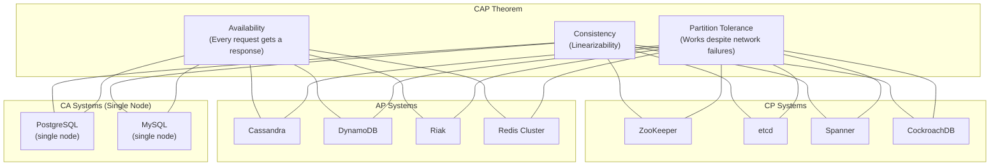

### 1.1.5 PACELC Extension

Daniel Abadi proposed the PACELC extension in 2012 to address a limitation of the CAP theorem: CAP only describes behavior during a partition, but most of the time the system is operating normally. PACELC asks:

> **P**artition → choose **A** or **C**; **E**lse (no partition) → choose **L**atency or **C**onsistency.

This captures the trade-off that exists even when the network is healthy: synchronous replication gives consistency but adds latency; asynchronous replication gives low latency but risks stale reads.

| System | During Partition (PAC) | Else (ELC) | Full Classification |
|---|---|---|---|
| **Cassandra** | PA | EL | PA/EL — favors availability and latency |
| **DynamoDB** | PA | EL | PA/EL — eventually consistent default |
| **Spanner** | PC | EC | PC/EC — favors consistency always |
| **CockroachDB** | PC | EC | PC/EC — serializable always |
| **MongoDB** | PA or PC (tunable) | EC | PA/EC or PC/EC depending on config |
| **Cosmos DB** | PA or PC (tunable) | EL or EC (tunable) | Fully tunable across 5 consistency levels |
| **PNUTS (Yahoo)** | PC | EL | PC/EL — timeline consistency |

### 1.1.6 Practical Implications for System Design

**Implication 1: You always choose P.**
Network partitions happen. Switches fail. Cables get cut. Cloud AZs lose connectivity. Any system that assumes zero partitions is a single point of failure. Therefore, the real choice is between CP and AP.

**Implication 2: The choice is per-operation, not per-system.**
A shopping cart can be AP (merge concurrent updates, never reject a write) while the payment system is CP (never allow a double charge). Design systems with mixed consistency models.

**Implication 3: "Consistency" in CAP means linearizability.**
This is the strongest model. Many systems use weaker models (causal, sequential, eventual) that offer different trade-offs not captured by the CAP binary.

**Implication 4: Availability in CAP is absolute.**
CAP defines availability as "every non-failing node must respond." In practice, 99.99% availability is indistinguishable from 100% for most applications. This is why systems like Spanner can be "effectively CA" despite being formally CP.

**Implication 5: Duration matters.**
A system that is unavailable for 200ms during a leader election is very different from one that is unavailable for 20 minutes during a partition. CAP does not distinguish these — PACELC and practical SLA analysis do.

### 1.1.7 Common Misconceptions

| Misconception | Reality |
|---|---|
| "CAP means you pick two" | You always pick P; the choice is C or A during partition. |
| "AP means no consistency" | AP means eventual consistency; data converges after partition heals. |
| "CP means no availability" | CP means unavailable only to minority partition; majority partition remains available. |
| "My system is CA" | If it runs on a network, it must handle partitions. CA is for single-node only. |
| "CAP applies to all consistency models" | CAP's C is linearizability specifically; weaker models have different trade-offs. |
| "NoSQL = AP, SQL = CP" | Incorrect. CockroachDB (SQL) is CP; Cassandra (NoSQL) is AP. It depends on design, not paradigm. |

### 1.1.8 CAP Theorem — Detailed Worked Example

**Scenario: Global Session Store**

Consider a session store deployed in US-East and EU-West. A user logs in via US-East and is then routed to EU-West for the next request.

**CP approach (e.g., etcd/Raft across regions):**
1. Login write goes to the Raft leader (US-East).
2. Leader replicates to EU-West follower.
3. Cross-region replication takes 80ms.
4. Write is committed after majority ACK (US-East leader + EU-West follower = 2 of 3).
5. Total login latency: ~80ms + local processing.
6. If a partition splits US-East from EU-West:
   - US-East (with 2 of 3 nodes) continues as the majority partition.
   - EU-West (with 1 of 3 nodes) becomes unavailable for writes and consistent reads.
   - Users routed to EU-West cannot log in or verify sessions.

**AP approach (e.g., Cassandra with LOCAL_ONE):**
1. Login write goes to US-East, acknowledged immediately.
2. Replication to EU-West happens asynchronously.
3. Total login latency: ~5ms (local only).
4. If a partition splits US-East from EU-West:
   - Both regions continue operating independently.
   - A user who logged in via US-East may not have their session visible in EU-West for seconds.
   - Mitigation: Retry login in EU-West, or carry session token on the client side.

**Hybrid approach (recommended for sessions):**
1. Write the session to the local region with LOCAL_QUORUM (strong within DC).
2. Replicate asynchronously to other regions.
3. Client carries a JWT that contains essential session data; the server-side session store is supplementary.
4. During partition: JWT provides local authentication; session data in the remote region may be stale but the user is not locked out.

```
┌───────────────────────────────────────────────────────────────────────┐
│              HYBRID SESSION ARCHITECTURE                              │
├───────────────────────────────────────────────────────────────────────┤
│                                                                       │
│  Client ──► [JWT Token]                                               │
│              │                                                        │
│              ▼                                                        │
│  US-East: [Session Store] ══async══► EU-West: [Session Store]         │
│              │                                   │                    │
│         LOCAL_QUORUM                        LOCAL_QUORUM              │
│         (strong in DC)                      (strong in DC)            │
│                                                                       │
│  During partition:                                                    │
│  - JWT provides authentication (no server call needed)                │
│  - Session preferences may be stale in remote DC                      │
│  - User experience degrades gracefully, not catastrophically          │
└───────────────────────────────────────────────────────────────────────┘
```

### 1.1.9 CAP and Microservices

In a microservice architecture, different services can (and should) make different CAP trade-offs:

| Service | CAP Choice | Justification |
|---|---|---|
| **User Authentication** | CP | Wrong auth = security breach; unavailability during partition is safer. |
| **Product Catalog** | AP | Stale catalog is acceptable; showing "out of stock" when actually in stock is a minor UX issue. |
| **Inventory** | CP for writes, AP for reads | Overselling is unacceptable (CP write); showing slightly stale counts is fine (AP read). |
| **Shopping Cart** | AP | User must always be able to add items; merge conflicts on reconnect. |
| **Payment Processing** | CP | Double-charge or lost payment is unacceptable. |
| **Notification Service** | AP | Duplicate notification is better than no notification; idempotency handles duplicates. |
| **Analytics / Metrics** | AP | Losing a few data points is acceptable; never block user-facing paths. |
| **Search Index** | AP | Stale search results are acceptable; index lag of seconds is fine. |

This per-service CAP analysis is one of the most valuable exercises in system design and should be performed during the architecture phase of any distributed system.

### 1.1.10 CAP Theorem — Deep Analysis with Real-World Database Behavior

Understanding how real databases behave during partitions requires examining their specific architectural choices, not just their CAP label. Below we trace the exact sequence of events for five major databases during a network partition.

**Case Study 1: PostgreSQL with Streaming Replication (CP)**

Setup: One primary, two synchronous standbys in a 3-node cluster.

```
BEFORE PARTITION:
  Client ──► [Primary: pgnode-1] ──sync──► [Standby: pgnode-2] ──sync──► [Standby: pgnode-3]
                  │
                  └─ All writes require WAL flush to pgnode-2 before ACK

PARTITION OCCURS: pgnode-1 isolated from pgnode-2 and pgnode-3

  [pgnode-1]  ╳ partition ╳  [pgnode-2] ──── [pgnode-3]

BEHAVIOR:
  pgnode-1 (primary): Attempts to send WAL to standbys. Writes BLOCK because
    synchronous_commit = on requires standby ACK. Clients experience timeouts.
    After wal_sender_timeout (60s default), streaming replication connection drops.
    Primary continues accepting writes only if synchronous_standby_names allows
    fallback to async (otherwise writes block indefinitely).

  pgnode-2/3: No WAL arriving. pg_stat_replication shows disconnected.
    If using Patroni/pg_auto_failover: pgnode-2 promotes to new primary after
    detection timeout. pgnode-3 follows pgnode-2.

  SPLIT-BRAIN RISK: If pgnode-1 also starts accepting writes (e.g., operator
    manually disables synchronous replication), two primaries exist.
    Patroni uses DCS (etcd/ZooKeeper) with fencing to prevent this.
```

**Case Study 2: Cassandra (AP with Tunable Consistency)**

Setup: 6-node cluster, RF=3, across two data centers (DC1: nodes 1-3, DC2: nodes 4-6).

```
PARTITION: DC1 and DC2 cannot communicate.

WITH CONSISTENCY LEVEL = ONE (AP mode):
  Client in DC1 writes key K → goes to node 1 → replicated to nodes 2, 3 (within DC1)
  Client in DC2 reads key K → goes to node 4 → returns STALE value (last synced before partition)
  Both DCs continue operating independently.
  When partition heals, anti-entropy (Merkle tree) repair reconciles divergent values.

WITH CONSISTENCY LEVEL = QUORUM (CP mode):
  RF=3, so QUORUM = 2 replicas must respond.
  If key K's replicas are nodes 1, 2, 4 (two in DC1, one in DC2):
    Write from DC1: nodes 1 and 2 respond → QUORUM met → write succeeds
    Write from DC2: only node 4 can respond → QUORUM NOT met → write FAILS
    DC2 becomes unavailable for writes to keys with replicas mostly in DC1.

WITH CONSISTENCY LEVEL = LOCAL_QUORUM:
  Each DC maintains its own quorum independently.
  Both DCs continue operating for reads and writes.
  Cross-DC consistency is eventual (like AP), but intra-DC consistency is strong.
  This is the most common production configuration for multi-DC Cassandra.
```

**Case Study 3: MongoDB Replica Set (CP Default)**

Setup: 3-member replica set — Primary (P), Secondary (S1), Secondary (S2).

```
PARTITION: P isolated from S1 and S2.

STEP 1: S1 and S2 detect missing heartbeats from P (electionTimeoutMillis = 10s default).
STEP 2: S1 or S2 calls an election. With {votes: 1} each, 2 of 3 = majority.
         New primary elected (say S1 becomes P').
STEP 3: P detects it cannot reach a majority. It steps down to Secondary.
         Writes to P FAIL with "not primary" error.
         Reads with readPreference=primary FAIL.
         Reads with readPreference=secondaryPreferred may succeed if client
           is on the same side as S1/S2.
STEP 4: P' (formerly S1) accepts writes. S2 replicates from P'.

CRITICAL DETAIL — ROLLBACK:
  If P had accepted writes with w:1 (unacknowledged by secondaries) before
  stepping down, those writes are ROLLED BACK when P rejoins as a secondary.
  These writes go into a rollback directory on P's filesystem.
  This is data loss in AP-like scenarios. To prevent: use w:majority.
```

**Case Study 4: CockroachDB (CP — Serializable)**

Setup: 9-node cluster across 3 regions (3 nodes each). Each range (data shard) has 3 replicas spread across regions using Raft.

```
PARTITION: Region A (nodes 1-3) isolated from Regions B and C.

FOR A RANGE WITH REPLICAS IN ALL THREE REGIONS:
  Raft group: {node-1 (Region A), node-4 (Region B), node-7 (Region C)}
  Leader is in Region B (node-4).

  Region A behavior:
    node-1 cannot reach leader (node-4). It cannot serve consistent reads
    or accept writes for this range. Requests return "range unavailable" error.
    Client retries are directed to other regions via DNS/load balancer.

  Region B+C behavior:
    node-4 (leader) + node-7 = 2 of 3 Raft members = majority.
    Range continues to serve reads and writes normally.

FOR A RANGE WITH ALL REPLICAS IN REGION A:
  All 3 replicas are in the partitioned region.
  Raft group: {node-1, node-2, node-3} — all reachable within Region A.
  Range continues to serve reads and writes normally WITHIN Region A.
  But clients in Regions B and C cannot reach these replicas.

COCKROACHDB USES HLC FOR TIMESTAMPS:
  Clock skew between regions may cause "uncertainty interval" restarts:
  A read at timestamp T may need to retry at T + uncertainty_interval if
  there is a write in the uncertainty window. This increases latency but
  preserves correctness (serializable isolation).
```

**Case Study 5: Redis Cluster (AP)**

Setup: 6-node Redis Cluster — 3 masters (M1, M2, M3) with 3 replicas (R1, R2, R3).

```
PARTITION: M1 isolated. R1 (replica of M1) is on the other side with M2, M3.

STEP 1: M2, M3, R1 detect M1 is unreachable.
STEP 2: After cluster-node-timeout (15s default), R1 starts failover for M1's slots.
         R1 gets votes from M2 and M3 (majority of masters).
         R1 promotes to master for M1's slots.
STEP 3: M1 is still alive and still accepting writes!
         Clients connected to M1 can write data that M1 accepts.
         These writes are LOST when M1 discovers R1 has been promoted.

DATA LOSS WINDOW:
  Duration = cluster-node-timeout + failover election time
  Typically 15-20 seconds of writes to M1 are silently lost.

MITIGATION:
  min-replicas-to-write: M1 stops accepting writes if it has zero reachable
    replicas. But this trades availability for consistency (CP behavior).
  WAIT command: Client can WAIT for replication to N replicas, but this
    only adds latency, not safety (replication is still async).
```

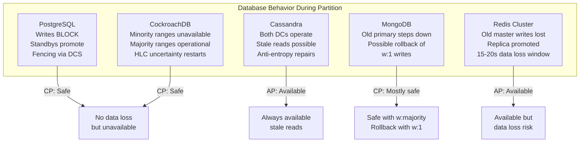

### 1.1.11 CAP Decision Matrix — Code Example

The following pseudocode demonstrates how to implement per-operation consistency selection in a service layer:

```python
from enum import Enum
from typing import Optional, Any

class ConsistencyLevel(Enum):
    LINEARIZABLE = "linearizable"
    BOUNDED_STALENESS = "bounded_staleness"
    SESSION = "session"
    EVENTUAL = "eventual"

class OperationType(Enum):
    PAYMENT_WRITE = "payment_write"
    INVENTORY_DECREMENT = "inventory_decrement"
    CATALOG_READ = "catalog_read"
    CART_UPDATE = "cart_update"
    ANALYTICS_WRITE = "analytics_write"
    USER_PROFILE_READ = "user_profile_read"

# Map each operation to its required consistency level
CONSISTENCY_POLICY = {
    OperationType.PAYMENT_WRITE: ConsistencyLevel.LINEARIZABLE,
    OperationType.INVENTORY_DECREMENT: ConsistencyLevel.LINEARIZABLE,
    OperationType.CATALOG_READ: ConsistencyLevel.EVENTUAL,
    OperationType.CART_UPDATE: ConsistencyLevel.SESSION,
    OperationType.ANALYTICS_WRITE: ConsistencyLevel.EVENTUAL,
    OperationType.USER_PROFILE_READ: ConsistencyLevel.BOUNDED_STALENESS,
}

class DistributedStore:
    """Abstraction over a distributed store with tunable consistency."""

    def read(self, key: str, consistency: ConsistencyLevel,
             session_token: Optional[str] = None,
             max_staleness_ms: int = 5000) -> Any:
        if consistency == ConsistencyLevel.LINEARIZABLE:
            # Route to leader; perform consensus read (Raft ReadIndex)
            return self._read_from_leader(key)
        elif consistency == ConsistencyLevel.BOUNDED_STALENESS:
            # Read from any replica, but reject if data is older than max_staleness_ms
            return self._read_bounded(key, max_staleness_ms)
        elif consistency == ConsistencyLevel.SESSION:
            # Read from any replica that has seen this session's last write
            return self._read_after(key, session_token)
        else:
            # Read from nearest replica (fastest, possibly stale)
            return self._read_from_nearest(key)

    def write(self, key: str, value: Any, consistency: ConsistencyLevel) -> str:
        if consistency == ConsistencyLevel.LINEARIZABLE:
            # Replicate through consensus (Raft/Paxos) before ACK
            return self._write_consensus(key, value)
        elif consistency == ConsistencyLevel.SESSION:
            # Write to local quorum, return session token for RYW
            return self._write_local_quorum(key, value)
        else:
            # Write to one replica, replicate async
            return self._write_async(key, value)

# Usage in application layer
def process_checkout(store: DistributedStore, order):
    # Inventory check — must be linearizable to prevent overselling
    inventory = store.read(
        key=f"inventory:{order.product_id}",
        consistency=CONSISTENCY_POLICY[OperationType.INVENTORY_DECREMENT]
    )
    if inventory < order.quantity:
        raise InsufficientInventoryError()

    # Payment — must be linearizable to prevent double-charge
    store.write(
        key=f"payment:{order.payment_id}",
        value=order.payment_details,
        consistency=CONSISTENCY_POLICY[OperationType.PAYMENT_WRITE]
    )

    # Analytics event — eventual consistency is fine
    store.write(
        key=f"analytics:checkout:{order.id}",
        value=order.analytics_payload,
        consistency=CONSISTENCY_POLICY[OperationType.ANALYTICS_WRITE]
    )
```

---

## 1.2 Consistency vs Availability — A Spectrum

### 1.2.1 The Consistency Spectrum

Consistency is not binary. Between "every read sees the latest write" (linearizability) and "reads may return any past value" (eventual consistency), there is a rich spectrum of models, each with different guarantees and performance characteristics.

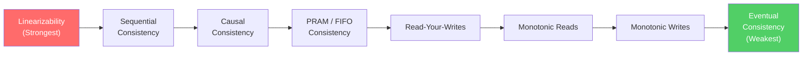

### 1.2.2 Consistency Models — Detailed Definitions

**Linearizability (Strong Consistency)**
- Every operation appears to execute atomically at some point between its invocation and response.
- All operations are totally ordered, and this order is consistent with real-time.
- Cost: Requires coordination (consensus protocol); adds latency; reduces throughput.
- Used by: Spanner, CockroachDB, etcd, ZooKeeper.

**Sequential Consistency**
- Operations from each process appear in program order.
- All processes see the same total order of operations.
- BUT: This order need not respect real-time — a write at time T1 could appear after a write at time T2 > T1.
- Cost: Less expensive than linearizability but still requires global ordering.
- Used by: Some memory consistency models (e.g., x86-TSO is close).

**Causal Consistency**
- If operation A causally precedes operation B (A happened-before B), then all processes see A before B.
- Concurrent operations (no causal relationship) may be seen in different orders by different processes.
- Cost: Requires tracking causal dependencies (vector clocks), but no global coordination.
- Used by: COPS, Eiger, some Cassandra configurations.

**Read-Your-Writes (RYW) Consistency**
- After a process writes a value, subsequent reads by that same process will see the written value (or a later value).
- Other processes may not see the write immediately.
- Cost: Can be implemented with session affinity (sticky sessions) or client-side caching.
- Used by: DynamoDB (per-session), many web application caches.

**Monotonic Reads**
- If a process reads a value V, subsequent reads by that process will return V or a later value.
- Prevents "time travel" where a user sees a newer value and then an older one.
- Cost: Minimal; requires tracking last-read version per client.

**Monotonic Writes**
- Writes from a single process are applied in the order they were issued.
- Prevents reordering of a single client's writes.
- Cost: Minimal; requires per-client write sequencing.

**Eventual Consistency**
- If no new updates are made, all replicas will eventually converge to the same value.
- No ordering guarantees during convergence.
- Cost: Cheapest; no coordination required; maximum availability and throughput.
- Used by: DNS, Cassandra (default), S3 (historically), CDN caches.

### 1.2.3 Tunable Consistency in Practice

Many modern distributed databases allow operators to tune consistency on a per-query basis. This is the most practical approach for real systems.

**Cassandra Example:**

| Read CL | Write CL | Consistency Guarantee |
|---|---|---|
| ONE | ONE | Eventual consistency; fastest; stale reads possible. |
| QUORUM | QUORUM | Strong consistency (R + W > N); moderate latency. |
| ALL | ONE | Strong reads but write is not durable to all replicas. |
| ONE | ALL | All replicas have the write; but read may hit stale replica. |
| LOCAL_QUORUM | LOCAL_QUORUM | Strong consistency within a datacenter; cross-DC eventual. |

The formula for strong consistency: **R + W > N**
Where R = read replicas, W = write replicas, N = total replicas.

**DynamoDB Example:**
- Default reads are eventually consistent (cheaper, lower latency).
- Strongly consistent reads cost 2x and have higher latency.
- Transactions (TransactWriteItems) provide serializable isolation.

**Cosmos DB Example:**
Five tunable consistency levels:
1. Strong — Linearizable reads.
2. Bounded Staleness — Reads lag writes by at most K versions or T seconds.
3. Session — RYW + monotonic reads within a session.
4. Consistent Prefix — Reads see writes in order, but may lag.
5. Eventual — No ordering guarantees.

### 1.2.4 Consistency and Latency Trade-off

```
┌─────────────────────────────────────────────────────────────────────┐
│           CONSISTENCY vs LATENCY TRADE-OFF                          │
├─────────────────────────────────────────────────────────────────────┤
│                                                                     │
│   Latency (p99)                                                     │
│   ▲                                                                 │
│   │                                                                 │
│   │  ●  Eventual Consistency (~1-5ms)                               │
│   │                                                                 │
│   │     ●  Read-Your-Writes (~5-15ms)                               │
│   │                                                                 │
│   │        ●  Causal Consistency (~10-30ms)                         │
│   │                                                                 │
│   │              ●  Sequential Consistency (~20-50ms)               │
│   │                                                                 │
│   │                    ●  Linearizability (~50-200ms)               │
│   │                                                                 │
│   └──────────────────────────────────────────────────────────► Consistency │
│         Weak                                           Strong       │
└─────────────────────────────────────────────────────────────────────┘
```

### 1.2.5 Consistency Session Guarantees — Deep Dive

Beyond the global consistency models, **session guarantees** provide per-client consistency properties that are often sufficient and much cheaper to implement.

**Read-Your-Writes (RYW):**
A client that writes value V will always read V or a later value in subsequent reads within the same session.

Implementation approaches:
1. **Sticky sessions / session affinity:** Route all requests from the same client to the same replica. The client always reads from the replica it wrote to.
   - Drawback: If the replica fails, the client must be redirected, and RYW is temporarily lost.
2. **Write-through token:** After a write, the client receives a token (e.g., a version number or timestamp). Subsequent reads include this token. The server ensures it returns data at least as fresh as the token.
   - Drawback: Adds complexity to the read path; token must be stored client-side.
3. **Client-side cache:** The client caches its own recent writes. On read, it merges the server response with the cache.
   - Drawback: Cache invalidation; cache may grow large.

**Monotonic Reads:**
If a client reads value V, subsequent reads will return V or a later value — never an earlier value.

Implementation:
1. Track the last-read version per client.
2. On each read, include the last-read version.
3. The server ensures it returns data from a version >= the last-read version.
4. If the contacted replica is behind, either wait or redirect to a more up-to-date replica.

**Monotonic Writes:**
Writes from a single client are applied in the order they were issued.

Implementation:
1. Each write includes a sequence number assigned by the client.
2. The server applies writes in sequence number order.
3. If a write with sequence N+1 arrives before sequence N, it is buffered.

**Writes-Follow-Reads:**
If a client reads value V and then writes value W, the write W is guaranteed to be applied after V.

Implementation:
1. The read returns a dependency vector (or version number).
2. The write includes this dependency.
3. The server ensures all dependencies are applied before the write.

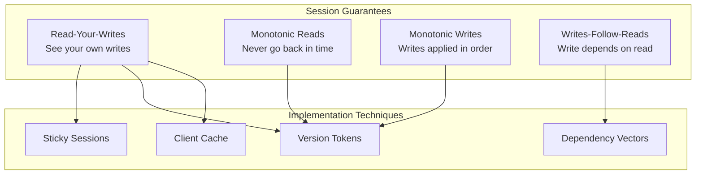

### 1.2.6 CRDTs — Conflict-Free Replicated Data Types

CRDTs are data structures specifically designed for eventual consistency. They guarantee that replicas converge to the same state without coordination, as long as all updates eventually reach all replicas.

**Two Families:**

**State-based CRDTs (CvRDTs):**
- Replicas periodically share their full state.
- States are merged using a commutative, associative, and idempotent merge function.
- Convergence is guaranteed by the mathematical properties of the merge function (semilattice).

**Operation-based CRDTs (CmRDTs):**
- Replicas share operations (not full state).
- Operations must be commutative (order-independent).
- Requires reliable broadcast (every operation reaches every replica).

**Common CRDT Types:**

| CRDT | Purpose | Merge Strategy |
|---|---|---|
| **G-Counter** | Increment-only counter. | Per-node counters; sum for total; max per-node for merge. |
| **PN-Counter** | Increment/decrement counter. | Two G-Counters: one for increments, one for decrements. |
| **G-Set** | Add-only set. | Union of sets. |
| **OR-Set** | Add/remove set. | Tag each element with unique add-ID; remove removes specific tags. |
| **LWW-Register** | Single value with last-writer-wins. | Higher timestamp wins. |
| **MV-Register** | Multi-value register (tracks concurrent writes). | Vector clock comparison; concurrent values are both retained. |
| **LWW-Element-Set** | Set with add/remove using timestamps. | Per-element: add timestamp > remove timestamp means present. |
| **RGA (Replicated Growable Array)** | Ordered list / text. | Each element has a unique position ID; concurrent inserts are ordered by ID. |

**Example: G-Counter**
Three nodes maintain a vector: [P1_count, P2_count, P3_count].

```
Node 1: [5, 0, 0]   →  increment  →  [6, 0, 0]
Node 2: [0, 3, 0]   →  increment  →  [0, 4, 0]
Node 3: [0, 0, 7]   →  increment  →  [0, 0, 8]

Merge at any node:
  [max(6,0,0), max(0,4,0), max(0,0,8)] = [6, 4, 8]
  Total = 6 + 4 + 8 = 18

This merge is commutative, associative, and idempotent.
```

**CRDTs in Production:**
- Redis CRDB (Redis Enterprise): Uses CRDTs for active-active geo-replication.
- Riak: Supports CRDT data types (counters, sets, maps, registers).
- Automerge / Yjs: CRDT-based collaborative editing libraries.
- SoundCloud: Used CRDTs for counting likes and plays.

### 1.2.7 Choosing Consistency Level — Decision Framework

| Use Case | Recommended Level | Rationale |
|---|---|---|
| Social media feed | Eventual | Slight lag acceptable; high throughput needed. |
| Shopping cart | Read-your-writes | User must see their own additions; other users' carts are independent. |
| Bank account balance | Linearizable | Incorrect balance leads to overdraft or double-spend. |
| Inventory count | Linearizable (for decrement) | Overselling is worse than showing stale count. |
| DNS lookup | Eventual | Propagation delay is built into the protocol (TTL). |
| Collaborative document | Causal | Causal ordering preserves edit intent; CRDTs resolve conflicts. |
| Configuration store | Linearizable | All nodes must see the same config to behave consistently. |
| Leaderboard | Bounded staleness | Slight lag acceptable; reduces load on primary. |
| Audit log | Monotonic writes | Order of writes matters; total ordering may not be needed. |

---

## 1.3 Partition Tolerance

### 1.3.1 What is a Network Partition?

A network partition occurs when nodes in a distributed system cannot communicate with each other, splitting the system into two or more groups that can each communicate internally but not with the other groups.

### 1.3.2 Types of Network Partitions

**Complete Partition:**
- No messages can pass between the two groups.
- Example: A fiber optic cable between two data centers is cut.

**Partial Partition:**
- Node A can communicate with Node B and Node C, but Node B cannot communicate with Node C.
- Creates an asymmetric communication graph.
- Much harder to handle than complete partitions.

**Intermittent Partition:**
- Communication works sporadically — some messages get through, others are lost.
- Can cause split-brain even with heartbeat-based failure detectors.
- Most dangerous because it is hardest to detect definitively.

**Asymmetric Partition:**
- Node A can send to Node B, but B cannot send to A.
- Common with asymmetric routing or NAT issues.
- Heartbeats may succeed in one direction, masking the partition.

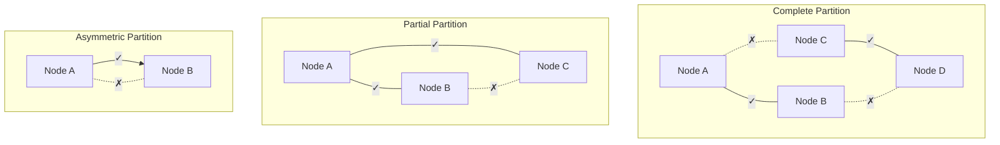

### 1.3.3 Split-Brain Problem

Split-brain occurs when a partition causes two subsets of nodes to each believe they are the authoritative group, both accepting writes independently.

**Example Scenario:**
1. A 5-node cluster has a leader (Node 1) and 4 followers.
2. A network partition splits: {Node 1, Node 2} and {Node 3, Node 4, Node 5}.
3. Nodes 3-5 cannot reach the leader; they elect a new leader (say Node 3).
4. Now both Node 1 and Node 3 accept writes.
5. When the partition heals, the system has conflicting data.

**Split-Brain Prevention Strategies:**

| Strategy | Mechanism | Trade-off |
|---|---|---|
| **Majority Quorum** | Only the partition with > N/2 nodes can elect a leader. | Minority partition becomes unavailable. |
| **Fencing Tokens** | Each leader gets a monotonically increasing token; storage rejects writes with old tokens. | Requires storage layer to enforce tokens. |
| **STONITH** | "Shoot The Other Node In The Head" — the surviving partition forcibly kills the other. | Requires out-of-band communication (e.g., IPMI). |
| **Lease-Based** | Leader holds a time-limited lease; must renew before expiry. | Requires bounded clock skew. |
| **Witness / Arbiter** | A lightweight third node breaks ties. | Single point of failure for the witness. |

### 1.3.4 Byzantine Failures

Byzantine failures represent the most general class of faults. A Byzantine-faulty node may:
- Send contradictory messages to different peers.
- Selectively delay or drop messages.
- Fabricate data.
- Collude with other faulty nodes.

**Byzantine fault tolerance requires 3f + 1 nodes to tolerate f faulty nodes.** This is because:
- f nodes may be faulty and colluding.
- f nodes may be unreachable (partition).
- f + 1 correct nodes must agree to make progress.
- Total: f (faulty) + f (unreachable) + f + 1 (correct) = 3f + 1.

**Comparison: Crash vs Byzantine Faults:**

| Property | Crash Fault | Byzantine Fault |
|---|---|---|
| Behavior | Node stops responding. | Node behaves arbitrarily. |
| Nodes needed to tolerate f faults | 2f + 1 | 3f + 1 |
| Detection | Timeout-based (simple). | Requires protocol verification. |
| Real-world examples | Hardware failure, OOM kill, power loss. | Software bugs, hacked nodes, corrupted data. |
| Protocols | Paxos, Raft, ZAB. | PBFT, HotStuff, Tendermint. |
| Performance overhead | Low. | High (O(n^2) message complexity for PBFT). |

---

## 1.4 Distributed Consensus

### 1.4.1 The Consensus Problem

Distributed consensus is the problem of getting multiple nodes to agree on a single value, even when some nodes fail. Formally:

- **Termination:** Every correct process eventually decides on a value.
- **Agreement:** All correct processes decide on the same value.
- **Validity:** The decided value was proposed by some process.

**FLP Impossibility (1985):** Fischer, Lynch, and Paterson proved that in an asynchronous distributed system with even one crash-faulty process, there is no deterministic algorithm that guarantees consensus. This is why all practical consensus algorithms use timeouts (partially synchronous model) or randomization.

### 1.4.2 Paxos

**Invented by:** Leslie Lamport (1989, published 1998).

Paxos is the foundational consensus algorithm. It solves consensus in a system with crash-faulty nodes under the partially synchronous model.

**Roles:**
- **Proposer:** Proposes values and drives the protocol.
- **Acceptor:** Votes on proposals and remembers accepted values.
- **Learner:** Learns the decided value (often the same process as proposer/acceptor).

**Basic Paxos — Two Phases:**

**Phase 1: Prepare**
1. Proposer selects a proposal number N (unique, monotonically increasing).
2. Proposer sends `Prepare(N)` to a majority of acceptors.
3. Each acceptor:
   - If N is greater than any prepare request it has responded to:
     - Promises not to accept any proposal with number < N.
     - Returns the highest-numbered proposal it has accepted (if any).
   - Otherwise: ignores or sends NACK.

**Phase 2: Accept**
1. If proposer receives promises from a majority of acceptors:
   - If any acceptor returned a previously accepted value, proposer must propose that value (the one with the highest proposal number).
   - Otherwise, proposer can propose its own value.
2. Proposer sends `Accept(N, value)` to acceptors.
3. Each acceptor:
   - If it has not promised to a higher-numbered proposal:
     - Accepts the proposal.
     - Sends `Accepted(N, value)` to learners.
   - Otherwise: rejects.
4. When a learner receives `Accepted` from a majority, the value is decided.

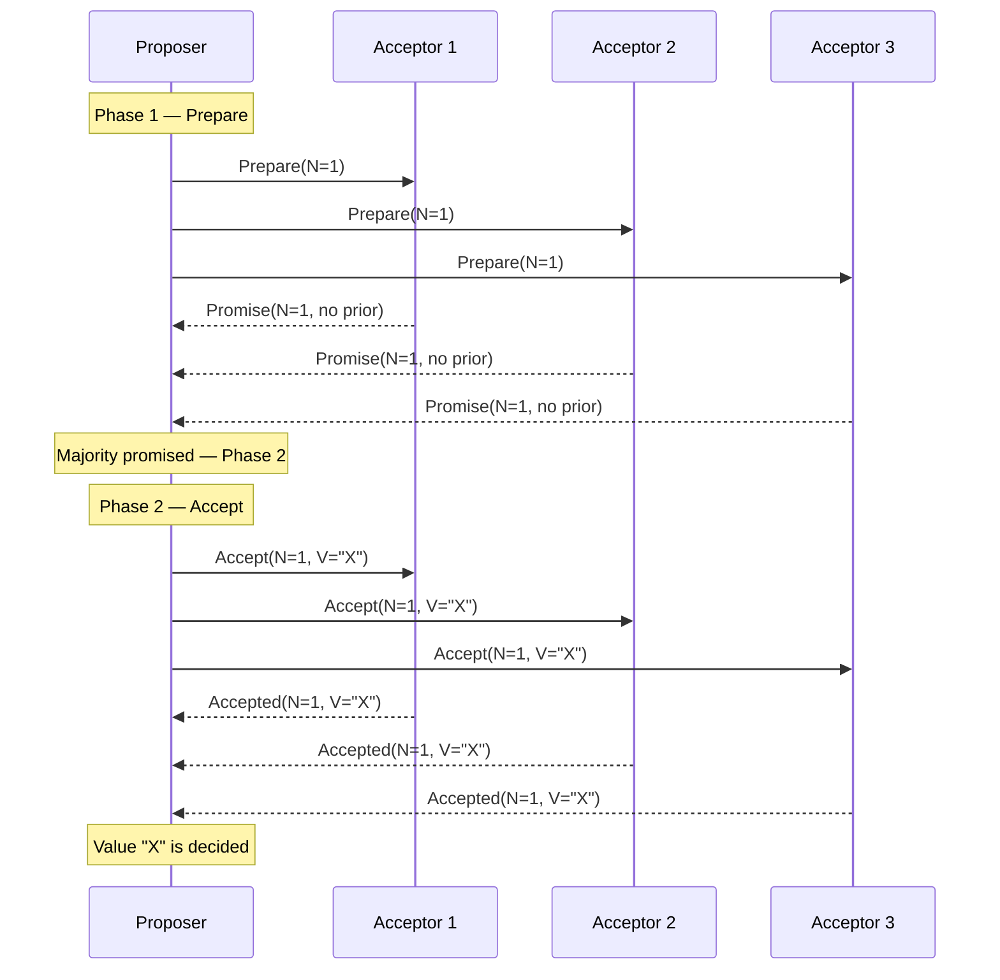

**Paxos Limitations:**
- **Livelock:** Two proposers can indefinitely outbid each other (solved by electing a distinguished proposer / leader).
- **Complexity:** Multi-Paxos (for a log of decisions) is significantly more complex.
- **Underspecified:** Lamport's paper leaves many implementation details open, leading to divergent implementations.

### 1.4.3 Raft

**Invented by:** Diego Ongaro and John Ousterhout (2014). Designed explicitly to be more understandable than Paxos.

Raft decomposes consensus into three sub-problems:
1. **Leader Election** — How to choose a leader.
2. **Log Replication** — How the leader replicates log entries.
3. **Safety** — How to ensure correctness.

**Node States:**
Every node is in one of three states: Follower, Candidate, or Leader.

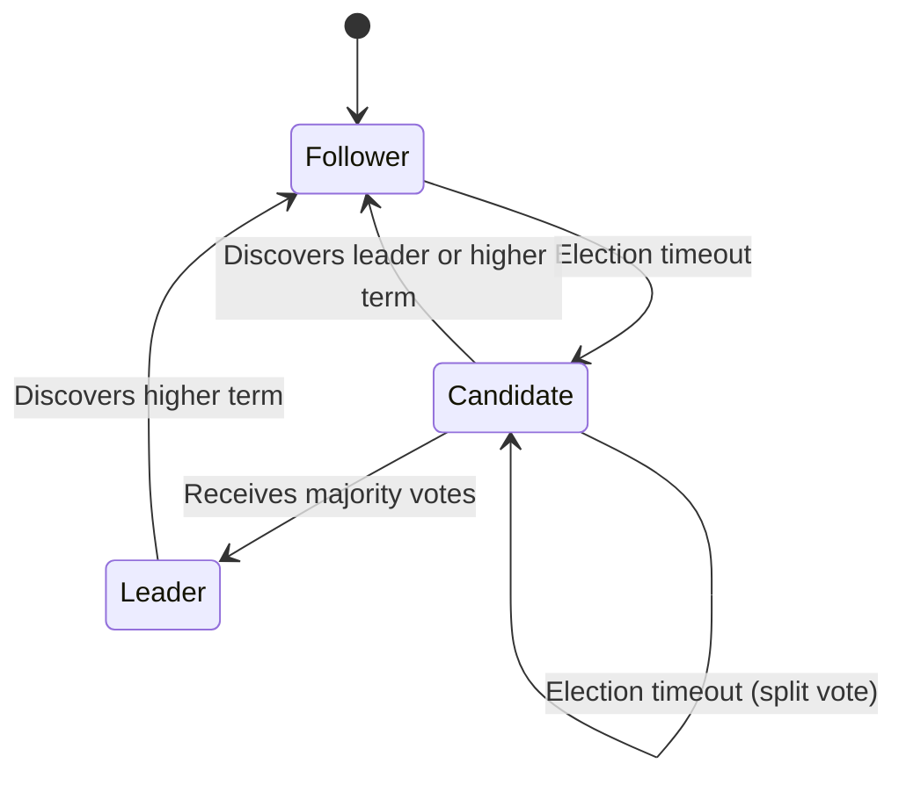

**Leader Election:**
1. All nodes start as followers with a randomized election timeout (e.g., 150-300ms).
2. If a follower receives no heartbeat before its timeout expires, it becomes a candidate.
3. The candidate increments its term, votes for itself, and sends `RequestVote` RPCs to all other nodes.
4. A node grants its vote if:
   - The candidate's term is at least as high as its own.
   - The candidate's log is at least as up-to-date as its own.
   - The node has not already voted for another candidate in this term.
5. If the candidate receives votes from a majority, it becomes the leader.
6. If a candidate receives a heartbeat from a leader with a term >= its own, it reverts to follower.
7. If the election times out (split vote), the candidate starts a new election with an incremented term.

**Log Replication:**
1. The leader receives a client request and appends it to its log.
2. The leader sends `AppendEntries` RPCs to all followers.
3. Each follower appends the entry to its log and responds.
4. When a majority of followers have replicated the entry, the leader commits it.
5. The leader notifies followers of the commit in subsequent heartbeats.
6. Followers apply committed entries to their state machines.

**Safety Properties:**
- **Election Safety:** At most one leader per term.
- **Leader Append-Only:** A leader never overwrites or deletes entries in its log.
- **Log Matching:** If two logs contain an entry with the same index and term, then the logs are identical in all preceding entries.
- **Leader Completeness:** If a log entry is committed in a given term, then it will be present in the logs of all leaders for higher-numbered terms.
- **State Machine Safety:** If a server has applied a log entry at a given index, no other server will ever apply a different entry at that index.

### 1.4.4 ZAB (ZooKeeper Atomic Broadcast)

**Used by:** Apache ZooKeeper.

ZAB is similar to Raft but was developed independently and has some differences:

| Aspect | Raft | ZAB |
|---|---|---|
| Primary use | General consensus | ZooKeeper coordination |
| Recovery | Leader sends missing entries to followers. | New leader synchronizes entire state with followers before starting. |
| Committed entries | Leader commits after majority ACK. | Leader commits after majority ACK, but followers may have uncommitted entries from old leaders. |
| Epochs | Called "terms" | Called "epochs" |
| Log compaction | Snapshots | ZooKeeper snapshots + transaction logs |

**ZAB Phases:**
1. **Discovery:** Followers connect to the prospective leader and share their last committed epoch.
2. **Synchronization:** The leader brings all followers up to date by replaying missed transactions.
3. **Broadcast:** Normal operation — the leader proposes transactions, followers ACK, leader commits.

### 1.4.5 PBFT (Practical Byzantine Fault Tolerance)

**Invented by:** Miguel Castro and Barbara Liskov (1999).

PBFT tolerates Byzantine faults (up to f faulty nodes out of 3f + 1 total).

**Three Phases:**

1. **Pre-Prepare:** The primary (leader) assigns a sequence number to the request and broadcasts it.
2. **Prepare:** Each replica broadcasts a Prepare message after verifying the Pre-Prepare.
3. **Commit:** When a replica receives 2f matching Prepare messages, it broadcasts a Commit message. When 2f + 1 Commit messages are received, the request is executed.

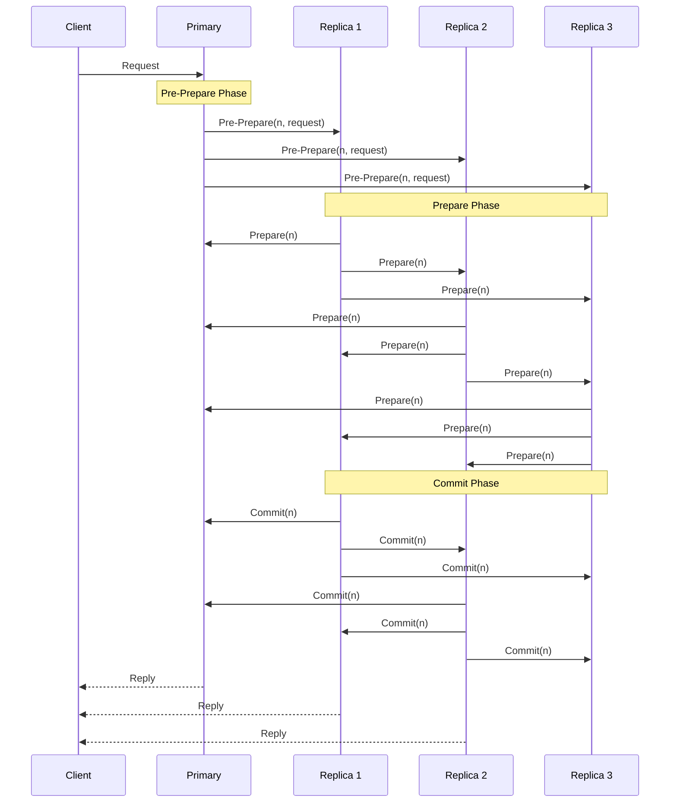

**PBFT Performance:**
- Message complexity: O(n^2) per decision.
- Practical for small clusters (4-7 nodes); impractical for large networks.
- View changes (leader replacement) are expensive.

### 1.4.6 Paxos — Step-by-Step Worked Example with Competing Proposers

Understanding Paxos requires tracing through scenarios where multiple proposers compete. This is the scenario that causes the most confusion and where Paxos's elegance shines.

**Scenario: Two proposers (P1 and P2) compete to set the value. Three acceptors (A1, A2, A3).**

```
ROUND 1: P1 tries to propose value "X"
──────────────────────────────────────────────────────────────

Step 1: P1 sends Prepare(N=1) to A1, A2, A3

  P1 ──Prepare(1)──► A1   (A1 has no prior promises → Promise(1, ∅))
  P1 ──Prepare(1)──► A2   (A2 has no prior promises → Promise(1, ∅))
  P1 ──Prepare(1)──► A3   (A3 has no prior promises → Promise(1, ∅))

Step 2: P1 receives promises from majority (3 of 3). No prior accepted values.
         P1 can propose its own value "X".

Step 3: P1 sends Accept(N=1, V="X") to A1, A2, A3
         BUT P1's Accept message to A2 and A3 is delayed (network)...

  P1 ──Accept(1,"X")──► A1   (A1 accepts: [N=1, V="X"])
  P1 ──Accept(1,"X")──► A2   (DELAYED — not yet received)
  P1 ──Accept(1,"X")──► A3   (DELAYED — not yet received)

ROUND 2: P2 tries to propose value "Y" (before P1's Accept reaches A2, A3)
──────────────────────────────────────────────────────────────

Step 4: P2 sends Prepare(N=2) to A1, A2, A3

  P2 ──Prepare(2)──► A1   (A1 has accepted [1,"X"] → Promise(2, accepted=[1,"X"]))
  P2 ──Prepare(2)──► A2   (A2 promised N=1, but 2>1 → Promise(2, ∅))
  P2 ──Prepare(2)──► A3   (A3 promised N=1, but 2>1 → Promise(2, ∅))

Step 5: P2 receives promises from majority (3 of 3).
         A1 reports prior accepted value [1, "X"].
         P2 MUST propose "X" (not "Y") — it adopts the highest-numbered accepted value.

Step 6: P2 sends Accept(N=2, V="X") to A1, A2, A3

  All acceptors accept [N=2, V="X"].

RESULT: Value "X" is chosen. P2's original value "Y" is never proposed.
        Paxos's safety property holds: once a value is accepted by a majority,
        all future proposals will propose that same value.

NOW P1'S DELAYED MESSAGES ARRIVE:
  A2 receives Accept(N=1, V="X") — REJECTED (A2 promised N≥2).
  A3 receives Accept(N=1, V="X") — REJECTED (A3 promised N≥2).
  This is fine — the value "X" was already chosen via P2's round.
```

**Key insight:** Paxos guarantees safety because Phase 1 (Prepare) forces proposers to discover and adopt any value that may have already been accepted by a majority. This is why a proposer cannot unilaterally choose its own value — it must respect the system's existing state.

### 1.4.7 Raft — Complete Log Replication Walkthrough

The following traces a complete Raft log replication cycle, including the handling of a lagging follower.

```
CLUSTER STATE:
  Leader (L): log = [1:SET x=1, 2:SET y=2, 3:SET z=3], commitIndex=3
  Follower F1: log = [1:SET x=1, 2:SET y=2, 3:SET z=3], commitIndex=3 (up to date)
  Follower F2: log = [1:SET x=1, 2:SET y=2], commitIndex=2 (lagging — missed entry 3)

NEW CLIENT REQUEST: SET w=4
──────────────────────────────────────────────────────────────

Step 1: Leader appends to its log
  L.log = [1:SET x=1, 2:SET y=2, 3:SET z=3, 4:SET w=4]

Step 2: Leader sends AppendEntries to both followers

  L ──► F1: AppendEntries(
              term=1,
              prevLogIndex=3, prevLogTerm=1,  ← "your log should have entry 3 at term 1"
              entries=[4:SET w=4],
              leaderCommit=3
            )

  L ──► F2: AppendEntries(
              term=1,
              prevLogIndex=3, prevLogTerm=1,
              entries=[4:SET w=4],
              leaderCommit=3
            )

Step 3: F1 processes AppendEntries
  F1 checks: Does my log have entry at index 3 with term 1? YES.
  F1 appends entry 4. F1.log = [1:SET x=1, 2:SET y=2, 3:SET z=3, 4:SET w=4]
  F1 updates commitIndex = min(leaderCommit=3, lastNewIndex=4) = 3
  F1 responds: Success

Step 4: F2 processes AppendEntries
  F2 checks: Does my log have entry at index 3 with term 1? NO (F2 only has index 1-2).
  F2 responds: FAILURE (log inconsistency)

Step 5: Leader handles F2's failure — decrements nextIndex for F2
  L.nextIndex[F2] = 3  (was 4, decremented to 3)

  L ──► F2: AppendEntries(
              term=1,
              prevLogIndex=2, prevLogTerm=1,  ← "your log should have entry 2 at term 1"
              entries=[3:SET z=3, 4:SET w=4],  ← sends entries 3 AND 4
              leaderCommit=3
            )

Step 6: F2 processes retry
  F2 checks: Does my log have entry at index 2 with term 1? YES.
  F2 appends entries 3 and 4.
  F2.log = [1:SET x=1, 2:SET y=2, 3:SET z=3, 4:SET w=4]
  F2 responds: Success

Step 7: Leader received Success from F1 (step 3) and F2 (step 6)
  Majority (2 of 2 followers + leader = 3 of 3) have entry 4.
  Leader advances commitIndex to 4.
  Leader responds to client: "SET w=4 committed"

Step 8: Next heartbeat includes leaderCommit=4
  F1 and F2 advance their commitIndex to 4 and apply entry 4 to their state machines.
```

### 1.4.8 PBFT — Detailed Message Flow with Byzantine Node

```
SETUP: 4 nodes (P=Primary, R1, R2, R3). R3 is Byzantine (malicious).
       f=1 Byzantine fault. 3f+1 = 4 nodes required.

CLIENT REQUEST: Execute operation O
──────────────────────────────────────────────────────────────

Phase 1: PRE-PREPARE
  Client ──► P: Request(O)
  P assigns sequence number n=42
  P ──► R1: Pre-Prepare(view=0, n=42, digest(O))
  P ──► R2: Pre-Prepare(view=0, n=42, digest(O))
  P ──► R3: Pre-Prepare(view=0, n=42, digest(O))  ← Byzantine node receives this

Phase 2: PREPARE
  Each non-Byzantine replica verifies the Pre-Prepare and broadcasts Prepare:

  R1 ──► P:  Prepare(view=0, n=42, digest(O))
  R1 ──► R2: Prepare(view=0, n=42, digest(O))
  R1 ──► R3: Prepare(view=0, n=42, digest(O))

  R2 ──► P:  Prepare(view=0, n=42, digest(O))
  R2 ──► R1: Prepare(view=0, n=42, digest(O))
  R2 ──► R3: Prepare(view=0, n=42, digest(O))

  R3 (BYZANTINE) sends CONFLICTING Prepare messages:
  R3 ──► P:  Prepare(view=0, n=42, digest(O'))   ← different digest!
  R3 ──► R1: Prepare(view=0, n=42, digest(O''))  ← yet another digest!
  R3 ──► R2: Prepare(view=0, n=42, digest(O))    ← correct to R2, trying to confuse

  SAFETY CHECK: Each replica waits for 2f = 2 matching Prepare messages.
  P sees: R1=digest(O), R2=digest(O), R3=digest(O') → 2 matching → PREPARED
  R1 sees: P(pre-prepare)=digest(O), R2=digest(O), R3=digest(O'') → 2 matching → PREPARED
  R2 sees: P(pre-prepare)=digest(O), R1=digest(O), R3=digest(O) → 3 matching → PREPARED

  All honest replicas reach PREPARED state for digest(O) because there are 2f+1=3
  honest nodes, and Byzantine R3 can only confuse one honest node at a time.

Phase 3: COMMIT
  P, R1, R2 each broadcast Commit(view=0, n=42, digest(O))
  R3 may send garbage Commit messages.

  Each honest replica waits for 2f+1 = 3 matching Commit messages.
  P receives: self + R1 + R2 = 3 matching Commits → COMMITTED
  R1 receives: P + self + R2 = 3 matching Commits → COMMITTED
  R2 receives: P + R1 + self = 3 matching Commits → COMMITTED

  All honest replicas execute O and reply to the client.

CLIENT VERIFICATION:
  Client waits for f+1 = 2 matching replies from different replicas.
  Receives matching replies from P, R1, R2 (any 2 suffice).
  Client accepts the result.

RESULT: Despite R3 sending contradictory messages, the protocol reached
        consensus on operation O. R3's Byzantine behavior was tolerated.
```

### 1.4.9 Consensus Algorithm Comparison

| Property | Paxos | Raft | ZAB | PBFT |
|---|---|---|---|---|
| **Fault model** | Crash | Crash | Crash | Byzantine |
| **Nodes for f faults** | 2f + 1 | 2f + 1 | 2f + 1 | 3f + 1 |
| **Leader required** | Optional (Multi-Paxos) | Yes | Yes | Yes (Primary) |
| **Message complexity** | O(n) | O(n) | O(n) | O(n^2) |
| **Understandability** | Low | High (by design) | Medium | Medium |
| **Real systems** | Chubby, Megastore | etcd, Consul, TiKV | ZooKeeper | Hyperledger Fabric |
| **Log ordering** | Per-slot | Continuous log | Transaction log | Sequence number |
| **Reconfiguration** | Complex | Joint consensus | Manual | View changes |
| **Performance** | High | High | High | Moderate |
| **Liveness guarantee** | Eventual (with leader) | Eventual | Eventual | Eventual |

---

## 1.5 Quorum Systems

### 1.5.1 Strict Quorum

A quorum is a subset of nodes whose agreement is necessary and sufficient for an operation to proceed. The fundamental property is that any two quorums must overlap (have at least one common member).

**For a system with N replicas:**
- Write quorum: W nodes must acknowledge a write.
- Read quorum: R nodes must respond to a read.
- Strong consistency requirement: **R + W > N** (guarantees overlap between read and write sets).

**Common Configurations:**

| N | R | W | Guarantee | Read Latency | Write Latency | Fault Tolerance |
|---|---|---|---|---|---|---|
| 3 | 2 | 2 | Strong consistency | Medium | Medium | 1 node down |
| 3 | 1 | 3 | Strong reads, slow writes | Low | High | 0 for writes |
| 3 | 3 | 1 | Slow reads, fast writes | High | Low | 0 for reads |
| 5 | 3 | 3 | Strong consistency | Medium | Medium | 2 nodes down |
| 5 | 1 | 5 | Strong reads, all-write | Lowest | Highest | 0 for writes |

### 1.5.2 Sloppy Quorum

In a strict quorum, if W nodes in the designated replica set are unavailable, writes are rejected. Sloppy quorum relaxes this by allowing writes to go to any W nodes in the cluster, even if they are not the designated replicas for that key.

**How it works:**
1. A key K is assigned to replicas {N1, N2, N3} by consistent hashing.
2. N3 is temporarily unavailable.
3. With sloppy quorum, the write goes to {N1, N2, N4} — N4 is a temporary substitute.
4. N4 stores the data with a hint: "this belongs to N3."
5. When N3 recovers, N4 forwards the data (hinted handoff).

**Trade-off:** Sloppy quorum improves availability at the cost of consistency. Two reads may hit different sets of nodes and return different values.

### 1.5.3 Hinted Handoff

Hinted handoff is the mechanism that complements sloppy quorum:

1. When a node receives data intended for an unavailable node, it stores the data locally with a "hint" (metadata about the intended destination).
2. The receiving node periodically checks whether the destination node has recovered.
3. When the destination is available, the data is transferred and the hint is deleted.

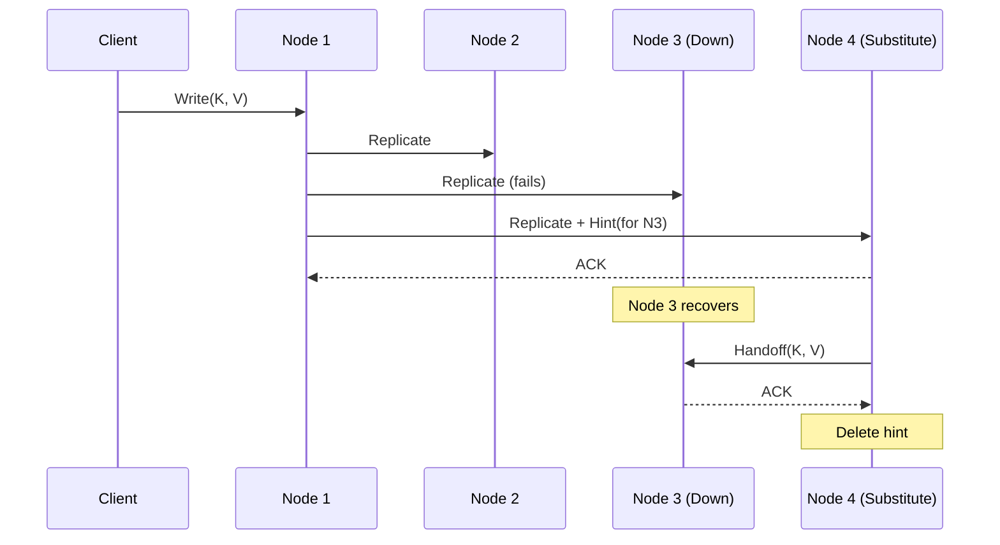

**Limitations of Hinted Handoff:**
- If N4 also fails before handing off, the data may be lost (requires anti-entropy/read repair).
- Hints consume storage on N4; excessive hints can cause disk pressure.
- Does not guarantee consistency — only improves eventual convergence speed.

### 1.5.4 Read Repair and Anti-Entropy

**Read Repair:**
During a read, the coordinator contacts R replicas. If the responses disagree, the coordinator sends the latest value back to the stale replicas.

**Anti-Entropy (Merkle Trees):**
Replicas periodically compare their data using Merkle trees:
1. Each replica builds a hash tree over its key range.
2. Replicas exchange root hashes.
3. If roots differ, they recursively compare subtrees to find divergent keys.
4. Divergent keys are synchronized.

This process runs in the background and catches inconsistencies that read repair misses (e.g., keys that are rarely read).

### 1.5.5 Quorum Systems in Practice

| System | Quorum Type | Default R/W | Notes |
|---|---|---|---|
| **Cassandra** | Strict (tunable) | QUORUM/QUORUM | R + W > N ensures strong consistency. |
| **DynamoDB** | Sloppy | Internal | AWS manages quorum; user sees eventually consistent or strongly consistent reads. |
| **Riak** | Sloppy | R=2, W=2, N=3 | Sloppy quorum + hinted handoff + read repair. |
| **Voldemort** | Sloppy | R=2, W=2, N=3 | LinkedIn's Dynamo-style store. |
| **etcd** | Strict (Raft) | Majority | Raft requires majority for both reads and writes. |

---

### Architectural Decision Record: Consistency Model Selection

**Title:** ADR-F07-001 — Selecting Consistency Model for Distributed Data Store

**Status:** Accepted

**Context:**
We are designing a distributed data store that must serve both low-latency read-heavy workloads (product catalog) and correctness-critical write workloads (inventory, payments). The system operates across 3 geographic regions with replication factor 3 within each region.

**Decision Drivers:**
- Product catalog reads: 50,000 RPS, p99 latency < 20ms required.
- Inventory updates: 5,000 RPS, must never oversell (correctness over latency).
- Payment processing: 1,000 RPS, must be linearizable (double-spend prevention).
- Cross-region replication latency: 50-150ms.

**Options Considered:**

| Option | Description | Pros | Cons |
|---|---|---|---|
| A: Linearizable everywhere | Use synchronous replication and consensus for all operations. | Simple mental model; strongest guarantees. | Cross-region latency makes catalog reads unacceptably slow. |
| B: Eventual everywhere | Use async replication with conflict resolution for all operations. | Lowest latency; highest availability. | Inventory oversell; payment double-spend. |
| C: Mixed consistency (selected) | Different consistency per operation type. | Optimal trade-off per use case. | Operational complexity; engineers must understand multiple models. |

**Decision:**
Adopt mixed consistency:
- **Product catalog reads:** Eventual consistency (serve from nearest replica; stale by up to 30 seconds is acceptable).
- **Inventory decrement:** Linearizable within a region (consensus-based; cross-region is asynchronous with conflict detection).
- **Payment processing:** Linearizable globally (Spanner-style TrueTime or 2PC for cross-region transactions).
- **Shopping cart:** Session consistency (read-your-writes within a session; merge on cross-device access).

**Consequences:**
- Engineers must tag each operation with its consistency requirement.
- Monitoring must track replication lag and alert when SLOs are breached.
- Cross-region inventory conflicts require a resolution strategy (last-writer-wins with compensation).

---

---

# Section 2: Time & Ordering

---

## 2.1 Physical Clocks

### 2.1.1 Why Time Matters in Distributed Systems

Time is the foundation of ordering events, expiring leases, invalidating caches, coordinating transactions, and generating unique identifiers. In a single-machine system, the local clock provides a consistent notion of "now." In a distributed system, there is no global clock — each node has its own clock, and these clocks diverge.

### 2.1.2 Types of Physical Clocks

**Time-of-Day Clocks (Wall Clocks):**
- Return the current date and time (e.g., `System.currentTimeMillis()` in Java).
- Synchronized via NTP to a reference time source.
- Can jump forward or backward when NTP adjusts the clock.
- Not suitable for measuring elapsed time on a single machine.

**Monotonic Clocks:**
- Return a value that always increases (e.g., `System.nanoTime()` in Java).
- Not synchronized across machines — only meaningful within a single node.
- Suitable for measuring elapsed time, timeouts, and intervals.
- Cannot be used to order events across nodes.

### 2.1.3 NTP (Network Time Protocol)

NTP synchronizes clocks across the internet using a hierarchy of time servers:

**Stratum Levels:**
- **Stratum 0:** Reference clocks (GPS receivers, atomic clocks, radio clocks).
- **Stratum 1:** Servers directly connected to Stratum 0 devices.
- **Stratum 2:** Servers synchronized to Stratum 1.
- **Stratum 3+:** Each level synchronized to the one above.

**NTP Synchronization Algorithm:**
1. Client sends a request to the NTP server, recording its local time T1.
2. Server receives the request at server time T2.
3. Server sends a response at server time T3.
4. Client receives the response at local time T4.

**Clock offset calculation:**
```
Round-trip delay:  δ = (T4 - T1) - (T3 - T2)
Clock offset:      θ = ((T2 - T1) + (T3 - T4)) / 2
```

**NTP Accuracy:**
- Over the internet: 1-50ms accuracy.
- Within a datacenter: 0.1-1ms accuracy.
- With PTP (Precision Time Protocol) and dedicated hardware: <1μs.

**NTP Limitations:**
- Cannot guarantee bounded error — network jitter makes offset estimation imprecise.
- Step adjustments can cause time to jump, breaking monotonicity.
- Slew adjustments (gradual correction) are safer but take longer to converge.

### 2.1.4 GPS Clocks

GPS receivers can provide time synchronized to UTC within ~10ns accuracy. This is because GPS satellites carry atomic clocks and broadcast time signals continuously.

**Advantages:**
- Extremely high accuracy (nanosecond-level).
- Independent of network conditions.
- Available globally.

**Disadvantages:**
- Requires line-of-sight to GPS satellites (problematic inside buildings/data centers).
- GPS receivers are additional hardware cost.
- Signal can be jammed or spoofed.
- Antenna placement requires careful planning in data center environments.

### 2.1.5 Clock Drift

Clock drift is the rate at which a clock deviates from a reference time. Quartz crystal oscillators in commodity servers drift at rates of:
- **Typical drift:** 10-200 ppm (parts per million).
- 100 ppm = 100 microseconds per second = 8.64 seconds per day.

**Impact:**
- A 200ppm drift means two servers can diverge by 17.28 seconds per day without resynchronization.
- Lease expiry: If Node A's clock runs fast, it may release a lease early; if Node B's clock runs slow, it may hold a lease past the intended duration.
- Log ordering: Events that appear to happen in one order locally may have a different true order.

### 2.1.6 TrueTime (Google Spanner)

Google Spanner addresses the clock synchronization problem with TrueTime, a clock API that returns an interval rather than a point in time:

**API:**
```
TrueTime.now() → [earliest, latest]
```

This interval represents the range of possible true current times. The width of the interval is called ε (epsilon).

**How TrueTime Works:**
- Each Spanner node has multiple time references: GPS receivers and atomic clocks.
- A time master daemon on each machine computes the current time interval based on:
  - Last synchronization with the GPS/atomic clock.
  - Elapsed time since synchronization.
  - Known drift rate of the local oscillator.
- Typical ε is 1-7ms (average ~4ms).

**How Spanner Uses TrueTime for Consistency:**
1. A transaction is assigned a timestamp s at commit time.
2. The committer waits until TrueTime guarantees that s is in the past: it waits until `TrueTime.now().earliest > s`.
3. This "commit wait" ensures that any transaction that starts after the commit will see a timestamp strictly greater than s.
4. Result: externally consistent (linearizable) transactions across globally distributed data.

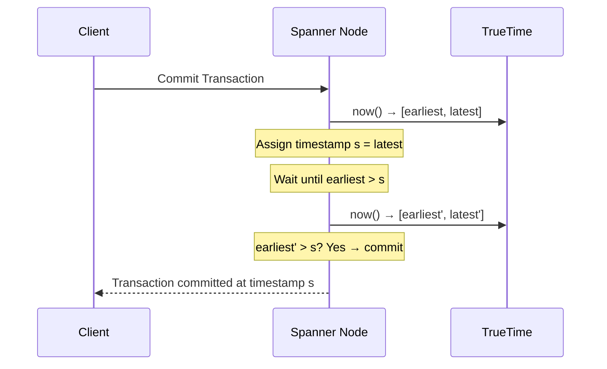

**TrueTime Implications:**
- The commit wait adds latency equal to 2ε (worst case).
- Tighter time bounds (smaller ε) reduce commit wait latency.
- This is why Google invests in GPS and atomic clocks in every data center — to minimize ε.
- Without TrueTime, achieving the same guarantee requires consensus (2PC/Paxos) for every cross-shard transaction.

---

## 2.2 Logical Clocks

### 2.2.1 Why Logical Clocks?

Physical clocks cannot be perfectly synchronized. Logical clocks provide ordering guarantees without relying on physical time. They capture the causal structure of events in a distributed system.

### 2.2.2 Lamport Timestamps

**Invented by:** Leslie Lamport (1978).

A Lamport timestamp is a single integer counter. Each node maintains its own counter.

**Algorithm:**
1. Each event increments the local counter: `C = C + 1`.
2. When sending a message, include the local counter value with the message.
3. When receiving a message with counter C_msg:
   - `C = max(C, C_msg) + 1`

**Properties:**
- If event A happens-before event B, then `L(A) < L(B)` (causal ordering is preserved).
- BUT: If `L(A) < L(B)`, we cannot conclude that A happened-before B (they may be concurrent).
- Lamport timestamps provide a total order of events, but this order is consistent with causality — it does not capture concurrency.

**Example:**

```
Node A:  [1]──send──►[2]──────────[5]──send──►[6]
                                    ▲
Node B:  [1]──[2]──[3]──receive──[4]──[5]──────[6]
                    │                              ▲
                    send──────────────────────────receive
Node C:  [1]──────────[2]──receive─[4]──[5]──[6]──[7]
```

### 2.2.3 Vector Clocks

**Invented by:** Colin Fidge and Friedemann Mattern (1988), independently.

Vector clocks extend Lamport timestamps to capture concurrency. Each node maintains a vector of counters, one per node in the system.

**Algorithm (for N nodes):**
1. Each node i maintains a vector VC[i] of size N, initialized to all zeros.
2. For each event at node i: `VC[i][i] = VC[i][i] + 1`.
3. When node i sends a message, it includes its current VC[i] with the message.
4. When node j receives a message with vector VC_msg:
   - `VC[j][k] = max(VC[j][k], VC_msg[k])` for all k.
   - `VC[j][j] = VC[j][j] + 1`.

**Comparing Vector Clocks:**
- `VC(A) < VC(B)` (A happened-before B): Every element of VC(A) is <= the corresponding element of VC(B), and at least one is strictly less.
- `VC(A) || VC(B)` (A and B are concurrent): Neither VC(A) <= VC(B) nor VC(B) <= VC(A).

**Example:**

```
Node A: [1,0,0] → [2,0,0] → send → [3,0,0]
                                        ↓
Node B: [0,1,0] → [0,2,0] → receive → [3,3,0] → [3,4,0] → send
                                                                 ↓
Node C: [0,0,1] → [0,0,2] → ─────────────────── receive → [3,4,3]
```

**Comparison with Lamport Timestamps:**

| Property | Lamport Timestamps | Vector Clocks |
|---|---|---|
| Size | Single integer | N integers (one per node) |
| Captures causality | `A→B ⟹ L(A) < L(B)` | `A→B ⟹ VC(A) < VC(B)` |
| Detects concurrency | No | Yes: `VC(A) \|\| VC(B)` |
| Space complexity | O(1) | O(N) |
| Scalability | Excellent | Degrades with many nodes |
| Used by | Lamport's original work, Raft terms | DynamoDB (version vectors), Riak |

### 2.2.4 Vector Clocks — Comprehensive Worked Example

This example traces a complete multi-node scenario with vector clocks, demonstrating causality detection, concurrency detection, and conflict resolution.

**Setup: 3 nodes (A, B, C) in a leaderless key-value store. Key "user:profile" is replicated across all three.**

```
TIME    NODE A              NODE B              NODE C
─────   ──────              ──────              ──────
t=0     VC_A = [0,0,0]      VC_B = [0,0,0]      VC_C = [0,0,0]

─── Client 1 writes to Node A: user:profile = {name: "Alice"} ───
t=1     Event: local write
        VC_A = [1,0,0]
        Store: {key: "user:profile", value: {name: "Alice"}, vc: [1,0,0]}

─── Node A replicates to Node B ───
t=2     A sends to B: {key: "user:profile", value: {name: "Alice"}, vc: [1,0,0]}

        B receives message:
        VC_B = [max(0,1), max(0,0), max(0,0)] = [1,0,0]
        VC_B[B] += 1 → VC_B = [1,1,0]
        B stores: {key: "user:profile", value: {name: "Alice"}, vc: [1,1,0]}

─── Client 2 writes to Node B: user:profile = {name: "Alice", age: 30} ───
t=3     Event: local write (depends on previous state)
        VC_B[B] += 1 → VC_B = [1,2,0]
        Store: {key: "user:profile", value: {name: "Alice", age: 30}, vc: [1,2,0]}

─── MEANWHILE: Client 3 writes to Node C (no knowledge of A or B writes) ───
t=3     Event: local write (CONCURRENT with B's write)
        VC_C[C] += 1 → VC_C = [0,0,1]
        Store: {key: "user:profile", value: {name: "Bob"}, vc: [0,0,1]}

─── Conflict Detection Phase ───

Node B sends its version to Node C:
  B → C: {value: {name: "Alice", age: 30}, vc: [1,2,0]}

Node C compares received vc [1,2,0] with local vc [0,0,1]:
  Is [1,2,0] ≤ [0,0,1]? NO (1>0 at index 0, 2>0 at index 1)
  Is [0,0,1] ≤ [1,2,0]? NO (1>0 at index 2)
  CONCURRENT! [1,2,0] || [0,0,1]

  → CONFLICT DETECTED. Node C must resolve.

RESOLUTION OPTIONS:
  1. LWW: Compare wall-clock timestamps. If B's write was at 14:30:05 and
     C's was at 14:30:04, B wins. Value = {name: "Alice", age: 30}.
  2. Merge: Application logic merges fields.
     Result = {name: ???, age: 30}. Name conflict must be resolved.
  3. Multi-value: Store BOTH versions. Return siblings to client.
     Client sees [{name: "Alice", age: 30}, {name: "Bob"}] and picks one.
  4. CRDT: If using a Map CRDT, merge per-field with LWW registers.

AFTER RESOLUTION (using LWW, B wins):
  VC_C = [max(1,0), max(2,0), max(0,1)] = [1,2,1]
  VC_C[C] += 1 → VC_C = [1,2,2]
  Store: {key: "user:profile", value: {name: "Alice", age: 30}, vc: [1,2,2]}
```

### 2.2.5 Lamport Timestamps — Complete Worked Example with Total Ordering

Lamport timestamps create a total order, but that order may not reflect real-time. This example demonstrates the difference.

```
THREE PROCESSES: P1, P2, P3. Each starts with counter = 0.

REAL-TIME EVENT SEQUENCE (what actually happens):
  Real t=100ms: P1 sends message M1 to P2
  Real t=150ms: P3 performs local event E1 (independent of M1)
  Real t=200ms: P2 receives M1
  Real t=250ms: P2 sends message M2 to P3
  Real t=300ms: P3 receives M2

LAMPORT TIMESTAMP COMPUTATION:

P1: counter = 0
  Event: send M1 → counter = 1. Attach L=1 to M1.

P3: counter = 0
  Event: E1 → counter = 1. L(E1) = 1.

P2: counter = 0
  Event: receive M1 (L=1) → counter = max(0, 1) + 1 = 2.
  Event: send M2 → counter = 3. Attach L=3 to M2.

P3: counter = 1 (from E1)
  Event: receive M2 (L=3) → counter = max(1, 3) + 1 = 4.

RESULTING LAMPORT TIMESTAMPS:
  P1:send(M1)    → L = 1
  P3:E1          → L = 1    ← SAME timestamp as P1:send(M1)!
  P2:recv(M1)    → L = 2
  P2:send(M2)    → L = 3
  P3:recv(M2)    → L = 4

TO BREAK TIES: Use (Lamport_timestamp, process_id) as a composite key.
  P1:send(M1)    → (1, P1)
  P3:E1          → (1, P3)   ← Ordered after (1, P1) because P3 > P1

TOTAL ORDER: (1,P1) < (1,P3) < (2,P2) < (3,P2) < (4,P3)

BUT: P3:E1 is actually CONCURRENT with P1:send(M1).
     Lamport timestamps ordered them, but this ordering is ARBITRARY.
     Vector clocks would correctly identify them as concurrent: [1,0,0] || [0,0,1].
```

```python
class LamportClock:
    """Implementation of Lamport logical clock."""

    def __init__(self, process_id: str):
        self.counter = 0
        self.process_id = process_id

    def local_event(self) -> int:
        """Called on any local event (read, write, computation)."""
        self.counter += 1
        return self.counter

    def send_event(self) -> int:
        """Called when sending a message. Returns timestamp to attach."""
        self.counter += 1
        return self.counter

    def receive_event(self, received_timestamp: int) -> int:
        """Called when receiving a message with a Lamport timestamp."""
        self.counter = max(self.counter, received_timestamp) + 1
        return self.counter

    def timestamp(self) -> tuple:
        """Returns (counter, process_id) for total ordering."""
        return (self.counter, self.process_id)


class VectorClock:
    """Implementation of vector clock for N processes."""

    def __init__(self, process_id: str, all_process_ids: list):
        self.process_id = process_id
        self.clock = {pid: 0 for pid in all_process_ids}

    def local_event(self) -> dict:
        """Increment own component on any local event."""
        self.clock[self.process_id] += 1
        return dict(self.clock)

    def send_event(self) -> dict:
        """Increment and return clock to attach to message."""
        self.clock[self.process_id] += 1
        return dict(self.clock)

    def receive_event(self, received_clock: dict) -> dict:
        """Merge received clock with local clock, then increment."""
        for pid in self.clock:
            self.clock[pid] = max(self.clock[pid], received_clock.get(pid, 0))
        self.clock[self.process_id] += 1
        return dict(self.clock)

    @staticmethod
    def compare(vc_a: dict, vc_b: dict) -> str:
        """
        Compare two vector clocks.
        Returns: 'before' if a < b, 'after' if a > b, 'concurrent' if a || b
        """
        a_less = False
        b_less = False
        for key in set(list(vc_a.keys()) + list(vc_b.keys())):
            va = vc_a.get(key, 0)
            vb = vc_b.get(key, 0)
            if va < vb:
                a_less = True
            elif va > vb:
                b_less = True

        if a_less and not b_less:
            return "before"    # a happened-before b
        elif b_less and not a_less:
            return "after"     # b happened-before a
        else:
            return "concurrent"  # neither dominates

# Example usage demonstrating conflict detection
processes = ["A", "B", "C"]
vc_a = VectorClock("A", processes)
vc_b = VectorClock("B", processes)
vc_c = VectorClock("C", processes)

# Node A writes
ts_a = vc_a.send_event()          # A: {A:1, B:0, C:0}
# Node A replicates to B
ts_b = vc_b.receive_event(ts_a)   # B: {A:1, B:1, C:0}
# Node B writes locally
ts_b2 = vc_b.local_event()        # B: {A:1, B:2, C:0}
# Node C writes independently (concurrent!)
ts_c = vc_c.local_event()         # C: {A:0, B:0, C:1}

# Detect conflict between B and C
result = VectorClock.compare(ts_b2, ts_c)
# result = "concurrent" — CONFLICT DETECTED
```

### 2.2.6 Hybrid Logical Clocks (HLC)

**Invented by:** Sandeep Kulkarni et al. (2014).

HLCs combine the best properties of physical clocks and logical clocks:
- They are close to physical time (within clock skew bounds).
- They preserve causality (like Lamport timestamps).
- They are bounded in size (unlike vector clocks, which grow with N).

**Structure:**
An HLC timestamp is a pair: `(physical_component, logical_component)`.

**Algorithm (simplified):**
```
On local event or send at node j:
  l'.j = max(l.j, pt.j)       // pt.j is the node's physical clock
  If l'.j == l.j:
    c'.j = c.j + 1
  Else:
    c'.j = 0
  l.j = l'.j
  c.j = c'.j

On receive of message m at node j:
  l'.j = max(l.j, l.m, pt.j)
  If l'.j == l.j == l.m:
    c'.j = max(c.j, c.m) + 1
  Elif l'.j == l.j:
    c'.j = c.j + 1
  Elif l'.j == l.m:
    c'.j = c.m + 1
  Else:
    c'.j = 0
  l.j = l'.j
  c.j = c'.j
```

**Properties:**
- HLC timestamps are always within ε of the true physical time (where ε is the clock skew bound).
- They respect causality: if A happened-before B, then HLC(A) < HLC(B).
- They are compact: O(1) space, like Lamport timestamps.
- They can be used to generate globally unique, roughly time-ordered IDs.

**Used by:** CockroachDB, MongoDB (internal), various distributed databases.

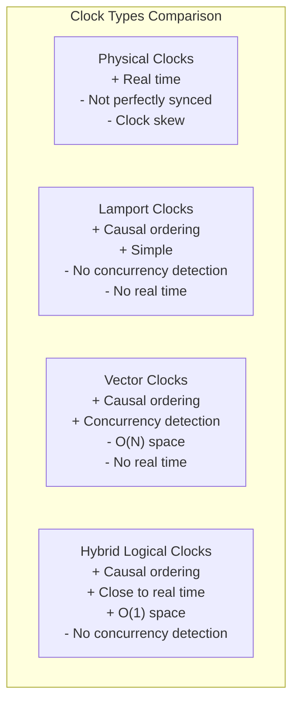

---

## 2.3 Event Ordering

### 2.3.1 Total Order vs Partial Order

**Total Order:**
Every pair of events is comparable — given events A and B, either A < B, B < A, or A = B. A total order places all events on a single timeline.

**Partial Order:**
Some pairs of events are comparable, others are not. The happens-before relation defines a partial order: if A does not happen-before B and B does not happen-before A, they are concurrent and incomparable.

**Why This Matters:**
- Consensus protocols (Paxos, Raft) produce a total order of committed operations — this is their primary purpose.
- Without a total order, two nodes may apply operations in different orders, leading to divergent state.
- Total ordering is expensive (requires consensus); partial ordering is cheaper but tolerates less consistency.

### 2.3.2 Causal Ordering

Causal ordering is a middle ground: it orders events that are causally related (one depends on the other) but allows concurrent events to be unordered.

**Definition:** An event A is causally ordered before event B (A → B) if:
1. A and B are on the same node, and A happened first (local order).
2. A is the sending of a message and B is the receipt of that message (communication).
3. There exists an event C such that A → C and C → B (transitivity).

**Causal Broadcast:**
A message delivery protocol is causally ordered if: when message M1 causally precedes message M2 (M1 → M2), then every node delivers M1 before M2.

**Implementation:** Attach vector clocks to messages. A node delays delivery of a message until all causally preceding messages have been delivered.

### 2.3.3 Total Order Broadcast

Total order broadcast (also called atomic broadcast) ensures that all nodes deliver all messages in the same order. This is equivalent to consensus (proven by Chandra and Toueg, 1996).

**Properties:**
- **Validity:** If a correct process broadcasts a message, it eventually delivers it.
- **Uniform Agreement:** If a correct process delivers a message, all correct processes deliver it.
- **Uniform Total Order:** All correct processes deliver the same messages in the same order.

**Implementation approaches:**
1. **Sequencer-based:** A single sequencer assigns sequence numbers; messages are delivered in sequence number order.
2. **Consensus-based:** Each message delivery is decided by a consensus instance.
3. **Token-based:** A token circulates among nodes; the node holding the token broadcasts next.

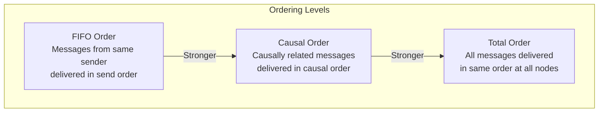

---

## 2.4 Clock Skew

### 2.4.1 Definition and Measurement

Clock skew is the difference between two clocks at any point in time. If Node A's clock reads 10:00:00.000 and Node B's clock reads 10:00:00.050, the clock skew is 50ms.

**Sources of Clock Skew:**
- Crystal oscillator manufacturing variations.
- Temperature fluctuations in the data center.
- NTP synchronization errors and network jitter.
- VM migration (virtual clock may jump when migrated to a different host).
- Leap seconds (some systems handle these poorly).

### 2.4.2 Impact on Distributed Systems

**Lease Expiry:**
Node A holds a lease that expires at time T. Node B believes the current time is T + δ (where δ is the clock skew). Node B may grant a new lease while Node A still believes it holds the old one.

```
Node A's view:  [─────────lease held──────────]
                                               T (A's clock)
Node B's view:  [─────────lease held────]
                                         T (B's clock, δ ahead)
                                          ↑ B grants new lease
                                            while A still holds it!
```

**Distributed Transactions:**
Timestamp-based concurrency control (e.g., MVCC) relies on timestamps being comparable. If two transactions are assigned timestamps by different nodes with clock skew, the ordering may not reflect real-time causality.

**Cache Invalidation:**
A cache entry with a TTL based on physical time may expire too early or too late depending on the clock skew between the cache node and the origin node.

**Log Ordering:**
Correlating logs from multiple services requires synchronized timestamps. With clock skew, events that occurred in order A → B may appear in logs as B → A, making incident investigation difficult.

### 2.4.3 Clock Skew Tolerance Techniques

| Technique | Mechanism | Clock Skew Tolerance |
|---|---|---|
| **Fencing tokens** | Monotonic token accompanies each lease; storage rejects stale tokens. | Infinite (doesn't rely on clocks). |
| **TrueTime** | Returns time interval; operations wait until interval is unambiguous. | Bounded by ε (typically 1-7ms). |
| **Logical clocks** | Ignore physical time entirely; use logical ordering. | Not applicable (no physical time). |
| **HLC** | Physical time + logical extension; bounded drift. | Bounded by ε. |
| **PTP + hardware timestamping** | Sub-microsecond synchronization. | ~1μs. |
| **GPS clocks** | Nanosecond accuracy from satellite time. | ~10ns. |
| **Conservative two-phase locking** | Hold locks until commit; no timestamp dependency. | Infinite (doesn't rely on clocks). |

---

## 2.5 Happens-Before Relation

### 2.5.1 Lamport's Definition

Leslie Lamport defined the happens-before relation (→) in his 1978 paper "Time, Clocks, and the Ordering of Events in a Distributed System."

**Definition:**
The happens-before relation → on the set of events is the smallest relation satisfying:
1. If A and B are events in the same process, and A comes before B, then A → B.
2. If A is the sending of a message by one process, and B is the receipt of that message by another process, then A → B.
3. If A → B and B → C, then A → C (transitivity).

Two events A and B are **concurrent** (A || B) if neither A → B nor B → A.

### 2.5.2 Space-Time Diagrams

Space-time diagrams visualize the happens-before relation. Each process is a vertical line (time flows downward), and messages are arrows between processes.

```
Process P1          Process P2          Process P3
    │                   │                   │
    │   a               │                   │
    ├───────────────────►│   b               │
    │                   │                   │
    │                   ├───────────────────►│   c
    │                   │                   │
    │   d               │                   │
    │◄──────────────────┤   e               │
    │                   │                   │
    │   f               │                   │   g
    │                   │                   │

Relations:
  a → b  (message from P1 to P2)
  b → c  (message from P2 to P3)
  a → c  (transitivity: a → b → c)
  d || c (concurrent: no causal path)
  e → d  (message from P2 to P1)
  f || g (concurrent: no causal path)
```

### 2.5.3 Consistent Cuts

A **cut** is a partition of events into "before the cut" and "after the cut" for each process. A cut is **consistent** if, for every event B in the "after" set, every event A such that A → B is also in the "after" set (or equivalently, the "before" set is causally closed).

**Why Consistent Cuts Matter:**
- A consistent cut represents a valid global state of the system.
- Snapshots, checkpoints, and distributed debugging all rely on consistent cuts.
- The Chandy-Lamport algorithm computes consistent cuts (global snapshots) without stopping the system.

### 2.5.4 Detecting Concurrent Events

Using vector clocks, two events A and B are concurrent if:
- There exists some index i where VC(A)[i] > VC(B)[i], AND
- There exists some index j where VC(A)[j] < VC(B)[j].

This means neither A causally precedes B nor B causally precedes A — they are independent events that happened without knowledge of each other.

**Application — Conflict Detection:**
In a multi-master replication system:
1. Client 1 writes value V1 to Node A. VC becomes [2, 0, 0].
2. Client 2 writes value V2 to Node B. VC becomes [0, 2, 0].
3. When Node A and Node B exchange updates, they compare vector clocks:
   - [2, 0, 0] and [0, 2, 0] are concurrent.
   - A conflict has occurred — the system must resolve it (LWW, merge, or user resolution).

### 2.5.5 Distributed Snapshots — The Chandy-Lamport Algorithm

**Invented by:** K. Mani Chandy and Leslie Lamport (1985).

The Chandy-Lamport algorithm computes a consistent global snapshot of a distributed system without stopping it. This is essential for checkpointing, debugging, garbage collection, and detecting stable properties (e.g., deadlocks, termination).

**System Model:**
- Processes communicate via unidirectional FIFO channels.
- Each process has local state. Each channel has messages in transit.
- A global snapshot consists of: the local state of every process + the state (messages in transit) of every channel.

**Algorithm:**

```
INITIATOR (any process P_i):
  1. Record own local state S_i.
  2. Send a MARKER message on every outgoing channel.
  3. Start recording messages on every incoming channel.

ON RECEIVING MARKER on channel C (at process P_j):
  If P_j has NOT yet recorded its state:
    1. Record own local state S_j.
    2. Record channel C's state as EMPTY (the marker "closes" this channel).
    3. Send MARKER on all outgoing channels.
    4. Start recording messages on all other incoming channels.
  Else (P_j already recorded its state):
    1. Stop recording on channel C.
    2. Channel C's state = all messages received on C between P_j's state
       recording and the arrival of this marker.

TERMINATION:
  When every process has received a MARKER on every incoming channel,
  the snapshot is complete.
```

**Worked Example:**

```
Process P1 and P2 connected by channels C12 (P1→P2) and C21 (P2→P1).

INITIAL STATE:
  P1 state: balance = $100
  P2 state: balance = $50
  C12 (P1→P2): message "$20 transfer" in transit
  C21 (P2→P1): empty

P1 INITIATES SNAPSHOT:

Step 1: P1 records its state: {balance: $100}
Step 2: P1 sends MARKER on C12.
Step 3: P1 starts recording on C21 (incoming channel).

MEANWHILE: P2 sends "$10 transfer" to P1 on C21 (before receiving MARKER).

Step 4: P1 receives "$10 transfer" on C21. Records it (still recording C21).

Step 5: P2 receives "$20 transfer" on C12 (sent before MARKER).
         P2 state is now balance = $70.

Step 6: P2 receives MARKER on C12.
         P2 has NOT recorded its state yet.
         P2 records its state: {balance: $70}  ← includes the $20 received
         P2 records C12 state as EMPTY (marker closes C12).
         P2 sends MARKER on C21.
         P2 starts recording on C12 (but it already received the marker, so nothing more).

Step 7: P1 receives MARKER on C21.
         P1 already recorded its state.
         P1 stops recording C21.
         C21 state = ["$10 transfer"] (message received between state recording and marker).

FINAL SNAPSHOT:
  P1 state: {balance: $100}
  P2 state: {balance: $70}
  C12 state: [] (empty — marker arrived right after $20 transfer)
  C21 state: ["$10 transfer"]

CONSISTENCY CHECK:
  Total money = $100 (P1) + $70 (P2) + $10 (in transit on C21) = $180
  Original total = $100 + $50 + $20 (in transit) + $0 = $170
  Wait — $180 ≠ $170? No, the $20 was DELIVERED to P2 before P2's state was
  recorded, so P2's $70 already includes it. And P1's $100 was recorded BEFORE
  the $10 deduction. The snapshot is a consistent cut even though it doesn't
  correspond to any single physical instant.
```

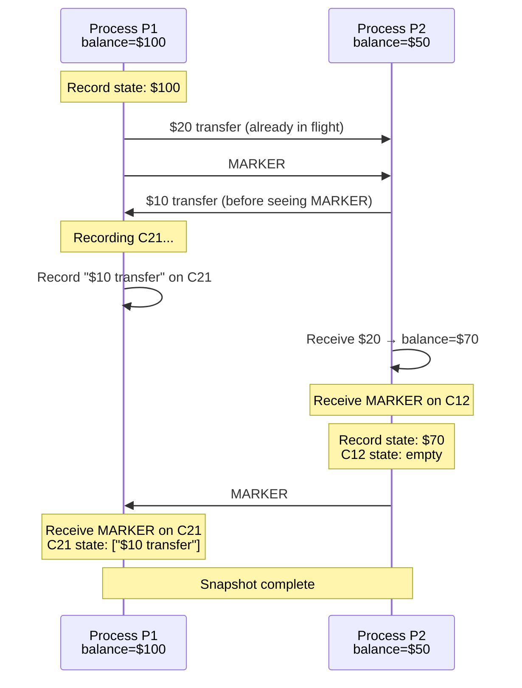

**Applications in Production:**
- **Apache Flink:** Uses Chandy-Lamport for consistent checkpoints in stream processing. Barriers (markers) flow through the data stream; operators snapshot state when barriers arrive.
- **Spark Structured Streaming:** Achieves exactly-once semantics via epoch-based checkpointing (conceptually similar).
- **Distributed debugging:** Take a consistent snapshot to inspect global state without stopping the system.
- **Deadlock detection:** A consistent snapshot can be analyzed offline for wait-for cycles.

### 2.5.6 Causal Consistency Implementation

To implement causal consistency using the happens-before relation:

1. Each write is tagged with a vector clock (or dependency list).
2. When a node receives a write, it checks whether all causally preceding writes have been applied locally.
3. If yes, apply the write immediately.
4. If no, buffer the write until all dependencies are satisfied.

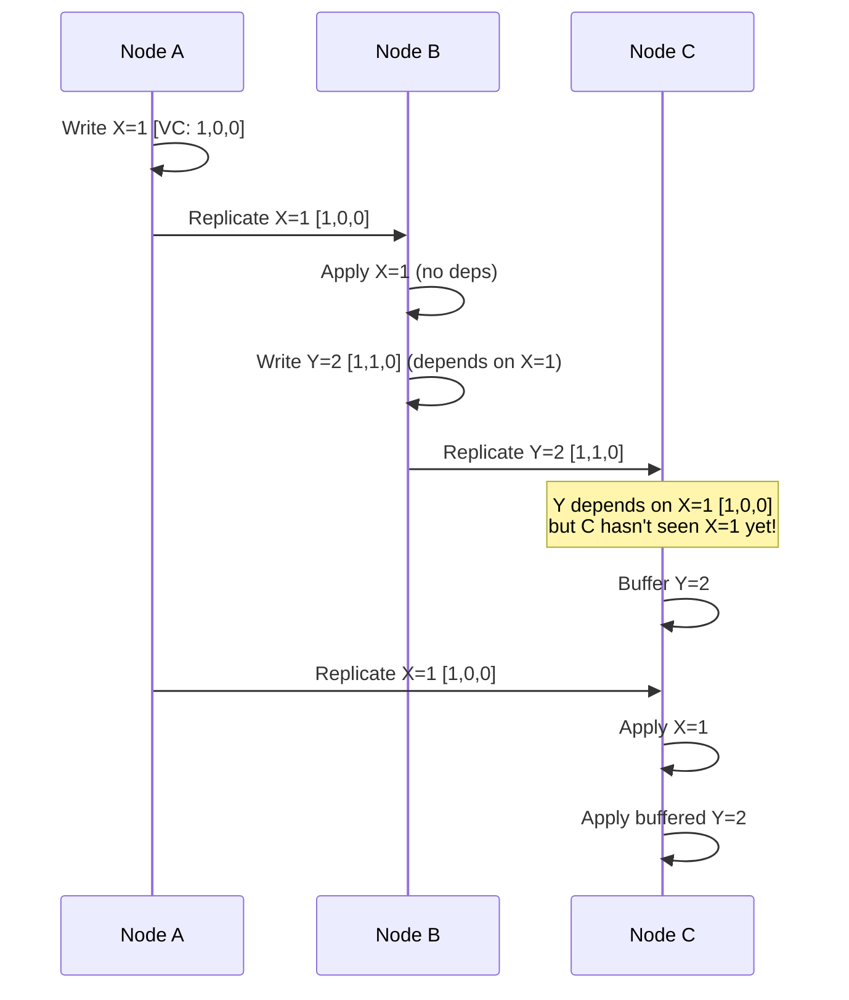

---

### Architectural Decision Record: Time Synchronization Strategy

**Title:** ADR-F07-002 — Time Synchronization for Distributed Transaction Ordering

**Status:** Accepted

**Context:**
Our distributed database spans three data centers (US-East, EU-West, APAC-South) with round-trip latencies of 50-150ms between regions. We need to assign comparable timestamps to transactions for MVCC and conflict detection.

**Decision Drivers:**
- Transaction timestamps must be comparable across regions.
- Commit latency should not exceed 200ms for single-region transactions.
- We cannot afford Google-scale GPS/atomic clock infrastructure in every DC.
- We need to handle clock skew of up to 10ms within a DC and up to 100ms across DCs.

**Options Considered:**

| Option | Description | Pros | Cons |
|---|---|---|---|
| A: NTP only | Rely on NTP for synchronization. | Zero additional hardware cost. | 10-50ms skew; cannot bound error; transactions may be misordered. |
| B: Hybrid Logical Clocks | Use HLC to combine physical time with logical ordering. | Bounded error; O(1) space; causal ordering. | Does not provide external consistency without additional protocol (like commit wait). |
| C: Centralized timestamp oracle | A single node assigns all timestamps. | Perfect ordering; zero skew. | Single point of failure; cross-region latency for every transaction. |
| D: HLC + bounded commit wait (selected) | Use HLC with a conservative commit wait based on measured NTP error bounds. | Causal ordering; bounded error; no additional hardware. | Commit wait adds latency proportional to clock uncertainty (5-50ms). |

**Decision:**
Adopt HLC with bounded commit wait:
- Within a data center, NTP with PTP-aware NICs provides < 1ms skew. Commit wait is negligible.
- Across data centers, NTP provides < 100ms skew. For cross-region transactions, commit wait is bounded by measured skew.
- Monitor clock skew continuously; alert if skew exceeds 50ms.
- Fallback: If clock skew exceeds bounds, cross-region transactions are queued until synchronization recovers.

**Consequences:**
- Cross-region transaction latency increases by up to 100ms in worst case (commit wait).
- Single-region transactions are effectively unaffected (< 1ms commit wait).
- Monitoring infrastructure must track clock skew and NTP health.
- No dependency on specialized hardware (GPS/atomic clocks), reducing cost.

---

---

# Section 3: Fault Tolerance

---

## 3.1 Replication

### 3.1.1 Why Replicate?

Replication serves three purposes:
1. **Fault tolerance:** If one replica fails, others can continue serving.
2. **Performance:** Reads can be distributed across replicas; data can be placed closer to users.
3. **Scalability:** Read throughput scales linearly with the number of replicas.

The fundamental challenge of replication is keeping replicas consistent when they are updated.

### 3.1.2 Synchronous vs Asynchronous Replication

**Synchronous Replication:**
The leader waits for all (or a quorum of) replicas to acknowledge a write before confirming it to the client.

- **Advantage:** All replicas are guaranteed to have the latest data.
- **Disadvantage:** A single slow or failed replica can block all writes.
- **Latency:** Bounded by the slowest replica.

**Asynchronous Replication:**
The leader confirms the write to the client immediately, then replicates in the background.

- **Advantage:** Low write latency; not blocked by slow replicas.
- **Disadvantage:** If the leader fails before replication completes, data is lost.
- **Durability gap:** The window between write acknowledgment and replication completion.

**Semi-Synchronous Replication:**
The leader waits for at least one follower (in addition to itself) to acknowledge, then confirms to the client. Other followers replicate asynchronously.

- Used by MySQL semi-synchronous replication, PostgreSQL synchronous_standby_names.

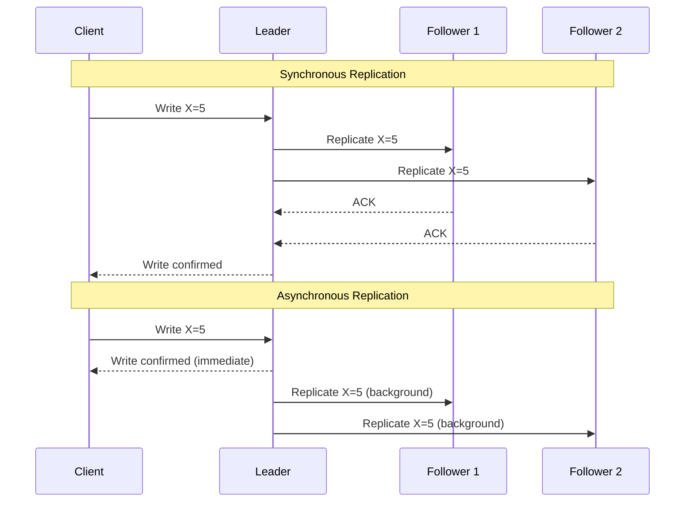

### 3.1.3 Replication Topologies

**Single-Leader (Primary-Backup):**
- One leader accepts writes; followers replicate from the leader.
- Simple; well-understood; easy to reason about ordering.
- Bottleneck: leader is a single point of write throughput.
- Used by: PostgreSQL, MySQL, MongoDB, Redis Sentinel.

**Multi-Leader (Active-Active):**
- Multiple nodes accept writes; they replicate to each other.
- Better write availability and lower latency (writes go to nearest leader).
- Requires conflict resolution (LWW, CRDTs, custom merge functions).
- Used by: CouchDB, Galera Cluster, Cassandra (peer-to-peer is similar).

**Leaderless (Peer-to-Peer):**
- Any node can accept reads and writes.
- Quorum-based consistency (R + W > N).
- No single point of failure for writes.
- Requires conflict resolution and anti-entropy.
- Used by: Cassandra, Riak, Voldemort, DynamoDB.

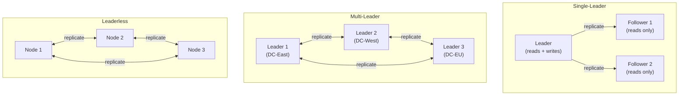

### 3.1.4 Chain Replication

**Invented by:** Robbert van Renesse and Fred Schneider (2004).

In chain replication, replicas are organized in a chain:
- **Head:** Receives writes from clients.
- **Tail:** Receives reads from clients and sends write acknowledgments.
- **Intermediate nodes:** Forward writes down the chain.

```
Write → [Head] → [Node 2] → [Node 3] → [Tail] → ACK to client
                                          ↑
                                    Read requests
```

**Advantages:**
- Strong consistency: The tail has the most up-to-date committed state.
- High read throughput: Reads only go to the tail.
- Failure recovery is well-defined: remove the failed node from the chain.

**Disadvantages:**
- Write latency is the sum of all inter-node latencies (serial, not parallel).
- Tail is a single point of failure for reads (mitigated by CRAQ variant).

**CRAQ (Chain Replication with Apportioned Queries):**
An optimization where any node can serve reads:
- If the node has the latest committed version, it serves the read directly.
- If the node has an uncommitted version, it queries the tail for the latest committed version number, then serves the appropriate version.

### 3.1.5 State Machine Replication (SMR)

State machine replication is the general technique of replicating a deterministic state machine across multiple nodes by ensuring all replicas process the same sequence of commands in the same order.

**Requirements:**
1. **Deterministic state machine:** Given the same starting state and the same input, every replica produces the same output and same new state.
2. **Total order of commands:** All replicas must agree on the order of commands (typically provided by a consensus protocol).
3. **Reliable delivery:** Every committed command must eventually reach every correct replica.

**How it works:**
1. A client sends a command to the leader.
2. The leader proposes the command through consensus (e.g., Raft).
3. Once committed (majority agreement), all replicas apply the command to their state machine.
4. Since the state machine is deterministic and the command order is the same, all replicas converge to the same state.

**State Machine Replication and Consensus:**
SMR reduces the problem of replication to the problem of consensus on a log of commands. This is why Raft, Paxos, and ZAB are log-based — they provide the total order needed for SMR.

### 3.1.6 Conflict Resolution in Multi-Leader/Leaderless Systems

| Strategy | Mechanism | Data Loss Risk | Complexity |
|---|---|---|---|
| **Last-Writer-Wins (LWW)** | Timestamp-based; latest write wins. | Yes — concurrent writes are lost. | Low |
| **Merge Function** | Application-specific logic merges conflicting values. | No (if merge is correct). | High |
| **CRDTs** | Data structures that mathematically guarantee convergence. | No (by construction). | Medium (library support) |
| **User Resolution** | Present conflicts to the user for manual resolution. | No. | Low (engineering) / High (UX) |
| **Version Vectors** | Track per-node versions; detect conflicts; escalate. | No (detection only). | Medium |

### 3.1.7 Conflict Resolution Strategies — Deep Dive

When concurrent writes occur in multi-leader or leaderless systems, conflicts must be resolved. Each strategy has distinct trade-offs.

**Strategy 1: Last-Writer-Wins (LWW)**

The simplest conflict resolution: attach a timestamp to each write; the write with the highest timestamp wins.

```
Node A writes: {key: "x", value: "A", timestamp: 1001}
Node B writes: {key: "x", value: "B", timestamp: 1003}  (concurrent)

Resolution: timestamp 1003 > 1001 → value = "B" wins.
Write "A" is silently discarded.

PROBLEMS:
1. Clock skew: If Node A's clock is 5ms ahead, it may always "win"
   even when Node B's write was later in real time.
2. Data loss: The losing write is silently dropped. For a "set" operation
   this may be acceptable, but for "add item to cart" it means items vanish.
3. Tie-breaking: If timestamps are equal, need a secondary criterion
   (e.g., node ID). This introduces bias.
```

**Strategy 2: CRDT-Based Resolution (Detailed OR-Set Example)**

The Observed-Remove Set (OR-Set) is the most practical CRDT for sets that support both add and remove operations.

```
OR-Set uses UNIQUE TAGS for each addition.

Node A's state: {("apple", tag_a1), ("banana", tag_a2)}
Node B's state: {("apple", tag_b1), ("banana", tag_a2)}

OPERATION: Node A removes "apple"
  Node A removes ALL tags for "apple" that it has OBSERVED:
  Removes ("apple", tag_a1).
  Node A's state: {("banana", tag_a2)}

OPERATION (concurrent): Node B adds "apple" again
  Node B adds ("apple", tag_b2) — new unique tag.
  Node B's state: {("apple", tag_b1), ("apple", tag_b2), ("banana", tag_a2)}

MERGE (when nodes sync):
  Union all (element, tag) pairs, then subtract removed tags.
  Node A removed tag_a1. Node B added tag_b2.
  Merged: {("apple", tag_b1), ("apple", tag_b2), ("banana", tag_a2)}
  "apple" is PRESENT (because tag_b1 and tag_b2 were not removed).

INTUITION: The concurrent add "wins" over the concurrent remove.
  This is the "add-wins" semantic — if one node adds and another removes
  concurrently, the element remains. This is typically what users expect:
  "I added apple to my cart, why did it disappear?" is worse than
  "I removed apple, but it came back because someone added it concurrently."
```

```python
import uuid
from typing import Set, Tuple

class ORSet:
    """Observed-Remove Set — a CRDT that supports add and remove."""

    def __init__(self):
        # Set of (element, unique_tag) pairs
        self.elements: Set[Tuple[str, str]] = set()
        # Set of removed tags (tombstones)
        self.tombstones: Set[str] = set()

    def add(self, element: str) -> str:
        """Add element with a fresh unique tag."""
        tag = str(uuid.uuid4())
        self.elements.add((element, tag))
        return tag

    def remove(self, element: str):
        """Remove all OBSERVED instances of element."""
        to_remove = {(e, t) for e, t in self.elements if e == element}
        for e, t in to_remove:
            self.tombstones.add(t)
            self.elements.discard((e, t))

    def lookup(self, element: str) -> bool:
        """Check if element is in the set."""
        return any(e == element for e, t in self.elements if t not in self.tombstones)

    def value(self) -> set:
        """Return all present elements."""
        return {e for e, t in self.elements if t not in self.tombstones}

    def merge(self, other: 'ORSet'):
        """Merge another OR-Set into this one (commutative, associative, idempotent)."""
        # Union elements
        merged_elements = self.elements | other.elements
        # Union tombstones
        merged_tombstones = self.tombstones | other.tombstones
        # Apply tombstones
        self.elements = {(e, t) for e, t in merged_elements if t not in merged_tombstones}
        self.tombstones = merged_tombstones

# Demonstration of concurrent add/remove resolution
node_a = ORSet()
node_b = ORSet()

# Both nodes add "apple" independently
tag_a = node_a.add("apple")  # Node A: {("apple", tag_a)}
tag_b = node_b.add("apple")  # Node B: {("apple", tag_b)}

# Sync: merge both
node_a.merge(node_b)  # Node A now has both tags
node_b.merge(node_a)  # Node B now has both tags

# Node A removes "apple" — removes both observed tags
node_a.remove("apple")  # tombstones: {tag_a, tag_b}

# Concurrently, Node B adds "apple" again with new tag
tag_c = node_b.add("apple")  # Node B: {("apple", tag_c)} plus old tags

# Final merge
node_a.merge(node_b)
# "apple" is PRESENT because tag_c was not in A's tombstones
assert node_a.lookup("apple") == True  # add-wins semantics
```

**Strategy 3: Application-Level Merge Functions**

For domain-specific data, custom merge functions can preserve more information than LWW while being simpler than CRDTs.

```
EXAMPLE: Shopping Cart Merge

Cart A: {item1: qty=2, item3: qty=1}  (user added item3, changed item1 qty)
Cart B: {item1: qty=1, item2: qty=3}  (user added item2)

MERGE FUNCTION: Per-item max quantity, union of items
Result: {item1: qty=2, item2: qty=3, item3: qty=1}

EXAMPLE: User Profile Merge

Profile A: {name: "Alice Smith", email: "alice@new.com", bio: "Engineer"}
Profile B: {name: "Alice Johnson", email: "alice@old.com", bio: "Engineer"}

MERGE FUNCTION: Per-field LWW with timestamps
  name: "Alice Smith" (A's timestamp=1005) vs "Alice Johnson" (B's timestamp=1003) → "Alice Smith"
  email: "alice@new.com" (A's timestamp=1005) vs "alice@old.com" (B's timestamp=1001) → "alice@new.com"
  bio: identical, no conflict
Result: {name: "Alice Smith", email: "alice@new.com", bio: "Engineer"}
```

---

## 3.2 Leader Election

### 3.2.1 Why Leader Election?

Many distributed protocols require a single leader (coordinator) to sequence operations, make decisions, or coordinate work. When the current leader fails, a new one must be elected quickly and unambiguously.

**Requirements:**
- **Safety:** At most one leader at any time (within a term/epoch).
- **Liveness:** A new leader is eventually elected after the old one fails.
- **Non-triviality:** Only a non-failed node can become the leader.

### 3.2.2 Bully Algorithm

**How it works:**
1. When a node P detects that the leader has failed, P sends an ELECTION message to all nodes with higher IDs.
2. If no higher-ID node responds within a timeout, P declares itself the leader by sending a COORDINATOR message to all nodes.
3. If a higher-ID node responds with an OK message, P yields and waits.
4. The highest-ID responding node takes over the election process.

**Properties:**
- The node with the highest ID always wins (hence "bully").
- Simple to implement but generates O(n^2) messages in the worst case.
- Not partition-safe: two partitions can elect different leaders.

### 3.2.3 Raft Leader Election (Detailed)

Raft's leader election is the most widely implemented election protocol in modern systems.

**Detailed Algorithm:**

```
FOLLOWER STATE:
  - Wait for heartbeat from leader.
  - If election timeout expires (randomized 150-300ms):
    - Transition to CANDIDATE.

CANDIDATE STATE:
  - Increment current term.
  - Vote for self.
  - Reset election timer.
  - Send RequestVote RPCs to all other servers.
  - If votes received from majority:
    - Transition to LEADER.
  - If AppendEntries RPC received from valid leader:
    - Transition to FOLLOWER.
  - If election timeout expires:
    - Start new election (increment term, re-send RequestVotes).

LEADER STATE:
  - Send periodic heartbeats (empty AppendEntries) to all followers.
  - Accept client requests and replicate log entries.
  - If higher term discovered:
    - Transition to FOLLOWER.

RequestVote Handler (all nodes):
  - If candidate's term < currentTerm: reject.
  - If already voted for another candidate in this term: reject.
  - If candidate's log is less up-to-date than own log: reject.
  - Otherwise: grant vote, reset election timer.
```

**Election Safety Proof (intuition):**
- Each node votes at most once per term.
- A candidate needs a majority of votes.
- Two candidates cannot both get a majority (the sets must overlap by at least one node).
- Therefore, at most one leader per term.

### 3.2.4 Lease-Based Leader Election

A lease is a time-limited lock. The leader holds a lease and must renew it before it expires.

**Algorithm:**
1. The leader periodically writes a lease record to a shared store (e.g., etcd, ZooKeeper) with an expiry time.
2. Followers monitor the lease. If the lease expires without renewal, a follower attempts to acquire the lease.
3. The lease acquisition is atomic (compare-and-swap).
4. The leader must stop acting as leader before its lease expires (with a safety margin for clock skew).

**Clock Skew Safety:**
```
Leader's lease: [──────────────────────lease duration──────────────────]
                                                                       ↑ leader stops acting
Safety margin:  [─────────────────────────────lease duration─────────────────]
                                                                                ↑ followers can try
                                                        ↕ safety margin accounts
                                                          for clock skew
```

**The leader must use a shorter effective lease duration than the followers observe.** If the maximum clock skew is δ, the leader should stop acting as leader at least δ before the lease's nominal expiry.

### 3.2.5 ZooKeeper Leader Election

ZooKeeper provides leader election as a coordination primitive:

1. Each candidate creates an ephemeral sequential znode under `/election/`.
2. Nodes are named `/election/candidate-0000000001`, `/election/candidate-0000000002`, etc.
3. The node with the lowest sequence number is the leader.
4. Each non-leader node watches the znode with the next-lower sequence number (not the leader's znode — this avoids a "herd effect").
5. When a watched znode is deleted (node fails, ephemeral node disappears), the watcher checks if it now has the lowest sequence number.
6. If yes, it becomes the new leader.

**Advantages:**
- No split-brain: ZooKeeper's consensus guarantees linearizable operations.
- Efficient: Each node watches only one other node (no thundering herd).
- Automatic: Ephemeral nodes disappear when the session ends (node failure detected automatically).

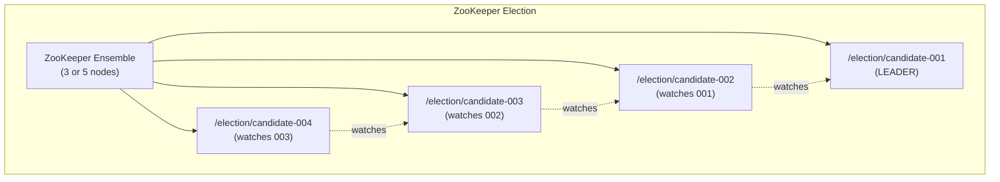

### 3.2.6 Ring Election Algorithm

The Ring algorithm (Chang-Roberts, 1979) assumes nodes are arranged in a logical ring and only communicate with their successor.

**Algorithm:**
1. When a node P detects the leader has failed, P sends an ELECTION message containing its own ID to its successor.
2. When a node Q receives an ELECTION(id):
   - If id > Q's own ID: forward ELECTION(id) to successor (higher ID should win).
   - If id < Q's own ID: replace with ELECTION(Q's ID) and forward (Q is a better candidate).
   - If id == Q's own ID: Q has received its own message back after traversing the entire ring. Q is the leader. Q sends COORDINATOR(Q's ID) around the ring.
3. When a node receives COORDINATOR(id): record id as the new leader and forward the message.

```
EXAMPLE: Ring of 5 nodes [N1=15, N2=28, N3=7, N4=42, N5=33]
Ring order: N1 → N2 → N3 → N4 → N5 → N1

N3 detects leader failure. N3 starts election.

N3 sends ELECTION(7) → N4
N4: 42 > 7, so replace: sends ELECTION(42) → N5
N5: 33 < 42, so forward: sends ELECTION(42) → N1
N1: 15 < 42, so forward: sends ELECTION(42) → N2
N2: 28 < 42, so forward: sends ELECTION(42) → N3
N3: 7 < 42, so forward: sends ELECTION(42) → N4
N4: 42 == 42 — it's my own ID! I am the leader!
N4 sends COORDINATOR(42) around the ring.

Result: N4 (highest ID = 42) becomes the new leader.
Messages: O(N) for election + O(N) for coordinator = O(2N).
```

**Properties:**
- Message complexity: O(N) in the best case, O(N^2) in the worst case (when multiple nodes start elections simultaneously).
- Only the node with the highest ID wins.
- Not partition-safe: If the ring is broken by a partition, the algorithm cannot complete.

### 3.2.7 ZAB Leader Election (Detailed)

ZooKeeper Atomic Broadcast (ZAB) uses a leader election mechanism that considers both the epoch (term) and the transaction log length. This ensures the elected leader has the most complete log.

```
ZAB LEADER ELECTION — FAST LEADER ELECTION (FLE)

STATE: Each server maintains a vote (proposed leader, proposed zxid, proposed epoch).

Step 1: Server enters LOOKING state.
        Initial vote = (self.id, self.lastZxid, self.epoch + 1).

Step 2: Broadcast vote to all peers.

Step 3: On receiving a vote from peer:
        Compare (epoch, zxid, server_id) lexicographically:

        if peer.epoch > my_proposed.epoch:
            adopt peer's vote as my vote
        elif peer.epoch == my_proposed.epoch:
            if peer.zxid > my_proposed.zxid:
                adopt peer's vote
            elif peer.zxid == my_proposed.zxid:
                if peer.server_id > my_proposed.server_id:
                    adopt peer's vote
        // else: keep my vote

        Re-broadcast if vote changed.

Step 4: If a server's proposed leader has received votes from a quorum
        (majority), AND no new votes arrive for a waiting period:
        Election complete. The proposed leader becomes LEADING.
        All others become FOLLOWING.

KEY INSIGHT: ZAB prioritizes log completeness (zxid) over server ID.
  A server with zxid=100 on server_id=1 beats a server with zxid=50 on
  server_id=999. This ensures the new leader has all committed transactions.
```

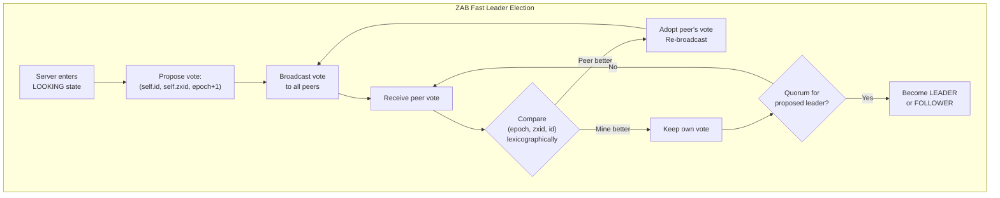

### 3.2.8 Leader Election Comparison

| Algorithm | Partition Safe | Message Complexity | Failure Detection | Used By |
|---|---|---|---|---|
| **Bully** | No | O(n^2) | Timeout | Legacy systems |
| **Raft** | Yes (majority) | O(n) per election | Heartbeat timeout | etcd, Consul, TiKV |
| **Lease-based** | Yes (with fencing) | O(1) renewal | Lease expiry | HDFS NameNode, HBase |
| **ZooKeeper** | Yes (consensus) | O(n) watches | Ephemeral nodes | Kafka (old), HBase, Hadoop |
| **Paxos-based** | Yes (majority) | O(n) per election | Timeout | Chubby, Spanner |

---

## 3.3 Failover

### 3.3.1 Failover Strategies

**Hot Standby:**
- The standby replica is fully running and receives all writes in real-time (synchronous replication).
- Failover is near-instantaneous (seconds): the standby promotes itself to primary.
- Cost: Requires a fully provisioned standby that consumes resources.
- Data loss: Zero (synchronous replication).
- Example: AWS RDS Multi-AZ, PostgreSQL synchronous standby.

**Warm Standby:**
- The standby replica is running and receives writes asynchronously (streaming replication).
- Failover takes seconds to minutes: the standby must finish applying any pending WAL (Write-Ahead Log) entries before promoting.
- Cost: Requires a running standby but may have lower throughput requirements.
- Data loss: Possible (the replication lag at the time of failure).
- Example: PostgreSQL async streaming replication, MySQL replication.

**Cold Standby:**
- The standby is not running; only backups exist.
- Failover takes minutes to hours: must provision a new machine, restore from backup, and apply transaction logs.
- Cost: Lowest — only backup storage costs.
- Data loss: From the last backup to the failure point (could be hours).
- Example: Restoring from daily database backups.

```
┌───────────────────────────────────────────────────────────────────────┐
│                   FAILOVER STRATEGY COMPARISON                        │
├───────────────────┬──────────────┬──────────────┬─────────────────────┤
│                   │ Hot Standby  │ Warm Standby │ Cold Standby        │
├───────────────────┼──────────────┼──────────────┼─────────────────────┤
│ RTO (Recovery     │ Seconds      │ Seconds to   │ Minutes to hours    │
│ Time Objective)   │              │ minutes      │                     │
├───────────────────┼──────────────┼──────────────┼─────────────────────┤
│ RPO (Recovery     │ Zero         │ Seconds of   │ Hours of data       │
│ Point Objective)  │              │ data loss    │ loss                │
├───────────────────┼──────────────┼──────────────┼─────────────────────┤
│ Cost              │ Highest      │ Medium       │ Lowest              │
├───────────────────┼──────────────┼──────────────┼─────────────────────┤
│ Complexity        │ Medium       │ Medium       │ Low (setup),        │
│                   │              │              │ High (recovery)     │
├───────────────────┼──────────────┼──────────────┼─────────────────────┤
│ Replication       │ Synchronous  │ Asynchronous │ Periodic backup     │
├───────────────────┼──────────────┼──────────────┼─────────────────────┤
│ Resource usage    │ 100% of      │ ~100% of     │ Storage only        │
│                   │ primary      │ primary      │                     │
└───────────────────┴──────────────┴──────────────┴─────────────────────┘
```

### 3.3.2 Automatic Failover Process

A typical automatic failover sequence:

1. **Detection:** The failure detector (heartbeat, lease expiry, or gossip) determines the primary is unreachable.
2. **Confirmation:** The system waits for multiple detection cycles or confirms with multiple observers to avoid false positives.
3. **Election:** A new primary is selected (by consensus, lease acquisition, or ZooKeeper election).
4. **Promotion:** The new primary:
   - Finishes applying any pending writes.
   - Starts accepting new writes.
   - Announces itself to clients (via DNS update, load balancer reconfiguration, or service discovery).
5. **Reconfiguration:** Remaining replicas point to the new primary for replication.
6. **Client notification:** Clients retry connections and are directed to the new primary.
7. **Old primary handling:** When the old primary recovers, it must join as a replica (not reclaim leadership).

### 3.3.3 Split-Brain Resolution

Split-brain is the most dangerous failure mode in failover. It occurs when both the old primary and the new primary accept writes simultaneously.

**Resolution Strategies:**

**Fencing:**
When a new primary is elected, it "fences off" the old primary:
- **STONITH (Shoot The Other Node In The Head):** The new primary issues a hardware command (via IPMI, BMC, or cloud API) to power off the old primary.
- **Fencing tokens:** The new primary obtains a monotonically increasing fencing token. All storage nodes reject writes with tokens older than the latest they have seen.

**Epoch/Term-based:**
- Each leadership period has a unique, monotonically increasing epoch/term number.
- All messages include the epoch. Recipients reject messages from old epochs.
- This is how Raft prevents stale leaders: a deposed leader's AppendEntries RPCs are rejected because followers have moved to a higher term.

**Quorum-based:**
- Only the partition with a majority can elect a leader.
- The minority partition becomes read-only or unavailable.
- Guarantees at most one leader: two majorities would require more than N nodes (impossible).

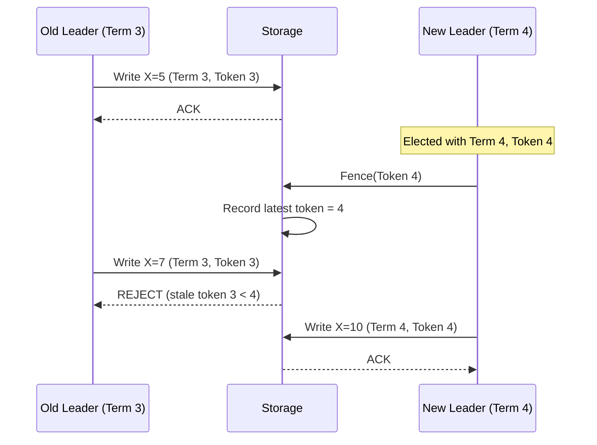

### 3.3.4 Split-Brain Scenarios — Deep Dive with Fencing Tokens

Split-brain is the most insidious failure in distributed systems because the system appears to function correctly to both partitions, silently generating conflicting state.

**Detailed Split-Brain Timeline:**

```
SCENARIO: Distributed lock service with 3 nodes. Client A holds lock.

t=0   Client A acquires lock via leader (Node 1). Fencing token = 37.
      Client A begins modifying shared resource (e.g., file in storage).

t=1   Network partition: Node 1 isolated. Nodes 2, 3 can communicate.

t=2   Client A still believes it holds the lock (lease hasn't expired).
      Client A continues writing to shared resource with token 37.

t=5   Lease expires. Client A's lock should be released.
      BUT Client A experienced a GC pause from t=4 to t=8.
      Client A does not realize its lease has expired.

t=6   Nodes 2, 3 elect new leader (Node 2). Node 2 issues new lock to Client B.
      Client B receives fencing token = 38.
      Client B begins writing to shared resource.

t=7   TWO CLIENTS WRITING SIMULTANEOUSLY:
      Client A (token 37): still in GC pause, has pending writes
      Client B (token 38): actively writing

t=8   Client A's GC pause ends. It flushes pending writes to storage.

WITHOUT FENCING TOKENS:
  Storage accepts Client A's writes. Data is corrupted.
  Client A and Client B's writes are interleaved arbitrarily.

WITH FENCING TOKENS:
  Storage checks: Client A sends writes with token 37.
  Storage has seen token 38 from Client B.
  37 < 38 → REJECT Client A's writes.
  Data integrity preserved.
```

**Fencing Token Implementation:**

```python
class FencedStorage:
    """Storage layer that enforces fencing tokens to prevent split-brain writes."""

    def __init__(self):
        self.data = {}
        self.max_token_seen = {}  # per-resource max token

    def write(self, resource_id: str, data: bytes, fencing_token: int) -> bool:
        """
        Write to a resource only if the fencing token is the highest seen.
        Returns True if write accepted, False if rejected (stale token).
        """
        current_max = self.max_token_seen.get(resource_id, 0)

        if fencing_token < current_max:
            # Stale token — this writer's lease has been superseded
            raise StaleTokenError(
                f"Token {fencing_token} < max seen {current_max} "
                f"for resource {resource_id}. Write rejected."
            )

        # Update max token and proceed with write
        self.max_token_seen[resource_id] = fencing_token
        self.data[resource_id] = data
        return True

    def read(self, resource_id: str) -> bytes:
        return self.data.get(resource_id)


class DistributedLock:
    """Lock service that issues monotonically increasing fencing tokens."""

    def __init__(self, consensus_store):
        self.store = consensus_store  # e.g., etcd, ZooKeeper

    def acquire(self, resource_id: str, holder_id: str,
                ttl_seconds: int = 30) -> int:
        """
        Acquire lock via consensus. Returns fencing token.
        The fencing token is a monotonically increasing integer stored
        in the consensus system alongside the lock.
        """
        # Atomic compare-and-swap: only succeeds if lock is not held
        # or has expired
        current = self.store.get(f"lock:{resource_id}")

        if current and not current.expired:
            raise LockHeldError(f"Lock held by {current.holder}")

        # Increment global fencing token counter (via consensus)
        new_token = self.store.increment(f"fence:{resource_id}")

        # Write lock record with TTL
        self.store.put(
            key=f"lock:{resource_id}",
            value={"holder": holder_id, "token": new_token},
            ttl=ttl_seconds
        )

        return new_token

    def release(self, resource_id: str, holder_id: str):
        """Release lock. Only the current holder can release."""
        current = self.store.get(f"lock:{resource_id}")
        if current and current.holder == holder_id:
            self.store.delete(f"lock:{resource_id}")
```

**Split-Brain Detection Checklist for Production Systems:**

| Signal | Detection Method | Response |
|---|---|---|
| Two nodes claim leadership | Monitor epoch/term numbers; alert if multiple leaders report same epoch | STONITH the lower-epoch leader |
| Divergent data across replicas | Anti-entropy (Merkle tree comparison) detects divergence | Trigger repair; investigate root cause |
| Fencing token rejections spike | Monitor storage rejection rate | Investigate lease/lock service; check for network partitions |
| Client errors "not leader" spike | Client-side metrics show retries | Check for ongoing election; verify DNS/service discovery |
| Replication lag exceeds threshold | Monitor lag metric (e.g., pg_stat_replication) | Alert; consider promoting standby if primary is unreachable |

### 3.3.5 Failover Challenges

| Challenge | Description | Mitigation |
|---|---|---|
| **False positive detection** | Network glitch triggers failover when primary is actually healthy. | Increase detection threshold; use multiple observers. |
| **Replication lag** | New primary is behind the old primary; committed writes are lost. | Synchronous replication; or accept RPO > 0. |
| **Client redirection** | Clients continue sending to old primary during transition. | DNS TTL reduction; client-side retry with discovery. |
| **In-flight transactions** | Transactions started on old primary are neither committed nor rolled back. | Two-phase commit; or idempotent retry on new primary. |
| **Cascading failover** | Failover triggers load on remaining nodes, causing them to fail too. | Capacity planning; circuit breakers; load shedding. |
| **Split-brain writes** | Both old and new primary accept writes during partition. | Fencing tokens; STONITH; quorum-based election. |

---

## 3.4 Byzantine Fault Tolerance

### 3.4.1 When Do You Need BFT?

Most internal distributed systems assume crash-fault tolerance (CFT) is sufficient — nodes either work correctly or fail by stopping. BFT is needed when:

- **Untrusted participants:** Blockchain networks where nodes are operated by different entities with potentially conflicting interests.
- **Hostile environments:** Military or safety-critical systems where hardware/software tampering is possible.
- **Software bugs:** A corrupted node may send incorrect data; BFT protects against this.
- **Regulatory requirements:** Some financial systems require tolerance of arbitrary faults.

### 3.4.2 PBFT in Detail

The PBFT protocol (covered in Section 1.4.5) is the foundational practical BFT algorithm. Here we expand on operational aspects.

**View Changes:**
When the primary is suspected to be faulty, replicas initiate a view change:
1. A replica times out waiting for a Pre-Prepare message.
2. It sends a VIEW-CHANGE message to all replicas, including its prepared certificates.
3. When the new primary (primary = view mod N) receives 2f VIEW-CHANGE messages, it sends a NEW-VIEW message with a proof of validity.
4. Replicas verify the NEW-VIEW and resume the protocol with the new primary.

**PBFT Message Complexity:**
- Normal operation: O(n^2) messages per consensus round (each replica sends Prepare and Commit to all others).
- View change: O(n^3) in the worst case.
- This makes PBFT impractical for large clusters (typically limited to 4-20 nodes).

### 3.4.3 Modern BFT Protocols

**HotStuff (2019):**
- Reduces message complexity to O(n) per phase by using a leader-based protocol with threshold signatures.
- Three rounds of voting (prepare, pre-commit, commit) instead of PBFT's all-to-all communication.
- Linear view changes (O(n) instead of O(n^3)).
- Used by: Facebook's Diem (Libra) blockchain.

**Tendermint (2014):**
- BFT consensus designed for blockchain.
- Combines consensus and leader election into a single protocol.
- Deterministic finality (once committed, never reverted).
- Used by: Cosmos blockchain ecosystem.

**Comparison of BFT Protocols:**

| Property | PBFT | HotStuff | Tendermint |
|---|---|---|---|
| **Message complexity** | O(n^2) | O(n) | O(n^2) |
| **View change** | O(n^3) | O(n) | O(n) (round-robin) |
| **Responsiveness** | Yes | Yes | Partial (fixed timeouts) |
| **Finality** | Immediate | Immediate | Immediate |
| **Practical node count** | 4-20 | 4-100+ | 4-200+ |
| **Leader rotation** | View-based | Per-decision | Round-robin |

### 3.4.4 BFT and Blockchain Consensus

Blockchain systems are a prominent application of BFT, but they often use different consensus mechanisms:

**Proof of Work (PoW):**
- Nakamoto consensus (Bitcoin).
- Probabilistic finality (deeper blocks are less likely to be reverted).
- Tolerates up to 50% Byzantine nodes (by hash power).
- Extremely energy-intensive.

**Proof of Stake (PoS):**
- Validators stake tokens; dishonest behavior results in stake slashing.
- More energy-efficient than PoW.
- Ethereum transitioned from PoW to PoS.

**Delegated Proof of Stake (DPoS):**
- Token holders vote for a small set of delegates who produce blocks.
- Higher throughput (fewer consensus participants).
- More centralized.

**BFT + PoS (Tendermint-style):**
- Validators are selected based on stake.
- Consensus uses BFT protocol for deterministic finality.
- Used by Cosmos, Binance Chain.

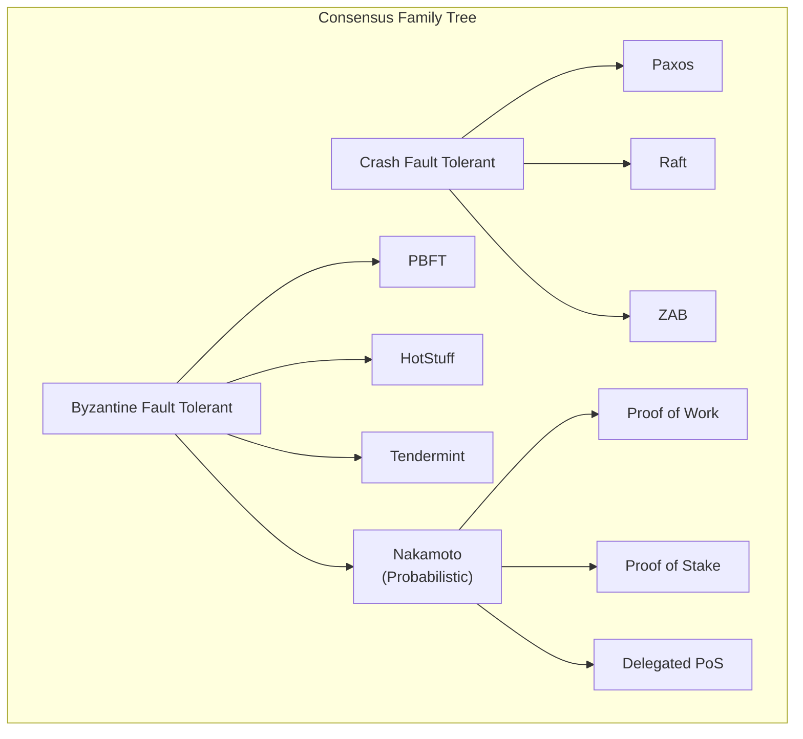

---

## 3.5 Failure Detection

### 3.5.1 The Failure Detection Problem

In an asynchronous distributed system, it is impossible to distinguish between a crashed node and a slow node (this follows from the FLP impossibility result). All practical failure detectors are therefore imperfect — they may:
- **False positive:** Suspect a healthy node is dead (leading to unnecessary failover).
- **False negative:** Believe a dead node is alive (delaying failover).

The goal is to minimize both while understanding that they cannot both be zero.

### 3.5.2 Heartbeat-Based Detection

The simplest failure detector: each node periodically sends a "heartbeat" message to a monitor (or to peers). If no heartbeat is received within a timeout period, the node is suspected to be dead.

**Design Parameters:**
- **Heartbeat interval (Δ):** How often heartbeats are sent. Shorter = faster detection, more network overhead.
- **Timeout (T):** How long to wait before suspecting failure. Shorter = faster detection, more false positives.
- **Number of missed heartbeats:** Some systems require K consecutive missed heartbeats before suspicion.

**Trade-off:**
```
         ┌──────────────────────────────────────┐
         │   Fast detection    Fewer false       │
         │   (short timeout)   positives         │
         │        ◄────────────────────►         │
         │   More false        Slow detection    │
         │   positives         (long timeout)    │
         └──────────────────────────────────────┘
```

**Adaptive Heartbeat Timeout:**
Instead of a fixed timeout, the timeout can be adjusted based on observed network conditions:
- Track the distribution of heartbeat arrival times.
- Set the timeout to cover (e.g.) 99th percentile of observed intervals.
- If the network becomes more variable, increase the timeout automatically.

### 3.5.3 Phi Accrual Failure Detector

**Invented by:** Naohiro Hayashibara et al. (2004).
**Used by:** Cassandra, Akka.

Instead of a binary "alive/dead" output, the phi accrual failure detector outputs a continuous suspicion level φ (phi), where:
- φ = 0 means "definitely alive."
- Higher φ means "more likely dead."
- The application sets a threshold (e.g., φ > 8 means "suspect dead").

**How It Works:**
1. Track the inter-arrival times of heartbeats, building a distribution (assumed normal).
2. When a new heartbeat is expected but has not arrived, compute φ based on how unlikely the current delay is given the distribution.
3. φ = -log10(1 - F(timeSinceLastHeartbeat)), where F is the CDF of the inter-arrival time distribution.

**Advantages over fixed timeout:**
- Adapts automatically to network conditions.
- Applications can choose their own threshold based on their tolerance for false positives vs detection speed.
- Works well in environments with variable latency (e.g., cloud, WAN).

```mermaid
graph LR
    subgraph "Phi Accrual Failure Detector"
        H["Heartbeat<br/>Arrivals"] --> D["Distribution<br/>Estimator"]
        D --> PHI["φ Calculator"]
        PHI --> T["Threshold<br/>Comparator"]
        T -->|"φ < threshold"| ALIVE["Node Alive"]
        T -->|"φ ≥ threshold"| SUSPECT["Node Suspected"]
    end
```

### 3.5.4 Gossip-Based Failure Detection

In gossip-based failure detection, nodes periodically exchange information about which nodes they believe are alive. This distributes the failure detection work across all nodes.

**Algorithm (Gossip Protocol):**
1. Each node maintains a heartbeat counter and a list of all known nodes with their last-known heartbeat counters and timestamps.
2. Periodically (every gossip interval, e.g., 1 second):
   - Increment local heartbeat counter.
   - Select a random peer.
   - Send the entire membership list to that peer.
3. When a node receives a gossip message:
   - For each entry, update the local list if the received heartbeat counter is higher.
   - Update the timestamp for any updated entry.
4. If a node's entry has not been updated for a timeout period (e.g., 10 seconds), mark it as suspected.
5. If a suspected node is not seen for a longer period (e.g., 30 seconds), mark it as dead and remove it.

**Properties:**
- **Scalable:** Each node only communicates with O(1) peers per gossip round, but information spreads to all nodes in O(log N) rounds.
- **Robust:** No single point of failure; information propagates even if some nodes fail.
- **Eventual:** Detection is not instantaneous; it takes O(log N) gossip rounds for all nodes to learn about a failure.

**Used by:** Cassandra, Consul, SWIM protocol, Serf.

### 3.5.5 Gossip Protocols — Deep Dive

Gossip (epidemic) protocols are a family of communication protocols inspired by the way epidemics spread in populations. They are the backbone of membership management, failure detection, and data dissemination in large-scale distributed systems.

**Three Styles of Gossip:**

| Style | Purpose | Example |
|---|---|---|
| **Anti-entropy** | Synchronize data between replicas | Cassandra Merkle tree repair |
| **Rumor mongering** | Disseminate new information quickly | Membership updates, configuration changes |
| **Aggregation** | Compute distributed aggregates | Average load across cluster, total count |

**Rumor Mongering Protocol — Detailed Algorithm:**

```
Each node maintains:
  - A list of "hot" rumors (new information to spread)
  - A counter per rumor (how many times it has been gossipped)

Every gossip_interval (e.g., 1 second):
  1. Pick a random peer from the membership list.
  2. Send all "hot" rumors to the peer.
  3. Receive peer's hot rumors.
  4. For each received rumor:
     - If it is new: add to local state, mark as "hot"
     - If already known: ignore
  5. For each sent rumor:
     - Increment gossip counter
     - If counter > k (e.g., k = log(N)):
       Mark rumor as "removed" (stop spreading)
       This prevents infinite spreading.

PROPAGATION ANALYSIS:
  With N nodes and each node gossiping to 1 random peer per round:
  - After 1 round: ~1 node knows (the initiator + 1 peer)
  - After 2 rounds: ~2-4 nodes know
  - After O(log N) rounds: ALL nodes know with high probability

  Probability that a node has NOT received the rumor after t rounds:
    P(not informed) ≈ e^(-t)  (for large N)

  After t = ln(N) + c rounds:
    P(any node uninformed) ≈ N * e^(-c)
    For c = ln(ln(N)): P < 1/N → all nodes informed w.h.p.
```

**Anti-Entropy with Merkle Trees:**

```
MERKLE TREE CONSTRUCTION (per replica, for its key range):

Level 0 (leaves): Hash of each individual key-value pair
  H(k1,v1)  H(k2,v2)  H(k3,v3)  H(k4,v4)  H(k5,v5)  H(k6,v6)  H(k7,v7)  H(k8,v8)

Level 1: Hash of pairs of leaf hashes
  H(H(k1,v1)||H(k2,v2))    H(H(k3,v3)||H(k4,v4))    H(H(k5,v5)||H(k6,v6))    H(H(k7,v7)||H(k8,v8))

Level 2:
  H(level1[0]||level1[1])                              H(level1[2]||level1[3])

Level 3 (root):
  H(level2[0]||level2[1])

COMPARISON BETWEEN TWO REPLICAS:

Step 1: Exchange root hashes.
  Replica A root: 0xABCD1234
  Replica B root: 0xABCD5678   ← DIFFERENT! Divergence exists.

Step 2: Exchange level 2 hashes.
  A level2: [0xAAAA, 0xBBBB]
  B level2: [0xAAAA, 0xCCCC]   ← Right subtree differs.

Step 3: Exchange level 1 hashes for right subtree only.
  A level1[2:3]: [0x1111, 0x2222]
  B level1[2:3]: [0x1111, 0x3333]  ← level1[3] differs.

Step 4: Exchange leaf hashes for level1[3].
  A leaves[6:7]: [H(k7,v7_a), H(k8,v8)]
  B leaves[6:7]: [H(k7,v7_b), H(k8,v8)]  ← k7 differs!

Step 5: Synchronize k7.
  Compare timestamps/vector clocks. Send the newer version.

COMPLEXITY: Only O(log N) hash comparisons to find divergent keys
  among N total keys. Extremely efficient for large datasets.
```

```mermaid
graph TD
    subgraph "Gossip Protocol Propagation"
        T0["Round 0<br/>1 node informed"]
        T1["Round 1<br/>~2 nodes informed"]
        T2["Round 2<br/>~4 nodes informed"]
        T3["Round 3<br/>~8 nodes informed"]
        TK["Round log₂(N)<br/>~N nodes informed"]

        T0 --> T1 --> T2 --> T3
        T3 -->|"..."| TK
    end

    subgraph "Gossip Styles"
        RE["Rumor Mongering<br/>Fast dissemination<br/>O(log N) rounds<br/>May miss nodes"]
        AE["Anti-Entropy<br/>Full synchronization<br/>Higher bandwidth<br/>Guarantees convergence"]
        AG["Aggregation<br/>Compute global stats<br/>Approximate results<br/>Converges over time"]
    end
```

### 3.5.6 SWIM (Scalable Weakly-consistent Infection-style Membership)

SWIM improves upon basic gossip by separating failure detection from membership update dissemination:

**Failure Detection:**
1. Each round, node A picks a random target B and sends a `ping`.
2. If B responds with `ack`, B is alive.
3. If B does not respond within a timeout:
   - A selects K random other nodes and asks them to `ping-req` B.
   - If any of them receive an `ack` from B, B is alive.
   - If none receive an `ack`, B is suspected.

**Membership Update Dissemination:**
- Membership changes (joins, leaves, failures) are piggybacked onto ping and ack messages.
- This avoids separate gossip messages for membership updates.

**Properties:**
- Detection time: O(log N) expected.
- False positive rate: Bounded and configurable (by K and timeout).
- Message complexity: O(1) per node per round.

### 3.5.7 Failure Detection Comparison

| Detector | Output | Adaptivity | Scalability | Detection Time | False Positive Rate | Used By |
|---|---|---|---|---|---|---|
| **Fixed heartbeat** | Binary | No | O(N) for centralized | Timeout | Depends on timeout | Redis Sentinel |
| **Adaptive heartbeat** | Binary | Yes | O(N) for centralized | Adaptive | Lower than fixed | Custom implementations |
| **Phi accrual** | Continuous (φ) | Yes | O(N) per monitor | Application-tunable | Application-tunable | Cassandra, Akka |
| **Gossip** | Binary (eventual) | Partially | O(1) per node per round | O(log N) rounds | Depends on timeout | Cassandra, Consul |
| **SWIM** | Binary (eventual) | Partially | O(1) per node per round | O(log N) rounds | Bounded | Serf, Memberlist |

---

### Architectural Decision Record: Failure Detection Strategy

**Title:** ADR-F07-003 — Selecting Failure Detection Mechanism for Cluster Membership

**Status:** Accepted

**Context:**
We operate a 500-node distributed cache cluster deployed across 3 availability zones. Nodes fail approximately once per day (hardware, OOM, network issues). We need to detect failures quickly to re-route traffic, but false positives cause unnecessary data migration and temporary capacity loss.

**Decision Drivers:**
- Detection time must be < 10 seconds to meet SLA.
- False positive rate must be < 0.1% per node per day (at 500 nodes, < 0.5 false positives per day).
- The detection mechanism must scale to 500+ nodes without overwhelming the network.
- Must work across AZs with variable latency (1-5ms intra-AZ, 5-20ms inter-AZ).

**Options Considered:**

| Option | Detection Time | False Positive Rate | Scalability | Network Overhead |
|---|---|---|---|---|
| A: Centralized heartbeat | ~5s (fixed timeout) | High (cross-AZ jitter) | Poor (single monitor) | O(N) per interval |
| B: Phi accrual (pairwise) | ~3-8s (tunable) | Low (adaptive) | Poor (O(N^2) pairs) | O(N) per node |
| C: SWIM protocol (selected) | ~5-8s (O(log N) rounds) | Low (K indirect probes) | Excellent (O(1) per node) | O(1) per node per round |
| D: Gossip + phi accrual | ~5-10s | Lowest | Good | O(1) gossip + O(1) phi |

**Decision:**
Adopt SWIM protocol with the following parameters:
- Gossip interval: 1 second.
- Direct probe timeout: 500ms.
- Indirect probes (K): 3 nodes.
- Indirect probe timeout: 1 second.
- Suspicion timeout: 5 seconds (5 rounds without update).
- Confirm-dead timeout: 30 seconds.

**Consequences:**
- Expected detection time: 5-8 seconds (meets SLA).
- Network overhead: ~500 pings/sec cluster-wide (negligible).
- False positives: < 0.01% per node per day with K=3 indirect probes.
- Membership updates propagate in O(log 500) = ~9 gossip rounds = ~9 seconds.

---

---

# Cross-Cutting Concerns

---

## Distributed System Design Patterns

### Pattern 1: Sidecar Pattern for Service Mesh

In microservice architectures, cross-cutting concerns (service discovery, load balancing, circuit breaking, TLS, metrics) can be offloaded from the application to a sidecar proxy running alongside each service instance.

**Components:**
- Application container runs the business logic.
- Sidecar proxy (e.g., Envoy, Linkerd) handles all network communication.
- Control plane (e.g., Istio, Consul Connect) configures the sidecars centrally.

**Benefits:**
- Applications are unaware of distributed system complexity.
- Language-agnostic: the sidecar handles networking regardless of the application language.
- Centralized policy enforcement.

### Pattern 2: Saga Pattern for Distributed Transactions

When a business transaction spans multiple services, each with its own database, traditional ACID transactions are not possible. The Saga pattern decomposes the transaction into a sequence of local transactions, each with a compensating transaction.

**Choreography-based Saga:**
- Each service publishes events; other services react.
- No central coordinator.
- Hard to understand and debug for complex sagas.

**Orchestration-based Saga:**
- A central orchestrator tells each service what to do.
- Easier to understand and debug.
- The orchestrator is a single point of failure (mitigated by making it stateful and replicated).

```mermaid
sequenceDiagram
    participant O as Orchestrator
    participant OS as Order Service
    participant PS as Payment Service
    participant IS as Inventory Service

    O->>OS: Create Order
    OS-->>O: Order Created

    O->>PS: Process Payment
    PS-->>O: Payment Successful

    O->>IS: Reserve Inventory
    IS-->>O: Reservation Failed!

    Note over O: Compensate

    O->>PS: Refund Payment
    PS-->>O: Refund Successful

    O->>OS: Cancel Order
    OS-->>O: Order Cancelled
```

### Pattern 3: Circuit Breaker Pattern

Prevent cascading failures by wrapping remote calls in a circuit breaker that monitors failure rates.

**States:**
- **Closed:** Requests pass through normally. If failures exceed a threshold, transition to Open.
- **Open:** Requests fail immediately without calling the remote service. After a timeout, transition to Half-Open.
- **Half-Open:** A limited number of test requests are sent. If they succeed, transition to Closed. If they fail, return to Open.

### Pattern 4: Bulkhead Pattern

Isolate components so that a failure in one does not cascade to others. Named after the watertight compartments in a ship's hull.

**Implementation:**
- Separate thread pools for different downstream services.
- Separate connection pools for different databases.
- Separate rate limits per tenant or service.

### Pattern 5: Idempotency for At-Least-Once Delivery

In distributed systems with at-least-once message delivery, operations may be executed more than once. Idempotency ensures that executing an operation multiple times has the same effect as executing it once.

**Implementation:**
- Assign a unique idempotency key to each operation (e.g., UUID).
- Before processing, check if the key has been seen before.
- If seen, return the cached result.
- If not seen, process the operation and store the result with the key.

---

## Observability in Distributed Systems

### Distributed Tracing

A single user request in a microservice architecture may traverse 10-50 services. Distributed tracing (e.g., Jaeger, Zipkin, OpenTelemetry) assigns a trace ID to each request and propagates it through all service calls.

**Key Concepts:**
- **Trace:** The entire journey of a request through the system.
- **Span:** A single operation within a trace (e.g., a database query, an HTTP call).
- **Parent-child relationship:** Spans form a tree; the root span is the initial request.
- **Baggage:** Key-value pairs propagated with the trace (e.g., user ID, tenant ID).

### Structured Logging with Correlation IDs

Every log line includes:
- Timestamp (UTC, ISO 8601).
- Service name and instance ID.
- Trace ID and span ID.
- Log level.
- Structured payload (JSON).

This allows correlating logs across services for a single request.

### Metrics Aggregation

**USE Method (Utilization, Saturation, Errors):**
For every resource (CPU, memory, disk, network):
- **Utilization:** Percentage of time the resource is busy.
- **Saturation:** Amount of work the resource cannot yet service (queue depth).
- **Errors:** Number of error events.

**RED Method (Rate, Errors, Duration):**
For every service endpoint:
- **Rate:** Requests per second.
- **Errors:** Error rate (percentage of requests that fail).
- **Duration:** Latency distribution (p50, p95, p99).

---

## Testing Distributed Systems

### Chaos Engineering

Chaos engineering systematically injects failures into production (or staging) systems to verify that the system handles them gracefully.

**Principles:**
1. Define a "steady state" hypothesis (e.g., error rate < 0.1%, p99 latency < 200ms).
2. Introduce a failure (kill a node, inject network latency, corrupt data).
3. Observe whether the steady state hypothesis holds.
4. Fix any weaknesses discovered.

**Common Failure Injections:**
- Kill a random service instance.
- Introduce 500ms network latency between two services.
- Partition a node from the rest of the cluster.
- Fill the disk on a database node.
- Corrupt a message in transit.
- Simulate clock skew.

### Jepsen Testing

Jepsen (by Kyle Kingsbury) is a testing framework specifically designed for distributed databases. It:
1. Sets up a cluster.
2. Runs concurrent operations (reads, writes).
3. Injects partitions and failures.
4. Verifies that the system's claimed consistency guarantees hold.

Jepsen has found bugs in nearly every distributed database it has tested, including MongoDB, Cassandra, CockroachDB, etcd, and Redis.

### Deterministic Simulation Testing

**Used by:** FoundationDB, TigerBeetle.

Instead of testing against real networks and clocks, the entire system runs in a deterministic simulation:
- All I/O is intercepted and controlled by the test harness.
- Network delays, partitions, and failures are injected deterministically.
- The test can be replayed with the same random seed, reproducing any bug.

**Advantages:**
- Can explore far more failure scenarios than chaos engineering.
- Bugs are reproducible (deterministic replay).
- No need for a real cluster during testing.

---

---

# Interview Angle

---

## How Interviewers Test Distributed System Fundamentals

### Question Pattern 1: Trade-off Analysis
**Example:** "You're designing a distributed key-value store. A client writes a value and immediately reads it back from a different node. What might they see, and how does your design choice affect the answer?"

**What they're testing:**
- Understanding of consistency models (linearizable, eventual, read-your-writes).
- Ability to articulate the trade-off between consistency and latency.
- Knowledge of quorum mechanics (R + W > N for strong consistency).

**Strong Answer Framework:**
1. State the consistency model you are assuming.
2. Explain what the client sees under that model.
3. Describe how you would change the behavior (e.g., quorum configuration).
4. Acknowledge the latency/availability trade-off.

### Question Pattern 2: Failure Scenario Analysis
**Example:** "Your 5-node Raft cluster loses its leader. Walk me through what happens next."

**What they're testing:**
- Step-by-step understanding of Raft leader election.
- Knowledge of terms, timeouts, and voting rules.
- Understanding of the safety guarantee (at most one leader per term).

**Strong Answer Framework:**
1. Election timeout expires on a follower; it becomes a candidate.
2. Increments term, votes for self, sends RequestVote to peers.
3. Peers grant vote if candidate's log is at least as up-to-date.
4. Candidate becomes leader if it receives majority votes.
5. Discuss split vote scenario and randomized timeouts.

### Question Pattern 3: Design Application
**Example:** "Design a distributed lock service."

**What they're testing:**
- Can the candidate use consensus for coordination?
- How do they handle lock expiry (leases) and split-brain?
- Do they understand fencing tokens?

**Strong Answer Framework:**
1. Use a consensus protocol (Raft or Paxos) for the lock state.
2. Locks are leases with expiry times.
3. Fencing tokens prevent stale lock holders from writing.
4. Discuss trade-offs: safety (no two holders) vs liveness (eventually granted).

### Question Pattern 4: Clock and Ordering
**Example:** "Two services generate events concurrently. How do you determine which happened first?"

**What they're testing:**
- Understanding that physical clocks are insufficient.
- Knowledge of logical clocks (Lamport, vector clocks).
- Understanding of the happens-before relation and concurrency.

**Strong Answer Framework:**
1. Physical clocks have skew; cannot reliably determine ordering.
2. Use Lamport timestamps for total ordering (but cannot detect concurrency).
3. Use vector clocks to detect concurrent events.
4. If total ordering is required, use a consensus-based total order broadcast.

### Question Pattern 5: Replication Design
**Example:** "Your database uses single-leader replication with async replication. The leader fails. What data might be lost?"

**What they're testing:**
- Understanding of the durability gap in async replication.
- Knowledge of RPO and RTO concepts.
- Ability to discuss mitigation (sync replication, semi-sync, quorum writes).

---

## Common Mistakes in Interviews

| Mistake | Why It's Wrong | Correct Approach |
|---|---|---|
| "Just use Kafka" without explanation. | Doesn't demonstrate understanding of the underlying consensus and replication. | Explain WHY Kafka works (ISR replication, leader election) and the trade-offs. |
| Treating CAP as "pick any two." | Partitions are inevitable; the choice is C vs A during partition. | Frame it as: "During a partition, we choose..." |
| Ignoring clock skew. | Causes real bugs in lease-based systems and timestamp ordering. | Mention clock skew and how to mitigate (fencing tokens, logical clocks). |
| Assuming perfect failure detection. | False positives cause unnecessary failovers; false negatives delay recovery. | Discuss the trade-off and phi accrual / SWIM. |
| "Replicate everything synchronously." | Impractical at scale; blocks writes on slowest replica. | Discuss semi-synchronous, quorum, or async with acceptable RPO. |
| Confusing consensus with broadcast. | Total order broadcast and consensus are equivalent, but they are not the same thing. | Explain the equivalence and when each abstraction is useful. |

---

## Key Insights for Interviews

1. **The CAP theorem is about partitions, not about choosing two of three.** Always frame your answer as: "During a partition, this system chooses X."

2. **Consistency is a spectrum.** Most real systems use something between eventual and linearizable. Know where common systems fall on the spectrum.

3. **Consensus is expensive but necessary for strong guarantees.** Only use it where you need it (coordination, locks, strongly consistent reads) — not for every operation.

4. **Physical time is unreliable.** Design your system to tolerate clock skew. Use logical clocks where physical time is not essential.

5. **Failure detection has a fundamental trade-off.** Faster detection means more false positives. Make this trade-off explicit in your design.

6. **Replication strategy must match your RPO/RTO requirements.** Don't say "async replication" for a payment system or "synchronous replication" for a CDN.

7. **Split-brain is the most dangerous failure mode.** Always have a strategy (fencing tokens, quorum, STONITH).

8. **Idempotency is not optional.** In a distributed system, messages will be duplicated. Every write operation must be idempotent.

9. **The happens-before relation is the foundation of causal ordering.** If you understand it, you understand why vector clocks work and when events are truly concurrent.

10. **Total order broadcast is equivalent to consensus.** If your design needs a total order of events, you need consensus. If you are already using consensus, you have a total order.

---

---

# Practice Questions

---

## Question 1: CAP Theorem Application
**Difficulty:** Medium
**Question:** You are designing a user profile service. Users can update their profile (name, bio, avatar) and view other users' profiles. The service is deployed across 3 regions. Which consistency model would you choose, and why? How would you handle the case where a user updates their profile and immediately views it?

**Expected Discussion Points:**
- Eventual consistency is acceptable for viewing other users' profiles (slight lag is fine).
- Read-your-writes consistency is needed for the updating user (they must see their own changes).
- Implement RYW via session affinity (route reads to the same region as the write) or client-side caching of recent writes.
- PACELC: During partition, favor availability (PA). Else, favor latency (EL) for reads, consistency (EC) for the user's own profile view.

---

## Question 2: Consensus Protocol Selection
**Difficulty:** Hard
**Question:** You need to build a distributed configuration store that supports strongly consistent reads and writes. You expect 50-100 nodes in the cluster. Would you use Raft, Paxos, or something else? Why?

**Expected Discussion Points:**
- Raft and Paxos require a majority quorum — with 50-100 nodes, the quorum is 26-51 nodes. This is very slow.
- The standard approach is to use a small consensus group (3-5 nodes) and have the other nodes replicate from the consensus group.
- etcd (Raft-based) recommends 3-5 nodes. More nodes increase write latency.
- Alternative: Hierarchical consensus — a 5-node Raft cluster for writes, read replicas for reads.
- If cross-datacenter, consider multi-Raft with per-region shards.

---

## Question 3: Clock Skew Impact
**Difficulty:** Medium
**Question:** Your distributed cache uses TTL-based expiry. The origin server sets TTL = 60s. A cache node's clock is 5 seconds ahead. What problems might arise, and how would you mitigate them?

**Expected Discussion Points:**
- If the cache node's clock is ahead, it will expire entries 5 seconds early — users see more cache misses.
- If behind, entries live 5 seconds too long — users see stale data.
- Mitigation 1: Use monotonic clocks for TTL measurement (not wall clocks).
- Mitigation 2: Include absolute expiry timestamp in the cache entry, but accept clock skew tolerance.
- Mitigation 3: Use NTP with tight synchronization and monitor skew.

---

## Question 4: Replication Strategy
**Difficulty:** Hard
**Question:** You are designing a distributed database for a financial trading platform. Requirements: zero data loss on leader failure, read latency < 5ms, write latency < 50ms, 99.99% availability. Which replication strategy would you use?

**Expected Discussion Points:**
- Zero data loss on leader failure requires synchronous replication (RPO = 0).
- Read latency < 5ms: Serve reads from local replicas.
- Write latency < 50ms: Synchronous replication within a single datacenter is feasible (intra-DC latency ~1ms). Cross-DC synchronous replication is not (50-150ms RTT).
- Strategy: Synchronous replication within the primary DC (3 replicas), asynchronous replication to secondary DCs.
- For 99.99% availability: Hot standby in a secondary DC with async replication. Accept minimal data loss (async RPO) during cross-DC failover, or use Raft for intra-DC consensus.
- Trade-off: Within DC, zero data loss. Across DC, potential for minimal data loss during failover (seconds of writes).

---

## Question 5: Split-Brain Scenario
**Difficulty:** Hard
**Question:** Your 3-node Raft cluster experiences a network partition: Node A (leader) is isolated, while Nodes B and C can communicate. Walk through exactly what happens, including client behavior.

**Expected Discussion Points:**
- Node A continues to believe it is the leader but cannot replicate to a majority. Writes to Node A will not be committed (no majority ACK).
- Nodes B and C detect missing heartbeats. One becomes a candidate, increments the term, and is elected leader by the 2-node majority {B, C}.
- The new leader (say B) starts accepting and committing writes.
- Clients connected to Node A: Their writes time out (no commit). They should retry with a different node.
- When the partition heals: Node A receives an AppendEntries or heartbeat with a higher term. It reverts to follower and truncates any uncommitted entries from its log.
- No data loss for committed entries. Uncommitted entries on Node A are lost (but they were never acknowledged to clients).

---

## Question 6: Vector Clocks for Conflict Detection
**Difficulty:** Medium
**Question:** In a leaderless replication system, Client 1 writes X=1 to Node A, and Client 2 writes X=2 to Node B simultaneously. How do vector clocks detect this conflict, and what resolution strategies exist?

**Expected Discussion Points:**
- Node A's VC for key X: [1, 0]. Node B's VC for key X: [0, 1].
- When replicas exchange: [1, 0] and [0, 1] are concurrent (neither dominates).
- Conflict detected. Resolution strategies:
  - LWW: Use physical timestamp to break ties (loses one write).
  - Application merge: Custom logic (e.g., for a set, take the union).
  - CRDTs: Use a conflict-free data structure (e.g., G-Counter, OR-Set).
  - User resolution: Present both values to the user (Amazon shopping cart approach).

---

## Question 7: Failure Detection Trade-off
**Difficulty:** Medium
**Question:** Your cluster uses a fixed 5-second heartbeat timeout. A network hiccup causes 200ms of packet loss. What happens, and how could you improve the failure detector?

**Expected Discussion Points:**
- 200ms packet loss is far below the 5s timeout. The failure detector correctly does not trigger — this is fine.
- But if the timeout were 100ms, it would trigger a false positive.
- Improvement: Use phi accrual failure detector — it adapts to observed heartbeat arrival distribution.
- With phi accrual, a 200ms delay when the normal distribution has μ=50ms, σ=20ms would produce a high φ value. But with a threshold of φ=8, it would correctly not trigger (the probability of 200ms delay is low but not astronomically low).
- Alternatively, use SWIM with indirect probes — even if the direct probe times out due to the 200ms hiccup, indirect probes through other nodes succeed.

---

## Question 8: Distributed Transactions
**Difficulty:** Hard
**Question:** Design a money transfer between two bank accounts stored in different microservices. How do you ensure atomicity?

**Expected Discussion Points:**
- Two-phase commit (2PC): Coordinator proposes, both services prepare (lock funds), coordinator commits/aborts.
- 2PC drawbacks: Blocking — if coordinator fails after prepare, services are stuck.
- Saga pattern: Debit account A (local tx) → Credit account B (local tx). If credit fails, compensate by crediting back to account A.
- Saga drawbacks: Intermediate state is visible (A is debited before B is credited); requires idempotent compensations.
- For financial systems, 2PC with a fault-tolerant coordinator (replicated via Raft) is preferred over sagas because the intermediate state is unacceptable.
- Alternative: Event sourcing with a single partition key (transfer ID) in an event store.

---

## Question 9: Consistency in Practice
**Difficulty:** Medium
**Question:** A social media platform shows a post's like count. The actual count is 1000, but different users see values ranging from 995 to 1005. Is this a bug? What consistency model allows this?

**Expected Discussion Points:**
- Not a bug — this is eventual consistency (or bounded staleness).
- Different replicas have different versions of the count depending on replication lag.
- This is acceptable because: exact like counts are not critical for business logic; slight inaccuracy does not harm user experience; and the benefit is lower latency and higher availability.
- Bounded staleness: If the guarantee is "within 5 seconds or 10 versions," the 995-1005 range could be within bounds.
- If exact counts were required (e.g., for a vote tally), linearizable reads would be needed.

---

## Question 10: Leader Election Edge Cases
**Difficulty:** Hard
**Question:** In a Raft cluster, the leader is alive but processing a GC pause that lasts 15 seconds. The election timeout is 5 seconds. What happens?

**Expected Discussion Points:**
- During the 15s GC pause, the leader cannot send heartbeats.
- Followers' election timeouts expire; one becomes a candidate and wins election in a higher term.
- When the GC pause ends, the old leader tries to send AppendEntries but receives responses with a higher term.
- The old leader steps down to follower.
- Any writes the old leader was processing during the GC pause are NOT committed (it could not get majority ACKs during the pause).
- Clients waiting for responses from the old leader time out and retry with the new leader.
- Key insight: GC pauses are functionally equivalent to a network partition from the cluster's perspective.

---

## Question 11: Designing a Distributed Lock
**Difficulty:** Hard
**Question:** Design a distributed lock service that is safe (no two clients hold the lock simultaneously) and live (a lock is eventually granted if no client holds it forever).

**Expected Discussion Points:**
- Use a consensus-based store (etcd, ZooKeeper) for the lock state.
- Lock is a lease with an expiry (prevents deadlock if holder crashes).
- Fencing tokens: Each lock acquisition returns a monotonically increasing token. The protected resource rejects operations with old tokens.
- Safety argument: Consensus guarantees only one client acquires the lock at a time. Fencing tokens protect against stale holders (GC pauses, network delays after lease expiry).
- Liveness argument: Lease expiry ensures a crashed holder's lock is eventually released.
- Redlock (Redis-based): Acquires lock on N/2+1 Redis instances. Criticized by Martin Kleppmann for lacking fencing tokens and relying on clock accuracy.

---

## Question 12: Chain Replication vs Raft
**Difficulty:** Medium
**Question:** Compare chain replication and Raft-based replication. In what scenarios would you prefer one over the other?

**Expected Discussion Points:**
- Chain replication: Write to head, read from tail. Strong consistency. Write latency = sum of inter-node latencies (serial). Read latency = single node.
- Raft: Write to leader, read from leader (or follower with read index). Write latency = one round trip to majority (parallel). Read latency = single node.
- Chain replication has higher write latency but distributes work (head handles writes, tail handles reads).
- Raft is more flexible (any majority suffices; no chain ordering).
- Prefer chain replication: When read/write ratio is very high and you want to separate read and write nodes.
- Prefer Raft: When you need general-purpose consensus with reconfiguration, or when write latency is critical.

---

## Question 13: Hybrid Logical Clocks
**Difficulty:** Hard
**Question:** CockroachDB uses hybrid logical clocks. Explain why they chose HLC over pure physical clocks or pure logical clocks.

**Expected Discussion Points:**
- Pure physical clocks: Skew between nodes makes timestamp comparison unreliable. Two transactions at different nodes may get timestamps that do not reflect real-time order.
- Pure logical clocks (Lamport): No connection to real time. Cannot generate time-ordered IDs. MVCC needs timestamps that approximate real time for snapshot reads.
- HLC: Provides causal ordering (like Lamport) with timestamps close to physical time. Allows MVCC snapshot reads at a particular real-time point. Compact (O(1) space, unlike vector clocks).
- CockroachDB uses HLC + a "stale read" safety mechanism: If a read at timestamp T might miss a concurrent write due to clock skew, the system either waits or returns an error (uncertainty interval).

---

## Question 14: Gossip Protocol Design
**Difficulty:** Medium
**Question:** You are building a membership service for a 10,000-node cluster. Design a gossip protocol that detects failures within 30 seconds and uses minimal bandwidth.

**Expected Discussion Points:**
- Use SWIM-style protocol with gossip dissemination.
- Gossip interval: 1 second.
- Each round, each node contacts 1 random peer (direct probe) + 3 indirect probes if needed.
- Messages per second per node: ~4 (1 ping + potential 3 ping-reqs).
- Total cluster messages per second: ~40,000. With 100-byte messages: ~4 MB/s (negligible for 10,000 nodes).
- Information propagation: O(log 10000) = ~13 gossip rounds = ~13 seconds. Within the 30s requirement.
- Failure detection: After 10 missed rounds (10s), suspect. After 30 rounds (30s), confirm dead.
- Optimization: Piggyback membership updates on ping/ack messages to avoid separate gossip messages.

---

## Question 15: PACELC in System Selection
**Difficulty:** Medium
**Question:** You are choosing between Cassandra and CockroachDB for a global user session store. Sessions must be readable from any region. Apply the PACELC framework to make a recommendation.

**Expected Discussion Points:**
- Cassandra: PA/EL — During partition, favors availability (sessions are always readable). Else, favors latency (reads from local replica). Sessions may be slightly stale across regions.
- CockroachDB: PC/EC — During partition, favors consistency (sessions are always accurate). Else, still favors consistency (cross-region reads go to the leaseholder).
- For user sessions: Availability > Consistency. A user seeing a slightly stale session is better than being locked out.
- Recommendation: Cassandra with LOCAL_QUORUM for writes (strong within DC) and LOCAL_ONE for reads (fast, eventually consistent across DCs).
- Exception: If sessions store financial authorization tokens, consistency matters more — CockroachDB or Cassandra with QUORUM/QUORUM.

---

## Question 16: Designing for Network Partitions
**Difficulty:** Hard
**Question:** Your e-commerce system has a product catalog service and an inventory service. During a network partition between them, how should the product detail page behave? Should it show products or return an error?

**Expected Discussion Points:**
- Show products with cached inventory data (eventual consistency for inventory display).
- Do NOT allow purchase if inventory cannot be verified — use a circuit breaker on the checkout path.
- Degrade gracefully: Show "Check availability" instead of a stock count. Allow "Add to Cart" but validate inventory at checkout time.
- This is a classic AP choice for the read path and CP choice for the write path.
- Cache inventory data aggressively with short TTL (30-60 seconds). During partition, serve from cache. After cache expires, show "availability unknown."
- Never block the entire product page because one downstream service is unreachable.

---

---

# Summary

---

## Section 1 — Core Concepts
- The CAP theorem constrains every distributed data store: during a network partition, you must choose between consistency and availability.
- PACELC extends CAP to include the latency-consistency trade-off during normal operation.
- Consistency is a spectrum: linearizability, sequential, causal, read-your-writes, eventual — each with different guarantees and costs.
- Distributed consensus (Paxos, Raft, ZAB) allows nodes to agree on a value despite failures; PBFT handles Byzantine faults.
- Quorum systems (strict, sloppy) determine how many replicas must participate in reads and writes for consistency guarantees.

## Section 2 — Time & Ordering
- Physical clocks (NTP, GPS) provide approximate wall-clock time but cannot be perfectly synchronized.
- Google's TrueTime bounds clock uncertainty with GPS and atomic clocks, enabling externally consistent transactions via commit wait.
- Logical clocks (Lamport timestamps, vector clocks) capture causal ordering without physical time.
- Hybrid logical clocks combine physical time proximity with causal ordering in compact form.
- The happens-before relation defines the fundamental partial order of events in a distributed system; concurrent events have no causal relationship.

## Section 3 — Fault Tolerance
- Replication (synchronous, asynchronous, chain, state machine) is the foundation of fault tolerance.
- Leader election (Raft, lease-based, ZooKeeper) ensures a single coordinator when the current one fails.
- Failover strategies (hot, warm, cold standby) trade cost against recovery time and data loss.
- Byzantine fault tolerance (PBFT, HotStuff, Tendermint) handles arbitrary node behavior at higher cost.
- Failure detection (heartbeat, phi accrual, SWIM gossip) must balance detection speed against false positive rate.

---

## Key Equations and Thresholds

| Formula | Meaning |
|---|---|
| R + W > N | Strong consistency in quorum systems. |
| 2f + 1 nodes | Tolerate f crash faults. |
| 3f + 1 nodes | Tolerate f Byzantine faults. |
| φ = -log10(1 - F(t)) | Phi accrual suspicion level. |
| ε = TrueTime uncertainty | Commit wait duration for external consistency. |
| O(log N) gossip rounds | Information propagation in gossip protocols. |
| RPO = 0 | Requires synchronous replication. |
| RPO > 0 | Asynchronous replication acceptable. |

---

## Quick Reference: Which Technology When?

| Need | Technology | Reason |
|---|---|---|
| Strongly consistent config store | etcd / ZooKeeper | Raft/ZAB consensus; linearizable reads/writes. |
| AP distributed database | Cassandra / Riak | Leaderless, sloppy quorum, eventual consistency. |
| CP distributed SQL | CockroachDB / Spanner | Raft/Paxos + serializable transactions. |
| Distributed lock | etcd / ZooKeeper | Consensus-backed lease with fencing tokens. |
| Service discovery | Consul / etcd | Health checking + KV store with consensus. |
| Cluster membership | SWIM / Serf | Gossip-based, scalable, decentralized. |
| Byzantine consensus | Tendermint / HotStuff | BFT protocols for untrusted environments. |
| Global transactions | Spanner | TrueTime + 2PC + Paxos. |

---

## Further Reading

1. Lamport, L. (1978). "Time, Clocks, and the Ordering of Events in a Distributed System."
2. Fischer, M., Lynch, N., Paterson, M. (1985). "Impossibility of Distributed Consensus with One Faulty Process." (FLP result)
3. Gilbert, S., Lynch, N. (2002). "Brewer's Conjecture and the Feasibility of Consistent, Available, Partition-Tolerant Web Services." (CAP proof)
4. Lamport, L. (1998). "The Part-Time Parliament." (Paxos)
5. Ongaro, D., Ousterhout, J. (2014). "In Search of an Understandable Consensus Algorithm." (Raft)
6. Castro, M., Liskov, B. (1999). "Practical Byzantine Fault Tolerance."
7. Corbett, J. et al. (2012). "Spanner: Google's Globally-Distributed Database." (TrueTime)
8. Abadi, D. (2012). "Consistency Tradeoffs in Modern Distributed Database System Design." (PACELC)
9. van Renesse, R., Schneider, F. (2004). "Chain Replication for Supporting High Throughput and Availability."
10. Hayashibara, N. et al. (2004). "The Phi Accrual Failure Detector."
11. Das, A., Gupta, I., Motivala, A. (2002). "SWIM: Scalable Weakly-consistent Infection-style Process Group Membership Protocol."
12. Kleppmann, M. (2017). "Designing Data-Intensive Applications." O'Reilly.

---

*This chapter provides the theoretical and practical foundations for distributed systems. Every subsequent chapter in this book — databases, message queues, caches, search systems, payment platforms — builds on the concepts of consensus, replication, ordering, and fault tolerance introduced here. Mastery of these fundamentals is what separates engineers who can design truly resilient systems from those who merely assemble components.*
