# F08. Networking Fundamentals

## Part Context
**Part:** Part 0 — System Design Foundations & Principles
**Position:** Chapter F08 of F12
**Why this part exists:** Networking is the connective tissue of every distributed system. No matter how elegant your data model, how clever your caching layer, or how robust your consensus protocol — every interaction between services, between clients and servers, and between data centers flows through the network. Understanding networking fundamentals at the protocol, infrastructure, and operational level is not optional knowledge for system designers; it is foundational. This chapter provides the depth required to reason about latency, reliability, security, and scalability at every layer of the stack.

---

## Overview

Every distributed system is, at its core, a collection of processes communicating over a network. The network is simultaneously the enabler and the bottleneck — it provides connectivity but introduces latency, packet loss, reordering, partitions, and security vulnerabilities. Engineers who understand networking deeply can make better architectural decisions, debug production issues faster, and design systems that are resilient to the failure modes that networks inevitably introduce.

This chapter performs a deep-dive into **three domain areas** that together form a complete networking foundation for system design:

### Section 1 — Protocols (Application & Transport Layer)
The five protocol families that power modern distributed systems:

1. **HTTP/HTTPS** — the dominant request-response protocol for web and API communication, covering HTTP/1.1, HTTP/2, HTTP/3, TLS, keep-alive, multiplexing, and QUIC.
2. **TCP vs UDP** — the two transport-layer workhorses, covering the 3-way handshake, congestion control, flow control, head-of-line blocking, and protocol selection criteria.
3. **WebSocket** — full-duplex, persistent communication for real-time systems, covering heartbeats, reconnection, scaling, and when to prefer alternatives.
4. **gRPC** — high-performance RPC built on HTTP/2 and Protocol Buffers, covering streaming modes, deadlines, interceptors, and service mesh integration.
5. **GraphQL** — flexible query language for APIs, covering schema design, resolvers, the N+1 problem, DataLoader, subscriptions, and persisted queries.

### Section 2 — Infrastructure (Network Layer)
The four infrastructure components that route, balance, cache, and proxy traffic:

1. **DNS** — the hierarchical naming system that translates domains to IP addresses, covering resolution, record types, TTL, failover, GeoDNS, and DNS-based load balancing.
2. **Load Balancers** — traffic distribution across server pools, covering L4 vs L7, algorithms, health checks, session persistence, SSL termination, and global server load balancing (GSLB).
3. **CDN** — edge caching and content delivery, covering origin shield, cache invalidation, cache key design, multi-CDN strategies, and edge compute.
4. **Reverse Proxy** — request interception and routing, covering nginx, HAProxy, Envoy, TLS termination, compression, and rate limiting.

### Section 3 — Advanced Networking
The four advanced topics that separate good engineers from great ones:

1. **Service Mesh** — dedicated infrastructure layer for service-to-service communication, covering Istio, Linkerd, sidecar proxies, mTLS, traffic management, and observability.
2. **API Protocols Comparison** — decision matrix for choosing between REST, gRPC, GraphQL, and WebSocket based on use case, team, and constraints.
3. **Network Security** — TLS, mTLS, certificate rotation, CORS, CSP, DDoS protection, and zero-trust networking.
4. **Network Debugging** — practical tools and techniques for diagnosing latency, packet loss, MTU issues, and connection failures in production.

Every section is written to be useful for learners building mental models, engineers designing production systems, and candidates preparing for system design interviews.

---

## Why Networking Fundamentals Matter in Real Systems

- Every microservice call, every database query, every cache lookup, and every client request traverses the network — making networking the **single largest source of latency and failure** in distributed systems.
- Protocol choice (HTTP/1.1 vs HTTP/2 vs gRPC vs WebSocket) directly impacts throughput, latency, and resource consumption — a wrong choice can cost 10x in infrastructure spend.
- DNS misconfiguration is one of the most common causes of outages at scale — understanding TTL, failover, and propagation is critical for reliability.
- Load balancer design determines whether your system can handle traffic spikes, perform zero-downtime deployments, and survive server failures gracefully.
- CDN configuration affects user experience globally — a 100ms latency reduction can improve conversion rates by 1-2% for e-commerce platforms.
- Network security (TLS, mTLS, certificate management) is a regulatory and business requirement — misconfigurations lead to data breaches and compliance violations.
- Networking is tested extensively in system design interviews: candidates are expected to reason about protocol selection, DNS design, load balancing strategies, and CDN placement.

---

# Section 1: Protocols

Protocols define the rules of communication between networked systems. Choosing the right protocol — and understanding its mechanics at the packet level — is one of the highest-leverage decisions in system design.

---

## 1.1 HTTP/HTTPS

### 1.1.1 The Evolution of HTTP

HTTP (Hypertext Transfer Protocol) is the foundation of data communication on the web. Since its inception, HTTP has evolved through four major versions, each addressing performance limitations of its predecessor.

**HTTP/0.9 (1991)** — A single-line protocol. Only GET requests. No headers. No status codes. Response was always HTML.

**HTTP/1.0 (1996)** — Added headers, status codes, content types. Each request required a new TCP connection (one request per connection).

**HTTP/1.1 (1997)** — The workhorse of the web for nearly two decades. Introduced persistent connections, chunked transfer encoding, host header (virtual hosting), and conditional requests.

**HTTP/2 (2015)** — Binary framing, multiplexing, header compression (HPACK), server push. Built on TCP.

**HTTP/3 (2022)** — Built on QUIC (UDP-based). Eliminates TCP head-of-line blocking. Faster connection establishment. Built-in encryption.

### 1.1.2 HTTP/1.1 Deep Dive

HTTP/1.1 remains widely deployed. Understanding its mechanics is essential for diagnosing performance issues and appreciating why HTTP/2 and HTTP/3 were created.

**Persistent Connections (Keep-Alive)**

In HTTP/1.0, each request-response pair required a full TCP handshake (1.5 RTT overhead). HTTP/1.1 introduced persistent connections by default — the TCP connection stays open for multiple requests.

```
# HTTP/1.1 persistent connection
Connection: keep-alive
Keep-Alive: timeout=30, max=100
```

The connection persists until either side sends `Connection: close`, or the timeout/max-requests limit is reached.

**Pipelining**

HTTP/1.1 allows sending multiple requests without waiting for responses (pipelining). However, responses must arrive in order — creating **head-of-line (HOL) blocking**.

```
Client sends:  GET /a, GET /b, GET /c
Server responds: Response /a (slow), Response /b (blocked), Response /c (blocked)
```

If `/a` takes 500ms, `/b` and `/c` are delayed even if they are ready. This is why pipelining was never widely adopted by browsers.

**Chunked Transfer Encoding**

Allows the server to start sending a response before knowing the total size:

```
Transfer-Encoding: chunked

4\r\n
Wiki\r\n
7\r\n
pedia i\r\n
0\r\n
\r\n
```

This is critical for streaming responses, server-sent events, and large file transfers.

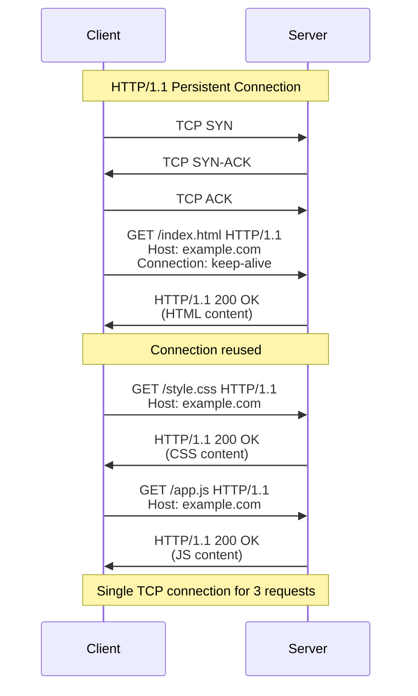
```mermaid
sequenceDiagram
    participant C as Client
    participant S as Server

    Note over C,S: HTTP/1.1 Persistent Connection

    C->>S: TCP SYN
    S->>C: TCP SYN-ACK
    C->>S: TCP ACK

    C->>S: GET /index.html HTTP/1.1<br/>Host: example.com<br/>Connection: keep-alive
    S->>C: HTTP/1.1 200 OK<br/>(HTML content)

    Note over C,S: Connection reused

    C->>S: GET /style.css HTTP/1.1<br/>Host: example.com
    S->>C: HTTP/1.1 200 OK<br/>(CSS content)

    C->>S: GET /app.js HTTP/1.1<br/>Host: example.com
    S->>C: HTTP/1.1 200 OK<br/>(JS content)

    Note over C,S: Single TCP connection for 3 requests
```

**HTTP/1.1 Performance Limitations**

| Limitation | Impact | Workaround |
|---|---|---|
| Head-of-line blocking | Slow response blocks all subsequent responses | Domain sharding, sprite sheets |
| Text-based headers | Each request repeats large headers (cookies, user-agent) | Compression (gzip), but headers still sent in full |
| No multiplexing | One request at a time per connection | Open 6-8 parallel connections per domain |
| No server push | Server cannot proactively send resources | Inlining CSS/JS, resource hints (`<link rel="preload">`) |
| Domain sharding overhead | Multiple TCP connections = more memory, more handshakes | Diminishing returns beyond 6 connections |

### 1.1.3 HTTP/2 Deep Dive

HTTP/2 was designed by Google (originally SPDY) to solve HTTP/1.1's performance problems while maintaining backward compatibility at the semantic level — same methods, status codes, and headers.

**Binary Framing Layer**

HTTP/2 replaces the text-based protocol with a binary framing layer. All communication is split into frames, which are mapped to streams.

Key concepts:
- **Frame**: The smallest unit of communication. Types include HEADERS, DATA, PRIORITY, RST_STREAM, SETTINGS, PUSH_PROMISE, PING, GOAWAY, WINDOW_UPDATE.
- **Stream**: A bidirectional flow of frames within a connection. Each stream has a unique ID.
- **Message**: A complete HTTP request or response, composed of one or more frames.

**Multiplexing**

Multiple streams share a single TCP connection. Frames from different streams are interleaved. No head-of-line blocking at the HTTP layer.

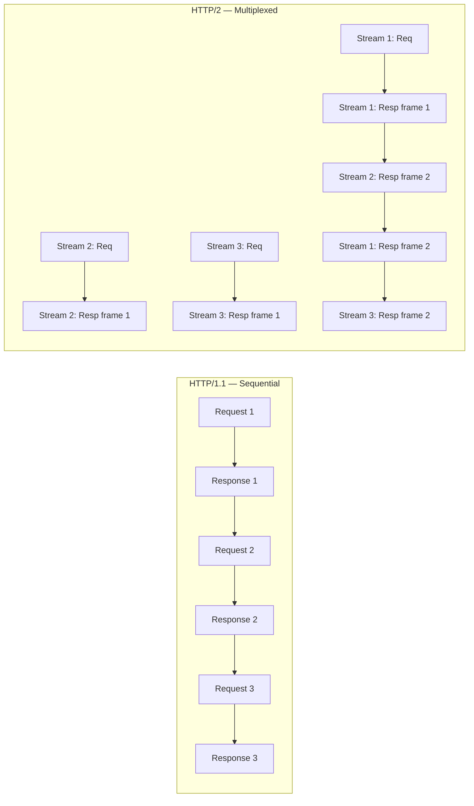
```mermaid
graph LR
    subgraph "HTTP/1.1 — Sequential"
        A1[Request 1] --> A2[Response 1]
        A2 --> A3[Request 2]
        A3 --> A4[Response 2]
        A4 --> A5[Request 3]
        A5 --> A6[Response 3]
    end

    subgraph "HTTP/2 — Multiplexed"
        B1[Stream 1: Req] --> B2[Stream 1: Resp frame 1]
        B3[Stream 2: Req] --> B4[Stream 2: Resp frame 1]
        B5[Stream 3: Req] --> B6[Stream 3: Resp frame 1]
        B2 --> B7[Stream 2: Resp frame 2]
        B7 --> B8[Stream 1: Resp frame 2]
        B8 --> B9[Stream 3: Resp frame 2]
    end
```

**Header Compression (HPACK)**

HTTP/2 uses HPACK compression, which maintains a dynamic table of previously sent headers. Repeated headers (like `:authority`, `user-agent`, `cookie`) are encoded as indices into the table, reducing header overhead by 85-95%.

```
First request:   :method: GET, :path: /api/users, authorization: Bearer xyz...
                  (full headers sent, ~500 bytes)

Second request:   :method: GET, :path: /api/orders, authorization: [index 62]
                  (only changed headers sent, ~50 bytes)
```

**Server Push**

The server can proactively push resources the client will need:

```
Client requests: GET /index.html
Server pushes:   /style.css, /app.js (via PUSH_PROMISE frames)
Server responds:  /index.html
```

In practice, server push was rarely used effectively and is being removed in favor of `103 Early Hints`.

**Stream Prioritization**

Clients can assign priority to streams using weight (1-256) and dependency relationships, allowing the server to allocate bandwidth to high-priority resources first (e.g., CSS before images).

**HTTP/2 Limitations**

Despite multiplexing at the HTTP layer, HTTP/2 runs over TCP, which means:
- **TCP head-of-line blocking**: A single lost TCP packet blocks ALL streams until retransmitted.
- **TCP slow start**: New connections start with small congestion windows.
- **TCP handshake + TLS handshake**: 2-3 RTTs before first byte (can be reduced with TLS 1.3 and TCP Fast Open).

### 1.1.4 HTTP/3 and QUIC

HTTP/3 replaces TCP with QUIC (Quick UDP Internet Connections), a transport protocol built on UDP that provides:

**QUIC Features:**
- **Independent stream multiplexing**: Packet loss in one stream does NOT block other streams (solving TCP HOL blocking).
- **0-RTT connection establishment**: For resumed connections, data can be sent immediately (vs 2-3 RTT for TCP+TLS).
- **1-RTT for new connections**: QUIC combines transport and cryptographic handshake into one round trip.
- **Built-in TLS 1.3**: Encryption is mandatory and integrated, not layered on top.
- **Connection migration**: Connections survive IP address changes (e.g., switching from Wi-Fi to cellular) because connections are identified by a connection ID, not the IP/port 4-tuple.

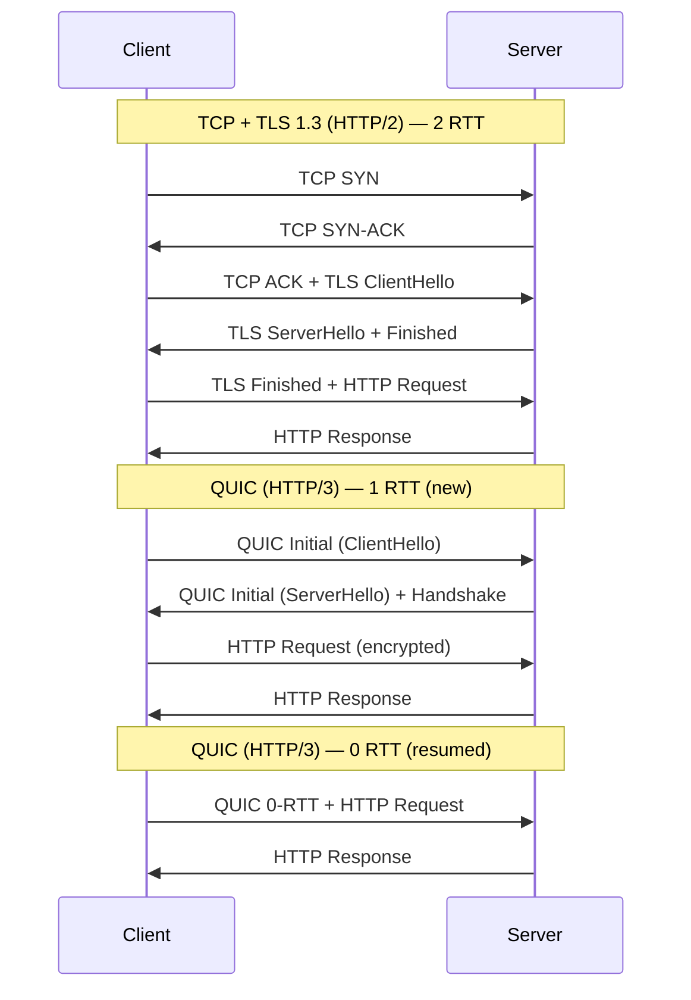
```mermaid
sequenceDiagram
    participant C as Client
    participant S as Server

    Note over C,S: TCP + TLS 1.3 (HTTP/2) — 2 RTT

    C->>S: TCP SYN
    S->>C: TCP SYN-ACK
    C->>S: TCP ACK + TLS ClientHello
    S->>C: TLS ServerHello + Finished
    C->>S: TLS Finished + HTTP Request
    S->>C: HTTP Response

    Note over C,S: QUIC (HTTP/3) — 1 RTT (new)

    C->>S: QUIC Initial (ClientHello)
    S->>C: QUIC Initial (ServerHello) + Handshake
    C->>S: HTTP Request (encrypted)
    S->>C: HTTP Response

    Note over C,S: QUIC (HTTP/3) — 0 RTT (resumed)

    C->>S: QUIC 0-RTT + HTTP Request
    S->>C: HTTP Response
```

**QUIC Packet Structure**

Each QUIC packet contains:
- **Header**: Connection ID, packet number, version
- **Frames**: STREAM frames (data), ACK frames, CRYPTO frames, etc.

Unlike TCP where a single sequence number space applies to all data, QUIC uses per-stream offsets, enabling independent delivery.

**HTTP/3 vs HTTP/2 Performance Comparison**

| Metric | HTTP/2 (TCP) | HTTP/3 (QUIC) |
|---|---|---|
| Connection setup (new) | 2-3 RTT | 1 RTT |
| Connection setup (resumed) | 1-2 RTT | 0 RTT |
| HOL blocking | TCP-level (all streams) | Per-stream only |
| Packet loss impact | All streams stalled | Only affected stream stalled |
| Connection migration | Not supported | Supported (connection ID) |
| Encryption | Optional (TLS layered) | Mandatory (built-in TLS 1.3) |
| CPU overhead | Lower | Higher (userspace transport) |
| Middlebox compatibility | Excellent | Improving (some firewalls block UDP) |

### 1.1.5 TLS Handshake and Certificate Management

**TLS 1.2 Handshake (2 RTT)**

```
1. ClientHello       → supported cipher suites, random, extensions
2. ServerHello       ← chosen cipher suite, random, certificate, ServerKeyExchange
3. ClientKeyExchange → pre-master secret (encrypted with server's public key)
4. ChangeCipherSpec  ↔ both sides switch to encrypted communication
5. Finished          ↔ verify handshake integrity
```

**TLS 1.3 Handshake (1 RTT)**

TLS 1.3 reduces the handshake to a single round trip by combining key exchange with the hello messages:

```
1. ClientHello + KeyShare  → supported groups, key share
2. ServerHello + KeyShare  ← chosen group, key share, encrypted extensions, certificate, finished
3. Finished                → handshake complete, application data can flow
```

**0-RTT Resumption (TLS 1.3)**

If the client has previously connected, it can send early data in the first flight using a pre-shared key (PSK). Risk: 0-RTT data is vulnerable to replay attacks, so it should only be used for idempotent requests.

**Certificate Management at Scale**

| Challenge | Solution |
|---|---|
| Certificate expiration | Automated renewal (Let's Encrypt, ACME protocol) |
| Many domains/subdomains | Wildcard certificates (`*.example.com`) or SAN certificates |
| Certificate distribution | Centralized secret management (Vault, AWS ACM) |
| Revocation | OCSP stapling (server includes revocation status in TLS handshake) |
| Private key protection | Hardware Security Modules (HSMs), key rotation |
| Certificate transparency | CT logs for public audit of issued certificates |
| Short-lived certificates | 90-day (Let's Encrypt) or even 24-hour certificates for higher security |

### 1.1.5a Modern Protocol Updates (2026-Ready)

This section consolidates the latest protocol developments that affect real-world system design decisions as of 2026.

#### TLS 1.3 Behavioral Changes (Production Impact)

TLS 1.3 is no longer optional — it is the baseline for secure communication.

| TLS 1.3 Change | Why It Matters for System Design |
|---|---|
| **1-RTT handshake** | Reduces connection latency by 33-50% compared to TLS 1.2 (2-RTT). Critical for mobile and high-latency links. |
| **0-RTT resumption** | Returning clients send encrypted data in the first packet. Use only for idempotent requests (GET) due to replay risk. |
| **Removed RSA key exchange** | Only ephemeral Diffie-Hellman (ECDHE) is supported. Eliminates passive decryption if private key is compromised. |
| **Mandatory forward secrecy** | Every session uses unique keys. Compromise of long-term keys does not decrypt past sessions. |
| **Removed ChangeCipherSpec** | Simpler state machine, fewer implementation bugs. |
| **Encrypted handshake** | Server certificate is encrypted, preventing passive fingerprinting of server identity. |

> **Compliance note:** TLS 1.2 is deprecated for PCI DSS 4.0 (effective March 2025). All payment-handling systems must use TLS 1.3. Many organizations are adopting TLS 1.3-only policies for all internal and external traffic.

**Version annotation for existing protocol sections:**
- HTTP/1.1 (Section 1.1.2): Still uses TLS 1.2 in many legacy deployments. Upgrade path: enable TLS 1.3 at the load balancer/reverse proxy.
- HTTP/2 (Section 1.1.3): Requires ALPN (Application-Layer Protocol Negotiation) in TLS. TLS 1.3 with HTTP/2 is the recommended baseline for 2026.
- HTTP/3 (Section 1.1.4): Mandates TLS 1.3 — there is no HTTP/3 without TLS 1.3 since it is built into QUIC.

#### QUIC/HTTP/3 Production Readiness (2026 Status)

QUIC is no longer experimental. Major platforms have adopted it in production:

| Capability | Detail |
|---|---|
| **Transport** | UDP-based with built-in TLS 1.3 — no separate TLS handshake layer |
| **0-RTT connection** | Resumed connections send data immediately; new connections complete in 1-RTT |
| **Connection migration** | Connections survive IP changes (Wi-Fi to cellular) via connection IDs instead of IP/port tuples |
| **HOL blocking elimination** | Packet loss in one stream does not block other streams (unlike TCP where all streams stall) |
| **Congestion control** | Pluggable — supports BBR, Cubic, and custom algorithms per connection |

**Real-world adoption and performance:**
- Google reports ~30% latency reduction for YouTube video start times with QUIC/HTTP/3
- Cloudflare sees 12-15% improvement in TTFB for HTTP/3 vs HTTP/2
- Meta uses QUIC for mobile app traffic, reducing connection failures by 20% on lossy networks
- As of 2026, ~30% of global web traffic uses HTTP/3

**When NOT to use HTTP/3:**
- Corporate networks with strict firewall rules blocking UDP/443
- Low-loss, low-latency data center east-west traffic (TCP overhead is negligible)
- Systems requiring deep packet inspection (QUIC encrypts more of the header)

#### gRPC over HTTP/2 vs HTTP/3

| Aspect | gRPC over HTTP/2 | gRPC over HTTP/3 (experimental) |
|---|---|---|
| Transport | TCP with optional TLS | QUIC (UDP) with mandatory TLS 1.3 |
| Multiplexing | HTTP/2 streams (TCP HOL blocking) | QUIC streams (no HOL blocking) |
| Connection setup | 2-3 RTT (TCP + TLS) | 1 RTT (new), 0 RTT (resumed) |
| Streaming | Bidirectional streaming, all 4 modes | Same 4 modes, better loss resilience |
| Connection migration | Not supported | Supported (mobile-friendly) |
| Maturity | Production-ready everywhere | Early adoption (2025-2026), supported in envoy and grpc-go |

**Recommendation:** Use gRPC over HTTP/2 for data center service-to-service communication. Evaluate gRPC over HTTP/3 for mobile clients and cross-region calls where latency and connection stability matter.

#### Handshake Comparison: TLS 1.2 vs TLS 1.3 vs QUIC

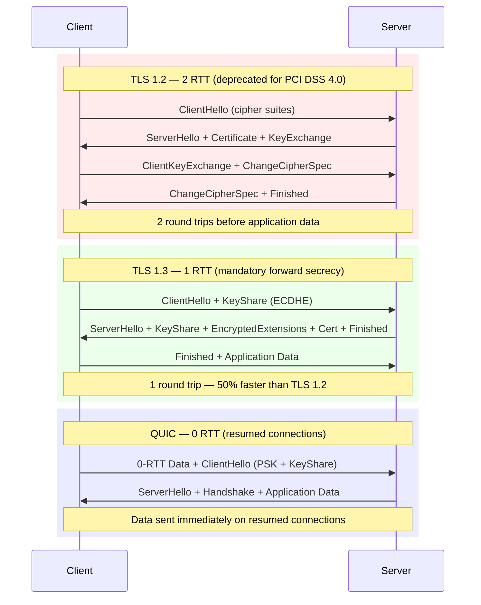
```mermaid
sequenceDiagram
    participant C as Client
    participant S as Server

    rect rgb(255, 235, 235)
    Note over C,S: TLS 1.2 — 2 RTT (deprecated for PCI DSS 4.0)
    C->>S: ClientHello (cipher suites)
    S->>C: ServerHello + Certificate + KeyExchange
    C->>S: ClientKeyExchange + ChangeCipherSpec
    S->>C: ChangeCipherSpec + Finished
    Note over C,S: 2 round trips before application data
    end

    rect rgb(235, 255, 235)
    Note over C,S: TLS 1.3 — 1 RTT (mandatory forward secrecy)
    C->>S: ClientHello + KeyShare (ECDHE)
    S->>C: ServerHello + KeyShare + EncryptedExtensions + Cert + Finished
    C->>S: Finished + Application Data
    Note over C,S: 1 round trip — 50% faster than TLS 1.2
    end

    rect rgb(235, 235, 255)
    Note over C,S: QUIC — 0 RTT (resumed connections)
    C->>S: 0-RTT Data + ClientHello (PSK + KeyShare)
    S->>C: ServerHello + Handshake + Application Data
    Note over C,S: Data sent immediately on resumed connections
    end
```

### 1.1.6 HTTP Methods, Status Codes, and Headers (System Design Essentials)

**Methods and Idempotency**

| Method | Safe | Idempotent | Cacheable | Use Case |
|---|---|---|---|---|
| GET | Yes | Yes | Yes | Read resources |
| HEAD | Yes | Yes | Yes | Check resource metadata |
| POST | No | No | Rarely | Create resources, non-idempotent actions |
| PUT | No | Yes | No | Replace entire resource |
| PATCH | No | No | No | Partial update |
| DELETE | No | Yes | No | Remove resource |
| OPTIONS | Yes | Yes | No | CORS preflight, capability discovery |

**Critical Status Codes for System Design**

| Code | Meaning | System Design Relevance |
|---|---|---|
| 200 | OK | Standard success |
| 201 | Created | Resource created (return Location header) |
| 204 | No Content | Success with no body (DELETE) |
| 301 | Moved Permanently | SEO-safe redirect (cached by browsers) |
| 302 | Found | Temporary redirect |
| 304 | Not Modified | Conditional GET — serve from cache |
| 400 | Bad Request | Client-side validation failure |
| 401 | Unauthorized | Authentication required |
| 403 | Forbidden | Authenticated but not authorized |
| 404 | Not Found | Resource does not exist |
| 408 | Request Timeout | Client took too long |
| 429 | Too Many Requests | Rate limit exceeded (include Retry-After header) |
| 500 | Internal Server Error | Server-side failure |
| 502 | Bad Gateway | Upstream server returned invalid response |
| 503 | Service Unavailable | Server overloaded or in maintenance |
| 504 | Gateway Timeout | Upstream server timed out |

**Essential Headers**

```
# Caching
Cache-Control: public, max-age=3600, s-maxage=86400
ETag: "abc123"
If-None-Match: "abc123"
Last-Modified: Wed, 21 Oct 2025 07:28:00 GMT
If-Modified-Since: Wed, 21 Oct 2025 07:28:00 GMT

# Content negotiation
Accept: application/json
Content-Type: application/json; charset=utf-8
Accept-Encoding: gzip, br

# Security
Strict-Transport-Security: max-age=31536000; includeSubDomains
Content-Security-Policy: default-src 'self'
X-Content-Type-Options: nosniff
X-Frame-Options: DENY

# Rate limiting
X-RateLimit-Limit: 1000
X-RateLimit-Remaining: 450
X-RateLimit-Reset: 1625097600
Retry-After: 60

# Correlation
X-Request-ID: 550e8400-e29b-41d4-a716-446655440000
```

---

## 1.2 TCP vs UDP

### 1.2.1 TCP (Transmission Control Protocol)

TCP provides **reliable, ordered, error-checked** delivery of a stream of bytes. It is the transport protocol for HTTP/1.1, HTTP/2, database connections, email, file transfer, and most inter-service communication.

**The 3-Way Handshake**

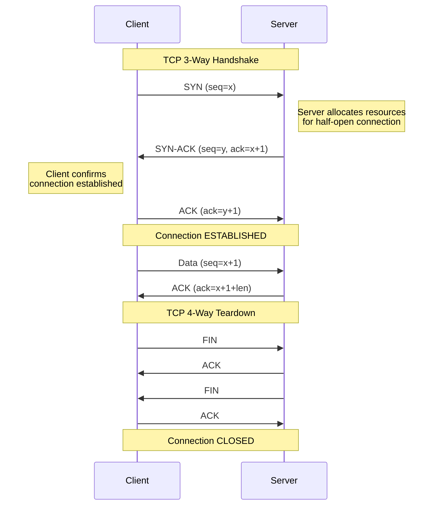
```mermaid
sequenceDiagram
    participant C as Client
    participant S as Server

    Note over C,S: TCP 3-Way Handshake

    C->>S: SYN (seq=x)
    Note right of S: Server allocates resources<br/>for half-open connection
    S->>C: SYN-ACK (seq=y, ack=x+1)
    Note left of C: Client confirms<br/>connection established
    C->>S: ACK (ack=y+1)
    Note over C,S: Connection ESTABLISHED

    C->>S: Data (seq=x+1)
    S->>C: ACK (ack=x+1+len)

    Note over C,S: TCP 4-Way Teardown

    C->>S: FIN
    S->>C: ACK
    S->>C: FIN
    C->>S: ACK
    Note over C,S: Connection CLOSED
```

**Packet-Level Breakdown**

A TCP segment contains:
```
 0                   1                   2                   3
 0 1 2 3 4 5 6 7 8 9 0 1 2 3 4 5 6 7 8 9 0 1 2 3 4 5 6 7 8 9 0 1
+-+-+-+-+-+-+-+-+-+-+-+-+-+-+-+-+-+-+-+-+-+-+-+-+-+-+-+-+-+-+-+-+
|          Source Port          |       Destination Port        |
+-+-+-+-+-+-+-+-+-+-+-+-+-+-+-+-+-+-+-+-+-+-+-+-+-+-+-+-+-+-+-+-+
|                        Sequence Number                        |
+-+-+-+-+-+-+-+-+-+-+-+-+-+-+-+-+-+-+-+-+-+-+-+-+-+-+-+-+-+-+-+-+
|                    Acknowledgment Number                      |
+-+-+-+-+-+-+-+-+-+-+-+-+-+-+-+-+-+-+-+-+-+-+-+-+-+-+-+-+-+-+-+-+
|  Data |           |U|A|P|R|S|F|                               |
| Offset| Reserved  |R|C|S|S|Y|I|            Window             |
|       |           |G|K|H|T|N|N|                               |
+-+-+-+-+-+-+-+-+-+-+-+-+-+-+-+-+-+-+-+-+-+-+-+-+-+-+-+-+-+-+-+-+
|           Checksum            |         Urgent Pointer        |
+-+-+-+-+-+-+-+-+-+-+-+-+-+-+-+-+-+-+-+-+-+-+-+-+-+-+-+-+-+-+-+-+
```

Key fields:
- **Sequence Number**: Byte-level position in the stream
- **Acknowledgment Number**: Next expected byte from the other side
- **Window**: Receiver's available buffer space (flow control)
- **Flags**: SYN, ACK, FIN, RST, PSH, URG

**Congestion Control**

TCP's congestion control prevents the network from being overwhelmed. The key algorithms:

**Slow Start**: Start with a small congestion window (cwnd = 1 MSS). Double cwnd for each ACK until reaching the slow-start threshold (ssthresh).

**Congestion Avoidance**: After reaching ssthresh, increase cwnd linearly (additive increase). On packet loss, halve cwnd (multiplicative decrease) — AIMD.

**Fast Retransmit**: If the sender receives 3 duplicate ACKs, retransmit the lost segment immediately without waiting for the retransmission timeout (RTO).

**Fast Recovery (Reno/NewReno)**: After fast retransmit, set ssthresh = cwnd/2 and cwnd = ssthresh + 3 MSS, then enter congestion avoidance (skip slow start).

**Modern Congestion Control: BBR (Bottleneck Bandwidth and RTT)**

Google's BBR (used in YouTube, Google Cloud) takes a fundamentally different approach:
- Measures the maximum bandwidth and minimum RTT of the path.
- Targets sending at the bandwidth-delay product (BDP), neither over-filling buffers nor underutilizing the link.
- Better performance in lossy networks (does not interpret loss as congestion signal).

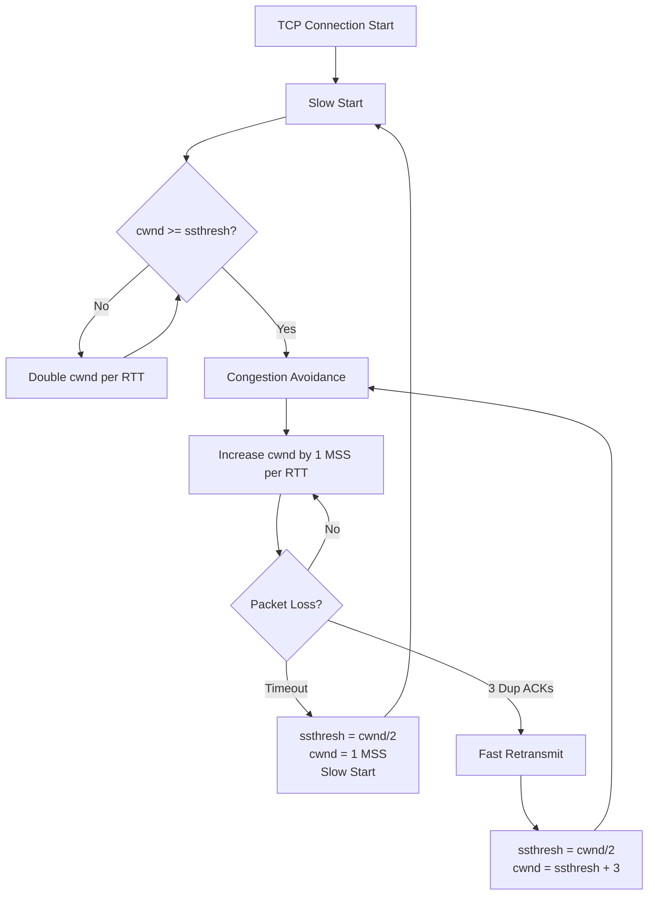
```mermaid
graph TD
    A[TCP Connection Start] --> B[Slow Start]
    B --> C{cwnd >= ssthresh?}
    C -->|No| D[Double cwnd per RTT]
    D --> C
    C -->|Yes| E[Congestion Avoidance]
    E --> F[Increase cwnd by 1 MSS per RTT]
    F --> G{Packet Loss?}
    G -->|Timeout| H[ssthresh = cwnd/2<br/>cwnd = 1 MSS<br/>Slow Start]
    H --> B
    G -->|3 Dup ACKs| I[Fast Retransmit]
    I --> J[ssthresh = cwnd/2<br/>cwnd = ssthresh + 3]
    J --> E
    G -->|No| F
```

**Flow Control**

TCP uses a sliding window protocol. The receiver advertises its available buffer space in the Window field. The sender cannot send more data than the receiver's window allows.

**Zero Window**: If the receiver's buffer is full, it advertises window=0. The sender pauses and periodically sends probe packets (window probes) to check if space has freed up.

**Window Scaling**: The 16-bit window field limits the window to 65,535 bytes. The Window Scale option (set during handshake) allows windows up to 1 GB, critical for high-bandwidth, high-latency paths (bandwidth-delay product).

**TCP Head-of-Line Blocking**

This is the fundamental limitation that motivated QUIC/HTTP/3:

```
TCP treats all data as a single ordered byte stream.
If packet 5 is lost, packets 6, 7, 8 (even if received) cannot be delivered
to the application until packet 5 is retransmitted and received.

In HTTP/2, streams A, B, C share one TCP connection.
If a packet belonging to stream A is lost:
  - Stream B data (already received) is BLOCKED
  - Stream C data (already received) is BLOCKED
  - All streams wait for stream A's retransmission
```

### 1.2.2 UDP (User Datagram Protocol)

UDP provides **unreliable, unordered** delivery of individual datagrams. No connection setup, no flow control, no congestion control, no retransmission.

**UDP Datagram Structure**

```
 0                   1                   2                   3
 0 1 2 3 4 5 6 7 8 9 0 1 2 3 4 5 6 7 8 9 0 1 2 3 4 5 6 7 8 9 0 1
+-+-+-+-+-+-+-+-+-+-+-+-+-+-+-+-+-+-+-+-+-+-+-+-+-+-+-+-+-+-+-+-+
|          Source Port          |       Destination Port        |
+-+-+-+-+-+-+-+-+-+-+-+-+-+-+-+-+-+-+-+-+-+-+-+-+-+-+-+-+-+-+-+-+
|            Length              |           Checksum            |
+-+-+-+-+-+-+-+-+-+-+-+-+-+-+-+-+-+-+-+-+-+-+-+-+-+-+-+-+-+-+-+-+
|                          Data                                 |
+-+-+-+-+-+-+-+-+-+-+-+-+-+-+-+-+-+-+-+-+-+-+-+-+-+-+-+-+-+-+-+-+
```

Only 8 bytes of header overhead (vs 20+ bytes for TCP).

### 1.2.3 TCP vs UDP Decision Matrix

| Criterion | TCP | UDP |
|---|---|---|
| Reliability | Guaranteed delivery | Best-effort |
| Ordering | Strict byte ordering | No ordering guarantee |
| Connection | Connection-oriented (handshake) | Connectionless |
| Flow control | Yes (sliding window) | No |
| Congestion control | Yes (slow start, AIMD) | No (must implement in application) |
| Header overhead | 20-60 bytes | 8 bytes |
| Latency | Higher (handshake, retransmission) | Lower (no handshake) |
| Multiplexing | Single byte stream | Independent datagrams |
| Use cases | HTTP, databases, file transfer, email | DNS, video streaming, gaming, VoIP, QUIC |

**When to Use TCP:**
- Data integrity is critical (financial transactions, database queries)
- Ordering matters (file transfer, web pages)
- The application cannot handle missing data
- Standard request-response patterns

**When to Use UDP:**
- Real-time delivery is more important than reliability (live video, gaming)
- Small request-response exchanges (DNS queries)
- Multicast or broadcast is needed
- The application implements its own reliability (QUIC, DTLS)
- High fan-out with minimal overhead (metrics collection, logging)

### 1.2.4 TCP Optimization Techniques for System Design

| Technique | What It Does | When to Use |
|---|---|---|
| TCP Fast Open (TFO) | Sends data in the SYN packet, eliminating 1 RTT for repeated connections | Repeated client-server connections (API calls) |
| TCP keepalive | OS-level probes to detect dead connections | Long-lived connections (database pools) |
| Nagle's algorithm disable (TCP_NODELAY) | Send small packets immediately instead of buffering | Low-latency applications (gaming, trading) |
| SO_REUSEPORT | Multiple processes bind to the same port | High-connection-rate servers |
| Connection pooling | Reuse established TCP connections | HTTP clients, database drivers |
| TCP window tuning | Increase socket buffer sizes | High-bandwidth, high-latency paths (WAN) |

---

## 1.3 WebSocket

### 1.3.1 What WebSocket Solves

HTTP is request-response: the client initiates, the server responds. For real-time applications (chat, live scores, collaborative editing, trading), the server needs to push data to the client without the client asking. Before WebSocket, engineers used:

- **Polling**: Client sends HTTP requests every N seconds. Wasteful (many empty responses).
- **Long polling**: Client sends a request; server holds it open until data is available. Better, but reconnection overhead and HTTP header overhead remain.
- **Server-Sent Events (SSE)**: Server pushes data over a single HTTP connection. Server-to-client only (half-duplex). Simple and works over HTTP/2.

WebSocket provides **full-duplex**, **persistent**, **low-overhead** communication over a single TCP connection.

### 1.3.2 WebSocket Handshake

WebSocket starts as an HTTP/1.1 upgrade request:

```
Client → Server:
GET /chat HTTP/1.1
Host: server.example.com
Upgrade: websocket
Connection: Upgrade
Sec-WebSocket-Key: dGhlIHNhbXBsZSBub25jZQ==
Sec-WebSocket-Version: 13
Sec-WebSocket-Protocol: chat, superchat

Server → Client:
HTTP/1.1 101 Switching Protocols
Upgrade: websocket
Connection: Upgrade
Sec-WebSocket-Accept: s3pPLMBiTxaQ9kYGzzhZRbK+xOo=
Sec-WebSocket-Protocol: chat
```

After the 101 response, the TCP connection is repurposed for WebSocket frames. No more HTTP overhead.

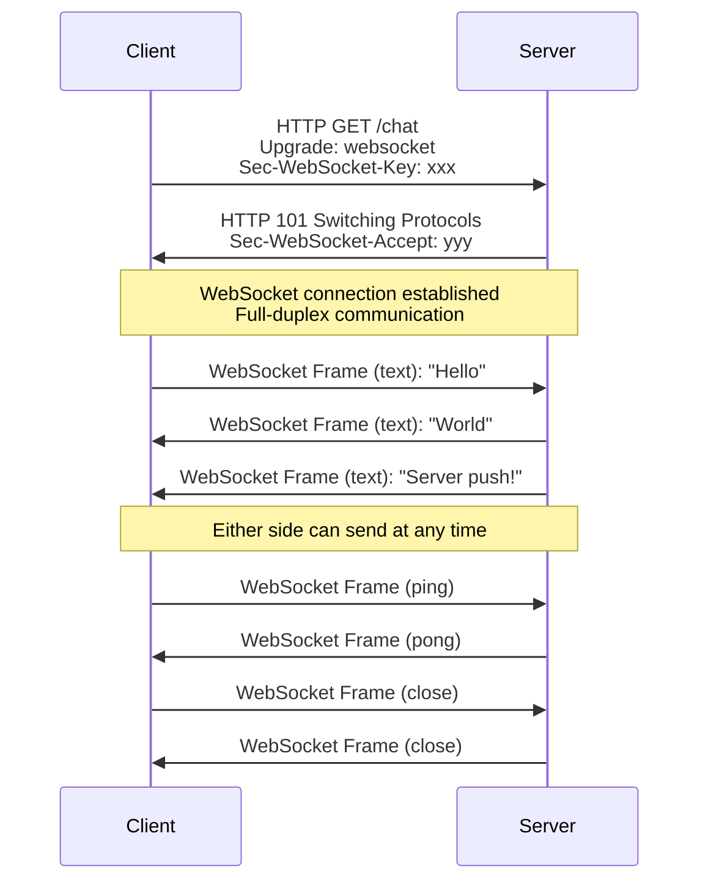
```mermaid
sequenceDiagram
    participant C as Client
    participant S as Server

    C->>S: HTTP GET /chat<br/>Upgrade: websocket<br/>Sec-WebSocket-Key: xxx

    S->>C: HTTP 101 Switching Protocols<br/>Sec-WebSocket-Accept: yyy

    Note over C,S: WebSocket connection established<br/>Full-duplex communication

    C->>S: WebSocket Frame (text): "Hello"
    S->>C: WebSocket Frame (text): "World"
    S->>C: WebSocket Frame (text): "Server push!"

    Note over C,S: Either side can send at any time

    C->>S: WebSocket Frame (ping)
    S->>C: WebSocket Frame (pong)

    C->>S: WebSocket Frame (close)
    S->>C: WebSocket Frame (close)
```

### 1.3.3 WebSocket Frame Structure

```
 0                   1                   2                   3
 0 1 2 3 4 5 6 7 8 9 0 1 2 3 4 5 6 7 8 9 0 1 2 3 4 5 6 7 8 9 0 1
+-+-+-+-+-------+-+-------------+-------------------------------+
|F|R|R|R| opcode|M| Payload len |    Extended payload length    |
|I|S|S|S|  (4)  |A|     (7)     |             (16/64)           |
|N|V|V|V|       |S|             |   (if payload len==126/127)   |
| |1|2|3|       |K|             |                               |
+-+-+-+-+-------+-+-------------+-------------------------------+
|     Extended payload length continued, if payload len == 127  |
+-------------------------------+-------------------------------+
|                               |Masking-key, if MASK set to 1  |
+-------------------------------+-------------------------------+
| Masking-key (continued)       |          Payload Data         |
+-------------------------------+-------------------------------+
|                     Payload Data continued ...                |
+---------------------------------------------------------------+
```

Opcodes: 0x1 (text), 0x2 (binary), 0x8 (close), 0x9 (ping), 0xA (pong)

Minimum overhead: **2 bytes** for small frames (vs 100+ bytes for HTTP headers).

### 1.3.4 Heartbeat and Reconnection

**Heartbeat (Ping/Pong)**

WebSocket defines ping and pong control frames. The server (or client) sends periodic pings; the other side must respond with a pong. This detects dead connections and prevents idle timeouts by NATs, load balancers, and firewalls.

```
Recommended settings:
- Ping interval: 30 seconds
- Pong timeout: 10 seconds
- If pong not received: close connection, trigger reconnection
```

**Reconnection Strategy**

Clients should implement reconnection with **exponential backoff and jitter**:

```
reconnect_delay = min(base_delay * 2^attempt + random_jitter, max_delay)

Attempt 1: 1s + jitter
Attempt 2: 2s + jitter
Attempt 3: 4s + jitter
Attempt 4: 8s + jitter
...
Max delay: 30s
```

On reconnection, the client should:
1. Re-authenticate (token may have expired).
2. Re-subscribe to channels/topics.
3. Request missed messages (using a last-received sequence number or timestamp).

### 1.3.5 Scaling WebSocket Servers

WebSocket connections are stateful and long-lived — fundamentally different from stateless HTTP requests. This creates scaling challenges:

**Challenge 1: Memory per connection**

Each WebSocket connection consumes memory for the TCP socket, buffers, and application state. A server with 16 GB RAM can typically handle 100K-1M concurrent connections depending on per-connection overhead.

**Challenge 2: Broadcasting to all connections on a server**

If user A on Server 1 sends a message to user B on Server 2, Server 1 must route the message to Server 2.

**Solution: Pub/Sub backbone**

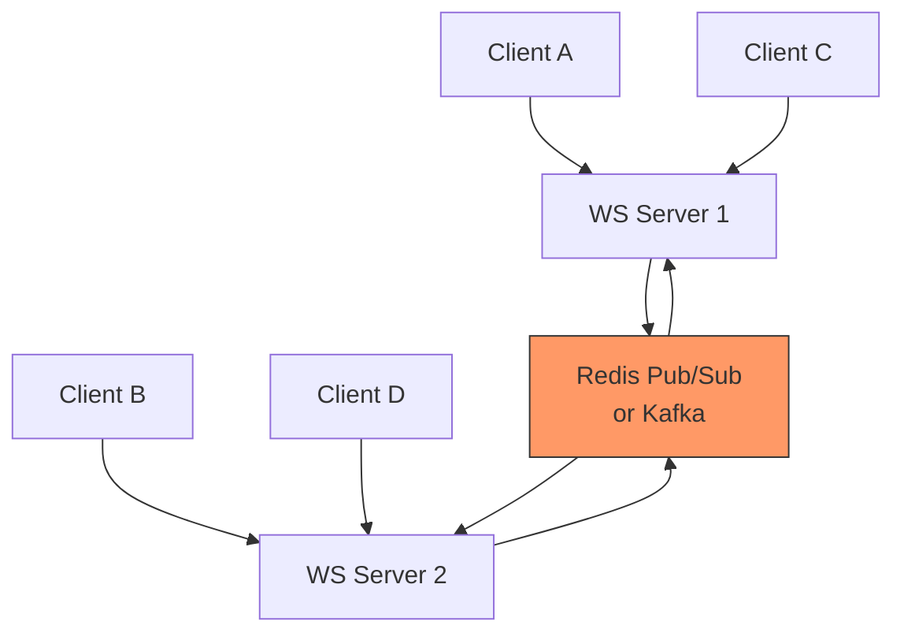
```mermaid
graph TD
    C1[Client A] --> S1[WS Server 1]
    C2[Client B] --> S2[WS Server 2]
    C3[Client C] --> S1
    C4[Client D] --> S2

    S1 --> R[Redis Pub/Sub<br/>or Kafka]
    S2 --> R
    R --> S1
    R --> S2

    style R fill:#f96,stroke:#333
```

Each WebSocket server subscribes to relevant channels in Redis Pub/Sub (or Kafka). When a message arrives, it is published to the channel. All subscribed servers receive it and forward it to their local connections.

**Challenge 3: Load balancer stickiness**

WebSocket connections must remain on the same server for their lifetime. The load balancer must support:
- **Connection-level persistence** (not request-level)
- **Upgrade header awareness** (L7 load balancers must not terminate the connection after the HTTP upgrade)

**Challenge 4: Graceful shutdown**

When deploying new code, existing WebSocket connections must be drained:
1. Stop accepting new connections on the server being drained.
2. Send close frames to existing connections with a reconnect hint.
3. Wait for connections to close or force-close after a timeout.
4. Shut down the server.

### 1.3.6 WebSocket vs SSE vs Long Polling

| Feature | WebSocket | SSE | Long Polling |
|---|---|---|---|
| Direction | Full-duplex | Server-to-client only | Server-to-client (with new requests) |
| Protocol | WS (upgrade from HTTP) | HTTP | HTTP |
| Binary support | Yes | No (text/event-stream) | Yes (via HTTP) |
| Auto-reconnect | No (must implement) | Yes (built-in) | No (must implement) |
| HTTP/2 compatible | No (requires HTTP/1.1 upgrade) | Yes | Yes |
| Proxy/firewall friendly | Sometimes problematic | Excellent | Excellent |
| Overhead per message | 2-14 bytes | ~50 bytes (event format) | Full HTTP headers |
| Max connections | Limited by server memory | Limited by browser (6 per domain in HTTP/1.1) | Limited by server |
| Best for | Chat, gaming, collaboration | News feeds, notifications, dashboards | Legacy systems, simple notifications |

---

## 1.4 gRPC

### 1.4.1 What gRPC Is

gRPC (Google Remote Procedure Call) is a high-performance, open-source RPC framework. It uses:
- **HTTP/2** as the transport protocol (multiplexing, header compression, streaming)
- **Protocol Buffers (protobuf)** as the default serialization format (binary, strongly typed, backward compatible)
- **Code generation** for client and server stubs in 10+ languages

### 1.4.2 Protocol Buffers

Protobuf is a language-neutral, platform-neutral serialization format. Define your data schema in `.proto` files:

```protobuf
syntax = "proto3";

package ecommerce;

service OrderService {
  rpc CreateOrder (CreateOrderRequest) returns (CreateOrderResponse);
  rpc GetOrder (GetOrderRequest) returns (Order);
  rpc ListOrders (ListOrdersRequest) returns (stream Order);
  rpc StreamOrderUpdates (stream OrderUpdateRequest) returns (stream OrderUpdate);
}

message CreateOrderRequest {
  string user_id = 1;
  repeated OrderItem items = 2;
  Address shipping_address = 3;
}

message OrderItem {
  string product_id = 1;
  int32 quantity = 2;
  int64 price_cents = 3;
}

message Order {
  string order_id = 1;
  string user_id = 2;
  OrderStatus status = 3;
  repeated OrderItem items = 4;
  int64 total_cents = 5;
  google.protobuf.Timestamp created_at = 6;
}

enum OrderStatus {
  ORDER_STATUS_UNSPECIFIED = 0;
  ORDER_STATUS_PENDING = 1;
  ORDER_STATUS_CONFIRMED = 2;
  ORDER_STATUS_SHIPPED = 3;
  ORDER_STATUS_DELIVERED = 4;
  ORDER_STATUS_CANCELLED = 5;
}
```

**Protobuf vs JSON**

| Aspect | Protobuf | JSON |
|---|---|---|
| Format | Binary | Text |
| Size | 3-10x smaller | Larger (keys repeated, base64 for binary) |
| Serialization speed | 5-20x faster | Slower (string parsing) |
| Schema | Required (.proto file) | Optional (JSON Schema) |
| Type safety | Strong (code generation) | Weak (runtime validation) |
| Human readability | Not readable | Readable |
| Backward compatibility | Field numbers (add fields freely) | Fragile (field renames break clients) |
| Browser support | Limited (requires grpc-web proxy) | Native |

### 1.4.3 Four Streaming Modes

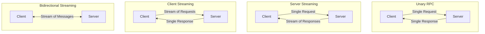
```mermaid
graph TD
    subgraph "Unary RPC"
        A1[Client] -->|Single Request| B1[Server]
        B1 -->|Single Response| A1
    end

    subgraph "Server Streaming"
        A2[Client] -->|Single Request| B2[Server]
        B2 -->|Stream of Responses| A2
    end

    subgraph "Client Streaming"
        A3[Client] -->|Stream of Requests| B3[Server]
        B3 -->|Single Response| A3
    end

    subgraph "Bidirectional Streaming"
        A4[Client] <-->|Stream of Messages| B4[Server]
    end
```

**1. Unary RPC** — Standard request-response. Client sends one message, server returns one message. Equivalent to a REST API call but with protobuf serialization.

**2. Server Streaming** — Client sends one request, server returns a stream of responses. Use cases: paginated data, real-time feeds, large result sets.

**3. Client Streaming** — Client sends a stream of requests, server returns one response after processing all. Use cases: file upload, telemetry ingestion, batch processing.

**4. Bidirectional Streaming** — Both client and server send streams of messages independently. Use cases: chat, collaborative editing, live sensor data with server-side aggregation.

### 1.4.4 Deadlines and Timeouts

gRPC uses **deadlines** (absolute timestamps) rather than timeouts (relative durations). Deadlines propagate across service calls:

```
Client sets deadline: now + 5 seconds
  → Service A receives request, deadline = 4.8s remaining
    → Service A calls Service B, propagates deadline = 4.8s
      → Service B receives request, deadline = 4.5s remaining
        → If deadline exceeded, return DEADLINE_EXCEEDED status
```

This prevents cascading timeouts where each service adds its own timeout, causing the total to exceed the caller's expectation.

### 1.4.5 Interceptors (Middleware)

gRPC interceptors are middleware that process requests and responses. They can be chained:

```
Request flow:  Client → Auth interceptor → Logging interceptor → Rate limit interceptor → Handler
Response flow: Handler → Rate limit interceptor → Logging interceptor → Auth interceptor → Client
```

Common interceptors:
- **Authentication**: Validate JWT tokens from metadata
- **Logging**: Log request/response metadata, duration, status
- **Metrics**: Record latency, error rates, throughput (Prometheus)
- **Tracing**: Inject/extract trace context (OpenTelemetry)
- **Rate limiting**: Enforce per-client request limits
- **Retry**: Automatic retry with backoff for transient failures
- **Validation**: Validate request fields before reaching the handler

### 1.4.6 gRPC in System Design

**Advantages:**
- 3-10x faster serialization than JSON
- Strong typing prevents integration errors
- Code generation reduces boilerplate
- HTTP/2 multiplexing for efficient connection usage
- Streaming for real-time and batch use cases
- Deadline propagation for cascading timeout management

**Limitations:**
- Not browser-friendly (requires grpc-web proxy or Connect protocol)
- Binary format is not human-readable (harder to debug with curl)
- Protobuf schema changes require coordinated deployment
- Limited tooling compared to REST (fewer API gateways, testing tools)
- Load balancers must support HTTP/2 (L7 awareness)

**When to Use gRPC:**
- Internal service-to-service communication (microservices)
- High-throughput, low-latency requirements
- Streaming data (events, telemetry, real-time updates)
- Polyglot environments (multiple programming languages)

**When to Avoid gRPC:**
- Public-facing APIs (prefer REST or GraphQL for browser clients)
- Simple CRUD with few clients (REST is simpler)
- Teams unfamiliar with protobuf and code generation

---

## 1.5 GraphQL

### 1.5.1 What GraphQL Solves

GraphQL is a query language for APIs that allows clients to request exactly the data they need. It was created by Facebook in 2012 to solve mobile app performance problems caused by REST over-fetching and under-fetching.

**Over-fetching**: REST endpoint returns 50 fields; the mobile client needs 5.
**Under-fetching**: To render a single screen, the mobile client must make 3-5 sequential REST calls.

GraphQL solves both by letting the client specify the exact shape of the response:

```graphql
query {
  user(id: "123") {
    name
    email
    orders(last: 5) {
      id
      total
      status
      items {
        product {
          name
          imageUrl
        }
        quantity
      }
    }
  }
}
```

One request. Exactly the fields needed. No wasted bytes.

### 1.5.2 Schema and Type System

GraphQL schemas define the API contract using a strongly typed schema definition language (SDL):

```graphql
type Query {
  user(id: ID!): User
  users(filter: UserFilter, limit: Int = 20, offset: Int = 0): UserConnection!
  product(id: ID!): Product
  searchProducts(query: String!, limit: Int = 10): [Product!]!
}

type Mutation {
  createOrder(input: CreateOrderInput!): Order!
  updateUser(id: ID!, input: UpdateUserInput!): User!
  cancelOrder(id: ID!): Order!
}

type Subscription {
  orderStatusChanged(orderId: ID!): OrderStatus!
  newMessage(channelId: ID!): Message!
}

type User {
  id: ID!
  name: String!
  email: String!
  orders(last: Int): [Order!]!
  createdAt: DateTime!
}

type Order {
  id: ID!
  user: User!
  items: [OrderItem!]!
  total: Money!
  status: OrderStatus!
  createdAt: DateTime!
}

type OrderItem {
  product: Product!
  quantity: Int!
  price: Money!
}

enum OrderStatus {
  PENDING
  CONFIRMED
  SHIPPED
  DELIVERED
  CANCELLED
}

input CreateOrderInput {
  items: [OrderItemInput!]!
  shippingAddressId: ID!
  paymentMethodId: ID!
}
```

### 1.5.3 Resolvers

Resolvers are functions that fetch data for each field in the schema. They form a tree that mirrors the query structure:

```
Query.user(id: "123")
  → User.name         → return user.name from DB result
  → User.email        → return user.email from DB result
  → User.orders       → SELECT * FROM orders WHERE user_id = "123" LIMIT 5
    → Order.items     → SELECT * FROM order_items WHERE order_id IN (...)
      → OrderItem.product → SELECT * FROM products WHERE id IN (...)
```

Each resolver receives four arguments:
1. **parent**: The result of the parent resolver
2. **args**: Arguments passed to the field
3. **context**: Shared context (auth, dataloaders, request info)
4. **info**: Field-specific information (selection set, return type)

### 1.5.4 The N+1 Problem and DataLoader

The N+1 problem is the most common performance pitfall in GraphQL:

```
Query: { orders(last: 50) { id, user { name } } }

Execution without DataLoader:
  1 query: SELECT * FROM orders LIMIT 50           (1 query)
  50 queries: SELECT * FROM users WHERE id = ?      (N queries)
  Total: 51 queries (1 + N)

Execution with DataLoader:
  1 query: SELECT * FROM orders LIMIT 50            (1 query)
  1 query: SELECT * FROM users WHERE id IN (?, ?, ...) (1 batched query)
  Total: 2 queries
```

**DataLoader** batches and caches individual lookups within a single request tick:

```
// DataLoader batches calls within a single event loop tick
const userLoader = new DataLoader(async (userIds) => {
  const users = await db.query('SELECT * FROM users WHERE id IN (?)', [userIds]);
  // Return users in the same order as the input IDs
  return userIds.map(id => users.find(u => u.id === id));
});

// In the resolver:
Order.user = (order, args, context) => context.userLoader.load(order.userId);
```

DataLoader provides:
- **Batching**: Collects individual `.load()` calls and executes them as a single batch
- **Caching**: Within a single request, the same ID is only fetched once
- **Per-request lifecycle**: Cache is scoped to the request (no stale data across requests)

### 1.5.5 Subscriptions

GraphQL subscriptions provide real-time updates over WebSocket:

```graphql
subscription {
  orderStatusChanged(orderId: "abc") {
    orderId
    newStatus
    updatedAt
  }
}
```

Implementation typically uses WebSocket (graphql-ws protocol) with a pub/sub backend:

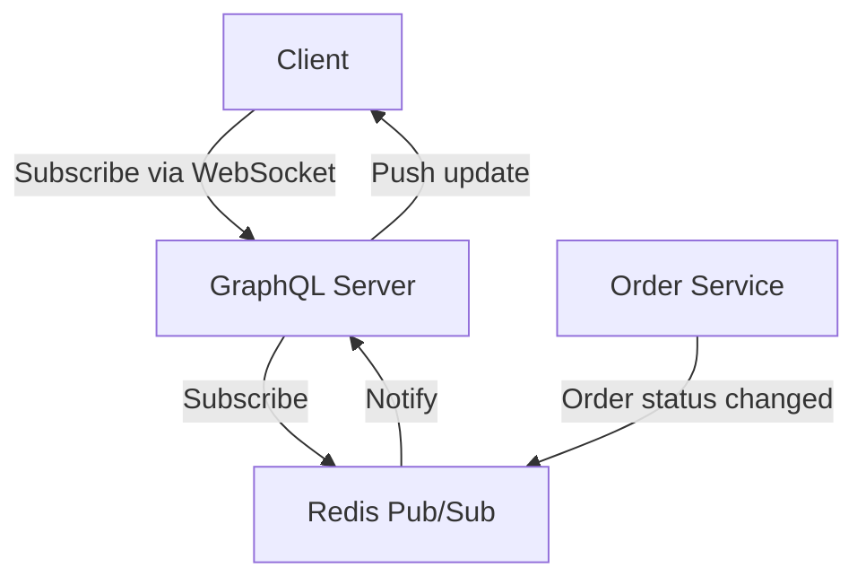
```mermaid
graph TD
    C[Client] -->|Subscribe via WebSocket| GW[GraphQL Server]
    GW -->|Subscribe| PS[Redis Pub/Sub]

    MS[Order Service] -->|Order status changed| PS
    PS -->|Notify| GW
    GW -->|Push update| C
```

### 1.5.6 Persisted Queries

In production, sending full query strings with every request is wasteful and risky (injection, query complexity attacks). Persisted queries solve this:

**Automatic Persisted Queries (APQ):**
1. Client sends a hash of the query instead of the full text.
2. If the server has the query cached, it executes it.
3. If not, the server returns "PersistedQueryNotFound."
4. Client retries with the full query text + hash.
5. Server caches the query for future requests.

**Pre-registered Queries:**
- Queries are extracted at build time and registered with the server.
- Only registered query hashes are accepted.
- Prevents arbitrary query execution (security hardening).

### 1.5.7 GraphQL Performance and Security

| Concern | Solution |
|---|---|
| Query complexity attacks | Depth limiting, cost analysis, query complexity scoring |
| Large result sets | Pagination (cursor-based), field-level rate limiting |
| N+1 queries | DataLoader, query planning, JOIN-based resolvers |
| Caching | HTTP caching is harder (single endpoint); use CDN with persisted query hashes, response-level caching, or normalized caching (Apollo Client) |
| Introspection in production | Disable introspection in production |
| Schema breaking changes | Schema versioning, deprecation directives, schema registry |

---

# Section 2: Infrastructure

Infrastructure components sit between clients and application servers, handling DNS resolution, traffic distribution, content delivery, and request proxying. They are invisible to end users but determine the system's performance, availability, and resilience.

---

## 2.1 DNS (Domain Name System)

### 2.1.1 What DNS Does

DNS translates human-readable domain names (www.example.com) to IP addresses (93.184.216.34). It is one of the oldest and most critical pieces of internet infrastructure — if DNS fails, nothing works.

DNS is a **hierarchical, distributed** database. No single server knows all mappings. Resolution involves querying multiple servers in a delegation chain.

### 2.1.2 DNS Resolution Process

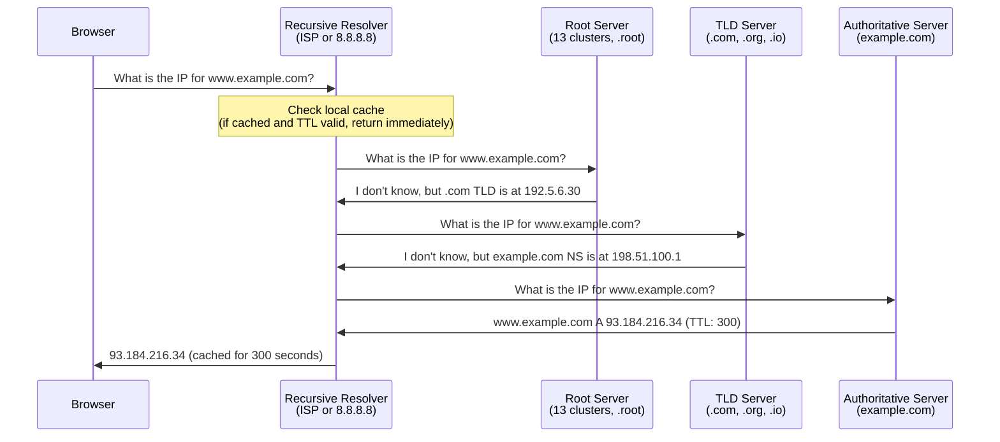
```mermaid
sequenceDiagram
    participant B as Browser
    participant R as Recursive Resolver<br/>(ISP or 8.8.8.8)
    participant Root as Root Server<br/>(13 clusters, .root)
    participant TLD as TLD Server<br/>(.com, .org, .io)
    participant Auth as Authoritative Server<br/>(example.com)

    B->>R: What is the IP for www.example.com?

    Note over R: Check local cache<br/>(if cached and TTL valid, return immediately)

    R->>Root: What is the IP for www.example.com?
    Root->>R: I don't know, but .com TLD is at 192.5.6.30

    R->>TLD: What is the IP for www.example.com?
    TLD->>R: I don't know, but example.com NS is at 198.51.100.1

    R->>Auth: What is the IP for www.example.com?
    Auth->>R: www.example.com A 93.184.216.34 (TTL: 300)

    R->>B: 93.184.216.34 (cached for 300 seconds)
```

**Step-by-step:**
1. **Browser cache**: Check if the domain was recently resolved.
2. **OS cache**: Check the operating system's DNS cache (`/etc/hosts`, systemd-resolved).
3. **Recursive resolver**: The ISP's resolver (or a public one like 8.8.8.8 or 1.1.1.1) handles the iterative resolution.
4. **Root servers**: 13 root server clusters (a.root-servers.net through m.root-servers.net) direct the resolver to the correct TLD server.
5. **TLD servers**: The .com, .org, .io servers direct the resolver to the domain's authoritative name server.
6. **Authoritative server**: The final answer — the IP address (or CNAME, MX, etc.) for the queried domain.

**Resolution latency**: A full uncached resolution takes 50-200ms (depending on geographic distance to servers). Cached resolution is effectively instant.

### 2.1.3 DNS Record Types

| Record | Purpose | Example |
|---|---|---|
| **A** | Maps domain to IPv4 address | `example.com A 93.184.216.34` |
| **AAAA** | Maps domain to IPv6 address | `example.com AAAA 2606:2800:220:1:248:1893:25c8:1946` |
| **CNAME** | Alias one domain to another | `www.example.com CNAME example.com` |
| **MX** | Mail exchange server (with priority) | `example.com MX 10 mail1.example.com` |
| **TXT** | Arbitrary text (SPF, DKIM, domain verification) | `example.com TXT "v=spf1 include:_spf.google.com ~all"` |
| **SRV** | Service discovery (host, port, priority, weight) | `_grpc._tcp.example.com SRV 10 60 5060 server1.example.com` |
| **NS** | Delegates a zone to a name server | `example.com NS ns1.example.com` |
| **SOA** | Start of Authority (zone metadata, serial number) | `example.com SOA ns1.example.com admin.example.com ...` |
| **PTR** | Reverse DNS (IP to domain) | `34.216.184.93.in-addr.arpa PTR example.com` |
| **CAA** | Certificate Authority Authorization | `example.com CAA 0 issue "letsencrypt.org"` |

**CNAME Restrictions:**
- CNAME cannot coexist with other record types at the same name (no CNAME at the zone apex).
- For apex domains (example.com), use ALIAS or ANAME records (provider-specific) or multiple A records.

### 2.1.4 TTL (Time to Live)

TTL controls how long DNS resolvers and clients cache a record. It is a critical lever for balancing performance and flexibility:

| TTL Value | Behavior | Use Case |
|---|---|---|
| 300s (5 min) | Fast updates, more DNS queries | Active failover, frequent changes |
| 3600s (1 hr) | Good balance | Standard web services |
| 86400s (24 hr) | Slow updates, fewer queries | Stable infrastructure, CDN origins |
| 30s | Very fast updates | Pre-migration (lower TTL before cutover) |

**TTL Strategy for Migrations:**

```
Week before migration:  Lower TTL from 3600 to 60
Day of migration:       Update DNS record to new IP
After migration:        Verify traffic, raise TTL back to 3600
```

Lowering TTL before a migration ensures that when you change the IP, all caches expire quickly and clients resolve the new address within 60 seconds.

### 2.1.5 DNS Failover

DNS failover uses health checks to remove unhealthy servers from DNS responses:

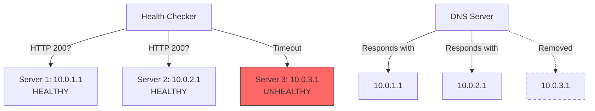
```mermaid
graph TD
    HC[Health Checker] -->|HTTP 200?| S1[Server 1: 10.0.1.1<br/>HEALTHY]
    HC -->|HTTP 200?| S2[Server 2: 10.0.2.1<br/>HEALTHY]
    HC -->|Timeout| S3[Server 3: 10.0.3.1<br/>UNHEALTHY]

    DNS[DNS Server] -->|Responds with| R1[10.0.1.1]
    DNS -->|Responds with| R2[10.0.2.1]
    DNS -.->|Removed| R3[10.0.3.1]

    style S3 fill:#f66,stroke:#333
    style R3 stroke-dasharray: 5 5
```

**Limitations of DNS failover:**
- TTL caching means clients may still use the unhealthy IP for up to TTL seconds.
- No connection-level awareness (DNS does not know if the TCP connection failed).
- Best used in combination with L4/L7 load balancers that provide instant failover.

### 2.1.6 GeoDNS

GeoDNS returns different IP addresses based on the client's geographic location (determined by the source IP of the DNS query or EDNS Client Subnet):

```
Client in New York → Resolves to US-East server: 10.1.0.1
Client in London   → Resolves to EU-West server: 10.2.0.1
Client in Tokyo    → Resolves to AP-NE server:   10.3.0.1
```

**Use cases:**
- Direct users to the nearest data center (latency optimization)
- Comply with data residency requirements (EU data stays in EU)
- CDN routing (direct users to the nearest edge PoP)

**Accuracy:** GeoDNS relies on IP-to-location databases, which are 95-99% accurate at the country level but less reliable at the city level. EDNS Client Subnet (ECS) improves accuracy by including the client's subnet in the DNS query.

### 2.1.7 DNS-Based Load Balancing

DNS can distribute traffic across multiple servers by returning multiple A records (round-robin) or by using weighted responses:

**Round-Robin DNS:**
```
example.com A 10.0.1.1
example.com A 10.0.2.1
example.com A 10.0.3.1
```

Resolvers typically return records in rotating order. The client uses the first IP.

**Weighted DNS:**
```
example.com A 10.0.1.1 (weight: 70)
example.com A 10.0.2.1 (weight: 20)
example.com A 10.0.3.1 (weight: 10)
```

70% of responses include 10.0.1.1 first. Useful for gradual traffic shifting (canary deployments).

**DNS Load Balancing Limitations:**

| Limitation | Impact |
|---|---|
| No health awareness (basic) | Unhealthy servers still receive traffic until TTL expires |
| No connection awareness | Cannot balance based on active connections or server load |
| Client caching | Clients cache the resolved IP, creating uneven distribution |
| No session persistence | No way to route the same client to the same server |
| Granularity | Balances at the DNS query level, not the request level |

For these reasons, DNS-based load balancing is typically used as the **first tier** (global distribution), with L4/L7 load balancers as the **second tier** (fine-grained distribution).

---

## 2.2 Load Balancers

### 2.2.1 Why Load Balancers Exist

Load balancers distribute incoming network traffic across multiple servers to:
1. **Increase throughput**: More servers = more concurrent requests handled.
2. **Improve availability**: If one server fails, traffic is redirected to healthy servers.
3. **Enable scaling**: Add or remove servers without changing the client-facing endpoint.
4. **Perform health checks**: Automatically detect and remove unhealthy backends.
5. **Terminate SSL**: Offload TLS processing from application servers.

### 2.2.2 L4 vs L7 Load Balancing

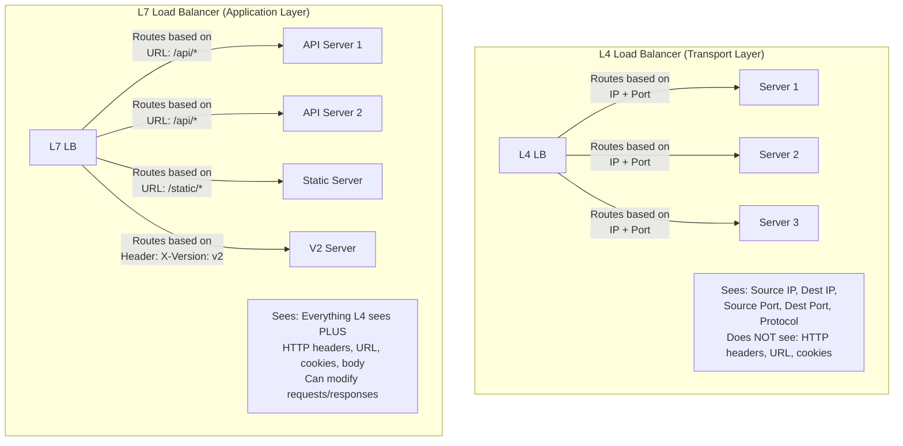
```mermaid
graph TD
    subgraph "L4 Load Balancer (Transport Layer)"
        L4[L4 LB] -->|Routes based on<br/>IP + Port| S1[Server 1]
        L4 -->|Routes based on<br/>IP + Port| S2[Server 2]
        L4 -->|Routes based on<br/>IP + Port| S3[Server 3]
        Note1["Sees: Source IP, Dest IP,<br/>Source Port, Dest Port, Protocol<br/>Does NOT see: HTTP headers, URL, cookies"]
    end

    subgraph "L7 Load Balancer (Application Layer)"
        L7[L7 LB] -->|Routes based on<br/>URL: /api/*| API1[API Server 1]
        L7 -->|Routes based on<br/>URL: /api/*| API2[API Server 2]
        L7 -->|Routes based on<br/>URL: /static/*| Static1[Static Server]
        L7 -->|Routes based on<br/>Header: X-Version: v2| V2[V2 Server]
        Note2["Sees: Everything L4 sees PLUS<br/>HTTP headers, URL, cookies, body<br/>Can modify requests/responses"]
    end
```

**L4 (Transport Layer) Load Balancer**

Operates at the TCP/UDP level. Routes based on IP address and port number. Does not inspect the payload.

| Aspect | Detail |
|---|---|
| Decision basis | Source/destination IP + port, protocol |
| Performance | Very fast (no payload inspection) |
| SSL termination | No (passes encrypted traffic through) |
| Content routing | Not possible |
| Protocol support | Any TCP/UDP protocol |
| Examples | AWS NLB, HAProxy (TCP mode), LVS, IPVS |
| Connections | Passes through or NATs the connection |

**L7 (Application Layer) Load Balancer**

Terminates the client connection, inspects the HTTP request, and creates a new connection to the backend.

| Aspect | Detail |
|---|---|
| Decision basis | URL path, headers, cookies, query params, body |
| Performance | Slower (full HTTP parsing) |
| SSL termination | Yes (decrypts, inspects, re-encrypts or sends plaintext to backend) |
| Content routing | Yes (route /api/* to API servers, /images/* to CDN) |
| Protocol support | HTTP/HTTPS, WebSocket, gRPC |
| Examples | AWS ALB, nginx, HAProxy (HTTP mode), Envoy, Traefik |
| Connections | Terminates client connection; opens new backend connection |

### 2.2.3 Load Balancing Algorithms

| Algorithm | How It Works | Best For |
|---|---|---|
| **Round Robin** | Rotate through servers sequentially | Equal-capacity servers, stateless requests |
| **Weighted Round Robin** | Rotate with weights (higher weight = more traffic) | Mixed-capacity servers |
| **Least Connections** | Route to the server with fewest active connections | Long-lived connections, varying request duration |
| **Weighted Least Connections** | Least connections adjusted by weight | Mixed-capacity + varying duration |
| **IP Hash** | Hash source IP to select server | Session persistence without cookies |
| **Consistent Hashing** | Hash-ring based selection; minimal redistribution on server changes | Cache servers, stateful services |
| **Least Response Time** | Route to the server with lowest average response time | Heterogeneous backends, latency-sensitive |
| **Random** | Random server selection | Simple, surprisingly effective at scale |
| **Power of Two Choices** | Pick 2 random servers, choose the one with fewer connections | Best of random + least-connections |

**Power of Two Choices** deserves special attention: it is used by Envoy and provides near-optimal load distribution with O(1) decision time and no global state.

### 2.2.4 Health Checks

Load balancers must detect unhealthy backends and stop routing traffic to them.

**Active Health Checks:**
The load balancer sends periodic probes to each backend:

```
Health check configuration:
  Protocol: HTTP
  Path: /health
  Interval: 10 seconds
  Timeout: 5 seconds
  Healthy threshold: 3 consecutive successes
  Unhealthy threshold: 2 consecutive failures
  Expected response: HTTP 200, body contains "ok"
```

**Passive Health Checks (Circuit Breaking):**
Monitor real traffic responses. If a backend returns too many 5xx errors or timeouts, mark it unhealthy:

```
Passive health check:
  Window: 30 seconds
  Error threshold: 50% of requests fail
  Minimum requests: 10 (avoid false positives on low traffic)
  Eject duration: 30 seconds (try again after cooldown)
```

**Health Check Design Best Practices:**

| Practice | Rationale |
|---|---|
| Include dependency checks (DB, cache) | Detect partial failures, not just process liveness |
| Return structured JSON with component status | Enable fine-grained monitoring |
| Separate liveness from readiness | Liveness: is the process alive? Readiness: can it serve traffic? |
| Use lightweight checks | Health checks should not consume significant resources |
| Include version/build info | Useful for deployment verification |

### 2.2.5 Session Persistence (Sticky Sessions)

Some applications require that all requests from a client go to the same backend (e.g., in-memory session state, WebSocket connections).

**Methods:**

| Method | How It Works | Pros | Cons |
|---|---|---|---|
| Cookie-based | LB injects a cookie identifying the backend | Works across IPs, NATs | Requires L7 LB, cookie overhead |
| IP-based | Hash source IP to backend | Works at L4 | Breaks with shared IPs (NAT, proxies) |
| URL-based | Route based on URL path or query param | Fine-grained | Requires URL design discipline |
| Header-based | Route based on custom header (e.g., X-Session-ID) | Flexible | Client must set header |

**Sticky Sessions and Scaling:**

Sticky sessions create an anti-pattern: uneven load distribution. If one backend accumulates many sticky sessions, it becomes a hotspot. Prefer **externalized session state** (Redis, database) over sticky sessions whenever possible.

### 2.2.6 SSL/TLS Termination

SSL termination at the load balancer offloads cryptographic processing from application servers:

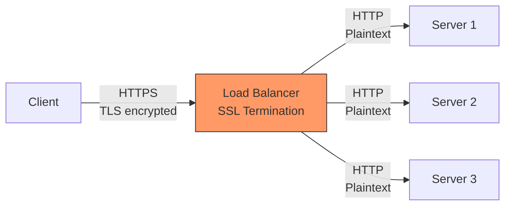
```mermaid
graph LR
    C[Client] -->|HTTPS<br/>TLS encrypted| LB[Load Balancer<br/>SSL Termination]
    LB -->|HTTP<br/>Plaintext| S1[Server 1]
    LB -->|HTTP<br/>Plaintext| S2[Server 2]
    LB -->|HTTP<br/>Plaintext| S3[Server 3]

    style LB fill:#f96,stroke:#333
```

**Benefits:**
- Application servers do not need TLS certificates or cryptographic processing.
- Centralized certificate management (one place to update certificates).
- Load balancer can inspect HTTP headers for L7 routing.
- Reduced CPU load on application servers.

**End-to-End Encryption (SSL Re-encryption):**
For compliance requirements (e.g., PCI-DSS), the load balancer re-encrypts traffic to the backend:

```
Client → HTTPS → LB → HTTPS → Backend
```

This adds latency but ensures data is encrypted in transit even within the data center.

### 2.2.7 Global Server Load Balancing (GSLB)

GSLB distributes traffic across multiple data centers globally, combining DNS-based routing with health monitoring:

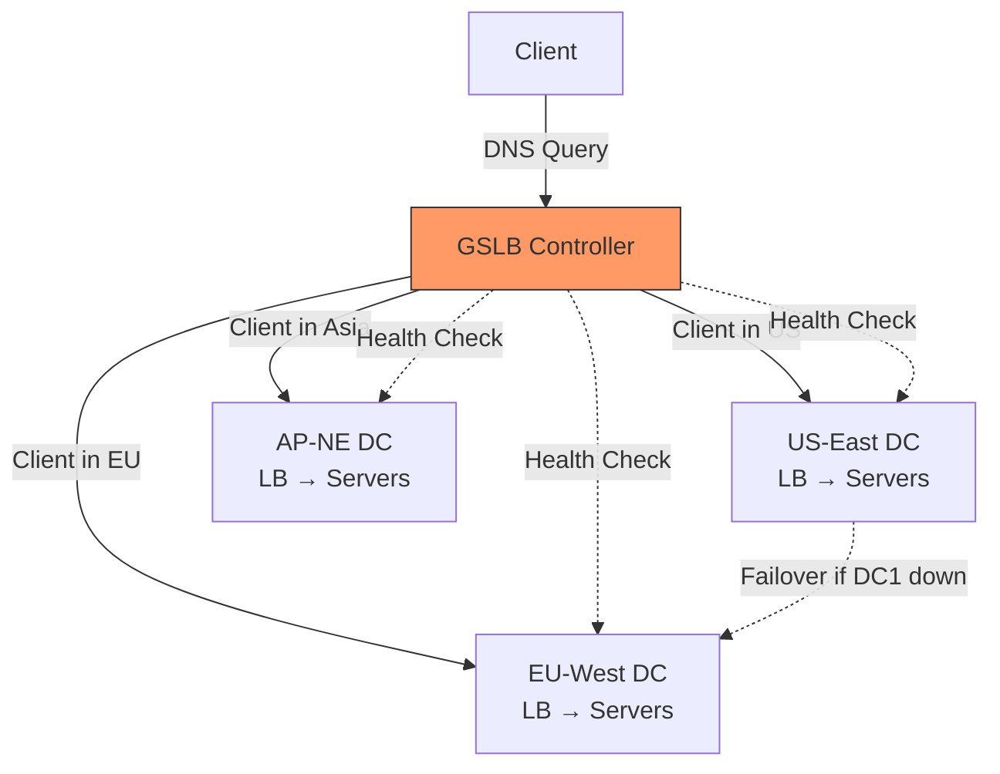
```mermaid
graph TD
    C[Client] -->|DNS Query| GSLB[GSLB Controller]

    GSLB -->|Client in US| DC1[US-East DC<br/>LB → Servers]
    GSLB -->|Client in EU| DC2[EU-West DC<br/>LB → Servers]
    GSLB -->|Client in Asia| DC3[AP-NE DC<br/>LB → Servers]

    GSLB -.->|Health Check| DC1
    GSLB -.->|Health Check| DC2
    GSLB -.->|Health Check| DC3

    DC1 -.->|Failover if DC1 down| DC2

    style GSLB fill:#f96,stroke:#333
```

**GSLB Decision Factors:**
1. **Geographic proximity**: Route to the nearest data center (lowest latency).
2. **Health status**: Skip unhealthy data centers.
3. **Capacity**: Avoid overloaded data centers.
4. **Business rules**: Data residency (EU users must use EU data center).
5. **Cost**: Route to cheaper regions during non-peak hours.

**GSLB Implementations:**
- AWS Route 53 (latency-based routing, failover, geolocation)
- Cloudflare Load Balancing
- F5 BIG-IP DNS
- Akamai GTM (Global Traffic Management)

---

## 2.3 CDN (Content Delivery Network)

### 2.3.1 What a CDN Does

A CDN is a geographically distributed network of edge servers that cache and serve content close to end users. The goal: reduce latency by minimizing the physical distance between the client and the server.

**Without CDN:** Client in Tokyo requests an image from a server in Virginia. Round-trip time: ~200ms.
**With CDN:** Client in Tokyo requests the same image from a CDN edge in Tokyo. Round-trip time: ~10ms.

### 2.3.2 CDN Architecture

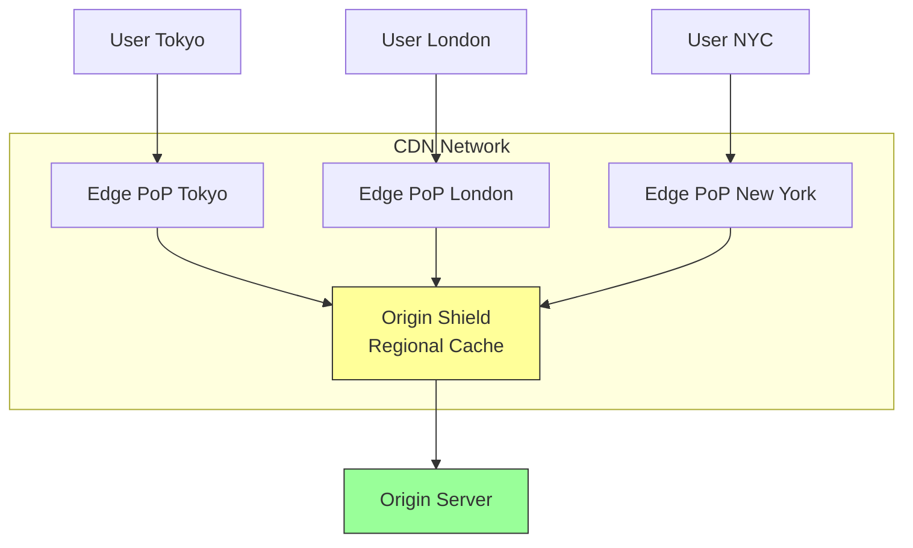
```mermaid
graph TD
    C1[User Tokyo] --> E1[Edge PoP Tokyo]
    C2[User London] --> E2[Edge PoP London]
    C3[User NYC] --> E3[Edge PoP New York]

    E1 --> OS[Origin Shield<br/>Regional Cache]
    E2 --> OS
    E3 --> OS

    OS --> O[Origin Server]

    subgraph "CDN Network"
        E1
        E2
        E3
        OS
    end

    style OS fill:#ff9,stroke:#333
    style O fill:#9f9,stroke:#333
```

**Tier 1 — Edge PoPs (Points of Presence):** Closest to users. 100-300+ locations globally. Cache the most popular content.

**Tier 2 — Origin Shield (Mid-Tier Cache):** A single regional cache between edges and the origin. Collapses duplicate requests from multiple edges into a single origin request.

**Tier 3 — Origin Server:** The source of truth. Only receives requests that miss all cache tiers.

### 2.3.3 Edge Caching

**Cache Hit vs Cache Miss:**

```
Cache HIT:
  Client → Edge PoP → (content found in cache) → Response (10ms)

Cache MISS:
  Client → Edge PoP → (not in cache) → Origin Shield → (not in cache) → Origin → Response (200ms)
  Edge caches the response for future requests.
```

**Cache Hit Ratio (CHR):**

```
CHR = Cache Hits / (Cache Hits + Cache Misses)

Target: 85-99% for static content
Typical: 70-90% for mixed content (static + dynamic)
```

Higher CHR = less origin load = lower latency = lower infrastructure cost.

### 2.3.4 Cache Key Design

The cache key determines what makes two requests "the same" for caching purposes.

**Default cache key:** `scheme + host + path + query string`

```
https://cdn.example.com/images/logo.png?v=2  → Cache key 1
https://cdn.example.com/images/logo.png?v=3  → Cache key 2 (different)
https://cdn.example.com/images/logo.png       → Cache key 3 (different)
```

**Cache key customization:**

| Strategy | When to Use |
|---|---|
| Include query params | Versioned assets (`?v=2`), API pagination |
| Exclude query params | Marketing UTM params should not fragment cache |
| Include headers | Content-negotiation (Accept-Language, Accept-Encoding) |
| Include cookies | Personalized content (use sparingly — fragments cache) |
| Include device type | Serve different images for mobile vs desktop |
| Normalize URL | Sort query params, lowercase path to reduce fragmentation |

**Cache fragmentation** is the enemy of CHR. Every unique cache key creates a separate cached copy. Design cache keys to maximize sharing.

### 2.3.5 Cache Invalidation

Cache invalidation is one of the hardest problems in computer science. CDN invalidation strategies:

| Strategy | Speed | Complexity | Use Case |
|---|---|---|---|
| **TTL-based expiration** | Automatic (at TTL) | Low | Content that can be stale for N seconds |
| **Purge by URL** | Seconds to minutes | Medium | Specific content update (fix typo in article) |
| **Purge by tag/key** | Seconds to minutes | Medium | Invalidate all content tagged "product-123" |
| **Purge all** | Minutes | Low | Nuclear option (avoid in production) |
| **Stale-while-revalidate** | Instant (serve stale) | Low | Serve stale content while fetching fresh in background |
| **Versioned URLs** | Instant (new URL = cache miss) | Low | Static assets (`app.abc123.js`) |

**Best practice: Use versioned URLs for static assets (immutable caching) and short TTLs + stale-while-revalidate for dynamic content.**

```
# Immutable static asset (cache forever, new version = new URL)
Cache-Control: public, max-age=31536000, immutable

# Dynamic API response (cache 60s, serve stale for 300s while revalidating)
Cache-Control: public, max-age=60, stale-while-revalidate=300
```

### 2.3.6 Multi-CDN Strategy

Large-scale services use multiple CDN providers for:

| Benefit | Detail |
|---|---|
| **Resilience** | If one CDN has an outage, traffic shifts to another |
| **Performance** | Different CDNs perform better in different regions |
| **Cost optimization** | Negotiate better pricing with multiple vendors |
| **Avoiding vendor lock-in** | Freedom to switch providers |

**Multi-CDN routing:**
- DNS-based: GeoDNS routes to the best-performing CDN per region.
- Client-side: JavaScript measures latency to each CDN and chooses the fastest.
- Smart routing service: A central controller monitors CDN performance and adjusts routing in real-time.

### 2.3.7 Edge Compute

Modern CDNs offer compute at the edge — running application logic at edge PoPs instead of origin servers:

**Platforms:** Cloudflare Workers, AWS CloudFront Functions/Lambda@Edge, Fastly Compute, Vercel Edge Functions.

**Use cases:**
- A/B testing (route to different variants at the edge)
- Authentication/authorization (validate JWT at the edge)
- Personalization (modify response based on geolocation, device)
- API gateway functions (rate limiting, request transformation)
- Image optimization (resize/format conversion at the edge)

**Constraints:**
- Limited execution time (typically 1-50ms)
- Limited memory and CPU
- No persistent storage (must call back to origin or edge KV stores)
- Cold start latency for some platforms

---

## 2.4 Reverse Proxy

### 2.4.1 What a Reverse Proxy Does

A reverse proxy sits in front of application servers and intercepts client requests. Unlike a forward proxy (which acts on behalf of the client), a reverse proxy acts on behalf of the server.

**Functions:**
- **Request routing**: Route requests to different backends based on URL, headers, etc.
- **TLS termination**: Handle HTTPS and forward plaintext to backends.
- **Compression**: Compress responses (gzip, Brotli) before sending to clients.
- **Caching**: Cache responses to reduce backend load.
- **Rate limiting**: Protect backends from excessive traffic.
- **Authentication**: Validate tokens or perform basic auth before forwarding.
- **Load balancing**: Distribute requests across multiple backends.
- **Request/response modification**: Add headers, rewrite URLs, transform bodies.

### 2.4.2 nginx

nginx is the most widely deployed reverse proxy/web server. Known for high performance, low memory usage, and event-driven architecture.

**Key capabilities:**
- Event-driven, non-blocking architecture (handles 10K+ concurrent connections with minimal memory)
- HTTP, HTTPS, HTTP/2, WebSocket, gRPC support
- Static file serving, reverse proxying, load balancing
- Configuration-based routing (location blocks, upstream groups)
- Rate limiting, connection limiting, request buffering
- Lua scripting (OpenResty) for custom logic

**Architecture:**
- Master process: Reads config, manages workers
- Worker processes: Handle connections (event loop, non-blocking I/O)
- Each worker handles thousands of connections without threading

### 2.4.3 HAProxy

HAProxy (High Availability Proxy) is purpose-built for load balancing and proxying. It excels at:
- L4 and L7 load balancing
- Very high connection rates (millions of concurrent connections)
- Advanced health checking
- Detailed statistics and monitoring
- ACL-based routing
- Connection queuing and rate limiting

**HAProxy vs nginx:**

| Feature | HAProxy | nginx |
|---|---|---|
| Primary purpose | Load balancing | Web server + reverse proxy |
| L4 support | Excellent | Limited |
| Health checks | Advanced (agent checks, multiple probes) | Basic |
| Configuration reload | Hitless reload | Graceful reload (brief interruption) |
| Statistics | Built-in detailed stats page | Requires modules |
| Static content | Not designed for this | Excellent |
| Lua scripting | Yes | Yes (OpenResty) |
| WebSocket | Excellent | Excellent |
| gRPC | Yes | Yes |

### 2.4.4 Envoy

Envoy is a modern, high-performance proxy designed for cloud-native environments. Created at Lyft, now a CNCF graduated project. It is the default data plane for Istio service mesh.

**Key differentiators:**
- **xDS API**: Dynamic configuration via API (no config file reloads). Control planes push configuration changes in real-time.
- **Observability-first**: Built-in support for distributed tracing (Zipkin, Jaeger), metrics (Prometheus/StatsD), and structured logging.
- **HTTP/2 and gRPC native**: Full support for HTTP/2 upstream and downstream, including gRPC load balancing.
- **Advanced load balancing**: Zone-aware routing, circuit breaking, outlier detection, retry budgets.
- **Filter chain architecture**: Extensible through L4 and L7 filters (Wasm, Lua).

**Envoy vs nginx vs HAProxy for modern architectures:**

| Aspect | Envoy | nginx | HAProxy |
|---|---|---|---|
| Dynamic config | xDS API (real-time) | Config file (reload) | Config file (reload) |
| Service mesh | Default data plane | Possible (NGINX Service Mesh) | Not typical |
| Observability | Built-in (traces, metrics, access logs) | Requires modules | Stats page + logs |
| gRPC support | Native | Good | Good |
| Wasm extensibility | Yes | No | No |
| Kubernetes integration | Excellent (Istio, Contour) | Good (ingress controller) | Good (ingress controller) |

### 2.4.5 Reverse Proxy Patterns in System Design

**Pattern 1: API Gateway**
```
Client → Reverse Proxy → /api/users → User Service
                        → /api/orders → Order Service
                        → /api/products → Product Service
```

**Pattern 2: BFF (Backend for Frontend)**
```
Mobile App → Mobile BFF Proxy → Aggregates calls to microservices
Web App    → Web BFF Proxy    → Aggregates calls to microservices
```

**Pattern 3: Sidecar Proxy (Service Mesh)**
```
Service A Pod:
  [App Container] → [Envoy Sidecar] → Network → [Envoy Sidecar] → [App Container]
                                                                      Service B Pod
```

**Pattern 4: Edge Proxy**
```
Internet → Edge Proxy (TLS termination, DDoS protection, WAF) → Internal LB → Backends
```

---

# Section 3: Advanced Networking

This section covers topics that distinguish senior engineers: service mesh architecture, protocol selection strategy, network security depth, and practical debugging techniques.

---

## 3.1 Service Mesh

### 3.1.1 What Problem Service Mesh Solves

In a microservices architecture, service-to-service communication requires:
- Service discovery (how does Service A find Service B?)
- Load balancing (how is traffic distributed across Service B instances?)
- Retry and timeout policies (what happens when a call fails?)
- Circuit breaking (how do we prevent cascading failures?)
- Mutual TLS (how do we authenticate and encrypt service-to-service traffic?)
- Observability (how do we trace requests across services?)
- Traffic management (how do we canary deploy, A/B test, or traffic-shift?)

Without a service mesh, each service implements these concerns in application code or client libraries. This creates:
- **Code duplication** across services in different languages.
- **Inconsistent behavior** (different retry policies, different timeout values).
- **Tight coupling** between business logic and infrastructure concerns.
- **Operational burden** for updating cross-cutting policies.

A service mesh moves these concerns into the infrastructure layer, implemented as sidecar proxies deployed alongside each service.

### 3.1.2 Service Mesh Architecture

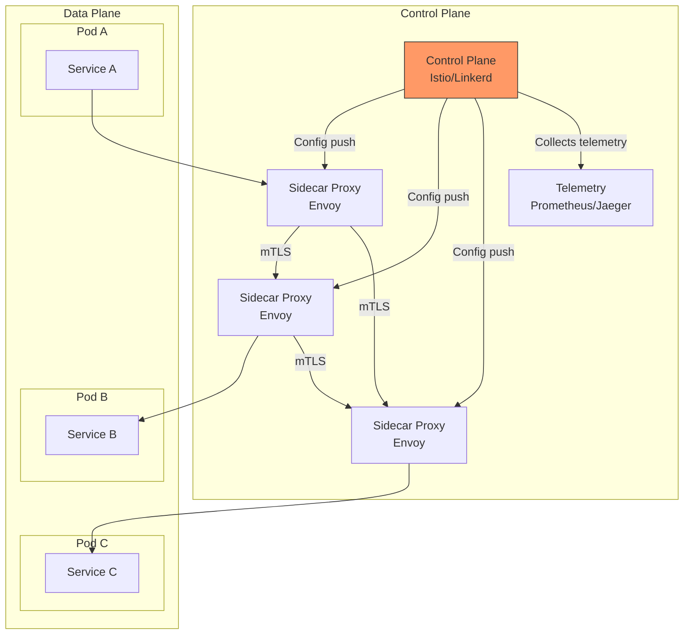
```mermaid
graph TD
    subgraph "Control Plane"
        CP[Control Plane<br/>Istio/Linkerd]
        CP -->|Config push| P1
        CP -->|Config push| P2
        CP -->|Config push| P3
        CP -->|Collects telemetry| T[Telemetry<br/>Prometheus/Jaeger]
    end

    subgraph "Data Plane"
        subgraph "Pod A"
            A[Service A] --> P1[Sidecar Proxy<br/>Envoy]
        end

        subgraph "Pod B"
            P2[Sidecar Proxy<br/>Envoy] --> B[Service B]
        end

        subgraph "Pod C"
            P3[Sidecar Proxy<br/>Envoy] --> CC[Service C]
        end

        P1 -->|mTLS| P2
        P1 -->|mTLS| P3
        P2 -->|mTLS| P3
    end

    style CP fill:#f96,stroke:#333
```

**Control Plane:** Manages the mesh configuration. Distributes routing rules, security policies, and service discovery information to all sidecar proxies. Examples: Istio (istiod), Linkerd (linkerd-destination, linkerd-identity).

**Data Plane:** The sidecar proxies (typically Envoy) that intercept all inbound and outbound traffic from each service. They enforce policies without application code changes.

### 3.1.3 Istio

Istio is the most feature-rich service mesh, backed by Google, IBM, and Lyft. It uses Envoy as its data plane proxy.

**Key features:**

**Traffic Management:**
- Canary deployments (90% to v1, 10% to v2)
- Blue/green deployments
- Fault injection (inject delays or errors for testing)
- Circuit breaking with configurable thresholds
- Retry policies with budgets
- Request timeouts
- Traffic mirroring (shadow traffic to new versions)

**Security:**
- Automatic mTLS between all services
- Certificate rotation (automatic via Istio CA)
- Authorization policies (allow/deny rules based on service identity, namespace, HTTP method)
- JWT validation at the sidecar level

**Observability:**
- Distributed tracing (automatic span injection)
- Metrics (request count, latency, error rate per service pair)
- Access logging (structured logs for every request)

**Istio Trade-offs:**

| Pro | Con |
|---|---|
| Comprehensive feature set | High complexity |
| Strong security (mTLS everywhere) | Resource overhead (CPU, memory per sidecar) |
| Powerful traffic management | Latency overhead (1-5ms per hop) |
| Rich observability | Steep learning curve |
| Envoy-based (battle-tested) | Debugging mesh issues is difficult |

### 3.1.4 Linkerd

Linkerd is a lightweight service mesh focused on simplicity and operational ease. It uses its own Rust-based proxy (linkerd2-proxy) instead of Envoy.

**Linkerd vs Istio:**

| Aspect | Linkerd | Istio |
|---|---|---|
| Proxy | linkerd2-proxy (Rust) | Envoy (C++) |
| Resource usage | Lower (~20MB per sidecar) | Higher (~50-100MB per sidecar) |
| Complexity | Simple | Complex |
| Feature set | Core features | Comprehensive |
| mTLS | Automatic, zero-config | Automatic, configurable |
| Traffic management | Basic (traffic split, retries) | Advanced (fault injection, mirroring) |
| Multi-cluster | Supported | Supported |
| CNCF status | Graduated | Graduated (via Envoy) |

**When to choose Linkerd:** Teams that want service mesh benefits (mTLS, observability, traffic splitting) with minimal operational overhead and low resource consumption.

**When to choose Istio:** Teams that need advanced traffic management (fault injection, traffic mirroring), complex authorization policies, or deep Envoy customization.

### 3.1.5 Sidecar Proxy vs Sidecarless (Ambient Mesh)

The sidecar model has drawbacks:
- Resource overhead per pod (CPU, memory)
- Latency overhead (extra network hops)
- Sidecar injection complexity
- Upgrade rollout complexity

**Istio Ambient Mesh** introduces a sidecarless model:
- **ztunnel**: A shared per-node proxy that handles L4 (mTLS, telemetry) for all pods on the node.
- **Waypoint proxy**: An optional per-service L7 proxy for advanced routing and policy.

This reduces per-pod overhead while maintaining mesh benefits.

---

## 3.2 API Protocols Comparison

### 3.2.1 Decision Matrix

| Criterion | REST | gRPC | GraphQL | WebSocket |
|---|---|---|---|---|
| **Communication pattern** | Request-response | Request-response + streaming | Request-response + subscriptions | Full-duplex, persistent |
| **Serialization** | JSON (text) | Protobuf (binary) | JSON (text) | Any (text/binary) |
| **Type safety** | Weak (OpenAPI optional) | Strong (protobuf schema) | Strong (GraphQL schema) | None (application-defined) |
| **Performance** | Good | Excellent | Good (with optimization) | Excellent (low overhead) |
| **Browser support** | Native | Requires grpc-web proxy | Native | Native |
| **Caching** | Excellent (HTTP caching) | Difficult (binary, POST-like) | Difficult (single endpoint) | Not applicable |
| **Tooling** | Excellent (curl, Postman, etc.) | Good (grpcurl, BloomRPC) | Good (GraphiQL, Apollo Studio) | Limited |
| **Learning curve** | Low | Medium | Medium-High | Low |
| **Streaming** | SSE (server-to-client) | All 4 modes | Subscriptions (WebSocket) | Native |
| **Code generation** | Optional (OpenAPI) | Required (protobuf) | Optional (codegen) | None |
| **File upload** | Native (multipart) | Streaming | Complex (multipart spec) | Binary frames |

### 3.2.2 When to Use Each Protocol

**Use REST when:**
- Building public-facing APIs
- Clients are browsers or third-party integrations
- HTTP caching is important
- CRUD operations on resources
- Team is familiar with REST conventions
- Simple request-response is sufficient

**Use gRPC when:**
- Internal service-to-service communication
- Performance is critical (low latency, high throughput)
- Streaming is required (events, telemetry, large data transfer)
- Polyglot environment (strong code generation in many languages)
- Strict API contracts are needed

**Use GraphQL when:**
- Clients need flexible data fetching (mobile apps with varying screen sizes)
- Multiple client types need different data shapes
- Reducing over-fetching/under-fetching is a priority
- The data graph is complex (many relationships between entities)
- Frontend teams want autonomy in data fetching

**Use WebSocket when:**
- Real-time bidirectional communication is required
- Server needs to push data without client requests
- Low-latency, high-frequency message exchange (gaming, trading)
- Persistent connections are acceptable

### 3.2.3 Hybrid Approaches

Most production systems use multiple protocols:

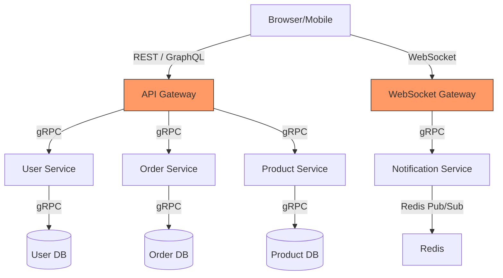
```mermaid
graph TD
    Browser[Browser/Mobile] -->|REST / GraphQL| API[API Gateway]
    Browser -->|WebSocket| WSG[WebSocket Gateway]

    API -->|gRPC| US[User Service]
    API -->|gRPC| OS[Order Service]
    API -->|gRPC| PS[Product Service]

    WSG -->|gRPC| NS[Notification Service]

    US -->|gRPC| DB1[(User DB)]
    OS -->|gRPC| DB2[(Order DB)]
    PS -->|gRPC| DB3[(Product DB)]
    NS -->|Redis Pub/Sub| R[Redis]

    style API fill:#f96,stroke:#333
    style WSG fill:#f96,stroke:#333
```

**Common hybrid pattern:**
- REST or GraphQL for client-facing APIs (browser compatibility)
- gRPC for internal service-to-service communication (performance)
- WebSocket for real-time features (notifications, chat)
- SSE for simple server-push (dashboard updates)

---

## 3.3 Network Security

### 3.3.1 TLS (Transport Layer Security)

TLS encrypts data in transit between client and server. It provides:
- **Confidentiality**: Data cannot be read by eavesdroppers.
- **Integrity**: Data cannot be modified in transit.
- **Authentication**: The server (and optionally client) proves its identity via certificates.

**TLS 1.3 improvements over TLS 1.2:**

| Feature | TLS 1.2 | TLS 1.3 |
|---|---|---|
| Handshake RTTs | 2 | 1 (0 for resumption) |
| Cipher suites | Many (including weak ones) | Only 5 strong suites |
| Forward secrecy | Optional | Mandatory |
| RSA key exchange | Supported | Removed (only Diffie-Hellman) |
| 0-RTT resumption | No | Yes (with replay protection caveats) |
| Encrypted handshake | Partial | Almost fully encrypted |

### 3.3.2 mTLS (Mutual TLS)

In standard TLS, only the server presents a certificate. In mTLS, **both** client and server present certificates and verify each other's identity.

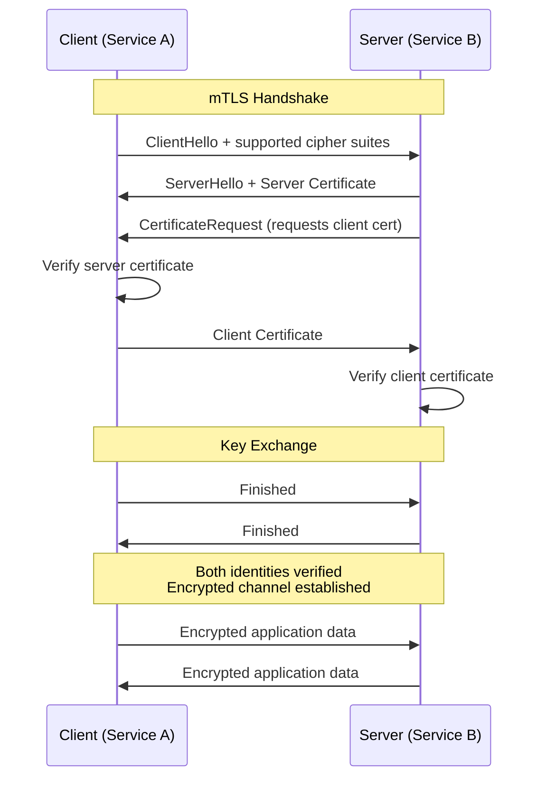
```mermaid
sequenceDiagram
    participant C as Client (Service A)
    participant S as Server (Service B)

    Note over C,S: mTLS Handshake

    C->>S: ClientHello + supported cipher suites
    S->>C: ServerHello + Server Certificate
    S->>C: CertificateRequest (requests client cert)
    C->>C: Verify server certificate
    C->>S: Client Certificate
    S->>S: Verify client certificate
    Note over C,S: Key Exchange
    C->>S: Finished
    S->>C: Finished

    Note over C,S: Both identities verified<br/>Encrypted channel established

    C->>S: Encrypted application data
    S->>C: Encrypted application data
```

**mTLS use cases:**
- Service-to-service authentication in microservices (service mesh)
- API authentication for B2B integrations
- Zero-trust networking (verify every connection)
- IoT device authentication

**Certificate management for mTLS at scale:**
- Use a service mesh (Istio, Linkerd) for automatic certificate issuance and rotation.
- Use a certificate authority (Vault PKI, SPIFFE/SPIRE) for identity-based certificates.
- Rotate certificates frequently (24 hours is common in service mesh).

### 3.3.3 Certificate Rotation

Certificate rotation is the process of replacing expiring certificates with new ones without downtime.

**Manual rotation** (high-risk, error-prone):
1. Generate new certificate and key.
2. Deploy new certificate to all servers.
3. Reload server configuration.
4. Verify the new certificate is active.

**Automated rotation** (recommended):
1. Use ACME protocol (Let's Encrypt) for automated issuance and renewal.
2. Use cert-manager (Kubernetes) for automated lifecycle management.
3. Use Vault PKI for short-lived certificates with automatic rotation.
4. Use service mesh for transparent certificate management.

**Rotation gotchas:**
- Clock skew between servers can cause certificate validation failures.
- Cached certificates in connection pools may outlive rotation.
- Certificate pinning (if used) must be updated before rotation.

### 3.3.4 CORS (Cross-Origin Resource Sharing)

CORS is a browser security mechanism that controls which origins can access resources on a different origin.

**Same-Origin Policy:** Browsers block JavaScript from making requests to a different origin (protocol + host + port) unless the server explicitly allows it via CORS headers.

**CORS Flow:**

```
Preflight request (for non-simple requests):
  OPTIONS /api/users
  Origin: https://app.example.com
  Access-Control-Request-Method: POST
  Access-Control-Request-Headers: Content-Type, Authorization

Server response:
  Access-Control-Allow-Origin: https://app.example.com
  Access-Control-Allow-Methods: GET, POST, PUT, DELETE
  Access-Control-Allow-Headers: Content-Type, Authorization
  Access-Control-Max-Age: 86400
  Access-Control-Allow-Credentials: true
```

**CORS Configuration Best Practices:**

| Practice | Why |
|---|---|
| Never use `Access-Control-Allow-Origin: *` with credentials | Security vulnerability |
| Whitelist specific origins | Prevent unauthorized access |
| Cache preflight responses (`Access-Control-Max-Age`) | Reduce preflight request overhead |
| Only expose necessary headers | Minimize attack surface |
| Validate Origin header server-side | Defense against CORS misconfiguration |

### 3.3.5 CSP (Content Security Policy)

CSP is an HTTP response header that controls which resources the browser is allowed to load for a given page. It mitigates XSS (Cross-Site Scripting) and data injection attacks.

```
Content-Security-Policy:
  default-src 'self';
  script-src 'self' https://cdn.example.com;
  style-src 'self' 'unsafe-inline';
  img-src 'self' data: https:;
  connect-src 'self' https://api.example.com wss://ws.example.com;
  frame-ancestors 'none';
  base-uri 'self';
  form-action 'self';
```

**Key directives:**

| Directive | Controls |
|---|---|
| `default-src` | Fallback for all resource types |
| `script-src` | JavaScript sources |
| `style-src` | CSS sources |
| `img-src` | Image sources |
| `connect-src` | XHR, Fetch, WebSocket destinations |
| `frame-ancestors` | Who can embed this page in iframe |
| `report-uri` / `report-to` | Where to send CSP violation reports |

### 3.3.6 DDoS Protection

DDoS (Distributed Denial of Service) attacks flood a target with traffic to exhaust resources and cause downtime.

**Attack types and mitigations:**

| Layer | Attack Type | Example | Mitigation |
|---|---|---|---|
| L3/L4 | Volumetric | UDP flood, SYN flood, amplification | ISP scrubbing, BGP Flowspec, cloud DDoS protection |
| L4 | Protocol | SYN flood, Slowloris | SYN cookies, connection limits, timeout tuning |
| L7 | Application | HTTP flood, API abuse, credential stuffing | WAF, rate limiting, CAPTCHA, behavioral analysis |

**Defense-in-depth architecture:**

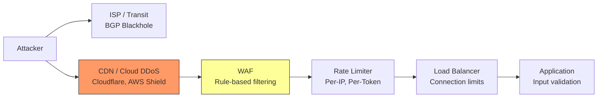
```mermaid
graph LR
    A[Attacker] --> ISP[ISP / Transit<br/>BGP Blackhole]
    A --> CDN[CDN / Cloud DDoS<br/>Cloudflare, AWS Shield]
    CDN --> WAF[WAF<br/>Rule-based filtering]
    WAF --> RL[Rate Limiter<br/>Per-IP, Per-Token]
    RL --> LB[Load Balancer<br/>Connection limits]
    LB --> App[Application<br/>Input validation]

    style CDN fill:#f96,stroke:#333
    style WAF fill:#ff9,stroke:#333
```

**Rate limiting strategies:**

| Strategy | Implementation | Granularity |
|---|---|---|
| Token bucket | Allow N requests per window, with burst capacity | Per-IP, per-user, per-API-key |
| Sliding window | Count requests in a rolling time window | More accurate than fixed windows |
| Leaky bucket | Process requests at a fixed rate, queue excess | Smooth traffic shaping |
| Adaptive | Dynamically adjust limits based on server health | Responds to actual capacity |

### 3.3.7 Zero-Trust Networking

Traditional network security uses a perimeter model: trust everything inside the firewall. Zero-trust assumes no implicit trust — every request must be authenticated and authorized regardless of network location.

**Zero-trust principles:**
1. **Verify explicitly**: Always authenticate and authorize based on all available data points.
2. **Use least privilege access**: Limit access to only what is needed.
3. **Assume breach**: Minimize blast radius through micro-segmentation.

**Implementation components:**
- mTLS for service-to-service authentication
- Service mesh for policy enforcement
- Identity-aware proxies (BeyondCorp, Tailscale)
- Micro-segmentation (network policies in Kubernetes)
- Short-lived credentials (JWT with short expiry, rotating certificates)

---

## 3.4 Network Debugging

### 3.4.1 Essential Tools

**tcpdump — Packet Capture**

tcpdump captures packets at the network interface level. Essential for debugging connection issues, protocol problems, and unexpected traffic.

```bash
# Capture HTTP traffic on port 80
tcpdump -i eth0 port 80 -A -n

# Capture traffic to a specific host
tcpdump -i any host 10.0.1.5 -nn

# Capture only SYN packets (connection attempts)
tcpdump -i eth0 'tcp[tcpflags] & (tcp-syn) != 0' -nn

# Capture DNS queries
tcpdump -i any port 53 -nn

# Save capture to file for Wireshark analysis
tcpdump -i eth0 -w capture.pcap -c 10000

# Capture gRPC traffic (HTTP/2 on port 50051)
tcpdump -i any port 50051 -nn -A
```

**Wireshark — Packet Analysis**

Wireshark provides GUI-based deep packet inspection. Load pcap files captured by tcpdump for protocol-level analysis. Filters:

```
# Show only HTTP/2 traffic
http2

# Show TCP retransmissions
tcp.analysis.retransmission

# Show slow TCP handshakes
tcp.flags.syn == 1 && tcp.flags.ack == 0

# Show specific conversation
ip.addr == 10.0.1.5 && tcp.port == 443

# Show DNS queries for a specific domain
dns.qry.name contains "example.com"
```

**traceroute/mtr — Path Analysis**

traceroute shows the network path from source to destination, revealing each router hop and its latency:

```bash
# Standard traceroute
traceroute -n example.com

# TCP traceroute (works when ICMP is blocked)
traceroute -T -p 443 example.com

# mtr (continuous traceroute with statistics)
mtr --report --report-cycles 100 example.com
```

**Output interpretation:**
```
Host                    Loss%  Snt   Last   Avg  Best  Wrst  StDev
1. 192.168.1.1          0.0%   100    1.2   1.5   0.8   3.2   0.5
2. 10.0.0.1             0.0%   100    5.3   5.8   4.1   8.2   1.1
3. 172.16.0.1           2.0%   100   15.2  16.1  14.0  25.3   2.8  ← packet loss
4. ???                   100%   100    0.0   0.0   0.0   0.0   0.0  ← ICMP blocked
5. 93.184.216.34        0.0%   100   22.1  23.5  21.0  30.2   2.1
```

**curl — HTTP Debugging**

```bash
# Verbose output with timing
curl -v -w "@curl-timing.txt" https://example.com

# Show only response headers
curl -I https://example.com

# Test HTTP/2
curl --http2 -v https://example.com

# Test with specific TLS version
curl --tlsv1.3 -v https://example.com

# Resolve domain to specific IP (bypass DNS)
curl --resolve example.com:443:10.0.1.5 https://example.com

# Timing breakdown format (save as curl-timing.txt)
# time_namelookup:  %{time_namelookup}s\n
# time_connect:     %{time_connect}s\n
# time_appconnect:  %{time_appconnect}s\n
# time_starttransfer: %{time_starttransfer}s\n
# time_total:       %{time_total}s\n
```

**dig/nslookup — DNS Debugging**

```bash
# Query A record
dig example.com A +short

# Query with specific DNS server
dig @8.8.8.8 example.com A

# Full resolution trace
dig +trace example.com

# Check all record types
dig example.com ANY

# Reverse DNS lookup
dig -x 93.184.216.34

# Check DNSSEC validation
dig +dnssec example.com
```

### 3.4.2 Latency Diagnosis

When a request is slow, systematically identify where the latency is:

```
Total latency = DNS + TCP handshake + TLS handshake + Request transfer
                + Server processing + Response transfer

curl timing breakdown:
  time_namelookup:   0.012s   ← DNS resolution
  time_connect:      0.045s   ← TCP handshake (connect - namelookup = 33ms)
  time_appconnect:   0.120s   ← TLS handshake (appconnect - connect = 75ms)
  time_starttransfer: 0.350s  ← First byte (starttransfer - appconnect = 230ms server time)
  time_total:        0.380s   ← Complete (total - starttransfer = 30ms transfer)
```

**Common latency culprits:**

| Symptom | Likely Cause | Investigation |
|---|---|---|
| High `time_namelookup` | Slow DNS resolution | Check DNS server, TTL, use local DNS cache |
| High `time_connect - time_namelookup` | Network latency (physical distance) | traceroute, check geographic routing |
| High `time_appconnect - time_connect` | Slow TLS handshake | Check certificate chain length, OCSP stapling, TLS version |
| High `time_starttransfer - time_appconnect` | Slow server processing | Server-side profiling, database query analysis |
| High `time_total - time_starttransfer` | Large response or slow transfer | Check response size, bandwidth, compression |

### 3.4.3 MTU Issues

MTU (Maximum Transmission Unit) is the largest packet size that can be transmitted without fragmentation. Standard Ethernet MTU is 1500 bytes.

**MTU problems occur when:**
- A packet exceeds the MTU of a network link in the path.
- The "Don't Fragment" (DF) flag is set (common in modern networks).
- ICMP "Fragmentation Needed" messages are blocked by firewalls (Path MTU Discovery breaks).

**Symptoms:**
- Connections establish (small packets) but data transfer hangs (large packets).
- Intermittent failures with large payloads.
- Works on some paths but not others.

**Diagnosis:**

```bash
# Test with specific packet size (1500 - 28 bytes IP/ICMP header = 1472 data)
ping -M do -s 1472 example.com

# Reduce until it works
ping -M do -s 1400 example.com

# Find exact MTU
# If 1472 fails and 1400 works, binary search between them
```

**Common MTU values:**

| Network | MTU |
|---|---|
| Ethernet | 1500 bytes |
| VPN (IPsec) | ~1400 bytes (encapsulation overhead) |
| Docker overlay networks | 1450 bytes (VXLAN overhead) |
| Jumbo frames (data center) | 9000 bytes |
| PPPoE (DSL) | 1492 bytes |

### 3.4.4 Connection Debugging Checklist

When debugging network connectivity issues in production, follow this systematic approach:

```
1. Can you resolve the hostname?
   → dig / nslookup → If no: DNS issue

2. Can you reach the IP?
   → ping / traceroute → If no: routing or firewall issue

3. Can you reach the port?
   → telnet / nc -zv host port → If no: firewall, service not running

4. Can you complete the TLS handshake?
   → openssl s_client -connect host:443 → If no: certificate issue, TLS version mismatch

5. Can you complete an HTTP request?
   → curl -v → If no: application-level issue, proxy misconfiguration

6. Is the response correct?
   → curl, check headers and body → If no: application bug, routing error

7. Is performance acceptable?
   → curl with timing, mtr → If no: latency diagnosis (see above)
```

### 3.4.5 Common Network Failure Modes in Distributed Systems

| Failure Mode | Description | Impact | Mitigation |
|---|---|---|---|
| **Network partition** | Two groups of servers cannot communicate | Split-brain, data inconsistency | Consensus protocols, partition-tolerant design |
| **Asymmetric partition** | A can reach B, but B cannot reach A | Confusing failures, leader election issues | Bidirectional health checks |
| **Gray failure** | Partial degradation (high latency, packet loss) | Harder to detect than total failure | Timeout tuning, outlier detection |
| **DNS failure** | DNS server unresponsive or returning wrong answers | Everything breaks | DNS caching, multiple resolvers, low TTL during changes |
| **Certificate expiration** | TLS certificate expires | Immediate outage for HTTPS services | Automated monitoring, auto-renewal |
| **Connection exhaustion** | Too many connections to a service | New connections refused, timeouts | Connection pooling, circuit breakers, backpressure |
| **TCP RST storm** | Rapid connection resets | Service instability | Root cause analysis (firewall, application crash) |
| **BGP route leak** | Wrong routing announcements | Traffic rerouted through wrong paths | RPKI, BGP monitoring |

---

## Architectural Decision Records (ADRs)

### ADR-1: Protocol Selection for Client-to-Server Communication

**Status:** Accepted

**Context:** The system serves web browsers, mobile apps, and third-party integrators. Different clients have different capabilities and data-fetching patterns. We need to select the appropriate protocol for client-facing APIs.

**Decision:** Use REST (JSON over HTTP/2) as the primary client-facing API protocol. Add GraphQL as an optional BFF layer for mobile clients that benefit from flexible data fetching.

**Rationale:**
- REST is universally supported by browsers, mobile SDKs, and third-party tools.
- HTTP caching (CDN, browser cache) works naturally with REST endpoints.
- GraphQL reduces mobile bandwidth by eliminating over-fetching.
- GraphQL's single-endpoint model complicates CDN caching, so it is used selectively.
- gRPC is not browser-compatible without a proxy layer.

**Consequences:**
- Two API surfaces to maintain (REST + GraphQL for mobile).
- GraphQL requires investment in schema design, DataLoader, and query complexity analysis.
- REST APIs must follow consistent naming conventions (resource-oriented, plural nouns).

**Alternatives Considered:**
- gRPC-web for all clients: Rejected due to limited browser tooling and debugging difficulty.
- GraphQL for all clients: Rejected due to caching complexity and increased backend load from flexible queries.

---

### ADR-2: Protocol Selection for Service-to-Service Communication

**Status:** Accepted

**Context:** The system has 50+ microservices communicating via synchronous RPC and asynchronous messaging. Service-to-service calls are latency-sensitive and high-throughput.

**Decision:** Use gRPC with Protocol Buffers for synchronous service-to-service communication. Use Kafka for asynchronous event-driven communication.

**Rationale:**
- gRPC provides 3-10x better serialization performance than JSON.
- Protobuf schemas enforce type safety and backward compatibility across services.
- gRPC's code generation reduces integration boilerplate in a polyglot environment (Go, Java, Python).
- HTTP/2 multiplexing eliminates connection overhead for high-throughput calls.
- Deadline propagation prevents cascading timeouts.

**Consequences:**
- All services must adopt protobuf and code generation tooling.
- Load balancers must support HTTP/2 (L7 awareness required).
- Debugging requires grpcurl or similar tools (not curl-friendly).
- Schema changes require coordinated proto file distribution (use a proto registry).

**Alternatives Considered:**
- REST (JSON): Rejected due to lower performance and lack of streaming.
- Thrift: Rejected due to smaller ecosystem and tooling compared to gRPC.

---

### ADR-3: Load Balancing Strategy

**Status:** Accepted

**Context:** The system runs across three geographic regions with 200+ backend instances per region. Traffic patterns include steady-state API calls and flash-sale spikes (10x).

**Decision:** Use a three-tier load balancing strategy:
1. **Tier 1 (Global):** Route 53 latency-based routing for geographic distribution.
2. **Tier 2 (Regional):** AWS ALB (L7) for HTTP routing, SSL termination, and content-based routing.
3. **Tier 3 (Service Mesh):** Envoy sidecar proxies for service-to-service load balancing (power of two choices).

**Rationale:**
- Tier 1 ensures users reach the nearest data center.
- Tier 2 provides URL-based routing, health checks, and SSL termination.
- Tier 3 provides client-side load balancing with circuit breaking and outlier detection — critical for gRPC (which requires L7-aware balancing due to HTTP/2 connection multiplexing).

**Consequences:**
- Three layers of load balancing configuration to manage.
- Envoy sidecar adds ~2ms latency per hop.
- Route 53 failover depends on TTL (60 seconds minimum propagation).

---

### ADR-4: CDN Strategy

**Status:** Accepted

**Context:** The system serves users globally. Static assets (JS, CSS, images) are immutable and versioned. API responses are dynamic but cacheable for short periods. Media assets (product images) are large and accessed from all regions.

**Decision:** Use multi-CDN with Cloudflare as primary and AWS CloudFront as secondary.

**Rationale:**
- Multi-CDN provides resilience (automatic failover if one CDN has issues).
- Cloudflare provides DDoS protection, WAF, and edge compute (Workers).
- CloudFront provides tight AWS integration and origin shield.
- Static assets use immutable caching (`Cache-Control: public, max-age=31536000, immutable`) with content-hash URLs.
- API responses use short TTLs with stale-while-revalidate.

**Consequences:**
- Must manage cache invalidation across two CDN providers.
- CDN configuration must be synchronized.
- Cost optimization requires monitoring traffic distribution.

---

### ADR-5: Service Mesh Adoption

**Status:** Accepted

**Context:** The system has 50+ microservices in Kubernetes. Cross-cutting concerns (mTLS, retries, circuit breaking, observability) are implemented inconsistently in application code and client libraries across Go, Java, and Python services.

**Decision:** Adopt Linkerd as the service mesh for service-to-service communication.

**Rationale:**
- Linkerd is simpler to operate than Istio with lower resource overhead (~20MB per sidecar).
- Automatic mTLS eliminates the need for application-level certificate management.
- Built-in observability (golden metrics, distributed tracing) reduces instrumentation burden.
- Traffic splitting enables canary deployments without application changes.
- Linkerd's Rust-based proxy has lower latency overhead than Envoy.

**Consequences:**
- Teams must understand service mesh concepts for debugging.
- Linkerd lacks some advanced Istio features (fault injection, traffic mirroring).
- Sidecar injection adds complexity to the deployment pipeline.
- Network policies must account for sidecar traffic patterns.

**Alternatives Considered:**
- Istio: Rejected due to operational complexity and higher resource overhead for our scale.
- No service mesh (application libraries): Rejected due to inconsistency across languages and operational burden.

---

## Interview Angle

### How to Discuss Networking in System Design Interviews

**1. Protocol Selection**

When the interviewer describes a system, immediately identify the communication patterns and justify protocol choices:

- "The mobile app needs real-time notifications, so I would use WebSocket for the push channel and REST for standard API calls."
- "For internal service-to-service communication, I would use gRPC because it provides better serialization performance and type safety, which is important given we have services in multiple languages."
- "The public API should be REST over HTTPS because it is the most widely supported protocol for external integrations, and HTTP caching reduces our server load."

**2. DNS Design**

Always mention DNS when discussing multi-region architectures:

- "Route 53 with latency-based routing ensures users are directed to the nearest data center."
- "Before the migration, I would lower the DNS TTL to 60 seconds so we can switch quickly. After verification, I would raise it back to 1 hour."
- "DNS-level failover with health checks provides the first layer of resilience."

**3. Load Balancing**

Demonstrate awareness of the multi-tier model:

- "At the global level, GSLB routes traffic to the nearest region. Within each region, an L7 load balancer handles HTTP routing and SSL termination. For service-to-service calls, client-side load balancing with Envoy sidecars provides the most responsive failover."
- "For gRPC services, we need L7-aware load balancing because HTTP/2 multiplexes requests over a single connection — L4 load balancing would route all requests from one client to one server."

**4. CDN**

Always consider CDN for user-facing systems:

- "Static assets are served from the CDN with immutable caching and content-hash URLs. This gives us a 95%+ cache hit ratio."
- "For the API, I would use short TTLs (60 seconds) with stale-while-revalidate to reduce origin load while keeping data fresh."
- "CDN placement reduces latency from 200ms to 10ms for users in distant regions."

**5. Security**

Show security awareness without being asked:

- "All traffic is encrypted with TLS 1.3. Service-to-service communication uses mTLS via the service mesh."
- "The API gateway enforces rate limiting, JWT validation, and CORS policies."
- "Certificates are managed by cert-manager with automatic rotation every 90 days."

**6. Debugging and Failure Modes**

When discussing reliability, mention specific failure modes:

- "Network partitions between regions can cause split-brain. We use consensus-based leader election to handle this."
- "DNS failures are mitigated by caching at multiple levels and using multiple resolvers."
- "Gray failures (high latency but not full outage) are detected by the service mesh's outlier detection, which ejects slow instances from the load balancing pool."

### Common Interview Mistakes

| Mistake | Better Approach |
|---|---|
| Ignoring protocol choice | Explicitly state and justify the protocol for each communication path |
| Treating load balancers as magic | Specify L4 vs L7, algorithm, health check strategy |
| Forgetting DNS in multi-region | Always include DNS design for global systems |
| Not mentioning TLS/security | State encryption and auth for every network boundary |
| Assuming CDN is only for static content | Discuss CDN for API caching with appropriate TTLs |
| Not considering failure modes | Mention specific network failures and mitigations |
| Using gRPC for public APIs | Explain why REST or GraphQL is better for browsers |
| Ignoring WebSocket scaling | Discuss pub/sub backbone, connection limits, reconnection |

---

## Practice Questions

### Foundational Questions

**Q1. HTTP/1.1 vs HTTP/2 Performance**
You are designing a web application that loads 50 resources per page (CSS, JS, images). Explain how HTTP/1.1 and HTTP/2 handle this differently, and quantify the performance impact.

*Key points: HTTP/1.1 opens 6-8 connections per domain (browser limit), each handling one request at a time, meaning ~7-8 sequential rounds. HTTP/2 multiplexes all 50 requests over a single connection. Discuss domain sharding as an HTTP/1.1 workaround and why it hurts HTTP/2 (prevents multiplexing). Mention HPACK header compression savings when 50 requests share similar headers (cookies, user-agent). Quantify: if each RTT is 50ms, HTTP/1.1 needs ~8 rounds x 50ms = 400ms for header serialization alone. HTTP/2 sends all requests in parallel: 1 round x 50ms = 50ms.*

---

**Q2. TCP vs UDP for a Video Streaming Service**
Design the transport-layer strategy for a live video streaming platform. When would you use TCP vs UDP? What about for the control plane vs data plane?

*Key points: Live video data plane uses UDP (or QUIC) because real-time delivery matters more than reliability — a dropped frame is preferable to buffering. Control plane (authentication, metadata, DRM license exchange) uses TCP for reliability. Discuss RTMP (TCP-based, legacy) vs HLS/DASH (HTTP/TCP-based, adaptive bitrate) vs WebRTC (UDP-based, ultra-low latency). Mention congestion control: TCP's congestion response (halving window on loss) causes buffering; custom UDP congestion control can be tuned for video workloads.*

---

**Q3. WebSocket vs SSE for a Dashboard**
You are building a real-time analytics dashboard that displays live metrics. Should you use WebSocket or Server-Sent Events? Justify your choice.

*Key points: SSE is sufficient because the dashboard only needs server-to-client updates (no bidirectional communication). SSE advantages: works natively with HTTP/2 (multiplexed with other requests), built-in reconnection, simpler to implement, easier to load-balance (standard HTTP). WebSocket disadvantages for this use case: requires custom reconnection logic, harder to load-balance, overkill for server-push-only scenarios. Exception: if the dashboard allows user interaction that generates frequent upstream events (dragging time ranges, custom queries), WebSocket may be justified.*

---

**Q4. gRPC Streaming for a Ride-Sharing App**
A ride-sharing app needs to stream driver locations to riders in real-time and receive location updates from drivers. Which gRPC streaming mode would you use for each direction? How would you handle connection failures?

*Key points: Driver location upload: client streaming (driver sends a stream of location updates, server responds with a single acknowledgment or control message). Rider location display: server streaming (rider requests updates for a trip, server streams driver locations). If both are needed simultaneously: bidirectional streaming. Connection failures: implement retry with exponential backoff, re-establish stream from last known position using a sequence number, buffer updates on the client side during disconnection.*

---

**Q5. GraphQL N+1 Problem**
Explain the N+1 problem in GraphQL with a concrete example. How does DataLoader solve it? What are DataLoader's limitations?

*Key points: Example: query for 50 orders with user information. Without DataLoader: 1 query for orders + 50 individual queries for users = 51 queries. With DataLoader: 1 query for orders + 1 batched query for all 50 users = 2 queries. DataLoader limitations: batching only works within a single tick of the event loop (request-scoped); does not help with deeply nested queries that span multiple resolver levels without proper key design; caching is per-request only (not a shared cache); requires explicit creation per entity type.*

---

### Infrastructure Questions

**Q6. DNS Design for Multi-Region E-Commerce**
Design the DNS architecture for an e-commerce platform serving users in North America, Europe, and Asia-Pacific. Address failover, latency, and deployment scenarios.

*Key points: GeoDNS (Route 53 geolocation routing) as the first layer. Latency-based routing within each region to direct to the lowest-latency endpoint. Health checks on each region's entry point with automatic failover (if US-East fails, US-East traffic goes to US-West). TTL strategy: 60 seconds for active DNS records (fast failover), 300 seconds for stable records. For deployments: lower TTL to 30 seconds before cutover, perform the switch, verify, then raise TTL. CNAME to load balancer endpoints (not raw IPs) for flexibility.*

---

**Q7. Load Balancer Design for a High-Throughput API**
Design the load balancing architecture for an API that handles 100,000 requests per second with 99.9% availability. Address L4 vs L7 selection, algorithm choice, and failure handling.

*Key points: L7 load balancer (ALB or Envoy) for HTTP-aware routing, health checks, and SSL termination. Algorithm: weighted least-connections (handles varying request durations and mixed-capacity servers). Health checks: active (every 5 seconds, 2 consecutive failures to mark unhealthy) plus passive (circuit breaking on 5xx errors). Connection draining for graceful server removal during deployments. Auto-scaling backend pool based on CPU/request rate. For 100K RPS: estimate load balancer capacity (single ALB handles ~100K RPS), consider horizontal LB scaling or NLB in front of ALBs for higher throughput.*

---

**Q8. CDN Strategy for a Global Media Platform**
Design the CDN architecture for a platform that serves video content, images, and API responses to users worldwide. Consider cache hit ratio optimization, invalidation, and cost.

*Key points: Multi-tier CDN: edge PoPs (close to users) with origin shield (regional mid-tier cache) to reduce origin load. Immutable URLs for video segments and images (content-hash in URL, cache forever). For live content: short TTLs (2-5 seconds) with stale-while-revalidate. Origin shield collapses duplicate requests from multiple edges (critical during cache misses after invalidation). Cache key design: include content type, quality level, exclude tracking params. Multi-CDN for resilience and performance optimization (real-time performance monitoring to route to the best CDN per region). Cost: negotiate committed-use discounts; use origin shield to reduce expensive origin egress.*

---

**Q9. Reverse Proxy Configuration for Microservices**
Design the reverse proxy layer for a microservices architecture with 30 services, considering routing, TLS termination, rate limiting, and observability.

*Key points: Envoy as the edge proxy (or ingress controller in Kubernetes). Path-based routing to different services (/api/users to user-service, /api/orders to order-service). TLS termination at the edge with certificate management via cert-manager. Rate limiting per client (token bucket, keyed by API key or JWT subject). Request ID injection for distributed tracing. Compression (gzip/Brotli) for response bodies. Timeouts configured per route (stricter for critical paths). Circuit breaking at the proxy level for backend protection.*

---

### Advanced Questions

**Q10. Service Mesh for Zero-Downtime Deployments**
You need to implement canary deployments for a critical payment service. How would you use a service mesh to safely roll out changes with zero downtime?

*Key points: Use traffic splitting: start with 1% to the canary, monitor error rates and latency, gradually increase (5%, 10%, 25%, 50%, 100%). Define rollback criteria: if p99 latency increases by 20% or error rate exceeds 0.1%, automatically roll back. Use service mesh metrics (golden signals: latency, traffic, errors, saturation) for automated decision-making. mTLS ensures canary traffic is authenticated. Header-based routing for internal testing (team members can force-route to canary via a header). Implement a progressive delivery controller (Flagger, Argo Rollouts) that automates the promotion/rollback decision.*

---

**Q11. Diagnosing a Latency Spike**
Your API's p99 latency suddenly increased from 50ms to 500ms. Walk through your debugging process.

*Key points: Step 1: Check if all services are affected or just some (distributed tracing to identify the slow service). Step 2: Check the slow service's health (CPU, memory, GC pauses, thread pool saturation). Step 3: Check downstream dependencies (database query latency, cache hit ratio, external API response time). Step 4: Check network (packet loss on the path, MTU issues, DNS resolution time). Step 5: Check load balancer (connection queue depth, backend health check status, is one backend dragging down the average?). Step 6: Check for recent deployments or configuration changes. Tools: Grafana dashboards, distributed tracing (Jaeger), curl timing breakdown, tcpdump if needed.*

---

**Q12. Designing for Network Partitions**
How would you design a distributed system that remains available during a network partition between two data centers?

*Key points: Accept that partitions will happen (CAP theorem). Decide per-subsystem: which requires consistency (payment processing — use the primary DC, reject requests from the partitioned DC) vs which can tolerate eventual consistency (product catalog — serve stale data from both DCs). Use conflict-free replicated data types (CRDTs) for data that must be writable in both DCs during a partition (shopping cart, user sessions). Implement partition detection (bidirectional health checks between DCs). Define a reconciliation process for when the partition heals (merge conflicting writes). Use DNS failover to redirect all traffic to the healthy DC if one DC is fully partitioned.*

---

**Q13. TLS Certificate Outage**
Your service experienced a 30-minute outage because a TLS certificate expired. Design a system to prevent this from happening again.

*Key points: Root cause: manual certificate management without monitoring. Prevention: (1) Automated certificate renewal with ACME protocol (Let's Encrypt) or cloud-managed certificates (AWS ACM). (2) Certificate expiration monitoring: alert at 30, 14, 7, 3, 1 days before expiration. (3) Short-lived certificates (90-day max, or even 24-hour with automated rotation). (4) Certificate inventory: maintain a registry of all certificates with expiration dates. (5) Automated testing: periodic TLS connection tests that verify certificate validity. (6) Emergency playbook: pre-approved process for emergency certificate rotation.*

---

**Q14. HTTP/3 Migration Strategy**
Your team wants to adopt HTTP/3 for the client-facing API. Design a migration plan that minimizes risk.

*Key points: HTTP/3 runs over QUIC (UDP), so first verify that firewalls, load balancers, and CDNs support UDP on port 443. Enable HTTP/3 via the Alt-Svc header: clients that support HTTP/3 will upgrade; others continue with HTTP/2. Roll out gradually: enable for 1% of traffic, monitor error rates and latency. Key metrics: connection establishment time (should decrease due to 0-RTT), request latency, error rate, CPU usage on servers (QUIC is more CPU-intensive). Ensure fallback: if QUIC fails, clients must fall back to HTTP/2 over TCP. CDN support: verify your CDN supports HTTP/3 (Cloudflare, CloudFront both do). Load balancer: may need to use CDN or specialized proxy (nginx with QUIC, Envoy with QUIC) since some LBs do not support HTTP/3.*

---

**Q15. API Gateway vs Service Mesh**
When would you use an API gateway vs a service mesh? Can they coexist?

*Key points: API gateway handles north-south traffic (external clients to internal services): authentication, rate limiting, request transformation, API versioning, developer portal. Service mesh handles east-west traffic (service-to-service): mTLS, load balancing, circuit breaking, retries, observability. They complement each other and should coexist: API gateway at the edge for external traffic management, service mesh for internal traffic management. Overlap areas: both can do rate limiting and authentication, but at different levels (API gateway for external consumers, service mesh for internal service identity). Anti-pattern: using an API gateway for all service-to-service calls (creates a single point of failure and adds unnecessary latency).*

---

**Q16. WebSocket at Scale (1 Million Concurrent Connections)**
Design a WebSocket infrastructure that supports 1 million concurrent connections for a real-time messaging application.

*Key points: Each server handles ~100K connections (depends on memory: ~16KB per connection = ~1.6GB for 100K). Need 10+ WebSocket servers. Load balancing: use L4 (NLB) with connection-level stickiness. Message routing: Redis Pub/Sub or Kafka as the backbone (when user A on server 1 messages user B on server 2, the message is published to a channel that server 2 subscribes to). Connection registry: maintain a mapping of user ID to server ID (stored in Redis). Heartbeat: 30-second ping interval to detect dead connections. Graceful shutdown: drain connections before server restart. Auto-scaling: monitor connection count per server, scale up when approaching capacity. Horizontal scaling of Redis/Kafka for the pub/sub backbone.*

---

**Q17. Network Cost Optimization**
Your cloud bill shows $500K/month in network egress costs. Identify strategies to reduce this.

*Key points: (1) CDN caching: maximize cache hit ratio for static and semi-dynamic content (reducing origin egress). (2) Compression: enable gzip/Brotli for all text responses (30-70% size reduction). (3) Same-region traffic: keep inter-service communication within the same availability zone when possible (AZ-aware load balancing). (4) Response optimization: use pagination, field selection, or GraphQL to reduce response sizes. (5) Protocol optimization: use gRPC (protobuf) instead of JSON for service-to-service calls (3-10x smaller payloads). (6) S3/blob storage: serve large files directly from S3 through CDN (avoid routing through application servers). (7) VPC endpoints: use private endpoints for AWS services to avoid NAT gateway egress charges.*

---

## 3.5 Network Performance Engineering

### 3.5.1 Bandwidth-Delay Product (BDP)

The bandwidth-delay product is one of the most important concepts in network performance engineering. It represents the maximum amount of data that can be "in flight" (sent but not yet acknowledged) at any given time.

```
BDP = Bandwidth x Round-Trip Time

Example: 1 Gbps link with 50ms RTT
BDP = 1,000,000,000 bits/sec x 0.050 sec = 50,000,000 bits = 6.25 MB
```

**Why BDP matters:**
- TCP's receive window must be at least as large as the BDP to fully utilize the link.
- Default TCP buffer sizes (64KB) are far too small for high-bandwidth, high-latency paths.
- If the TCP window is smaller than the BDP, the sender idles waiting for ACKs — the link is underutilized.

**Tuning TCP buffers:**

```bash
# View current TCP buffer settings
sysctl net.ipv4.tcp_rmem
sysctl net.ipv4.tcp_wmem

# Format: min default max (in bytes)
# Default on many Linux systems:
# net.ipv4.tcp_rmem = 4096 131072 6291456
# net.ipv4.tcp_wmem = 4096 16384 4194304

# For a 1 Gbps link with 100ms RTT (BDP = 12.5 MB):
sysctl -w net.ipv4.tcp_rmem="4096 131072 16777216"
sysctl -w net.ipv4.tcp_wmem="4096 131072 16777216"
sysctl -w net.core.rmem_max=16777216
sysctl -w net.core.wmem_max=16777216
```

**Window scaling (RFC 7323):**
The original TCP window field is 16 bits (max 65,535 bytes). Window scaling extends this to allow windows up to 1 GB using a scale factor negotiated during the handshake.

### 3.5.2 Nagle's Algorithm and Delayed ACK Interaction

**Nagle's Algorithm** (RFC 896) buffers small outgoing packets until either:
- A full MSS-sized packet accumulates, OR
- All outstanding data has been acknowledged.

**Delayed ACK** (RFC 1122) delays sending ACKs for up to 200ms, hoping to piggyback the ACK on a response data packet.

**The interaction problem:**
When Nagle's algorithm is enabled and the receiver uses delayed ACKs, small writes can experience up to 200ms latency:

```
1. Client sends small packet A (40 bytes)
2. Server receives A, delays ACK (waiting to piggyback on response)
3. Client has more data (packet B) but Nagle buffers it (waiting for ACK of A)
4. 200ms later: server sends delayed ACK
5. Client receives ACK, sends buffered packet B
6. Total delay: 200ms for a round trip that should take <1ms
```

**Solution:** Disable Nagle's algorithm (`TCP_NODELAY`) for latency-sensitive applications (RPC calls, interactive protocols, trading systems). Most modern RPC frameworks (gRPC, HTTP/2 implementations) set TCP_NODELAY by default.

### 3.5.3 TCP Connection Pooling and Keep-Alive

**Connection pooling** maintains a set of pre-established TCP connections that are reused across multiple requests. This eliminates the cost of the TCP handshake (1 RTT) and TLS handshake (1-2 RTT) for each request.

**Connection pool parameters:**

| Parameter | Description | Typical Value |
|---|---|---|
| Max connections per host | Upper limit on connections to a single backend | 100-1000 |
| Max idle connections | Connections kept alive when not in use | 10-100 |
| Idle timeout | Time before an idle connection is closed | 30-90 seconds |
| Max connection lifetime | Maximum age of a connection (prevents stale routes) | 5-15 minutes |
| Connection wait timeout | Max time to wait for an available connection | 1-5 seconds |
| Health check interval | Frequency of connection health verification | 30 seconds |

**Connection pool anti-patterns:**

| Anti-Pattern | Problem | Solution |
|---|---|---|
| Unbounded pool size | Resource exhaustion on backends | Set max connections per host |
| No idle timeout | Accumulates dead connections | Set idle timeout with periodic health checks |
| No max lifetime | Connections route to decommissioned backends | Set max lifetime to force periodic refresh |
| Pool per request | No connection reuse | Share pool across requests within a service |
| Global pool | Head-of-line blocking across backends | Pool per destination host |

**TCP Keep-Alive** (distinct from HTTP keep-alive) is an OS-level mechanism that sends probe packets on idle connections to detect dead peers:

```bash
# Linux TCP keep-alive settings
sysctl net.ipv4.tcp_keepalive_time    # Seconds before first probe (default: 7200)
sysctl net.ipv4.tcp_keepalive_intvl   # Seconds between probes (default: 75)
sysctl net.ipv4.tcp_keepalive_probes  # Number of probes before marking dead (default: 9)

# Recommended for microservices:
sysctl -w net.ipv4.tcp_keepalive_time=60
sysctl -w net.ipv4.tcp_keepalive_intvl=10
sysctl -w net.ipv4.tcp_keepalive_probes=6
# Total detection time: 60 + (10 * 6) = 120 seconds
```

### 3.5.4 Network Latency Breakdown at Scale

Understanding where latency comes from at each layer helps engineers target optimizations:

```mermaid
graph LR
    subgraph "Client-Side (10-100ms)"
        A[DNS Resolution<br/>1-50ms] --> B[TCP Handshake<br/>1 RTT]
        B --> C[TLS Handshake<br/>1-2 RTT]
    end

    subgraph "Network Transit (5-200ms)"
        D[Client ISP<br/>1-10ms] --> E[Internet Backbone<br/>5-100ms]
        E --> F[Server ISP<br/>1-10ms]
    end

    subgraph "Server-Side (1-500ms)"
        G[Load Balancer<br/>0.1-1ms] --> H[Reverse Proxy<br/>0.1-2ms]
        H --> I[Application<br/>1-100ms]
        I --> J[Database<br/>1-50ms]
    end

    C --> D
    F --> G
```

**Latency budget example for a 200ms target:**

| Component | Budget | Optimization |
|---|---|---|
| DNS resolution | 0ms (cached) | Local DNS cache, persistent connections |
| TCP + TLS | 0ms (reused) | Connection pooling, HTTP/2 |
| Network transit | 20ms | CDN, GeoDNS, regional deployment |
| Load balancer | 1ms | Efficient algorithm, local LB |
| Service mesh sidecar | 2ms | Linkerd (lower overhead than Istio) |
| Application logic | 50ms | Code optimization, async processing |
| Database query | 20ms | Query optimization, read replicas, caching |
| Cache lookup | 2ms | Local cache, Redis with low-latency network |
| Response serialization | 5ms | Protobuf over JSON, compression |
| Response transfer | 10ms | Compression, CDN, keep-alive |
| **Total** | **110ms** | **90ms buffer for spikes** |

### 3.5.5 TCP Connection States and Debugging

Understanding TCP connection states is essential for debugging connection-related issues:

```
LISTEN        → Server is waiting for incoming connections
SYN_SENT      → Client has sent SYN, waiting for SYN-ACK
SYN_RECEIVED  → Server has received SYN, sent SYN-ACK, waiting for ACK
ESTABLISHED   → Connection is active and data can flow
FIN_WAIT_1    → Active close initiated, sent FIN, waiting for ACK
FIN_WAIT_2    → Received ACK of FIN, waiting for peer's FIN
CLOSE_WAIT    → Received FIN from peer, waiting for application to close
LAST_ACK      → Sent FIN after receiving peer's FIN, waiting for ACK
TIME_WAIT     → Waiting 2*MSL (typically 60s) before fully closing
CLOSING       → Both sides sent FIN simultaneously
CLOSED        → Connection is fully closed
```

**Common debugging scenarios:**

```bash
# Count connections by state
ss -ant | awk '{print $1}' | sort | uniq -c | sort -rn

# Typical output (healthy server):
#  5234 ESTAB
#   342 TIME-WAIT
#    15 CLOSE-WAIT
#    12 LISTEN
#     3 SYN-RECV

# Warning signs:
# Many TIME-WAIT: High connection churn, consider connection pooling
# Many CLOSE-WAIT: Application not closing connections (resource leak)
# Many SYN-RECV: Possible SYN flood attack or slow client connections
# Many FIN-WAIT-2: Peer not sending FIN (application hang on peer side)
```

**TIME_WAIT accumulation:**
After actively closing a connection, TCP enters TIME_WAIT for 2 * MSL (Maximum Segment Lifetime, typically 60 seconds). This prevents delayed packets from a previous connection being misinterpreted in a new connection using the same port.

For high-traffic servers, TIME_WAIT sockets can accumulate:

```bash
# Allow reuse of TIME_WAIT sockets for new connections
sysctl -w net.ipv4.tcp_tw_reuse=1

# Increase the local port range for outgoing connections
sysctl -w net.ipv4.ip_local_port_range="1024 65535"
```

### 3.5.6 Ephemeral Port Exhaustion

Each outgoing TCP connection requires a unique combination of (source IP, source port, destination IP, destination port). The source port is assigned from the ephemeral port range (typically 32768-60999 on Linux).

**Exhaustion scenario:**
A service making 30,000+ outgoing connections (e.g., to a database or downstream service) can exhaust the ephemeral port range, causing connection failures with "Cannot assign requested address" errors.

**Solutions:**

| Solution | How It Works |
|---|---|
| Connection pooling | Reuse connections instead of creating new ones |
| Expand port range | `net.ipv4.ip_local_port_range = 1024 65535` (64,511 ports) |
| Multiple source IPs | Bind outgoing connections to different local IPs |
| Reduce TIME_WAIT duration | `net.ipv4.tcp_tw_reuse = 1` (reuse TIME_WAIT sockets) |
| Use Unix domain sockets | For same-host communication (no port needed) |

---

## 3.6 Network Topology Patterns in System Design

### 3.6.1 Common Network Topologies for Distributed Systems

**Single-Region, Multi-AZ**

```mermaid
graph TD
    subgraph "Region: US-East-1"
        subgraph "AZ-1a"
            LB1[Load Balancer] --> S1[Server 1]
            LB1 --> S2[Server 2]
            S1 --> DB1[(Primary DB)]
        end
        subgraph "AZ-1b"
            LB2[Load Balancer] --> S3[Server 3]
            LB2 --> S4[Server 4]
            S3 --> DB2[(Replica DB)]
        end
        subgraph "AZ-1c"
            LB3[Load Balancer] --> S5[Server 5]
            LB3 --> S6[Server 6]
            S5 --> DB3[(Replica DB)]
        end
        NLB[Network Load Balancer] --> LB1
        NLB --> LB2
        NLB --> LB3
        DB1 -->|Replication| DB2
        DB1 -->|Replication| DB3
    end
```

**Multi-Region, Active-Active**

```mermaid
graph TD
    GSLB[GSLB / GeoDNS] --> R1
    GSLB --> R2
    GSLB --> R3

    subgraph R1["US-East Region"]
        LB_US[ALB] --> US_Servers[Server Pool]
        US_Servers --> US_DB[(Database)]
    end

    subgraph R2["EU-West Region"]
        LB_EU[ALB] --> EU_Servers[Server Pool]
        EU_Servers --> EU_DB[(Database)]
    end

    subgraph R3["AP-NE Region"]
        LB_AP[ALB] --> AP_Servers[Server Pool]
        AP_Servers --> AP_DB[(Database)]
    end

    US_DB <-->|Cross-region replication| EU_DB
    EU_DB <-->|Cross-region replication| AP_DB
    AP_DB <-->|Cross-region replication| US_DB
```

**Network latency between regions (approximate):**

| Route | Latency (one-way) |
|---|---|
| Within same AZ | 0.1-0.5ms |
| Cross-AZ (same region) | 0.5-2ms |
| US-East to US-West | 30-40ms |
| US-East to EU-West | 40-60ms |
| US-East to AP-NE (Tokyo) | 80-120ms |
| EU-West to AP-NE | 120-160ms |

These numbers are critical for designing replication strategies, timeout values, and consistency models.

### 3.6.2 Network Segmentation and Security Zones

```mermaid
graph TD
    Internet[Internet] --> DMZ

    subgraph DMZ["DMZ (Public Subnet)"]
        WAF[WAF] --> LB[Load Balancer]
    end

    subgraph App["Application Tier (Private Subnet)"]
        LB --> AS1[App Server 1]
        LB --> AS2[App Server 2]
    end

    subgraph Data["Data Tier (Isolated Subnet)"]
        AS1 --> DB[(Database)]
        AS2 --> DB
        AS1 --> Cache[(Redis Cache)]
        AS2 --> Cache
    end

    subgraph Mgmt["Management (Bastion)"]
        Bastion[Bastion Host] -.->|SSH| AS1
        Bastion -.->|SSH| AS2
        Bastion -.->|SSH| DB
    end
```

**Network security zones:**

| Zone | Access | Exposed To | Contains |
|---|---|---|---|
| DMZ (Public) | Internet-facing | Public internet | Load balancers, WAF, CDN origin |
| Application (Private) | Internal only | DMZ via LB | Application servers, message queues |
| Data (Isolated) | Application tier only | Application tier only | Databases, caches, object storage |
| Management | VPN/bastion only | Authorized operators only | Bastion hosts, CI/CD agents, monitoring |

### 3.6.3 VPC and Subnet Design

**CIDR allocation strategy:**

```
VPC: 10.0.0.0/16 (65,536 IPs)

Public Subnets (Internet-facing):
  AZ-1a: 10.0.0.0/20   (4,096 IPs)
  AZ-1b: 10.0.16.0/20  (4,096 IPs)
  AZ-1c: 10.0.32.0/20  (4,096 IPs)

Private Subnets (Application):
  AZ-1a: 10.0.48.0/20  (4,096 IPs)
  AZ-1b: 10.0.64.0/20  (4,096 IPs)
  AZ-1c: 10.0.80.0/20  (4,096 IPs)

Isolated Subnets (Data):
  AZ-1a: 10.0.96.0/20  (4,096 IPs)
  AZ-1b: 10.0.112.0/20 (4,096 IPs)
  AZ-1c: 10.0.128.0/20 (4,096 IPs)

Reserved for VPN/Peering:
  10.0.144.0/20 - 10.0.240.0/20
```

**Design principles:**
- Non-overlapping CIDR blocks across VPCs and on-premises networks (enables VPC peering).
- Larger subnets than initially needed (difficult to resize later).
- Consistent allocation pattern across AZs.
- Reserve address space for future growth.

### 3.6.4 Service Discovery in Network Design

Service discovery is how services find and connect to each other in dynamic environments where IP addresses change frequently (container orchestration, auto-scaling).

**DNS-based discovery:**
```
user-service.production.svc.cluster.local → 10.0.48.5, 10.0.64.12, 10.0.80.3

# Kubernetes DNS:
<service>.<namespace>.svc.cluster.local
```

**Sidecar-based discovery (Service Mesh):**
The sidecar proxy maintains a service registry and routes traffic to healthy instances without application awareness.

**Client-side discovery (Consul, Eureka):**
The client queries a service registry to get a list of healthy instances and performs load balancing locally.

**Comparison:**

| Approach | Pros | Cons |
|---|---|---|
| DNS-based | Simple, universal | TTL caching delays updates, no health awareness in basic DNS |
| Sidecar (Service Mesh) | Transparent, rich features | Resource overhead, complexity |
| Client-side (Consul/Eureka) | Real-time updates, client-side LB | Library required per language, tight coupling |
| Server-side (internal LB) | Simple for clients | Single point of failure per service, extra hop |

---

## 3.7 Networking in Cloud Environments

### 3.7.1 Cloud Networking Primitives

| AWS Concept | GCP Equivalent | Azure Equivalent | Purpose |
|---|---|---|---|
| VPC | VPC | VNet | Isolated virtual network |
| Subnet | Subnet | Subnet | Network segment within VPC |
| Security Group | Firewall Rules | NSG | Instance-level firewall |
| NACL | Firewall Rules (network) | NSG (subnet) | Subnet-level firewall |
| Internet Gateway | Cloud NAT + routes | Internet Gateway | Internet access for public subnets |
| NAT Gateway | Cloud NAT | NAT Gateway | Internet access for private subnets |
| VPC Peering | VPC Peering | VNet Peering | Connect two VPCs |
| Transit Gateway | Cloud Interconnect | Virtual WAN | Hub-spoke multi-VPC connectivity |
| PrivateLink | Private Service Connect | Private Link | Private access to services |
| Route 53 | Cloud DNS | Azure DNS | Managed DNS |
| ALB | HTTP(S) LB | Application Gateway | L7 load balancing |
| NLB | Network LB | Load Balancer | L4 load balancing |
| CloudFront | Cloud CDN | Azure CDN | Content delivery network |

### 3.7.2 Cloud Load Balancer Selection Guide

```mermaid
graph TD
    Start[What type of traffic?] --> Q1{TCP/UDP<br/>or HTTP?}

    Q1 -->|TCP/UDP| Q2{Need high<br/>performance?}
    Q2 -->|Yes| NLB[Network Load Balancer<br/>L4, millions of RPS]
    Q2 -->|No| CLB[Classic/Basic LB<br/>L4, simpler]

    Q1 -->|HTTP/HTTPS| Q3{Need content-based<br/>routing?}
    Q3 -->|Yes| ALB[Application Load Balancer<br/>L7, path/header routing]
    Q3 -->|No| Q4{Need global<br/>distribution?}
    Q4 -->|Yes| GLB[Global Load Balancer<br/>Anycast, multi-region]
    Q4 -->|No| ALB

    style NLB fill:#f96,stroke:#333
    style ALB fill:#9f9,stroke:#333
    style GLB fill:#99f,stroke:#333
```

### 3.7.3 PrivateLink and VPC Endpoints

PrivateLink (AWS) / Private Service Connect (GCP) enables private connectivity to services without traversing the public internet:

**Benefits:**
- Traffic stays on the cloud provider's backbone (lower latency, no internet exposure).
- No need for internet gateway, NAT gateway, or public IPs.
- Reduces data transfer costs (no NAT gateway charges).
- Enables private access to SaaS services.

**Common use cases:**
- Accessing AWS services (S3, DynamoDB, SQS) from private subnets.
- Connecting to third-party SaaS platforms privately.
- Cross-account service access without VPC peering.
- Database access without public endpoints.

### 3.7.4 Cross-Region Networking Patterns

**Pattern 1: Active-Passive (Disaster Recovery)**
- Primary region handles all traffic.
- Secondary region is a hot standby with replicated data.
- DNS failover switches traffic to secondary on primary failure.
- RPO/RTO depends on replication lag and DNS TTL.

**Pattern 2: Active-Active (Load Distribution)**
- All regions handle traffic simultaneously.
- GeoDNS routes users to the nearest region.
- Data replication ensures all regions have recent data.
- Conflict resolution needed for concurrent writes.

**Pattern 3: Follow-the-Sun**
- Traffic shifts between regions based on time of day.
- Reduces cost by scaling down during off-peak hours.
- Useful for workloads with strong diurnal patterns.

**Cross-region data transfer costs (AWS example):**

| Transfer Type | Cost (approximate) |
|---|---|
| Same AZ | Free |
| Cross-AZ (same region) | $0.01/GB |
| Cross-region | $0.02/GB |
| Internet egress | $0.05-0.09/GB |
| CloudFront egress | $0.02-0.085/GB |

These costs compound quickly at scale — a service transferring 100 TB/month across regions pays ~$2,000/month in transfer costs alone.

---

## 3.8 Networking Metrics and Monitoring

### 3.8.1 Golden Signals for Network Health

| Signal | What to Monitor | Alert Threshold |
|---|---|---|
| **Latency** | P50, P95, P99 request latency per service | P99 > 2x baseline |
| **Traffic** | Requests per second, bytes per second | Anomaly detection (sudden spikes or drops) |
| **Errors** | 5xx rate, connection errors, timeouts | Error rate > 0.1% |
| **Saturation** | Connection pool usage, bandwidth utilization, socket count | > 80% capacity |

### 3.8.2 Network-Specific Metrics

| Metric | Source | Why It Matters |
|---|---|---|
| DNS resolution time | Client-side instrumentation | High values indicate DNS issues |
| TCP connection time | Client-side instrumentation | High values indicate network or server issues |
| TLS handshake time | Client-side instrumentation | High values indicate certificate chain or crypto issues |
| Packet loss rate | tcpdump, network monitoring | Any loss impacts TCP performance |
| Retransmission rate | `ss -ti`, netstat | High retransmission indicates congestion or packet loss |
| Connection pool utilization | Application metrics | High utilization indicates need for more connections or backends |
| Active connections per server | Load balancer metrics | Uneven distribution indicates LB algorithm issues |
| Bandwidth utilization | Network interface stats | Approaching capacity requires scaling |
| MTU-related drops | Interface stats (`ip -s link`) | Indicates MTU mismatch |
| TIME_WAIT socket count | `ss -ant` | High count indicates connection churn |

### 3.8.3 Distributed Tracing for Network Issues

Distributed tracing (OpenTelemetry, Jaeger, Zipkin) provides visibility into request flow across services:

```
Trace: GET /api/orders/123
  |-- API Gateway (2ms)
  |   |-- Auth middleware (0.5ms)
  |   |-- Rate limiter (0.1ms)
  |-- Order Service (45ms)
  |   |-- Database query (15ms)
  |   |-- User Service call (25ms)  ← network call
  |   |   |-- DNS resolution (0ms, cached)
  |   |   |-- TCP connect (0ms, pooled)
  |   |   |-- Request/response (24ms)
  |   |   |   |-- Network transit (2ms)
  |   |   |   |-- User Service processing (22ms)
  |   |-- Payment Service call (5ms)  ← network call
```

**Key trace annotations for network debugging:**
- `net.peer.ip`: The resolved IP address
- `net.peer.port`: The destination port
- `net.transport`: TCP, UDP, etc.
- `dns.resolution_time`: Time to resolve hostname
- `tcp.connect_time`: Time to establish TCP connection
- `tls.handshake_time`: Time to complete TLS handshake
- `http.request_content_length`: Request body size
- `http.response_content_length`: Response body size

---

## 3.9 Multi-Region Latency Budgeting

In multi-region architectures, the network is the dominant source of latency. The speed of light imposes hard physical limits that no amount of optimization can overcome. Engineers must budget latency explicitly.

### 3.9.1 Speed of Light Limits

Light in fiber travels at roughly 2/3 the speed of light in vacuum (~200,000 km/s). This sets the theoretical minimum RTT between regions. Real-world RTTs are 1.5-2x the theoretical minimum due to routing, switching, and protocol overhead.

| Route | Distance (km) | Theoretical Min RTT | Typical RTT |
|---|---|---|---|
| US East (Virginia) ↔ US West (Oregon) | 3,700 | ~37ms | 60-70ms |
| US East (Virginia) ↔ EU West (Ireland) | 5,500 | ~55ms | 75-85ms |
| US East (Virginia) ↔ AP Southeast (Singapore) | 15,300 | ~153ms | 200-230ms |
| US West (Oregon) ↔ AP Northeast (Tokyo) | 7,700 | ~77ms | 100-120ms |
| EU West (Ireland) ↔ AP Southeast (Singapore) | 10,800 | ~108ms | 160-180ms |
| US East (Virginia) ↔ SA East (Sao Paulo) | 7,600 | ~76ms | 120-140ms |

### 3.9.2 Inter-Region Cloud Latency Reference (Major Providers)

| Region Pair | AWS (typical) | GCP (typical) | Azure (typical) |
|---|---|---|---|
| us-east-1 ↔ eu-west-1 | 75-85ms | 80-90ms | 75-85ms |
| us-east-1 ↔ ap-southeast-1 | 200-230ms | 190-220ms | 200-230ms |
| us-east-1 ↔ us-west-2 | 60-70ms | 55-65ms | 60-70ms |
| eu-west-1 ↔ ap-northeast-1 | 220-250ms | 210-240ms | 220-250ms |
| Same AZ | < 0.5ms | < 0.5ms | < 0.5ms |
| Cross-AZ (same region) | 1-2ms | 1-2ms | 1-2ms |

### 3.9.3 Latency Budget Worksheet (Network-Focused)

For a user request that spans multiple regions, every network hop must be accounted for:

```
Example: User in Tokyo reads data that requires cross-region coordination

Step                                  | Budget    | Cumulative
--------------------------------------|-----------|----------
Client → CDN Edge (Tokyo)             |    5ms    |     5ms
CDN Miss → Origin (us-east-1)         |  110ms    |   115ms
Origin → Database (same region)       |    2ms    |   117ms
Database cross-region read (eu-west)  |   80ms    |   197ms
Response: Origin → CDN Edge           |  110ms    |   307ms
CDN Edge → Client                     |    5ms    |   312ms
--------------------------------------|-----------|----------
Total network budget                  |  312ms    |
Application processing budget         |   38ms    |
--------------------------------------|-----------|----------
Target P99 latency                    |  350ms    |
```

**Rule of thumb:** If your latency budget exceeds 300ms for any user-facing request, you need regional data locality or async patterns.

### 3.9.4 Strategies for Multi-Region Latency Reduction

| Strategy | Latency Reduction | Complexity | Use When |
|---|---|---|---|
| **Regional routing (GeoDNS/Anycast)** | Route users to nearest region | Low | Read-heavy workloads with regional data copies |
| **CDN edge caching** | Eliminate origin round-trip for cacheable content | Low | Static assets, API responses with TTL |
| **Connection pooling** | Eliminate repeated handshake overhead | Medium | High-throughput service-to-service calls |
| **Async replication** | Avoid synchronous cross-region writes | Medium | Eventual consistency is acceptable |
| **Read replicas per region** | Local reads, cross-region writes only | Medium | Read-heavy with infrequent writes |
| **CRDT / conflict-free writes** | Local writes with automatic merge | High | Multi-region active-active writes (see F07) |
| **Edge compute (Cloudflare Workers, Lambda@Edge)** | Execute logic at the edge | Medium | Personalization, A/B testing, auth validation |

### 3.9.5 Multi-Region Request Path with Latency Annotations

```mermaid
graph LR
    User["User (Tokyo)"]
    CDN["CDN Edge<br/>Tokyo<br/>+5ms"]
    DNS["DNS<br/>GeoDNS<br/>+2ms"]
    Origin["Origin<br/>us-east-1<br/>+110ms RTT"]
    DB_Primary["DB Primary<br/>us-east-1<br/>+2ms"]
    DB_Replica["DB Replica<br/>eu-west-1<br/>+80ms RTT"]
    Cache["Regional Cache<br/>us-east-1<br/>+0.5ms"]

    User -->|"DNS lookup"| DNS
    DNS -->|"Nearest edge"| CDN
    CDN -->|"Cache MISS"| Origin
    Origin -->|"Cache HIT"| Cache
    Origin -->|"Cache MISS"| DB_Primary
    DB_Primary -->|"Cross-region read"| DB_Replica

    style User fill:#e1f5fe
    style CDN fill:#c8e6c9
    style Origin fill:#fff9c4
    style DB_Primary fill:#ffccbc
    style DB_Replica fill:#ffccbc
    style Cache fill:#c8e6c9
```

> **Cross-reference:** See F05 Scalability for tail latency budgeting and retry budget accounting. See F07 Distributed Systems for CRDT-based multi-region write strategies.

---

## 3.10 Service-to-Service Identity and mTLS at Scale

### 3.10.1 Why Service-to-Service Auth Matters (Zero Trust)

In a zero-trust network model, no service trusts any other service based on network location alone. Every service-to-service call must be authenticated and authorized. This is a fundamental shift from perimeter-based security where "inside the VPC" was considered safe.

**Threats that mTLS addresses:**
- Compromised container making lateral calls to other services
- Network-level man-in-the-middle attacks within the data center
- Unauthorized services impersonating legitimate ones
- Data exfiltration through unauthorized service communication

### 3.10.2 How mTLS Works

In standard TLS, only the server presents a certificate. In mutual TLS (mTLS), both client and server present certificates and verify each other's identity.

```mermaid
sequenceDiagram
    participant A as Service A (Client)
    participant CA as Certificate Authority
    participant B as Service B (Server)

    Note over A,B: mTLS Handshake

    A->>B: ClientHello (supported cipher suites)
    B->>A: ServerHello + Server Certificate + CertificateRequest
    Note over A: Verify Server cert against CA
    A->>B: Client Certificate + KeyExchange + CertificateVerify
    Note over B: Verify Client cert against CA
    B->>A: Finished (handshake complete)

    rect rgb(235, 255, 235)
    Note over A,B: Encrypted + Mutually Authenticated Channel
    A->>B: Encrypted Request (Service A identity verified)
    B->>A: Encrypted Response (Service B identity verified)
    end
```

### 3.10.3 Certificate Management Challenges at Scale

| Challenge | Impact | Solution |
|---|---|---|
| Certificate provisioning for 1000+ services | Manual cert management is impossible | Automated PKI (Vault PKI, AWS Private CA, SPIFFE) |
| Certificate rotation without downtime | Expired certs cause outages | Short-lived certs (24h) with automatic rotation |
| Cross-cluster identity | Services in different clusters need mutual trust | Federated trust roots (SPIFFE federation) |
| Certificate revocation at scale | CRL/OCSP adds latency to every request | Short-lived certificates (no need to revoke) |
| Private key security | Compromised key breaks all trust | In-memory keys, hardware-backed storage, no key export |
| Observability | Hard to debug cert-related failures | Cert expiry monitoring, handshake failure metrics |

### 3.10.4 SPIFFE/SPIRE for Workload Identity

SPIFFE (Secure Production Identity Framework For Everyone) provides a standard for service identity:

- **SPIFFE ID**: A URI that uniquely identifies a workload: `spiffe://trust-domain/path` (e.g., `spiffe://prod.example.com/payments/api`)
- **SVID (SPIFFE Verifiable Identity Document)**: An X.509 certificate or JWT that encodes the SPIFFE ID
- **SPIRE**: The reference implementation that automates SVID issuance and rotation

**How SPIRE works:**
1. SPIRE Agent runs on each node, attests workload identity using kernel-level information (PID, cgroups, Kubernetes pod identity)
2. SPIRE Server issues short-lived SVIDs (certificates valid for 1-24 hours)
3. Workloads use SVIDs for mTLS — no application code changes needed if using a sidecar/mesh
4. Automatic rotation before expiry — zero downtime

### 3.10.5 Service Mesh mTLS vs Application-Level mTLS

| Aspect | Service Mesh mTLS (Istio/Linkerd) | Application-Level mTLS |
|---|---|---|
| **Implementation** | Sidecar proxy handles all TLS | Application code manages TLS connections |
| **Code changes** | None — transparent to application | Significant — cert loading, TLS config, rotation logic |
| **Certificate management** | Mesh control plane automates issuance/rotation | Application must integrate with CA or Vault |
| **Performance** | Extra hop through sidecar (~0.5-1ms) | Direct connection, lower latency |
| **Observability** | Built-in metrics (handshake failures, cert expiry) | Must instrument manually |
| **Policy enforcement** | Declarative (YAML) — AuthorizationPolicy in Istio | Code-level — harder to audit and enforce |
| **Best for** | Microservices at scale (50+ services) | Small deployments, non-mesh environments, performance-critical paths |

### 3.10.6 Certificate Rotation Without Downtime

The key to zero-downtime certificate rotation is dual-cert support:

1. **Before rotation**: Service holds Certificate A (current)
2. **Rotation starts**: Service loads Certificate B (new) alongside Certificate A
3. **Overlap period**: Service presents Certificate B to new connections, accepts both A and B from clients
4. **Rotation complete**: Certificate A expires or is removed; only Certificate B remains
5. **Monitoring**: Alert if any service still presents the old certificate after the overlap window

**Service mesh automation:** Istio and Linkerd handle this automatically. Citadel (Istio) or Identity (Linkerd) rotates certificates before expiry with configurable overlap periods. Default in Istio: certificates are valid for 24 hours, rotated at 50% lifetime (every 12 hours).

---

## 3.11 Timeouts and Retries as Network Policy

Timeouts are not optional configuration — they are network policy decisions that determine how your system behaves under degradation. Every network call without an explicit timeout is a potential resource leak and cascading failure vector.

### 3.11.1 Timeout Taxonomy

| Timeout Type | What It Controls | Typical Value | If Too Short | If Too Long |
|---|---|---|---|---|
| **Connection timeout** | Time to establish TCP/TLS connection | 1-5s | Reject during DNS/network blips | Threads blocked on unreachable hosts |
| **Read timeout** | Time waiting for first byte of response | 5-30s | Fail on slow but valid queries | Threads blocked on hung servers |
| **Write timeout** | Time to send the request body | 5-15s | Fail on large uploads over slow links | Stalled connections consume resources |
| **Idle timeout** | Time a connection sits unused before closure | 30-120s | Excessive connection churn (re-establish overhead) | Wasted resources on stale connections |
| **Request timeout** | End-to-end time for complete request lifecycle | 10-60s | Fail valid complex operations | Users wait too long, resources consumed |

### 3.11.2 Timeout Propagation and Deadline Budgets

In a service chain, timeouts must propagate to prevent upstream services from waiting longer than the original caller's deadline.

**The deadline budget pattern:**

```
Client sets deadline: 500ms

Gateway receives request
  Remaining budget: 500ms - 5ms (network) = 495ms
  Gateway processing: 10ms
  Remaining: 485ms

Service A receives request
  Remaining budget: 485ms - 3ms (network) = 482ms
  Service A processing: 20ms
  Remaining: 462ms

Service B receives request
  Remaining budget: 462ms - 3ms (network) = 459ms
  Service B must complete within: 459ms
  If Service B needs to call Service C, it passes: 459ms - processing_time
```

**Critical rule:** Every downstream call should set its timeout to min(own_timeout, remaining_deadline_budget). If the remaining budget is less than the minimum useful timeout, fail fast without making the call.

```mermaid
graph LR
    Client["Client<br/>Deadline: 500ms"]
    Gateway["API Gateway<br/>Budget: 495ms<br/>Uses: 10ms"]
    SvcA["Service A<br/>Budget: 482ms<br/>Uses: 20ms"]
    SvcB["Service B<br/>Budget: 459ms<br/>Uses: 50ms"]
    SvcC["Service C<br/>Budget: 406ms"]

    Client -->|"5ms network"| Gateway
    Gateway -->|"3ms network"| SvcA
    SvcA -->|"3ms network"| SvcB
    SvcB -->|"3ms network"| SvcC

    style Client fill:#e1f5fe
    style Gateway fill:#fff9c4
    style SvcA fill:#fff9c4
    style SvcB fill:#fff9c4
    style SvcC fill:#ffccbc
```

### 3.11.3 Retry Classification

Not all errors are retryable. Retrying non-retryable errors wastes resources and can cause duplicate side effects.

| Error | Retryable? | Reason |
|---|---|---|
| **503 Service Unavailable** | Yes | Server is temporarily overloaded |
| **429 Too Many Requests** | Yes (with backoff) | Rate limited — respect Retry-After header |
| **Connection timeout** | Yes | Network or server unreachable temporarily |
| **Connection refused** | Yes (limited) | Server process not running — may recover after restart |
| **Connection reset** | Yes | Server dropped connection — may be transient |
| **500 Internal Server Error** | Maybe | Could be transient; limit retries to 1-2 |
| **400 Bad Request** | No | Client error — retrying sends the same bad request |
| **401 Unauthorized** | No | Invalid credentials — retry will not fix auth |
| **403 Forbidden** | No | Permission denied — retry will not grant access |
| **404 Not Found** | No | Resource does not exist |
| **409 Conflict** | No (usually) | State conflict — retry may worsen the situation |

### 3.11.4 Exponential Backoff with Jitter

Exponential backoff prevents retry storms. Jitter prevents thundering herd when many clients retry simultaneously.

**Formula:**

```
wait_time = min(base_delay * 2^attempt + random(0, jitter_range), max_delay)

Example with base_delay=100ms, jitter_range=100ms, max_delay=30s:
  Attempt 1: 100ms * 2^1 + random(0,100) = 200-300ms
  Attempt 2: 100ms * 2^2 + random(0,100) = 400-500ms
  Attempt 3: 100ms * 2^3 + random(0,100) = 800-900ms
  Attempt 4: 100ms * 2^4 + random(0,100) = 1600-1700ms
  ...capped at 30s
```

**Full jitter (recommended by AWS):**

```
wait_time = random(0, min(base_delay * 2^attempt, max_delay))
```

Full jitter provides the broadest spread of retry times, minimizing correlated retries across clients.

### 3.11.5 Circuit Breaker Integration

Retries and circuit breakers work together. The circuit breaker prevents retries when a downstream service is known to be failing:

| Circuit State | Retry Behavior | Timeout Behavior |
|---|---|---|
| **Closed** (healthy) | Normal retries with backoff | Normal timeouts |
| **Open** (failing) | No retries — fail immediately | No connection attempt — return cached/fallback |
| **Half-Open** (testing) | Single probe request | Shorter timeout to detect recovery quickly |

**Transition thresholds (example):**
- Closed → Open: 5 failures in 30 seconds
- Open → Half-Open: After 30-second cooldown
- Half-Open → Closed: 3 consecutive successes
- Half-Open → Open: 1 failure

### 3.11.6 Timeout Cascade Through a Service Chain

```mermaid
sequenceDiagram
    participant C as Client
    participant GW as API Gateway
    participant A as Service A
    participant B as Service B
    participant DB as Database

    Note over C,DB: Deadline Budget: 2000ms

    C->>GW: Request (deadline: 2000ms)
    Note over GW: Budget: 1990ms, uses 50ms
    GW->>A: Forward (deadline: 1940ms)
    Note over A: Budget: 1930ms, uses 100ms
    A->>B: Call (deadline: 1830ms)
    Note over B: Budget: 1820ms, uses 50ms
    B->>DB: Query (deadline: 1770ms)

    Note over DB: DB takes 2500ms (overloaded!)

    DB--xB: Read timeout at 1770ms!
    B--xA: 504 Gateway Timeout
    Note over A: Retry? Budget remaining: 1830ms - 1770ms = 60ms
    Note over A: 60ms < min useful timeout (500ms) → fail fast
    A--xGW: 504 Gateway Timeout
    GW--xC: 504 Gateway Timeout (total: 1950ms)
```

> **Cross-reference:** See F05 Scalability for retry budget accounting — total retry traffic should be capped at 10-20% of normal traffic to prevent retry storms from amplifying failures.

---

## 3.12 Modern Edge Stack

Every user request traverses multiple layers of infrastructure before reaching application code. Understanding the full edge stack — each layer's role, latency contribution, and failure mode — is essential for system design.

### 3.12.1 Full Request Path: Client to Origin

```mermaid
graph TD
    Client["Client<br/>(Browser/Mobile App)"]
    DNS["DNS Resolution<br/>+2-50ms<br/>Failure: NXDOMAIN, timeout"]
    Anycast["Anycast CDN Edge<br/>(Cloudflare/Fastly/CloudFront)<br/>+1-5ms<br/>Failure: edge POP down"]
    WAF["WAF<br/>(Web Application Firewall)<br/>+1-3ms<br/>Failure: false positive blocks"]
    DDoS["DDoS Mitigation<br/>+0-2ms (inline)<br/>Failure: volume overwhelms capacity"]
    APIGW["API Gateway<br/>+2-10ms<br/>Failure: rate limit, auth failure"]
    LB["Load Balancer<br/>(L7 ALB/NLB)<br/>+1-3ms<br/>Failure: health check flap"]
    Mesh["Service Mesh Sidecar<br/>(Envoy/Linkerd-proxy)<br/>+0.5-1ms<br/>Failure: sidecar crash"]
    App["Application<br/>+variable<br/>Failure: application error"]

    Client --> DNS
    DNS --> Anycast
    Anycast --> WAF
    WAF --> DDoS
    DDoS --> APIGW
    APIGW --> LB
    LB --> Mesh
    Mesh --> App

    style Client fill:#e1f5fe
    style DNS fill:#e8eaf6
    style Anycast fill:#c8e6c9
    style WAF fill:#fff9c4
    style DDoS fill:#fff9c4
    style APIGW fill:#ffe0b2
    style LB fill:#ffe0b2
    style Mesh fill:#f3e5f5
    style App fill:#ffccbc
```

### 3.12.2 Edge Layer Responsibilities

| Layer | Role | Latency Added | Failure Mode | Recovery |
|---|---|---|---|---|
| **DNS** | Name resolution, geographic routing | 2-50ms (cached: 0ms) | NXDOMAIN, timeout, poisoning | Multiple providers, low TTL during changes |
| **Anycast CDN** | Cache static/dynamic content at the edge | 1-5ms (cache hit: serves directly) | Edge POP failure | Automatic failover to next-nearest POP |
| **WAF** | Block SQL injection, XSS, malicious payloads | 1-3ms | False positive blocks legitimate traffic | Tunable rules, audit mode before enforcement |
| **DDoS Mitigation** | Absorb volumetric and protocol attacks | 0-2ms (inline) | Attack exceeds capacity | Scrubbing centers, upstream blackholing |
| **API Gateway** | Authentication, rate limiting, request routing | 2-10ms | Auth service down, rate limiter misconfigured | Circuit breaker on auth, cached tokens |
| **Load Balancer** | Distribute traffic, health checks, SSL termination | 1-3ms | Health check flapping, algorithm imbalance | Slow-start, dampened health checks |
| **Service Mesh** | mTLS, observability, traffic management | 0.5-1ms | Sidecar crash, control plane down | Data plane continues with last-known config |
| **Application** | Business logic | Variable | Application error, OOM, deadlock | Autoscaling, health checks, graceful degradation |

**Total edge overhead (typical):** 8-75ms added before application code runs. Optimize by collapsing layers (e.g., CDN with built-in WAF and DDoS) and using keep-alive connections between layers.

### 3.12.3 CDN Provider Architecture Comparison

| Feature | Cloudflare | Fastly | AWS CloudFront |
|---|---|---|---|
| **Network** | Anycast, 300+ cities | Anycast, 90+ POPs | 400+ edge locations, 13 regional caches |
| **Edge compute** | Workers (V8 isolates, 0ms cold start) | Compute@Edge (Wasm) | Lambda@Edge (Node/Python, cold start ~100ms) |
| **WAF** | Integrated (managed + custom rules) | Signal Sciences (acquired) | AWS WAF (separate service) |
| **DDoS** | Always-on, unlimited (included) | Always-on (included) | Shield Standard (free) / Advanced ($3k/mo) |
| **TLS termination** | Edge (automatic certs) | Edge (automatic certs) | Edge (ACM integration) |
| **Cache invalidation** | Instant (~150ms global) | Instant (~150ms global) | 1-10 minutes (batch invalidation) |
| **Origin protocol** | HTTP/1.1, HTTP/2, gRPC | HTTP/1.1, HTTP/2 | HTTP/1.1, HTTP/2 |
| **Pricing model** | Flat (unlimited bandwidth) | Usage-based (requests + bandwidth) | Usage-based (requests + bandwidth per region) |
| **Best for** | Full-stack security + performance | Low-latency API caching, Wasm compute | AWS-native workloads, tight IAM integration |

---

## 3.13 Network Debugging Toolkit

While Section 3.4 covers network debugging tools in depth, this section provides a structured troubleshooting methodology — a decision-tree approach to diagnosing the most common production network issues.

### 3.13.1 Essential Tool Quick Reference

| Tool | Purpose | Key Command |
|---|---|---|
| **traceroute / mtr** | Path analysis, hop-by-hop latency | `mtr --report example.com` |
| **dig** | DNS resolution debugging | `dig +trace example.com` |
| **curl timing** | HTTP request latency breakdown | `curl -w '%{time_namelookup} %{time_connect} %{time_appconnect} %{time_starttransfer} %{time_total}\n' -o /dev/null -s https://example.com` |
| **tcpdump** | Packet-level capture | `tcpdump -i any host 10.0.1.5 -nn -c 100` |
| **Wireshark** | Deep packet inspection (GUI) | Open pcap from tcpdump, filter: `tcp.analysis.retransmission` |
| **ss / netstat** | Socket state and connection info | `ss -tnp state time-wait \| wc -l` |
| **openssl s_client** | TLS handshake debugging | `openssl s_client -connect example.com:443 -servername example.com` |
| **nmap** | Port scanning, service detection | `nmap -sT -p 443,8080 10.0.1.5` |

### 3.13.2 Common Network Issues and Diagnosis Steps

**DNS Resolution Failure**

Symptoms: `could not resolve host`, NXDOMAIN errors, intermittent name resolution failures.

Diagnosis:
1. `dig example.com @8.8.8.8` — Test with public DNS to isolate if issue is local resolver
2. `dig +trace example.com` — Walk the full resolution chain to find where it breaks
3. `dig example.com @$(cat /etc/resolv.conf | grep nameserver | head -1 | awk '{print $2}')` — Test with configured resolver
4. Check: Is the DNS record TTL expired? Is the authoritative nameserver responding?

**TLS Handshake Timeout**

Symptoms: Connection hangs after TCP established, `SSL handshake timeout`, slow first requests.

Diagnosis:
1. `openssl s_client -connect example.com:443 -servername example.com` — Test TLS handshake directly
2. `curl -v --tlsv1.3 https://example.com` — Check if specific TLS version works
3. `tcpdump -i any port 443 -nn` — Look for incomplete handshake (ClientHello sent but no ServerHello)
4. Check: Is the server overwhelmed? Is a firewall blocking TLS but allowing TCP? OCSP stapling timeout?

**Connection Reset (RST)**

Symptoms: `connection reset by peer`, intermittent failures, works on retry.

Diagnosis:
1. `tcpdump 'tcp[tcpflags] & (tcp-rst) != 0'` — Capture RST packets to identify source
2. Check load balancer idle timeout vs application keep-alive timeout (mismatch is the #1 cause)
3. Check: Is a WAF/firewall terminating connections? Is the server hitting max connection limits?

**High Latency**

Symptoms: Slow responses, high P99 latency, intermittent slowness.

Diagnosis:
1. `curl -w 'dns:%{time_namelookup} tcp:%{time_connect} tls:%{time_appconnect} ttfb:%{time_starttransfer} total:%{time_total}\n' -o /dev/null -s https://example.com` — Identify which phase is slow
2. `mtr --report --report-cycles 50 example.com` — Check for lossy hops
3. `ss -tnp | grep ESTABLISHED | wc -l` — Check connection count (exhaustion?)
4. Check: DNS slow? TLS handshake slow? Server processing slow? Response transfer slow?

**Packet Loss**

Symptoms: Retransmissions, intermittent timeouts, degraded throughput.

Diagnosis:
1. `mtr --report --report-cycles 200 example.com` — Identify lossy hop (look for Loss% > 0)
2. `tcpdump -i any -nn` then Wireshark filter: `tcp.analysis.retransmission` — Count retransmissions
3. `ethtool -S eth0 | grep -i error` — Check NIC-level errors
4. Check: Is the lossy hop in your network or upstream? Is it congestion-related (time-of-day pattern)?

### 3.13.3 Troubleshooting Decision Tree

```mermaid
graph TD
    Start["Network Issue<br/>Reported"]
    CanResolve{"Can DNS<br/>resolve?"}
    DNSFix["DNS Issue<br/>→ dig +trace<br/>→ Check NS records<br/>→ Verify /etc/resolv.conf"]
    CanConnect{"TCP connect<br/>succeeds?"}
    ConnFix["Connection Issue<br/>→ telnet host port<br/>→ Check firewall/SG<br/>→ Check port listening"]
    TLSWorks{"TLS handshake<br/>completes?"}
    TLSFix["TLS Issue<br/>→ openssl s_client<br/>→ Check cert expiry<br/>→ Verify TLS version<br/>→ Check OCSP"]
    ResponseOK{"Response<br/>received?"}
    TimeoutFix["Timeout Issue<br/>→ curl timing breakdown<br/>→ Check server health<br/>→ Check LB health checks"]
    LatencyOK{"Latency<br/>acceptable?"}
    LatencyFix["Latency Issue<br/>→ mtr for path analysis<br/>→ curl timing phases<br/>→ Check packet loss<br/>→ Check congestion"]
    StatusOK{"Status code<br/>2xx/3xx?"}
    StatusFix["Application Error<br/>→ Check response body<br/>→ Check server logs<br/>→ Check upstream deps"]
    Resolved["Issue Resolved<br/>→ Document root cause<br/>→ Add monitoring"]

    Start --> CanResolve
    CanResolve -->|No| DNSFix
    CanResolve -->|Yes| CanConnect
    DNSFix --> Resolved
    CanConnect -->|No| ConnFix
    CanConnect -->|Yes| TLSWorks
    ConnFix --> Resolved
    TLSWorks -->|No| TLSFix
    TLSWorks -->|Yes| ResponseOK
    TLSFix --> Resolved
    ResponseOK -->|No| TimeoutFix
    ResponseOK -->|Yes| LatencyOK
    TimeoutFix --> Resolved
    LatencyOK -->|No| LatencyFix
    LatencyOK -->|Yes| StatusOK
    LatencyFix --> Resolved
    StatusOK -->|No| StatusFix
    StatusOK -->|Yes| Resolved
    StatusFix --> Resolved

    style Start fill:#e1f5fe
    style Resolved fill:#c8e6c9
    style DNSFix fill:#ffccbc
    style ConnFix fill:#ffccbc
    style TLSFix fill:#ffccbc
    style TimeoutFix fill:#ffccbc
    style LatencyFix fill:#ffccbc
    style StatusFix fill:#ffccbc
```

> **Cross-reference:** See F10 Observability for distributed tracing integration — network-level debugging should be correlated with application-level traces using span annotations (`net.peer.ip`, `dns.resolution_time`, `tls.handshake_time`).

---

## Summary

Networking fundamentals span three critical domains for system designers:

**Protocols** determine how systems communicate. HTTP/2 and HTTP/3 have largely solved the performance limitations of HTTP/1.1 through multiplexing, header compression, and QUIC-based transport. TCP remains the workhorse for reliable communication, while UDP powers latency-sensitive applications and modern transports like QUIC. WebSocket enables real-time bidirectional communication. gRPC provides high-performance RPC with strong typing and streaming. GraphQL offers flexible data fetching for complex client needs.

**Infrastructure** determines how traffic flows. DNS is the first point of contact — its design affects latency, availability, and geographic routing. Load balancers distribute traffic, detect failures, and enable scaling. CDNs cache content at the edge, reducing latency and origin load by orders of magnitude. Reverse proxies handle routing, security, and protocol bridging.

**Advanced topics** separate capable engineers from exceptional ones. Service meshes provide a dedicated infrastructure layer for cross-cutting concerns (mTLS, observability, traffic management). Protocol selection requires understanding the trade-offs between REST, gRPC, GraphQL, and WebSocket for different use cases. Network security (TLS, mTLS, CORS, DDoS protection) is a non-negotiable requirement. Network debugging skills enable engineers to diagnose and resolve production issues that span multiple layers of the stack.

The engineer who understands networking at the packet, protocol, infrastructure, and application level can make better architectural decisions, build more resilient systems, and troubleshoot production issues with confidence.

---

## Key Takeaways

1. **Protocol selection is architecture** — choosing REST vs gRPC vs GraphQL vs WebSocket fundamentally shapes your system's performance, maintainability, and operational characteristics.

2. **HTTP/2 multiplexing solved HTTP-level HOL blocking but not TCP-level** — this is why HTTP/3 (QUIC) exists, providing per-stream independence on UDP.

3. **TCP congestion control directly impacts system performance** — understanding slow start, BBR, and window scaling is essential for tuning high-throughput services.

4. **DNS is a single point of failure if not designed carefully** — use multiple providers, low TTLs during changes, and monitor certificate expiration and DNS resolution.

5. **Load balancing is multi-tier** — global (DNS/GSLB), regional (L7 ALB), and service-level (client-side/sidecar) each serve different purposes.

6. **CDN cache hit ratio is the most important metric** — every percentage point improvement reduces origin load and improves global latency.

7. **Service mesh extracts networking concerns from application code** — mTLS, retries, circuit breaking, and observability become infrastructure rather than code.

8. **Security is not optional** — TLS everywhere, mTLS for service-to-service, automated certificate rotation, CORS, CSP, and DDoS protection are baseline requirements.

9. **Network debugging is systematic** — DNS, TCP handshake, TLS handshake, request transfer, server processing, response transfer. Isolate the layer, then diagnose within it.

10. **The network is the most common failure domain** — partitions, latency spikes, packet loss, certificate expiration, and DNS failures will happen. Design for them.

---

## References and Further Reading

- RFC 9114: HTTP/3
- RFC 9000: QUIC Transport Protocol
- RFC 7540: HTTP/2
- RFC 793: Transmission Control Protocol
- RFC 768: User Datagram Protocol
- RFC 6455: The WebSocket Protocol
- RFC 8446: TLS 1.3
- gRPC Official Documentation (grpc.io)
- GraphQL Specification (graphql.github.io)
- Envoy Proxy Documentation (envoyproxy.io)
- Istio Documentation (istio.io)
- Linkerd Documentation (linkerd.io)
- Google BBR Congestion Control Paper
- Cloudflare Learning Center — CDN, DNS, DDoS
- AWS Architecture Blog — Load Balancing, Route 53, CloudFront
