# F10. Observability & Operations

## Part Context
**Part:** Part 0 — System Design Foundations & Principles
**Position:** Chapter F10 of F12
**Why this part exists:** This section builds the conceptual toolkit every engineer needs before tackling domain-specific system designs. Observability and operations form the final runtime layer — without them, even the most elegant architecture is a black box that cannot be debugged, improved, or trusted in production.

---

## Overview

A system that cannot be observed cannot be understood. A system that cannot be understood cannot be operated safely. Observability and operations are not afterthoughts bolted onto a finished product — they are first-class architectural concerns that shape how software is built, deployed, debugged, and evolved under real-world conditions.

This chapter performs a deep-dive into **three major areas** that together form a complete observability and operations practice:

### Section 1 — Three Pillars of Observability
The foundational data types that make systems transparent:

1. **Logging** — structured event records that capture what happened, when, and why across every service boundary.
2. **Metrics** — numerical time-series measurements that reveal system health, performance trends, and resource utilization at a glance.
3. **Tracing** — distributed request paths that follow a single user action across dozens of services, revealing latency bottlenecks and failure propagation.

### Section 2 — Alerting & Incident Response
The human and automated systems that detect, respond to, and learn from failures:

1. **Alert Design** — severity classification, routing, deduplication, and fatigue prevention.
2. **SLO/SLI/SLA** — defining reliability targets, error budgets, burn rate alerts, and release gating.
3. **Incident Management** — structured response, communication, blameless postmortems, and runbooks.
4. **Chaos Engineering** — proactive failure injection to build confidence in system resilience.

### Section 3 — Operational Excellence
The practices and systems that keep production healthy long-term:

1. **Dashboards** — executive, service-level, and golden signal dashboards with Grafana best practices.
2. **Capacity Planning** — traffic forecasting, load testing, performance benchmarks, and cost modeling.
3. **Toil Reduction** — automation, self-healing systems, and auto-remediation patterns.
4. **On-Call Practices** — rotation schedules, handoff procedures, escalation paths, and burden reduction.

Every section is written to be useful for learners building mental models, engineers designing production observability stacks, and candidates preparing for system design interviews.

---

## Why This System Matters in Real Systems

- Every outage begins with someone asking "what changed?" and "what is happening right now?" — observability answers both questions.
- Organizations with mature observability practices resolve incidents **3-5x faster** than those relying on ad-hoc debugging.
- SLO-driven development shifts reliability from a vague aspiration to a measurable, budgetable engineering investment.
- Alert fatigue is the number one cause of missed critical incidents — well-designed alerting is literally a business continuity concern.
- Distributed tracing is the only practical way to debug latency and failures in microservice architectures with dozens or hundreds of services.
- Chaos engineering transforms "we hope it works" into "we know it works because we tested it" — a fundamental shift in operational confidence.
- Operational excellence practices (capacity planning, toil reduction, on-call health) directly impact engineer retention and organizational velocity.
- In system design interviews, demonstrating fluency with observability signals you understand production reality, not just whiteboard architecture.

---

## Problem Framing

### Business Context

A mid-to-large technology company operates a platform composed of 200+ microservices deployed across three cloud regions. The platform serves 50 million daily active users across web, mobile, and API consumers. Revenue is directly tied to uptime — each minute of degradation costs thousands of dollars in lost transactions, eroded trust, and SLA penalty payments.

Key business constraints:
- **Revenue loss from incidents**: A 30-minute checkout outage costs $500K+ in lost GMV for a large e-commerce platform.
- **Regulatory compliance**: Financial services and healthcare require audit-grade logging with retention guarantees.
- **Multi-team ownership**: 40+ engineering teams own different services, each requiring visibility into their own domain and cross-team dependencies.
- **Cloud cost pressure**: Observability data (logs, metrics, traces) can consume 15-30% of total infrastructure spend if unmanaged.
- **On-call burnout**: Poor alerting and operational practices drive engineer attrition, which is far more expensive than tooling investments.

### System Boundaries

This chapter covers the **observability and operations platform** itself — the systems that watch, measure, alert, and support incident response for all other services. It does **not** deeply cover:
- Application-level monitoring for specific domains (covered in domain-specific chapters)
- Security monitoring and SIEM (covered in Chapter F9: Security Fundamentals)
- CI/CD pipeline observability (covered in Chapter F8: Deployment Patterns)
- Network-level monitoring (covered in Chapter F4: Networking Fundamentals)

However, each boundary is identified with integration points and cross-references.

### Assumptions

- The platform generates **2 TB of logs per day**, **50 million metric data points per minute**, and **100 million trace spans per day**.
- Observability infrastructure must be **more reliable than the systems it monitors** — a monitoring outage during a service outage is catastrophic.
- The organization uses a hybrid approach: some commercial tools (Datadog, PagerDuty) and some open-source (Prometheus, Grafana, Jaeger).
- The observability platform serves both real-time debugging (sub-second query latency) and historical analysis (90-day retention for metrics, 30-day for traces, 1-year for logs).
- Budget for observability tooling is approximately $2M/year and must be justified against incident cost reduction.

---

## Observability Architecture — High-Level Pipeline

Before diving into individual pillars, it helps to see how logs, metrics, and traces flow through a unified observability pipeline.

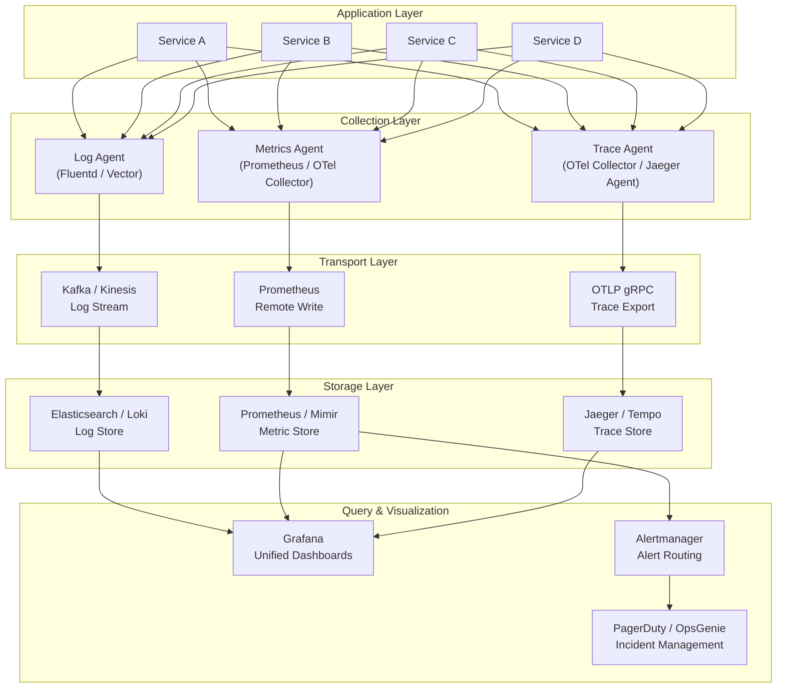
```mermaid
graph TB
    subgraph Applications ["Application Layer"]
        A1["Service A"]
        A2["Service B"]
        A3["Service C"]
        A4["Service D"]
    end

    subgraph Collection ["Collection Layer"]
        C1["Log Agent<br/>(Fluentd / Vector)"]
        C2["Metrics Agent<br/>(Prometheus / OTel Collector)"]
        C3["Trace Agent<br/>(OTel Collector / Jaeger Agent)"]
    end

    subgraph Transport ["Transport Layer"]
        T1["Kafka / Kinesis<br/>Log Stream"]
        T2["Prometheus<br/>Remote Write"]
        T3["OTLP gRPC<br/>Trace Export"]
    end

    subgraph Storage ["Storage Layer"]
        S1["Elasticsearch / Loki<br/>Log Store"]
        S2["Prometheus / Mimir<br/>Metric Store"]
        S3["Jaeger / Tempo<br/>Trace Store"]
    end

    subgraph Query ["Query & Visualization"]
        Q1["Grafana<br/>Unified Dashboards"]
        Q2["Alertmanager<br/>Alert Routing"]
        Q3["PagerDuty / OpsGenie<br/>Incident Management"]
    end

    A1 --> C1
    A2 --> C1
    A3 --> C1
    A4 --> C1
    A1 --> C2
    A2 --> C2
    A3 --> C2
    A4 --> C2
    A1 --> C3
    A2 --> C3
    A3 --> C3
    A4 --> C3

    C1 --> T1
    C2 --> T2
    C3 --> T3

    T1 --> S1
    T2 --> S2
    T3 --> S3

    S1 --> Q1
    S2 --> Q1
    S3 --> Q1
    S2 --> Q2
    Q2 --> Q3
```

### Pipeline Design Principles

1. **Decouple collection from storage**: Agents buffer locally so application performance is never blocked by observability backend latency.
2. **Use a transport layer for durability**: Kafka or Kinesis between collection and storage prevents data loss during backend maintenance or spikes.
3. **Unified query layer**: Grafana correlates logs, metrics, and traces in a single pane — jumping from a metric anomaly to the relevant traces and logs is a one-click operation.
4. **Separate alerting from visualization**: Alertmanager evaluates rules independently of dashboard queries, ensuring alerts fire even when dashboards are under load.

---

# Section 1: Three Pillars of Observability

---

## 1.1 Logging

Logs are the most fundamental observability signal. Every system produces them. The challenge is not generating logs — it is structuring, collecting, aggregating, querying, and retaining them at scale without drowning in noise or bankrupting the infrastructure budget.

### 1.1.1 What Makes a Good Log

A good log entry answers five questions:
- **What** happened? (the event type)
- **When** did it happen? (timestamp with timezone)
- **Where** did it happen? (service, host, function)
- **Who** triggered it? (user ID, request ID, correlation ID)
- **Why** does it matter? (severity, context, outcome)

A bad log looks like this:

```
Error: something went wrong
```

A good log looks like this:

```json
{
  "timestamp": "2025-03-15T14:32:01.847Z",
  "level": "ERROR",
  "service": "payment-service",
  "host": "payment-prod-3a",
  "trace_id": "abc123def456",
  "span_id": "span-789",
  "correlation_id": "order-98765",
  "user_id": "usr_442211",
  "event": "payment_authorization_failed",
  "payment_method": "credit_card",
  "gateway": "stripe",
  "error_code": "card_declined",
  "error_message": "Insufficient funds",
  "amount_cents": 4999,
  "currency": "USD",
  "latency_ms": 342,
  "retry_count": 0
}
```

### 1.1.2 Structured Logging (JSON)

Structured logging means emitting log entries as machine-parseable data structures (typically JSON) rather than free-form text strings. This is the single most impactful improvement an organization can make to its logging practice.

**Why structured logging matters:**

| Aspect | Unstructured | Structured (JSON) |
|--------|-------------|-------------------|
| Parsing | Regex-based, fragile | Native JSON parsing |
| Querying | Full-text search only | Field-level queries |
| Alerting | Pattern matching | Precise field conditions |
| Aggregation | Manual extraction | Automatic field grouping |
| Cross-service correlation | Difficult | Trivial via correlation IDs |
| Storage efficiency | Poor (redundant text) | Good (compressible fields) |
| Schema evolution | Breaking changes | Additive fields |

**Implementation pattern — Structured Logger Wrapper:**

```python
import json
import logging
import time
import uuid
from contextvars import ContextVar

# Context variables for request-scoped data
_trace_id: ContextVar[str] = ContextVar('trace_id', default='')
_correlation_id: ContextVar[str] = ContextVar('correlation_id', default='')
_user_id: ContextVar[str] = ContextVar('user_id', default='')

class StructuredLogger:
    def __init__(self, service_name: str):
        self.service_name = service_name
        self.logger = logging.getLogger(service_name)

    def _build_entry(self, level: str, event: str, **kwargs) -> dict:
        entry = {
            "timestamp": time.strftime("%Y-%m-%dT%H:%M:%S.000Z", time.gmtime()),
            "level": level,
            "service": self.service_name,
            "event": event,
            "trace_id": _trace_id.get(''),
            "correlation_id": _correlation_id.get(''),
            "user_id": _user_id.get(''),
        }
        entry.update(kwargs)
        return entry

    def info(self, event: str, **kwargs):
        entry = self._build_entry("INFO", event, **kwargs)
        self.logger.info(json.dumps(entry))

    def warn(self, event: str, **kwargs):
        entry = self._build_entry("WARN", event, **kwargs)
        self.logger.warning(json.dumps(entry))

    def error(self, event: str, **kwargs):
        entry = self._build_entry("ERROR", event, **kwargs)
        self.logger.error(json.dumps(entry))

    def debug(self, event: str, **kwargs):
        entry = self._build_entry("DEBUG", event, **kwargs)
        self.logger.debug(json.dumps(entry))

# Usage
log = StructuredLogger("order-service")
log.info("order_created", order_id="ord_123", item_count=3, total_cents=15999)
log.error("inventory_check_failed", order_id="ord_123", sku="SKU-456", reason="out_of_stock")
```

### 1.1.3 Log Levels

Log levels create a severity hierarchy that controls what gets emitted, stored, and alerted on. Getting log levels right is critical — too many ERROR logs and alerts become noise; too few and real problems hide in DEBUG output nobody reads.

| Level | Purpose | Example | Production Default |
|-------|---------|---------|-------------------|
| FATAL | System cannot continue | Database connection pool exhausted | Always logged, always alerted |
| ERROR | Operation failed, requires attention | Payment gateway timeout after retries | Always logged, usually alerted |
| WARN | Unexpected but handled condition | Cache miss fallback to database | Always logged, conditionally alerted |
| INFO | Normal business event | Order created, user logged in | Usually logged |
| DEBUG | Developer troubleshooting detail | SQL query text, cache key lookup | Disabled in production |
| TRACE | Extremely verbose execution flow | Function entry/exit, variable values | Never in production |

**Dynamic log level adjustment:**

Production systems should support changing log levels at runtime without redeployment. This is essential for debugging live issues.

```
# Feature flag or configuration endpoint
PUT /admin/log-level
{
  "service": "payment-service",
  "level": "DEBUG",
  "duration_minutes": 15,
  "filter": {
    "user_id": "usr_442211"
  }
}
```

This pattern enables targeted debugging: turn on DEBUG logging for a specific user or request path for 15 minutes, then automatically revert. This avoids the log volume explosion of enabling DEBUG globally.

### 1.1.4 Log Aggregation Systems

Individual service logs are useless in a distributed system. A single user request might touch 15 services — the log entries for that request are scattered across 15 different hosts. Log aggregation centralizes these entries into a queryable store.

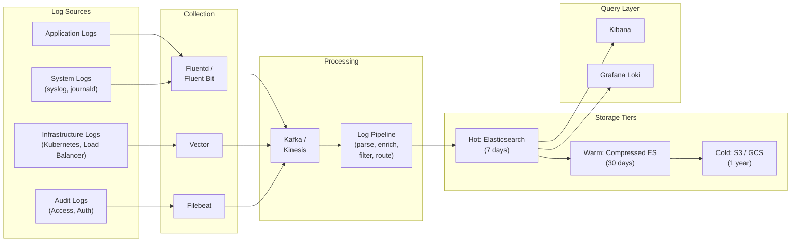
```mermaid
graph LR
    subgraph Sources ["Log Sources"]
        S1["Application Logs"]
        S2["System Logs<br/>(syslog, journald)"]
        S3["Infrastructure Logs<br/>(Kubernetes, Load Balancer)"]
        S4["Audit Logs<br/>(Access, Auth)"]
    end

    subgraph Collection ["Collection"]
        C1["Fluentd /<br/>Fluent Bit"]
        C2["Vector"]
        C3["Filebeat"]
    end

    subgraph Processing ["Processing"]
        P1["Kafka /<br/>Kinesis"]
        P2["Log Pipeline<br/>(parse, enrich,<br/>filter, route)"]
    end

    subgraph Storage ["Storage Tiers"]
        ST1["Hot: Elasticsearch<br/>(7 days)"]
        ST2["Warm: Compressed ES<br/>(30 days)"]
        ST3["Cold: S3 / GCS<br/>(1 year)"]
    end

    subgraph Query ["Query Layer"]
        Q1["Kibana"]
        Q2["Grafana Loki"]
    end

    S1 --> C1
    S2 --> C1
    S3 --> C2
    S4 --> C3
    C1 --> P1
    C2 --> P1
    C3 --> P1
    P1 --> P2
    P2 --> ST1
    ST1 --> ST2
    ST2 --> ST3
    ST1 --> Q1
    ST1 --> Q2
```

**Major log aggregation systems compared:**

| System | Architecture | Query Language | Best For | Cost Model |
|--------|-------------|---------------|----------|------------|
| ELK Stack (Elasticsearch, Logstash, Kibana) | Distributed search index | KQL, Lucene | Full-text search, complex queries | Self-hosted (compute + storage) |
| Grafana Loki | Label-indexed, chunk-stored | LogQL | High-volume, Prometheus-aligned | Low (no full-text indexing) |
| AWS CloudWatch Logs | Managed service | CloudWatch Insights | AWS-native workloads | Per-GB ingestion + storage |
| Datadog Logs | SaaS, fully managed | Custom query language | Unified observability platform | Per-GB ingestion (expensive) |
| Splunk | Distributed indexer | SPL | Enterprise, compliance-heavy | Per-GB indexing (very expensive) |

**ELK Stack architecture detail:**

The ELK (Elasticsearch, Logstash, Kibana) stack is the most widely deployed open-source log aggregation system:

- **Elasticsearch**: Distributed search and analytics engine. Stores logs as JSON documents in inverted indices. Supports full-text search, structured queries, and aggregations. Horizontally scalable via sharding.
- **Logstash**: Log processing pipeline. Receives logs from multiple sources, applies filters (parsing, enrichment, transformation), and outputs to Elasticsearch or other destinations.
- **Kibana**: Web-based visualization and query interface. Provides dashboards, saved searches, and alerting on top of Elasticsearch data.

**Grafana Loki architecture detail:**

Loki takes a fundamentally different approach from Elasticsearch. Instead of indexing the full text of every log line, Loki indexes only the metadata labels (service name, namespace, pod, log level) and stores the log content as compressed chunks in object storage.

This means:
- **Ingestion is 10-100x cheaper** than Elasticsearch because there is no full-text indexing.
- **Queries by label are fast** (find all ERROR logs from payment-service in the last hour).
- **Queries by content are slower** (find all logs containing "timeout" requires scanning chunks).
- **Ideal when combined with Prometheus** because labels align, enabling seamless metric-to-log correlation.

### 1.1.5 Log Aggregation Pipeline Deep Dive — Fluentd, Vector, and Routing

The log collection agent is the most critical component in the log pipeline. It runs on every node, must be highly reliable, and must handle backpressure gracefully. Two agents dominate production deployments: Fluentd (and its lightweight variant Fluent Bit) and Vector.

**Fluentd vs. Vector comparison:**

| Aspect | Fluentd / Fluent Bit | Vector |
|--------|---------------------|--------|
| Language | C (Fluent Bit), Ruby (Fluentd) | Rust |
| Memory footprint | Fluent Bit: ~1MB, Fluentd: ~40MB | ~10MB |
| Performance | Fluent Bit: Very high, Fluentd: Medium | Very high |
| Plugin ecosystem | 1000+ plugins (largest ecosystem) | Growing, built-in transforms |
| Configuration | Tag-based routing (declarative) | Topology-based (DAG of components) |
| Backpressure handling | Buffer to disk, retry with backoff | Built-in adaptive concurrency |
| CNCF status | Graduated (Fluentd) | Not CNCF |
| Best for | Kubernetes-native, massive plugin needs | High performance, Rust reliability |

**Fluentd production configuration for Kubernetes:**

```xml
# Fluentd DaemonSet config — collect, parse, enrich, route
<source>
  @type tail
  path /var/log/containers/*.log
  pos_file /var/log/fluentd-containers.log.pos
  tag kubernetes.*
  read_from_head true
  <parse>
    @type json
    time_key timestamp
    time_format %Y-%m-%dT%H:%M:%S.%NZ
  </parse>
</source>

# Enrich with Kubernetes metadata
<filter kubernetes.**>
  @type kubernetes_metadata
  @id filter_kube_metadata
  kubernetes_url https://kubernetes.default.svc
  cache_size 1000
  watch true
</filter>

# Route by severity and namespace
<match kubernetes.**>
  @type copy

  # All logs to Loki
  <store>
    @type loki
    url http://loki.observability:3100
    <label>
      namespace $.kubernetes.namespace_name
      pod $.kubernetes.pod_name
      container $.kubernetes.container_name
      level $.level
    </label>
    <buffer>
      @type file
      path /var/log/fluentd-buffers/loki
      flush_interval 5s
      chunk_limit_size 2M
      total_limit_size 512M
      retry_max_interval 30s
      retry_forever true
    </buffer>
  </store>

  # ERROR and FATAL to Elasticsearch for deep search
  <store>
    @type elasticsearch
    host elasticsearch.observability
    port 9200
    logstash_format true
    logstash_prefix app-errors
    <buffer>
      @type file
      path /var/log/fluentd-buffers/es
      flush_interval 10s
      chunk_limit_size 5M
      total_limit_size 1G
    </buffer>
    <filter>
      @type grep
      <regexp>
        key level
        pattern /^(ERROR|FATAL)$/
      </regexp>
    </filter>
  </store>
</match>
```

**Vector production configuration:**

```toml
# Vector config — high-performance log pipeline
[sources.kubernetes_logs]
type = "kubernetes_logs"
auto_partial_merge = true
ignore_older_secs = 600

[transforms.parse_json]
type = "remap"
inputs = ["kubernetes_logs"]
source = '''
. = parse_json!(.message)
.kubernetes = del(.kubernetes)
.timestamp = to_timestamp!(.timestamp)
'''

[transforms.enrich]
type = "remap"
inputs = ["parse_json"]
source = '''
.environment = get_env_var("ENVIRONMENT") ?? "unknown"
.cluster = get_env_var("CLUSTER_NAME") ?? "unknown"
'''

[transforms.route_by_level]
type = "route"
inputs = ["enrich"]
[transforms.route_by_level.route]
errors = '.level == "ERROR" || .level == "FATAL"'
warnings = '.level == "WARN"'
info = '.level == "INFO" || .level == "DEBUG"'

[sinks.loki_all]
type = "loki"
inputs = ["enrich"]
endpoint = "http://loki.observability:3100"
encoding.codec = "json"
labels.service = "{{ service }}"
labels.level = "{{ level }}"
labels.namespace = "{{ kubernetes.namespace }}"
buffer.type = "disk"
buffer.max_size = 536870912  # 512MB

[sinks.elasticsearch_errors]
type = "elasticsearch"
inputs = ["route_by_level.errors"]
endpoints = ["http://elasticsearch.observability:9200"]
bulk.index = "app-errors-%Y-%m-%d"
buffer.type = "disk"
buffer.max_size = 1073741824  # 1GB
```

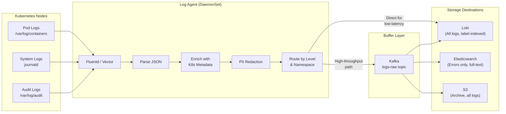
```mermaid
graph LR
    subgraph Nodes ["Kubernetes Nodes"]
        N1["Pod Logs<br/>/var/log/containers"]
        N2["System Logs<br/>journald"]
        N3["Audit Logs<br/>/var/log/audit"]
    end

    subgraph Agent ["Log Agent (DaemonSet)"]
        A1["Fluentd / Vector"]
        A2["Parse JSON"]
        A3["Enrich with<br/>K8s Metadata"]
        A4["PII Redaction"]
        A5["Route by Level<br/>& Namespace"]
    end

    subgraph Buffer ["Buffer Layer"]
        B1["Kafka<br/>logs-raw topic"]
    end

    subgraph Destinations ["Storage Destinations"]
        D1["Loki<br/>(All logs, label-indexed)"]
        D2["Elasticsearch<br/>(Errors only, full-text)"]
        D3["S3<br/>(Archive, all logs)"]
    end

    N1 --> A1
    N2 --> A1
    N3 --> A1
    A1 --> A2 --> A3 --> A4 --> A5
    A5 -->|"High-throughput<br/>path"| B1
    A5 -->|"Direct for<br/>low-latency"| D1
    B1 --> D1
    B1 --> D2
    B1 --> D3
```

### 1.1.6 Log Sampling

At scale, logging everything is prohibitively expensive. A service handling 100,000 RPS that logs one entry per request at an average size of 500 bytes generates 50 MB/s, or 4.3 TB/day, of log data. Log sampling reduces volume while preserving debugging utility.

**Sampling strategies:**

| Strategy | Description | Use Case |
|----------|-------------|----------|
| Rate-based | Log 1 in N requests | High-volume, low-error-rate endpoints |
| Probability-based | Log each request with probability P | Even distribution across time |
| Error-biased | Always log errors, sample successes | Most common production strategy |
| Tail-based | Decide after request completes (keep slow/errored) | Best signal quality, harder to implement |
| Per-user | Always log for flagged users | Targeted debugging |
| Per-endpoint | Different rates per route | High-traffic vs. low-traffic paths |

**Error-biased sampling implementation:**

```python
import random

class LogSampler:
    def __init__(self, success_rate=0.01, error_rate=1.0, slow_threshold_ms=1000):
        self.success_rate = success_rate      # Log 1% of successes
        self.error_rate = error_rate          # Log 100% of errors
        self.slow_threshold_ms = slow_threshold_ms

    def should_log(self, status_code: int, latency_ms: float) -> bool:
        # Always log errors
        if status_code >= 400:
            return random.random() < self.error_rate

        # Always log slow requests
        if latency_ms > self.slow_threshold_ms:
            return True

        # Sample successes
        return random.random() < self.success_rate
```

### 1.1.7 Log Retention

Log retention policies balance debugging needs, compliance requirements, and storage costs. A tiered retention strategy is essential.

| Tier | Duration | Storage | Query Speed | Cost |
|------|----------|---------|-------------|------|
| Hot | 0-7 days | Elasticsearch / Loki | Sub-second | $$$ |
| Warm | 7-30 days | Compressed indices | Seconds | $$ |
| Cold | 30-365 days | Object storage (S3) | Minutes | $ |
| Archive | 1-7 years | Glacier / Cold storage | Hours | ¢ |

**Compliance-driven retention:**

| Regulation | Minimum Retention | Log Types |
|-----------|-------------------|-----------|
| PCI-DSS | 1 year (3 months readily available) | Access logs, auth logs, payment logs |
| HIPAA | 6 years | PHI access logs, audit trails |
| SOX | 7 years | Financial transaction logs |
| GDPR | As short as possible | Must support deletion requests |
| SOC 2 | 1 year | Security event logs |

The tension between "keep everything for compliance" and "delete quickly for GDPR" requires careful log classification. PII-containing logs must be tagged and managed separately from system logs.

### 1.1.8 Correlation IDs

In a distributed system, a single user action generates log entries across many services. Without a shared identifier threading them together, debugging is a needle-in-a-haystack exercise.

**Correlation ID propagation pattern:**

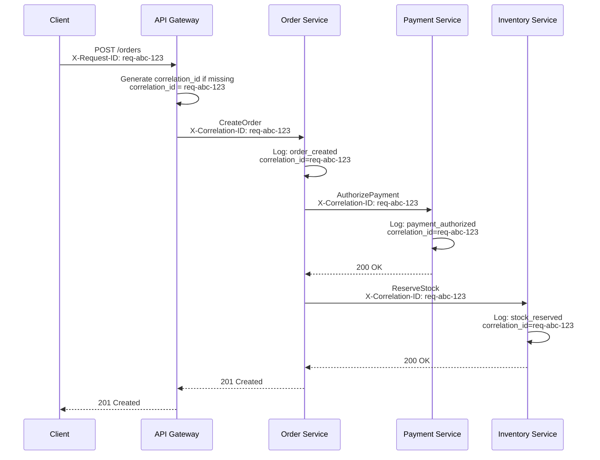
```mermaid
sequenceDiagram
    participant Client
    participant Gateway as API Gateway
    participant OrderSvc as Order Service
    participant PaymentSvc as Payment Service
    participant InventorySvc as Inventory Service

    Client->>Gateway: POST /orders<br/>X-Request-ID: req-abc-123
    Gateway->>Gateway: Generate correlation_id if missing<br/>correlation_id = req-abc-123
    Gateway->>OrderSvc: CreateOrder<br/>X-Correlation-ID: req-abc-123
    OrderSvc->>OrderSvc: Log: order_created<br/>correlation_id=req-abc-123
    OrderSvc->>PaymentSvc: AuthorizePayment<br/>X-Correlation-ID: req-abc-123
    PaymentSvc->>PaymentSvc: Log: payment_authorized<br/>correlation_id=req-abc-123
    PaymentSvc-->>OrderSvc: 200 OK
    OrderSvc->>InventorySvc: ReserveStock<br/>X-Correlation-ID: req-abc-123
    InventorySvc->>InventorySvc: Log: stock_reserved<br/>correlation_id=req-abc-123
    InventorySvc-->>OrderSvc: 200 OK
    OrderSvc-->>Gateway: 201 Created
    Gateway-->>Client: 201 Created
```

**Implementation — Middleware for correlation ID propagation:**

```python
# Express.js middleware example
import uuid

def correlation_id_middleware(request, response, next_handler):
    # Extract or generate correlation ID
    correlation_id = (
        request.headers.get('X-Correlation-ID') or
        request.headers.get('X-Request-ID') or
        str(uuid.uuid4())
    )

    # Store in request context
    request.correlation_id = correlation_id

    # Include in response headers
    response.headers['X-Correlation-ID'] = correlation_id

    # Set in logging context
    _correlation_id.set(correlation_id)

    next_handler()
```

**Key rules for correlation IDs:**

1. **Generate at the edge**: The API gateway or load balancer generates the ID for incoming requests.
2. **Propagate everywhere**: Every inter-service call (HTTP, gRPC, message queue) must include the correlation ID.
3. **Log it always**: Every log entry must include the correlation ID field.
4. **Include in error responses**: Return the correlation ID to clients so they can reference it in support tickets.
5. **Span multiple protocols**: The same correlation ID should appear in HTTP headers, Kafka message headers, gRPC metadata, and database query comments.

### 1.1.9 PII Redaction

Logs inevitably contain personally identifiable information (PII). Email addresses in error messages, IP addresses in access logs, phone numbers in validation errors. Logging PII creates regulatory exposure (GDPR, CCPA) and security risk (log access is typically broader than production database access).

**PII redaction strategies:**

| Strategy | Description | Trade-off |
|----------|-------------|-----------|
| Field-level masking | Replace PII fields with hashes or masks | Loses debugging value |
| Tokenization | Replace PII with reversible tokens | Requires token vault |
| Allowlisting | Only log explicitly approved fields | May miss useful context |
| Blocklisting | Strip known PII patterns | May miss novel PII |
| Encryption | Encrypt PII fields in logs | Adds query complexity |

**Implementation — PII redaction pipeline:**

```python
import re
import hashlib

class PIIRedactor:
    PATTERNS = {
        'email': (r'[a-zA-Z0-9._%+-]+@[a-zA-Z0-9.-]+\.[a-zA-Z]{2,}', 'REDACTED_EMAIL'),
        'ssn': (r'\b\d{3}-\d{2}-\d{4}\b', 'REDACTED_SSN'),
        'credit_card': (r'\b\d{4}[\s-]?\d{4}[\s-]?\d{4}[\s-]?\d{4}\b', 'REDACTED_CC'),
        'phone': (r'\b\d{3}[-.]?\d{3}[-.]?\d{4}\b', 'REDACTED_PHONE'),
        'ip_address': (r'\b\d{1,3}\.\d{1,3}\.\d{1,3}\.\d{1,3}\b', 'REDACTED_IP'),
    }

    PII_FIELDS = {'email', 'phone', 'ssn', 'credit_card', 'ip_address', 'password'}

    @classmethod
    def redact_fields(cls, log_entry: dict) -> dict:
        """Redact known PII fields by name."""
        redacted = {}
        for key, value in log_entry.items():
            if key in cls.PII_FIELDS:
                # Hash for correlation, not reversible
                redacted[key] = f"sha256:{hashlib.sha256(str(value).encode()).hexdigest()[:16]}"
            else:
                redacted[key] = value
        return redacted

    @classmethod
    def redact_patterns(cls, text: str) -> str:
        """Redact PII patterns in free-text fields."""
        for name, (pattern, replacement) in cls.PATTERNS.items():
            text = re.sub(pattern, replacement, text)
        return text
```

**Best practice**: Redact at the source (in the logging library) rather than in the pipeline. If PII reaches the log aggregation system, it has already been exposed to log agents, transport layers, and potentially log viewers.

### 1.1.10 Log-Based Alerting

Logs can trigger alerts when specific patterns appear. This is especially useful for errors that do not map cleanly to metrics.

**Examples of log-based alerts:**

| Alert | Log Pattern | Threshold |
|-------|-------------|-----------|
| Authentication brute force | `event=login_failed` from same IP | > 50 in 5 minutes |
| Data corruption | `event=checksum_mismatch` | > 0 (any occurrence) |
| Dependency failure | `event=circuit_breaker_opened` | Any occurrence |
| Configuration error | `event=config_parse_failed` | Any occurrence |
| Security event | `event=privilege_escalation_attempt` | Any occurrence |

**Log-based alert pipeline:**

```
Log Entry → Log Aggregation → Alert Rule Engine → Notification
                                    |
                                    v
                            Deduplication → Routing → PagerDuty/Slack
```

**Implementation considerations:**
- Log-based alerts have higher latency than metric-based alerts (seconds vs. milliseconds) because they depend on log ingestion and indexing.
- Use log-based alerts for **rare, high-severity events** that do not merit a dedicated metric.
- Use metric-based alerts for **rate-based conditions** (error rate > 5%, latency p99 > 2s).
- Deduplicate aggressively — a single outage can generate thousands of identical log entries.

---

## 1.2 Metrics

Metrics are numerical measurements collected at regular intervals. Unlike logs (which capture individual events), metrics aggregate behavior over time. This makes them ideal for dashboards, trend analysis, anomaly detection, and alerting.

### 1.2.1 Metric Types

There are four fundamental metric types. Understanding which type to use for which measurement is essential for correct instrumentation.

| Type | Description | Example | Query Pattern |
|------|-------------|---------|---------------|
| **Counter** | Monotonically increasing value. Only goes up (or resets to 0). | Total HTTP requests, total errors, bytes sent | Rate of change: `rate(http_requests_total[5m])` |
| **Gauge** | Point-in-time value. Can go up or down. | Current CPU usage, queue depth, active connections | Current value: `node_cpu_usage_percent` |
| **Histogram** | Distribution of values in configurable buckets. | Request latency distribution, response size distribution | Percentiles: `histogram_quantile(0.99, ...)` |
| **Summary** | Pre-calculated percentiles on the client side. | Request latency p50/p90/p99 | Direct read: `http_request_duration_seconds{quantile="0.99"}` |

**Counter vs. Gauge — the critical distinction:**

A counter represents a cumulative total. You never query a counter's raw value — you always query its rate of change. "We have served 10 million requests" is not useful. "We are serving 5,000 requests per second" is.

A gauge represents a current state. You query its current value or its change over time. "CPU is at 78%" is directly meaningful.

**Histogram vs. Summary:**

| Aspect | Histogram | Summary |
|--------|-----------|---------|
| Percentile calculation | Server-side (at query time) | Client-side (at emission time) |
| Aggregation across instances | Yes (can aggregate buckets) | No (cannot aggregate percentiles) |
| Configuration | Fixed bucket boundaries | Fixed quantile targets |
| Cost | Stored as multiple counters (one per bucket) | Stored as multiple gauges (one per quantile) |
| Recommended for | Server-side latency, sizes | Client-side latency when aggregation is not needed |

**Rule of thumb**: Use histograms unless you have a specific reason to use summaries. Histograms can be aggregated across instances; summaries cannot (you cannot average percentiles).

### 1.2.2 Prometheus

Prometheus is the de facto standard for metrics in cloud-native environments. It is a pull-based monitoring system: Prometheus scrapes metrics from HTTP endpoints exposed by applications.

**Prometheus architecture:**

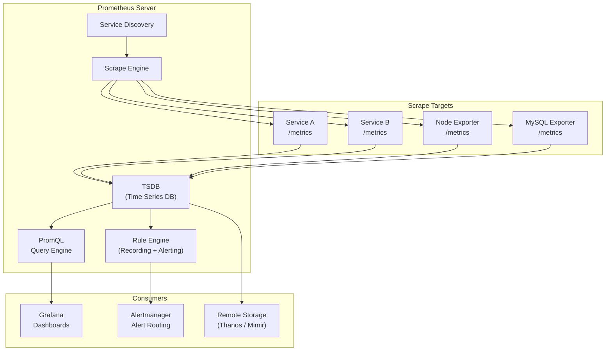
```mermaid
graph TB
    subgraph Targets ["Scrape Targets"]
        T1["Service A<br/>/metrics"]
        T2["Service B<br/>/metrics"]
        T3["Node Exporter<br/>/metrics"]
        T4["MySQL Exporter<br/>/metrics"]
    end

    subgraph Prometheus ["Prometheus Server"]
        P1["Service Discovery"]
        P2["Scrape Engine"]
        P3["TSDB<br/>(Time Series DB)"]
        P4["Rule Engine<br/>(Recording + Alerting)"]
        P5["PromQL<br/>Query Engine"]
    end

    subgraph Consumers ["Consumers"]
        C1["Grafana<br/>Dashboards"]
        C2["Alertmanager<br/>Alert Routing"]
        C3["Remote Storage<br/>(Thanos / Mimir)"]
    end

    P1 --> P2
    P2 --> T1
    P2 --> T2
    P2 --> T3
    P2 --> T4
    T1 --> P3
    T2 --> P3
    T3 --> P3
    T4 --> P3
    P3 --> P4
    P3 --> P5
    P5 --> C1
    P4 --> C2
    P3 --> C3
```

**Key Prometheus concepts:**

1. **Pull model**: Prometheus scrapes metrics from targets at configurable intervals (typically 15-30 seconds). This is safer than push because a misbehaving application cannot flood the monitoring system.

2. **Labels**: Metrics are identified by a name and a set of key-value labels. `http_requests_total{method="GET", status="200", service="api"}` is a distinct time series from `http_requests_total{method="POST", status="500", service="api"}`.

3. **PromQL**: A powerful query language for time series data.

```promql
# Request rate per second, per service
rate(http_requests_total[5m])

# Error rate as a percentage
sum(rate(http_requests_total{status=~"5.."}[5m]))
/
sum(rate(http_requests_total[5m])) * 100

# 99th percentile latency from histogram
histogram_quantile(0.99, sum(rate(http_request_duration_seconds_bucket[5m])) by (le))

# Top 5 services by error rate
topk(5,
  sum by (service) (rate(http_requests_total{status=~"5.."}[5m]))
  /
  sum by (service) (rate(http_requests_total[5m]))
)
```

4. **Service discovery**: Prometheus automatically discovers scrape targets via Kubernetes service discovery, Consul, DNS, EC2 tags, or file-based configuration.

5. **TSDB internals**: Prometheus stores data in a custom time-series database. Data is organized into 2-hour blocks on disk. Each block is immutable once compacted. The head block (current 2 hours) is kept in memory for fast writes. Understanding this architecture explains why Prometheus memory usage scales with active time series count and scrape frequency.

6. **Federation and scaling**: A single Prometheus server handles approximately 1-10 million active time series. Beyond that, use hierarchical federation (edge Prometheus scrapes targets, central Prometheus scrapes edge instances) or a horizontally scalable backend (Thanos, Mimir, Cortex).

7. **Recording rules**: Pre-compute expensive queries and store results as new time series. This is critical for dashboard performance.

```yaml
groups:
  - name: service_slos
    interval: 30s
    rules:
      - record: service:http_request_duration_seconds:p99
        expr: histogram_quantile(0.99, sum(rate(http_request_duration_seconds_bucket[5m])) by (le, service))

      - record: service:error_rate:ratio_5m
        expr: |
          sum by (service) (rate(http_requests_total{status=~"5.."}[5m]))
          /
          sum by (service) (rate(http_requests_total[5m]))
```

### 1.2.3 PromQL Patterns for Production

PromQL is the query language that makes Prometheus data useful. Mastering common patterns is essential for building dashboards and alerting rules.

**Essential PromQL patterns:**

```promql
# 1. Request rate per service (most common query)
sum by (service) (rate(http_requests_total[5m]))

# 2. Error ratio as a percentage
100 * (
  sum by (service) (rate(http_requests_total{status=~"5.."}[5m]))
  /
  sum by (service) (rate(http_requests_total[5m]))
)

# 3. Latency percentiles from histograms
histogram_quantile(0.50, sum by (le) (rate(http_request_duration_seconds_bucket[5m])))  # p50
histogram_quantile(0.90, sum by (le) (rate(http_request_duration_seconds_bucket[5m])))  # p90
histogram_quantile(0.99, sum by (le) (rate(http_request_duration_seconds_bucket[5m])))  # p99

# 4. Apdex score (satisfied + tolerating/2) / total
(
  sum(rate(http_request_duration_seconds_bucket{le="0.3"}[5m]))
  +
  sum(rate(http_request_duration_seconds_bucket{le="1.2"}[5m]))
) / 2
/
sum(rate(http_request_duration_seconds_count[5m]))

# 5. SLO compliance (availability over 30 days)
1 - (
  sum_over_time(
    (sum by (service) (rate(http_requests_total{status=~"5.."}[5m])))[30d:5m]
  )
  /
  sum_over_time(
    (sum by (service) (rate(http_requests_total[5m])))[30d:5m]
  )
)

# 6. Rate of change (derivative) for capacity planning
deriv(node_filesystem_avail_bytes{mountpoint="/"}[1h])
# Negative value = disk filling up; extrapolate to predict when full

# 7. Predict disk full time
predict_linear(node_filesystem_avail_bytes{mountpoint="/"}[6h], 24*3600) < 0
# Returns true if disk will be full in 24 hours based on 6h trend

# 8. Top-K consumers (find noisy neighbors)
topk(5, sum by (service) (rate(http_requests_total[5m])))

# 9. Absent metric detection (service stopped reporting)
absent(up{job="payment-service"})
# Returns 1 if the metric is missing (service is down)

# 10. Multi-label aggregation with regex
sum by (service) (
  rate(http_requests_total{status=~"5..", service=~"(checkout|payment|order).*"}[5m])
)
```

**PromQL anti-patterns to avoid:**

| Anti-Pattern | Problem | Better Approach |
|-------------|---------|-----------------|
| `rate()` over too short a window | Noisy, misses scrape intervals | Use `rate()[5m]` minimum (2x scrape interval) |
| `avg()` on latency percentiles | Mathematically invalid to average percentiles | Use `histogram_quantile()` on aggregated buckets |
| High-cardinality `by` clause | Explodes time series count | Aggregate first, then break down by needed dimensions |
| Missing `rate()` on counters | Raw counter values are meaningless | Always wrap counters in `rate()` or `increase()` |
| `count()` without conditions | Counts all time series, not events | Use `sum(rate(...))` for event rates |

### 1.2.4 StatsD

StatsD is a push-based metrics protocol. Applications send UDP packets containing metric data to a StatsD daemon, which aggregates them and forwards to a backend (Graphite, Datadog, etc.).

**StatsD vs. Prometheus:**

| Aspect | StatsD | Prometheus |
|--------|--------|------------|
| Model | Push (UDP) | Pull (HTTP scrape) |
| Protocol | Simple text over UDP | HTTP + exposition format |
| Reliability | Fire-and-forget (UDP) | Acknowledged (HTTP) |
| Aggregation | StatsD daemon pre-aggregates | Prometheus aggregates at query time |
| Service discovery | Not needed (push) | Required for pull |
| Best for | Legacy systems, simple metrics | Cloud-native, Kubernetes |

**When to use StatsD**: Short-lived processes (batch jobs, lambdas) that cannot expose a persistent HTTP endpoint for scraping. StatsD also has simpler client libraries, making it easier to instrument legacy applications.

### 1.2.5 RED Method

The RED method defines three key metrics for request-driven services. It was created by Tom Wilkie (Grafana Labs) and is specifically designed for microservices.

| Signal | Metric | What It Tells You |
|--------|--------|-------------------|
| **R**ate | Requests per second | How busy the service is |
| **E**rrors | Errors per second (or error rate %) | How often the service fails |
| **D**uration | Latency distribution (p50, p90, p99) | How fast the service responds |

**When to use RED**: For every service that receives requests (HTTP, gRPC, message consumers). If a service has a request/response pattern, instrument it with RED.

**PromQL for RED metrics:**

```promql
# Rate
sum(rate(http_requests_total{service="checkout"}[5m]))

# Errors (as percentage)
sum(rate(http_requests_total{service="checkout", status=~"5.."}[5m]))
/
sum(rate(http_requests_total{service="checkout"}[5m])) * 100

# Duration (p99)
histogram_quantile(0.99,
  sum(rate(http_request_duration_seconds_bucket{service="checkout"}[5m])) by (le)
)
```

### 1.2.6 USE Method

The USE method defines three key metrics for infrastructure resources. It was created by Brendan Gregg and is specifically designed for hardware and system-level monitoring.

| Signal | Definition | Example |
|--------|-----------|---------|
| **U**tilization | Percentage of resource capacity in use | CPU at 78%, disk at 65% |
| **S**aturation | Amount of queued work beyond capacity | CPU run queue length, disk I/O wait |
| **E**rrors | Error events on the resource | ECC memory errors, NIC CRC errors |

**When to use USE**: For every infrastructure resource — CPU, memory, disk, network, GPU. If it is a physical or virtual resource with a capacity limit, monitor it with USE.

**USE for common resources:**

| Resource | Utilization | Saturation | Errors |
|----------|-------------|------------|--------|
| CPU | `node_cpu_seconds_total` (% busy) | `node_load1` (run queue) | Machine check exceptions |
| Memory | `node_memory_MemTotal - MemAvailable` | Swap usage, OOM kills | ECC errors |
| Disk I/O | `node_disk_io_time_seconds_total` | `node_disk_io_time_weighted_seconds_total` | `node_disk_io_errors` |
| Network | `node_network_transmit_bytes_total` | Dropped packets, TCP retransmits | Interface errors |
| File descriptors | `process_open_fds / process_max_fds` | Failed socket opens | N/A |

### 1.2.7 Golden Signals

Google's Site Reliability Engineering book defines four "golden signals" that apply to all user-facing systems. The golden signals overlap with RED and USE but provide a unified framework.

| Signal | Definition | Metric Example |
|--------|-----------|----------------|
| **Latency** | Time to serve a request | `http_request_duration_seconds` (distinguish success vs. error latency) |
| **Traffic** | Demand on the system | `http_requests_total` (rate), `active_websocket_connections` |
| **Errors** | Rate of failed requests | `http_requests_total{status=~"5.."}` (rate) |
| **Saturation** | How full the system is | CPU, memory, queue depth, thread pool utilization |

**Relationship between frameworks:**

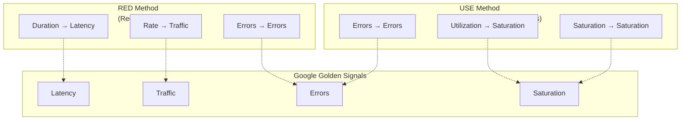
```mermaid
graph TB
    subgraph Golden ["Google Golden Signals"]
        G1["Latency"]
        G2["Traffic"]
        G3["Errors"]
        G4["Saturation"]
    end

    subgraph RED ["RED Method<br/>(Request-Driven Services)"]
        R1["Duration → Latency"]
        R2["Rate → Traffic"]
        R3["Errors → Errors"]
    end

    subgraph USE ["USE Method<br/>(Infrastructure Resources)"]
        U1["Utilization → Saturation"]
        U2["Saturation → Saturation"]
        U3["Errors → Errors"]
    end

    R1 -.-> G1
    R2 -.-> G2
    R3 -.-> G3
    U1 -.-> G4
    U2 -.-> G4
    U3 -.-> G3
```

**Guidance**: Use RED for services, USE for infrastructure, and golden signals as the unifying language when talking about system health across both layers.

### 1.2.8 Cardinality Management

Cardinality is the number of unique time series a metric produces. High cardinality is the most common cause of Prometheus performance problems and observability cost explosions.

**What causes high cardinality:**

Every unique combination of label values creates a separate time series. If you have a metric with labels `{service, method, status, endpoint, user_id}` and 100 services, 5 methods, 20 statuses, 500 endpoints, and 1 million users, you have 100 * 5 * 20 * 500 * 1,000,000 = 1 trillion time series. This will destroy any metrics system.

**Rules for controlling cardinality:**

| Rule | Example |
|------|---------|
| Never use unbounded values as labels | NO: `user_id`, `request_id`, `email` |
| Limit label value sets to < 100 | OK: `method` (GET/POST/PUT/DELETE), `region` (us-east/eu-west) |
| Use recording rules to pre-aggregate | Collapse high-cardinality labels into aggregated series |
| Drop unused labels at collection time | Configure relabeling in Prometheus to strip labels |
| Use exemplars for high-cardinality correlation | Attach trace IDs to metric samples without creating new series |

**Cardinality estimation:**

```
Total time series = metric_count * product(distinct_values_per_label)
```

For a metric `http_requests_total{service, method, status, endpoint}`:
- 100 services * 5 methods * 20 statuses * 500 endpoints = 50,000,000 time series

This is too high. Solutions:
1. Remove `endpoint` label and use a separate metric for per-endpoint detail.
2. Collapse fine-grained endpoints into categories (`/api/v1/*` becomes `api_v1`).
3. Use recording rules to pre-aggregate at the service level.

### 1.2.9 Metric Naming Conventions

Consistent metric names make dashboards, alerts, and queries easier to write and maintain across teams.

**Prometheus naming conventions:**

| Convention | Example | Rationale |
|-----------|---------|-----------|
| Snake_case | `http_request_duration_seconds` | Prometheus standard |
| Include unit as suffix | `_seconds`, `_bytes`, `_total` | Avoid unit confusion |
| Use `_total` for counters | `http_requests_total` | Distinguishes counters from gauges |
| Use `_info` for metadata gauges | `build_info{version="1.2.3"}` | Constant value 1, carries labels |
| Prefix with subsystem | `payment_gateway_requests_total` | Namespace avoidance |
| Do not include label names in metric name | NO: `http_requests_by_method` | Labels handle dimensions |

**Standard metric names for HTTP services:**

```
http_requests_total{method, status, service}
http_request_duration_seconds{method, service}          # histogram
http_request_size_bytes{method, service}                 # histogram
http_response_size_bytes{method, service}                # histogram
http_active_requests{service}                            # gauge
```

### 1.2.10 Push vs. Pull

The debate between push-based and pull-based metric collection is one of the oldest in monitoring. Both have legitimate use cases.

| Aspect | Pull (Prometheus) | Push (StatsD, Datadog Agent) |
|--------|-------------------|------------------------------|
| Discovery | Prometheus finds targets | Targets find the collector |
| Firewall | Prometheus must reach targets | Targets must reach collector |
| Short-lived jobs | Difficult (may miss scrape) | Natural (push before exit) |
| Up/down detection | Built-in (scrape failure = down) | Requires heartbeat logic |
| Scale | Scales by adding Prometheus instances | Scales by adding collector capacity |
| Network topology | Works well within a cluster | Works well across network boundaries |

**Hybrid approach (recommended for large systems):**

```
Short-lived jobs → Pushgateway → Prometheus (pull)
Long-running services → Prometheus (pull directly)
Edge/IoT devices → Push to collector → Remote write to Prometheus
```

---

## 1.3 Tracing

Distributed tracing follows a request as it travels across service boundaries, building a tree of "spans" that shows where time was spent. In a microservice architecture with 15+ services in the call path, tracing is the only way to answer "why was this request slow?" or "which service caused this failure?"

### 1.3.1 Distributed Tracing Concepts

**Core terminology:**

| Term | Definition |
|------|-----------|
| **Trace** | A directed acyclic graph (DAG) of spans representing a single end-to-end request |
| **Span** | A single unit of work within a trace (e.g., an HTTP call, a database query, a function execution) |
| **Trace ID** | A globally unique identifier for the entire trace |
| **Span ID** | A unique identifier for a single span within the trace |
| **Parent Span ID** | Links a span to its parent, forming the tree structure |
| **Baggage** | Key-value pairs propagated through the trace (e.g., user_id, tenant_id) |
| **Context propagation** | The mechanism for passing trace/span IDs across service boundaries |

**Trace structure example:**

```
Trace: abc-123
|
|-- [Span 1] API Gateway (12ms total)
|   |
|   |-- [Span 2] Auth Service: validate_token (3ms)
|   |
|   |-- [Span 3] Order Service: create_order (8ms)
|       |
|       |-- [Span 4] Inventory Service: reserve_stock (2ms)
|       |   |
|       |   |-- [Span 5] PostgreSQL: SELECT inventory (1ms)
|       |
|       |-- [Span 6] Payment Service: authorize (4ms)
|           |
|           |-- [Span 7] Stripe API: charge (3ms)
```

### 1.3.2 OpenTelemetry

OpenTelemetry (OTel) is the industry standard for instrumentation. It provides a vendor-neutral API and SDK for generating traces, metrics, and logs. It is the merger of OpenTracing and OpenCensus and is now a CNCF graduated project.

**OpenTelemetry architecture:**

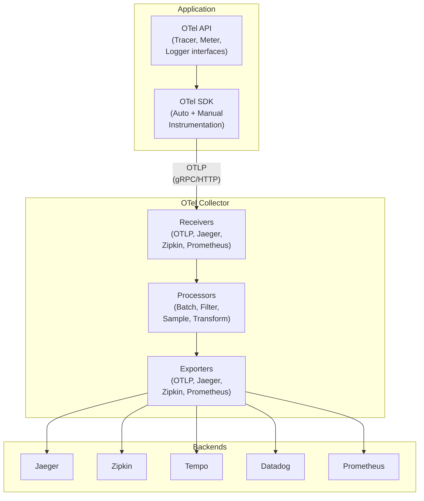
```mermaid
graph TB
    subgraph Application ["Application"]
        A1["OTel SDK<br/>(Auto + Manual<br/>Instrumentation)"]
        A2["OTel API<br/>(Tracer, Meter,<br/>Logger interfaces)"]
    end

    subgraph Collector ["OTel Collector"]
        C1["Receivers<br/>(OTLP, Jaeger,<br/>Zipkin, Prometheus)"]
        C2["Processors<br/>(Batch, Filter,<br/>Sample, Transform)"]
        C3["Exporters<br/>(OTLP, Jaeger,<br/>Zipkin, Prometheus)"]
    end

    subgraph Backends ["Backends"]
        B1["Jaeger"]
        B2["Zipkin"]
        B3["Tempo"]
        B4["Datadog"]
        B5["Prometheus"]
    end

    A2 --> A1
    A1 -->|"OTLP<br/>(gRPC/HTTP)"| C1
    C1 --> C2
    C2 --> C3
    C3 --> B1
    C3 --> B2
    C3 --> B3
    C3 --> B4
    C3 --> B5
```

**OTel Collector benefits:**

1. **Vendor-neutral pipeline**: Applications instrument once with OTel SDK; the collector routes to any backend.
2. **Processing**: Batching, sampling, filtering, and enrichment happen in the collector, not the application.
3. **Decoupling**: Changing backends (Jaeger to Tempo, Datadog to Grafana Cloud) requires only collector reconfiguration — no application changes.
4. **Resource efficiency**: The collector batches and compresses before export, reducing network overhead.

**Manual instrumentation example (Python):**

```python
from opentelemetry import trace
from opentelemetry.sdk.trace import TracerProvider
from opentelemetry.sdk.trace.export import BatchSpanProcessor
from opentelemetry.exporter.otlp.proto.grpc.trace_exporter import OTLPSpanExporter

# Setup
provider = TracerProvider()
processor = BatchSpanProcessor(OTLPSpanExporter(endpoint="otel-collector:4317"))
provider.add_span_processor(processor)
trace.set_tracer_provider(provider)

tracer = trace.get_tracer("order-service")

# Manual instrumentation
def create_order(order_data):
    with tracer.start_as_current_span("create_order") as span:
        span.set_attribute("order.item_count", len(order_data["items"]))
        span.set_attribute("order.total_cents", order_data["total"])

        # Child span for inventory check
        with tracer.start_as_current_span("check_inventory") as child:
            child.set_attribute("inventory.sku_count", len(order_data["items"]))
            result = inventory_client.check(order_data["items"])
            child.set_attribute("inventory.all_available", result.all_available)

        # Child span for payment
        with tracer.start_as_current_span("authorize_payment") as child:
            child.set_attribute("payment.amount_cents", order_data["total"])
            child.set_attribute("payment.method", order_data["payment_method"])
            payment_result = payment_client.authorize(order_data)
            child.set_attribute("payment.status", payment_result.status)
```

### 1.3.3 OpenTelemetry Deep Dive — SDK, Collector, and Exporters

OpenTelemetry deserves a detailed examination because it has become the universal instrumentation standard. Understanding its internal architecture is essential for designing production-grade observability pipelines.

#### OTel SDK Architecture

The OpenTelemetry SDK is composed of several layers that work together to capture, process, and export telemetry data.

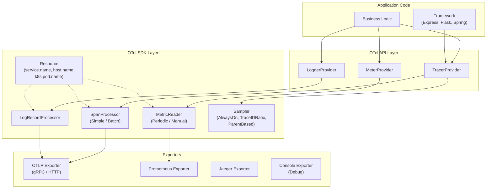
```mermaid
graph TB
    subgraph Application ["Application Code"]
        A1["Business Logic"]
        A2["Framework<br/>(Express, Flask, Spring)"]
    end

    subgraph OTelAPI ["OTel API Layer"]
        API1["TracerProvider"]
        API2["MeterProvider"]
        API3["LoggerProvider"]
    end

    subgraph OTelSDK ["OTel SDK Layer"]
        SDK1["SpanProcessor<br/>(Simple / Batch)"]
        SDK2["MetricReader<br/>(Periodic / Manual)"]
        SDK3["LogRecordProcessor"]
        SDK4["Sampler<br/>(AlwaysOn, TraceIDRatio,<br/>ParentBased)"]
        SDK5["Resource<br/>(service.name, host.name,<br/>k8s.pod.name)"]
    end

    subgraph Exporters ["Exporters"]
        E1["OTLP Exporter<br/>(gRPC / HTTP)"]
        E2["Prometheus Exporter"]
        E3["Jaeger Exporter"]
        E4["Console Exporter<br/>(Debug)"]
    end

    A1 --> API1
    A2 --> API1
    A1 --> API2
    A1 --> API3
    API1 --> SDK1
    API1 --> SDK4
    API2 --> SDK2
    API3 --> SDK3
    SDK1 --> E1
    SDK2 --> E2
    SDK3 --> E1
    SDK5 -.-> SDK1
    SDK5 -.-> SDK2
    SDK5 -.-> SDK3
```

**SDK initialization pattern (production-grade):**

```python
from opentelemetry import trace, metrics
from opentelemetry.sdk.trace import TracerProvider
from opentelemetry.sdk.trace.export import BatchSpanProcessor
from opentelemetry.sdk.metrics import MeterProvider
from opentelemetry.sdk.metrics.export import PeriodicExportingMetricReader
from opentelemetry.sdk.resources import Resource, SERVICE_NAME, SERVICE_VERSION
from opentelemetry.exporter.otlp.proto.grpc.trace_exporter import OTLPSpanExporter
from opentelemetry.exporter.otlp.proto.grpc.metric_exporter import OTLPMetricExporter
from opentelemetry.sdk.trace.sampling import TraceIdRatioBased, ParentBasedTraceIdRatio

# 1. Define resource attributes (who am I?)
resource = Resource.create({
    SERVICE_NAME: "checkout-service",
    SERVICE_VERSION: "2.14.3",
    "deployment.environment": "production",
    "service.namespace": "commerce",
    "host.name": os.getenv("HOSTNAME", "unknown"),
    "k8s.pod.name": os.getenv("POD_NAME", "unknown"),
    "k8s.namespace.name": os.getenv("K8S_NAMESPACE", "unknown"),
})

# 2. Configure trace pipeline
sampler = ParentBasedTraceIdRatio(rate=0.1)  # 10% base sampling
trace_exporter = OTLPSpanExporter(
    endpoint="otel-collector.observability:4317",
    insecure=True,  # Within cluster; use TLS for cross-network
)
span_processor = BatchSpanProcessor(
    trace_exporter,
    max_queue_size=2048,
    max_export_batch_size=512,
    export_timeout_millis=30000,
    schedule_delay_millis=5000,
)
trace_provider = TracerProvider(resource=resource, sampler=sampler)
trace_provider.add_span_processor(span_processor)
trace.set_tracer_provider(trace_provider)

# 3. Configure metrics pipeline
metric_exporter = OTLPMetricExporter(
    endpoint="otel-collector.observability:4317",
    insecure=True,
)
metric_reader = PeriodicExportingMetricReader(
    metric_exporter,
    export_interval_millis=60000,  # Export every 60 seconds
)
meter_provider = MeterProvider(resource=resource, metric_readers=[metric_reader])
metrics.set_meter_provider(meter_provider)
```

**Auto-instrumentation vs. manual instrumentation:**

| Aspect | Auto-Instrumentation | Manual Instrumentation |
|--------|---------------------|----------------------|
| Effort | Zero code changes | Explicit span/metric creation |
| Coverage | HTTP, DB, messaging frameworks | Custom business logic |
| Granularity | Standard operations only | Fine-grained, domain-specific |
| Maintenance | Framework updates may break | Controlled by the team |
| Recommended | Always enable as baseline | Add for critical business spans |

Auto-instrumentation is activated via a single command for most languages:

```bash
# Python auto-instrumentation
opentelemetry-instrument --service_name checkout-service python app.py

# Java auto-instrumentation (agent JAR)
java -javaagent:opentelemetry-javaagent.jar \
     -Dotel.service.name=checkout-service \
     -Dotel.exporter.otlp.endpoint=http://otel-collector:4317 \
     -jar app.jar

# Node.js auto-instrumentation
node --require @opentelemetry/auto-instrumentations-node/register app.js
```

#### OTel Collector Architecture Deep Dive

The OTel Collector is the backbone of a production observability pipeline. It runs in two modes:

**Agent mode** (DaemonSet on each node): Receives telemetry from local applications, performs initial processing, and forwards to the gateway.

**Gateway mode** (centralized Deployment): Receives telemetry from agents, performs heavy processing (tail-sampling, enrichment), and exports to backends.

```yaml
# Production OTel Collector configuration (Gateway mode)
receivers:
  otlp:
    protocols:
      grpc:
        endpoint: 0.0.0.0:4317
        max_recv_msg_size_mib: 16
      http:
        endpoint: 0.0.0.0:4318
  prometheus:
    config:
      scrape_configs:
        - job_name: 'kubernetes-pods'
          kubernetes_sd_configs:
            - role: pod
          relabel_configs:
            - source_labels: [__meta_kubernetes_pod_annotation_prometheus_io_scrape]
              action: keep
              regex: true

processors:
  batch:
    send_batch_size: 1024
    send_batch_max_size: 2048
    timeout: 5s
  memory_limiter:
    check_interval: 1s
    limit_mib: 4096
    spike_limit_mib: 512
  resource:
    attributes:
      - key: environment
        value: production
        action: upsert
      - key: collector.version
        value: "0.96.0"
        action: insert
  filter:
    traces:
      span:
        - 'attributes["http.target"] == "/health"'
        - 'attributes["http.target"] == "/ready"'
  attributes:
    actions:
      - key: db.statement
        action: hash  # Hash SQL statements to avoid PII in traces
      - key: http.request.header.authorization
        action: delete  # Remove auth headers

exporters:
  otlp/tempo:
    endpoint: tempo.observability:4317
    tls:
      insecure: true
  prometheusremotewrite:
    endpoint: http://mimir.observability:9009/api/v1/push
    resource_to_telemetry_conversion:
      enabled: true
  loki:
    endpoint: http://loki.observability:3100/loki/api/v1/push
    default_labels_enabled:
      exporter: false
      job: true

service:
  pipelines:
    traces:
      receivers: [otlp]
      processors: [memory_limiter, batch, filter, attributes]
      exporters: [otlp/tempo]
    metrics:
      receivers: [otlp, prometheus]
      processors: [memory_limiter, batch, resource]
      exporters: [prometheusremotewrite]
    logs:
      receivers: [otlp]
      processors: [memory_limiter, batch, resource, attributes]
      exporters: [loki]
  telemetry:
    metrics:
      address: 0.0.0.0:8888  # Collector self-monitoring
```

#### OTel Exporter Comparison

| Exporter | Protocol | Best For | Considerations |
|----------|----------|----------|----------------|
| OTLP gRPC | gRPC (binary protobuf) | High-throughput, intra-cluster | Most efficient, requires gRPC support |
| OTLP HTTP | HTTP/1.1 (protobuf or JSON) | Cross-network, firewalled environments | Wider compatibility, slightly higher overhead |
| Prometheus Remote Write | HTTP (protobuf) | Metrics to Prometheus-compatible backends | Native Prometheus ecosystem support |
| Jaeger | gRPC or Thrift | Legacy Jaeger deployments | Being deprecated in favor of OTLP |
| Zipkin | HTTP JSON | Legacy Zipkin deployments | Being deprecated in favor of OTLP |
| Console/Stdout | Stdout | Local development and debugging | Never use in production |
| File | JSON/protobuf to disk | Compliance archival, buffer to S3 | Useful as a sidecar pattern |

### 1.3.4 Jaeger

Jaeger is an open-source distributed tracing system originally developed at Uber. It is now a CNCF graduated project.

**Jaeger components:**

| Component | Role |
|-----------|------|
| jaeger-agent | Sidecar that receives spans via UDP and forwards to collector |
| jaeger-collector | Receives spans, validates, indexes, and stores them |
| jaeger-query | API and UI for searching and viewing traces |
| jaeger-ingester | Reads spans from Kafka (for decoupled pipeline) |

**Jaeger storage backends:**

| Backend | Best For | Retention |
|---------|----------|-----------|
| Elasticsearch | Large-scale, full-text search on span tags | Days to weeks |
| Cassandra | Write-heavy, geo-distributed | Days to weeks |
| Badger (embedded) | Development, small deployments | Hours to days |
| gRPC plugin | Custom backends | Any |

### 1.3.5 Zipkin

Zipkin is another open-source distributed tracing system, originally developed at Twitter based on the Google Dapper paper.

**Jaeger vs. Zipkin:**

| Aspect | Jaeger | Zipkin |
|--------|--------|--------|
| Origin | Uber | Twitter |
| Language | Go | Java |
| CNCF status | Graduated | Not CNCF |
| Architecture | Agent + Collector + Query | Single binary or distributed |
| UI | Feature-rich, DAG view | Simpler, trace view |
| Sampling | Adaptive, remote-controlled | Client-side only |
| OpenTelemetry | Native OTLP support | Via Zipkin exporter |

**Recommendation**: For new deployments, use Jaeger or Grafana Tempo with OpenTelemetry. Zipkin is still viable but has less momentum in the cloud-native ecosystem.

### 1.3.6 Trace Propagation (W3C TraceContext)

Trace context propagation is the mechanism by which trace IDs and span IDs are passed across service boundaries. The W3C TraceContext specification defines a standard HTTP header format.

**W3C TraceContext headers:**

```
traceparent: 00-4bf92f3577b34da6a3ce929d0e0e4736-00f067aa0ba902b7-01
             |  |                                |                  |
             v  v                                v                  v
          version  trace-id (32 hex)         parent-id (16 hex)  flags
                                                                 (01 = sampled)

tracestate: vendor1=value1,vendor2=value2
```

**Propagation across protocols:**

| Protocol | Header | Example |
|----------|--------|---------|
| HTTP | `traceparent`, `tracestate` | Standard W3C headers |
| gRPC | `traceparent` in metadata | Same format as HTTP |
| Kafka | `traceparent` in message headers | Binary or string encoding |
| AWS SQS | Message attribute `traceparent` | String encoding |
| RabbitMQ | Header exchange property `traceparent` | String encoding |

### 1.3.7 Context Propagation Deep Dive

Context propagation is the mechanism that makes distributed tracing possible. Without it, each service generates isolated spans that cannot be stitched into a coherent trace. Understanding propagation patterns across different communication protocols is critical for production systems.

**Propagation across asynchronous boundaries:**

The most challenging aspect of context propagation is maintaining trace continuity across asynchronous operations: message queues, event buses, scheduled jobs, and background workers.

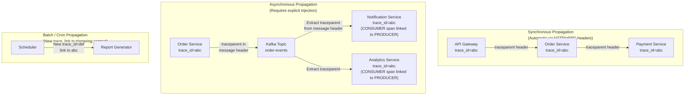
```mermaid
graph TB
    subgraph Synchronous ["Synchronous Propagation<br/>(Automatic via HTTP/gRPC headers)"]
        S1["API Gateway<br/>trace_id=abc"] -->|"traceparent header"| S2["Order Service<br/>trace_id=abc"]
        S2 -->|"traceparent header"| S3["Payment Service<br/>trace_id=abc"]
    end

    subgraph Asynchronous ["Asynchronous Propagation<br/>(Requires explicit injection)"]
        A1["Order Service<br/>trace_id=abc"] -->|"traceparent in<br/>message header"| Q["Kafka Topic<br/>order-events"]
        Q -->|"Extract traceparent<br/>from message header"| A2["Notification Service<br/>trace_id=abc<br/>(CONSUMER span linked to PRODUCER)"]
        Q -->|"Extract traceparent"| A3["Analytics Service<br/>trace_id=abc<br/>(CONSUMER span linked to PRODUCER)"]
    end

    subgraph Batch ["Batch / Cron Propagation<br/>(New trace, link to triggering context)"]
        B1["Scheduler"] -->|"New trace_id=def<br/>link to abc"| B2["Report Generator"]
    end
```

**Kafka producer/consumer context propagation:**

```python
from opentelemetry import trace, context
from opentelemetry.propagate import inject, extract

tracer = trace.get_tracer("order-service")

# PRODUCER: Inject trace context into Kafka message headers
def produce_order_event(order_data):
    with tracer.start_as_current_span("produce_order_event", kind=trace.SpanKind.PRODUCER) as span:
        span.set_attribute("messaging.system", "kafka")
        span.set_attribute("messaging.destination", "order-events")

        headers = {}
        inject(headers)  # Injects traceparent into headers dict

        kafka_producer.send(
            topic="order-events",
            value=json.dumps(order_data).encode(),
            headers=[(k, v.encode()) for k, v in headers.items()]
        )

# CONSUMER: Extract trace context from Kafka message headers
def consume_order_event(message):
    headers = {k: v.decode() for k, v in message.headers}
    ctx = extract(headers)  # Extracts traceparent from headers

    with tracer.start_as_current_span(
        "process_order_event",
        context=ctx,
        kind=trace.SpanKind.CONSUMER,
    ) as span:
        span.set_attribute("messaging.system", "kafka")
        span.set_attribute("messaging.operation", "process")
        process_event(message.value)
```

**Cross-language propagation considerations:**

| Language | W3C TraceContext Support | Notes |
|----------|------------------------|-------|
| Java | Native via OTel Java Agent | Auto-instrumentation covers most frameworks |
| Python | Via `opentelemetry-propagator-w3c` | Must explicitly configure propagators |
| Go | Via `go.opentelemetry.io/otel/propagation` | Idiomatic context.Context integration |
| Node.js | Via `@opentelemetry/core` | Async hooks handle context across callbacks |
| .NET | Via `System.Diagnostics.Activity` | Native W3C support since .NET 5 |

**Context loss scenarios and mitigation:**

| Scenario | Cause | Mitigation |
|----------|-------|------------|
| Thread pool handoff | New thread lacks parent context | Use context-aware executors (`ContextExecutorService` in Java) |
| Async callback | Context not propagated to callback | Use OTel context propagation utilities |
| Message queue | Headers not propagated | Explicitly inject/extract trace context |
| Database stored procedures | No HTTP/gRPC layer | Add trace_id as a query comment: `/* trace_id=abc */` |
| Third-party API calls | External service ignores headers | Create CLIENT span, record response |
| Load balancer rewrite | LB strips custom headers | Ensure LB forwards `traceparent` and `tracestate` headers |

### 1.3.8 Span Types

Spans are categorized by the type of work they represent. Proper span categorization enables filtering, visualization, and analysis.

| Span Kind | Description | Example |
|-----------|-------------|---------|
| SERVER | Processing an incoming request | HTTP handler, gRPC server method |
| CLIENT | Making an outgoing request | HTTP client call, gRPC client call |
| PRODUCER | Sending a message (async) | Kafka producer, SQS send |
| CONSUMER | Receiving a message (async) | Kafka consumer, SQS receive |
| INTERNAL | Internal computation | Business logic, local processing |

**Span attributes (semantic conventions):**

OpenTelemetry defines semantic conventions for standard span attributes:

```
# HTTP spans
http.method = "POST"
http.url = "https://api.example.com/orders"
http.status_code = 201
http.request_content_length = 1024

# Database spans
db.system = "postgresql"
db.name = "orders"
db.statement = "SELECT * FROM orders WHERE id = $1"
db.operation = "SELECT"

# Messaging spans
messaging.system = "kafka"
messaging.destination = "order-events"
messaging.operation = "send"
messaging.message.payload_size_bytes = 512
```

### 1.3.9 Sampling Strategies

At scale, storing every trace is prohibitively expensive. A service handling 100,000 RPS with an average trace size of 10 spans generates 1 million spans per second. Sampling selects a subset of traces to store while preserving statistical accuracy and debugging utility.

**Head-based sampling:**

The sampling decision is made at the beginning of the trace (at the edge/gateway). All downstream services honor this decision.

```
Request arrives → Random(0,1) < sample_rate? → YES: trace all spans → NO: drop all spans
```

Pros: Simple, consistent (entire trace is sampled or not), low overhead.
Cons: Interesting traces (errors, slow requests) may be missed.

**Tail-based sampling:**

The sampling decision is made after the trace completes, based on the trace's characteristics.

```
Request arrives → Collect all spans in buffer → Analyze completed trace →
  Error? → Keep
  Slow? → Keep
  Normal? → Sample at low rate
```

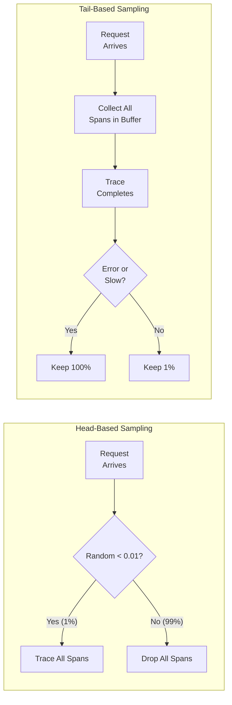
```mermaid
graph LR
    subgraph HeadBased ["Head-Based Sampling"]
        H1["Request<br/>Arrives"] --> H2{"Random < 0.01?"}
        H2 -->|"Yes (1%)"| H3["Trace All Spans"]
        H2 -->|"No (99%)"| H4["Drop All Spans"]
    end

    subgraph TailBased ["Tail-Based Sampling"]
        T1["Request<br/>Arrives"] --> T2["Collect All<br/>Spans in Buffer"]
        T2 --> T3["Trace<br/>Completes"]
        T3 --> T4{"Error or<br/>Slow?"}
        T4 -->|"Yes"| T5["Keep 100%"]
        T4 -->|"No"| T6["Keep 1%"]
    end
```

Pros: Captures all interesting traces (errors, latency outliers).
Cons: Higher resource usage (must buffer all spans until decision), more complex infrastructure.

**Sampling strategy comparison:**

| Strategy | Error Coverage | Latency Outlier Coverage | Cost | Complexity |
|----------|---------------|--------------------------|------|------------|
| Head-based 1% | 1% of errors | 1% of outliers | Low | Simple |
| Head-based 10% | 10% of errors | 10% of outliers | Medium | Simple |
| Tail-based (error + latency) | ~100% of errors | ~100% of outliers | Medium-High | Medium |
| Adaptive (rate-based) | Proportional | Proportional | Medium | Medium |
| Always-on | 100% | 100% | Very High | Simple |

**Recommended production strategy:**

```yaml
# OTel Collector tail-sampling configuration
processors:
  tail_sampling:
    decision_wait: 10s
    policies:
      - name: errors-always
        type: status_code
        status_code: {status_codes: [ERROR]}
      - name: slow-always
        type: latency
        latency: {threshold_ms: 2000}
      - name: sample-normal
        type: probabilistic
        probabilistic: {sampling_percentage: 1}
```

### 1.3.10 Trace-Based Testing

Traces can be used not just for debugging but for testing. Trace-based testing asserts on the structure, timing, and attributes of traces generated by integration or end-to-end tests.

**What trace-based testing validates:**

| Assertion | Example |
|-----------|---------|
| Service was called | Trace contains a span from `payment-service` |
| Call order | `inventory-check` span starts before `payment-authorize` span |
| Latency budget | Total trace duration < 500ms |
| Error absence | No spans have `status = ERROR` |
| Attribute correctness | `db.statement` does not contain `SELECT *` (performance check) |
| Call count | `cache-lookup` span appears exactly once (no redundant calls) |

**Tools for trace-based testing:**

- **Tracetest**: Open-source tool that triggers test requests and asserts on collected traces.
- **Malabi**: Microservice test framework using OpenTelemetry traces as assertions.
- **Custom assertions**: Query Jaeger/Tempo API in test code and assert on trace structure.

---

## Pillar Correlation — Connecting Logs, Metrics, and Traces

The real power of observability emerges when the three pillars are connected. A metric anomaly leads to relevant traces, which lead to specific log entries. This workflow is called "drill-down" or "exemplar-based correlation."

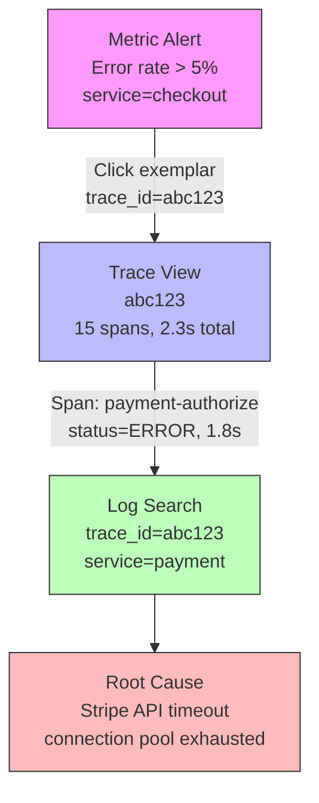
```mermaid
graph TB
    M["Metric Alert<br/>Error rate > 5%<br/>service=checkout"] -->|"Click exemplar<br/>trace_id=abc123"| T["Trace View<br/>abc123<br/>15 spans, 2.3s total"]
    T -->|"Span: payment-authorize<br/>status=ERROR, 1.8s"| L["Log Search<br/>trace_id=abc123<br/>service=payment"]
    L --> D["Root Cause<br/>Stripe API timeout<br/>connection pool exhausted"]

    style M fill:#f9f,stroke:#333
    style T fill:#bbf,stroke:#333
    style L fill:#bfb,stroke:#333
    style D fill:#fbb,stroke:#333
```

**How to connect the pillars:**

1. **Metrics to Traces (Exemplars)**: Prometheus exemplars attach a `trace_id` to metric samples. When viewing a high-latency histogram bucket, Grafana can link directly to the exemplar trace.

2. **Traces to Logs**: Each trace span includes `trace_id` and `span_id`. Logs include the same fields. Grafana or Kibana can filter logs by `trace_id` to show all log entries for a specific request.

3. **Logs to Metrics**: Log-derived metrics (e.g., count of `payment_failed` log events) create a bridge from log analysis to metric dashboards.

**Implementation checklist:**

- [ ] Every log entry includes `trace_id` and `span_id`
- [ ] Prometheus histograms emit exemplars with `trace_id`
- [ ] Grafana data sources are linked (Prometheus ↔ Tempo ↔ Loki)
- [ ] Dashboard panels have "Explore" links pre-configured for drill-down
- [ ] Alert notifications include a link to the relevant Grafana Explore view with pre-filled query

---

# Section 2: Alerting & Incident Response

---

## 2.1 Alert Design

Alerting is the bridge between observability data and human action. A well-designed alert tells the right person, at the right time, that something requires attention. A poorly designed alert wakes someone up at 3 AM for a transient condition that will self-resolve in 30 seconds.

### 2.1.1 Severity Levels

| Severity | Definition | Response Time | Notification | Example |
|----------|-----------|---------------|--------------|---------|
| **P0 / Critical** | Service completely down, users impacted | Immediate (< 5 min) | Page on-call, phone call | Checkout 100% error rate |
| **P1 / High** | Significant degradation, partial impact | < 15 min | Page on-call, Slack | Payment success rate < 95% |
| **P2 / Medium** | Degraded but functional, no user impact yet | < 1 hour | Slack notification | Disk usage > 80% |
| **P3 / Low** | Informational, potential future issue | Next business day | Email, ticket | Certificate expiring in 30 days |
| **P4 / Info** | Awareness only | No response required | Dashboard annotation | Deployment completed |

**Rules for severity assignment:**

1. **Severity reflects user impact, not system state**. A database at 95% disk is P2 (no user impact yet). A database at 100% disk causing write failures is P0 (users are impacted).
2. **Err on the side of lower severity**. Upgrading an alert is easy; downgrading an alert after someone has been woken up at 3 AM damages trust in the system.
3. **Review severity quarterly**. As systems change, alert severities drift. An alert that was P1 six months ago may now be P3 due to architectural improvements.

### 2.1.2 Alert Routing

Alert routing determines who receives which alerts and through which channels.

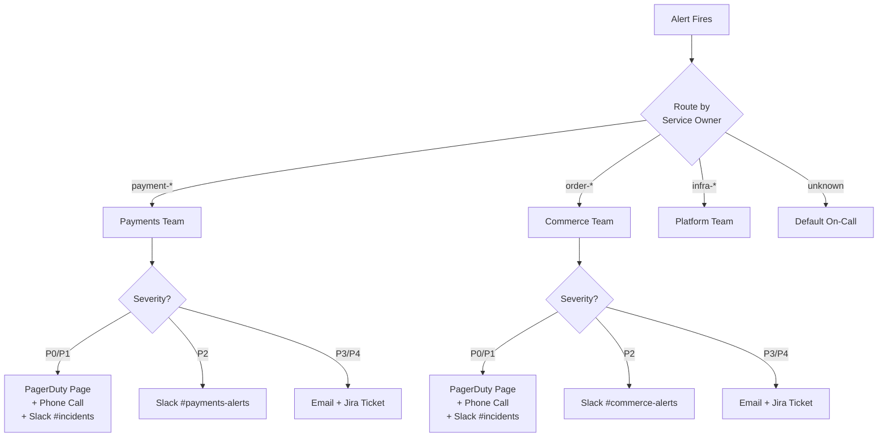
```mermaid
graph TB
    A["Alert Fires"] --> R{"Route by<br/>Service Owner"}
    R -->|"payment-*"| T1["Payments Team"]
    R -->|"order-*"| T2["Commerce Team"]
    R -->|"infra-*"| T3["Platform Team"]
    R -->|"unknown"| T4["Default On-Call"]

    T1 --> S1{"Severity?"}
    S1 -->|"P0/P1"| N1["PagerDuty Page<br/>+ Phone Call<br/>+ Slack #incidents"]
    S1 -->|"P2"| N2["Slack #payments-alerts"]
    S1 -->|"P3/P4"| N3["Email + Jira Ticket"]

    T2 --> S2{"Severity?"}
    S2 -->|"P0/P1"| N4["PagerDuty Page<br/>+ Phone Call<br/>+ Slack #incidents"]
    S2 -->|"P2"| N5["Slack #commerce-alerts"]
    S2 -->|"P3/P4"| N6["Email + Jira Ticket"]
```

**Alertmanager routing configuration example:**

```yaml
route:
  receiver: default-slack
  group_by: ['alertname', 'service']
  group_wait: 30s
  group_interval: 5m
  repeat_interval: 4h
  routes:
    - match:
        severity: critical
      receiver: pagerduty-critical
      group_wait: 10s
      repeat_interval: 5m

    - match:
        severity: high
      receiver: pagerduty-high
      group_wait: 30s
      repeat_interval: 15m

    - match:
        severity: medium
      receiver: slack-alerts
      group_wait: 1m
      repeat_interval: 1h

    - match:
        severity: low
      receiver: email-team
      repeat_interval: 24h

receivers:
  - name: pagerduty-critical
    pagerduty_configs:
      - service_key: '<PAYMENTS_TEAM_KEY>'
        severity: critical

  - name: slack-alerts
    slack_configs:
      - channel: '#service-alerts'
        title: '{{ .GroupLabels.alertname }}'
        text: '{{ range .Alerts }}{{ .Annotations.description }}{{ end }}'
```

### 2.1.3 On-Call Rotation

On-call rotation ensures that someone is always available to respond to alerts. The rotation schedule must balance coverage with engineer well-being.

**Common rotation patterns:**

| Pattern | Description | Pros | Cons |
|---------|-------------|------|------|
| Weekly rotation | One person for 7 days | Simple, predictable | Burnout risk for bad weeks |
| Follow-the-sun | Hand off across time zones | No night pages | Requires global team |
| Split day/night | Separate rotations for business hours and off-hours | Reduces night page exposure | More complex scheduling |
| Primary/Secondary | Two people on-call, secondary as backup | Redundancy | More people committed |

**On-call schedule example:**

```
Week 1: Alice (primary), Bob (secondary)
Week 2: Bob (primary), Carol (secondary)
Week 3: Carol (primary), Dave (secondary)
Week 4: Dave (primary), Alice (secondary)
```

**Handoff procedure:**

1. Outgoing on-call writes a brief summary of the week: open incidents, ongoing issues, pending changes.
2. Incoming on-call reviews the summary and acknowledges readiness.
3. Handoff happens at the same time each week (e.g., Tuesday 10 AM, not Monday 12 AM — never hand off at midnight).
4. Both people are available for 1 hour overlap during handoff.

### 2.1.4 Escalation Policies

Escalation policies define what happens when an alert is not acknowledged within a specified time.

**Typical escalation chain:**

```
Alert fires
  → 0 min: Notify primary on-call via PagerDuty
  → 5 min: If not acknowledged, notify secondary on-call
  → 15 min: If not acknowledged, notify team lead
  → 30 min: If not acknowledged, notify engineering manager
  → 60 min: If not acknowledged, notify VP of Engineering
```

**Escalation policy rules:**

1. **Never escalate to someone who cannot help**. The VP of Engineering is unlikely to debug a database deadlock — but they can ensure someone who can is engaged.
2. **Auto-resolve if the condition clears**. If the metric returns to normal before acknowledgment, auto-resolve to avoid unnecessary escalation.
3. **Track escalation rates**. High escalation rates indicate on-call training gaps or misrouted alerts.

### 2.1.5 Alert Fatigue Prevention

Alert fatigue is the desensitization that occurs when on-call engineers receive too many alerts, especially non-actionable ones. When everything alerts, nothing alerts.

**Symptoms of alert fatigue:**

- On-call engineers acknowledge alerts without investigating.
- "Mute all" becomes a common practice during known issues.
- Critical alerts are missed because they are buried in noise.
- Engineers dread on-call rotations and leave the team.

**Prevention strategies:**

| Strategy | Implementation |
|----------|---------------|
| **Delete non-actionable alerts** | If the response to an alert is "do nothing," delete it |
| **Merge duplicate alerts** | Alertmanager grouping: `group_by: ['alertname', 'service']` |
| **Increase thresholds** | If an alert fires 50 times/week with no action, raise the threshold |
| **Add for-duration** | `for: 5m` prevents transient spikes from triggering alerts |
| **Rate-limit notifications** | `repeat_interval: 4h` prevents the same alert from re-notifying |
| **Business hours routing** | Route P3/P4 to Slack during business hours, suppress off-hours |
| **Weekly alert review** | Every week, review all alerts that fired and classify as actionable or noise |

**The "three strikes" rule:**

If an alert fires three times in a week and no action was taken, one of these must happen:
1. Fix the underlying issue (so the alert stops firing).
2. Tune the alert (change thresholds, add conditions).
3. Delete the alert (it is not useful).

**Alert fatigue maturity model:**

| Level | Characteristic | Signal-to-Noise Ratio | Action |
|-------|---------------|----------------------|--------|
| L0 — Chaos | Hundreds of alerts/week, most ignored | < 20% actionable | Triage: delete or silence all non-P0 alerts, start from zero |
| L1 — Reactive | Alerts exist but many are noisy | 20-50% actionable | Apply three-strikes rule weekly, merge duplicates |
| L2 — Managed | Regular alert reviews, most are useful | 50-80% actionable | Migrate from threshold alerts to SLO burn-rate alerts |
| L3 — Proactive | SLO-based alerting, alert-per-on-call-shift tracked | > 80% actionable | Automate remediation for common alerts, reduce pages |
| L4 — Optimized | Every alert has a runbook, median 2-3 pages per shift | > 95% actionable | Continuous tuning, anomaly detection supplements rules |

**Measuring alert health — key metrics to track:**

| Metric | How to Measure | Target |
|--------|---------------|--------|
| Pages per on-call shift | PagerDuty analytics | < 5 per shift |
| Alert acknowledgment time | Median time from fire → ack | < 5 minutes for P0/P1 |
| Alerts with no human action | Alerts acked then resolved without any remediation steps | < 10% (if higher, alert is noise) |
| Alert-to-incident ratio | Alerts fired / incidents declared | < 10:1 (high ratio = noise) |
| Time in alert storm | Minutes where > 5 alerts fire simultaneously | Trending to zero |
| On-call satisfaction score | Quarterly survey (1-5 scale) | > 3.5 |

**Alert storm prevention patterns:**

Alert storms — cascading alerts where a single root cause triggers dozens of notifications — are the primary driver of fatigue during incidents. Prevent them with:

1. **Dependency-aware inhibition**: When a parent service alerts, suppress child alerts. Configure in Alertmanager `inhibit_rules`.
2. **Alert aggregation windows**: Group alerts firing within a 2-minute window into a single notification with a summary count.
3. **Severity-based flood protection**: During a P0, auto-silence all P3/P4 alerts for the affected service tree.
4. **Circuit-breaker on notifications**: If > 20 alerts fire in 5 minutes, send a single "alert storm detected" page instead of 20 individual pages.

### 2.1.6 Alert Deduplication

During an outage, a single root cause can trigger hundreds of alerts across dependent services. Without deduplication, the on-call engineer is overwhelmed by a wall of notifications instead of seeing the one that matters.

**Deduplication mechanisms:**

| Level | Mechanism | Example |
|-------|-----------|---------|
| Alertmanager | `group_by` labels | Group all alerts with same `alertname` + `service` into one notification |
| PagerDuty | Alert grouping + suppression rules | Suppress child alerts when parent service is down |
| Custom logic | Dependency-aware suppression | If database is down, suppress all "service X error rate high" alerts |

**Dependency-aware alert suppression:**

```
IF alert(database_connection_pool_exhausted) THEN
  suppress(payment_service_error_rate_high)
  suppress(order_service_error_rate_high)
  suppress(inventory_service_timeout)

  # Only alert on the root cause
  page(database_connection_pool_exhausted, severity=P0)
```

---

## 2.2 SLO / SLI / SLA

Service Level Objectives are the foundation of reliability engineering. They transform "our service should be reliable" into "our service must succeed at 99.9% of requests, measured over a 30-day rolling window."

### 2.2.1 Definitions

| Term | Definition | Owner | Example |
|------|-----------|-------|---------|
| **SLI** (Service Level Indicator) | A quantitative measure of service behavior | Engineering | Proportion of requests < 300ms and returning 2xx |
| **SLO** (Service Level Objective) | A target value for an SLI | Engineering + Product | 99.9% of requests must succeed (SLI >= 99.9%) |
| **SLA** (Service Level Agreement) | A contractual commitment with financial consequences | Business + Legal | 99.95% uptime or customer receives credits |

**Key relationships:**

```
SLI measures reality → SLO sets the target → SLA is the contractual promise

SLI: 99.97% of requests succeeded this month
SLO: Target is 99.9%
SLA: Contract guarantees 99.5% (with financial penalty below)

Note: SLA < SLO < measured SLI (healthy state)
```

### 2.2.2 Defining Good SLIs

A good SLI measures what users actually experience, not what the system internally reports. An "up" health check does not mean users are having a good experience.

**SLI categories:**

| Category | SLI | Measurement |
|----------|-----|-------------|
| **Availability** | Proportion of successful requests | `successful_requests / total_requests` |
| **Latency** | Proportion of requests faster than threshold | `requests_under_300ms / total_requests` |
| **Correctness** | Proportion of correct responses | `correct_results / total_results` |
| **Freshness** | Proportion of data within freshness threshold | `fresh_reads / total_reads` |
| **Throughput** | Proportion of time at target throughput | `minutes_at_target_rps / total_minutes` |

**Example SLIs for an e-commerce checkout:**

```
Availability SLI:
  Good event: HTTP response status is 2xx or 4xx (client error is not a service failure)
  Bad event: HTTP response status is 5xx or timeout

Latency SLI:
  Good event: Response time < 500ms (p50), < 2s (p99)
  Bad event: Response time >= threshold

Correctness SLI:
  Good event: Inventory check result matches actual stock within 5 minutes
  Bad event: User shown "in stock" but order fails due to out-of-stock
```

### 2.2.3 Error Budgets

An error budget is the allowed amount of unreliability. If your SLO is 99.9%, your error budget is 0.1% — meaning you can afford 0.1% of requests to fail in a given window.

**Error budget math:**

```
SLO = 99.9%
Error budget = 100% - 99.9% = 0.1%

Over a 30-day window with 1 billion requests:
  Allowed failures = 1,000,000,000 * 0.001 = 1,000,000 requests

Over a 30-day window in minutes:
  Total minutes = 30 * 24 * 60 = 43,200
  Allowed downtime = 43,200 * 0.001 = 43.2 minutes
```

**Error budget at different SLO levels:**

| SLO | Error Budget (30 days) | Downtime (30 days) | Downtime (365 days) |
|-----|----------------------|-------------------|-------------------|
| 99% | 1.0% | 7.2 hours | 3.65 days |
| 99.5% | 0.5% | 3.6 hours | 1.83 days |
| 99.9% | 0.1% | 43.2 minutes | 8.76 hours |
| 99.95% | 0.05% | 21.6 minutes | 4.38 hours |
| 99.99% | 0.01% | 4.3 minutes | 52.6 minutes |
| 99.999% | 0.001% | 26 seconds | 5.26 minutes |

**Error budget policy:**

The error budget policy defines what happens when the budget is exhausted:

```
IF error_budget_remaining > 50%:
  → Normal development velocity
  → Deploy at standard cadence

IF error_budget_remaining 25-50%:
  → Prioritize reliability work
  → Require extra review for risky deployments

IF error_budget_remaining 0-25%:
  → Freeze non-critical deployments
  → All engineering effort on reliability

IF error_budget_remaining < 0% (budget exhausted):
  → Full deployment freeze
  → All hands on reliability
  → Postmortem for budget-consuming incidents
```

### 2.2.4 Burn Rate Alerts

A burn rate alert detects when the error budget is being consumed faster than sustainable. Instead of alerting on instantaneous error rate, burn rate alerts answer: "at this rate, will we exhaust our error budget before the window ends?"

**Burn rate calculation:**

```
Burn rate = actual_error_rate / allowed_error_rate

Example:
  SLO = 99.9% (allowed error rate = 0.1%)
  Current error rate = 0.5%
  Burn rate = 0.5% / 0.1% = 5x

  At 5x burn rate, a 30-day error budget is exhausted in 6 days.
```

**Multi-window burn rate alerting (Google SRE recommendation):**

| Alert | Short Window | Long Window | Burn Rate | Severity | Budget Consumed |
|-------|-------------|-------------|-----------|----------|-----------------|
| Page | 5 minutes | 1 hour | 14.4x | P0 | 2% in 1 hour |
| Page | 30 minutes | 6 hours | 6x | P1 | 5% in 6 hours |
| Ticket | 2 hours | 1 day | 3x | P2 | 10% in 1 day |
| Ticket | 6 hours | 3 days | 1x | P3 | 10% in 3 days |

**Why multi-window?** A single short window catches sudden spikes but produces false positives for transients. A single long window catches sustained degradation but is slow to react. Requiring both windows to exceed the burn rate eliminates both problems.

**Prometheus alerting rules for burn rate:**

```yaml
groups:
  - name: slo-burn-rate
    rules:
      # Fast burn - page
      - alert: HighBurnRate_Fast
        expr: |
          (
            sum(rate(http_requests_total{status=~"5.."}[5m]))
            / sum(rate(http_requests_total[5m]))
          ) > (14.4 * 0.001)
          and
          (
            sum(rate(http_requests_total{status=~"5.."}[1h]))
            / sum(rate(http_requests_total[1h]))
          ) > (14.4 * 0.001)
        for: 2m
        labels:
          severity: critical
        annotations:
          summary: "Error budget burn rate is 14.4x - will exhaust in ~6 days"

      # Slow burn - ticket
      - alert: HighBurnRate_Slow
        expr: |
          (
            sum(rate(http_requests_total{status=~"5.."}[6h]))
            / sum(rate(http_requests_total[6h]))
          ) > (1.0 * 0.001)
        for: 1h
        labels:
          severity: low
        annotations:
          summary: "Error budget burn rate is 1x - steady depletion"
```

### 2.2.5 Error Budget Calculation — Worked Examples

Error budgets are most useful when calculated concretely for specific services. Here are detailed worked examples that demonstrate how error budgets translate into operational decisions.

**Example 1: E-commerce checkout service**

```
Service: checkout-service
SLO: 99.9% availability (measured as successful HTTP responses / total requests)
Measurement window: 30-day rolling

Traffic: 2,000 requests/second average = 5,184,000,000 requests per 30 days

Error budget:
  Total allowed failures = 5,184,000,000 * 0.001 = 5,184,000 requests
  Per-day budget = 5,184,000 / 30 = 172,800 failed requests per day
  Per-hour budget = 172,800 / 24 = 7,200 failed requests per hour

Scenario: A bad deployment causes 100% failure for 10 minutes
  Failed requests = 2,000 rps * 600 seconds = 1,200,000
  Budget consumed = 1,200,000 / 5,184,000 = 23.1%

  Result: One 10-minute outage consumes nearly a quarter of the monthly budget.
  At this rate, the team can afford approximately 4 such outages per month
  before exhausting the budget.
```

**Example 2: Multi-SLI error budget with latency**

```
Service: search-service
SLO 1: 99.9% of requests return non-5xx (availability)
SLO 2: 99.0% of requests complete within 500ms (latency)
Measurement window: 30-day rolling

Traffic: 5,000 rps = 12,960,000,000 requests per 30 days

Availability budget:
  Allowed 5xx: 12,960,000 requests
  Currently consumed: 3,200,000 (24.7% of budget)

Latency budget:
  Allowed slow (>500ms): 129,600,000 requests
  Currently consumed: 98,400,000 (75.9% of budget)

Decision: The latency SLO is in danger. Even though availability is healthy,
the team should prioritize performance optimization over new features.
The error budget policy triggers a "reliability sprint" when any SLO
budget drops below 25% remaining.
```

**Example 3: Composite SLO for a user journey**

```
User journey: "Complete a purchase"
Components: API Gateway -> Product Service -> Cart Service -> Checkout -> Payment

Each component has its own availability:
  API Gateway:     99.99%
  Product Service: 99.95%
  Cart Service:    99.95%
  Checkout:        99.9%
  Payment:         99.9%

Combined availability (serial dependency):
  0.9999 * 0.9995 * 0.9995 * 0.999 * 0.999 = 99.69%

This means the journey SLO cannot exceed ~99.7% without improving
individual component reliability. Setting a journey SLO of 99.9%
requires raising the weakest components (Checkout, Payment) to 99.95%+.
```

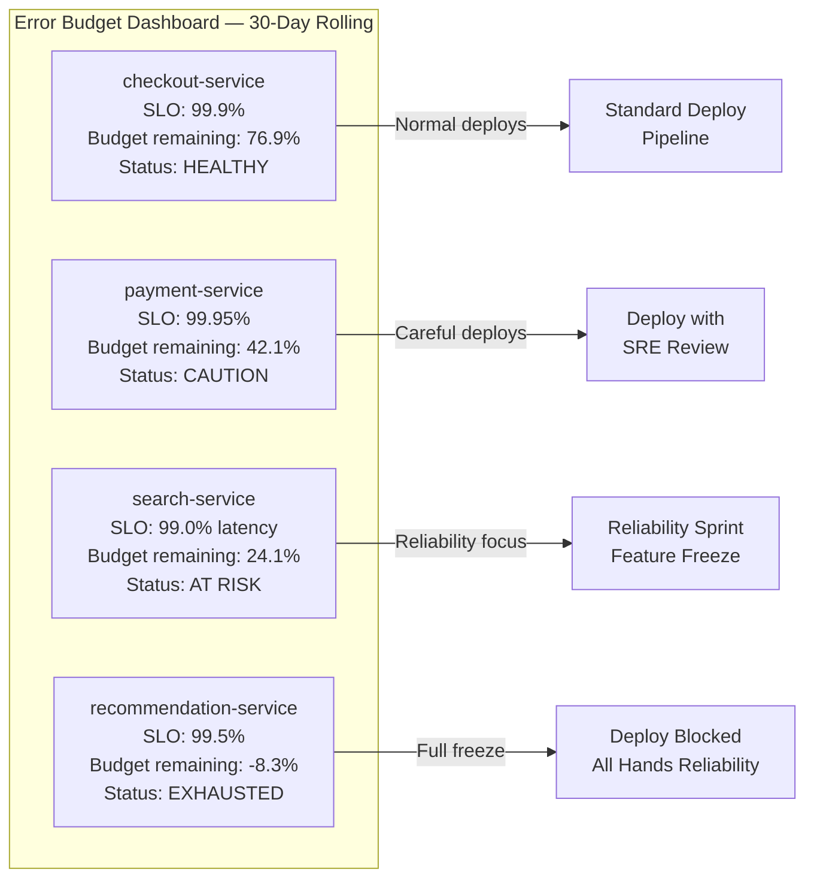
```mermaid
graph LR
    subgraph Budget ["Error Budget Dashboard — 30-Day Rolling"]
        direction TB
        B1["checkout-service<br/>SLO: 99.9%<br/>Budget remaining: 76.9%<br/>Status: HEALTHY"]
        B2["payment-service<br/>SLO: 99.95%<br/>Budget remaining: 42.1%<br/>Status: CAUTION"]
        B3["search-service<br/>SLO: 99.0% latency<br/>Budget remaining: 24.1%<br/>Status: AT RISK"]
        B4["recommendation-service<br/>SLO: 99.5%<br/>Budget remaining: -8.3%<br/>Status: EXHAUSTED"]
    end

    B1 -->|"Normal deploys"| D1["Standard Deploy<br/>Pipeline"]
    B2 -->|"Careful deploys"| D2["Deploy with<br/>SRE Review"]
    B3 -->|"Reliability focus"| D3["Reliability Sprint<br/>Feature Freeze"]
    B4 -->|"Full freeze"| D4["Deploy Blocked<br/>All Hands Reliability"]
```

### 2.2.6 SLO-Based Release Gating

Error budgets can gate deployments. If a service has exhausted its error budget, new feature deployments are blocked until reliability is restored. This creates a direct incentive for engineering teams to prioritize reliability.

**Release gating flow:**

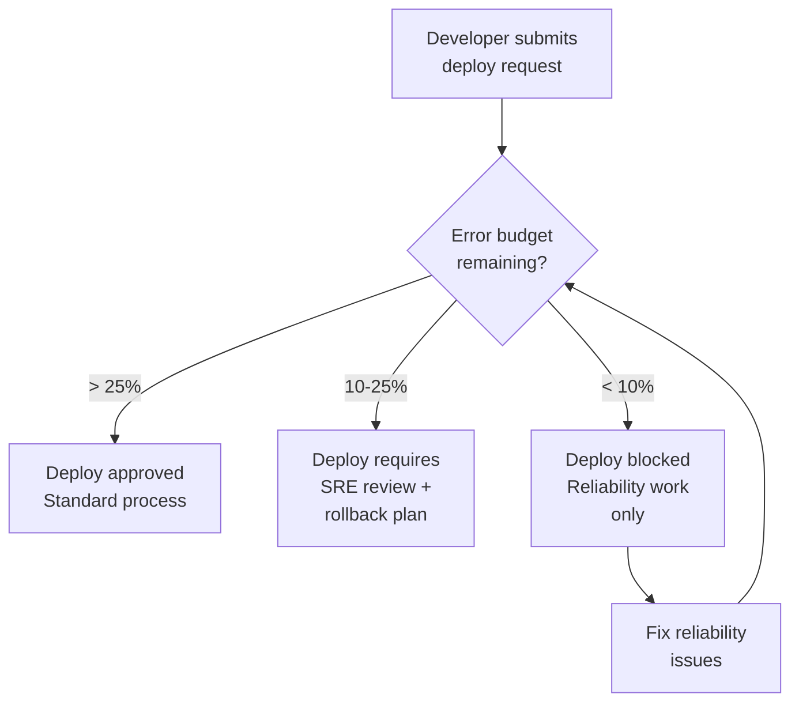
```mermaid
graph TB
    D["Developer submits<br/>deploy request"] --> C{"Error budget<br/>remaining?"}
    C -->|"> 25%"| A["Deploy approved<br/>Standard process"]
    C -->|"10-25%"| R["Deploy requires<br/>SRE review +<br/>rollback plan"]
    C -->|"< 10%"| B["Deploy blocked<br/>Reliability work<br/>only"]
    B --> F["Fix reliability<br/>issues"]
    F --> C
```

### 2.2.7 Canonical SLO Templates

Defining SLOs from scratch is error-prone. The following templates provide ready-to-adopt SLO definitions for the four most common service archetypes. Each template specifies the SLI measurement, a recommended starting SLO target, the error budget policy, and the burn-rate alert thresholds.

**Template 1: Synchronous API Service** (e.g., checkout, search, user-profile)

```yaml
# slo-template-api-service.yaml
service_type: synchronous_api
slo_window: 30d rolling

slis:
  availability:
    description: Proportion of non-5xx responses
    good_event: "http_status < 500"
    total_event: "all requests (excluding health checks)"
    measurement: |
      sum(rate(http_requests_total{status!~"5.."}[5m]))
      / sum(rate(http_requests_total[5m]))

  latency:
    description: Proportion of requests faster than threshold
    good_event: "response_time < 300ms (p50), < 1s (p99)"
    measurement: |
      histogram_quantile(0.99, sum(rate(http_request_duration_seconds_bucket[5m])) by (le))
      < 1.0

slo_targets:
  availability: 99.9%    # Start here; tighten after 2 quarters of data
  latency_p99: 99.0%     # 99% of requests under 1 second

error_budget:
  budget_30d: 43.2 minutes downtime OR 0.1% failed requests
  policy:
    green:  "> 50% remaining → normal velocity"
    yellow: "25-50% remaining → reliability review on deploys"
    orange: "0-25% remaining → freeze non-critical deploys"
    red:    "exhausted → full freeze, all-hands reliability"

burn_rate_alerts:
  - severity: P0
    burn_rate: 14.4x
    short_window: 5m
    long_window: 1h
    action: page on-call immediately
  - severity: P1
    burn_rate: 6x
    short_window: 30m
    long_window: 6h
    action: page on-call
  - severity: P2
    burn_rate: 3x
    short_window: 2h
    long_window: 1d
    action: create ticket
  - severity: P3
    burn_rate: 1x
    short_window: 6h
    long_window: 3d
    action: weekly review
```

**Template 2: Data Pipeline** (e.g., ETL, event processing, CDC)

```yaml
# slo-template-data-pipeline.yaml
service_type: data_pipeline
slo_window: 30d rolling

slis:
  freshness:
    description: Proportion of time that output data is within freshness SLA
    good_event: "output_timestamp - input_timestamp < freshness_threshold"
    measurement: |
      1 - (sum(increase(pipeline_freshness_violation_total[1h]))
      / sum(increase(pipeline_runs_total[1h])))

  completeness:
    description: Proportion of expected records successfully processed
    good_event: "records_output >= records_input * (1 - allowed_drop_rate)"
    measurement: |
      sum(rate(pipeline_records_output_total[5m]))
      / sum(rate(pipeline_records_input_total[5m]))

  correctness:
    description: Proportion of records passing validation
    good_event: "record passes schema + business rule checks"
    measurement: |
      1 - (sum(rate(pipeline_validation_failures_total[5m]))
      / sum(rate(pipeline_records_output_total[5m])))

slo_targets:
  freshness: 99.5%        # Data available within SLA 99.5% of the time
  completeness: 99.9%     # Less than 0.1% record loss
  correctness: 99.99%     # Extremely low tolerance for bad data

error_budget:
  freshness_budget_30d: 3.6 hours of stale data
  completeness_budget_30d: 1 in 1000 records may be lost
```

**Template 3: Batch / Cron Job** (e.g., nightly report, billing reconciliation)

```yaml
# slo-template-batch-job.yaml
service_type: batch_job
slo_window: 30d rolling

slis:
  success_rate:
    description: Proportion of job executions that complete successfully
    good_event: "job exits with status 0 and output passes validation"
    measurement: |
      sum(increase(batch_job_success_total[24h]))
      / sum(increase(batch_job_runs_total[24h]))

  timeliness:
    description: Proportion of jobs completing within schedule window
    good_event: "job completes before deadline (e.g., 06:00 UTC)"
    measurement: |
      sum(increase(batch_job_on_time_total[24h]))
      / sum(increase(batch_job_runs_total[24h]))

slo_targets:
  success_rate: 99.0%     # At most 1 failure per ~3 months for daily jobs
  timeliness: 99.5%       # Deadline met 99.5% of runs
```

**Template 4: Streaming / Real-Time Service** (e.g., Kafka consumer, websocket push)

```yaml
# slo-template-streaming-service.yaml
service_type: streaming_realtime
slo_window: 30d rolling

slis:
  processing_lag:
    description: Proportion of time consumer lag stays within threshold
    good_event: "consumer_lag < max_acceptable_lag (e.g., 30 seconds)"
    measurement: |
      1 - (sum(increase(consumer_lag_exceeded_total[5m]))
      / sum(increase(consumer_lag_checks_total[5m])))

  delivery_rate:
    description: Proportion of messages successfully delivered to downstream
    good_event: "message acknowledged by consumer without error"
    measurement: |
      sum(rate(messages_delivered_total[5m]))
      / sum(rate(messages_produced_total[5m]))

slo_targets:
  processing_lag: 99.0%   # Lag under threshold 99% of the time
  delivery_rate: 99.95%   # At most 0.05% message loss
```

**SLO adoption checklist:**

| Step | Action | Owner |
|------|--------|-------|
| 1 | Choose the template closest to your service archetype | Service team |
| 2 | Customize thresholds based on 2+ weeks of baseline data | Service team + SRE |
| 3 | Implement SLI metrics using OpenTelemetry or Prometheus | Service team |
| 4 | Configure burn-rate alerts in Alertmanager | SRE |
| 5 | Publish SLO dashboard in Grafana (team + executive views) | SRE |
| 6 | Document error budget policy and get PM/EM sign-off | Service team + PM |
| 7 | Review and tighten targets quarterly | Service team + SRE |

---

## 2.3 Incident Management

When things go wrong — and they will — the difference between a 10-minute recovery and a 4-hour outage is often not technical skill but process discipline.

### 2.3.1 Incident Commander

The Incident Commander (IC) is the single person responsible for coordinating the response. The IC does not debug — the IC communicates, delegates, and drives resolution.

**Incident Commander responsibilities:**

| Responsibility | Action |
|---------------|--------|
| Declare incident | "I am declaring a SEV1 incident for checkout failures" |
| Establish communication | Create war room (Slack channel, Zoom bridge) |
| Assign roles | "Alice, you are debugging. Bob, you are communicating to stakeholders." |
| Track timeline | Record what was done, when, and by whom |
| Drive decisions | "We are rolling back the last deployment. Any objections? Proceeding." |
| Coordinate communication | Ensure status page, Slack, and stakeholders are updated |
| Declare resolution | "Incident is resolved. Checkout error rate is back to baseline." |

**Incident roles:**

| Role | Responsibility |
|------|---------------|
| Incident Commander (IC) | Overall coordination, decision-making |
| Technical Lead | Hands-on debugging and resolution |
| Communications Lead | Status page updates, stakeholder comms |
| Scribe | Documents timeline, actions, decisions |

### 2.3.2 Communication Channels

Clear communication during an incident prevents duplicate work, ensures stakeholders are informed, and creates an audit trail.

**Communication structure:**

```
#incident-2025-03-15-checkout-outage  (Slack)
├── Pinned: Incident summary, severity, IC name
├── Thread: Technical debugging discussion
├── Thread: Status page updates
├── Thread: Customer support coordination
└── Thread: Timeline / scribe notes

Zoom bridge: https://zoom.us/j/123456  (voice for real-time coordination)

Status page: https://status.example.com  (public-facing)
├── Investigating: "We are aware of checkout failures"
├── Identified: "Root cause identified as database failover issue"
├── Monitoring: "Fix deployed, monitoring for stability"
└── Resolved: "Issue resolved, all systems operational"
```

### 2.3.3 Incident Timeline

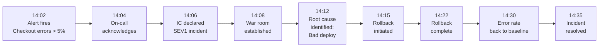
```mermaid
graph LR
    A["14:02<br/>Alert fires<br/>Checkout errors > 5%"] --> B["14:04<br/>On-call<br/>acknowledges"]
    B --> C["14:06<br/>IC declared<br/>SEV1 incident"]
    C --> D["14:08<br/>War room<br/>established"]
    D --> E["14:12<br/>Root cause<br/>identified:<br/>Bad deploy"]
    E --> F["14:15<br/>Rollback<br/>initiated"]
    F --> G["14:22<br/>Rollback<br/>complete"]
    G --> H["14:30<br/>Error rate<br/>back to baseline"]
    H --> I["14:35<br/>Incident<br/>resolved"]
```

### 2.3.4 Status Pages

A status page is the public-facing communication channel during incidents. It sets expectations for customers and reduces support ticket volume.

**Status page components:**

| Component | Description |
|-----------|-------------|
| System status | Overall green/yellow/red indicator |
| Component status | Per-service status (API, Web, Payments, etc.) |
| Active incidents | Description, timeline, updates |
| Incident history | Past incidents for transparency |
| Scheduled maintenance | Upcoming maintenance windows |
| Uptime metrics | Historical availability percentages |

**Status page update cadence:**

- During P0/P1: Update every 15 minutes minimum.
- During P2: Update every 30 minutes.
- If no new information: Post "We are continuing to investigate" to show active engagement.
- Never go silent for > 30 minutes during an active incident.

### 2.3.5 Blameless Postmortems

A postmortem (also called "incident review" or "retrospective") analyzes what happened, why, and how to prevent recurrence. The critical word is "blameless" — the goal is to improve the system, not to punish individuals.

**Postmortem template:**

```markdown
## Incident Postmortem: Checkout Outage 2025-03-15

### Summary
A bad deployment to the checkout service caused a 28-minute outage
affecting all checkout attempts. Approximately 12,000 checkout attempts
failed during the window.

### Impact
- Duration: 28 minutes (14:02 - 14:30 UTC)
- User impact: 100% of checkout attempts failed
- Revenue impact: Estimated $180,000 in lost GMV
- Support tickets: 847 tickets received

### Timeline
- 13:55 - Deploy of checkout-service v2.14.3 begins
- 14:02 - Alertmanager fires: checkout_error_rate > 5%
- 14:04 - On-call acknowledges alert
- 14:06 - SEV1 declared, war room opened
- 14:08 - Team identifies v2.14.3 deployed 7 minutes ago
- 14:12 - Root cause confirmed: database migration in v2.14.3
          added NOT NULL column without default
- 14:15 - Rollback to v2.14.2 initiated
- 14:22 - Rollback complete, old version serving traffic
- 14:30 - Error rate returns to baseline
- 14:35 - Incident resolved

### Root Cause
The v2.14.3 release included a database migration that added a NOT NULL
column to the orders table without a default value. Existing rows
without the column caused INSERT failures for new orders.

### Contributing Factors
1. Migration was not tested against production-like data volume.
2. Canary deployment was configured but the canary percentage was 0%
   (effectively disabled due to a config error from 2 months ago).
3. Pre-deploy database migration checks did not validate NOT NULL
   constraints against existing data.

### What Went Well
- Alert fired within 7 minutes of the bad deploy.
- On-call responded within 2 minutes.
- Rollback was fast (7 minutes).
- Communication was clear and timely.

### What Went Wrong
- Canary deployment was silently disabled.
- Migration testing did not catch the issue.
- The deploy happened at 13:55 (end of day) when staffing is lower.

### Action Items
| Action | Owner | Priority | Due Date |
|--------|-------|----------|----------|
| Add canary config verification to deploy pipeline | Alice | P0 | 2025-03-22 |
| Add NOT NULL migration validator to CI | Bob | P1 | 2025-03-29 |
| Enforce deploy window (10 AM - 3 PM) in pipeline | Carol | P2 | 2025-04-05 |
| Run migration against prod-clone before deploy | Dave | P1 | 2025-03-29 |

### Lessons Learned
Safety mechanisms (canary deploys) must be continuously verified,
not just initially configured. A safety mechanism that is silently
disabled is worse than no safety mechanism because it creates false
confidence.
```

**Postmortem culture rules:**

1. **No blame**: Focus on systems and processes, not individuals. "The migration was not tested" not "Alice did not test the migration."
2. **Action items have owners and deadlines**: A postmortem without action items is a storytelling exercise.
3. **Share widely**: Postmortems should be readable by the entire engineering organization. Transparency builds learning culture.
4. **Track completion**: Action items from postmortems must be tracked and completed. An unactioned action item is a future incident.
5. **Review periodically**: Quarterly review of all postmortem action items to ensure they were completed and effective.

### 2.3.6 Postmortem Template — Reusable Form

The following is a ready-to-copy template that teams can adopt as their standard incident review document. It enforces structured thinking, captures the data needed for trending analysis, and ensures every postmortem drives concrete improvements.

```markdown
# Incident Postmortem — [INCIDENT-ID]

## Metadata
| Field | Value |
|-------|-------|
| Incident ID | INC-XXXX |
| Date | YYYY-MM-DD |
| Duration | HH:MM (detect → resolve) |
| Severity | SEV0 / SEV1 / SEV2 / SEV3 |
| Incident Commander | Name |
| Author | Name |
| Status | Draft / Reviewed / Final |
| Postmortem due date | YYYY-MM-DD (48h for SEV0, 5d for SEV1) |

## Executive Summary
<!-- 2-3 sentences. What broke, who was impacted, how long, how it was resolved. -->

## Impact
| Metric | Value |
|--------|-------|
| Users affected | N |
| Revenue impact | $X (or N/A) |
| Error budget consumed | X% of 30-day budget |
| Support tickets generated | N |
| SLA breach | Yes / No |

## Detection
| Question | Answer |
|----------|--------|
| How was the incident detected? | Alert / Customer report / Internal report |
| Which alert fired first? | alert_name (link to alert rule) |
| Time from start to detection | X minutes |
| Was detection fast enough? | Yes / No — if No, what would improve it? |

## Timeline
<!-- Use UTC timestamps. Include: detection, escalation, key decisions, mitigation, resolution. -->
| Time (UTC) | Event |
|------------|-------|
| HH:MM | First error observed in metrics |
| HH:MM | Alert fires, on-call paged |
| HH:MM | IC declares SEV-X |
| HH:MM | Root cause identified |
| HH:MM | Mitigation applied (rollback / config change / ...) |
| HH:MM | Service recovery confirmed |
| HH:MM | Incident resolved |

## Root Cause
<!-- Describe the technical root cause. Use "5 Whys" if helpful. -->
1. Why did the service fail? → ...
2. Why did that happen? → ...
3. Why did that happen? → ...
4. Why did that happen? → ...
5. Why did that happen? → ... (systemic root cause)

## Contributing Factors
<!-- List factors that made the incident worse or delayed recovery. -->
- [ ] Missing monitoring / alerting gap
- [ ] Runbook missing or outdated
- [ ] Insufficient testing (unit / integration / load)
- [ ] Configuration drift
- [ ] Human error (describe the systemic reason, not blame)
- [ ] Dependency failure not handled
- [ ] Other: ...

## What Went Well
<!-- Celebrate what worked. This reinforces good practices. -->
1. ...
2. ...

## What Went Wrong
<!-- Systemic issues only. No individual blame. -->
1. ...
2. ...

## Action Items
<!-- Every action item MUST have an owner, priority, and due date. -->
| # | Action | Owner | Priority | Due Date | Ticket |
|---|--------|-------|----------|----------|--------|
| 1 | | | P0/P1/P2 | YYYY-MM-DD | JIRA-XXX |
| 2 | | | P0/P1/P2 | YYYY-MM-DD | JIRA-XXX |

## Recurrence Check
| Question | Answer |
|----------|--------|
| Has a similar incident occurred before? | Yes (INC-YYYY) / No |
| Were previous action items completed? | Yes / Partially / No |
| What systemic change prevents recurrence? | ... |

## Appendix
- Link to incident Slack channel
- Link to dashboards used during debugging
- Link to relevant traces / logs
- Link to deploy / change that triggered incident
```

**Postmortem health metrics** — track these quarterly to measure postmortem program effectiveness:

| Metric | Target | Why It Matters |
|--------|--------|----------------|
| Postmortem completion rate | 100% for SEV0/SEV1 | No learning without documentation |
| Median days to postmortem | < 5 business days | Freshness improves accuracy |
| Action item completion rate | > 85% within 30 days | Unactioned items become future incidents |
| Repeat incident rate | < 10% | Measures whether action items actually prevent recurrence |
| Action items per postmortem | 3-7 | Too few = shallow analysis; too many = unfocused |

### 2.3.7 Runbooks

A runbook is a step-by-step guide for responding to a specific alert or condition. It transforms "I have no idea what this alert means" into "step 1: check X, step 2: if Y then Z."

**Runbook template:**

```markdown
## Runbook: checkout_error_rate_high

### Alert Description
The checkout service error rate exceeds 5% over a 5-minute window.

### Severity
P1 (user-impacting)

### First Response (within 5 minutes)

1. Check the error rate dashboard:
   https://grafana.internal/d/checkout-red

2. Identify the error type:
   - 5xx errors → Server-side failure → Continue to Step 3
   - Timeout errors → Dependency issue → Continue to Step 4
   - Connection refused → Service crash → Continue to Step 5

### Step 3: Server-Side Failure
3a. Check recent deployments:
    kubectl rollout history deployment/checkout-service -n prod

3b. If a recent deploy exists (< 30 min):
    kubectl rollout undo deployment/checkout-service -n prod
    Wait 5 minutes. If error rate decreases → Declare resolved.

3c. If no recent deploy, check logs:
    Query Loki: {service="checkout"} |= "ERROR" | json

### Step 4: Dependency Issue
4a. Check payment-service health:
    curl https://payment-service.internal/health

4b. Check inventory-service health:
    curl https://inventory-service.internal/health

4c. If dependency is down, check that dependency's runbook.

### Step 5: Service Crash
5a. Check pod status:
    kubectl get pods -n prod -l app=checkout-service

5b. If pods are CrashLoopBackOff, check logs:
    kubectl logs -n prod -l app=checkout-service --tail=100

5c. If OOM killed:
    kubectl describe pod <pod-name> -n prod | grep -i oom
    Temporary fix: increase memory limit and restart.

### Escalation
If not resolved within 15 minutes, escalate to the Commerce team lead.
```

**Runbook best practices:**

1. **Link from alert**: Every PagerDuty alert should include a direct link to the relevant runbook.
2. **Keep updated**: An outdated runbook is worse than no runbook because it creates false confidence and wastes time.
3. **Test regularly**: Periodically have someone unfamiliar with the service follow the runbook to verify it works.
4. **Automate steps**: If a runbook step can be automated, it should be. The goal is to reduce mean time to recovery (MTTR).

---

## 2.4 Chaos Engineering

Chaos engineering is the discipline of experimenting on a distributed system to build confidence in the system's capability to withstand turbulent conditions in production. It is not "breaking things for fun" — it is a rigorous scientific method applied to system reliability.

### 2.4.1 Principles of Chaos Engineering

1. **Start with a hypothesis about steady state**: Define what "normal" looks like in terms of measurable business metrics (order rate, latency p99, error rate).
2. **Vary real-world events**: Inject failures that actually happen — server crashes, network partitions, disk full, dependency timeouts.
3. **Run experiments in production**: Staging environments do not have production traffic patterns, data volumes, or dependency behaviors.
4. **Automate to run continuously**: Manual game days are valuable but infrequent. Automated chaos experiments run continuously and catch regressions.
5. **Minimize blast radius**: Start small (one instance), expand gradually, and have kill switches.

### 2.4.2 Chaos Monkey and the Simian Army

Netflix pioneered chaos engineering with Chaos Monkey (randomly terminates instances in production) and expanded it into the Simian Army:

| Tool | What It Does |
|------|-------------|
| Chaos Monkey | Randomly terminates instances |
| Latency Monkey | Injects artificial network latency |
| Conformity Monkey | Finds instances that do not conform to best practices |
| Chaos Gorilla | Takes down an entire availability zone |
| Chaos Kong | Simulates a full region failure |

### 2.4.3 Fault Injection Techniques

| Technique | Implementation | Tests |
|-----------|---------------|-------|
| Process kill | `kill -9 <pid>`, pod deletion | Restart resilience, health checks |
| Network partition | iptables rules, tc (traffic control) | Circuit breakers, retry logic |
| Latency injection | tc netem, application-level delay | Timeout handling, queue buildup |
| Disk full | `fallocate` to fill disk | Write failure handling, alerts |
| DNS failure | Block DNS resolution | Fallback behavior, caching |
| Clock skew | `date --set`, NTP manipulation | Certificate validation, expiry logic |
| CPU stress | `stress --cpu 8` | Autoscaling, degradation behavior |
| Memory pressure | `stress --vm 4 --vm-bytes 1G` | OOM handling, memory limits |
| Dependency failure | Kill downstream service | Circuit breakers, fallbacks |

### 2.4.4 Game Days

A game day is a scheduled, team-wide exercise where failures are deliberately injected and the team practices incident response.

**Game day structure:**

```
Before (1 week prior):
  - Define scenario and hypothesis
  - Notify stakeholders
  - Prepare kill switch
  - Review runbooks

During (2-4 hours):
  - Inject failure
  - Team responds as if it were a real incident
  - IC practices coordination
  - Scribe records timeline

After (same day):
  - Debrief: What worked? What did not?
  - Update runbooks based on findings
  - File action items for gaps discovered
  - Schedule next game day
```

**Game day scenario examples:**

| Scenario | Hypothesis | Actual Result (example) |
|----------|-----------|----------------------|
| Kill 50% of payment-service pods | Remaining pods handle load, error rate < 1% | Error rate spiked to 15% — HPA was misconfigured |
| Block network to primary database | Read replicas serve traffic, writes queue | Connection pool exhausted in 30s — no circuit breaker |
| Inject 5s latency to recommendation service | Checkout completes without recommendations (graceful degradation) | Checkout timed out — recommendation call was on critical path |

### 2.4.5 Steady State Hypothesis

The steady state hypothesis defines what "normal" looks like before an experiment and what should remain true during the experiment.

**Example:**

```
Hypothesis: When 1 of 3 payment-service instances is terminated,
  - Checkout success rate remains > 99.5%
  - Checkout latency p99 remains < 2 seconds
  - No increase in error tickets

Experiment: kubectl delete pod payment-service-abc123

Measurement:
  - Monitor checkout_success_rate for 15 minutes
  - Monitor checkout_latency_p99 for 15 minutes
  - Monitor support_tickets_total for 30 minutes

Abort conditions:
  - Checkout success rate drops below 95%
  - Checkout latency p99 exceeds 10 seconds
```

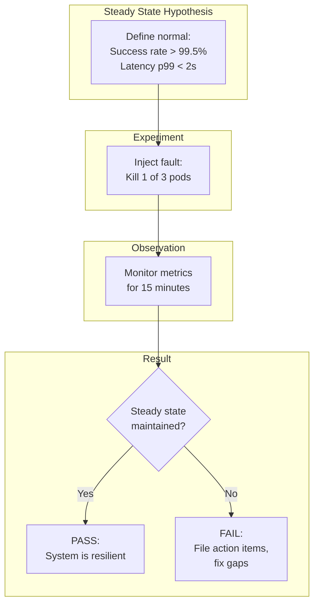
```mermaid
graph TB
    subgraph Hypothesis ["Steady State Hypothesis"]
        H1["Define normal:<br/>Success rate > 99.5%<br/>Latency p99 < 2s"]
    end

    subgraph Experiment ["Experiment"]
        E1["Inject fault:<br/>Kill 1 of 3 pods"]
    end

    subgraph Observe ["Observation"]
        O1["Monitor metrics<br/>for 15 minutes"]
    end

    subgraph Result ["Result"]
        R1{"Steady state<br/>maintained?"}
        R2["PASS:<br/>System is resilient"]
        R3["FAIL:<br/>File action items,<br/>fix gaps"]
    end

    H1 --> E1
    E1 --> O1
    O1 --> R1
    R1 -->|"Yes"| R2
    R1 -->|"No"| R3
```

### 2.4.6 Chaos Engineering Integration with Observability

Chaos engineering experiments are only valuable if you can observe their impact. The integration between chaos tools and observability systems is what separates rigorous chaos engineering from random failure injection.

**Observability requirements for chaos experiments:**

| Requirement | Implementation | Purpose |
|-------------|---------------|---------|
| Experiment annotations | Grafana annotations via API | Correlate metric changes with experiment start/stop |
| Baseline recording | Capture golden signal values before experiment | Compare pre/post metrics objectively |
| Real-time abort triggers | Prometheus alerting rules specific to experiment | Automatically halt experiment if blast radius exceeded |
| Trace analysis | Capture traces during experiment window | Understand failure propagation path |
| Log correlation | Tag logs with experiment ID | Filter experiment-related logs in post-analysis |

**Chaos experiment observability pipeline:**

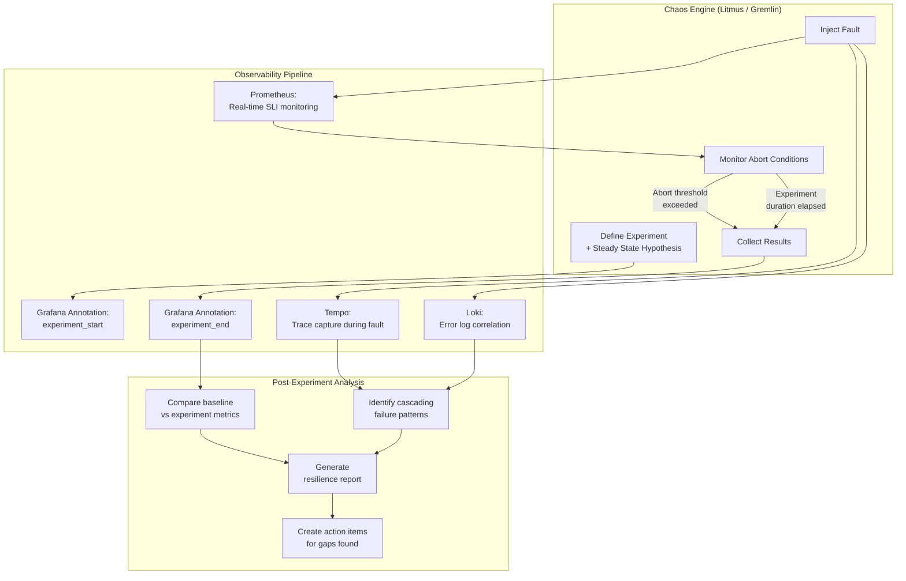
```mermaid
graph TB
    subgraph ChaosEngine ["Chaos Engine (Litmus / Gremlin)"]
        CE1["Define Experiment<br/>+ Steady State Hypothesis"]
        CE2["Inject Fault"]
        CE3["Monitor Abort Conditions"]
        CE4["Collect Results"]
    end

    subgraph Observability ["Observability Pipeline"]
        O1["Grafana Annotation:<br/>experiment_start"]
        O2["Prometheus:<br/>Real-time SLI monitoring"]
        O3["Tempo:<br/>Trace capture during fault"]
        O4["Loki:<br/>Error log correlation"]
        O5["Grafana Annotation:<br/>experiment_end"]
    end

    subgraph Analysis ["Post-Experiment Analysis"]
        A1["Compare baseline<br/>vs experiment metrics"]
        A2["Identify cascading<br/>failure patterns"]
        A3["Generate<br/>resilience report"]
        A4["Create action items<br/>for gaps found"]
    end

    CE1 --> O1
    CE2 --> O2
    CE2 --> O3
    CE2 --> O4
    O2 --> CE3
    CE3 -->|"Abort threshold<br/>exceeded"| CE4
    CE3 -->|"Experiment<br/>duration elapsed"| CE4
    CE4 --> O5
    O5 --> A1
    O3 --> A2
    O4 --> A2
    A1 --> A3
    A2 --> A3
    A3 --> A4
```

**Automated chaos experiment with observability hooks:**

```python
class ChaosExperiment:
    def __init__(self, name, grafana_client, prometheus_client):
        self.name = name
        self.grafana = grafana_client
        self.prometheus = prometheus_client
        self.experiment_id = str(uuid.uuid4())[:8]

    def run(self, fault_fn, duration_seconds, abort_query, abort_threshold):
        # 1. Record baseline
        baseline = self.prometheus.query(abort_query)
        self.grafana.annotate(f"Chaos experiment START: {self.name}")

        # 2. Inject fault
        fault_handle = fault_fn()

        # 3. Monitor with abort conditions
        start_time = time.time()
        while time.time() - start_time < duration_seconds:
            current = self.prometheus.query(abort_query)
            if current > abort_threshold:
                fault_handle.rollback()
                self.grafana.annotate(f"Chaos experiment ABORTED: {self.name}")
                return {"status": "aborted", "reason": "abort threshold exceeded"}
            time.sleep(5)

        # 4. Stop fault injection
        fault_handle.rollback()
        self.grafana.annotate(f"Chaos experiment END: {self.name}")

        # 5. Wait for recovery and collect results
        time.sleep(60)
        post_experiment = self.prometheus.query(abort_query)

        return {
            "status": "completed",
            "baseline": baseline,
            "during_experiment": current,
            "post_experiment": post_experiment,
            "steady_state_maintained": post_experiment <= baseline * 1.1,
        }
```

### 2.5 Incident Management Lifecycle

Beyond the individual components of incident response, the full lifecycle of incident management forms a continuous improvement loop that matures over time.

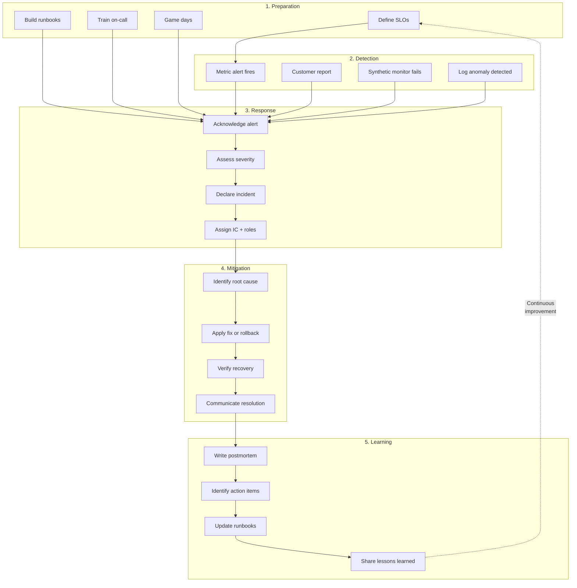
```mermaid
graph TB
    subgraph Preparation ["1. Preparation"]
        P1["Define SLOs"]
        P2["Build runbooks"]
        P3["Train on-call"]
        P4["Game days"]
    end

    subgraph Detection ["2. Detection"]
        D1["Metric alert fires"]
        D2["Customer report"]
        D3["Synthetic monitor fails"]
        D4["Log anomaly detected"]
    end

    subgraph Response ["3. Response"]
        R1["Acknowledge alert"]
        R2["Assess severity"]
        R3["Declare incident"]
        R4["Assign IC + roles"]
    end

    subgraph Mitigation ["4. Mitigation"]
        M1["Identify root cause"]
        M2["Apply fix or rollback"]
        M3["Verify recovery"]
        M4["Communicate resolution"]
    end

    subgraph Learning ["5. Learning"]
        L1["Write postmortem"]
        L2["Identify action items"]
        L3["Update runbooks"]
        L4["Share lessons learned"]
    end

    P1 --> D1
    P2 --> R1
    P3 --> R1
    P4 --> R1
    D1 --> R1
    D2 --> R1
    D3 --> R1
    D4 --> R1
    R1 --> R2 --> R3 --> R4
    R4 --> M1 --> M2 --> M3 --> M4
    M4 --> L1 --> L2 --> L3 --> L4
    L4 -.->|"Continuous<br/>improvement"| P1
```

**Incident severity matrix with response expectations:**

| Dimension | SEV0 (Critical) | SEV1 (Major) | SEV2 (Minor) | SEV3 (Low) |
|-----------|-----------------|--------------|--------------|------------|
| User impact | Total service failure | Significant degradation | Partial degradation | Minimal/no impact |
| Revenue impact | Active revenue loss | Potential revenue loss | Indirect impact | No impact |
| Response time | Immediate (< 5 min) | < 15 min | < 1 hour | Next business day |
| IC required | Yes | Yes | Optional | No |
| War room | Yes | Yes | No | No |
| Status page | Update required | Update required | Optional | No |
| Postmortem | Required within 48h | Required within 5 days | Optional | No |
| Executive notification | Immediate | Within 1 hour | Daily summary | No |

---

# Section 3: Operational Excellence

---

## 3.1 Dashboards

Dashboards are the primary interface between engineers and their systems. A well-designed dashboard answers the right questions for the right audience at the right level of detail.

### 3.1.1 Dashboard Taxonomy

| Dashboard Type | Audience | Purpose | Refresh Rate |
|---------------|----------|---------|-------------|
| Executive | VP/CTO/CEO | Business health, SLA compliance | 5 min |
| Service | Service team | Detailed service health (RED + USE) | 30 sec |
| Golden Signals | On-call | Quick triage of user-facing issues | 15 sec |
| Deployment | DevOps/SRE | Deploy status, canary health | 10 sec |
| Infrastructure | Platform team | Cluster, node, network health | 30 sec |
| Cost | FinOps | Cloud spend, resource efficiency | 1 hour |

### 3.1.2 Executive Dashboard

The executive dashboard answers: "Is the business healthy right now?"

```
+================================================================+
|                    PLATFORM HEALTH - EXECUTIVE                  |
|                    2025-03-15 14:32 UTC                         |
+================================================================+
|                                                                 |
|  OVERALL STATUS: [====== HEALTHY ======]                        |
|                                                                 |
|  +-------------------+  +-------------------+  +-------------+  |
|  | AVAILABILITY      |  | REVENUE           |  | ACTIVE      |  |
|  |  99.97%           |  |  $2.4M today      |  | USERS       |  |
|  |  SLO: 99.9%  [OK] |  |  vs $2.3M target  |  |  1.2M       |  |
|  |  Budget: 72%      |  |  [ABOVE TARGET]   |  |  +5% WoW    |  |
|  +-------------------+  +-------------------+  +-------------+  |
|                                                                 |
|  +-------------------+  +-------------------+  +-------------+  |
|  | ERROR BUDGET      |  | P0 INCIDENTS      |  | DEPLOYS     |  |
|  |  ████████░░ 72%   |  |  0 active         |  |  14 today   |  |
|  |  remaining         |  |  2 this month     |  |  0 failed   |  |
|  |  30-day window     |  |  MTTR: 18 min     |  |  [NORMAL]   |  |
|  +-------------------+  +-------------------+  +-------------+  |
|                                                                 |
|  TOP 5 SERVICES BY ERROR RATE (last 1h):                        |
|  +---------+----------+--------+---------+--------+             |
|  | Service | Requests | Errors | Rate    | SLO    |             |
|  +---------+----------+--------+---------+--------+             |
|  | search  | 245,000  | 490    | 0.20%   | 99.5%  |             |
|  | payment | 89,000   | 89     | 0.10%   | 99.9%  |             |
|  | catalog | 1.2M     | 600    | 0.05%   | 99.9%  |             |
|  | cart    | 456,000  | 91     | 0.02%   | 99.9%  |             |
|  | auth    | 890,000  | 89     | 0.01%   | 99.9%  |             |
|  +---------+----------+--------+---------+--------+             |
|                                                                 |
+================================================================+
```

### 3.1.3 Service Dashboard (RED Method)

The service dashboard answers: "How is this specific service performing?"

```
+================================================================+
|              CHECKOUT SERVICE - RED Dashboard                    |
|              2025-03-15 14:32 UTC                               |
+================================================================+
|                                                                 |
|  RATE (requests/sec)                                            |
|  Current: 1,247 rps    Peak today: 3,891 rps                   |
|                                                                 |
|  3.9K |          *                                              |
|  3.0K |        * * *                                            |
|  2.0K |      *     * *      *                                   |
|  1.2K | * * *         * * *   * *                                |
|  0.0K +----+----+----+----+----+----+----+----+                 |
|       00   03   06   09   12   15   18   21                     |
|                                                                 |
|  ERRORS (error rate %)                                          |
|  Current: 0.08%    SLO: 99.9% (0.1% budget)                    |
|                                                                 |
|  1.0% |                                                         |
|  0.5% |                                                         |
|  0.1% |--- SLO threshold ---------------------------------      |
|  0.08%| * * * * * * * *   * * * * * * * * * * * *               |
|  0.0% +----+----+----+----+----+----+----+----+                 |
|       00   03   06   09   12   15   18   21                     |
|                                                                 |
|  DURATION (latency)                                             |
|  p50: 45ms    p90: 120ms    p99: 340ms    p999: 1.2s           |
|                                                                 |
|  1.5s |                                                         |
|  1.0s |                  *                                      |
|  0.5s |  * *         * *   * *                                  |
|  0.3s |*     * * * *         * * * * * * * * *     p99          |
|  0.1s |* * * * * * * * * * * * * * * * * * * *     p90          |
|  0.0s +----+----+----+----+----+----+----+----+                 |
|       00   03   06   09   12   15   18   21                     |
|                                                                 |
+================================================================+
|  DEPENDENCIES                                                   |
|  +---------------+--------+--------+---------+                  |
|  | Dependency    | Status | Errors | Latency |                  |
|  +---------------+--------+--------+---------+                  |
|  | payment-svc   |  [OK]  | 0.02%  | 89ms    |                 |
|  | inventory-svc |  [OK]  | 0.01%  | 23ms    |                 |
|  | user-svc      |  [OK]  | 0.00%  | 12ms    |                 |
|  | postgres       |  [OK]  | 0.00%  | 4ms     |                |
|  | redis          |  [OK]  | 0.00%  | 1ms     |                |
|  +---------------+--------+--------+---------+                  |
+================================================================+
```

### 3.1.4 Golden Signals Dashboard

The golden signals dashboard is designed for on-call triage. It shows all services at once with color-coded health indicators.

```
+================================================================+
|                 GOLDEN SIGNALS - ALL SERVICES                   |
|                 2025-03-15 14:32 UTC                            |
+================================================================+
|                                                                 |
| Service       | Traffic  | Errors  | Latency(p99) | Saturation |
| ------------- | -------- | ------- | ------------ | ---------- |
| api-gateway   | 12K rps  | [0.02%] | [120ms]      | CPU: [45%] |
| auth-service  | 3.2K rps | [0.01%] | [35ms]       | CPU: [22%] |
| catalog-svc   | 8.5K rps | [0.05%] | [89ms]       | CPU: [38%] |
| search-svc    | 4.1K rps | [0.20%] | [210ms]      | CPU: [67%] |
| cart-service   | 2.8K rps | [0.02%] | [45ms]       | CPU: [15%] |
| checkout-svc  | 1.2K rps | [0.08%] | [340ms]      | CPU: [28%] |
| payment-svc   | 0.9K rps | [0.10%] | [450ms]      | CPU: [20%] |
| order-svc     | 0.8K rps | [0.03%] | [67ms]       | CPU: [18%] |
| inventory-svc | 5.2K rps | [0.01%] | [23ms]       | CPU: [42%] |
| notif-svc     | 1.5K rps | [0.00%] | [15ms]       | CPU: [10%] |
|                                                                 |
| Legend: [GREEN] = OK  [YELLOW] = Warning  [RED] = Critical     |
| Thresholds based on per-service SLOs                            |
+================================================================+
```

### 3.1.5 Grafana Best Practices

| Practice | Why |
|----------|-----|
| Use template variables | `$service`, `$region` dropdowns enable reuse across services |
| Set consistent time ranges | Default to 6h for service dashboards, 24h for executive |
| Add annotations for deploys | Vertical lines showing deploy times correlate changes with metrics |
| Use stat panels for current values | Large numbers for quick glance (current RPS, error rate) |
| Use time series for trends | Line charts for rate, duration, saturation over time |
| Use heatmaps for distributions | Visualize latency distribution better than percentile lines |
| Link to logs and traces | "Explore" buttons that jump to Loki/Tempo with pre-filled queries |
| Alert thresholds as visual lines | Draw SLO thresholds directly on time series panels |
| Organize by row | Collapsible rows: Overview → RED → USE → Dependencies |
| Version control dashboards | Store dashboard JSON in Git, not just Grafana's database |

### 3.1.6 Grafana Dashboard Design Principles

Effective dashboards are not just collections of panels — they tell a story. A well-designed dashboard guides the viewer from high-level health to specific problem areas in a logical flow.

**The inverted pyramid principle:**

Start with the broadest context at the top and drill down to specifics as you scroll.

```
Top of dashboard:    OVERALL HEALTH (single stat panels, traffic lights)
                     Is the system healthy right now? (Yes/No, 2-second answer)

Second row:          GOLDEN SIGNALS (time series panels)
                     How are latency, traffic, errors, saturation trending?

Third row:           COMPONENT HEALTH (table or grid)
                     Which specific components are degraded?

Fourth row:          DEPENDENCY STATUS (table)
                     Are upstream/downstream services healthy?

Bottom of dashboard: RECENT CHANGES (annotations, deploy history)
                     What changed recently that might explain the current state?
```

**Dashboard design anti-patterns:**

| Anti-Pattern | Problem | Fix |
|-------------|---------|-----|
| Too many panels (>20) | Information overload, slow render | Split into multiple focused dashboards |
| No variable templates | Separate dashboard per service (unmaintainable) | Use `$service`, `$region`, `$environment` variables |
| Raw counter values | Meaningless numbers that only go up | Always use `rate()` or `increase()` for counters |
| Missing time context | No deploy annotations, no incident markers | Add annotation sources for deploys, incidents, config changes |
| Same color for everything | Hard to distinguish panels at a glance | Use consistent color semantics: green=good, yellow=warn, red=bad |
| No alerting thresholds shown | Dashboard does not show when values are abnormal | Draw threshold lines for SLO and alert boundaries |
| No drill-down links | Dead-end dashboard requires manual navigation | Add data links: metric panel -> traces -> logs |

**Grafana provisioning as code (recommended for teams):**

```yaml
# grafana/provisioning/dashboards/dashboard.yaml
apiVersion: 1
providers:
  - name: 'default'
    orgId: 1
    folder: 'Service Dashboards'
    type: file
    disableDeletion: true
    updateIntervalSeconds: 30
    options:
      path: /var/lib/grafana/dashboards
      foldersFromFilesStructure: true
```

Store dashboard JSON in Git alongside the service code. When a service is deployed, its dashboard is automatically updated. This prevents dashboard drift and ensures dashboards stay consistent with the service they monitor.

**Data source linking for drill-down workflows:**

Configure Grafana to link Prometheus, Loki, and Tempo data sources so engineers can seamlessly navigate:

1. **Metric to Trace**: Click an exemplar on a histogram panel to open the corresponding trace in Tempo.
2. **Trace to Logs**: From a trace span, click "View logs" to open Loki with `{trace_id="abc123"}`.
3. **Log to Trace**: From a log entry containing a trace_id, click to open the full trace view.

This cross-linking is configured via Grafana's "derived fields" and "data links" features and is the single most valuable configuration for debugging workflows.

---

## 3.2 Capacity Planning

Capacity planning ensures the system can handle future traffic without degradation. It bridges the gap between current performance and future demand.

### 3.2.1 Traffic Forecasting

| Method | Description | Accuracy | Effort |
|--------|-------------|----------|--------|
| Historical extrapolation | Plot traffic trend, extend the line | Low-Medium | Low |
| Seasonal decomposition | Separate trend, seasonal, and residual components | Medium | Medium |
| Business-driven | Multiply planned campaigns, launches, partnerships | Medium-High | High |
| ML-based | Time series models (ARIMA, Prophet, LSTM) | High | High |

**Traffic forecasting workflow:**

```
Historical data (12+ months)
  → Decompose: trend + weekly seasonality + daily seasonality + holidays
  → Apply business adjustments: +30% for Black Friday, +50% for product launch
  → Add safety margin: +20% headroom
  → Result: capacity target for each month
```

**Example capacity forecast:**

```
Month     | Current RPS | Forecast RPS | Required Capacity | Cost Delta
--------- | ----------- | ------------ | ----------------- | ----------
April     | 10,000      | 11,000       | 13,200 (+20%)     | +$8K/mo
May       | 10,000      | 12,500       | 15,000 (+20%)     | +$15K/mo
June      | 10,000      | 11,500       | 13,800 (+20%)     | +$10K/mo
July      | 10,000      | 14,000       | 16,800 (+20%)     | +$20K/mo
November  | 10,000      | 35,000       | 42,000 (+20%)     | +$85K/mo
```

### 3.2.2 Load Testing

Load testing validates that the system can handle projected traffic. It should be part of the regular development cycle, not a last-minute pre-launch exercise.

**Load testing types:**

| Type | Purpose | Duration | Traffic Pattern |
|------|---------|----------|-----------------|
| Smoke test | Verify basic functionality under minimal load | 1-5 min | 1-10 users |
| Load test | Verify performance at expected traffic | 30-60 min | Expected peak RPS |
| Stress test | Find the breaking point | 1-2 hours | Ramp up until failure |
| Soak test | Find memory leaks, resource exhaustion | 8-24 hours | Steady expected load |
| Spike test | Verify handling of sudden traffic surges | 15-30 min | 10x spike for 5 min |

**Load testing tools:**

| Tool | Language | Protocol Support | Best For |
|------|----------|-----------------|----------|
| k6 | JavaScript | HTTP, WebSocket, gRPC | Developer-friendly, CI integration |
| Locust | Python | HTTP (extensible) | Custom scenarios, distributed |
| Gatling | Scala | HTTP, WebSocket | High-performance, detailed reports |
| JMeter | Java | HTTP, JDBC, JMS, etc. | Protocol variety, GUI |
| Artillery | JavaScript/YAML | HTTP, WebSocket, Socket.io | Quick setup, YAML scenarios |

**Load test result analysis:**

```
Test: Checkout flow, 60 minutes, ramping to 5,000 concurrent users

Results:
  Throughput: 4,200 requests/sec (target: 5,000)  [BELOW TARGET]
  Latency p50: 85ms (target: < 100ms)             [PASS]
  Latency p99: 1,800ms (target: < 2,000ms)        [MARGINAL]
  Error rate: 0.8% (target: < 0.5%)               [FAIL]

Bottleneck identified:
  - Database connection pool (max 100) saturated at 3,500 RPS
  - Connection wait time contributed 400ms to p99 latency
  - Errors were all "connection pool exhausted" timeouts

Action:
  - Increase connection pool to 200
  - Add connection pool metrics to dashboard
  - Add circuit breaker for connection pool saturation
  - Re-test after changes
```

### 3.2.3 Performance Benchmarks

Performance benchmarks establish baseline expectations for system components.

**Standard benchmarks to maintain:**

| Component | Metric | Baseline | Acceptable Range |
|-----------|--------|----------|-----------------|
| API Gateway | p99 latency overhead | 5ms | < 10ms |
| Authentication | Token validation | 2ms | < 5ms |
| Database read (indexed) | Single row lookup | 1ms | < 5ms |
| Database write | Single row insert | 3ms | < 10ms |
| Redis cache hit | GET operation | 0.3ms | < 1ms |
| Kafka produce | Single message | 5ms | < 20ms |
| Service-to-service HTTP | Round trip | 10ms | < 50ms |
| Service-to-service gRPC | Round trip | 3ms | < 15ms |

**Benchmark regression detection:**

Include benchmark tests in CI. If a code change causes a benchmark to degrade beyond the acceptable range, the build fails.

```yaml
# CI benchmark configuration
benchmarks:
  - name: checkout_flow_latency
    command: k6 run benchmark/checkout.js
    thresholds:
      http_req_duration_p99: ["< 2000"]
      http_req_failed: ["< 0.01"]

  - name: database_query_latency
    command: pgbench -c 50 -j 4 -T 60 benchmark_db
    thresholds:
      avg_latency_ms: ["< 5"]
      tps: ["> 1000"]
```

### 3.2.4 Cost Modeling

Observability and infrastructure costs must be modeled and optimized.

**Cost model for observability:**

```
Log costs:
  Ingestion: 2 TB/day * $0.50/GB = $1,000/day = $30,000/month
  Storage (hot, 7 days): 14 TB * $0.10/GB = $1,400/month
  Storage (warm, 30 days): 60 TB * $0.03/GB = $1,800/month
  Storage (cold, 1 year): 730 TB * $0.004/GB = $2,920/month
  Total logs: ~$36,120/month

Metric costs:
  50M data points/min * 60 * 24 = 72B data points/day
  Prometheus storage: 10 nodes * $2,000/month = $20,000/month
  Remote storage (Thanos/Mimir): $5,000/month
  Total metrics: ~$25,000/month

Trace costs:
  100M spans/day * 30 days * 1KB/span = 3 TB storage
  Trace backend: $15,000/month
  Total traces: ~$15,000/month

Grand total: ~$76,120/month (~$913K/year)
```

**Cost optimization strategies:**

| Strategy | Savings | Trade-off |
|----------|---------|-----------|
| Log sampling (keep 10% of success logs) | 60-70% of log costs | Reduced debugging for sampled-out requests |
| Metric cardinality reduction | 30-50% of metric costs | Less granular dimensions |
| Trace sampling (1% head-based + tail-based for errors) | 80-90% of trace costs | May miss some interesting traces |
| Tiered storage (hot → warm → cold) | 40-60% of storage costs | Slower queries for old data |
| Shorter retention (30 → 14 days hot) | 50% of hot storage | Less historical data for debugging |

### 3.2.5 Cost Optimization for Observability — Deep Dive

Observability costs are one of the fastest-growing line items in cloud infrastructure budgets. At scale, unmanaged observability spend can exceed the cost of the application infrastructure itself. A systematic approach to cost optimization is essential.

**Cost optimization framework:**

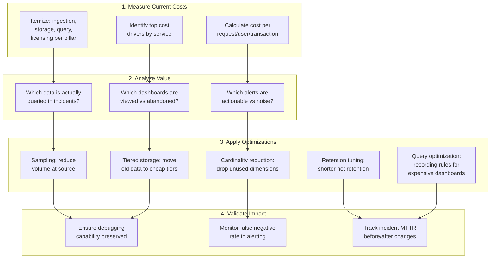
```mermaid
graph TB
    subgraph Measure ["1. Measure Current Costs"]
        M1["Itemize: ingestion,<br/>storage, query,<br/>licensing per pillar"]
        M2["Identify top cost<br/>drivers by service"]
        M3["Calculate cost per<br/>request/user/transaction"]
    end

    subgraph Analyze ["2. Analyze Value"]
        A1["Which data is actually<br/>queried in incidents?"]
        A2["Which dashboards are<br/>viewed vs abandoned?"]
        A3["Which alerts are<br/>actionable vs noise?"]
    end

    subgraph Optimize ["3. Apply Optimizations"]
        O1["Sampling: reduce<br/>volume at source"]
        O2["Tiered storage: move<br/>old data to cheap tiers"]
        O3["Cardinality reduction:<br/>drop unused dimensions"]
        O4["Retention tuning:<br/>shorter hot retention"]
        O5["Query optimization:<br/>recording rules for<br/>expensive dashboards"]
    end

    subgraph Validate ["4. Validate Impact"]
        V1["Ensure debugging<br/>capability preserved"]
        V2["Monitor false negative<br/>rate in alerting"]
        V3["Track incident MTTR<br/>before/after changes"]
    end

    M1 --> A1
    M2 --> A2
    M3 --> A3
    A1 --> O1
    A2 --> O2
    A3 --> O3
    O1 --> V1
    O2 --> V1
    O3 --> V2
    O4 --> V3
    O5 --> V3
```

**Sampling strategies by signal type:**

| Signal | Strategy | Implementation | Expected Savings |
|--------|----------|----------------|-----------------|
| Logs (success) | Sample 1-10% of INFO logs for successful requests | Error-biased sampling in log agent | 60-80% of log ingestion cost |
| Logs (errors) | Keep 100% of ERROR/FATAL | Always log errors, no sampling | N/A (keep all) |
| Metrics | Drop unused labels, aggregate high-cardinality metrics | Prometheus relabeling, recording rules | 30-50% of metric storage |
| Traces | Tail-based: keep 100% errors + slow, 1% normal | OTel Collector tail_sampling processor | 80-95% of trace storage |
| Traces (debug) | On-demand full sampling for specific services | Dynamic sampling rate via feature flag | Variable |

**Retention tier design:**

| Tier | Duration | Storage Type | Query Latency | Cost per GB/month | Use Case |
|------|----------|-------------|---------------|-------------------|----------|
| Hot | 0-3 days | SSD, in-memory indices | < 1 second | $0.10-0.50 | Active incident debugging |
| Warm | 3-14 days | HDD, compressed indices | 1-10 seconds | $0.03-0.10 | Recent issue investigation |
| Cold | 14-90 days | Object storage (S3/GCS) | 10-60 seconds | $0.01-0.03 | Trend analysis, compliance |
| Archive | 90+ days | Glacier / Coldline | Minutes to hours | $0.001-0.004 | Regulatory compliance only |

**Practical cost reduction playbook:**

1. **Audit dashboard usage**: Grafana tracks dashboard view counts. Dashboards not viewed in 90 days can be archived — and their backing recording rules removed.

2. **Implement log levels correctly**: A service logging at DEBUG level in production is a cost bug. Enforce INFO as the production default with dynamic DEBUG for targeted debugging.

3. **Use metrics instead of logs for aggregates**: Counting error logs is 100x more expensive than incrementing a counter metric. If you are querying logs only to count occurrences, create a metric instead.

4. **Negotiate commercial tool contracts**: For Datadog, Splunk, or New Relic, negotiate based on actual usage rather than provisioned capacity. Consider reserved/committed use discounts.

5. **Right-size Prometheus**: Each active time series consumes approximately 3.5KB of memory. Monitor `prometheus_tsdb_head_series` and alert when approaching memory limits. Use Grafana Mimir or Thanos for long-term storage instead of extending Prometheus retention.

---

## 3.3 Toil Reduction

Toil is the kind of work tied to running a production service that tends to be manual, repetitive, automatable, tactical, devoid of enduring value, and that scales linearly as a service grows. Reducing toil is essential for operational sustainability.

### 3.3.1 Identifying Toil

**Common sources of toil:**

| Toil Category | Example | Frequency |
|--------------|---------|-----------|
| Manual scaling | Adding instances for traffic spikes | Weekly |
| Certificate rotation | Manually rotating TLS certificates | Monthly |
| Capacity provisioning | Manually sizing new environments | Per project |
| Log cleanup | Manually deleting old log files | Weekly |
| Dependency updates | Manually updating library versions | Monthly |
| Alert response | Restarting pods for known transient failures | Daily |
| Data migration | Manually running schema migrations | Per release |
| Access provisioning | Manually granting/revoking access | Daily |

**Toil measurement:**

```
Toil percentage = (hours spent on toil per week) / (total engineering hours per week) * 100

Google SRE target: < 50% toil
Industry best practice: < 30% toil
World-class: < 15% toil
```

### 3.3.2 Automation Patterns

| Pattern | Description | Example |
|---------|-------------|---------|
| Auto-scaling | Automatically adjust capacity based on load | HPA in Kubernetes, AWS Auto Scaling |
| Auto-remediation | Automatically fix known issues | Restart crashed pods, clear disk space |
| GitOps | Infrastructure changes via pull requests | ArgoCD, Flux applying Kubernetes manifests |
| Self-service portals | Engineers provision resources without SRE involvement | Internal platform for spinning up databases |
| Automated rollback | Automatically revert bad deployments | Canary failure triggers rollback |
| Certificate automation | Auto-renew certificates before expiry | cert-manager, Let's Encrypt |
| Dependency automation | Auto-update dependencies with CI validation | Dependabot, Renovate |

### 3.3.3 Self-Healing Systems

Self-healing systems detect and recover from failures without human intervention.

**Self-healing patterns:**

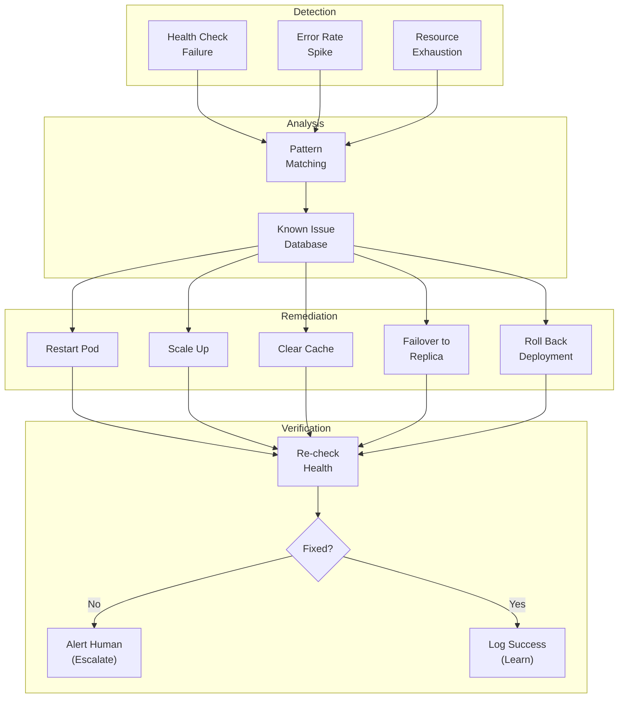
```mermaid
graph TB
    subgraph Detection ["Detection"]
        D1["Health Check<br/>Failure"]
        D2["Error Rate<br/>Spike"]
        D3["Resource<br/>Exhaustion"]
    end

    subgraph Analysis ["Analysis"]
        A1["Pattern<br/>Matching"]
        A2["Known Issue<br/>Database"]
    end

    subgraph Remediation ["Remediation"]
        R1["Restart Pod"]
        R2["Scale Up"]
        R3["Clear Cache"]
        R4["Failover to<br/>Replica"]
        R5["Roll Back<br/>Deployment"]
    end

    subgraph Verification ["Verification"]
        V1["Re-check<br/>Health"]
        V2{"Fixed?"}
        V3["Alert Human<br/>(Escalate)"]
        V4["Log Success<br/>(Learn)"]
    end

    D1 --> A1
    D2 --> A1
    D3 --> A1
    A1 --> A2
    A2 --> R1
    A2 --> R2
    A2 --> R3
    A2 --> R4
    A2 --> R5
    R1 --> V1
    R2 --> V1
    R3 --> V1
    R4 --> V1
    R5 --> V1
    V1 --> V2
    V2 -->|"No"| V3
    V2 -->|"Yes"| V4
```

**Self-healing example — Kubernetes liveness probe:**

```yaml
apiVersion: apps/v1
kind: Deployment
metadata:
  name: checkout-service
spec:
  template:
    spec:
      containers:
        - name: checkout
          livenessProbe:
            httpGet:
              path: /health/live
              port: 8080
            initialDelaySeconds: 30
            periodSeconds: 10
            failureThreshold: 3    # Restart after 3 consecutive failures

          readinessProbe:
            httpGet:
              path: /health/ready
              port: 8080
            initialDelaySeconds: 5
            periodSeconds: 5
            failureThreshold: 2    # Remove from LB after 2 failures

          resources:
            limits:
              memory: "512Mi"       # OOM kill prevents memory leak cascade
              cpu: "500m"
```

### 3.3.4 Auto-Remediation

Auto-remediation goes beyond Kubernetes restarts to address application-level issues.

**Auto-remediation runbook automation:**

```python
class AutoRemediator:
    """Watches for specific alert patterns and executes remediation."""

    REMEDIATION_MAP = {
        "disk_usage_high": {
            "action": "clean_old_logs",
            "command": "find /var/log -name '*.log' -mtime +7 -delete",
            "max_attempts": 1,
            "cooldown_minutes": 60,
        },
        "connection_pool_exhausted": {
            "action": "restart_service",
            "command": "kubectl rollout restart deployment/{service}",
            "max_attempts": 2,
            "cooldown_minutes": 30,
        },
        "certificate_expiring_soon": {
            "action": "renew_certificate",
            "command": "certbot renew --cert-name {domain}",
            "max_attempts": 3,
            "cooldown_minutes": 1440,  # 24 hours
        },
    }

    def handle_alert(self, alert_name: str, labels: dict) -> str:
        if alert_name not in self.REMEDIATION_MAP:
            return "no_remediation_available"

        config = self.REMEDIATION_MAP[alert_name]

        if self.recently_attempted(alert_name, config["cooldown_minutes"]):
            return "in_cooldown"

        if self.attempt_count(alert_name) >= config["max_attempts"]:
            return "max_attempts_exceeded_escalating"

        # Execute remediation
        result = self.execute(config["command"], labels)
        self.record_attempt(alert_name, result)

        return result
```

**Safety rules for auto-remediation:**

1. **Always have a maximum attempt limit**. An auto-remediation that loops infinitely is an outage amplifier.
2. **Always have a cooldown period**. Prevent rapid-fire remediation from causing more damage.
3. **Always log every action**. Auto-remediation must be fully auditable.
4. **Never auto-remediate data-destructive actions**. Deleting data requires human confirmation.
5. **Always escalate to a human when auto-remediation fails**. The fallback is always human judgment.

---

## 3.4 On-Call Practices

On-call is the practice of having designated engineers available 24/7 to respond to production incidents. Done well, it is a source of system knowledge and pride. Done poorly, it is a source of burnout and attrition.

### 3.4.1 Rotation Schedules

**Rotation design factors:**

| Factor | Recommendation |
|--------|---------------|
| Rotation length | 1 week (long enough for context, short enough to recover) |
| Team size | Minimum 5-6 engineers (each person on-call every 5-6 weeks) |
| Overlap | 1 hour handoff overlap at rotation boundary |
| Holidays | Volunteers first, then fair rotation; compensate generously |
| Timezone | Follow-the-sun for global teams; avoid overnight pages for single-TZ teams |

### 3.4.2 Handoff Procedures

**On-call handoff checklist:**

```markdown
## On-Call Handoff — Week of 2025-03-15

### Outgoing (Alice → Bob)

#### Active Issues
- [ ] Payment timeout alerts firing intermittently (P2, tracked in JIRA-1234)
- [ ] Redis cluster rebalancing scheduled for Wednesday 2 AM UTC

#### Recent Changes
- Deployed payment-service v2.15.0 on Monday (stable so far)
- Database connection pool increased from 100 to 150 on Tuesday

#### Runbook Updates
- Updated "payment_timeout" runbook with new Stripe endpoint check

#### Metrics to Watch
- Payment success rate (dipped to 99.7% on Monday, recovered)
- Redis memory usage (approaching 80% before rebalance)

#### Tips
- Stripe webhook delivery has been delayed by ~30s since their
  maintenance on Sunday. This may cause brief order status
  inconsistencies that self-resolve.
```

### 3.4.3 Escalation Paths

```mermaid
graph TB
    A["Alert fires"] --> B["Primary On-Call<br/>(5 min to ack)"]
    B -->|"Not acked"| C["Secondary On-Call<br/>(5 min to ack)"]
    C -->|"Not acked"| D["Team Lead<br/>(10 min to ack)"]
    D -->|"Not acked"| E["Engineering Manager<br/>(15 min to ack)"]

    B -->|"Acked, needs help"| F["Escalate to<br/>Subject Matter Expert"]
    F --> G["Cross-team<br/>Incident Response"]

    B -->|"Acked, SEV1+"| H["Declare Incident<br/>Engage IC"]
    H --> I["Full Incident<br/>Response Process"]
```

### 3.4.4 On-Call Compensation

On-call work outside business hours is real work and should be compensated. Common models:

| Model | Description | Typical Amount |
|-------|-------------|----------------|
| Flat stipend | Fixed amount per on-call shift | $500-1500/week |
| Per-page bonus | Additional payment per page received | $50-200/page |
| Comp time | Time off equivalent to hours worked during incidents | 1:1 or 1.5:1 |
| Hybrid | Flat stipend + per-page + comp time | Varies |

### 3.4.5 Reducing On-Call Burden

The best on-call practice is minimizing the need for on-call intervention.

**Burden reduction strategies:**

| Strategy | Impact |
|----------|--------|
| Fix root causes (not symptoms) | Eliminates recurring pages |
| Auto-remediation for known issues | Reduces pages that require simple actions |
| Better alerting (fewer false positives) | Reduces noise pages |
| Error budget-based deployment freezes | Reduces incident-causing deploys |
| Runbooks with clear steps | Reduces MTTR for pages that do occur |
| Game days for training | Increases confidence, reduces stress |
| Minimum 5-person rotation | Reduces frequency of on-call shifts |
| Follow-the-sun for global teams | Eliminates overnight pages |

**On-call health metrics to track:**

| Metric | Healthy | Needs Attention | Critical |
|--------|---------|-----------------|----------|
| Pages per shift | 0-2 | 3-5 | > 5 |
| Night pages per shift | 0 | 1 | > 1 |
| Mean time to acknowledge | < 5 min | 5-15 min | > 15 min |
| Mean time to resolve | < 30 min | 30-60 min | > 60 min |
| Percentage of actionable pages | > 90% | 70-90% | < 70% |
| On-call satisfaction (survey) | > 4/5 | 3-4/5 | < 3/5 |

### 3.4.6 On-Call Maturity Model

Organizations evolve their on-call practices through distinct maturity levels. Understanding where you are helps prioritize improvements.

| Level | Description | Characteristics | Target Metric |
|-------|-------------|----------------|---------------|
| Level 1: Reactive | Informal on-call, no process | No runbooks, no SLOs, no postmortems. Heroes save the day. | Pages per week: 20+ |
| Level 2: Defined | Formal rotation, basic runbooks | PagerDuty configured, basic escalation, some runbooks exist. | Pages per week: 10-20 |
| Level 3: Managed | SLO-driven, regular postmortems | Error budgets drive deploys, runbooks for all P0/P1 alerts, game days quarterly. | Pages per week: 5-10 |
| Level 4: Optimized | Auto-remediation, minimal toil | 80%+ of alerts auto-remediated, on-call shifts are mostly quiet, focus on prevention. | Pages per week: 0-5 |
| Level 5: Proactive | Chaos engineering, predictive alerts | Continuous chaos experiments, ML-based anomaly detection, near-zero on-call burden. | Pages per week: 0-2 |

### 3.4.7 Runbook Template Library

Runbooks should follow a consistent structure across the organization. Below are production-ready templates for common operational scenarios.

**Template: Database Connection Pool Exhaustion**

```markdown
## Runbook: db_connection_pool_exhausted

### Alert Description
Database connection pool utilization exceeds 90% for service {service_name}.

### Severity: P1

### Impact
Service cannot acquire new database connections. Requests queue and
eventually timeout, causing user-facing errors.

### Diagnosis Steps

1. Verify the alert:
   ```
   # Check connection pool metrics
   promql: db_pool_active_connections{service="$SERVICE"}
           / db_pool_max_connections{service="$SERVICE"}
   ```

2. Identify the cause:
   a. **Long-running queries** — Check for queries holding connections:
      ```sql
      SELECT pid, now() - pg_stat_activity.query_start AS duration,
             query, state
      FROM pg_stat_activity
      WHERE (now() - pg_stat_activity.query_start) > interval '30 seconds'
      ORDER BY duration DESC;
      ```

   b. **Connection leak** — Check if connections are growing without release:
      ```
      promql: rate(db_pool_connections_created_total{service="$SERVICE"}[5m])
      ```
      If creation rate is high but active count keeps growing = leak.

   c. **Traffic spike** — Check request rate:
      ```
      promql: rate(http_requests_total{service="$SERVICE"}[5m])
      ```

### Remediation

- **If long-running queries**: Kill the blocking query:
  ```sql
  SELECT pg_terminate_backend(pid) FROM pg_stat_activity
  WHERE duration > interval '5 minutes' AND state != 'idle';
  ```

- **If connection leak**: Restart the service (fixes leak temporarily):
  ```bash
  kubectl rollout restart deployment/$SERVICE -n prod
  ```

- **If traffic spike**: Temporarily increase pool size:
  ```bash
  kubectl set env deployment/$SERVICE DB_POOL_SIZE=200 -n prod
  ```

### Escalation
If not resolved within 15 minutes, escalate to Database team.

### Follow-Up
- File ticket to investigate root cause of leak/long queries.
- Review connection pool sizing for the service.
```

**Template: Certificate Expiry**

```markdown
## Runbook: tls_certificate_expiring

### Alert Description
TLS certificate for {domain} expires within {days_remaining} days.

### Severity: P2 (>7 days), P1 (<=7 days), P0 (<=1 day)

### Impact
Expired certificates cause HTTPS failures, breaking all client connections.

### Diagnosis Steps

1. Verify certificate expiry:
   ```bash
   echo | openssl s_client -servername $DOMAIN -connect $DOMAIN:443 2>/dev/null \
     | openssl x509 -noout -dates
   ```

2. Check cert-manager status (if using Kubernetes):
   ```bash
   kubectl get certificates -A | grep -i $DOMAIN
   kubectl describe certificate $CERT_NAME -n $NAMESPACE
   ```

### Remediation

- **If cert-manager is configured**: Trigger renewal:
  ```bash
  kubectl delete secret $CERT_SECRET -n $NAMESPACE
  # cert-manager will automatically re-issue
  ```

- **If manual certificate**: Renew via provider:
  ```bash
  certbot renew --cert-name $DOMAIN
  # Reload the web server / ingress controller
  kubectl rollout restart deployment/ingress-nginx -n ingress
  ```

### Escalation
If cert-manager renewal fails, escalate to Platform team.
```

**Template: High Memory Usage / OOM Risk**

```markdown
## Runbook: memory_usage_critical

### Alert Description
Memory usage exceeds 85% on {pod_name} in namespace {namespace}.

### Severity: P2

### Impact
If memory reaches 100%, the OOM killer terminates the process,
causing brief service disruption until Kubernetes restarts the pod.

### Diagnosis Steps

1. Check current memory usage:
   ```bash
   kubectl top pods -n $NAMESPACE -l app=$SERVICE
   ```

2. Check for memory leak pattern:
   ```
   promql: container_memory_working_set_bytes{pod=~"$SERVICE.*"}
   # If consistently growing over hours/days = likely memory leak
   ```

3. Check heap dumps (Java services):
   ```bash
   kubectl exec -n $NAMESPACE $POD -- jmap -heap 1
   ```

### Remediation

- **Immediate (buy time)**: Increase memory limit:
  ```bash
  kubectl set resources deployment/$SERVICE -n $NAMESPACE \
    --limits=memory=1Gi
  ```

- **If memory leak suspected**: Restart pods (rolling):
  ```bash
  kubectl rollout restart deployment/$SERVICE -n $NAMESPACE
  ```

### Follow-Up
- Capture heap dump before restart for analysis.
- File ticket to investigate memory leak with profiling.
```

---

## Instrumentation Blueprint — Observing a New Service from Day One

When a team launches a new microservice, observability should not be an afterthought. This blueprint defines the minimum instrumentation every service must ship with on day one, organized by pillar. It is designed around OpenTelemetry as the universal instrumentation layer.

### Logging Baseline

Every service must emit structured JSON logs with the following minimum fields:

```json
{
  "timestamp": "ISO-8601 with timezone",
  "level": "INFO | WARN | ERROR | FATAL",
  "service": "service-name",
  "version": "v1.2.3 (or git SHA)",
  "trace_id": "W3C trace ID from OTel context",
  "span_id": "current span ID",
  "correlation_id": "business correlation ID (e.g., order_id)",
  "event": "descriptive_event_name",
  "message": "human-readable description",
  "error": "error type + message (if applicable)",
  "duration_ms": "operation duration (if applicable)"
}
```

**Logging rules for new services:**

| Rule | Rationale |
|------|-----------|
| Use INFO as the default production level | DEBUG in prod is a cost bug |
| Log all errors with stack traces | Stack traces are essential for diagnosis |
| Log all external calls (HTTP, gRPC, DB, queue) with duration | Dependency latency is the #1 source of issues |
| Include trace_id in every log line | Enables log → trace correlation |
| Redact PII before logging | Legal and compliance requirement |
| Use event-based names, not free-text messages | Enables log-based alerting and dashboards |

### Metrics Baseline

Every service must expose these minimum metrics via OpenTelemetry SDK or Prometheus client:

```yaml
# Mandatory metrics for every service
metrics:
  # --- RED metrics (request-driven) ---
  http_requests_total:
    type: counter
    labels: [method, path, status_code]
    description: "Total HTTP requests handled"

  http_request_duration_seconds:
    type: histogram
    labels: [method, path]
    buckets: [0.005, 0.01, 0.025, 0.05, 0.1, 0.25, 0.5, 1, 2.5, 5, 10]
    description: "Request latency distribution"

  http_requests_in_flight:
    type: gauge
    labels: [method]
    description: "Currently processing requests"

  # --- Dependency metrics ---
  external_call_duration_seconds:
    type: histogram
    labels: [dependency, method, status]
    description: "Latency of calls to external dependencies"

  external_call_errors_total:
    type: counter
    labels: [dependency, error_type]
    description: "Errors from external dependencies"

  # --- Resource metrics (USE method) ---
  db_connection_pool_size:
    type: gauge
    labels: [pool_name]
    description: "Current DB connection pool size"

  db_connection_pool_in_use:
    type: gauge
    labels: [pool_name]
    description: "Active DB connections"

  # --- Business metrics ---
  business_operation_total:
    type: counter
    labels: [operation, outcome]
    description: "Business operations (e.g., orders_placed, payments_processed)"
```

**Cardinality guard rails:**

| Label | Max Cardinality | Enforcement |
|-------|----------------|-------------|
| method | ~5 (GET, POST, PUT, DELETE, PATCH) | Static set |
| path | Parameterize routes (`/users/{id}` not `/users/12345`) | Route normalization middleware |
| status_code | ~20 (HTTP status codes) | Static set |
| dependency | ~10-20 downstream services | Static configuration |
| error_type | ~10-15 classified error types | Enum, not free-text |

### Tracing Baseline

Every service must participate in distributed tracing using OpenTelemetry:

```yaml
# Minimum tracing configuration for every service
tracing:
  sdk: OpenTelemetry (language-appropriate SDK)
  propagation: W3C TraceContext (traceparent header)
  auto_instrumentation:
    - HTTP server/client (inbound + outbound requests)
    - gRPC server/client
    - Database clients (SQL, Redis, MongoDB)
    - Message queue producers/consumers (Kafka, SQS, RabbitMQ)

  manual_instrumentation:
    - Business-critical operations (payment processing, order fulfillment)
    - Long-running background tasks
    - Fan-out operations (parallel calls to multiple services)

  span_attributes:
    required:
      - service.name
      - service.version
      - deployment.environment
      - user.id (if applicable, hashed for PII)
    recommended:
      - http.method, http.route, http.status_code
      - db.system, db.statement (parameterized)
      - messaging.system, messaging.destination

  sampling:
    development: 100% (all traces)
    staging: 100% (all traces)
    production: tail-based via OTel Collector
      always_sample: errors, slow requests (> p99)
      head_sample: 1-5% of successful fast requests
```

### Day-One Observability Checklist

| # | Item | Pillar | Priority |
|---|------|--------|----------|
| 1 | Structured JSON logging with trace_id | Logs | P0 |
| 2 | RED metrics (rate, errors, duration) for all endpoints | Metrics | P0 |
| 3 | OTel auto-instrumentation enabled | Traces | P0 |
| 4 | Health check endpoint (`/healthz`, `/readyz`) | Metrics | P0 |
| 5 | Service registered in Grafana dashboards | Dashboard | P0 |
| 6 | SLO defined (availability + latency at minimum) | SLO | P1 |
| 7 | Burn-rate alerts configured in Alertmanager | Alerting | P1 |
| 8 | Runbook for top 3 expected failure modes | Incident | P1 |
| 9 | Dependency metrics for all external calls | Metrics | P1 |
| 10 | Business metrics for key operations | Metrics | P2 |
| 11 | PII redaction verified in log output | Logs | P1 |
| 12 | On-call rotation configured for the service | Operations | P2 |

---

## Observability Cost as a Budget

Observability data is essential but not free. At scale, unmanaged telemetry costs can exceed 20-30% of total infrastructure spend. Treating observability cost as a managed engineering budget — not an unbounded byproduct — is a critical operational discipline.

### The Cost-as-Budget Framework

The core principle: **every team owns an observability budget**, measured in dollars-per-month or GB-per-month, just as they own a compute budget. Overruns require the same justification as requesting more compute.

```
Observability Budget = Ingestion Cost + Storage Cost + Query Cost + Licensing

Per-team budget allocation:
  Team budget = (total observability budget) × (team's share of traffic/services)
  Buffer: Reserve 15% for incident-driven debugging surges
```

**Budget categories and typical cost drivers:**

| Category | Primary Cost Driver | Typical Share | Optimization Lever |
|----------|-------------------|---------------|-------------------|
| Log ingestion | Volume (GB/day) | 40-50% | Sampling, log levels, dropping verbose fields |
| Metric storage | Cardinality (active time series) | 15-25% | Label discipline, recording rules, aggregation |
| Trace storage | Span volume (spans/sec) | 10-20% | Tail-based sampling, shorter retention |
| Licensing | Per-host, per-GB, per-user fees | 15-30% | Vendor negotiation, open-source alternatives |
| Query compute | Dashboard load, ad-hoc queries | 5-10% | Recording rules, query caching, dashboard pruning |

### Implementing Cost Governance

**Step 1: Make costs visible** — publish per-team observability costs on a shared Grafana dashboard:

```promql
# Per-team log ingestion rate (bytes/sec)
sum by (team) (rate(log_bytes_ingested_total[1h]))

# Per-team active metric series count
count by (team) (group({team=~".+"}) by (__name__, team))

# Per-team trace span rate
sum by (team) (rate(traces_spans_ingested_total[1h]))
```

**Step 2: Set per-team budgets** based on baseline measurement + growth projection:

| Team | Services | Monthly Budget | Current Spend | Status |
|------|----------|---------------|---------------|--------|
| Checkout | 8 | $12,000 | $10,400 | Green |
| Search | 5 | $18,000 | $22,100 | Red — over budget |
| Payments | 6 | $9,000 | $8,200 | Green |
| Platform | 12 | $25,000 | $24,800 | Yellow — approaching |

**Step 3: Review and adjust quarterly** — observability budgets are living constraints, not fixed ceilings:

| Trigger | Action |
|---------|--------|
| Team consistently under budget | Reduce allocation, reallocate to teams that need it |
| Team over budget | Require optimization plan within 2 weeks |
| New service launch | Allocate incremental budget based on estimated traffic |
| Major incident required debug data | Temporary budget surge approved, reviewed post-incident |
| Vendor price increase | Re-evaluate build vs. buy; consider open-source migration |

### Cost-Efficiency Metrics

Track these metrics to ensure observability spend delivers proportional value:

| Metric | Formula | Target |
|--------|---------|--------|
| Cost per incident resolved | Monthly observability cost / incidents resolved | Decreasing quarter-over-quarter |
| Cost per million requests | Monthly observability cost / (requests/month in millions) | Stable or decreasing |
| MTTR trend vs. cost trend | Correlation of MTTR improvement with cost changes | MTTR should improve faster than cost grows |
| Unused dashboard ratio | Dashboards with 0 views in 90 days / total dashboards | < 10% |
| Alert signal-to-noise ratio | Actionable alerts / total alerts fired | > 80% |

**The golden rule**: If observability costs are growing faster than the value they deliver (measured by MTTR reduction, incident prevention, and developer productivity), something is wrong. Either the data is not being used effectively, or the collection is not targeted enough.

---

## Architectural Decision Records (ADRs)

### ADR-1: Structured Logging Format

**Status:** Accepted

**Context:** The platform generates logs from 200+ microservices written in 5 programming languages. Different teams use different logging formats, making cross-service debugging difficult and log aggregation inefficient.

**Decision:** All services must emit logs in JSON format with a minimum set of required fields: `timestamp`, `level`, `service`, `event`, `trace_id`, `correlation_id`.

**Consequences:**
- Positive: Uniform querying across all services in Grafana Loki.
- Positive: Automatic field extraction eliminates brittle regex parsing.
- Positive: New fields can be added without breaking existing queries.
- Negative: Increased log size (~30% larger than plain text).
- Negative: Requires updating logging libraries in all services (one-time migration cost).
- Mitigation: Compression in transport layer reduces size impact. Provide shared logging libraries per language.

---

### ADR-2: Prometheus + Grafana Stack for Metrics

**Status:** Accepted

**Context:** The team evaluated Datadog, Prometheus + Grafana, and CloudWatch for metrics collection and visualization. Budget is constrained and the team has strong Kubernetes expertise.

**Decision:** Use Prometheus for metrics collection, Grafana for visualization, and Alertmanager for alerting. Use Thanos for long-term storage and cross-cluster querying.

**Consequences:**
- Positive: No per-metric or per-host licensing cost.
- Positive: Deep Kubernetes integration via kube-state-metrics and node-exporter.
- Positive: PromQL is the industry-standard query language for metrics.
- Negative: Operational burden of running Prometheus, Thanos, and Grafana clusters.
- Negative: No built-in APM features (Datadog has APM, log management, and metrics in one platform).
- Mitigation: Use managed Prometheus (Amazon Managed Prometheus, Grafana Cloud) to reduce operational burden.

---

### ADR-3: OpenTelemetry for Instrumentation

**Status:** Accepted

**Context:** Services are currently instrumented with a mix of Jaeger client libraries, Prometheus client libraries, and custom logging. This creates vendor lock-in and inconsistent telemetry quality.

**Decision:** Standardize on OpenTelemetry SDK for all new instrumentation. Migrate existing instrumentation to OTel over 6 months.

**Consequences:**
- Positive: Vendor-neutral — can switch backends without application changes.
- Positive: Unified API for traces, metrics, and logs (eventually).
- Positive: Large community and ecosystem (auto-instrumentation for most frameworks).
- Negative: OTel is still maturing in some areas (logs SDK is newer than traces).
- Negative: Migration requires touching all services.
- Mitigation: Auto-instrumentation covers 80% of use cases. Manual instrumentation only needed for custom business spans.

---

### ADR-4: Tail-Based Sampling for Traces

**Status:** Accepted

**Context:** At 100M spans/day, storing all traces costs $45K/month. Head-based sampling at 1% reduces cost but misses 99% of error and latency outlier traces.

**Decision:** Implement tail-based sampling in the OTel Collector. Keep 100% of error traces, 100% of slow traces (>2s), and 1% of normal traces.

**Consequences:**
- Positive: Captures all interesting traces for debugging.
- Positive: Reduces storage cost by ~85% compared to storing everything.
- Negative: Requires buffering all spans for 10-30 seconds before sampling decision.
- Negative: Increases OTel Collector resource requirements (memory for buffering).
- Mitigation: Deploy dedicated sampling collectors with larger memory allocation. Use head-based probabilistic sampling as fallback if collector is overloaded.

---

### ADR-5: Multi-Window Burn Rate Alerting

**Status:** Accepted

**Context:** Traditional threshold-based alerts (error rate > 5%) produce false positives from transient spikes and miss slow-burn degradations.

**Decision:** Replace threshold-based alerting with multi-window burn rate alerting based on SLOs. Use Google SRE's recommended burn rate windows.

**Consequences:**
- Positive: Dramatically reduces false positive alerts.
- Positive: Catches both sudden spikes and slow burns.
- Positive: Alerts are directly tied to user impact via SLOs.
- Negative: More complex to understand and configure.
- Negative: Requires well-defined SLOs for every alertable service.
- Mitigation: Provide templates and training for teams adopting SLO-based alerting.

---

### ADR-6: Blameless Postmortem Process

**Status:** Accepted

**Context:** The organization's previous incident review process focused on finding "who caused the problem." This created a culture of blame avoidance, underreporting of incidents, and engineers hiding mistakes instead of sharing lessons.

**Decision:** Adopt a blameless postmortem process. All P0/P1 incidents require a postmortem within 5 business days. Postmortems are shared publicly within the engineering organization.

**Consequences:**
- Positive: Engineers report near-misses and small incidents, increasing organizational learning.
- Positive: Postmortem action items address systemic issues rather than individual behavior.
- Positive: Shared postmortems spread lessons across teams.
- Negative: Requires cultural change and leadership buy-in.
- Negative: Some managers may resist the "no blame" aspect.
- Mitigation: Executive sponsorship, facilitation training for ICs, regular reinforcement of blameless culture.

---

## Observability Pipeline — Complete Architecture

```mermaid
graph TB
    subgraph Apps ["Application Layer"]
        direction LR
        A1["Service A<br/>OTel SDK"]
        A2["Service B<br/>OTel SDK"]
        A3["Service C<br/>OTel SDK"]
    end

    subgraph Collectors ["Collection Layer"]
        direction LR
        C1["OTel Collector<br/>(Agent Mode)<br/>Per-Node DaemonSet"]
        C2["OTel Collector<br/>(Gateway Mode)<br/>Centralized"]
    end

    subgraph Transport ["Transport / Buffer"]
        K["Kafka<br/>3 topics:<br/>logs, metrics, traces"]
    end

    subgraph Processing ["Processing Layer"]
        P1["Log Pipeline<br/>Parse → Enrich<br/>→ Redact PII<br/>→ Route"]
        P2["Metric Pipeline<br/>Aggregate<br/>→ Downsample<br/>→ Store"]
        P3["Trace Pipeline<br/>Tail-Sample<br/>→ Index<br/>→ Store"]
    end

    subgraph Storage ["Storage Layer"]
        S1["Loki<br/>(Logs)"]
        S2["Mimir<br/>(Metrics)"]
        S3["Tempo<br/>(Traces)"]
        S4["S3<br/>(Long-term)"]
    end

    subgraph Query ["Query & Alert Layer"]
        G["Grafana<br/>Unified Dashboards<br/>+ Explore"]
        AM["Alertmanager<br/>Rule Evaluation<br/>+ Routing"]
        PD["PagerDuty<br/>Incident<br/>Management"]
    end

    A1 --> C1
    A2 --> C1
    A3 --> C1
    C1 --> C2
    C2 --> K
    K --> P1
    K --> P2
    K --> P3
    P1 --> S1
    P2 --> S2
    P3 --> S3
    S1 --> S4
    S2 --> S4
    S3 --> S4
    S1 --> G
    S2 --> G
    S3 --> G
    S2 --> AM
    AM --> PD
    G -.->|"Drill-down<br/>links"| S1
    G -.->|"Exemplar<br/>links"| S3
```

---

## Interview Angle

### How Interviewers Evaluate Observability Knowledge

System design interviews do not ask you to design an observability platform from scratch (though they might). More commonly, observability is tested as part of every system design question. When you design a URL shortener, the interviewer expects you to mention monitoring, alerting, and debugging strategies.

**What strong candidates demonstrate:**

| Signal | How to Demonstrate |
|--------|-------------------|
| Production awareness | "We need structured logging with correlation IDs so we can trace requests across services" |
| SLO thinking | "I would define an SLO of 99.9% for the write path and 99.99% for the read path, with error budgets driving deploy cadence" |
| Alert design | "I would use multi-window burn rate alerts on the SLO rather than static thresholds" |
| Debugging strategy | "When latency spikes, I would check the trace for the exemplar request, identify the slow span, then check logs for that span's trace ID" |
| Operational maturity | "The system should have runbooks for common failure modes and auto-remediation for known transient issues" |

### Common Interview Questions About Observability

1. "How would you monitor this system?"
   - Cover all three pillars: metrics (RED for services, USE for infra), logs (structured, with correlation IDs), traces (distributed tracing for cross-service calls).
   - Define SLIs and SLOs for the key user journeys.
   - Describe alerting strategy: burn rate alerts on SLOs, routing to on-call.

2. "How would you debug a latency increase?"
   - Start with dashboards: which service shows increased latency?
   - Check traces: pick a slow exemplar trace and identify the bottleneck span.
   - Check logs: filter by trace ID for the slow request.
   - Check metrics: USE method for the bottleneck service's resources.
   - Check recent changes: deploy annotations, config changes.

3. "What happens when your monitoring system goes down?"
   - Observability must be more reliable than what it monitors.
   - Use separate infrastructure for monitoring (different cluster, different cloud account).
   - Health checks for the monitoring system itself (meta-monitoring).
   - Fallback: CloudWatch/GCP Monitoring as a second layer for critical alerts.

### Interview Conversation Pattern

```
Interviewer: "Design a notification delivery system."

You (after core design):
  "For observability, I would instrument the system as follows:

  Metrics:
  - notification_sent_total (counter, by channel: push/email/sms)
  - notification_delivery_latency_seconds (histogram, by channel)
  - notification_delivery_failures_total (counter, by channel, error_type)
  - notification_queue_depth (gauge, by channel)

  SLOs:
  - Delivery success rate: 99.9% (measured as delivered / attempted)
  - Delivery latency: 95% within 30 seconds, 99% within 2 minutes

  Alerting:
  - Burn rate alert if success rate drops below SLO at 6x burn rate
  - Queue depth alert if queue grows beyond 10x normal (saturation)

  Dashboards:
  - RED dashboard per channel (push, email, SMS)
  - Queue depth and consumer lag
  - Delivery funnel: sent → delivered → opened

  Tracing:
  - Each notification gets a trace from API receipt through
    template rendering, channel routing, and delivery confirmation.

  Runbook:
  - If delivery rate drops, check: channel provider status,
    queue consumer health, template rendering errors."
```

---

## Practice Questions

### Fundamentals

**Q1.** You are designing a logging strategy for a microservice architecture with 50 services. Each service handles between 100 and 10,000 RPS. Describe your approach to structured logging, log aggregation, and log retention. How do you handle PII in logs?

**Q2.** Explain the difference between counters, gauges, histograms, and summaries. When would you choose a histogram over a summary for measuring HTTP request latency?

**Q3.** Your Prometheus instance is running out of memory. Investigation shows 15 million active time series. The largest contributor is a metric with labels `{service, method, endpoint, user_id}`. How do you diagnose and fix this cardinality explosion?

**Q4.** Compare head-based and tail-based trace sampling. Under what conditions would you choose tail-based sampling despite its higher resource cost? How would you implement it with OpenTelemetry?

**Q5.** Describe how you would connect logs, metrics, and traces so that an engineer can go from a metric anomaly to the specific log entries for the affected requests. What fields must be present in each pillar?

### Alerting and Incident Response

**Q6.** Your team receives 200 alerts per week but only 15% require action. Diagnose this alert fatigue problem and propose a systematic approach to improving the signal-to-noise ratio.

**Q7.** Define SLIs, SLOs, and error budgets for a real-time chat application. The application has 10 million DAU and supports text messages, file sharing, and presence indicators. Include at least three SLIs.

**Q8.** Explain multi-window burn rate alerting. Why is it better than simple threshold-based alerting? Write the Prometheus alerting rules for a 99.9% availability SLO with a fast-burn and slow-burn alert.

**Q9.** You are the Incident Commander for a P0 incident where checkout is completely down. The on-call engineer has been debugging for 10 minutes without progress. Walk through your incident management process from this point forward.

**Q10.** Design a chaos engineering experiment to test your payment service's resilience. Include the steady state hypothesis, experiment description, abort conditions, and expected outcomes.

### Operational Excellence

**Q11.** Design three dashboards — executive, service, and on-call triage — for an e-commerce platform. Describe the panels, metrics, and refresh rates for each dashboard. Explain why each panel is there and who uses it.

**Q12.** Your traffic is expected to grow 3x in the next 6 months due to a product launch. Describe your capacity planning process, including traffic forecasting, load testing, and cost modeling.

**Q13.** Your on-call team has a burnout problem: the average on-call shift has 8 pages, 3 of which are overnight. Propose a comprehensive plan to reduce on-call burden, including automation, alert tuning, and process changes.

**Q14.** Design an auto-remediation system that can handle common operational issues (pod crashes, disk full, certificate expiry) without human intervention. Include safety mechanisms to prevent auto-remediation from causing additional damage.

**Q15.** You are migrating from a monolithic application to microservices. The monolith has basic logging (stdout) and a single health-check endpoint. Design an observability strategy for the microservice architecture, including instrumentation, collection, storage, visualization, and alerting. Prioritize the implementation phases.

### Advanced / Cross-Cutting

**Q16.** Your observability stack (Prometheus, Grafana, Loki, Tempo) costs $1.2M/year. The CFO wants a 40% reduction. Propose a cost optimization plan that maintains debugging capability for production incidents while reducing spend.

**Q17.** Compare and contrast Elasticsearch-based log aggregation (ELK) vs. label-indexed log aggregation (Grafana Loki). Under what conditions would you choose each? Consider cost, query patterns, and operational complexity.

**Q18.** Design an SLO-based release gating system. When a service's error budget is low, deployments should be blocked or require additional approval. How does this interact with the CI/CD pipeline, and what are the risks of this approach?

---

## Summary

Observability and operations form the nervous system of a production platform. Without them, engineers are blind to what their systems are doing, unable to detect problems before users do, and unable to learn from failures.

**Key takeaways by section:**

### Section 1 — Three Pillars
- **Logs**: Structure them (JSON), correlate them (trace IDs), protect them (PII redaction), and manage their cost (sampling, tiered retention).
- **Metrics**: Know your types (counter/gauge/histogram/summary), use the right framework (RED for services, USE for infra, golden signals for unification), and control cardinality.
- **Traces**: Use OpenTelemetry for vendor-neutral instrumentation, implement tail-based sampling for cost-effective coverage, and always propagate context (W3C TraceContext).
- **Correlation**: The real power is connecting all three — from metric anomaly to trace to log entry in a single workflow.

### Section 2 — Alerting and Incident Response
- **Alerts**: Design for action, not noise. Multi-window burn rate alerts on SLOs are the gold standard. Track alert health metrics to combat fatigue.
- **SLOs**: Transform reliability from a vague goal to a measurable budget. Use canonical SLO templates per service archetype (API, pipeline, batch, streaming). Error budgets drive deployment decisions.
- **Incidents**: Process discipline (IC, communication channels, postmortems) matters as much as technical skill. Use structured postmortem templates to ensure consistent learning.
- **Chaos**: Prove resilience through experimentation, not hope. Game days build confidence and reveal gaps.

### Section 3 — Operational Excellence
- **Dashboards**: Right information for the right audience at the right level of detail.
- **Capacity planning**: Forecast, test, benchmark, and model costs before traffic arrives.
- **Toil reduction**: Automate everything that can be automated. Self-healing systems reduce human intervention.
- **On-call**: Treat it as a first-class engineering practice. Measure health, compensate fairly, and continuously reduce burden.

### Cross-Cutting Enhancements
- **Instrumentation blueprint**: Every new service should ship with day-one observability — structured logs, RED metrics, and OTel-based tracing. Use the instrumentation checklist.
- **Observability cost as budget**: Treat telemetry spend as a managed per-team budget. Track cost-efficiency metrics (cost per incident, cost per million requests) and optimize quarterly.

The observability maturity of an engineering organization is one of the strongest predictors of its ability to ship reliable software at speed. Investing in these foundations pays dividends across every system described in subsequent chapters.

---

## Cross-References

- **Chapter F4 — Networking Fundamentals**: Network-level monitoring, TCP metrics, DNS health.
- **Chapter F5 — Storage & Databases**: Database monitoring, query performance, replication lag.
- **Chapter F8 — Deployment Patterns**: Canary deployments, rollback triggers, deployment observability.
- **Chapter F9 — Security Fundamentals**: Security monitoring, SIEM integration, audit logging.
- **Chapter 18 — E-Commerce & Marketplaces**: Checkout monitoring, payment observability, inventory alerting.
- **Chapter 23 — On-Demand Services**: Real-time delivery tracking observability.
- **Chapter 25 — Search & Discovery**: Search latency monitoring, relevance metrics.
- **Chapter 27 — ML & AI Systems**: Model performance monitoring, data drift detection.
