# F11. Deployment & DevOps

## Part Context
**Part:** Part 0 — System Design Foundations & Principles
**Position:** Chapter F11 of F12
**Why this part exists:** This section establishes the foundational principles and cross-cutting concerns that underpin every system design — from networking and storage to security, observability, and the deployment practices that bridge code to production.

---

## Overview

Software that never reaches production delivers zero value. Deployment and DevOps represent the engineering discipline that transforms source code into running, observable, reliable production systems — and keeps them that way through continuous change. While application architecture gets the spotlight in design discussions, the deployment pipeline, release strategy, container orchestration, and operational tooling determine whether that architecture actually works under real-world conditions.

This chapter performs a deep-dive into **three foundational areas** that together form a complete deployment and operations practice:

### Section 1 — CI/CD Pipelines
The automated machinery that builds, tests, secures, and delivers software:

1. **Continuous Integration** — build automation, test execution, linting, security scanning, artifact creation, and branch strategies that keep the main branch always deployable.
2. **Continuous Delivery vs Continuous Deployment** — the distinction between having a deployable artifact and automatically pushing it to production, including pipeline stages, approval gates, and rollback triggers.
3. **Pipeline Design** — practical implementation with GitHub Actions, GitLab CI, Jenkins, Argo CD, and the philosophy of pipeline-as-code.
4. **Testing in CI** — layered testing strategies from unit tests through integration, contract, end-to-end, performance, and security scanning (SAST, DAST, SCA).
5. **Artifact Management** — container registries, semantic versioning, immutable artifacts, and promotion workflows across environments.

### Section 2 — Deployment Strategies
The release patterns that control how new code reaches users:

1. **Blue-Green Deployment** — zero-downtime releases through environment switching, database migration challenges, and instant rollback.
2. **Canary Releases** — progressive rollout with metrics-based promotion, automated rollback, and traffic shifting.
3. **Rolling Updates** — Kubernetes-native rolling deployments with surge control, readiness probes, and graceful shutdown.
4. **Feature Flags** — flag-driven deployment decoupled from release, dark launching, kill switches, and technical debt management.
5. **A/B Testing Deployment** — experiment infrastructure, statistical significance, and integration with feature flag systems.
6. **Shadow/Mirror Deployment** — traffic mirroring for comparison testing, regression detection, and safe validation of new services.

### Section 3 — Containerization & Orchestration
The runtime platform that hosts and manages distributed services:

1. **Docker** — Dockerfile best practices, multi-stage builds, image optimization, security scanning, and layer caching.
2. **Kubernetes Core** — pods, deployments, services, ingress, ConfigMaps, Secrets, HPA, VPA, PDB, and resource management.
3. **Kubernetes Patterns** — sidecar, ambassador, adapter, init container, and job/cronjob patterns for real-world workloads.
4. **Helm** — chart structure, values management, templating, chart repositories, and rollback strategies.
5. **Service Mesh** — Istio, Linkerd, traffic management, mutual TLS, and observability integration.
6. **GitOps** — Argo CD, Flux, reconciliation loops, drift detection, and multi-cluster management.

Every section is written to be useful for learners building mental models, engineers designing production deployment systems, and candidates preparing for system design interviews.

---

## Why This Topic Matters in Real Systems

- Deployment failures cause **more production outages than code bugs** — a 2023 industry survey found that 60-70% of incidents trace to deployment or configuration changes.
- CI/CD pipeline efficiency directly impacts developer productivity — teams with fast pipelines (under 10 minutes) ship 2-3x more frequently than teams with slow pipelines (over 30 minutes).
- The choice of deployment strategy (blue-green, canary, rolling) determines your **blast radius** during failures and your **mean time to recovery** (MTTR).
- Container orchestration with Kubernetes has become the de facto standard for running microservices at scale — understanding pods, services, and scheduling is essential.
- GitOps and infrastructure-as-code practices eliminate "works on my machine" problems by making environments reproducible and auditable.
- Feature flags enable **deployment decoupled from release**, allowing teams to ship code to production without exposing it to users — a critical capability for trunk-based development.
- System design interviews increasingly probe deployment knowledge: "How would you roll out this change safely?" and "What happens if the deployment fails?" are standard follow-up questions.

---

## Problem Framing

### Business Context

A mid-to-large technology company operates a platform with hundreds of microservices, serving millions of daily active users. The engineering organization consists of 50+ teams deploying independently. The business requires high deployment velocity (multiple deploys per day per team) while maintaining 99.99% availability. Regulatory and compliance requirements mandate audit trails for every production change.

Key business constraints:
- **Deployment-caused downtime costs revenue**: Every minute of unavailability during a botched deployment costs thousands of dollars and erodes user trust.
- **Slow pipelines slow innovation**: If developers wait 45 minutes for CI to pass, they context-switch, batch changes, and introduce larger, riskier deployments.
- **Blast radius must be controlled**: A single bad deployment should not take down the entire platform — progressive rollout limits damage.
- **Compliance demands traceability**: Every artifact in production must trace back to a specific commit, build, test run, and approval.
- **Multi-team coordination is expensive**: Teams must deploy independently without breaking each other — contract testing and backward compatibility are essential.

### System Boundaries

This chapter covers the **deployment and operations lifecycle** from code commit through production operation. It does **not** deeply cover:
- Observability and monitoring (covered in Chapter F9: Monitoring, Observability & Incident Response)
- Infrastructure provisioning (covered in Chapter F10: Cloud Infrastructure & IaC)
- Security architecture (covered in Chapter F8: Security & Compliance)
- Application architecture patterns (covered in Chapter F4: API Design & Communication Patterns)

However, each boundary is identified with integration points.

### Assumptions

- The organization operates **300+ microservices** across **3 Kubernetes clusters** (one per region).
- The CI/CD system processes **2,000+ pipeline runs per day** across all teams.
- Deployments happen **50-100 times per day** across the organization.
- The container registry stores **50,000+ container images** with automated retention policies.
- Feature flag infrastructure manages **5,000+ flags** across all services.
- The platform targets **99.99% availability** (52.6 minutes of downtime per year).

---

---

# Section 1: CI/CD Pipelines

---

## 1.1 Continuous Integration — Foundations

### What Is Continuous Integration?

Continuous Integration (CI) is the practice of frequently merging developer working copies into a shared mainline — multiple times per day — with each merge verified by an automated build and test suite. The goal is to detect integration errors as quickly as possible after they are introduced.

CI is not a tool. It is a discipline that requires:
1. **A single source of truth** — all code lives in version control (Git).
2. **Automated builds** — every commit triggers a build without human intervention.
3. **Automated tests** — the build includes running a comprehensive test suite.
4. **Fast feedback** — developers learn about failures within minutes, not hours.
5. **Fix-broken-builds-immediately culture** — a failing main branch is the team's top priority.

### The CI Build Lifecycle

A typical CI build progresses through a well-defined sequence of stages:

```mermaid
flowchart LR
    A[Code Commit] --> B[Source Checkout]
    B --> C[Dependency Install]
    C --> D[Compilation / Build]
    D --> E[Linting & Formatting]
    E --> F[Unit Tests]
    F --> G[Integration Tests]
    G --> H[Security Scan]
    H --> I[Artifact Creation]
    I --> J[Artifact Upload]
    J --> K[Notification]
```

**Stage-by-stage breakdown:**

| Stage | Purpose | Typical Duration | Failure Action |
|-------|---------|-----------------|----------------|
| Source Checkout | Clone repo at correct commit | 5-30s | Retry (infrastructure) |
| Dependency Install | Fetch libraries, modules | 15-120s | Fail build (dependency resolution) |
| Compilation / Build | Compile source, transpile, bundle | 10-300s | Fail build (syntax/type error) |
| Linting & Formatting | Enforce code style, catch patterns | 5-30s | Fail build (style violation) |
| Unit Tests | Test functions in isolation | 30-300s | Fail build (logic error) |
| Integration Tests | Test component interactions | 60-600s | Fail build (integration error) |
| Security Scan | SAST, dependency vulnerability check | 30-180s | Fail or warn (severity-based) |
| Artifact Creation | Build Docker image, package JAR/wheel | 30-120s | Fail build (packaging error) |
| Artifact Upload | Push to registry/repository | 10-60s | Retry (infrastructure) |
| Notification | Slack, email, PR status update | 2-5s | Non-blocking |

### Build Triggers and Events

CI systems respond to various Git events:

**Pull Request / Merge Request Created or Updated:**
- Runs full test suite against the PR branch
- Posts results as PR checks/status
- Blocks merge if checks fail
- Most common trigger in daily development

**Push to Main / Master Branch:**
- Runs full pipeline including artifact creation
- Triggers downstream deployment pipelines
- May trigger integration tests against staging

**Tag Creation:**
- Typically triggers release builds
- Creates versioned, immutable artifacts
- May trigger deployment to production pipeline

**Scheduled / Cron:**
- Nightly builds for extended test suites
- Weekly dependency vulnerability scans
- Performance regression tests that take too long for PR checks

### Branch Strategies

The choice of branching strategy profoundly impacts CI effectiveness. Two dominant models exist:

#### Trunk-Based Development

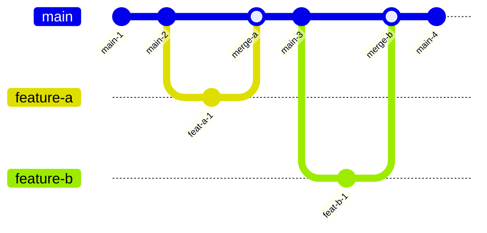

**Characteristics:**
- All developers work off a single main branch
- Feature branches are short-lived (hours to 1-2 days)
- Merge to main multiple times per day
- Feature flags hide incomplete work
- Main branch is always deployable

**Advantages:**
- Minimal merge conflicts (branches diverge briefly)
- Continuous integration in the truest sense
- Faster feedback loops
- Encourages small, incremental changes
- Supports continuous deployment directly

**Disadvantages:**
- Requires mature testing and feature flag infrastructure
- Incomplete features must be hidden behind flags
- Demands discipline — broken main affects everyone
- Harder for junior developers without guardrails

**Best for:** High-velocity teams, microservices, continuous deployment environments.

#### GitFlow

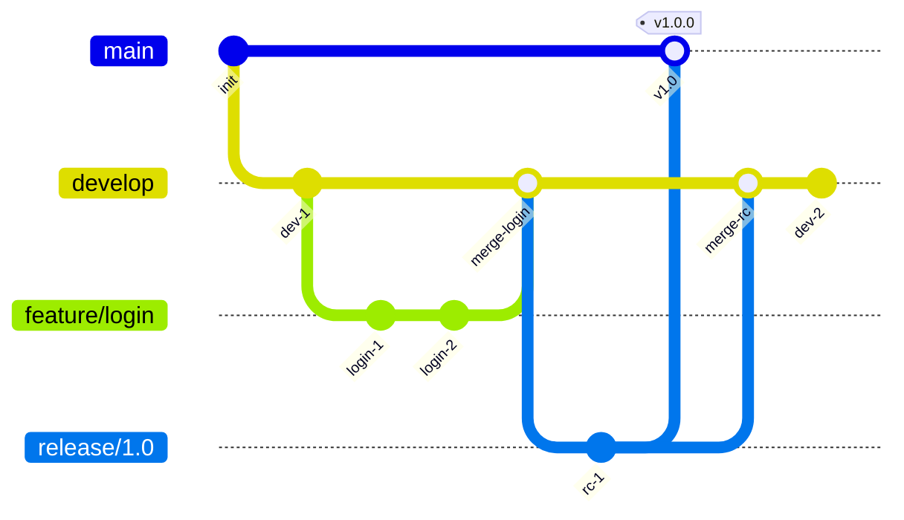

**Characteristics:**
- Separate branches for development, features, releases, and hotfixes
- Feature branches merge into develop
- Release branches cut from develop, stabilized, then merged to main
- Hotfix branches branch from main for emergency fixes

**Advantages:**
- Clear separation of work-in-progress and released code
- Supports scheduled release cycles
- Multiple releases can be maintained simultaneously
- Familiar workflow for large organizations

**Disadvantages:**
- Long-lived branches accumulate merge conflicts
- Slow feedback — integration happens late
- Complex branch management overhead
- Discourages frequent deployment

**Best for:** Mobile apps, packaged software, regulated environments with scheduled releases.

#### Comparison Matrix

| Dimension | Trunk-Based | GitFlow |
|-----------|------------|---------|
| Branch lifetime | Hours to 1-2 days | Days to weeks |
| Merge frequency | Multiple times/day | Per feature completion |
| Deployment frequency | Continuous | Scheduled releases |
| Merge conflict risk | Low | High |
| Feature flag dependency | High | Low |
| CI complexity | Lower | Higher |
| Team discipline required | High | Moderate |
| Rollback mechanism | Feature flags, revert | Hotfix branch |

### Build Optimization Techniques

Fast CI builds are essential for developer productivity. Key optimization strategies:

**Dependency Caching:**
- Cache `node_modules`, `.m2/repository`, `pip` packages between builds
- Use content-addressable caches keyed on lockfile hash
- Cache Docker layers for incremental image builds
- Typical improvement: 30-60% reduction in build time

**Parallelization:**
- Run unit tests, linting, and security scans concurrently
- Split large test suites across multiple runners
- Use test impact analysis to run only tests affected by changed files
- Typical improvement: 40-70% reduction in total pipeline time

**Incremental Builds:**
- Only rebuild changed modules in monorepo setups
- Use build tools with incremental compilation (Gradle, Bazel, Turborepo)
- Track file dependencies to determine rebuild scope
- Typical improvement: 50-80% reduction for incremental changes

**Remote Build Caching:**
- Share build cache across all developers and CI runners
- Tools: Bazel Remote Cache, Gradle Build Cache, Turborepo Remote Cache, Nx Cloud
- First build is slow; subsequent builds reuse cached outputs
- Typical improvement: 60-90% reduction for cached builds

### CI Anti-Patterns to Avoid

| Anti-Pattern | Problem | Solution |
|-------------|---------|----------|
| Infrequent integration | Large merges, conflict hell | Merge to main daily |
| Slow feedback | Developers context-switch, ignore failures | Target < 10 min pipeline |
| Flaky tests | Teams ignore failures, lose trust in CI | Quarantine flaky tests, fix root cause |
| Manual steps | Human error, inconsistency | Automate everything |
| No caching | Wasteful rebuilds, slow pipelines | Cache dependencies, Docker layers, build outputs |
| Monolith pipeline | All tests run for every change | Test impact analysis, monorepo-aware CI |
| Ignoring security | Vulnerabilities ship to production | Integrate SAST/SCA early |
| No notifications | Failures go unnoticed | Post to Slack/Teams, block PR merge |

---

## 1.2 Continuous Delivery vs Continuous Deployment

### Defining the Spectrum

The terms "Continuous Delivery" and "Continuous Deployment" are often confused. They sit on a spectrum of automation:

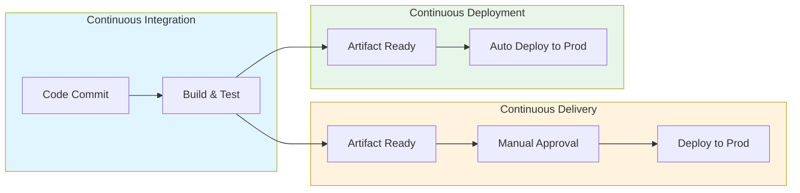

**Continuous Integration (CI):**
- Every commit is built and tested automatically
- Developers know within minutes if their change broke something
- The main branch is always in a buildable state

**Continuous Delivery (CD — Delivery):**
- Every commit that passes CI produces a deployable artifact
- The artifact *can* be deployed to production at any time
- A human decision (approval gate) triggers the actual deployment
- The team always has a production-ready release candidate

**Continuous Deployment (CD — Deployment):**
- Every commit that passes all automated checks is automatically deployed to production
- No human approval gate between merge and production
- Requires extremely high confidence in automated testing
- Typically combined with feature flags and canary releases

### Deployment Pipeline Stages

A mature deployment pipeline moves artifacts through multiple environments with increasing confidence:

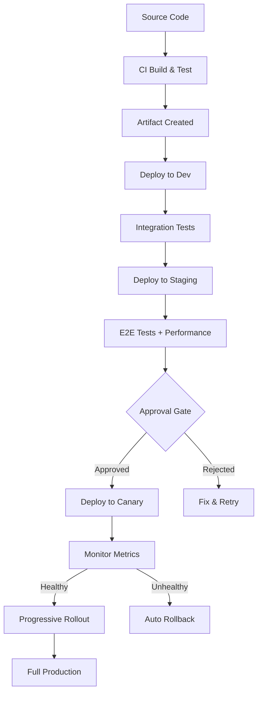

**Environment Progression:**

| Environment | Purpose | Data | Traffic | Gate |
|-------------|---------|------|---------|------|
| Development | Developer testing, debugging | Synthetic/mock | Developer only | Automated |
| Integration | Cross-service integration testing | Shared test data | CI runners | Automated |
| Staging | Pre-production validation, E2E tests | Production-like (anonymized) | QA team, CI | Automated + Manual |
| Canary | Small production traffic validation | Real production data | 1-5% real users | Automated metrics |
| Production | Full user-facing traffic | Real production data | 100% real users | Metrics + auto-promote |

### Approval Gates

Approval gates control the progression of artifacts through the pipeline. They can be:

**Automated Gates:**
- All tests pass (unit, integration, E2E)
- Code coverage meets threshold (e.g., 80%+)
- No critical or high-severity vulnerabilities
- Performance regression check passes
- Contract tests pass (no breaking API changes)
- Compliance checks pass (license, SBOM)

**Manual Gates:**
- Product owner approval for feature releases
- Security team approval for security-sensitive changes
- Change advisory board (CAB) approval for regulated environments
- Compliance officer sign-off for financial or healthcare systems

**Hybrid Gates:**
- Automated for low-risk changes (config updates, minor fixes)
- Manual for high-risk changes (database migrations, auth changes)
- Risk scoring based on change characteristics (files changed, blast radius)

### Rollback Triggers

Automated rollback triggers monitor production health and revert bad deployments:

| Trigger | Metric | Threshold | Action |
|---------|--------|-----------|--------|
| Error rate spike | HTTP 5xx rate | > 1% for 2 min | Rollback immediately |
| Latency degradation | P99 latency | > 2x baseline for 5 min | Rollback immediately |
| Health check failure | Readiness probe | 3 consecutive failures | Rollback pod |
| Business metric drop | Conversion rate | > 10% drop for 10 min | Alert + manual decision |
| CPU/Memory spike | Resource utilization | > 90% for 5 min | Rollback + alert |
| Crash loop | Pod restart count | > 3 restarts in 5 min | Rollback deployment |

### Pipeline Metrics to Track

| Metric | Definition | Target | Why It Matters |
|--------|-----------|--------|----------------|
| Lead time for changes | Commit to production | < 1 hour | Developer productivity |
| Deployment frequency | Deploys per day per team | 1-5+ per day | Delivery velocity |
| Change failure rate | % of deploys causing incidents | < 5% | Quality confidence |
| Mean time to recovery (MTTR) | Incident detection to resolution | < 30 min | Operational resilience |
| Pipeline duration | Trigger to artifact ready | < 10 min | Fast feedback |
| Flaky test rate | % of tests with non-deterministic results | < 1% | CI trust |

These four metrics — lead time, deployment frequency, change failure rate, and MTTR — are the **DORA metrics** used by Google's DevOps Research and Assessment team to measure engineering performance.

---

## 1.3 Pipeline Design — Tools and Patterns

### Pipeline as Code

Modern CI/CD systems define pipelines as code files stored alongside the application source code. This approach provides:

- **Version control**: Pipeline changes are tracked, reviewed, and auditable.
- **Reproducibility**: Any team can set up the same pipeline.
- **Portability**: Pipeline definitions travel with the code.
- **Peer review**: Pipeline changes go through the same PR process as code.

### GitHub Actions

GitHub Actions uses YAML workflow files stored in `.github/workflows/`:

**Example: Complete CI/CD Pipeline**

```yaml
name: CI/CD Pipeline
on:
  push:
    branches: [main]
  pull_request:
    branches: [main]

env:
  REGISTRY: ghcr.io
  IMAGE_NAME: ${{ github.repository }}

jobs:
  lint:
    runs-on: ubuntu-latest
    steps:
      - uses: actions/checkout@v4
      - uses: actions/setup-node@v4
        with:
          node-version: '20'
          cache: 'npm'
      - run: npm ci
      - run: npm run lint
      - run: npm run format:check

  test:
    runs-on: ubuntu-latest
    needs: lint
    strategy:
      matrix:
        shard: [1, 2, 3, 4]
    steps:
      - uses: actions/checkout@v4
      - uses: actions/setup-node@v4
        with:
          node-version: '20'
          cache: 'npm'
      - run: npm ci
      - run: npm test -- --shard=${{ matrix.shard }}/4
      - uses: actions/upload-artifact@v4
        with:
          name: coverage-${{ matrix.shard }}
          path: coverage/

  security-scan:
    runs-on: ubuntu-latest
    steps:
      - uses: actions/checkout@v4
      - name: Run Trivy vulnerability scanner
        uses: aquasecurity/trivy-action@master
        with:
          scan-type: 'fs'
          severity: 'CRITICAL,HIGH'
          exit-code: '1'

  build-and-push:
    runs-on: ubuntu-latest
    needs: [test, security-scan]
    if: github.ref == 'refs/heads/main'
    permissions:
      contents: read
      packages: write
    steps:
      - uses: actions/checkout@v4
      - uses: docker/login-action@v3
        with:
          registry: ${{ env.REGISTRY }}
          username: ${{ github.actor }}
          password: ${{ secrets.GITHUB_TOKEN }}
      - uses: docker/build-push-action@v5
        with:
          context: .
          push: true
          tags: |
            ${{ env.REGISTRY }}/${{ env.IMAGE_NAME }}:${{ github.sha }}
            ${{ env.REGISTRY }}/${{ env.IMAGE_NAME }}:latest
          cache-from: type=gha
          cache-to: type=gha,mode=max

  deploy-staging:
    runs-on: ubuntu-latest
    needs: build-and-push
    environment: staging
    steps:
      - name: Deploy to staging
        run: |
          kubectl set image deployment/myapp \
            myapp=${{ env.REGISTRY }}/${{ env.IMAGE_NAME }}:${{ github.sha }} \
            --namespace=staging

  deploy-production:
    runs-on: ubuntu-latest
    needs: deploy-staging
    environment:
      name: production
      url: https://myapp.example.com
    steps:
      - name: Deploy canary (5%)
        run: |
          kubectl set image deployment/myapp-canary \
            myapp=${{ env.REGISTRY }}/${{ env.IMAGE_NAME }}:${{ github.sha }} \
            --namespace=production
      - name: Monitor canary (5 min)
        run: ./scripts/monitor-canary.sh --duration=300
      - name: Promote to full production
        run: |
          kubectl set image deployment/myapp \
            myapp=${{ env.REGISTRY }}/${{ env.IMAGE_NAME }}:${{ github.sha }} \
            --namespace=production
```

**GitHub Actions Key Concepts:**

| Concept | Description |
|---------|-------------|
| Workflow | A YAML file defining the automated process |
| Job | A set of steps that run on the same runner |
| Step | A single task within a job |
| Action | A reusable unit of work (marketplace or custom) |
| Runner | The VM/container that executes jobs |
| Matrix | Parallel execution with different configurations |
| Environment | Named deployment target with protection rules |
| Secret | Encrypted credential available to workflows |

### GitLab CI

GitLab CI uses `.gitlab-ci.yml` with a stage-based pipeline model:

```yaml
stages:
  - build
  - test
  - security
  - package
  - deploy

variables:
  DOCKER_IMAGE: $CI_REGISTRY_IMAGE:$CI_COMMIT_SHA

build:
  stage: build
  script:
    - npm ci
    - npm run build
  cache:
    key: ${CI_COMMIT_REF_SLUG}
    paths:
      - node_modules/
  artifacts:
    paths:
      - dist/

unit-test:
  stage: test
  parallel: 4
  script:
    - npm ci
    - npm test -- --shard=${CI_NODE_INDEX}/${CI_NODE_TOTAL}
  coverage: '/All files[^|]*\|[^|]*\s+([\d\.]+)/'

sast:
  stage: security
  template: Security/SAST.gitlab-ci.yml

container-scan:
  stage: security
  template: Security/Container-Scanning.gitlab-ci.yml

package:
  stage: package
  image: docker:latest
  services:
    - docker:dind
  script:
    - docker build -t $DOCKER_IMAGE .
    - docker push $DOCKER_IMAGE
  only:
    - main

deploy-production:
  stage: deploy
  script:
    - kubectl set image deployment/myapp myapp=$DOCKER_IMAGE
  environment:
    name: production
    url: https://myapp.example.com
  when: manual
  only:
    - main
```

### Jenkins Pipeline

Jenkins uses `Jenkinsfile` with either Declarative or Scripted Pipeline syntax:

```groovy
pipeline {
    agent any

    environment {
        REGISTRY = 'registry.example.com'
        IMAGE = "${REGISTRY}/myapp:${env.GIT_COMMIT}"
    }

    stages {
        stage('Build') {
            steps {
                sh 'npm ci'
                sh 'npm run build'
            }
        }

        stage('Test') {
            parallel {
                stage('Unit Tests') {
                    steps { sh 'npm test' }
                }
                stage('Lint') {
                    steps { sh 'npm run lint' }
                }
                stage('Security Scan') {
                    steps { sh 'trivy fs --severity HIGH,CRITICAL .' }
                }
            }
        }

        stage('Package') {
            steps {
                sh "docker build -t ${IMAGE} ."
                sh "docker push ${IMAGE}"
            }
        }

        stage('Deploy Staging') {
            steps {
                sh "kubectl set image deployment/myapp myapp=${IMAGE} -n staging"
                sh './scripts/run-e2e-tests.sh staging'
            }
        }

        stage('Deploy Production') {
            input {
                message 'Deploy to production?'
                submitter 'release-team'
            }
            steps {
                sh "kubectl set image deployment/myapp myapp=${IMAGE} -n production"
            }
        }
    }

    post {
        failure {
            slackSend channel: '#deploys', message: "Build FAILED: ${env.JOB_NAME}"
        }
        success {
            slackSend channel: '#deploys', message: "Build SUCCESS: ${env.JOB_NAME}"
        }
    }
}
```

### Argo CD — GitOps-Based Delivery

Argo CD inverts the deployment model: instead of the pipeline pushing to Kubernetes, Argo CD watches a Git repository and pulls the desired state:

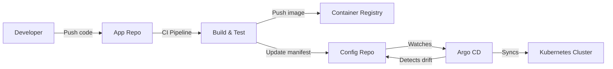

**Argo CD Application Manifest:**

```yaml
apiVersion: argoproj.io/v1alpha1
kind: Application
metadata:
  name: myapp
  namespace: argocd
spec:
  project: default
  source:
    repoURL: https://github.com/org/config-repo
    targetRevision: HEAD
    path: environments/production/myapp
  destination:
    server: https://kubernetes.default.svc
    namespace: production
  syncPolicy:
    automated:
      prune: true
      selfHeal: true
    syncOptions:
      - CreateNamespace=true
    retry:
      limit: 5
      backoff:
        duration: 5s
        factor: 2
        maxDuration: 3m
```

### Pipeline Design Comparison

| Dimension | GitHub Actions | GitLab CI | Jenkins | Argo CD |
|-----------|---------------|-----------|---------|---------|
| Model | Event-driven workflows | Stage-based pipeline | Scripted/declarative | GitOps reconciliation |
| Config location | `.github/workflows/` | `.gitlab-ci.yml` | `Jenkinsfile` | Argo Application CRD |
| Hosting | GitHub-hosted or self-hosted | GitLab.com or self-managed | Self-hosted | Kubernetes cluster |
| Secret management | GitHub Secrets | CI/CD Variables | Credentials plugin | K8s Secrets, Vault |
| Caching | actions/cache | Built-in cache directive | Plugin-based | N/A (image-based) |
| Parallelism | Matrix strategy | parallel keyword | parallel stages | N/A |
| Approval gates | Environment protection rules | when: manual | input step | Sync waves, hooks |
| Marketplace | 15,000+ actions | Templates | 1,800+ plugins | Helm, Kustomize |
| Learning curve | Low | Low | High | Medium |
| Best for | GitHub-hosted projects | GitLab-hosted projects | Complex enterprise pipelines | Kubernetes-native GitOps |

---

## 1.4 Testing in CI

### The Testing Pyramid in CI

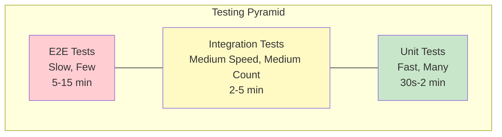

### Test Types and Their Role in CI

#### Unit Tests
- **What:** Test individual functions, methods, or classes in isolation.
- **Dependencies:** Mocked or stubbed.
- **Speed:** Milliseconds per test, seconds for entire suite.
- **CI role:** Run on every commit, block merge on failure.
- **Coverage target:** 80%+ line coverage for business logic.
- **Tools:** Jest, pytest, JUnit, Go testing, RSpec.

#### Integration Tests
- **What:** Test interactions between components — database queries, API calls, message consumers.
- **Dependencies:** Real databases (containerized), real message queues, mock external services.
- **Speed:** Seconds per test, minutes for suite.
- **CI role:** Run on every PR, use docker-compose or testcontainers for dependencies.
- **Tools:** Testcontainers, docker-compose, WireMock, LocalStack.

#### Contract Tests
- **What:** Verify that API producers and consumers agree on request/response format.
- **Why:** Prevents breaking changes across independently deployed services.
- **Speed:** Fast (no network calls).
- **CI role:** Run in both producer and consumer pipelines.
- **Tools:** Pact, Spring Cloud Contract, Dredd.

**Contract Testing Flow:**

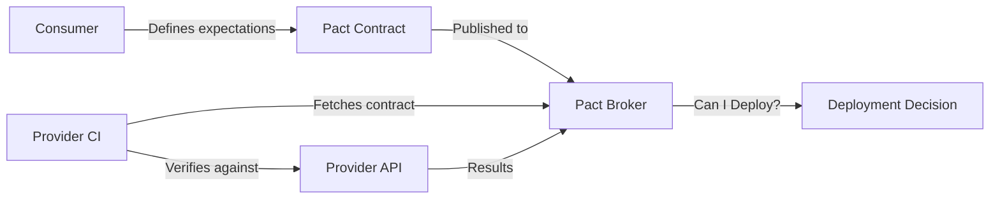

#### End-to-End (E2E) Tests
- **What:** Test complete user journeys through the full system.
- **Dependencies:** Full system running (staging or preview environment).
- **Speed:** Minutes per test.
- **CI role:** Run on main branch merges, pre-production gate.
- **Tools:** Cypress, Playwright, Selenium, Puppeteer.
- **Key challenge:** Flakiness — E2E tests are notoriously unreliable.

#### Performance Tests
- **What:** Validate throughput, latency, and resource consumption under load.
- **Types:** Load testing, stress testing, soak testing, spike testing.
- **Speed:** 5-30 minutes per run.
- **CI role:** Run nightly or on release candidates, compare against baseline.
- **Tools:** k6, Gatling, Locust, JMeter, Artillery.

### Security Scanning in CI

Security scanning should be integrated into every CI pipeline. Three categories of scanning tools exist:

#### SAST (Static Application Security Testing)
- Analyzes source code for security vulnerabilities.
- Runs without executing the application.
- Catches SQL injection, XSS, hardcoded secrets, insecure crypto.
- Tools: Semgrep, SonarQube, CodeQL, Checkmarx, Snyk Code.
- CI integration: Run on every PR, block on critical/high findings.

#### DAST (Dynamic Application Security Testing)
- Tests the running application for vulnerabilities.
- Simulates attacker behavior (fuzzing, injection attempts).
- Catches runtime vulnerabilities not visible in source code.
- Tools: OWASP ZAP, Burp Suite, Nuclei.
- CI integration: Run against staging deployment, nightly.

#### SCA (Software Composition Analysis)
- Scans dependencies (npm packages, Python libraries, Go modules) for known vulnerabilities.
- Checks license compliance.
- Monitors for newly disclosed CVEs.
- Tools: Snyk, Dependabot, Trivy, Grype, Renovate.
- CI integration: Run on every PR (fast), block on critical CVEs.

**Security Scanning Integration:**

| Scan Type | When to Run | What It Catches | Speed | Block on Failure? |
|-----------|-------------|-----------------|-------|-------------------|
| SAST | Every PR | Code vulnerabilities | Fast (1-3 min) | Yes (critical/high) |
| SCA | Every PR | Dependency vulnerabilities | Fast (< 1 min) | Yes (critical) |
| Secret detection | Every PR | Hardcoded credentials | Fast (< 30s) | Yes (always) |
| Container scan | After image build | Image vulnerabilities | Medium (2-5 min) | Yes (critical) |
| DAST | Post-deploy to staging | Runtime vulnerabilities | Slow (10-30 min) | No (alert) |
| License check | Every PR | License compliance | Fast (< 30s) | Yes (copyleft in proprietary) |

---

## 1.5 Artifact Management

### What Is an Artifact?

An artifact is the output of a CI build — a deployable unit that has been tested, scanned, and versioned. Artifacts include:
- **Container images** (Docker images)
- **Binary packages** (JAR, WAR, wheel, gem)
- **JavaScript bundles** (webpack output, npm packages)
- **Terraform plans** (serialized infrastructure changes)
- **Helm charts** (Kubernetes application packages)

### Container Registry Architecture

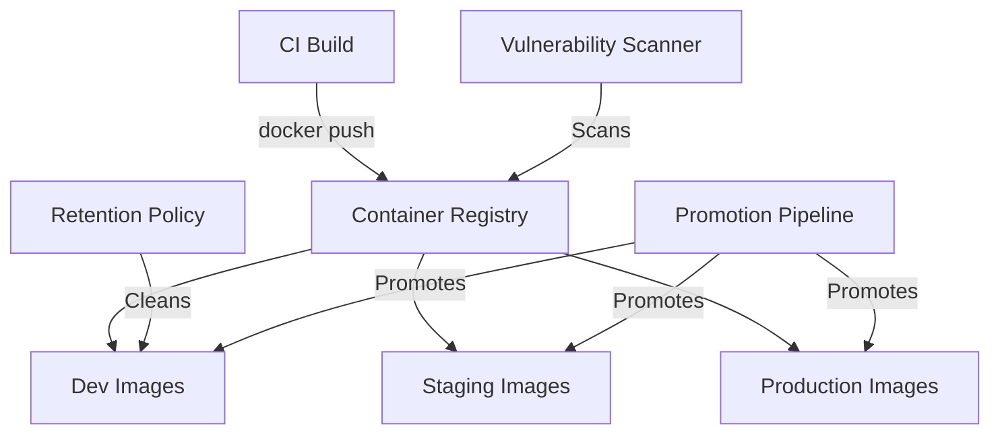

**Registry Options:**

| Registry | Hosting | Key Features |
|----------|---------|--------------|
| Docker Hub | SaaS | Largest public registry, rate limits on free tier |
| GitHub Container Registry (GHCR) | SaaS | Integrated with GitHub Actions, free for public repos |
| Amazon ECR | AWS | IAM integration, cross-region replication, vulnerability scanning |
| Google Artifact Registry | GCP | Multi-format (Docker, npm, Maven), IAM integration |
| Azure Container Registry | Azure | Geo-replication, tasks for automated builds |
| Harbor | Self-hosted | CNCF project, vulnerability scanning, RBAC, replication |
| JFrog Artifactory | Self-hosted/SaaS | Universal repository manager, all artifact types |

### Versioning Strategy

**Semantic Versioning (SemVer):**
- Format: `MAJOR.MINOR.PATCH` (e.g., `2.1.3`)
- MAJOR: Breaking changes
- MINOR: New features, backward-compatible
- PATCH: Bug fixes, backward-compatible
- Best for: Libraries, APIs, packaged software

**Git SHA Tagging:**
- Format: `sha-a1b2c3d4` (first 8 characters of commit SHA)
- Every build produces a unique, traceable image
- Best for: Microservice deployments (combined with SemVer for releases)

**Date-Based Tagging:**
- Format: `20260324.1` (date + build number)
- Easy to identify when an image was built
- Best for: Nightly builds, scheduled releases

### Immutable Artifacts

A critical principle: **once an artifact is created and tested, it should never be modified.** The exact same binary that passed tests in CI should be deployed to staging and then to production.

**Why immutability matters:**
- Rebuilding introduces non-determinism (different dependency versions, different build environment).
- You cannot guarantee that a rebuilt artifact is identical to the tested one.
- Audit trails require traceability from production artifact to source commit.

**Promotion pattern:**
1. CI builds image tagged with commit SHA.
2. Image passes tests in dev environment.
3. The *same image* is promoted to staging (re-tagged, not rebuilt).
4. The *same image* is promoted to production.
5. At every stage, the image digest (SHA256 hash) is verified.

```
# Build once
docker build -t registry.example.com/myapp:sha-a1b2c3d .

# Promote to staging (re-tag, same image)
docker tag registry.example.com/myapp:sha-a1b2c3d \
           registry.example.com/myapp:staging

# Promote to production (re-tag, same image)
docker tag registry.example.com/myapp:sha-a1b2c3d \
           registry.example.com/myapp:production
docker tag registry.example.com/myapp:sha-a1b2c3d \
           registry.example.com/myapp:v2.1.3
```

### Artifact Retention Policies

Without retention policies, registries grow unboundedly. Common policies:

| Policy | Rule | Rationale |
|--------|------|-----------|
| Keep last N images per repo | Keep 50 most recent | Limit storage costs |
| Keep tagged releases forever | Never delete `v*` tags | Rollback capability |
| Delete untagged images after N days | Delete after 7 days | Clean up build intermediates |
| Keep images deployed to any env | Never delete in-use images | Prevent pulling failures |
| Delete PR-specific images after merge | Delete after 3 days post-merge | Clean up temporary builds |

---

---

# Section 2: Deployment Strategies

---

## 2.1 Blue-Green Deployment

### Concept

Blue-green deployment maintains two identical production environments. At any time, one environment (say "blue") serves live traffic while the other ("green") is idle or receives the new deployment. After deploying and validating the new version on the idle environment, traffic is switched from blue to green in a single cutover.

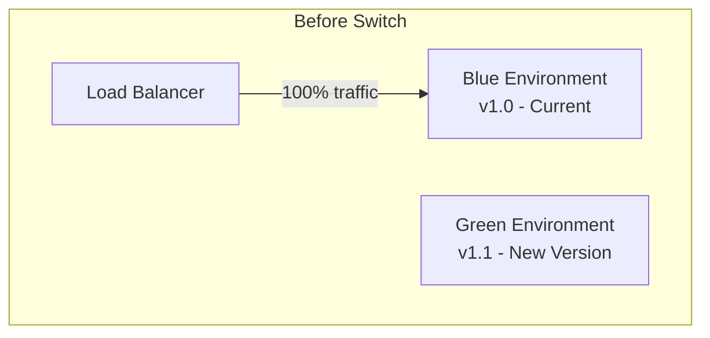

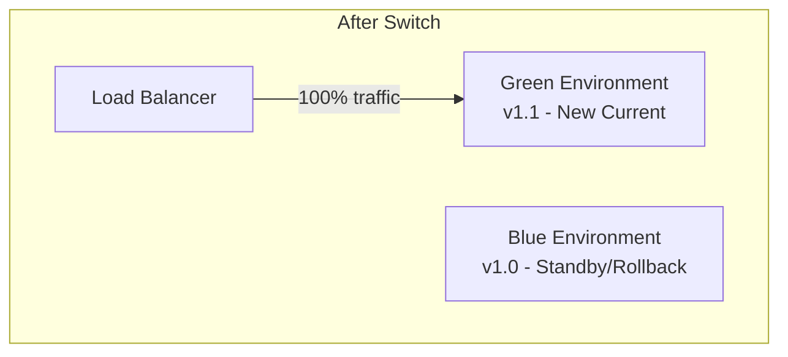

### How Blue-Green Works Step by Step

1. **Baseline**: Blue environment runs v1.0, serving all production traffic.
2. **Deploy to green**: Deploy v1.1 to the idle green environment.
3. **Validate green**: Run smoke tests, health checks, and integration tests against green.
4. **Switch traffic**: Update the load balancer / DNS to route 100% traffic to green.
5. **Monitor**: Watch error rates, latency, and business metrics for 15-30 minutes.
6. **Confirm or rollback**: If healthy, decommission blue (or keep as rollback). If unhealthy, switch back to blue immediately.

### Traffic Switching Mechanisms

| Mechanism | Switch Time | Complexity | Best For |
|-----------|------------|------------|----------|
| DNS update | 30s-5min (TTL dependent) | Low | Simple applications |
| Load balancer target group swap | 1-5s | Medium | AWS ALB/NLB |
| Kubernetes service selector swap | < 1s | Low | Kubernetes-native |
| Istio VirtualService update | < 1s | Medium | Service mesh environments |
| CDN origin switch | 5-30s | Low | Static sites, edge caching |

### Database Migration Challenges

The hardest part of blue-green deployment is the database. Both environments share the same database, and schema changes must be backward-compatible:

**The Problem:**
- v1.0 expects column `user_name` (string)
- v1.1 renames it to `full_name` (string)
- During switch, both versions must work with the same database

**The Expand-Contract Pattern:**

| Phase | Migration | v1.0 | v1.1 | v1.2 |
|-------|-----------|------|------|------|
| 1. Expand | Add `full_name` column | Reads `user_name` | Reads `full_name`, writes both | - |
| 2. Migrate | Backfill `full_name` from `user_name` | Reads `user_name` | Reads `full_name` | - |
| 3. Contract | Drop `user_name` column | - | - | Reads `full_name` only |

**Rules for safe database migrations:**
1. Never rename a column — add a new one, migrate data, drop the old one.
2. Never drop a column that active code reads from.
3. Add columns as nullable or with defaults.
4. Add new indexes concurrently (`CREATE INDEX CONCURRENTLY`).
5. Split schema changes across multiple deployments.

### Blue-Green Advantages and Disadvantages

| Advantages | Disadvantages |
|-----------|---------------|
| Zero-downtime deployment | Requires double the infrastructure |
| Instant rollback (switch back) | Database migration complexity |
| Full environment validation before switch | Stateful services (sessions, caches) need special handling |
| Simple mental model | Long-running connections may break during switch |
| Works well for monoliths and microservices | Cost of maintaining idle environment |

### When to Use Blue-Green

- **Good fit**: Monolithic applications, services with complex startup sequences, environments where instant rollback is critical.
- **Poor fit**: Highly stateful services with in-memory caches that take hours to warm, microservices where canary is simpler.

---

## 2.2 Canary Releases

### Concept

Canary releases gradually shift a small percentage of production traffic to a new version while monitoring key metrics. If the new version is healthy, traffic is progressively increased. If problems are detected, traffic is routed back to the stable version.

The name comes from the "canary in a coal mine" — a small, expendable test that warns of danger before the full population is affected.

### Progressive Rollout Stages

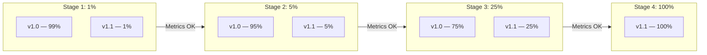

### Typical Canary Rollout Configuration

| Stage | Traffic % | Duration | Promotion Criteria | Rollback Criteria |
|-------|----------|----------|-------------------|-------------------|
| Canary start | 1% | 5 min | Error rate < 0.1%, P99 < 200ms | Error rate > 1% |
| Stage 2 | 5% | 10 min | Error rate < 0.1%, P99 < 200ms | Error rate > 0.5% |
| Stage 3 | 25% | 15 min | Error rate < 0.1%, P99 < 200ms | Error rate > 0.3% |
| Stage 4 | 50% | 15 min | Error rate < 0.1%, P99 < 200ms | Error rate > 0.2% |
| Full rollout | 100% | - | Stable for 30 min | Manual decision |

### Metrics-Based Promotion

Automated canary analysis compares the canary population against the baseline (current stable version) across multiple dimensions:

**Key Comparison Metrics:**

| Category | Metric | Comparison Method |
|----------|--------|-------------------|
| Reliability | Error rate (5xx) | Canary vs baseline, threshold-based |
| Performance | P50, P95, P99 latency | Statistical comparison (Mann-Whitney U) |
| Saturation | CPU, memory utilization | Canary vs baseline, threshold-based |
| Business | Conversion rate, click-through | Bayesian comparison (if traffic is sufficient) |
| Infrastructure | Pod restart count | Absolute threshold |

**Automated Canary Analysis Tools:**
- **Kayenta** (Netflix/Spinnaker): Statistical canary analysis, ACA (Automated Canary Analysis)
- **Flagger** (Weaveworks): Kubernetes-native progressive delivery with Istio/Linkerd/Nginx
- **Argo Rollouts**: Kubernetes controller for blue-green and canary with analysis

### Auto-Rollback Logic

```
function evaluateCanary(canaryMetrics, baselineMetrics):
    // Hard failure — immediate rollback
    if canaryMetrics.errorRate > CRITICAL_ERROR_THRESHOLD:
        return ROLLBACK_IMMEDIATELY

    // Statistical comparison
    for each metric in MONITORED_METRICS:
        score = statisticalCompare(
            canaryMetrics[metric],
            baselineMetrics[metric]
        )
        if score < MINIMUM_ACCEPTABLE_SCORE:
            return ROLLBACK

    // All metrics pass — promote to next stage
    return PROMOTE
```

### Canary with Kubernetes and Istio

Using Istio VirtualService for traffic splitting:

```yaml
apiVersion: networking.istio.io/v1beta1
kind: VirtualService
metadata:
  name: myapp
spec:
  hosts:
    - myapp.example.com
  http:
    - route:
        - destination:
            host: myapp-stable
            port:
              number: 80
          weight: 95
        - destination:
            host: myapp-canary
            port:
              number: 80
          weight: 5
```

### Argo Rollouts Canary Configuration

```yaml
apiVersion: argoproj.io/v1alpha1
kind: Rollout
metadata:
  name: myapp
spec:
  replicas: 10
  strategy:
    canary:
      steps:
        - setWeight: 5
        - pause: { duration: 5m }
        - analysis:
            templates:
              - templateName: success-rate
            args:
              - name: service-name
                value: myapp-canary
        - setWeight: 25
        - pause: { duration: 10m }
        - analysis:
            templates:
              - templateName: success-rate
        - setWeight: 50
        - pause: { duration: 15m }
        - setWeight: 100
      canaryService: myapp-canary
      stableService: myapp-stable
      trafficRouting:
        istio:
          virtualService:
            name: myapp
```

### Canary Advantages and Disadvantages

| Advantages | Disadvantages |
|-----------|---------------|
| Limited blast radius (only % of users affected) | More complex than blue-green |
| Real production traffic validation | Requires traffic splitting infrastructure |
| Statistical confidence before full rollout | Small canary population may miss rare bugs |
| Automated promotion/rollback | Database changes still need expand-contract |
| Works well with microservices | Monitoring and alerting must be mature |

---

## 2.3 Rolling Updates

### Concept

Rolling updates incrementally replace instances of the old version with the new version, one (or a few) at a time. At any point during the rollout, both old and new versions are running simultaneously. This is the default deployment strategy in Kubernetes.

### Kubernetes Rolling Update Mechanism

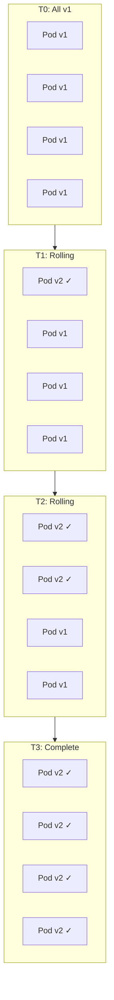

### Kubernetes Deployment Configuration

```yaml
apiVersion: apps/v1
kind: Deployment
metadata:
  name: myapp
spec:
  replicas: 4
  strategy:
    type: RollingUpdate
    rollingUpdate:
      maxSurge: 1          # At most 1 extra pod during update
      maxUnavailable: 0     # Never go below desired replica count
  selector:
    matchLabels:
      app: myapp
  template:
    metadata:
      labels:
        app: myapp
    spec:
      containers:
        - name: myapp
          image: registry.example.com/myapp:v2.0.0
          ports:
            - containerPort: 8080
          readinessProbe:
            httpGet:
              path: /healthz
              port: 8080
            initialDelaySeconds: 5
            periodSeconds: 5
            failureThreshold: 3
          livenessProbe:
            httpGet:
              path: /livez
              port: 8080
            initialDelaySeconds: 15
            periodSeconds: 10
          resources:
            requests:
              cpu: 250m
              memory: 256Mi
            limits:
              cpu: 500m
              memory: 512Mi
```

### maxSurge and maxUnavailable Explained

| Setting | maxSurge=1, maxUnavailable=0 | maxSurge=0, maxUnavailable=1 | maxSurge=2, maxUnavailable=1 |
|---------|------------------------------|------------------------------|------------------------------|
| Behavior | Create new before removing old | Remove old before creating new | Aggressive: both surge and remove |
| Min pods during update | 4 (desired count) | 3 (desired - 1) | 3 (desired - 1) |
| Max pods during update | 5 (desired + 1) | 4 (desired count) | 6 (desired + 2) |
| Speed | Moderate | Moderate | Fast |
| Resource usage | Higher (extra pod) | Same | Higher (extra pods) |
| Risk | Lower (always at capacity) | Higher (reduced capacity) | Moderate |
| Best for | Production workloads | Resource-constrained envs | Fast rollouts, large clusters |

### Readiness Probes — The Key to Safe Rolling Updates

Readiness probes tell Kubernetes when a pod is ready to receive traffic. Without readiness probes, Kubernetes routes traffic to pods that may still be starting up, causing errors during deployment.

**Probe Types:**

| Probe Type | Mechanism | Use When |
|-----------|-----------|----------|
| HTTP GET | Sends HTTP request, expects 200-399 | Web servers, REST APIs |
| TCP Socket | Opens TCP connection to port | Databases, message brokers |
| gRPC | gRPC health checking protocol | gRPC services |
| Exec | Runs command inside container | Custom health checks |

**Readiness vs Liveness vs Startup Probes:**

| Probe | Purpose | Failure Action |
|-------|---------|---------------|
| Readiness | Is the pod ready for traffic? | Remove from Service endpoints |
| Liveness | Is the pod stuck/deadlocked? | Kill and restart the pod |
| Startup | Has the pod finished starting? | Kill and restart (before liveness kicks in) |

### Graceful Shutdown

During rolling updates, old pods receive a SIGTERM signal. The application must handle this gracefully:

```
Pod Termination Sequence:
1. Pod marked as "Terminating"
2. Removed from Service endpoints (no new traffic)
3. preStop hook runs (if defined)
4. SIGTERM sent to container process
5. Application drains in-flight requests
6. Application exits cleanly
7. If not exited within terminationGracePeriodSeconds (default 30s), SIGKILL sent
```

**Best practices for graceful shutdown:**
- Handle SIGTERM in your application
- Stop accepting new connections
- Complete in-flight requests (with a timeout)
- Close database connections and flush buffers
- Use `preStop` hook for additional drain time if needed

```yaml
lifecycle:
  preStop:
    exec:
      command: ["/bin/sh", "-c", "sleep 5"]  # Allow LB to deregister
terminationGracePeriodSeconds: 60
```

### Rolling Update Advantages and Disadvantages

| Advantages | Disadvantages |
|-----------|---------------|
| No extra infrastructure needed | Both versions run simultaneously |
| Kubernetes-native, zero config overhead | Slower than blue-green switch |
| Gradual resource usage change | No instant rollback (must roll forward or undo) |
| Automatic with readiness probes | API backward compatibility required |
| Works with any Kubernetes workload | Harder to debug mixed-version issues |

---

## 2.4 Feature Flags

### Concept

Feature flags (also called feature toggles) decouple deployment from release. Code containing new features is deployed to production but hidden behind a conditional check. The flag can be toggled on or off without redeploying.

```
if (featureFlags.isEnabled("new-checkout-flow", user)):
    renderNewCheckoutFlow()
else:
    renderCurrentCheckoutFlow()
```

### Feature Flag Categories

| Category | Lifetime | Purpose | Example |
|----------|----------|---------|---------|
| Release toggle | Days to weeks | Hide incomplete features | `enable-new-search-ui` |
| Experiment toggle | Days to weeks | A/B testing | `experiment-checkout-v2` |
| Ops toggle | Minutes to hours | Circuit breaker, kill switch | `disable-recommendations-service` |
| Permission toggle | Permanent | Feature entitlement | `premium-analytics-enabled` |
| Technical toggle | Days to months | Migration, gradual rollout | `use-new-payment-gateway` |

### Feature Flag Architecture

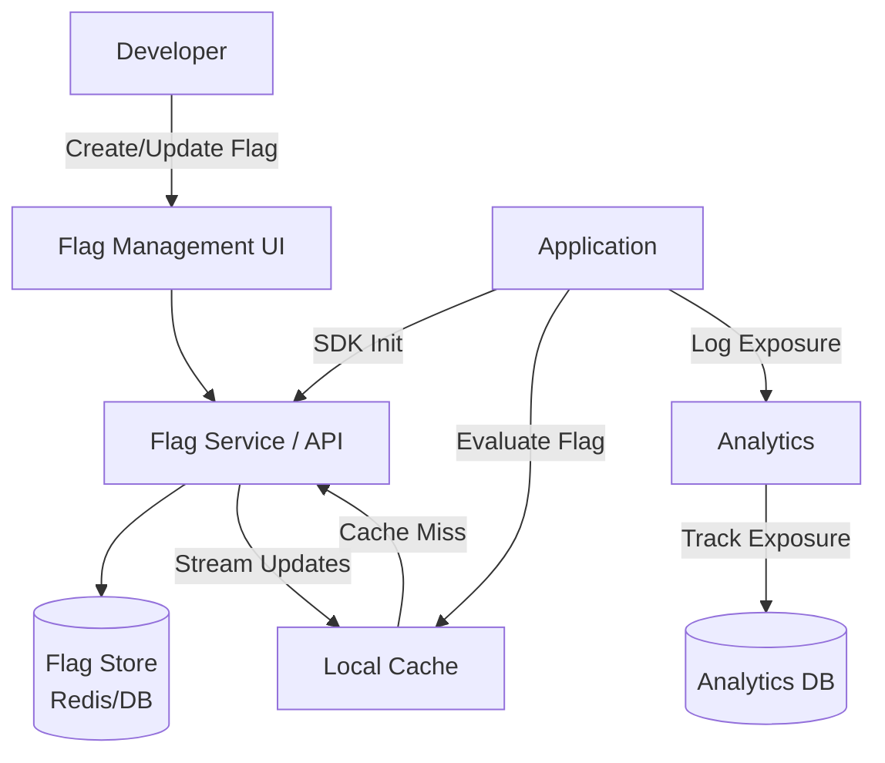

### Feature Flag Evaluation

Flags are evaluated using targeting rules that consider:

**Targeting Dimensions:**
- **User ID**: Specific users or percentage-based rollout
- **User attributes**: Country, plan tier, device type, browser
- **Environment**: dev, staging, production
- **Time-based**: Enable after date X, disable after date Y
- **Random**: Consistent hashing for stable percentage-based rollout

**Example targeting rule:**

```json
{
  "flag": "new-checkout-flow",
  "rules": [
    {
      "description": "Internal dogfood",
      "conditions": [{ "attribute": "email", "operator": "endsWith", "value": "@ourcompany.com" }],
      "serve": true
    },
    {
      "description": "Beta users",
      "conditions": [{ "attribute": "beta_opt_in", "operator": "equals", "value": true }],
      "serve": true
    },
    {
      "description": "Gradual rollout",
      "conditions": [],
      "percentage": 10
    }
  ],
  "default": false
}
```

### Feature Flag Tools

| Tool | Type | Key Features |
|------|------|--------------|
| LaunchDarkly | SaaS | Real-time flag updates, targeting, experimentation, SDKs for 25+ languages |
| Split.io | SaaS | Feature flags + experimentation, data integrations |
| Flagsmith | Open source / SaaS | Self-hosted option, API-first, segments |
| Unleash | Open source / SaaS | Strategy-based targeting, self-hosted |
| AWS AppConfig | Cloud service | AWS-native, gradual rollout, rollback |
| Flipt | Open source | Self-hosted, gRPC, GitOps-friendly |
| OpenFeature | Standard | Vendor-neutral API specification |

### Dark Launching

Dark launching is deploying a feature to production and enabling it for a small group (often internal) to validate behavior before any public announcement. The feature is "live" in production code but "dark" — invisible to most users.

**Use cases:**
- Test new payment provider with internal orders before public rollout
- Validate new search algorithm with shadow traffic
- Let internal QA team use new UI in production environment

### Kill Switches

Kill switches are operational feature flags designed for rapid deactivation of features during incidents:

```
# In application code
def get_recommendations(user_id):
    if not feature_flags.is_enabled("recommendations-service"):
        return []  # Graceful degradation
    return recommendations_client.get(user_id)
```

**Kill switch best practices:**
- Every external dependency should have a kill switch
- Kill switches should degrade gracefully (return empty, use cache, show default)
- Kill switches should be toggleable in seconds (no deployment required)
- Test kill switches regularly in staging

### Feature Flag Technical Debt

Feature flags accumulate technical debt if not cleaned up. A flag lifecycle should include:

1. **Creation**: Flag created with owner, description, and expected lifetime.
2. **Rollout**: Flag gradually enabled to 100%.
3. **Stabilization**: Feature runs at 100% for 1-2 weeks with no issues.
4. **Cleanup**: Flag code paths removed, old code deleted, flag archived.

**Anti-patterns:**
- Flags that live forever (stale flags)
- Nested flag dependencies (`if flagA && flagB && !flagC`)
- Flags without owners (orphaned flags)
- Flags that are never fully rolled out or cleaned up

**Enforcement strategies:**
- Flag expiration dates with automated alerts
- Code review rules requiring cleanup tickets for new flags
- Dashboard showing flag age and owner
- Automated PR creation to remove expired flags

---

## 2.5 A/B Testing Deployment

### Concept

A/B testing deployment routes users to different variants of a feature to measure which variant performs better on a target metric. Unlike canary releases (which test for stability), A/B tests measure business impact.

### A/B Test Architecture

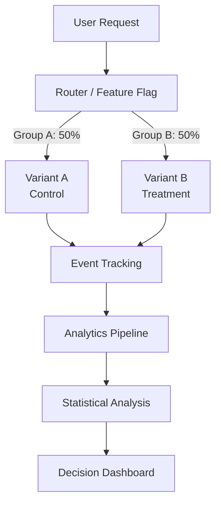

### A/B Testing Integration with Feature Flags

Most A/B testing systems build on top of feature flag infrastructure:

1. **Flag assignment**: User is deterministically assigned to a variant using consistent hashing on user ID.
2. **Exposure logging**: When a user sees a variant, an exposure event is logged.
3. **Metric collection**: User actions (clicks, purchases, time-on-page) are tracked.
4. **Statistical analysis**: Variant metrics are compared using hypothesis testing.
5. **Decision**: If the treatment is statistically significantly better, roll out to 100%.

### Statistical Significance

Before declaring a winner, you need sufficient statistical confidence:

| Concept | Definition | Typical Value |
|---------|-----------|---------------|
| Sample size | Number of users per variant | 1,000-100,000+ (depends on effect size) |
| Statistical significance | Probability result is not due to chance | 95% (p < 0.05) |
| Statistical power | Probability of detecting a real effect | 80% |
| Minimum detectable effect (MDE) | Smallest improvement worth detecting | 1-5% relative change |
| Duration | Time to collect sufficient data | 1-4 weeks |

**Common mistakes:**
- Stopping experiments too early (peeking at results)
- Running experiments with too small a sample size
- Not accounting for novelty effects (users react to change, not improvement)
- Testing too many variants simultaneously without correction

---

## 2.6 Shadow/Mirror Deployment

### Concept

Shadow deployment (also called traffic mirroring or dark traffic) copies production traffic to a new version of a service without the response being returned to users. The shadow service processes real requests, but its responses are discarded. This allows validation of new code against real production traffic patterns.

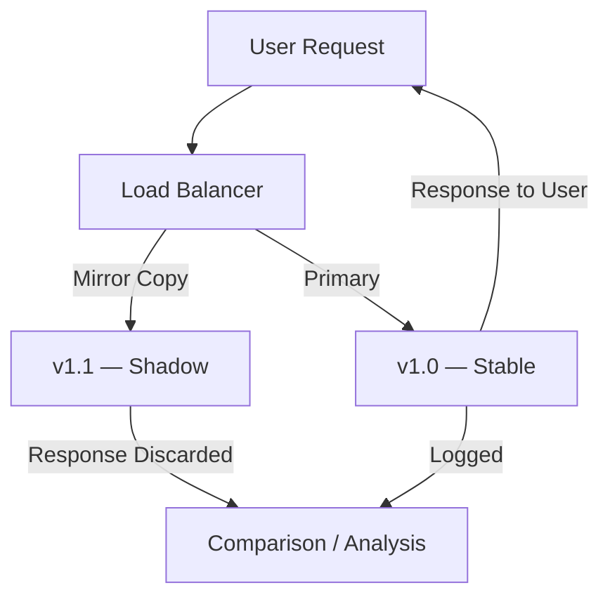

### Istio Traffic Mirroring

```yaml
apiVersion: networking.istio.io/v1beta1
kind: VirtualService
metadata:
  name: myapp
spec:
  hosts:
    - myapp.example.com
  http:
    - route:
        - destination:
            host: myapp-v1
            port:
              number: 80
      mirror:
        host: myapp-v2
        port:
          number: 80
      mirrorPercentage:
        value: 100.0
```

### Shadow Deployment Use Cases

| Use Case | Description |
|----------|-------------|
| Database migration validation | Mirror writes to new database, compare results |
| New service version testing | Process real traffic, compare response correctness and latency |
| Performance benchmarking | Measure new version performance under real load |
| ML model validation | Run new model alongside production model, compare predictions |
| API contract verification | Ensure new version produces identical responses |

### Shadow Deployment Comparison Testing

After mirroring traffic, compare shadow responses against stable responses:

**Comparison dimensions:**
- **Response correctness**: Do both versions return the same data?
- **Latency**: Is the shadow version faster or slower?
- **Error rate**: Does the shadow version produce more errors?
- **Resource usage**: Does the shadow version consume more CPU/memory?
- **Side effects**: Does the shadow version trigger unintended writes? (Must be careful with write operations)

**Critical warning about side effects:**
Shadow deployments must be **read-only** or use **isolated write targets**. If the shadow service writes to the same database or sends real notifications, you will corrupt data or annoy users. Common mitigations:
- Configure shadow to write to a separate database replica
- Stub or mock all external API calls that have side effects
- Disable notification/email sending in shadow mode
- Use a "dry run" flag in the shadow service

### Deployment Strategy Comparison Summary

| Strategy | Downtime | Rollback Speed | Blast Radius | Infrastructure Cost | Complexity | Best For |
|----------|----------|---------------|--------------|-------------------|------------|----------|
| Blue-Green | Zero | Instant (switch back) | 100% (all-or-nothing) | 2x | Low | Monoliths, instant rollback |
| Canary | Zero | Fast (shift traffic back) | 1-50% (controlled) | 1x + small canary | Medium | Microservices, gradual rollout |
| Rolling Update | Zero | Moderate (roll back) | Gradual | 1x + surge | Low | Kubernetes-native workloads |
| Feature Flag | Zero | Instant (toggle flag) | Controlled per user | 1x | Medium | Trunk-based dev, experiments |
| A/B Test | Zero | Instant (end experiment) | 50% per variant | 1x | High | Business metric optimization |
| Shadow | Zero (no user impact) | N/A (not serving users) | 0% (no user impact) | 2x | Medium | Validation, migration |

---

---

# Section 3: Containerization & Orchestration

---

## 3.1 Docker — Containerization Fundamentals

### What Is a Container?

A container is a lightweight, standalone, executable package that includes everything needed to run a piece of software — code, runtime, system tools, libraries, and settings. Containers isolate the application from its environment, ensuring consistent behavior across development, testing, and production.

**Containers vs Virtual Machines:**

| Dimension | Container | Virtual Machine |
|-----------|-----------|----------------|
| Isolation level | Process-level (shared kernel) | Hardware-level (separate kernel) |
| Startup time | Milliseconds to seconds | Minutes |
| Image size | 10s-100s MB | GBs |
| Resource overhead | Minimal | Significant (full OS) |
| Density | 100s per host | 10s per host |
| Security isolation | Namespace + cgroup | Hypervisor-enforced |
| Portability | Any Linux kernel (or WSL2/macOS VM) | Hypervisor-dependent |

### Dockerfile Best Practices

#### Multi-Stage Builds

Multi-stage builds separate the build environment from the runtime environment, producing minimal final images:

```dockerfile
# Stage 1: Build
FROM node:20-alpine AS builder
WORKDIR /app
COPY package*.json ./
RUN npm ci --production=false
COPY . .
RUN npm run build

# Stage 2: Production
FROM node:20-alpine AS production
WORKDIR /app

# Create non-root user
RUN addgroup -g 1001 -S nodejs && \
    adduser -S nextjs -u 1001

COPY --from=builder /app/dist ./dist
COPY --from=builder /app/node_modules ./node_modules
COPY --from=builder /app/package.json ./

USER nextjs
EXPOSE 3000

HEALTHCHECK --interval=30s --timeout=3s --start-period=5s --retries=3 \
  CMD wget --no-verbose --tries=1 --spider http://localhost:3000/healthz || exit 1

CMD ["node", "dist/server.js"]
```

#### Layer Caching Optimization

Docker builds images layer by layer. Each instruction creates a layer, and unchanged layers are cached. Order instructions from least-frequently-changed to most-frequently-changed:

```dockerfile
# GOOD: Dependencies change less often than source code
FROM node:20-alpine
WORKDIR /app

# Layer 1: Copy dependency manifests (changes rarely)
COPY package.json package-lock.json ./

# Layer 2: Install dependencies (cached if manifests unchanged)
RUN npm ci --production

# Layer 3: Copy source code (changes frequently)
COPY . .

# Layer 4: Build (runs when source changes)
RUN npm run build

CMD ["node", "dist/server.js"]
```

```dockerfile
# BAD: Copying all files first invalidates cache on every change
FROM node:20-alpine
WORKDIR /app
COPY . .                    # Every source change invalidates this layer
RUN npm ci --production     # Always reinstalls even if deps unchanged
RUN npm run build
CMD ["node", "dist/server.js"]
```

#### Image Optimization Checklist

| Practice | Impact | Example |
|----------|--------|---------|
| Use Alpine or distroless base | Smaller image, fewer CVEs | `node:20-alpine` (180MB vs 1GB) |
| Multi-stage builds | Remove build tools from final image | Separate builder and production stages |
| `.dockerignore` | Exclude unnecessary files | `.git`, `node_modules`, `*.md`, `.env` |
| Minimize layers | Combine RUN commands | `RUN apt-get update && apt-get install -y ...` |
| Non-root user | Security — limit container privileges | `USER 1001` |
| No secrets in image | Prevent credential leaks | Use build secrets or runtime injection |
| Pin base image version | Reproducible builds | `node:20.11.1-alpine3.19` not `node:latest` |
| HEALTHCHECK instruction | Container self-monitoring | HTTP endpoint check |

#### Image Security Scanning

Scan images for vulnerabilities before pushing to registry:

```bash
# Trivy — comprehensive vulnerability scanner
trivy image myapp:latest

# Output example:
# Total: 12 (HIGH: 3, CRITICAL: 1)
# ┌───────────────┬──────────────┬──────────┬────────────────┐
# │   Library     │ Vulnerability│ Severity │ Fixed Version  │
# ├───────────────┼──────────────┼──────────┼────────────────┤
# │ openssl       │ CVE-2024-XXX │ CRITICAL │ 3.1.5-r0       │
# │ curl          │ CVE-2024-YYY │ HIGH     │ 8.5.0-r0       │
# └───────────────┴──────────────┴──────────┴────────────────┘
```

**Scanning integration points:**
1. Local development: Scan before pushing (`trivy image` in pre-push hook)
2. CI pipeline: Scan after build, block on critical vulnerabilities
3. Registry: Automated scanning on push (ECR, Harbor, GCR)
4. Runtime: Continuous scanning of deployed images (Prisma Cloud, Aqua)

### Docker Compose for Local Development

```yaml
version: '3.8'
services:
  app:
    build:
      context: .
      target: development
    ports:
      - "3000:3000"
    volumes:
      - .:/app
      - /app/node_modules
    environment:
      - DATABASE_URL=postgresql://postgres:password@db:5432/myapp
      - REDIS_URL=redis://redis:6379
    depends_on:
      db:
        condition: service_healthy
      redis:
        condition: service_started

  db:
    image: postgres:16-alpine
    environment:
      POSTGRES_DB: myapp
      POSTGRES_PASSWORD: password
    volumes:
      - postgres_data:/var/lib/postgresql/data
    healthcheck:
      test: ["CMD-SHELL", "pg_isready -U postgres"]
      interval: 5s
      timeout: 5s
      retries: 5

  redis:
    image: redis:7-alpine
    ports:
      - "6379:6379"

volumes:
  postgres_data:
```

---

## 3.2 Kubernetes Core Concepts

### Kubernetes Architecture

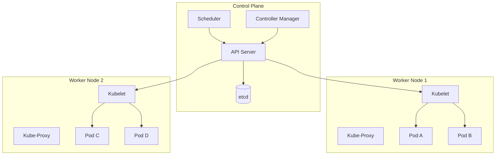

### Control Plane Components

| Component | Responsibility |
|-----------|---------------|
| **API Server** | Central management hub; all communication goes through it. RESTful API, authentication, authorization, admission control. |
| **etcd** | Distributed key-value store holding all cluster state. The source of truth. |
| **Scheduler** | Assigns pods to nodes based on resource requirements, affinity rules, taints/tolerations. |
| **Controller Manager** | Runs control loops (Deployment controller, ReplicaSet controller, Job controller) that reconcile actual state with desired state. |

### Core Kubernetes Objects

#### Pods

The smallest deployable unit. A pod contains one or more containers that share network namespace (same IP) and storage volumes.

```yaml
apiVersion: v1
kind: Pod
metadata:
  name: myapp
  labels:
    app: myapp
    version: v2
spec:
  containers:
    - name: myapp
      image: registry.example.com/myapp:v2.0.0
      ports:
        - containerPort: 8080
      env:
        - name: DATABASE_URL
          valueFrom:
            secretKeyRef:
              name: myapp-secrets
              key: database-url
      resources:
        requests:
          cpu: 250m
          memory: 256Mi
        limits:
          cpu: 500m
          memory: 512Mi
      readinessProbe:
        httpGet:
          path: /healthz
          port: 8080
        initialDelaySeconds: 5
        periodSeconds: 10
      livenessProbe:
        httpGet:
          path: /livez
          port: 8080
        initialDelaySeconds: 15
        periodSeconds: 20
```

#### Deployments

Manage ReplicaSets and provide declarative updates for pods:

```yaml
apiVersion: apps/v1
kind: Deployment
metadata:
  name: myapp
  labels:
    app: myapp
spec:
  replicas: 3
  selector:
    matchLabels:
      app: myapp
  strategy:
    type: RollingUpdate
    rollingUpdate:
      maxSurge: 1
      maxUnavailable: 0
  template:
    metadata:
      labels:
        app: myapp
    spec:
      containers:
        - name: myapp
          image: registry.example.com/myapp:v2.0.0
          ports:
            - containerPort: 8080
```

#### Services

Provide stable network endpoints for pods. Four types:

| Service Type | Behavior | Use Case |
|-------------|----------|----------|
| ClusterIP | Internal-only virtual IP | Service-to-service communication |
| NodePort | Exposes on each node's IP at a static port | Development, simple external access |
| LoadBalancer | Provisions cloud load balancer | Production external access |
| ExternalName | Maps to external DNS name (CNAME) | External service integration |

```yaml
apiVersion: v1
kind: Service
metadata:
  name: myapp
spec:
  type: ClusterIP
  selector:
    app: myapp
  ports:
    - port: 80
      targetPort: 8080
      protocol: TCP
```

#### Ingress

HTTP/HTTPS routing from external traffic to internal services:

```yaml
apiVersion: networking.k8s.io/v1
kind: Ingress
metadata:
  name: myapp-ingress
  annotations:
    nginx.ingress.kubernetes.io/ssl-redirect: "true"
    nginx.ingress.kubernetes.io/rate-limit: "100"
spec:
  ingressClassName: nginx
  tls:
    - hosts:
        - myapp.example.com
      secretName: myapp-tls
  rules:
    - host: myapp.example.com
      http:
        paths:
          - path: /api
            pathType: Prefix
            backend:
              service:
                name: myapp-api
                port:
                  number: 80
          - path: /
            pathType: Prefix
            backend:
              service:
                name: myapp-web
                port:
                  number: 80
```

#### ConfigMaps and Secrets

**ConfigMap** — non-sensitive configuration data:

```yaml
apiVersion: v1
kind: ConfigMap
metadata:
  name: myapp-config
data:
  LOG_LEVEL: "info"
  MAX_CONNECTIONS: "100"
  FEATURE_NEW_UI: "true"
  application.yaml: |
    server:
      port: 8080
    cache:
      ttl: 300
```

**Secret** — sensitive data (base64-encoded, not encrypted by default):

```yaml
apiVersion: v1
kind: Secret
metadata:
  name: myapp-secrets
type: Opaque
data:
  database-url: cG9zdGdyZXNxbDovL3VzZXI6cGFzc0BkYi5leGFtcGxlLmNvbS9teWFwcA==
  api-key: c2VjcmV0LWFwaS1rZXktdmFsdWU=
```

**Secret management best practices:**
- Use external secret managers (Vault, AWS Secrets Manager) with operators like External Secrets Operator
- Enable etcd encryption at rest
- Use RBAC to restrict secret access
- Rotate secrets regularly
- Never commit secrets to Git

### Autoscaling

#### Horizontal Pod Autoscaler (HPA)

Scales the number of pod replicas based on metrics:

```yaml
apiVersion: autoscaling/v2
kind: HorizontalPodAutoscaler
metadata:
  name: myapp-hpa
spec:
  scaleTargetRef:
    apiVersion: apps/v1
    kind: Deployment
    name: myapp
  minReplicas: 3
  maxReplicas: 50
  metrics:
    - type: Resource
      resource:
        name: cpu
        target:
          type: Utilization
          averageUtilization: 70
    - type: Resource
      resource:
        name: memory
        target:
          type: Utilization
          averageUtilization: 80
    - type: Pods
      pods:
        metric:
          name: http_requests_per_second
        target:
          type: AverageValue
          averageValue: 1000
  behavior:
    scaleUp:
      stabilizationWindowSeconds: 60
      policies:
        - type: Percent
          value: 100
          periodSeconds: 60
    scaleDown:
      stabilizationWindowSeconds: 300
      policies:
        - type: Percent
          value: 10
          periodSeconds: 60
```

#### Vertical Pod Autoscaler (VPA)

Adjusts CPU and memory requests/limits for containers:

```yaml
apiVersion: autoscaling.k8s.io/v1
kind: VerticalPodAutoscaler
metadata:
  name: myapp-vpa
spec:
  targetRef:
    apiVersion: apps/v1
    kind: Deployment
    name: myapp
  updatePolicy:
    updateMode: "Auto"  # or "Off" for recommendations only
  resourcePolicy:
    containerPolicies:
      - containerName: myapp
        minAllowed:
          cpu: 100m
          memory: 128Mi
        maxAllowed:
          cpu: 2
          memory: 4Gi
```

**HPA vs VPA:**

| Dimension | HPA | VPA |
|-----------|-----|-----|
| Scales | Number of pods | Resources per pod |
| Direction | Horizontal (more replicas) | Vertical (bigger pods) |
| Use with | Stateless services | Stateful, memory-intensive |
| Interruption | None (adds/removes pods) | Pod restart (to apply new limits) |
| Can combine? | Not on same metric | Use VPA for memory, HPA for CPU |

#### Pod Disruption Budget (PDB)

Limits the number of pods that can be simultaneously unavailable during voluntary disruptions (node drain, cluster upgrade):

```yaml
apiVersion: policy/v1
kind: PodDisruptionBudget
metadata:
  name: myapp-pdb
spec:
  minAvailable: 2        # At least 2 pods must remain available
  # OR: maxUnavailable: 1  # At most 1 pod can be unavailable
  selector:
    matchLabels:
      app: myapp
```

### Resource Management

**Requests vs Limits:**

| Concept | Definition | Scheduling Impact | Runtime Impact |
|---------|-----------|-------------------|---------------|
| Request | Guaranteed minimum resources | Used for scheduling decisions | Pod gets at least this much |
| Limit | Maximum allowed resources | Not used for scheduling | Pod killed (OOM) or throttled (CPU) if exceeded |

**Quality of Service (QoS) Classes:**

| QoS Class | Definition | Eviction Priority |
|-----------|-----------|-------------------|
| Guaranteed | Requests = Limits for all containers | Last to be evicted |
| Burstable | Requests < Limits (or only requests set) | Evicted after BestEffort |
| BestEffort | No requests or limits set | First to be evicted |

**Resource management best practices:**
- Always set requests and limits
- Set requests to average usage, limits to peak usage (with buffer)
- Use LimitRange to enforce defaults
- Use ResourceQuota to cap per-namespace usage
- Monitor actual usage and adjust (or use VPA)

---

## 3.3 Kubernetes Patterns

### Sidecar Pattern

A sidecar container runs alongside the main application container in the same pod, extending or enhancing its functionality without modifying the main container.

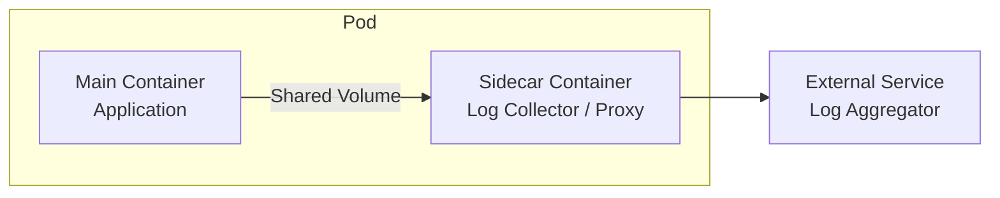

**Common sidecar use cases:**

| Sidecar | Purpose | Example |
|---------|---------|---------|
| Log collector | Ship logs to centralized system | Fluentbit sidecar shipping to Elasticsearch |
| Service mesh proxy | Handle service-to-service communication | Envoy proxy (Istio) |
| TLS proxy | Terminate/originate TLS | stunnel, ghostunnel |
| Config reloader | Watch for config changes, signal main app | configmap-reload |
| Monitoring agent | Collect metrics, traces | OpenTelemetry collector |

**Example: Fluentbit log sidecar:**

```yaml
apiVersion: v1
kind: Pod
metadata:
  name: myapp
spec:
  containers:
    - name: myapp
      image: myapp:v1
      volumeMounts:
        - name: log-volume
          mountPath: /var/log/app

    - name: log-collector
      image: fluent/fluent-bit:latest
      volumeMounts:
        - name: log-volume
          mountPath: /var/log/app
        - name: fluentbit-config
          mountPath: /fluent-bit/etc/

  volumes:
    - name: log-volume
      emptyDir: {}
    - name: fluentbit-config
      configMap:
        name: fluentbit-config
```

### Ambassador Pattern

An ambassador container proxies network connections from the main container to external services, abstracting connection details (discovery, authentication, retry logic).

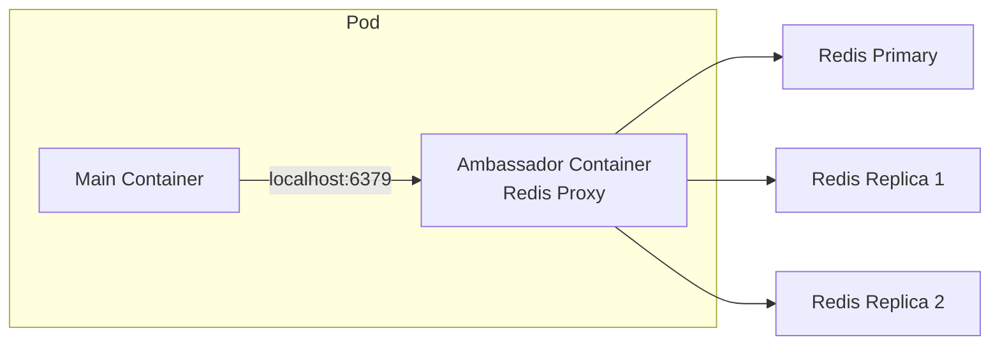

**Use cases:**
- Database connection pooling (PgBouncer sidecar)
- Service discovery abstraction
- Protocol translation (gRPC to REST)
- Connection retry and circuit breaking

### Adapter Pattern

An adapter container transforms the output of the main container into a format expected by external systems.

**Use cases:**
- Prometheus metrics exporter (convert app metrics to Prometheus format)
- Log format transformation (JSON to syslog)
- API response transformation

### Init Container Pattern

Init containers run before the main application containers start. They run to completion (must exit successfully) before the main containers begin.

```yaml
apiVersion: v1
kind: Pod
metadata:
  name: myapp
spec:
  initContainers:
    - name: wait-for-db
      image: busybox:1.36
      command: ['sh', '-c', 'until nc -z db-service 5432; do sleep 2; done']

    - name: run-migrations
      image: myapp-migrations:v2
      command: ['./migrate', 'up']
      env:
        - name: DATABASE_URL
          valueFrom:
            secretKeyRef:
              name: myapp-secrets
              key: database-url

    - name: seed-cache
      image: myapp:v2
      command: ['./warm-cache']

  containers:
    - name: myapp
      image: myapp:v2
      ports:
        - containerPort: 8080
```

**Common init container use cases:**

| Init Container | Purpose |
|---------------|---------|
| Wait for dependency | Block startup until database/service is ready |
| Database migration | Run schema migrations before app starts |
| Config fetching | Download config from Vault or remote source |
| Cache warming | Pre-populate caches before serving traffic |
| File permissions | Set ownership/permissions on shared volumes |

### Job and CronJob Patterns

**Job** — run-to-completion workloads:

```yaml
apiVersion: batch/v1
kind: Job
metadata:
  name: data-export
spec:
  completions: 10          # Total tasks to complete
  parallelism: 3           # Run 3 pods concurrently
  backoffLimit: 4           # Max retries per pod
  activeDeadlineSeconds: 3600  # Max total runtime
  template:
    spec:
      restartPolicy: Never
      containers:
        - name: exporter
          image: myapp-exporter:v1
          command: ['./export', '--batch-id=$(JOB_COMPLETION_INDEX)']
```

**CronJob** — scheduled recurring jobs:

```yaml
apiVersion: batch/v1
kind: CronJob
metadata:
  name: nightly-report
spec:
  schedule: "0 2 * * *"    # 2 AM daily
  concurrencyPolicy: Forbid  # Don't start new if previous still running
  successfulJobsHistoryLimit: 3
  failedJobsHistoryLimit: 5
  jobTemplate:
    spec:
      template:
        spec:
          restartPolicy: OnFailure
          containers:
            - name: report-generator
              image: myapp-reports:v1
              command: ['./generate-daily-report']
```

---

## 3.4 Helm — Kubernetes Package Manager

### What Is Helm?

Helm is a package manager for Kubernetes that bundles related Kubernetes manifests into a **chart** — a versioned, configurable, installable package. Helm enables:
- Templated Kubernetes manifests with configurable values
- Versioned releases with rollback capability
- Chart repositories for sharing and reuse
- Dependency management between charts

### Chart Structure

```
myapp-chart/
  Chart.yaml          # Chart metadata (name, version, dependencies)
  values.yaml         # Default configuration values
  values-staging.yaml # Environment-specific overrides
  values-prod.yaml    # Environment-specific overrides
  templates/
    deployment.yaml   # Templated Deployment
    service.yaml      # Templated Service
    ingress.yaml      # Templated Ingress
    configmap.yaml    # Templated ConfigMap
    hpa.yaml          # Templated HPA
    _helpers.tpl      # Template helper functions
    NOTES.txt         # Post-install instructions
  charts/             # Dependency charts
```

### Chart.yaml

```yaml
apiVersion: v2
name: myapp
description: My Application Helm Chart
type: application
version: 1.2.0        # Chart version
appVersion: "2.0.0"   # Application version
dependencies:
  - name: postgresql
    version: 12.1.9
    repository: https://charts.bitnami.com/bitnami
    condition: postgresql.enabled
  - name: redis
    version: 17.3.14
    repository: https://charts.bitnami.com/bitnami
    condition: redis.enabled
```

### Templated Deployment

```yaml
# templates/deployment.yaml
apiVersion: apps/v1
kind: Deployment
metadata:
  name: {{ include "myapp.fullname" . }}
  labels:
    {{- include "myapp.labels" . | nindent 4 }}
spec:
  replicas: {{ .Values.replicaCount }}
  selector:
    matchLabels:
      {{- include "myapp.selectorLabels" . | nindent 6 }}
  strategy:
    type: RollingUpdate
    rollingUpdate:
      maxSurge: {{ .Values.rollingUpdate.maxSurge }}
      maxUnavailable: {{ .Values.rollingUpdate.maxUnavailable }}
  template:
    metadata:
      labels:
        {{- include "myapp.selectorLabels" . | nindent 8 }}
      annotations:
        checksum/config: {{ include (print $.Template.BasePath "/configmap.yaml") . | sha256sum }}
    spec:
      containers:
        - name: {{ .Chart.Name }}
          image: "{{ .Values.image.repository }}:{{ .Values.image.tag }}"
          imagePullPolicy: {{ .Values.image.pullPolicy }}
          ports:
            - containerPort: {{ .Values.service.targetPort }}
          {{- if .Values.readinessProbe.enabled }}
          readinessProbe:
            httpGet:
              path: {{ .Values.readinessProbe.path }}
              port: {{ .Values.service.targetPort }}
            initialDelaySeconds: {{ .Values.readinessProbe.initialDelaySeconds }}
            periodSeconds: {{ .Values.readinessProbe.periodSeconds }}
          {{- end }}
          resources:
            {{- toYaml .Values.resources | nindent 12 }}
```

### values.yaml

```yaml
replicaCount: 3

image:
  repository: registry.example.com/myapp
  tag: "2.0.0"
  pullPolicy: IfNotPresent

service:
  type: ClusterIP
  port: 80
  targetPort: 8080

ingress:
  enabled: true
  className: nginx
  hosts:
    - host: myapp.example.com
      paths:
        - path: /
          pathType: Prefix

resources:
  requests:
    cpu: 250m
    memory: 256Mi
  limits:
    cpu: 500m
    memory: 512Mi

readinessProbe:
  enabled: true
  path: /healthz
  initialDelaySeconds: 5
  periodSeconds: 10

rollingUpdate:
  maxSurge: 1
  maxUnavailable: 0

autoscaling:
  enabled: true
  minReplicas: 3
  maxReplicas: 20
  targetCPUUtilization: 70

postgresql:
  enabled: true

redis:
  enabled: true
```

### Helm Commands

| Command | Purpose |
|---------|---------|
| `helm install myapp ./myapp-chart` | Install chart as release |
| `helm upgrade myapp ./myapp-chart` | Upgrade existing release |
| `helm rollback myapp 2` | Rollback to revision 2 |
| `helm list` | List installed releases |
| `helm history myapp` | Show release history |
| `helm template myapp ./myapp-chart` | Render templates locally (dry run) |
| `helm diff upgrade myapp ./myapp-chart` | Show diff before upgrade |
| `helm uninstall myapp` | Remove release |

### Helm Rollback

Helm maintains a history of releases. Rollback reverts to a previous known-good state:

```
$ helm history myapp
REVISION    STATUS      CHART           APP VERSION     DESCRIPTION
1           superseded  myapp-1.0.0     1.0.0           Install complete
2           superseded  myapp-1.1.0     1.1.0           Upgrade complete
3           deployed    myapp-1.2.0     2.0.0           Upgrade complete

$ helm rollback myapp 2
Rollback was a success! Happy Helming!
```

---

## 3.5 Service Mesh

### What Is a Service Mesh?

A service mesh is a dedicated infrastructure layer for managing service-to-service communication. It provides traffic management, security (mutual TLS), and observability without requiring changes to application code.

### Service Mesh Architecture

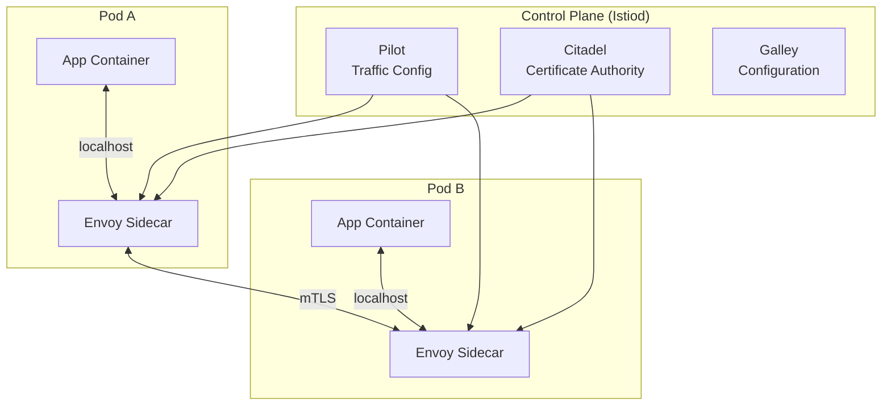

### Service Mesh Capabilities

| Capability | Description | Without Mesh |
|-----------|-------------|-------------|
| **Traffic management** | Routing rules, traffic splitting, mirroring, retries, timeouts | Application code or API gateway |
| **Mutual TLS (mTLS)** | Encrypted, authenticated service-to-service communication | Manual certificate management |
| **Observability** | Distributed tracing, metrics, access logs — automatically | Application instrumentation |
| **Fault injection** | Inject delays, errors for chaos testing | Custom test code |
| **Circuit breaking** | Prevent cascade failures | Application-level libraries (Hystrix) |
| **Rate limiting** | Control request rates between services | Application code or API gateway |
| **Authorization policies** | Fine-grained access control between services | Application code |

### Istio vs Linkerd

| Dimension | Istio | Linkerd |
|-----------|-------|---------|
| Proxy | Envoy (C++) | linkerd2-proxy (Rust) |
| Resource overhead | Higher (~50MB per proxy) | Lower (~10MB per proxy) |
| Complexity | High (many features, complex config) | Low (simpler, opinionated) |
| mTLS | Automatic, opt-in or strict | Automatic, on by default |
| Traffic management | Comprehensive (VirtualService, DestinationRule) | Basic (TrafficSplit, ServiceProfile) |
| Multi-cluster | Supported | Supported |
| Learning curve | Steep | Gentle |
| Best for | Complex routing needs, large orgs | Simplicity, quick adoption |

### Istio Traffic Management Example

**Canary traffic split:**

```yaml
apiVersion: networking.istio.io/v1beta1
kind: VirtualService
metadata:
  name: reviews
spec:
  hosts:
    - reviews
  http:
    - match:
        - headers:
            user-agent:
              regex: ".*Chrome.*"
      route:
        - destination:
            host: reviews
            subset: v2
    - route:
        - destination:
            host: reviews
            subset: v1
          weight: 90
        - destination:
            host: reviews
            subset: v2
          weight: 10

---
apiVersion: networking.istio.io/v1beta1
kind: DestinationRule
metadata:
  name: reviews
spec:
  host: reviews
  trafficPolicy:
    connectionPool:
      tcp:
        maxConnections: 100
      http:
        h2UpgradePolicy: DEFAULT
        http1MaxPendingRequests: 100
    outlierDetection:
      consecutive5xxErrors: 5
      interval: 10s
      baseEjectionTime: 30s
  subsets:
    - name: v1
      labels:
        version: v1
    - name: v2
      labels:
        version: v2
```

### When to Use a Service Mesh

**Use a service mesh when:**
- You have 10+ microservices communicating with each other
- You need mutual TLS between all services
- You want observability without modifying application code
- You need advanced traffic management (canary, mirroring, fault injection)
- Compliance requires encrypted intra-cluster communication

**Avoid a service mesh when:**
- You have fewer than 5 services
- The latency overhead of a proxy is unacceptable
- Your team cannot absorb the operational complexity
- A simple API gateway meets your routing needs

---

## 3.6 GitOps

### What Is GitOps?

GitOps is an operational framework where the desired state of infrastructure and applications is stored in Git, and an automated process ensures the actual state matches the desired state. Git is the single source of truth.

### GitOps Principles

1. **Declarative**: The entire system must be described declaratively (Kubernetes manifests, Helm charts, Kustomize overlays).
2. **Versioned and immutable**: The desired state is stored in Git, providing an audit trail and the ability to revert.
3. **Pulled automatically**: Software agents (Argo CD, Flux) automatically pull the desired state from Git and apply it.
4. **Continuously reconciled**: Agents continuously compare actual state with desired state and correct any drift.

### GitOps Architecture

```mermaid
flowchart TD
    DEV[Developer] -->|Push code| APP_REPO[Application Repo]
    APP_REPO -->|CI Pipeline| CI[Build & Test]
    CI -->|Push image| REG[Container Registry]
    CI -->|Update image tag| CONFIG_REPO[Config Repo]
    CONFIG_REPO -->|Watches| ARGO[Argo CD]
    ARGO -->|Syncs| K8S[Kubernetes Cluster]
    K8S -->|Reports state| ARGO
    ARGO -->|Detects drift| CONFIG_REPO
    OPS[Operator] -->|Change config| CONFIG_REPO
```

### Two-Repository Model

**Application Repository**: Contains source code, Dockerfile, CI pipeline definitions. The CI pipeline builds and pushes images.

**Configuration Repository**: Contains Kubernetes manifests, Helm values, Kustomize overlays. Argo CD watches this repository.

**Why separate repositories?**
- Application developers push to the app repo; only CI automation pushes to the config repo.
- Config changes are auditable — every production change is a Git commit.
- Rollback is a `git revert` on the config repo.
- Different access controls for code vs deployment config.

### Argo CD — GitOps Controller

**Argo CD Application:**

```yaml
apiVersion: argoproj.io/v1alpha1
kind: Application
metadata:
  name: myapp-production
  namespace: argocd
spec:
  project: production
  source:
    repoURL: https://github.com/org/config-repo
    targetRevision: main
    path: environments/production/myapp
    helm:
      valueFiles:
        - values.yaml
        - values-production.yaml
  destination:
    server: https://kubernetes.default.svc
    namespace: production
  syncPolicy:
    automated:
      prune: true           # Remove resources not in Git
      selfHeal: true         # Revert manual changes
    syncOptions:
      - CreateNamespace=true
      - ApplyOutOfSyncOnly=true
    retry:
      limit: 5
      backoff:
        duration: 5s
        factor: 2
        maxDuration: 3m
```

### Flux — Alternative GitOps Controller

Flux uses Kubernetes-native CRDs to manage GitOps:

```yaml
apiVersion: source.toolkit.fluxcd.io/v1
kind: GitRepository
metadata:
  name: config-repo
  namespace: flux-system
spec:
  interval: 1m
  url: https://github.com/org/config-repo
  ref:
    branch: main

---
apiVersion: kustomize.toolkit.fluxcd.io/v1
kind: Kustomization
metadata:
  name: myapp
  namespace: flux-system
spec:
  interval: 5m
  sourceRef:
    kind: GitRepository
    name: config-repo
  path: ./environments/production/myapp
  prune: true
  healthChecks:
    - apiVersion: apps/v1
      kind: Deployment
      name: myapp
      namespace: production
```

### Drift Detection and Self-Healing

GitOps controllers continuously reconcile:

1. **Drift detection**: Every reconciliation interval (e.g., 3 minutes), the controller compares actual cluster state with the desired state in Git.
2. **Self-healing**: If someone manually changes a resource (e.g., `kubectl edit deployment`), the controller reverts it to match Git.
3. **Pruning**: If a resource is removed from Git, the controller deletes it from the cluster.

**Benefits of self-healing:**
- Prevents configuration drift
- Eliminates "snowflake" environments
- Ensures Git is always the source of truth
- Provides automatic recovery from accidental changes

### Multi-Cluster GitOps

For organizations with multiple Kubernetes clusters (dev, staging, production, multi-region):

```
config-repo/
  base/                     # Common resources across all environments
    myapp/
      deployment.yaml
      service.yaml
      hpa.yaml
  environments/
    development/
      myapp/
        kustomization.yaml  # Patches: 1 replica, debug logging
    staging/
      myapp/
        kustomization.yaml  # Patches: 2 replicas, info logging
    production-us/
      myapp/
        kustomization.yaml  # Patches: 5 replicas, warn logging
    production-eu/
      myapp/
        kustomization.yaml  # Patches: 5 replicas, warn logging
```

### Argo CD vs Flux Comparison

| Dimension | Argo CD | Flux |
|-----------|---------|------|
| Architecture | Separate server with UI | Kubernetes-native CRDs |
| UI | Rich web dashboard | CLI-focused (optional Weave GitOps UI) |
| Multi-cluster | Application targeting remote clusters | Cluster bootstrapping |
| Sync mechanism | Application CRD | Kustomization CRD |
| Notification | Built-in notifications | Notification controller |
| Rollback | UI or CLI rollback | Git revert |
| Learning curve | Moderate | Moderate |
| Community | CNCF graduated, large community | CNCF graduated, large community |

---

---

# Architectural Decision Records (ADRs)

---

## ADR-001: CI/CD Platform Selection

**Status:** Accepted

**Context:**
The organization needs a CI/CD platform for 50+ development teams deploying 300+ microservices. Requirements include pipeline-as-code, parallelism, secret management, and integration with Kubernetes.

**Options Considered:**

| Option | Pros | Cons |
|--------|------|------|
| GitHub Actions | Integrated with GitHub, large marketplace, easy YAML | GitHub lock-in, runner costs at scale |
| GitLab CI | Built-in registry, security scanning, all-in-one | Heavier self-hosted, less flexible marketplace |
| Jenkins | Maximum flexibility, huge plugin ecosystem | High maintenance, Groovy complexity, security surface |
| Argo Workflows + Argo CD | Kubernetes-native, GitOps-first | Steeper learning curve, smaller ecosystem |

**Decision:**
Use **GitHub Actions** for CI (build, test, scan) and **Argo CD** for CD (GitOps deployment). This separates concerns: GitHub Actions handles build and test automation while Argo CD manages deployment reconciliation.

**Rationale:**
- GitHub Actions provides fast iteration for CI pipeline changes.
- Argo CD provides self-healing, drift detection, and a clear audit trail for deployments.
- The separation allows teams to choose their CI tool while standardizing on GitOps for deployment.
- Both tools are well-maintained with strong community support.

**Consequences:**
- Teams must maintain two configuration repositories (app repo with CI workflows, config repo with Kubernetes manifests).
- CI-to-CD handoff requires automated image tag updates in the config repo.
- Operators need familiarity with both GitHub Actions and Argo CD.

---

## ADR-002: Default Deployment Strategy

**Status:** Accepted

**Context:**
The organization needs a default deployment strategy for microservice updates. Some services are stateless HTTP APIs, others are event consumers, and a few are stateful.

**Options Considered:**

| Option | Pros | Cons |
|--------|------|------|
| Blue-Green | Instant rollback, full validation | Double infrastructure cost |
| Canary with Argo Rollouts | Progressive, metrics-based, low blast radius | Requires traffic splitting (Istio/Nginx) |
| Rolling Update (K8s default) | Simple, no extra infrastructure | Both versions run during update, no traffic control |
| Feature Flags only | Complete decoupling of deploy/release | Requires flag infrastructure, code complexity |

**Decision:**
Use **Canary releases with Argo Rollouts** as the default for stateless HTTP services. Use **Rolling Updates** for event consumers and background workers. Use **Blue-Green** for stateful services with complex startup sequences.

**Rationale:**
- Canary provides the best balance of safety and operational simplicity for the majority of services.
- Argo Rollouts integrates with existing Istio service mesh for traffic splitting.
- Rolling updates are sufficient for non-user-facing workloads where traffic splitting adds no value.
- Blue-green is reserved for services where partial deployment is impractical.

**Consequences:**
- Teams must define Argo Rollout resources instead of plain Deployments for HTTP services.
- Monitoring and alerting must be mature enough for automated canary analysis.
- Istio service mesh must be deployed and maintained.

---

## ADR-003: Container Image Strategy

**Status:** Accepted

**Context:**
The organization needs standards for container image creation, tagging, scanning, and promotion across environments.

**Decision:**
- Base images: Use distroless or Alpine variants, pinned to specific digests.
- Multi-stage builds: Mandatory for all services.
- Tagging: Git SHA (e.g., `sha-a1b2c3d`) for CI builds, SemVer (e.g., `v2.1.3`) for releases.
- Scanning: Trivy in CI, block on critical CVEs, Harbor registry scanning for continuous monitoring.
- Promotion: Immutable images promoted via re-tagging, never rebuilt.
- Retention: Keep tagged releases indefinitely, delete untagged images after 14 days, keep last 30 images per repository.

**Rationale:**
- Distroless reduces attack surface and CVE count.
- Multi-stage builds minimize image size and remove build tools.
- Immutable promotion ensures the tested artifact is exactly what runs in production.
- SHA tagging provides traceability from production to commit.

---

## ADR-004: GitOps Adoption

**Status:** Accepted

**Context:**
The organization currently uses imperative deployment scripts (`kubectl apply`, shell scripts) triggered by CI pipelines. This creates configuration drift, lacks audit trails, and makes rollback difficult.

**Decision:**
Adopt GitOps with Argo CD. All Kubernetes resources are managed through a central configuration repository. Manual `kubectl` changes in production are forbidden and automatically reverted by Argo CD self-healing.

**Rationale:**
- Git provides a complete audit trail of every production change.
- Self-healing prevents configuration drift.
- Rollback is a `git revert`, which is familiar to all developers.
- Separation of CI (build) and CD (deploy) improves security (CI does not need cluster credentials).

**Consequences:**
- All teams must migrate from imperative scripts to declarative manifests.
- A configuration repository must be established with proper access controls.
- Image tag updates must be automated (CI writes to config repo).
- Operators must learn Argo CD Application management.

---

## ADR-005: Feature Flag Platform Selection

**Status:** Accepted

**Context:**
Teams need a feature flag system to support trunk-based development, canary launches, A/B testing, and operational kill switches.

**Options Considered:**

| Option | Pros | Cons |
|--------|------|------|
| LaunchDarkly | Best-in-class, real-time, rich targeting | Expensive at scale, SaaS vendor lock-in |
| Unleash (self-hosted) | Open source, self-hosted, good SDK support | Requires infrastructure, fewer advanced features |
| Flagsmith (self-hosted) | Open source, API-first, self-hosted | Smaller community, less mature |
| Custom-built | Full control, no vendor cost | Engineering investment, maintenance burden |

**Decision:**
Use **Unleash (self-hosted)** as the primary flag platform with the OpenFeature SDK for vendor abstraction.

**Rationale:**
- Self-hosted eliminates SaaS costs and data residency concerns.
- OpenFeature SDK allows switching providers without code changes.
- Unleash provides sufficient targeting, gradual rollout, and API support.
- The organization has the infrastructure team to operate a self-hosted solution.

**Consequences:**
- Infrastructure team must maintain the Unleash deployment.
- SDKs must be integrated into all services.
- A flag hygiene process must be established to manage flag lifecycle and cleanup.

---

---

# Interview Angle

---

## How Deployment & DevOps Appears in System Design Interviews

Deployment and DevOps topics rarely appear as standalone interview questions. Instead, they surface as follow-up questions after you propose a system design. Interviewers use them to assess operational maturity and production readiness.

### Common Interview Patterns

**Pattern 1: "How would you deploy this?"**
After designing a system, the interviewer asks about deployment strategy. They want to hear:
- Canary or blue-green deployment for user-facing services
- Rolling updates for background workers
- Feature flags for gradual feature rollout
- Database migration strategy (expand-contract for schema changes)
- Rollback plan if something goes wrong

**Pattern 2: "What happens when a deployment fails?"**
This tests your incident response thinking:
- Automated rollback based on error rate / latency spike
- Health checks and readiness probes preventing bad pods from serving traffic
- Feature flag kill switch for rapid deactivation
- Communication (PagerDuty alert, Slack notification, status page update)

**Pattern 3: "How do you handle database schema changes?"**
This is one of the hardest practical deployment problems:
- Explain expand-contract migration pattern
- Never rename or drop columns in a single deployment
- Add new columns as nullable, backfill, then enforce constraints
- Use online schema migration tools (gh-ost, pt-online-schema-change) for large tables

**Pattern 4: "How do you test in production?"**
This tests your understanding of modern deployment practices:
- Canary releases with automated analysis
- Shadow/mirror deployment for comparison testing
- Feature flags for dark launching to internal users
- Chaos engineering (inject failures to test resilience)

**Pattern 5: "Scale this system to 10x traffic"**
This connects to container orchestration:
- Horizontal Pod Autoscaler based on CPU/RPS
- Cluster autoscaler to add nodes when pods cannot be scheduled
- PodDisruptionBudget to maintain availability during scaling events
- Load testing in staging before production traffic increase

### What Interviewers Are Looking For

| Signal | What To Demonstrate |
|--------|-------------------|
| Production awareness | You think about deployment, not just architecture |
| Risk management | You control blast radius with canary/feature flags |
| Automation mindset | CI/CD pipelines, automated testing, GitOps |
| Rollback planning | Every deployment has a rollback strategy |
| Monitoring integration | Deployment success is measured by production metrics |
| Database safety | Schema changes are backward-compatible |

### Framework for Answering Deployment Questions

1. **State the strategy**: "For this service, I would use canary deployment because..."
2. **Describe the pipeline**: "Code goes through CI (build, test, scan), creates an immutable image, and is deployed via GitOps."
3. **Explain traffic management**: "The canary starts at 5% traffic, with automated promotion based on error rate and latency."
4. **Address rollback**: "If error rate exceeds 1%, the system automatically rolls back to the previous version."
5. **Mention monitoring**: "I would watch error rates, P99 latency, and business metrics during the rollout."
6. **Handle edge cases**: "For database migrations, I would use the expand-contract pattern to ensure backward compatibility."

### Sample Interview Answer: Deploying a New Payment Service

> "For deploying a new payment service, I would take an especially cautious approach given the financial impact of failures.
>
> First, the code goes through a CI pipeline: unit tests, integration tests with a mocked payment provider, contract tests to verify API compatibility with calling services, and security scanning since this service handles sensitive data.
>
> The CI pipeline produces an immutable Docker image tagged with the commit SHA. This image is promoted through dev and staging environments without rebuilding.
>
> For production deployment, I would use canary releases starting at 1% of traffic. The canary analysis monitors error rate, latency, and critically, payment success rate. If any metric degrades, the system automatically rolls back.
>
> I would also use a feature flag to control which payment provider the service routes to. This gives us a kill switch — if the new service has issues even after passing canary, we can instantly route payments back to the old provider.
>
> For database changes, I would use expand-contract migrations. For example, if we need to add a new payment_status column, I would add it as nullable first, deploy the new code that writes to it, backfill historical data, and only then make it NOT NULL in a subsequent deployment.
>
> The entire deployment is managed through GitOps with Argo CD, so every change is auditable, and rollback is a git revert."

---

---

# Practice Questions

---

## Question 1: CI Pipeline Design

**Question:** Design a CI pipeline for a team of 30 developers working on a large monorepo containing 15 microservices. The current pipeline takes 45 minutes and developers are frustrated.

**Key Points to Address:**
- Test impact analysis to run only tests affected by changed files
- Parallel execution of independent stages
- Dependency caching (node_modules, Docker layers)
- Selective builds based on which services have changed code
- Remote build caching with Bazel or Turborepo
- Split E2E tests to run only relevant suites
- Target: pipeline under 10 minutes for typical changes

---

## Question 2: Zero-Downtime Database Migration

**Question:** You need to rename a column from `user_name` to `full_name` in a table with 500 million rows that is accessed by 3 different services. How do you do this with zero downtime?

**Key Points to Address:**
- Deploy v1.1: Add `full_name` column (nullable), write to both columns
- Backfill `full_name` from `user_name` in batches (to avoid table lock)
- Deploy v1.2: Read from `full_name`, still write to both
- Verify all services are on v1.2
- Deploy v1.3: Stop writing to `user_name`
- Drop `user_name` column in a separate migration
- Use online schema change tools for the initial column add on a large table

---

## Question 3: Canary Rollout Failure

**Question:** Your canary deployment is at 5% traffic. The error rate is 0.3% for the canary and 0.1% for the baseline. Should you roll back? What metrics would you examine?

**Key Points to Address:**
- 3x error rate increase is concerning but may not be statistically significant at 5% traffic
- Examine absolute request volume — 0.3% of 5% traffic may be just a few requests
- Check if errors are concentrated in specific endpoints or user segments
- Compare P50, P95, P99 latency distributions
- Check for new error types (not just rate)
- Look at business metrics (conversion, revenue) if available
- Decision depends on the service criticality and the organization's risk tolerance

---

## Question 4: Feature Flag Cleanup

**Question:** Your organization has 5,000 feature flags, 60% of which are stale (fully rolled out more than 6 months ago). How do you address this technical debt?

**Key Points to Address:**
- Automated flag audit reports showing stale flags with owners
- Mandatory cleanup deadline (e.g., 30 days after 100% rollout)
- CI-time check that fails builds with expired flags
- Automated PR generation to remove stale flag code paths
- Dashboard tracking flag count, age distribution, and ownership
- Quarterly "flag cleanup sprint" for bulk cleanup
- Flag creation requires an expiration date and cleanup ticket

---

## Question 5: Multi-Region Deployment

**Question:** You operate Kubernetes clusters in US-East, EU-West, and APAC. How do you deploy a new version across all three regions safely?

**Key Points to Address:**
- Sequential deployment: US-East first (canary), then EU-West, then APAC
- Each region completes canary validation before the next region starts
- Use Argo CD ApplicationSets for multi-cluster management
- Region-specific configuration via Kustomize overlays
- Global rollback capability if issues found in later regions
- Time zone awareness — deploy during each region's low-traffic window
- Shared config repo with per-region paths

---

## Question 6: Container Image Security

**Question:** A critical CVE is discovered in the base image used by 200 of your services. How do you remediate this quickly?

**Key Points to Address:**
- Automated base image update via Renovate or Dependabot
- Rebuild all affected images against the patched base image
- Prioritize by exposure (internet-facing services first)
- Use image scanning in the registry (Harbor, ECR) to identify all affected images
- Roll out updated images through the normal canary pipeline (but expedited)
- Establish a base image update SLA (e.g., critical CVEs patched within 24 hours)
- Centralized base image registry with automated rebuild triggers

---

## Question 7: Blue-Green with Stateful Services

**Question:** You need to deploy a new version of a service that maintains WebSocket connections with 100,000 concurrent users. How do you handle the blue-green switch without dropping connections?

**Key Points to Address:**
- WebSocket connections are long-lived; switching traffic drops all connections
- Options: graceful drain (send "reconnect" message to clients), connection migration, or rolling update instead of blue-green
- Client-side reconnect logic with exponential backoff
- Stagger the drain: close 10% of connections per minute
- Load balancer connection draining timeout
- Consider whether blue-green is the right strategy for this service (rolling update may be better)

---

## Question 8: GitOps Drift Detection

**Question:** Despite using Argo CD with self-healing enabled, you discover that a production service has been running with manually applied resource limits for 3 weeks. How did this happen and how do you prevent it?

**Key Points to Address:**
- Possible causes: Argo CD sync disabled, resource not managed by Argo CD, annotation to ignore differences
- Check Argo CD sync status and health
- Verify the resource is within the Application's managed scope
- Check for `argocd.argoproj.io/compare-options: IgnoreDifferences` annotation
- Audit RBAC — restrict `kubectl edit/apply` in production namespaces
- Use OPA/Gatekeeper admission controllers to block direct modifications
- Alert on Argo CD sync failures and OutOfSync status

---

## Question 9: Kubernetes Resource Sizing

**Question:** Your service has memory requests of 256Mi and limits of 512Mi. Pods are being OOM-killed frequently during peak traffic. How do you diagnose and fix this?

**Key Points to Address:**
- Check actual memory usage with `kubectl top pod` and Prometheus metrics
- Determine if OOM-kill is due to the container limit or node memory pressure
- If container OOM: increase memory limit, investigate memory leaks, profile the application
- If node pressure: adjust resource requests so scheduler places fewer pods per node
- Use VPA in recommendation mode to suggest appropriate values
- Consider if the service has a memory leak (steady memory growth vs spike during load)
- Right-size: set request to P50 usage, limit to P99 usage + 20% buffer

---

## Question 10: Service Mesh Decision

**Question:** Your organization has 50 microservices. You are considering adopting Istio. What are the trade-offs and when would you not recommend it?

**Key Points to Address:**
- Benefits: mTLS between all services, traffic management, observability without code changes
- Costs: Envoy sidecar adds ~5ms P99 latency, ~50MB memory per pod, operational complexity
- Do not recommend if: latency is critical (sub-millisecond), team lacks Kubernetes expertise, fewer than 10 services
- Alternative: Linkerd for simpler use cases, or skip mesh entirely if you only need mTLS (use cert-manager + mTLS libraries)
- Gradual adoption: start with non-critical namespaces, measure overhead, expand

---

## Question 11: Rollback Strategy for Microservices

**Question:** Service A (v2.0) depends on a new API endpoint in Service B (v3.0). Both were deployed today. Service B v3.0 has a bug and needs to roll back to v2.0. But Service A v2.0 calls the new endpoint that only exists in Service B v3.0. How do you handle this?

**Key Points to Address:**
- This is a tight coupling / backward compatibility failure
- Immediate fix: roll back both services together
- Root cause: Service A should not depend on a new endpoint that was deployed simultaneously
- Prevention: backward-compatible API changes, feature flags in Service A to fall back to old endpoint
- Contract testing would have caught this if Service A's contract was verified against Service B v2.0
- Deployment ordering matters: deploy Service B first, verify the new endpoint works, then deploy Service A

---

## Question 12: Pipeline Security

**Question:** An attacker compromises a developer's GitHub account and pushes malicious code. Your CI/CD pipeline automatically deploys to production. How do you prevent this?

**Key Points to Address:**
- Branch protection rules requiring N approvals before merge
- Signed commits (GPG/SSH) to verify author identity
- CI checks must pass before merge (catches obvious malicious changes)
- Manual approval gate between CI and production deployment
- Separation of CI and CD credentials (CI cannot deploy directly)
- GitOps model: CI pushes image, but deployment is controlled by Argo CD which has separate access control
- Audit trail: every deployment traces to a specific commit and approver
- Two-person rule for production deployments (in high-security environments)

---

## Question 13: Handling Secrets in Kubernetes

**Question:** Your team currently stores database credentials as Kubernetes Secrets in plain YAML files committed to Git. What is wrong with this and how do you fix it?

**Key Points to Address:**
- Kubernetes Secrets are base64-encoded, not encrypted — anyone with repo access sees credentials
- Fix: Use External Secrets Operator to sync from a secret manager (Vault, AWS Secrets Manager, GCP Secret Manager)
- Seal secrets with Sealed Secrets (Bitnami) for GitOps workflows
- Enable etcd encryption at rest for defense in depth
- RBAC to restrict which namespaces/service accounts can read which secrets
- Secret rotation without pod restart (using mounted volumes instead of env vars, with a sidecar to watch for changes)

---

## Question 14: Helm Chart Management at Scale

**Question:** You have 300 microservices, each with their own Helm chart. Many share the same structure (deployment, service, HPA, PDB). How do you reduce duplication?

**Key Points to Address:**
- Create a shared "library chart" or "umbrella chart" with common templates
- Each service uses the shared chart as a dependency, customizing only values.yaml
- Use Helmfile or ArgoCD ApplicationSets to manage many similar releases
- Standardize chart patterns across teams (golden path templates)
- Automate chart version bumps when the shared chart is updated
- Consider Kustomize as an alternative for simpler overlay-based customization

---

## Question 15: Chaos Engineering Integration

**Question:** How would you integrate chaos engineering into your deployment pipeline to validate resilience before production rollout?

**Key Points to Address:**
- Run chaos experiments in staging as a pipeline gate (before production deployment)
- Use tools like Chaos Mesh, LitmusChaos, or Gremlin in Kubernetes
- Test scenarios: pod kill, network partition, latency injection, CPU stress
- Validate that the system degrades gracefully (circuit breakers work, retries succeed, users see fallback)
- Automated chaos experiments in canary phase: inject failures into canary pods and verify error handling
- Start with game days (manual chaos), graduate to automated pipeline integration
- Define steady-state hypotheses: "If I kill 1 of 3 pods, error rate stays below 0.1% and recovery takes < 30 seconds"

---

## Question 16: Observability During Deployment

**Question:** What metrics and signals should you monitor during a canary deployment, and how do you set up automated rollback?

**Key Points to Address:**
- Monitor: HTTP error rate (5xx), latency (P50/P95/P99), throughput (RPS), saturation (CPU/memory), business metrics (conversion, revenue)
- Compare canary vs baseline using statistical methods (not just thresholds)
- Use Prometheus + Grafana for metric collection and dashboards
- Set up PagerDuty/OpsGenie alerts for anomaly detection during deployment
- Argo Rollouts AnalysisTemplate for automated canary scoring
- Auto-rollback if canary score falls below threshold for N consecutive checks
- Deployment dashboard showing all active rollouts, their stage, and health

---

---

# Summary

---

## Key Takeaways

1. **CI/CD pipelines are the backbone of modern software delivery.** Fast, reliable pipelines with comprehensive automated testing enable teams to ship confidently, multiple times per day. Target under 10 minutes for CI feedback.

2. **Deployment strategy choice depends on service characteristics.** Canary releases are the best default for stateless HTTP services because they limit blast radius while using real production traffic for validation. Blue-green is ideal for monoliths needing instant rollback. Rolling updates suffice for non-user-facing workloads.

3. **Feature flags decouple deployment from release.** This is a powerful capability that enables trunk-based development, dark launching, A/B testing, and operational kill switches. But flags accumulate technical debt if not actively managed.

4. **Immutable artifacts and GitOps provide auditability and reproducibility.** Build once, promote everywhere. Store desired state in Git, and let controllers reconcile automatically. This eliminates configuration drift and makes rollback a `git revert`.

5. **Kubernetes is the operating system of the cloud.** Understanding pods, deployments, services, HPA, PDB, and resource management is essential for any engineer working with distributed systems at scale.

6. **Service meshes solve cross-cutting concerns but add complexity.** Adopt a service mesh when you need mutual TLS, advanced traffic management, or automatic observability across many services. Avoid it when the operational overhead exceeds the benefit.

7. **Database migrations are the hardest part of deployment.** The expand-contract pattern — add new, migrate data, remove old — is the universal solution for zero-downtime schema changes.

8. **Every deployment needs a rollback plan.** Whether it is switching back to the blue environment, reverting a canary, or toggling a feature flag, the ability to quickly undo a bad deployment is what separates resilient systems from fragile ones.

---

## Deployment & DevOps Mental Model

```mermaid
flowchart TD
    CODE[Source Code] --> CI[CI Pipeline<br/>Build • Test • Scan]
    CI --> ART[Immutable Artifact<br/>Container Image]
    ART --> STRAT{Deployment Strategy}
    STRAT -->|User-Facing| CAN[Canary Release<br/>Progressive Rollout]
    STRAT -->|Monolith| BG[Blue-Green<br/>Instant Switch]
    STRAT -->|Background| ROLL[Rolling Update<br/>K8s Native]
    CAN --> PROD[Production]
    BG --> PROD
    ROLL --> PROD
    PROD --> MON[Monitoring<br/>Metrics • Logs • Traces]
    MON -->|Healthy| DONE[Stable Release]
    MON -->|Unhealthy| RB[Rollback]
    RB --> PROD

    FF[Feature Flags] --> PROD
    GITOPS[GitOps<br/>Argo CD / Flux] --> PROD
```

---

## Quick Reference Card

| Topic | Key Concept | Remember |
|-------|------------|----------|
| CI | Automated build + test on every commit | Target < 10 min pipeline |
| CD | Deployable artifact always ready | Delivery = human gate, Deployment = automated |
| DORA Metrics | Lead time, frequency, failure rate, MTTR | Measure engineering performance |
| Branch Strategy | Trunk-based vs GitFlow | Trunk-based for high-velocity teams |
| Blue-Green | Two identical environments, switch traffic | Instant rollback, double infrastructure |
| Canary | Progressive traffic shift (1% to 100%) | Metrics-based promotion, limited blast radius |
| Rolling Update | Replace pods incrementally | maxSurge + maxUnavailable + readiness probes |
| Feature Flags | Deploy != Release | Decouple code deployment from user visibility |
| Docker | Multi-stage builds, Alpine base, non-root | Smaller image = fewer CVEs + faster pulls |
| K8s Core | Pod, Deployment, Service, Ingress | Declarative desired state, controllers reconcile |
| HPA/VPA | Horizontal = more pods, Vertical = bigger pods | HPA for stateless, VPA for stateful |
| PDB | Minimum available during disruptions | Prevent cluster operations from causing outages |
| Helm | Templated K8s packages, versioned releases | Chart = templates + values, rollback = helm rollback |
| Service Mesh | Sidecar proxy for traffic, security, observability | Istio (full-featured) vs Linkerd (simple) |
| GitOps | Git = source of truth, controllers reconcile | Argo CD / Flux, self-healing, drift detection |
| DB Migration | Expand-contract pattern | Never rename/drop columns in one step |
| Secrets | External Secrets Operator + Vault | Never commit secrets to Git |
| Rollback | Every deployment needs a rollback plan | Automated rollback on error rate spike |

---

## Common Mistakes in Deployment & DevOps

| Mistake | Why It Happens | How to Fix |
|---------|---------------|------------|
| Rebuilding artifacts per environment | "We need a staging build and a production build" | Build once, promote the same immutable artifact |
| No rollback plan | "It will work, we tested it" | Every deployment must have an automated rollback trigger |
| Manual deployments | "We only deploy once a month, it is fine" | Automate everything — manual steps cause human error |
| Ignoring pipeline speed | "30 minutes is not that bad" | Slow pipelines reduce deployment frequency and increase batch size |
| Skipping staging | "Let us ship directly to production to move faster" | Staging catches integration issues that unit tests miss |
| Hardcoding secrets | "It is just the dev password" | Use external secret managers from day one |
| No readiness probes | "The container starts in 2 seconds" | Without probes, traffic hits pods before they can serve requests |
| Overprovisioning resources | "Give every pod 4 CPU and 8 GB memory to be safe" | Right-size using VPA recommendations and actual usage data |
| One big deployment | "We batched 3 weeks of changes into one release" | Small, frequent deployments are safer than large, infrequent ones |
| No monitoring during deploy | "We will check the dashboard tomorrow" | Active monitoring during rollout catches issues within minutes |
| Coupling service deployments | "Deploy A, B, and C together because they depend on each other" | Design backward-compatible APIs so services deploy independently |
| Testing only happy paths | "Our unit tests cover 90% of lines" | Add failure injection, chaos testing, and contract tests |

---

## Further Reading and Industry Standards

| Resource | Type | What You Will Learn |
|----------|------|-------------------|
| Accelerate (Forsgren, Humble, Kim) | Book | DORA metrics, scientific evidence for DevOps practices |
| The Phoenix Project (Kim, Behr, Spafford) | Book | DevOps culture through a narrative about IT transformation |
| Continuous Delivery (Humble, Farley) | Book | Foundational text on deployment pipelines, automated testing, and release engineering |
| Site Reliability Engineering (Google) | Book | Production operations, error budgets, SLOs, and deployment best practices at Google scale |
| Kubernetes Documentation | Official docs | Authoritative reference for all Kubernetes objects, patterns, and APIs |
| Argo CD Documentation | Official docs | GitOps workflows, Application CRDs, sync policies, and multi-cluster management |
| CNCF Landscape | Interactive map | Overview of all cloud-native tools organized by category |
| 12-Factor App | Methodology | Principles for building software-as-a-service apps, including config, build/release/run separation |

### Industry Benchmarks (DORA State of DevOps)

| Performance Level | Deployment Frequency | Lead Time for Changes | Change Failure Rate | MTTR |
|------------------|---------------------|----------------------|--------------------|----- |
| Elite | On-demand (multiple per day) | Less than one hour | 0-5% | Less than one hour |
| High | Between once per day and once per week | Between one day and one week | 6-15% | Less than one day |
| Medium | Between once per week and once per month | Between one week and one month | 16-30% | Between one day and one week |
| Low | Between once per month and once every six months | Between one month and six months | 31-45% | More than six months |

These benchmarks provide a target for engineering organizations to measure their deployment and operational maturity against industry peers.

---

## Glossary

| Term | Definition |
|------|-----------|
| **Artifact** | The deployable output of a CI build (container image, JAR, binary) |
| **Blast radius** | The scope of impact when a deployment fails — how many users or services are affected |
| **Canary** | A deployment pattern that routes a small percentage of traffic to a new version for validation |
| **ConfigMap** | A Kubernetes object for storing non-sensitive configuration data as key-value pairs |
| **Container** | A lightweight, isolated process running with its own filesystem, network, and resource limits |
| **CRD** | Custom Resource Definition — extends the Kubernetes API with new resource types |
| **DAST** | Dynamic Application Security Testing — tests running applications for vulnerabilities |
| **DORA Metrics** | Four metrics (lead time, deploy frequency, change failure rate, MTTR) measuring engineering performance |
| **Drift** | When actual infrastructure state diverges from the desired state defined in Git |
| **Expand-contract** | A database migration pattern: add new structure, migrate data, remove old structure |
| **Feature flag** | A conditional check in code that enables or disables functionality without redeployment |
| **GitOps** | An operational model where Git is the source of truth for infrastructure and application state |
| **Helm** | A package manager for Kubernetes that bundles manifests into versioned, configurable charts |
| **HPA** | Horizontal Pod Autoscaler — scales pod count based on metrics |
| **Immutable artifact** | An artifact that is never modified after creation — the same binary flows through all environments |
| **Init container** | A container that runs to completion before the main application containers start |
| **Ingress** | A Kubernetes resource that manages external HTTP/HTTPS access to cluster services |
| **Kill switch** | An operational feature flag designed for rapid deactivation of a feature during incidents |
| **Kustomize** | A Kubernetes configuration management tool that uses overlays to customize base manifests |
| **mTLS** | Mutual TLS — both client and server authenticate each other with certificates |
| **PDB** | Pod Disruption Budget — limits the number of pods that can be unavailable during voluntary disruptions |
| **Pipeline** | An automated sequence of stages that builds, tests, and deploys software |
| **Readiness probe** | A Kubernetes health check that determines whether a pod is ready to receive traffic |
| **Reconciliation loop** | A control loop that continuously compares desired state with actual state and corrects differences |
| **Rolling update** | A deployment strategy that incrementally replaces old pods with new pods |
| **SAST** | Static Application Security Testing — analyzes source code for security vulnerabilities |
| **SCA** | Software Composition Analysis — scans dependencies for known vulnerabilities |
| **Secret** | A Kubernetes object for storing sensitive data (passwords, tokens, certificates) |
| **Self-healing** | The ability of a GitOps controller to automatically revert manual changes to match the desired state in Git |
| **Service mesh** | An infrastructure layer that manages service-to-service communication with proxies (Istio, Linkerd) |
| **Sidecar** | A container that runs alongside the main application container in the same pod |
| **Trunk-based development** | A branching strategy where all developers commit to a single main branch with short-lived feature branches |
| **VPA** | Vertical Pod Autoscaler — adjusts CPU and memory requests/limits for containers |

---

*This concludes Chapter F11: Deployment & DevOps. The next chapter, F12, covers the final foundational topic in this part.*
