# F12. System Design Interview Thinking

## Part Context
**Part:** Part 0 — System Design Foundations & Principles
**Position:** Chapter F12 of F12
**Why this part exists:** This capstone chapter ties together every concept from the preceding eleven foundation chapters and teaches you HOW TO THINK about system design — not just what to know, but how to structure reasoning, navigate ambiguity, articulate trade-offs, and demonstrate senior-level judgment under the time pressure of a real interview.

---

## Overview

System design interviews are not trivia contests. They do not reward candidates who memorize architectures and recite them. They reward candidates who can **think clearly under ambiguity**, decompose a vague problem into tractable subproblems, make defensible decisions, and articulate why they chose one path over another.

This chapter is the **capstone** of Part 0. It synthesizes:

- **Scalability fundamentals** (Chapter F1) into capacity estimation and scaling strategy
- **Distributed systems theory** (Chapters F2–F4) into trade-off reasoning
- **Data layer patterns** (Chapters F5–F7) into storage and query design
- **Communication patterns** (Chapters F8–F9) into API and protocol selection
- **Reliability engineering** (Chapters F10–F11) into bottleneck analysis and failure handling

The chapter is organized into **six sections**:

### Section 1 — The Framework
The five-step method for structuring any system design interview, from requirement gathering through deep dives and trade-off discussion.

### Section 2 — Trade-off Analysis
Seven fundamental trade-off axes that appear in every system design, with decision frameworks and real-world scenarios.

### Section 3 — Bottleneck Analysis
Five categories of bottlenecks — database, network, compute, storage, and scaling — with detection methods and resolution strategies.

### Section 4 — Scaling Strategy
A progression from vertical scaling through horizontal, data-tier, and geographic scaling, with decision criteria for each stage.

### Section 5 — Cost Awareness
Cloud cost models, optimization techniques, and total cost of ownership analysis that distinguishes senior candidates from junior ones.

### Section 6 — Mock Interview Walkthroughs
Complete walkthroughs of three classic design problems, an interviewer scoring rubric, and 20+ practice questions.

Every section includes Mermaid diagrams, estimation cheat sheets, Architecture Decision Records (ADRs), and the "Numbers Every Engineer Should Know" reference table.

---

## Why This Chapter Matters

- **Interviews are structured conversations**, not presentations. This chapter teaches you how to have that conversation.
- The difference between an L4 and L6 interview performance is not knowledge — it is **the quality of reasoning and trade-off articulation**.
- Capacity estimation is the single most under-practiced skill. Candidates who cannot do back-of-envelope math lose credibility within the first five minutes.
- Bottleneck identification separates candidates who have built real systems from those who have only read about them.
- Cost awareness is increasingly tested at senior levels. "Just add more servers" is not an acceptable answer when the interviewer asks about operational cost.
- Mock walkthroughs build the muscle memory needed to perform under pressure.

---

# Section 1: The Framework

## 1.1 The Five-Step Method

Every system design interview, regardless of company or level, follows a predictable structure. The candidate who controls this structure controls the interview. The five steps are:

1. **Requirement Gathering** (5–8 minutes)
2. **Capacity Estimation** (3–5 minutes)
3. **High-Level Design** (10–15 minutes)
4. **Deep Dive** (15–20 minutes)
5. **Trade-offs & Bottlenecks** (5–10 minutes)

The time allocations assume a 45-minute interview. For 60-minute interviews, expand the deep dive.

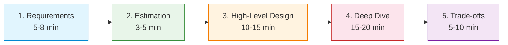
```mermaid
flowchart LR
    A["1. Requirements\n5-8 min"] --> B["2. Estimation\n3-5 min"]
    B --> C["3. High-Level Design\n10-15 min"]
    C --> D["4. Deep Dive\n15-20 min"]
    D --> E["5. Trade-offs\n5-10 min"]

    style A fill:#e1f5fe,stroke:#0288d1
    style B fill:#e8f5e9,stroke:#388e3c
    style C fill:#fff3e0,stroke:#f57c00
    style D fill:#fce4ec,stroke:#c62828
    style E fill:#f3e5f5,stroke:#7b1fa2
```

### Why This Order Matters

The order is not arbitrary. Each step produces outputs that the next step consumes:

| Step | Produces | Consumed By |
|------|----------|-------------|
| Requirements | Feature list, scale numbers, constraints | Estimation, High-Level Design |
| Estimation | QPS, storage, bandwidth numbers | High-Level Design, Deep Dive |
| High-Level Design | Component diagram, API contracts, data flow | Deep Dive |
| Deep Dive | Detailed component designs, algorithm choices | Trade-offs |
| Trade-offs | Decision justifications, bottleneck mitigations | Final evaluation |

Skipping a step or doing them out of order produces an incoherent design. Candidates who jump straight to drawing boxes on a whiteboard without gathering requirements are telling the interviewer they have never built a real system.

---

## 1.2 Step 1: Requirement Gathering

### Why Requirements Come First

System design questions are intentionally vague. "Design Twitter" has a thousand valid interpretations. The interviewer is testing whether you can:

1. **Identify ambiguity** and resolve it through targeted questions
2. **Distinguish functional from non-functional requirements**
3. **Define scope** to fit the time constraint
4. **Prioritize** what matters most for the given system

Candidates who ask zero clarifying questions and immediately start designing are making assumptions that may be wrong. Candidates who ask too many questions (spending 15 minutes on requirements) are burning time they need for design.

### Functional Requirements

Functional requirements describe **what the system does** — the features, behaviors, and use cases.

**Framework for identifying functional requirements:**

1. **Who are the users?** (consumers, businesses, internal teams, other services)
2. **What are the core use cases?** (the 3–5 things that must work for the system to have value)
3. **What are the secondary use cases?** (nice to have, but not essential for the interview)
4. **What are the input and output formats?** (text, images, video, structured data)
5. **What are the access patterns?** (read-heavy, write-heavy, mixed)

**Example: "Design Twitter"**

| Category | Questions to Ask | Likely Answer |
|----------|-----------------|---------------|
| Core features | Do we need posting, timeline, follow/unfollow? | Yes, all three |
| Media | Do tweets include images and videos? | Start with text, mention media as extension |
| Search | Do we need tweet search? | Yes, but can be simplified |
| Notifications | Real-time notifications for mentions/likes? | Yes, at least mentions |
| Analytics | Tweet impression counts? | Out of scope for this interview |
| DMs | Direct messaging? | Out of scope |

### Non-Functional Requirements

Non-functional requirements describe **how the system performs** — quality attributes that constrain the design.

The eight non-functional requirements that matter most in system design interviews:

| Requirement | Question to Ask | Why It Matters |
|-------------|----------------|----------------|
| **Scale** | How many users? DAU? Concurrent users? | Determines architecture complexity |
| **Latency** | What is acceptable response time? | Drives caching, data placement, protocol choices |
| **Availability** | What uptime is required? 99.9%? 99.99%? | Drives replication, failover, redundancy |
| **Consistency** | Is eventual consistency acceptable? | Drives data store choice, replication strategy |
| **Durability** | Can we lose data? How much? | Drives storage choice, backup strategy |
| **Throughput** | Peak QPS? Sustained QPS? | Drives scaling strategy, queue sizing |
| **Security** | Authentication? Authorization? Encryption? | Drives protocol and infrastructure choices |
| **Cost** | Is cost a primary constraint? | Drives build vs buy, managed vs self-hosted |

### The Clarifying Questions Checklist

Use this checklist to ensure you cover the essential dimensions. You do not need to ask every question — pick the 5–8 most relevant ones.

**Users and Scale:**
- How many total users? Daily active users?
- What is the read-to-write ratio?
- What are peak traffic patterns? (time of day, events, seasons)
- Geographic distribution? Single region or global?

**Data:**
- What is the average size of a single record/document/message?
- How long do we need to retain data? Is there a TTL?
- What are the access patterns? (point lookups, range scans, full-text search)
- Is the data structured, semi-structured, or unstructured?

**Consistency and Availability:**
- Is strong consistency required, or is eventual consistency acceptable?
- What is the target availability? (two nines, three nines, four nines)
- What happens during a failure? Degrade gracefully or fail fast?

**Performance:**
- What is the acceptable latency for the critical path? (p50, p99)
- Are there real-time requirements? (sub-second updates, streaming)
- Are there batch processing requirements? (daily aggregations, reports)

**Constraints:**
- Are there regulatory requirements? (GDPR, HIPAA, PCI-DSS)
- Are there technology constraints? (must use specific cloud provider, language, etc.)
- Is this a greenfield system or a migration from an existing system?

### Scope Definition

After gathering requirements, explicitly state the scope:

> "Based on our discussion, I will focus on three core features: posting tweets, the home timeline feed, and the follow/unfollow system. I will design for 300 million monthly active users with 200 million daily active users, targeting sub-200ms latency for timeline reads. I will not cover search, DMs, or analytics in detail but will identify where they integrate."

This serves two purposes:
1. It confirms alignment with the interviewer
2. It sets expectations for what you will and will not cover

### What Interviewers Look For in Step 1

| Signal | Strong Candidate | Weak Candidate |
|--------|-----------------|----------------|
| Ambiguity tolerance | Asks targeted questions to resolve ambiguity | Makes assumptions silently or asks generic questions |
| Prioritization | Identifies the 3–5 core features | Tries to design everything |
| Scale awareness | Asks about DAU, QPS, data volume | Ignores scale entirely |
| Constraint identification | Asks about consistency, latency, availability | Focuses only on features |
| Scope management | Explicitly states what is in/out of scope | Never defines scope |
| Time management | Spends 5–8 minutes, then moves on | Spends 15+ minutes on requirements |

---

## 1.3 Step 2: Capacity Estimation

### Why Estimation Matters

Back-of-envelope estimation serves three purposes in an interview:

1. **Validates your scale intuition** — can you reason about large numbers?
2. **Drives design decisions** — a system handling 100 QPS is fundamentally different from one handling 100,000 QPS
3. **Identifies the dominant cost driver** — is this system compute-bound, storage-bound, or bandwidth-bound?

### The Estimation Framework

Every estimation follows the same four-step pattern:

1. **Start with users** — DAU, actions per user per day
2. **Derive QPS** — requests per second for reads and writes
3. **Derive storage** — bytes per record, records per day, retention period
4. **Derive bandwidth** — QPS multiplied by average response size

### QPS Calculation

**Formula:**

```
Daily active users (DAU) = X
Actions per user per day = Y
Total daily actions = X * Y
QPS (average) = (X * Y) / 86,400
QPS (peak) = QPS (average) * peak multiplier (typically 2x–5x)
```

**Example: Twitter-like System**

```
DAU = 200 million
Tweets per user per day = 2 (average, most users read)
Reads per user per day = 100 (timeline refreshes, tweet views)

Write QPS:
  200M * 2 / 86,400 ≈ 4,600 writes/sec
  Peak: 4,600 * 3 ≈ 14,000 writes/sec

Read QPS:
  200M * 100 / 86,400 ≈ 231,000 reads/sec
  Peak: 231,000 * 3 ≈ 700,000 reads/sec
```

**Key insight:** The read-to-write ratio is approximately 50:1. This tells us the system is heavily read-optimized and caching is essential.

### Storage Estimation

**Formula:**

```
Record size = metadata + payload + overhead
Daily new records = DAU * actions per user per day
Daily storage = daily new records * record size
Annual storage = daily storage * 365
Total storage (with retention) = annual storage * retention years
```

**Example: Twitter-like System**

```
Tweet metadata: 150 bytes (user_id, timestamp, tweet_id, flags)
Tweet text: 280 bytes (max)
Average tweet size: 300 bytes (including overhead)

Daily tweets: 200M * 2 = 400M tweets/day
Daily storage: 400M * 300 bytes = 120 GB/day
Annual storage: 120 GB * 365 = 43.8 TB/year
5-year storage: 43.8 TB * 5 = 219 TB

With media (images, videos):
  10% of tweets have images: 40M * 200 KB = 8 TB/day
  1% of tweets have videos: 4M * 5 MB = 20 TB/day
  Total media: ~28 TB/day, ~10 PB/year
```

**Key insight:** Media dominates storage by two orders of magnitude. The text storage is trivial — the real challenge is media storage and delivery.

### Bandwidth Estimation

**Formula:**

```
Incoming bandwidth = Write QPS * average request size
Outgoing bandwidth = Read QPS * average response size
```

**Example: Twitter-like System**

```
Incoming (writes):
  4,600 writes/sec * 300 bytes = 1.38 MB/sec (negligible)

Outgoing (reads):
  231,000 reads/sec * 2 KB (tweet + metadata) = 462 MB/sec
  With media: 231,000 * 0.1 (fraction with media) * 200 KB = 4.62 GB/sec

Peak outgoing: ~15 GB/sec
```

**Key insight:** Outgoing bandwidth for media is the dominant cost. A CDN is essential.

### Numbers Every Engineer Should Know

This table is the single most important reference for capacity estimation. Memorize the order of magnitude for each number.

| Operation | Latency | Notes |
|-----------|---------|-------|
| L1 cache reference | 0.5 ns | |
| Branch mispredict | 5 ns | |
| L2 cache reference | 7 ns | 14x L1 cache |
| Mutex lock/unlock | 25 ns | |
| Main memory reference | 100 ns | 20x L2 cache, 200x L1 cache |
| Compress 1 KB with Zippy | 3 μs | |
| Send 1 KB over 1 Gbps network | 10 μs | |
| Read 4 KB randomly from SSD | 150 μs | ~1 GB/sec SSD |
| Read 1 MB sequentially from memory | 250 μs | |
| Round trip within same datacenter | 500 μs | |
| Read 1 MB sequentially from SSD | 1 ms | 4x memory |
| Disk seek | 10 ms | 20x datacenter roundtrip |
| Read 1 MB sequentially from disk | 20 ms | 80x memory, 20x SSD |
| Send packet CA → Netherlands → CA | 150 ms | |

**Power of Two Reference Table:**

| Power | Exact Value | Approximate | Bytes |
|-------|-------------|-------------|-------|
| 10 | 1,024 | 1 Thousand | 1 KB |
| 20 | 1,048,576 | 1 Million | 1 MB |
| 30 | 1,073,741,824 | 1 Billion | 1 GB |
| 40 | 1,099,511,627,776 | 1 Trillion | 1 TB |
| 50 | ~1.13 × 10^15 | 1 Quadrillion | 1 PB |

**Common Scale Numbers:**

| Metric | Value | Context |
|--------|-------|---------|
| Seconds in a day | 86,400 | ~100,000 for quick math |
| Seconds in a month | 2.6 million | ~2.5M for quick math |
| Seconds in a year | 31.5 million | ~30M for quick math |
| 1 million requests/day | ~12 QPS | Quick conversion |
| 100 million requests/day | ~1,200 QPS | Quick conversion |
| 1 billion requests/day | ~12,000 QPS | Quick conversion |

**Server Capacity Rules of Thumb:**

| Resource | Single Server Capacity | Notes |
|----------|----------------------|-------|
| Web server (stateless) | 10,000–50,000 concurrent connections | Depends on work per request |
| Application server | 500–2,000 RPS | CPU-bound logic |
| Relational DB (single node) | 5,000–10,000 QPS (reads) | With proper indexing |
| Relational DB (single node) | 1,000–5,000 QPS (writes) | Depends on durability settings |
| Redis (single node) | 100,000+ QPS | In-memory, simple operations |
| Kafka (single broker) | 100,000–200,000 messages/sec | Depends on message size |
| Single SSD | 100,000+ IOPS (random read) | NVMe SSDs |
| Single HDD | 100–200 IOPS (random read) | Spinning disk |
| 1 Gbps network | 125 MB/sec theoretical | ~100 MB/sec practical |
| 10 Gbps network | 1.25 GB/sec theoretical | ~1 GB/sec practical |

### Estimation Cheat Sheet: Quick Conversions

```
1 request/sec = 86,400 requests/day = 2.6M requests/month

1 KB/request at 1,000 QPS = 1 MB/sec = 86 GB/day = 2.6 TB/month

1 million users * 1 KB/user = 1 GB total
1 million users * 1 MB/user = 1 TB total
1 million users * 1 GB/user = 1 PB total

1 photo (200 KB) * 1 million/day = 200 GB/day = 73 TB/year
1 video (5 MB) * 100,000/day = 500 GB/day = 182 TB/year
```

### Common Estimation Mistakes

| Mistake | Why It Happens | How to Avoid |
|---------|---------------|--------------|
| Forgetting peak multiplier | Using average QPS for capacity planning | Always multiply by 2x–5x for peak |
| Ignoring media in storage | Only counting text/metadata | Ask about images, videos, attachments |
| Double-counting replication | Counting replicas as separate storage need | Mention replication factor (usually 3x) |
| Mixing units | Bytes vs bits, MB vs MiB | Always state units explicitly |
| Over-precision | Calculating to 5 significant figures | Round aggressively — order of magnitude is enough |

### What Interviewers Look For in Step 2

| Signal | Strong Candidate | Weak Candidate |
|--------|-----------------|----------------|
| Estimation fluency | Derives numbers quickly with minimal hesitation | Struggles with basic arithmetic |
| Order-of-magnitude sense | Knows that 1B requests/day is ~12K QPS | Cannot convert between daily and per-second |
| Identifies dominant factor | "Storage is dominated by media, not text" | Treats all data equally |
| Uses numbers to drive decisions | "At 700K read QPS, we need a caching layer" | Estimates numbers but never references them |
| Appropriate precision | Rounds to nearest order of magnitude | Tries to calculate exact numbers |

---

## 1.4 Step 3: High-Level Design

### The Goal

Produce a component diagram that shows:
1. The major components (services, databases, caches, queues)
2. How they connect (synchronous calls, async messaging, data flow)
3. The API contracts between client and server
4. The data model for the core entities

### Identifying Components

Start with the **data flow** — trace a request from the client through the system and back:

1. **Client** (web, mobile, API consumer)
2. **API Gateway / Load Balancer** (entry point, routing, rate limiting)
3. **Application Services** (business logic)
4. **Data Stores** (databases, caches, object storage)
5. **Async Processing** (queues, workers, background jobs)
6. **External Services** (payment providers, email services, CDN)

**The Component Identification Process:**

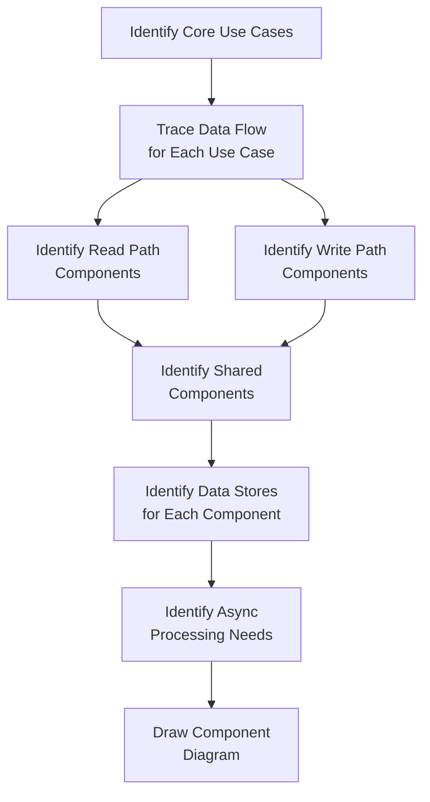
```mermaid
flowchart TD
    A["Identify Core Use Cases"] --> B["Trace Data Flow\nfor Each Use Case"]
    B --> C["Identify Read Path\nComponents"]
    B --> D["Identify Write Path\nComponents"]
    C --> E["Identify Shared\nComponents"]
    D --> E
    E --> F["Identify Data Stores\nfor Each Component"]
    F --> G["Identify Async\nProcessing Needs"]
    G --> H["Draw Component\nDiagram"]
```

### Drawing the Architecture

Follow these conventions for whiteboard/virtual whiteboard:

1. **Clients on the left**, data stores on the right
2. **Synchronous calls** as solid arrows
3. **Asynchronous messaging** as dashed arrows
4. **Data stores** as cylinders
5. **Services** as rectangles
6. **Queues** as parallelograms or rectangles with a queue icon
7. **Label every arrow** with the operation (e.g., "POST /tweet", "publish event")

**Example: Twitter-like System High-Level Design**

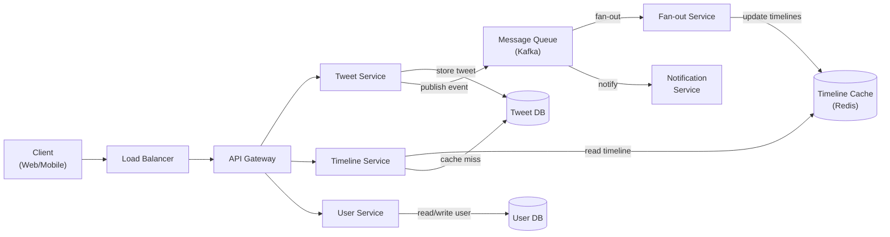
```mermaid
flowchart LR
    Client["Client\n(Web/Mobile)"]
    LB["Load Balancer"]
    API["API Gateway"]
    TS["Tweet Service"]
    TLS["Timeline Service"]
    US["User Service"]
    FS["Fan-out Service"]
    NS["Notification\nService"]

    TDB[("Tweet DB")]
    UDB[("User DB")]
    TC[("Timeline Cache\n(Redis)")]
    MQ["Message Queue\n(Kafka)"]

    Client --> LB
    LB --> API
    API --> TS
    API --> TLS
    API --> US

    TS -->|"store tweet"| TDB
    TS -->|"publish event"| MQ
    MQ -->|"fan-out"| FS
    FS -->|"update timelines"| TC
    MQ -->|"notify"| NS

    TLS -->|"read timeline"| TC
    TLS -->|"cache miss"| TDB
    US -->|"read/write user"| UDB
```

### API Design

Define the APIs for the core use cases. Use RESTful conventions unless there is a specific reason to use gRPC, GraphQL, or WebSockets.

**Example: Twitter-like System APIs**

```
POST   /api/v1/tweets
  Body: { text: string, media_ids?: string[] }
  Response: { tweet_id: string, created_at: timestamp }

GET    /api/v1/timeline?cursor={cursor}&limit={limit}
  Response: { tweets: Tweet[], next_cursor: string }

POST   /api/v1/users/{user_id}/follow
  Response: { status: "following" }

DELETE /api/v1/users/{user_id}/follow
  Response: { status: "unfollowed" }

GET    /api/v1/tweets/{tweet_id}
  Response: Tweet

GET    /api/v1/users/{user_id}
  Response: User
```

**API Design Principles for Interviews:**

| Principle | Why | Example |
|-----------|-----|---------|
| Use pagination | Cannot return unbounded data | `?cursor=xxx&limit=20` |
| Use idempotency keys | Prevents duplicate writes | `Idempotency-Key: uuid` header |
| Version the API | Allows backward-compatible changes | `/api/v1/` prefix |
| Use appropriate HTTP methods | Semantic clarity | POST for create, GET for read, DELETE for remove |
| Return consistent error format | Client-friendly | `{ error: { code, message, details } }` |

### Data Model Design

Identify the core entities and their relationships. Start with the **read path** — what data does the most common query need?

**Example: Twitter-like System Core Entities**

```
Tweet:
  tweet_id: UUID (primary key)
  user_id: UUID (foreign key → User)
  text: VARCHAR(280)
  media_urls: JSON
  created_at: TIMESTAMP
  like_count: INT
  retweet_count: INT
  reply_count: INT

User:
  user_id: UUID (primary key)
  username: VARCHAR(50) (unique)
  display_name: VARCHAR(100)
  bio: VARCHAR(160)
  follower_count: INT
  following_count: INT
  created_at: TIMESTAMP

Follow:
  follower_id: UUID (foreign key → User)
  followee_id: UUID (foreign key → User)
  created_at: TIMESTAMP
  PRIMARY KEY (follower_id, followee_id)

Timeline (denormalized, cached):
  user_id: UUID
  tweet_ids: LIST<UUID> (ordered by time, capped at 800)
```

### Data Flow

For each core use case, trace the complete data flow:

**Write Path: Posting a Tweet**

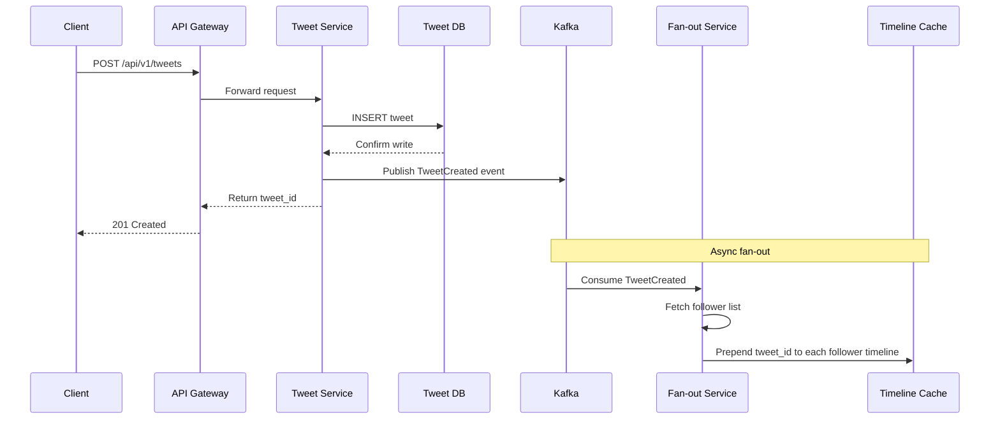
```mermaid
sequenceDiagram
    participant C as Client
    participant AG as API Gateway
    participant TS as Tweet Service
    participant DB as Tweet DB
    participant MQ as Kafka
    participant FO as Fan-out Service
    participant TC as Timeline Cache

    C->>AG: POST /api/v1/tweets
    AG->>TS: Forward request
    TS->>DB: INSERT tweet
    DB-->>TS: Confirm write
    TS->>MQ: Publish TweetCreated event
    TS-->>AG: Return tweet_id
    AG-->>C: 201 Created

    Note over MQ,TC: Async fan-out
    MQ->>FO: Consume TweetCreated
    FO->>FO: Fetch follower list
    FO->>TC: Prepend tweet_id to each follower timeline
```

**Read Path: Loading Home Timeline**

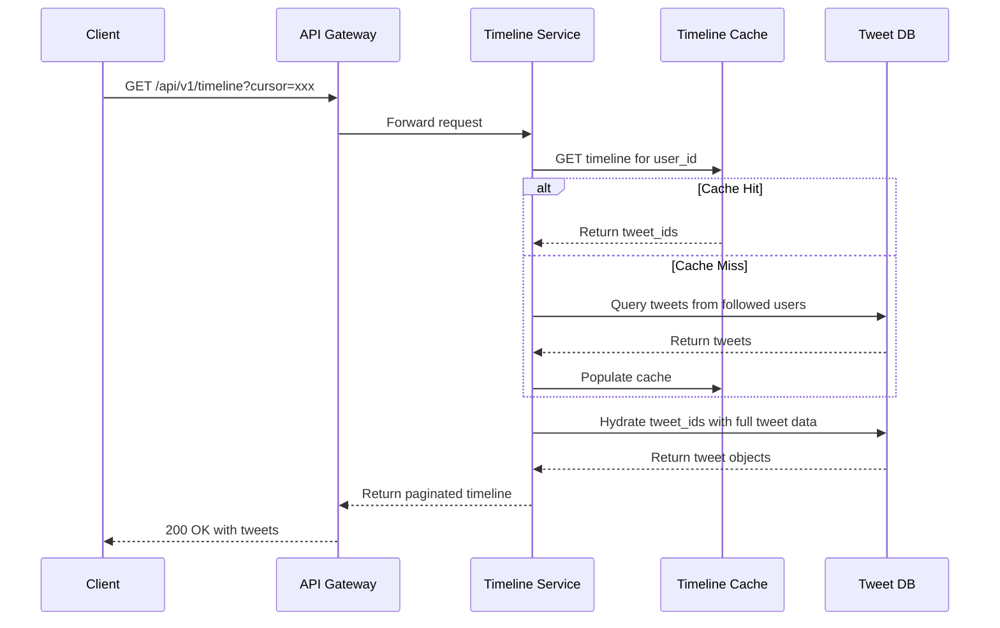
```mermaid
sequenceDiagram
    participant C as Client
    participant AG as API Gateway
    participant TLS as Timeline Service
    participant TC as Timeline Cache
    participant DB as Tweet DB

    C->>AG: GET /api/v1/timeline?cursor=xxx
    AG->>TLS: Forward request
    TLS->>TC: GET timeline for user_id

    alt Cache Hit
        TC-->>TLS: Return tweet_ids
    else Cache Miss
        TLS->>DB: Query tweets from followed users
        DB-->>TLS: Return tweets
        TLS->>TC: Populate cache
    end

    TLS->>DB: Hydrate tweet_ids with full tweet data
    DB-->>TLS: Return tweet objects
    TLS-->>AG: Return paginated timeline
    AG-->>C: 200 OK with tweets
```

### What Interviewers Look For in Step 3

| Signal | Strong Candidate | Weak Candidate |
|--------|-----------------|----------------|
| Component identification | Derives components from data flow | Memorizes standard architectures |
| API design | Clean, paginated, versioned APIs | Forgets pagination, inconsistent naming |
| Data model | Starts from read path, denormalizes intentionally | Over-normalized or under-thought |
| Data flow | Traces both read and write paths | Only shows one path |
| Async awareness | Identifies what can be async vs sync | Makes everything synchronous |
| Integration points | Labels every connection with protocol and operation | Draws boxes without explaining connections |

---

## 1.5 Step 4: Deep Dive

### The Goal

The deep dive is where you demonstrate **expertise and engineering judgment**. The interviewer will either let you choose which component to explore or will direct you to a specific area. Either way, the goal is to show that you can reason about a component at production depth.

### Choosing What to Deep Dive

If given the choice, pick the component that:

1. **Has the most interesting trade-offs** (e.g., fan-out strategy for timelines)
2. **Is the primary bottleneck** (e.g., the database in a write-heavy system)
3. **You know the most about** (play to your strengths)
4. **The interviewer seems most interested in** (read their body language and questions)

**Deep Dive Topic Selection Matrix:**

| System Type | Best Deep Dive Topics |
|-------------|----------------------|
| Social media | Fan-out strategy, timeline ranking, celebrity problem |
| Messaging | Message ordering, delivery guarantees, presence system |
| E-commerce | Inventory reservation, payment orchestration, search ranking |
| URL shortener | Hash generation, redirect performance, analytics pipeline |
| File storage | Chunking, deduplication, sync protocol |
| Ride-sharing | Matching algorithm, location indexing, surge pricing |
| Video streaming | Transcoding pipeline, adaptive bitrate, CDN strategy |

### How to Structure a Deep Dive

Follow the **Problem → Options → Trade-offs → Decision** pattern:

1. **State the problem clearly**: "The challenge with fan-out is that a user with 10 million followers generates 10 million cache writes per tweet."

2. **Enumerate the options**: "There are two approaches: fan-out on write (push model) and fan-out on read (pull model)."

3. **Analyze trade-offs for each option**: "Push is fast for readers but expensive for writers. Pull is cheap for writers but slow for readers."

4. **Make a decision and justify it**: "I would use a hybrid approach: push for normal users, pull for celebrities. This bounds the fan-out cost while keeping read latency low for 99% of cases."

### Demonstrating Expertise

The deep dive is where you show you have actually built systems. Here are the signals:

**Data structure choices:**
- "I would use a sorted set in Redis for the timeline because it gives O(log N) insert and O(log N + M) range queries, which is ideal for cursor-based pagination."
- "For the URL shortener, I would use base62 encoding of a counter because it produces shorter URLs than MD5 truncation and avoids collision handling."

**Failure handling:**
- "If the fan-out service goes down, tweets accumulate in Kafka. When it recovers, it processes the backlog. The timeline is eventually consistent — users might see a delay of seconds to minutes during an outage, which is acceptable for a social feed."
- "For payment processing, I would use the Saga pattern with compensating transactions. If inventory reservation succeeds but payment fails, we release the reservation."

**Operational awareness:**
- "This cache would need approximately 200 GB of memory — 200 million users times 800 tweet IDs times 8 bytes per ID, plus overhead. That is about 13 Redis nodes at 16 GB each, with replication it is ~40 nodes."
- "The Kafka topic would need at least 10 partitions to handle 14,000 writes/sec at peak, assuming each partition handles ~1,500 messages/sec for ordered processing."

### Handling Interviewer Pivots

Interviewers will challenge your design. This is not adversarial — it is how they assess your depth. Common pivot patterns:

| Pivot Type | Example | How to Respond |
|------------|---------|----------------|
| Scale challenge | "What if your QPS doubles?" | Identify the bottleneck, propose horizontal scaling for that component |
| Failure scenario | "What if this database goes down?" | Describe failover, replication, and degraded-mode behavior |
| Consistency challenge | "What if two users see different timelines?" | Explain your consistency model and why it is acceptable |
| Cost challenge | "This seems expensive. How would you optimize?" | Identify the dominant cost, propose caching/batching/tiering |
| New requirement | "Now add real-time notifications" | Show how the existing design accommodates it (e.g., via the existing event bus) |

**The worst response to a pivot:** "I did not think about that."

**A better response:** "That is a great question. Let me think about the failure mode here... If the cache goes down, we would see a thundering herd on the database. To mitigate this, I would add a circuit breaker that returns a stale timeline from a secondary cache or a degraded view while the primary cache recovers."

---

## 1.6 Step 5: Trade-offs and Bottlenecks

### The Goal

Close the interview by demonstrating mature engineering judgment. Proactively identify:

1. **Bottlenecks** in your design
2. **Trade-offs** you made and why
3. **Future improvements** you would make with more time

### How to Identify Bottlenecks

Walk through the data flow and ask at each step:

1. **What is the throughput limit?** (Can this component handle peak QPS?)
2. **What is the failure mode?** (What happens when this component goes down?)
3. **What is the latency contribution?** (Is this on the critical path?)
4. **What is the storage growth rate?** (Will this run out of space?)

### How to Articulate Trade-offs

Use the **"I chose X over Y because Z"** formula:

- "I chose eventual consistency for the timeline because users can tolerate seeing a tweet a few seconds late, and strong consistency would require synchronous fan-out which cannot scale to millions of followers."
- "I chose a SQL database for the user table because user profiles are relational (followers, following) and require strong consistency for operations like username uniqueness."
- "I chose to denormalize the timeline cache rather than joining at read time because the read QPS (700K) far exceeds what a relational join can handle."

### What Interviewers Look For in Step 5

| Signal | Strong Candidate | Weak Candidate |
|--------|-----------------|----------------|
| Self-awareness | Proactively identifies weaknesses in their own design | Claims their design has no issues |
| Trade-off articulation | States what was gained and what was lost | Makes decisions without explaining trade-offs |
| Bottleneck identification | Identifies 2–3 real bottlenecks | Cannot identify any bottlenecks |
| Improvement roadmap | Lists concrete next steps | Has no ideas for improvement |
| Operational thinking | Considers monitoring, alerting, deployment | Only thinks about features |

---

# Section 2: Trade-off Analysis

## 2.1 Why Trade-offs Define Senior Engineering

Every system design decision is a trade-off. There are no perfect solutions — only solutions that optimize for specific constraints at the expense of others. The ability to identify, articulate, and navigate trade-offs is the single most important skill that separates senior engineers from junior ones.

Junior engineers see decisions as right or wrong. Senior engineers see decisions as trade-offs with consequences that must be managed.

This section covers the seven fundamental trade-off axes that appear in every system design.

---

## 2.2 Consistency vs Availability

### The CAP Theorem in Practice

The CAP theorem states that in the presence of a network partition, a distributed system must choose between consistency and availability. In practice, network partitions are rare but not impossible, so the real question is: **where on the consistency-availability spectrum should this system operate?**

### Decision Framework

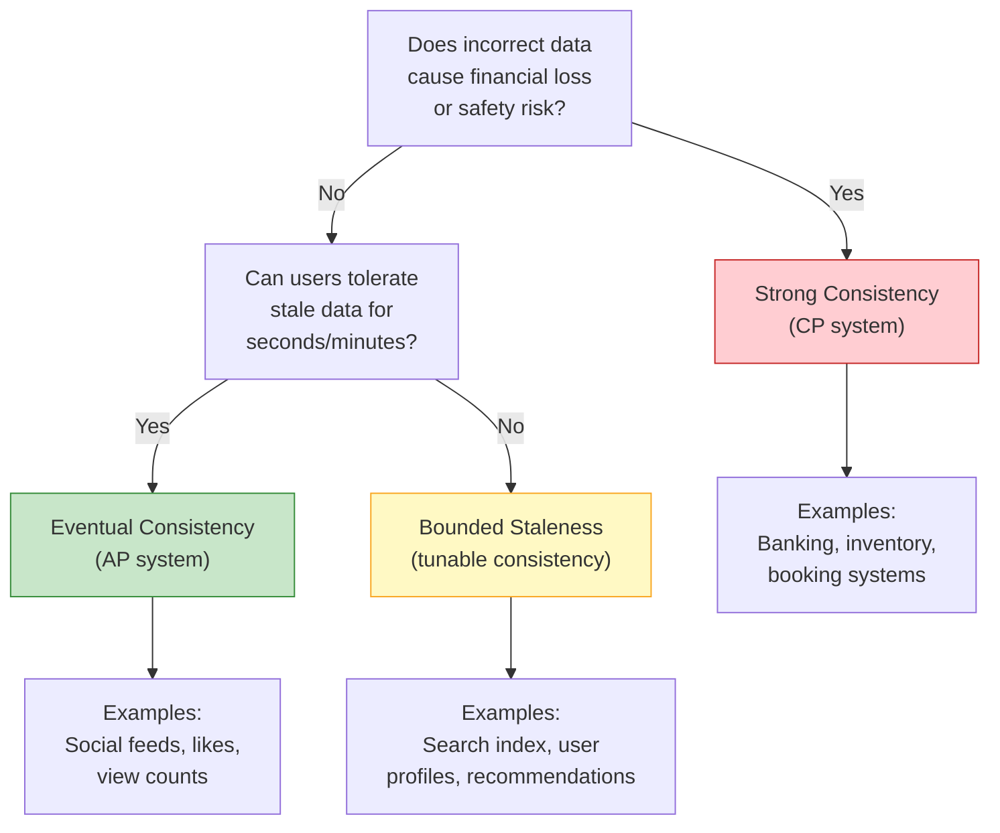
```mermaid
flowchart TD
    A["Does incorrect data\ncause financial loss\nor safety risk?"]
    A -->|Yes| B["Strong Consistency\n(CP system)"]
    A -->|No| C["Can users tolerate\nstale data for\nseconds/minutes?"]
    C -->|Yes| D["Eventual Consistency\n(AP system)"]
    C -->|No| E["Bounded Staleness\n(tunable consistency)"]

    B --> F["Examples:\nBanking, inventory,\nbooking systems"]
    D --> G["Examples:\nSocial feeds, likes,\nview counts"]
    E --> H["Examples:\nSearch index, user\nprofiles, recommendations"]

    style B fill:#ffcdd2,stroke:#c62828
    style D fill:#c8e6c9,stroke:#388e3c
    style E fill:#fff9c4,stroke:#f9a825
```

### Real Scenarios

**Scenario 1: E-commerce Inventory**

The problem: Two users attempt to buy the last item simultaneously.

- **Strong consistency approach:** Use a serializable transaction or distributed lock. One user succeeds, the other gets "out of stock." Latency increases due to lock contention.
- **Eventual consistency approach:** Both purchases succeed, but one must be cancelled later. This destroys user trust.
- **Decision:** Inventory must be strongly consistent. The latency cost of locking is acceptable because overselling is worse.

**Scenario 2: Social Media Like Count**

The problem: A viral tweet receives 10,000 likes per second. Showing the exact count is expensive.

- **Strong consistency approach:** Every like increments a counter in a serializable transaction. The database becomes the bottleneck.
- **Eventual consistency approach:** Likes are buffered and periodically flushed. The displayed count may lag by a few seconds.
- **Decision:** Like counts should be eventually consistent. Nobody notices if the count says 42,317 instead of 42,319.

**Scenario 3: Ride-Sharing Driver Location**

The problem: Driver location must be fresh for matching, but drivers send updates every 4 seconds.

- **Strong consistency approach:** Every location update is synchronously replicated before the matcher reads it. Adds 10–50ms per update.
- **Eventual consistency approach:** Location updates are written to a local cache and asynchronously replicated. The matcher might use a position that is 1–4 seconds stale.
- **Decision:** Eventual consistency is sufficient. A 4-second-stale location at 30 mph means ~55 meters of error, which is acceptable for matching. The ETA calculation can compensate.

### Architecture Decision Record: Consistency Model

```
ADR-001: Timeline Feed Consistency Model

Status: Accepted
Date: 2024-01-15

Context:
  The home timeline feed serves 700K read QPS at peak. Fan-out on write
  pushes new tweets to follower timelines asynchronously. The question is
  whether a user should see their own tweet immediately after posting.

Decision:
  Use eventual consistency for the global timeline with read-your-own-writes
  consistency for the posting user.

  Implementation:
  - After posting, the client optimistically inserts the tweet into the
    local timeline view.
  - The server returns the tweet_id synchronously after the primary write.
  - Fan-out to followers happens asynchronously via Kafka.
  - If a user refreshes before fan-out completes, the Timeline Service
    checks both the cache and the primary Tweet DB for the user's own
    recent tweets.

Consequences:
  - Followers may see a new tweet 1–5 seconds after posting (acceptable).
  - The posting user always sees their own tweet immediately (required for UX).
  - The Timeline Service has slightly more complex read logic (manageable).
  - Fan-out failures are retried via Kafka consumer retry (resilient).

Alternatives Considered:
  - Synchronous fan-out: rejected due to latency and failure coupling.
  - Strong consistency via distributed transactions: rejected due to
    throughput limitations at 700K QPS.
```

---

## 2.3 Latency vs Throughput

### The Fundamental Tension

Latency and throughput are often in tension:

- **Optimizing for latency** means processing each request as fast as possible, which may mean using more resources per request (dedicated connections, pre-computed caches, no batching).
- **Optimizing for throughput** means processing as many requests as possible per unit time, which may mean batching, queuing, and sharing resources — all of which add latency.

### When to Optimize for Each

| Optimize for Latency | Optimize for Throughput |
|---------------------|----------------------|
| User-facing read paths | Background processing |
| Search queries | Data pipeline ingestion |
| Real-time messaging | Log aggregation |
| Payment authorization | Email sending |
| API gateway routing | Report generation |
| Game state updates | ML model training |

### Techniques and Their Trade-offs

**Caching:**
- Reduces latency by avoiding recomputation/refetch
- Increases throughput by reducing backend load
- Trade-off: cache invalidation complexity, memory cost, potential staleness

**Batching:**
- Increases throughput by amortizing fixed costs (network round-trip, connection setup)
- Trade-off: increases latency for individual items (must wait for batch to fill or timeout)
- Example: Kafka producer batching — accumulates messages for up to 5ms or until batch reaches 16 KB, then sends

**Queue Buffering:**
- Absorbs traffic spikes, smoothing throughput
- Trade-off: adds latency equal to queue wait time
- Example: Order processing queue — orders wait in queue during peak, processed within minutes

**Connection Pooling:**
- Reduces connection setup latency, increases throughput
- Trade-off: pool exhaustion under load can cause queuing
- Example: Database connection pool — 50 connections shared across 500 concurrent requests

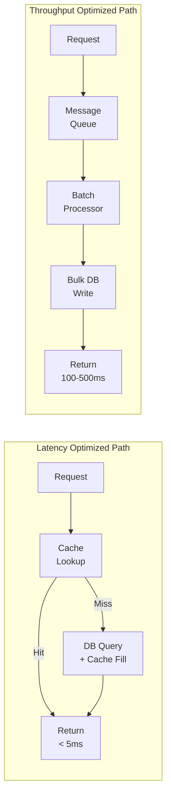
```mermaid
flowchart LR
    subgraph "Latency Optimized Path"
        A1["Request"] --> B1["Cache\nLookup"]
        B1 -->|Hit| C1["Return\n< 5ms"]
        B1 -->|Miss| D1["DB Query\n+ Cache Fill"]
        D1 --> C1
    end

    subgraph "Throughput Optimized Path"
        A2["Request"] --> B2["Message\nQueue"]
        B2 --> C2["Batch\nProcessor"]
        C2 --> D2["Bulk DB\nWrite"]
        D2 --> E2["Return\n100-500ms"]
    end
```

### Latency Budget Allocation

For a user-facing request with a p99 target of 200ms:

| Component | Budget | Justification |
|-----------|--------|---------------|
| Network (client → LB) | 20ms | Depends on geography |
| Load balancer | 1ms | Simple routing |
| API Gateway (auth, rate limit) | 5ms | In-memory checks |
| Application logic | 10ms | Computation |
| Cache lookup | 2ms | Redis round-trip |
| Database query (if cache miss) | 50ms | With index, single partition |
| Serialization/response | 5ms | JSON encoding |
| Network (LB → client) | 20ms | Depends on geography |
| **Total budget** | **~113ms** | **87ms buffer for variance** |

If a single database query takes 50ms and you need to make 3 queries, you are already over budget. This forces you to either denormalize (single query), parallelize (3 concurrent queries), or cache (avoid queries entirely).

---

## 2.4 Cost vs Performance

### The Performance-Cost Curve

Performance and cost have a non-linear relationship. The first 90% of performance is cheap. The last 10% is expensive. The last 1% is extraordinarily expensive.

```
Cost ($)
  |                                    . . .
  |                                . .
  |                            . .
  |                        . .
  |                    . .
  |                . .
  |           . .
  |       . .
  |   . .
  | .
  +------------------------------------ Performance (%)
  0%                                 100%
```

### When to Over-Provision

Over-provisioning (paying for more capacity than currently needed) is justified when:

1. **The cost of downtime exceeds the cost of extra capacity** — a checkout system that loses $10,000/minute during an outage justifies 3x over-provisioning.
2. **Traffic is unpredictable** — viral content, flash sales, breaking news events.
3. **Scaling takes too long** — if auto-scaling needs 5 minutes to add capacity and your spike lasts 2 minutes, you need pre-provisioned capacity.
4. **The workload is latency-sensitive** — running at 80% CPU utilization adds significant tail latency due to queuing theory (see: M/M/1 queue model).

### When to Optimize Cost

Cost optimization is critical when:

1. **Infrastructure is the dominant cost** — data-heavy systems where storage and bandwidth dominate.
2. **The team is large enough that individual decisions aggregate** — 100 engineers each wasting $100/month is $120,000/year.
3. **The system is past product-market fit** — optimizing cost before you have users is premature.
4. **Margins are thin** — marketplace businesses with 5–15% take rates cannot afford wasteful infrastructure.

### Spot Instances vs Reserved vs On-Demand

| Instance Type | Cost (relative) | Best For | Risk |
|---------------|----------------|----------|------|
| On-demand | 1.0x (baseline) | Unpredictable workloads, short experiments | None |
| Reserved (1-year) | 0.6x | Steady-state base load | Commitment if needs change |
| Reserved (3-year) | 0.4x | Stable, well-understood workloads | Long commitment |
| Spot | 0.1x–0.3x | Fault-tolerant batch processing, stateless workers | Can be terminated with 2-min notice |
| Savings Plans | 0.5x–0.7x | Flexible commitment across instance types | Dollar commitment, not instance commitment |

### Cost Decision Framework

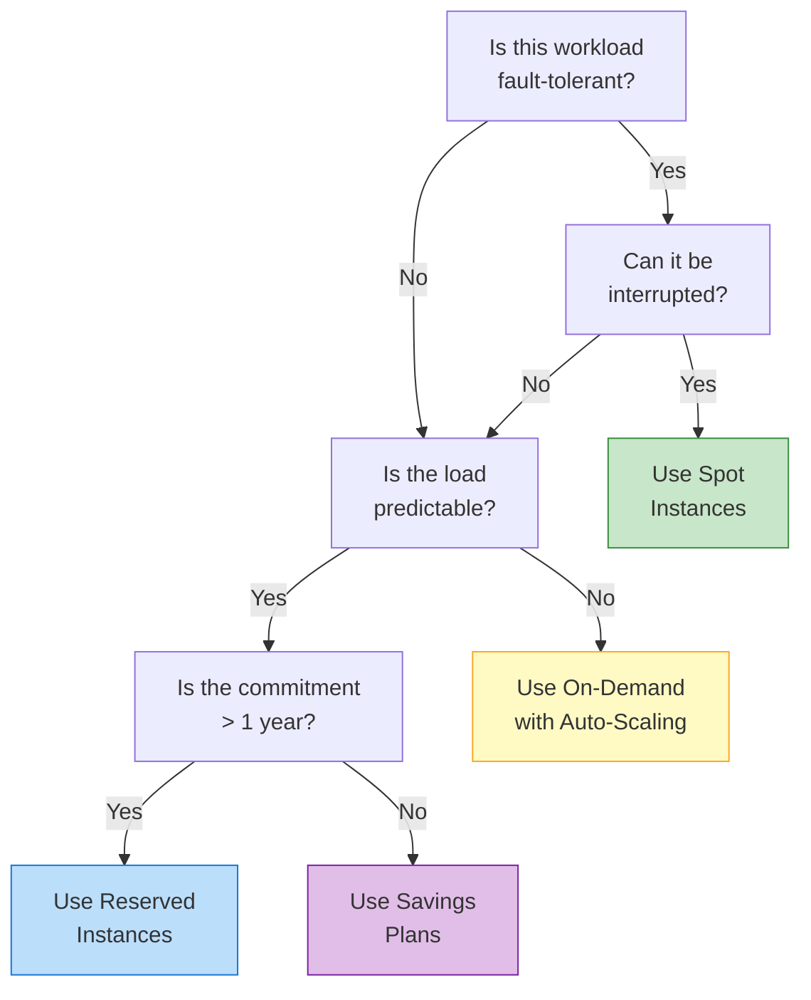
```mermaid
flowchart TD
    A["Is this workload\nfault-tolerant?"]
    A -->|Yes| B["Can it be\ninterrupted?"]
    A -->|No| C["Is the load\npredictable?"]

    B -->|Yes| D["Use Spot\nInstances"]
    B -->|No| C

    C -->|Yes| E["Is the commitment\n> 1 year?"]
    C -->|No| F["Use On-Demand\nwith Auto-Scaling"]

    E -->|Yes| G["Use Reserved\nInstances"]
    E -->|No| H["Use Savings\nPlans"]

    style D fill:#c8e6c9,stroke:#388e3c
    style F fill:#fff9c4,stroke:#f9a825
    style G fill:#bbdefb,stroke:#1976d2
    style H fill:#e1bee7,stroke:#7b1fa2
```

---

## 2.5 Simplicity vs Flexibility

### YAGNI in System Design

"You Aren't Gonna Need It" (YAGNI) applies to system design as much as it does to code. Every abstraction layer, every configuration option, and every extensibility point adds complexity. The question is: does this complexity pay for itself?

### The Abstraction Cost Model

Each abstraction layer adds:
- **Latency:** One more network hop, one more serialization step
- **Failure modes:** One more thing that can break
- **Cognitive load:** One more thing the team must understand
- **Operational burden:** One more thing to monitor, deploy, and debug

### When to Abstract

| Abstract When | Keep Simple When |
|--------------|-----------------|
| The requirement will definitely change (regulatory, multi-tenant) | The requirement is stable and well-understood |
| Multiple teams need different implementations | One team owns the entire system |
| The abstraction is a well-known pattern (e.g., database driver interface) | The abstraction is speculative |
| The cost of changing later is very high (public API, data format) | The cost of changing later is low (internal service) |
| The system has > 5 consumers | The system has 1–2 consumers |

### Real Example: Message Queue Abstraction

**Over-abstracted approach:**
Build a generic "messaging abstraction layer" that supports Kafka, RabbitMQ, SQS, and Pulsar, with pluggable serialization, routing, and retry policies.

**Simpler approach:**
Use Kafka directly. Wrap it in a thin client library that handles serialization and retry. If you ever need to switch to a different queue (you probably will not), the migration is bounded to the client library.

**The over-abstracted approach costs:**
- 3 months of engineering time to build and test
- Ongoing maintenance as each message broker evolves
- Performance overhead from the abstraction layer
- Debugging complexity when issues occur in the abstraction layer

**The simpler approach costs:**
- 2 weeks to build the Kafka client library
- A hypothetical future migration if Kafka is abandoned (extremely unlikely)

The simpler approach almost always wins.

---

## 2.6 Read vs Write Optimization

### Read-Heavy vs Write-Heavy Systems

Most systems are either read-heavy or write-heavy. The optimization strategy differs dramatically:

| Characteristic | Read-Heavy System | Write-Heavy System |
|---------------|------------------|-------------------|
| Read:Write ratio | > 10:1 | < 2:1 |
| Examples | Social feeds, e-commerce catalog, Wikipedia | Logging, IoT telemetry, analytics, chat |
| Primary optimization | Caching, denormalization, read replicas | Write-ahead logs, append-only storage, batching |
| Database choice | Relational DB with read replicas, or document stores | LSM-tree based stores (Cassandra, RocksDB), time-series DBs |
| Index strategy | Many indexes (optimize reads) | Minimal indexes (each index slows writes) |
| Consistency model | Often eventual consistency for reads | Strong consistency for writes, async for reads |

### CQRS Decision Framework

Command Query Responsibility Segregation (CQRS) separates the read model from the write model. This is powerful but adds complexity.

**Use CQRS when:**
- The read model and write model have fundamentally different shapes (e.g., a write model is a normalized event log, the read model is a denormalized materialized view)
- Read and write workloads need to scale independently
- The system has complex read queries that are expensive to compute from the write model

**Avoid CQRS when:**
- The read and write models are nearly identical (CRUD application)
- The team is small and cannot maintain two data models
- Eventual consistency between read and write models is not acceptable

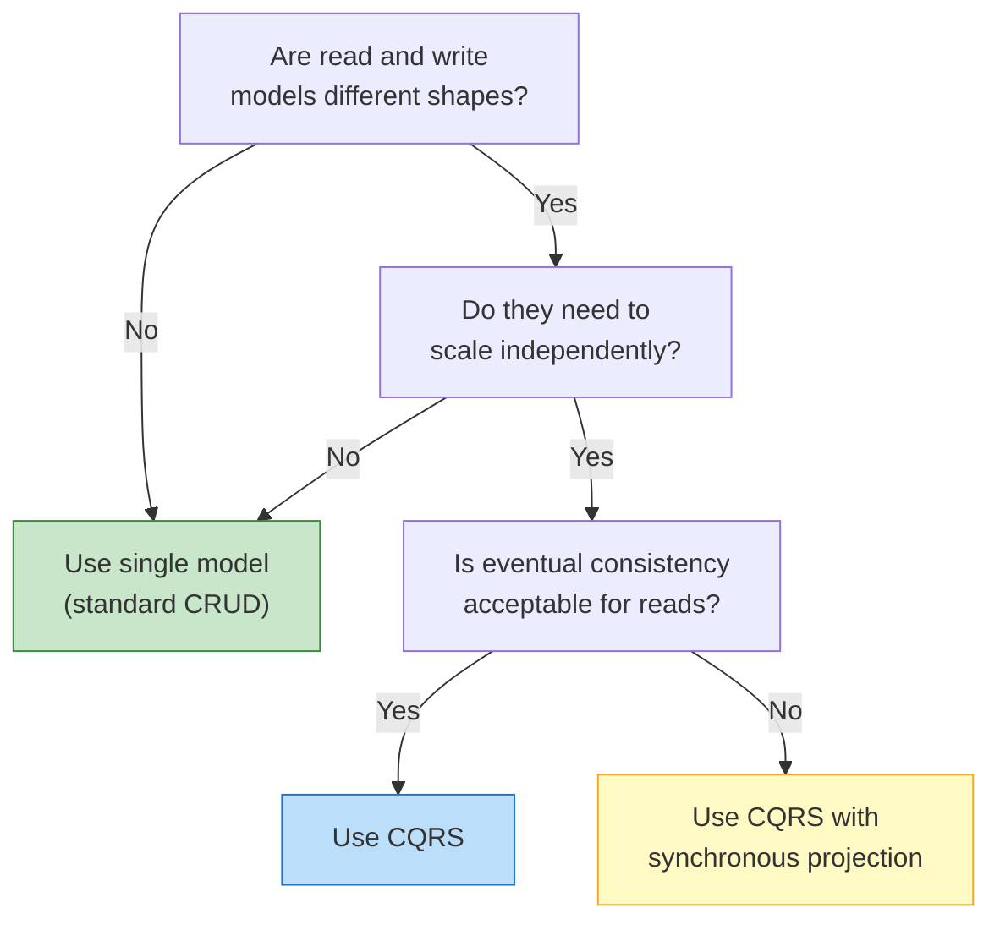
```mermaid
flowchart TD
    A["Are read and write\nmodels different shapes?"]
    A -->|Yes| B["Do they need to\nscale independently?"]
    A -->|No| C["Use single model\n(standard CRUD)"]

    B -->|Yes| D["Is eventual consistency\nacceptable for reads?"]
    B -->|No| C

    D -->|Yes| E["Use CQRS"]
    D -->|No| F["Use CQRS with\nsynchronous projection"]

    style C fill:#c8e6c9,stroke:#388e3c
    style E fill:#bbdefb,stroke:#1976d2
    style F fill:#fff9c4,stroke:#f9a825
```

---

## 2.7 SQL vs NoSQL

### Decision Tree

The SQL vs NoSQL decision is not about technology preference — it is about workload characteristics.

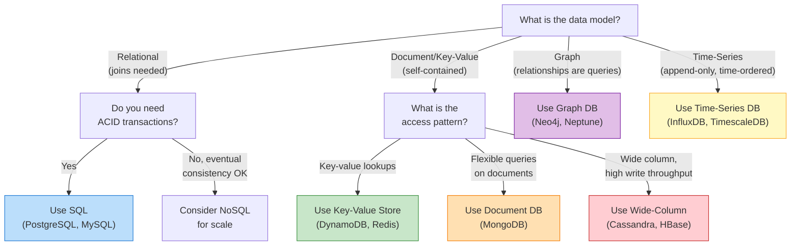
```mermaid
flowchart TD
    A["What is the data model?"]
    A -->|"Relational\n(joins needed)"| B["Do you need\nACID transactions?"]
    A -->|"Document/Key-Value\n(self-contained)"| C["What is the\naccess pattern?"]
    A -->|"Graph\n(relationships are queries)"| D["Use Graph DB\n(Neo4j, Neptune)"]
    A -->|"Time-Series\n(append-only, time-ordered)"| E["Use Time-Series DB\n(InfluxDB, TimescaleDB)"]

    B -->|Yes| F["Use SQL\n(PostgreSQL, MySQL)"]
    B -->|"No, eventual\nconsistency OK"| G["Consider NoSQL\nfor scale"]

    C -->|"Key-value lookups"| H["Use Key-Value Store\n(DynamoDB, Redis)"]
    C -->|"Flexible queries\non documents"| I["Use Document DB\n(MongoDB)"]
    C -->|"Wide column,\nhigh write throughput"| J["Use Wide-Column\n(Cassandra, HBase)"]

    style F fill:#bbdefb,stroke:#1976d2
    style D fill:#e1bee7,stroke:#7b1fa2
    style E fill:#fff9c4,stroke:#f9a825
    style H fill:#c8e6c9,stroke:#388e3c
    style I fill:#ffe0b2,stroke:#f57c00
    style J fill:#ffcdd2,stroke:#c62828
```

### Hybrid Approaches

Most production systems use multiple data stores, each optimized for a specific access pattern:

| Data | Store | Reason |
|------|-------|--------|
| User profiles | PostgreSQL | Relational (followers, following), strong consistency for username uniqueness |
| Tweets | Cassandra | High write throughput, append-only, partition by user_id |
| Timeline cache | Redis | In-memory, sorted sets for ordered tweet_ids |
| Media metadata | DynamoDB | Key-value lookups by media_id, high availability |
| Search index | Elasticsearch | Full-text search, inverted index |
| Analytics | ClickHouse | Columnar, high-throughput analytical queries |

### The Polyglot Persistence Principle

Use the right data store for the right workload. The cost is operational complexity — more data stores to operate, monitor, and maintain. The benefit is optimal performance for each access pattern.

**Decision:** Use polyglot persistence when:
- You have distinct workloads with different access patterns (read the table above)
- Your team is large enough to operate multiple data stores
- The performance benefit justifies the operational cost

**Avoid polyglot persistence when:**
- A single data store can handle all workloads adequately (many systems under 10K QPS)
- Your team is small (< 5 engineers)
- You are in the early stages and the access patterns are not yet clear

---

## 2.8 Monolith vs Microservices

### Conway's Law and Architecture

Conway's Law states that organizations design systems that mirror their communication structures. This is not just an observation — it is a design principle.

| Organization | Architecture | Why |
|-------------|-------------|-----|
| 5-person startup | Monolith | One team, shared codebase, fast iteration |
| 20-person company, 3 teams | Modular monolith or 3–5 services | Teams own modules, deploy independently |
| 200-person company, 20 teams | Microservices | Teams own services end-to-end, independent deployment cycles |
| 2,000-person company | Platform + microservices | Internal platform team provides shared infrastructure |

### Decision Matrix

| Factor | Favors Monolith | Favors Microservices |
|--------|----------------|---------------------|
| Team size | < 10 engineers | > 30 engineers |
| Deployment frequency | Weekly or less | Multiple deploys per day per team |
| Domain complexity | Single domain | Multiple bounded contexts |
| Scale requirements | Uniform scaling | Components scale independently |
| Technology diversity | Single tech stack | Teams need different languages/frameworks |
| Time to market | Must ship fast (startup) | Must ship reliably (enterprise) |
| Operational maturity | Limited DevOps | Strong DevOps, CI/CD, observability |

### The Modular Monolith Middle Ground

For many systems, the best initial architecture is neither a monolith nor microservices, but a **modular monolith**:

- Single deployable artifact
- Clear module boundaries with well-defined interfaces
- Each module owns its own database schema (or at least its own tables)
- Modules communicate via function calls, not network calls
- Can be extracted into microservices later if needed

**Advantages over microservices:**
- No network latency between modules
- No distributed transaction complexity
- Simpler deployment and monitoring
- Faster development (no service mesh, no API versioning)

**Advantages over a tangled monolith:**
- Clear ownership boundaries
- Independent evolution of modules
- Easier future extraction

### Architecture Decision Record: Service Architecture

```
ADR-002: Service Architecture Strategy

Status: Accepted
Date: 2024-02-01

Context:
  The team has 15 engineers organized into 3 squads (User, Content, Feed).
  The current monolith has grown to 200K LOC with increasing coupling
  between modules. Deployment takes 30 minutes and requires coordination
  across teams. The system handles 50K QPS with 99.9% availability target.

Decision:
  Adopt a modular monolith with extraction readiness.

  Phase 1 (Q1): Refactor the monolith into three modules with explicit
  interfaces. Each module owns its database tables. Cross-module
  communication uses in-process function calls through defined interfaces.

  Phase 2 (Q2–Q3): Extract the Feed module into a separate service because
  it has distinct scaling requirements (read-heavy) and the Feed team
  deploys 3x more frequently than other teams.

  Phase 3 (future): Extract additional modules as team size and deployment
  frequency justify it.

Consequences:
  - Immediate benefit: clearer ownership, reduced coupling.
  - Phase 2 introduces distributed system complexity (network calls,
    service discovery, eventual consistency) but only for the module that
    benefits most.
  - Other modules remain in the monolith until extraction is justified.

Alternatives Considered:
  - Full microservices extraction: rejected due to team size (15 is too
    small to operate 10+ services) and premature operational complexity.
  - Keep the tangled monolith: rejected because coupling is already
    causing deployment conflicts and slow feature velocity.
```

---

## 2.9 Trade-off Summary Matrix

| Trade-off Axis | Option A | Option B | Decision Driver |
|---------------|----------|----------|-----------------|
| Consistency vs Availability | Strong consistency | Eventual consistency | Business impact of incorrect data |
| Latency vs Throughput | Low-latency responses | High-throughput batch processing | User-facing vs background workload |
| Cost vs Performance | Over-provision for safety | Optimize for efficiency | Cost of downtime vs infrastructure cost |
| Simplicity vs Flexibility | Simple, direct implementation | Abstracted, extensible design | Team size, rate of change, number of consumers |
| Read vs Write Optimization | Denormalize, cache, replicate | Append-only, batch, minimal indexes | Read:write ratio |
| SQL vs NoSQL | Relational model, ACID, joins | Flexible schema, horizontal scale | Data model shape, access patterns |
| Monolith vs Microservices | Single deployment, shared code | Independent services, team autonomy | Team size, deployment frequency, domain complexity |

---

# Section 3: Bottleneck Analysis

## 3.1 Why Bottleneck Analysis Matters

A system is only as fast as its slowest component. Identifying bottlenecks is the core skill of performance engineering. In interviews, the ability to look at a design and identify where it will break under load separates candidates who have operated production systems from those who have only designed them on paper.

### The Universal Bottleneck Detection Method

For every component in your design, ask these five questions:

1. **What is the throughput limit?** — What happens when this component receives more requests than it can handle?
2. **What is the latency impact?** — How much time does this component add to the critical path?
3. **What is the failure mode?** — What happens when this component goes down?
4. **What is the resource constraint?** — CPU? Memory? Disk I/O? Network?
5. **Does this component scale?** — Can you add more instances, or is it fundamentally single-instance?

---

## 3.2 Database Bottlenecks

### N+1 Query Problem

**What it is:** A query pattern where the application executes 1 query to fetch N records, then N additional queries to fetch related data for each record.

**Example:**
```
-- 1 query to get 20 tweets
SELECT * FROM tweets ORDER BY created_at DESC LIMIT 20;

-- 20 queries to get user info for each tweet (N+1!)
SELECT * FROM users WHERE user_id = ?;  -- repeated 20 times
```

**Impact:** 21 database round-trips instead of 1–2. At 2ms per round-trip, that is 42ms instead of 4ms.

**Solutions:**
- **Eager loading / JOIN:** `SELECT t.*, u.* FROM tweets t JOIN users u ON t.user_id = u.user_id LIMIT 20;`
- **Batch fetching:** `SELECT * FROM users WHERE user_id IN (?, ?, ..., ?);` — one query instead of 20
- **Denormalization:** Store `user.display_name` and `user.avatar_url` directly on the tweet record

### Connection Exhaustion

**What it is:** The database has a finite number of connections (typically 100–500 for PostgreSQL). When all connections are in use, new requests must wait or fail.

**Why it happens:**
- Long-running queries hold connections
- Application instances are over-provisioned (10 app servers x 50 connections/server = 500 connections)
- Connection leaks from unclosed connections in error paths

**Detection:**
- `SHOW PROCESSLIST` in MySQL
- `SELECT count(*) FROM pg_stat_activity;` in PostgreSQL
- Connection pool metrics: `active`, `idle`, `waiting` counts

**Solutions:**
- **Connection pooling:** PgBouncer (external) or HikariCP (application-side)
- **Reduce connection hold time:** Keep transactions short, avoid long-running queries
- **Read replicas:** Split read traffic to replicas, reducing connection pressure on primary
- **Connection limits per service:** Prevent one service from consuming all connections

### Lock Contention

**What it is:** Multiple transactions competing for locks on the same rows, causing serialization and increased latency.

**Common scenarios:**
- Counter updates: `UPDATE posts SET like_count = like_count + 1 WHERE post_id = ?;` — hot row
- Inventory decrement: `UPDATE inventory SET quantity = quantity - 1 WHERE sku = ?;` — flash sale
- Sequential ID generation: `SELECT nextval('my_sequence');` — single-row bottleneck

**Solutions:**
- **Optimistic locking:** Use version numbers, retry on conflict
- **Sharded counters:** Split a counter across N rows, sum on read
- **Queue writes:** Buffer updates in a queue, apply in batches
- **SKIP LOCKED:** PostgreSQL `SELECT ... FOR UPDATE SKIP LOCKED` for work-queue patterns

### Index Bloat

**What it is:** Over time, indexes grow larger than the underlying data due to fragmentation, dead tuples, and unused indexes.

**Impact:**
- Larger indexes mean more memory for caching, more I/O for scans
- Unused indexes slow down every write operation (each insert/update must maintain every index)
- Bloated indexes reduce cache efficiency

**Detection:**
- Compare index size to table size: `SELECT pg_size_pretty(pg_indexes_size('my_table'));`
- Identify unused indexes: `SELECT * FROM pg_stat_user_indexes WHERE idx_scan = 0;`

**Solutions:**
- Drop unused indexes
- `REINDEX` to rebuild fragmented indexes
- `VACUUM` / `VACUUM FULL` in PostgreSQL to reclaim dead tuples
- Partial indexes: `CREATE INDEX idx_active_users ON users(email) WHERE active = true;`

### Database Bottleneck Summary

| Bottleneck | Detection | Quick Fix | Long-term Fix |
|-----------|-----------|-----------|---------------|
| N+1 queries | Slow query log, APM traces | Batch fetch, JOIN | Denormalize, cache |
| Connection exhaustion | Pool metrics, `pg_stat_activity` | Increase pool size | PgBouncer, read replicas |
| Lock contention | Lock wait metrics, deadlock logs | Shorter transactions | Sharded counters, queuing |
| Index bloat | Index size metrics, unused index queries | Drop unused indexes | Regular maintenance, partial indexes |
| Slow queries | Slow query log, EXPLAIN ANALYZE | Add indexes | Schema redesign, caching |

---

## 3.3 Network Bottlenecks

### Bandwidth Limits

**What it is:** The network link between components has a finite capacity. When utilization approaches 100%, queuing delay increases non-linearly.

**Common scenarios:**
- Database result sets that are too large (fetching 10,000 rows when you need 20)
- Uncompressed API responses
- Media transfer between services (image processing pipelines)

**Solutions:**
- **Pagination:** Never return unbounded result sets
- **Compression:** gzip/zstd for API responses (30–70% size reduction)
- **Projection:** Return only the fields the client needs (GraphQL shines here)
- **CDN for static content:** Offload media bandwidth to edge networks

### DNS Resolution Overhead

**What it is:** DNS lookups add 20–100ms per resolution for cold lookups. In microservice architectures with many service-to-service calls, DNS resolution can add significant latency.

**Solutions:**
- **DNS caching:** Application-level DNS cache with appropriate TTL
- **Connection reuse:** HTTP/2 connection multiplexing, gRPC persistent connections
- **Service mesh:** Sidecar proxies (Envoy) cache DNS and maintain connection pools

### TCP Connection Overhead

**What it is:** Each new TCP connection requires a 3-way handshake (1.5 round-trips). With TLS, add another 1–2 round-trips for the handshake.

**Impact at scale:** If a service makes 1,000 requests/sec to another service and each request opens a new connection, that is 1,000 TCP handshakes + 1,000 TLS handshakes per second.

**Solutions:**
- **Connection pooling:** Reuse connections across requests
- **HTTP/2:** Multiplexes many requests over a single TCP connection
- **gRPC:** Built on HTTP/2, persistent connections by default
- **TLS session resumption:** Avoids full TLS handshake on reconnection

### Head-of-Line Blocking

**What it is:** In HTTP/1.1, a slow response blocks all subsequent requests on the same connection. In TCP, a lost packet blocks all subsequent packets in the stream until retransmission.

**Solutions:**
- **HTTP/2:** Request multiplexing eliminates HTTP-level head-of-line blocking
- **HTTP/3 (QUIC):** Eliminates TCP-level head-of-line blocking by using independent streams
- **Multiple connections:** HTTP/1.1 clients typically open 6 connections per host

### Network Bottleneck Summary

| Bottleneck | Detection | Quick Fix | Long-term Fix |
|-----------|-----------|-----------|---------------|
| Bandwidth saturation | Network metrics, response size monitoring | Compression, pagination | CDN, response projection |
| DNS overhead | DNS resolution latency metrics | Increase DNS TTL | Service mesh, DNS caching |
| TCP connection overhead | Connection count metrics, handshake latency | Connection pooling | HTTP/2, gRPC |
| Head-of-line blocking | Request queuing metrics, p99 latency spikes | Multiple connections | HTTP/2, HTTP/3 |

---

## 3.4 Compute Bottlenecks

### CPU-Bound vs I/O-Bound

The first step in diagnosing a compute bottleneck is determining whether the workload is CPU-bound or I/O-bound.

| Characteristic | CPU-Bound | I/O-Bound |
|---------------|-----------|-----------|
| CPU utilization | High (> 70%) | Low (< 30%) |
| Thread state | Running | Waiting (blocked on I/O) |
| Examples | JSON parsing, image processing, encryption, sorting | Database queries, HTTP calls, file reads |
| Scaling strategy | More CPU cores, more instances | Async I/O, connection pooling, caching |

### Thread Pool Exhaustion

**What it is:** A fixed-size thread pool runs out of available threads. New requests must wait for a thread to become available, causing queuing and increased latency.

**Common scenarios:**
- Synchronous database calls in a web server with a thread pool of 200 threads. If each request takes 50ms, the maximum throughput is 200 / 0.050 = 4,000 QPS. Above that, requests queue.
- Blocking I/O in an async framework — one blocking call pins a thread, starving the event loop.

**Solutions:**
- **Async I/O:** Non-blocking database drivers, async HTTP clients
- **Thread pool sizing:** `optimal_threads = num_cores * (1 + wait_time / service_time)`
- **Bulkhead pattern:** Separate thread pools for different services to prevent one slow dependency from consuming all threads
- **Back-pressure:** Reject requests when the queue exceeds a threshold (fail fast rather than queue indefinitely)

### Garbage Collection Pauses

**What it is:** JVM and .NET applications experience periodic pauses when the garbage collector reclaims memory. Major GC pauses can last 100ms–10s.

**Impact:** GC pauses cause latency spikes that appear as p99/p999 anomalies. In distributed systems, long GC pauses can trigger false health check failures and unnecessary failovers.

**Solutions:**
- **GC tuning:** Choose the right collector (G1GC, ZGC, Shenandoah for low-pause applications)
- **Heap sizing:** Right-size the heap — too small causes frequent GC, too large causes long pauses
- **Object allocation reduction:** Reduce garbage generation (object pooling, off-heap storage)
- **Language choice:** For latency-critical paths, consider Go (low GC pause) or Rust (no GC)

### Serialization Overhead

**What it is:** Converting data between in-memory representations and wire formats (JSON, Protobuf, Avro) consumes CPU.

**Impact:** JSON serialization of a 10 KB object takes ~0.1ms. At 100K QPS, that is 10 seconds of CPU time per second — significant.

**Solutions:**
- **Binary formats:** Protobuf (3–10x faster than JSON), Avro, FlatBuffers
- **Schema caching:** Pre-compile schemas to avoid runtime reflection
- **Selective serialization:** Only serialize fields that changed
- **Zero-copy deserialization:** FlatBuffers, Cap'n Proto (access fields without parsing)

---

## 3.5 Storage Bottlenecks

### Disk I/O

**What it is:** Physical disk operations are orders of magnitude slower than memory operations. Even SSDs have finite IOPS.

**SSD vs HDD Performance:**

| Operation | HDD | SSD (NVMe) | Ratio |
|-----------|-----|------------|-------|
| Random read IOPS | 100–200 | 100,000–500,000 | 500x–2,500x |
| Random write IOPS | 100–200 | 50,000–200,000 | 250x–1,000x |
| Sequential read | 100–200 MB/s | 3,000–7,000 MB/s | 15x–70x |
| Sequential write | 100–200 MB/s | 2,000–5,000 MB/s | 10x–50x |

**Key insight:** Random I/O is the bottleneck for most database workloads. Sequential I/O is the bottleneck for most data pipeline workloads.

### Write Amplification

**What it is:** A single logical write results in multiple physical writes. Common in LSM-tree databases (Cassandra, RocksDB, LevelDB) due to compaction.

**How it works in LSM-trees:**
1. Write goes to an in-memory buffer (memtable)
2. Memtable flushes to disk as an SSTable (Level 0)
3. Compaction merges SSTables from Level N to Level N+1
4. Each compaction reads and rewrites data
5. A single key-value pair may be written 10–30x over its lifetime

**Impact:** Write amplification reduces the effective write throughput of the storage device.

**Solutions:**
- **Tuned compaction strategy:** Leveled compaction has higher write amplification but better read performance. Size-tiered compaction has lower write amplification but worse read performance.
- **Appropriately sized memtables:** Larger memtables mean fewer flushes and less compaction
- **Key design:** Sequential keys (time-based) produce fewer compactions than random keys

### Compaction Storms

**What it is:** When many SSTables accumulate and compaction falls behind, the system must perform large compaction operations that consume disk I/O and CPU, causing latency spikes.

**Detection:**
- Increasing number of SSTables per partition
- Compaction pending count growing
- Disk utilization spikes during off-peak hours

**Solutions:**
- **Throttle compaction:** Limit compaction I/O to prevent it from starving read requests
- **Off-peak compaction:** Schedule major compaction during low-traffic periods
- **Capacity planning:** Ensure sufficient disk headroom for compaction (typically 50% free space)

---

## 3.6 Scaling Bottlenecks

### Stateful Services

**What it is:** Services that store state (sessions, caches, in-memory data) cannot be horizontally scaled by simply adding instances. State must be shared or partitioned.

**Solutions:**
- **Externalize state:** Move state to Redis, a database, or a distributed cache
- **Sticky sessions:** Route requests for the same user to the same instance (limits load balancing effectiveness)
- **Partition state:** Each instance owns a subset of the state (requires consistent hashing)

### Hot Partitions

**What it is:** When data is partitioned (sharded), some partitions receive disproportionately more traffic than others. A single hot partition becomes the bottleneck.

**Common causes:**
- A celebrity user whose partition handles 100x more reads than average
- A popular product during a flash sale
- Time-based partitioning where the current partition handles all writes

**Solutions:**
- **Better partition key:** Avoid keys that correlate with popularity (user_id for celebrities, product_id for flash sales)
- **Split hot partitions:** Automatically split partitions that exceed a threshold
- **Add a random suffix:** Distribute hot keys across multiple partitions (e.g., `celebrity_user_id + random(0-9)` creates 10 sub-partitions)
- **Local caching:** Cache hot partition data at the application layer

### Thundering Herd

**What it is:** When a cache expires or a service recovers from an outage, all waiting requests simultaneously hit the backend, causing a cascade failure.

**Scenarios:**
- Cache expiration: A popular cache key expires, and 10,000 concurrent requests all miss the cache and hit the database simultaneously.
- Service restart: A downstream service restarts, and all queued requests flood it before it is fully warmed up.
- DNS TTL expiration: All clients resolve DNS simultaneously, causing a spike in DNS queries.

**Solutions:**
- **Cache stampede protection:** Use a lock so only one request populates the cache; others wait for the result
- **Jittered expiration:** Add random jitter to TTLs so not all keys expire at the same time
- **Circuit breaker:** Limit the number of concurrent requests to a recovering service
- **Warm-up period:** Gradually increase traffic to a newly started instance (load balancer draining)

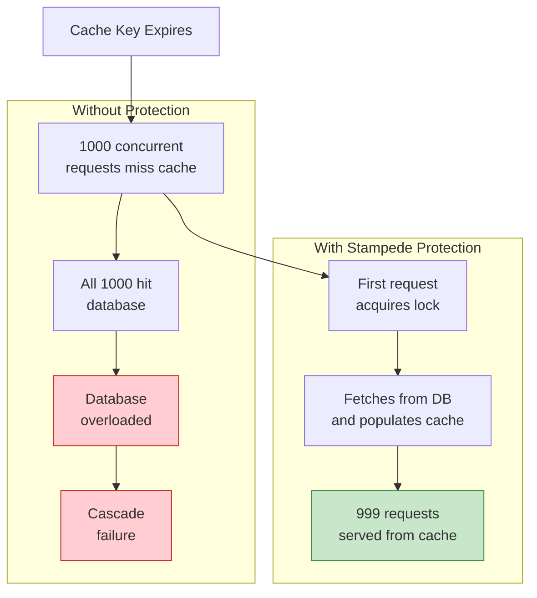
```mermaid
flowchart TD
    A["Cache Key Expires"]
    A --> B["1000 concurrent\nrequests miss cache"]

    subgraph "Without Protection"
        B --> C["All 1000 hit\ndatabase"]
        C --> D["Database\noverloaded"]
        D --> E["Cascade\nfailure"]
    end

    subgraph "With Stampede Protection"
        B --> F["First request\nacquires lock"]
        F --> G["Fetches from DB\nand populates cache"]
        G --> H["999 requests\nserved from cache"]
    end

    style D fill:#ffcdd2,stroke:#c62828
    style E fill:#ffcdd2,stroke:#c62828
    style H fill:#c8e6c9,stroke:#388e3c
```

### Scaling Bottleneck Summary

| Bottleneck | Detection | Quick Fix | Long-term Fix |
|-----------|-----------|-----------|---------------|
| Stateful services | Cannot add instances without state conflicts | Sticky sessions | Externalize state |
| Hot partitions | Uneven partition size/traffic metrics | Cache hot data | Better partition key, auto-splitting |
| Thundering herd | Spike in backend traffic after cache expiry | Cache locking | Jittered TTLs, circuit breakers |
| Single point of failure | Outage impacts entire system | Manual failover | Redundancy, automatic failover |
| Cross-region latency | High p99 for geographically distributed users | CDN | Multi-region deployment |

---

# Section 4: Scaling Strategy

## 4.1 The Scaling Progression

Systems scale through a predictable progression. Each stage addresses a specific bottleneck and introduces new complexity. The key is knowing when to move to the next stage — scaling prematurely adds unnecessary complexity, scaling too late causes outages.

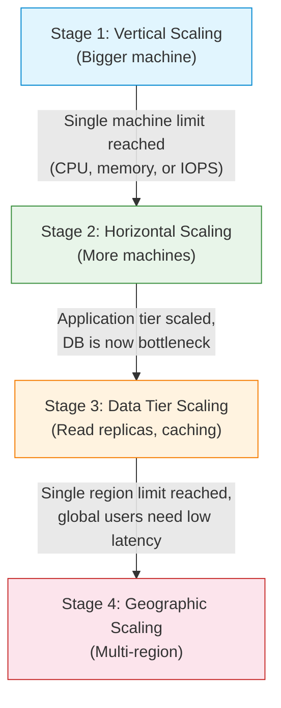
```mermaid
flowchart TD
    A["Stage 1: Vertical Scaling\n(Bigger machine)"]
    A -->|"Single machine limit reached\n(CPU, memory, or IOPS)"| B["Stage 2: Horizontal Scaling\n(More machines)"]
    B -->|"Application tier scaled,\nDB is now bottleneck"| C["Stage 3: Data Tier Scaling\n(Read replicas, caching)"]
    C -->|"Single region limit reached,\nglobal users need low latency"| D["Stage 4: Geographic Scaling\n(Multi-region)"]

    style A fill:#e1f5fe,stroke:#0288d1
    style B fill:#e8f5e9,stroke:#388e3c
    style C fill:#fff3e0,stroke:#f57c00
    style D fill:#fce4ec,stroke:#c62828
```

---

## 4.2 Stage 1: Vertical Scaling

### When Vertical Scaling Is Enough

Vertical scaling (bigger machine) is the simplest scaling strategy and should be the first option considered.

**It is enough when:**
- QPS is under 5,000–10,000
- Data fits in a single machine's storage (< 10 TB)
- The workload is not latency-sensitive for geographically distributed users
- The team is small (< 10 engineers)

**Modern hardware limits:**

| Resource | Maximum (2024) | Example Instance |
|----------|---------------|-----------------|
| CPU cores | 448 vCPUs | AWS u-24tb1.metal |
| Memory | 24 TB | AWS u-24tb1.metal |
| Storage | 100+ TB (single node) | NVMe arrays |
| Network | 400 Gbps | AWS c7gn.metal |

**Key insight:** Many systems that think they need distributed architectures could run on a single large machine. A PostgreSQL instance on a machine with 64 cores, 256 GB RAM, and NVMe storage can handle 50,000+ read QPS with proper indexing.

### When to Move Beyond Vertical

Move to horizontal scaling when:
- **Availability requirements exceed what a single machine can provide** — a single machine is a single point of failure. Even with redundancy (active-passive), failover takes 30–60 seconds.
- **The workload exceeds single-machine limits** — CPU, memory, or storage is maxed out.
- **Cost becomes non-linear** — the largest instances cost disproportionately more per unit of capacity.
- **Deployment requires zero downtime** — rolling deployments require multiple instances.

---

## 4.3 Stage 2: Horizontal Scaling

### Stateless Services

The first step in horizontal scaling is making application services stateless:

1. **No local session state** — sessions stored in Redis or a database
2. **No local file storage** — files stored in object storage (S3)
3. **No local caches that require warmup** — use external caches (Redis, Memcached)
4. **No instance-specific configuration** — all config from environment variables or config service

Once services are stateless, they can be horizontally scaled by adding instances behind a load balancer.

### Shared-Nothing Architecture

In a shared-nothing architecture, each node is independent and self-sufficient. No node shares memory or disk with another node. This is the foundation of horizontal scalability.

**Implementation:**
- Each application instance connects to the same external data stores
- A load balancer distributes requests across instances
- No inter-instance communication is needed for request processing
- Any instance can handle any request

**Load Balancing Strategies:**

| Strategy | How It Works | Best For |
|----------|-------------|----------|
| Round Robin | Requests distributed sequentially | Uniform request cost |
| Least Connections | Route to instance with fewest active connections | Variable request duration |
| Weighted Round Robin | Some instances get more traffic | Mixed instance sizes |
| Consistent Hashing | Route based on request key | Stateful routing (caching) |
| Random | Random selection | Simple, surprisingly effective |

### Auto-Scaling

Auto-scaling adds and removes instances based on demand.

**Metrics to scale on:**

| Metric | Scale-Out Threshold | Scale-In Threshold | Lag |
|--------|--------------------|--------------------|-----|
| CPU utilization | > 70% for 3 min | < 30% for 10 min | 3–5 min to add instance |
| Request count | > 80% of capacity | < 40% of capacity | 3–5 min to add instance |
| Queue depth | > 1,000 messages | < 100 messages | 1–2 min (depends on startup) |
| Custom (latency) | p99 > 200ms | p99 < 50ms | 3–5 min |

**Auto-scaling pitfalls:**
- **Scale-in too aggressive:** Removing instances during a brief traffic dip, then needing them again 2 minutes later
- **Scale-out too slow:** New instances take 5 minutes to start, but traffic spikes last 2 minutes
- **Oscillation:** Scaling out causes load to drop below threshold, causing scale-in, which causes load to rise again
- **Cold start:** New instances have empty caches, so they hit the database harder than warm instances

---

## 4.4 Stage 3: Data Tier Scaling

### Read Replicas

When the application tier is horizontally scaled but the database is the bottleneck, the first step is adding read replicas.

**How it works:**
- The primary database handles all writes
- One or more replicas asynchronously replicate from the primary
- Read traffic is routed to replicas
- Typically provides 3–5x read throughput increase per replica

**Limitations:**
- Replication lag means reads may be stale (typically 10–100ms for async replication)
- Does not help with write throughput
- More replicas mean more replication traffic on the primary

**When read replicas are not enough:**
- Write QPS exceeds what the primary can handle (> 10K writes/sec for PostgreSQL)
- Data size exceeds single-node storage
- Replication lag is unacceptable for the use case

### Sharding

Sharding distributes data across multiple database instances, each holding a subset of the data.

**Sharding strategies:**

| Strategy | How It Works | Pros | Cons |
|----------|-------------|------|------|
| Range-based | Partition by key range (e.g., user_id 1–1M on shard 1) | Range queries work, simple to understand | Hot spots if ranges are uneven |
| Hash-based | Hash the partition key, modulo number of shards | Even distribution | Range queries require scatter-gather |
| Directory-based | Lookup table maps key to shard | Maximum flexibility | Lookup table is a bottleneck |
| Geographic | Data stored in the region closest to the user | Low latency for local users | Cross-region queries are complex |

**Sharding challenges:**
- **Cross-shard queries:** JOINs across shards are extremely expensive
- **Resharding:** Adding or removing shards requires data migration
- **Transactions:** Distributed transactions across shards are complex (2PC, Saga)
- **Hotspots:** Even with hash-based sharding, some keys may be hotter than others

### Caching Layers

Caching is the most impactful scaling technique for read-heavy systems.

**Cache-Aside (Lazy Loading):**
1. Application checks cache
2. On miss, queries database
3. Stores result in cache
4. Returns result

**Write-Through:**
1. Application writes to cache AND database
2. Reads always hit cache (always warm)
3. Higher write latency (two writes)

**Write-Behind (Write-Back):**
1. Application writes to cache
2. Cache asynchronously writes to database
3. Fastest writes, but risk of data loss if cache fails

**Cache Sizing Rule of Thumb:**
- For 80/20 workloads (80% of reads access 20% of data), cache the hot 20%
- Cache size = total data size * 0.2
- Example: 100 GB of tweet data, cache 20 GB in Redis

---

## 4.5 Stage 4: Geographic Scaling

### Multi-Region Architecture

When users are globally distributed and latency matters, deploy the system in multiple regions.

**Architecture patterns:**

| Pattern | How It Works | Latency | Consistency | Complexity |
|---------|-------------|---------|-------------|------------|
| Active-Passive | One primary region, secondary for failover | High for remote users | Strong (single writer) | Low |
| Active-Active (read) | Writes go to primary, reads served locally | Low for reads | Eventual for reads | Medium |
| Active-Active (full) | Each region handles reads and writes | Low for all | Conflict resolution needed | High |

**Data replication strategies:**

| Strategy | Latency | Consistency | Data Loss Risk |
|----------|---------|-------------|----------------|
| Synchronous replication | +100–300ms per write | Strong | None |
| Asynchronous replication | No added latency | Eventual (100ms–seconds lag) | Seconds of data on region failure |
| Semi-synchronous | +50–150ms per write | Bounded staleness | Minimal |

### Edge Computing

Push computation closer to the user for latency-sensitive operations:

| Layer | Location | Latency to User | Use Case |
|-------|----------|-----------------|----------|
| Origin server | Data center | 50–300ms | Business logic, database queries |
| CDN edge | PoP (Point of Presence) | 5–30ms | Static content, cached API responses |
| Edge compute | CDN edge with compute | 5–30ms | Personalization, A/B testing, auth |
| Client-side | User's device | 0ms | Optimistic UI, local caching, validation |

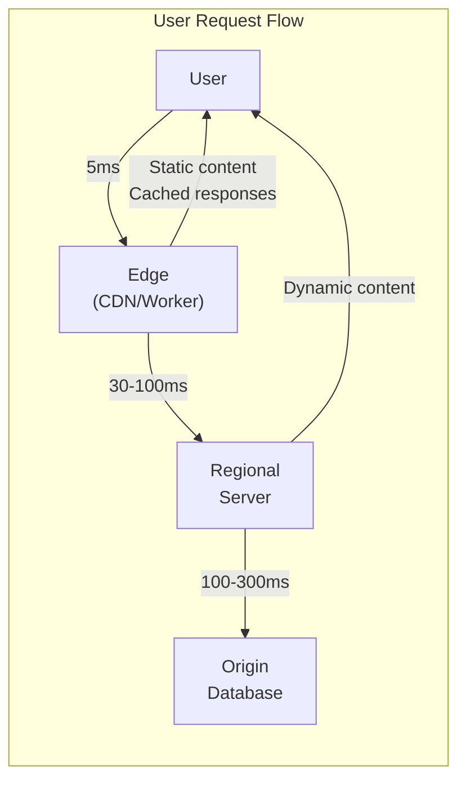
```mermaid
flowchart LR
    subgraph "User Request Flow"
        U["User"] -->|"5ms"| E["Edge\n(CDN/Worker)"]
        E -->|"Static content\nCached responses"| U
        E -->|"30-100ms"| R["Regional\nServer"]
        R -->|"Dynamic content"| U
        R -->|"100-300ms"| O["Origin\nDatabase"]
    end
```

---

# Section 5: Cost Awareness

## 5.1 Why Cost Matters in Interviews

Cost awareness is increasingly tested at senior levels (L5+). The ability to reason about cost separates engineers who design systems from engineers who operate them.

### The Three Pillars of Cloud Cost

1. **Compute:** CPU and memory for running workloads
2. **Storage:** Persistent data storage (block, object, database)
3. **Network:** Data transfer between services, regions, and to the internet

### Cost Model Overview

| Resource | Pricing Model | Typical Cost (AWS, 2024) |
|----------|--------------|-------------------------|
| EC2 (m6i.large) | Per hour | ~$0.096/hour (~$70/month) |
| RDS (db.r6g.large, PostgreSQL) | Per hour + storage | ~$0.26/hour (~$190/month) |
| S3 storage | Per GB/month | $0.023/GB/month |
| S3 GET requests | Per 1,000 requests | $0.0004/1,000 |
| S3 PUT requests | Per 1,000 requests | $0.005/1,000 |
| ElastiCache (r6g.large) | Per hour | ~$0.25/hour (~$180/month) |
| Data transfer (out to internet) | Per GB | $0.09/GB (first 10 TB) |
| Data transfer (cross-region) | Per GB | $0.02/GB |
| Data transfer (same region, cross-AZ) | Per GB | $0.01/GB |
| Data transfer (same AZ) | Free | $0.00/GB |
| CloudFront (CDN) | Per GB + per request | $0.085/GB + $0.01/10K requests |
| NAT Gateway | Per hour + per GB | $0.045/hour + $0.045/GB |

**The hidden cost traps:**

1. **Data transfer:** Often the largest surprise cost. Cross-region replication, NAT gateway charges, and internet egress add up quickly.
2. **NAT Gateway:** A common source of unexpected cost in VPC architectures. $0.045/GB processed can cost thousands monthly for high-throughput services.
3. **Idle resources:** Instances running 24/7 but only utilized during business hours.
4. **Over-provisioned databases:** RDS instances sized for peak load running at 10% utilization off-peak.
5. **Log storage:** Storing every log line at full resolution forever. Log rotation and tiering are essential.

---

## 5.2 Cost Optimization Strategies

### Right-Sizing

**What it is:** Matching instance sizes to actual workload requirements.

**How to do it:**
1. Monitor CPU, memory, and network utilization for 2+ weeks
2. Identify instances consistently under 40% utilization
3. Downsize to the next smaller instance type
4. Monitor for performance impact

**Example savings:**
```
Before: 10 x m6i.xlarge (4 vCPU, 16 GB) at $0.192/hr = $1,401/month
Actual utilization: 25% CPU, 30% memory
After: 10 x m6i.large (2 vCPU, 8 GB) at $0.096/hr = $700/month
Savings: $701/month ($8,412/year)
```

### Caching to Reduce Database Load

**The cost argument for caching:**

```
Without caching:
  - 100K read QPS requires a large RDS cluster
  - db.r6g.2xlarge (8 vCPU, 64 GB): ~$1,100/month
  - With 4 read replicas: $5,500/month total

With caching (90% cache hit rate):
  - 10K read QPS hits database (90% served by cache)
  - db.r6g.large (2 vCPU, 16 GB) primary + 1 replica: $380/month
  - Redis cluster (3 nodes, r6g.large): $540/month
  - Total: $920/month

Savings: $4,580/month ($54,960/year)
```

Caching is not just a performance optimization — it is a cost optimization.

### CDN for Bandwidth Optimization

**The cost argument for CDN:**

```
Without CDN:
  - 100 TB/month of static content served from origin
  - Data transfer out: 100 TB * $0.09/GB = $9,000/month
  - Origin server load: additional compute cost

With CDN (95% cache hit rate):
  - 5 TB served from origin, 95 TB from CDN
  - Origin data transfer: 5 TB * $0.09/GB = $450/month
  - CDN cost: 95 TB * $0.085/GB = $8,075/month
  - Total: $8,525/month (marginal savings, but origin load reduced 20x)

Real benefit: CDN reduces origin infrastructure by 10-20x,
and latency improves dramatically for global users.
```

### Auto-Scaling for Variable Workloads

**The cost argument for auto-scaling:**

```
Without auto-scaling (provisioned for peak):
  - 20 instances running 24/7 to handle peak
  - 20 * $0.096/hr * 730 hours = $1,401/month
  - Average utilization: 30% (peak 2 hours/day)

With auto-scaling:
  - Base: 6 instances (handles off-peak)
  - Peak: scales to 20 instances for 2 hours/day
  - Cost: 6 * 730 * $0.096 + 14 * 60 * $0.096 = $421 + $81 = $502/month

Savings: $899/month ($10,788/year)
```

---

## 5.3 TCO Analysis: Build vs Buy

### The Build vs Buy Framework

| Factor | Build | Buy (Managed Service) |
|--------|-------|----------------------|
| Upfront cost | High (engineering time) | Low (sign up and go) |
| Ongoing cost | Engineering time for maintenance, on-call | Subscription/usage fees |
| Customization | Full control | Limited by vendor features |
| Time to production | Weeks to months | Hours to days |
| Operational burden | Full (patching, scaling, monitoring, backups) | Partial (vendor handles infrastructure) |
| Vendor lock-in | None | Medium to high |
| Team expertise | Requires deep domain knowledge | Vendor provides expertise |

### Decision Framework

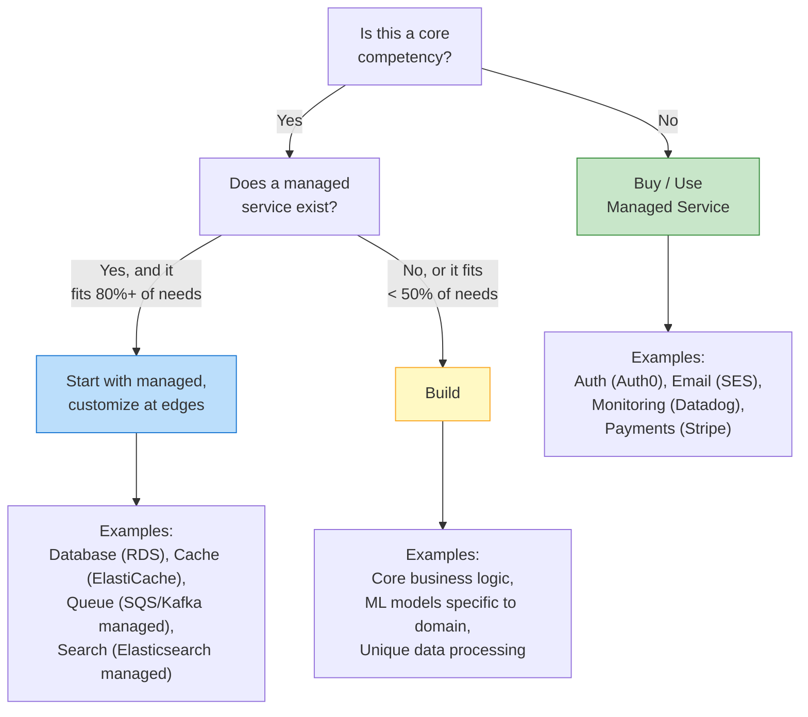
```mermaid
flowchart TD
    A["Is this a core\ncompetency?"]
    A -->|Yes| B["Does a managed\nservice exist?"]
    A -->|No| C["Buy / Use\nManaged Service"]

    B -->|"Yes, and it\nfits 80%+ of needs"| D["Start with managed,\ncustomize at edges"]
    B -->|"No, or it fits\n< 50% of needs"| E["Build"]

    C --> F["Examples:\nAuth (Auth0), Email (SES),\nMonitoring (Datadog),\nPayments (Stripe)"]

    D --> G["Examples:\nDatabase (RDS), Cache (ElastiCache),\nQueue (SQS/Kafka managed),\nSearch (Elasticsearch managed)"]

    E --> H["Examples:\nCore business logic,\nML models specific to domain,\nUnique data processing"]

    style C fill:#c8e6c9,stroke:#388e3c
    style D fill:#bbdefb,stroke:#1976d2
    style E fill:#fff9c4,stroke:#f9a825
```

### Managed vs Self-Hosted Cost Comparison

**Example: PostgreSQL**

```
Self-hosted (EC2):
  - 3 x r6i.xlarge (4 vCPU, 32 GB) for HA: $693/month
  - 1 TB gp3 storage (3 instances): $240/month
  - Engineering time: 4 hours/week for maintenance, patching, backups
  - On-call burden: 1 engineer in rotation
  - Total: $933/month + ~$2,000/month engineering cost = $2,933/month

Managed (RDS):
  - 1 x db.r6i.xlarge Multi-AZ: $750/month
  - 1 TB gp3 storage: $80/month
  - Automated backups, patching, failover
  - Total: $830/month

Savings with managed: $2,103/month (mostly engineering time)
```

**When self-hosted wins:**
- Very high scale where managed service costs become non-linear
- Specific tuning requirements not supported by managed service
- Compliance requirements that prevent managed service usage
- The team has deep expertise and spare capacity

### Architecture Decision Record: Managed Services

```
ADR-003: Database Hosting Strategy

Status: Accepted
Date: 2024-03-01

Context:
  The team is evaluating whether to self-host PostgreSQL on EC2 or use
  Amazon RDS. The system requires Multi-AZ deployment for availability,
  automated backups, and point-in-time recovery. The team has 12 engineers,
  none with deep PostgreSQL administration experience.

Decision:
  Use Amazon RDS for PostgreSQL.

Rationale:
  - The team lacks PostgreSQL administration expertise. Self-hosting would
    require either hiring a DBA or diverting engineering time from product
    development.
  - RDS provides automated failover, backups, patching, and monitoring
    out of the box.
  - The 1.2x cost premium of RDS over self-hosted is justified by the
    engineering time savings (~$2,000/month).
  - The current scale (5K QPS) is well within RDS capabilities. Self-hosting
    would only be justified at 50K+ QPS where RDS cost becomes non-linear.

Consequences:
  - Vendor lock-in to AWS for the database layer. Mitigation: use standard
    PostgreSQL features, avoid RDS-specific extensions.
  - Limited tuning options compared to self-hosted. Mitigation: RDS
    parameter groups cover 90% of tuning needs.
  - Re-evaluate at 50K QPS or if the team grows to 30+ engineers.

Alternatives Considered:
  - Self-hosted PostgreSQL on EC2: rejected due to operational burden.
  - Aurora PostgreSQL: considered but rejected due to 2x cost premium
    over standard RDS, and compatibility differences with standard
    PostgreSQL.
  - CockroachDB (managed): considered for future multi-region needs but
    rejected as premature for current single-region deployment.
```

---

# Section 6: Mock Interview Walkthroughs

## 6.1 Mock Interview 1: Design Twitter

### Problem Statement

Design a social media platform similar to Twitter that supports:
- Posting short messages (tweets)
- Following other users
- A personalized home timeline (feed)

### Step 1: Requirements (5 minutes)

**Functional Requirements:**
- Users can post tweets (text, up to 280 characters)
- Users can follow/unfollow other users
- Users can view their home timeline (tweets from people they follow)
- Users can view a user's profile and their tweets

**Out of Scope (mentioned but not designed):**
- Search, DMs, notifications, likes/retweets, trending topics
- Media attachments (images, videos)

**Non-Functional Requirements:**
- Scale: 300M monthly active users, 200M DAU
- Timeline read latency: p99 < 300ms
- Tweet posting latency: < 500ms
- Availability: 99.99% for reads, 99.9% for writes
- Eventual consistency is acceptable for timeline (1–5 second delay)

### Step 2: Estimation (3 minutes)

```
Users: 200M DAU
Tweets per user per day: 2 (average, including retweets)
Timeline reads per user per day: 50

Write QPS:
  200M * 2 / 86,400 = 4,630 writes/sec
  Peak (3x): ~14,000 writes/sec

Read QPS:
  200M * 50 / 86,400 = 115,740 reads/sec
  Peak (3x): ~350,000 reads/sec

Read:Write ratio = ~25:1 → heavily read-optimized

Storage:
  Tweet: ~300 bytes (text + metadata)
  400M tweets/day * 300 bytes = 120 GB/day
  5 years: 120 GB * 365 * 5 = 219 TB (text only)

Follow relationships:
  Average follows per user: 200
  200M * 200 * 16 bytes (two UUIDs) = 640 GB

Timeline cache (Redis):
  200M users * 800 tweet_ids * 8 bytes = 1.28 TB
  With overhead: ~2 TB → ~130 Redis nodes at 16 GB each
```

### Step 3: High-Level Design (10 minutes)

**Components:**

1. **API Gateway:** Rate limiting, authentication, routing
2. **Tweet Service:** Create and retrieve tweets
3. **User Service:** User profiles, follow/unfollow
4. **Timeline Service:** Build and serve personalized timelines
5. **Fan-out Service:** Distribute new tweets to follower timelines
6. **Tweet DB:** Persistent tweet storage (Cassandra)
7. **User DB:** User profiles and follow graph (PostgreSQL)
8. **Timeline Cache:** Pre-computed timelines (Redis sorted sets)
9. **Message Queue:** Async event distribution (Kafka)

**API Design:**

```
POST /tweets           → Create tweet
GET  /timeline         → Get home timeline (paginated)
GET  /users/:id/tweets → Get user tweets (paginated)
POST /follow/:user_id  → Follow a user
DELETE /follow/:user_id → Unfollow a user
```

**Architecture:**

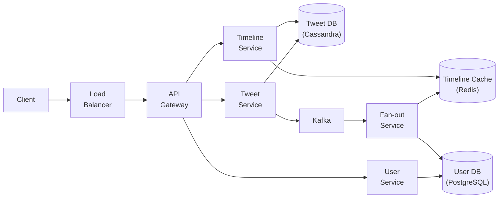
```mermaid
flowchart LR
    C["Client"] --> LB["Load\nBalancer"]
    LB --> GW["API\nGateway"]
    GW --> TS["Tweet\nService"]
    GW --> TLS["Timeline\nService"]
    GW --> US["User\nService"]

    TS --> TDB[("Tweet DB\n(Cassandra)")]
    TS --> K["Kafka"]
    K --> FO["Fan-out\nService"]
    FO --> TC[("Timeline Cache\n(Redis)")]

    TLS --> TC
    TLS --> TDB
    US --> UDB[("User DB\n(PostgreSQL)")]
    FO --> UDB
```

### Step 4: Deep Dive — Fan-out Strategy (15 minutes)

**The Core Challenge:**

When a user posts a tweet, it must appear in the timeline of every follower. For a user with 10 million followers, that is 10 million cache updates.

**Option 1: Fan-out on Write (Push Model)**
- When a tweet is posted, immediately push the tweet_id to every follower's timeline cache
- Reads are fast: just fetch the pre-computed timeline
- Writes are expensive: O(followers) work per tweet

**Option 2: Fan-out on Read (Pull Model)**
- When a user reads their timeline, fetch recent tweets from all followed users and merge them
- Writes are fast: just store the tweet
- Reads are expensive: O(following) work per timeline read

**Trade-off Analysis:**

| Factor | Fan-out on Write | Fan-out on Read |
|--------|-----------------|----------------|
| Write latency | High for popular users | O(1) — just store the tweet |
| Read latency | O(1) — pre-computed | High — must merge N feeds |
| Storage cost | High (every follower stores tweet_id) | Low (tweets stored once) |
| Celebrity problem | 10M cache writes per tweet | No special handling needed |
| Inactive users | Waste: updating timelines nobody reads | Efficient: only compute when read |

**Decision: Hybrid Approach**

- **Fan-out on write** for users with < 10,000 followers (99% of users). This keeps read latency low for the common case.
- **Fan-out on read** for users with > 10,000 followers (celebrities). When a user reads their timeline, merge the pre-computed timeline (from push) with recent tweets from celebrities they follow (pulled at read time).

**Celebrity Detection:**
- Maintain a set of "celebrity" user IDs (follower_count > threshold)
- When a user reads their timeline:
  1. Fetch pre-computed timeline from Redis (pushed tweets)
  2. Fetch recent tweets from each celebrity the user follows (pulled tweets)
  3. Merge and sort by timestamp
  4. Cache the merged result briefly (30 seconds)

**Fan-out Worker Design:**

```
Fan-out Worker (consumes from Kafka):
  1. Read TweetCreated event
  2. Check if author is a celebrity → if yes, skip fan-out
  3. Fetch follower list from User DB (paginated, 1000 at a time)
  4. For each follower batch:
     a. Pipeline ZADD commands to Redis (add tweet_id to sorted set)
     b. Trim sorted set to 800 entries (ZREMRANGEBYRANK)
  5. Acknowledge Kafka offset after all followers processed
```

### Step 5: Trade-offs and Bottlenecks (5 minutes)

**Bottleneck 1: Timeline Cache (Redis)**
- 2 TB of data across 130 nodes
- Risk: node failure loses timelines for millions of users
- Mitigation: Redis cluster with replication (3x storage cost), plus fallback to pull-based timeline from Tweet DB

**Bottleneck 2: Fan-out Worker Throughput**
- At peak, 14K tweets/sec, average 200 followers each = 2.8M cache writes/sec
- Requires 10–20 fan-out worker instances with pipelined Redis writes

**Bottleneck 3: Celebrity Tweet Merge at Read Time**
- If a user follows 50 celebrities, reading the timeline requires 50 additional lookups
- Mitigation: batch fetch celebrity tweets in parallel, cache merged result for 30 seconds

**Trade-offs Made:**
- Chose eventual consistency for timeline (1–5 second delay acceptable)
- Chose hybrid fan-out over pure push (avoids celebrity problem)
- Chose Cassandra for tweets (write throughput) over PostgreSQL (relational)
- Chose Redis sorted sets for timeline (O(log N) operations, natural ordering)

### Scoring Rubric for This Design

| Criteria | L4 (Junior) | L5 (Senior) | L6 (Staff) |
|----------|-------------|-------------|------------|
| Requirements | Lists features | Distinguishes functional/non-functional, sets scope | Identifies hidden requirements (celebrity problem, inactive users) |
| Estimation | Skips or struggles | Calculates QPS and storage | Identifies dominant cost factor, uses numbers to drive decisions |
| High-Level Design | Correct but generic | Components derived from data flow | Explains why each component exists |
| Deep Dive | Describes a single approach | Compares options with trade-offs | Proposes hybrid approach with nuanced reasoning |
| Bottlenecks | Cannot identify | Identifies 1–2 | Proactively identifies 3+ with mitigations |
| Communication | Presents, does not discuss | Explains reasoning | Adapts to interviewer signals, collaborative |

---

## 6.2 Mock Interview 2: Design Uber

### Problem Statement

Design a ride-sharing platform that connects riders with nearby drivers in real-time.

### Step 1: Requirements (5 minutes)

**Functional Requirements:**
- Riders can request a ride by specifying pickup and dropoff locations
- The system matches the rider with a nearby available driver
- Drivers see ride requests and can accept/decline
- Both rider and driver can see each other's real-time location during a trip
- Trip pricing and payment processing

**Out of Scope:**
- Surge pricing algorithm (mention but do not design)
- Driver onboarding and background checks
- Multi-stop rides, ride pooling
- Historical trip analytics

**Non-Functional Requirements:**
- Matching latency: < 5 seconds to find a driver
- Location update frequency: every 4 seconds
- Scale: 50M riders, 5M drivers, 20M trips/day
- Availability: 99.99% for ride requests
- Geo: multi-city, single country initially

### Step 2: Estimation (3 minutes)

```
Trips: 20M trips/day
Active drivers at any time: ~500K (assuming 10% of 5M online at once)
Active riders at any time: ~1M (requesting or in-trip)

Ride requests:
  20M / 86,400 = ~230 requests/sec
  Peak (3x): ~700 requests/sec

Location updates (drivers):
  500K drivers * 1 update / 4 sec = 125,000 updates/sec
  Peak: ~200,000 updates/sec

Location updates (during trips, both rider and driver):
  Assume 2M active trips * 2 participants * 1 update / 4 sec = 1M updates/sec

Storage (location history):
  1M updates/sec * 50 bytes/update = 50 MB/sec = 4.3 TB/day
  Keep 30 days: 130 TB

ETA calculations:
  ~500K/sec (for driver matching + rider ETA display)
```

### Step 3: High-Level Design (10 minutes)

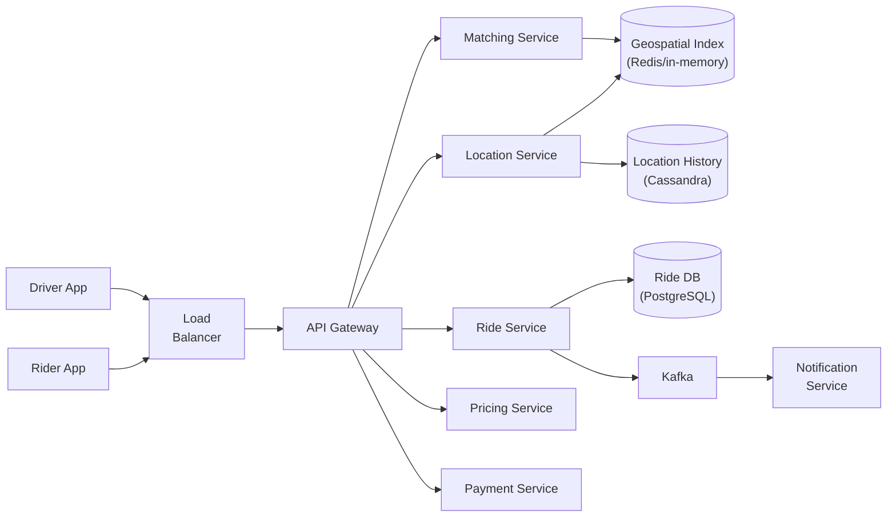
```mermaid
flowchart LR
    R["Rider App"] --> LB["Load\nBalancer"]
    D["Driver App"] --> LB

    LB --> GW["API Gateway"]
    GW --> RS["Ride Service"]
    GW --> LS["Location Service"]
    GW --> MS["Matching Service"]
    GW --> PS["Pricing Service"]
    GW --> PAY["Payment Service"]

    LS --> GI[("Geospatial Index\n(Redis/in-memory)")]
    LS --> LH[("Location History\n(Cassandra)")]
    RS --> RDB[("Ride DB\n(PostgreSQL)")]
    MS --> GI

    RS --> K["Kafka"]
    K --> NS["Notification\nService"]
```

**Key APIs:**

```
POST /rides/request     → Rider requests a ride
POST /rides/:id/accept  → Driver accepts a ride
POST /location/update   → Driver/rider sends location update
GET  /rides/:id/status  → Get ride status and locations
GET  /rides/:id/eta     → Get estimated time of arrival
POST /rides/:id/complete → Complete ride and trigger payment
```

### Step 4: Deep Dive — Matching and Geospatial Indexing (15 minutes)

**The Core Challenge:**

When a rider requests a ride, the system must find the nearest available drivers within seconds. With 500K active drivers and 700 requests/sec at peak, the matching algorithm must be fast and efficient.

**Geospatial Indexing Options:**

| Approach | How It Works | Pros | Cons |
|----------|-------------|------|------|
| PostGIS | SQL spatial queries on PostgreSQL | Full-featured, familiar | Too slow for 200K updates/sec |
| Geohash + Redis | Convert lat/lng to geohash prefix, store in Redis sorted sets | Fast updates, fast range queries | Boundary issues at geohash edges |
| S2 Geometry / H3 | Hierarchical cell-based indexing | Precise, handles boundaries well | More complex implementation |
| In-memory quad-tree | Custom spatial index in application memory | Fastest queries | Must replicate across instances |

**Decision: Geohash with Redis**

Rationale:
- 200K location updates/sec maps well to Redis (100K+ QPS per node)
- Geohash prefix queries naturally find nearby drivers
- Boundary issues are solvable by querying adjacent geohash cells
- Simpler to operate than a custom in-memory index

**How Matching Works:**

```
1. Rider requests ride at (lat, lng)
2. Convert (lat, lng) to geohash prefix (precision 6, ~1.2km cell)
3. Query Redis for drivers in this cell AND 8 adjacent cells
4. Filter: only available drivers, within 5km radius
5. Sort by distance (Haversine formula)
6. Send ride request to top 3 nearest drivers (parallel)
7. First driver to accept wins
8. If no acceptance within 10 seconds, expand radius and retry
```

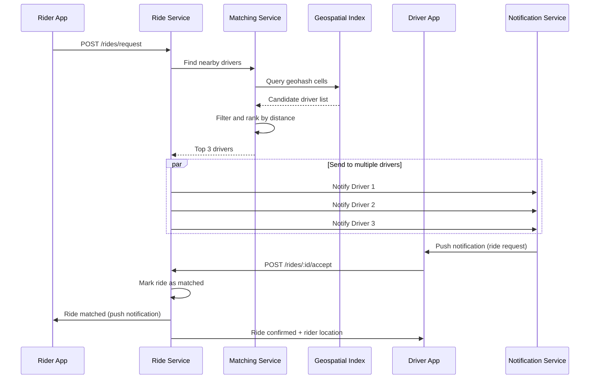
```mermaid
sequenceDiagram
    participant R as Rider App
    participant RS as Ride Service
    participant MS as Matching Service
    participant GI as Geospatial Index
    participant D as Driver App
    participant NS as Notification Service

    R->>RS: POST /rides/request
    RS->>MS: Find nearby drivers
    MS->>GI: Query geohash cells
    GI-->>MS: Candidate driver list
    MS->>MS: Filter and rank by distance
    MS-->>RS: Top 3 drivers

    par Send to multiple drivers
        RS->>NS: Notify Driver 1
        RS->>NS: Notify Driver 2
        RS->>NS: Notify Driver 3
    end

    NS->>D: Push notification (ride request)
    D->>RS: POST /rides/:id/accept
    RS->>RS: Mark ride as matched
    RS->>R: Ride matched (push notification)
    RS->>D: Ride confirmed + rider location
```

**Location Update Pipeline:**

```
Driver app sends location update every 4 seconds:
  1. Driver → API Gateway → Location Service
  2. Location Service:
     a. Compute new geohash from (lat, lng)
     b. If geohash changed from previous:
        - ZREM old geohash set in Redis
        - ZADD new geohash set in Redis
     c. If geohash unchanged:
        - Update score (timestamp) in existing set
     d. Publish to Kafka for history/analytics
  3. Kafka → Location History Writer → Cassandra
```

### Step 5: Trade-offs and Bottlenecks (5 minutes)

**Bottleneck 1: Geospatial Index Under Load**
- 200K updates/sec to Redis is manageable with a cluster
- Risk: if Redis node fails, driver locations are stale for those cells
- Mitigation: drivers send location to multiple Redis shards (partition by geohash region)

**Bottleneck 2: Driver Notification Delivery**
- Push notifications must reach drivers within 1–2 seconds
- Mobile push (APNS/FCM) has variable latency
- Mitigation: maintain persistent WebSocket connections for active drivers; fall back to push notifications

**Bottleneck 3: ETA Calculation**
- ETA requires routing computation (road network graph traversal)
- Cannot compute 500K ETAs/sec in real-time
- Mitigation: pre-compute ETA grid for the city (cell-to-cell travel times), cache results

**Common Pitfalls in This Design:**

| Pitfall | Why It Is Wrong | Correct Approach |
|---------|----------------|------------------|
| Storing location in SQL DB | Too slow for 200K updates/sec | In-memory geospatial index |
| Matching to single nearest driver | Driver may decline, causing delay | Send to multiple drivers in parallel |
| Polling for location updates | Too many requests, wasteful | WebSocket or server-sent events |
| Single matching service | Becomes bottleneck | Shard by geographic region |

---

## 6.3 Mock Interview 3: Design a URL Shortener

### Problem Statement

Design a URL shortening service (like bit.ly) that creates short URLs and redirects to the original long URL.

This is a classic beginner-friendly problem that tests fundamental system design skills.

### Step 1: Requirements (5 minutes)

**Functional Requirements:**
- Given a long URL, generate a short URL
- Clicking a short URL redirects to the original long URL
- Short URLs should be as short as possible
- Custom short URLs (optional, nice to have)
- Expiration (optional TTL for URLs)

**Non-Functional Requirements:**
- Scale: 100M new URLs/month, 10B redirects/month
- Redirect latency: < 50ms (must be fast)
- Availability: 99.99% for redirects (read path)
- Durability: once created, a short URL should work forever (unless expired)
- Read:Write ratio: 100:1

### Step 2: Estimation (3 minutes)

```
Writes:
  100M new URLs/month
  100M / (30 * 86,400) = ~40 writes/sec
  Peak: ~120 writes/sec

Reads (redirects):
  10B redirects/month
  10B / (30 * 86,400) = ~3,900 reads/sec
  Peak: ~12,000 reads/sec

Storage:
  Average URL: 200 bytes (long URL) + 10 bytes (short code) + 50 bytes (metadata) = 260 bytes
  100M URLs/month * 260 bytes = 26 GB/month
  5 years: 26 GB * 60 = 1.56 TB

Key space:
  Short code length of 7 characters, base62 (a-z, A-Z, 0-9)
  62^7 = 3.5 trillion possible codes
  At 100M/month, exhaustion in ~35,000 months (~2,900 years)
  7 characters is sufficient.

Cache:
  80/20 rule: 20% of URLs get 80% of traffic
  Cache top 20%: 100M * 12 months * 0.2 * 260 bytes = 62.4 GB
  Fits in a single Redis node.
```

### Step 3: High-Level Design (10 minutes)

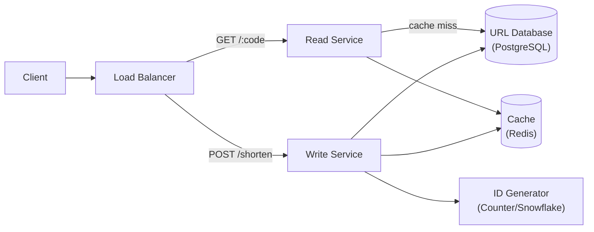
```mermaid
flowchart LR
    C["Client"] --> LB["Load Balancer"]

    LB -->|"POST /shorten"| WS["Write Service"]
    LB -->|"GET /:code"| RS["Read Service"]

    WS --> DB[("URL Database\n(PostgreSQL)")]
    WS --> CA[("Cache\n(Redis)")]

    RS --> CA
    RS -->|"cache miss"| DB

    WS --> IDG["ID Generator\n(Counter/Snowflake)"]
```

**API Design:**

```
POST /api/v1/shorten
  Body: { long_url: string, custom_code?: string, ttl?: number }
  Response: { short_url: "https://short.ly/abc1234", expires_at?: timestamp }

GET /:code
  Response: 301 Redirect to long_url
  (or 302 if analytics tracking is needed)
```

### Step 4: Deep Dive — Short Code Generation (15 minutes)

**Option 1: Hash-Based (MD5/SHA256 + Truncation)**
- Hash the long URL, take first 7 characters (base62 encoded)
- Problem: collisions. MD5 produces 128-bit hash, truncating to 7 base62 chars (41 bits) means collisions are likely at scale.
- Fix: check for collision, if found, append a counter and re-hash
- Problem: same long URL always produces same short URL (may or may not be desired)

**Option 2: Counter-Based**
- Maintain a global counter (auto-increment)
- Convert counter value to base62
- No collisions by design
- Problem: counter is a single point of failure and bottleneck

**Option 3: Pre-Generated Key Service**
- Pre-generate a pool of unique 7-character codes
- When a new URL is created, take the next code from the pool
- No collisions, no counter bottleneck
- Problem: need to manage the pool, ensure codes are not reused

**Option 4: Snowflake-style ID**
- Generate a 64-bit unique ID using timestamp + machine_id + sequence
- Convert to base62 (11 characters, slightly longer but guaranteed unique)
- No coordination needed between servers

**Decision: Counter with Range Allocation**

```
How it works:
  1. A central ZooKeeper/etcd node maintains a counter
  2. Each write service instance requests a range of 10,000 IDs at a time
  3. The instance uses IDs from its local range without coordination
  4. When the range is exhausted, request a new range
  5. Convert counter to base62 for the short code

Benefits:
  - No collisions
  - Minimal coordination (one range request per 10,000 URLs)
  - If an instance crashes, at most 10,000 IDs are wasted (acceptable)

Base62 encoding:
  Counter value 1,000,000 → base62 → "4c92" (4 chars)
  Counter value 1,000,000,000 → base62 → "15FTGg" (6 chars)
  Counter value 100,000,000,000 → base62 → "1L9zO9K" (7 chars)
```

**Redirect Path Optimization:**

The redirect path must be extremely fast (< 50ms). Optimization strategy:

1. Client sends `GET /abc1234`
2. Load balancer routes to Read Service
3. Read Service checks Redis cache
4. Cache hit (90%+ of the time): return 301 redirect
5. Cache miss: query PostgreSQL, populate cache, return 301 redirect

**301 vs 302 Redirect:**
- **301 (Permanent):** Browser caches the redirect. Subsequent clicks skip the server entirely. Better for performance, but we lose analytics visibility.
- **302 (Temporary):** Browser does not cache. Every click goes through our server. Enables click analytics but adds latency.
- **Decision:** Use 302 if analytics are needed, 301 if pure redirect performance is the priority.

### Step 5: Trade-offs and Bottlenecks (5 minutes)

**Bottleneck 1: Redis Cache**
- 62 GB for top 20% of URLs — fits in a single large Redis node
- Risk: Redis failure causes all traffic to hit PostgreSQL
- Mitigation: Redis replica for failover, plus PostgreSQL is provisioned to handle 100% traffic briefly

**Bottleneck 2: Counter Service**
- Range allocation reduces coordination to 1 request per 10,000 URLs
- Risk: etcd/ZooKeeper failure prevents new URL creation
- Mitigation: large range buffers (100K per instance), etcd cluster for HA

**This design is intentionally simple.** A URL shortener at the described scale (40 writes/sec, 4K reads/sec) could run on a single PostgreSQL instance with a Redis cache. The value of this interview question is testing whether candidates can identify the appropriate level of complexity rather than over-engineering.

---

## 6.4 Interviewer Scoring Rubric

### Level Expectations

Understanding what is expected at each level helps you calibrate your preparation.

#### L4 (Mid-Level / SDE II)

**Expectations:**
- Gather basic requirements (features, scale)
- Produce a correct high-level design with standard components
- Demonstrate awareness of caching and load balancing
- Handle one deep dive topic with reasonable depth

**Typical Weaknesses:**
- Skips estimation or does it poorly
- Does not articulate trade-offs
- Cannot identify bottlenecks
- Design is generic (could be any system)

**Score: Hire if** the design is correct, the communication is clear, and the candidate shows growth potential.

#### L5 (Senior / SDE III)

**Expectations:**
- Gather both functional and non-functional requirements
- Perform accurate capacity estimation and use numbers to drive decisions
- Produce a design with clear component boundaries and API contracts
- Deep dive with trade-off analysis (compare options, make defensible decisions)
- Identify 2–3 bottlenecks with mitigation strategies

**Typical Weaknesses:**
- Does not adapt when the interviewer pushes back
- Designs a textbook solution without considering specific constraints
- Cannot reason about cost or operational concerns

**Score: Hire if** the design demonstrates senior-level judgment, the trade-offs are well-articulated, and the candidate can adapt to new constraints.

#### L6 (Staff / Principal)

**Expectations:**
- Frame the problem in business context (revenue impact, user experience)
- Identify hidden requirements (edge cases, failure modes, security)
- Estimation includes all dimensions (QPS, storage, bandwidth, cost)
- Design reflects deep understanding of distributed systems
- Deep dive shows production-level expertise (specific data structures, algorithms, failure handling)
- Proactively identifies bottlenecks, trade-offs, and future evolution
- Discusses operational concerns (monitoring, deployment, incident response)
- Adapts fluidly to interviewer pivots

**Typical Weaknesses at L6:**
- Over-engineering (adding complexity without justification)
- Cannot explain decisions in simple terms
- Focuses on technology over business impact

**Score: Hire if** the design demonstrates architectural leadership, the candidate drives the conversation, and every decision is justified with clear reasoning.

### Scoring Dimensions

| Dimension | Weight | What It Measures |
|-----------|--------|-----------------|
| Problem Exploration | 15% | Requirements gathering, scope definition, clarifying questions |
| High-Level Design | 25% | Component identification, API design, data flow |
| Technical Depth | 25% | Deep dive quality, algorithm choices, data structure selection |
| Trade-off Analysis | 20% | Identifying trade-offs, comparing options, making justified decisions |
| Communication | 15% | Clarity, structure, adaptability, collaboration with interviewer |

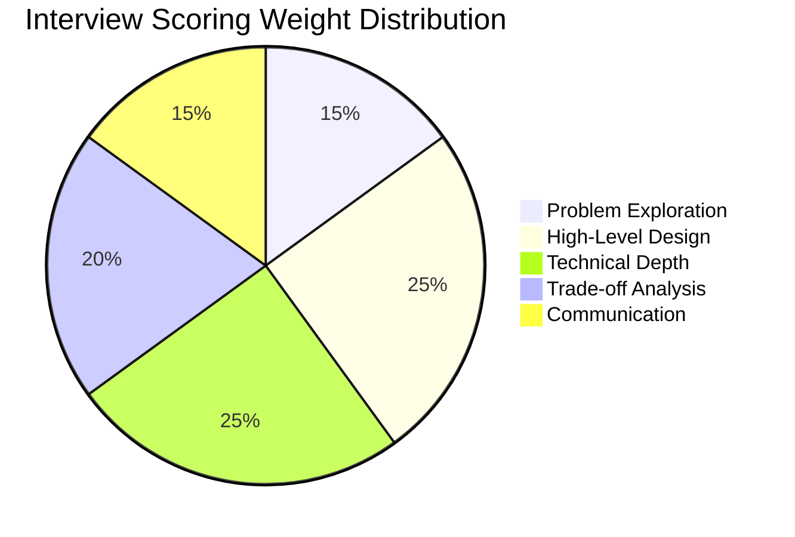
```mermaid
pie title Interview Scoring Weight Distribution
    "Problem Exploration" : 15
    "High-Level Design" : 25
    "Technical Depth" : 25
    "Trade-off Analysis" : 20
    "Communication" : 15
```

---

## 6.5 Practice Questions

### Tier 1: Foundational (L4 Target)

These problems test core skills — data modeling, API design, caching, and basic scaling.

1. **Design a URL shortener** — Hash generation, redirect optimization, analytics
2. **Design a paste tool (like Pastebin)** — Content storage, access control, expiration
3. **Design a rate limiter** — Token bucket, sliding window, distributed counting
4. **Design a key-value store** — In-memory storage, persistence, replication
5. **Design a cache system** — Eviction policies (LRU, LFU), cache invalidation
6. **Design a task queue** — Job scheduling, retry logic, dead letter queue

### Tier 2: Intermediate (L5 Target)

These problems test distributed systems awareness, trade-off reasoning, and component integration.

7. **Design Twitter** — Fan-out strategy, timeline ranking, celebrity problem
8. **Design Instagram** — Image processing pipeline, feed generation, CDN
9. **Design a chat system (WhatsApp)** — Message ordering, delivery guarantees, presence, E2E encryption
10. **Design a notification system** — Multi-channel delivery, rate limiting, user preferences
11. **Design a news feed** — Content ranking, personalization, real-time updates
12. **Design a web crawler** — URL frontier, politeness, deduplication, distributed coordination
13. **Design a search autocomplete** — Trie-based, frequency ranking, prefix matching
14. **Design a file sharing system (Google Drive)** — Sync protocol, conflict resolution, chunking

### Tier 3: Advanced (L6 Target)

These problems test end-to-end system thinking, operational awareness, and architectural leadership.

15. **Design Uber/Lyft** — Geospatial matching, real-time location, surge pricing, supply-demand balancing
16. **Design a video streaming platform (YouTube/Netflix)** — Transcoding, adaptive bitrate, CDN, recommendation
17. **Design an e-commerce platform** — Inventory management, payment orchestration, order state machine
18. **Design a distributed search engine (Google)** — Web crawling, indexing, ranking, serving
19. **Design a payment system (Stripe)** — Idempotency, ledger management, reconciliation
20. **Design a collaborative editor (Google Docs)** — Operational transformation, CRDT, conflict resolution
21. **Design a monitoring system (Datadog)** — Time-series storage, alerting, dashboards, high-cardinality metrics
22. **Design a global CDN** — Edge caching, cache invalidation, origin shielding, request routing
23. **Design a ticket booking system (airline/concert)** — Seat reservation, double-booking prevention, waitlist
24. **Design a location-based service (Yelp/Google Maps)** — Geospatial indexing, proximity search, reviews

### How to Practice

**The 3-Phase Practice Method:**

| Phase | Duration | Activity |
|-------|----------|----------|
| Phase 1: Learn | 2 weeks | Read this chapter, study the framework, memorize estimation numbers |
| Phase 2: Practice Solo | 2 weeks | Pick a problem, set a 45-minute timer, design on paper/whiteboard |
| Phase 3: Mock with Partner | 2 weeks | Practice with a partner who plays the interviewer role |

**For Each Practice Session:**

1. Set a 45-minute timer
2. Follow the 5-step framework strictly
3. After the timer, self-evaluate against the scoring rubric
4. Identify your weakest dimension and focus on improving it
5. Redo the same problem 1 week later — your second attempt should be significantly better

---

## 6.6 Anti-Patterns to Avoid

### In the Interview

| Anti-Pattern | Why It Fails | What to Do Instead |
|-------------|-------------|-------------------|
| Starting to draw immediately | Signals no process, likely to miss requirements | Spend 5 minutes on requirements first |
| "I would use microservices" (without justification) | Buzzword-driven design | Justify every architectural choice |
| Designing everything at the same depth | Runs out of time before the interesting parts | Scope aggressively, go deep on 1–2 components |
| Ignoring the interviewer's questions/hints | Misses signals about what they want to discuss | Treat hints as requirements, answer directly |
| Saying "it depends" without following up | Shows indecision, not nuance | Say "it depends on X. If X, then A. If not X, then B." |
| Claiming "no bottlenecks" | No system is bottleneck-free | Proactively identify at least 2 bottlenecks |
| Memorized answer delivery | Feels rehearsed, cannot adapt to follow-ups | Understand principles so you can reason from first principles |
| Over-engineering for scale you do not have | Adds complexity without justification | Match complexity to stated requirements |
| Under-communicating | Interviewer cannot evaluate what you are thinking | Narrate your thought process continuously |
| Ignoring non-functional requirements | Produces a design that "works" but cannot scale/survive failures | Always ask about scale, latency, availability |

### In the Design

| Anti-Pattern | Why It Fails | What to Do Instead |
|-------------|-------------|-------------------|
| Single database for everything | Cannot scale reads and writes independently | Identify distinct workloads, use appropriate stores |
| No caching layer | Forces every read to hit the database | Cache hot data, especially for read-heavy paths |
| Synchronous everything | One slow component blocks the entire request | Use async processing for non-critical path operations |
| No error handling discussion | Ignores the reality that components fail | Discuss failure modes and degraded behavior |
| Infinite scaling assumption | "Just add more servers" without considering state | Identify stateful components and plan for their scaling |
| Ignoring data consistency | Assumes data is always consistent without effort | Explicitly state the consistency model for each component |

---

## 6.7 Interview Communication Framework

### The STAR-D Method for System Design

Adapt the STAR method for system design responses:

- **S**ituation: Restate the problem and constraints
- **T**hink: Enumerate options (at least 2)
- **A**nalyze: Compare trade-offs
- **R**ecommend: Make a decision with justification
- **D**efend: Address potential objections

**Example Application:**

> **S:** "We need to store 200 TB of tweet data with 4,600 writes/sec and 230,000 reads/sec."
>
> **T:** "Two options: PostgreSQL with read replicas, or Cassandra with partitioning by user_id."
>
> **A:** "PostgreSQL gives us strong consistency and SQL flexibility but struggles with write throughput above 10K/sec on a single primary. Cassandra gives us linear write scalability and tunable consistency but requires careful partition key design and does not support ad-hoc joins."
>
> **R:** "I recommend Cassandra for tweet storage because write throughput is the dominant concern and we do not need joins — tweet lookups are by tweet_id or by user_id, both of which map well to Cassandra's partition model."
>
> **D:** "If the interviewer asks about consistency, I would note that we use async fan-out so eventual consistency is already built into the design. If they ask about operational complexity, I would note that managed Cassandra services (AWS Keyspaces, Astra) reduce operational burden."

---

# Section 7: Comprehensive Reference

## 7.1 System Design Patterns Quick Reference

| Pattern | When to Use | Key Benefit | Key Cost |
|---------|------------|-------------|----------|
| Load Balancer | Multiple server instances | Distributes traffic evenly | Additional hop, configuration |
| Reverse Proxy | Single or multiple servers | SSL termination, caching, compression | Additional hop |
| CDN | Static content, global users | Low latency, reduced origin load | Cache invalidation complexity |
| Cache-Aside | Read-heavy workloads | Reduces DB load | Cache invalidation, stale data |
| Write-Behind | Write-heavy with async tolerance | Fast writes, batching | Data loss risk if cache fails |
| CQRS | Different read/write models | Independent scaling | Eventual consistency, complexity |
| Event Sourcing | Audit trail, temporal queries | Complete history | Storage cost, replay complexity |
| Saga Pattern | Distributed transactions | Compensating transactions | Complex failure handling |
| Circuit Breaker | Inter-service communication | Prevents cascade failures | Complexity, latency during open state |
| Bulkhead | Resource isolation | Fault isolation | Resource waste (reserved pools) |
| Rate Limiting | API protection | Prevents abuse, ensures fairness | May reject legitimate traffic |
| Sharding | Data exceeds single node | Horizontal data scaling | Cross-shard queries, resharding |
| Read Replica | Read-heavy database workloads | Read throughput scaling | Replication lag, write bottleneck |
| Message Queue | Async processing | Decoupling, buffering | Added latency, ordering complexity |
| Pub/Sub | Event-driven architecture | Loose coupling, fan-out | Message ordering, at-least-once delivery |

## 7.2 Database Selection Quick Reference

| Requirement | Recommended Database | Why |
|-------------|---------------------|-----|
| Relational data, ACID transactions | PostgreSQL, MySQL | Strong consistency, SQL, mature tooling |
| High write throughput, append-only | Cassandra, ScyllaDB | LSM-tree, linear write scaling |
| Key-value lookups, low latency | Redis, DynamoDB | In-memory or SSD-optimized, simple model |
| Full-text search | Elasticsearch, OpenSearch | Inverted index, relevance scoring |
| Time-series data | InfluxDB, TimescaleDB | Optimized for time-ordered writes and aggregations |
| Graph data, relationship queries | Neo4j, Neptune | Graph traversal algorithms, Cypher/Gremlin |
| Document storage, flexible schema | MongoDB, CouchDB | Schema flexibility, horizontal scaling |
| Analytical workloads (OLAP) | ClickHouse, BigQuery, Redshift | Columnar storage, fast aggregations |
| Object/blob storage | S3, GCS, Azure Blob | Unlimited scale, low cost per GB |
| Session/cache data | Redis, Memcached | In-memory, sub-millisecond latency |

## 7.3 Protocol Selection Quick Reference

| Requirement | Protocol | Why |
|-------------|----------|-----|
| Standard web API | REST over HTTP/2 | Universal support, caching, stateless |
| Internal service-to-service | gRPC | Binary protocol, schema-enforced, streaming |
| Real-time bidirectional | WebSocket | Full-duplex, low overhead after handshake |
| Real-time server-to-client | Server-Sent Events (SSE) | Simpler than WebSocket for one-way push |
| High-throughput messaging | Kafka, Pulsar | Durable, ordered, scalable |
| Request-reply messaging | RabbitMQ, SQS | Simple queue semantics, dead letter support |
| Mobile-friendly, flexible queries | GraphQL | Client-specified fields, reduces over-fetching |
| IoT, low bandwidth | MQTT | Tiny overhead, QoS levels, pub/sub |

## 7.4 Estimation Templates

### Template 1: Social Media Platform

```
Users:
  MAU = ___
  DAU = ___ (typically 50-70% of MAU)
  Concurrent = ___ (typically 5-10% of DAU)

Content:
  Posts per user per day = ___
  Reads per user per day = ___
  Average post size = ___ bytes
  Media attachment rate = ___%

QPS:
  Write QPS = DAU * posts_per_day / 86,400
  Read QPS = DAU * reads_per_day / 86,400
  Peak multiplier = 3x

Storage:
  Daily text = write_qps * 86,400 * avg_post_size
  Daily media = write_qps * 86,400 * media_rate * avg_media_size
  Annual = daily * 365
  Retention = annual * years

Bandwidth:
  Ingress = write_qps * avg_request_size
  Egress = read_qps * avg_response_size
```

### Template 2: Messaging System

```
Users:
  Total users = ___
  DAU = ___
  Messages per user per day = ___
  Average message size = ___ bytes
  Group messages = ___% (fan-out factor = ___)

QPS:
  Message send QPS = DAU * msgs_per_day / 86,400
  Message delivery QPS = send_qps * (1 + group_rate * fan_out_factor)
  Peak = 3-5x average

Storage:
  Daily = send_qps * 86,400 * avg_msg_size
  With media: daily * (1 + media_rate * media_size_factor)

Connection:
  Concurrent WebSocket connections = concurrent_users
  Connection server capacity = 50,000-100,000 per server
  Servers needed = concurrent_users / 50,000
```

### Template 3: E-Commerce Platform

```
Users:
  DAU = ___
  Browse sessions per day = ___
  Pages per session = ___
  Conversion rate = ___%
  Orders per day = DAU * conversion_rate

QPS:
  Page view QPS = DAU * sessions * pages / 86,400
  Search QPS = page_view_qps * 0.3 (30% of views are searches)
  Add-to-cart QPS = page_view_qps * 0.05
  Checkout QPS = orders_per_day / 86,400
  Peak = 5-10x for flash sales

Storage:
  Product catalog = num_products * avg_product_size
  Order history = orders_per_day * avg_order_size * 365 * years
  Product images = num_products * images_per_product * avg_image_size

Payment:
  Payment QPS = checkout_qps
  Payment latency budget = 2-5 seconds (external PSP)
```

---

## 7.5 Architecture Decision Record Template

Use this template for documenting key design decisions during an interview. You do not need to write it out, but thinking through these sections ensures thorough decision-making.

```
ADR-NNN: [Decision Title]

Status: [Proposed | Accepted | Deprecated | Superseded]
Date: [YYYY-MM-DD]

Context:
  [What is the situation that requires a decision? What constraints exist?
   What scale/performance requirements apply?]

Decision:
  [What is the decision? Be specific about the technology, pattern, or
   approach chosen.]

Rationale:
  [Why was this decision made? What trade-offs were considered? What
   evidence or reasoning supports this choice?]

Consequences:
  [What are the positive and negative consequences of this decision?
   What new constraints or risks does it introduce?]

Alternatives Considered:
  [What other options were evaluated? Why were they rejected?]
```

---

## 7.6 Final Checklist: Before Your Interview

### Knowledge Checklist

- [ ] Can you convert DAU to QPS without hesitation?
- [ ] Do you know the latency numbers table by heart (order of magnitude)?
- [ ] Can you estimate storage for text, images, and video?
- [ ] Can you explain CAP theorem with real examples?
- [ ] Do you know when to use SQL vs NoSQL?
- [ ] Can you describe at least 3 caching strategies?
- [ ] Can you explain fan-out on write vs fan-out on read?
- [ ] Can you describe the Saga pattern for distributed transactions?
- [ ] Do you know how consistent hashing works?
- [ ] Can you explain sharding strategies and their trade-offs?

### Process Checklist

- [ ] Can you complete the 5-step framework in 45 minutes?
- [ ] Do you spend exactly 5–8 minutes on requirements?
- [ ] Do you perform estimation and reference the numbers later?
- [ ] Can you identify the read path and write path for any system?
- [ ] Do you proactively identify bottlenecks?
- [ ] Can you articulate trade-offs using "I chose X over Y because Z"?
- [ ] Do you adapt when the interviewer pushes back?
- [ ] Do you narrate your thought process continuously?

### Practice Checklist

- [ ] Have you done at least 5 full mock interviews (45 minutes each)?
- [ ] Have you practiced with a partner who gives feedback?
- [ ] Have you practiced on a whiteboard or virtual whiteboard (not just mentally)?
- [ ] Have you re-done a problem you struggled with after 1 week?
- [ ] Have you practiced problems from all three tiers?

---

## 7.7 The Meta-Skill: Learning to Think

This chapter has provided frameworks, checklists, and walkthroughs. But the ultimate skill is not following a framework — it is **thinking clearly about complex systems under uncertainty**.

The framework is training wheels. After enough practice, the framework becomes internalized and you think through the steps naturally. At that point, the interview feels like a conversation between two engineers discussing a real problem — which is exactly what it should feel like.

### The Three Levels of System Design Mastery

**Level 1: Knowledge** — You know the building blocks (databases, caches, queues, load balancers). You can describe how each works.

**Level 2: Application** — You can combine building blocks into a coherent architecture for a given problem. You follow the framework.

**Level 3: Judgment** — You can evaluate trade-offs, predict failure modes, estimate costs, and adapt designs in real-time. You drive the conversation.

Level 1 is necessary but not sufficient. Level 2 gets you through most interviews. Level 3 is what makes you a staff-level engineer.

The path from Level 1 to Level 3 is practice, reflection, and real-world experience. There is no shortcut.

---

## Summary

This capstone chapter has covered the complete system design interview toolkit:

1. **The Five-Step Framework** — Requirement gathering, capacity estimation, high-level design, deep dive, and trade-offs. Each step produces outputs consumed by the next.

2. **Trade-off Analysis** — Seven fundamental axes (consistency vs availability, latency vs throughput, cost vs performance, simplicity vs flexibility, read vs write optimization, SQL vs NoSQL, monolith vs microservices) with decision frameworks for each.

3. **Bottleneck Analysis** — Five categories of bottlenecks (database, network, compute, storage, scaling) with detection methods and resolution strategies.

4. **Scaling Strategy** — A four-stage progression from vertical scaling through horizontal, data-tier, and geographic scaling.

5. **Cost Awareness** — Cloud cost models, optimization strategies, and build vs buy analysis.

6. **Mock Walkthroughs** — Complete design walkthroughs for Twitter, Uber, and a URL shortener, with scoring rubrics and 24 practice questions.

The core message: system design interviews reward **clear thinking, structured communication, and defensible trade-off decisions** — not memorized architectures or buzzword-driven answers.

---

## Connections to Other Chapters

| Chapter | Connection |
|---------|-----------|
| F1: Scalability Fundamentals | Capacity estimation, scaling progressions |
| F2: CAP Theorem & Consistency | Consistency vs availability trade-offs |
| F3: Distributed Systems Patterns | Component design patterns |
| F4: Consensus & Coordination | Leader election, distributed locking |
| F5: Data Storage & Retrieval | Database selection, indexing strategies |
| F6: Caching Strategies | Cache-aside, write-through, invalidation |
| F7: Data Partitioning | Sharding strategies, hot partition handling |
| F8: Communication Patterns | API design, protocol selection |
| F9: Event-Driven Architecture | Async processing, fan-out, Kafka |
| F10: Reliability Engineering | Failure modes, circuit breakers, retries |
| F11: Observability & Monitoring | Bottleneck detection, operational awareness |
| Part 5: Real-World Systems | All mock interview problems draw from these chapters |

---

*This concludes Part 0 — System Design Foundations & Principles. The twelve chapters in this part have built a complete mental model for reasoning about distributed systems. The subsequent parts (1–9) apply these foundations to specific domains, patterns, and production systems.*
