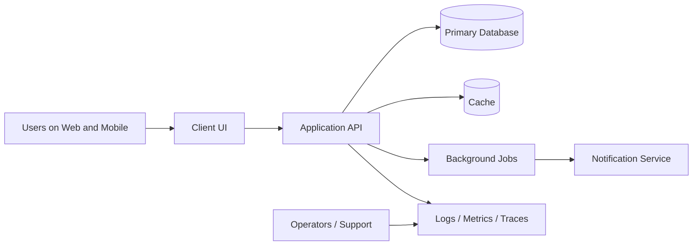
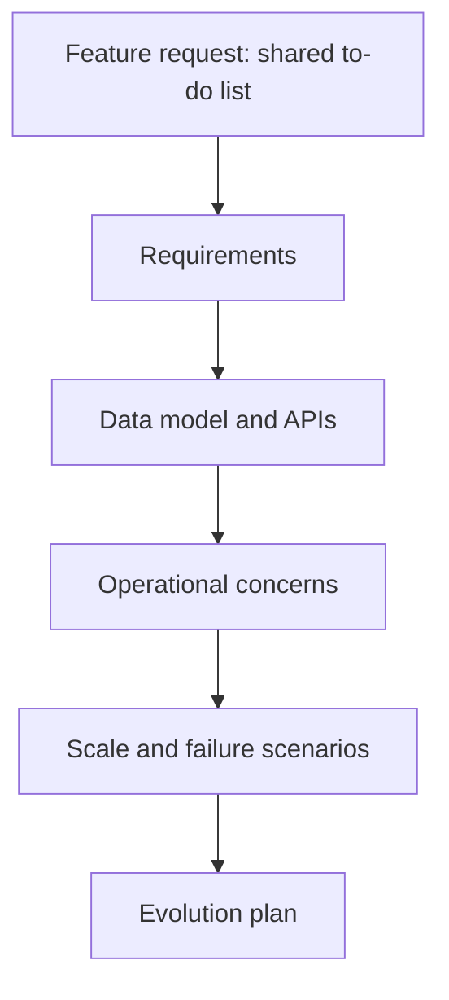

# 1. What is System Design?

## Part Context
**Part:** Part 1 - Foundations of System Design  
**Position:** Chapter 1 of 42  
**Why this part exists:** This opening section gives the reader the language, framing, and mental models needed to reason about systems before choosing technologies.  
**This chapter builds toward:** requirements analysis, estimation, architecture reviews, and the ability to reason about systems as evolving business assets rather than isolated code modules

## Overview
System design is the practice of deciding how software, data, infrastructure, and operational processes should work together to solve a business problem. It sits between raw product ideas and implementation details. A good design is concrete enough that engineers can build it, but broad enough that it accounts for scale, reliability, growth, and change.

Beginners often think about code in terms of functions, classes, APIs, or pages. Architects think in terms of flows, constraints, trade-offs, ownership boundaries, and failure modes. That shift in perspective is the real starting point of system design. You are no longer asking only, "How do I implement this feature?" You are asking, "What shape should the entire system take so that this feature keeps working as the product grows?"

This chapter opens the book by defining what a system actually includes, why design matters even for small products, and how simple applications such as a To-Do app become meaningful system design exercises once multiple users, clients, data stores, and operational needs enter the picture.

## Why This Matters in Real Systems
- It teaches you to connect product goals, user flows, technical constraints, and operational reality before choosing tools.
- It prevents the common mistake of treating architecture as a decorative diagram instead of a set of decisions with real cost and failure consequences.
- It creates the foundation for every later topic in the repository, from caching and databases to distributed transactions and observability.
- It maps directly to how senior engineers and interviewers evaluate design thinking: clarity, prioritization, and trade-off awareness.

## Core Concepts
### System boundary
A system includes everything necessary to deliver and operate the product capability: clients, APIs, background jobs, storage, monitoring, deployment pipelines, and sometimes the human processes used to support or recover it.

### Design goals and constraints
Every system exists within product, team, budget, regulatory, and time constraints. Design quality comes from making those constraints explicit and choosing a structure that fits them.

### System thinking vs application thinking
Application thinking asks whether a feature works. System thinking asks how that feature behaves under load, under failure, across teams, and after three more years of product evolution.

### Trade-offs as the center of architecture
No design maximizes everything simultaneously. Better latency may require more cost. Simpler operations may reduce flexibility. Strong consistency may reduce availability during partitions. System design is the art of choosing consciously.

## Key Terminology
| Term | Definition |
| --- | --- |
| System Boundary | The line between what the design is responsible for and what it depends on externally. |
| Architecture | The high-level structure of components, responsibilities, interfaces, and data flows in a system. |
| Scalability | The ability of a system to handle growth in traffic, data, users, or complexity. |
| Reliability | How consistently the system does the correct thing over time. |
| Availability | How often the system is reachable and usable when users need it. |
| Latency | The time taken for a request or workflow step to complete. |
| Bottleneck | The resource or component that most limits system performance or throughput. |
| Trade-off | A deliberate choice where improving one property affects another property, cost, or complexity. |

## Detailed Explanation
### From idea to operating system
Suppose a product manager asks for a collaborative To-Do app. At the feature level, that sounds like task creation, list updates, reminders, and sharing. At the system level, it expands immediately: authentication, mobile synchronization, data storage, notification delivery, offline behavior, access control, backups, monitoring, and support for future growth. The system is larger than the feature list because users do not experience code modules. They experience end-to-end flows.

### What counts as part of the system
A useful beginner heuristic is this: if a missing component would prevent the product from working reliably, it belongs in the design conversation. That usually includes client applications, the request path, background workers, storage systems, observability, deployment processes, and operational fallbacks. It also includes third-party dependencies such as payment gateways or email providers, because they shape failure modes and reliability planning.

### Why even small products need design
Many developers associate system design with massive products like YouTube or Uber. In reality, small systems also need design. The difference is scale of consequence, not existence of architecture. A small internal tool may value fast delivery and low maintenance. A public financial API may value auditability and strict access controls. Both are system design problems, but the right answer differs because the constraints differ.

### Edge cases reveal architecture quality
A design looks simple on the happy path. Its quality becomes visible at the edges: a slow database, a user editing the same record from two devices, a backlog of reminder jobs, a region outage, a surge in signups, or a support request asking why data disappeared. Architects get paid to think about these edges before they become incidents.

### Design is a living activity
Architecture is not a one-time document produced at the beginning of a project. A system changes as user behavior, team structure, regulation, and load patterns change. Good design therefore includes an evolution path: what the simplest starting version should be, what bottlenecks are likely to appear first, and which future changes should be easy instead of painful.

## Diagram / Flow Representation
### System View

### From Feature Thinking to System Thinking

## Real-World Examples
- Amazon cannot design checkout as a page alone; it must design inventory checks, payment correctness, fraud workflows, retries, and customer support visibility together.
- Netflix does not think of video playback as a single API call. It thinks in terms of encoding pipelines, edge delivery, observability, retries, and device compatibility.
- Google Search is not just ranking logic. It is crawling, indexing, storage, caching, latency management, abuse protection, and a global serving path.
- Even a simple workplace approvals tool becomes a system when identity, audit trails, role-based access, and notification guarantees matter.

## Case Study
### To-Do App: from CRUD app to real system

A To-Do application is a strong teaching case because it begins as a simple CRUD system but quickly becomes more interesting when you add collaboration, reminders, multiple devices, offline use, and search.

### Requirements
- Users can create, update, complete, delete, and organize tasks into lists.
- Users can access the same data from web and mobile clients.
- Shared lists allow multiple users to collaborate with access control.
- Reminder notifications should be delivered at scheduled times.
- The product should feel responsive even as tasks, users, and reminder volume grow.

### Design Evolution
- Version 1 can be a modular monolith with one API, one relational database, and a scheduled worker for reminders.
- As mobile usage grows, synchronization and conflict resolution become important because the same list may be edited from multiple devices.
- As collaboration increases, access-control checks and notification fan-out become part of the critical system path.
- If search, attachments, analytics, or recurring tasks are added later, the system may introduce specialized subsystems such as search indexes, object storage, or background event processing.

### Scaling Challenges
- Hot users or large shared lists can create uneven traffic patterns.
- Reminder jobs can spike at common times such as the start of the workday.
- Offline edits can create merge or ordering challenges when clients reconnect.
- A naive design may keep everything synchronous and cause slow writes whenever notifications or analytics are added.

### Final Architecture
- A client layer for web and mobile apps backed by a single API entry point.
- A primary relational database for task, list, membership, and audit metadata.
- A background job system for reminders, digest emails, and non-critical fan-out work.
- A cache for hot list reads if usage becomes read-heavy.
- Observability for latency, failed jobs, synchronization conflicts, and notification delivery health.

## Architect's Mindset
- Start with the user flow, not the technology stack.
- Keep the first version as simple as the real requirements allow, but make future pressure points visible.
- Think about the full lifecycle of a request: request path, write path, retry path, failure path, and operator path.
- Design boundaries around ownership and change frequency, not around buzzwords.
- Make trade-offs explicit enough that another engineer can explain why the design is shaped the way it is.

## Common Mistakes
- Equating system design with drawing many microservices even when the system is still small.
- Ignoring non-functional concerns such as reliability, latency, and operability until after implementation starts.
- Defining the system too narrowly and forgetting dependencies such as notification providers, auth systems, or analytics pipelines.
- Designing for massive scale with no evidence while neglecting the evolution path from today to tomorrow.
- Talking about components without explaining data flow, ownership boundaries, or failure behavior.

## Interview Angle
- This topic appears indirectly in almost every system design interview because interviewers want to see whether you can define the problem before solving it.
- Strong candidates begin with requirements, users, scale assumptions, and success criteria rather than naming technologies immediately.
- Interviewers expect you to think about trade-offs, not just produce a diagram. Explaining why a monolith is good enough today can be stronger than forcing a distributed design.
- A solid answer usually includes system boundaries, critical flows, likely bottlenecks, and a believable evolution path.

## Quick Recap
- System design is the practice of shaping end-to-end software systems, not just writing isolated features.
- A system includes clients, services, storage, background work, operational tooling, and external dependencies.
- The real shift is from application thinking to system thinking: scale, failure, change, and team ownership.
- Trade-offs are unavoidable and should be explained explicitly.
- Even a small To-Do app becomes a valid architecture exercise when viewed across multiple users, devices, and operational requirements.

## Practice Questions
1. How would you explain the difference between a feature design and a system design to a junior engineer?
2. What components are commonly forgotten when people define a system boundary too narrowly?
3. Why is a To-Do app still useful as a system design case study?
4. What would change first if the To-Do app added collaboration and notifications?
5. How do constraints such as team size and time-to-market change the right architecture?
6. When is a simple monolith the architecturally correct choice?
7. What questions would you ask before deciding whether search or caching is needed?
8. How would you describe the failure path of a reminder notification workflow?
9. What signals would tell you that the initial architecture is reaching its limits?
10. How would you communicate trade-offs in a design review so they are easy to defend later?

## Further Exploration
- Continue to the requirements chapter to learn how good design starts from clarified problem statements.
- Practice drawing the system boundary for products you already know, such as chat, banking, or ride-sharing.
- Revisit this chapter after reading the real-world design chapters and notice how the same thinking scales upward.

## Navigation
- Next: [Types of Requirements](02-types-of-requirements.md)
