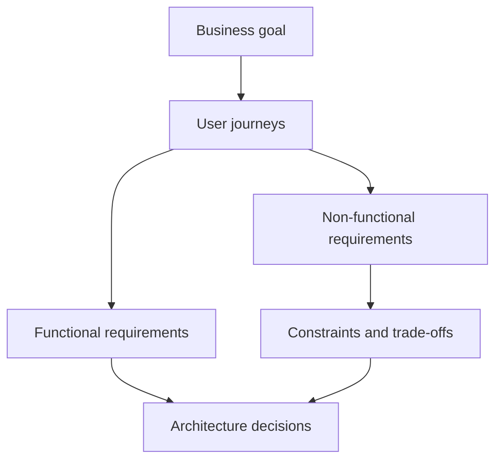
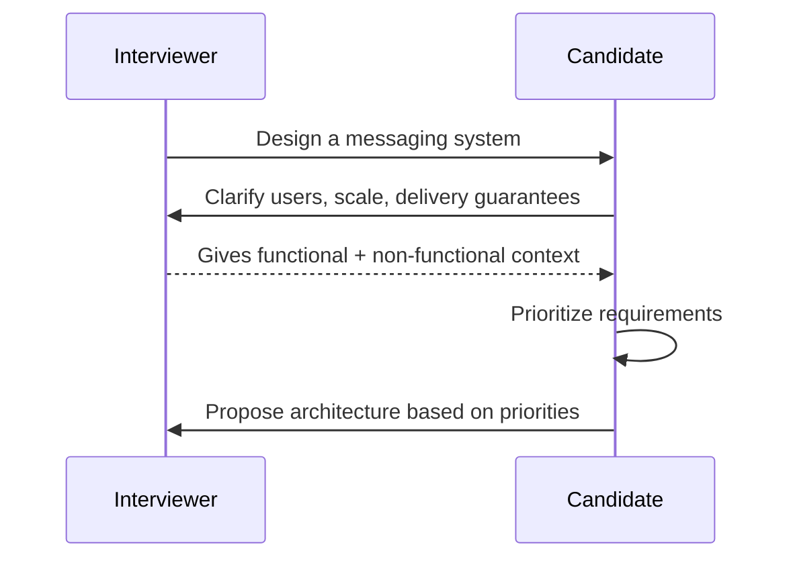

# 2. Types of Requirements

## Part Context
**Part:** Part 1 - Foundations of System Design  
**Position:** Chapter 2 of 60
**Why this part exists:** This opening section gives the reader the language, framing, and mental models needed to reason about systems before choosing technologies.  
**This chapter builds toward:** capacity planning, component selection, interview framing, and clearer design reviews

## Overview
Requirements are the input to design. Before choosing a database, a queue, or a service boundary, you need to know what the system must do and what qualities it must preserve while doing it. In practice, bad requirements lead to bad architecture faster than bad technology choices do.

The two big categories are functional requirements and non-functional requirements. Functional requirements describe behavior: what features the system must provide. Non-functional requirements describe qualities such as performance, availability, consistency, reliability, security, and cost. A system can satisfy every feature request and still fail because the non-functional requirements were ignored.

## Why This Matters in Real Systems
- Requirements determine which trade-offs matter and which ones are irrelevant noise.
- They prevent architects from solving the wrong problem with the right technology.
- They help teams prioritize what must be correct, what must be fast, what can be delayed, and what can be simplified.
- They are one of the first things interviewers test, because poor requirement framing leads to weak design from the start.

## Core Concepts
### Functional requirements
These describe business behavior, user actions, and visible capabilities such as sending messages, processing orders, or searching products.

### Non-functional requirements
These define quality targets such as latency, throughput, consistency, reliability, privacy, observability, compliance, and total cost of operation.

### Constraints, assumptions, and exclusions
A good design conversation includes limits. Budget, team maturity, release deadline, region restrictions, and existing systems all shape the solution.

### Prioritization and measurable targets
Requirements become architecturally useful when they are ranked and made measurable. “Fast” is vague. “p95 under 200 ms for reads” is actionable.

## Key Terminology
| Term | Definition |
| --- | --- |
| Functional Requirement | A statement of what the system should do from a business or user perspective. |
| Non-Functional Requirement | A statement of how well the system must behave under real operating conditions. |
| Latency | The time required for a request or workflow to complete. |
| Throughput | The volume of work a system can process over time. |
| Availability | The percentage of time the system is operational and reachable. |
| Durability | The confidence that accepted data will not be lost. |
| Consistency | The degree to which different readers see the same view of data. |
| Constraint | A limitation or condition that narrows the valid design space. |

## Detailed Explanation
### Start with the job the system must do
Functional requirements describe the job to be done. They are often the easiest part for teams to talk about because they map directly to features. But good architecture requires digging deeper: who performs the action, how often, under what load, with which failure tolerance, and with what business consequence if it goes wrong?

### Non-functional requirements are often the true architecture drivers
The sentence “users can send messages” is not what decides whether you need WebSockets, durable queues, regional replicas, or strong encryption. The deciding factors are latency tolerance, delivery guarantees, ordering requirements, privacy expectations, and mobile battery constraints. In other words, non-functional requirements often shape the architecture more than the feature sentence does.

### Requirements often conflict
A team may ask for the system to be globally low-latency, strongly consistent, very cheap, and easy to evolve. Those goals do not always align. Architects therefore need to identify which requirements are hard constraints and which are preferences. For example, a banking system may prioritize correctness and auditability above all else, while a social media system may prioritize responsiveness and scale over perfectly synchronized counters.

### Measurable requirements improve design quality
Architecture gets stronger when fuzzy goals are translated into targets. Instead of “the app should be fast,” ask for p95 latency goals, expected peak QPS, recovery-time objectives, acceptable data loss windows, retention requirements, or per-user cost targets. These numbers make trade-offs discussable and make estimates possible in the next chapter.

### Edge cases reveal missing requirements
Some of the most important requirements appear only when you ask uncomfortable questions. Should messages be delivered while the user is offline? What happens when a payment provider times out? Can admins override user data? How long must audit logs be kept? What happens during a regional outage? These are not nice-to-have questions; they define the architecture.

## Diagram / Flow Representation
### Requirement Funnel

### Clarification Flow in a Design Interview

## Real-World Examples
- WhatsApp requires messaging, group chat, and media sharing as functional needs, but low latency, privacy, and offline delivery are the deeper architecture drivers.
- Amazon checkout requires adding items, placing orders, and processing payments, but consistency, fraud protection, and auditability dominate the system design.
- Netflix home page requirements include listing content and playing video, but personalized recommendations, regional delivery speed, and cost-efficient streaming define the actual architecture.
- Google Drive needs file storage and sharing features, but collaboration latency, version history, permission models, and storage durability shape the system far more deeply.

## Case Study
### WhatsApp requirements breakdown

WhatsApp is a good requirement-analysis exercise because the visible feature set sounds simple, but the real system is driven by latency, reliability, privacy, and mobile constraints.

### Requirements
- Users can send one-to-one messages, group messages, images, videos, and documents.
- Users can see delivery acknowledgments, read receipts, and basic presence information.
- Messages should work across unreliable mobile networks and across temporary disconnects.
- Chat history should remain durable enough that users do not lose accepted messages.
- Security expectations are high: privacy, access control, and encrypted transport are non-negotiable.

### Design Evolution
- An early version may support one-to-one messaging with a simple store-and-forward model and limited presence signaling.
- As group messaging grows, fan-out behavior, ordering, and delivery guarantees become far more important.
- As multiple devices per user are supported, synchronization, read receipts, and conflict handling become more complex.
- As global scale grows, regional routing, queue durability, and the difference between message consistency and presence consistency become design-defining.

### Scaling Challenges
- Presence updates are frequent and ephemeral, so they should not be treated like durable messages.
- Delivery guarantees matter much more for messages than for typing indicators or “last seen” state.
- Mobile battery and bandwidth constraints make chat architecture different from desktop-first systems.
- Security features influence storage, transport, and device synchronization design.

### Final Architecture
- A durable message path backed by persistent storage and per-recipient delivery queues.
- Separate handling for ephemeral signals such as typing and presence.
- Strongly defined delivery lifecycle states such as sent, delivered, and read.
- Security controls that treat message content and metadata carefully across the request path.
- Regional infrastructure and observability tuned for latency, queue health, and message loss prevention.

## Architect's Mindset
- Translate vague business language into measurable design inputs.
- Identify the two or three non-functional requirements that dominate the architecture.
- Separate must-have requirements from preferences so the design space remains realistic.
- Document assumptions explicitly because hidden assumptions become future incidents or interview weak points.
- Use requirements to justify design choices, not to justify a preferred technology.

## Common Mistakes
- Treating all requirements as equally important instead of ranking them.
- Starting architecture discussion before clarifying scale, consistency, or availability expectations.
- Failing to turn vague statements like “fast” or “secure” into actionable targets or constraints.
- Ignoring operational or legal constraints such as retention, compliance, or regional deployment rules.
- Assuming every workflow in a product needs the same consistency and latency guarantees.

## Interview Angle
- This topic is usually tested at the start of a system design interview when the interviewer gives a broad problem statement.
- Interviewers expect strong candidates to ask clarifying questions about users, usage patterns, scale, latency, consistency, and constraints before presenting a design.
- A high-quality answer explicitly distinguishes functional requirements from non-functional requirements and prioritizes them.
- If requirements conflict, explain the trade-off rather than pretending the system can maximize everything at once.

## Quick Recap
- Functional requirements describe what the system does; non-functional requirements describe how well it must do it.
- Architecture is often driven more by non-functional requirements than by feature lists alone.
- Requirements become useful when they are measurable, ranked, and bounded by constraints.
- Good architects ask clarifying questions until the real problem is clear.
- Requirement quality strongly predicts design quality.

## Practice Questions
1. How would you explain the difference between functional and non-functional requirements to a new engineer?
2. Why do non-functional requirements often influence architecture more than feature descriptions?
3. What follow-up questions would you ask before designing a food delivery platform?
4. How would you convert “the app should be fast” into measurable requirements?
5. Which WhatsApp requirements can tolerate eventual consistency and which cannot?
6. How do regulatory or compliance constraints affect design even when they are not user-facing features?
7. What problems arise when teams do not rank requirements explicitly?
8. How would you capture assumptions in a design document so they can be challenged later?
9. Why is requirement gathering one of the strongest signals in a system design interview?
10. What is an example of a feature that looks simple until non-functional requirements are considered?

## Further Exploration
- Continue to capacity planning so you can convert requirements into estimates and infrastructure choices.
- Practice requirement breakdowns for products such as ride-sharing, streaming, and document collaboration.
- As you study later chapters, trace each architecture pattern back to the requirement it solves.

## Navigation
- Previous: [What is System Design?](01-what-is-system-design.md)
- Next: [Estimation & Capacity Planning](03-estimation-capacity-planning.md)
