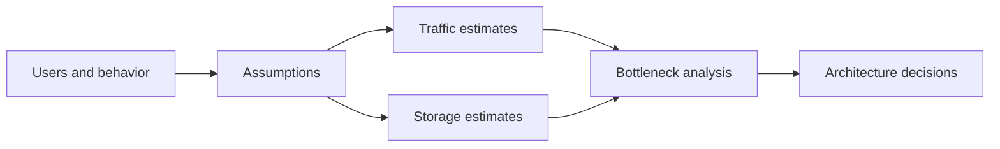
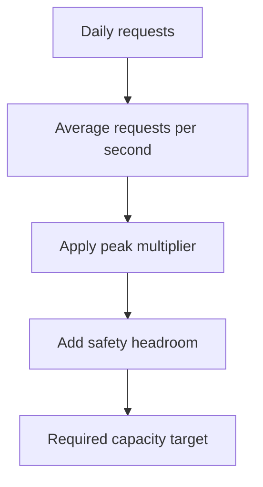

# 3. Estimation & Capacity Planning

## Part Context
**Part:** Part 1 - Foundations of System Design  
**Position:** Chapter 3 of 60
**Why this part exists:** This opening section gives the reader the language, framing, and mental models needed to reason about systems before choosing technologies.  
**This chapter builds toward:** credible high-level design, bottleneck identification, and interview-ready back-of-the-envelope reasoning

## Overview
System design becomes real when numbers enter the conversation. Capacity planning is the process of translating user behavior and product requirements into rough but useful estimates for throughput, storage, bandwidth, and compute. The goal is not mathematical perfection. The goal is architectural realism.

When an architect says “this will probably need caching” or “this database will become the bottleneck first,” that judgment is usually backed by quick mental math. These estimates help decide whether a single database is enough, whether background processing is necessary, and which parts of the design deserve optimization first.

## Why This Matters in Real Systems
- Estimation prevents both under-design and expensive over-design.
- It helps you identify the likely bottleneck before you spend time optimizing the wrong layer.
- It provides the numbers needed to justify architectural choices in design reviews and interviews.
- It trains the habit of reasoning from user behavior rather than from technology marketing.

## Core Concepts
### Back-of-the-envelope estimation
Quick calculations based on simple assumptions are often enough to size the first version of a system and understand pressure points.

### Traffic estimation
Average load is useful, but peak load is usually what breaks systems. Estimation therefore needs both daily volume and concentration behavior.

### Storage estimation
Raw object size is only the beginning. Replication, indexes, metadata, backups, thumbnails, logs, and retention all expand the real number.

### Read-write ratio and bottlenecks
Architectures are shaped differently by read-heavy, write-heavy, and compute-heavy workloads. Estimation tells you which shape you are dealing with.

## Key Terminology
| Term | Definition |
| --- | --- |
| QPS | Queries or requests per second; a common throughput estimate for API traffic. |
| Peak Traffic | The highest expected concentration of load in a short time window. |
| Replication Factor | The number of data copies maintained for availability or durability. |
| Headroom | Extra reserved capacity to handle bursts, incidents, or forecast error. |
| Bandwidth | The rate at which data can be transferred across a network path. |
| Retention | How long data must be stored before deletion or archival. |
| Read-Write Ratio | The relative number of reads versus writes in the workload. |
| Hotspot | A concentrated source of traffic or data access that overloads one part of the system. |

## Detailed Explanation
### Start from product behavior, not server counts
A strong estimate begins with users and actions: daily active users, requests per session, uploads per day, average object size, and expected peak concentration. Hardware sizing comes later. This keeps the reasoning grounded in product behavior rather than vague infrastructure intuition.

### Always estimate peaks, not just averages
If a system receives 100 million reads per day, the average might look manageable, but traffic is never evenly distributed. Peak hours, market events, product launches, and regional traffic patterns create concentrated spikes. Systems usually fail at the peak, not at the average.

### Storage numbers grow through multipliers
Suppose each object is 1 MB. That is not the final storage estimate. You may also store thumbnails, metadata, indexes, logs, backups, or multiple encoded versions. Replication multiplies the result again. Good capacity planning therefore uses expansion factors instead of raw object size alone.

### Estimation should change the design
If the result of your estimate does not influence your architecture, the exercise is incomplete. A very high read volume may justify caches and CDN layers. A high write stream may require partitioning or queues. A modest internal workload may prove that a simple monolith is still the right answer.

### Sanity checks matter
Estimates do not need to be exact, but they should be internally consistent. If your numbers imply an impossibly large cluster for a tiny product, check your assumptions. If your storage number looks too small to account for replication and retention, check again. Architects use estimates to reason, not to impress.

## Diagram / Flow Representation
### Estimation Workflow

### From Daily Traffic to Peak QPS

## Real-World Examples
- Twitter-like timelines are usually read-heavy, so caches and fan-out strategies are often driven by read-volume estimates rather than write counts alone.
- YouTube-like systems must estimate raw uploads, transcoded renditions, thumbnails, and CDN egress, not just original file storage.
- Amazon-style sale events force teams to design for short intense spikes, not for average daily traffic.
- WhatsApp-like chat systems may have moderate message sizes but extremely high message frequency, making throughput and queue sizing central.

## Case Study
### Estimating a Twitter-like system

A microblogging platform is a good estimation case because it combines write traffic, feed reads, media attachments, and skewed popularity. The numbers do not need to be exact; they need to reveal the right architectural pressure points.

### Requirements
- Users can publish short posts, follow accounts, and read personalized timelines.
- The system should support a very large daily active population with global traffic distribution.
- Timeline reads should feel fast and continuously fresh enough for a consumer social product.
- Posts and metadata should be durable, and popular accounts may generate traffic far above the average user.
- The architecture should remain cost-aware instead of blindly overprovisioned.

### Design Evolution
- Start by estimating posts per user per day and total daily writes.
- Estimate timeline refresh frequency separately because reads usually dominate writes in social products.
- Add storage for post text, metadata, secondary indexes, media references, replication, and long-term retention.
- Use the resulting read-write ratio to decide whether the first bottleneck is likely to be database reads, feed generation, cache pressure, or write ingestion.

### Scaling Challenges
- Celebrity or news-event spikes create extreme skew that invalidates simple average-based models.
- Timeline generation can become more expensive than raw post creation because one write may fan out to many followers.
- Hot content drives cache churn and can overload downstream stores if misses are not controlled.
- Media attachments and analytics expand storage and bandwidth beyond the base text workload.

### Final Architecture
- A write path optimized for ingesting posts durably and asynchronously triggering downstream fan-out or feed updates.
- A read path protected by caches and possibly precomputed or hybrid feed models.
- Storage separated between metadata, media references, and large binary objects.
- Capacity plans that reserve headroom for event spikes and partial-failure scenarios.
- Metrics and observability that track QPS, miss rate, storage growth, and queue lag over time.

## Architect's Mindset
- Make assumptions explicit enough that others can challenge them.
- Estimate for the peak and then add headroom for burstiness, failure, and forecasting error.
- Use numbers to justify complexity; do not add sharding or queues just because they sound advanced.
- Revisit estimates as the product changes because old assumptions quietly become dangerous.
- Ask which number is most likely to break the system first, not just which number is easiest to compute.

## Common Mistakes
- Planning with average QPS and ignoring peak concentration.
- Estimating raw object size but forgetting replication, backups, derived data, and indexes.
- Producing numbers that never influence the actual architecture decision.
- Assuming traffic is evenly distributed across users, keys, or regions.
- Treating capacity planning as a one-time spreadsheet instead of an evolving part of system ownership.

## Interview Angle
- Estimation is a standard part of system design interviews because it reveals whether you can reason from first principles.
- Interviewers do not usually expect precise real-world numbers. They expect a clear method, explicit assumptions, and a sanity-checked conclusion.
- Strong candidates explain how the estimates change the architecture: for example, whether caching, partitioning, or async processing becomes justified.
- A good interview answer shows formulas, assumptions, peak multipliers, and the likely bottleneck.

## Quick Recap
- Capacity planning translates user behavior into traffic, storage, and bandwidth expectations.
- Average traffic is useful, but peak traffic usually determines design pressure.
- Replication, indexes, and derived artifacts expand storage beyond raw object size.
- Read-write ratio helps reveal the likely bottleneck and the right architecture shape.
- Estimation is valuable only when it changes design decisions.

## Practice Questions
1. Why is peak QPS more useful than average QPS for system design?
2. How would you estimate storage for a photo-sharing product?
3. What hidden multipliers should you add to a raw object-size estimate?
4. How does read-write ratio influence whether caching is important?
5. How would you estimate headroom for a major product launch?
6. What is a sign that your estimate is internally inconsistent?
7. How might celebrity skew affect a social media capacity plan?
8. When is a simple single-database design still the correct result of estimation?
9. How would you explain capacity planning to a non-technical stakeholder?
10. What metrics would you monitor after launch to validate your assumptions?

## Further Exploration
- Carry these estimation habits into the networking and database chapters that follow.
- Practice quick calculations for chat, ride-sharing, and streaming systems.
- As you study real-world systems, ask which estimate is secretly shaping the architecture the most.

## Navigation
- Previous: [Types of Requirements](02-types-of-requirements.md)
- Next: [Networking Fundamentals](../02-building-blocks/04-networking-fundamentals.md)
