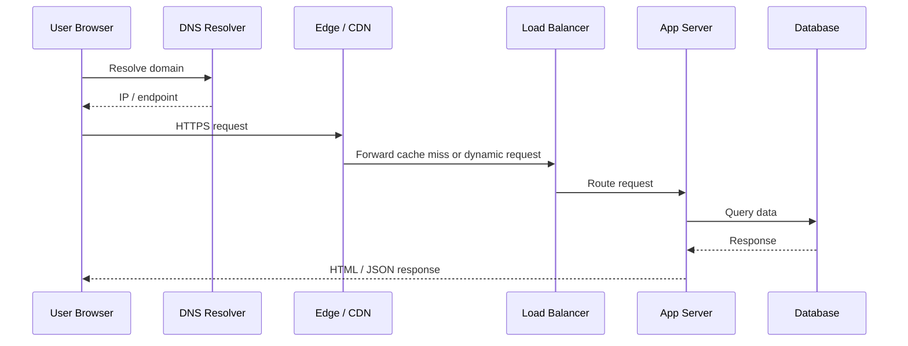
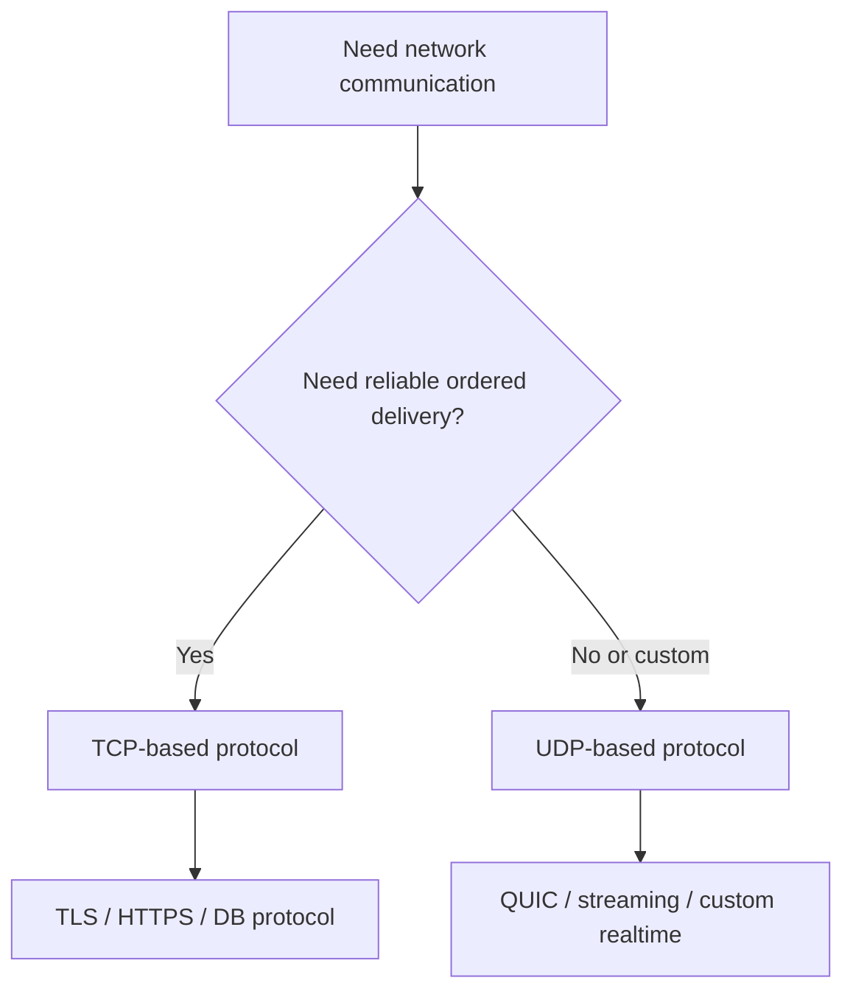

# 4. Networking Fundamentals

## Part Context
**Part:** Part 2 - Core System Building Blocks  
**Position:** Chapter 4 of 42  
**Why this part exists:** This section moves from framing to mechanics by explaining the infrastructure components that repeatedly appear in real-world systems.  
**This chapter builds toward:** understanding request paths, latency sources, encryption overhead, and protocol-level trade-offs in distributed systems

## Overview
Every distributed system is ultimately a networking problem disguised as an application problem. A request does not teleport from a user to a server. It moves through DNS, TCP or QUIC handshakes, TLS negotiation, proxies, routers, load balancers, and service-to-service calls. Each step adds latency, creates failure modes, and influences architecture decisions.

Networking fundamentals matter because performance complaints are often blamed on application code even when the real issue is connection setup, cross-region distance, packet loss, or inefficient protocols. Architects who understand the network path make better decisions about caching, service boundaries, regional placement, and API design.

## Why This Matters in Real Systems
- Network behavior often dominates end-user latency before business logic even begins.
- Protocol choices affect reliability, ordering, security, and resource consumption.
- System diagrams become much more realistic when request paths are understood in physical and logical terms.
- Many scaling and resilience problems are actually networking problems: timeouts, retries, handshake cost, and cross-region placement.

## Core Concepts
### HTTP and HTTPS
HTTP defines request-response semantics at the application layer. HTTPS adds TLS so requests are encrypted, authenticated, and harder to tamper with in transit.

### TCP vs UDP
TCP prioritizes reliable ordered delivery. UDP prioritizes low overhead and leaves ordering, retransmission, and congestion behavior more open to the application or higher-level protocol.

### DNS resolution
DNS translates domain names into addresses and can also steer traffic geographically or operationally.

### TLS handshake and session reuse
Secure communication requires key negotiation and certificate validation. Reused connections and session resumption reduce repeated overhead.

## Key Terminology
| Term | Definition |
| --- | --- |
| DNS | The distributed naming system that resolves human-readable domains into IP addresses or service endpoints. |
| TCP | A connection-oriented transport protocol offering reliable ordered delivery. |
| UDP | A connectionless transport protocol with low overhead and no built-in delivery guarantees. |
| TLS | The protocol used to secure communication in HTTPS and many service-to-service connections. |
| Round Trip Time | The time for a packet to travel to a destination and back. |
| Handshake | The setup exchange used to establish a connection or negotiate encryption. |
| CDN | A distributed network of edge servers used to cache and deliver content close to users. |
| Packet Loss | A condition where transmitted network packets do not successfully reach the destination. |

## Detailed Explanation
### What happens before your code runs
When a user opens a URL, the system may perform DNS resolution, establish or reuse a transport connection, negotiate TLS, pass through edge proxies or CDNs, and only then invoke application logic. If an architect ignores this path, latency targets become unrealistic and debugging becomes shallow.

### Why TCP is the default for most APIs
Most APIs and databases want reliable ordered delivery because application correctness is usually more valuable than raw packet speed. TCP handles retransmission, ordering, and congestion control, which simplifies application development. The cost is handshake overhead and some latency under loss or congestion.

### Where UDP fits
UDP is common in DNS, media transport, gaming, and protocols that need lower overhead or can tolerate occasional loss. Modern protocols such as QUIC build richer behavior on top of UDP to combine low-latency setup with features like encryption and stream control.

### TLS is a performance and security topic
TLS is often described only as a security feature, but it also affects architecture. Handshake cost, certificate management, termination points, session reuse, and internal service encryption all affect latency, CPU use, and trust boundaries.

### Network distance is architecture
A service split across regions may be elegant in a diagram and slow in reality. The speed of light, inter-region routing, and cross-zone chatter matter. Architects should place services and data according to the latency budget of the workflow, not according to neat organizational diagrams.

## Diagram / Flow Representation
### Browser Request Path

### Transport Decision Lens

## Real-World Examples
- Google Search benefits from globally distributed edge points so the network path before search serving is as short as possible.
- Netflix relies on CDNs because moving content closer to users reduces both latency and origin bandwidth cost.
- Amazon mobile clients often benefit from request aggregation because every extra network round trip hurts performance on real mobile networks.
- Uber-like systems separate real-time location updates from strongly consistent payment paths because networking and latency requirements differ.

## Case Study
### What happens when you open Google?

Opening a familiar website is one of the best ways to understand networking fundamentals because it exposes the hidden layers that sit between a user action and an application response.

### Requirements
- A user should be routed to a nearby healthy edge point quickly.
- Communication should be encrypted and the server identity should be verified.
- Static and cacheable assets should be served efficiently without overloading origin systems.
- Dynamic requests should be forwarded to healthy application infrastructure with low latency.
- The system should degrade gracefully when some edges, routes, or backends are unhealthy.

### Design Evolution
- A small site may begin with a direct request to one server and simple DNS.
- As traffic grows, CDNs, TLS termination, and load balancers are introduced to shorten paths and distribute load.
- As traffic becomes global, regional routing, edge caching, and session reuse become more important.
- As security expectations rise, certificate automation, internal encryption, and service identity become part of the core design.

### Scaling Challenges
- DNS caching and TTL behavior can delay failover or misroute traffic if poorly configured.
- TLS handshakes add CPU and latency overhead if connection reuse is weak.
- Cross-region traffic can quietly dominate latency if services are deployed without thinking about data placement.
- Packet loss or partial network failures can create retry storms that look like application outages.

### Final Architecture
- Geo-aware DNS and edge routing to steer users to nearby healthy entry points.
- HTTPS with efficient connection reuse and TLS termination strategy.
- CDN layers for cacheable content and edge protection.
- Load-balanced application servers with health checks and regional failover behavior.
- Observability that measures DNS resolution time, handshake time, backend latency, and end-to-end response time separately.

## Architect's Mindset
- Treat network hops as part of the latency budget, not as invisible plumbing.
- Choose transport and protocol behavior according to the workflow, not by habit alone.
- Remember that secure-by-default networking changes cost and performance and must still be designed carefully.
- Place services according to data gravity and latency sensitivity.
- Model failures such as packet loss, slow links, and partial regional isolation explicitly.

## Common Mistakes
- Blaming the application for latency without measuring DNS, TLS, or routing overhead.
- Using chatty APIs that require many sequential round trips over real mobile or cross-region networks.
- Ignoring connection reuse and paying handshake cost repeatedly.
- Treating internal traffic as trusted and skipping encryption or identity planning.
- Designing multi-region systems without considering cross-region latency and bandwidth.

## Interview Angle
- Interviewers often use this topic to test whether you understand what actually happens when a request travels across the internet.
- Strong answers explain DNS, TCP or QUIC setup, TLS, load balancing, and how these layers affect latency and reliability.
- Candidates stand out when they connect protocol behavior to higher-level architecture choices such as caching or regional deployment.
- A good answer stays practical: what is happening, where time is spent, and what design choices can improve the path.

## Quick Recap
- Networking is part of system design because request paths create latency and failure modes.
- HTTP/HTTPS define application communication; TCP and UDP define transport behavior.
- DNS and TLS are core parts of the user experience, not background trivia.
- Connection reuse, CDN placement, and cross-region distance materially change performance.
- Architects should reason about the full network path before optimizing application code.

## Practice Questions
1. What steps occur before a browser request reaches application code?
2. Why is TCP the default for most APIs and databases?
3. Where is UDP or QUIC a better fit than TCP?
4. How does TLS affect both performance and security design?
5. Why can a multi-region design become slower even if it looks more scalable?
6. How would you explain DNS caching to a junior engineer?
7. What metrics would you collect to separate network latency from application latency?
8. How do CDNs improve both performance and origin protection?
9. Why is connection reuse so important for mobile clients?
10. What kinds of failures are easy to miss if you think only at the application layer?

## Further Exploration
- Study HTTP/2, HTTP/3, and QUIC for deeper modern transport knowledge.
- Carry these ideas into the load balancing and caching chapters where request-path optimization becomes more concrete.
- Practice tracing the full request path of a real product you use every day.

## Navigation
- Previous: [Estimation & Capacity Planning](../01-foundations/03-estimation-capacity-planning.md)
- Next: [Databases Deep Dive](05-databases-deep-dive.md)
