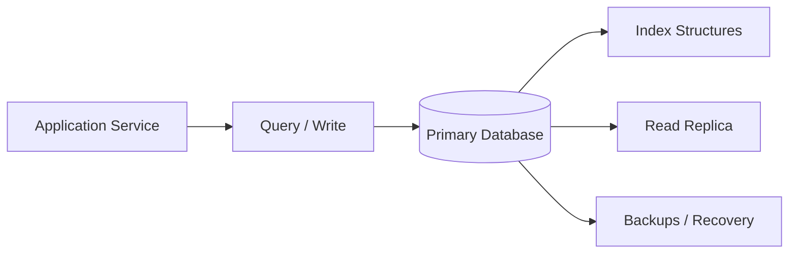
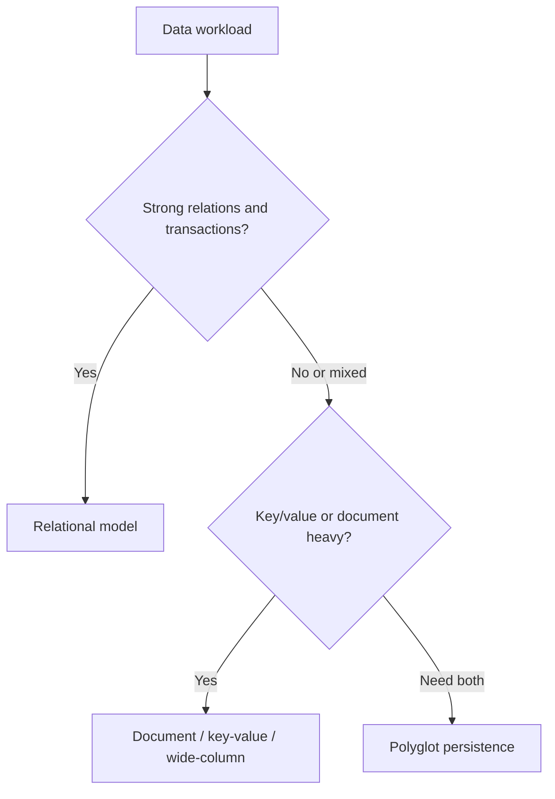

# 5. Databases Deep Dive

## Part Context
**Part:** Part 2 - Core System Building Blocks  
**Position:** Chapter 5 of 60
**Why this part exists:** This section moves from framing to mechanics by explaining the infrastructure components that repeatedly appear in real-world systems.  
**This chapter builds toward:** data-modeling decisions, consistency trade-offs, and storage choices that reflect access patterns rather than fashion

## Overview
Databases are not just persistence layers. They shape the correctness, performance, scalability, and cost of the entire system. A weak data model can quietly punish a product for years, while a strong one creates clarity around ownership, consistency, and growth.

This chapter looks beyond the SQL vs NoSQL slogan. The real question is how data is read, written, related, distributed, and recovered. Architects must think about access patterns, indexing, transactions, replication, and evolution together.

## Why This Matters in Real Systems
- Most systems are limited by data access patterns long before they are limited by raw compute.
- Database choices affect consistency, scaling strategy, and failure recovery more than many teams realize.
- Strong data modeling reduces accidental complexity in application logic.
- Interviewers often test data reasoning because it reveals whether a candidate can build durable systems rather than only APIs.

## Core Concepts
### Relational vs non-relational models
Relational systems excel when relationships, constraints, and transactional integrity matter. Non-relational systems often prioritize flexible schema, simpler partitioning, or workload-specific performance.

### Indexing
Indexes accelerate reads but add write cost, storage overhead, and sometimes operational complexity.

### Transactions and ACID
Transactions help preserve correctness across multi-step writes, but they also influence throughput and distributed design choices.

### Replication and partitioning
As systems scale, copies and partitions of data improve capacity and availability but introduce consistency and routing trade-offs.

## Key Terminology
| Term | Definition |
| --- | --- |
| Schema | The structure and constraints of stored data. |
| Index | An auxiliary lookup structure that speeds up selected queries. |
| ACID | Atomicity, consistency, isolation, and durability for transactional systems. |
| Replication | Maintaining copies of data across nodes or regions. |
| Sharding | Partitioning data across multiple nodes or databases. |
| Denormalization | Restructuring or duplicating data to optimize specific reads. |
| Primary Key | A unique identifier for each record. |
| Hot Partition | A partition receiving disproportionate traffic and becoming a bottleneck. |

## Detailed Explanation
### Model around access patterns
The best database choice usually follows how the system asks questions of the data. If a workflow depends on joins, referential integrity, and transactional correctness, relational modeling is often natural. If access is mostly by key at enormous scale, a simpler distributed model may be more appropriate.

### Indexes are not free performance
Indexes make selected queries fast because they create optimized lookup paths. But every new index consumes storage and slows writes because the database must update additional structures. High-write systems must be selective and deliberate about indexing.

### Transactions are business tools, not academic features
The value of a transaction appears when a business action must not partially succeed. Orders, ledger updates, and inventory reservation are easier to reason about when the storage layer can preserve grouped correctness. Long or overly broad transactions, however, can hurt concurrency and throughput.

### Replication helps reads and availability but complicates truth
A replica can serve reads and improve resilience, but now you must ask which node is authoritative, how lag affects user experience, and what happens during failover or network partitions.

### Data growth changes architecture shape
A design that works with one database node may eventually need read replicas, partitioned tables, search indexes, analytics stores, or object storage for large blobs. Good architects recognize that one database rarely remains the perfect home for every workload forever.

## Diagram / Flow Representation
### Data Access Path


### Modeling Trade-off Lens


## Real-World Examples
- Instagram-like products often keep user and post metadata in transactional stores while serving large media from object storage.
- Amazon-like order systems rely heavily on transactional integrity for core purchase state even if analytics and recommendation systems use very different storage engines.
- Google-scale search requires specialized indexing structures that are very different from ordinary relational tables.
- Netflix metadata, recommendation, playback state, and analytics are unlikely to live optimally inside the same storage model.

## Case Study
### Instagram-style database design

A social media platform highlights why one database rarely solves every problem equally well. User profiles, follows, posts, likes, comments, media metadata, and feeds all have different access patterns.

### Requirements
- Store users, posts, follow relationships, comments, likes, and media metadata reliably.
- Support fast profile reads, comment retrieval, and post detail lookups.
- Handle high read traffic for feeds and hot content.
- Keep media objects separate from transactional metadata.
- Support future features such as search, recommendations, analytics, and notifications.

### Design Evolution
- A first version may use a relational model for users, posts, relationships, and comments because core relationships are explicit.
- As read pressure grows, selective denormalization and caching may be introduced for profile and feed reads.
- As media grows, binary objects are moved to object storage and served via CDN while only references remain in the primary database.
- As feeds, search, and analytics evolve, specialized read stores or pipelines are added rather than forcing one database to serve every purpose.

### Scaling Challenges
- Follower graphs can create skew and expensive joins if modeled without read patterns in mind.
- Secondary indexes improve reads but can make heavy write workloads more expensive.
- Replica lag can produce stale views that may or may not be acceptable depending on the feature.
- Large binary media stored in the wrong place can overload the primary transactional system.

### Final Architecture
- A transactional primary store for users, posts, follows, and comments.
- Carefully designed indexes for hot read paths such as profile pages and comment lists.
- Object storage for images and videos, with CDN delivery for performance.
- Optional denormalized read models or caches for feed and engagement-heavy views.
- Backup, replica, and recovery strategy designed around the importance of user content durability.

## Architect's Mindset
- Choose data models based on access patterns and correctness needs, not ideology.
- Be deliberate about which queries deserve indexes and which writes deserve simplicity.
- Keep the source of truth clear, especially when replicas, caches, and derived views exist.
- Expect polyglot persistence in mature systems, but introduce it only when the workload truly justifies it.
- Model data evolution and migration cost as part of the architecture, not as future cleanup work.

## Isolation Levels — A Practical Primer

Transaction isolation determines what one transaction can see of another transaction's uncommitted or recently committed changes. Choosing the wrong isolation level causes bugs that are extremely hard to reproduce and diagnose.

### The Four Standard Levels (weakest to strongest)

| Level | What You Can See | Anomalies Allowed | Performance | Use When |
|-------|-----------------|-------------------|-------------|----------|
| **Read Uncommitted** | Other transactions' uncommitted writes | Dirty reads, non-repeatable reads, phantoms | Fastest | Almost never — acceptable only for approximate analytics |
| **Read Committed** | Only committed data (re-read may change) | Non-repeatable reads, phantoms | Fast | Default for most OLTP (PostgreSQL default) |
| **Repeatable Read** | Snapshot of data at transaction start (re-reads are stable) | Phantoms (new rows can appear) | Moderate | Financial reporting, inventory checks, anywhere re-read consistency matters |
| **Serializable** | As if transactions ran one at a time | None | Slowest (more aborts/retries) | Money transfers, double-booking prevention, any case where correctness trumps throughput |

### Anomaly Quick Reference

| Anomaly | What Happens | Example | Prevented By |
|---------|-------------|---------|-------------|
| **Dirty read** | Read uncommitted data that may be rolled back | See a balance of $0 during a transfer that hasn't committed | Read Committed+ |
| **Non-repeatable read** | Same query returns different values within one transaction | Check inventory → 10 items; check again → 8 items (someone bought 2) | Repeatable Read+ |
| **Phantom** | New rows appear that match a previous query's WHERE clause | Count orders → 50; count again → 51 (new order inserted) | Serializable |
| **Write skew** | Two transactions read the same data, make decisions, and both write — creating an invalid state | Two doctors both check "at least 1 doctor on call" → both go off call → zero doctors on call | Serializable (or application-level locking) |

### Practical Guidance

- **Default to Read Committed** for most application code — it prevents the worst anomalies while keeping throughput high.
- **Use Repeatable Read** for workflows that read data, compute, then write based on that data (e.g., inventory reservation, balance calculations).
- **Use Serializable** only for critical correctness paths (e.g., financial transfers, seat booking) and be prepared to handle serialization failures with retries.
- **Never use Read Uncommitted** in production application code.

### Database Default Isolation Levels

| Database | Default Level | Notes |
|----------|-------------|-------|
| PostgreSQL | Read Committed | Supports Serializable via SSI (Serializable Snapshot Isolation) |
| MySQL (InnoDB) | Repeatable Read | Uses MVCC; phantom protection via gap locking |
| SQL Server | Read Committed | Supports snapshot isolation as an alternative |
| Oracle | Read Committed | Uses MVCC; no true Serializable (uses snapshot) |
| CockroachDB | Serializable | Distributed DB with Serializable by default |
| Spanner | External consistency | Strongest guarantee — uses TrueTime |

**Cross-reference:** For how isolation interacts with distributed systems, see **F2: CAP Theorem & Consistency** and **F4: Consensus & Coordination**.

---

## Change Data Capture (CDC) and the Outbox Pattern

When a database write must trigger downstream actions (update a cache, publish an event, sync to a search index), the naive approach — write to DB then call an API — is fragile. If the API call fails after the DB write, the systems are inconsistent.

### The Problem: Dual-Write Inconsistency

```
Service writes to database → success
Service publishes event to Kafka → FAILS
Result: database updated, but downstream systems never learn about the change
```

### Solution 1: Transactional Outbox Pattern

Write the event to an "outbox" table inside the same database transaction as the business data. A separate process reads the outbox and publishes events.

```
┌─────────────────────────────────────────┐
│  Single Database Transaction             │
│                                          │
│  1. INSERT INTO orders (...) VALUES (...)|
│  2. INSERT INTO outbox (event_type,      │
│     payload, created_at) VALUES (...)    │
│                                          │
│  COMMIT                                  │
└─────────────────────────────────────────┘
         │
         ▼
┌─────────────────────────────────────────┐
│  Outbox Relay (Debezium / custom poller) │
│  • Reads outbox table                    │
│  • Publishes to Kafka                    │
│  • Marks rows as published               │
└─────────────────────────────────────────┘
         │
         ▼
┌─────────────────────────────────────────┐
│  Downstream Consumers                    │
│  • Search index update                   │
│  • Cache invalidation                    │
│  • Notification trigger                  │
│  • Analytics pipeline                    │
└─────────────────────────────────────────┘
```

**Why it works:** Both the business write and the event are in the same transaction. Either both succeed or both roll back. The relay process handles delivery with at-least-once semantics.

### Solution 2: Log-Based CDC (Debezium)

Instead of writing to an outbox table, capture changes directly from the database's write-ahead log (WAL/binlog). This is non-invasive — no application code changes needed.

| Approach | Pros | Cons |
|----------|------|------|
| **Outbox table** | Simple, works with any DB, explicit event schema | Adds a table + polling/relay process |
| **Log-based CDC (Debezium)** | No application changes, captures all changes including direct DB edits | Requires WAL access, tighter coupling to DB internals, event schema mirrors DB schema |

### When to Use CDC/Outbox

| Scenario | Recommended Approach |
|----------|---------------------|
| Keep search index in sync with primary DB | CDC (Debezium → Kafka → Elasticsearch) |
| Publish domain events after writes | Outbox pattern (explicit event schema) |
| Replicate data to analytics warehouse | CDC (Debezium → Kafka → data lake) |
| Invalidate cache on DB change | CDC or outbox (trigger cache delete/update) |
| Cross-service data sync in microservices | Outbox pattern (avoids distributed transactions) |

---

## Multi-Tenant Data Isolation and Data Residency

SaaS systems serving multiple customers (tenants) must decide how to isolate tenant data. The choice affects security, compliance, performance, and operational complexity.

### Tenant Isolation Models

| Model | How It Works | Isolation Level | Cost | Best For |
|-------|-------------|----------------|------|----------|
| **Shared database, shared schema** | All tenants in same tables, distinguished by `tenant_id` column | Low (application-enforced) | Lowest | Early-stage SaaS, low compliance needs |
| **Shared database, separate schemas** | Each tenant has own schema (tables) within same DB instance | Medium | Moderate | Mid-tier SaaS, moderate compliance |
| **Separate databases** | Each tenant has own database instance | High | Highest | Enterprise SaaS, regulated industries (healthcare, finance) |
| **Hybrid** | Most tenants share; high-value/regulated tenants get dedicated | Variable | Moderate-High | SaaS with mixed customer tiers |

### Tenant Isolation Checklist

- [ ] Every query includes `tenant_id` filter (shared schema) — enforce via ORM middleware, not developer discipline
- [ ] Row-Level Security (RLS) enabled in PostgreSQL for defense-in-depth
- [ ] Cross-tenant data access tested in CI (negative tests: ensure tenant A cannot see tenant B's data)
- [ ] Tenant-specific encryption keys for sensitive data (per-tenant KMS key)
- [ ] Backup and restore scoped to individual tenants (not full database restores)
- [ ] Performance isolation: noisy-neighbor protection via resource limits or separate connection pools

### Data Residency Requirements

| Requirement | Implementation |
|------------|---------------|
| EU data stays in EU | Deploy EU tenant data in eu-west-1; routing layer directs EU tenants to EU database |
| Tenant chooses region | Region field in tenant config; application routes reads/writes to tenant's chosen region |
| No cross-border replication | Disable cross-region replicas for tenants with residency constraints |
| Audit trail for data location | Log all data access with region tag; exportable for compliance audits |

---

## Further Reading and Cross-References

### Cross-Links to Deep Chapters

| Topic | Chapter | What You'll Learn |
|-------|---------|-------------------|
| CAP theorem and consistency models | F2: CAP Theorem & Consistency | How partition tolerance forces trade-offs between consistency and availability |
| Consensus protocols (Raft, Paxos) | F4: Consensus & Coordination | How distributed databases achieve agreement across replicas |
| Sharding strategies and hot partitions | F7: Data Partitioning | Hash vs range partitioning, rebalancing, partition-aware routing |
| Caching in front of databases | Chapter 6: Caching Systems | Cache-aside, write-through, invalidation strategies |
| Database observability | F10: Observability & Operations | Connection pool monitoring, query latency tracking, replication lag alerts |
| Database migrations in deployment | F11: Deployment & DevOps | Expand-contract pattern for zero-downtime schema changes |

### Cloud Database Guidance

| Provider | Recommended Reading |
|----------|-------------------|
| AWS | Aurora best practices, DynamoDB design patterns, RDS performance insights documentation |
| GCP | Cloud Spanner schema design, Cloud SQL for PostgreSQL, Firestore data modeling |
| Azure | Cosmos DB consistency levels, Azure SQL elastic pools, Azure Database for PostgreSQL |

### Key Concepts from "Designing Data-Intensive Applications" (DDIA)

| DDIA Concept | Relevance | Chapter Connection |
|-------------|-----------|-------------------|
| Log-structured merge trees (LSM) vs B-trees | Explains why different databases optimize for reads vs writes | Storage engine internals |
| Linearizability vs serializability | Two different consistency guarantees often confused | F2: CAP Theorem |
| Stream processing and CDC | How databases feed real-time pipelines | CDC/Outbox section above |
| Partitioning by hash vs range | Trade-offs in data distribution strategy | F7: Data Partitioning |

## Common Mistakes
- Choosing SQL or NoSQL as an identity statement instead of a workload decision.
- Over-indexing write-heavy tables and then wondering why throughput suffers.
- Storing large blobs in the same system that serves latency-sensitive relational queries.
- Assuming replicas are instantly consistent for all reads.
- Letting application logic absorb complexity that should have been handled by a better data model.

## Interview Angle
- Interviewers ask database questions to see whether you can connect storage design to business behavior and scale.
- Strong candidates explain how query shape, consistency needs, and growth patterns influence database choice.
- A good answer usually mentions schema, indexing, read-write ratio, replicas, and future evolution.
- Saying “use NoSQL for scale” without explaining the workload is usually a weak answer.

## Quick Recap
- Database design is central to system design because storage choices shape correctness and performance.
- SQL and NoSQL solve different problems and are often combined in mature systems.
- Indexes are powerful but costly on the write path.
- Replication and partitioning help scale but introduce consistency and operational trade-offs.
- The best data model matches the way the application actually uses the data.

## Practice Questions
1. How do you decide between relational and non-relational storage for a new system?
2. Why can an index improve latency while hurting throughput?
3. When is denormalization worth the write complexity it introduces?
4. What kinds of data should be moved out of the primary database into object storage?
5. How does replica lag affect application behavior?
6. What signs suggest a system is ready for polyglot persistence?
7. How would you model users, posts, and comments for a social app?
8. Why are transactions especially important in some domains and optional in others?
9. What is a hot partition, and how might you detect one?
10. How would you explain database trade-offs to a product manager who only wants “it to scale”?

## Further Exploration
- Connect this chapter with consistency and CAP later in the book.
- Study partitioning strategies, query planning, and recovery models in more depth.
- Practice modeling the same product in both relational and document-first styles to understand trade-offs.


## Navigation
- Previous: [Networking Fundamentals](04-networking-fundamentals.md)
- Next: [Caching Systems](06-caching-systems.md)
