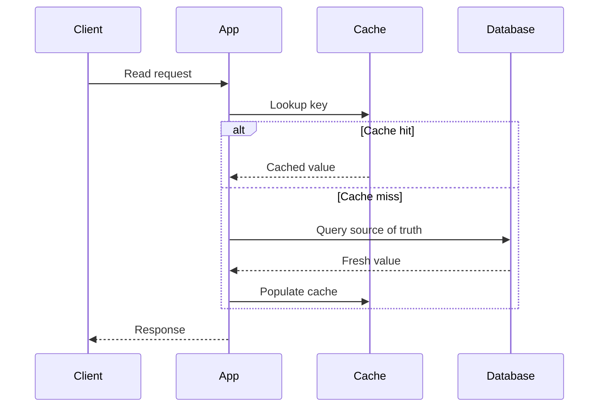
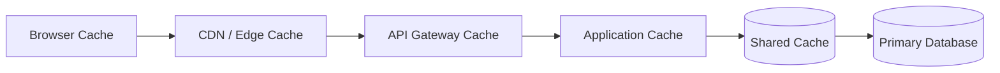

# 6. Caching Systems

## Part Context
**Part:** Part 2 - Core System Building Blocks  
**Position:** Chapter 6 of 60
**Why this part exists:** This section moves from framing to mechanics by explaining the infrastructure components that repeatedly appear in real-world systems.  
**This chapter builds toward:** latency reduction, backend protection, and layered performance architecture

## Overview
Caching is one of the highest-leverage tools in system design. It works because many systems repeat expensive reads, computations, and content delivery patterns. By storing useful results closer to the caller, a cache can reduce latency dramatically and protect downstream systems from overload.

But caching is not free performance. It introduces consistency questions, invalidation complexity, cold-start behavior, and operational edge cases. Architects need to know not only where caching helps, but also where it misleads.

## Why This Matters in Real Systems
- Caching often provides the cheapest large performance win available in a growing system.
- It can shield databases and APIs from read-heavy traffic and traffic spikes.
- Poor cache design creates stale data, hot-key problems, and thundering-herd failures.
- Many interview problems become much stronger when cache placement and invalidation are discussed clearly.

## Core Concepts
### Why caching works
Many systems are read-heavy or repeatedly compute the same result. A cache exploits temporal and spatial locality to avoid repeating work.

### Cache strategies
Common strategies include cache-aside, write-through, write-behind, and refresh-ahead, each with different freshness and complexity trade-offs.

### Eviction and expiry
Caches are finite. TTLs and policies such as LRU or LFU determine what remains hot and what gets discarded.

### Multi-layer caching
Caches can exist in browsers, CDNs, gateways, application memory, shared in-memory stores, and database pages. The best design often uses several layers.

## Key Terminology
| Term | Definition |
| --- | --- |
| Cache Hit | A request served directly from cache. |
| Cache Miss | A request that must go to the source of truth or backing service. |
| TTL | Time to live; the configured lifetime of a cached entry. |
| Cache Invalidation | The process of removing or refreshing stale cached data. |
| Thundering Herd | A surge of simultaneous cache misses that overwhelms the backend. |
| Hot Key | A key receiving unusually high traffic, sometimes stressing one cache shard. |
| Redis | A widely used in-memory data store for shared caching and lightweight data structures. |
| Warm Cache | A cache that already contains commonly requested data. |

## Detailed Explanation
### Caching is about economics as much as speed
A cache reduces the cost of serving repeated reads because memory lookups and nearby edge responses are cheaper than repeated database queries or origin fetches. This matters for both latency and infrastructure cost.

### Freshness must match the product requirement
Different data has different tolerance for staleness. Product catalog pages may accept seconds of delay. Account balances generally cannot. Good caching design starts with asking how wrong a stale value is allowed to be and for how long.

### Cache-aside is popular because it is simple
In cache-aside, the application checks the cache first and loads from the source on a miss. The simplicity is attractive, but it also means the application must handle misses, invalidation, and cache stampede behavior thoughtfully.

### Write-through and write-behind change write semantics
Write-through improves read freshness by updating cache during the write path, but it adds write latency and coupling. Write-behind can improve throughput but makes durability and failure handling more subtle because persistence happens later.

### Cold starts and hot keys are operational realities
An empty cache after deployment, restart, or failover can overload the backend. Likewise, one extremely popular key can create shard imbalance. Architects should plan warming strategies, TTL jitter, request coalescing, and hot-key handling.

## Diagram / Flow Representation
### Cache-Aside Flow

### Layered Caching View

## Real-World Examples
- Netflix relies heavily on CDN and edge caching because media delivery dominates the workload.
- Amazon product pages use caching across many layers to keep catalog reads fast and protect origin systems during spikes.
- Google search results mix cached and freshly computed elements depending on freshness and ranking needs.
- WhatsApp-style presence systems often use very short-lived caches for ephemeral state without treating them as durable truth.

## Case Study
### Netflix-style caching strategy

A streaming platform demonstrates layered caching well because it handles metadata, artwork, manifests, and large media objects that all have different freshness needs.

### Requirements
- Popular content should be delivered with low latency to users in many regions.
- Origin infrastructure should not be overloaded by repeated requests for the same objects.
- Personalized responses should still remain reasonably fresh.
- The system should tolerate traffic spikes around new releases.
- Caching strategy should reduce both latency and operating cost.

### Design Evolution
- Start with simple application-level caching for hot metadata and basic CDN usage for static content.
- Introduce edge caching for artwork, manifests, and popular media segments as traffic grows.
- Tune cache keys and TTLs differently for static, semi-static, and personalized responses.
- Add background refresh, jitter, and request coalescing as scale makes stampedes and cold starts more dangerous.

### Scaling Challenges
- Hot launches create synchronized demand that can collapse origin systems if cache warming is poor.
- Overly long TTLs create stale user experiences; overly short TTLs reduce hit rate and waste the cache.
- One-size-fits-all cache policy fails because content types and freshness tolerances differ widely.
- Failures in shared cache layers can instantly move too much load back to the primary database or origin.

### Final Architecture
- CDN and edge caching for large content and static assets.
- Shared in-memory caching for hot metadata and frequently accessed responses.
- Application-aware cache-aside or write-through behavior depending on freshness needs.
- Stampede controls such as jittered TTLs, background refresh, and request collapsing.
- Metrics for hit rate, miss rate, stale reads, hot keys, and backend protection effectiveness.

## Architect's Mindset
- Treat caching as a deliberate consistency trade-off, not a generic speed hack.
- Place caches where they remove the most expensive repeated work.
- Design invalidation rules before the cache becomes business-critical.
- Expect failures, cold starts, and skewed traffic as normal operational conditions.
- Measure whether the cache is truly protecting the backend instead of only measuring memory usage.

## Common Mistakes
- Adding a cache without clarifying the source of truth.
- Using the same TTL for all data regardless of freshness needs.
- Ignoring cache stampede behavior until a popular key expires under load.
- Treating cache hit rate as the only metric that matters.
- Assuming a shared cache eliminates the need for good database design.

## Interview Angle
- Caching appears in many interviews as a follow-up when the initial design seems too slow or too database-heavy.
- Strong answers explain what to cache, where to cache it, how fresh it must be, and what happens when the cache fails.
- A great answer mentions invalidation, stampede control, and layered caching rather than only saying “use Redis.”
- Interviewers often care more about trade-offs than about naming a specific cache technology.

## Quick Recap
- Caching reduces latency and backend load by reusing previous results or nearby copies.
- Cache strategies differ mainly in freshness behavior and write-path complexity.
- Invalidation and stampede prevention are central architecture concerns.
- Different layers of the stack benefit from different kinds of caches.
- A cache is successful when it improves user experience and protects the source of truth.

## Practice Questions
1. What data is a good cache candidate and what data is not?
2. How does cache-aside differ from write-through?
3. Why can stale cache data be acceptable in some systems and unacceptable in others?
4. How would you prevent a thundering herd on a hot key?
5. What metrics would you use to judge whether a cache is working well?
6. Why might a CDN and an application cache both exist in the same architecture?
7. How would you warm a cache after a restart or failover?
8. What risks come with write-behind caching?
9. How does cache placement change for mobile-heavy versus backend-only systems?
10. How would you explain cache invalidation to a non-distributed-systems engineer?

## Further Exploration
- Study CDN design, TTL tuning, and invalidation patterns in more depth.
- Connect this chapter with load balancing and storage, where cache placement affects whole-system behavior.
- Try instrumenting a small application with and without caching to see the latency difference directly.

## Navigation
- Previous: [Databases Deep Dive](05-databases-deep-dive.md)
- Next: [Load Balancing](07-load-balancing.md)
