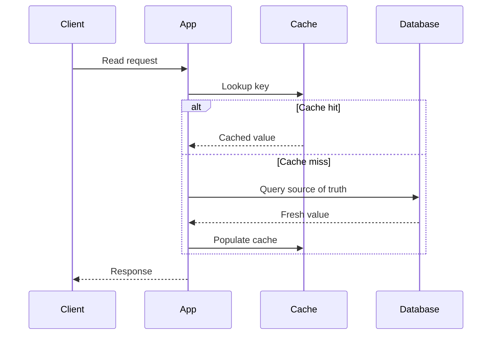
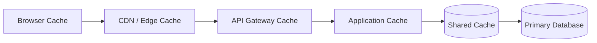

# 6. Caching Systems

## Part Context
**Part:** Part 2 - Core System Building Blocks  
**Position:** Chapter 6 of 60
**Why this part exists:** This section moves from framing to mechanics by explaining the infrastructure components that repeatedly appear in real-world systems.  
**This chapter builds toward:** latency reduction, backend protection, and layered performance architecture

## Overview
Caching is one of the highest-leverage tools in system design. It works because many systems repeat expensive reads, computations, and content delivery patterns. By storing useful results closer to the caller, a cache can reduce latency dramatically and protect downstream systems from overload.

But caching is not free performance. It introduces consistency questions, invalidation complexity, cold-start behavior, and operational edge cases. Architects need to know not only where caching helps, but also where it misleads.

## Why This Matters in Real Systems
- Caching often provides the cheapest large performance win available in a growing system.
- It can shield databases and APIs from read-heavy traffic and traffic spikes.
- Poor cache design creates stale data, hot-key problems, and thundering-herd failures.
- Many interview problems become much stronger when cache placement and invalidation are discussed clearly.

## Core Concepts
### Why caching works
Many systems are read-heavy or repeatedly compute the same result. A cache exploits temporal and spatial locality to avoid repeating work.

### Cache strategies
Common strategies include cache-aside, write-through, write-behind, and refresh-ahead, each with different freshness and complexity trade-offs.

### Eviction and expiry
Caches are finite. TTLs and policies such as LRU or LFU determine what remains hot and what gets discarded.

### Multi-layer caching
Caches can exist in browsers, CDNs, gateways, application memory, shared in-memory stores, and database pages. The best design often uses several layers.

## Key Terminology
| Term | Definition |
| --- | --- |
| Cache Hit | A request served directly from cache. |
| Cache Miss | A request that must go to the source of truth or backing service. |
| TTL | Time to live; the configured lifetime of a cached entry. |
| Cache Invalidation | The process of removing or refreshing stale cached data. |
| Thundering Herd | A surge of simultaneous cache misses that overwhelms the backend. |
| Hot Key | A key receiving unusually high traffic, sometimes stressing one cache shard. |
| Redis | A widely used in-memory data store for shared caching and lightweight data structures. |
| Warm Cache | A cache that already contains commonly requested data. |

## Detailed Explanation
### Caching is about economics as much as speed
A cache reduces the cost of serving repeated reads because memory lookups and nearby edge responses are cheaper than repeated database queries or origin fetches. This matters for both latency and infrastructure cost.

### Freshness must match the product requirement
Different data has different tolerance for staleness. Product catalog pages may accept seconds of delay. Account balances generally cannot. Good caching design starts with asking how wrong a stale value is allowed to be and for how long.

### Cache-aside is popular because it is simple
In cache-aside, the application checks the cache first and loads from the source on a miss. The simplicity is attractive, but it also means the application must handle misses, invalidation, and cache stampede behavior thoughtfully.

### Write-through and write-behind change write semantics
Write-through improves read freshness by updating cache during the write path, but it adds write latency and coupling. Write-behind can improve throughput but makes durability and failure handling more subtle because persistence happens later.

### Cold starts and hot keys are operational realities
An empty cache after deployment, restart, or failover can overload the backend. Likewise, one extremely popular key can create shard imbalance. Architects should plan warming strategies, TTL jitter, request coalescing, and hot-key handling.

## Diagram / Flow Representation
### Cache-Aside Flow


### Layered Caching View


## Real-World Examples
- Netflix relies heavily on CDN and edge caching because media delivery dominates the workload.
- Amazon product pages use caching across many layers to keep catalog reads fast and protect origin systems during spikes.
- Google search results mix cached and freshly computed elements depending on freshness and ranking needs.
- WhatsApp-style presence systems often use very short-lived caches for ephemeral state without treating them as durable truth.

## Case Study
### Netflix-style caching strategy

A streaming platform demonstrates layered caching well because it handles metadata, artwork, manifests, and large media objects that all have different freshness needs.

### Requirements
- Popular content should be delivered with low latency to users in many regions.
- Origin infrastructure should not be overloaded by repeated requests for the same objects.
- Personalized responses should still remain reasonably fresh.
- The system should tolerate traffic spikes around new releases.
- Caching strategy should reduce both latency and operating cost.

### Design Evolution
- Start with simple application-level caching for hot metadata and basic CDN usage for static content.
- Introduce edge caching for artwork, manifests, and popular media segments as traffic grows.
- Tune cache keys and TTLs differently for static, semi-static, and personalized responses.
- Add background refresh, jitter, and request coalescing as scale makes stampedes and cold starts more dangerous.

### Scaling Challenges
- Hot launches create synchronized demand that can collapse origin systems if cache warming is poor.
- Overly long TTLs create stale user experiences; overly short TTLs reduce hit rate and waste the cache.
- One-size-fits-all cache policy fails because content types and freshness tolerances differ widely.
- Failures in shared cache layers can instantly move too much load back to the primary database or origin.

### Final Architecture
- CDN and edge caching for large content and static assets.
- Shared in-memory caching for hot metadata and frequently accessed responses.
- Application-aware cache-aside or write-through behavior depending on freshness needs.
- Stampede controls such as jittered TTLs, background refresh, and request collapsing.
- Metrics for hit rate, miss rate, stale reads, hot keys, and backend protection effectiveness.

## Architect's Mindset
- Treat caching as a deliberate consistency trade-off, not a generic speed hack.
- Place caches where they remove the most expensive repeated work.
- Design invalidation rules before the cache becomes business-critical.
- Expect failures, cold starts, and skewed traffic as normal operational conditions.
- Measure whether the cache is truly protecting the backend instead of only measuring memory usage.

## Cache Invalidation Taxonomy

Cache invalidation is famously one of the two hard problems in computer science. The difficulty arises because different data, different consistency requirements, and different cache layers demand different invalidation strategies. Here is a taxonomy of the five principal approaches.

| Strategy | How It Works | Freshness Guarantee | Complexity | Best For |
|----------|-------------|-------------------|------------|----------|
| **TTL-based expiry** | Entry auto-expires after a fixed duration | Bounded staleness (≤ TTL) | Low | Content where staleness within seconds/minutes is acceptable (product catalog, search results) |
| **Event-driven invalidation** | Backend publishes invalidation event (via Kafka, CDC, webhook) when source data changes | Near-real-time | Medium-High | User-facing data that must reflect writes quickly (profile updates, order status) |
| **Version/tag-based** | Cache key includes a version number or ETag; new version = new key, old entry naturally evicts | Instant for new reads | Medium | Immutable content with explicit versioning (static assets, API responses with ETag) |
| **Write-through invalidation** | Cache is updated as part of the write path | Immediate consistency | Medium | Data that is read immediately after write (session state, auth tokens) |
| **Manual/API purge** | Operator or admin triggers purge via API (e.g., CDN cache purge) | On-demand | Low | Emergency fixes, content takedowns, post-deployment cache busting |

### Choosing an Invalidation Strategy

```
Is the data immutable after creation?
  → YES: Use version/tag-based keys (no invalidation needed)
  → NO: Is near-real-time consistency required?
    → YES: Use event-driven invalidation (CDC/Kafka)
    → NO: Is bounded staleness (seconds-minutes) acceptable?
      → YES: Use TTL with appropriate duration
      → NO: Use write-through invalidation
```

### Invalidation in Distributed Cache Layers

| Cache Layer | Invalidation Challenge | Recommended Approach |
|-------------|----------------------|---------------------|
| Browser cache | Cannot be invalidated from server side | Use versioned URLs (`/app.js?v=abc123`) or `Cache-Control: max-age` with short TTL |
| CDN | Purge propagation takes seconds to minutes across global PoPs | Use cache tags or surrogate keys for targeted purge; use short TTL + `stale-while-revalidate` |
| API gateway | Shared across many services; invalidation must be scoped | Use `Vary` headers correctly; invalidate by key prefix |
| Application cache (Redis) | Single cluster; invalidation is fast but must be coordinated | Event-driven pub/sub invalidation or TTL with jitter |
| Database query cache | Can serve stale results after schema changes | Disable or flush on migration; prefer application-level caching |

---

## Stampede Prevention — Patterns and Pseudo-Code

A cache stampede (thundering herd) occurs when a popular cache entry expires and hundreds of concurrent requests simultaneously miss the cache and hit the backend. Three patterns prevent this.

### Pattern 1: Request Coalescing (Singleflight)

Only one request fetches from the backend; all concurrent requests for the same key wait for that single result.

```python
# Pseudo-code: request coalescing / singleflight
import threading

in_flight = {}  # key → (lock, result)
lock = threading.Lock()

def get_with_coalescing(key):
    # Check cache first
    cached = cache.get(key)
    if cached is not None:
        return cached

    with lock:
        if key in in_flight:
            # Another request is already fetching — wait for it
            flight_lock, _ = in_flight[key]
        else:
            # I am the first — create a flight lock
            flight_lock = threading.Event()
            in_flight[key] = (flight_lock, None)

    if not flight_lock.is_set():
        # I am the leader — fetch from backend
        result = database.query(key)
        cache.set(key, result, ttl=300)
        in_flight[key] = (flight_lock, result)
        flight_lock.set()  # Wake all waiters
    else:
        # I am a waiter — wait for leader
        flight_lock.wait(timeout=5)

    _, result = in_flight.pop(key, (None, None))
    return result
```

### Pattern 2: Stale-While-Revalidate

Serve the stale cached value immediately while refreshing asynchronously in the background. The user gets a fast (possibly slightly stale) response; the next request gets fresh data.

```python
# Pseudo-code: stale-while-revalidate
def get_with_swr(key, ttl=300, stale_ttl=600):
    entry = cache.get_with_metadata(key)

    if entry is None:
        # True miss — must fetch synchronously
        result = database.query(key)
        cache.set(key, result, ttl=ttl, stale_ttl=stale_ttl)
        return result

    if entry.age < ttl:
        # Fresh — serve directly
        return entry.value

    if entry.age < stale_ttl:
        # Stale but within grace period — serve stale, refresh async
        background_refresh(key, ttl, stale_ttl)
        return entry.value  # stale but fast

    # Expired beyond stale window — must fetch synchronously
    result = database.query(key)
    cache.set(key, result, ttl=ttl, stale_ttl=stale_ttl)
    return result

def background_refresh(key, ttl, stale_ttl):
    # Run in background thread / async task
    result = database.query(key)
    cache.set(key, result, ttl=ttl, stale_ttl=stale_ttl)
```

**HTTP equivalent:** The `Cache-Control: stale-while-revalidate=60` header tells CDNs and browsers to serve stale content for up to 60 seconds while fetching fresh content in the background.

### Pattern 3: Probabilistic Early Expiration

Before the TTL actually expires, each request has a small probability of refreshing the cache proactively. This spreads refresh load over time instead of concentrating it at TTL expiry.

```python
# Pseudo-code: probabilistic early refresh (XFetch algorithm)
import random, math

def get_with_early_refresh(key, ttl=300, beta=1.0):
    entry = cache.get_with_metadata(key)

    if entry is None:
        result = database.query(key)
        cache.set(key, result, ttl=ttl)
        return result

    # Probabilistic early refresh
    remaining_ttl = ttl - entry.age
    refresh_probability = math.exp(-remaining_ttl / (beta * ttl))

    if random.random() < refresh_probability:
        # Proactively refresh (runs inline or async)
        result = database.query(key)
        cache.set(key, result, ttl=ttl)
        return result

    return entry.value
```

---

## Cache Key Design Checklist

A poorly designed cache key causes stale data served to wrong users, cache pollution, low hit rates, or security vulnerabilities. Follow this checklist.

### Cache Key Rules

| Rule | Why | Example |
|------|-----|---------|
| **Include all discriminating parameters** | Different inputs must produce different cache entries | `user:{user_id}:profile` not just `profile` |
| **Normalize keys** | Variations of the same input should hit the same entry | Lowercase, trim whitespace, sort query params |
| **Include version/schema** | Schema changes should not serve stale-format data | `v2:product:{id}` |
| **Exclude volatile fields** | Timestamps, nonces, or request IDs destroy hit rate | Exclude `request_id`, `timestamp` from key |
| **Scope by tenant** | Multi-tenant systems must never leak data across tenants | `tenant:{tid}:user:{uid}` |
| **Scope by auth context** | Cached responses must not leak between permission levels | Include role or permission hash in key for authZ-varying responses |
| **Use consistent hashing prefix** | Enables efficient cache partitioning and bulk invalidation | `catalog:product:*` for invalidating all products |

### CDN Cache Key Correctness

CDNs cache by URL + headers. Incorrect `Vary` headers or missing query parameters cause one user to see another user's cached response.

| Pitfall | What Goes Wrong | Fix |
|---------|----------------|-----|
| Missing `Vary: Authorization` | Authenticated and anonymous users see same cached response | Add `Vary: Authorization` or don't cache auth-dependent responses at CDN |
| User-specific data cached at CDN | User A sees User B's profile | Never cache personalized responses at CDN; use edge compute to assemble |
| Query params ignored | `/search?q=cats` and `/search?q=dogs` serve same cache entry | Configure CDN to include query string in cache key |
| Accept-Language not in Vary | English user sees Spanish response | Add `Vary: Accept-Language` for multilingual sites |
| Cache key too broad | Low hit rate because every unique URL is a separate entry | Normalize URLs, strip tracking params (`utm_*`), sort query params |

---

## Cache Security Considerations

Caches amplify both performance and risk. A poisoned or leaky cache affects every user who reads from it.

### Cache Poisoning

An attacker manipulates the cache to store malicious content that is then served to all subsequent users.

| Attack Vector | How It Works | Prevention |
|--------------|-------------|-----------|
| **HTTP response splitting** | Attacker injects headers that cause CDN to cache attacker-controlled response | Validate and sanitize all response headers; use HTTP/2+ (immune to splitting) |
| **Cache key manipulation** | Attacker crafts request with unkeyed headers/params that alter response but not cache key | Audit unkeyed headers; include all response-varying inputs in cache key |
| **Deceptive request routing** | Attacker requests `/admin` page which gets cached and served to other users at CDN | Never cache authenticated admin pages at CDN; use `Cache-Control: private` |

### Authorization Leakage

| Risk | Scenario | Prevention |
|------|----------|-----------|
| **Cross-user data leakage** | User A's profile cached and served to User B | Include user ID or session hash in cache key; use `Vary: Cookie` or `Vary: Authorization` |
| **Privilege escalation via cache** | Admin response cached and served to regular user | Use `Cache-Control: private, no-store` for admin/elevated responses |
| **Stale permission enforcement** | User's permissions revoked but cached response still shows authorized content | Invalidate cache on permission change; use short TTL for permission-dependent data |
| **Multi-tenant data leakage** | Tenant A's data cached without tenant scoping and served to Tenant B | Always include tenant ID in cache key; enforce at cache middleware level |

### Security Checklist for Caching

- [ ] Personalized responses use `Cache-Control: private` (not cached at CDN/shared layers)
- [ ] Auth-dependent responses include auth context in cache key or are not cached
- [ ] Admin/elevated pages are never cached at shared layers
- [ ] `Vary` headers correctly reflect all response-varying inputs
- [ ] Cache keys include tenant ID in multi-tenant systems
- [ ] Permission changes trigger cache invalidation
- [ ] Cache entries cannot be forged or injected via unkeyed request fields
- [ ] Sensitive data (PII, tokens) has short TTL or is not cached

## Common Mistakes
- Adding a cache without clarifying the source of truth.
- Using the same TTL for all data regardless of freshness needs.
- Ignoring cache stampede behavior until a popular key expires under load.
- Treating cache hit rate as the only metric that matters.
- Assuming a shared cache eliminates the need for good database design.

## Interview Angle
- Caching appears in many interviews as a follow-up when the initial design seems too slow or too database-heavy.
- Strong answers explain what to cache, where to cache it, how fresh it must be, and what happens when the cache fails.
- A great answer mentions invalidation, stampede control, and layered caching rather than only saying “use Redis.”
- Interviewers often care more about trade-offs than about naming a specific cache technology.

## Quick Recap
- Caching reduces latency and backend load by reusing previous results or nearby copies.
- Cache strategies differ mainly in freshness behavior and write-path complexity.
- Invalidation and stampede prevention are central architecture concerns.
- Different layers of the stack benefit from different kinds of caches.
- A cache is successful when it improves user experience and protects the source of truth.

## Practice Questions
1. What data is a good cache candidate and what data is not?
2. How does cache-aside differ from write-through?
3. Why can stale cache data be acceptable in some systems and unacceptable in others?
4. How would you prevent a thundering herd on a hot key?
5. What metrics would you use to judge whether a cache is working well?
6. Why might a CDN and an application cache both exist in the same architecture?
7. How would you warm a cache after a restart or failover?
8. What risks come with write-behind caching?
9. How does cache placement change for mobile-heavy versus backend-only systems?
10. How would you explain cache invalidation to a non-distributed-systems engineer?

## Further Exploration
- Study CDN design, TTL tuning, and invalidation patterns in more depth.
- Connect this chapter with load balancing and storage, where cache placement affects whole-system behavior.
- Try instrumenting a small application with and without caching to see the latency difference directly.


## Navigation
- Previous: [Databases Deep Dive](05-databases-deep-dive.md)
- Next: [Load Balancing](07-load-balancing.md)
