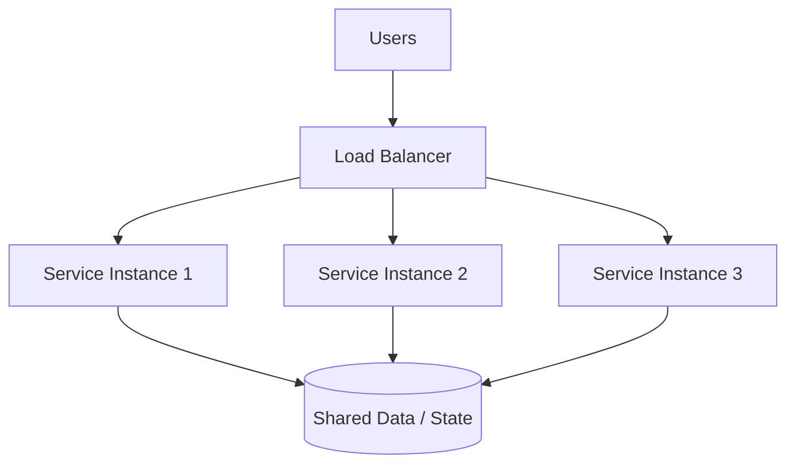
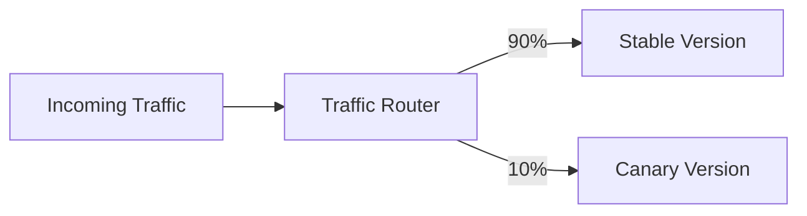

# 7. Load Balancing

## Part Context
**Part:** Part 2 - Core System Building Blocks  
**Position:** Chapter 7 of 42  
**Why this part exists:** This section moves from framing to mechanics by explaining the infrastructure components that repeatedly appear in real-world systems.  
**This chapter builds toward:** traffic distribution, fault isolation, rollout strategy, and stateless service design

## Overview
Load balancing is the discipline of distributing incoming requests across multiple backend instances so that no single machine becomes the chokepoint. In practice, load balancers do more than split traffic. They also decide who is healthy, where TLS terminates, which version receives traffic, and how quickly failures are isolated.

Once a service needs more than one instance, load balancing becomes a foundational design tool. It affects scalability, deploy safety, availability, and how cleanly the application must separate state from compute.

## Why This Matters in Real Systems
- It enables horizontal scaling by allowing many instances to serve one logical service.
- It improves resilience by removing unhealthy backends from rotation.
- It supports advanced routing patterns such as canary releases, blue-green deployments, and path-based routing.
- It forces better service design because stateful workloads behave differently behind a balancer than stateless ones do.

## Core Concepts
### Why load balancers exist
They spread traffic, absorb traffic spikes, and create one stable entry point while backends scale or change behind the scenes.

### Balancing algorithms
Round robin, weighted round robin, least connections, least response time, and consistent hashing suit different traffic patterns.

### L4 vs L7
Layer 4 balancing routes based on transport information. Layer 7 balancing understands HTTP-level properties such as paths, headers, cookies, and hosts.

### Health checks and failover
Effective load balancing depends on detecting which backends are genuinely ready and rerouting traffic quickly when they are not.

## Key Terminology
| Term | Definition |
| --- | --- |
| Round Robin | A simple algorithm that rotates requests evenly across backends. |
| Least Connections | An algorithm that routes to the backend with the fewest active connections. |
| L4 Load Balancer | A balancer working at the transport layer using IP and port information. |
| L7 Load Balancer | A balancer that understands HTTP or application-level request attributes. |
| Health Check | A probe used to decide whether a backend should receive traffic. |
| Sticky Session | A routing policy that keeps a client bound to a particular backend. |
| TLS Termination | Decrypting TLS traffic at the balancer before forwarding it internally. |
| Weighted Routing | A mechanism to send different proportions of traffic to different backend groups. |

## Detailed Explanation
### Balancing is about more than fairness
It is not enough to distribute requests evenly if requests vary in duration, CPU cost, memory pressure, or open-connection count. The correct algorithm depends on the shape of the workload. Uniform stateless requests may do well with round robin. Mixed request duration may need least-connections or more adaptive policies.

### Stateless services scale more naturally
If any request can be handled by any healthy instance, scaling and failover stay simple. If sessions or local state are tied to one instance, balancing becomes messy. That is why many architectures move session state to shared stores or encode enough context in tokens.

### Health checks should reflect readiness, not just process existence
A backend that accepts TCP connections but cannot reach its database is not actually healthy. Effective health checks should reflect whether the service can perform its essential work, not just whether the process is alive.

### L7 balancing enables policy and product routing
At L7, a system can route based on path, hostname, tenant, or feature flags. This supports API gateways, canaries, A/B testing, and fine-grained service segmentation. The trade-off is more complexity and some overhead.

### Load balancers are part of deployment safety
Canary and blue-green releases rely on controlled traffic shifting. This means load balancers or traffic routers are not just runtime components; they are also change-management tools.

## Diagram / Flow Representation
### Basic Traffic Distribution

### Canary Routing Example

## Real-World Examples
- Amazon-like retail sites use multiple layers of balancing, including global routing, regional balancing, and service-level traffic distribution.
- Netflix-like systems shift traffic gradually during deploys instead of sending 100 percent of users to a new version immediately.
- Google front ends often combine edge routing with backend load balancing to reduce latency and isolate failures.
- Chat or gaming systems may use a mix of ordinary balancing and sticky routing depending on connection patterns and state placement.

## Case Study
### Scaling an Amazon-style homepage

A retail homepage is a useful case because it mixes static assets, dynamic content, personalization, and seasonal traffic spikes. The system must remain responsive while traffic changes rapidly.

### Requirements
- Serve a very high volume of user requests with low latency.
- Remain available even if some instances or zones become unhealthy.
- Support safe deployment of new homepage features during active traffic.
- Route dynamic and static traffic efficiently.
- Avoid overloading any one backend or dependency during peaks.

### Design Evolution
- A simple version may place several identical web servers behind one balancer.
- As traffic grows, path-based routing may separate catalog, recommendations, and personalization services.
- As deployment risk grows, weighted routing is added for canary releases.
- As traffic becomes global, higher-level geo routing and regional failover sit in front of local balancing.

### Scaling Challenges
- Personalized calls can create uneven backend load even if request counts look evenly distributed.
- Sticky sessions can cause traffic imbalance and harder failover if local state is overused.
- Poor health checks may continue routing traffic to backends that are partially broken.
- If the cache layer fails, request volume may surge back through the balancer to already stressed backends.

### Final Architecture
- Global entry routing to healthy regions.
- Regional L7 load balancing with health checks and path-based routing.
- Stateless application instances backed by shared stores or caches.
- Weighted traffic shifting to support safe deploys.
- Metrics on error rate, backend saturation, open connections, and request distribution fairness.

## Architect's Mindset
- Prefer stateless application services when possible because balancing, autoscaling, and failover become cleaner.
- Match the algorithm to the workload instead of using round robin by habit.
- Treat health checks as product-aware readiness signals, not simple port checks.
- Use traffic routing as part of change management and incident mitigation.
- Remember that load balancing does not remove the need to fix downstream bottlenecks.

## Common Mistakes
- Assuming any balancing algorithm works equally well for all workloads.
- Leaving important session or cache state on local instances and then forcing sticky sessions everywhere.
- Using shallow health checks that miss partial service failure.
- Treating the balancer as a silver bullet while databases or other stateful dependencies remain unscalable.
- Ignoring observability of request distribution and backend saturation.

## Interview Angle
- Interviewers ask load balancing questions to test whether you understand horizontal scaling beyond “add more servers.”
- Strong answers compare L4 and L7, discuss health checks, and explain how routing interacts with stateless design.
- Mentioning deployment strategies such as canary traffic shifting often strengthens the answer.
- A good answer also notes what load balancing does not solve, especially stateful bottlenecks.

## Quick Recap
- Load balancing distributes traffic and creates a stable entry point for a service.
- Algorithm choice depends on workload characteristics, not only on simplicity.
- L7 routing enables richer policies than L4 routing.
- Health checks, statelessness, and deployment safety are core balancing concerns.
- Load balancing improves scalability and availability but does not eliminate downstream bottlenecks.

## Practice Questions
1. Why is round robin not always the right balancing strategy?
2. What is the operational difference between L4 and L7 balancing?
3. Why do sticky sessions often create problems at scale?
4. How would you design a health check for a service that depends on a database?
5. What metrics would tell you that traffic is not being distributed well?
6. How does load balancing support canary deployments?
7. Why is statelessness helpful behind a balancer?
8. What does a balancer do during a partial zonal outage?
9. How would you route traffic for different API paths to different services?
10. What bottleneck still matters even if the web tier scales perfectly?

## Further Exploration
- Study reverse proxies, service meshes, and global traffic management.
- Connect this chapter with observability so you can see how routing behavior appears in production metrics.
- Experiment with simple traffic splitting and health checks in a local environment to make the concepts concrete.

## Navigation
- Previous: [Caching Systems](06-caching-systems.md)
- Next: [Message Queues & Event Systems](08-message-queues-event-systems.md)
