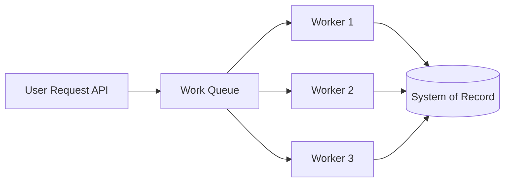
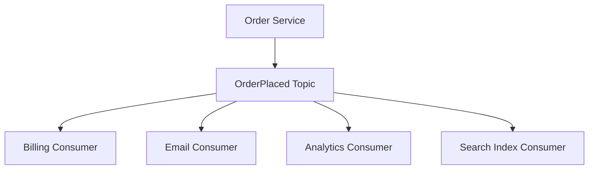

# 8. Message Queues & Event Systems

## Part Context
**Part:** Part 2 - Core System Building Blocks  
**Position:** Chapter 8 of 42  
**Why this part exists:** This section moves from framing to mechanics by explaining the infrastructure components that repeatedly appear in real-world systems.  
**This chapter builds toward:** asynchronous workflows, decoupled systems, and event-driven architecture patterns

## Overview
Synchronous APIs are useful, but they are not enough for all workloads. Many production systems need buffering, background processing, fan-out, retries, and a way for different parts of the system to move at different speeds. Message queues and event systems make that possible.

This chapter introduces the ideas behind task queues, publish-subscribe systems, event streams, and the trade-offs that come with asynchronous communication. Once systems scale or become workflow-heavy, these tools become central.

## Why This Matters in Real Systems
- Asynchronous communication keeps user-facing paths fast by moving non-critical work out of the request path.
- Queues absorb bursts and protect slower downstream systems.
- Event systems let multiple consumers react to the same state change without tight coupling.
- Architects need this building block to design resilient workflows, analytics pipelines, and large-scale integrations.

## Core Concepts
### Synchronous vs asynchronous communication
Synchronous calls block until a result returns. Asynchronous flows accept work and continue while processing happens later or elsewhere.

### Task queues
Queues distribute units of work to worker processes, often with retry and dead-letter support.

### Event streams and pub/sub
Event systems broadcast state changes so multiple consumers can react independently.

### Delivery guarantees and idempotency
At-least-once delivery is common, which means consumers must be safe to retry without harmful side effects.

## Key Terminology
| Term | Definition |
| --- | --- |
| Producer | A component that publishes a message or event. |
| Consumer | A component that processes a message or subscribes to an event stream. |
| Queue | An ordered buffer of work awaiting processing. |
| Topic | A named stream or channel for events or messages. |
| Offset | A position marker in a log-based stream, often used by consumers to track progress. |
| Idempotency | The property that repeating an operation does not create unintended additional side effects. |
| Dead Letter Queue | A holding queue for messages that repeatedly fail processing. |
| Backpressure | A signal or behavior indicating that downstream systems cannot safely accept more work at the current rate. |

## Detailed Explanation
### Why asynchronous design exists
If a request must wait for every downstream system, latency rises and the failure path expands. Sending confirmation emails, generating thumbnails, updating analytics, or triggering recommendations usually does not need to block the user. Queues separate the user-facing critical path from slower side effects.

### Queues smooth workload mismatches
A producer may create work faster than a consumer can process it for a short period. A queue absorbs that difference. This is especially useful during spikes, batch imports, or when worker pools scale independently from the front-end API layer.

### Task queues and event streams are not the same
A task queue is about completing work, often by one worker or one consumer group. An event stream is about broadcasting facts that may be useful to many independent consumers. Confusing the two leads to poor semantics and awkward ownership boundaries.

### Retries create correctness pressure
Asynchronous systems often provide at-least-once delivery. That means the same message may be delivered more than once. Consumers therefore need idempotent behavior, good deduplication strategy, and observable failure handling.

### Observability is harder in async systems
The user may not see an immediate error even if downstream work fails later. Architects therefore need queue metrics, lag tracking, dead-letter handling, trace correlation, and replay or reconciliation paths.

## Diagram / Flow Representation
### Queue-Based Workflow

### Pub/Sub Event Flow

## Real-World Examples
- Amazon order systems commonly use asynchronous workflows so email, analytics, and fulfillment updates do not slow checkout.
- Uber-like systems stream location and trip events so multiple subsystems can react independently.
- Netflix-like media pipelines rely on asynchronous jobs for encoding and asset generation.
- WhatsApp-style messaging systems use queues for offline delivery and fan-out while keeping the active user path responsive.

## Case Study
### Order processing system

Order processing shows why asynchronous design matters. A user should not wait while every downstream system performs its side effects synchronously, yet the business still needs a safe and observable workflow.

### Requirements
- A customer places an order and should receive a quick acknowledgment.
- Payment, inventory, warehouse, analytics, and email systems all need to react.
- The system should survive short spikes and temporary downstream slowness.
- Failures should be recoverable without double-charging or duplicate order fulfillment.
- Operators should be able to inspect and replay failed work safely.

### Design Evolution
- A first version may place the order synchronously and push follow-up work such as email or analytics to a queue.
- As complexity grows, different downstream teams subscribe to order events independently.
- As scale grows, retry policies, idempotency keys, and dead-letter handling become necessary.
- As workflow safety requirements grow, orchestration or saga-like patterns may sit above the raw queue system.

### Scaling Challenges
- Spikes can create queue lag if worker fleets do not scale quickly enough.
- Retries can create duplicate side effects unless consumers are idempotent.
- A broken downstream dependency may back up the entire pipeline if isolation is weak.
- Without good observability, failures may hide until customers or operators notice missing side effects.

### Final Architecture
- A small synchronous critical path for order acceptance and durability.
- Queued or event-driven follow-up work for payment settlement, notifications, analytics, and warehouse updates.
- Idempotent consumers with dead-letter queues and replay support.
- Lag, failure-rate, and retry observability across the pipeline.
- Workflow state visible to operators and other systems so recovery is manageable.

## Architect's Mindset
- Use async boundaries where the product can tolerate delay and where decoupling creates real value.
- Be explicit about whether you need a work queue, a pub/sub stream, or both.
- Design consumers as if duplicates and retries are normal, because they are.
- Treat observability and replay as first-class requirements in async systems.
- Remember that queues move complexity; they do not remove it.

## Common Mistakes
- Adding a queue without defining delivery semantics or failure handling.
- Using an event stream for work that should really be completed once by one worker pool.
- Building non-idempotent consumers in an at-least-once environment.
- Ignoring lag and backpressure until downstream systems fall behind.
- Assuming async systems are automatically more scalable without measuring bottlenecks.

## Interview Angle
- Queues and event systems are common interview follow-ups when the first design is too synchronous or tightly coupled.
- Strong answers explain why async helps, what guarantees are needed, and how retries and duplicates are handled.
- Candidates stand out when they distinguish queues from event streams and mention dead-letter handling, lag, and idempotency.
- A weak answer says “use Kafka” or “use RabbitMQ” without describing the workflow semantics.

## Quick Recap
- Queues and event systems help decouple services and smooth traffic mismatches.
- Task queues and event streams solve related but different problems.
- Idempotency, retry behavior, and observability are central design concerns.
- Async design keeps request paths fast but adds workflow complexity elsewhere.
- The right tool depends on whether you are coordinating work or broadcasting facts.

## Practice Questions
1. When should a workflow remain synchronous instead of using a queue?
2. How do task queues differ from event streams?
3. Why is idempotency essential for message consumers?
4. What is the purpose of a dead-letter queue?
5. How would you detect that a queue backlog is becoming dangerous?
6. What kinds of work are ideal for asynchronous processing?
7. How would you explain backpressure to a teammate?
8. Why do retries create business correctness issues rather than only technical issues?
9. How would you trace a user request through both sync and async steps?
10. What changes when a queue-based system must support replay?

## Further Exploration
- Continue to event-driven architecture later in the book for broader architectural patterns built on these ideas.
- Study consumer lag, exactly-once style patterns, and outbox techniques in more depth.
- Build a small queued workflow yourself to feel the operational differences from synchronous APIs.

## Navigation
- Previous: [Load Balancing](07-load-balancing.md)
- Next: [Storage Systems](09-storage-systems.md)
