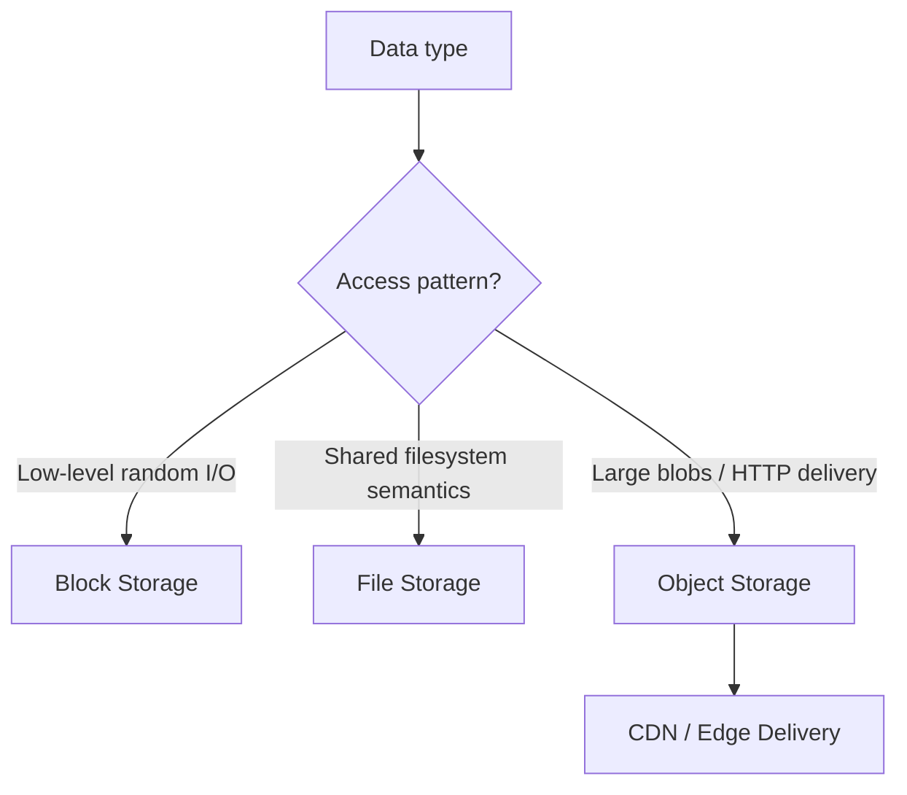
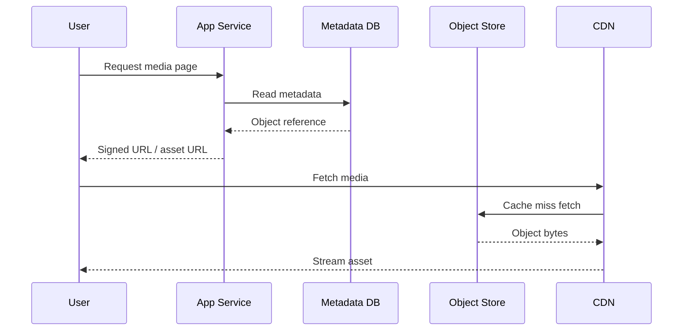

# 9. Storage Systems

## Part Context
**Part:** Part 2 - Core System Building Blocks  
**Position:** Chapter 9 of 60
**Why this part exists:** This section moves from framing to mechanics by explaining the infrastructure components that repeatedly appear in real-world systems.  
**This chapter builds toward:** choosing the right storage medium for media, persistence, content delivery, and long-term cost control

## Overview
Storage is not one thing. Databases, filesystems, block volumes, object stores, archival tiers, and CDNs all exist because different kinds of data want different handling. System designers need to match storage technology to access pattern, durability requirement, cost sensitivity, and operational model.

This chapter focuses on the storage systems that commonly appear around applications: file, block, and object storage, along with blob serving and CDN delivery. These choices become especially important in media-heavy and globally distributed products.

## Why This Matters in Real Systems
- Using the wrong storage model can create permanent performance and cost penalties.
- Media-heavy products live or die by storage and delivery design, not only by API code.
- Durability, egress cost, and lifecycle management are all architecture concerns.
- Storage choices often determine how the rest of the system must be modeled.

## Core Concepts
### Block, file, and object storage
These three models expose different abstractions and fit different workloads.

### Blob storage and media handling
Large unstructured files such as images, videos, logs, and backups usually belong in object storage rather than relational tables.

### Durability, replication, and lifecycle
Storage systems differ in how they replicate data, recover from failure, and manage old or cold data.

### CDN integration
A CDN extends storage to the edge, improving performance and reducing origin traffic for globally consumed content.

## Key Terminology
| Term | Definition |
| --- | --- |
| Block Storage | Low-level attachable storage volumes optimized for filesystems and database engines. |
| File Storage | Shared hierarchical storage exposed through filesystem semantics. |
| Object Storage | A storage model for blobs addressed as objects with metadata. |
| Blob | A large binary object such as an image, video, or document. |
| Origin | The source system from which a CDN fetches content when it is not cached at the edge. |
| Egress | Data transferred out of the source environment, often a major cost driver. |
| Lifecycle Policy | Rules for moving, archiving, or deleting data over time. |
| Durability | The probability that stored data remains preserved over time and across failures. |

## Detailed Explanation
### Choose storage by access pattern
Databases often need block-level performance because they manage their own pages and transactions. Shared developer assets may want a filesystem interface. Media uploads, logs, backups, and downloadable artifacts often fit object storage because they are large, append-light, and consumed over HTTP or CDN paths.

### Object storage changes application architecture
Once blobs live in object storage, the application usually stores metadata and references separately in its transactional store. This is a healthy pattern because the binary payload and the control-plane metadata have different performance and scaling needs.

### Durability is not just a number on a brochure
Highly durable storage usually relies on replication, checksums, and background repair. Architects still need to think about accidental deletion, regional requirements, backup policy, and recovery objectives. Durable storage does not eliminate the need for data management.

### CDNs shift the economics of content delivery
Without a CDN, origin systems pay the latency and bandwidth cost for every viewer. With a CDN, frequently accessed content is served from the edge. This changes not only performance but also how origins are scaled, how cache headers are designed, and how egress cost behaves.

### Storage lifecycle drives long-term cost
The total storage bill is not only about the cost per GB today. Retention period, backup policy, access frequency, cross-region replication, and retrieval behavior all shape long-term economics. Architects should think in lifecycles, not snapshots.

## Diagram / Flow Representation
### Storage Selection View


### Media Serving Path


## Real-World Examples
- YouTube stores raw uploads and transcoded renditions as objects, not inside its transactional metadata database.
- Amazon product images are served from storage systems optimized for object delivery and fronted by edge caches.
- Netflix content delivery depends on edge distribution because origin-only delivery would be too slow and expensive.
- Google Drive separates document metadata and collaboration state from the large file objects themselves.

## Case Study
### YouTube-style video storage

A video platform is an excellent storage case because it combines huge binary objects, metadata, transcoding pipelines, and global playback traffic.

### Requirements
- Accept large user uploads reliably and durably.
- Store original and processed video assets efficiently.
- Serve playback data globally with low latency.
- Keep metadata such as ownership, title, visibility, and processing state strongly manageable.
- Control long-term storage and delivery cost as the catalog grows.

### Design Evolution
- A simple version may store uploads durably and keep metadata in a relational store.
- As transcoding is added, the system creates multiple output renditions and stores them separately from the source upload.
- As global playback grows, CDN distribution becomes essential to reduce latency and origin load.
- As the library ages, lifecycle policies can move older or less frequently accessed assets into colder tiers if product behavior allows.

### Scaling Challenges
- Large binary data overwhelms transactional databases if stored in the wrong place.
- CDN miss traffic can still overload origins if cache behavior is poorly designed.
- Replication and backup multiply effective storage size beyond the raw uploaded bytes.
- Egress cost can become as important as raw storage cost for popular media systems.

### Final Architecture
- Object storage for uploaded and processed media assets.
- A metadata database for ownership, titles, visibility, and processing state.
- CDN delivery for media segments, thumbnails, and static assets.
- Lifecycle and archival policies tied to access patterns and business retention rules.
- Observability for origin load, CDN hit rate, storage growth, and retrieval latency.

## Architect's Mindset
- Choose storage media based on access semantics, not habit.
- Separate metadata from large binary objects early in the design.
- Treat egress and lifecycle policy as first-class cost concerns.
- Remember that durability still requires deletion controls, backup thinking, and recovery planning.
- Use CDN strategy as part of storage architecture, not as an afterthought.

## Storage Decision Matrix

Use this matrix when choosing a storage medium. The right answer depends on access pattern, durability needs, cost sensitivity, and operational model — not on product brand.

| Dimension | Block Storage | File Storage | Object Storage | Archive Storage |
|-----------|-------------|-------------|---------------|----------------|
| **Abstraction** | Raw disk volumes | Shared filesystem (NFS, EFS) | HTTP-addressable objects with metadata | Cold object storage with retrieval delay |
| **Access pattern** | Random read/write, low-latency I/O | Hierarchical path-based, shared access | Write-once-read-many, HTTP GET/PUT | Write-once-read-rarely |
| **Latency** | Sub-millisecond | Milliseconds | 10-100ms (first byte) | Minutes to hours (retrieval request) |
| **Typical use cases** | Database engine volumes, OS disks, high-IOPS workloads | Shared config, CMS content, legacy apps, ML training data | Images, videos, logs, backups, static assets | Compliance archives, cold backups, legal hold |
| **Durability** | Depends on volume replication (EBS: 99.999%) | Depends on provider (EFS: 99.999999999%) | Very high (S3: 11 nines / 99.999999999%) | Very high (same as object storage) |
| **Scalability** | Limited by volume size (resize required) | Elastic (auto-grows) | Virtually unlimited | Virtually unlimited |
| **Cost ($/GB/month)** | $0.08-0.10 (gp3) | $0.30 (EFS) | $0.023 (S3 Standard) | $0.001-0.004 (Glacier) |
| **Cloud examples** | EBS, Azure Disk, GCP Persistent Disk | EFS, Azure Files, GCP Filestore | S3, Azure Blob, GCS | S3 Glacier, Azure Cool/Archive, GCS Coldline |

### Quick Decision Flowchart

```
What is the data?
  → Database engine or OS disk? → BLOCK STORAGE
  → Shared files accessed by path from multiple instances? → FILE STORAGE
  → Large binary objects accessed via HTTP (images, videos, logs)? → OBJECT STORAGE
  → Data accessed less than once per month, kept for compliance? → ARCHIVE STORAGE
```

---

## Durability Math, SLAs, and Backup/Restore Drills

### Understanding Durability Numbers

Durability is the probability that a stored object will not be lost over a year. The numbers are expressed in "nines":

| Durability | Meaning | Expected Loss per 10M Objects/Year |
|-----------|---------|----------------------------------|
| 99.9% (3 nines) | 1 in 1,000 objects lost/year | 10,000 objects |
| 99.99% (4 nines) | 1 in 10,000 lost/year | 1,000 objects |
| 99.999999999% (11 nines) | 1 in 100 billion lost/year | 0.0001 objects (effectively zero) |

**S3 Standard at 11 nines:** If you store 10 million objects, you can expect to lose one object every 10 million years. This does *not* mean you cannot lose data — accidental deletion, application bugs, and ransomware are not durability failures.

### Durability ≠ Backup

| Concern | Durability Protects Against | Backup Protects Against |
|---------|---------------------------|------------------------|
| Hardware failure | ✅ (replication across drives/AZs) | ✅ |
| Data center failure | ✅ (cross-AZ replication) | ✅ |
| Accidental deletion | ❌ (deletion is faithfully replicated) | ✅ (point-in-time restore) |
| Application bug corrupts data | ❌ (corruption is faithfully replicated) | ✅ (restore from before corruption) |
| Ransomware encrypts objects | ❌ (encrypted objects replace originals) | ✅ (immutable backups survive) |
| Region-wide outage | ❌ (single-region storage) | ✅ (cross-region backup) |

### Backup Strategy Template

| Data Category | RPO (Recovery Point Objective) | RTO (Recovery Time Objective) | Backup Method | Retention |
|--------------|-------------------------------|-------------------------------|--------------|-----------|
| Transactional DB | < 1 hour | < 15 minutes | Continuous WAL archival + automated snapshots | 30 days |
| User-uploaded media | < 24 hours | < 4 hours | Cross-region replication + versioning | Indefinite (user owns content) |
| Application config | < 1 hour | < 5 minutes | Git (source of truth) + automated backup | Indefinite |
| Analytics data | < 24 hours | < 1 day | Daily export to separate bucket/region | 90 days |
| Audit logs | 0 (no loss acceptable) | < 1 hour | Write-once storage + cross-region replication | 7 years (regulatory) |

### Backup/Restore Drill Guidance

Backups that are never tested are not backups — they are hopes. Schedule restore drills quarterly.

**Drill checklist:**

- [ ] Select a backup from the retention window (not the most recent — test a realistic scenario)
- [ ] Restore to a non-production environment (never test on prod)
- [ ] Verify data integrity: row counts, checksums, sample queries match expected state
- [ ] Measure actual RTO: time from "start restore" to "data is queryable"
- [ ] Document any gaps: missing tables, incomplete point-in-time, permission issues
- [ ] Compare actual RTO/RPO to stated targets — if they don't match, fix the backup strategy
- [ ] Record drill results and publish to the team (treat as a mini-postmortem)

---

## Storage Lifecycle Tiering — With Cost Models

Data access patterns change over time. Hot data becomes warm, warm becomes cold, cold becomes archive. Lifecycle policies automate this transition and dramatically reduce costs.

### Lifecycle Tier Design

| Tier | Age | Access Frequency | Storage Class | Cost ($/GB/month) | Retrieval | Use Case |
|------|-----|-----------------|--------------|-------------------|-----------|----------|
| Hot | 0-7 days | Multiple times/day | S3 Standard / gp3 SSD | $0.023 | Instant | Active user uploads, recent logs, current sessions |
| Warm | 7-30 days | Weekly | S3 Infrequent Access | $0.0125 | Instant (+ retrieval fee) | Recent analytics, older profile images, 30-day logs |
| Cold | 30-90 days | Monthly or less | S3 Glacier Instant | $0.004 | Milliseconds | Compliance data, quarterly reports, inactive user data |
| Archive | 90+ days | Yearly or never | S3 Glacier Deep Archive | $0.00099 | 12-48 hours | 7-year audit logs, legal hold, regulatory archives |

### Cost Model: Photo-Sharing Platform (10 PB total)

```
Without lifecycle tiering (all S3 Standard):
  10,000 TB × $0.023/GB/month × 1000 GB/TB = $230,000/month

With lifecycle tiering:
  Hot   (1 PB, 10%):  1,000 TB × $0.023 × 1000 = $23,000
  Warm  (2 PB, 20%):  2,000 TB × $0.0125 × 1000 = $25,000
  Cold  (3 PB, 30%):  3,000 TB × $0.004 × 1000 = $12,000
  Archive (4 PB, 40%): 4,000 TB × $0.00099 × 1000 = $3,960
  Total: $63,960/month (72% savings)
```

### Lifecycle Policy Example (S3)

```json
{
  "Rules": [
    {
      "ID": "Transition to IA after 30 days",
      "Status": "Enabled",
      "Filter": { "Prefix": "uploads/" },
      "Transitions": [
        { "Days": 30, "StorageClass": "STANDARD_IA" },
        { "Days": 90, "StorageClass": "GLACIER_IR" },
        { "Days": 365, "StorageClass": "DEEP_ARCHIVE" }
      ],
      "Expiration": { "Days": 2555 }
    }
  ]
}
```

---

## Object-Store Versioning and Ransomware Resilience

### Object Versioning

Versioning keeps every overwrite and delete as a recoverable version. This protects against accidental deletion and application bugs.

| Feature | Without Versioning | With Versioning |
|---------|-------------------|----------------|
| Overwrite | Previous data is permanently lost | Previous version is preserved |
| Delete | Object is permanently removed | Delete marker added; previous versions remain |
| Recovery from app bug | Impossible (corrupted data replaces original) | Restore to any previous version |
| Storage cost | 1x | Increases with number of versions (use lifecycle to expire old versions) |

### Ransomware and Data Protection

| Threat | Protection Mechanism |
|--------|---------------------|
| Ransomware encrypts objects | **Object Lock (WORM)**: prevents modification/deletion for a retention period; even the root account cannot override in compliance mode |
| Attacker deletes all versions | **MFA Delete**: requires MFA token to permanently delete versioned objects |
| Compromised credentials overwrite data | **Versioning + Object Lock**: overwrites create new versions; originals are immutable |
| Cross-account attack | **Cross-account backup**: replicate to a separate AWS account with independent credentials |

### Immutable Backup Architecture

```
Production Account                  Backup Account (separate credentials)
┌──────────────┐                   ┌──────────────────────────┐
│ S3 Bucket    │ ──replication──→  │ S3 Bucket                │
│ (versioned)  │                   │ (versioned + Object Lock │
│              │                   │  Compliance mode)         │
└──────────────┘                   └──────────────────────────┘
                                   • Cannot be deleted by anyone
                                   • Retention: 30 days minimum
                                   • Even root account cannot override
```

---

## Geo-Replication Trade-offs and Data Governance

### Replication Strategy Comparison

| Strategy | Consistency | Latency | Cost | Use Case |
|----------|-----------|---------|------|----------|
| **Single-region, multi-AZ** | Strong (synchronous AZ replication) | Low (same region) | 1x storage, no cross-region egress | Most applications; default recommendation |
| **Cross-region replication (CRR)** | Eventual (async, seconds to minutes lag) | Read from nearest region | 2x storage + egress fees | DR, read latency optimization, data residency |
| **Multi-region active-active** | Eventual or conflict resolution required | Low everywhere | 2x+ storage + egress + conflict resolution overhead | Global consumer apps requiring local writes |

### Data Governance Checklist

| Concern | Question to Ask | Implementation |
|---------|----------------|---------------|
| **Data residency** | Where must this data physically reside? | Region-locked buckets; disable cross-region replication for regulated data |
| **Access control** | Who can read/write/delete this data? | IAM policies + bucket policies + S3 Access Points per team/tenant |
| **Encryption** | What encryption is required? | SSE-S3 (default), SSE-KMS (audit trail), or SSE-C (customer-managed keys) |
| **Retention** | How long must data be kept? What triggers deletion? | Lifecycle rules + legal hold for compliance data |
| **Audit** | Who accessed what and when? | S3 Server Access Logging + CloudTrail data events |
| **Classification** | Is this data PII, financial, or public? | Tag objects with classification; enforce policies by tag |
| **Deletion** | Can data be permanently deleted? By whom? | MFA Delete + Object Lock for compliance; soft-delete with grace period for user data |

### Cross-Reference to Other Chapters

| Topic | Chapter |
|-------|---------|
| Lifecycle tiering cost models | Chapter 3: Estimation & Capacity Planning |
| CDN cache key design and invalidation | Chapter 6: Caching Systems |
| Database storage engine internals | Chapter 5: Databases Deep Dive |
| Backup observability and SLO monitoring | F10: Observability & Operations |
| Storage in deployment pipelines (artifacts) | F11: Deployment & DevOps |

## Common Mistakes
- Storing large media blobs in the primary relational database without a strong reason.
- Ignoring egress cost when planning content-heavy systems.
- Treating storage as only capacity and forgetting access pattern and lifecycle.
- Assuming highly durable storage removes the need for backup or recovery planning.
- Using the same storage class for hot data and archival data.

## Interview Angle
- Storage questions usually appear in media systems, backup systems, file systems, and large content products.
- Strong answers explain why metadata and blobs belong in different layers and how CDNs reduce origin pressure.
- Candidates stand out when they discuss storage lifecycle, durability, and cost rather than only raw capacity.
- A weak answer uses “S3” or another product name without explaining the access pattern it fits.

## Quick Recap
- Storage systems exist in different forms because workloads differ.
- Block, file, and object storage should be selected according to access pattern and semantics.
- Large blobs generally belong in object storage, with metadata stored separately.
- CDNs improve global delivery performance and reduce origin load.
- Lifecycle and egress costs are part of architecture, not accounting afterthoughts.

## Practice Questions
1. Why is object storage usually a better fit for images and videos than a relational database?
2. When would block storage be the better choice?
3. How does separating metadata from blobs simplify architecture?
4. Why does CDN design belong in a storage discussion?
5. What is the effect of lifecycle policies on long-term cost?
6. How would you design storage for a document-sharing platform?
7. What kinds of mistakes drive egress cost unexpectedly high?
8. How would you explain durability versus backup to a teammate?
9. What would you monitor in a content-serving storage system?
10. How does origin protection relate to storage design?

## Further Exploration
- Carry these ideas into the YouTube and Instagram system design chapters later in the book.
- Study storage classes, archival tiers, and signed URL patterns in more depth.
- Practice mapping storage types to three products: backup service, photo app, and shared filesystem.


## Navigation
- Previous: [Message Queues & Event Systems](08-message-queues-event-systems.md)
- Next: [Scalability](../03-distributed-systems/10-scalability.md)
