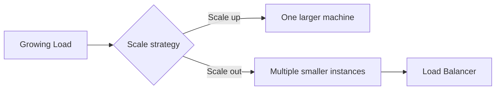
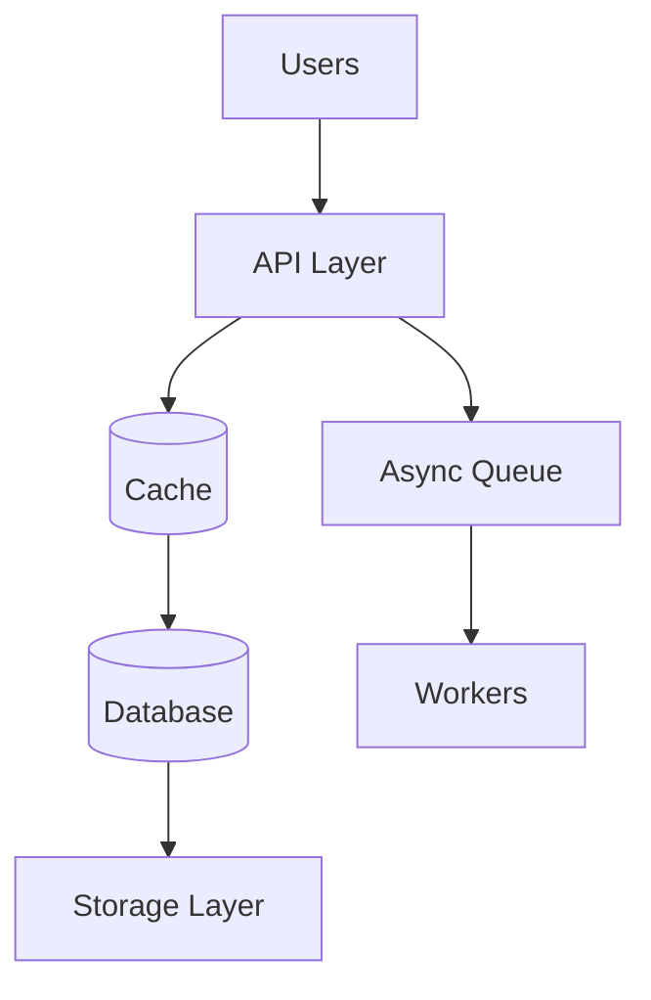

# 10. Scalability

## Part Context
**Part:** Part 3 - Distributed Systems Concepts  
**Position:** Chapter 10 of 60
**Why this part exists:** This section explains the trade-offs that appear once systems scale across machines, replicas, regions, and failure domains.  
**This chapter builds toward:** reasoning about growth, elasticity, bottlenecks, and the system changes required as demand increases

## Overview
Scalability is the ability of a system to handle growth without unacceptable degradation in latency, reliability, correctness, or cost. Growth can mean more requests, more data, more users, more geographic spread, or more product complexity. Architects care about scalability because systems almost never fail when they are small and lightly used. They fail when growth exposes assumptions that were never made explicit.

This chapter explains how systems scale vertically, horizontally, and elastically, and why the real question is not “can it scale?” but “what will become the bottleneck first, and what design changes will that force?”

## Why This Matters in Real Systems
- Scalability determines whether a product can survive growth without repeated architectural emergencies.
- Different layers of a system scale in different ways; understanding those differences prevents naive designs.
- Scalability decisions affect cost, operational complexity, and resilience at the same time.
- Interviewers use scalability questions to see whether candidates can reason beyond the happy path of a small system.

## Core Concepts
### Vertical scaling
Scaling up means giving one machine more CPU, memory, storage, or network capacity. It is often simple at first but has hard limits and can create expensive single points of failure.

### Horizontal scaling
Scaling out means adding more machines or instances and distributing work across them. It often improves both capacity and fault isolation but requires statelessness, partitioning, or coordination mechanisms.

### Elasticity and auto scaling
Elasticity is the ability to adjust capacity with demand. Auto scaling helps align cost with real load, but only when the scaling signals and warm-up behavior are well understood.

### Bottleneck-driven design
Scalability is rarely uniform across the system. The web tier, cache tier, database, queue consumers, and storage layers all hit limits differently.

## Key Terminology
| Term | Definition |
| --- | --- |
| Vertical Scaling | Increasing the resources of one machine or node. |
| Horizontal Scaling | Adding more machines or instances to share the workload. |
| Elasticity | The ability to add or remove capacity dynamically as load changes. |
| Bottleneck | The most limiting component in the current system path. |
| Headroom | Reserved excess capacity used to handle spikes or partial failures. |
| Hotspot | A skewed concentration of traffic or data that overloads one component or partition. |
| Autoscaler | A mechanism that changes capacity automatically based on observed conditions. |
| Throughput | The total amount of work the system can complete in a period of time. |

## Detailed Explanation
### Scaling is never one-dimensional
A system may scale well in request count but poorly in storage growth, or scale in reads but not writes. That is why architects look for the current bottleneck instead of asking whether the system is “scalable” in a vague sense. The answer depends on workload shape.

### Vertical scaling buys time, not infinity
Adding a larger machine is often the fastest way to survive early growth. It can be the correct decision when the workload is still modest. But there are physical, financial, and operational limits. One very large machine is often expensive, harder to replace, and still a single failure domain.

### Horizontal scaling needs architectural support
Adding more application instances works only if requests can be served by any healthy instance. That usually means stateless services, shared session state, externalized caches, and data partitioning or shared storage behind the instances.

### Elasticity is a control problem
Autoscaling sounds simple, but bad scaling signals can cause oscillation, delayed response, or runaway cost. A queue-backed worker system may need scaling based on lag, not CPU. A web tier may need to account for warm-up time, connection priming, or cache fill behavior.

### Scalability and resilience interact
A horizontally scaled system often tolerates instance loss better than a vertically scaled singleton, but it also introduces more partial failures, more coordination, and more moving parts to observe. The gain in capacity comes with operational complexity.

## Diagram / Flow Representation
### Vertical vs Horizontal Scaling


### Bottleneck View


## Real-World Examples
- Amazon during Black Friday scales web and API tiers horizontally because demand spikes quickly and failure isolation matters.
- Google search serving benefits from enormous horizontal distribution because global scale and resilience are core requirements.
- Netflix autoscaling behavior depends on service type; stateless serving layers scale differently from encoding pipelines.
- An internal analytics tool may use vertical scaling for a long time because the cheaper architecture is still sufficient.

## Case Study
### Black Friday traffic on an e-commerce platform

Black Friday is a classic scalability case because the challenge is not only total traffic, but highly concentrated peak traffic combined with high business stakes.

### Requirements
- Serve a dramatically higher request volume than normal without collapsing user experience.
- Keep browse, cart, and checkout paths available under heavy load.
- Protect stateful systems such as inventory and order databases from read storms.
- Scale cost-effectively rather than paying Black Friday capacity costs year-round.
- Fail gracefully if some services or zones degrade.

### Design Evolution
- A smaller version may rely on vertical growth and a modest cluster of web instances.
- As seasonal peaks become larger, the system adds stronger caching and horizontally scaled stateless application tiers.
- As deployment and traffic risk increase, autoscaling and queue-backed side-effect workflows become more important.
- As the platform matures, capacity planning and failure drills become part of the architecture, not just part of operations.

### Scaling Challenges
- The database may become the first bottleneck if product and catalog reads are not heavily cached.
- Autoscaling may react too slowly if warm-up time is ignored.
- Traffic is not evenly distributed; a few popular products or campaigns can create hotspots.
- Degraded dependencies can cause retry storms that make scaling harder rather than easier.

### Final Architecture
- Horizontally scaled stateless web and API tiers behind load balancers.
- Aggressive caching and CDN use for product and asset reads.
- Protected stateful systems with queue-backed asynchronous side effects.
- Capacity plans with headroom and tested autoscaling rules.
- Observability focused on bottleneck layers, not only aggregate traffic.

## Architect's Mindset
- Ask what grows fastest: requests, writes, data volume, fan-out, or coordination cost.
- Treat the bottleneck as the real design driver, not the easiest component to scale.
- Scale stateful systems more carefully than stateless compute.
- Use elasticity to match cost to demand, but do not mistake automation for architectural correctness.
- Plan for partial failure while scaling, not only for happy-path growth.

## Scalability Toolbox

Every scalability problem maps to one or more proven patterns. This table indexes the patterns by the bottleneck they solve and links to the chapter that covers each in depth.

| Bottleneck | Pattern | How It Helps | Chapter |
|-----------|---------|-------------|---------|
| **Read-heavy database** | Caching (Redis, Memcached) | Absorb repeated reads; reduce DB query load | Ch 6: Caching Systems |
| **Read-heavy database** | Read replicas | Offload reads to replicas; keep primary for writes | Ch 5: Databases Deep Dive |
| **Write-heavy database** | Sharding / partitioning | Distribute writes across multiple DB nodes by partition key | F7: Data Partitioning |
| **Write-heavy database** | Async writes (queue + worker) | Move writes off the critical path; batch and buffer | Ch 8: Message Queues |
| **Compute-heavy API** | Horizontal scaling + LB | Add stateless instances behind load balancer | Ch 7: Load Balancing |
| **Compute-heavy API** | CDN for static/cacheable responses | Offload edge-servable responses from origin | Ch 9: Storage Systems |
| **Fan-out heavy** | Event streaming (Kafka, Pulsar) | Decouple producer from consumers; parallelize consumption | Ch 8: Message Queues |
| **Latency-sensitive global** | Multi-region deployment | Serve users from nearest region; reduce round-trip | Ch 4: Networking; Ch 7: Load Balancing |
| **Storage growth** | Lifecycle tiering (hot → cold → archive) | Move aging data to cheaper tiers automatically | Ch 9: Storage Systems |
| **Coordinated state** | Distributed consensus (Raft, Paxos) | Maintain agreement across replicas for critical state | F4: Consensus & Coordination |
| **All-or-nothing scaling** | Feature flags + traffic shaping | Selectively enable features; shed load on non-critical paths | F11: Deployment & DevOps |
| **Cost scaling linearly with traffic** | Caching + async + right-sizing | Ensure cost grows sub-linearly with traffic | Ch 3: Estimation; Ch 6: Caching |

### How to Use the Toolbox in Interviews

When the interviewer asks "how does this scale?":

1. **Identify the bottleneck** — "The database is the first bottleneck because reads are 100x writes."
2. **Pick the pattern** — "I would add a Redis cache for hot read paths (cache-aside) to reduce DB load by 90%."
3. **Project the limit** — "This buys us 10x growth. At 100x, we would need to shard the database by user_id."
4. **Reference the cost** — "Caching costs ~$500/month vs. scaling the database vertically at ~$5,000/month."

---

## Scaling Anti-Patterns

These are the most common ways scaling efforts backfire. Recognizing them early prevents wasted effort and cascading failures.

### Hot Partitions

**What happens:** Traffic or data is unevenly distributed across partitions, overloading one while others sit idle. A system with 10 shards but all celebrity traffic hitting shard 3 has not actually scaled.

**Causes:**
- Low-cardinality partition key (e.g., `country` with 80% of traffic in one country)
- Sequential keys (e.g., auto-increment IDs route all recent data to the latest partition)
- Celebrity/viral content (one user or item generates disproportionate traffic)

**Fixes:**
- Choose high-cardinality, well-distributed partition keys (e.g., `user_id`, `hash(entity_id)`)
- Add a jitter suffix for known hot keys (`celebrity_user_id:shard_N`)
- Use separate handling for known hot entities (dedicated cache, separate processing path)
- Monitor per-partition metrics, not just aggregate throughput

### Thundering Herd

**What happens:** A single event (cache expiry, failover, service restart) causes all clients to simultaneously request the same resource, overwhelming the backend.

**Common triggers:**
- Popular cache key expires → thousands of concurrent cache misses
- Load balancer adds backend → all pending requests flood the new instance
- Database failover completes → connection storms from all application instances

**Fixes:**
- Cache: jittered TTLs, request coalescing (singleflight), stale-while-revalidate
- LB: gradual ramp-up for new backends (slow-start weight)
- DB: connection pool with max limit; queue overflow rather than crash

### Retry Storms

**What happens:** A downstream service becomes slow or fails. Clients retry, adding 2-3x load. The retries make the problem worse, creating a positive feedback loop that prevents recovery.

**Fixes:**
- Exponential backoff with jitter on all retries
- Retry budgets: limit total retries to 10-20% of normal traffic
- Circuit breakers: stop calling a failing dependency after N consecutive failures
- Deadline propagation: if the caller's deadline has passed, don't retry

### Premature Optimization

**What happens:** The team adds sharding, microservices, or distributed caching before the system needs it. The added complexity slows development, increases operational burden, and may not address the actual bottleneck.

**Signals you've over-scaled:**
- The database is at 5% utilization but you're running 3 shards
- You have a service mesh for 3 services
- Cache hit rate is 99.9% but you're investigating cache performance
- The team spends more time on infrastructure than on product features

**Fix:** Start simple. Measure. Scale the bottleneck. Repeat.

---

## Multi-Tenant Scaling

SaaS platforms must scale not just for total traffic, but for diverse tenant workloads. One large tenant can consume disproportionate resources and degrade the experience for all others ("noisy neighbor").

### Multi-Tenant Scaling Challenges

| Challenge | What Happens | Mitigation |
|-----------|-------------|-----------|
| **Noisy neighbor** | One tenant's bulk import saturates shared DB connections | Per-tenant connection pool limits; per-tenant rate limiting |
| **Uneven growth** | 5% of tenants generate 80% of traffic | Tier tenants by size; dedicated infrastructure for largest tenants |
| **Data skew** | One tenant has 100M rows; most have 10K | Shard by tenant_id; monitor per-tenant data volume |
| **Isolation failures** | One tenant's slow query blocks others | Query timeout enforcement; separate read replicas for large tenants |
| **Cost attribution** | Cannot determine which tenant drives which cost | Tag resources by tenant; per-tenant metering of compute/storage/bandwidth |

### Tenant Scaling Tiers

| Tier | Tenant Size | Infrastructure | Isolation | Cost Model |
|------|-----------|---------------|-----------|-----------|
| **Free / Small** | < 1K requests/day | Shared everything (multi-tenant DB, shared compute) | Application-level (tenant_id filter) | Included / freemium |
| **Mid-tier** | 1K-100K requests/day | Shared compute, dedicated DB schema or connection pool | Schema-level or resource limits | Per-seat or per-usage |
| **Enterprise** | > 100K requests/day | Dedicated compute cluster, dedicated DB instance | Full infrastructure isolation | Custom contract |

---

## Saturation Monitoring and Capacity Planning Loops

Scaling is not a one-time decision — it is a continuous feedback loop. The loop connects monitoring signals to capacity decisions to SLO compliance to cost control.

### The Capacity Planning Loop

```
Monitor saturation signals
        │
        ▼
Forecast growth (traffic trends + business events)
        │
        ▼
Compare forecast to current headroom
        │
        ▼
If headroom < threshold → scale (add capacity)
If headroom > 2x threshold → right-size (reduce waste)
        │
        ▼
Validate SLOs after scaling
        │
        ▼
Review cost impact
        │
        ▼
Repeat (weekly / monthly / quarterly)
```

### Saturation Signals by Layer

| Layer | Saturation Signal | Threshold | Action When Exceeded |
|-------|------------------|-----------|---------------------|
| API / Compute | CPU utilization | > 70% sustained | Scale out (add instances) or scale up |
| API / Compute | Request queue depth | > 100 pending | Scale out; investigate slow endpoints |
| Database | Connection pool utilization | > 80% | Increase pool size; add read replicas; optimize queries |
| Database | Disk IOPS | > 80% of provisioned | Upgrade storage tier; add read replicas |
| Cache | Memory utilization | > 85% | Scale cache cluster; evict low-value keys |
| Cache | Eviction rate | Trending up while hit rate drops | Increase cache size; review TTL strategy |
| Queue | Consumer lag | Growing over time | Scale consumer fleet; investigate slow consumers |
| Storage | Disk utilization | > 80% | Enable lifecycle tiering; archive cold data |

### Tying Scaling to SLOs and Cost

| SLO Status | Capacity Action | Cost Implication |
|-----------|----------------|------------------|
| SLO healthy, headroom > 50% | Right-size: reduce overprovisioned resources | Save money |
| SLO healthy, headroom 20-50% | Maintain current capacity | Stable cost |
| SLO healthy, headroom < 20% | Proactive scale-up before SLO is threatened | Invest in reliability |
| SLO degraded (burn rate > 1x) | Immediate scale-up; incident investigation | Cost increase justified by SLO |
| SLO breached (budget exhausted) | Emergency scaling + deployment freeze | Cost secondary to reliability |

## Common Mistakes
- Calling a system scalable because only the web tier can scale while the real bottleneck cannot.
- Using average traffic instead of peak traffic to justify capacity.
- Assuming horizontal scaling is easy even when sessions, state, or partitions are poorly designed.
- Relying on autoscaling without understanding warm-up delay or signal quality.
- Ignoring skew and hotspots in otherwise large-scale systems.

## Interview Angle
- Scalability is a staple interview theme because it forces candidates to reason about growth rather than only design the first version.
- Strong answers identify the likely bottleneck, discuss vertical vs horizontal trade-offs, and explain how the design evolves over time.
- Interviewers often probe what changes at 10x or 100x traffic because that reveals whether the candidate understands architectural pressure points.
- A weak answer says “add more servers” without addressing state, caches, databases, or failure behavior.

## Quick Recap
- Scalability is the ability to absorb growth without unacceptable degradation.
- Vertical scaling buys simplicity early but has hard limits.
- Horizontal scaling improves capacity and resilience but demands cleaner architecture.
- Elasticity helps align cost with demand but depends on good signals and warm-up planning.
- Real scalability work begins by finding the bottleneck.

## Practice Questions
1. What is the difference between vertical and horizontal scaling?
2. Why can the web tier scale while the database remains the real bottleneck?
3. What signals should drive autoscaling for an API tier versus a worker tier?
4. How would Black Friday traffic change your architecture priorities?
5. Why is statelessness so helpful for horizontal scaling?
6. What kinds of hotspots can appear even in a large cluster?
7. How would you explain scalability trade-offs to a finance stakeholder concerned about cloud cost?
8. Why is headroom important even when autoscaling exists?
9. How does scalability interact with fault tolerance?
10. What part of a design is often hardest to scale and why?

## Further Exploration
- Carry this bottleneck mindset into the next chapters on consistency and fault tolerance.
- Study partitioning, autoscaler behavior, and hotspot mitigation in more depth.
- Practice taking one existing system and describing how it changes at 10x scale.


## Navigation
- Previous: [Storage Systems](../02-building-blocks/09-storage-systems.md)
- Next: [Consistency & CAP Theorem](11-consistency-cap-theorem.md)
