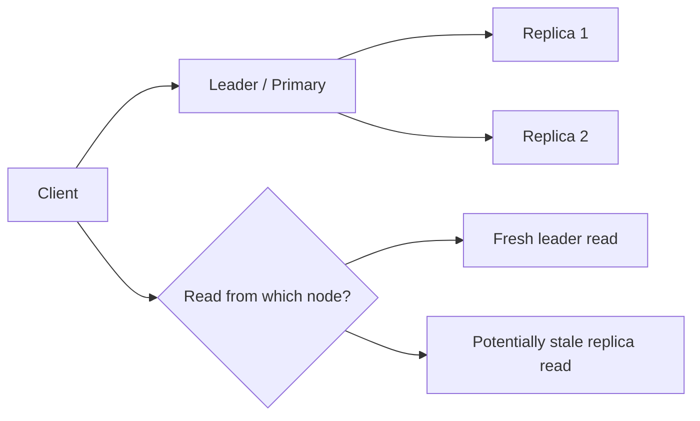
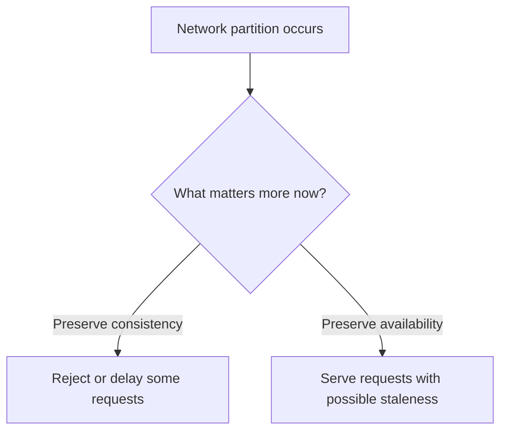

# 11. Consistency & CAP Theorem

## Part Context
**Part:** Part 3 - Distributed Systems Concepts  
**Position:** Chapter 11 of 60
**Why this part exists:** This section explains the trade-offs that appear once systems scale across machines, replicas, regions, and failure domains.  
**This chapter builds toward:** replication-aware design, partition behavior reasoning, and consistency decisions grounded in business impact

## Overview
Once data is copied across nodes, racks, or regions, you no longer get a single obvious truth for free. Consistency is the set of guarantees about how quickly different readers see the same value after writes occur. In distributed systems, this becomes a business decision as much as a technical one.

CAP theorem is often memorized poorly. Its real value is in forcing architects to think clearly about what a system should do during network partitions. This chapter connects strong consistency, eventual consistency, and CAP trade-offs to real product behavior rather than abstract slogans.

## Why This Matters in Real Systems
- Replication improves scale and availability but creates difficult questions about stale data and coordination.
- Different features in the same product often need different consistency guarantees.
- Incorrect consistency assumptions cause some of the most damaging production bugs in distributed systems.
- Interviewers use this topic to distinguish memorized distributed-systems terminology from real design judgment.

## Core Concepts
### Strong consistency
Readers observe the latest committed write according to the system guarantee, often requiring coordination and possibly higher latency.

### Eventual consistency
Replicas may temporarily diverge, but if updates stop they converge over time. This often improves availability or locality but introduces staleness.

### CAP theorem
When a partition exists, a distributed system cannot simultaneously offer strong consistency and full availability across the partitioned nodes.

### Business-level trade-offs
The right consistency model depends on whether stale data creates inconvenience, confusion, money loss, or safety risk.

## Key Terminology
| Term | Definition |
| --- | --- |
| Strong Consistency | A guarantee that reads reflect the latest committed write according to the system model. |
| Eventual Consistency | A model in which different replicas may lag but are expected to converge. |
| Partition | A network failure that prevents some nodes from communicating reliably with others. |
| Replica | A copy of data kept on another node or in another region. |
| Quorum | A rule that requires a minimum number of replicas to participate in a read or write. |
| Staleness | The amount by which a read lags behind the newest committed value. |
| Conflict Resolution | The logic used to reconcile concurrent or divergent updates. |
| Leader | A node or role that coordinates writes for a partition or shard. |

## Detailed Explanation
### Consistency is user experience
If one user sees a payment as completed while another service still sees it as pending, this is not a theoretical inconsistency. It is a product error with real consequences. Likewise, if a social “like” count lags by a few seconds, the product may remain perfectly acceptable. Business context determines how much staleness matters.

### CAP matters specifically during partitions
CAP does not say a system must permanently choose consistency or availability in all situations. It says that when network partitions occur, distributed nodes cannot provide both immediate consistency and unconditional availability across the split. The design question is therefore: what should the system do under that failure condition?

### Coordination has cost
Strong consistency usually means waiting for more coordination before acknowledging a result. That can increase latency and reduce availability when some replicas are slow or unreachable. The advantage is simpler reasoning for workflows where correctness matters more than responsiveness.

### Eventual consistency needs product tolerance
A system using eventual consistency must be designed around the possibility that some readers see stale or conflicting state for a period of time. The product, user interface, and operations model must all tolerate that temporarily divergent reality.

### Mixed consistency is common
Mature systems often mix guarantees. A ride-sharing platform may allow slightly stale nearby-driver views while requiring stricter correctness for accepted trip state and payment settlement. A social product may tolerate stale counters but not lost posts. Thinking in workflows is better than labeling an entire company as “AP” or “CP.”

## Diagram / Flow Representation
### Replication and Staleness


### CAP Partition Decision


## Real-World Examples
- Banking systems usually prefer stronger consistency for balances and ledgers because stale reads can create serious financial errors.
- Social platforms often accept eventual consistency for counters, likes, or feed freshness because responsiveness matters more than exact simultaneity.
- DNS is a familiar internet-scale example of eventual consistency with cached propagation behavior.
- Ride-sharing systems often tolerate some location staleness while keeping trip acceptance and billing much stricter.

## Case Study
### Banking vs social media consistency

Comparing banking and social media is useful because both use replication, but their tolerance for stale or conflicting data is radically different.

### Requirements
- A banking system must preserve correctness, traceability, and trust for account-affecting events.
- A social media system must preserve responsiveness, scale, and low-latency user interaction.
- Both systems replicate data for resilience and scale.
- Both systems must define behavior during partitions and replica lag.
- Neither system can maximize every desirable property at once.

### Design Evolution
- The banking system often centralizes or tightly coordinates core write paths to maintain stronger correctness guarantees.
- The social system often relaxes some freshness guarantees to improve availability and latency for engagement-heavy features.
- Both systems may add caches and replicas, but the read paths are governed by different tolerance for staleness.
- Over time, each system learns to apply different guarantees to different workflows instead of treating consistency as one global setting.

### Scaling Challenges
- Cross-region replication increases latency if strong coordination is kept on every path.
- Replica lag can create user-visible confusion unless the product is designed for it.
- Failover can change which node is authoritative and expose hidden assumptions in clients or services.
- Conflict resolution becomes necessary if multiple writers operate with weaker consistency guarantees.

### Final Architecture
- Banking-style core workflows use tightly controlled writes, clear primary authority, and strong audit trails.
- Social-style engagement features use replicas, caches, and eventual convergence where business risk is lower.
- Each workflow defines acceptable staleness instead of inheriting a single system-wide promise.
- Operators and developers understand partition behavior explicitly.
- Observability tracks replica lag, failed coordination, and stale-read impact.

## Architect's Mindset
- Ask what actually breaks if the data is stale for one second, one minute, or one hour.
- Use strong consistency only where the business genuinely requires it, because coordination has real cost.
- Model partition behavior intentionally instead of assuming the network is always healthy.
- Keep the source of truth clear when multiple replicas and caches exist.
- Think in workflow-level guarantees, not one label for the whole product.

## The Consistency Menu

Consistency is not binary (strong vs eventual). There is a spectrum of models, each with distinct guarantees, costs, and appropriate use cases. Think of it as a menu — choose the right model per workflow.

| Model | Guarantee | Latency Cost | Example System | Use When |
|-------|----------|-------------|----------------|----------|
| **Linearizability** | Reads always see the most recent write; operations appear to execute atomically in real time | Highest (cross-node coordination on every operation) | Spanner, CockroachDB, ZooKeeper | Distributed locks, leader election, financial ledgers |
| **Sequential consistency** | Operations appear in the same order to all observers, but not necessarily in real time | High | Distributed consensus logs | Multi-step workflows requiring total ordering |
| **Causal consistency** | Operations that are causally related are seen in order; concurrent operations may appear in any order | Moderate | MongoDB (causal sessions), COPS | Social feeds (reply always appears after the post it replies to) |
| **Session consistency** | Within one session, reads-your-writes + monotonic reads are guaranteed | Low-Moderate | DynamoDB (consistent reads), PostgreSQL session | User sees their own writes immediately; other users may lag |
| **Eventual consistency** | Replicas converge eventually; no bound on staleness duration | Lowest | S3, DNS, Cassandra (ONE/ONE), DynamoDB (default) | Counters, likes, analytics, CDN content |

### Session Guarantees — Practical Subset

Most applications need stronger than "pure eventual" but weaker than linearizable. These session guarantees provide a practical middle ground:

| Guarantee | What It Means | Example |
|-----------|-------------|---------|
| **Read-your-writes** | After writing, the same client always sees its own write | User updates profile → immediately sees updated profile (even if other users see stale) |
| **Monotonic reads** | A client never sees data go backward in time | User sees 10 comments → refresh → never sees 8 comments |
| **Monotonic writes** | A client's writes are applied in the order they were issued | User changes email to A, then to B → final state is always B, never A |
| **Writes-follow-reads** | If a client reads value X, then writes, the write is ordered after X | Reply to a post is always ordered after the post itself |

**Implementation:** Route the session to the same replica (sticky reads), or include a logical timestamp/version in the session context and reject reads from replicas behind that version.

---

## CAP Theorem — Formal Definitions and Canonical Sources

### Formal Definitions

The CAP theorem, proven by Gilbert and Lynch (2002), uses specific formal definitions that differ from casual usage:

| Term | Formal CAP Definition | Common Misunderstanding |
|------|----------------------|------------------------|
| **Consistency (C)** | Linearizability — every read returns the most recent write or an error | "Data is correct" (too vague) |
| **Availability (A)** | Every request to a non-failing node receives a response (no timeout, no error) | "The system is up" (too loose) |
| **Partition tolerance (P)** | The system continues to operate despite arbitrary message loss between nodes | "Network is unreliable" (correct but incomplete) |

**The theorem states:** In the presence of a network partition, a distributed system must choose between consistency (C) and availability (A). It cannot guarantee both simultaneously.

**What CAP does NOT say:**
- It does NOT say you must always choose two of three — you only choose during a partition
- It does NOT say eventual consistency is "AP" — eventual consistency is a spectrum
- It does NOT say CP systems are always unavailable — they are unavailable only during partitions
- It does NOT apply to single-node systems — CAP is about distributed data

### PACELC: Extending CAP

Daniel Abadi's PACELC extension (2012) adds: even when there is no partition, there is a trade-off between latency and consistency.

```
If Partition → choose A or C  (CAP)
Else (normal operation) → choose L (latency) or C (consistency)  (PACELC)
```

| System | During Partition (PAC) | Normal Operation (ELC) | Classification |
|--------|----------------------|----------------------|----------------|
| Spanner | PC (reject during partition) | EC (consistent, higher latency via TrueTime) | PC/EC |
| DynamoDB | PA (available, eventual) | EL (low latency, eventual by default) | PA/EL |
| Cassandra (QUORUM) | PC (requires quorum) | EC (quorum adds latency) | PC/EC |
| MongoDB | PA (reads from secondaries) | EL (low latency from nearest replica) | PA/EL |

### Canonical References

| Source | Citation | Key Contribution |
|--------|----------|-----------------|
| Brewer's conjecture (2000) | Eric Brewer, PODC keynote | Original CAP conjecture |
| Gilbert & Lynch (2002) | "Brewer's Conjecture and the Feasibility of Consistent, Available, Partition-Tolerant Web Services" | Formal proof |
| Brewer's clarification (2012) | "CAP Twelve Years Later: How the Rules Have Changed" | Corrects common misunderstandings; introduces nuance |
| Abadi's PACELC (2012) | "Consistency Tradeoffs in Modern Distributed Database System Design" | Extends CAP with latency trade-off during normal operation |
| Kleppmann (2017) | "Designing Data-Intensive Applications" Chapter 9 | Best practical treatment of consistency models |

---

## Causal Consistency and CRDTs

### Causal Consistency

Causal consistency is a sweet spot between strong and eventual: it preserves the order of causally related operations while allowing concurrent operations to be seen in any order.

**Why it matters:** Many real-world workflows are causal — a reply depends on the post, a cancellation depends on the order. Pure eventual consistency can violate these dependencies (user sees a reply before the post). Linearizability is too expensive for global systems. Causal consistency gives "good enough" ordering at much lower cost.

**How it works:** Each operation carries a logical timestamp or vector clock. Replicas deliver operations only after their causal dependencies have been delivered.

| Aspect | Eventual Consistency | Causal Consistency | Linearizability |
|--------|---------------------|-------------------|-----------------|
| Ordering | None guaranteed | Causally related ops ordered | Total order (real-time) |
| Latency | Lowest | Low-Moderate | Highest |
| Availability during partitions | Full | Full (within causal constraints) | Reduced (must contact leader) |
| Implementation | Simple replication | Vector clocks / causal timestamps | Consensus protocol (Raft/Paxos) |
| Example | DNS propagation | MongoDB causal sessions, social feeds | Spanner, ZooKeeper |

### CRDTs (Conflict-free Replicated Data Types)

CRDTs are data structures that can be updated independently on different replicas and always merge deterministically — no conflict resolution logic needed.

| CRDT Type | What It Does | Example Use |
|-----------|-------------|-------------|
| **G-Counter** | Grow-only counter (each replica increments independently, merge = sum) | Like counts, view counts |
| **PN-Counter** | Counter supporting increment and decrement | Inventory count (approximate) |
| **G-Set** | Grow-only set (add only, merge = union) | Tags, labels, "seen" message IDs |
| **OR-Set** | Observed-remove set (add and remove) | Shopping cart, user preferences |
| **LWW-Register** | Last-writer-wins register (timestamp tiebreaker) | User profile fields, settings |

**When to use CRDTs:** Multi-region writes where coordination latency is unacceptable, offline-capable apps (mobile, collaborative editors), and counters/sets that can tolerate bounded divergence.

**Limitation:** CRDTs solve merge conflicts but cannot enforce business rules that require coordination (e.g., "balance must not go negative" requires a consistency check, not a CRDT).

---

## Measuring Staleness — Replica Lag as an SLO

Staleness should be measured, not assumed. Track replica lag as an operational metric and set staleness SLOs per workflow.

### Replica Lag Metrics

| Metric | What It Measures | How to Collect |
|--------|-----------------|---------------|
| **Replication lag (seconds)** | Time between write on primary and visibility on replica | `pg_stat_replication` (PostgreSQL), `Seconds_Behind_Master` (MySQL), Kafka consumer lag |
| **Replication lag (bytes/offsets)** | Volume of undelivered data to replica | WAL position difference, Kafka offset difference |
| **Stale-read rate** | Percentage of reads served from replicas with lag > threshold | Application-level instrumentation (compare read version to known write version) |
| **Consistency violation rate** | Reads that returned data older than the staleness SLO | Audit log comparison (expected vs observed state) |

### Staleness SLOs by Workflow

| Workflow | Acceptable Staleness | Measurement | Action If Exceeded |
|----------|---------------------|-------------|-------------------|
| Account balance | 0 (linearizable) | Read from primary only | N/A (always consistent) |
| Order status | < 5 seconds | Replication lag metric | Route reads to primary if lag > 5s |
| Social feed | < 30 seconds | Replication lag metric | Acceptable; no action needed |
| Search index | < 60 seconds | Index freshness metric | Increase indexer throughput |
| Analytics dashboard | < 5 minutes | Data pipeline lag | Acceptable for batch analytics |

### Read Routing Strategy Based on Staleness

```
Read request arrives →
  Is this a consistency-critical workflow? (balance, order confirmation)
    → YES: Route to PRIMARY (always fresh, higher latency)
    → NO: Check replica lag
      → Lag < staleness SLO? → Route to REPLICA (fast, acceptable staleness)
      → Lag > staleness SLO? → Route to PRIMARY (fallback for freshness)
```

---

## Cross-References

| Topic | Chapter | Connection |
|-------|---------|------------|
| Transaction isolation levels | Ch 5: Databases Deep Dive | How isolation interacts with consistency within a single DB |
| Distributed transactions (2PC, Saga) | Ch 12: Fault Tolerance & Resilience | Coordination across services with consistency guarantees |
| Consensus protocols (Raft, Paxos) | F4: Consensus & Coordination | How leader election and agreement enforce consistency |
| CDC and outbox pattern | Ch 5: Databases, Ch 8: Message Queues | Publishing consistent events from DB changes |
| SLO-based monitoring of lag | F10: Observability & Operations | Tracking replication lag as an SLO signal |
| Banking system design | Domain chapters | Strong consistency for financial workflows |
| Social media system design | Domain chapters | Eventual consistency for engagement features |

## Common Mistakes
- Calling an entire product CP or AP without discussing the actual workflow and failure mode.
- Assuming eventual consistency is automatically better for scale without considering product confusion or recovery complexity.
- Using strong coordination everywhere and accidentally imposing unnecessary latency and fragility.
- Ignoring what the user sees during replica lag or failover.
- Failing to define how conflicts or stale reads are resolved.

## Interview Angle
- Consistency questions are common because they expose whether you truly understand replication and failure trade-offs.
- Strong answers explain business consequences, partition behavior, and why different workflows may choose different guarantees.
- Interviewers usually respond well when candidates move beyond textbook CAP definitions into real product examples.
- A weak answer simply recites “pick two of three” without discussing partitions, staleness, or workflow semantics.

## Quick Recap
- Consistency determines how synchronized distributed data must be across readers and replicas.
- CAP matters when network partitions occur, not as a vague product slogan.
- Strong consistency simplifies correctness but costs coordination and sometimes availability.
- Eventual consistency improves locality or availability but requires tolerance for staleness.
- Good architecture applies the right guarantee to the right workflow.

## Practice Questions
1. Why is stale data tolerable in some systems but not in others?
2. What does CAP theorem actually imply during a real partition?
3. How does strong consistency affect latency and availability?
4. What is an example of mixed consistency within a single product?
5. How would you explain replica lag to a product manager?
6. What happens to a read path when a leader fails over?
7. Why is “pick two of three” an incomplete explanation of CAP?
8. How would you design around eventual consistency in a user interface?
9. What is a quorum, and when is it useful?
10. How do conflict-resolution rules affect product behavior?

## Further Exploration
- Connect this chapter with distributed transactions in the next chapter.
- Study quorum reads/writes and multi-region replication patterns in more depth.
- Practice identifying which workflows in familiar products need stronger guarantees and which do not.


## Navigation
- Previous: [Scalability](10-scalability.md)
- Next: [Fault Tolerance & Resilience](12-fault-tolerance-resilience.md)
