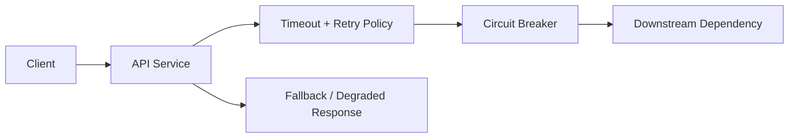
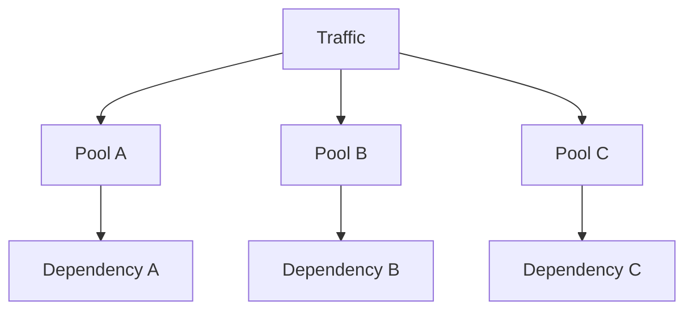

# 12. Fault Tolerance & Resilience

## Part Context
**Part:** Part 3 - Distributed Systems Concepts  
**Position:** Chapter 12 of 60
**Why this part exists:** This section explains the trade-offs that appear once systems scale across machines, replicas, regions, and failure domains.  
**This chapter builds toward:** failure-aware architecture, graceful degradation, and recovery-centric thinking

## Overview
Distributed systems fail in uneven and surprising ways. A service can be up but slow. A database can accept reads but not writes. A dependency can fail for one region or one tenant while appearing healthy elsewhere. Resilience is the ability to continue delivering acceptable behavior despite those partial failures.

This chapter explains the practical building blocks of resilient design: timeouts, retries, circuit breakers, isolation, graceful degradation, and the operational thinking needed to keep failure from cascading.

## Why This Matters in Real Systems
- Failures are normal in production systems, not rare edge cases.
- Resilience mechanisms prevent localized issues from becoming full outages.
- Architects need to decide which failures the system should absorb and which should fail fast and visibly.
- Interviewers often probe failure handling because naive designs usually assume all dependencies behave perfectly.

## Core Concepts
### Timeouts and retries
Every remote call should have a bounded wait and a disciplined retry policy.

### Circuit breakers
Circuit breakers stop repeatedly hammering a failing dependency and create space for recovery.

### Bulkheads and isolation
Separating pools of work or resources prevents one failure or workload from consuming everything.

### Graceful degradation
When full functionality is not available, the system should preserve the highest-value user experience possible.

## Key Terminology
| Term | Definition |
| --- | --- |
| Timeout | The maximum time a caller will wait before considering an operation failed. |
| Retry | A repeated attempt after a failure that may be transient. |
| Exponential Backoff | Increasing the wait between retries after repeated failures. |
| Circuit Breaker | A mechanism that stops requests to an unhealthy dependency after a failure threshold is reached. |
| Bulkhead | An isolation boundary that limits blast radius across resource pools or workloads. |
| Fallback | An alternative degraded response when a primary path fails. |
| Partial Failure | A condition where some parts of the system fail while others continue operating. |
| Idempotency | The property that repeated execution does not create unintended additional effects. |

## Detailed Explanation
### Bound waiting time first
A request path without clear timeouts can pile up threads, connections, and memory until one slow dependency spreads pain everywhere. Timeouts define the failure boundary and are often the first true resilience mechanism in a system.

### Retries must be selective and safe
Retries help when failures are transient, but they can also amplify outages. A retry policy should be bounded, jittered, and aware of idempotency. Retrying non-idempotent payment operations without safeguards can create worse problems than the original failure.

### Circuit breakers protect both sides
A circuit breaker does not only protect the caller from waiting. It also protects the failing downstream service from being hammered continuously when it is already unhealthy. This gives the system a chance to recover instead of being kept permanently overloaded.

### Isolation limits blast radius
Bulkheads can separate workloads by tenant, feature, queue, or resource pool. Without isolation, one runaway workload can starve the rest of the system. Strong resilience architecture designs for containment, not only for high average throughput.

### Degraded service is often better than no service
A recommendations panel can disappear while checkout still works. Cached catalog data may be acceptable temporarily during a backend incident. A resilient system identifies what absolutely must remain correct and what can become optional under pressure.

## Diagram / Flow Representation
### Resilient Request Path


### Failure Containment View


## Real-World Examples
- Amazon-style checkouts often degrade recommendations or secondary panels before they degrade payment or order correctness.
- Netflix-style clients may use cached metadata and resilient playback strategies when some backend services are unhealthy.
- Google-scale systems isolate workloads heavily because partial failure is expected at large scale.
- Payment systems rely on idempotency and clear state transitions because retries are unavoidable under network instability.

## Case Study
### Payment system failure handling

Payment workflows show why resilience is not only a technical topic. A transient timeout can create duplicate charges, missing orders, or customer distrust unless the failure path is designed carefully.

### Requirements
- Customers should not be double-charged, even if network failures or retries occur.
- The checkout path should remain as fast and available as possible under dependency issues.
- The system should expose clear workflow state to operators and support teams.
- Downstream payment gateway issues should not collapse unrelated parts of the system.
- Recovery should be possible through replay, compensation, or manual review where necessary.

### Design Evolution
- The first version may set strict timeouts and use idempotency keys for gateway calls.
- As incidents occur, circuit breakers and fallback order states such as pending-review are introduced.
- As system load grows, separate resource pools and isolation are added so payment issues do not consume all API threads or workers.
- As operations mature, replay tools, reconciliation jobs, and audit-friendly workflow states become core parts of the design.

### Scaling Challenges
- Retries can create load amplification against a struggling gateway.
- Ambiguous states such as “charged but not acknowledged” require careful reconciliation logic.
- If failure handling is opaque, support teams cannot tell customers what actually happened.
- A single shared thread pool can let payment failures cascade into unrelated product areas.

### Final Architecture
- Strict timeouts around downstream payment calls.
- Idempotency keys and bounded retries with backoff.
- Circuit breakers and isolated resource pools for payment interactions.
- Fallback order states and reconciliation workflows.
- Observability focused on error rate, timeout rate, duplicate-attempt prevention, and stuck workflow detection.

## Architect's Mindset
- Assume every dependency will eventually be slow, unavailable, or partially broken.
- Bound waiting time and bound retry volume.
- Design the system so a local problem stays local.
- Preserve business correctness first, then improve user experience around it with graceful degradation.
- Make failure states visible to both machines and humans.

## Resilience Patterns Cookbook

Each pattern below includes when to use it, how it works, configuration guidance, and the failure it prevents.

### Pattern 1: Timeouts

**What it prevents:** Thread/connection exhaustion from waiting on a slow dependency.

| Parameter | Guidance | Example |
|-----------|----------|---------|
| Connection timeout | 1-3 seconds | Detect unreachable host before TCP default (30-120s) |
| Request timeout | 5-30 seconds (per endpoint) | Set based on p99 of the dependency + buffer |
| Cascading rule | Each layer shorter than its caller | Gateway 30s → Service A 10s → Service B 3s → DB 1s |

**Key rule:** If you have no timeout, you have no resilience. The default timeout in most HTTP clients is "forever."

### Pattern 2: Retries with Exponential Backoff + Jitter

**What it prevents:** Transient failures becoming permanent, while avoiding retry storms.

```python
# Retry with exponential backoff + jitter
import random, time

def call_with_retry(func, max_retries=3, base_delay=1.0):
    for attempt in range(max_retries + 1):
        try:
            return func()
        except TransientError:
            if attempt == max_retries:
                raise  # Exhausted retries
            delay = base_delay * (2 ** attempt)  # 1s, 2s, 4s
            jitter = random.uniform(0, delay * 0.5)  # 0-50% jitter
            time.sleep(delay + jitter)
```

**Retry safety rules:**
1. Only retry idempotent operations (or operations with idempotency keys)
2. Set a retry budget: max 10-20% additional traffic from retries system-wide
3. Propagate deadlines: if the caller's deadline has passed, don't retry
4. Never retry 4xx errors (client errors) — only 5xx and network errors

### Pattern 3: Circuit Breaker

**What it prevents:** Continuously hammering a failing dependency, preventing its recovery.

```
Circuit breaker states:
  CLOSED (normal) → failures < threshold → allow all requests
      ↓ (failure threshold exceeded, e.g., 5 failures in 10 seconds)
  OPEN (tripped) → reject all requests immediately → return fallback
      ↓ (after cooldown period, e.g., 30 seconds)
  HALF-OPEN (probing) → allow one test request
      → success → CLOSED
      → failure → OPEN (extend cooldown)
```

| Parameter | Guidance |
|-----------|----------|
| Failure threshold | 5-10 consecutive failures or > 50% error rate in a window |
| Cooldown period | 15-60 seconds (long enough for dependency to recover) |
| Half-open test | Send 1 request; if success, close circuit |
| Fallback | Cached response, default value, or graceful error message |

### Pattern 4: Bulkheads (Resource Isolation)

**What it prevents:** One failing dependency consuming all shared resources (threads, connections, memory) and cascading to unrelated features.

| Isolation Type | How It Works | Example |
|---------------|-------------|---------|
| **Thread pool bulkhead** | Separate thread pool per dependency | Payment calls: 20 threads max; search calls: 50 threads max |
| **Connection pool bulkhead** | Separate connection pool per dependency | DB pool A: 50 connections for orders; DB pool B: 20 for analytics |
| **Queue bulkhead** | Separate queue per workload priority | High-priority: OTP notifications; Low-priority: marketing emails |
| **Tenant bulkhead** | Per-tenant resource limits | Enterprise tenant: dedicated DB; free tier: shared with limits |

### Pattern 5: Load Shedding

**What it prevents:** System collapse under overload by rejecting low-priority work to protect high-priority paths.

```
Load shedding policy:
  IF system_load > 90% capacity:
    Reject: analytics queries, non-critical background jobs
    Degrade: recommendations panel, personalization
    Protect: checkout, payment, order creation

  IF system_load > 95% capacity:
    Reject: all non-essential reads
    Degrade: serve cached catalog (possibly stale)
    Protect: active checkout sessions only

  Response for shed requests:
    HTTP 503 Service Unavailable
    Retry-After: 30  (seconds)
```

| Strategy | Implementation | Best For |
|----------|---------------|----------|
| **Priority-based** | Tag requests with priority; shed lowest first | Mixed workload APIs |
| **LIFO queue** | Drop oldest requests (already waiting too long) | Real-time systems where stale requests are useless |
| **Adaptive** | Dynamically adjust shed threshold based on latency | Systems with variable request cost |
| **Client-cooperative** | Return 429/503 with Retry-After header | Public APIs with well-behaved clients |

### Pattern 6: Graceful Degradation Map

Define in advance what degrades and in what order:

| Priority | Feature | Degradation | Trigger |
|----------|---------|------------|---------|
| P0 (never degrade) | Checkout, payment, auth | Full functionality always | — |
| P1 (last to degrade) | Order history, account settings | Serve from cache if DB slow | DB latency > 2s |
| P2 (degrade early) | Recommendations, personalization | Return generic/cached suggestions | Recommendation service error rate > 10% |
| P3 (shed first) | Analytics, A/B tracking | Silently drop tracking events | System load > 80% |

---

## Failure-Mode Checklist

Use this checklist during design reviews and before production launches to verify that each failure mode has been addressed.

### Per-Dependency Failure Checklist

For each external dependency (database, API, third-party service, cache):

- [ ] **Timeout defined** — connection timeout + request timeout, shorter than caller's timeout
- [ ] **Retry policy defined** — max retries, backoff strategy, idempotency safety
- [ ] **Circuit breaker configured** — failure threshold, cooldown period, fallback behavior
- [ ] **Bulkhead in place** — separate thread/connection pool so failure doesn't cascade
- [ ] **Fallback defined** — what happens when this dependency is completely unavailable
- [ ] **Monitoring configured** — error rate, latency, circuit breaker state, retry count
- [ ] **Alert configured** — fires when error rate or latency exceeds threshold
- [ ] **Runbook exists** — step-by-step response for this dependency's failure

### System-Level Failure Checklist

- [ ] **Graceful degradation map** documented (which features degrade in which order)
- [ ] **Load shedding policy** defined (what gets rejected under overload)
- [ ] **Idempotency** verified for all write operations that may be retried
- [ ] **Retry budget** enforced (no more than 10-20% additional traffic from retries)
- [ ] **Deadline propagation** implemented (don't retry if caller has already timed out)
- [ ] **Chaos testing** scheduled (regular failure injection to validate resilience)
- [ ] **Incident playbook** exists for cascading failure scenarios

---

## Retry Storm — Worked Example

A retry storm is one of the most common causes of cascading outages. This worked example shows how it develops and how to prevent it.

### The Scenario

```
Normal state:
  API Gateway → Payment Service → Payment Provider (Stripe)
  Latency: 200ms average, 500ms p99
  Traffic: 1,000 req/sec

Failure trigger:
  Payment Provider becomes slow (response time increases from 200ms to 5,000ms)
```

### Without Resilience (Cascade)

```
T+0s:   Provider slows to 5s response time
T+5s:   Payment Service threads waiting on provider (timeout = 30s default)
T+10s:  Thread pool exhaustion begins (100 threads × 5s = 20 req/sec throughput)
T+15s:  API Gateway retries timed-out requests (3 retries each)
        → Payment Service now receives 3,000 req/sec (3x amplification)
T+20s:  Payment Service completely overwhelmed
T+25s:  API Gateway thread pool fills up waiting for Payment Service
T+30s:  Unrelated services (Search, Profile) also fail — same API Gateway thread pool
T+45s:  Full outage — all user-facing services down

Root cause: slow provider
Actual outage: everything — because of retry amplification + no isolation

Recovery time: 15-30 minutes (even after provider recovers, caches are cold,
connection pools are exhausted, and retry backlog must drain)
```

### With Resilience (Contained)

```
T+0s:   Provider slows to 5s response time
T+2s:   Payment Service timeout triggers at 2 seconds (configured correctly)
T+3s:   Circuit breaker opens after 5 consecutive timeouts
        → Returns fallback: "Payment pending — we'll retry automatically"
T+3s:   Retry policy: 1 retry with 2s backoff, then stop
        → Amplification: 1.5x (not 3x)
T+5s:   Bulkhead limits payment thread pool to 20 threads
        → Search, Profile, Cart all continue normally on their own pools
T+5s:   Load shedding: analytics tracking paused to free capacity
T+30s:  Circuit breaker enters half-open state, sends test request
T+31s:  Provider still slow → circuit stays open
T+60s:  Provider recovers → half-open test succeeds → circuit closes
T+65s:  Pending payments retried via background queue (idempotent)

Actual impact: payment submissions delayed 1-2 minutes
Everything else: completely unaffected
Recovery: automatic, no human intervention needed
```

---

## Chaos Testing as a Learning Tool

Chaos testing is the practice of deliberately injecting failures into production or staging systems to verify that resilience mechanisms actually work.

### Why Chaos Testing Matters

| Without Chaos Testing | With Chaos Testing |
|----------------------|-------------------|
| "Our circuit breakers should work" | "We verified they work — here's the evidence" |
| Resilience code is never exercised | Resilience code is exercised regularly |
| First failure discovered by customers | First failure discovered by engineers |
| Recovery time unknown until real incident | Recovery time measured and improved |

### Chaos Experiments to Run

| Experiment | What You Inject | What You Validate |
|-----------|----------------|-------------------|
| Kill a service instance | Terminate one pod/instance randomly | LB routes around it; no user impact |
| Slow a dependency | Add 5s latency to one downstream call | Timeout triggers; circuit breaker opens; fallback works |
| Fill disk | Write garbage to disk until 95% full | Alerts fire; log rotation works; service degrades gracefully |
| Network partition | Block traffic between two services | System handles partition per design (reject or degrade) |
| CPU stress | Pin CPU to 100% on one instance | Autoscaler adds capacity; affected instance removed from rotation |
| Kill the cache | Flush Redis entirely | DB handles load; cache re-warms; no thundering herd |
| Exhaust connection pool | Open connections without releasing | Pool limit prevents cascade; alert fires; connections drain after timeout |

### Chaos Testing Safety Rules

1. Start in staging, not production
2. Have a kill switch to stop the experiment immediately
3. Define a steady-state hypothesis before running (e.g., "error rate stays below 1%")
4. Monitor SLOs during the experiment — abort if SLO breached
5. Run during business hours with engineers watching, not at 3 AM
6. Document every experiment result — successes and failures

---

## Resilience and SLOs — Error Budget Connection

Resilience mechanisms exist to protect SLOs. The error budget determines how much unreliability is acceptable, and resilience patterns are the engineering investment that keeps the system within budget.

| SLO Concern | Resilience Pattern That Protects It |
|------------|-------------------------------------|
| Availability (99.9%) | Circuit breakers (prevent cascade), bulkheads (isolate failures), load shedding (protect critical paths) |
| Latency (p99 < 500ms) | Timeouts (bound waiting), fallbacks (fast degraded responses), caching (avoid slow dependency) |
| Correctness (0 duplicate charges) | Idempotency keys, exactly-once processing patterns, reconciliation jobs |
| Durability (no data loss) | Write-ahead logs, outbox pattern, at-least-once delivery |

**The feedback loop:**

```
SLO defines the target
  → Error budget = allowed unreliability
    → Resilience patterns = engineering to stay within budget
      → Chaos testing = verification that patterns work
        → Observability = detection when budget is burning
          → Incident response = recovery when budget is threatened
```

### Cross-References

| Topic | Chapter |
|-------|---------|
| Timeout and retry policies (network layer) | Ch 4: Networking Fundamentals |
| Retry amplification and circuit breakers | Ch 7: Load Balancing |
| Idempotent consumption | Ch 8: Message Queues |
| SLO/error budget definitions | Ch 2: Types of Requirements; F10: Observability |
| Chaos engineering integration | F10: Observability & Operations |
| Deployment rollback as resilience | F11: Deployment & DevOps |

## Common Mistakes
- Retrying aggressively without backoff and turning small failures into larger outages.
- Using no timeouts or excessively long timeouts on remote calls.
- Treating resilience as infrastructure redundancy only, without workflow-level design.
- Failing to isolate resource pools for critical and non-critical traffic.
- Ignoring the operator recovery path after a partial failure.

## Interview Angle
- Interviewers often ask what happens when a dependency fails because most initial designs assume the happy path only.
- Strong answers mention timeouts, retries, idempotency, circuit breakers, fallbacks, and blast-radius control.
- Candidates stand out when they also describe how users and operators experience the failure.
- A weak answer says “use retries” without discussing idempotency or retry storms.

## Quick Recap
- Resilience means continuing acceptable behavior under partial failure.
- Timeouts, retries, circuit breakers, and bulkheads work together.
- Graceful degradation protects the most important user outcomes first.
- Failure handling must include both automated recovery and operator visibility.
- Architects should design for containment, not only for average-case performance.

## Practice Questions
1. Why can retries make an outage worse?
2. What does a circuit breaker protect against?
3. How would you design a degraded mode for a product page or checkout?
4. Why is idempotency important in resilient write paths?
5. What does a bulkhead look like in a worker or API system?
6. How would you choose timeout values for dependent services?
7. What information should an operator see when a workflow becomes stuck?
8. How does graceful degradation differ from silent failure?
9. Why is partial failure harder than total failure in distributed systems?
10. What metrics would reveal a retry storm in progress?

## Further Exploration
- Connect this chapter with observability later in the book because resilience depends on visibility.
- Study chaos engineering and failure injection to deepen this mindset.
- Read real incident write-ups and identify which resilience mechanisms were missing or weak.


## Navigation
- Previous: [Consistency & CAP Theorem](11-consistency-cap-theorem.md)
- Next: [Distributed Transactions](13-distributed-transactions.md)
