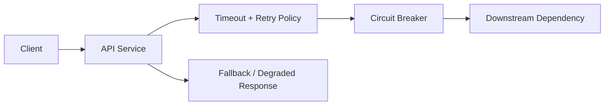
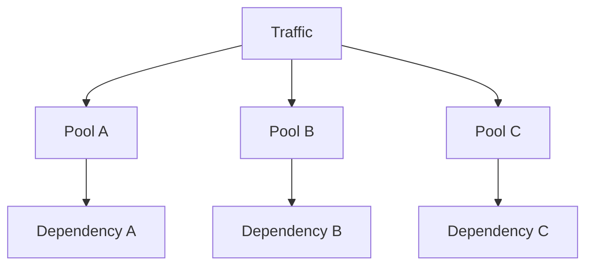

# 12. Fault Tolerance & Resilience

## Part Context
**Part:** Part 3 - Distributed Systems Concepts  
**Position:** Chapter 12 of 60
**Why this part exists:** This section explains the trade-offs that appear once systems scale across machines, replicas, regions, and failure domains.  
**This chapter builds toward:** failure-aware architecture, graceful degradation, and recovery-centric thinking

## Overview
Distributed systems fail in uneven and surprising ways. A service can be up but slow. A database can accept reads but not writes. A dependency can fail for one region or one tenant while appearing healthy elsewhere. Resilience is the ability to continue delivering acceptable behavior despite those partial failures.

This chapter explains the practical building blocks of resilient design: timeouts, retries, circuit breakers, isolation, graceful degradation, and the operational thinking needed to keep failure from cascading.

## Why This Matters in Real Systems
- Failures are normal in production systems, not rare edge cases.
- Resilience mechanisms prevent localized issues from becoming full outages.
- Architects need to decide which failures the system should absorb and which should fail fast and visibly.
- Interviewers often probe failure handling because naive designs usually assume all dependencies behave perfectly.

## Core Concepts
### Timeouts and retries
Every remote call should have a bounded wait and a disciplined retry policy.

### Circuit breakers
Circuit breakers stop repeatedly hammering a failing dependency and create space for recovery.

### Bulkheads and isolation
Separating pools of work or resources prevents one failure or workload from consuming everything.

### Graceful degradation
When full functionality is not available, the system should preserve the highest-value user experience possible.

## Key Terminology
| Term | Definition |
| --- | --- |
| Timeout | The maximum time a caller will wait before considering an operation failed. |
| Retry | A repeated attempt after a failure that may be transient. |
| Exponential Backoff | Increasing the wait between retries after repeated failures. |
| Circuit Breaker | A mechanism that stops requests to an unhealthy dependency after a failure threshold is reached. |
| Bulkhead | An isolation boundary that limits blast radius across resource pools or workloads. |
| Fallback | An alternative degraded response when a primary path fails. |
| Partial Failure | A condition where some parts of the system fail while others continue operating. |
| Idempotency | The property that repeated execution does not create unintended additional effects. |

## Detailed Explanation
### Bound waiting time first
A request path without clear timeouts can pile up threads, connections, and memory until one slow dependency spreads pain everywhere. Timeouts define the failure boundary and are often the first true resilience mechanism in a system.

### Retries must be selective and safe
Retries help when failures are transient, but they can also amplify outages. A retry policy should be bounded, jittered, and aware of idempotency. Retrying non-idempotent payment operations without safeguards can create worse problems than the original failure.

### Circuit breakers protect both sides
A circuit breaker does not only protect the caller from waiting. It also protects the failing downstream service from being hammered continuously when it is already unhealthy. This gives the system a chance to recover instead of being kept permanently overloaded.

### Isolation limits blast radius
Bulkheads can separate workloads by tenant, feature, queue, or resource pool. Without isolation, one runaway workload can starve the rest of the system. Strong resilience architecture designs for containment, not only for high average throughput.

### Degraded service is often better than no service
A recommendations panel can disappear while checkout still works. Cached catalog data may be acceptable temporarily during a backend incident. A resilient system identifies what absolutely must remain correct and what can become optional under pressure.

## Diagram / Flow Representation
### Resilient Request Path

### Failure Containment View

## Real-World Examples
- Amazon-style checkouts often degrade recommendations or secondary panels before they degrade payment or order correctness.
- Netflix-style clients may use cached metadata and resilient playback strategies when some backend services are unhealthy.
- Google-scale systems isolate workloads heavily because partial failure is expected at large scale.
- Payment systems rely on idempotency and clear state transitions because retries are unavoidable under network instability.

## Case Study
### Payment system failure handling

Payment workflows show why resilience is not only a technical topic. A transient timeout can create duplicate charges, missing orders, or customer distrust unless the failure path is designed carefully.

### Requirements
- Customers should not be double-charged, even if network failures or retries occur.
- The checkout path should remain as fast and available as possible under dependency issues.
- The system should expose clear workflow state to operators and support teams.
- Downstream payment gateway issues should not collapse unrelated parts of the system.
- Recovery should be possible through replay, compensation, or manual review where necessary.

### Design Evolution
- The first version may set strict timeouts and use idempotency keys for gateway calls.
- As incidents occur, circuit breakers and fallback order states such as pending-review are introduced.
- As system load grows, separate resource pools and isolation are added so payment issues do not consume all API threads or workers.
- As operations mature, replay tools, reconciliation jobs, and audit-friendly workflow states become core parts of the design.

### Scaling Challenges
- Retries can create load amplification against a struggling gateway.
- Ambiguous states such as “charged but not acknowledged” require careful reconciliation logic.
- If failure handling is opaque, support teams cannot tell customers what actually happened.
- A single shared thread pool can let payment failures cascade into unrelated product areas.

### Final Architecture
- Strict timeouts around downstream payment calls.
- Idempotency keys and bounded retries with backoff.
- Circuit breakers and isolated resource pools for payment interactions.
- Fallback order states and reconciliation workflows.
- Observability focused on error rate, timeout rate, duplicate-attempt prevention, and stuck workflow detection.

## Architect's Mindset
- Assume every dependency will eventually be slow, unavailable, or partially broken.
- Bound waiting time and bound retry volume.
- Design the system so a local problem stays local.
- Preserve business correctness first, then improve user experience around it with graceful degradation.
- Make failure states visible to both machines and humans.

## Common Mistakes
- Retrying aggressively without backoff and turning small failures into larger outages.
- Using no timeouts or excessively long timeouts on remote calls.
- Treating resilience as infrastructure redundancy only, without workflow-level design.
- Failing to isolate resource pools for critical and non-critical traffic.
- Ignoring the operator recovery path after a partial failure.

## Interview Angle
- Interviewers often ask what happens when a dependency fails because most initial designs assume the happy path only.
- Strong answers mention timeouts, retries, idempotency, circuit breakers, fallbacks, and blast-radius control.
- Candidates stand out when they also describe how users and operators experience the failure.
- A weak answer says “use retries” without discussing idempotency or retry storms.

## Quick Recap
- Resilience means continuing acceptable behavior under partial failure.
- Timeouts, retries, circuit breakers, and bulkheads work together.
- Graceful degradation protects the most important user outcomes first.
- Failure handling must include both automated recovery and operator visibility.
- Architects should design for containment, not only for average-case performance.

## Practice Questions
1. Why can retries make an outage worse?
2. What does a circuit breaker protect against?
3. How would you design a degraded mode for a product page or checkout?
4. Why is idempotency important in resilient write paths?
5. What does a bulkhead look like in a worker or API system?
6. How would you choose timeout values for dependent services?
7. What information should an operator see when a workflow becomes stuck?
8. How does graceful degradation differ from silent failure?
9. Why is partial failure harder than total failure in distributed systems?
10. What metrics would reveal a retry storm in progress?

## Further Exploration
- Connect this chapter with observability later in the book because resilience depends on visibility.
- Study chaos engineering and failure injection to deepen this mindset.
- Read real incident write-ups and identify which resilience mechanisms were missing or weak.

## Navigation
- Previous: [Consistency & CAP Theorem](11-consistency-cap-theorem.md)
- Next: [Distributed Transactions](13-distributed-transactions.md)
