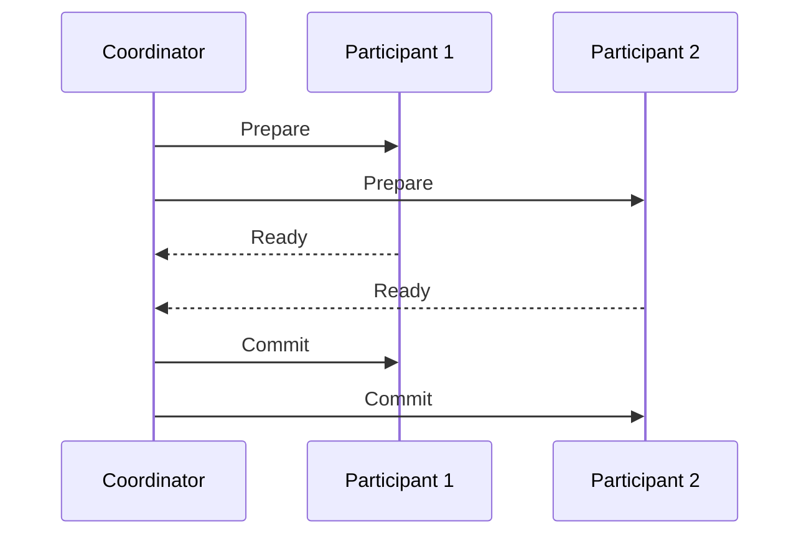
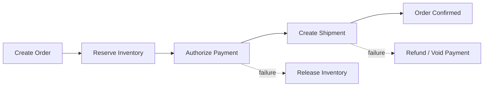

# 13. Distributed Transactions

## Part Context
**Part:** Part 3 - Distributed Systems Concepts  
**Position:** Chapter 13 of 42  
**Why this part exists:** This section explains the trade-offs that appear once systems scale across machines, replicas, regions, and failure domains.  
**This chapter builds toward:** workflow correctness across services, data stores, and failure-prone business processes

## Overview
A local database transaction is relatively simple: either the grouped operations commit or they do not. Distributed transactions are difficult because the business workflow spans multiple services, databases, or external systems that do not share one atomic commit boundary.

This chapter explains how architects reason about correctness when one user action affects many components. The goal is not perfect magic atomicity everywhere. The goal is safe business behavior under delay, retries, partial failure, and recovery.

## Why This Matters in Real Systems
- Real business workflows such as checkout, booking, and onboarding almost always cross service boundaries.
- If distributed correctness is not designed carefully, systems leak money, inventory, trust, and operator time.
- This topic ties together consistency, resilience, and business-state modeling.
- Interviewers use it to see whether candidates can move beyond happy-path request-response thinking.

## Core Concepts
### Why local ACID is not enough
Once multiple services or datastores are involved, one database transaction no longer protects the full business action.

### Two-phase commit (2PC)
2PC coordinates multiple participants through prepare and commit phases, offering stronger all-or-nothing behavior but at significant operational and availability cost.

### Saga pattern
A Saga breaks a large workflow into smaller local transactions linked by events or orchestration, using compensating actions when later steps fail.

### Workflow state and reconciliation
Distributed correctness depends on explicit state transitions, retry semantics, and the ability to inspect or recover stuck workflows.

## Key Terminology
| Term | Definition |
| --- | --- |
| 2PC | A coordination protocol that asks distributed participants to prepare, then commit or abort together. |
| Saga | A sequence of local transactions with compensating actions for failure recovery. |
| Compensation | A business-level action that semantically undoes or offsets an earlier successful step. |
| Coordinator | The service or component responsible for progressing or directing the distributed workflow. |
| Orchestration | A workflow style where a central coordinator tells each participant what to do next. |
| Choreography | A workflow style where services react to events without one central coordinator. |
| Pending State | A temporary state indicating the workflow is in progress but not yet fully resolved. |
| Reconciliation | The process of detecting and repairing workflows that ended in ambiguous or stuck states. |

## Detailed Explanation
### Business correctness comes first
Architects should begin by asking what a safe business outcome looks like if one step succeeds and a later step fails. “The transaction failed” is not enough. The system must know whether to refund, release inventory, retry, or request human review. Distributed transactions are therefore about business semantics, not only protocol mechanics.

### 2PC gives stronger coordination at a price
Two-phase commit can provide a stronger all-or-nothing outcome across participants, but it introduces blocking behavior, tighter coupling, and vulnerability to coordinator or participant unavailability. It is often reasonable in tightly controlled environments, but many internet-scale service architectures avoid it across autonomous services.

### Sagas trade atomicity for recoverable workflows
A Saga accepts that the overall workflow is not one atomic write. Instead, each step commits locally, and failures later in the process trigger compensating actions. This works well when the business can tolerate and define meaningful undo behavior.

### Ambiguity must be observable
A distributed workflow can end in ambiguous states: payment authorized but inventory not reserved, order created but email not sent, shipment booked but customer cancelation racing in. Good systems model these states clearly and provide tooling to reconcile them.

### Idempotency and retries remain central
The same event or command may be delivered more than once due to retry behavior. Participants therefore need idempotent operations, deterministic state transitions, and enough metadata to detect duplicates safely.

## Diagram / Flow Representation
### 2PC Simplified

### Saga Workflow Example

## Real-World Examples
- Amazon-style checkout workflows span orders, payment, inventory, and fulfillment systems, which rarely fit inside one local transaction boundary.
- Travel booking platforms often use saga-like compensations because flight, hotel, and car reservations belong to different providers and timelines.
- Ride-sharing systems may need careful distributed state when trip acceptance, pricing, and payment events race under high concurrency.
- Fintech systems often centralize stronger transactional guarantees around the ledger while using asynchronous workflows elsewhere.

## Case Study
### E-commerce checkout as a distributed transaction

Checkout is a useful case because it combines user expectations of immediacy with business requirements for correctness across several systems that may fail independently.

### Requirements
- An order should not be confirmed without the required business conditions being satisfied.
- Customers should not be charged twice or left in ambiguous states without recovery.
- Inventory should not remain reserved forever if the rest of the workflow fails.
- The system should tolerate retries and partial outages.
- Operators must be able to inspect, replay, and reconcile failed workflows.

### Design Evolution
- A first version may centralize more of the workflow inside one service and one database where possible.
- As separate payment, inventory, and fulfillment services emerge, local transactions plus saga orchestration become more attractive.
- As failure cases accumulate, compensations, audit trails, and reconciliation jobs become formalized.
- As scale and product complexity increase, event-driven state propagation and clearer workflow state machines become necessary.

### Scaling Challenges
- External payment or shipping providers can introduce long delays and ambiguous acknowledgments.
- Retries can create duplicate side effects unless each step is idempotent.
- Partial success across services creates business confusion unless the workflow state is explicit.
- Without reconciliation, rare edge cases accumulate into financial or operational drift.

### Final Architecture
- A durable order intent recorded early with a workflow identifier.
- Local transactions inside each service instead of pretending one ACID boundary covers everything.
- Saga orchestration or carefully designed event choreography for progression and compensation.
- Clear workflow states such as pending, confirmed, failed, compensated, or needs-review.
- Operational tooling for replay, reconciliation, and support visibility.

## Architect's Mindset
- Begin from business safety, not from protocol names.
- Use stronger coordination only where the business cannot tolerate compensation-based recovery.
- Model workflow states explicitly so both machines and humans can reason about them.
- Design compensation paths and reconciliation tooling at the same time as the happy path.
- Assume retries, duplicates, and ambiguous acknowledgments will occur.

## Common Mistakes
- Assuming a local database transaction can protect a workflow that spans multiple services.
- Using sagas without real compensating actions.
- Ignoring ambiguous or stuck states because they are “rare.”
- Building non-idempotent steps inside retry-heavy distributed workflows.
- Focusing on coordination mechanics without defining the desired business outcome under failure.

## Interview Angle
- Distributed transaction questions usually appear when a design involves payment, inventory, booking, or any multi-step cross-service workflow.
- Strong answers compare 2PC and saga trade-offs and then choose based on business semantics, coupling, and availability needs.
- Candidates stand out when they discuss compensation, reconciliation, and explicit workflow states rather than only protocol names.
- A weak answer says “use transactions” without explaining where the transaction boundary actually lives.

## Quick Recap
- Distributed transactions are about safe business workflows across multiple boundaries.
- 2PC provides stronger all-or-nothing behavior but adds coupling and blocking cost.
- Sagas use local transactions and compensation to recover from failure.
- Workflow state, idempotency, and reconciliation are central to correctness.
- Architects should optimize for business-safe outcomes, not for mythical global atomicity everywhere.

## Practice Questions
1. Why does a local ACID transaction stop being enough in a service-oriented workflow?
2. What are the main costs of 2PC?
3. When is a saga a better fit than stronger coordination?
4. What makes a compensation valid and useful?
5. How would you represent the lifecycle of a distributed checkout workflow?
6. Why is reconciliation necessary even with good retry logic?
7. How does idempotency support distributed correctness?
8. What kinds of workflows cannot tolerate loose compensation easily?
9. How would you explain distributed transaction design to a product or operations stakeholder?
10. What observability would you add to a distributed workflow engine?

## Further Exploration
- Connect this chapter with the architectural pattern chapters where event-driven and CQRS approaches may support workflow design.
- Study outbox patterns, workflow engines, and saga orchestration implementations in more depth.
- Practice drawing the state machine for a complex multi-step workflow before choosing technologies.

## Navigation
- Previous: [Fault Tolerance & Resilience](12-fault-tolerance-resilience.md)
- Next: [Monolith vs Microservices](../04-architectural-patterns/14-monolith-vs-microservices.md)
