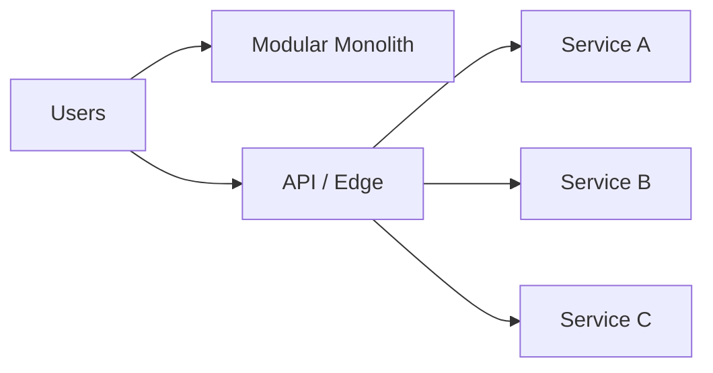
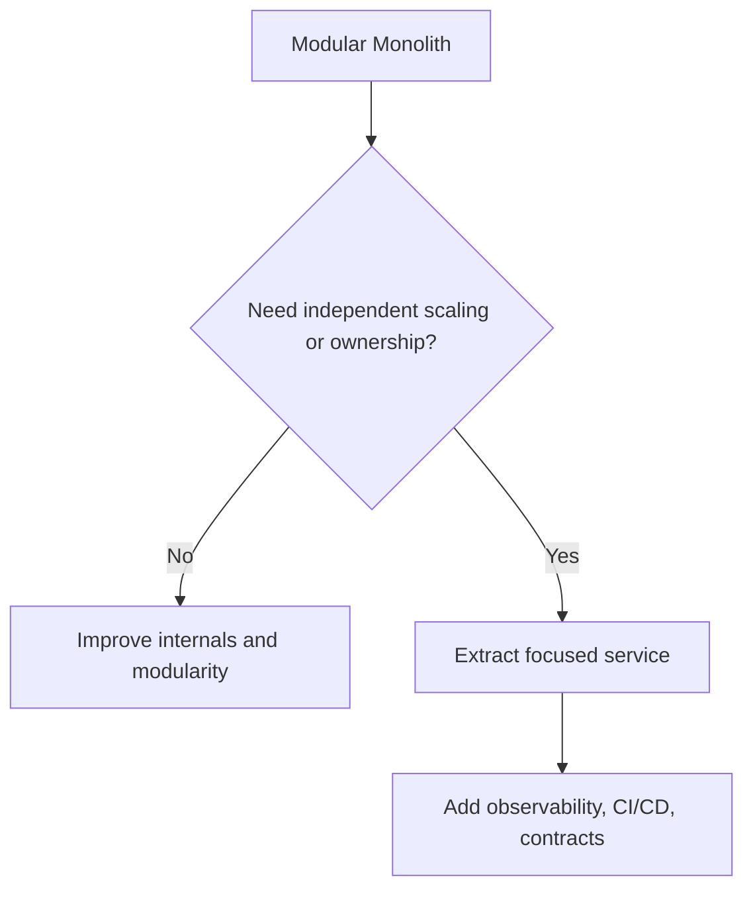

# 14. Monolith vs Microservices

## Part Context
**Part:** Part 4 - Architectural Patterns  
**Position:** Chapter 14 of 60
**Why this part exists:** This section explains the structural patterns teams use to organize services, APIs, reads, writes, and event flows as systems and organizations grow.  
**This chapter builds toward:** service-boundary decisions, team-aligned architecture, and pragmatic system evolution

## Overview
Monoliths and microservices are not opposing ideologies. They are architectural responses to different levels of system complexity, organizational scale, and operational maturity. A monolith can be elegant, fast to deliver, and operationally efficient. A microservice architecture can unlock team autonomy and independent scaling, but only when the organization is ready to absorb the extra complexity.

This chapter compares the two approaches honestly. The key question is not which one is modern. The key question is which one best matches the product, the team, the rate of change, and the failure budget.

## Why This Matters in Real Systems
- This is one of the most common architecture decisions teams overcomplicate too early.
- The cost of choosing microservices prematurely can be years of distributed-systems overhead with little benefit.
- The cost of keeping a monolith too long can be slow deployments, unclear ownership, and scaling friction in the wrong places.
- Interviewers expect mature candidates to give a nuanced answer rather than a fashionable one.

## Core Concepts
### Modular monolith
A monolith packages multiple capabilities into one deployable unit, but those capabilities can still be structured with strong internal boundaries and discipline.

### Microservices
A microservice architecture splits a system into independently deployable services with clearer ownership boundaries and networked communication.

### Boundary design
The real challenge is deciding where boundaries belong. Product domains, data ownership, change frequency, and team ownership matter more than the absolute number of services.

### Evolution over time
Many successful systems begin as monoliths and extract services only when organizational or scaling pressure makes the cost worthwhile.

## Key Terminology
| Term | Definition |
| --- | --- |
| Monolith | A system packaged and deployed largely as one application unit. |
| Microservice | A small independently deployable service aligned to a focused responsibility. |
| Bounded Context | A domain boundary where a model and language are internally consistent. |
| Service Sprawl | An excessive number of services that increases coordination and operational overhead. |
| Distributed Monolith | A system split into services that remain tightly coupled and difficult to change independently. |
| Strangler Pattern | An incremental migration pattern that gradually replaces behavior in an existing system. |
| Team Autonomy | The ability of a team to build and ship changes without excessive dependency on other teams. |
| Operational Overhead | The cost of deploying, monitoring, securing, and managing the architecture in production. |

## Detailed Explanation
### Why monoliths remain powerful
A monolith reduces network boundaries, simplifies transactions, keeps local development easier, and lowers operational overhead. A well-structured monolith can support significant scale when paired with good modularity, caching, and database design.

### What microservices really buy
Microservices help when different domains evolve at different speeds, need different scaling behavior, or must be owned by separate teams. They are especially valuable when one deployable unit would otherwise become a coordination bottleneck across many teams.

### What microservices cost
Every extracted service introduces network calls, deployment pipelines, tracing needs, authentication propagation, versioned interfaces, failure modes, and ownership negotiation. These costs are real and ongoing. They should be paid only when they buy something meaningful.

### Decision framework
A practical decision framework asks: Is the team large enough? Are domain boundaries stable enough? Is there real independent scaling need? Is operational maturity strong enough for distributed debugging, CI/CD, monitoring, and service governance? If the answer is mostly no, a modular monolith is usually the stronger architecture.

### Evolution is safer than ideology
Extracting one service because its domain is unstable, high-scale, or risk-sensitive is very different from rewriting an entire product into dozens of services. Successful migrations are usually incremental and pressure-driven.

## Diagram / Flow Representation
### Monolith vs Microservices Shape


### Evolution Path


## Real-World Examples
- Many Amazon teams operate services because team ownership and deployment autonomy matter at their scale.
- Netflix famously moved to microservices under scale and organizational pressure, not as a greenfield fashion choice.
- Many successful startups remain on modular monoliths longer than outsiders expect because the simpler system is more productive.
- A product with one team and modest scale may get more business value from better modularity than from service decomposition.

## Case Study
### Netflix migration lessons

Netflix is often cited as a microservices success, but the real lesson is not “copy Netflix.” The lesson is that architecture should evolve when scale, resilience, and team structure demand it.

### Requirements
- Different product areas need to evolve independently.
- Service failures should be isolated instead of collapsing one giant deployable unit.
- Independent scaling is needed because workloads differ dramatically across the platform.
- Teams need fast deployment without coordinating every change globally.
- Observability and automation must exist to support the resulting distributed complexity.

### Design Evolution
- A monolithic origin becomes harder to evolve as product surface area and traffic grow.
- Focused services are extracted around clear product or platform domains.
- Tooling, deployment automation, tracing, and failure isolation mature alongside the architecture.
- The system becomes a platform of services, but only because the organization is capable of running one.

### Scaling Challenges
- Service sprawl can replace monolith pain with distributed chaos if boundaries are weak.
- Cross-service synchronous calls can create a distributed monolith if teams are not careful.
- Operational maturity becomes a prerequisite, not an optional improvement.
- Data ownership must become clearer as services multiply.

### Final Architecture
- Clear domain-aligned services with explicit contracts.
- Strong observability, CI/CD, and traffic management to support frequent safe releases.
- Independent scaling by workload rather than one-size-fits-all deployment.
- Incremental extraction instead of total rewrite.
- Constant attention to avoiding distributed-monolith coupling.

## Architect's Mindset
- Choose the simplest architecture that fits real organizational and technical pressure.
- Use modularity before distribution wherever possible.
- Align boundaries with domain ownership and change frequency, not with fashion.
- Treat observability, platform tooling, and service governance as prerequisites for microservices.
- Evolve architecture in steps, not slogans.

## Microservices Readiness Checklist

Before extracting services, verify that your organization can absorb the operational cost. If most answers are "no," stay with a modular monolith and invest there instead.

| # | Prerequisite | Why It Matters | Ready? |
|---|-------------|---------------|--------|
| 1 | **CI/CD per service** — each service can build, test, and deploy independently | Without this, deployments become coordinated releases that defeat the purpose | ☐ |
| 2 | **Distributed tracing** — requests can be traced across service boundaries | Without this, debugging a multi-service request is guesswork | ☐ |
| 3 | **Service discovery + load balancing** — services can find and route to each other dynamically | Hardcoded addresses break under scaling and failover | ☐ |
| 4 | **Centralized logging and metrics** — all services emit structured logs and metrics to one place | Without this, correlating issues across services is impossible | ☐ |
| 5 | **Contract testing** — API changes between services are tested for backward compatibility | Without this, one team's deploy breaks another team's service | ☐ |
| 6 | **On-call per service** — each service has a team that owns it in production, including incidents | "Shared on-call for 20 services" is not viable | ☐ |
| 7 | **Secret management** — services can access secrets without them being committed to code or config | More services = more secret surface area | ☐ |
| 8 | **Health checks and circuit breakers** — services detect and isolate dependency failures | Without this, one slow service cascades to everything | ☐ |
| 9 | **Data ownership clarity** — each service owns its data store; no shared databases | Shared DB = distributed monolith with extra network hops | ☐ |
| 10 | **Team autonomy** — teams can make technology and release decisions without cross-team approval | If every deploy needs a meeting, microservices add friction, not speed | ☐ |

**Scoring:**
- 8-10 ready → proceed with extraction where domain pressure justifies it
- 5-7 ready → invest in platform capabilities before extracting more services
- < 5 ready → stay on modular monolith; extract services only when absolutely forced

---

## Modular Monolith — Concrete Blueprint

A modular monolith gives you most of the organizational benefits of microservices (clear ownership, testability, evolvability) without the distributed-systems cost. Here is how to structure one.

### Module Structure

```
monolith/
├── modules/
│   ├── orders/
│   │   ├── api/           # HTTP handlers (internal + external)
│   │   ├── domain/        # Business logic, entities, value objects
│   │   ├── persistence/   # Repository implementations
│   │   ├── events/        # Events this module publishes
│   │   └── contracts/     # Public interfaces other modules can call
│   ├── inventory/
│   │   ├── api/
│   │   ├── domain/
│   │   ├── persistence/
│   │   ├── events/
│   │   └── contracts/
│   ├── payments/
│   │   └── ...
│   └── notifications/
│       └── ...
├── shared/
│   ├── auth/              # Cross-cutting: authentication
│   ├── events/            # In-process event bus
│   └── config/            # Shared configuration
└── main.py / main.go      # Composition root — wires modules together
```

### Module Boundary Rules

| Rule | What It Means | Enforcement |
|------|-------------|-------------|
| **No direct DB access across modules** | Orders module cannot query inventory tables directly | Linter / architecture test (e.g., ArchUnit) |
| **Inter-module calls go through contracts** | Orders calls `inventory.contracts.reserve()`, not `inventory.persistence.query()` | Interface-only imports |
| **Each module owns its tables** | No shared tables; use events or contracts for cross-module data | Schema-per-module naming convention |
| **Events for side effects** | Orders publishes `OrderCreated` event; Notifications reacts | In-process event bus (same process, no network) |
| **Module can be extracted** | Each module's contracts are the future service API | Review contracts quarterly for extraction readiness |

### Modular Monolith vs Microservices Comparison

| Dimension | Modular Monolith | Microservices |
|-----------|-----------------|---------------|
| Deployment | One artifact | Many artifacts |
| Communication | In-process function calls | Network calls (HTTP, gRPC, events) |
| Transactions | Local ACID possible across modules | Distributed (saga, outbox) |
| Latency between modules | Nanoseconds | Milliseconds |
| Operational cost | Low (one deploy, one log stream, one process) | High (per-service CI/CD, monitoring, on-call) |
| Team autonomy | Moderate (shared codebase, branch discipline) | High (independent repos, deploys, tech choices) |
| Scaling | Whole app scales together | Individual services scale independently |
| Best for | 1-3 teams, < 50 engineers, product-market fit still evolving | 5+ teams, > 50 engineers, stable domain boundaries |

---

## Migration Capability Map

When it is time to extract services, follow this map. Do not migrate everything at once — extract based on pressure, not a plan to "become microservices."

### Extraction Decision: When to Extract a Module

| Signal | What It Means | Action |
|--------|-------------|--------|
| Module needs independent scaling | One module's traffic is 100x another's | Extract and scale independently |
| Module has different deployment cadence | One module changes 5x/week, rest changes monthly | Extract for independent deploys |
| Module has different reliability requirements | Payment needs 99.99%; recommendations can tolerate 99.9% | Extract with dedicated SLO and on-call |
| Module has different technology needs | ML module needs Python + GPUs; rest is Go | Extract to separate runtime |
| Team ownership is unclear | "Everyone owns this code" = nobody owns it | Assign team first, then consider extraction |
| Module has clear, stable API boundary | Contracts are well-defined and rarely change | Good extraction candidate |

### Migration Anti-Patterns

| Anti-Pattern | What Goes Wrong | Fix |
|-------------|----------------|-----|
| **Big-bang rewrite** | 6-month rewrite; old system still running; teams lose context | Strangler fig: extract incrementally, one capability at a time |
| **Extract everything at once** | 3 services become 30 services in 3 months; operational chaos | Extract one service; stabilize; repeat |
| **Shared database after extraction** | Services share the same DB → distributed monolith | Each service gets its own data store; use events/CDC for sync |
| **Synchronous chains** | Service A → B → C → D → E in a synchronous call chain | Use async where possible; collapse unnecessary hops |
| **No platform before extraction** | Services extracted before CI/CD, tracing, and monitoring exist | Build platform capabilities first (see readiness checklist) |
| **"Do nothing" when pressure is real** | Team avoids extraction despite clear ownership and scaling pain | Acknowledge the pressure; plan incremental extraction |

### The "Do Nothing" Option

"Do nothing" is a valid architecture decision. Document it explicitly:

> "We evaluated extracting the notification module as a service. Given our current team size (8 engineers), deployment cadence (weekly), and traffic (5K QPS), the operational cost of a separate service exceeds the benefit. We will re-evaluate when notification traffic exceeds 50K QPS or when a dedicated notifications team forms."

This is stronger than an accidental monolith because the decision is deliberate, documented, and has a trigger for re-evaluation.

---

## Platform Engineering as Prerequisite

Microservices require a platform layer that absorbs operational complexity. Without it, every team reinvents the same infrastructure, and operational maturity degrades instead of improving.

### What the Platform Must Provide

| Capability | What Teams Get | Without It |
|-----------|---------------|-----------|
| **Service templates** | New service scaffolded with CI/CD, monitoring, health checks in < 1 hour | Each team spends days/weeks setting up infrastructure |
| **Centralized observability** | Logs, metrics, traces correlated across all services | Each team runs its own monitoring; cross-service debugging impossible |
| **Deployment pipelines** | Push-button deploy with canary, rollback, and approval gates | Each team builds its own pipeline (or deploys manually) |
| **Service mesh / sidecar** | mTLS, retries, circuit breakers without application code changes | Each team implements resilience patterns differently (or not at all) |
| **Secret management** | Rotate secrets without deploys; per-environment access | Secrets in environment variables, config files, or worse |
| **Developer portal** | Catalog of all services, owners, APIs, and dependencies | "Who owns this service?" answered by Slack detective work |

### Developer Experience Impact

| Architecture | New Feature Time | New Service Time | Deploy Frequency | Debugging a Cross-Service Issue |
|-------------|-----------------|-----------------|-----------------|-------------------------------|
| Modular monolith | Fast (one codebase, one deploy) | N/A (add a module) | Daily-weekly | Easy (one process, one log stream) |
| Microservices + good platform | Fast (templates, shared tooling) | < 1 day (scaffolded) | Multiple/day per service | Moderate (distributed tracing) |
| Microservices + no platform | Slow (infra setup per service) | Days-weeks | Infrequent (risky) | Very hard (ad-hoc logging, no tracing) |

### Cross-References

| Topic | Chapter |
|-------|---------|
| API gateway pattern | Ch 15: API Gateway Pattern |
| Service mesh trade-offs | F11: Deployment & DevOps |
| Event-driven decoupling | Ch 8: Message Queues; Architectural Patterns |
| Team topology and Conway's Law | F12: Interview Thinking §2.8 |
| Distributed transactions across services | Ch 13: Distributed Transactions |

## Common Mistakes
- Adopting microservices because they sound senior or modern.
- Keeping a monolith with poor internal boundaries and then blaming the monolith concept itself.
- Extracting many services without clear ownership or contract discipline.
- Building a distributed monolith with heavy synchronous coupling across every service.
- Ignoring the operational cost of deployment, tracing, and security in a service-heavy architecture.

## Interview Angle
- Interviewers often ask this topic to see whether you can argue from context rather than dogma.
- Strong answers explain when a modular monolith is the correct choice and when microservices become justified.
- Candidates stand out when they mention team size, domain boundaries, deployment independence, and operational maturity.
- A weak answer says “microservices scale better” without discussing the cost of distribution.

## Quick Recap
- Monolith and microservices are tools, not identities.
- A modular monolith is often the right starting point.
- Microservices buy independent scaling and ownership only when the organization can support the extra complexity.
- Boundary design matters more than service count.
- Incremental evolution is usually safer than full rewrites.

## Practice Questions
1. When is a modular monolith the better architecture?
2. What real pressures justify extracting a microservice?
3. How do you detect that a distributed monolith is forming?
4. Why is operational maturity so important for microservices?
5. What is the first service you would extract from a growing product and why?
6. How do team structure and domain boundaries influence architecture?
7. What are the costs of service decomposition beyond code changes?
8. How would you explain this decision to a leadership team asking for “modern architecture”?
9. What migration risks come with a large rewrite?
10. Why is internal modularity still important inside a monolith?

## Further Exploration
- Carry this boundary mindset into API gateways, event-driven architecture, and CQRS.
- Study domain-driven design and bounded contexts for better extraction decisions.
- Review architecture stories where teams regretted both premature decomposition and overly long consolidation.


## Navigation
- Previous: [Distributed Transactions](../03-distributed-systems/13-distributed-transactions.md)
- Next: [API Gateway Pattern](15-api-gateway-pattern.md)
