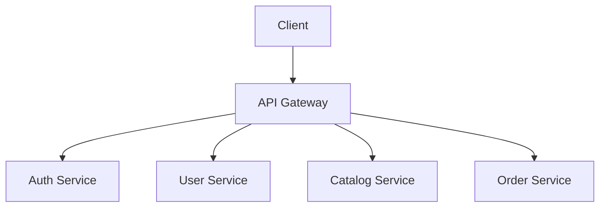
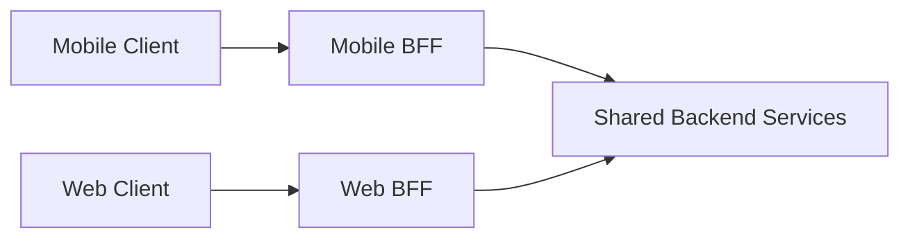

# 15. API Gateway Pattern

## Part Context
**Part:** Part 4 - Architectural Patterns  
**Position:** Chapter 15 of 60
**Why this part exists:** This section explains the structural patterns teams use to organize services, APIs, reads, writes, and event flows as systems and organizations grow.  
**This chapter builds toward:** client-facing architecture, edge policy design, and service composition strategies

## Overview
As systems grow into multiple services, clients should not need to understand every internal service boundary. The API gateway pattern introduces a stable edge that handles routing, authentication, rate limits, and sometimes response composition so clients interact with a cleaner interface than the internal architecture might expose directly.

A gateway is valuable when it simplifies clients, centralizes edge concerns, and protects internal evolution. It becomes harmful when it turns into an overloaded god-service full of business logic.

## Why This Matters in Real Systems
- Gateways simplify clients and reduce their coupling to backend topology.
- They centralize concerns such as auth, rate limiting, and request transformation.
- They help teams evolve internal services without constantly changing public contracts.
- They are a common interview topic because they sit at the intersection of client experience and backend architecture.

## Core Concepts
### Single entry point
The gateway provides a stable front door for clients, even if many services sit behind it.

### Routing and aggregation
A gateway can route to the correct backend service and, when useful, combine multiple backend responses into one client-facing payload.

### Authentication and policy
Auth validation, quotas, schema checks, and basic request filtering often belong at the edge.

### Gateway vs BFF
A Backend-for-Frontend tailors responses for a specific client type, while a more general gateway often serves many clients.

## Key Terminology
| Term | Definition |
| --- | --- |
| API Gateway | An edge service that fronts backend services and manages external request handling. |
| BFF | Backend for Frontend; a backend tailored to one client experience such as web or mobile. |
| Rate Limiting | Restricting how frequently a caller can send requests. |
| Aggregation | Combining data from multiple backend services into one response. |
| Authentication | Verifying the identity of a caller or token. |
| Authorization | Checking what the caller is allowed to do. |
| Versioning | Managing backward-compatible or intentionally changed API contracts over time. |
| Edge Policy | Cross-cutting control applied at the system entry point. |

## Detailed Explanation
### The edge should reflect user flows, not internal structure
A client wants to load a screen or complete a user action, not call six internal services in the correct order. A well-designed gateway shapes APIs around those user flows while keeping internal services free to evolve independently.

### Centralization is useful but dangerous
Auth checks, request validation, quotas, traffic shaping, and response transformation are all natural gateway responsibilities. But when teams keep adding business rules and orchestration logic there, the gateway becomes a bottleneck both technically and organizationally.

### Aggregation trades client simplicity for backend complexity
Combining multiple service responses can reduce round trips for mobile and browser clients, but it can also increase fan-out latency and make the gateway sensitive to every backend slowdown. Architects need to decide which aggregations are worth the extra edge complexity.

### Different clients may need different gateways
Web, mobile, partner, and internal clients often need different shapes of data or different policies. This is where BFF patterns or layered gateway approaches become useful.

### A gateway does not fix poor service boundaries
If the internal services are tightly coupled, chatty, or inconsistent, the gateway may hide some pain from clients but it does not remove the architectural problem. The backend still needs coherent domain boundaries and contracts.

## Diagram / Flow Representation
### Gateway at the Edge

### BFF Variation

## Real-World Examples
- Amazon-like mobile experiences benefit from aggregation because extra round trips are painful on mobile networks.
- Google-style public APIs often require strong auth, quota control, and contract stability at the edge.
- Netflix-like device ecosystems often tailor payloads differently for TV, mobile, and browser clients.
- Internal partner or third-party APIs often need tighter filtering and versioning than internal service-to-service APIs.

## Case Study
### Mobile backend design with an API gateway

Mobile clients are a strong gateway case because network quality varies, round trips are expensive, and security concerns are high.

### Requirements
- Mobile clients need screen-oriented APIs rather than many fine-grained service calls.
- Auth and rate limits must be enforced consistently.
- Internal services should remain hidden behind a stable contract.
- The edge should help reduce round trips and payload waste.
- The system should support versioning and safe evolution for many client app versions in the wild.

### Design Evolution
- A basic gateway starts by routing requests and validating auth tokens.
- As client needs diversify, selected aggregation endpoints are added for major user journeys.
- As web and mobile needs diverge further, separate BFFs may replace a one-size-fits-all gateway contract.
- As scale and partner usage grow, rate limits, schema governance, and edge observability become more sophisticated.

### Scaling Challenges
- Too much aggregation can make the gateway itself a latency hotspot.
- A single global gateway path can become risky if every client depends on it for all traffic.
- Backward compatibility becomes harder as more client versions remain active simultaneously.
- Centralized logic can slow teams down if every product change must pass through one overloaded edge team.

### Final Architecture
- A stable edge layer enforcing auth, quotas, and routing.
- Client-aware aggregated endpoints for high-value journeys.
- Clean separation between edge policy and backend business ownership.
- Versioning and observability at the API boundary.
- Potential BFF split when client needs become sufficiently different.

## Architect's Mindset
- Design external contracts around user journeys, not internal service names.
- Keep the gateway thin enough to avoid becoming a new monolith at the edge.
- Use the gateway to centralize policy, not to absorb all business logic.
- Prefer BFFs when client experiences differ meaningfully.
- Treat the gateway as critical infrastructure with strong observability and reliability expectations.

## Common Mistakes
- Turning the gateway into a giant orchestration and business-rules layer.
- Mirroring internal services one-to-one so clients still feel internal complexity.
- Ignoring fan-out latency when adding more aggregation.
- Centralizing too much ownership in one team around the gateway.
- Treating versioning as an afterthought.

## Interview Angle
- Interviewers often ask about gateways when a design includes many backend services or mobile clients.
- Strong answers discuss routing, auth, rate limiting, aggregation, and the risk of overloading the edge.
- Candidates stand out when they distinguish between a generic gateway and a BFF.
- A weak answer says “put an API gateway in front” without explaining why the client needs it.

## Quick Recap
- An API gateway provides a cleaner external contract than the raw internal topology.
- It centralizes routing, policy, auth, and sometimes response aggregation.
- Gateways help clients but can become bottlenecks if overloaded with business logic.
- BFF patterns are useful when client needs differ significantly.
- The gateway should simplify the edge, not mask poor backend design forever.

## Practice Questions
1. When is an API gateway useful?
2. What concerns belong naturally at the edge?
3. Why can aggregation help mobile clients?
4. What makes a BFF different from a general gateway?
5. How can a gateway become a bottleneck?
6. What observability would you add at the API boundary?
7. Why should internal service boundaries remain meaningful even when a gateway exists?
8. How would you handle versioning for long-lived client apps?
9. When would you split one gateway into multiple BFFs?
10. How would you explain gateway trade-offs to a frontend team?

## Further Exploration
- Connect this chapter with security and authentication later in the book.
- Study GraphQL, BFF patterns, and traffic-shaping policies in more depth.
- Design one screen of a mobile app and decide what the edge contract should look like.

## Navigation
- Previous: [Monolith vs Microservices](14-monolith-vs-microservices.md)
- Next: [Event-Driven Architecture](16-event-driven-architecture.md)
