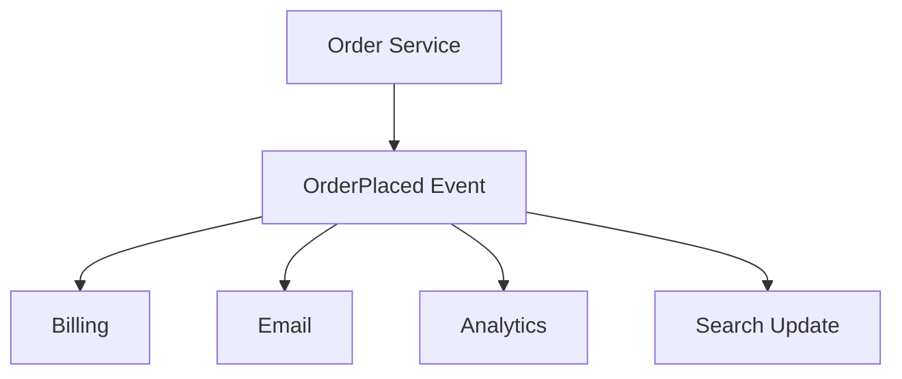
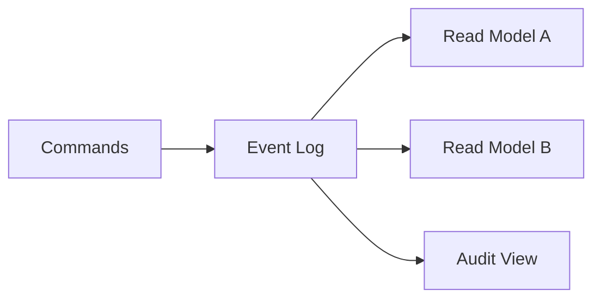

# 16. Event-Driven Architecture

## Part Context
**Part:** Part 4 - Architectural Patterns  
**Position:** Chapter 16 of 42  
**Why this part exists:** This section explains the structural patterns teams use to organize services, APIs, reads, writes, and event flows as systems and organizations grow.  
**This chapter builds toward:** reactive system design, stream-oriented thinking, and decoupled downstream evolution

## Overview
Event-driven architecture organizes systems around facts that something has happened. Instead of one service directly calling every downstream system, it emits an event such as OrderPlaced or VideoUploaded, and other services react when that event matters to them. This creates time-based decoupling and opens the door to streaming, projections, and asynchronous product evolution.

The pattern is powerful, but it also requires discipline. Events must be modeled as stable contracts, consumers must be observable, and teams must understand that event-driven does not mean responsibility-free.

## Why This Matters in Real Systems
- It reduces direct coupling between producers and downstream consumers.
- It supports fan-out, real-time analytics, and workflow extensibility.
- It is a common architecture for data-rich, reactive, and high-scale systems.
- Interviewers use it to test whether candidates understand the difference between direct calls and state-change propagation.

## Core Concepts
### Domain events
A domain event captures a meaningful state change, not just an implementation detail.

### Streams and subscriptions
Events can be persisted and consumed by one or many independent consumers over time.

### Event sourcing
Some systems store events as the system of record and derive current state from them.

### Projections and downstream models
Consumers build read models, dashboards, notifications, or analytics from the same event stream.

## Key Terminology
| Term | Definition |
| --- | --- |
| Domain Event | A record that something meaningful happened in the business domain. |
| Stream | A continuous ordered sequence of events. |
| Projection | A derived view created by processing events. |
| Event Sourcing | Persisting state changes as an ordered event log instead of storing only current state. |
| Replay | Reprocessing past events to rebuild state or a projection. |
| Consumer Group | A set of consumers coordinating how they process a stream. |
| Schema Evolution | The controlled process of changing event payloads without breaking consumers. |
| Immutable Log | An append-only record of events that are not rewritten in place. |

## Detailed Explanation
### Events decouple in time and ownership
When a producer emits an event, it does not need to know every future consumer. That is valuable because new teams can subscribe later for analytics, search indexing, notifications, or recommendation features without forcing the original service to change.

### Events should describe facts, not commands in disguise
An event like PaymentAuthorized communicates that something already happened. A command like SendReceipt asks another system to do something. Confusing those concepts creates muddled ownership and weak event contracts.

### Streams enable incremental systems
Real-time analytics, activity feeds, audit logs, fraud detectors, and projections all benefit from processing streams of changes rather than repeatedly scanning entire datasets.

### Event sourcing is powerful but expensive in complexity
Storing every state change as an event can improve auditability and rebuildability, but it adds complexity around schema evolution, replay behavior, projection lag, and debugging. It should be chosen deliberately, not romantically.

### Governance matters
Without naming conventions, schema discipline, ownership rules, and observability, event-driven systems degrade into hard-to-debug webs of hidden coupling. Good event-driven design is disciplined, not chaotic.

## Diagram / Flow Representation
### Event Fan-Out

### Event Sourcing and Projection

## Real-World Examples
- Uber-like systems stream trip and location events to many consumers instead of synchronously calling every downstream service.
- Netflix-like analytics pipelines rely on event streams for near-real-time metrics and personalization.
- Amazon order systems often publish domain events that other teams consume without changing the core checkout service.
- Google-scale data systems often use streaming pipelines rather than repeated full-table batch recomputation.

## Case Study
### Real-time analytics system

Analytics systems show the strength of event-driven design because they want to react to product activity quickly without interfering with the core user transaction path.

### Requirements
- User interactions should become visible in dashboards within seconds or minutes.
- The core user request path should not block on analytics processing.
- Multiple downstream systems should be able to consume the same events independently.
- Historical replay should be possible when analytics logic changes.
- The event contract should remain stable enough for many consumers to depend on it.

### Design Evolution
- A product may begin by logging events for batch analytics only.
- As product teams want faster visibility, durable event streams are introduced.
- As more teams depend on the events, schema governance and ownership become more formal.
- As the system matures, projections, replay pipelines, and stream processing become part of the platform.

### Scaling Challenges
- High event volume can create consumer lag or backpressure if downstream processing is weak.
- Schema changes can break many consumers if evolution is uncontrolled.
- Duplicate or replayed events require idempotent projections.
- Without lineage and observability, debugging downstream data quality becomes difficult.

### Final Architecture
- A durable event stream sourced from core product actions.
- Independent consumers building metrics, dashboards, search updates, and experiments.
- Stable schema evolution rules and ownership around the event contracts.
- Replay and projection rebuild capability for model changes or recovery.
- Observability for lag, consumer health, and projection accuracy.

## Architect's Mindset
- Use events when multiple consumers should evolve independently around the same fact.
- Name events around domain meaning, not implementation details.
- Treat schemas and ownership as first-class design elements.
- Expect replay, duplicates, and lag when building downstream projections.
- Do not let event-driven become an excuse for unclear responsibilities.

## Common Mistakes
- Publishing vague or unstable event payloads.
- Confusing events with commands and creating awkward ownership models.
- Choosing event sourcing without the audit or rebuild value to justify the complexity.
- Ignoring schema evolution and consumer observability.
- Assuming asynchronous fan-out automatically removes the need for workflow design.

## Interview Angle
- Interviewers often ask when event-driven architecture is a better fit than direct service-to-service calls.
- Strong answers mention decoupling, fan-out, real-time downstream reactions, and the cost of governance.
- Candidates stand out when they distinguish simple event publication from full event sourcing.
- A weak answer says “use Kafka” without explaining the event model or consumer behavior.

## Quick Recap
- Event-driven architecture centers systems around meaningful state changes.
- It enables downstream independence, projections, and near-real-time systems.
- Events must be governed as stable contracts.
- Event sourcing is a specialized version of the pattern with higher complexity.
- The value of the pattern is decoupling with discipline, not decoupling with ambiguity.

## Practice Questions
1. What makes a good domain event?
2. How do events differ from commands?
3. When is event-driven architecture better than synchronous calls?
4. What extra complexity comes with event sourcing?
5. How would you rebuild a broken projection?
6. Why is schema evolution such an important concern in event systems?
7. How do you keep event-driven systems from becoming chaotic?
8. What kinds of downstream systems benefit most from streams?
9. How would you observe lag in a real-time analytics pipeline?
10. When should a workflow use orchestration even in an event-driven system?

## Further Exploration
- Connect this chapter with CQRS, where projections and read models become even more explicit.
- Study outbox patterns and stream processing engines in more depth.
- Practice designing three meaningful domain events for a system you already know.

## Navigation
- Previous: [API Gateway Pattern](15-api-gateway-pattern.md)
- Next: [CQRS Pattern](17-cqrs-pattern.md)
