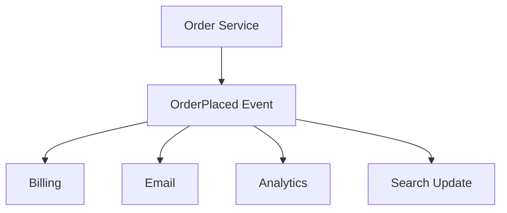
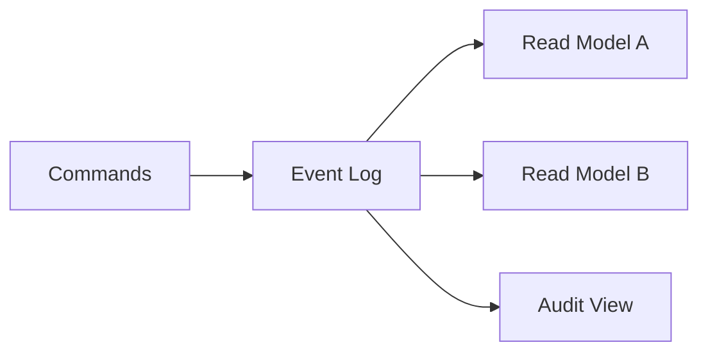

# 16. Event-Driven Architecture

## Part Context
**Part:** Part 4 - Architectural Patterns  
**Position:** Chapter 16 of 60
**Why this part exists:** This section explains the structural patterns teams use to organize services, APIs, reads, writes, and event flows as systems and organizations grow.  
**This chapter builds toward:** reactive system design, stream-oriented thinking, and decoupled downstream evolution

## Overview
Event-driven architecture organizes systems around facts that something has happened. Instead of one service directly calling every downstream system, it emits an event such as OrderPlaced or VideoUploaded, and other services react when that event matters to them. This creates time-based decoupling and opens the door to streaming, projections, and asynchronous product evolution.

The pattern is powerful, but it also requires discipline. Events must be modeled as stable contracts, consumers must be observable, and teams must understand that event-driven does not mean responsibility-free.

## Why This Matters in Real Systems
- It reduces direct coupling between producers and downstream consumers.
- It supports fan-out, real-time analytics, and workflow extensibility.
- It is a common architecture for data-rich, reactive, and high-scale systems.
- Interviewers use it to test whether candidates understand the difference between direct calls and state-change propagation.

## Core Concepts
### Domain events
A domain event captures a meaningful state change, not just an implementation detail.

### Streams and subscriptions
Events can be persisted and consumed by one or many independent consumers over time.

### Event sourcing
Some systems store events as the system of record and derive current state from them.

### Projections and downstream models
Consumers build read models, dashboards, notifications, or analytics from the same event stream.

## Key Terminology
| Term | Definition |
| --- | --- |
| Domain Event | A record that something meaningful happened in the business domain. |
| Stream | A continuous ordered sequence of events. |
| Projection | A derived view created by processing events. |
| Event Sourcing | Persisting state changes as an ordered event log instead of storing only current state. |
| Replay | Reprocessing past events to rebuild state or a projection. |
| Consumer Group | A set of consumers coordinating how they process a stream. |
| Schema Evolution | The controlled process of changing event payloads without breaking consumers. |
| Immutable Log | An append-only record of events that are not rewritten in place. |

## Detailed Explanation
### Events decouple in time and ownership
When a producer emits an event, it does not need to know every future consumer. That is valuable because new teams can subscribe later for analytics, search indexing, notifications, or recommendation features without forcing the original service to change.

### Events should describe facts, not commands in disguise
An event like PaymentAuthorized communicates that something already happened. A command like SendReceipt asks another system to do something. Confusing those concepts creates muddled ownership and weak event contracts.

### Streams enable incremental systems
Real-time analytics, activity feeds, audit logs, fraud detectors, and projections all benefit from processing streams of changes rather than repeatedly scanning entire datasets.

### Event sourcing is powerful but expensive in complexity
Storing every state change as an event can improve auditability and rebuildability, but it adds complexity around schema evolution, replay behavior, projection lag, and debugging. It should be chosen deliberately, not romantically.

### Governance matters
Without naming conventions, schema discipline, ownership rules, and observability, event-driven systems degrade into hard-to-debug webs of hidden coupling. Good event-driven design is disciplined, not chaotic.

## Diagram / Flow Representation
### Event Fan-Out


### Event Sourcing and Projection


## Real-World Examples
- Uber-like systems stream trip and location events to many consumers instead of synchronously calling every downstream service.
- Netflix-like analytics pipelines rely on event streams for near-real-time metrics and personalization.
- Amazon order systems often publish domain events that other teams consume without changing the core checkout service.
- Google-scale data systems often use streaming pipelines rather than repeated full-table batch recomputation.

## Case Study
### Real-time analytics system

Analytics systems show the strength of event-driven design because they want to react to product activity quickly without interfering with the core user transaction path.

### Requirements
- User interactions should become visible in dashboards within seconds or minutes.
- The core user request path should not block on analytics processing.
- Multiple downstream systems should be able to consume the same events independently.
- Historical replay should be possible when analytics logic changes.
- The event contract should remain stable enough for many consumers to depend on it.

### Design Evolution
- A product may begin by logging events for batch analytics only.
- As product teams want faster visibility, durable event streams are introduced.
- As more teams depend on the events, schema governance and ownership become more formal.
- As the system matures, projections, replay pipelines, and stream processing become part of the platform.

### Scaling Challenges
- High event volume can create consumer lag or backpressure if downstream processing is weak.
- Schema changes can break many consumers if evolution is uncontrolled.
- Duplicate or replayed events require idempotent projections.
- Without lineage and observability, debugging downstream data quality becomes difficult.

### Final Architecture
- A durable event stream sourced from core product actions.
- Independent consumers building metrics, dashboards, search updates, and experiments.
- Stable schema evolution rules and ownership around the event contracts.
- Replay and projection rebuild capability for model changes or recovery.
- Observability for lag, consumer health, and projection accuracy.

## Architect's Mindset
- Use events when multiple consumers should evolve independently around the same fact.
- Name events around domain meaning, not implementation details.
- Treat schemas and ownership as first-class design elements.
- Expect replay, duplicates, and lag when building downstream projections.
- Do not let event-driven become an excuse for unclear responsibilities.

## Canonical Event Design Checklist

A well-designed event is a stable contract that multiple teams can depend on for years. Use this checklist when defining any domain event.

### Event Structure Template

```json
{
  "event_id": "evt_abc123",
  "event_type": "order.placed",
  "event_version": "1.2",
  "timestamp": "2025-03-15T14:32:01.847Z",
  "source": "order-service",
  "correlation_id": "req_xyz789",
  "trace_id": "w3c-trace-id-here",
  "aggregate_id": "order-98765",
  "aggregate_type": "Order",
  "payload": {
    "order_id": "order-98765",
    "customer_id": "cust-442211",
    "items": [...],
    "total_amount": { "value": 149.99, "currency": "USD" }
  },
  "metadata": {
    "produced_by": "order-service-v2.3.1",
    "environment": "production",
    "region": "us-east-1"
  }
}
```

### Event Design Rules

| Rule | Why | Example |
|------|-----|---------|
| **Name events in past tense** | Events describe facts that already happened | `order.placed` not `place_order` |
| **Include event_id (UUID)** | Enables deduplication by consumers | Consumers check `event_id` before processing |
| **Include event_version** | Enables schema evolution without breaking consumers | Consumers can route by version |
| **Include timestamp (ISO-8601 UTC)** | Ordering, debugging, and retention depend on time | Always UTC; never local time |
| **Include trace_id** | Enables distributed tracing across async boundaries | Propagate W3C TraceContext from the originating request |
| **Include aggregate_id** | Identifies which entity changed | Consumers use this for ordering and dedup |
| **Payload = business data only** | No infrastructure details in the payload | Don't include DB connection strings or internal IPs |
| **Use explicit types, not generic blobs** | Schema validation and evolution require structure | Avro/Protobuf/JSON Schema; not untyped JSON |
| **Include metadata separately** | Operational context without polluting business data | Producer version, environment, region |

### Schema Evolution Rules

| Rule | What It Means | Impact |
|------|-------------|--------|
| **Add optional fields only** | New fields have defaults; old consumers ignore them | Backward + forward compatible |
| **Never remove fields** | Deprecate and document; keep in schema | Old consumers don't break |
| **Never change field types** | `string` stays `string`; need `int`? Add new field | Prevents deserialization failures |
| **Version the event type** | `order.placed.v1`, `order.placed.v2` or `event_version` field | Consumers can handle multiple versions |
| **Schema Registry enforces** | Reject breaking changes at publish time | Confluent Schema Registry, AWS Glue |

---

## Eventual Consistency, Debugging, and Observability

Event-driven systems are inherently eventually consistent. This is a feature, not a bug — but it requires deliberate tooling to debug and operate.

### What Eventual Consistency Means in Practice

| Scenario | What the User Sees | Why It Happens | Acceptable? |
|----------|-------------------|---------------|-------------|
| User places order, order page shows "processing" | Stale read from projection that hasn't caught up | Consumer lag (normal) | Yes — if UI communicates "processing" state |
| User updates profile, search still shows old name | Search index consumer is behind | Index rebuild lag | Yes — for seconds; alarming after minutes |
| User sees different data on refresh | Read hit different replica with different lag | Replica consistency | Depends on workflow — use session consistency if needed |

### Debugging Async Event Flows

| Challenge | Why It's Hard | Solution |
|-----------|-------------|---------|
| "Where is my event?" | Event may be in broker, in consumer queue, in DLQ, or lost | **End-to-end event lineage**: track event_id through producer → broker → consumer → projection |
| "Why is the projection wrong?" | Consumer may have processed events out of order, skipped one, or hit a bug | **Projection audit**: compare projection state against replayed events |
| "Which consumer is slow?" | Multiple consumers on same topic; hard to pinpoint | **Per-consumer lag monitoring**: Kafka consumer group lag per partition |
| "Event was processed but had no effect" | Idempotency dedup kicked in, or conditional write skipped it | **Processing log**: record every event_id with processing outcome (applied, skipped, failed) |

### Tracing Across Async Boundaries (OpenTelemetry)

Standard HTTP tracing breaks at async boundaries because the consumer processes the event in a different process, at a different time. OpenTelemetry context propagation solves this.

```python
# PRODUCER: Inject trace context into event headers
from opentelemetry import trace, context
from opentelemetry.propagate import inject

tracer = trace.get_tracer("order-service")

with tracer.start_as_current_span("publish_order_placed") as span:
    headers = {}
    inject(headers)  # Injects traceparent + tracestate into headers

    event = {
        "event_type": "order.placed",
        "payload": {...},
        "headers": headers  # Carry trace context with the event
    }
    kafka_producer.send("orders", event)
```

```python
# CONSUMER: Extract trace context from event headers
from opentelemetry.propagate import extract

def process_event(event):
    ctx = extract(event["headers"])  # Reconstruct parent context

    with tracer.start_as_current_span("process_order_placed", context=ctx) as span:
        # This span is a child of the producer's span
        # Full trace: HTTP request → produce event → consume event → process
        update_search_index(event["payload"])
```

**Result:** A single trace shows the complete flow from user HTTP request → event publication → async consumption → downstream effect, even though they happened in different services and different time windows.

---

## Outbox Pattern in Event-Driven Architecture

The outbox pattern ensures that database writes and event publications are atomic. Without it, an event-driven system can silently lose events or publish events for uncommitted writes.

*(Also covered in Ch 5: Databases and Ch 8: Message Queues — included here because it is foundational to reliable EDA.)*

```
Service writes to DB + outbox in ONE transaction:
  BEGIN
    INSERT INTO orders (...) VALUES (...)
    INSERT INTO outbox (event_type, aggregate_id, payload) VALUES (...)
  COMMIT

Outbox Relay (Debezium or custom poller):
  → Reads outbox table
  → Publishes to Kafka
  → Marks rows as published

Consumers (idempotent):
  → Process events at-least-once
  → Use event_id for deduplication
```

### CDC vs Outbox vs Direct Publish

| Approach | Atomicity | Event Schema Control | Complexity |
|----------|----------|---------------------|-----------|
| **Direct publish** (write DB, then publish) | ❌ Not atomic | Full control | Low (but unsafe) |
| **Outbox table** | ✅ Atomic (same DB txn) | Full control (explicit event schema) | Medium |
| **CDC (Debezium on WAL)** | ✅ Atomic (reads committed data) | Limited (mirrors DB schema) | Medium-High |

**Guideline:** Use outbox for domain events with explicit schemas. Use CDC for replicating raw data changes to analytics or search.

---

## Event Sourcing vs Event-Driven — Clear Boundaries

These two patterns are often confused. They solve different problems.

| Dimension | Event-Driven Architecture | Event Sourcing |
|-----------|--------------------------|---------------|
| **What events represent** | Notifications of state changes (side-channel) | The authoritative record of state (primary store) |
| **System of record** | Database (events are published from DB writes) | Event log (state is derived from replaying events) |
| **Can you delete the events?** | Yes (events are notifications; DB is the truth) | No (events ARE the truth; deleting = data loss) |
| **Replay purpose** | Rebuild projections, reprocess for new consumers | Rebuild entire entity state from scratch |
| **When to use** | Decoupling, fan-out, async processing | Audit-heavy domains, financial ledgers, undo/redo requirements |
| **Complexity** | Moderate (schema governance, consumer management) | High (snapshot management, schema evolution across full history, projection lag) |

**Decision rule:** If you need to publish facts for other services to react to → EDA. If you need the complete history of every state change as your source of truth → Event Sourcing. Most systems need EDA; few need Event Sourcing.

---

## Replay and Backfill Strategies

Replay is one of the most powerful capabilities of event-driven systems — and one of the most operationally dangerous if done carelessly.

### When to Replay

| Scenario | What You Replay | Risk |
|----------|----------------|------|
| New consumer joins | All historical events from topic beginning | Consumer must handle full volume; may take hours/days |
| Projection bug fixed | Events from point of bug introduction | Must be idempotent; old projection state may be inconsistent |
| Schema migration | All events through new deserialization logic | Version compatibility must be verified |
| Disaster recovery | All events to rebuild state from scratch | Requires event retention policy that covers the recovery window |

### Replay Safety Rules

1. **Consumers must be idempotent** — replay means every event is processed again; duplicates must be safe
2. **Use a separate consumer group** — don't replay into the live consumer group (can cause duplicate processing)
3. **Rate-limit replay** — full-speed replay can overwhelm databases, APIs, and downstream services
4. **Verify before cutover** — replay into a shadow projection; compare with live; switch only when verified
5. **Retain events long enough** — if you keep events for 7 days but need to replay 30 days, you've lost data

### Backfill Pattern (Bootstrap New Consumer)

```
1. Create new consumer group (e.g., "search-indexer-v2")
2. Set offset to "earliest" (start from beginning of topic)
3. Process all historical events into new projection (shadow mode)
4. Compare shadow projection against live (sample 1000 records, verify correctness)
5. If correct: switch live traffic to new consumer group
6. If incorrect: fix consumer logic, reset offset, replay again
7. Decommission old consumer group
```

### Cross-References

| Topic | Chapter |
|-------|---------|
| Outbox and CDC patterns | Ch 5: Databases; Ch 8: Message Queues |
| Schema evolution strategies | Ch 8: Message Queues (Schema Evolution section) |
| Delivery semantics (at-least-once, exactly-once) | Ch 8: Message Queues |
| CQRS and read model projections | Ch 17: CQRS Pattern |
| Distributed tracing for async flows | F10: Observability & Operations |
| Saga orchestration over events | Ch 13: Distributed Transactions |

## Common Mistakes
- Publishing vague or unstable event payloads.
- Confusing events with commands and creating awkward ownership models.
- Choosing event sourcing without the audit or rebuild value to justify the complexity.
- Ignoring schema evolution and consumer observability.
- Assuming asynchronous fan-out automatically removes the need for workflow design.

## Interview Angle
- Interviewers often ask when event-driven architecture is a better fit than direct service-to-service calls.
- Strong answers mention decoupling, fan-out, real-time downstream reactions, and the cost of governance.
- Candidates stand out when they distinguish simple event publication from full event sourcing.
- A weak answer says “use Kafka” without explaining the event model or consumer behavior.

## Quick Recap
- Event-driven architecture centers systems around meaningful state changes.
- It enables downstream independence, projections, and near-real-time systems.
- Events must be governed as stable contracts.
- Event sourcing is a specialized version of the pattern with higher complexity.
- The value of the pattern is decoupling with discipline, not decoupling with ambiguity.

## Practice Questions
1. What makes a good domain event?
2. How do events differ from commands?
3. When is event-driven architecture better than synchronous calls?
4. What extra complexity comes with event sourcing?
5. How would you rebuild a broken projection?
6. Why is schema evolution such an important concern in event systems?
7. How do you keep event-driven systems from becoming chaotic?
8. What kinds of downstream systems benefit most from streams?
9. How would you observe lag in a real-time analytics pipeline?
10. When should a workflow use orchestration even in an event-driven system?

## Further Exploration
- Connect this chapter with CQRS, where projections and read models become even more explicit.
- Study outbox patterns and stream processing engines in more depth.
- Practice designing three meaningful domain events for a system you already know.


## Navigation
- Previous: [API Gateway Pattern](15-api-gateway-pattern.md)
- Next: [CQRS Pattern](17-cqrs-pattern.md)
