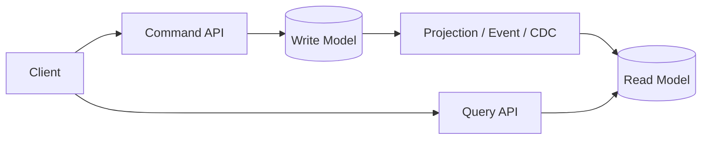
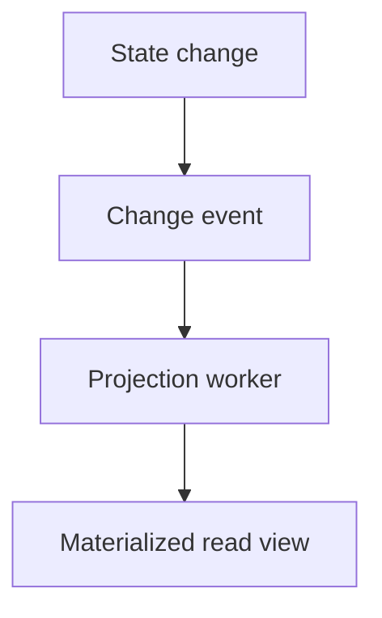

# 17. CQRS Pattern

## Part Context
**Part:** Part 4 - Architectural Patterns  
**Position:** Chapter 17 of 60
**Why this part exists:** This section explains the structural patterns teams use to organize services, APIs, reads, writes, and event flows as systems and organizations grow.  
**This chapter builds toward:** separate read-write modeling, projection thinking, and workload-specific optimization

## Overview
CQRS, or Command Query Responsibility Segregation, separates the write side of a system from the read side when those two sides have meaningfully different needs. The command side focuses on correctness, validation, and durable state changes. The query side focuses on serving the exact shapes of data that clients need quickly and efficiently.

CQRS is useful when one model cannot cleanly satisfy both read and write requirements. It is not a default architecture. It is an optimization and clarity pattern for systems with strong read-write asymmetry.

## Why This Matters in Real Systems
- Many systems are read-heavy and need denormalized views that are poor fits for the write model.
- CQRS makes it easier to optimize user-facing reads without compromising the integrity of the write path.
- It pairs naturally with event-driven systems and projection models.
- Interviewers use it to see whether candidates can reason about workload asymmetry and data modeling trade-offs.

## Core Concepts
### Command side
The write side enforces business rules and commits source-of-truth state changes.

### Query side
The read side serves pre-shaped, denormalized, or aggregated views optimized for consumption.

### Projections
Read models are often built by projecting commands or events into query-friendly stores.

### Eventual consistency trade-off
The read side may lag behind the write side, so freshness expectations must be explicit.

## Key Terminology
| Term | Definition |
| --- | --- |
| Command | A request intended to change system state. |
| Query | A request that reads state without changing it. |
| Read Model | A data representation optimized for retrieval and presentation. |
| Write Model | The authoritative state model used to validate and persist changes. |
| Projection | A derived view built from commands, change streams, or events. |
| Materialized View | A stored query result or precomputed representation optimized for reads. |
| Denormalization | Structuring data for faster reads at the cost of write complexity or duplication. |
| Lag | The delay between source-of-truth updates and read-model updates. |

## Detailed Explanation
### One model rarely serves both sides perfectly
A write model optimized for correctness may be normalized, strict, and rich in business rules. A read model optimized for dashboards, feeds, or mobile screens may want aggregates, flattened relationships, and precomputed counts. CQRS recognizes that forcing one model to satisfy both often creates friction.

### Read models are products
A query model should reflect what the client actually needs, not what the database happened to store first. That can mean precomputed dashboard metrics, feed entries, aggregated status summaries, or search-friendly documents.

### The cost is duplication and lag
CQRS introduces extra storage, projection logic, and lag between the source of truth and the read model. The pattern is justified when read performance, query complexity, or isolation needs make those costs worthwhile.

### CQRS does not require event sourcing
Event sourcing is one way to feed projections, but not the only way. Change data capture, explicit projection updates, or scheduled materialization can also support CQRS.

### Decision framework
CQRS makes sense when reads and writes differ sharply in volume, shape, or scaling needs; when dashboards or feeds are expensive to compute on demand; or when one read model must serve many consumers efficiently. It is less useful when the system is small and the same model serves both sides adequately.

## Diagram / Flow Representation
### CQRS Split


### Read Model Update Flow


## Real-World Examples
- Analytics dashboards often use CQRS-like read models because aggregate queries are too expensive to compute directly from transactional writes every time.
- E-commerce order systems may expose different read models for customers, warehouse workers, and finance teams.
- Social feeds frequently rely on denormalized read stores while writes remain in a more normalized source of truth.
- Google-scale data products often separate serving indexes or views from the systems that originally captured writes.

## Case Study
### High-scale dashboards

A dashboard system is a strong CQRS case because the read side wants fast summaries and aggregates, while the write side wants clean durable event capture or transactional correctness.

### Requirements
- High-frequency writes from operational systems must remain correct and durable.
- Dashboard reads should be fast even under heavy usage.
- Different dashboard views may need different precomputed aggregations.
- Slight lag may be acceptable if clearly bounded.
- Projection failures should be detectable and repairable.

### Design Evolution
- A first version may query the transactional database directly.
- As dashboard usage and aggregation complexity grow, materialized views or projection stores are introduced.
- As more consumers arrive, multiple read models may appear for different analytical or operational views.
- As correctness and freshness needs sharpen, lag monitoring and replay tools become part of the architecture.

### Scaling Challenges
- Expensive join-heavy dashboard queries can overload the transactional store.
- Projection lag can create confusion if freshness expectations are not explicit.
- Duplicate or out-of-order updates can corrupt read models without careful projection logic.
- Rebuilding large views can be operationally expensive if replay strategy is weak.

### Final Architecture
- A write model optimized for correctness and transactional safety.
- Projection logic that transforms changes into query-friendly shapes.
- Dedicated read models for dashboards, summaries, or feed-like views.
- Lag observability and replay/rebuild tooling.
- Clear communication of freshness expectations to users and downstream systems.

## Architect's Mindset
- Use CQRS only when the read-write asymmetry is real enough to justify extra complexity.
- Design read models around consumer needs, not around storage purity.
- Keep the write model authoritative and understandable.
- Measure and communicate projection lag explicitly.
- Treat projection rebuilds and data quality as production responsibilities, not edge cases.

## Worked CQRS Example: E-Commerce Order Dashboard

This example walks through a complete CQRS implementation for an order management system where the write model serves checkout correctness and the read model serves operational dashboards.

### Write Side (Command Model)

```sql
-- Normalized write model: optimized for correctness and transactional integrity
CREATE TABLE orders (
    id UUID PRIMARY KEY,
    customer_id UUID NOT NULL,
    status VARCHAR(20) NOT NULL DEFAULT 'pending',
    created_at TIMESTAMP NOT NULL DEFAULT NOW(),
    updated_at TIMESTAMP NOT NULL DEFAULT NOW()
);

CREATE TABLE order_items (
    id UUID PRIMARY KEY,
    order_id UUID REFERENCES orders(id),
    product_id UUID NOT NULL,
    quantity INT NOT NULL,
    unit_price DECIMAL(10,2) NOT NULL
);

CREATE TABLE payments (
    id UUID PRIMARY KEY,
    order_id UUID REFERENCES orders(id),
    amount DECIMAL(10,2) NOT NULL,
    status VARCHAR(20) NOT NULL,
    provider_ref VARCHAR(100)
);
```

**Write API:** `POST /orders` → validates inventory, creates order, publishes `OrderPlaced` event.

### Event Publication (via Outbox)

```sql
-- In the same transaction as the order write
INSERT INTO outbox (event_type, aggregate_id, payload, created_at) VALUES (
    'order.placed',
    'ord-98765',
    '{"order_id":"ord-98765","customer_id":"cust-123","items":[...],"total":149.99}',
    NOW()
);
```

### Read Side (Query Model)

```sql
-- Denormalized read model: optimized for dashboard queries
CREATE TABLE order_dashboard_view (
    order_id UUID PRIMARY KEY,
    customer_name VARCHAR(255),
    customer_email VARCHAR(255),
    item_count INT,
    total_amount DECIMAL(10,2),
    status VARCHAR(20),
    payment_status VARCHAR(20),
    created_at TIMESTAMP,
    last_updated TIMESTAMP
);

-- Single-query dashboard read (no joins needed)
SELECT * FROM order_dashboard_view
WHERE status = 'pending'
AND created_at > NOW() - INTERVAL '24 hours'
ORDER BY created_at DESC
LIMIT 50;
```

### Projection Worker

```python
# Consumes events and updates the read model
def handle_order_placed(event):
    customer = customer_service.get(event.payload["customer_id"])
    db.execute("""
        INSERT INTO order_dashboard_view
        (order_id, customer_name, customer_email, item_count, total_amount,
         status, payment_status, created_at, last_updated)
        VALUES (%s, %s, %s, %s, %s, 'pending', 'awaiting', %s, NOW())
        ON CONFLICT (order_id) DO NOTHING
    """, (event.payload["order_id"], customer.name, customer.email,
          len(event.payload["items"]), event.payload["total"],
          event.payload["created_at"]))

def handle_payment_completed(event):
    db.execute("""
        UPDATE order_dashboard_view
        SET payment_status = 'completed', status = 'confirmed', last_updated = NOW()
        WHERE order_id = %s
    """, (event.payload["order_id"],))
```

### Read-Model Rebuild

When the projection has a bug or the schema changes, the read model must be rebuilt from scratch:

```
1. Create new read model table (order_dashboard_view_v2)
2. Deploy new projection worker consuming from topic offset "earliest"
   → New consumer group: "order-dashboard-v2"
3. Process all historical events into new table
4. Compare v2 with v1 (sample 1000 orders, verify correctness)
5. If correct: switch Query API to read from v2
6. Decommission v1 table + old consumer group
```

**Rebuild time estimate:** 100M orders × 0.1ms/event = ~3 hours. Plan for this in operational runbooks.

---

## CQRS vs Event Sourcing — When You Need Which

| Dimension | CQRS (without Event Sourcing) | CQRS + Event Sourcing |
|-----------|------------------------------|----------------------|
| **Write model** | Standard database (relational, document) | Append-only event log |
| **Source of truth** | Current state in database | Complete event history |
| **How read model is fed** | CDC, outbox, or direct projection from DB changes | Replay events from the log |
| **Audit trail** | Must be added separately (audit log table) | Built-in (events ARE the audit trail) |
| **State rebuild** | Not possible from events alone | Replay all events to reconstruct any point in time |
| **Schema evolution** | Standard DB migrations | Must handle every historical event format |
| **Complexity** | Moderate | High |
| **Use when** | Read-write asymmetry; dashboard/feed optimization | Financial ledgers; compliance audit; undo/redo; full history required |

**Decision rule:** Start with CQRS without event sourcing. Add event sourcing only if you genuinely need the full event history as your source of truth (audit-grade, regulatory, or undo/redo requirements).

### Operational Complexity Warning

CQRS adds real operational burden. Before adopting it, verify that the benefits outweigh these costs:

| Cost | What It Means in Practice |
|------|--------------------------|
| **Two data stores to maintain** | Separate backups, monitoring, and capacity planning for write and read models |
| **Projection code to own** | A new category of code that must be correct, idempotent, and observable |
| **Lag to communicate** | Product/UX must design for "data may be N seconds stale" |
| **Rebuild tooling** | You WILL need to rebuild read models; without tooling, it's a multi-day incident |
| **Debugging complexity** | "Why does the dashboard show X when the order is Y?" requires tracing through projection logic |

---

## Read Freshness SLOs

The delay between a write and its appearance in the read model is not a bug — it is a design parameter that must be measured and governed.

### Freshness SLO by Consumer

| Consumer | Acceptable Lag | Why | Measurement |
|----------|---------------|-----|-------------|
| Customer-facing order status page | < 5 seconds | Customer expects to see their order immediately after placing it | Event-to-projection latency metric |
| Operations dashboard | < 30 seconds | Operators need near-real-time visibility | Projection lag metric (Kafka consumer lag) |
| Finance reconciliation report | < 5 minutes | Batch-oriented; slight delay acceptable | Pipeline completion time |
| Search index | < 60 seconds | New products should be searchable quickly | Index freshness metric |
| Analytics / BI dashboard | < 15 minutes | Historical analysis; not real-time | Data pipeline lag |

### Read-After-Write Consistency Workaround

When a user writes data and immediately reads it back, the read model may not have caught up yet. Solutions:

| Approach | How It Works | Trade-off |
|----------|-------------|-----------|
| **Read from write model** | For the writing user's session, route reads to the write DB for N seconds after their write | Increases write DB load; requires session awareness |
| **Optimistic UI** | Client shows the write result locally before the server confirms the read model update | Client may show data that fails validation; needs error handling |
| **Polling with version** | Client polls read model with a version token; read model returns data only when version >= expected | Adds polling latency; requires version tracking |
| **Write returns read-model-friendly response** | The write API response includes enough data for the client to display immediately | Couples write response to read model shape |

---

## Projection Lag — Operational Playbook

### Monitoring

| Metric | What It Measures | Alert Threshold |
|--------|-----------------|----------------|
| Kafka consumer lag (offsets) | Events waiting to be processed by projection worker | Growing for > 5 minutes |
| Event-to-projection latency | Time from event timestamp to read-model update timestamp | > SLO threshold (e.g., 30s for dashboard) |
| Projection error rate | % of events that failed processing | > 1% |
| Dead letter queue depth | Events that repeatedly failed | > 0 (any DLQ entry is investigatable) |

### Incident Response for Projection Lag

```
Lag detected (consumer lag growing, freshness SLO breached)
  │
  ├─ Is the projection worker healthy?
  │   → NO: Restart workers; check for OOM, crash loops, deployment issues
  │   → YES: Continue
  │
  ├─ Is the projection worker processing slowly?
  │   → YES: Check for slow DB writes, missing indexes, N+1 queries
  │   → YES: Scale consumer fleet (add more instances)
  │   → NO: Continue
  │
  ├─ Is the source topic receiving a burst?
  │   → YES: Expected burst (launch, sale)? Wait for it to drain
  │   → YES: Unexpected? Investigate upstream producer
  │
  ├─ Are events failing (going to DLQ)?
  │   → YES: Inspect DLQ; fix consumer bug; replay failed events
  │
  └─ Is the read model corrupted?
      → YES: Trigger full read-model rebuild (see rebuild procedure above)
```

### Cross-References

| Topic | Chapter |
|-------|---------|
| Event-driven architecture and projections | Ch 16: Event-Driven Architecture |
| Outbox pattern (dual-write avoidance) | Ch 5: Databases; Ch 8: Message Queues |
| Schema evolution for events | Ch 8: Message Queues; Ch 16: EDA |
| Staleness SLOs and replica lag | Ch 11: Consistency & CAP |
| Observability for async pipelines | F10: Observability & Operations |

## Common Mistakes
- Applying CQRS to small systems that do not need it.
- Assuming event sourcing is mandatory for CQRS.
- Ignoring the cost of projection lag and read-model repair.
- Letting business logic leak into read-model projection code in ad hoc ways.
- Creating read models without clearly defined consumers or query patterns.

## Interview Angle
- CQRS is often asked as a follow-up when a system is read-heavy or when dashboards and feeds are part of the design.
- Strong answers explain why one model is not enough, how the read side is built, and what freshness trade-off exists.
- Candidates stand out when they mention projections, denormalization, and eventual consistency clearly.
- A weak answer uses CQRS as a buzzword without identifying the asymmetry it solves.

## Quick Recap
- CQRS separates the write model from the read model when their needs diverge significantly.
- The write side optimizes for correctness; the read side optimizes for retrieval shape and speed.
- Projections and materialized views are common supporting techniques.
- The trade-off is added complexity and possible lag.
- CQRS is powerful when justified, but unnecessary when one simple model is enough.

## Practice Questions
1. What problem does CQRS solve that a single data model struggles with?
2. When is CQRS not worth it?
3. How do read models become stale?
4. Why are dashboards a natural CQRS use case?
5. How does CQRS relate to event-driven architecture?
6. Can CQRS exist without event sourcing?
7. What observability do you need for projections?
8. How would you rebuild a corrupted read model?
9. Why can denormalization be a feature instead of a flaw on the read side?
10. How would you explain CQRS to a product stakeholder who only cares that the dashboard is fast?

## Further Exploration
- Connect this chapter with observability and event-driven systems later in the book.
- Study change data capture, materialized views, and projection rebuild patterns.
- Practice identifying read-write asymmetry in familiar products such as feeds, dashboards, and admin consoles.


## Navigation
- Previous: [Event-Driven Architecture](16-event-driven-architecture.md)
- Next: [E-Commerce & Marketplaces](../05-real-world-systems/18-ecommerce-marketplaces.md)
