# 18. E-Commerce & Marketplaces

## Part Context
**Part:** Part 5 — Real-World System Design Examples
**Position:** Chapter 18 of 42
**Why this part exists:** This section translates distributed-systems theory into realistic product designs across consumer apps, marketplaces, media, payments, search, notifications, collaboration, infrastructure, and operations-heavy platforms.

---

## Overview

E-commerce systems appear simple from the shopper's perspective — browse, add to cart, pay, receive goods. Behind that surface lies one of the most architecturally demanding domains in software: a dense web of correctness constraints, latency-sensitive read paths, inventory contention, distributed payment orchestration, fraud detection, multi-seller isolation, and post-order state machines that run for days or weeks.

This chapter performs a deep-dive into **four domain areas** that together form a complete e-commerce platform:

### Domain A — Core Commerce
The eight subsystems that form the transactional backbone:

1. **Product Catalog Service** — the canonical source of product data, supporting search, filtering, and multi-channel syndication.
2. **Product Detail Page (PDP)** — the low-latency assembly layer that merges catalog, pricing, inventory, reviews, and media into a single buyer-facing view.
3. **Pricing Engine** — dynamic pricing, discount stacking, coupon evaluation, and promotional rules executed at request time.
4. **Inventory Management System** — real-time stock tracking, reservation, decrement, and reconciliation across warehouses and sellers.
5. **Shopping Cart** — session-based and persistent cart state with cross-device merge, price re-validation, and abandonment tracking.
6. **Checkout System** — the multi-step orchestration of address validation, shipping estimation, tax calculation, payment authorization, and order creation.
7. **Order Management System (OMS)** — the long-lived state machine that tracks an order from creation through fulfillment, shipping, delivery, and settlement.
8. **Return & Refund System** — reverse logistics, refund orchestration, restocking, and credit issuance.

### Domain B — Marketplace Infrastructure (Multi-Vendor)
The five subsystems that enable a multi-seller marketplace:

1. **Vendor Onboarding System** — KYC, contract management, tiered onboarding, and compliance workflows.
2. **Seller Dashboard** — real-time analytics, order management, inventory control, and payout visibility for sellers.
3. **Commission & Settlement System** — fee calculation, ledger management, payout scheduling, and financial reconciliation.
4. **Multi-Vendor Inventory Sync** — aggregating stock from hundreds of sellers and warehouses into a unified availability view.
5. **Vendor Rating & Review System** — seller reputation scoring, buyer feedback, and quality enforcement.

### Domain C — Growth & Engagement
The six subsystems that drive discovery, retention, and monetization:

1. **Recommendation System (ML-driven)** — collaborative filtering, content-based, and hybrid recommendation pipelines.
2. **Personalization Engine** — real-time user context assembly for personalized search, ranking, and layout.
3. **Wishlist System** — persistent save-for-later with price alerts and social sharing.
4. **Recently Viewed System** — low-latency browsing history for re-engagement.
5. **Coupons & Promotions Engine** — rule-based promotions, coupon lifecycle, budget tracking, and fraud prevention.
6. **Loyalty / Rewards System** — points accrual, tier management, redemption, and partner integrations.

### Domain D — Logistics
The four subsystems that move physical goods from warehouse to doorstep:

1. **Warehouse Management System (WMS)** — inbound receiving, putaway, picking, packing, and outbound staging.
2. **Order Fulfillment System** — orchestration of warehouse allocation, splitting, and carrier handoff.
3. **Delivery Tracking System** — real-time package location, status updates, and buyer notifications.
4. **Route Optimization System** — vehicle routing, last-mile optimization, and delivery slot management.

Every section is written to be useful for learners building mental models, engineers designing production systems, and candidates preparing for system design interviews.

---

## Why This System Matters in Real Systems

- Commerce platforms combine **low-latency read paths** (catalog browsing at 50,000+ RPS) with **correctness-heavy write paths** (inventory reservation must never oversell).
- A single order touches pricing, inventory, payments, fulfillment, shipping, notifications, analytics, tax, and potentially fraud review — making it one of the most cross-cutting transactions in software.
- Marketplace models add seller isolation, commission calculation, settlement cycles, catalog quality enforcement, and fraud pressure from both buyers and sellers.
- E-commerce is the most common domain in system design interviews because it exposes real trade-offs between user experience, operational safety, consistency, and scale.
- The domain evolves constantly: flash sales, live commerce, social commerce, buy-now-pay-later, same-day delivery, and cross-border trade all reshape architecture requirements.

---

## Problem Framing

### Business Context

A mid-to-large e-commerce platform serves millions of daily active users across web and mobile. The platform supports both first-party inventory and a third-party marketplace. Revenue depends on conversion rate, average order value, and repeat purchase rate. The business operates across multiple countries with localized pricing, tax regimes, and shipping partners.

Key business constraints:
- **Revenue loss from downtime**: Every minute of checkout downtime costs thousands of dollars.
- **Overselling destroys trust**: Confirming an order and then cancelling due to stock-out is worse than showing "out of stock" upfront.
- **Promotions drive traffic spikes**: Flash sales can produce 10-50x normal traffic within seconds.
- **Fraud eats margin**: Card fraud, coupon abuse, and fake returns can consume 1-3% of gross merchandise value.
- **Regulatory pressure**: PCI-DSS for payments, GDPR/CCPA for customer data, sales tax nexus rules, and consumer protection laws.

### System Boundaries

This chapter covers the **core transactional path**: from product discovery through order completion and post-order handling. It does **not** deeply cover:
- Logistics and last-mile delivery (covered in Chapter 23: On-Demand Services)
- Payment processing internals (covered in Chapter 19: Fintech & Payments)
- Recommendation and personalization ML (covered in Chapter 27: ML & AI Systems)
- Search ranking algorithms (covered in Chapter 25: Search & Discovery)

However, each boundary is identified with integration points and API contracts.

### Assumptions

- The platform handles **10 million daily active users** and **500,000 daily orders** at steady state.
- Peak traffic during sales events reaches **10x steady state** (~100,000 concurrent checkout sessions).
- The catalog contains **50 million SKUs** across **200,000 sellers**.
- The system operates across **3 geographic regions** (NA, EU, APAC) with data residency requirements.
- Payment processing is delegated to external PSPs (Stripe, Adyen, Razorpay) via gateway abstraction.
- The platform has been operating for 3+ years and is migrating from a monolith to microservices.

### Explicit Exclusions

- Warehouse management system (WMS) internals
- Carrier integration and shipping label generation internals
- Customer support ticketing system
- Seller onboarding and KYC verification
- Marketing automation and email campaigns
- Mobile app architecture (treated as an API consumer)

---

## Functional Requirements

| ID | Requirement | Subsystem |
|----|------------|-----------|
| FR-01 | Sellers can create, update, and deactivate products with attributes, images, and categories | Catalog |
| FR-02 | Buyers can search products by keyword, category, brand, price range, and attributes | Catalog |
| FR-03 | Product detail page loads in under 200ms with price, availability, reviews, and media | PDP |
| FR-04 | Pricing engine evaluates base price, seller discounts, platform coupons, and loyalty points at request time | Pricing |
| FR-05 | Inventory tracks real-time stock per SKU per warehouse with reservation support | Inventory |
| FR-06 | Cart persists across sessions and devices; supports add, remove, update quantity, save-for-later | Cart |
| FR-07 | Checkout validates address, calculates shipping and tax, authorizes payment, and creates order atomically | Checkout |
| FR-08 | Orders progress through a defined lifecycle: created → confirmed → packed → shipped → delivered | OMS |
| FR-09 | Buyers can initiate returns within a policy window; refunds are processed after item receipt | Returns |
| FR-10 | All monetary operations produce an audit trail | Cross-cutting |

## Non-Functional Requirements

| Category | Requirement | Target |
|----------|------------|--------|
| Latency | Catalog search p99 | < 200ms |
| Latency | PDP assembly p99 | < 150ms |
| Latency | Cart operations p99 | < 100ms |
| Latency | Checkout completion p99 | < 2s (includes payment auth) |
| Throughput | Catalog search | 50,000 RPS steady, 500,000 RPS peak |
| Throughput | Checkout | 5,000 TPS steady, 50,000 TPS peak |
| Availability | Catalog and PDP | 99.99% (4 nines) |
| Availability | Checkout and OMS | 99.95% (3.5 nines) |
| Consistency | Inventory | Strong consistency for reservations; eventual for display counts |
| Consistency | Order state | Linearizable within a single order |
| Durability | Order and payment data | Zero data loss (synchronous replication) |
| Security | PCI-DSS Level 1 | No card data touches application servers |
| Compliance | GDPR / CCPA | Data residency, right to deletion, consent management |
| Scalability | Horizontal | All services must scale independently |

---

## Clarifying Questions

These are the questions an engineer should ask before designing, and the answers this chapter assumes:

| Question | Assumed Answer |
|----------|---------------|
| Is this a marketplace, first-party, or hybrid? | Hybrid — both 1P inventory and 3P marketplace sellers |
| Do we handle payments ourselves or use a PSP? | External PSP via gateway abstraction |
| Single currency or multi-currency? | Multi-currency with localized pricing |
| Do we need real-time inventory or is near-real-time acceptable? | Real-time for reservation; near-real-time (< 5s) for display counts |
| How are prices determined — static or dynamic? | Dynamic: base price + rules + promotions + personalization |
| Do we support guest checkout? | Yes, with optional account creation post-purchase |
| What is the return policy? | 30-day return window, item-level returns, automated refund on receipt |
| How many warehouses? | 20 warehouses across 3 regions, multi-warehouse fulfillment |
| Do we need multi-language support? | Yes — 12 languages, RTL support |
| Is there a mobile app? | Yes, but treated as an API consumer; same backend |

---

## Glossary / Abbreviations

| Term | Definition |
|------|-----------|
| SKU | Stock Keeping Unit — unique identifier for a product variant (size, color, etc.) |
| PDP | Product Detail Page — the page a buyer sees for a single product |
| OMS | Order Management System — tracks order lifecycle |
| GMV | Gross Merchandise Value — total value of goods sold |
| PSP | Payment Service Provider (Stripe, Adyen, Razorpay) |
| AOV | Average Order Value |
| RMA | Return Merchandise Authorization — approval to return an item |
| COGS | Cost of Goods Sold |
| 1P / 3P | First-party (platform-owned inventory) / Third-party (seller-owned) |
| SLA / SLO / SLI | Service Level Agreement / Objective / Indicator |
| CDC | Change Data Capture — streaming database changes as events |
| CQRS | Command Query Responsibility Segregation |
| Saga | Distributed transaction pattern using compensating actions |
| Idempotency Key | Client-generated unique key to prevent duplicate operations |
| Hot Partition | A database/cache partition receiving disproportionate traffic |
| Backpressure | Mechanism to slow producers when consumers cannot keep up |
| Circuit Breaker | Pattern to fail fast when a downstream service is unhealthy |
| Bulkhead | Isolation pattern to prevent one failure from cascading |

---

## Actors and Personas

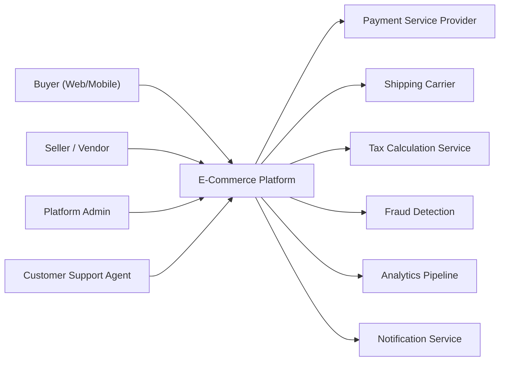
```mermaid
flowchart LR
    Buyer["Buyer (Web/Mobile)"] --> Platform["E-Commerce Platform"]
    Seller["Seller / Vendor"] --> Platform
    Admin["Platform Admin"] --> Platform
    CSAgent["Customer Support Agent"] --> Platform
    Platform --> PSP["Payment Service Provider"]
    Platform --> Carrier["Shipping Carrier"]
    Platform --> TaxEngine["Tax Calculation Service"]
    Platform --> FraudService["Fraud Detection"]
    Platform --> Analytics["Analytics Pipeline"]
    Platform --> Notification["Notification Service"]
```

| Actor | Description | Key Interactions |
|-------|------------|-----------------|
| **Buyer** | End consumer browsing and purchasing products | Search, browse, cart, checkout, order tracking, returns |
| **Seller** | Merchant listing products on the marketplace | Catalog management, pricing, inventory updates, order fulfillment |
| **Platform Admin** | Internal operator managing the platform | Category management, promotion setup, fraud review, settlement |
| **CS Agent** | Customer support representative | Order lookup, refund processing, dispute resolution |
| **PSP** | External payment processor | Authorization, capture, refund, chargeback |
| **Carrier** | Shipping/logistics provider | Pickup, tracking updates, proof of delivery |
| **Tax Service** | Tax calculation engine (Avalara, Vertex) | Tax rate lookup, exemption handling, filing |

---

## Core Workflows

### Happy Path: Browse to Delivery

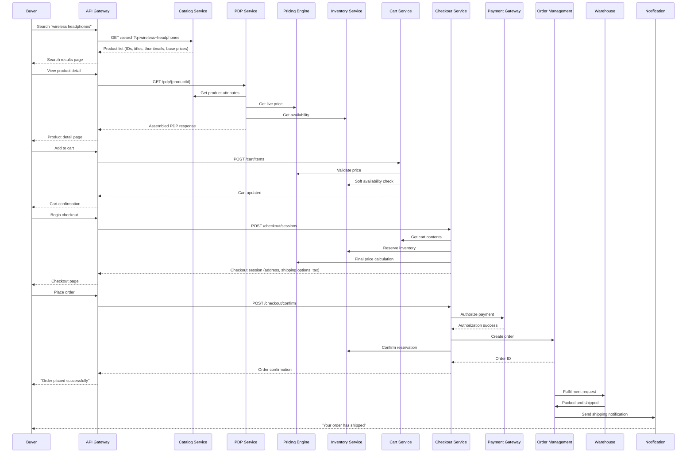
```mermaid
sequenceDiagram
    participant B as Buyer
    participant GW as API Gateway
    participant CAT as Catalog Service
    participant PDP as PDP Service
    participant PRICE as Pricing Engine
    participant INV as Inventory Service
    participant CART as Cart Service
    participant CO as Checkout Service
    participant PAY as Payment Gateway
    participant OMS as Order Management
    participant WH as Warehouse
    participant NOTIF as Notification

    B->>GW: Search "wireless headphones"
    GW->>CAT: GET /search?q=wireless+headphones
    CAT-->>GW: Product list (IDs, titles, thumbnails, base prices)
    GW-->>B: Search results page

    B->>GW: View product detail
    GW->>PDP: GET /pdp/{productId}
    PDP->>CAT: Get product attributes
    PDP->>PRICE: Get live price
    PDP->>INV: Get availability
    PDP-->>GW: Assembled PDP response
    GW-->>B: Product detail page

    B->>GW: Add to cart
    GW->>CART: POST /cart/items
    CART->>PRICE: Validate price
    CART->>INV: Soft availability check
    CART-->>GW: Cart updated
    GW-->>B: Cart confirmation

    B->>GW: Begin checkout
    GW->>CO: POST /checkout/sessions
    CO->>CART: Get cart contents
    CO->>INV: Reserve inventory
    CO->>PRICE: Final price calculation
    CO-->>GW: Checkout session (address, shipping options, tax)
    GW-->>B: Checkout page

    B->>GW: Place order
    GW->>CO: POST /checkout/confirm
    CO->>PAY: Authorize payment
    PAY-->>CO: Authorization success
    CO->>OMS: Create order
    CO->>INV: Confirm reservation
    OMS-->>CO: Order ID
    CO-->>GW: Order confirmation
    GW-->>B: "Order placed successfully"

    OMS->>WH: Fulfillment request
    WH->>OMS: Packed and shipped
    OMS->>NOTIF: Send shipping notification
    NOTIF-->>B: "Your order has shipped"
```

### Alternate Paths

| Path | Description | Key Difference |
|------|------------|----------------|
| **Guest Checkout** | No account required; email collected at checkout | Cart stored in session/cookie; account created lazily |
| **Wishlist / Save for Later** | Buyer saves items without intent to purchase now | Separate persistence; no inventory reservation |
| **Buy Now** | Skip cart, go directly to checkout | Single-item checkout session; same backend flow |
| **Re-order** | Repeat a previous order | Pre-populate cart from order history; re-check availability |
| **Pre-order** | Purchase before stock arrives | Inventory in "pre-order" state; fulfillment delayed |
| **Subscription / Auto-replenish** | Recurring orders on a schedule | Scheduler triggers checkout flow periodically |
| **Cart Abandonment Recovery** | Buyer leaves without purchasing | Async notification after N hours; cart persisted |
| **Flash Sale** | Time-limited, quantity-limited promotion | Queue-based checkout; inventory pre-allocated |

---

## Workload Characterization

| Metric | Steady State | Peak (Flash Sale) | Notes |
|--------|-------------|-------------------|-------|
| DAU | 10M | 25M | Peak during holiday events |
| Catalog searches/day | 200M | 1B | ~2,300 RPS steady, ~12,000 RPS peak |
| PDP views/day | 500M | 2B | ~5,800 RPS steady, ~23,000 RPS peak |
| Cart operations/day | 50M | 200M | Heavy write load |
| Checkout sessions/day | 5M | 20M | ~60 TPS steady, ~230 TPS peak |
| Orders/day | 500K | 2M | ~6 TPS steady, ~23 TPS peak |
| Avg items per order | 3.2 | 2.1 | Flash sales tend to be single-item |
| Read:Write ratio (catalog) | 1000:1 | 5000:1 | Extreme read-heavy |
| Read:Write ratio (inventory) | 100:1 | 10:1 | Write-heavy during sales |

## Capacity Estimation

**Storage:**
- 50M SKUs x 5KB avg metadata = **250 GB** catalog data
- 50M SKUs x 10 images x 500KB avg = **250 TB** media storage (CDN-backed)
- 500K orders/day x 365 days x 2KB = **365 GB/year** order data
- Cart data: 10M users x 2KB avg = **20 GB** active carts (Redis)
- Search index: **50 GB** (Elasticsearch, heavily denormalized)

**Bandwidth:**
- PDP responses: 500M/day x 50KB avg = **25 TB/day** outbound (CDN absorbs 95%)
- Image traffic: 2B image requests/day x 200KB avg = **400 TB/day** (CDN absorbs 99%)

**Compute:**
- Catalog search: 12,000 peak RPS x 10ms CPU = **120 CPU-seconds/s** = ~120 cores
- PDP assembly: 23,000 peak RPS x 5ms CPU = **115 cores**
- Checkout: 230 peak TPS x 200ms CPU = **46 cores**
- Inventory: 50,000 peak RPS (reads + writes) x 2ms = **100 cores**

**Database:**
- Catalog: PostgreSQL cluster, 3 read replicas, ~500 GB with indexes
- Inventory: PostgreSQL with row-level locking, 2 replicas, ~50 GB
- Orders: PostgreSQL partitioned by month, ~2 TB total
- Cart: Redis Cluster, 6 shards, ~30 GB memory
- Search: Elasticsearch, 5-node cluster, ~200 GB with replicas

---

## High-Level Architecture

### Context Diagram

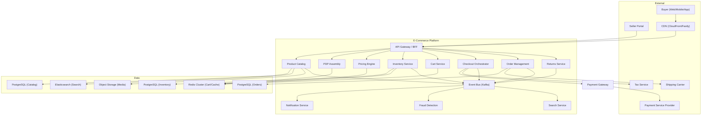
```mermaid
flowchart TB
    subgraph External
        Buyer["Buyer (Web/Mobile/App)"]
        Seller["Seller Portal"]
        PSP["Payment Service Provider"]
        Carrier["Shipping Carrier"]
        TaxSvc["Tax Service"]
        CDN["CDN (CloudFront/Fastly)"]
    end

    subgraph Platform["E-Commerce Platform"]
        GW["API Gateway / BFF"]
        CAT["Product Catalog"]
        PDP["PDP Assembly"]
        PRICE["Pricing Engine"]
        INV["Inventory Service"]
        CART["Cart Service"]
        CO["Checkout Orchestrator"]
        OMS["Order Management"]
        RET["Returns Service"]
        SEARCH["Search Service"]
        NOTIF["Notification Service"]
        FRAUD["Fraud Detection"]
        BUS["Event Bus (Kafka)"]
    end

    subgraph Data
        PG_CAT["PostgreSQL (Catalog)"]
        PG_ORD["PostgreSQL (Orders)"]
        PG_INV["PostgreSQL (Inventory)"]
        REDIS["Redis Cluster (Cart/Cache)"]
        ES["Elasticsearch (Search)"]
        S3["Object Storage (Media)"]
    end

    Buyer --> CDN --> GW
    Seller --> GW
    GW --> CAT & PDP & PRICE & INV & CART & CO & OMS & RET
    CAT --> PG_CAT & ES & S3
    PDP --> REDIS
    PRICE --> REDIS
    INV --> PG_INV & REDIS
    CART --> REDIS
    CO --> PAY_GW["Payment Gateway"]
    PAY_GW --> PSP
    CO --> TaxSvc
    OMS --> PG_ORD
    OMS --> Carrier
    CAT & INV & OMS & CO & RET --> BUS
    BUS --> NOTIF & FRAUD & SEARCH
```

### High-Level Architecture Flowchart

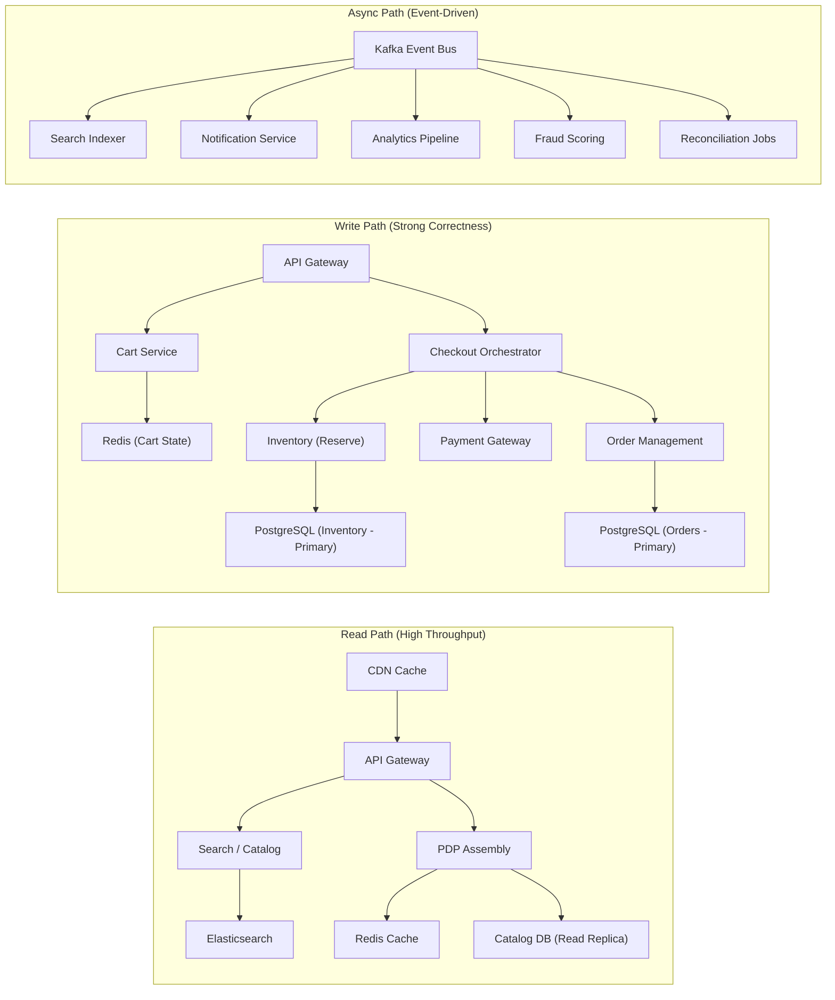
```mermaid
flowchart LR
    subgraph ReadPath["Read Path (High Throughput)"]
        R1["CDN Cache"] --> R2["API Gateway"]
        R2 --> R3["Search / Catalog"]
        R2 --> R4["PDP Assembly"]
        R3 --> R5["Elasticsearch"]
        R4 --> R6["Redis Cache"]
        R4 --> R7["Catalog DB (Read Replica)"]
    end

    subgraph WritePath["Write Path (Strong Correctness)"]
        W1["API Gateway"] --> W2["Cart Service"]
        W2 --> W3["Redis (Cart State)"]
        W1 --> W4["Checkout Orchestrator"]
        W4 --> W5["Inventory (Reserve)"]
        W4 --> W6["Payment Gateway"]
        W4 --> W7["Order Management"]
        W5 --> W8["PostgreSQL (Inventory - Primary)"]
        W7 --> W9["PostgreSQL (Orders - Primary)"]
    end

    subgraph AsyncPath["Async Path (Event-Driven)"]
        A1["Kafka Event Bus"] --> A2["Search Indexer"]
        A1 --> A3["Notification Service"]
        A1 --> A4["Analytics Pipeline"]
        A1 --> A5["Fraud Scoring"]
        A1 --> A6["Reconciliation Jobs"]
    end
```

---

## Low-Level Design

### 1. Product Catalog Service

#### Overview

The Product Catalog Service is the **system of record** for all product data. It owns the canonical representation of every product, its variants (SKUs), attributes, categories, media references, and seller associations. Every other service that needs product information reads from the catalog or its derived projections.

At Amazon's scale, the catalog contains over 350 million products with billions of attributes. Even a mid-size platform with 50 million SKUs faces challenges in schema flexibility, search relevance, multi-tenant isolation, and change propagation.

#### Data Model

```sql
-- Core product table (system of record)
CREATE TABLE products (
    product_id      UUID PRIMARY KEY DEFAULT gen_random_uuid(),
    seller_id       UUID NOT NULL REFERENCES sellers(seller_id),
    title           TEXT NOT NULL,
    slug            TEXT UNIQUE NOT NULL,
    description     TEXT,
    brand           TEXT,
    category_id     UUID REFERENCES categories(category_id),
    status          TEXT NOT NULL DEFAULT 'draft'
                    CHECK (status IN ('draft', 'pending_review', 'active', 'inactive', 'suspended')),
    created_at      TIMESTAMPTZ NOT NULL DEFAULT now(),
    updated_at      TIMESTAMPTZ NOT NULL DEFAULT now(),
    version         INT NOT NULL DEFAULT 1
);

-- SKU-level variants
CREATE TABLE skus (
    sku_id          UUID PRIMARY KEY DEFAULT gen_random_uuid(),
    product_id      UUID NOT NULL REFERENCES products(product_id),
    sku_code        TEXT UNIQUE NOT NULL,
    attributes      JSONB NOT NULL DEFAULT '{}',   -- {"color": "red", "size": "M"}
    base_price      DECIMAL(12,2) NOT NULL,
    currency        TEXT NOT NULL DEFAULT 'USD',
    weight_grams    INT,
    dimensions_cm   JSONB,                          -- {"l": 30, "w": 20, "h": 10}
    barcode         TEXT,
    status          TEXT NOT NULL DEFAULT 'active',
    created_at      TIMESTAMPTZ NOT NULL DEFAULT now()
);

-- Hierarchical category tree
CREATE TABLE categories (
    category_id     UUID PRIMARY KEY,
    parent_id       UUID REFERENCES categories(category_id),
    name            TEXT NOT NULL,
    slug            TEXT UNIQUE NOT NULL,
    level           INT NOT NULL,
    path            TEXT NOT NULL,                   -- "electronics.audio.headphones"
    attribute_schema JSONB                           -- defines required/optional attributes for this category
);

-- Product media
CREATE TABLE product_media (
    media_id        UUID PRIMARY KEY,
    product_id      UUID NOT NULL REFERENCES products(product_id),
    media_type      TEXT NOT NULL CHECK (media_type IN ('image', 'video', '360_view')),
    url             TEXT NOT NULL,
    alt_text        TEXT,
    sort_order      INT NOT NULL DEFAULT 0,
    is_primary      BOOLEAN DEFAULT false
);

-- Indexes
CREATE INDEX idx_products_seller ON products(seller_id);
CREATE INDEX idx_products_category ON products(category_id);
CREATE INDEX idx_products_status ON products(status) WHERE status = 'active';
CREATE INDEX idx_skus_product ON skus(product_id);
CREATE INDEX idx_categories_parent ON categories(parent_id);
CREATE INDEX idx_categories_path ON categories USING GIN (path gin_trgm_ops);
```

#### APIs

```
# Seller-facing (write path)
POST   /api/v1/catalog/products                  # Create product
PUT    /api/v1/catalog/products/{productId}       # Update product
POST   /api/v1/catalog/products/{productId}/skus  # Add SKU variant
PUT    /api/v1/catalog/skus/{skuId}               # Update SKU
POST   /api/v1/catalog/products/{productId}/media # Upload media
PATCH  /api/v1/catalog/products/{productId}/status # Activate/deactivate

# Buyer-facing (read path)
GET    /api/v1/catalog/search?q={query}&category={cat}&minPrice={p}&maxPrice={p}&sort={s}&page={n}
GET    /api/v1/catalog/products/{productId}
GET    /api/v1/catalog/categories/{categoryId}/products
GET    /api/v1/catalog/categories/tree

# Internal (service-to-service)
POST   /internal/catalog/products/bulk-get        # Batch fetch by IDs
GET    /internal/catalog/skus/{skuId}             # Single SKU lookup
```

**Example: Search Request/Response**

```json
// GET /api/v1/catalog/search?q=wireless+headphones&minPrice=50&maxPrice=200&sort=relevance&page=1
{
  "results": [
    {
      "product_id": "prod_abc123",
      "title": "SoundMax Pro Wireless Headphones",
      "brand": "SoundMax",
      "thumbnail_url": "https://cdn.example.com/img/prod_abc123_thumb.jpg",
      "base_price": 149.99,
      "currency": "USD",
      "rating": 4.5,
      "review_count": 2341,
      "in_stock": true,
      "seller_name": "SoundMax Official"
    }
  ],
  "facets": {
    "brand": [{"value": "SoundMax", "count": 45}, {"value": "AudioTech", "count": 32}],
    "price_range": [{"min": 50, "max": 100, "count": 120}, {"min": 100, "max": 200, "count": 85}],
    "rating": [{"value": "4+", "count": 200}, {"value": "3+", "count": 350}]
  },
  "total": 892,
  "page": 1,
  "page_size": 20
}
```

#### Search Architecture

The catalog uses a **CQRS pattern** where writes go to PostgreSQL (source of truth) and reads are served from Elasticsearch (optimized for full-text search and faceted filtering).

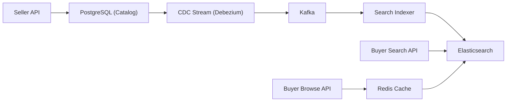
```mermaid
flowchart LR
    Seller["Seller API"] --> CatDB["PostgreSQL (Catalog)"]
    CatDB --> CDC["CDC Stream (Debezium)"]
    CDC --> Kafka["Kafka"]
    Kafka --> Indexer["Search Indexer"]
    Indexer --> ES["Elasticsearch"]
    Buyer["Buyer Search API"] --> ES
    Buyer2["Buyer Browse API"] --> Cache["Redis Cache"]
    Cache --> ES
```

**Elasticsearch Index Mapping (simplified):**
```json
{
  "mappings": {
    "properties": {
      "product_id": { "type": "keyword" },
      "title": { "type": "text", "analyzer": "custom_product_analyzer" },
      "description": { "type": "text" },
      "brand": { "type": "keyword" },
      "category_path": { "type": "keyword" },
      "attributes": { "type": "nested" },
      "base_price": { "type": "scaled_float", "scaling_factor": 100 },
      "rating": { "type": "float" },
      "review_count": { "type": "integer" },
      "in_stock": { "type": "boolean" },
      "seller_id": { "type": "keyword" },
      "created_at": { "type": "date" },
      "popularity_score": { "type": "float" }
    }
  }
}
```

#### Scaling Considerations

| Challenge | Solution |
|-----------|----------|
| 50M SKUs in search index | Elasticsearch cluster with 5 data nodes, 2 replicas per shard |
| Hot products (viral items) | Redis cache with 60s TTL for top 1% of products |
| Catalog writes during bulk import | Background queue; index updates are async via Kafka |
| Schema flexibility across categories | JSONB attributes column + category-level attribute schemas |
| Multi-language support | Per-locale fields in Elasticsearch; language-specific analyzers |
| Stale search results | CDC lag < 5s; buyer-acceptable for catalog data |

#### Edge Cases

- **Seller uploads 100,000 products via CSV**: Bulk import job processes in batches of 1,000; indexing is asynchronous. Seller sees "Import in progress" status.
- **Product with 500 variants**: Pagination on variant APIs; PDP loads first 20 variants, lazy-loads rest.
- **Category tree restructure**: Requires re-indexing all products in affected categories. Done via background job with progress tracking.
- **Duplicate product detection**: ML-based similarity scoring on title + images; flagged for manual review.
- **Seller suspended mid-browse**: Product status changed to "suspended" — CDC propagates to search index within seconds. In-flight PDP requests still served from cache until TTL expires.

---

### 2. Product Detail Page (PDP)

#### Overview

The PDP is the **highest-traffic, most latency-sensitive page** in any e-commerce platform. It assembles data from 5-8 upstream services into a single response that must render in under 200ms. At Amazon, the PDP serves over 1 billion requests per day.

The PDP is not a simple database read — it is an **aggregation and personalization layer** that merges:
- Product attributes and media (from Catalog)
- Live price after discounts (from Pricing Engine)
- Real-time availability (from Inventory)
- Reviews and ratings (from Reviews Service)
- Delivery estimates (from Shipping Service)
- Personalized recommendations (from Recommendation Engine)
- Seller information (from Seller Service)

#### Architecture Pattern: Backend for Frontend (BFF)

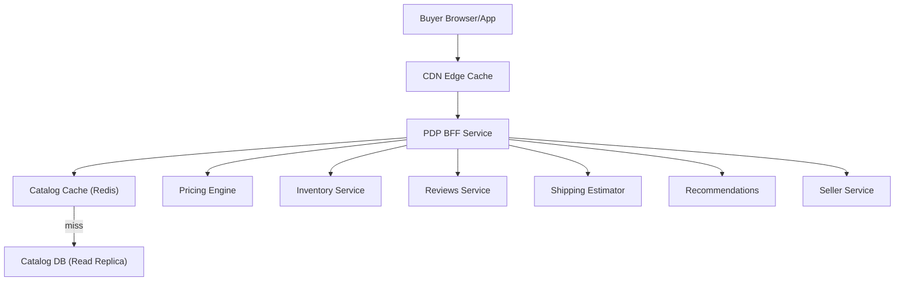
```mermaid
flowchart TD
    Client["Buyer Browser/App"] --> CDN["CDN Edge Cache"]
    CDN --> BFF["PDP BFF Service"]
    BFF --> CatCache["Catalog Cache (Redis)"]
    BFF --> PriceAPI["Pricing Engine"]
    BFF --> InvAPI["Inventory Service"]
    BFF --> ReviewAPI["Reviews Service"]
    BFF --> ShipAPI["Shipping Estimator"]
    BFF --> RecoAPI["Recommendations"]
    BFF --> SellerAPI["Seller Service"]

    CatCache -->|miss| CatDB["Catalog DB (Read Replica)"]
```

**Key Design Decision: Parallel fan-out with timeout budgets.**

The BFF makes all upstream calls in parallel with individual timeouts:
- Catalog: 50ms timeout (cached, critical)
- Pricing: 100ms timeout (critical — no price = no buy)
- Inventory: 100ms timeout (critical — must show availability)
- Reviews: 150ms timeout (non-critical — degrade gracefully)
- Shipping: 200ms timeout (non-critical — show "calculating")
- Recommendations: 200ms timeout (non-critical — show generic)

If a non-critical service times out, the PDP still renders with degraded content. If a critical service (catalog, pricing, inventory) fails, the PDP returns a cached stale response or a "temporarily unavailable" message.

#### Data Assembly

```json
// GET /api/v1/pdp/{productId}?locale=en-US&userId=usr_xyz
{
  "product": {
    "product_id": "prod_abc123",
    "title": "SoundMax Pro Wireless Headphones",
    "description": "Premium noise-cancelling...",
    "brand": "SoundMax",
    "images": ["https://cdn.example.com/img/prod_abc123_1.jpg"],
    "attributes": {"color": "Midnight Black", "connectivity": "Bluetooth 5.3"},
    "category_breadcrumb": ["Electronics", "Audio", "Headphones"]
  },
  "pricing": {
    "list_price": 199.99,
    "sale_price": 149.99,
    "discount_percent": 25,
    "currency": "USD",
    "promotion_label": "Summer Sale — 25% off"
  },
  "availability": {
    "in_stock": true,
    "quantity_available": 342,
    "low_stock_threshold": false,
    "fulfillment_type": "shipped"
  },
  "delivery": {
    "estimated_delivery": "2026-03-25",
    "shipping_options": [
      {"method": "Standard", "price": 0, "days": "3-5"},
      {"method": "Express", "price": 9.99, "days": "1-2"}
    ]
  },
  "reviews": {
    "average_rating": 4.5,
    "total_reviews": 2341,
    "rating_distribution": {"5": 1200, "4": 700, "3": 250, "2": 120, "1": 71}
  },
  "seller": {
    "seller_id": "sel_sm001",
    "name": "SoundMax Official",
    "rating": 4.8
  },
  "recommendations": [
    {"product_id": "prod_def456", "title": "SoundMax Pro Case", "price": 29.99}
  ]
}
```

#### Caching Strategy

| Layer | What | TTL | Invalidation |
|-------|------|-----|-------------|
| CDN (CloudFront) | Full PDP HTML for anonymous users | 60s | Purge on price/stock change |
| Redis L1 | Product attributes + media | 5 min | CDC event from Catalog DB |
| Redis L2 | Price calculations | 30s | Short TTL; recomputed frequently |
| Redis L3 | Inventory counts (display only) | 10s | Very short TTL; not used for reservation |
| Application | Assembled PDP response | 15s | Request-scoped; stale-while-revalidate |

#### Edge Cases

- **Thundering herd on viral product**: CDN absorbs most reads; Redis cache with request coalescing (single-flight pattern) prevents DB overload.
- **Price changed mid-session**: Buyer sees old price on PDP, new price in cart. Cart always re-validates price at add time. Checkout re-validates at confirmation.
- **Product removed while user is on PDP**: Graceful "This product is no longer available" with recommendations.
- **Seller changes product title to inject XSS**: All text fields sanitized at write time (Catalog Service) and escaped at render time (PDP BFF).

---

### 3. Pricing Engine

#### Overview

The Pricing Engine determines the final price a buyer pays for a product. This is not simply "look up the price in the database" — it involves evaluating a stack of rules in a specific order:

1. **Base price** (set by seller per SKU)
2. **Seller discounts** (seller-configured sales, volume discounts)
3. **Platform promotions** (site-wide sales, category deals, flash sales)
4. **Coupon codes** (buyer-entered, single-use or multi-use)
5. **Loyalty/rewards** (points redemption, membership discounts)
6. **Personalized pricing** (A/B test variants, geo-based pricing)
7. **Bundle pricing** (buy X get Y, tiered quantity discounts)
8. **Price floor enforcement** (minimum advertised price, margin protection)

Amazon evaluates prices on over 2.5 billion items with prices changing up to 80 million times per day.

#### Rule Evaluation Pipeline

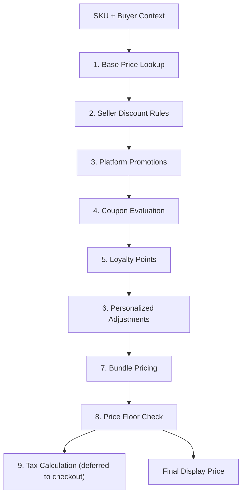
```mermaid
flowchart TD
    Input["SKU + Buyer Context"] --> Base["1. Base Price Lookup"]
    Base --> SellerDisc["2. Seller Discount Rules"]
    SellerDisc --> PlatformPromo["3. Platform Promotions"]
    PlatformPromo --> Coupon["4. Coupon Evaluation"]
    Coupon --> Loyalty["5. Loyalty Points"]
    Loyalty --> Personalized["6. Personalized Adjustments"]
    Personalized --> Bundle["7. Bundle Pricing"]
    Bundle --> Floor["8. Price Floor Check"]
    Floor --> Tax["9. Tax Calculation (deferred to checkout)"]
    Floor --> FinalPrice["Final Display Price"]
```

#### Data Model

```sql
-- Promotion definitions
CREATE TABLE promotions (
    promotion_id    UUID PRIMARY KEY,
    name            TEXT NOT NULL,
    type            TEXT NOT NULL CHECK (type IN (
        'percentage_off', 'fixed_off', 'buy_x_get_y',
        'bundle', 'tiered_quantity', 'free_shipping'
    )),
    rules           JSONB NOT NULL,           -- eligibility predicates
    discount_value  DECIMAL(12,2),
    discount_percent DECIMAL(5,2),
    max_discount    DECIMAL(12,2),            -- cap
    start_at        TIMESTAMPTZ NOT NULL,
    end_at          TIMESTAMPTZ NOT NULL,
    budget_total    DECIMAL(12,2),            -- total budget for this promo
    budget_used     DECIMAL(12,2) DEFAULT 0,
    priority        INT NOT NULL DEFAULT 0,   -- higher priority wins conflicts
    stackable       BOOLEAN DEFAULT false,
    status          TEXT DEFAULT 'active',
    created_by      UUID NOT NULL
);

-- Coupon codes
CREATE TABLE coupons (
    coupon_id       UUID PRIMARY KEY,
    code            TEXT UNIQUE NOT NULL,
    promotion_id    UUID REFERENCES promotions(promotion_id),
    max_uses        INT,
    current_uses    INT DEFAULT 0,
    max_uses_per_user INT DEFAULT 1,
    valid_from      TIMESTAMPTZ,
    valid_until     TIMESTAMPTZ
);

-- Price calculation audit log
CREATE TABLE price_calculations (
    calc_id         UUID PRIMARY KEY,
    sku_id          UUID NOT NULL,
    buyer_id        UUID,
    base_price      DECIMAL(12,2) NOT NULL,
    final_price     DECIMAL(12,2) NOT NULL,
    applied_rules   JSONB NOT NULL,           -- ordered list of applied discounts
    context         JSONB,                     -- locale, channel, A/B variant
    calculated_at   TIMESTAMPTZ NOT NULL DEFAULT now()
);
```

#### API

```
# Real-time price evaluation
POST /api/v1/pricing/evaluate
Body: {
  "items": [
    {"sku_id": "sku_abc", "quantity": 2},
    {"sku_id": "sku_def", "quantity": 1}
  ],
  "buyer_id": "usr_xyz",          // optional for personalization
  "coupon_code": "SUMMER25",       // optional
  "locale": "en-US",
  "channel": "web"
}

Response: {
  "items": [
    {
      "sku_id": "sku_abc",
      "quantity": 2,
      "unit_base_price": 99.99,
      "unit_final_price": 74.99,
      "line_total": 149.98,
      "applied_discounts": [
        {"type": "platform_promotion", "name": "Summer Sale", "amount": -25.00},
      ]
    }
  ],
  "subtotal": 199.97,
  "coupon_discount": -20.00,
  "total_before_tax": 179.97,
  "calculation_id": "calc_789"
}
```

#### Scaling Considerations

| Challenge | Solution |
|-----------|----------|
| 80M price changes/day | Pre-compute and cache hot prices in Redis; invalidate on rule change |
| Complex rule evaluation at request time | Rule engine with compiled evaluation trees; avoid DB calls during evaluation |
| Coupon race condition (budget exhaustion) | Redis atomic counter for `budget_used`; DB reconciliation async |
| Flash sale price consistency | Pre-warm cache before sale starts; event-driven invalidation |
| A/B test pricing fairness | Consistent hashing on buyer_id for deterministic variant assignment |

#### Edge Cases

- **Stacking conflict**: Buyer applies coupon + platform promotion. Rules define: non-stackable promotions use highest-value; stackable ones apply sequentially.
- **Price drops during checkout**: Cart re-evaluates price at checkout. If price dropped, buyer gets lower price. If price increased, buyer sees warning.
- **Coupon code brute-force**: Rate limit coupon validation to 5 attempts/minute per IP. Use long random codes (12+ chars).
- **Negative price after discounts**: Floor enforcement ensures price never drops below $0.01 or seller-defined minimum.
- **Time zone edge case**: Promotion "ends March 25" — whose time zone? Always store in UTC with explicit time zone context.

---

### 4. Inventory Management System

#### Overview

The Inventory Management System tracks the **real-time quantity of every SKU across every warehouse and fulfillment center**. It is the most correctness-sensitive service in e-commerce: an oversell (confirming an order for an item that is not in stock) directly costs money, damages trust, and triggers refund operations.

At Walmart's scale, inventory is tracked across 4,700+ stores and 30+ fulfillment centers with over 100,000 inventory updates per second.

The system must support:
- **Display availability** (eventually consistent, can be slightly stale)
- **Reservation** (strongly consistent, must prevent oversell)
- **Decrement** (after payment, reduce reserved stock to committed)
- **Restock** (warehouse receives new goods)
- **Reconciliation** (periodic audits to fix drift between logical and physical stock)

#### Data Model

```sql
-- Stock per SKU per warehouse
CREATE TABLE inventory (
    inventory_id    UUID PRIMARY KEY,
    sku_id          UUID NOT NULL,
    warehouse_id    UUID NOT NULL,
    total_quantity  INT NOT NULL DEFAULT 0,    -- physical stock
    reserved        INT NOT NULL DEFAULT 0,    -- reserved for orders in progress
    available       INT GENERATED ALWAYS AS (total_quantity - reserved) STORED,
    version         INT NOT NULL DEFAULT 1,    -- optimistic locking
    updated_at      TIMESTAMPTZ NOT NULL DEFAULT now(),
    UNIQUE(sku_id, warehouse_id),
    CHECK (reserved >= 0),
    CHECK (total_quantity >= reserved)
);

-- Reservation records (time-bounded)
CREATE TABLE reservations (
    reservation_id  UUID PRIMARY KEY,
    sku_id          UUID NOT NULL,
    warehouse_id    UUID NOT NULL,
    order_id        UUID,                      -- null until order is created
    quantity        INT NOT NULL,
    status          TEXT NOT NULL DEFAULT 'active'
                    CHECK (status IN ('active', 'committed', 'released', 'expired')),
    expires_at      TIMESTAMPTZ NOT NULL,      -- auto-release after N minutes
    created_at      TIMESTAMPTZ NOT NULL DEFAULT now(),
    idempotency_key TEXT UNIQUE NOT NULL        -- prevent duplicate reservations
);

-- Inventory audit log (append-only)
CREATE TABLE inventory_ledger (
    ledger_id       UUID PRIMARY KEY,
    sku_id          UUID NOT NULL,
    warehouse_id    UUID NOT NULL,
    operation       TEXT NOT NULL CHECK (operation IN (
        'reserve', 'commit', 'release', 'restock', 'adjustment', 'reconcile'
    )),
    quantity_delta  INT NOT NULL,
    reference_id    UUID,                      -- order_id, restock_id, etc.
    created_at      TIMESTAMPTZ NOT NULL DEFAULT now()
);

-- Indexes
CREATE INDEX idx_inventory_sku ON inventory(sku_id);
CREATE INDEX idx_reservations_expires ON reservations(expires_at) WHERE status = 'active';
CREATE INDEX idx_reservations_sku ON reservations(sku_id, warehouse_id);
```

#### Reservation Flow

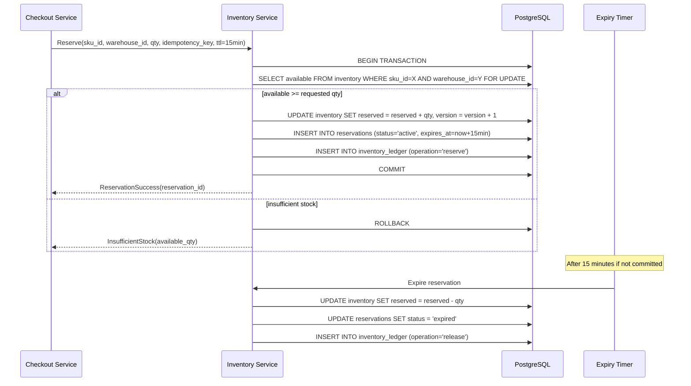
```mermaid
sequenceDiagram
    participant CO as Checkout Service
    participant INV as Inventory Service
    participant DB as PostgreSQL
    participant Timer as Expiry Timer

    CO->>INV: Reserve(sku_id, warehouse_id, qty, idempotency_key, ttl=15min)
    INV->>DB: BEGIN TRANSACTION
    INV->>DB: SELECT available FROM inventory WHERE sku_id=X AND warehouse_id=Y FOR UPDATE
    alt available >= requested qty
        INV->>DB: UPDATE inventory SET reserved = reserved + qty, version = version + 1
        INV->>DB: INSERT INTO reservations (status='active', expires_at=now+15min)
        INV->>DB: INSERT INTO inventory_ledger (operation='reserve')
        INV->>DB: COMMIT
        INV-->>CO: ReservationSuccess(reservation_id)
    else insufficient stock
        INV->>DB: ROLLBACK
        INV-->>CO: InsufficientStock(available_qty)
    end

    Note over Timer: After 15 minutes if not committed
    Timer->>INV: Expire reservation
    INV->>DB: UPDATE inventory SET reserved = reserved - qty
    INV->>DB: UPDATE reservations SET status = 'expired'
    INV->>DB: INSERT INTO inventory_ledger (operation='release')
```

#### Concurrency Control: Optimistic vs Pessimistic

| Approach | When to Use | Trade-off |
|----------|------------|-----------|
| **Row-level `FOR UPDATE`** (pessimistic) | Reservation during checkout | Guarantees no oversell; higher contention on hot SKUs |
| **Optimistic locking (version column)** | Inventory adjustments, restocking | Lower contention; requires retry on conflict |
| **Redis atomic decrement** | Display availability check (approximate) | Fastest; not suitable for financial correctness |

**Hot SKU Problem**: When a flash sale offers 100 units of a popular item, all checkout attempts contend on the same row. Solutions:
1. **Pre-sharding**: Split inventory into virtual buckets (e.g., 10 buckets of 10 units each). Each checkout attempt locks a random bucket.
2. **Queue-based checkout**: During flash sales, checkout requests enter a FIFO queue. The queue consumer processes them sequentially against inventory.
3. **Redis semaphore**: Atomic `DECRBY` in Redis for fast-path check, PostgreSQL for durable confirmation.

#### Edge Cases

- **Double reservation**: Buyer clicks "Place Order" twice. Idempotency key prevents duplicate reservations.
- **Reservation expires during payment**: Payment completes, but reservation has expired and stock was taken by another buyer. Checkout must re-reserve and handle failure gracefully (refund payment, notify buyer).
- **Negative inventory**: Physical stock was miscounted. Reconciliation job detects logical-physical mismatch. Admin alerted; orders may need to be cancelled.
- **Multi-warehouse fulfillment**: An order for 5 units may be split across 2 warehouses (3 + 2). Inventory service attempts single-warehouse first, then splits.
- **Pre-order inventory**: `total_quantity` can be negative (representing expected future stock). Reservation allowed up to pre-order limit.

---

### 5. Shopping Cart System

#### Overview

The Shopping Cart is a **user-scoped, session-aware, persistent state container** that bridges browsing and purchasing. It seems simple — a list of items with quantities — but at scale, it must handle:

- Cross-device synchronization (add on phone, checkout on laptop)
- Guest-to-authenticated cart merge
- Price and availability re-validation
- Save-for-later / wishlist separation
- Abandoned cart recovery
- Cart expiration and cleanup
- High write frequency (users add/remove/update constantly)

At Amazon, carts are stored in a highly available, eventually consistent key-value store (the original DynamoDB paper describes the cart use case).

#### Data Model (Redis)

```json
// Redis Hash: cart:{userId}
{
  "items": [
    {
      "sku_id": "sku_abc",
      "product_id": "prod_123",
      "quantity": 2,
      "added_at": "2026-03-22T10:30:00Z",
      "price_snapshot": 149.99,
      "seller_id": "sel_sm001"
    },
    {
      "sku_id": "sku_def",
      "product_id": "prod_456",
      "quantity": 1,
      "added_at": "2026-03-22T11:15:00Z",
      "price_snapshot": 29.99,
      "seller_id": "sel_sm001"
    }
  ],
  "saved_for_later": [
    {
      "sku_id": "sku_ghi",
      "product_id": "prod_789",
      "added_at": "2026-03-20T08:00:00Z"
    }
  ],
  "coupon_code": "SUMMER25",
  "updated_at": "2026-03-22T11:15:00Z",
  "version": 7
}
```

**Why Redis?**
- Sub-millisecond reads and writes
- TTL-based expiration for guest carts
- Atomic operations (HSET, HINCRBY) prevent race conditions
- Redis Cluster for horizontal scaling

**Durability concern**: Redis is primarily an in-memory store. For authenticated users, cart state is asynchronously persisted to PostgreSQL as a backup. If Redis loses data, the cart is restored from the last DB snapshot.

#### APIs

```
POST   /api/v1/cart/items            # Add item to cart
PUT    /api/v1/cart/items/{skuId}     # Update quantity
DELETE /api/v1/cart/items/{skuId}     # Remove item
GET    /api/v1/cart                   # Get full cart with live prices
POST   /api/v1/cart/merge             # Merge guest cart into authenticated cart
POST   /api/v1/cart/save-for-later    # Move item to saved list
POST   /api/v1/cart/move-to-cart      # Move saved item back to cart
DELETE /api/v1/cart                   # Clear cart
POST   /api/v1/cart/validate          # Re-validate all prices and availability
```

#### Cart Merge Logic

When a guest user logs in, their anonymous cart must merge with their persistent cart:

| Conflict | Resolution |
|----------|-----------|
| Same SKU in both carts | Keep higher quantity (or sum, configurable) |
| Item in guest cart, not in auth cart | Add to auth cart |
| Item in auth cart, not in guest cart | Keep in auth cart |
| Guest cart has coupon, auth cart has different coupon | Keep auth cart's coupon (user explicitly applied it) |

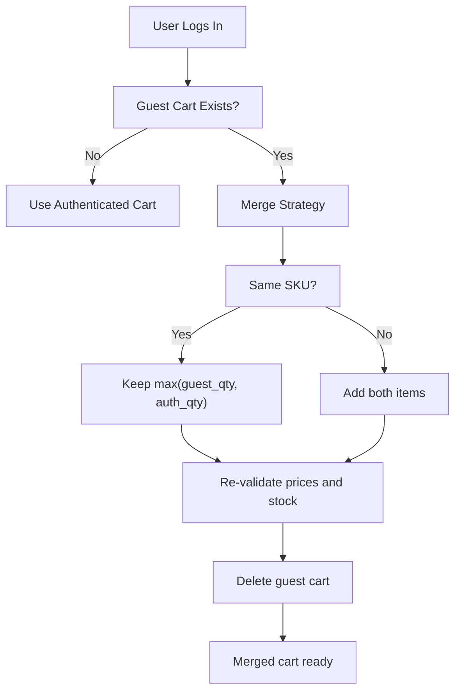
```mermaid
flowchart TD
    Login["User Logs In"] --> Check["Guest Cart Exists?"]
    Check -->|No| Done["Use Authenticated Cart"]
    Check -->|Yes| Merge["Merge Strategy"]
    Merge --> SameSKU["Same SKU?"]
    SameSKU -->|Yes| MaxQty["Keep max(guest_qty, auth_qty)"]
    SameSKU -->|No| AddBoth["Add both items"]
    MaxQty --> Validate["Re-validate prices and stock"]
    AddBoth --> Validate
    Validate --> DeleteGuest["Delete guest cart"]
    DeleteGuest --> Done2["Merged cart ready"]
```

#### Edge Cases

- **Cart item goes out of stock**: Cart GET re-checks availability. Out-of-stock items are flagged but not removed (buyer may want to wait).
- **Price changed since adding to cart**: Cart displays both "price when added" and "current price" with visual diff.
- **Cart size limit**: Max 100 items per cart to prevent abuse and ensure checkout performance.
- **Abandoned cart emails**: A scheduled job scans carts not updated in 24h that have items. Triggers notification service.
- **Race condition on quantity update**: Redis WATCH/MULTI or Lua script for atomic check-and-update.

---

### 6. Checkout System

#### Overview

The Checkout System is the **most critical write path** in e-commerce. It orchestrates:

1. Cart validation (items still available at current prices)
2. Address validation and shipping option selection
3. Tax calculation
4. Inventory reservation
5. Payment authorization
6. Order creation
7. Confirmation and notification

A failure at any step must be handled gracefully — partial state is the enemy. The checkout flow is typically modeled as a **saga** with compensating actions for each step.

At Shopify, checkout handles 40,000+ orders per minute during peak events like Black Friday.

#### Checkout Session State Machine

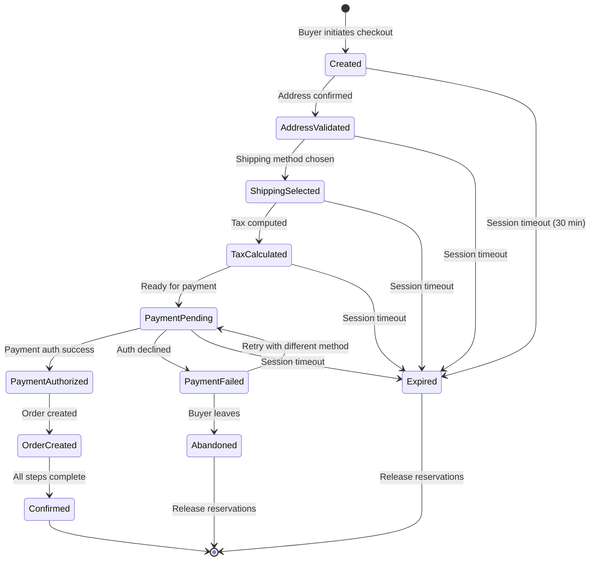
```mermaid
stateDiagram-v2
    [*] --> Created: Buyer initiates checkout
    Created --> AddressValidated: Address confirmed
    AddressValidated --> ShippingSelected: Shipping method chosen
    ShippingSelected --> TaxCalculated: Tax computed
    TaxCalculated --> PaymentPending: Ready for payment
    PaymentPending --> PaymentAuthorized: Payment auth success
    PaymentAuthorized --> OrderCreated: Order created
    OrderCreated --> Confirmed: All steps complete
    Confirmed --> [*]

    PaymentPending --> PaymentFailed: Auth declined
    PaymentFailed --> PaymentPending: Retry with different method
    PaymentFailed --> Abandoned: Buyer leaves

    Created --> Expired: Session timeout (30 min)
    AddressValidated --> Expired: Session timeout
    ShippingSelected --> Expired: Session timeout
    TaxCalculated --> Expired: Session timeout
    PaymentPending --> Expired: Session timeout

    Expired --> [*]: Release reservations
    Abandoned --> [*]: Release reservations
```

#### Checkout Saga with Compensations

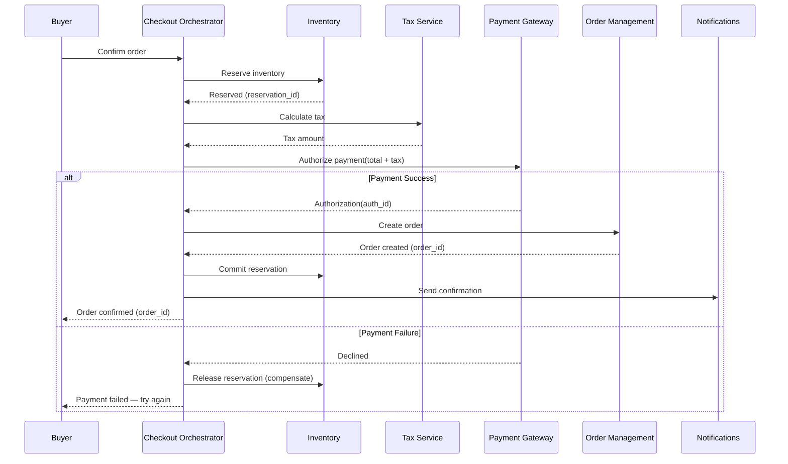
```mermaid
sequenceDiagram
    participant B as Buyer
    participant CO as Checkout Orchestrator
    participant INV as Inventory
    participant TAX as Tax Service
    participant PAY as Payment Gateway
    participant OMS as Order Management
    participant NOTIF as Notifications

    B->>CO: Confirm order

    CO->>INV: Reserve inventory
    INV-->>CO: Reserved (reservation_id)

    CO->>TAX: Calculate tax
    TAX-->>CO: Tax amount

    CO->>PAY: Authorize payment(total + tax)
    alt Payment Success
        PAY-->>CO: Authorization(auth_id)
        CO->>OMS: Create order
        OMS-->>CO: Order created (order_id)
        CO->>INV: Commit reservation
        CO->>NOTIF: Send confirmation
        CO-->>B: Order confirmed (order_id)
    else Payment Failure
        PAY-->>CO: Declined
        CO->>INV: Release reservation (compensate)
        CO-->>B: Payment failed — try again
    end
```

**Compensation Table:**

| Step | Action | Compensation |
|------|--------|-------------|
| 1. Reserve Inventory | `inventory.reserve(items)` | `inventory.release(reservation_id)` |
| 2. Calculate Tax | `tax.calculate(items, address)` | No-op (stateless) |
| 3. Authorize Payment | `payment.authorize(amount)` | `payment.void(auth_id)` |
| 4. Create Order | `oms.create(order)` | `oms.cancel(order_id)` |
| 5. Commit Inventory | `inventory.commit(reservation_id)` | `inventory.release(reservation_id)` |

#### Idempotency

Every checkout confirmation must be idempotent. The buyer may click "Place Order" multiple times, or network retries may duplicate the request.

**Strategy**: Client generates a `checkout_idempotency_key` (UUID) before the first attempt. The server stores this key with the checkout result. Subsequent requests with the same key return the stored result without re-executing.

```sql
CREATE TABLE checkout_idempotency (
    idempotency_key TEXT PRIMARY KEY,
    checkout_id     UUID NOT NULL,
    result          JSONB NOT NULL,
    created_at      TIMESTAMPTZ NOT NULL DEFAULT now(),
    expires_at      TIMESTAMPTZ NOT NULL  -- cleanup after 24h
);
```

#### Edge Cases

- **Payment authorized but order creation fails**: The saga rolls back by voiding the payment authorization. Buyer sees "Something went wrong, you have not been charged."
- **Inventory reserved but payment fails**: Reservation is released immediately. The 15-minute expiry is a safety net if the release call also fails.
- **Address undeliverable**: Shipping service validates address against carrier APIs. If undeliverable, buyer must correct before proceeding.
- **Checkout during price change**: Checkout session captures price at session creation. If price changes, buyer is notified and must re-confirm.
- **Double-charge prevention**: Idempotency key on payment authorization. PSP also deduplicates on their end.
- **Flash sale checkout queue**: During extreme traffic, checkout requests enter a virtual queue. Buyers see "You're in line — estimated wait: 2 minutes."

---

### 7. Order Management System (OMS)

#### Overview

The OMS is the **long-lived state machine** that governs an order from creation to completion. Unlike the checkout (which lasts seconds), an order lifecycle spans days or weeks and involves multiple external systems (warehouses, carriers, payment settlement).

The OMS must:
- Track order state transitions reliably
- Coordinate fulfillment across multiple warehouses
- Handle partial fulfillment (some items shipped, others backordered)
- Manage cancellations and modifications
- Trigger payment capture on shipment
- Feed analytics, finance, and customer-facing status updates

#### Order Lifecycle State Machine

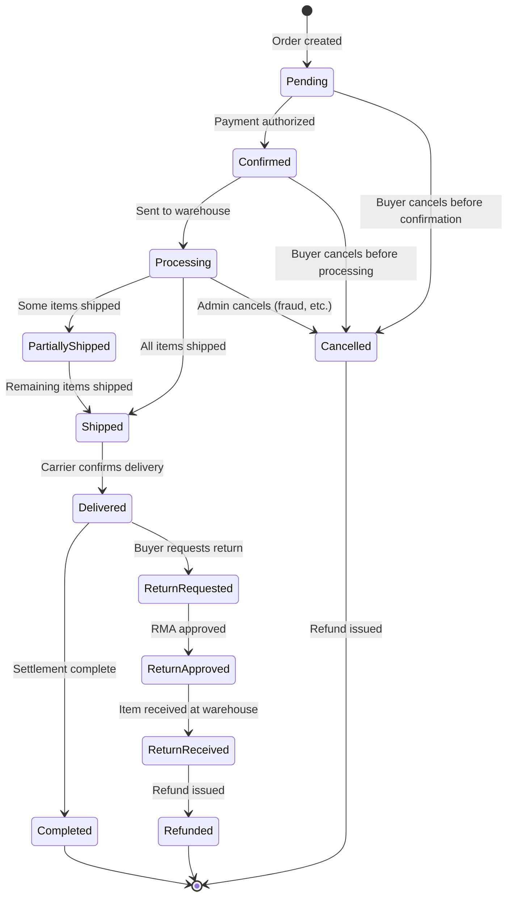
```mermaid
stateDiagram-v2
    [*] --> Pending: Order created
    Pending --> Confirmed: Payment authorized
    Confirmed --> Processing: Sent to warehouse
    Processing --> PartiallyShipped: Some items shipped
    Processing --> Shipped: All items shipped
    PartiallyShipped --> Shipped: Remaining items shipped
    Shipped --> Delivered: Carrier confirms delivery
    Delivered --> Completed: Settlement complete
    Completed --> [*]

    Pending --> Cancelled: Buyer cancels before confirmation
    Confirmed --> Cancelled: Buyer cancels before processing
    Processing --> Cancelled: Admin cancels (fraud, etc.)
    Cancelled --> [*]: Refund issued

    Delivered --> ReturnRequested: Buyer requests return
    ReturnRequested --> ReturnApproved: RMA approved
    ReturnApproved --> ReturnReceived: Item received at warehouse
    ReturnReceived --> Refunded: Refund issued
    Refunded --> [*]
```

#### Data Model

```sql
CREATE TABLE orders (
    order_id        UUID PRIMARY KEY,
    buyer_id        UUID NOT NULL,
    status          TEXT NOT NULL DEFAULT 'pending',
    subtotal        DECIMAL(12,2) NOT NULL,
    tax_amount      DECIMAL(12,2) NOT NULL,
    shipping_amount DECIMAL(12,2) NOT NULL,
    discount_amount DECIMAL(12,2) DEFAULT 0,
    total_amount    DECIMAL(12,2) NOT NULL,
    currency        TEXT NOT NULL,
    shipping_address JSONB NOT NULL,
    billing_address JSONB NOT NULL,
    payment_method  JSONB NOT NULL,           -- tokenized reference, not raw card data
    payment_auth_id TEXT,
    payment_capture_id TEXT,
    coupon_code     TEXT,
    idempotency_key TEXT UNIQUE NOT NULL,
    created_at      TIMESTAMPTZ NOT NULL DEFAULT now(),
    updated_at      TIMESTAMPTZ NOT NULL DEFAULT now(),
    version         INT NOT NULL DEFAULT 1
);

CREATE TABLE order_items (
    item_id         UUID PRIMARY KEY,
    order_id        UUID NOT NULL REFERENCES orders(order_id),
    sku_id          UUID NOT NULL,
    product_id      UUID NOT NULL,
    seller_id       UUID NOT NULL,
    quantity        INT NOT NULL,
    unit_price      DECIMAL(12,2) NOT NULL,
    line_total      DECIMAL(12,2) NOT NULL,
    status          TEXT NOT NULL DEFAULT 'pending',
    warehouse_id    UUID,
    tracking_number TEXT,
    shipped_at      TIMESTAMPTZ,
    delivered_at    TIMESTAMPTZ
);

CREATE TABLE order_events (
    event_id        UUID PRIMARY KEY,
    order_id        UUID NOT NULL REFERENCES orders(order_id),
    event_type      TEXT NOT NULL,
    payload         JSONB NOT NULL,
    actor           TEXT NOT NULL,             -- 'system', 'buyer', 'seller', 'admin'
    created_at      TIMESTAMPTZ NOT NULL DEFAULT now()
);

-- Partitioned by month for query performance
CREATE INDEX idx_orders_buyer ON orders(buyer_id, created_at DESC);
CREATE INDEX idx_orders_status ON orders(status);
CREATE INDEX idx_order_items_order ON order_items(order_id);
CREATE INDEX idx_order_items_seller ON order_items(seller_id, status);
CREATE INDEX idx_order_events_order ON order_events(order_id, created_at);
```

#### Order Event Flow

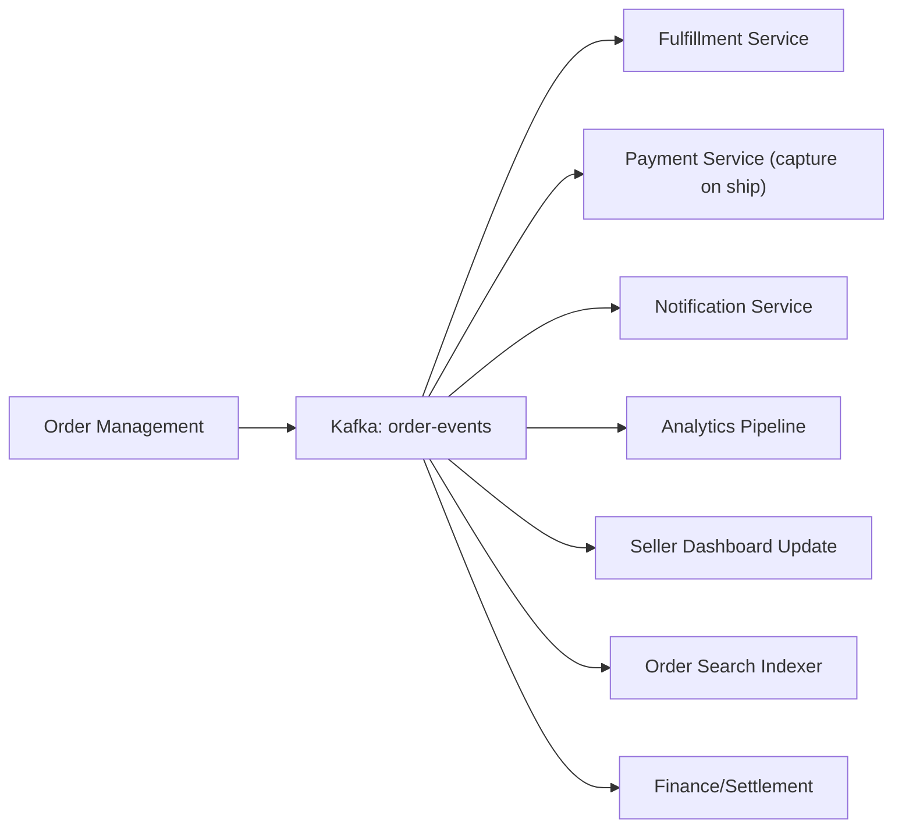
```mermaid
flowchart LR
    OMS["Order Management"] --> Kafka["Kafka: order-events"]
    Kafka --> Fulfillment["Fulfillment Service"]
    Kafka --> Payment["Payment Service (capture on ship)"]
    Kafka --> Notification["Notification Service"]
    Kafka --> Analytics["Analytics Pipeline"]
    Kafka --> Seller["Seller Dashboard Update"]
    Kafka --> Search["Order Search Indexer"]
    Kafka --> Finance["Finance/Settlement"]
```

**Key Event Types:**

| Event | Trigger | Consumers |
|-------|---------|-----------|
| `order.created` | Checkout completes | Fulfillment, Notification, Analytics |
| `order.confirmed` | Payment authorized | Fulfillment, Seller |
| `order.item.shipped` | Carrier pickup | Notification, Analytics, Payment (capture) |
| `order.delivered` | Carrier POD | Notification, Finance |
| `order.cancelled` | Buyer/admin action | Inventory (release), Payment (void/refund), Notification |
| `order.return.requested` | Buyer initiates return | Returns Service, Notification |

#### Scaling and Partitioning

- **Orders table**: Partitioned by `created_at` month. Hot partition is current month; older partitions are cold.
- **Read replicas**: Order status lookups (buyer-facing) hit read replicas. Write path uses primary.
- **Event sourcing consideration**: The `order_events` table serves as an event log. Order state can be reconstructed by replaying events. This supports auditing and debugging.
- **Sharding strategy**: Shard by `buyer_id` for buyer-facing queries. Use `order_id` based routing for internal service calls.

#### Edge Cases

- **Partial fulfillment**: Order has 3 items from 2 warehouses. Warehouse A ships 2 items, Warehouse B is delayed. OMS tracks item-level status independently.
- **Order modification after creation**: Buyer wants to change address before shipping. OMS allows modification only in `pending` or `confirmed` states.
- **Seller cancels item**: Seller can't fulfill one item. OMS recalculates order total, issues partial refund, notifies buyer.
- **Duplicate order creation**: Idempotency key on order creation prevents duplicates even if checkout retries.
- **Long-running order (pre-order)**: Order stays in `confirmed` state for weeks until stock arrives. OMS sends periodic status updates.

---

### 8. Return & Refund System

#### Overview

The Return & Refund System handles the **reverse logistics and financial unwinding** of a purchase. It is often underestimated in system design but represents significant operational complexity:

- Item-level returns (return 1 of 3 items in an order)
- Multiple return reasons with different policies (defective vs. changed mind)
- Refund calculation (prorated discounts, shipping refund eligibility)
- Restocking decisions (return to sellable inventory vs. write off)
- Fraud detection (serial returners, wardrobing)
- Multi-step process: request → approve → ship back → receive → inspect → refund

Amazon processes over 1 billion returns per year, with return rates of 15-30% in some categories (apparel).

#### Return Lifecycle State Machine

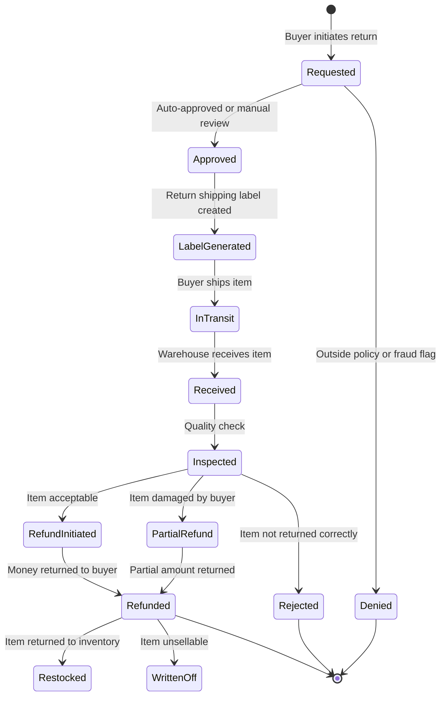
```mermaid
stateDiagram-v2
    [*] --> Requested: Buyer initiates return
    Requested --> Approved: Auto-approved or manual review
    Requested --> Denied: Outside policy or fraud flag
    Approved --> LabelGenerated: Return shipping label created
    LabelGenerated --> InTransit: Buyer ships item
    InTransit --> Received: Warehouse receives item
    Received --> Inspected: Quality check
    Inspected --> RefundInitiated: Item acceptable
    Inspected --> PartialRefund: Item damaged by buyer
    Inspected --> Rejected: Item not returned correctly
    RefundInitiated --> Refunded: Money returned to buyer
    PartialRefund --> Refunded: Partial amount returned
    Refunded --> Restocked: Item returned to inventory
    Refunded --> WrittenOff: Item unsellable
    Refunded --> [*]
    Rejected --> [*]
    Denied --> [*]
```

#### Data Model

```sql
CREATE TABLE returns (
    return_id       UUID PRIMARY KEY,
    order_id        UUID NOT NULL REFERENCES orders(order_id),
    buyer_id        UUID NOT NULL,
    status          TEXT NOT NULL DEFAULT 'requested',
    reason_code     TEXT NOT NULL,
    reason_detail   TEXT,
    created_at      TIMESTAMPTZ NOT NULL DEFAULT now(),
    updated_at      TIMESTAMPTZ NOT NULL DEFAULT now()
);

CREATE TABLE return_items (
    return_item_id  UUID PRIMARY KEY,
    return_id       UUID NOT NULL REFERENCES returns(return_id),
    order_item_id   UUID NOT NULL REFERENCES order_items(item_id),
    sku_id          UUID NOT NULL,
    quantity        INT NOT NULL,
    reason_code     TEXT NOT NULL CHECK (reason_code IN (
        'defective', 'wrong_item', 'changed_mind', 'not_as_described',
        'arrived_late', 'damaged_in_shipping', 'other'
    )),
    condition       TEXT,                      -- set after inspection
    refund_amount   DECIMAL(12,2),
    restock_action  TEXT CHECK (restock_action IN ('restock', 'write_off', 'vendor_return'))
);

CREATE TABLE refunds (
    refund_id       UUID PRIMARY KEY,
    return_id       UUID REFERENCES returns(return_id),
    order_id        UUID NOT NULL REFERENCES orders(order_id),
    buyer_id        UUID NOT NULL,
    amount          DECIMAL(12,2) NOT NULL,
    currency        TEXT NOT NULL,
    refund_method   TEXT NOT NULL CHECK (refund_method IN (
        'original_payment', 'store_credit', 'bank_transfer'
    )),
    psp_refund_id   TEXT,                      -- PSP reference
    status          TEXT NOT NULL DEFAULT 'pending'
                    CHECK (status IN ('pending', 'processing', 'completed', 'failed')),
    idempotency_key TEXT UNIQUE NOT NULL,
    created_at      TIMESTAMPTZ NOT NULL DEFAULT now()
);
```

#### Refund Calculation

Refund amount is not simply the item price. It must account for:

| Component | Logic |
|-----------|-------|
| Item price | Original unit price x return quantity |
| Prorated discount | If order had a coupon, discount is prorated across items |
| Shipping refund | Only if return reason is seller's fault (defective, wrong item) |
| Restocking fee | Applied for "changed mind" returns in some categories |
| Tax refund | Tax on the refunded amount |

```
refund_amount = (item_price * qty)
             - prorated_discount
             - restocking_fee
             + (shipping_refund if seller_fault)
             + tax_on_refunded_amount
```

#### Edge Cases

- **Return after refund window**: Auto-denied with reason. CS agent can override with approval.
- **Item not received by warehouse**: Buyer claims they shipped; carrier shows no scan. Dispute resolution workflow triggers.
- **Refund to expired credit card**: PSP handles this (routes to issuing bank). If PSP can't refund to original method, fallback to store credit.
- **Serial returner detection**: Track return rate per buyer. Flag buyers with > 30% return rate for manual review.
- **Return of promotional item**: "Buy 2 get 1 free" — buyer returns 1 item. System must recalculate whether promotion still applies to remaining items.

---

## APIs and Contracts (Consolidated)

| Service | Endpoint | Method | Auth | Rate Limit |
|---------|----------|--------|------|-----------|
| Catalog | `/api/v1/catalog/search` | GET | Public | 1000/min/IP |
| Catalog | `/api/v1/catalog/products/{id}` | GET | Public | 5000/min/IP |
| Catalog | `/api/v1/catalog/products` | POST | Seller Token | 100/min/seller |
| PDP | `/api/v1/pdp/{productId}` | GET | Public | 5000/min/IP |
| Pricing | `/api/v1/pricing/evaluate` | POST | Internal | 10000/min/service |
| Inventory | `/internal/inventory/reserve` | POST | Internal | 5000/min/service |
| Inventory | `/internal/inventory/availability/{skuId}` | GET | Internal | 50000/min/service |
| Cart | `/api/v1/cart` | GET | Buyer Token | 100/min/user |
| Cart | `/api/v1/cart/items` | POST | Buyer Token | 60/min/user |
| Checkout | `/api/v1/checkout/sessions` | POST | Buyer Token | 10/min/user |
| Checkout | `/api/v1/checkout/confirm` | POST | Buyer Token | 5/min/user |
| OMS | `/api/v1/orders` | GET | Buyer Token | 30/min/user |
| OMS | `/api/v1/orders/{id}` | GET | Buyer Token | 60/min/user |
| OMS | `/api/v1/orders/{id}/cancel` | POST | Buyer Token | 5/min/user |
| Returns | `/api/v1/returns` | POST | Buyer Token | 5/min/user |
| Returns | `/api/v1/returns/{id}` | GET | Buyer Token | 30/min/user |

**API Versioning**: URL path versioning (`/v1/`, `/v2/`). Breaking changes require new version. Non-breaking additions (new optional fields) allowed in existing version.

**Authentication**: JWT tokens with short expiry (15 min). Refresh tokens stored HTTP-only, secure, SameSite cookies.

---

## Data Model (Consolidated ER Diagram)

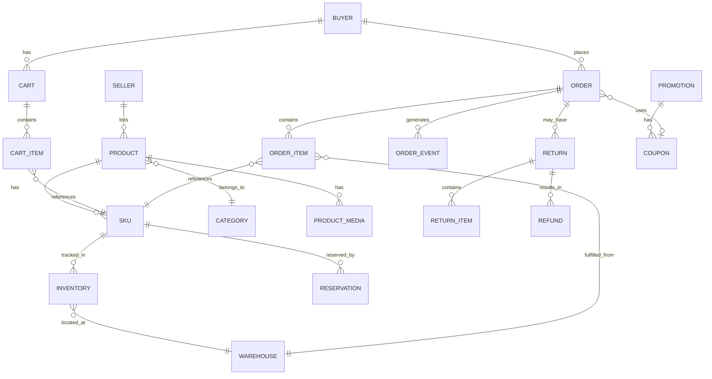
```mermaid
erDiagram
    BUYER ||--o{ ORDER : places
    BUYER ||--o{ CART : has
    SELLER ||--o{ PRODUCT : lists
    PRODUCT ||--o{ SKU : has
    PRODUCT }o--|| CATEGORY : belongs_to
    PRODUCT ||--o{ PRODUCT_MEDIA : has
    SKU ||--o{ INVENTORY : tracked_in
    INVENTORY }o--|| WAREHOUSE : located_at
    SKU ||--o{ RESERVATION : reserved_by
    CART ||--o{ CART_ITEM : contains
    CART_ITEM }o--|| SKU : references
    ORDER ||--o{ ORDER_ITEM : contains
    ORDER_ITEM }o--|| SKU : references
    ORDER_ITEM }o--|| WAREHOUSE : fulfilled_from
    ORDER ||--o{ ORDER_EVENT : generates
    ORDER ||--o{ RETURN : may_have
    RETURN ||--o{ RETURN_ITEM : contains
    RETURN ||--o{ REFUND : results_in
    PROMOTION ||--o{ COUPON : has
    ORDER }o--o| COUPON : uses
```

---

## Indexing and Partitioning

| Table | Partition Strategy | Key Indexes | Notes |
|-------|-------------------|------------|-------|
| `products` | None (50M rows manageable) | seller_id, category_id, status | Consider partitioning by category if > 500M |
| `skus` | None | product_id, sku_code | |
| `inventory` | None (small table) | sku_id + warehouse_id (unique) | Row-level locking is the bottleneck, not size |
| `orders` | Range by `created_at` (monthly) | buyer_id + created_at, status | Cold partitions archived to S3 |
| `order_items` | Same as orders | order_id, seller_id + status | |
| `order_events` | Range by `created_at` (monthly) | order_id + created_at | Append-only, never updated |
| `reservations` | None (transient data) | expires_at WHERE status='active' | Cleaned up by expiry job |

**Elasticsearch Sharding:**
- Product index: 10 primary shards, 2 replicas = 30 shard copies across 5 nodes
- Shard size target: 10-50 GB per shard
- Reindex strategy: blue-green index swap during major mapping changes

---

## Cache Strategy

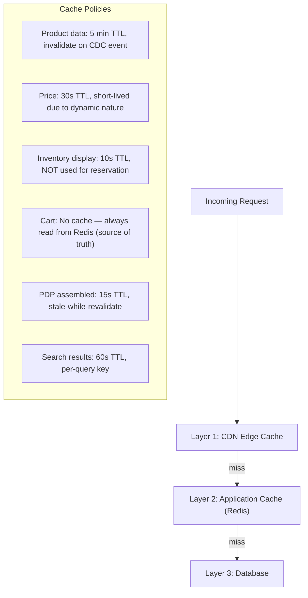
```mermaid
flowchart TD
    Request["Incoming Request"] --> CDN["Layer 1: CDN Edge Cache"]
    CDN -->|miss| AppCache["Layer 2: Application Cache (Redis)"]
    AppCache -->|miss| DB["Layer 3: Database"]

    subgraph CachePolicy["Cache Policies"]
        CP1["Product data: 5 min TTL, invalidate on CDC event"]
        CP2["Price: 30s TTL, short-lived due to dynamic nature"]
        CP3["Inventory display: 10s TTL, NOT used for reservation"]
        CP4["Cart: No cache — always read from Redis (source of truth)"]
        CP5["PDP assembled: 15s TTL, stale-while-revalidate"]
        CP6["Search results: 60s TTL, per-query key"]
    end
```

**Cache Invalidation Strategy:**
- **CDC-driven**: Debezium captures PostgreSQL changes, publishes to Kafka. Cache invalidation consumer listens and evicts stale keys.
- **TTL-based**: Short TTLs for price and inventory data. Acceptable staleness window is 10-30 seconds.
- **Explicit purge**: Admin action (e.g., emergency price correction) triggers immediate cache purge via API.

**Cache Stampede Prevention:**
- Single-flight pattern: Only one request fetches from DB on cache miss; concurrent requests wait for the result.
- Probabilistic early expiration: Cache entries refresh slightly before TTL expires to avoid thundering herd.

---

## Queue / Stream Design

| Queue/Topic | Technology | Purpose | Consumers |
|-------------|-----------|---------|-----------|
| `catalog-changes` | Kafka | CDC events from catalog DB | Search Indexer, PDP Cache Invalidator |
| `inventory-updates` | Kafka | Stock level changes | PDP Service, Analytics |
| `order-events` | Kafka | Order lifecycle events | Fulfillment, Payment, Notification, Analytics, Finance |
| `checkout-queue` | SQS/Kafka | Flash sale checkout queue | Checkout Consumer |
| `notification-queue` | SQS | Email/SMS/push notifications | Notification Workers |
| `return-events` | Kafka | Return lifecycle events | Inventory, Finance, Analytics |
| `dead-letter` | SQS | Failed message processing | Alert + manual review |

**Kafka Configuration:**
- Partitions: 12 per topic (matches consumer group size)
- Replication factor: 3 (across 3 AZs)
- Retention: 7 days (order-events: 30 days for audit)
- Consumer group lag alerting: > 1000 messages triggers warning, > 10000 triggers page

---

## Storage Strategy

| Data Type | Storage | Why |
|-----------|---------|-----|
| Product metadata | PostgreSQL | Structured, relational, ACID transactions |
| Product media (images, video) | S3 + CloudFront CDN | Object storage with global edge caching |
| Search index | Elasticsearch | Full-text search, faceted filtering, relevance scoring |
| Cart state | Redis Cluster | Sub-ms latency, TTL, atomic operations |
| Price cache | Redis | Fast lookups, short TTL |
| Order data | PostgreSQL (partitioned) | ACID, relational, long-term durability |
| Order events | PostgreSQL + Kafka | Append-only event log + streaming |
| Analytics | S3 + data warehouse (BigQuery/Redshift) | Columnar analytics on event data |
| Session data | Redis | Short-lived, high throughput |

---

## Search Strategy

The search subsystem is critical for product discovery. It uses Elasticsearch with a custom ranking pipeline:

1. **Query parsing**: Tokenize, stem, expand synonyms, handle typos (fuzzy matching)
2. **Retrieval**: BM25 + boosted fields (title > brand > description)
3. **Filtering**: Post-retrieval filter by category, price, brand, attributes, in-stock
4. **Re-ranking**: ML-based re-ranker using click-through rate, conversion rate, freshness
5. **Personalization**: User purchase history and browse behavior influence ranking
6. **Facet computation**: Aggregate counts for filters (brand: 45 results, price $50-100: 120 results)

**Search relevance tuning** is an ongoing process. A/B testing infrastructure evaluates ranking changes against conversion metrics.

---

## Notification / Webhook Strategy

| Event | Channel | Timing |
|-------|---------|--------|
| Order confirmed | Email + Push + SMS | Immediate |
| Order shipped | Email + Push | Immediate |
| Order delivered | Email + Push | Immediate |
| Cart abandoned (24h) | Email | Async (scheduled) |
| Price drop on wishlist item | Email + Push | Async (batch) |
| Return approved | Email | Immediate |
| Refund processed | Email | Immediate |
| Flash sale starting | Push | Scheduled |

**Webhook API for sellers:**
```
POST /api/v1/webhooks
{
  "url": "https://seller-system.com/webhook",
  "events": ["order.created", "order.cancelled", "return.requested"],
  "secret": "whsec_..."  // HMAC signing secret
}
```

Webhooks include HMAC-SHA256 signature in headers for verification. Failed deliveries retry with exponential backoff (1m, 5m, 30m, 2h, 12h).

---

## State Machine

The two primary state machines are covered in the OMS and Returns sections above. Here is a combined view of the order-return lifecycle:

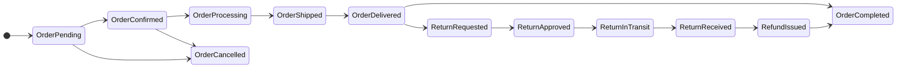
```mermaid
stateDiagram-v2
    direction LR
    [*] --> OrderPending
    OrderPending --> OrderConfirmed
    OrderConfirmed --> OrderProcessing
    OrderProcessing --> OrderShipped
    OrderShipped --> OrderDelivered
    OrderDelivered --> OrderCompleted

    OrderPending --> OrderCancelled
    OrderConfirmed --> OrderCancelled

    OrderDelivered --> ReturnRequested
    ReturnRequested --> ReturnApproved
    ReturnApproved --> ReturnInTransit
    ReturnInTransit --> ReturnReceived
    ReturnReceived --> RefundIssued
    RefundIssued --> OrderCompleted
```

---

## Sequence Diagrams

### Write Path: Order Creation Saga

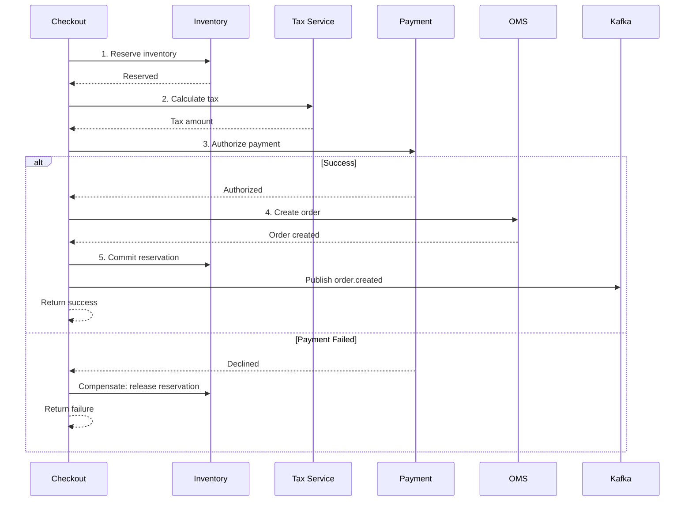
```mermaid
sequenceDiagram
    participant CO as Checkout
    participant INV as Inventory
    participant TAX as Tax Service
    participant PAY as Payment
    participant OMS as OMS
    participant BUS as Kafka

    CO->>INV: 1. Reserve inventory
    INV-->>CO: Reserved

    CO->>TAX: 2. Calculate tax
    TAX-->>CO: Tax amount

    CO->>PAY: 3. Authorize payment
    alt Success
        PAY-->>CO: Authorized
        CO->>OMS: 4. Create order
        OMS-->>CO: Order created
        CO->>INV: 5. Commit reservation
        CO->>BUS: Publish order.created
        CO-->>CO: Return success
    else Payment Failed
        PAY-->>CO: Declined
        CO->>INV: Compensate: release reservation
        CO-->>CO: Return failure
    end
```

### Read Path: PDP Assembly

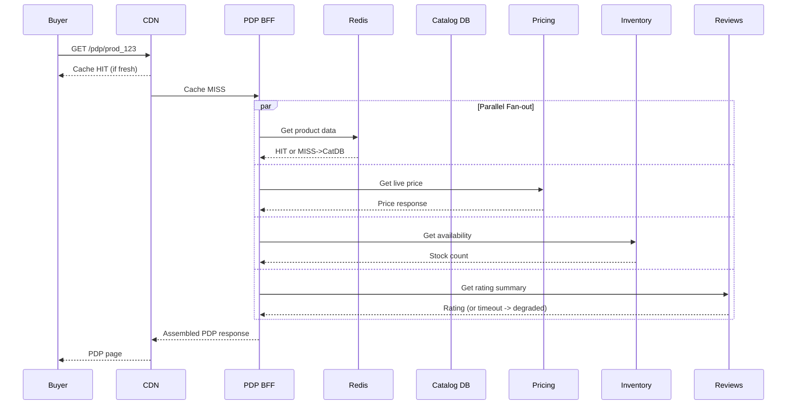
```mermaid
sequenceDiagram
    participant Client as Buyer
    participant CDN
    participant BFF as PDP BFF
    participant Cache as Redis
    participant CatDB as Catalog DB
    participant Price as Pricing
    participant Inv as Inventory
    participant Review as Reviews

    Client->>CDN: GET /pdp/prod_123
    CDN-->>Client: Cache HIT (if fresh)
    CDN->>BFF: Cache MISS

    par Parallel Fan-out
        BFF->>Cache: Get product data
        Cache-->>BFF: HIT or MISS->CatDB
        and
        BFF->>Price: Get live price
        Price-->>BFF: Price response
        and
        BFF->>Inv: Get availability
        Inv-->>BFF: Stock count
        and
        BFF->>Review: Get rating summary
        Review-->>BFF: Rating (or timeout -> degraded)
    end

    BFF-->>CDN: Assembled PDP response
    CDN-->>Client: PDP page
```

---

## Concurrency Control

| Service | Mechanism | Why |
|---------|-----------|-----|
| Inventory reservation | Row-level `SELECT FOR UPDATE` | Must prevent oversell; strong consistency required |
| Inventory display count | Eventual consistency (Redis cache) | Approximate count acceptable for display |
| Cart updates | Redis atomic operations (WATCH/MULTI or Lua) | Prevent lost updates from concurrent device access |
| Order state transitions | Optimistic locking (version column) | Low contention; retry on conflict |
| Coupon redemption | Redis atomic counter + DB reconciliation | Fast path for budget tracking; DB for durability |
| Checkout idempotency | Unique key with DB constraint | Prevent duplicate order creation |

---

## Idempotency Strategy

| Operation | Idempotency Mechanism | Key Source |
|-----------|-----------------------|-----------|
| Add to cart | Client-generated request ID | UUID per add action |
| Inventory reservation | `idempotency_key` column with UNIQUE constraint | Checkout session ID + SKU |
| Payment authorization | Idempotency key sent to PSP | Checkout session ID |
| Order creation | `idempotency_key` on orders table | Checkout confirmation ID |
| Refund | `idempotency_key` on refunds table | Return ID + item ID |
| Webhook delivery | Event ID in payload | Event UUID |

---

## Consistency Model

| Data | Consistency Level | Rationale |
|------|------------------|-----------|
| Inventory reservations | **Strong** (linearizable) | Oversell prevention is a hard requirement |
| Order state | **Strong** (linearizable per order) | State transitions must be atomic and ordered |
| Catalog data | **Eventual** (< 5s lag) | Slight staleness acceptable for product info |
| Search index | **Eventual** (< 10s lag) | Search results can lag behind catalog updates |
| Price display | **Eventual** (< 30s lag) | Price re-validated at cart/checkout |
| Cart state | **Strong** (per user) | User expects consistent cart across devices |
| Analytics | **Eventual** (minutes to hours) | Batch processing acceptable |

---

## Distributed Transaction / Saga / Reconciliation Design

The checkout flow uses the **Orchestrator Saga** pattern. The Checkout Service acts as the orchestrator, calling each participant in sequence and invoking compensating actions on failure.

**Why not 2PC (Two-Phase Commit)?**
- 2PC requires all participants to hold locks until commit, which is impractical across independent services.
- 2PC has a blocking failure mode: if the coordinator crashes after prepare, participants are stuck.
- Saga with compensation provides better availability and is the industry standard for e-commerce.

**Reconciliation:**
A nightly reconciliation job compares:
- Inventory ledger vs. warehouse management system counts
- Payment authorizations vs. order records
- Reservation records vs. committed orders

Discrepancies are logged, alerted, and queued for manual review if they exceed thresholds.

---

## Security Design

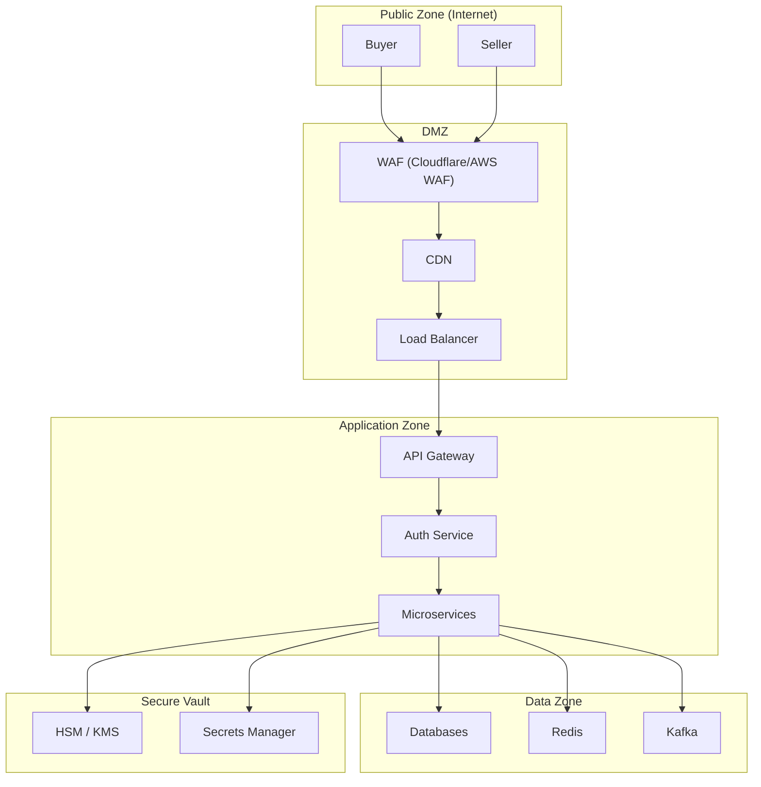
```mermaid
flowchart TD
    subgraph PublicZone["Public Zone (Internet)"]
        Buyer["Buyer"]
        Seller["Seller"]
    end

    subgraph DMZ["DMZ"]
        WAF["WAF (Cloudflare/AWS WAF)"]
        CDN["CDN"]
        LB["Load Balancer"]
    end

    subgraph AppZone["Application Zone"]
        GW["API Gateway"]
        Auth["Auth Service"]
        Services["Microservices"]
    end

    subgraph DataZone["Data Zone"]
        DB["Databases"]
        Cache["Redis"]
        Queue["Kafka"]
    end

    subgraph SecureVault["Secure Vault"]
        HSM["HSM / KMS"]
        Secrets["Secrets Manager"]
    end

    Buyer --> WAF --> CDN --> LB --> GW
    Seller --> WAF
    GW --> Auth --> Services
    Services --> DB & Cache & Queue
    Services --> HSM & Secrets
```

**Security Measures:**

| Layer | Control |
|-------|---------|
| Network | VPC isolation, private subnets for DB, security groups |
| Edge | WAF rules (SQL injection, XSS, rate limiting), DDoS protection |
| Authentication | JWT + refresh tokens, MFA for seller accounts |
| Authorization | RBAC for admin/seller; resource-level access control for buyer data |
| Data at rest | AES-256 encryption for all databases and object storage |
| Data in transit | TLS 1.3 everywhere, including internal service-to-service |
| PCI compliance | Card data never touches application servers; PSP handles tokenization |
| Secrets | Rotated via AWS Secrets Manager; never in code or config files |
| Audit | All state-changing operations logged with actor, action, timestamp |
| Input validation | Server-side validation on all inputs; parameterized queries |

---

## Abuse / Fraud / Governance Controls

| Threat | Detection | Mitigation |
|--------|-----------|-----------|
| Credit card fraud | ML scoring on transaction attributes + velocity checks | Block, flag for review, 3D Secure for suspicious |
| Coupon abuse | Track coupon usage per user/IP/device | Rate limit, unique-per-user coupons |
| Account takeover | Anomalous login location/device | MFA challenge, session invalidation |
| Fake reviews | NLP analysis, purchase verification | Remove, flag seller |
| Seller price gouging | Price change velocity monitoring | Alert, temporary listing suspension |
| Bot traffic (scalping) | CAPTCHA, fingerprinting, rate limiting | Block, queue-based checkout for flash sales |
| Refund fraud (wardrobing) | Return rate per buyer, return reason patterns | Flag, restrict return privileges |
| Fake seller listings | Image similarity, brand verification | Manual review queue, ML-assisted |

---

## Reliability and Resilience Design

| Pattern | Where Applied | Effect |
|---------|--------------|--------|
| **Circuit Breaker** | PDP → Reviews Service, PDP → Recommendations | Fail fast on degraded service; serve partial PDP |
| **Bulkhead** | Thread pools per downstream service | Prevent slow Reviews from blocking Inventory calls |
| **Retry with backoff** | Checkout → Payment Gateway | Handle transient PSP failures |
| **Timeout budgets** | PDP fan-out (50-200ms per service) | Guarantee PDP latency SLA |
| **Graceful degradation** | PDP without reviews, search without personalization | Core functionality preserved |
| **Queue buffering** | Flash sale checkout | Absorb traffic spikes |
| **Idempotency** | All write operations | Safe retries |
| **Health checks** | All services expose `/health` | Load balancer removes unhealthy instances |
| **Chaos engineering** | Monthly game days | Validate resilience assumptions |

**Failure Modes and Recovery:**

| Failure | Impact | Recovery |
|---------|--------|----------|
| Redis cluster down | Cart and cache unavailable | Fallback to DB reads (degraded latency); cart from DB backup |
| Elasticsearch down | Search unavailable | Fallback to DB-backed category browsing |
| Kafka down | Event processing stops | Producers buffer locally; consumers replay from offset |
| Payment gateway down | Checkout blocked | Show "Payment temporarily unavailable"; retry queue |
| Single AZ outage | 33% capacity loss | Auto-failover to remaining AZs within 60 seconds |

---

## Observability Design

**Three Pillars:**

| Pillar | Tool | What |
|--------|------|------|
| **Metrics** | Prometheus + Grafana | Request rate, error rate, latency (RED), saturation |
| **Logs** | ELK Stack / Datadog | Structured JSON logs with correlation IDs |
| **Traces** | Jaeger / Datadog APT | Distributed traces across service calls |

**Key Dashboards:**

| Dashboard | Metrics |
|-----------|---------|
| Checkout Health | Success rate, p50/p95/p99 latency, payment auth rate |
| Inventory Health | Reservation success rate, oversell incidents, reconciliation drift |
| Search Performance | Query latency, zero-result rate, index lag |
| Order Pipeline | Orders/min, fulfillment SLA adherence, cancellation rate |
| Business KPIs | GMV, AOV, conversion rate, cart abandonment rate |

**Alerting Thresholds:**

| Metric | Warning | Critical |
|--------|---------|----------|
| Checkout error rate | > 1% | > 5% |
| Inventory oversell | Any occurrence | N/A (always critical) |
| Search p99 latency | > 500ms | > 1s |
| Kafka consumer lag | > 1,000 messages | > 10,000 messages |
| Order creation rate drop | > 20% below baseline | > 50% below baseline |

---

## Deployment Architecture

```mermaid
flowchart TD
    subgraph Region1["US-East (Primary)"]
        subgraph AZ1["AZ-1"]
            LB1["ALB"]
            SVC1["Service Pods"]
            DB_P["PostgreSQL Primary"]
        end
        subgraph AZ2["AZ-2"]
            LB2["ALB"]
            SVC2["Service Pods"]
            DB_R1["PostgreSQL Replica"]
        end
        subgraph AZ3["AZ-3"]
            LB3["ALB"]
            SVC3["Service Pods"]
            DB_R2["PostgreSQL Replica"]
        end
        REDIS1["Redis Cluster"]
        ES1["Elasticsearch Cluster"]
        KAFKA1["Kafka Cluster"]
    end

    subgraph Region2["EU-West (Secondary)"]
        LB_EU["ALB"]
        SVC_EU["Service Pods"]
        DB_EU["PostgreSQL (Async Replica)"]
        REDIS_EU["Redis Cluster"]
        ES_EU["Elasticsearch Cluster"]
    end

    CDN_GLOBAL["CloudFront / Fastly (Global CDN)"]
    DNS["Route 53 (Latency-based routing)"]

    DNS --> CDN_GLOBAL
    CDN_GLOBAL --> Region1 & Region2
```

**Kubernetes:**
- All services run as Kubernetes deployments
- Horizontal Pod Autoscaler (HPA) based on CPU and custom metrics (request rate)
- Pod disruption budgets prevent simultaneous restarts
- Namespace isolation per team (catalog-team, checkout-team, order-team)

---

## CI/CD and Release Strategy

| Stage | Tool | Gate |
|-------|------|------|
| Code review | GitHub PR | 2 approvals required |
| Unit tests | Jest / pytest | 80% coverage minimum |
| Integration tests | Docker Compose + test DB | All API contract tests pass |
| Security scan | Snyk / Trivy | No critical CVEs |
| Build | Docker | Multi-stage build, distroless images |
| Staging deploy | ArgoCD | Automated deploy to staging |
| E2E tests | Playwright / Cypress | Critical paths (search, checkout) pass |
| Production deploy | ArgoCD + canary | 5% canary → 25% → 50% → 100% over 30 min |
| Rollback | ArgoCD | Automated on error rate spike |

**Feature flags**: LaunchDarkly for progressive rollout. New features enabled per-region, per-user-segment, or per-percentage.

---

## Multi-Region and DR Strategy

| Aspect | Strategy |
|--------|----------|
| **Active-Active vs Active-Passive** | Active-passive for writes (single primary region); active-active for reads |
| **Database replication** | PostgreSQL streaming replication to secondary region (async, < 1s lag) |
| **Failover trigger** | Manual failover for writes (RTO: 15 min); automated for reads |
| **Data residency** | EU buyer data stored in EU region; US data in US region |
| **CDN** | Global CDN with origin in both regions |
| **DNS failover** | Route 53 health checks; automatic failover to healthy region |
| **RPO** | < 1 second (async replication lag) |
| **RTO** | 15 minutes (manual promote of secondary to primary) |

---

## Cost Drivers and Optimization

| Cost Center | Driver | Optimization |
|------------|--------|-------------|
| **Compute** | Kubernetes pods across AZs | Right-size pods; spot instances for non-critical workloads |
| **Database** | PostgreSQL RDS Multi-AZ | Reserved instances; archive old order data to S3 |
| **Search** | Elasticsearch cluster | Right-size instance types; archive old product data |
| **Cache** | Redis Cluster | Eviction policies; don't cache everything |
| **CDN** | CloudFront bandwidth | Aggressive caching; compress responses |
| **Kafka** | Broker instances + storage | Retention policies; compact topics where possible |
| **Object Storage** | S3 for media | Lifecycle policies (move old media to Glacier) |
| **PSP Fees** | Per-transaction payment processing | Negotiate volume discounts; optimize auth success rate |

**Monthly cost estimate for steady-state (500K orders/day):**
- Compute: ~$25,000
- Databases: ~$15,000
- Search: ~$8,000
- Cache: ~$5,000
- CDN + bandwidth: ~$10,000
- Kafka: ~$5,000
- Storage: ~$3,000
- PSP fees: ~$150,000 (at $0.30 per order + 2.9%)
- Total: ~$220,000/month (PSP fees dominate)

---

## Technology Choices and Alternatives

| Decision | Chosen | Alternatives Considered | Why |
|----------|--------|------------------------|-----|
| Primary database | PostgreSQL | MySQL, CockroachDB | Mature, JSONB support, strong ecosystem, proven at scale |
| Search engine | Elasticsearch | Solr, Meilisearch, Typesense | Industry standard for e-commerce search; faceted filtering |
| Cache | Redis Cluster | Memcached, Dragonfly | Rich data structures, Lua scripting, pub/sub |
| Message broker | Kafka | RabbitMQ, SQS, Pulsar | High throughput, replay capability, exactly-once semantics |
| API Gateway | Kong / AWS API Gateway | Envoy, Traefik | Rate limiting, auth, observability built-in |
| Container orchestration | Kubernetes (EKS) | ECS, Nomad | Industry standard, rich ecosystem |
| CDN | CloudFront | Fastly, Cloudflare | AWS-native integration; Fastly for instant purge if needed |
| Payment gateway | Stripe + Adyen (multi-PSP) | Razorpay, PayPal | Geographic coverage; redundancy with multi-PSP |
| Observability | Datadog | Prometheus+Grafana, New Relic | Unified metrics, logs, traces; less operational overhead |

---

## Architecture Decision Records (ARDs)

### ARD-001: CQRS for Product Catalog

| Field | Detail |
|-------|--------|
| **Decision** | Use CQRS: PostgreSQL for writes, Elasticsearch for reads |
| **Context** | Catalog has 1000:1 read:write ratio. Writes need ACID; reads need full-text search and faceted filtering |
| **Options** | (A) Single PostgreSQL with full-text search, (B) CQRS with Elasticsearch, (C) Dedicated search service (Algolia) |
| **Chosen** | Option B: CQRS with Elasticsearch |
| **Why** | PostgreSQL full-text search doesn't scale for faceted queries at 50M SKUs. Algolia is expensive at this volume. Elasticsearch provides flexible mapping and we control the index |
| **Trade-offs** | Introduces CDC lag (< 5s); two systems to maintain; eventual consistency on reads |
| **Risks** | Elasticsearch cluster management complexity; reindex downtime during mapping changes |
| **Revisit when** | If search latency degrades below SLO or operational cost of Elasticsearch exceeds Algolia pricing |

### ARD-002: Saga Pattern for Checkout

| Field | Detail |
|-------|--------|
| **Decision** | Use orchestrator saga for checkout, not 2PC or choreography |
| **Context** | Checkout spans inventory, tax, payment, and OMS — all independent services |
| **Options** | (A) 2PC, (B) Choreography-based saga, (C) Orchestrator saga |
| **Chosen** | Option C: Orchestrator saga |
| **Why** | 2PC has blocking failure mode and requires all services to support XA. Choreography creates implicit coupling and is hard to debug. Orchestrator provides clear visibility and control |
| **Trade-offs** | Orchestrator is a single point of failure (mitigated by HA deployment); more code in orchestrator |
| **Risks** | Orchestrator complexity grows with new checkout steps; requires careful compensation logic |
| **Revisit when** | If checkout latency is dominated by sequential saga steps and parallel execution is needed |

### ARD-003: Redis for Cart State

| Field | Detail |
|-------|--------|
| **Decision** | Use Redis Cluster as primary cart storage with async DB backup |
| **Context** | Cart requires sub-ms latency, high write frequency, and TTL for guest carts |
| **Options** | (A) PostgreSQL only, (B) Redis only, (C) Redis primary + PostgreSQL backup |
| **Chosen** | Option C: Redis primary with PostgreSQL backup |
| **Why** | PostgreSQL adds 2-5ms latency per cart operation. Redis provides sub-ms. DB backup ensures durability for authenticated users |
| **Trade-offs** | Dual-write complexity; potential inconsistency if Redis fails before DB sync |
| **Risks** | Redis data loss on node failure (mitigated by replication + DB backup) |
| **Revisit when** | If Redis operational overhead is too high; consider DynamoDB as alternative |

### ARD-004: Row-Level Locking for Inventory Reservation

| Field | Detail |
|-------|--------|
| **Decision** | Use PostgreSQL `SELECT FOR UPDATE` for inventory reservation |
| **Context** | Must prevent overselling; strong consistency required |
| **Options** | (A) Optimistic locking with retry, (B) Pessimistic row-level lock, (C) Redis atomic decrement + DB reconciliation |
| **Chosen** | Option B: Pessimistic row-level lock, with Option C as supplement for flash sales |
| **Why** | Optimistic locking causes excessive retries under contention. Row-level lock guarantees correctness. Redis supplement handles flash sale throughput |
| **Trade-offs** | Row-level lock limits throughput on hot SKUs; flash sale path has eventual consistency window |
| **Risks** | Lock contention during extreme sales; deadlocks if lock ordering is wrong |
| **Revisit when** | If hot-SKU contention causes checkout failures above 1%; consider pre-sharded inventory buckets |

### ARD-005: Kafka for Event Streaming

| Field | Detail |
|-------|--------|
| **Decision** | Use Kafka as the central event bus |
| **Context** | Multiple services need to react to order, inventory, and catalog events |
| **Options** | (A) RabbitMQ, (B) Kafka, (C) AWS EventBridge + SQS |
| **Chosen** | Option B: Kafka |
| **Why** | Kafka provides replay capability (consumers can re-read events), high throughput, and strong ordering guarantees per partition |
| **Trade-offs** | Higher operational complexity than SQS; requires ZooKeeper/KRaft management |
| **Risks** | Kafka cluster failure affects all event consumers; mitigated by multi-AZ deployment |
| **Revisit when** | If operational overhead is too high for the team size; managed Kafka (Confluent, MSK) reduces this |

---

## POCs to Validate First

### POC-1: Inventory Hot-SKU Benchmark
**Goal**: Validate that PostgreSQL row-level locking can sustain 1,000 concurrent reservation attempts on a single SKU.
**Setup**: Single PostgreSQL instance, pgbench custom script simulating concurrent `SELECT FOR UPDATE` + `UPDATE`.
**Success criteria**: < 5% failure rate at 1,000 concurrent connections; p99 latency < 200ms.
**Fallback**: If fails, implement pre-sharded inventory buckets.

### POC-2: Elasticsearch Search Latency at Scale
**Goal**: Validate p99 search latency < 200ms with 50M documents and complex faceted queries.
**Setup**: Load 50M synthetic product documents. Run query benchmark with realistic query distribution.
**Success criteria**: p99 < 200ms; cluster can handle 12,000 RPS.
**Fallback**: Add more data nodes; optimize mappings; consider Algolia for search tier.

### POC-3: Cache Hit Ratio for PDP
**Goal**: Validate that Redis caching achieves > 90% hit rate for PDP data.
**Setup**: Simulate realistic traffic distribution (power law — 10% of products get 90% of views).
**Success criteria**: > 90% hit rate with 5-min TTL; DB load reduced by 10x.
**Fallback**: Adjust TTL; warm cache proactively for popular products.

### POC-4: Kafka Consumer Lag During Peak
**Goal**: Validate that Kafka consumers can keep up during 10x traffic spike.
**Setup**: Produce 10x steady-state event rate; measure consumer lag.
**Success criteria**: Consumer lag stays below 1,000 messages; processing latency < 5s.
**Fallback**: Add consumer instances; increase partitions; optimize consumer processing.

### POC-5: Payment Gateway Failover
**Goal**: Validate that multi-PSP failover works when primary PSP returns errors.
**Setup**: Simulate primary PSP returning 503 errors. Verify automatic failover to secondary PSP.
**Success criteria**: Failover completes within 2 retries (< 5s); no buyer-visible error.
**Fallback**: Improve circuit breaker configuration; add third PSP.

### POC-6: Cost/Performance at Projected Scale
**Goal**: Validate that infrastructure cost stays within budget at 2x current scale.
**Setup**: Load test full system at 2x traffic for 1 hour. Measure resource utilization and projected cost.
**Success criteria**: Total infrastructure cost < $300K/month at 2x scale.
**Fallback**: Optimize cache hit rates; move cold data to cheaper storage; negotiate reserved instances.

---

## Real-World Examples and Comparisons

### How Industry Leaders Differ

| Aspect | Amazon | Shopify | Flipkart | Walmart | Etsy |
|--------|--------|---------|----------|---------|------|
| **Catalog size** | 350M+ products | Hosted SaaS (per-merchant) | 150M+ products | 200M+ products | 100M+ listings |
| **Inventory model** | 1P + 3P FBA + 3P self-fulfilled | Merchant-managed | 1P + 3P | 1P (stores) + 3P marketplace | Peer-to-peer (seller ships) |
| **Pricing** | ML-driven dynamic pricing | Merchant-set + Shopify discounts | Dynamic + flash sales | EDLP (everyday low price) + rollbacks | Seller-set with Etsy Ads promotion |
| **Checkout** | Patented 1-Click checkout | Shopify Checkout (hosted) | Multi-step with UPI/wallet | Multi-step + store pickup | Single-page checkout |
| **Search** | A9 algorithm (proprietary) | Elasticsearch-based | Elasticsearch + ML re-ranking | Polaris (proprietary) | Elasticsearch + ML |
| **Cart** | DynamoDB (originated from cart use case) | Redis + MySQL | Redis + Cassandra | Hybrid | PostgreSQL-backed |
| **Scale challenge** | 200M+ Prime members, global | 2M+ merchants, multi-tenant | 400M+ registered users | 4,700 stores + online | 90M+ active buyers |

### Startup vs Enterprise Architecture

| Aspect | Startup (< 10K orders/day) | Mid-scale (100K orders/day) | Enterprise (1M+ orders/day) |
|--------|---------------------------|---------------------------|---------------------------|
| **Architecture** | Monolith (Rails, Django, Laravel) | Modular monolith or early microservices | Full microservices with service mesh |
| **Database** | Single PostgreSQL | Primary + read replicas | Sharded PostgreSQL or NewSQL |
| **Search** | PostgreSQL full-text search | Elasticsearch single-node | Elasticsearch cluster (5+ nodes) |
| **Cache** | Application-level (in-memory) | Single Redis instance | Redis Cluster (6+ shards) |
| **Queue** | Background jobs (Sidekiq, Celery) | RabbitMQ or SQS | Kafka cluster |
| **Inventory** | Simple DB counter with optimistic lock | Row-level locking | Pre-sharded + Redis fast-path |
| **Deployment** | Single server or PaaS (Heroku) | Docker + basic K8s | Multi-AZ K8s with canary deploys |
| **Team** | 3-5 engineers, all full-stack | 15-30 engineers, feature teams | 100+ engineers, domain teams |
| **Monthly infra cost** | $500-2,000 | $10,000-50,000 | $200,000+ |

### B2B vs B2C Differences

| Aspect | B2C (consumer) | B2B (business) |
|--------|---------------|----------------|
| Pricing | Dynamic, promotional | Contract-based, volume tiers, negotiated |
| Checkout | Simple, self-service | Approval workflows, PO numbers, net-30 terms |
| Cart | Personal, single buyer | Shared carts, requisition lists, approval chains |
| Catalog | Public, browseable | Gated, custom catalogs per buyer organization |
| Orders | Small AOV ($50-200), high volume | Large AOV ($5K-500K), lower volume |
| Returns | Self-service, automated | RMA process, credit memos, restocking terms |
| Integration | Web/mobile UI | EDI, punch-out catalogs, ERP integration |

---

## Edge Cases and Failure Cases

| Scenario | Impact | Handling |
|----------|--------|---------|
| Database primary failover during checkout | Transactions in flight may fail | Checkout retries with idempotency key; failover < 30s |
| CDN origin outage | No new content served | CDN serves stale content (cache-control: stale-if-error) |
| Kafka broker failure | Event processing paused | Multi-AZ brokers; consumer replays from last committed offset |
| Flash sale: 1M users hit checkout in 10 seconds | Inventory contention, DB overload | Queue-based checkout, pre-sharded inventory, rate limiting |
| Buyer places order in USD, seller's currency is EUR | Currency mismatch | All monetary operations use buyer's currency; seller settled in their currency via FX conversion |
| Partial payment (gift card + credit card) | Split-tender checkout | Checkout orchestrates multiple payment authorizations; all-or-nothing |
| Network partition between services | Saga step fails | Timeout + compensation; eventual reconciliation |
| Time zone mismatch on promotion end time | Buyer sees expired price | All times stored in UTC; promotion end time evaluated server-side |
| Product recalled after orders placed | Active orders may need cancellation | OMS batch cancels affected orders; notifications sent |
| DDoS attack on search | Search service overwhelmed | WAF rate limiting; circuit breaker; fallback to cached results |

---

## Common Mistakes

1. **Treating inventory as eventually consistent for reservations.** Display counts can be stale; reservation correctness cannot.
2. **Putting all checkout logic in one synchronous request.** Leads to timeout issues and impossible error handling. Use a saga.
3. **Not having idempotency on payment calls.** Double-charging a customer is a trust-destroying incident.
4. **Caching inventory counts and using them for reservation decisions.** Cache is for display only; reservation must hit the source of truth.
5. **Ignoring cart merge on login.** Guest users expect their cart to survive login. Failing this causes cart abandonment.
6. **Designing the PDP as a single DB query.** PDP requires data from 5+ services. Fan-out with timeout budgets is the pattern.
7. **Not planning for flash sale traffic.** 10-50x traffic spikes are normal. Queue-based checkout and pre-sharded inventory are necessary.
8. **Forgetting about refund edge cases.** Prorated discounts, expired credit cards, and promotional recalculation are the hard parts.
9. **Treating the order state machine as linear.** Orders can be cancelled, partially fulfilled, partially returned — it is a graph, not a line.
10. **Not implementing reconciliation.** Distributed systems drift. Nightly reconciliation between inventory, orders, and payments catches discrepancies before they become incidents.

---

## Interview Angle

### How to Approach E-Commerce in an Interview

1. **Start with requirements clarification**: Is this a marketplace or single-seller? What scale? What consistency requirements?
2. **Draw the context diagram first**: Show actors, system boundaries, and external dependencies.
3. **Identify the critical path**: Browse → Cart → Checkout → Order. This is where your design depth should focus.
4. **Call out consistency boundaries**: Catalog reads can be eventual; inventory reservations must be strong.
5. **Design the checkout saga explicitly**: Show the orchestration flow with compensating actions.
6. **Discuss the hot-SKU problem**: This is the classic follow-up question. Pre-sharding, queue-based checkout, or Redis fast-path are valid answers.
7. **Mention observability and operations**: Dashboards, alerts, reconciliation. This signals production experience.

### Common Interview Questions

| Question | Key Insight to Demonstrate |
|----------|---------------------------|
| "Design an e-commerce checkout" | Saga pattern with compensation; idempotency; inventory reservation with TTL |
| "How would you handle a flash sale?" | Queue-based checkout; pre-sharded inventory; rate limiting; CDN caching |
| "How do you prevent overselling?" | Strong consistency on inventory reservation; `FOR UPDATE` row lock; idempotency key |
| "Design the product search system" | CQRS; Elasticsearch with CDC; faceted filtering; relevance tuning |
| "How would you handle returns?" | State machine; prorated refund calculation; fraud detection; restocking decision |
| "What happens if the payment gateway is down?" | Circuit breaker; multi-PSP failover; retry with backoff; void on saga rollback |

### Interview Red Flags (What NOT to Say)

- "Just use a single database for everything" — doesn't demonstrate understanding of scale
- "The cart doesn't need persistence" — loses customer trust and conversion
- "We can use 2PC for checkout" — shows lack of distributed systems understanding
- "Inventory consistency doesn't matter" — guaranteed follow-up about overselling

---

## Marketplace Infrastructure (Multi-Vendor)

Multi-vendor marketplace infrastructure is the layer that transforms a single-seller store into a platform where thousands of independent sellers list, sell, and fulfill products. This is the architectural difference between Shopify (single-seller SaaS) and Amazon Marketplace, Flipkart, or Etsy. The marketplace layer adds seller isolation, onboarding, financial settlement, inventory aggregation, and reputation management on top of core commerce.

### 1. Vendor Onboarding System

#### Overview

The Vendor Onboarding System manages the lifecycle of a seller from initial application through verification, contract signing, catalog setup, and go-live. It is a multi-step, compliance-heavy workflow that must balance speed (get sellers live fast) with safety (prevent fraud, ensure quality).

At Amazon, over 2,000 new sellers join every day. Flipkart and Meesho onboard tens of thousands of sellers per month in India, many of whom are first-time digital sellers with minimal technical literacy.

#### Onboarding Workflow

```mermaid
stateDiagram-v2
    [*] --> ApplicationSubmitted: Seller submits application
    ApplicationSubmitted --> DocumentReview: KYC documents uploaded
    DocumentReview --> AutoVerified: Auto-verification passed
    DocumentReview --> ManualReview: Auto-verification flagged
    ManualReview --> Approved: Manual review passed
    ManualReview --> Rejected: Failed verification
    AutoVerified --> ContractSigned: Digital contract accepted
    Approved --> ContractSigned: Digital contract accepted
    ContractSigned --> CatalogSetup: Seller creates first listing
    CatalogSetup --> TestOrder: Platform sends test order
    TestOrder --> Live: Test order fulfilled successfully
    Live --> [*]
    Rejected --> [*]

    Live --> Suspended: Policy violation detected
    Suspended --> Live: Remediation accepted
    Suspended --> Deactivated: Repeated violations
    Deactivated --> [*]
```

#### Data Model

```sql
CREATE TABLE sellers (
    seller_id       UUID PRIMARY KEY DEFAULT gen_random_uuid(),
    legal_name      TEXT NOT NULL,
    display_name    TEXT NOT NULL,
    slug            TEXT UNIQUE NOT NULL,
    email           TEXT NOT NULL,
    phone           TEXT,
    country         TEXT NOT NULL,
    business_type   TEXT CHECK (business_type IN ('individual', 'partnership', 'company', 'sole_proprietor')),
    tax_id          TEXT,                      -- encrypted at rest
    bank_account    JSONB,                     -- encrypted; account_number, routing, IFSC
    status          TEXT NOT NULL DEFAULT 'application_submitted'
                    CHECK (status IN ('application_submitted', 'document_review',
                    'manual_review', 'approved', 'contract_pending', 'catalog_setup',
                    'live', 'suspended', 'deactivated', 'rejected')),
    tier            TEXT DEFAULT 'standard' CHECK (tier IN ('new', 'standard', 'premium', 'enterprise')),
    commission_rate DECIMAL(5,4) DEFAULT 0.15,
    kyc_verified    BOOLEAN DEFAULT false,
    kyc_verified_at TIMESTAMPTZ,
    contract_signed_at TIMESTAMPTZ,
    live_at         TIMESTAMPTZ,
    metadata        JSONB DEFAULT '{}',
    created_at      TIMESTAMPTZ NOT NULL DEFAULT now(),
    updated_at      TIMESTAMPTZ NOT NULL DEFAULT now()
);

CREATE TABLE seller_documents (
    document_id     UUID PRIMARY KEY,
    seller_id       UUID NOT NULL REFERENCES sellers(seller_id),
    doc_type        TEXT NOT NULL CHECK (doc_type IN (
        'business_license', 'tax_certificate', 'identity_proof',
        'address_proof', 'bank_statement', 'gst_certificate'
    )),
    file_url        TEXT NOT NULL,             -- S3 URL, encrypted bucket
    status          TEXT DEFAULT 'pending' CHECK (status IN ('pending', 'verified', 'rejected')),
    rejection_reason TEXT,
    verified_by     UUID,
    verified_at     TIMESTAMPTZ,
    uploaded_at     TIMESTAMPTZ NOT NULL DEFAULT now()
);

CREATE TABLE seller_contracts (
    contract_id     UUID PRIMARY KEY,
    seller_id       UUID NOT NULL REFERENCES sellers(seller_id),
    version         TEXT NOT NULL,
    terms           JSONB NOT NULL,            -- commission rates, SLA terms
    signed_at       TIMESTAMPTZ,
    expires_at      TIMESTAMPTZ,
    ip_address      INET,
    status          TEXT DEFAULT 'pending'
);
```

#### APIs

```
POST   /api/v1/sellers/apply                     # Submit application
POST   /api/v1/sellers/{id}/documents             # Upload KYC documents
GET    /api/v1/sellers/{id}/onboarding-status      # Check onboarding progress
POST   /api/v1/sellers/{id}/contract/sign          # Accept contract
POST   /internal/sellers/{id}/verify               # Admin: approve/reject
PATCH  /internal/sellers/{id}/tier                  # Admin: change seller tier
POST   /internal/sellers/{id}/suspend               # Admin: suspend seller
```

#### Scaling and Edge Cases

| Challenge | Solution |
|-----------|----------|
| Fraudulent seller applications | ML-based fraud scoring on application data; velocity checks (same phone/bank across multiple applications) |
| Document verification backlog | Auto-verification for clear documents (OCR + ML); manual queue only for flagged cases |
| Seller data privacy (GDPR/PII) | KYC documents encrypted at rest (AES-256); access logged; auto-deletion after retention period |
| Bulk onboarding (B2B import) | CSV/API batch import for enterprise sellers; async processing with progress webhook |
| Seller reactivation after suspension | Requires fresh KYC review; probation period with reduced visibility |

---

### 2. Seller Dashboard

#### Overview

The Seller Dashboard is the primary interface through which sellers manage their business on the marketplace. It provides real-time visibility into orders, inventory, revenue, performance metrics, and policy compliance. A poor seller dashboard leads to seller churn, which directly reduces catalog breadth and GMV.

At Shopify, the seller dashboard (Shopify Admin) is the core product — it must be faster and more useful than any competitor's. On Amazon Seller Central, dashboards handle millions of concurrent seller sessions.

#### Key Views and Features

| View | Data Sources | Refresh Rate |
|------|-------------|-------------|
| **Order Management** | OMS, fulfillment events | Real-time (WebSocket) |
| **Inventory Levels** | Inventory service, warehouse feeds | Near-real-time (< 30s) |
| **Revenue & Payouts** | Settlement ledger, payment events | Daily batch + real-time pending |
| **Performance Metrics** | Analytics pipeline | Hourly aggregation |
| **Product Listings** | Catalog service | Real-time |
| **Customer Reviews** | Reviews service | Near-real-time |
| **Policy Alerts** | Compliance service | Event-driven |

#### Architecture

```mermaid
flowchart LR
    Seller["Seller Browser"] --> BFF["Seller BFF"]
    BFF --> OrderSvc["Order Service"]
    BFF --> InvSvc["Inventory Service"]
    BFF --> SettleSvc["Settlement Service"]
    BFF --> CatalogSvc["Catalog Service"]
    BFF --> AnalyticsSvc["Analytics Read Store"]
    BFF --> ReviewSvc["Reviews Service"]
    BFF --> WS["WebSocket Gateway"]
    WS --> Kafka["Kafka (order events)"]
```

The Seller Dashboard uses a **dedicated BFF** (Backend for Frontend) that aggregates data from multiple services. Real-time order updates are pushed via WebSocket, connected to Kafka order events.

#### Analytics Pre-Aggregation

Seller dashboards cannot query the transactional database for analytics — the queries would be too heavy. Instead, analytics are pre-aggregated:

```sql
-- Pre-aggregated daily seller metrics (materialized by pipeline)
CREATE TABLE seller_daily_metrics (
    seller_id       UUID NOT NULL,
    date            DATE NOT NULL,
    orders_count    INT DEFAULT 0,
    items_sold      INT DEFAULT 0,
    gmv             DECIMAL(12,2) DEFAULT 0,
    returns_count   INT DEFAULT 0,
    avg_rating      DECIMAL(3,2),
    response_time_avg_hours DECIMAL(5,2),
    cancellation_rate DECIMAL(5,4),
    PRIMARY KEY (seller_id, date)
);
```

#### Edge Cases

- **Seller with 100K+ products**: Pagination and server-side filtering mandatory; client-side table rendering would crash.
- **Multi-user seller accounts**: Role-based access — owner, manager, warehouse staff — with different permissions per view.
- **Dashboard during flash sale**: Order feed may show 1000+ orders in minutes. Rate-limit WebSocket pushes to batches of 50, with "X new orders" banner.

---

### 3. Commission & Settlement System

#### Overview

The Commission & Settlement System calculates platform fees, deducts commissions, handles taxes, and disburses funds to sellers on a scheduled basis. This is the financial backbone of any marketplace — getting it wrong means either overpaying sellers (margin erosion) or underpaying them (seller churn and legal risk).

At Amazon, settlement runs on a 14-day cycle. Flipkart settles in 7-10 days. Faster settlement (next-day, instant) is a competitive differentiator for attracting sellers.

#### Commission Calculation

```
seller_payout = item_price
              - platform_commission (% of item_price, varies by category)
              - payment_processing_fee (PSP fee passed through)
              - shipping_subsidy_deduction (if platform subsidized shipping)
              - tax_collected_at_source (TCS, in jurisdictions like India)
              + shipping_fee_collected (if seller charges shipping)
              - returns_adjustment (prorated for returned items)
```

#### Settlement Lifecycle

```mermaid
stateDiagram-v2
    [*] --> OrderDelivered: Order delivered + return window closed
    OrderDelivered --> SettlementPending: Added to next settlement batch
    SettlementPending --> CommissionCalculated: Fees computed
    CommissionCalculated --> PayoutQueued: Payout amount finalized
    PayoutQueued --> PayoutInitiated: Bank transfer initiated
    PayoutInitiated --> PayoutCompleted: Funds received by seller
    PayoutCompleted --> [*]

    PayoutInitiated --> PayoutFailed: Bank rejection
    PayoutFailed --> PayoutQueued: Retry with updated bank details
```

#### Data Model

```sql
CREATE TABLE settlement_ledger (
    ledger_id           UUID PRIMARY KEY,
    seller_id           UUID NOT NULL,
    order_id            UUID NOT NULL,
    order_item_id       UUID NOT NULL,
    entry_type          TEXT NOT NULL CHECK (entry_type IN (
        'sale', 'commission', 'psp_fee', 'shipping_fee',
        'shipping_deduction', 'tcs_deduction', 'return_reversal',
        'penalty', 'adjustment', 'payout'
    )),
    amount              DECIMAL(12,2) NOT NULL,  -- positive = credit to seller
    currency            TEXT NOT NULL,
    settlement_cycle_id UUID,
    status              TEXT DEFAULT 'pending',
    created_at          TIMESTAMPTZ NOT NULL DEFAULT now()
);

CREATE TABLE settlement_cycles (
    cycle_id        UUID PRIMARY KEY,
    seller_id       UUID NOT NULL,
    cycle_start     DATE NOT NULL,
    cycle_end       DATE NOT NULL,
    total_sales     DECIMAL(12,2) NOT NULL,
    total_commission DECIMAL(12,2) NOT NULL,
    total_fees      DECIMAL(12,2) NOT NULL,
    total_returns   DECIMAL(12,2) NOT NULL,
    net_payout      DECIMAL(12,2) NOT NULL,
    currency        TEXT NOT NULL,
    payout_status   TEXT DEFAULT 'pending' CHECK (payout_status IN (
        'pending', 'processing', 'completed', 'failed', 'on_hold'
    )),
    payout_reference TEXT,
    paid_at         TIMESTAMPTZ,
    created_at      TIMESTAMPTZ NOT NULL DEFAULT now()
);

CREATE TABLE commission_rules (
    rule_id         UUID PRIMARY KEY,
    category_id     UUID,
    seller_tier     TEXT,
    commission_pct  DECIMAL(5,4) NOT NULL,
    min_commission  DECIMAL(12,2) DEFAULT 0,
    effective_from  DATE NOT NULL,
    effective_to    DATE,
    created_by      UUID NOT NULL
);
```

#### Reconciliation

A nightly reconciliation job compares:
- Sum of settlement ledger entries vs. sum of bank transfers initiated
- Order-level expected commission vs. actual ledger entries
- PSP fee statements vs. recorded PSP fees

Discrepancies above $100 trigger automatic alerts. Finance team reviews weekly.

#### Edge Cases

| Scenario | Handling |
|----------|---------|
| **Return after settlement** | Deduction clawed back from next settlement cycle; if seller has insufficient balance, amount is held |
| **Chargeback on settled order** | Platform absorbs chargeback; amount deducted from seller's future payout with notification |
| **Multi-currency seller** | Seller receives payout in their local currency; FX conversion applied at daily rate; FX gain/loss absorbed by platform |
| **Seller disputes commission** | Dispute workflow: seller submits ticket → finance reviews ledger → adjustment entry if warranted |
| **Regulatory tax changes** | Commission rules are date-effective; new rules apply to orders after effective date only |

---

### 4. Multi-Vendor Inventory Sync

#### Overview

In a marketplace, inventory is owned by sellers but displayed and sold by the platform. The Multi-Vendor Inventory Sync system aggregates stock data from hundreds or thousands of sellers — each with different update frequencies, data formats, and reliability levels — into a unified availability view for buyers.

This is fundamentally different from first-party inventory: the platform does not control the physical stock. Sellers may update inventory via API, CSV upload, ERP integration, or even manual dashboard entry. Some sellers also list on competing marketplaces (Amazon, eBay, Shopify) simultaneously, making cross-platform stock synchronization critical.

#### Sync Architecture

```mermaid
flowchart TD
    subgraph SellerSources["Seller Inventory Sources"]
        API["Seller API Push"]
        CSV["CSV/SFTP Upload"]
        ERP["ERP Integration (SAP, Oracle)"]
        Manual["Dashboard Manual Update"]
        Webhook["External Platform Webhook"]
    end

    subgraph SyncLayer["Inventory Sync Layer"]
        Ingest["Ingestion Gateway"]
        Validate["Validation & Dedup"]
        Reconcile["Reconciliation Engine"]
        Aggregate["Aggregation Service"]
    end

    subgraph PlatformInventory["Platform Inventory View"]
        InventoryDB["Inventory Database"]
        AvailCache["Availability Cache (Redis)"]
        SearchIdx["Search Index Update"]
    end

    API & CSV & ERP & Manual & Webhook --> Ingest
    Ingest --> Validate --> Reconcile --> Aggregate
    Aggregate --> InventoryDB & AvailCache & SearchIdx
```

#### Conflict Resolution

When a seller lists the same SKU on multiple platforms, stock conflicts arise:

| Conflict | Resolution Strategy |
|----------|-------------------|
| Seller updates stock to 10 on Amazon, 10 on our platform (but only has 10 total) | **Allocated inventory model**: seller assigns specific quantities per channel |
| Seller's ERP says 50, seller dashboard says 30 | ERP is source of truth; dashboard update overwritten with warning |
| Stale CSV upload (12 hours old) vs. real-time API | Real-time API takes precedence; CSV rejected if older than configured threshold |
| Two simultaneous API updates | Last-write-wins with version vector; seller notified of conflict |

#### Edge Cases

- **Seller goes offline for 48 hours**: No inventory updates received. After configurable threshold (24h), flag seller's listings with "availability uncertain." After 72h, auto-delist.
- **Bulk upload with 100K SKUs**: Processed asynchronously in batches. Seller sees progress bar. Validation errors returned in CSV report.
- **Negative stock from external sync**: Clamped to zero on our platform. Alert seller. Never show negative to buyers.
- **Flash sale cross-platform**: Seller must pre-allocate inventory to our platform before sale. Stock ring-fenced and not available on other channels.

---

### 5. Vendor Rating & Review System

#### Overview

The Vendor Rating & Review System tracks seller quality through buyer feedback, operational metrics, and policy compliance. It serves two purposes: helping buyers choose trustworthy sellers, and giving the platform a mechanism to enforce quality standards.

Seller ratings differ from product ratings — they measure fulfillment quality, communication, and honesty rather than product attributes.

#### Composite Seller Score

```
seller_score = weighted_average(
    buyer_rating_avg         * 0.30,   -- 1-5 star post-delivery surveys
    on_time_delivery_rate    * 0.25,   -- % orders delivered within SLA
    cancellation_rate_inv    * 0.15,   -- inverse of seller-initiated cancellations
    return_rate_inv          * 0.15,   -- inverse of return rate
    response_time_score      * 0.10,   -- speed of responding to buyer messages
    policy_compliance_score  * 0.05    -- no violations, accurate listings
)
```

Scores are recalculated daily. Sellers below threshold (e.g., 3.5/5) receive warnings. Below 3.0 triggers listing suppression. Below 2.5 triggers suspension review.

#### Data Model

```sql
CREATE TABLE seller_reviews (
    review_id       UUID PRIMARY KEY,
    seller_id       UUID NOT NULL,
    buyer_id        UUID NOT NULL,
    order_id        UUID NOT NULL,
    rating          INT NOT NULL CHECK (rating BETWEEN 1 AND 5),
    comment         TEXT,
    aspects         JSONB,  -- {"shipping_speed": 4, "item_accuracy": 5, "communication": 3}
    is_verified_purchase BOOLEAN DEFAULT true,
    status          TEXT DEFAULT 'published',
    created_at      TIMESTAMPTZ NOT NULL DEFAULT now()
);

CREATE TABLE seller_metrics_daily (
    seller_id               UUID NOT NULL,
    date                    DATE NOT NULL,
    orders_total            INT,
    orders_on_time          INT,
    orders_cancelled_by_seller INT,
    orders_returned         INT,
    avg_response_time_hours DECIMAL(5,2),
    policy_violations       INT DEFAULT 0,
    composite_score         DECIMAL(3,2),
    PRIMARY KEY (seller_id, date)
);
```

#### Fraud Prevention

- **Fake review detection**: NLP sentiment analysis, purchase verification, reviewer behavior patterns (bulk reviews from new accounts flagged).
- **Rating manipulation**: Sellers offering incentives for positive reviews detected via message scanning and pattern analysis.
- **Self-purchase reviews**: Cross-reference buyer and seller identities, addresses, and payment methods.

---

## Growth & Engagement

Growth & Engagement systems drive discovery, retention, and monetization. While core commerce handles the transactional path, these six subsystems determine whether buyers find the right products, return to the platform, and spend more over time. At mature e-commerce companies, these systems drive 30-60% of revenue through improved conversion and repeat purchase.

### 1. Recommendation System (ML-driven)

#### Overview

The Recommendation System suggests products to buyers based on their behavior, preferences, and the behavior of similar users. It powers "Customers who bought this also bought," "Recommended for you," "Frequently bought together," and "Similar items" surfaces across the platform.

At Amazon, 35% of purchases come from recommendations. Netflix attributes 80% of watched content to its recommendation engine. The recommendation system is not a nice-to-have — it is a core revenue driver.

#### Recommendation Approaches

| Approach | How It Works | Best For | Limitation |
|----------|-------------|----------|-----------|
| **Collaborative Filtering** | "Users similar to you bought X" — based on user-item interaction matrix | Established users with history | Cold start problem for new users/items |
| **Content-Based** | "Because you bought headphones, here are headphone accessories" — based on item attributes | New items with rich metadata | Limited discovery; stays in user's existing preferences |
| **Hybrid** | Combines collaborative + content-based + popularity | Production systems at scale | More complex to train and serve |
| **Deep Learning (Embeddings)** | Neural networks learn user and item embeddings in shared vector space | Large catalogs, complex patterns | Requires significant training infrastructure |
| **Association Rules** | "Frequently bought together" — market basket analysis | Cart/checkout page | Only captures co-purchase patterns |
| **Knowledge Graph** | "This laptop needs a charger → show chargers" — entity relationships | Complementary/accessory recommendations | Requires curated knowledge graph |

#### Architecture

```mermaid
flowchart TD
    subgraph OfflinePipeline["Offline Training Pipeline (Daily)"]
        Events["User Events (clicks, purchases, views)"] --> Feature["Feature Store"]
        Feature --> Train["Model Training (Spark/TF)"]
        Train --> ModelReg["Model Registry"]
        Train --> PreCompute["Pre-Compute Top-K per User"]
        PreCompute --> RecoStore["Recommendation Store (Redis/DynamoDB)"]
    end

    subgraph OnlineServing["Online Serving (Real-Time)"]
        Req["API Request (user_id, context)"] --> RecoSvc["Recommendation Service"]
        RecoSvc --> RecoStore
        RecoSvc --> ReRank["Real-Time Re-Ranking"]
        ReRank --> Filter["Business Rules Filter"]
        Filter --> Response["Ranked Recommendations"]
    end

    subgraph NearRealTime["Near-Real-Time Update"]
        ClickStream["Click Stream (Kafka)"] --> SessionReco["Session-Based Model"]
        SessionReco --> RecoSvc
    end
```

#### API

```
GET /api/v1/recommendations/home?user_id={uid}&limit=20
GET /api/v1/recommendations/pdp/{product_id}?user_id={uid}&limit=10
GET /api/v1/recommendations/cart?user_id={uid}&cart_items=[sku1,sku2]&limit=5
GET /api/v1/recommendations/similar/{product_id}?limit=10
GET /api/v1/recommendations/frequently-bought-together/{product_id}?limit=5
```

#### Cold Start Problem

| Scenario | Solution |
|----------|---------|
| **New user, no history** | Show popularity-based recommendations (trending, best sellers); use demographic signals (location, device) |
| **New product, no interactions** | Content-based: recommend based on attributes, category, brand. Boost via "New Arrivals" placement. |
| **New user + new product** | Pure popularity + editorial curation + category-level trending |

#### Metrics

- **Click-Through Rate (CTR)**: % of recommendation impressions that result in a click. Target: 5-15%.
- **Conversion Rate**: % of recommendation clicks that result in a purchase. Target: 2-5%.
- **Revenue per Recommendation**: Total revenue attributed to recommendation clicks. Primary business metric.
- **Coverage**: % of catalog items that appear in at least one user's recommendations. Higher coverage = better long-tail discovery.
- **Diversity**: Average pairwise distance between recommended items. Too low = echo chamber.

#### Edge Cases

- **User bought a washing machine**: Don't recommend more washing machines. Post-purchase suppression for durable goods.
- **Gift purchases**: User bought children's toys but is not a parent. Use session context, not just purchase history.
- **Seasonal items**: Boost winter coats in November, suppress them in June. Time-aware features.
- **Controversial/sensitive items**: Don't recommend based on private categories (medical, adult). Ethical filtering layer.

---

### 2. Personalization Engine

#### Overview

The Personalization Engine tailors the entire shopping experience — search results, homepage layout, banner content, email campaigns, and push notifications — to each individual buyer. It goes beyond recommendations to customize the entire surface area of the platform.

While the Recommendation System answers "what products to suggest," the Personalization Engine answers "how should the entire experience feel for this specific user."

#### User Context Assembly

The engine assembles a real-time user profile from multiple signals:

```json
{
  "user_id": "usr_xyz",
  "segment": "high_value_repeat_buyer",
  "lifetime_value": 4500.00,
  "preferred_categories": ["electronics", "audio"],
  "preferred_brands": ["SoundMax", "AudioTech"],
  "price_sensitivity": "medium",
  "device": "mobile_ios",
  "location": {"country": "US", "city": "San Francisco"},
  "session_context": {
    "recent_searches": ["wireless earbuds", "noise cancelling"],
    "recent_views": ["prod_abc", "prod_def"],
    "cart_items": ["sku_001"]
  },
  "ab_test_variants": {
    "homepage_layout": "variant_b",
    "checkout_flow": "control"
  },
  "time_context": {
    "local_time": "20:30",
    "day_of_week": "Saturday",
    "days_since_last_purchase": 12
  }
}
```

#### Where Personalization Applies

| Surface | Personalization | Data Source |
|---------|----------------|-----------|
| **Homepage** | Layout order, banner images, featured categories | Segment + purchase history |
| **Search ranking** | Boost products from preferred brands/categories | User profile + click history |
| **PDP** | "You might also like" variant selection | Collaborative filtering model |
| **Email** | Subject line, product selection, send time | Engagement history + time optimization |
| **Push notifications** | Content, timing, frequency | Engagement + opt-in preferences |
| **Pricing display** | Show savings ("You save $50!") vs. absolute price | Price sensitivity score |

#### Architecture

```mermaid
flowchart LR
    Events["User Events (Kafka)"] --> ProfileSvc["Profile Assembly Service"]
    ProfileSvc --> ProfileStore["User Profile Store (Redis)"]
    APIReq["API Request"] --> PersonalizationSvc["Personalization Service"]
    PersonalizationSvc --> ProfileStore
    PersonalizationSvc --> FeatureFlags["Feature Flag Service"]
    PersonalizationSvc --> ABTest["A/B Test Service"]
    PersonalizationSvc --> Response["Personalized Response"]
```

#### Edge Cases

- **Privacy regulations (GDPR)**: User can opt out of personalization. Engine falls back to non-personalized experience (popularity-based).
- **New user**: Zero history. Use anonymous signals (device, location, referral source, time of day) for basic personalization.
- **User shares device**: Multiple family members on one account. Session-level signals (current browsing) outweigh long-term profile.

---

### 3. Wishlist System

#### Overview

The Wishlist (or "Save for Later") system lets buyers bookmark products they intend to purchase in the future. It serves as a purchase-intent signal, a re-engagement mechanism, and a social sharing feature.

Wishlists are deceptively simple in concept but architecturally interesting because they must support high write throughput (millions of adds/removes per day), cross-device sync, price/availability monitoring, and social sharing.

#### Data Model

```sql
CREATE TABLE wishlists (
    wishlist_id     UUID PRIMARY KEY DEFAULT gen_random_uuid(),
    buyer_id        UUID NOT NULL,
    name            TEXT DEFAULT 'My Wishlist',
    is_default      BOOLEAN DEFAULT true,
    is_public       BOOLEAN DEFAULT false,
    share_token     TEXT UNIQUE,
    created_at      TIMESTAMPTZ NOT NULL DEFAULT now()
);

CREATE TABLE wishlist_items (
    item_id         UUID PRIMARY KEY DEFAULT gen_random_uuid(),
    wishlist_id     UUID NOT NULL REFERENCES wishlists(wishlist_id),
    product_id      UUID NOT NULL,
    sku_id          UUID,
    added_at        TIMESTAMPTZ NOT NULL DEFAULT now(),
    price_at_add    DECIMAL(12,2),
    notified_price_drop BOOLEAN DEFAULT false,
    UNIQUE(wishlist_id, product_id)
);

CREATE INDEX idx_wishlist_buyer ON wishlists(buyer_id);
CREATE INDEX idx_wishlist_items_wishlist ON wishlist_items(wishlist_id);
CREATE INDEX idx_wishlist_items_product ON wishlist_items(product_id);  -- for price alert batch
```

#### Price Drop Alerts

A scheduled job (hourly) compares `price_at_add` with current price for all wishlist items:

```
FOR each wishlist_item WHERE current_price < price_at_add * 0.90:  -- 10%+ drop
    IF NOT notified_price_drop:
        queue_notification(buyer, product, old_price, new_price)
        SET notified_price_drop = true
```

This is a high-volume batch job (50M+ wishlist items). Optimized by:
- Pre-filtering: only check items where product price changed in the last hour (via CDC events)
- Partitioned processing: shard by product_id for parallel execution

#### Edge Cases

- **Wishlist item goes out of stock**: Show "Out of Stock" badge but don't remove. Offer "Notify when back in stock" toggle.
- **Product discontinued**: Show "No longer available" with recommendations for alternatives.
- **Wishlist with 1000+ items**: Paginate. Show most recently added first. Offer sorting by price drop, availability.
- **Shared wishlist for wedding registry**: Public wishlist with "mark as purchased" by gift givers. Prevent duplicate purchases.

---

### 4. Recently Viewed System

#### Overview

The Recently Viewed system tracks products a buyer has looked at and displays them for easy re-access. It is one of the highest-engagement widgets on an e-commerce site — "pick up where you left off" drives 5-10% of return visits to conversion.

#### Architecture

Recently Viewed is a **hot-path, low-latency read/write** system:

- **Write**: Every PDP view appends to the user's recently viewed list
- **Read**: Homepage, PDP sidebar, and navigation bar display the list
- **Latency requirement**: < 5ms read, < 10ms write

**Storage**: Redis sorted set per user, scored by timestamp.

```
# Redis key: recently_viewed:{user_id}
# Type: Sorted Set, score = Unix timestamp

ZADD recently_viewed:usr_xyz 1711100000 "prod_abc123"
ZADD recently_viewed:usr_xyz 1711100500 "prod_def456"

# Read last 20
ZREVRANGE recently_viewed:usr_xyz 0 19

# Trim to keep only last 100
ZREMRANGEBYRANK recently_viewed:usr_xyz 0 -101

# TTL: 90 days
EXPIRE recently_viewed:usr_xyz 7776000
```

#### Edge Cases

- **Sensitive products**: Allow users to remove individual items from recently viewed. Some categories (e.g., adult, medical) can be excluded from display.
- **Anonymous users**: Store in session cookie or localStorage. Merge into account on login.
- **Cross-device**: Redis store keyed by user_id ensures consistency across devices.

---

### 5. Coupons & Promotions Engine

#### Overview

The Coupons & Promotions Engine manages the full lifecycle of promotional offers: creation, distribution, validation, redemption, budget tracking, and fraud prevention. This extends the Pricing Engine (covered in Core Commerce) with a dedicated subsystem for coupon management.

While the Pricing Engine evaluates rules at request time, the Coupons & Promotions Engine manages the promotional **lifecycle** — who gets what coupon, when, with what constraints, and how much budget remains.

#### Coupon Lifecycle

```mermaid
stateDiagram-v2
    [*] --> Created: Admin creates coupon campaign
    Created --> Scheduled: Start date in future
    Created --> Active: Start date is now or past
    Scheduled --> Active: Start date reached
    Active --> Exhausted: Budget or max_uses reached
    Active --> Expired: End date reached
    Active --> Paused: Admin pauses campaign
    Paused --> Active: Admin resumes
    Exhausted --> [*]
    Expired --> [*]

    Active --> Redeemed: Buyer applies coupon
    Redeemed --> Active: Coupon has remaining uses
```

#### Promotion Types

| Type | Example | Implementation |
|------|---------|---------------|
| **Fixed discount** | "$10 off orders over $50" | `IF cart.total >= 50 THEN discount = 10` |
| **Percentage discount** | "20% off electronics" | `discount = cart.electronics_total * 0.20` |
| **Buy X Get Y** | "Buy 2 get 1 free" | Cart-level rule; cheapest item free |
| **Free shipping** | "Free shipping on orders over $35" | `IF cart.total >= 35 THEN shipping = 0` |
| **First purchase** | "15% off your first order" | `IF buyer.order_count == 0` |
| **Referral** | "$10 for referrer and referee" | Dual-credit on referee's first purchase |
| **Tiered** | "$10 off $50, $25 off $100, $50 off $200" | Best applicable tier selected |
| **Flash** | "50% off next 100 redemptions" | Atomic counter for redemption limit |

#### Budget Tracking

```sql
-- Atomic budget check and decrement (Redis + DB reconciliation)
-- Redis:
EVAL "
  local remaining = redis.call('GET', KEYS[1])
  if tonumber(remaining) >= tonumber(ARGV[1]) then
    redis.call('DECRBY', KEYS[1], ARGV[1])
    return 1
  end
  return 0
" 1 "coupon_budget:SUMMER25" "10"
```

Redis provides the fast-path budget check. A background job reconciles Redis counters with the database every 5 minutes to correct drift.

#### Fraud Prevention

| Attack Vector | Detection | Mitigation |
|---------------|-----------|-----------|
| **Coupon code brute-force** | High-velocity code attempts from single IP | Rate limit: 5 attempts/minute per IP |
| **Multi-account abuse** | Same user creates multiple accounts for first-purchase coupons | Device fingerprinting, phone/email linking |
| **Coupon stacking exploit** | User applies conflicting coupons that aren't supposed to stack | Stacking rules evaluated server-side; UI prevents invalid combinations |
| **Referral fraud** | User refers themselves | Cross-check IP, device, address, payment method between referrer and referee |
| **Expired coupon replay** | User captures and replays a valid coupon request after expiry | Server-side validation of timestamp; signed coupon tokens |

---

### 6. Loyalty / Rewards System

#### Overview

The Loyalty / Rewards System incentivizes repeat purchases through points accrual, tier-based benefits, and redemption mechanics. It transforms one-time buyers into loyal customers by creating switching costs and emotional engagement.

Amazon Prime, Walmart+, Flipkart SuperCoins, and Sephora Beauty Insider are examples where loyalty programs drive significant revenue uplift (Prime members spend 2-3x more than non-members).

#### Points Model

```
Points Accrual:
  - Base: 1 point per $1 spent
  - Category bonus: 2x points on electronics (configurable)
  - Tier bonus: Gold members earn 1.5x, Platinum earn 2x
  - Promotional bonus: 5x points during loyalty week

Points Redemption:
  - 100 points = $1 discount
  - Minimum redemption: 500 points ($5)
  - Maximum redemption per order: 50% of order value
  - Points expire after 12 months of inactivity
```

#### Tier System

| Tier | Threshold | Benefits |
|------|-----------|---------|
| **Bronze** | 0-999 points/year | Base earning rate, standard shipping |
| **Silver** | 1,000-4,999 | 1.25x earning, free standard shipping |
| **Gold** | 5,000-14,999 | 1.5x earning, free express shipping, early access to sales |
| **Platinum** | 15,000+ | 2x earning, free same-day, dedicated support, exclusive products |

#### Data Model

```sql
CREATE TABLE loyalty_accounts (
    account_id      UUID PRIMARY KEY DEFAULT gen_random_uuid(),
    buyer_id        UUID UNIQUE NOT NULL,
    points_balance  INT NOT NULL DEFAULT 0,
    lifetime_points INT NOT NULL DEFAULT 0,
    tier            TEXT DEFAULT 'bronze'
                    CHECK (tier IN ('bronze', 'silver', 'gold', 'platinum')),
    tier_expires_at DATE,
    enrolled_at     TIMESTAMPTZ NOT NULL DEFAULT now()
);

CREATE TABLE loyalty_transactions (
    txn_id          UUID PRIMARY KEY DEFAULT gen_random_uuid(),
    account_id      UUID NOT NULL REFERENCES loyalty_accounts(account_id),
    type            TEXT NOT NULL CHECK (type IN (
        'earn', 'redeem', 'expire', 'adjustment', 'tier_bonus', 'promo_bonus', 'refund_reversal'
    )),
    points          INT NOT NULL,              -- positive for earn, negative for redeem/expire
    reference_type  TEXT,                       -- 'order', 'promotion', 'admin'
    reference_id    UUID,
    description     TEXT,
    balance_after   INT NOT NULL,
    created_at      TIMESTAMPTZ NOT NULL DEFAULT now()
);

CREATE INDEX idx_loyalty_txn_account ON loyalty_transactions(account_id, created_at DESC);
CREATE INDEX idx_loyalty_txn_expire ON loyalty_transactions(created_at)
    WHERE type = 'earn' AND points > 0;  -- for expiry batch job
```

#### Edge Cases

- **Points earned on order, then order returned**: Deduct earned points. If points were already redeemed, create negative balance (capped at zero; excess treated as write-off).
- **Tier downgrade**: Recalculated annually. Buyer at Gold who doesn't earn enough points drops to Silver. Grace period of 3 months.
- **Points expiry**: Monthly batch job identifies points earned > 12 months ago with no account activity. Sends 30-day warning before expiring.
- **Partner integrations**: Points can be earned/redeemed at partner merchants. Requires settlement between platforms (points as virtual currency).

---

## Logistics

Logistics systems handle the physical movement of goods from warehouses to buyers' doorsteps. While core commerce is about correctness of data (inventory counts, order state), logistics is about correctness of physical operations — picking the right item, packing it safely, shipping it on time, and tracking it until delivery. Logistics architecture is unique because it must bridge the digital and physical worlds.

### 1. Warehouse Management System (WMS)

#### Overview

The Warehouse Management System orchestrates all operations inside a fulfillment center: receiving inbound shipments, storing products in optimal locations, picking items for orders, packing them, and staging them for carrier pickup.

Amazon operates 200+ fulfillment centers globally with over 750,000 robots. Even a mid-size e-commerce platform with 20 warehouses must manage millions of inventory movements per day.

#### Warehouse Operations Flow

```mermaid
flowchart LR
    subgraph Inbound["Inbound"]
        Receive["Receive Shipment"]
        QC["Quality Check"]
        Putaway["Putaway (Assign Bin Location)"]
    end

    subgraph Storage["Storage"]
        Bins["Bin Locations (Shelves, Racks)"]
        Rebin["Rebinning (Optimization)"]
    end

    subgraph Outbound["Outbound"]
        Pick["Pick (Retrieve Items)"]
        Pack["Pack (Box, Label)"]
        Stage["Stage for Carrier"]
        Ship["Carrier Pickup"]
    end

    Receive --> QC --> Putaway --> Bins
    Bins --> Rebin --> Bins
    Bins --> Pick --> Pack --> Stage --> Ship
```

#### Data Model

```sql
CREATE TABLE warehouse_bins (
    bin_id          UUID PRIMARY KEY,
    warehouse_id    UUID NOT NULL,
    zone            TEXT NOT NULL,             -- 'A', 'B', 'C' (temperature zones, size zones)
    aisle           TEXT NOT NULL,
    shelf           TEXT NOT NULL,
    position        TEXT NOT NULL,
    bin_type        TEXT CHECK (bin_type IN ('standard', 'bulk', 'cold', 'hazmat', 'oversize')),
    max_weight_kg   DECIMAL(6,2),
    current_sku_id  UUID,
    current_quantity INT DEFAULT 0,
    status          TEXT DEFAULT 'available' CHECK (status IN ('available', 'occupied', 'reserved', 'maintenance'))
);

CREATE TABLE pick_tasks (
    task_id         UUID PRIMARY KEY,
    order_id        UUID NOT NULL,
    order_item_id   UUID NOT NULL,
    sku_id          UUID NOT NULL,
    warehouse_id    UUID NOT NULL,
    bin_id          UUID NOT NULL REFERENCES warehouse_bins(bin_id),
    quantity        INT NOT NULL,
    status          TEXT DEFAULT 'pending'
                    CHECK (status IN ('pending', 'assigned', 'picking', 'picked', 'packed', 'staged', 'shipped')),
    assigned_to     UUID,                      -- warehouse worker
    priority        INT DEFAULT 5,             -- 1=highest (same-day), 10=lowest
    pick_by         TIMESTAMPTZ NOT NULL,      -- SLA deadline
    picked_at       TIMESTAMPTZ,
    packed_at       TIMESTAMPTZ,
    created_at      TIMESTAMPTZ NOT NULL DEFAULT now()
);

CREATE TABLE inbound_shipments (
    shipment_id     UUID PRIMARY KEY,
    seller_id       UUID,
    purchase_order_id UUID,
    warehouse_id    UUID NOT NULL,
    status          TEXT DEFAULT 'expected'
                    CHECK (status IN ('expected', 'received', 'qc_pending', 'qc_passed', 'qc_failed', 'putaway_complete')),
    expected_items  JSONB NOT NULL,
    received_items  JSONB,
    received_at     TIMESTAMPTZ,
    created_at      TIMESTAMPTZ NOT NULL DEFAULT now()
);
```

#### Picking Strategies

| Strategy | How It Works | Best For |
|----------|-------------|----------|
| **Single-order pick** | Worker picks all items for one order in one trip | Low volume, complex orders |
| **Batch pick** | Worker picks items for multiple orders in one trip, sorts at pack station | Medium volume |
| **Zone pick** | Each worker handles one zone; items for one order pass through multiple zones | High volume, large warehouses |
| **Wave pick** | Orders grouped into waves by carrier cutoff time; all orders in wave picked together | Carrier SLA optimization |
| **Robot-assisted** | Robots bring shelves to workers (Amazon's Kiva model) | Very high volume; reduces walking time by 80% |

#### Edge Cases

- **Item not found at expected bin**: Worker marks "item not found." System checks alternative bins for same SKU. If not found, inventory adjustment triggered; order item backordered.
- **Damaged item during pick**: Worker scans item as damaged. Quantity decremented. Quality report created. Order item fulfilled from alternative bin or warehouse.
- **Carrier cutoff approaching**: Priority escalation — pick tasks for orders with imminent carrier deadline bumped to priority 1. Dashboard alarm for warehouse manager.
- **Bin overflow**: During peak receiving, bins fill up. System suggests temporary overflow zone. Rebinning job runs overnight to optimize placement.

---

### 2. Order Fulfillment System

#### Overview

The Order Fulfillment System bridges the gap between the OMS ("an order exists") and the WMS ("pick and pack this item"). It decides which warehouse fulfills each order, splits multi-warehouse orders, generates pick lists, coordinates carrier handoff, and handles exceptions.

#### Fulfillment Decision Flow

```mermaid
flowchart TD
    OrderCreated["Order Created (OMS)"] --> AllocEngine["Allocation Engine"]
    AllocEngine --> SingleWH{"Single warehouse\ncan fulfill?"}
    SingleWH -->|Yes| AssignWH["Assign to Warehouse"]
    SingleWH -->|No| SplitDecision{"Split across\nwarehouses?"}
    SplitDecision -->|Yes| SplitOrder["Create Shipment Groups"]
    SplitDecision -->|No, backorder| Backorder["Partial Fulfill + Backorder"]

    AssignWH --> PickList["Generate Pick Tasks"]
    SplitOrder --> PickList
    Backorder --> PickList

    PickList --> WMS["Send to WMS"]
    WMS --> Packed["Items Packed"]
    Packed --> CarrierSelect["Carrier Selection"]
    CarrierSelect --> Label["Generate Shipping Label"]
    Label --> Handoff["Carrier Pickup/Drop-off"]
```

#### Warehouse Allocation Algorithm

The allocation engine selects the optimal warehouse based on:

1. **Stock availability**: Does the warehouse have all items in stock?
2. **Proximity to buyer**: Closer warehouse = faster delivery + lower shipping cost
3. **Warehouse capacity**: Is the warehouse overloaded? (backlog of pick tasks)
4. **Carrier availability**: Which carriers service the buyer's address from each warehouse?
5. **Cost optimization**: Minimize total fulfillment cost (shipping + handling)
6. **SLA requirements**: Same-day/next-day orders must ship from nearest warehouse

```
score(warehouse) = availability_weight * has_all_items
                 + distance_weight    * (1 / distance_km)
                 + capacity_weight    * (1 - utilization_pct)
                 + cost_weight        * (1 / estimated_shipping_cost)
```

#### Shipment Splitting Rules

| Rule | Example |
|------|---------|
| **Split by warehouse** | Items A (warehouse East), Item B (warehouse West) → 2 shipments |
| **Split by seller** | Item from Seller X, item from Seller Y → 2 shipments (3P marketplace) |
| **Split by hazmat** | Battery-containing item ships separately from non-hazmat |
| **Split by size** | Furniture ships via freight; accessories ship via parcel |
| **No split preference** | Buyer selects "ship together" → wait until all items available in one warehouse |

#### Edge Cases

- **All warehouses out of stock for one item**: Backorder that item. Ship available items immediately. Notify buyer with ETA for backordered item.
- **Warehouse goes offline (fire, flood, strike)**: Reroute all pending orders to nearest alternative warehouse. Surge capacity planning required.
- **Address undeliverable by any carrier**: Flag order. CS contacts buyer for corrected address. Hold shipment.
- **Order modification after allocation**: Buyer removes one item after warehouse has started picking. Cancel pick task for removed item. Adjust shipment.

---

### 3. Delivery Tracking System

#### Overview

The Delivery Tracking System provides real-time visibility into package location and status from the moment it leaves the warehouse until it reaches the buyer's doorstep. It aggregates tracking data from multiple carriers (UPS, FedEx, DHL, local couriers) into a unified tracking experience.

#### Tracking Architecture

```mermaid
flowchart TD
    subgraph CarrierFeeds["Carrier Data Sources"]
        UPS["UPS Tracking API"]
        FedEx["FedEx API"]
        DHL["DHL API"]
        LocalCourier["Local Courier Webhook"]
    end

    subgraph TrackingPlatform["Tracking Platform"]
        Poller["Carrier Poller Service"]
        WebhookRx["Webhook Receiver"]
        Normalizer["Event Normalizer"]
        TrackingDB["Tracking Event Store"]
        NotifEngine["Notification Engine"]
        BuyerAPI["Buyer Tracking API"]
    end

    UPS & FedEx & DHL --> Poller
    LocalCourier --> WebhookRx
    Poller & WebhookRx --> Normalizer
    Normalizer --> TrackingDB
    Normalizer --> NotifEngine
    TrackingDB --> BuyerAPI
    NotifEngine --> Email["Email"]
    NotifEngine --> Push["Push Notification"]
    NotifEngine --> SMS["SMS"]
```

#### Normalized Tracking Events

Different carriers report different statuses. The normalizer maps them to a standard set:

| Normalized Status | Example Carrier Events |
|-------------------|----------------------|
| `label_created` | "Shipping label created" |
| `picked_up` | "Package picked up by carrier" |
| `in_transit` | "In transit", "Departed facility" |
| `out_for_delivery` | "Out for delivery", "On vehicle" |
| `delivered` | "Delivered", "Left at front door" |
| `delivery_attempted` | "Delivery attempted — no one home" |
| `exception` | "Address error", "Customs hold", "Damaged" |
| `returned_to_sender` | "Returned to sender" |

#### Data Model

```sql
CREATE TABLE shipment_tracking (
    tracking_id     UUID PRIMARY KEY,
    order_id        UUID NOT NULL,
    tracking_number TEXT NOT NULL,
    carrier         TEXT NOT NULL,
    carrier_service TEXT,                       -- "UPS Ground", "FedEx Express"
    origin_warehouse UUID,
    destination_address JSONB,
    current_status  TEXT NOT NULL,
    estimated_delivery TIMESTAMPTZ,
    actual_delivery TIMESTAMPTZ,
    created_at      TIMESTAMPTZ NOT NULL DEFAULT now(),
    updated_at      TIMESTAMPTZ NOT NULL DEFAULT now()
);

CREATE TABLE tracking_events (
    event_id        UUID PRIMARY KEY,
    tracking_id     UUID NOT NULL REFERENCES shipment_tracking(tracking_id),
    status          TEXT NOT NULL,
    description     TEXT,
    location        JSONB,                     -- {"city": "Memphis", "state": "TN", "country": "US"}
    carrier_timestamp TIMESTAMPTZ NOT NULL,
    received_at     TIMESTAMPTZ NOT NULL DEFAULT now()
);

CREATE INDEX idx_tracking_order ON shipment_tracking(order_id);
CREATE INDEX idx_tracking_number ON shipment_tracking(tracking_number);
CREATE INDEX idx_tracking_events ON tracking_events(tracking_id, carrier_timestamp);
```

#### Live Tracking Polling Strategy

| Shipment Phase | Poll Frequency | Rationale |
|---------------|---------------|-----------|
| Label created, not picked up | Every 4 hours | Low urgency; carrier hasn't received package |
| In transit | Every 1 hour | Updates expected at hub transitions |
| Out for delivery | Every 15 minutes | Buyer is actively waiting; high engagement |
| Delivered / Exception | Stop polling | Terminal state |

For high-volume platforms, polling 10M active shipments requires careful rate management with carrier APIs. Webhook integrations (where available) reduce polling load by 80%.

#### Edge Cases

- **Carrier tracking delayed 24h**: System marks as "tracking unavailable" after threshold. Buyer sees "We're checking with the carrier."
- **Package marked delivered but buyer says not received**: Dispute workflow. Check GPS/photo proof of delivery. File claim with carrier if not found.
- **Multi-carrier journey**: Package transfers from FedEx to local courier. System stitches both tracking feeds into unified timeline.
- **International shipment with customs hold**: Status: "Held at customs." Notify buyer with expected resolution time and any action needed.

---

### 4. Route Optimization System

#### Overview

The Route Optimization System plans delivery routes for last-mile carriers, optimizing for delivery time, fuel cost, driver workload, and customer-promised time windows. This is especially critical for same-day and next-day delivery where routes must be planned and executed within tight windows.

At Amazon, route optimization plans 20+ million deliveries per day across 100,000+ delivery routes. DoorDash, Uber Eats, and Instacart solve similar problems for food and grocery delivery.

#### Optimization Inputs

| Input | Source |
|-------|--------|
| Delivery addresses | Order data |
| Package sizes and weights | WMS data |
| Driver/vehicle availability | Fleet management system |
| Traffic conditions | Real-time traffic API (Google, HERE, TomTom) |
| Customer time windows | "Deliver between 2-4 PM" |
| Vehicle capacity | Weight and volume limits per vehicle |
| Service time per stop | Average time to park, walk, deliver, confirm |
| Road restrictions | Low bridges, truck-restricted zones |

#### Architecture

```mermaid
flowchart LR
    Orders["Pending Deliveries"] --> Batch["Route Planning Batch Job"]
    Traffic["Real-Time Traffic API"] --> Batch
    Fleet["Available Drivers/Vehicles"] --> Batch
    Batch --> Solver["VRP Solver (OR-Tools / custom)"]
    Solver --> Routes["Optimized Routes"]
    Routes --> DriverApp["Driver Mobile App"]
    Routes --> Dispatch["Dispatch Dashboard"]
    DriverApp --> LiveTrack["Live GPS Tracking"]
    LiveTrack --> DynamicReRoute["Dynamic Re-Routing"]
    DynamicReRoute --> DriverApp
```

#### Vehicle Routing Problem (VRP) Variants

| Variant | Description | Use Case |
|---------|------------|----------|
| **CVRP** (Capacitated VRP) | Vehicles have weight/volume limits | Standard parcel delivery |
| **VRPTW** (VRP with Time Windows) | Each stop has a delivery window | Scheduled delivery slots |
| **DVRP** (Dynamic VRP) | New orders added mid-route | Same-day delivery, food delivery |
| **VRPPD** (VRP with Pickup & Delivery) | Some stops are pickups, others deliveries | Marketplace with seller pickups |
| **Multi-depot VRP** | Routes start from different warehouses | Multi-warehouse fulfillment |

#### Optimization Approach

For a mid-size platform (50K deliveries/day, 2,000 routes):

1. **Clustering**: Group deliveries by geographic proximity (k-means or geohash-based)
2. **Initial solution**: Nearest-neighbor heuristic for each cluster
3. **Optimization**: Local search improvements (2-opt, or-opt, relocate) using Google OR-Tools or custom solver
4. **Time window feasibility**: Verify all time windows are satisfiable; flag infeasible and suggest alternatives
5. **Constraint satisfaction**: Weight, volume, driver hours, restricted zones

**Computation time**: Target < 5 minutes for nightly batch. Real-time re-routing < 30 seconds.

#### Dynamic Re-Routing

During delivery execution, conditions change:
- Traffic accident blocks a road
- Customer requests rescheduling
- Driver running 30 minutes behind
- New same-day order added to an active route

The system re-optimizes the remaining route in real-time:
- Remove completed stops
- Insert new stops (if any)
- Re-sequence remaining stops considering current driver location and updated traffic

#### Edge Cases

- **Driver no-show**: Reassign route to backup driver or split across nearby drivers. Notify affected buyers of delay.
- **Vehicle breakdown mid-route**: Transfer remaining packages to rescue vehicle. Re-optimize remaining stops.
- **Inaccessible address**: Driver marks as undeliverable. Schedule re-attempt for next day. Notify buyer.
- **Peak season capacity**: Not enough drivers for all deliveries. Prioritize by SLA (same-day first), then by customer tier (loyalty members), then by order value.
- **Rural delivery optimization**: Long distances between stops. May not be cost-effective for standard delivery. Aggregate rural deliveries into specific days of the week.

---

## Architecture Decision Records — Marketplace, Growth & Logistics

### ARD-006: Seller Settlement Cycle Length

| Field | Detail |
|-------|--------|
| **Decision** | 7-day settlement cycle with optional instant payout for premium sellers |
| **Context** | Sellers want faster access to funds. Platform needs return-window buffer to avoid settling then clawing back. |
| **Options** | (A) 14-day like Amazon, (B) 7-day with hold, (C) T+1 instant, (D) Tiered by seller trust |
| **Chosen** | Option D: 7-day default, T+1 for premium sellers (> 6 months, < 2% return rate) |
| **Why** | Faster settlement is a competitive differentiator for seller acquisition. Risk is mitigated by tier requirements. |
| **Trade-offs** | T+1 payout exposes platform to return-window losses for premium sellers. Mitigated by clawback from future payouts. |
| **Risks** | Fraudulent premium seller could drain payout and disappear. KYC and deposit bonds mitigate. |
| **Revisit when** | If fraud losses from T+1 exceed 0.5% of GMV |

### ARD-007: Recommendation Model Serving — Pre-computed vs Real-Time

| Field | Detail |
|-------|--------|
| **Decision** | Hybrid: pre-computed top-K per user (offline) + real-time re-ranking based on session context |
| **Context** | Need < 50ms latency for recommendations. Full model inference at request time is too slow. |
| **Options** | (A) Fully pre-computed, (B) Fully real-time inference, (C) Hybrid pre-compute + re-rank |
| **Chosen** | Option C: Hybrid |
| **Why** | Pre-computed handles 90% of cases with sub-5ms latency. Real-time re-ranker adds session context (current cart, recent views) for relevance without full model inference. |
| **Trade-offs** | Pre-computed recs are stale (updated daily). Mitigated by session-aware re-ranking. |
| **Risks** | Cold start users have no pre-computed recs. Fallback to popularity-based. |
| **Revisit when** | If real-time inference latency drops below 20ms with model optimization |

### ARD-008: WMS Pick Strategy

| Field | Detail |
|-------|--------|
| **Decision** | Zone picking for warehouses > 50K sq ft; single-order picking for smaller facilities |
| **Context** | Warehouses range from 10K sq ft (regional) to 200K sq ft (main fulfillment center) |
| **Options** | (A) Single-order pick everywhere, (B) Batch pick everywhere, (C) Zone pick for large, single for small |
| **Chosen** | Option C |
| **Why** | Zone picking in large warehouses reduces walker travel by 60%. But it adds sorting complexity that's not justified for small warehouses. |
| **Trade-offs** | Zone picking requires inter-zone conveyor or tote passing. Small warehouses avoid this overhead. |
| **Risks** | Zone imbalance (one zone overloaded). Mitigated by dynamic zone boundaries based on demand. |
| **Revisit when** | If robot-assisted picking becomes cost-effective; changes the optimization entirely |

### ARD-009: Multi-Carrier Tracking Normalization

| Field | Detail |
|-------|--------|
| **Decision** | Build internal normalization layer rather than using third-party tracking aggregator |
| **Context** | 8 carriers used across 3 regions. Each has different API format, webhook structure, and status taxonomy. |
| **Options** | (A) Use AfterShip/ShipStation SaaS, (B) Build internal normalizer, (C) Raw carrier data exposed to buyers |
| **Chosen** | Option B: Internal normalizer |
| **Why** | SaaS costs $0.05-0.10 per tracking at 10M shipments/month = $500K-1M/year. Internal build is cheaper at this scale and gives full control over UX. |
| **Trade-offs** | Maintenance burden when carriers change APIs. Dedicated team (2 engineers) needed. |
| **Risks** | Carrier API changes cause tracking gaps. Mitigated by health monitoring and fallback to polling. |
| **Revisit when** | If carrier count exceeds 20 and maintenance cost exceeds SaaS pricing |

---

## POCs — Marketplace, Growth & Logistics

### POC-7: Settlement Ledger Integrity
**Goal**: Validate double-entry ledger never has unbalanced entries under concurrent load.
**Setup**: Simulate 10,000 concurrent settlements with random returns and adjustments.
**Success criteria**: Zero balance discrepancies after reconciliation. Ledger sum(credits) = sum(debits) always.
**Fallback**: If drift found, add transactional locks on settlement writes.

### POC-8: Recommendation Latency at Scale
**Goal**: Validate p99 < 50ms for pre-computed recommendation lookup + re-ranking.
**Setup**: Pre-compute recommendations for 1M users. Load test with realistic query distribution.
**Success criteria**: p99 < 50ms, cache hit rate > 95%.
**Fallback**: If too slow, move from Redis hash to Redis sorted set for faster range queries.

### POC-9: WMS Pick Path Optimization
**Goal**: Validate that zone picking reduces average pick time by 40% compared to single-order picking.
**Setup**: Simulate 1000 orders with realistic product distribution across bins. Compare pick path distances.
**Success criteria**: 40%+ reduction in average distance walked per order.
**Fallback**: If improvement < 20%, optimize bin placement (hot items near pack stations) instead.

### POC-10: Route Optimizer Computation Time
**Goal**: Validate OR-Tools can optimize 500 stops into 25 routes in under 5 minutes.
**Setup**: Generate realistic delivery addresses. Run optimization with capacity and time-window constraints.
**Success criteria**: Solution quality within 5% of optimal (measured by total distance), computed in < 5 minutes.
**Fallback**: If too slow, use heuristic clustering + nearest-neighbor instead of full VRP solver.

---

## Evolution Roadmap (V1 → V2 → V3)

```mermaid
flowchart LR
    subgraph V1["V1: Monolith (0-10K orders/day)"]
        V1A["Single DB (PostgreSQL)"]
        V1B["Server-rendered pages"]
        V1C["Simple cart in session"]
        V1D["Synchronous checkout"]
        V1E["Basic search (SQL LIKE)"]
        V1F["Single seller, no marketplace"]
        V1G["Manual warehouse ops"]
        V1H["No reco engine"]
    end

    subgraph V2["V2: Modular Services (10K-500K orders/day)"]
        V2A["Dedicated Catalog + Inventory + OMS"]
        V2B["Redis cache + Elasticsearch"]
        V2C["Persistent cart in Redis"]
        V2D["Saga-based checkout"]
        V2E["Event bus (Kafka)"]
        V2F["CDN for static assets"]
        V2G["Marketplace: seller onboarding + settlement"]
        V2H["Basic WMS + carrier integration"]
        V2I["Collaborative filtering recos"]
        V2J["Coupon engine + loyalty MVP"]
    end

    subgraph V3["V3: Global Platform (500K+ orders/day)"]
        V3A["Full microservices + service mesh"]
        V3B["Multi-region active-passive"]
        V3C["Sharded databases"]
        V3D["ML-powered pricing + search + recos"]
        V3E["Real-time analytics + personalization"]
        V3F["Multi-PSP + fraud ML"]
        V3G["Automated WMS with robotics"]
        V3H["Route optimization + same-day delivery"]
        V3I["Real-time settlement + instant payouts"]
        V3J["Full loyalty tiers + partner integrations"]
    end

    V1 -->|"Growing pains: slow queries, cart loss, checkout timeouts"| V2
    V2 -->|"Global expansion: latency, compliance, scale ceiling"| V3
```

### V1 → V2 Migration Triggers
- Search queries taking > 1 second (PostgreSQL full-text search limit)
- Cart data lost on server restart
- Checkout timeouts during modest traffic spikes
- Single database CPU at 80% sustained
- Need to onboard third-party sellers (marketplace launch)
- Manual order fulfillment no longer scales
- Zero product recommendations — buyers can't discover long-tail catalog

### V2 → V3 Migration Triggers
- International users experiencing > 500ms latency
- GDPR/data residency requirements for EU expansion
- Single-region outage causing global downtime
- Fraud losses exceeding 2% of GMV
- Seller settlement disputes too frequent with batch processing
- Same-day delivery SLA requires route optimization
- Recommendation CTR plateaus — need deep learning models
- Loyalty program needs partner integrations and real-time tier evaluation

---

## Final Recap

E-Commerce & Marketplaces is a system design masterclass because it touches nearly every distributed systems concept across all four domains:

**Core Commerce Patterns:**
- **CQRS** — separating catalog reads (Elasticsearch) from writes (PostgreSQL)
- **Saga pattern** — orchestrating checkout across inventory, payment, and order services
- **Strong vs eventual consistency** — inventory reservations vs. search index freshness
- **State machines** — order lifecycle, return lifecycle, checkout session lifecycle
- **Idempotency** — preventing double-charges, double-reservations, duplicate orders

**Marketplace Patterns:**
- **Multi-tenant isolation** — seller data, settlement ledgers, and inventory boundaries
- **Double-entry accounting** — settlement ledger with credits and debits that must always balance
- **Compliance workflows** — KYC verification, document processing, tiered onboarding
- **Cross-platform sync** — aggregating inventory from sellers listing on multiple marketplaces

**Growth & Engagement Patterns:**
- **ML serving** — pre-computed recommendations with real-time re-ranking
- **Feature stores** — assembling user context from multiple event streams for personalization
- **Budget management** — atomic counters for coupon redemption limits and promotion budgets
- **Batch processing** — wishlist price-drop alerts, loyalty points expiry, tier recalculation

**Logistics Patterns:**
- **Physical-digital bridge** — WMS bin management, pick task optimization, carrier integration
- **Vehicle Routing Problem (VRP)** — NP-hard optimization with real-world constraints
- **Event normalization** — mapping 8+ carrier tracking formats into a unified status model
- **Real-time streaming** — GPS tracking, dynamic re-routing, live delivery estimates

**Cross-Cutting Patterns:**
- **Caching layers** — CDN, Redis, application-level; each with different TTL and invalidation
- **Event-driven architecture** — Kafka propagating events to 10+ downstream consumers
- **Horizontal scaling** — Redis Cluster, Elasticsearch sharding, Kubernetes HPA
- **Resilience** — circuit breakers, bulkheads, timeouts, graceful degradation
- **Observability** — metrics, logs, traces, business KPI dashboards
- **Security** — PCI compliance, WAF, encryption, seller KYC, fraud ML

The key takeaway: e-commerce systems are not hard because any single problem is unsolvable, but because **23 subsystems** across commerce, marketplace, growth, and logistics must compose correctly across service boundaries while serving millions of concurrent users.

---

## Practice Questions

1. **Design the inventory reservation system for a flash sale where 100 units of a hot item are available and 50,000 buyers try to purchase simultaneously.** Focus on concurrency control, fairness, and user experience.

2. **You discover that 0.1% of orders have been oversold (item confirmed but not in stock). Design a reconciliation and recovery system.** Consider detection, notification, compensation, and prevention.

3. **The PDP is timing out under load. Current p99 is 800ms (target: 200ms). How would you diagnose and fix this?** Consider caching, fan-out optimization, graceful degradation, and observability.

4. **A new promotion type is introduced: "Buy any 3 items from Category X, get the cheapest free." Design the pricing engine changes.** Consider evaluation order, interaction with existing coupons, cart-level vs item-level pricing.

5. **The business wants to expand to 3 new countries with different currencies, tax rules, and data residency requirements. What changes are needed?** Consider multi-region deployment, data partitioning, FX conversion, tax service integration.

6. **A seller lists 10,000 products via bulk CSV upload. Some products have invalid data. Design the import pipeline.** Consider validation, partial success, error reporting, and async processing.

7. **Design the cart merge logic when a buyer with a persistent cart logs in from a new device where they also added items as a guest.** Consider conflict resolution, price validation, and user experience.

8. **The payment gateway is experiencing 30% error rates. How does the system behave, and what changes would you make?** Consider circuit breakers, multi-PSP failover, retry strategy, and buyer communication.

9. **An order is partially shipped (2 of 3 items). The buyer wants to return the shipped items and cancel the unshipped item. Design this workflow.** Consider OMS state transitions, partial refund calculation, and inventory restoration.

10. **Design an A/B testing framework for checkout flow changes that ensures statistical validity without impacting conversion.** Consider traffic splitting, metric collection, statistical significance, and safe rollback.

### Marketplace Questions

11. **Design the commission and settlement system for a marketplace with 50,000 sellers, 7-day settlement cycles, and multi-currency support.** Consider double-entry ledger, FX conversion, return clawbacks, and reconciliation.

12. **A seller lists on your marketplace and Amazon simultaneously with shared inventory of 100 units. Design the multi-platform inventory sync.** Consider conflict resolution, allocated vs. shared models, and stale data handling.

13. **Design the seller onboarding pipeline that handles 2,000 new sellers per day with KYC verification.** Consider auto-verification (OCR + ML), manual review queues, progressive onboarding, and fraud detection.

14. **A seller with 4.8-star rating suddenly drops to 2.1 stars over one weekend. Design the detection and response system.** Consider anomaly detection, fake review filtering, automated warnings, and appeals workflow.

### Growth & Engagement Questions

15. **Design a recommendation system for a marketplace with 50M products and 10M daily active users.** Consider cold start, real-time session signals, offline training pipeline, and A/B evaluation of model changes.

16. **The loyalty program has 5M members earning and redeeming points. A bug caused 100K members to receive 10x their actual points. Design the detection and remediation.** Consider audit trail, batch correction, communication strategy, and prevention.

17. **Design the coupon engine to handle "first 1,000 redemptions get 50% off" during a flash sale with 500K concurrent users.** Consider atomic budget tracking, race conditions, fairness, and abuse prevention.

18. **A buyer's wishlist has 500 items. How do you efficiently check all 500 for price drops every hour at scale (50M total wishlist items across all users)?** Consider CDC-driven approach vs. batch scan, partitioning strategy, and notification deduplication.

### Logistics Questions

19. **Design the warehouse management system for a fulfillment center processing 50,000 orders per day with zone picking.** Consider bin assignment, pick path optimization, worker task assignment, and carrier cutoff management.

20. **An order has items in 3 different warehouses. Design the fulfillment splitting and consolidation logic.** Consider cost optimization, delivery speed, customer preference ("ship together" vs. "ship as available"), and carrier selection.

21. **Design the delivery tracking system that aggregates data from 8 carriers with different API formats into a unified buyer experience.** Consider normalization, polling strategy, webhook integration, and handling tracking gaps.

22. **Design the route optimization system for same-day delivery with 500 stops and 25 vehicles, supporting real-time re-routing when a driver is delayed.** Consider VRP solver choice, computation time budget, dynamic re-optimization, and constraint handling (time windows, vehicle capacity).
