# 19. Fintech & Payments

## Part Context
**Part:** Part 5 — Real-World System Design Examples
**Position:** Chapter 19 of 60
**Why this part exists:** This section translates distributed-systems theory into realistic product designs across consumer apps, marketplaces, media, payments, search, notifications, collaboration, infrastructure, and operations-heavy platforms.

---

## Overview

Fintech systems fail differently from media or social systems: a timeout can become money loss, a race condition can become double-spend, and a logging gap can become a regulatory violation. Architecture choices in this domain must balance customer-facing latency with financial correctness, legal obligations, and operational auditability.

This chapter performs a deep-dive into **four domain areas** that together form a complete fintech and payments platform:

### Domain A — Core Payments
The five subsystems that handle moving money:

1. **Payment Gateway** — the API surface that accepts payment requests, routes to processors, and returns authorization results.
2. **Payment Orchestration Layer** — intelligent routing across multiple PSPs, retry logic, and fallback strategies.
3. **Wallet System** — stored-value accounts with top-up, transfer, and withdrawal capabilities.
4. **UPI / Instant Transfer System** — real-time bank-to-bank transfers using payment rails like UPI, FPS, RTP, PIX.
5. **Bank Transfer System** — traditional ACH, SEPA, and wire transfer processing.

### Domain B — Financial Systems
The five subsystems that track and reconcile money:

1. **Ledger System** — double-entry bookkeeping as the source of truth for all monetary operations.
2. **Transaction Processing System** — the engine that processes, validates, and posts financial transactions.
3. **Settlement & Reconciliation System** — matching internal records with external bank and PSP statements.
4. **Escrow System** — holding funds in trust until conditions are met.
5. **Billing & Invoicing System** — recurring billing, metered usage, and invoice generation.

### Domain C — Risk & Compliance
The four subsystems that protect against fraud and ensure regulatory compliance:

1. **Fraud Detection System** — real-time and batch fraud scoring using ML and rules.
2. **KYC/AML System** — identity verification, sanctions screening, and anti-money-laundering monitoring.
3. **Credit Scoring System** — creditworthiness assessment for lending and BNPL products.
4. **Regulatory Reporting System** — automated compliance reporting to financial regulators.

### Domain D — Advanced
The three subsystems that represent specialized fintech products:

1. **High-Frequency Trading Platform** — ultra-low-latency order matching and market data distribution.
2. **Crypto Exchange System** — digital asset trading with wallet management and blockchain settlement.
3. **Digital Banking Backend** — full-stack neobank infrastructure including accounts, cards, and lending.

---

## Why This System Matters in Real Systems

- Fintech systems require **stronger correctness and auditability** than most consumer workloads. A dropped message or stale cache can become a money-loss event.
- Payment providers, banking rails, and compliance tools are **asynchronous external dependencies** that force idempotency and reconciliation design into every flow.
- The same patterns appear in marketplaces (seller settlement), SaaS (subscription billing), wallets, lending, and enterprise finance.
- This domain is heavily represented in **senior-level interviews** because it tests state machines, failure handling, distributed transactions, and trust boundaries.
- Regulation creates hard architectural constraints: PCI-DSS for card data, PSD2 for open banking, SOX for financial reporting, and data residency for cross-border operations.

---

## Problem Framing

### Business Context

A mid-to-large fintech platform processes payments for merchants, manages consumer wallets, and provides financial services. The platform operates across multiple countries with different payment rails, currencies, and regulatory regimes.

Key business constraints:
- **Every cent must be accounted for**: The ledger must balance to zero at all times. Any discrepancy is a potential audit failure.
- **Uptime = revenue**: Every minute of payment gateway downtime means lost merchant revenue and broken checkout flows.
- **Fraud eats margin**: Card fraud, account takeover, and synthetic identity fraud can consume 1-5% of transaction volume.
- **Regulation is non-negotiable**: PCI-DSS, PSD2, SOX, AML directives, and local regulations impose hard architectural constraints.
- **Latency matters for conversion**: Payment authorization p99 above 3 seconds causes cart abandonment.

### System Boundaries

This chapter covers the **complete fintech stack** from payment acceptance through settlement, risk management, and advanced products. It interfaces with but does not deeply cover:
- E-commerce checkout orchestration (Chapter 18)
- General-purpose fraud ML model training (Chapter 27)
- Infrastructure and Kubernetes operations (Chapter 39)

### Assumptions

- The platform processes **5 million transactions per day** at steady state, **50 million during peak** (Black Friday, year-end).
- Transaction values range from $0.50 (micro-payments) to $500,000 (B2B wire transfers).
- The system operates across **5 countries** with 12 currencies.
- Multiple PSPs are integrated: Stripe, Adyen, Razorpay, PayPal, and direct bank connections.
- The platform holds **10 million wallet accounts** with aggregate stored value of $500 million.
- Regulatory requirement: all transactions auditable for 7 years.

### Explicit Exclusions

- Physical card manufacturing and distribution
- ATM network management
- Insurance underwriting
- Mortgage origination
- Investment portfolio management (beyond trading execution)

---

## Functional Requirements

| ID | Requirement | Subsystem |
|----|------------|-----------|
| FR-01 | Accept card, wallet, UPI, and bank transfer payments with < 3s authorization | Payment Gateway |
| FR-02 | Route payments to optimal PSP based on cost, success rate, and availability | Orchestration |
| FR-03 | Users can top up, transfer, and withdraw from wallet accounts | Wallet |
| FR-04 | Process real-time bank transfers via UPI/RTP/PIX rails | UPI/Instant Transfer |
| FR-05 | Process batch ACH/SEPA transfers for payroll and vendor payments | Bank Transfer |
| FR-06 | Maintain double-entry ledger with real-time balance queries | Ledger |
| FR-07 | Post, reverse, and adjust transactions atomically | Transaction Processing |
| FR-08 | Reconcile internal records with PSP and bank statements daily | Settlement & Reconciliation |
| FR-09 | Hold funds in escrow and release on condition fulfillment | Escrow |
| FR-10 | Generate invoices and process recurring subscription billing | Billing |
| FR-11 | Score transactions for fraud risk in real-time (< 100ms) | Fraud Detection |
| FR-12 | Verify customer identity and screen against sanctions lists | KYC/AML |
| FR-13 | Assess creditworthiness for lending products | Credit Scoring |
| FR-14 | Generate regulatory reports (SAR, CTR, PSD2, SOX) | Regulatory Reporting |
| FR-15 | Match orders and execute trades with microsecond latency | HFT Platform |
| FR-16 | Trade crypto assets with real-time order book and blockchain settlement | Crypto Exchange |
| FR-17 | Provide full banking services: accounts, cards, transfers, lending | Digital Banking |

## Non-Functional Requirements

| Category | Requirement | Target |
|----------|------------|--------|
| Latency | Payment authorization p99 | < 2s |
| Latency | Fraud scoring p99 | < 100ms |
| Latency | Wallet balance query p99 | < 50ms |
| Latency | HFT order matching p99 | < 100 microseconds |
| Throughput | Payment transactions | 5M/day steady, 50M/day peak |
| Throughput | Fraud scoring | 1,000 TPS |
| Availability | Payment gateway | 99.99% (4 nines) |
| Availability | Ledger | 99.999% (5 nines) |
| Consistency | Ledger | Strong consistency — every posting atomic |
| Consistency | Wallet balance | Linearizable per account |
| Durability | All financial data | Zero data loss (synchronous replication) |
| Security | Card data | PCI-DSS Level 1 — tokenization, no PAN storage |
| Compliance | Audit trail | 7-year retention, tamper-evident |
| Compliance | Data residency | EU data stays in EU; India data stays in India |

---

## Clarifying Questions

| Question | Assumed Answer |
|----------|---------------|
| Do we process card payments ourselves or use PSPs? | PSPs for card processing; we build the orchestration and routing layer |
| Do we hold customer funds (regulated activity)? | Yes — wallet is a regulated stored-value instrument requiring licensing |
| Single currency or multi-currency? | Multi-currency with real-time FX conversion |
| Do we support chargebacks? | Yes — full chargeback lifecycle management |
| What fraud detection latency is acceptable? | < 100ms inline for transaction scoring; batch for pattern analysis |
| Do we build our own KYC or use a provider? | Hybrid: provider for document verification (Jumio, Onfido); internal for ongoing monitoring |
| What banking rails are needed? | Card networks (Visa/MC/Amex), UPI, ACH, SEPA, FPS, SWIFT |
| Do we need a banking license? | Yes for wallet and digital banking; e-money license in EU, PPI license in India |

---

## Glossary / Abbreviations

| Term | Definition |
|------|-----------|
| PSP | Payment Service Provider — processes payments on behalf of merchants (Stripe, Adyen) |
| PAN | Primary Account Number — the card number; must never be stored in application databases |
| PCI-DSS | Payment Card Industry Data Security Standard — security standard for handling card data |
| ACH | Automated Clearing House — US batch bank transfer system |
| SEPA | Single Euro Payments Area — EU bank transfer system |
| UPI | Unified Payments Interface — India's real-time payment system |
| RTP | Real-Time Payments — US instant payment rail |
| FPS | Faster Payments Service — UK instant payment rail |
| PIX | Brazil's instant payment system |
| SWIFT | Society for Worldwide Interbank Financial Telecommunication — international wire transfers |
| KYC | Know Your Customer — identity verification requirements |
| AML | Anti-Money Laundering — regulations to prevent money laundering |
| SAR | Suspicious Activity Report — filed with regulators when suspicious transactions detected |
| CTR | Currency Transaction Report — filed for cash transactions above threshold ($10K in US) |
| PSD2 | Payment Services Directive 2 — EU regulation for open banking and strong authentication |
| SCA | Strong Customer Authentication — PSD2 requirement for two-factor auth on payments |
| 3DS | 3D Secure — card authentication protocol (liability shift to issuer) |
| BIN | Bank Identification Number — first 6 digits of card number identifying the issuing bank |
| Issuer | The bank that issued the buyer's card |
| Acquirer | The bank that processes payments on behalf of the merchant |
| Chargeback | A forced payment reversal initiated by the cardholder's bank |
| Settlement | The actual transfer of funds between banks after authorization |
| Authorization | Real-time approval from the card issuer to proceed with a transaction |
| Capture | The action that moves an authorized amount from "hold" to actual charge |
| Void | Cancellation of an authorization before capture |
| Idempotency Key | Client-generated unique identifier to prevent duplicate transactions |
| Double-Entry | Accounting method where every transaction creates equal debit and credit entries |
| Posting | Recording a transaction in the ledger |
| BNPL | Buy Now Pay Later — installment payment product |
| HFT | High-Frequency Trading |
| Order Book | The list of buy and sell orders for a financial instrument |
| Matching Engine | System that pairs buy and sell orders |

---

## Actors and Personas

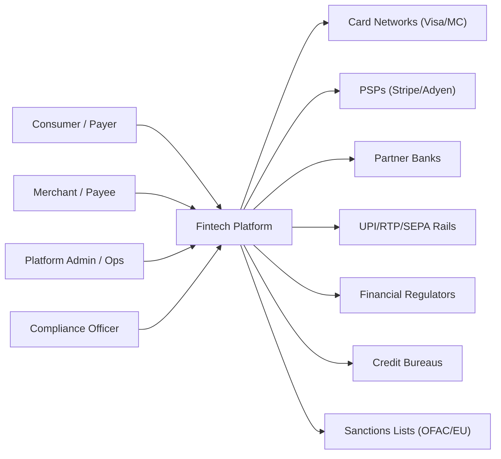

---

## Core Workflows

### Happy Path: Card Payment Authorization

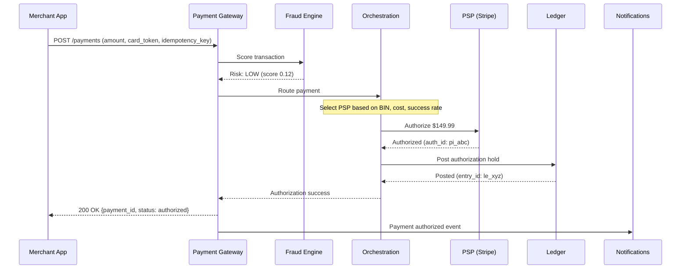

### Happy Path: Wallet Transfer

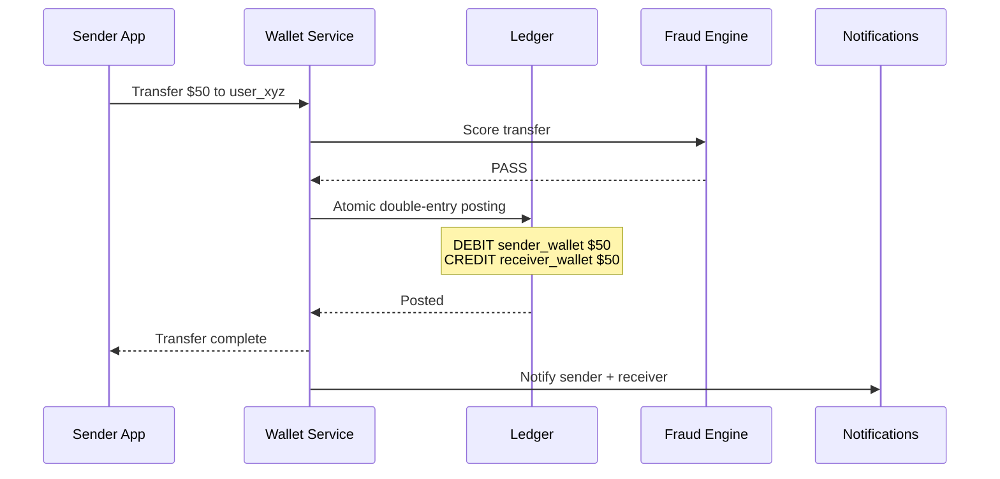

---

## Workload Characterization

| Metric | Steady State | Peak | Notes |
|--------|-------------|------|-------|
| Transactions/day | 5M | 50M | 10x during Black Friday |
| Authorization TPS | 60 | 600 | Burst to 1000+ during flash sales |
| Fraud scoring TPS | 60 | 600 | Must match authorization rate |
| Wallet transfers/day | 2M | 10M | P2P transfers spike on weekends |
| Reconciliation items/day | 5M | 50M | Matches transaction volume |
| Ledger postings/day | 15M | 150M | ~3 postings per transaction (auth, capture, fee) |
| Read:Write ratio (ledger) | 10:1 | 5:1 | Heavy writes during settlement; heavy reads for dashboards |
| Average transaction value | $45 | $35 | Lower AOV during peak (more small purchases) |

## Capacity Estimation

**Storage:**
- Transactions: 5M/day x 2KB x 365 = **3.7 TB/year** (7-year retention = 26 TB)
- Ledger entries: 15M/day x 500B x 365 = **2.7 TB/year**
- Wallet accounts: 10M x 1KB = **10 GB** (small but critical)
- Audit logs: 50M events/day x 1KB = **18 TB/year**
- Fraud feature store: **500 GB** (pre-computed features for 100M+ entities)

**Compute:**
- Payment gateway: 600 peak TPS x 50ms CPU = 30 cores
- Fraud scoring: 600 peak TPS x 20ms CPU = 12 cores (GPU for ML inference)
- Ledger posting: 1,800 peak TPS x 5ms = 9 cores (but I/O bound)
- Reconciliation: batch job, 16 cores for 2-hour nightly window

**Database:**
- Ledger: PostgreSQL with synchronous replication, 3 nodes, ~30 TB total
- Transactions: PostgreSQL partitioned by month, ~30 TB total (7 years)
- Wallet balances: PostgreSQL with row-level locking, ~50 GB
- Fraud features: Redis Cluster, ~500 GB memory
- Audit log: Append-only store (PostgreSQL or immutable S3 + Athena)

---

## High-Level Architecture

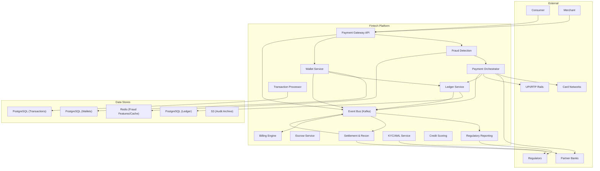

---

## Low-Level Design

### 1. Payment Gateway

#### Overview

The Payment Gateway is the **API entry point** for all payment operations. It receives payment requests from merchants or internal services, performs initial validation, invokes fraud scoring, routes to the appropriate payment processor, and returns a synchronous result to the caller.

At Stripe, the payment gateway handles over 1,000 payment intents per second. At Adyen, it processes payments across 250+ payment methods in 200+ countries.

The gateway does **not** hold money or maintain balances — it is a stateless routing layer that delegates to the ledger for financial record-keeping and to PSPs for actual money movement.

#### Payment Lifecycle State Machine

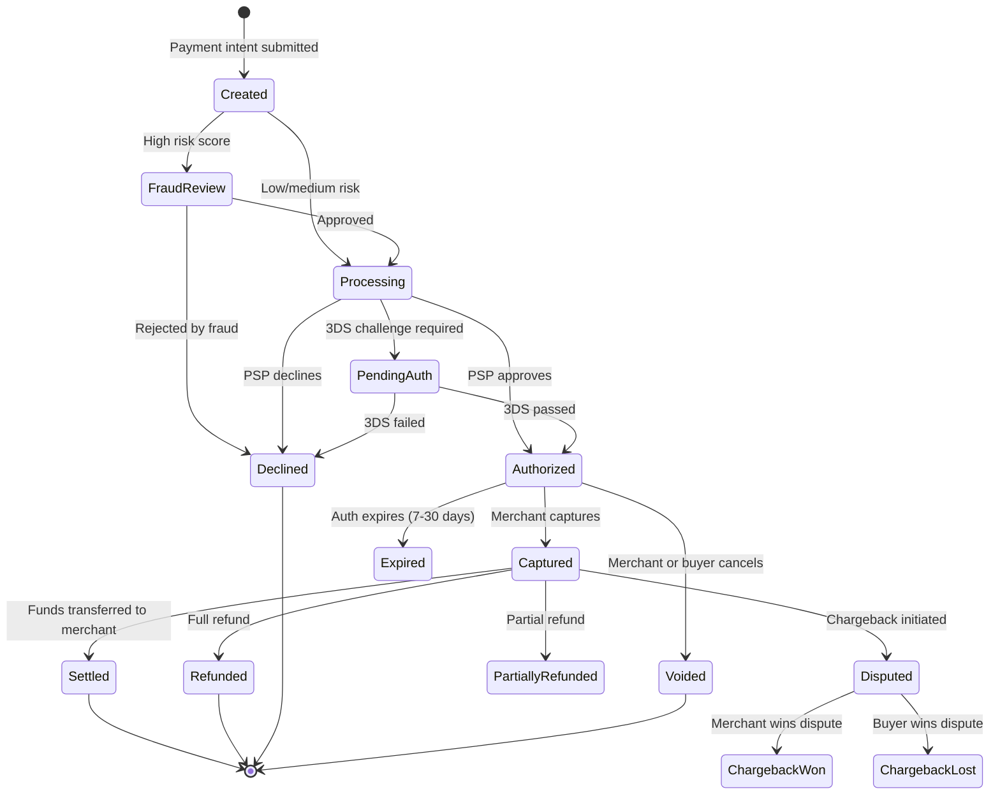

#### Data Model

```sql
CREATE TABLE payments (
    payment_id      UUID PRIMARY KEY DEFAULT gen_random_uuid(),
    merchant_id     UUID NOT NULL,
    customer_id     UUID,
    amount          DECIMAL(16,2) NOT NULL CHECK (amount > 0),
    currency        TEXT NOT NULL,
    status          TEXT NOT NULL DEFAULT 'created'
                    CHECK (status IN ('created', 'fraud_review', 'processing',
                    'pending_auth', 'authorized', 'captured', 'settled',
                    'voided', 'refunded', 'partially_refunded',
                    'declined', 'disputed', 'chargeback_won', 'chargeback_lost', 'expired')),
    payment_method  JSONB NOT NULL,            -- {type: "card", token: "tok_xxx"}
    psp_id          TEXT,                      -- which PSP processed it
    psp_reference   TEXT,                      -- PSP's transaction ID
    auth_code       TEXT,
    decline_reason  TEXT,
    fraud_score     DECIMAL(5,4),
    three_ds_status TEXT,
    capture_amount  DECIMAL(16,2),
    refunded_amount DECIMAL(16,2) DEFAULT 0,
    metadata        JSONB DEFAULT '{}',
    idempotency_key TEXT UNIQUE NOT NULL,
    ip_address      INET,
    created_at      TIMESTAMPTZ NOT NULL DEFAULT now(),
    updated_at      TIMESTAMPTZ NOT NULL DEFAULT now(),
    version         INT NOT NULL DEFAULT 1
);

CREATE TABLE payment_events (
    event_id        UUID PRIMARY KEY DEFAULT gen_random_uuid(),
    payment_id      UUID NOT NULL REFERENCES payments(payment_id),
    event_type      TEXT NOT NULL,
    payload         JSONB NOT NULL,
    actor           TEXT NOT NULL,              -- 'system', 'merchant', 'psp', 'buyer'
    created_at      TIMESTAMPTZ NOT NULL DEFAULT now()
);

CREATE INDEX idx_payments_merchant ON payments(merchant_id, created_at DESC);
CREATE INDEX idx_payments_status ON payments(status);
CREATE INDEX idx_payments_psp_ref ON payments(psp_reference);
CREATE INDEX idx_payment_events ON payment_events(payment_id, created_at);
```

#### API

```
POST   /api/v1/payments                        # Create payment intent
POST   /api/v1/payments/{id}/capture            # Capture authorized payment
POST   /api/v1/payments/{id}/void               # Void authorization
POST   /api/v1/payments/{id}/refund             # Full or partial refund
GET    /api/v1/payments/{id}                    # Get payment status
GET    /api/v1/payments?merchant_id={id}&status={s}  # List payments

# Webhook callbacks from PSPs
POST   /webhooks/stripe
POST   /webhooks/adyen
POST   /webhooks/razorpay
```

#### Edge Cases

| Scenario | Handling |
|----------|---------|
| **PSP timeout during authorization** | Return `processing` status; poll PSP asynchronously; resolve via webhook |
| **Double-submit (same idempotency key)** | Return cached result from first attempt |
| **Card declined** | Return decline reason (insufficient funds, expired, etc.); do NOT retry automatically |
| **3DS challenge required** | Return redirect URL; buyer completes challenge; webhook confirms result |
| **Authorization expires** | Nightly job checks auth age; marks expired; notifies merchant |
| **Partial capture** | Allowed for some PSPs; capture amount <= auth amount; remainder voided |

---

### 2. Payment Orchestration Layer

#### Overview

The Payment Orchestration Layer sits between the gateway and PSPs, making intelligent routing decisions. It determines which PSP should process each payment based on cost, success rate, availability, card BIN, currency, and geographic rules.

At scale, the orchestration layer can improve authorization rates by 3-5% (worth millions in recovered revenue) through smart routing and automatic failover.

#### Routing Logic

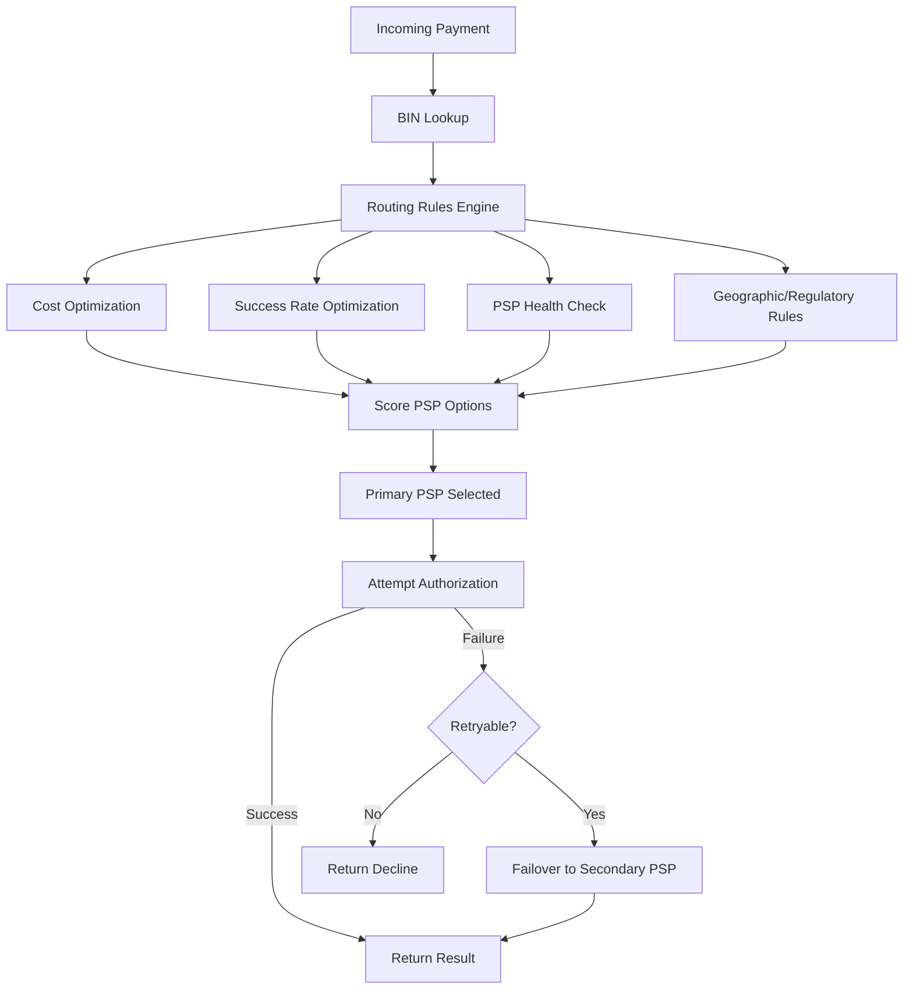

#### Routing Rules

| Rule | Example | Decision |
|------|---------|---------|
| **BIN-based** | Visa cards from US banks | Route to Stripe (lower interchange) |
| **Currency-based** | INR transactions | Route to Razorpay (local acquirer) |
| **Amount-based** | Transactions > $10K | Route to Adyen (higher limits) |
| **Success-rate-based** | PSP A declining 15% of Amex | Shift Amex to PSP B |
| **Cost-based** | PSP A charges 2.9% + $0.30 vs PSP B at 2.5% + $0.25 | Route to PSP B for large transactions |
| **Regulatory** | EU transactions require SCA | Route to PSP supporting 3DS2 |
| **Failover** | PSP A circuit breaker open | All traffic to PSP B |

#### Smart Retry Logic

Not all declines should be retried, and not all retries should go to the same PSP:

| Decline Reason | Retry? | Strategy |
|---------------|--------|---------|
| Insufficient funds | No | Return to buyer |
| Expired card | No | Ask buyer for new card |
| Processor unavailable (5xx) | Yes | Retry with same PSP after 2s backoff |
| Generic decline | Yes (once) | Try different PSP — may be issuer-specific |
| Fraud block by PSP | No | Accept decline; flag for review |
| Rate limited | Yes | Retry after backoff period |

---

### 3. Wallet System (Stored Value)

#### Overview

The Wallet System manages **stored-value accounts** where users can hold money, transfer to other users, pay merchants, and withdraw to bank accounts. Unlike card payments (which move money between banks), wallet transactions move balances within the platform's own ledger — making them faster but requiring the platform to hold and safeguard customer funds.

Regulatory requirement: in most jurisdictions, holding customer funds requires a **payment institution license** (e-money license in EU, PPI license in India, money transmitter license in US states).

At PayPal, wallet balances total over $35 billion. At Paytm, over 300 million wallets process 2 billion transactions per month.

#### Wallet Operations

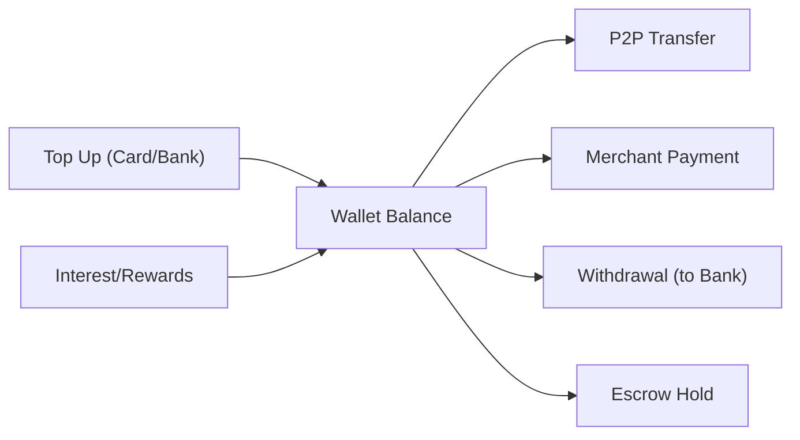

#### Data Model

```sql
CREATE TABLE wallets (
    wallet_id       UUID PRIMARY KEY DEFAULT gen_random_uuid(),
    user_id         UUID UNIQUE NOT NULL,
    currency        TEXT NOT NULL DEFAULT 'USD',
    balance         DECIMAL(16,2) NOT NULL DEFAULT 0 CHECK (balance >= 0),
    available_balance DECIMAL(16,2) NOT NULL DEFAULT 0 CHECK (available_balance >= 0),
    held_balance    DECIMAL(16,2) GENERATED ALWAYS AS (balance - available_balance) STORED,
    status          TEXT DEFAULT 'active' CHECK (status IN ('active', 'frozen', 'closed')),
    daily_limit     DECIMAL(16,2) DEFAULT 10000,
    monthly_limit   DECIMAL(16,2) DEFAULT 50000,
    kyc_level       TEXT DEFAULT 'basic' CHECK (kyc_level IN ('basic', 'standard', 'enhanced')),
    version         INT NOT NULL DEFAULT 1,
    created_at      TIMESTAMPTZ NOT NULL DEFAULT now(),
    updated_at      TIMESTAMPTZ NOT NULL DEFAULT now()
);

CREATE TABLE wallet_transactions (
    txn_id          UUID PRIMARY KEY DEFAULT gen_random_uuid(),
    wallet_id       UUID NOT NULL REFERENCES wallets(wallet_id),
    type            TEXT NOT NULL CHECK (type IN (
        'top_up', 'p2p_send', 'p2p_receive', 'merchant_payment',
        'withdrawal', 'refund', 'escrow_hold', 'escrow_release',
        'fee', 'interest', 'adjustment', 'reversal'
    )),
    amount          DECIMAL(16,2) NOT NULL,
    direction       TEXT NOT NULL CHECK (direction IN ('credit', 'debit')),
    balance_after   DECIMAL(16,2) NOT NULL,
    counterparty_wallet_id UUID,
    reference_id    UUID,                      -- payment_id, escrow_id, etc.
    idempotency_key TEXT UNIQUE NOT NULL,
    status          TEXT DEFAULT 'completed',
    description     TEXT,
    created_at      TIMESTAMPTZ NOT NULL DEFAULT now()
);

CREATE INDEX idx_wallet_user ON wallets(user_id);
CREATE INDEX idx_wallet_txn_wallet ON wallet_transactions(wallet_id, created_at DESC);
```

#### P2P Transfer — Atomic Double-Entry

```sql
-- Atomic transfer within a single transaction
BEGIN;

-- Lock both wallets in consistent order (lower wallet_id first) to prevent deadlock
SELECT * FROM wallets WHERE wallet_id IN ($sender_id, $receiver_id)
    ORDER BY wallet_id FOR UPDATE;

-- Validate sender balance
-- Debit sender
UPDATE wallets SET
    balance = balance - $amount,
    available_balance = available_balance - $amount,
    version = version + 1
WHERE wallet_id = $sender_id AND available_balance >= $amount;

-- Credit receiver
UPDATE wallets SET
    balance = balance + $amount,
    available_balance = available_balance + $amount,
    version = version + 1
WHERE wallet_id = $receiver_id;

-- Record both sides
INSERT INTO wallet_transactions (wallet_id, type, amount, direction, balance_after, counterparty_wallet_id, idempotency_key)
VALUES ($sender_id, 'p2p_send', $amount, 'debit', $new_sender_balance, $receiver_id, $idem_key_send);

INSERT INTO wallet_transactions (wallet_id, type, amount, direction, balance_after, counterparty_wallet_id, idempotency_key)
VALUES ($receiver_id, 'p2p_receive', $amount, 'credit', $new_receiver_balance, $sender_id, $idem_key_recv);

COMMIT;
```

#### Edge Cases

- **Insufficient balance during concurrent transactions**: `FOR UPDATE` row lock prevents race conditions. Second transaction sees updated balance and fails gracefully.
- **Wallet frozen during investigation**: All debits blocked; credits still accepted (e.g., refunds). User notified. Compliance review resolves.
- **Daily/monthly limit exceeded**: Transaction rejected with clear error. Limits configurable per KYC level.
- **Top-up fails after balance credited**: If bank reverses the top-up (chargeback), debit the wallet. If wallet balance insufficient, create negative balance (flagged for collections).

---

### 4. UPI / Instant Transfer System

#### Overview

UPI (Unified Payments Interface) and similar real-time payment rails (RTP in US, FPS in UK, PIX in Brazil) enable **instant bank-to-bank transfers** without card networks. These systems process payments in seconds with irrevocable settlement — once the money moves, it cannot be reversed by the system (only by a separate refund flow).

India's UPI processes over **10 billion transactions per month** across 300+ banks. Brazil's PIX processes 3 billion transactions per month. These systems are becoming the dominant payment method in their markets.

#### UPI Payment Flow

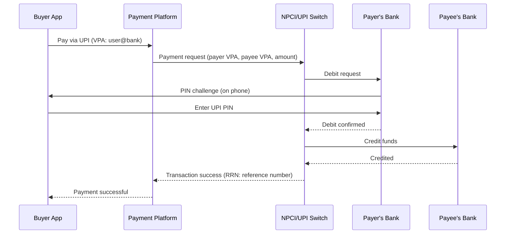

#### Key Design Challenges

| Challenge | Solution |
|-----------|----------|
| **Irrevocable settlement** | Once UPI confirms success, money has moved. No void/cancel. Refunds must be separate transactions. |
| **Timeout ambiguity** | UPI response timeout (30s). If no response, status is UNKNOWN. Must poll UPI for resolution. |
| **Duplicate transactions** | UPI provides a unique transaction reference (RRN). Use as idempotency key. |
| **Bank downtime** | Individual banks go down frequently. Display bank availability status to users. |
| **Mandate (recurring)** | UPI supports auto-debit mandates for subscriptions. Separate registration flow. |

---

### 5. Bank Transfer System

#### Overview

The Bank Transfer System handles traditional (non-instant) money movement: ACH in the US, SEPA in Europe, and SWIFT for international wires. Unlike instant transfers, these are **batch-processed** with settlement times from same-day to T+3.

Used for: payroll, vendor payments, marketplace seller settlement, large B2B transfers, and international remittances.

#### ACH Processing Flow

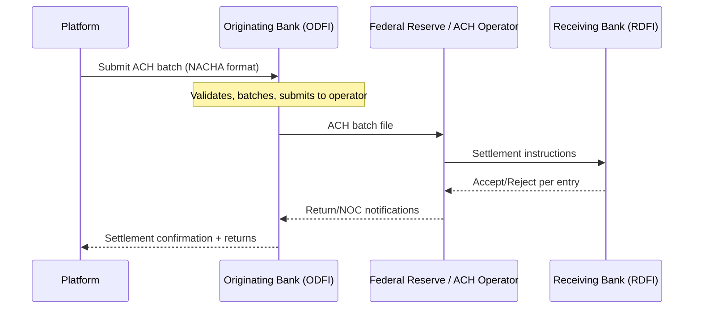

#### Data Model

```sql
CREATE TABLE bank_transfers (
    transfer_id     UUID PRIMARY KEY,
    direction       TEXT NOT NULL CHECK (direction IN ('inbound', 'outbound')),
    rail            TEXT NOT NULL CHECK (rail IN ('ach', 'sepa', 'swift', 'fps', 'wire')),
    amount          DECIMAL(16,2) NOT NULL,
    currency        TEXT NOT NULL,
    sender_account  JSONB NOT NULL,            -- {routing: "021000021", account: "****1234"}
    receiver_account JSONB NOT NULL,
    status          TEXT DEFAULT 'pending'
                    CHECK (status IN ('pending', 'submitted', 'processing',
                    'settled', 'returned', 'failed', 'cancelled')),
    batch_id        UUID,                      -- ACH batch reference
    trace_number    TEXT,                      -- ACH trace number
    return_code     TEXT,                      -- R01, R02, etc. for ACH returns
    settlement_date DATE,
    idempotency_key TEXT UNIQUE NOT NULL,
    created_at      TIMESTAMPTZ NOT NULL DEFAULT now()
);
```

#### ACH Return Codes (Common)

| Code | Meaning | Action |
|------|---------|--------|
| R01 | Insufficient funds | Debit wallet/ledger; notify sender |
| R02 | Account closed | Update account status; notify user |
| R03 | No account / unable to locate | Verify account details with user |
| R10 | Customer advises not authorized | Investigate; potential fraud |
| R29 | Corporate customer advises not authorized | B2B specific; investigate |

---

### 6. Ledger System (Double-Entry)

#### Overview

The Ledger is the **single source of truth** for all money in the system. Every financial operation — payment, refund, fee, settlement, wallet transfer — is recorded as a set of double-entry postings where **total debits always equal total credits**. If the ledger doesn't balance, the system has a bug, and money is either lost or created from nothing.

At Stripe, the ledger processes hundreds of millions of entries per day. At Square, the ledger underpins both the payment processing and the Cash App wallet.

The ledger is the most **correctness-critical service** in any fintech system. It must be:
- **Strongly consistent** — no eventual consistency; every posting is atomic
- **Tamper-evident** — entries can never be deleted or modified; only new correcting entries added
- **Balanced** — sum of all debits = sum of all credits at all times
- **Auditable** — every entry traceable to a source event with full context

#### Double-Entry Model

```sql
-- Accounts (chart of accounts)
CREATE TABLE ledger_accounts (
    account_id      UUID PRIMARY KEY,
    account_code    TEXT UNIQUE NOT NULL,      -- "ASSETS:CASH:STRIPE"
    name            TEXT NOT NULL,
    type            TEXT NOT NULL CHECK (type IN (
        'asset', 'liability', 'equity', 'revenue', 'expense'
    )),
    currency        TEXT NOT NULL,
    normal_balance  TEXT NOT NULL CHECK (normal_balance IN ('debit', 'credit')),
    is_active       BOOLEAN DEFAULT true,
    parent_account_id UUID REFERENCES ledger_accounts(account_id)
);

-- Journal entries (groups of postings)
CREATE TABLE journal_entries (
    entry_id        UUID PRIMARY KEY DEFAULT gen_random_uuid(),
    description     TEXT NOT NULL,
    reference_type  TEXT NOT NULL,              -- 'payment', 'refund', 'settlement', 'fee'
    reference_id    UUID NOT NULL,             -- payment_id, refund_id, etc.
    effective_date  DATE NOT NULL,
    status          TEXT DEFAULT 'posted' CHECK (status IN ('posted', 'pending', 'reversed')),
    idempotency_key TEXT UNIQUE NOT NULL,
    created_by      TEXT NOT NULL,
    created_at      TIMESTAMPTZ NOT NULL DEFAULT now()
);

-- Individual postings (always in balanced pairs)
CREATE TABLE ledger_postings (
    posting_id      UUID PRIMARY KEY DEFAULT gen_random_uuid(),
    entry_id        UUID NOT NULL REFERENCES journal_entries(entry_id),
    account_id      UUID NOT NULL REFERENCES ledger_accounts(account_id),
    amount          DECIMAL(16,2) NOT NULL CHECK (amount > 0),
    direction       TEXT NOT NULL CHECK (direction IN ('debit', 'credit')),
    currency        TEXT NOT NULL,
    balance_after   DECIMAL(16,2) NOT NULL,    -- running balance for this account
    created_at      TIMESTAMPTZ NOT NULL DEFAULT now()
);

-- Enforce balanced entries via trigger or application-level check
-- SUM(debits) must equal SUM(credits) for every journal_entry

CREATE INDEX idx_postings_account ON ledger_postings(account_id, created_at);
CREATE INDEX idx_postings_entry ON ledger_postings(entry_id);
CREATE INDEX idx_entries_reference ON journal_entries(reference_type, reference_id);
```

#### Example: Card Payment Authorization + Capture + Settlement

```
1. AUTHORIZATION (hold funds):
   DEBIT  ASSETS:RECEIVABLE:PSP_STRIPE     $149.99
   CREDIT LIABILITIES:MERCHANT:ACME_CORP   $149.99

2. CAPTURE (confirm charge):
   No new posting needed — authorization becomes capture

3. SETTLEMENT (PSP sends funds to our bank):
   DEBIT  ASSETS:CASH:BANK_OF_AMERICA      $145.64  (net of PSP fee)
   CREDIT ASSETS:RECEIVABLE:PSP_STRIPE     $149.99
   DEBIT  EXPENSE:PSP_FEES                 $4.35

4. MERCHANT PAYOUT:
   DEBIT  LIABILITIES:MERCHANT:ACME_CORP   $142.49  (net of platform commission)
   CREDIT ASSETS:CASH:BANK_OF_AMERICA      $142.49
   DEBIT  LIABILITIES:MERCHANT:ACME_CORP   $7.50   (commission earned)
   CREDIT REVENUE:COMMISSION                $7.50
```

#### Balance Invariant Check

```sql
-- This query must ALWAYS return zero for every currency
SELECT currency,
       SUM(CASE WHEN direction = 'debit' THEN amount ELSE 0 END) -
       SUM(CASE WHEN direction = 'credit' THEN amount ELSE 0 END) AS imbalance
FROM ledger_postings
GROUP BY currency;
```

Run as a **continuous health check**. Any non-zero result triggers a P0 alert.

---

### 7. Transaction Processing System

#### Overview

The Transaction Processing System is the **engine** that validates, enriches, and posts financial transactions. It sits between the payment gateway (which handles the merchant-facing API) and the ledger (which records the entries). It enforces business rules, applies fees, handles currency conversion, and ensures transactions are processed exactly once.

#### Processing Pipeline

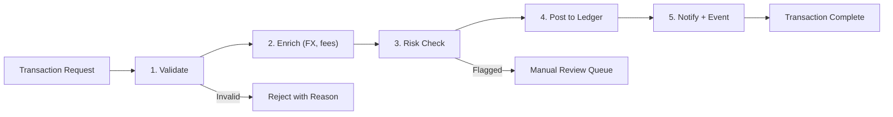

#### FX Conversion

For cross-currency transactions:
```
buyer_amount = 100 EUR
fx_rate = 1.0850 (EUR/USD, locked at transaction time)
merchant_amount = 100 * 1.0850 = 108.50 USD
fx_markup = 0.5% = 0.54 USD
net_merchant_amount = 107.96 USD
```

FX rates are fetched from a rate provider (Currencycloud, Wise) and cached for 30 seconds. A rate lock is applied when the buyer confirms the transaction.

---

### 8. Settlement & Reconciliation System

#### Overview

Settlement is the process of **actually moving money** between the platform, PSPs, banks, and merchants. Reconciliation is the process of **verifying** that internal records match external records. Together, they ensure no money is lost, duplicated, or misattributed.

#### Settlement Flow

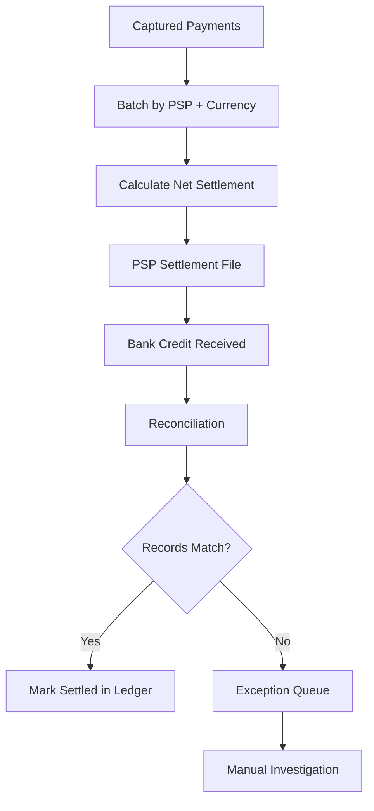

#### Reconciliation Types

| Type | Frequency | What It Compares |
|------|-----------|-----------------|
| **Transaction-level** | Daily | Each payment in our system vs. PSP transaction report |
| **Settlement-level** | Daily | Expected settlement amount vs. actual bank credit |
| **Balance-level** | Hourly | Ledger cash account balance vs. bank account balance |
| **Fee reconciliation** | Monthly | PSP fee statements vs. our recorded fees |

#### Common Discrepancies

| Discrepancy | Cause | Resolution |
|-------------|-------|-----------|
| Payment in our system, not in PSP report | PSP processing delay or our error | Wait 24h; if still missing, investigate |
| Payment in PSP report, not in our system | Webhook missed or processing failure | Replay from PSP report; investigate gap |
| Amount mismatch | FX rate difference, fee miscalculation | Adjust with correction journal entry |
| Duplicate payment | Idempotency failure | Reverse one payment; refund if captured |

---

### 9. Escrow System

#### Overview

The Escrow System holds funds in a **neutral account** until predefined conditions are met. It is used in marketplaces (hold buyer's payment until seller ships), freelance platforms (hold until work is approved), and real estate (hold deposit until closing).

#### Escrow State Machine

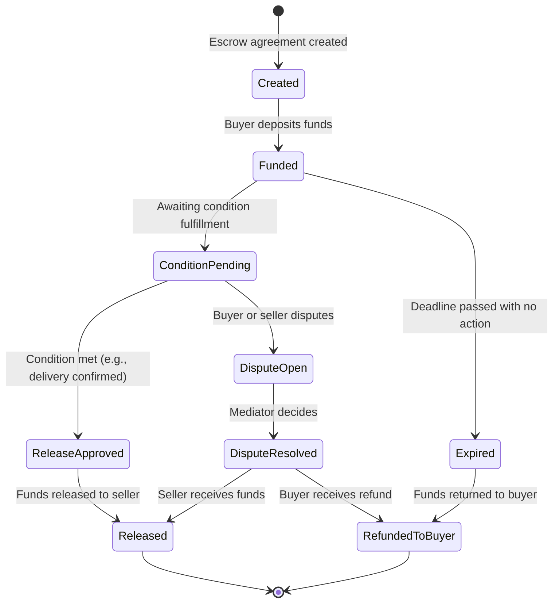

#### Data Model

```sql
CREATE TABLE escrows (
    escrow_id       UUID PRIMARY KEY,
    buyer_id        UUID NOT NULL,
    seller_id       UUID NOT NULL,
    amount          DECIMAL(16,2) NOT NULL,
    currency        TEXT NOT NULL,
    status          TEXT NOT NULL DEFAULT 'created',
    conditions      JSONB NOT NULL,            -- {"type": "delivery_confirmed", "order_id": "ord_123"}
    release_deadline TIMESTAMPTZ,
    funded_at       TIMESTAMPTZ,
    released_at     TIMESTAMPTZ,
    dispute_id      UUID,
    idempotency_key TEXT UNIQUE NOT NULL,
    created_at      TIMESTAMPTZ NOT NULL DEFAULT now()
);
```

#### Ledger Entries for Escrow

```
1. FUND ESCROW:
   DEBIT  LIABILITIES:BUYER_WALLET:user_xyz    $500
   CREDIT LIABILITIES:ESCROW:escrow_123        $500

2. RELEASE TO SELLER:
   DEBIT  LIABILITIES:ESCROW:escrow_123        $500
   CREDIT LIABILITIES:SELLER_WALLET:sel_abc    $485  (net of fee)
   CREDIT REVENUE:ESCROW_FEE                   $15
```

---

### 10. Billing & Invoicing System

#### Overview

The Billing & Invoicing System handles **recurring payments, metered billing, and invoice generation** for SaaS subscriptions, utility billing, and B2B payment terms. It manages billing cycles, proration, tax calculation, payment collection, and dunning (failed payment recovery).

#### Billing Lifecycle

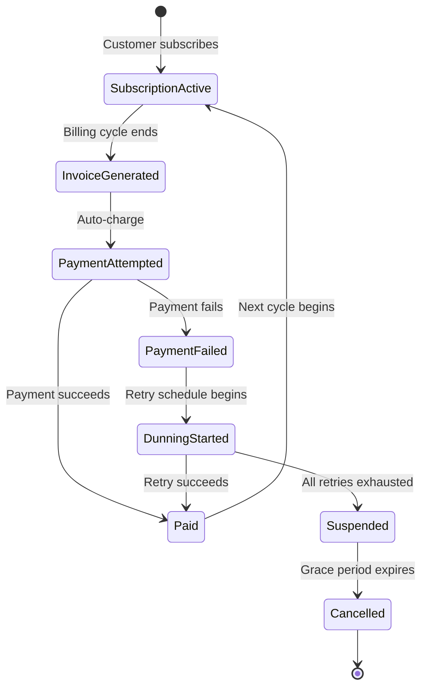

#### Dunning Strategy

| Attempt | Timing | Action |
|---------|--------|--------|
| 1 | Day 0 (billing date) | Auto-charge saved payment method |
| 2 | Day 3 | Retry + email: "Payment failed, updating your card?" |
| 3 | Day 7 | Retry + email: "Action required — subscription at risk" |
| 4 | Day 14 | Final retry + email: "Last attempt before suspension" |
| — | Day 21 | Suspend account. "Your subscription has been paused." |
| — | Day 30 | Cancel subscription. Data retained for 90 days. |

---

### 11. Fraud Detection System

#### Overview

The Fraud Detection System evaluates every transaction in real-time for fraud risk, using a combination of rules, velocity checks, device fingerprinting, and ML models. It must make a decision in **< 100ms** inline with the payment flow, while a separate batch pipeline runs deeper analysis for pattern detection.

Global card fraud losses exceed **$30 billion per year**. Effective fraud detection prevents 2-5% of transaction volume from becoming losses.

#### Architecture

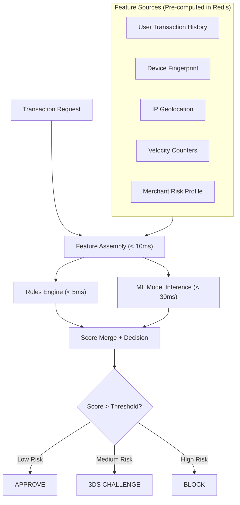

#### Feature Examples

| Feature | Type | Window | Example |
|---------|------|--------|---------|
| `txn_count_1h` | Velocity | 1 hour | Number of transactions from this card in last hour |
| `txn_amount_24h` | Velocity | 24 hours | Total amount from this user in last 24 hours |
| `device_first_seen_days` | Device | Lifetime | How long ago this device was first seen |
| `ip_country_mismatch` | Geolocation | Real-time | Card issuer country != IP country |
| `merchant_chargeback_rate` | Merchant | 30 days | Merchant's recent chargeback rate |
| `card_bin_fraud_rate` | Network | 30 days | Fraud rate for this BIN range |
| `time_since_last_txn_seconds` | Velocity | Real-time | Suspiciously rapid transactions |

#### ML Model

- **Model type**: Gradient Boosted Trees (XGBoost/LightGBM) — fast inference, interpretable
- **Training data**: Historical transactions labeled as fraud/non-fraud (from chargebacks and manual reviews)
- **Retraining**: Weekly with sliding 90-day window
- **Feature count**: 200-500 features per transaction
- **Inference latency**: < 30ms p99 (model served via ONNX Runtime or custom C++ server)
- **Threshold tuning**: Balance false positive rate (blocking legitimate transactions) vs. false negative rate (allowing fraud)

---

### 12. KYC/AML System

#### Overview

The KYC/AML System verifies customer identity (Know Your Customer) and monitors transactions for money laundering and sanctions violations (Anti-Money Laundering). This is a **regulatory requirement** in every jurisdiction where financial services operate.

#### KYC Tiers

| Tier | Requirements | Limits | Use Case |
|------|-------------|--------|----------|
| **Basic** | Email + phone verified | $1,000/month | Casual P2P transfers |
| **Standard** | Government ID + selfie verified | $10,000/month | Regular users |
| **Enhanced** | ID + address proof + income verification | $100,000/month | High-value users |
| **Corporate** | Business registration + beneficial owners + directors | $1M/month | Business accounts |

#### KYC Verification Flow

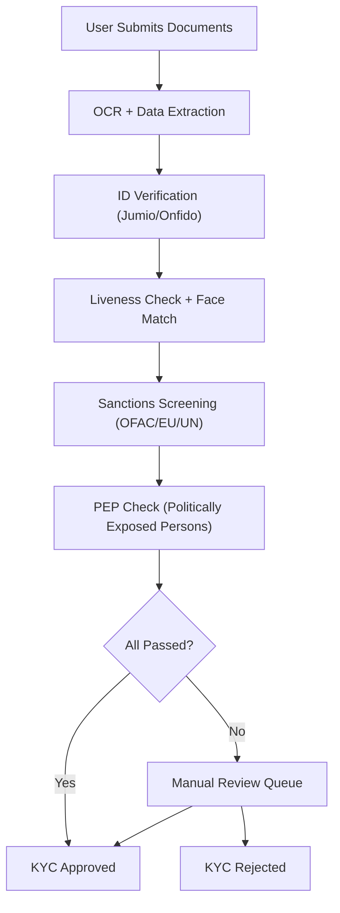

#### Ongoing Monitoring (AML)

After onboarding, transactions are continuously monitored for suspicious patterns:

| Pattern | Detection | Action |
|---------|-----------|--------|
| **Structuring** | Multiple transactions just below reporting threshold ($10K) | File SAR |
| **Rapid movement** | Funds received and immediately withdrawn | Flag + review |
| **Unusual geography** | Transactions from sanctioned countries | Block + review |
| **Round-trip** | Money sent to entity that sends it back | Flag for layering |
| **Dormant account activity** | Account inactive for 1 year, suddenly active | Enhanced review |

---

### 13. Credit Scoring System

#### Overview

The Credit Scoring System assesses the creditworthiness of borrowers for lending products: personal loans, BNPL (Buy Now Pay Later), merchant cash advances, and credit lines. It combines traditional credit bureau data with alternative data sources to produce a risk score.

#### Scoring Pipeline

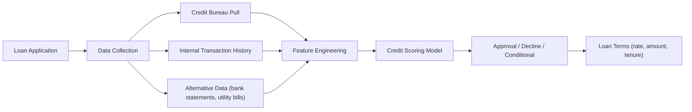

#### Data Sources

| Source | Data | Weight |
|--------|------|--------|
| **Credit Bureau** (Experian, TransUnion) | Credit history, existing debt, payment history | High |
| **Internal transaction history** | Payment patterns, wallet usage, merchant payments | Medium |
| **Bank statement analysis** | Income, spending patterns, account balances | Medium |
| **Alternative data** | Utility bill payments, rent payments, employment data | Low-Medium |
| **Device and behavioral** | App usage patterns, session data | Low (supplementary) |

#### Risk Tiers

| Tier | Score Range | APR | Max Amount | Approval Rate |
|------|------------|-----|-----------|---------------|
| Prime | 750-850 | 8-12% | $50,000 | 90% |
| Near-prime | 650-749 | 15-22% | $20,000 | 60% |
| Subprime | 550-649 | 25-36% | $5,000 | 30% |
| Decline | < 550 | N/A | N/A | 0% |

---

### 14. Regulatory Reporting System

#### Overview

The Regulatory Reporting System generates and files reports required by financial regulators. This is not optional — failure to file results in fines, license revocation, and criminal liability.

#### Required Reports

| Report | Jurisdiction | Frequency | Trigger |
|--------|-------------|-----------|---------|
| **SAR** (Suspicious Activity Report) | US (FinCEN) | Event-driven | Suspicious transaction detected |
| **CTR** (Currency Transaction Report) | US (FinCEN) | Event-driven | Cash transaction > $10,000 |
| **PSD2 Reporting** | EU | Quarterly | Transaction volumes, fraud rates |
| **SOX Compliance** | US | Annual | Financial controls attestation |
| **GDPR Data Access** | EU | On-request | User requests their data |
| **RBI Reporting** | India | Monthly | Payment volumes, wallet balances |

---

### 15. High-Frequency Trading Platform

#### Overview

An HFT platform matches buy and sell orders for financial instruments (stocks, forex, derivatives) with **microsecond latency**. The core component is the **matching engine** — a deterministic, single-threaded engine that processes orders sequentially and produces a market data feed.

This is the most latency-sensitive system in all of software engineering. Every microsecond of advantage translates directly to profit.

#### Matching Engine Architecture

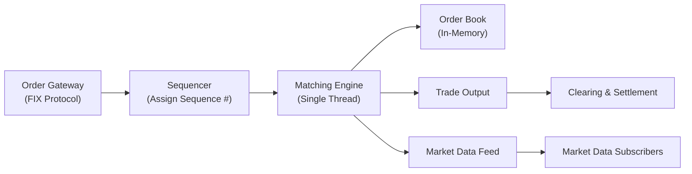

#### Order Book Data Structure

```
Buy Side (Bids):              Sell Side (Asks):
Price   | Qty | Orders        Price   | Qty | Orders
--------|-----|--------        --------|-----|--------
$150.05 | 500 | 3             $150.10 | 200 | 2
$150.00 | 800 | 5             $150.15 | 350 | 4
$149.95 | 300 | 2             $150.20 | 600 | 3
```

**Matching rule**: Price-time priority. Best bid matches with best ask. Within same price, earliest order fills first.

#### Latency Requirements

| Component | Target Latency |
|-----------|---------------|
| Order ingestion (network to engine) | < 10 microseconds |
| Matching engine (order to trade) | < 5 microseconds |
| Market data dissemination | < 50 microseconds |
| End-to-end (order to confirmation) | < 100 microseconds |

**Implementation choices for ultra-low latency:**
- Single-threaded matching engine (no lock contention)
- Kernel bypass networking (DPDK, Solarflare OpenOnload)
- Pre-allocated memory (no GC, no malloc in hot path)
- Lock-free ring buffers for inter-thread communication
- FPGA for order parsing and market data encoding
- Co-located servers in exchange data center

---

### 16. Crypto Exchange System

#### Overview

A Crypto Exchange enables trading of digital assets (Bitcoin, Ethereum, stablecoins) with fiat and crypto pairs. It combines traditional exchange architecture (order book, matching engine) with blockchain-specific components (hot/cold wallets, on-chain settlement, mempool monitoring).

#### Architecture

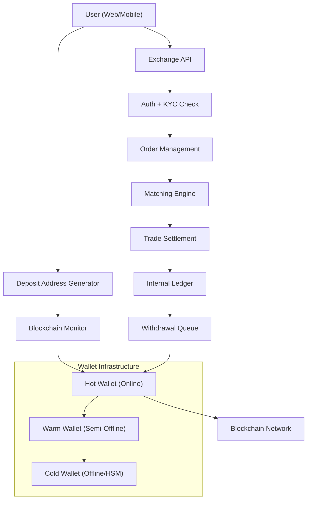

#### Hot/Warm/Cold Wallet Strategy

| Wallet Type | Connectivity | Holds | Use |
|-------------|-------------|-------|-----|
| **Hot** | Online, API-accessible | 2-5% of total assets | User withdrawals, real-time |
| **Warm** | Semi-online, requires manual approval | 10-20% of assets | Refill hot wallet periodically |
| **Cold** | Air-gapped, HSM-secured | 75-85% of assets | Long-term storage |

**Security principle**: If the hot wallet is compromised, maximum loss is 5% of total assets. Cold wallet keys never touch an internet-connected device.

#### Blockchain Confirmation Requirements

| Asset | Confirmations Required | Time |
|-------|----------------------|------|
| Bitcoin | 3 confirmations | ~30 minutes |
| Ethereum | 12 confirmations | ~3 minutes |
| Stablecoins (USDC) | 12 confirmations | ~3 minutes |
| Solana | 32 confirmations | ~15 seconds |

---

### 17. Digital Banking Backend

#### Overview

A Digital Banking Backend provides full neobank functionality: account management, card issuance, transfers, lending, and savings products. Companies like Nubank, Revolut, Chime, and N26 are built on this architecture.

#### Core Services

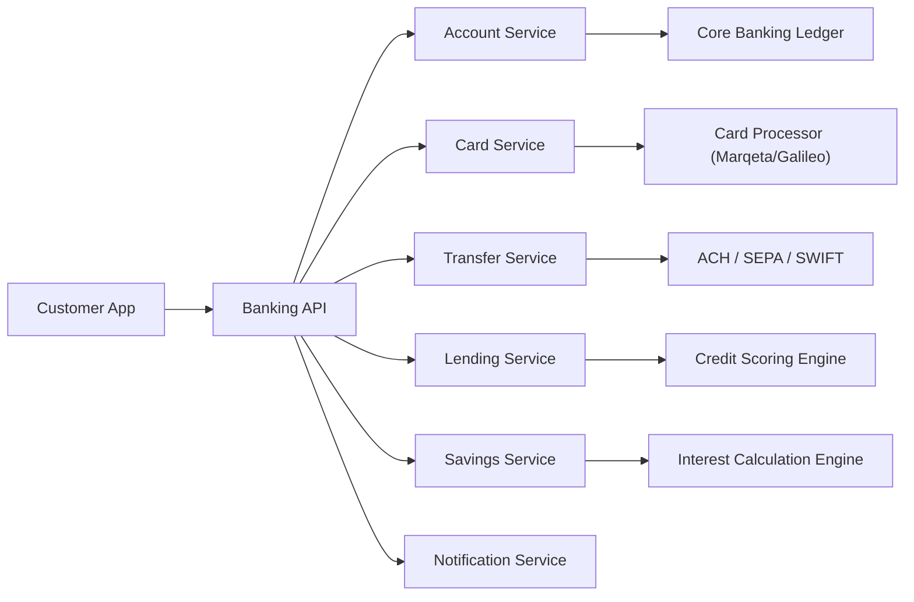

#### Account Types

| Type | Features | Interest | FDIC/Deposit Insurance |
|------|---------|---------|----------------------|
| **Checking** | Debit card, direct deposit, bill pay | 0-1% | Yes (via partner bank) |
| **Savings** | Higher interest, limited withdrawals | 3-5% | Yes |
| **Investment** | Brokerage, fractional shares | Market returns | SIPC protection |
| **Credit** | Credit card, BNPL | N/A (buyer pays interest) | N/A |


### Detailed Data Models (Per Subsystem)

The following sections provide complete PostgreSQL data models for each subsystem that was described at the architecture level above. These schemas are designed for production use with proper constraints, indexing strategies, and audit columns.

---

#### 7A. Transaction Processing System — Data Model

The Transaction Processing System tracks every step of a financial transaction from request through posting. The model separates the **request** (what was asked) from the **steps** (what happened during processing) and **FX conversions** (for cross-currency transactions).

```sql
-- Transaction requests: the source-of-truth record for every financial operation
CREATE TABLE transaction_requests (
    transaction_id      UUID PRIMARY KEY DEFAULT gen_random_uuid(),
    external_id         TEXT UNIQUE,                   -- merchant/partner reference
    idempotency_key     TEXT UNIQUE NOT NULL,
    transaction_type    TEXT NOT NULL CHECK (transaction_type IN (
        'payment', 'refund', 'payout', 'transfer', 'topup',
        'withdrawal', 'fee_collection', 'adjustment'
    )),
    source_account_id   UUID NOT NULL,                 -- ledger account debited
    destination_account_id UUID NOT NULL,              -- ledger account credited
    amount              DECIMAL(16,2) NOT NULL CHECK (amount > 0),
    currency            TEXT NOT NULL,
    status              TEXT NOT NULL DEFAULT 'created' CHECK (status IN (
        'created', 'validating', 'enriching', 'risk_check',
        'posting', 'posted', 'failed', 'rejected', 'reversed'
    )),
    failure_reason      TEXT,
    failure_code        TEXT,                           -- machine-readable code (e.g., 'INSUFFICIENT_FUNDS')
    metadata            JSONB DEFAULT '{}',             -- merchant-supplied metadata
    risk_score          DECIMAL(5,4),                   -- 0.0000 to 1.0000
    risk_decision       TEXT CHECK (risk_decision IN ('approve', 'challenge', 'block')),
    journal_entry_id    UUID,                          -- populated after ledger posting
    initiated_by        TEXT NOT NULL,                  -- 'customer', 'merchant', 'system', 'operator'
    ip_address          INET,
    user_agent          TEXT,
    created_at          TIMESTAMPTZ NOT NULL DEFAULT now(),
    updated_at          TIMESTAMPTZ NOT NULL DEFAULT now(),
    posted_at           TIMESTAMPTZ,
    expires_at          TIMESTAMPTZ                    -- for auth holds
);

CREATE INDEX idx_txn_requests_status ON transaction_requests(status) WHERE status NOT IN ('posted', 'failed', 'rejected');
CREATE INDEX idx_txn_requests_source ON transaction_requests(source_account_id, created_at DESC);
CREATE INDEX idx_txn_requests_dest ON transaction_requests(destination_account_id, created_at DESC);
CREATE INDEX idx_txn_requests_type_date ON transaction_requests(transaction_type, created_at DESC);
CREATE INDEX idx_txn_requests_external ON transaction_requests(external_id) WHERE external_id IS NOT NULL;

-- Transaction steps: audit trail of every processing stage
CREATE TABLE transaction_steps (
    step_id             UUID PRIMARY KEY DEFAULT gen_random_uuid(),
    transaction_id      UUID NOT NULL REFERENCES transaction_requests(transaction_id),
    step_name           TEXT NOT NULL CHECK (step_name IN (
        'validation', 'enrichment', 'fx_conversion', 'risk_check',
        'balance_check', 'ledger_posting', 'psp_submission',
        'psp_response', 'notification', 'settlement_queue'
    )),
    step_order          INT NOT NULL,
    status              TEXT NOT NULL CHECK (status IN ('started', 'completed', 'failed', 'skipped')),
    input_data          JSONB,                         -- data entering this step
    output_data         JSONB,                         -- data produced by this step
    error_message       TEXT,
    duration_ms         INT,                           -- wall-clock time for this step
    service_name        TEXT NOT NULL,                  -- which microservice executed this step
    started_at          TIMESTAMPTZ NOT NULL DEFAULT now(),
    completed_at        TIMESTAMPTZ
);

CREATE INDEX idx_txn_steps_txn ON transaction_steps(transaction_id, step_order);
CREATE INDEX idx_txn_steps_failed ON transaction_steps(status, started_at) WHERE status = 'failed';

-- FX conversions: locked rates for cross-currency transactions
CREATE TABLE fx_conversions (
    conversion_id       UUID PRIMARY KEY DEFAULT gen_random_uuid(),
    transaction_id      UUID NOT NULL REFERENCES transaction_requests(transaction_id),
    source_currency     TEXT NOT NULL,
    target_currency     TEXT NOT NULL,
    source_amount       DECIMAL(16,2) NOT NULL,
    target_amount       DECIMAL(16,2) NOT NULL,
    exchange_rate       DECIMAL(12,6) NOT NULL,         -- mid-market rate
    markup_rate         DECIMAL(8,6) NOT NULL DEFAULT 0, -- our spread
    effective_rate      DECIMAL(12,6) NOT NULL,         -- rate applied to customer
    rate_provider       TEXT NOT NULL,                   -- 'wise', 'currencycloud', 'ecb'
    rate_locked_at      TIMESTAMPTZ NOT NULL,
    rate_expires_at     TIMESTAMPTZ NOT NULL,
    markup_amount       DECIMAL(16,2) NOT NULL,         -- revenue from FX markup
    created_at          TIMESTAMPTZ NOT NULL DEFAULT now()
);

CREATE INDEX idx_fx_conversions_txn ON fx_conversions(transaction_id);
CREATE INDEX idx_fx_conversions_pair ON fx_conversions(source_currency, target_currency, created_at DESC);
```

---

#### 8A. Settlement & Reconciliation — Data Model

Settlement tracks the batching and movement of funds between the platform and external entities (PSPs, banks, merchants). Reconciliation compares internal records with external statements to identify discrepancies.

```sql
-- Settlement batches: groups of transactions settled together
CREATE TABLE settlement_batches (
    batch_id            UUID PRIMARY KEY DEFAULT gen_random_uuid(),
    batch_reference     TEXT UNIQUE NOT NULL,           -- human-readable (e.g., 'STL-2025-01-15-STRIPE-USD')
    psp_id              TEXT NOT NULL,                   -- 'stripe', 'adyen', 'razorpay'
    currency            TEXT NOT NULL,
    settlement_date     DATE NOT NULL,
    gross_amount        DECIMAL(16,2) NOT NULL,         -- total transaction amount
    fee_amount          DECIMAL(16,2) NOT NULL,         -- PSP fees deducted
    net_amount          DECIMAL(16,2) NOT NULL,         -- gross - fees = net
    transaction_count   INT NOT NULL,
    status              TEXT NOT NULL DEFAULT 'pending' CHECK (status IN (
        'pending', 'submitted', 'in_transit', 'received',
        'reconciled', 'partially_reconciled', 'exception'
    )),
    expected_arrival    DATE,
    actual_arrival      DATE,
    bank_reference      TEXT,
    journal_entry_id    UUID,
    metadata            JSONB DEFAULT '{}',
    created_at          TIMESTAMPTZ NOT NULL DEFAULT now(),
    updated_at          TIMESTAMPTZ NOT NULL DEFAULT now()
);

CREATE INDEX idx_settlement_batches_psp ON settlement_batches(psp_id, settlement_date DESC);
CREATE INDEX idx_settlement_batches_status ON settlement_batches(status) WHERE status NOT IN ('reconciled');
CREATE INDEX idx_settlement_batches_date ON settlement_batches(settlement_date DESC);

-- Reconciliation runs: each time we compare internal vs. external records
CREATE TABLE reconciliation_runs (
    run_id              UUID PRIMARY KEY DEFAULT gen_random_uuid(),
    run_type            TEXT NOT NULL CHECK (run_type IN (
        'transaction_level', 'settlement_level', 'balance_level', 'fee_reconciliation'
    )),
    source_system       TEXT NOT NULL,
    target_system       TEXT NOT NULL,
    period_start        TIMESTAMPTZ NOT NULL,
    period_end          TIMESTAMPTZ NOT NULL,
    total_records       INT NOT NULL DEFAULT 0,
    matched_records     INT NOT NULL DEFAULT 0,
    unmatched_records   INT NOT NULL DEFAULT 0,
    exception_records   INT NOT NULL DEFAULT 0,
    status              TEXT NOT NULL DEFAULT 'running' CHECK (status IN (
        'running', 'completed', 'completed_with_exceptions', 'failed'
    )),
    match_rate          DECIMAL(5,2),
    summary             JSONB DEFAULT '{}',
    started_at          TIMESTAMPTZ NOT NULL DEFAULT now(),
    completed_at        TIMESTAMPTZ
);

CREATE INDEX idx_recon_runs_type ON reconciliation_runs(run_type, started_at DESC);
CREATE INDEX idx_recon_runs_status ON reconciliation_runs(status) WHERE status != 'completed';

-- Reconciliation items: individual matched or unmatched records
CREATE TABLE reconciliation_items (
    item_id             UUID PRIMARY KEY DEFAULT gen_random_uuid(),
    run_id              UUID NOT NULL REFERENCES reconciliation_runs(run_id),
    match_status        TEXT NOT NULL CHECK (match_status IN (
        'matched', 'unmatched_source', 'unmatched_target',
        'amount_mismatch', 'date_mismatch', 'duplicate'
    )),
    internal_reference  TEXT,
    external_reference  TEXT,
    internal_amount     DECIMAL(16,2),
    external_amount     DECIMAL(16,2),
    difference_amount   DECIMAL(16,2),
    currency            TEXT NOT NULL,
    internal_date       TIMESTAMPTZ,
    external_date       TIMESTAMPTZ,
    notes               TEXT,
    exception_id        UUID,
    created_at          TIMESTAMPTZ NOT NULL DEFAULT now()
);

CREATE INDEX idx_recon_items_run ON reconciliation_items(run_id, match_status);
CREATE INDEX idx_recon_items_unmatched ON reconciliation_items(match_status, created_at)
    WHERE match_status != 'matched';
CREATE INDEX idx_recon_items_internal ON reconciliation_items(internal_reference);
CREATE INDEX idx_recon_items_external ON reconciliation_items(external_reference);

-- Exceptions: discrepancies requiring investigation
CREATE TABLE reconciliation_exceptions (
    exception_id        UUID PRIMARY KEY DEFAULT gen_random_uuid(),
    run_id              UUID NOT NULL REFERENCES reconciliation_runs(run_id),
    item_id             UUID REFERENCES reconciliation_items(item_id),
    exception_type      TEXT NOT NULL CHECK (exception_type IN (
        'missing_internal', 'missing_external', 'amount_mismatch',
        'duplicate_detected', 'timing_difference', 'fee_discrepancy',
        'currency_mismatch', 'other'
    )),
    severity            TEXT NOT NULL CHECK (severity IN ('low', 'medium', 'high', 'critical')),
    amount_impact       DECIMAL(16,2),
    currency            TEXT NOT NULL,
    status              TEXT NOT NULL DEFAULT 'open' CHECK (status IN (
        'open', 'investigating', 'resolved_auto', 'resolved_manual',
        'resolved_adjustment', 'escalated', 'closed'
    )),
    assigned_to         TEXT,
    resolution_notes    TEXT,
    resolution_journal_entry_id UUID,
    detected_at         TIMESTAMPTZ NOT NULL DEFAULT now(),
    resolved_at         TIMESTAMPTZ,
    sla_deadline        TIMESTAMPTZ
);

CREATE INDEX idx_recon_exceptions_status ON reconciliation_exceptions(status, severity)
    WHERE status NOT IN ('resolved_auto', 'resolved_manual', 'resolved_adjustment', 'closed');
CREATE INDEX idx_recon_exceptions_run ON reconciliation_exceptions(run_id);
CREATE INDEX idx_recon_exceptions_sla ON reconciliation_exceptions(sla_deadline)
    WHERE status IN ('open', 'investigating');
```

---

#### 10A. Billing & Invoicing — Data Model

The Billing model separates **plans** (what is offered) from **subscriptions** (what a customer is on) from **invoices** (what is owed) from **line items** (individual charges). Dunning tracks retry attempts for failed payments.

```sql
-- Subscription plans: templates defining billing terms
CREATE TABLE subscription_plans (
    plan_id             UUID PRIMARY KEY DEFAULT gen_random_uuid(),
    plan_code           TEXT UNIQUE NOT NULL,
    name                TEXT NOT NULL,
    description         TEXT,
    billing_interval    TEXT NOT NULL CHECK (billing_interval IN (
        'daily', 'weekly', 'monthly', 'quarterly', 'annual'
    )),
    billing_interval_count INT NOT NULL DEFAULT 1,
    base_price          DECIMAL(16,2) NOT NULL,
    currency            TEXT NOT NULL,
    pricing_model       TEXT NOT NULL CHECK (pricing_model IN (
        'flat', 'per_unit', 'tiered', 'volume', 'metered'
    )),
    pricing_tiers       JSONB,
    trial_period_days   INT DEFAULT 0,
    setup_fee           DECIMAL(16,2) DEFAULT 0,
    tax_behavior        TEXT DEFAULT 'exclusive' CHECK (tax_behavior IN ('inclusive', 'exclusive')),
    is_active           BOOLEAN DEFAULT true,
    metadata            JSONB DEFAULT '{}',
    created_at          TIMESTAMPTZ NOT NULL DEFAULT now(),
    updated_at          TIMESTAMPTZ NOT NULL DEFAULT now()
);

-- Subscriptions: a customer's active billing relationship
CREATE TABLE subscriptions (
    subscription_id     UUID PRIMARY KEY DEFAULT gen_random_uuid(),
    customer_id         UUID NOT NULL,
    plan_id             UUID NOT NULL REFERENCES subscription_plans(plan_id),
    external_id         TEXT UNIQUE,
    status              TEXT NOT NULL DEFAULT 'active' CHECK (status IN (
        'trialing', 'active', 'past_due', 'suspended',
        'cancelled', 'expired', 'paused'
    )),
    quantity            INT NOT NULL DEFAULT 1,
    current_period_start TIMESTAMPTZ NOT NULL,
    current_period_end  TIMESTAMPTZ NOT NULL,
    trial_start         TIMESTAMPTZ,
    trial_end           TIMESTAMPTZ,
    cancelled_at        TIMESTAMPTZ,
    cancel_at_period_end BOOLEAN DEFAULT false,
    cancellation_reason TEXT,
    payment_method_id   UUID,
    discount_id         UUID,
    billing_anchor_day  INT CHECK (billing_anchor_day BETWEEN 1 AND 28),
    proration_behavior  TEXT DEFAULT 'create_prorations' CHECK (proration_behavior IN (
        'create_prorations', 'none', 'always_invoice'
    )),
    metadata            JSONB DEFAULT '{}',
    created_at          TIMESTAMPTZ NOT NULL DEFAULT now(),
    updated_at          TIMESTAMPTZ NOT NULL DEFAULT now()
);

CREATE INDEX idx_subscriptions_customer ON subscriptions(customer_id, status);
CREATE INDEX idx_subscriptions_plan ON subscriptions(plan_id);
CREATE INDEX idx_subscriptions_status ON subscriptions(status) WHERE status IN ('active', 'trialing', 'past_due');
CREATE INDEX idx_subscriptions_period_end ON subscriptions(current_period_end)
    WHERE status IN ('active', 'trialing');

-- Invoices: a bill for a specific period
CREATE TABLE invoices (
    invoice_id          UUID PRIMARY KEY DEFAULT gen_random_uuid(),
    invoice_number      TEXT UNIQUE NOT NULL,
    customer_id         UUID NOT NULL,
    subscription_id     UUID REFERENCES subscriptions(subscription_id),
    status              TEXT NOT NULL DEFAULT 'draft' CHECK (status IN (
        'draft', 'open', 'paid', 'void', 'uncollectible', 'past_due'
    )),
    currency            TEXT NOT NULL,
    subtotal            DECIMAL(16,2) NOT NULL DEFAULT 0,
    tax_amount          DECIMAL(16,2) NOT NULL DEFAULT 0,
    discount_amount     DECIMAL(16,2) NOT NULL DEFAULT 0,
    total               DECIMAL(16,2) NOT NULL DEFAULT 0,
    amount_paid         DECIMAL(16,2) NOT NULL DEFAULT 0,
    amount_due          DECIMAL(16,2) NOT NULL DEFAULT 0,
    period_start        TIMESTAMPTZ,
    period_end          TIMESTAMPTZ,
    due_date            DATE NOT NULL,
    paid_at             TIMESTAMPTZ,
    payment_id          UUID,
    payment_method_id   UUID,
    billing_reason      TEXT NOT NULL CHECK (billing_reason IN (
        'subscription_cycle', 'subscription_create', 'subscription_update',
        'metered_usage', 'manual', 'one_time'
    )),
    attempt_count       INT NOT NULL DEFAULT 0,
    next_attempt_at     TIMESTAMPTZ,
    hosted_invoice_url  TEXT,
    pdf_url             TEXT,
    metadata            JSONB DEFAULT '{}',
    created_at          TIMESTAMPTZ NOT NULL DEFAULT now(),
    updated_at          TIMESTAMPTZ NOT NULL DEFAULT now(),
    finalized_at        TIMESTAMPTZ
);

CREATE INDEX idx_invoices_customer ON invoices(customer_id, created_at DESC);
CREATE INDEX idx_invoices_subscription ON invoices(subscription_id, created_at DESC);
CREATE INDEX idx_invoices_status ON invoices(status, due_date) WHERE status IN ('open', 'past_due');
CREATE INDEX idx_invoices_due ON invoices(due_date) WHERE status = 'open';

-- Invoice line items: individual charges within an invoice
CREATE TABLE invoice_line_items (
    line_item_id        UUID PRIMARY KEY DEFAULT gen_random_uuid(),
    invoice_id          UUID NOT NULL REFERENCES invoices(invoice_id),
    description         TEXT NOT NULL,
    line_type           TEXT NOT NULL CHECK (line_type IN (
        'subscription', 'metered_usage', 'one_time', 'proration',
        'setup_fee', 'tax', 'discount', 'credit'
    )),
    quantity            DECIMAL(16,4) NOT NULL DEFAULT 1,
    unit_amount         DECIMAL(16,4) NOT NULL,
    amount              DECIMAL(16,2) NOT NULL,
    currency            TEXT NOT NULL,
    period_start        TIMESTAMPTZ,
    period_end          TIMESTAMPTZ,
    plan_id             UUID,
    proration           BOOLEAN DEFAULT false,
    tax_rates           JSONB DEFAULT '[]',
    metadata            JSONB DEFAULT '{}',
    created_at          TIMESTAMPTZ NOT NULL DEFAULT now()
);

CREATE INDEX idx_invoice_line_items_invoice ON invoice_line_items(invoice_id);

-- Dunning attempts: retry schedule for failed payments
CREATE TABLE dunning_attempts (
    attempt_id          UUID PRIMARY KEY DEFAULT gen_random_uuid(),
    invoice_id          UUID NOT NULL REFERENCES invoices(invoice_id),
    subscription_id     UUID REFERENCES subscriptions(subscription_id),
    attempt_number      INT NOT NULL,
    payment_method_id   UUID,
    amount              DECIMAL(16,2) NOT NULL,
    currency            TEXT NOT NULL,
    status              TEXT NOT NULL CHECK (status IN (
        'scheduled', 'processing', 'succeeded', 'failed', 'skipped'
    )),
    failure_code        TEXT,
    failure_message     TEXT,
    payment_id          UUID,
    notification_sent   BOOLEAN DEFAULT false,
    notification_type   TEXT CHECK (notification_type IN (
        'email_soft_reminder', 'email_action_required',
        'email_final_warning', 'email_suspension_notice',
        'sms_reminder', 'push_notification'
    )),
    scheduled_at        TIMESTAMPTZ NOT NULL,
    executed_at         TIMESTAMPTZ,
    created_at          TIMESTAMPTZ NOT NULL DEFAULT now()
);

CREATE INDEX idx_dunning_invoice ON dunning_attempts(invoice_id, attempt_number);
CREATE INDEX idx_dunning_scheduled ON dunning_attempts(scheduled_at, status)
    WHERE status = 'scheduled';
CREATE INDEX idx_dunning_subscription ON dunning_attempts(subscription_id, created_at DESC);
```

---

#### 11A. Fraud Detection — Data Model

The Fraud Detection model stores scoring results, configurable rules, model versions for A/B testing, and a review queue for human analysts.

```sql
-- Fraud scores: the result of scoring every transaction
CREATE TABLE fraud_scores (
    score_id            UUID PRIMARY KEY DEFAULT gen_random_uuid(),
    transaction_id      UUID NOT NULL,
    score               DECIMAL(5,4) NOT NULL CHECK (score BETWEEN 0 AND 1),
    decision            TEXT NOT NULL CHECK (decision IN ('approve', 'challenge', 'block', 'review')),
    model_version_id    UUID NOT NULL,
    rule_results        JSONB NOT NULL DEFAULT '[]',
    feature_vector      JSONB NOT NULL DEFAULT '{}',
    risk_signals        JSONB NOT NULL DEFAULT '[]',
    scoring_latency_ms  INT NOT NULL,
    is_override         BOOLEAN DEFAULT false,
    override_decision   TEXT CHECK (override_decision IN ('approve', 'block')),
    override_by         TEXT,
    override_reason     TEXT,
    feedback_label      TEXT CHECK (feedback_label IN (
        'fraud_confirmed', 'legitimate', 'chargeback', 'pending'
    )),
    feedback_source     TEXT,
    feedback_at         TIMESTAMPTZ,
    created_at          TIMESTAMPTZ NOT NULL DEFAULT now()
);

CREATE INDEX idx_fraud_scores_txn ON fraud_scores(transaction_id);
CREATE INDEX idx_fraud_scores_decision ON fraud_scores(decision, created_at DESC);
CREATE INDEX idx_fraud_scores_model ON fraud_scores(model_version_id, created_at DESC);
CREATE INDEX idx_fraud_scores_feedback ON fraud_scores(feedback_label)
    WHERE feedback_label IS NOT NULL;
CREATE INDEX idx_fraud_scores_high ON fraud_scores(score DESC, created_at DESC)
    WHERE score > 0.7;

-- Fraud rules: configurable rule engine entries
CREATE TABLE fraud_rules (
    rule_id             UUID PRIMARY KEY DEFAULT gen_random_uuid(),
    rule_code           TEXT UNIQUE NOT NULL,
    name                TEXT NOT NULL,
    description         TEXT,
    category            TEXT NOT NULL CHECK (category IN (
        'velocity', 'amount', 'geography', 'device', 'behavioral',
        'merchant', 'network', 'custom'
    )),
    condition_expression TEXT NOT NULL,
    action              TEXT NOT NULL CHECK (action IN (
        'add_score', 'block', 'challenge', 'flag_for_review', 'log_only'
    )),
    score_impact        DECIMAL(5,4) DEFAULT 0,
    priority            INT NOT NULL DEFAULT 100,
    is_active           BOOLEAN DEFAULT true,
    effective_from      TIMESTAMPTZ NOT NULL DEFAULT now(),
    effective_to        TIMESTAMPTZ,
    created_by          TEXT NOT NULL,
    created_at          TIMESTAMPTZ NOT NULL DEFAULT now(),
    updated_at          TIMESTAMPTZ NOT NULL DEFAULT now()
);

CREATE INDEX idx_fraud_rules_active ON fraud_rules(is_active, priority) WHERE is_active = true;
CREATE INDEX idx_fraud_rules_category ON fraud_rules(category, is_active);

-- Fraud model versions: tracking ML model deployments
CREATE TABLE fraud_model_versions (
    model_version_id    UUID PRIMARY KEY DEFAULT gen_random_uuid(),
    model_name          TEXT NOT NULL,
    version             TEXT NOT NULL,
    model_type          TEXT NOT NULL,
    artifact_path       TEXT NOT NULL,
    feature_schema      JSONB NOT NULL,
    training_dataset    TEXT,
    training_metrics    JSONB NOT NULL DEFAULT '{}',
    status              TEXT NOT NULL DEFAULT 'staging' CHECK (status IN (
        'staging', 'canary', 'active', 'deprecated', 'retired'
    )),
    traffic_percentage  INT DEFAULT 0 CHECK (traffic_percentage BETWEEN 0 AND 100),
    promoted_at         TIMESTAMPTZ,
    retired_at          TIMESTAMPTZ,
    created_by          TEXT NOT NULL,
    created_at          TIMESTAMPTZ NOT NULL DEFAULT now()
);

CREATE UNIQUE INDEX idx_fraud_model_unique_version ON fraud_model_versions(model_name, version);
CREATE INDEX idx_fraud_model_active ON fraud_model_versions(status, model_name)
    WHERE status IN ('active', 'canary');

-- Fraud review queue: transactions requiring human analyst review
CREATE TABLE fraud_review_queue (
    review_id           UUID PRIMARY KEY DEFAULT gen_random_uuid(),
    transaction_id      UUID NOT NULL,
    score_id            UUID NOT NULL REFERENCES fraud_scores(score_id),
    queue_priority      INT NOT NULL DEFAULT 100,
    reason              TEXT NOT NULL,
    risk_signals        JSONB NOT NULL DEFAULT '[]',
    customer_id         UUID NOT NULL,
    amount              DECIMAL(16,2) NOT NULL,
    currency            TEXT NOT NULL,
    status              TEXT NOT NULL DEFAULT 'pending' CHECK (status IN (
        'pending', 'in_review', 'approved', 'blocked', 'escalated', 'expired'
    )),
    assigned_to         TEXT,
    assigned_at         TIMESTAMPTZ,
    review_notes        TEXT,
    decision_at         TIMESTAMPTZ,
    sla_deadline        TIMESTAMPTZ NOT NULL,
    created_at          TIMESTAMPTZ NOT NULL DEFAULT now()
);

CREATE INDEX idx_fraud_review_pending ON fraud_review_queue(queue_priority, created_at)
    WHERE status = 'pending';
CREATE INDEX idx_fraud_review_assigned ON fraud_review_queue(assigned_to, status)
    WHERE status = 'in_review';
CREATE INDEX idx_fraud_review_sla ON fraud_review_queue(sla_deadline)
    WHERE status IN ('pending', 'in_review');
CREATE INDEX idx_fraud_review_customer ON fraud_review_queue(customer_id, created_at DESC);
```

---

#### 12A. KYC/AML — Data Model

The KYC/AML model tracks identity verification records, supporting documents, AML alerts from transaction monitoring, and sanctions screening results.

```sql
-- KYC records: master verification record per customer
CREATE TABLE kyc_records (
    kyc_id              UUID PRIMARY KEY DEFAULT gen_random_uuid(),
    customer_id         UUID UNIQUE NOT NULL,
    kyc_tier            TEXT NOT NULL DEFAULT 'basic' CHECK (kyc_tier IN (
        'basic', 'standard', 'enhanced', 'corporate'
    )),
    status              TEXT NOT NULL DEFAULT 'pending' CHECK (status IN (
        'pending', 'documents_required', 'under_review',
        'approved', 'rejected', 'expired', 'suspended'
    )),
    verification_provider TEXT,
    provider_reference  TEXT,
    full_name           TEXT,
    date_of_birth       DATE,
    nationality         TEXT,
    country_of_residence TEXT,
    tax_id_number_hash  TEXT,
    risk_rating         TEXT CHECK (risk_rating IN ('low', 'medium', 'high')),
    pep_status          BOOLEAN DEFAULT false,
    adverse_media       BOOLEAN DEFAULT false,
    rejection_reasons   JSONB DEFAULT '[]',
    review_notes        TEXT,
    reviewed_by         TEXT,
    approved_at         TIMESTAMPTZ,
    expires_at          TIMESTAMPTZ,
    next_review_at      TIMESTAMPTZ,
    created_at          TIMESTAMPTZ NOT NULL DEFAULT now(),
    updated_at          TIMESTAMPTZ NOT NULL DEFAULT now()
);

CREATE INDEX idx_kyc_records_status ON kyc_records(status) WHERE status NOT IN ('approved');
CREATE INDEX idx_kyc_records_expiry ON kyc_records(expires_at) WHERE status = 'approved';
CREATE INDEX idx_kyc_records_review ON kyc_records(next_review_at) WHERE status = 'approved';

-- KYC documents: individual documents submitted for verification
CREATE TABLE kyc_documents (
    document_id         UUID PRIMARY KEY DEFAULT gen_random_uuid(),
    kyc_id              UUID NOT NULL REFERENCES kyc_records(kyc_id),
    document_type       TEXT NOT NULL CHECK (document_type IN (
        'passport', 'national_id', 'drivers_license',
        'utility_bill', 'bank_statement', 'selfie',
        'liveness_video', 'proof_of_address', 'tax_return',
        'business_registration', 'articles_of_incorporation',
        'shareholder_register'
    )),
    file_reference      TEXT NOT NULL,
    file_hash           TEXT NOT NULL,
    mime_type           TEXT NOT NULL,
    file_size_bytes     BIGINT NOT NULL,
    status              TEXT NOT NULL DEFAULT 'uploaded' CHECK (status IN (
        'uploaded', 'processing', 'verified', 'rejected', 'expired'
    )),
    verification_result JSONB DEFAULT '{}',
    rejection_reason    TEXT,
    document_expiry     DATE,
    country_of_issue    TEXT,
    uploaded_at         TIMESTAMPTZ NOT NULL DEFAULT now(),
    verified_at         TIMESTAMPTZ
);

CREATE INDEX idx_kyc_documents_kyc ON kyc_documents(kyc_id, document_type);
CREATE INDEX idx_kyc_documents_status ON kyc_documents(status)
    WHERE status IN ('uploaded', 'processing');

-- AML alerts: suspicious activity detected by transaction monitoring
CREATE TABLE aml_alerts (
    alert_id            UUID PRIMARY KEY DEFAULT gen_random_uuid(),
    customer_id         UUID NOT NULL,
    alert_type          TEXT NOT NULL CHECK (alert_type IN (
        'structuring', 'rapid_movement', 'unusual_geography',
        'round_trip', 'dormant_reactivation', 'high_value',
        'pattern_change', 'sanctions_hit', 'adverse_media',
        'pep_association', 'shell_company'
    )),
    severity            TEXT NOT NULL CHECK (severity IN ('low', 'medium', 'high', 'critical')),
    status              TEXT NOT NULL DEFAULT 'open' CHECK (status IN (
        'open', 'investigating', 'sar_filed', 'dismissed',
        'escalated', 'account_restricted', 'closed'
    )),
    description         TEXT NOT NULL,
    triggering_transactions JSONB NOT NULL DEFAULT '[]',
    rule_id             TEXT,
    risk_score          DECIMAL(5,4),
    assigned_to         TEXT,
    assigned_at         TIMESTAMPTZ,
    investigation_notes TEXT,
    sar_reference       TEXT,
    resolution          TEXT,
    resolved_by         TEXT,
    resolved_at         TIMESTAMPTZ,
    sla_deadline        TIMESTAMPTZ NOT NULL,
    created_at          TIMESTAMPTZ NOT NULL DEFAULT now(),
    updated_at          TIMESTAMPTZ NOT NULL DEFAULT now()
);

CREATE INDEX idx_aml_alerts_customer ON aml_alerts(customer_id, created_at DESC);
CREATE INDEX idx_aml_alerts_status ON aml_alerts(status, severity)
    WHERE status NOT IN ('dismissed', 'closed');
CREATE INDEX idx_aml_alerts_sla ON aml_alerts(sla_deadline)
    WHERE status IN ('open', 'investigating');

-- Sanctions screenings: results of screening against watchlists
CREATE TABLE sanctions_screenings (
    screening_id        UUID PRIMARY KEY DEFAULT gen_random_uuid(),
    customer_id         UUID NOT NULL,
    screening_type      TEXT NOT NULL CHECK (screening_type IN (
        'onboarding', 'periodic', 'transaction', 'name_change', 'real_time'
    )),
    provider            TEXT NOT NULL,
    provider_reference  TEXT,
    lists_screened      JSONB NOT NULL DEFAULT '[]',
    match_status        TEXT NOT NULL CHECK (match_status IN (
        'clear', 'potential_match', 'confirmed_match', 'false_positive'
    )),
    matches             JSONB DEFAULT '[]',
    review_status       TEXT DEFAULT 'auto_cleared' CHECK (review_status IN (
        'auto_cleared', 'pending_review', 'reviewed_clear',
        'reviewed_match', 'escalated'
    )),
    reviewed_by         TEXT,
    review_notes        TEXT,
    screened_at         TIMESTAMPTZ NOT NULL DEFAULT now(),
    reviewed_at         TIMESTAMPTZ
);

CREATE INDEX idx_sanctions_customer ON sanctions_screenings(customer_id, screened_at DESC);
CREATE INDEX idx_sanctions_matches ON sanctions_screenings(match_status, review_status)
    WHERE match_status != 'clear';
```

---

#### 13A. Credit Scoring — Data Model

The Credit Scoring model tracks loan applications through the underwriting pipeline, stores computed credit scores with full feature breakdowns, and manages loan offers presented to applicants.

```sql
-- Credit applications: a customer's request for credit
CREATE TABLE credit_applications (
    application_id      UUID PRIMARY KEY DEFAULT gen_random_uuid(),
    customer_id         UUID NOT NULL,
    product_type        TEXT NOT NULL CHECK (product_type IN (
        'personal_loan', 'bnpl', 'credit_line', 'merchant_cash_advance',
        'invoice_financing', 'credit_card'
    )),
    requested_amount    DECIMAL(16,2) NOT NULL,
    requested_currency  TEXT NOT NULL,
    requested_term_months INT,
    purpose             TEXT,
    status              TEXT NOT NULL DEFAULT 'submitted' CHECK (status IN (
        'submitted', 'data_collection', 'scoring', 'underwriting',
        'approved', 'conditionally_approved', 'declined',
        'offer_presented', 'offer_accepted', 'offer_expired',
        'disbursed', 'withdrawn', 'cancelled'
    )),
    applicant_income    DECIMAL(16,2),
    income_verified     BOOLEAN DEFAULT false,
    employment_status   TEXT CHECK (employment_status IN (
        'employed', 'self_employed', 'retired', 'student', 'unemployed'
    )),
    existing_debt       DECIMAL(16,2),
    debt_to_income_ratio DECIMAL(5,4),
    bureau_pull_id      TEXT,
    decline_reasons     JSONB DEFAULT '[]',
    notes               TEXT,
    submitted_at        TIMESTAMPTZ NOT NULL DEFAULT now(),
    decided_at          TIMESTAMPTZ,
    expires_at          TIMESTAMPTZ,
    created_at          TIMESTAMPTZ NOT NULL DEFAULT now(),
    updated_at          TIMESTAMPTZ NOT NULL DEFAULT now()
);

CREATE INDEX idx_credit_apps_customer ON credit_applications(customer_id, created_at DESC);
CREATE INDEX idx_credit_apps_status ON credit_applications(status, created_at DESC)
    WHERE status NOT IN ('disbursed', 'declined', 'withdrawn', 'cancelled');
CREATE INDEX idx_credit_apps_product ON credit_applications(product_type, status);

-- Credit scores: computed risk assessments for each application
CREATE TABLE credit_scores (
    score_id            UUID PRIMARY KEY DEFAULT gen_random_uuid(),
    application_id      UUID NOT NULL REFERENCES credit_applications(application_id),
    customer_id         UUID NOT NULL,
    score_type          TEXT NOT NULL CHECK (score_type IN (
        'bureau_score', 'internal_score', 'blended_score', 'behavioral_score'
    )),
    score_value         INT NOT NULL CHECK (score_value BETWEEN 300 AND 850),
    score_band          TEXT NOT NULL CHECK (score_band IN (
        'prime', 'near_prime', 'subprime', 'deep_subprime'
    )),
    model_version       TEXT NOT NULL,
    probability_of_default DECIMAL(5,4),
    expected_loss       DECIMAL(16,2),
    feature_contributions JSONB NOT NULL DEFAULT '{}',
    bureau_data         JSONB DEFAULT '{}',
    data_sources_used   JSONB NOT NULL DEFAULT '[]',
    confidence          DECIMAL(5,4),
    scored_at           TIMESTAMPTZ NOT NULL DEFAULT now()
);

CREATE INDEX idx_credit_scores_app ON credit_scores(application_id);
CREATE INDEX idx_credit_scores_customer ON credit_scores(customer_id, scored_at DESC);
CREATE INDEX idx_credit_scores_band ON credit_scores(score_band, scored_at DESC);

-- Loan offers: terms offered to approved applicants
CREATE TABLE loan_offers (
    offer_id            UUID PRIMARY KEY DEFAULT gen_random_uuid(),
    application_id      UUID NOT NULL REFERENCES credit_applications(application_id),
    customer_id         UUID NOT NULL,
    score_id            UUID NOT NULL REFERENCES credit_scores(score_id),
    offered_amount      DECIMAL(16,2) NOT NULL,
    currency            TEXT NOT NULL,
    apr                 DECIMAL(5,2) NOT NULL,
    term_months         INT,
    monthly_payment     DECIMAL(16,2),
    total_repayment     DECIMAL(16,2),
    total_interest      DECIMAL(16,2),
    origination_fee     DECIMAL(16,2) DEFAULT 0,
    late_payment_fee    DECIMAL(16,2),
    offer_type          TEXT NOT NULL CHECK (offer_type IN (
        'primary', 'alternative_lower', 'alternative_shorter', 'counter'
    )),
    status              TEXT NOT NULL DEFAULT 'presented' CHECK (status IN (
        'presented', 'accepted', 'declined', 'expired', 'withdrawn'
    )),
    terms_document_url  TEXT,
    presented_at        TIMESTAMPTZ NOT NULL DEFAULT now(),
    expires_at          TIMESTAMPTZ NOT NULL,
    accepted_at         TIMESTAMPTZ,
    created_at          TIMESTAMPTZ NOT NULL DEFAULT now()
);

CREATE INDEX idx_loan_offers_app ON loan_offers(application_id);
CREATE INDEX idx_loan_offers_customer ON loan_offers(customer_id, created_at DESC);
CREATE INDEX idx_loan_offers_status ON loan_offers(status, expires_at) WHERE status = 'presented';
```

---

#### 14A. Regulatory Reporting — Data Model

The Regulatory Reporting model tracks required filings, their line items, and submission status. Every report is immutable once submitted to ensure audit integrity.

```sql
-- Regulatory reports: filed or pending reports to regulators
CREATE TABLE regulatory_reports (
    report_id           UUID PRIMARY KEY DEFAULT gen_random_uuid(),
    report_type         TEXT NOT NULL CHECK (report_type IN (
        'sar', 'ctr', 'psd2_quarterly', 'sox_annual',
        'gdpr_data_access', 'rbi_monthly', 'fca_quarterly',
        'mifid_transaction', 'fatca', 'crs'
    )),
    jurisdiction        TEXT NOT NULL,
    regulator           TEXT NOT NULL,
    reporting_period_start DATE,
    reporting_period_end DATE,
    status              TEXT NOT NULL DEFAULT 'draft' CHECK (status IN (
        'draft', 'generating', 'review', 'approved',
        'submitted', 'accepted', 'rejected', 'amended'
    )),
    filing_reference    TEXT,
    filing_deadline     DATE NOT NULL,
    filed_at            TIMESTAMPTZ,
    total_transactions  INT,
    total_amount        DECIMAL(20,2),
    currency            TEXT,
    customer_count      INT,
    subject_customer_id UUID,
    triggering_alert_id UUID,
    suspicious_activity_description TEXT,
    prepared_by         TEXT NOT NULL,
    reviewed_by         TEXT,
    approved_by         TEXT,
    submitted_by        TEXT,
    rejection_reason    TEXT,
    amendment_of        UUID REFERENCES regulatory_reports(report_id),
    document_url        TEXT,
    metadata            JSONB DEFAULT '{}',
    created_at          TIMESTAMPTZ NOT NULL DEFAULT now(),
    updated_at          TIMESTAMPTZ NOT NULL DEFAULT now()
);

CREATE INDEX idx_reg_reports_type ON regulatory_reports(report_type, jurisdiction, reporting_period_end DESC);
CREATE INDEX idx_reg_reports_status ON regulatory_reports(status, filing_deadline)
    WHERE status NOT IN ('submitted', 'accepted');
CREATE INDEX idx_reg_reports_deadline ON regulatory_reports(filing_deadline)
    WHERE status IN ('draft', 'generating', 'review', 'approved');
CREATE INDEX idx_reg_reports_customer ON regulatory_reports(subject_customer_id)
    WHERE subject_customer_id IS NOT NULL;

-- Report line items: individual data points within a report
CREATE TABLE report_line_items (
    line_item_id        UUID PRIMARY KEY DEFAULT gen_random_uuid(),
    report_id           UUID NOT NULL REFERENCES regulatory_reports(report_id),
    line_number         INT NOT NULL,
    field_code          TEXT NOT NULL,
    field_name          TEXT NOT NULL,
    field_value         TEXT NOT NULL,
    data_type           TEXT NOT NULL CHECK (data_type IN (
        'text', 'numeric', 'date', 'currency', 'boolean', 'enum'
    )),
    source_query        TEXT,
    source_transaction_ids JSONB DEFAULT '[]',
    validation_status   TEXT DEFAULT 'valid' CHECK (validation_status IN (
        'valid', 'warning', 'error', 'overridden'
    )),
    validation_message  TEXT,
    created_at          TIMESTAMPTZ NOT NULL DEFAULT now()
);

CREATE INDEX idx_report_line_items_report ON report_line_items(report_id, line_number);
CREATE INDEX idx_report_line_items_validation ON report_line_items(validation_status)
    WHERE validation_status != 'valid';
```

---

### Detailed API Specifications (Per Subsystem)

The following sections expand each subsystem's API surface with full REST specifications, request/response bodies, and example payloads. All APIs use JSON over HTTPS, require authentication, and return standard error envelopes.

#### Standard Error Envelope

All error responses follow this structure:

```json
{
  "error": {
    "code": "INVALID_REQUEST",
    "message": "Human-readable description of the error.",
    "details": [
      {"field": "amount", "issue": "Must be greater than 0."}
    ],
    "request_id": "req_abc123xyz"
  }
}
```

---

#### API: Transaction Processing System

**POST /api/v1/transactions** -- Submit a new financial transaction.

- **Auth**: Merchant API Key or Service Token
- **Rate Limit**: 2000/min/merchant
- **Idempotency**: Required via `Idempotency-Key` header

Request:
```json
{
  "type": "payment",
  "source_account_id": "acc_buyer_001",
  "destination_account_id": "acc_merchant_042",
  "amount": 149.99,
  "currency": "USD",
  "metadata": {
    "order_id": "ord_98765",
    "description": "Widget purchase"
  }
}
```

Response (`201 Created`):
```json
{
  "transaction_id": "txn_f47ac10b58cc",
  "status": "created",
  "amount": 149.99,
  "currency": "USD",
  "risk_decision": null,
  "created_at": "2025-01-15T10:30:00Z"
}
```

**GET /api/v1/transactions/{transaction_id}** -- Retrieve transaction status and details.

- **Auth**: Merchant API Key or Service Token
- **Rate Limit**: 5000/min/merchant

Response (`200 OK`):
```json
{
  "transaction_id": "txn_f47ac10b58cc",
  "type": "payment",
  "status": "posted",
  "amount": 149.99,
  "currency": "USD",
  "risk_score": 0.0312,
  "risk_decision": "approve",
  "journal_entry_id": "je_abc123",
  "steps": [
    {"step": "validation", "status": "completed", "duration_ms": 3},
    {"step": "enrichment", "status": "completed", "duration_ms": 8},
    {"step": "risk_check", "status": "completed", "duration_ms": 45},
    {"step": "ledger_posting", "status": "completed", "duration_ms": 12}
  ],
  "created_at": "2025-01-15T10:30:00Z",
  "posted_at": "2025-01-15T10:30:00Z"
}
```

---

#### API: Settlement & Reconciliation

**POST /api/v1/settlements/batches** -- Create a settlement batch.

- **Auth**: Service Token (internal)
- **Rate Limit**: 100/min/service

Request:
```json
{
  "psp_id": "stripe",
  "currency": "USD",
  "settlement_date": "2025-01-15",
  "transaction_ids": ["txn_001", "txn_002", "txn_003"]
}
```

Response (`201 Created`):
```json
{
  "batch_id": "stl_batch_abc123",
  "batch_reference": "STL-2025-01-15-STRIPE-USD",
  "gross_amount": 15234.50,
  "fee_amount": 456.12,
  "net_amount": 14778.38,
  "transaction_count": 3,
  "status": "pending",
  "expected_arrival": "2025-01-17"
}
```

**POST /api/v1/reconciliation/runs** -- Trigger a reconciliation run.

- **Auth**: Service Token
- **Rate Limit**: 10/min/service

Request:
```json
{
  "run_type": "transaction_level",
  "source_system": "internal_ledger",
  "target_system": "stripe_report",
  "period_start": "2025-01-15T00:00:00Z",
  "period_end": "2025-01-15T23:59:59Z"
}
```

Response (`202 Accepted`):
```json
{
  "run_id": "recon_run_xyz789",
  "run_type": "transaction_level",
  "status": "running",
  "started_at": "2025-01-16T02:00:00Z"
}
```

**GET /api/v1/reconciliation/runs/{run_id}** -- Retrieve reconciliation results.

- **Auth**: Service Token
- **Rate Limit**: 500/min/service

Response (`200 OK`):
```json
{
  "run_id": "recon_run_xyz789",
  "status": "completed_with_exceptions",
  "total_records": 12450,
  "matched_records": 12445,
  "unmatched_records": 3,
  "exception_records": 2,
  "match_rate": 99.96
}
```

---

#### API: Billing & Invoicing

**POST /api/v1/subscriptions** -- Create a new subscription.

- **Auth**: Merchant API Key
- **Rate Limit**: 100/min/merchant

Request:
```json
{
  "customer_id": "cus_abc123",
  "plan_code": "pro_monthly",
  "quantity": 5,
  "payment_method_id": "pm_card_visa_4242",
  "trial_period_days": 14
}
```

Response (`201 Created`):
```json
{
  "subscription_id": "sub_xyz789",
  "status": "trialing",
  "quantity": 5,
  "current_period_start": "2025-01-15T00:00:00Z",
  "current_period_end": "2025-02-15T00:00:00Z",
  "trial_end": "2025-01-29T00:00:00Z"
}
```

**POST /api/v1/subscriptions/{subscription_id}/cancel** -- Cancel a subscription.

- **Auth**: Merchant API Key
- **Rate Limit**: 50/min/merchant

Request:
```json
{
  "cancel_at_period_end": true,
  "cancellation_reason": "too_expensive"
}
```

Response (`200 OK`):
```json
{
  "subscription_id": "sub_xyz789",
  "status": "active",
  "cancel_at_period_end": true,
  "current_period_end": "2025-03-15T00:00:00Z"
}
```

**GET /api/v1/invoices?customer_id={id}&status={status}** -- List invoices.

- **Auth**: Merchant API Key
- **Rate Limit**: 500/min/merchant

Response (`200 OK`):
```json
{
  "invoices": [
    {
      "invoice_id": "inv_2025_00001234",
      "invoice_number": "INV-2025-00001234",
      "status": "paid",
      "total": 539.46,
      "amount_due": 0,
      "due_date": "2025-02-15",
      "line_items": [
        {
          "description": "Pro Plan x 10 (Feb 15 - Mar 15)",
          "line_type": "subscription",
          "quantity": 10,
          "unit_amount": 49.95,
          "amount": 499.50
        }
      ]
    }
  ],
  "total_count": 1,
  "has_more": false
}
```

**POST /api/v1/invoices/{invoice_id}/pay** -- Manually trigger payment.

- **Auth**: Merchant API Key
- **Rate Limit**: 50/min/merchant

Request:
```json
{
  "payment_method_id": "pm_card_visa_4242"
}
```

Response (`200 OK`):
```json
{
  "invoice_id": "inv_2025_00001234",
  "status": "paid",
  "payment_id": "pay_abc123",
  "paid_at": "2025-01-16T14:22:00Z"
}
```

---

#### API: Fraud Detection

**POST /internal/fraud/score** -- Score a transaction for fraud risk.

- **Auth**: Service Token
- **Rate Limit**: 10000/min/service
- **SLA**: < 100ms p99

Request:
```json
{
  "transaction_id": "txn_f47ac10b58cc",
  "amount": 149.99,
  "currency": "USD",
  "customer_id": "cus_abc123",
  "merchant_id": "mer_042",
  "payment_method": {
    "type": "card",
    "bin": "424242",
    "last4": "4242",
    "issuer_country": "US"
  },
  "device": {
    "fingerprint": "fp_abc123",
    "ip_address": "203.0.113.42"
  }
}
```

Response (`200 OK` -- low risk):
```json
{
  "score_id": "fs_xyz789",
  "score": 0.0312,
  "decision": "approve",
  "model_version": "card_fraud_v2.3.1",
  "risk_signals": [],
  "scoring_latency_ms": 42,
  "rule_results": [
    {"rule": "VELOCITY_1H_GT_5", "fired": false},
    {"rule": "COUNTRY_MISMATCH", "fired": false}
  ]
}
```

Response (`200 OK` -- high risk):
```json
{
  "score_id": "fs_high_001",
  "score": 0.9120,
  "decision": "block",
  "risk_signals": [
    {"signal": "velocity_exceeded", "detail": "8 transactions in 15 minutes"},
    {"signal": "country_mismatch", "detail": "Card issued in US, IP in Nigeria"},
    {"signal": "new_device", "detail": "Device first seen 2 minutes ago"}
  ],
  "rule_results": [
    {"rule": "VELOCITY_1H_GT_5", "fired": true, "action": "add_score", "impact": 0.25},
    {"rule": "COUNTRY_MISMATCH", "fired": true, "action": "add_score", "impact": 0.35}
  ]
}
```

**POST /internal/fraud/feedback** -- Submit fraud feedback for model training.

- **Auth**: Service Token
- **Rate Limit**: 1000/min/service

Request:
```json
{
  "score_id": "fs_xyz789",
  "feedback_label": "legitimate",
  "feedback_source": "manual_review"
}
```

Response (`200 OK`):
```json
{
  "score_id": "fs_xyz789",
  "feedback_label": "legitimate",
  "feedback_recorded_at": "2025-01-20T14:00:00Z"
}
```

---

#### API: KYC/AML

**POST /api/v1/kyc/verify** -- Initiate KYC verification.

- **Auth**: User Token
- **Rate Limit**: 5/min/user

Request:
```json
{
  "customer_id": "cus_abc123",
  "tier": "standard",
  "documents": [
    {"document_type": "passport", "file_reference": "upload_ref_passport_001"},
    {"document_type": "selfie", "file_reference": "upload_ref_selfie_001"}
  ],
  "personal_info": {
    "full_name": "Jane Doe",
    "date_of_birth": "1990-05-15",
    "nationality": "US"
  }
}
```

Response (`202 Accepted`):
```json
{
  "kyc_id": "kyc_abc123",
  "status": "under_review",
  "estimated_completion": "2025-01-15T12:00:00Z",
  "documents": [
    {"document_id": "doc_001", "document_type": "passport", "status": "processing"},
    {"document_id": "doc_002", "document_type": "selfie", "status": "processing"}
  ]
}
```

**GET /api/v1/kyc/{customer_id}** -- Retrieve KYC status.

- **Auth**: User Token or Service Token
- **Rate Limit**: 100/min/user

Response (`200 OK`):
```json
{
  "kyc_id": "kyc_abc123",
  "kyc_tier": "standard",
  "status": "approved",
  "risk_rating": "low",
  "pep_status": false,
  "approved_at": "2025-01-15T11:45:00Z",
  "expires_at": "2026-01-15T11:45:00Z"
}
```

**POST /internal/aml/screen** -- Run sanctions screening (internal).

- **Auth**: Service Token
- **Rate Limit**: 500/min/service

Request:
```json
{
  "customer_id": "cus_abc123",
  "screening_type": "onboarding",
  "full_name": "Jane Doe",
  "date_of_birth": "1990-05-15",
  "lists": ["OFAC_SDN", "EU_CONSOLIDATED", "UN_SC", "UK_HMT"]
}
```

Response (`200 OK` -- clear):
```json
{
  "screening_id": "scr_xyz789",
  "match_status": "clear",
  "matches": [],
  "lists_screened": ["OFAC_SDN", "EU_CONSOLIDATED", "UN_SC", "UK_HMT"]
}
```

Response (`200 OK` -- potential match):
```json
{
  "screening_id": "scr_match_001",
  "match_status": "potential_match",
  "matches": [
    {
      "list": "OFAC_SDN",
      "score": 0.87,
      "matched_name": "John A. Doe",
      "entity_id": "OFAC-12345",
      "match_type": "name_similarity"
    }
  ],
  "review_status": "pending_review"
}
```

**GET /internal/aml/alerts?status=open&severity=high** -- List open AML alerts.

- **Auth**: Service Token (compliance team)
- **Rate Limit**: 500/min/service

Response (`200 OK`):
```json
{
  "alerts": [
    {
      "alert_id": "aml_alert_001",
      "customer_id": "cus_abc123",
      "alert_type": "structuring",
      "severity": "high",
      "status": "open",
      "description": "12 deposits of $9,500-$9,900 over 5 days",
      "sla_deadline": "2025-01-17T10:30:00Z"
    }
  ],
  "total_count": 1
}
```

---

#### API: Credit Scoring

**POST /api/v1/credit/applications** -- Submit a credit application.

- **Auth**: User Token
- **Rate Limit**: 5/min/user

Request:
```json
{
  "customer_id": "cus_abc123",
  "product_type": "personal_loan",
  "requested_amount": 15000.00,
  "requested_currency": "USD",
  "requested_term_months": 36,
  "purpose": "debt_consolidation",
  "applicant_income": 85000.00,
  "employment_status": "employed"
}
```

Response (`201 Created`):
```json
{
  "application_id": "app_credit_001",
  "status": "submitted",
  "requested_amount": 15000.00,
  "estimated_decision_time": "2025-01-15T10:35:00Z"
}
```

**GET /api/v1/credit/applications/{application_id}** -- Retrieve application status and offers.

- **Auth**: User Token
- **Rate Limit**: 100/min/user

Response (`200 OK` -- approved with offers):
```json
{
  "application_id": "app_credit_001",
  "status": "offer_presented",
  "credit_score": {
    "score_value": 742,
    "score_band": "near_prime",
    "probability_of_default": 0.034
  },
  "offers": [
    {
      "offer_id": "offer_primary_001",
      "offer_type": "primary",
      "offered_amount": 15000.00,
      "apr": 16.99,
      "term_months": 36,
      "monthly_payment": 534.42,
      "total_interest": 4239.12,
      "expires_at": "2025-01-22T10:30:00Z"
    },
    {
      "offer_id": "offer_alt_001",
      "offer_type": "alternative_shorter",
      "offered_amount": 15000.00,
      "apr": 14.99,
      "term_months": 24,
      "monthly_payment": 725.18,
      "total_interest": 2404.32,
      "expires_at": "2025-01-22T10:30:00Z"
    }
  ]
}
```

**POST /api/v1/credit/applications/{application_id}/accept** -- Accept a loan offer.

- **Auth**: User Token + 2FA
- **Rate Limit**: 5/min/user

Request:
```json
{
  "offer_id": "offer_primary_001",
  "disbursement_account_id": "acc_checking_001",
  "agreed_to_terms": true
}
```

Response (`200 OK`):
```json
{
  "application_id": "app_credit_001",
  "status": "disbursed",
  "disbursement_amount": 14850.00,
  "origination_fee_deducted": 150.00,
  "first_payment_date": "2025-02-15"
}
```

---

#### API: Regulatory Reporting

**POST /internal/regulatory/reports** -- Create a new regulatory report.

- **Auth**: Service Token (compliance team)
- **Rate Limit**: 50/min/service

Request (SAR filing):
```json
{
  "report_type": "sar",
  "jurisdiction": "US",
  "regulator": "FinCEN",
  "subject_customer_id": "cus_suspicious_99",
  "triggering_alert_id": "aml_alert_001",
  "suspicious_activity_description": "Customer conducted 12 deposits between $9,500 and $9,900 over a 5-day period, consistent with structuring.",
  "filing_deadline": "2025-02-14",
  "prepared_by": "compliance_analyst_jsmith"
}
```

Response (`201 Created`):
```json
{
  "report_id": "reg_sar_001",
  "report_type": "sar",
  "status": "draft",
  "filing_deadline": "2025-02-14"
}
```

**POST /internal/regulatory/reports/{report_id}/submit** -- Submit to regulator.

- **Auth**: Service Token (senior compliance only)
- **Rate Limit**: 10/min/service

Request:
```json
{
  "approved_by": "compliance_director_mbrown",
  "submission_method": "e_filing"
}
```

Response (`200 OK`):
```json
{
  "report_id": "reg_sar_001",
  "status": "submitted",
  "filing_reference": "FinCEN-BSA-2025-0015432",
  "filed_at": "2025-01-20T10:00:00Z"
}
```

**GET /internal/regulatory/reports?status=draft&filing_deadline_before=2025-02-01** -- List reports approaching deadline.

- **Auth**: Service Token (compliance team)
- **Rate Limit**: 500/min/service

Response (`200 OK`):
```json
{
  "reports": [
    {
      "report_id": "reg_sar_001",
      "report_type": "sar",
      "status": "draft",
      "filing_deadline": "2025-02-14",
      "days_until_deadline": 25
    },
    {
      "report_id": "reg_rbi_jan",
      "report_type": "rbi_monthly",
      "status": "generating",
      "filing_deadline": "2025-01-31",
      "days_until_deadline": 11
    }
  ],
  "total_count": 2
}
```
---

## APIs and Contracts (Consolidated)

| Service | Endpoint | Method | Auth | Rate Limit |
|---------|----------|--------|------|-----------|
| Payment Gateway | `/api/v1/payments` | POST | Merchant API Key | 1000/min/merchant |
| Payment Gateway | `/api/v1/payments/{id}` | GET | Merchant API Key | 5000/min/merchant |
| Payment Gateway | `/api/v1/payments/{id}/capture` | POST | Merchant API Key | 1000/min/merchant |
| Payment Gateway | `/api/v1/payments/{id}/refund` | POST | Merchant API Key | 100/min/merchant |
| Wallet | `/api/v1/wallet/balance` | GET | User Token | 100/min/user |
| Wallet | `/api/v1/wallet/transfer` | POST | User Token + 2FA | 20/min/user |
| Wallet | `/api/v1/wallet/topup` | POST | User Token | 10/min/user |
| Wallet | `/api/v1/wallet/withdraw` | POST | User Token + 2FA | 5/min/user |
| Billing | `/api/v1/subscriptions` | POST | Merchant API Key | 100/min/merchant |
| Billing | `/api/v1/invoices` | GET | Merchant API Key | 500/min/merchant |
| KYC | `/api/v1/kyc/verify` | POST | User Token | 5/min/user |
| Fraud | `/internal/fraud/score` | POST | Service Token | 10000/min/service |

---

## Data Model (Consolidated ER Diagram)

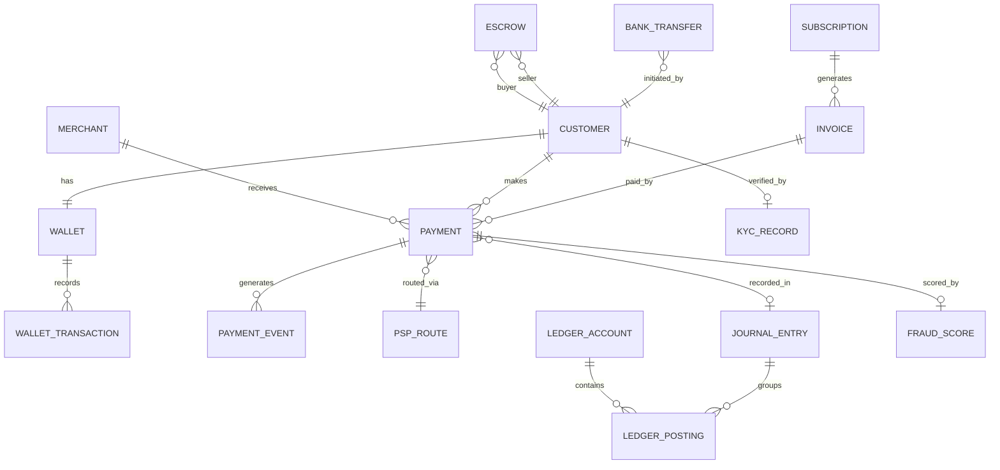

---

## Cache Strategy

| Data | Cache Layer | TTL | Notes |
|------|-----------|-----|-------|
| FX rates | Redis | 30s | Refreshed from rate provider; stale rate never used for execution |
| Fraud features (velocity counters) | Redis | Real-time | Atomic increment; no TTL — rolling windows computed via sorted sets |
| BIN lookup table | Redis | 24h | Updated daily from card network data |
| Merchant configuration | Redis | 5 min | Routing rules, fee schedules |
| Wallet balance | **NOT CACHED** | N/A | Always read from DB for correctness |
| Payment status | Redis | 60s | For merchant polling; webhooks are primary notification |
| PSP health scores | Redis | 10s | Updated by health check service |

**Critical rule**: Wallet balances and ledger data are **never cached**. Financial correctness requires reading from the source of truth.

---

## Queue / Stream Design

| Queue/Topic | Technology | Purpose | Consumers |
|-------------|-----------|---------|-----------|
| `payment-events` | Kafka | All payment lifecycle events | Ledger, Settlement, Notification, Analytics, Fraud (feedback) |
| `wallet-events` | Kafka | Wallet transfers, top-ups, withdrawals | Ledger, Notification, AML Monitoring |
| `fraud-decisions` | Kafka | Fraud scoring results and feedback | Analytics, Model Retraining Pipeline |
| `kyc-events` | Kafka | KYC verification results | Wallet (unlock limits), Notification |
| `settlement-batch` | SQS | Settlement file processing jobs | Settlement Worker |
| `bank-transfer-queue` | SQS | ACH/SEPA batch submission | Bank Transfer Worker |
| `dunning-queue` | SQS | Failed payment retry schedule | Billing Retry Worker |
| `regulatory-events` | Kafka | SAR/CTR filing triggers | Regulatory Reporting Service |
| `dead-letter` | SQS | Failed message processing | Alert + Manual Review |

---

## Storage Strategy

Financial data has strict retention, correctness, and residency requirements that go far beyond typical consumer systems. Storage strategy must balance query performance for recent transactions with cost-effective archival for regulatory retention.

### Hot / Warm / Cold Tiering

```mermaid
flowchart LR
    subgraph Hot["Hot Tier (0-90 days)"]
        HotDB["PostgreSQL Primary<br/>NVMe SSD<br/>Full indexes"]
    end

    subgraph Warm["Warm Tier (90 days - 2 years)"]
        WarmDB["PostgreSQL Archive Replica<br/>Standard SSD<br/>Reduced indexes"]
    end

    subgraph Cold["Cold Tier (2-7 years)"]
        ColdS3["S3 + Parquet<br/>Glacier IR for 5+ years<br/>Compressed & encrypted"]
    end

    subgraph Archive["Regulatory Archive (7+ years)"]
        Glacier["S3 Glacier Deep Archive<br/>WORM compliance<br/>Legal hold capable"]
    end

    Hot -->|"Nightly migration<br/>age > 90 days"| Warm
    Warm -->|"Monthly migration<br/>age > 2 years"| Cold
    Cold -->|"Annual migration<br/>age > 7 years"| Archive
```

| Tier | Data Age | Storage | Access Pattern | SLA |
|------|----------|---------|---------------|-----|
| **Hot** | 0–90 days | PostgreSQL on NVMe SSD | Real-time queries, dashboard, API responses | < 10ms p99 |
| **Warm** | 90 days – 2 years | PostgreSQL on standard SSD | Merchant settlement lookups, dispute investigation | < 100ms p99 |
| **Cold** | 2–7 years | S3 + Parquet (Glacier IR for 5+ years) | Regulatory audit, legal discovery | < 5 minutes |
| **Archive** | 7+ years | S3 Glacier Deep Archive | Legal hold, regulator subpoena | < 12 hours |

### 7-Year Retention Strategy

Regulatory requirements (SOX, PSD2, PCI-DSS, RBI) mandate a minimum of 7 years of financial record retention. The strategy works as follows:

1. **Hot tier (PostgreSQL primary)**: All transactions from the last 90 days remain on the primary cluster with full indexing. This covers active merchant dashboards, refund eligibility windows, and chargeback dispute periods (typically 60–120 days).
2. **Warm tier (archive replica)**: Transactions aged 90 days to 2 years move to a dedicated PostgreSQL instance with reduced indexes (only `payment_id`, `merchant_id`, `created_at`). This handles settlement lookups and annual tax reporting.
3. **Cold tier (S3 + Parquet)**: Transactions older than 2 years are exported to Parquet files on S3, partitioned by `year/month/merchant_id`. Parquet enables efficient columnar queries via Athena or Presto for ad-hoc audit requests.
4. **Deep archive**: After 7 years, data moves to Glacier Deep Archive with WORM (Write Once Read Many) compliance for regulatory holds.

**Migration job**: A nightly Airflow DAG identifies records eligible for tier migration, exports them in batches, verifies row counts and checksums, then deletes from the source tier only after verification passes.

### Append-Only Audit Log Storage

Every mutation to financial data produces an immutable audit log entry. The audit log is **append-only** — no updates or deletes are permitted at the application or database level.

```sql
CREATE TABLE audit_log (
    log_id          BIGSERIAL PRIMARY KEY,
    event_time      TIMESTAMPTZ NOT NULL DEFAULT NOW(),
    entity_type     VARCHAR(50) NOT NULL,  -- 'payment', 'ledger_entry', 'wallet'
    entity_id       VARCHAR(64) NOT NULL,
    action          VARCHAR(30) NOT NULL,  -- 'created', 'state_changed', 'captured'
    actor_type      VARCHAR(20) NOT NULL,  -- 'system', 'user', 'admin', 'cron'
    actor_id        VARCHAR(64) NOT NULL,
    previous_state  JSONB,
    new_state       JSONB,
    metadata        JSONB,
    hash_chain      BYTEA NOT NULL         -- SHA-256 hash of previous entry + current data
);

-- Prevent updates and deletes at the database level
CREATE RULE audit_no_update AS ON UPDATE TO audit_log DO INSTEAD NOTHING;
CREATE RULE audit_no_delete AS ON DELETE TO audit_log DO INSTEAD NOTHING;
```

The `hash_chain` column creates a tamper-evident chain: each entry includes the SHA-256 hash of the previous entry concatenated with the current entry data. A verification job runs hourly to validate chain integrity. Any broken chain triggers a P0 alert.

### Encryption at Rest Strategy

| Data Classification | Encryption Method | Key Management | Rotation |
|---------------------|-------------------|---------------|----------|
| Card PANs | AES-256-GCM | HSM (AWS CloudHSM / Thales Luna) | Quarterly |
| Ledger data | AES-256 (RDS encryption) | AWS KMS, CMK per environment | Annual |
| Wallet balances | AES-256 (RDS encryption) | AWS KMS, CMK per environment | Annual |
| Audit logs | AES-256 (S3 SSE-KMS) | Dedicated CMK for audit | Annual |
| PII (names, addresses) | Application-level AES-256-GCM | AWS KMS, separate CMK from financial data | Annual |
| Backups | AES-256 (RDS/S3 encryption) | Backup-specific CMK | Annual |

**Key hierarchy**: Root keys live in HSM. Data encryption keys (DEKs) are envelope-encrypted with KEKs stored in KMS. Application servers never see root keys.

### Data Residency for EU / India

| Region | Requirement | Implementation |
|--------|-------------|---------------|
| **EU (GDPR)** | EU citizen PII and transaction data must not leave the EU | Dedicated PostgreSQL cluster in `eu-west-1`; Kafka topics partitioned by region; API gateway routes EU merchants to EU stack |
| **India (RBI)** | All payment data for Indian transactions must be stored exclusively in India | Dedicated cluster in `ap-south-1` (Mumbai); card data vault instance in India; no replication to non-India regions |
| **Cross-border** | Aggregated, anonymized analytics may be centralized | Analytics pipeline strips PII before replicating to central data warehouse |

Each regional stack runs as an **isolated deployment** with its own databases, Kafka clusters, and Redis instances. Cross-region references use opaque IDs only — no PII crosses region boundaries.

### Storage Cost Estimation

| Tier | Data Volume (Year 1) | Cost/GB/Month | Annual Cost | Notes |
|------|----------------------|--------------|------------|-------|
| **Hot** (PostgreSQL NVMe) | 1.8 TB (90 days of txn + ledger) | $0.25 (io2 EBS) | ~$5,400 | Includes 3x replication |
| **Warm** (PostgreSQL SSD) | 5.4 TB (90 days–2 years) | $0.10 (gp3 EBS) | ~$6,480 | Single replica sufficient |
| **Cold** (S3 Standard + Parquet) | 8 TB (compressed from ~25 TB raw) | $0.023 | ~$2,208 | Parquet compression ~3x |
| **Cold** (S3 Glacier IR, 5+ years) | 15 TB | $0.004 | ~$720 | Retrieval cost: $0.03/GB |
| **Archive** (Glacier Deep Archive) | 10 TB | $0.00099 | ~$119 | Retrieval: $0.02/GB, 12h wait |

**Total storage cost Year 1**: ~$15,000. This grows roughly linearly at ~$3,000/year as cold/archive tiers accumulate. Hot and warm tiers stay roughly constant because data ages out at the same rate it arrives.

### Backup Strategy

| Backup Type | Frequency | Retention | Storage | Recovery Time |
|------------|-----------|-----------|---------|--------------|
| **Continuous WAL archiving** (PostgreSQL) | Continuous (streaming) | 7 days of WAL segments | S3 (encrypted) | Point-in-time recovery to any second within 7 days |
| **Full snapshot** (RDS) | Daily at 03:00 UTC | 35 days | RDS automated backups | < 30 minutes for full cluster restore |
| **Logical backup** (pg_dump) | Weekly | 90 days | S3 (encrypted, cross-region) | 2–4 hours depending on size |
| **Ledger checkpoint** | Every 6 hours | Indefinite (part of audit trail) | S3 + Glacier | Ledger can be reconstructed from any checkpoint + WAL |
| **Configuration backup** | On every change | Indefinite | Git (infrastructure-as-code) | Minutes (redeployment) |

**Cross-region backup**: All backups are replicated to a secondary region (US-West for US data, EU-Central for EU data) to survive region-level disasters. Cross-region replication is encrypted in transit and at rest with region-specific keys.

### Data Lifecycle Automation

```mermaid
flowchart TD
    subgraph DailyJob["Nightly Lifecycle DAG (03:00 UTC)"]
        Identify["Identify records<br/>eligible for migration"] --> Export["Export to target tier<br/>(batches of 50K rows)"]
        Export --> Verify["Verify row count<br/>+ SHA-256 checksum"]
        Verify --> Delete["Soft-delete from<br/>source tier"]
        Delete --> HardDelete["Hard-delete after<br/>30-day grace period"]
    end

    subgraph Monitoring["Migration Monitoring"]
        RowCount["Row count<br/>source vs target"]
        Checksum["Checksum<br/>validation"]
        AlertOnDrift["Alert on any<br/>mismatch"]
    end

    Verify --> RowCount
    Verify --> Checksum
    RowCount --> AlertOnDrift
    Checksum --> AlertOnDrift
```

The migration job uses a **soft-delete grace period**: records are marked as `migrated=true` in the source tier and remain queryable for 30 days. This allows rollback if the target tier has issues. After the grace period, a cleanup job hard-deletes the migrated records from the source.

**Partition drop optimization**: For the hot-to-warm migration, instead of deleting individual rows, the job detaches the oldest monthly partition from the hot tier and attaches it to the warm tier. This is an O(1) metadata operation rather than an O(n) row-by-row delete.

### Cold Tier Query Patterns (Athena / Presto)

When auditors or legal teams need to query historical data beyond 2 years, they access the cold tier via Amazon Athena (serverless Presto). The Parquet files on S3 are organized for efficient partition pruning.

**S3 path layout**:
```
s3://fintech-archive/transactions/
    year=2024/
        month=01/
            merchant=merch_abc/
                part-00000.parquet
                part-00001.parquet
            merchant=merch_def/
                part-00000.parquet
        month=02/
            ...
    year=2023/
        ...
```

**Athena table definition**:
```sql
CREATE EXTERNAL TABLE archive_transactions (
    txn_id          STRING,
    merchant_id     STRING,
    amount          BIGINT,
    currency        STRING,
    status          STRING,
    payment_method  STRING,
    psp_reference   STRING,
    created_at      TIMESTAMP,
    metadata        STRING
)
PARTITIONED BY (year INT, month INT, merchant STRING)
STORED AS PARQUET
LOCATION 's3://fintech-archive/transactions/'
TBLPROPERTIES ('parquet.compression'='SNAPPY');

-- Load partitions
MSCK REPAIR TABLE archive_transactions;
```

**Common audit queries**:

| Query | Partition Pruning | Expected Scan | Response Time |
|-------|------------------|--------------|--------------|
| All transactions for merchant X in Q1 2024 | Prunes to 3 month partitions x 1 merchant | ~500 MB | 10–30 seconds |
| Total volume by currency for 2023 | Prunes to 12 month partitions, scans all merchants | ~8 GB | 1–3 minutes |
| Specific transaction by ID (unknown date) | No pruning possible — full scan | ~25 GB | 5–10 minutes |
| Transactions > $100K in 2024 | Prunes to 12 month partitions | ~8 GB | 1–3 minutes |

**Cost control**: Athena charges per TB scanned. Parquet columnar format + SNAPPY compression reduces scan size by 80–90% compared to CSV. Partitioning by year/month/merchant ensures most queries only scan relevant partitions.

### Write-Ahead Log (WAL) for Ledger Durability

The ledger database uses PostgreSQL's WAL with `synchronous_commit = on` and `wal_level = replica`. This ensures:

1. **Every committed ledger entry is durable** before the client receives acknowledgment
2. **Point-in-time recovery** is possible to any moment within the WAL retention window (7 days)
3. **Sync replicas receive every WAL record** before the primary acknowledges the write

WAL archiving to S3 runs continuously via `archive_command`. The combination of base backups (daily) + WAL archives enables recovery to any second within the retention window — critical for investigating ledger discrepancies.

**WAL monitoring**:

| Metric | Warning | Critical |
|--------|---------|----------|
| WAL generation rate | > 1 GB/hour | > 5 GB/hour (unusual write load) |
| WAL archive lag | > 5 minutes | > 15 minutes (archive pipeline stuck) |
| Replication lag (bytes) | > 10 MB | > 100 MB (replica falling behind) |
| Disk space for WAL | < 20% free | < 10% free (risk of WAL wrap-around) |

### Disaster Recovery Strategy

| Scenario | RPO (Recovery Point Objective) | RTO (Recovery Time Objective) | Recovery Procedure |
|----------|-------------------------------|-------------------------------|-------------------|
| Single AZ failure | 0 (sync replication) | < 30 seconds | Automatic failover to sync replica in another AZ |
| Region failure | < 1 minute (async cross-region replication) | < 15 minutes | Manual promotion of cross-region replica; DNS failover |
| Database corruption | 0 (point-in-time recovery from WAL) | < 30 minutes | Restore from latest base backup + replay WAL to point before corruption |
| Ransomware / malicious deletion | 0 (WORM-protected backups) | < 2 hours | Restore from immutable S3 Glacier backup; forensic investigation |
| Accidental data deletion by operator | 0 (soft-delete + WAL) | < 15 minutes | PITR to timestamp before deletion; validate restored data |

**Cross-region replication for DR**:

```mermaid
flowchart LR
    subgraph Primary["US-East (Primary)"]
        PrimaryDB["PostgreSQL Primary<br/>3x sync replica (same region)"]
        PrimaryS3["S3 WAL Archive"]
    end

    subgraph DR["US-West (DR)"]
        DRDB["PostgreSQL Async Replica<br/>(~1 min lag)"]
        DRS3["S3 WAL Archive<br/>(cross-region replication)"]
    end

    PrimaryDB -->|"Async streaming<br/>replication"| DRDB
    PrimaryS3 -->|"S3 cross-region<br/>replication"| DRS3
```

**DR testing**: Full DR failover is tested quarterly during a scheduled maintenance window. The test involves:
1. Promoting the DR replica to primary
2. Running a validation suite (ledger balance checks, sample transaction replay)
3. Processing a small number of test transactions through the DR stack
4. Failing back to the original primary
5. Verifying zero data loss during the round-trip

### Storage Technology Selection Rationale

| Component | Technology | Why This Choice | Alternatives Considered |
|-----------|-----------|----------------|----------------------|
| Transaction store | PostgreSQL 16 | ACID compliance, mature partitioning, JSONB support, strong ecosystem | CockroachDB (distributed SQL but higher operational complexity), MySQL (weaker partitioning) |
| Ledger store | PostgreSQL 16 (dedicated cluster) | Synchronous replication, SERIALIZABLE isolation, proven in financial systems | YugabyteDB (better horizontal scaling but less mature), Oracle (license cost) |
| Wallet balances | PostgreSQL 16 | Row-level locking, strong consistency, same technology as ledger | Redis (fast but volatile — unacceptable for money), DynamoDB (eventual consistency on reads) |
| Audit logs | PostgreSQL → S3 Parquet | Append-only in PostgreSQL for recent; Parquet for long-term columnar queries | Elasticsearch (good for search but expensive for 7-year retention), QuestDB (time-series but less ecosystem) |
| Feature store | Redis Cluster | Sub-millisecond reads for real-time fraud scoring | Feast (added complexity), DynamoDB DAX (vendor lock-in) |
| Document store (KYC) | S3 + DynamoDB metadata | Cost-effective for identity documents (images, PDFs); DynamoDB for metadata lookups | MongoDB (capable but adds operational burden), PostgreSQL BYTEA (not designed for large blobs) |

---

## Indexing and Partitioning

At 5M transactions/day (50M peak), naive table design causes query degradation within weeks. Partitioning and index strategy must be designed from day one.

### Transaction Table Partitioning by Month

```sql
-- Range partitioning by month on created_at
CREATE TABLE transactions (
    txn_id          UUID NOT NULL,
    merchant_id     UUID NOT NULL,
    amount          BIGINT NOT NULL,       -- in smallest currency unit (cents)
    currency        CHAR(3) NOT NULL,
    status          VARCHAR(20) NOT NULL,
    payment_method  VARCHAR(20) NOT NULL,
    psp_reference   VARCHAR(128),
    idempotency_key VARCHAR(128) NOT NULL,
    created_at      TIMESTAMPTZ NOT NULL DEFAULT NOW(),
    updated_at      TIMESTAMPTZ NOT NULL DEFAULT NOW(),
    metadata        JSONB,
    PRIMARY KEY (txn_id, created_at)
) PARTITION BY RANGE (created_at);

-- Create monthly partitions (automated via pg_partman or cron)
CREATE TABLE transactions_2026_01 PARTITION OF transactions
    FOR VALUES FROM ('2026-01-01') TO ('2026-02-01');
CREATE TABLE transactions_2026_02 PARTITION OF transactions
    FOR VALUES FROM ('2026-02-01') TO ('2026-03-01');
CREATE TABLE transactions_2026_03 PARTITION OF transactions
    FOR VALUES FROM ('2026-03-01') TO ('2026-04-01');
-- ... new partitions created monthly by automation
```

**Why monthly**: Daily partitions create too many tables (1,825 over 5 years) and increase planner overhead. Yearly partitions make archival chunky and partition pruning less effective. Monthly is the sweet spot for fintech — aligns with settlement cycles, statement periods, and regulatory reporting windows.

### Ledger Partitioning by Account

Ledger entries are queried almost exclusively by account. Hash partitioning by `account_id` distributes writes evenly and makes per-account balance queries hit a single partition.

```sql
CREATE TABLE ledger_entries (
    entry_id        BIGSERIAL,
    journal_id      UUID NOT NULL,
    account_id      UUID NOT NULL,
    amount          BIGINT NOT NULL,       -- positive = debit, negative = credit
    currency        CHAR(3) NOT NULL,
    entry_type      VARCHAR(20) NOT NULL,  -- 'debit' or 'credit'
    posted_at       TIMESTAMPTZ NOT NULL DEFAULT NOW(),
    description     TEXT,
    idempotency_key VARCHAR(128) NOT NULL,
    version         INTEGER NOT NULL DEFAULT 1,
    PRIMARY KEY (entry_id, account_id)
) PARTITION BY HASH (account_id);

-- 64 hash partitions (power of 2 for even distribution)
CREATE TABLE ledger_entries_p00 PARTITION OF ledger_entries
    FOR VALUES WITH (MODULUS 64, REMAINDER 0);
CREATE TABLE ledger_entries_p01 PARTITION OF ledger_entries
    FOR VALUES WITH (MODULUS 64, REMAINDER 1);
-- ... through p63
```

### Index Strategies for Payment Lookups

| Query Pattern | Index | Justification |
|---------------|-------|--------------|
| Merchant dashboard: recent transactions | `CREATE INDEX idx_txn_merchant_created ON transactions (merchant_id, created_at DESC)` | Merchant portal lists transactions newest-first |
| Payment status lookup by ID | Primary key `(txn_id, created_at)` | Direct lookup; partition pruning if date range known |
| Filter by status | `CREATE INDEX idx_txn_status_created ON transactions (status, created_at DESC) WHERE status IN ('pending', 'requires_action')` | Partial index — only active statuses; avoids indexing the 95% that are `completed` |
| Idempotency check | `CREATE UNIQUE INDEX idx_txn_idempotency ON transactions (idempotency_key)` | Prevents duplicate payments |
| PSP reference lookup | `CREATE INDEX idx_txn_psp_ref ON transactions (psp_reference) WHERE psp_reference IS NOT NULL` | Reconciliation matching with PSP settlement files |
| Ledger balance computation | `CREATE INDEX idx_ledger_account ON ledger_entries (account_id, posted_at DESC)` | Balance = SUM(amount) WHERE account_id = ? |

**Index creation strategy**: All indexes on the transaction table are created with `CONCURRENTLY` to avoid locking the table during index builds. For the hot tier (which handles live traffic), a blocked INSERT due to index creation could cause payment failures.

```sql
-- Safe index creation (does not lock table)
CREATE INDEX CONCURRENTLY idx_txn_merchant_created
    ON transactions (merchant_id, created_at DESC);

-- Never use without CONCURRENTLY on production tables:
-- CREATE INDEX idx_txn_merchant_created ON transactions (merchant_id, created_at DESC);
-- ^^^ This locks the table for the duration of the index build
```

**Covering indexes for dashboard queries**: To avoid expensive table lookups for the most common dashboard query, use a covering index that includes all columns the dashboard needs:

```sql
-- Covering index: includes amount and status so the query never hits the table
CREATE INDEX idx_txn_merchant_covering
    ON transactions (merchant_id, created_at DESC)
    INCLUDE (amount, currency, status, payment_method);
```

This turns the merchant dashboard query into an **index-only scan** — the database never touches the table heap, reducing I/O by 60–80% for this query pattern.

### Hot Partition Prevention for High-Volume Merchants

A single merchant generating 10% of total volume creates a hot partition if data is hash-partitioned by `merchant_id`. Prevention strategies:

1. **Partition by time, not merchant**: The transaction table is range-partitioned by `created_at`. High-volume merchants spread across all monthly partitions naturally.
2. **Composite shard key for merchant-specific tables**: If maintaining per-merchant materialized views, use `(merchant_id, txn_id % 16)` as the shard key to distribute a single merchant across 16 shards.
3. **Pre-aggregated merchant dashboards**: Instead of querying raw transactions for high-volume merchants, maintain a `merchant_daily_summary` materialized view updated every 5 minutes. Dashboard queries hit the summary table, not the transaction table.
4. **Rate-limited full exports**: Merchant CSV export requests for high-volume merchants are queued as background jobs with pagination rather than running a single query that scans millions of rows.

### Read Replica Routing

```mermaid
flowchart TD
    subgraph Writers["Write Path"]
        PaymentAPI["Payment API"] --> Primary["PostgreSQL Primary"]
        LedgerSvc["Ledger Service"] --> Primary
        WalletSvc["Wallet Service"] --> Primary
    end

    subgraph Readers["Read Path"]
        MerchantDash["Merchant Dashboard"] --> Replica1["Sync Replica (same AZ)"]
        Analytics["Analytics Queries"] --> Replica2["Async Replica (cross-AZ)"]
        ReconJob["Reconciliation Job"] --> Replica2
        CSTooling["CS Tooling"] --> Replica1
    end

    Primary -->|"Sync replication"| Replica1
    Primary -->|"Async replication<br/>~100ms lag"| Replica2
```

| Query Source | Routed To | Acceptable Lag | Reasoning |
|-------------|-----------|---------------|-----------|
| Payment authorization | Primary | None | Must read latest state |
| Wallet balance check | Primary | None | Stale balance = potential overdraft |
| Merchant dashboard | Sync replica | < 1 second | Near-real-time is sufficient |
| Customer support lookup | Sync replica | < 1 second | Operational but not financial-critical |
| Reconciliation batch | Async replica | < 5 minutes | Batch job; small lag acceptable |
| Analytics / reporting | Async replica | < 5 minutes | Historical analysis tolerates lag |

### Partition Maintenance Automation

Partition management must be automated — a missing future partition causes INSERT failures; an orphaned old partition wastes hot-tier storage.

```sql
-- pg_partman configuration for automatic partition management
SELECT partman.create_parent(
    p_parent_table := 'public.transactions',
    p_control := 'created_at',
    p_type := 'native',
    p_interval := '1 month',
    p_premake := 3           -- create 3 months of future partitions
);

-- Maintenance job (runs daily via pg_cron)
SELECT cron.schedule('partition-maintenance', '0 2 * * *',
    $$SELECT partman.run_maintenance()$$
);
```

**Maintenance tasks run nightly**:

| Task | Schedule | Description |
|------|----------|-------------|
| Create future partitions | Daily | Ensures partitions exist 3 months ahead |
| Detach old partitions | Monthly | Moves partitions older than 90 days to warm tier |
| Update partition statistics | Daily | `ANALYZE` on recent partitions for accurate query plans |
| Validate partition boundaries | Weekly | Checks for gaps or overlaps in partition ranges |
| Index rebuild on warm partitions | On migration | Drop unused indexes, rebuild remaining with `CONCURRENTLY` |

### Query Plan Verification

After partitioning, critical queries must be verified to confirm partition pruning is active. A query that scans all partitions instead of the target partition defeats the purpose.

```sql
-- Verify partition pruning is active for merchant dashboard query
EXPLAIN (ANALYZE, BUFFERS)
SELECT txn_id, amount, status, created_at
FROM transactions
WHERE merchant_id = 'merch_abc'
  AND created_at >= '2026-03-01'
  AND created_at < '2026-04-01'
ORDER BY created_at DESC
LIMIT 50;

-- Expected: "Partitions selected: 1" (only transactions_2026_03)
-- Red flag: "Partitions selected: ALL" (missing partition pruning)
```

**Common partition pruning failures**:
- Query uses a function on the partition key: `WHERE DATE(created_at) = '2026-03-15'` — the optimizer cannot prune. Fix: use range comparison instead.
- Query references the partition key with a type mismatch: passing a `VARCHAR` date instead of `TIMESTAMPTZ`. Fix: ensure parameter types match column types.
- Join conditions that reference the partition key indirectly. Fix: add explicit partition key filters to both sides of the join.

### Index Size Monitoring

Large indexes consume RAM and slow writes. Monitor index bloat and usage to keep the system healthy.

| Metric | Warning Threshold | Action |
|--------|------------------|--------|
| Index size > 50% of table size | Investigate | Check for bloat; consider `REINDEX CONCURRENTLY` |
| Index unused for 30+ days | Review | Drop or move to warm tier only |
| Index bloat > 30% | Schedule rebuild | `REINDEX CONCURRENTLY` during low-traffic window |
| Sequential scan on indexed column | Investigate | Query planner may be choosing seq scan due to stale statistics; run `ANALYZE` |

### Materialized Views for Merchant Dashboards

High-volume merchants querying raw transaction tables cause expensive sequential scans. Materialized views pre-aggregate data for dashboard use cases.

```sql
-- Daily transaction summary per merchant
CREATE MATERIALIZED VIEW merchant_daily_summary AS
SELECT
    merchant_id,
    DATE_TRUNC('day', created_at) AS txn_date,
    COUNT(*) AS txn_count,
    SUM(CASE WHEN status = 'captured' THEN amount ELSE 0 END) AS captured_amount,
    SUM(CASE WHEN status = 'refunded' THEN amount ELSE 0 END) AS refunded_amount,
    SUM(CASE WHEN status = 'declined' THEN 1 ELSE 0 END) AS decline_count,
    COUNT(DISTINCT currency) AS currency_count,
    AVG(amount) AS avg_txn_amount,
    PERCENTILE_CONT(0.95) WITHIN GROUP (ORDER BY amount) AS p95_txn_amount
FROM transactions
WHERE created_at >= NOW() - INTERVAL '90 days'
GROUP BY merchant_id, DATE_TRUNC('day', created_at)
WITH DATA;

-- Refresh every 5 minutes (concurrent refresh allows reads during rebuild)
CREATE UNIQUE INDEX idx_mds_merchant_date
    ON merchant_daily_summary (merchant_id, txn_date);

-- pg_cron job for refresh
SELECT cron.schedule('refresh-merchant-summary', '*/5 * * * *',
    $$REFRESH MATERIALIZED VIEW CONCURRENTLY merchant_daily_summary$$
);
```

**Dashboard query performance comparison**:

| Query | Raw Table | Materialized View | Improvement |
|-------|----------|-------------------|-------------|
| Daily summary for 1 merchant, 30 days | 800ms (scans ~150K rows) | 2ms (scans 30 rows) | 400x |
| Monthly summary for all merchants | 45s (full table scan) | 200ms (scans ~3K rows) | 225x |
| Top 10 merchants by volume today | 12s | 5ms | 2,400x |

### JSONB Index Strategies for Metadata

Transaction metadata (stored as JSONB) sometimes needs querying — for example, finding all transactions with a specific order ID or customer reference stored in metadata.

```sql
-- GIN index on metadata for arbitrary key lookups
CREATE INDEX idx_txn_metadata_gin ON transactions USING GIN (metadata jsonb_path_ops);

-- Example query: find transactions for a specific order
SELECT txn_id, amount, status
FROM transactions
WHERE metadata @> '{"order_id": "ORD-12345"}'
  AND created_at >= '2026-03-01';

-- Targeted expression index for a frequently queried metadata key
CREATE INDEX idx_txn_metadata_order_id
    ON transactions ((metadata->>'order_id'))
    WHERE metadata->>'order_id' IS NOT NULL;
```

**Guidance**: Use GIN indexes sparingly — they are expensive to maintain on high-write tables. For frequently queried metadata keys, promote them to proper columns or use expression indexes. Reserve JSONB for truly flexible, rarely queried metadata.

---

## Concurrency Control

Financial systems face severe concurrency challenges: two wallet transfers hitting the same account simultaneously, two webhooks for the same payment arriving at once, or a refund racing with a capture. Getting concurrency wrong means double-spending money.

### Row-Level Locking for Wallet Transfers

Wallet-to-wallet transfers require atomically debiting one account and crediting another. Without careful locking, concurrent transfers can deadlock or double-spend.

**Consistent ordering pattern**: Always acquire locks in ascending `account_id` order, regardless of who is the sender or receiver.

```sql
-- Transfer $50 from account A to account B
-- Step 1: Determine lock order (always lowest account_id first)
-- If sender_id < receiver_id: lock sender first
-- If receiver_id < sender_id: lock receiver first

BEGIN;

-- Lock both accounts in consistent order (prevents deadlock)
SELECT balance, version
FROM wallets
WHERE account_id IN ($sender_id, $receiver_id)
ORDER BY account_id ASC
FOR UPDATE;

-- Step 2: Validate sender has sufficient balance
-- (application code checks the returned balance)

-- Step 3: Execute the transfer
UPDATE wallets SET balance = balance - 5000, version = version + 1
WHERE account_id = $sender_id;

UPDATE wallets SET balance = balance + 5000, version = version + 1
WHERE account_id = $receiver_id;

-- Step 4: Post ledger entries
INSERT INTO ledger_entries (journal_id, account_id, amount, entry_type)
VALUES
    ($journal_id, $sender_id,   -5000, 'debit'),
    ($journal_id, $receiver_id,  5000, 'credit');

COMMIT;
```

**Why `SELECT ... FOR UPDATE` with ordering**: Without consistent ordering, Transfer(A→B) acquires lock on A, while concurrent Transfer(B→A) acquires lock on B. Both then wait for each other — deadlock. By always locking in `account_id` order, the second transaction waits for the first to release, and deadlocks are impossible for two-party transfers.

**Concurrent transfer scenario (without consistent ordering — DEADLOCK)**:

```mermaid
sequenceDiagram
    participant T1 as Transfer A→B
    participant DB as Database
    participant T2 as Transfer B→A

    T1->>DB: LOCK account A ✓
    T2->>DB: LOCK account B ✓
    T1->>DB: LOCK account B (WAIT...)
    T2->>DB: LOCK account A (WAIT...)
    Note over T1, T2: DEADLOCK — both transactions waiting for each other
    DB-->>T1: ERROR: deadlock detected (victim)
    T2->>DB: LOCK account A ✓ (proceeds)
```

**Same scenario with consistent ordering — NO DEADLOCK**:

```mermaid
sequenceDiagram
    participant T1 as Transfer A→B (lock A then B)
    participant DB as Database
    participant T2 as Transfer B→A (lock A then B)

    T1->>DB: LOCK account A ✓
    T2->>DB: LOCK account A (WAIT — T1 holds it)
    T1->>DB: LOCK account B ✓
    T1->>DB: Execute transfer, COMMIT
    T1-->>DB: Release locks on A and B
    T2->>DB: LOCK account A ✓ (now available)
    T2->>DB: LOCK account B ✓
    T2->>DB: Execute transfer, COMMIT
    Note over T1, T2: Both transfers complete — no deadlock
```

### Wallet Balance: Precomputed vs. Derived

Two approaches exist for tracking wallet balances:

| Approach | Implementation | Pros | Cons |
|----------|---------------|------|------|
| **Precomputed balance** (chosen) | `wallets.balance` column updated on every transaction | O(1) balance reads; simple balance checks | Must keep in sync with ledger; dual-write risk |
| **Derived balance** | Compute `SUM(amount) FROM ledger_entries WHERE account_id = ?` on every read | Single source of truth; no sync issues | O(n) balance reads; slow for accounts with many entries |

**This platform uses precomputed balances** with the ledger as the authoritative source. The wallet `balance` column is a denormalized cache of the ledger sum. A canary check runs every 15 minutes to verify `wallets.balance == SUM(ledger_entries.amount)` for a random sample of 1,000 accounts. Any discrepancy triggers a P0 alert.

**Atomic dual-write**: The wallet balance update and ledger entry insert happen in the same database transaction, ensuring they are always consistent:

```sql
BEGIN ISOLATION LEVEL SERIALIZABLE;

-- Lock wallet row
SELECT balance FROM wallets WHERE account_id = $id FOR UPDATE;

-- Update wallet balance
UPDATE wallets SET balance = balance + $amount WHERE account_id = $id;

-- Insert ledger entry (same transaction)
INSERT INTO ledger_entries (account_id, amount, ...) VALUES ($id, $amount, ...);

COMMIT;
-- Both writes succeed or both fail — never out of sync
```

### Optimistic Concurrency for Payment State Transitions

Payment state transitions (e.g., `authorized` → `captured`) use optimistic concurrency via a `version` column. This avoids holding locks during PSP calls that may take hundreds of milliseconds.

```sql
-- Capture a payment: transition from 'authorized' to 'captured'
UPDATE transactions
SET status = 'captured',
    updated_at = NOW(),
    version = version + 1
WHERE txn_id = $txn_id
  AND status = 'authorized'
  AND version = $expected_version;

-- If rows_affected = 0, the payment was already captured or its state changed
-- Application retries by re-reading current state
```

**State transition rules enforced in code and SQL**:

| From State | Allowed Transitions |
|-----------|-------------------|
| `created` | `authorized`, `declined`, `failed` |
| `authorized` | `captured`, `voided`, `expired` |
| `captured` | `settled`, `refund_initiated` |
| `refund_initiated` | `refunded`, `refund_failed` |
| `settled` | `chargeback_initiated` |

The `WHERE status = $expected_from_state AND version = $expected_version` clause ensures that only valid transitions succeed and concurrent conflicting transitions are rejected.

### Deadlock Prevention Strategies

| Strategy | Where Applied | How It Works |
|----------|--------------|-------------|
| **Consistent lock ordering** | Wallet transfers | Always lock accounts in ascending `account_id` order |
| **Lock timeout** | All `SELECT FOR UPDATE` | `SET LOCAL lock_timeout = '5s'` — fail fast rather than wait indefinitely |
| **Optimistic locking** | Payment state transitions | No locks held; version column detects conflicts |
| **Single-row operations** | Ledger postings | Each posting is an INSERT (append-only); no row-level contention |
| **Queue serialization** | Settlement batch | One worker per merchant processes settlement sequentially |

### Database Isolation Levels

| Operation | Isolation Level | Reasoning |
|-----------|---------------|-----------|
| Ledger postings | `SERIALIZABLE` | Balance invariant (debits = credits) must hold under all concurrent access patterns |
| Wallet balance operations | `SERIALIZABLE` | Prevents phantom reads that could allow overdraft |
| Payment state transitions | `READ COMMITTED` | Optimistic locking handles conflicts; higher isolation adds unnecessary overhead |
| Dashboard / reporting queries | `READ COMMITTED` | Read-only; eventual consistency acceptable |
| Reconciliation batch | `REPEATABLE READ` | Needs consistent snapshot of transactions for matching; but not SERIALIZABLE overhead |

**Implementation**: Use per-transaction isolation level setting rather than database-wide configuration:

```sql
BEGIN ISOLATION LEVEL SERIALIZABLE;
-- ledger posting operations
COMMIT;
```

### Connection Pool Sizing Under Load

| Service | Pool Size | Max Overflow | Reasoning |
|---------|----------|-------------|-----------|
| Payment Gateway | 20 per instance | 10 | Short-lived queries; fast turnaround |
| Ledger Service | 30 per instance | 5 | Heavier writes; serializable isolation holds connections longer |
| Wallet Service | 25 per instance | 10 | Mix of reads (balance check) and writes (transfer) |
| Settlement Worker | 10 per worker | 0 | Batch processing; predictable load |
| Merchant Dashboard API | 15 per instance | 5 | Read-only; routed to replica |

**Formula**: `pool_size = (num_cores * 2) + effective_spindle_count`. For NVMe SSD, effective spindle count is typically 1, giving `pool_size = (num_cores * 2) + 1`. Oversizing the pool causes context-switching overhead and increases lock contention.

**Monitoring**: Alert when pool utilization exceeds 80% sustained for 5 minutes. Alert immediately if any connection checkout waits exceed 5 seconds.

### Multi-Account Transfer Locking (N-Party)

While two-party transfers use simple ordered locking, some operations involve more than two accounts (e.g., marketplace payment: buyer → platform fee account → seller). The consistent ordering pattern extends to N parties.

```sql
-- Marketplace payment: buyer pays $100, platform takes $5 fee, seller receives $95
-- Lock all 3 accounts in ascending account_id order

BEGIN ISOLATION LEVEL SERIALIZABLE;

-- Sort all involved account IDs and lock in order
SELECT account_id, balance, version
FROM wallets
WHERE account_id IN ($buyer_id, $platform_fee_id, $seller_id)
ORDER BY account_id ASC
FOR UPDATE;

-- Validate buyer balance >= $100
-- Execute transfers
UPDATE wallets SET balance = balance - 10000, version = version + 1
WHERE account_id = $buyer_id;

UPDATE wallets SET balance = balance + 500, version = version + 1
WHERE account_id = $platform_fee_id;

UPDATE wallets SET balance = balance + 9500, version = version + 1
WHERE account_id = $seller_id;

-- Post triple-entry ledger (3 debit/credit pairs)
INSERT INTO ledger_entries (journal_id, account_id, amount, entry_type) VALUES
    ($journal_id, $buyer_id,        -10000, 'debit'),
    ($journal_id, $platform_fee_id,    500, 'credit'),
    ($journal_id, $seller_id,         9500, 'credit');

COMMIT;
```

**Invariant**: The sum of all amount changes in a single journal entry must equal zero. This is enforced by a database trigger:

```sql
CREATE OR REPLACE FUNCTION check_journal_balance()
RETURNS TRIGGER AS $$
BEGIN
    IF (SELECT SUM(amount) FROM ledger_entries WHERE journal_id = NEW.journal_id) != 0 THEN
        RAISE EXCEPTION 'Journal % does not balance: sum = %',
            NEW.journal_id,
            (SELECT SUM(amount) FROM ledger_entries WHERE journal_id = NEW.journal_id);
    END IF;
    RETURN NEW;
END;
$$ LANGUAGE plpgsql;
```

### Retry Behavior on Lock Contention

When a transaction fails due to lock timeout or serialization failure, the application must retry with backoff. Different failure types require different retry strategies.

| Failure Type | PostgreSQL Error Code | Retry Strategy | Max Retries |
|-------------|----------------------|---------------|-------------|
| Lock timeout | `55P03` | Immediate retry with jitter (0–100ms) | 3 |
| Serialization failure | `40001` | Retry with exponential backoff (100ms, 200ms, 400ms) | 3 |
| Deadlock detected | `40P01` | Immediate retry (deadlock victim was rolled back) | 3 |
| Connection failure | Various | Retry on new connection after 500ms | 5 |
| Unique violation (idempotency) | `23505` | No retry — return cached response | 0 |

**Application-level implementation**:

```python
# Pseudocode for retry-aware transaction execution
MAX_RETRIES = 3
RETRYABLE_ERRORS = {'55P03', '40001', '40P01'}

for attempt in range(MAX_RETRIES):
    try:
        with db.transaction(isolation='serializable') as txn:
            execute_transfer(txn, sender_id, receiver_id, amount)
            txn.commit()
            return SUCCESS
    except DatabaseError as e:
        if e.pgcode in RETRYABLE_ERRORS and attempt < MAX_RETRIES - 1:
            sleep(backoff_ms(attempt))
            continue
        raise
```

### Concurrency Under Batch Settlement

During nightly settlement, thousands of merchant accounts are updated simultaneously. This creates contention hotspots if not handled carefully.

**Strategy**: The settlement worker processes merchants in parallel but serializes operations per merchant. Each merchant settlement runs in its own transaction:

1. **Fan-out**: Settlement orchestrator partitions merchants into batches of 100
2. **Worker pool**: 20 workers process batches concurrently (each worker handles one batch)
3. **Per-merchant serialization**: Within a batch, each merchant is processed sequentially — sum transactions, compute fees, post ledger entries, update settlement record
4. **No cross-merchant locks**: Because each merchant is processed independently, there is zero lock contention between merchants
5. **Platform account bottleneck**: All merchants credit the same platform fee account. This is mitigated by using a sharded fee account (e.g., `platform_fee_shard_01` through `platform_fee_shard_16`) and consolidating daily

### Advisory Locks for Distributed Coordination

Some operations require cross-process coordination beyond row-level locks. PostgreSQL advisory locks provide application-level mutual exclusion without locking actual rows.

**Use cases in the payment platform**:

| Operation | Advisory Lock Key | Purpose |
|-----------|------------------|---------|
| Settlement batch per merchant | `pg_advisory_lock(merchant_id_hash)` | Ensure only one settlement worker processes a merchant at a time |
| Reconciliation per PSP | `pg_advisory_lock(psp_id_hash)` | Prevent concurrent reconciliation of the same PSP report |
| KYC verification per user | `pg_advisory_lock(user_id_hash)` | Prevent race between manual and automated KYC results |
| Payout execution per merchant | `pg_advisory_lock(merchant_payout_hash)` | Prevent duplicate payout submissions |

```sql
-- Acquire advisory lock for merchant settlement (non-blocking)
SELECT pg_try_advisory_lock(hashtext('settlement:' || $merchant_id));
-- Returns true if acquired, false if another worker holds it

-- Execute settlement for this merchant...

-- Release advisory lock
SELECT pg_advisory_unlock(hashtext('settlement:' || $merchant_id));
```

**Advantage over `SELECT FOR UPDATE`**: Advisory locks do not lock actual rows, so they do not block reads or other writes on the table. They only block other advisory lock requests with the same key. This is ideal for coordinating batch jobs that process the same logical entity.

### Concurrency Testing Strategy

Financial concurrency bugs often only manifest under load. The testing strategy includes:

| Test Type | What It Validates | Execution |
|-----------|------------------|-----------|
| **Concurrent transfer test** | No balance leak when 1,000 concurrent transfers hit same account | Load test: 100 concurrent connections transferring random amounts between 10 accounts; verify total balance unchanged |
| **Double-submit test** | Idempotency prevents duplicate charges | Fire identical request from 10 threads simultaneously; verify exactly one payment created |
| **State race test** | Capture and void cannot both succeed for same payment | Simultaneously send capture and void for same payment_id 100 times; verify mutual exclusivity |
| **Deadlock rate test** | Deadlocks stay below 1% under load | 500 concurrent random wallet transfers; measure deadlock retry rate |
| **Serialization failure rate** | Retries succeed within 3 attempts | 200 concurrent ledger postings to overlapping accounts; measure retry success rate |

These tests run nightly in a staging environment with production-like data volumes. Any regression (e.g., deadlock rate exceeds 1%) blocks deployment.

---

## Idempotency Strategy

In financial systems, **every operation must be safe to retry**. Network timeouts, client retries, webhook redeliveries, and infrastructure failovers all create scenarios where the same request arrives multiple times. Without idempotency, retries become duplicate charges.

### Client-Generated Idempotency Keys

The client (merchant) generates a unique `Idempotency-Key` header with every payment request. This key must be:

- **Globally unique**: UUID v4 or equivalent
- **Deterministic per intent**: The same business action always uses the same key (e.g., `checkout_{order_id}_{attempt}`)
- **Sent on every retry**: The client must reuse the same key when retrying a request

```
POST /v1/payments
Idempotency-Key: pay_ord_12345_att_1
Content-Type: application/json

{
    "amount": 14999,
    "currency": "USD",
    "merchant_id": "merch_abc",
    "payment_method_token": "tok_xyz"
}
```

### Server-Side Idempotency Store

The server maintains an idempotency store that maps `(idempotency_key)` to the response of the original request.

```mermaid
flowchart TD
    Request["Incoming Payment Request"] --> CheckKey{"Idempotency key<br/>exists in store?"}

    CheckKey -->|"No"| Process["Process payment normally"]
    Process --> StoreResult["Store result with idempotency key"]
    StoreResult --> Respond["Return response"]

    CheckKey -->|"Yes, status = completed"| ReturnCached["Return cached response<br/>(same status code + body)"]
    CheckKey -->|"Yes, status = processing"| Return409["Return 409 Conflict<br/>'Request is still processing'"]
```

**Implementation options**:

| Store | Pros | Cons | Best For |
|-------|------|------|----------|
| **Redis** | Sub-millisecond lookup; built-in TTL | Volatile; lost on restart unless persisted | High-throughput APIs with short TTL |
| **PostgreSQL** | Durable; transactional with payment insert | Higher latency; must manage cleanup | Critical financial operations |
| **DynamoDB** | Managed TTL; durable; low latency | Additional infrastructure | AWS-native stacks |

**Recommended**: Use Redis for the fast-path lookup with PostgreSQL as the durable fallback. The payment table itself has a `UNIQUE` constraint on `idempotency_key`, providing a final safety net even if Redis fails.

```sql
-- Redis entry (primary idempotency check)
SET idempotency:pay_ord_12345_att_1 '{"status":"processing"}' EX 86400 NX
-- NX = only set if not exists; EX = 24h TTL

-- PostgreSQL constraint (durable safety net)
CREATE UNIQUE INDEX idx_txn_idempotency ON transactions (idempotency_key);
```

### TTL for Idempotency Records

| Operation Type | TTL | Reasoning |
|---------------|-----|-----------|
| Payment authorization | 24 hours | Merchant retry window; covers overnight batch retries |
| Payment capture | 24 hours | Aligns with authorization TTL |
| Refunds | 72 hours | Refund workflows may involve manual approval delays |
| Wallet transfers | 24 hours | Same-day retry expectation |
| Settlement operations | 7 days | Settlement batches run daily; a week covers weekday-to-weekday retry |
| Payout disbursements | 7 days | Bank processing delays may trigger retries across multiple days |

### Handling Retries with Same Key but Different Amounts

A critical edge case: a client sends `Idempotency-Key: X` with amount `$100`, then retries with the same key but amount `$150` (due to a client bug or malicious tampering).

**Policy**: Reject with `422 Unprocessable Entity`.

```json
{
    "error": {
        "type": "idempotency_mismatch",
        "message": "Idempotency key 'pay_ord_12345_att_1' was already used with different parameters",
        "original_amount": 10000,
        "requested_amount": 15000
    }
}
```

**Implementation**: When an idempotency key match is found, hash the request body (excluding timestamp and volatile fields) and compare against the stored hash. If the hashes differ, reject. This prevents both accidental bugs and deliberate parameter tampering.

### PSP-Level vs. Platform-Level Idempotency

Idempotency must exist at **every layer** of the payment stack:

| Layer | Key Source | Scope |
|-------|-----------|-------|
| **Client → Platform** | Merchant-generated `Idempotency-Key` header | Prevents duplicate API calls from merchant |
| **Platform → PSP** | Platform-generated `psp_idempotency_key` (derived from `payment_id`) | Prevents duplicate charges at PSP during retries and failover |
| **PSP → Card Network** | PSP-managed (e.g., Stripe's `pi_` ID) | Prevents duplicate authorizations at network level |
| **Ledger** | `idempotency_key` unique constraint on `ledger_entries` | Prevents double-posting even if upstream idempotency fails |

**Critical rule**: The platform must generate its own idempotency key for PSP calls, not pass through the merchant's key. This is because:
- Failover to a different PSP requires a new PSP-level key (different PSP, different namespace)
- The platform may split one merchant request into multiple PSP calls (partial capture, multi-acquirer routing)
- Merchant keys may collide across merchants; PSP keys must be globally unique

### Idempotency Key Format Recommendations

| Pattern | Format | Example | Use Case |
|---------|--------|---------|----------|
| **Order-scoped** | `pay_{order_id}_att_{attempt}` | `pay_ord_12345_att_1` | E-commerce checkout; ties payment to order |
| **Invoice-scoped** | `inv_{invoice_id}_v{version}` | `inv_INV-2026-001_v1` | Subscription billing; version tracks retry after invoice update |
| **Transfer-scoped** | `xfr_{sender}_{receiver}_{nonce}` | `xfr_usr_a_usr_b_8f3c` | Wallet transfers; nonce prevents replay |
| **Refund-scoped** | `ref_{payment_id}_{refund_seq}` | `ref_pay_789_1` | Partial refunds; sequence tracks multiple refunds against same payment |
| **Generic UUID** | UUID v4 | `550e8400-e29b-41d4-a716-446655440000` | When no natural business key exists |

**Anti-pattern**: Using timestamps or random values that change on retry. The idempotency key must be **deterministic for the same business intent** — if the client retries the exact same logical operation, it must use the exact same key.

### Idempotency for Webhooks (Inbound)

PSPs send webhooks to notify the platform of payment events (capture confirmed, refund completed, chargeback filed). Webhooks can be delivered multiple times due to network issues or PSP retry logic.

```mermaid
flowchart TD
    PSP["PSP Webhook"] --> Receive["Receive webhook"]
    Receive --> CheckEvent{"Event ID<br/>already processed?"}

    CheckEvent -->|"No"| Process["Process event"]
    Process --> RecordEvent["Record event_id<br/>in processed_events table"]
    RecordEvent --> Ack["Return 200 OK"]

    CheckEvent -->|"Yes"| SkipAck["Skip processing<br/>Return 200 OK"]
```

**Key design decisions**:
- Always return `200 OK` for duplicate webhooks — returning an error causes the PSP to keep retrying
- Use the PSP-provided `event_id` (not the webhook delivery ID) as the deduplication key
- Process webhooks in an idempotent manner: use `INSERT ... ON CONFLICT DO NOTHING` for ledger postings triggered by webhooks
- Store processed event IDs for 30 days (covers PSP retry windows for all major providers)

```sql
CREATE TABLE processed_webhook_events (
    event_id    VARCHAR(128) PRIMARY KEY,
    psp         VARCHAR(20) NOT NULL,
    event_type  VARCHAR(50) NOT NULL,
    received_at TIMESTAMPTZ NOT NULL DEFAULT NOW(),
    payload     JSONB NOT NULL
);

-- TTL cleanup (daily job)
DELETE FROM processed_webhook_events
WHERE received_at < NOW() - INTERVAL '30 days';
```

### Idempotency Failure Modes and Recovery

| Failure Mode | Symptom | Recovery |
|-------------|---------|----------|
| Redis idempotency store lost (restart/failover) | Duplicate requests temporarily not detected | PostgreSQL unique constraint catches duplicates; 23505 error triggers cached response lookup |
| Idempotency key stored but payment processing crashed mid-way | Key exists with `status=processing` forever | Reaper job: after 5 minutes, mark stale `processing` entries as `failed`; client retries with same key start fresh |
| TTL expired before client retries | Key not found; payment processed again | PSP-level idempotency (using `payment_id`) prevents duplicate charge; ledger unique constraint prevents double-posting |
| Clock skew causes premature TTL expiry | Key expires early on some Redis nodes | Use Redis cluster with synchronized clocks; set TTL with 10% buffer |

### End-to-End Idempotency Example: PSP Timeout and Retry

This walkthrough shows how idempotency protects against duplicate charges during a PSP timeout scenario.

```mermaid
sequenceDiagram
    participant Merchant as Merchant
    participant GW as Payment Gateway
    participant Redis as Redis (Idempotency)
    participant PSP as PSP (Stripe)
    participant Ledger as Ledger

    Note over Merchant, Ledger: Attempt 1: PSP times out
    Merchant->>GW: POST /payments (key=pay_123)
    GW->>Redis: SET idempotency:pay_123 {status:processing} NX
    Redis-->>GW: OK (key created)
    GW->>PSP: Authorize $100
    Note over PSP: PSP processes successfully but response is lost
    PSP--xGW: (timeout — no response received)
    GW-->>Merchant: 504 Gateway Timeout

    Note over Merchant, Ledger: Attempt 2: Merchant retries with same key
    Merchant->>GW: POST /payments (key=pay_123)
    GW->>Redis: SET idempotency:pay_123 NX
    Redis-->>GW: FAIL (key exists, status=processing)
    GW-->>Merchant: 409 Conflict "Request is still processing"

    Note over Merchant, Ledger: Background: PSP webhook arrives
    PSP->>GW: Webhook: payment pi_abc authorized
    GW->>Redis: UPDATE idempotency:pay_123 {status:completed, response:{...}}
    GW->>Ledger: Post authorization hold
    Ledger-->>GW: Posted

    Note over Merchant, Ledger: Attempt 3: Merchant retries again
    Merchant->>GW: POST /payments (key=pay_123)
    GW->>Redis: GET idempotency:pay_123
    Redis-->>GW: {status:completed, response:{payment_id:pay_abc,...}}
    GW-->>Merchant: 200 OK {payment_id:pay_abc, status:authorized}
    Note over Merchant: Same response as if attempt 1 succeeded — no duplicate charge
```

**Key takeaway**: The merchant sent 3 requests, the PSP was called exactly once, the ledger was posted exactly once, and the merchant received a consistent response. This is the value of end-to-end idempotency.

### Idempotency Key Cleanup and Storage Growth

At 5M transactions/day with 24-hour TTL, the Redis idempotency store holds approximately 5M active keys consuming ~500 MB of memory (100 bytes per key on average). This is well within Redis capacity.

For longer-TTL operations (settlement at 7 days), the key count is higher. Storage planning:

| Operation | Daily Volume | TTL | Peak Keys | Memory |
|-----------|-------------|-----|-----------|--------|
| Payment authorization | 5M | 24h | 5M | ~500 MB |
| Captures | 4.5M | 24h | 4.5M | ~450 MB |
| Refunds | 100K | 72h | 300K | ~30 MB |
| Wallet transfers | 2M | 24h | 2M | ~200 MB |
| Settlement | 50K | 7d | 350K | ~35 MB |
| **Total** | | | **~12.2M** | **~1.2 GB** |

A dedicated Redis instance with 4 GB memory provides comfortable headroom. Keys are cleaned up automatically by Redis TTL — no manual cleanup needed.

---

## Consistency Model

Different parts of a fintech platform have different consistency needs. Using the strongest consistency everywhere is wasteful and hurts performance. Using the weakest everywhere risks financial correctness.

### Consistency Requirements by Data Domain

| Data Domain | Consistency Level | Mechanism | Reasoning |
|-------------|------------------|-----------|-----------|
| **Ledger** | Strong (linearizable) | Synchronous replication; SERIALIZABLE isolation | Double-entry balance invariant must hold at all times. A stale read could allow posting that breaks debits = credits. |
| **Wallet balance** | Linearizable per account | `SELECT FOR UPDATE` on the specific wallet row | Concurrent transfers to/from the same wallet must serialize. Reading a stale balance = potential overdraft. |
| **Payment status** | Eventual consistency (bounded) | Kafka events; Redis cache with 60s TTL | Merchant dashboard showing a payment as "processing" for 60 extra seconds is acceptable. Webhooks deliver authoritative updates. |
| **Fraud feature counters** | Eventual consistency | Rolling window counters in Redis; async updates via Kafka | Velocity counters (e.g., "transactions in last hour") tolerate a few seconds of lag. Slight staleness does not meaningfully affect fraud scoring. |
| **Settlement totals** | Daily batch consistency | Nightly reconciliation job computes authoritative totals | Settlement is inherently a daily batch process. Intra-day totals are estimates. Nightly recon produces the source of truth. |
| **Merchant configuration** | Eventual consistency | Config cache with 5-minute TTL; change events via Kafka | Routing rules and fee schedules can tolerate minutes of propagation delay. |

### Cross-Service Consistency via Saga Pattern

In a microservice architecture, a single payment touches multiple services (gateway, fraud, PSP, ledger, notification). Traditional distributed transactions (2PC) are impractical across services with different databases and external PSP calls.

**The saga pattern** provides cross-service consistency through a sequence of local transactions, each with a compensating action for rollback.

```
Payment saga:
  1. Gateway     → create payment record           (compensate: mark as failed)
  2. Fraud       → score transaction               (compensate: release fraud hold)
  3. PSP         → authorize with card network      (compensate: void authorization)
  4. Ledger      → post authorization hold          (compensate: reverse posting)
  5. Notification → send confirmation               (compensate: send failure notice)
```

If step 3 (PSP authorization) fails, the saga executes compensating actions for steps 1 and 2 in reverse order. The ledger and notification steps are never reached.

**Consistency guarantee**: Saga provides **eventual consistency** — the system will eventually reach a consistent state, either fully completed or fully compensated. At any point during execution, the system may be in a partially completed state. This is acceptable for payment processing because the payment status field tracks the current saga step, and the merchant sees "processing" until the saga completes.

### Why Not Two-Phase Commit (2PC)?

Traditional distributed transactions using 2PC are theoretically correct but impractical for payment systems:

| Concern | 2PC Behavior | Saga Behavior |
|---------|-------------|--------------|
| **Participant failure** | All participants blocked until coordinator recovers | Other sagas continue; only affected saga pauses |
| **External systems (PSP)** | PSPs do not support XA/2PC protocols | Sagas use PSP's native idempotent API with compensating voids |
| **Latency** | Lock held across all participants for duration of slowest | Each step is an independent local transaction |
| **Availability** | System-wide block if any participant is down | Partial completion + async compensation; system remains available |
| **Operational complexity** | Requires compatible transaction managers across all services | Each service manages its own local transactions |

**Bottom line**: 2PC trades availability for consistency. In a payment system with external PSP dependencies that can take seconds to respond, the availability cost is unacceptable. Sagas trade immediate consistency for eventual consistency with explicit compensation — a better fit for the payment domain.

### Consistency Verification: Canary Checks

Even with careful consistency design, drift can occur due to bugs, infrastructure failures, or race conditions. Canary checks run continuously to verify consistency invariants.

| Canary Check | Frequency | Query | Alert Condition |
|-------------|-----------|-------|----------------|
| Ledger balance invariant | Every 5 minutes | `SELECT SUM(amount) FROM ledger_entries GROUP BY journal_id HAVING SUM(amount) != 0` | Any non-zero sum |
| Wallet vs. ledger agreement | Every 15 minutes | Compare `wallets.balance` with `SUM(ledger_entries.amount) WHERE account_id = wallet.account_id` | Discrepancy > $0.01 |
| Payment count: gateway vs. ledger | Hourly | Count payments in `transactions` vs. count in `ledger_entries` for same hour | Difference > 0 |
| Kafka consumer lag | Continuous | Consumer group lag for `payment-events` topic | Lag > 10,000 messages |
| Settlement vs. PSP report | Daily (T+1) | Compare internal settlement totals with PSP daily report | Difference > $1 |

**Action on invariant violation**: Any balance invariant failure (ledger sum != 0 or wallet/ledger mismatch) triggers an immediate P0 alert, halts new transactions on affected accounts, and initiates forensic investigation. The system never self-heals financial discrepancies — they require human review.

### Read-Your-Writes Consistency for Merchant API

When a merchant creates a payment and immediately polls for status, they must see their own write — even if reads are routed to a replica. This is achieved through **session-pinned reads**:

1. On write (payment creation), the response includes a `X-Last-Write-Token` header containing the PostgreSQL LSN (Log Sequence Number) of the committed transaction
2. On subsequent read, the client sends the token back
3. The API layer checks if the sync replica has replayed past that LSN
4. If yes, route to replica. If no, route to primary (or wait up to 500ms for replica to catch up)

This ensures read-your-writes consistency without routing all reads to the primary.

### Eventual Consistency Convergence Windows

For each eventually consistent data domain, the maximum convergence window defines how long stale data can persist before it is considered a system failure.

| Data Domain | Max Convergence Window | Monitoring | Breach Response |
|-------------|----------------------|-----------|----------------|
| Payment status (merchant dashboard) | 60 seconds | Compare Redis cache timestamp with last Kafka event timestamp | Force cache invalidation; increase consumer throughput |
| Fraud velocity counters | 5 seconds | Compare counter values across Redis replicas | Acceptable — fraud scoring tolerates minor staleness |
| Merchant configuration | 5 minutes | Compare config version across API instances | Force config refresh via admin endpoint |
| Settlement totals | 24 hours (end of day) | Reconciliation job checks intra-day estimates vs. final totals | Expected — intra-day totals are always estimates |
| Analytics aggregations | 15 minutes | Compare event count in Kafka vs. materialized in analytics DB | Increase Kafka consumer parallelism |

### Handling Split-Brain Scenarios

In rare cases, a network partition can cause two PostgreSQL instances to both believe they are the primary (split-brain). For financial data, this is catastrophic — both primaries accept writes, creating conflicting ledger entries.

**Prevention measures**:
1. **Fencing tokens**: Each primary is assigned a monotonically increasing epoch number. Replicas reject writes from a primary with a stale epoch.
2. **STONITH (Shoot The Other Node In The Head)**: When a new primary is promoted, the old primary's storage is forcibly detached (AWS: EBS volume detach).
3. **Quorum-based writes**: Ledger writes require acknowledgment from the primary + at least 1 sync replica. A lone primary without quorum contact cannot commit.
4. **Application-level validation**: After any failover, a validation job compares the new primary's WAL position against the last known committed position. Any gap is flagged for manual review.

**Post-split-brain recovery**: If split-brain is detected after the fact, the shorter timeline (fewer committed transactions) is replayed against the longer timeline. Conflicting transactions are flagged for manual resolution by finance ops. This scenario should be extremely rare (fewer than once per year) with proper fencing.

---

## Distributed Transaction / Saga Design

The payment lifecycle spans multiple services and external systems that cannot participate in a single ACID transaction. The saga pattern orchestrates the flow with explicit compensating actions for each step.

### Payment Saga: Full Lifecycle

```mermaid
stateDiagram-v2
    [*] --> PaymentCreated: API request received

    PaymentCreated --> FraudChecking: Submit for fraud scoring
    FraudChecking --> FraudApproved: Score < threshold
    FraudChecking --> FraudRejected: Score >= threshold
    FraudRejected --> PaymentDeclined: Record decline reason

    FraudApproved --> PSPAuthorizing: Send to PSP
    PSPAuthorizing --> PSPAuthorized: PSP returns success
    PSPAuthorizing --> PSPDeclined: PSP returns decline
    PSPAuthorizing --> PSPTimeout: No response within SLA

    PSPDeclined --> PaymentDeclined: Record decline reason
    PSPTimeout --> PSPRetrying: Retry with same/alternate PSP
    PSPRetrying --> PSPAuthorized: Retry succeeds
    PSPRetrying --> PaymentFailed: Max retries exhausted

    PSPAuthorized --> LedgerPosting: Post auth hold to ledger
    LedgerPosting --> LedgerPosted: Posting confirmed
    LedgerPosting --> LedgerFailed: Posting error
    LedgerFailed --> VoidingAuth: Compensate — void PSP auth
    VoidingAuth --> PaymentFailed: Auth voided

    LedgerPosted --> NotificationSending: Send confirmation
    NotificationSending --> PaymentCompleted: Saga complete
    NotificationSending --> PaymentCompleted: Notification failure is non-blocking

    PaymentDeclined --> [*]
    PaymentFailed --> [*]
    PaymentCompleted --> [*]
```

### Compensating Actions for Each Step

| Saga Step | Forward Action | Compensating Action | Compensation Notes |
|-----------|---------------|--------------------|--------------------|
| **1. Payment Created** | Insert payment record with status `created` | Update status to `failed`; log reason | Always succeeds (local DB write) |
| **2. Fraud Scoring** | Call fraud engine; record score | Release any temporary fraud hold | Fraud engine is stateless; no external side effects |
| **3. PSP Authorization** | Call PSP to authorize card charge | Issue void/reversal to PSP | Must track PSP `auth_id` for void; PSP void has its own idempotency |
| **4. Ledger Posting** | Insert double-entry journal (debit buyer liability, credit merchant receivable) | Insert reversing journal entry (reverse debit and credit) | Ledger entries are never deleted — only reversed with new entries |
| **5. Notification** | Send payment confirmation to merchant and buyer | Send failure/cancellation notification | Non-critical; failure here does not require compensating earlier steps |

**Key principle**: Compensating actions are **not rollbacks**. They are new forward actions that semantically undo the effect of the original step. Ledger entries are reversed by posting new entries, not by deleting the originals. PSP authorizations are voided, not deleted.

### Saga Orchestrator Implementation

The saga orchestrator is a stateful service that tracks the current step of each payment saga and drives execution.

```
saga_state table:
+----------------+----------+--------------+------------+------------------+
| saga_id        | step     | status       | started_at | completed_at     |
+----------------+----------+--------------+------------+------------------+
| saga_pay_123   | fraud    | completed    | 10:00:01   | 10:00:01.050     |
| saga_pay_123   | psp_auth | completed    | 10:00:01   | 10:00:01.350     |
| saga_pay_123   | ledger   | in_progress  | 10:00:01   | NULL             |
| saga_pay_123   | notify   | pending      | NULL       | NULL             |
+----------------+----------+--------------+------------+------------------+
```

The orchestrator:
1. Reads the saga state to determine the next step
2. Executes the step (calls the relevant service)
3. Updates the saga state with the result
4. If the step fails, initiates compensation in reverse order
5. If the orchestrator itself crashes, a recovery process reads incomplete sagas from the database and resumes from the last completed step

### Timeout Handling at Each Step

| Step | Timeout | On Timeout Action |
|------|---------|-------------------|
| Fraud scoring | 200ms | Default to **manual review queue** (do not auto-approve or auto-decline) |
| PSP authorization | 30s | Mark payment as `unknown`; start async status check polling loop |
| PSP void (compensation) | 30s | Retry up to 3 times; if all fail, queue for manual reconciliation |
| Ledger posting | 5s | Retry up to 3 times; if all fail, halt saga and alert ops |
| Notification | 10s | Fire-and-forget; notification failure does not block saga completion |

**Unknown state handling**: When PSP times out, the payment enters `unknown` status. A background poller checks the PSP every 30 seconds for up to 24 hours. If the PSP confirms authorization, the saga resumes. If the PSP confirms failure, the saga marks the payment as failed. If 24 hours pass without resolution, the payment is escalated to manual review.

### Dead Letter Queue for Failed Sagas

Sagas that exhaust all retries and compensation attempts are routed to a dead letter queue (DLQ) for manual investigation.

| DLQ Trigger | Example Scenario | Resolution Path |
|-------------|-----------------|----------------|
| PSP void fails after 3 retries | Network partition between platform and PSP | Manual void via PSP dashboard; reconcile ledger |
| Ledger posting fails after 3 retries | Database failover during posting | Replay from saga state after DB recovery |
| Compensation creates inconsistency | Void succeeds at PSP but ledger reversal fails | Manual ledger adjustment by finance ops |
| Saga stuck in `unknown` for 24h+ | PSP status endpoint returns inconclusive results | Manual check with PSP support; force resolution |

**DLQ processing**: An operations team reviews DLQ items during business hours. Each DLQ entry includes the full saga state, all step outcomes, error messages, and suggested resolution steps. The DLQ dashboard ranks items by financial impact (amount * age).

### Reconciliation as the Final Safety Net

Even with idempotency, sagas, and compensation, discrepancies will occur. Reconciliation is the authoritative process that detects and resolves them.

```mermaid
flowchart TD
    subgraph Daily["Daily Reconciliation (T+1)"]
        PSPReport["PSP Settlement Report"] --> Matcher["Reconciliation Engine"]
        InternalLedger["Internal Ledger Export"] --> Matcher
        Matcher --> Matched["Matched ✓"]
        Matcher --> Unmatched["Unmatched Exceptions"]
    end

    Unmatched --> AutoResolve{"Auto-resolvable?"}
    AutoResolve -->|"Yes: timing<br/>difference"| AutoFix["Auto-adjust<br/>(post to next day)"]
    AutoResolve -->|"No: amount<br/>mismatch"| ManualQueue["Manual Review Queue"]
    ManualQueue --> OpsTeam["Finance Ops Team"]
    OpsTeam --> Resolution["Ledger Adjustment"]
```

**Reconciliation categories**:

| Category | Description | Auto-Resolve? | SLA |
|----------|-------------|--------------|-----|
| **Matched** | Internal record matches PSP record exactly | N/A | N/A |
| **Timing difference** | Internal shows captured today; PSP settles tomorrow | Yes — auto-match next day | 48 hours |
| **Amount mismatch** | Internal amount differs from PSP amount (FX, fees) | No — requires investigation | 72 hours |
| **Missing internal** | PSP reports a transaction not in our system | No — potential data loss | 24 hours (P1) |
| **Missing external** | We have a transaction PSP does not report | No — potential orphaned auth | 72 hours |

### Capture Saga: Converting Authorization to Charge

After a payment is authorized, the merchant requests a capture (typically at time of shipment). The capture saga converts the authorization hold into an actual charge.

```
Capture saga steps:
  1. Validate  → check auth is still valid (not expired/voided)    (compensate: N/A — read-only)
  2. PSP       → send capture request to PSP                       (compensate: N/A — capture is idempotent at PSP)
  3. Ledger    → convert auth hold to captured entry                (compensate: reverse capture posting)
  4. Fee calc  → compute and post platform fee                     (compensate: reverse fee posting)
  5. Settle    → add to next settlement batch                      (compensate: remove from batch)
  6. Notify    → send capture confirmation to merchant              (compensate: send failure notice)
```

**Key difference from auth saga**: Capture is less risky because the authorization already succeeded. The PSP already has the card network's approval. Capture failures are rare and typically indicate:
- Authorization expired (auth window is usually 7 days for card-not-present)
- Authorization was voided before capture
- Amount exceeds authorized amount (over-capture, which some PSPs reject)

**Partial capture**: If the merchant ships only part of an order, they can capture a partial amount. The remaining authorization hold is automatically released by the card network after the auth window expires. The ledger must track both the captured portion and the released portion.

| Scenario | Auth Amount | Capture Amount | Ledger Action |
|----------|------------|---------------|--------------|
| Full capture | $100.00 | $100.00 | Convert full auth hold to captured |
| Partial capture | $100.00 | $75.00 | Convert $75 to captured; release $25 hold |
| Over-capture (rejected) | $100.00 | $120.00 | Reject capture; auth hold remains unchanged |
| Expired auth | $100.00 | $100.00 | Reject capture; auth hold auto-released |
| Multi-capture | $100.00 | $40 + $60 | Two captures against same auth (if PSP supports) |

### Refund Saga: Compensating a Completed Payment

Refunds are themselves a saga that must reverse the original payment's effects across multiple systems.

```mermaid
stateDiagram-v2
    [*] --> RefundCreated: Refund request received

    RefundCreated --> ValidatingRefund: Validate against original payment
    ValidatingRefund --> ValidationFailed: Original not found or already refunded
    ValidationFailed --> RefundRejected: Return error to caller

    ValidatingRefund --> PSPRefunding: Submit refund to PSP
    PSPRefunding --> PSPRefunded: PSP confirms refund
    PSPRefunding --> PSPRefundFailed: PSP rejects refund
    PSPRefunding --> PSPRefundTimeout: No response

    PSPRefundFailed --> RefundFailed: Record failure reason

    PSPRefundTimeout --> PSPRefundRetrying: Retry up to 3 times
    PSPRefundRetrying --> PSPRefunded: Retry succeeds
    PSPRefundRetrying --> RefundFailed: Max retries exhausted

    PSPRefunded --> LedgerReversing: Reverse original ledger entries
    LedgerReversing --> LedgerReversed: Reversal posted
    LedgerReversing --> LedgerReversalFailed: Post failed
    LedgerReversalFailed --> DLQ: Dead letter queue

    LedgerReversed --> SettlementAdjusting: Adjust settlement if already settled
    SettlementAdjusting --> SettlementAdjusted: Adjustment recorded
    SettlementAdjusted --> NotifyingRefund: Send refund confirmation

    NotifyingRefund --> RefundCompleted: Saga complete

    RefundRejected --> [*]
    RefundFailed --> [*]
    RefundCompleted --> [*]
    DLQ --> [*]
```

**Refund ledger entries** (reversing the original capture):

| Step | Debit Account | Credit Account | Amount |
|------|--------------|---------------|--------|
| Original capture | Buyer liability | Merchant receivable | $100.00 |
| Refund reversal | Merchant receivable | Buyer liability | $100.00 |
| Fee reversal (if applicable) | Platform revenue | Merchant fee account | $2.90 |
| Settlement adjustment | Settlement clearing | Merchant payout | $97.10 |

**Partial refund handling**: If the refund is partial ($30 of $100), only the proportional amounts are reversed. The platform may or may not refund its processing fee on partial refunds — this is a business policy decision configured per merchant agreement.

### Orchestration vs. Choreography

Two saga implementation styles exist. This platform uses **orchestration** for payment flows and **choreography** for non-critical flows.

| Aspect | Orchestration (Payment Flow) | Choreography (Notification Flow) |
|--------|-----------------------------|---------------------------------|
| **Control** | Central orchestrator directs each step | Each service reacts to events independently |
| **Visibility** | Saga state table shows exact progress of every payment | Must correlate events across services to reconstruct flow |
| **Failure handling** | Orchestrator manages compensation in reverse order | Each service handles its own compensation on failure events |
| **Coupling** | Orchestrator knows about all participants | Services only know about the events they consume |
| **Best for** | Critical financial flows where step order and compensation matter | Fan-out notifications, analytics, audit log writing |

**Payment flow (orchestrated)**: The payment saga orchestrator is the single authority. It calls Fraud, PSP, Ledger, and Notification in sequence and manages all compensations.

**Notification flow (choreographed)**: When a payment event is published to Kafka, multiple consumers independently handle their responsibilities — email service sends receipt, push service sends mobile notification, analytics service records the event. No central coordinator; each consumer is independently idempotent.

### Saga Persistence and Recovery

The saga state must survive orchestrator restarts. Every step transition is persisted to the `saga_state` table before execution begins.

```sql
CREATE TABLE saga_instances (
    saga_id         UUID PRIMARY KEY,
    saga_type       VARCHAR(30) NOT NULL,   -- 'payment', 'refund', 'payout'
    entity_id       UUID NOT NULL,          -- payment_id, refund_id, etc.
    current_step    VARCHAR(30) NOT NULL,
    status          VARCHAR(20) NOT NULL,   -- 'running', 'completed', 'compensating', 'failed'
    step_data       JSONB NOT NULL,         -- accumulated results from each step
    created_at      TIMESTAMPTZ NOT NULL DEFAULT NOW(),
    updated_at      TIMESTAMPTZ NOT NULL DEFAULT NOW(),
    timeout_at      TIMESTAMPTZ NOT NULL    -- saga-level timeout
);

CREATE INDEX idx_saga_timeout ON saga_instances (timeout_at)
    WHERE status IN ('running', 'compensating');
```

**Recovery process**: A recovery daemon runs every 30 seconds, scanning for sagas where `status IN ('running', 'compensating') AND updated_at < NOW() - INTERVAL '5 minutes'`. These stalled sagas are resumed from their last persisted step. If `timeout_at` has passed, the saga is forced into compensation mode.

### Saga Monitoring Dashboard

| Metric | Healthy Range | Warning | Critical |
|--------|-------------|---------|----------|
| Active sagas | < 500 | > 1,000 | > 5,000 (backlog building) |
| Average saga duration | < 2 seconds | > 5 seconds | > 15 seconds |
| Compensation rate | < 2% | > 5% | > 10% (systemic PSP issue) |
| Stalled sagas (no update > 5 min) | 0 | > 5 | > 20 |
| DLQ depth | 0 | > 10 | > 50 |
| Saga timeout rate | < 0.1% | > 0.5% | > 1% |

---

## Abuse / Fraud / Governance Controls

Fintech platforms are high-value targets for organized fraud. Controls must operate at multiple layers: real-time blocking, near-real-time detection, and batch analysis.

### Card Testing Attacks

Fraudsters validate stolen card numbers by making small charges ($0.50–$2.00) to see which cards are active. If a card is not declined, they proceed with large fraudulent purchases.

**Detection signals**:
- Burst of small-amount transactions from a single merchant or IP
- High decline rate from a single source (testing many cards, most are invalid)
- Sequential card numbers (BINs) in rapid succession
- New device + new IP + small amount = high suspicion

**Controls**:

| Control | Threshold | Action |
|---------|-----------|--------|
| Small-amount velocity | > 10 transactions < $2 from same IP in 5 minutes | Block IP; flag merchant |
| Decline rate spike | > 50% decline rate from single merchant in 15-minute window | Throttle merchant; alert fraud ops |
| BIN diversity | > 20 unique BINs from same device in 10 minutes | Block device fingerprint |
| Authorization-only pattern | > 5 auth-only (no capture) in 10 minutes from same source | Require CAPTCHA or 3DS |

### Account Takeover (ATO) Prevention

Attackers compromise user credentials (phishing, credential stuffing) and drain wallet balances or make unauthorized purchases.

**Controls**:

| Signal | Detection | Response |
|--------|-----------|----------|
| **Login from new device + new IP** | Device fingerprint not in user history | Step-up authentication (OTP/biometric) |
| **Password change + immediate transfer** | Behavioral sequence detection | Hold transfer for 24 hours; notify registered email |
| **Multiple failed login attempts** | > 5 failures in 10 minutes | Temporary account lock; CAPTCHA |
| **Session from impossible travel** | Login from US, then India within 1 hour | Invalidate session; require re-authentication |
| **SIM swap detection** | Phone number recently ported (carrier API) | Disable SMS OTP; require alternate verification |

### Synthetic Identity Fraud

Fraudsters create fake identities by combining real and fabricated data (e.g., real SSN + fake name) to open accounts and build credit before "busting out" with large transactions.

**Controls**:
- Cross-reference KYC data against credit bureau records for consistency (name, DOB, SSN must all match)
- Flag accounts where the SSN was issued within the last 5 years (potential synthetic)
- Monitor for accounts that build balance steadily for months then execute a large withdrawal (bust-out pattern)
- Velocity check: flag when the same SSN is used across multiple accounts on different platforms (industry consortium data)

### Merchant Collusion Fraud

Two merchants (or merchant + cardholder) collude to process fake transactions for the purpose of money laundering or generating fraudulent refunds.

**Detection signals**:
- Circular fund flows: Merchant A charges Card X, Merchant B refunds Card X, repeated
- Transactions between related merchants (same owner, same address, same bank account)
- Refund rate anomaly: merchant refunds > 30% of transaction volume
- Settlement to newly opened bank account immediately after high-volume processing

**Controls**:

| Control | Implementation |
|---------|---------------|
| Merchant relationship graph | Build graph of merchant connections (shared owners, addresses, bank accounts); flag clusters |
| Refund ratio monitoring | Alert when merchant refund rate exceeds 2x industry average for their category |
| Fund flow analysis | Daily batch job traces money flow across merchants; flags circular patterns |
| New merchant monitoring | Elevated scrutiny for first 90 days: lower processing limits, faster reconciliation |

### Rate Limiting by IP, Device, and Card BIN

| Dimension | Rate Limit | Window | Exceeded Action |
|-----------|-----------|--------|----------------|
| **IP address** | 100 payment attempts | 15 minutes | Block IP for 1 hour; require CAPTCHA |
| **Device fingerprint** | 50 payment attempts | 15 minutes | Block device; flag associated accounts |
| **Card BIN (first 6 digits)** | 20 unique BINs per device | 10 minutes | Block device; alert fraud ops |
| **User account** | 30 payment attempts | 1 hour | Soft lock; require step-up auth |
| **Merchant** | Configurable per merchant tier | Per merchant SLA | Throttle (429 response); alert merchant |

Rate limits are implemented in Redis using sliding window counters:

```
-- Sliding window rate limit for IP
MULTI
    ZADD ratelimit:ip:203.0.113.42 <current_timestamp_ms> <unique_request_id>
    ZREMRANGEBYSCORE ratelimit:ip:203.0.113.42 0 <current_timestamp_ms - 900000>
    ZCARD ratelimit:ip:203.0.113.42
EXEC
-- If ZCARD > 100, reject request
```

### Velocity Checks per User / Merchant / Card

Velocity checks detect anomalous transaction patterns by tracking rolling window metrics per entity.

| Entity | Metric | Window | Threshold | Action |
|--------|--------|--------|-----------|--------|
| **User** | Total spend | 24 hours | > $10,000 (or 5x average) | Require manual approval |
| **User** | Transaction count | 1 hour | > 20 | Step-up authentication |
| **User** | Unique merchants | 1 hour | > 10 | Flag for review |
| **Card** | Total charges | 24 hours | > $5,000 | 3DS challenge |
| **Card** | International transactions | 1 hour | > 3 different countries | Block + notify cardholder |
| **Merchant** | Refund volume | 24 hours | > 20% of daily capture volume | Throttle refunds; alert ops |
| **Merchant** | Average transaction value shift | 1 hour | > 3x usual average | Alert fraud ops |

Velocity counters are maintained in Redis with per-entity sorted sets. The fraud engine reads these counters synchronously during payment scoring (adds ~5ms to scoring latency). Counters are updated asynchronously via Kafka `payment-events` topic after authorization.

### Fraud Scoring Pipeline Architecture

```mermaid
flowchart LR
    subgraph RealTime["Real-Time Path (< 100ms)"]
        Request["Payment Request"] --> Features["Feature Assembly"]
        Features --> RulesEngine["Rules Engine<br/>(velocity, blocklist)"]
        Features --> MLModel["ML Model<br/>(XGBoost via ONNX)"]
        RulesEngine --> Combiner["Score Combiner"]
        MLModel --> Combiner
        Combiner --> Decision{"Score?"}
    end

    subgraph FeatureStore["Feature Store"]
        Redis_FS["Redis<br/>velocity counters,<br/>device history"]
        Precomputed["Pre-computed<br/>merchant risk,<br/>card risk"]
    end

    Features --> Redis_FS
    Features --> Precomputed

    Decision -->|"LOW (< 0.3)"| Approve["Approve"]
    Decision -->|"MEDIUM (0.3-0.7)"| Challenge["3DS Challenge"]
    Decision -->|"HIGH (> 0.7)"| Decline["Decline"]
    Decision -->|"VERY HIGH (> 0.95)"| Block["Block + Flag Account"]
```

**Feature categories used in scoring**:

| Category | Example Features | Source | Latency |
|----------|-----------------|--------|---------|
| **Transaction** | Amount, currency, payment method, merchant category | Request payload | 0ms |
| **Velocity** | Txn count last 1h/24h, spend last 24h, unique merchants last 1h | Redis counters | 1–2ms |
| **Device** | Device fingerprint age, OS, browser, screen resolution, timezone | Device fingerprint SDK | 0ms (sent in request) |
| **Behavioral** | Time since last transaction, typical transaction amount, usual merchant category | Pre-computed (daily batch) | 1ms (Redis lookup) |
| **Network** | IP geolocation, IP risk score, proxy/VPN detection, ASN | MaxMind + IP reputation service | 2–5ms |
| **Card** | BIN country, card type (prepaid/debit/credit), issuer risk tier | BIN lookup table (Redis) | 1ms |
| **Historical** | Previous fraud on same card/device/IP, dispute history | Pre-computed (daily batch) | 1ms (Redis lookup) |

### Governance: Regulatory Compliance Controls

| Regulation | Requirement | System Control |
|-----------|-------------|---------------|
| **PCI-DSS** | Card data must be isolated and encrypted | PCI CDE with HSM-backed vault; tokenization at edge |
| **PSD2 (EU)** | Strong Customer Authentication (SCA) for online payments | 3DS 2.0 integration; exemption engine for low-risk transactions |
| **AML (5th Directive)** | Monitor for money laundering patterns | Transaction monitoring rules; SAR auto-filing for threshold breaches |
| **GDPR** | Right to erasure; data minimization | PII encrypted with per-user keys; key deletion = effective erasure |
| **RBI (India)** | Data localization; recurring payment mandates | India-only storage stack; e-mandate framework for subscriptions |
| **SOX** | Financial controls and auditability | Tamper-evident audit log; segregation of duties; change management |

### Governance: Segregation of Duties

| Action | Who Can Perform | Who Approves | Audit Trail |
|--------|----------------|-------------|-------------|
| Manual refund > $1,000 | CS Agent Level 2 | Finance Manager | Audit log + Slack notification |
| Merchant account activation | Sales Ops | Compliance Officer | KYC record + approval timestamp |
| Ledger manual adjustment | Finance Ops | CFO (or delegate) | Double-approval required; audit log |
| Fraud rule threshold change | Fraud Analyst | Fraud Manager | Change request + A/B test results |
| PSP routing rule change | Payments Engineer | Payments Lead | PR review + gradual rollout |
| Production database access | DBA (break-glass only) | On-call manager | Session recorded; auto-expires in 1 hour |

### Chargeback and Dispute Management

Chargebacks are not just refunds — they involve strict deadlines, evidence submission, and financial impact that must be tracked in the ledger.

```mermaid
flowchart TD
    CB["Chargeback Received<br/>from Card Network"] --> Record["Record in dispute system"]
    Record --> AutoEvidence{"Auto-evidence<br/>available?"}

    AutoEvidence -->|"Yes: delivery proof,<br/>AVS match, 3DS"| AutoRepresent["Auto-submit<br/>representment"]
    AutoEvidence -->|"No"| ManualQueue["Manual Review<br/>Queue"]

    ManualQueue --> Analyst["Dispute Analyst<br/>gathers evidence"]
    Analyst --> Submit["Submit representment<br/>before deadline"]

    AutoRepresent --> NetworkDecision{"Network<br/>decision"}
    Submit --> NetworkDecision

    NetworkDecision -->|"Won"| Recover["Funds recovered<br/>Ledger reversal"]
    NetworkDecision -->|"Lost"| WriteOff["Funds written off<br/>Ledger debit to loss account"]
    NetworkDecision -->|"Pre-arbitration"| Escalate["Escalate to<br/>arbitration"]
```

**Chargeback lifecycle in the ledger**:

| Event | Ledger Entry |
|-------|-------------|
| Chargeback received | DEBIT merchant receivable; CREDIT chargeback reserve |
| Representment won | DEBIT chargeback reserve; CREDIT merchant receivable |
| Representment lost | DEBIT fraud loss account; CREDIT chargeback reserve |
| Chargeback fee assessed | DEBIT merchant fee account; CREDIT platform revenue |

**Deadlines**: Card networks impose strict deadlines (typically 30–45 days) for representment. Missing a deadline is an automatic loss. The dispute system tracks deadlines and escalates items approaching deadline to the top of the review queue.

### Fraud Decision Matrix

The fraud engine combines rules and ML scores into a single decision. The decision matrix maps score ranges and rule triggers to actions.

| ML Score Range | No Rule Trigger | Velocity Rule Triggered | Blocklist Match | New Device + High Amount |
|---------------|----------------|----------------------|----------------|------------------------|
| **0.0–0.3** (Low) | APPROVE | APPROVE (log for review) | DECLINE | 3DS CHALLENGE |
| **0.3–0.5** (Medium-Low) | APPROVE | 3DS CHALLENGE | DECLINE | 3DS CHALLENGE |
| **0.5–0.7** (Medium) | 3DS CHALLENGE | 3DS CHALLENGE | DECLINE | DECLINE |
| **0.7–0.9** (High) | DECLINE | DECLINE | DECLINE + BLOCK | DECLINE + BLOCK |
| **0.9–1.0** (Very High) | DECLINE + BLOCK | DECLINE + BLOCK | DECLINE + BLOCK + SAR | DECLINE + BLOCK + SAR |

**Actions explained**:
- **APPROVE**: Transaction proceeds; no friction
- **3DS CHALLENGE**: Redirect to 3D Secure authentication; shifts fraud liability to issuer
- **DECLINE**: Transaction rejected; merchant receives decline reason code
- **BLOCK**: Device fingerprint and/or IP added to temporary blocklist (24 hours)
- **SAR**: Suspicious Activity Report generated for compliance review (regulatory requirement for suspected money laundering or fraud patterns above $10,000)

### Fraud Feedback Loop

Fraud models degrade over time as fraudsters adapt. A continuous feedback loop retrains models with fresh data.

```mermaid
flowchart TD
    subgraph Production["Production Scoring"]
        Score["Score Transaction"] --> Decision["Approve / Challenge / Decline"]
        Decision --> Outcome["Transaction Outcome"]
    end

    subgraph Feedback["Feedback Collection (Async)"]
        Outcome --> Labels["Label Collection"]
        Labels --> ChargebackLabel["Chargeback = Fraud"]
        Labels --> DisputeLabel["Dispute = Potential Fraud"]
        Labels --> AgeoutLabel["No chargeback in 90 days = Legit"]
        Labels --> ManualLabel["Manual review = Confirmed Fraud/Legit"]
    end

    subgraph Retrain["Model Retraining (Weekly)"]
        ChargebackLabel --> TrainingData["Training Dataset"]
        DisputeLabel --> TrainingData
        AgeoutLabel --> TrainingData
        ManualLabel --> TrainingData
        TrainingData --> Train["Retrain XGBoost"]
        Train --> Validate["Validate on holdout set"]
        Validate --> Shadow["Shadow scoring<br/>(score but don't act)"]
        Shadow --> Compare["Compare vs. production model"]
        Compare --> Deploy["Gradual rollout<br/>(5% → 25% → 100%)"]
    end
```

**Model performance monitoring**:

| Metric | Healthy Range | Degraded | Action |
|--------|-------------|---------|--------|
| AUC-ROC | > 0.95 | < 0.90 | Investigate feature drift; expedite retraining |
| False positive rate | < 2% | > 3% | Lower score thresholds; increase 3DS window |
| False negative rate | < 0.1% | > 0.3% | Raise score thresholds; tighten velocity rules |
| Feature availability | > 99.5% | < 98% | Check feature store health; use fallback features |
| Scoring latency p99 | < 50ms | > 100ms | Scale inference fleet; reduce feature count |

### AML Transaction Monitoring Rules

Anti-money laundering (AML) monitoring runs both real-time (blocking) and batch (reporting) analysis.

| Rule | Type | Threshold | Action |
|------|------|-----------|--------|
| Single large transaction | Real-time | > $10,000 (or local equivalent) | Auto-file Currency Transaction Report (CTR) |
| Structuring detection | Batch (daily) | Multiple transactions just below $10,000 from same account in 24h | Flag for SAR review |
| Rapid fund movement | Real-time | Deposit + immediate withdrawal within 1 hour | Hold withdrawal; flag for review |
| International wire to high-risk country | Real-time | Any amount to FATF high-risk jurisdictions | Enhanced due diligence required before processing |
| Dormant account reactivation | Batch (daily) | Account inactive > 12 months, then large transaction | Flag for review; require re-verification |
| Round-trip detection | Batch (weekly) | Funds sent to entity X and received back from entity X within 30 days | Flag for SAR review |

### Merchant Risk Tiering

Merchants are classified into risk tiers based on their business category, history, and behavior. Risk tier determines processing limits, hold periods, and monitoring intensity.

| Tier | Criteria | Processing Limit | Settlement Hold | Monitoring |
|------|----------|-----------------|----------------|-----------|
| **Tier 1** (Low Risk) | > 12 months history, < 0.5% chargeback rate, established business | $500K/day | T+1 settlement | Standard velocity checks |
| **Tier 2** (Standard) | 3–12 months history, < 1% chargeback rate | $100K/day | T+2 settlement | Standard + refund ratio monitoring |
| **Tier 3** (Elevated) | < 3 months history, OR 1–2% chargeback rate, OR high-risk MCC | $25K/day | T+3 settlement + 10% rolling reserve | Enhanced monitoring; weekly review |
| **Tier 4** (High Risk) | New merchant, high-risk industry (gambling, crypto, adult), OR > 2% chargeback rate | $5K/day | T+7 settlement + 20% rolling reserve | Daily review; dedicated fraud analyst |

**Automatic tier migration**: Merchants move between tiers based on rolling 90-day metrics. Tier upgrades are automatic when metrics improve. Tier downgrades trigger a notification to the merchant with specific improvement actions.

---

## Security Design

```mermaid
flowchart TD
    subgraph PublicZone["Public Zone"]
        Consumer["Consumer"]
        Merchant["Merchant"]
    end

    subgraph PCI_CDE["PCI CDE (Cardholder Data Environment)"]
        Tokenizer["Tokenization Service"]
        Vault["Card Vault (HSM-backed)"]
    end

    subgraph AppZone["Application Zone"]
        GW["Payment Gateway"]
        Fraud["Fraud Engine"]
        Ledger["Ledger"]
        Wallet["Wallet Service"]
    end

    subgraph DataZone["Data Zone"]
        DB["Encrypted Databases"]
        AuditLog["Tamper-Evident Audit Log"]
    end

    Consumer & Merchant --> GW
    GW --> Tokenizer --> Vault
    GW --> Fraud --> Ledger --> DB
    GW --> Wallet --> DB
    Ledger --> AuditLog
```

**Security measures:**

| Control | Implementation |
|---------|---------------|
| **Card data isolation** | PAN never enters application servers; tokenized at edge via iframe/SDK |
| **Encryption at rest** | AES-256 for all databases; HSM for key management |
| **Encryption in transit** | TLS 1.3 everywhere including internal |
| **Tokenization** | Card numbers replaced with non-reversible tokens |
| **Access control** | RBAC with principle of least privilege; MFA for all admin access |
| **Audit logging** | Every data access logged; tamper-evident (append-only with hash chain) |
| **Key rotation** | Encryption keys rotated quarterly; HSM-managed |
| **PCI-DSS compliance** | Annual audit; quarterly ASV scans; penetration testing |
| **SOC 2 Type II** | Continuous monitoring of security controls |

---

## Reliability and Resilience Design

| Pattern | Where Applied | Effect |
|---------|--------------|--------|
| **Circuit Breaker** | Payment Gateway → each PSP | Fail fast when PSP is down; route to alternative |
| **Bulkhead** | Separate thread pools per PSP | One slow PSP doesn't block others |
| **Retry with exponential backoff** | PSP calls, bank transfer submissions | Handle transient failures |
| **Idempotency** | All financial operations | Prevent duplicate charges/credits |
| **Write-ahead log** | Ledger postings | Crash recovery without data loss |
| **Hot-standby failover** | Ledger database | < 30s RTO for the most critical service |
| **Chaos engineering** | Monthly game days | Validate PSP failover, DB failover, Kafka outage handling |

---

## Observability Design

**Key Dashboards:**

| Dashboard | Metrics |
|-----------|---------|
| Payment Health | Auth success rate by PSP, p50/p95/p99 latency, decline reasons |
| Fraud Health | Score distribution, false positive rate, fraud loss rate |
| Ledger Health | Balance invariant check, posting rate, reconciliation drift |
| Settlement | Daily settlement amounts, exception count, recon match rate |
| Wallet | Transfer volume, top-up/withdrawal rates, frozen account count |

**Alerting:**

| Metric | Warning | Critical |
|--------|---------|----------|
| Payment auth success rate | < 95% | < 90% |
| Fraud scoring latency p99 | > 80ms | > 150ms |
| Ledger imbalance | Any non-zero | Always critical |
| Settlement reconciliation drift | > $1,000 | > $10,000 |
| Wallet negative balance count | > 0 | Always critical |

---

## Deployment Architecture

```mermaid
flowchart TD
    subgraph Region1["US-East (Primary)"]
        subgraph AZ1["AZ-1"]
            GW1["Payment Gateway"]
            Ledger1["Ledger (Primary)"]
        end
        subgraph AZ2["AZ-2"]
            GW2["Payment Gateway"]
            Ledger2["Ledger (Sync Replica)"]
        end
        subgraph AZ3["AZ-3"]
            GW3["Payment Gateway"]
            Ledger3["Ledger (Sync Replica)"]
        end
        Redis1["Redis Cluster"]
        Kafka1["Kafka Cluster"]
    end

    subgraph Region2["EU-West (Data Residency)"]
        GW_EU["Payment Gateway"]
        Ledger_EU["Ledger (EU Data Only)"]
        Redis_EU["Redis Cluster"]
    end

    subgraph PCI["PCI CDE (Isolated VPC)"]
        TokenSvc["Tokenization"]
        CardVault["Card Vault + HSM"]
    end
```

---

## Architecture Decision Records (ARDs)

### ARD-001: Double-Entry Ledger as Source of Truth

| Field | Detail |
|-------|--------|
| **Decision** | All monetary operations recorded as double-entry ledger postings |
| **Context** | Need a single source of truth for all money movement. Multiple services (payments, wallet, settlement) affect balances. |
| **Options** | (A) Each service maintains its own balance, (B) Central balance service, (C) Double-entry ledger |
| **Chosen** | Option C |
| **Why** | Double-entry provides mathematical proof of correctness (debits = credits). Standard in financial systems for 500+ years. Enables audit, reconciliation, and regulatory compliance. |
| **Trade-offs** | More complex than simple balance counters; requires careful posting logic |
| **Risks** | Ledger becomes a bottleneck under extreme write load. Mitigated by partitioning by account. |
| **Revisit when** | If posting latency exceeds SLO due to transaction volume |

### ARD-002: Multi-PSP Orchestration with Smart Routing

| Field | Detail |
|-------|--------|
| **Decision** | Build internal orchestration layer rather than single-PSP dependency |
| **Context** | No single PSP has best success rates, lowest costs, and full geographic coverage |
| **Options** | (A) Single PSP (Stripe), (B) Multi-PSP with manual routing, (C) Multi-PSP with smart routing |
| **Chosen** | Option C |
| **Why** | Smart routing improves auth rate by 3-5%, reduces costs by routing to cheapest PSP per BIN, and provides automatic failover |
| **Trade-offs** | Significant engineering investment; must maintain adapters for each PSP |
| **Risks** | Routing logic bugs could send payments to wrong PSP. Mitigated by extensive testing and gradual rollout. |
| **Revisit when** | If maintaining 5+ PSP adapters becomes too costly; consider orchestration SaaS (Spreedly, Primer) |

### ARD-003: Synchronous Replication for Ledger Database

| Field | Detail |
|-------|--------|
| **Decision** | Use synchronous replication for the ledger PostgreSQL cluster |
| **Context** | Ledger data has zero-loss requirement. Even 1 second of data loss could mean unrecoverable financial discrepancy. |
| **Options** | (A) Async replication (risk data loss), (B) Sync replication (higher latency), (C) Multi-master (complex conflict resolution) |
| **Chosen** | Option B |
| **Why** | Async replication risks losing committed transactions during failover. Multi-master adds conflict resolution complexity inappropriate for financial data. Sync replication guarantees zero data loss. |
| **Trade-offs** | Higher write latency (~2ms overhead); reduced throughput during network hiccups |
| **Risks** | Sync replica failure blocks writes. Mitigated by 3 replicas; write succeeds when 2 of 3 acknowledge. |
| **Revisit when** | If write latency becomes problematic; consider CockroachDB or YugabyteDB for distributed SQL |

### ARD-004: Real-Time Fraud Scoring Inline

| Field | Detail |
|-------|--------|
| **Decision** | Score every transaction for fraud inline (synchronously) before authorization |
| **Context** | Post-authorization fraud detection means money is already at risk |
| **Options** | (A) Post-authorization batch scoring, (B) Inline scoring with hard block, (C) Inline scoring with 3DS challenge for medium risk |
| **Chosen** | Option C |
| **Why** | Post-auth scoring misses the prevention opportunity. Hard-blocking medium risk loses legitimate revenue. 3DS challenge for medium risk shifts liability while preserving conversion. |
| **Trade-offs** | Adds ~50ms to payment latency; requires maintaining low-latency ML serving infrastructure |
| **Risks** | Model degradation could block legitimate transactions. Mitigated by A/B testing and human review of false positives. |
| **Revisit when** | If false positive rate exceeds 2% |

### ARD-005: Separate PCI CDE for Card Data

| Field | Detail |
|-------|--------|
| **Decision** | Isolate all card data in a separate PCI-compliant VPC with dedicated tokenization service |
| **Context** | PCI-DSS requires strict segmentation of cardholder data environment |
| **Options** | (A) PCI compliance for entire platform, (B) Isolated CDE with tokenization, (C) No card data (PSP-hosted checkout only) |
| **Chosen** | Option B |
| **Why** | PCI-certifying the entire platform is prohibitively expensive. PSP-hosted checkout limits UX control. Isolated CDE with tokenization gives us control over checkout UX while minimizing PCI scope. |
| **Trade-offs** | Separate infrastructure to maintain; tokenization adds ~10ms to payment flow |
| **Risks** | CDE breach would be catastrophic. Mitigated by HSM key management, network isolation, continuous monitoring. |
| **Revisit when** | If PSP-hosted checkout UX improves enough to eliminate the need for our own tokenization |

---

## POCs to Validate First

### POC-1: Ledger Posting Throughput
**Goal**: Validate ledger can sustain 2,000 postings/second with double-entry balance check.
**Setup**: PostgreSQL with sync replication; benchmark concurrent journal entry insertions.
**Success criteria**: 2,000 TPS sustained; p99 < 20ms; balance invariant holds.
**Fallback**: Partition ledger by account group; consider CockroachDB.

### POC-2: PSP Failover Latency
**Goal**: Validate automatic failover to secondary PSP completes within 5 seconds.
**Setup**: Simulate primary PSP returning 503 errors. Measure time to circuit breaker open + first successful transaction on secondary.
**Success criteria**: Failover < 5s; no double-charges during failover.
**Fallback**: Reduce circuit breaker threshold; pre-warm secondary PSP connections.

### POC-3: Fraud Scoring at Scale
**Goal**: Validate ML fraud model inference < 50ms at 1,000 TPS.
**Setup**: Deploy XGBoost model via ONNX Runtime. Load test with realistic feature vectors.
**Success criteria**: p99 < 50ms; throughput > 1,000 TPS per instance.
**Fallback**: Reduce feature count; use simpler model; add GPU inference.

### POC-4: Reconciliation at Volume
**Goal**: Validate nightly reconciliation of 5M transactions completes in < 2 hours.
**Setup**: Generate 5M synthetic transactions + PSP settlement files. Run reconciliation job.
**Success criteria**: Complete in < 2 hours; < 0.01% unmatched items.
**Fallback**: Parallelize by PSP; use Spark for large-scale matching.

### POC-5: Wallet Transfer Atomicity
**Goal**: Validate P2P wallet transfers are atomic under 1,000 concurrent transfers.
**Setup**: 1,000 simultaneous P2P transfers between random wallet pairs. Verify total balance unchanged.
**Success criteria**: Zero balance leakage; < 1% deadlock retries.
**Fallback**: If deadlocks excessive, implement consistent wallet ordering or optimistic locking.

---

## Real-World Examples and Comparisons

| Aspect | Stripe | PayPal | Razorpay | Nubank | Revolut |
|--------|--------|--------|----------|--------|---------|
| **Primary product** | Payment processing API | Wallet + payments | Payment gateway (India) | Digital bank | Multi-currency fintech |
| **Ledger** | Custom double-entry (Sorbet) | Legacy + modern | Custom | Custom (Elixir/Erlang) | Custom |
| **Fraud** | Radar (ML + rules) | Proprietary ML | ML + rules | ML-based | Rules + ML |
| **PSP model** | Is the PSP | Uses multiple acquirers | Is the PSP + aggregates banks | Partners with banks | Banking license + partners |
| **Wallet** | Stripe Balance (for merchants) | PayPal Balance (consumer) | N/A (gateway only) | Core banking account | Multi-currency accounts |
| **Scale** | 1000+ TPS, 135 currencies | 25M txn/day | 10M txn/day (India) | 100M customers | 35M customers |
| **Key differentiator** | Developer experience, API design | Trust, ubiquity | Local payments (UPI, NEFT) | Mobile-first, zero-fee | Multi-currency, crypto |

---

## Edge Cases and Failure Cases

| Scenario | Impact | Handling |
|----------|--------|---------|
| **PSP returns success but webhook never arrives** | Payment stuck in "processing" | Polling job checks PSP status every 5 minutes for pending payments |
| **Double webhook from PSP** | Could double-post to ledger | Idempotency key on journal entries prevents double-posting |
| **FX rate changes between quote and execution** | Customer charged different amount | Lock FX rate at quote time; honor locked rate for 30 seconds |
| **Bank returns ACH transfer after 3 days** | Money already credited to recipient | Debit recipient's account; if insufficient balance, flag for collections |
| **Wallet transfer during recipient KYC suspension** | Sender's money stuck | Transfer queued; if KYC not resolved in 48h, auto-refund to sender |
| **Chargeback on settled marketplace payment** | Seller already paid out | Debit from seller's next settlement; if seller has no future sales, platform absorbs loss |
| **Ledger imbalance detected** | Unknown money leak or creation | P0 alert; halt new transactions on affected accounts; forensic investigation |
| **HSM key rotation during active transactions** | Tokenization failures | Blue-green key rotation: old key active for reads until rotation complete |

---

## Common Mistakes

1. **Treating the ledger as "just a database table"**: The ledger is the single source of truth for money. It requires double-entry, balance invariants, and append-only semantics.
2. **Caching wallet balances**: Stale balance = potential overdraft. Always read from the database.
3. **Missing idempotency on payment operations**: PSP timeouts + retries without idempotency keys = double charges.
4. **Single PSP dependency**: When your only PSP goes down, all payments stop. Multi-PSP with failover is essential.
5. **Treating "declined" and "failed" as the same**: Declined = issuer said no (buyer problem). Failed = system error (our problem). Different retry and communication strategies.
6. **Not modeling pending/unknown states**: Network timeout ≠ failure. The payment might have succeeded. Must model "unknown" state and resolve asynchronously.
7. **Running reconciliation monthly instead of daily**: By the time you find a discrepancy at month-end, the root cause is buried under weeks of transactions.
8. **Ignoring chargeback workflows**: Chargebacks are not just refunds. They involve dispute evidence, deadlines, and representment. Missing a deadline = automatic loss.
9. **Storing PAN in application database**: PCI-DSS violation. Card numbers must be tokenized at the edge and stored in an HSM-backed vault.
10. **Building fraud detection as a batch process**: Fraud must be detected before authorization, not after. Post-auth detection means the money is already gone.

---

## Interview Angle

### How to Approach Fintech/Payments in an Interview

1. **Start with the money flow**: Draw the path money takes from buyer to merchant, including intermediaries.
2. **Emphasize correctness over performance**: Interviewers want to hear about double-entry, idempotency, and reconciliation — not just throughput numbers.
3. **Model the payment state machine**: Show all states including pending, unknown, and disputed.
4. **Call out the ledger**: Explain why a central ledger with double-entry is necessary.
5. **Discuss failure modes**: What happens on PSP timeout? Network partition? Double-submit?
6. **Mention regulation**: PCI-DSS, KYC/AML, data residency. This signals real-world awareness.

### Common Interview Questions

| Question | Key Insight |
|----------|------------|
| "Design a payment system" | Multi-PSP orchestration, idempotency, state machine, ledger integration |
| "Design a digital wallet" | Atomic transfers, double-entry, balance locking, KYC limits |
| "How do you prevent double-charging?" | Idempotency keys at every layer: client, gateway, PSP |
| "Design a fraud detection system" | Real-time ML scoring, feature store, velocity counters, feedback loop |
| "How does settlement work?" | Batch reconciliation, PSP reports, exception handling |
| "Design an escrow system" | State machine, conditional release, dispute resolution, ledger entries |

---

## Evolution Roadmap (V1 → V2 → V3)

```mermaid
flowchart LR
    subgraph V1["V1: Single PSP (0-100K txn/day)"]
        V1A["Single PSP (Stripe)"]
        V1B["Simple balance tracking"]
        V1C["Manual reconciliation"]
        V1D["Rules-based fraud"]
        V1E["Basic KYC (email/phone)"]
    end

    subgraph V2["V2: Multi-PSP Platform (100K-5M txn/day)"]
        V2A["Multi-PSP with smart routing"]
        V2B["Double-entry ledger"]
        V2C["Automated daily recon"]
        V2D["ML fraud scoring"]
        V2E["Full KYC with document verification"]
        V2F["Wallet system"]
        V2G["Subscription billing"]
    end

    subgraph V3["V3: Financial Platform (5M+ txn/day)"]
        V3A["Global multi-region"]
        V3B["Real-time settlement"]
        V3C["Credit products (BNPL, lending)"]
        V3D["Crypto integration"]
        V3E["Banking license + accounts"]
        V3F["HFT-grade matching engine"]
        V3G["Regulatory reporting automation"]
    end

    V1 -->|"Growing: PSP limitations, reconciliation pain, fraud losses"| V2
    V2 -->|"Platform: global expansion, new products, regulatory demands"| V3
```

---

## Final Recap

Fintech & Payments is the domain where **correctness is not negotiable**. Every other system design domain tolerates some eventual consistency, some stale reads, some approximate answers. Financial systems do not. A dropped transaction is lost money. An unbalanced ledger is an audit failure. A missed fraud signal is a direct financial loss.

Key patterns across all 17 subsystems:

- **Double-entry ledger** — the mathematical backbone ensuring every cent is accounted for
- **Idempotency at every layer** — preventing duplicate charges, credits, and postings
- **State machines with explicit unknown states** — because timeouts are not failures
- **Multi-PSP orchestration** — eliminating single points of failure in money movement
- **Real-time fraud scoring** — stopping fraud before authorization, not after
- **Reconciliation as a first-class system** — not an afterthought, but a daily operational requirement
- **Regulatory compliance by design** — PCI-DSS, KYC/AML, data residency baked into architecture
- **Wallet atomicity** — row-level locking with consistent ordering to prevent race conditions
- **Settlement batch processing** — bridging real-time transactions with banking batch cycles
- **Tamper-evident audit trails** — append-only logging with hash chains for regulatory compliance

The key insight for interviews: **fintech systems separate intent from settlement**. The API can instantly acknowledge that a request is valid, while the underlying machinery of ledger posting, bank settlement, fraud review, and reconciliation plays out over hours or days.

---

## Practice Questions

1. **Design a payment gateway that processes 1,000 TPS with 99.99% availability, supporting card, wallet, and UPI payment methods.** Focus on multi-PSP routing, idempotency, and state machine design.

2. **A PSP timeout leaves a payment in "unknown" status. Design the resolution flow.** Consider polling, webhook reconciliation, and the customer experience during ambiguity.

3. **Design the double-entry ledger for a marketplace where buyers pay, the platform takes a commission, and sellers receive payouts.** Show the journal entries for a complete payment → settlement → payout cycle.

4. **The fraud model is blocking 5% of legitimate transactions (false positives). How do you diagnose and fix this?** Consider feature analysis, threshold tuning, A/B testing, and the feedback loop.

5. **Design a wallet system supporting P2P transfers for 10 million users with atomic balance operations.** Focus on concurrency control, deadlock prevention, and KYC-based limits.

6. **Design the settlement and reconciliation system that processes 5 million transactions daily across 5 PSPs.** Consider batch matching, exception handling, and automated vs. manual resolution.

7. **A seller on your marketplace disputes their settlement amount. Design the dispute investigation and resolution system.** Consider the ledger audit trail, fee transparency, and escalation path.

8. **Design an escrow system for a freelance marketplace where funds are held until work is approved.** Cover state machine, dispute resolution, and partial release scenarios.

9. **Design the KYC/AML system that verifies identity in < 30 seconds for standard cases while detecting money laundering patterns.** Consider tiered verification, sanctions screening, and ongoing monitoring.

10. **Design a crypto exchange matching engine that handles 100,000 orders per second with microsecond latency.** Focus on data structures, threading model, and recovery from crashes.

11. **Design a subscription billing system with dunning (failed payment recovery) that minimizes involuntary churn.** Consider retry scheduling, payment method update prompts, and grace periods.

12. **Your ledger shows a $10,000 imbalance after a database failover. Design the forensic investigation and recovery process.** Consider write-ahead logs, transaction replay, and prevention measures.
