# 20. Social Media & Content Platforms

## Part Context
**Part:** Part 5 — Real-World System Design Examples
**Position:** Chapter 20 of 42
**Why this part exists:** This section translates distributed-systems theory into realistic product designs across consumer apps, marketplaces, media, payments, search, notifications, collaboration, infrastructure, and operations-heavy platforms.

---

## Overview

Social media platforms are among the most architecturally demanding systems in existence. They combine graph data at billion-node scale, real-time feed generation with ML ranking, media processing pipelines handling petabytes per day, notification fanout to hundreds of millions of devices, and content moderation systems that must make safety decisions in milliseconds.

This chapter performs a deep-dive into **four domain areas** that together form a complete social media and content platform:

### Domain A — Core Social Graph
The four subsystems that model users and their relationships:

1. **User Profile System** — identity, preferences, privacy settings, and public profile data.
2. **Follow/Friend Graph System** — directed and undirected relationship graphs at billion-edge scale.
3. **Feed Generation System** — the central product surface: fanout-on-write vs. fanout-on-read, ranking, and personalization.
4. **Activity Stream System** — chronological record of user and friend actions across the platform.

### Domain B — Content Systems
The four subsystems that handle content creation and delivery:

1. **Post Creation System** — text, media, mentions, hashtags, and privacy-scoped publishing.
2. **Media Upload & Processing** — image and video ingestion, transcoding, thumbnail generation, and CDN distribution.
3. **Story/Reels/Shorts System** — ephemeral and short-form video content with creation tools and distribution.
4. **Live Streaming System** — real-time video broadcast with chat, reactions, and adaptive bitrate delivery.

### Domain C — Engagement
The three subsystems that drive interaction and retention:

1. **Likes/Comments System** — high-throughput engagement counters and threaded discussions.
2. **Notification System** — real-time push, in-app, email, and SMS notifications with delivery optimization.
3. **Messaging/Chat System** — 1:1 and group messaging with end-to-end encryption and media sharing.

### Domain D — Moderation
The three subsystems that keep the platform safe:

1. **Content Moderation System** — automated and human review of content against platform policies.
2. **Abuse Detection System** — detecting coordinated inauthentic behavior, harassment, and spam.
3. **Report & Review System** — user-initiated reports with review queues and appeals.

---

## Why This System Matters in Real Systems

- Social platforms combine **read-heavy fanout** (celebrity with 100M followers posts → 100M feed updates) with **write amplification** that can exceed any other consumer workload.
- **User-generated content** creates moderation, abuse, and safety requirements that fundamentally shape the data flow architecture.
- **Media-heavy experiences** force trade-offs between upload latency, transcoding quality, storage cost, and CDN bandwidth.
- Feed ranking and recommendation algorithms directly determine what billions of people see, making this architecture one of the most consequential in technology.
- This domain is the **most common interview topic** for senior system design roles because it exposes graph data structures, fanout strategies, caching at scale, real-time systems, and ML serving.

---

## Problem Framing

### Business Context

A large-scale social media platform serves hundreds of millions of daily active users who create, share, and consume content. The platform supports text posts, images, videos, stories, live streams, and messaging. Revenue is primarily advertising-driven, making engagement metrics (DAU, time-on-platform, content interactions) the key business drivers.

Key business constraints:
- **Engagement is everything**: Feed freshness and relevance directly drive time-on-platform and ad revenue.
- **Creator retention**: If creators don't get engagement, they leave. Distribution fairness is a product requirement.
- **Safety is existential**: Content moderation failures lead to advertiser boycotts, regulatory action, and reputational damage.
- **Global reach**: Users in 200+ countries with varying network conditions, languages, and content norms.
- **Real-time expectations**: Users expect posts to appear in friends' feeds within seconds, not minutes.

### Assumptions

- **500 million DAU**, 2 billion MAU.
- Users create **200 million posts per day** (50% with media).
- Average user follows **200 accounts**; median is 150, but power-law distribution means some users follow 5,000+.
- **10 million creators** have > 100K followers; **1,000 mega-creators** have > 10M followers.
- The platform serves **50 billion feed impressions per day**.
- **1 petabyte** of new media uploaded per day.
- Messaging: **100 billion messages per day** across 1:1 and group chats.

### Explicit Exclusions

- Ad serving and auction system (covered in Chapter 35: AdTech)
- Recommendation ML model training (covered in Chapter 27: ML & AI)
- Payment/tipping features (covered in Chapter 19: Fintech)
- AR/VR experiences

---

## Functional Requirements

| ID | Requirement | Subsystem |
|----|------------|-----------|
| FR-01 | Users can create and manage profiles with bio, avatar, privacy settings | Profile |
| FR-02 | Users can follow/unfollow other users; some platforms support mutual friendship | Graph |
| FR-03 | Users see a personalized feed ranked by relevance and recency | Feed |
| FR-04 | Users can create posts with text, images, videos, mentions, hashtags | Post Creation |
| FR-05 | Media is processed (resized, transcoded) and served via CDN | Media Pipeline |
| FR-06 | Users can publish ephemeral stories (24h) and short-form videos | Stories/Reels |
| FR-07 | Users can broadcast live video with real-time viewer interaction | Live Streaming |
| FR-08 | Users can like, comment on, and share posts | Engagement |
| FR-09 | Users receive real-time notifications for relevant activities | Notifications |
| FR-10 | Users can send direct messages with E2E encryption | Messaging |
| FR-11 | Content violating policies is detected and removed automatically or via human review | Moderation |
| FR-12 | Users can report content; reports are reviewed and actioned | Reports |

## Non-Functional Requirements

| Category | Requirement | Target |
|----------|------------|--------|
| Latency | Feed load p99 | < 500ms |
| Latency | Post creation p99 | < 1s |
| Latency | Like/comment p99 | < 200ms |
| Latency | Notification delivery | < 5s from trigger event |
| Latency | Message delivery | < 500ms |
| Throughput | Feed requests | 500,000 RPS |
| Throughput | Post creation | 2,500 TPS |
| Throughput | Likes | 50,000 TPS |
| Throughput | Messages | 1.2M messages/second |
| Availability | Feed and core APIs | 99.99% |
| Availability | Messaging | 99.99% |
| Consistency | Follow graph | Eventual (< 5s) |
| Consistency | Like/comment counts | Eventual (approximate counts acceptable) |
| Consistency | Messages | Strong (per-conversation ordering) |
| Storage | Media | 1 PB/day new; 500 PB total |
| Moderation | Automated detection | > 95% of policy violations detected before human reports |

---

## Glossary / Abbreviations

| Term | Definition |
|------|-----------|
| **DAU/MAU** | Daily/Monthly Active Users |
| **Fanout** | The process of distributing a post to all followers' feeds |
| **Fanout-on-Write** | Pre-compute feeds at write time by pushing to each follower's timeline cache |
| **Fanout-on-Read** | Compute feeds at read time by pulling from followed users' post lists |
| **Hybrid Fanout** | Fanout-on-write for regular users, fanout-on-read for mega-creators |
| **Write Amplification** | One post creating N writes (one per follower). A post by user with 10M followers = 10M writes |
| **Social Graph** | The network of relationships (follows, friendships) between users |
| **Feed Ranking** | ML model that scores and orders posts in a user's feed by predicted engagement |
| **Engagement Rate** | (likes + comments + shares) / impressions |
| **CDN** | Content Delivery Network — edge servers that cache and serve media close to users |
| **HLS** | HTTP Live Streaming — adaptive bitrate protocol for video delivery |
| **Transcoding** | Converting video from one format/resolution to multiple formats for different devices |
| **E2E Encryption** | End-to-End Encryption — only sender and receiver can read messages |
| **Signal Protocol** | Cryptographic protocol used by Signal, WhatsApp, and others for E2E encrypted messaging |
| **WebSocket** | Persistent bidirectional connection for real-time communication |
| **CQRS** | Command Query Responsibility Segregation |

---

## Actors and Personas

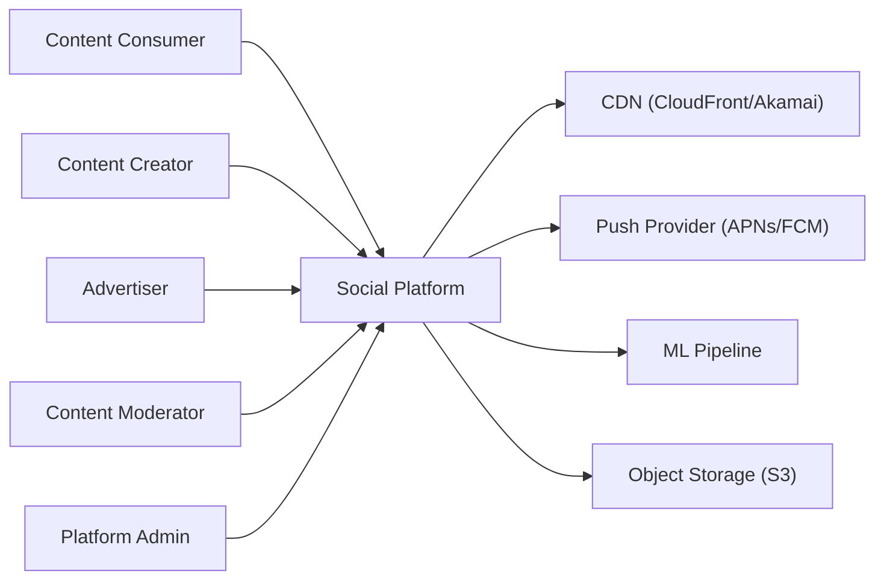
```mermaid
flowchart LR
    Consumer["Content Consumer"] --> Platform["Social Platform"]
    Creator["Content Creator"] --> Platform
    Advertiser["Advertiser"] --> Platform
    Moderator["Content Moderator"] --> Platform
    Admin["Platform Admin"] --> Platform
    Platform --> CDN["CDN (CloudFront/Akamai)"]
    Platform --> PushProvider["Push Provider (APNs/FCM)"]
    Platform --> MLPipeline["ML Pipeline"]
    Platform --> StorageCluster["Object Storage (S3)"]
```

---

## Core Workflows

### Happy Path: Create Post and Appear in Followers' Feeds

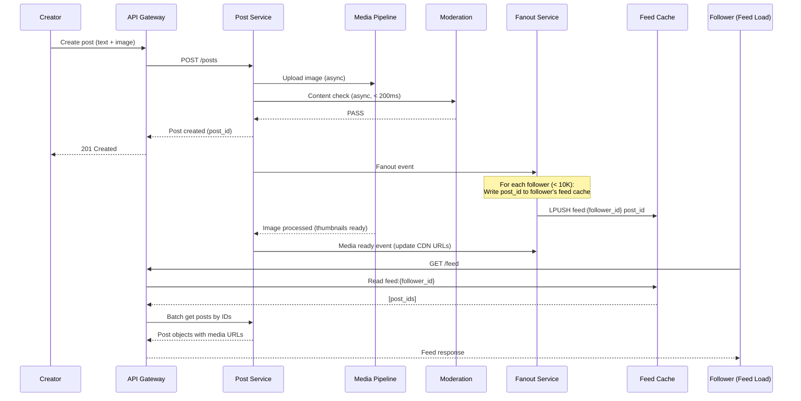
```mermaid
sequenceDiagram
    participant C as Creator
    participant API as API Gateway
    participant Post as Post Service
    participant Media as Media Pipeline
    participant Mod as Moderation
    participant Fanout as Fanout Service
    participant Cache as Feed Cache
    participant Follower as Follower (Feed Load)

    C->>API: Create post (text + image)
    API->>Post: POST /posts
    Post->>Media: Upload image (async)
    Post->>Mod: Content check (async, < 200ms)
    Mod-->>Post: PASS
    Post-->>API: Post created (post_id)
    API-->>C: 201 Created

    Post->>Fanout: Fanout event
    Note over Fanout: For each follower (< 10K):<br/>Write post_id to follower's feed cache
    Fanout->>Cache: LPUSH feed:{follower_id} post_id

    Media-->>Post: Image processed (thumbnails ready)
    Post->>Fanout: Media ready event (update CDN URLs)

    Follower->>API: GET /feed
    API->>Cache: Read feed:{follower_id}
    Cache-->>API: [post_ids]
    API->>Post: Batch get posts by IDs
    Post-->>API: Post objects with media URLs
    API-->>Follower: Feed response
```

### Fanout Strategy: Hybrid Approach

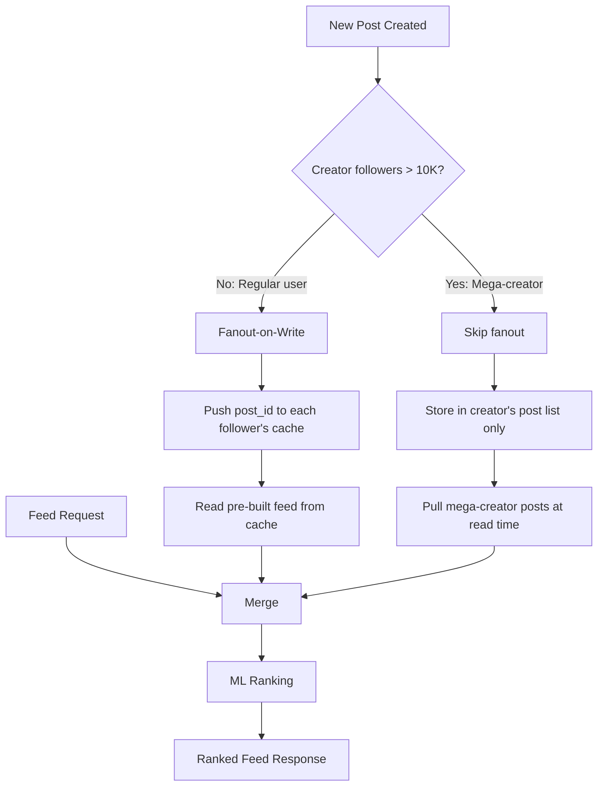
```mermaid
flowchart TD
    NewPost["New Post Created"] --> Check{"Creator followers > 10K?"}
    Check -->|No: Regular user| FanoutWrite["Fanout-on-Write"]
    FanoutWrite --> PushToCache["Push post_id to each follower's cache"]

    Check -->|Yes: Mega-creator| SkipFanout["Skip fanout"]
    SkipFanout --> StorePosts["Store in creator's post list only"]

    FeedRequest["Feed Request"] --> MergeStep["Merge"]
    PushToCache --> ReadCache["Read pre-built feed from cache"]
    ReadCache --> MergeStep
    StorePosts --> PullPosts["Pull mega-creator posts at read time"]
    PullPosts --> MergeStep
    MergeStep --> Rank["ML Ranking"]
    Rank --> Response["Ranked Feed Response"]
```

**Why hybrid?** A user with 50M followers creates 50M cache writes on every post. This takes minutes and overwhelms the fanout workers. Instead, mega-creator posts are pulled at feed-read time and merged with the pre-built feed.

---

## Capacity Estimation

**Feed:**
- 500M DAU x 10 feed loads/day = **5 billion feed reads/day** = ~58,000 RPS
- Feed cache: 500M users x 1KB = **500 GB** in Redis

**Posts:**
- 200M new posts/day x 2KB metadata = **400 GB/day** = 146 TB/year
- 100M posts with media x 5MB average = **500 TB/day** raw media

**Graph:**
- 2B users x 200 avg follows = **400 billion edges**
- Adjacency list: ~**1.6 TB** (fits in memory cluster)

**Engagement:**
- 5B likes/day = ~58,000 TPS
- 500M comments/day = ~5,800 TPS

**Messages:**
- 100B messages/day = 1.2M messages/second, **20 TB/day**

---

## High-Level Architecture

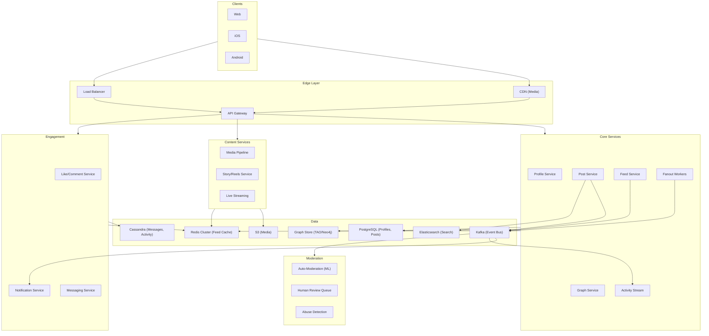
```mermaid
flowchart TB
    subgraph Clients["Clients"]
        Web["Web"]
        iOS["iOS"]
        Android["Android"]
    end

    subgraph Edge["Edge Layer"]
        CDN["CDN (Media)"]
        LB["Load Balancer"]
        GW["API Gateway"]
    end

    subgraph CoreServices["Core Services"]
        Profile["Profile Service"]
        Graph["Graph Service"]
        Post["Post Service"]
        Feed["Feed Service"]
        Activity["Activity Stream"]
        Fanout["Fanout Workers"]
    end

    subgraph ContentServices["Content Services"]
        MediaPipeline["Media Pipeline"]
        StoryService["Story/Reels Service"]
        LiveService["Live Streaming"]
    end

    subgraph EngagementServices["Engagement"]
        LikeComment["Like/Comment Service"]
        Notif["Notification Service"]
        Chat["Messaging Service"]
    end

    subgraph ModerationServices["Moderation"]
        AutoMod["Auto-Moderation (ML)"]
        HumanReview["Human Review Queue"]
        AbuseDetect["Abuse Detection"]
    end

    subgraph DataStores["Data"]
        PG["PostgreSQL (Profiles, Posts)"]
        GraphDB["Graph Store (TAO/Neo4j)"]
        Redis["Redis Cluster (Feed Cache)"]
        ES["Elasticsearch (Search)"]
        S3["S3 (Media)"]
        Cassandra["Cassandra (Messages, Activity)"]
        Kafka["Kafka (Event Bus)"]
    end

    Clients --> CDN & LB --> GW
    GW --> CoreServices & ContentServices & EngagementServices
    Post & Feed & Fanout --> Kafka
    Kafka --> ModerationServices & Notif & Activity
    CoreServices --> PG & GraphDB & Redis
    ContentServices --> S3 & Redis
    EngagementServices --> Cassandra & Redis
    Post --> ES
```

---

## Low-Level Design

### 1. User Profile System

#### Overview

The User Profile System manages user identity, preferences, privacy settings, and public-facing profile data. It is the most-read service on the platform — every feed load, every post display, every comment requires profile data (username, avatar, verification badge).

#### Data Model

```sql
CREATE TABLE users (
    user_id         UUID PRIMARY KEY DEFAULT gen_random_uuid(),
    username        TEXT UNIQUE NOT NULL,
    display_name    TEXT NOT NULL,
    email           TEXT UNIQUE NOT NULL,
    phone           TEXT UNIQUE,
    bio             TEXT,
    avatar_url      TEXT,
    cover_url       TEXT,
    website         TEXT,
    location        TEXT,
    is_verified     BOOLEAN DEFAULT false,
    is_private      BOOLEAN DEFAULT false,
    status          TEXT DEFAULT 'active' CHECK (status IN ('active', 'suspended', 'deactivated', 'banned')),
    follower_count  INT DEFAULT 0,
    following_count INT DEFAULT 0,
    post_count      INT DEFAULT 0,
    locale          TEXT DEFAULT 'en',
    created_at      TIMESTAMPTZ NOT NULL DEFAULT now(),
    updated_at      TIMESTAMPTZ NOT NULL DEFAULT now()
);

CREATE TABLE user_settings (
    user_id                 UUID PRIMARY KEY REFERENCES users(user_id),
    notification_preferences JSONB DEFAULT '{}',
    privacy_settings        JSONB DEFAULT '{}',
    content_preferences     JSONB DEFAULT '{}',
    two_factor_enabled      BOOLEAN DEFAULT false,
    language                TEXT DEFAULT 'en'
);
```

#### Caching Strategy

Profile data is read thousands of times per second for popular users. **Profile card** (lightweight read for feed/comments):

```json
{"user_id": "usr_abc", "username": "johndoe", "display_name": "John Doe",
 "avatar_url": "https://cdn.example.com/avatars/usr_abc_sm.jpg", "is_verified": true}
```

Stored in Redis as a hash. TTL: 5 minutes, event-driven invalidation on profile update.

#### Extended Data Model

```sql
-- User authentication credentials (separated for security)
CREATE TABLE user_credentials (
    user_id             UUID PRIMARY KEY REFERENCES users(user_id),
    password_hash       TEXT NOT NULL,
    password_salt       TEXT NOT NULL,
    mfa_secret          TEXT,
    mfa_backup_codes    TEXT[],
    last_password_change TIMESTAMPTZ NOT NULL DEFAULT now(),
    failed_login_count  INT DEFAULT 0,
    locked_until        TIMESTAMPTZ,
    created_at          TIMESTAMPTZ NOT NULL DEFAULT now()
);

-- User linked accounts (OAuth providers)
CREATE TABLE user_linked_accounts (
    user_id         UUID NOT NULL REFERENCES users(user_id),
    provider        TEXT NOT NULL CHECK (provider IN ('google', 'apple', 'facebook', 'twitter')),
    provider_uid    TEXT NOT NULL,
    access_token    TEXT,
    refresh_token   TEXT,
    token_expires   TIMESTAMPTZ,
    created_at      TIMESTAMPTZ NOT NULL DEFAULT now(),
    PRIMARY KEY (user_id, provider),
    UNIQUE (provider, provider_uid)
);

-- User profile history (for audit / rollback)
CREATE TABLE user_profile_history (
    history_id      UUID PRIMARY KEY DEFAULT gen_random_uuid(),
    user_id         UUID NOT NULL REFERENCES users(user_id),
    field_name      TEXT NOT NULL,
    old_value       TEXT,
    new_value       TEXT,
    changed_by      TEXT NOT NULL CHECK (changed_by IN ('user', 'admin', 'system')),
    reason          TEXT,
    created_at      TIMESTAMPTZ NOT NULL DEFAULT now()
);
CREATE INDEX idx_profile_history_user ON user_profile_history(user_id, created_at DESC);

-- User blocks
CREATE TABLE user_blocks (
    blocker_id      UUID NOT NULL REFERENCES users(user_id),
    blocked_id      UUID NOT NULL REFERENCES users(user_id),
    created_at      TIMESTAMPTZ NOT NULL DEFAULT now(),
    PRIMARY KEY (blocker_id, blocked_id)
);
CREATE INDEX idx_blocks_blocked ON user_blocks(blocked_id);

-- User mutes
CREATE TABLE user_mutes (
    user_id         UUID NOT NULL REFERENCES users(user_id),
    muted_id        UUID NOT NULL REFERENCES users(user_id),
    mute_type       TEXT DEFAULT 'all' CHECK (mute_type IN ('all', 'stories', 'posts', 'notifications')),
    expires_at      TIMESTAMPTZ,
    created_at      TIMESTAMPTZ NOT NULL DEFAULT now(),
    PRIMARY KEY (user_id, muted_id)
);

-- Close friends list
CREATE TABLE close_friends (
    user_id         UUID NOT NULL REFERENCES users(user_id),
    friend_id       UUID NOT NULL REFERENCES users(user_id),
    created_at      TIMESTAMPTZ NOT NULL DEFAULT now(),
    PRIMARY KEY (user_id, friend_id)
);
```

#### REST API Specification

**GET /api/v1/users/{user_id}** — Fetch user profile

```json
// Response 200
{
  "user_id": "usr_abc123",
  "username": "johndoe",
  "display_name": "John Doe",
  "bio": "Software engineer | Dog lover",
  "avatar_url": "https://cdn.example.com/avatars/usr_abc123_md.jpg",
  "cover_url": "https://cdn.example.com/covers/usr_abc123.jpg",
  "website": "https://johndoe.dev",
  "location": "San Francisco, CA",
  "is_verified": true,
  "is_private": false,
  "follower_count": 12543,
  "following_count": 892,
  "post_count": 347,
  "relationship": {
    "following": true,
    "followed_by": false,
    "blocked": false,
    "muted": false
  },
  "created_at": "2022-03-15T10:30:00Z"
}
```

**PUT /api/v1/users/me** — Update current user profile

```json
// Request
{
  "display_name": "John Doe Jr.",
  "bio": "Updated bio text",
  "website": "https://new-site.dev",
  "location": "New York, NY"
}

// Response 200
{
  "user_id": "usr_abc123",
  "display_name": "John Doe Jr.",
  "bio": "Updated bio text",
  "updated_at": "2025-01-15T14:22:00Z"
}
```

**PATCH /api/v1/users/me/settings** — Update user settings

```json
// Request
{
  "privacy_settings": {
    "who_can_dm": "followers",
    "who_can_see_likes": "only_me",
    "show_activity_status": false
  },
  "notification_preferences": {
    "likes": "off",
    "comments": "from_following",
    "follows": "on",
    "dms": "on"
  }
}

// Response 200
{
  "user_id": "usr_abc123",
  "settings_updated": true,
  "updated_at": "2025-01-15T14:25:00Z"
}
```

**POST /api/v1/users/{user_id}/block** — Block a user

```json
// Response 200
{
  "blocker_id": "usr_abc123",
  "blocked_id": "usr_xyz789",
  "blocked_at": "2025-01-15T14:30:00Z",
  "side_effects": {
    "unfollowed": true,
    "removed_follower": true,
    "removed_from_close_friends": true
  }
}
```

**GET /api/v1/users/me/blocked** — List blocked users

```json
// Response 200
{
  "blocked_users": [
    {
      "user_id": "usr_xyz789",
      "username": "spammer42",
      "blocked_at": "2025-01-15T14:30:00Z"
    }
  ],
  "cursor": "eyJsYXN0X2lkIjoiYmxrXzEyMyJ9",
  "has_more": false
}
```

#### Profile Search

Profiles are indexed in Elasticsearch for username search, display name search, and "People You May Know" suggestions:

```json
// Elasticsearch document
{
  "user_id": "usr_abc123",
  "username": "johndoe",
  "display_name": "John Doe",
  "bio": "Software engineer | Dog lover",
  "location": "San Francisco, CA",
  "is_verified": true,
  "follower_count": 12543,
  "mutual_followers": ["usr_def456", "usr_ghi789"]
}
```

---

### 2. Follow/Friend Graph System

#### Overview

The Follow/Friend Graph System manages the social relationships between users. This is the foundation of feed generation — "who follows whom" determines whose posts appear in whose feed.

At Facebook's scale, the social graph contains **over 1 trillion edges** across 3 billion users. Facebook built **TAO** (The Associations and Objects) — a purpose-built distributed graph store.

#### Data Model

```sql
CREATE TABLE follows (
    follower_id     UUID NOT NULL,
    followee_id     UUID NOT NULL,
    created_at      TIMESTAMPTZ NOT NULL DEFAULT now(),
    PRIMARY KEY (follower_id, followee_id)
);
CREATE INDEX idx_follows_followee ON follows(followee_id, follower_id);

CREATE TABLE follow_requests (
    requester_id    UUID NOT NULL,
    target_id       UUID NOT NULL,
    status          TEXT DEFAULT 'pending' CHECK (status IN ('pending', 'approved', 'rejected')),
    created_at      TIMESTAMPTZ NOT NULL DEFAULT now(),
    PRIMARY KEY (requester_id, target_id)
);
```

#### Sharding Strategy

| Strategy | Pros | Cons |
|----------|------|------|
| **Shard by follower_id** | Fast "who do I follow" queries | Slow "who follows me" (scatter-gather) |
| **Shard by followee_id** | Fast "who follows me" queries | Slow "who do I follow" |
| **Both (double-write)** | Fast in both directions | 2x storage, consistency concern |

**Facebook's approach (TAO)**: Double-write with eventually consistent replication.

#### Edge Cases

- **Celebrity follow (100M followers)**: Paginate reads; use fanout-on-read for these accounts.
- **Block vs. unfollow**: Blocking removes the follow AND prevents re-following.
- **Mass follow/unfollow bots**: Rate limit: max 100 follow/unfollow actions per hour.

#### Extended Data Model

```sql
-- Friendship (bidirectional, platform-specific)
CREATE TABLE friendships (
    user_id_a       UUID NOT NULL,
    user_id_b       UUID NOT NULL,
    status          TEXT DEFAULT 'pending' CHECK (status IN ('pending', 'active', 'blocked')),
    initiated_by    UUID NOT NULL,
    created_at      TIMESTAMPTZ NOT NULL DEFAULT now(),
    accepted_at     TIMESTAMPTZ,
    PRIMARY KEY (user_id_a, user_id_b),
    CHECK (user_id_a < user_id_b)  -- canonical ordering to prevent duplicates
);
CREATE INDEX idx_friendships_user_b ON friendships(user_id_b, user_id_a);

-- Follower counts materialized (denormalized for fast reads)
CREATE TABLE follower_counts (
    user_id         UUID PRIMARY KEY,
    follower_count  BIGINT DEFAULT 0,
    following_count BIGINT DEFAULT 0,
    mutual_count    BIGINT DEFAULT 0,
    updated_at      TIMESTAMPTZ NOT NULL DEFAULT now()
);

-- "People You May Know" suggestions (precomputed)
CREATE TABLE pymk_suggestions (
    user_id             UUID NOT NULL,
    suggested_user_id   UUID NOT NULL,
    score               FLOAT NOT NULL,
    reason              TEXT CHECK (reason IN ('mutual_followers', 'contacts', 'same_school', 'same_company', 'same_location')),
    mutual_count        INT DEFAULT 0,
    is_dismissed        BOOLEAN DEFAULT false,
    created_at          TIMESTAMPTZ NOT NULL DEFAULT now(),
    PRIMARY KEY (user_id, suggested_user_id)
);
CREATE INDEX idx_pymk_score ON pymk_suggestions(user_id, score DESC) WHERE is_dismissed = false;
```

#### REST API Specification

**POST /api/v1/users/{user_id}/follow** — Follow a user

```json
// Response 200 (public account)
{
  "follower_id": "usr_abc123",
  "followee_id": "usr_xyz789",
  "status": "following",
  "created_at": "2025-01-15T14:30:00Z"
}

// Response 200 (private account)
{
  "follower_id": "usr_abc123",
  "followee_id": "usr_xyz789",
  "status": "requested",
  "created_at": "2025-01-15T14:30:00Z"
}
```

**DELETE /api/v1/users/{user_id}/follow** — Unfollow a user

```json
// Response 200
{
  "unfollowed": true,
  "follower_id": "usr_abc123",
  "followee_id": "usr_xyz789"
}
```

**GET /api/v1/users/{user_id}/followers** — List followers (paginated)

```json
// Response 200
{
  "followers": [
    {
      "user_id": "usr_def456",
      "username": "janedoe",
      "display_name": "Jane Doe",
      "avatar_url": "https://cdn.example.com/avatars/usr_def456_sm.jpg",
      "is_verified": false,
      "is_following_you": true,
      "followed_at": "2025-01-10T08:15:00Z"
    }
  ],
  "cursor": "eyJsYXN0X2lkIjoiZmxrXzEyMyJ9",
  "has_more": true,
  "total_count": 12543
}
```

**GET /api/v1/users/{user_id}/following** — List following (paginated)

```json
// Response 200
{
  "following": [
    {
      "user_id": "usr_ghi789",
      "username": "techguru",
      "display_name": "Tech Guru",
      "avatar_url": "https://cdn.example.com/avatars/usr_ghi789_sm.jpg",
      "is_verified": true,
      "follows_you": false,
      "followed_at": "2024-12-01T11:00:00Z"
    }
  ],
  "cursor": "eyJsYXN0X2lkIjoiZmxnXzQ1NiJ9",
  "has_more": true,
  "total_count": 892
}
```

**GET /api/v1/users/{user_id}/mutual-followers?with={other_user_id}** — Mutual followers

```json
// Response 200
{
  "mutual_followers": [
    {
      "user_id": "usr_common1",
      "username": "mutualfriend",
      "avatar_url": "https://cdn.example.com/avatars/usr_common1_sm.jpg"
    }
  ],
  "total_mutual": 23,
  "cursor": "eyJsYXN0IjoibXR4XzEwIn0",
  "has_more": true
}
```

**POST /api/v1/follow-requests/{request_id}/approve** — Approve follow request

```json
// Response 200
{
  "request_id": "req_abc123",
  "status": "approved",
  "follower_id": "usr_requester",
  "approved_at": "2025-01-15T15:00:00Z"
}
```

#### Graph Query Patterns

| Query | Implementation | Latency Target |
|-------|---------------|----------------|
| "Does A follow B?" | Direct lookup `follows(A, B)` | < 5ms |
| "List A's followers" | Index scan `idx_follows_followee(A)` | < 50ms (page) |
| "Mutual followers of A and B" | Intersection of follower sets | < 100ms |
| "People You May Know" | Precomputed PYMK table + live filter | < 200ms |
| "2nd degree connections" | 2-hop BFS on graph store | < 500ms |

---

### 3. Feed Generation System

#### Overview

The Feed Generation System is the **most important product surface** on any social platform. It determines what content each user sees when they open the app.

#### Fanout-on-Write vs. Fanout-on-Read

| Aspect | Fanout-on-Write | Fanout-on-Read |
|--------|----------------|----------------|
| **Write cost** | High (1 post → N writes) | Low (1 write) |
| **Read cost** | Low (read from cache) | High (merge N lists) |
| **Freshness** | Seconds to minutes lag | Always fresh |
| **Best for** | Users with < 10K followers | Mega-creators (> 10K followers) |

#### Feed Assembly Pipeline

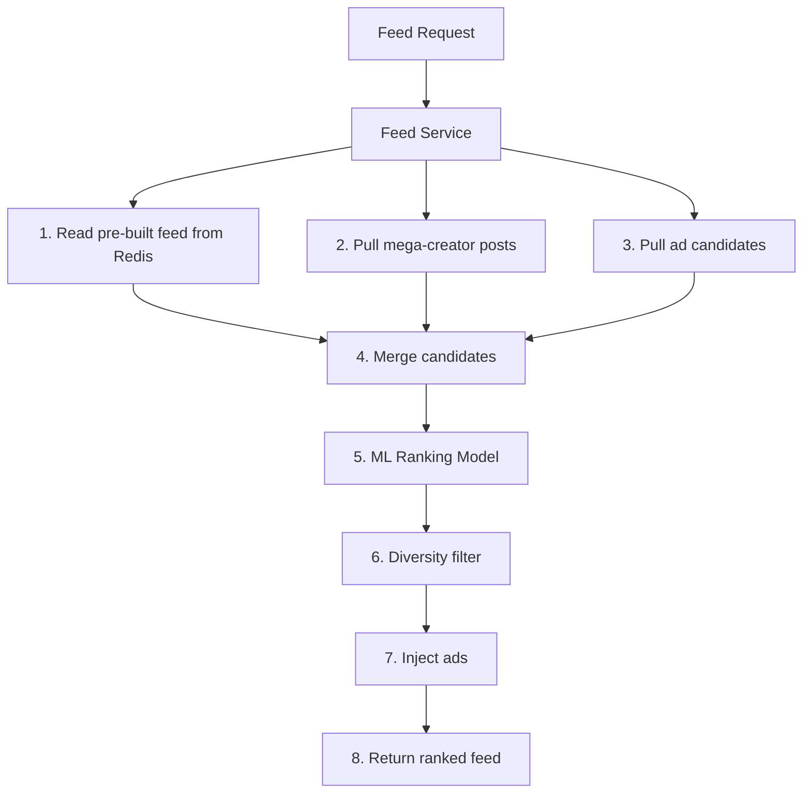
```mermaid
flowchart TD
    Request["Feed Request"] --> FeedSvc["Feed Service"]
    FeedSvc --> CacheRead["1. Read pre-built feed from Redis"]
    FeedSvc --> PullMega["2. Pull mega-creator posts"]
    FeedSvc --> PullAds["3. Pull ad candidates"]

    CacheRead & PullMega & PullAds --> Merge["4. Merge candidates"]
    Merge --> Rank["5. ML Ranking Model"]
    Rank --> Diversify["6. Diversity filter"]
    Diversify --> Inject["7. Inject ads"]
    Inject --> Response["8. Return ranked feed"]
```

#### Feed Ranking Model

Two-stage ranking:
1. **Candidate generation** (1000 → 500): Lightweight filter
2. **Fine ranking** (500 → 50): Deep model scoring by P(engagement)

**Features**: Post age, media type, creator follower count, user engagement history, time of day, device type.

#### Feed Cache (Redis)

```
KEY: feed:{user_id}
TYPE: Sorted Set (score = post creation timestamp)
MAX SIZE: 500 entries

ZADD feed:usr_xyz 1711100000 "post_abc123"
ZREVRANGE feed:usr_xyz 0 19   # Read latest 20
```

#### Edge Cases

- **User follows 5,000 accounts**: Pre-compute partial feed; merge only mega-creator posts at read time.
- **Cold-start user (no follows)**: Show trending posts + onboarding recommendations.
- **User inactive 30 days**: Feed cache stale. Rebuild from scratch.

#### Extended Data Model

```sql
-- Materialized feed entries (persistent backup for Redis)
CREATE TABLE feed_entries (
    user_id         UUID NOT NULL,
    post_id         UUID NOT NULL,
    source_type     TEXT NOT NULL CHECK (source_type IN ('follow', 'mega_pull', 'recommended', 'ad')),
    score           FLOAT NOT NULL DEFAULT 0,
    inserted_at     TIMESTAMPTZ NOT NULL DEFAULT now(),
    PRIMARY KEY (user_id, inserted_at, post_id)
) PARTITION BY RANGE (inserted_at);

-- Create monthly partitions
CREATE TABLE feed_entries_2025_01 PARTITION OF feed_entries
    FOR VALUES FROM ('2025-01-01') TO ('2025-02-01');
CREATE TABLE feed_entries_2025_02 PARTITION OF feed_entries
    FOR VALUES FROM ('2025-02-01') TO ('2025-03-01');

-- Feed ranking features (precomputed)
CREATE TABLE feed_ranking_features (
    user_id             UUID NOT NULL,
    post_id             UUID NOT NULL,
    creator_affinity    FLOAT DEFAULT 0,    -- how much user engages with creator
    content_type_pref   FLOAT DEFAULT 0,    -- user preference for this content type
    recency_score       FLOAT DEFAULT 0,    -- time decay
    engagement_velocity FLOAT DEFAULT 0,    -- how fast post is gaining engagement
    diversity_penalty   FLOAT DEFAULT 0,    -- reduce similar consecutive posts
    computed_at         TIMESTAMPTZ NOT NULL DEFAULT now(),
    PRIMARY KEY (user_id, post_id)
);

-- Feed position tracking (for analytics)
CREATE TABLE feed_impressions (
    impression_id   UUID PRIMARY KEY DEFAULT gen_random_uuid(),
    user_id         UUID NOT NULL,
    post_id         UUID NOT NULL,
    position        INT NOT NULL,
    session_id      UUID NOT NULL,
    dwell_time_ms   INT,
    engaged         BOOLEAN DEFAULT false,
    engagement_type TEXT,
    created_at      TIMESTAMPTZ NOT NULL DEFAULT now()
);
CREATE INDEX idx_impressions_user ON feed_impressions(user_id, created_at DESC);
CREATE INDEX idx_impressions_post ON feed_impressions(post_id, created_at DESC);
```

#### REST API Specification

**GET /api/v1/feed** — Get personalized feed

```json
// Request: GET /api/v1/feed?cursor=eyJ0cyI6MTcxMTEwMDAwMH0&limit=20

// Response 200
{
  "posts": [
    {
      "post_id": "post_abc123",
      "user": {
        "user_id": "usr_creator1",
        "username": "photographer",
        "display_name": "Pro Photographer",
        "avatar_url": "https://cdn.example.com/avatars/usr_creator1_sm.jpg",
        "is_verified": true
      },
      "content_text": "Golden hour at the beach",
      "media": [
        {
          "media_id": "med_img001",
          "type": "image",
          "url": "https://cdn.example.com/media/med_img001_lg.jpg",
          "thumbnail_url": "https://cdn.example.com/media/med_img001_sm.jpg",
          "width": 1080,
          "height": 1350,
          "alt_text": "Sunset at beach"
        }
      ],
      "hashtags": ["photography", "sunset", "beach"],
      "like_count": 2451,
      "comment_count": 89,
      "share_count": 34,
      "view_count": 18923,
      "is_liked": false,
      "is_saved": true,
      "created_at": "2025-01-15T17:30:00Z",
      "ranking_reason": "followed_creator"
    }
  ],
  "cursor": "eyJ0cyI6MTcxMTEwMDEwMH0",
  "has_more": true,
  "feed_session_id": "fsess_abc123"
}
```

**POST /api/v1/feed/refresh** — Force feed refresh (pull latest)

```json
// Response 200
{
  "new_posts_count": 12,
  "feed_session_id": "fsess_def456",
  "refreshed_at": "2025-01-15T18:00:00Z"
}
```

**POST /api/v1/feed/seen** — Report posts seen (for ranking feedback)

```json
// Request
{
  "feed_session_id": "fsess_abc123",
  "impressions": [
    {"post_id": "post_abc123", "position": 1, "dwell_time_ms": 3500, "engaged": true},
    {"post_id": "post_def456", "position": 2, "dwell_time_ms": 800, "engaged": false},
    {"post_id": "post_ghi789", "position": 3, "dwell_time_ms": 5200, "engaged": true}
  ]
}

// Response 200
{
  "accepted": true,
  "impressions_recorded": 3
}
```

---

### 4. Activity Stream System

#### Overview

The Activity Stream records a chronological log of actions relevant to a user: "John liked your photo," "Sarah started following you."

#### Data Model (Cassandra)

```
CREATE TABLE activity_stream (
    user_id         UUID,
    activity_time   TIMEUUID,
    activity_type   TEXT,
    actor_id        UUID,
    target_type     TEXT,
    target_id       UUID,
    summary         TEXT,
    is_read         BOOLEAN,
    PRIMARY KEY (user_id, activity_time)
) WITH CLUSTERING ORDER BY (activity_time DESC)
  AND default_time_to_live = 7776000;  -- 90 days
```

Activities are aggregated for display: "John, Sarah, and 48 others liked your photo."

#### Activity Aggregation Model (Cassandra)

```
-- Aggregated activity buckets
CREATE TABLE activity_aggregations (
    user_id         UUID,
    bucket_key      TEXT,           -- e.g., 'like:post_abc123'
    activity_type   TEXT,
    target_type     TEXT,
    target_id       UUID,
    actor_ids       LIST<UUID>,     -- most recent actors
    total_count     INT,
    last_updated    TIMESTAMP,
    is_read         BOOLEAN,
    PRIMARY KEY (user_id, bucket_key)
);
```

#### REST API Specification

**GET /api/v1/activity** — Get activity stream

```json
// Request: GET /api/v1/activity?cursor=eyJ0cyI6MTcxMX0&limit=20

// Response 200
{
  "activities": [
    {
      "activity_id": "act_001",
      "type": "like_aggregate",
      "actors": [
        {"user_id": "usr_john", "username": "johndoe", "avatar_url": "..."},
        {"user_id": "usr_sarah", "username": "sarahj", "avatar_url": "..."}
      ],
      "total_actor_count": 50,
      "summary": "johndoe, sarahj, and 48 others liked your photo",
      "target": {
        "type": "post",
        "post_id": "post_abc123",
        "thumbnail_url": "https://cdn.example.com/media/post_abc123_thumb.jpg"
      },
      "is_read": false,
      "last_updated": "2025-01-15T17:45:00Z"
    },
    {
      "activity_id": "act_002",
      "type": "follow",
      "actors": [
        {"user_id": "usr_new1", "username": "newfollower", "avatar_url": "..."}
      ],
      "total_actor_count": 1,
      "summary": "newfollower started following you",
      "target": null,
      "is_read": true,
      "last_updated": "2025-01-15T16:30:00Z"
    }
  ],
  "cursor": "eyJ0cyI6MTcxMTAwMDAwMH0",
  "has_more": true,
  "unread_count": 15
}
```

**POST /api/v1/activity/mark-read** — Mark activities as read

```json
// Request
{
  "activity_ids": ["act_001", "act_002"],
  "mark_all": false
}

// Response 200
{
  "marked_count": 2,
  "remaining_unread": 13
}
```

---

### 5. Post Creation System

#### Overview

The Post Creation System accepts user content, validates it, stores it, triggers media processing, and initiates fanout. Post creation returns immediately after DB write; all downstream processing is asynchronous via Kafka.

#### Data Model

```sql
CREATE TABLE posts (
    post_id         UUID PRIMARY KEY DEFAULT gen_random_uuid(),
    user_id         UUID NOT NULL,
    content_text    TEXT,
    media_ids       UUID[],
    hashtags        TEXT[],
    mentions        UUID[],
    location        JSONB,
    privacy         TEXT DEFAULT 'public' CHECK (privacy IN ('public', 'followers', 'close_friends', 'private')),
    post_type       TEXT DEFAULT 'post' CHECK (post_type IN ('post', 'story', 'reel', 'live')),
    reply_to        UUID,
    like_count      INT DEFAULT 0,
    comment_count   INT DEFAULT 0,
    share_count     INT DEFAULT 0,
    view_count      BIGINT DEFAULT 0,
    status          TEXT DEFAULT 'active',
    created_at      TIMESTAMPTZ NOT NULL DEFAULT now(),
    updated_at      TIMESTAMPTZ NOT NULL DEFAULT now()
);

CREATE INDEX idx_posts_user ON posts(user_id, created_at DESC);
CREATE INDEX idx_posts_hashtag ON posts USING GIN (hashtags);
```

#### Post Creation Flow

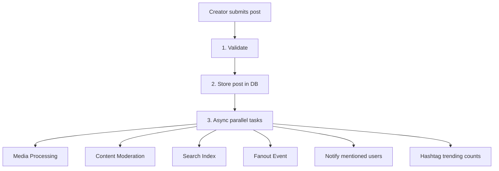
```mermaid
flowchart TD
    Creator["Creator submits post"] --> Validate["1. Validate"]
    Validate --> Store["2. Store post in DB"]
    Store --> Parallel["3. Async parallel tasks"]
    Parallel --> MediaProc["Media Processing"]
    Parallel --> ModCheck["Content Moderation"]
    Parallel --> IndexSearch["Search Index"]
    Parallel --> FanoutEvt["Fanout Event"]
    Parallel --> MentionNotif["Notify mentioned users"]
    Parallel --> HashtagUpdate["Hashtag trending counts"]
```

#### Extended Data Model

```sql
-- Media metadata (shared across posts, stories, reels)
CREATE TABLE media (
    media_id        UUID PRIMARY KEY DEFAULT gen_random_uuid(),
    user_id         UUID NOT NULL REFERENCES users(user_id),
    media_type      TEXT NOT NULL CHECK (media_type IN ('image', 'video', 'gif', 'audio')),
    original_url    TEXT NOT NULL,
    processed_urls  JSONB DEFAULT '{}',   -- {"thumbnail": "...", "small": "...", "medium": "...", "large": "..."}
    width           INT,
    height          INT,
    duration_sec    FLOAT,                -- for video/audio
    file_size_bytes BIGINT,
    mime_type       TEXT,
    alt_text        TEXT,
    blurhash        TEXT,                 -- compact placeholder representation
    perceptual_hash TEXT,                 -- for duplicate/CSAM detection
    exif_stripped   BOOLEAN DEFAULT true,
    processing_status TEXT DEFAULT 'pending' CHECK (processing_status IN ('pending', 'processing', 'completed', 'failed')),
    moderation_status TEXT DEFAULT 'pending' CHECK (moderation_status IN ('pending', 'approved', 'rejected', 'review')),
    cdn_region      TEXT,
    created_at      TIMESTAMPTZ NOT NULL DEFAULT now()
);
CREATE INDEX idx_media_user ON media(user_id, created_at DESC);
CREATE INDEX idx_media_processing ON media(processing_status) WHERE processing_status != 'completed';
CREATE INDEX idx_media_phash ON media(perceptual_hash) WHERE perceptual_hash IS NOT NULL;

-- Hashtag registry
CREATE TABLE hashtags (
    hashtag_id      BIGSERIAL PRIMARY KEY,
    tag             TEXT UNIQUE NOT NULL,
    post_count      BIGINT DEFAULT 0,
    is_banned       BOOLEAN DEFAULT false,
    created_at      TIMESTAMPTZ NOT NULL DEFAULT now()
);
CREATE INDEX idx_hashtags_tag ON hashtags(tag);

-- Post-hashtag junction (for trending computation)
CREATE TABLE post_hashtags (
    post_id         UUID NOT NULL,
    hashtag_id      BIGINT NOT NULL REFERENCES hashtags(hashtag_id),
    created_at      TIMESTAMPTZ NOT NULL DEFAULT now(),
    PRIMARY KEY (post_id, hashtag_id)
);
CREATE INDEX idx_post_hashtags_tag ON post_hashtags(hashtag_id, created_at DESC);

-- Saved / bookmarked posts
CREATE TABLE saved_posts (
    user_id         UUID NOT NULL REFERENCES users(user_id),
    post_id         UUID NOT NULL REFERENCES posts(post_id),
    collection_id   UUID,
    created_at      TIMESTAMPTZ NOT NULL DEFAULT now(),
    PRIMARY KEY (user_id, post_id)
);
CREATE INDEX idx_saved_posts_collection ON saved_posts(user_id, collection_id, created_at DESC);

-- Post shares / reposts
CREATE TABLE post_shares (
    share_id        UUID PRIMARY KEY DEFAULT gen_random_uuid(),
    user_id         UUID NOT NULL REFERENCES users(user_id),
    original_post_id UUID NOT NULL REFERENCES posts(post_id),
    share_type      TEXT DEFAULT 'repost' CHECK (share_type IN ('repost', 'quote', 'dm_share', 'story_share')),
    quote_text      TEXT,
    created_at      TIMESTAMPTZ NOT NULL DEFAULT now()
);
CREATE INDEX idx_shares_post ON post_shares(original_post_id, created_at DESC);
CREATE INDEX idx_shares_user ON post_shares(user_id, created_at DESC);
```

#### REST API Specification

**POST /api/v1/posts** — Create a new post

```json
// Request
{
  "content_text": "Golden hour at the beach! #photography #sunset",
  "media_ids": ["med_img001", "med_img002"],
  "privacy": "public",
  "location": {
    "name": "Santa Monica Beach",
    "lat": 34.0195,
    "lng": -118.4912
  },
  "mentions": ["usr_friend1", "usr_friend2"],
  "reply_to": null,
  "idempotency_key": "idem_post_abc123_1705312200"
}

// Response 201 Created
{
  "post_id": "post_abc123",
  "user_id": "usr_abc123",
  "content_text": "Golden hour at the beach! #photography #sunset",
  "media": [
    {
      "media_id": "med_img001",
      "processing_status": "processing",
      "thumbnail_url": "https://cdn.example.com/media/med_img001_blur.jpg"
    }
  ],
  "hashtags": ["photography", "sunset"],
  "mentions": ["usr_friend1", "usr_friend2"],
  "privacy": "public",
  "like_count": 0,
  "comment_count": 0,
  "status": "active",
  "created_at": "2025-01-15T17:30:00Z"
}
```

**GET /api/v1/posts/{post_id}** — Get post details

```json
// Response 200
{
  "post_id": "post_abc123",
  "user": {
    "user_id": "usr_abc123",
    "username": "johndoe",
    "display_name": "John Doe",
    "avatar_url": "https://cdn.example.com/avatars/usr_abc123_sm.jpg",
    "is_verified": true
  },
  "content_text": "Golden hour at the beach! #photography #sunset",
  "media": [
    {
      "media_id": "med_img001",
      "type": "image",
      "url": "https://cdn.example.com/media/med_img001_lg.jpg",
      "thumbnail_url": "https://cdn.example.com/media/med_img001_sm.jpg",
      "width": 1080,
      "height": 1350,
      "blurhash": "LEHV6nWB2yk8pyoJadR*.7kCMdnj"
    }
  ],
  "hashtags": ["photography", "sunset"],
  "location": {"name": "Santa Monica Beach", "lat": 34.0195, "lng": -118.4912},
  "privacy": "public",
  "like_count": 2451,
  "comment_count": 89,
  "share_count": 34,
  "view_count": 18923,
  "is_liked": false,
  "is_saved": true,
  "created_at": "2025-01-15T17:30:00Z"
}
```

**DELETE /api/v1/posts/{post_id}** — Delete a post

```json
// Response 200
{
  "post_id": "post_abc123",
  "deleted": true,
  "deleted_at": "2025-01-15T20:00:00Z"
}
```

**GET /api/v1/users/{user_id}/posts** — Get user's posts (paginated)

```json
// Request: GET /api/v1/users/usr_abc123/posts?cursor=...&limit=12

// Response 200
{
  "posts": [ /* array of post objects */ ],
  "cursor": "eyJ0cyI6MTcxMTEwMDAwMH0",
  "has_more": true,
  "total_count": 347
}
```

**POST /api/v1/posts/{post_id}/save** — Save / bookmark a post

```json
// Response 200
{
  "post_id": "post_abc123",
  "saved": true,
  "collection_id": null,
  "saved_at": "2025-01-15T18:00:00Z"
}
```

---

### 6. Media Upload & Processing

#### Overview

The Media Pipeline handles the ingestion, processing, and delivery of images and videos. At Instagram's scale, this means processing **100 million+ photos and 50 million+ videos per day**.

#### Processing Pipeline

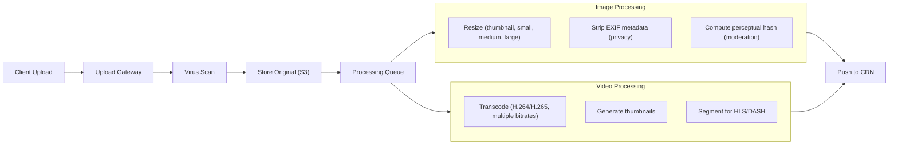
```mermaid
flowchart LR
    Upload["Client Upload"] --> Gateway["Upload Gateway"]
    Gateway --> Virus["Virus Scan"]
    Virus --> Store["Store Original (S3)"]
    Store --> Process["Processing Queue"]

    subgraph ImageProcessing["Image Processing"]
        ImgResize["Resize (thumbnail, small, medium, large)"]
        ImgStrip["Strip EXIF metadata (privacy)"]
        ImgHash["Compute perceptual hash (moderation)"]
    end

    subgraph VideoProcessing["Video Processing"]
        VidTranscode["Transcode (H.264/H.265, multiple bitrates)"]
        VidThumb["Generate thumbnails"]
        VidSegment["Segment for HLS/DASH"]
    end

    Process --> ImageProcessing & VideoProcessing
    ImageProcessing & VideoProcessing --> CDN["Push to CDN"]
```

#### Video Transcoding Profiles

| Profile | Resolution | Bitrate | Use Case |
|---------|-----------|---------|----------|
| 240p | 426x240 | 400 kbps | Slow connections |
| 480p | 854x480 | 1.5 Mbps | Mobile data |
| 720p | 1280x720 | 3 Mbps | WiFi |
| 1080p | 1920x1080 | 6 Mbps | Desktop/high-end mobile |
| 4K | 3840x2160 | 15 Mbps | Smart TVs |

#### Data Model

```sql
-- Upload sessions (resumable uploads)
CREATE TABLE upload_sessions (
    session_id      UUID PRIMARY KEY DEFAULT gen_random_uuid(),
    user_id         UUID NOT NULL REFERENCES users(user_id),
    media_type      TEXT NOT NULL CHECK (media_type IN ('image', 'video', 'gif')),
    file_name       TEXT NOT NULL,
    file_size_bytes BIGINT NOT NULL,
    mime_type       TEXT NOT NULL,
    upload_url      TEXT NOT NULL,           -- pre-signed S3 URL
    parts_uploaded  INT DEFAULT 0,
    total_parts     INT,
    status          TEXT DEFAULT 'initiated' CHECK (status IN ('initiated', 'uploading', 'completed', 'expired', 'failed')),
    expires_at      TIMESTAMPTZ NOT NULL,
    created_at      TIMESTAMPTZ NOT NULL DEFAULT now()
);
CREATE INDEX idx_upload_sessions_user ON upload_sessions(user_id, created_at DESC);
CREATE INDEX idx_upload_sessions_expire ON upload_sessions(expires_at) WHERE status = 'uploading';

-- Transcoding jobs
CREATE TABLE transcoding_jobs (
    job_id          UUID PRIMARY KEY DEFAULT gen_random_uuid(),
    media_id        UUID NOT NULL REFERENCES media(media_id),
    profile         TEXT NOT NULL,           -- e.g., '720p', '1080p', '4K'
    status          TEXT DEFAULT 'queued' CHECK (status IN ('queued', 'processing', 'completed', 'failed')),
    input_url       TEXT NOT NULL,
    output_url      TEXT,
    duration_ms     INT,
    error_message   TEXT,
    worker_id       TEXT,
    started_at      TIMESTAMPTZ,
    completed_at    TIMESTAMPTZ,
    created_at      TIMESTAMPTZ NOT NULL DEFAULT now()
);
CREATE INDEX idx_transcode_media ON transcoding_jobs(media_id);
CREATE INDEX idx_transcode_status ON transcoding_jobs(status) WHERE status IN ('queued', 'processing');
```

#### REST API Specification

**POST /api/v1/media/upload/initiate** — Initiate upload session

```json
// Request
{
  "file_name": "beach_photo.jpg",
  "file_size_bytes": 4500000,
  "mime_type": "image/jpeg",
  "content_hash": "sha256:abc123def456..."
}

// Response 200
{
  "session_id": "upl_abc123",
  "upload_url": "https://upload.example.com/s3-presigned?...",
  "method": "PUT",
  "max_file_size": 50000000,
  "expires_at": "2025-01-15T18:30:00Z",
  "headers": {
    "Content-Type": "image/jpeg",
    "x-amz-meta-session-id": "upl_abc123"
  }
}
```

**POST /api/v1/media/upload/complete** — Complete upload and trigger processing

```json
// Request
{
  "session_id": "upl_abc123"
}

// Response 200
{
  "media_id": "med_img001",
  "processing_status": "processing",
  "estimated_completion_sec": 15,
  "preview_url": "https://cdn.example.com/media/med_img001_blur.jpg"
}
```

**GET /api/v1/media/{media_id}/status** — Check processing status

```json
// Response 200
{
  "media_id": "med_img001",
  "processing_status": "completed",
  "urls": {
    "thumbnail": "https://cdn.example.com/media/med_img001_thumb.jpg",
    "small": "https://cdn.example.com/media/med_img001_sm.jpg",
    "medium": "https://cdn.example.com/media/med_img001_md.jpg",
    "large": "https://cdn.example.com/media/med_img001_lg.jpg",
    "original": "https://cdn.example.com/media/med_img001_orig.jpg"
  },
  "width": 1080,
  "height": 1350,
  "blurhash": "LEHV6nWB2yk8pyoJadR*.7kCMdnj",
  "completed_at": "2025-01-15T17:30:15Z"
}
```

#### Media Processing State Machine

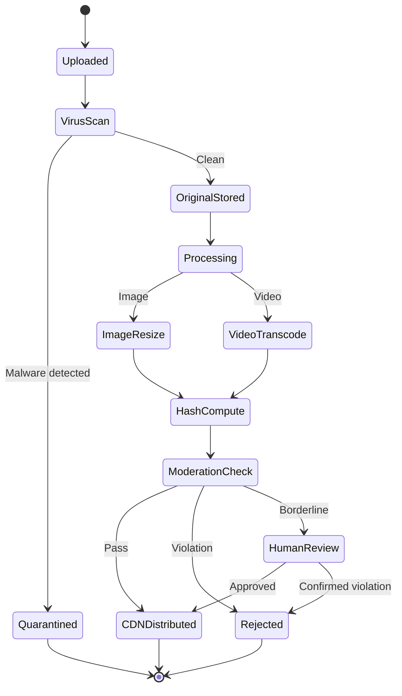
```mermaid
stateDiagram-v2
    [*] --> Uploaded
    Uploaded --> VirusScan
    VirusScan --> Quarantined: Malware detected
    VirusScan --> OriginalStored: Clean
    OriginalStored --> Processing
    Processing --> ImageResize: Image
    Processing --> VideoTranscode: Video
    ImageResize --> HashCompute
    VideoTranscode --> HashCompute
    HashCompute --> ModerationCheck
    ModerationCheck --> CDNDistributed: Pass
    ModerationCheck --> Rejected: Violation
    ModerationCheck --> HumanReview: Borderline
    CDNDistributed --> [*]
    Quarantined --> [*]
    Rejected --> [*]
    HumanReview --> CDNDistributed: Approved
    HumanReview --> Rejected: Confirmed violation
```

---

### 7. Story/Reels/Shorts System

#### Overview

Stories are **ephemeral content** (auto-delete after 24 hours). Reels/Shorts are **short-form vertical videos** (15-90s) with algorithmic distribution — shown to non-followers, making them the primary discovery mechanism.

| Aspect | Regular Post | Story | Reel/Short |
|--------|-------------|-------|-----------|
| **Lifespan** | Permanent | 24 hours | Permanent |
| **Distribution** | Followers only | Followers (story tray) | Algorithmic (anyone) |
| **Discovery** | Via followers, hashtags | Via followers only | Algorithmic recommendation |

#### Story Storage

```sql
CREATE TABLE stories (
    story_id        UUID PRIMARY KEY,
    user_id         UUID NOT NULL,
    media_url       TEXT NOT NULL,
    media_type      TEXT CHECK (media_type IN ('image', 'video')),
    duration_sec    INT DEFAULT 5,
    stickers        JSONB,
    music_track_id  UUID,
    view_count      INT DEFAULT 0,
    expires_at      TIMESTAMPTZ NOT NULL,
    created_at      TIMESTAMPTZ NOT NULL DEFAULT now()
);
CREATE INDEX idx_stories_expires ON stories(expires_at) WHERE expires_at > now();
```

Background job runs every minute to delete expired stories and associated media.

#### Extended Data Model

```sql
-- Story views tracking
CREATE TABLE story_views (
    story_id        UUID NOT NULL REFERENCES stories(story_id),
    viewer_id       UUID NOT NULL REFERENCES users(user_id),
    viewed_at       TIMESTAMPTZ NOT NULL DEFAULT now(),
    PRIMARY KEY (story_id, viewer_id)
);

-- Reels / Shorts
CREATE TABLE reels (
    reel_id         UUID PRIMARY KEY DEFAULT gen_random_uuid(),
    user_id         UUID NOT NULL REFERENCES users(user_id),
    video_url       TEXT NOT NULL,
    thumbnail_url   TEXT,
    caption         TEXT,
    hashtags        TEXT[],
    music_track_id  UUID,
    duration_sec    FLOAT NOT NULL CHECK (duration_sec BETWEEN 1 AND 180),
    width           INT DEFAULT 1080,
    height          INT DEFAULT 1920,
    like_count      BIGINT DEFAULT 0,
    comment_count   INT DEFAULT 0,
    share_count     INT DEFAULT 0,
    view_count      BIGINT DEFAULT 0,
    play_count      BIGINT DEFAULT 0,
    avg_watch_pct   FLOAT DEFAULT 0,
    status          TEXT DEFAULT 'active' CHECK (status IN ('active', 'processing', 'removed', 'restricted')),
    distribution    TEXT DEFAULT 'algorithmic' CHECK (distribution IN ('followers_only', 'algorithmic')),
    privacy         TEXT DEFAULT 'public' CHECK (privacy IN ('public', 'followers', 'private')),
    created_at      TIMESTAMPTZ NOT NULL DEFAULT now()
);
CREATE INDEX idx_reels_user ON reels(user_id, created_at DESC);
CREATE INDEX idx_reels_trending ON reels(view_count DESC) WHERE status = 'active';
CREATE INDEX idx_reels_hashtags ON reels USING GIN (hashtags);

-- Music tracks for stories/reels
CREATE TABLE music_tracks (
    track_id        UUID PRIMARY KEY DEFAULT gen_random_uuid(),
    title           TEXT NOT NULL,
    artist          TEXT NOT NULL,
    album           TEXT,
    duration_sec    INT NOT NULL,
    preview_url     TEXT NOT NULL,
    cover_art_url   TEXT,
    usage_count     BIGINT DEFAULT 0,
    is_trending     BOOLEAN DEFAULT false,
    license_type    TEXT DEFAULT 'platform' CHECK (license_type IN ('platform', 'user_upload', 'royalty_free')),
    region_restrictions TEXT[],
    created_at      TIMESTAMPTZ NOT NULL DEFAULT now()
);
CREATE INDEX idx_music_trending ON music_tracks(usage_count DESC) WHERE is_trending = true;
```

#### REST API Specification

**POST /api/v1/stories** — Create a story

```json
// Request
{
  "media_id": "med_story001",
  "media_type": "image",
  "duration_sec": 5,
  "stickers": [
    {"type": "poll", "question": "Beach or mountains?", "options": ["Beach", "Mountains"], "position": {"x": 0.5, "y": 0.7}},
    {"type": "mention", "user_id": "usr_friend1", "position": {"x": 0.3, "y": 0.4}}
  ],
  "music_track_id": "trk_abc123",
  "close_friends_only": false
}

// Response 201 Created
{
  "story_id": "story_abc123",
  "expires_at": "2025-01-16T17:30:00Z",
  "created_at": "2025-01-15T17:30:00Z"
}
```

**GET /api/v1/stories/feed** — Get story tray (list of users with active stories)

```json
// Response 200
{
  "story_tray": [
    {
      "user": {
        "user_id": "usr_friend1",
        "username": "bestfriend",
        "avatar_url": "https://cdn.example.com/avatars/usr_friend1_sm.jpg"
      },
      "story_count": 3,
      "has_unseen": true,
      "latest_story_at": "2025-01-15T17:30:00Z"
    }
  ]
}
```

**GET /api/v1/users/{user_id}/stories** — Get user's active stories

```json
// Response 200
{
  "stories": [
    {
      "story_id": "story_abc123",
      "media_url": "https://cdn.example.com/stories/story_abc123.jpg",
      "media_type": "image",
      "duration_sec": 5,
      "stickers": [ /* ... */ ],
      "view_count": 234,
      "created_at": "2025-01-15T17:30:00Z",
      "expires_at": "2025-01-16T17:30:00Z"
    }
  ]
}
```

**POST /api/v1/reels** — Create a reel

```json
// Request
{
  "media_id": "med_reel001",
  "caption": "Dance challenge #trending",
  "music_track_id": "trk_dance001",
  "hashtags": ["trending", "dance"],
  "privacy": "public"
}

// Response 201 Created
{
  "reel_id": "reel_abc123",
  "status": "processing",
  "created_at": "2025-01-15T17:30:00Z"
}
```

---

### 8. Live Streaming System

#### Overview

The Live Streaming System enables real-time video broadcast with chat, reactions, and gifts. Must handle hundreds of thousands of concurrent viewers with < 5 second glass-to-glass latency.

#### Architecture

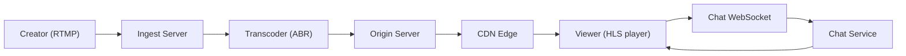
```mermaid
flowchart LR
    Creator["Creator (RTMP)"] --> Ingest["Ingest Server"]
    Ingest --> Transcode["Transcoder (ABR)"]
    Transcode --> Origin["Origin Server"]
    Origin --> CDN["CDN Edge"]
    CDN --> Viewer["Viewer (HLS player)"]

    Viewer --> ChatGW["Chat WebSocket"]
    ChatGW --> ChatSvc["Chat Service"]
    ChatSvc --> Viewer
```

#### Scaling for Viral Streams (500K+ viewers)

- **CDN pull-through**: Origin serves each edge once; edges cache for local viewers
- **Chat rate limiting**: Sample 1 in 10 messages when chat exceeds 10K msg/s
- **Reaction aggregation**: Batch into 1-second windows
- **Adaptive bitrate**: Auto-downgrade for slow connections

#### Data Model

```sql
CREATE TABLE live_streams (
    stream_id       UUID PRIMARY KEY DEFAULT gen_random_uuid(),
    user_id         UUID NOT NULL REFERENCES users(user_id),
    title           TEXT,
    description     TEXT,
    stream_key      TEXT UNIQUE NOT NULL,
    ingest_url      TEXT NOT NULL,
    playback_url    TEXT,
    thumbnail_url   TEXT,
    status          TEXT DEFAULT 'created' CHECK (status IN ('created', 'live', 'ended', 'failed')),
    viewer_count    INT DEFAULT 0,
    peak_viewers    INT DEFAULT 0,
    total_views     BIGINT DEFAULT 0,
    duration_sec    INT,
    recording_url   TEXT,
    privacy         TEXT DEFAULT 'public' CHECK (privacy IN ('public', 'followers', 'private')),
    chat_enabled    BOOLEAN DEFAULT true,
    gifts_enabled   BOOLEAN DEFAULT true,
    started_at      TIMESTAMPTZ,
    ended_at        TIMESTAMPTZ,
    created_at      TIMESTAMPTZ NOT NULL DEFAULT now()
);
CREATE INDEX idx_live_active ON live_streams(status, viewer_count DESC) WHERE status = 'live';
CREATE INDEX idx_live_user ON live_streams(user_id, created_at DESC);

-- Live stream gifts / super chats
CREATE TABLE stream_gifts (
    gift_id         UUID PRIMARY KEY DEFAULT gen_random_uuid(),
    stream_id       UUID NOT NULL REFERENCES live_streams(stream_id),
    sender_id       UUID NOT NULL REFERENCES users(user_id),
    gift_type       TEXT NOT NULL,
    amount_cents    INT NOT NULL,
    message         TEXT,
    created_at      TIMESTAMPTZ NOT NULL DEFAULT now()
);
CREATE INDEX idx_gifts_stream ON stream_gifts(stream_id, created_at DESC);
```

#### REST API Specification

**POST /api/v1/live/start** — Start a live stream

```json
// Request
{
  "title": "Live coding session",
  "description": "Building a real-time chat app",
  "privacy": "public",
  "chat_enabled": true
}

// Response 201 Created
{
  "stream_id": "stream_abc123",
  "stream_key": "sk_live_abc123def456",
  "ingest_url": "rtmp://ingest.example.com/live",
  "status": "created",
  "created_at": "2025-01-15T20:00:00Z"
}
```

**POST /api/v1/live/{stream_id}/end** — End a live stream

```json
// Response 200
{
  "stream_id": "stream_abc123",
  "status": "ended",
  "duration_sec": 3600,
  "peak_viewers": 1523,
  "total_views": 8934,
  "recording_url": "https://cdn.example.com/recordings/stream_abc123.mp4",
  "ended_at": "2025-01-15T21:00:00Z"
}
```

**GET /api/v1/live/discover** — Discover live streams

```json
// Response 200
{
  "streams": [
    {
      "stream_id": "stream_abc123",
      "user": {
        "user_id": "usr_streamer1",
        "username": "codelive",
        "avatar_url": "...",
        "is_verified": true
      },
      "title": "Live coding session",
      "thumbnail_url": "https://cdn.example.com/live/stream_abc123_thumb.jpg",
      "viewer_count": 1234,
      "started_at": "2025-01-15T20:00:00Z"
    }
  ]
}
```

---

### 9. Likes/Comments System

#### Overview

The Likes/Comments System handles the highest write throughput on the platform. A viral post can receive millions of likes in minutes.

#### Like Architecture

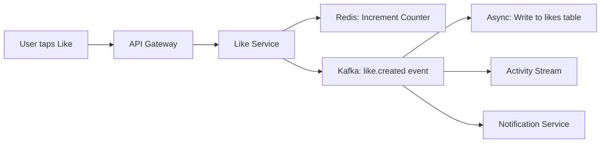
```mermaid
flowchart LR
    User["User taps Like"] --> API["API Gateway"]
    API --> LikeSvc["Like Service"]
    LikeSvc --> Redis["Redis: Increment Counter"]
    LikeSvc --> Kafka["Kafka: like.created event"]
    Kafka --> DB["Async: Write to likes table"]
    Kafka --> Activity["Activity Stream"]
    Kafka --> Notif["Notification Service"]
```

**Key design**: Like writes go to Redis for immediate counter update, Kafka for async DB persistence.

#### Data Model

```sql
CREATE TABLE likes (
    post_id         UUID NOT NULL,
    user_id         UUID NOT NULL,
    created_at      TIMESTAMPTZ NOT NULL DEFAULT now(),
    PRIMARY KEY (post_id, user_id)
);

CREATE TABLE comments (
    comment_id      UUID PRIMARY KEY DEFAULT gen_random_uuid(),
    post_id         UUID NOT NULL,
    user_id         UUID NOT NULL,
    parent_comment_id UUID,
    content_text    TEXT NOT NULL,
    like_count      INT DEFAULT 0,
    status          TEXT DEFAULT 'active',
    created_at      TIMESTAMPTZ NOT NULL DEFAULT now()
);
CREATE INDEX idx_comments_post ON comments(post_id, created_at);
```

#### Extended Data Model

```sql
-- Comment reactions (beyond just likes on comments)
CREATE TABLE comment_reactions (
    comment_id      UUID NOT NULL REFERENCES comments(comment_id),
    user_id         UUID NOT NULL REFERENCES users(user_id),
    reaction_type   TEXT NOT NULL CHECK (reaction_type IN ('like', 'love', 'haha', 'wow', 'sad', 'angry')),
    created_at      TIMESTAMPTZ NOT NULL DEFAULT now(),
    PRIMARY KEY (comment_id, user_id)
);

-- Post reactions (extended beyond simple likes)
CREATE TABLE post_reactions (
    post_id         UUID NOT NULL REFERENCES posts(post_id),
    user_id         UUID NOT NULL REFERENCES users(user_id),
    reaction_type   TEXT NOT NULL CHECK (reaction_type IN ('like', 'love', 'haha', 'wow', 'sad', 'angry')),
    created_at      TIMESTAMPTZ NOT NULL DEFAULT now(),
    PRIMARY KEY (post_id, user_id)
);
CREATE INDEX idx_reactions_user ON post_reactions(user_id, created_at DESC);

-- Like count snapshots (for consistency reconciliation)
CREATE TABLE like_count_snapshots (
    post_id         UUID PRIMARY KEY,
    exact_count     BIGINT NOT NULL DEFAULT 0,
    redis_count     BIGINT NOT NULL DEFAULT 0,
    drift           BIGINT GENERATED ALWAYS AS (redis_count - exact_count) STORED,
    reconciled_at   TIMESTAMPTZ NOT NULL DEFAULT now()
);
```

#### Approximate Counting

For viral posts: Redis `INCR` for counts, Redis Set for "did I like this?", HyperLogLog for posts with > 1M likes (memory optimization).

**Counting tiers by post popularity:**

| Like Count Range | Counter Strategy | "Did I Like" Check | Memory per Post |
|-----------------|-----------------|-------------------|----------------|
| 0 - 10K | Redis INCR + Set | Redis SISMEMBER | ~80 KB |
| 10K - 1M | Redis INCR + Bloom Filter | Bloom Filter check | ~12 KB |
| 1M+ | Redis INCR + HyperLogLog | DB lookup + cache | ~12 KB |

#### REST API Specification

**POST /api/v1/posts/{post_id}/like** — Like a post

```json
// Response 200
{
  "post_id": "post_abc123",
  "liked": true,
  "like_count": 2452,
  "liked_at": "2025-01-15T18:00:00Z"
}
```

**DELETE /api/v1/posts/{post_id}/like** — Unlike a post

```json
// Response 200
{
  "post_id": "post_abc123",
  "liked": false,
  "like_count": 2451
}
```

**POST /api/v1/posts/{post_id}/react** — React to a post (extended reactions)

```json
// Request
{
  "reaction_type": "love"
}

// Response 200
{
  "post_id": "post_abc123",
  "reaction_type": "love",
  "reaction_counts": {
    "like": 2100,
    "love": 352,
    "haha": 45,
    "wow": 12,
    "sad": 3,
    "angry": 1
  }
}
```

**POST /api/v1/posts/{post_id}/comments** — Create a comment

```json
// Request
{
  "content_text": "Amazing shot! Love the colors.",
  "parent_comment_id": null,
  "mentions": ["usr_friend1"],
  "idempotency_key": "idem_comment_abc123_1705312200"
}

// Response 201 Created
{
  "comment_id": "cmt_abc123",
  "post_id": "post_abc123",
  "user": {
    "user_id": "usr_commenter",
    "username": "photofan",
    "avatar_url": "..."
  },
  "content_text": "Amazing shot! Love the colors.",
  "parent_comment_id": null,
  "like_count": 0,
  "created_at": "2025-01-15T18:05:00Z"
}
```

**GET /api/v1/posts/{post_id}/comments** — Get comments (paginated, threaded)

```json
// Request: GET /api/v1/posts/post_abc123/comments?sort=top&cursor=...&limit=20

// Response 200
{
  "comments": [
    {
      "comment_id": "cmt_abc123",
      "user": {
        "user_id": "usr_commenter",
        "username": "photofan",
        "avatar_url": "..."
      },
      "content_text": "Amazing shot! Love the colors.",
      "like_count": 45,
      "reply_count": 3,
      "is_liked": false,
      "is_creator_liked": true,
      "created_at": "2025-01-15T18:05:00Z",
      "replies": [
        {
          "comment_id": "cmt_reply001",
          "user": {"user_id": "usr_abc123", "username": "johndoe", "avatar_url": "..."},
          "content_text": "Thank you so much!",
          "parent_comment_id": "cmt_abc123",
          "like_count": 12,
          "is_creator": true,
          "created_at": "2025-01-15T18:10:00Z"
        }
      ]
    }
  ],
  "cursor": "eyJsYXN0IjoiY210XzEyMyJ9",
  "has_more": true,
  "total_count": 89
}
```

**GET /api/v1/posts/{post_id}/likers** — Get users who liked a post

```json
// Response 200
{
  "likers": [
    {
      "user_id": "usr_liker1",
      "username": "fan123",
      "avatar_url": "...",
      "is_following": true
    }
  ],
  "cursor": "eyJsYXN0IjoibGtyXzEwIn0",
  "has_more": true,
  "total_count": 2452
}
```

---

### 10. Notification System

#### Overview

The Notification System delivers real-time alerts to users. Must handle massive fanout (celebrity post → millions of notifications) with < 5s delivery.

#### Architecture

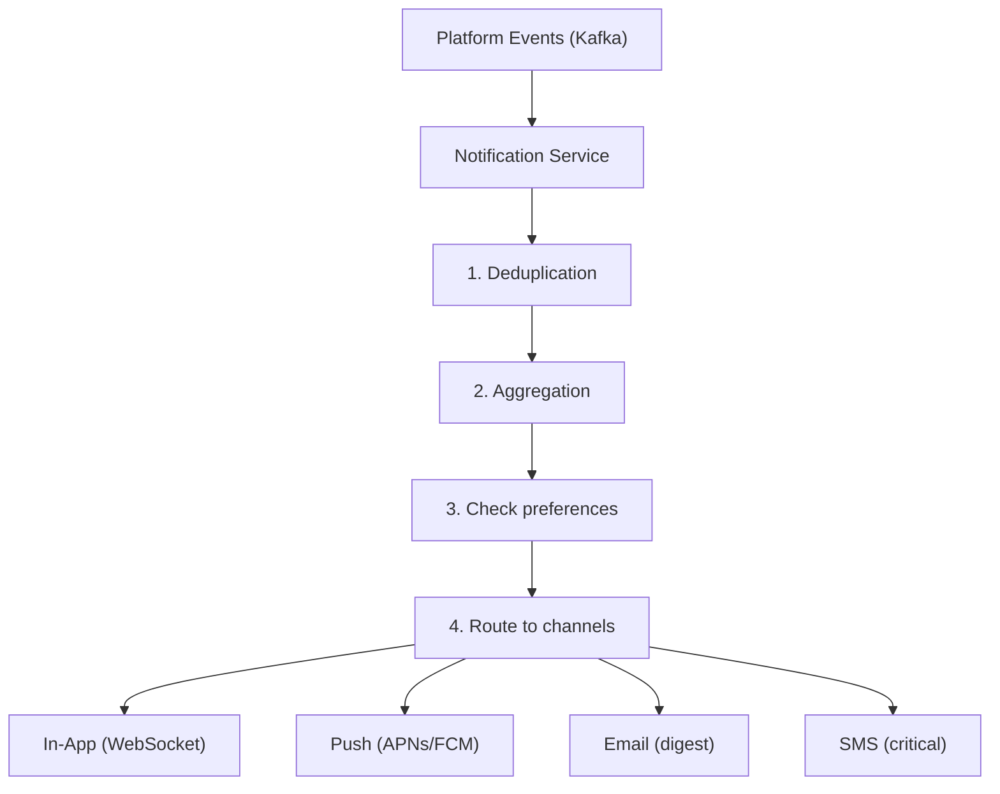
```mermaid
flowchart TD
    Events["Platform Events (Kafka)"] --> NotifSvc["Notification Service"]
    NotifSvc --> Dedup["1. Deduplication"]
    Dedup --> Aggregate["2. Aggregation"]
    Aggregate --> Preference["3. Check preferences"]
    Preference --> Route["4. Route to channels"]
    Route --> InApp["In-App (WebSocket)"]
    Route --> Push["Push (APNs/FCM)"]
    Route --> Email["Email (digest)"]
    Route --> SMS["SMS (critical)"]
```

#### Notification Aggregation

| Trigger | Window | Display |
|---------|--------|---------|
| Likes on post | 15 min | "John, Sarah, and 98 others liked your post" |
| New followers | 1 hour | "5 new followers today" |
| Comments | 5 min | "John and 3 others commented" |

#### Data Model

```sql
-- Notifications (PostgreSQL for recent; archive to Cassandra)
CREATE TABLE notifications (
    notification_id UUID PRIMARY KEY DEFAULT gen_random_uuid(),
    user_id         UUID NOT NULL REFERENCES users(user_id),
    type            TEXT NOT NULL CHECK (type IN (
        'like', 'comment', 'follow', 'mention', 'reply',
        'story_reaction', 'live_started', 'post_reminder',
        'dm', 'group_invite', 'system'
    )),
    actor_id        UUID REFERENCES users(user_id),
    target_type     TEXT,               -- 'post', 'comment', 'story', 'reel'
    target_id       UUID,
    aggregation_key TEXT,               -- e.g., 'like:post_abc123' for grouping
    title           TEXT NOT NULL,
    body            TEXT,
    image_url       TEXT,
    deep_link       TEXT,               -- in-app navigation URL
    is_read         BOOLEAN DEFAULT false,
    is_seen         BOOLEAN DEFAULT false,
    channels_sent   TEXT[] DEFAULT '{}', -- ['push', 'in_app', 'email']
    priority        TEXT DEFAULT 'normal' CHECK (priority IN ('low', 'normal', 'high', 'urgent')),
    created_at      TIMESTAMPTZ NOT NULL DEFAULT now()
);
CREATE INDEX idx_notif_user_unread ON notifications(user_id, created_at DESC) WHERE is_read = false;
CREATE INDEX idx_notif_user ON notifications(user_id, created_at DESC);
CREATE INDEX idx_notif_aggregation ON notifications(aggregation_key, created_at DESC);

-- Push device tokens
CREATE TABLE push_tokens (
    token_id        UUID PRIMARY KEY DEFAULT gen_random_uuid(),
    user_id         UUID NOT NULL REFERENCES users(user_id),
    platform        TEXT NOT NULL CHECK (platform IN ('ios', 'android', 'web')),
    device_token    TEXT NOT NULL,
    device_id       TEXT,
    app_version     TEXT,
    is_active       BOOLEAN DEFAULT true,
    last_used_at    TIMESTAMPTZ,
    created_at      TIMESTAMPTZ NOT NULL DEFAULT now(),
    UNIQUE (user_id, device_token)
);
CREATE INDEX idx_push_user ON push_tokens(user_id) WHERE is_active = true;

-- Notification delivery log (for debugging and analytics)
CREATE TABLE notification_delivery_log (
    log_id          UUID PRIMARY KEY DEFAULT gen_random_uuid(),
    notification_id UUID NOT NULL,
    channel         TEXT NOT NULL CHECK (channel IN ('push', 'in_app', 'email', 'sms')),
    status          TEXT NOT NULL CHECK (status IN ('sent', 'delivered', 'opened', 'failed', 'bounced')),
    provider_id     TEXT,               -- APNs/FCM message ID
    error_code      TEXT,
    latency_ms      INT,
    created_at      TIMESTAMPTZ NOT NULL DEFAULT now()
);
CREATE INDEX idx_delivery_notif ON notification_delivery_log(notification_id);
```

#### REST API Specification

**GET /api/v1/notifications** — Get notifications

```json
// Request: GET /api/v1/notifications?cursor=...&limit=20

// Response 200
{
  "notifications": [
    {
      "notification_id": "notif_abc123",
      "type": "like",
      "actors": [
        {"user_id": "usr_john", "username": "johndoe", "avatar_url": "..."}
      ],
      "total_actors": 50,
      "title": "johndoe and 49 others liked your post",
      "body": null,
      "target": {
        "type": "post",
        "id": "post_abc123",
        "thumbnail_url": "https://cdn.example.com/media/post_abc123_thumb.jpg"
      },
      "deep_link": "/p/post_abc123",
      "is_read": false,
      "created_at": "2025-01-15T18:00:00Z"
    }
  ],
  "cursor": "eyJ0cyI6MTcxMTEwMDAwMH0",
  "has_more": true,
  "unread_count": 15
}
```

**PUT /api/v1/notifications/read** — Mark notifications as read

```json
// Request
{
  "notification_ids": ["notif_abc123", "notif_def456"],
  "mark_all_before": "2025-01-15T18:00:00Z"
}

// Response 200
{
  "marked_count": 15,
  "remaining_unread": 0
}
```

**PUT /api/v1/notifications/settings** — Update notification preferences

```json
// Request
{
  "preferences": {
    "likes": {"push": false, "in_app": true, "email": false},
    "comments": {"push": true, "in_app": true, "email": false},
    "follows": {"push": true, "in_app": true, "email": true},
    "dms": {"push": true, "in_app": true, "email": false},
    "live_started": {"push": true, "in_app": true, "email": false}
  },
  "quiet_hours": {
    "enabled": true,
    "start": "22:00",
    "end": "08:00",
    "timezone": "America/Los_Angeles"
  }
}
```

#### Notification Delivery Sequence

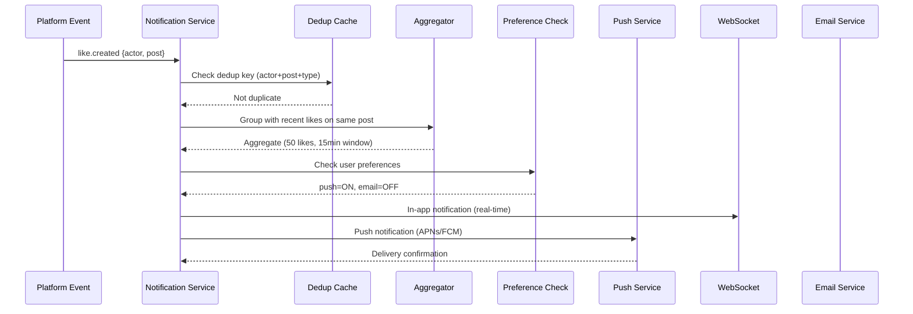
```mermaid
sequenceDiagram
    participant Event as Platform Event
    participant NS as Notification Service
    participant Dedup as Dedup Cache
    participant Agg as Aggregator
    participant Pref as Preference Check
    participant Push as Push Service
    participant WS as WebSocket
    participant Email as Email Service

    Event->>NS: like.created {actor, post}
    NS->>Dedup: Check dedup key (actor+post+type)
    Dedup-->>NS: Not duplicate
    NS->>Agg: Group with recent likes on same post
    Agg-->>NS: Aggregate (50 likes, 15min window)
    NS->>Pref: Check user preferences
    Pref-->>NS: push=ON, email=OFF
    NS->>WS: In-app notification (real-time)
    NS->>Push: Push notification (APNs/FCM)
    Push-->>NS: Delivery confirmation
```

---

### 11. Messaging/Chat System

#### Overview

The Messaging System enables 1:1 and group conversations with text, media, and optional E2E encryption. At WhatsApp's scale: **100 billion messages per day** with < 500ms delivery.

#### Architecture

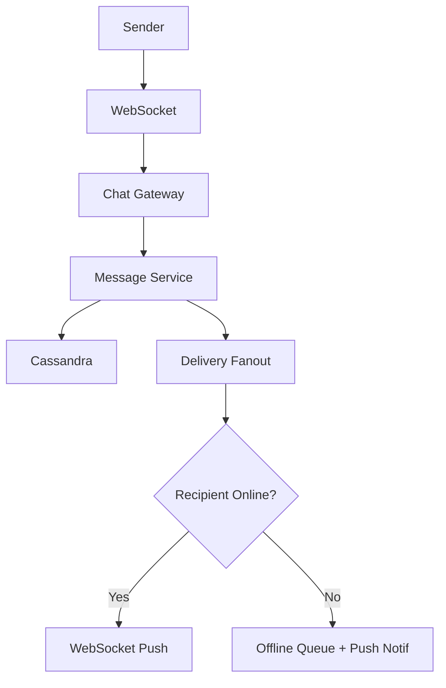
```mermaid
flowchart TD
    Sender["Sender"] --> WS_S["WebSocket"]
    WS_S --> ChatGW["Chat Gateway"]
    ChatGW --> MsgSvc["Message Service"]
    MsgSvc --> Store["Cassandra"]
    MsgSvc --> Fanout["Delivery Fanout"]
    Fanout --> Online{"Recipient Online?"}
    Online -->|Yes| WS_R["WebSocket Push"]
    Online -->|No| OfflineQ["Offline Queue + Push Notif"]
```

#### Data Model (Cassandra)

```
CREATE TABLE messages (
    conversation_id UUID,
    message_id      TIMEUUID,
    sender_id       UUID,
    content_type    TEXT,
    content         TEXT,
    encrypted_key   BLOB,
    status          TEXT,
    created_at      TIMESTAMP,
    PRIMARY KEY (conversation_id, message_id)
) WITH CLUSTERING ORDER BY (message_id ASC);

CREATE TABLE user_conversations (
    user_id             UUID,
    last_message_time   TIMESTAMP,
    conversation_id     UUID,
    last_message_preview TEXT,
    unread_count        INT,
    PRIMARY KEY (user_id, last_message_time)
) WITH CLUSTERING ORDER BY (last_message_time DESC);
```

#### E2E Encryption (Signal Protocol)

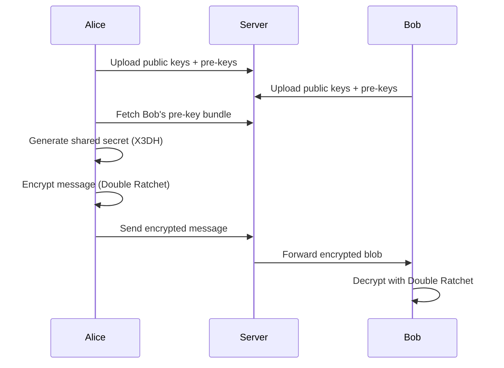
```mermaid
sequenceDiagram
    participant Alice
    participant Server
    participant Bob

    Alice->>Server: Upload public keys + pre-keys
    Bob->>Server: Upload public keys + pre-keys

    Alice->>Server: Fetch Bob's pre-key bundle
    Alice->>Alice: Generate shared secret (X3DH)
    Alice->>Alice: Encrypt message (Double Ratchet)
    Alice->>Server: Send encrypted message
    Server->>Bob: Forward encrypted blob
    Bob->>Bob: Decrypt with Double Ratchet
```

**Key property**: Server **cannot read message content**. Only stores encrypted blobs.

#### Extended Data Model

```sql
-- Conversations metadata (PostgreSQL for indexing)
CREATE TABLE conversations (
    conversation_id UUID PRIMARY KEY DEFAULT gen_random_uuid(),
    type            TEXT NOT NULL CHECK (type IN ('direct', 'group')),
    name            TEXT,                -- for group chats
    avatar_url      TEXT,                -- for group chats
    created_by      UUID REFERENCES users(user_id),
    is_encrypted    BOOLEAN DEFAULT true,
    max_members     INT DEFAULT 256,
    member_count    INT DEFAULT 2,
    last_message_at TIMESTAMPTZ,
    created_at      TIMESTAMPTZ NOT NULL DEFAULT now()
);

-- Conversation participants
CREATE TABLE conversation_members (
    conversation_id UUID NOT NULL REFERENCES conversations(conversation_id),
    user_id         UUID NOT NULL REFERENCES users(user_id),
    role            TEXT DEFAULT 'member' CHECK (role IN ('owner', 'admin', 'member')),
    nickname        TEXT,
    is_muted        BOOLEAN DEFAULT false,
    muted_until     TIMESTAMPTZ,
    last_read_at    TIMESTAMPTZ,
    unread_count    INT DEFAULT 0,
    joined_at       TIMESTAMPTZ NOT NULL DEFAULT now(),
    left_at         TIMESTAMPTZ,
    PRIMARY KEY (conversation_id, user_id)
);
CREATE INDEX idx_conv_members_user ON conversation_members(user_id, last_read_at DESC) WHERE left_at IS NULL;

-- Message read receipts (Cassandra)
-- CREATE TABLE read_receipts (
--     conversation_id UUID,
--     message_id      TIMEUUID,
--     user_id         UUID,
--     read_at         TIMESTAMP,
--     PRIMARY KEY (conversation_id, message_id, user_id)
-- );

-- Typing indicators (ephemeral, Redis only)
-- KEY: typing:{conversation_id}:{user_id}
-- VALUE: 1
-- TTL: 5 seconds (auto-expire when user stops typing)
```

#### REST API Specification

**GET /api/v1/conversations** — List user's conversations

```json
// Request: GET /api/v1/conversations?cursor=...&limit=20

// Response 200
{
  "conversations": [
    {
      "conversation_id": "conv_abc123",
      "type": "direct",
      "participant": {
        "user_id": "usr_friend1",
        "username": "bestfriend",
        "avatar_url": "...",
        "is_online": true
      },
      "last_message": {
        "message_id": "msg_xyz789",
        "sender_id": "usr_friend1",
        "content_preview": "Hey, are you free tonight?",
        "created_at": "2025-01-15T18:30:00Z"
      },
      "unread_count": 2,
      "is_muted": false,
      "is_encrypted": true
    }
  ],
  "cursor": "eyJsYXN0IjoiY29udl8xMCJ9",
  "has_more": true
}
```

**POST /api/v1/conversations/{conversation_id}/messages** — Send a message

```json
// Request
{
  "content_type": "text",
  "content": "Hey! Want to grab dinner?",
  "client_message_id": "client_msg_abc123",
  "reply_to_message_id": null
}

// Response 201 Created
{
  "message_id": "msg_abc123",
  "conversation_id": "conv_abc123",
  "sender_id": "usr_me",
  "content_type": "text",
  "content": "Hey! Want to grab dinner?",
  "status": "sent",
  "created_at": "2025-01-15T18:35:00Z"
}
```

**GET /api/v1/conversations/{conversation_id}/messages** — Get messages

```json
// Request: GET /api/v1/conversations/conv_abc123/messages?before=msg_xyz789&limit=50

// Response 200
{
  "messages": [
    {
      "message_id": "msg_abc123",
      "sender": {
        "user_id": "usr_me",
        "username": "johndoe",
        "avatar_url": "..."
      },
      "content_type": "text",
      "content": "Hey! Want to grab dinner?",
      "reply_to": null,
      "reactions": [
        {"emoji": "thumbsup", "users": ["usr_friend1"]}
      ],
      "read_by": ["usr_friend1"],
      "status": "read",
      "created_at": "2025-01-15T18:35:00Z"
    }
  ],
  "has_more": true
}
```

**POST /api/v1/conversations** — Create a group conversation

```json
// Request
{
  "type": "group",
  "name": "Weekend Plans",
  "member_ids": ["usr_friend1", "usr_friend2", "usr_friend3"]
}

// Response 201 Created
{
  "conversation_id": "conv_group1",
  "type": "group",
  "name": "Weekend Plans",
  "member_count": 4,
  "created_at": "2025-01-15T19:00:00Z"
}
```

#### Message Delivery State Machine

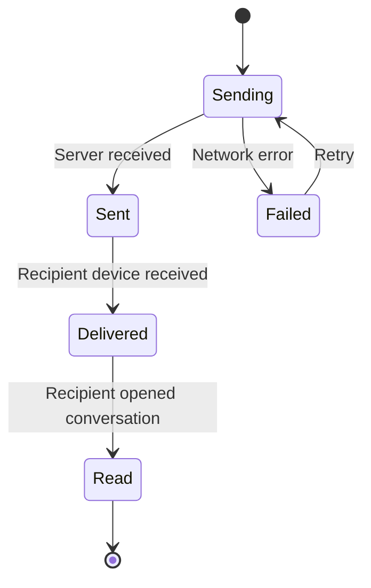
```mermaid
stateDiagram-v2
    [*] --> Sending
    Sending --> Sent: Server received
    Sending --> Failed: Network error
    Failed --> Sending: Retry
    Sent --> Delivered: Recipient device received
    Delivered --> Read: Recipient opened conversation
    Read --> [*]
```

---

### 12. Content Moderation System

#### Overview

Detects and removes content violating platform policies. Operates in three layers: pre-publication filtering, post-publication scoring, and human review.

#### Three-Layer Architecture

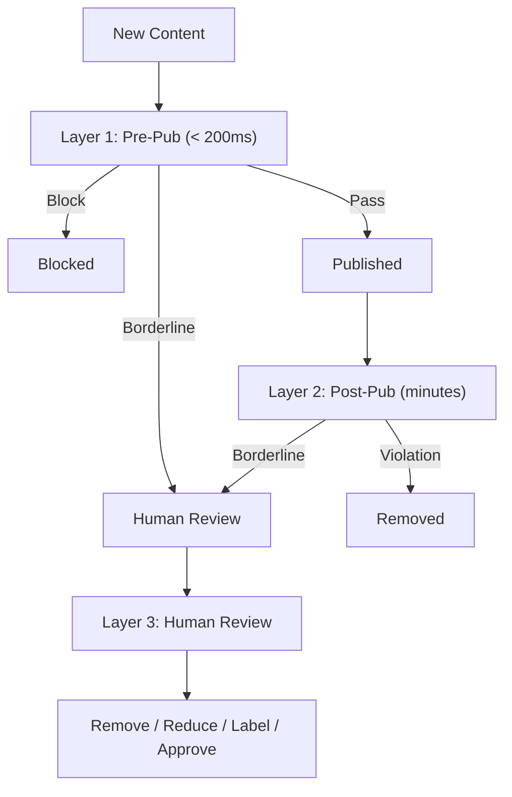
```mermaid
flowchart TD
    Content["New Content"] --> Layer1["Layer 1: Pre-Pub (< 200ms)"]
    Layer1 -->|Block| Removed["Blocked"]
    Layer1 -->|Pass| Published["Published"]
    Layer1 -->|Borderline| Queue["Human Review"]

    Published --> Layer2["Layer 2: Post-Pub (minutes)"]
    Layer2 -->|Violation| Removed2["Removed"]
    Layer2 -->|Borderline| Queue

    Queue --> Layer3["Layer 3: Human Review"]
    Layer3 --> Action["Remove / Reduce / Label / Approve"]
```

#### ML Classifiers

| Classifier | Latency | Accuracy Target |
|-----------|---------|----------------|
| Text toxicity | < 50ms | > 95% recall |
| Image safety (NSFW/violence) | < 100ms | > 95% recall |
| Video safety (key frames) | < 5s (async) | > 90% recall |
| Spam detection | < 50ms | > 98% precision |
| Hash matching (PhotoDNA/CSAM) | < 10ms | 100% on known hashes |

#### Data Model

```sql
-- Moderation decisions
CREATE TABLE moderation_decisions (
    decision_id     UUID PRIMARY KEY DEFAULT gen_random_uuid(),
    content_type    TEXT NOT NULL CHECK (content_type IN ('post', 'comment', 'story', 'reel', 'message', 'profile', 'live_stream')),
    content_id      UUID NOT NULL,
    user_id         UUID NOT NULL,          -- content creator
    decision_source TEXT NOT NULL CHECK (decision_source IN ('auto_ml', 'auto_rule', 'human_review', 'appeal_review')),
    violation_type  TEXT CHECK (violation_type IN (
        'spam', 'hate_speech', 'harassment', 'violence', 'nudity',
        'self_harm', 'terrorism', 'csam', 'copyright', 'misinformation',
        'impersonation', 'scam', 'none'
    )),
    action          TEXT NOT NULL CHECK (action IN (
        'approve', 'remove', 'reduce_distribution', 'label',
        'age_restrict', 'disable_comments', 'suspend_user', 'ban_user'
    )),
    confidence      FLOAT,                  -- ML model confidence (0-1)
    model_version   TEXT,                   -- which ML model version
    reviewer_id     UUID,                   -- human reviewer (if applicable)
    review_time_sec INT,                    -- time spent on review
    notes           TEXT,
    is_appealed     BOOLEAN DEFAULT false,
    appeal_outcome  TEXT CHECK (appeal_outcome IN ('upheld', 'overturned', NULL)),
    created_at      TIMESTAMPTZ NOT NULL DEFAULT now()
);
CREATE INDEX idx_mod_content ON moderation_decisions(content_type, content_id);
CREATE INDEX idx_mod_user ON moderation_decisions(user_id, created_at DESC);
CREATE INDEX idx_mod_violation ON moderation_decisions(violation_type, created_at DESC);

-- Moderation queue (human review)
CREATE TABLE moderation_queue (
    queue_id        UUID PRIMARY KEY DEFAULT gen_random_uuid(),
    content_type    TEXT NOT NULL,
    content_id      UUID NOT NULL,
    user_id         UUID NOT NULL,
    priority        TEXT NOT NULL CHECK (priority IN ('p0', 'p1', 'p2', 'p3')),
    reason          TEXT NOT NULL,
    ml_scores       JSONB,                  -- {"toxicity": 0.85, "nsfw": 0.12, ...}
    assigned_to     UUID,                   -- reviewer
    status          TEXT DEFAULT 'pending' CHECK (status IN ('pending', 'assigned', 'reviewed', 'escalated')),
    sla_deadline    TIMESTAMPTZ NOT NULL,
    created_at      TIMESTAMPTZ NOT NULL DEFAULT now(),
    assigned_at     TIMESTAMPTZ,
    completed_at    TIMESTAMPTZ
);
CREATE INDEX idx_mod_queue_priority ON moderation_queue(priority, created_at) WHERE status = 'pending';
CREATE INDEX idx_mod_queue_assigned ON moderation_queue(assigned_to) WHERE status = 'assigned';

-- Known hash database (PhotoDNA, perceptual hashes for CSAM/terrorism)
CREATE TABLE known_hashes (
    hash_value      TEXT PRIMARY KEY,
    hash_type       TEXT NOT NULL CHECK (hash_type IN ('photodna', 'phash', 'md5')),
    category        TEXT NOT NULL CHECK (category IN ('csam', 'terrorism', 'copyright', 'known_spam')),
    source          TEXT NOT NULL,          -- 'ncmec', 'gifct', 'internal'
    added_at        TIMESTAMPTZ NOT NULL DEFAULT now()
);

-- User trust score (rolling)
CREATE TABLE user_trust_scores (
    user_id             UUID PRIMARY KEY REFERENCES users(user_id),
    trust_score         FLOAT DEFAULT 100.0 CHECK (trust_score BETWEEN 0 AND 100),
    violations_30d      INT DEFAULT 0,
    violations_lifetime INT DEFAULT 0,
    reports_received_30d INT DEFAULT 0,
    false_reports_made  INT DEFAULT 0,
    account_age_days    INT,
    last_violation_at   TIMESTAMPTZ,
    updated_at          TIMESTAMPTZ NOT NULL DEFAULT now()
);
```

#### REST API Specification (Internal / Admin)

**GET /api/v1/admin/moderation/queue** — Get moderation queue

```json
// Request: GET /api/v1/admin/moderation/queue?priority=p0&status=pending&limit=20

// Response 200
{
  "items": [
    {
      "queue_id": "mq_abc123",
      "content_type": "post",
      "content_id": "post_flagged1",
      "user": {
        "user_id": "usr_reported",
        "username": "suspicioususer",
        "trust_score": 23.5,
        "violations_30d": 2
      },
      "priority": "p0",
      "reason": "CSAM hash match",
      "ml_scores": {"csam_hash_match": 1.0},
      "sla_deadline": "2025-01-15T19:00:00Z",
      "created_at": "2025-01-15T18:00:00Z"
    }
  ],
  "total_pending": 342,
  "by_priority": {"p0": 3, "p1": 45, "p2": 189, "p3": 105}
}
```

**POST /api/v1/admin/moderation/{queue_id}/decision** — Submit moderation decision

```json
// Request
{
  "action": "remove",
  "violation_type": "hate_speech",
  "notes": "Clear hate speech targeting protected group",
  "additional_actions": ["disable_comments", "reduce_distribution"]
}

// Response 200
{
  "decision_id": "dec_abc123",
  "action": "remove",
  "content_removed": true,
  "user_notified": true,
  "trust_score_impact": -15.0,
  "new_trust_score": 8.5
}
```

---

### 13. Abuse Detection System

#### Overview

Identifies coordinated inauthentic behavior, harassment campaigns, and spam networks by analyzing **patterns across users and accounts** rather than individual content.

#### Detection Pipeline

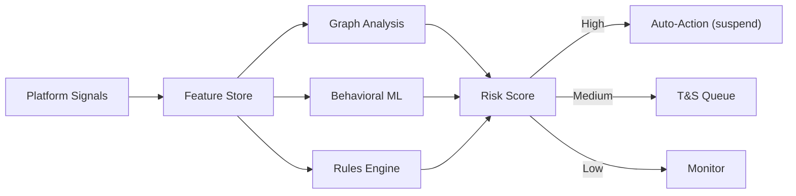
```mermaid
flowchart LR
    Signals["Platform Signals"] --> FeatureStore["Feature Store"]
    FeatureStore --> GraphAnalysis["Graph Analysis"]
    FeatureStore --> BehaviorModel["Behavioral ML"]
    FeatureStore --> RulesEngine["Rules Engine"]
    GraphAnalysis & BehaviorModel & RulesEngine --> Score["Risk Score"]
    Score -->|High| Auto["Auto-Action (suspend)"]
    Score -->|Medium| Review["T&S Queue"]
    Score -->|Low| Monitor["Monitor"]
```

#### Abuse Types

| Type | Detection Pattern |
|------|-----------------|
| **Spam networks** | Clusters of accounts with similar creation time, content, and behavior |
| **Bot farms** | Inhuman posting patterns, identical timestamps, API-only activity |
| **Coordinated harassment** | N accounts targeting same user in short window |
| **Engagement manipulation** | Sudden follower spikes from suspicious accounts |

#### Extended Data Model

```sql
-- Abuse signals (collected from multiple sources)
CREATE TABLE abuse_signals (
    signal_id       UUID PRIMARY KEY DEFAULT gen_random_uuid(),
    user_id         UUID NOT NULL,
    signal_type     TEXT NOT NULL CHECK (signal_type IN (
        'rapid_posting', 'mass_following', 'identical_content',
        'suspicious_registration', 'ip_anomaly', 'device_fingerprint_match',
        'coordinated_action', 'engagement_spike', 'api_abuse'
    )),
    severity        FLOAT NOT NULL CHECK (severity BETWEEN 0 AND 1),
    metadata        JSONB NOT NULL,         -- signal-specific details
    source          TEXT NOT NULL CHECK (source IN ('realtime', 'batch', 'ml_model', 'rule_engine')),
    created_at      TIMESTAMPTZ NOT NULL DEFAULT now()
);
CREATE INDEX idx_abuse_signals_user ON abuse_signals(user_id, created_at DESC);
CREATE INDEX idx_abuse_signals_type ON abuse_signals(signal_type, created_at DESC);

-- Account clusters (coordinated inauthentic behavior)
CREATE TABLE account_clusters (
    cluster_id      UUID PRIMARY KEY DEFAULT gen_random_uuid(),
    cluster_type    TEXT NOT NULL CHECK (cluster_type IN ('bot_farm', 'spam_ring', 'harassment_campaign', 'engagement_fraud')),
    member_count    INT NOT NULL,
    member_ids      UUID[] NOT NULL,
    confidence      FLOAT NOT NULL,
    detection_method TEXT NOT NULL,
    status          TEXT DEFAULT 'active' CHECK (status IN ('active', 'actioned', 'dismissed')),
    action_taken    TEXT,
    created_at      TIMESTAMPTZ NOT NULL DEFAULT now()
);
CREATE INDEX idx_clusters_status ON account_clusters(status, created_at DESC);

-- IP reputation
CREATE TABLE ip_reputation (
    ip_address      INET PRIMARY KEY,
    reputation_score FLOAT DEFAULT 50.0 CHECK (reputation_score BETWEEN 0 AND 100),
    account_count   INT DEFAULT 0,
    flagged_count   INT DEFAULT 0,
    is_vpn          BOOLEAN DEFAULT false,
    is_proxy        BOOLEAN DEFAULT false,
    is_tor          BOOLEAN DEFAULT false,
    country_code    TEXT,
    updated_at      TIMESTAMPTZ NOT NULL DEFAULT now()
);
```

---

### 14. Report & Review System

#### Overview

Handles user-initiated reports with structured review workflows, prioritization, SLAs, and appeals.

#### Report Workflow

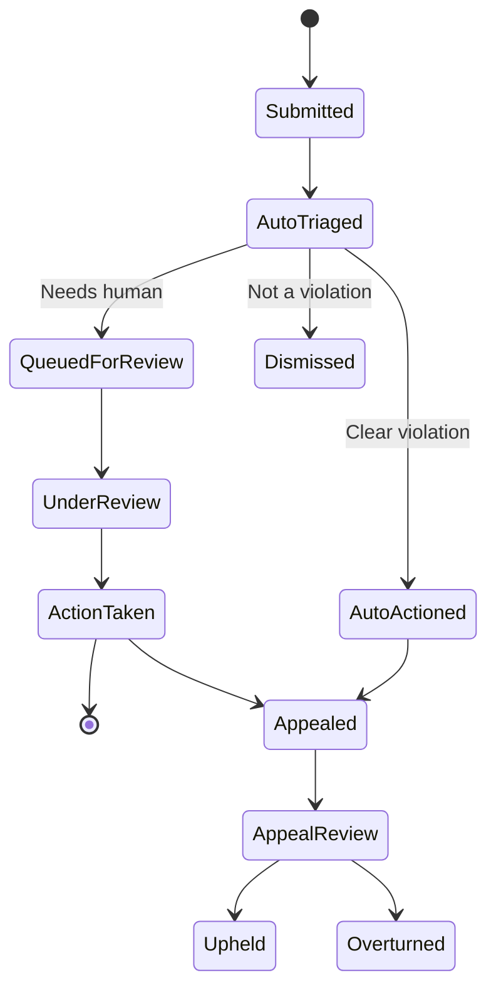
```mermaid
stateDiagram-v2
    [*] --> Submitted
    Submitted --> AutoTriaged
    AutoTriaged --> AutoActioned: Clear violation
    AutoTriaged --> QueuedForReview: Needs human
    AutoTriaged --> Dismissed: Not a violation

    QueuedForReview --> UnderReview
    UnderReview --> ActionTaken
    ActionTaken --> [*]

    AutoActioned --> Appealed
    ActionTaken --> Appealed
    Appealed --> AppealReview
    AppealReview --> Upheld
    AppealReview --> Overturned
```

#### Prioritization

| Priority | Criteria | SLA |
|----------|---------|-----|
| P0 | Imminent danger, CSAM, terrorism | < 1 hour |
| P1 | Harassment, hate speech, self-harm | < 4 hours |
| P2 | Nudity, violence, bullying | < 24 hours |
| P3 | Spam, impersonation | < 72 hours |

#### Data Model

```sql
-- User reports
CREATE TABLE reports (
    report_id       UUID PRIMARY KEY DEFAULT gen_random_uuid(),
    reporter_id     UUID NOT NULL REFERENCES users(user_id),
    reported_type   TEXT NOT NULL CHECK (reported_type IN ('post', 'comment', 'story', 'reel', 'user', 'message', 'live_stream')),
    reported_id     UUID NOT NULL,
    reported_user_id UUID NOT NULL,
    reason          TEXT NOT NULL CHECK (reason IN (
        'spam', 'harassment', 'hate_speech', 'violence', 'nudity',
        'self_harm', 'terrorism', 'false_information', 'scam',
        'impersonation', 'intellectual_property', 'other'
    )),
    description     TEXT,
    evidence_urls   TEXT[],
    status          TEXT DEFAULT 'submitted' CHECK (status IN (
        'submitted', 'auto_triaged', 'queued', 'under_review',
        'action_taken', 'dismissed', 'appealed', 'appeal_reviewed'
    )),
    priority        TEXT CHECK (priority IN ('p0', 'p1', 'p2', 'p3')),
    assigned_to     UUID,
    resolution      TEXT CHECK (resolution IN (
        'content_removed', 'user_warned', 'user_suspended', 'user_banned',
        'no_violation', 'duplicate', 'insufficient_info'
    )),
    resolution_notes TEXT,
    resolved_at     TIMESTAMPTZ,
    created_at      TIMESTAMPTZ NOT NULL DEFAULT now()
);
CREATE INDEX idx_reports_status ON reports(status, priority, created_at) WHERE status NOT IN ('action_taken', 'dismissed');
CREATE INDEX idx_reports_reporter ON reports(reporter_id, created_at DESC);
CREATE INDEX idx_reports_reported_user ON reports(reported_user_id, created_at DESC);
CREATE INDEX idx_reports_content ON reports(reported_type, reported_id);

-- Appeals
CREATE TABLE appeals (
    appeal_id       UUID PRIMARY KEY DEFAULT gen_random_uuid(),
    user_id         UUID NOT NULL REFERENCES users(user_id),
    original_decision_id UUID NOT NULL REFERENCES moderation_decisions(decision_id),
    appeal_reason   TEXT NOT NULL,
    evidence_text   TEXT,
    evidence_urls   TEXT[],
    status          TEXT DEFAULT 'submitted' CHECK (status IN ('submitted', 'under_review', 'upheld', 'overturned')),
    reviewer_id     UUID,
    reviewer_notes  TEXT,
    resolved_at     TIMESTAMPTZ,
    created_at      TIMESTAMPTZ NOT NULL DEFAULT now()
);
CREATE INDEX idx_appeals_status ON appeals(status, created_at) WHERE status IN ('submitted', 'under_review');
CREATE INDEX idx_appeals_user ON appeals(user_id, created_at DESC);

-- Transparency log (public accountability)
CREATE TABLE transparency_log (
    log_id          UUID PRIMARY KEY DEFAULT gen_random_uuid(),
    period_start    DATE NOT NULL,
    period_end      DATE NOT NULL,
    violation_type  TEXT NOT NULL,
    total_reports   BIGINT NOT NULL,
    auto_actioned   BIGINT NOT NULL,
    human_reviewed  BIGINT NOT NULL,
    content_removed BIGINT NOT NULL,
    appeals_received BIGINT NOT NULL,
    appeals_overturned BIGINT NOT NULL,
    avg_response_hours FLOAT,
    created_at      TIMESTAMPTZ NOT NULL DEFAULT now()
);
```

#### REST API Specification

**POST /api/v1/reports** — Submit a report

```json
// Request
{
  "reported_type": "post",
  "reported_id": "post_abc123",
  "reason": "hate_speech",
  "description": "This post contains slurs targeting a protected group"
}

// Response 201 Created
{
  "report_id": "rpt_abc123",
  "status": "submitted",
  "estimated_review_time": "24 hours",
  "created_at": "2025-01-15T18:00:00Z"
}
```

**GET /api/v1/reports/mine** — Get my submitted reports

```json
// Response 200
{
  "reports": [
    {
      "report_id": "rpt_abc123",
      "reported_type": "post",
      "reason": "hate_speech",
      "status": "action_taken",
      "resolution": "content_removed",
      "created_at": "2025-01-15T18:00:00Z",
      "resolved_at": "2025-01-15T22:00:00Z"
    }
  ]
}
```

**POST /api/v1/appeals** — Appeal a moderation decision

```json
// Request
{
  "decision_id": "dec_abc123",
  "appeal_reason": "This was satire, not hate speech. Context from the full thread shows this clearly.",
  "evidence_urls": ["https://example.com/context-screenshot.jpg"]
}

// Response 201 Created
{
  "appeal_id": "apl_abc123",
  "status": "submitted",
  "estimated_review_time": "48 hours",
  "created_at": "2025-01-15T19:00:00Z"
}
```

---

## Data Model (Consolidated ER Diagram)

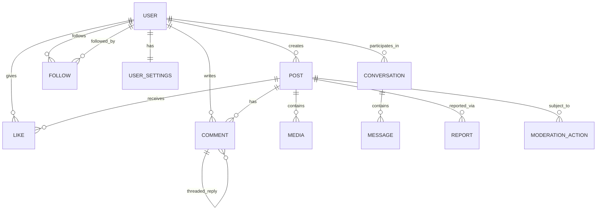
```mermaid
erDiagram
    USER ||--o{ POST : creates
    USER ||--o{ FOLLOW : follows
    USER ||--o{ FOLLOW : followed_by
    USER ||--o{ LIKE : gives
    USER ||--o{ COMMENT : writes
    USER ||--|| USER_SETTINGS : has
    USER ||--o{ CONVERSATION : participates_in
    POST ||--o{ LIKE : receives
    POST ||--o{ COMMENT : has
    POST ||--o{ MEDIA : contains
    COMMENT ||--o{ COMMENT : threaded_reply
    CONVERSATION ||--o{ MESSAGE : contains
    POST ||--o{ REPORT : reported_via
    POST ||--o{ MODERATION_ACTION : subject_to
```

---

## Cache Strategy

| Data | Store | TTL | Pattern |
|------|-------|-----|---------|
| User profile card | Redis Hash | 5 min | Read-through; invalidate on update |
| Feed (pre-built) | Redis Sorted Set | Indefinite | Write-through via fanout |
| Like counts | Redis Counter | Indefinite | Atomic increment; async DB sync |
| "Did I like this?" | Redis Set / Bloom Filter | 1 hour | Check before rendering |
| Trending hashtags | Redis Sorted Set | 1 min | Recomputed by trending pipeline |
| Online status | Redis | 60s TTL (heartbeat) | Set on connect, expire on disconnect |

---

## Queue / Stream Design

| Topic | Purpose | Consumers |
|-------|---------|-----------|
| `post.created` | New post events | Fanout, Search, Moderation, Analytics, Trending |
| `engagement.like` | Like events | Activity Stream, Notification, Analytics |
| `engagement.comment` | Comment events | Activity Stream, Notification, Moderation |
| `social.follow` | Follow events | Feed Rebuild, Notification, "People You May Know" |
| `moderation.decision` | Moderation results | Post Service, Notification, Analytics |
| `message.sent` | Chat messages | Delivery Workers, Notification |
| `media.process` | Transcoding jobs | Transcoding Workers |
| `abuse.signal` | Suspicious signals | Abuse Detection Pipeline |

---

## Storage Strategy

### Media Storage Tiers

Social media platforms generate petabytes of media daily. A tiered storage strategy is essential for cost control.

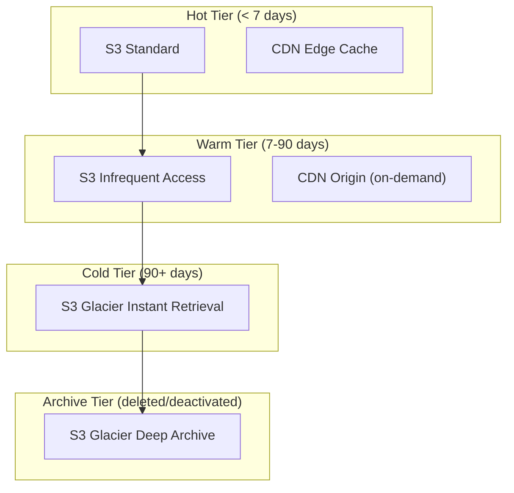
```mermaid
flowchart TD
    subgraph Hot["Hot Tier (< 7 days)"]
        S3Standard["S3 Standard"]
        CDNEdge["CDN Edge Cache"]
    end

    subgraph Warm["Warm Tier (7-90 days)"]
        S3IA["S3 Infrequent Access"]
        CDNOrigin["CDN Origin (on-demand)"]
    end

    subgraph Cold["Cold Tier (90+ days)"]
        S3Glacier["S3 Glacier Instant Retrieval"]
    end

    subgraph Archive["Archive Tier (deleted/deactivated)"]
        GlacierDeep["S3 Glacier Deep Archive"]
    end

    S3Standard --> S3IA
    S3IA --> S3Glacier
    S3Glacier --> GlacierDeep
```

| Tier | Age | Storage Class | Access Pattern | Cost (per TB/month) |
|------|-----|--------------|----------------|-------------------|
| **Hot** | 0-7 days | S3 Standard + CDN | High read (feed, trending) | ~$23 + CDN |
| **Warm** | 7-90 days | S3 Infrequent Access | Medium read (profile scroll) | ~$12.50 |
| **Cold** | 90 days - 2 years | Glacier Instant | Low read (deep profile browse) | ~$4 |
| **Archive** | 2+ years / deleted | Glacier Deep Archive | Rare (legal holds, GDPR) | ~$1 |

### CDN Strategy

```mermaid
flowchart LR
    Client["Client Request"] --> DNS["DNS (latency-based routing)"]
    DNS --> EdgePOP["Nearest Edge POP"]
    EdgePOP -->|Cache HIT| Client
    EdgePOP -->|Cache MISS| Shield["Regional Shield / Mid-Tier"]
    Shield -->|Cache HIT| EdgePOP
    Shield -->|Cache MISS| Origin["S3 Origin"]
    Origin --> Shield
    Shield --> EdgePOP
    EdgePOP --> Client
```

**CDN design decisions:**

| Aspect | Strategy |
|--------|----------|
| **Cache Key** | `{media_id}_{size}_{format}` (e.g., `med_001_lg_webp`) |
| **TTL** | Images: 30 days, Videos: 7 days, Thumbnails: 90 days |
| **Invalidation** | Content deletion pushes purge to CDN API within 60s |
| **Format negotiation** | Client sends `Accept: image/webp,image/avif` header; CDN serves best format |
| **Shield tier** | Regional mid-tier cache reduces origin load by 95% |
| **Signed URLs** | Private content uses time-limited signed URLs (1 hour TTL) |

### Content Archival Policy

| Content Type | Retention Active | Post-Deletion Retention | Legal Hold |
|-------------|-----------------|----------------------|-----------|
| Posts (text) | Indefinite | 30 days soft delete, then purge | 7 years |
| Images | Indefinite | 30 days then S3 delete | 7 years |
| Videos | Indefinite | 30 days then S3 delete | 7 years |
| Stories | 24h active + 48h grace | Immediate S3 delete | 30 days |
| Messages (E2E) | Indefinite (encrypted) | 30 days on both sides delete | N/A (encrypted) |
| Live streams | 30 days recording | Immediate | 90 days |
| User data | While active | 30 days deactivation, 90 days deletion | 7 years |

### GDPR Right-to-Deletion

```mermaid
sequenceDiagram
    participant User
    participant API as API Gateway
    participant GDPR as GDPR Service
    participant DB as Databases
    participant S3 as Object Storage
    participant CDN as CDN
    participant Search as Search Index
    participant Backup as Backup Service

    User->>API: DELETE /api/v1/users/me (account deletion)
    API->>GDPR: Initiate deletion workflow
    GDPR->>GDPR: Generate deletion manifest

    Note over GDPR: 30-day cooling period<br/>(user can cancel)

    GDPR->>DB: Anonymize user record (keep ID, remove PII)
    GDPR->>DB: Delete all posts, comments, likes
    GDPR->>S3: Delete all media files
    GDPR->>CDN: Purge all cached media
    GDPR->>Search: Remove from search index
    GDPR->>Backup: Mark for exclusion from future restores
    GDPR->>GDPR: Generate deletion certificate
    GDPR-->>User: Deletion confirmation email
```

**Deletion manifest fields:**

```sql
CREATE TABLE deletion_requests (
    request_id      UUID PRIMARY KEY DEFAULT gen_random_uuid(),
    user_id         UUID NOT NULL,
    request_type    TEXT NOT NULL CHECK (request_type IN ('delete_account', 'delete_data', 'export_data')),
    status          TEXT DEFAULT 'pending' CHECK (status IN (
        'pending', 'cooling_off', 'in_progress', 'completed', 'cancelled'
    )),
    manifest        JSONB NOT NULL DEFAULT '{}',    -- tracks what has been deleted
    cooling_off_until TIMESTAMPTZ,
    started_at      TIMESTAMPTZ,
    completed_at    TIMESTAMPTZ,
    created_at      TIMESTAMPTZ NOT NULL DEFAULT now()
);
CREATE INDEX idx_deletion_status ON deletion_requests(status, cooling_off_until);
```

---

## Indexing and Partitioning Strategy

### Post Table Partitioning

Posts grow indefinitely and must be partitioned by time for query performance and data lifecycle management.

```sql
-- Range partition by created_at (monthly)
CREATE TABLE posts (
    post_id         UUID NOT NULL DEFAULT gen_random_uuid(),
    user_id         UUID NOT NULL,
    content_text    TEXT,
    media_ids       UUID[],
    hashtags        TEXT[],
    mentions        UUID[],
    location        JSONB,
    privacy         TEXT DEFAULT 'public',
    post_type       TEXT DEFAULT 'post',
    reply_to        UUID,
    like_count      INT DEFAULT 0,
    comment_count   INT DEFAULT 0,
    share_count     INT DEFAULT 0,
    view_count      BIGINT DEFAULT 0,
    status          TEXT DEFAULT 'active',
    created_at      TIMESTAMPTZ NOT NULL DEFAULT now(),
    updated_at      TIMESTAMPTZ NOT NULL DEFAULT now(),
    PRIMARY KEY (post_id, created_at)
) PARTITION BY RANGE (created_at);

-- Monthly partitions
CREATE TABLE posts_2025_01 PARTITION OF posts FOR VALUES FROM ('2025-01-01') TO ('2025-02-01');
CREATE TABLE posts_2025_02 PARTITION OF posts FOR VALUES FROM ('2025-02-01') TO ('2025-03-01');
-- ... auto-created by partition management job

-- Partition-aware indexes
CREATE INDEX idx_posts_user_part ON posts(user_id, created_at DESC);
CREATE INDEX idx_posts_hashtag_part ON posts USING GIN (hashtags);
CREATE INDEX idx_posts_status_part ON posts(status, created_at DESC) WHERE status != 'active';
```

**Partition management:**

| Task | Frequency | Action |
|------|-----------|--------|
| Create future partitions | Weekly | Create 2 months ahead |
| Detach old partitions | Monthly | Detach partitions > 2 years old |
| Archive detached | Monthly | Move to cold storage (S3/Parquet) |
| Drop archived | Yearly | Drop after 7 years (legal retention) |

### Social Graph Partitioning

| Partitioning Approach | Description | Use Case |
|----------------------|-------------|----------|
| **Hash by follower_id** | `PARTITION BY HASH (follower_id)` across 64 shards | "Who do I follow?" queries |
| **Hash by followee_id** | Separate table sharded by followee | "Who follows me?" queries |
| **Double-write** | Write to both tables | Full bidirectional performance |

```sql
-- Follows partitioned by hash (64 partitions)
CREATE TABLE follows (
    follower_id     UUID NOT NULL,
    followee_id     UUID NOT NULL,
    created_at      TIMESTAMPTZ NOT NULL DEFAULT now(),
    PRIMARY KEY (follower_id, followee_id)
) PARTITION BY HASH (follower_id);

CREATE TABLE follows_p00 PARTITION OF follows FOR VALUES WITH (MODULUS 64, REMAINDER 0);
CREATE TABLE follows_p01 PARTITION OF follows FOR VALUES WITH (MODULUS 64, REMAINDER 1);
-- ... through p63

-- Reverse index (separate table, sharded by followee)
CREATE TABLE followers_reverse (
    followee_id     UUID NOT NULL,
    follower_id     UUID NOT NULL,
    created_at      TIMESTAMPTZ NOT NULL DEFAULT now(),
    PRIMARY KEY (followee_id, follower_id)
) PARTITION BY HASH (followee_id);
```

### Fan-Out Storage Strategy

```mermaid
flowchart TD
    subgraph MaterializedFeed["Materialized Feed (Fan-out on Write)"]
        RedisZSet["Redis Sorted Set per user"]
        FallbackDB["PostgreSQL feed_entries (fallback)"]
    end

    subgraph ComputedFeed["Computed Feed (Fan-out on Read)"]
        CreatorPosts["Creator post lists in Redis"]
        MegaPull["Pull at read time for mega-creators"]
    end

    subgraph HybridMerge["Hybrid Merge at Read Time"]
        PrebuiltFeed["Pre-built feed (regular creators)"]
        PulledPosts["Pulled posts (mega-creators)"]
        Recommendations["Algorithmic recommendations"]
        AdCandidates["Ad candidates"]
        MLRanker["ML Ranker"]
    end

    MaterializedFeed --> PrebuiltFeed
    ComputedFeed --> PulledPosts
    PrebuiltFeed & PulledPosts & Recommendations & AdCandidates --> MLRanker
```

### Hot User Handling

Users with > 10K followers ("hot users") require special treatment to avoid write amplification.

| Threshold | Strategy | Implementation |
|-----------|----------|---------------|
| < 1K followers | Pure fan-out on write | Push to all follower caches immediately |
| 1K - 10K followers | Batched fan-out on write | Push via async workers in batches of 1000 |
| 10K - 1M followers | Hybrid (partial fan-out) | Fan-out to active followers only (last 7d login) |
| 1M+ followers | Fan-out on read | Store in creator post list; pull at feed read time |

**Active follower optimization:**

```sql
-- Only fan-out to followers who logged in recently
SELECT follower_id
FROM follows f
JOIN user_activity_summary a ON f.follower_id = a.user_id
WHERE f.followee_id = :creator_id
  AND a.last_active_at > now() - INTERVAL '7 days';
```

### Indexing Strategy by Query Pattern

| Query Pattern | Index Type | Implementation |
|--------------|-----------|---------------|
| User timeline | B-tree composite | `(user_id, created_at DESC)` |
| Hashtag search | GIN | `USING GIN (hashtags)` on posts |
| Full-text search | Elasticsearch | Post content, user bios, hashtags |
| Geo-location | GiST / PostGIS | `USING GIST (location)` for nearby posts |
| Trending content | Redis Sorted Set | `ZADD trending:{category} score post_id` |
| User search | Elasticsearch | Username prefix, display name fuzzy |
| "Did I like this?" | Redis Set / Bloom | `SISMEMBER likes:{post_id} user_id` |

---

## Concurrency Control

### Like Counting Under Concurrency

The like count on a viral post can receive thousands of concurrent increments. Naive `UPDATE posts SET like_count = like_count + 1` causes lock contention.

**Solution: Redis atomic counter with async DB reconciliation.**

```mermaid
sequenceDiagram
    participant User as User (like)
    participant API as API Gateway
    participant Redis as Redis
    participant Kafka as Kafka
    participant Worker as DB Worker
    participant DB as PostgreSQL

    User->>API: POST /posts/{id}/like
    API->>Redis: INCR like_count:{post_id}
    API->>Redis: SADD liked_by:{post_id} user_id
    API-->>User: 200 OK (new count from Redis)

    API->>Kafka: like.created event
    Kafka->>Worker: Consume like event
    Worker->>DB: INSERT INTO likes (post_id, user_id)
    Worker->>DB: UPDATE posts SET like_count = like_count + 1
    Note over Worker: Batched updates every 5 seconds<br/>for hot posts
```

**Reconciliation job (hourly):**

```sql
-- Compare Redis count with DB count and correct drift
UPDATE posts p
SET like_count = (SELECT COUNT(*) FROM likes l WHERE l.post_id = p.post_id)
WHERE p.post_id IN (
    SELECT post_id FROM like_count_snapshots
    WHERE ABS(drift) > 10
);
```

### Comment Ordering Under Concurrency

Comments must maintain a consistent ordering even when many users comment simultaneously.

| Strategy | Behavior | Pros | Cons |
|----------|----------|------|------|
| **Chronological (created_at)** | Sort by timestamp | Simple, deterministic | Late-arriving comments may appear out of order |
| **Server-assigned sequence** | Monotonic counter per post | Strict ordering | Single point of contention |
| **Snowflake-style ID** | Time-sortable UUID | Distributed, no coordination | Minor clock skew risk |

**Chosen: Snowflake-style comment IDs** — generated client-side with millisecond timestamps, worker ID, and sequence number. Comments sorted by ID achieve approximately chronological order without coordination.

### Feed Generation Race Conditions

| Race Condition | Scenario | Mitigation |
|---------------|----------|------------|
| **Stale feed** | User unfollows creator but still sees their posts | Fanout workers check follow edge at delivery time |
| **Missing post** | Post created, fanout delayed, user loads feed | Feed service pulls creator's recent posts as fallback |
| **Duplicate post** | Fanout retry inserts post twice in feed cache | Redis ZADD is idempotent (same score + member = no-op) |
| **Deleted post in feed** | Post deleted after fanout | Feed service filters deleted posts at read time; lazy cleanup |
| **Out-of-order fanout** | Older post arrives after newer post | Redis Sorted Set orders by timestamp score automatically |

---

## Idempotency Strategy

### Like/Unlike Idempotency

```sql
-- Likes table uses composite primary key: idempotent by design
INSERT INTO likes (post_id, user_id) VALUES (:post_id, :user_id)
ON CONFLICT (post_id, user_id) DO NOTHING;  -- idempotent like

-- Unlike: DELETE is naturally idempotent
DELETE FROM likes WHERE post_id = :post_id AND user_id = :user_id;
```

**Redis counter idempotency:**

```
-- Use SET membership check before incrementing
IF SADD liked_by:{post_id} {user_id} == 1 THEN
    INCR like_count:{post_id}      -- new like
ELSE
    -- already liked, no-op
END
```

### Duplicate Post Prevention

```sql
-- Idempotency key stored per user
CREATE TABLE post_idempotency (
    user_id         UUID NOT NULL,
    idempotency_key TEXT NOT NULL,
    post_id         UUID NOT NULL,
    created_at      TIMESTAMPTZ NOT NULL DEFAULT now(),
    PRIMARY KEY (user_id, idempotency_key)
);

-- TTL: 24 hours (cleaned by background job)
CREATE INDEX idx_post_idem_expire ON post_idempotency(created_at)
    WHERE created_at < now() - INTERVAL '24 hours';
```

**Post creation flow with idempotency:**

```mermaid
flowchart TD
    Request["POST /posts with idempotency_key"] --> Check{"Idempotency key exists?"}
    Check -->|Yes| Return["Return existing post_id"]
    Check -->|No| Create["Create post in DB"]
    Create --> StoreKey["Store idempotency_key -> post_id"]
    StoreKey --> Fanout["Trigger fanout"]
    Fanout --> Response["Return new post_id"]
```

### Notification Deduplication

| Dedup Strategy | Implementation | Window |
|---------------|---------------|--------|
| **Event-level dedup** | Redis SET `notif_dedup:{user}:{type}:{target}` | 1 hour TTL |
| **Aggregation dedup** | Merge same-type notifications on same target | 15 min window |
| **Rate limiting** | Max 1 push notification per type per 5 min | Per-user per-type |
| **Cross-channel dedup** | If user saw in-app, skip push | 30 second grace period |

```
-- Redis dedup pattern
SET notif_dedup:{user_id}:like:post_abc123 1 EX 3600 NX
-- Returns 1 if new (send notification), 0 if duplicate (skip)
```

### Message Delivery Idempotency

```
-- Client generates client_message_id before sending
-- Server deduplicates using:
IF EXISTS message_dedup:{conversation_id}:{client_message_id} THEN
    return existing message
ELSE
    store message
    SET message_dedup:{conversation_id}:{client_message_id} {server_message_id} EX 86400
END
```

---

## Consistency Model

### Feed Eventual Consistency

| Component | Consistency | Guarantee | Acceptable Lag |
|-----------|------------|-----------|---------------|
| **Feed cache (Redis)** | Eventual | Post appears in follower feeds | < 10 seconds |
| **Feed ranking** | Eventual | Ranking reflects recent engagement | < 5 minutes |
| **Follow graph** | Eventual | Follow/unfollow reflected in feed | < 30 seconds |
| **Post content** | Strong | Post shows correct current content | Immediate |

**Feed consistency guarantees:**
- A user's own posts always appear in their own feed (read-your-writes).
- Unfollowed creators' posts are filtered at read time (stale cache is acceptable).
- Deleted posts are filtered at read time with lazy cache cleanup.

### Like Count Approximate Consistency

```mermaid
flowchart LR
    subgraph Client["Client Display"]
        Displayed["Displayed Count: 2,451"]
    end

    subgraph Redis["Redis (Source of Truth for reads)"]
        RedisCount["Atomic Counter: 2,453"]
    end

    subgraph DB["PostgreSQL (Source of Truth for durability)"]
        DBCount["Exact Count: 2,448"]
    end

    Redis -->|"Read path<br/>(instant)"| Client
    DB -->|"Reconciliation<br/>(hourly)"| Redis
```

**Acceptable drift:** Redis count may be up to ~0.5% off from true DB count. For a post with 10,000 likes, a drift of 50 is acceptable and invisible to users (displayed as "10K" anyway).

### Strong Consistency for Direct Messages

Messages require strict ordering within a conversation. The system guarantees:

1. **Causal ordering**: If Alice sends M1 then M2, all participants see M1 before M2.
2. **At-least-once delivery**: Messages are retried until acknowledged.
3. **Exactly-once display**: Client deduplicates by `message_id`.

```mermaid
flowchart TD
    Sender["Sender sends message"] --> Server["Message Service"]
    Server --> Assign["Assign monotonic sequence_id per conversation"]
    Assign --> Store["Store in Cassandra (conversation_id, sequence_id)"]
    Store --> Deliver["Deliver to recipients"]
    Deliver --> Ack["Wait for delivery ACK"]
    Ack -->|No ACK| Retry["Retry with same sequence_id"]
    Ack -->|ACK received| Done["Mark delivered"]
```

**Conversation sequence counter (Redis):**

```
INCR conv_seq:{conversation_id}
-- Returns monotonically increasing sequence number
-- Used as clustering column in Cassandra for strict ordering
```

---

## Distributed Transaction / Saga Design

### Post Creation Saga

Post creation involves multiple services that must all succeed or compensate.

```mermaid
sequenceDiagram
    participant Client
    participant PostSvc as Post Service
    participant DB as PostgreSQL
    participant MediaSvc as Media Service
    participant ModSvc as Moderation Service
    participant SearchSvc as Search Service
    participant FanoutSvc as Fanout Service
    participant NotifSvc as Notification Service

    Client->>PostSvc: Create Post
    PostSvc->>DB: INSERT post (status='pending')
    DB-->>PostSvc: post_id

    PostSvc->>MediaSvc: Process media (async)
    PostSvc->>ModSvc: Check content (async)

    alt Moderation PASS
        ModSvc-->>PostSvc: PASS
        PostSvc->>DB: UPDATE status='active'
        PostSvc->>SearchSvc: Index post
        PostSvc->>FanoutSvc: Fan out to followers
        PostSvc->>NotifSvc: Notify mentioned users
        PostSvc-->>Client: 201 Created
    else Moderation FAIL
        ModSvc-->>PostSvc: REJECT (violation_type)
        PostSvc->>DB: UPDATE status='removed'
        PostSvc->>MediaSvc: Delete processed media (compensate)
        PostSvc-->>Client: 403 Content Policy Violation
    else Moderation REVIEW
        ModSvc-->>PostSvc: REVIEW_NEEDED
        PostSvc->>DB: UPDATE status='under_review'
        PostSvc-->>Client: 201 Created (visible pending review)
    end
```

**Saga state machine:**

```mermaid
stateDiagram-v2
    [*] --> PostCreated
    PostCreated --> MediaProcessing
    MediaProcessing --> ModerationCheck
    ModerationCheck --> Active: Pass
    ModerationCheck --> Removed: Reject
    ModerationCheck --> UnderReview: Borderline

    Active --> FanoutStarted
    FanoutStarted --> FanoutComplete
    FanoutComplete --> SearchIndexed
    SearchIndexed --> NotificationsSent
    NotificationsSent --> [*]

    UnderReview --> Active: Human approves
    UnderReview --> Removed: Human rejects

    Removed --> CompensateMedia: Delete media
    CompensateMedia --> CompensateSearch: Remove from index
    CompensateSearch --> CompensateFanout: Remove from feeds
    CompensateFanout --> [*]
```

### Content Deletion Saga

Deleting a post requires cascading cleanup across multiple systems.

```mermaid
sequenceDiagram
    participant User
    participant PostSvc as Post Service
    participant DB as PostgreSQL
    participant FeedSvc as Feed Cache
    participant SearchSvc as Search Index
    participant MediaSvc as Media (S3/CDN)
    participant NotifSvc as Notifications
    participant AnalyticsSvc as Analytics

    User->>PostSvc: DELETE /posts/{post_id}
    PostSvc->>DB: UPDATE status='deleted', deleted_at=now()
    PostSvc-->>User: 200 OK (immediate response)

    Note over PostSvc: Async compensation saga

    PostSvc->>FeedSvc: Remove post_id from all feed caches
    PostSvc->>SearchSvc: Remove from search index
    PostSvc->>NotifSvc: Remove related notifications
    PostSvc->>MediaSvc: Schedule media deletion (30-day delay)
    PostSvc->>AnalyticsSvc: Mark impressions as deleted content
```

### Account Suspension Saga

```mermaid
flowchart TD
    Trigger["Suspension triggered"] --> SuspendUser["1. Set user status = 'suspended'"]
    SuspendUser --> HidePosts["2. Hide all posts from feeds"]
    HidePosts --> DisableLogin["3. Revoke all sessions"]
    DisableLogin --> StopFanout["4. Stop fanout for this user"]
    StopFanout --> NotifyUser["5. Send suspension email"]
    NotifyUser --> LogAction["6. Log in transparency system"]

    subgraph Compensation["Compensation (if overturned on appeal)"]
        Restore["Restore user status = 'active'"]
        RestorePosts["Re-index and re-fan-out posts"]
        RestoreLogin["Allow new login"]
    end
```

---

## Abuse / Fraud / Governance Controls

### Fake Account Detection

| Signal | Detection Method | Action |
|--------|-----------------|--------|
| **Registration velocity** | > 5 accounts from same IP in 1 hour | CAPTCHA, then block |
| **Device fingerprint reuse** | Same device ID across accounts | Flag for review |
| **Disposable email** | Known disposable email domain list | Block registration |
| **Profile completeness** | No avatar, no bio, default name after 7 days | Reduce distribution |
| **Behavioral patterns** | Follows 100+ accounts in first hour | Rate limit, flag |
| **Phone verification bypass** | VoIP numbers, virtual SIMs | Block or require physical SIM |

### Spam Prevention

```mermaid
flowchart TD
    Action["User Action"] --> RateCheck{"Rate limit check"}
    RateCheck -->|Exceeded| Block["Block + CAPTCHA"]
    RateCheck -->|OK| ContentCheck{"Content check"}
    ContentCheck -->|Spam signals| SpamScore["Calculate spam score"]
    SpamScore -->|High| ShadowBan["Shadow ban (content hidden)"]
    SpamScore -->|Medium| ReduceReach["Reduce distribution"]
    SpamScore -->|Low| Allow["Allow through"]
    ContentCheck -->|Clean| Allow
```

**Rate limits by action:**

| Action | Rate Limit | Window | Penalty |
|--------|-----------|--------|---------|
| Posts | 20 per hour | 1 hour | Temporary block |
| Comments | 50 per hour | 1 hour | CAPTCHA |
| Likes | 200 per hour | 1 hour | Temporary block |
| Follows | 100 per hour | 1 hour | 24h cooldown |
| DMs | 30 per hour (to non-followers) | 1 hour | Block |
| Reports | 10 per day | 24 hours | Warning |

### Coordinated Inauthentic Behavior (CIB) Detection

```mermaid
flowchart LR
    subgraph Signals["Signal Collection"]
        RegPatterns["Registration patterns"]
        ContentSim["Content similarity"]
        TimingCorr["Action timing correlation"]
        GraphCluster["Graph clustering"]
        DeviceFP["Device fingerprints"]
    end

    subgraph Analysis["Analysis Layer"]
        GraphML["Graph neural network"]
        TemporalML["Temporal pattern detection"]
        NLP["Content NLP clustering"]
    end

    subgraph Action["Action"]
        ClusterID["Identify cluster"]
        BulkAction["Bulk suspend/ban"]
        Report["Generate CIB report"]
    end

    Signals --> Analysis --> Action
```

### CSAM Detection and Reporting

| Layer | Technology | Action |
|-------|-----------|--------|
| **Hash matching** | PhotoDNA / Microsoft CSAM hash DB | Immediate block + NCMEC report |
| **ML classifier** | Trained on NCMEC-provided dataset | Block + human review |
| **Age estimation** | ML age estimation model | Flag for review if minors detected |
| **Behavioral** | Pattern matching (grooming detection) | Alert Trust & Safety team |

**Legal obligation**: All confirmed CSAM must be reported to NCMEC (National Center for Missing & Exploited Children) within 24 hours. Content must NOT be deleted until law enforcement clears it (evidence preservation).

### Copyright / DMCA Handling

```mermaid
stateDiagram-v2
    [*] --> ContentPublished
    ContentPublished --> DMCAReceived: DMCA takedown notice
    DMCAReceived --> ContentRemoved: Valid notice
    ContentRemoved --> CounterNotice: Creator files counter-notice
    CounterNotice --> WaitingPeriod: 10-14 business days
    WaitingPeriod --> ContentRestored: No lawsuit filed
    WaitingPeriod --> PermanentRemoval: Lawsuit filed
    ContentRemoved --> [*]: No counter-notice (14 days)
    ContentRestored --> [*]
    PermanentRemoval --> [*]
```

**Three-strike policy:**
1. First DMCA strike: Warning + content removed
2. Second strike: 7-day posting restriction
3. Third strike: Account termination

---

## CI/CD and Release Strategy

### Feature Flags

Feature flags are critical for gradual rollout of feed algorithm changes, new content types, and moderation policies.

```sql
CREATE TABLE feature_flags (
    flag_id         UUID PRIMARY KEY DEFAULT gen_random_uuid(),
    flag_name       TEXT UNIQUE NOT NULL,
    description     TEXT,
    rollout_pct     FLOAT DEFAULT 0 CHECK (rollout_pct BETWEEN 0 AND 100),
    targeting_rules JSONB DEFAULT '{}',  -- {"country": ["US", "CA"], "user_tier": "creator"}
    is_enabled      BOOLEAN DEFAULT false,
    kill_switch     BOOLEAN DEFAULT false,  -- emergency disable
    created_by      TEXT NOT NULL,
    created_at      TIMESTAMPTZ NOT NULL DEFAULT now(),
    updated_at      TIMESTAMPTZ NOT NULL DEFAULT now()
);

-- Flag evaluation log (for debugging)
CREATE TABLE flag_evaluations (
    user_id         UUID NOT NULL,
    flag_name       TEXT NOT NULL,
    result          BOOLEAN NOT NULL,
    reason          TEXT,
    evaluated_at    TIMESTAMPTZ NOT NULL DEFAULT now()
);
```

**Flag evaluation order:**
1. Kill switch active? Return OFF.
2. User in explicit override list? Return override value.
3. User matches targeting rules? Evaluate.
4. Hash(user_id + flag_name) % 100 < rollout_pct? Return ON.
5. Default: Return OFF.

### A/B Testing for Feed Algorithm

```mermaid
flowchart TD
    User["User requests feed"] --> Assignment{"A/B assignment"}
    Assignment -->|"Control 50%"| ControlAlgo["Current ranking V12"]
    Assignment -->|"Treatment 50%"| TreatmentAlgo["New ranking V13"]
    ControlAlgo --> Metrics["Track metrics"]
    TreatmentAlgo --> Metrics
    Metrics --> Dashboard["Experiment dashboard"]
    Dashboard --> Decision{"Significant improvement?"}
    Decision -->|Yes| Rollout["Gradual rollout to 100%"]
    Decision -->|No| Revert["Revert to control"]
```

**Key metrics for feed experiments:**
- Time-on-platform (primary)
- Content interactions (likes, comments, shares)
- Creator engagement distribution (fairness)
- User satisfaction surveys
- Ad revenue impact

### Canary Deploys

| Phase | Traffic | Duration | Rollback Trigger |
|-------|---------|----------|-----------------|
| **Canary** | 1% | 30 min | Error rate > 0.1% or p99 > 2x baseline |
| **Ring 1** | 10% | 2 hours | Error rate > 0.05% or p99 > 1.5x |
| **Ring 2** | 50% | 4 hours | Error rate > 0.02% or p99 > 1.2x |
| **Full** | 100% | Stable | Continuous monitoring |

**Automated rollback criteria:**
- 5xx error rate exceeds threshold
- Feed latency p99 exceeds SLO
- Engagement rate drops > 2% vs. baseline
- ML model prediction quality degrades
- Moderation false positive rate spikes

---

## Multi-Region and DR Strategy

### Social Graph Geo-Distribution

```mermaid
flowchart TD
    subgraph US["US-East (Primary)"]
        US_Graph["Graph Primary"]
        US_Feed["Feed Service"]
        US_Redis["Redis Cluster"]
    end

    subgraph EU["EU-West"]
        EU_Graph["Graph Replica"]
        EU_Feed["Feed Service"]
        EU_Redis["Redis Cluster"]
    end

    subgraph APAC["APAC (Singapore)"]
        APAC_Graph["Graph Replica"]
        APAC_Feed["Feed Service"]
        APAC_Redis["Redis Cluster"]
    end

    US_Graph -->|"Async replication<br/>(< 500ms)"| EU_Graph
    US_Graph -->|"Async replication<br/>(< 1s)"| APAC_Graph
    EU_Graph -->|"Write-forward<br/>to primary"| US_Graph
    APAC_Graph -->|"Write-forward<br/>to primary"| US_Graph
```

**Regional routing strategy:**

| Data Type | Read Strategy | Write Strategy |
|-----------|--------------|---------------|
| **Social graph** | Local replica (eventual) | Write-forward to primary region |
| **Feed cache** | Local Redis cluster | Local write (fed by regional fanout workers) |
| **Posts/media** | Local read replica + CDN | Write to primary, replicate async |
| **Messages** | Regional Cassandra cluster | Local write (multi-DC Cassandra) |
| **User profiles** | Local cache + read replica | Write-forward to primary |

### Content Replication

| Content Type | Replication Strategy | RPO | RTO |
|-------------|---------------------|-----|-----|
| **User data** | Synchronous (primary + standby) | 0 | < 30s |
| **Posts** | Async cross-region | < 5s | < 1 min |
| **Media (S3)** | S3 Cross-Region Replication | < 15 min | < 5 min |
| **Feed cache** | Rebuilt from events (no replication) | N/A | < 5 min |
| **Messages** | Cassandra multi-DC quorum | < 1s | < 30s |
| **Search index** | Rebuilt from event log | < 30 min | < 10 min |

### Regional Compliance

| Region | Requirement | Implementation |
|--------|------------|---------------|
| **EU (GDPR)** | Data residency, right to deletion, consent | EU-West region for EU user data |
| **China** | Data must stay in mainland China | Separate deployment with local partner |
| **Russia** | Data residency law | Russian DC for Russian user data |
| **India** | Data localization for payments | Indian region for payment data |
| **Global** | Content takedown orders | Per-country content visibility controls |

### Disaster Recovery

```mermaid
flowchart LR
    subgraph Normal["Normal Operation"]
        Primary["Primary Region (US-East)"]
        Secondary["Secondary Region (US-West)"]
        Primary -->|"Continuous replication"| Secondary
    end

    subgraph Failover["Failover"]
        DNS["DNS failover (Route 53)"]
        Secondary2["Secondary promoted to Primary"]
        DNS --> Secondary2
    end

    Normal -->|"Primary failure detected<br/>(health checks fail 3x)"| Failover
```

**DR runbook summary:**
1. Automated health checks detect primary region failure (3 consecutive failures, 30s interval)
2. DNS failover routes traffic to secondary region (< 60s)
3. Secondary region promoted to primary for writes
4. Feed caches rebuilt from Kafka event replay (5-10 min)
5. CDN continues serving from edge caches (minimal media impact)
6. Post-incident: original primary repaired and becomes new secondary

---

## Cost Drivers and Optimization

### Cost Breakdown (estimated for 500M DAU platform)

| Category | Monthly Cost | % of Total | Key Driver |
|----------|-------------|-----------|-----------|
| **Media storage (S3)** | $12M | 25% | 1 PB/day new uploads |
| **CDN bandwidth** | $10M | 21% | Video delivery dominates |
| **Compute (services)** | $8M | 17% | Feed generation, ML inference |
| **Database (RDS/Aurora)** | $5M | 10% | Posts, profiles, graph metadata |
| **Redis cluster** | $4M | 8% | Feed cache, counters, sessions |
| **Kafka cluster** | $2M | 4% | Event streaming backbone |
| **ML inference (GPU)** | $3M | 6% | Feed ranking, content moderation |
| **Transcoding** | $2M | 4% | Video processing (GPU instances) |
| **Search (Elasticsearch)** | $1.5M | 3% | Post search, user search |
| **Other** | $1.5M | 2% | Monitoring, DNS, misc |
| **Total** | **~$49M** | **100%** | |

### Optimization Strategies

| Optimization | Savings | Implementation |
|-------------|---------|---------------|
| **Media tiered storage** | 40% on storage | Move 90-day+ media to Glacier IA |
| **Video encoding efficiency** | 25% on CDN | AV1 codec (30% smaller than H.264) |
| **Feed cache eviction** | 30% on Redis | Evict feeds of users inactive > 30 days |
| **Spot instances for transcoding** | 60% on compute | Video processing is interruptible |
| **CDN commit pricing** | 20% on CDN | Annual commit for predictable traffic |
| **Reserved instances** | 40% on compute | 3-year reserved for stable services |
| **Client-side image resizing** | 15% on CDN | Serve responsive images (srcset) |
| **Lazy media loading** | 10% on CDN | Only load above-the-fold images initially |

### Media Storage Cost Model

```
Daily new media: 1 PB
Monthly growth: 30 PB

S3 Standard: $0.023/GB/month
Hot tier (current month): 30 PB x $0.023 = $690,000/month

S3 IA (1-12 months): ~200 PB x $0.0125 = $2,500,000/month

Glacier IR (1-2 years): ~150 PB x $0.004 = $600,000/month

Glacier Deep (2+ years): ~120 PB x $0.00099 = $118,800/month

Total storage: ~$3.9M/month (vs. ~$11.5M at S3 Standard for everything)
Savings: ~66%
```

---

## Technology Choices and Alternatives

| Layer | Primary Choice | Alternative 1 | Alternative 2 | Decision Rationale |
|-------|---------------|---------------|---------------|-------------------|
| **Social Graph** | PostgreSQL + TAO-style cache | Neo4j | TigerGraph | TAO pattern proven at Facebook scale; Neo4j for smaller scale |
| **Feed Cache** | Redis Sorted Sets | Memcached | DynamoDB DAX | Redis sorted sets ideal for ranked feed; O(log N) insert |
| **Post Storage** | PostgreSQL (partitioned) | CockroachDB | Vitess (MySQL) | PostgreSQL mature partitioning; CockroachDB for global distribution |
| **Message Storage** | Cassandra | ScyllaDB | DynamoDB | Cassandra proven for WhatsApp-scale; ScyllaDB for lower latency |
| **Media Storage** | S3 | Google Cloud Storage | Azure Blob | S3 industry standard; GCS competitive on pricing |
| **CDN** | CloudFront + multi-CDN | Akamai | Fastly | Multi-CDN for resilience; Fastly for edge compute |
| **Event Streaming** | Kafka | Pulsar | Redpanda | Kafka ecosystem mature; Pulsar for multi-tenancy |
| **Search** | Elasticsearch | OpenSearch | Meilisearch | Elasticsearch proven at scale; OpenSearch for cost |
| **ML Serving** | TensorFlow Serving | Triton (NVIDIA) | TorchServe | TF Serving for production; Triton for multi-framework |
| **Video Transcoding** | FFmpeg + custom | AWS MediaConvert | Mux | FFmpeg for control; managed services for simplicity |
| **Real-time (WebSocket)** | Custom Go service | Socket.io | Centrifugo | Go for performance; Centrifugo for quick start |
| **Push Notifications** | Direct APNs/FCM | Firebase | OneSignal | Direct integration for control at scale |
| **Feature Flags** | LaunchDarkly | Unleash (OSS) | Custom | LaunchDarkly for maturity; Unleash for self-hosted |

---

## Security Design

| Control | Implementation |
|---------|---------------|
| Authentication | OAuth 2.0 + JWT; MFA for high-value accounts |
| E2E Encryption | Signal Protocol for DMs |
| Data at rest | AES-256 for all databases and S3 |
| Content hashing | PhotoDNA for CSAM detection |
| Rate limiting | Per-user, per-IP, per-action |
| Account security | Login anomaly detection, session management |
| Privacy | GDPR data export/deletion, per-post privacy settings |

---

## Architecture Decision Records (ARDs)

### ARD-001: Hybrid Fanout Strategy

| Field | Detail |
|-------|--------|
| **Decision** | Fanout-on-write for < 10K followers; fanout-on-read for mega-creators |
| **Context** | Pure fanout-on-write breaks at 50M followers. Pure fanout-on-read too slow for regular users. |
| **Chosen** | Hybrid |
| **Why** | 99% of users < 10K followers. Mega-creators pulled at read time. |
| **Trade-offs** | Feed service merges two sources; threshold tuning critical |
| **Revisit when** | Feed latency exceeds SLO from too many pull queries |

### ARD-002: Cassandra for Messages

| Field | Detail |
|-------|--------|
| **Decision** | Cassandra for message storage |
| **Context** | 100B messages/day, time-series access, write-heavy |
| **Chosen** | Cassandra |
| **Why** | Wide-column model ideal for conversation-scoped, time-ordered messages. Linear write scalability. |
| **Trade-offs** | No transactions, no joins, eventual consistency (acceptable for messaging) |
| **Revisit when** | Operational burden too high; consider ScyllaDB |

### ARD-003: Pre-Publication Content Moderation (Text Only)

| Field | Detail |
|-------|--------|
| **Decision** | ML classifiers pre-pub for text; async for media |
| **Context** | Viral policy violations cause massive reputational damage |
| **Chosen** | Pre-pub text (< 50ms), async media |
| **Why** | Text classification fast enough for inline. Media takes seconds → unacceptable post creation delay. |
| **Trade-offs** | Violating media briefly visible before async catch |
| **Revisit when** | Media moderation latency < 200ms → can move to pre-pub |

### ARD-004: Redis for Feed Cache

| Field | Detail |
|-------|--------|
| **Decision** | Redis Sorted Sets for pre-built feeds |
| **Context** | Feed reads are #1 API call. Must be < 100ms. |
| **Chosen** | Redis Sorted Set per user |
| **Why** | O(log N) insertion, O(K) range reads. Perfect for "insert post with timestamp, read top K." |
| **Trade-offs** | 500 GB+ Redis memory. Significant cost but justified by latency SLO. |
| **Revisit when** | Costs prohibitive; tier hot users in Redis, cold users on-demand |

---

## POCs to Validate First

### POC-1: Fanout Worker Throughput
**Goal**: Fanout 200M posts/day x 200 avg followers = 40B cache writes/day within 10s per-follower SLO.
**Fallback**: Increase workers; optimize Redis pipeline batching.

### POC-2: Feed Ranking Latency
**Goal**: ML model scores 500 candidates in < 100ms at 10K RPS.
**Fallback**: Simpler model; GPU serving; reduced candidate pool.

### POC-3: Media Pipeline at 100M images/day
**Goal**: p99 processing time < 30 seconds; no queue buildup.
**Fallback**: More workers; GPU-accelerated transcoding.

### POC-4: Message Delivery at 1M concurrent WebSockets
**Goal**: p99 delivery < 500ms.
**Fallback**: Regional presence servers; optimize gateway.

### POC-5: Moderation Model Accuracy
**Goal**: Text toxicity > 95% recall, < 5% false positive.
**Fallback**: Fine-tune model; add rules layer.

---

## Real-World Examples and Comparisons

| Aspect | Instagram | Twitter/X | TikTok | Facebook | Snapchat |
|--------|-----------|-----------|--------|----------|----------|
| **Graph** | Follow | Follow | Follow + algo | Friend + follow | Friend + stories |
| **Feed** | Hybrid fanout + ML | Fanout-on-read + ranking | Algorithmic (no follow needed) | Hybrid + ranking | Stories-first |
| **Content** | Photos, Reels | Text, images | Short video | All formats | Ephemeral |
| **Messaging** | Direct (E2E) | DMs | In-app | Messenger (E2E) | Snaps (ephemeral) |
| **Moderation** | AI + 15K reviewers | Community Notes + AI | AI + manual | AI + 15K reviewers | AI + manual |
| **Scale** | 2B MAU | 600M MAU | 1.5B MAU | 3B MAU | 750M MAU |

---

## Common Mistakes

1. **Fanout-on-write for all users** — celebrity fanout at 50M followers breaks the system. Hybrid is standard.
2. **Feeds in relational DB** — SQL too slow at scale. Redis Sorted Sets are the standard.
3. **Synchronous media processing** — blocking users during transcoding kills UX. Always async.
4. **Exact like counts at viral scale** — expensive and unnecessary. Approximate counts suffice.
5. **Moderation as afterthought** — safety must be in the content pipeline from day one.
6. **Single WebSocket server** — must be horizontally scalable with cross-server presence.
7. **No notification aggregation** — 10K individual notifications cause users to disable notifications.
8. **Messages in PostgreSQL** — doesn't scale for 100B/day. Use Cassandra or ScyllaDB.
9. **Treating all content types the same** — text, image, video, live each have different pipelines.
10. **Ignoring cold-start feed** — new users need trending + recommendations, not an empty page.

---

## Interview Angle

### How to Approach Social Media in an Interview

1. **Start with the feed**: Explain fanout-on-write vs. fanout-on-read and why hybrid wins.
2. **Draw the data flow**: Post → fanout → feed cache → read → ranking → display.
3. **Call out mega-creator problem**: This is the inevitable follow-up question.
4. **Discuss media pipeline**: Async processing, CDN, transcoding profiles.
5. **Mention moderation**: Pre-pub ML + post-pub async + human review signals real-world awareness.

### Common Interview Questions

| Question | Key Insight |
|----------|------------|
| "Design a social media feed" | Hybrid fanout, Redis sorted sets, ML ranking |
| "Design Instagram" | Post creation, media pipeline, feed, stories, engagement |
| "User with 50M followers posts — what happens?" | Fanout-on-read merge at read time |
| "Design a messaging system" | Cassandra, WebSocket, E2E encryption, offline queuing |
| "Design content moderation" | Three-layer: pre-pub ML, post-pub async, human review |

---

## Evolution Roadmap (V1 → V2 → V3)

```mermaid
flowchart LR
    subgraph V1["V1: MVP (< 1M users)"]
        V1A["PostgreSQL only"]
        V1B["Chronological feed (pull)"]
        V1C["Basic image upload"]
        V1D["No moderation"]
        V1E["No messaging"]
    end

    subgraph V2["V2: Growth (1M-100M)"]
        V2A["Fanout-on-write + Redis"]
        V2B["Media pipeline (transcoding)"]
        V2C["ML-ranked feed"]
        V2D["Stories + Reels"]
        V2E["Push notifications"]
        V2F["Messaging (Cassandra)"]
        V2G["Automated moderation"]
    end

    subgraph V3["V3: Scale (100M+)"]
        V3A["Hybrid fanout"]
        V3B["Live streaming"]
        V3C["E2E encrypted DMs"]
        V3D["Algorithmic Reels distribution"]
        V3E["Graph-based abuse detection"]
        V3F["Multi-region"]
        V3G["Creator monetization"]
    end

    V1 -->|"Slow feeds, no ranking, safety crises"| V2
    V2 -->|"Celebrity fanout, video dominance, global reach"| V3
```

---

## Final Recap

Social Media & Content Platforms represent the most architecturally diverse domain in system design:

- **Hybrid fanout** — the defining architectural decision for feed generation
- **Graph storage** — TAO-style systems for trillion-edge social graphs
- **ML ranking** — two-stage candidate generation + fine ranking
- **Async media pipelines** — decoupling upload from processing from delivery
- **Approximate counting** — Redis atomic counters for viral-scale engagement
- **Real-time delivery** — WebSocket for messaging and notifications
- **Three-layer moderation** — pre-pub ML, post-pub async, human review
- **Graph-based abuse detection** — identifying coordinated inauthentic behavior

The key takeaway: social platforms are **14 subsystems** with radically different scaling characteristics, connected via event-driven architecture and unified by a single user experience.

---

## Practice Questions

1. **Design a news feed for 500M DAU.** Focus on fanout strategy, caching, ranking, and mega-creator handling.

2. **Celebrity with 50M followers posts a photo. Walk through the entire system flow.**

3. **Design the media pipeline for 100M photo uploads/day.** Cover upload, transcoding, CDN, and failure handling.

4. **Design real-time messaging for 1M concurrent WebSocket connections with E2E encryption.**

5. **Feed ranking model adds 200ms latency (p99 now 700ms, target 500ms). How do you fix it?**

6. **Design content moderation that catches 95% of violations before they go viral.**

7. **Coordinated harassment: thousands of abusive comments from hundreds of accounts. Design detection and response.**

8. **Design the notification system for 1B push notifications/day with aggregation.**

9. **Design Stories (24h ephemeral content) for 500M DAU.**

10. **Design live streaming for 500K concurrent viewers with real-time chat.**

11. **Redis feed cache cluster goes down. 100M users have no feed. Design recovery.**

12. **Design "People You May Know" using the social graph.**
