# 21. Video & Streaming Platforms

## Part Context
**Part:** Part 5 — Real-World System Design Examples
**Position:** Chapter 21 of 60
**Why this part exists:** This section translates distributed-systems theory into realistic product designs across consumer apps, marketplaces, media, payments, search, notifications, collaboration, infrastructure, and operations-heavy platforms.

---

## Overview

Video platforms join heavyweight media pipelines with latency-sensitive delivery and ML-driven discovery surfaces. A single 10-minute 4K video upload triggers gigabytes of storage writes, hours of CPU-intensive transcoding, dozens of output variants, CDN propagation to 200+ edge locations, and real-time recommendation scoring — all before a single viewer presses play.

This chapter performs a deep-dive into **four domain areas** that together form a complete video and streaming platform:

### Domain A — Media Pipeline
The four subsystems that ingest and prepare video for consumption:

1. **Video Upload Pipeline** — chunked upload, resumable transfers, metadata extraction, and virus scanning.
2. **Transcoding System** — converting source video into multiple codec/resolution/bitrate variants for every device and network condition.
3. **Thumbnail Generation** — extracting, scoring, and personalizing video preview images.
4. **DRM/Encryption System** — content protection ensuring only authorized viewers can watch premium content.

### Domain B — Delivery
The three subsystems that move video bits to viewers' screens:

1. **Video Streaming System (HLS/DASH)** — adaptive bitrate packaging, manifest generation, and player integration.
2. **CDN Distribution System** — multi-tier caching, origin shielding, and edge delivery across 200+ global locations.
3. **Adaptive Bitrate Streaming** — client-side quality selection based on bandwidth, buffer, and device capability.

### Domain C — Discovery
The three subsystems that help viewers find content:

1. **Recommendation Engine** — personalized "Up Next", homepage, and "Because you watched" suggestions.
2. **Search & Ranking System** — keyword and semantic search with relevance scoring across millions of videos.
3. **Watch History System** — tracking viewing progress, resume points, and watch completion for personalization.

### Domain D — Live
The two subsystems that enable real-time broadcast:

1. **Live Streaming (Low Latency)** — sub-5-second glass-to-glass latency with adaptive bitrate and global distribution.
2. **Chat During Live Stream** — real-time viewer interaction at massive scale (millions of concurrent messages).

---

## Why This System Matters in Real Systems

- Video is **70-80% of all internet traffic**. Architecture decisions here directly impact global infrastructure costs.
- Media pipelines expose the relationship between **storage cost, compute queues, edge delivery, and recommendation quality**.
- Long-tail libraries (millions of rarely watched videos) and hot assets (viral videos, live events) create **radically different caching and encoding strategies**.
- Live and on-demand streaming use overlapping but distinct architectures — understanding both is essential.
- This domain is common in interviews because it covers distributed storage, job queues, CDN architecture, ML recommendations, and real-time systems.

---

## Problem Framing

### Business Context

A large-scale video platform serves hundreds of millions of daily viewers who upload, discover, and watch video content. The platform supports user-generated content (UGC), professional/premium content, and live streaming. Revenue comes from advertising (pre-roll, mid-roll, overlay) and subscriptions (ad-free tier).

Key business constraints:
- **Buffering kills engagement**: Every 1% increase in rebuffering causes a 3% drop in watch time. Smooth playback is existential.
- **Storage costs are massive**: Netflix stores 100+ PB of video. YouTube adds 500+ hours of video every minute. Encoding efficiency directly impacts the bottom line.
- **Discovery drives watch time**: YouTube's recommendation engine drives 70%+ of all video views. Without good recommendations, content dies.
- **Content protection is contractual**: Studios require DRM. Failure to protect premium content means losing licensing deals.
- **Global delivery**: Viewers in 200+ countries with varying network conditions from 3G mobile to fiber.

### Assumptions

- **500 million DAU**, 2 billion MAU.
- **500 hours of video uploaded per minute** (UGC); **10,000 hours of premium content** in the library.
- Total video library: **1 billion videos**, **500 petabytes** of encoded content.
- **1 billion hours of video watched per day**.
- Average viewing session: **40 minutes**.
- Live streams: **100,000 concurrent streams** at peak; **50 million concurrent live viewers**.
- Bitrate range: **400 kbps** (240p mobile) to **25 Mbps** (4K HDR).

### Explicit Exclusions

- Ad serving and auction system (Chapter 35: AdTech)
- Content moderation details (Chapter 20: Social Media — Moderation section)
- Payment and subscription billing (Chapter 19: Fintech)
- Creator analytics dashboard

---

## Functional Requirements

| ID | Requirement | Subsystem |
|----|------------|-----------|
| FR-01 | Creators can upload videos up to 12 hours in length via resumable chunked upload | Upload Pipeline |
| FR-02 | Uploaded videos are transcoded into 6+ resolution/bitrate variants within 2 hours | Transcoding |
| FR-03 | System generates thumbnail candidates and selects the most engaging one | Thumbnails |
| FR-04 | Premium content is DRM-protected; only authorized viewers can play | DRM |
| FR-05 | Viewers can stream video with adaptive bitrate, seeking, and subtitles | Streaming |
| FR-06 | Video is served from CDN edge locations with < 2s time-to-first-byte | CDN |
| FR-07 | Player adapts quality seamlessly based on network conditions | ABR |
| FR-08 | Viewers receive personalized recommendations on homepage and after each video | Recommendations |
| FR-09 | Viewers can search videos by title, description, tags, and speech content | Search |
| FR-10 | System tracks watch progress and allows resume from any device | Watch History |
| FR-11 | Creators can broadcast live with < 5s glass-to-glass latency | Live Streaming |
| FR-12 | Viewers can chat during live streams with millions of concurrent participants | Live Chat |

## Non-Functional Requirements

| Category | Requirement | Target |
|----------|------------|--------|
| Latency | Video start (time to first frame) | < 2 seconds |
| Latency | Seek response | < 500ms |
| Latency | Live stream glass-to-glass | < 5 seconds (< 2s for ultra-low-latency) |
| Latency | Search p99 | < 300ms |
| Throughput | Concurrent video streams | 100 million |
| Throughput | Video uploads | 500 hours/minute |
| Throughput | Transcoding | Process 500 hours/minute within 2-hour SLA |
| Availability | Playback | 99.99% |
| Availability | Upload | 99.9% |
| Storage | Total encoded library | 500+ PB |
| Storage | Daily new content | ~5 PB (encoded across all variants) |
| Quality | Rebuffering rate | < 1% of sessions |
| Quality | ABR switch smoothness | No visible quality jump |

---

## Glossary / Abbreviations

| Term | Definition |
|------|-----------|
| **HLS** | HTTP Live Streaming — Apple's adaptive bitrate protocol; dominant on iOS and web |
| **DASH** | Dynamic Adaptive Streaming over HTTP — ISO standard ABR protocol; used on Android and smart TVs |
| **ABR** | Adaptive Bitrate — player dynamically selects video quality based on network conditions |
| **Manifest** | Playlist file (.m3u8 for HLS, .mpd for DASH) listing available bitrates and segment URLs |
| **Segment** | Small chunk of video (2-10 seconds) that can be independently requested and played |
| **Codec** | Compression algorithm: H.264 (AVC), H.265 (HEVC), VP9, AV1 |
| **Container** | File format wrapping video+audio: MP4, WebM, TS |
| **Bitrate Ladder** | The set of resolution/bitrate variants produced for a video (e.g., 240p at 400kbps through 4K at 20Mbps) |
| **Per-Title Encoding** | Optimizing the bitrate ladder per video based on content complexity |
| **VMAF** | Video Multi-method Assessment Fusion — Netflix's perceptual quality metric (0-100) |
| **SSIM** | Structural Similarity Index — objective video quality metric |
| **Transcoding** | Converting video from one codec/resolution/bitrate to another |
| **Transmuxing** | Changing the container format without re-encoding (fast, lossless) |
| **DRM** | Digital Rights Management — encryption preventing unauthorized playback |
| **Widevine** | Google's DRM system (used on Android, Chrome, smart TVs) |
| **FairPlay** | Apple's DRM system (used on iOS, Safari, Apple TV) |
| **PlayReady** | Microsoft's DRM system (used on Windows, Xbox, some smart TVs) |
| **CENC** | Common Encryption — standard allowing single encryption with multiple DRM key servers |
| **CDN** | Content Delivery Network — globally distributed edge cache network |
| **Origin** | The source server that CDN edge nodes pull content from |
| **PoP** | Point of Presence — a CDN edge location |
| **RTMP** | Real-Time Messaging Protocol — used for live video ingest from creators |
| **SRT** | Secure Reliable Transport — modern low-latency live ingest protocol |
| **WebRTC** | Web Real-Time Communication — sub-second latency streaming protocol |
| **CMAF** | Common Media Application Format — unified segment format for HLS and DASH |
| **Time-to-First-Byte (TTFB)** | Time from request to first byte of video data received |
| **Rebuffering** | Playback stall while waiting for more video data to download |
| **Watch Time** | Total minutes of video watched — primary engagement metric |

---

## Actors and Personas

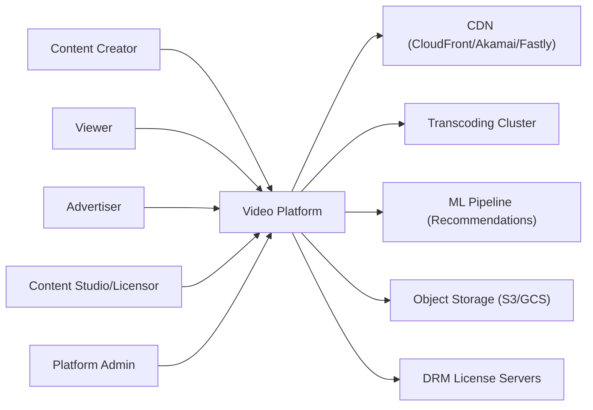

---

## Core Workflows

### Happy Path: Video Upload to Playback

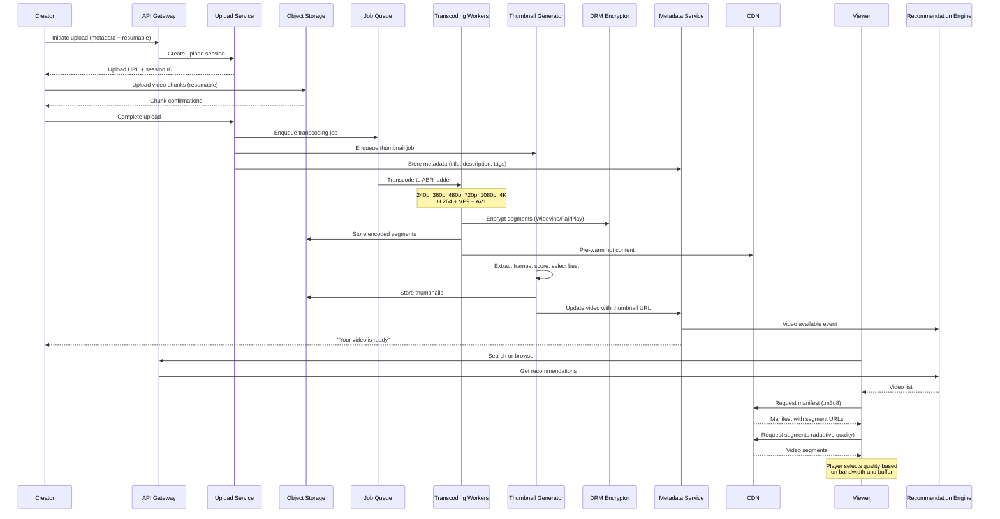

---

## Capacity Estimation

**Storage:**
- 500 hours uploaded/minute x 60 x 24 = **720,000 hours/day**
- Average source file: 2 GB/hour → **1.44 PB/day** source files
- Encoded variants (10 variants avg): **~5 PB/day** encoded output
- Total library after 10 years: **500+ PB** (with deduplication and cold storage tiering)

**Compute (Transcoding):**
- 720,000 hours/day transcoded to 10 variants = **7.2 million encode-hours/day**
- At 4x real-time encoding speed per core: **75,000 CPU-core-hours/day**
- With GPU acceleration (NVENC): ~10x speedup → **7,500 GPU-hours/day**

**Bandwidth:**
- 1 billion hours watched/day x average 3 Mbps = **375 PB/day outbound**
- CDN absorbs 95%+ from cache; origin serves < 5% = **~19 PB/day from origin**

**Recommendations:**
- 500M DAU x 20 recommendation requests/session = **10 billion reco requests/day** = ~115,000 RPS

---

## High-Level Architecture

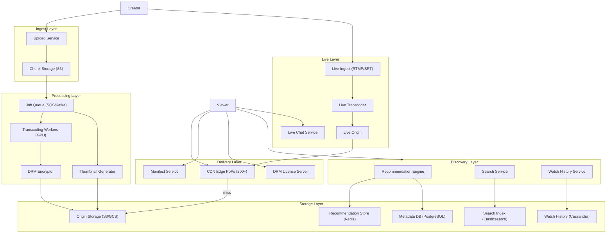

---

## Low-Level Design

### 1. Video Upload Pipeline

#### Overview

The Upload Pipeline handles creator video submissions — from the initial file transfer to the hand-off to transcoding. At YouTube's scale, this means ingesting **500 hours of video per minute** with files ranging from 100 MB (short clip) to 100 GB (4K multi-hour stream).

The pipeline must support **resumable, chunked uploads** because large files over unreliable connections (mobile, developing markets) will fail with single-request uploads.

#### Resumable Upload Protocol

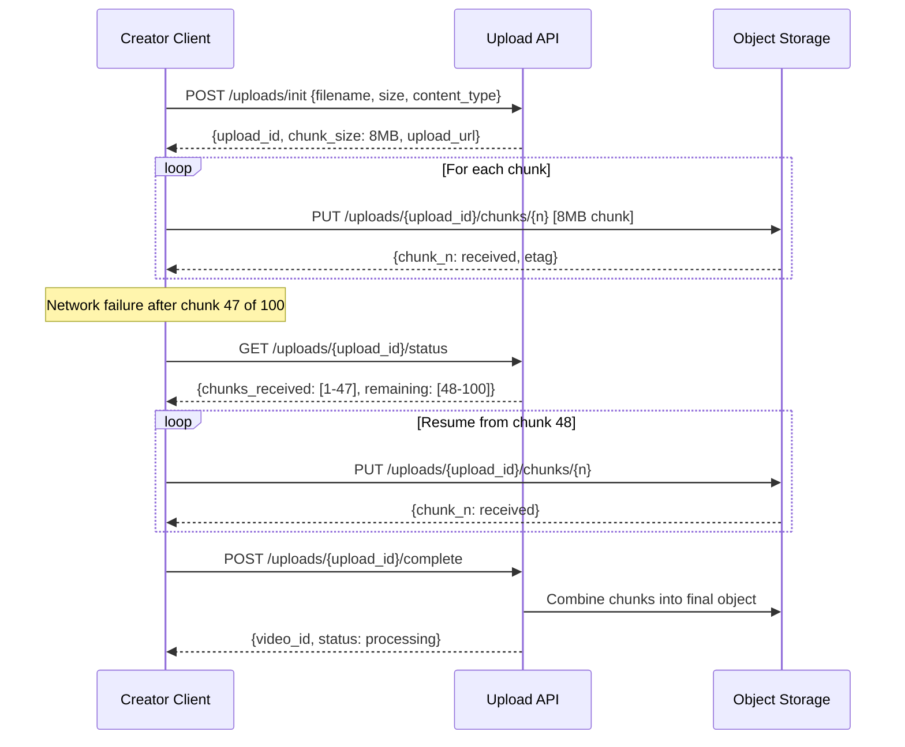

#### Data Model

```sql
CREATE TABLE videos (
    video_id        UUID PRIMARY KEY DEFAULT gen_random_uuid(),
    creator_id      UUID NOT NULL,
    title           TEXT NOT NULL,
    description     TEXT,
    tags            TEXT[],
    category_id     UUID,
    language        TEXT,
    duration_sec    INT,
    source_file_url TEXT,                      -- S3 URL of original upload
    source_codec    TEXT,
    source_resolution TEXT,                    -- "3840x2160"
    source_size_bytes BIGINT,
    thumbnail_url   TEXT,
    status          TEXT DEFAULT 'uploading' CHECK (status IN (
        'uploading', 'uploaded', 'transcoding', 'ready',
        'failed', 'removed', 'blocked'
    )),
    visibility      TEXT DEFAULT 'public' CHECK (visibility IN ('public', 'unlisted', 'private', 'scheduled')),
    publish_at      TIMESTAMPTZ,
    drm_required    BOOLEAN DEFAULT false,
    content_rating  TEXT,
    subtitles       JSONB DEFAULT '[]',        -- [{lang: "en", url: "..."}, ...]
    view_count      BIGINT DEFAULT 0,
    like_count      INT DEFAULT 0,
    comment_count   INT DEFAULT 0,
    created_at      TIMESTAMPTZ NOT NULL DEFAULT now(),
    updated_at      TIMESTAMPTZ NOT NULL DEFAULT now()
);

CREATE TABLE upload_sessions (
    upload_id       UUID PRIMARY KEY,
    video_id        UUID NOT NULL REFERENCES videos(video_id),
    creator_id      UUID NOT NULL,
    filename        TEXT NOT NULL,
    total_size      BIGINT NOT NULL,
    chunk_size      INT NOT NULL DEFAULT 8388608,  -- 8 MB
    total_chunks    INT NOT NULL,
    chunks_received INT DEFAULT 0,
    status          TEXT DEFAULT 'in_progress',
    expires_at      TIMESTAMPTZ NOT NULL,      -- 24h from creation
    created_at      TIMESTAMPTZ NOT NULL DEFAULT now()
);

CREATE INDEX idx_videos_creator ON videos(creator_id, created_at DESC);
CREATE INDEX idx_videos_status ON videos(status);
CREATE INDEX idx_videos_category ON videos(category_id);
```

#### Edge Cases

- **Upload interrupted at 99%**: Client resumes from last acknowledged chunk. Server validates all chunk ETags on completion.
- **Duplicate upload detection**: Hash first 1 MB + file size as fingerprint. Warn creator if duplicate detected.
- **Malicious file (not video)**: Virus scan after upload. Validate file header matches declared content type. Reject non-video files.
- **Extremely large file (100 GB)**: Support up to 12-hour videos. Upload session expires after 48 hours. Chunks stored in S3 multipart upload.
- **Concurrent uploads**: Creator can upload multiple videos simultaneously. Each gets independent upload session.

---

### 2. Transcoding System

#### Overview

The Transcoding System converts source video into multiple codec/resolution/bitrate combinations so every viewer on every device and network condition can watch smoothly. This is the most **compute-intensive** component of the platform.

At Netflix, encoding a single movie takes **thousands of CPU-hours** across hundreds of encode jobs. YouTube transcodes **500 hours of video per minute**, requiring a fleet of tens of thousands of GPU-accelerated workers.

#### Bitrate Ladder (ABR Encoding)

| Profile | Resolution | Bitrate (H.264) | Bitrate (AV1) | Target Device |
|---------|-----------|-----------------|---------------|---------------|
| 240p | 426x240 | 400 kbps | 200 kbps | Feature phones, 2G |
| 360p | 640x360 | 800 kbps | 400 kbps | Low-end mobile, 3G |
| 480p | 854x480 | 1.5 Mbps | 750 kbps | Mobile data |
| 720p | 1280x720 | 3 Mbps | 1.5 Mbps | Mobile WiFi, tablets |
| 1080p | 1920x1080 | 6 Mbps | 3 Mbps | Desktop, smart TVs |
| 1440p | 2560x1440 | 10 Mbps | 5 Mbps | High-res monitors |
| 4K | 3840x2160 | 20 Mbps | 10 Mbps | 4K TVs |
| 4K HDR | 3840x2160 | 25 Mbps | 12 Mbps | HDR-capable displays |

#### Per-Title Encoding (Netflix's Approach)

Not all videos need the same bitrate at the same resolution. An animated cartoon needs less bitrate at 1080p than an action movie with fast motion. **Per-title encoding** analyzes content complexity and optimizes the bitrate ladder per video.

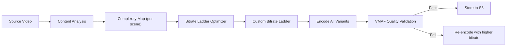

**Result**: Netflix achieves 20% bandwidth savings with per-title encoding compared to fixed bitrate ladders.

#### Transcoding Pipeline

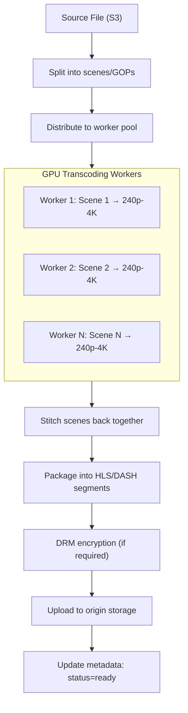

**Parallel encoding**: Source video is split into independent segments (GOPs — Groups of Pictures) and encoded in parallel across many workers. A 1-hour video split into 60 segments and encoded across 60 workers finishes in ~1 minute of wall-clock time (per variant), plus overhead for stitching.

#### Data Model

```sql
CREATE TABLE transcode_jobs (
    job_id          UUID PRIMARY KEY,
    video_id        UUID NOT NULL REFERENCES videos(video_id),
    status          TEXT DEFAULT 'queued' CHECK (status IN (
        'queued', 'analyzing', 'encoding', 'packaging',
        'encrypting', 'completed', 'failed'
    )),
    priority        INT DEFAULT 5,             -- 1=highest (premium content)
    source_url      TEXT NOT NULL,
    output_profiles JSONB NOT NULL,            -- requested bitrate ladder
    progress_pct    INT DEFAULT 0,
    started_at      TIMESTAMPTZ,
    completed_at    TIMESTAMPTZ,
    error_message   TEXT,
    worker_id       TEXT,
    created_at      TIMESTAMPTZ NOT NULL DEFAULT now()
);

CREATE TABLE encoded_variants (
    variant_id      UUID PRIMARY KEY,
    video_id        UUID NOT NULL REFERENCES videos(video_id),
    codec           TEXT NOT NULL,             -- 'h264', 'h265', 'vp9', 'av1'
    resolution      TEXT NOT NULL,             -- '1920x1080'
    bitrate_kbps    INT NOT NULL,
    segment_duration_sec INT DEFAULT 4,
    total_segments  INT,
    manifest_url    TEXT NOT NULL,             -- HLS .m3u8 or DASH .mpd
    storage_url     TEXT NOT NULL,             -- S3 prefix for segments
    file_size_bytes BIGINT,
    vmaf_score      DECIMAL(5,2),             -- quality score (0-100)
    created_at      TIMESTAMPTZ NOT NULL DEFAULT now()
);
```

#### Edge Cases

- **Source video is corrupt**: Probe with FFmpeg before encoding. If corrupt, mark as failed with user-friendly error.
- **4K HDR source**: Requires HDR-aware encoding pipeline (tone mapping for SDR variants, preserve HDR metadata for HDR variants).
- **Very short video (< 5 seconds)**: Single segment; skip scene splitting. Still need all resolution variants.
- **12-hour lecture video**: Split into many GOPs for parallel encoding. Estimated completion: 2 hours. Provide progress updates.
- **Encoding worker crash mid-job**: Job status tracked per segment. Failed segments re-queued to different worker. No need to restart entire job.

---

### 3. Thumbnail Generation

#### Overview

Thumbnails are the most important factor in video discovery. YouTube reports that **90% of the best-performing videos have custom thumbnails**. For videos without custom thumbnails, the system must automatically generate engaging preview images.

#### Thumbnail Pipeline

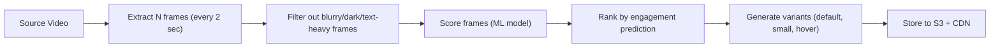

#### ML Thumbnail Scoring

Features used to score candidate thumbnails:
- **Faces**: Frames with clear, emotional faces perform better
- **Contrast**: High-contrast images attract attention
- **Text overlap**: Avoid frames with burned-in text
- **Motion blur**: Reject blurry frames
- **Rule of thirds**: Composition scoring
- **Brightness**: Not too dark, not overexposed
- **Diversity**: Selected thumbnails should look different from each other

YouTube uses a deep learning model trained on billions of impressions to predict **P(click | thumbnail)**.

#### Custom Thumbnail Upload

Creators can upload custom thumbnails. Requirements:
- Max 2 MB, 1280x720 px recommended
- Content moderation check (no misleading, no policy violations)
- A/B testing: platform can test creator's custom vs. auto-generated thumbnails

---

### 4. DRM/Encryption System

#### Overview

DRM prevents unauthorized copying and redistribution of premium content. Studios and licensors **require DRM** as a contractual condition for making their content available on the platform.

The industry uses three DRM systems depending on the platform:

| DRM | Platforms | License Server |
|-----|-----------|---------------|
| **Widevine** (Google) | Android, Chrome, Chromecast, smart TVs | Widevine License Server |
| **FairPlay** (Apple) | iOS, Safari, Apple TV | Apple FairPlay Server |
| **PlayReady** (Microsoft) | Windows, Xbox, some smart TVs | Microsoft PlayReady Server |

#### Common Encryption (CENC)

**CENC** allows encrypting content once and serving it with multiple DRM systems. The video segments are encrypted with AES-128-CTR, and each DRM system provides the decryption key through its own license server.

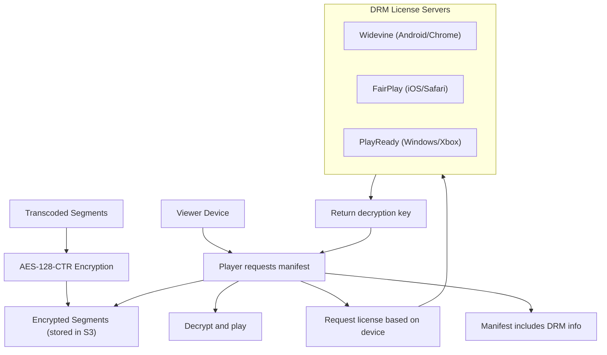

#### Security Levels

| Level | Hardware | Use Case |
|-------|---------|----------|
| **L1** (hardware) | Decryption in TEE (Trusted Execution Environment) | 4K/HDR content; highest security |
| **L2** (software+hardware) | Crypto in hardware, processing in software | HD content |
| **L3** (software only) | All in software | SD content; lowest security |

Studios typically require **L1 for 4K content** and allow L3 for SD/720p.

---

### 5. Video Streaming System (HLS/DASH)

#### Overview

HLS (HTTP Live Streaming) and DASH (Dynamic Adaptive Streaming over HTTP) are the two dominant protocols for delivering video over the internet. Both work by splitting video into small segments (2-10 seconds each) and using a manifest file to tell the player which segments to request.

#### How HLS Works

```
1. Player requests master manifest:
   GET /video/abc123/master.m3u8

2. Master manifest lists available quality levels:
   #EXT-X-STREAM-INF:BANDWIDTH=800000,RESOLUTION=640x360
   360p/playlist.m3u8
   #EXT-X-STREAM-INF:BANDWIDTH=3000000,RESOLUTION=1280x720
   720p/playlist.m3u8
   #EXT-X-STREAM-INF:BANDWIDTH=6000000,RESOLUTION=1920x1080
   1080p/playlist.m3u8

3. Player selects quality and requests segment playlist:
   GET /video/abc123/1080p/playlist.m3u8

4. Segment playlist lists individual segments:
   #EXTINF:4.000,
   segment_001.ts
   #EXTINF:4.000,
   segment_002.ts
   ...

5. Player downloads segments sequentially:
   GET /video/abc123/1080p/segment_001.ts
   GET /video/abc123/1080p/segment_002.ts
   ...
```

#### Segment Duration Trade-off

| Duration | Pros | Cons |
|----------|------|------|
| **2 seconds** | Fast quality switching; low latency for live | More HTTP requests; higher CDN overhead |
| **4 seconds** | Good balance | Standard choice for most platforms |
| **6 seconds** | Fewer requests; better compression efficiency | Slower quality adaptation; higher latency |
| **10 seconds** | Best compression | Too slow for quality switching; poor for live |

**Industry standard**: 4 seconds for VOD, 2 seconds for live.

---

### 6. CDN Distribution System

#### Overview

The CDN is what makes video playback fast and smooth. Without CDN, every viewer would fetch video from the origin — an impossibility at 375 PB/day of outbound bandwidth. The CDN caches content at **200+ edge locations** worldwide so viewers download from a nearby server.

#### Multi-Tier CDN Architecture

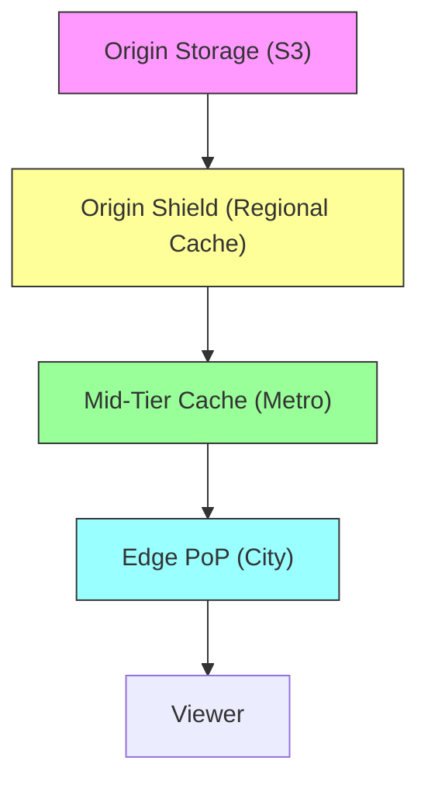

| Tier | Location | Cache Hit Rate | Content |
|------|----------|---------------|---------|
| **Edge PoP** | City level (200+ cities) | 80-90% | Hot content, popular segments |
| **Mid-Tier** | Metro level (50 regions) | 95% | Warm content |
| **Origin Shield** | Region level (5 regions) | 99% | Prevents thundering herd on origin |
| **Origin (S3)** | 3 regions | N/A | Complete library (500+ PB) |

#### Cache Strategy

- **Hot content** (top 1% of videos = 90% of views): Cached at every edge PoP. Pre-warmed on publish.
- **Warm content** (next 9%): Cached at mid-tier. Pulled to edge on first request.
- **Long-tail** (remaining 90% of videos = 10% of views): Fetched from origin on demand. May cache at mid-tier after first play.
- **Live streams**: Not cached traditionally. CDN acts as a pass-through relay with minimal buffering.

#### CDN Cost Optimization

- **Aggressive caching**: 4-second segments with long TTL (24 hours) for VOD
- **Bandwidth reduction**: AV1 codec uses 30-50% less bandwidth than H.264 at same quality
- **Cache warming**: Pre-push new releases to edge PoPs before launch
- **Multi-CDN**: Use multiple CDN providers (Akamai, CloudFront, Fastly) and route based on cost, performance, and regional availability

---

### 7. Adaptive Bitrate Streaming

#### Overview

ABR is the **client-side algorithm** that decides which quality level to request for each video segment. The goal is to maximize video quality while avoiding rebuffering.

#### ABR Algorithm Approaches

| Algorithm | How It Works | Pros | Cons |
|-----------|-------------|------|------|
| **Throughput-based** | Select bitrate <= recent measured throughput | Simple, responsive | Oscillation between qualities |
| **Buffer-based (BBA)** | Map buffer level to quality: low buffer → low quality | Smooth, avoids rebuffering | Slow to ramp up quality |
| **Hybrid (BOLA, MPC)** | Combine throughput estimation + buffer level | Best of both worlds | More complex |
| **ML-based (Netflix)** | Trained on billions of sessions to predict optimal quality | Best performance | Requires training infrastructure |

#### ABR State Machine

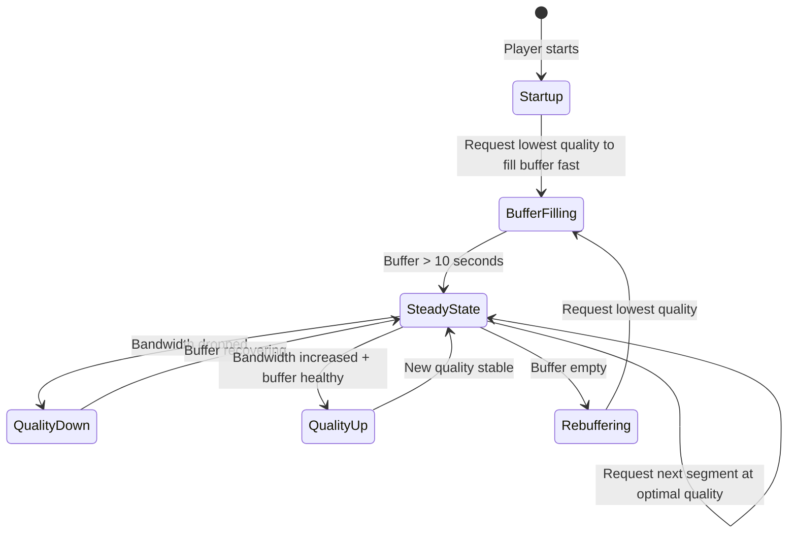

#### Key Metrics

| Metric | Target | Impact |
|--------|--------|--------|
| **Time to first frame** | < 2s | First impression; affects abandonment |
| **Rebuffering ratio** | < 0.5% of play time | Every 1% rebuffer = 3% drop in watch time |
| **Average bitrate** | Maximize within constraints | Higher = better quality experience |
| **Quality switches/minute** | < 2 | Frequent switching is distracting |
| **Startup bitrate** | 480p-720p | Balance between fast start and initial quality |

---

### 8. Recommendation Engine

#### Overview

The Recommendation Engine is the **primary driver of content discovery** on the platform. YouTube reports that **70% of watch time comes from recommendations**, not from search or direct navigation. The algorithm determines what appears on the homepage, in the "Up Next" sidebar, and in notification-triggered suggestions.

#### Two-Stage Architecture

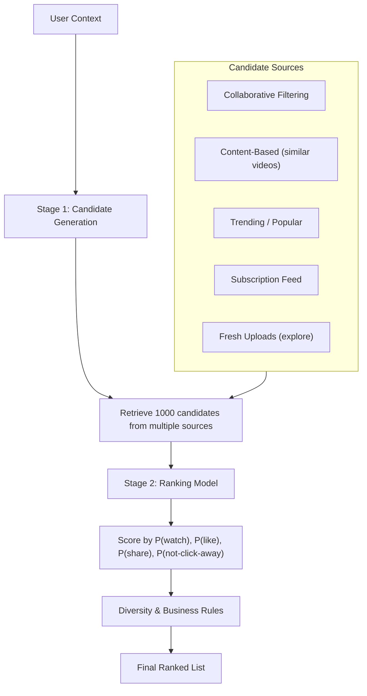

#### Recommendation Signals

| Signal Category | Examples | Weight |
|----------------|---------|--------|
| **Watch history** | What user watched, for how long, did they finish | High |
| **Search history** | Recent searches indicate current interests | Medium |
| **Engagement** | Likes, shares, comments, saves | High |
| **Demographics** | Age, location, language, device | Low-Medium |
| **Video features** | Title, tags, category, duration, upload date | Medium |
| **Co-watch patterns** | "Users who watched X also watched Y" | High |
| **Creator affinity** | Does user frequently watch this creator? | High |
| **Freshness** | Recent uploads boosted for discovery | Medium |
| **Quality signals** | VMAF score, production quality, content rating | Low |

#### Cold Start Problem

| Scenario | Strategy |
|----------|---------|
| **New user (no history)** | Show trending, popular by category, localized content |
| **New video (no views)** | Boost in explore/recommended for first 48 hours; use content features |
| **New creator (no audience)** | Small initial distribution to gauge engagement; grow if positive signals |

#### Edge Cases

- **Filter bubble**: User only sees content similar to past views. Inject exploration candidates (5-10% of feed) to broaden interests.
- **Clickbait detection**: High CTR but low watch completion = clickbait. Demote in rankings.
- **Controversial content**: May have high engagement but policy concerns. Content moderation signals fed into ranking to reduce distribution.
- **Seasonal content**: Holiday videos should be boosted in November-December, suppressed in July.

---

### 9. Search & Ranking System

#### Overview

Video search allows viewers to find specific content by keyword, topic, or creator name. Unlike web search (which indexes text), video search must index **titles, descriptions, tags, auto-generated captions (speech-to-text), and visual content**.

#### Search Pipeline

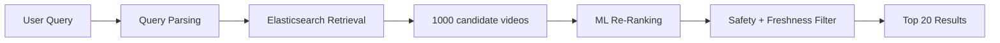

#### Index Structure

```json
{
  "mappings": {
    "properties": {
      "video_id": {"type": "keyword"},
      "title": {"type": "text", "analyzer": "video_analyzer"},
      "description": {"type": "text"},
      "tags": {"type": "keyword"},
      "captions": {"type": "text"},
      "creator_name": {"type": "text"},
      "category": {"type": "keyword"},
      "language": {"type": "keyword"},
      "duration_sec": {"type": "integer"},
      "view_count": {"type": "long"},
      "upload_date": {"type": "date"},
      "engagement_score": {"type": "float"},
      "quality_score": {"type": "float"}
    }
  }
}
```

**Speech-to-text indexing**: Audio is automatically transcribed using ASR (Automatic Speech Recognition). Captions are indexed in Elasticsearch, enabling search within spoken content (e.g., searching for a topic discussed in a lecture).

---

### 10. Watch History System

#### Overview

The Watch History System tracks what each viewer has watched, how far they progressed, and when they stopped. This data powers three critical features: **resume playback** (continue where you left off), **recommendations** (personalized based on viewing), and **"already watched" indicators** (avoid re-showing content).

#### Data Model (Cassandra)

```
CREATE TABLE watch_history (
    user_id         UUID,
    watched_at      TIMEUUID,
    video_id        UUID,
    watch_duration_sec INT,
    video_duration_sec INT,
    completion_pct  FLOAT,
    resume_position_sec INT,
    device_type     TEXT,
    quality_avg     TEXT,
    PRIMARY KEY (user_id, watched_at)
) WITH CLUSTERING ORDER BY (watched_at DESC)
  AND default_time_to_live = 31536000;  -- 1 year

-- Resume position (latest per video per user)
CREATE TABLE resume_positions (
    user_id         UUID,
    video_id        UUID,
    position_sec    INT,
    updated_at      TIMESTAMP,
    PRIMARY KEY (user_id, video_id)
);
```

#### Write Path

Every **30 seconds** during playback, the player sends a heartbeat:
```json
POST /api/v1/watch/heartbeat
{
  "video_id": "vid_abc",
  "position_sec": 180,
  "quality": "1080p",
  "buffering_events": 0,
  "session_id": "sess_xyz"
}
```

These heartbeats are batched and written to Cassandra asynchronously via Kafka. The resume position is also updated in Redis for fast read access.

#### Edge Cases

- **Cross-device resume**: User watches 10 minutes on phone, opens laptop. Resume position read from Redis (consistent across devices).
- **Private/incognito mode**: Watch history not recorded (client-side flag).
- **History deletion**: User deletes specific entries or clears all history. Cassandra entry tombstoned; Redis key deleted; recommendation model invalidation queued.

---

### 11. Live Streaming (Low Latency)

#### Overview

Live streaming enables creators to broadcast in real-time to potentially millions of concurrent viewers. The primary architectural challenge is **latency**: the time from the creator's camera to the viewer's screen must be < 5 seconds for interactive content (gaming, Q&A) and < 30 seconds for broadcast content (sports, news).

#### Live Streaming Architecture

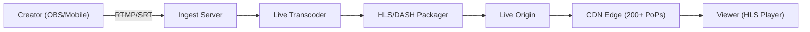

#### Latency Modes

| Mode | Latency | Protocol | Use Case |
|------|---------|----------|----------|
| **Ultra-low** | < 2s | WebRTC / LL-HLS | 1:1 video calls, auctions |
| **Low** | 2-5s | LL-HLS / LL-DASH | Gaming streams, Q&A |
| **Standard** | 5-15s | HLS / DASH | General live events |
| **Broadcast** | 15-30s | HLS (long segments) | Sports, concerts (highest reliability) |

#### Low-Latency HLS (LL-HLS)

Standard HLS has 15-30 second latency because the player must wait for complete segments. LL-HLS reduces this to 2-5 seconds by:
1. **Partial segments**: Player can request incomplete segments before they're finalized
2. **Blocking playlist reload**: Server holds the playlist request until a new segment is ready (long-poll)
3. **Preload hints**: Manifest tells the player what segment to request next
4. **Shorter segments**: 2-second segments instead of 6-second

#### Scaling for Mega-Events (10M+ concurrent viewers)

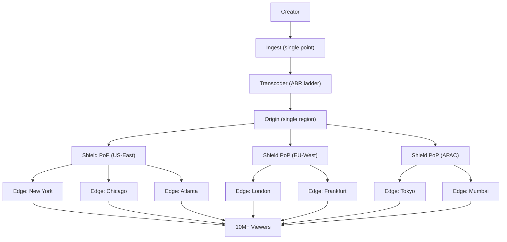

**Key insight**: Origin sends each segment to each shield PoP exactly once. Shield sends to each edge once. Each edge serves thousands of local viewers. Total origin bandwidth: 5 shield PoPs x 8 variants x 4 Mbps avg = **160 Mbps**. Without CDN: 10M viewers x 4 Mbps = **40 Tbps**. CDN provides **250,000x bandwidth multiplication**.

---

### 12. Chat During Live Stream

#### Overview

Live chat enables real-time viewer interaction during a stream. At scale, a popular stream can generate **50,000+ messages per second** from millions of concurrent viewers. The system must display a readable, moderated chat experience despite this volume.

#### Architecture

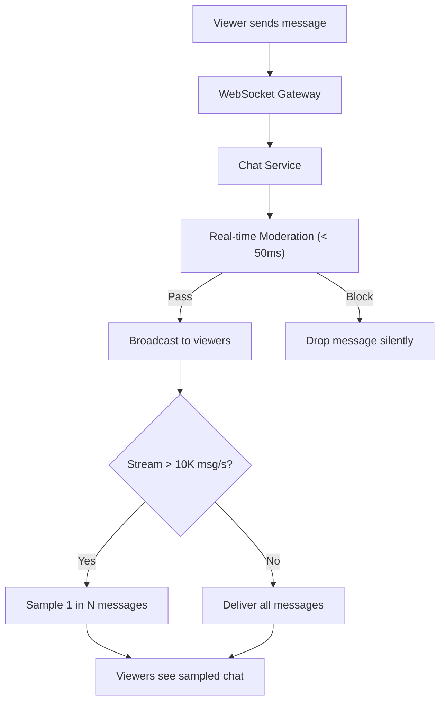

#### Chat Scaling Strategies

| Strategy | When | How |
|----------|------|-----|
| **Full delivery** | < 1K messages/sec | Every message delivered to every viewer |
| **Server-side sampling** | 1K-50K messages/sec | Random sample (1 in 5, 1 in 10) per viewer |
| **Top chat** | > 50K messages/sec | ML-scored: show most relevant/engaging messages |
| **Slow mode** | Creator-enabled | Limit each viewer to 1 message per 30 seconds |
| **Subscriber-only** | Creator-enabled | Only paid subscribers can chat |

#### Chat Data Model

```sql
-- Chat messages (hot storage — last 24 hours)
CREATE TABLE live_chat_messages (
    stream_id       UUID NOT NULL,
    message_id      TIMEUUID,
    user_id         UUID NOT NULL,
    content         TEXT NOT NULL,
    is_superchat    BOOLEAN DEFAULT false,     -- paid highlighted message
    superchat_amount DECIMAL(8,2),
    moderation_status TEXT DEFAULT 'approved',
    PRIMARY KEY (stream_id, message_id)
) WITH CLUSTERING ORDER BY (message_id ASC)
  AND default_time_to_live = 86400;           -- 24 hours

-- For replay: archived to cold storage after stream ends
```

#### Edge Cases

- **Chat spam attack**: Rate limit: 1 message/5 seconds per user. Auto-mute users with repeated violations.
- **Super Chat (paid message)**: Guaranteed delivery (no sampling). Pinned for N seconds based on amount. Stored permanently.
- **Creator bans a user**: User's messages hidden from all viewers in real-time. WebSocket connection kept alive but messages silently dropped.
- **Stream with 5M viewers**: Only 500K have active WebSocket (rest don't have chat open). Sampled delivery to reduce fanout.

---

## APIs and Contracts (Consolidated)

| Service | Endpoint | Method | Auth | Rate Limit |
|---------|----------|--------|------|-----------|
| Upload | `/api/v1/uploads/init` | POST | Creator Token | 10/hour |
| Upload | `/api/v1/uploads/{id}/complete` | POST | Creator Token | 10/hour |
| Videos | `/api/v1/videos/{id}` | GET | Public | 10,000/min/IP |
| Videos | `/api/v1/videos/{id}` | PATCH | Creator Token | 100/min |
| Streaming | `/api/v1/videos/{id}/manifest` | GET | Viewer Token (DRM) | Unlimited (CDN) |
| DRM | `/api/v1/drm/license` | POST | Viewer Token | 100/min/user |
| Search | `/api/v1/search?q={query}` | GET | Public | 1,000/min/IP |
| Recommendations | `/api/v1/recommendations` | GET | Viewer Token | 100/min/user |
| Watch History | `/api/v1/watch/history` | GET | Viewer Token | 30/min/user |
| Watch History | `/api/v1/watch/heartbeat` | POST | Viewer Token | 2/min/video |
| Live | `/api/v1/live/streams` | POST | Creator Token | 5/hour |
| Live Chat | WebSocket `/ws/live/{streamId}/chat` | WS | Viewer Token | 12 msg/min |

---

## Data Model (Consolidated ER Diagram)

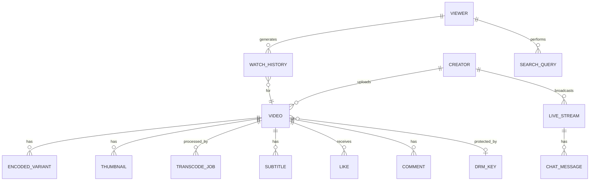

### Detailed Data Models (All Subsystems)

The following SQL schemas provide comprehensive data models for every subsystem in the platform. These complement the per-subsystem models shown earlier with additional tables for channels, subscriptions, content reports, and creator analytics.

#### Channels and Subscriptions

```sql
CREATE TABLE channels (
    channel_id      UUID PRIMARY KEY DEFAULT gen_random_uuid(),
    owner_id        UUID NOT NULL,                  -- creator user ID
    handle          TEXT UNIQUE NOT NULL,            -- @handle (unique)
    display_name    TEXT NOT NULL,
    description     TEXT,
    avatar_url      TEXT,
    banner_url      TEXT,
    country         TEXT,
    language        TEXT DEFAULT 'en',
    category        TEXT,
    subscriber_count BIGINT DEFAULT 0,
    total_views     BIGINT DEFAULT 0,
    video_count     INT DEFAULT 0,
    is_verified     BOOLEAN DEFAULT false,
    monetization_status TEXT DEFAULT 'ineligible' CHECK (monetization_status IN (
        'ineligible', 'pending_review', 'approved', 'suspended', 'terminated'
    )),
    custom_url      TEXT,
    social_links    JSONB DEFAULT '{}',             -- {"twitter": "...", "instagram": "..."}
    branding        JSONB DEFAULT '{}',             -- {"watermark_url": "...", "intro_video_id": "..."}
    created_at      TIMESTAMPTZ NOT NULL DEFAULT now(),
    updated_at      TIMESTAMPTZ NOT NULL DEFAULT now()
);

CREATE INDEX idx_channels_owner ON channels(owner_id);
CREATE INDEX idx_channels_handle ON channels(handle);
CREATE INDEX idx_channels_subscriber_count ON channels(subscriber_count DESC);
CREATE INDEX idx_channels_category ON channels(category);

CREATE TABLE subscriptions (
    subscription_id UUID PRIMARY KEY DEFAULT gen_random_uuid(),
    subscriber_id   UUID NOT NULL,                  -- viewer user ID
    channel_id      UUID NOT NULL REFERENCES channels(channel_id),
    notification_level TEXT DEFAULT 'personalized' CHECK (notification_level IN (
        'all', 'personalized', 'none'
    )),
    subscribed_at   TIMESTAMPTZ NOT NULL DEFAULT now(),
    UNIQUE (subscriber_id, channel_id)
);

CREATE INDEX idx_subscriptions_subscriber ON subscriptions(subscriber_id, subscribed_at DESC);
CREATE INDEX idx_subscriptions_channel ON subscriptions(channel_id);
```

#### Thumbnails (Extended)

```sql
CREATE TABLE thumbnails (
    thumbnail_id    UUID PRIMARY KEY DEFAULT gen_random_uuid(),
    video_id        UUID NOT NULL REFERENCES videos(video_id),
    source          TEXT NOT NULL CHECK (source IN ('auto_generated', 'custom_upload', 'ab_test')),
    image_url       TEXT NOT NULL,                  -- S3 URL
    cdn_url         TEXT,                           -- CDN edge URL
    width           INT NOT NULL,
    height          INT NOT NULL,
    file_size_bytes INT,
    format          TEXT DEFAULT 'webp' CHECK (format IN ('webp', 'jpeg', 'png', 'avif')),
    ml_score        DECIMAL(5,4),                   -- engagement prediction score 0.0-1.0
    frame_timestamp_sec DECIMAL(8,2),               -- position in video this frame was extracted from
    is_active       BOOLEAN DEFAULT false,          -- currently displayed thumbnail
    impressions     BIGINT DEFAULT 0,
    clicks          BIGINT DEFAULT 0,
    ctr             DECIMAL(5,4) GENERATED ALWAYS AS (
        CASE WHEN impressions > 0 THEN clicks::DECIMAL / impressions ELSE 0 END
    ) STORED,
    moderation_status TEXT DEFAULT 'pending' CHECK (moderation_status IN (
        'pending', 'approved', 'rejected'
    )),
    rejection_reason TEXT,
    created_at      TIMESTAMPTZ NOT NULL DEFAULT now()
);

CREATE INDEX idx_thumbnails_video ON thumbnails(video_id, is_active);
CREATE INDEX idx_thumbnails_moderation ON thumbnails(moderation_status) WHERE moderation_status = 'pending';
```

#### DRM Licenses

```sql
CREATE TABLE drm_licenses (
    license_id      UUID PRIMARY KEY DEFAULT gen_random_uuid(),
    video_id        UUID NOT NULL REFERENCES videos(video_id),
    drm_system      TEXT NOT NULL CHECK (drm_system IN ('widevine', 'fairplay', 'playready')),
    key_id          TEXT NOT NULL,                  -- content encryption key ID
    encryption_key  BYTEA NOT NULL,                 -- AES-128 key (encrypted at rest)
    iv              BYTEA,                          -- initialization vector
    security_level  TEXT DEFAULT 'L1' CHECK (security_level IN ('L1', 'L2', 'L3')),
    license_policy  JSONB NOT NULL DEFAULT '{}',    -- {"max_resolution": "4K", "offline_hours": 48, "concurrent_streams": 4}
    geo_restrictions JSONB DEFAULT '[]',            -- ["US", "CA", "GB"] or [] for worldwide
    valid_from      TIMESTAMPTZ NOT NULL DEFAULT now(),
    valid_until     TIMESTAMPTZ,                    -- NULL = perpetual
    created_at      TIMESTAMPTZ NOT NULL DEFAULT now()
);

CREATE INDEX idx_drm_video ON drm_licenses(video_id, drm_system);
CREATE INDEX idx_drm_key ON drm_licenses(key_id);

-- License issuance log (audit trail)
CREATE TABLE drm_license_grants (
    grant_id        UUID PRIMARY KEY DEFAULT gen_random_uuid(),
    license_id      UUID NOT NULL REFERENCES drm_licenses(license_id),
    user_id         UUID NOT NULL,
    device_id       TEXT NOT NULL,
    drm_system      TEXT NOT NULL,
    security_level  TEXT NOT NULL,
    ip_address      INET,
    country_code    TEXT,
    granted_at      TIMESTAMPTZ NOT NULL DEFAULT now(),
    expires_at      TIMESTAMPTZ NOT NULL,
    revoked         BOOLEAN DEFAULT false,
    revoked_at      TIMESTAMPTZ
);

CREATE INDEX idx_drm_grants_user ON drm_license_grants(user_id, granted_at DESC);
CREATE INDEX idx_drm_grants_device ON drm_license_grants(device_id);
```

#### Recommendations (Precomputed Store)

```sql
CREATE TABLE recommendation_sets (
    user_id         UUID NOT NULL,
    surface         TEXT NOT NULL CHECK (surface IN (
        'homepage', 'up_next', 'because_you_watched', 'trending', 'explore'
    )),
    recommendations JSONB NOT NULL,                 -- [{video_id, score, reason, source}]
    model_version   TEXT NOT NULL,                  -- "reco-v3.2.1"
    computed_at     TIMESTAMPTZ NOT NULL DEFAULT now(),
    expires_at      TIMESTAMPTZ NOT NULL,
    PRIMARY KEY (user_id, surface)
);

CREATE INDEX idx_reco_expiry ON recommendation_sets(expires_at) WHERE expires_at < now();

-- Recommendation feedback (for model training)
CREATE TABLE recommendation_events (
    event_id        UUID PRIMARY KEY DEFAULT gen_random_uuid(),
    user_id         UUID NOT NULL,
    video_id        UUID NOT NULL,
    surface         TEXT NOT NULL,
    position        INT NOT NULL,                   -- rank position shown
    action          TEXT NOT NULL CHECK (action IN (
        'impression', 'click', 'watch_25', 'watch_50', 'watch_75',
        'watch_100', 'like', 'dislike', 'not_interested', 'share'
    )),
    model_version   TEXT NOT NULL,
    session_id      UUID,
    created_at      TIMESTAMPTZ NOT NULL DEFAULT now()
);

-- Partitioned by month for efficient training data extraction
CREATE INDEX idx_reco_events_user ON recommendation_events(user_id, created_at DESC);
CREATE INDEX idx_reco_events_video ON recommendation_events(video_id, action);
```

#### Live Streams

```sql
CREATE TABLE live_streams (
    stream_id       UUID PRIMARY KEY DEFAULT gen_random_uuid(),
    channel_id      UUID NOT NULL REFERENCES channels(channel_id),
    title           TEXT NOT NULL,
    description     TEXT,
    category        TEXT,
    tags            TEXT[],
    stream_key      TEXT NOT NULL UNIQUE,            -- secret key for RTMP ingest
    ingest_url      TEXT,                            -- rtmp://ingest.example.com/live
    ingest_protocol TEXT DEFAULT 'rtmp' CHECK (ingest_protocol IN ('rtmp', 'srt', 'webrtc')),
    status          TEXT DEFAULT 'scheduled' CHECK (status IN (
        'scheduled', 'live', 'ending', 'ended', 'failed'
    )),
    latency_mode    TEXT DEFAULT 'low' CHECK (latency_mode IN (
        'ultra_low', 'low', 'standard', 'broadcast'
    )),
    max_resolution  TEXT DEFAULT '1080p',
    drm_required    BOOLEAN DEFAULT false,
    chat_enabled    BOOLEAN DEFAULT true,
    chat_mode       TEXT DEFAULT 'open' CHECK (chat_mode IN (
        'open', 'subscriber_only', 'slow_mode', 'followers_only', 'disabled'
    )),
    slow_mode_interval_sec INT DEFAULT 0,
    concurrent_viewers BIGINT DEFAULT 0,
    peak_viewers    BIGINT DEFAULT 0,
    total_unique_viewers BIGINT DEFAULT 0,
    scheduled_at    TIMESTAMPTZ,
    started_at      TIMESTAMPTZ,
    ended_at        TIMESTAMPTZ,
    vod_video_id    UUID REFERENCES videos(video_id), -- archived VOD
    recording_enabled BOOLEAN DEFAULT true,
    health          JSONB DEFAULT '{}',             -- {"bitrate_kbps": 6000, "fps": 60, "keyframe_interval": 2}
    created_at      TIMESTAMPTZ NOT NULL DEFAULT now(),
    updated_at      TIMESTAMPTZ NOT NULL DEFAULT now()
);

CREATE INDEX idx_livestreams_channel ON live_streams(channel_id, created_at DESC);
CREATE INDEX idx_livestreams_status ON live_streams(status) WHERE status = 'live';
CREATE INDEX idx_livestreams_scheduled ON live_streams(scheduled_at) WHERE status = 'scheduled';
CREATE INDEX idx_livestreams_stream_key ON live_streams(stream_key);
```

#### Content Reports

```sql
CREATE TABLE content_reports (
    report_id       UUID PRIMARY KEY DEFAULT gen_random_uuid(),
    reporter_id     UUID NOT NULL,                  -- user who filed the report
    content_type    TEXT NOT NULL CHECK (content_type IN (
        'video', 'comment', 'live_stream', 'chat_message', 'channel', 'thumbnail'
    )),
    content_id      UUID NOT NULL,                  -- video_id, comment_id, etc.
    reason          TEXT NOT NULL CHECK (reason IN (
        'spam', 'harassment', 'hate_speech', 'violence', 'sexual_content',
        'child_safety', 'copyright', 'misinformation', 'impersonation',
        'privacy_violation', 'terrorism', 'self_harm', 'other'
    )),
    description     TEXT,
    evidence_urls   TEXT[],
    status          TEXT DEFAULT 'pending' CHECK (status IN (
        'pending', 'under_review', 'action_taken', 'dismissed', 'appealed'
    )),
    priority        INT DEFAULT 5,                  -- 1=critical (child safety), 5=normal
    reviewer_id     UUID,
    review_notes    TEXT,
    action_taken    TEXT CHECK (action_taken IN (
        NULL, 'removed', 'age_restricted', 'demonetized',
        'strike_issued', 'channel_suspended', 'no_action'
    )),
    auto_detected   BOOLEAN DEFAULT false,          -- flagged by ML, not a user
    detection_model TEXT,                            -- "csam-v2.1", "copyright-fingerprint"
    detection_confidence DECIMAL(5,4),
    created_at      TIMESTAMPTZ NOT NULL DEFAULT now(),
    reviewed_at     TIMESTAMPTZ
);

CREATE INDEX idx_reports_status ON content_reports(status, priority) WHERE status IN ('pending', 'under_review');
CREATE INDEX idx_reports_content ON content_reports(content_type, content_id);
CREATE INDEX idx_reports_reporter ON content_reports(reporter_id, created_at DESC);
CREATE INDEX idx_reports_auto ON content_reports(auto_detected, status) WHERE auto_detected = true;
```

#### Creator Analytics (Aggregated)

```sql
CREATE TABLE creator_analytics_daily (
    channel_id      UUID NOT NULL REFERENCES channels(channel_id),
    date            DATE NOT NULL,
    views           BIGINT DEFAULT 0,
    watch_time_minutes BIGINT DEFAULT 0,
    subscribers_gained INT DEFAULT 0,
    subscribers_lost INT DEFAULT 0,
    net_subscribers INT GENERATED ALWAYS AS (subscribers_gained - subscribers_lost) STORED,
    revenue_cents   BIGINT DEFAULT 0,               -- total estimated revenue
    ad_impressions  BIGINT DEFAULT 0,
    ad_revenue_cents BIGINT DEFAULT 0,
    membership_revenue_cents BIGINT DEFAULT 0,
    superchat_revenue_cents BIGINT DEFAULT 0,
    likes           INT DEFAULT 0,
    dislikes        INT DEFAULT 0,
    comments        INT DEFAULT 0,
    shares          INT DEFAULT 0,
    impressions     BIGINT DEFAULT 0,               -- thumbnail impressions
    click_through_rate DECIMAL(5,4),
    avg_view_duration_sec INT,
    avg_percentage_viewed DECIMAL(5,2),
    top_traffic_sources JSONB DEFAULT '{}',         -- {"search": 30, "suggested": 45, "browse": 15, "external": 10}
    top_geographies JSONB DEFAULT '{}',             -- {"US": 40, "IN": 20, "BR": 10}
    device_breakdown JSONB DEFAULT '{}',            -- {"mobile": 60, "desktop": 25, "tv": 10, "tablet": 5}
    PRIMARY KEY (channel_id, date)
);

CREATE INDEX idx_analytics_date ON creator_analytics_daily(date);

CREATE TABLE creator_analytics_video (
    video_id        UUID NOT NULL REFERENCES videos(video_id),
    date            DATE NOT NULL,
    views           BIGINT DEFAULT 0,
    watch_time_minutes BIGINT DEFAULT 0,
    avg_view_duration_sec INT,
    avg_percentage_viewed DECIMAL(5,2),
    impressions     BIGINT DEFAULT 0,
    ctr             DECIMAL(5,4),
    likes           INT DEFAULT 0,
    dislikes        INT DEFAULT 0,
    comments        INT DEFAULT 0,
    shares          INT DEFAULT 0,
    revenue_cents   BIGINT DEFAULT 0,
    traffic_sources JSONB DEFAULT '{}',
    audience_retention JSONB DEFAULT '[]',          -- [{second: 0, pct: 100}, {second: 30, pct: 85}, ...]
    PRIMARY KEY (video_id, date)
);
```

---

## Detailed REST API Specifications

### Upload APIs

**Initiate Upload**
```
POST /api/v1/uploads/init
Authorization: Bearer <creator_token>
Content-Type: application/json

Request:
{
  "filename": "my_vacation_4k.mp4",
  "file_size_bytes": 5368709120,
  "content_type": "video/mp4",
  "title": "Amazing Vacation in Bali",
  "description": "Our 2-week trip to Bali, Indonesia",
  "tags": ["travel", "bali", "vacation", "vlog"],
  "category_id": "cat_travel",
  "visibility": "public",
  "language": "en"
}

Response (201 Created):
{
  "upload_id": "upl_a1b2c3d4",
  "video_id": "vid_x7y8z9",
  "upload_url": "https://upload.example.com/v1/uploads/upl_a1b2c3d4",
  "chunk_size_bytes": 8388608,
  "total_chunks": 640,
  "expires_at": "2026-03-23T12:00:00Z"
}
```

**Check Upload Status**
```
GET /api/v1/uploads/{upload_id}/status
Authorization: Bearer <creator_token>

Response (200 OK):
{
  "upload_id": "upl_a1b2c3d4",
  "video_id": "vid_x7y8z9",
  "status": "in_progress",
  "total_chunks": 640,
  "chunks_received": 412,
  "chunks_missing": [413, 414, 415, "..."],
  "bytes_uploaded": 3456106496,
  "percent_complete": 64.4,
  "expires_at": "2026-03-23T12:00:00Z"
}
```

**Complete Upload**
```
POST /api/v1/uploads/{upload_id}/complete
Authorization: Bearer <creator_token>

Request:
{
  "chunk_etags": [
    {"chunk": 1, "etag": "\"a1b2c3\""},
    {"chunk": 2, "etag": "\"d4e5f6\""}
  ]
}

Response (200 OK):
{
  "video_id": "vid_x7y8z9",
  "status": "uploaded",
  "message": "Upload complete. Transcoding will begin shortly.",
  "estimated_ready_at": "2026-03-22T14:00:00Z"
}
```

### Video APIs

**Get Video Details**
```
GET /api/v1/videos/{video_id}

Response (200 OK):
{
  "video_id": "vid_x7y8z9",
  "title": "Amazing Vacation in Bali",
  "description": "Our 2-week trip to Bali, Indonesia",
  "channel": {
    "channel_id": "ch_abc123",
    "display_name": "Travel With Us",
    "avatar_url": "https://cdn.example.com/avatars/ch_abc123.webp",
    "subscriber_count": 1250000,
    "is_verified": true
  },
  "duration_sec": 1847,
  "thumbnail_url": "https://cdn.example.com/thumbs/vid_x7y8z9/default.webp",
  "status": "ready",
  "visibility": "public",
  "view_count": 4523891,
  "like_count": 89234,
  "comment_count": 3421,
  "tags": ["travel", "bali", "vacation", "vlog"],
  "category": "Travel & Events",
  "language": "en",
  "content_rating": "G",
  "subtitles": [
    {"language": "en", "label": "English", "url": "/api/v1/videos/vid_x7y8z9/subtitles/en"},
    {"language": "es", "label": "Spanish (Auto)", "url": "/api/v1/videos/vid_x7y8z9/subtitles/es"}
  ],
  "published_at": "2026-03-15T08:30:00Z",
  "created_at": "2026-03-15T06:00:00Z"
}
```

**Update Video Metadata**
```
PATCH /api/v1/videos/{video_id}
Authorization: Bearer <creator_token>
Content-Type: application/json

Request:
{
  "title": "Amazing Vacation in Bali (4K)",
  "tags": ["travel", "bali", "vacation", "vlog", "4k"],
  "visibility": "public"
}

Response (200 OK):
{
  "video_id": "vid_x7y8z9",
  "updated_fields": ["title", "tags", "visibility"],
  "updated_at": "2026-03-22T10:00:00Z"
}
```

### Streaming APIs

**Get Video Manifest**
```
GET /api/v1/videos/{video_id}/manifest?format=hls&drm=widevine
Authorization: Bearer <viewer_token> (required for DRM content)

Response (302 Redirect to CDN):
Location: https://cdn.example.com/v/vid_x7y8z9/master.m3u8?token=<signed_url_token>&expires=1711180800

Manifest Content (master.m3u8):
#EXTM3U
#EXT-X-VERSION:6
#EXT-X-STREAM-INF:BANDWIDTH=400000,RESOLUTION=426x240,CODECS="avc1.42001e,mp4a.40.2"
240p/playlist.m3u8
#EXT-X-STREAM-INF:BANDWIDTH=800000,RESOLUTION=640x360,CODECS="avc1.4d001f,mp4a.40.2"
360p/playlist.m3u8
#EXT-X-STREAM-INF:BANDWIDTH=1500000,RESOLUTION=854x480,CODECS="avc1.4d001f,mp4a.40.2"
480p/playlist.m3u8
#EXT-X-STREAM-INF:BANDWIDTH=3000000,RESOLUTION=1280x720,CODECS="avc1.64001f,mp4a.40.2"
720p/playlist.m3u8
#EXT-X-STREAM-INF:BANDWIDTH=6000000,RESOLUTION=1920x1080,CODECS="avc1.640028,mp4a.40.2"
1080p/playlist.m3u8
#EXT-X-STREAM-INF:BANDWIDTH=20000000,RESOLUTION=3840x2160,CODECS="avc1.640033,mp4a.40.2"
4k/playlist.m3u8
```

### DRM APIs

**Request DRM License**
```
POST /api/v1/drm/license
Authorization: Bearer <viewer_token>
Content-Type: application/octet-stream
X-DRM-System: widevine
X-DRM-Video-Id: vid_x7y8z9

Request Body: <binary license request from CDM>

Response (200 OK):
Content-Type: application/octet-stream
Body: <binary license response with decryption keys>
```

### Search APIs

**Search Videos**
```
GET /api/v1/search?q=bali+travel+vlog&type=video&sort=relevance&duration=medium&upload_date=this_month&page=1&per_page=20

Response (200 OK):
{
  "query": "bali travel vlog",
  "total_results": 15823,
  "page": 1,
  "per_page": 20,
  "results": [
    {
      "video_id": "vid_x7y8z9",
      "title": "Amazing Vacation in Bali (4K)",
      "description_snippet": "Our 2-week trip to <em>Bali</em>, Indonesia...",
      "thumbnail_url": "https://cdn.example.com/thumbs/vid_x7y8z9/default.webp",
      "duration_sec": 1847,
      "view_count": 4523891,
      "published_at": "2026-03-15T08:30:00Z",
      "channel": {
        "channel_id": "ch_abc123",
        "display_name": "Travel With Us",
        "avatar_url": "https://cdn.example.com/avatars/ch_abc123.webp",
        "is_verified": true
      },
      "relevance_score": 0.94
    }
  ],
  "filters_applied": {
    "type": "video",
    "sort": "relevance",
    "duration": "medium",
    "upload_date": "this_month"
  },
  "spell_correction": null,
  "related_queries": ["bali travel guide", "bali vlog 2026", "indonesia travel"]
}
```

### Recommendation APIs

**Get Homepage Recommendations**
```
GET /api/v1/recommendations?surface=homepage&count=30
Authorization: Bearer <viewer_token>

Response (200 OK):
{
  "surface": "homepage",
  "user_id": "usr_abc123",
  "model_version": "reco-v3.2.1",
  "recommendations": [
    {
      "video_id": "vid_r1s2t3",
      "title": "Top 10 Hidden Beaches in Southeast Asia",
      "thumbnail_url": "https://cdn.example.com/thumbs/vid_r1s2t3/default.webp",
      "duration_sec": 924,
      "view_count": 2891034,
      "channel": {
        "channel_id": "ch_travel456",
        "display_name": "Wanderlust",
        "is_verified": true
      },
      "reason": "because_you_watched",
      "reason_detail": "Based on: Amazing Vacation in Bali",
      "score": 0.92,
      "position": 1
    }
  ],
  "refresh_after_sec": 300
}
```

**Get Up Next Recommendations**
```
GET /api/v1/recommendations?surface=up_next&video_id=vid_x7y8z9&count=20
Authorization: Bearer <viewer_token>

Response (200 OK):
{
  "surface": "up_next",
  "current_video_id": "vid_x7y8z9",
  "autoplay_video_id": "vid_r1s2t3",
  "recommendations": [
    {
      "video_id": "vid_r1s2t3",
      "title": "Top 10 Hidden Beaches in Southeast Asia",
      "reason": "similar_content",
      "score": 0.95,
      "position": 1
    }
  ]
}
```

### Watch History APIs

**Get Watch History**
```
GET /api/v1/watch/history?page=1&per_page=50
Authorization: Bearer <viewer_token>

Response (200 OK):
{
  "user_id": "usr_abc123",
  "total_entries": 12483,
  "page": 1,
  "history": [
    {
      "video_id": "vid_x7y8z9",
      "title": "Amazing Vacation in Bali (4K)",
      "thumbnail_url": "https://cdn.example.com/thumbs/vid_x7y8z9/default.webp",
      "duration_sec": 1847,
      "watched_at": "2026-03-22T08:15:00Z",
      "watch_duration_sec": 1200,
      "completion_pct": 64.9,
      "resume_position_sec": 1200,
      "channel": {
        "channel_id": "ch_abc123",
        "display_name": "Travel With Us"
      }
    }
  ]
}
```

**Send Watch Heartbeat**
```
POST /api/v1/watch/heartbeat
Authorization: Bearer <viewer_token>
Content-Type: application/json

Request:
{
  "video_id": "vid_x7y8z9",
  "position_sec": 1200,
  "quality": "1080p",
  "buffering_events": 0,
  "bandwidth_kbps": 15000,
  "session_id": "sess_xyz789",
  "player_state": "playing"
}

Response (204 No Content)
```

### Live Streaming APIs

**Create Live Stream**
```
POST /api/v1/live/streams
Authorization: Bearer <creator_token>
Content-Type: application/json

Request:
{
  "title": "Bali Sunset Live Stream",
  "description": "Watch the sunset from Uluwatu Temple",
  "category": "Travel & Events",
  "tags": ["bali", "sunset", "live"],
  "latency_mode": "low",
  "max_resolution": "1080p",
  "chat_enabled": true,
  "chat_mode": "open",
  "scheduled_at": "2026-03-22T10:00:00Z",
  "recording_enabled": true
}

Response (201 Created):
{
  "stream_id": "ls_m1n2o3",
  "stream_key": "sk_secret_abc123xyz",
  "ingest_url": "rtmp://ingest-us-east.example.com/live",
  "ingest_url_srt": "srt://ingest-us-east.example.com:9998",
  "playback_url": "https://www.example.com/live/ls_m1n2o3",
  "status": "scheduled",
  "scheduled_at": "2026-03-22T10:00:00Z",
  "chat_enabled": true
}
```

**Get Live Stream Status**
```
GET /api/v1/live/streams/{stream_id}
Authorization: Bearer <viewer_token>

Response (200 OK):
{
  "stream_id": "ls_m1n2o3",
  "title": "Bali Sunset Live Stream",
  "status": "live",
  "channel": {
    "channel_id": "ch_abc123",
    "display_name": "Travel With Us",
    "is_verified": true
  },
  "concurrent_viewers": 45230,
  "started_at": "2026-03-22T10:02:15Z",
  "latency_mode": "low",
  "health": {
    "bitrate_kbps": 6000,
    "fps": 30,
    "keyframe_interval_sec": 2,
    "dropped_frames": 0,
    "status": "excellent"
  },
  "chat_enabled": true,
  "chat_mode": "open",
  "manifest_url": "https://cdn.example.com/live/ls_m1n2o3/master.m3u8"
}
```

### Live Chat APIs (WebSocket)

**WebSocket Connection**
```
WebSocket: wss://chat.example.com/ws/live/{stream_id}/chat
Authorization: Bearer <viewer_token>

--- Client sends message ---
{
  "type": "message",
  "content": "What a beautiful sunset!",
  "request_id": "req_abc123"
}

--- Server broadcasts ---
{
  "type": "message",
  "message_id": "msg_x1y2z3",
  "user": {
    "user_id": "usr_viewer456",
    "display_name": "BeachLover",
    "badge": "member",
    "color": "#FF5722"
  },
  "content": "What a beautiful sunset!",
  "timestamp": "2026-03-22T10:15:30.123Z",
  "is_superchat": false
}

--- Super Chat message ---
{
  "type": "superchat",
  "message_id": "msg_sc_a1b2c3",
  "user": {
    "user_id": "usr_supporter789",
    "display_name": "TravelFan",
    "badge": "subscriber"
  },
  "content": "Love your content! Keep streaming!",
  "amount": 50.00,
  "currency": "USD",
  "pin_duration_sec": 300,
  "timestamp": "2026-03-22T10:16:00.456Z",
  "is_superchat": true
}

--- Viewer count update (every 5 seconds) ---
{
  "type": "viewer_count",
  "count": 45350,
  "timestamp": "2026-03-22T10:16:05.000Z"
}
```

---

## Storage Strategy

### Video Storage Tiers

Video platforms store petabytes of content with vastly different access patterns. A tiered storage strategy minimizes cost while maintaining performance for frequently accessed content.

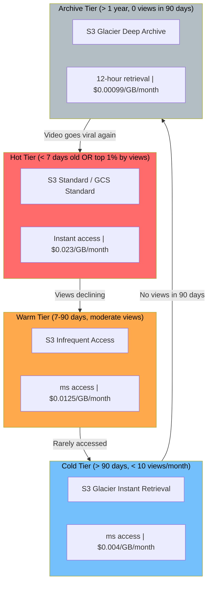

| Tier | Criteria | Storage Class | Cost/GB/month | Retrieval | Percentage of Library |
|------|----------|---------------|---------------|-----------|----------------------|
| **Hot** | < 7 days old OR top 1% by daily views | S3 Standard | $0.023 | Instant | ~5% |
| **Warm** | 7-90 days old, > 10 views/month | S3 IA | $0.0125 | Instant | ~15% |
| **Cold** | > 90 days old, < 10 views/month | Glacier Instant | $0.004 | Milliseconds | ~30% |
| **Archive** | > 1 year, 0 views in 90 days | Glacier Deep Archive | $0.00099 | 12 hours | ~50% |

**Cost impact at 500 PB scale:**
- All in S3 Standard: $11.5M/month
- With tiering: ~$2.8M/month (75% savings)

### CDN Multi-Tier Caching Strategy

```
┌─────────────────────────────────────────────────────────────────────┐
│ Tier          │ Locations │ Capacity    │ Hit Rate │ Content        │
├───────────────┼───────────┼─────────────┼──────────┼────────────────┤
│ L1: Edge PoP  │ 200+      │ 50-200 TB   │ 80-90%   │ Hot segments   │
│ L2: Metro     │ 50        │ 500 TB-2 PB │ 93-97%   │ Hot + warm     │
│ L3: Shield    │ 5         │ 5-20 PB     │ 99%+     │ Near-complete  │
│ L4: Origin    │ 3         │ 500+ PB     │ N/A      │ Full library   │
└─────────────────────────────────────────────────────────────────────┘
```

- **Segment-level caching**: Each 4-second segment is independently cacheable. Popular video first segments have 99%+ hit rates.
- **Manifest caching**: VOD manifests cached 24h. Live manifests cached 1 second (or not cached, using long-poll).
- **Thumbnail caching**: Immutable after generation. Cached at edge with 30-day TTL. Invalidated via CDN purge on thumbnail change.

### Metadata Storage

| Data | Store | Reasoning |
|------|-------|-----------|
| Video metadata | PostgreSQL (primary) + Redis (cache) | Relational integrity, complex queries, moderate write rate |
| Watch history | Cassandra | Time-series, write-heavy, per-user partitioning |
| Resume positions | Redis (primary) + Cassandra (backup) | Sub-ms reads for cross-device resume |
| Search index | Elasticsearch | Full-text search, faceted filtering, real-time indexing |
| Recommendations (precomputed) | Redis | Fast key-value reads at 115K RPS |
| View counts | Redis (real-time) + PostgreSQL (persisted) | Approximate real-time counts, periodic DB sync |
| Chat messages | Redis Streams (live) + Cassandra (archive) | Real-time pub/sub, then archive after stream ends |
| Analytics | ClickHouse | Columnar analytics, fast aggregations over billions of rows |
| DRM keys | PostgreSQL + HSM (Hardware Security Module) | Encryption at rest, audit logging, hardware-backed security |

---

## Indexing and Partitioning

### Video Metadata Partitioning

```sql
-- Range partition videos by created_at (monthly)
CREATE TABLE videos (
    video_id UUID NOT NULL,
    creator_id UUID NOT NULL,
    title TEXT NOT NULL,
    status TEXT,
    created_at TIMESTAMPTZ NOT NULL DEFAULT now(),
    -- ... other columns
    PRIMARY KEY (video_id, created_at)
) PARTITION BY RANGE (created_at);

CREATE TABLE videos_2026_01 PARTITION OF videos
    FOR VALUES FROM ('2026-01-01') TO ('2026-02-01');
CREATE TABLE videos_2026_02 PARTITION OF videos
    FOR VALUES FROM ('2026-02-01') TO ('2026-03-01');
CREATE TABLE videos_2026_03 PARTITION OF videos
    FOR VALUES FROM ('2026-03-01') TO ('2026-04-01');
-- Auto-create future partitions via pg_partman

-- Indexes applied per partition
CREATE INDEX idx_videos_creator_part ON videos(creator_id, created_at DESC);
CREATE INDEX idx_videos_status_part ON videos(status) WHERE status IN ('uploading', 'transcoding');
CREATE INDEX idx_videos_category_views ON videos(category_id, view_count DESC);
```

### Watch History Partitioning (Cassandra)

```
-- Cassandra: partition by user_id, cluster by time descending
-- Each partition holds one user's full watch history (up to 1 year TTL)
-- Partition sizing target: < 100 MB per partition (avoid hot partitions)

PRIMARY KEY (user_id, watched_at)
WITH CLUSTERING ORDER BY (watched_at DESC)

-- For heavy users (> 10,000 entries), add bucket:
PRIMARY KEY ((user_id, month_bucket), watched_at)
-- month_bucket = "2026-03"
-- Splits heavy users across multiple smaller partitions
```

### Search Index Sharding (Elasticsearch)

```json
{
  "settings": {
    "number_of_shards": 30,
    "number_of_replicas": 2,
    "routing": {
      "allocation": {
        "awareness": {
          "attributes": "zone"
        }
      }
    }
  },
  "aliases": {
    "videos_search": {}
  }
}
```

**Sharding strategy:**
- **30 primary shards** across 15 data nodes (2 shards per node)
- **2 replicas** per shard for read scaling and fault tolerance
- **Index rotation**: Monthly index (videos_2026_03) with alias (videos_search) pointing to all active indexes
- **Shard sizing**: Target 30-50 GB per shard (~30M documents per shard at 1 KB avg)
- **Cross-cluster search**: Regional Elasticsearch clusters (US, EU, APAC) with cross-cluster replication for global search

### Recommendation Data Partitioning

| Data | Partition Strategy | Key Design |
|------|--------------------|------------|
| User embeddings | Hash by user_id across Redis cluster | 16,384 hash slots; ~500M users across 100 Redis nodes |
| Video embeddings | Hash by video_id | Same cluster, separate keyspace prefix |
| Precomputed reco sets | Hash by user_id | TTL-based expiry; 5-minute refresh cycle |
| Co-watch matrix | Partitioned by video_id range | Spark job outputs; used by candidate generation |
| Training data | Partitioned by date | Stored in Parquet on S3; consumed by training pipeline |

---

## Concurrency Control

### View Count Aggregation (Approximate Counting)

Accurate real-time view counts at 100M concurrent streams are impossible with traditional counting. The platform uses a multi-layer approximate counting strategy.

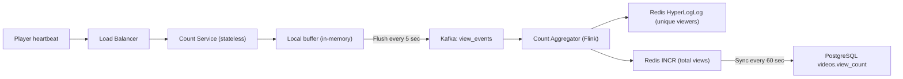

**Key design decisions:**
- **HyperLogLog** for unique viewer counts: 12 KB per video, 0.81% standard error. At 1 billion videos, HLL storage = 12 TB (fits in Redis cluster).
- **Local buffering**: Count service batches view events in memory (5-second window) before flushing to Kafka. Reduces Kafka write volume 10x.
- **Idempotent counting**: Dedup by (user_id + video_id + 30-minute window). A user watching the same video for 2 hours = 1 view, not 4.
- **Eventually consistent**: View count in PostgreSQL may lag Redis by up to 60 seconds. Acceptable for display purposes.

### Concurrent Upload Handling

```sql
-- Optimistic locking for upload session updates
UPDATE upload_sessions
SET chunks_received = chunks_received + 1,
    updated_at = now()
WHERE upload_id = $1
  AND chunks_received = $2  -- optimistic lock: expected current value
RETURNING chunks_received;

-- If no row returned, retry with fresh read (concurrent chunk arrived)
```

- **S3 multipart upload**: Each chunk is an independent S3 PUT. No coordination needed between chunks.
- **Completion race condition**: Two concurrent "complete" requests for the same upload. Use `SELECT FOR UPDATE` on upload session; first completer wins, second gets 409 Conflict.

### Live Stream Viewer Count

- **Approximate count via CDN logs**: CDN edge nodes report active connections per stream every 5 seconds.
- **Aggregation**: Regional aggregators sum edge reports. Global count available within 10 seconds.
- **Smoothing**: Apply exponential moving average to prevent jumpy counts. Display shows rounded value (45.2K instead of 45,237).
- **Peak tracking**: Maintained via Redis `ZADD` with stream_id as key and timestamp/count pairs.

### Concurrent Upload Chunks — Out-of-Order Reassembly

When a creator uploads a large video, the client sends multiple chunks in parallel (typically 4-8 concurrent HTTP PUT requests). Chunks may arrive at different storage nodes and complete out of order.

**Challenge:** Chunk 47 arrives before chunk 46. The system must track which chunks have been received and reassemble them correctly regardless of arrival order.

**Implementation:**
- Each chunk is stored independently in object storage keyed by `{upload_id}/{chunk_index}`.
- A chunk bitmap in Redis tracks received chunks: `SETBIT upload:{upload_id}:bitmap {chunk_index} 1`.
- The bitmap allows O(1) checking of whether all chunks have been received: `BITCOUNT upload:{upload_id}:bitmap` equals `total_chunks`.
- On upload completion, the reassembly service reads chunks in order (0, 1, 2, ...) and concatenates them using S3 multipart upload's `CompleteMultipartUpload` API, which accepts parts in any order and assembles them by part number.
- If the client retries a chunk that was already received (e.g., due to timeout), the `SETBIT` operation is idempotent, and the object storage PUT overwrites with identical content.

### Race Condition in View Count Increment

Two paths exist for incrementing view counts: Redis `INCR` for real-time display and a Kafka consumer writing to PostgreSQL for durable persistence. These can diverge.

**Race condition scenario:**
1. Viewer A's heartbeat arrives. Redis `INCR video:{id}:views` returns 1001.
2. Viewer B's heartbeat arrives simultaneously. Redis `INCR video:{id}:views` returns 1002.
3. The Kafka consumer processes Viewer A's event and issues `UPDATE videos SET view_count = view_count + 1 WHERE id = $1`. PostgreSQL view_count is now 1001.
4. A network partition causes Viewer B's Kafka event to be delayed by 5 minutes.
5. During this window, Redis shows 1002 views but PostgreSQL shows 1001.

**Why this is acceptable:** View counts are display-only. The PostgreSQL value eventually catches up when the Kafka consumer processes all events. Redis is the real-time source of truth for display; PostgreSQL is the durable source of truth for analytics.

**Where this is NOT acceptable:** Monetization thresholds. If a creator earns money at 1000 views, the system must use the durable PostgreSQL count, not the Redis count, to trigger payment. The payment service reads from PostgreSQL with `SELECT FOR UPDATE` to guarantee accuracy.

### Concurrent Thumbnail Selection (A/B Test Switching)

The thumbnail system A/B tests multiple thumbnail candidates simultaneously. A background process evaluates click-through rates and selects the winner. Concurrently, viewers are being served thumbnails, and the A/B test assignment must be stable.

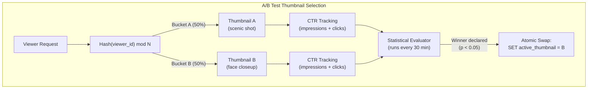

**Concurrency concerns:**
- While the evaluator is computing, new impressions are arriving for both variants. The evaluator must snapshot the impression/click counts at a point in time, not read live-updating counters.
- The thumbnail swap must be atomic. If it is not, some CDN edge nodes may serve thumbnail A while others serve thumbnail B after the swap. This is handled via a versioned thumbnail URL: `/thumb/vid_123/v2.jpg` instead of `/thumb/vid_123/default.jpg`. The manifest references a specific version, and the CDN caches each version independently.
- After the winner is declared, the losing variant is not immediately deleted. It is kept for 7 days in case the decision needs to be rolled back (e.g., the winning thumbnail was accidentally NSFW and passed the ML filter).

### Live Stream Concurrent Chat Message Ordering

In a live chat with 50,000 messages per second, maintaining strict total ordering is impossible without a single-threaded bottleneck. The system uses a relaxed ordering model.

**Ordering guarantees:**
- Messages from the same user are delivered in the order they were sent (per-user FIFO).
- Messages from different users have no ordering guarantee relative to each other.
- The server assigns a Lamport timestamp to each message: a monotonically increasing counter per chat partition.

**Implementation:**
- The chat room is partitioned into N shards (typically N = hash(stream_id) mod 16).
- Each shard has a dedicated ordered message log (Kafka partition or Redis Stream).
- Each shard maintains its own Lamport counter. When a message arrives, the shard assigns `counter++` as the message's order key.
- The client receives messages from multiple shards and interleaves them by timestamp. Since clocks across shards are not perfectly synchronized, messages from different shards may appear slightly out of order (within 50-100ms).
- This is acceptable for chat: viewers do not notice 100ms ordering differences in a fast-moving chat stream.

**Super Chat ordering exception:**
- Paid messages (Super Chat) bypass normal sharding. They are routed to a dedicated priority channel with strict total ordering, because the dollar amount and display duration depend on arrival order. Two $50 Super Chats arriving simultaneously must be displayed in a deterministic order.

### Recommendation Model Serving During Hot-Swap

The recommendation engine serves predictions from an ML model. When a new model version is deployed, the system must swap models without dropping requests or serving inconsistent results during the transition.

**Blue-green model deployment:**
- Two model serving clusters exist: Blue (current) and Green (new version).
- The new model is loaded into the Green cluster and warmed up with shadow traffic (copies of real requests that are scored but whose results are discarded).
- A traffic router gradually shifts traffic from Blue to Green using a canary rollout: 1% -> 5% -> 25% -> 50% -> 100%, with automated rollback if engagement metrics (click-through rate, watch time) degrade by more than 2%.
- During the transition, a single user's requests may hit either Blue or Green. This means recommendations may shift between page loads.
- To prevent this, the router uses sticky routing by user_id hash during the canary phase. A user either gets Blue or Green for the entire session, not a mix.
- Full cutover happens only after 24 hours of canary with no degradation. The Blue cluster is then decommissioned (or retained for 48 hours as a rollback target).

---

## Idempotency Strategy

### Upload Deduplication (Content Hashing)

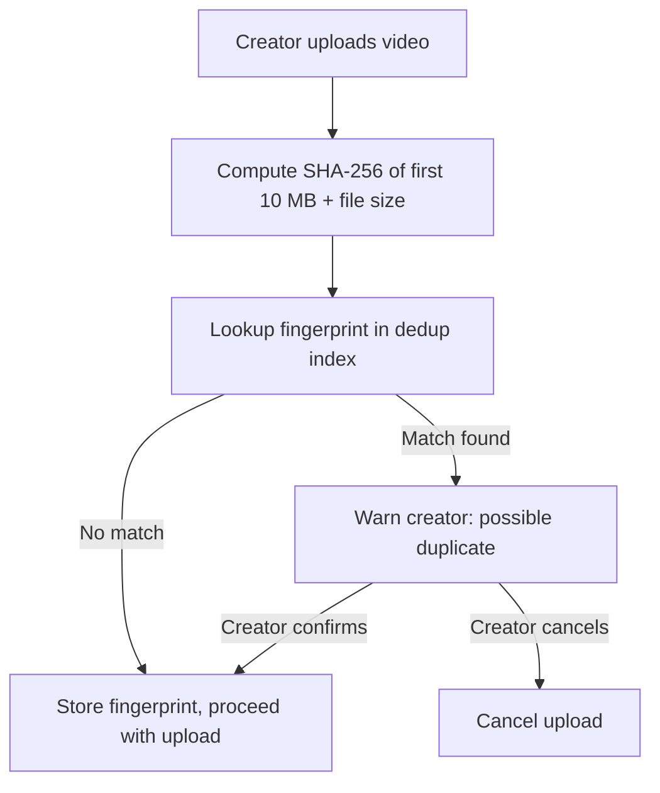

**Fingerprint design:**
- SHA-256 of first 10 MB concatenated with total file size
- Stored in PostgreSQL with index: `CREATE INDEX idx_dedup ON video_fingerprints(fingerprint_hash)`
- **Not a block**: Only warns the creator. Re-uploads of the same video (e.g., after editing metadata) are allowed after confirmation.

### View Count Deduplication

| Rule | Implementation |
|------|---------------|
| Same user, same video, within 30 minutes | Single view (dedup via HyperLogLog per 30-min window) |
| Same IP, same video, > 300 views/hour | Bot detection flag; views not counted |
| Same user, refresh/replay | First 30 seconds of re-watch does not count as new view |
| Embedded player autoplay | Only counts if > 30 seconds watched AND user-initiated |

### Recommendation Refresh Idempotency

- Recommendation precomputation jobs are idempotent: re-running the same job with the same input produces the same output.
- **Job ID**: `SHA-256(user_id + model_version + input_snapshot_timestamp)`
- If the same job ID exists in the result store and is not expired, skip recomputation.
- Prevents wasted compute during retry storms or scheduler double-fires.

### Transcoding Job Idempotency

- Each transcode job has a unique `job_id`. Re-submitting the same `job_id` is a no-op (returns existing job status).
- **Segment-level idempotency**: Each encoded segment is stored at a deterministic S3 path: `s3://encoded/{video_id}/{codec}/{resolution}/segment_{n}.m4s`
- If the segment already exists with matching checksum, skip re-encoding.

---

## Consistency Model

| Data | Consistency Level | Rationale |
|------|------------------|-----------|
| **View counts** | Eventual (60s lag) | Display-only metric; exact count not critical. Redis leads, PostgreSQL follows. |
| **Video metadata** (title, description) | Strong (read-after-write) | Creator expects immediate visibility of their edits. PostgreSQL primary with synchronous read-replica. |
| **Video status** (uploading → ready) | Strong | Status transitions trigger downstream workflows. Must not miss a transition. |
| **Search index** | Eventual (30s-2min lag) | New videos appear in search within minutes. Elasticsearch near-real-time refresh. |
| **DRM licenses** | Strong | License must be valid and current. Stale license = playback failure or piracy. Direct read from primary. |
| **Recommendations** | Eventual (5min-24h lag) | Pre-computed daily; session re-ranking adds recency. Stale recs are acceptable. |
| **Watch history** | Eventual (5s lag) | Cassandra async writes via Kafka. Resume position in Redis is near-real-time. |
| **Subscriber count** | Eventual (30s lag) | Counter cache in Redis, periodically synced. Exact count not needed in real-time. |
| **Live viewer count** | Eventual (10s lag) | Aggregated from CDN edge reports. Smoothed for display. |
| **Chat messages** | Best-effort delivery | Messages may be sampled at high volume. Ordering per-stream is maintained. |
| **Creator analytics** | Eventual (hours) | Batch-computed daily. Near-real-time estimates available via streaming pipeline. |

### Cross-Region Consistency

```mermaid
flowchart LR
    subgraph USEast["US-East (Primary)"]
        PGPrimary["PostgreSQL Primary"]
        RedisPrimary["Redis Primary"]
    end

    subgraph USWest["US-West (Read Replica)"]
        PGReplica1["PostgreSQL Replica"]
        RedisReplica1["Redis Replica"]
    end

    subgraph EU["EU-West (Read Replica)"]
        PGReplica2["PostgreSQL Replica"]
        RedisReplica2["Redis Replica"]
    end

    PGPrimary -->|"Sync streaming replication < 10ms"| PGReplica1
    PGPrimary -->|"Async replication ~100ms"| PGReplica2
    RedisPrimary -->|"Redis Cluster replication"| RedisReplica1
    RedisPrimary -->|"Redis Cluster replication"| RedisReplica2
```

- **Writes**: Always routed to US-East primary.
- **Reads**: Routed to nearest region. Acceptable staleness: 100ms for US-West, 200ms for EU.
- **DRM reads**: Always routed to primary (strong consistency required).

---

## Distributed Transaction / Saga Design

### Video Publish Saga

Publishing a video requires coordination across 6+ services. A saga pattern with compensating transactions ensures reliable, eventually-consistent completion.

```mermaid
flowchart TD
    Start["Upload Complete"] --> T1["Step 1: Create transcode job"]
    T1 --> T2["Step 2: Transcode all variants"]
    T2 --> T3["Step 3: Generate thumbnails"]
    T3 --> T4["Step 4: Encrypt segments (DRM)"]
    T4 --> T5["Step 5: Update search index"]
    T5 --> T6["Step 6: Pre-warm CDN"]
    T6 --> T7["Step 7: Update video status → ready"]
    T7 --> T8["Step 8: Notify subscribers"]
    T8 --> Done["Video Published"]

    T1 -->|"Fail"| C1["Compensate: Mark video as failed"]
    T2 -->|"Fail"| C2["Compensate: Clean up partial encodes"]
    T3 -->|"Fail"| C3["Compensate: Use default thumbnail"]
    T4 -->|"Fail"| C4["Compensate: Publish without DRM (if non-premium)"]
    T5 -->|"Fail"| C5["Compensate: Retry indexing (non-blocking)"]
    T6 -->|"Fail"| C6["Compensate: Skip pre-warm (CDN pulls on demand)"]
    T7 -->|"Fail"| C7["Compensate: Retry status update"]
    T8 -->|"Fail"| C8["Compensate: Queue notification retry"]

    style Done fill:#51cf66,color:#000
    style C1 fill:#ff6b6b,color:#000
    style C2 fill:#ff6b6b,color:#000
```

**Saga orchestrator state machine:**

```sql
CREATE TABLE saga_instances (
    saga_id         UUID PRIMARY KEY,
    saga_type       TEXT NOT NULL,                  -- 'video_publish', 'video_takedown'
    entity_id       UUID NOT NULL,                  -- video_id
    current_step    TEXT NOT NULL,
    status          TEXT DEFAULT 'running' CHECK (status IN (
        'running', 'completed', 'compensating', 'failed'
    )),
    step_history    JSONB DEFAULT '[]',             -- [{step, status, started_at, completed_at, error}]
    retry_count     INT DEFAULT 0,
    max_retries     INT DEFAULT 3,
    created_at      TIMESTAMPTZ NOT NULL DEFAULT now(),
    updated_at      TIMESTAMPTZ NOT NULL DEFAULT now()
);

CREATE INDEX idx_saga_status ON saga_instances(status) WHERE status IN ('running', 'compensating');
CREATE INDEX idx_saga_entity ON saga_instances(entity_id);
```

### Video Takedown Saga

When a video is reported and must be removed (copyright, policy violation), the takedown must propagate across all systems.

```mermaid
flowchart TD
    Start["Takedown Decision"] --> T1["Step 1: Block playback (DRM revoke / manifest remove)"]
    T1 --> T2["Step 2: Remove from search index"]
    T2 --> T3["Step 3: Purge from CDN (all tiers)"]
    T3 --> T4["Step 4: Remove from recommendations"]
    T4 --> T5["Step 5: Update video status → removed"]
    T5 --> T6["Step 6: Notify creator (with appeal link)"]
    T6 --> T7["Step 7: Archive encoded files to cold storage"]
    T7 --> Done["Takedown Complete"]

    style Done fill:#ff6b6b,color:#000
```

**Critical timing**: Step 1 (block playback) must happen within 1 minute of the decision. Steps 2-7 can propagate over minutes to hours. The saga prioritizes stopping access before cleaning up.

---

## Abuse / Fraud / Governance Controls

### Copyright Detection (Content ID)

```mermaid
flowchart TD
    Upload["New video uploaded"] --> AudioFP["Audio fingerprinting (Chromaprint)"]
    Upload --> VideoFP["Video fingerprinting (perceptual hash)"]

    AudioFP --> Match{"Match in reference DB?"}
    VideoFP --> Match

    Match -->|"No match"| Pass["Proceed to publish"]
    Match -->|"Match found"| Policy["Check rights holder policy"]

    Policy -->|"Block"| Block["Block video, notify creator"]
    Policy -->|"Monetize"| Monetize["Publish with ads; revenue to rights holder"]
    Policy -->|"Track"| Track["Publish; report analytics to rights holder"]

    style Block fill:#ff6b6b,color:#000
    style Monetize fill:#ffa94d,color:#000
    style Track fill:#74c0fc,color:#000
```

**Reference database**: Rights holders upload reference audio/video. System generates fingerprints and stores in a searchable index. Each uploaded video is compared against the reference DB.

**Scale**: YouTube's Content ID has 100M+ reference files and scans 500 hours of video per minute.

### CSAM (Child Safety) Scanning

- **Mandatory**: All uploads are scanned before any public availability.
- **PhotoDNA**: Microsoft's perceptual hash for known CSAM images (applied to video frames).
- **NCMEC reporting**: Confirmed matches are reported to the National Center for Missing & Exploited Children within 24 hours (legal requirement in the US).
- **ML classifier**: Trained model flags potentially problematic content for human review.
- **Priority**: CSAM reports are highest priority (priority=1) in the content report queue.

### View Fraud / Bot Detection

| Signal | Indicator | Action |
|--------|-----------|--------|
| **IP clustering** | > 300 views from single IP in 1 hour | Flag views; exclude from count |
| **Session patterns** | Zero seek, zero pause, exact same watch duration | Bot signature; exclude from count |
| **Device fingerprint** | Same fingerprint, rotating IPs | Bot farm; exclude and rate-limit |
| **Referrer anomaly** | Views from iframe on unrelated site | Embedded player abuse; flag channel |
| **Geographic anomaly** | 95% views from country inconsistent with language | Potential purchased views; investigate |
| **Engagement ratio** | High views, zero likes/comments/shares | Artificial inflation; flag for review |

**Response tiers:**
1. **Soft**: Exclude suspicious views from count (viewer does not know).
2. **Medium**: Freeze view count pending investigation. Notify creator.
3. **Hard**: Demonetize video. Issue strike to channel. Permanent view count adjustment.

### Creator Monetization Fraud

| Fraud Type | Detection | Response |
|------------|-----------|----------|
| Self-clicking ads | Track creator IP vs ad click IP | Demonetize; clawback revenue |
| Ad stacking | Multiple hidden ad units per page | Automated ad layout audit |
| Invalid traffic (bots) | Click patterns, session analysis | Real-time filtering; post-hoc audit |
| View count manipulation | Buy views from bot farms | View count freeze; channel strike |
| Subscriber manipulation | Fake accounts subscribing | Periodic subscriber audit; remove fakes |

---

## CI/CD and Release Strategy

### Transcoding Pipeline Deploys

```mermaid
flowchart LR
    Dev["Dev: New encoder config"] --> Test["Test: Encode 100 reference videos"]
    Test --> QA["QA: VMAF comparison (new vs old)"]
    QA -->|"VMAF delta < -0.5"| Reject["Reject: Quality regression"]
    QA -->|"VMAF delta >= -0.5"| Canary["Canary: 1% of new uploads"]
    Canary -->|"Monitor 24h"| Full["Full rollout (rolling)"]
    Full --> Monitor["Monitor: Failure rate, encode time, VMAF"]

    style Reject fill:#ff6b6b,color:#000
```

- **Blue/green not used**: Transcoding workers are stateless; rolling deployment replaces 10% of fleet at a time.
- **Codec upgrades (e.g., AV1 rollout)**: Feature-flagged per video. Gradual rollout over weeks. Dual-encode during transition.
- **Rollback**: If failure rate > 1% or VMAF drops > 1 point, automatically revert to previous encoder version.

### Recommendation Model Rollout

| Stage | Traffic | Duration | Metrics Watched |
|-------|---------|----------|-----------------|
| Shadow mode | 0% (log predictions only) | 1 week | Offline metrics: NDCG, recall, diversity |
| A/B test (holdout) | 1% | 1 week | CTR, watch time, session length |
| A/B test (expanded) | 10% | 1 week | Same + long-term engagement |
| Full rollout | 100% | - | Continuous monitoring |

- **Feature flags**: Model version is a feature flag per user. Allows instant rollback.
- **Canary metrics**: If watch time drops > 0.5% compared to control group, auto-rollback.

### CDN Configuration Changes

- **Manifest changes**: Deployed via CDN API. Propagation to all PoPs in < 60 seconds.
- **Cache purge**: On-demand purge for content takedowns. Full purge across 200+ PoPs in < 5 minutes.
- **Routing changes**: Multi-CDN steering weights adjusted via control plane. Changes take effect in < 30 seconds.
- **TLS certificate rotation**: Automated via Let's Encrypt or CDN-managed certificates. Zero-downtime rotation.

---

## Multi-Region and DR Strategy

### CDN PoP Distribution

```mermaid
flowchart TB
    subgraph NAmerica["North America (80 PoPs)"]
        NA1["US-East (15 PoPs)"]
        NA2["US-West (12 PoPs)"]
        NA3["US-Central (8 PoPs)"]
        NA4["Canada (5 PoPs)"]
        NA5["Latin America (40 PoPs)"]
    end

    subgraph Europe["Europe (50 PoPs)"]
        EU1["Western EU (20 PoPs)"]
        EU2["Northern EU (10 PoPs)"]
        EU3["Eastern EU (10 PoPs)"]
        EU4["Southern EU (10 PoPs)"]
    end

    subgraph APAC["Asia-Pacific (60 PoPs)"]
        AP1["India (15 PoPs)"]
        AP2["Southeast Asia (15 PoPs)"]
        AP3["Japan/Korea (10 PoPs)"]
        AP4["China Edge (5 PoPs)"]
        AP5["Australia/NZ (5 PoPs)"]
        AP6["Other APAC (10 PoPs)"]
    end

    subgraph MEA["Middle East & Africa (15 PoPs)"]
        ME1["Middle East (8 PoPs)"]
        AF1["Africa (7 PoPs)"]
    end

    Origin["Origin (US-East, EU-West, APAC-Tokyo)"] --> NAmerica & Europe & APAC & MEA
```

### Origin Replication Strategy

| Component | Primary | Secondary | RPO | RTO | Replication |
|-----------|---------|-----------|-----|-----|-------------|
| Video metadata (PostgreSQL) | US-East | US-West, EU-West | 0 (sync to US-West), ~100ms (async to EU) | < 5 min | Streaming replication |
| Video files (S3) | US-East | US-West | < 15 min | < 1 hour | S3 Cross-Region Replication |
| Search index (Elasticsearch) | US-East | US-West, EU-West | < 2 min | < 10 min | Cross-cluster replication |
| Watch history (Cassandra) | Multi-region (3 DCs) | N/A | 0 (quorum write) | 0 (automatic failover) | Multi-DC replication |
| Redis cache | US-East | US-West | < 1 sec | < 30 sec | Redis Cluster replication |
| DRM keys | US-East | US-West | 0 (sync) | < 2 min | Synchronous replication + HSM backup |

### Geo-Restricted Content

```mermaid
flowchart TD
    Request["Viewer requests video"] --> GeoIP["Resolve viewer country (MaxMind GeoIP)"]
    GeoIP --> Check{"Video available in viewer's country?"}
    Check -->|"Yes"| Serve["Serve manifest + segments"]
    Check -->|"No"| Block["Return 451 Unavailable For Legal Reasons"]
    Block --> Message["Show: 'This content is not available in your country'"]
```

- **Implementation**: Geo-restriction rules stored per video in `drm_licenses.geo_restrictions` JSONB field.
- **CDN enforcement**: CDN edge nodes check geo-restriction before serving. Prevents content leakage.
- **VPN detection**: Optional VPN/proxy detection for strict geo-fencing (required by some studios).
- **Manifest-level blocking**: Blocked regions receive a manifest pointing to a "not available" slate video.

### Live Stream Regional Routing

- **Ingest**: Creator's stream is sent to the nearest ingest PoP (latency-based DNS routing).
- **Transcoding**: Live transcoding happens in the same region as ingest to minimize latency.
- **Distribution**: Transcoded stream is pushed to all regional shield PoPs simultaneously.
- **Failover**: If an ingest server fails, creator's encoder automatically reconnects to the next-nearest ingest PoP (SRT protocol handles this natively with bonding).

### Disaster Recovery Runbook

| Scenario | Detection | Response | Recovery Time |
|----------|-----------|----------|---------------|
| Primary region (US-East) down | Health checks fail for > 30 seconds | DNS failover to US-West; promote read replicas to primary | < 5 minutes |
| Single CDN provider down | Real-time latency monitoring | Multi-CDN steering shifts traffic to healthy providers | < 30 seconds |
| S3 bucket corruption | Checksum validation fails on read | Serve from cross-region replica; restore primary from replica | < 1 hour |
| DRM license server down | License request error rate > 5% | Client-side license cache (offline licenses); failover to secondary DRM server | < 2 minutes |
| Elasticsearch cluster down | Query timeout rate > 10% | Serve trending/popular videos instead of search; redirect search to replica cluster | < 5 minutes |

---

## Cost Drivers and Optimization

### Cost Breakdown (YouTube-Scale Platform)

| Cost Category | Monthly Estimate | % of Total | Key Driver |
|---------------|-----------------|------------|------------|
| **CDN bandwidth** | $15-25M | 35-45% | 375 PB/day outbound; $0.02-0.04/GB |
| **Storage** | $3-5M | 10-15% | 500+ PB; tiered pricing |
| **Transcoding compute** | $3-4M | 8-12% | 7.2M encode-hours/day; GPU instances |
| **Recommendation inference** | $2-3M | 5-8% | 115K RPS; GPU/TPU for model serving |
| **Database / cache** | $1-2M | 3-5% | PostgreSQL, Cassandra, Redis, Elasticsearch clusters |
| **Live streaming infra** | $1-2M | 3-5% | Always-on ingest servers, live transcoders |
| **Networking (inter-region)** | $1-2M | 3-5% | Cross-region replication, origin-to-CDN transfer |
| **Other (monitoring, DNS, etc.)** | $1-2M | 3-5% | Observability stack, DNS, certificate management |
| **Total** | **$30-45M** | **100%** | |

### Optimization Strategies

**1. CDN Bandwidth (largest cost):**
- Migrate to AV1 codec: 30-50% smaller files at same quality = 30-50% CDN savings
- Improve cache hit rate: Every 1% improvement in edge hit rate = ~$150K/month savings
- Client-side caching: Service Worker caches recently watched segments for re-watches
- Lower bitrate ladder floor: Serve 200 kbps AV1 instead of 400 kbps H.264 for low-end devices

**2. Storage:**
- Tiered storage (hot/warm/cold/archive): 75% savings vs all-standard
- Delete failed/abandoned uploads after 48 hours
- Remove duplicate encoded variants when migrating codecs
- Compress thumbnail storage with AVIF (50% smaller than WebP)

**3. Transcoding Compute:**
- GPU acceleration (NVENC): 10x faster than CPU, lower cost per encode-hour
- Per-title encoding: Skip unnecessary high-bitrate variants for simple content
- Spot/preemptible instances for non-urgent encodes (long-tail content)
- Skip re-encoding: When source is already in target codec/resolution, transmux only

**4. Recommendation Inference:**
- Pre-compute recommendations offline (batch): Covers 90% of requests
- Model distillation: Smaller model for real-time re-ranking (10x faster inference)
- Cache recommendation results: 5-minute TTL; 95%+ cache hit rate
- Quantize models: INT8 inference is 2-4x faster than FP32 with < 0.5% quality loss

---

## Technology Choices and Alternatives

| Component | Primary Choice | Alternatives | Decision Rationale |
|-----------|---------------|-------------|-------------------|
| **Object storage** | Amazon S3 | Google Cloud Storage, Azure Blob, MinIO | S3 is the industry standard; 99.999999999% durability; best ecosystem |
| **Video metadata DB** | PostgreSQL 16 | MySQL, CockroachDB, AlloyDB | Rich JSON support, partitioning, strong consistency, mature ecosystem |
| **Watch history** | Apache Cassandra | ScyllaDB, DynamoDB, HBase | Write-optimized time-series; linear scaling; TTL support; multi-DC |
| **Cache** | Redis Cluster | Memcached, KeyDB, Dragonfly | Rich data structures (HyperLogLog, Streams); pub/sub; cluster mode |
| **Search** | Elasticsearch | OpenSearch, Meilisearch, Typesense | Full-text search; faceted filtering; real-time indexing at scale |
| **Analytics** | ClickHouse | Apache Druid, BigQuery, Snowflake | Columnar; fast aggregations; open-source; handles billions of rows |
| **Job queue** | Apache Kafka | RabbitMQ, Amazon SQS, Pulsar | High throughput; replay capability; exactly-once semantics; partitioning |
| **Stream processing** | Apache Flink | Spark Streaming, Kafka Streams, Beam | Low-latency stateful processing; exactly-once; watermark handling |
| **CDN** | Multi-CDN (Akamai + CloudFront + Fastly) | Google Global Cache, Cloudflare, StackPath | Best regional coverage; cost optimization via steering; no single vendor lock-in |
| **Transcoding** | FFmpeg on GPU (NVENC) | AWS Elemental, Bitmovin, Mux | Full control; GPU acceleration; per-title optimization; cost-effective at scale |
| **Live ingest** | Nginx-RTMP + SRT | Wowza, AWS MediaLive, Ant Media | Open-source; low-latency SRT support; customizable |
| **DRM** | CENC (Widevine + FairPlay + PlayReady) | BuyDRM, PallyCon, EZDRM | Industry standard; mandatory for premium content; device coverage |
| **Recommendation ML** | TensorFlow Serving + Redis | TorchServe, Triton, SageMaker | Mature; GPU serving; model versioning; A/B test support |
| **Thumbnail ML** | PyTorch + TorchServe | TensorFlow, ONNX Runtime | Research-friendly; fast iteration; good vision model ecosystem |
| **Container orchestration** | Kubernetes (EKS) | Nomad, ECS, Docker Swarm | Industry standard; GPU scheduling; autoscaling; ecosystem |
| **Observability** | Prometheus + Grafana + Jaeger | Datadog, New Relic, Splunk | Open-source; cost-effective at scale; flexible dashboards |

---

## Architecture Decision Records (Extended)

### ARD-006: AV1 Codec Adoption Strategy

| Field | Detail |
|-------|--------|
| **Decision** | Adopt AV1 as the primary codec for new encodes; maintain H.264 fallback |
| **Context** | AV1 delivers 30-50% bitrate savings over H.264 at equal quality. CDN bandwidth is the top cost ($15-25M/month). |
| **Options** | (A) Stay on H.264, (B) H.265/HEVC (patent licensing issues), (C) VP9 (Google-only), (D) AV1 (royalty-free, industry-backed) |
| **Chosen** | Option D: AV1 with H.264 fallback |
| **Why** | Royalty-free (no patent licensing costs). Supported by all major browsers (Chrome, Firefox, Safari 17+, Edge). Hardware decode support in 2024+ devices. |
| **Trade-offs** | AV1 encoding is 10-20x slower than H.264 (higher compute cost). Older devices lack hardware decode. |
| **Migration plan** | Phase 1: Encode new uploads in AV1 + H.264 (dual). Phase 2: Re-encode top 10% most-watched library to AV1. Phase 3: Re-encode remaining library opportunistically. |
| **Revisit when** | AV2 development progresses; or hardware AV1 encode becomes mainstream |

### ARD-007: Live Streaming Protocol Selection

| Field | Detail |
|-------|--------|
| **Decision** | LL-HLS for standard live; WebRTC for ultra-low-latency |
| **Context** | Need sub-5-second latency for interactive streams (gaming, Q&A) and sub-2-second for auctions/betting. |
| **Options** | (A) Standard HLS (15-30s), (B) LL-HLS (2-5s), (C) LL-DASH (2-5s), (D) WebRTC (< 1s), (E) SRT end-to-end |
| **Chosen** | LL-HLS primary; WebRTC for ultra-low-latency use cases |
| **Why** | LL-HLS works with existing CDN infrastructure and HLS players. WebRTC needed for sub-1-second but does not scale via CDN (requires SFU mesh). Use WebRTC only for < 10K viewer streams. |
| **Trade-offs** | Two protocol stacks to maintain. WebRTC scaling limited to ~10K viewers per stream. |
| **Revisit when** | WHEP (WebRTC-HTTP egress protocol) matures for CDN-based WebRTC delivery |

### ARD-008: Recommendation System Architecture

| Field | Detail |
|-------|--------|
| **Decision** | Two-stage architecture: offline candidate generation + online re-ranking |
| **Context** | Need personalized recommendations for 500M DAU at 115K RPS with < 100ms latency. |
| **Options** | (A) Pure collaborative filtering (batch), (B) Pure deep learning (real-time), (C) Two-stage hybrid |
| **Chosen** | Option C: Two-stage hybrid |
| **Why** | Stage 1 (candidate generation) is compute-intensive but can be pre-computed daily. Stage 2 (re-ranking) is lightweight and incorporates real-time session context. This keeps serving latency < 50ms while maintaining personalization quality. |
| **Trade-offs** | Pre-computed candidates can be stale (up to 24h). Mitigated by real-time trending injection and session-based re-ranking. |
| **Revisit when** | Real-time inference cost drops below $0.001 per request (currently ~$0.01) |

### ARD-009: Content-Addressable Storage for Video Segments

| Field | Detail |
|-------|--------|
| **Decision** | Store encoded video segments using content-addressable paths |
| **Context** | CMAF segments for HLS and DASH are identical binary content. Need to avoid storing duplicates. |
| **Options** | (A) Separate storage per protocol (HLS segments + DASH segments), (B) Shared CMAF segments with separate manifests |
| **Chosen** | Option B |
| **Why** | CMAF fMP4 segments are identical for HLS and DASH. Only the manifest differs (.m3u8 vs .mpd). Storing segments once halves segment storage. At 500 PB, this saves ~$1.5M/month. |
| **Trade-offs** | Older HLS clients require MPEG-TS segments (not CMAF). Maintain TS segments for legacy devices (~5% of traffic). |
| **Revisit when** | Legacy HLS-TS device traffic drops below 1% |

---

## POCs to Validate First (Extended)

### POC-7: Search Relevance with Speech-to-Text

**Goal**: Validate that indexing auto-generated captions (ASR) improves search recall without degrading precision.
**Setup**: Transcribe 10,000 videos using Whisper ASR. Index captions in Elasticsearch alongside titles and descriptions. Run evaluation query set (500 queries with known-relevant results).
**Success criteria**: Recall improvement > 15% with precision drop < 5%. ASR transcription accuracy > 90% WER for English.
**Fallback**: If precision drops > 5%, weight caption matches lower than title/tag matches in ranking function.

### POC-8: Multi-CDN Steering Effectiveness

**Goal**: Validate that real-time multi-CDN steering improves TTFB by 20% compared to single-CDN.
**Setup**: Deploy steering controller that routes to the lowest-latency CDN per viewer region. Compare TTFB distributions over 1 week.
**Success criteria**: p50 TTFB improvement > 20%; p99 TTFB improvement > 30%. No region worse than single-CDN baseline.
**Fallback**: If steering overhead negates benefits, use simpler geo-based CDN assignment.

### POC-9: Copyright Fingerprint Matching at Scale

**Goal**: Validate audio/video fingerprint matching against 100M reference files completes in < 30 seconds per upload.
**Setup**: Build fingerprint index from 1M reference files. Benchmark query latency as index grows to 100M.
**Success criteria**: Fingerprint extraction < 10 seconds. Index lookup < 20 seconds. False positive rate < 0.1%.
**Fallback**: If lookup exceeds 30 seconds, use approximate nearest-neighbor search (FAISS) with periodic exact verification.

### POC-10: Storage Tiering Automation

**Goal**: Validate that automated lifecycle policies correctly tier videos without impacting playback for re-surfaced content.
**Setup**: Implement S3 Lifecycle rules for warm/cold tiering. Simulate viral re-emergence of cold-tier video. Measure retrieval latency.
**Success criteria**: Glacier Instant Retrieval returns first byte in < 200ms. Automated tiering reduces storage costs by 60%+ in test bucket.
**Fallback**: If retrieval latency exceeds 1 second, keep one additional warm copy of all videos with > 100 lifetime views.

### POC-11: Live Chat at 50K Messages/Second

**Goal**: Validate the chat system handles 50,000 messages/second per stream with server-side sampling and moderation.
**Setup**: Load test with 50K synthetic messages/second. Measure moderation pipeline latency, sampling accuracy, and WebSocket fanout capacity.
**Success criteria**: Moderation decision in < 50ms per message. WebSocket delivery to 100K connected viewers in < 200ms. Sampling delivers 1-in-10 messages uniformly.
**Fallback**: If moderation latency > 50ms, switch to async moderation with post-delivery filtering (hide bad messages after brief visibility).

---

## Cache Strategy

| Data | Store | TTL | Notes |
|------|-------|-----|-------|
| Video metadata | Redis | 15 min | Invalidate on update |
| Manifest files | CDN Edge | 1 sec (live), 24h (VOD) | Critical for ABR |
| Video segments | CDN (multi-tier) | 24h (VOD), 2s (live) | 80-90% edge hit rate |
| Thumbnails | CDN | 24h | Immutable once generated |
| Search results | Redis | 60s per query | Short TTL; results change with new uploads |
| Recommendations | Redis | 5 min per user | Pre-computed; refreshed on new watch events |
| Resume position | Redis | 30 days | Fast cross-device read |
| View counts | Redis Counter | Indefinite | Async sync to DB |

---

## Queue / Stream Design

| Topic | Purpose | Consumers |
|-------|---------|-----------|
| `video.uploaded` | New video uploaded | Transcoding Scheduler, Thumbnail Generator |
| `video.transcoded` | Transcoding complete | Metadata Service, CDN Pre-warm, DRM Encryptor |
| `video.ready` | Video available for playback | Recommendation Engine, Search Indexer, Creator Notification |
| `watch.heartbeat` | Playback progress events | Watch History Writer, Analytics, Recommendation Feedback |
| `search.query` | Search queries | Analytics, Query Suggestion Builder |
| `live.started` | Live stream begins | Notification (subscribers), CDN Pre-warm |
| `live.ended` | Live stream ends | VOD Archiver, Analytics |
| `live.chat.message` | Chat messages | Chat Broadcast, Moderation, Analytics |
| `engagement.*` | Likes, comments, shares | Activity Stream, Notification, Analytics |

---

## Security Design

| Control | Implementation |
|---------|---------------|
| **DRM** | CENC encryption with Widevine/FairPlay/PlayReady |
| **License enforcement** | Token-based license requests; geo-blocking per content license |
| **Upload security** | Virus scan, file type validation, malware detection |
| **API auth** | OAuth 2.0 + JWT; API keys for third-party integrations |
| **Content protection** | Watermarking for premium content (invisible viewer-specific watermark) |
| **Hotlinking prevention** | Signed URLs for video segments (expire after 6 hours) |
| **Rate limiting** | Per-IP and per-user limits on all APIs |
| **Data in transit** | TLS 1.3 everywhere |

---

## Reliability and Resilience

| Pattern | Where | Effect |
|---------|-------|--------|
| **Multi-CDN** | Video delivery | If primary CDN degrades, player falls back to secondary |
| **Circuit breaker** | Recommendation → ML model | Serve trending videos if model unavailable |
| **Retry with backoff** | Transcoding workers | Handle transient failures without losing jobs |
| **Dead letter queue** | All job queues | Failed jobs captured for investigation |
| **Graceful degradation** | Search → recommendations | If search is down, show recommendations instead |
| **Origin shielding** | CDN → S3 | Prevent thundering herd on origin during cache miss |
| **Checkpointing** | Transcoding | Resume from last completed segment on worker crash |

---

## Observability Design

| Dashboard | Metrics |
|-----------|---------|
| **Playback Health** | Rebuffering rate, TTFB, avg bitrate, ABR switches/session |
| **Transcoding** | Queue depth, processing time, failure rate, GPU utilization |
| **CDN** | Cache hit rate by tier, bandwidth by PoP, origin load |
| **Search** | Query latency, zero-result rate, CTR on results |
| **Recommendations** | CTR, watch-through rate, coverage, diversity |
| **Live** | Concurrent viewers, latency (glass-to-glass), chat message rate |
| **Upload** | Success rate, avg upload speed, abandonment rate |

---

## Architecture Decision Records (ARDs)

### ARD-001: Per-Title Encoding vs Fixed Bitrate Ladder

| Field | Detail |
|-------|--------|
| **Decision** | Use per-title encoding for all content |
| **Context** | Fixed ladders waste bandwidth on simple content (animation) and under-encode complex content (action). |
| **Options** | (A) Fixed ladder, (B) Per-title analysis, (C) Per-shot analysis (Netflix-style) |
| **Chosen** | Option B (per-title); upgrade to per-shot for premium content |
| **Why** | 20% bandwidth savings. Per-shot is more complex but even better for premium. |
| **Trade-offs** | Analysis step adds 10-15 minutes to encoding pipeline |
| **Revisit when** | AV1 hardware encoding matures (may reduce the need for per-title optimization) |

### ARD-002: HLS vs DASH vs CMAF

| Field | Detail |
|-------|--------|
| **Decision** | HLS primary, CMAF for cross-protocol efficiency |
| **Context** | Need to support iOS (HLS required), Android (DASH preferred), web (both) |
| **Options** | (A) HLS only, (B) DASH only, (C) Both separately, (D) CMAF (unified segments + separate manifests) |
| **Chosen** | Option D: CMAF |
| **Why** | CMAF uses the same segment format for both HLS and DASH manifests, halving storage for segments. |
| **Trade-offs** | Slightly more complex packaging; older devices may not support CMAF |
| **Revisit when** | CMAF adoption is near-universal; can simplify manifest generation |

### ARD-003: Multi-CDN Strategy

| Field | Detail |
|-------|--------|
| **Decision** | Use 3 CDN providers with intelligent routing |
| **Context** | Single CDN has regional weaknesses and creates vendor lock-in |
| **Options** | (A) Single CDN, (B) Primary + failover CDN, (C) Multi-CDN with real-time steering |
| **Chosen** | Option C |
| **Why** | Different CDNs perform differently in different regions. Real-time steering based on latency and availability optimizes quality globally. |
| **Trade-offs** | Higher operational complexity; need CDN performance monitoring |
| **Risks** | Steering logic bugs could route all traffic to one CDN. Mitigated by traffic caps per CDN. |
| **Revisit when** | If one CDN becomes dominant in performance across all regions |

### ARD-004: Cassandra for Watch History

| Field | Detail |
|-------|--------|
| **Decision** | Cassandra for watch history storage |
| **Context** | 500M DAU x 20 heartbeats/session = 10B writes/day. Time-series access pattern per user. |
| **Options** | (A) PostgreSQL, (B) Cassandra, (C) DynamoDB, (D) ClickHouse |
| **Chosen** | Option B |
| **Why** | Write-heavy time-series with per-user partitioning. Cassandra scales linearly for writes. 1-year TTL auto-deletes old data. |
| **Trade-offs** | No transactions; eventual consistency acceptable for watch history |
| **Revisit when** | If operational burden too high; consider ScyllaDB |

### ARD-005: Hybrid Recommendation (Pre-Compute + Real-Time Re-Rank)

| Field | Detail |
|-------|--------|
| **Decision** | Pre-compute top-K recommendations per user daily; re-rank in real-time based on session context |
| **Context** | Full model inference per request at 115K RPS is too expensive |
| **Options** | (A) Full pre-compute, (B) Full real-time, (C) Hybrid |
| **Chosen** | Option C |
| **Why** | Pre-compute handles 90% of cases < 5ms. Session-based re-ranking adds current-context relevance without full inference. |
| **Trade-offs** | Pre-computed recs stale until daily refresh. Mitigated by session re-ranking. |
| **Revisit when** | Real-time inference latency drops below 20ms per request |

---

## POCs to Validate First

### POC-1: Transcoding Throughput with GPU
**Goal**: Validate GPU workers can sustain 500 hours/minute encoding throughput.
**Setup**: Deploy NVENC-based workers. Benchmark with realistic video mix (720p-4K, 1-60 min).
**Success criteria**: 500 hours/minute sustained; p99 job completion < 2 hours.
**Fallback**: Add more GPU workers; split into priority queues (short videos first).

### POC-2: CDN Cache Hit Rate
**Goal**: Validate 85%+ cache hit rate at edge PoPs.
**Setup**: Analyze traffic distribution (power law). Simulate cache with realistic request pattern.
**Success criteria**: Edge hit rate > 85%; origin bandwidth < 20 PB/day.
**Fallback**: Increase edge cache size; pre-warm popular content.

### POC-3: ABR Quality at Variable Bandwidth
**Goal**: Validate < 1% rebuffering ratio across network conditions (3G to fiber).
**Setup**: Simulate 10K concurrent viewers with bandwidth profiles from real network traces.
**Success criteria**: Rebuffering < 1%; quality switches < 2/minute; TTFB < 2s.
**Fallback**: Tune ABR parameters; reduce minimum segment buffer requirement.

### POC-4: Recommendation Latency
**Goal**: Validate p99 < 100ms for recommendation serving at 115K RPS.
**Setup**: Pre-compute recommendations for 1M users. Load test read path.
**Success criteria**: p99 < 100ms; cache hit rate > 95%.
**Fallback**: Increase Redis memory; reduce candidate pool size.

### POC-5: Live Stream at 1M Concurrent Viewers
**Goal**: Validate CDN can handle 1M concurrent viewers on single stream with < 5s latency.
**Setup**: Generate synthetic live stream. Simulate 1M concurrent viewers across multiple CDN PoPs.
**Success criteria**: p95 latency < 5s; zero origin overload.
**Fallback**: Add origin shield; increase CDN capacity agreement.

### POC-6: LL-HLS Latency Validation
**Goal**: Validate Low-Latency HLS achieves < 3 second glass-to-glass latency.
**Setup**: Stream from OBS → ingest → LL-HLS packager → CDN → player. Measure end-to-end.
**Success criteria**: p95 latency < 3 seconds with 720p.
**Fallback**: If > 3s, switch to WebRTC for ultra-low-latency use cases.

---

## Real-World Examples and Comparisons

| Aspect | YouTube | Netflix | Twitch | Disney+ | TikTok |
|--------|--------|---------|--------|---------|--------|
| **Content type** | UGC + premium | Premium (licensed/original) | Live gaming + VOD | Premium (licensed/original) | Short-form UGC |
| **Library size** | 800M+ videos | 17,000+ titles | 10M+ VODs | 1,000+ titles | Billions of clips |
| **Upload model** | Anyone can upload | Studio ingest pipeline | Creator streams | Studio ingest | Anyone can upload |
| **Codec strategy** | VP9 + AV1 (own development) | H.264 + H.265 + AV1 | H.264 primary | H.264 + H.265 | H.264 + H.265 |
| **Encoding** | Per-title + per-shot | Per-shot (world-leading) | Real-time only | Per-title | Per-title |
| **CDN** | Google Global Cache (own) | Open Connect (own CDN) | Amazon CloudFront | AWS + Akamai | ByteDance CDN |
| **Recommendation** | Deep learning (70% of views) | Proprietary (80% of views) | Browse + recommendations | Personalized + editorial | Algorithmic (primary UI) |
| **Live latency** | 3-5s (LL-HLS) | N/A (no live) | 2-5s | N/A | 2-3s |
| **DRM** | Widevine (own) | Widevine + FairPlay + PlayReady | None (free content) | All three | None (free) |
| **Scale** | 500M DAU | 260M subscribers | 35M DAU | 150M subscribers | 1B+ MAU |
| **Key challenge** | Scale + moderation | Quality + licensing | Low-latency at scale | Global rights | Short video recommendation |

### Platform Architecture Deep Dive

Understanding the architectural differences between major platforms is critical for system design interviews. Each platform optimized for a fundamentally different content model, and those choices ripple through every layer of the stack.

#### YouTube vs Netflix: Upload-Heavy vs Curated Library

YouTube ingests **500 hours of video per minute** from millions of creators. This demands a horizontally scalable, fault-tolerant ingest pipeline where any individual upload failure is acceptable as long as the creator can retry. Netflix, by contrast, manages a curated library of roughly 17,000 titles, each requiring studio-grade encoding quality.

**YouTube's ingest architecture:**
- Resumable chunked upload via the TUS protocol; chunks are 8 MB by default.
- Upload goes directly to a regional Google Cloud Storage bucket nearest to the creator.
- A Borg-scheduled transcoding job is enqueued into a Colossus-backed work queue.
- Transcoding produces VP9 and AV1 variants using per-title encoding with VMAF-targeted quality.
- The video is available in low-resolution (360p) within minutes; higher resolutions trickle in over 1-2 hours.
- Content ID fingerprinting runs in parallel with transcoding; a copyright match can block publication before encoding completes.

**Netflix's Studio-Grade Pipeline:**
- Content arrives via partner portals or direct fiber from studio mastering facilities.
- Source files are IMF (Interoperable Master Format) packages, often 100+ GB per title.
- Netflix pioneered per-shot encoding: each shot in a scene is analyzed independently, and the bitrate ladder is optimized per shot, not per title.
- Encoding runs on the Cosmos microservice platform. A single title may consume 1,000+ CPU-hours across dozens of encode profiles.
- Quality is measured by VMAF; Netflix targets VMAF 93+ for the highest quality stream.
- The entire library is periodically re-encoded as new codecs (AV1) and encoding techniques mature.

```mermaid
flowchart TB
    subgraph YouTube["YouTube: High-Volume UGC Pipeline"]
        YTUpload["Creator Upload<br/>(500 hrs/min)"] --> YTChunk["Chunked Storage<br/>(GCS)"]
        YTChunk --> YTQueue["Borg Job Queue"]
        YTQueue --> YTTranscode["GPU Transcoding<br/>(VP9 + AV1)"]
        YTTranscode --> YTPerTitle["Per-Title Encoding<br/>(VMAF targeted)"]
        YTPerTitle --> YTCDN["Google Global Cache<br/>(own CDN)"]
    end

    subgraph Netflix["Netflix: Studio-Grade Pipeline"]
        NFIngest["Studio Ingest<br/>(IMF packages)"] --> NFStore["S3 Origin"]
        NFStore --> NFCosmos["Cosmos Platform"]
        NFCosmos --> NFPerShot["Per-Shot Encoding<br/>(VMAF 93+)"]
        NFPerShot --> NFReencode["Periodic Re-encode<br/>(new codecs)"]
        NFReencode --> NFOC["Open Connect<br/>(own CDN appliances)"]
    end
```

#### TikTok's Short-Form Video Pipeline

TikTok's architecture is optimized for a fundamentally different content shape: videos under 3 minutes, consumed in a full-screen, swipe-driven feed. This changes every layer.

**Transcoding profile differences:**
- TikTok encodes far fewer variants per video (typically 3-4 vs YouTube's 8-12) because the player is always full-screen on a mobile device.
- Resolution targets are 540p, 720p, and 1080p; 4K is unnecessary for mobile-first consumption.
- Encoding speed is prioritized over compression efficiency. Videos must be available within seconds of upload, not hours.
- H.264 Baseline profile is preferred for maximum device compatibility across low-end Android devices in emerging markets.

**Aggressive CDN pre-warming:**
- The recommendation engine predicts which videos a user is likely to swipe to next.
- The CDN pre-fetches the first 2 seconds of the next 3-5 videos in the feed before the user swipes.
- This creates the illusion of instant playback on every swipe, with time-to-first-frame under 200ms.
- ByteDance operates its own CDN with PoPs heavily concentrated in Southeast Asia, India, and Brazil.

**Recommendation-first architecture:**
- Unlike YouTube where search and browse are significant traffic sources, TikTok's For You feed drives 90%+ of views.
- The recommendation model runs inference on every swipe event, re-ranking the next batch of candidates in real time.
- Video features (visual embedding, audio fingerprint, text overlay OCR) are extracted during transcoding and stored in a feature store for model serving.

#### Twitch vs YouTube Live: Sub-3-Second Latency

Twitch's core product is interactive live streaming where viewers influence the streamer in real time. This demands fundamentally lower latency than YouTube Live, which optimizes for scale.

**Twitch's low-latency architecture:**
- Ingest uses RTMP from OBS/Streamlabs to regional ingest servers.
- Live transcoding happens on bare-metal servers (not cloud VMs) to minimize jitter. Each stream gets a dedicated transcoding pipeline.
- Distribution uses a proprietary low-latency extension of HLS with 1-second segments and HTTP/2 push.
- Edge servers maintain persistent connections to origin; segments are pushed to edge the moment they are produced, not pulled on demand.
- Glass-to-glass latency target: 2-3 seconds for partners, 4-5 seconds for standard streamers.
- Chat messages are correlated with stream position using timestamp synchronization, so chat reactions align with what viewers are seeing.

**YouTube Live's scale-first architecture:**
- YouTube Live prioritizes reliability and global reach over minimum latency.
- Standard latency is 15-30 seconds (full HLS with 6-second segments and 3-segment buffer).
- Low-latency mode uses LL-HLS with CMAF chunked transfer, achieving 3-5 seconds.
- Ultra-low-latency mode uses WebRTC for sub-second latency but limits viewer count to tens of thousands.
- YouTube's advantage is seamless DVR (rewind during live), which Twitch sacrifices for lower latency.

#### Disney+ DRM Strategy vs YouTube's Tiered Approach

Disney+ enforces aggressive DRM because its entire business model depends on protecting premium theatrical releases streamed day-and-date with box office.

**Disney+ DRM enforcement:**
- Widevine L1 is mandatory for HD and 4K playback. L3 (software-only) is limited to 480p SD.
- This means rooted Android devices, most Linux desktop browsers, and non-certified smart TVs cannot access HD content.
- FairPlay is enforced on all Apple devices. PlayReady covers Windows and Xbox.
- HDCP 2.2 is required for the display output path. A non-HDCP monitor forces SD quality even with L1 decryption.
- License persistence is tightly controlled: offline downloads expire after 30 days, and playback must phone home every 48 hours.

**YouTube's tiered approach:**
- Free content has no DRM. Anyone can watch in any quality on any device.
- YouTube Premium offline downloads use Widevine for the downloaded segments.
- YouTube Movies (paid rentals/purchases) uses full multi-DRM with Widevine L1 enforcement for HD, similar to Disney+.
- This tiered model avoids alienating the 95% of users watching free, ad-supported content.

#### Startup Video Platform Architecture

A startup entering the video space operates under radically different constraints than YouTube or Netflix.

**Minimal viable architecture:**
- Single region deployment (e.g., us-east-1 on AWS).
- Upload goes directly to S3 with pre-signed URLs. No chunked upload initially; file size limit of 2 GB.
- Transcoding uses AWS Elastic Transcoder or MediaConvert with a fixed bitrate ladder (360p, 720p, 1080p).
- Delivery via CloudFront with a single origin. No multi-CDN, no origin shielding.
- HLS only (no DASH). Simple static manifest files generated during transcoding.
- No ML recommendations. Homepage shows "trending" (most views in 24h) and "new uploads" (chronological).
- PostgreSQL for all metadata. Redis for session data and view counts.
- Total monthly cost at 10,000 DAU: approximately $2,000-5,000/month.

**Scaling pain points that force architecture evolution:**
- At 100K DAU: CloudFront costs spike; need to optimize cache-control headers and segment naming.
- At 1M DAU: PostgreSQL full-text search becomes too slow; migrate to Elasticsearch.
- At 10M DAU: Single-region latency is unacceptable for international users; add CDN PoPs and consider multi-region.
- At 50M DAU: Fixed bitrate ladder wastes bandwidth; implement per-title encoding.
- At 100M DAU: Need dedicated CDN infrastructure or multi-CDN strategy.

#### B2B Video (Vimeo OTT, Brightcove) vs B2C

B2B video platforms solve a different problem: they provide video infrastructure as a service to businesses that embed video in their own products.

| Dimension | B2C (YouTube, Netflix) | B2B (Vimeo OTT, Brightcove) |
|-----------|----------------------|------------------------------|
| **Multi-tenancy** | Single platform, single brand | White-label; each customer is an isolated tenant |
| **SLA model** | Best effort for free users | Contractual SLA with financial penalties |
| **Analytics** | Platform-owned dashboards | Customer-facing analytics API; data export to customer's data warehouse |
| **Encoding** | Platform decides codec/quality | Customer configures encoding presets via API |
| **Monetization** | Platform controls ads/subscriptions | Customer controls monetization; platform provides the plumbing |
| **DRM** | Platform manages licenses | Customer provides DRM keys; platform integrates |
| **Scale** | Billions of viewers | Thousands of customers, each with thousands to millions of viewers |
| **Customization** | No player customization | Fully customizable player SDK with branded UI |

#### Hotstar: Handling Cricket Match Spikes (25M Concurrent)

Disney+ Hotstar in India handles some of the most extreme traffic spikes in streaming history during IPL cricket matches.

**The challenge:**
- Traffic ramps from 2M to 25M concurrent viewers in under 10 minutes when an IPL match starts.
- 25M concurrent at an average of 4 Mbps = **100 Tbps** of bandwidth demand.
- Viewers are concentrated in India, with significant portions on mobile networks with variable quality.

**Architecture choices:**
- Pre-scaled infrastructure: Hotstar pre-provisions CDN capacity 24 hours before every scheduled match.
- Akamai and other CDN partners pre-warm edge caches with all stream variants before match start.
- Multiple quality tiers are optimized for Indian mobile networks: 200kbps (low), 800kbps (medium), 2Mbps (high), 4Mbps (HD).
- A "sports mode" ABR algorithm biases toward stable low quality over fluctuating high quality, because cricket viewers care about continuity more than pixel quality.
- Chat and reactions are heavily sampled at peak: only 1 in 100 messages are displayed to maintain UI performance.
- Match state (score, wickets) is pushed separately from the video stream to minimize perceived latency of score updates.
- Graceful degradation: if CDN capacity is exhausted, viewers are progressively down-shifted to lower bitrates rather than buffering.

---

## Edge Cases and Failure Cases

| Scenario | Impact | Handling |
|----------|--------|---------|
| **Transcoding worker crash mid-job** | Partially encoded video | Checkpointed by segment; resume from last completed segment |
| **CDN PoP outage** | Viewers in that region experience TTFB spike | DNS failover to next-nearest PoP (< 30s); multi-CDN steering |
| **Viral video: 100M views in 1 hour** | CDN cache warming, origin overload | Pre-warm to all edges on detection; origin shield absorbs miss |
| **Creator uploads wrong file** | Non-video file in pipeline | Probe validates file before transcoding; reject with error |
| **DRM license server down** | Premium content unplayable | Cache recent licenses client-side (offline viewing); license proxy with retry |
| **Live stream creator disconnects** | Stream goes black | Auto-reconnect within 30 seconds; show "Reconnecting..." to viewers; end stream after 5 minutes |
| **Chat spam during live stream** | Unreadable chat | Auto-moderation + sampling; slow mode; subscriber-only mode |
| **ABR selects wrong quality** | Rebuffering or unnecessarily low quality | Player sends QoE telemetry; A/B test ABR algorithms; override with manual quality selector |
| **Resume position lost** | User must restart video | Redis backup to Cassandra; client-side localStorage fallback |
| **Subtitle sync drift** | Captions don't match audio | Auto-sync using speech-to-text alignment; manual correction tool |

### Extended Edge Cases and Failure Scenarios

#### Copyright Strike During Live Stream

When Content ID detects copyrighted material in a live stream, the platform faces a dilemma: immediate takedown disrupts the creator and viewers, but delayed action exposes the platform to DMCA liability.

**Immediate takedown approach (YouTube's model):**
- Audio fingerprint matching runs on the live transcoder output with a 10-second analysis window.
- If a match is detected with confidence > 95%, the stream is muted (audio replaced with silence) within 15 seconds.
- The creator receives an in-stream overlay notification. Viewers see a "Audio muted due to copyright" banner.
- A full stream takedown only occurs for repeat offenders or high-confidence video matches (e.g., rebroadcasting a sports event).

**Delayed review approach:**
- The live stream continues uninterrupted. The copyrighted segment is flagged for post-stream review.
- After the stream ends, the VOD recording is processed through the full Content ID pipeline.
- The rights holder decides: monetize (claim ad revenue), track (analytics only), or block (remove VOD).
- Risk: the platform is liable for the duration of the live infringement. Safe harbor protections require "expeditious" removal.

#### Transcoding Failure Mid-Job (Partial Variants Created)

A transcoding job produces 10 variants (e.g., 240p through 4K). If the worker crashes after producing 6 variants, the system has partially encoded content.

**Failure handling strategy:**
- Each variant is an independent segment-by-segment encode. Progress is checkpointed per segment per variant.
- On worker failure, the job scheduler detects the stalled job via heartbeat timeout (30 seconds).
- The job is re-enqueued with a checkpoint: "resume from variant 7, segment 0."
- Already-completed variants are validated (checksum match against expected output) and not re-encoded.
- The video can be made available with the completed variants while remaining variants finish. A viewer on mobile may see 720p available immediately while 4K is still encoding.
- The manifest is dynamically updated as new variants become available.

#### CDN Cache Poisoning Attack

An attacker manipulates CDN cache to serve corrupted or malicious video segments to viewers.

**Attack vector:**
- The attacker sends a crafted request to the CDN with a manipulated `Host` header or cache key.
- If the CDN does not properly validate the origin response, it may cache a poisoned response.
- Subsequent viewers requesting the same segment receive the poisoned content.

**Defenses:**
- Segment integrity: every segment URL includes a hash-based token (e.g., `/seg_001.ts?tok=sha256_abc`). The player validates the segment hash before decoding.
- CDN cache key normalization: strip all non-essential headers from the cache key. Only the path and essential query parameters determine the cache entry.
- Origin authentication: CDN-to-origin requests include a shared secret header. Origin rejects requests without valid authentication.
- Signed URLs with TTL: segment URLs expire after 6 hours. Even if a poisoned URL propagates, it becomes invalid quickly.
- Content-Length validation: CDN rejects origin responses where Content-Length does not match the expected segment size.

#### Bitrate Ladder Miscalculation Causing Mobile Buffering

Per-title encoding produces a bitrate ladder that is too aggressive for the content complexity, causing the lowest rung to still exceed mobile bandwidth.

**Scenario:** An action movie with fast motion and high detail. Per-title encoding sets the lowest rung at 800 kbps / 360p. But a viewer on 3G has only 500 kbps available. The ABR algorithm oscillates between buffering and playing the lowest quality, creating a terrible experience.

**Root cause:** The per-title encoder optimized for visual quality (VMAF > 80) at each rung but did not enforce a bandwidth floor constraint.

**Fix:**
- Enforce a mandatory minimum rung at 400 kbps / 240p regardless of per-title analysis. Accept VMAF degradation for this rung.
- Add a "mobile safety net" rung at 200 kbps / 144p for extreme low-bandwidth scenarios.
- ABR algorithm should detect sustained bandwidth below the lowest rung and switch to audio-only mode with a static thumbnail rather than rebuffering.

#### Watch History Corruption from Dual-Write Failure

Watch progress is written to both Redis (for real-time resume) and Kafka (for Cassandra persistence and recommendation features). If the Redis write succeeds but the Kafka write fails, the user can resume playback but the recommendation engine never learns about the watch event.

**Impact:** The user watches a full documentary series but recommendations do not reflect this interest because watch events were lost.

**Mitigation:**
- Write to Kafka first (append-only, highly durable). A consumer updates Redis from the Kafka stream.
- This reverses the write order: Kafka is the source of truth, Redis is a derived cache.
- If Redis falls behind Kafka, resume position may be slightly stale (a few seconds behind), but watch history is never lost.
- A reconciliation job runs hourly to compare Redis resume positions against Cassandra's last-known positions and fix drift.

#### Recommendation Cold Start for Brand New Platform

A new streaming platform launches with 10,000 titles but zero user interaction data. Collaborative filtering is impossible because there are no user-item interactions.

**Cold start strategy:**
- **Content-based features:** Extract visual style (color palette, pace, shot composition), audio features (genre, mood, tempo), and text features (plot keywords, cast, director) from every title.
- **Editorial curation:** Human editors create 50-100 themed collections ("90s Action", "Award Winners", "Family Movie Night"). The homepage shows editorial picks.
- **Metadata similarity:** Recommend titles with similar genre, cast, director, and release year to whatever the user selects first.
- **Exploration incentive:** Show diverse content in early sessions to maximize signal collection. Sacrifice short-term engagement for long-term personalization quality.
- **Transfer learning:** If the platform has user data from another product (e.g., a music streaming service from the same company), transfer taste profiles to bootstrap video recommendations.
- Transition to collaborative filtering once the platform accumulates approximately 10M user-item interactions (typically 2-4 weeks post-launch with 100K DAU).

#### Live Stream Latency Spike from Origin Overload

During a major live event, the origin server handling the stream becomes overwhelmed, causing segment generation to fall behind. Viewers experience increasing latency drift: the live edge moves further from real time.

**Detection:** Monitor the delta between segment generation timestamp and wall clock time. If delta exceeds 2 seconds and is increasing, origin is falling behind.

**Response cascade:**
1. **Immediate:** Shed non-critical processing (thumbnail extraction, caption generation) from the live pipeline.
2. **10 seconds:** Spin up a hot-standby origin and failover the stream using DNS or anycast.
3. **30 seconds:** If latency is still growing, reduce the encoding ladder (drop 4K and 1440p variants) to reduce compute load.
4. **60 seconds:** If origin is still overwhelmed, activate a secondary ingest path where the stream is split at the ingest point and sent to two independent origin servers.

#### Subtitle/Caption Sync Drift Over Long Videos

Auto-generated captions use speech-to-text with timestamp alignment. Over a 3-hour live stream or long movie, accumulated timing errors cause captions to drift out of sync with the audio.

**Causes:**
- Audio resampling during transcoding introduces sub-millisecond timing shifts that accumulate.
- Variable frame rate source video causes audio-video timestamp misalignment.
- Live stream clock drift between the ingest server and the caption generation service.

**Solutions:**
- **Anchor point re-sync:** Every 5 minutes, the caption system performs a forced alignment using an audio fingerprint checkpoint. Captions are re-anchored to the audio timeline.
- **Segment-boundary alignment:** Caption timestamps are quantized to segment boundaries (every 2-4 seconds), limiting maximum drift to one segment duration.
- **Client-side offset correction:** The player monitors audio waveform peaks and caption display timestamps. If drift exceeds 500ms, the player applies a local offset correction.
- **Dual-clock synchronization:** For live streams, the caption service and the transcoder share a synchronized NTP clock source. Both stamp their outputs against the same time reference.

---

## Common Mistakes

1. **Single bitrate encoding**: Not providing ABR variants means mobile users on 3G can't watch and fiber users get unnecessary low quality.
2. **Fixed bitrate ladder**: Not using per-title encoding wastes 20% bandwidth (or delivers 20% worse quality).
3. **Segment duration too long (10s)**: Causes high latency for live and slow ABR adaptation for VOD. Use 4s for VOD, 2s for live.
4. **Single CDN provider**: Creates single point of failure and regional weaknesses. Multi-CDN with real-time steering is standard.
5. **Origin not shielded**: Without origin shield, a CDN cache miss from 200 PoPs creates a thundering herd. Always use tiered caching.
6. **Transcoding as a synchronous step**: Making creators wait for transcoding (hours) before publish. Process async; show "processing" status.
7. **Not monitoring playback quality**: Without QoE telemetry (rebuffering, TTFB, bitrate), you're blind to viewer experience issues.
8. **Treating live and VOD as same architecture**: Live requires different segment sizes, caching, and latency optimization.
9. **Ignoring long-tail caching**: 90% of videos get 10% of views. Different caching strategy needed (cold storage with on-demand CDN pull).
10. **DRM as an afterthought**: DRM must be designed into the encoding and packaging pipeline. Bolt-on DRM causes compatibility issues across devices.

---

## Interview Angle

### How to Approach Video Streaming in an Interview

1. **Start with the upload-to-playback pipeline**: Upload → transcode → package → CDN → player.
2. **Explain ABR**: Manifest with multiple quality levels; player selects based on bandwidth/buffer.
3. **Discuss the CDN architecture**: Multi-tier caching; why origin shielding is critical.
4. **Call out transcoding at scale**: Parallel encoding, per-title optimization, codec choices.
5. **Mention recommendations**: 70% of watch time is driven by recommendations, not search.
6. **Differentiate live vs VOD**: Different latency requirements, segment sizes, and caching strategies.

### Common Interview Questions

| Question | Key Insight |
|----------|------------|
| "Design YouTube" | Upload pipeline, transcoding, ABR streaming, CDN, recommendations |
| "Design Netflix" | Premium encoding, DRM, per-title optimization, multi-CDN |
| "Design a live streaming platform" | RTMP ingest, live transcoding, LL-HLS, CDN relay, chat scaling |
| "How does adaptive bitrate work?" | Manifest with variants; client algorithm selects quality per segment |
| "How would you handle a viral video?" | CDN pre-warming, origin shielding, traffic steering |
| "Design the video recommendation engine" | Two-stage: candidate generation + ranking; watch history as primary signal |

---

## Evolution Roadmap (V1 → V2 → V3)

```mermaid
flowchart LR
    subgraph V1["V1: MVP (< 10K videos)"]
        V1A["Single-resolution upload"]
        V1B["No transcoding (play as-is)"]
        V1C["Single server delivery"]
        V1D["No recommendations"]
        V1E["No live streaming"]
    end

    subgraph V2["V2: Growth (10K-1M videos)"]
        V2A["Resumable upload"]
        V2B["Fixed bitrate ladder transcoding"]
        V2C["Single CDN + ABR (HLS)"]
        V2D["Collaborative filtering recos"]
        V2E["Basic live streaming (HLS)"]
        V2F["Search with Elasticsearch"]
    end

    subgraph V3["V3: Platform Scale (1M+ videos)"]
        V3A["Per-title/per-shot encoding"]
        V3B["Multi-codec (H.264 + VP9 + AV1)"]
        V3C["Multi-CDN with real-time steering"]
        V3D["Deep learning recommendations"]
        V3E["LL-HLS/WebRTC live streaming"]
        V3F["DRM (Widevine + FairPlay + PlayReady)"]
        V3G["Live chat at scale"]
        V3H["Speech-to-text search"]
    end

    V1 -->|"Buffering complaints, no mobile support"| V2
    V2 -->|"Bandwidth costs, quality demands, live events"| V3
```

## QoE Measurement Blueprint

Quality of Experience (QoE) is the primary measure of a streaming platform's health — not server-side metrics alone.

### QoE Metrics and SLOs

| Metric | What It Measures | SLO Target | Alert Threshold |
|--------|-----------------|-----------|----------------|
| **Video Start Time (VST)** | Time from play-press to first frame rendered | < 2 seconds (p95) | > 4 seconds |
| **Rebuffer Rate** | % of play time spent buffering (excluding initial) | < 0.5% of play time | > 1% |
| **Rebuffer Frequency** | Rebuffer events per hour of viewing | < 1 event/hour | > 3 events/hour |
| **Bitrate Stability** | Frequency of quality switches during playback | < 2 switches per session | > 5 switches |
| **Average Bitrate** | Mean delivered bitrate across sessions | > 4 Mbps (1080p target) | < 2 Mbps sustained |
| **Playback Failure Rate** | % of play attempts that fail entirely | < 0.1% | > 0.5% |
| **Time to Quality (TTQ)** | Time from first frame to target resolution (1080p) | < 5 seconds | > 10 seconds |

### QoE → Architecture Feedback Loop

```
Client player reports QoE metrics every 30 seconds →
  Ingestion: Kafka topic (qoe_events) →
    Real-time: Flink aggregation → Grafana dashboard (per-region, per-ISP, per-device)
    Alerting: rebuffer_rate > SLO → investigate CDN PoP or origin health
    Batch: daily QoE report → content team (which titles have worst experience?)

Architecture actions driven by QoE:
  High VST in region X → Pre-warm CDN cache for popular content in that region
  High rebuffer on mobile → Lower starting bitrate in ABR profile for mobile
  Playback failures on device Y → Check DRM compatibility; add fallback stream
```

---

## Multi-CDN and Origin Protection

### Multi-CDN Strategy

| Strategy | How It Works | When to Use |
|----------|-------------|-------------|
| **Primary + failover** | One CDN default; switch on health-check failure | Cost-sensitive; acceptable failover time (30-60s) |
| **Split by geography** | CDN-A for Americas, CDN-B for EMEA, CDN-C for APAC | Regional performance optimization |
| **Load-balanced** | Traffic steering layer distributes requests by real-time performance | Premium delivery; minimize rebuffer globally |
| **Content-type split** | CDN-A for video segments, CDN-B for images/thumbnails | Different cost profiles per content type |

### Origin Protection

```
Problem: CDN cache miss → all requests hit origin → origin overwhelmed

Origin shield pattern:
  Client → Edge PoP (cache miss) → Origin Shield (regional cache)
    → Only origin shield makes requests to true origin
    → 90%+ of "misses" served by shield without hitting origin

Collapse / coalesce:
  100 concurrent requests for same segment → origin shield sends 1 request,
  fans response to all 100 waiters

Cache warming:
  New content published → pre-warm top 10 CDN PoPs before release announcement
  Prevents cold-cache stampede on launch
```

### CDN Cache Key and Invalidation

| Concern | Implementation |
|---------|---------------|
| **Cache key structure** | `/{content_id}/{profile}/{segment_number}.ts` — no user-specific params |
| **Vary headers** | None for video segments (same for all users); `Vary: Accept-Encoding` for manifests only |
| **Invalidation** | Purge by content_id prefix on takedown; TTL-based expiry for manifests (5-30s); segments cached long-term (immutable after encoding) |
| **DRM tokens** | NOT part of cache key — validated at edge, not cached per-user |
| **Geo-restriction** | Edge checks viewer IP against geo-fence; same cached segment served or blocked |

---

## Content Security and DRM

| Threat | Impact | Mitigation |
|--------|--------|-----------|
| **Stream ripping** | Content pirated and redistributed | DRM (Widevine/FairPlay/PlayReady); encrypted segments |
| **Token sharing** | Unauthorized users access paid content | Short-lived signed URLs (5 min expiry); IP binding; concurrent stream limits |
| **Screen recording** | Captured via OS-level recording | HDCP enforcement on supported devices; watermarking (forensic, invisible) |
| **CDN credential theft** | Attacker requests segments directly with stolen CDN keys | Token-based CDN auth (signed URLs with expiry); rotate CDN keys regularly |
| **Hotlinking** | Third-party sites embed player pointing to CDN URLs | Referer checks; signed URLs; domain allowlisting |

### DRM License Flow

```
Client starts playback →
  1. Fetch manifest (MPD/m3u8) from CDN
  2. Detect DRM requirement from manifest
  3. Request license from DRM license server (Widevine/FairPlay)
     → Client sends: device cert, content_id, entitlement token
     → Server checks: subscription active? geo-allowed? concurrent limit?
     → Server returns: content decryption key (encrypted to device)
  4. Client decrypts and plays segments locally
  License duration: typically 24 hours (offline) or session-based (streaming)
```

---

## Capacity and Cost Estimation — Streaming Platform

### Storage Estimation

```
Content library: 50,000 titles
  Average length: 90 minutes
  Encoding profiles: 6 resolutions × 2 codecs (H.264 + H.265) = 12 renditions
  Average rendition size: 4 GB (range: 500 MB for mobile to 15 GB for 4K)

Total storage: 50,000 × 12 × 4 GB = 2.4 PB
  + thumbnails, subtitles, metadata: +5% → ~2.5 PB
  + 3x replication across regions: ~7.5 PB effective

Monthly storage cost (S3): 2.5 PB × $0.023/GB = ~$57,500/month
  With lifecycle (cold after 90 days for long-tail): ~$35,000/month
```

### Bandwidth and CDN Cost

```
Concurrent viewers: 10M peak
Average bitrate: 5 Mbps
Peak egress: 10M × 5 Mbps = 50 Tbps

Monthly egress: assuming 4 hours/day × 30 days × 100M unique viewers
  = 100M × 5 Mbps × 4h × 3600s × 30 = ~6.5 EB/month (exabytes)

CDN cost at negotiated rate (~$0.01/GB):
  6,500 PB × $0.01/GB × 1,000,000 GB/PB = $65M/month
  (This is why Netflix builds its own CDN — Open Connect)
```

### Transcoding Cost

```
New uploads: 1,000 titles/month
Transcoding: 12 renditions × 90 min × $0.015/min (AWS MediaConvert) = $16.20/title
Monthly transcoding: 1,000 × $16.20 = $16,200/month
  (Transcoding is a small fraction of total cost — CDN dominates)
```

### Cross-References

| Topic | Chapter |
|-------|---------|
| CDN cache strategy and invalidation | Ch 6: Caching Systems |
| Storage lifecycle tiering | Ch 9: Storage Systems |
| Multi-region deployment and failover | Ch 7: Load Balancing; Ch 4: Networking |
| Cost optimization patterns | Ch A9: Cost Optimization |
| Observability SLOs | F10: Observability & Operations |

---

## Final Recap

Video & Streaming Platforms combine the most compute-intensive processing (transcoding), the most bandwidth-intensive delivery (CDN), and the most latency-sensitive real-time systems (live streaming) in a single product:

**Media Pipeline Patterns:**
- **Per-title encoding** — content-aware bitrate optimization saving 20% bandwidth
- **Parallel transcoding** — splitting video into segments for distributed encoding
- **CENC DRM** — encrypt once, serve with multiple DRM systems

**Delivery Patterns:**
- **Multi-tier CDN** — edge → mid-tier → shield → origin with 95%+ cache hit rate
- **Adaptive bitrate** — client-side quality selection for smooth playback
- **CMAF** — unified segment format for HLS and DASH

**Discovery Patterns:**
- **Two-stage recommendation** — candidate generation + deep ranking
- **Watch history as primary signal** — completion rate, not just views, drives recommendations
- **Speech-to-text search** — indexing spoken content for full-content search

**Live Patterns:**
- **LL-HLS** — partial segments and blocking playlist reload for < 3s latency
- **CDN as relay** — 250,000x bandwidth multiplication for mega-events
- **Chat sampling** — server-side message sampling for readability at scale

The key takeaway: video platforms are defined by the **tension between quality and cost**. Better encoding saves bandwidth but costs compute. More CDN PoPs reduce latency but increase cost. Higher quality recommendations drive engagement but require massive ML infrastructure. Every decision is a trade-off.

---

## Practice Questions

1. **Design a video upload and transcoding pipeline that processes 500 hours of video per minute.** Cover chunked upload, parallel transcoding, codec selection, and failure handling.

2. **A viral video receives 100 million views in its first hour. Design the CDN strategy to handle this.** Cover cache warming, origin shielding, multi-CDN steering, and cost optimization.

3. **Design the adaptive bitrate streaming system for a platform with viewers on 3G mobile to fiber connections.** Cover manifest generation, segment sizing, ABR algorithm, and quality metrics.

4. **Design the recommendation engine for a video platform where 70% of watch time comes from recommendations.** Cover two-stage architecture, cold start, filter bubble mitigation, and A/B evaluation.

5. **Design a live streaming system for a concert with 10 million concurrent viewers and < 5 second latency.** Cover ingest, live transcoding, CDN distribution, and viewer experience.

6. **Design the DRM system for a premium streaming service that supports iOS, Android, web, and smart TVs.** Cover CENC encryption, multi-DRM license serving, and offline playback.

7. **The transcoding queue has a 6-hour backlog. New videos take 8 hours to become available instead of the 2-hour SLA. How do you fix this?** Consider priority queuing, worker scaling, and encoding optimization.

8. **Design the search system that indexes video titles, descriptions, tags, AND spoken content from auto-generated captions.** Cover ASR pipeline, Elasticsearch indexing, and relevance ranking.

9. **Design the watch history system for 500M DAU that supports cross-device resume and personalized recommendations.** Cover write path, storage choice, and real-time serving.

10. **Design the live chat system that handles 50,000 messages per second during a popular stream.** Cover WebSocket scaling, message sampling, moderation, and Super Chat.

11. **The CDN costs $5M/month. Propose optimizations to reduce this by 30% without degrading playback quality.** Consider codec migration, cache efficiency, traffic steering, and long-tail optimization.

12. **Design the thumbnail generation system that selects the most click-worthy frame from each video.** Cover frame extraction, ML scoring, A/B testing, and personalized thumbnails.

---

## Appendix: Comprehensive API Specifications

This appendix provides production-grade API specifications for every major subsystem. Each API includes authentication, rate limits, full request/response examples, and error codes. These specifications reflect real-world design decisions and are suitable for system design interview deep dives.

### Video Upload API

#### POST /api/v1/videos/upload/init

Initialize a resumable upload session. Returns an upload ID and pre-signed URLs for chunk uploads.

- **Auth:** Bearer token (OAuth 2.0, scope: `video:upload`)
- **Rate limit:** 10 requests/minute per user
- **Idempotency:** Client-generated `idempotency_key` in header prevents duplicate upload sessions.

**Request:**
```json
{
  "title": "My Travel Vlog - Tokyo 2026",
  "description": "Exploring Shibuya, Akihabara, and hidden ramen spots.",
  "tags": ["travel", "tokyo", "japan", "vlog"],
  "privacy": "public",
  "category": "travel",
  "language": "en",
  "file_size_bytes": 2147483648,
  "file_name": "tokyo_vlog_4k.mp4",
  "content_hash_sha256": "a3f2b8c9d1e4f5a6b7c8d9e0f1a2b3c4d5e6f7a8b9c0d1e2f3a4b5c6d7e8f9a0"
}
```

**Response (201 Created):**
```json
{
  "upload_id": "upl_8f3a2b1c4d5e6f7a",
  "video_id": "vid_1a2b3c4d5e6f7g8h",
  "chunk_size_bytes": 8388608,
  "total_chunks": 256,
  "upload_urls": [
    {"chunk_index": 0, "url": "https://upload.cdn.example.com/upl_8f3a2b1c/0?sig=...&exp=..."},
    {"chunk_index": 1, "url": "https://upload.cdn.example.com/upl_8f3a2b1c/1?sig=...&exp=..."}
  ],
  "upload_url_batch_size": 2,
  "next_batch_url": "/api/v1/videos/upload/upl_8f3a2b1c/urls?from=2",
  "expires_at": "2026-03-23T12:00:00Z"
}
```

**Error codes:** `400` invalid file type, `403` upload quota exceeded, `409` duplicate content hash, `413` file too large (max 128 GB), `429` rate limited.

#### POST /api/v1/videos/upload/chunk

Upload a single chunk. Chunks can arrive out of order. The storage layer reassembles them.

- **Auth:** Chunk URL is pre-signed (no bearer token needed)
- **Rate limit:** 100 chunks/second per upload session
- **Content-Type:** `application/octet-stream`
- **Headers:** `Content-Length`, `Content-MD5` (base64-encoded MD5 for integrity verification)

**Response (200 OK):**
```json
{
  "chunk_index": 42,
  "bytes_received": 8388608,
  "md5_verified": true
}
```

**Error codes:** `400` MD5 mismatch, `404` upload session not found or expired, `409` chunk already uploaded, `416` chunk index out of range.

#### POST /api/v1/videos/upload/complete

Signal that all chunks have been uploaded. Triggers transcoding pipeline.

- **Auth:** Bearer token
- **Rate limit:** 1 request/minute per upload session

**Request:**
```json
{
  "upload_id": "upl_8f3a2b1c4d5e6f7a"
}
```

**Response (202 Accepted):**
```json
{
  "video_id": "vid_1a2b3c4d5e6f7g8h",
  "status": "processing",
  "estimated_ready_at": "2026-03-22T16:30:00Z",
  "transcode_job_id": "tj_9a8b7c6d5e4f3g2h",
  "webhook_url": "https://api.example.com/webhooks/video-ready"
}
```

**Error codes:** `400` missing chunks (response includes list of missing chunk indices), `404` upload session not found, `409` upload already completed, `422` file validation failed (corrupt video container).

### Video Metadata API

#### GET /api/v1/videos/{id}

Retrieve video metadata including current processing status.

- **Auth:** Bearer token (optional for public videos; required for private/unlisted)
- **Rate limit:** 1,000 requests/minute per user

**Response (200 OK):**
```json
{
  "id": "vid_1a2b3c4d5e6f7g8h",
  "title": "My Travel Vlog - Tokyo 2026",
  "description": "Exploring Shibuya, Akihabara, and hidden ramen spots.",
  "creator": {"id": "usr_abc123", "name": "TravelWithAlex", "avatar_url": "..."},
  "status": "ready",
  "privacy": "public",
  "duration_seconds": 632,
  "resolution_max": "2160p",
  "codecs_available": ["h264", "vp9", "av1"],
  "thumbnail_url": "https://thumbs.cdn.example.com/vid_1a2b3c/default.jpg",
  "view_count": 142857,
  "like_count": 8923,
  "comment_count": 341,
  "published_at": "2026-03-22T14:00:00Z",
  "tags": ["travel", "tokyo", "japan", "vlog"],
  "captions": [
    {"language": "en", "type": "auto-generated", "url": "/api/v1/videos/vid_1a2b3c/captions/en"}
  ]
}
```

#### PATCH /api/v1/videos/{id}

Update mutable video metadata. Only the video owner can call this endpoint.

- **Auth:** Bearer token (scope: `video:write`, must be video owner)
- **Rate limit:** 30 requests/minute per user

**Request:**
```json
{
  "title": "Tokyo 2026 - The Ultimate Travel Vlog",
  "tags": ["travel", "tokyo", "japan", "vlog", "food"],
  "privacy": "unlisted"
}
```

**Response (200 OK):** Returns the updated video object (same schema as GET).

**Error codes:** `400` invalid field value, `403` not the video owner, `404` video not found, `409` concurrent edit conflict (include `If-Match` ETag header to detect).

### Streaming Manifest API

#### GET /api/v1/videos/{id}/manifest.m3u8

Returns an HLS master manifest with all available quality variants. The manifest is personalized per viewer based on device capabilities and DRM requirements.

- **Auth:** Signed URL token (embedded in query parameter `?token=...`)
- **Rate limit:** 50 requests/minute per viewer per video
- **Cache:** CDN-cacheable for 60 seconds (short TTL for live; longer for VOD)
- **Query params:** `device` (mobile|tablet|desktop|tv), `drm` (widevine|fairplay|playready|none)

**Response (200 OK, Content-Type: application/vnd.apple.mpegurl):**
```
#EXTM3U
#EXT-X-VERSION:6
#EXT-X-INDEPENDENT-SEGMENTS

#EXT-X-STREAM-INF:BANDWIDTH=400000,RESOLUTION=426x240,CODECS="avc1.42001e,mp4a.40.2"
https://cdn.example.com/vid_1a2b3c/240p/playlist.m3u8?tok=sig_abc

#EXT-X-STREAM-INF:BANDWIDTH=800000,RESOLUTION=640x360,CODECS="avc1.4d401e,mp4a.40.2"
https://cdn.example.com/vid_1a2b3c/360p/playlist.m3u8?tok=sig_def

#EXT-X-STREAM-INF:BANDWIDTH=2400000,RESOLUTION=1280x720,CODECS="avc1.4d401f,mp4a.40.2"
https://cdn.example.com/vid_1a2b3c/720p/playlist.m3u8?tok=sig_ghi

#EXT-X-STREAM-INF:BANDWIDTH=5000000,RESOLUTION=1920x1080,CODECS="avc1.640028,mp4a.40.2"
https://cdn.example.com/vid_1a2b3c/1080p/playlist.m3u8?tok=sig_jkl

#EXT-X-STREAM-INF:BANDWIDTH=14000000,RESOLUTION=3840x2160,CODECS="avc1.640033,mp4a.40.2"
https://cdn.example.com/vid_1a2b3c/2160p/playlist.m3u8?tok=sig_mno
```

**Error codes:** `403` token expired or invalid, `404` video not found or not yet ready, `451` geo-restricted content.

### Transcoding Job API

#### POST /api/v1/transcode/jobs

Submit a transcoding job. Internal API used by the upload service; not exposed to external clients.

- **Auth:** Service-to-service mTLS
- **Rate limit:** 10,000 requests/minute (internal)

**Request:**
```json
{
  "video_id": "vid_1a2b3c4d5e6f7g8h",
  "source_uri": "s3://uploads-raw/vid_1a2b3c4d5e6f7g8h/source.mp4",
  "priority": "standard",
  "encoding_profile": "per_title_auto",
  "output_codecs": ["h264", "vp9"],
  "drm_config": {"widevine": true, "fairplay": true, "playready": false},
  "callback_url": "https://internal.api.example.com/transcode-complete"
}
```

**Response (202 Accepted):**
```json
{
  "job_id": "tj_9a8b7c6d5e4f3g2h",
  "status": "queued",
  "estimated_duration_minutes": 45,
  "queue_position": 127
}
```

#### GET /api/v1/transcode/jobs/{id}

Poll transcoding job status.

- **Auth:** Service-to-service mTLS or Bearer token (video owner)
- **Rate limit:** 60 requests/minute per job

**Response (200 OK):**
```json
{
  "job_id": "tj_9a8b7c6d5e4f3g2h",
  "video_id": "vid_1a2b3c4d5e6f7g8h",
  "status": "processing",
  "progress_percent": 67,
  "variants_completed": ["240p_h264", "360p_h264", "480p_h264", "720p_h264"],
  "variants_pending": ["1080p_h264", "2160p_h264", "360p_vp9", "720p_vp9", "1080p_vp9", "2160p_vp9"],
  "started_at": "2026-03-22T14:05:00Z",
  "estimated_completion": "2026-03-22T14:50:00Z"
}
```

**Error codes:** `404` job not found, `410` job expired (completed jobs are purged after 7 days).

### Recommendation API

#### GET /api/v1/recommendations/home

Fetch personalized homepage recommendations. Returns a ranked list of video candidates organized into rows (shelves).

- **Auth:** Bearer token
- **Rate limit:** 30 requests/minute per user
- **Cache:** Not cached (personalized per user)

**Response (200 OK):**
```json
{
  "shelves": [
    {
      "title": "Continue Watching",
      "type": "resume",
      "videos": [
        {"video_id": "vid_xyz", "title": "...", "thumbnail_url": "...", "resume_position_seconds": 342, "duration_seconds": 1200}
      ]
    },
    {
      "title": "Because you watched Tokyo Travel Vlog",
      "type": "similar",
      "seed_video_id": "vid_1a2b3c",
      "videos": [
        {"video_id": "vid_abc", "title": "...", "thumbnail_url": "...", "score": 0.94}
      ]
    },
    {
      "title": "Trending in Travel",
      "type": "trending",
      "videos": [...]
    }
  ],
  "request_id": "req_f1e2d3c4b5a6",
  "model_version": "reco-v3.2.1"
}
```

#### GET /api/v1/recommendations/related/{videoId}

Fetch related videos for the "Up Next" sidebar and autoplay queue.

- **Auth:** Bearer token (optional; anonymous gets non-personalized results)
- **Rate limit:** 60 requests/minute per user
- **Query params:** `count` (default 20, max 50), `exclude` (comma-separated video IDs already shown)

**Response (200 OK):**
```json
{
  "video_id": "vid_1a2b3c4d5e6f7g8h",
  "related_videos": [
    {"video_id": "vid_r1", "title": "...", "relevance_score": 0.97, "reason": "same_creator"},
    {"video_id": "vid_r2", "title": "...", "relevance_score": 0.91, "reason": "similar_content"},
    {"video_id": "vid_r3", "title": "...", "relevance_score": 0.88, "reason": "viewers_also_watched"}
  ],
  "autoplay_next": "vid_r1"
}
```

**Error codes:** `404` video not found, `503` recommendation service temporarily unavailable (fallback: return trending videos).

### Search API

#### GET /api/v1/search

Full-text search with filters, facets, and ranking parameters.

- **Auth:** Bearer token (optional; affects personalized ranking)
- **Rate limit:** 60 requests/minute per user
- **Query params:**
  - `q` (required): search query string
  - `type`: `video` | `channel` | `playlist` (default: `video`)
  - `duration`: `short` (<4min) | `medium` (4-20min) | `long` (>20min)
  - `upload_date`: `hour` | `today` | `week` | `month` | `year`
  - `sort`: `relevance` (default) | `upload_date` | `view_count` | `rating`
  - `resolution`: `hd` | `4k`
  - `caption`: `true` (only videos with captions)
  - `page_token`: pagination cursor
  - `page_size`: 10-50 (default 20)

**Response (200 OK):**
```json
{
  "query": "tokyo travel vlog 2026",
  "total_results": 14523,
  "page_size": 20,
  "next_page_token": "eyJvZmZzZXQiOjIwfQ==",
  "results": [
    {
      "video_id": "vid_1a2b3c",
      "title": "Tokyo 2026 - The Ultimate Travel Vlog",
      "description_snippet": "...exploring Shibuya, Akihabara, and hidden <em>ramen</em> spots...",
      "creator": {"id": "usr_abc123", "name": "TravelWithAlex"},
      "duration_seconds": 632,
      "view_count": 142857,
      "published_at": "2026-03-22T14:00:00Z",
      "thumbnail_url": "...",
      "relevance_score": 0.96
    }
  ],
  "facets": {
    "duration": {"short": 3201, "medium": 8744, "long": 2578},
    "upload_date": {"today": 12, "week": 234, "month": 1892}
  },
  "spell_correction": null,
  "search_id": "srch_a1b2c3d4e5"
}
```

**Error codes:** `400` empty or invalid query, `429` rate limited, `503` search index temporarily unavailable.

### Watch History API

#### POST /api/v1/watch-progress

Report playback progress. Called by the player every 10 seconds during active playback.

- **Auth:** Bearer token
- **Rate limit:** 10 requests/second per user (per-video deduplication window: 5 seconds)

**Request:**
```json
{
  "video_id": "vid_1a2b3c4d5e6f7g8h",
  "position_seconds": 342,
  "duration_seconds": 632,
  "playback_rate": 1.0,
  "quality": "1080p",
  "buffer_health_seconds": 12.5,
  "session_id": "sess_x1y2z3"
}
```

**Response (204 No Content)** — fire-and-forget; the player does not block on this response.

#### GET /api/v1/history

Retrieve watch history with resume positions.

- **Auth:** Bearer token
- **Rate limit:** 30 requests/minute per user
- **Query params:** `page_token`, `page_size` (default 50, max 200), `filter` (in_progress | completed | all)

**Response (200 OK):**
```json
{
  "entries": [
    {
      "video_id": "vid_1a2b3c",
      "title": "Tokyo 2026 - The Ultimate Travel Vlog",
      "thumbnail_url": "...",
      "last_position_seconds": 342,
      "duration_seconds": 632,
      "completion_percent": 54,
      "last_watched_at": "2026-03-22T15:30:00Z"
    }
  ],
  "next_page_token": "eyJjdXJzb3IiOiIyMDI2LTAzLTIyfDE1OjAwIn0="
}
```

**Error codes:** `401` unauthorized, `429` rate limited.

### Live Stream API

#### POST /api/v1/live/streams

Create a new live stream. Returns RTMP ingest credentials.

- **Auth:** Bearer token (scope: `live:stream`)
- **Rate limit:** 5 requests/hour per user

**Request:**
```json
{
  "title": "Live from Tokyo Tower",
  "description": "Sunset live stream from Tokyo Tower observation deck.",
  "privacy": "public",
  "latency_mode": "low",
  "enable_dvr": true,
  "enable_chat": true,
  "scheduled_start": "2026-03-22T18:00:00Z",
  "max_resolution": "1080p"
}
```

**Response (201 Created):**
```json
{
  "stream_id": "ls_a1b2c3d4e5f6",
  "status": "idle",
  "rtmp_url": "rtmp://ingest.example.com/live",
  "stream_key": "sk_live_xxxxxxxxxxxxxxxx",
  "srt_url": "srt://ingest.example.com:9000?streamid=sk_live_xxxxxxxxxxxxxxxx",
  "playback_url": "https://live.example.com/ls_a1b2c3d4e5f6/manifest.m3u8",
  "chat_websocket_url": "wss://chat.example.com/live/ls_a1b2c3d4e5f6",
  "created_at": "2026-03-22T14:00:00Z"
}
```

#### GET /api/v1/live/streams/{id}/status

Poll live stream health metrics.

- **Auth:** Bearer token (stream owner or admin)
- **Rate limit:** 60 requests/minute

**Response (200 OK):**
```json
{
  "stream_id": "ls_a1b2c3d4e5f6",
  "status": "live",
  "health": "excellent",
  "started_at": "2026-03-22T18:01:00Z",
  "duration_seconds": 3542,
  "viewer_count": 14523,
  "peak_viewer_count": 18901,
  "ingest_bitrate_kbps": 6000,
  "ingest_fps": 30,
  "ingest_resolution": "1920x1080",
  "transcoding_variants": ["360p", "480p", "720p", "1080p"],
  "glass_to_glass_latency_ms": 2800,
  "chat_messages_per_second": 42
}
```

**Error codes:** `404` stream not found, `403` not the stream owner.

### Live Chat API (WebSocket)

#### WebSocket wss://chat.example.com/live/{streamId}

Real-time bidirectional chat for live streams. Authenticated via token in the initial handshake.

**Connection:**
```
wss://chat.example.com/live/ls_a1b2c3d4e5f6?token=bearer_token_here
```

**Client sends (chat message):**
```json
{
  "type": "message",
  "content": "Amazing sunset view!",
  "nonce": "client_unique_id_123"
}
```

**Server broadcasts:**
```json
{
  "type": "message",
  "id": "msg_f1e2d3c4b5",
  "user": {"id": "usr_xyz", "name": "TokyoFan42", "badge": "subscriber"},
  "content": "Amazing sunset view!",
  "timestamp": "2026-03-22T18:30:42.123Z",
  "nonce": "client_unique_id_123"
}
```

**Server sends (system events):**
```json
{
  "type": "system",
  "event": "viewer_count_update",
  "count": 14523
}
```

```json
{
  "type": "moderation",
  "action": "slow_mode",
  "interval_seconds": 30
}
```

**Rate limits:** 1 message per second per user (adjustable by streamer: slow mode = 1 per 30s). Messages exceeding rate limit receive an error frame:
```json
{
  "type": "error",
  "code": "RATE_LIMITED",
  "message": "Slow mode is enabled. Wait 18 seconds before sending another message.",
  "retry_after_seconds": 18
}
```

**Disconnect codes:** `4001` authentication failed, `4002` banned from chat, `4003` stream ended, `4004` server maintenance.

---

## Appendix: Consistency Model Deep Dive

The consistency requirements for a video platform vary dramatically across data domains. Getting the consistency model wrong leads to either unnecessary latency (over-synchronizing data that tolerates staleness) or data corruption (under-synchronizing data that requires freshness). This section maps each data domain to its consistency requirement and explains the engineering rationale.

### Consistency Requirements by Data Domain

```mermaid
flowchart LR
    subgraph Strong["Strong Consistency (Required)"]
        DRM["DRM License Checks"]
        VideoStatus["Video Status Transitions"]
        CreatorMeta["Creator's Own Metadata Edits"]
    end

    subgraph Session["Read-Your-Writes (Session Guarantee)"]
        Upload["Video Upload Status"]
        ProfileEdit["Profile Edits"]
        PrivacyChange["Privacy Setting Changes"]
    end

    subgraph Eventual["Eventual Consistency (Acceptable)"]
        ViewCount["View Counts"]
        RecoData["Recommendations"]
        SearchIdx["Search Index"]
        WatchHist["Watch History"]
        SubCount["Subscriber Counts"]
        ChatMsg["Chat Messages"]
    end

    Strong -->|"Read from primary"| PG["PostgreSQL Primary"]
    Session -->|"Sticky session routing"| PG
    Eventual -->|"Read from replicas"| Replicas["Read Replicas / Redis"]
```

### Why Eventual Consistency Is Acceptable for View Counts but Not DRM

**View counts (eventual, 60-second lag):**
- View counts are a vanity metric displayed alongside videos. A viewer seeing 142,857 views vs 142,912 views has zero functional impact.
- The cost of strong consistency for view counts at 100M concurrent streams would be catastrophic: every playback heartbeat would require a synchronous write to a primary database, creating a single write bottleneck.
- Redis INCR with periodic flush to PostgreSQL provides the right tradeoff: sub-millisecond increments with eventual durability.

**DRM license checks (strong consistency, zero lag):**
- A DRM license determines whether a viewer is authorized to decrypt and play premium content.
- If a stale license is served (e.g., a subscription expired 5 minutes ago but the replica has not caught up), the platform is in breach of its content licensing agreements with studios.
- Studios audit DRM compliance. A single instance of unauthorized playback can trigger contract penalties.
- DRM license reads are always routed to the primary PostgreSQL instance, bypassing all read replicas.
- The latency cost is acceptable because license acquisition happens once per playback session (not per segment), and license servers are deployed in every region with local primary instances.

### Read-Your-Writes Guarantee for Video Uploads

When a creator completes an upload, they must immediately see their video in their dashboard, even if the video is still processing. A failure to provide this guarantee creates a terrible user experience: the creator uploads a video, refreshes their dashboard, and the video is missing. They upload again, creating a duplicate.

**Implementation:**
- The upload completion endpoint writes to the PostgreSQL primary and returns the video ID.
- The creator's subsequent dashboard request is routed to the primary (not a read replica) using a session-sticky routing flag.
- The routing flag is set as a cookie: `X-Read-After-Write: 1; Max-Age=30`. For 30 seconds after any write, the client's reads are routed to the primary.
- After 30 seconds, replication lag has caught up, and the client can safely read from replicas.
- This approach limits primary read load to a small fraction of total reads (only creators who just wrote, and only for 30 seconds).

### Cross-Region Replication Lag Impact on Recommendations

Recommendations are pre-computed in the primary region (US-East) using batch ML pipelines that process the full interaction history. These pre-computed recommendations are replicated to all regions.

**Replication lag scenarios:**
- A user in EU-West watches 5 new videos. Their watch history is written to the primary region via Kafka.
- The batch recommendation pipeline in US-East processes this data and updates the user's recommendation set.
- The updated recommendations replicate to EU-West with a combined lag of: Kafka propagation (2-5 seconds) + batch pipeline cycle (15 minutes to 24 hours) + cross-region replication (100-200ms).
- Total recommendation staleness: 15 minutes to 24 hours.

**Mitigation via real-time re-ranking:**
- Each region runs a lightweight real-time re-ranker that adjusts the pre-computed recommendations based on the user's current session behavior.
- If the user just watched 3 cooking videos, the re-ranker boosts cooking content in the pre-computed set, even before the batch pipeline updates.
- This hybrid approach (stale base set + real-time adjustment) provides recommendation freshness without requiring strong consistency for the full ML pipeline.

### Fan-Out Consistency for Subscription Notifications

When a creator with 10 million subscribers publishes a new video, the notification system must fan out to all subscribers. This creates a tension between notification freshness and system load.

**Fan-out strategy:**
- The publish event is written to a Kafka topic: `video_published`.
- A notification fan-out service reads from this topic and generates one notification per subscriber.
- For creators with >1M subscribers, the fan-out is rate-limited to avoid overwhelming the notification delivery pipeline. Notifications are delivered over a 5-15 minute window rather than all at once.
- Subscribers who are currently online receive push notifications within 30 seconds (prioritized delivery).
- Subscribers who are offline receive the notification on their next app open via a pull-based inbox API.
- The notification is eventually consistent: not all subscribers see it at the same time. This is acceptable because notification timeliness measured in minutes (not milliseconds) is sufficient.

**Consistency edge case:**
- A creator publishes a video, then immediately makes it private. If the notification has already fanned out to some subscribers, those subscribers receive a notification for a video they cannot access.
- Fix: the notification includes a video ID, not the video content. When the subscriber taps the notification, the app fetches the video metadata. If the video is now private, the app shows "This video is no longer available." The notification is a pointer, not a copy of the data.
