# 22. Communication Systems

## Part Context
**Part:** Part 5 — Real-World System Design Examples
**Position:** Chapter 22 of 60
**Why this part exists:** This section translates distributed-systems theory into realistic product designs across consumer apps, marketplaces, media, payments, search, notifications, collaboration, infrastructure, and operations-heavy platforms.

---

## Overview

Communication systems form the connective tissue of the modern internet. Every major platform — social networks, marketplaces, enterprise tools, gaming — relies on real-time messaging, notifications, and presence infrastructure. The architecture spans persistent connections at massive scale, message ordering guarantees, offline synchronization, and multi-channel delivery.

This chapter performs a deep-dive into **three domain areas** covering 11 subsystems:

### Domain A — Messaging
1. **1:1 Chat System** — real-time person-to-person messaging with delivery guarantees and E2E encryption.
2. **Group Chat System** — multi-participant conversations with fan-out, ordering, and membership management.
3. **Broadcast Messaging System** — one-to-many channels, announcements, and newsletter-style delivery.
4. **Offline Message Sync** — catching up on missed messages across devices with conflict resolution.

### Domain B — Real-Time Systems
1. **WebSocket Infrastructure** — persistent bidirectional connections at millions-of-concurrent-connections scale.
2. **Presence System** — tracking and broadcasting online/offline/away status.
3. **Typing Indicators** — lightweight ephemeral signals for real-time conversation awareness.

### Domain C — Communication Platforms
1. **Email System** — transactional and marketing email delivery at scale.
2. **Push Notification System** — APNs/FCM delivery with targeting, throttling, and analytics.
3. **SMS Gateway System** — multi-provider SMS routing for OTP, alerts, and marketing.
4. **Video Conferencing System** — real-time multi-party video/audio with screen sharing.

---

## Why This System Matters in Real Systems

- Messaging systems require **strong ordering guarantees per conversation** while handling millions of messages per second globally.
- **Persistent connections** (WebSocket) at scale are among the hardest infrastructure problems — maintaining 10M+ concurrent connections requires specialized architecture.
- **Offline sync** is the difference between a toy chat app and a production messaging system — users expect seamless multi-device experiences.
- Communication infrastructure is **embedded in every other domain**: e-commerce (order notifications), fintech (transaction alerts), social (DMs), and enterprise (Slack/Teams).
- This domain tests **real-time systems, fan-out, connection management, and delivery guarantees** in interviews.

---

## Problem Framing

### Assumptions

- **200 million DAU** across messaging, with **50 million concurrent connections** at peak.
- **100 billion messages per day** (1:1 + group + broadcast).
- Average message size: **200 bytes** text, **2 MB** with media.
- Group sizes: median 5 members, max 100K members (broadcast channels).
- **5 billion push notifications per day** across all channels.
- Multi-device: average user has **2.3 active devices**.
- E2E encryption for 1:1 chats; optional for groups.

### Explicit Exclusions

- Social media feed/stories (Chapter 20)
- Customer support ticketing
- Call center / IVR systems

---

## Functional Requirements

| ID | Requirement | Subsystem |
|----|------------|-----------|
| FR-01 | Users can send/receive text, image, video, voice, and file messages in 1:1 conversations | 1:1 Chat |
| FR-02 | Users can create and participate in group conversations up to 100K members | Group Chat |
| FR-03 | Admins can broadcast messages to subscriber channels | Broadcast |
| FR-04 | Messages sync across all user devices with correct ordering | Offline Sync |
| FR-05 | System maintains persistent WebSocket connections for real-time delivery | WebSocket |
| FR-06 | Users see online/offline/last-seen status of contacts | Presence |
| FR-07 | Users see typing indicators in active conversations | Typing |
| FR-08 | System sends transactional and marketing emails with tracking | Email |
| FR-09 | System delivers push notifications to mobile and web devices | Push |
| FR-10 | System sends SMS for OTP, alerts, and fallback delivery | SMS |
| FR-11 | Users can join multi-party video/audio calls with screen sharing | Video Conferencing |

## Non-Functional Requirements

| Category | Requirement | Target |
|----------|------------|--------|
| Latency | Message delivery (online recipient) | < 300ms |
| Latency | Typing indicator | < 100ms |
| Latency | Presence update | < 2s |
| Latency | Push notification delivery | < 5s |
| Throughput | Messages | 1.2M/second |
| Throughput | Concurrent WebSocket connections | 50M |
| Throughput | Push notifications | 60K/second |
| Availability | Messaging | 99.99% |
| Consistency | Message ordering | Total order per conversation |
| Consistency | Delivery guarantee | At-least-once delivery; exactly-once display |
| Storage | Messages | 20 TB/day (text); retention configurable |

---

## Glossary / Abbreviations

| Term | Definition |
|------|-----------|
| **WebSocket** | Persistent bidirectional TCP connection over HTTP upgrade |
| **Long Polling** | Client makes HTTP request; server holds until data available or timeout |
| **SSE** | Server-Sent Events — one-directional server-to-client push over HTTP |
| **Signal Protocol** | E2E encryption protocol (Double Ratchet + X3DH) used by Signal, WhatsApp |
| **E2E Encryption** | End-to-end — only sender and receiver can decrypt messages |
| **Sender Key** | Optimization for encrypted groups — sender encrypts once, all members decrypt |
| **Delivery Receipt** | Confirmation that server delivered message to recipient's device |
| **Read Receipt** | Confirmation that recipient opened/viewed the message |
| **Fan-out** | Distributing a message to all group members or channel subscribers |
| **Presence** | Online/offline/away/DND status of a user |
| **APNs** | Apple Push Notification service |
| **FCM** | Firebase Cloud Messaging (Google) |
| **STUN/TURN** | NAT traversal protocols for WebRTC peer-to-peer connections |
| **SFU** | Selective Forwarding Unit — server that relays video streams in conferencing |
| **MCU** | Multipoint Control Unit — server that mixes video streams into one |
| **SDP** | Session Description Protocol — describes media capabilities in WebRTC |
| **ICE** | Interactive Connectivity Establishment — finds the best path for WebRTC |

---

## High-Level Architecture

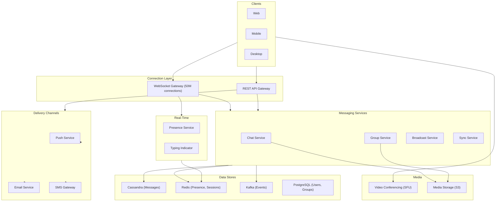

---

## Comprehensive Data Models

This section provides the complete SQL schema across all subsystems. PostgreSQL is used for relational metadata (users, groups, settings); Cassandra for high-volume message storage.

### PostgreSQL — Users and Authentication

```sql
CREATE TABLE users (
    user_id         UUID PRIMARY KEY DEFAULT gen_random_uuid(),
    username        VARCHAR(64) NOT NULL UNIQUE,
    display_name    VARCHAR(128) NOT NULL,
    phone_number    VARCHAR(20) UNIQUE,
    email           VARCHAR(255) UNIQUE,
    avatar_url      TEXT,
    bio             TEXT,
    status_message  TEXT,
    e2e_identity_key    BYTEA,          -- public identity key for Signal Protocol
    e2e_signed_prekey   BYTEA,          -- signed pre-key (rotated periodically)
    privacy_last_seen   VARCHAR(20) DEFAULT 'contacts'
        CHECK (privacy_last_seen IN ('everyone', 'contacts', 'nobody')),
    privacy_profile_photo VARCHAR(20) DEFAULT 'contacts'
        CHECK (privacy_profile_photo IN ('everyone', 'contacts', 'nobody')),
    privacy_read_receipts BOOLEAN DEFAULT true,
    account_status  VARCHAR(20) DEFAULT 'active'
        CHECK (account_status IN ('active', 'suspended', 'deleted', 'pending_verification')),
    last_seen_at    TIMESTAMPTZ,
    created_at      TIMESTAMPTZ NOT NULL DEFAULT now(),
    updated_at      TIMESTAMPTZ NOT NULL DEFAULT now()
);

CREATE INDEX idx_users_phone ON users(phone_number) WHERE phone_number IS NOT NULL;
CREATE INDEX idx_users_email ON users(email) WHERE email IS NOT NULL;
CREATE INDEX idx_users_username ON users(username);

CREATE TABLE user_contacts (
    user_id         UUID NOT NULL REFERENCES users(user_id),
    contact_user_id UUID NOT NULL REFERENCES users(user_id),
    nickname        VARCHAR(128),
    is_blocked      BOOLEAN DEFAULT false,
    is_favorite     BOOLEAN DEFAULT false,
    added_at        TIMESTAMPTZ NOT NULL DEFAULT now(),
    PRIMARY KEY (user_id, contact_user_id)
);

CREATE INDEX idx_contacts_reverse ON user_contacts(contact_user_id, user_id);

CREATE TABLE user_devices (
    device_id       UUID PRIMARY KEY DEFAULT gen_random_uuid(),
    user_id         UUID NOT NULL REFERENCES users(user_id),
    device_name     VARCHAR(128),
    platform        VARCHAR(20) NOT NULL
        CHECK (platform IN ('ios', 'android', 'web', 'desktop_mac', 'desktop_win', 'desktop_linux')),
    os_version      VARCHAR(64),
    app_version     VARCHAR(32) NOT NULL,
    push_token      TEXT,
    push_platform   VARCHAR(10) CHECK (push_platform IN ('apns', 'fcm', 'web_push')),
    e2e_device_key  BYTEA,              -- per-device identity key
    is_active       BOOLEAN DEFAULT true,
    last_active_at  TIMESTAMPTZ NOT NULL DEFAULT now(),
    created_at      TIMESTAMPTZ NOT NULL DEFAULT now()
);

CREATE INDEX idx_devices_user ON user_devices(user_id);
CREATE INDEX idx_devices_push_token ON user_devices(push_token) WHERE push_token IS NOT NULL;
```

### PostgreSQL — Conversations and Groups

```sql
CREATE TABLE conversations (
    conversation_id     UUID PRIMARY KEY DEFAULT gen_random_uuid(),
    conversation_type   VARCHAR(20) NOT NULL
        CHECK (conversation_type IN ('direct', 'group', 'channel', 'broadcast')),
    created_by          UUID REFERENCES users(user_id),
    created_at          TIMESTAMPTZ NOT NULL DEFAULT now(),
    updated_at          TIMESTAMPTZ NOT NULL DEFAULT now()
);

CREATE TABLE direct_conversations (
    conversation_id     UUID PRIMARY KEY REFERENCES conversations(conversation_id),
    user_a_id           UUID NOT NULL REFERENCES users(user_id),
    user_b_id           UUID NOT NULL REFERENCES users(user_id),
    CONSTRAINT uq_direct_pair UNIQUE (user_a_id, user_b_id),
    CONSTRAINT ck_direct_order CHECK (user_a_id < user_b_id)  -- canonical ordering
);

CREATE INDEX idx_direct_user_a ON direct_conversations(user_a_id);
CREATE INDEX idx_direct_user_b ON direct_conversations(user_b_id);

CREATE TABLE chat_groups (
    group_id        UUID PRIMARY KEY REFERENCES conversations(conversation_id),
    name            VARCHAR(256) NOT NULL,
    description     TEXT,
    avatar_url      TEXT,
    group_type      VARCHAR(20) NOT NULL DEFAULT 'small'
        CHECK (group_type IN ('small', 'large', 'channel', 'broadcast')),
    max_members     INT NOT NULL DEFAULT 1000,
    member_count    INT NOT NULL DEFAULT 0,
    created_by      UUID NOT NULL REFERENCES users(user_id),
    invite_link     VARCHAR(128) UNIQUE,
    invite_link_active BOOLEAN DEFAULT true,
    is_public       BOOLEAN DEFAULT false,
    require_approval BOOLEAN DEFAULT false,
    settings        JSONB DEFAULT '{
        "only_admins_can_post": false,
        "only_admins_can_edit_info": true,
        "only_admins_can_add_members": false,
        "message_retention_days": null,
        "slow_mode_seconds": 0
    }',
    created_at      TIMESTAMPTZ NOT NULL DEFAULT now(),
    updated_at      TIMESTAMPTZ NOT NULL DEFAULT now()
);

CREATE INDEX idx_groups_public ON chat_groups(is_public) WHERE is_public = true;
CREATE INDEX idx_groups_invite ON chat_groups(invite_link) WHERE invite_link_active = true;

CREATE TABLE group_members (
    group_id        UUID NOT NULL REFERENCES chat_groups(group_id) ON DELETE CASCADE,
    user_id         UUID NOT NULL REFERENCES users(user_id),
    role            VARCHAR(20) NOT NULL DEFAULT 'member'
        CHECK (role IN ('owner', 'admin', 'moderator', 'member', 'restricted')),
    joined_at       TIMESTAMPTZ NOT NULL DEFAULT now(),
    added_by        UUID REFERENCES users(user_id),
    muted_until     TIMESTAMPTZ,
    is_pinned       BOOLEAN DEFAULT false,
    last_read_seq   BIGINT DEFAULT 0,           -- last message sequence user has read
    notification_setting VARCHAR(20) DEFAULT 'all'
        CHECK (notification_setting IN ('all', 'mentions', 'none')),
    PRIMARY KEY (group_id, user_id)
);

CREATE INDEX idx_group_members_user ON group_members(user_id);
CREATE INDEX idx_group_members_role ON group_members(group_id, role);

CREATE TABLE group_membership_log (
    log_id          BIGSERIAL PRIMARY KEY,
    group_id        UUID NOT NULL REFERENCES chat_groups(group_id),
    user_id         UUID NOT NULL REFERENCES users(user_id),
    action          VARCHAR(20) NOT NULL
        CHECK (action IN ('joined', 'left', 'kicked', 'banned', 'promoted', 'demoted', 'invited')),
    performed_by    UUID REFERENCES users(user_id),
    reason          TEXT,
    created_at      TIMESTAMPTZ NOT NULL DEFAULT now()
);

CREATE INDEX idx_membership_log_group ON group_membership_log(group_id, created_at DESC);
```

### PostgreSQL — Broadcast Channels

```sql
CREATE TABLE broadcast_channels (
    channel_id      UUID PRIMARY KEY REFERENCES conversations(conversation_id),
    name            VARCHAR(256) NOT NULL,
    description     TEXT,
    avatar_url      TEXT,
    owner_id        UUID NOT NULL REFERENCES users(user_id),
    subscriber_count BIGINT NOT NULL DEFAULT 0,
    is_verified     BOOLEAN DEFAULT false,
    category        VARCHAR(64),
    settings        JSONB DEFAULT '{
        "allow_comments": false,
        "allow_reactions": true,
        "allow_sharing": true
    }',
    created_at      TIMESTAMPTZ NOT NULL DEFAULT now()
);

CREATE TABLE broadcast_subscribers (
    channel_id      UUID NOT NULL REFERENCES broadcast_channels(channel_id) ON DELETE CASCADE,
    user_id         UUID NOT NULL REFERENCES users(user_id),
    subscribed_at   TIMESTAMPTZ NOT NULL DEFAULT now(),
    notification_setting VARCHAR(20) DEFAULT 'all'
        CHECK (notification_setting IN ('all', 'highlights', 'none')),
    is_muted        BOOLEAN DEFAULT false,
    PRIMARY KEY (channel_id, user_id)
);

CREATE INDEX idx_broadcast_sub_user ON broadcast_subscribers(user_id);

CREATE TABLE broadcast_admins (
    channel_id      UUID NOT NULL REFERENCES broadcast_channels(channel_id) ON DELETE CASCADE,
    user_id         UUID NOT NULL REFERENCES users(user_id),
    can_post        BOOLEAN DEFAULT true,
    can_edit        BOOLEAN DEFAULT false,
    can_delete      BOOLEAN DEFAULT false,
    granted_at      TIMESTAMPTZ NOT NULL DEFAULT now(),
    PRIMARY KEY (channel_id, user_id)
);
```

### Cassandra — Message Storage

```sql
-- Primary message table: partitioned by conversation, clustered by time
CREATE TABLE messages (
    conversation_id  UUID,
    message_id       TIMEUUID,
    sequence_num     BIGINT,             -- per-conversation monotonic sequence
    sender_id        UUID,
    content_type     TEXT,                -- 'text','image','video','voice','file','sticker','location','contact'
    content          BLOB,               -- encrypted content (for E2E conversations)
    content_text     TEXT,                -- plaintext (for non-E2E: groups, channels)
    encrypted_keys   MAP<UUID, BLOB>,    -- recipient_device_id → encrypted message key
    reply_to_id      TIMEUUID,
    forwarded_from   UUID,               -- original conversation_id if forwarded
    edit_version     INT,                 -- incremented on each edit
    is_deleted       BOOLEAN,
    media_url        TEXT,
    media_thumbnail  TEXT,
    media_size_bytes BIGINT,
    media_duration_ms INT,
    metadata         MAP<TEXT, TEXT>,     -- extensible metadata
    reactions        MAP<TEXT, FROZEN<SET<UUID>>>,  -- emoji → set of user_ids
    created_at       TIMESTAMP,
    edited_at        TIMESTAMP,
    PRIMARY KEY (conversation_id, message_id)
) WITH CLUSTERING ORDER BY (message_id ASC)
  AND compaction = {'class': 'TimeWindowCompactionStrategy', 'compaction_window_unit': 'DAYS', 'compaction_window_size': 7}
  AND default_time_to_live = 0
  AND gc_grace_seconds = 864000;

-- Per-user inbox: shows recent conversations sorted by last message
CREATE TABLE user_inbox (
    user_id              UUID,
    last_message_time    TIMESTAMP,
    conversation_id      UUID,
    conversation_type    TEXT,            -- 'direct','group','channel'
    conversation_name    TEXT,            -- display name (other user or group name)
    conversation_avatar  TEXT,
    last_message_preview TEXT,
    last_message_sender  UUID,
    unread_count         INT,
    is_muted             BOOLEAN,
    is_pinned            BOOLEAN,
    is_archived          BOOLEAN,
    draft_text           TEXT,
    PRIMARY KEY (user_id, last_message_time, conversation_id)
) WITH CLUSTERING ORDER BY (last_message_time DESC, conversation_id ASC);

-- Message delivery status: tracks per-recipient delivery and read status
CREATE TABLE message_status (
    conversation_id  UUID,
    message_id       TIMEUUID,
    recipient_id     UUID,
    device_id        UUID,
    status           TEXT,               -- 'sent','delivered','read','failed'
    delivered_at     TIMESTAMP,
    read_at          TIMESTAMP,
    PRIMARY KEY ((conversation_id, message_id), recipient_id, device_id)
);

-- Per-user message search index (for non-E2E messages)
CREATE TABLE message_search_index (
    user_id          UUID,
    term_bucket      TEXT,               -- first 2 chars of search term for partitioning
    term             TEXT,
    conversation_id  UUID,
    message_id       TIMEUUID,
    snippet          TEXT,
    created_at       TIMESTAMP,
    PRIMARY KEY ((user_id, term_bucket), term, created_at, message_id)
) WITH CLUSTERING ORDER BY (term ASC, created_at DESC, message_id DESC);
```

### PostgreSQL — Presence and Typing

```sql
-- Presence state is primarily in Redis, but we store settings in PostgreSQL
CREATE TABLE presence_settings (
    user_id             UUID PRIMARY KEY REFERENCES users(user_id),
    share_presence      BOOLEAN DEFAULT true,
    share_last_seen     BOOLEAN DEFAULT true,
    auto_away_minutes   INT DEFAULT 5,
    custom_status_text  VARCHAR(128),
    custom_status_emoji VARCHAR(8),
    custom_status_expires_at TIMESTAMPTZ
);

-- Presence audit log for debugging
CREATE TABLE presence_log (
    log_id          BIGSERIAL,
    user_id         UUID NOT NULL,
    status          VARCHAR(20) NOT NULL,
    device_id       UUID,
    source          VARCHAR(20),         -- 'heartbeat','connect','disconnect','manual'
    created_at      TIMESTAMPTZ NOT NULL DEFAULT now(),
    PRIMARY KEY (user_id, log_id)
) PARTITION BY RANGE (created_at);

-- Create monthly partitions
CREATE TABLE presence_log_2026_01 PARTITION OF presence_log
    FOR VALUES FROM ('2026-01-01') TO ('2026-02-01');
CREATE TABLE presence_log_2026_02 PARTITION OF presence_log
    FOR VALUES FROM ('2026-02-01') TO ('2026-03-01');
CREATE TABLE presence_log_2026_03 PARTITION OF presence_log
    FOR VALUES FROM ('2026-03-01') TO ('2026-04-01');
```

### PostgreSQL — Email System

```sql
CREATE TABLE email_templates (
    template_id     UUID PRIMARY KEY DEFAULT gen_random_uuid(),
    name            VARCHAR(128) NOT NULL UNIQUE,
    subject_template TEXT NOT NULL,
    html_body       TEXT NOT NULL,
    text_body       TEXT,
    category        VARCHAR(64) NOT NULL
        CHECK (category IN ('transactional', 'marketing', 'notification', 'digest')),
    variables       JSONB DEFAULT '[]',     -- list of template variables
    is_active       BOOLEAN DEFAULT true,
    version         INT DEFAULT 1,
    created_at      TIMESTAMPTZ NOT NULL DEFAULT now(),
    updated_at      TIMESTAMPTZ NOT NULL DEFAULT now()
);

CREATE TABLE email_queue (
    email_id        UUID PRIMARY KEY DEFAULT gen_random_uuid(),
    template_id     UUID REFERENCES email_templates(template_id),
    to_address      VARCHAR(255) NOT NULL,
    to_name         VARCHAR(128),
    from_address    VARCHAR(255) NOT NULL,
    from_name       VARCHAR(128),
    cc_addresses    TEXT[],
    bcc_addresses   TEXT[],
    subject         TEXT NOT NULL,
    html_body       TEXT,
    text_body       TEXT,
    variables       JSONB DEFAULT '{}',
    priority        INT DEFAULT 5 CHECK (priority BETWEEN 1 AND 10),  -- 1=highest
    status          VARCHAR(20) NOT NULL DEFAULT 'pending'
        CHECK (status IN ('pending', 'queued', 'sending', 'sent', 'delivered', 'bounced', 'failed', 'cancelled')),
    provider        VARCHAR(64),             -- 'ses','sendgrid','postmark'
    provider_message_id TEXT,
    retry_count     INT DEFAULT 0,
    max_retries     INT DEFAULT 3,
    scheduled_at    TIMESTAMPTZ,
    sent_at         TIMESTAMPTZ,
    delivered_at    TIMESTAMPTZ,
    opened_at       TIMESTAMPTZ,
    clicked_at      TIMESTAMPTZ,
    bounced_at      TIMESTAMPTZ,
    bounce_reason   TEXT,
    error_message   TEXT,
    created_at      TIMESTAMPTZ NOT NULL DEFAULT now()
);

CREATE INDEX idx_email_queue_status ON email_queue(status) WHERE status IN ('pending', 'queued', 'sending');
CREATE INDEX idx_email_queue_scheduled ON email_queue(scheduled_at) WHERE status = 'pending' AND scheduled_at IS NOT NULL;
CREATE INDEX idx_email_queue_to ON email_queue(to_address, created_at DESC);

CREATE TABLE email_suppression_list (
    email_address   VARCHAR(255) PRIMARY KEY,
    reason          VARCHAR(20) NOT NULL
        CHECK (reason IN ('bounce', 'complaint', 'unsubscribe', 'manual')),
    source          TEXT,
    suppressed_at   TIMESTAMPTZ NOT NULL DEFAULT now()
);

CREATE TABLE email_events (
    event_id        UUID PRIMARY KEY DEFAULT gen_random_uuid(),
    email_id        UUID NOT NULL REFERENCES email_queue(email_id),
    event_type      VARCHAR(20) NOT NULL
        CHECK (event_type IN ('queued', 'sent', 'delivered', 'opened', 'clicked', 'bounced', 'complaint', 'unsubscribed')),
    event_data      JSONB DEFAULT '{}',
    ip_address      INET,
    user_agent      TEXT,
    created_at      TIMESTAMPTZ NOT NULL DEFAULT now()
);

CREATE INDEX idx_email_events_email ON email_events(email_id, created_at);
CREATE INDEX idx_email_events_type ON email_events(event_type, created_at DESC);
```

### PostgreSQL — Push Notification System

```sql
CREATE TABLE push_tokens (
    token_id        UUID PRIMARY KEY DEFAULT gen_random_uuid(),
    user_id         UUID NOT NULL REFERENCES users(user_id),
    device_id       UUID NOT NULL REFERENCES user_devices(device_id),
    platform        VARCHAR(10) NOT NULL CHECK (platform IN ('apns', 'fcm', 'web_push')),
    token           TEXT NOT NULL,
    environment     VARCHAR(10) DEFAULT 'production'
        CHECK (environment IN ('production', 'sandbox')),
    app_bundle_id   VARCHAR(128),
    is_active       BOOLEAN DEFAULT true,
    failure_count   INT DEFAULT 0,
    last_success_at TIMESTAMPTZ,
    last_failure_at TIMESTAMPTZ,
    last_failure_reason TEXT,
    created_at      TIMESTAMPTZ NOT NULL DEFAULT now(),
    updated_at      TIMESTAMPTZ NOT NULL DEFAULT now(),
    CONSTRAINT uq_push_token UNIQUE (platform, token)
);

CREATE INDEX idx_push_tokens_user ON push_tokens(user_id) WHERE is_active = true;
CREATE INDEX idx_push_tokens_inactive ON push_tokens(is_active, failure_count) WHERE is_active = false;

CREATE TABLE push_notification_queue (
    notification_id UUID PRIMARY KEY DEFAULT gen_random_uuid(),
    user_id         UUID NOT NULL,
    notification_type VARCHAR(64) NOT NULL,   -- 'message','group_invite','mention','system'
    title           TEXT NOT NULL,
    body            TEXT NOT NULL,
    data_payload    JSONB DEFAULT '{}',
    image_url       TEXT,
    action_url      TEXT,
    priority        VARCHAR(10) DEFAULT 'normal'
        CHECK (priority IN ('critical', 'high', 'normal', 'low')),
    collapse_key    VARCHAR(128),             -- for notification grouping
    ttl_seconds     INT DEFAULT 86400,
    status          VARCHAR(20) NOT NULL DEFAULT 'pending'
        CHECK (status IN ('pending', 'sending', 'sent', 'delivered', 'failed', 'throttled', 'suppressed')),
    platform_results JSONB DEFAULT '{}',     -- per-platform delivery results
    retry_count     INT DEFAULT 0,
    scheduled_at    TIMESTAMPTZ,
    sent_at         TIMESTAMPTZ,
    created_at      TIMESTAMPTZ NOT NULL DEFAULT now()
);

CREATE INDEX idx_push_queue_status ON push_notification_queue(status, created_at)
    WHERE status IN ('pending', 'sending');
CREATE INDEX idx_push_queue_user ON push_notification_queue(user_id, created_at DESC);

CREATE TABLE push_notification_preferences (
    user_id             UUID NOT NULL REFERENCES users(user_id),
    notification_type   VARCHAR(64) NOT NULL,
    enabled             BOOLEAN DEFAULT true,
    sound_enabled       BOOLEAN DEFAULT true,
    vibration_enabled   BOOLEAN DEFAULT true,
    show_preview        BOOLEAN DEFAULT true,
    quiet_hours_start   TIME,
    quiet_hours_end     TIME,
    PRIMARY KEY (user_id, notification_type)
);

CREATE TABLE push_daily_counts (
    user_id         UUID NOT NULL,
    count_date      DATE NOT NULL,
    notification_count INT DEFAULT 0,
    PRIMARY KEY (user_id, count_date)
);
```

### PostgreSQL — SMS Gateway

```sql
CREATE TABLE sms_providers (
    provider_id     UUID PRIMARY KEY DEFAULT gen_random_uuid(),
    name            VARCHAR(64) NOT NULL UNIQUE,
    api_endpoint    TEXT NOT NULL,
    supported_countries TEXT[] NOT NULL,
    cost_per_sms_usd NUMERIC(8, 5),
    throughput_per_second INT DEFAULT 100,
    priority        INT DEFAULT 5,
    is_active       BOOLEAN DEFAULT true,
    health_status   VARCHAR(20) DEFAULT 'healthy'
        CHECK (health_status IN ('healthy', 'degraded', 'down')),
    last_health_check TIMESTAMPTZ
);

CREATE TABLE sms_queue (
    sms_id          UUID PRIMARY KEY DEFAULT gen_random_uuid(),
    to_number       VARCHAR(20) NOT NULL,
    from_number     VARCHAR(20),
    message_type    VARCHAR(20) NOT NULL
        CHECK (message_type IN ('otp', 'transactional', 'marketing', 'alert')),
    content         TEXT NOT NULL,
    country_code    VARCHAR(5) NOT NULL,
    provider_id     UUID REFERENCES sms_providers(provider_id),
    provider_message_id TEXT,
    status          VARCHAR(20) NOT NULL DEFAULT 'pending'
        CHECK (status IN ('pending', 'queued', 'sent', 'delivered', 'failed', 'expired')),
    cost_usd        NUMERIC(8, 5),
    retry_count     INT DEFAULT 0,
    max_retries     INT DEFAULT 2,
    error_code      VARCHAR(20),
    error_message   TEXT,
    sent_at         TIMESTAMPTZ,
    delivered_at    TIMESTAMPTZ,
    expires_at      TIMESTAMPTZ,
    created_at      TIMESTAMPTZ NOT NULL DEFAULT now()
);

CREATE INDEX idx_sms_queue_status ON sms_queue(status) WHERE status IN ('pending', 'queued', 'sent');
CREATE INDEX idx_sms_queue_to ON sms_queue(to_number, created_at DESC);

CREATE TABLE sms_otp_records (
    otp_id          UUID PRIMARY KEY DEFAULT gen_random_uuid(),
    phone_number    VARCHAR(20) NOT NULL,
    otp_hash        TEXT NOT NULL,           -- bcrypt hash
    purpose         VARCHAR(64) NOT NULL,    -- 'login','registration','password_reset','2fa'
    attempts        INT DEFAULT 0,
    max_attempts    INT DEFAULT 3,
    sms_id          UUID REFERENCES sms_queue(sms_id),
    is_verified     BOOLEAN DEFAULT false,
    is_expired      BOOLEAN DEFAULT false,
    expires_at      TIMESTAMPTZ NOT NULL,
    created_at      TIMESTAMPTZ NOT NULL DEFAULT now(),
    verified_at     TIMESTAMPTZ
);

CREATE INDEX idx_otp_phone ON sms_otp_records(phone_number, created_at DESC);
CREATE INDEX idx_otp_active ON sms_otp_records(phone_number, is_verified, is_expired, expires_at)
    WHERE is_verified = false AND is_expired = false;
```

### PostgreSQL — Video Conferencing

```sql
CREATE TABLE video_rooms (
    room_id         UUID PRIMARY KEY DEFAULT gen_random_uuid(),
    conversation_id UUID REFERENCES conversations(conversation_id),
    room_type       VARCHAR(20) NOT NULL
        CHECK (room_type IN ('call_1to1', 'group_call', 'meeting', 'webinar')),
    created_by      UUID NOT NULL REFERENCES users(user_id),
    title           VARCHAR(256),
    scheduled_start TIMESTAMPTZ,
    scheduled_end   TIMESTAMPTZ,
    max_participants INT DEFAULT 50,
    status          VARCHAR(20) NOT NULL DEFAULT 'waiting'
        CHECK (status IN ('waiting', 'active', 'ended', 'cancelled')),
    recording_enabled BOOLEAN DEFAULT false,
    recording_url   TEXT,
    sfu_server_id   VARCHAR(128),
    sfu_region      VARCHAR(20),
    settings        JSONB DEFAULT '{
        "mute_on_join": false,
        "camera_off_on_join": false,
        "screen_sharing_allowed": true,
        "chat_enabled": true,
        "waiting_room_enabled": false,
        "e2e_encrypted": false
    }',
    started_at      TIMESTAMPTZ,
    ended_at        TIMESTAMPTZ,
    created_at      TIMESTAMPTZ NOT NULL DEFAULT now()
);

CREATE INDEX idx_video_rooms_status ON video_rooms(status) WHERE status = 'active';
CREATE INDEX idx_video_rooms_conversation ON video_rooms(conversation_id, created_at DESC);

CREATE TABLE video_participants (
    room_id         UUID NOT NULL REFERENCES video_rooms(room_id) ON DELETE CASCADE,
    user_id         UUID NOT NULL REFERENCES users(user_id),
    device_id       UUID,
    role            VARCHAR(20) DEFAULT 'participant'
        CHECK (role IN ('host', 'co_host', 'participant', 'viewer')),
    status          VARCHAR(20) NOT NULL DEFAULT 'invited'
        CHECK (status IN ('invited', 'ringing', 'connecting', 'connected', 'disconnected', 'declined', 'missed')),
    audio_enabled   BOOLEAN DEFAULT true,
    video_enabled   BOOLEAN DEFAULT true,
    screen_sharing  BOOLEAN DEFAULT false,
    is_hand_raised  BOOLEAN DEFAULT false,
    network_quality VARCHAR(10) DEFAULT 'good'
        CHECK (network_quality IN ('excellent', 'good', 'fair', 'poor')),
    joined_at       TIMESTAMPTZ,
    left_at         TIMESTAMPTZ,
    duration_seconds INT,
    PRIMARY KEY (room_id, user_id)
);

CREATE INDEX idx_video_participants_user ON video_participants(user_id, joined_at DESC);

CREATE TABLE video_quality_metrics (
    metric_id       UUID PRIMARY KEY DEFAULT gen_random_uuid(),
    room_id         UUID NOT NULL REFERENCES video_rooms(room_id),
    user_id         UUID NOT NULL,
    timestamp       TIMESTAMPTZ NOT NULL,
    audio_bitrate   INT,
    video_bitrate   INT,
    framerate       INT,
    resolution      VARCHAR(20),
    packet_loss_pct NUMERIC(5, 2),
    jitter_ms       INT,
    round_trip_ms   INT,
    codec_audio     VARCHAR(20),
    codec_video     VARCHAR(20)
);

CREATE INDEX idx_quality_room ON video_quality_metrics(room_id, timestamp);
```

### PostgreSQL — E2E Encryption Key Storage

```sql
CREATE TABLE e2e_prekeys (
    user_id         UUID NOT NULL REFERENCES users(user_id),
    device_id       UUID NOT NULL REFERENCES user_devices(device_id),
    prekey_id       INT NOT NULL,
    public_key      BYTEA NOT NULL,
    is_consumed     BOOLEAN DEFAULT false,
    consumed_by     UUID,
    consumed_at     TIMESTAMPTZ,
    uploaded_at     TIMESTAMPTZ NOT NULL DEFAULT now(),
    PRIMARY KEY (user_id, device_id, prekey_id)
);

CREATE INDEX idx_prekeys_available ON e2e_prekeys(user_id, device_id, is_consumed)
    WHERE is_consumed = false;

CREATE TABLE e2e_signed_prekeys (
    user_id         UUID NOT NULL REFERENCES users(user_id),
    device_id       UUID NOT NULL REFERENCES user_devices(device_id),
    signed_prekey_id INT NOT NULL,
    public_key      BYTEA NOT NULL,
    signature       BYTEA NOT NULL,
    is_active       BOOLEAN DEFAULT true,
    uploaded_at     TIMESTAMPTZ NOT NULL DEFAULT now(),
    PRIMARY KEY (user_id, device_id, signed_prekey_id)
);

CREATE TABLE e2e_sender_keys (
    group_id        UUID NOT NULL,
    sender_user_id  UUID NOT NULL,
    sender_device_id UUID NOT NULL,
    distribution_id UUID NOT NULL,
    chain_key       BYTEA NOT NULL,
    signing_key     BYTEA NOT NULL,
    iteration       INT NOT NULL DEFAULT 0,
    created_at      TIMESTAMPTZ NOT NULL DEFAULT now(),
    PRIMARY KEY (group_id, sender_user_id, sender_device_id)
);
```

---

## REST and WebSocket API Specifications

### Authentication

All REST APIs require a Bearer token. WebSocket connections authenticate during the handshake.

```
Authorization: Bearer <jwt_token>
```

### 1:1 Chat APIs

#### REST: Send Message

```
POST /api/v1/conversations/{conversation_id}/messages
Content-Type: application/json

{
    "client_message_id": "cm_abc123def456",     // client-generated UUID for idempotency
    "content_type": "text",
    "content": "<base64 encrypted content>",
    "encrypted_keys": {
        "<recipient_device_id>": "<base64 encrypted message key>"
    },
    "reply_to_id": null,
    "metadata": {
        "link_preview_url": "https://example.com",
        "link_preview_title": "Example"
    }
}

Response 201:
{
    "message_id": "550e8400-e29b-41d4-a716-446655440000",
    "conversation_id": "conv_abc123",
    "sequence_num": 12346,
    "server_timestamp": "2026-03-22T10:30:00.123Z",
    "status": "sent"
}
```

#### REST: Get Conversation Messages

```
GET /api/v1/conversations/{conversation_id}/messages?after_seq=12300&limit=50

Response 200:
{
    "messages": [
        {
            "message_id": "550e8400-...",
            "sequence_num": 12301,
            "sender_id": "user_alice",
            "content_type": "text",
            "content": "<base64 encrypted>",
            "created_at": "2026-03-22T10:30:00.123Z",
            "status": "delivered",
            "reactions": {"thumbs_up": ["user_bob"]},
            "reply_to_id": null
        }
    ],
    "has_more": true,
    "next_cursor": "seq_12351"
}
```

#### REST: Get Inbox

```
GET /api/v1/inbox?limit=20&offset=0

Response 200:
{
    "conversations": [
        {
            "conversation_id": "conv_abc123",
            "conversation_type": "direct",
            "name": "Bob",
            "avatar_url": "https://cdn.example.com/avatars/bob.jpg",
            "last_message": {
                "preview": "Hey, are you coming tonight?",
                "sender_id": "user_bob",
                "timestamp": "2026-03-22T10:30:00Z"
            },
            "unread_count": 3,
            "is_muted": false,
            "is_pinned": false
        }
    ],
    "total_unread": 15
}
```

#### REST: Mark Messages as Read

```
POST /api/v1/conversations/{conversation_id}/read
Content-Type: application/json

{
    "up_to_sequence": 12346
}

Response 200:
{
    "conversation_id": "conv_abc123",
    "read_up_to": 12346,
    "timestamp": "2026-03-22T10:30:05Z"
}
```

### WebSocket Message Formats

#### Connection Handshake

```
ws://gateway.example.com/ws?token=<jwt>&device_id=<device_id>

Server → Client (on connect):
{
    "type": "connected",
    "connection_id": "conn_xyz789",
    "server_time": "2026-03-22T10:30:00.000Z",
    "heartbeat_interval_ms": 30000
}
```

#### Heartbeat

```
Client → Server:
{
    "type": "heartbeat",
    "timestamp": 1711100000000
}

Server → Client:
{
    "type": "heartbeat_ack",
    "timestamp": 1711100000050
}
```

#### Incoming Message

```
Server → Client:
{
    "type": "message",
    "conversation_id": "conv_abc123",
    "message": {
        "message_id": "550e8400-...",
        "sequence_num": 12346,
        "sender_id": "user_alice",
        "content_type": "text",
        "content": "<base64 encrypted>",
        "encrypted_key": "<base64 key for this device>",
        "created_at": "2026-03-22T10:30:00.123Z"
    }
}

Client → Server (delivery ACK):
{
    "type": "message_ack",
    "message_id": "550e8400-...",
    "conversation_id": "conv_abc123",
    "status": "delivered"
}
```

#### Typing Indicator

```
Client → Server:
{
    "type": "typing_start",
    "conversation_id": "conv_abc123"
}

Server → Other Client:
{
    "type": "typing",
    "conversation_id": "conv_abc123",
    "user_id": "user_alice",
    "action": "start",
    "expires_at": "2026-03-22T10:30:05.000Z"
}
```

#### Presence Update

```
Server → Client:
{
    "type": "presence",
    "user_id": "user_bob",
    "status": "online",
    "last_seen": null
}
```

#### Read Receipt

```
Server → Client:
{
    "type": "read_receipt",
    "conversation_id": "conv_abc123",
    "user_id": "user_bob",
    "read_up_to_seq": 12346,
    "timestamp": "2026-03-22T10:30:05Z"
}
```

### Group Chat APIs

#### REST: Create Group

```
POST /api/v1/groups
Content-Type: application/json

{
    "name": "Weekend Hiking Club",
    "description": "Planning weekend hikes",
    "member_ids": ["user_bob", "user_charlie", "user_diana"],
    "settings": {
        "only_admins_can_post": false,
        "only_admins_can_add_members": false
    }
}

Response 201:
{
    "group_id": "grp_xyz789",
    "conversation_id": "conv_grp_xyz789",
    "name": "Weekend Hiking Club",
    "member_count": 4,
    "created_at": "2026-03-22T10:30:00Z",
    "invite_link": "https://chat.example.com/join/abc123xyz"
}
```

#### REST: Group Admin Actions

```
POST /api/v1/groups/{group_id}/members/{user_id}/role
Content-Type: application/json

{
    "role": "admin"
}

DELETE /api/v1/groups/{group_id}/members/{user_id}
(Kick member — admin only)

PUT /api/v1/groups/{group_id}/settings
Content-Type: application/json

{
    "only_admins_can_post": true,
    "slow_mode_seconds": 30
}
```

### Push Notification API

```
POST /api/v1/notifications/send
Content-Type: application/json

{
    "user_id": "user_bob",
    "notification_type": "message",
    "title": "Alice",
    "body": "Hey, are you coming tonight?",
    "data": {
        "conversation_id": "conv_abc123",
        "message_id": "550e8400-..."
    },
    "image_url": null,
    "collapse_key": "conv_abc123",
    "priority": "high",
    "ttl_seconds": 3600
}

Response 202:
{
    "notification_id": "notif_abc123",
    "status": "queued",
    "devices_targeted": 2
}
```

### Email API

```
POST /api/v1/emails/send
Content-Type: application/json

{
    "template_id": "tmpl_welcome_email",
    "to": "bob@example.com",
    "to_name": "Bob Smith",
    "variables": {
        "first_name": "Bob",
        "verification_link": "https://example.com/verify?token=xyz"
    },
    "priority": 1,
    "tags": ["onboarding", "verification"]
}

Response 202:
{
    "email_id": "email_abc123",
    "status": "queued"
}
```

### SMS API

```
POST /api/v1/sms/send
Content-Type: application/json

{
    "to": "+14155551234",
    "message_type": "otp",
    "content": "Your verification code is: 847293. Expires in 5 minutes.",
    "ttl_seconds": 300
}

Response 202:
{
    "sms_id": "sms_abc123",
    "status": "queued",
    "provider": "twilio",
    "estimated_cost_usd": 0.0075
}
```

### Video Conferencing API

```
POST /api/v1/video/rooms
Content-Type: application/json

{
    "conversation_id": "conv_abc123",
    "room_type": "group_call",
    "settings": {
        "mute_on_join": false,
        "screen_sharing_allowed": true,
        "max_participants": 25
    }
}

Response 201:
{
    "room_id": "room_xyz789",
    "join_url": "https://meet.example.com/room_xyz789",
    "sfu_server": "sfu-us-west-2a.example.com",
    "ice_servers": [
        {"urls": "stun:stun.example.com:3478"},
        {"urls": "turn:turn.example.com:3478", "username": "auto", "credential": "token123"}
    ],
    "token": "<participant_jwt_token>"
}

--- WebSocket signaling for video ---
Client → Server:
{
    "type": "join_room",
    "room_id": "room_xyz789",
    "sdp_offer": "<SDP offer>",
    "audio": true,
    "video": true
}

Server → Client:
{
    "type": "room_joined",
    "room_id": "room_xyz789",
    "participants": [
        {"user_id": "user_alice", "audio": true, "video": true},
        {"user_id": "user_charlie", "audio": true, "video": false}
    ],
    "sdp_answer": "<SDP answer>"
}

Server → Client (new participant):
{
    "type": "participant_joined",
    "room_id": "room_xyz789",
    "user_id": "user_diana",
    "sdp_offer": "<SDP offer for new track>"
}
```

---

## Storage Strategy

### Message Storage — Hot/Warm/Cold Tiering

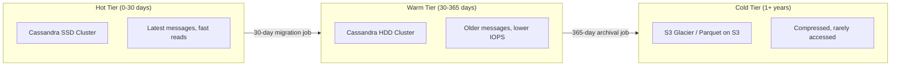

| Tier | Storage | Retention | Access Pattern | Cost |
|------|---------|-----------|---------------|------|
| **Hot** | Cassandra on NVMe SSD | 0-30 days | Frequent reads/writes | $$$$ |
| **Warm** | Cassandra on HDD | 30-365 days | Occasional reads | $$ |
| **Cold** | S3 Glacier / Parquet | 1+ years | Rare access (legal, export) | $ |
| **Media Hot** | S3 Standard + CloudFront CDN | 0-90 days | Frequent downloads | $$$ |
| **Media Cold** | S3 Infrequent Access | 90+ days | Rare downloads | $ |

### Media Attachment Storage

Media files (images, videos, voice notes) follow a different path from text messages:

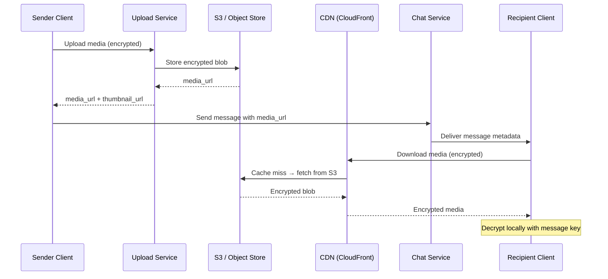

**Storage organization:**
```
s3://media-bucket/
  /{region}/
    /{year}/{month}/{day}/
      /{conversation_id}/
        /{message_id}/
          original.enc         -- encrypted original
          thumbnail.enc        -- encrypted thumbnail
          metadata.json        -- size, type, dimensions, duration
```

### Message Search Strategy

For non-E2E conversations (groups, channels), server-side search is available:

| Component | Technology | Purpose |
|-----------|-----------|---------|
| **Full-text search** | Elasticsearch | Search message content, sender, date ranges |
| **Search indexing** | Kafka → ES consumer | Async indexing of new messages |
| **Index partitioning** | Per-user index alias | Each user searches only their conversations |
| **E2E messages** | Client-side only | Server cannot index encrypted content |

For E2E conversations, search runs entirely on the client device using local SQLite indexes.

### E2E Encryption Key Storage Strategy

| Key Type | Storage | Lifecycle |
|----------|---------|-----------|
| **Identity Key** | PostgreSQL + client device | Permanent; uploaded once per device |
| **Signed Pre-Key** | PostgreSQL + client device | Rotated every 7 days |
| **One-Time Pre-Keys** | PostgreSQL | Uploaded in batches of 100; consumed on use |
| **Sender Keys (groups)** | PostgreSQL + client device | Rotated when member leaves group |
| **Message Keys** | Client device only (Double Ratchet) | Ephemeral; derived per message |

**Key replenishment**: Client monitors available one-time pre-keys. When count drops below 25, client uploads a new batch of 100 keys.

---

## Indexing and Partitioning Strategy

### Cassandra Message Partitioning

```
Partition Key: conversation_id
Clustering Key: message_id (TIMEUUID → sorted by time)

Partition size target: < 100 MB (approximately 500K messages per conversation)

For very active conversations exceeding 500K messages:
  Partition Key: (conversation_id, time_bucket)
  where time_bucket = floor(message_timestamp / 7_days)
```

This ensures:
- All messages in a conversation are co-located (read efficiency)
- Time-ordered access within partition (latest messages first)
- Partition splits for ultra-active conversations prevent hot partitions

### User Inbox Partitioning

```
Partition Key: user_id
Clustering Key: (last_message_time DESC, conversation_id)

Each user's inbox is a single partition with conversations sorted by recency.
Average partition size: ~50 KB (200 conversations × 250 bytes each)
```

### Group Chat Fan-out Storage Pattern

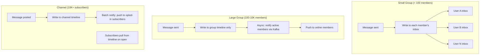

### Elasticsearch Index Design

```json
{
    "settings": {
        "number_of_shards": 10,
        "number_of_replicas": 1,
        "index.routing.allocation.require.tier": "hot"
    },
    "mappings": {
        "properties": {
            "conversation_id": {"type": "keyword"},
            "user_ids": {"type": "keyword"},
            "sender_id": {"type": "keyword"},
            "content_text": {
                "type": "text",
                "analyzer": "standard",
                "fields": {
                    "exact": {"type": "keyword"}
                }
            },
            "content_type": {"type": "keyword"},
            "created_at": {"type": "date"},
            "has_media": {"type": "boolean"},
            "has_link": {"type": "boolean"}
        }
    }
}
```

Index routing: messages are routed to shards by `user_id` so that a single user's searchable messages are co-located for efficient queries.

---

## Concurrency Control

### Message Ordering Guarantees

Within a single conversation, total ordering is essential. Two messages from different senders must appear in the same order on all devices.

**Approach: Server-assigned sequence numbers**

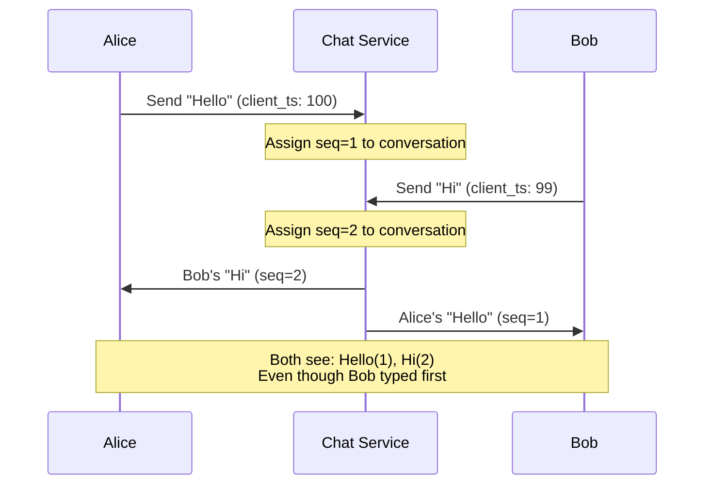

**Implementation**: A Redis `INCR` per conversation generates sequence numbers. This provides:
- Total ordering within conversation
- No coordination needed across conversations
- Monotonically increasing (gap-free under normal operation)

**Why not Lamport timestamps?** Lamport timestamps provide causal ordering but not total ordering. Two concurrent messages could get the same Lamport timestamp. Server-assigned sequence numbers eliminate this ambiguity.

**Why not vector clocks?** Unnecessary complexity for a client-server model. Vector clocks are useful for peer-to-peer or multi-leader replication. In our architecture, the server is the single sequencer per conversation.

### Group Membership Changes During Message Delivery

Race condition: Alice sends a message to the group at the same time Bob is removed from the group.

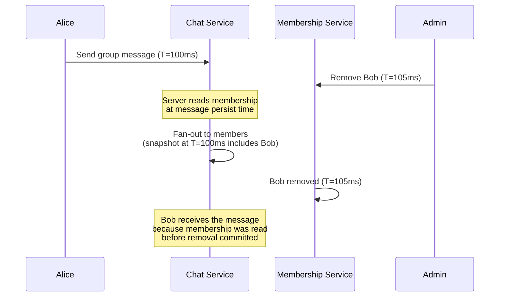

**Resolution**: This is acceptable behavior. The message was sent while Bob was still a member. For strict exclusion (e.g., confidential groups), use a **membership version** lock:

1. Each group has a `membership_version` counter
2. Message persist reads `membership_version`
3. Fan-out checks that `membership_version` has not changed
4. If changed, re-read membership and re-fan-out

### Presence State Machine

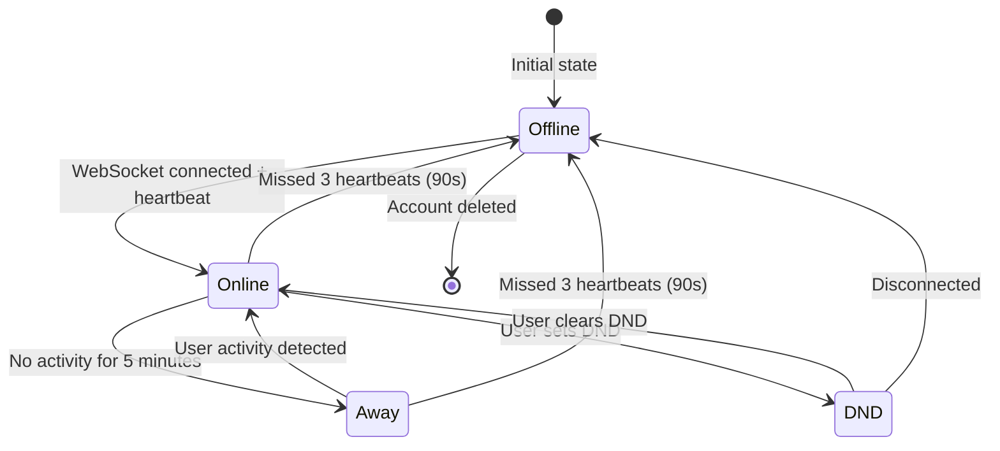

**Concurrency issue**: User connects from phone and laptop simultaneously. Both heartbeats keep the user online. If one device disconnects, the user should remain online (other device still connected).

**Solution**: Presence is tracked per-device. The aggregate status is:
- `online` if ANY device is online
- `away` if ALL devices are away
- `dnd` if ANY device is in DND (user-level setting)
- `offline` if ALL devices are offline

---

## Idempotency Strategy

### Message Deduplication

Clients generate a `client_message_id` (UUID v4) before sending. This ensures that retries (due to network issues) do not create duplicate messages.

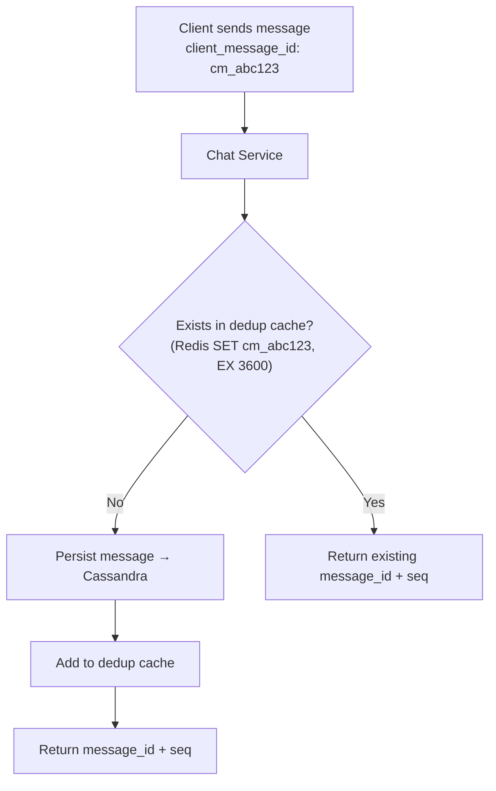

**Dedup cache**: Redis SET with 1-hour TTL. Key: `dedup:{conversation_id}:{client_message_id}`. Value: `{message_id, sequence_num}`.

### Delivery Receipt Deduplication

When a message is delivered to multiple devices, each device sends a delivery ACK. The server must not send multiple "delivered" notifications to the sender.

```
Rule: status transitions are idempotent and monotonic
  sent → delivered → read

If status is already 'delivered', another 'delivered' ACK is a no-op.
If status is already 'read', a 'delivered' ACK is a no-op (read implies delivered).
```

### Push Notification Deduplication

Multiple events may trigger the same notification (e.g., message delivered + message from same sender in quick succession). The collapse_key prevents notification spam:

```
collapse_key = "conv_{conversation_id}"

FCM/APNs replaces existing notification with same collapse_key.
Server-side: suppress duplicate push within 5-second window per conversation per user.
```

### Idempotency Keys Summary

| Operation | Idempotency Key | TTL | Storage |
|-----------|----------------|-----|---------|
| Send message | `client_message_id` | 1 hour | Redis |
| Delivery ACK | `message_id + device_id` | Status is monotonic | Cassandra |
| Read receipt | `conversation_id + user_id + seq` | Status is monotonic | Cassandra |
| Push notification | `collapse_key + user_id` | 5 seconds | Redis |
| Email send | `email_id` | 24 hours | PostgreSQL |
| SMS send | `sms_id` | 24 hours | PostgreSQL |
| Group join | `group_id + user_id` | Unique constraint | PostgreSQL |

---

## Consistency Model

### Per-Subsystem Consistency Requirements

| Subsystem | Consistency Model | Rationale |
|-----------|------------------|-----------|
| **Message ordering** | Total order per conversation | Users must see messages in the same order; server-assigned sequence numbers |
| **Message persistence** | Strong (write-acknowledged) | Messages must not be lost; quorum writes in Cassandra (CL=LOCAL_QUORUM) |
| **Read receipts** | Eventual (< 5s) | Slight delay in read receipt is acceptable |
| **Delivery receipts** | Eventual (< 2s) | Single/double tick delay tolerable |
| **Presence** | Eventual (< 10s) | "Online" can be stale by a few seconds |
| **Typing indicators** | Best-effort | Loss is acceptable; no persistence |
| **Group membership** | Strong | Adding/removing members must be consistent; PostgreSQL with serializable isolation |
| **User inbox** | Eventual (< 3s) | Inbox order can lag slightly behind latest message |
| **E2E key exchange** | Strong | Pre-key consumption must be exactly-once; PostgreSQL transaction |
| **Push token updates** | Strong | Stale tokens cause delivery failures |
| **Email/SMS delivery** | At-least-once with dedup | Retry on failure; idempotent processing |

### Cassandra Consistency Levels

```
WRITE: LOCAL_QUORUM (2 of 3 replicas in local DC)
READ:  LOCAL_QUORUM (for message fetch) or LOCAL_ONE (for inbox browsing)

Why not ALL?
  - ALL blocks on slowest replica, increasing p99 latency
  - LOCAL_QUORUM provides strong consistency with fault tolerance

Why not ONE for writes?
  - Risk of data loss if the single replica fails before replication
  - Messages are too valuable to risk
```

### Cross-Region Consistency

Messages are replicated across regions asynchronously (Cassandra EACH_QUORUM for critical paths):

```
Primary region: LOCAL_QUORUM write → immediate ACK to sender
Async replication: Message arrives in secondary region within 200-500ms
Secondary region reads: LOCAL_QUORUM (reads own region's replicas)

Conflict resolution: Last-write-wins using server_timestamp
  (conflicts rare because conversation_id + sequence_num is unique)
```

### Detailed Consistency Analysis by Subsystem

#### Message Ordering: Causal Consistency Within a Conversation

Within a single conversation, all participants must see messages in the same order. The system provides **total order per conversation** using server-assigned sequence numbers.

**How it works:**
- Each conversation has a monotonically increasing sequence counter stored in Redis (`INCR conversation:{id}:seq`).
- When a message is received, the chat service atomically increments the counter and assigns the resulting number to the message.
- All clients display messages sorted by this sequence number.
- **Across conversations**, ordering is **eventual** — a user might see a message in conversation A before a chronologically earlier message in conversation B arrives. This is acceptable because conversations are independent contexts.

**Causal ordering guarantee:** If user Alice sends message M1, reads Bob's reply M2, and then sends message M3, the system guarantees M3's sequence number > M2's sequence number within that conversation. This is naturally satisfied because Alice's client waits for M2's delivery before allowing M3 to be sent in the same conversation thread.

#### Presence: Eventual Consistency with Convergence Window

Presence status (online/offline/away) uses eventual consistency with a target convergence window of 5 seconds.

**Design:**
- Presence is stored in Redis with a TTL of 60 seconds per device. Each device sends a heartbeat every 30 seconds to refresh the TTL.
- When a device disconnects (WebSocket close), the gateway immediately publishes a `presence.offline` event to Redis pub/sub.
- When a device's TTL expires without a heartbeat (ungraceful disconnect — network loss, app kill), Redis key expiration fires, and the presence service publishes `presence.offline`.
- **Convergence window:** In the worst case, a user appears online for up to 60 seconds after an ungraceful disconnect (until the Redis TTL expires). The practical window is ~30s (heartbeat interval) because the presence service proactively checks for stale entries.
- **Multi-device presence:** A user is "online" if ANY of their devices is online. The presence service tracks per-device status and computes aggregate user presence using a `MAX` function (online > away > offline).

#### Read Receipts: At-Least-Once Delivery with Idempotent Processing

Read receipts are delivered with **at-least-once** semantics. The server may send duplicate read receipt notifications, and clients must handle them idempotently.

**Idempotent processing model:**
- A read receipt is a watermark: `{conversation_id, user_id, last_read_seq: 4582}`.
- Processing is idempotent because read state is monotonic — a new read receipt is applied only if `new_seq > current_seq`. Duplicate or out-of-order receipts are safely ignored.
- The server broadcasts read receipts to the sender of unread messages and to other participants (for group read receipts). If the broadcast fails, it is retried. The recipient client simply applies the MAX watermark.

#### Group Membership: Strong Consistency for Member List, Eventual for Count

- **Member list (who is in the group):** Strong consistency via PostgreSQL with `SERIALIZABLE` isolation for critical operations (add/remove/promote). This prevents race conditions like two admins simultaneously removing each other.
- **Member count (how many members):** Eventual consistency. The `member_count` column on `chat_groups` is updated asynchronously via a Kafka consumer that processes `member.added` and `member.removed` events. The count may lag behind the actual member list by a few seconds. This is acceptable because the count is used for display purposes, not for authorization decisions.
- **Why the split?** Strong consistency for the member list is essential for security (preventing unauthorized access). But strong consistency for the count would require a transactional counter increment on every join/leave, creating a hot row contention problem for popular groups.

#### Cross-Device Sync: Last-Writer-Wins for Settings, Causal for Read State

When a user has multiple devices, different types of state require different sync strategies:

| State Type | Sync Strategy | Conflict Resolution | Rationale |
|-----------|--------------|-------------------|-----------|
| **User settings** (notification preferences, privacy) | Last-writer-wins | Server timestamp | Settings changes are infrequent; latest wins is intuitive |
| **Message read state** | Monotonic MAX | `MAX(seq_a, seq_b)` | Reading is monotonic — once read, never unread |
| **Typing indicator** | No sync | N/A | Ephemeral, per-device only |
| **Draft messages** | Last-writer-wins | Server timestamp | Overwrite is acceptable; drafts are transient |
| **Conversation mute/pin** | Last-writer-wins | Server timestamp | Explicit user action, latest intent wins |
| **Message deletion** | Union of deletes | Tombstone | If deleted on any device, deleted everywhere |

**Sync protocol:** When a device reconnects, it sends its local state vector (last known server timestamp per state type). The server computes the delta and sends only changed state. For read watermarks, the server always sends the MAX of all devices, so a reconnecting device immediately catches up to the most advanced read position across all of the user's devices.

---

## Distributed Transaction / Saga Design

### Message Delivery Saga

Sending a message involves multiple services. A saga coordinates these steps with compensation on failure.

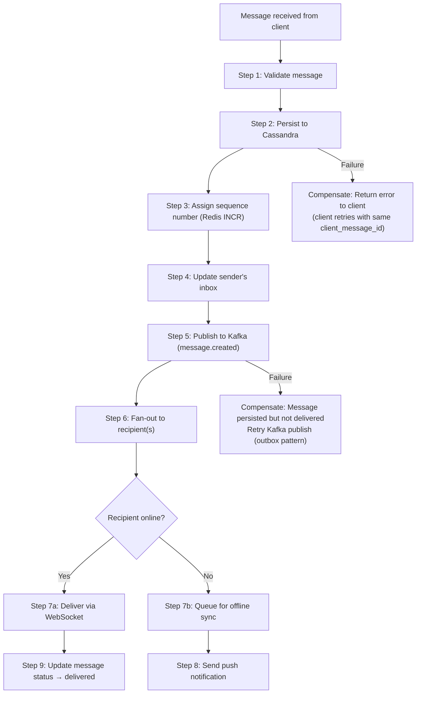

**Outbox Pattern for Reliable Publishing**

To ensure Cassandra write and Kafka publish are atomic:

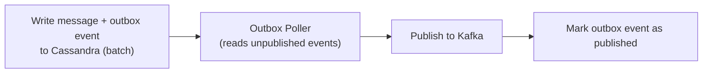

The outbox table in Cassandra:
```
CREATE TABLE message_outbox (
    partition_key    INT,          -- 0-99 for parallel polling
    event_id         TIMEUUID,
    event_type       TEXT,
    payload          BLOB,
    is_published     BOOLEAN,
    PRIMARY KEY (partition_key, event_id)
) WITH CLUSTERING ORDER BY (event_id ASC);
```

### Group Creation Saga

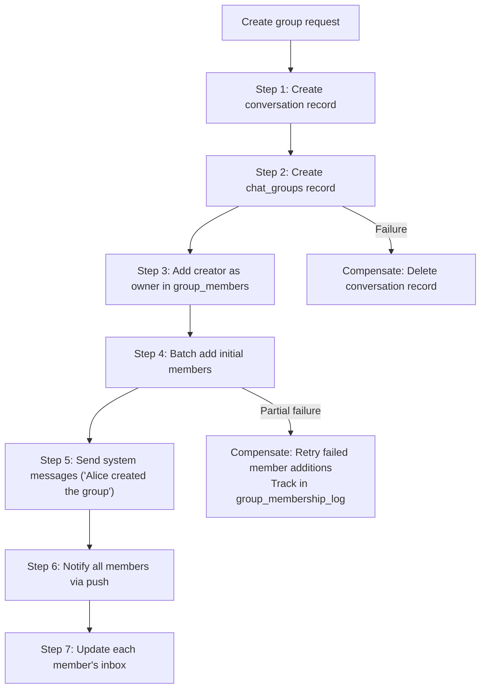

### Email Delivery Saga

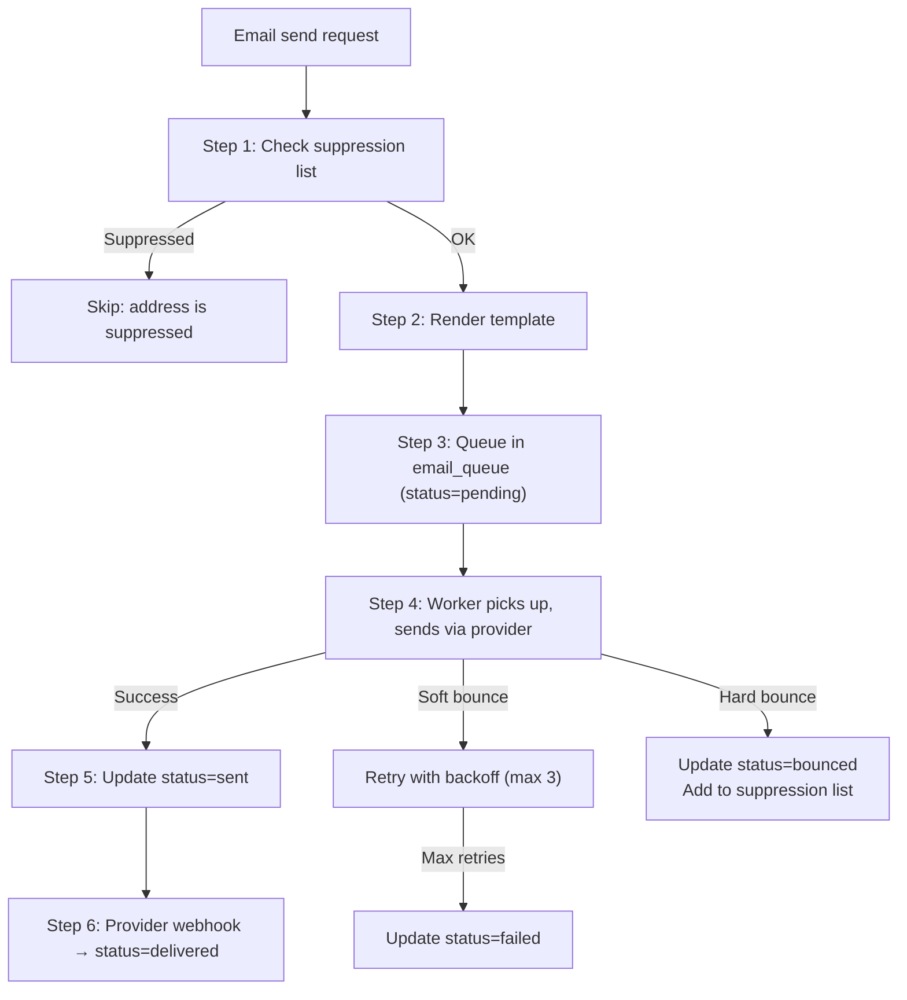

### Expanded Group Creation Saga

The basic group creation saga shown above handles the happy path. In production, partial failures during member addition, welcome message distribution, and inbox updates require careful compensation logic.

**Detailed State Machine:**

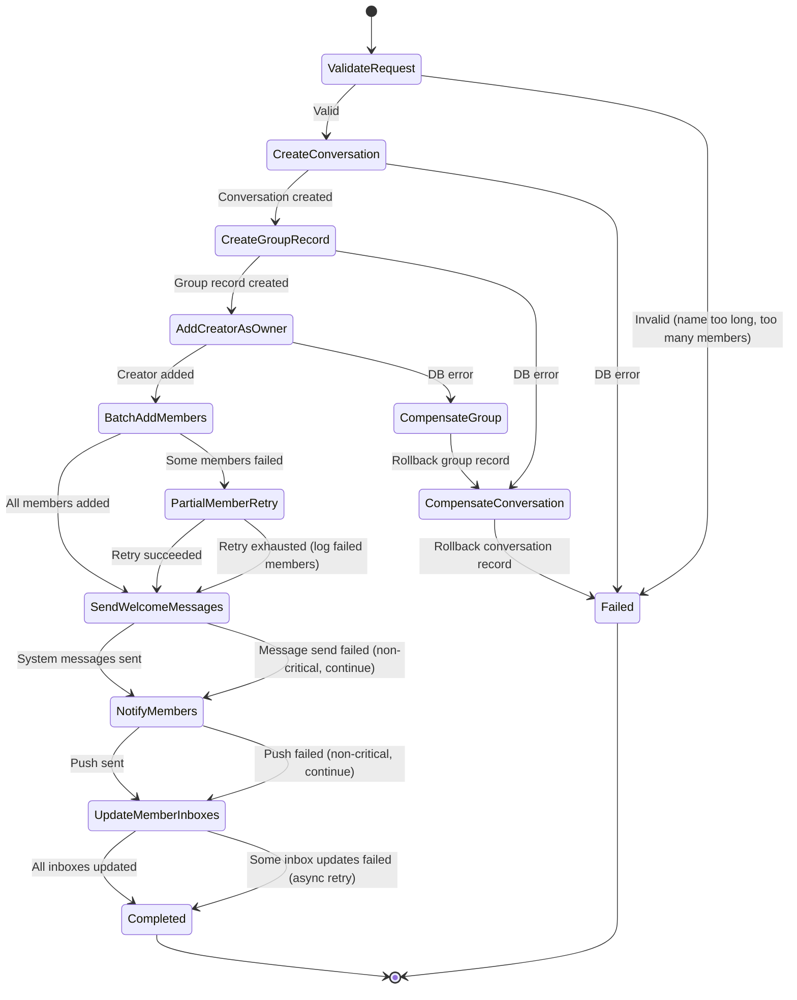

**Key design decisions in the group creation saga:**

1. **Critical vs non-critical steps:** Creating the conversation, group record, and adding the creator are critical — failure rolls back. Sending welcome messages and push notifications are non-critical — failures are logged and retried asynchronously.
2. **Batch member addition:** Members are added in batches of 100 with individual error handling. If user_d does not exist, user_e is still added. Failed additions are tracked in a `group_membership_log` table and retried.
3. **Inbox update fan-out:** For each member, the server updates their conversation list (inbox) to include the new group. This is published to Kafka as individual `inbox.updated` events, consumed by the inbox service asynchronously.

### Message Delivery Saga — Detailed State Machine

The message delivery saga has more states than the simplified version above when accounting for E2EE, multi-device delivery, and delivery confirmation tracking.

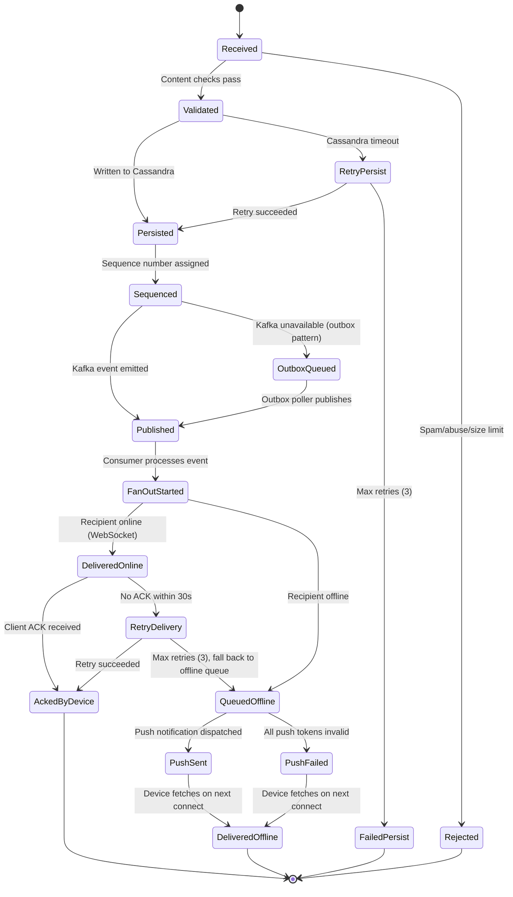

### Video Call Setup Saga

Setting up a video call involves coordinating multiple subsystems: room creation, SFU server allocation, ICE negotiation, and media flow establishment.

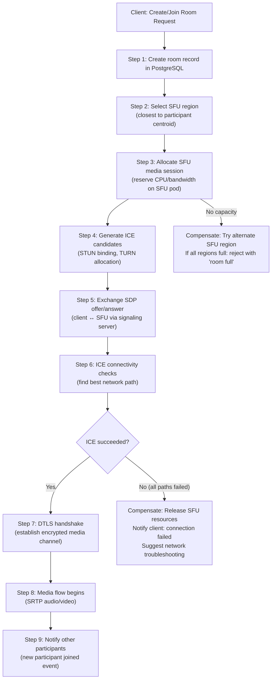

**SFU Region Selection Algorithm:**

1. Collect geographic locations of all current participants (from IP geolocation or client-reported region).
2. Calculate the centroid of participant locations.
3. Select the SFU region closest to the centroid.
4. If the selected region is at capacity (>80% CPU utilization), fall back to the next closest region.
5. For calls spanning multiple continents, consider SFU cascading: place an SFU in each major region and link them.

### Failed Delivery Compensation

When message delivery fails at various stages, the system uses a multi-tier retry and fallback mechanism.

**Retry Queue Architecture:**

1. **Immediate retry (in-process):** If WebSocket delivery fails with a transient error, retry up to 3 times with 1-second intervals within the same worker process.
2. **Delayed retry queue (Kafka/SQS):** If immediate retries are exhausted, publish the message to a retry topic with an exponential backoff delay (5s, 30s, 2m). A dedicated retry consumer processes these messages.
3. **Dead letter queue:** After the maximum retry attempts (typically 5 over ~5 minutes), move the message to a dead letter queue (DLQ). DLQ messages are:
   - Monitored by an alerting system (spike in DLQ depth triggers an on-call page).
   - Manually inspectable by operators.
   - Automatically retried once per hour for up to 24 hours.
4. **Notification fallback:** In parallel with retry attempts, the system triggers push notification delivery as soon as the first WebSocket delivery attempt fails. This ensures the user is notified even if real-time delivery ultimately fails.

**Compensation for each failure mode:**

| Failure Point | Compensation Action |
|--------------|-------------------|
| Cassandra write timeout | Client retries with same `client_message_id` (idempotent). Message either persists on retry or client shows "send failed." |
| Kafka publish failure | Outbox pattern: message is in Cassandra but event is in the outbox table. Outbox poller retries indefinitely. |
| WebSocket delivery timeout | Message is already persisted. Pushed to offline queue + push notification. Recipient gets it on next sync. |
| Push notification failure (all tokens invalid) | Message stays in offline queue. User retrieves it on next app open. If critical (OTP), fall back to SMS. |
| SFU allocation failure | Client receives error with `retry_after` hint. Client can retry or system auto-assigns alternate region. |

---

## Abuse, Fraud, and Governance Controls

### Spam Detection

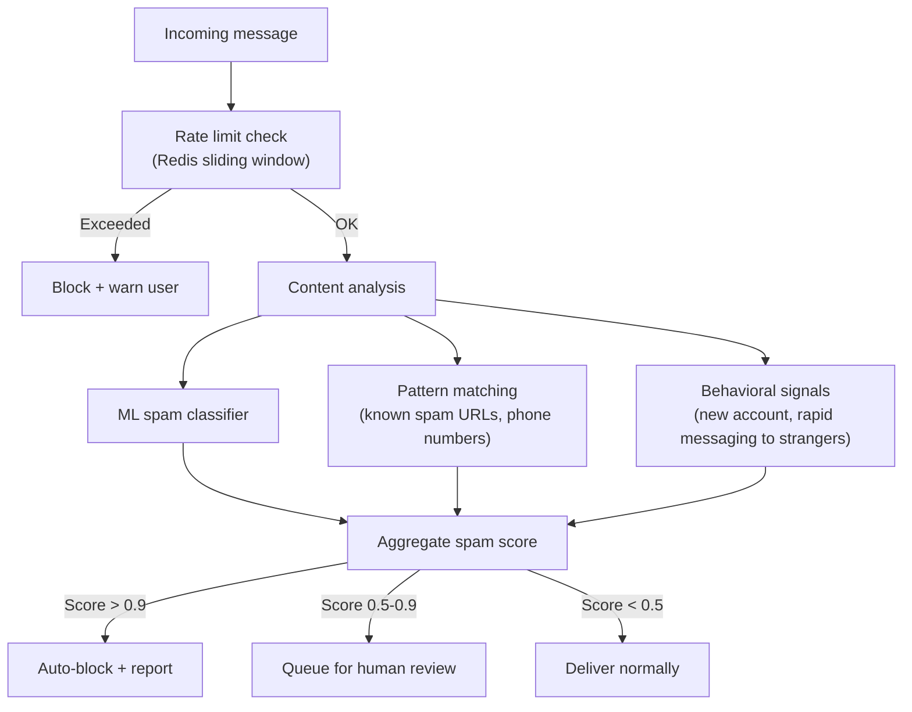

### Rate Limiting Per User

| Action | Rate Limit | Window | Enforcement |
|--------|-----------|--------|-------------|
| Send message (1:1) | 200/minute | Sliding window | Redis |
| Send message (group) | 60/minute per group | Sliding window | Redis |
| Create groups | 10/day | Daily reset | PostgreSQL |
| Add members to group | 100/hour | Sliding window | Redis |
| Send broadcast | 20/hour per channel | Sliding window | Redis |
| Request OTP | 5/hour per phone | Sliding window | Redis |
| Send email | 100/hour per sender | Sliding window | Redis |
| API calls | 1000/minute per user | Sliding window | API Gateway |
| WebSocket messages | 500/minute per connection | Sliding window | WS Gateway |
| File upload | 50/hour, 500 MB/day | Combined | Upload Service |

### Group Abuse Prevention

| Protection | Implementation |
|-----------|---------------|
| **Spam groups** | New accounts cannot create groups for 24 hours |
| **Mass invite** | Max 20 invites per group creation; rate limit subsequent adds |
| **Impersonation** | Group names cannot match verified brand names |
| **Hate speech** | ML content classifier on group names and descriptions |
| **Forward bombing** | Forwarded messages labeled "Forwarded"; highly-forwarded messages rate-limited |
| **Report system** | Users can report messages/groups; auto-action after N reports |

### Message Scanning and Legal Compliance

```
For non-E2E messages (channels, opted-in groups):
  - CSAM detection (PhotoDNA hash matching) — mandatory in many jurisdictions
  - Automated content moderation (hate speech, violence)
  - Legal interception capability (court order) — store metadata only

For E2E messages:
  - Server CANNOT read message content
  - Metadata available: sender, recipient, timestamp, message size
  - Client-side reporting: user can report a message, which shares decrypted content with trust & safety
  - No bulk scanning of E2E content (privacy commitment)
```

### Governance Controls

| Control | Description |
|---------|------------|
| **Data retention** | Configurable per organization (7 days to indefinite); automated deletion |
| **Data export** | GDPR right to access: export all user data within 30 days |
| **Right to erasure** | GDPR right to deletion: remove user data (messages show "deleted user") |
| **Audit logging** | Admin actions logged with actor, action, timestamp |
| **Compliance hold** | Legal hold prevents message deletion for specified users |
| **Geographic data residency** | Store messages in user's home region |

---

## CI/CD and Release Strategy

### WebSocket Server Rolling Deploy

The biggest challenge: deploying new WebSocket gateway code without dropping 50 million active connections.

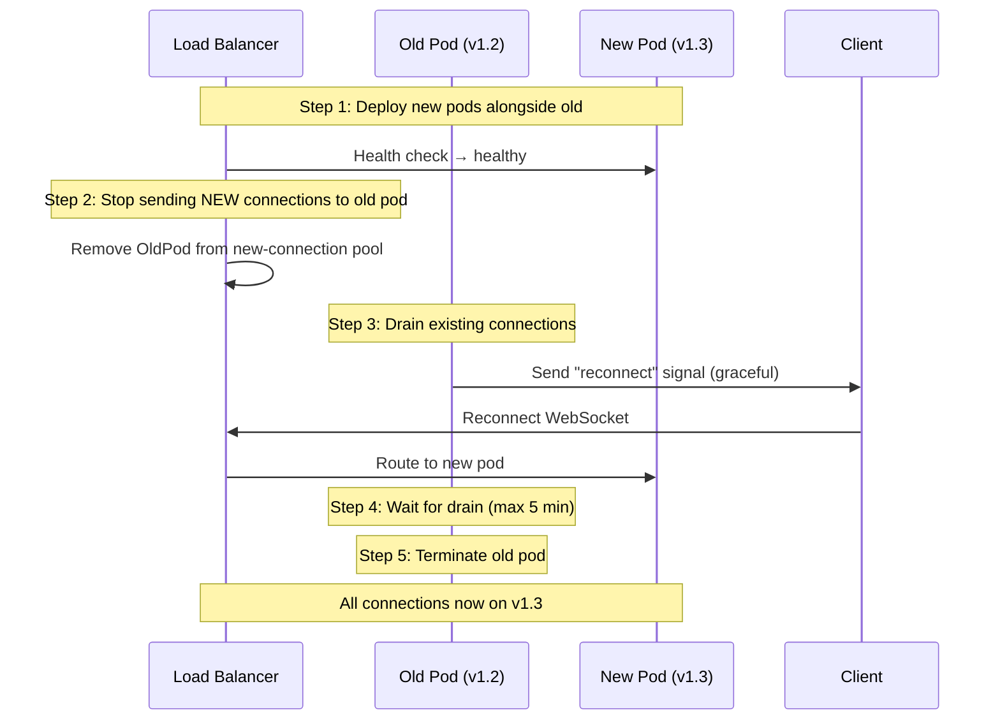

**Key design decisions:**
- **Graceful reconnection signal**: Server sends a WebSocket control frame telling the client to reconnect. Client initiates a new connection to a new pod (load balancer routes to healthy pods).
- **Connection draining timeout**: 5 minutes max. Connections that do not reconnect within 5 minutes are force-closed.
- **Canary deployment**: Roll out to 1% of pods first. Monitor error rates for 15 minutes. If healthy, continue rolling at 10% increments.
- **Rollback**: If error rate exceeds threshold, stop rollout. Remaining old pods continue serving. New pods are terminated.

### Protocol Versioning

```
WebSocket handshake includes protocol version:
  ws://gateway.example.com/ws?v=3&token=...

Version negotiation:
  Client sends: supported_versions: [3, 2]
  Server responds: negotiated_version: 3

Backward compatibility:
  - New fields in messages are additive (old clients ignore unknown fields)
  - Removed fields: deprecated for 2 versions before removal
  - Breaking changes: new version number; support N and N-1 simultaneously
```

### Deployment Pipeline

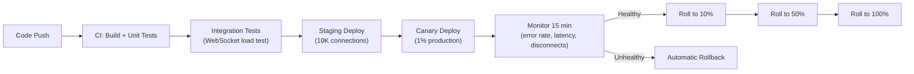

---

## Multi-Region and Disaster Recovery Strategy

### Multi-Region Architecture

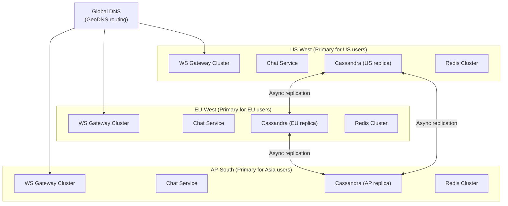

### Cross-Region Message Routing

When Alice (US) messages Bob (EU):

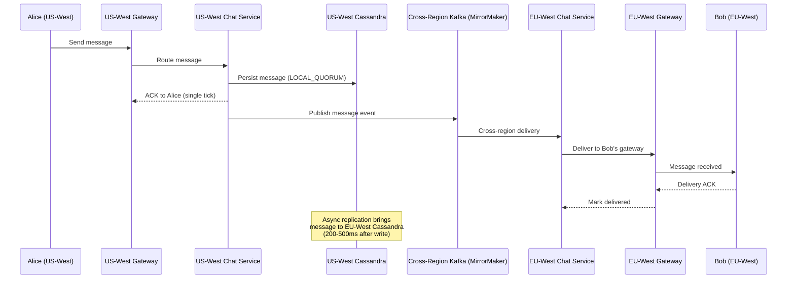

### Regional WebSocket Cluster Management

| Region | Capacity | Role |
|--------|---------|------|
| US-West-2 | 20M connections | Primary for Americas |
| EU-West-1 | 15M connections | Primary for Europe/Africa |
| AP-South-1 | 10M connections | Primary for Asia |
| US-East-1 | 5M connections | Failover for US-West |

**GeoDNS routing**: Users connect to the nearest region based on DNS resolution. Session registry is region-local (each region knows its own connections). Cross-region message delivery uses Kafka MirrorMaker.

### Disaster Recovery

| Scenario | RTO | RPO | Strategy |
|----------|-----|-----|----------|
| **Single AZ failure** | 0 (automatic) | 0 | Multi-AZ deployment; Cassandra replication |
| **Single region failure** | < 5 minutes | < 1 second | DNS failover to secondary; Cassandra cross-region replicas |
| **Kafka cluster failure** | < 2 minutes | 0 | Multi-AZ Kafka; MirrorMaker to secondary |
| **Redis cluster failure** | < 30 seconds | ~90 seconds of presence | Redis Sentinel auto-failover; rebuild sessions from heartbeats |
| **Full data center loss** | < 10 minutes | < 5 seconds | Cross-region Cassandra; DNS reroute; clients auto-reconnect |

### DR Runbook: Region Failover

```
1. Detection: Automated health check fails for 3 consecutive minutes
2. Decision: On-call engineer confirms (or auto-trigger if > 5 min)
3. DNS update: Remove failed region from GeoDNS (TTL=60s, propagates in ~2 min)
4. Connection migration: Clients in failed region auto-reconnect to next-nearest region
5. Session rebuild: New region's session registry populated by incoming connections
6. Presence rebuild: Heartbeats from reconnecting clients restore presence state within 90s
7. Message catch-up: Clients use offline sync protocol to fetch missed messages
8. Monitoring: Verify error rates normalize within 15 minutes
```

---

## Cost Drivers and Optimization

### WebSocket Connection Costs

```
50M concurrent connections
× 50 KB memory per connection
= 2.5 TB total memory

At 100K connections per pod:
= 500 gateway pods

Pod cost (c5.2xlarge, 16 GB RAM, 8 vCPU):
= 500 × $0.34/hour = $170/hour = $4,080/day = ~$125,000/month

Optimization:
- Use Graviton instances (c7g.2xlarge): 20% cheaper = ~$100,000/month
- Reduce memory per connection to 30 KB with buffer pooling: 300 pods = ~$75,000/month
- Use spot instances for non-critical gateway overflow: 30% savings
```

### Push Notification Costs

```
5B notifications/day

APNs: Free (Apple provides at no charge)
FCM: Free (Google provides at no charge)

Cost is in infrastructure to send:
- Notification service pods: ~20 pods × $0.17/hour = $82/day
- Redis for dedup and throttling: ~$1,000/month
- Kafka for event processing: ~$3,000/month

Total push infrastructure: ~$7,000/month
```

### Media Storage Costs

```
Assume 10% of messages have media, average 2 MB:
100B messages/day × 10% × 2 MB = 20 PB/day new media

With 90-day hot retention:
= 1.8 EB hot storage (S3 Standard: $0.023/GB/month = ~$41M/month)

Optimization:
- Deduplicate identical media (hash-based): saves ~15%
- Move to S3 Infrequent Access after 30 days: 50% savings on 60-day data
- Client-side compression before upload: reduces average to 500 KB = 75% savings
- Thumbnail-only for chat list (full media downloaded on tap)

After optimization: ~$8M/month for media storage
```

### SMS Costs

```
Average SMS cost: $0.01/message (varies by country)
India: $0.003/SMS
US: $0.0075/SMS
International: $0.05/SMS

At 50M OTP SMS/day:
= $500K/day if all US pricing
= ~$150K/day with regional pricing mix

Optimization:
- Use local providers in high-volume countries (India, Brazil): 50-70% cheaper
- Fallback to email for non-critical alerts
- WhatsApp Business API for countries where WhatsApp is dominant: free for template messages
- RCS messaging where available
```

### Cost Summary Table

| Component | Monthly Cost | Optimization Lever |
|-----------|------------|-------------------|
| WebSocket gateway (500 pods) | $100,000 | Graviton, connection pooling, spot |
| Cassandra cluster (messages) | $250,000 | Tiered storage, TTL, compression |
| Media storage (S3) | $8,000,000 | Compression, dedup, tiering |
| Kafka cluster | $50,000 | Right-size partitions, retention |
| Redis cluster | $30,000 | Eviction policies, cluster right-sizing |
| PostgreSQL (metadata) | $20,000 | Read replicas, connection pooling |
| Push notification infra | $7,000 | Batch sends, collapse keys |
| SMS delivery | $4,500,000 | Local providers, channel shift |
| Email delivery (SES) | $50,000 | Suppression lists, batching |
| CDN (media delivery) | $500,000 | Cache hit optimization |
| **Total** | **~$13.5M/month** | Target: $10M with optimizations |

---

## Technology Choices and Alternatives

| Component | Chosen | Alternative 1 | Alternative 2 | Why Chosen |
|-----------|--------|--------------|--------------|------------|
| **Real-time transport** | WebSocket | SSE (Server-Sent Events) | Long Polling | WebSocket: bidirectional, lowest latency; SSE: simpler but unidirectional; Long Polling: highest overhead |
| **Message storage** | Cassandra | ScyllaDB | DynamoDB | Cassandra: proven at scale (WhatsApp), wide-column fits time-series messages; ScyllaDB: compatible API with better tail latency; DynamoDB: managed but vendor lock-in |
| **Session/presence store** | Redis Cluster | KeyDB | Memcached | Redis: rich data structures (sorted sets for presence), TTL support; KeyDB: multithreaded Redis fork; Memcached: no persistence |
| **Event streaming** | Apache Kafka | Redpanda | Amazon Kinesis | Kafka: proven at messaging scale, rich ecosystem; Redpanda: Kafka-compatible with lower latency; Kinesis: managed but limited |
| **Metadata store** | PostgreSQL | CockroachDB | MySQL | PostgreSQL: JSONB, strong consistency, mature; CockroachDB: distributed SQL; MySQL: simpler but fewer features |
| **Search** | Elasticsearch | OpenSearch | Meilisearch | Elasticsearch: mature full-text search; OpenSearch: AWS fork; Meilisearch: simpler but less scalable |
| **Object storage** | S3 | GCS | MinIO | S3: industry standard, CDN integration; GCS: comparable; MinIO: self-hosted S3-compatible |
| **Video SFU** | mediasoup / Janus | LiveKit | Jitsi | mediasoup: lightweight Node.js SFU; LiveKit: newer, Go-based, cloud-native; Jitsi: full-featured but heavier |
| **E2E encryption** | Signal Protocol | MLS (Messaging Layer Security) | Custom | Signal: battle-tested, widely adopted; MLS: IETF standard for large groups (emerging); Custom: not recommended |
| **Push delivery** | APNs + FCM direct | Firebase + SNS | OneSignal | Direct: full control, no intermediary costs; Firebase: simpler but abstraction layer; OneSignal: managed but less control |
| **Email delivery** | Amazon SES | SendGrid | Postmark | SES: lowest cost at scale; SendGrid: better analytics; Postmark: best deliverability for transactional |
| **SMS routing** | Multi-provider (Twilio + local) | Twilio only | Vonage | Multi-provider: cost optimization + redundancy; single provider: simpler but single point of failure |
| **Load balancer (WS)** | HAProxy (L4) | NGINX (L4) | AWS NLB | HAProxy: lowest latency for TCP; NGINX: familiar but slightly higher overhead; NLB: managed |
| **Service mesh** | Envoy + Istio | Linkerd | None (direct) | Envoy: observability, traffic management; Linkerd: lighter weight; Direct: simpler for smaller scale |

---

#### Overview

The 1:1 Chat System enables real-time person-to-person messaging. At WhatsApp's scale, this means **100 billion messages per day** across 2 billion users with E2E encryption. The system must deliver messages in < 300ms for online recipients and queue reliably for offline recipients.

#### Message Flow

```mermaid
sequenceDiagram
    participant A as Sender (Alice)
    participant WS_A as WS Gateway (Alice)
    participant ChatSvc as Chat Service
    participant Store as Cassandra
    participant Kafka as Kafka
    participant WS_B as WS Gateway (Bob)
    participant B as Recipient (Bob)
    participant Push as Push Service

    A->>WS_A: Send message (encrypted)
    WS_A->>ChatSvc: Route message
    ChatSvc->>Store: Persist message
    ChatSvc->>Kafka: Publish message event

    alt Bob is online
        Kafka->>WS_B: Deliver via WebSocket
        WS_B->>B: Message received
        B-->>WS_B: Delivery ACK
        WS_B-->>ChatSvc: Mark delivered
    else Bob is offline
        Kafka->>Push: Send push notification
        Push->>B: Push notification
        Note over B: On next connect, sync service<br/>delivers queued messages
    end

    ChatSvc-->>WS_A: Server ACK (single tick)
    Note over A: Double tick when delivered
```

#### Data Model (Cassandra)

```
CREATE TABLE messages (
    conversation_id  UUID,
    message_id       TIMEUUID,
    sender_id        UUID,
    content_type     TEXT,       -- 'text', 'image', 'video', 'voice', 'file', 'sticker'
    content          BLOB,       -- encrypted content
    encrypted_key    BLOB,       -- per-message key (encrypted with recipient's public key)
    status           TEXT,       -- 'sent', 'delivered', 'read'
    reply_to         TIMEUUID,
    metadata         MAP<TEXT, TEXT>,
    created_at       TIMESTAMP,
    PRIMARY KEY (conversation_id, message_id)
) WITH CLUSTERING ORDER BY (message_id ASC);

CREATE TABLE conversations (
    user_id              UUID,
    last_message_time    TIMESTAMP,
    conversation_id      UUID,
    other_user_id        UUID,
    last_message_preview TEXT,
    unread_count         INT,
    is_muted             BOOLEAN,
    is_pinned            BOOLEAN,
    PRIMARY KEY (user_id, last_message_time)
) WITH CLUSTERING ORDER BY (last_message_time DESC);
```

#### E2E Encryption (Signal Protocol)

```mermaid
flowchart TD
    subgraph Setup["Key Exchange (One-Time)"]
        A_Keys["Alice uploads: Identity Key + Signed Pre-Key + One-Time Pre-Keys"]
        B_Keys["Bob uploads: Identity Key + Signed Pre-Key + One-Time Pre-Keys"]
    end

    subgraph FirstMessage["First Message"]
        Fetch["Alice fetches Bob's pre-key bundle"]
        X3DH["X3DH key agreement → shared secret"]
        Init["Initialize Double Ratchet"]
        Encrypt["Encrypt message with ratchet key"]
    end

    subgraph Ongoing["Ongoing Messages"]
        Ratchet["Double Ratchet advances per message"]
        Forward["Forward secrecy: compromising one key doesn't reveal past messages"]
    end

    Setup --> FirstMessage --> Ongoing
```

#### Edge Cases

- **Message to offline user**: Stored in Cassandra with `status=sent`. Delivered on next sync. Push notification sent immediately.
- **Recipient has multiple devices**: Message delivered to ALL active devices. Each device ACKs independently.
- **Message ordering**: TIMEUUID ensures total order within conversation. Server assigns TIMEUUID on receipt.
- **Large media (100 MB video)**: Media uploaded to S3; message contains encrypted URL + key. Recipient downloads from S3.
- **Blocked user sends message**: Message silently dropped at Chat Service. No delivery, no notification.

---

### 2. Group Chat System

#### Overview

Group Chat extends 1:1 messaging to multi-participant conversations. The primary architectural challenge is **fan-out**: a message in a group of 1,000 members must be delivered to 1,000 recipients. Large groups (10K-100K members) used for communities require different strategies than small groups (5-20 members).

#### Fan-out Strategies

| Group Size | Strategy | Rationale |
|-----------|---------|-----------|
| **Small (< 100)** | Write to each member's inbox | Low fan-out; fast delivery |
| **Medium (100-10K)** | Async fan-out via Kafka workers | Avoid blocking sender on large fan-out |
| **Large (10K-100K)** | Pull-based: members fetch from group timeline | Write amplification too expensive at this scale |

#### Data Model

```sql
CREATE TABLE chat_groups (
    group_id        UUID PRIMARY KEY,
    name            TEXT NOT NULL,
    description     TEXT,
    avatar_url      TEXT,
    group_type      TEXT CHECK (group_type IN ('small', 'large', 'channel')),
    max_members     INT DEFAULT 1000,
    member_count    INT DEFAULT 0,
    created_by      UUID NOT NULL,
    settings        JSONB DEFAULT '{}',
    created_at      TIMESTAMPTZ NOT NULL DEFAULT now()
);

CREATE TABLE group_members (
    group_id        UUID NOT NULL,
    user_id         UUID NOT NULL,
    role            TEXT DEFAULT 'member' CHECK (role IN ('owner', 'admin', 'member')),
    joined_at       TIMESTAMPTZ NOT NULL DEFAULT now(),
    muted_until     TIMESTAMPTZ,
    PRIMARY KEY (group_id, user_id)
);
CREATE INDEX idx_group_members_user ON group_members(user_id);
```

#### E2E Encryption for Groups (Sender Keys)

In 1:1, the sender encrypts with the recipient's key. In groups, encrypting per-recipient is expensive for large groups. **Sender Key** optimization:

1. Each sender generates a **sender key** for the group
2. Sender key is distributed to all members (encrypted per-member, one-time)
3. Subsequent messages encrypted once with sender key
4. All members decrypt with the same sender key

When a member leaves, all sender keys must be rotated (forward secrecy).

---

### 3. Broadcast Messaging System

#### Overview

Broadcast channels are **one-to-many**: only admins can post, subscribers receive. Used for announcements, news channels, and newsletter-style content. Telegram channels can have millions of subscribers.

#### Architecture

Unlike group chat (every message stored per-member), broadcast uses a **shared timeline** that all subscribers read from:

```mermaid
flowchart LR
    Admin["Admin posts"] --> BroadcastSvc["Broadcast Service"]
    BroadcastSvc --> Timeline["Channel Timeline (Cassandra)"]
    BroadcastSvc --> Kafka["Kafka: broadcast.message"]
    Kafka --> PushWorker["Push Notification Workers"]
    PushWorker --> Subscribers["1M+ Subscribers (Push/In-App)"]

    Subscriber["Subscriber opens channel"] --> ReadAPI["Read API"]
    ReadAPI --> Timeline
```

Notifications are sent based on subscriber preferences (all messages, muted, or highlights-only).

---

### 4. Offline Message Sync

#### Overview

Users expect messages to sync seamlessly across devices and after periods of offline. When a user reconnects after being offline for 2 hours, they must receive all missed messages **in correct order** without duplicates.

#### Sync Protocol

```mermaid
sequenceDiagram
    participant Client as Client (reconnecting)
    participant SyncSvc as Sync Service
    participant Store as Message Store

    Client->>SyncSvc: Sync request (last_seen_seq: 12345)
    SyncSvc->>Store: Fetch messages where seq > 12345
    Store-->>SyncSvc: Messages [12346, 12347, ..., 12400]
    SyncSvc-->>Client: Batch of 55 messages

    Note over Client: Client applies messages in order
    Client->>SyncSvc: ACK (last_seen_seq: 12400)
```

**Key design**: Each message has a **monotonically increasing sequence number** per conversation. Client tracks the highest sequence it has seen. On reconnect, fetches all messages with sequence > last_seen.

#### Multi-Device Sync

User has phone and laptop. Both must see the same messages:
- Server stores messages with conversation-scoped sequence numbers
- Each device independently tracks its sync position
- Sending a message on one device creates a sync event for other devices

---

### 5. WebSocket Infrastructure

#### Overview

WebSocket connections are the backbone of real-time messaging. Maintaining **50 million concurrent connections** requires a purpose-built, horizontally scalable gateway layer.

#### Architecture

```mermaid
flowchart TD
    Clients["50M Client Connections"] --> LB["Layer 4 Load Balancer (TCP)"]
    LB --> GW1["WS Gateway Pod 1 (100K conn)"]
    LB --> GW2["WS Gateway Pod 2 (100K conn)"]
    LB --> GWN["WS Gateway Pod N"]

    subgraph GatewayPod["Each Gateway Pod"]
        ConnMgr["Connection Manager"]
        Heartbeat["Heartbeat Monitor"]
        Router["Message Router"]
    end

    GW1 & GW2 & GWN --> SessionStore["Session Registry (Redis)"]
    GW1 & GW2 & GWN --> Kafka["Kafka (Message Bus)"]
```

**Session Registry**: Maps `user_id → [gateway_pod_id, connection_id]`. When a message needs delivery to user X, the Chat Service looks up which gateway pod holds X's connection and routes the message there via Kafka.

#### Connection Lifecycle

```mermaid
stateDiagram-v2
    [*] --> Connecting: Client initiates WebSocket
    Connecting --> Authenticated: Auth token validated
    Authenticated --> Active: Connection established
    Active --> Active: Heartbeat (every 30s)
    Active --> Stale: Missed 2 heartbeats
    Stale --> Reconnecting: Client reconnects
    Reconnecting --> Active: Reconnected
    Stale --> Disconnected: Missed 3 heartbeats
    Active --> Disconnected: Client closes
    Disconnected --> [*]: Cleanup session
```

#### Scaling Considerations

| Challenge | Solution |
|-----------|----------|
| 50M connections need ~500 gateway pods (100K each) | Horizontal scaling; Layer 4 LB for sticky connections |
| Message routing across pods | Session registry in Redis; route via Kafka per-pod topic |
| Connection storms after deploy | Rolling restart; connection draining with 30s grace period |
| Memory per connection (~50KB) | 100K connections = 5 GB per pod; right-size pod memory |
| Heartbeat overhead | 50M heartbeats / 30s = 1.7M heartbeat messages/second |

---

### 6. Presence System

#### Overview

The Presence System tracks whether each user is **online, offline, away, or in "do not disturb"** mode and makes this information available to their contacts. At WhatsApp scale: presence for 2 billion users, queried by 200M DAU.

#### Architecture

```mermaid
flowchart LR
    Client["Client Activity"] --> WS["WebSocket Gateway"]
    WS --> PresenceSvc["Presence Service"]
    PresenceSvc --> Redis["Redis (user_id → status + last_seen)"]

    ContactQuery["Contact checks presence"] --> PresenceSvc
    PresenceSvc --> Redis
    PresenceSvc --> Response["Online / Last seen 5 min ago"]
```

**Redis structure:**
```
KEY: presence:{user_id}
VALUE: {"status": "online", "last_seen": 1711100000, "device": "mobile"}
TTL: 90 seconds (auto-expire to offline if no heartbeat)
```

**Optimization for large contact lists**: When a user opens the app, don't fetch presence for all 500 contacts. Fetch presence only for visible contacts (first 20), then lazy-load as user scrolls.

#### Privacy Controls

| Setting | Behavior |
|---------|---------|
| **Everyone** | All users see online status |
| **Contacts only** | Only mutual contacts see status |
| **Nobody** | No one sees online status (user also can't see others') |
| **Custom** | Specific blocked users can't see status |

---

### 7. Typing Indicators

#### Overview

Typing indicators ("Alice is typing...") are **ephemeral, high-frequency, low-priority signals**. They should be delivered with minimal latency (< 100ms) but are acceptable to lose — no persistence needed.

#### Design

```
# Fire-and-forget via WebSocket
Client A starts typing → Send typing_start to server → Forward to Client B
Client A stops typing (or 5s timeout) → Send typing_stop → Forward to Client B
```

**Not persisted**. Not sent via Kafka. Routed directly through WebSocket gateway for minimal latency. If the recipient's gateway pod is unreachable, the typing indicator is simply dropped.

**Rate limiting**: Max 1 typing event per second per user per conversation.

---

### 8. Email System

#### Overview

The Email System handles **transactional emails** (order confirmations, password resets, receipts) and **marketing emails** (newsletters, promotions, re-engagement). At scale: 1 billion+ emails per day across millions of sender domains.

#### Architecture

```mermaid
flowchart LR
    Trigger["Application Event"] --> EmailSvc["Email Service"]
    EmailSvc --> Template["Template Engine"]
    Template --> Queue["Send Queue (SQS)"]
    Queue --> Sender["Email Sender Workers"]
    Sender --> Provider["Email Provider (SES/SendGrid/Postmark)"]
    Provider --> Recipient["Recipient Inbox"]

    Provider --> Webhook["Delivery Webhooks"]
    Webhook --> Tracker["Delivery Tracker"]
    Tracker --> Analytics["Email Analytics"]
```

#### Deliverability Concerns

| Factor | Impact | Mitigation |
|--------|--------|-----------|
| **Spam reputation** | Low reputation = inbox placement drops | Warm up IPs gradually; maintain clean lists |
| **Bounce rate** | High bounces damage reputation | Validate emails at registration; suppress bounced addresses |
| **Unsubscribe compliance** | CAN-SPAM / GDPR requirement | One-click unsubscribe header; manage suppression lists |
| **Authentication** | SPF, DKIM, DMARC required | Configure DNS records; sign all outbound emails |
| **Throttling** | ISPs rate-limit senders | Respect per-ISP sending limits; spread large campaigns |

---

### 9. Push Notification System

#### Overview

Push notifications deliver alerts to mobile (APNs/FCM) and web (Web Push) clients. The system must handle **5 billion notifications per day** with targeting, throttling, and analytics.

#### Architecture

```mermaid
flowchart TD
    Events["Platform Events (Kafka)"] --> NotifSvc["Notification Service"]
    NotifSvc --> Evaluate["Evaluate targeting + preferences"]
    Evaluate --> Throttle["Throttle (max 10/day/user)"]
    Throttle --> Route["Route to channel"]

    Route --> APNs["APNs Worker (iOS)"]
    Route --> FCM["FCM Worker (Android/Web)"]
    Route --> InApp["In-App (WebSocket)"]

    APNs --> Apple["Apple APNs"]
    FCM --> Google["Google FCM"]
```

#### Token Management

Each device has a **push token** (APNs device token or FCM registration token). Tokens change when:
- App is reinstalled
- User logs out and back in
- OS updates token periodically

```sql
CREATE TABLE push_tokens (
    user_id         UUID NOT NULL,
    device_id       TEXT NOT NULL,
    platform        TEXT NOT NULL CHECK (platform IN ('ios', 'android', 'web')),
    token           TEXT NOT NULL,
    app_version     TEXT,
    is_active       BOOLEAN DEFAULT true,
    created_at      TIMESTAMPTZ NOT NULL DEFAULT now(),
    updated_at      TIMESTAMPTZ NOT NULL DEFAULT now(),
    PRIMARY KEY (user_id, device_id)
);
```

#### Edge Cases

- **Token expired/invalid**: APNs/FCM returns invalid token error. Mark token inactive; don't retry.
- **User has 5 devices**: Send to all active tokens. Deduplicate display client-side.
- **Notification fatigue**: Throttle to max 10 push notifications per user per day. Aggregate low-priority notifications.
- **Silent push**: iOS allows silent push to wake app for background sync. Use for message pre-fetch.

---

### 10. SMS Gateway System

#### Overview

The SMS Gateway routes messages through multiple telecom providers for OTP delivery, transactional alerts, and marketing campaigns. SMS is the **most reliable fallback channel** — it works without internet.

#### Multi-Provider Routing

```mermaid
flowchart TD
    Request["SMS Request"] --> Router["SMS Router"]
    Router --> CostOpt["Cost Optimizer"]
    CostOpt --> Provider{"Select Provider"}
    Provider --> Twilio["Twilio"]
    Provider --> Vonage["Vonage"]
    Provider --> Plivo["Plivo"]
    Provider --> LocalTelco["Local Telco (India: Airtel/Jio)"]

    Twilio & Vonage & Plivo & LocalTelco --> Delivery["Delivery Receipt"]
    Delivery --> Tracker["Delivery Tracker"]
```

**Routing logic**: Route based on destination country (local providers cheaper for domestic), message type (OTP requires high-throughput provider), cost, and current provider health.

#### OTP Security

- Generate 6-digit OTP with cryptographic randomness
- TTL: 5 minutes
- Max 3 attempts before new OTP required
- Rate limit: 5 OTP requests per phone per hour
- Store OTP hash (bcrypt), not plaintext

---

### 11. Video Conferencing System

#### Overview

Video conferencing enables multi-party real-time audio/video communication with screen sharing. The core architectural choice is between **SFU** (Selective Forwarding Unit) and **MCU** (Multipoint Control Unit).

#### SFU vs MCU

| Aspect | SFU | MCU |
|--------|-----|-----|
| **How it works** | Receives each participant's stream, forwards to all others | Receives all streams, mixes into one combined stream |
| **Server CPU** | Low (just forwarding) | Very high (decoding + encoding + mixing) |
| **Client bandwidth** | Upload: 1 stream. Download: N-1 streams | Upload: 1 stream. Download: 1 mixed stream |
| **Quality control** | Each participant controls quality per stream | Server controls output quality |
| **Latency** | Lower (no processing) | Higher (mixing adds 50-100ms) |
| **Best for** | Small-medium meetings (< 50 participants) | Large meetings, webinars, low-bandwidth clients |
| **Used by** | Zoom, Google Meet, Discord | Traditional conferencing, broadcasting |

#### SFU Architecture

```mermaid
flowchart TD
    A["Participant A"] -->|"Upload video"| SFU["SFU Server"]
    B["Participant B"] -->|"Upload video"| SFU
    C["Participant C"] -->|"Upload video"| SFU

    SFU -->|"B+C streams"| A
    SFU -->|"A+C streams"| B
    SFU -->|"A+B streams"| C
```

#### WebRTC Signaling and Connection

```mermaid
sequenceDiagram
    participant A as Participant A
    participant Signal as Signaling Server
    participant STUN as STUN/TURN Server
    participant B as Participant B

    A->>Signal: Join room (SDP offer)
    Signal->>B: Forward SDP offer
    B->>Signal: SDP answer
    Signal->>A: Forward SDP answer

    A->>STUN: ICE candidate gathering
    B->>STUN: ICE candidate gathering
    A->>Signal: ICE candidates
    Signal->>B: ICE candidates
    B->>Signal: ICE candidates
    Signal->>A: ICE candidates

    Note over A,B: Direct peer connection (or via TURN relay)
    A->>B: Media streams (encrypted SRTP)
    B->>A: Media streams (encrypted SRTP)
```

#### Scaling for Large Meetings

For meetings > 50 participants:
- **Cascaded SFU**: Multiple SFU servers, each handling a subset of participants. Servers exchange streams between each other.
- **Simulcast**: Each participant sends 3 quality levels (low, medium, high). SFU selects appropriate quality per recipient based on their bandwidth and screen layout.
- **Last-N**: Only forward video for the N most recent speakers. Others show avatar only. Reduces bandwidth dramatically.

---

## Architecture Decision Records (ARDs)

### ARD-001: Cassandra for Message Storage

| Field | Detail |
|-------|--------|
| **Decision** | Use Cassandra for message storage |
| **Context** | 100B messages/day; time-series per conversation; write-heavy |
| **Options** | (A) PostgreSQL, (B) Cassandra, (C) DynamoDB, (D) Custom (like WhatsApp's Mnesia→SQLite) |
| **Chosen** | Option B |
| **Why** | Wide-column model ideal for conversation-partitioned, time-ordered messages. Linear write scaling. |
| **Trade-offs** | No transactions; eventual consistency (acceptable with per-conversation ordering) |
| **Revisit when** | Operational burden too high → consider ScyllaDB |

### ARD-002: SFU Over MCU for Video Conferencing

| Field | Detail |
|-------|--------|
| **Decision** | SFU as primary architecture; MCU only for broadcast/webinar mode |
| **Context** | Most meetings are 2-10 participants; SFU is lower latency and cheaper |
| **Options** | (A) Pure SFU, (B) Pure MCU, (C) SFU default + MCU for large meetings |
| **Chosen** | Option C |
| **Why** | SFU is 10x cheaper per participant for small meetings. MCU only needed for 100+ participant webinars. |
| **Trade-offs** | SFU requires more client bandwidth (download N-1 streams) |
| **Revisit when** | Client bandwidth becomes the bottleneck (low-bandwidth markets) |

### ARD-003: Redis for Presence and Session Registry

| Field | Detail |
|-------|--------|
| **Decision** | Redis with TTL-based presence tracking |
| **Context** | 200M users with 50M concurrent; need sub-ms presence lookups |
| **Chosen** | Redis with 90-second TTL, heartbeat refresh |
| **Why** | Sub-ms reads; TTL auto-expires offline users; minimal operational overhead |
| **Trade-offs** | Redis failure loses presence state (acceptable — rebuilt from heartbeats in 90s) |
| **Revisit when** | Redis cluster costs too high at scale → consider presence-aware gateway |

---

## POCs to Validate First

### POC-1: WebSocket Gateway at 100K Connections Per Pod
**Goal**: Single pod sustains 100K concurrent WebSocket connections with < 50KB memory per connection.
**Success criteria**: Stable at 100K connections; p99 message delivery < 100ms.
**Fallback**: Reduce connections per pod; optimize memory with epoll/io_uring.

### POC-2: Message Delivery Latency at Scale
**Goal**: p99 message delivery < 300ms for online recipients at 1M messages/second.
**Fallback**: Optimize Kafka consumer latency; direct gateway-to-gateway routing for hot paths.

### POC-3: Offline Sync Catch-Up
**Goal**: User offline for 24 hours syncs all messages (avg 500) in < 3 seconds.
**Fallback**: Paginate sync; prioritize recent conversations.

### POC-4: Video Conferencing SFU at 50 Participants
**Goal**: 50-participant meeting with simulcast, < 200ms audio latency, < 500ms video latency.
**Fallback**: Last-N optimization (only forward top 9 speakers' video).

---

## Real-World Comparisons

| Aspect | WhatsApp | Slack | Telegram | Discord | Zoom |
|--------|----------|-------|----------|---------|------|
| **Primary use** | Personal messaging | Workplace | Personal + channels | Gaming communities | Video meetings |
| **E2E encryption** | Default for all | No (enterprise control) | Optional (secret chats) | No | Optional |
| **Group size** | 1,024 | 100K+ (channels) | 200K (groups), unlimited (channels) | 100K (servers) | 1,000 (meetings) |
| **Message storage** | Device-only (E2E) | Server-side (searchable) | Cloud (server-side) | Server-side | N/A |
| **Protocol** | Custom (XMPP-derived) | WebSocket | Custom (MTProto) | WebSocket | Custom (proprietary) |
| **Scale** | 2B users, 100B msg/day | 40M DAU | 800M MAU | 200M MAU | 300M daily participants |
| **Video** | 8 participants | 50 (Huddle) | 1000 (group call) | 25 (stream unlimited) | 1000 (meeting) |
| **Key differentiator** | E2E encryption, simplicity | Search, integrations, threads | Channels, bots, speed | Voice channels, gaming | Reliability, enterprise |

### Deep Dive: Consumer Messaging Architectures (WhatsApp vs Telegram vs Signal vs iMessage)

#### WhatsApp Architecture

WhatsApp serves 2B+ users on a remarkably lean infrastructure built on Erlang/OTP running on FreeBSD.

**Core Stack:**
- **Language/Runtime:** Erlang on BEAM VM — built for telecom-grade concurrency. Each user session is a lightweight Erlang process (~2KB memory). A single server handles 2M+ connections.
- **OS:** FreeBSD — chosen for its superior network stack and predictable performance under extreme connection counts (tuned to handle 2M+ TCP connections per machine).
- **Routing:** Each user is assigned a home server. Messages route from sender's server to recipient's server via an internal routing layer. The mapping of user-to-server is stored in an in-memory distributed registry.
- **Message Storage:** Messages are stored temporarily on the server only until delivered. Once the recipient's device acknowledges receipt, the server deletes the message. Media is stored in encrypted form on WhatsApp's CDN with a decryption key embedded in the message payload.
- **E2E Encryption:** Signal Protocol (Double Ratchet Algorithm + X3DH key exchange) is the default for all 1:1 chats and groups. The server cannot read message contents. Group encryption uses Sender Keys: the sender encrypts once with a shared group key, and all members decrypt independently.
- **Offline Delivery:** Messages queue on the server for up to 30 days. When the recipient comes online, the server pushes all queued messages in order. Multi-device support (WhatsApp Web/Desktop) mirrors from the phone — the phone is the source of truth for encryption keys.

**Scale Numbers:**
- 100B+ messages per day
- ~50M concurrent connections at peak
- Fewer than 50 engineers managed the core infrastructure at time of Facebook acquisition

#### Telegram Architecture

Telegram takes a fundamentally different approach: cloud-first with optional E2E encryption.

**Core Stack:**
- **Protocol:** MTProto (custom protocol built on top of TCP/UDP). Optimized for mobile networks with variable connectivity. Supports multiple concurrent connections and automatic reconnection.
- **Message Storage:** All regular messages are stored server-side, encrypted at rest, with keys split across multiple data centers in different jurisdictions. This enables instant sync across unlimited devices.
- **Secret Chats:** Optional E2E encryption using MTProto 2.0 for 1:1 conversations only. Secret chats are device-specific and cannot sync across devices.
- **Groups and Channels:** Groups support up to 200K members; channels have no subscriber limit. For large channels, Telegram uses a pull-based model — members fetch new messages when they open the channel rather than receiving push for every message.
- **Bots and API:** Telegram's Bot API is a first-class citizen. Bots run on external servers and communicate with Telegram via HTTPS long polling or webhooks. The API supports inline queries, custom keyboards, payments, and mini-apps (TWAs — Telegram Web Apps).
- **Distributed Architecture:** Data is distributed across 5 data centers worldwide (originally: US, Netherlands, Singapore, later expanded). User data is assigned to a DC based on phone number region. Cross-DC requests use internal RPC.

#### Signal Architecture

Signal prioritizes privacy and minimal metadata above all else.

**Core Stack:**
- **Server:** Java-based server (open source) running on AWS. The server is intentionally kept minimal — it knows almost nothing about users beyond their phone numbers and push tokens.
- **Sealed Sender:** Signal introduced a mechanism where even the server does not know who sent a message. The sender encrypts their identity inside the message payload, and the server routes based on an ephemeral delivery token. The server sees only the recipient, not the sender.
- **Forward Secrecy:** Every single message uses a new encryption key derived from the Double Ratchet. Compromising one message key does not reveal past or future messages. Keys are rotated on every message exchange.
- **Metadata Minimization:** No profile information stored on server. No contact list stored on server (contact discovery uses SGX secure enclaves). No group membership stored on server (group state is maintained by clients using encrypted group state blobs).
- **Storage:** Messages exist on the server only until delivered (similar to WhatsApp). No message history is recoverable from the server.

#### iMessage Architecture

Apple's iMessage is deeply integrated with the Apple ecosystem.

**Core Stack:**
- **Key Distribution:** Apple operates an Identity Service (IDS) that maps Apple IDs and phone numbers to device push tokens and encryption keys. When sending a message, the client queries IDS for all of the recipient's devices.
- **Per-Device Encryption:** Unlike Signal's Sender Key approach for groups, iMessage encrypts each message individually for every recipient device. A message to a user with 5 Apple devices is encrypted 5 times with 5 different keys.
- **Transport:** Messages are sent via APNs (Apple Push Notification service). Small messages (under ~16KB after encryption) are delivered entirely via the push payload. Larger messages and attachments are uploaded to iCloud with a one-time decryption key sent via the push message.
- **Cloud Sync:** With Messages in iCloud, encrypted message history is stored in iCloud with keys in the iCloud Keychain. This enables seamless device setup but creates a dependency on iCloud account security.

```mermaid
flowchart TB
    subgraph WhatsApp["WhatsApp"]
        WA1["Erlang/FreeBSD"]
        WA2["Signal Protocol E2EE"]
        WA3["Device-only storage"]
        WA4["Phone as source of truth"]
    end

    subgraph Telegram["Telegram"]
        TG1["MTProto custom protocol"]
        TG2["Cloud storage (server-side)"]
        TG3["Optional secret chats"]
        TG4["Bot API + Mini Apps"]
    end

    subgraph Signal["Signal"]
        SG1["Java server on AWS"]
        SG2["Sealed sender (metadata hiding)"]
        SG3["Forward secrecy per message"]
        SG4["SGX contact discovery"]
    end

    subgraph iMessage["iMessage"]
        IM1["APNs transport"]
        IM2["Per-device encryption"]
        IM3["iCloud sync"]
        IM4["Apple ecosystem lock-in"]
    end
```

### Deep Dive: Workplace Communication (Slack vs Discord vs Microsoft Teams)

#### Slack Architecture

Slack is optimized for workplace collaboration with strong search and integrations.

- **Data Layer:** Slack migrated from MySQL to Vitess (horizontally sharded MySQL) to handle the growing message volume. Each workspace is sharded independently. Messages are stored with full text in MySQL, enabling powerful server-side search.
- **Channel Model:** Channels are the primary unit. Each channel view loads the most recent 10K messages by default (older messages require scrolling/pagination). Threads are stored as child messages linked to a parent message_id.
- **Real-Time:** WebSocket connections are managed per-workspace. When a user sends a message, the server fans out to all online members of that channel via their WebSocket connections. For large channels (1000+ members), Slack uses a tiered approach — active viewers get real-time push, inactive members get badge count updates.
- **Edge Caching:** Slack aggressively caches channel message lists, user profiles, and workspace metadata at the edge (Cloudflare Workers + custom CDN). Initial workspace load fetches from edge cache; real-time updates come via WebSocket delta.
- **Search:** Elasticsearch powers Slack's search. Messages are indexed in near real-time. Search is scoped per-workspace with filters for channels, users, date ranges, and file types.
- **Integrations:** Slack's App Directory has 2,600+ integrations. Apps communicate via Events API (HTTP webhooks), Web API (REST), and Socket Mode (WebSocket for apps behind firewalls).

#### Discord Architecture

Discord was built for gaming communities with an emphasis on voice and large-scale real-time.

- **Message Storage:** Cassandra for message storage, partitioned by channel_id and bucketed by time. This enables efficient range queries for message history. Discord stores billions of messages and optimized their Cassandra usage to minimize read amplification.
- **Real-Time Gateway:** Written in Elixir (running on BEAM VM, same runtime as Erlang). Each gateway process handles a WebSocket connection and manages the user's subscriptions to guilds (servers) and channels. The gateway distributes events for messages, reactions, typing indicators, voice state changes, and presence updates.
- **Guild (Server) Model:** A Discord server is called a guild. Guilds can have unlimited channels organized into categories. When a user connects, the gateway sends a READY payload containing state for all guilds the user belongs to. For users in many large guilds, this payload is compressed and lazily loaded.
- **Voice Architecture:** Discord supports 1M+ concurrent voice users. Voice uses a custom protocol over UDP (not standard WebRTC) for lower latency. Each voice channel runs on a voice server that mixes audio from all participants. Voice servers are allocated regionally to minimize latency.
- **Rate Limiting:** Discord applies aggressive rate limiting per-user, per-channel, and per-guild. API rate limits use a token bucket algorithm. Message sending is limited to 5 messages per 5 seconds per channel per user. Global rate limits prevent abuse from bots.

#### Microsoft Teams Architecture

Teams is built on the Azure cloud platform with deep Office 365 integration.

- **Backend:** Azure Service Fabric for microservices orchestration. Core messaging is backed by Azure Cosmos DB (for global distribution) and Exchange Online (for compliance, archival, and eDiscovery).
- **Compliance:** Teams is designed for enterprise compliance from the ground up. Every message is archived in Exchange Online for eDiscovery. Data Loss Prevention (DLP) policies can scan messages in real-time. Retention policies allow automatic deletion after configurable periods.
- **Federation:** Teams supports federation with Skype for Business, external Teams organizations, and guest access. This adds complexity to identity resolution, message routing, and encryption negotiation.
- **Meeting Infrastructure:** Teams meetings run on Azure Communication Services. For large meetings (up to 10,000 participants in view-only mode), Teams uses a cascade of media servers with a town-hall architecture where most participants are receive-only.

### Deep Dive: Video Conferencing (Zoom vs Google Meet vs Jitsi)

| Aspect | Zoom | Google Meet | Jitsi (Open Source) |
|--------|------|-------------|---------------------|
| **Infrastructure** | Custom global data centers + AWS/Oracle Cloud | Google's private network | Self-hosted or 8x8 cloud |
| **Media Protocol** | Custom UDP protocol | WebRTC-based | Standard WebRTC |
| **Architecture** | Proprietary SFU + MCU hybrid | SFU with VP9-SVC | Jitsi Videobridge (JVB) SFU |
| **Max Participants** | 1,000 (video on for ~49) | 500 (video on for ~49) | ~75-100 (single JVB) |
| **Encryption** | AES-256 GCM (E2EE optional) | DTLS-SRTP (Google servers terminate) | SRTP (E2EE via insertable streams) |
| **Key Advantage** | Optimized codec, gallery view perf | Zero install (browser-native) | Full control, no vendor lock-in |
| **Bandwidth Optimization** | Simulcast + SVC + dynamic layout | VP9-SVC temporal/spatial layers | Simulcast with layer switching |

### WeChat: The Super-App Architecture

WeChat handles messaging, payments, mini-programs, social feed, and more within a single app serving 1.3B MAU.

- **Messaging Core:** MMTLS (proprietary TLS variant) over a long-lived TCP connection. Messages are stored server-side with encryption at rest. The messaging infrastructure handles 45B+ messages/day.
- **Mini Programs:** WeChat runs sandboxed JavaScript applications (mini-programs) inside a custom WebView runtime. Over 4M mini-programs are registered. The runtime communicates with WeChat's native layer via a bridge API, enabling access to payments, location, camera, and other device features.
- **Payments (WeChat Pay):** Deeply integrated — users can send money in chat, pay at stores via QR code, and pay within mini-programs. The payment system processes 1B+ transactions/day with a dual-account architecture (balance account + linked bank cards).
- **Architecture Pattern:** WeChat uses a "micro-service mesh" with over 3,000 microservices. Each service communicates via a custom RPC framework. The gateway layer routes requests based on the function code embedded in each request packet.

### Email Delivery Architecture: Gmail vs Outlook vs Fastmail

| Aspect | Gmail | Outlook | Fastmail |
|--------|-------|---------|----------|
| **SMTP Relay** | Custom (Postfix-derived, heavily modified) | Exchange Transport | Standard Postfix + Cyrus |
| **Spam Filtering** | TensorFlow ML models + sender reputation | Microsoft Defender (ML + rules) | rspamd + custom Bayesian |
| **Storage** | Bigtable (proprietary) | Exchange Store (JET database) | Cyrus IMAP + Xapian search |
| **Search** | Full-text index in Bigtable | Exchange Search (FAST) | Xapian full-text engine |
| **Categories/Tabs** | ML-based categorization (Primary, Social, Promotions, Updates) | Focused Inbox (ML) | Rules-based + some ML |
| **Scale** | 1.8B users | 400M users | ~100K users (privacy-focused) |

**Email Delivery Pipeline (simplified):**

```mermaid
flowchart LR
    Sender["Sender MTA"] --> DNS["DNS MX Lookup"]
    DNS --> Relay["Receiving MTA<br/>(SMTP relay)"]
    Relay --> SPF["SPF/DKIM/DMARC<br/>Authentication"]
    SPF --> Spam["Spam Filter<br/>(ML scoring)"]
    Spam -->|"Ham"| Categorize["Category Classification"]
    Spam -->|"Spam"| SpamFolder["Spam Folder"]
    Categorize --> Inbox["Inbox / Category Tab"]
    Inbox --> Index["Full-Text Indexing"]
    Index --> Push["Push Notification<br/>(IMAP IDLE / Push)"]
```

### Push Notification Delivery: APNs vs FCM

| Aspect | APNs (Apple) | FCM (Google) |
|--------|-------------|-------------|
| **Connection** | HTTP/2 persistent connection to Apple servers | HTTP/2 or XMPP to Google servers |
| **Payload Limit** | 4 KB | 4 KB (data message), 2 KB (notification message) |
| **Token Lifecycle** | Device token can change on OS update, app reinstall, or restore from backup. Must register on every app launch. | Registration token can change on app reinstall, restore, or when token is rotated by FCM. Subscribe to `onTokenRefresh`. |
| **Silent Push** | Limited to 2-3 per hour per app (iOS enforced). Used for background fetch. Excessive silent pushes cause throttling. | Data-only messages with no notification component. No hard throttle but aggressive Doze mode restrictions on Android 6+. |
| **Delivery Guarantee** | Best-effort. If device is offline, APNs stores only the **latest** notification per collapse ID. Older notifications are dropped. | Best-effort with TTL. Messages stored for up to 28 days. Multiple messages can be stored per collapse key. |
| **Topic/Group Send** | No native topic support. Must send individually per token. | Topic messaging (subscribe up to 2,000 topics per app instance). Condition-based targeting for combinations. |
| **Feedback** | HTTP/2 response includes device token status. `410 Gone` means token is invalid — must stop sending. | HTTP response includes error codes. `NOT_REGISTERED` means token is invalid. Batch send API returns per-token results. |
| **Rate Limits** | Undocumented but real. Apple throttles apps that send excessive notifications. Priority 5 (silent) throttled more aggressively than priority 10 (alert). | 240 messages/minute per device. Upstream messages (device-to-server) limited to 1,500/minute per project. Topic messages limited to 1,000/second. |
| **Reliability Difference** | Higher delivery rate on iOS (APNs is the only push path). App Clip push requires entitlement. | Lower reliability on fragmented Android ecosystem. OEM battery optimizations (Xiaomi, Samsung, Huawei) can kill background processes and delay delivery by hours. |

**Token Management Best Practices:**

1. **Register on every app launch** — both APNs and FCM tokens can change silently.
2. **Store token with timestamp** — if a token hasn't been refreshed in 30+ days, proactively re-register.
3. **Handle invalid token responses immediately** — remove from database on `410 Gone` (APNs) or `NOT_REGISTERED` (FCM).
4. **Multi-device fan-out** — query all active device tokens for a user. Send to all tokens. Handle partial failures independently.
5. **Collapse keys** — use for status-update notifications (e.g., "3 new messages") so only the latest is shown if device is offline.

### Startup vs Enterprise Chat Architecture

**Startup (< 100K users): Single-Server Architecture**

```
WebSocket Server (Node.js/Go)
    ↓
PostgreSQL (messages, users, groups)
    ↓
Redis (presence, pub/sub for multi-process)
    ↓
Single S3 bucket (media)
```

- Single WebSocket server handles all connections (up to ~50K concurrent on a well-tuned server).
- Messages stored in PostgreSQL with B-tree indexes on `(conversation_id, created_at)`.
- Redis pub/sub distributes messages across multiple Node.js processes on the same machine.
- Total infrastructure cost: ~$200-500/month on AWS.

**Enterprise (10M+ users): Sharded Multi-DC Architecture**

```
Global Load Balancer (GeoDNS)
    ↓
Regional WebSocket Gateway Clusters (100+ pods per region)
    ↓
Session Registry (Redis Cluster — maps user_id to gateway pod)
    ↓
Chat Service Cluster (stateless, auto-scaled)
    ↓
Cassandra (messages, multi-DC replication)
PostgreSQL (users, groups, with read replicas)
Kafka (event streaming, cross-service communication)
    ↓
Multi-region S3 (media) with CDN
```

- WebSocket gateways are sharded — each pod handles ~100K connections.
- Session registry enables routing: "user X is connected to gateway pod Y in region Z."
- Cross-region message delivery: sender in US-East writes to local Cassandra; message replicates async to EU-West; recipient's gateway in EU-West reads from local replica.
- Total infrastructure cost: $500K-2M+/month depending on traffic.

---

## Common Mistakes

1. **Storing messages in PostgreSQL** — doesn't scale for 100B/day. Use Cassandra or ScyllaDB.
2. **Single WebSocket server** — must be horizontally scalable with session registry.
3. **Polling for new messages** — too expensive at scale. WebSocket with offline queue is the answer.
4. **Not handling offline sync** — messages lost when user is offline destroys trust.
5. **Typing indicators via database** — ephemeral signals should be fire-and-forget via WebSocket, never persisted.
6. **Same architecture for small and large groups** — fan-out to 100K members requires pull-based, not push-based.
7. **Ignoring push notification token lifecycle** — expired tokens cause silent delivery failures.
8. **MCU for all video calls** — too expensive for small meetings. SFU is the default; MCU for broadcast only.

### Detailed Edge Cases and Failure Scenarios

#### 1. Message Ordering Across Multiple Devices

**Problem:** User sends message from phone, then immediately sends another from desktop. The desktop message might arrive at the server first due to network latency differences. Recipients see messages in the wrong order.

**Solutions:**

- **Server Timestamps (simple):** Assign a server-side monotonically increasing sequence number per conversation using `Redis INCR` or a database sequence. All clients display messages ordered by this server sequence. Trade-off: the order reflects when the server received the message, not when the user typed it.
- **Vector Clocks (complex):** Each device maintains a vector clock `{device_A: 5, device_B: 3}`. Messages carry the vector clock at time of send. Clients use causal ordering — message B is displayed after message A only if B's vector clock dominates A's. Trade-off: complex merge logic, UI challenges when messages are concurrent (neither dominates).
- **Practical approach (WhatsApp-style):** Use server timestamp as the primary ordering key. If two messages from the same user arrive within a small window (<2 seconds), use the client-provided timestamp as a tiebreaker. Clients display a single linear order derived from the server sequence.

#### 2. Offline User Comes Online with 10,000 Unread Messages

**Problem:** A user was offline for days. When they reconnect, fetching and delivering 10,000 messages at once would spike memory, saturate the connection, and produce a terrible UX.

**Solution — Paginated Catch-Up Protocol:**

1. On reconnect, client sends `SYNC` request with its last known `sequence_number` per conversation.
2. Server calculates the delta: `unread_count = latest_server_seq - client_last_seq`.
3. If `unread_count < 100`: deliver all messages in the WebSocket connection immediately.
4. If `unread_count >= 100`: send a **summary envelope** per conversation:
   - `conversation_id`, `unread_count`, `last_message_preview`, `last_message_timestamp`
5. Client renders conversation list with unread badges. When user opens a conversation, client fetches messages in reverse-chronological pages of 50.
6. Messages older than 30 days are fetched from cold storage (S3/Glacier) on demand.

**Server-side optimization:** Pre-compute per-user "sync snapshots" every 6 hours. The snapshot contains the latest sequence numbers and message counts. Catch-up calculation uses the snapshot as a baseline instead of scanning from the beginning.

#### 3. Group Chat with 100K Members (Message Fan-Out Explosion)

**Problem:** In a push-based model, sending one message triggers 100K fan-out operations — 100K inbox writes, 100K WebSocket deliveries, and 100K push notifications. This takes seconds, consumes enormous resources, and creates thundering herd problems.

**Solution — Hybrid Push/Pull Model:**

- **Small groups (< 500 members):** Push-based. Server writes the message to each member's inbox and delivers via WebSocket/push. Acceptable fan-out cost.
- **Large groups (500+ members):** Pull-based. Server writes the message once to the group's message timeline. Members pull new messages when they open the group. Only a lightweight "new message in group X" notification is pushed.
- **Active members optimization:** Track which members have the group open (via presence). Push real-time delivery only to those members (typically <1% of 100K). Everyone else gets a badge count update.
- **Notification batching:** For large groups with high message velocity, batch notifications. Instead of "Alice said X," "Bob said Y," "Carol said Z," send "3 new messages in Group Name" every 30 seconds.

#### 4. Typing Indicator Storms in Large Groups

**Problem:** In a group of 1,000 members, if 50 people are typing simultaneously, each typing indicator update fans out to 999 other members. That is 50 x 999 = ~50,000 typing events per second for a single group.

**Solution — Throttling Strategy:**

- **Client-side throttle:** Send typing indicator at most once every 3 seconds per conversation.
- **Server-side aggregation:** Do not fan out individual typing events for groups with >50 members. Instead, maintain a server-side set of "currently typing" user_ids per group. Every 2 seconds, broadcast a single aggregate event: `{"typing": ["alice", "bob", "carol"], "count": 3}`.
- **Viewport-based delivery:** Only send typing indicators to members who have the group actively open (visible in the foreground). Members with the group in the background do not need typing events.
- **Cap display:** Client displays at most "Alice, Bob, and 3 others are typing..." — no need to fan out all 50 names.

#### 5. E2EE Key Rotation When User Adds New Device

**Problem:** User has an active E2EE conversation on their phone. They add a new laptop. The laptop needs access to future messages but should not retroactively decrypt old messages (forward secrecy). Group sender keys must also be updated.

**Solution:**

1. New device generates its own identity key pair and uploads the public key + signed pre-keys to the server.
2. The server notifies existing conversation partners: "User X added a new device."
3. For 1:1 conversations: each contact establishes a new Signal Protocol session with the new device. Future messages are encrypted for both the phone and the laptop independently.
4. For group conversations: the user's phone generates a new Sender Key and distributes it (encrypted) to all group members. This sender key is also shared with the new device. Old sender keys are not shared with the new device — the laptop cannot decrypt messages sent before it was added.
5. **Security notification:** Contacts see "User X's security code has changed" — this alerts users to potential man-in-the-middle attacks (or legitimate device additions).

#### 6. WebSocket Connection Exhaustion Under DDoS

**Problem:** An attacker opens millions of WebSocket connections to exhaust server file descriptors, memory, and connection table capacity. Legitimate users cannot connect.

**Solution — Defense in Depth:**

- **Layer 1 — Edge:** CDN/WAF (Cloudflare, AWS Shield) rate-limits connection attempts by IP. Geo-blocking for regions with no users. SYN cookie protection against SYN floods.
- **Layer 2 — Gateway:** Connection limit per IP (e.g., 10 concurrent WebSocket connections per IP). Require valid authentication token in the WebSocket upgrade request — reject unauthenticated connections before allocating resources.
- **Layer 3 — Application:** Idle connection timeout (60 seconds without a ping/pong). Connection priority: authenticated users get priority over anonymous connections. Under load, shed lowest-priority connections first.
- **Layer 4 — Capacity:** Auto-scale gateway pods based on connection count. Circuit breaker on total connections per pod (e.g., 150K max). New connections route to a different pod when one is full.

#### 7. Push Notification Rate Limiting Edge Cases

- **iOS Silent Push Limits:** iOS enforces ~2-3 silent pushes per hour per app. If your app uses silent push for background data sync, exceeding this limit causes iOS to throttle your app. Solution: use a single silent push to trigger a batch sync rather than one push per message.
- **FCM Topic Message Limits:** FCM limits topic message throughput to ~1,000 messages/second per project. For a popular broadcast channel with 10M subscribers, use FCM topic + condition targeting, not individual sends.
- **Android OEM Battery Optimization:** Xiaomi, Huawei, Samsung, and other OEMs aggressively kill background processes. FCM delivery can be delayed by hours. Solution: guide users through manufacturer-specific battery optimization whitelisting, and implement SMS fallback for critical notifications (e.g., OTP).

#### 8. Video Call Quality Degradation with 50+ Participants

**Problem:** With 50 participants each sending video, the SFU must forward up to 50 streams to each participant. Even with simulcast, total bandwidth per client exceeds typical home internet capacity.

**Solutions:**

- **Last-N:** Only forward video for the N most recent active speakers (typically N=4-9). Other participants appear as avatar tiles. Switch streams dynamically as speakers change.
- **Simulcast + Adaptive Layering:** Each sender sends 3 quality layers (e.g., 720p, 360p, 180p). The SFU selects which layer to forward to each receiver based on the receiver's available bandwidth, screen size, and tile size.
- **Audio-Only Downgrade:** After 25 participants, automatically switch non-speaking participants to audio-only. Show video only for the active speaker and pinned participants.
- **SFU Cascading:** For large meetings (100+), a single SFU cannot handle all streams. Multiple SFUs are linked in a cascade — each SFU handles a subset of participants and forwards aggregated streams to peer SFUs.

#### 9. Message Search Across E2EE Conversations

**Problem:** With E2EE, the server cannot read message contents, so traditional server-side full-text search is impossible.

**Solutions:**

- **Client-Side Index (Signal/WhatsApp approach):** Build a local SQLite FTS (full-text search) index on the device. Search queries run entirely on-device. Limitation: search only works on messages stored on the device, and index must be rebuilt if the user switches devices.
- **Encrypted Server-Side Index (experimental):** Use searchable encryption (e.g., encrypted bloom filters or order-preserving encryption for timestamp ranges). The server stores the encrypted index and returns encrypted results that only the client can decrypt. Trade-off: leaks access patterns and search frequency to the server.
- **Hybrid:** Keep recent messages indexed client-side. For archival search across old messages, download and decrypt message chunks on demand, search locally, and discard after. This avoids a permanent server-side index.

#### 10. Cross-Platform Emoji Rendering Differences

**Problem:** User on Android sends the "grinning face" emoji (U+1F600). The recipient on iOS sees a visually different glyph. In some cases, emoji code points supported on one platform do not render on another (showing as a blank square or question mark).

**Solution:**

- **Canonical Representation:** Store emoji as Unicode code points in the message payload (UTF-8). Never store platform-specific emoji images.
- **Rendering Library:** Use a cross-platform emoji rendering library (e.g., Twemoji, Noto Emoji) that renders emoji as images rather than relying on the OS font. This ensures visual consistency but increases rendering cost.
- **Fallback:** If a received emoji code point is not recognized by the local OS, display a placeholder glyph with a tooltip showing the emoji name (e.g., "melting face" for U+1FAE0).

#### 11. Read Receipt Delivery Failure Across Devices

**Problem:** User reads a message on their phone. The phone sends a read receipt to the server. The server updates the conversation state. However, the user's desktop client still shows the message as unread because the read state did not sync.

**Solution:**

- **Read state as a per-user watermark:** Instead of per-message read status, store a single `last_read_sequence_number` per user per conversation. All messages with sequence number <= watermark are considered read. This is a single integer that syncs easily.
- **Multi-device sync:** When any device sends a read receipt, the server updates the watermark and broadcasts a sync event to all of the user's other devices. Other devices update their local UI to match.
- **Conflict resolution:** If two devices send different watermarks, the server takes the maximum (read is monotonic — once read, it stays read).
- **Offline device catch-up:** When a device reconnects, it fetches current read watermarks for all active conversations as part of the sync protocol. This is lightweight — one integer per conversation.

---

## Interview Angle

| Question | Key Insight |
|----------|------------|
| "Design WhatsApp" | Cassandra, WebSocket, E2E encryption, offline sync, presence |
| "Design Slack" | Channels as pull-based groups, threading, search, integrations |
| "Design a notification system" | Multi-channel routing, aggregation, throttling, token management |
| "Design video conferencing" | SFU vs MCU, WebRTC signaling, simulcast, Last-N |
| "How do you handle 50M WebSocket connections?" | Sharded gateway pods, session registry, connection draining |

---

## Evolution Roadmap (V1 → V2 → V3)

```mermaid
flowchart LR
    subgraph V1["V1: MVP (< 1M users)"]
        V1A["Long polling"]
        V1B["PostgreSQL messages"]
        V1C["1:1 chat only"]
        V1D["No encryption"]
        V1E["No video"]
    end

    subgraph V2["V2: Growth (1M-100M)"]
        V2A["WebSocket gateway"]
        V2B["Cassandra messages"]
        V2C["Group chat + channels"]
        V2D["E2E encryption"]
        V2E["Push notifications"]
        V2F["Offline sync"]
        V2G["1:1 video calls (WebRTC)"]
    end

    subgraph V3["V3: Scale (100M+)"]
        V3A["50M+ concurrent connections"]
        V3B["SFU video conferencing"]
        V3C["Broadcast channels (1M+ subscribers)"]
        V3D["Multi-region deployment"]
        V3E["Sender key encryption for groups"]
        V3F["SMS/email fallback"]
    end

    V1 -->|"Latency complaints, message loss"| V2
    V2 -->|"Connection scale, video demand, enterprise needs"| V3
```

---

## Practice Questions

1. **Design a 1:1 messaging system for 200M DAU with E2E encryption and offline delivery.**
2. **Design WebSocket infrastructure for 50M concurrent connections.** Cover gateway sharding, session registry, and failover.
3. **Design a group chat system supporting groups from 5 to 100K members.** Cover fan-out strategies for different group sizes.
4. **Design the push notification system handling 5B notifications/day.** Cover token management, throttling, and multi-channel routing.
5. **Design a video conferencing system for meetings up to 100 participants.** Cover SFU, simulcast, and Last-N optimization.
6. **A user was offline for 48 hours and has 2,000 unread messages across 50 conversations. Design the sync protocol.**
7. **Design the presence system showing online/offline status for 200M users with privacy controls.**
8. **Design an SMS gateway with multi-provider failover for OTP delivery with 99.9% success rate.**

---

## Appendix: Detailed API Specifications

This appendix provides production-grade API contracts for all communication subsystems. Each API includes method, path, authentication, rate limits, request/response schemas, and error codes.

### A.1 — 1:1 Chat APIs

#### Send Message

```
POST /api/v1/messages/send
Authorization: Bearer <JWT>
Content-Type: application/json
Rate Limit: 30 requests/second per user
Idempotency-Key: <client_message_id>
```

**Request Body:**
```json
{
  "conversation_id": "conv_abc123",
  "client_message_id": "cmsg_uuid_v4",
  "message_type": "text",
  "content": {
    "text": "Hello, how are you?",
    "reply_to_message_id": null
  },
  "metadata": {
    "client_timestamp": "2026-03-22T10:30:00Z",
    "device_id": "dev_xyz789"
  }
}
```

**Supported `message_type` values:** `text`, `image`, `video`, `audio`, `file`, `location`, `contact`, `sticker`

**Response (201 Created):**
```json
{
  "message_id": "msg_def456",
  "conversation_id": "conv_abc123",
  "sequence_number": 4582,
  "server_timestamp": "2026-03-22T10:30:00.123Z",
  "status": "sent"
}
```

**Error Codes:**
| HTTP Status | Error Code | Description |
|-------------|-----------|-------------|
| 400 | `INVALID_CONTENT` | Message body exceeds 64KB or contains banned content |
| 403 | `BLOCKED_BY_RECIPIENT` | Recipient has blocked the sender |
| 404 | `CONVERSATION_NOT_FOUND` | Conversation does not exist or user is not a participant |
| 409 | `DUPLICATE_MESSAGE` | `client_message_id` already processed (idempotent — returns original response) |
| 429 | `RATE_LIMITED` | Exceeded 30 messages/second |

#### Get Conversation Messages (Cursor Pagination)

```
GET /api/v1/conversations/{conversation_id}/messages?cursor={cursor}&limit={limit}&direction={direction}
Authorization: Bearer <JWT>
Rate Limit: 60 requests/second per user
```

**Query Parameters:**
| Parameter | Type | Required | Default | Description |
|-----------|------|----------|---------|-------------|
| `cursor` | string | No | (latest) | Opaque cursor from previous response. Omit for most recent messages. |
| `limit` | int | No | 50 | Number of messages to return (1-200) |
| `direction` | string | No | `backward` | `backward` (older messages) or `forward` (newer messages) |

**Response (200 OK):**
```json
{
  "messages": [
    {
      "message_id": "msg_def456",
      "sender_id": "user_abc",
      "sequence_number": 4582,
      "message_type": "text",
      "content": { "text": "Hello, how are you?" },
      "server_timestamp": "2026-03-22T10:30:00.123Z",
      "status": "read",
      "reactions": [{ "emoji": "👍", "user_id": "user_xyz", "timestamp": "2026-03-22T10:31:00Z" }]
    }
  ],
  "cursor_next": "eyJzZXEiOjQ1ODF9",
  "cursor_prev": "eyJzZXEiOjQ1ODN9",
  "has_more": true
}
```

### A.2 — Group Chat APIs

#### Create Group

```
POST /api/v1/groups
Authorization: Bearer <JWT>
Rate Limit: 5 requests/minute per user
```

**Request Body:**
```json
{
  "name": "Project Alpha Team",
  "description": "Discussion group for Project Alpha",
  "member_user_ids": ["user_a", "user_b", "user_c"],
  "group_type": "small",
  "settings": {
    "only_admins_can_post": false,
    "only_admins_can_edit_info": true,
    "require_approval": false
  }
}
```

**Response (201 Created):**
```json
{
  "group_id": "grp_new123",
  "conversation_id": "conv_grp_new123",
  "name": "Project Alpha Team",
  "member_count": 4,
  "invite_link": "https://chat.example.com/join/abc123xyz",
  "created_at": "2026-03-22T10:35:00Z"
}
```

#### Send Group Message

```
POST /api/v1/groups/{group_id}/messages
Authorization: Bearer <JWT>
Rate Limit: 20 requests/second per user (per group)
Idempotency-Key: <client_message_id>
```

Request and response follow the same schema as 1:1 message send, with an additional `mentions` field:
```json
{
  "content": {
    "text": "Hey @alice and @bob, please review this.",
    "mentions": [
      { "user_id": "user_alice", "offset": 4, "length": 6 },
      { "user_id": "user_bob", "offset": 15, "length": 4 }
    ]
  }
}
```

#### Manage Group Members

```
PUT /api/v1/groups/{group_id}/members
Authorization: Bearer <JWT>
Rate Limit: 10 requests/second per user
```

**Request Body:**
```json
{
  "action": "add",
  "user_ids": ["user_d", "user_e"],
  "role": "member"
}
```

**Supported `action` values:** `add`, `remove`, `promote` (to admin), `demote` (to member)

**Response (200 OK):**
```json
{
  "group_id": "grp_new123",
  "updated_member_count": 6,
  "results": [
    { "user_id": "user_d", "status": "added" },
    { "user_id": "user_e", "status": "already_member" }
  ]
}
```

### A.3 — Presence APIs

#### Bulk Presence Query

```
GET /api/v1/presence/bulk?user_ids=user_a,user_b,user_c
Authorization: Bearer <JWT>
Rate Limit: 10 requests/second per user
Max: 200 user_ids per request
```

**Response (200 OK):**
```json
{
  "presence": [
    { "user_id": "user_a", "status": "online", "last_seen": null },
    { "user_id": "user_b", "status": "offline", "last_seen": "2026-03-22T09:15:00Z" },
    { "user_id": "user_c", "status": "away", "last_seen": null }
  ]
}
```

Note: `last_seen` is `null` for currently online users or for users who have set privacy to hide last seen.

#### Heartbeat

```
PUT /api/v1/presence/heartbeat
Authorization: Bearer <JWT>
Rate Limit: 1 request/30 seconds per device (enforced server-side)
```

**Request Body:**
```json
{
  "device_id": "dev_xyz789",
  "status": "online",
  "client_timestamp": "2026-03-22T10:30:00Z"
}
```

**Response (204 No Content)** — No response body. Server updates presence TTL in Redis.

### A.4 — Typing Indicator API

```
POST /api/v1/typing/{conversation_id}
Authorization: Bearer <JWT>
Rate Limit: 1 request/3 seconds per conversation per user
```

**Request Body:**
```json
{
  "action": "start"
}
```

**Supported `action` values:** `start`, `stop`

**Response (204 No Content)** — Fire-and-forget. Server broadcasts via WebSocket to online participants. No persistence.

### A.5 — WebSocket Protocol

#### Connection Handshake

```
GET wss://ws.chat.example.com/v1/connect?token=<JWT>
Upgrade: websocket
Connection: Upgrade
Sec-WebSocket-Protocol: chat-v1
```

Server validates the JWT, registers the connection in the session registry (Redis), and responds with a WebSocket upgrade. On success, server sends an initial `CONNECTED` frame.

#### Message Frame Types

**Client-to-Server Frames:**
```json
{ "type": "SEND_MESSAGE", "id": "req_001", "payload": { "conversation_id": "conv_abc", "text": "Hello" } }
{ "type": "ACK", "id": "req_002", "payload": { "message_id": "msg_def456" } }
{ "type": "TYPING_START", "id": "req_003", "payload": { "conversation_id": "conv_abc" } }
{ "type": "PING", "id": "req_004" }
```

**Server-to-Client Frames:**
```json
{ "type": "NEW_MESSAGE", "payload": { "message_id": "msg_def456", "conversation_id": "conv_abc", "sender_id": "user_xyz", "text": "Hello", "seq": 4582, "ts": "2026-03-22T10:30:00.123Z" } }
{ "type": "DELIVERY_ACK", "payload": { "message_id": "msg_def456", "status": "delivered" } }
{ "type": "TYPING", "payload": { "conversation_id": "conv_abc", "user_id": "user_xyz", "action": "start" } }
{ "type": "PRESENCE", "payload": { "user_id": "user_xyz", "status": "online" } }
{ "type": "PONG", "ref": "req_004" }
{ "type": "ERROR", "ref": "req_001", "payload": { "code": "RATE_LIMITED", "message": "Too many messages" } }
```

**Acknowledgment Protocol:**
1. Client sends `SEND_MESSAGE` with a unique `id`.
2. Server persists message and responds with `NEW_MESSAGE` (to other participants) and `DELIVERY_ACK` (to sender) referencing the original `id`.
3. Recipient client sends `ACK` with the `message_id` to confirm receipt.
4. If no `ACK` within 30 seconds, server queues the message for retry or push notification fallback.

### A.6 — Push Notification API (Internal)

```
POST /api/v1/notifications/push (internal service-to-service)
Authorization: Internal-Service-Token <token>
Rate Limit: 10,000 requests/second per service
```

**Request Body:**
```json
{
  "user_id": "user_abc",
  "notification": {
    "title": "New message from Alice",
    "body": "Hey, are you free for lunch?",
    "category": "new_message",
    "collapse_key": "conv_abc123",
    "priority": "high",
    "data": {
      "conversation_id": "conv_abc123",
      "message_id": "msg_def456",
      "sender_id": "user_alice"
    },
    "ttl_seconds": 86400
  },
  "targeting": {
    "platforms": ["ios", "android"],
    "device_ids": null
  }
}
```

**Response (202 Accepted):**
```json
{
  "notification_id": "notif_789",
  "targeted_devices": 2,
  "status": "queued"
}
```

#### Token Registration API

```
POST /api/v1/notifications/tokens
Authorization: Bearer <JWT>
```

**Request Body:**
```json
{
  "device_id": "dev_xyz789",
  "platform": "apns",
  "token": "a1b2c3d4e5f6...",
  "app_version": "4.2.1",
  "os_version": "iOS 19.1"
}
```

### A.7 — Email APIs

#### Send Email

```
POST /api/v1/email/send
Authorization: Bearer <JWT> (or Internal-Service-Token)
Rate Limit: 100 requests/second per service
Idempotency-Key: <email_id>
```

**Request Body:**
```json
{
  "to": ["user@example.com"],
  "cc": [],
  "bcc": [],
  "subject": "Your order has shipped",
  "template_id": "tmpl_order_shipped",
  "template_vars": {
    "order_id": "ORD-123456",
    "tracking_url": "https://track.example.com/abc",
    "customer_name": "Alice"
  },
  "reply_to": "support@example.com",
  "category": "transactional",
  "send_at": null
}
```

**Response (202 Accepted):**
```json
{
  "email_id": "email_abc123",
  "status": "queued",
  "estimated_delivery": "2026-03-22T10:31:00Z"
}
```

#### Get Inbox

```
GET /api/v1/email/inbox?folder=inbox&cursor={cursor}&limit=50
Authorization: Bearer <JWT>
```

#### Get Email

```
GET /api/v1/email/{email_id}
Authorization: Bearer <JWT>
```

**Response includes:** full headers, HTML/text body, attachment metadata (download URLs with signed tokens), thread_id for grouping.

### A.8 — Video Conferencing APIs

#### Create Room

```
POST /api/v1/rooms
Authorization: Bearer <JWT>
Rate Limit: 10 requests/minute per user
```

**Request Body:**
```json
{
  "room_type": "meeting",
  "display_name": "Sprint Planning",
  "settings": {
    "max_participants": 50,
    "enable_recording": false,
    "enable_waiting_room": true,
    "enable_screen_sharing": true,
    "mute_on_join": true
  },
  "scheduled_start": "2026-03-22T14:00:00Z",
  "duration_minutes": 60
}
```

**Response (201 Created):**
```json
{
  "room_id": "room_abc123",
  "join_url": "https://meet.example.com/room_abc123",
  "host_key": "host_secret_xyz",
  "sfu_region": "us-east-1",
  "created_at": "2026-03-22T10:35:00Z"
}
```

#### Join Room (WebRTC Signaling)

```
POST /api/v1/rooms/{room_id}/join
Authorization: Bearer <JWT>
```

**Request Body:**
```json
{
  "display_name": "Alice",
  "audio_enabled": true,
  "video_enabled": true,
  "sdp_offer": "<SDP offer string from client WebRTC>"
}
```

**Response (200 OK):**
```json
{
  "participant_id": "part_xyz",
  "sdp_answer": "<SDP answer from SFU>",
  "ice_servers": [
    { "urls": "stun:stun.example.com:3478" },
    { "urls": "turn:turn.example.com:3478", "username": "user", "credential": "pass" }
  ],
  "participants": [
    { "participant_id": "part_abc", "display_name": "Bob", "audio": true, "video": true },
    { "participant_id": "part_def", "display_name": "Carol", "audio": true, "video": false }
  ],
  "room_state": {
    "recording": false,
    "screen_sharing_by": null
  }
}
```

**WebRTC Signaling Flow:**

```mermaid
sequenceDiagram
    participant Client as Client (Browser)
    participant API as API Server
    participant SFU as SFU Media Server

    Client->>API: POST /rooms/{id}/join (SDP offer)
    API->>SFU: Allocate media session
    SFU-->>API: SDP answer + ICE candidates
    API-->>Client: SDP answer + ICE servers
    Client->>SFU: ICE connectivity checks (STUN/TURN)
    SFU-->>Client: ICE candidate pairs established
    Client->>SFU: DTLS-SRTP media flow begins
    SFU->>Client: Forward other participants' streams
    Note over Client,SFU: Ongoing: renegotiation on participant join/leave
```

### A.9 — Error Code Reference (All APIs)

| HTTP Status | Error Code | Applies To | Description |
|-------------|-----------|-----------|-------------|
| 400 | `INVALID_REQUEST` | All | Malformed request body or missing required fields |
| 401 | `UNAUTHORIZED` | All | Missing or expired JWT token |
| 403 | `FORBIDDEN` | All | User lacks permission for this action |
| 404 | `NOT_FOUND` | All | Resource does not exist |
| 409 | `CONFLICT` | Send, Create | Duplicate idempotency key (returns original response) |
| 413 | `PAYLOAD_TOO_LARGE` | Send | Message or attachment exceeds size limit |
| 429 | `RATE_LIMITED` | All | Rate limit exceeded. `Retry-After` header included. |
| 500 | `INTERNAL_ERROR` | All | Server-side failure. Client should retry with backoff. |
| 503 | `SERVICE_UNAVAILABLE` | All | Service is temporarily down. `Retry-After` header included. |

---

## Final Recap

Communication Systems combine the hardest real-time infrastructure problems: persistent connections at 50M scale, message ordering guarantees, E2E encryption, offline synchronization, multi-channel delivery, and video conferencing. The key insight is that **different message types require different architectures** — 1:1 chat, group chat, broadcast channels, typing indicators, and push notifications each have distinct delivery patterns, persistence requirements, and scaling characteristics.
