# 23. On-Demand Services

## Part Context
**Part:** Part 5 — Real-World System Design Examples
**Position:** Chapter 23 of 42
**Why this part exists:** This section translates distributed-systems theory into realistic product designs across consumer apps, marketplaces, media, payments, search, notifications, collaboration, infrastructure, and operations-heavy platforms.

---

## Overview

On-demand services connect consumers with real-time supply — whether it's a ride, a meal, or a package. The defining architectural challenge is **matching supply and demand in real-time under geographic and temporal constraints**. A driver 2 kilometers away is useful; one 20 kilometers away is not. A restaurant that can prepare food in 15 minutes matters; one that takes 60 minutes doesn't.

This chapter covers **three domain areas** with 11 subsystems:

### Domain A — Ride Sharing
1. **Driver Matching System** — finding the optimal driver for a ride request considering proximity, ETA, rating, and vehicle type.
2. **Real-Time Location Tracking** — processing millions of GPS updates per second from drivers and couriers.
3. **ETA Calculation System** — predicting arrival times using live traffic, historical patterns, and road graph data.
4. **Surge Pricing Engine** — dynamically adjusting prices based on supply-demand imbalance.

### Domain B — Food Delivery
1. **Restaurant Discovery** — finding, filtering, and ranking restaurants by cuisine, distance, rating, and availability.
2. **Order Placement** — multi-restaurant cart, menu management, and kitchen order integration.
3. **Delivery Partner Allocation** — matching orders to delivery partners with optimization for batch delivery.
4. **Order Tracking System** — real-time order status from kitchen preparation through delivery.

### Domain C — Logistics
1. **Fleet Management System** — managing vehicle availability, compliance, and utilization.
2. **Route Optimization System** — planning multi-stop delivery routes with time windows and capacity constraints.
3. **Delivery Scheduling System** — slotted delivery windows, capacity planning, and SLA management.

---

## Why This System Matters in Real Systems

- On-demand platforms are **geospatially distributed systems** where location is a first-class data type in every query.
- **Real-time matching** requires sub-second decision-making at massive scale (Uber processes 1M+ location updates per second).
- **Supply-demand imbalance** is the central business problem. Surge pricing, driver incentives, and demand prediction are architecturally significant.
- The same patterns appear across ride-sharing, food delivery, grocery delivery, courier services, and field workforce management.
- This domain tests **geospatial indexing, real-time systems, optimization algorithms, and event-driven architecture** in interviews.

---

## Problem Framing

### Assumptions

- **50 million daily trips/orders** across ride-sharing and food delivery.
- **5 million active drivers/delivery partners** on the platform.
- **1 million concurrent online drivers** during peak hours.
- Location update frequency: every **4 seconds** per driver → **250,000 location events per second**.
- Average ride: **15 minutes**, 5 km. Average food delivery: **30 minutes**.
- Operating in **500 cities** across 20 countries.
- Peak demand: **10x baseline** during events, holidays, and bad weather.

---

## Detailed Data Models

This section defines the complete SQL schemas across all three domains. All tables use PostgreSQL with the PostGIS extension for spatial data types.

### Domain A — Ride Sharing Data Models

```sql
-- ============================================================
-- RIDERS (customers requesting rides)
-- ============================================================
CREATE TABLE riders (
    rider_id            UUID PRIMARY KEY DEFAULT gen_random_uuid(),
    email               TEXT NOT NULL UNIQUE,
    phone               TEXT NOT NULL UNIQUE,
    full_name           TEXT NOT NULL,
    profile_photo_url   TEXT,
    payment_method_id   UUID,                     -- FK to payment_methods
    home_address        JSONB,                     -- {lat, lng, formatted}
    work_address        JSONB,
    preferred_language  TEXT DEFAULT 'en',
    rating              DECIMAL(3,2) DEFAULT 5.00,
    total_rides         INT DEFAULT 0,
    status              TEXT DEFAULT 'active'
                        CHECK (status IN ('active', 'suspended', 'banned', 'deleted')),
    referral_code       TEXT UNIQUE,
    referred_by         UUID REFERENCES riders(rider_id),
    created_at          TIMESTAMPTZ NOT NULL DEFAULT now(),
    updated_at          TIMESTAMPTZ NOT NULL DEFAULT now()
);

CREATE INDEX idx_riders_email ON riders(email);
CREATE INDEX idx_riders_phone ON riders(phone);
CREATE INDEX idx_riders_status ON riders(status) WHERE status = 'active';

-- ============================================================
-- DRIVERS (supply side — ride-sharing drivers)
-- ============================================================
CREATE TABLE drivers (
    driver_id               UUID PRIMARY KEY DEFAULT gen_random_uuid(),
    email                   TEXT NOT NULL UNIQUE,
    phone                   TEXT NOT NULL UNIQUE,
    full_name               TEXT NOT NULL,
    profile_photo_url       TEXT,
    vehicle_type            TEXT NOT NULL
                            CHECK (vehicle_type IN ('economy', 'comfort', 'premium', 'xl', 'pool')),
    vehicle_make            TEXT NOT NULL,
    vehicle_model           TEXT NOT NULL,
    vehicle_year            INT NOT NULL,
    vehicle_color           TEXT NOT NULL,
    license_plate           TEXT NOT NULL,
    drivers_license_number  TEXT NOT NULL,
    drivers_license_expiry  DATE NOT NULL,
    insurance_policy_number TEXT,
    insurance_expiry        DATE NOT NULL,
    background_check_status TEXT DEFAULT 'pending'
                            CHECK (background_check_status IN ('pending', 'passed', 'failed', 'expired')),
    background_check_date   DATE,
    status                  TEXT DEFAULT 'offline'
                            CHECK (status IN ('online', 'offline', 'on_trip', 'suspended', 'banned')),
    rating                  DECIMAL(3,2) DEFAULT 5.00,
    total_trips             INT DEFAULT 0,
    acceptance_rate         DECIMAL(5,4) DEFAULT 1.0000,
    cancellation_rate       DECIMAL(5,4) DEFAULT 0.0000,
    current_city_id         UUID,
    bank_account_id         UUID,
    created_at              TIMESTAMPTZ NOT NULL DEFAULT now(),
    updated_at              TIMESTAMPTZ NOT NULL DEFAULT now()
);

CREATE INDEX idx_drivers_status ON drivers(status) WHERE status = 'online';
CREATE INDEX idx_drivers_vehicle_type ON drivers(vehicle_type);
CREATE INDEX idx_drivers_city ON drivers(current_city_id);
CREATE INDEX idx_drivers_rating ON drivers(rating DESC);

-- ============================================================
-- DRIVER LOCATIONS (PostGIS for spatial queries)
-- ============================================================
CREATE EXTENSION IF NOT EXISTS postgis;

CREATE TABLE driver_locations (
    driver_id       UUID PRIMARY KEY REFERENCES drivers(driver_id),
    location        GEOGRAPHY(POINT, 4326) NOT NULL,
    heading         SMALLINT,               -- 0-359 degrees
    speed_kmh       SMALLINT,
    accuracy_m      SMALLINT,
    h3_index_res9   BIGINT NOT NULL,        -- pre-computed H3 cell index
    last_updated    TIMESTAMPTZ NOT NULL DEFAULT now()
);

CREATE INDEX idx_driver_locations_geo ON driver_locations USING GIST(location);
CREATE INDEX idx_driver_locations_h3 ON driver_locations(h3_index_res9);
CREATE INDEX idx_driver_locations_updated ON driver_locations(last_updated);

-- ============================================================
-- RIDES (the core transaction entity)
-- ============================================================
CREATE TABLE rides (
    ride_id             UUID PRIMARY KEY DEFAULT gen_random_uuid(),
    rider_id            UUID NOT NULL REFERENCES riders(rider_id),
    driver_id           UUID REFERENCES drivers(driver_id),
    vehicle_type        TEXT NOT NULL,
    status              TEXT NOT NULL DEFAULT 'requested'
                        CHECK (status IN (
                            'requested', 'matching', 'driver_assigned', 'driver_en_route',
                            'arrived_at_pickup', 'trip_started', 'trip_completed',
                            'cancelled_by_rider', 'cancelled_by_driver', 'no_drivers_available'
                        )),
    pickup_location     GEOGRAPHY(POINT, 4326) NOT NULL,
    pickup_address      TEXT,
    dropoff_location    GEOGRAPHY(POINT, 4326) NOT NULL,
    dropoff_address     TEXT,
    estimated_distance_km DECIMAL(8,2),
    actual_distance_km  DECIMAL(8,2),
    estimated_duration_min INT,
    actual_duration_min INT,
    estimated_fare      DECIMAL(10,2),
    actual_fare         DECIMAL(10,2),
    surge_multiplier    DECIMAL(4,2) DEFAULT 1.00,
    surge_zone_id       UUID,
    base_fare           DECIMAL(10,2),
    per_km_rate         DECIMAL(6,2),
    per_min_rate        DECIMAL(6,2),
    booking_fee         DECIMAL(6,2),
    toll_charges        DECIMAL(8,2) DEFAULT 0,
    tip_amount          DECIMAL(8,2) DEFAULT 0,
    promo_code          TEXT,
    promo_discount      DECIMAL(8,2) DEFAULT 0,
    payment_method      TEXT CHECK (payment_method IN ('card', 'cash', 'wallet', 'corporate')),
    payment_status      TEXT DEFAULT 'pending'
                        CHECK (payment_status IN ('pending', 'charged', 'refunded', 'failed')),
    idempotency_key     TEXT UNIQUE NOT NULL,    -- dedup ride requests
    rider_rating        SMALLINT CHECK (rider_rating BETWEEN 1 AND 5),
    driver_rating       SMALLINT CHECK (driver_rating BETWEEN 1 AND 5),
    cancellation_reason TEXT,
    requested_at        TIMESTAMPTZ NOT NULL DEFAULT now(),
    matched_at          TIMESTAMPTZ,
    pickup_at           TIMESTAMPTZ,
    dropoff_at          TIMESTAMPTZ,
    cancelled_at        TIMESTAMPTZ,
    city_id             UUID NOT NULL,
    created_at          TIMESTAMPTZ NOT NULL DEFAULT now()
);

CREATE INDEX idx_rides_rider ON rides(rider_id, created_at DESC);
CREATE INDEX idx_rides_driver ON rides(driver_id, created_at DESC);
CREATE INDEX idx_rides_status ON rides(status) WHERE status NOT IN ('trip_completed', 'cancelled_by_rider', 'cancelled_by_driver');
CREATE INDEX idx_rides_city_date ON rides(city_id, created_at DESC);
CREATE INDEX idx_rides_idempotency ON rides(idempotency_key);
CREATE INDEX idx_rides_pickup_geo ON rides USING GIST(pickup_location);

-- Partition ride history by month for query performance
-- (In production, use declarative partitioning)
-- CREATE TABLE rides PARTITION BY RANGE (created_at);

-- ============================================================
-- RIDE EVENTS (audit log / state transitions)
-- ============================================================
CREATE TABLE ride_events (
    event_id        UUID PRIMARY KEY DEFAULT gen_random_uuid(),
    ride_id         UUID NOT NULL REFERENCES rides(ride_id),
    event_type      TEXT NOT NULL,
    actor_type      TEXT NOT NULL CHECK (actor_type IN ('rider', 'driver', 'system')),
    actor_id        UUID,
    metadata        JSONB,                 -- flexible event-specific data
    location        GEOGRAPHY(POINT, 4326),
    created_at      TIMESTAMPTZ NOT NULL DEFAULT now()
);

CREATE INDEX idx_ride_events_ride ON ride_events(ride_id, created_at);
CREATE INDEX idx_ride_events_type ON ride_events(event_type);

-- ============================================================
-- SURGE ZONES (dynamic pricing zones)
-- ============================================================
CREATE TABLE surge_zones (
    zone_id             UUID PRIMARY KEY DEFAULT gen_random_uuid(),
    city_id             UUID NOT NULL,
    h3_index_res7       BIGINT NOT NULL,     -- coarser resolution for surge calculation
    boundary            GEOGRAPHY(POLYGON, 4326),
    current_multiplier  DECIMAL(4,2) DEFAULT 1.00,
    supply_count        INT DEFAULT 0,        -- available drivers in zone
    demand_count        INT DEFAULT 0,        -- ride requests in last 5 min
    last_calculated     TIMESTAMPTZ NOT NULL DEFAULT now(),
    max_multiplier_cap  DECIMAL(4,2) DEFAULT 3.00,   -- regulatory cap
    CONSTRAINT chk_multiplier CHECK (current_multiplier >= 1.00)
);

CREATE INDEX idx_surge_zones_city ON surge_zones(city_id);
CREATE INDEX idx_surge_zones_h3 ON surge_zones(h3_index_res7);
CREATE INDEX idx_surge_zones_geo ON surge_zones USING GIST(boundary);

-- ============================================================
-- SURGE HISTORY (for analytics and auditing)
-- ============================================================
CREATE TABLE surge_history (
    id                  BIGSERIAL,
    zone_id             UUID NOT NULL,
    multiplier          DECIMAL(4,2) NOT NULL,
    supply_count        INT NOT NULL,
    demand_count        INT NOT NULL,
    recorded_at         TIMESTAMPTZ NOT NULL DEFAULT now(),
    PRIMARY KEY (zone_id, recorded_at)
);
```

### Domain B — Food Delivery Data Models

```sql
-- ============================================================
-- RESTAURANTS
-- ============================================================
CREATE TABLE restaurants (
    restaurant_id       UUID PRIMARY KEY DEFAULT gen_random_uuid(),
    name                TEXT NOT NULL,
    slug                TEXT UNIQUE NOT NULL,
    description         TEXT,
    cuisine_types       TEXT[] NOT NULL,           -- {'italian', 'pizza', 'pasta'}
    location            GEOGRAPHY(POINT, 4326) NOT NULL,
    address             JSONB NOT NULL,            -- {street, city, state, zip, country}
    phone               TEXT,
    email               TEXT,
    logo_url            TEXT,
    cover_photo_url     TEXT,
    rating              DECIMAL(3,2) DEFAULT 0.00,
    total_ratings       INT DEFAULT 0,
    price_level         SMALLINT CHECK (price_level BETWEEN 1 AND 4),  -- $ to $$$$
    avg_prep_time_min   INT DEFAULT 20,
    delivery_radius_km  DECIMAL(4,1) DEFAULT 5.0,
    minimum_order       DECIMAL(8,2) DEFAULT 0.00,
    commission_rate     DECIMAL(5,4) DEFAULT 0.2500,  -- platform commission (25%)
    is_featured         BOOLEAN DEFAULT FALSE,
    is_verified         BOOLEAN DEFAULT FALSE,
    status              TEXT DEFAULT 'pending'
                        CHECK (status IN ('pending', 'active', 'paused', 'suspended', 'closed')),
    accepting_orders    BOOLEAN DEFAULT FALSE,
    current_order_load  INT DEFAULT 0,
    max_concurrent_orders INT DEFAULT 20,
    operating_hours     JSONB,                     -- {"mon": {"open": "09:00", "close": "22:00"}, ...}
    tax_rate            DECIMAL(5,4) DEFAULT 0.0000,
    bank_account_id     UUID,
    owner_name          TEXT NOT NULL,
    owner_phone         TEXT NOT NULL,
    city_id             UUID NOT NULL,
    created_at          TIMESTAMPTZ NOT NULL DEFAULT now(),
    updated_at          TIMESTAMPTZ NOT NULL DEFAULT now()
);

CREATE INDEX idx_restaurants_geo ON restaurants USING GIST(location);
CREATE INDEX idx_restaurants_cuisine ON restaurants USING GIN(cuisine_types);
CREATE INDEX idx_restaurants_city ON restaurants(city_id);
CREATE INDEX idx_restaurants_rating ON restaurants(rating DESC) WHERE status = 'active';
CREATE INDEX idx_restaurants_status ON restaurants(status, accepting_orders);
CREATE INDEX idx_restaurants_slug ON restaurants(slug);

-- ============================================================
-- MENUS (a restaurant can have multiple menus: lunch, dinner, etc.)
-- ============================================================
CREATE TABLE menus (
    menu_id         UUID PRIMARY KEY DEFAULT gen_random_uuid(),
    restaurant_id   UUID NOT NULL REFERENCES restaurants(restaurant_id),
    name            TEXT NOT NULL,                  -- 'Lunch Menu', 'Dinner Menu'
    description     TEXT,
    is_active       BOOLEAN DEFAULT TRUE,
    available_from  TIME,
    available_until TIME,
    sort_order      INT DEFAULT 0,
    created_at      TIMESTAMPTZ NOT NULL DEFAULT now()
);

CREATE INDEX idx_menus_restaurant ON menus(restaurant_id);

-- ============================================================
-- MENU CATEGORIES (grouping: Starters, Mains, Drinks, etc.)
-- ============================================================
CREATE TABLE menu_categories (
    category_id     UUID PRIMARY KEY DEFAULT gen_random_uuid(),
    menu_id         UUID NOT NULL REFERENCES menus(menu_id),
    name            TEXT NOT NULL,
    description     TEXT,
    sort_order      INT DEFAULT 0
);

CREATE INDEX idx_menu_categories_menu ON menu_categories(menu_id);

-- ============================================================
-- MENU ITEMS
-- ============================================================
CREATE TABLE menu_items (
    item_id             UUID PRIMARY KEY DEFAULT gen_random_uuid(),
    category_id         UUID NOT NULL REFERENCES menu_categories(category_id),
    restaurant_id       UUID NOT NULL REFERENCES restaurants(restaurant_id),
    name                TEXT NOT NULL,
    description         TEXT,
    base_price          DECIMAL(8,2) NOT NULL,
    photo_url           TEXT,
    is_available        BOOLEAN DEFAULT TRUE,
    is_vegetarian       BOOLEAN DEFAULT FALSE,
    is_vegan            BOOLEAN DEFAULT FALSE,
    is_gluten_free      BOOLEAN DEFAULT FALSE,
    spice_level         SMALLINT DEFAULT 0 CHECK (spice_level BETWEEN 0 AND 5),
    calories            INT,
    prep_time_min       INT,
    max_quantity         INT DEFAULT 99,
    sort_order          INT DEFAULT 0,
    created_at          TIMESTAMPTZ NOT NULL DEFAULT now(),
    updated_at          TIMESTAMPTZ NOT NULL DEFAULT now()
);

CREATE INDEX idx_menu_items_category ON menu_items(category_id);
CREATE INDEX idx_menu_items_restaurant ON menu_items(restaurant_id);
CREATE INDEX idx_menu_items_available ON menu_items(restaurant_id, is_available) WHERE is_available = TRUE;

-- ============================================================
-- MENU ITEM OPTIONS (customizations: size, extras, toppings)
-- ============================================================
CREATE TABLE menu_item_options (
    option_id       UUID PRIMARY KEY DEFAULT gen_random_uuid(),
    item_id         UUID NOT NULL REFERENCES menu_items(item_id),
    group_name      TEXT NOT NULL,             -- 'Size', 'Toppings', 'Extras'
    option_name     TEXT NOT NULL,             -- 'Large', 'Extra Cheese'
    price_modifier  DECIMAL(8,2) DEFAULT 0.00,
    is_default      BOOLEAN DEFAULT FALSE,
    max_selections  INT DEFAULT 1,
    sort_order      INT DEFAULT 0
);

CREATE INDEX idx_menu_item_options_item ON menu_item_options(item_id);

-- ============================================================
-- FOOD ORDERS
-- ============================================================
CREATE TABLE food_orders (
    order_id            UUID PRIMARY KEY DEFAULT gen_random_uuid(),
    order_number        TEXT UNIQUE NOT NULL,       -- human-readable: "FD-20240315-ABC123"
    customer_id         UUID NOT NULL,
    restaurant_id       UUID NOT NULL REFERENCES restaurants(restaurant_id),
    delivery_partner_id UUID,
    status              TEXT NOT NULL DEFAULT 'placed'
                        CHECK (status IN (
                            'placed', 'restaurant_confirmed', 'preparing', 'ready_for_pickup',
                            'partner_assigned', 'partner_at_restaurant', 'picked_up',
                            'en_route', 'arriving', 'delivered',
                            'cancelled_by_customer', 'cancelled_by_restaurant',
                            'cancelled_by_system', 'refunded'
                        )),
    delivery_address    JSONB NOT NULL,
    delivery_location   GEOGRAPHY(POINT, 4326) NOT NULL,
    delivery_instructions TEXT,
    subtotal            DECIMAL(10,2) NOT NULL,
    delivery_fee        DECIMAL(8,2) NOT NULL,
    service_fee         DECIMAL(8,2) DEFAULT 0,
    tax_amount          DECIMAL(8,2) DEFAULT 0,
    tip_amount          DECIMAL(8,2) DEFAULT 0,
    promo_code          TEXT,
    promo_discount      DECIMAL(8,2) DEFAULT 0,
    total_amount        DECIMAL(10,2) NOT NULL,
    payment_method      TEXT NOT NULL,
    payment_status      TEXT DEFAULT 'pending'
                        CHECK (payment_status IN ('pending', 'authorized', 'captured', 'refunded', 'failed')),
    payment_intent_id   TEXT,
    idempotency_key     TEXT UNIQUE NOT NULL,
    estimated_prep_time_min  INT,
    actual_prep_time_min     INT,
    estimated_delivery_min   INT,
    actual_delivery_min      INT,
    customer_rating     SMALLINT CHECK (customer_rating BETWEEN 1 AND 5),
    restaurant_rating   SMALLINT CHECK (restaurant_rating BETWEEN 1 AND 5),
    partner_rating      SMALLINT CHECK (partner_rating BETWEEN 1 AND 5),
    is_batched          BOOLEAN DEFAULT FALSE,
    batch_id            UUID,
    placed_at           TIMESTAMPTZ NOT NULL DEFAULT now(),
    confirmed_at        TIMESTAMPTZ,
    ready_at            TIMESTAMPTZ,
    picked_up_at        TIMESTAMPTZ,
    delivered_at        TIMESTAMPTZ,
    cancelled_at        TIMESTAMPTZ,
    cancellation_reason TEXT,
    city_id             UUID NOT NULL,
    created_at          TIMESTAMPTZ NOT NULL DEFAULT now()
);

CREATE INDEX idx_food_orders_customer ON food_orders(customer_id, created_at DESC);
CREATE INDEX idx_food_orders_restaurant ON food_orders(restaurant_id, created_at DESC);
CREATE INDEX idx_food_orders_partner ON food_orders(delivery_partner_id, created_at DESC);
CREATE INDEX idx_food_orders_status ON food_orders(status) WHERE status NOT IN ('delivered', 'cancelled_by_customer', 'cancelled_by_restaurant');
CREATE INDEX idx_food_orders_city_date ON food_orders(city_id, created_at DESC);
CREATE INDEX idx_food_orders_idempotency ON food_orders(idempotency_key);
CREATE INDEX idx_food_orders_delivery_geo ON food_orders USING GIST(delivery_location);

-- ============================================================
-- FOOD ORDER ITEMS (line items in an order)
-- ============================================================
CREATE TABLE food_order_items (
    order_item_id   UUID PRIMARY KEY DEFAULT gen_random_uuid(),
    order_id        UUID NOT NULL REFERENCES food_orders(order_id),
    item_id         UUID NOT NULL REFERENCES menu_items(item_id),
    item_name       TEXT NOT NULL,              -- snapshot at order time
    quantity        INT NOT NULL CHECK (quantity > 0),
    unit_price      DECIMAL(8,2) NOT NULL,      -- snapshot at order time
    options         JSONB,                       -- selected customizations
    special_instructions TEXT,
    line_total      DECIMAL(10,2) NOT NULL
);

CREATE INDEX idx_food_order_items_order ON food_order_items(order_id);

-- ============================================================
-- DELIVERY PARTNERS (couriers for food delivery)
-- ============================================================
CREATE TABLE delivery_partners (
    partner_id              UUID PRIMARY KEY DEFAULT gen_random_uuid(),
    email                   TEXT NOT NULL UNIQUE,
    phone                   TEXT NOT NULL UNIQUE,
    full_name               TEXT NOT NULL,
    profile_photo_url       TEXT,
    vehicle_type            TEXT NOT NULL
                            CHECK (vehicle_type IN ('bicycle', 'scooter', 'motorcycle', 'car')),
    license_plate           TEXT,
    drivers_license_number  TEXT,
    license_expiry          DATE,
    background_check_status TEXT DEFAULT 'pending',
    status                  TEXT DEFAULT 'offline'
                            CHECK (status IN ('online', 'offline', 'on_delivery', 'suspended', 'banned')),
    current_location        GEOGRAPHY(POINT, 4326),
    h3_index_res9           BIGINT,
    rating                  DECIMAL(3,2) DEFAULT 5.00,
    total_deliveries        INT DEFAULT 0,
    acceptance_rate         DECIMAL(5,4) DEFAULT 1.0000,
    current_batch_count     SMALLINT DEFAULT 0,      -- how many orders currently carrying
    max_batch_capacity      SMALLINT DEFAULT 2,
    has_insulated_bag       BOOLEAN DEFAULT FALSE,
    bank_account_id         UUID,
    city_id                 UUID NOT NULL,
    created_at              TIMESTAMPTZ NOT NULL DEFAULT now(),
    updated_at              TIMESTAMPTZ NOT NULL DEFAULT now()
);

CREATE INDEX idx_delivery_partners_status ON delivery_partners(status) WHERE status = 'online';
CREATE INDEX idx_delivery_partners_location ON delivery_partners USING GIST(current_location);
CREATE INDEX idx_delivery_partners_h3 ON delivery_partners(h3_index_res9);
CREATE INDEX idx_delivery_partners_city ON delivery_partners(city_id);

-- ============================================================
-- DELIVERY ASSIGNMENTS (partner ↔ order mapping)
-- ============================================================
CREATE TABLE delivery_assignments (
    assignment_id       UUID PRIMARY KEY DEFAULT gen_random_uuid(),
    order_id            UUID NOT NULL REFERENCES food_orders(order_id),
    partner_id          UUID NOT NULL REFERENCES delivery_partners(partner_id),
    status              TEXT NOT NULL DEFAULT 'offered'
                        CHECK (status IN ('offered', 'accepted', 'rejected', 'timed_out',
                                          'picked_up', 'delivered', 'cancelled')),
    offered_at          TIMESTAMPTZ NOT NULL DEFAULT now(),
    responded_at        TIMESTAMPTZ,
    picked_up_at        TIMESTAMPTZ,
    delivered_at        TIMESTAMPTZ,
    delivery_fee_earned DECIMAL(8,2),
    tip_earned          DECIMAL(8,2),
    distance_km         DECIMAL(6,2),
    is_batched          BOOLEAN DEFAULT FALSE,
    batch_id            UUID,
    batch_sequence      SMALLINT                    -- order in batch: 1st pickup, 2nd, etc.
);

CREATE INDEX idx_delivery_assignments_order ON delivery_assignments(order_id);
CREATE INDEX idx_delivery_assignments_partner ON delivery_assignments(partner_id, offered_at DESC);
CREATE INDEX idx_delivery_assignments_status ON delivery_assignments(status);
```

### Domain C — Logistics Data Models

```sql
-- ============================================================
-- FLEET VEHICLES (for managed fleet logistics)
-- ============================================================
CREATE TABLE fleet_vehicles (
    vehicle_id          UUID PRIMARY KEY DEFAULT gen_random_uuid(),
    fleet_owner_id      UUID NOT NULL,
    vehicle_type        TEXT NOT NULL
                        CHECK (vehicle_type IN ('bike', 'scooter', 'van', 'truck', 'semi_truck')),
    make                TEXT NOT NULL,
    model               TEXT NOT NULL,
    year                INT NOT NULL,
    license_plate       TEXT UNIQUE NOT NULL,
    vin                 TEXT UNIQUE,
    capacity_kg         DECIMAL(8,2),
    capacity_cubic_m    DECIMAL(6,2),
    fuel_type           TEXT CHECK (fuel_type IN ('petrol', 'diesel', 'electric', 'hybrid')),
    current_odometer_km DECIMAL(10,1),
    insurance_expiry    DATE NOT NULL,
    registration_expiry DATE NOT NULL,
    last_maintenance    DATE,
    next_maintenance    DATE,
    status              TEXT DEFAULT 'available'
                        CHECK (status IN ('available', 'in_use', 'maintenance', 'retired')),
    current_location    GEOGRAPHY(POINT, 4326),
    assigned_driver_id  UUID,
    city_id             UUID NOT NULL,
    created_at          TIMESTAMPTZ NOT NULL DEFAULT now(),
    updated_at          TIMESTAMPTZ NOT NULL DEFAULT now()
);

CREATE INDEX idx_fleet_vehicles_status ON fleet_vehicles(status) WHERE status = 'available';
CREATE INDEX idx_fleet_vehicles_city ON fleet_vehicles(city_id);
CREATE INDEX idx_fleet_vehicles_location ON fleet_vehicles USING GIST(current_location);
CREATE INDEX idx_fleet_vehicles_type ON fleet_vehicles(vehicle_type);

-- ============================================================
-- ROUTES (optimized delivery routes)
-- ============================================================
CREATE TABLE routes (
    route_id            UUID PRIMARY KEY DEFAULT gen_random_uuid(),
    vehicle_id          UUID NOT NULL REFERENCES fleet_vehicles(vehicle_id),
    driver_id           UUID NOT NULL,
    route_date          DATE NOT NULL,
    status              TEXT DEFAULT 'planned'
                        CHECK (status IN ('planned', 'in_progress', 'completed', 'cancelled')),
    total_stops         INT NOT NULL,
    completed_stops     INT DEFAULT 0,
    total_distance_km   DECIMAL(8,2),
    actual_distance_km  DECIMAL(8,2),
    estimated_duration_min INT,
    actual_duration_min INT,
    start_location      GEOGRAPHY(POINT, 4326) NOT NULL,
    end_location        GEOGRAPHY(POINT, 4326),
    route_geometry      GEOGRAPHY(LINESTRING, 4326),   -- full route polyline
    optimization_score  DECIMAL(5,2),                    -- % of optimal
    started_at          TIMESTAMPTZ,
    completed_at        TIMESTAMPTZ,
    city_id             UUID NOT NULL,
    created_at          TIMESTAMPTZ NOT NULL DEFAULT now()
);

CREATE INDEX idx_routes_vehicle ON routes(vehicle_id, route_date DESC);
CREATE INDEX idx_routes_driver ON routes(driver_id, route_date DESC);
CREATE INDEX idx_routes_status ON routes(status) WHERE status = 'in_progress';
CREATE INDEX idx_routes_date ON routes(route_date, city_id);

-- ============================================================
-- ROUTE STOPS (individual deliveries on a route)
-- ============================================================
CREATE TABLE route_stops (
    stop_id             UUID PRIMARY KEY DEFAULT gen_random_uuid(),
    route_id            UUID NOT NULL REFERENCES routes(route_id),
    sequence_number     INT NOT NULL,
    delivery_id         UUID NOT NULL,
    location            GEOGRAPHY(POINT, 4326) NOT NULL,
    address             JSONB NOT NULL,
    customer_name       TEXT,
    customer_phone      TEXT,
    package_description TEXT,
    time_window_start   TIMESTAMPTZ,
    time_window_end     TIMESTAMPTZ,
    estimated_arrival   TIMESTAMPTZ,
    actual_arrival      TIMESTAMPTZ,
    status              TEXT DEFAULT 'pending'
                        CHECK (status IN ('pending', 'en_route', 'arrived', 'delivered', 'failed', 'skipped')),
    delivery_proof      JSONB,                -- {photo_url, signature_url, recipient_name}
    failure_reason      TEXT,
    notes               TEXT,
    created_at          TIMESTAMPTZ NOT NULL DEFAULT now()
);

CREATE INDEX idx_route_stops_route ON route_stops(route_id, sequence_number);
CREATE INDEX idx_route_stops_status ON route_stops(status);
CREATE INDEX idx_route_stops_delivery ON route_stops(delivery_id);

-- ============================================================
-- DELIVERY SLOTS (expanded from existing)
-- ============================================================
-- (Already defined in section 11; adding complementary tables)

CREATE TABLE delivery_slot_bookings (
    booking_id      UUID PRIMARY KEY DEFAULT gen_random_uuid(),
    slot_zone_id    UUID NOT NULL,
    slot_date       DATE NOT NULL,
    slot_start      TIME NOT NULL,
    order_id        UUID NOT NULL,
    customer_id     UUID NOT NULL,
    status          TEXT DEFAULT 'confirmed'
                    CHECK (status IN ('confirmed', 'cancelled', 'completed')),
    booked_at       TIMESTAMPTZ NOT NULL DEFAULT now(),
    FOREIGN KEY (slot_zone_id, slot_date, slot_start) REFERENCES delivery_slots(zone_id, slot_date, slot_start)
);

CREATE INDEX idx_slot_bookings_slot ON delivery_slot_bookings(slot_zone_id, slot_date, slot_start);
CREATE INDEX idx_slot_bookings_customer ON delivery_slot_bookings(customer_id);
CREATE INDEX idx_slot_bookings_order ON delivery_slot_bookings(order_id);
```

### Shared / Cross-Domain Data Models

```sql
-- ============================================================
-- CITIES (operational units)
-- ============================================================
CREATE TABLE cities (
    city_id             UUID PRIMARY KEY DEFAULT gen_random_uuid(),
    name                TEXT NOT NULL,
    country_code        TEXT NOT NULL,          -- ISO 3166-1 alpha-2
    timezone            TEXT NOT NULL,          -- e.g., 'America/New_York'
    currency_code       TEXT NOT NULL,          -- e.g., 'USD'
    boundary            GEOGRAPHY(POLYGON, 4326),
    is_active           BOOLEAN DEFAULT TRUE,
    regulatory_config   JSONB,                 -- city-specific rules (surge caps, license reqs)
    created_at          TIMESTAMPTZ NOT NULL DEFAULT now()
);

CREATE INDEX idx_cities_country ON cities(country_code);
CREATE INDEX idx_cities_boundary ON cities USING GIST(boundary);

-- ============================================================
-- PAYMENT TRANSACTIONS (unified across ride + food)
-- ============================================================
CREATE TABLE payment_transactions (
    transaction_id      UUID PRIMARY KEY DEFAULT gen_random_uuid(),
    order_type          TEXT NOT NULL CHECK (order_type IN ('ride', 'food_delivery', 'logistics')),
    order_id            UUID NOT NULL,
    customer_id         UUID NOT NULL,
    provider_id         UUID NOT NULL,             -- driver or restaurant
    amount              DECIMAL(10,2) NOT NULL,
    currency            TEXT NOT NULL DEFAULT 'USD',
    payment_method      TEXT NOT NULL,
    payment_provider    TEXT NOT NULL,              -- 'stripe', 'braintree', 'cash'
    provider_txn_id     TEXT,                       -- external payment provider ID
    status              TEXT DEFAULT 'pending'
                        CHECK (status IN ('pending', 'authorized', 'captured', 'settled', 'refunded', 'failed')),
    idempotency_key     TEXT UNIQUE NOT NULL,
    platform_fee        DECIMAL(10,2),
    provider_payout     DECIMAL(10,2),
    tip_amount          DECIMAL(8,2) DEFAULT 0,
    refund_amount       DECIMAL(10,2) DEFAULT 0,
    refund_reason       TEXT,
    metadata            JSONB,
    created_at          TIMESTAMPTZ NOT NULL DEFAULT now(),
    settled_at          TIMESTAMPTZ
);

CREATE INDEX idx_payment_txn_order ON payment_transactions(order_type, order_id);
CREATE INDEX idx_payment_txn_customer ON payment_transactions(customer_id, created_at DESC);
CREATE INDEX idx_payment_txn_status ON payment_transactions(status) WHERE status NOT IN ('settled', 'refunded');
CREATE INDEX idx_payment_txn_idempotency ON payment_transactions(idempotency_key);

-- ============================================================
-- NOTIFICATIONS LOG
-- ============================================================
CREATE TABLE notifications (
    notification_id     UUID PRIMARY KEY DEFAULT gen_random_uuid(),
    recipient_type      TEXT NOT NULL CHECK (recipient_type IN ('rider', 'driver', 'customer', 'restaurant', 'partner')),
    recipient_id        UUID NOT NULL,
    channel             TEXT NOT NULL CHECK (channel IN ('push', 'sms', 'email', 'in_app', 'websocket')),
    template_id         TEXT NOT NULL,
    title               TEXT,
    body                TEXT NOT NULL,
    metadata            JSONB,
    status              TEXT DEFAULT 'queued'
                        CHECK (status IN ('queued', 'sent', 'delivered', 'failed', 'read')),
    sent_at             TIMESTAMPTZ,
    read_at             TIMESTAMPTZ,
    created_at          TIMESTAMPTZ NOT NULL DEFAULT now()
);

CREATE INDEX idx_notifications_recipient ON notifications(recipient_type, recipient_id, created_at DESC);
CREATE INDEX idx_notifications_status ON notifications(status) WHERE status = 'queued';
```

---

## REST API Specifications

### Ride-Sharing APIs

#### Ride Request and Management

```
POST /api/v1/rides/estimate
Content-Type: application/json
Authorization: Bearer {rider_token}

Request:
{
    "pickup": {"lat": 37.7749, "lng": -122.4194},
    "dropoff": {"lat": 37.7849, "lng": -122.4094},
    "vehicle_type": "economy",
    "payment_method": "card"
}

Response (200 OK):
{
    "estimate_id": "est_abc123",
    "vehicle_type": "economy",
    "estimated_fare": {
        "min": 12.50,
        "max": 16.00,
        "currency": "USD"
    },
    "surge": {
        "multiplier": 1.3,
        "reason": "high_demand"
    },
    "estimated_pickup_time_min": 4,
    "estimated_trip_duration_min": 18,
    "estimated_distance_km": 8.2,
    "fare_breakdown": {
        "base_fare": 2.50,
        "distance_charge": 7.80,
        "time_charge": 3.60,
        "booking_fee": 1.50,
        "surge_premium": 3.10,
        "total_before_tip": 18.50
    },
    "expires_at": "2024-03-15T14:35:00Z"
}
```

```
POST /api/v1/rides
Content-Type: application/json
Authorization: Bearer {rider_token}
Idempotency-Key: {uuid}

Request:
{
    "estimate_id": "est_abc123",
    "pickup": {"lat": 37.7749, "lng": -122.4194, "address": "123 Market St"},
    "dropoff": {"lat": 37.7849, "lng": -122.4094, "address": "456 Mission St"},
    "vehicle_type": "economy",
    "payment_method": "card_visa_4242",
    "promo_code": "SAVE10"
}

Response (201 Created):
{
    "ride_id": "ride_xyz789",
    "status": "matching",
    "pickup": {"lat": 37.7749, "lng": -122.4194, "address": "123 Market St"},
    "dropoff": {"lat": 37.7849, "lng": -122.4094, "address": "456 Mission St"},
    "estimated_fare": 18.50,
    "surge_multiplier": 1.3,
    "estimated_pickup_time_min": 4,
    "tracking_url": "wss://track.platform.com/rides/ride_xyz789"
}
```

```
GET /api/v1/rides/{ride_id}
Authorization: Bearer {token}

Response (200 OK):
{
    "ride_id": "ride_xyz789",
    "status": "driver_en_route",
    "rider": {"id": "rider_abc", "name": "Jane"},
    "driver": {
        "id": "driver_def",
        "name": "John Smith",
        "photo_url": "https://cdn.example.com/drivers/john.jpg",
        "rating": 4.92,
        "vehicle": {
            "make": "Toyota",
            "model": "Camry",
            "color": "Silver",
            "license_plate": "ABC 1234"
        },
        "location": {"lat": 37.7755, "lng": -122.4180},
        "eta_minutes": 3
    },
    "estimated_fare": 18.50,
    "surge_multiplier": 1.3,
    "route_polyline": "encoded_polyline_string",
    "requested_at": "2024-03-15T14:30:00Z",
    "matched_at": "2024-03-15T14:30:05Z"
}
```

```
POST /api/v1/rides/{ride_id}/cancel
Authorization: Bearer {rider_token}

Request:
{
    "reason": "changed_plans"
}

Response (200 OK):
{
    "ride_id": "ride_xyz789",
    "status": "cancelled_by_rider",
    "cancellation_fee": 5.00,
    "message": "Cancellation fee applies — driver was already en route."
}
```

#### Driver APIs

```
POST /api/v1/drivers/location
Content-Type: application/json
Authorization: Bearer {driver_token}

Request:
{
    "lat": 37.7755,
    "lng": -122.4180,
    "heading": 270,
    "speed_kmh": 35,
    "accuracy_m": 8,
    "timestamp": "2024-03-15T14:30:00Z"
}

Response (200 OK):
{
    "ack": true,
    "server_time": "2024-03-15T14:30:00.050Z"
}
```

```
POST /api/v1/drivers/ride-offers/{offer_id}/respond
Authorization: Bearer {driver_token}

Request:
{
    "action": "accept"   // or "decline"
}

Response (200 OK):
{
    "ride_id": "ride_xyz789",
    "status": "driver_assigned",
    "pickup": {"lat": 37.7749, "lng": -122.4194, "address": "123 Market St"},
    "rider": {"name": "Jane", "rating": 4.85},
    "navigation_url": "https://maps.example.com/nav?to=37.7749,-122.4194"
}
```

#### WebSocket — Real-Time Ride Tracking

```
Connection: wss://track.platform.com/rides/{ride_id}
Auth: ?token={jwt}

--- Server pushes (every 4 seconds during active ride) ---

{
    "type": "location_update",
    "driver": {
        "lat": 37.7760,
        "lng": -122.4175,
        "heading": 180,
        "speed_kmh": 30
    },
    "eta_minutes": 2,
    "route_remaining_polyline": "encoded_polyline",
    "timestamp": "2024-03-15T14:31:04Z"
}

{
    "type": "status_change",
    "status": "arrived_at_pickup",
    "timestamp": "2024-03-15T14:33:00Z",
    "message": "Your driver has arrived!"
}

{
    "type": "trip_completed",
    "fare": {
        "total": 17.20,
        "breakdown": {
            "base": 2.50,
            "distance": 7.20,
            "time": 3.50,
            "booking_fee": 1.50,
            "surge": 2.50,
            "promo_discount": -1.50
        }
    },
    "distance_km": 7.8,
    "duration_min": 16,
    "timestamp": "2024-03-15T14:49:00Z"
}
```

### Food Delivery APIs

```
GET /api/v1/restaurants?lat=37.7749&lng=-122.4194&q=pizza&sort=rating&page=1&limit=20
Authorization: Bearer {customer_token}

Response (200 OK):
{
    "restaurants": [
        {
            "restaurant_id": "rest_001",
            "name": "Mario's Pizza",
            "cuisine_types": ["italian", "pizza"],
            "rating": 4.7,
            "total_ratings": 1250,
            "price_level": 2,
            "distance_km": 1.2,
            "estimated_delivery_min": 25,
            "delivery_fee": 2.99,
            "minimum_order": 10.00,
            "is_featured": true,
            "promotion": {"text": "20% off first order", "code": "NEW20"},
            "logo_url": "https://cdn.example.com/restaurants/marios.jpg",
            "accepting_orders": true
        }
    ],
    "pagination": {
        "page": 1,
        "limit": 20,
        "total": 85,
        "has_next": true
    }
}
```

```
GET /api/v1/restaurants/{restaurant_id}/menu
Authorization: Bearer {customer_token}

Response (200 OK):
{
    "restaurant_id": "rest_001",
    "menus": [
        {
            "menu_id": "menu_001",
            "name": "All Day Menu",
            "categories": [
                {
                    "category_id": "cat_001",
                    "name": "Pizzas",
                    "items": [
                        {
                            "item_id": "item_001",
                            "name": "Margherita Pizza",
                            "description": "Fresh mozzarella, basil, tomato sauce",
                            "base_price": 12.99,
                            "photo_url": "https://cdn.example.com/items/margherita.jpg",
                            "is_available": true,
                            "is_vegetarian": true,
                            "calories": 850,
                            "options": [
                                {
                                    "group_name": "Size",
                                    "choices": [
                                        {"name": "Medium (12\")", "price_modifier": 0},
                                        {"name": "Large (16\")", "price_modifier": 4.00}
                                    ],
                                    "required": true,
                                    "max_selections": 1
                                },
                                {
                                    "group_name": "Extra Toppings",
                                    "choices": [
                                        {"name": "Mushrooms", "price_modifier": 1.50},
                                        {"name": "Pepperoni", "price_modifier": 2.00},
                                        {"name": "Olives", "price_modifier": 1.50}
                                    ],
                                    "required": false,
                                    "max_selections": 5
                                }
                            ]
                        }
                    ]
                }
            ]
        }
    ]
}
```

```
POST /api/v1/food-orders
Content-Type: application/json
Authorization: Bearer {customer_token}
Idempotency-Key: {uuid}

Request:
{
    "restaurant_id": "rest_001",
    "items": [
        {
            "item_id": "item_001",
            "quantity": 2,
            "options": [
                {"group": "Size", "selected": "Large (16\")"},
                {"group": "Extra Toppings", "selected": ["Mushrooms"]}
            ],
            "special_instructions": "Extra crispy"
        }
    ],
    "delivery_address": {
        "lat": 37.7749,
        "lng": -122.4194,
        "formatted": "123 Market St, Apt 4B, San Francisco, CA 94105"
    },
    "delivery_instructions": "Ring doorbell, leave at door",
    "payment_method": "card_visa_4242",
    "tip_amount": 5.00,
    "promo_code": "NEW20"
}

Response (201 Created):
{
    "order_id": "fo_abc123",
    "order_number": "FD-20240315-ABC123",
    "status": "placed",
    "restaurant": {"name": "Mario's Pizza", "phone": "+1-555-0100"},
    "items": [...],
    "pricing": {
        "subtotal": 36.98,
        "delivery_fee": 2.99,
        "service_fee": 3.70,
        "tax": 3.33,
        "promo_discount": -7.40,
        "tip": 5.00,
        "total": 44.60
    },
    "estimated_delivery_min": 30,
    "tracking_url": "wss://track.platform.com/food-orders/fo_abc123"
}
```

### Logistics APIs

```
POST /api/v1/routes/optimize
Content-Type: application/json
Authorization: Bearer {dispatcher_token}

Request:
{
    "vehicle_ids": ["veh_001", "veh_002", "veh_003"],
    "deliveries": [
        {
            "delivery_id": "del_001",
            "pickup": {"lat": 37.7749, "lng": -122.4194},
            "dropoff": {"lat": 37.7849, "lng": -122.4094},
            "time_window": {"start": "2024-03-15T10:00:00Z", "end": "2024-03-15T12:00:00Z"},
            "weight_kg": 5.2,
            "priority": "high"
        }
    ],
    "depot": {"lat": 37.7700, "lng": -122.4200},
    "constraints": {
        "max_route_duration_min": 480,
        "max_stops_per_vehicle": 30,
        "vehicle_capacity_kg": 500
    },
    "optimization_objective": "minimize_total_distance"
}

Response (200 OK):
{
    "optimization_id": "opt_xyz",
    "status": "completed",
    "computation_time_ms": 4200,
    "routes": [
        {
            "vehicle_id": "veh_001",
            "stops": [
                {"sequence": 1, "delivery_id": "del_001", "eta": "2024-03-15T10:15:00Z", "type": "pickup"},
                {"sequence": 2, "delivery_id": "del_001", "eta": "2024-03-15T10:30:00Z", "type": "dropoff"}
            ],
            "total_distance_km": 45.3,
            "total_duration_min": 180,
            "utilization_pct": 78
        }
    ],
    "summary": {
        "total_distance_km": 125.8,
        "total_vehicles_used": 3,
        "unassigned_deliveries": 0,
        "optimization_score": 92.5
    }
}
```

---

## High-Level Architecture

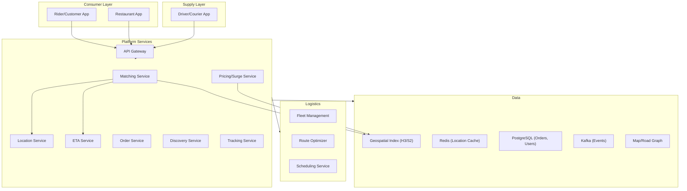

---

## Low-Level Design

### 1. Driver Matching System

#### Overview

The Driver Matching System is the **core algorithm** of any ride-sharing or delivery platform. When a rider requests a ride, the system must find the optimal available driver within seconds. At Uber's scale, this means matching **millions of rides per day** with sub-second latency.

#### Matching Flow

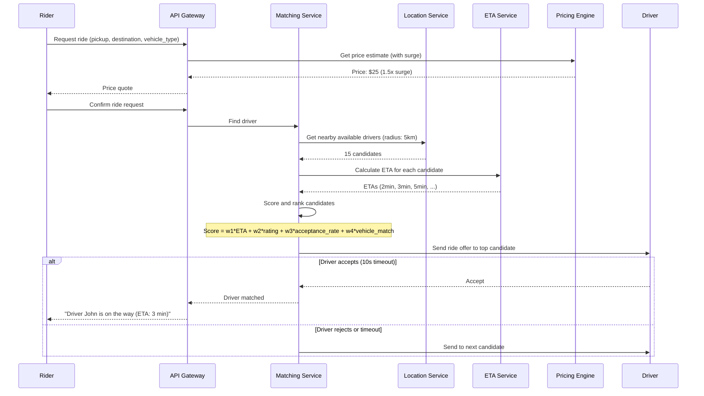

#### Geospatial Indexing (H3/S2)

Drivers are indexed geographically using **Uber's H3** (hexagonal grid) or **Google's S2** (spherical geometry cells):

```
# H3 approach:
# Divide the world into hexagonal cells at resolution 9 (~0.1 km² each)
# Store driver_id → h3_cell mapping in Redis

# When rider requests at (lat, lng):
1. Compute H3 cell for rider location
2. Get k-ring of cells (radius ~5km)
3. Query Redis for all drivers in those cells
4. Filter: available, correct vehicle type, not already on trip
5. Calculate ETA for each → rank → offer to best
```

```
# Redis structure:
KEY: drivers:h3:{cell_id}
TYPE: Set of driver_ids
SADD drivers:h3:891f1d48 driver_123 driver_456

# On location update: move driver from old cell to new cell (atomic)
SMOVE drivers:h3:{old_cell} drivers:h3:{new_cell} driver_123
```

#### Scoring Function

```
score(driver) = -alpha * eta_minutes          // lower ETA is better
              + beta  * driver_rating          // higher rating is better
              + gamma * acceptance_rate         // higher acceptance is better
              + delta * vehicle_match           // exact vehicle type match bonus
              - epsilon * detour_distance       // if driver is heading away
```

Weights are tuned via A/B testing to optimize for rider wait time, driver utilization, and overall platform efficiency.

#### Edge Cases

| Scenario | Handling |
|----------|---------|
| **No drivers within 5km** | Expand search radius to 10km, then 15km. If still none: "No drivers available" |
| **All nearby drivers reject** | After 3 rejections, re-broadcast with higher driver incentive |
| **Driver cancels after accepting** | Immediately re-match. Penalize driver's acceptance rate score |
| **Rider cancels after match** | Charge cancellation fee if > 2 minutes after match |
| **Simultaneous requests in same area** | Each match locks the driver atomically. Second request sees updated availability |
| **Airport queue** | FIFO queue for drivers at airports. Next in queue gets next ride. |

---

### 2. Real-Time Location Tracking

#### Overview

The Location Tracking System processes **millions of GPS updates per second** from drivers and delivery partners. This data feeds the matching system, ETA calculator, rider tracking map, and surge pricing engine.

#### Architecture

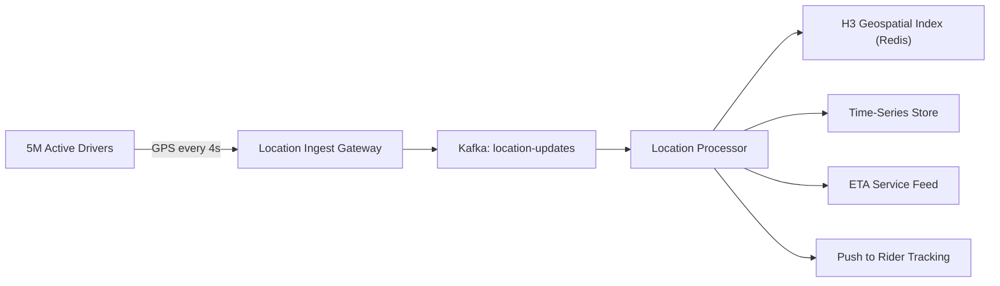

#### Data Model

```
# Current location (Redis — hot data)
KEY: driver:location:{driver_id}
VALUE: {"lat": 37.7749, "lng": -122.4194, "heading": 270, "speed_kmh": 35, "ts": 1711100000}
TTL: 60 seconds (auto-offline if no update)

# Location history (Cassandra — for trip replay, ETA training, dispute resolution)
CREATE TABLE location_history (
    entity_id   UUID,           -- driver_id or order_id
    timestamp   TIMEUUID,
    lat         DOUBLE,
    lng         DOUBLE,
    heading     SMALLINT,
    speed_kmh   SMALLINT,
    accuracy_m  SMALLINT,
    PRIMARY KEY (entity_id, timestamp)
) WITH CLUSTERING ORDER BY (timestamp DESC)
  AND default_time_to_live = 2592000; -- 30 days
```

#### Processing at Scale

- **1M drivers online** x update every **4 seconds** = **250,000 events/second**
- Each event: ~100 bytes → **25 MB/second** ingestion
- Kafka: 50 partitions, 10 consumer instances
- Redis geo-index update: 250K writes/second (handled by Redis Cluster with 10+ shards)

#### Location Smoothing

Raw GPS data is noisy (jumps, drift, tunnels). Apply Kalman filter for smooth trajectory:
- Predict next position based on speed + heading
- Update prediction with actual GPS reading
- Weight prediction vs. GPS based on GPS accuracy metric

---

### 3. ETA Calculation System

#### Overview

ETA (Estimated Time of Arrival) prediction is critical for rider experience, driver matching, and delivery promises. An inaccurate ETA erodes trust. Uber's ETA system uses **ML models trained on billions of historical trips** combined with real-time traffic data.

#### ETA Architecture

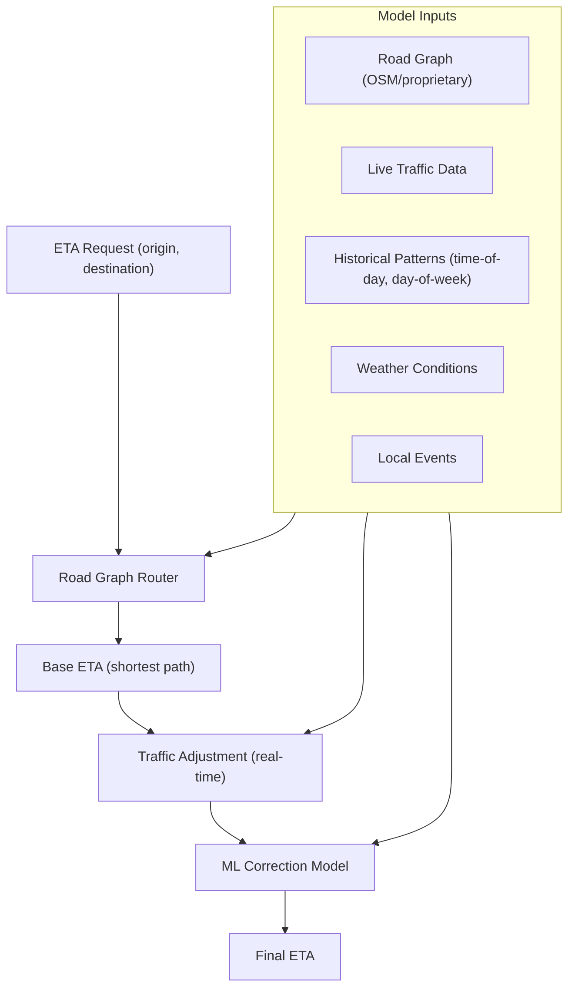

#### Road Graph Routing

- **Data source**: OpenStreetMap or proprietary road data
- **Algorithm**: Modified Dijkstra or Contraction Hierarchies for fast routing
- **Road segments** annotated with: speed limit, road type, lanes, turn restrictions
- **Pre-computation**: Contraction Hierarchies allow sub-millisecond routing queries after O(n log n) pre-processing

#### ETA Error Budget

| Segment | Accuracy Target |
|---------|----------------|
| Driver to pickup | ± 1 minute |
| Pickup to destination | ± 2 minutes (short trip), ± 5 minutes (long trip) |
| Restaurant prep time | ± 5 minutes |
| Delivery partner to restaurant | ± 2 minutes |
| Restaurant to customer | ± 3 minutes |

---

### 4. Surge Pricing Engine

#### Overview

Surge pricing (or dynamic pricing) adjusts prices when demand exceeds supply in a geographic area. It serves two purposes: **demand management** (discourage low-urgency riders) and **supply incentive** (attract more drivers to the area).

#### Surge Calculation

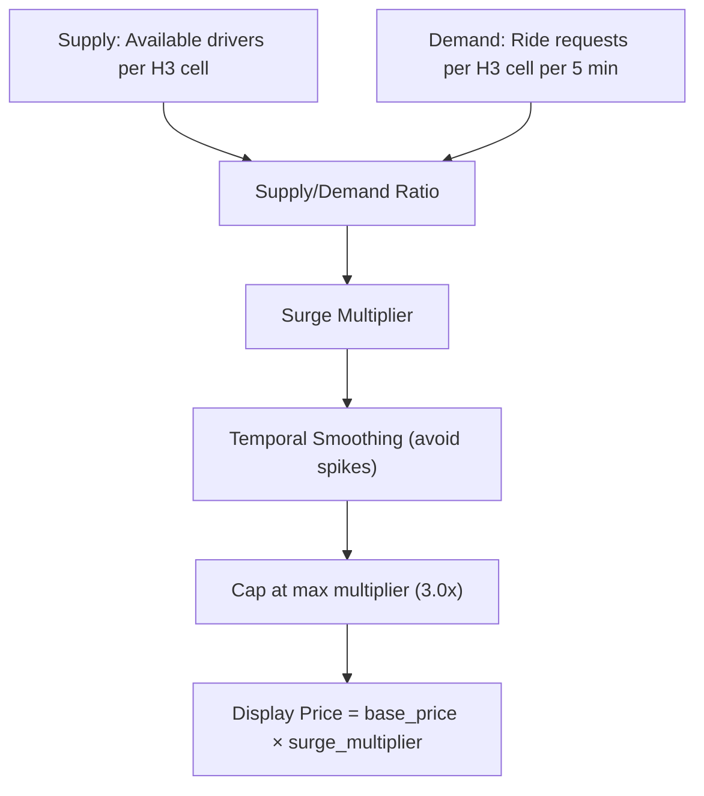

#### Surge Levels

| Supply/Demand Ratio | Surge Multiplier | Displayed |
|---------------------|-----------------|-----------|
| > 1.5 (surplus) | 1.0x | Normal pricing |
| 1.0 - 1.5 | 1.0x - 1.3x | Slight increase |
| 0.5 - 1.0 | 1.3x - 2.0x | "Prices are higher due to demand" |
| < 0.5 (shortage) | 2.0x - 3.0x | "High demand — 2.5x surge" |

#### Surge Smoothing

Surge changes are smoothed to avoid rapid oscillation:
```
new_surge = 0.7 * current_surge + 0.3 * calculated_surge
```
This prevents the "surge on → riders leave → surge off → riders return → surge on" feedback loop.

#### Edge Cases

- **Event ends (concert/stadium)**: Sudden demand spike. Pre-position surge based on event schedule.
- **Bad weather**: Higher demand + fewer drivers. Surge rises. Consider weather-triggered driver incentives.
- **Regulatory caps**: Some cities cap surge multipliers (e.g., 2x max during emergencies).
- **Rider sticker shock**: Show surge warning before booking. Allow rider to set "notify when surge drops."

---

### 5. Restaurant Discovery

#### Overview

Restaurant Discovery helps customers find restaurants based on cuisine, distance, rating, delivery time, promotions, and dietary preferences. It's the entry point of every food delivery order.

#### Search & Ranking Pipeline

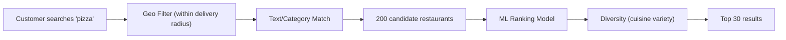

#### Ranking Signals

| Signal | Weight | Source |
|--------|--------|--------|
| **Distance** | High | Customer location → restaurant |
| **Estimated delivery time** | High | Prep time + travel time |
| **Rating** | Medium | Aggregate customer reviews |
| **Cuisine match** | Medium | Query relevance |
| **Order volume** | Medium | Popularity indicator |
| **Restaurant online status** | Binary | Must be accepting orders |
| **Promotion active** | Low-medium | Boost promoted restaurants |
| **Previous orders** | Medium | Re-order convenience |

---

### 6. Order Placement

#### Overview

The Order Placement system handles menu display, cart management, order validation, and kitchen integration. A food delivery order is more complex than e-commerce because it involves **real-time restaurant capacity** and **perishable preparation**.

#### Order Flow

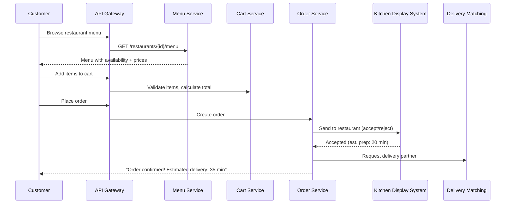

#### Restaurant Capacity Management

Restaurants have limited kitchen capacity. The system must:
- Track current order volume per restaurant
- Auto-pause restaurant when order queue exceeds capacity
- Extend estimated prep time during high volume
- Allow restaurant to manually pause/resume accepting orders

---

### 7. Delivery Partner Allocation

#### Overview

Delivery allocation matches orders to available delivery partners optimizing for delivery time, partner workload, and batch efficiency. Unlike ride-sharing (1 rider per driver), food delivery often supports **batch delivery** — one partner picks up orders from multiple nearby restaurants on a single trip.

#### Allocation Algorithm

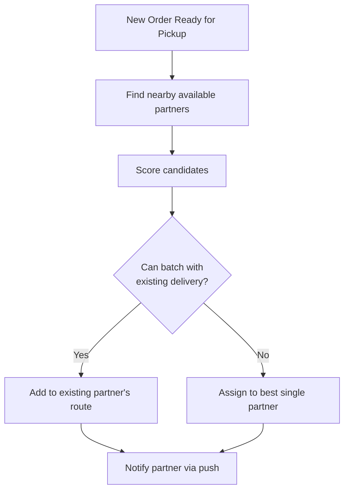

#### Batch Delivery Logic

```
IF partner is already heading to Restaurant B (500m from Restaurant A):
  AND adding Restaurant A pickup adds < 5 min detour:
  AND customer B's delivery time stays within SLA:
    → Batch: partner picks up from both restaurants
ELSE:
    → Assign to different partner
```

**Trade-off**: Batching improves partner efficiency (more deliveries per hour) but may increase individual delivery time. Maximum batch size: 2-3 orders.

---

### 8. Order Tracking System

#### Overview

Order Tracking provides real-time visibility from order placement through delivery. The customer sees: Order Confirmed → Being Prepared → Ready for Pickup → Partner En Route → Arriving → Delivered.

#### State Machine

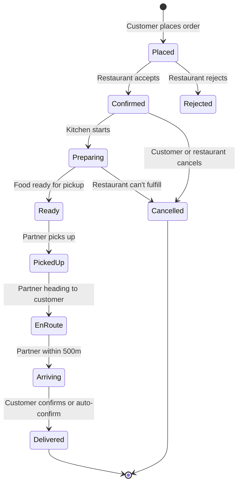

#### Real-Time Tracking Map

During delivery, the customer sees the partner's live location on a map:
- Location updates from partner's phone (every 4 seconds)
- Pushed to customer via WebSocket
- ETA recalculated with each location update
- Map shows route line from partner to customer

---

### 9. Fleet Management System

#### Overview

Fleet Management tracks vehicle/partner availability, compliance (license, insurance, background checks), utilization metrics, and earnings across the entire supply pool.

#### Data Model

```sql
CREATE TABLE fleet_partners (
    partner_id          UUID PRIMARY KEY,
    name                TEXT NOT NULL,
    phone               TEXT NOT NULL,
    vehicle_type        TEXT CHECK (vehicle_type IN ('bike', 'scooter', 'car', 'van', 'truck')),
    vehicle_plate       TEXT,
    license_number      TEXT,
    license_expiry      DATE,
    insurance_expiry    DATE,
    background_check    TEXT DEFAULT 'pending',
    status              TEXT DEFAULT 'offline' CHECK (status IN ('online', 'offline', 'on_trip', 'suspended')),
    current_location    JSONB,
    rating              DECIMAL(3,2) DEFAULT 5.0,
    total_trips         INT DEFAULT 0,
    acceptance_rate     DECIMAL(5,4) DEFAULT 1.0,
    created_at          TIMESTAMPTZ NOT NULL DEFAULT now()
);

CREATE TABLE partner_shifts (
    partner_id      UUID NOT NULL,
    shift_start     TIMESTAMPTZ NOT NULL,
    shift_end       TIMESTAMPTZ,
    trips_completed INT DEFAULT 0,
    earnings        DECIMAL(10,2) DEFAULT 0,
    online_hours    DECIMAL(5,2),
    PRIMARY KEY (partner_id, shift_start)
);
```

#### Compliance Monitoring

Background job checks daily:
- License expiry → suspend partner if expired
- Insurance expiry → suspend partner
- Rating below threshold (4.0) → warning; below 3.5 → suspension review
- Acceptance rate below 60% → reduced priority in matching

---

### 10. Route Optimization System

#### Overview

Route Optimization plans multi-stop delivery routes for logistics operations (same-day delivery, grocery delivery, package delivery). The core problem is the **Vehicle Routing Problem (VRP)** — an NP-hard combinatorial optimization.

#### VRP Architecture

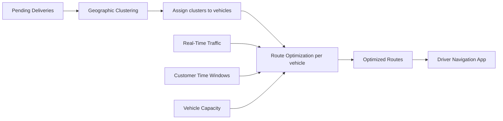

#### Solver Approach

1. **Clustering**: K-means or DBSCAN by geographic proximity
2. **Initial solution**: Nearest-neighbor heuristic per cluster
3. **Optimization**: 2-opt, or-opt, relocate moves using Google OR-Tools
4. **Constraint satisfaction**: Vehicle capacity, time windows, driver hours, restricted zones
5. **Dynamic re-routing**: Re-optimize when conditions change (new order, traffic, driver delay)

**Computation budget**: < 5 minutes for 500 stops across 25 vehicles.

---

### 11. Delivery Scheduling System

#### Overview

The Delivery Scheduling System manages **slotted delivery** — customers choose a delivery window (e.g., "2-4 PM today"). The system must manage capacity per slot, prevent overbooking, and adjust availability in real-time.

#### Slot Management

```sql
CREATE TABLE delivery_slots (
    zone_id         UUID NOT NULL,
    slot_date       DATE NOT NULL,
    slot_start      TIME NOT NULL,
    slot_end        TIME NOT NULL,
    max_capacity    INT NOT NULL,
    booked_count    INT DEFAULT 0,
    available       INT GENERATED ALWAYS AS (max_capacity - booked_count) STORED,
    status          TEXT DEFAULT 'open' CHECK (status IN ('open', 'full', 'closed')),
    PRIMARY KEY (zone_id, slot_date, slot_start)
);
```

**Capacity factors**: number of available drivers, warehouse capacity, historical demand, weather forecast.

---

## Storage Strategy

On-demand services generate fundamentally different data patterns that require specialized storage solutions. The key insight is that **location data is time-series, orders are transactional, and search is geospatial** — no single database handles all three well.

### Storage Tiers

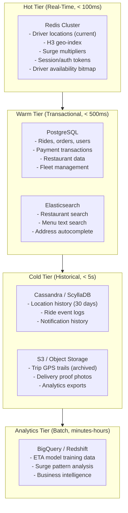

### Location Data Storage (Time-Series)

Location data is the highest-volume write workload. Strategy: **write-hot to Redis, stream through Kafka, persist to Cassandra, archive to S3**.

| Aspect | Hot (Redis) | Warm (Cassandra) | Cold (S3) |
|--------|------------|------------------|-----------|
| **Data** | Latest location per driver | Location trail (30 days) | Full GPS history |
| **Write rate** | 250K/s | 250K/s | Batch daily |
| **Read pattern** | Point lookup by driver_id | Range scan by entity+time | Analytics only |
| **Latency** | < 1ms | < 10ms | Seconds |
| **TTL** | 60 seconds | 30 days | 1 year+ |
| **Size estimate** | ~500 MB (1M drivers x 500B) | ~2 TB/month | ~24 TB/year |
| **Format** | JSON in Redis Hash | CQL wide rows | Parquet (columnar) |

### Ride and Order Data (Transactional)

PostgreSQL handles transactional data with strong consistency requirements:

- **Rides table**: Partitioned by `created_at` (monthly). Active rides are a small subset; completed rides are historical.
- **Food orders table**: Partitioned by `city_id` and `created_at` for efficient per-city queries.
- **Payment transactions**: Separate database cluster with synchronous replication (zero data loss).

```
# PostgreSQL partitioning strategy
rides (parent table)
├── rides_2024_01  (January 2024)
├── rides_2024_02  (February 2024)
├── ...
└── rides_2024_12  (December 2024)

# Partition creation
CREATE TABLE rides_2024_03 PARTITION OF rides
    FOR VALUES FROM ('2024-03-01') TO ('2024-04-01');
```

### Geospatial Search Data

Restaurant discovery and driver search require different geospatial approaches:

| Use Case | Technology | Why |
|----------|-----------|-----|
| **Find nearby drivers** | H3 + Redis Sets | Ultra-fast (< 1ms), simple k-ring query, handles 250K updates/s |
| **Find nearby restaurants** | PostGIS + Elasticsearch | Complex ranking needed (not just distance), text search + geo combined |
| **Surge zone computation** | H3 resolution 7 cells | Uniform hexagons for supply/demand counting |
| **Route geometry** | PostGIS LINESTRING | ST_Length, ST_Intersects for route analysis |
| **Delivery zone boundaries** | PostGIS POLYGON | ST_Contains for zone membership |

### Real-Time vs. Historical Data Separation

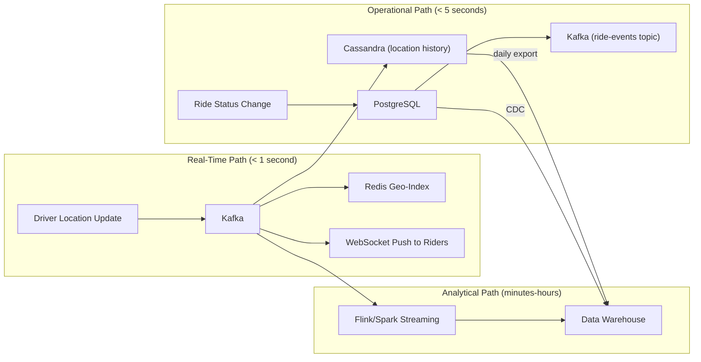

---

## Indexing and Partitioning Strategy

### Geospatial Partitioning

#### H3 Hexagonal Grid (Driver Indexing)

H3 divides the Earth into hexagonal cells at different resolutions. For driver matching, resolution 9 (~174m edge, ~0.1 km2) provides the right granularity.

```
# H3 Resolution Guide for On-Demand Services
# Res 7: ~5.16 km² — surge zone calculation, demand heatmaps
# Res 8: ~0.74 km² — coarse driver clustering
# Res 9: ~0.11 km² — driver indexing (primary)
# Res 10: ~0.015 km² — fine-grained pedestrian/bike courier indexing

# k-ring query example (find drivers within ~2km)
# k=3 at resolution 9 covers approx 2km radius (37 cells)
cells = h3.k_ring(center_cell, k=3)
# Returns: set of 37 hexagonal cell IDs
```

#### Geohash vs. H3 vs. S2 Comparison

| Feature | Geohash | H3 (Uber) | S2 (Google) |
|---------|---------|-----------|-------------|
| **Cell shape** | Rectangle | Hexagon | Quad (variable shape) |
| **Edge effect** | Severe (adjacent cells can have very different hashes) | None (uniform neighbors) | Minimal |
| **Neighbor query** | Complex (5-8 neighbors, irregular) | Clean (exactly 6 neighbors) | Clean |
| **Hierarchy** | Prefix-based (easy) | Resolution-based | Level-based |
| **Equidistant** | No (rectangles distort at poles) | Yes (hexagons are equidistant) | Approximately |
| **Library maturity** | High | Medium-High | High |
| **Used by** | Redis GEO, Elasticsearch | Uber, DoorDash | Google Maps, Foursquare |
| **Best for** | Simple proximity queries | Ride matching, surge zones | Global-scale spatial indexing |

#### Quadtree Partitioning (Adaptive Density)

For cities with highly variable driver density (downtown vs. suburbs), a quadtree adapts cell size to density:

```
# Quadtree approach:
# - Start with city bounding box as root node
# - If a node contains > 100 drivers, split into 4 quadrants
# - Continue splitting until each leaf has < 100 drivers
# - Dense downtown: many small cells (fine-grained)
# - Sparse suburbs: few large cells (coarse)

# Advantage: adapts to real density patterns
# Disadvantage: more complex to implement than H3
# Decision: Use H3 (simpler, good enough) unless density varies by > 100x within a city
```

### Ride History Partitioning

Ride history grows continuously and is queried primarily by time range and city.

```sql
-- Range partitioning by month
CREATE TABLE rides (
    ride_id         UUID NOT NULL,
    city_id         UUID NOT NULL,
    created_at      TIMESTAMPTZ NOT NULL,
    -- ... other columns
) PARTITION BY RANGE (created_at);

-- Create monthly partitions
CREATE TABLE rides_2024_01 PARTITION OF rides
    FOR VALUES FROM ('2024-01-01') TO ('2024-02-01');
CREATE TABLE rides_2024_02 PARTITION OF rides
    FOR VALUES FROM ('2024-02-01') TO ('2024-03-01');
-- ... auto-generated by cron job

-- Composite index for common queries: "rides in city X in date range"
CREATE INDEX idx_rides_city_created ON rides(city_id, created_at DESC);

-- Partition pruning example:
-- "Give me all rides in city X for March 2024"
-- PostgreSQL automatically scans ONLY rides_2024_03 partition
SELECT * FROM rides
WHERE city_id = 'city_sf'
  AND created_at >= '2024-03-01'
  AND created_at < '2024-04-01';
```

### Restaurant Search Indexing (Elasticsearch)

```json
{
    "settings": {
        "number_of_shards": 5,
        "number_of_replicas": 1
    },
    "mappings": {
        "properties": {
            "restaurant_id": {"type": "keyword"},
            "name": {"type": "text", "analyzer": "standard", "fields": {"raw": {"type": "keyword"}}},
            "cuisine_types": {"type": "keyword"},
            "location": {"type": "geo_point"},
            "rating": {"type": "float"},
            "price_level": {"type": "integer"},
            "avg_prep_time_min": {"type": "integer"},
            "is_active": {"type": "boolean"},
            "accepting_orders": {"type": "boolean"},
            "menu_items_text": {"type": "text", "analyzer": "standard"},
            "delivery_radius_km": {"type": "float"},
            "city_id": {"type": "keyword"}
        }
    }
}
```

```json
// Elasticsearch query: "Find pizza restaurants within 5km, open, sorted by rating"
{
    "query": {
        "bool": {
            "must": [
                {"match": {"menu_items_text": "pizza"}},
                {"term": {"is_active": true}},
                {"term": {"accepting_orders": true}}
            ],
            "filter": {
                "geo_distance": {
                    "distance": "5km",
                    "location": {"lat": 37.7749, "lon": -122.4194}
                }
            }
        }
    },
    "sort": [
        {"_score": "desc"},
        {"rating": "desc"}
    ],
    "size": 20
}
```

### Location History Partitioning (Cassandra)

```sql
-- Cassandra: Partition by entity_id, cluster by time
-- Each partition holds one entity's location trail
-- Wide rows: ~7,200 entries/day per driver (1 per 4 seconds x 8 hours)

CREATE TABLE location_history (
    entity_id       UUID,
    day             DATE,            -- secondary partition key for bounded partitions
    timestamp       TIMESTAMP,
    lat             DOUBLE,
    lng             DOUBLE,
    heading         SMALLINT,
    speed_kmh       SMALLINT,
    accuracy_m      SMALLINT,
    h3_cell         BIGINT,
    PRIMARY KEY ((entity_id, day), timestamp)
) WITH CLUSTERING ORDER BY (timestamp DESC)
  AND default_time_to_live = 2592000   -- 30 days
  AND compaction = {'class': 'TimeWindowCompactionStrategy', 'compaction_window_size': 1, 'compaction_window_unit': 'DAYS'};
```

---

## Concurrency Control

### Driver Matching — Double-Booking Prevention

The most critical concurrency challenge: two ride requests arriving simultaneously for the same driver. Without proper locking, the same driver could be assigned to two rides.

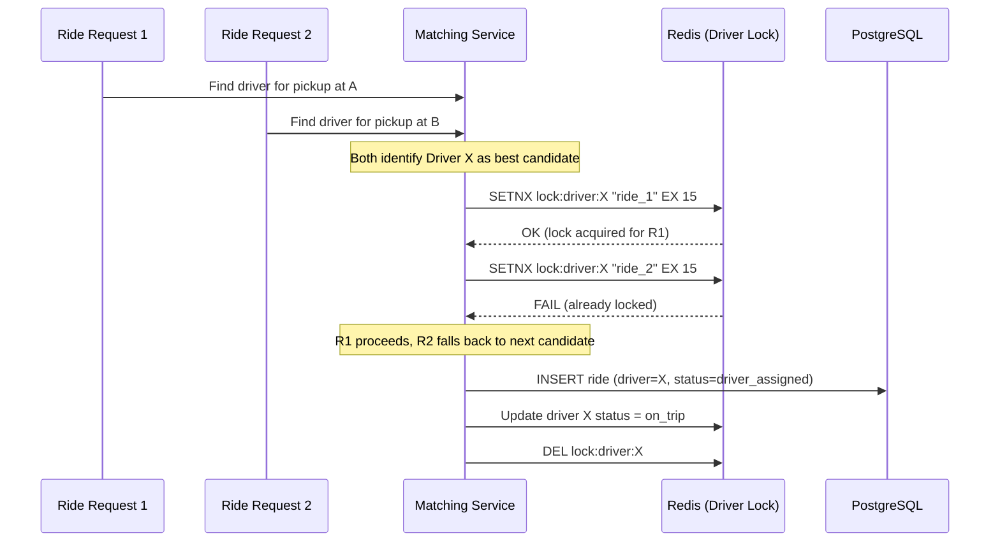

**Implementation**:

```
# Atomic driver locking with Redis
# SETNX ensures only ONE request can lock a driver at a time

def try_assign_driver(driver_id, ride_id):
    lock_key = f"lock:driver:{driver_id}"
    # SET with NX (only if not exists) and EX (expire in 15 seconds)
    acquired = redis.set(lock_key, ride_id, nx=True, ex=15)

    if not acquired:
        return False  # Driver already locked by another request

    try:
        # Update driver status in database
        db.execute("""
            UPDATE drivers SET status = 'on_trip'
            WHERE driver_id = %s AND status = 'online'
        """, [driver_id])

        if db.rowcount == 0:
            # Driver went offline between query and lock
            redis.delete(lock_key)
            return False

        # Create ride assignment
        db.execute("""
            UPDATE rides SET driver_id = %s, status = 'driver_assigned', matched_at = now()
            WHERE ride_id = %s AND status = 'matching'
        """, [driver_id, ride_id])

        return True
    except Exception:
        redis.delete(lock_key)
        raise
```

### Surge Pricing Under Load

Surge pricing reads supply/demand counts from multiple H3 cells. Under high load, multiple surge calculators might race:

```
# Strategy: Each surge zone has a single owner (partitioned by zone_id)
# Only one calculator process handles each zone at a time
# Kafka consumer group with zone_id as partition key ensures single-writer

# Surge calculation is idempotent:
# Given the same supply/demand snapshot, the same multiplier is produced
# No locking needed — last-write-wins with timestamp check

def update_surge(zone_id, new_multiplier, calculated_at):
    result = db.execute("""
        UPDATE surge_zones
        SET current_multiplier = %s, last_calculated = %s
        WHERE zone_id = %s AND last_calculated < %s
    """, [new_multiplier, calculated_at, zone_id, calculated_at])
    # Only updates if this calculation is newer than the current one
```

### Order Assignment Conflicts (Food Delivery)

When multiple orders are ready simultaneously and the same delivery partner is the best candidate:

```
# Use Redis sorted set as a "partner assignment queue"
# Score = partner's current batch count (lower is better)

def assign_delivery_partner(order_id, restaurant_location):
    nearby_partners = get_nearby_available_partners(restaurant_location)

    for partner in nearby_partners:
        # Atomic check-and-increment of partner's batch count
        new_count = redis.hincrby(f"partner:{partner.id}", "batch_count", 1)

        if new_count <= partner.max_batch_capacity:
            # Successfully assigned
            create_assignment(order_id, partner.id)
            return partner

        # Over capacity — roll back
        redis.hincrby(f"partner:{partner.id}", "batch_count", -1)

    return None  # No available partners
```

### Database-Level Optimistic Concurrency

For operations where Redis locks are not appropriate (e.g., order status transitions):

```sql
-- Optimistic concurrency with version column
ALTER TABLE food_orders ADD COLUMN version INT DEFAULT 1;

-- Status transition: only succeeds if version matches
UPDATE food_orders
SET status = 'preparing', version = version + 1
WHERE order_id = 'fo_abc123'
  AND status = 'restaurant_confirmed'
  AND version = 3;

-- If rowcount = 0, another process already changed the status or version
-- Retry with fresh read or return conflict error
```

---

## Idempotency Strategy

On-demand services face network unreliability (mobile networks, tunnels, elevators). Every write operation must be safe to retry.

### Ride Request Dedup

```
# Client generates idempotency_key before sending request
# Server stores it in the rides table (UNIQUE constraint)

POST /api/v1/rides
Idempotency-Key: 550e8400-e29b-41d4-a716-446655440000

# Server logic:
def create_ride(request, idempotency_key):
    # Check if ride with this key already exists
    existing = db.query("SELECT * FROM rides WHERE idempotency_key = %s", [idempotency_key])

    if existing:
        return existing  # Return same response (safe retry)

    try:
        ride = db.insert_ride(request, idempotency_key)
        return ride
    except UniqueViolationError:
        # Race condition: concurrent retry arrived between check and insert
        return db.query("SELECT * FROM rides WHERE idempotency_key = %s", [idempotency_key])
```

### Payment Charging Dedup

Payment dedup is the most critical — a double charge directly impacts the customer.

```
# Three-layer dedup:
# 1. Idempotency key on rides/orders table (application-level)
# 2. Idempotency key on payment_transactions table (payment-level)
# 3. Stripe/Braintree idempotency key (provider-level)

def charge_ride(ride_id, amount, idempotency_key):
    # Layer 1: Check if already charged for this ride
    existing_txn = db.query("""
        SELECT * FROM payment_transactions
        WHERE order_id = %s AND order_type = 'ride' AND status IN ('captured', 'settled')
    """, [ride_id])

    if existing_txn:
        return existing_txn  # Already charged

    # Layer 2: Insert with idempotency key
    txn = db.insert("""
        INSERT INTO payment_transactions (order_id, order_type, amount, idempotency_key, status)
        VALUES (%s, 'ride', %s, %s, 'pending')
        ON CONFLICT (idempotency_key) DO NOTHING
        RETURNING *
    """, [ride_id, amount, idempotency_key])

    if not txn:
        return db.query("SELECT * FROM payment_transactions WHERE idempotency_key = %s", [idempotency_key])

    # Layer 3: Charge via Stripe with their idempotency key
    stripe_result = stripe.charges.create(
        amount=int(amount * 100),
        currency='usd',
        source=payment_method,
        idempotency_key=f"ride_{ride_id}_{idempotency_key}"
    )

    # Update transaction
    db.update("UPDATE payment_transactions SET status = 'captured', provider_txn_id = %s WHERE transaction_id = %s",
              [stripe_result.id, txn.transaction_id])

    return txn
```

### Location Update Dedup

Location updates arrive every 4 seconds, but mobile networks can cause duplicates or out-of-order delivery.

```
# Redis-based timestamp dedup:
# Only accept updates newer than the current stored timestamp

def process_location_update(driver_id, lat, lng, heading, speed, timestamp):
    key = f"driver:location:{driver_id}"

    # Lua script for atomic check-and-update
    lua_script = """
    local current_ts = redis.call('HGET', KEYS[1], 'ts')
    if current_ts and tonumber(current_ts) >= tonumber(ARGV[5]) then
        return 0  -- stale update, skip
    end
    redis.call('HMSET', KEYS[1],
        'lat', ARGV[1], 'lng', ARGV[2],
        'heading', ARGV[3], 'speed', ARGV[4], 'ts', ARGV[5])
    redis.call('EXPIRE', KEYS[1], 60)
    return 1  -- accepted
    """

    accepted = redis.eval(lua_script, 1, key, lat, lng, heading, speed, timestamp)
    return accepted == 1
```

---

## Consistency Model

Different data types in on-demand services require different consistency guarantees. Using strong consistency everywhere would kill performance; using eventual consistency everywhere would cause business errors.

### Consistency Requirements by Data Type

| Data Type | Consistency | Acceptable Lag | Rationale |
|-----------|------------|----------------|-----------|
| **Driver location** | Eventual | 1-2 seconds | Matching uses "nearby" — a 2s stale location still finds the right drivers |
| **Driver availability** | Strong | 0 | Double-booking prevention requires real-time accuracy |
| **Ride assignment** | Strong | 0 | A ride must be assigned to exactly one driver |
| **Surge multiplier** | Eventual (point-in-time snapshot) | 5-10 seconds | Rider sees locked price at confirmation; backend surge can drift |
| **Order status** | Strong | 0 | Customer, restaurant, and partner must see the same current status |
| **Payment** | Strong | 0 | Financial transactions require ACID |
| **Restaurant menu** | Eventual | Minutes | Menu changes are infrequent; cached version is acceptable |
| **Driver/rider rating** | Eventual | Minutes | Aggregated average; slight delay is fine |
| **ETA estimate** | Eventual | Seconds | Approximation by nature; recalculated frequently |
| **Notification delivery** | At-least-once | Seconds | Duplicate notifications are tolerable; missing ones are not |

### Surge Pricing — Point-in-Time Snapshot

Surge pricing uses a **snapshot model**: when a rider confirms a ride, the current surge multiplier is locked.

```
# Flow:
# 1. Rider opens app → reads current surge (eventual, may be 5s stale)
# 2. Rider requests estimate → surge multiplier snapshotted in estimate
# 3. Rider confirms ride → estimate's surge multiplier used (even if surge changed since)
# 4. Price is computed using the snapshotted multiplier
# 5. Estimate expires after 5 minutes → rider must get new estimate

# This prevents:
# - Rider sees 1.0x surge, takes 30 seconds to confirm, surge jumps to 2.0x
# - Without snapshot: rider gets charged 2.0x (surprise!)
# - With snapshot: rider is charged 1.0x (as shown when they decided)
```

### Eventual Consistency for Location (Read-Your-Writes)

Drivers send location updates and expect their own status to reflect immediately:

```
# Write path: Driver → Kafka → Redis (async, ~50ms)
# Read path: Driver reads their own status from Redis

# Problem: Driver sends update, immediately reads — might get stale data
# Solution: Read-your-writes for driver's own location
#   - After POST /location, return the acknowledged location in response
#   - Client uses response data, not a subsequent GET, for confirmation
```

### Strong Consistency for Ride Assignment

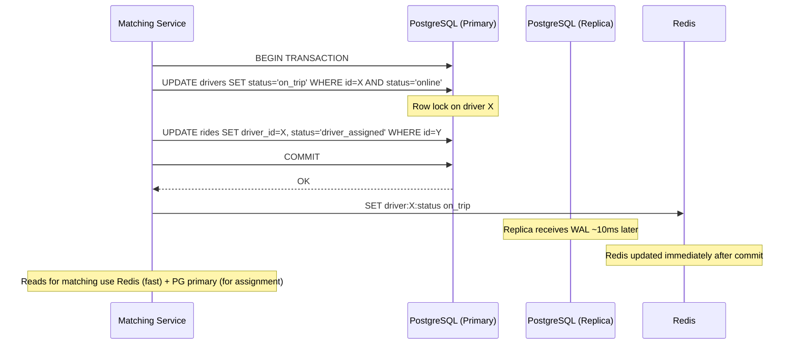

### Consistency Decision Framework

Choosing the right consistency model for each data type is one of the most important architectural decisions in on-demand systems. The wrong choice either kills performance (strong consistency everywhere) or causes business errors (eventual consistency for critical state).

#### Decision Matrix

```
For each data type, ask three questions:

Q1: Does a stale read cause a FINANCIAL error?
    YES → Strong consistency required
    NO  → Continue to Q2

Q2: Does a stale read cause a SAFETY issue or break a business invariant?
    YES → Strong consistency required
    NO  → Continue to Q3

Q3: What is the maximum acceptable staleness before UX degrades?
    < 1 second  → Near-real-time (strong with caching, read-your-writes)
    1-10 seconds → Eventual consistency with short TTL
    > 10 seconds → Eventual consistency with standard caching
```

#### Driver Location — Eventual Consistency in Practice

Driver location is the highest-volume data in the system (250K updates/second) and is the canonical example of eventual consistency done right.

```
# Why eventual consistency works for driver location:
#
# 1. TOLERANCE: A driver at position P at time T is approximately at P
#    at time T+2s. For matching (finding "nearby" drivers), this is fine.
#    The matching algorithm already accounts for driver movement during
#    the accept/pickup window.
#
# 2. WRITE PATH: Driver → Kafka → Consumer → Redis (async pipeline)
#    Total write latency: ~50-200ms (Kafka consumer lag + Redis write)
#    This means a matching query may see a position that is 50-200ms old.
#
# 3. READ PATH: Matching service reads from Redis replica (not primary)
#    Additional lag: ~1-5ms for Redis replication
#    Total staleness budget: 50ms (write) + 5ms (replica) ≈ 55-205ms
#    At 30 km/h city speed, 200ms = 1.67 meters of position error
#    This is well within GPS accuracy (5-15m) — irrelevant.
#
# 4. FAILURE MODE: If Kafka consumer falls behind by 4 seconds:
#    At 30 km/h, 4 seconds = 33 meters of error
#    Still acceptable for matching (search radius is 2000m+)
#    BUT: trigger alert if consumer lag > 5 seconds consistently

# Monitoring: Track consumer_lag_seconds and alert if > 5s for > 1 minute
```

#### Ride State — Strong Consistency Is Non-Negotiable

```
# Why ride state MUST be strongly consistent:
#
# INVARIANT: A ride is assigned to EXACTLY ONE driver. Violation = two
# drivers showing up for the same rider (terrible experience + wasted supply).
#
# Implementation: PostgreSQL with row-level locking on the rides table.
# All ride state transitions go through the primary database.
#
# Pattern: Check-and-set with optimistic locking:
#   UPDATE rides SET driver_id = $1, status = 'assigned', version = version + 1
#   WHERE ride_id = $2 AND status = 'matching' AND version = $3;
#   -- If affected_rows = 0 → someone else modified this ride → retry
#
# Cost: ~2ms per write (PostgreSQL primary in same AZ)
# Volume: ~300 ride state transitions per second (manageable for single primary)
# If volume exceeds single-primary capacity: shard by city_id
```

#### ETA — Best Effort with Graceful Degradation

```
# ETA is inherently approximate. Consistency model reflects this:
#
# FRESHNESS TIERS:
# Tier 1 (live): Real-time traffic data + current route → accuracy ±2 min
# Tier 2 (cached): 30-second cached ETA → accuracy ±3 min
# Tier 3 (historical): Historical average for route → accuracy ±5 min
# Tier 4 (estimate): Haversine distance / avg speed → accuracy ±10 min
#
# The system tries Tier 1 first and falls back progressively:
# - Tier 1 fails (traffic API down) → use Tier 2 cached value
# - Tier 2 expired (>30s old) → use Tier 3 historical
# - Tier 3 unavailable → use Tier 4 distance-based estimate
#
# Customer-facing: Show ETA with range ("7-12 min") not a single number
# Internal: Use point estimate for matching/dispatch optimization
```

#### Order Status — Causal Consistency

Order status must appear as a linear sequence of state transitions to the customer. The customer must never see "delivered" before seeing "picked up" — this requires causal consistency.

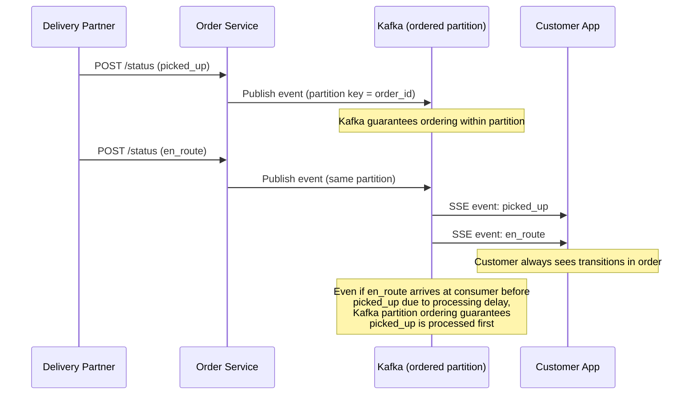

**Implementation detail:** All status updates for a given order are published to the same Kafka partition (using order_id as partition key). The SSE consumer reads from this partition sequentially, guaranteeing that status transitions arrive at the customer in causal order. This is causal consistency without the cost of global strong consistency — other orders can be processed independently and in parallel.

---

## Distributed Transaction / Saga Design

On-demand services span multiple services and external systems. Traditional distributed transactions (2PC) are too slow and too brittle. Instead, use **Saga patterns** — a sequence of local transactions with compensating actions for rollback.

### Ride Saga

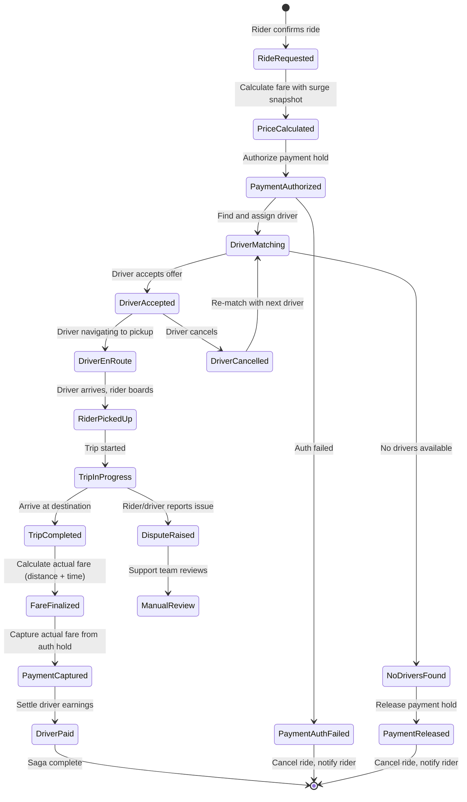

#### Ride Saga Steps (Orchestrated)

| Step | Service | Action | Compensation (Rollback) |
|------|---------|--------|------------------------|
| 1 | Ride Service | Create ride record (status: requested) | Delete ride record |
| 2 | Pricing Service | Lock surge multiplier, calculate estimate | Release surge lock |
| 3 | Payment Service | Authorize payment hold ($estimated_fare + 20% buffer) | Release payment hold |
| 4 | Matching Service | Find and assign driver | Release driver, re-mark as available |
| 5 | Notification Service | Send "driver on the way" to rider | Send "ride cancelled" |
| 6 | Trip Service | Track trip progress | N/A |
| 7 | Fare Service | Calculate actual fare (distance * rate + time * rate) | N/A |
| 8 | Payment Service | Capture actual fare (release excess hold) | Refund captured amount |
| 9 | Settlement Service | Queue driver payout | Reverse payout |
| 10 | Rating Service | Prompt rider and driver for ratings | N/A |

#### Saga Orchestrator Implementation

```
# Saga orchestrator pattern using Kafka for step coordination

class RideSagaOrchestrator:
    STEPS = [
        'create_ride',
        'calculate_price',
        'authorize_payment',
        'match_driver',
        'notify_rider',
        'start_trip',
        'complete_trip',
        'finalize_fare',
        'capture_payment',
        'settle_payout'
    ]

    def execute(self, ride_request):
        saga_id = generate_uuid()
        current_step = 0

        for step in self.STEPS:
            try:
                result = kafka.publish(
                    topic=f'saga.ride.{step}',
                    key=saga_id,
                    value={'saga_id': saga_id, 'ride_request': ride_request, 'step': step}
                )
                # Wait for step completion event
                completion = kafka.consume(topic=f'saga.ride.{step}.completed', key=saga_id, timeout=30)

                if completion.status == 'failed':
                    self.compensate(saga_id, current_step)
                    return {'status': 'failed', 'reason': completion.reason}

                current_step += 1

            except TimeoutError:
                self.compensate(saga_id, current_step)
                return {'status': 'failed', 'reason': 'timeout'}

    def compensate(self, saga_id, failed_step):
        # Execute compensation in reverse order
        for step_idx in range(failed_step, -1, -1):
            step_name = self.STEPS[step_idx]
            kafka.publish(
                topic=f'saga.ride.{step_name}.compensate',
                key=saga_id,
                value={'saga_id': saga_id}
            )
```

### Food Order Saga

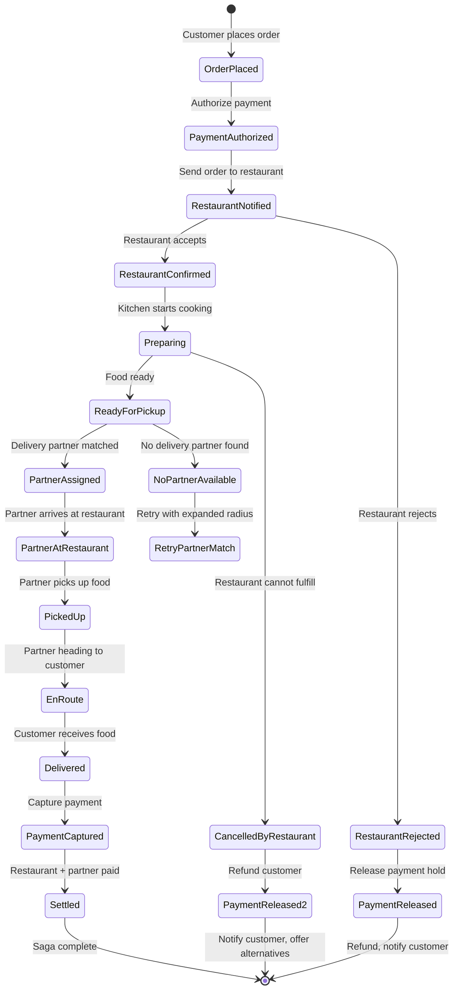

#### Food Order Saga Steps

| Step | Service | Action | Compensation |
|------|---------|--------|-------------|
| 1 | Order Service | Create order record | Mark order cancelled |
| 2 | Payment Service | Auth hold for order total | Release hold |
| 3 | Restaurant Service | Send order to kitchen display | Cancel order at restaurant |
| 4 | Restaurant Service | Wait for restaurant confirmation | N/A |
| 5 | Kitchen Service | Track preparation progress | N/A |
| 6 | Matching Service | Assign delivery partner | Release partner |
| 7 | Tracking Service | Track partner → restaurant → customer | N/A |
| 8 | Payment Service | Capture payment | Refund |
| 9 | Settlement Service | Pay restaurant (minus commission) and partner (delivery fee) | Reverse payouts |

### Food Order Saga — Restaurant Confirmation Timeout

A critical edge case: the restaurant never confirms the order (tablet offline, kitchen closed early, staff missed notification). The saga must handle this timeout gracefully.

```
# Restaurant confirmation timeout handling

TIMEOUT_WINDOW = 5 minutes  # Restaurant must confirm within 5 min

Saga Step 3: Send order to restaurant
  ├── Restaurant confirms → proceed to Step 4 (Preparing)
  ├── Restaurant explicitly rejects → compensate (refund customer, notify)
  └── No response within TIMEOUT_WINDOW → auto-cancel flow:
        1. Mark order as "restaurant_timeout"
        2. Release payment hold
        3. Search for alternative restaurant:
           - Same cuisine within 2 km radius
           - Open and accepting orders
           - Similar menu items available
        4. If alternative found:
           - Present to customer: "Original restaurant unavailable.
             We found [Alternative] with similar items. Reorder?"
           - Customer has 3 minutes to accept or cancel
        5. If no alternative or customer declines:
           - Full refund + $5 credit for inconvenience
           - Flag restaurant for repeated timeouts (affects ranking)

RESTAURANT HEALTH TRACKING:
  - Track confirmation_rate over rolling 7-day window
  - If confirmation_rate < 80% → reduce order volume to restaurant
  - If confirmation_rate < 60% → temporarily delist restaurant
  - Dashboard alert to restaurant partnership team for intervention
```

### Multi-Order Delivery Saga (Order Stacking)

When a delivery partner picks up multiple orders for delivery along a single route, the saga becomes more complex because partial failures affect multiple customers.

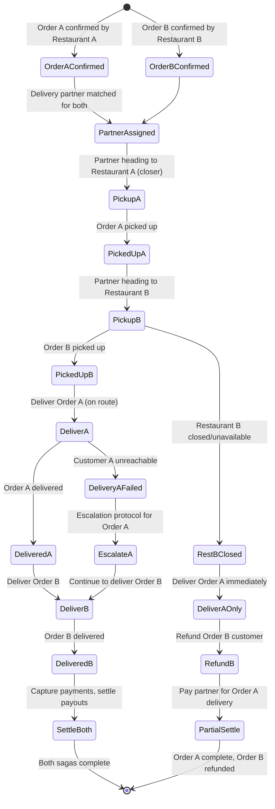

**Key decisions for multi-order saga:**
- **Pickup order** — Pick up from the restaurant closer to the partner first, minimizing food wait time for the first order.
- **Delivery order** — Deliver the order with the tighter SLA first, or the one along the route toward the second delivery.
- **Partial failure** — If one restaurant cancels, the partner delivers the remaining order immediately. The cancelled order enters the refund saga independently.
- **Partner compensation** — Partner is paid for completed deliveries plus a partial fee for the attempted pickup of the cancelled order.

### Refund Saga for Cancelled-in-Transit Orders

When a customer cancels an order that is already picked up and in transit, the refund logic is complex because the restaurant has already prepared the food and the partner has already started delivery.

| Cancellation Point | Customer Refund | Restaurant Payment | Partner Payment |
|-------------------|----------------|-------------------|----------------|
| Before restaurant confirms | 100% refund | Nothing | Nothing |
| After restaurant confirms, before prep starts | 100% refund | 15% of order (cancellation fee) | Nothing |
| During preparation | 50% refund | 100% of food cost | Nothing |
| Food ready, partner en route to restaurant | 30% refund | 100% of food cost | Pickup fee only |
| Food picked up, partner en route to customer | 0% refund (or store credit) | 100% of food cost | Full delivery fee |

```
# Refund saga orchestration

class RefundSagaOrchestrator:
    def execute_refund(self, order_id, cancellation_point):
        order = order_service.get(order_id)
        policy = self.get_refund_policy(cancellation_point)

        # Step 1: Calculate refund amounts
        customer_refund = order.total * policy.customer_refund_pct
        restaurant_payment = order.food_cost * policy.restaurant_pct
        partner_payment = self.calculate_partner_compensation(order, cancellation_point)

        # Step 2: Process customer refund (immediate for good-standing accounts)
        if customer_refund > 0:
            payment_service.refund(order.payment_id, customer_refund)

        # Step 3: Ensure restaurant is compensated for work done
        if restaurant_payment > 0:
            settlement_service.queue_restaurant_payment(
                order.restaurant_id, restaurant_payment, reason='customer_cancellation'
            )

        # Step 4: Compensate delivery partner for distance traveled
        if partner_payment > 0:
            settlement_service.queue_partner_payment(
                order.partner_id, partner_payment, reason='cancelled_delivery'
            )

        # Step 5: Handle the food
        if cancellation_point in ['picked_up', 'en_route']:
            # Partner keeps the food or donates to registered charity partner
            notification_service.notify_partner(
                order.partner_id,
                "Delivery cancelled. You may keep the food or donate it."
            )
```

### Complete Ride Lifecycle — Saga State Machine

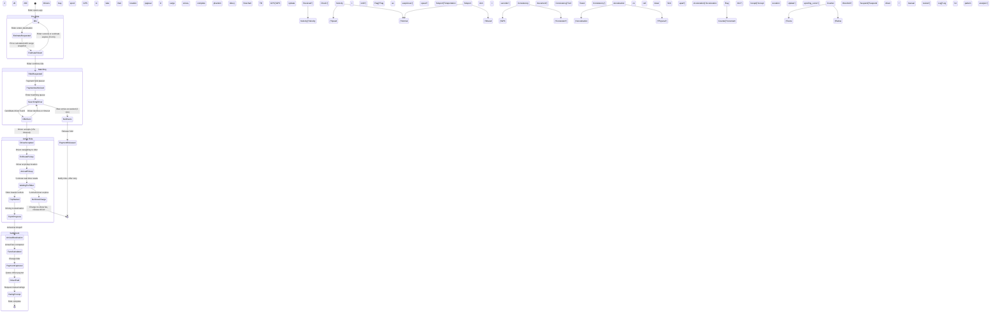

**Detection signals:**
- **Impossible velocity**: GPS shows > 200 km/h in a city
- **Teleportation**: Driver "jumps" > 1 km between 4-second updates
- **Cell tower mismatch**: GPS coordinates do not match cell tower triangulation
- **Straight-line movement**: Real driving has curves; spoofed GPS often shows perfectly straight paths
- **Altitude consistency**: GPS altitude should vary with road elevation
- **Known spoofing app signatures**: Device integrity check (SafetyNet on Android, DeviceCheck on iOS)

### Surge Manipulation Prevention

Groups of drivers could coordinate to go offline simultaneously, creating artificial supply shortage and triggering surge.

```
# Detection:
# 1. Monitor sudden drops in supply that don't correlate with natural patterns
#    (e.g., 50% of drivers in a zone go offline within 60 seconds)
# 2. Check if the same drivers come back online shortly after surge activates
# 3. Graph analysis: identify clusters of drivers who frequently go offline/online together

# Prevention:
# 1. Surge activation has a cooldown (minimum 5 minutes between recalculations)
# 2. Historical baseline: compare current supply to same time/day last week
# 3. Surge cap during anomalous supply drops
# 4. Driver incentive redesign: bonus for staying online during high-demand periods
#    rather than paying surge premium that rewards gaming
```

### Fake Ride Detection

Fraudulent rides (driver and rider collude) for promotional abuse or money laundering.

| Signal | Detection Method |
|--------|-----------------|
| **Zero-distance rides** | Pickup and dropoff within 100m |
| **Circular routes** | Start and end at same location (exceeding threshold) |
| **Repeated same driver-rider pairs** | Statistical anomaly detection |
| **Promotion stacking** | Same promo code used across linked accounts |
| **Velocity mismatch** | Trip distance does not match GPS trail distance |
| **Payment reversals** | High rate of chargebacks from same rider |
| **Device fingerprint** | Same device used for both rider and driver accounts |

### Driver Rating Fraud

Drivers or riders may attempt to manipulate ratings through collusion or sockpuppet accounts.

```
# Defenses:
# 1. Ratings are only accepted for completed trips (no phantom ratings)
# 2. Rating window: 24 hours after trip completion
# 3. Statistical outlier detection: flag if rating pattern deviates from normal
#    (e.g., driver has 1000 5-star ratings and zero 4-star)
# 4. Weight recent ratings more heavily (exponential decay)
# 5. Remove self-referential ratings (if detected via device fingerprint)
# 6. Minimum trip count before rating is displayed (prevents sybil attacks)
```

### Restaurant Menu Fraud

Restaurants might show low prices to attract orders, then claim items are unavailable.

```
# Defenses:
# 1. Track "item unavailable" rate per restaurant
#    - If > 20% of ordered items are marked unavailable after order → warning
#    - If > 40% → temporary suspension pending review
# 2. Price change alerts: flag if price increases > 30% within 24 hours
# 3. Photo vs. reality monitoring: customer photo uploads compared to menu photos
# 4. Commission on cancelled items: restaurant pays partial commission if
#    they cancel items after confirmation (discourages bait-and-switch)
```

---

## CI/CD and Release Strategy

### Matching Algorithm Rollout

The matching algorithm directly affects rider wait time, driver utilization, and revenue. Changes must be rolled out carefully.

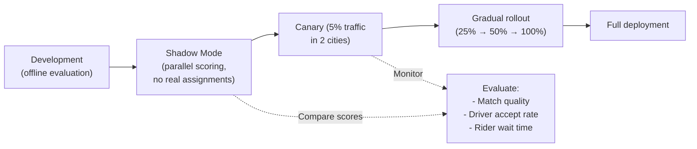

#### A/B Testing Framework for Matching

```
# A/B test configuration:
experiment:
  name: "matching_v3_weighted_scoring"
  description: "New scoring weights for driver matching"
  traffic_split:
    control: 50%    # Current algorithm
    treatment: 50%  # New weighted scoring
  segmentation:
    type: "city"    # Split by city to avoid cross-contamination
    control_cities: ["sf", "la", "chicago"]
    treatment_cities: ["nyc", "seattle", "miami"]
  metrics:
    primary:
      - rider_wait_time_p50
      - rider_wait_time_p95
      - driver_acceptance_rate
    secondary:
      - ride_completion_rate
      - driver_utilization
      - revenue_per_ride
  guardrails:
    - rider_wait_time_p95 < 8_minutes    # hard limit
    - driver_acceptance_rate > 80%        # hard limit
  duration: 14_days
  auto_rollback:
    trigger: "any guardrail violated for > 1 hour"
```

### Surge Pricing Model Rollout

```
# Surge model changes are high-risk (affect revenue and user trust)
# Deployment strategy:

# Phase 1: Shadow scoring (1 week)
# - Run new surge model in parallel with production
# - Compare: new_multiplier vs current_multiplier
# - Alert if delta > 0.5x for same zone/time

# Phase 2: Off-peak canary (1 week)
# - Apply new model only during 10 PM - 6 AM (low traffic)
# - Monitor rider complaints, revenue, driver behavior

# Phase 3: Single-city rollout (1 week)
# - Deploy to one mid-size city
# - Compare metrics to matched control city

# Phase 4: Global rollout with kill switch
# - Roll out to all cities over 48 hours
# - Feature flag per city for instant rollback
```

### ETA Model Updates

```
# ETA models are retrained weekly on latest trip data
# Deployment uses blue-green model serving:

# Current (blue): ETA model v23 (last week's data)
# New (green): ETA model v24 (this week's data)

# Deployment:
# 1. Train v24 offline, validate on holdout set
# 2. Deploy v24 to canary serving cluster (5% traffic)
# 3. Compare ETA accuracy: predicted vs actual trip duration
# 4. If v24 accuracy >= v23 accuracy: promote to primary
# 5. If v24 accuracy < v23 - 1%: rollback, investigate

# Model serving: TensorFlow Serving or custom gRPC service
# Latency budget: < 20ms per ETA prediction (p99)
```

### Feature Flag Configuration

```
# Feature flags for on-demand services
flags:
  matching:
    batch_matching_enabled: true         # Match multiple rides simultaneously
    max_candidate_pool: 15               # Number of drivers to score
    scoring_version: "v3"                # Scoring function version
  surge:
    enabled: true
    max_multiplier: 3.0
    smoothing_factor: 0.7
    recalculation_interval_sec: 300
  delivery:
    batch_delivery_enabled: true
    max_batch_size: 2
    batch_detour_limit_min: 5
  eta:
    model_version: "v24"
    traffic_weight: 0.6
    historical_weight: 0.3
    ml_correction_enabled: true
```

---

## Multi-Region and Disaster Recovery Strategy

### City-Level Isolation

On-demand services are inherently local — a ride in San Francisco has no dependency on a ride in Tokyo. This enables **city-level isolation** as the primary scaling and DR strategy.

```mermaid
flowchart TB
    subgraph US_West["US West Region"]
        US_W_GW["API Gateway"]
        US_W_Match["Matching"]
        US_W_Location["Location Service"]
        US_W_DB["PostgreSQL"]
        US_W_Redis["Redis"]

        SF["San Francisco"]
        LA["Los Angeles"]
        Seattle["Seattle"]
    end

    subgraph US_East["US East Region"]
        US_E_GW["API Gateway"]
        US_E_Match["Matching"]
        US_E_Location["Location Service"]
        US_E_DB["PostgreSQL"]
        US_E_Redis["Redis"]

        NYC["New York"]
        Miami["Miami"]
        Chicago["Chicago"]
    end

    subgraph APAC["APAC Region"]
        APAC_GW["API Gateway"]
        APAC_Match["Matching"]
        APAC_Location["Location Service"]
        APAC_DB["PostgreSQL"]
        APAC_Redis["Redis"]

        Singapore["Singapore"]
        Jakarta["Jakarta"]
        Tokyo["Tokyo"]
    end

    subgraph Global["Global Services (cross-region)"]
        UserDB["User Account DB\n(global, replicated)"]
        PaymentDB["Payment DB\n(global, replicated)"]
        Analytics["Analytics Pipeline"]
    end

    US_West & US_East & APAC --> Global
```

### Regional Architecture Decisions

| Concern | Strategy |
|---------|----------|
| **Data residency** | Ride/order data stays in the city's region. User profiles replicated globally. |
| **Latency** | Matching and location must run in-region (< 100ms RTT). User auth can be global (cached locally). |
| **Failover** | City-level failover within a region. If US-West goes down, SF traffic cannot route to US-East (too far for ride matching). Best effort: "service unavailable" with retry. |
| **Cross-city driver** | Driver drives from SF to LA → detected via location update changing city boundary → reassigned to LA's matching pool |
| **Regulatory compliance** | City-level config for surge caps, driver requirements, tax rates, tipping rules |

### Cross-City Driver Migration

```
# When a driver crosses city boundaries:
# 1. Location service detects H3 cell change crosses city boundary
# 2. Driver removed from source city's matching pool
# 3. Driver added to destination city's matching pool
# 4. Driver's regulatory compliance re-checked (different city may have different requirements)
# 5. Driver's pricing/incentive config updated to destination city

def handle_city_boundary_crossing(driver_id, old_city_id, new_city_id):
    # Remove from old city's matching pool
    redis_old.srem(f"city:{old_city_id}:drivers", driver_id)

    # Check compliance for new city
    compliance = check_city_compliance(driver_id, new_city_id)
    if not compliance.passed:
        notify_driver("You need additional documentation to operate in {new_city}")
        return

    # Add to new city's matching pool
    redis_new.sadd(f"city:{new_city_id}:drivers", driver_id)

    # Update driver's city assignment
    db.execute("UPDATE drivers SET current_city_id = %s WHERE driver_id = %s",
               [new_city_id, driver_id])
```

### Regional Compliance (Taxi Regulations)

```
# City-specific regulatory configuration
city_config:
  san_francisco:
    max_surge_multiplier: 3.0
    driver_requirements:
      - valid_california_drivers_license
      - vehicle_inspection_within_12_months
      - commercial_insurance
    background_check: "checkr"
    tipping: "post_ride_optional"
    accessibility_vehicles_required: true
    airport_queue_enabled: true

  london:
    max_surge_multiplier: 2.0          # TfL cap
    driver_requirements:
      - private_hire_vehicle_license
      - topographical_skills_test
      - english_language_test
    congestion_charge_passthrough: true
    clean_air_zone_surcharge: 1.50

  singapore:
    max_surge_multiplier: null          # No regulatory cap
    driver_requirements:
      - vocational_license
      - vehicle_age_under_8_years
    peak_hour_surcharge: true
    grab_specific_regulations: true
```

### Disaster Recovery

| Scenario | RTO | RPO | Strategy |
|----------|-----|-----|----------|
| **Single AZ failure** | < 1 minute | 0 | Multi-AZ deployment, auto-failover |
| **Database primary failure** | < 5 minutes | 0 | Synchronous replica promotion |
| **Redis cluster failure** | < 2 minutes | ~4 seconds of location data | Redis Cluster with automatic failover; drivers re-send location on reconnect |
| **Kafka broker failure** | < 1 minute | 0 | Kafka replication factor 3, ISR-based writes |
| **Full region failure** | 30+ minutes | Minutes | Cross-region is limited for on-demand (rides are local). Focus on fast region recovery. Global services (user accounts, payments) have cross-region replication. |
| **Payment system failure** | < 5 minutes | 0 | Queue rides for post-trip charging. Allow cash fallback. |

---

## Cost Drivers and Optimization

### Major Cost Centers

| Cost Category | Estimated Monthly (at 50M daily trips) | Optimization Strategy |
|--------------|----------------------------------------|----------------------|
| **Mapping APIs** | $2-5M (Google Maps: $7/1K requests for directions) | Use OSRM (open-source) for ETA, Google Maps only for rider-facing navigation |
| **Real-time compute** | $500K-1M (location processing, matching) | Efficient H3 indexing, batch processing where possible |
| **Database storage** | $200-500K (PostgreSQL, Cassandra, Redis) | Partition old data, TTLs on location history, archive to S3 |
| **Kafka infrastructure** | $100-300K (event streaming) | Right-size partitions, compress messages, tune retention |
| **SMS/Push notifications** | $500K-1M (ride status, verification) | Prefer push over SMS (100x cheaper), batch non-urgent notifications |
| **CDN/bandwidth** | $100-200K (map tiles, images) | Cache aggressively, use vector tiles, compress images |
| **ML model serving** | $200-500K (ETA, surge, matching ML) | Batch predictions where possible, quantize models |

### Mapping API Cost Optimization

```
# Google Maps API pricing (2024):
# - Directions API: $5.00 per 1,000 requests
# - Distance Matrix: $5.00 per 1,000 elements
# - Geocoding: $5.00 per 1,000 requests
# - At 50M trips/day × 5 map API calls per trip = 250M calls/day
# - Monthly cost: 250M × 30 × $0.005 = $37.5M (!!!)

# Optimization strategies:
# 1. Use OSRM (Open Source Routing Machine) for backend ETA calculation
#    - Self-hosted, zero API cost
#    - Accuracy: 85-90% of Google Maps (good enough for matching)
# 2. Use Google Maps ONLY for rider-facing navigation link
#    - ~50M clicks/day × $0.007 = $350K/month (vs $37.5M)
# 3. Cache route segments (same road segment reused by many trips)
# 4. Pre-compute distance matrix for popular origin-destination pairs
# 5. Use Mapbox for map tiles (cheaper than Google for high volume)

# Decision: OSRM for backend + Google Maps for navigation = ~$500K/month
# vs. full Google Maps dependency = $37.5M/month
```

### Driver Incentive Cost Modeling

```
# Driver incentives are the largest variable cost after mapping:
# Types:
# 1. Surge premium: extra pay during high demand (passed through from riders)
# 2. Quest bonuses: "Complete 20 rides this weekend for $50 bonus"
# 3. Guarantee minimums: "Earn at least $25/hour while online"
# 4. Referral bonuses: "Refer a driver, both get $500 after 100 rides"

# Optimization:
# - Dynamic incentive targeting: offer bonuses only in supply-deficient areas
# - ML model predicts which drivers are likely to churn → target retention incentives
# - A/B test incentive amounts: find minimum effective bonus per driver segment
# - Incentive ROI tracking: bonus cost vs incremental rides delivered
```

### Notification Cost Optimization

```
# Cost per notification by channel:
# Push notification: $0.0001 (essentially free via FCM/APNs)
# SMS: $0.01 - $0.05 (varies by country)
# Email: $0.001
# In-app: $0.0001

# Strategy:
# 1. Prefer push notifications over SMS for all non-critical messages
# 2. Use SMS only for: account verification, payment failures, safety alerts
# 3. Batch non-urgent notifications (weekly earnings summary as one push, not daily)
# 4. Use regional SMS providers for cheaper rates (Twilio in US, Msg91 in India)
# 5. OTP via WhatsApp in markets where WhatsApp is dominant (India, Brazil, Indonesia)
```

---

## Technology Choices and Alternatives

| Component | Primary Choice | Alternative 1 | Alternative 2 | Decision Rationale |
|-----------|---------------|---------------|---------------|-------------------|
| **Geospatial index** | H3 + Redis | PostGIS | S2 Cells | H3 hexagons have uniform neighbors; Redis handles 250K/s writes |
| **Location streaming** | Kafka | Apache Pulsar | Amazon Kinesis | Kafka: battle-tested, replay capability, 50+ consumer groups |
| **Transactional DB** | PostgreSQL + PostGIS | CockroachDB | Amazon Aurora | PG: mature, PostGIS extension, strong ecosystem |
| **Location history** | Cassandra | ScyllaDB | TimescaleDB | Cassandra: write-optimized, tunable consistency, wide-row model fits time-series |
| **Real-time cache** | Redis Cluster | Dragonfly | KeyDB | Redis: mature, Lua scripting, geospatial commands, cluster mode |
| **Search** | Elasticsearch | Meilisearch | Typesense | ES: geo queries + full-text + aggregations in one system |
| **Map routing** | OSRM (self-hosted) | Valhalla | Google Directions API | OSRM: free, fast (sub-ms), customizable. Google for user-facing navigation only. |
| **Route optimization** | Google OR-Tools | OptaPlanner | Custom genetic algo | OR-Tools: free, supports VRP with time windows, actively maintained |
| **ML model serving** | TensorFlow Serving | Triton Inference | TorchServe | TF Serving: low-latency, GPU support, model versioning |
| **Message queue (non-location)** | Kafka (shared) | RabbitMQ | Amazon SQS | Kafka already deployed for location; simplify stack |
| **WebSocket** | Custom (Node.js) | Socket.io | Centrifugo | Custom: full control over protocol, per-ride channels |
| **Object storage** | Amazon S3 | Google GCS | MinIO | S3: cheapest for cold storage, lifecycle policies |
| **Data warehouse** | BigQuery | Snowflake | Redshift | BigQuery: serverless, great for ad-hoc analytics, geo functions |
| **Feature flags** | LaunchDarkly | Unleash | Custom (Redis-backed) | LaunchDarkly: targeting, kill switches, A/B integration |
| **Payment processing** | Stripe | Adyen | Braintree | Stripe: best API, built-in idempotency, global coverage |

---

## Architecture Decision Records (ARDs)

### ARD-001: H3 Hexagonal Grid for Geospatial Indexing

| Field | Detail |
|-------|--------|
| **Decision** | Use Uber H3 hexagonal grid system for driver indexing |
| **Context** | Need fast "find drivers within X km" queries at 250K updates/second |
| **Options** | (A) PostGIS, (B) Geohash, (C) H3, (D) S2 Cells |
| **Chosen** | Option C: H3 |
| **Why** | H3 hexagons have uniform neighbors (unlike geohash rectangles with edge discontinuities). k-ring queries are clean. Uber developed and battle-tested it. |
| **Trade-offs** | Requires H3 library; less mature ecosystem than PostGIS |
| **Revisit when** | If S2 integration with cloud services improves significantly |

### ARD-002: Kafka for Location Event Streaming

| Field | Detail |
|-------|--------|
| **Decision** | Stream all location updates through Kafka |
| **Context** | 250K location events/second from drivers; consumed by 5+ services |
| **Chosen** | Kafka with 50 partitions, keyed by driver_id |
| **Why** | Kafka handles the throughput easily; replay capability useful for ETA model training; multiple consumer groups for different services |
| **Trade-offs** | Adds ~50ms latency vs. direct push. Acceptable for matching (sub-second decisions already include network RTT). |

### ARD-003: Batch Delivery with Max 2-Order Cap

| Field | Detail |
|-------|--------|
| **Decision** | Allow batch delivery with maximum 2 orders per partner |
| **Context** | Batching improves partner utilization but increases individual delivery time |
| **Chosen** | Max batch of 2 with strict SLA constraint (second order adds < 5 min) |
| **Why** | 2-order batches increase deliveries/hour by 30% with < 3 min average delay per order. 3-order batches cause > 10 min delays — unacceptable. |
| **Revisit when** | If customer tolerance for longer delivery increases (e.g., scheduled delivery) |

---

## POCs to Validate First

### POC-1: Driver Matching Latency
**Goal**: Match rider to driver in < 2 seconds at 1,000 concurrent requests.
**Success criteria**: p99 < 2s including ETA calculation.
**Fallback**: Pre-compute ETAs for nearby driver-cell pairs.

### POC-2: Location Processing at 250K Events/Second
**Goal**: Process 250K GPS events/second through Kafka → Redis geo-index.
**Success criteria**: End-to-end latency < 500ms; Redis geo-index always fresh.
**Fallback**: Shard Kafka consumers further; optimize Redis pipeline batching.

### POC-3: ETA Accuracy
**Goal**: ETA accuracy within ± 2 minutes for 90% of trips.
**Setup**: Compare predicted ETA vs actual trip duration for 100K trips.
**Fallback**: Add more features (weather, events); retrain with more recent data.

### POC-4: Route Optimization at Scale
**Goal**: Optimize 500 stops into 25 routes in < 5 minutes.
**Success criteria**: Solution within 10% of optimal total distance.
**Fallback**: Increase computation budget; use heuristics for initial solution.

---

## Real-World Comparisons

| Aspect | Uber | DoorDash | Grab | Instacart | Amazon Delivery |
|--------|------|----------|------|-----------|----------------|
| **Service** | Rides + Eats | Food delivery | Multi-service | Grocery delivery | Package delivery |
| **Matching** | ML-based, sub-second | Optimization-based | Similar to Uber | Batch + route optimize | Pre-planned routes |
| **Surge** | Dynamic multiplier | Delivery fee adjustment | Dynamic | Slot-based pricing | Subscription (Prime) |
| **Location** | H3 hexagonal | S2 cells | H3 | Zone-based | Zone + route based |
| **Batch delivery** | UberEats: 2 orders | Up to 3 orders | Yes | Yes (per store) | Many packages per route |
| **Scale** | 28M trips/day | 30M orders/month | 10M rides/day (APAC) | 4M orders/week | 20M packages/day |
| **Key challenge** | Real-time at scale | Restaurant coordination | Multi-modal | Substitution logic | Last-mile optimization |

### Deep Dive — Ride-Sharing Platform Architecture Comparison

#### Uber vs Lyft vs Ola vs Grab vs Bolt

| Aspect | Uber | Lyft | Ola | Grab | Bolt |
|--------|------|------|-----|------|------|
| **Geo-indexing** | H3 hexagonal grid (open-sourced) | S2 cells on AWS | H3 with custom India overlay | H3 adapted for Southeast Asia | PostGIS + Redis geo |
| **Primary language** | Go microservices (migrated from Node/Python) | Python + Go | Java + Kotlin | Go + Java | Go + Python |
| **Messaging backbone** | Apache Kafka (custom fork: uReplicator) | AWS Kinesis + SQS | Kafka with custom partitioning | Kafka + Pulsar | RabbitMQ + Kafka |
| **Service mesh** | Custom (previously Hyperbahn/TChannel) | Envoy (Lyft created Envoy) | Istio on Kubernetes | Envoy + custom sidecar | Linkerd |
| **Database strategy** | Schemaless (custom MySQL sharding layer) + Cassandra | PostgreSQL on RDS + DynamoDB | MySQL + Cassandra + CockroachDB | PostgreSQL + Redis Cluster | PostgreSQL + Redis |
| **Matching algorithm** | ML-based scoring with multiple objective optimization | Constraint-based optimization on AWS | ML scoring + manual dispatch fallback for tier-2 cities | Multi-objective optimization with motorbike priority | Nearest-driver with ETA weighting |
| **Surge model** | Continuous multiplier (1.0x-8.0x) per H3 cell | Prime Time percentage (25%, 50%, 75%, 100%, 200%) | Variable multiplier with regulatory caps per state | Dynamic pricing + zonal flat fees | Time-based multiplier with city caps |
| **Peer discovery** | RingPop (consistent hash ring, created by Uber) | AWS service discovery | Consul | Consul + custom registry | Kubernetes DNS |
| **Location update frequency** | 4 seconds | 3-5 seconds | 4-6 seconds (degrades to 15s on 2G) | 4 seconds (GPS + Wi-Fi fusion) | 5 seconds |
| **Global scale** | 70+ countries, 10K+ cities | US + Canada only | India (250+ cities) + international | 8 Southeast Asian countries | 45+ countries in Europe + Africa |

**Uber's architecture highlights:**
- **H3 hexagonal grid** — Uber open-sourced H3, a hierarchical spatial index using hexagonal cells. Hexagons have uniform distance from center to edge (unlike squares where corners are farther), making them ideal for proximity queries. Uber uses resolution 7 (~5.16 km^2 per cell) for surge pricing and resolution 9 (~0.11 km^2) for driver matching.
- **Schemaless** — A custom sharding layer on top of MySQL that provides schema-on-read, automatic sharding by city/entity, and cell-based routing. This avoids the operational overhead of Cassandra while keeping MySQL's transactional guarantees per shard.
- **RingPop** — A library implementing consistent hash ring with SWIM protocol gossip for membership. Each city's matching service runs a RingPop ring where each node owns a subset of H3 cells. Driver location updates are routed to the node owning that cell.

**Lyft's architecture highlights:**
- **Envoy proxy** — Lyft created Envoy (now a CNCF graduated project) to solve service-to-service communication. Envoy runs as a sidecar with every service, providing load balancing, circuit breaking, rate limiting, and observability without application code changes.
- **AWS-native** — Lyft runs almost entirely on AWS, using Kinesis for streaming, DynamoDB for low-latency reads, S3 for data lake, and SageMaker for ML model serving. This trades vendor lock-in for reduced operational overhead.
- **Apache Flink for surge** — Lyft uses Flink streaming jobs to calculate real-time supply-demand ratios per zone, feeding the Prime Time pricing engine with sub-second latency.

**Ola's India-specific architecture:**
- **Poor GPS in dense cities** — Indian cities have narrow lanes, dense high-rises, and underground passages that degrade GPS accuracy to 50-100 meters. Ola supplements GPS with cell tower triangulation, Wi-Fi fingerprinting, and rider-reported landmark-based pickup points.
- **2G/3G fallback** — A significant percentage of drivers in tier-2 and tier-3 cities operate on 2G connections. Ola's driver app has an ultra-light mode that uses SMS-based dispatch as fallback when data connectivity drops. Location updates degrade from 4-second intervals to 15-second intervals on 2G.
- **Regional language support** — India has 22 official languages. Ola's dispatch, navigation prompts, and rider communication support 12 languages, with automatic language detection based on driver's registered region.
- **Cash payments** — Unlike Uber's original card-only model, Ola designed for cash from day one. This required building a driver cash-collection system, daily settlement, and fraud detection for cash ride manipulation.

#### Grab's Southeast Asian Adaptations

Grab operates across Indonesia, Malaysia, Singapore, Thailand, Vietnam, Philippines, Cambodia, and Myanmar — each with different regulations, payment infrastructure, and transportation modes.

- **Multi-modal transport** — Grab's matching engine handles cars, motorbikes (GrabBike), tuk-tuks, and boat taxis. Each mode has different speed profiles, road access rules, and pricing models.
- **Payment fragmentation** — Southeast Asia has low credit card penetration. Grab built GrabPay as a unified e-wallet, but also integrates with GCash (Philippines), OVO (Indonesia), and bank-specific payment rails per country.
- **Super-app architecture** — Grab's platform serves rides, food delivery, grocery, payments, insurance, and lending. The core matching and logistics engine is shared, with domain-specific layers on top.

### Deep Dive — Food Delivery Platform Architecture Comparison

#### DoorDash vs UberEats vs Swiggy vs Zomato

| Aspect | DoorDash | UberEats | Swiggy | Zomato |
|--------|----------|----------|--------|--------|
| **Dispatch model** | Centralized optimization (assign closest Dasher) | Leverages Uber's ride-sharing matching | Centralized + stacked orders | Zone-based assignment |
| **Batching** | Up to 2 orders per Dasher | Up to 2 orders | Stack up to 3 orders on single route | Up to 2 orders |
| **Fleet model** | Gig economy (independent Dashers) | Gig economy (shared with ride drivers) | Own fleet + gig (hybrid) | Gig economy |
| **Quick commerce** | DashMart (15-min convenience) | Uber Direct | Instamart (10-min grocery, dark stores) | Blinkit (10-min, dark store network) |
| **Restaurant integration** | Tablet + POS integration + Storefront | Deep Uber Merchant integration | Direct API + tablet | Hyperpure (supply chain) + tablet |
| **Geographic focus** | US, Canada, Australia, Japan | 45+ countries | India (500+ cities) | India (800+ cities) |

**DoorDash dispatch system:**
DoorDash's dispatch (called "The Dispatcher") is a centralized optimization engine that runs every few seconds, considering all pending orders and all available Dashers simultaneously. Unlike Uber's per-request matching, DoorDash solves a global assignment problem.

```
# DoorDash dispatch optimization (simplified)
# Runs as a batch solver every 5-10 seconds

def dispatch_cycle(pending_orders, available_dashers):
    # Build cost matrix: cost[i][j] = cost of assigning order i to dasher j
    cost_matrix = []
    for order in pending_orders:
        row = []
        for dasher in available_dashers:
            cost = calculate_assignment_cost(order, dasher)
            row.append(cost)
        cost_matrix.append(row)

    # Solve using Hungarian algorithm (or LP relaxation for large instances)
    assignments = hungarian_algorithm(cost_matrix)
    return assignments

def calculate_assignment_cost(order, dasher):
    # Multi-factor cost function
    distance_to_restaurant = haversine(dasher.location, order.restaurant.location)
    prep_time_remaining = order.estimated_ready_at - now()
    delivery_distance = haversine(order.restaurant.location, order.customer.location)

    # Penalize late deliveries heavily (SLA cost)
    sla_deadline = order.placed_at + timedelta(minutes=45)
    estimated_delivery = now() + distance_to_restaurant/avg_speed + max(0, prep_time_remaining) + delivery_distance/avg_speed
    lateness_penalty = max(0, (estimated_delivery - sla_deadline).seconds) * LATE_PENALTY_WEIGHT

    return (
        DISTANCE_WEIGHT * distance_to_restaurant +
        IDLE_WEIGHT * prep_time_remaining +  # Dasher waiting at restaurant = waste
        DELIVERY_WEIGHT * delivery_distance +
        lateness_penalty
    )
```

**Swiggy's stacked orders and dark stores:**
- **Order stacking** — Swiggy pioneered stacking up to 3 orders for a single delivery partner on an optimized route. The stacking algorithm considers restaurant proximity, delivery direction alignment, food temperature sensitivity, and total delivery time impact on each order's SLA.
- **Instamart dark stores** — Swiggy operates 500+ dark stores (small warehouses in residential areas) for 10-minute grocery delivery. Each dark store covers a 2-3 km radius, stocks 5,000-7,000 SKUs, and uses automated inventory management with demand prediction per micro-zone.
- **Hybrid fleet** — Unlike pure gig-economy platforms, Swiggy maintains a core fleet of full-time delivery partners for reliability, supplemented by gig workers during peak hours. This ensures minimum supply coverage even during off-peak hours.

#### Instacart — How Grocery Differs from Food Delivery

Instacart's architecture is fundamentally different because it involves **in-store shopping**, not just pickup and delivery.

| Challenge | Food Delivery | Instacart Grocery |
|-----------|--------------|-------------------|
| **Time at merchant** | 2-5 min pickup | 30-60 min shopping |
| **Item substitution** | Rare (whole order) | Common (30% of orders have subs) |
| **Inventory accuracy** | Menu = fixed | Shelf stock = dynamic, often wrong |
| **Batch potential** | 2-3 orders | Multiple orders from same store |
| **Delivery vehicle** | Bike/car, small bag | Car with large trunk (heavy items) |
| **Communication** | Minimal | Constant (substitution approvals) |

Instacart's unique technical challenges:
- **In-store navigation** — The app guides shoppers through optimal store paths (organized by aisle) to minimize shopping time. This requires per-store planograms (aisle-by-item maps) maintained through a combination of store partnerships and crowdsourced shopper feedback.
- **Real-time substitution workflow** — When an item is out of stock, the shopper proposes a substitution, the customer approves or rejects via push notification, and the shopper continues. This requires a real-time bidirectional communication channel with sub-10-second latency for a responsive experience.
- **Inventory estimation** — Instacart builds probabilistic inventory models per store by combining store-reported data, historical purchase patterns, and real-time shopper reports of out-of-stock items.

### B2B Logistics: Enterprise Fleet vs Gig Economy

| Aspect | FedEx/UPS Fleet Management | Gig-Economy On-Demand |
|--------|---------------------------|----------------------|
| **Drivers** | Full-time employees, fixed routes | Independent contractors, dynamic routes |
| **Vehicles** | Company-owned fleet, standardized | Driver-owned, heterogeneous |
| **Route planning** | Pre-planned daily, loaded night before | Real-time, per-request |
| **Optimization horizon** | 12-24 hours ahead | 5-30 seconds ahead |
| **Demand predictability** | High (scheduled pickups, historical patterns) | Low (real-time requests) |
| **Compliance** | CDL, DOT hours-of-service, vehicle inspection | Background check, vehicle age, insurance |
| **Cost model** | Fixed cost (salary) + variable (fuel) | Pure variable (per-delivery commission) |

### Startup Architecture — Single-City On-Demand MVP

A startup launching in one city does not need Uber's architecture. The MVP stack:

```
# Startup on-demand stack (single city, <1000 orders/day)
# Total infrastructure cost: ~$500/month

Backend:         Single Node.js/Django server on a $20/month VPS
Database:        PostgreSQL with PostGIS extension (spatial queries)
Matching:        Simple nearest-driver query: SELECT * FROM drivers
                 WHERE ST_DWithin(location, pickup_point, 5000)
                 AND status = 'online'
                 ORDER BY ST_Distance(location, pickup_point) LIMIT 5;
Real-time:       Firebase Realtime Database or Socket.io on same server
Payments:        Stripe Connect (handles driver payouts)
Maps:            Google Maps API (geocoding, routing, ETA)
Notifications:   Firebase Cloud Messaging (push) + Twilio (SMS fallback)
Manual fallback: Admin dashboard to manually assign drivers when algo fails
Monitoring:      Sentry (errors) + simple Grafana dashboard
```

This scales to roughly 1,000-2,000 daily orders before requiring architectural changes. The first scaling triggers are typically the location update write throughput (move to Redis) and the matching latency (move to geospatial index).

### Regulatory Compliance by Country

| Jurisdiction | Key Regulations | Architecture Impact |
|-------------|----------------|-------------------|
| **London (TfL)** | Private hire vehicle license required, English language test, topographical test, congestion charge zone | Driver onboarding service must verify TfL license via API, geo-fence congestion zone for surcharge calculation |
| **New York City** | Taxi medallion system (FHV license for ride-share), driver income floor ($17.22/hr after expenses), congestion surcharge | Minimum earnings guarantee engine, per-trip surcharge calculator, FHV license verification |
| **India (various states)** | Motor Vehicle Aggregator Guidelines 2020, state-level fare caps, mandatory panic button, driver work-hour limits | State-specific pricing service, SOS emergency system, driver fatigue detection (hours-online tracking) |
| **European Union** | GDPR (data retention limits, right to deletion), Platform Workers Directive (gig worker classification) | Data TTL enforcement service, anonymization pipeline for location history, employment classification rule engine |
| **Singapore (LTA)** | Private Hire Car Driver's Vocational Licence, vehicle age limit (8 years), mandatory insurance | Vehicle age verification in onboarding, insurance expiry tracking with auto-suspension |
| **Brazil** | Lei 13.640 (municipal regulation of ride-apps), mandatory INSS social security contribution | Tax withholding calculation per municipality, social security contribution engine |

```mermaid
flowchart TD
    subgraph Onboarding["Driver Onboarding (Compliance Layer)"]
        App["Driver Submits Application"] --> Region["Detect Operating Region"]
        Region --> RuleEngine["Compliance Rule Engine"]

        RuleEngine -->|"London"| TfL["Verify TfL PHV License via API"]
        RuleEngine -->|"NYC"| NYC["Verify FHV License + TLC Database"]
        RuleEngine -->|"India"| India["Verify DL + Vehicle RC + State Permit"]
        RuleEngine -->|"EU"| EU["GDPR consent flow + Data Processing Agreement"]
        RuleEngine -->|"Singapore"| SG["Verify PDVL + Vehicle Age Check"]

        TfL --> BGCheck["Background Check (region-specific provider)"]
        NYC --> BGCheck
        India --> BGCheck
        EU --> BGCheck
        SG --> BGCheck

        BGCheck --> Approved["Driver Approved — Region-Specific Constraints Applied"]
        BGCheck --> Rejected["Rejected — Reason Logged for Audit"]
    end
```

---

## Common Mistakes

1. **Using relational DB for geospatial driver lookup** — too slow at 250K updates/second. Use H3/S2 + Redis.
2. **Synchronous ETA calculation in matching** — pre-compute or parallelize ETA calls.
3. **Not smoothing surge pricing** — rapid oscillation creates bad UX. Apply temporal smoothing.
4. **Fixed radius driver search** — should expand dynamically when no drivers found.
5. **Treating food delivery matching like ride matching** — food delivery must consider restaurant prep time and batch opportunities.
6. **Not tracking location offline** — store GPS trail for dispute resolution and ETA model training.
7. **Ignoring driver compliance** — expired licenses/insurance create legal liability.
8. **Single-vehicle-type routing** — bikes, scooters, cars, and vans have different road access and speed profiles.

### Edge Cases and Failure Scenarios

These scenarios test your ability to reason about real-world failures that production on-demand systems encounter daily.

#### 1. Driver GPS Drift in Tunnels and Parking Garages

When a driver enters a tunnel, underground parking garage, or dense urban canyon, GPS signal is lost or becomes unreliable (accuracy degrades from 5m to 200m+).

```
# Dead reckoning strategy when GPS is unavailable

class LocationTracker:
    def on_gps_update(self, gps_reading):
        if gps_reading.accuracy > GPS_UNRELIABLE_THRESHOLD:  # > 50m accuracy
            # Switch to dead reckoning mode
            self.mode = 'dead_reckoning'
            self.last_reliable_location = self.current_location
            self.last_reliable_time = now()

            # Project position using last known speed + heading
            elapsed = now() - self.last_reliable_time
            projected_location = project_along_road(
                start=self.last_reliable_location,
                heading=self.last_heading,
                speed=self.last_speed,
                duration=elapsed,
                road_graph=self.road_graph  # Snap to nearest road segment
            )
            return projected_location

        # GPS is reliable — update normally
        self.mode = 'gps'
        self.current_location = gps_reading.location
        self.last_heading = gps_reading.heading
        self.last_speed = gps_reading.speed
        return gps_reading.location

# Impact on matching:
# - Do NOT match new rides to drivers with stale/dead-reckoned locations
# - Flag driver as "location_uncertain" in matching index
# - Customer sees "Driver location approximate" in UI
# - Resume normal tracking once GPS signal returns (accuracy < 15m)
```

#### 2. Surge Pricing During Natural Disasters

During hurricanes, earthquakes, or wildfires, demand spikes dramatically as people evacuate. Uncontrolled surge pricing is both unethical and often illegal (price gouging laws).

```
# Disaster pricing override system

DISASTER_MODE_TRIGGERS:
  - Government emergency declaration API (FEMA, local emergency services)
  - Demand spike > 20x baseline AND news API confirms disaster event
  - Manual activation by operations team

DISASTER_MODE_BEHAVIOR:
  - Surge multiplier capped at 1.0x (no surge) or regulatory maximum
  - Driver incentive switched from surge to flat bonus per completed trip
  - Priority matching for trips heading AWAY from disaster zone
  - Disable ride cancellation fees for riders
  - Activate mutual aid: request drivers from neighboring cities
  - Log all trips for potential regulatory audit

REGULATORY REQUIREMENTS BY REGION:
  - California: AB 2071 — price gouging during state of emergency is illegal
  - New York: Section 396-r — max 10% price increase during emergency
  - EU: Member state consumer protection laws vary
  - India: Essential Commodities Act can be invoked for transport
```

#### 3. Multiple Riders Request the Same Driver Simultaneously

When a popular driver (high rating, close location) gets multiple simultaneous requests, the system must prevent double-booking.

```
# Optimistic locking on driver state using Redis

def attempt_match(driver_id, ride_id):
    # WATCH + MULTI/EXEC for atomic check-and-set
    pipe = redis.pipeline()
    pipe.watch(f'driver:{driver_id}:status')

    current_status = redis.get(f'driver:{driver_id}:status')
    if current_status != 'available':
        pipe.unwatch()
        return False  # Driver already taken — find next candidate

    pipe.multi()
    pipe.set(f'driver:{driver_id}:status', 'matched')
    pipe.set(f'driver:{driver_id}:ride_id', ride_id)
    pipe.expire(f'driver:{driver_id}:ride_id', 30)  # TTL for accept timeout

    try:
        pipe.execute()  # Atomic — fails if another request modified status
        return True
    except WatchError:
        return False  # Lost the race — another request matched this driver

# The matching service always has a ranked list of candidate drivers.
# If the top candidate is already taken, immediately try the second candidate.
# This "cascade" approach means the rider never waits for a lock conflict to resolve.
```

#### 4. Restaurant Marks Order Ready but Delivery Partner Is Far Away

Food quality degrades significantly when hot food sits waiting. This is a common operations failure in food delivery.

```
# Mitigation strategies:
#
# 1. PREDICTIVE DISPATCH — Assign delivery partner BEFORE food is ready
#    Target: Partner arrives at restaurant within 2 minutes of food being ready
#    Formula: dispatch_time = estimated_ready_time - partner_travel_time - 2min_buffer
#
# 2. READY-TIME PREDICTION MODEL
#    Inputs: restaurant historical prep time, order complexity, current kitchen load
#    Output: predicted_ready_at (with confidence interval)
#    Re-predict every 60 seconds as kitchen provides progress updates
#
# 3. FOOD QUALITY SLA
#    If wait_at_restaurant > 10 minutes:
#      - Auto-escalate to operations
#      - Consider reassigning to closer partner (if one becomes available)
#      - Proactive customer notification: "Your food is ready, partner arriving in X min"
#
# 4. RESTAURANT-SIDE TIMING
#    Teach restaurants to mark "ready" only when food is actually packaged
#    Track "early ready" restaurants and adjust prediction model accordingly
```

#### 5. Payment Failure After Ride Completed

The rider's card declines after the ride is already completed. The driver has already provided the service.

```
# Deferred payment collection flow

IMMEDIATE (ride completion):
  1. Attempt payment capture on authorized hold → FAILED
  2. Retry with exponential backoff (3 attempts over 15 minutes)
  3. If all retries fail → mark ride as "payment_pending"
  4. Driver is STILL PAID from Driver Guarantee Fund (platform absorbs risk)
  5. Rider account flagged with "outstanding_balance"

DEFERRED COLLECTION (next 72 hours):
  6. Retry primary payment method every 12 hours
  7. Send push notification: "Update your payment method to continue using service"
  8. If alternate payment method on file → attempt charge with rider consent

ESCALATION (after 72 hours):
  9. Restrict rider from requesting new rides until balance cleared
  10. If amount > $50 → external collections workflow
  11. If amount < $50 and first offense → write off (cost of acquisition)

DRIVER GUARANTEE FUND:
  - Platform maintains reserve fund (typically 0.5% of gross bookings)
  - Drivers are always paid for completed trips regardless of rider payment status
  - Fund is replenished by successful deferred collections + platform margin
```

#### 6. Driver Accepts Ride Then Cancels Repeatedly (Fraud/Gaming)

Some drivers accept rides to prevent the request from going to competing drivers, then cancel to cherry-pick only profitable trips.

```
# Accept-cancel fraud detection

SIGNALS:
  - Cancel rate: > 20% of accepted rides cancelled by driver within 2 minutes
  - Pattern: Cancels short/low-fare rides, keeps long/surge rides
  - Timing: Cancels after seeing destination (if destination shown post-accept)
  - Geographic: Cancels rides heading away from driver's preferred zone

SCORING:
  driver_fraud_score = (
      0.4 * cancel_rate_7d +
      0.3 * selective_cancel_ratio +  # Cancel rate for low-fare vs high-fare
      0.2 * post_destination_cancel_rate +
      0.1 * passenger_complaint_rate
  )

ACTIONS:
  score < 0.3: Normal — no action
  score 0.3-0.6: Warning — reduce priority in matching queue for 24 hours
  score 0.6-0.8: Timeout — 1-hour suspension from receiving new requests
  score > 0.8: Review — manual review, potential permanent suspension
```

#### 7. Stale ETA Due to Sudden Traffic Incident

A major accident occurs on the driver's route, but the ETA shown to the rider was calculated before the incident.

```
# Real-time ETA correction pipeline

Traffic Incident Detection:
  Sources: Waze partner feed, Google Traffic API, driver speed anomaly detection
  Detection: When average speed on road segment drops > 50% in < 5 minutes

ETA Recalculation Trigger:
  - Any incident on driver's current route triggers immediate re-route
  - New ETA calculated via alternative route
  - If new ETA > original ETA + 5 minutes → proactive notification to rider

Customer Communication:
  push_notification:
    title: "Your driver is being rerouted"
    body: "Due to a traffic incident, your updated ETA is {new_eta}.
           Your fare will not increase due to this delay."

Fare Protection:
  - If delay caused by traffic incident (not driver deviation):
    - Do NOT charge rider for extra time
    - Platform absorbs the additional driver time cost
    - Log incident for insurance/reimbursement if applicable
```

#### 8. Food Order with Unavailable Items

Customer orders a meal, but the restaurant is out of one or more items.

```mermaid
flowchart TD
    Order["Order Received: Burger + Fries + Milkshake"] --> Kitchen["Restaurant Checks Inventory"]
    Kitchen -->|"All available"| Prepare["Prepare Full Order"]
    Kitchen -->|"Milkshake unavailable"| SubFlow["Substitution Workflow"]

    SubFlow --> AutoSub{"Auto-substitution enabled?"}
    AutoSub -->|"Yes + customer preset"| ApplySub["Apply preset: Milkshake → Smoothie"]
    AutoSub -->|"No"| NotifyCustomer["Push notification to customer"]

    NotifyCustomer --> CustomerChoice{"Customer responds within 3 min?"}
    CustomerChoice -->|"Accept substitute"| ApplySub
    CustomerChoice -->|"Remove item"| PartialOrder["Adjust order total, partial fulfillment"]
    CustomerChoice -->|"Cancel entire order"| FullCancel["Full refund, compensate restaurant for started prep"]
    CustomerChoice -->|"No response (timeout)"| DefaultAction["Remove item + auto-refund for that item"]

    ApplySub --> AdjustPrice["Adjust price if substitute differs"]
    AdjustPrice --> Prepare
    PartialOrder --> Prepare

    Prepare --> Ready["Order Ready for Pickup"]
```

#### 9. Multi-Stop Ride with Passenger Change

Rider A books a ride with two stops. At stop 1, Rider A exits and Rider B enters. This creates authorization and billing complexity.

```
# Multi-stop ride with passenger change

AUTHORIZATION:
  - Only the account holder (Rider A) can authorize the ride
  - Rider B is a "guest passenger" — no account relationship required
  - Rider A remains financially responsible for the entire ride
  - Safety: Driver must confirm passenger change via in-app button
  - Trip recording continues across stops (no break in GPS trail)

BILLING SPLIT:
  Option 1: Single charge to Rider A (default)
  Option 2: Split fare — Rider A pays leg 1, Rider B pays leg 2
    - Requires Rider B to have an account and accept fare in-app
    - Each leg metered separately (distance + time)
    - Surge applies to the entire trip (snapshot at booking time)

SAFETY CONCERNS:
  - Driver has emergency button for uncomfortable situations
  - If Rider B is not the expected person, driver can end ride at stop 1
  - All segments recorded under original trip for dispute resolution
  - Insurance coverage: verified by Rider A's booking, covers all passengers
```

#### 10. Delivery to Apartment Building Without Buzzer Code

The delivery partner arrives but cannot access the building to complete delivery.

```
# Communication escalation for inaccessible delivery locations

STEP 1 (arrival): Auto-prompt customer "Your delivery is arriving.
    Please ensure building access."
STEP 2 (T+0): Partner marks "arrived" → customer gets call/text option
STEP 3 (T+2 min): Auto-call customer (VoIP through app, masked numbers)
STEP 4 (T+4 min): SMS to customer: "Your delivery partner cannot
    reach you. Please come to the building entrance."
STEP 5 (T+7 min): Partner can leave order at building entrance
    (photo proof required), mark as "delivered to safe location"
STEP 6 (T+10 min): If no customer contact → order marked "undeliverable"
    Customer charged, partner compensated, food donated or discarded

PREVENTION:
  - Prompt for delivery instructions at checkout ("buzzer code, gate code, etc.")
  - Save access instructions per address for repeat orders
  - Flag addresses with history of access issues during checkout
```

#### 11. Currency Conversion for Cross-Border Rides

An airport pickup where the rider's payment method is in a different currency than the driver's operating country (e.g., taking an Uber from JFK to a hotel, but the rider has a UK credit card).

```
# Cross-border currency handling

AT BOOKING:
  rider_currency = GBP (from payment method)
  operating_currency = USD (ride happens in New York)
  surge_multiplier = 1.2x (calculated in USD)

  fare_estimate_usd = base_fare_usd + (distance * per_km_usd) * surge
  exchange_rate = forex_api.get_rate('USD', 'GBP', locked=True)  # Lock rate
  fare_estimate_gbp = fare_estimate_usd * exchange_rate

  # Show rider: "Estimated fare: £28.50 (US$36.20 at 1 GBP = 1.27 USD)"
  # Rate locked for 10 minutes (estimate validity window)

AT COMPLETION:
  actual_fare_usd = metered_fare  # Always calculated in operating currency
  # Use the LOCKED exchange rate from booking (not current rate)
  actual_fare_gbp = actual_fare_usd * locked_exchange_rate

  # Rider charged in GBP, driver paid in USD
  # Platform absorbs forex spread (typically 1-2%)
  # If rate moved > 5% between booking and completion → use completion rate
  #   (protects platform from large forex exposure on long rides)
```

---

## Interview Angle

| Question | Key Insight |
|----------|------------|
| "Design Uber" | H3 geo-indexing, matching algorithm, surge pricing, location streaming |
| "Design DoorDash" | Restaurant discovery, order flow, batch delivery, order tracking |
| "Design a ride matching system" | Geospatial search, scoring function, ETA, offer/accept protocol |
| "How does surge pricing work?" | Supply-demand ratio per cell, smoothing, regulatory caps |
| "Design real-time delivery tracking" | WebSocket push, GPS smoothing, ETA recalculation |

---

## Evolution Roadmap (V1 → V2 → V3)

```mermaid
flowchart LR
    subgraph V1["V1: MVP (1 city)"]
        V1A["Simple radius matching"]
        V1B["Fixed pricing"]
        V1C["Manual dispatch"]
        V1D["No real-time tracking"]
    end

    subgraph V2["V2: Growth (50 cities)"]
        V2A["H3 geospatial matching"]
        V2B["Surge pricing"]
        V2C["Real-time GPS tracking"]
        V2D["ETA with ML correction"]
        V2E["Batch delivery"]
        V2F["Route optimization"]
    end

    subgraph V3["V3: Scale (500+ cities)"]
        V3A["ML-based matching + demand prediction"]
        V3B["Multi-modal (rides + food + grocery)"]
        V3C["Autonomous vehicle integration"]
        V3D["Predictive pre-positioning of drivers"]
        V3E["Multi-region with local regulatory compliance"]
    end

    V1 -->|"Scaling pains, poor matching, pricing complaints"| V2
    V2 -->|"Multi-city ops, demand prediction, autonomous fleet"| V3
```

---

## Practice Questions

1. **Design the driver matching system for a ride-sharing platform processing 1M rides per day.** Cover geospatial indexing, scoring, and the offer/accept protocol.
2. **Design real-time location tracking processing 250K GPS updates per second from drivers.** Cover ingestion, indexing, and downstream consumers.
3. **Design the surge pricing engine that balances supply and demand across 500 cities.** Cover calculation, smoothing, caps, and transparency.
4. **Design the ETA prediction system for a ride-sharing platform.** Cover road graph routing, traffic adjustment, ML correction, and accuracy metrics.
5. **Design the food delivery order tracking system from kitchen to doorstep.** Cover state machine, real-time map, and notification triggers.
6. **Design the batch delivery allocation algorithm for food delivery.** Cover when to batch, SLA constraints, and partner earnings impact.
7. **Design the route optimization system for 500 daily deliveries across 25 vehicles.** Cover VRP solver, time windows, and dynamic re-routing.
8. **Design the delivery slot scheduling system for grocery delivery.** Cover capacity management, overbooking prevention, and dynamic availability.

---

## Appendix: Detailed API Specifications

All APIs use JSON over HTTPS, require JWT Bearer authentication (unless noted), and follow the error response format:

```json
{
  "error": {
    "code": "DRIVER_NOT_FOUND",
    "message": "No driver with the specified ID exists.",
    "request_id": "req_8f3a2b1c",
    "timestamp": "2025-09-15T14:30:00Z"
  }
}
```

Standard HTTP error codes: 400 (bad request), 401 (unauthorized), 403 (forbidden), 404 (not found), 409 (conflict), 422 (unprocessable), 429 (rate limited), 500 (internal error).

### Ride Request API

#### POST /api/v1/rides/request

Create a new ride request. This initiates the matching saga.

- **Auth:** Bearer JWT (rider scope)
- **Rate limit:** 5 requests per minute per rider (prevents spam requests)
- **Idempotency:** Idempotency-Key header required

```json
// Request
{
  "pickup": {
    "lat": 40.7484,
    "lng": -73.9856,
    "address": "350 5th Ave, New York, NY 10118",
    "landmark": "Empire State Building entrance"
  },
  "dropoff": {
    "lat": 40.7580,
    "lng": -73.9855,
    "address": "Times Square, New York, NY 10036"
  },
  "vehicle_type": "uberx",
  "payment_method_id": "pm_a1b2c3d4",
  "rider_count": 2,
  "surge_confirmation_id": "surge_xyz789",
  "scheduled_at": null,
  "preferences": {
    "quiet_ride": false,
    "temperature": "cool",
    "trunk_space_needed": false
  }
}

// Response (201 Created)
{
  "ride_id": "ride_f7e8d9c0",
  "status": "matching",
  "estimated_fare": {
    "min_cents": 1450,
    "max_cents": 1850,
    "currency": "USD",
    "surge_multiplier": 1.2,
    "fare_breakdown": {
      "base_cents": 250,
      "distance_cents": 680,
      "time_cents": 320,
      "surge_cents": 250,
      "booking_fee_cents": 200
    }
  },
  "estimated_pickup_eta_seconds": 180,
  "surge_confirmation_id": "surge_xyz789",
  "cancellation_policy": {
    "free_cancel_window_seconds": 120,
    "cancel_fee_cents": 500
  },
  "created_at": "2025-09-15T14:30:00Z",
  "expires_at": "2025-09-15T14:35:00Z"
}
```

#### GET /api/v1/rides/{ride_id}

Retrieve ride details and current status.

- **Auth:** Bearer JWT (rider or assigned driver)
- **Rate limit:** 30 requests per minute

```json
// Response (200 OK)
{
  "ride_id": "ride_f7e8d9c0",
  "status": "driver_en_route",
  "rider": { "id": "rider_abc", "name": "John", "rating": 4.85 },
  "driver": {
    "id": "driver_xyz",
    "name": "Sarah",
    "rating": 4.92,
    "photo_url": "https://cdn.example.com/photos/driver_xyz.jpg",
    "vehicle": {
      "make": "Toyota",
      "model": "Camry",
      "year": 2022,
      "color": "Silver",
      "license_plate": "ABC-1234"
    },
    "location": { "lat": 40.7490, "lng": -73.9860 },
    "eta_seconds": 120
  },
  "pickup": { "lat": 40.7484, "lng": -73.9856 },
  "dropoff": { "lat": 40.7580, "lng": -73.9855 },
  "fare_estimate_cents": 1650,
  "status_history": [
    { "status": "requested", "at": "2025-09-15T14:30:00Z" },
    { "status": "matching", "at": "2025-09-15T14:30:01Z" },
    { "status": "driver_assigned", "at": "2025-09-15T14:30:08Z" },
    { "status": "driver_en_route", "at": "2025-09-15T14:30:10Z" }
  ]
}
```

#### PUT /api/v1/rides/{ride_id}/cancel

Cancel an active ride.

- **Auth:** Bearer JWT (rider or driver)
- **Rate limit:** 10 per minute

```json
// Request
{
  "reason": "changed_plans",
  "cancellation_source": "rider"
}

// Response (200 OK)
{
  "ride_id": "ride_f7e8d9c0",
  "status": "cancelled",
  "cancellation_fee_cents": 0,
  "refund_status": "payment_hold_released"
}
```

### Driver Matching API (Internal Service)

#### POST /api/v1/matching/find-driver

Internal service-to-service API called by the ride saga orchestrator. Not exposed to clients.

- **Auth:** mTLS service certificate
- **Rate limit:** 10,000 requests per second (cluster-wide)
- **Timeout:** 10 seconds

```json
// Request
{
  "ride_id": "ride_f7e8d9c0",
  "pickup": { "lat": 40.7484, "lng": -73.9856 },
  "dropoff": { "lat": 40.7580, "lng": -73.9855 },
  "vehicle_type": "uberx",
  "rider_rating": 4.85,
  "search_radius_meters": 3000,
  "max_candidates": 10,
  "excluded_drivers": ["driver_111", "driver_222"],
  "priority": "normal"
}

// Response (200 OK)
{
  "matched_driver": {
    "driver_id": "driver_xyz",
    "score": 0.94,
    "eta_seconds": 180,
    "distance_meters": 1200,
    "current_location": { "lat": 40.7510, "lng": -73.9870 },
    "rating": 4.92,
    "acceptance_rate": 0.91,
    "vehicle_type": "uberx"
  },
  "candidates_evaluated": 8,
  "search_radius_used_meters": 2000,
  "match_latency_ms": 45
}

// Error: No drivers available (503)
{
  "error": {
    "code": "NO_DRIVERS_AVAILABLE",
    "message": "No available drivers within search radius.",
    "retry_after_seconds": 15,
    "expanded_radius_suggestion_meters": 5000
  }
}
```

### Location Tracking API

#### POST /api/v1/locations/update

High-frequency location update from driver/delivery partner apps. Supports batched updates for network efficiency.

- **Auth:** Bearer JWT (driver scope)
- **Rate limit:** 1 request per second per driver (batches of up to 15 points)
- **Transport:** HTTP/2 for multiplexing; optional gRPC for lower overhead

```json
// Request (batched — send accumulated points every 4 seconds)
{
  "entity_id": "driver_xyz",
  "entity_type": "driver",
  "points": [
    {
      "lat": 40.7490,
      "lng": -73.9860,
      "accuracy_meters": 8.5,
      "heading": 45.0,
      "speed_mps": 12.5,
      "altitude_meters": 15.2,
      "timestamp": "2025-09-15T14:30:00.000Z",
      "source": "gps"
    },
    {
      "lat": 40.7492,
      "lng": -73.9858,
      "accuracy_meters": 6.2,
      "heading": 47.0,
      "speed_mps": 13.1,
      "altitude_meters": 15.3,
      "timestamp": "2025-09-15T14:30:04.000Z",
      "source": "gps"
    }
  ],
  "battery_level": 0.72,
  "connection_type": "4g"
}

// Response (202 Accepted)
{
  "accepted": 2,
  "rejected": 0,
  "server_time": "2025-09-15T14:30:04.150Z"
}
```

#### GET /api/v1/locations/{entity_id}/latest

Get the most recent known location for a driver or delivery partner.

- **Auth:** Bearer JWT (rider with active ride or internal service)
- **Rate limit:** 60 requests per minute per consumer

```json
// Response (200 OK)
{
  "entity_id": "driver_xyz",
  "location": { "lat": 40.7492, "lng": -73.9858 },
  "heading": 47.0,
  "speed_mps": 13.1,
  "accuracy_meters": 6.2,
  "updated_at": "2025-09-15T14:30:04.000Z",
  "staleness_ms": 150,
  "source": "gps"
}
```

### ETA API

#### GET /api/v1/eta

Calculate estimated time of arrival between two points.

- **Auth:** Bearer JWT or API key
- **Rate limit:** 100 requests per minute per consumer
- **Cache:** Results cached for 30 seconds per origin/destination/vehicle_type tuple

```json
// GET /api/v1/eta?origin=40.7484,-73.9856&destination=40.7580,-73.9855&vehicle_type=car

// Response (200 OK)
{
  "eta_seconds": 420,
  "eta_display": "7 min",
  "distance_meters": 2800,
  "route_summary": "via 5th Ave and Broadway",
  "traffic_level": "moderate",
  "confidence": 0.85,
  "computed_at": "2025-09-15T14:30:00Z",
  "factors": {
    "base_routing_seconds": 360,
    "traffic_adjustment_seconds": 45,
    "ml_correction_seconds": 15
  }
}
```

### Surge Pricing API

#### GET /api/v1/surge

Get current surge multiplier for a zone.

- **Auth:** Bearer JWT or API key
- **Rate limit:** 200 requests per minute
- **Cache:** 10-second TTL (surge changes slowly due to smoothing)

```json
// GET /api/v1/surge?zone=872a1076fffffff&time=2025-09-15T14:30:00Z

// Response (200 OK)
{
  "zone_id": "872a1076fffffff",
  "surge_multiplier": 1.4,
  "surge_level": "moderate",
  "supply_count": 45,
  "demand_count": 78,
  "supply_demand_ratio": 0.577,
  "valid_until": "2025-09-15T14:30:30Z",
  "confirmation_id": "surge_xyz789",
  "regulatory_cap": 3.0,
  "disaster_mode": false
}
```

### Food Order API

#### POST /api/v1/orders

Place a food delivery order.

- **Auth:** Bearer JWT (customer scope)
- **Rate limit:** 3 requests per minute per customer
- **Idempotency:** Idempotency-Key header required

```json
// Request
{
  "restaurant_id": "rest_abc123",
  "items": [
    {
      "menu_item_id": "item_burger_01",
      "quantity": 2,
      "customizations": [
        { "group": "patty", "choice": "medium_rare" },
        { "group": "extras", "choices": ["bacon", "avocado"] }
      ],
      "special_instructions": "No onions on one burger"
    },
    {
      "menu_item_id": "item_fries_01",
      "quantity": 1,
      "size": "large"
    }
  ],
  "delivery_address": {
    "lat": 40.7484,
    "lng": -73.9856,
    "address": "350 5th Ave, Apt 12B",
    "access_instructions": "Buzzer code 1234, leave at door"
  },
  "payment_method_id": "pm_a1b2c3d4",
  "tip_cents": 500,
  "substitution_preference": "contact_me",
  "promo_code": "SAVE10"
}

// Response (201 Created)
{
  "order_id": "ord_d4e5f6g7",
  "status": "pending_restaurant_confirmation",
  "restaurant": {
    "id": "rest_abc123",
    "name": "Burger Palace",
    "estimated_prep_minutes": 18
  },
  "price_breakdown": {
    "subtotal_cents": 3450,
    "delivery_fee_cents": 399,
    "service_fee_cents": 345,
    "tax_cents": 306,
    "tip_cents": 500,
    "discount_cents": -345,
    "total_cents": 4655
  },
  "estimated_delivery_at": "2025-09-15T15:05:00Z",
  "tracking_url": "https://app.example.com/track/ord_d4e5f6g7",
  "created_at": "2025-09-15T14:30:00Z"
}
```

#### GET /api/v1/orders/{order_id}/status

Get current order status with detailed stage information.

- **Auth:** Bearer JWT (customer or assigned delivery partner)
- **Rate limit:** 60 requests per minute

```json
// Response (200 OK)
{
  "order_id": "ord_d4e5f6g7",
  "status": "preparing",
  "stage_details": {
    "current_stage": "kitchen_preparing",
    "estimated_ready_at": "2025-09-15T14:48:00Z",
    "delivery_partner": null,
    "estimated_delivery_at": "2025-09-15T15:05:00Z"
  },
  "timeline": [
    { "stage": "placed", "at": "2025-09-15T14:30:00Z" },
    { "stage": "restaurant_confirmed", "at": "2025-09-15T14:30:45Z" },
    { "stage": "kitchen_preparing", "at": "2025-09-15T14:31:00Z" }
  ]
}
```

### Restaurant Discovery API

#### GET /api/v1/restaurants

Search and filter restaurants for the customer-facing discovery page.

- **Auth:** Bearer JWT or API key
- **Rate limit:** 30 requests per minute per consumer
- **Cache:** 60-second TTL for restaurant list; 5-minute TTL for menu data

```json
// GET /api/v1/restaurants?lat=40.7484&lng=-73.9856&cuisine=burger&sort=rating&radius_km=5&page=1&limit=20

// Response (200 OK)
{
  "restaurants": [
    {
      "id": "rest_abc123",
      "name": "Burger Palace",
      "cuisine_tags": ["burger", "american", "fast_food"],
      "rating": 4.6,
      "review_count": 1842,
      "price_range": "$$",
      "distance_km": 1.2,
      "estimated_delivery_minutes": 25,
      "delivery_fee_cents": 399,
      "minimum_order_cents": 1500,
      "is_open": true,
      "closing_at": "2025-09-15T23:00:00Z",
      "promotions": [{ "type": "percent_off", "value": 10, "code": "SAVE10" }],
      "thumbnail_url": "https://cdn.example.com/rest/abc123/thumb.jpg",
      "tags": ["popular", "fast_delivery"]
    }
  ],
  "total_count": 87,
  "page": 1,
  "has_more": true,
  "filters_applied": { "cuisine": "burger", "sort": "rating", "radius_km": 5 }
}
```

### Delivery Tracking API (SSE)

#### GET /api/v1/deliveries/{delivery_id}/track

Server-Sent Events endpoint for real-time delivery tracking.

- **Auth:** Bearer JWT (customer with active order)
- **Rate limit:** 1 connection per order per customer
- **Protocol:** Server-Sent Events (SSE) over HTTP/2
- **Heartbeat:** Ping every 15 seconds to keep connection alive

```
// SSE Stream
event: location_update
data: {"lat":40.7490,"lng":-73.9860,"heading":45.0,"speed_mps":8.2,"eta_seconds":180,"updated_at":"2025-09-15T14:50:00Z"}

event: location_update
data: {"lat":40.7488,"lng":-73.9858,"heading":47.0,"speed_mps":9.1,"eta_seconds":165,"updated_at":"2025-09-15T14:50:04Z"}

event: status_change
data: {"status":"arriving","message":"Your delivery partner is arriving","eta_seconds":60}

event: ping
data: {}

event: status_change
data: {"status":"delivered","message":"Your order has been delivered","proof_photo_url":"https://cdn.example.com/proof/del_123.jpg"}
```

### Route Optimization API (Internal)

#### POST /api/v1/routes/optimize

Batch route optimization for fleet management. Solves the Vehicle Routing Problem (VRP) for a set of deliveries.

- **Auth:** mTLS service certificate
- **Rate limit:** 100 requests per minute
- **Timeout:** 30 seconds (optimization is compute-heavy)

```json
// Request
{
  "vehicles": [
    { "id": "v_001", "capacity_kg": 50, "start_location": { "lat": 40.74, "lng": -73.98 }, "shift_end": "2025-09-15T22:00:00Z" },
    { "id": "v_002", "capacity_kg": 50, "start_location": { "lat": 40.75, "lng": -73.99 }, "shift_end": "2025-09-15T22:00:00Z" }
  ],
  "deliveries": [
    { "id": "del_a", "pickup": { "lat": 40.74, "lng": -73.98 }, "dropoff": { "lat": 40.76, "lng": -73.97 }, "weight_kg": 5, "time_window": { "start": "2025-09-15T15:00:00Z", "end": "2025-09-15T16:00:00Z" } },
    { "id": "del_b", "pickup": { "lat": 40.75, "lng": -73.99 }, "dropoff": { "lat": 40.73, "lng": -73.96 }, "weight_kg": 8, "time_window": { "start": "2025-09-15T15:30:00Z", "end": "2025-09-15T17:00:00Z" } }
  ],
  "optimization_objective": "minimize_total_distance",
  "constraints": { "max_stops_per_vehicle": 15, "max_route_duration_minutes": 240 }
}

// Response (200 OK)
{
  "routes": [
    {
      "vehicle_id": "v_001",
      "stops": [
        { "delivery_id": "del_a", "type": "pickup", "eta": "2025-09-15T15:05:00Z", "location": { "lat": 40.74, "lng": -73.98 } },
        { "delivery_id": "del_a", "type": "dropoff", "eta": "2025-09-15T15:20:00Z", "location": { "lat": 40.76, "lng": -73.97 } }
      ],
      "total_distance_km": 8.4,
      "total_duration_minutes": 35
    }
  ],
  "unassigned_deliveries": [],
  "optimization_time_ms": 1200,
  "solution_quality": "optimal"
}
```

### Driver Rating API

#### POST /api/v1/ratings

Submit a rating after a completed ride or delivery.

- **Auth:** Bearer JWT (rider or customer)
- **Rate limit:** 1 rating per completed trip (enforced server-side)
- **Window:** Rating must be submitted within 24 hours of trip completion

```json
// Request
{
  "trip_id": "ride_f7e8d9c0",
  "trip_type": "ride",
  "rated_entity_id": "driver_xyz",
  "rated_entity_type": "driver",
  "rating": 5,
  "tags": ["great_conversation", "clean_car", "smooth_driving"],
  "comment": "Excellent driver, very professional.",
  "tip_cents": 300
}

// Response (201 Created)
{
  "rating_id": "rat_h8i9j0k1",
  "trip_id": "ride_f7e8d9c0",
  "rating": 5,
  "tip_applied": true,
  "created_at": "2025-09-15T15:00:00Z"
}
```

#### GET /api/v1/drivers/{driver_id}/rating

Get aggregated rating for a driver.

- **Auth:** Bearer JWT (any authenticated user) or internal service
- **Rate limit:** 60 requests per minute
- **Cache:** 5-minute TTL

```json
// Response (200 OK)
{
  "driver_id": "driver_xyz",
  "overall_rating": 4.92,
  "total_ratings": 3847,
  "rating_distribution": {
    "5": 3204, "4": 498, "3": 98, "2": 31, "1": 16
  },
  "recent_tags": [
    { "tag": "clean_car", "count": 892 },
    { "tag": "smooth_driving", "count": 756 },
    { "tag": "great_conversation", "count": 623 }
  ],
  "trend": "stable",
  "last_updated": "2025-09-15T14:00:00Z"
}
```

---

## Final Recap

On-Demand Services combine **real-time geospatial systems, ML-driven matching and pricing, and physical-world logistics**. The defining challenge is that supply (drivers, couriers) and demand (riders, hungry customers) are both moving, both time-sensitive, and both geographically constrained. Every decision — which driver to match, what price to show, which route to take — must be made in seconds with incomplete information. The architecture must handle this uncertainty while maintaining a smooth user experience.
