# 24. Analytics & Data Platforms

## Part Context
**Part:** Part 5 — Real-World System Design Examples
**Position:** Chapter 24 of 42
**Why this part exists:** This section translates distributed-systems theory into realistic product designs across consumer apps, marketplaces, media, payments, search, notifications, collaboration, infrastructure, and operations-heavy platforms.

---

## Overview

Analytics and data platforms are the **nervous system** of every modern tech company. Every product decision — what features to build, which experiments to run, where to invest — is informed by data pipelines that collect, process, store, and serve billions of events per day. Without reliable analytics, teams fly blind.

This chapter covers **four domain areas** with 12 subsystems:

### Domain A — Data Ingestion
1. **Event Tracking System** — capturing user interactions (clicks, views, purchases) from client and server.
2. **Log Aggregation System** — collecting, shipping, and indexing application and infrastructure logs.
3. **Clickstream Processing** — real-time processing of web/app interaction sequences for analytics and personalization.

### Domain B — Processing
1. **Stream Processing (Kafka/Flink)** — real-time event processing for metrics, alerts, and derived data.
2. **Batch Processing (Spark)** — large-scale data transformation, aggregation, and ML feature computation.
3. **ETL Pipelines** — orchestrated data movement from source to warehouse with transformation and quality checks.

### Domain C — Serving
1. **Data Warehouse** — columnar analytics store for ad-hoc queries and business intelligence.
2. **OLAP Cube System** — pre-aggregated multi-dimensional data for fast analytical queries.
3. **Real-Time Analytics Dashboard** — live metrics visualization with sub-second refresh.

### Domain D — Advanced
1. **Feature Store (ML)** — centralized repository for ML features serving both training and inference.
2. **A/B Testing Platform** — experiment management, traffic splitting, and statistical analysis.
3. **Experimentation Platform** — end-to-end framework for hypothesis-driven product development.

---

## Why This System Matters in Real Systems

- **Every product team depends on data**: Without reliable event tracking, companies cannot measure product metrics, run experiments, or train ML models.
- Analytics pipelines must handle **billions of events per day** with varying latency requirements (real-time dashboards vs. daily reports).
- **Data quality is the biggest challenge**: Missing events, duplicate events, schema changes, and late-arriving data cause more production issues than infrastructure failures.
- The same platform serves **multiple consumers**: product analytics, ML training, finance reporting, compliance auditing — each with different freshness and accuracy requirements.
- This domain tests **distributed data systems, exactly-once processing, schema evolution, and system design for durability** in interviews.

---

## Problem Framing

### Assumptions

- **50 billion events per day** from client and server instrumentation.
- Peak ingestion: **2 million events per second**.
- Average event size: **500 bytes** → **25 TB/day raw data**.
- **500 data consumers**: product managers, data scientists, ML engineers, finance analysts.
- Query patterns: 80% ad-hoc SQL, 15% scheduled reports, 5% real-time dashboards.
- Data warehouse total size: **10 PB** (3 years of data).
- **200 concurrent A/B experiments** running at any time.

---

## High-Level Architecture

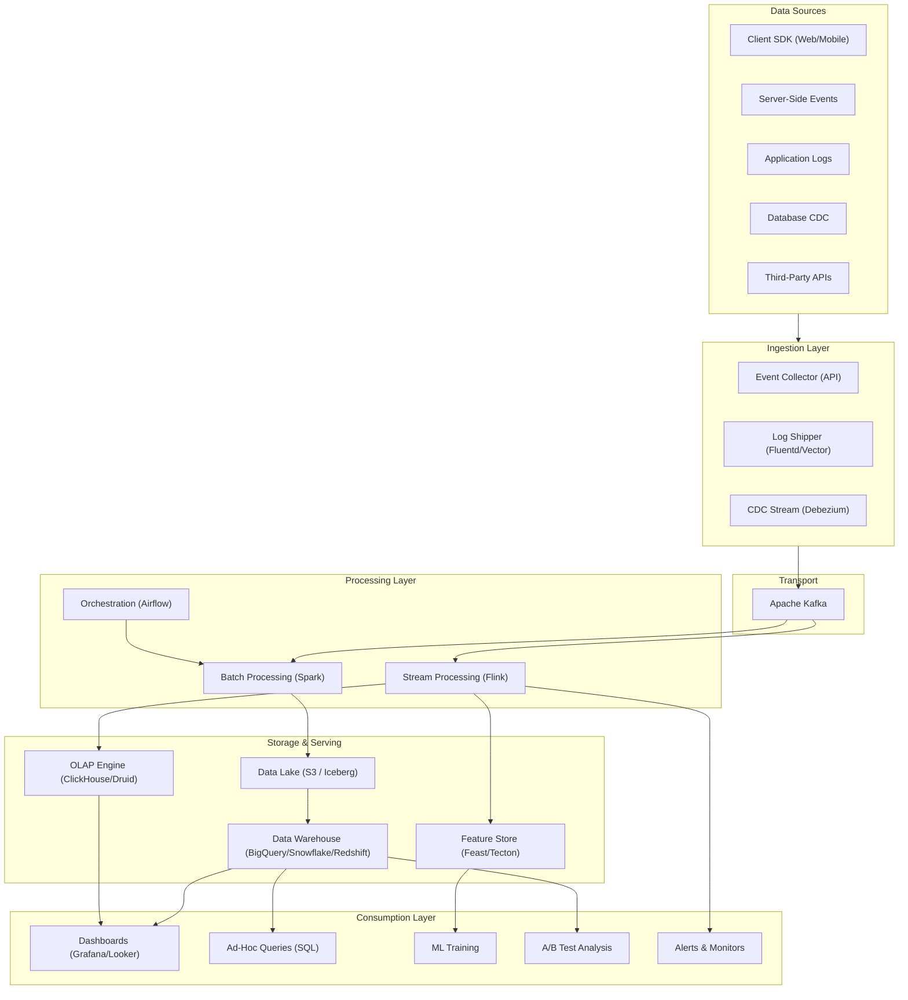

---

## Detailed Data Models

This section provides comprehensive schema definitions across all 12 subsystems — covering Avro/Protobuf schemas, SQL DDL, and configuration formats.

### Event Tracking Schemas

#### Avro Schema — Base Event Envelope

```avro
{
  "type": "record",
  "name": "AnalyticsEvent",
  "namespace": "com.platform.analytics",
  "fields": [
    {"name": "event_id", "type": "string", "doc": "UUID v7 (time-sortable)"},
    {"name": "event_type", "type": "string", "doc": "Dot-notation: domain.action (e.g. product.viewed)"},
    {"name": "event_version", "type": "int", "default": 1},
    {"name": "timestamp", "type": {"type": "long", "logicalType": "timestamp-millis"}},
    {"name": "received_at", "type": {"type": "long", "logicalType": "timestamp-millis"}},
    {"name": "user_id", "type": ["null", "string"], "default": null},
    {"name": "anonymous_id", "type": "string"},
    {"name": "session_id", "type": "string"},
    {"name": "device_id", "type": "string"},
    {"name": "properties", "type": {"type": "map", "values": ["null", "string", "long", "double", "boolean"]}},
    {"name": "context", "type": {
      "type": "record",
      "name": "EventContext",
      "fields": [
        {"name": "app_version", "type": "string"},
        {"name": "platform", "type": {"type": "enum", "name": "Platform", "symbols": ["WEB", "IOS", "ANDROID", "SERVER"]}},
        {"name": "os_version", "type": ["null", "string"], "default": null},
        {"name": "locale", "type": "string", "default": "en-US"},
        {"name": "ip", "type": ["null", "string"], "default": null},
        {"name": "user_agent", "type": ["null", "string"], "default": null},
        {"name": "screen_width", "type": ["null", "int"], "default": null},
        {"name": "screen_height", "type": ["null", "int"], "default": null},
        {"name": "referrer", "type": ["null", "string"], "default": null},
        {"name": "utm_source", "type": ["null", "string"], "default": null},
        {"name": "utm_medium", "type": ["null", "string"], "default": null},
        {"name": "utm_campaign", "type": ["null", "string"], "default": null}
      ]
    }}
  ]
}
```

#### Protobuf Schema — High-Throughput Event

```protobuf
syntax = "proto3";
package analytics.v1;

import "google/protobuf/timestamp.proto";
import "google/protobuf/struct.proto";

message AnalyticsEvent {
  string event_id = 1;
  string event_type = 2;
  int32 event_version = 3;
  google.protobuf.Timestamp timestamp = 4;
  google.protobuf.Timestamp received_at = 5;

  string user_id = 6;
  string anonymous_id = 7;
  string session_id = 8;
  string device_id = 9;

  google.protobuf.Struct properties = 10;
  EventContext context = 11;

  message EventContext {
    string app_version = 1;
    Platform platform = 2;
    string os_version = 3;
    string locale = 4;
    string ip = 5;
    string user_agent = 6;
    int32 screen_width = 7;
    int32 screen_height = 8;
    string referrer = 9;
    UTMParams utm = 10;
  }

  message UTMParams {
    string source = 1;
    string medium = 2;
    string campaign = 3;
    string term = 4;
    string content = 5;
  }

  enum Platform {
    PLATFORM_UNSPECIFIED = 0;
    WEB = 1;
    IOS = 2;
    ANDROID = 3;
    SERVER = 4;
  }
}

message EventBatch {
  repeated AnalyticsEvent events = 1;
  string sdk_version = 2;
  int64 sent_at = 3;
}
```

### Log Aggregation Schemas

#### Structured Log Format (JSON)

```json
{
  "timestamp": "2026-03-22T10:30:00.123Z",
  "level": "ERROR",
  "logger": "com.platform.checkout.PaymentService",
  "service": "checkout-service",
  "version": "2.14.3",
  "instance_id": "checkout-pod-abc-12345",
  "environment": "production",
  "region": "us-east-1",
  "trace_id": "trace_7f3a8b2c",
  "span_id": "span_4d2e1f9a",
  "parent_span_id": "span_8c3b7d6e",
  "message": "Payment authorization failed after 3 retries",
  "error": {
    "type": "PSPTimeoutException",
    "message": "Stripe gateway timeout after 5000ms",
    "stack_trace": "com.platform.checkout.PaymentService.authorize(PaymentService.java:142)...",
    "code": "PAYMENT_TIMEOUT"
  },
  "context": {
    "payment_id": "pay_abc123",
    "merchant_id": "mer_xyz789",
    "amount_cents": 14999,
    "currency": "USD",
    "retry_count": 3,
    "gateway": "stripe"
  },
  "metrics": {
    "duration_ms": 15342,
    "memory_used_mb": 512
  }
}
```

#### Log Table DDL (Elasticsearch Index Template)

```json
{
  "index_patterns": ["logs-*"],
  "template": {
    "settings": {
      "number_of_shards": 6,
      "number_of_replicas": 1,
      "index.lifecycle.name": "logs-retention-policy",
      "index.lifecycle.rollover_alias": "logs-write",
      "index.codec": "best_compression"
    },
    "mappings": {
      "properties": {
        "timestamp": {"type": "date"},
        "level": {"type": "keyword"},
        "service": {"type": "keyword"},
        "version": {"type": "keyword"},
        "instance_id": {"type": "keyword"},
        "region": {"type": "keyword"},
        "trace_id": {"type": "keyword"},
        "span_id": {"type": "keyword"},
        "message": {"type": "text", "analyzer": "standard"},
        "error.type": {"type": "keyword"},
        "error.code": {"type": "keyword"},
        "error.stack_trace": {"type": "text", "index": false},
        "context": {"type": "object", "dynamic": true}
      }
    }
  }
}
```

### Clickstream Session Schema

```sql
-- Sessionized clickstream output table
CREATE TABLE clickstream_sessions (
    session_id          STRING        NOT NULL,
    user_id             STRING,
    anonymous_id        STRING        NOT NULL,
    device_id           STRING,
    start_time          TIMESTAMP     NOT NULL,
    end_time            TIMESTAMP     NOT NULL,
    duration_seconds    INT,
    event_count         INT,
    page_view_count     INT,
    unique_pages        INT,
    entry_page          STRING,
    entry_referrer      STRING,
    exit_page           STRING,
    conversion_flag     BOOLEAN       DEFAULT FALSE,
    conversion_type     STRING,       -- 'purchase', 'signup', 'subscription'
    conversion_value    DECIMAL(12,2),
    bounce_flag         BOOLEAN,      -- single page_view session
    platform            STRING,
    country             STRING,
    utm_source          STRING,
    utm_medium          STRING,
    utm_campaign        STRING,
    session_date        DATE          NOT NULL
) PARTITION BY (session_date)
CLUSTER BY (user_id);

-- Clickstream event detail within session
CREATE TABLE clickstream_events (
    session_id          STRING        NOT NULL,
    event_sequence      INT           NOT NULL,  -- 1, 2, 3...
    event_id            STRING        NOT NULL,
    event_type          STRING        NOT NULL,
    event_timestamp     TIMESTAMP     NOT NULL,
    page_url            STRING,
    page_title          STRING,
    element_id          STRING,
    element_type        STRING,       -- 'button', 'link', 'form'
    properties          JSON,
    time_on_page_sec    INT,
    scroll_depth_pct    INT,
    session_date        DATE          NOT NULL
) PARTITION BY (session_date)
CLUSTER BY (session_id);
```

### Kafka Topic Schemas

#### Topic Configuration Table

| Topic | Partitions | Replication | Retention | Key | Value Schema | Throughput |
|-------|-----------|-------------|-----------|-----|-------------|------------|
| `raw-events` | 128 | 3 | 7 days | `event_type` | AnalyticsEvent (Avro) | 2M/s |
| `enriched-events` | 128 | 3 | 3 days | `user_id` | EnrichedEvent (Avro) | 2M/s |
| `log-events` | 64 | 3 | 3 days | `service` | LogEntry (JSON) | 500K/s |
| `session-events` | 64 | 3 | 1 day | `session_id` | SessionEvent (Avro) | 200K/s |
| `metric-aggregates` | 32 | 3 | 1 day | `metric_name` | MetricAggregate (Avro) | 100K/s |
| `experiment-assignments` | 16 | 3 | 30 days | `user_id` | Assignment (Avro) | 50K/s |
| `feature-updates` | 32 | 3 | 1 day | `entity_key` | FeatureUpdate (Avro) | 100K/s |
| `dead-letter-events` | 8 | 3 | 30 days | `event_id` | FailedEvent (JSON) | 1K/s |

#### Enriched Event Schema

```avro
{
  "type": "record",
  "name": "EnrichedEvent",
  "namespace": "com.platform.analytics",
  "fields": [
    {"name": "event", "type": "AnalyticsEvent"},
    {"name": "user_segment", "type": ["null", "string"], "default": null},
    {"name": "user_country", "type": ["null", "string"], "default": null},
    {"name": "user_lifetime_value", "type": ["null", "double"], "default": null},
    {"name": "user_account_age_days", "type": ["null", "int"], "default": null},
    {"name": "geo_city", "type": ["null", "string"], "default": null},
    {"name": "geo_region", "type": ["null", "string"], "default": null},
    {"name": "geo_country", "type": ["null", "string"], "default": null},
    {"name": "device_type", "type": ["null", "string"], "default": null},
    {"name": "browser", "type": ["null", "string"], "default": null},
    {"name": "is_bot", "type": "boolean", "default": false},
    {"name": "experiment_assignments", "type": {"type": "array", "items": {
      "type": "record",
      "name": "ExperimentAssignment",
      "fields": [
        {"name": "experiment_id", "type": "string"},
        {"name": "variant", "type": "string"},
        {"name": "layer", "type": "string"}
      ]
    }}}
  ]
}
```

### Spark Job Configuration Schema

```yaml
# spark-job-config.yaml — Standard configuration for batch jobs
job:
  name: "daily_user_metrics"
  owner: "data-platform-team"
  schedule: "0 2 * * *"
  sla_hours: 4
  priority: "high"

spark:
  master: "yarn"
  deploy_mode: "cluster"
  driver:
    memory: "8g"
    cores: 4
  executor:
    memory: "16g"
    cores: 4
    instances: 50
    instances_max: 200          # dynamic allocation max
  dynamic_allocation: true
  shuffle_partitions: 400
  sql:
    adaptive_enabled: true
    sources:
      partition_overwrite_mode: "dynamic"

input:
  format: "iceberg"
  table: "analytics_lake.raw_events"
  partition_filter: "event_date = '{{ ds }}'"
  columns:
    - event_id
    - event_type
    - user_id
    - properties
    - timestamp

output:
  format: "iceberg"
  table: "analytics_lake.daily_user_metrics"
  mode: "overwrite"
  partition_by: ["metric_date"]

quality_checks:
  - type: "row_count"
    min_ratio: 0.8               # at least 80% of previous day
    max_ratio: 1.5
  - type: "null_check"
    columns: ["user_id", "metric_date"]
    max_null_pct: 0.01
  - type: "uniqueness"
    columns: ["user_id", "metric_date"]

alerts:
  on_failure: ["slack://data-alerts", "pagerduty://data-oncall"]
  on_sla_miss: ["pagerduty://data-oncall"]
```

### Data Warehouse Table Schemas

#### Star Schema — Full DDL

```sql
-- ============================================================
-- FACT TABLES
-- ============================================================

-- Fact: page_views (append-only, one row per page view)
CREATE TABLE fact_page_views (
    view_id             STRING        NOT NULL,
    event_timestamp     TIMESTAMP     NOT NULL,
    user_id             STRING,
    anonymous_id        STRING        NOT NULL,
    session_id          STRING        NOT NULL,
    page_url            STRING        NOT NULL,
    page_title          STRING,
    referrer_url        STRING,
    time_on_page_sec    INT,
    scroll_depth_pct    INT,
    device_type         STRING,
    browser             STRING,
    country             STRING,
    region              STRING,
    utm_source          STRING,
    utm_medium          STRING,
    utm_campaign        STRING,
    view_date           DATE          NOT NULL
) PARTITION BY (view_date)
CLUSTER BY (user_id, session_id);

-- Fact: user_events (all tracked events)
CREATE TABLE fact_user_events (
    event_id            STRING        NOT NULL,
    event_type          STRING        NOT NULL,
    event_timestamp     TIMESTAMP     NOT NULL,
    user_id             STRING,
    anonymous_id        STRING        NOT NULL,
    session_id          STRING,
    platform            STRING,
    app_version         STRING,
    properties          JSON,
    event_date          DATE          NOT NULL
) PARTITION BY (event_date)
CLUSTER BY (event_type, user_id);

-- Fact: experiment_exposures
CREATE TABLE fact_experiment_exposures (
    exposure_id         STRING        NOT NULL,
    experiment_id       STRING        NOT NULL,
    variant_id          STRING        NOT NULL,
    user_id             STRING        NOT NULL,
    first_exposure_time TIMESTAMP     NOT NULL,
    platform            STRING,
    country             STRING,
    user_segment        STRING,
    exposure_date       DATE          NOT NULL
) PARTITION BY (exposure_date)
CLUSTER BY (experiment_id, user_id);

-- Fact: metric_events (for A/B analysis)
CREATE TABLE fact_metric_events (
    metric_event_id     STRING        NOT NULL,
    metric_name         STRING        NOT NULL,
    user_id             STRING        NOT NULL,
    metric_value        DOUBLE        NOT NULL,
    event_timestamp     TIMESTAMP     NOT NULL,
    experiment_id       STRING,
    variant_id          STRING,
    metric_date         DATE          NOT NULL
) PARTITION BY (metric_date)
CLUSTER BY (metric_name, experiment_id);

-- ============================================================
-- DIMENSION TABLES
-- ============================================================

-- Dimension: users (SCD Type 2)
CREATE TABLE dim_users (
    user_key            BIGINT        NOT NULL,   -- surrogate key
    user_id             STRING        NOT NULL,   -- natural key
    username            STRING,
    email_domain        STRING,                    -- no PII: only domain
    signup_date         DATE,
    signup_platform     STRING,
    country             STRING,
    city                STRING,
    language            STRING,
    segment             STRING,        -- 'new', 'active', 'power', 'dormant', 'churned'
    tier                STRING,        -- 'free', 'pro', 'enterprise'
    lifetime_value      DECIMAL(12,2),
    total_orders        INT,
    valid_from          DATE          NOT NULL,
    valid_to            DATE,
    is_current          BOOLEAN       NOT NULL
);

-- Dimension: products
CREATE TABLE dim_products (
    product_key         BIGINT        NOT NULL,
    product_id          STRING        NOT NULL,
    title               STRING        NOT NULL,
    category_l1         STRING,
    category_l2         STRING,
    category_l3         STRING,
    brand               STRING,
    seller_id           STRING,
    price_current       DECIMAL(12,2),
    created_at          TIMESTAMP,
    is_active           BOOLEAN
);

-- Dimension: experiments
CREATE TABLE dim_experiments (
    experiment_id       STRING        NOT NULL,
    experiment_name     STRING        NOT NULL,
    hypothesis          STRING,
    owner               STRING,
    team                STRING,
    layer               STRING,        -- 'ui', 'algorithm', 'infrastructure', 'pricing'
    status              STRING,        -- 'draft', 'running', 'analyzing', 'decided'
    start_date          DATE,
    end_date            DATE,
    traffic_pct         INT,
    primary_metric      STRING,
    guardrail_metrics   ARRAY<STRING>,
    variants            JSON
);

-- Dimension: dates
CREATE TABLE dim_dates (
    date_key            DATE          NOT NULL,
    year                INT,
    quarter             INT,
    month               INT,
    week_of_year        INT,
    day_of_week         INT,
    day_name            STRING,
    is_weekend          BOOLEAN,
    is_holiday          BOOLEAN,
    fiscal_quarter      STRING,
    fiscal_year         INT
);

-- Dimension: geography
CREATE TABLE dim_geography (
    geo_key             STRING        NOT NULL,
    country_code        STRING,
    country_name        STRING,
    region              STRING,
    city                STRING,
    timezone            STRING,
    gdpr_region         BOOLEAN,
    data_residency_zone STRING       -- 'us', 'eu', 'apac'
);
```

#### Snowflake Schema Extension

```sql
-- Normalized category hierarchy (snowflake extension)
CREATE TABLE dim_category_l1 (
    category_l1_id      STRING        NOT NULL,
    category_l1_name    STRING        NOT NULL,
    department          STRING
);

CREATE TABLE dim_category_l2 (
    category_l2_id      STRING        NOT NULL,
    category_l2_name    STRING        NOT NULL,
    category_l1_id      STRING        REFERENCES dim_category_l1(category_l1_id)
);

CREATE TABLE dim_category_l3 (
    category_l3_id      STRING        NOT NULL,
    category_l3_name    STRING        NOT NULL,
    category_l2_id      STRING        REFERENCES dim_category_l2(category_l2_id)
);

-- Normalized seller hierarchy
CREATE TABLE dim_sellers (
    seller_id           STRING        NOT NULL,
    seller_name         STRING,
    seller_tier         STRING,        -- 'standard', 'premium', 'enterprise'
    country             STRING,
    joined_date         DATE,
    is_verified         BOOLEAN
);
```

### OLAP Cube Definitions

#### ClickHouse Table Schemas

```sql
-- Real-time event aggregation table
CREATE TABLE rt_event_counts
(
    event_date    Date,
    event_hour    UInt8,
    event_type    LowCardinality(String),
    platform      LowCardinality(String),
    country       LowCardinality(String),
    user_segment  LowCardinality(String),
    event_count   SimpleAggregateFunction(sum, UInt64),
    unique_users  AggregateFunction(uniq, String),
    total_value   SimpleAggregateFunction(sum, Float64)
)
ENGINE = AggregatingMergeTree()
PARTITION BY toYYYYMM(event_date)
ORDER BY (event_date, event_hour, event_type, platform, country, user_segment)
TTL event_date + INTERVAL 90 DAY;

-- Materialized view for automatic aggregation from Kafka
CREATE MATERIALIZED VIEW rt_event_counts_mv
TO rt_event_counts AS
SELECT
    toDate(timestamp) AS event_date,
    toHour(timestamp) AS event_hour,
    event_type,
    platform,
    country,
    user_segment,
    count() AS event_count,
    uniqState(user_id) AS unique_users,
    sum(value) AS total_value
FROM kafka_events
GROUP BY event_date, event_hour, event_type, platform, country, user_segment;

-- Revenue cube
CREATE TABLE rt_revenue_cube
(
    revenue_date      Date,
    revenue_hour      UInt8,
    product_category  LowCardinality(String),
    payment_method    LowCardinality(String),
    country           LowCardinality(String),
    platform          LowCardinality(String),
    order_count       SimpleAggregateFunction(sum, UInt64),
    gross_revenue     SimpleAggregateFunction(sum, Float64),
    net_revenue       SimpleAggregateFunction(sum, Float64),
    avg_order_value   AggregateFunction(avg, Float64),
    unique_buyers     AggregateFunction(uniq, String)
)
ENGINE = AggregatingMergeTree()
PARTITION BY toYYYYMM(revenue_date)
ORDER BY (revenue_date, revenue_hour, product_category, country)
TTL revenue_date + INTERVAL 1 YEAR;

-- Funnel analysis cube
CREATE TABLE rt_funnel_steps
(
    funnel_date     Date,
    funnel_name     LowCardinality(String),
    step_number     UInt8,
    step_name       LowCardinality(String),
    platform        LowCardinality(String),
    country         LowCardinality(String),
    user_segment    LowCardinality(String),
    entered_count   SimpleAggregateFunction(sum, UInt64),
    completed_count SimpleAggregateFunction(sum, UInt64),
    unique_users    AggregateFunction(uniq, String),
    median_time_sec AggregateFunction(median, Float32)
)
ENGINE = AggregatingMergeTree()
PARTITION BY toYYYYMM(funnel_date)
ORDER BY (funnel_date, funnel_name, step_number, platform, country);
```

### Feature Store Schemas

```sql
-- Feature registry (metadata)
CREATE TABLE feature_registry (
    feature_id          STRING        NOT NULL,
    feature_name        STRING        NOT NULL,    -- e.g. 'user_purchase_count_30d'
    feature_group       STRING        NOT NULL,    -- e.g. 'user_purchase_features'
    entity_type         STRING        NOT NULL,    -- 'user', 'product', 'session'
    value_type          STRING        NOT NULL,    -- 'int64', 'float64', 'string', 'embedding'
    description         STRING,
    owner               STRING,
    computation_source  STRING,                     -- 'batch_spark', 'stream_flink'
    batch_schedule      STRING,                     -- cron expression
    freshness_sla       STRING,                     -- 'daily', 'hourly', 'realtime'
    online_enabled      BOOLEAN       DEFAULT TRUE,
    offline_enabled     BOOLEAN       DEFAULT TRUE,
    created_at          TIMESTAMP,
    updated_at          TIMESTAMP,
    version             INT           DEFAULT 1,
    tags                ARRAY<STRING>,
    data_quality_checks JSON
);

-- Offline feature store table (for training)
CREATE TABLE offline_features_user (
    entity_id           STRING        NOT NULL,     -- user_id
    feature_timestamp   TIMESTAMP     NOT NULL,
    purchase_count_7d   INT,
    purchase_count_30d  INT,
    purchase_count_90d  INT,
    avg_order_value_30d DOUBLE,
    total_spend_30d     DOUBLE,
    days_since_last_purchase INT,
    preferred_category  STRING,
    session_count_7d    INT,
    avg_session_duration_sec DOUBLE,
    page_views_7d       INT,
    search_count_7d     INT,
    cart_abandonment_rate_30d DOUBLE,
    lifetime_value      DOUBLE,
    account_age_days    INT,
    feature_date        DATE          NOT NULL
) PARTITION BY (feature_date)
CLUSTER BY (entity_id);
```

#### Online Feature Store (Redis Schema)

```
# Key pattern: feature_group:entity_type:entity_id
# Value: Hash with feature names as fields

# Example for user features:
HSET user_purchase_features:user:usr_xyz789 \
    purchase_count_7d 12 \
    purchase_count_30d 38 \
    avg_order_value_30d 67.50 \
    days_since_last_purchase 3 \
    preferred_category "electronics" \
    lifetime_value 4250.00 \
    _timestamp 1711100400000 \
    _version 42

# TTL: 86400 seconds (24 hours) for daily-refreshed features
EXPIRE user_purchase_features:user:usr_xyz789 86400

# For real-time features (updated by Flink):
HSET user_realtime_features:user:usr_xyz789 \
    active_cart_value 149.99 \
    session_page_views 7 \
    time_since_last_click_sec 45 \
    current_funnel_step "checkout" \
    _timestamp 1711186800000

# TTL: 3600 seconds (1 hour) for real-time features
EXPIRE user_realtime_features:user:usr_xyz789 3600
```

### Experiment Configuration Schema

```json
{
  "experiment_id": "exp_checkout_v2_2026q1",
  "name": "New Checkout Flow V2",
  "hypothesis": "Reducing checkout steps from 4 to 2 will increase purchase completion rate by at least 3%",
  "owner": "alice@company.com",
  "team": "checkout-team",
  "layer": "ui",
  "status": "running",

  "targeting": {
    "platforms": ["web", "ios", "android"],
    "countries": ["US", "CA", "GB", "DE", "FR"],
    "user_segments": ["active", "power"],
    "min_account_age_days": 7,
    "exclusion_experiments": ["exp_payment_v3"]
  },

  "traffic": {
    "allocation_pct": 20,
    "variants": [
      {"id": "control", "name": "Current 4-step checkout", "weight": 50},
      {"id": "treatment_a", "name": "2-step checkout", "weight": 25},
      {"id": "treatment_b", "name": "1-page checkout", "weight": 25}
    ],
    "assignment_salt": "checkout_v2_salt_2026",
    "assignment_unit": "user_id"
  },

  "metrics": {
    "primary": {
      "name": "checkout_completion_rate",
      "type": "proportion",
      "minimum_detectable_effect": 0.03,
      "direction": "increase"
    },
    "secondary": [
      {"name": "revenue_per_user", "type": "continuous", "direction": "increase"},
      {"name": "time_to_purchase_sec", "type": "continuous", "direction": "decrease"},
      {"name": "cart_abandonment_rate", "type": "proportion", "direction": "decrease"}
    ],
    "guardrails": [
      {"name": "page_load_time_p95_ms", "threshold_pct_increase": 10},
      {"name": "error_rate", "threshold_pct_increase": 5},
      {"name": "revenue_per_user", "threshold_pct_decrease": 2},
      {"name": "7d_retention", "threshold_pct_decrease": 1}
    ]
  },

  "analysis": {
    "method": "frequentist",
    "confidence_level": 0.95,
    "power": 0.80,
    "correction": "bonferroni",
    "required_sample_size_per_variant": 50000,
    "minimum_runtime_days": 7,
    "maximum_runtime_days": 30
  },

  "schedule": {
    "start_date": "2026-03-01",
    "end_date": "2026-03-31",
    "ramp_schedule": [
      {"date": "2026-03-01", "traffic_pct": 5},
      {"date": "2026-03-03", "traffic_pct": 10},
      {"date": "2026-03-07", "traffic_pct": 20}
    ]
  }
}
```

### Metric Definition Schema

```yaml
# metric-definitions/checkout_completion_rate.yaml
metric:
  name: "checkout_completion_rate"
  display_name: "Checkout Completion Rate"
  description: "Percentage of users who start checkout and complete purchase"
  owner: "checkout-team"
  type: "proportion"           # proportion | continuous | count | ratio

  numerator:
    event_type: "purchase.completed"
    entity: "user_id"
    filter: "properties.source = 'checkout'"

  denominator:
    event_type: "checkout.started"
    entity: "user_id"

  time_window: "per_user_experiment_period"
  aggregation: "mean"

  data_quality:
    min_sample_size: 1000
    max_null_pct: 0.01
    expected_range: [0.01, 0.50]

  tags: ["checkout", "conversion", "p0-metric"]
  tier: "p0"                    # p0 = company-level, p1 = team-level, p2 = exploratory

---
# metric-definitions/revenue_per_user.yaml
metric:
  name: "revenue_per_user"
  display_name: "Revenue Per User (RPU)"
  description: "Average revenue generated per user over the measurement period"
  owner: "growth-team"
  type: "continuous"

  value:
    event_type: "purchase.completed"
    entity: "user_id"
    value_field: "properties.total_amount"
    aggregation_per_entity: "sum"

  population_aggregation: "mean"
  time_window: "7_day"

  winsorization:
    lower_pct: 0
    upper_pct: 99.5             # cap extreme outliers

  data_quality:
    min_sample_size: 5000
    expected_range: [0, 10000]

  tags: ["revenue", "monetization", "p0-metric"]
  tier: "p0"
```

---

## Low-Level Design

### 1. Event Tracking System

#### Overview

The Event Tracking System captures user interactions (page views, clicks, purchases, searches) from web and mobile clients plus server-side events. This is the **primary data source** for all product analytics, ML features, and experimentation.

At Netflix, the event tracking system processes **1 trillion events per day**. At Uber, it handles **1 PB of new data daily**.

#### Client SDK Architecture

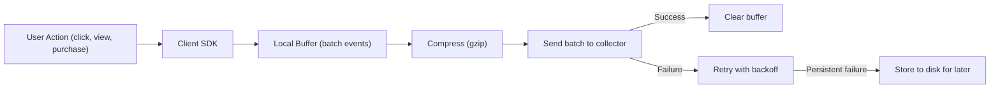

#### Event Schema

```json
{
  "event_id": "evt_abc123",
  "event_type": "product.viewed",
  "timestamp": "2026-03-22T10:30:00.000Z",
  "user_id": "usr_xyz",
  "session_id": "sess_456",
  "device_id": "dev_789",
  "properties": {
    "product_id": "prod_abc",
    "category": "electronics",
    "price": 149.99,
    "source": "search_results",
    "position": 3
  },
  "context": {
    "app_version": "5.2.1",
    "platform": "ios",
    "os_version": "17.4",
    "locale": "en-US",
    "ip": "203.0.113.42",
    "user_agent": "..."
  }
}
```

#### Schema Registry

All events must conform to a registered schema (Avro or JSON Schema). The schema registry:
- **Validates** events at ingestion time (reject malformed events)
- **Evolves** schemas safely (backward-compatible changes only)
- **Documents** all event types for consumers

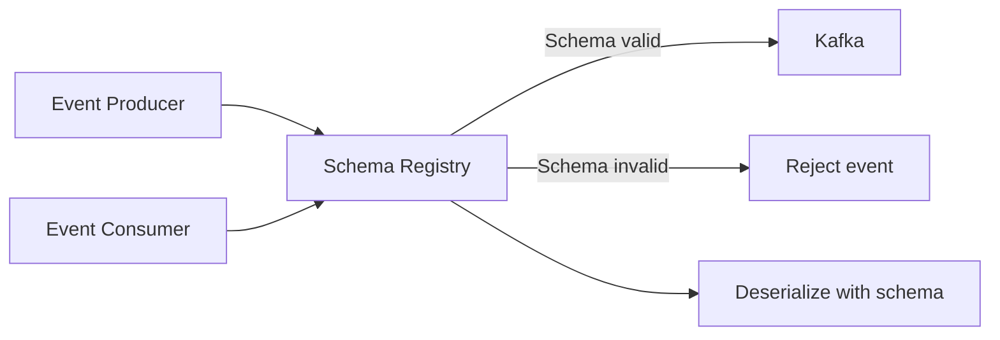

#### Data Quality Challenges

| Problem | Detection | Mitigation |
|---------|-----------|-----------|
| **Missing events** | Compare client-side counter vs. server-side count | Client-side buffering + retry; dead letter queue |
| **Duplicate events** | Same event_id received twice | Idempotent processing (dedup by event_id) |
| **Schema violation** | Event doesn't match registered schema | Reject at collector; route to dead letter topic |
| **Clock skew** | Client timestamp far from server receive time | Use server-side receive time for ordering; keep client time for analysis |
| **Late-arriving events** | Events arrive hours/days after occurrence | Watermark-based windowing; allow late data with configurable grace period |
| **PII leakage** | Sensitive data in event properties | Schema-level PII annotations; automated scrubbing pipeline |

---

### 2. Log Aggregation System

#### Overview

The Log Aggregation System collects application logs, infrastructure metrics, and audit trails from thousands of services and servers into a centralized, searchable store. This powers debugging, alerting, and compliance auditing.

#### Architecture

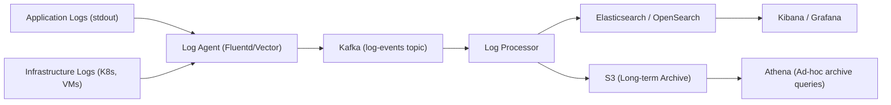

#### Log Levels and Retention

| Level | Volume | Retention (Hot) | Retention (Archive) |
|-------|--------|----------------|-------------------|
| ERROR | Low | 90 days (ES) | 3 years (S3) |
| WARN | Medium | 30 days | 1 year |
| INFO | High | 14 days | 6 months |
| DEBUG | Very high | 3 days | Not archived |

#### Structured Logging Format

```json
{
  "timestamp": "2026-03-22T10:30:00.000Z",
  "level": "ERROR",
  "service": "checkout-service",
  "instance": "checkout-pod-abc-12345",
  "trace_id": "trace_xyz789",
  "span_id": "span_abc123",
  "message": "Payment authorization failed",
  "error": {"type": "PSPTimeoutException", "message": "Stripe timeout after 5000ms"},
  "context": {"payment_id": "pay_abc", "merchant_id": "mer_xyz", "amount": 149.99}
}
```

**Correlation**: `trace_id` links logs across services for distributed tracing. Combined with Jaeger/Zipkin traces.

---

### 3. Clickstream Processing

#### Overview

Clickstream processing analyzes the **sequence of user interactions** within a session to understand behavior patterns, conversion funnels, and drop-off points. Unlike individual event tracking, clickstream analysis focuses on **sequences and paths**.

#### Sessionization

Raw events don't have session boundaries. The sessionization pipeline groups events into sessions:

```
Session definition:
- Same user_id
- Events within 30-minute inactivity gap
- OR same session_id from client SDK

Session output:
{
  session_id, user_id, start_time, end_time, duration_sec,
  event_count, page_views, unique_pages,
  entry_page, exit_page,
  conversion: true/false,
  events: [ordered list of events]
}
```

#### Funnel Analysis

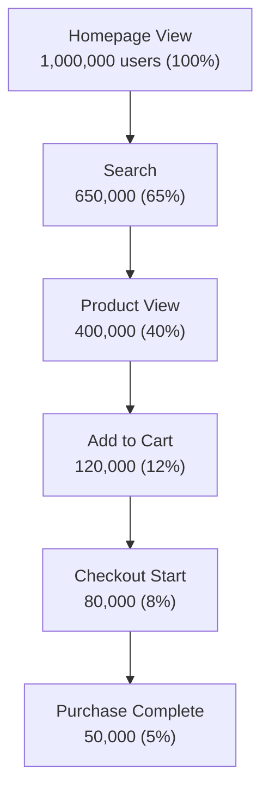

This funnel is computed from sessionized clickstream data. The 5% overall conversion rate and per-step drop-offs guide product decisions.

---

### 4. Stream Processing (Kafka/Flink)

#### Overview

Stream Processing handles **real-time event transformation, aggregation, and alerting**. While batch processing looks at historical data, stream processing operates on events as they arrive — enabling real-time dashboards, fraud detection, and live feature computation.

#### Architecture

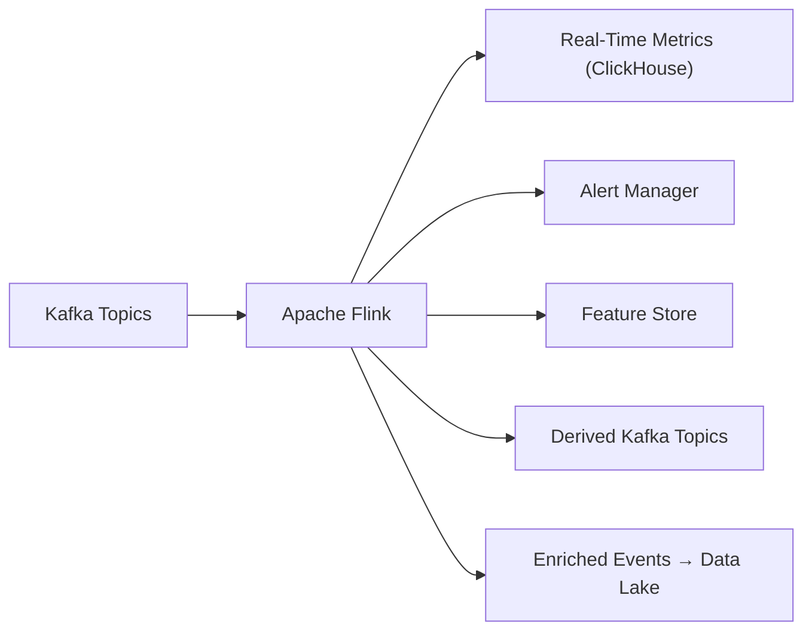

#### Common Stream Processing Patterns

| Pattern | Example | Implementation |
|---------|---------|---------------|
| **Aggregation** | Count page views per minute per page | Tumbling window (1 min) with GROUP BY page_id |
| **Enrichment** | Add user segment to click events | Lookup user profile from Redis; join with event |
| **Filtering** | Route ERROR logs to alert pipeline | Filter by log level |
| **Sessionization** | Group events into user sessions | Session window with 30-min gap |
| **Deduplication** | Remove duplicate events | Keyed state by event_id with 1-hour dedup window |
| **Anomaly detection** | Alert if checkout error rate > 5% | Sliding window comparison vs. baseline |

#### Exactly-Once Processing

Flink provides exactly-once semantics through:
1. **Checkpointing**: Periodic snapshots of operator state to persistent storage
2. **Kafka transactional producer**: Atomic writes to output topics
3. **Idempotent sinks**: Sinks that handle duplicates gracefully (e.g., upsert to ClickHouse)

#### Flink State Management

| State Type | Use Case | Storage |
|-----------|----------|---------|
| **Keyed state** | Per-user session, per-event dedup | RocksDB (on-heap for small state) |
| **Operator state** | Source offsets, global counters | Checkpointed to S3 |
| **Broadcast state** | Configuration, lookup tables | Distributed to all operators |

---

### 5. Batch Processing (Spark)

#### Overview

Batch Processing handles **large-scale data transformation** that doesn't need real-time latency: daily aggregations, ML feature computation, data warehouse loading, and historical analysis. Apache Spark is the industry standard.

#### Common Batch Jobs

| Job | Schedule | Input | Output | SLA |
|-----|----------|-------|--------|-----|
| Daily user metrics | 2 AM | Raw events (S3) | Aggregated metrics (warehouse) | Complete by 6 AM |
| Revenue reporting | 3 AM | Order + payment data | Finance tables (warehouse) | Complete by 8 AM |
| ML feature computation | 4 AM | User behavior data | Feature store | Complete by 6 AM |
| Data quality checks | Continuous | All tables | Quality dashboard | < 30 min lag |
| Recommendation model training | Weekly | Watch/purchase history | Model artifacts | Complete in 24h |

#### Spark Job Architecture

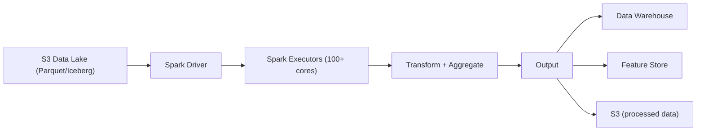

#### Data Lake Architecture (Apache Iceberg)

Modern data lakes use **table formats** like Apache Iceberg (or Delta Lake, Apache Hudi) on top of S3:

| Feature | Benefit |
|---------|---------|
| **ACID transactions** | Atomic writes; readers see consistent snapshots |
| **Schema evolution** | Add/rename/drop columns safely |
| **Time travel** | Query data as of any past snapshot |
| **Partition evolution** | Change partitioning without rewriting data |
| **Hidden partitioning** | Partition pruning without exposing partitions to users |

---

### 6. ETL Pipelines

#### Overview

ETL (Extract, Transform, Load) pipelines orchestrate the movement of data from sources to destinations with transformation and quality checks. Apache Airflow is the dominant orchestration tool.

#### Pipeline Architecture

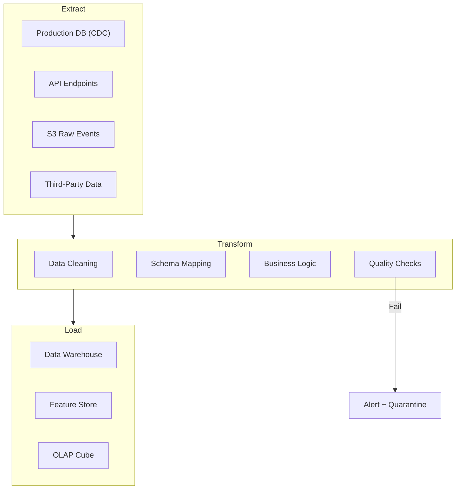

#### Airflow DAG Example

```python
# Simplified Airflow DAG for daily revenue pipeline
with DAG('daily_revenue', schedule='0 3 * * *', catchup=False) as dag:

    extract_orders = SparkSubmitOperator(
        task_id='extract_orders',
        application='s3://jobs/extract_orders.py',
        conf={'spark.sql.sources.partitionOverwriteMode': 'dynamic'}
    )

    extract_payments = SparkSubmitOperator(
        task_id='extract_payments',
        application='s3://jobs/extract_payments.py'
    )

    transform = SparkSubmitOperator(
        task_id='transform_revenue',
        application='s3://jobs/transform_revenue.py'
    )

    quality_check = PythonOperator(
        task_id='quality_check',
        python_callable=check_revenue_quality
    )

    load_warehouse = BigQueryInsertJobOperator(
        task_id='load_warehouse',
        configuration={...}
    )

    [extract_orders, extract_payments] >> transform >> quality_check >> load_warehouse
```

#### Data Quality Framework

| Check | Type | Action on Failure |
|-------|------|-------------------|
| **Row count** | Today's count vs. yesterday ± 20% | Alert + hold pipeline |
| **Null check** | Critical columns must not be null | Alert + quarantine bad rows |
| **Uniqueness** | Primary keys must be unique | Dedup + alert |
| **Referential integrity** | Foreign keys must exist | Alert + log violations |
| **Freshness** | Data must arrive within SLA | Alert + page on-call |
| **Value range** | Prices must be > 0 | Quarantine invalid rows |
| **Schema match** | Output matches expected schema | Block load + alert |

---

### 7. Data Warehouse

#### Overview

The Data Warehouse is the **central analytical store** where business users, analysts, and data scientists run SQL queries over structured, historical data. Modern cloud warehouses (BigQuery, Snowflake, Redshift) handle petabyte-scale data with pay-per-query pricing.

#### Architecture

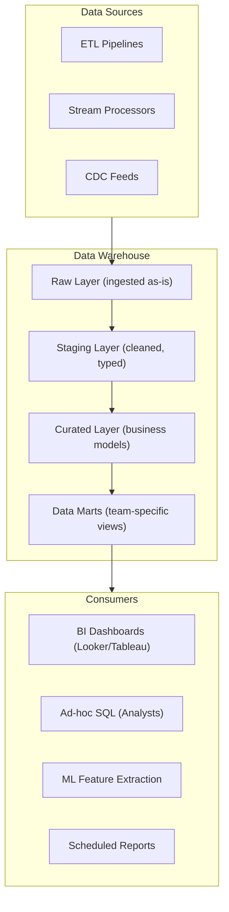

#### Data Modeling (Dimensional)

| Model | Structure | Use Case |
|-------|----------|----------|
| **Star schema** | Fact table + dimension tables | Standard BI queries |
| **Snowflake schema** | Normalized dimensions | Complex hierarchies |
| **Wide/denormalized** | Single wide table | Simple queries, ML feature extraction |
| **Slowly Changing Dimensions (SCD)** | Track historical changes to dimensions | "What was the price last month?" |

#### Example Star Schema

```sql
-- Fact: order_items (one row per item per order)
CREATE TABLE fact_order_items (
    order_item_id   STRING,
    order_id        STRING,
    order_date      DATE,
    product_id      STRING,
    seller_id       STRING,
    buyer_id        STRING,
    quantity        INT,
    unit_price      DECIMAL(12,2),
    discount        DECIMAL(12,2),
    revenue         DECIMAL(12,2),
    shipping_cost   DECIMAL(12,2),
    payment_method  STRING
) PARTITION BY (order_date);

-- Dimension: products
CREATE TABLE dim_products (
    product_id      STRING,
    title           STRING,
    category_l1     STRING,
    category_l2     STRING,
    brand           STRING,
    seller_id       STRING,
    created_at      TIMESTAMP
);

-- Dimension: users (SCD Type 2)
CREATE TABLE dim_users (
    user_id         STRING,
    username        STRING,
    segment         STRING,    -- 'new', 'active', 'churned'
    country         STRING,
    valid_from      DATE,
    valid_to        DATE,
    is_current      BOOLEAN
);
```

---

### 8. OLAP Cube System

#### Overview

OLAP (Online Analytical Processing) engines like ClickHouse, Apache Druid, and Apache Pinot provide **sub-second query performance** on large datasets by pre-aggregating data along multiple dimensions. They bridge the gap between real-time stream processing and batch warehouse queries.

#### When to Use OLAP vs Data Warehouse

| Aspect | OLAP (ClickHouse/Druid) | Warehouse (BigQuery/Snowflake) |
|--------|------------------------|-------------------------------|
| **Query latency** | < 1 second | 5-60 seconds |
| **Data freshness** | Real-time (seconds) | Batch (minutes-hours) |
| **Query complexity** | Simple aggregations, filters, group-by | Complex joins, subqueries, CTEs |
| **Concurrency** | 1000+ queries/second | 50-200 concurrent queries |
| **Best for** | Dashboards, real-time monitoring | Ad-hoc analysis, reports |
| **Cost model** | Instance-based (always-on) | Pay-per-query |

#### ClickHouse Architecture

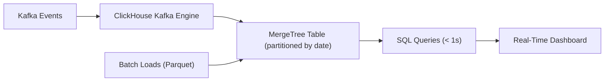

**ClickHouse strengths**: Columnar storage, vectorized execution, MergeTree engine with automatic background merges, excellent compression (10-40x), and native Kafka integration.

---

### 9. Real-Time Analytics Dashboard

#### Overview

Real-time dashboards show live metrics (orders/minute, revenue, error rates, active users) with sub-second refresh. They combine stream-processed metrics (from Flink/ClickHouse) with historical context (from the warehouse).

#### Architecture

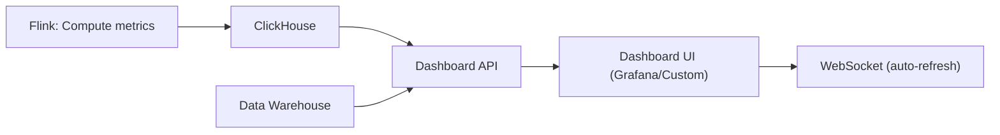

#### Key Dashboard Design Principles

| Principle | Implementation |
|-----------|---------------|
| **Push not pull** | Metrics pushed via WebSocket; no client polling |
| **Pre-aggregated** | Don't run complex queries on every refresh; pre-compute |
| **Historical comparison** | Show "today vs. same day last week" for context |
| **Anomaly highlighting** | Automatically color-code metrics outside normal range |
| **Drill-down** | Click a metric to see breakdown by dimension |
| **Alerting integration** | Dashboard → alert rule → PagerDuty notification |

---

### 10. Feature Store (ML)

#### Overview

The Feature Store is a **centralized repository for ML features** that serves both training (batch) and inference (real-time). Without a feature store, each ML team computes features independently, leading to inconsistency, duplication, and training-serving skew.

#### Architecture

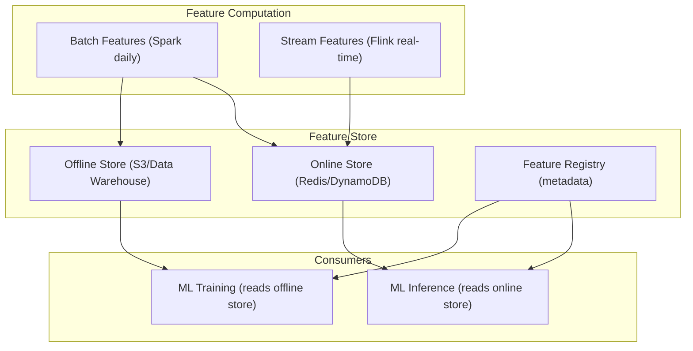

#### Feature Definition Example

```python
# Feature definition (Feast-style)
user_features = FeatureView(
    name="user_purchase_features",
    entities=[user_entity],
    features=[
        Feature(name="total_purchases_30d", dtype=Int64),
        Feature(name="avg_order_value_30d", dtype=Float64),
        Feature(name="days_since_last_purchase", dtype=Int64),
        Feature(name="preferred_category", dtype=String),
        Feature(name="lifetime_value", dtype=Float64),
    ],
    batch_source=BigQuerySource(
        table="analytics.user_purchase_features",
        timestamp_field="feature_timestamp"
    ),
    online=True,  # materialize to online store
    ttl=timedelta(days=1)
)
```

#### Training-Serving Skew Problem

| Problem | Cause | Solution |
|---------|-------|---------|
| **Feature computed differently** | Training uses Spark SQL; serving uses custom Python | Single feature definition, dual materialization |
| **Data leakage** | Training uses future data | Point-in-time-correct joins in offline store |
| **Stale features** | Online store not refreshed | Monitor feature freshness; alert if stale |
| **Schema mismatch** | Feature added in training but missing in serving | Feature registry enforces consistency |

---

### 11. A/B Testing Platform

#### Overview

The A/B Testing Platform enables product teams to run controlled experiments measuring the causal impact of product changes on user metrics. At any given time, a major platform runs **200+ concurrent experiments**.

#### Architecture

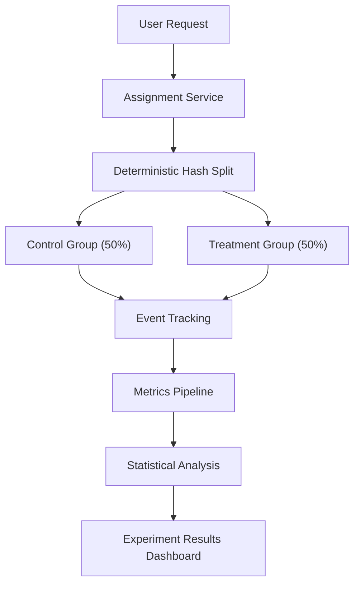

#### Traffic Assignment

```
assignment = hash(user_id + experiment_id) % 100

if assignment < 50:
    group = "control"
else:
    group = "treatment"
```

**Properties**:
- **Deterministic**: Same user always sees same variant (no flicker)
- **Uniform**: Hash distributes evenly across buckets
- **Independent**: Different experiments get independent assignments (different hash salt)

#### Statistical Analysis

| Metric Type | Test | Requirements |
|-------------|------|-------------|
| **Conversion rate** (binary) | Chi-squared / Z-test | Sample size for detectable effect |
| **Revenue per user** (continuous) | t-test / Welch's t-test | Normal distribution assumption |
| **Engagement time** (skewed) | Mann-Whitney U / bootstrap | Non-parametric for skewed data |

**Sample size calculation**: To detect a 1% relative change in conversion rate (baseline 5%) with 80% power and 95% confidence: ~50,000 users per group.

#### Guardrail Metrics

Every experiment monitors **guardrail metrics** — metrics that must NOT degrade regardless of the experiment's impact:
- Page load time (p95)
- Error rate
- Revenue per user (for non-revenue experiments)
- Retention (7-day)

If a guardrail metric degrades beyond threshold, the experiment is automatically flagged for review.

---

### 12. Experimentation Platform

#### Overview

The Experimentation Platform is the **end-to-end framework** built on top of A/B testing that manages the full lifecycle: hypothesis → design → assignment → measurement → decision → rollout.

#### Experiment Lifecycle

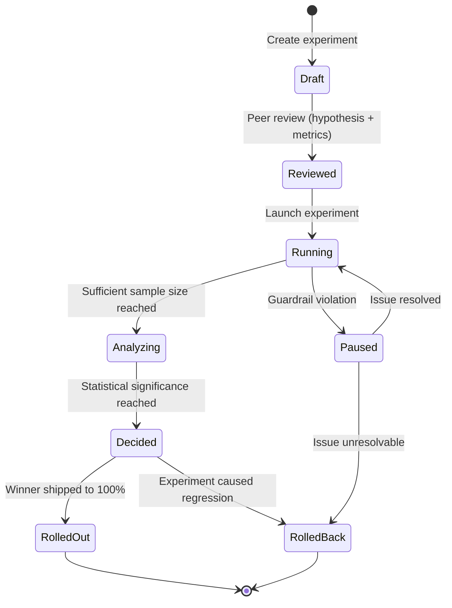

#### Multi-Layer Experimentation

Large platforms run experiments at multiple layers simultaneously:

```
Layer 1: UI Experiments (button colors, layouts, copy)
Layer 2: Algorithm Experiments (ranking, recommendations)
Layer 3: Infrastructure Experiments (latency optimization, caching)
Layer 4: Pricing Experiments (subscription tiers, discounts)
```

Each layer has independent traffic allocation. A user can be in experiments at every layer simultaneously without interaction effects (orthogonal assignment).

#### Experiment Interaction Detection

When two experiments modify the same metric, they may interact:
```
Experiment A: New checkout flow → +2% conversion
Experiment B: Free shipping banner → +3% conversion
Both together: → +4% conversion (not +5%)
```

The platform detects interaction by comparing the combined treatment group against the expected additive effect. Interaction → either sequence experiments or use factorial design.

---

## REST API Specifications

### Event Ingestion API

#### POST /v1/events/batch

Accepts a batch of analytics events from client SDKs and server instrumentation.

```
POST /v1/events/batch
Content-Type: application/json
Authorization: Bearer {api_key}
X-Request-ID: req_abc123
Content-Encoding: gzip
```

**Request Body:**

```json
{
  "batch_id": "batch_7f3a8b2c",
  "sdk_version": "2.14.0",
  "sent_at": "2026-03-22T10:30:00.000Z",
  "events": [
    {
      "event_id": "evt_a1b2c3d4",
      "event_type": "product.viewed",
      "timestamp": "2026-03-22T10:29:55.123Z",
      "user_id": "usr_xyz789",
      "anonymous_id": "anon_456def",
      "session_id": "sess_789ghi",
      "properties": {
        "product_id": "prod_abc123",
        "category": "electronics",
        "price": 149.99,
        "source": "search_results",
        "position": 3
      },
      "context": {
        "app_version": "5.2.1",
        "platform": "ios",
        "os_version": "17.4",
        "locale": "en-US"
      }
    },
    {
      "event_id": "evt_e5f6g7h8",
      "event_type": "product.added_to_cart",
      "timestamp": "2026-03-22T10:30:02.456Z",
      "user_id": "usr_xyz789",
      "anonymous_id": "anon_456def",
      "session_id": "sess_789ghi",
      "properties": {
        "product_id": "prod_abc123",
        "quantity": 1,
        "cart_value": 149.99
      },
      "context": {
        "app_version": "5.2.1",
        "platform": "ios"
      }
    }
  ]
}
```

**Response — 202 Accepted:**

```json
{
  "status": "accepted",
  "batch_id": "batch_7f3a8b2c",
  "accepted_count": 2,
  "rejected_count": 0,
  "server_time": "2026-03-22T10:30:00.512Z"
}
```

**Response — 207 Multi-Status (partial failure):**

```json
{
  "status": "partial",
  "batch_id": "batch_7f3a8b2c",
  "accepted_count": 1,
  "rejected_count": 1,
  "rejected_events": [
    {
      "event_id": "evt_e5f6g7h8",
      "error": "SCHEMA_VIOLATION",
      "message": "Unknown event type: product.added_to_cart_v2"
    }
  ]
}
```

**Error Codes:**

| Status | Error Code | Description |
|--------|-----------|-------------|
| 202 | — | All events accepted |
| 207 | `PARTIAL_ACCEPT` | Some events rejected |
| 400 | `INVALID_BATCH` | Malformed request body |
| 401 | `UNAUTHORIZED` | Invalid or missing API key |
| 413 | `BATCH_TOO_LARGE` | Batch exceeds 500 events or 1 MB |
| 429 | `RATE_LIMITED` | Exceeds 10K requests/sec per API key |
| 503 | `SERVICE_UNAVAILABLE` | Kafka unavailable; client should retry |

### Query API (Data Warehouse)

#### POST /v1/queries

Submit an ad-hoc SQL query to the data warehouse.

```
POST /v1/queries
Content-Type: application/json
Authorization: Bearer {access_token}
```

**Request Body:**

```json
{
  "query": "SELECT event_type, COUNT(*) as cnt, COUNT(DISTINCT user_id) as unique_users FROM fact_user_events WHERE event_date BETWEEN '2026-03-15' AND '2026-03-22' GROUP BY event_type ORDER BY cnt DESC LIMIT 20",
  "warehouse": "bigquery",
  "timeout_seconds": 60,
  "max_bytes_billed": 10737418240,
  "priority": "interactive",
  "labels": {
    "team": "product-analytics",
    "purpose": "weekly-review"
  }
}
```

**Response — 200 OK:**

```json
{
  "query_id": "qry_abc123def",
  "status": "completed",
  "created_at": "2026-03-22T10:30:00.000Z",
  "completed_at": "2026-03-22T10:30:04.512Z",
  "duration_ms": 4512,
  "bytes_scanned": 2147483648,
  "rows_returned": 20,
  "schema": [
    {"name": "event_type", "type": "STRING"},
    {"name": "cnt", "type": "INT64"},
    {"name": "unique_users", "type": "INT64"}
  ],
  "rows": [
    ["page.viewed", 12500000, 3200000],
    ["product.viewed", 8700000, 2100000],
    ["search.executed", 5200000, 1800000]
  ],
  "cache_hit": false,
  "cost_estimate_usd": 0.025
}
```

#### GET /v1/queries/{query_id}/status

Check async query status for long-running queries.

```json
{
  "query_id": "qry_abc123def",
  "status": "running",
  "progress_pct": 65,
  "elapsed_ms": 12000,
  "bytes_scanned_so_far": 1073741824
}
```

### Dashboard API

#### GET /v1/dashboards/{dashboard_id}/metrics

Retrieve current metric values for a real-time dashboard.

```
GET /v1/dashboards/dash_revenue/metrics?granularity=1m&lookback=60m
Authorization: Bearer {access_token}
```

**Response:**

```json
{
  "dashboard_id": "dash_revenue",
  "generated_at": "2026-03-22T10:30:00.000Z",
  "freshness_lag_ms": 2500,
  "metrics": [
    {
      "metric_id": "orders_per_minute",
      "display_name": "Orders / Minute",
      "current_value": 1247,
      "previous_period_value": 1189,
      "change_pct": 4.87,
      "anomaly": false,
      "time_series": [
        {"timestamp": "2026-03-22T09:30:00Z", "value": 1102},
        {"timestamp": "2026-03-22T09:31:00Z", "value": 1156},
        {"timestamp": "2026-03-22T09:32:00Z", "value": 1098}
      ]
    },
    {
      "metric_id": "gross_revenue_hourly",
      "display_name": "Gross Revenue (Rolling Hour)",
      "current_value": 847293.50,
      "previous_period_value": 812100.00,
      "change_pct": 4.33,
      "anomaly": false,
      "breakdown": {
        "by_country": [
          {"dimension": "US", "value": 423646.75},
          {"dimension": "GB", "value": 169458.70},
          {"dimension": "DE", "value": 127093.80}
        ]
      }
    },
    {
      "metric_id": "error_rate_5m",
      "display_name": "Error Rate (5-min)",
      "current_value": 0.0032,
      "threshold": 0.01,
      "anomaly": false,
      "status": "healthy"
    }
  ]
}
```

#### WebSocket — Real-Time Metric Stream

```
WS /v1/dashboards/{dashboard_id}/stream
```

```json
// Client → Server: Subscribe
{
  "action": "subscribe",
  "metrics": ["orders_per_minute", "error_rate_5m"],
  "granularity": "10s"
}

// Server → Client: Metric Update (pushed every 10s)
{
  "type": "metric_update",
  "timestamp": "2026-03-22T10:30:10.000Z",
  "metrics": {
    "orders_per_minute": {"value": 1253, "change_pct": 0.48},
    "error_rate_5m": {"value": 0.0031, "status": "healthy"}
  }
}

// Server → Client: Anomaly Alert
{
  "type": "anomaly_alert",
  "timestamp": "2026-03-22T10:35:00.000Z",
  "metric_id": "error_rate_5m",
  "current_value": 0.015,
  "threshold": 0.01,
  "severity": "warning",
  "message": "Error rate exceeded threshold: 1.5% > 1.0%"
}
```

### Experiment API

#### POST /v1/experiments

Create a new experiment.

```json
{
  "name": "Simplified Checkout V2",
  "hypothesis": "Reducing checkout from 4 steps to 2 will improve completion by 3%",
  "owner": "alice@company.com",
  "team": "checkout-team",
  "layer": "ui",
  "variants": [
    {"id": "control", "name": "4-step checkout", "weight": 50},
    {"id": "treatment", "name": "2-step checkout", "weight": 50}
  ],
  "targeting": {
    "platforms": ["web", "ios", "android"],
    "countries": ["US", "CA"],
    "user_segments": ["active"]
  },
  "primary_metric": "checkout_completion_rate",
  "secondary_metrics": ["revenue_per_user", "time_to_purchase_sec"],
  "guardrail_metrics": ["page_load_time_p95", "error_rate"]
}
```

**Response — 201 Created:**

```json
{
  "experiment_id": "exp_abc123",
  "status": "draft",
  "created_at": "2026-03-22T10:30:00.000Z",
  "required_sample_size": 50000,
  "estimated_duration_days": 14,
  "assignment_salt": "exp_abc123_v1"
}
```

#### GET /v1/experiments/{experiment_id}/results

```json
{
  "experiment_id": "exp_abc123",
  "status": "running",
  "days_running": 10,
  "sample_sizes": {
    "control": 42300,
    "treatment": 42150
  },
  "sample_ratio_mismatch": {
    "chi_squared": 0.053,
    "p_value": 0.82,
    "status": "pass"
  },
  "primary_metric": {
    "name": "checkout_completion_rate",
    "control": {"mean": 0.0523, "std_err": 0.0011, "n": 42300},
    "treatment": {"mean": 0.0558, "std_err": 0.0011, "n": 42150},
    "absolute_lift": 0.0035,
    "relative_lift_pct": 6.69,
    "confidence_interval_95": [0.0004, 0.0066],
    "p_value": 0.027,
    "is_significant": true,
    "power_achieved": 0.84
  },
  "guardrail_metrics": [
    {
      "name": "page_load_time_p95",
      "control": 2340,
      "treatment": 2380,
      "change_pct": 1.71,
      "threshold_pct": 10,
      "status": "pass"
    },
    {
      "name": "error_rate",
      "control": 0.0031,
      "treatment": 0.0029,
      "change_pct": -6.45,
      "threshold_pct": 5,
      "status": "pass"
    }
  ],
  "recommendation": "SHIP_TREATMENT",
  "confidence": "high"
}
```

#### POST /v1/experiments/{experiment_id}/assignment

Get experiment assignment for a user (called by application code).

```json
// Request
{
  "user_id": "usr_xyz789",
  "context": {
    "platform": "ios",
    "country": "US",
    "user_segment": "active"
  }
}

// Response
{
  "assignments": [
    {
      "experiment_id": "exp_abc123",
      "variant": "treatment",
      "is_eligible": true
    },
    {
      "experiment_id": "exp_search_ranking",
      "variant": "control",
      "is_eligible": true
    }
  ],
  "computed_at": "2026-03-22T10:30:00.000Z",
  "cache_ttl_sec": 300
}
```

### Feature Store API

#### GET /v1/features/online

Retrieve features for real-time ML inference.

```
GET /v1/features/online?entity_type=user&entity_id=usr_xyz789&feature_group=user_purchase_features
Authorization: Bearer {service_token}
```

**Response:**

```json
{
  "entity_type": "user",
  "entity_id": "usr_xyz789",
  "feature_group": "user_purchase_features",
  "features": {
    "purchase_count_7d": 5,
    "purchase_count_30d": 18,
    "avg_order_value_30d": 67.50,
    "days_since_last_purchase": 2,
    "preferred_category": "electronics",
    "lifetime_value": 4250.00,
    "cart_abandonment_rate_30d": 0.15
  },
  "metadata": {
    "feature_timestamp": "2026-03-22T02:00:00.000Z",
    "freshness_seconds": 30600,
    "version": 42
  }
}
```

#### POST /v1/features/online/batch

Batch feature retrieval for multiple entities.

```json
// Request
{
  "requests": [
    {"entity_type": "user", "entity_id": "usr_001", "feature_group": "user_purchase_features"},
    {"entity_type": "user", "entity_id": "usr_002", "feature_group": "user_purchase_features"},
    {"entity_type": "product", "entity_id": "prod_abc", "feature_group": "product_features"}
  ]
}

// Response
{
  "results": [
    {
      "entity_type": "user",
      "entity_id": "usr_001",
      "features": {"purchase_count_30d": 18, "avg_order_value_30d": 67.50},
      "status": "found"
    },
    {
      "entity_type": "user",
      "entity_id": "usr_002",
      "features": null,
      "status": "not_found"
    },
    {
      "entity_type": "product",
      "entity_id": "prod_abc",
      "features": {"view_count_7d": 15420, "purchase_count_7d": 342, "avg_rating": 4.2},
      "status": "found"
    }
  ],
  "latency_ms": 3
}
```

#### POST /v1/features/offline/query

Retrieve historical features for ML training with point-in-time correctness.

```json
// Request
{
  "feature_groups": ["user_purchase_features", "user_engagement_features"],
  "entity_type": "user",
  "entity_dataframe": {
    "format": "reference",
    "table": "training_data.experiment_users",
    "entity_column": "user_id",
    "timestamp_column": "exposure_timestamp"
  },
  "output": {
    "format": "parquet",
    "location": "s3://ml-training/features/exp_abc123/"
  }
}

// Response
{
  "job_id": "feat_job_abc123",
  "status": "running",
  "estimated_completion_minutes": 15,
  "entity_count": 84450,
  "feature_count": 24,
  "output_location": "s3://ml-training/features/exp_abc123/"
}
```

### ETL Pipeline API

#### POST /v1/pipelines/{pipeline_id}/trigger

Manually trigger an ETL pipeline run.

```json
// Request
{
  "execution_date": "2026-03-22",
  "parameters": {
    "full_refresh": false,
    "partition_date": "2026-03-21"
  },
  "priority": "high",
  "triggered_by": "alice@company.com",
  "reason": "Reprocessing after upstream data fix"
}

// Response
{
  "run_id": "run_abc123",
  "pipeline_id": "daily_revenue",
  "status": "queued",
  "execution_date": "2026-03-22",
  "queued_at": "2026-03-22T10:30:00.000Z",
  "estimated_duration_minutes": 45
}
```

#### GET /v1/pipelines/{pipeline_id}/runs/{run_id}

```json
{
  "run_id": "run_abc123",
  "pipeline_id": "daily_revenue",
  "status": "running",
  "execution_date": "2026-03-22",
  "started_at": "2026-03-22T10:30:15.000Z",
  "tasks": [
    {"task_id": "extract_orders", "status": "success", "duration_sec": 120},
    {"task_id": "extract_payments", "status": "success", "duration_sec": 95},
    {"task_id": "transform_revenue", "status": "running", "progress_pct": 60},
    {"task_id": "quality_check", "status": "pending"},
    {"task_id": "load_warehouse", "status": "pending"}
  ],
  "logs_url": "https://airflow.internal/dags/daily_revenue/runs/run_abc123"
}
```

---

## Storage Strategy

### Data Lake Architecture (S3 + Iceberg)

The data lake is the foundation of all analytics storage, serving as the single source of truth for raw and processed data.

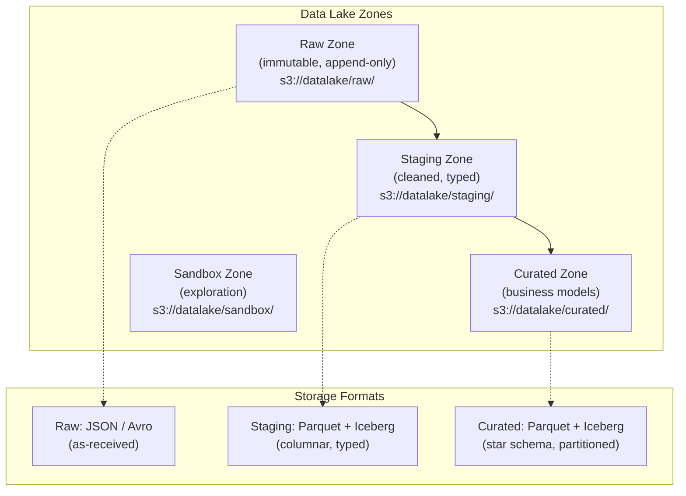

#### Zone Descriptions

| Zone | Purpose | Format | Retention | Access |
|------|---------|--------|-----------|--------|
| **Raw** | Immutable copy of all ingested data | JSON / Avro (as-received) | Forever | Data engineers only |
| **Staging** | Cleaned, deduplicated, typed data | Parquet + Iceberg | 2 years | Data engineers |
| **Curated** | Business-ready dimensional models | Parquet + Iceberg | 5 years | Analysts, scientists |
| **Sandbox** | Exploratory datasets, prototypes | Parquet | 90 days auto-delete | Data scientists |

#### File Layout and Sizing

```
s3://datalake/raw/events/
  event_date=2026-03-22/
    event_type=product.viewed/
      part-00000-abc123.avro    (256 MB target file size)
      part-00001-def456.avro
    event_type=purchase.completed/
      part-00000-ghi789.avro

s3://datalake/curated/fact_order_items/
  metadata/                     # Iceberg metadata
    v1.metadata.json
    snap-12345-abc.avro         # manifest list
  data/
    order_date=2026-03-22/
      part-00000-xyz.parquet    (128 MB target)
      part-00001-xyz.parquet
```

**File sizing rules:**
- **Target file size**: 128-256 MB (Parquet) for optimal read performance
- **Small file compaction**: Hourly job merges files < 32 MB
- **Max file size**: 512 MB (prevents long task recovery times)

### Hot / Warm / Cold Tiering

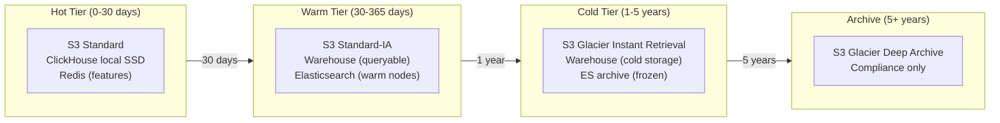

#### Tiering by Data Type

| Data Type | Hot (0-30d) | Warm (30-365d) | Cold (1-5y) | Archive (5y+) |
|-----------|-------------|----------------|-------------|---------------|
| **Raw events** | S3 Standard | S3 Standard-IA | Glacier Instant | Glacier Deep |
| **Warehouse tables** | Active partitions | Query on demand | Cold storage tier | Drop/archive |
| **OLAP (ClickHouse)** | Local NVMe SSD | Tiered to S3 | Not stored | Not stored |
| **Logs (Elasticsearch)** | Hot nodes (SSD) | Warm nodes (HDD) | Frozen (S3-backed) | Deleted |
| **Feature Store (online)** | Redis (SSD) | Not stored | Not stored | Not stored |
| **Feature Store (offline)** | S3 Standard | S3 Standard-IA | Glacier Instant | Not stored |

### Data Retention Policies

| Data Category | Retention | Justification | Deletion Method |
|--------------|-----------|---------------|-----------------|
| Raw events | 7 years | Compliance, audit trail | Lifecycle policy → Glacier Deep → Delete |
| Curated warehouse | 5 years | Business analysis window | Partition drop + S3 lifecycle |
| OLAP aggregates | 90 days hot, 1 year total | Dashboard performance | TTL in ClickHouse |
| Logs (ERROR) | 3 years | Incident forensics | ES ILM + S3 lifecycle |
| Logs (INFO) | 6 months | Debugging | ES ILM → delete |
| Logs (DEBUG) | 3 days | Active debugging only | ES ILM → delete |
| ML features (offline) | 2 years | Model retraining | S3 lifecycle |
| ML features (online) | 24-hour TTL | Serving only | Redis TTL |
| Experiment data | 3 years | Re-analysis | Partition drop |
| PII-containing data | Per GDPR/CCPA request | Legal requirement | Targeted deletion pipeline |

### Cost Optimization at Petabyte Scale

| Optimization | Impact | Implementation |
|-------------|--------|----------------|
| **Columnar format (Parquet)** | 60-80% storage reduction vs JSON | Spark ETL converts raw → Parquet |
| **Compression (ZSTD)** | Additional 30-50% reduction | Default Parquet compression codec |
| **Partition pruning** | 95%+ scan reduction for date-filtered queries | Partition by date, cluster by high-cardinality columns |
| **S3 storage classes** | 50-80% cost reduction for cold data | Lifecycle rules: Standard → IA → Glacier |
| **Small file compaction** | Fewer S3 LIST/GET operations | Hourly Iceberg compaction job |
| **Column projection** | Read only needed columns | Warehouse query optimizer; Parquet column pruning |
| **Materialized views** | Avoid redundant computation | Pre-aggregate common queries in warehouse |
| **Reservation pricing** | 30-60% compute cost reduction | Snowflake credits / BigQuery slots / Redshift reserved |

**Cost breakdown for 10 PB warehouse:**

| Cost Category | Monthly Cost | Optimization Lever |
|--------------|-------------|-------------------|
| Storage (S3 Standard, 2 PB hot) | $46,000 | Tiering → $15,000 |
| Storage (S3 IA, 3 PB warm) | $37,500 | Glacier → $12,000 |
| Storage (Glacier, 5 PB cold) | $20,000 | Deep Archive → $5,000 |
| Warehouse compute (BigQuery) | $80,000 | Slots reservation → $50,000 |
| Kafka (128 partitions, 3x repl) | $25,000 | Tiered storage → $15,000 |
| ClickHouse (6 nodes) | $18,000 | Right-size based on query load |
| Spark (batch jobs) | $40,000 | Spot instances → $16,000 |
| Flink (stream processing) | $15,000 | Right-size parallelism |
| Redis (feature store) | $8,000 | Eviction policies |
| Elasticsearch (logs) | $30,000 | Aggressive retention → $15,000 |
| **Total** | **$319,500** | **Optimized: ~$171,000** |

---

## Indexing and Partitioning Strategy

### Time-Based Partitioning

All analytics data is fundamentally time-series. Partitioning by time is the single most important optimization.

| Table | Partition Key | Partition Granularity | Cluster Keys | Rationale |
|-------|-------------|----------------------|-------------|-----------|
| `fact_user_events` | `event_date` | Daily | `event_type, user_id` | 95% of queries filter by date range |
| `fact_page_views` | `view_date` | Daily | `user_id, session_id` | Session analysis queries |
| `fact_order_items` | `order_date` | Daily | `product_id, seller_id` | Revenue queries by date |
| `fact_experiment_exposures` | `exposure_date` | Daily | `experiment_id, user_id` | Experiment analysis |
| `clickstream_sessions` | `session_date` | Daily | `user_id` | User journey analysis |
| `raw_events` (data lake) | `event_date + event_type` | Daily + type | — | Selective reprocessing by type |
| `logs` (Elasticsearch) | `@timestamp` | Daily index | — | ILM rollover |
| ClickHouse tables | `toYYYYMM(event_date)` | Monthly | — | Balance between pruning and file count |

### Z-Ordering for Multi-Dimensional Queries

Z-ordering (interleaved sorting) co-locates related data for queries that filter on multiple dimensions simultaneously.

```sql
-- Iceberg: Z-order optimization for multi-dimensional queries
ALTER TABLE curated.fact_user_events
WRITE ORDERED BY (event_date, event_type, country, platform)
USING ZORDER;

-- Example query benefiting from Z-ordering:
SELECT COUNT(*), COUNT(DISTINCT user_id)
FROM curated.fact_user_events
WHERE event_date BETWEEN '2026-03-01' AND '2026-03-22'
  AND event_type = 'purchase.completed'
  AND country = 'US'
  AND platform = 'ios';
-- Z-ordering skips 95%+ of data files vs. unordered scan
```

### Warehouse Partition Pruning Patterns

```sql
-- GOOD: Partition filter in WHERE clause (prunes partitions)
SELECT * FROM fact_order_items
WHERE order_date BETWEEN '2026-03-01' AND '2026-03-22'
  AND product_id = 'prod_abc';
-- Scans: 22 daily partitions only

-- BAD: Function on partition column (no pruning)
SELECT * FROM fact_order_items
WHERE YEAR(order_date) = 2026 AND MONTH(order_date) = 3;
-- Scans: ALL partitions (function prevents pruning)

-- GOOD: Use computed column for pruning
SELECT * FROM fact_order_items
WHERE order_date >= '2026-03-01' AND order_date < '2026-04-01';
-- Scans: 31 daily partitions (correct pruning)
```

### ClickHouse Indexing

```sql
-- Primary key index (sparse index in MergeTree)
-- ClickHouse builds a sparse index with one entry per ~8192 rows (index_granularity)
CREATE TABLE rt_event_counts (...)
ENGINE = MergeTree()
ORDER BY (event_date, event_hour, event_type, platform, country)
-- ORDER BY defines the primary index (sparse)
-- Queries filtering left-to-right prefix get maximum pruning

-- Data skipping indices for secondary filters
ALTER TABLE rt_event_counts
ADD INDEX idx_user_segment user_segment TYPE set(100) GRANULARITY 4;

ALTER TABLE rt_event_counts
ADD INDEX idx_value total_value TYPE minmax GRANULARITY 4;
```

### Elasticsearch Index Strategy

```json
{
  "index_patterns": ["logs-*"],
  "settings": {
    "index.number_of_shards": 6,
    "index.number_of_replicas": 1,
    "index.routing.allocation.require.data": "hot",
    "index.lifecycle.name": "logs-policy",
    "index.lifecycle.rollover_alias": "logs-write"
  }
}
```

**ILM (Index Lifecycle Management) Policy:**

| Phase | Age | Actions |
|-------|-----|---------|
| Hot | 0-3 days | Rollover at 50 GB or 1 day; force merge to 1 segment |
| Warm | 3-30 days | Move to warm nodes; read-only; shrink to 1 shard |
| Cold | 30-90 days | Move to cold nodes; freeze index |
| Delete | 90+ days (INFO), 3 years (ERROR) | Delete index |

---

## Concurrency Control

### Concurrent ETL Job Management

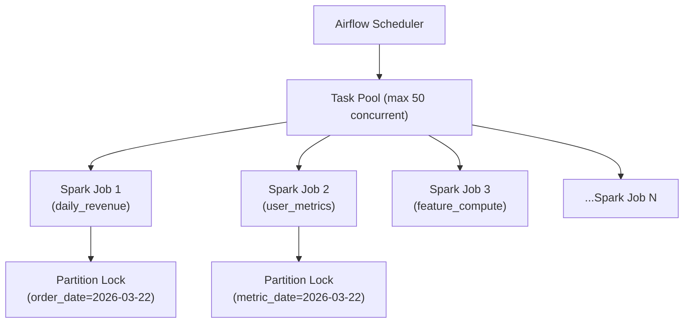

| Mechanism | Implementation | Purpose |
|-----------|---------------|---------|
| **Airflow pools** | `Pool(name='spark_pool', slots=50)` | Limit concurrent Spark jobs to prevent cluster overload |
| **Task priority** | `priority_weight` in Airflow tasks | Revenue pipeline runs before exploration queries |
| **Partition-level locks** | Iceberg optimistic concurrency | Prevent two jobs writing same partition |
| **Warehouse concurrency** | Snowflake warehouses / BigQuery slots | Isolate workloads: BI, ad-hoc, ETL |
| **OLAP write isolation** | ClickHouse ReplicatedMergeTree | Background merges don't block queries |

### Warehouse Query Scheduling

| Workload | Concurrency | Priority | Warehouse Size | Schedule |
|----------|-------------|----------|---------------|----------|
| ETL loads | 10 concurrent | Highest | XL (dedicated) | 2-6 AM |
| BI dashboards | 50 concurrent | High | L (auto-scale) | Business hours |
| Ad-hoc analyst queries | 30 concurrent | Medium | M (auto-scale) | Business hours |
| ML training queries | 5 concurrent | Low | L (dedicated) | Off-peak |
| Scheduled reports | 20 concurrent | Medium | M (shared) | 7-9 AM |

### Feature Store Versioning

```
Feature Version: Monotonically increasing integer per feature group

Version 41 → Version 42 (daily batch update at 2 AM)
  - Online store (Redis): Atomic HSET with _version field
  - Offline store (S3):   New partition feature_date=2026-03-22

Read path (online):
  1. Read features from Redis
  2. Check _version >= expected_version
  3. If stale, retry after 1 second (batch may be finishing)
  4. If still stale after 3 retries, serve stale + alert

Read path (offline / training):
  1. Point-in-time join: SELECT features WHERE feature_timestamp <= training_timestamp
  2. Iceberg time-travel: Read features as-of specific snapshot
```

---

## Idempotency Strategy

### Exactly-Once Event Processing

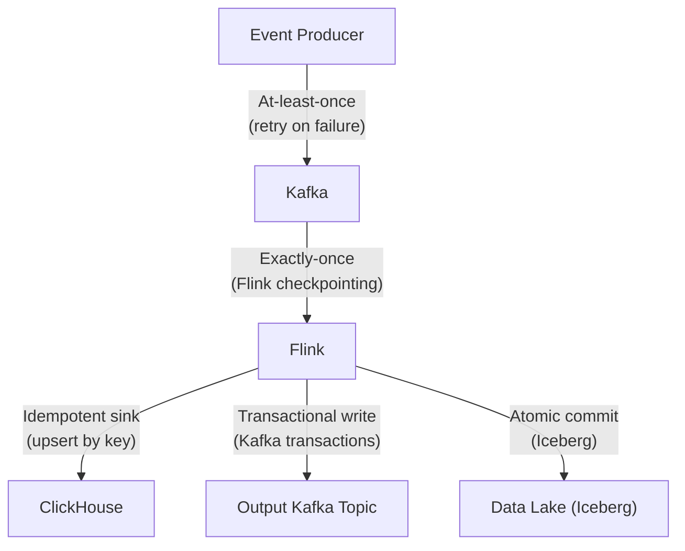

| Layer | Guarantee | Mechanism |
|-------|-----------|-----------|
| **Producer → Kafka** | At-least-once | Client retries; Kafka idempotent producer (`enable.idempotence=true`) |
| **Kafka → Flink** | Exactly-once | Flink checkpointing + Kafka consumer offset management |
| **Flink → Kafka** | Exactly-once | Kafka transactional producer (2PC with checkpoint) |
| **Flink → ClickHouse** | Effectively-once | Idempotent upsert: `INSERT ... ON DUPLICATE KEY UPDATE` or `ReplacingMergeTree` |
| **Flink → Iceberg** | Exactly-once | Iceberg atomic commits tied to Flink checkpoint |
| **Spark → Iceberg** | Exactly-once | Iceberg optimistic concurrency + idempotent writes |

### ETL Job Idempotency

```python
# Pattern: Idempotent ETL with partition overwrite
# Running the same job twice for the same date produces identical output

def run_daily_revenue(execution_date: str):
    """
    Idempotent: overwrites the entire partition for execution_date.
    Safe to re-run on failure without duplicating data.
    """
    df = spark.read.table("staging.orders") \
        .filter(f"order_date = '{execution_date}'")

    transformed = df.groupBy("product_category", "country") \
        .agg(
            F.sum("revenue").alias("total_revenue"),
            F.countDistinct("order_id").alias("order_count")
        ) \
        .withColumn("metric_date", F.lit(execution_date))

    # Atomic partition overwrite — idempotent
    transformed.writeTo("curated.daily_revenue") \
        .overwritePartitions()  # Only overwrites metric_date partition

    # Quality check AFTER write (read-back validation)
    written = spark.read.table("curated.daily_revenue") \
        .filter(f"metric_date = '{execution_date}'")

    assert written.count() > 0, "No rows written"
    assert written.filter("total_revenue < 0").count() == 0, "Negative revenue detected"
```

### Deduplication in Streaming Pipelines

```
Deduplication Strategy:

1. Event-level dedup (Flink keyed state):
   - Key: event_id
   - State: Set of seen event_ids (RocksDB-backed)
   - Window: 1 hour (events arriving > 1 hour late are rare)
   - On duplicate: Drop silently, increment dedup counter metric

2. Bloom filter pre-check (for high-volume topics):
   - Bloom filter with 0.1% false positive rate
   - Check bloom filter BEFORE keyed state lookup
   - Reduces state access by 99%+ (most events are unique)

3. Late-arriving dedup (batch):
   - Daily Spark job: MERGE INTO with event_id dedup
   - Iceberg MERGE handles upsert atomically
```

```sql
-- Iceberg MERGE for batch dedup
MERGE INTO curated.fact_user_events AS target
USING staging.new_events AS source
ON target.event_id = source.event_id
WHEN NOT MATCHED THEN
    INSERT *;
-- Only inserts truly new events; duplicates are ignored
```

---

## Consistency Model

### Event Ordering Guarantees

| Scenario | Guarantee | Mechanism | Trade-off |
|----------|-----------|-----------|-----------|
| **Same user events** | Ordered within partition | Kafka: key by user_id → same partition | Hot users create partition hotspots |
| **Same session events** | Ordered within partition | Kafka: key by session_id | — |
| **Cross-user ordering** | No global ordering | Kafka partitions are independent | Use event timestamp for global ordering (approximate) |
| **Event timestamp vs receive time** | May differ by seconds-hours | Store both; use receive_time for ordering, event_time for analysis | Mobile offline events arrive late |
| **Exactly-once delivery** | Flink checkpoint-based | Kafka transactions + Flink 2PC | Higher latency during checkpoints |

### Warehouse Refresh Latency

| Data Freshness Level | Latency | Mechanism | Use Case |
|---------------------|---------|-----------|----------|
| **Real-time** | < 5 seconds | Flink → ClickHouse direct | Operational dashboards |
| **Near-real-time** | 1-5 minutes | Flink micro-batch → Iceberg | Time-sensitive reports |
| **Hourly** | < 1 hour | Spark hourly job | Intraday metrics |
| **Daily** | < 6 hours | Spark daily job (2 AM start) | Standard reporting |
| **Weekly** | < 24 hours | Spark weekly aggregation | Trend analysis |

### Real-Time Dashboard Staleness Contract

```
Dashboard SLA:
- Metric freshness: < 30 seconds for P0 metrics, < 5 minutes for P1
- Query latency: < 1 second p99
- Availability: 99.9% (8.7 hours downtime/year)

Staleness handling:
- Each metric response includes freshness_lag_ms
- UI shows "Data as of: {timestamp}" prominently
- If freshness_lag > threshold: amber warning in UI
- If freshness_lag > 2x threshold: red warning + auto-alert

Cache invalidation:
- ClickHouse materialized views: auto-refresh on insert
- API response cache: 10-second TTL (trades staleness for reduced ClickHouse load)
- WebSocket push: bypass cache, read directly
```

### A/B Test Assignment Consistency

```
Requirement: A user MUST see the same variant across all sessions and devices.

Assignment consistency model:
1. Primary: Deterministic hash — hash(user_id + salt) always returns same variant
   - No state needed for assignment
   - Consistent across all services that know the hash function + salt

2. Fallback (anonymous users): hash(anonymous_id + salt)
   - Consistent within same device/browser
   - Inconsistent across devices (acceptable trade-off)

3. Cross-device consistency:
   - When anonymous_id is linked to user_id (login event)
   - Re-hash with user_id; variant may change
   - Log the assignment change for analysis (exclude from results if pre-period behavior differs)

4. Experiment mutation consistency:
   - Salt changes → all assignments re-randomize
   - Traffic % increase → only new users added to experiment, existing assignments stable
   - Traffic % decrease → some users removed, logged as "de-assigned"
```

### Consistency Guarantees by Subsystem

Each subsystem in the analytics platform provides a different consistency guarantee, tuned to its specific latency and correctness requirements.

| Subsystem | Consistency Model | Guarantee | Rationale |
|-----------|------------------|-----------|-----------|
| **Event ingestion** | At-least-once with dedup window | Events may be delivered more than once; dedup within 1-hour window removes 99.9%+ of duplicates | Prioritizes availability and throughput over exactly-once (which requires coordination overhead) |
| **Dashboard queries** | Eventual consistency (1-5 min lag) | Data visible on dashboards lags real-time by 1-5 minutes depending on refresh tier | Sub-second freshness is unnecessary for most business decisions; caching reduces warehouse load by 10x |
| **A/B test assignment** | Strong consistency (deterministic) | Same user always gets the same variant for the lifetime of the experiment | Achieved without distributed state via deterministic hash(user_id + salt); no coordination needed |
| **Feature store (online)** | Read-your-writes for real-time features | If a feature is updated by a streaming job, the next online read returns the updated value | Redis/DynamoDB provide single-key read-your-writes; critical for features like "items_in_cart" used in real-time scoring |
| **Feature store (offline)** | Point-in-time consistency | Training queries return feature values as they existed at the label timestamp, not current values | Prevents label leakage; uses time-travel joins on versioned feature tables |
| **Data catalog** | Eventual consistency with manual refresh | Table metadata may lag by minutes after schema changes; users can trigger a manual sync | Catalog is read-heavy; eventual consistency avoids hot-path coupling with DDL operations |
| **Metric reconciliation** | T+1 batch verification | Streaming metrics are "preliminary" until T+1 batch job confirms them against the warehouse | Resolves discrepancies from late-arriving events, dedup failures, and timezone edge cases |

**Cross-System Metric Reconciliation Pattern:**

```
Reconciliation Flow (runs daily at 6 AM):

1. Compute "gold" metric from warehouse (batch, complete data for T-1):
   SELECT metric_date, SUM(revenue) AS gold_revenue
   FROM curated.daily_revenue
   WHERE metric_date = DATE_SUB(CURRENT_DATE, 1)

2. Read "streaming" metric from OLAP (real-time, potentially incomplete):
   SELECT toDate(event_time) AS metric_date, SUM(revenue) AS stream_revenue
   FROM clickhouse.realtime_revenue
   WHERE metric_date = yesterday()

3. Compare:
   - If ABS(gold - stream) / gold < 0.01 → PASS (within 1% tolerance)
   - If 0.01 <= delta < 0.05 → WARN (alert data eng, auto-correct OLAP)
   - If delta >= 0.05 → CRITICAL (page on-call, halt downstream consumers)

4. Auto-correct: overwrite OLAP materialized view with gold values
5. Update dashboard staleness labels from "preliminary" to "verified"
```

This reconciliation pattern is how companies like Netflix and Airbnb maintain trust in their dashboards: real-time numbers are always labeled "preliminary" until the batch pipeline confirms them the next morning.

---

## Distributed Transaction / Saga Design

### ETL Pipeline Orchestration (Airflow DAG Patterns)

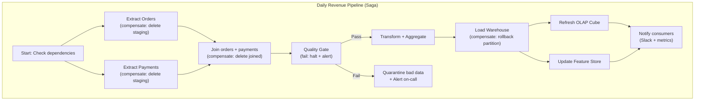

#### Saga Compensation Table

| Step | Action | Compensation (on failure) | Timeout |
|------|--------|--------------------------|---------|
| Extract Orders | Read CDC → staging S3 | Delete staging files | 30 min |
| Extract Payments | Read CDC → staging S3 | Delete staging files | 30 min |
| Join | Join orders + payments | Delete joined output | 45 min |
| Quality Gate | Validate row counts, nulls, ranges | Alert + quarantine; do NOT proceed | 10 min |
| Transform | Aggregate revenue metrics | Delete transformed output | 60 min |
| Load Warehouse | Overwrite warehouse partition | Iceberg rollback to previous snapshot | 30 min |
| Refresh OLAP | Update ClickHouse | Revert to previous state (not critical) | 15 min |
| Update Features | Materialize features to Redis | Keep previous version (stale but safe) | 20 min |

### Data Quality Check Gates

```python
# Quality gate pattern — blocks pipeline on failure
class QualityGate:
    def __init__(self, table: str, date: str):
        self.table = table
        self.date = date
        self.checks = []
        self.failures = []

    def add_check(self, name, check_fn, severity="critical"):
        self.checks.append({"name": name, "fn": check_fn, "severity": severity})

    def run(self) -> bool:
        for check in self.checks:
            result = check["fn"]()
            if not result["passed"]:
                self.failures.append({
                    "check": check["name"],
                    "severity": check["severity"],
                    "details": result["details"]
                })

        critical_failures = [f for f in self.failures if f["severity"] == "critical"]

        if critical_failures:
            self.alert(critical_failures)
            return False  # HALT pipeline

        if self.failures:
            self.warn(self.failures)  # Warn but continue

        return True

# Usage in Airflow
gate = QualityGate("curated.daily_revenue", "2026-03-22")
gate.add_check("row_count", lambda: check_row_count_vs_previous(0.8, 1.5), "critical")
gate.add_check("null_revenue", lambda: check_null_pct("revenue", 0.001), "critical")
gate.add_check("negative_values", lambda: check_no_negative("revenue"), "critical")
gate.add_check("late_data_pct", lambda: check_late_data_pct(0.05), "warning")

if not gate.run():
    raise AirflowException("Quality gate FAILED — pipeline halted")
```

### Backfill Strategies

| Strategy | When to Use | Implementation | Risk |
|----------|-------------|----------------|------|
| **Partition overwrite** | Daily metrics need recomputation | Re-run Spark job for specific date range | Safe (idempotent) |
| **Iceberg time-travel** | Undo a bad data load | `ALTER TABLE ... ROLLBACK TO SNAPSHOT {id}` | Fast; no recomputation |
| **Incremental backfill** | Adding a new column to historical data | Spark job processes one month at a time, oldest first | Slow but memory-safe |
| **Shadow pipeline** | Validate new logic before cutover | Run new pipeline in parallel writing to shadow tables | Double compute cost |
| **Blue-green load** | Zero-downtime table swap | Load into staging table, then `ALTER TABLE SWAP` | Requires 2x storage briefly |

```python
# Backfill DAG pattern — process date range in parallel batches
def create_backfill_dag(start_date, end_date, batch_size=7):
    with DAG('backfill_revenue', schedule=None, catchup=False) as dag:
        dates = pd.date_range(start_date, end_date)
        batches = [dates[i:i+batch_size] for i in range(0, len(dates), batch_size)]

        previous_batch = None
        for batch in batches:
            tasks = []
            for date in batch:
                task = SparkSubmitOperator(
                    task_id=f'backfill_{date.strftime("%Y%m%d")}',
                    application='s3://jobs/daily_revenue.py',
                    application_args=['--date', date.strftime('%Y-%m-%d')],
                    pool='backfill_pool'  # Limited concurrency
                )
                tasks.append(task)

            if previous_batch:
                previous_batch >> tasks  # Sequential batches
            previous_batch = tasks
```

---

## Abuse / Fraud / Governance Controls

### Data Access Controls (Row-Level Security)

```sql
-- Row-level security in Snowflake
CREATE ROW ACCESS POLICY region_access_policy AS (region STRING)
RETURNS BOOLEAN ->
    CASE
        WHEN CURRENT_ROLE() = 'DATA_ADMIN' THEN TRUE
        WHEN CURRENT_ROLE() = 'US_ANALYST' AND region = 'US' THEN TRUE
        WHEN CURRENT_ROLE() = 'EU_ANALYST' AND region IN ('DE','FR','GB','ES','IT') THEN TRUE
        ELSE FALSE
    END;

ALTER TABLE fact_order_items ADD ROW ACCESS POLICY region_access_policy ON (country);

-- Column-level masking for PII
CREATE MASKING POLICY email_mask AS (val STRING)
RETURNS STRING ->
    CASE
        WHEN CURRENT_ROLE() IN ('DATA_ADMIN', 'COMPLIANCE') THEN val
        ELSE REGEXP_REPLACE(val, '(.{2})(.*)(@.*)', '\\1***\\3')
    END;

ALTER TABLE dim_users MODIFY COLUMN email SET MASKING POLICY email_mask;
```

### PII Handling Pipeline

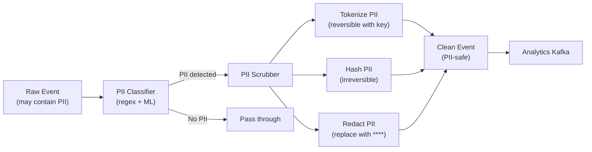

| PII Type | Detection | Treatment | Reversible? |
|----------|-----------|-----------|-------------|
| Email | Regex + field name | Hash (SHA-256 + salt) | No |
| IP address | Regex | Truncate last octet | No |
| Phone number | Regex | Hash | No |
| Full name | NER model | Tokenize (vault) | Yes (with key) |
| Credit card | Luhn check + regex | Redact entirely | No |
| Location (precise) | Field name | Round to city level | No |
| Free-text fields | NER model scan | Redact detected entities | No |

### Data Quality Monitoring

```mermaid
flowchart TD
    Tables["Warehouse Tables"] --> DQEngine["Data Quality Engine\n(Great Expectations / dbt tests)"]
    DQEngine --> Metrics["Quality Metrics"]
    Metrics --> Dashboard["DQ Dashboard"]
    Metrics --> Alerts["Alerts (Slack / PagerDuty)"]
    DQEngine --> Lineage["Data Lineage Tracker"]
    Lineage --> ImpactAnalysis["Impact Analysis\n(which dashboards affected?)"]
```

| Monitor | Check | Frequency | Alert Threshold |
|---------|-------|-----------|----------------|
| **Freshness** | Time since last data arrival | Every 5 min | > 2x normal SLA |
| **Volume** | Row count vs. expected | Every load | +/- 20% vs yesterday |
| **Completeness** | Null rate per column | Every load | > 1% for critical columns |
| **Uniqueness** | Duplicate primary keys | Every load | Any duplicates |
| **Distribution** | Mean/std/percentiles shift | Daily | > 3 std deviation shift |
| **Schema** | Column types, new/dropped columns | Every load | Any unexpected change |
| **Cross-table** | Referential integrity | Daily | > 0.1% orphaned records |

### Metric Gaming Detection

| Gaming Pattern | Detection Method | Response |
|---------------|-----------------|----------|
| **Bot traffic inflating metrics** | Anomalous event velocity per user; device fingerprinting | Filter bot traffic; separate bot metrics |
| **Experiment peeking** | Multiple significance checks over time | Sequential testing (always-valid p-values) |
| **P-hacking (metric fishing)** | Running many metrics, reporting only significant ones | Bonferroni correction; pre-registered metrics |
| **Sample ratio mismatch** | Control/treatment sizes differ from expected | Chi-squared test on sample counts; halt experiment |
| **Novelty effect** | Treatment metric decays over time | Extend experiment duration; analyze by cohort week |
| **Cannibalization** | One experiment steals traffic from another | Interaction detection; orthogonal layers |

---

## CI/CD and Release Strategy

### ETL Pipeline Deployment

```mermaid
flowchart LR
    Dev["Developer\n(branch)"] --> PR["Pull Request"]
    PR --> Tests["CI Tests\n- Unit tests\n- Schema validation\n- DQ check templates"]
    Tests --> Review["Code Review"]
    Review --> Staging["Deploy to Staging\n(shadow pipeline)"]
    Staging --> Validate["Validate output\n(compare vs production)"]
    Validate --> Prod["Deploy to Production\n(Airflow DAG update)"]
    Prod --> Monitor["Monitor first run\n(auto-rollback on failure)"]
```

| Phase | Checks | Duration |
|-------|--------|----------|
| **Unit tests** | Transform logic, schema validation, mock data | 2 min |
| **Integration tests** | Small-scale Spark job on test data | 10 min |
| **Shadow run** | Full pipeline on staging data, output compared to prod | 1 hour |
| **Canary deploy** | Run new version for 1 day alongside prod | 24 hours |
| **Full rollout** | Switch production DAG to new version | Instant (Airflow DAG update) |
| **Rollback** | Revert DAG to previous version; Iceberg rollback | < 5 min |

### Schema Evolution Strategy

| Change Type | Backward Compatible? | Process |
|-------------|---------------------|---------|
| **Add optional column** | Yes | Deploy consumer first, then producer |
| **Add required column** | No | Add as optional with default, backfill, then make required |
| **Rename column** | No | Add new column, dual-write, migrate consumers, drop old |
| **Change column type** | No | Add new column with new type, migrate, drop old |
| **Remove column** | No | Stop producing, wait for consumers to update, then drop |
| **Add new event type** | Yes | Register schema, deploy producer |
| **Modify event type** | Depends | Must be backward-compatible per Avro schema evolution rules |

```
Schema evolution rules (Avro):
- Adding a field with a default value: BACKWARD COMPATIBLE
- Removing a field with a default value: FORWARD COMPATIBLE
- Adding/removing fields without defaults: BREAKING CHANGE

Schema Registry enforcement:
- BACKWARD compatibility mode (default): new schema can read old data
- FORWARD compatibility mode: old schema can read new data
- FULL compatibility: both directions
```

### Warehouse Migration Strategy

```
Blue-Green Table Migration:

1. Create new table with updated schema: fact_order_items_v2
2. Run ETL to populate v2 (historical backfill + incremental)
3. Run parallel writes: both v1 and v2 receive new data
4. Validate: compare v1 and v2 outputs for N days
5. Switch consumers: UPDATE view to point to v2
6. Monitor for 1 week
7. Drop v1

Rollback: Switch view back to v1 (< 1 minute)
```

---

## Multi-Region and DR Strategy

### Data Replication Architecture

```mermaid
flowchart TD
    subgraph US["US-East (Primary)"]
        USKafka["Kafka Cluster"]
        USFlink["Flink Jobs"]
        USDW["Data Warehouse"]
        USOLAP["ClickHouse"]
        USS3["S3 Data Lake"]
    end

    subgraph EU["EU-West (Secondary)"]
        EUKafka["Kafka Cluster"]
        EUFlink["Flink Jobs"]
        EUDW["Data Warehouse"]
        EUOLAP["ClickHouse"]
        EUS3["S3 Data Lake"]
    end

    USKafka -->|"MirrorMaker 2\n(async replication)"| EUKafka
    USS3 -->|"S3 Cross-Region\nReplication"| EUS3
    USDW -->|"Warehouse native\nreplication"| EUDW
```

### Cross-Region Strategy by Component

| Component | Replication Strategy | RPO | RTO | Notes |
|-----------|---------------------|-----|-----|-------|
| **Kafka** | MirrorMaker 2 (async) | < 1 min | 5 min (consumer failover) | Topic-level replication |
| **Data Lake (S3)** | S3 Cross-Region Replication | < 15 min | Instant (read from replica) | CRR for all buckets |
| **Data Warehouse** | Native replication (Snowflake/BQ) | < 1 hour | 10 min (failover) | Secondary warehouse in DR region |
| **ClickHouse** | ReplicatedMergeTree + cross-DC | < 30 sec | 2 min | ZooKeeper-based replication |
| **Elasticsearch** | Cross-Cluster Replication (CCR) | < 5 min | 5 min | Follower indices in DR |
| **Redis (features)** | Redis Active-Active (CRDTs) | < 1 sec | Instant (multi-master) | Conflict resolution via LWW |
| **Airflow** | Active-passive with shared DB | < 5 min | 10 min | Standby scheduler in DR |

### GDPR Data Residency for Analytics

```mermaid
flowchart TD
    User["User Event"] --> Router["Region Router"]
    Router -->|"EU user"| EUPipeline["EU Pipeline\n(EU-West region)"]
    Router -->|"US user"| USPipeline["US Pipeline\n(US-East region)"]

    EUPipeline --> EUDW["EU Data Warehouse\n(EU-resident)"]
    USPipeline --> USDW["US Data Warehouse"]

    EUDW -->|"Aggregated only\n(no PII)"| GlobalDW["Global Analytics\n(aggregated, no PII)"]
    USDW -->|"Aggregated only\n(no PII)"| GlobalDW
```

| Requirement | Implementation |
|-------------|---------------|
| **EU user data stays in EU** | Kafka topics partitioned by region; EU events processed in EU-West |
| **Right to deletion (Art. 17)** | Deletion pipeline: propagate delete across all stores within 30 days |
| **Data portability (Art. 20)** | Export API: generate user data archive in machine-readable format |
| **Consent tracking** | Consent events stored alongside analytics; filter unconsented data |
| **Cross-border aggregation** | Only aggregated, anonymized data (k-anonymity, k >= 50) crosses borders |
| **Audit trail** | All data access logged; quarterly compliance report |

### Right-to-Deletion Pipeline

```
Deletion request flow:
1. User requests deletion via privacy portal
2. Privacy service publishes deletion event to Kafka topic: user-deletions
3. Each data system consumes deletion events:
   a. Kafka: Compact topics remove user data (eventually)
   b. Data Lake: Iceberg DELETE FROM WHERE user_id = ?
   c. Warehouse: DELETE + vacuum partition
   d. ClickHouse: ALTER TABLE DELETE WHERE user_id = ?
   e. Elasticsearch: Delete by query
   f. Redis: DEL user_*:user:usr_xyz
   g. Feature Store: Delete offline + online features
4. Verification job (weekly): Scan all stores to confirm deletion
5. Compliance report: Certify deletion within 30-day SLA
```

---

## Cost Drivers and Optimization

### Cost Model by Platform

#### BigQuery Pricing

| Resource | Pricing | Optimization |
|----------|---------|-------------|
| Storage | $0.02/GB/month (active), $0.01/GB/month (long-term) | Partition expiration; cold data to long-term automatically |
| On-demand queries | $6.25/TB scanned | Partition pruning; column selection; LIMIT queries |
| Flat-rate slots | $2,400/month per 100 slots | Commit for predictable workloads |
| Streaming inserts | $0.05/GB | Batch inserts when possible |
| BI Engine (OLAP cache) | $40/GB/month (RAM) | Cache hot dashboards only |

#### Snowflake Pricing

| Resource | Pricing | Optimization |
|----------|---------|-------------|
| Storage | $23/TB/month (on-demand) | Compressed automatically; cold data tiered |
| Compute (credits) | $2-4/credit depending on edition | Auto-suspend warehouses; right-size; reserved pricing |
| XS warehouse | ~$2/hour | Ad-hoc analysts |
| 4XL warehouse | ~$128/hour | Heavy ETL loads |
| Serverless tasks | Per-second billing | Maintenance tasks, small loads |

#### Redshift Pricing

| Resource | Pricing | Optimization |
|----------|---------|-------------|
| RA3 instances | $1.086/hour (ra3.xlplus) | Reserved instances for committed workloads |
| Managed storage | $0.024/GB/month | Automatic tiering to S3 |
| Redshift Serverless | $0.375/RPU-hour | Bursty workloads |
| Spectrum (S3 queries) | $5/TB scanned | Query data lake directly without loading |

### Data Transfer Costs

| Transfer Path | Cost | Optimization |
|--------------|------|-------------|
| S3 → Same region service | Free | Keep compute and storage in same region |
| S3 → Cross-region | $0.02/GB | Replicate only necessary data |
| S3 → Internet | $0.09/GB | Use CloudFront for repeated access |
| Kafka cross-AZ | $0.01/GB per AZ | Rack-aware replication; follower fetching |
| Warehouse egress | $0.01-0.12/GB | Cache query results; export to S3 |

### Compute Cost Optimization

| Strategy | Savings | Implementation |
|----------|---------|----------------|
| **Spot/preemptible instances (Spark)** | 60-70% | Use spot for batch jobs with checkpointing |
| **Auto-scaling (Flink)** | 30-50% | Scale based on Kafka consumer lag |
| **Warehouse auto-suspend** | 40-60% | Suspend after 5 min idle; resume on query |
| **Query result caching** | 20-40% | Cache repeated queries (BigQuery automatic) |
| **Materialized views** | 50-80% per query | Pre-compute dashboard queries |
| **Partition pruning** | 90-99% scan reduction | Date partitioning on all fact tables |
| **Columnar projection** | 80-95% I/O reduction | SELECT only needed columns |

---

## Technology Choices and Alternatives

### Comparison Matrix

| Category | Option A | Option B | Option C | Recommendation |
|----------|----------|----------|----------|---------------|
| **Event Streaming** | Apache Kafka | AWS Kinesis | Apache Pulsar | **Kafka** — ecosystem, community, replay |
| **Stream Processing** | Apache Flink | Kafka Streams | Apache Spark Structured Streaming | **Flink** — true streaming, state management |
| **Batch Processing** | Apache Spark | Apache Beam (Dataflow) | Trino/Presto | **Spark** — ecosystem, ML integration |
| **Orchestration** | Apache Airflow | Dagster | Prefect | **Airflow** — maturity, community, managed options |
| **Data Warehouse** | Snowflake | BigQuery | Redshift | **Context-dependent** (see ARD below) |
| **OLAP Engine** | ClickHouse | Apache Druid | Apache Pinot | **ClickHouse** — performance, SQL, compression |
| **Data Lake Format** | Apache Iceberg | Delta Lake | Apache Hudi | **Iceberg** — engine-agnostic, schema evolution |
| **Feature Store** | Feast (open-source) | Tecton (managed) | Custom | **Feast** — open-source, flexibility |
| **Schema Registry** | Confluent Schema Registry | AWS Glue Schema Registry | Apicurio | **Confluent** — Kafka ecosystem integration |
| **Log Search** | Elasticsearch/OpenSearch | Loki (Grafana) | Splunk | **OpenSearch** — open-source, cost, features |
| **Metadata Catalog** | DataHub | Apache Atlas | Amundsen | **DataHub** — modern, LinkedIn-backed |
| **Data Quality** | Great Expectations | dbt tests | Monte Carlo (managed) | **Great Expectations + dbt** — comprehensive coverage |

### Detailed Comparison: Event Streaming

| Aspect | Kafka | Kinesis | Pulsar |
|--------|-------|---------|--------|
| **Max throughput** | Millions/sec per cluster | 1 MB/sec per shard | Millions/sec |
| **Retention** | Configurable (days to forever) | 7 days max (365 with extended) | Tiered (infinite with BookKeeper) |
| **Replay** | Full replay from any offset | Limited (trim horizon) | Full replay |
| **Exactly-once** | Yes (transactional API) | At-least-once native | Yes (dedup) |
| **Ordering** | Per-partition | Per-shard | Per-partition |
| **Multi-tenancy** | Topic-level isolation | Account-level | Namespace + topic isolation |
| **Managed options** | Confluent Cloud, AWS MSK | Native AWS | StreamNative |
| **Ecosystem** | Largest (Connect, Streams, ksqlDB) | AWS-native integrations | Growing |
| **Operational cost** | Medium-high (self-managed) | Low (serverless) | Medium |
| **Best for** | Platform-scale analytics | AWS-native lightweight | Multi-tenant, geo-replication |

### Detailed Comparison: Warehouse

| Aspect | Snowflake | BigQuery | Redshift |
|--------|-----------|----------|----------|
| **Architecture** | Shared-data, compute clusters | Serverless, Dremel engine | Shared-nothing (RA3: shared-data) |
| **Scaling** | Instant (add warehouse) | Auto (serverless) | Minutes (add nodes) |
| **Pricing model** | Credits (compute) + storage | Per-TB scanned or slots | Instance-hours + storage |
| **Best for pay-per-query** | No (always-on compute) | Yes (on-demand) | No |
| **Concurrency** | High (multi-cluster) | High (serverless) | Medium (limited by node count) |
| **Semi-structured** | Excellent (VARIANT type) | Good (JSON, ARRAY) | Good (SUPER type) |
| **ML integration** | Snowpark (Python/Java) | BigQuery ML (SQL-based) | Redshift ML (SageMaker) |
| **Data sharing** | Excellent (Snowflake Marketplace) | Good (Analytics Hub) | Limited |
| **Multi-cloud** | Yes (AWS, Azure, GCP) | GCP only | AWS only |

### Detailed Comparison: Orchestration

| Aspect | Airflow | Dagster | Prefect |
|--------|---------|---------|---------|
| **DAG definition** | Python (imperative) | Python (software-defined assets) | Python (flow/task decorators) |
| **Paradigm** | Task-centric | Asset-centric | Flow-centric |
| **Scheduling** | Cron + event triggers | Cron + sensors + freshness policies | Cron + event-driven |
| **Testing** | Basic (mock operators) | First-class (asset unit tests) | First-class |
| **Observability** | UI + logs | Excellent (asset lineage) | Excellent (flow runs) |
| **Managed option** | Astronomer, MWAA, Cloud Composer | Dagster Cloud | Prefect Cloud |
| **Maturity** | Highest (since 2015) | Growing (since 2019) | Growing (since 2018) |
| **Community** | Largest | Medium | Medium |
| **Best for** | Established data teams, complex DAGs | Modern data platforms, asset-centric | Cloud-native, dynamic workflows |

---

## Architecture Decision Records (ARDs)

### ARD-001: Kafka as Universal Event Bus

| Field | Detail |
|-------|--------|
| **Decision** | Route all events through Kafka before any processing |
| **Context** | Multiple consumers need the same events (analytics, ML, real-time, batch) |
| **Chosen** | Kafka as the single source of truth for events |
| **Why** | Replay capability, multiple consumer groups, high throughput, proven at scale |
| **Trade-offs** | Additional latency (~50ms) vs direct ingestion; Kafka operational complexity |
| **Revisit when** | If Kafka costs or operational burden too high → consider managed Kafka (Confluent, MSK) |

### ARD-002: ClickHouse for Real-Time OLAP

| Field | Detail |
|-------|--------|
| **Decision** | ClickHouse for real-time analytics dashboards |
| **Context** | Need < 1s queries on real-time data for operational dashboards |
| **Options** | (A) Druid, (B) ClickHouse, (C) Pinot, (D) Query warehouse directly |
| **Chosen** | Option B: ClickHouse |
| **Why** | Best single-node performance; excellent compression; native Kafka ingestion; SQL-compatible |
| **Trade-offs** | Not great for high-concurrency point lookups; eventual consistency on inserts |
| **Revisit when** | If query concurrency exceeds ClickHouse capacity → consider Druid for higher concurrency |

### ARD-003: Apache Iceberg for Data Lake

| Field | Detail |
|-------|--------|
| **Decision** | Apache Iceberg table format on S3 |
| **Context** | Need ACID transactions, schema evolution, and time travel on data lake |
| **Options** | (A) Raw Parquet files, (B) Delta Lake, (C) Apache Iceberg, (D) Apache Hudi |
| **Chosen** | Option C: Iceberg |
| **Why** | Engine-agnostic (works with Spark, Flink, Trino, Presto); hidden partitioning; best schema evolution |
| **Trade-offs** | Newer ecosystem than Delta Lake; fewer Databricks integrations |
| **Revisit when** | If Delta Lake open-source ecosystem catches up in engine compatibility |

### ARD-004: Deterministic Hashing for A/B Assignment

| Field | Detail |
|-------|--------|
| **Decision** | Deterministic hash-based assignment (not random) |
| **Context** | User must always see the same experiment variant across sessions |
| **Chosen** | `hash(user_id + experiment_id) % 100` |
| **Why** | Deterministic: no database lookup needed for assignment. Stateless. Fast. |
| **Trade-offs** | Can't rebalance without changing hash salt (restarts experiment) |
| **Revisit when** | If need for dynamic rebalancing (e.g., multi-armed bandit) |

---

## POCs to Validate First

### POC-1: Event Ingestion at 2M Events/Second
**Goal**: Validate collector + Kafka can sustain 2M events/second peak ingestion.
**Success criteria**: Zero data loss; p99 ingestion latency < 100ms.
**Fallback**: Add Kafka partitions; scale collector horizontally.

### POC-2: Flink Sessionization at Scale
**Goal**: Sessionize 1M events/second with 30-minute gap windows.
**Success criteria**: Session output latency < 5 minutes after session close.
**Fallback**: Increase Flink parallelism; optimize state backend.

### POC-3: ClickHouse Dashboard Query Latency
**Goal**: < 1s p99 for aggregation queries on 10B-row table with 100 concurrent users.
**Success criteria**: p99 < 1s; CPU < 70%.
**Fallback**: Add more ClickHouse replicas; pre-aggregate common queries.

### POC-4: Feature Store Serving Latency
**Goal**: Online feature lookup < 10ms p99 at 100K requests/second.
**Success criteria**: p99 < 10ms from Redis-backed online store.
**Fallback**: Increase Redis shards; batch feature requests.

### POC-5: A/B Test Sample Size Calculation
**Goal**: Validate statistical framework detects 1% relative change with 80% power.
**Setup**: Simulated A/A test (both groups identical) → should show no significance in 95% of runs.
**Success criteria**: False positive rate < 5%; true positive rate > 80%.

---

## Real-World Comparisons

| Aspect | Netflix | Uber | Airbnb | Spotify | LinkedIn |
|--------|---------|------|--------|---------|----------|
| **Event volume** | 1T events/day | 1 PB/day | 100B events/day | 500B events/day | 1T events/day |
| **Stream processing** | Flink | Flink + Kafka Streams | Flink | Custom (Scio) | Samza + Flink |
| **Batch** | Spark | Spark | Spark | Spark | Spark |
| **Warehouse** | Redshift + Iceberg | BigQuery + Hive | BigQuery | BigQuery + custom | Spark SQL + Iceberg |
| **OLAP** | Druid | AresDB (custom) | Druid | Custom | Pinot |
| **Feature store** | Custom | Michelangelo | Zipline (custom) | Custom | Feathr (open-source) |
| **A/B testing** | Custom (XP) | Custom | Custom (ERF) | Custom | Custom |
| **Key challenge** | Recommendation quality | Real-time location analytics | Search ranking | Personalization | Feed ranking |

### Cloud Data Warehouse Architecture Deep Dive

The four dominant cloud warehouses differ fundamentally in architecture, not just pricing.

| Dimension | Snowflake | Databricks | BigQuery | Redshift |
|-----------|-----------|------------|----------|----------|
| **Core engine** | Multi-cluster shared data | Spark-based Lakehouse (Photon) | Dremel (columnar tree execution) | PostgreSQL-based MPP |
| **Storage format** | Proprietary micro-partitions | Delta Lake (Parquet + txn log) | Capacitor (columnar, compressed) | Columnar blocks on local/S3 |
| **Compute-storage separation** | Full separation | Full separation | Fully serverless (slots) | RA3 nodes (managed S3); DC2 (local SSD) |
| **Scaling model** | Virtual warehouses (T-shirt sizing) | Auto-scaling clusters | Slot-based (auto or reserved) | Node count resize; Serverless option |
| **Concurrency** | Multi-cluster auto-scale | Cluster per workload | Up to 2,000 concurrent slots | WLM queues; limited without Serverless |
| **Time travel** | Up to 90 days (Enterprise) | Delta Lake versioning (unlimited) | 7 days (snapshot decorator) | None natively (manual snapshots) |
| **ML integration** | Snowpark (Python/Java/Scala UDFs) | Native MLflow, AutoML, Unity Catalog | BigQuery ML (SQL-based), Vertex AI | SageMaker integration, Redshift ML |
| **Governance** | Snowflake Horizon | Unity Catalog | Dataplex, column-level security | Lake Formation integration |
| **Best for** | Multi-workload BI + data sharing | Unified ML + SQL on one platform | Serverless ad-hoc analytics at scale | AWS-native shops, existing PostgreSQL expertise |

**Snowflake** separates storage (on cloud object store) from compute (virtual warehouses). Each virtual warehouse is an independent MPP cluster that can be spun up/down in seconds. Multi-cluster warehouses auto-scale horizontally for concurrency. Time travel allows querying data as it existed at any point in the retention window, which is critical for debugging pipeline issues and auditing.

**Databricks** pioneered the Lakehouse paradigm: open Delta Lake format on object storage, with Spark (and the proprietary Photon C++ engine for SQL) for both ETL and interactive queries. The key advantage is a single copy of data serving both ML training (via DataFrames) and SQL analytics (via SQL warehouses). Unity Catalog provides centralized governance across workspaces.

**BigQuery** is fully serverless. Users submit SQL; Google allocates "slots" (units of compute) from a shared pool. The Dremel execution engine breaks queries into a tree of intermediate servers. Data is stored in Capacitor, a proprietary columnar format optimized for nested/repeated fields (important for semi-structured event data). Slot-based pricing means you pay for compute reservation or on-demand per-TB-scanned.

**Redshift** is the oldest cloud warehouse, rooted in ParAccel (PostgreSQL fork). RA3 nodes separate compute from managed S3 storage, while DC2 nodes use local SSDs for I/O-intensive workloads. AQUA (Advanced Query Accelerator) pushes filtering and aggregation to the storage layer. Redshift Serverless removes cluster management entirely but at higher per-query cost.

### Event Streaming Platform Comparison

```mermaid
flowchart LR
    subgraph Kafka["Apache Kafka"]
        K1["Partitioned log"]
        K2["Consumer groups"]
        K3["Exactly-once (txns)"]
        K4["Tiered storage"]
    end

    subgraph Kinesis["AWS Kinesis"]
        KN1["Shards (fixed throughput)"]
        KN2["Enhanced fan-out"]
        KN3["At-least-once"]
        KN4["7-day retention max"]
    end

    subgraph Pulsar["Apache Pulsar"]
        P1["Topic → segments (BookKeeper)"]
        P2["Shared + exclusive subs"]
        P3["Exactly-once (txns)"]
        P4["Tiered storage native"]
    end

    subgraph Redpanda["Redpanda"]
        R1["Kafka-compatible API"]
        R2["C++ (no JVM)"]
        R3["Thread-per-core (Seastar)"]
        R4["Shadow indexing (S3)"]
    end
```

| Dimension | Kafka | Kinesis | Pulsar | Redpanda |
|-----------|-------|---------|--------|----------|
| **Throughput per node** | 500 MB/s+ | 1 MB/s per shard (in), 2 MB/s (out) | 300 MB/s+ | 800 MB/s+ (no JVM overhead) |
| **Latency (p99)** | 5-15 ms | 70-200 ms | 5-10 ms | 2-10 ms |
| **Delivery guarantee** | Exactly-once (idempotent + txns) | At-least-once (dedup required) | Exactly-once (txns) | Exactly-once (Kafka-compatible) |
| **Operations burden** | High (ZK or KRaft, brokers, tuning) | Zero (fully managed) | Medium (BookKeeper + brokers) | Low (single binary, no JVM) |
| **Retention** | Unlimited (tiered storage) | 7 days max (365 with extended) | Unlimited (tiered to S3/GCS) | Unlimited (shadow indexing) |
| **Multi-tenancy** | Weak (topic-level ACLs) | Strong (per-shard isolation) | Strong (namespace isolation) | Moderate (Kafka-level ACLs) |
| **Ecosystem** | Largest (Connect, Streams, Schema Registry) | AWS-native (Lambda, Firehose) | Growing (Functions, IO connectors) | Kafka-compatible ecosystem |
| **Best for** | Large-scale, multi-DC, ecosystem needs | AWS-native, low-ops teams | Multi-tenant, geo-replicated | Low-latency, simplified ops |

### Stream Processing Engine Comparison

| Dimension | Flink | Spark Structured Streaming | Kafka Streams | Materialize |
|-----------|-------|---------------------------|---------------|-------------|
| **Processing model** | True streaming (event-at-a-time) | Micro-batch (100ms+ intervals) | Event-at-a-time (library) | Incremental view maintenance |
| **Latency** | Milliseconds | Seconds (micro-batch boundary) | Milliseconds | Milliseconds (materialized) |
| **State management** | RocksDB-backed, checkpoint to S3 | In-memory + checkpoint | RocksDB + changelog topic | Differential dataflow |
| **Exactly-once** | Checkpoint barrier + 2PC sinks | Checkpoint + idempotent writes | Kafka transactions | Exactly-once (internal) |
| **Deployment** | Standalone / YARN / K8s | Spark cluster | Embedded in application (no cluster) | Standalone service |
| **SQL support** | Flink SQL (comprehensive) | Spark SQL (comprehensive) | No native SQL (KSQL is separate) | Full PostgreSQL-compatible SQL |
| **Windowing** | Tumbling, sliding, session, custom | Tumbling, sliding, session | Tumbling, hopping, sliding, session | Temporal filters in SQL |
| **Backpressure** | Network-level (credit-based) | Micro-batch adjusts automatically | Consumer poll-based | Internal flow control |
| **Best for** | Complex event processing, low-latency | Unified batch + stream (same Spark cluster) | Lightweight, embedded in microservices | Materialized views over streams |

### Orchestration Framework Comparison

| Dimension | Airflow | Dagster | Prefect | Temporal |
|-----------|---------|---------|---------|----------|
| **Abstraction** | DAGs of tasks (operators) | Software-defined assets (data-aware) | Flows and tasks (Pythonic) | Workflows as code (durable execution) |
| **Scheduling** | Cron-based | Cron + asset materialization policies | Cron + event triggers | External triggers + timers |
| **Data awareness** | Low (tasks are opaque) | High (assets have types, metadata) | Medium (results, artifacts) | None (general-purpose workflow engine) |
| **Testing** | Difficult (heavy infrastructure) | First-class (assets testable locally) | Good (local execution) | Excellent (deterministic replay) |
| **Scalability** | CeleryExecutor / KubernetesExecutor | Dagit + user code servers | Hybrid execution (cloud + agent) | Worker clusters (horizontally scalable) |
| **UI** | Mature (DAG view, logs, Gantt) | Asset lineage graph + run timeline | Flow run dashboard | Workflow execution history |
| **Best for** | Established ETL orchestration | Modern data engineering (asset-centric) | ML pipelines, event-driven flows | Long-running, failure-tolerant workflows |

### Feature Store Comparison

| Dimension | Feast | Tecton | Hopsworks |
|-----------|-------|--------|-----------|
| **Deployment** | Open-source, self-hosted or managed | Fully managed SaaS | Managed or self-hosted |
| **Online store** | Redis, DynamoDB, or SQLite | DynamoDB (proprietary layer) | RonDB (NDB Cluster fork) |
| **Offline store** | BigQuery, Snowflake, Redshift, file | Spark + Delta Lake (proprietary) | Hive / S3 |
| **Real-time transforms** | Limited (push-based) | Native (streaming + on-demand) | Spark / Flink streaming |
| **Point-in-time joins** | Yes (batch, via Spark/BQ) | Yes (batch + streaming) | Yes (Spark-based) |
| **Feature monitoring** | Basic (via integration) | Built-in drift detection + alerts | Built-in statistics + alerts |
| **Best for** | Startups, teams wanting OSS control | Enterprises needing real-time ML features | On-prem or hybrid, teams needing full platform |

### A/B Testing Platform Comparison

| Dimension | Optimizely | LaunchDarkly | Netflix XP | Uber Xp |
|-----------|------------|--------------|------------|---------|
| **Primary use** | Web experimentation + feature flags | Feature flags + targeted rollouts | Full statistical experimentation | Marketplace experimentation |
| **Assignment** | Client-side or edge | Edge + SDK (server-side) | Server-side deterministic hash | Server-side deterministic hash |
| **Stats engine** | Sequential testing (Stats Engine) | Not built-in (flag-focused) | Custom (causal inference, CUPED) | Custom (switchback, interference-aware) |
| **Network effects** | Not handled | Not applicable (flag tool) | Cluster-based randomization | Switchback designs for marketplace |
| **Guardrails** | Basic metric monitoring | None (not an experimentation tool) | Automated guardrail alerting | Automated guardrail with auto-shutoff |
| **Best for** | Marketing/product teams, CRO | Engineering teams, progressive delivery | Large-scale consumer experimentation | Two-sided marketplace experiments |

### How Leading Companies Architect Their Data Platforms

**Netflix: 1T+ Events/Day Pipeline.** Netflix ingests over one trillion events per day from 200+ million subscribers. Events flow through a Kafka-based ingestion tier, processed by Flink for real-time metrics (playback quality, recommendation clicks) and Spark for batch analytics. Their data warehouse layer uses a combination of Redshift for structured BI and Apache Iceberg tables on S3 for large-scale data science workloads. A key architectural choice is "keystone" — a real-time stream processing platform built on Kafka and Flink that acts as the central nervous system. Every team publishes to and consumes from Keystone, ensuring a single source of truth for event data.

**Uber: Hadoop to Hive to Presto to Pinot.** Uber's data platform evolved through multiple generations. Generation 1 used Hadoop with Hive for batch analytics. As real-time needs grew (surge pricing, ETA computation), they built AresDB (a custom GPU-powered OLAP engine) and later adopted Apache Pinot for real-time analytics. Presto serves ad-hoc SQL queries. Their ML platform Michelangelo handles feature storage and model serving. A notable architectural decision is the use of Apache Hudi for incremental data processing on the data lake, reducing batch processing times from hours to minutes for incremental updates.

**Spotify: Data Behind Wrapped and Discover Weekly.** Spotify processes hundreds of billions of events daily. Their data infrastructure heavily uses Google Cloud (BigQuery, Dataflow, GCS). For Discover Weekly, batch Spark jobs compute collaborative filtering features from listening history, which feed ML models that generate personalized playlists. The annual Wrapped campaign requires a dedicated pipeline that aggregates an entire year of listening data per user — hundreds of millions of users — into pre-computed summaries. This pipeline runs on massive Dataflow/Spark clusters over several weeks before December, with strict data quality checks at every stage.

### Startup vs. Enterprise Analytics Stack

```mermaid
flowchart TB
    subgraph Startup["Startup Stack ($500-5K/month)"]
        S1["Segment (event collection)"]
        S2["Amplitude / Mixpanel (product analytics)"]
        S3["dbt (transformation)"]
        S4["Snowflake / BigQuery (warehouse)"]
        S5["Metabase / Preset (BI)"]
        S1 --> S4
        S4 --> S3 --> S4
        S4 --> S5
        S1 --> S2
    end

    subgraph Enterprise["Enterprise Stack (custom everything)"]
        E1["Custom SDK (event collection)"]
        E2["Kafka (transport)"]
        E3["Flink (stream) + Spark (batch)"]
        E4["Iceberg + Snowflake/BQ (storage)"]
        E5["Custom A/B + Feature Store + BI"]
        E1 --> E2 --> E3 --> E4 --> E5
    end
```

The startup stack optimizes for **time-to-insight** and **low operational burden**. Segment handles event collection with pre-built integrations to 300+ destinations. dbt brings software engineering practices (version control, testing, CI/CD) to SQL transformations. Amplitude provides out-of-the-box funnel analysis, retention curves, and behavioral cohorts without writing SQL. Total cost for a Series A company: $2K-5K/month.

The enterprise stack optimizes for **control, customization, and cost at scale**. At Netflix or Uber scale, managed SaaS tools become prohibitively expensive. Custom SDKs allow fine-grained control over event batching, compression, and privacy. Custom A/B testing platforms handle marketplace-specific statistical challenges (network effects, interference) that off-the-shelf tools cannot. The trade-off is a 20-50 person data platform team to build and maintain the stack.

### How GDPR/CCPA Changed Data Platform Architecture

Privacy regulations fundamentally reshaped data platform design in five areas:

1. **Right to deletion requires column-level purging.** When a user requests deletion, every table containing their PII must be updated. With immutable data lakes (Parquet files on S3), this historically required rewriting entire partitions. Apache Iceberg's position-delete files and Delta Lake's deletion vectors made this tractable by marking rows as deleted without full rewrites. Teams must maintain a deletion propagation DAG that traces user_id across all 50+ downstream tables.

2. **Purpose limitation requires data access policies.** Data collected for "product analytics" cannot be used for "advertising targeting" without separate consent. This drove adoption of column-level access controls, data classification tags, and policy engines that enforce purpose-based access at query time.

3. **Data minimization changed retention policies.** Instead of "keep everything forever," platforms now implement tiered retention: raw events (90 days), aggregated metrics (2 years), anonymized data (indefinite). Automated lifecycle policies in Iceberg/Delta handle partition expiration.

4. **Consent management became a first-class data attribute.** Every event must carry consent status. Processing pipelines branch based on consent: users who opted out of analytics tracking have their events dropped before the warehouse. This requires the consent signal to propagate from the client SDK through every layer.

5. **Cross-border data residency added geographic partitioning.** EU user data must stay in EU regions. This drove multi-region warehouse deployments and geo-aware ingestion routing, significantly increasing infrastructure complexity and cost.

---

## Common Mistakes

1. **No schema registry** — schema changes break downstream consumers silently. Always validate.
2. **Processing raw events in the warehouse** — pre-process in stream/batch; warehouse is for curated data.
3. **Ignoring late-arriving events** — events arrive hours late due to mobile offline. Handle with watermarks.
4. **Same pipeline for real-time and batch** — different requirements. Lambda or Kappa architecture choice matters.
5. **A/B tests without guardrail metrics** — experiment improves one metric but silently degrades another.
6. **Feature training-serving skew** — features computed differently in training vs. inference. Use a feature store.
7. **Dashboard querying raw data** — too slow. Pre-aggregate into OLAP cube for real-time dashboards.
8. **No data quality checks in ETL** — bad data poisons all downstream consumers. Validate at every stage.
9. **Premature optimization** — start with batch; add stream processing only when latency requirements demand it.
10. **Not tracking data lineage** — when a metric looks wrong, you need to trace it back through transformations to the source.

### Edge Cases and Production War Stories

**11. Late-arriving events (the 24-hour watermark dilemma).**
Mobile apps generate events while offline and flush them when connectivity resumes — sometimes 24+ hours later. Setting a watermark (the threshold after which late events are dropped) is a trade-off: a 1-hour watermark drops 0.5% of events but keeps state small; an infinite watermark never drops events but requires unbounded state in Flink (eventually OOM). The production solution is a two-tier approach: stream processing uses a 1-hour watermark for real-time dashboards (accepting 0.5% undercounting), and a daily batch job reconciles late arrivals into the warehouse. Dashboards show "preliminary" labels until T+1 batch completes.

**12. Schema evolution breaking downstream consumers.**
A producer adds a new required field to an Avro event schema. All downstream Flink jobs that deserialize this event immediately fail because they lack the new field in their compiled schema. The fix is enforcing backward compatibility in the Schema Registry: new schemas must be readable by old consumers. Forward compatibility (old schemas readable by new consumers) matters when producers and consumers deploy independently. Use `BACKWARD_TRANSITIVE` compatibility mode and never remove or rename fields — only add optional fields with defaults.

**13. Backfill of 3 months of data after pipeline bug fix.**
A bug in the revenue transformation logic (incorrect currency conversion) was deployed 90 days ago. Fixing it requires reprocessing 90 days of data. If the ETL is idempotent (partition overwrite), you can simply re-run each daily job for the affected date range. The challenge is that downstream consumers (dashboards, ML models, finance reports) have been using the wrong data for 3 months. The backfill must run in chronological order (dependencies between days), and downstream consumers must be notified with a data correction bulletin. Use an Airflow backfill command with `--reset-dagruns` to clear previous run states and re-execute.

**14. Dashboard showing different numbers than finance report (metric definition drift).**
The product dashboard defines "revenue" as `SUM(order_total)` including refunded orders. The finance team defines "revenue" as `SUM(order_total) - SUM(refunds)` per GAAP standards. Both are correct for their use case, but when the CEO compares them, trust in the data platform evaporates. The fix is a centralized metric layer (dbt metrics, Airbnb's Minerva, or Transform) where each metric has one canonical definition, with documented variants. Every dashboard widget links to its metric definition in the data catalog.

**15. A/B test with network effects invalidating the independence assumption.**
In a two-sided marketplace (Uber, Airbnb), treating a rider experiment as independent ignores that drivers are shared between treatment and control riders. If treatment riders get shorter ETAs, drivers are redirected away from control riders, making control look worse than the true baseline. Solutions include cluster-based randomization (randomize by geographic cluster, not individual), switchback experiments (alternate treatment/control in the same area over time), or bias-corrected estimators that model the interference.

**16. Data lake becoming a data swamp.**
Without governance, a data lake accumulates thousands of unowned tables with no schema documentation, no quality checks, and no lineage tracking. Analysts spend 80% of their time finding and validating data instead of analyzing it. Remediation requires: (a) mandatory schema registration for all new tables, (b) automated PII scanning and classification, (c) table ownership enforcement (no owner = table deleted after 90 days), (d) data quality SLAs tied to each table, (e) usage tracking to identify and deprecate unused tables.

**17. Kafka consumer group rebalance during peak traffic.**
When a Flink consumer task crashes or a new instance is added, Kafka triggers a consumer group rebalance. During rebalance (which can take 30-90 seconds with the eager protocol), all consumers in the group stop processing. At 2M events/sec, this means 60-180M events buffer in Kafka. Mitigation: use the cooperative sticky rebalance protocol (`partition.assignment.strategy=cooperative-sticky`) which only reassigns affected partitions, or use static group membership (`group.instance.id`) to avoid unnecessary rebalances on rolling deployments.

**18. Feature store training-serving skew.**
A feature "user_purchase_count_30d" is computed in batch (Spark SQL) for training: `COUNT(*) FROM orders WHERE order_date BETWEEN date_sub(label_date, 30) AND label_date`. In online serving, it is computed incrementally by a Flink job that maintains a rolling count. Subtle differences — timezone handling, inclusive vs. exclusive date boundaries, handling of cancelled orders — cause a 3-5% discrepancy that silently degrades model performance. The fix is to use the feature store's point-in-time join for training (using the same computation path as online), or to regularly run a skew detection job that compares batch vs. streaming feature values for the same entity/timestamp pairs.

**19. GDPR deletion request across 50+ downstream tables and ML models.**
A user exercises their right to erasure. Their user_id exists in raw event logs, staging tables, warehouse fact tables, ML training datasets, feature store snapshots, A/B test assignment logs, and serialized ML model training data. Deletion must cascade through all of these. The solution is a deletion propagation service that maintains a complete lineage graph. For data lake tables, use Iceberg/Delta delete operations. For ML models, retrain from scratch (impractical for large models) or document that the model contains information derived from deleted data and flag it for retraining at the next scheduled cycle. Maintain an audit log proving deletion was completed within the 30-day regulatory window.

**20. Cost explosion from unbounded warehouse query.**
A data scientist runs `SELECT * FROM raw_events WHERE event_type = 'page_view'` without a date filter. This scans 10 PB of data, costing $50,000 in BigQuery on-demand pricing. Defenses include: (a) query governors that reject queries scanning more than a configurable byte limit, (b) mandatory partition pruning (require a date filter on partitioned tables), (c) cost attribution dashboards per team/user, (d) Snowflake's resource monitors that suspend warehouses at cost thresholds, (e) BigQuery's custom cost controls with maximum bytes billed per query.

---

## Interview Angle

| Question | Key Insight |
|----------|------------|
| "Design an analytics pipeline" | Event tracking, Kafka, stream + batch processing, warehouse, OLAP |
| "Design an A/B testing platform" | Deterministic assignment, guardrail metrics, statistical significance |
| "Design a real-time dashboard" | Flink → ClickHouse → WebSocket push |
| "Design a feature store" | Offline + online serving, training-serving consistency |
| "Design a log aggregation system" | Fluentd → Kafka → Elasticsearch, structured logging, retention tiers |
| "How do you handle late-arriving events?" | Watermarks, grace periods, reprocessing |

---

## Evolution Roadmap (V1 → V2 → V3)

```mermaid
flowchart LR
    subgraph V1["V1: Basic (startup)"]
        V1A["Google Analytics / Mixpanel"]
        V1B["PostgreSQL for metrics"]
        V1C["Manual CSV exports"]
        V1D["No A/B testing"]
    end

    subgraph V2["V2: Data Platform (growth)"]
        V2A["Event SDK + Kafka"]
        V2B["Spark batch processing"]
        V2C["Data warehouse (BigQuery/Snowflake)"]
        V2D["Basic A/B testing"]
        V2E["Airflow orchestration"]
        V2F["Elasticsearch for logs"]
    end

    subgraph V3["V3: Advanced (scale)"]
        V3A["Flink stream processing"]
        V3B["ClickHouse real-time OLAP"]
        V3C["Feature store (ML)"]
        V3D["Full experimentation platform"]
        V3E["Data mesh / domain-owned pipelines"]
        V3F["Apache Iceberg data lake"]
        V3G["Automated data quality"]
    end

    V1 -->|"Manual data work, no experiments, slow insights"| V2
    V2 -->|"Real-time needs, ML scaling, data quality pain"| V3
```

---

## Practice Questions

1. **Design an event tracking system that ingests 50 billion events per day from web and mobile clients.** Cover SDK design, collector, schema registry, and data quality.
2. **Design the real-time analytics dashboard for an e-commerce platform.** Cover stream processing, OLAP store, and sub-second query performance.
3. **Design an A/B testing platform supporting 200 concurrent experiments.** Cover assignment, metric computation, statistical significance, and guardrail metrics.
4. **Design a feature store serving both ML training and real-time inference.** Cover offline/online stores, training-serving skew prevention, and feature freshness.
5. **Design the ETL pipeline for a data warehouse processing 25 TB/day.** Cover Airflow orchestration, Spark processing, quality checks, and SLA management.
6. **Late-arriving events cause your daily metrics to be wrong by 2% every morning. Design a solution.** Cover watermarks, reprocessing, and correction pipelines.
7. **Design a log aggregation system for 10,000 microservices.** Cover collection, transport, indexing, retention, and querying.
8. **Design a clickstream analysis system for conversion funnel optimization.** Cover sessionization, funnel computation, and real-time vs. batch analysis.
9. **Your A/A test shows 3% false positive rate (should be 5% or lower). Diagnose the experimentation platform.** Cover assignment bias, metric computation, and sample ratio mismatch.
10. **Design the data warehouse architecture for a company with 500 data consumers and 10 PB of historical data.** Cover layered modeling, access patterns, and cost optimization.

---

## Detailed API Specifications

This appendix provides production-grade API contracts for every major subsystem. Each specification includes authentication, rate limits, full request/response schemas, and error codes.

### Event Ingestion API

#### POST /api/v1/events (Batch Ingestion)

```
Auth: Bearer token (API key) or HMAC-SHA256 signed request
Rate Limit: 10,000 requests/min per API key; 500 events max per batch
Content-Type: application/json
Content-Encoding: gzip (recommended for batches > 10 events)
```

**Request:**
```json
{
  "batch_id": "b_7f3a9c2e-1d4b-4a8e-9f5c-3b6d8e2a1c4f",
  "events": [
    {
      "event_id": "evt_01H5KQJN8R...",
      "event_type": "product.viewed",
      "timestamp": "2025-11-15T10:30:00.123Z",
      "user_id": "usr_abc123",
      "anonymous_id": "anon_xyz789",
      "session_id": "sess_def456",
      "properties": {
        "product_id": "prod_42",
        "price": 29.99,
        "category": "electronics"
      },
      "context": {
        "platform": "WEB",
        "app_version": "3.2.1",
        "locale": "en-US"
      }
    }
  ],
  "sent_at": "2025-11-15T10:30:01.000Z"
}
```

**Response (202 Accepted):**
```json
{
  "batch_id": "b_7f3a9c2e-1d4b-4a8e-9f5c-3b6d8e2a1c4f",
  "accepted": 47,
  "rejected": 3,
  "rejections": [
    {"index": 12, "event_id": "evt_dup_001", "reason": "DUPLICATE_EVENT_ID"},
    {"index": 33, "event_id": null, "reason": "MISSING_REQUIRED_FIELD: event_type"},
    {"index": 41, "event_id": "evt_old_001", "reason": "TIMESTAMP_TOO_OLD: >7 days"}
  ]
}
```

**Error Codes:**
| Code | HTTP Status | Description |
|------|-------------|-------------|
| `DUPLICATE_EVENT_ID` | 202 (partial) | Event already ingested; safely ignored |
| `MISSING_REQUIRED_FIELD` | 202 (partial) | Required field absent; event rejected |
| `TIMESTAMP_TOO_OLD` | 202 (partial) | Event older than 7-day acceptance window |
| `BATCH_TOO_LARGE` | 413 | Exceeds 500-event or 1 MB limit |
| `RATE_LIMITED` | 429 | Retry with exponential backoff; `Retry-After` header provided |
| `INVALID_API_KEY` | 401 | API key revoked or malformed |
| `SCHEMA_VIOLATION` | 202 (partial) | Event properties fail schema registry validation |

#### POST /api/v1/events/single (Single Event — Low Latency)

```
Auth: Bearer token
Rate Limit: 50,000 requests/min per API key
Latency Target: < 10 ms p99
```

Same schema as batch but with a single event object (no `events` array wrapper). Returns `201 Created` on success.

### Query API

#### POST /api/v1/queries (Async SQL Execution)

```
Auth: Bearer token (user-scoped OAuth2)
Rate Limit: 100 concurrent queries per user; 1,000/hour
Timeout: 300 seconds default; configurable up to 3,600 seconds
Cost Limit: 10 TB scanned per query (configurable per org)
```

**Request:**
```json
{
  "sql": "SELECT product_category, SUM(revenue) AS total FROM curated.daily_revenue WHERE metric_date >= '2025-11-01' GROUP BY 1 ORDER BY 2 DESC LIMIT 100",
  "query_options": {
    "timeout_seconds": 120,
    "max_bytes_scanned": 1073741824,
    "priority": "INTERACTIVE",
    "cache_mode": "PREFER_CACHE"
  },
  "parameters": []
}
```

**Response (202 Accepted):**
```json
{
  "query_id": "qry_8a2b3c4d-5e6f-7a8b-9c0d-1e2f3a4b5c6d",
  "status": "RUNNING",
  "submitted_at": "2025-11-15T10:35:00Z",
  "estimated_completion_seconds": 8,
  "poll_url": "/api/v1/queries/qry_8a2b3c4d/results"
}
```

#### GET /api/v1/queries/{id}/results

**Response (200 OK — when complete):**
```json
{
  "query_id": "qry_8a2b3c4d-5e6f-7a8b-9c0d-1e2f3a4b5c6d",
  "status": "COMPLETED",
  "columns": [
    {"name": "product_category", "type": "STRING"},
    {"name": "total", "type": "DECIMAL(18,2)"}
  ],
  "rows": [
    ["electronics", 1523847.50],
    ["clothing", 892341.25]
  ],
  "row_count": 100,
  "bytes_scanned": 524288000,
  "cache_hit": true,
  "execution_time_ms": 2340,
  "next_page_token": null
}
```

### Dashboard API

#### GET /api/v1/dashboards/{id}

```
Auth: Bearer token (user-scoped)
Rate Limit: 1,000 requests/min
```

**Response:**
```json
{
  "dashboard_id": "dash_rev_001",
  "title": "Revenue Overview",
  "owner": "analytics-team",
  "widgets": [
    {
      "widget_id": "w_total_rev",
      "type": "METRIC_CARD",
      "query_id": "qry_saved_001",
      "refresh_interval_seconds": 30,
      "position": {"x": 0, "y": 0, "w": 4, "h": 2}
    }
  ],
  "filters": [
    {"name": "date_range", "type": "DATE_RANGE", "default": "LAST_7_DAYS"},
    {"name": "country", "type": "MULTI_SELECT", "options_query": "qry_countries"}
  ],
  "freshness": {
    "last_refresh": "2025-11-15T10:34:55Z",
    "staleness_ms": 5000
  }
}
```

#### GET /api/v1/dashboards/{id}/widgets/{wid}/data

Returns the materialized data for a single widget, respecting the dashboard's active filters. Response format matches the Query API results schema.

### A/B Test API

#### POST /api/v1/experiments

```
Auth: Bearer token (experiment-owner role)
Rate Limit: 100 requests/min
```

**Request:**
```json
{
  "name": "checkout_redesign_v2",
  "hypothesis": "New checkout reduces cart abandonment by 5%",
  "variants": [
    {"name": "control", "weight": 50},
    {"name": "treatment", "weight": 50}
  ],
  "targeting": {
    "user_segment": "returning_users",
    "countries": ["US", "CA", "GB"],
    "platforms": ["WEB", "IOS"]
  },
  "metrics": {
    "primary": "conversion_rate",
    "guardrails": ["latency_p99", "error_rate", "revenue_per_user"]
  },
  "duration_days": 14,
  "min_sample_size_per_variant": 50000
}
```

#### GET /api/v1/experiments/{id}/results

**Response:**
```json
{
  "experiment_id": "exp_checkout_v2",
  "status": "RUNNING",
  "days_elapsed": 7,
  "variants": {
    "control": {"users": 125000, "conversions": 3750, "rate": 0.0300},
    "treatment": {"users": 124800, "conversions": 3869, "rate": 0.0310}
  },
  "primary_metric": {
    "relative_lift": 0.033,
    "confidence_interval": [0.005, 0.061],
    "p_value": 0.021,
    "is_significant": true,
    "power": 0.83
  },
  "guardrails": {
    "latency_p99": {"status": "PASS", "delta_ms": -2},
    "error_rate": {"status": "PASS", "delta_pct": 0.001},
    "revenue_per_user": {"status": "PASS", "delta_pct": 0.02}
  },
  "sample_ratio_mismatch_check": {"expected_ratio": 1.0, "observed_ratio": 1.0016, "p_value": 0.72, "status": "PASS"}
}
```

#### POST /api/v1/experiments/{id}/assign

```
Latency Target: < 5 ms p99 (served from edge cache or deterministic hash)
```

**Request:**
```json
{"user_id": "usr_abc123", "context": {"platform": "IOS", "country": "US"}}
```

**Response:**
```json
{"experiment_id": "exp_checkout_v2", "variant": "treatment", "assignment_method": "DETERMINISTIC_HASH"}
```

### Feature Store API

#### POST /api/v1/features/online/get (Low-Latency Serving)

```
Auth: Service-to-service mTLS
Rate Limit: 100,000 requests/sec per service
Latency Target: < 5 ms p99
```

**Request:**
```json
{
  "feature_set": "user_purchase_features",
  "entity_ids": ["usr_abc123", "usr_def456"],
  "features": ["purchase_count_30d", "avg_order_value_90d", "days_since_last_purchase"]
}
```

**Response:**
```json
{
  "features": [
    {
      "entity_id": "usr_abc123",
      "values": {"purchase_count_30d": 7, "avg_order_value_90d": 45.20, "days_since_last_purchase": 3},
      "freshness": {"computed_at": "2025-11-15T10:00:00Z", "staleness_seconds": 2100}
    }
  ],
  "metadata": {"feature_set_version": "v3", "serving_latency_ms": 2}
}
```

#### POST /api/v1/features/offline/query (Training Data)

```
Auth: Bearer token (data-scientist role)
Rate Limit: 50 concurrent jobs
```

**Request:**
```json
{
  "feature_set": "user_purchase_features",
  "entity_ids_table": "ml.training_user_cohort",
  "point_in_time_column": "label_timestamp",
  "features": ["purchase_count_30d", "avg_order_value_90d"],
  "output_format": "PARQUET",
  "output_path": "s3://ml-features/training/run_2025_11_15/"
}
```

Returns a job ID; results are written to the specified S3 path as Parquet files with point-in-time correct feature values.

### ETL Job API

#### POST /api/v1/pipelines/{id}/trigger

```
Auth: Bearer token (pipeline-operator role)
Rate Limit: 10 triggers/min per pipeline (prevent runaway retries)
```

**Request:**
```json
{
  "execution_date": "2025-11-15",
  "parameters": {"force_full_refresh": false},
  "idempotency_key": "manual_trigger_2025_11_15_001"
}
```

**Response:**
```json
{
  "run_id": "run_a1b2c3d4",
  "pipeline_id": "pipe_daily_revenue",
  "status": "QUEUED",
  "execution_date": "2025-11-15",
  "created_at": "2025-11-15T11:00:00Z"
}
```

#### GET /api/v1/pipelines/{id}/runs/{runId}

**Response:**
```json
{
  "run_id": "run_a1b2c3d4",
  "status": "RUNNING",
  "tasks": [
    {"task_id": "extract_orders", "status": "COMPLETED", "duration_seconds": 180},
    {"task_id": "transform_revenue", "status": "RUNNING", "progress_pct": 65},
    {"task_id": "load_warehouse", "status": "PENDING"}
  ],
  "started_at": "2025-11-15T11:00:05Z",
  "estimated_completion": "2025-11-15T11:15:00Z"
}
```

### Data Catalog API

#### GET /api/v1/catalog/search?q=revenue&type=table

```
Auth: Bearer token
Rate Limit: 500 requests/min
```

**Response:**
```json
{
  "results": [
    {
      "table_id": "tbl_curated_daily_revenue",
      "fully_qualified_name": "curated.daily_revenue",
      "description": "Daily revenue aggregated by product category and country",
      "owner": "revenue-data-team",
      "tags": ["finance", "revenue", "daily", "certified"],
      "schema": {
        "columns": [
          {"name": "metric_date", "type": "DATE", "description": "Reporting date"},
          {"name": "product_category", "type": "STRING", "description": "Product category"},
          {"name": "total_revenue", "type": "DECIMAL(18,2)", "description": "Sum of order revenue"}
        ]
      },
      "freshness": {"last_updated": "2025-11-15T06:00:00Z", "update_frequency": "DAILY"},
      "usage_stats": {"query_count_30d": 4521, "unique_users_30d": 87}
    }
  ],
  "total_results": 12,
  "next_page_token": null
}
```

#### GET /api/v1/catalog/tables/{id}/lineage

**Response:**
```json
{
  "table_id": "tbl_curated_daily_revenue",
  "upstream": [
    {"table": "staging.orders", "relationship": "TRANSFORM", "pipeline": "pipe_daily_revenue"},
    {"table": "staging.payments", "relationship": "JOIN", "pipeline": "pipe_daily_revenue"}
  ],
  "downstream": [
    {"table": "reporting.weekly_revenue_summary", "relationship": "AGGREGATE"},
    {"dashboard": "dash_rev_001", "widget": "w_total_rev"},
    {"ml_model": "model_revenue_forecast_v3", "feature": "revenue_trend_30d"}
  ]
}
```

**Common Error Codes Across All APIs:**
| Code | HTTP Status | Description |
|------|-------------|-------------|
| `UNAUTHORIZED` | 401 | Missing or invalid authentication token |
| `FORBIDDEN` | 403 | Valid token but insufficient permissions for this resource |
| `NOT_FOUND` | 404 | Resource does not exist |
| `RATE_LIMITED` | 429 | Too many requests; respect `Retry-After` header |
| `QUERY_TIMEOUT` | 408 | Query exceeded timeout; reduce scope or increase limit |
| `COST_LIMIT_EXCEEDED` | 402 | Query would scan more data than org cost limit allows |
| `INTERNAL_ERROR` | 500 | Unexpected server error; safe to retry with backoff |

---

## Final Recap

Analytics & Data Platforms form the **decision-making infrastructure** of every tech company. The 12 subsystems span the full data lifecycle: ingestion (event tracking, logs, clickstream) → processing (stream, batch, ETL) → serving (warehouse, OLAP, dashboards) → advanced (feature stores, experimentation). The key insight is that **data quality, not infrastructure performance, is the biggest challenge** — missing events, schema changes, late-arriving data, and training-serving skew cause more production issues than hardware failures.
