# 25. Search & Discovery

## Part Context
**Part:** Part 5 — Real-World System Design Examples
**Position:** Chapter 25 of 42

---

## Overview

Search is how users find what they need across billions of documents, products, places, and entities. A great search system returns the right result in the top 3 positions within 200ms. A bad one buries what the user wants on page 5 — or returns nothing at all.

This chapter covers **three domain areas** with 8 subsystems:

### Domain A — Core Search
1. **Full-Text Search Engine** — inverted index, tokenization, BM25 scoring, and distributed query execution.
2. **Autocomplete System** — prefix-based and query-based suggestions with < 50ms latency.
3. **Spell Correction System** — detecting and correcting misspelled queries using edit distance and statistical models.

### Domain B — Ranking
1. **Ranking & Relevance Engine** — multi-stage retrieval + re-ranking with ML models for result quality.
2. **Personalization in Search** — adapting search results to individual user preferences and context.

### Domain C — Specialized Search
1. **Geo Search** — location-aware search using spatial indices for maps, nearby restaurants, and local services.
2. **Product Search** — faceted, attribute-aware search with structured filtering for e-commerce catalogs.
3. **Document Search** — full-text search across unstructured documents (PDFs, emails, wikis) with relevance extraction.

---

## Why This System Matters in Real Systems

- Google processes **8.5 billion searches per day**. Amazon search drives **70% of product discovery**. Search quality directly determines revenue.
- Search combines **information retrieval theory, NLP, ML ranking, distributed systems, and caching** — touching nearly every backend discipline.
- The same architecture powers web search, product search, code search, log search, and enterprise knowledge search.
- This is one of the most common interview topics because it tests indexing, ranking, latency optimization, and system design trade-offs.

---

## Problem Framing

### Business Context

Search is the primary product-discovery mechanism for nearly every digital platform. For e-commerce, **70% of product sessions start with a search query**. For knowledge platforms, the ability to find information in seconds rather than minutes determines user retention. For maps and local services, geo search drives foot traffic to businesses. Revenue is directly proportional to search quality: a 1% improvement in search relevance at Amazon-scale translates to hundreds of millions of dollars in annual revenue.

Key business constraints:
- **Revenue dependency**: Search quality directly drives conversion rate. A result that appears at position 1 vs position 5 can have a 10x difference in click-through rate.
- **User trust**: Showing irrelevant results or failing to find existing content erodes trust faster than slow page loads.
- **Operational cost**: Search infrastructure (Elasticsearch clusters, GPU-based re-ranking, vector databases) can be 20-40% of total infrastructure cost.
- **Regulatory pressure**: GDPR right-to-erasure requires deleting user data from search indexes within 30 days. COPPA restricts personalization for minors. EU Digital Services Act mandates transparency in ranking algorithms.
- **Competitive moat**: Search quality is a defensible advantage — it improves with more data (query logs, click data), creating a flywheel.

### System Boundaries

This chapter covers the **complete search stack**: from query understanding through retrieval, ranking, and specialized search modes. It does **not** deeply cover:
- Recommendation systems (covered in Chapter 27: ML & AI Systems) — though search personalization overlaps with recommendations
- Web crawling and content acquisition (external to the search system)
- Ad auction and sponsored results (a separate system that injects into search results)
- Content moderation (covered in Chapter 20: Social Media) — though search must respect moderation decisions

Integration points with external systems:
- **Catalog/CMS**: Source of truth for product/document data → CDC feed into indexing pipeline
- **User service**: User profiles and preferences → personalization features
- **Analytics**: Click events, conversions → ranking model training data
- **Ads platform**: Sponsored results → injected at L3 (business rules layer)
- **Moderation service**: Content flags → filtered from search results

### Assumptions
- **500 million search queries per day** (~6,000 QPS steady, 30,000 QPS peak).
- **Index size**: 5 billion documents (or 50M products for e-commerce).
- **Autocomplete**: 10x search volume = 50,000 QPS (fires on every keystroke).
- Latency targets: search < 200ms p99, autocomplete < 50ms p99.
- Index freshness: new documents searchable within 5 seconds (near-real-time).
- The platform supports 3 primary search verticals: web/document, product, and geo.
- Users are distributed globally across NA, EU, and APAC regions.
- The system runs on Kubernetes across 3 cloud regions.

### Explicit Exclusions

- Web crawling / spider infrastructure
- Ad auction / sponsored listing system
- Image/video search (covered separately)
- Voice search / speech-to-text preprocessing

---

## Functional Requirements

| ID | Requirement | Priority |
|----|-------------|----------|
| FR-1 | Full-text search across all indexed documents with relevance ranking | P0 |
| FR-2 | Autocomplete suggestions as user types (prefix + popular queries) | P0 |
| FR-3 | Spell correction with "Did you mean?" suggestions | P0 |
| FR-4 | Multi-stage ML re-ranking of search results | P0 |
| FR-5 | Faceted filtering (brand, price, category, rating) for product search | P0 |
| FR-6 | Geo search with radius/bounding-box filtering and distance sorting | P0 |
| FR-7 | Personalized search results based on user history and preferences | P1 |
| FR-8 | Near-real-time index updates (new documents searchable within 5s) | P1 |
| FR-9 | Hybrid search (BM25 + vector embeddings) for semantic matching | P1 |
| FR-10 | Query understanding: intent classification, entity extraction, query rewriting | P1 |
| FR-11 | Search analytics: CTR, zero-result rate, reformulation rate | P1 |
| FR-12 | A/B testing framework for ranking experiments | P2 |
| FR-13 | Multi-language search with language detection and cross-language matching | P2 |
| FR-14 | Safe search filtering (offensive content, age-appropriate results) | P0 |
| FR-15 | Federated search across multiple indices (products + documents + geo) | P2 |

---

## Non-Functional Requirements

| Requirement | Target | Rationale |
|-------------|--------|-----------|
| **Search latency** | p50 < 100ms, p99 < 200ms | Users abandon after 200ms; Google found 500ms delay = 20% traffic drop |
| **Autocomplete latency** | p50 < 20ms, p99 < 50ms | Fires on every keystroke; must feel instant |
| **Availability** | 99.99% (52 min downtime/year) | Search unavailability = revenue loss |
| **Index freshness** | < 5 seconds from source change to searchable | Near-real-time; critical for inventory/price updates |
| **Throughput** | 30K QPS search, 50K QPS autocomplete | 10x headroom for flash sales / viral events |
| **Relevance quality** | NDCG@10 > 0.65, zero-result rate < 3% | Core quality metrics tracked weekly |
| **Horizontal scalability** | Linear scaling to 100K QPS | Add nodes without re-architecture |
| **Data durability** | Index rebuildable from source within 4 hours | Search index is derived; source of truth is catalog/CMS |
| **GDPR compliance** | User data deletion from search index within 24 hours | Right to erasure |

---

## Clarifying Questions

Before designing, an interviewer or architect should ask:
1. **What is the primary search vertical?** Web documents, products, or geo entities? (This determines index schema and ranking approach.)
2. **What is the read/write ratio?** High read (search queries) vs. low write (index updates) suggests aggressive caching and read replicas.
3. **Is personalization required from day one?** Personalization requires user data collection and adds latency; can be deferred to V2.
4. **What is the acceptable index lag?** 5-second freshness requires near-real-time indexing (Kafka CDC); daily batch is much simpler.
5. **Multi-language?** Requires separate analyzers per language and language detection at query time.
6. **Do we need federated search across verticals?** Searching products AND documents simultaneously adds complexity (result merging, unified ranking).
7. **What is the ML maturity?** If no ML team, start with BM25 + rules; add ML re-ranking when click data is available.
8. **Budget for search infrastructure?** Elasticsearch clusters are expensive; managed services (Elastic Cloud) cost 2-3x self-hosted.

---

## Glossary / Abbreviations

| Term | Definition |
|------|-----------|
| **BM25** | Best Matching 25 — probabilistic text relevance scoring function based on TF-IDF |
| **TF-IDF** | Term Frequency-Inverse Document Frequency — measures term importance in a document relative to a corpus |
| **Inverted Index** | Data structure mapping terms to the list of documents containing them (posting list) |
| **Posting List** | Sorted list of document IDs containing a given term, with optional position and frequency data |
| **Shard** | Horizontal partition of an Elasticsearch index; each shard is a complete Lucene index |
| **Coordinator Node** | Elasticsearch node that receives search requests, fans out to shards, and merges results |
| **NDCG** | Normalized Discounted Cumulative Gain — ranking quality metric that rewards relevant results at higher positions |
| **LTR** | Learning to Rank — ML approach to training ranking models on click/engagement data |
| **ANN** | Approximate Nearest Neighbor — efficient vector similarity search (e.g., HNSW, IVF) |
| **HNSW** | Hierarchical Navigable Small World — graph-based ANN algorithm used in vector search |
| **Geohash** | Spatial encoding that maps latitude/longitude to a string; nearby points share prefixes |
| **H3** | Hexagonal hierarchical spatial index created by Uber |
| **Facet** | A dimension for filtering search results (e.g., brand, price range, color) |
| **Disjunctive Faceting** | Faceting where the selected dimension remains unfiltered to allow users to change selection |
| **QPS** | Queries Per Second |
| **CTR** | Click-Through Rate — fraction of search impressions that result in a click |
| **Dwell Time** | Time a user spends on a result page after clicking — proxy for result quality |
| **Query Rewriting** | Transforming a user query for better retrieval (synonym expansion, spell correction, intent classification) |
| **Cross-Encoder** | Neural model that jointly encodes query and document for high-quality relevance scoring (expensive) |
| **Bi-Encoder** | Neural model that independently encodes query and document into vectors for fast similarity (less accurate than cross-encoder) |

---

## Actors and Personas

| Actor | Description | Key Interactions |
|-------|-------------|-----------------|
| **End User (Searcher)** | Person typing queries, clicking results, applying filters | Search, autocomplete, click, filter, paginate |
| **Content Producer** | Creator of searchable content (seller listing products, author publishing articles) | Content creation triggers indexing |
| **Search Engineer** | Maintains search infrastructure, tunes relevance, deploys ranking models | Index management, query tuning, A/B tests |
| **ML Engineer** | Trains and deploys ranking models, embedding models | Model training, feature engineering, evaluation |
| **Data Analyst** | Monitors search quality metrics, analyzes query logs | Dashboard monitoring, query analysis |
| **Ads Platform** | System injecting sponsored results into search results | Sponsored result placement at L3 |
| **Moderation System** | System flagging content that should be excluded from search | Content filtering, safe search |
| **CDC Pipeline** | Change Data Capture system feeding source data changes to indexing pipeline | Real-time index updates |

---

## Core Workflows

### Happy Path: User Searches for "wireless headphones"

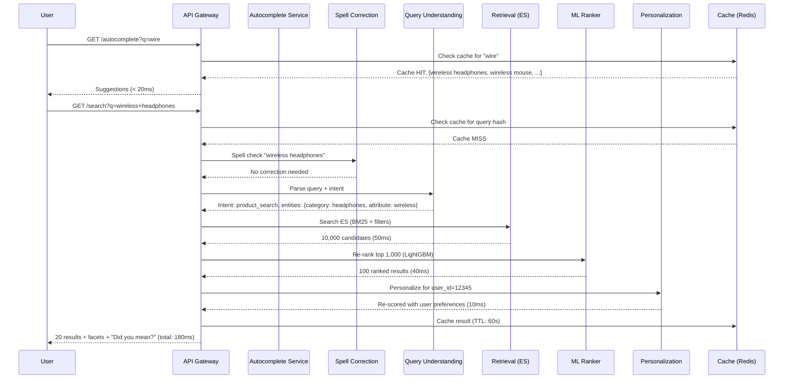

### Write Path: New Product Indexed

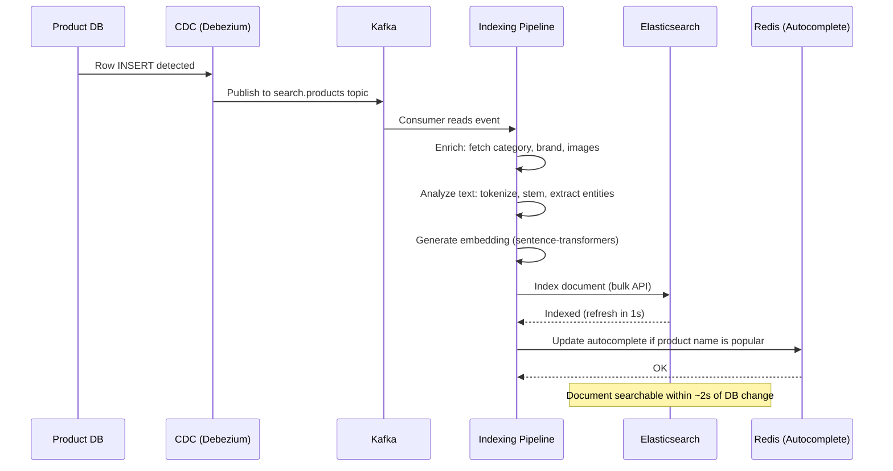

### Alternate Paths

1. **Spell-corrected query**: User types "wireles headfones" → spell correction rewrites to "wireless headphones" → search proceeds with corrected query + "Showing results for 'wireless headphones'. Search instead for 'wireles headfones'?"
2. **Zero-result query**: Search returns 0 results → system tries relaxed query (remove least important term) → if still 0, show "No results found" with suggested related queries
3. **Geo-filtered search**: User searches "pizza" with location enabled → geo filter applied before text matching → results sorted by distance-weighted relevance
4. **Federated search**: User searches "python" → system queries product index AND document index → merges results with vertical-specific blending weights

---

## Workload Characterization

| Metric | Value | Notes |
|--------|-------|-------|
| **Search QPS (steady)** | 6,000 | Read-heavy |
| **Search QPS (peak)** | 30,000 | 5x during sales events |
| **Autocomplete QPS (steady)** | 50,000 | 8-10x search volume |
| **Autocomplete QPS (peak)** | 200,000 | Keystroke-by-keystroke |
| **Index write rate** | 500 docs/sec steady, 5,000 docs/sec bulk | Product catalog updates |
| **Average query terms** | 3.2 words | Short queries dominate |
| **Results per page** | 20 | Standard pagination |
| **Average response size** | 15 KB | Result snippets + metadata |
| **Cache hit rate** | 40-60% for search, 80-90% for autocomplete | Popular queries cached |
| **Read/write ratio** | 100:1 | Search is overwhelmingly read-heavy |

---

## Capacity Estimation

### Storage

| Component | Calculation | Result |
|-----------|-------------|--------|
| **ES primary shards** | 5B docs x 2 KB avg = 10 TB raw; ES overhead 1.5x = 15 TB | 15 TB primary |
| **ES replicas** | 15 TB x 2 replicas = 30 TB | 45 TB total |
| **Vector index** | 5B docs x 768-dim x 4 bytes = 15 TB | 15 TB (HNSW) |
| **Autocomplete (Redis)** | 100M unique queries x 100 bytes avg = 10 GB | 10 GB |
| **Query logs** | 500M queries/day x 500 bytes = 250 GB/day | 90 TB/year |
| **Click logs** | 200M clicks/day x 200 bytes = 40 GB/day | 14 TB/year |

### Compute

| Component | Sizing | Notes |
|-----------|--------|-------|
| **ES data nodes** | 30 nodes (32 vCPU, 128 GB RAM, 2 TB NVMe each) | 45 TB across 60 TB capacity |
| **ES coordinator nodes** | 6 nodes (16 vCPU, 32 GB RAM) | Scatter-gather for queries |
| **ML re-ranker** | 10 GPU nodes (T4) or 40 CPU nodes | Score 1,000 candidates in < 50ms |
| **Autocomplete (Redis)** | 3 nodes (16 GB RAM each, clustered) | 50K QPS from 10 GB data |
| **Indexing pipeline** | 10 workers (8 vCPU each) | Process 500 docs/sec with enrichment |
| **API gateway** | 10 nodes (8 vCPU each) | 30K search + 50K autocomplete QPS |

### Network

| Path | Bandwidth | Notes |
|------|-----------|-------|
| **Client → API Gateway** | 30K * 1 KB = 30 MB/s in, 30K * 15 KB = 450 MB/s out | Search requests/responses |
| **API Gateway → ES** | 30K * 2 KB = 60 MB/s in, 30K * 50 KB = 1.5 GB/s out | Scatter-gather internal traffic |
| **CDC → Indexing Pipeline** | 500 events/sec * 5 KB = 2.5 MB/s | Low volume, sustained |
| **Indexing → ES** | 500 docs/sec * 2 KB = 1 MB/s | Bulk indexing |

---

## High-Level Architecture

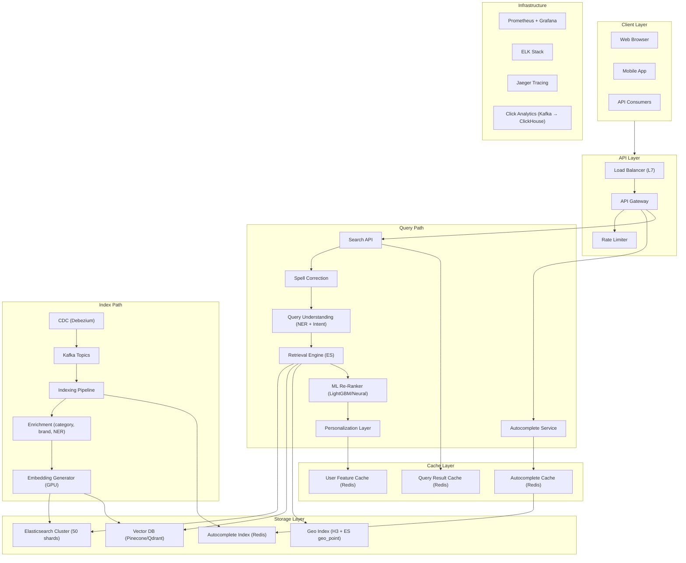

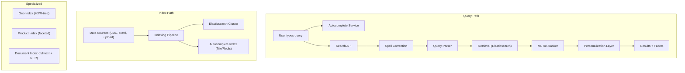

---

## Low-Level Design

### 1. Full-Text Search Engine

#### Overview

The Full-Text Search Engine is the foundation of all search — it builds an **inverted index** that maps terms to the documents containing them, enabling sub-second retrieval across billions of documents. Elasticsearch (built on Apache Lucene) is the industry standard.

#### Inverted Index

```
Term          → Document IDs (posting list)
─────────────────────────────────────────────
"wireless"    → [doc_1, doc_5, doc_23, doc_89, ...]
"headphones"  → [doc_1, doc_12, doc_23, doc_45, ...]
"bluetooth"   → [doc_1, doc_23, doc_67, ...]

Query: "wireless headphones"
→ Intersect posting lists for "wireless" AND "headphones"
→ Result: [doc_1, doc_23, ...]
→ Score each result by BM25
→ Return top K
```

#### Text Analysis Pipeline

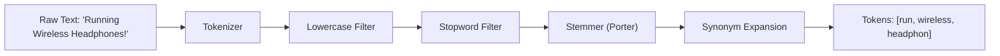

| Stage | Input | Output | Purpose |
|-------|-------|--------|---------|
| Tokenizer | "Running Wireless Headphones!" | ["Running", "Wireless", "Headphones"] | Split on whitespace/punctuation |
| Lowercase | ["Running", ...] | ["running", "wireless", "headphones"] | Case-insensitive matching |
| Stopword removal | [...] | ["running", "wireless", "headphones"] | Remove "the", "a", "is" |
| Stemming | ["running", ...] | ["run", "wireless", "headphon"] | Match word variants |
| Synonym expansion | ["wireless"] | ["wireless", "bluetooth", "cordless"] | Match synonyms |

#### BM25 Scoring

BM25 (Best Matching 25) is the standard text relevance scoring function:

```
score(D, Q) = Σ IDF(qi) * (f(qi, D) * (k1 + 1)) / (f(qi, D) + k1 * (1 - b + b * |D|/avgdl))

where:
  f(qi, D) = term frequency of qi in document D
  |D|       = document length
  avgdl     = average document length
  IDF(qi)   = inverse document frequency (rarer terms score higher)
  k1        = 1.2 (term saturation parameter)
  b         = 0.75 (length normalization parameter)
```

**Key insight**: BM25 rewards documents that contain query terms frequently (TF) but penalizes common terms (IDF) and normalizes for document length.

#### Elasticsearch Cluster Architecture

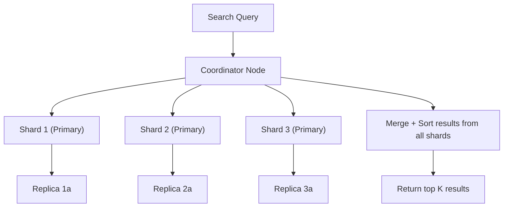

**Sharding strategy**: Documents distributed across N shards by hash(document_id). Each query is scattered to all shards, results gathered and merged at the coordinator.

#### Scaling

| Challenge | Solution |
|-----------|----------|
| 5B documents | 50 shards x 2 replicas = 100 shard copies across 20+ data nodes |
| 30K QPS peak | Read replicas serve queries; write to primary only |
| Near-real-time indexing | Elasticsearch refresh interval: 1 second |
| Hot queries | Query result cache (LRU, 10% of heap) |
| Large result sets | Pagination with `search_after` (not deep offset) |

#### Query Execution Deep Dive

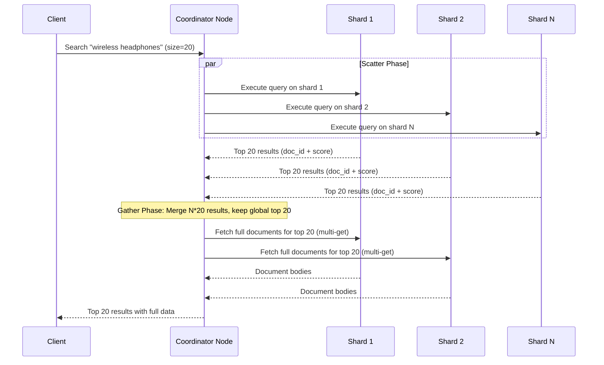

#### Index Segment Management

```
Lucene (underlying ES) stores data in immutable segments:

Write path:
1. New document → in-memory buffer
2. Buffer full (or refresh) → flush to new segment on disk
3. Segments are immutable — never modified after creation

Delete path:
1. Delete document → mark as deleted in .del file
2. Deleted docs still consume disk and memory
3. Segment merge: background process merges small segments into larger ones, excluding deleted docs

Performance implications:
- More segments = slower queries (must search each segment)
- Force merge (optimize) reduces segments but is expensive
- ES refresh_interval=1s creates 1 new segment per second → many small segments
- Merge policy: tiered merge (default) — merges segments of similar size

Tuning:
- index.merge.policy.max_merged_segment: 5gb (default)
- index.merge.scheduler.max_thread_count: 1 (for HDD), 4 (for SSD)
- Monitor: _cat/segments API for segment count and sizes
```

#### Near-Real-Time Indexing Detail

```
How "near-real-time" (NRT) search works in ES:

1. Client sends index request
2. Document written to translog (WAL) — durable immediately
3. Document added to in-memory buffer (not yet searchable)
4. Every 1 second (refresh_interval): buffer flushed to new Lucene segment
5. New segment opened for search → document NOW searchable
6. Translog flushed to disk every 5 seconds (fsync)

Timeline:
  t=0:    Document indexed (in translog + memory)
  t=1s:   Document searchable (after refresh)
  t=5s:   Document durable on disk (after fsync)

Trade-offs:
  - Lower refresh_interval → faster searchability, but more segments → slower queries
  - Higher refresh_interval → fewer segments, but stale search results
  - For bulk indexing: set refresh_interval=-1, index all docs, then refresh once
```

#### Elasticsearch Data Model (Internal)

```sql
-- Conceptual data model for understanding ES internals

-- An ES index is split into shards
-- Each shard is a complete Lucene index
-- Each Lucene index contains segments

Index: products
├── Shard 0 (Primary) → Node 1
│   ├── Segment 0: 50,000 docs (merged)
│   ├── Segment 1: 10,000 docs (recent)
│   └── Segment 2: 500 docs (newest)
├── Shard 0 (Replica) → Node 4
│   └── (mirror of Primary)
├── Shard 1 (Primary) → Node 2
│   ├── Segment 0: 48,000 docs
│   └── Segment 1: 12,000 docs
├── ...
└── Shard 49 (Primary) → Node 10
    └── ...

Total: 50 primary shards × 3 replicas = 150 shard copies
       across 20 data nodes

Document routing: shard = hash(product_id) % 50
```

#### Query Types and Performance

| Query Type | Use Case | Performance | Example |
|-----------|----------|-------------|---------|
| `match` | Full-text search | Fast (inverted index) | `{"match": {"title": "wireless headphones"}}` |
| `term` | Exact keyword match | Very fast (no analysis) | `{"term": {"brand": "SoundMax"}}` |
| `range` | Numeric/date range | Fast (BKD tree) | `{"range": {"price": {"gte": 50, "lte": 100}}}` |
| `bool` | Combine queries | Depends on sub-queries | `{"bool": {"must": [...], "filter": [...]}}` |
| `prefix` | Prefix match | Moderate | `{"prefix": {"title": "wire"}}` |
| `wildcard` | Wildcard pattern | Slow (avoid!) | `{"wildcard": {"title": "*less*"}}` |
| `regexp` | Regex match | Very slow (avoid!) | `{"regexp": {"title": "wire.*"}}` |
| `fuzzy` | Typo-tolerant | Moderate | `{"fuzzy": {"title": {"value": "wireles", "fuzziness": 1}}}` |
| `geo_distance` | Nearby search | Fast (BKD tree) | `{"geo_distance": {"distance": "5km", "location": ...}}` |
| `knn` | Vector similarity | Moderate (HNSW graph) | `{"knn": {"field": "embedding", "query_vector": [...], "k": 100}}` |

---

### 2. Autocomplete System

#### Overview

Autocomplete suggests completions as the user types, reducing effort and guiding queries. It must respond in **< 50ms** (fires on every keystroke) and suggest the most relevant completions.

#### Architecture

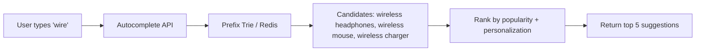

#### Data Structures

| Approach | Latency | Memory | Best For |
|----------|---------|--------|----------|
| **Trie (prefix tree)** | O(prefix length) | High | In-memory, moderate vocabulary |
| **Redis Sorted Set** | O(log N) | Moderate | Distributed, popularity-scored |
| **Elasticsearch completion suggester** | ~5ms | Index-based | Large vocabulary with fuzzy matching |

**Redis approach** (most common at scale):
```
# Sorted set keyed by prefix, scored by popularity
ZADD autocomplete:wir 1000 "wireless headphones"
ZADD autocomplete:wir 800  "wireless mouse"
ZADD autocomplete:wir 500  "wireless charger"

# Query: ZREVRANGE autocomplete:wire 0 4
# Returns top 5 by popularity
```

#### Personalized Autocomplete

Combine global popularity with user history:
```
final_score = 0.7 * global_popularity + 0.3 * user_recent_search_match
```

User recently searched "wireless earbuds" → boost "wireless earbuds" in their autocomplete results.

#### Edge Cases

- **Offensive suggestions**: Maintain blocklist of terms that should never appear in autocomplete. Update in real-time.
- **Trending queries**: Boost suggestions with recent popularity spikes (breaking news, viral events).
- **Multi-language**: Separate autocomplete indexes per language; detect language from user locale.
- **Typo in prefix**: "wireles" should still suggest "wireless headphones" → fuzzy prefix matching.

#### Autocomplete Data Pipeline

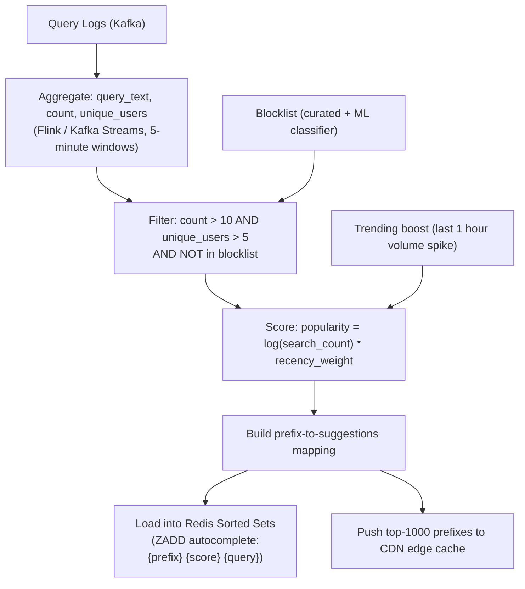

#### Autocomplete Serving Architecture

```
Two-tier serving for best latency:

Tier 1: CDN Edge Cache (< 5ms)
  - Top 1,000 prefixes (cover 80% of autocomplete traffic)
  - Updated every 5 minutes via push
  - Covers: "a", "am", "ama", "amaz", "amazon", etc.

Tier 2: Redis Cluster (< 20ms)
  - All 100M autocomplete entries
  - Long-tail prefixes that miss CDN cache
  - Personalized suggestions (user-specific Redis key)

Fallback: Elasticsearch completion suggester (< 50ms)
  - If Redis is down
  - Fuzzy matching that Redis doesn't support
```

#### Autocomplete Data Model

```sql
CREATE TABLE autocomplete_analytics (
    prefix          VARCHAR(64) NOT NULL,
    suggestion      VARCHAR(512) NOT NULL,
    language        VARCHAR(8) NOT NULL DEFAULT 'en',
    category        VARCHAR(128),
    search_count    BIGINT NOT NULL DEFAULT 0,
    unique_users    INTEGER NOT NULL DEFAULT 0,
    click_rate      NUMERIC(5,4) DEFAULT 0,
    last_trending   TIMESTAMPTZ,
    is_blocked      BOOLEAN DEFAULT FALSE,
    blocked_reason  VARCHAR(256),
    created_at      TIMESTAMPTZ NOT NULL DEFAULT NOW(),
    updated_at      TIMESTAMPTZ NOT NULL DEFAULT NOW(),
    PRIMARY KEY (prefix, suggestion, language)
);

CREATE INDEX idx_auto_analytics_popular ON autocomplete_analytics (language, search_count DESC);
```

---

### 3. Spell Correction System

#### Overview

Spell correction detects and fixes misspelled queries before search execution. Google's "Did you mean...?" is the canonical example. Without spell correction, 10-15% of queries return poor results.

#### Approaches

| Approach | How It Works | Latency | Quality |
|----------|-------------|---------|---------|
| **Edit distance (Levenshtein)** | Find dictionary words within N edits | O(dict * query_len) | Good for typos |
| **Phonetic (Soundex/Metaphone)** | Match by pronunciation | Fast | Good for phonetic misspellings |
| **Statistical (noisy channel)** | P(correction given typo) using query logs | Fast (pre-computed) | Best — learns from real user behavior |
| **Neural (seq2seq)** | ML model predicts correction | 10-50ms | Best for complex errors |

#### Noisy Channel Model

```
best_correction = argmax P(correction) * P(typo | correction)

where:
  P(correction)        = language model probability (how common is this phrase?)
  P(typo | correction) = error model probability (how likely is this typo given the intended word?)
```

Example: User types "wireles headfones"
- P("wireless headphones") * P("wireles" | "wireless") * P("headfones" | "headphones") → HIGH
- P("wireless headdresses") * P("wireles" | "wireless") * P("headfones" | "headdresses") → LOW
- Winner: "wireless headphones"

#### Implementation

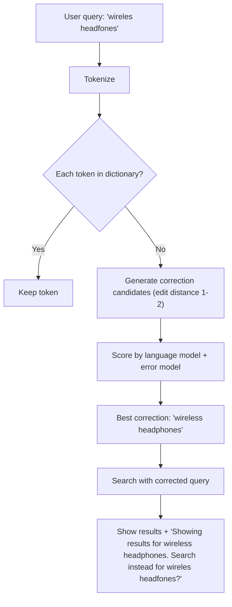

#### SymSpell Algorithm (Production Implementation)

```
SymSpell is the fastest spell correction algorithm for production use:

How it works:
1. Pre-computation: For every dictionary word, generate ALL possible deletions within edit distance N
   "wireless" → {"wireles", "wirless", "wieless", "wreless", ...} (all 1-deletion variants)
2. Store in hash map: deletion → [original words]
3. At query time: generate deletions of the misspelled word
   "wireles" → {"wirele", "wirles", "wieles", ...}
4. Lookup each deletion in the hash map
5. Any match = potential correction

Performance:
  - Pre-computation: O(dict_size * word_length^N)
  - Query time: O(query_length^N) — typically < 1ms
  - Memory: ~10x dictionary size for edit distance 2

Comparison:
  - SymSpell (precalculated): 1M corrections/second
  - Peter Norvig algorithm (edit distance): 10K corrections/second
  - Elasticsearch suggest: 1K corrections/second
```

#### Spell Correction User Experience

```
Three levels of correction confidence:

1. High confidence (> 0.95): Auto-correct silently
   User types: "iphon 15 pro max"
   Shows: Results for "iphone 15 pro max" (no banner)

2. Medium confidence (0.7 - 0.95): Auto-correct with override option
   User types: "wireles headfones"
   Shows: "Showing results for 'wireless headphones'. Search instead for 'wireles headfones'?"

3. Low confidence (< 0.7): Suggest but don't auto-correct
   User types: "python" (could mean language or snake)
   Shows: Results for "python" + "Did you mean: python programming | python snake?"
```

#### Multi-Language Spell Correction

```
Challenges:
- Different character sets (Latin, Cyrillic, CJK, Arabic)
- CJK languages have no spaces between words → different tokenization
- Some languages have rich morphology (German compound words, Turkish agglutination)

Approach:
1. Detect language from query (fastText classifier, 176 languages, < 1ms)
2. Load language-specific dictionary and error model
3. For CJK: use n-gram based correction instead of word-level
4. For mixed-language queries ("bluetooth イヤホン"): correct each language portion independently
```

---

### 4. Ranking & Relevance Engine

#### Overview

The Ranking Engine determines **which results appear first**. Raw BM25 retrieval finds relevant documents but doesn't account for quality, freshness, popularity, or user intent. ML re-ranking closes this gap.

#### Multi-Stage Ranking Pipeline

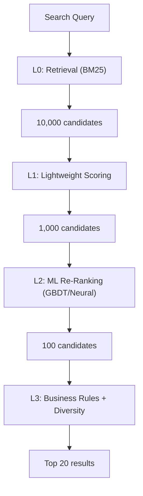

| Stage | Model | Latency Budget | Purpose |
|-------|-------|---------------|---------|
| L0: Retrieval | BM25 / ANN | 50ms | Recall — find all possibly relevant docs |
| L1: Pre-scoring | Linear model | 20ms | Reduce candidate set cheaply |
| L2: Re-ranking | GBDT (LightGBM) or neural | 50ms | Precision — order by predicted relevance |
| L3: Business rules | Rules engine | 10ms | Diversity, freshness boost, ad injection |

#### Ranking Features

| Category | Features |
|----------|---------|
| **Query-document** | BM25 score, query term coverage, exact match, phrase match |
| **Document quality** | PageRank/authority, freshness, content length, link count |
| **User-query** | Click-through rate for this query-doc pair, dwell time |
| **Personalization** | User's category preferences, search history, location |
| **Freshness** | Document age, last update time, trending signal |
| **Engagement** | Views, likes, shares, comments |

#### Learning to Rank (LTR)

Train the ranking model on **click data**:
- **Positive**: Results that were clicked and had long dwell time
- **Negative**: Results that were shown but not clicked (or clicked and bounced)
- **Model**: LambdaMART (GBDT-based) or neural cross-encoder
- **Metric**: NDCG@10 (Normalized Discounted Cumulative Gain)

#### Position Bias Correction

```
Problem: Users click results at position 1 more than position 5,
         regardless of relevance. This creates a feedback loop where
         top-ranked results get more clicks → get ranked higher → get more clicks.

Solutions:
1. Inverse Propensity Weighting (IPW):
   weight(click) = 1 / P(examine | position)
   Position 1: P(examine) = 1.0 → weight = 1.0
   Position 5: P(examine) = 0.3 → weight = 3.3
   → Clicks at lower positions are worth more

2. Randomized experiments:
   Randomly shuffle top-20 results for 1% of traffic
   → Unbiased click data for model training
   → Small quality sacrifice for training data quality

3. Counterfactual learning:
   Use propensity scores from click model to debias training data
```

#### LTR Model Training Pipeline

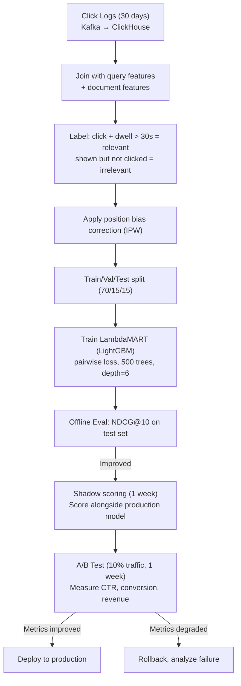

#### Neural Re-Ranking (Advanced)

```
For the highest-quality re-ranking, use a cross-encoder neural model:

Architecture: BERT-based cross-encoder
Input: [CLS] query [SEP] document title + snippet [SEP]
Output: relevance score (0-1)

Why cross-encoder > bi-encoder for re-ranking:
- Cross-encoder: joint encoding of query + document → captures fine-grained interactions
- Bi-encoder: independent encoding → misses query-document interactions
- Cross-encoder is 100x slower but much more accurate

Production strategy:
- Bi-encoder for L0 (ANN retrieval from vector DB): 5B docs → 1,000 candidates
- GBDT for L1: 1,000 → 100 candidates
- Cross-encoder for L2 (optional): 100 → 20 final results

Latency: 100 docs × 10ms per inference = 1s on CPU, 50ms on GPU (batched)
Cost: Requires GPU serving (T4/A10) → $5-15K/month for 30K QPS
```

#### A/B Testing Framework for Ranking

```
Ranking experiment setup:
1. Define hypothesis: "Adding seller_rating feature improves purchase CTR"
2. Train new model with seller_rating feature
3. Assign 10% of traffic to treatment (new model), 90% to control (current model)
4. Hash user_id to ensure consistent assignment across sessions
5. Measure primary metric (CTR) and guardrail metrics (revenue, zero-result rate)
6. Run for 1-2 weeks to reach statistical significance
7. If treatment wins → ramp to 50%, then 100%

Gotchas:
- Novelty effect: Users click more on new results initially; wait 3+ days
- Seasonal variation: Don't start experiments before holidays
- Metric tradeoffs: New model may improve CTR but decrease revenue per click
- Interaction effects: Two simultaneous ranking experiments can interfere
```

---

### 5. Personalization in Search

#### Overview

Personalized search adapts results to the individual user. Two users searching "python" should see different results: a programmer sees Python programming language; a pet enthusiast sees python snakes.

#### Personalization Signals

| Signal | Source | Weight |
|--------|--------|--------|
| Search history | Past queries | High |
| Click history | Past result clicks | High |
| Purchase history | Past purchases (e-commerce) | Medium |
| Browse history | Pages/products viewed | Medium |
| Location | GPS / IP geolocation | Medium |
| Demographics | Age, language, interests | Low |
| Device | Mobile vs desktop | Low |
| Time of day | Morning vs evening | Low |

#### Implementation

```
personalized_score = (1 - alpha) * base_relevance_score + alpha * personalization_boost

where alpha = 0.2 (personalization weight — not too strong, to avoid filter bubble)
```

**Filter bubble mitigation**: Cap personalization boost at 20% of base score. Inject 10% exploratory results that don't match user profile.

#### User Profile Vector

```
For each user, maintain a real-time feature vector:

user_profile = {
  "category_affinity": {"electronics": 0.8, "books": 0.6, "clothing": 0.3},
  "brand_affinity": {"apple": 0.9, "samsung": 0.4},
  "price_sensitivity": 0.6,  // 0 = luxury buyer, 1 = budget buyer
  "device": "mobile",
  "location": {"lat": 37.78, "lon": -122.41},
  "recent_queries": ["wireless headphones", "usb-c hub", "desk lamp"],
  "recent_clicks": ["prod_123", "prod_456"],
  "purchase_history": ["prod_789", "prod_012"],
  "session_intent": "browsing"  // vs "buying" — inferred from behavior
}

Storage: Redis hash per user_id, TTL 30 minutes
Update: Async via Kafka click/search events
Feature computation: Real-time update on every search/click
```

#### Personalization Architecture

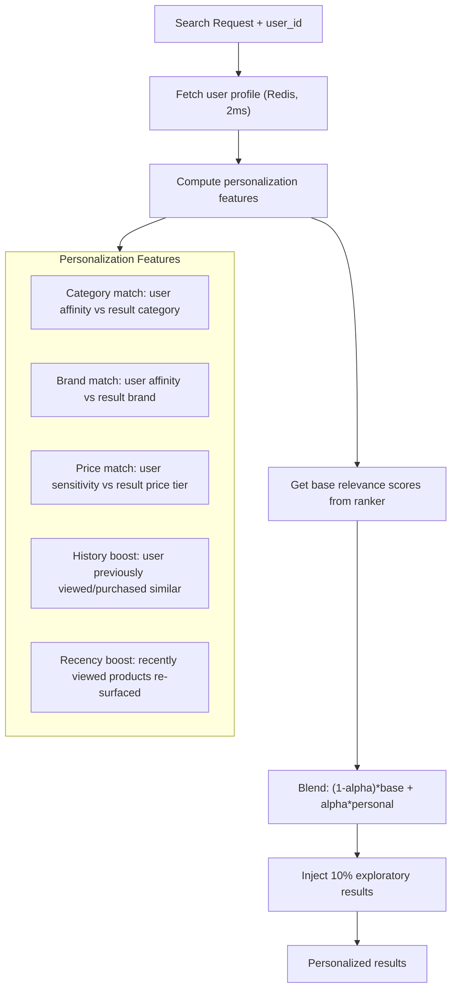

#### Privacy-Preserving Personalization

| Concern | Mitigation |
|---------|-----------|
| **GDPR right to erasure** | Delete user profile from Redis + Kafka within 24 hours of request |
| **Anonymous users** | Session-based personalization only (no cross-session profile) |
| **Opt-out** | Respect `X-No-Personalization: true` header; serve generic results |
| **Data minimization** | Store only aggregated affinity scores, not raw browsing history |
| **Transparency** | "Why this result?" tooltip explaining personalization factors |
| **COPPA (children)** | No personalization for users under 13 (age-gated) |

#### Cold Start Problem

```
New user (no history):
1. First 3 queries: Use location + device + time-of-day as only personalization signals
2. After 5 queries: Start building category affinity from search terms
3. After 3 clicks: Start building brand affinity from clicked products
4. After 1 purchase: Full personalization profile active

New product (no engagement data):
1. Use category/brand average engagement as proxy
2. Boost in "explore" slot (10% of results reserved for new content)
3. After 100 impressions: Use actual CTR for ranking
```

---

### 6. Geo Search

#### Overview

Geo Search finds entities (restaurants, stores, services) near a geographic location. It powers "restaurants near me," map search, and local business discovery.

#### Geospatial Indexing

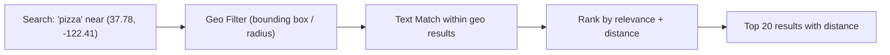

#### Spatial Index Options

| Index Type | How It Works | Best For |
|-----------|-------------|----------|
| **Geohash** | Encode lat/lng to string prefix; nearby points share prefix | Simple range queries |
| **R-tree** | Balanced tree of minimum bounding rectangles | Rectangle/polygon queries |
| **Quadtree** | Recursively divide space into 4 quadrants | Point queries, sparse data |
| **H3** | Hexagonal grid with hierarchical resolution | Uniform distance queries |
| **Elasticsearch geo_point** | KD-tree + BKD tree | Combined text + geo queries |

#### Elasticsearch Geo Query

```json
{
  "query": {
    "bool": {
      "must": {"match": {"name": "pizza"}},
      "filter": {
        "geo_distance": {
          "distance": "5km",
          "location": {"lat": 37.78, "lon": -122.41}
        }
      }
    }
  },
  "sort": [
    {"_geo_distance": {"location": {"lat": 37.78, "lon": -122.41}, "order": "asc"}}
  ]
}
```

#### Distance-Weighted Scoring

```
geo_score = text_relevance * distance_decay(distance_km)

distance_decay options:
  - Linear: max(0, 1 - distance/max_distance)
  - Exponential: exp(-lambda * distance)  // lambda = 0.1 for 10km radius
  - Gaussian: exp(-distance^2 / (2 * sigma^2))  // sigma = 5km

Elasticsearch function_score:
{
  "query": {"match": {"name": "pizza"}},
  "functions": [{
    "gauss": {
      "location": {
        "origin": {"lat": 37.78, "lon": -122.41},
        "scale": "5km",
        "decay": 0.5
      }
    }
  }],
  "boost_mode": "multiply"
}
```

#### H3 Hexagonal Grid (Used by Uber)

```
H3 advantages over geohash:
1. Uniform distance: All neighbors are equidistant (hexagons, not squares)
2. Hierarchical: 16 resolution levels (0 = continent, 15 = 1m²)
3. Efficient: Ring/disk queries are O(1) per cell
4. No edge artifacts: Geohash has discontinuities at cell boundaries

Usage pattern:
- Index each entity at resolution 9 (~0.1 km² per cell)
- Query: Convert center point to H3 cell → get k-ring neighbors → filter by exact distance
- Pre-aggregate: Store entity counts per H3 cell for heatmap visualization

-- PostgreSQL with h3-pg extension
SELECT h3_lat_lng_to_cell(POINT(37.78, -122.41), 9) AS cell;
-- Returns: '89283082803ffff'

SELECT entity_id, ST_Distance(location, ST_MakePoint(-122.41, 37.78)::geography) AS dist_m
FROM entities
WHERE h3_cell = ANY(h3_grid_ring_unsafe('89283082803ffff', 2))
  AND name_tsvector @@ to_tsquery('pizza')
ORDER BY dist_m
LIMIT 20;
```

#### Geo Search Data Model

```sql
CREATE TABLE geo_entities (
    entity_id       UUID PRIMARY KEY DEFAULT gen_random_uuid(),
    name            VARCHAR(512) NOT NULL,
    name_tsvector   TSVECTOR GENERATED ALWAYS AS (to_tsvector('english', name)) STORED,
    category        VARCHAR(128) NOT NULL,
    address         JSONB NOT NULL,
    location        GEOGRAPHY(POINT, 4326) NOT NULL,
    h3_cell_9       VARCHAR(16) NOT NULL,
    h3_cell_7       VARCHAR(16) NOT NULL,
    attributes      JSONB DEFAULT '{}',
    rating          NUMERIC(2,1),
    review_count    INTEGER DEFAULT 0,
    is_open         BOOLEAN DEFAULT TRUE,
    opening_hours   JSONB,
    created_at      TIMESTAMPTZ NOT NULL DEFAULT NOW(),
    updated_at      TIMESTAMPTZ NOT NULL DEFAULT NOW()
);

CREATE INDEX idx_geo_location ON geo_entities USING GIST (location);
CREATE INDEX idx_geo_h3_9 ON geo_entities (h3_cell_9);
CREATE INDEX idx_geo_h3_7 ON geo_entities (h3_cell_7);
CREATE INDEX idx_geo_name_tsvector ON geo_entities USING GIN (name_tsvector);
CREATE INDEX idx_geo_category ON geo_entities (category);
```

#### Open Now Filtering

```
Challenge: "pizza near me open now" requires checking opening_hours against current time and timezone

Solution:
1. Store opening_hours as JSONB array: [{"day": "MON", "open": "11:00", "close": "23:00"}, ...]
2. At query time: determine user's timezone from location → compute current local time
3. Filter: opening_hours contains current day AND open <= now <= close
4. Handle edge cases: 24h places, holidays, temporary closures

Optimization: Pre-compute is_open_now as materialized flag, updated every 15 minutes
```

---

### 7. Product Search

#### Overview

Product search is **structured, faceted search** over e-commerce catalogs. Unlike web search (unstructured text), product search involves structured attributes (brand, category, price, size, color) that enable precise filtering alongside full-text relevance.

#### Faceted Search Architecture

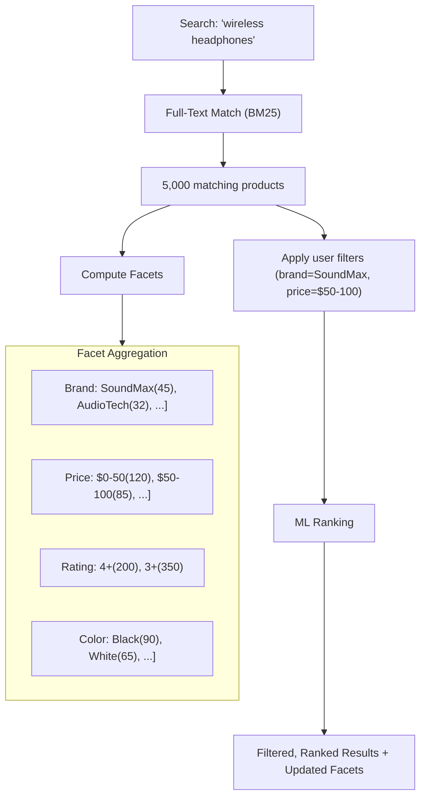

#### Key Design: Post-Filter Facets

Facet counts must update when filters are applied. If user filters by `brand=SoundMax`, the brand facet still shows all brands (so user can change selection), but price/rating facets show counts only within SoundMax results. This is called **disjunctive faceting** — the selected facet dimension remains unfiltered while others are filtered.

#### Implementing Disjunctive Faceting in Elasticsearch

```json
{
  "query": {
    "bool": {
      "must": {"match": {"title": "wireless headphones"}},
      "filter": [
        {"term": {"brand": "SoundMax"}},
        {"range": {"price": {"gte": 50, "lte": 100}}}
      ]
    }
  },
  "aggs": {
    "brand_facet": {
      "aggs": {
        "brands": {
          "terms": {"field": "brand", "size": 50}
        }
      },
      "filter": {
        "bool": {
          "must": [
            {"match": {"title": "wireless headphones"}},
            {"range": {"price": {"gte": 50, "lte": 100}}}
          ]
        }
      }
    },
    "price_facet": {
      "aggs": {
        "price_ranges": {
          "range": {
            "field": "price",
            "ranges": [
              {"key": "$0-50", "to": 50},
              {"key": "$50-100", "from": 50, "to": 100},
              {"key": "$100-200", "from": 100, "to": 200},
              {"key": "$200+", "from": 200}
            ]
          }
        }
      },
      "filter": {
        "bool": {
          "must": [
            {"match": {"title": "wireless headphones"}},
            {"term": {"brand": "SoundMax"}}
          ]
        }
      }
    }
  }
}
```

**Key insight**: Each facet aggregation uses a `filter` that includes ALL other active filters EXCEPT its own dimension. This way, the brand facet shows counts unfiltered by brand (so the user can see and switch brands), while still being filtered by price.

#### Product Search Ranking Signals

| Signal | Weight | Description |
|--------|--------|-------------|
| **Text relevance (BM25)** | 30% | Title match > description match > attribute match |
| **Sales velocity** | 20% | Products with more recent sales rank higher (Amazon A9 approach) |
| **Conversion rate** | 15% | Products with higher click-to-purchase rate for this query |
| **Review score** | 10% | Rating * log(review_count) — both quality and confidence |
| **Price competitiveness** | 10% | Products priced near category median rank higher |
| **Stock availability** | 5% | In-stock products rank above out-of-stock |
| **Seller quality** | 5% | Seller rating, fulfillment speed, return rate |
| **Freshness** | 5% | Recently listed products get a small boost |

#### Product Search Query Understanding

```
Raw query: "cheap red nike running shoes size 10 under $100"

Entity extraction:
  brand: Nike
  color: red
  category: running shoes
  size: 10
  price_constraint: < $100
  quality_modifier: cheap (→ sort by price asc)

Rewritten query:
  text: "running shoes"
  filters: {brand: "Nike", color: "red", size: "10", price_max: 100}
  sort: price_asc (inferred from "cheap")
```

#### Synonym Challenges in Product Search

```
Domain-specific synonyms that general search engines miss:

"couch" = "sofa" = "settee"
"hoodie" = "hooded sweatshirt" = "pullover"
"laptop" ≠ "notebook" (ambiguous: could be paper notebook)
"AirPods" ≈ "wireless earbuds" (brand ≈ category — partial synonym)
"4K TV" = "UHD TV" = "2160p TV"
"USB-C" = "Type-C" = "USB Type C"

Management:
- Curated synonym file per product vertical
- Updated monthly by category managers
- A/B tested: bad synonyms can HURT relevance (e.g., "mouse" → "mice" in electronics)
```

---

### 8. Document Search

#### Overview

Document search enables full-text search across unstructured content: PDFs, Word documents, emails, wiki pages, Slack messages, and code repositories. Unlike product search (structured attributes), document search relies heavily on content extraction and semantic understanding.

#### Indexing Pipeline


#### Hybrid Search (BM25 + Vector)

Modern document search combines **keyword matching** (BM25) with **semantic similarity** (vector embeddings):

```
final_score = alpha * bm25_score(query, document) + (1 - alpha) * cosine_similarity(query_embedding, doc_embedding)
```

This handles queries where:
- BM25 excels: exact term matches ("error code 404")
- Vectors excel: semantic meaning ("how to fix server crashes" matches "troubleshooting production outages")

#### Content Extraction Pipeline Detail

| Document Type | Extraction Tool | Challenges |
|--------------|----------------|------------|
| **PDF** | Apache Tika / PyMuPDF | Scanned PDFs need OCR (Tesseract); tables hard to parse; multi-column layouts |
| **Word (DOCX)** | python-docx / Tika | Track changes, comments, headers/footers; embedded images |
| **Email (EML/MSG)** | email library / Tika | Thread reconstruction; attachment extraction; HTML vs plaintext |
| **HTML/Wiki** | BeautifulSoup / readability | Boilerplate removal; navigation stripping; rich content extraction |
| **PowerPoint** | python-pptx | Slide notes vs slide content; presenter notes often more valuable |
| **Spreadsheet** | openpyxl / pandas | Column headers as field names; cell formulas; multiple sheets |
| **Code** | tree-sitter / custom | Language-specific tokenization; comments vs code; function/class boundaries |

#### Access Control in Document Search

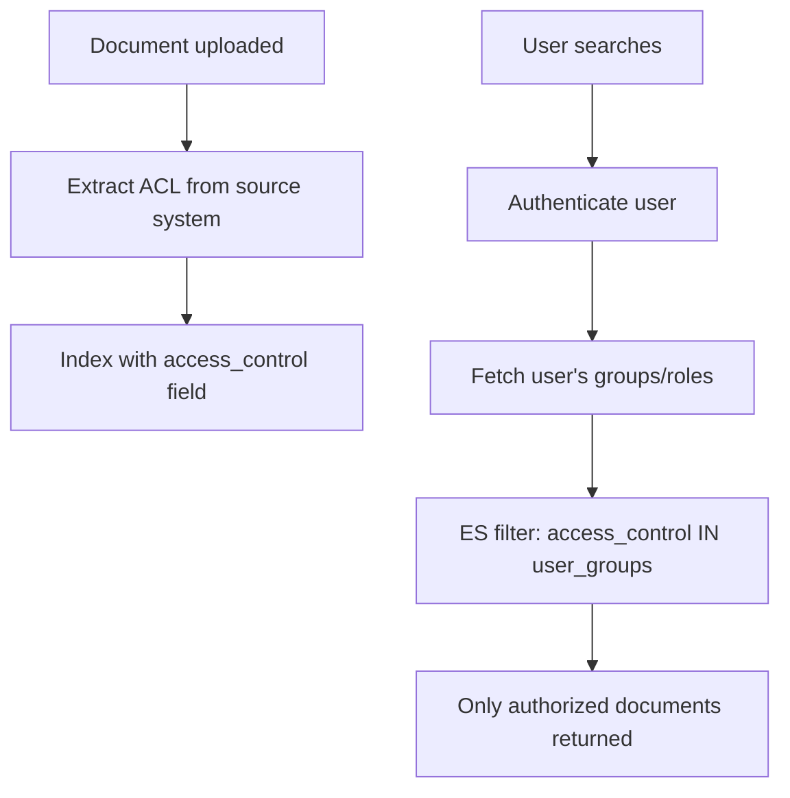

```
Access control models:
1. Role-based: access_control: ["engineering", "all_employees"]
2. User-based: access_control: ["user:alice@co.com", "user:bob@co.com"]
3. Hierarchical: access_control: ["org:acme", "dept:engineering", "team:backend"]
4. Document-level: Each doc has explicit ACL from source system (Google Drive, SharePoint, Confluence)

Syncing ACLs:
- Poll source system every 15 minutes for permission changes
- Webhook from IAM system on group membership changes
- Reindex ACL field without reindexing content (partial update)
```

#### Chunking Strategy for Semantic Search

```
Why chunk: Embedding models have token limits (512 tokens typical).
           Full documents (10,000+ tokens) can't be embedded as a single vector.
           Passage-level embeddings are more precise than document-level.

Chunking strategies:
1. Fixed-size: 256 tokens with 50-token overlap
   - Simple but may split sentences/paragraphs
2. Semantic: Split at paragraph/section boundaries
   - Better coherence but variable chunk sizes
3. Sentence-window: Embed single sentence, retrieve with surrounding context
   - Best precision but more vectors to store and search

Recommended: Paragraph-level chunking with sentence-level overlap

Storage:
  - Each chunk gets its own vector in the vector DB
  - Chunk → document mapping stored in metadata
  - At query time: retrieve top-K chunks → deduplicate by document → return documents
```

#### Retrieval-Augmented Generation (RAG) Integration

```
Document search is the RETRIEVAL component of RAG:

1. User asks: "What is our company's PTO policy?"
2. Search retrieves top-5 relevant chunks from HR documents
3. Chunks passed as context to LLM
4. LLM generates natural language answer citing specific documents

Architecture:
  User Query → Search API (BM25 + Vector) → Top-K chunks → LLM → Answer + Citations

Search requirements for RAG:
  - High recall (must find the relevant chunks)
  - Chunk-level retrieval (not just document-level)
  - Metadata for citations (document title, page number, URL)
  - Fast (< 500ms retrieval) to keep total RAG latency < 3s
```

---

## APIs and Contracts

### Search API

```
POST /v1/search
Authorization: Bearer <token>
Rate Limit: 100 req/s per user, 30,000 req/s global

Request:
{
  "query": "wireless headphones",
  "filters": {
    "category": "electronics",
    "price_min": 20,
    "price_max": 200,
    "brand": ["SoundMax", "AudioTech"],
    "rating_min": 4.0
  },
  "geo": {
    "lat": 37.7749,
    "lon": -122.4194,
    "radius_km": 10
  },
  "sort": "relevance",
  "page_size": 20,
  "search_after": ["0.85", "doc_9823"],
  "personalization": true,
  "vertical": "product",
  "spell_check": true,
  "facets": ["brand", "price_range", "rating", "color"],
  "highlight": true,
  "ab_test_group": "ranking_v3"
}

Response (200 OK):
{
  "request_id": "req_abc123",
  "query": "wireless headphones",
  "corrected_query": null,
  "total_results": 4523,
  "results": [
    {
      "id": "prod_12345",
      "title": "SoundMax Pro Wireless Over-Ear Headphones",
      "snippet": "Premium <em>wireless</em> <em>headphones</em> with ANC...",
      "url": "/products/soundmax-pro-wireless",
      "image_url": "https://cdn.example.com/products/12345/thumb.jpg",
      "price": 89.99,
      "currency": "USD",
      "rating": 4.7,
      "review_count": 2340,
      "brand": "SoundMax",
      "in_stock": true,
      "relevance_score": 0.92,
      "distance_km": null,
      "metadata": {
        "category_path": "Electronics > Audio > Headphones",
        "seller": "SoundMax Official",
        "badges": ["best_seller", "prime"]
      }
    }
  ],
  "facets": {
    "brand": [
      {"value": "SoundMax", "count": 45, "selected": true},
      {"value": "AudioTech", "count": 32, "selected": true},
      {"value": "BassKing", "count": 28, "selected": false}
    ],
    "price_range": [
      {"value": "20-50", "count": 38, "selected": false},
      {"value": "50-100", "count": 42, "selected": false},
      {"value": "100-200", "count": 15, "selected": false}
    ],
    "rating": [
      {"value": "4+", "count": 62, "selected": false},
      {"value": "3+", "count": 77, "selected": false}
    ]
  },
  "search_after": ["0.78", "prod_67890"],
  "latency_ms": 142,
  "served_from_cache": false
}
```

### Autocomplete API

```
GET /v1/autocomplete?q=wire&limit=5&user_id=u123
Rate Limit: 500 req/s per user, 200,000 req/s global

Response (200 OK):
{
  "prefix": "wire",
  "suggestions": [
    {"text": "wireless headphones", "score": 0.95, "category": "Electronics", "type": "product"},
    {"text": "wireless mouse", "score": 0.88, "category": "Electronics", "type": "product"},
    {"text": "wireless charger", "score": 0.82, "category": "Electronics", "type": "product"},
    {"text": "wireless router", "score": 0.75, "category": "Networking", "type": "product"},
    {"text": "wire stripper", "score": 0.60, "category": "Tools", "type": "product"}
  ],
  "personalized": true,
  "latency_ms": 8
}
```

### Spell Correction API (Internal)

```
POST /internal/spell-check
{
  "query": "wireles headfones",
  "language": "en",
  "context": "product_search"
}

Response:
{
  "original": "wireles headfones",
  "corrected": "wireless headphones",
  "corrections": [
    {"original": "wireles", "corrected": "wireless", "confidence": 0.97, "method": "edit_distance"},
    {"original": "headfones", "corrected": "headphones", "confidence": 0.95, "method": "noisy_channel"}
  ],
  "confidence": 0.96,
  "should_auto_correct": true
}
```

### Indexing API (Internal)

```
POST /internal/index/bulk
{
  "documents": [
    {
      "id": "prod_12345",
      "operation": "upsert",
      "source": "catalog_cdc",
      "body": {
        "title": "SoundMax Pro Wireless Over-Ear Headphones",
        "description": "Premium wireless headphones with active noise cancellation...",
        "category_id": "cat_audio_headphones",
        "brand": "SoundMax",
        "price": 89.99,
        "currency": "USD",
        "attributes": {"color": "black", "connectivity": "bluetooth", "noise_cancellation": true},
        "location": {"lat": 37.78, "lon": -122.41},
        "language": "en",
        "created_at": "2025-01-15T10:30:00Z",
        "updated_at": "2025-03-20T14:22:00Z"
      },
      "embedding": [0.023, -0.156, 0.891, ...]
    }
  ]
}

Response:
{
  "indexed": 1,
  "failed": 0,
  "errors": []
}
```

### Ranking Feedback API (Internal — Click Logging)

```
POST /internal/ranking/feedback
{
  "request_id": "req_abc123",
  "user_id": "u123",
  "query": "wireless headphones",
  "events": [
    {"type": "impression", "doc_id": "prod_12345", "position": 1, "timestamp": "2025-03-20T14:22:01Z"},
    {"type": "click", "doc_id": "prod_12345", "position": 1, "timestamp": "2025-03-20T14:22:03Z"},
    {"type": "dwell", "doc_id": "prod_12345", "duration_ms": 45000, "timestamp": "2025-03-20T14:22:48Z"},
    {"type": "add_to_cart", "doc_id": "prod_12345", "timestamp": "2025-03-20T14:23:15Z"}
  ]
}
```

---

## Data Model

### Elasticsearch Index Mappings

#### Product Index

```json
{
  "mappings": {
    "properties": {
      "product_id":    {"type": "keyword"},
      "title":         {"type": "text", "analyzer": "product_analyzer", "fields": {"raw": {"type": "keyword"}, "suggest": {"type": "completion"}}},
      "description":   {"type": "text", "analyzer": "product_analyzer"},
      "brand":         {"type": "keyword"},
      "category_id":   {"type": "keyword"},
      "category_path": {"type": "keyword"},
      "price":         {"type": "float"},
      "currency":      {"type": "keyword"},
      "rating":        {"type": "float"},
      "review_count":  {"type": "integer"},
      "in_stock":      {"type": "boolean"},
      "stock_quantity": {"type": "integer"},
      "attributes":    {"type": "object", "dynamic": true},
      "tags":          {"type": "keyword"},
      "location":      {"type": "geo_point"},
      "seller_id":     {"type": "keyword"},
      "seller_rating": {"type": "float"},
      "embedding":     {"type": "dense_vector", "dims": 768, "index": true, "similarity": "cosine"},
      "language":      {"type": "keyword"},
      "popularity_score": {"type": "float"},
      "created_at":    {"type": "date"},
      "updated_at":    {"type": "date"},
      "indexed_at":    {"type": "date"}
    }
  },
  "settings": {
    "number_of_shards": 50,
    "number_of_replicas": 2,
    "refresh_interval": "1s",
    "analysis": {
      "analyzer": {
        "product_analyzer": {
          "type": "custom",
          "tokenizer": "standard",
          "filter": ["lowercase", "asciifolding", "product_synonyms", "porter_stem"]
        }
      },
      "filter": {
        "product_synonyms": {
          "type": "synonym_graph",
          "synonyms_path": "analysis/product_synonyms.txt",
          "updateable": true
        }
      }
    }
  }
}
```

#### Document Index

```json
{
  "mappings": {
    "properties": {
      "doc_id":        {"type": "keyword"},
      "title":         {"type": "text", "analyzer": "document_analyzer"},
      "body":          {"type": "text", "analyzer": "document_analyzer"},
      "author":        {"type": "keyword"},
      "doc_type":      {"type": "keyword"},
      "source":        {"type": "keyword"},
      "entities":      {"type": "keyword"},
      "tags":          {"type": "keyword"},
      "language":      {"type": "keyword"},
      "embedding":     {"type": "dense_vector", "dims": 768, "index": true, "similarity": "cosine"},
      "access_control": {"type": "keyword"},
      "created_at":    {"type": "date"},
      "updated_at":    {"type": "date"}
    }
  },
  "settings": {
    "number_of_shards": 30,
    "number_of_replicas": 2,
    "analysis": {
      "analyzer": {
        "document_analyzer": {
          "type": "custom",
          "tokenizer": "standard",
          "filter": ["lowercase", "asciifolding", "english_stop", "english_stemmer"]
        }
      }
    }
  }
}
```

### PostgreSQL Tables (Search Metadata)

```sql
-- Search analytics and query logs
CREATE TABLE search_queries (
    query_id        UUID PRIMARY KEY DEFAULT gen_random_uuid(),
    user_id         VARCHAR(64),
    session_id      VARCHAR(64) NOT NULL,
    query_text      TEXT NOT NULL,
    corrected_query TEXT,
    vertical        VARCHAR(32) NOT NULL DEFAULT 'product',
    filters_json    JSONB,
    result_count    INTEGER NOT NULL DEFAULT 0,
    latency_ms      INTEGER NOT NULL,
    ab_test_group   VARCHAR(64),
    served_from_cache BOOLEAN DEFAULT FALSE,
    created_at      TIMESTAMPTZ NOT NULL DEFAULT NOW()
) PARTITION BY RANGE (created_at);

CREATE INDEX idx_search_queries_user ON search_queries (user_id, created_at DESC);
CREATE INDEX idx_search_queries_text ON search_queries USING gin (to_tsvector('english', query_text));
CREATE INDEX idx_search_queries_zero ON search_queries (created_at) WHERE result_count = 0;

-- Click events for ranking model training
CREATE TABLE search_clicks (
    click_id        UUID PRIMARY KEY DEFAULT gen_random_uuid(),
    query_id        UUID NOT NULL REFERENCES search_queries(query_id),
    user_id         VARCHAR(64),
    doc_id          VARCHAR(128) NOT NULL,
    position        SMALLINT NOT NULL,
    dwell_time_ms   INTEGER,
    converted       BOOLEAN DEFAULT FALSE,
    created_at      TIMESTAMPTZ NOT NULL DEFAULT NOW()
) PARTITION BY RANGE (created_at);

CREATE INDEX idx_clicks_query ON search_clicks (query_id);
CREATE INDEX idx_clicks_doc ON search_clicks (doc_id, created_at DESC);

-- Autocomplete popularity tracking
CREATE TABLE autocomplete_entries (
    entry_id        BIGSERIAL PRIMARY KEY,
    query_text      VARCHAR(512) NOT NULL,
    language        VARCHAR(8) NOT NULL DEFAULT 'en',
    category        VARCHAR(128),
    search_count    BIGINT NOT NULL DEFAULT 0,
    click_count     BIGINT NOT NULL DEFAULT 0,
    last_searched   TIMESTAMPTZ NOT NULL DEFAULT NOW(),
    is_blocked      BOOLEAN DEFAULT FALSE,
    UNIQUE (query_text, language)
);

CREATE INDEX idx_autocomplete_prefix ON autocomplete_entries (query_text varchar_pattern_ops);
CREATE INDEX idx_autocomplete_popular ON autocomplete_entries (language, search_count DESC);

-- Synonym management
CREATE TABLE search_synonyms (
    synonym_id      SERIAL PRIMARY KEY,
    term            VARCHAR(256) NOT NULL,
    synonyms        TEXT[] NOT NULL,
    language        VARCHAR(8) NOT NULL DEFAULT 'en',
    vertical        VARCHAR(32) NOT NULL DEFAULT 'all',
    created_by      VARCHAR(64) NOT NULL,
    created_at      TIMESTAMPTZ NOT NULL DEFAULT NOW(),
    UNIQUE (term, language, vertical)
);

-- Spell correction dictionary
CREATE TABLE spell_dictionary (
    word_id         SERIAL PRIMARY KEY,
    word            VARCHAR(256) NOT NULL UNIQUE,
    language        VARCHAR(8) NOT NULL DEFAULT 'en',
    frequency       BIGINT NOT NULL DEFAULT 0,
    is_proper_noun  BOOLEAN DEFAULT FALSE
);

CREATE INDEX idx_spell_dict_word ON spell_dictionary (word varchar_pattern_ops);
```

---

## Indexing and Partitioning

### Elasticsearch Sharding Strategy

| Index | Shard Count | Shard Size Target | Routing | Rationale |
|-------|-------------|-------------------|---------|-----------|
| **Products** | 50 primary | 10-30 GB each | hash(product_id) | Balance across nodes; avoid hot shards |
| **Documents** | 30 primary | 15-40 GB each | hash(doc_id) | Fewer documents; larger per-doc |
| **Geo entities** | 20 primary | 5-15 GB each | hash(entity_id) | Smaller dataset |
| **Autocomplete** | 5 primary | 2 GB each | hash(prefix[0:2]) | Tiny dataset, very high QPS |

### Index Lifecycle Management (ILM)

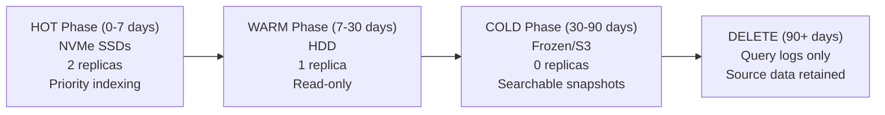

For **product/document indexes**, there is no ILM — the index is always current. ILM applies to **search log indexes** (query logs, click logs) that grow over time.

### Query Log Partitioning (PostgreSQL)

```sql
-- Monthly partitions for query logs
CREATE TABLE search_queries_2025_03 PARTITION OF search_queries
    FOR VALUES FROM ('2025-03-01') TO ('2025-04-01');
CREATE TABLE search_queries_2025_04 PARTITION OF search_queries
    FOR VALUES FROM ('2025-04-01') TO ('2025-05-01');

-- Automated partition creation (pg_partman or cron)
-- Retention: 12 months hot, 5 years cold (S3 export)
```

### Hot Shard Detection and Mitigation

```
Problem: Product category "Electronics" has 10x more products than "Books"
         → Shards containing Electronics products become hot

Solutions:
1. Custom routing disabled — use hash(product_id) for uniform distribution
2. If specific queries are hot → query result cache (Redis, 60s TTL)
3. If specific shards are hot → add replicas for read scaling
4. Monitor: elasticsearch_node_query_latency_p99 per shard
```

---

## Cache Strategy

### Multi-Layer Cache Architecture

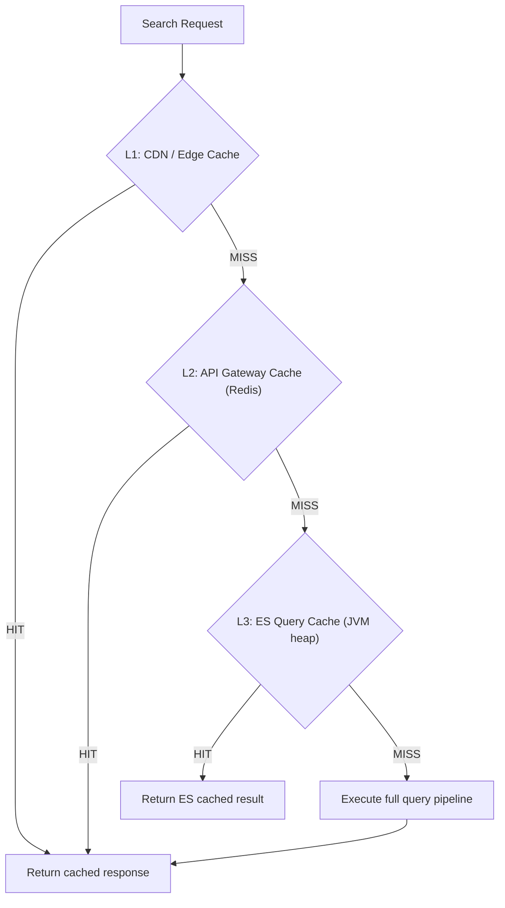

| Cache Layer | What It Caches | TTL | Hit Rate | Technology |
|-------------|---------------|-----|----------|------------|
| **L1: CDN/Edge** | Autocomplete for common prefixes | 5 min | 30% | CloudFront / Fastly |
| **L2: Redis** | Full search results by query hash | 60s | 40-50% | Redis Cluster |
| **L3: ES node cache** | Filter cache, query cache | Until segment merge | 20-30% | JVM heap (10%) |
| **L4: Autocomplete** | Top-N suggestions per prefix | 5 min | 80-90% | Redis |
| **Feature cache** | User personalization features | 10 min | 70% | Redis |

### Cache Invalidation

```
Strategies by data type:

1. Product data changes (price, stock):
   - TTL-based expiry (60s) — acceptable lag for search results
   - For critical changes (out-of-stock): publish invalidation event via Kafka
   - Search API checks inventory service for top-10 results before returning

2. Autocomplete:
   - Rebuild popularity scores every 5 minutes from query log aggregation
   - Blocklist changes: immediate invalidation via pub/sub

3. Personalization features:
   - TTL-based (10 min) — user preferences don't change fast
   - On explicit preference change: invalidate via user event

4. Ranking model update:
   - Flush all L2 cache when new ranking model deployed
   - Gradual rollout: only flush for A/B test group receiving new model
```

### Cache Key Design

```
Search result cache key:
  search:{vertical}:{hash(query + filters + sort + page)}
  Example: search:product:a1b2c3d4

Autocomplete cache key:
  auto:{language}:{prefix}
  Example: auto:en:wire

Personalized search (NOT cached at L2 — personalization makes each result unique):
  → Cache user features instead: user_features:{user_id}
```

---

## Queue / Stream Design

### Kafka Topics

| Topic | Partitions | Retention | Consumers | Purpose |
|-------|-----------|-----------|-----------|---------|
| `search.catalog.changes` | 32 | 7 days | Indexing Pipeline | CDC events from product DB |
| `search.document.changes` | 16 | 7 days | Indexing Pipeline | CDC events from document DB |
| `search.query.logs` | 64 | 30 days | Analytics, ML Training | Every search query + metadata |
| `search.click.logs` | 32 | 30 days | Click model training | Click events with position, dwell time |
| `search.autocomplete.updates` | 8 | 3 days | Autocomplete rebuilder | Popularity score updates |
| `search.index.dead-letter` | 4 | 90 days | Manual review | Failed indexing events |
| `search.synonym.updates` | 1 | 7 days | ES synonym reload | Synonym dictionary changes |

### Indexing Pipeline Consumer Group

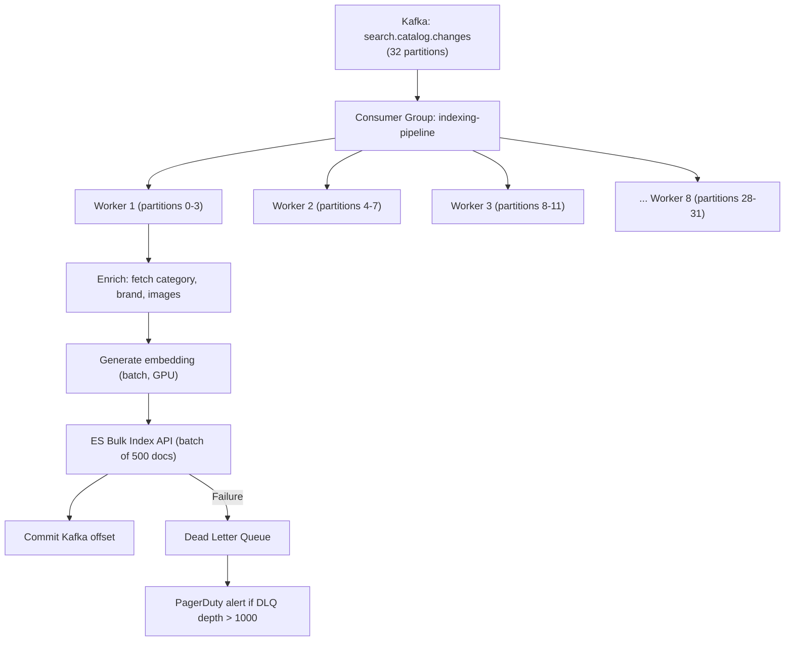

### Back-Pressure and Lag Monitoring

```
Consumer lag thresholds:
  - search.catalog.changes: WARN at 10,000 messages, CRITICAL at 100,000
  - search.query.logs: WARN at 1M (analytics lag is less critical)

Back-pressure strategy:
  - If ES bulk indexing slows (bulk response > 5s):
    1. Reduce batch size from 500 to 100
    2. If still slow → pause consumer, alert on-call
    3. Never drop messages — they must reach ES eventually
```

---

## Storage Strategy

### Storage Tiers

| Tier | Data | Technology | Retention | Cost |
|------|------|-----------|-----------|------|
| **Hot** | Current product/document index | ES on NVMe SSD | Indefinite (always current) | $$$ |
| **Warm** | Query logs (7-30 days) | ES on HDD | 30 days | $$ |
| **Cold** | Query logs (30-90 days) | ES searchable snapshots (S3) | 90 days | $ |
| **Archive** | Historical query logs, click data | S3 + Athena | 5 years | $ |
| **Vector** | Document embeddings | Qdrant/Pinecone on SSD | Indefinite | $$ |

### Data Durability

```
Search indexes are DERIVED data — the source of truth is:
  - Product catalog → PostgreSQL
  - Documents → Document DB / S3
  - User data → User service DB

Therefore:
  - ES index can be fully rebuilt from source in ~4 hours (full reindex)
  - No need for ES snapshots for durability (snapshots are for DR, not backup)
  - Query logs and click data are PRIMARY data → backed up to S3 daily
```

---

## Search Strategy (Query Understanding)

### Query Understanding Pipeline

```mermaid
flowchart TD
    Raw["Raw Query: 'cheap wireless headphones under $50'"] --> Lang["Language Detection"]
    Lang --> Spell["Spell Correction"]
    Spell --> Tokenize["Tokenization"]
    Tokenize --> NER["Named Entity Recognition"]
    NER --> Intent["Intent Classification"]
    Intent --> Rewrite["Query Rewriting"]
    Rewrite --> Final["Final Query + Filters"]

    NER -->|Entities| Entities["category: headphones\nattribute: wireless\nprice_constraint: < $50\nquality: cheap"]
    Intent -->|Intent| IntentResult["intent: product_search\nsub_intent: budget_shopping"]
    Rewrite -->|Rewrite| RewriteResult["query: 'wireless headphones'\nfilters: {price_max: 50, sort: price_asc}"]
```

### Intent Classification

| Intent | Example Queries | Handling |
|--------|----------------|----------|
| **Navigational** | "amazon customer service", "nike.com" | Redirect to URL or show single result |
| **Transactional** | "buy wireless headphones", "order pizza" | Product search with purchase intent boost |
| **Informational** | "best wireless headphones 2025", "how to pair bluetooth" | Document/article search, Q&A snippet |
| **Local** | "pizza near me", "gas station open now" | Geo search with distance sorting |
| **Comparison** | "airpods vs sony wh-1000xm5" | Show comparison widget, product search |

---

## Notification / Webhook Strategy

### Search Alerting (Saved Searches)

```mermaid
sequenceDiagram
    participant U as User
    participant SA as Search API
    participant SS as Saved Search Service
    participant KF as Kafka
    participant IP as Indexing Pipeline
    participant NS as Notification Service

    U->>SA: POST /saved-searches {query: "RTX 5090", notify: true}
    SA->>SS: Store saved search
    SS-->>U: Saved search created

    Note over IP: New product matching "RTX 5090" indexed
    IP->>KF: Publish new_product_indexed event
    KF->>SS: Consumer checks saved searches
    SS->>SA: Execute saved search query
    SA-->>SS: Results include new product
    SS->>NS: Send notification
    NS-->>U: Push: "New result for 'RTX 5090': NVIDIA GeForce RTX 5090 Founders Edition"
```

### Webhook for B2B Search (Enterprise API)

```
POST /v1/webhooks
{
  "url": "https://partner.example.com/search-updates",
  "events": ["index.updated", "ranking.model.deployed"],
  "secret": "whsec_abc123"
}
```

---

## State Machine

### Search Request Lifecycle

```mermaid
stateDiagram-v2
    [*] --> Received: API Gateway receives request
    Received --> RateLimited: Rate limit exceeded
    RateLimited --> [*]: 429 Too Many Requests

    Received --> CacheCheck: Within rate limit
    CacheCheck --> CacheHit: Query hash found in Redis
    CacheHit --> [*]: Return cached result

    CacheCheck --> SpellCheck: Cache miss
    SpellCheck --> QueryUnderstanding: Corrected or original query
    QueryUnderstanding --> Retrieval: Parsed query + intent + entities
    Retrieval --> RetrievalFailed: ES timeout / error
    RetrievalFailed --> Fallback: Degraded mode
    Fallback --> [*]: Return cached stale results or "try again"

    Retrieval --> Ranking: Candidates retrieved
    Ranking --> Personalization: Re-ranked results
    Personalization --> CacheStore: Store in Redis (TTL 60s)
    CacheStore --> [*]: Return results
```

### Indexing Document Lifecycle

```mermaid
stateDiagram-v2
    [*] --> ChangeDetected: CDC captures DB change
    ChangeDetected --> Queued: Published to Kafka
    Queued --> Processing: Consumer picks up event
    Processing --> Enriching: Fetch related data
    Enriching --> Embedding: Generate vector embedding
    Embedding --> Indexing: Bulk index to ES
    Indexing --> Indexed: Success
    Indexed --> Searchable: After ES refresh (1s)
    Searchable --> [*]

    Indexing --> Failed: ES error
    Failed --> DLQ: Move to dead letter queue
    DLQ --> ManualReview: Alert if DLQ > threshold
    ManualReview --> Queued: Retry after fix
```

---

## Sequence Diagrams

### Federated Search (Multi-Vertical)

```mermaid
sequenceDiagram
    participant U as User
    participant AG as API Gateway
    participant FED as Federation Service
    participant PS as Product Search
    participant DS as Document Search
    participant GS as Geo Search
    participant BL as Blending Service

    U->>AG: Search "python"
    AG->>FED: Route to Federation Service
    par Parallel vertical search
        FED->>PS: Search products for "python"
        FED->>DS: Search documents for "python"
        FED->>GS: Search geo for "python" (pet stores nearby)
    end
    PS-->>FED: 5 products (Python books, courses)
    DS-->>FED: 5 documents (Python tutorials)
    GS-->>FED: 3 geo results (pet stores)
    FED->>BL: Blend results with vertical weights
    Note over BL: Weights: product=0.5, document=0.3, geo=0.2<br/>Adjusted by user history (programmer → boost docs)
    BL-->>FED: Blended top 20 results
    FED-->>AG: Response with mixed results
    AG-->>U: Results (products, docs, places)
```

### Reindexing (Zero-Downtime)

```mermaid
sequenceDiagram
    participant OP as Operator
    participant IP as Indexing Pipeline
    participant ES as Elasticsearch
    participant AL as Alias Manager

    OP->>ES: Create new index: products_v2 (new mapping)
    OP->>IP: Start full reindex from source DB
    IP->>ES: Bulk index all products to products_v2
    Note over IP,ES: 4 hours for 50M products at 3,500 docs/sec

    Note over IP: Meanwhile, CDC continues indexing to products_v1 (live)
    Note over IP: AND dual-writing new changes to products_v2

    IP-->>OP: Reindex complete
    OP->>AL: Swap alias: products → products_v2
    Note over AL: Atomic alias swap — zero downtime
    AL-->>OP: Alias swapped
    OP->>ES: Delete old index: products_v1
```

---

## Concurrency Control

### Concurrent Indexing

```
Problem: Same product updated twice rapidly (price change, then stock change)
         → Two CDC events processed by different Kafka consumers
         → Race condition: older event might overwrite newer data in ES

Solutions:
1. Kafka partition by product_id → guarantees ordering per product
2. ES optimistic concurrency: use _seq_no and _primary_term
   - If conflict → re-read from source DB and retry
3. Indexing pipeline uses product.updated_at as version
   - Reject updates where incoming updated_at < existing updated_at
```

### Concurrent Search with Cache

```
Problem: Cache stampede — popular query expires, 1000 concurrent requests all miss cache
         → All 1000 requests hit Elasticsearch simultaneously

Solutions:
1. Probabilistic early expiration: refresh cache at TTL - random(0, 10s)
2. Lock-based: first request acquires lock, others wait for cache fill
   - Redis: SET query_lock:hash NX EX 5 → if acquired, execute query and fill cache
   - Others: wait 50ms and retry cache
3. Stale-while-revalidate: serve stale cache while refreshing in background
```

---

## Idempotency Strategy

### Indexing Idempotency

```
ES documents are indexed by product_id (deterministic ID)
→ Re-indexing the same product is naturally idempotent (upsert)

For CDC events:
- Kafka consumer offset tracking prevents reprocessing
- If consumer restarts before commit → may reprocess events
- ES upsert with same product_id = safe (idempotent)
- Embedding generation is deterministic → same input = same embedding
```

### Search API Idempotency

```
Search queries are inherently idempotent (read-only)
The only write side-effect is query logging:
- Query log INSERT uses query_id (UUID) → duplicate inserts are safe (PK conflict → ignore)
- Click events use click_id (UUID) → same guarantee
```

---

## Consistency Model

### Consistency by Data Domain

| Data Domain | Consistency Level | Acceptable Lag | Rationale |
|-------------|------------------|----------------|-----------|
| **Product data in ES** | Eventual (1-5 seconds) | 5 seconds | Near-real-time indexing via CDC; users accept slight delay |
| **Autocomplete suggestions** | Eventual (5 minutes) | 5 minutes | Rebuilt periodically from query log aggregation |
| **Personalization features** | Eventual (minutes) | 10 minutes | User preferences change slowly |
| **Ranking model** | Eventual (days) | N/A | Models retrained weekly, deployed via A/B test |
| **Inventory/price in results** | Best effort + verification | 60 seconds | Cached results may show stale price; checkout verifies real-time |
| **Spell correction dictionary** | Eventual (daily) | 24 hours | Dictionary rebuilt daily from query logs |
| **Query/click logs** | At-least-once | Seconds | Kafka + idempotent writes; analytics tolerates duplicates |

### Read-Your-Writes for Sellers

```
Problem: Seller updates product price → searches for their product → sees old price
Solution: After product update, return a consistency token (LSN or timestamp)
  - Seller's subsequent search includes consistency token
  - Search API routes to ES primary shard (not replica) if token is recent
  - Or: bypass ES cache for requests with consistency token
```

---

## Distributed Transaction / Saga Design

### Index Sync Saga

Search indexing involves multiple systems that must stay in sync:

```mermaid
stateDiagram-v2
    [*] --> CDCCaptured: DB change detected
    CDCCaptured --> KafkaPublished: Event published to Kafka
    KafkaPublished --> Enriched: Pipeline enriches data
    Enriched --> EmbeddingGenerated: Vector embedding computed
    EmbeddingGenerated --> ESIndexed: Document indexed in ES
    ESIndexed --> VectorDBIndexed: Embedding indexed in vector DB
    VectorDBIndexed --> AutocompleteUpdated: Autocomplete index updated
    AutocompleteUpdated --> [*]: Fully indexed

    ESIndexed --> ESFailed: ES unavailable
    ESFailed --> RetryQueue: Exponential backoff retry
    RetryQueue --> ESIndexed: Retry succeeds
    RetryQueue --> DLQ: Max retries exceeded

    VectorDBIndexed --> VectorFailed: Vector DB unavailable
    VectorFailed --> ESRollback: Remove from ES
    ESRollback --> [*]: Compensate complete
```

### Reconciliation

```
Daily reconciliation job:
1. Query source DB for all products updated in last 24 hours
2. Query ES for same product IDs
3. Compare updated_at timestamps
4. Re-index any products where source.updated_at > ES.updated_at
5. Alert if > 0.1% of products are out of sync

Weekly full reconciliation:
1. Count documents in source DB vs ES
2. Alert if counts differ by > 0.01%
3. Sample 10,000 random products and verify field-level consistency
```

---

## Security Design

### Search-Specific Security

| Threat | Mitigation |
|--------|-----------|
| **Query injection** | Sanitize query input; escape special Lucene characters (+, -, &&, etc.); use parameterized queries |
| **Denial of service via expensive queries** | Rate limiting per user/IP; timeout for ES queries (5s max); reject regex queries from untrusted users |
| **Data leakage via search** | Document-level security: ES field-level security to hide sensitive fields; filter by access_control field |
| **Autocomplete poisoning** | Block offensive terms; require minimum search frequency before promoting to autocomplete |
| **Scraping** | Rate limiting; CAPTCHA after N searches; fingerprinting for bot detection |
| **Ranking manipulation (SEO spam)** | ML-based spam detection in indexing pipeline; manual review for flagged documents |
| **PII in search logs** | Hash user_id in query logs; strip PII from query text (email/phone detection) |

### Access Control for Enterprise Search

```mermaid
flowchart TD
    Query["User searches 'quarterly revenue'"] --> Auth["Authenticate user"]
    Auth --> Roles["Fetch user roles: [finance_team, all_employees]"]
    Roles --> ESQuery["Add filter: access_control IN [finance_team, all_employees, public]"]
    ESQuery --> Results["Only documents the user can access are returned"]
```

```json
{
  "query": {
    "bool": {
      "must": {"match": {"body": "quarterly revenue"}},
      "filter": {
        "terms": {"access_control": ["finance_team", "all_employees", "public"]}
      }
    }
  }
}
```

---

## Abuse / Fraud / Governance Controls

### Search Abuse Patterns

| Abuse Type | Detection | Prevention |
|-----------|-----------|------------|
| **SEO spam / keyword stuffing** | High keyword density, hidden text, link farms | ML classifier in indexing pipeline; manual review queue |
| **Click fraud** | Abnormal CTR patterns, automated clicking | Session analysis; exclude bot clicks from ranking training |
| **Autocomplete bombing** | Coordinated searches to promote offensive terms | Minimum frequency threshold + human review for new entries |
| **Scraping** | High QPS from single IP/user, sequential pagination | Rate limiting, CAPTCHA, honeypot pages |
| **Review manipulation** | Fake reviews to boost ranking | Cross-reference with purchase data; sentiment anomaly detection |
| **Denial of service** | Wildcard queries, regex queries, deep pagination | Query complexity limits; pagination depth limit (10,000) |

### Governance

```
Search transparency requirements (EU Digital Services Act):
1. Explain ranking factors in search settings page
2. Allow users to opt out of personalized ranking
3. Log and audit all ranking model changes
4. Report quarterly on content moderation actions affecting search
```

---

## Reliability and Resilience Design

### Failure Modes and Fallbacks

```mermaid
flowchart TD
    Normal["Normal Operation"] --> ESDown{"ES Cluster Down?"}
    ESDown -->|Yes| StaleCache["Serve stale cached results (Redis)\n + banner: 'Results may be outdated'"]
    ESDown -->|No| RankerDown{"ML Ranker Down?"}
    RankerDown -->|Yes| BM25Only["Fall back to BM25 ranking only\n(skip ML re-ranking stage)"]
    RankerDown -->|No| PersonalizeDown{"Personalization Down?"}
    PersonalizeDown -->|Yes| GenericResults["Return non-personalized results"]
    PersonalizeDown -->|No| SpellDown{"Spell Check Down?"}
    SpellDown -->|Yes| NoSpell["Search without spell correction"]
    SpellDown -->|No| FullPipeline["Full pipeline operational"]
```

### Circuit Breakers

| Service | Open Threshold | Half-Open | Fallback |
|---------|---------------|-----------|----------|
| **Elasticsearch** | 50% failures in 30s | 1 req/5s | Stale cache |
| **ML Ranker** | 30% failures in 15s | 1 req/3s | BM25 ranking |
| **Personalization** | 40% failures in 20s | 1 req/5s | Non-personalized results |
| **Spell Check** | 50% failures in 10s | 1 req/5s | Skip spell correction |
| **Vector DB** | 40% failures in 20s | 1 req/5s | BM25-only (no semantic) |

### Graceful Degradation Tiers

| Tier | Components Active | User Experience | When |
|------|-------------------|----------------|------|
| **T0: Full** | All | Best relevance, personalized, spell-corrected, semantic | Normal operation |
| **T1: No personalization** | All except personalization | Good relevance, not personalized | Personalization service down |
| **T2: No ML ranking** | BM25 + spell + auto | Adequate relevance | ML ranker down |
| **T3: No spell/semantic** | BM25 + auto | Basic keyword search | Multiple services down |
| **T4: Cache only** | Redis cache | Stale popular results only | ES cluster down |
| **T5: Maintenance** | None | "Search temporarily unavailable" | Full infrastructure failure |

---

## Observability Design

### Key Metrics

| Metric | Type | Alert Threshold |
|--------|------|----------------|
| `search_latency_p99` | Histogram | > 200ms for 5 min |
| `autocomplete_latency_p99` | Histogram | > 50ms for 5 min |
| `search_error_rate` | Counter | > 1% for 3 min |
| `zero_result_rate` | Gauge | > 5% for 1 hour |
| `es_cluster_health` | Gauge | Yellow for 5 min, Red immediate |
| `es_indexing_lag_seconds` | Gauge | > 30 seconds for 5 min |
| `kafka_consumer_lag` | Gauge | > 100K messages for 10 min |
| `cache_hit_rate` | Gauge | < 30% for 15 min (cache failure?) |
| `ranking_model_latency_p99` | Histogram | > 50ms for 5 min |
| `ndcg_at_10_daily` | Gauge | < 0.55 for 1 day (quality degradation) |

### Search Quality Dashboard

```
Key panels:
1. CTR by position (are users clicking top results?)
2. Zero-result queries (top 50 by frequency — need synonym/coverage fixes)
3. Reformulation rate (users searching again after first query — poor relevance)
4. Dwell time distribution (short dwell = bad result; long dwell = good result)
5. NDCG@10 daily trend (overall ranking quality)
6. A/B test comparison (new model vs baseline)
7. Autocomplete selection rate (are suggestions helpful?)
8. Spell correction trigger rate (too many corrections = poor autocomplete)
```

### Distributed Tracing

```
Search request trace spans:
1. [API Gateway] 2ms — auth, rate limit
2. [Cache Check] 1ms — Redis lookup
3. [Spell Correction] 5ms — dictionary lookup + scoring
4. [Query Understanding] 8ms — NER + intent classification
5. [ES Retrieval] 45ms — scatter to 50 shards, gather, merge
6. [ML Re-Ranking] 35ms — score 1,000 candidates (LightGBM)
7. [Personalization] 8ms — fetch user features + re-score
8. [Response Assembly] 3ms — serialize + snippet generation
Total: 107ms (within 200ms budget)
```

---

## Deployment Architecture

### Multi-Region Deployment

```mermaid
flowchart TD
    subgraph US["US-East Region"]
        USLB["Load Balancer"] --> USAPI["Search API (10 pods)"]
        USAPI --> USES["ES Cluster (15 nodes)"]
        USAPI --> USRD["Redis Cluster"]
        USAPI --> USML["ML Ranker (5 GPU pods)"]
    end

    subgraph EU["EU-West Region"]
        EULB["Load Balancer"] --> EUAPI["Search API (8 pods)"]
        EUAPI --> EUES["ES Cluster (12 nodes)"]
        EUAPI --> EURD["Redis Cluster"]
        EUAPI --> EUML["ML Ranker (4 GPU pods)"]
    end

    subgraph APAC["APAC Region"]
        APLB["Load Balancer"] --> APAPI["Search API (6 pods)"]
        APAPI --> APES["ES Cluster (10 nodes)"]
        APAPI --> APRD["Redis Cluster"]
        APAPI --> APML["ML Ranker (3 GPU pods)"]
    end

    DNS["GeoDNS"] --> USLB
    DNS --> EULB
    DNS --> APLB

    CDC["Central CDC Pipeline"] --> KF["Kafka (multi-region replication)"]
    KF --> USES
    KF --> EUES
    KF --> APES
```

### Kubernetes Resources

```yaml
# Search API Deployment
apiVersion: apps/v1
kind: Deployment
metadata:
  name: search-api
spec:
  replicas: 10
  strategy:
    type: RollingUpdate
    rollingUpdate:
      maxSurge: 2
      maxUnavailable: 1
  template:
    spec:
      containers:
        - name: search-api
          image: search-api:v3.2.1
          resources:
            requests: {cpu: "2", memory: "4Gi"}
            limits: {cpu: "4", memory: "8Gi"}
          readinessProbe:
            httpGet: {path: /health/ready, port: 8080}
            periodSeconds: 5
          livenessProbe:
            httpGet: {path: /health/live, port: 8080}
            periodSeconds: 10
          env:
            - name: ES_HOSTS
              valueFrom: {configMapKeyRef: {name: search-config, key: es_hosts}}
            - name: REDIS_URL
              valueFrom: {secretKeyRef: {name: search-secrets, key: redis_url}}
      topologySpreadConstraints:
        - maxSkew: 1
          topologyKey: topology.kubernetes.io/zone
          whenUnsatisfiable: DoNotSchedule
```

---

## CI/CD and Release Strategy

### Ranking Model Deployment

```mermaid
flowchart LR
    Train["Train new model\n(weekly, offline)"] --> Eval["Offline evaluation\n(NDCG on test set)"]
    Eval -->|NDCG improved| Shadow["Shadow mode\n(score but don't serve)"]
    Shadow --> ABTest["A/B test\n(10% traffic for 3 days)"]
    ABTest -->|CTR/NDCG improved| Ramp["Ramp to 50%, then 100%"]
    Ramp --> Prod["Full production"]
    ABTest -->|Metrics degraded| Rollback["Rollback to previous model"]
```

### Index Schema Migration

```
Zero-downtime index migration:
1. Create new index with updated mapping (products_v3)
2. Start dual-writing: CDC events go to both products_v2 and products_v3
3. Full reindex from source DB to products_v3 (4 hours)
4. Verify document counts match (within 0.01%)
5. Swap alias: products → products_v3 (atomic)
6. Stop writing to products_v2
7. Delete products_v2 after 24-hour rollback window
```

---

## Multi-Region and DR Strategy

### Cross-Region Replication

```
Each region has its own ES cluster (not cross-cluster replication).
Instead, each region's indexing pipeline consumes from the same Kafka topics
(replicated via MirrorMaker2 or Confluent Replicator).

Advantages:
- Independent failure domains
- Region-specific tuning (language analyzers)
- No cross-region ES query traffic

Disadvantages:
- Index lag between regions (typically < 30 seconds)
- Must manage N independent ES clusters
```

### DR Failover

```
If US-East region fails:
1. GeoDNS detects health check failure (30s)
2. DNS TTL expires, traffic routes to EU-West (5 min with low TTL)
3. EU-West handles increased load (pre-provisioned with 30% headroom)
4. US-East indexing pipeline catches up from Kafka on recovery

RTO: 5 minutes (DNS failover)
RPO: 30 seconds (Kafka replication lag)
```

---

## Cost Drivers and Optimization

### Cost Breakdown

| Component | Monthly Cost (Estimate) | % of Total | Optimization |
|-----------|----------------------|------------|-------------|
| **Elasticsearch cluster** | $45,000 | 40% | Use warm/cold tiers; right-size shards; use searchable snapshots |
| **ML re-ranking (GPU)** | $15,000 | 13% | Batch scoring; reduce candidate set; distill to CPU model |
| **Vector DB** | $12,000 | 11% | Quantize embeddings (768-dim → 128-dim); use IVF instead of HNSW |
| **Redis (cache + autocomplete)** | $8,000 | 7% | Optimize cache TTLs; evict low-frequency autocomplete entries |
| **Kafka** | $6,000 | 5% | Reduce retention; use compression; right-size partitions |
| **Compute (API, indexing)** | $10,000 | 9% | Auto-scale; spot instances for indexing pipeline |
| **Network (cross-AZ)** | $5,000 | 4% | Co-locate ES nodes in same AZ; reduce response payload size |
| **Storage (logs, click data)** | $4,000 | 4% | S3 lifecycle policies; Parquet compression |
| **Monitoring / observability** | $3,000 | 3% | Downsample old metrics; log sampling |
| **Other** | $5,000 | 4% | |
| **Total** | ~$113,000 | 100% | |

### Top Optimizations

1. **ES warm/cold tiers** — Move query logs > 7 days to HDD (save 30% on ES cost)
2. **Embedding quantization** — Reduce 768-dim float32 to 128-dim int8 (save 80% on vector DB cost, ~2% quality loss)
3. **Cache hit rate improvement** — Increase Redis cache from 60s to 300s for non-inventory queries (save 20% on ES QPS)
4. **ML model distillation** — Distill neural re-ranker to GBDT for CPU serving (eliminate GPU cost, ~3% quality loss)
5. **Spot instances** — Use spot for indexing pipeline workers (save 70% on indexing compute)

---

## Technology Choices and Alternatives

| Component | Chosen | Alternatives | Why Chosen |
|-----------|--------|-------------|-----------|
| **Search engine** | Elasticsearch 8.x | Solr, OpenSearch, Meilisearch, Typesense | Most mature at scale; rich aggregation; geo support; largest ecosystem |
| **Vector search** | Qdrant | Pinecone, Weaviate, Milvus, ES knn | Open-source; good performance/cost ratio; Rust-based |
| **Autocomplete** | Redis Sorted Sets | Elasticsearch completion, custom trie | Sub-ms latency; simple operations; distributed |
| **ML ranking** | LightGBM (GBDT) | XGBoost, Neural (BERT), TF-Ranking | Best latency/quality trade-off; interpretable; fast inference |
| **Spell correction** | Noisy channel + SymSpell | Elasticsearch suggest, neural seq2seq | Fast pre-computed corrections; combined with statistical model |
| **CDC** | Debezium | Custom DB triggers, polling, Maxwell | Industry standard; supports PostgreSQL/MySQL; Kafka-native |
| **Stream processing** | Kafka Streams | Flink, Spark Streaming | Lightweight; no separate cluster; sufficient for indexing enrichment |
| **Query logs** | ClickHouse | BigQuery, Redshift, Druid | Fast analytical queries on billions of rows; column-oriented; open-source |
| **Embeddings** | sentence-transformers (all-MiniLM-L6-v2) | OpenAI embeddings, Cohere, custom BERT | Open-source; 768-dim; good quality/speed; no API cost |

---

## Architecture Decision Records

### ARD-001: Elasticsearch as Primary Search Engine

| Field | Detail |
|-------|--------|
| **Decision** | Elasticsearch for full-text + geo + product search |
| **Context** | Need full-text search with faceted aggregation, geo queries, near-real-time indexing, and scale to 5B documents |
| **Options** | (A) Solr, (B) Elasticsearch, (C) Meilisearch, (D) Typesense, (E) Custom Lucene |
| **Chosen** | Option B — Elasticsearch 8.x |
| **Why** | Most mature at scale; rich aggregation framework for faceted search; geo support built-in; largest ecosystem; knn search for vectors |
| **Trade-offs** | Operational complexity of large clusters; JVM memory management; license change (SSPL) since 7.11 |
| **Risks** | Vendor lock-in; SSPL license prevents SaaS hosting; JVM GC pauses at large heap sizes |
| **Revisit when** | If SSPL license is a problem → migrate to OpenSearch; if operational cost too high → consider Elastic Cloud managed |

### ARD-002: Multi-Stage Ranking with LTR

| Field | Detail |
|-------|--------|
| **Decision** | Four-stage ranking pipeline (retrieval → pre-score → ML re-rank → business rules) |
| **Context** | BM25 alone yields NDCG@10 of 0.45; need to reach 0.65+ |
| **Options** | (A) BM25 only, (B) BM25 + rules, (C) Multi-stage with GBDT, (D) Full neural ranking |
| **Chosen** | Option C — Multi-stage with LambdaMART (GBDT) for L2 |
| **Why** | Single-stage BM25 is insufficient; full neural re-ranking on 10K docs is too slow; multi-stage balances quality and latency; GBDT is interpretable |
| **Trade-offs** | Complexity; requires click data for training; GBDT less powerful than neural for complex queries |
| **Risks** | Click data has position bias (top results get more clicks regardless of relevance); cold start for new content |
| **Revisit when** | If neural models can re-rank 10K docs in < 50ms (GPU serving advances); or if query understanding replaces L1 |

### ARD-003: Redis for Autocomplete

| Field | Detail |
|-------|--------|
| **Decision** | Redis Sorted Sets for autocomplete serving |
| **Context** | 50K QPS with < 50ms p99 latency; 100M unique queries |
| **Options** | (A) Elasticsearch completion suggester, (B) Redis Sorted Sets, (C) Custom in-memory trie, (D) Algolia |
| **Chosen** | Option B — Redis with popularity-scored sorted sets per prefix |
| **Why** | Sub-ms latency; simple prefix lookup; easy to update popularity scores; distributed clustering |
| **Trade-offs** | Memory-intensive for large vocabularies; no fuzzy matching (handled by spell correction); no semantic understanding |
| **Risks** | Redis memory limits; cold start after failover (need to rebuild from DB) |
| **Revisit when** | If vocabulary exceeds Redis memory budget → consider Elasticsearch completion suggester or hybrid approach |

### ARD-004: Separate Vector DB vs ES knn

| Field | Detail |
|-------|--------|
| **Decision** | Use dedicated vector DB (Qdrant) alongside Elasticsearch for semantic search |
| **Context** | Need both keyword (BM25) and semantic (vector) search; ES 8.x has knn support but limited |
| **Options** | (A) ES knn only, (B) Dedicated vector DB + ES, (C) All-in-one (Weaviate) |
| **Chosen** | Option B — Qdrant + Elasticsearch |
| **Why** | ES knn performance degrades at 5B vectors; Qdrant optimized for ANN; independent scaling; better recall at same latency |
| **Trade-offs** | Two systems to maintain; dual indexing; query-time merge of BM25 + vector results |
| **Risks** | Consistency between ES and vector DB; increased operational complexity |
| **Revisit when** | If ES knn performance improves to match dedicated vector DBs at 5B scale |

### ARD-005: ClickHouse for Search Analytics

| Field | Detail |
|-------|--------|
| **Decision** | ClickHouse for search query logs and click analytics |
| **Context** | 500M queries/day + 200M clicks/day; need fast aggregation for quality dashboards |
| **Options** | (A) PostgreSQL, (B) BigQuery, (C) ClickHouse, (D) Druid, (E) Elasticsearch |
| **Chosen** | Option C — ClickHouse |
| **Why** | Blazing fast aggregation on billions of rows; column-oriented; compression; open-source; SQL interface |
| **Trade-offs** | Limited JOIN support; not great for point lookups; operational complexity |
| **Risks** | ClickHouse cluster management; need to manage replication and sharding |
| **Revisit when** | If team prefers managed → migrate to BigQuery; if query patterns need JOINs → consider Snowflake |

---

## POCs to Validate First

### POC-1: Search Latency at 5B Documents
**Goal**: p99 < 200ms with 50-shard Elasticsearch cluster at 30K QPS.
**Setup**: Load 5B synthetic documents; benchmark with realistic query distribution (power-law).
**Metrics**: p50, p95, p99 latency; CPU utilization; GC pause frequency.
**Fallback**: Add replicas; optimize queries; add query result cache; reduce shard count if merge overhead is high.

### POC-2: Autocomplete at 50K QPS
**Goal**: p99 < 50ms from Redis.
**Setup**: Load 100M autocomplete entries into Redis Cluster; benchmark with realistic prefix distribution.
**Metrics**: p50, p99 latency; memory usage; network bandwidth.
**Fallback**: Shard by prefix range; add read replicas; consider edge caching (CDN).

### POC-3: Ranking Quality (NDCG)
**Goal**: ML re-ranker improves NDCG@10 by 15% over BM25 alone.
**Setup**: Collect 30 days of click data; train LightGBM on 50 features; evaluate on held-out test set.
**Metrics**: NDCG@10, MAP, CTR change in online A/B test.
**Fallback**: Add more click features; try neural cross-encoder for top 100; consider pairwise loss function.

### POC-4: Hybrid Search (BM25 + Vector)
**Goal**: Semantic search improves recall by 20% for long-tail queries.
**Setup**: Encode 1M documents with sentence-transformers; compare BM25-only vs hybrid retrieval.
**Metrics**: Recall@100, NDCG@10 on long-tail query test set.
**Fallback**: Tune alpha weighting; improve embedding model; try cross-encoder reranking of vector results.

### POC-5: Zero-Downtime Reindexing
**Goal**: Reindex 50M products in < 4 hours with zero search downtime.
**Setup**: Full reindex from PostgreSQL to new ES index; alias swap; verify document count and freshness.
**Metrics**: Reindex duration; search latency during reindex; document count accuracy.
**Fallback**: Increase indexing parallelism; optimize bulk batch size; use scroll/slice for source reads.

### POC-6: Cross-Region Consistency
**Goal**: Index lag between regions < 30 seconds for 99% of documents.
**Setup**: Measure time from source DB change to searchable in remote region via Kafka MirrorMaker2.
**Metrics**: p50, p99 lag; message loss rate.
**Fallback**: Switch to Confluent Replicator; reduce Kafka topic partitions; optimize consumer batch size.

---

## Real-World Comparisons

### Detailed Platform Comparisons

| Aspect | Google Search | Amazon A9 | Elasticsearch | Algolia | Meilisearch | Typesense |
|--------|-------------|-----------|--------------|---------|-------------|-----------|
| **Index size** | Trillions of pages | 350M+ products | Configurable | < 1B records | < 100M records | < 100M records |
| **Ranking** | Deep learning (BERT/MUM/Gemini) | A9 algorithm (sales-weighted) | BM25 + LTR plugin | Typo-tolerant + rules | BM25 + proximity | BM25 + custom |
| **Autocomplete** | Query log-based, personalized | Purchase-weighted | Completion suggester | Instant search | Prefix search | Prefix + infix |
| **Vector search** | Native (embeddings integrated) | Native | knn (HNSW) since 8.x | Not native | Not native | Native since 0.25 |
| **Geo** | Google Maps integration | Seller location | geo_point/geo_shape | Geo filter | Geo filter | Geo filter |
| **Latency** | < 200ms | < 200ms | 10-500ms (configurable) | < 50ms | < 50ms | < 50ms |
| **Operational model** | Proprietary | Proprietary | Self-hosted or Elastic Cloud | SaaS | Self-hosted | Self-hosted or cloud |
| **Key differentiator** | Semantic understanding | Purchase intent ranking | Flexibility + ecosystem | Developer UX + speed | Simplicity + Rust | Simplicity + C++ |

### How Google Search Works (Simplified)

```
1. Web crawl: Googlebot crawls billions of pages (budget per site)
2. Indexing: Build inverted index + knowledge graph + entity index
3. Query understanding: BERT/MUM for intent, entity extraction, query expansion
4. Retrieval: Multi-index (web, news, images, video, maps, shopping)
5. Ranking: Thousands of ranking signals; neural re-ranking (MUM, BERT)
6. Post-processing: Knowledge panels, featured snippets, People Also Ask
7. Serving: Results from geographically nearest data center
```

### How Amazon A9 Search Works (Simplified)

```
1. Query rewriting: Spell correction, synonym expansion, category prediction
2. Retrieval: BM25 from product index (structured + text)
3. Ranking: A9 algorithm weighing:
   - Text relevance (title, bullets, description match)
   - Sales velocity (best sellers rank higher)
   - Price competitiveness
   - Fulfillment method (FBA > FBM)
   - Reviews and ratings
   - Conversion rate for this query-product pair
4. Sponsored products: Auction-based; injected into organic results
5. Key insight: Amazon search is TRANSACTIONAL — optimized to maximize purchases, not information retrieval
```

### How Spotify Search Works

```
Challenges unique to audio search:
1. Short query, massive catalog: "love" matches 500K songs, 50K artists, 10K playlists
2. Entity disambiguation: "queen" = band? playlist? genre?
3. Audio content is not text-searchable (lyrics may not be indexed)

Architecture:
1. Query understanding: Classify intent (song, artist, playlist, podcast, genre)
2. Multi-entity retrieval: Search songs, artists, albums, playlists, podcasts simultaneously
3. Ranking: Popularity (stream count) + personalization (user listening history) + freshness
4. Result layout: Group by entity type (Top Result, Songs, Artists, Playlists)
5. Audio features: Use audio embeddings for "similar sounding" recommendations

Unique features:
- "Behind the Lyrics" integration (Genius lyrics indexed)
- Voice search (speech-to-text → standard search)
- Podcast transcript search (auto-generated transcripts indexed)
```

### How GitHub Code Search Works

```
Challenges unique to code search:
1. Syntax-aware tokenization: "fmt.Println" should match "fmt" AND "Println" separately
2. Regex support: Developers expect regex search (expensive!)
3. Repository scoping: Search within repo, org, or all public code
4. Language-specific analysis: Python indentation matters; Go packages vs Java packages
5. Scale: 200M+ repositories, billions of files

Architecture:
1. Custom indexer: NOT Elasticsearch — GitHub built custom search from scratch (Blackbird)
2. Trigram index: Index all 3-character substrings for fast substring matching
3. Language-aware tokenization: tree-sitter parsers for 100+ languages
4. Distributed architecture: 115K+ repositories per shard
5. Ranking: Repo popularity (stars/forks) + file path relevance + code location (function name > comment)

Key design decision: GitHub chose to build custom search rather than use Elasticsearch because:
- Regex support on Elasticsearch at this scale is impractical
- Code tokenization requires language-aware parsing
- Substring matching (trigrams) outperforms BM25 for code
```

### How Slack Search Works

```
Challenges unique to messaging search:
1. Access control: Users should only find messages in channels they belong to
2. Real-time indexing: Messages should be searchable within seconds
3. Context: A search result "yes" is meaningless without surrounding messages
4. Volume: Billions of messages across millions of workspaces

Architecture:
1. Per-workspace indexing: Each Slack workspace has its own search index (multi-tenant isolation)
2. Channel-level ACL: Search filters by user's channel membership at query time
3. Message threading: Index both messages and their thread context
4. Elasticsearch backend: Standard ES with custom analyzers for code blocks, URLs, emojis
5. Result display: Show message + 2 surrounding messages for context
6. Search modifiers: "from:alice", "in:#general", "has:link", "during:today"
```

### Startup vs Enterprise Search Architecture

```mermaid
flowchart LR
    subgraph Startup["Startup (< 1M docs)"]
        S1["Algolia or Meilisearch"]
        S2["No ML ranking"]
        S3["SaaS / single instance"]
        S4["$200/month"]
    end
    subgraph MidScale["Mid-Scale (1-100M docs)"]
        M1["Elasticsearch (3-5 nodes)"]
        M2["BM25 + simple re-ranking"]
        M3["Redis autocomplete"]
        M4["$2K-5K/month"]
    end
    subgraph Enterprise["Enterprise (1B+ docs)"]
        E1["ES cluster (30+ nodes)"]
        E2["Multi-stage ML ranking"]
        E3["Vector search"]
        E4["Multi-region"]
        E5["$50K-150K/month"]
    end
    Startup --> MidScale --> Enterprise
```

### Search Architecture Differences by Domain

| Domain | Key Difference | Example |
|--------|---------------|---------|
| **E-commerce** | Structured attributes; faceted filtering; conversion-optimized ranking | Amazon, eBay, Shopify |
| **Web search** | Unstructured documents; PageRank; spam detection | Google, Bing, DuckDuckGo |
| **Enterprise** | Access control; federated across sources; low query volume, high precision | Elastic Workplace, Glean, Coveo |
| **Code search** | Syntax-aware tokenization; scope resolution; language-specific analysis | GitHub Code Search, Sourcegraph |
| **Log search** | Append-only; time-series optimized; high ingestion rate | Elasticsearch/OpenSearch, Splunk, Datadog |
| **Maps/geo** | Spatial index; distance scoring; POI ranking | Google Maps, Foursquare, Mapbox |
| **Media** | Content-based retrieval; visual similarity; audio fingerprinting | Spotify, Shazam, Google Images |

---

## Edge Cases and Failure Scenarios

### 1. Query Injection Attack
**Scenario**: User submits query with Lucene syntax: `*:* OR _exists_:password`
**Impact**: Could expose sensitive fields or cause expensive wildcard queries.
**Mitigation**: Sanitize all special characters; use `simple_query_string` parser (safe by default); rate limit expensive queries.

### 2. Thundering Herd on Cache Miss
**Scenario**: Viral event causes millions of searches for "Taylor Swift tickets" simultaneously. Cache expires, all requests hit ES.
**Impact**: ES cluster overloaded; cascading failures.
**Mitigation**: Probabilistic early expiration; lock-based cache fill; stale-while-revalidate; pre-warm cache for predicted events.

### 3. Elasticsearch Split Brain
**Scenario**: Network partition causes ES cluster to elect two master nodes.
**Impact**: Two clusters diverge; data corruption on reconciliation.
**Mitigation**: Set `discovery.zen.minimum_master_nodes` to (N/2)+1; use dedicated master nodes (3 or 5); monitor cluster health.

### 4. Embedding Model Version Skew
**Scenario**: New embedding model deployed to indexing pipeline but not to query encoder. Old and new embeddings are incompatible.
**Impact**: Vector search returns poor results; cosine similarity between old/new embeddings is meaningless.
**Mitigation**: Version embeddings (embedding_v2 field); re-embed all documents when model changes; blue-green deployment for embedding model.

### 5. Autocomplete Offensive Content
**Scenario**: Coordinated campaign searches for offensive term 10,000 times to promote it to autocomplete.
**Impact**: Offensive suggestions shown to all users; brand damage.
**Mitigation**: Blocklist; minimum frequency threshold (1,000+ searches AND 100+ unique users); human review for new top-100 entries; rate limit search frequency per user.

### 6. Zero-Result Query Spike
**Scenario**: New product category launched but not yet in search index. Marketing drives traffic to search "new widget" but index has no matching documents.
**Impact**: Users see "No results found"; conversion drops.
**Mitigation**: Monitor zero-result rate in real-time; notify content team; add synonyms; show "Popular in [related category]" fallback.

### 7. Reindexing While Under Load
**Scenario**: Full reindex of 50M products while search traffic is at peak.
**Impact**: ES nodes overloaded with both indexing and query traffic; search latency spikes.
**Mitigation**: Throttle reindex rate (`requests_per_second` parameter); schedule during low-traffic window; use separate indexing-only nodes.

### 8. Cross-Region Index Divergence
**Scenario**: Kafka MirrorMaker2 lag causes US and EU search indexes to show different results for same query.
**Impact**: User in EU doesn't see product that US user sees; support tickets.
**Mitigation**: Monitor cross-region lag; alert if > 60 seconds; reconciliation job compares document counts hourly; show "results may vary by region" if lag detected.

### 9. Spell Correction Loop
**Scenario**: Spell checker corrects "javascript" to "java script" (two words), then next search corrects "java script" back to "javascript".
**Impact**: User stuck in correction loop; poor UX.
**Mitigation**: Never correct a query that was itself the output of a correction; track correction chains; cap at 1 correction per query.

### 10. Facet Count Explosion
**Scenario**: Product search for "shoes" returns 500,000 results with 10,000 unique brand values. Computing facet counts for all 10,000 brands is expensive.
**Impact**: Facet computation adds 200ms to query latency.
**Mitigation**: Limit facets to top 100 values; use `shard_size` parameter to over-sample; approximate counts with `execution: global_ordinals`; cache facet results separately.

---

## Common Mistakes

1. **Not using multi-stage ranking** — BM25 alone doesn't capture quality, freshness, or user intent. Always plan for at least L0 + L2 ranking.
2. **Deep pagination with offset** — `FROM 10000 SIZE 20` kills performance. Use `search_after` cursor pagination.
3. **No spell correction** — 10-15% of queries are misspelled; poor results erode trust.
4. **Autocomplete querying Elasticsearch** — too slow for keystroke-by-keystroke. Use Redis or in-memory trie.
5. **Ignoring zero-result queries** — track and analyze queries returning 0 results; improve synonyms and coverage.
6. **Single index for all content** — separate indices for products, documents, and geo entities; different analyzers needed.
7. **Not monitoring search quality** — track CTR, zero-result rate, and reformulation rate as KPIs.
8. **Facet counts on filtered results** — disjunctive faceting is required for good UX; don't filter the selected dimension.
9. **Not versioning embeddings** — changing the embedding model without re-indexing all documents produces incompatible vectors.
10. **Over-personalizing** — too much personalization creates filter bubbles; cap at 20% of base score.
11. **Ignoring position bias in click data** — clicks are biased toward top positions; use inverse propensity weighting in LTR training.
12. **No graceful degradation** — when ML ranker or vector DB fails, search should fall back to BM25, not return errors.

---

## Interview Angle

| Question | Key Points to Cover |
|----------|-------------------|
| "Design a search engine" | Inverted index, BM25, multi-stage ranking, spell correction, autocomplete, caching, sharding |
| "Design autocomplete" | Redis trie, popularity ranking, < 50ms latency, offensive content filtering, personalization |
| "Design product search" | Faceted search, structured attributes, disjunctive faceting, ML ranking with purchase intent |
| "How does Google rank results?" | Multi-stage: retrieval → pre-scoring → ML re-ranking → business rules; BERT/MUM for understanding |
| "Design nearby restaurant search" | Geo index (H3/geohash) + text relevance + distance scoring; ES geo_point |
| "How would you improve search relevance?" | Analyze zero-result queries, add synonyms, collect click data, train LTR model, A/B test |
| "Design enterprise document search" | Full-text + vector hybrid, access control per document, content extraction pipeline |
| "How do you handle search at 100K QPS?" | Shard across 50+ ES nodes, Redis cache (40-60% hit rate), CDN for autocomplete, multi-region |
| "Design a search quality monitoring system" | NDCG@10 daily, CTR by position, zero-result rate, reformulation rate, dwell time distribution |
| "How do you handle search during a flash sale?" | Pre-warm cache, scale ES replicas, rate limit per user, graceful degradation tiers |

---

## Evolution Roadmap (V1 -> V2 -> V3)

```mermaid
flowchart LR
    subgraph V1["V1: Basic Search"]
        V1A["SQL LIKE queries"]
        V1B["No autocomplete"]
        V1C["No spell check"]
        V1D["Single server"]
        V1E["~100 QPS"]
    end
    subgraph V2["V2: Production Search"]
        V2A["Elasticsearch + BM25"]
        V2B["Redis autocomplete"]
        V2C["Spell correction"]
        V2D["Faceted product search"]
        V2E["Geo search"]
        V2F["Basic caching"]
        V2G["~10K QPS"]
    end
    subgraph V3["V3: ML-Powered Search"]
        V3A["Multi-stage ML ranking (LTR)"]
        V3B["Personalized search"]
        V3C["Hybrid BM25 + vector search"]
        V3D["Query understanding (NER, intent)"]
        V3E["A/B testing framework"]
        V3F["Multi-region deployment"]
        V3G["~100K QPS"]
    end
    subgraph V4["V4: AI-Native Search"]
        V4A["Conversational search (LLM)"]
        V4B["Multi-modal (text + image + voice)"]
        V4C["Real-time learned ranking"]
        V4D["Federated cross-vertical search"]
        V4E["Autonomous quality optimization"]
    end
    V1 -->|"Slow, no discovery"| V2
    V2 -->|"Poor relevance"| V3
    V3 -->|"Next-gen UX"| V4
```

---

## Practice Questions

1. **Design a full-text search engine for 5 billion documents with < 200ms latency.** Cover inverted index, sharding, BM25, caching, and capacity estimation.
2. **Design an autocomplete system serving 50K QPS with < 50ms latency.** Cover data structure (trie vs Redis), ranking, personalization, and offensive content filtering.
3. **Design the ranking system for an e-commerce product search.** Cover multi-stage pipeline, features, learning-to-rank, and A/B testing.
4. **Design geo search for "restaurants near me" with combined text relevance and distance.** Cover spatial indexing (H3, geohash, R-tree), scoring, and caching.
5. **Design a spell correction system for a search engine.** Cover edit distance, noisy channel model, statistical models, and user experience.
6. **Design a document search system for an enterprise knowledge base.** Cover content extraction, hybrid search (BM25 + vector), access control, and freshness.
7. **10% of searches return zero results. How do you diagnose and fix this?** Cover query analysis, synonym expansion, coverage monitoring, and fallback strategies.
8. **Design personalized search that avoids filter bubbles.** Cover user signals, blending, exploration injection, and privacy considerations.
9. **How would you migrate from Elasticsearch 7.x to 8.x with zero downtime?** Cover blue-green indexing, alias swaps, and rollback strategy.
10. **Design a search quality monitoring and experimentation platform.** Cover NDCG measurement, A/B testing, click bias correction, and automated alerting.

## Trust Boundary / Security Diagram

```mermaid
flowchart TD
    subgraph External["External (Untrusted)"]
        User["End User"]
        Bot["Potential Bot/Scraper"]
        Attacker["Attacker"]
    end

    subgraph Edge["Edge Layer (DMZ)"]
        WAF["WAF (Query Injection Detection)"]
        CDN["CDN (Autocomplete Edge Cache)"]
        RateLimit["Rate Limiter (IP + User)"]
    end

    subgraph App["Application Layer (Trusted)"]
        SearchAPI["Search API"]
        SpellCheck["Spell Correction"]
        Ranker["ML Ranker"]
        Personalize["Personalization"]
    end

    subgraph Data["Data Layer (Highly Trusted)"]
        ES["Elasticsearch Cluster"]
        Redis["Redis Cache"]
        VectorDB["Vector DB"]
        ClickHouse["Analytics DB"]
    end

    subgraph Internal["Internal Only"]
        IndexPipeline["Indexing Pipeline"]
        ModelTraining["Model Training"]
        AdminAPI["Admin API (synonym management)"]
    end

    User --> WAF --> CDN --> RateLimit --> SearchAPI
    Bot --> WAF
    Attacker --> WAF
    SearchAPI --> SpellCheck --> Ranker --> Personalize
    SearchAPI --> ES
    SearchAPI --> Redis
    SearchAPI --> VectorDB
    IndexPipeline --> ES
    ModelTraining --> ClickHouse
    AdminAPI --> ES

    style External fill:#ffcccc
    style Edge fill:#ffffcc
    style App fill:#ccffcc
    style Data fill:#ccccff
    style Internal fill:#e6ccff
```

### Trust Boundaries

| Boundary | What Crosses | Protection |
|----------|-------------|------------|
| **Internet → Edge** | User queries, autocomplete requests | WAF, rate limiting, query sanitization, CAPTCHA for suspicious traffic |
| **Edge → Application** | Validated, rate-limited requests | mTLS, JWT authentication, input validation |
| **Application → Data** | ES queries, Redis commands | Network isolation (VPC), ES security plugin, Redis AUTH |
| **Internal → Data** | Indexing operations, admin changes | Service account auth, audit logging, change approval workflow |

---

## Scaling Evolution Diagram

```mermaid
flowchart TD
    subgraph Phase1["Phase 1: MVP (< 1M docs, < 100 QPS)"]
        P1A["Single Elasticsearch node"]
        P1B["No ML ranking"]
        P1C["No autocomplete"]
        P1D["SQL LIKE fallback"]
        P1E["Cost: $200/month"]
    end

    subgraph Phase2["Phase 2: Growth (1-50M docs, 1K QPS)"]
        P2A["3-node ES cluster"]
        P2B["Redis autocomplete"]
        P2C["Basic spell correction"]
        P2D["BM25 + simple boost rules"]
        P2E["Cost: $2K/month"]
    end

    subgraph Phase3["Phase 3: Scale (50M-1B docs, 10K QPS)"]
        P3A["10-node ES cluster"]
        P3B["Faceted product search"]
        P3C["Geo search"]
        P3D["ML re-ranking (LightGBM)"]
        P3E["Click data collection"]
        P3F["Cost: $15K/month"]
    end

    subgraph Phase4["Phase 4: Enterprise (1B+ docs, 100K QPS)"]
        P4A["30+ node ES cluster"]
        P4B["Vector search (hybrid)"]
        P4C["Neural re-ranking"]
        P4D["Multi-region deployment"]
        P4E["Real-time personalization"]
        P4F["A/B testing framework"]
        P4G["Cost: $100K+/month"]
    end

    Phase1 -->|"Need better search"| Phase2
    Phase2 -->|"Need relevance + geo"| Phase3
    Phase3 -->|"Need ML + global"| Phase4
```

---

## Failure and Fallback Diagram

```mermaid
flowchart TD
    Request["Search Request"] --> Check1{"Elasticsearch\navailable?"}
    Check1 -->|Yes| Check2{"ML Ranker\navailable?"}
    Check1 -->|No| Fallback1["Serve from Redis cache\n(stale results, 5-min TTL)"]
    Fallback1 --> Check1a{"Cache hit?"}
    Check1a -->|Yes| Return1["Return stale results\n+ 'Results may be outdated' banner"]
    Check1a -->|No| Return1a["'Search temporarily unavailable'\n+ show trending/popular items"]

    Check2 -->|Yes| Check3{"Personalization\navailable?"}
    Check2 -->|No| Fallback2["Return BM25-ranked results\n(skip ML re-ranking)"]

    Check3 -->|Yes| Check4{"Vector DB\navailable?"}
    Check3 -->|No| Fallback3["Return non-personalized\nML-ranked results"]

    Check4 -->|Yes| FullPipeline["Full pipeline:\nBM25 + Vector + ML + Personal"]
    Check4 -->|No| Fallback4["BM25-only retrieval\n+ ML ranking\n(no semantic search)"]
```

---

## Data Model / ER-Style Relationship Diagram

```mermaid
erDiagram
    PRODUCT_INDEX ||--o{ PRODUCT_EMBEDDING : "has vector"
    PRODUCT_INDEX ||--o{ SEARCH_QUERY : "appears in results"
    SEARCH_QUERY ||--o{ SEARCH_CLICK : "generates clicks"
    SEARCH_QUERY ||--o{ SPELL_CORRECTION : "may be corrected"
    USER ||--o{ SEARCH_QUERY : "submits"
    USER ||--o{ USER_PROFILE : "has profile"
    USER_PROFILE ||--o{ PERSONALIZATION : "drives"
    AUTOCOMPLETE_ENTRY ||--o{ AUTOCOMPLETE_SUGGESTION : "serves"
    SEARCH_QUERY }o--|| AB_TEST_GROUP : "assigned to"
    SYNONYM ||--o{ PRODUCT_INDEX : "expands queries"
    GEO_ENTITY ||--o{ GEO_INDEX : "indexed in"
    DOCUMENT ||--o{ DOCUMENT_CHUNK : "split into"
    DOCUMENT_CHUNK ||--o{ CHUNK_EMBEDDING : "has vector"

    PRODUCT_INDEX {
        string product_id PK
        string title
        string brand
        float price
        float rating
        geo_point location
        dense_vector embedding
    }

    SEARCH_QUERY {
        uuid query_id PK
        string user_id FK
        string query_text
        string corrected_query
        int result_count
        int latency_ms
        timestamp created_at
    }

    SEARCH_CLICK {
        uuid click_id PK
        uuid query_id FK
        string doc_id
        int position
        int dwell_time_ms
        boolean converted
    }

    USER_PROFILE {
        string user_id PK
        jsonb category_affinity
        jsonb brand_affinity
        float price_sensitivity
        array recent_queries
        array recent_clicks
    }

    AUTOCOMPLETE_ENTRY {
        string query_text PK
        string language
        bigint search_count
        boolean is_blocked
    }

    GEO_ENTITY {
        uuid entity_id PK
        string name
        geography location
        string h3_cell
        float rating
        jsonb opening_hours
    }

    DOCUMENT_CHUNK {
        uuid chunk_id PK
        uuid document_id FK
        text content
        int chunk_index
        dense_vector embedding
    }
```

---

## Operational Runbooks

### Runbook: Elasticsearch Cluster Yellow/Red

```
Symptom: Cluster health is YELLOW (replicas unassigned) or RED (primaries unassigned)

YELLOW (replica not assigned):
1. Check: GET /_cluster/health → unassigned_shards count
2. Check: GET /_cat/shards?v&h=index,shard,state,node → find unassigned shards
3. Diagnose: GET /_cluster/allocation/explain → reason for unassignment
4. Common causes:
   a. Node left cluster → wait for auto-recovery (up to 1 min)
   b. Disk full (> 85%) → free space or add nodes
   c. Too many shards per node → increase max_shards_per_node
5. Fix: Usually auto-recovers. If not → reroute manually

RED (primary shard lost):
1. CRITICAL: Search results are incomplete
2. Check if node is recoverable → restart node
3. If data lost → restore from snapshot or full reindex from source DB
4. Post-mortem: Review why primary + replica were on same node
```

### Runbook: Search Latency Spike

```
Symptom: search_latency_p99 > 200ms for > 5 minutes

Investigation:
1. Check ES cluster health: GET /_cluster/health
2. Check hot threads: GET /_nodes/hot_threads
3. Check GC pauses: GET /_nodes/stats/jvm (gc.old.collection_time_in_millis)
4. Check slow queries: GET /_nodes/stats/indices/search (query_time_in_millis)
5. Check segment merge activity: GET /_cat/nodes?v&h=name,merge*
6. Check cache hit rate: GET /_nodes/stats/indices/query_cache,request_cache

Common causes and fixes:
a. GC pressure → increase heap (max 31GB) or add nodes
b. Slow queries → identify via slow log, add filters, reduce result size
c. Heavy merge activity → schedule bulk indexing off-peak
d. Cache eviction → increase cache size or reduce index churn
e. Hot shard → rebalance shards across nodes
```

### Runbook: Autocomplete Degradation

```
Symptom: autocomplete_latency_p99 > 50ms OR autocomplete returning empty/stale results

Investigation:
1. Check Redis health: redis-cli ping, redis-cli info memory
2. Check Redis key count: redis-cli dbsize
3. Check autocomplete rebuild job: last successful run, error logs
4. Check CDN edge cache hit rate

Fixes:
a. Redis memory full → evict low-frequency entries, add more memory
b. Rebuild job failed → restart job, check Kafka consumer lag
c. CDN stale → invalidate CDN cache, check push mechanism
d. Redis node down → failover to replica, investigate node failure
```

---

## Final Recap

Search & Discovery combines **information retrieval fundamentals** (inverted indices, BM25, TF-IDF) with **modern ML ranking** (learning-to-rank, embeddings, neural re-rankers) and **specialized search modes** (geo, faceted, semantic). The key insight is that search is not one problem but a **pipeline**: query understanding → retrieval → ranking → personalization → presentation. Each stage has different latency budgets and model complexity.

The architecture must support **graceful degradation** (when ML ranking fails, fall back to BM25; when cache fails, serve from ES directly), **near-real-time freshness** (CDC → Kafka → ES in < 5 seconds), and **horizontal scalability** (shard across 50+ ES nodes, multi-region deployment). Search quality is measured continuously through **NDCG, CTR, zero-result rate, and reformulation rate**, with ranking model improvements deployed via careful A/B testing to avoid regression.

Key takeaways for interview preparation:
1. **Search is a pipeline** — query understanding → retrieval → ranking → personalization → presentation
2. **Multi-stage ranking is essential** — BM25 alone is insufficient; add ML re-ranking for quality
3. **Near-real-time indexing** — CDC → Kafka → ES gives < 5s freshness
4. **Cache aggressively** — 40-60% hit rate saves enormous ES load
5. **Monitor quality continuously** — NDCG, CTR, zero-result rate are your north stars
6. **Degrade gracefully** — every component can fail; search must still return results
7. **Hybrid search is the future** — BM25 + vector embeddings covers both keyword and semantic queries

### ARD-001: Elasticsearch as Primary Search Engine

| Field | Detail |
|-------|--------|
| **Decision** | Elasticsearch for full-text + geo + product search |
| **Options** | (A) Solr, (B) Elasticsearch, (C) Meilisearch, (D) Typesense |
| **Chosen** | Option B |
| **Why** | Most mature at scale; rich aggregation framework for faceted search; geo support built-in; largest ecosystem |
| **Trade-offs** | Operational complexity of large clusters; JVM memory management |
| **Revisit when** | If operational cost too high → consider managed (Elastic Cloud, OpenSearch) |

### ARD-002: Multi-Stage Ranking with LTR

| Field | Detail |
|-------|--------|
| **Decision** | Four-stage ranking pipeline (retrieval → pre-score → ML re-rank → business rules) |
| **Chosen** | Multi-stage with LambdaMART (GBDT) for L2 |
| **Why** | Single-stage BM25 is insufficient; full neural re-ranking on 10K docs is too slow; multi-stage balances quality and latency |
| **Trade-offs** | Complexity; requires click data for training |
| **Revisit when** | If neural models can re-rank 10K docs in < 50ms (GPU serving advances) |

### ARD-003: Redis for Autocomplete

| Field | Detail |
|-------|--------|
| **Decision** | Redis Sorted Sets for autocomplete serving |
| **Chosen** | Redis with popularity-scored sorted sets per prefix |
| **Why** | Sub-ms latency; simple prefix lookup; easy to update popularity scores |
| **Trade-offs** | Memory-intensive for large vocabularies; no fuzzy matching (handled by spell correction) |
| **Revisit when** | If vocabulary exceeds Redis memory budget → consider Elasticsearch completion suggester |

---

## POCs to Validate First

### POC-1: Search Latency at 5B Documents
**Goal**: p99 < 200ms with 50-shard Elasticsearch cluster at 30K QPS.
**Fallback**: Add replicas; optimize queries; add query result cache.

### POC-2: Autocomplete at 50K QPS
**Goal**: p99 < 50ms from Redis.
**Fallback**: Shard by prefix range; add read replicas.

### POC-3: Ranking Quality (NDCG)
**Goal**: ML re-ranker improves NDCG@10 by 15% over BM25 alone.
**Fallback**: Add more click features; try neural cross-encoder for top 100.

### POC-4: Hybrid Search (BM25 + Vector)
**Goal**: Semantic search improves recall by 20% for long-tail queries.
**Fallback**: Tune alpha weighting; improve embedding model.

---

## Real-World Comparisons

| Aspect | Google | Amazon | Elasticsearch | Algolia | Meilisearch |
|--------|--------|--------|--------------|---------|-------------|
| **Index size** | Trillions of pages | 350M+ products | Configurable | < 1B records | < 100M records |
| **Ranking** | Deep learning (BERT/MUM) | A9 algorithm (sales-weighted) | BM25 + LTR plugin | Typo-tolerant + rules | BM25 + proximity |
| **Autocomplete** | Query log-based, personalized | Purchase-weighted | Completion suggester | Instant search | Prefix search |
| **Geo** | Google Maps integration | Seller location | geo_point/geo_shape | Geo filter | Geo filter |
| **Latency** | < 200ms | < 200ms | 10-500ms (configurable) | < 50ms | < 50ms |
| **Key differentiator** | Semantic understanding | Purchase intent ranking | Flexibility | Developer UX | Simplicity |

---

## Common Mistakes

1. **Not using multi-stage ranking** — BM25 alone doesn't capture quality, freshness, or user intent.
2. **Deep pagination with offset** — `FROM 10000 SIZE 20` kills performance. Use `search_after`.
3. **No spell correction** — 10-15% of queries are misspelled; poor results erode trust.
4. **Autocomplete querying Elasticsearch** — too slow for keystroke-by-keystroke. Use Redis or in-memory trie.
5. **Ignoring zero-result queries** — track and analyze queries returning 0 results; improve synonyms and coverage.
6. **Single index for all content** — separate indices for products, documents, and geo entities; different analyzers needed.
7. **Not monitoring search quality** — track CTR, zero-result rate, and reformulation rate as KPIs.
8. **Facet counts on filtered results** — disjunctive faceting is required for good UX; don't filter the selected dimension.

---

## Interview Angle

| Question | Key Insight |
|----------|------------|
| "Design a search engine" | Inverted index, BM25, multi-stage ranking, spell correction, autocomplete |
| "Design autocomplete" | Redis trie, popularity ranking, < 50ms latency |
| "Design product search" | Faceted search, structured attributes, disjunctive faceting |
| "How does Google rank results?" | Multi-stage: retrieval → pre-scoring → ML re-ranking → business rules |
| "Design nearby restaurant search" | Geo index (H3/geohash) + text relevance + distance scoring |

---

## Evolution Roadmap (V1 -> V2 -> V3)

```mermaid
flowchart LR
    subgraph V1["V1: Basic"]
        V1A["SQL LIKE queries"]
        V1B["No autocomplete"]
        V1C["No spell check"]
    end
    subgraph V2["V2: Production"]
        V2A["Elasticsearch + BM25"]
        V2B["Redis autocomplete"]
        V2C["Spell correction"]
        V2D["Faceted product search"]
        V2E["Geo search"]
    end
    subgraph V3["V3: Advanced"]
        V3A["ML re-ranking (LTR)"]
        V3B["Personalized search"]
        V3C["Hybrid BM25 + vector search"]
        V3D["Query understanding (NER, intent)"]
        V3E["Conversational search (LLM)"]
    end
    V1 -->|"Slow queries, no discovery"| V2
    V2 -->|"Poor relevance, no personalization"| V3
```

---

## Practice Questions

1. **Design a full-text search engine for 5 billion documents with < 200ms latency.** Cover inverted index, sharding, BM25, and caching.
2. **Design an autocomplete system serving 50K QPS with < 50ms latency.** Cover data structure, ranking, and personalization.
3. **Design the ranking system for an e-commerce product search.** Cover multi-stage pipeline, features, and learning-to-rank.
4. **Design geo search for "restaurants near me" with combined text relevance and distance.** Cover spatial indexing and scoring.
5. **Design a spell correction system for a search engine.** Cover edit distance, statistical models, and user experience.
6. **Design a document search system for an enterprise knowledge base.** Cover content extraction, hybrid search, and access control.
7. **10% of searches return zero results. How do you diagnose and fix this?** Cover query analysis, synonym expansion, and monitoring.
8. **Design personalized search that avoids filter bubbles.** Cover user signals, blending, and exploration injection.

## Final Recap

Search & Discovery combines **information retrieval fundamentals** (inverted indices, BM25, TF-IDF) with **modern ML ranking** (learning-to-rank, embeddings, neural re-rankers) and **specialized search modes** (geo, faceted, semantic). The key insight is that search is not one problem but a **pipeline**: query understanding → retrieval → ranking → personalization → presentation. Each stage has different latency budgets and model complexity.
