# 26. Cloud & Infrastructure Systems

## Part Context
**Part:** Part 5 — Real-World System Design Examples
**Position:** Chapter 26 of 42

---

## Overview

Cloud and infrastructure systems are the **platform layer** that every application runs on. When an engineer says "deploy to production," these are the systems that make it happen: load balancers routing traffic, API gateways enforcing policies, Kubernetes scheduling containers, object storage serving files, DNS resolving domains, and CDNs caching content at the edge.

This chapter covers **four domain areas** with 12 subsystems:

### Domain A — Core Infrastructure
1. **Load Balancer (L4/L7)** — distributing traffic across server pools with health checking and session persistence.
2. **API Gateway** — centralized request routing, authentication, rate limiting, and protocol translation.
3. **Service Mesh** — sidecar-based inter-service communication with observability, security, and traffic management.

### Domain B — Compute
1. **Container Orchestration (Kubernetes)** — scheduling, scaling, and managing containerized workloads.
2. **Serverless Platform** — event-driven function execution with automatic scaling and pay-per-invocation.
3. **Job Scheduler** — running batch jobs, cron tasks, and workflow orchestration.

### Domain C — Storage
1. **Object Storage System (S3-like)** — scalable key-value blob storage with durability guarantees.
2. **Distributed File System** — POSIX-compatible shared filesystem across cluster nodes.
3. **Block Storage** — network-attached virtual disks for VMs and databases.

### Domain D — Networking
1. **DNS System** — domain name resolution with global load balancing and failover.
2. **CDN System** — edge caching and content delivery across global PoPs.
3. **VPC / Subnet System** — software-defined networking with isolation, routing, and security groups.

---

## Why This System Matters in Real Systems

- Every application depends on these systems. **Understanding infrastructure is what separates senior engineers from juniors.**
- Cloud infrastructure is a **$500B+ market** (AWS, GCP, Azure). Designing these systems is both an interview topic and a career domain.
- Infrastructure failures cascade: a DNS outage takes down everything, a load balancer misconfiguration causes traffic blackholes.
- The same patterns appear whether you're using managed cloud services or building on-premise — understanding the internals helps you use managed services more effectively.

---

## High-Level Architecture

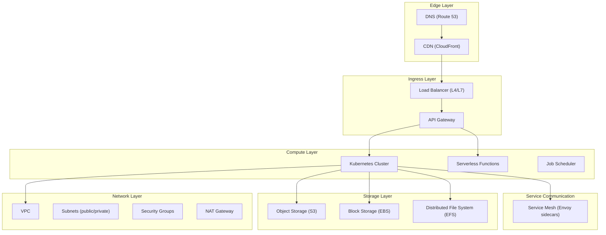
```mermaid
flowchart TB
    subgraph Edge["Edge Layer"]
        DNS["DNS (Route 53)"]
        CDN["CDN (CloudFront)"]
    end

    subgraph Ingress["Ingress Layer"]
        LB["Load Balancer (L4/L7)"]
        APIGW["API Gateway"]
    end

    subgraph Compute["Compute Layer"]
        K8s["Kubernetes Cluster"]
        Lambda["Serverless Functions"]
        JobSched["Job Scheduler"]
    end

    subgraph ServiceComm["Service Communication"]
        Mesh["Service Mesh (Envoy sidecars)"]
    end

    subgraph Storage["Storage Layer"]
        ObjectStore["Object Storage (S3)"]
        BlockStore["Block Storage (EBS)"]
        DFS["Distributed File System (EFS)"]
    end

    subgraph Network["Network Layer"]
        VPC["VPC"]
        Subnet["Subnets (public/private)"]
        SG["Security Groups"]
        NAT["NAT Gateway"]
    end

    DNS --> CDN --> LB --> APIGW
    APIGW --> K8s & Lambda
    K8s --> Mesh
    K8s --> ObjectStore & BlockStore & DFS
    K8s --> VPC
```

---

## Low-Level Design

### 1. Load Balancer (L4/L7)

#### Overview

Load balancers distribute incoming traffic across multiple backend servers, providing high availability, horizontal scaling, and fault tolerance. They operate at two layers:

| Layer | OSI Layer | Routes By | Use Case |
|-------|----------|-----------|----------|
| **L4 (Transport)** | TCP/UDP | IP + Port | High throughput, simple routing, TCP passthrough |
| **L7 (Application)** | HTTP/HTTPS | URL path, headers, cookies | Content-based routing, SSL termination, request inspection |

#### L7 Load Balancer Architecture

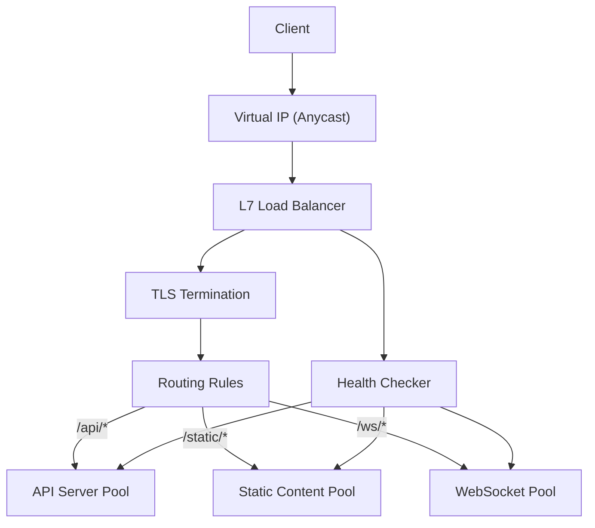
```mermaid
flowchart TD
    Client["Client"] --> VIP["Virtual IP (Anycast)"]
    VIP --> LB["L7 Load Balancer"]
    LB --> TLS["TLS Termination"]
    TLS --> Route["Routing Rules"]
    Route -->|"/api/*"| Backend1["API Server Pool"]
    Route -->|"/static/*"| Backend2["Static Content Pool"]
    Route -->|"/ws/*"| Backend3["WebSocket Pool"]
    LB --> Health["Health Checker"]
    Health --> Backend1 & Backend2 & Backend3
```

#### Load Balancing Algorithms

| Algorithm | How It Works | Best For |
|-----------|-------------|----------|
| **Round Robin** | Cycle through servers sequentially | Equal-capacity servers |
| **Weighted Round Robin** | Servers with more weight get more traffic | Heterogeneous servers |
| **Least Connections** | Send to server with fewest active connections | Long-lived connections (WebSocket) |
| **IP Hash** | Hash client IP → consistent server | Session affinity without cookies |
| **Consistent Hashing** | Hash-ring-based routing | Cache-friendly routing |
| **Random Two Choices** | Pick 2 random servers; send to less-loaded one | Simple yet effective |

#### Health Checking

```
HTTP health check: GET /health every 10 seconds
- 200 OK → server is healthy
- 3 consecutive failures → remove from pool
- 2 consecutive successes → re-add to pool
```

#### Edge Cases

- **Thundering herd after server restart**: Gradually ramp up traffic to restarted server (slow start).
- **Connection draining**: When removing a server, finish existing requests (30s grace) before stopping.
- **SSL certificate rotation**: Zero-downtime cert rotation with dual-cert loading.
- **Sticky sessions**: Use cookie-based affinity when stateful backends are unavoidable; prefer stateless design.

---

### 2. API Gateway

#### Overview

The API Gateway is the **single entry point** for all client requests. It handles cross-cutting concerns so individual services don't have to: authentication, rate limiting, request routing, protocol translation, and observability.

#### Responsibilities


```mermaid
flowchart LR
    Client["Client Request"] --> Auth["1. Authentication (JWT validation)"]
    Auth --> RateLimit["2. Rate Limiting"]
    RateLimit --> Route["3. Request Routing"]
    Route --> Transform["4. Protocol Translation (REST→gRPC)"]
    Transform --> Backend["5. Forward to Backend Service"]
    Backend --> Response["6. Response Transformation"]
    Response --> Log["7. Access Logging + Metrics"]
    Log --> Client2["Client Response"]
```

#### Rate Limiting Algorithms

| Algorithm | How It Works | Pros | Cons |
|-----------|-------------|------|------|
| **Token Bucket** | Tokens refill at fixed rate; each request consumes a token | Allows bursts up to bucket size | Burst can overwhelm downstream |
| **Sliding Window** | Count requests in rolling time window | Smooth rate enforcement | Higher memory (per-window counters) |
| **Fixed Window** | Count requests in fixed intervals | Simple, low memory | Edge burst at window boundary |
| **Leaky Bucket** | Requests queued; processed at fixed rate | Perfectly smooth output | Latency for queued requests |

**Distributed rate limiting**: Use Redis with `INCR` and `EXPIRE` for cluster-wide rate limiting:
```
key = "rate:{user_id}:{minute_bucket}"
count = INCR key
if count == 1: EXPIRE key 60
if count > limit: return 429 Too Many Requests
```

---

### 3. Service Mesh

#### Overview

A Service Mesh manages **service-to-service communication** in a microservices architecture using sidecar proxies (typically Envoy). It provides mutual TLS, load balancing, circuit breaking, retries, and observability without changing application code.

#### Architecture

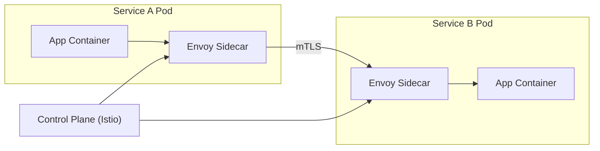
```mermaid
flowchart LR
    subgraph ServiceA["Service A Pod"]
        AppA["App Container"]
        ProxyA["Envoy Sidecar"]
    end

    subgraph ServiceB["Service B Pod"]
        AppB["App Container"]
        ProxyB["Envoy Sidecar"]
    end

    AppA --> ProxyA
    ProxyA -->|"mTLS"| ProxyB
    ProxyB --> AppB

    ControlPlane["Control Plane (Istio)"] --> ProxyA & ProxyB
```

**Key features**: mTLS (mutual TLS between all services), circuit breaking (stop calling failing services), retries with backoff, traffic splitting (canary deployments), distributed tracing (inject trace headers).

---

### 4. Container Orchestration (Kubernetes)

#### Overview

Kubernetes automates deploying, scaling, and managing containerized applications. It is the **de facto standard** for production workload management, used by 80%+ of enterprises.

#### Architecture

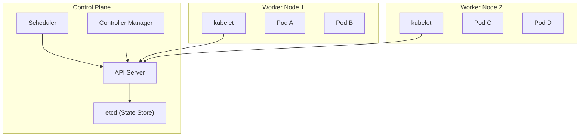
```mermaid
flowchart TD
    subgraph ControlPlane["Control Plane"]
        APIServer["API Server"]
        Scheduler["Scheduler"]
        Controller["Controller Manager"]
        etcd["etcd (State Store)"]
    end

    subgraph WorkerNode1["Worker Node 1"]
        Kubelet1["kubelet"]
        Pod1A["Pod A"]
        Pod1B["Pod B"]
    end

    subgraph WorkerNode2["Worker Node 2"]
        Kubelet2["kubelet"]
        Pod2A["Pod C"]
        Pod2B["Pod D"]
    end

    APIServer --> etcd
    Scheduler --> APIServer
    Controller --> APIServer
    Kubelet1 & Kubelet2 --> APIServer
```

#### Key Concepts

| Concept | What It Does |
|---------|-------------|
| **Pod** | Smallest deployable unit; one or more containers sharing network/storage |
| **Deployment** | Manages pod replicas with rolling updates |
| **Service** | Stable network endpoint for a set of pods |
| **Ingress** | L7 routing rules mapping external URLs to services |
| **HPA** | Horizontal Pod Autoscaler — scales pods based on CPU/custom metrics |
| **ConfigMap/Secret** | Inject configuration and secrets into pods |
| **PVC** | Persistent Volume Claim — request durable storage for pods |
| **Namespace** | Logical cluster partitioning for multi-team isolation |

#### Scheduling Algorithm

```
1. Filter: Remove nodes that can't run the pod (insufficient CPU/memory, taints, affinity rules)
2. Score: Rank remaining nodes by preference (resource utilization, spreading, affinity)
3. Bind: Assign pod to highest-scoring node
```

---

### 5. Serverless Platform

#### Overview

Serverless (Functions-as-a-Service) runs code in response to events without managing servers. The platform handles provisioning, scaling (including to zero), and billing per invocation.

#### Architecture

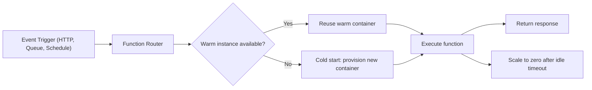
```mermaid
flowchart LR
    Trigger["Event Trigger (HTTP, Queue, Schedule)"] --> Router["Function Router"]
    Router --> Pool{"Warm instance available?"}
    Pool -->|Yes| Warm["Reuse warm container"]
    Pool -->|No| Cold["Cold start: provision new container"]
    Warm & Cold --> Execute["Execute function"]
    Execute --> Response["Return response"]
    Execute --> ScaleDown["Scale to zero after idle timeout"]
```

#### Cold Start Problem

| Language | Cold Start | Warm Invocation |
|----------|-----------|----------------|
| Python | 200-500ms | 5-50ms |
| Node.js | 100-300ms | 5-50ms |
| Java/JVM | 1-5 seconds | 10-100ms |
| Go | 50-100ms | 1-10ms |
| Rust | 10-50ms | 1-5ms |

**Mitigation**: Provisioned concurrency (pre-warm N instances), keep-alive pings, lightweight runtimes (Go/Rust).

---

### 6. Job Scheduler

#### Overview

Job Schedulers run background tasks: cron jobs, batch processing, data pipelines, and one-off tasks. They handle scheduling, dependency management, retry logic, and resource allocation.

| Scheduler | Use Case | Scale |
|-----------|---------|-------|
| **Kubernetes CronJob** | Simple cron in K8s | Single cluster |
| **Apache Airflow** | DAG-based data pipelines | Medium-large |
| **Temporal** | Durable workflow orchestration | Complex workflows |
| **AWS Step Functions** | Serverless state machines | Event-driven |
| **Custom (DB-backed)** | App-specific background jobs | Simple use cases |

---

### 7. Object Storage System (S3-like)

#### Overview

Object storage provides **scalable, durable, key-value blob storage**. S3 stores **trillions of objects** and handles millions of requests per second. It is the default storage layer for media, backups, data lakes, and static assets.

#### Architecture

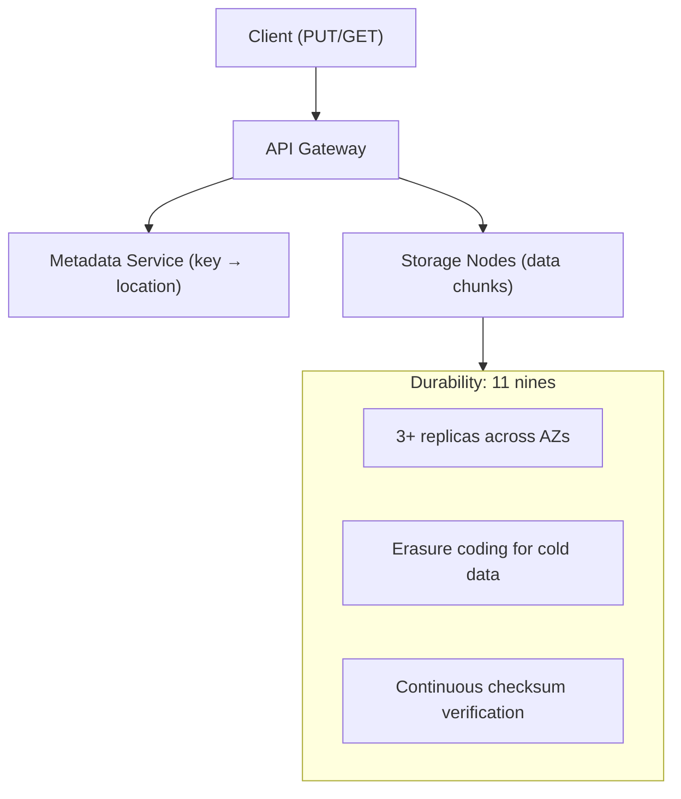
```mermaid
flowchart TD
    Client["Client (PUT/GET)"] --> Gateway["API Gateway"]
    Gateway --> MetadataDB["Metadata Service (key → location)"]
    Gateway --> StorageNodes["Storage Nodes (data chunks)"]

    subgraph Durability["Durability: 11 nines"]
        Replication["3+ replicas across AZs"]
        ErasureCoding["Erasure coding for cold data"]
        Checksums["Continuous checksum verification"]
    end

    StorageNodes --> Durability
```

#### Durability Math (11 nines)

S3 guarantees 99.999999999% durability. This means: if you store 10 million objects, you expect to lose one object every 10,000 years.

Achieved through:
- **3-way replication** across availability zones (hot data)
- **Erasure coding** (Reed-Solomon) for cold data (8+3 scheme: tolerate 3 disk failures)
- **Continuous background verification** (checksum every stored block periodically)
- **Automatic repair** of detected corruption

#### Storage Classes

| Class | Access Pattern | Durability | Latency | Cost (per GB/month) |
|-------|--------------|-----------|---------|-------------------|
| Standard | Frequent | 11 nines | < 100ms | $0.023 |
| Infrequent Access | Monthly | 11 nines | < 100ms | $0.0125 |
| Glacier | Rare (archive) | 11 nines | Minutes-hours | $0.004 |
| Glacier Deep | Very rare | 11 nines | 12-48 hours | $0.00099 |

---

### 8. Distributed File System

#### Overview

Distributed file systems provide **POSIX-compatible shared storage** across multiple machines. Unlike object storage (key-value), DFS supports directories, file locking, random reads/writes, and shared access.

| System | Provider | Use Case |
|--------|---------|----------|
| **EFS** | AWS | Shared storage for containers/VMs |
| **GlusterFS** | Open source | On-premise shared storage |
| **CephFS** | Open source | Unified storage (block + object + file) |
| **HDFS** | Apache | Big data processing (Spark, Hadoop) |

#### HDFS Architecture

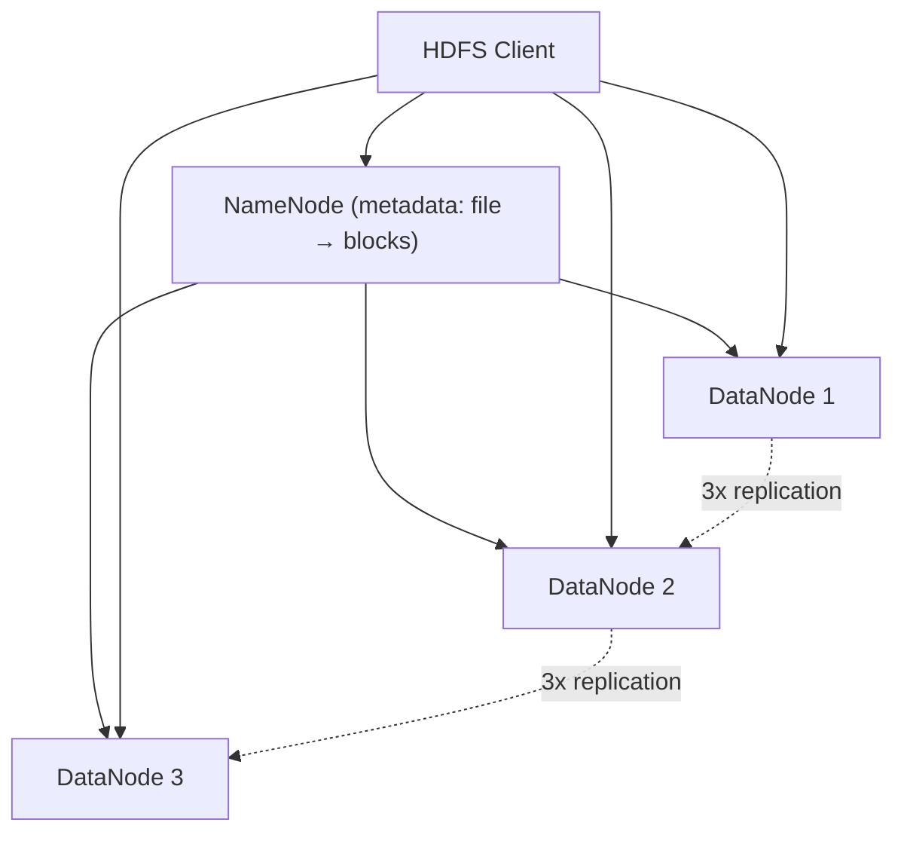
```mermaid
flowchart TD
    Client["HDFS Client"] --> NameNode["NameNode (metadata: file → blocks)"]
    NameNode --> DN1["DataNode 1"]
    NameNode --> DN2["DataNode 2"]
    NameNode --> DN3["DataNode 3"]
    Client --> DN1 & DN2 & DN3
    DN1 -.->|"3x replication"| DN2
    DN2 -.->|"3x replication"| DN3
```

---

### 9. Block Storage

#### Overview

Block storage provides **raw disk volumes** that attach to VMs or containers. Unlike object storage (API-based) or file storage (POSIX), block storage presents a raw block device that the OS formats with a filesystem.

| Service | Provider | Use Case |
|---------|---------|----------|
| **EBS** | AWS | VM disk volumes |
| **Persistent Disk** | GCP | GKE pod storage |
| **Azure Disk** | Azure | VM disks |
| **Ceph RBD** | Open source | On-premise block storage |

**Key properties**: Low latency (< 1ms), high IOPS (up to 256K), snapshotable, encrypted at rest.

---

### 10. DNS System

#### Overview

DNS translates domain names (api.example.com) to IP addresses. It is the **first system contacted in every request** and thus a critical point of failure. AWS Route 53 handles trillions of DNS queries per day.

#### DNS Resolution Flow

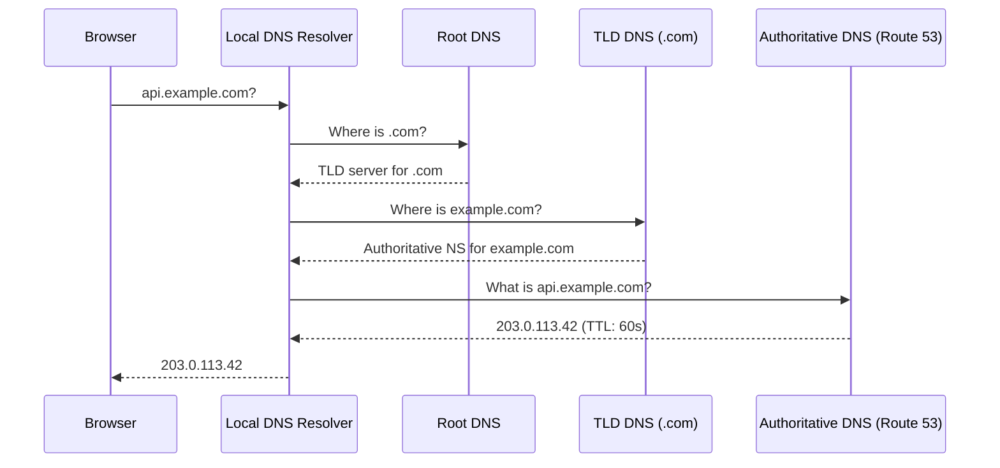
```mermaid
sequenceDiagram
    participant Client as Browser
    participant Resolver as Local DNS Resolver
    participant Root as Root DNS
    participant TLD as TLD DNS (.com)
    participant Auth as Authoritative DNS (Route 53)

    Client->>Resolver: api.example.com?
    Resolver->>Root: Where is .com?
    Root-->>Resolver: TLD server for .com
    Resolver->>TLD: Where is example.com?
    TLD-->>Resolver: Authoritative NS for example.com
    Resolver->>Auth: What is api.example.com?
    Auth-->>Resolver: 203.0.113.42 (TTL: 60s)
    Resolver-->>Client: 203.0.113.42
```

#### DNS-Based Load Balancing

| Strategy | How It Works | Use Case |
|----------|-------------|----------|
| **Round Robin** | Return different IPs per query | Simple multi-server |
| **Weighted** | Return IPs proportional to weight | Traffic shifting |
| **Latency-based** | Return IP of closest region | Multi-region |
| **Geolocation** | Return IP based on requester's country | Data residency |
| **Failover** | Return backup IP if primary health check fails | DR |

---

### 11. CDN System

#### Overview

CDNs cache and serve content from **edge locations** worldwide, reducing latency and origin load. Covered in depth in Chapter 21 (Video Streaming); here we focus on the infrastructure design.

#### Multi-Tier Cache

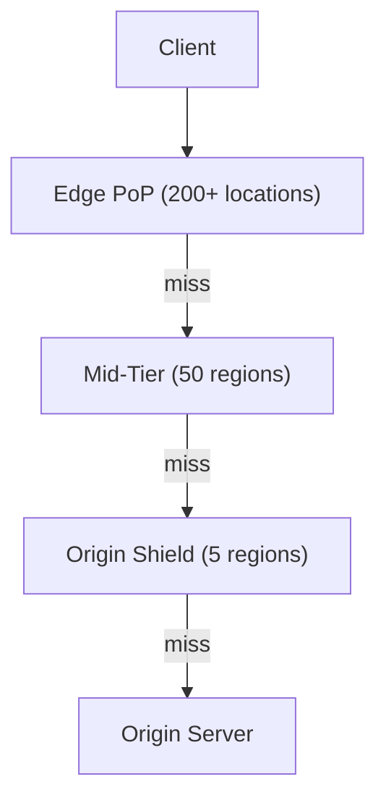
```mermaid
flowchart TD
    Client["Client"] --> Edge["Edge PoP (200+ locations)"]
    Edge -->|miss| Mid["Mid-Tier (50 regions)"]
    Mid -->|miss| Shield["Origin Shield (5 regions)"]
    Shield -->|miss| Origin["Origin Server"]
```

**Cache hit rates**: Edge 80-90%, Mid-tier 95%, Shield 99%. Origin serves < 1% of requests at steady state.

---

### 12. VPC / Subnet System

#### Overview

VPCs (Virtual Private Clouds) provide **network isolation** in the cloud. Each VPC is a logically isolated network with its own IP address range, subnets, route tables, and security rules.

#### Architecture

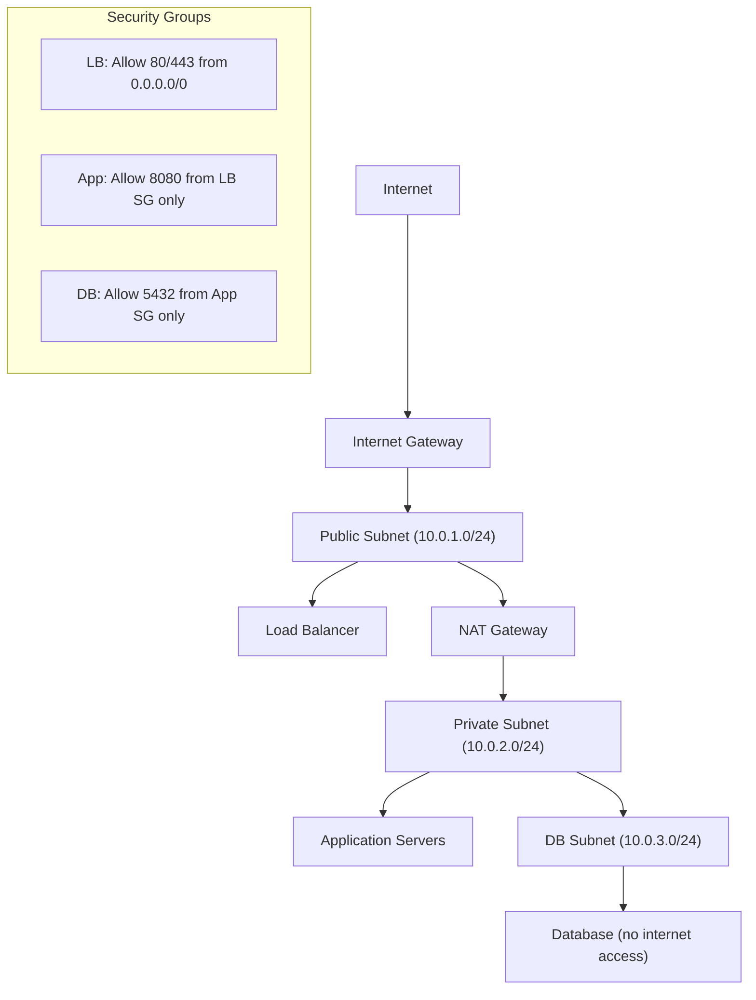
```mermaid
flowchart TD
    Internet["Internet"] --> IGW["Internet Gateway"]
    IGW --> PublicSubnet["Public Subnet (10.0.1.0/24)"]
    PublicSubnet --> LB["Load Balancer"]
    PublicSubnet --> NAT["NAT Gateway"]
    NAT --> PrivateSubnet["Private Subnet (10.0.2.0/24)"]
    PrivateSubnet --> AppServers["Application Servers"]
    PrivateSubnet --> DBSubnet["DB Subnet (10.0.3.0/24)"]
    DBSubnet --> Database["Database (no internet access)"]

    subgraph SecurityGroups["Security Groups"]
        SG_LB["LB: Allow 80/443 from 0.0.0.0/0"]
        SG_App["App: Allow 8080 from LB SG only"]
        SG_DB["DB: Allow 5432 from App SG only"]
    end
```

**Design principles**: Public subnets for load balancers; private subnets for application servers; isolated subnets for databases. Security groups as stateful firewalls with least-privilege rules.

---


## Functional Requirements

The following table enumerates the core functional requirements for each of the 12 subsystems. These are the capabilities that users (platform engineers, application developers, SREs) expect from the platform.

| # | Subsystem | Core Functional Requirements |
|---|-----------|------------------------------|
| 1 | **Load Balancer (L4/L7)** | Register/deregister backend targets dynamically; distribute traffic using configurable algorithms (round-robin, least-connections, weighted, IP-hash, consistent hashing); perform active and passive health checks; terminate TLS and manage certificates; support WebSocket and HTTP/2 upgrades; provide connection draining on backend removal; expose real-time metrics (active connections, request rate, error rate); support sticky sessions via cookies or IP affinity; allow content-based routing by host, path, headers, and query parameters; enable cross-zone load balancing |
| 2 | **API Gateway** | Route requests to backend services by method, path, host, and headers; enforce authentication (JWT, OAuth2, API key, mTLS); apply rate limiting per consumer, per API, and globally; transform protocols (REST to gRPC, GraphQL to REST); manage API versioning; generate and validate API keys; collect request/response metrics and access logs; support request/response body transformation; provide a developer portal with API documentation; enable canary and blue-green deployments at the API level; support WebSocket and SSE proxying |
| 3 | **Service Mesh** | Inject sidecar proxies automatically into application pods; establish mutual TLS between all services without code changes; provide service discovery and load balancing; implement circuit breaking with configurable thresholds; enable automatic retries with exponential backoff and jitter; support traffic splitting for canary releases; inject distributed tracing headers; collect per-request metrics (latency, status codes, throughput); enforce authorization policies (allow/deny per service pair); support fault injection for chaos testing |
| 4 | **Kubernetes** | Schedule pods across nodes based on resource requests, affinity, taints, and priorities; perform rolling updates with configurable surge and unavailability; auto-scale pods horizontally based on CPU, memory, or custom metrics; auto-scale cluster nodes based on pending pod demand; manage secrets and configuration injection; provide stable network endpoints (Services) and DNS-based service discovery; support persistent volume provisioning via CSI drivers; enforce resource quotas and limit ranges per namespace; provide RBAC for API access control; execute batch jobs and cron jobs |
| 5 | **Serverless Platform** | Deploy functions from source code or container images; invoke functions via HTTP, queue, schedule, or event triggers; auto-scale from zero to thousands of concurrent instances; manage function versions and aliases; provide provisioned concurrency to eliminate cold starts; enforce execution time limits and memory constraints; support environment variables and secrets injection; provide per-invocation billing; enable function layers (shared libraries); support dead-letter queues for failed invocations; collect invocation logs and metrics |
| 6 | **Job Scheduler** | Define jobs with cron expressions or event-based triggers; manage job dependencies as DAGs (directed acyclic graphs); retry failed jobs with configurable backoff; enforce job timeouts and resource limits; provide job priority queuing; support parameterized job execution; track job run history with status, duration, and output; enable manual triggering and cancellation of job runs; distribute job execution across worker pools; send notifications on job success/failure; support idempotent job execution |
| 7 | **Object Storage** | Store and retrieve objects up to 5TB using unique keys within buckets; support multipart uploads for large objects; provide object versioning with version-specific retrieval; enforce bucket-level and object-level access policies; support lifecycle rules for automatic tier transitions and expiration; generate pre-signed URLs for temporary access; replicate objects across regions for disaster recovery; support server-side encryption (SSE-S3, SSE-KMS, SSE-C); provide event notifications on object creation/deletion; support object locking for compliance (WORM); enable cross-origin resource sharing (CORS) |
| 8 | **Distributed FS** | Provide POSIX-compatible file operations (read, write, seek, truncate); support shared access across multiple compute nodes simultaneously; implement file and range locking (advisory and mandatory); create point-in-time snapshots of filesystems; enforce per-directory and per-user quotas; support automatic data replication across failure domains; provide consistent metadata operations (create, rename, delete); enable elastic throughput scaling; support NFS and SMB protocols |
| 9 | **Block Storage** | Create, attach, detach, and delete network-attached volumes; snapshot volumes for point-in-time backup; restore volumes from snapshots; resize volumes without downtime; encrypt volumes at rest using KMS; support multiple volume types (SSD, HDD, provisioned IOPS); attach volumes to VMs and containers; provide multi-attach for shared access; replicate data across availability zones; expose IOPS and throughput metrics; support volume cloning |
| 10 | **DNS** | Create and manage DNS zones (hosted zones); add, update, and delete DNS records (A, AAAA, CNAME, MX, TXT, SRV, NS, SOA, ALIAS); support weighted, latency-based, geolocation, and failover routing policies; perform health checks against endpoints; support private DNS zones for VPC-internal resolution; enable DNSSEC for zone signing and validation; provide query logging and analytics; support domain registration and transfer; enable traffic flow with visual policy editor; support automatic zone delegation |
| 11 | **CDN** | Create distributions with one or more origin servers; configure cache behaviors per URL path pattern; set TTLs and cache key policies (headers, query strings, cookies); invalidate cached objects by path or wildcard; support custom SSL certificates on edge; enable origin access identity (restrict origin to CDN only); provide real-time access logs; support Lambda@Edge / edge functions; enable WebSocket pass-through; support origin failover; compress responses automatically (gzip, Brotli); enable geo-restriction |
| 12 | **VPC / Subnet** | Create VPCs with custom CIDR blocks; provision public and private subnets across availability zones; configure route tables for subnet-level routing; create internet gateways for public internet access; provision NAT gateways for private subnet egress; define security groups as stateful firewalls; define network ACLs as stateless firewalls; establish VPC peering and transit gateway connections; create VPN and Direct Connect for hybrid connectivity; enable VPC flow logs for traffic auditing; support IPv6 dual-stack; reserve and assign Elastic IPs |

---

## Non-Functional Requirements

Every subsystem must meet specific non-functional targets. These numbers are modeled after production-grade cloud platforms.

### Latency Requirements

| Subsystem | P50 Latency | P99 Latency | P99.9 Latency | Notes |
|-----------|-------------|-------------|---------------|-------|
| Load Balancer | < 1ms (L4), < 5ms (L7) | < 5ms (L4), < 20ms (L7) | < 10ms (L4), < 50ms (L7) | Excludes backend processing time |
| API Gateway | < 10ms overhead | < 30ms overhead | < 100ms overhead | Overhead above direct backend call |
| Service Mesh | < 2ms per hop | < 10ms per hop | < 25ms per hop | Sidecar proxy overhead |
| Kubernetes API | < 50ms (reads) | < 200ms (reads) | < 500ms (reads) | etcd-backed reads; writes < 100ms P50 |
| Serverless (warm) | < 10ms | < 50ms | < 200ms | Cold start adds 100ms-5s per language |
| Job Scheduler | < 5s scheduling delay | < 15s scheduling delay | < 30s scheduling delay | Time from trigger to job start |
| Object Storage | < 100ms (GET, first byte) | < 250ms | < 500ms | Depends on object size and storage class |
| Block Storage | < 1ms (SSD) | < 5ms (SSD) | < 10ms (SSD) | Provisioned IOPS volumes |
| DNS | < 1ms (cached) | < 50ms (recursive) | < 200ms (recursive) | Authoritative response time |
| CDN | < 20ms (edge hit) | < 50ms (edge hit) | < 100ms (edge hit) | Varies by PoP proximity |
| VPC | < 0.5ms (same AZ) | < 1ms (same AZ) | < 2ms (same AZ) | Network fabric latency |

### Availability Requirements

| Subsystem | Target Availability | Allowed Downtime/Year | Notes |
|-----------|--------------------|-----------------------|-------|
| Load Balancer | 99.99% | 52.6 minutes | Multi-AZ active-active |
| API Gateway | 99.95% | 4.38 hours | Regional service |
| Service Mesh (data plane) | 99.99% | 52.6 minutes | Sidecar per pod; control plane 99.9% |
| Kubernetes Control Plane | 99.95% | 4.38 hours | Multi-master etcd |
| Serverless | 99.95% | 4.38 hours | Regional, multi-AZ |
| Job Scheduler | 99.9% | 8.76 hours | Acceptable for batch workloads |
| Object Storage | 99.99% | 52.6 minutes | Data durability: 99.999999999% |
| Block Storage | 99.99% | 52.6 minutes | Per-volume availability |
| DNS | 100% (SLA) | 0 minutes | Anycast, globally distributed |
| CDN | 99.9% | 8.76 hours | Per-distribution SLA |
| VPC | 99.99% | 52.6 minutes | Network fabric availability |

### Throughput Requirements

| Subsystem | Throughput Target | Scaling Unit |
|-----------|------------------|--------------|
| Load Balancer | 1M+ concurrent connections, 500K RPS per LB instance | Horizontal LB pool |
| API Gateway | 100K RPS per gateway cluster | Add gateway nodes |
| Service Mesh | Limited by sidecar capacity: 50K RPS per sidecar | Per-pod sidecar |
| Kubernetes | 5,000 nodes per cluster, 150,000 pods per cluster | Multiple clusters for beyond |
| Serverless | 10,000 concurrent executions per account (soft limit) | Request limit increase |
| Job Scheduler | 10,000 concurrent job runs | Worker pool scaling |
| Object Storage | 5,500 GET/s and 3,500 PUT/s per prefix | Partition by prefix |
| Block Storage | 256,000 IOPS (io2 Block Express), 4,000 MB/s throughput | Per-volume type |
| DNS | Unlimited (anycast global fleet) | Automatic |
| CDN | 300 Gbps per distribution | Multi-CDN for beyond |
| VPC | 25 Gbps per instance (enhanced networking) | Placement groups for higher |

---

## Capacity Estimation

### Assumptions: Mid-Size Platform (serves 10M daily active users)

#### Traffic Estimates

| Metric | Estimate | Derivation |
|--------|----------|------------|
| DAU | 10,000,000 | Given |
| Avg requests per user per day | 50 | Mix of API calls, page loads, assets |
| Total requests per day | 500,000,000 | 10M x 50 |
| Average RPS | ~5,800 | 500M / 86,400 |
| Peak RPS (5x average) | ~29,000 | Typical peak-to-average ratio |
| Burst RPS (10x average, flash events) | ~58,000 | Black Friday, launch events |

#### Load Balancer Capacity

| Metric | Estimate |
|--------|----------|
| Peak concurrent connections | 500,000 |
| New connections per second | 30,000 |
| TLS handshakes per second | 15,000 (with session resumption) |
| LB instances needed (50K conn each) | 10 (active) + 10 (standby) |
| Bandwidth | 20 Gbps peak |

#### API Gateway Capacity

| Metric | Estimate |
|--------|----------|
| Total API calls per day | 300,000,000 (60% of total requests) |
| Peak API RPS | 17,400 |
| Rate limit entries (Redis) | 1,000,000 active keys |
| Gateway instances (5K RPS each) | 4 (active) + 2 (buffer) |
| Access log storage | 50 GB/day (compressed) |

#### Kubernetes Cluster Capacity

| Metric | Estimate |
|--------|----------|
| Total microservices | 150 |
| Pods per service (average) | 10 |
| Total pods | 1,500 |
| Worker nodes (100 pods/node) | 20 |
| CPU per node | 64 vCPUs |
| Memory per node | 256 GB |
| Total cluster CPU | 1,280 vCPUs |
| Total cluster memory | 5,120 GB |
| etcd storage | 8 GB (cluster state) |

#### Object Storage Capacity

| Metric | Estimate |
|--------|----------|
| Total objects stored | 5 billion |
| Total data stored | 2 PB |
| New objects per day | 10,000,000 |
| New data per day | 4 TB |
| GET requests per day | 200,000,000 |
| PUT requests per day | 10,000,000 |
| Metadata DB size | 500 GB (key + metadata index) |

#### DNS Capacity

| Metric | Estimate |
|--------|----------|
| Hosted zones | 500 |
| DNS records | 50,000 |
| Queries per day | 2,000,000,000 |
| Peak QPS | 100,000 |
| Health checks | 5,000 endpoints |

#### CDN Capacity

| Metric | Estimate |
|--------|----------|
| Total bandwidth served | 100 TB/day |
| Cache hit ratio | 92% |
| Origin requests per day | 16,000,000 (8% miss) |
| Objects cached at edge | 50,000,000 |
| Edge PoPs used | 200+ |
| Invalidation requests per day | 5,000 |

#### Block Storage Capacity

| Metric | Estimate |
|--------|----------|
| Total volumes | 500 |
| Total provisioned storage | 200 TB |
| Snapshots per day | 500 |
| Snapshot storage | 50 TB (incremental) |
| Average IOPS per volume | 3,000 |
| Aggregate IOPS | 1,500,000 |

#### VPC and Networking

| Metric | Estimate |
|--------|----------|
| VPCs | 10 (per region, multi-account) |
| Subnets | 60 (3 AZs x 2 tiers x 10 VPCs) |
| Security groups | 300 |
| Security group rules | 3,000 |
| VPC peering connections | 20 |
| NAT gateway throughput | 45 Gbps aggregate |
| VPC flow log volume | 500 GB/day |

---

## Detailed Data Models

The following PostgreSQL schemas represent the metadata stores for each subsystem. Production systems often use specialized stores (etcd for K8s, DynamoDB for S3 metadata), but relational schemas best illustrate the data relationships.

### Load Balancer Metadata

```sql
-- ============================================
-- LOAD BALANCER DATA MODEL
-- ============================================

CREATE TABLE lb_configurations (
    lb_id               UUID PRIMARY KEY DEFAULT gen_random_uuid(),
    account_id          UUID NOT NULL,
    name                VARCHAR(255) NOT NULL,
    scheme              VARCHAR(20) NOT NULL CHECK (scheme IN ('internet-facing', 'internal')),
    lb_type             VARCHAR(10) NOT NULL CHECK (lb_type IN ('L4', 'L7')),
    state               VARCHAR(20) NOT NULL DEFAULT 'provisioning'
                        CHECK (state IN ('provisioning', 'active', 'updating', 'deleting', 'failed')),
    algorithm           VARCHAR(30) NOT NULL DEFAULT 'round_robin'
                        CHECK (algorithm IN ('round_robin', 'weighted_round_robin', 'least_connections',
                                             'ip_hash', 'consistent_hashing', 'random_two_choices')),
    vpc_id              UUID NOT NULL,
    subnet_ids          UUID[] NOT NULL,
    security_group_ids  UUID[] NOT NULL,
    idle_timeout_sec    INTEGER NOT NULL DEFAULT 60 CHECK (idle_timeout_sec BETWEEN 1 AND 4000),
    cross_zone_enabled  BOOLEAN NOT NULL DEFAULT TRUE,
    deletion_protection BOOLEAN NOT NULL DEFAULT FALSE,
    access_log_bucket   VARCHAR(255),
    access_log_prefix   VARCHAR(255),
    dns_name            VARCHAR(512),
    hosted_zone_id      UUID,
    tags                JSONB NOT NULL DEFAULT '{}',
    created_at          TIMESTAMPTZ NOT NULL DEFAULT NOW(),
    updated_at          TIMESTAMPTZ NOT NULL DEFAULT NOW(),
    created_by          UUID NOT NULL,
    version             INTEGER NOT NULL DEFAULT 1,
    UNIQUE (account_id, name)
);

CREATE INDEX idx_lb_account ON lb_configurations (account_id);
CREATE INDEX idx_lb_vpc ON lb_configurations (vpc_id);
CREATE INDEX idx_lb_state ON lb_configurations (state);
CREATE INDEX idx_lb_tags ON lb_configurations USING GIN (tags);

CREATE TABLE lb_listeners (
    listener_id         UUID PRIMARY KEY DEFAULT gen_random_uuid(),
    lb_id               UUID NOT NULL REFERENCES lb_configurations(lb_id) ON DELETE CASCADE,
    protocol            VARCHAR(10) NOT NULL CHECK (protocol IN ('HTTP', 'HTTPS', 'TCP', 'UDP', 'TLS')),
    port                INTEGER NOT NULL CHECK (port BETWEEN 1 AND 65535),
    certificate_id      UUID,
    ssl_policy          VARCHAR(100),
    default_action_type VARCHAR(20) NOT NULL CHECK (default_action_type IN ('forward', 'redirect', 'fixed_response')),
    default_target_group_id UUID,
    created_at          TIMESTAMPTZ NOT NULL DEFAULT NOW(),
    updated_at          TIMESTAMPTZ NOT NULL DEFAULT NOW(),
    UNIQUE (lb_id, port, protocol)
);

CREATE INDEX idx_listener_lb ON lb_listeners (lb_id);

CREATE TABLE lb_target_groups (
    target_group_id     UUID PRIMARY KEY DEFAULT gen_random_uuid(),
    lb_id               UUID NOT NULL REFERENCES lb_configurations(lb_id) ON DELETE CASCADE,
    name                VARCHAR(255) NOT NULL,
    protocol            VARCHAR(10) NOT NULL CHECK (protocol IN ('HTTP', 'HTTPS', 'TCP', 'UDP', 'TLS')),
    port                INTEGER NOT NULL CHECK (port BETWEEN 1 AND 65535),
    target_type         VARCHAR(20) NOT NULL CHECK (target_type IN ('instance', 'ip', 'lambda')),
    health_check_id     UUID,
    stickiness_enabled  BOOLEAN NOT NULL DEFAULT FALSE,
    stickiness_type     VARCHAR(20) CHECK (stickiness_type IN ('lb_cookie', 'app_cookie')),
    stickiness_ttl_sec  INTEGER DEFAULT 86400,
    deregistration_delay INTEGER NOT NULL DEFAULT 300,
    slow_start_sec      INTEGER NOT NULL DEFAULT 0 CHECK (slow_start_sec BETWEEN 0 AND 900),
    algorithm           VARCHAR(30) NOT NULL DEFAULT 'round_robin',
    created_at          TIMESTAMPTZ NOT NULL DEFAULT NOW(),
    updated_at          TIMESTAMPTZ NOT NULL DEFAULT NOW(),
    UNIQUE (lb_id, name)
);

CREATE INDEX idx_tg_lb ON lb_target_groups (lb_id);

CREATE TABLE lb_backends (
    backend_id          UUID PRIMARY KEY DEFAULT gen_random_uuid(),
    target_group_id     UUID NOT NULL REFERENCES lb_target_groups(target_group_id) ON DELETE CASCADE,
    target_type         VARCHAR(20) NOT NULL CHECK (target_type IN ('instance', 'ip', 'lambda')),
    target_id           VARCHAR(255) NOT NULL,
    ip_address          INET,
    port                INTEGER NOT NULL CHECK (port BETWEEN 1 AND 65535),
    weight              INTEGER NOT NULL DEFAULT 100 CHECK (weight BETWEEN 0 AND 1000),
    state               VARCHAR(20) NOT NULL DEFAULT 'initial'
                        CHECK (state IN ('initial', 'healthy', 'unhealthy', 'draining', 'unavailable')),
    health_description  TEXT,
    availability_zone   VARCHAR(20),
    registered_at       TIMESTAMPTZ NOT NULL DEFAULT NOW(),
    last_health_check   TIMESTAMPTZ,
    UNIQUE (target_group_id, target_id, port)
);

CREATE INDEX idx_backend_tg ON lb_backends (target_group_id);
CREATE INDEX idx_backend_state ON lb_backends (state);
CREATE INDEX idx_backend_ip ON lb_backends (ip_address);

CREATE TABLE lb_health_checks (
    health_check_id     UUID PRIMARY KEY DEFAULT gen_random_uuid(),
    target_group_id     UUID NOT NULL REFERENCES lb_target_groups(target_group_id) ON DELETE CASCADE,
    protocol            VARCHAR(10) NOT NULL CHECK (protocol IN ('HTTP', 'HTTPS', 'TCP', 'gRPC')),
    port                INTEGER CHECK (port BETWEEN 1 AND 65535),
    path                VARCHAR(1024) DEFAULT '/health',
    interval_sec        INTEGER NOT NULL DEFAULT 30 CHECK (interval_sec BETWEEN 5 AND 300),
    timeout_sec         INTEGER NOT NULL DEFAULT 5 CHECK (timeout_sec BETWEEN 2 AND 120),
    healthy_threshold   INTEGER NOT NULL DEFAULT 3 CHECK (healthy_threshold BETWEEN 2 AND 10),
    unhealthy_threshold INTEGER NOT NULL DEFAULT 3 CHECK (unhealthy_threshold BETWEEN 2 AND 10),
    success_codes       VARCHAR(50) DEFAULT '200-299',
    created_at          TIMESTAMPTZ NOT NULL DEFAULT NOW(),
    updated_at          TIMESTAMPTZ NOT NULL DEFAULT NOW(),
    UNIQUE (target_group_id)
);

CREATE TABLE lb_certificates (
    certificate_id      UUID PRIMARY KEY DEFAULT gen_random_uuid(),
    account_id          UUID NOT NULL,
    domain_name         VARCHAR(255) NOT NULL,
    subject_alt_names   TEXT[] DEFAULT '{}',
    certificate_body    TEXT NOT NULL,
    private_key_ref     VARCHAR(512) NOT NULL,
    certificate_chain   TEXT,
    issuer              VARCHAR(255),
    status              VARCHAR(20) NOT NULL DEFAULT 'pending'
                        CHECK (status IN ('pending', 'issued', 'active', 'expired', 'revoked', 'failed')),
    not_before          TIMESTAMPTZ,
    not_after           TIMESTAMPTZ,
    key_algorithm       VARCHAR(20) DEFAULT 'RSA_2048',
    auto_renew          BOOLEAN NOT NULL DEFAULT TRUE,
    created_at          TIMESTAMPTZ NOT NULL DEFAULT NOW(),
    updated_at          TIMESTAMPTZ NOT NULL DEFAULT NOW()
);

CREATE INDEX idx_cert_account ON lb_certificates (account_id);
CREATE INDEX idx_cert_domain ON lb_certificates (domain_name);
CREATE INDEX idx_cert_expiry ON lb_certificates (not_after) WHERE status = 'active';
```

### API Gateway Metadata

```sql
-- ============================================
-- API GATEWAY DATA MODEL
-- ============================================

CREATE TABLE api_routes (
    route_id            UUID PRIMARY KEY DEFAULT gen_random_uuid(),
    gateway_id          UUID NOT NULL,
    method              VARCHAR(10) NOT NULL CHECK (method IN ('GET', 'POST', 'PUT', 'PATCH', 'DELETE', 'OPTIONS', 'HEAD', 'ANY')),
    path                VARCHAR(1024) NOT NULL,
    description         TEXT,
    integration_type    VARCHAR(20) NOT NULL
                        CHECK (integration_type IN ('http_proxy', 'lambda', 'grpc', 'mock', 'vpc_link')),
    integration_uri     VARCHAR(2048) NOT NULL,
    integration_method  VARCHAR(10),
    timeout_ms          INTEGER NOT NULL DEFAULT 29000 CHECK (timeout_ms BETWEEN 50 AND 300000),
    authorization_type  VARCHAR(30) NOT NULL DEFAULT 'NONE'
                        CHECK (authorization_type IN ('NONE', 'API_KEY', 'JWT', 'OAUTH2', 'CUSTOM', 'IAM')),
    authorizer_id       UUID,
    request_validator   VARCHAR(20) DEFAULT 'NONE'
                        CHECK (request_validator IN ('NONE', 'BODY', 'PARAMS', 'BODY_AND_PARAMS')),
    request_model       JSONB,
    response_model      JSONB,
    request_transform   JSONB,
    response_transform  JSONB,
    cache_enabled       BOOLEAN NOT NULL DEFAULT FALSE,
    cache_ttl_sec       INTEGER DEFAULT 300,
    is_active           BOOLEAN NOT NULL DEFAULT TRUE,
    created_at          TIMESTAMPTZ NOT NULL DEFAULT NOW(),
    updated_at          TIMESTAMPTZ NOT NULL DEFAULT NOW(),
    UNIQUE (gateway_id, method, path)
);

CREATE INDEX idx_route_gateway ON api_routes (gateway_id);
CREATE INDEX idx_route_path ON api_routes (gateway_id, path);
CREATE INDEX idx_route_active ON api_routes (gateway_id) WHERE is_active = TRUE;

CREATE TABLE api_rate_limits (
    rate_limit_id       UUID PRIMARY KEY DEFAULT gen_random_uuid(),
    gateway_id          UUID NOT NULL,
    name                VARCHAR(255) NOT NULL,
    scope               VARCHAR(20) NOT NULL CHECK (scope IN ('global', 'per_consumer', 'per_route', 'per_ip')),
    route_id            UUID REFERENCES api_routes(route_id) ON DELETE CASCADE,
    consumer_id         UUID,
    algorithm           VARCHAR(20) NOT NULL DEFAULT 'token_bucket'
                        CHECK (algorithm IN ('token_bucket', 'sliding_window', 'fixed_window', 'leaky_bucket')),
    requests_per_second INTEGER,
    requests_per_minute INTEGER,
    requests_per_hour   INTEGER,
    requests_per_day    INTEGER,
    burst_size          INTEGER,
    throttle_action     VARCHAR(20) NOT NULL DEFAULT 'reject'
                        CHECK (throttle_action IN ('reject', 'queue', 'degrade')),
    retry_after_sec     INTEGER DEFAULT 60,
    is_active           BOOLEAN NOT NULL DEFAULT TRUE,
    created_at          TIMESTAMPTZ NOT NULL DEFAULT NOW(),
    updated_at          TIMESTAMPTZ NOT NULL DEFAULT NOW(),
    UNIQUE (gateway_id, name)
);

CREATE INDEX idx_rl_gateway ON api_rate_limits (gateway_id);
CREATE INDEX idx_rl_route ON api_rate_limits (route_id);

CREATE TABLE api_consumers (
    consumer_id         UUID PRIMARY KEY DEFAULT gen_random_uuid(),
    gateway_id          UUID NOT NULL,
    name                VARCHAR(255) NOT NULL,
    description         TEXT,
    email               VARCHAR(255),
    organization        VARCHAR(255),
    tier                VARCHAR(20) NOT NULL DEFAULT 'free'
                        CHECK (tier IN ('free', 'basic', 'pro', 'enterprise', 'internal')),
    state               VARCHAR(20) NOT NULL DEFAULT 'active'
                        CHECK (state IN ('active', 'suspended', 'revoked')),
    metadata            JSONB NOT NULL DEFAULT '{}',
    created_at          TIMESTAMPTZ NOT NULL DEFAULT NOW(),
    updated_at          TIMESTAMPTZ NOT NULL DEFAULT NOW(),
    UNIQUE (gateway_id, name)
);

CREATE INDEX idx_consumer_gateway ON api_consumers (gateway_id);
CREATE INDEX idx_consumer_tier ON api_consumers (tier);

CREATE TABLE api_keys (
    key_id              UUID PRIMARY KEY DEFAULT gen_random_uuid(),
    consumer_id         UUID NOT NULL REFERENCES api_consumers(consumer_id) ON DELETE CASCADE,
    gateway_id          UUID NOT NULL,
    key_prefix          VARCHAR(8) NOT NULL,
    key_hash            VARCHAR(128) NOT NULL,
    name                VARCHAR(255) NOT NULL,
    scopes              TEXT[] NOT NULL DEFAULT '{}',
    allowed_routes      UUID[],
    allowed_ips         INET[],
    state               VARCHAR(20) NOT NULL DEFAULT 'active'
                        CHECK (state IN ('active', 'disabled', 'expired', 'revoked')),
    expires_at          TIMESTAMPTZ,
    last_used_at        TIMESTAMPTZ,
    usage_count         BIGINT NOT NULL DEFAULT 0,
    created_at          TIMESTAMPTZ NOT NULL DEFAULT NOW(),
    updated_at          TIMESTAMPTZ NOT NULL DEFAULT NOW()
);

CREATE INDEX idx_key_hash ON api_keys (key_hash);
CREATE INDEX idx_key_consumer ON api_keys (consumer_id);
CREATE INDEX idx_key_state ON api_keys (state);
```

### Service Mesh Metadata

```sql
-- ============================================
-- SERVICE MESH DATA MODEL
-- ============================================

CREATE TABLE mesh_services (
    service_id          UUID PRIMARY KEY DEFAULT gen_random_uuid(),
    mesh_id             UUID NOT NULL,
    name                VARCHAR(255) NOT NULL,
    namespace           VARCHAR(255) NOT NULL DEFAULT 'default',
    protocol            VARCHAR(10) NOT NULL DEFAULT 'HTTP'
                        CHECK (protocol IN ('HTTP', 'HTTPS', 'gRPC', 'TCP')),
    port                INTEGER NOT NULL CHECK (port BETWEEN 1 AND 65535),
    target_port         INTEGER CHECK (target_port BETWEEN 1 AND 65535),
    sidecar_image       VARCHAR(512) NOT NULL DEFAULT 'envoyproxy/envoy:v1.28',
    sidecar_cpu_limit   VARCHAR(20) DEFAULT '500m',
    sidecar_mem_limit   VARCHAR(20) DEFAULT '256Mi',
    mtls_mode           VARCHAR(20) NOT NULL DEFAULT 'STRICT'
                        CHECK (mtls_mode IN ('STRICT', 'PERMISSIVE', 'DISABLE')),
    load_balancing      VARCHAR(30) NOT NULL DEFAULT 'ROUND_ROBIN'
                        CHECK (load_balancing IN ('ROUND_ROBIN', 'LEAST_REQUEST', 'RANDOM', 'RING_HASH', 'MAGLEV')),
    circuit_breaker     JSONB,
    retry_policy        JSONB,
    timeout_ms          INTEGER DEFAULT 15000,
    health_check_path   VARCHAR(1024) DEFAULT '/healthz',
    outlier_detection   JSONB,
    metadata            JSONB NOT NULL DEFAULT '{}',
    created_at          TIMESTAMPTZ NOT NULL DEFAULT NOW(),
    updated_at          TIMESTAMPTZ NOT NULL DEFAULT NOW(),
    UNIQUE (mesh_id, namespace, name)
);

CREATE INDEX idx_mesh_svc_mesh ON mesh_services (mesh_id);
CREATE INDEX idx_mesh_svc_ns ON mesh_services (mesh_id, namespace);

CREATE TABLE mesh_policies (
    policy_id           UUID PRIMARY KEY DEFAULT gen_random_uuid(),
    mesh_id             UUID NOT NULL,
    name                VARCHAR(255) NOT NULL,
    namespace           VARCHAR(255) NOT NULL DEFAULT 'default',
    policy_type         VARCHAR(30) NOT NULL
                        CHECK (policy_type IN ('authorization', 'traffic_shift', 'fault_injection',
                                               'rate_limit', 'circuit_breaker', 'retry', 'timeout', 'mirror')),
    source_service_id   UUID REFERENCES mesh_services(service_id),
    target_service_id   UUID REFERENCES mesh_services(service_id),
    spec                JSONB NOT NULL,
    priority            INTEGER NOT NULL DEFAULT 0,
    is_active           BOOLEAN NOT NULL DEFAULT TRUE,
    created_at          TIMESTAMPTZ NOT NULL DEFAULT NOW(),
    updated_at          TIMESTAMPTZ NOT NULL DEFAULT NOW(),
    UNIQUE (mesh_id, namespace, name)
);

CREATE INDEX idx_mesh_policy_type ON mesh_policies (policy_type);
CREATE INDEX idx_mesh_policy_active ON mesh_policies (mesh_id) WHERE is_active = TRUE;

CREATE TABLE mesh_certificates (
    cert_id             UUID PRIMARY KEY DEFAULT gen_random_uuid(),
    mesh_id             UUID NOT NULL,
    service_id          UUID NOT NULL REFERENCES mesh_services(service_id) ON DELETE CASCADE,
    serial_number       VARCHAR(128) NOT NULL UNIQUE,
    subject_cn          VARCHAR(512) NOT NULL,
    san_dns             TEXT[] NOT NULL DEFAULT '{}',
    san_uri             TEXT[] NOT NULL DEFAULT '{}',
    issuer_cn           VARCHAR(512) NOT NULL,
    not_before          TIMESTAMPTZ NOT NULL,
    not_after           TIMESTAMPTZ NOT NULL,
    key_algorithm       VARCHAR(20) NOT NULL DEFAULT 'ECDSA_P256',
    certificate_pem_ref VARCHAR(512) NOT NULL,
    private_key_ref     VARCHAR(512) NOT NULL,
    state               VARCHAR(20) NOT NULL DEFAULT 'active'
                        CHECK (state IN ('active', 'rotating', 'expired', 'revoked')),
    rotation_interval   INTERVAL NOT NULL DEFAULT '24 hours',
    last_rotated_at     TIMESTAMPTZ NOT NULL DEFAULT NOW(),
    created_at          TIMESTAMPTZ NOT NULL DEFAULT NOW(),
    updated_at          TIMESTAMPTZ NOT NULL DEFAULT NOW()
);

CREATE INDEX idx_mesh_cert_service ON mesh_certificates (service_id);
CREATE INDEX idx_mesh_cert_expiry ON mesh_certificates (not_after) WHERE state = 'active';
```

### Kubernetes Metadata

```sql
-- ============================================
-- KUBERNETES METADATA DATA MODEL
-- Note: K8s uses etcd in practice; this relational model
-- represents equivalent data for system design discussions.
-- ============================================

CREATE TABLE k8s_clusters (
    cluster_id          UUID PRIMARY KEY DEFAULT gen_random_uuid(),
    account_id          UUID NOT NULL,
    name                VARCHAR(255) NOT NULL,
    region              VARCHAR(50) NOT NULL,
    k8s_version         VARCHAR(20) NOT NULL,
    platform            VARCHAR(20) NOT NULL CHECK (platform IN ('EKS', 'GKE', 'AKS', 'self-managed')),
    state               VARCHAR(20) NOT NULL DEFAULT 'creating'
                        CHECK (state IN ('creating', 'active', 'updating', 'upgrading', 'deleting', 'failed')),
    endpoint            VARCHAR(512),
    certificate_authority TEXT,
    vpc_id              UUID NOT NULL,
    subnet_ids          UUID[] NOT NULL,
    security_group_ids  UUID[] NOT NULL,
    service_cidr        CIDR NOT NULL DEFAULT '10.100.0.0/16',
    pod_cidr            CIDR NOT NULL DEFAULT '10.244.0.0/16',
    dns_cluster_ip      INET NOT NULL DEFAULT '10.100.0.10',
    logging_config      JSONB NOT NULL DEFAULT '{"api": true, "audit": true, "authenticator": true}',
    encryption_config   JSONB,
    node_count          INTEGER NOT NULL DEFAULT 0,
    pod_count           INTEGER NOT NULL DEFAULT 0,
    tags                JSONB NOT NULL DEFAULT '{}',
    created_at          TIMESTAMPTZ NOT NULL DEFAULT NOW(),
    updated_at          TIMESTAMPTZ NOT NULL DEFAULT NOW(),
    created_by          UUID NOT NULL,
    UNIQUE (account_id, name, region)
);

CREATE INDEX idx_k8s_cluster_account ON k8s_clusters (account_id);
CREATE INDEX idx_k8s_cluster_state ON k8s_clusters (state);

CREATE TABLE k8s_namespaces (
    namespace_id        UUID PRIMARY KEY DEFAULT gen_random_uuid(),
    cluster_id          UUID NOT NULL REFERENCES k8s_clusters(cluster_id) ON DELETE CASCADE,
    name                VARCHAR(255) NOT NULL,
    state               VARCHAR(20) NOT NULL DEFAULT 'active'
                        CHECK (state IN ('active', 'terminating')),
    labels              JSONB NOT NULL DEFAULT '{}',
    annotations         JSONB NOT NULL DEFAULT '{}',
    resource_quota      JSONB,
    limit_range         JSONB,
    created_at          TIMESTAMPTZ NOT NULL DEFAULT NOW(),
    updated_at          TIMESTAMPTZ NOT NULL DEFAULT NOW(),
    UNIQUE (cluster_id, name)
);

CREATE INDEX idx_ns_cluster ON k8s_namespaces (cluster_id);

CREATE TABLE k8s_deployments (
    deployment_id       UUID PRIMARY KEY DEFAULT gen_random_uuid(),
    cluster_id          UUID NOT NULL REFERENCES k8s_clusters(cluster_id) ON DELETE CASCADE,
    namespace_id        UUID NOT NULL REFERENCES k8s_namespaces(namespace_id) ON DELETE CASCADE,
    name                VARCHAR(255) NOT NULL,
    replicas_desired    INTEGER NOT NULL DEFAULT 1,
    replicas_ready      INTEGER NOT NULL DEFAULT 0,
    replicas_available  INTEGER NOT NULL DEFAULT 0,
    replicas_updated    INTEGER NOT NULL DEFAULT 0,
    strategy_type       VARCHAR(20) NOT NULL DEFAULT 'RollingUpdate'
                        CHECK (strategy_type IN ('RollingUpdate', 'Recreate')),
    max_surge           VARCHAR(10) DEFAULT '25%',
    max_unavailable     VARCHAR(10) DEFAULT '25%',
    min_ready_seconds   INTEGER NOT NULL DEFAULT 0,
    revision_history_limit INTEGER NOT NULL DEFAULT 10,
    current_revision    INTEGER NOT NULL DEFAULT 1,
    container_image     VARCHAR(512) NOT NULL,
    container_port      INTEGER CHECK (container_port BETWEEN 1 AND 65535),
    cpu_request         VARCHAR(20) DEFAULT '100m',
    cpu_limit           VARCHAR(20) DEFAULT '500m',
    memory_request      VARCHAR(20) DEFAULT '128Mi',
    memory_limit        VARCHAR(20) DEFAULT '512Mi',
    env_vars            JSONB NOT NULL DEFAULT '{}',
    volumes             JSONB NOT NULL DEFAULT '[]',
    liveness_probe      JSONB,
    readiness_probe     JSONB,
    node_selector       JSONB,
    affinity            JSONB,
    tolerations         JSONB NOT NULL DEFAULT '[]',
    labels              JSONB NOT NULL DEFAULT '{}',
    annotations         JSONB NOT NULL DEFAULT '{}',
    state               VARCHAR(20) NOT NULL DEFAULT 'progressing'
                        CHECK (state IN ('progressing', 'available', 'failed')),
    paused              BOOLEAN NOT NULL DEFAULT FALSE,
    created_at          TIMESTAMPTZ NOT NULL DEFAULT NOW(),
    updated_at          TIMESTAMPTZ NOT NULL DEFAULT NOW(),
    UNIQUE (cluster_id, namespace_id, name)
);

CREATE INDEX idx_deploy_cluster ON k8s_deployments (cluster_id);
CREATE INDEX idx_deploy_ns ON k8s_deployments (namespace_id);
CREATE INDEX idx_deploy_state ON k8s_deployments (state);

CREATE TABLE k8s_pods (
    pod_id              UUID PRIMARY KEY DEFAULT gen_random_uuid(),
    cluster_id          UUID NOT NULL REFERENCES k8s_clusters(cluster_id) ON DELETE CASCADE,
    namespace_id        UUID NOT NULL REFERENCES k8s_namespaces(namespace_id) ON DELETE CASCADE,
    deployment_id       UUID REFERENCES k8s_deployments(deployment_id) ON DELETE SET NULL,
    name                VARCHAR(255) NOT NULL,
    node_name           VARCHAR(255),
    host_ip             INET,
    pod_ip              INET,
    phase               VARCHAR(20) NOT NULL DEFAULT 'Pending'
                        CHECK (phase IN ('Pending', 'Running', 'Succeeded', 'Failed', 'Unknown')),
    qos_class           VARCHAR(20) CHECK (qos_class IN ('Guaranteed', 'Burstable', 'BestEffort')),
    restart_count       INTEGER NOT NULL DEFAULT 0,
    container_statuses  JSONB NOT NULL DEFAULT '[]',
    conditions          JSONB NOT NULL DEFAULT '[]',
    started_at          TIMESTAMPTZ,
    finished_at         TIMESTAMPTZ,
    labels              JSONB NOT NULL DEFAULT '{}',
    annotations         JSONB NOT NULL DEFAULT '{}',
    created_at          TIMESTAMPTZ NOT NULL DEFAULT NOW(),
    updated_at          TIMESTAMPTZ NOT NULL DEFAULT NOW()
);

CREATE INDEX idx_pod_cluster ON k8s_pods (cluster_id);
CREATE INDEX idx_pod_ns ON k8s_pods (namespace_id);
CREATE INDEX idx_pod_deployment ON k8s_pods (deployment_id);
CREATE INDEX idx_pod_node ON k8s_pods (node_name);
CREATE INDEX idx_pod_phase ON k8s_pods (phase);
CREATE INDEX idx_pod_labels ON k8s_pods USING GIN (labels);
```

### Serverless Platform Metadata

```sql
-- ============================================
-- SERVERLESS PLATFORM DATA MODEL
-- ============================================

CREATE TABLE functions (
    function_id         UUID PRIMARY KEY DEFAULT gen_random_uuid(),
    account_id          UUID NOT NULL,
    name                VARCHAR(255) NOT NULL,
    description         TEXT,
    runtime             VARCHAR(30) NOT NULL
                        CHECK (runtime IN ('python3.12', 'python3.11', 'nodejs20', 'nodejs18',
                                           'java21', 'java17', 'go1.22', 'dotnet8', 'rust1', 'custom')),
    handler             VARCHAR(512) NOT NULL,
    code_uri            VARCHAR(2048) NOT NULL,
    code_sha256         VARCHAR(64) NOT NULL,
    code_size_bytes     BIGINT NOT NULL,
    package_type        VARCHAR(10) NOT NULL DEFAULT 'Zip'
                        CHECK (package_type IN ('Zip', 'Image')),
    memory_mb           INTEGER NOT NULL DEFAULT 128 CHECK (memory_mb BETWEEN 128 AND 10240),
    timeout_sec         INTEGER NOT NULL DEFAULT 3 CHECK (timeout_sec BETWEEN 1 AND 900),
    ephemeral_storage_mb INTEGER NOT NULL DEFAULT 512,
    environment_vars    JSONB NOT NULL DEFAULT '{}',
    kms_key_arn         VARCHAR(512),
    vpc_config          JSONB,
    execution_role_arn  VARCHAR(512) NOT NULL,
    dead_letter_queue   VARCHAR(512),
    layers              VARCHAR(512)[] DEFAULT '{}',
    tracing_mode        VARCHAR(20) DEFAULT 'PassThrough'
                        CHECK (tracing_mode IN ('Active', 'PassThrough')),
    state               VARCHAR(20) NOT NULL DEFAULT 'pending'
                        CHECK (state IN ('pending', 'active', 'inactive', 'failed')),
    current_version     INTEGER NOT NULL DEFAULT 1,
    tags                JSONB NOT NULL DEFAULT '{}',
    created_at          TIMESTAMPTZ NOT NULL DEFAULT NOW(),
    updated_at          TIMESTAMPTZ NOT NULL DEFAULT NOW(),
    created_by          UUID NOT NULL,
    UNIQUE (account_id, name)
);

CREATE INDEX idx_fn_account ON functions (account_id);
CREATE INDEX idx_fn_runtime ON functions (runtime);
CREATE INDEX idx_fn_state ON functions (state);

CREATE TABLE function_invocations (
    invocation_id       UUID PRIMARY KEY DEFAULT gen_random_uuid(),
    function_id         UUID NOT NULL,
    function_version    INTEGER NOT NULL,
    request_id          VARCHAR(64) NOT NULL UNIQUE,
    trigger_type        VARCHAR(30) NOT NULL
                        CHECK (trigger_type IN ('api_gateway', 'sqs', 'sns', 's3', 'dynamodb_stream',
                                                'kinesis', 'schedule', 'cloudwatch_event', 'direct', 'alb')),
    trigger_source      VARCHAR(512),
    status              VARCHAR(20) NOT NULL CHECK (status IN ('pending', 'running', 'success', 'error', 'timeout', 'throttled')),
    cold_start          BOOLEAN NOT NULL DEFAULT FALSE,
    init_duration_ms    INTEGER,
    duration_ms         INTEGER,
    billed_duration_ms  INTEGER,
    memory_used_mb      INTEGER,
    memory_allocated_mb INTEGER NOT NULL,
    error_type          VARCHAR(100),
    error_message       TEXT,
    log_stream_name     VARCHAR(512),
    trace_id            VARCHAR(128),
    started_at          TIMESTAMPTZ NOT NULL DEFAULT NOW(),
    completed_at        TIMESTAMPTZ
) PARTITION BY RANGE (started_at);

CREATE INDEX idx_invoc_fn ON function_invocations (function_id);
CREATE INDEX idx_invoc_status ON function_invocations (status);
CREATE INDEX idx_invoc_started ON function_invocations (started_at);
CREATE INDEX idx_invoc_cold ON function_invocations (function_id) WHERE cold_start = TRUE;

-- Monthly partitions
CREATE TABLE function_invocations_2026_01 PARTITION OF function_invocations
    FOR VALUES FROM ('2026-01-01') TO ('2026-02-01');
CREATE TABLE function_invocations_2026_02 PARTITION OF function_invocations
    FOR VALUES FROM ('2026-02-01') TO ('2026-03-01');
CREATE TABLE function_invocations_2026_03 PARTITION OF function_invocations
    FOR VALUES FROM ('2026-03-01') TO ('2026-04-01');

CREATE TABLE function_triggers (
    trigger_id          UUID PRIMARY KEY DEFAULT gen_random_uuid(),
    function_id         UUID NOT NULL REFERENCES functions(function_id) ON DELETE CASCADE,
    trigger_type        VARCHAR(30) NOT NULL
                        CHECK (trigger_type IN ('http', 'schedule', 'sqs', 'sns', 's3', 'dynamodb',
                                                'kinesis', 'cloudwatch_event', 'iot')),
    source_arn          VARCHAR(512),
    enabled             BOOLEAN NOT NULL DEFAULT TRUE,
    batch_size          INTEGER DEFAULT 1,
    max_batching_window_sec INTEGER DEFAULT 0,
    starting_position   VARCHAR(20),
    filter_criteria     JSONB,
    schedule_expression VARCHAR(255),
    retry_attempts      INTEGER DEFAULT 2,
    max_age_sec         INTEGER DEFAULT 21600,
    destination_on_success VARCHAR(512),
    destination_on_failure VARCHAR(512),
    created_at          TIMESTAMPTZ NOT NULL DEFAULT NOW(),
    updated_at          TIMESTAMPTZ NOT NULL DEFAULT NOW()
);

CREATE INDEX idx_trigger_fn ON function_triggers (function_id);
CREATE INDEX idx_trigger_type ON function_triggers (trigger_type);
```

### Job Scheduler Metadata

```sql
-- ============================================
-- JOB SCHEDULER DATA MODEL
-- ============================================

CREATE TABLE jobs (
    job_id              UUID PRIMARY KEY DEFAULT gen_random_uuid(),
    account_id          UUID NOT NULL,
    name                VARCHAR(255) NOT NULL,
    description         TEXT,
    job_type            VARCHAR(20) NOT NULL
                        CHECK (job_type IN ('cron', 'event', 'one_time', 'dag_task')),
    schedule_expression VARCHAR(255),
    timezone            VARCHAR(50) DEFAULT 'UTC',
    command             TEXT NOT NULL,
    container_image     VARCHAR(512),
    cpu_request         VARCHAR(20) DEFAULT '250m',
    memory_request      VARCHAR(20) DEFAULT '512Mi',
    cpu_limit           VARCHAR(20) DEFAULT '1000m',
    memory_limit        VARCHAR(20) DEFAULT '2Gi',
    timeout_sec         INTEGER NOT NULL DEFAULT 3600 CHECK (timeout_sec BETWEEN 1 AND 86400),
    max_retries         INTEGER NOT NULL DEFAULT 3 CHECK (max_retries BETWEEN 0 AND 10),
    retry_delay_sec     INTEGER NOT NULL DEFAULT 60,
    retry_backoff       VARCHAR(20) NOT NULL DEFAULT 'exponential'
                        CHECK (retry_backoff IN ('fixed', 'linear', 'exponential')),
    concurrency_policy  VARCHAR(20) NOT NULL DEFAULT 'Allow'
                        CHECK (concurrency_policy IN ('Allow', 'Forbid', 'Replace')),
    priority            INTEGER NOT NULL DEFAULT 0 CHECK (priority BETWEEN -1000 AND 1000),
    queue_name          VARCHAR(255) NOT NULL DEFAULT 'default',
    environment_vars    JSONB NOT NULL DEFAULT '{}',
    notification_config JSONB,
    labels              JSONB NOT NULL DEFAULT '{}',
    state               VARCHAR(20) NOT NULL DEFAULT 'active'
                        CHECK (state IN ('active', 'paused', 'disabled', 'archived')),
    next_run_at         TIMESTAMPTZ,
    last_run_at         TIMESTAMPTZ,
    successful_runs     BIGINT NOT NULL DEFAULT 0,
    failed_runs         BIGINT NOT NULL DEFAULT 0,
    created_at          TIMESTAMPTZ NOT NULL DEFAULT NOW(),
    updated_at          TIMESTAMPTZ NOT NULL DEFAULT NOW(),
    created_by          UUID NOT NULL,
    UNIQUE (account_id, name)
);

CREATE INDEX idx_job_account ON jobs (account_id);
CREATE INDEX idx_job_state ON jobs (state);
CREATE INDEX idx_job_next_run ON jobs (next_run_at) WHERE state = 'active';
CREATE INDEX idx_job_queue ON jobs (queue_name);

CREATE TABLE job_runs (
    run_id              UUID PRIMARY KEY DEFAULT gen_random_uuid(),
    job_id              UUID NOT NULL REFERENCES jobs(job_id) ON DELETE CASCADE,
    run_number          BIGINT NOT NULL,
    status              VARCHAR(20) NOT NULL DEFAULT 'queued'
                        CHECK (status IN ('queued', 'scheduled', 'running', 'succeeded',
                                          'failed', 'timeout', 'cancelled', 'retrying', 'skipped')),
    attempt_number      INTEGER NOT NULL DEFAULT 1,
    trigger_type        VARCHAR(20) NOT NULL CHECK (trigger_type IN ('schedule', 'manual', 'event', 'dependency', 'retry')),
    triggered_by        UUID,
    worker_id           VARCHAR(255),
    started_at          TIMESTAMPTZ,
    completed_at        TIMESTAMPTZ,
    duration_ms         BIGINT,
    exit_code           INTEGER,
    stdout_url          VARCHAR(512),
    stderr_url          VARCHAR(512),
    error_message       TEXT,
    parameters          JSONB NOT NULL DEFAULT '{}',
    output              JSONB,
    created_at          TIMESTAMPTZ NOT NULL DEFAULT NOW(),
    updated_at          TIMESTAMPTZ NOT NULL DEFAULT NOW(),
    UNIQUE (job_id, run_number)
) PARTITION BY RANGE (created_at);

CREATE INDEX idx_run_job ON job_runs (job_id);
CREATE INDEX idx_run_status ON job_runs (status);
CREATE INDEX idx_run_started ON job_runs (started_at);

CREATE TABLE job_runs_2026_q1 PARTITION OF job_runs
    FOR VALUES FROM ('2026-01-01') TO ('2026-04-01');
CREATE TABLE job_runs_2026_q2 PARTITION OF job_runs
    FOR VALUES FROM ('2026-04-01') TO ('2026-07-01');

CREATE TABLE job_dependencies (
    dependency_id       UUID PRIMARY KEY DEFAULT gen_random_uuid(),
    job_id              UUID NOT NULL REFERENCES jobs(job_id) ON DELETE CASCADE,
    depends_on_job_id   UUID NOT NULL REFERENCES jobs(job_id) ON DELETE CASCADE,
    dependency_type     VARCHAR(20) NOT NULL DEFAULT 'success'
                        CHECK (dependency_type IN ('success', 'completion', 'failure')),
    offset_sec          INTEGER DEFAULT 0,
    created_at          TIMESTAMPTZ NOT NULL DEFAULT NOW(),
    UNIQUE (job_id, depends_on_job_id),
    CHECK (job_id != depends_on_job_id)
);

CREATE INDEX idx_dep_job ON job_dependencies (job_id);
CREATE INDEX idx_dep_upstream ON job_dependencies (depends_on_job_id);
```

### Object Storage Metadata

```sql
-- ============================================
-- OBJECT STORAGE DATA MODEL
-- ============================================

CREATE TABLE buckets (
    bucket_id           UUID PRIMARY KEY DEFAULT gen_random_uuid(),
    account_id          UUID NOT NULL,
    name                VARCHAR(63) NOT NULL UNIQUE,
    region              VARCHAR(50) NOT NULL,
    storage_class       VARCHAR(30) NOT NULL DEFAULT 'STANDARD'
                        CHECK (storage_class IN ('STANDARD', 'INTELLIGENT_TIERING', 'STANDARD_IA',
                                                 'ONEZONE_IA', 'GLACIER', 'GLACIER_IR', 'DEEP_ARCHIVE')),
    versioning          VARCHAR(10) NOT NULL DEFAULT 'Disabled'
                        CHECK (versioning IN ('Enabled', 'Suspended', 'Disabled')),
    encryption_type     VARCHAR(20) NOT NULL DEFAULT 'SSE-S3'
                        CHECK (encryption_type IN ('SSE-S3', 'SSE-KMS', 'SSE-C', 'NONE')),
    kms_key_id          VARCHAR(512),
    bucket_policy       JSONB,
    cors_rules          JSONB NOT NULL DEFAULT '[]',
    replication_config  JSONB,
    public_access_block JSONB NOT NULL DEFAULT '{"BlockPublicAcls": true, "IgnorePublicAcls": true}',
    object_lock_enabled BOOLEAN NOT NULL DEFAULT FALSE,
    notification_config JSONB NOT NULL DEFAULT '[]',
    tags                JSONB NOT NULL DEFAULT '{}',
    object_count        BIGINT NOT NULL DEFAULT 0,
    total_size_bytes    BIGINT NOT NULL DEFAULT 0,
    created_at          TIMESTAMPTZ NOT NULL DEFAULT NOW(),
    updated_at          TIMESTAMPTZ NOT NULL DEFAULT NOW(),
    created_by          UUID NOT NULL
);

CREATE INDEX idx_bucket_account ON buckets (account_id);
CREATE INDEX idx_bucket_region ON buckets (region);

CREATE TABLE objects (
    object_id           UUID PRIMARY KEY DEFAULT gen_random_uuid(),
    bucket_id           UUID NOT NULL REFERENCES buckets(bucket_id),
    key                 VARCHAR(1024) NOT NULL,
    version_id          VARCHAR(64),
    is_latest           BOOLEAN NOT NULL DEFAULT TRUE,
    size_bytes          BIGINT NOT NULL CHECK (size_bytes >= 0),
    content_type        VARCHAR(255) DEFAULT 'application/octet-stream',
    etag                VARCHAR(128) NOT NULL,
    checksum_sha256     VARCHAR(64),
    storage_class       VARCHAR(30) NOT NULL DEFAULT 'STANDARD',
    server_side_encryption VARCHAR(20),
    kms_key_id          VARCHAR(512),
    storage_node_ids    UUID[] NOT NULL,
    replication_status  VARCHAR(20) DEFAULT 'COMPLETED'
                        CHECK (replication_status IN ('PENDING', 'COMPLETED', 'FAILED', 'REPLICA')),
    object_lock_mode    VARCHAR(20)
                        CHECK (object_lock_mode IN ('GOVERNANCE', 'COMPLIANCE')),
    object_lock_until   TIMESTAMPTZ,
    metadata            JSONB NOT NULL DEFAULT '{}',
    tagging             JSONB NOT NULL DEFAULT '{}',
    is_delete_marker    BOOLEAN NOT NULL DEFAULT FALSE,
    created_at          TIMESTAMPTZ NOT NULL DEFAULT NOW(),
    last_accessed_at    TIMESTAMPTZ,
    expires_at          TIMESTAMPTZ
) PARTITION BY HASH (bucket_id);

CREATE TABLE objects_p0 PARTITION OF objects FOR VALUES WITH (MODULUS 16, REMAINDER 0);
CREATE TABLE objects_p1 PARTITION OF objects FOR VALUES WITH (MODULUS 16, REMAINDER 1);
CREATE TABLE objects_p2 PARTITION OF objects FOR VALUES WITH (MODULUS 16, REMAINDER 2);
CREATE TABLE objects_p3 PARTITION OF objects FOR VALUES WITH (MODULUS 16, REMAINDER 3);
CREATE TABLE objects_p4 PARTITION OF objects FOR VALUES WITH (MODULUS 16, REMAINDER 4);
CREATE TABLE objects_p5 PARTITION OF objects FOR VALUES WITH (MODULUS 16, REMAINDER 5);
CREATE TABLE objects_p6 PARTITION OF objects FOR VALUES WITH (MODULUS 16, REMAINDER 6);
CREATE TABLE objects_p7 PARTITION OF objects FOR VALUES WITH (MODULUS 16, REMAINDER 7);
CREATE TABLE objects_p8 PARTITION OF objects FOR VALUES WITH (MODULUS 16, REMAINDER 8);
CREATE TABLE objects_p9 PARTITION OF objects FOR VALUES WITH (MODULUS 16, REMAINDER 9);
CREATE TABLE objects_p10 PARTITION OF objects FOR VALUES WITH (MODULUS 16, REMAINDER 10);
CREATE TABLE objects_p11 PARTITION OF objects FOR VALUES WITH (MODULUS 16, REMAINDER 11);
CREATE TABLE objects_p12 PARTITION OF objects FOR VALUES WITH (MODULUS 16, REMAINDER 12);
CREATE TABLE objects_p13 PARTITION OF objects FOR VALUES WITH (MODULUS 16, REMAINDER 13);
CREATE TABLE objects_p14 PARTITION OF objects FOR VALUES WITH (MODULUS 16, REMAINDER 14);
CREATE TABLE objects_p15 PARTITION OF objects FOR VALUES WITH (MODULUS 16, REMAINDER 15);

CREATE INDEX idx_obj_bucket_key ON objects (bucket_id, key);
CREATE INDEX idx_obj_bucket_key_latest ON objects (bucket_id, key) WHERE is_latest = TRUE;
CREATE INDEX idx_obj_storage_class ON objects (storage_class);
CREATE INDEX idx_obj_expires ON objects (expires_at) WHERE expires_at IS NOT NULL;
CREATE INDEX idx_obj_replication ON objects (replication_status) WHERE replication_status = 'PENDING';

CREATE TABLE object_versions (
    version_id          UUID PRIMARY KEY DEFAULT gen_random_uuid(),
    object_id           UUID NOT NULL,
    bucket_id           UUID NOT NULL REFERENCES buckets(bucket_id),
    key                 VARCHAR(1024) NOT NULL,
    version_number      BIGINT NOT NULL,
    size_bytes          BIGINT NOT NULL,
    etag                VARCHAR(128) NOT NULL,
    storage_class       VARCHAR(30) NOT NULL,
    is_delete_marker    BOOLEAN NOT NULL DEFAULT FALSE,
    storage_node_ids    UUID[] NOT NULL,
    created_at          TIMESTAMPTZ NOT NULL DEFAULT NOW()
) PARTITION BY RANGE (created_at);

CREATE INDEX idx_ov_bucket_key ON object_versions (bucket_id, key);

CREATE TABLE object_versions_2026_q1 PARTITION OF object_versions
    FOR VALUES FROM ('2026-01-01') TO ('2026-04-01');

CREATE TABLE lifecycle_rules (
    rule_id             UUID PRIMARY KEY DEFAULT gen_random_uuid(),
    bucket_id           UUID NOT NULL REFERENCES buckets(bucket_id) ON DELETE CASCADE,
    name                VARCHAR(255) NOT NULL,
    prefix              VARCHAR(1024) DEFAULT '',
    tag_filter          JSONB,
    is_enabled          BOOLEAN NOT NULL DEFAULT TRUE,
    transition_days     INTEGER,
    transition_class    VARCHAR(30),
    expiration_days     INTEGER,
    noncurrent_transition_days INTEGER,
    noncurrent_transition_class VARCHAR(30),
    noncurrent_expiration_days INTEGER,
    abort_incomplete_multipart_days INTEGER DEFAULT 7,
    created_at          TIMESTAMPTZ NOT NULL DEFAULT NOW(),
    updated_at          TIMESTAMPTZ NOT NULL DEFAULT NOW(),
    UNIQUE (bucket_id, name)
);

CREATE INDEX idx_lifecycle_bucket ON lifecycle_rules (bucket_id);
```

### Block Storage Metadata

```sql
-- ============================================
-- BLOCK STORAGE DATA MODEL
-- ============================================

CREATE TABLE volumes (
    volume_id           UUID PRIMARY KEY DEFAULT gen_random_uuid(),
    account_id          UUID NOT NULL,
    name                VARCHAR(255),
    availability_zone   VARCHAR(20) NOT NULL,
    region              VARCHAR(50) NOT NULL,
    volume_type         VARCHAR(10) NOT NULL CHECK (volume_type IN ('gp3', 'gp2', 'io2', 'io1', 'st1', 'sc1', 'standard')),
    size_gb             INTEGER NOT NULL CHECK (size_gb BETWEEN 1 AND 65536),
    iops                INTEGER CHECK (iops BETWEEN 100 AND 256000),
    throughput_mbps     INTEGER CHECK (throughput_mbps BETWEEN 125 AND 4000),
    encrypted           BOOLEAN NOT NULL DEFAULT TRUE,
    kms_key_id          VARCHAR(512),
    state               VARCHAR(20) NOT NULL DEFAULT 'creating'
                        CHECK (state IN ('creating', 'available', 'in-use', 'deleting', 'deleted', 'error')),
    multi_attach        BOOLEAN NOT NULL DEFAULT FALSE,
    snapshot_id         UUID,
    tags                JSONB NOT NULL DEFAULT '{}',
    created_at          TIMESTAMPTZ NOT NULL DEFAULT NOW(),
    updated_at          TIMESTAMPTZ NOT NULL DEFAULT NOW(),
    created_by          UUID NOT NULL
);

CREATE INDEX idx_vol_account ON volumes (account_id);
CREATE INDEX idx_vol_az ON volumes (availability_zone);
CREATE INDEX idx_vol_state ON volumes (state);
CREATE INDEX idx_vol_type ON volumes (volume_type);

CREATE TABLE volume_attachments (
    attachment_id       UUID PRIMARY KEY DEFAULT gen_random_uuid(),
    volume_id           UUID NOT NULL REFERENCES volumes(volume_id) ON DELETE CASCADE,
    instance_id         UUID NOT NULL,
    device              VARCHAR(50) NOT NULL,
    state               VARCHAR(20) NOT NULL DEFAULT 'attaching'
                        CHECK (state IN ('attaching', 'attached', 'detaching', 'detached', 'busy')),
    delete_on_termination BOOLEAN NOT NULL DEFAULT FALSE,
    attached_at         TIMESTAMPTZ,
    detached_at         TIMESTAMPTZ,
    created_at          TIMESTAMPTZ NOT NULL DEFAULT NOW(),
    updated_at          TIMESTAMPTZ NOT NULL DEFAULT NOW()
);

CREATE INDEX idx_attach_vol ON volume_attachments (volume_id);
CREATE INDEX idx_attach_instance ON volume_attachments (instance_id);
CREATE INDEX idx_attach_state ON volume_attachments (state);

CREATE TABLE snapshots (
    snapshot_id         UUID PRIMARY KEY DEFAULT gen_random_uuid(),
    account_id          UUID NOT NULL,
    volume_id           UUID NOT NULL REFERENCES volumes(volume_id),
    description         TEXT,
    state               VARCHAR(20) NOT NULL DEFAULT 'pending'
                        CHECK (state IN ('pending', 'completed', 'error', 'recoverable')),
    progress            VARCHAR(10) DEFAULT '0%',
    volume_size_gb      INTEGER NOT NULL,
    encrypted           BOOLEAN NOT NULL DEFAULT TRUE,
    kms_key_id          VARCHAR(512),
    start_time          TIMESTAMPTZ NOT NULL DEFAULT NOW(),
    completion_time     TIMESTAMPTZ,
    is_incremental      BOOLEAN NOT NULL DEFAULT TRUE,
    parent_snapshot_id  UUID REFERENCES snapshots(snapshot_id),
    storage_bytes       BIGINT,
    tags                JSONB NOT NULL DEFAULT '{}',
    created_at          TIMESTAMPTZ NOT NULL DEFAULT NOW(),
    updated_at          TIMESTAMPTZ NOT NULL DEFAULT NOW()
);

CREATE INDEX idx_snap_account ON snapshots (account_id);
CREATE INDEX idx_snap_volume ON snapshots (volume_id);
CREATE INDEX idx_snap_state ON snapshots (state);
```

### DNS Metadata

```sql
-- ============================================
-- DNS DATA MODEL
-- ============================================

CREATE TABLE zones (
    zone_id             UUID PRIMARY KEY DEFAULT gen_random_uuid(),
    account_id          UUID NOT NULL,
    name                VARCHAR(255) NOT NULL,
    zone_type           VARCHAR(10) NOT NULL CHECK (zone_type IN ('public', 'private')),
    comment             TEXT,
    vpc_associations    UUID[],
    name_servers        TEXT[] NOT NULL DEFAULT '{}',
    dnssec_status       VARCHAR(20) NOT NULL DEFAULT 'disabled'
                        CHECK (dnssec_status IN ('disabled', 'signing', 'active', 'error')),
    record_count        INTEGER NOT NULL DEFAULT 0,
    query_logging_config JSONB,
    tags                JSONB NOT NULL DEFAULT '{}',
    state               VARCHAR(20) NOT NULL DEFAULT 'active',
    created_at          TIMESTAMPTZ NOT NULL DEFAULT NOW(),
    updated_at          TIMESTAMPTZ NOT NULL DEFAULT NOW(),
    created_by          UUID NOT NULL,
    UNIQUE (account_id, name, zone_type)
);

CREATE INDEX idx_zone_account ON zones (account_id);
CREATE INDEX idx_zone_name ON zones (name);

CREATE TABLE records (
    record_id           UUID PRIMARY KEY DEFAULT gen_random_uuid(),
    zone_id             UUID NOT NULL REFERENCES zones(zone_id) ON DELETE CASCADE,
    name                VARCHAR(255) NOT NULL,
    record_type         VARCHAR(10) NOT NULL
                        CHECK (record_type IN ('A', 'AAAA', 'CNAME', 'MX', 'TXT', 'SRV', 'NS',
                                               'SOA', 'PTR', 'CAA', 'ALIAS', 'NAPTR')),
    ttl                 INTEGER CHECK (ttl BETWEEN 0 AND 2147483647),
    values              TEXT[] NOT NULL,
    routing_policy      VARCHAR(20) NOT NULL DEFAULT 'simple'
                        CHECK (routing_policy IN ('simple', 'weighted', 'latency', 'failover',
                                                  'geolocation', 'geoproximity', 'multivalue')),
    weight              INTEGER CHECK (weight BETWEEN 0 AND 255),
    region              VARCHAR(50),
    failover_type       VARCHAR(10) CHECK (failover_type IN ('PRIMARY', 'SECONDARY')),
    geolocation_country VARCHAR(10),
    set_identifier      VARCHAR(128),
    health_check_id     UUID,
    alias_target        JSONB,
    created_at          TIMESTAMPTZ NOT NULL DEFAULT NOW(),
    updated_at          TIMESTAMPTZ NOT NULL DEFAULT NOW(),
    version             INTEGER NOT NULL DEFAULT 1
);

CREATE INDEX idx_record_zone ON records (zone_id);
CREATE INDEX idx_record_name_type ON records (zone_id, name, record_type);
CREATE INDEX idx_record_health ON records (health_check_id) WHERE health_check_id IS NOT NULL;

CREATE TABLE dns_health_checks (
    health_check_id     UUID PRIMARY KEY DEFAULT gen_random_uuid(),
    account_id          UUID NOT NULL,
    name                VARCHAR(255),
    check_type          VARCHAR(30) NOT NULL
                        CHECK (check_type IN ('HTTP', 'HTTPS', 'HTTP_STR_MATCH', 'HTTPS_STR_MATCH',
                                              'TCP', 'CLOUDWATCH_METRIC', 'CALCULATED')),
    endpoint_ip         INET,
    endpoint_domain     VARCHAR(255),
    port                INTEGER CHECK (port BETWEEN 1 AND 65535),
    resource_path       VARCHAR(255),
    search_string       VARCHAR(255),
    request_interval    INTEGER NOT NULL DEFAULT 30 CHECK (request_interval IN (10, 30)),
    failure_threshold   INTEGER NOT NULL DEFAULT 3 CHECK (failure_threshold BETWEEN 1 AND 10),
    measure_latency     BOOLEAN NOT NULL DEFAULT FALSE,
    disabled            BOOLEAN NOT NULL DEFAULT FALSE,
    regions             TEXT[] DEFAULT '{"us-east-1", "us-west-2", "eu-west-1"}',
    current_status      VARCHAR(20) NOT NULL DEFAULT 'unknown'
                        CHECK (current_status IN ('healthy', 'unhealthy', 'unknown')),
    last_checked_at     TIMESTAMPTZ,
    tags                JSONB NOT NULL DEFAULT '{}',
    created_at          TIMESTAMPTZ NOT NULL DEFAULT NOW(),
    updated_at          TIMESTAMPTZ NOT NULL DEFAULT NOW()
);

CREATE INDEX idx_dhc_account ON dns_health_checks (account_id);
CREATE INDEX idx_dhc_status ON dns_health_checks (current_status);
```

### CDN Metadata

```sql
-- ============================================
-- CDN DATA MODEL
-- ============================================

CREATE TABLE distributions (
    distribution_id     UUID PRIMARY KEY DEFAULT gen_random_uuid(),
    account_id          UUID NOT NULL,
    domain_name         VARCHAR(512) NOT NULL UNIQUE,
    alternate_domains   TEXT[] DEFAULT '{}',
    comment             TEXT,
    state               VARCHAR(20) NOT NULL DEFAULT 'deploying'
                        CHECK (state IN ('deploying', 'deployed', 'disabled', 'deleting')),
    enabled             BOOLEAN NOT NULL DEFAULT TRUE,
    price_class         VARCHAR(20) NOT NULL DEFAULT 'PriceClass_All',
    http_version        VARCHAR(10) NOT NULL DEFAULT 'http2',
    default_root_object VARCHAR(255) DEFAULT 'index.html',
    origin_configs      JSONB NOT NULL,
    default_cache_behavior_id UUID,
    certificate_id      UUID,
    minimum_protocol    VARCHAR(20) DEFAULT 'TLSv1.2_2021',
    web_acl_id          VARCHAR(512),
    logging_config      JSONB,
    geo_restriction     JSONB NOT NULL DEFAULT '{"type": "none"}',
    error_responses     JSONB NOT NULL DEFAULT '[]',
    tags                JSONB NOT NULL DEFAULT '{}',
    last_deployed_at    TIMESTAMPTZ,
    created_at          TIMESTAMPTZ NOT NULL DEFAULT NOW(),
    updated_at          TIMESTAMPTZ NOT NULL DEFAULT NOW(),
    created_by          UUID NOT NULL
);

CREATE INDEX idx_dist_account ON distributions (account_id);
CREATE INDEX idx_dist_domain ON distributions (domain_name);
CREATE INDEX idx_dist_state ON distributions (state);

CREATE TABLE cache_behaviors (
    behavior_id         UUID PRIMARY KEY DEFAULT gen_random_uuid(),
    distribution_id     UUID NOT NULL REFERENCES distributions(distribution_id) ON DELETE CASCADE,
    path_pattern        VARCHAR(512) NOT NULL DEFAULT '*',
    target_origin_id    VARCHAR(255) NOT NULL,
    viewer_protocol     VARCHAR(30) NOT NULL DEFAULT 'redirect-to-https',
    allowed_methods     TEXT[] NOT NULL DEFAULT '{"GET", "HEAD"}',
    cached_methods      TEXT[] NOT NULL DEFAULT '{"GET", "HEAD"}',
    min_ttl             INTEGER NOT NULL DEFAULT 0,
    default_ttl         INTEGER NOT NULL DEFAULT 86400,
    max_ttl             INTEGER NOT NULL DEFAULT 31536000,
    compress            BOOLEAN NOT NULL DEFAULT TRUE,
    forward_query_string BOOLEAN NOT NULL DEFAULT FALSE,
    forward_cookies     VARCHAR(10) NOT NULL DEFAULT 'none',
    forward_headers     TEXT[] DEFAULT '{}',
    edge_function_associations JSONB NOT NULL DEFAULT '[]',
    priority            INTEGER NOT NULL DEFAULT 0,
    created_at          TIMESTAMPTZ NOT NULL DEFAULT NOW(),
    updated_at          TIMESTAMPTZ NOT NULL DEFAULT NOW(),
    UNIQUE (distribution_id, path_pattern)
);

CREATE INDEX idx_cb_dist ON cache_behaviors (distribution_id);

CREATE TABLE invalidations (
    invalidation_id     UUID PRIMARY KEY DEFAULT gen_random_uuid(),
    distribution_id     UUID NOT NULL REFERENCES distributions(distribution_id) ON DELETE CASCADE,
    caller_reference    VARCHAR(255) NOT NULL UNIQUE,
    paths               TEXT[] NOT NULL,
    path_count          INTEGER NOT NULL,
    status              VARCHAR(20) NOT NULL DEFAULT 'InProgress'
                        CHECK (status IN ('InProgress', 'Completed')),
    submitted_at        TIMESTAMPTZ NOT NULL DEFAULT NOW(),
    completed_at        TIMESTAMPTZ,
    created_by          UUID NOT NULL
);

CREATE INDEX idx_inv_dist ON invalidations (distribution_id);
CREATE INDEX idx_inv_status ON invalidations (status);
```

### VPC / Networking Metadata

```sql
-- ============================================
-- VPC / NETWORKING DATA MODEL
-- ============================================

CREATE TABLE vpcs (
    vpc_id              UUID PRIMARY KEY DEFAULT gen_random_uuid(),
    account_id          UUID NOT NULL,
    name                VARCHAR(255),
    cidr_block          CIDR NOT NULL,
    secondary_cidrs     CIDR[] DEFAULT '{}',
    ipv6_cidr_block     CIDR,
    region              VARCHAR(50) NOT NULL,
    state               VARCHAR(20) NOT NULL DEFAULT 'pending'
                        CHECK (state IN ('pending', 'available', 'deleting')),
    tenancy             VARCHAR(20) NOT NULL DEFAULT 'default'
                        CHECK (tenancy IN ('default', 'dedicated', 'host')),
    enable_dns_support  BOOLEAN NOT NULL DEFAULT TRUE,
    enable_dns_hostnames BOOLEAN NOT NULL DEFAULT FALSE,
    main_route_table_id UUID,
    default_security_group_id UUID,
    tags                JSONB NOT NULL DEFAULT '{}',
    created_at          TIMESTAMPTZ NOT NULL DEFAULT NOW(),
    updated_at          TIMESTAMPTZ NOT NULL DEFAULT NOW(),
    created_by          UUID NOT NULL
);

CREATE INDEX idx_vpc_account ON vpcs (account_id);
CREATE INDEX idx_vpc_region ON vpcs (region);
CREATE INDEX idx_vpc_state ON vpcs (state);

CREATE TABLE subnets (
    subnet_id           UUID PRIMARY KEY DEFAULT gen_random_uuid(),
    vpc_id              UUID NOT NULL REFERENCES vpcs(vpc_id) ON DELETE CASCADE,
    name                VARCHAR(255),
    cidr_block          CIDR NOT NULL,
    availability_zone   VARCHAR(20) NOT NULL,
    state               VARCHAR(20) NOT NULL DEFAULT 'pending'
                        CHECK (state IN ('pending', 'available', 'unavailable')),
    map_public_ip       BOOLEAN NOT NULL DEFAULT FALSE,
    available_ips       INTEGER NOT NULL DEFAULT 0,
    route_table_id      UUID,
    network_acl_id      UUID,
    tags                JSONB NOT NULL DEFAULT '{}',
    created_at          TIMESTAMPTZ NOT NULL DEFAULT NOW(),
    updated_at          TIMESTAMPTZ NOT NULL DEFAULT NOW()
);

CREATE INDEX idx_subnet_vpc ON subnets (vpc_id);
CREATE INDEX idx_subnet_az ON subnets (availability_zone);

CREATE TABLE security_groups (
    sg_id               UUID PRIMARY KEY DEFAULT gen_random_uuid(),
    vpc_id              UUID NOT NULL REFERENCES vpcs(vpc_id) ON DELETE CASCADE,
    name                VARCHAR(255) NOT NULL,
    description         TEXT,
    tags                JSONB NOT NULL DEFAULT '{}',
    created_at          TIMESTAMPTZ NOT NULL DEFAULT NOW(),
    updated_at          TIMESTAMPTZ NOT NULL DEFAULT NOW(),
    UNIQUE (vpc_id, name)
);

CREATE INDEX idx_sg_vpc ON security_groups (vpc_id);

CREATE TABLE security_group_rules (
    rule_id             UUID PRIMARY KEY DEFAULT gen_random_uuid(),
    sg_id               UUID NOT NULL REFERENCES security_groups(sg_id) ON DELETE CASCADE,
    direction           VARCHAR(10) NOT NULL CHECK (direction IN ('ingress', 'egress')),
    ip_protocol         VARCHAR(10) NOT NULL CHECK (ip_protocol IN ('tcp', 'udp', 'icmp', 'icmpv6', 'all', '-1')),
    from_port           INTEGER CHECK (from_port BETWEEN -1 AND 65535),
    to_port             INTEGER CHECK (to_port BETWEEN -1 AND 65535),
    cidr_ipv4           CIDR,
    cidr_ipv6           CIDR,
    source_sg_id        UUID REFERENCES security_groups(sg_id),
    prefix_list_id      UUID,
    description         TEXT,
    created_at          TIMESTAMPTZ NOT NULL DEFAULT NOW()
);

CREATE INDEX idx_sgr_sg ON security_group_rules (sg_id);
CREATE INDEX idx_sgr_direction ON security_group_rules (direction);
CREATE INDEX idx_sgr_source_sg ON security_group_rules (source_sg_id);

CREATE TABLE route_tables (
    route_table_id      UUID PRIMARY KEY DEFAULT gen_random_uuid(),
    vpc_id              UUID NOT NULL REFERENCES vpcs(vpc_id) ON DELETE CASCADE,
    name                VARCHAR(255),
    is_main             BOOLEAN NOT NULL DEFAULT FALSE,
    tags                JSONB NOT NULL DEFAULT '{}',
    created_at          TIMESTAMPTZ NOT NULL DEFAULT NOW(),
    updated_at          TIMESTAMPTZ NOT NULL DEFAULT NOW()
);

CREATE INDEX idx_rt_vpc ON route_tables (vpc_id);

CREATE TABLE routes (
    route_id            UUID PRIMARY KEY DEFAULT gen_random_uuid(),
    route_table_id      UUID NOT NULL REFERENCES route_tables(route_table_id) ON DELETE CASCADE,
    destination_cidr    CIDR,
    target_type         VARCHAR(30) NOT NULL
                        CHECK (target_type IN ('gateway', 'nat_gateway', 'instance', 'vpc_endpoint',
                                               'vpc_peering', 'transit_gateway', 'network_interface', 'local')),
    target_id           UUID,
    state               VARCHAR(20) NOT NULL DEFAULT 'active'
                        CHECK (state IN ('active', 'blackhole')),
    created_at          TIMESTAMPTZ NOT NULL DEFAULT NOW()
);

CREATE INDEX idx_route_rt ON routes (route_table_id);
```

---

## Detailed API Specifications

### Load Balancer APIs

**Create Load Balancer**
```
POST /api/v1/load-balancers
Auth: Bearer token (IAM)
Rate limit: 10/min/account

Request:
{
  "name": "api-production-lb",
  "type": "L7",
  "scheme": "internet-facing",
  "vpc_id": "vpc-abc123",
  "subnet_ids": ["subnet-pub-1a", "subnet-pub-1b", "subnet-pub-1c"],
  "security_group_ids": ["sg-web-ingress"],
  "idle_timeout_sec": 60,
  "deletion_protection": true,
  "tags": {"env": "production", "team": "platform"}
}

Response (201):
{
  "lb_id": "lb-a1b2c3d4",
  "dns_name": "api-production-lb-123456.us-east-1.elb.amazonaws.com",
  "state": "provisioning",
  "type": "L7",
  "availability_zones": ["us-east-1a", "us-east-1b", "us-east-1c"],
  "created_at": "2026-03-22T10:00:00Z"
}
```

**Register Backend Targets**
```
POST /api/v1/target-groups/{tg_id}/targets
Auth: Bearer token (IAM)
Rate limit: 50/min/account

Request:
{
  "targets": [
    {"ip": "10.0.2.15", "port": 8080, "weight": 100, "az": "us-east-1a"},
    {"ip": "10.0.2.16", "port": 8080, "weight": 100, "az": "us-east-1b"},
    {"ip": "10.0.2.17", "port": 8080, "weight": 50, "az": "us-east-1c"}
  ]
}

Response (200):
{
  "registered": 3,
  "targets": [
    {"ip": "10.0.2.15", "port": 8080, "health_status": "initial"},
    {"ip": "10.0.2.16", "port": 8080, "health_status": "initial"},
    {"ip": "10.0.2.17", "port": 8080, "health_status": "initial"}
  ]
}
```

**Deregister Backend Target**
```
DELETE /api/v1/target-groups/{tg_id}/targets
Auth: Bearer token (IAM)
Rate limit: 50/min/account

Request:
{
  "targets": [{"ip": "10.0.2.15", "port": 8080}]
}

Response (200):
{
  "deregistered": 1,
  "targets": [
    {"ip": "10.0.2.15", "port": 8080, "state": "draining", "drain_timeout_sec": 300}
  ]
}
```

**Configure Health Check**
```
PUT /api/v1/target-groups/{tg_id}/health-check
Auth: Bearer token (IAM)
Rate limit: 20/min/account

Request:
{
  "protocol": "HTTP",
  "port": 8080,
  "path": "/healthz",
  "interval_sec": 10,
  "timeout_sec": 5,
  "healthy_threshold": 2,
  "unhealthy_threshold": 3,
  "success_codes": "200-299"
}

Response (200):
{
  "health_check_id": "hc-abc123",
  "target_group_id": "tg-xyz789",
  "protocol": "HTTP",
  "path": "/healthz",
  "interval_sec": 10,
  "updated_at": "2026-03-22T10:05:00Z"
}
```

**List Backend Health**
```
GET /api/v1/target-groups/{tg_id}/health
Auth: Bearer token (IAM)
Rate limit: 100/min/account

Response (200):
{
  "target_group_id": "tg-xyz789",
  "targets": [
    {
      "id": "10.0.2.15:8080",
      "state": "healthy",
      "last_check": "2026-03-22T10:04:50Z",
      "consecutive_successes": 15,
      "response_time_ms": 12
    },
    {
      "id": "10.0.2.16:8080",
      "state": "unhealthy",
      "last_check": "2026-03-22T10:04:50Z",
      "consecutive_failures": 3,
      "reason": "Connection refused"
    }
  ]
}
```

### API Gateway APIs

**Create Route**
```
POST /api/v1/gateways/{gw_id}/routes
Auth: Bearer token (IAM)
Rate limit: 30/min/account

Request:
{
  "method": "POST",
  "path_pattern": "/v2/users/{userId}/orders",
  "description": "Create order for a user",
  "integration": {
    "type": "http_proxy",
    "uri": "http://order-service.internal:8080/orders",
    "method": "POST",
    "timeout_ms": 10000
  },
  "authorization": {
    "type": "JWT",
    "audience": "api.example.com",
    "issuer": "https://auth.example.com",
    "scopes": ["orders:write"]
  },
  "rate_limit_rps": 500,
  "cache": {"enabled": false}
}

Response (201):
{
  "route_id": "rt-order-create",
  "gateway_id": "gw-prod-01",
  "method": "POST",
  "path": "/v2/users/{userId}/orders",
  "authorization_type": "JWT",
  "created_at": "2026-03-22T10:10:00Z"
}
```

**Configure Rate Limit**
```
POST /api/v1/gateways/{gw_id}/rate-limits
Auth: Bearer token (IAM)
Rate limit: 20/min/account

Request:
{
  "name": "enterprise-tier-limit",
  "scope": "per_consumer",
  "algorithm": "sliding_window",
  "requests_per_second": 500,
  "requests_per_minute": 15000,
  "burst_size": 1000,
  "throttle_action": "reject"
}

Response (201):
{
  "rate_limit_id": "rl-enterprise",
  "name": "enterprise-tier-limit",
  "scope": "per_consumer",
  "algorithm": "sliding_window",
  "created_at": "2026-03-22T10:12:00Z"
}
```

**Manage API Keys**
```
POST /api/v1/gateways/{gw_id}/consumers/{consumer_id}/keys
Auth: Bearer token (IAM)
Rate limit: 10/min/account

Request:
{
  "name": "production-key-v2",
  "scopes": ["orders:read", "orders:write", "users:read"],
  "allowed_ips": ["203.0.113.0/24"],
  "expires_at": "2027-03-22T00:00:00Z"
}

Response (201):
{
  "key_id": "key-abc123",
  "api_key": "pk_live_a1b2c3d4e5f6g7h8i9j0klmnop",
  "name": "production-key-v2",
  "scopes": ["orders:read", "orders:write", "users:read"],
  "expires_at": "2027-03-22T00:00:00Z",
  "note": "Store this key securely. It will not be shown again."
}
```

### Kubernetes APIs

**Deploy Workload**
```
POST /api/v1/clusters/{cluster_id}/namespaces/{ns}/deployments
Auth: kubeconfig / Bearer token
Rate limit: 30/min/account

Request:
{
  "name": "order-service",
  "image": "registry.example.com/order-service:v2.3.1",
  "replicas": 5,
  "strategy": {"type": "RollingUpdate", "max_surge": "25%", "max_unavailable": "0"},
  "resources": {
    "requests": {"cpu": "500m", "memory": "512Mi"},
    "limits": {"cpu": "1000m", "memory": "1Gi"}
  },
  "env": {
    "DATABASE_URL": {"secret_ref": "db-credentials", "key": "url"},
    "CACHE_HOST": "redis.production.svc.cluster.local"
  },
  "probes": {
    "liveness": {"http_get": {"path": "/healthz", "port": 8080}, "period_seconds": 10},
    "readiness": {"http_get": {"path": "/ready", "port": 8080}, "period_seconds": 5}
  },
  "hpa": {"min_replicas": 3, "max_replicas": 50, "target_cpu_percent": 70}
}

Response (201):
{
  "deployment_id": "dep-x1y2z3",
  "name": "order-service",
  "replicas": {"desired": 5, "ready": 0, "available": 0},
  "state": "progressing",
  "revision": 12,
  "created_at": "2026-03-22T10:15:00Z"
}
```

**Scale Deployment**
```
PATCH /api/v1/clusters/{cluster_id}/namespaces/{ns}/deployments/{name}/scale
Auth: Bearer token
Rate limit: 30/min/account

Request: {"replicas": 20}

Response (200):
{
  "name": "order-service",
  "replicas": {"desired": 20, "ready": 5, "available": 5},
  "state": "progressing"
}
```

**Rollback Deployment**
```
POST /api/v1/clusters/{cluster_id}/namespaces/{ns}/deployments/{name}/rollback
Auth: Bearer token
Rate limit: 10/min/account

Request: {"revision": 3}

Response (200):
{
  "name": "order-service",
  "rolled_back_to_revision": 3,
  "new_revision": 13,
  "image": "registry.example.com/order-service:v2.2.0",
  "state": "progressing"
}
```

**Get Pod Logs**
```
GET /api/v1/clusters/{cluster_id}/namespaces/{ns}/pods/{pod}/logs?container=app&tail=100&since=3600s
Auth: Bearer token
Rate limit: 100/min/account

Response (200):
{
  "pod_name": "order-service-abc123-xyz",
  "container": "app",
  "log_lines": [
    {"timestamp": "2026-03-22T10:14:55Z", "message": "Starting order-service v2.3.1"},
    {"timestamp": "2026-03-22T10:14:56Z", "message": "Connected to database"},
    {"timestamp": "2026-03-22T10:14:56Z", "message": "Listening on :8080"}
  ]
}
```

### Serverless APIs

**Create Function**
```
POST /api/v1/functions
Auth: Bearer token (IAM)
Rate limit: 10/min/account

Request:
{
  "name": "process-order-event",
  "runtime": "python3.12",
  "handler": "handler.process_event",
  "code": {"s3_bucket": "lambda-deployments", "s3_key": "process-order/v1.0.0.zip"},
  "memory_mb": 512,
  "timeout_sec": 30,
  "environment": {"DB_URL": "ssm:/prod/db/url", "EVENT_BUS": "production-events"},
  "execution_role_arn": "arn:aws:iam::123456789012:role/lambda-processor",
  "dead_letter_queue": "arn:aws:sqs:us-east-1:123456789012:order-dlq",
  "tracing_mode": "Active"
}

Response (201):
{
  "function_id": "fn-process-order",
  "name": "process-order-event",
  "arn": "arn:aws:lambda:us-east-1:123456789012:function:process-order-event",
  "state": "pending",
  "code_sha256": "abc123def456...",
  "version": "$LATEST",
  "created_at": "2026-03-22T10:20:00Z"
}
```

**Invoke Function**
```
POST /api/v1/functions/{name}/invocations
Auth: Bearer token (IAM)
Rate limit: 1000/sec/function
X-Invocation-Type: RequestResponse | Event | DryRun

Request:
{
  "order_id": "ord-12345",
  "event_type": "order.created",
  "payload": {"customer_id": "cust-789", "total": 149.99}
}

Response (200):
X-Request-Id: req-abc123
X-Duration-Ms: 45
X-Billed-Duration-Ms: 100

{
  "status": "processed",
  "order_id": "ord-12345",
  "confirmation_number": "CONF-2026032210250045"
}
```

### Object Storage APIs

**PUT Object**
```
PUT /api/v1/buckets/{bucket}/objects/{key}
Auth: AWS Signature V4
Rate limit: 3500 PUT/s per prefix
Headers: Content-Type, Content-MD5, x-amz-storage-class, x-amz-server-side-encryption

Body: <binary data up to 5GB>

Response (200):
ETag: "abc123def456"
x-amz-version-id: "v1.abc123"
x-amz-server-side-encryption: aws:kms
```

**GET Object**
```
GET /api/v1/buckets/{bucket}/objects/{key}?versionId=v1.abc123
Auth: AWS Signature V4
Rate limit: 5500 GET/s per prefix
Headers: Range (optional), If-None-Match (conditional)

Response (200):
Content-Type: image/jpeg
Content-Length: 2048576
ETag: "abc123def456"
Body: <binary data>
```

**DELETE Object**
```
DELETE /api/v1/buckets/{bucket}/objects/{key}?versionId=v1.abc123
Auth: AWS Signature V4
Rate limit: 3500 DELETE/s per prefix

Response (204): No Content
x-amz-delete-marker: true (if versioning enabled)
```

**List Objects**
```
GET /api/v1/buckets/{bucket}/objects?prefix=images/2026/&delimiter=/&max-keys=1000
Auth: AWS Signature V4

Response (200):
{
  "name": "media-bucket",
  "prefix": "images/2026/",
  "common_prefixes": [{"prefix": "images/2026/01/"}, {"prefix": "images/2026/02/"}],
  "contents": [
    {"key": "images/2026/index.json", "size": 4096, "storage_class": "STANDARD"}
  ],
  "is_truncated": true,
  "next_continuation_token": "def789"
}
```

**Configure Lifecycle**
```
PUT /api/v1/buckets/{bucket}/lifecycle
Auth: AWS Signature V4
Rate limit: 10/min/bucket

Request:
{
  "rules": [
    {
      "id": "archive-old-logs",
      "prefix": "logs/",
      "enabled": true,
      "transitions": [
        {"days": 30, "storage_class": "STANDARD_IA"},
        {"days": 90, "storage_class": "GLACIER"},
        {"days": 365, "storage_class": "DEEP_ARCHIVE"}
      ],
      "expiration": {"days": 730}
    }
  ]
}

Response (200):
{"bucket": "media-bucket", "rules_applied": 1}
```

### Block Storage APIs

**Create Volume**
```
POST /api/v1/volumes
Auth: Bearer token
Rate limit: 20/min/account

Request:
{
  "name": "postgres-data-vol",
  "availability_zone": "us-east-1a",
  "volume_type": "io2",
  "size_gb": 500,
  "iops": 10000,
  "throughput_mbps": 500,
  "encrypted": true,
  "kms_key_id": "arn:aws:kms:...",
  "tags": {"service": "postgres", "env": "production"}
}

Response (201):
{
  "volume_id": "vol-abc123",
  "state": "creating",
  "size_gb": 500,
  "volume_type": "io2",
  "iops": 10000,
  "availability_zone": "us-east-1a",
  "created_at": "2026-03-22T10:40:00Z"
}
```

**Attach Volume**
```
POST /api/v1/volumes/{volume_id}/attach
Auth: Bearer token
Rate limit: 20/min/account

Request: {"instance_id": "i-0abc123def", "device": "/dev/sdf"}

Response (200):
{"volume_id": "vol-abc123", "instance_id": "i-0abc123def", "device": "/dev/sdf", "state": "attaching"}
```

**Detach Volume**
```
POST /api/v1/volumes/{volume_id}/detach
Auth: Bearer token
Rate limit: 20/min/account

Request: {"instance_id": "i-0abc123def", "force": false}

Response (200):
{"volume_id": "vol-abc123", "state": "detaching"}
```

**Create Snapshot**
```
POST /api/v1/volumes/{volume_id}/snapshots
Auth: Bearer token
Rate limit: 10/min/account

Request: {"description": "Pre-migration backup", "tags": {"purpose": "migration"}}

Response (201):
{
  "snapshot_id": "snap-abc123",
  "volume_id": "vol-abc123",
  "state": "pending",
  "progress": "0%",
  "is_incremental": true,
  "start_time": "2026-03-22T10:45:00Z"
}
```

### DNS APIs

**Create Zone**
```
POST /api/v1/dns/zones
Auth: Bearer token
Rate limit: 5/min/account

Request: {"name": "example.com", "type": "public", "comment": "Primary production domain"}

Response (201):
{
  "zone_id": "zone-abc123",
  "name": "example.com",
  "name_servers": ["ns-123.awsdns-45.com", "ns-678.awsdns-90.net", "ns-111.awsdns-22.org", "ns-444.awsdns-55.co.uk"],
  "record_count": 2,
  "created_at": "2026-03-22T10:50:00Z"
}
```

**Create/Update DNS Record**
```
POST /api/v1/dns/zones/{zone_id}/records
Auth: Bearer token
Rate limit: 50/min/account

Request:
{
  "changes": [
    {
      "action": "UPSERT",
      "record": {
        "name": "api.example.com",
        "type": "A",
        "routing_policy": "weighted",
        "set_identifier": "us-east-1",
        "weight": 70,
        "ttl": 60,
        "values": ["203.0.113.42"],
        "health_check_id": "hc-east-api"
      }
    }
  ]
}

Response (200):
{"change_id": "change-abc123", "status": "PENDING", "records_modified": 1}
```

### CDN APIs

**Create Distribution**
```
POST /api/v1/cdn/distributions
Auth: Bearer token
Rate limit: 5/min/account

Request:
{
  "comment": "Production web app CDN",
  "origins": [
    {"id": "web-origin", "domain_name": "origin.example.com", "protocol_policy": "https-only"},
    {"id": "s3-origin", "domain_name": "media-bucket.s3.amazonaws.com"}
  ],
  "default_cache_behavior": {
    "target_origin_id": "web-origin",
    "viewer_protocol_policy": "redirect-to-https",
    "compress": true,
    "default_ttl": 86400
  },
  "cache_behaviors": [
    {"path_pattern": "/static/*", "target_origin_id": "s3-origin", "default_ttl": 604800}
  ],
  "alternate_domains": ["www.example.com", "cdn.example.com"],
  "certificate_id": "cert-cdn-xyz",
  "price_class": "PriceClass_200"
}

Response (201):
{
  "distribution_id": "dist-abc123",
  "domain_name": "d1234567890.cloudfront.net",
  "state": "deploying",
  "estimated_deployment_time": "15 minutes",
  "created_at": "2026-03-22T11:00:00Z"
}
```

**Invalidate Cache**
```
POST /api/v1/cdn/distributions/{dist_id}/invalidations
Auth: Bearer token
Rate limit: 20/min/account

Request:
{
  "paths": ["/index.html", "/static/css/*", "/api/v2/products/*"],
  "caller_reference": "deploy-v2.3.1-20260322"
}

Response (201):
{
  "invalidation_id": "inv-abc123",
  "status": "InProgress",
  "path_count": 3,
  "estimated_completion": "5-10 minutes"
}
```

### VPC APIs

**Create VPC**
```
POST /api/v1/vpcs
Auth: Bearer token
Rate limit: 5/min/account

Request:
{
  "name": "production-vpc",
  "cidr_block": "10.0.0.0/16",
  "enable_dns_support": true,
  "enable_dns_hostnames": true
}

Response (201):
{
  "vpc_id": "vpc-prod-abc123",
  "cidr_block": "10.0.0.0/16",
  "state": "available",
  "default_security_group_id": "sg-default-xyz",
  "default_route_table_id": "rtb-default-xyz"
}
```

**Add Subnet**
```
POST /api/v1/vpcs/{vpc_id}/subnets
Auth: Bearer token
Rate limit: 10/min/account

Request:
{
  "name": "private-app-1a",
  "cidr_block": "10.0.1.0/24",
  "availability_zone": "us-east-1a",
  "map_public_ip": false
}

Response (201):
{
  "subnet_id": "subnet-priv-1a",
  "cidr_block": "10.0.1.0/24",
  "available_ips": 251,
  "state": "available"
}
```

**Configure Security Group**
```
POST /api/v1/vpcs/{vpc_id}/security-groups
Auth: Bearer token
Rate limit: 20/min/account

Request:
{
  "name": "app-server-sg",
  "description": "Allow traffic from LB to app servers",
  "rules": [
    {"direction": "ingress", "protocol": "tcp", "from_port": 8080, "to_port": 8080, "source_sg_id": "sg-lb-xyz", "description": "Allow from LB"},
    {"direction": "ingress", "protocol": "tcp", "from_port": 22, "to_port": 22, "cidr_ipv4": "10.0.0.0/16", "description": "SSH from VPC only"},
    {"direction": "egress", "protocol": "-1", "from_port": -1, "to_port": -1, "cidr_ipv4": "0.0.0.0/0", "description": "Allow all outbound"}
  ]
}

Response (201):
{"sg_id": "sg-app-abc123", "name": "app-server-sg", "rules_count": 3}
```

---

## Indexing and Partitioning Strategy

| Subsystem | Data | Partitioning Strategy | Partition Key | Rationale |
|-----------|------|-----------------------|---------------|-----------|
| Load Balancer | Access logs | Time-range (hourly) | timestamp | Time-series queries; auto-expire old partitions |
| API Gateway | Access logs | Time-range (hourly) | timestamp | High volume, time-based analysis |
| API Gateway | Rate limit counters | Hash (by consumer_id) | consumer_id | Distribute counters across Redis nodes |
| Kubernetes | etcd keys | Prefix-range | resource_type prefix | K8s uses etcd prefix ranges natively |
| Kubernetes | Audit logs | Time-range (daily) | timestamp | Compliance retention requirements |
| Serverless | Invocation logs | Time-range (monthly) | started_at | Volume proportional to traffic; TTL by month |
| Job Scheduler | Job runs | Time-range (quarterly) | created_at | Historical analysis; quarterly rolloff |
| Object Storage | Object metadata | Hash (by bucket_id, 16 shards) | bucket_id | Even distribution across metadata shards |
| Object Storage | Object data | Consistent hashing | object_key hash | Distribute data across storage nodes |
| Block Storage | Volume metadata | Range (by AZ) | availability_zone | AZ-local operations |
| DNS | Zone records | Hash (by zone_id) | zone_id | Zone-level atomicity for updates |
| DNS | Query logs | Time-range (hourly) | timestamp | Extremely high volume; TTL expiry |
| CDN | Access logs | Time-range (hourly) + hash | timestamp + dist_id | Per-distribution analysis over time |
| CDN | Cache metadata | Consistent hashing | cache_key | Distributed across edge nodes |
| VPC | Flow logs | Time-range (10-minute) | timestamp | Very high volume; fast rolloff |

**Object Storage indexing detail**: For 5 billion objects, hash-partition the metadata table by bucket_id into 16 shards. Primary index: `(bucket_id, key)` composite for exact lookups. Prefix index using `text_pattern_ops` for LIST operations with prefix. DynamoDB equivalent: partition key = bucket_id, sort key = object_key.

**Kubernetes etcd indexing**: etcd uses B-tree index on keys (all resources stored as `/registry/{resource_type}/{namespace}/{name}`). Watch index based on MVCC revision for efficient watch operations. Old revisions compacted beyond configurable retention (default 5 minutes).

**CDN Cache Index**: Each edge node maintains a local LRU/LFU cache index. Cache key: `hash(host + path + vary_headers + query_params)`. Two-level: in-memory hash table for hot keys, SSD-backed for warm keys. Bloom filters for negative caching.

---

## Cache Strategy

### DNS Caching (Multi-Layer)

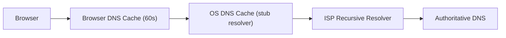
```mermaid
flowchart LR
    Client["Browser"] --> BrowserCache["Browser DNS Cache (60s)"]
    BrowserCache --> OSCache["OS DNS Cache (stub resolver)"]
    OSCache --> RecursiveResolver["ISP Recursive Resolver"]
    RecursiveResolver --> AuthDNS["Authoritative DNS"]
```

| Cache Layer | TTL | Scope | Invalidation |
|------------|-----|-------|-------------|
| Browser | Min(TTL, 60s) | Per tab | Page reload |
| OS resolver | Honors TTL | Per machine | `ipconfig /flushdns` or `systemd-resolve --flush-caches` |
| Recursive resolver | Honors TTL | Per ISP/org | Automatic on TTL expiry |
| Edge location cache | Honors TTL | Per PoP | Automatic on TTL expiry |

**Key trade-off**: Low TTL (60s) enables faster failover but increases DNS queries (higher cost and latency). High TTL (3600s) reduces queries but means slow failover. **Pattern**: Lower TTL to 60s 24 hours before a migration, make the change, wait for propagation, then restore higher TTL.

**Negative caching**: NXDOMAIN responses are cached with SOA minimum TTL (typically 60-300s). A misconfigured record deletion can propagate slowly.

### CDN Caching

| Cache Tier | Hit Rate | Size | Eviction |
|-----------|----------|------|----------|
| Edge PoP memory (L1) | 60% | 64 GB RAM | LRU |
| Edge PoP SSD (L2) | 85% | 2 TB SSD | LRU with frequency weighting |
| Regional mid-tier (L3) | 95% | 50 TB per region | LRU |
| Origin shield (L4) | 99% | 100 TB (5 regions) | LRU |

**Cache key composition**: `hash(scheme + host + path + sorted(query_params) + vary_headers)`. Incorrect cache key configuration is the number one cause of cache pollution.

**Invalidation strategies**:
- **TTL-based**: Set Cache-Control headers; let caches expire naturally
- **Purge**: Immediately remove specific URL from all edge caches
- **Soft purge**: Mark as stale; serve stale while revalidating from origin (stale-while-revalidate)
- **Tag-based**: Purge all objects with a specific tag (e.g., all product images for SKU-123)

**Cache warming**: After invalidation, proactively fetch popular objects to prevent thundering herd on origin.

### API Gateway Caching

```
Cache key: {method}:{path}:{auth_scope}:{query_hash}
Storage: Redis cluster (shared across gateway instances)
TTL: Per-route configuration (0 = no cache)
Invalidation: On POST/PUT/DELETE to same resource path

GET /api/v1/products/123  -> cache HIT (TTL: 300s)
POST /api/v1/products/123 -> cache INVALIDATE /api/v1/products/123
GET /api/v1/products/123  -> cache MISS -> fetch -> cache
```

**Cache-aside pattern for rate limiting**: Check Redis for rate limit counter. If Redis is down, fall back to local in-memory counter (less accurate but prevents outage). Periodically sync local counters to Redis when it recovers.

### K8s API Server Caching

etcd is the source of truth, but the API server maintains a **watch cache** (in-memory) for read performance:
- **List requests**: Served from watch cache, not etcd
- **Watch requests**: Served via watch cache streaming
- **Write requests**: Always go to etcd; watch cache updated asynchronously
- **Informer pattern**: Controllers use shared informers that maintain a local cache, reducing API server load by 90%+
- Cache size: ~1 GB per API server for a 5,000-node cluster

**Container image caching**: Node-level image cache avoids re-download. Registry mirror/proxy reduces cross-region pulls. Image pre-pulling DaemonSet warms node caches before deployments.

---

## Queue / Stream Design

### K8s Controller Reconciliation

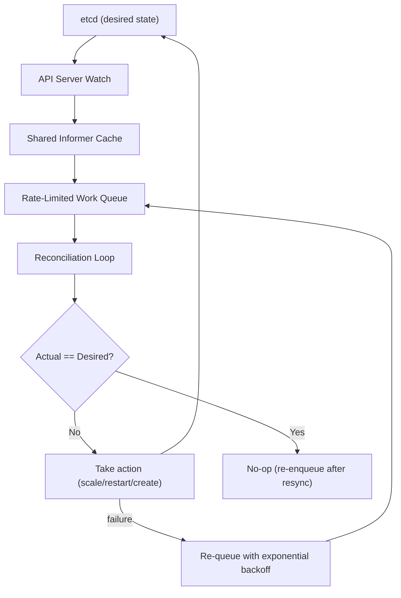
```mermaid
flowchart TD
    etcd["etcd (desired state)"] --> Watch["API Server Watch"]
    Watch --> Informer["Shared Informer Cache"]
    Informer --> WorkQueue["Rate-Limited Work Queue"]
    WorkQueue --> Reconcile["Reconciliation Loop"]
    Reconcile --> Compare{"Actual == Desired?"}
    Compare -->|No| Act["Take action (scale/restart/create)"]
    Compare -->|Yes| Done["No-op (re-enqueue after resync)"]
    Act --> etcd
    Act -->|"failure"| BackoffQueue["Re-queue with exponential backoff"]
    BackoffQueue --> WorkQueue
```

Every K8s controller follows the **level-triggered reconciliation** pattern:
1. Informer receives ADDED/MODIFIED/DELETED event from API server watch
2. Event handler enqueues the object key (namespace/name) into the work queue
3. Work queue deduplicates: if key already queued, skip (coalescing)
4. Worker goroutines pull keys and call Reconcile(key)
5. Reconcile reads desired state from informer cache, reads actual state, applies diff
6. If reconciliation fails: re-queue with exponential backoff (5s, 10s, 20s, ...)
7. Rate limiting: token bucket per key to prevent hot-looping

### CDN Invalidation Propagation

```
1. User requests invalidation for /images/product-123.jpg
2. Control plane writes invalidation to Kafka topic: cdn.invalidations
3. Each edge PoP (200+) consumes from the topic
4. PoP removes object from local cache (exact path) or scans index (wildcard)
5. PoP ACKs invalidation back to regional controller
6. Regional controller aggregates ACKs
7. When all regions ACK: invalidation status -> Completed

Propagation SLA: < 60 seconds to all global PoPs
Ordering: invalidations ordered per-distribution via sequence numbers
Failure: unresponsive PoPs retried 3 times, then marked degraded
```

### Job Scheduler Queue

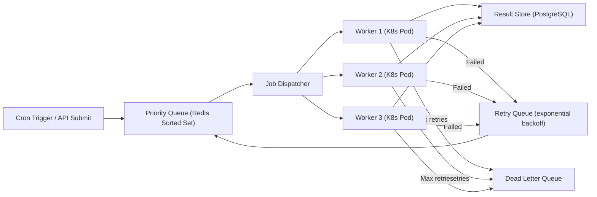
```mermaid
flowchart LR
    Schedule["Cron Trigger / API Submit"] --> PriorityQueue["Priority Queue (Redis Sorted Set)"]
    PriorityQueue --> Dispatcher["Job Dispatcher"]
    Dispatcher --> Worker1["Worker 1 (K8s Pod)"]
    Dispatcher --> Worker2["Worker 2 (K8s Pod)"]
    Dispatcher --> Worker3["Worker 3 (K8s Pod)"]
    Worker1 & Worker2 & Worker3 --> ResultStore["Result Store (PostgreSQL)"]
    Worker1 & Worker2 & Worker3 -->|"Failed"| RetryQueue["Retry Queue (exponential backoff)"]
    RetryQueue --> PriorityQueue
    Worker1 & Worker2 & Worker3 -->|"Max retries"| DLQ["Dead Letter Queue"]
```

**Priority levels**: CRITICAL (0), HIGH (1), NORMAL (2), LOW (3), BATCH (4). Higher priority jobs preempt lower ones.

**Worker lease pattern**: Workers acquire a lease on the job (visibility timeout). Heartbeat every 30s to extend lease. If no heartbeat for 2x interval, job is re-queued. Dead Letter Queue captures jobs that fail max_retries times.

### Event-Driven Serverless Pipeline

```
Event source (SQS/S3/Schedule) -> Event Router -> Concurrency Manager -> Execution Environment

Concurrency Manager checks:
1. Current concurrent executions vs. account limit (default 1000)
2. If under limit: proceed to execution
3. If at limit: throttle (return 429) or queue (async invocations)
4. Provisioned concurrency: dedicated warm instances bypass concurrency limits

Execution placement:
1. Check warm pool for matching function + version
2. Warm instance available: route (< 1ms overhead)
3. No warm instance: cold start (100ms - 5s depending on runtime)

Post-execution:
1. Container enters idle state for 5-15 min keep-alive window
2. If invoked again: warm start (reuse)
3. If idle timeout expires: container frozen, then destroyed
```

---

## State Machines

### Pod Lifecycle

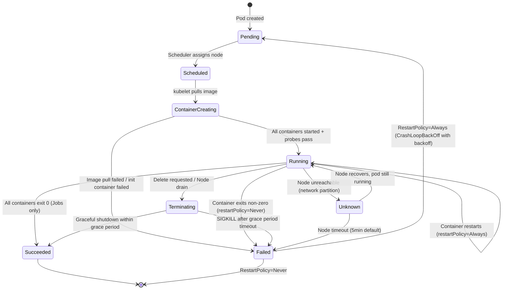
```mermaid
stateDiagram-v2
    [*] --> Pending : Pod created
    Pending --> Scheduled : Scheduler assigns node
    Scheduled --> ContainerCreating : kubelet pulls image
    ContainerCreating --> Running : All containers started + probes pass
    ContainerCreating --> Failed : Image pull failed / init container failed
    Running --> Succeeded : All containers exit 0 (Jobs only)
    Running --> Failed : Container exits non-zero (restartPolicy=Never)
    Running --> Running : Container restarts (restartPolicy=Always)
    Running --> Terminating : Delete requested / Node drain
    Terminating --> Succeeded : Graceful shutdown within grace period
    Terminating --> Failed : SIGKILL after grace period timeout
    Failed --> Pending : RestartPolicy=Always (CrashLoopBackOff with backoff)
    Running --> Unknown : Node unreachable (network partition)
    Unknown --> Running : Node recovers, pod still running
    Unknown --> Failed : Node timeout (5min default)
    Succeeded --> [*]
    Failed --> [*] : RestartPolicy=Never
```

**Note on Terminating**: preStop hook runs first, then SIGTERM sent, then grace period (30s default), then SIGKILL if still running.

### Serverless Function Lifecycle

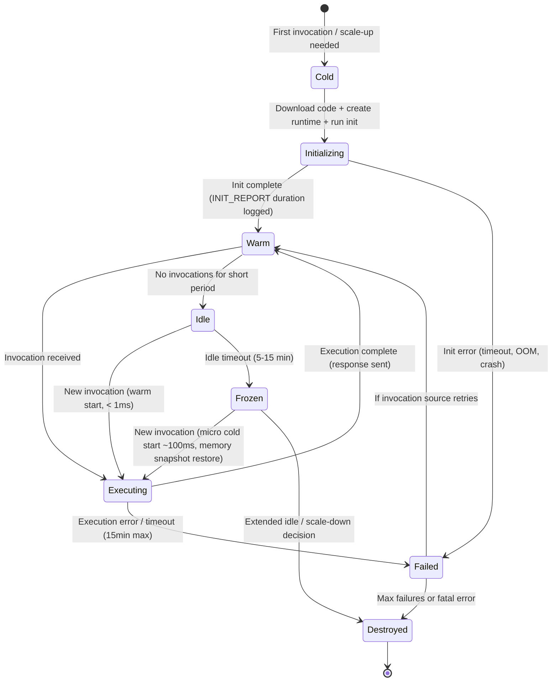
```mermaid
stateDiagram-v2
    [*] --> Cold : First invocation / scale-up needed
    Cold --> Initializing : Download code + create runtime + run init
    Initializing --> Warm : Init complete (INIT_REPORT duration logged)
    Initializing --> Failed : Init error (timeout, OOM, crash)
    Warm --> Executing : Invocation received
    Executing --> Warm : Execution complete (response sent)
    Executing --> Failed : Execution error / timeout (15min max)
    Warm --> Idle : No invocations for short period
    Idle --> Executing : New invocation (warm start, < 1ms)
    Idle --> Frozen : Idle timeout (5-15 min)
    Frozen --> Executing : New invocation (micro cold start ~100ms, memory snapshot restore)
    Frozen --> Destroyed : Extended idle / scale-down decision
    Destroyed --> [*]
    Failed --> Warm : If invocation source retries
    Failed --> Destroyed : Max failures or fatal error
```

**Note on Frozen state**: execution environment preserved but suspended. Memory snapshot on disk enables faster restart than full cold start.

### Volume Lifecycle

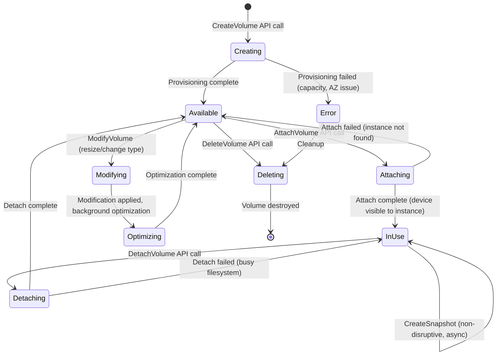
```mermaid
stateDiagram-v2
    [*] --> Creating : CreateVolume API call
    Creating --> Available : Provisioning complete
    Creating --> Error : Provisioning failed (capacity, AZ issue)
    Available --> Attaching : AttachVolume API call
    Attaching --> InUse : Attach complete (device visible to instance)
    Attaching --> Available : Attach failed (instance not found)
    InUse --> Detaching : DetachVolume API call
    InUse --> InUse : CreateSnapshot (non-disruptive, async)
    Detaching --> Available : Detach complete
    Detaching --> InUse : Detach failed (busy filesystem)
    Available --> Modifying : ModifyVolume (resize/change type)
    Modifying --> Optimizing : Modification applied, background optimization
    Optimizing --> Available : Optimization complete
    Available --> Deleting : DeleteVolume API call
    Deleting --> [*] : Volume destroyed
    Error --> Deleting : Cleanup
```

**Note on Modifying**: Online resize requires no detach. Type change (gp2 to gp3) may take hours for large volumes. Volume remains usable during optimization.

### Job Lifecycle

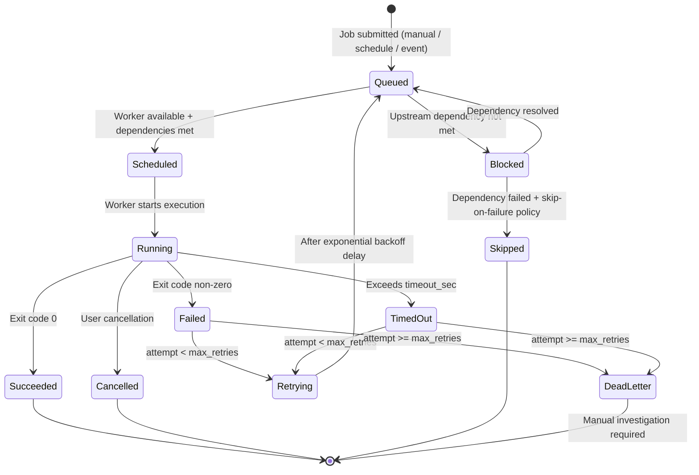
```mermaid
stateDiagram-v2
    [*] --> Queued : Job submitted (manual / schedule / event)
    Queued --> Scheduled : Worker available + dependencies met
    Queued --> Blocked : Upstream dependency not met
    Blocked --> Queued : Dependency resolved
    Blocked --> Skipped : Dependency failed + skip-on-failure policy
    Scheduled --> Running : Worker starts execution
    Running --> Succeeded : Exit code 0
    Running --> Failed : Exit code non-zero
    Running --> TimedOut : Exceeds timeout_sec
    Running --> Cancelled : User cancellation
    Failed --> Retrying : attempt < max_retries
    TimedOut --> Retrying : attempt < max_retries
    Retrying --> Queued : After exponential backoff delay
    Failed --> DeadLetter : attempt >= max_retries
    TimedOut --> DeadLetter : attempt >= max_retries
    Succeeded --> [*]
    Cancelled --> [*]
    Skipped --> [*]
    DeadLetter --> [*] : Manual investigation required
```

**Note on backoff**: Delay = base_delay * 2^attempt with +/- 20% jitter. Max delay capped at 1 hour.

---

## Sequence Diagrams

### Full Request Path (Client to K8s Pod)

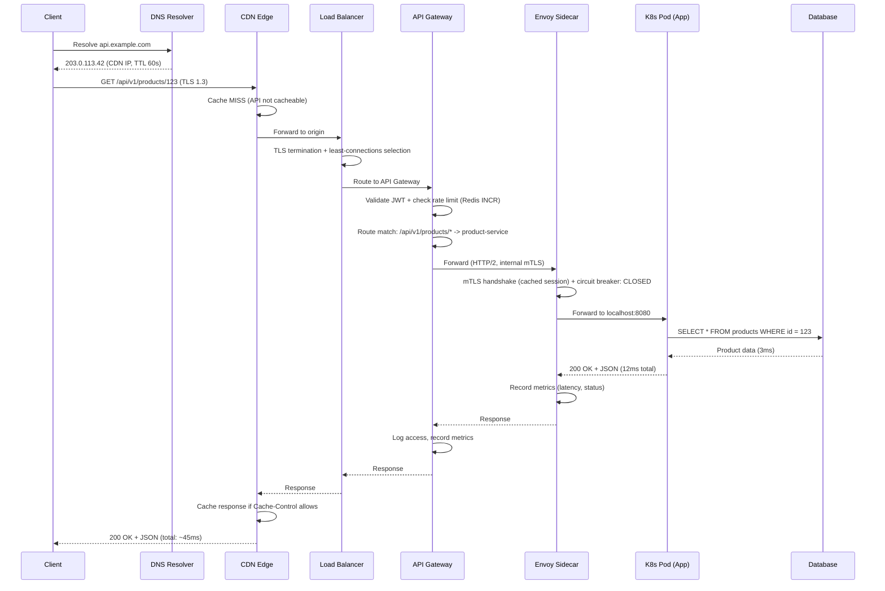
```mermaid
sequenceDiagram
    participant C as Client
    participant DNS as DNS Resolver
    participant CDN as CDN Edge
    participant LB as Load Balancer
    participant GW as API Gateway
    participant SP as Envoy Sidecar
    participant App as K8s Pod (App)
    participant DB as Database

    C->>DNS: Resolve api.example.com
    DNS-->>C: 203.0.113.42 (CDN IP, TTL 60s)
    C->>CDN: GET /api/v1/products/123 (TLS 1.3)
    CDN->>CDN: Cache MISS (API not cacheable)
    CDN->>LB: Forward to origin
    LB->>LB: TLS termination + least-connections selection
    LB->>GW: Route to API Gateway
    GW->>GW: Validate JWT + check rate limit (Redis INCR)
    GW->>GW: Route match: /api/v1/products/* -> product-service
    GW->>SP: Forward (HTTP/2, internal mTLS)
    SP->>SP: mTLS handshake (cached session) + circuit breaker: CLOSED
    SP->>App: Forward to localhost:8080
    App->>DB: SELECT * FROM products WHERE id = 123
    DB-->>App: Product data (3ms)
    App-->>SP: 200 OK + JSON (12ms total)
    SP->>SP: Record metrics (latency, status)
    SP-->>GW: Response
    GW->>GW: Log access, record metrics
    GW-->>LB: Response
    LB-->>CDN: Response
    CDN->>CDN: Cache response if Cache-Control allows
    CDN-->>C: 200 OK + JSON (total: ~45ms)
```

### DNS Resolution with Caching

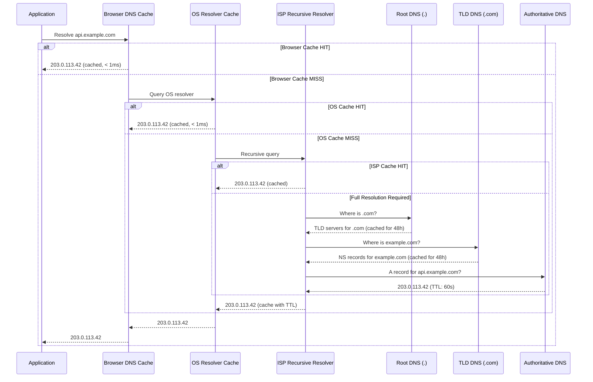
```mermaid
sequenceDiagram
    participant App as Application
    participant BCache as Browser DNS Cache
    participant OSCache as OS Resolver Cache
    participant ISP as ISP Recursive Resolver
    participant Root as Root DNS (.)
    participant TLD as TLD DNS (.com)
    participant Auth as Authoritative DNS

    App->>BCache: Resolve api.example.com
    alt Browser Cache HIT
        BCache-->>App: 203.0.113.42 (cached, < 1ms)
    else Browser Cache MISS
        BCache->>OSCache: Query OS resolver
        alt OS Cache HIT
            OSCache-->>BCache: 203.0.113.42 (cached, < 1ms)
        else OS Cache MISS
            OSCache->>ISP: Recursive query
            alt ISP Cache HIT
                ISP-->>OSCache: 203.0.113.42 (cached)
            else Full Resolution Required
                ISP->>Root: Where is .com?
                Root-->>ISP: TLD servers for .com (cached for 48h)
                ISP->>TLD: Where is example.com?
                TLD-->>ISP: NS records for example.com (cached for 48h)
                ISP->>Auth: A record for api.example.com?
                Auth-->>ISP: 203.0.113.42 (TTL: 60s)
            end
            ISP-->>OSCache: 203.0.113.42 (cache with TTL)
        end
        OSCache-->>BCache: 203.0.113.42
        BCache-->>App: 203.0.113.42
    end
```

### S3 PUT with Replication

```mermaid
sequenceDiagram
    participant C as Client
    participant GW as S3 API Gateway
    participant Meta as Metadata Service
    participant Placement as Placement Engine
    participant W1 as Storage Node (AZ-1)
    participant W2 as Storage Node (AZ-2)
    participant W3 as Storage Node (AZ-3)
    participant RepQ as Replication Queue

    C->>GW: PUT /bucket/photos/img.jpg (5MB)
    GW->>GW: Authenticate (Signature V4) + authorize (bucket policy)
    GW->>GW: Compute MD5 checksum
    GW->>Placement: Where to store? (bucket, key, size)
    Placement-->>GW: Primary: W1, Replicas: [W2, W3]
    GW->>W1: Write data chunks (primary AZ)
    W1->>W1: Write to disk + verify checksum

    par Synchronous replication (quorum: 2 of 3)
        GW->>W2: Replicate chunks (AZ-2)
        W2-->>GW: ACK
    and
        GW->>W3: Replicate chunks (AZ-3)
        W3-->>GW: ACK
    end

    GW->>Meta: Write metadata (key, version, locations, checksum, size)
    Meta-->>GW: Metadata committed
    GW-->>C: 200 OK (ETag, VersionId)

    opt Cross-region replication enabled
        Meta->>RepQ: Enqueue replication event
        Note over RepQ: Async replication to DR region (< 15 min SLA)
    end
```

### K8s Pod Scheduling

```mermaid
sequenceDiagram
    participant User as kubectl / CI Pipeline
    participant API as API Server
    participant etcd as etcd
    participant Sched as Scheduler
    participant KL as kubelet (Worker Node)
    participant CR as Container Runtime (containerd)

    User->>API: POST /apis/apps/v1/deployments (replicas: 3)
    API->>API: Authenticate + Authorize (RBAC)
    API->>API: Admission controllers (mutating + validating)
    API->>etcd: Store Deployment object
    etcd-->>API: Stored (revision 100)
    API-->>User: 201 Created

    Note over API: Deployment controller creates ReplicaSet
    Note over API: ReplicaSet controller creates 3 Pods

    API->>etcd: Store Pods (phase: Pending, node: unassigned)

    Sched->>API: Watch for unscheduled pods
    API-->>Sched: Pod "order-svc-abc" needs scheduling
    Sched->>Sched: FILTER: Remove nodes failing constraints
    Note over Sched: Insufficient CPU/Memory, Taints,<br/>Node affinity mismatch, PV zone
    Sched->>Sched: SCORE: Rank by LeastRequested,<br/>BalancedAllocation, InterPodAffinity
    Sched->>API: Bind Pod to Node-2 (highest score)
    API->>etcd: Update Pod (node: Node-2)

    KL->>API: Watch for pods assigned to Node-2
    API-->>KL: Pod "order-svc-abc" assigned
    KL->>CR: Pull image (if not cached)
    CR-->>KL: Image ready
    KL->>CR: Create and start containers
    CR-->>KL: Containers running
    KL->>KL: Run startup probe, then readiness probe
    KL->>API: Update Pod status (phase: Running, Ready: true)
```

### CDN Cache Miss with Origin Fetch

```mermaid
sequenceDiagram
    participant C as Client
    participant Edge as Edge PoP (Paris)
    participant Mid as Mid-Tier Cache (EU)
    participant Shield as Origin Shield (US-East)
    participant Origin as Origin Server

    C->>Edge: GET /static/hero-image.webp
    Edge->>Edge: Check local cache (L1 memory + L2 SSD)
    Note over Edge: Cache MISS

    Edge->>Mid: Forward to mid-tier
    Mid->>Mid: Check regional cache
    Note over Mid: Cache MISS

    Mid->>Shield: Forward to origin shield
    Shield->>Shield: Check shield cache
    Note over Shield: Cache MISS (first global request)

    Shield->>Origin: GET /static/hero-image.webp
    Note over Shield,Origin: X-Origin-Verify header
    Origin-->>Shield: 200 OK (250KB, Cache-Control: max-age=604800)

    Shield->>Shield: Cache (TTL: 7 days)
    Shield-->>Mid: 200 OK (X-Cache: MISS)

    Mid->>Mid: Cache (TTL: 7 days)
    Mid-->>Edge: 200 OK (X-Cache: MISS)

    Edge->>Edge: Cache (TTL: 7 days)
    Edge-->>C: 200 OK (X-Cache: MISS, TTFB: ~120ms)

    Note over C,Origin: Subsequent request from same PoP:
    C->>Edge: GET /static/hero-image.webp
    Edge-->>C: 200 OK (X-Cache: HIT, TTFB: ~15ms)
```

---

## Concurrency Control

| Subsystem | Mechanism | How It Works |
|-----------|-----------|-------------|
| **K8s (etcd)** | Optimistic concurrency via `resourceVersion` | Every object has resourceVersion (etcd mod_revision). Updates with stale version rejected (409 Conflict). Client re-reads and retries. |
| **S3** | Conditional writes (`If-None-Match`, `If-Match`) | Prevent overwrite races. `If-None-Match: *` for atomic create. Strong read-after-write consistency since Dec 2020. |
| **DNS** | Serial number + zone transfer | SOA serial increments on every change. Secondary servers sync via AXFR (full) or IXFR (incremental). |
| **Load Balancer** | Control plane serialization + atomic config swap | Config changes serialized through control plane. Data plane nodes swap config pointer atomically. |
| **CDN** | Version-based cache invalidation | Invalidation uses sequence numbers per distribution. Edge nodes apply in order. |
| **VPC** | API-level idempotency tokens | Client-provided idempotency key prevents duplicate subnet/rule creation on retries. |
| **Block Storage** | SCSI reservations + distributed locking | Only one host can write to volume. DynamoDB conditional write or etcd lease for attachment lock. |
| **Service Mesh** | xDS version + NACK handling | Envoy receives config via gRPC stream with version. Old config handles in-flight; new config handles new connections. NACK retains last good config. |

### K8s Optimistic Concurrency Example

```
# Read current state
GET /api/v1/namespaces/prod/deployments/order-service
-> resourceVersion: "12345"

# Update with resourceVersion
PUT /api/v1/namespaces/prod/deployments/order-service
{
  "metadata": {"resourceVersion": "12345"},
  "spec": {"replicas": 10}
}

# If another update happened between read and write:
-> 409 Conflict: "the object has been modified; please apply your changes to the latest version"
# Client must re-read and retry
```

**Why OCC over pessimistic locking**: K8s has thousands of concurrent controllers. Pessimistic locks would create massive contention on popular resources. OCC with retry scales better for the read-heavy, write-light pattern.

---

## Consistency Model

| Subsystem | Consistency Level | Mechanism | Trade-off |
|-----------|------------------|-----------|-----------|
| **etcd (K8s)** | Linearizable (Raft) | Raft consensus, writes to majority | Higher write latency; stale reads prevented |
| **S3** | Strong read-after-write | Metadata quorum write + sync replication | PUT then GET always returns latest; LIST also consistent |
| **S3 CRR** | Eventually consistent | Async cross-region replication | 15-min RPO for cross-region reads |
| **DNS** | Eventually consistent (TTL-based) | TTL expiration in caches | Changes visible after caches expire; TTL 60s = ~60s delay |
| **CDN** | Eventually consistent (TTL or invalidation) | Cache TTL + explicit purge | Stale content until TTL or invalidation propagates (< 60s) |
| **Load Balancer** (config) | Eventual (seconds) | Control plane push to data plane | Config changes not instant across all LB nodes |
| **Load Balancer** (health) | Eventual (10-30s) | Periodic health checks | Unhealthy server receives traffic for unhealthy_threshold x interval |
| **API Gateway** (rate limits) | Approximate | Redis INCR with TTL | Distributed counters may over/under-count 1-5% |
| **Service Mesh** (config) | Eventual (seconds) | xDS push to Envoy sidecars | New policies take seconds to propagate |
| **Serverless** (async) | At-least-once | Visibility timeout + retry | Async invocations may run twice; functions must be idempotent |
| **Job Scheduler** | At-least-once | Visibility timeout + idempotency | Jobs may run twice if worker crashes; idempotent execution required |
| **Block Storage** | Strong (per-volume) | Synchronous replication within AZ | Writes acknowledged only after replication |
| **VPC** (security groups) | Eventual (seconds) | Async push to hypervisors | Rule changes take seconds to propagate |

### Cross-Service Consistency Challenge

When provisioning infrastructure, multiple systems must coordinate:
1. Create VPC subnet -> strong consistency needed before deploying pods
2. Create K8s deployment -> depends on subnet existing
3. Create DNS record -> depends on LB IP being available
4. Create CDN distribution -> depends on DNS record

This is orchestrated as a **saga** (see below) rather than a distributed transaction, because each subsystem has different consistency guarantees and no global transaction coordinator exists.

---

## Distributed Transaction / Saga Design

### Infrastructure Provisioning Saga

```mermaid
stateDiagram-v2
    [*] --> CreateVPC : Start provisioning
    CreateVPC --> CreateSubnets : VPC created
    CreateSubnets --> CreateSecurityGroups : Subnets created
    CreateSecurityGroups --> CreateK8sCluster : SGs created
    CreateK8sCluster --> DeployWorkload : Cluster ready
    DeployWorkload --> CreateLBTargetGroup : Pods running
    CreateLBTargetGroup --> CreateDNSRecord : LB configured
    CreateDNSRecord --> CreateCDNDistribution : DNS active
    CreateCDNDistribution --> Completed : CDN deployed

    CreateVPC --> RollbackVPC : Failed
    CreateSubnets --> RollbackSubnets : Failed
    CreateK8sCluster --> RollbackCluster : Failed
    DeployWorkload --> RollbackDeploy : Failed

    RollbackVPC --> [*] : Cleaned up
    RollbackSubnets --> RollbackVPC
    RollbackCluster --> RollbackSubnets
    RollbackDeploy --> RollbackCluster
```

| Step | Action | Compensation (Rollback) | Timeout |
|------|--------|------------------------|---------|
| 1 | Create VPC | Delete VPC | 60s |
| 2 | Create subnets (3 AZs) | Delete subnets | 120s |
| 3 | Create security groups | Delete security groups | 60s |
| 4 | Create K8s cluster | Delete cluster | 900s (15 min) |
| 5 | Deploy workload | Scale to 0 / delete deployment | 300s |
| 6 | Create LB + target group | Delete LB | 120s |
| 7 | Create DNS record | Delete DNS record | 60s |
| 8 | Create CDN distribution | Disable CDN distribution | 120s |

**Orchestrator**: Terraform / Pulumi / CloudFormation, or a custom saga orchestrator with persistent state. On failure at any step, execute compensating actions in reverse order.

**Idempotency**: Every saga step must be idempotent. Use client-generated names as idempotency keys. CreateVPC with same name returns existing VPC ID. DeleteVPC is idempotent (404 if already deleted = success).

**Saga state persistence**: Each step persisted to a `saga_executions` table. On orchestrator crash, recovery reads the last persisted step and resumes. Total saga timeout: 30 minutes.

---

## Security Design

### Defense in Depth

```mermaid
flowchart TD
    Internet["Internet"] --> WAF["WAF (SQL injection, XSS filtering)"]
    WAF --> DDoS["DDoS Shield (volumetric + app-layer)"]
    DDoS --> CDN["CDN (edge TLS 1.3 termination)"]
    CDN --> LB["L7 Load Balancer (TLS, certificate management)"]
    LB --> GW["API Gateway (AuthN: JWT/OAuth2/API key)"]
    GW --> Mesh["Service Mesh (mTLS between all services)"]
    Mesh --> App["Application (input validation, output encoding)"]
    App --> DB["Database (encryption at rest, network isolation)"]
```

### Zero Trust Network

| Principle | Implementation |
|-----------|---------------|
| Never trust, always verify | mTLS between ALL services via service mesh; no "trusted internal network" |
| Least privilege | Security groups: specific port + source SG only; K8s RBAC per namespace |
| Assume breach | Encrypt data at rest + in transit; rotate credentials; segment network |
| Micro-segmentation | Each service has its own security group; network policies in K8s |
| Identity-based access | SPIFFE identities via service mesh, not IP-based trust |
| Credential rotation | Certificates: 24h rotation; API keys: 90-day max lifetime |

### mTLS in Service Mesh

```
Certificate lifecycle:
1. Service starts -> sidecar requests cert from mesh CA (Citadel/cert-manager)
2. CA validates service identity via K8s service account token
3. CA issues short-lived certificate (24h, ECDSA P-256)
4. Sidecar stores cert in memory (never on disk)
5. Certificate auto-rotated every 12h (before expiry)
6. On connection: mutual verification (both sides present certs)
7. SPIFFE identity extracted: spiffe://cluster.local/ns/prod/sa/order-service
```

### Encryption Summary

| Layer | At Rest | In Transit |
|-------|---------|-----------|
| Object Storage | AES-256-GCM (SSE-KMS) | TLS 1.3 |
| Block Storage | AES-256-XTS (dm-crypt) | N/A (local attach) or NVMe-oF TLS |
| Database | TDE (Transparent Data Encryption) | TLS 1.2+ (require_ssl) |
| etcd | AES-CBC envelope encryption (K8s secrets encryption provider) | mTLS between etcd peers |
| Inter-service | N/A | mTLS via service mesh (ECDSA P-256) |
| Secrets | Encrypted in secret manager (AWS Secrets Manager / Vault) | TLS 1.3 to secrets API |

### IAM Policy Examples

| Subsystem | Policy Pattern | Example |
|-----------|---------------|---------|
| Object Storage | Bucket policy + IAM role | `order-svc` can only read/write `s3://orders-bucket/orders/*` |
| Kubernetes | RBAC (Role + RoleBinding) | Developer can view pods in `staging` but not `production` |
| Serverless | Execution role | Function can invoke SQS and write to specific DynamoDB table |
| API Gateway | API key scopes | Consumer with `orders:read` scope cannot call POST endpoints |
| VPC | Security group chains | App SG allows ingress only from LB SG on port 8080 |

---

## Observability Design

### RED Method (Rate, Errors, Duration) per Subsystem

| Subsystem | Rate Metric | Error Metric | Duration Metric |
|-----------|------------|-------------|----------------|
| Load Balancer | Requests/sec per target group | 4xx/5xx per target group | Response time P50/P99 |
| API Gateway | Requests/sec per route | 429 (rate limited) + 5xx | Gateway latency added |
| Service Mesh | Requests/sec per service pair | 5xx rate, circuit breaker trips | P99 latency per hop |
| K8s | Pod restarts, deployments/hour | CrashLoopBackOff count, OOMKill | Pod startup time, scheduling latency |
| Serverless | Invocations/sec | Error rate, throttles | Duration P99, cold start percentage |
| Job Scheduler | Job runs/hour | Failed job rate | Execution duration, queue wait time |
| Object Storage | PUT/GET/DELETE per second | 403/404/500 per bucket | Time to first byte (TTFB) |
| DNS | Queries/sec | NXDOMAIN rate, SERVFAIL | Resolution latency |
| CDN | Requests/sec per PoP | Cache error rate, origin errors | TTFB edge vs. origin |

### Key Dashboards

1. **Infrastructure Health**: Node count, CPU/memory utilization, pod density, etcd latency
2. **Traffic Flow**: Request rate through LB -> GW -> services with error rates at each hop
3. **Latency Breakdown**: DNS + CDN + LB + GW + service mesh + app + DB (waterfall view)
4. **Cache Performance**: CDN hit ratio, API gateway cache hit ratio, DNS cache hit ratio
5. **Cost**: Compute + storage + network egress + CDN bandwidth (daily/weekly trend)

### Structured Logging Standard

All subsystems emit structured JSON logs with mandatory fields:

```json
{
  "timestamp": "2026-03-22T10:30:00.123Z",
  "level": "INFO",
  "service": "api-gateway",
  "instance_id": "gw-node-3",
  "trace_id": "abc123def456",
  "span_id": "789xyz",
  "request_id": "req-unique-id",
  "message": "Request completed",
  "http_method": "POST",
  "http_path": "/v2/orders",
  "http_status": 201,
  "duration_ms": 45,
  "consumer_id": "consumer-xyz"
}
```

### Alert Thresholds

```
Error rate > 1% for 5 minutes  -> WARNING
Error rate > 5% for 2 minutes  -> CRITICAL (page on-call)
P99 latency > 2x baseline for 5 minutes -> WARNING
P99 latency > 5x baseline for 2 minutes -> CRITICAL
Pod restart count > 5 in 10 minutes -> WARNING
etcd leader changes > 3 in 1 hour -> CRITICAL
CDN cache hit ratio < 80% for 15 minutes -> WARNING
DNS health check failures > 0 -> CRITICAL
```

---

## Reliability and Resilience Design

### Blast Radius Isolation

| Boundary | Isolation Mechanism | Blast Radius |
|----------|-------------------|--------------|
| **Account** | Separate AWS accounts for prod/staging/dev | Prod failure does not affect staging |
| **Region** | Independent deployments; no cross-region runtime dependency | US-East-1 outage does not affect EU-West-1 |
| **AZ** | Pods spread across 3 AZs (topology spread constraints) | Single AZ failure: 33% capacity loss, service continues |
| **Service** | Each service in own namespace; separate resource quotas | One service OOM does not starve others |
| **Tenant** | Rate limiting + resource quotas per tenant | Noisy neighbor cannot exhaust shared capacity |
| **Function** | Per-function concurrency limits | One runaway function does not consume all capacity |
| **Request** | Timeouts + circuit breakers per dependency | One slow dependency does not cascade |

### Circuit Breaking (Service Mesh)

```yaml
# Istio DestinationRule
apiVersion: networking.istio.io/v1beta1
kind: DestinationRule
metadata:
  name: order-service
spec:
  host: order-service
  trafficPolicy:
    connectionPool:
      tcp:
        maxConnections: 100
      http:
        h2UpgradePolicy: DEFAULT
        http1MaxPendingRequests: 100
        http2MaxRequests: 1000
    outlierDetection:
      consecutive5xxErrors: 3
      interval: 10s
      baseEjectionTime: 30s
      maxEjectionPercent: 50
```

**States**: CLOSED (normal) -> OPEN (all requests fail fast 503) -> HALF_OPEN (probe requests test recovery). 5 consecutive failures trips open. 3 consecutive successes in half-open resets to closed.

### Chaos Engineering Experiments

| Experiment | What It Tests | Expected Outcome | Tool |
|-----------|-------------|-----------------|------|
| Kill random pod | K8s self-healing | ReplicaSet recreates pod in < 30s; zero dropped requests | Chaos Mesh |
| Network partition between AZs | Cross-AZ resilience | Failover in < 5s; 33% throughput drop then recovery | Toxiproxy |
| CPU stress on nodes | HPA scaling | HPA scales pods up within 2 minutes | stress-ng |
| etcd leader failure | Raft re-election | New leader in < 5s; < 10s control plane blip | Kill etcd process |
| DNS failure | Cached fallback | Local cache serves stale; fallback resolver | Block DNS port |
| S3 latency injection | Application timeout | Circuit breaker opens; cached responses served | Toxiproxy |
| Exhaust Lambda concurrency | Throttling handling | 429 returned; DLQ captures async failures | Load test |

### Graceful Degradation Strategies

1. **Read from cache on DB failure**: Serve stale but available data
2. **Static fallback on CDN origin failure**: Return cached version or static error page
3. **Shed non-critical features**: Disable recommendations, analytics on overload
4. **Tighten rate limits on partial failure**: Protect remaining capacity
5. **Async fallback**: Convert synchronous calls to async (queue) during degradation

---

## Multi-Region and DR Strategy

### Deployment Models

| Model | How | RPO | RTO | Cost |
|-------|-----|-----|-----|------|
| **Single region, multi-AZ** | 3 AZs, auto-failover | 0 (within region) | < 1 min | 1x |
| **Active-passive (pilot light)** | DR region has minimal infra | < 5 min | 1-4 hours | 1.2x |
| **Active-passive (warm standby)** | DR region runs at reduced capacity | < 1 min | 15-30 min | 1.5x |
| **Active-active** | Both regions serve traffic; DNS latency routing | 0 | ~60s (DNS failover) | 2x |

### Active-Active Architecture

```mermaid
flowchart TD
    DNS["Global DNS (latency-based routing)"] --> US_CDN["US CDN Edge"]
    DNS --> EU_CDN["EU CDN Edge"]

    US_CDN --> US_LB["US Load Balancer"]
    EU_CDN --> EU_LB["EU Load Balancer"]

    US_LB --> US_K8s["US K8s Cluster"]
    EU_LB --> EU_K8s["EU K8s Cluster"]

    US_K8s --> US_DB["US Database (primary)"]
    EU_K8s --> EU_DB["EU Database (primary)"]

    US_DB <-->|"Cross-region async replication"| EU_DB
```

**Data strategy**: Each region owns its data (user affinity by region). Cross-region reads for global data (product catalog) with eventual consistency (< 1s replication lag). Conflict resolution: last-writer-wins with vector clocks for critical data.

### Per-Subsystem DR Configuration

| Subsystem | DR Strategy | Replication | Failover |
|-----------|-------------|-------------|----------|
| Load Balancer | Active-active (per region) | Stateless, no replication needed | DNS failover |
| API Gateway | Active-active | Config via GitOps to both regions | DNS failover |
| Kubernetes | Separate clusters, same GitOps | Manifests deployed to both | DNS failover |
| Object Storage | Cross-region replication | Async (15-min RPO with RTC) | Redirect reads to replica |
| Block Storage | Snapshot copy to DR | Async snapshot copy (1h RPO) | Restore from snapshot |
| DNS | Globally distributed | Anycast, inherently resilient | N/A |
| CDN | Globally distributed | Edge caches independent | Origin failover groups |

### Failover Sequence

```
1. Health check detects primary failure (3 consecutive failures at 10s interval = 30s)
2. Alert fires: PagerDuty + Slack
3. DNS failover: Route 53 updates weights (primary -> 0, DR -> 100)
   Propagation: TTL-dependent (60s recommended)
4. CDN: origin failover group activates DR origin
5. Database: promote read replica in DR (Aurora: < 1 min)
6. Cache: cold start in DR (cache warming from DB)
7. Validate: synthetic monitoring confirms DR serving correctly
8. Post-failover: scale DR to full capacity
```

---

## Cost Drivers and Optimization

### Cost Breakdown (Typical Mid-Size SaaS)

| Category | Monthly Cost | % of Total | Top Optimization |
|---------|-------------|-----------|-----------------|
| **Compute (K8s/EC2)** | $80K | 35% | Right-size pods; Spot for stateless (60-80% savings) |
| **Data transfer** | $50K | 22% | CDN caching; VPC endpoints; same-AZ placement |
| **Object Storage** | $30K | 13% | Lifecycle policies (S3 -> IA -> Glacier) |
| **Block Storage** | $25K | 11% | Delete orphan volumes; use gp3 over gp2 (20% cheaper) |
| **DNS + CDN** | $15K | 7% | Cache hit rate optimization; reduce origin fetches |
| **Load Balancer** | $12K | 5% | Consolidate LBs; use NLB where L7 not needed |
| **NAT Gateway** | $10K | 4% | VPC endpoints for S3/DynamoDB (free Gateway endpoint) |
| **Managed K8s** | $5K | 2% | N/A (flat per-cluster fee) |
| **Other** | $3K | 1% | Audit unused resources |

### Top 10 Cost Optimization Strategies

1. **Right-size K8s pods**: Most pods over-request CPU/memory by 2-5x. Use VPA recommendations. Saves 30-50%.
2. **Spot instances for stateless workloads**: K8s node groups with Spot save 60-80%. Use multiple instance types.
3. **S3 lifecycle policies**: Auto-transition to IA after 30 days, Glacier after 90. Saves 60-80% on cold data.
4. **Reserved Instances / Savings Plans**: 1-3 year terms for steady-state. 30-60% savings.
5. **CDN cache optimization**: Increase hit ratio from 85% to 95%. Each 1% saves ~$500/month on origin.
6. **Serverless right-sizing**: Profile memory vs. CPU. 512MB function may run 2x faster at 1024MB, same cost.
7. **NAT Gateway optimization**: Replace with VPC endpoints for AWS services. NAT charges $0.045/GB.
8. **Delete unused resources**: Unattached EBS volumes, old snapshots, idle LBs, unused EIPs.
9. **Compress CDN assets**: Brotli reduces transfer by 15-25% over gzip.
10. **Same-AZ communication**: Cross-AZ data transfer costs $0.01/GB. Prefer same-AZ where possible.

---

## Deep Platform Comparisons

### Load Balancer: AWS ALB vs GCP Cloud LB vs Azure App Gateway

**AWS ALB/NLB**: Regional, multi-AZ. Deep ECS/EKS/Lambda integration. Per-LCU-hour pricing. Requires pre-warming for traffic spikes (via AWS support). WebSocket and gRPC support. WAF via separate AWS WAF service. No native global LB; use CloudFront or Global Accelerator for global routing.

**GCP Cloud Load Balancing**: Global service with single anycast IP routing to nearest healthy backend worldwide. Premium tier uses Google backbone (better latency). Native URL map routing (complex but powerful). Cloud Armor for DDoS/WAF. Key advantage: true global LB with single IP eliminates need for DNS-based failover.

**Azure Application Gateway**: Regional with zone-redundant deployment. Built-in WAF (v2 SKU). URL-based routing, multi-site hosting. Autoscaling v2 SKU. Key advantage: integrated WAF without separate service. Less flexible routing than GCP.

**On-Premise (HAProxy/Nginx/Envoy)**: Full control, no per-request cost. HAProxy for raw performance (millions of connections). Nginx for ease of configuration. Envoy for service mesh data plane. Key disadvantage: operational overhead (patching, HA, certs).

### Container Orchestration: EKS vs GKE vs AKS

| Aspect | AWS EKS | GCP GKE | Azure AKS |
|--------|---------|---------|-----------|
| Control plane cost | $0.10/hour ($73/month) | Free tier available | Free |
| Serverless pods | Fargate (higher per-pod cost) | Autopilot (Google manages nodes) | Virtual Nodes (ACI) |
| Node autoscaling | Karpenter (fast, flexible) | Built-in (mature) | Cluster Autoscaler |
| Networking | VPC CNI (AWS IPs per pod) | Cilium / GKE networking | Azure CNI / kubenet |
| Max nodes | 5,000 | 15,000 | 5,000 |
| GPU support | P4d, P5 instances | A100, H100 | NCv3, NDv2 |
| Key differentiator | AWS ecosystem depth | Best auto-scaling, Istio integration | Azure AD, cheapest control plane |

### Object Storage: S3 vs GCS vs Azure Blob vs MinIO

**AWS S3**: Most feature-rich. 7 storage classes with Intelligent-Tiering. Strong read-after-write consistency. S3 Select for in-place SQL queries. Cross-region replication (15-min RPO). Complex pricing model.

**GCP GCS**: 4 storage classes. Turbo replication for zero RPO (synchronous cross-region). Dual-region and multi-region buckets. Simpler pricing. Key advantage: turbo replication for zero RPO.

**Azure Blob Storage**: 4 access tiers (Hot/Cool/Cold/Archive). Data Lake Storage Gen2 adds hierarchical namespace (real directories). Key advantage: hierarchical namespace for analytics workloads.

**MinIO (On-Premise)**: S3-compatible API. High performance (100+ GB/s for AI/ML). Erasure coding. No egress costs. Key disadvantage: you manage hardware and operations.

### CDN: CloudFront vs Cloudflare vs Cloud CDN

**AWS CloudFront**: 450+ edge locations. Lambda@Edge and CloudFront Functions. Deep S3 integration. Invalidation costs ($0.005/path beyond 1000 free).

**Cloudflare**: 300+ cities, largest edge network. Workers for edge compute (V8 isolates, < 1ms cold start). Built-in DDoS (always on, free). Generous free tier. Key advantage: all-in-one edge platform with best DDoS protection and fastest edge compute.

**GCP Cloud CDN**: Integrated with Global Load Balancer. Cache fill optimization. Simple pricing. Fewer edge locations and less edge compute capability than competitors.

---

## Edge Cases and Failure Scenarios

### 1. etcd Leader Election Failure During K8s Deployment

**Scenario**: During a deployment rollout, the etcd leader crashes. Raft re-election triggers, but with a 3-node cluster, losing 2 nodes means no quorum.

**Impact**: API server cannot write. All mutating operations fail. Running pods unaffected, but no new scheduling occurs. HPA cannot scale. New deployments stall.

**Mitigation**: Run etcd with 5 members (tolerate 2 failures). Set `--election-timeout=1000` and `--heartbeat-interval=100`. Use priority-based leader election preferring nodes in different AZs. API server watches auto-reconnect when new leader is elected (< 5s). Monitor etcd leader changes as key alert.

### 2. DNS Cache Poisoning Attack

**Scenario**: Attacker injects forged DNS response into recursive resolver cache, mapping api.example.com to attacker-controlled IP.

**Impact**: Users send credentials to malicious server. TLS certificate validation fails (browser shows warning), but users may ignore it. Cached poisoned record extends attack window.

**Mitigation**: Enable DNSSEC (cryptographic signing). Use DNS-over-HTTPS (DoH) or DNS-over-TLS (DoT). Source port randomization. Monitor for unexpected IP changes. Short TTL (60s) limits poison duration. Certificate Transparency logs detect fraudulent cert issuance.

### 3. S3 Cross-Region Replication Lag During Failover

**Scenario**: Primary region fails. CRR has 5-minute lag. Recently uploaded objects missing in DR region.

**Impact**: Users see 404 for recent uploads. Data integrity concerns for time-sensitive workflows.

**Mitigation**: Use S3 Replication Time Control (99.99% within 15 min). For critical data, use GCS dual-region with turbo replication (zero RPO). Application-level: return "temporarily unavailable" with Retry-After header. Monitor replication lag metric and alert if > 15 minutes.

### 4. CDN Cache Stampede After Invalidation

**Scenario**: Global invalidation of popular asset. All 200+ PoPs simultaneously request origin.

**Impact**: Origin overwhelmed by 200+ concurrent requests for same asset. 503 errors cascade to users.

**Mitigation**: **Request coalescing** at edge (deduplicate concurrent requests). **Stale-while-revalidate** (serve stale while fetching new). **Origin shield** (single funnel point). **Soft purge** instead of hard delete. **Proactive cache warming** after invalidation.

### 5. Load Balancer Connection Exhaustion

**Scenario**: Slow backend or slowloris attack exhausts LB connection table. New connections dropped.

**Impact**: Application appears down even though backends have capacity. Client retries worsen the problem.

**Mitigation**: Reduce idle timeout (60s -> 30s). Enable SYN cookies for SYN floods. Rate limit per source IP. Auto-scale LB capacity (NLB auto-scales; ALB requires pre-warming for expected spikes). Circuit breaker in mesh stops sending to slow backends.

### 6. K8s Scheduler Starvation from Over-Commitment

**Scenario**: Teams deploy with high resource requests, low actual usage. Scheduler sees nodes as "full" at 20% actual utilization. New critical pods stuck in Pending.

**Impact**: Critical deployments cannot schedule despite available physical capacity.

**Mitigation**: VPA in recommendation mode for right-sizing. ResourceQuota per namespace. LimitRange for default requests. Pod Priority and Preemption (high-priority evicts low). Cluster Autoscaler adds nodes for genuinely unschedulable pods. Regular capacity audits: requested vs. actual utilization.

### 7. Serverless Cold Start Cascade

**Scenario**: 50x traffic spike to function with no provisioned concurrency. All warm instances busy. Every request triggers cold start. Functions overwhelm database connection pool during init.

**Impact**: P99 latency jumps to 5s. DB connection pool exhausted. Cascading errors.

**Mitigation**: Provisioned concurrency (pre-warm 50-100). RDS Proxy or PgBouncer for connection pooling. Gradual traffic ramp with weighted routing. Reserved concurrency to cap max instances. Connection reuse across warm invocations.

### 8. VPC IP Address Exhaustion

**Scenario**: /16 VPC (65K IPs) with VPC CNI (each pod gets VPC IP). Rapid scaling exhausts available IPs.

**Impact**: New pods stuck in Pending ("insufficient IP addresses"). New EC2 instances fail in affected subnets.

**Mitigation**: Secondary CIDR blocks (up to 5 per VPC). VPC CNI prefix delegation (/28 per node = 16x more efficient). Overlay networking (Calico, Cilium) instead of VPC CNI. Monitor `available_ips` per subnet. Never fill subnets beyond 80%.

### 9. Block Storage Network Partition (Split-Brain)

**Scenario**: Network partition between storage controller and one AZ. Controller believes volume is detached; instance still has it mounted and writing.

**Impact**: Controller may attach volume to new instance in another AZ. Two writers = data corruption.

**Mitigation**: **SCSI-3 Persistent Reservations** to fence old host. I/O timeout (EBS 60s) causes OS-level errors on partitioned host. Multi-attach safeguard rejects concurrent attachment. Quorum-based health (multiple control plane nodes agree before declaring detach). WAL for partial write recovery.

### 10. Service Mesh Sidecar Crash Loop

**Scenario**: Bad config push from Istio control plane crashes all Envoy sidecars. All traffic flows through sidecar, so every pod loses connectivity.

**Impact**: Total service-to-service failure. All pods return 503. LB marks all backends unhealthy.

**Cascade**: Sidecars crash -> K8s restarts -> receive bad config -> crash again (CrashLoopBackOff with increasing backoff).

**Mitigation**: Config validation before push (Istio Galley). Canary config rollout (1% of sidecars first). Envoy NACK handling retains last good config. Sidecar fallback mode (annotation to bypass mesh in emergency). Rate-limited config push. Alert on sidecar restart rate > threshold with automated config rollback.

---

## Architecture Decision Records

### ARD-001: L7 Load Balancer with TLS Termination

| Field | Detail |
|-------|--------|
| **Decision** | Terminate TLS at L7 load balancer, not at application servers |
| **Why** | Centralizes certificate management; enables content-based routing; offloads CPU from app servers |
| **Trade-offs** | Traffic between LB and backend is unencrypted inside VPC (mitigated by VPC isolation or re-encrypt) |
| **Revisit when** | If regulatory requirements mandate end-to-end encryption including internal traffic |

### ARD-002: Kubernetes Over ECS/Nomad

| Field | Detail |
|-------|--------|
| **Decision** | Kubernetes (EKS) as container orchestration platform |
| **Why** | Industry standard; largest ecosystem; portable across clouds; rich autoscaling |
| **Trade-offs** | Higher operational complexity than ECS; steeper learning curve |
| **Revisit when** | If team size < 5 and K8s overhead is too high -> consider ECS or Fly.io |

### ARD-003: S3 for All Blob Storage

| Field | Detail |
|-------|--------|
| **Decision** | S3 as the default storage for media, backups, data lake, and static assets |
| **Why** | 11 nines durability; infinite scale; lifecycle policies; cost-effective with storage classes |
| **Trade-offs** | Not suitable for random reads/writes (use block storage for databases) |

---

## POCs

### POC-1: K8s HPA Scaling Under Load
**Goal**: HPA scales pods from 3 to 30 within 2 minutes under 10x traffic spike.
**Fallback**: Custom metrics HPA; KEDA for event-driven scaling.

### POC-2: API Gateway Rate Limiting Accuracy
**Goal**: Redis-backed rate limiter enforces 1000 req/min/user with < 1% over-admission.
**Fallback**: Sliding window algorithm; local rate limit + global sync.

### POC-3: DNS Failover Latency
**Goal**: Route 53 failover to secondary region within 60 seconds of health check failure.
**Fallback**: Lower health check interval; use active-active with latency routing.

---

## Real-World Comparisons

| Aspect | AWS | GCP | Azure |
|--------|-----|-----|-------|
| **Load Balancer** | ALB/NLB | Cloud Load Balancing | Azure LB/App Gateway |
| **API Gateway** | API Gateway / AppSync | Cloud Endpoints / Apigee | API Management |
| **Container Orch** | EKS / ECS | GKE | AKS |
| **Serverless** | Lambda | Cloud Functions | Azure Functions |
| **Object Storage** | S3 | GCS | Blob Storage |
| **CDN** | CloudFront | Cloud CDN | Azure CDN |
| **DNS** | Route 53 | Cloud DNS | Azure DNS |
| **VPC** | VPC | VPC | VNet |
| **Service Mesh** | App Mesh | Traffic Director | Open Service Mesh |

---

## Common Mistakes

1. **No health checks on load balancer** -- unhealthy backends receive traffic and fail requests.
2. **Rate limiting only at application level** -- easily bypassed; must be at gateway or LB level.
3. **Putting databases in public subnets** -- security violation; always use private subnets.
4. **Ignoring cold start in serverless** -- JVM-based functions have multi-second cold starts; use Go/Rust or provisioned concurrency.
5. **DNS TTL too long** -- 24-hour TTL means failover takes 24 hours. Use 60s TTL for critical services.
6. **Single-AZ deployment** -- one AZ outage takes everything down. Always deploy across 3 AZs.
7. **Not using service mesh for mTLS** -- plaintext inter-service communication inside VPC is a lateral movement risk.
8. **Object storage for database workloads** -- S3 latency (50-200ms) is too high for transactional reads. Use block storage.

---

## Interview Angle

| Question | Key Insight |
|----------|------------|
| "Design a load balancer" | L4 vs L7, algorithms, health checking, session affinity |
| "Design an API gateway" | Routing, rate limiting, auth, protocol translation |
| "How does Kubernetes scheduling work?" | Filter -> Score -> Bind; resource requests, taints/tolerations |
| "Design S3" | Metadata service, storage nodes, replication, erasure coding, 11 nines |
| "Design a CDN" | Multi-tier cache, origin shield, cache invalidation, anycast routing |
| "Design a DNS system" | Hierarchical resolution, caching, failover, latency-based routing |

---

## Evolution Roadmap (V1 -> V2 -> V3)

```mermaid
flowchart LR
    subgraph V1["V1: Single Server"]
        V1A["Bare metal / single VM"]
        V1B["Nginx reverse proxy"]
        V1C["Local disk storage"]
        V1D["Single DNS record"]
    end
    subgraph V2["V2: Cloud Native"]
        V2A["Kubernetes (EKS/GKE)"]
        V2B["API Gateway + Service Mesh"]
        V2C["S3 + CDN"]
        V2D["Multi-AZ deployment"]
        V2E["Route 53 with health checks"]
    end
    subgraph V3["V3: Global Platform"]
        V3A["Multi-region K8s federation"]
        V3B["Global load balancing (anycast)"]
        V3C["Multi-CDN with real-time steering"]
        V3D["Serverless for event-driven workloads"]
        V3E["Zero-trust network (service mesh mTLS)"]
    end
    V1 -->|"Scaling limits, no redundancy"| V2
    V2 -->|"Global users, DR requirements"| V3
```

---

## Practice Questions

1. **Design a load balancer that handles 1M concurrent connections.** Cover L4 vs L7, algorithms, health checking, and connection draining.
2. **Design an API gateway with distributed rate limiting.** Cover token bucket, Redis-backed distributed counters, and burst handling.
3. **Design Kubernetes pod scheduling.** Cover resource requests, node affinity, taints/tolerations, and priority preemption.
4. **Design an S3-like object storage system.** Cover metadata service, data placement, replication, erasure coding, and consistency model.
5. **Design a CDN for a video streaming platform.** Cover multi-tier caching, origin shield, cache invalidation, and cost optimization.
6. **Design a DNS system with failover.** Cover resolution chain, caching, TTL trade-offs, and health-check-based failover.

## Final Recap

Cloud & Infrastructure Systems are the **invisible foundation** that every application depends on. The 12 subsystems span traffic routing (LB, API Gateway, DNS, CDN), compute management (Kubernetes, serverless, job scheduling), data storage (object, block, file), and network isolation (VPC, service mesh). The key insight: **infrastructure failures cascade** -- a DNS outage is a total outage, a load balancer misconfiguration is a traffic blackhole. Designing these systems with redundancy, health checking, and graceful degradation is what makes applications reliable.
