# 27. Machine Learning & AI Systems

## Part Context
**Part:** Part 5 — Real-World System Design Examples
**Position:** Chapter 27 of 60
**Last reviewed:** March 2026. AI/ML evolves rapidly — verify tool versions and pricing against current documentation.
**Complements:** Chapter A10 (AI in System Design) covers LLM-specific RAG and prompt engineering. This chapter covers the full ML infrastructure stack.

---

## Overview

Machine Learning systems are the engines behind recommendations, fraud detection, search ranking, personalization, autonomous vehicles, and generative AI. The engineering challenge is not just building models — it's building the **infrastructure to train, serve, monitor, and iterate on models at production scale**.

This chapter covers **three domain areas** with 8 subsystems:

### Domain A — ML Infrastructure
1. **Model Training Pipeline** — distributed training, hyperparameter tuning, and experiment tracking.
2. **Model Serving System** — low-latency inference serving with versioning, A/B testing, and autoscaling.
3. **Feature Store** — centralized feature computation and serving for training-serving consistency.

### Domain B — Real-Time AI
1. **Recommendation Engine** — collaborative filtering, content-based, and deep learning recommendation systems.
2. **Fraud Detection ML** — real-time transaction scoring with < 100ms latency.
3. **Personalization Engine** — contextual user experience adaptation using real-time signals.

### Domain C — Data Pipelines
1. **Data Labeling System** — human annotation workflows with quality control and active learning.
2. **Data Versioning System** — tracking datasets, features, and model artifacts for reproducibility.

---

## Why This System Matters in Real Systems

- ML models drive **30-70% of revenue** at companies like Netflix (recommendations), Google (ad ranking), and Amazon (product suggestions).
- The **infrastructure surrounding models** (training pipelines, feature stores, serving systems) is 90% of the engineering effort; model development is 10%.
- **Training-serving skew** — features computed differently in training vs. inference — is the #1 cause of ML production failures.
- ML systems must handle **model versioning, gradual rollout, monitoring for drift, and fast rollback** — all problems unique to ML infrastructure.

---

## Problem Framing

### Assumptions
- **100 ML models** in production across recommendations, fraud, search ranking, personalization, and content moderation.
- Model inference: **500K requests per second** across all models.
- Training: **50 training jobs per day** on GPU clusters (8 A100 GPUs per job average).
- Feature store: **10,000 features** across 200 feature views; online serving at 100K requests/second.
- Data labeling: **1M labeled examples per month** across all annotation tasks.

---

## High-Level Architecture

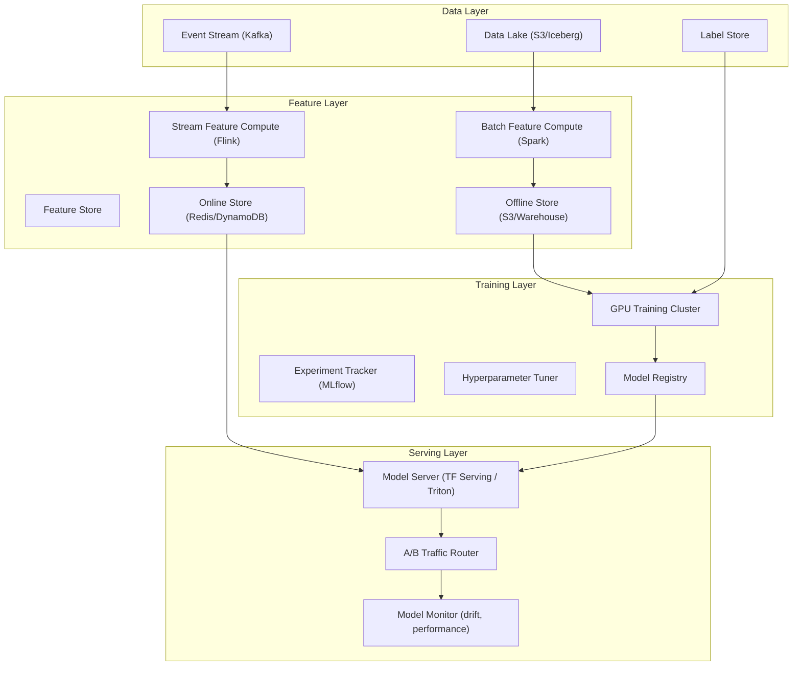

---

## Low-Level Design

### 1. Model Training Pipeline

#### Overview

The training pipeline takes raw data + features + labels, trains ML models, evaluates them, and registers successful models for deployment. At Google, training infrastructure runs **millions of GPU-hours per day** across thousands of models.

#### Training Workflow

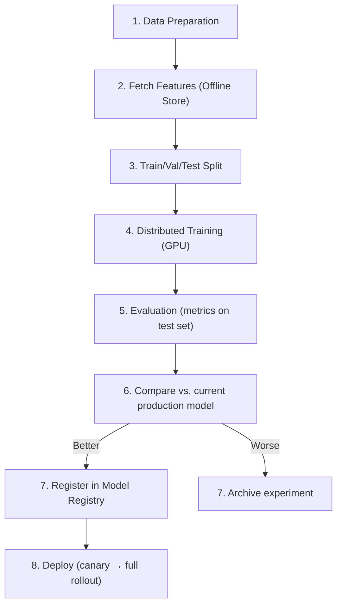

#### Distributed Training Strategies

| Strategy | How It Works | Use Case |
|----------|-------------|----------|
| **Data Parallelism** | Same model on each GPU; split data across GPUs; sync gradients | Most common; works for most models |
| **Model Parallelism** | Split model layers across GPUs | Very large models (GPT-scale) |
| **Pipeline Parallelism** | Different model stages on different GPUs, data flows through | Transformer training |
| **ZeRO (DeepSpeed)** | Partition optimizer state, gradients, parameters across GPUs | Memory-efficient large model training |

#### Experiment Tracking

```
# MLflow experiment tracking
mlflow.log_param("learning_rate", 0.001)
mlflow.log_param("batch_size", 256)
mlflow.log_param("model_type", "LightGBM")
mlflow.log_metric("auc", 0.923)
mlflow.log_metric("precision", 0.891)
mlflow.log_metric("recall", 0.857)
mlflow.log_artifact("model.pkl")
mlflow.log_artifact("feature_importance.png")
```

Every training run is logged with parameters, metrics, and artifacts for reproducibility.

#### Edge Cases

- **Training job fails at 95% completion**: Checkpoint every epoch; resume from last checkpoint. Don't restart from scratch.
- **GPU out of memory**: Reduce batch size, enable gradient checkpointing, or use model parallelism.
- **Data drift since last training**: Compare training data distribution vs. current production data. Retrain if significant drift detected.

---

### 2. Model Serving System

#### Overview

The Model Serving System hosts trained models and serves predictions via API with low latency. It handles model versioning, A/B testing between model versions, autoscaling based on load, and graceful model updates.

#### Architecture

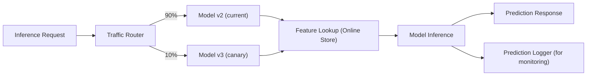

#### Serving Frameworks

| Framework | Strengths | Best For |
|-----------|----------|----------|
| **TensorFlow Serving** | TF-native, batching, GPU support | TensorFlow models |
| **NVIDIA Triton** | Multi-framework (TF, PyTorch, ONNX), GPU-optimized | Mixed frameworks, GPU-heavy |
| **TorchServe** | PyTorch-native | PyTorch models |
| **ONNX Runtime** | Cross-framework via ONNX export | Portable deployment |
| **vLLM** | LLM-optimized (PagedAttention) | Large language models |
| **Custom (FastAPI + ONNX)** | Full control, lightweight | Simple models, edge deployment |

#### Model Update Strategy

| Strategy | How | Risk |
|----------|-----|------|
| **Blue-green** | Deploy new model; switch all traffic | High (all-or-nothing) |
| **Canary** | Route 5% → 25% → 50% → 100% | Low (gradual) |
| **Shadow** | New model receives traffic but doesn't serve results; compare offline | Zero (observation only) |
| **Multi-armed bandit** | Dynamically allocate traffic to best-performing model | Medium (requires online metrics) |

#### Latency Budget

| Component | Budget |
|-----------|--------|
| Feature lookup (Redis) | < 5ms |
| Model inference (CPU) | < 20ms |
| Model inference (GPU) | < 10ms |
| Network overhead | < 5ms |
| **Total** | **< 30ms p99** |

---

### 3. Feature Store

Covered in depth in Chapter 24 (Analytics). Key points for ML context:

- **Offline store** (S3/warehouse): serves training with point-in-time-correct feature values
- **Online store** (Redis/DynamoDB): serves inference with latest feature values
- **Feature registry**: documents all features with metadata, owner, freshness SLA
- **Training-serving consistency**: same feature definition used for both training and inference

---

### 4. Recommendation Engine

#### Overview

The Recommendation Engine suggests items to users based on their behavior and preferences. It is the highest-impact ML system at most consumer companies. YouTube: 70% of watch time from recommendations. Amazon: 35% of purchases.

#### Architecture (Two-Stage)

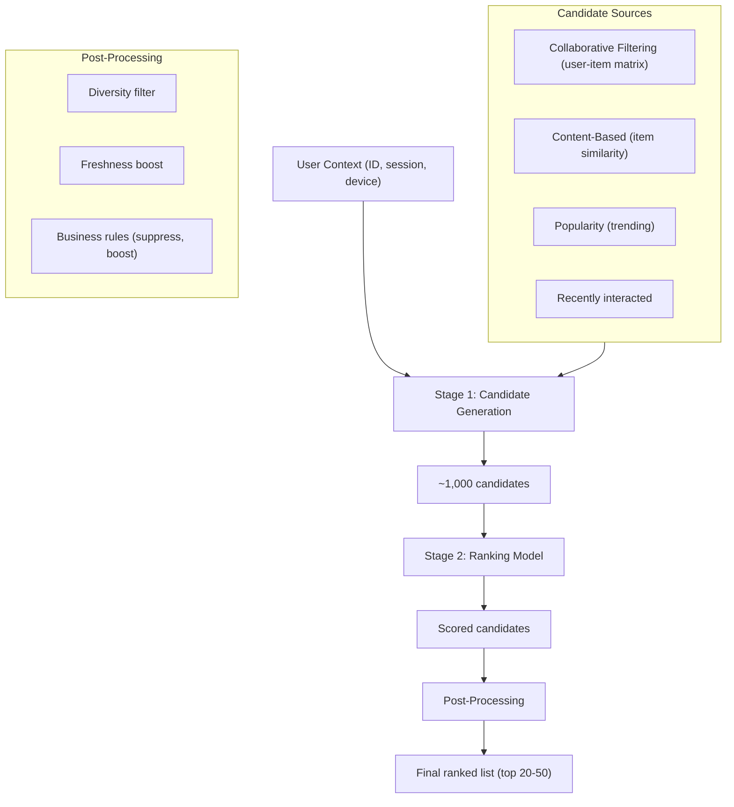

#### Collaborative Filtering

```
User-Item Interaction Matrix:
         Item1  Item2  Item3  Item4
User A:   5      3      .      1
User B:   4      .      .      1
User C:   .      3      5      .
User D:   .      .      4      5

Matrix Factorization (ALS/SVD):
  Decompose into User Factors × Item Factors
  User A ≈ [0.8, 0.3] × Item1 ≈ [0.9, 0.1]ᵀ = 0.72 + 0.03 ≈ predicted rating

Missing values → predictions → recommend highest predicted items not yet interacted with
```

#### Deep Learning Recommendations

Modern systems use **two-tower architecture**:
- **User tower**: Encodes user features → user embedding vector
- **Item tower**: Encodes item features → item embedding vector
- **Prediction**: dot product or cosine similarity of user and item embeddings
- **Training**: contrastive learning on (user, positive_item, negative_items) triplets
- **Serving**: Pre-compute item embeddings; compute user embedding in real-time; ANN lookup for nearest items

#### Metrics

| Metric | What It Measures | Target |
|--------|-----------------|--------|
| **CTR** | Click-through rate | 5-15% |
| **Watch-through rate** | % of content consumed | 60%+ |
| **Conversion rate** | % of reco clicks → purchase | 2-5% |
| **Coverage** | % of catalog recommended | > 30% |
| **Diversity** | Variety in recommendations | Tunable |
| **Novelty** | % of reco items user hasn't seen | > 50% |

---

### 5. Fraud Detection ML

#### Overview

Fraud detection ML scores transactions in real-time (< 100ms) to identify fraudulent activity. The model must balance **precision** (don't block legitimate users) with **recall** (catch as much fraud as possible).

#### Architecture

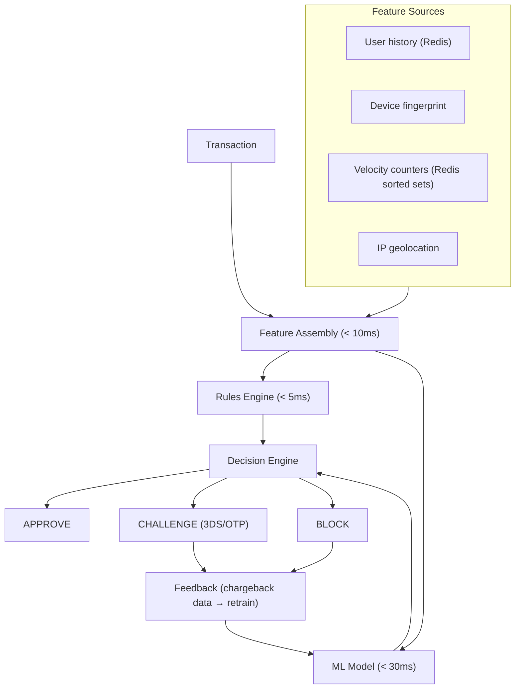

#### Key Challenge: Class Imbalance

Fraud is rare (~0.1% of transactions). Training on raw data gives a model that predicts "not fraud" 99.9% of the time.

**Solutions**:
- **Oversampling** (SMOTE): Generate synthetic fraud examples
- **Undersampling**: Reduce non-fraud examples
- **Cost-sensitive learning**: Penalize false negatives (missed fraud) more than false positives
- **Anomaly detection**: Model normal behavior; flag deviations

---

### 6. Personalization Engine

Covered in depth in Chapter 20 (Social Media). Key ML-specific points:

- **Real-time user context**: Assemble user profile + session context in < 10ms
- **Multi-model serving**: Different models for homepage, search, email, push notifications
- **Contextual bandits**: Adaptive personalization that balances exploration (try new content) with exploitation (show what works)
- **Privacy-preserving**: Federated learning or on-device personalization for GDPR compliance

---

### 7. Data Labeling System

#### Overview

Supervised ML requires labeled data. The Data Labeling System manages **annotation workflows** with quality control, active learning, and scalable human review.

#### Architecture

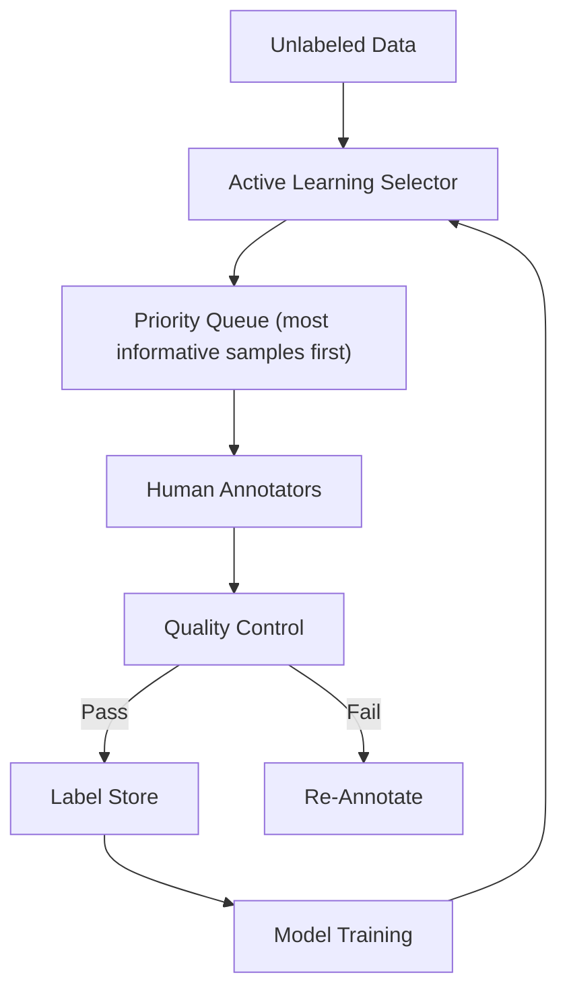

#### Quality Control Methods

| Method | How It Works |
|--------|-------------|
| **Consensus labeling** | 3 annotators label each sample; majority vote wins |
| **Gold standard** | Inject pre-labeled samples; measure annotator accuracy |
| **Inter-annotator agreement** | Cohen's kappa or Fleiss' kappa between annotators |
| **Expert review** | Random sample reviewed by domain expert |

#### Active Learning

Instead of labeling random samples, **active learning** selects the most informative samples to label:
- **Uncertainty sampling**: Label samples where the current model is least confident
- **Diversity sampling**: Label samples that are most different from already-labeled data
- **Expected model change**: Label samples that would most change the model

Result: Achieve same model accuracy with **50-80% fewer labels** compared to random sampling.

---

### 8. Data Versioning System

#### Overview

ML requires **reproducibility**: given the same data + code + config, you should get the same model. Data versioning tracks changes to datasets, features, and model artifacts over time.

#### What to Version

| Artifact | Tool | Purpose |
|----------|------|---------|
| **Code** | Git | Model code, feature engineering, training scripts |
| **Data** | DVC / LakeFS / Delta Lake | Training datasets, evaluation sets |
| **Features** | Feature Store metadata | Feature definitions, computation logic |
| **Model** | MLflow Model Registry | Model binaries, metadata, metrics |
| **Config** | Git + MLflow | Hyperparameters, training config |
| **Environment** | Docker / Conda | Runtime dependencies |

#### Data Lineage

```
Model v3.2 was trained on:
  → Dataset: product_interactions_v7 (hash: abc123)
  → Features: user_features_v4 + item_features_v6
  → Config: learning_rate=0.001, batch_size=256
  → Code: commit 5f2a1b3
  → Environment: pytorch:2.1-cuda12.1
  → Evaluation: AUC=0.923, Precision=0.891

If model degrades → trace back to exact data + code that produced it
```

---

## Functional Requirements

The following table enumerates the core functional requirements for each of the 8 subsystems. Every requirement is expressed as a capability that the system must provide to its users (ML engineers, data scientists, application services, or end-users).

### Domain A — ML Infrastructure

| Subsystem | ID | Functional Requirement | Priority |
|---|---|---|---|
| **Model Training Pipeline** | TR-FR-01 | Submit a training job with dataset reference, feature view, model config, and hyperparameters | P0 |
| | TR-FR-02 | Resume a failed training job from the last saved checkpoint without data re-processing | P0 |
| | TR-FR-03 | Run distributed training across multiple GPUs with data parallelism, model parallelism, or pipeline parallelism | P0 |
| | TR-FR-04 | Execute hyperparameter search (grid, random, Bayesian, population-based) across a parameter space | P1 |
| | TR-FR-05 | Log all parameters, metrics, and artifacts for every training run to the experiment tracker | P0 |
| | TR-FR-06 | Compare metrics across experiment runs with visualization (learning curves, metric tables) | P1 |
| | TR-FR-07 | Automatically evaluate the trained model against a held-out test set and compute standard metrics (AUC, precision, recall, F1, RMSE) | P0 |
| | TR-FR-08 | Register a successful model in the Model Registry with metadata (lineage, metrics, owner, description) | P0 |
| | TR-FR-09 | Trigger automated retraining when data drift is detected above a configurable threshold | P1 |
| | TR-FR-10 | Support training on both tabular (XGBoost, LightGBM) and deep learning (PyTorch, TensorFlow) frameworks | P0 |
| **Model Serving System** | MS-FR-01 | Serve single-request predictions with < 30ms p99 latency | P0 |
| | MS-FR-02 | Serve batch predictions for offline scoring of up to 100M records | P0 |
| | MS-FR-03 | Deploy multiple model versions simultaneously with configurable traffic routing (canary, A/B, shadow) | P0 |
| | MS-FR-04 | Autoscale model replicas based on request rate, latency percentiles, and GPU utilization | P0 |
| | MS-FR-05 | Roll back to a previous model version within 60 seconds | P0 |
| | MS-FR-06 | Support model ensembles (routing request through multiple models and combining predictions) | P1 |
| | MS-FR-07 | Log every prediction (input features, model version, output, latency) for monitoring and debugging | P0 |
| | MS-FR-08 | Serve models in multiple formats: TensorFlow SavedModel, PyTorch TorchScript, ONNX, XGBoost | P0 |
| | MS-FR-09 | Provide model warmup on deployment to avoid cold-start latency spikes | P1 |
| | MS-FR-10 | Support streaming inference for sequence models (token-by-token generation for LLMs) | P1 |
| **Feature Store** | FS-FR-01 | Register a feature view with schema, computation logic, entity key, and freshness SLA | P0 |
| | FS-FR-02 | Compute batch features from data lake (Spark/SQL) and materialize to offline store | P0 |
| | FS-FR-03 | Compute streaming features from event stream (Flink/Spark Streaming) and materialize to online store | P0 |
| | FS-FR-04 | Serve online features for inference with < 5ms p99 latency for up to 100 features per request | P0 |
| | FS-FR-05 | Serve offline features for training with point-in-time correctness (no future data leakage) | P0 |
| | FS-FR-06 | Support feature transformations: aggregations (count, sum, avg over time windows), embeddings, bucketing | P0 |
| | FS-FR-07 | Track feature lineage (source data, transformation code, materialization schedule) | P1 |
| | FS-FR-08 | Provide a feature registry UI for discovery, documentation, and search across all features | P1 |
| | FS-FR-09 | Validate feature values against expected distributions and alert on anomalies | P1 |
| | FS-FR-10 | Support feature sharing across teams with access control and ownership metadata | P1 |

### Domain B — Real-Time AI

| Subsystem | ID | Functional Requirement | Priority |
|---|---|---|---|
| **Recommendation Engine** | RE-FR-01 | Generate personalized recommendations for a user given user ID and context in < 100ms | P0 |
| | RE-FR-02 | Support multiple candidate generation strategies: collaborative filtering, content-based, popularity, trending | P0 |
| | RE-FR-03 | Rank candidates using a deep learning model with user and item features | P0 |
| | RE-FR-04 | Apply post-processing rules: diversity, freshness, business rules (suppress, boost) | P0 |
| | RE-FR-05 | Handle cold-start for new users (no interaction history) using content-based and popularity fallback | P0 |
| | RE-FR-06 | Handle cold-start for new items using content features and exploration allocation | P0 |
| | RE-FR-07 | Log user interactions (click, view, purchase, skip) for model retraining and evaluation | P0 |
| | RE-FR-08 | Support real-time user embedding updates based on recent interactions (session-based) | P1 |
| | RE-FR-09 | A/B test different recommendation models and strategies with metric tracking | P0 |
| | RE-FR-10 | Provide explainability for recommendations ("Because you watched X", "Trending in your area") | P1 |
| **Fraud Detection ML** | FD-FR-01 | Score a transaction in real-time (< 100ms end-to-end) with a fraud probability score | P0 |
| | FD-FR-02 | Assemble features from multiple sources (user history, device fingerprint, velocity counters, geolocation) in < 10ms | P0 |
| | FD-FR-03 | Apply a rules engine for deterministic fraud checks (blacklists, velocity limits) in parallel with ML scoring | P0 |
| | FD-FR-04 | Combine rule scores and ML scores in a decision engine to produce APPROVE / CHALLENGE / BLOCK | P0 |
| | FD-FR-05 | Collect feedback (chargeback, user dispute, manual review outcome) and feed back to model retraining | P0 |
| | FD-FR-06 | Support online model updates with < 1 hour from feedback to model retrain | P1 |
| | FD-FR-07 | Maintain velocity counters (transaction count, amount per time window per user/device/IP) with < 1ms update latency | P0 |
| | FD-FR-08 | Provide fraud investigation dashboard with transaction details, feature values, and model explanations (SHAP) | P1 |
| | FD-FR-09 | Allow manual rule creation and modification by fraud analysts without engineering deployment | P1 |
| | FD-FR-10 | Support multi-model ensemble (gradient boosting + neural network + anomaly detection) with weighted combination | P1 |
| **Personalization Engine** | PE-FR-01 | Assemble a real-time user context (profile, session, device, location, time) in < 10ms | P0 |
| | PE-FR-02 | Serve personalized content for multiple surfaces: homepage, search, email, push notifications | P0 |
| | PE-FR-03 | Support contextual bandit policies that balance exploration and exploitation | P0 |
| | PE-FR-04 | Update user segments and profiles in real-time based on streaming events | P1 |
| | PE-FR-05 | Provide A/B test framework for comparing personalization strategies | P0 |
| | PE-FR-06 | Support privacy-preserving personalization (on-device models, differential privacy) | P1 |
| | PE-FR-07 | Allow configuration of personalization models per surface and user segment without code deployment | P1 |
| | PE-FR-08 | Compute and serve user segments based on behavioral clustering | P1 |

### Domain C — Data Pipelines

| Subsystem | ID | Functional Requirement | Priority |
|---|---|---|---|
| **Data Labeling System** | DL-FR-01 | Create annotation tasks with instructions, label schema, and assignment rules | P0 |
| | DL-FR-02 | Assign annotation items to annotators based on skill, language, and availability | P0 |
| | DL-FR-03 | Support multiple annotation types: classification, bounding box, text span, sequence tagging, free text | P0 |
| | DL-FR-04 | Implement consensus labeling (multiple annotators per item) with configurable agreement threshold | P0 |
| | DL-FR-05 | Inject gold-standard (pre-labeled) items to measure annotator accuracy in real-time | P0 |
| | DL-FR-06 | Compute inter-annotator agreement (Cohen's kappa, Fleiss' kappa) per task and per annotator | P1 |
| | DL-FR-07 | Support active learning: prioritize items where the current model is least confident | P1 |
| | DL-FR-08 | Provide expert review workflow for disputed or low-confidence annotations | P1 |
| | DL-FR-09 | Export labeled data in standard formats (JSONL, CSV, COCO, VOC) for training pipeline consumption | P0 |
| | DL-FR-10 | Track annotator performance metrics: speed, accuracy, agreement rate | P1 |
| **Data Versioning System** | DV-FR-01 | Create and version datasets with immutable snapshots (content-addressable storage) | P0 |
| | DV-FR-02 | Track full data lineage: which raw data, transformations, and code produced each dataset version | P0 |
| | DV-FR-03 | Compare two dataset versions: schema changes, row count changes, distribution shifts | P1 |
| | DV-FR-04 | Tag dataset versions with metadata (owner, description, quality score, training job references) | P0 |
| | DV-FR-05 | Reproduce any historical training run by retrieving exact dataset version, code commit, and config | P0 |
| | DV-FR-06 | Integrate with Git for code versioning and MLflow for model versioning to form a complete lineage graph | P1 |
| | DV-FR-07 | Support branching and merging of datasets for experimentation | P2 |
| | DV-FR-08 | Provide garbage collection for unreferenced dataset versions to reclaim storage | P2 |

---

## Non-Functional Requirements

### Latency Targets

| Subsystem | Operation | p50 Target | p99 Target | p99.9 Target |
|---|---|---|---|---|
| **Model Serving** | Single inference (CPU model) | < 10ms | < 20ms | < 50ms |
| **Model Serving** | Single inference (GPU model) | < 5ms | < 10ms | < 25ms |
| **Model Serving** | LLM token generation (first token) | < 200ms | < 500ms | < 1s |
| **Model Serving** | LLM token generation (per token) | < 30ms | < 50ms | < 100ms |
| **Feature Store** | Online feature lookup (up to 100 features) | < 2ms | < 5ms | < 10ms |
| **Feature Store** | Offline feature retrieval (1M rows) | < 60s | < 120s | < 300s |
| **Recommendation Engine** | End-to-end recommendation (candidate gen + ranking) | < 50ms | < 100ms | < 200ms |
| **Fraud Detection** | End-to-end transaction scoring | < 30ms | < 80ms | < 150ms |
| **Personalization** | User context assembly | < 5ms | < 10ms | < 20ms |
| **Data Labeling** | Get next annotation item | < 200ms | < 500ms | < 1s |
| **Training Pipeline** | Job submission to first GPU allocation | N/A | < 5min | < 15min |

### Throughput Targets

| Subsystem | Metric | Target | Peak |
|---|---|---|---|
| **Model Serving** | Inference requests per second (all models) | 500K RPS | 1M RPS |
| **Model Serving** | Batch prediction throughput | 10M records/hour | 50M records/hour |
| **Feature Store** | Online feature lookups per second | 100K RPS | 300K RPS |
| **Feature Store** | Batch materialization throughput | 1B feature values/hour | 5B feature values/hour |
| **Recommendation Engine** | Recommendation requests per second | 50K RPS | 150K RPS |
| **Fraud Detection** | Transaction scoring per second | 20K RPS | 80K RPS |
| **Training Pipeline** | Concurrent training jobs | 50 | 200 |
| **Data Labeling** | Annotations per day | 50K | 200K |
| **Data Versioning** | Dataset version creation per day | 500 | 2,000 |

### Availability Targets

| Subsystem | Availability SLA | Max Downtime (per month) | RPO | RTO |
|---|---|---|---|---|
| **Model Serving** | 99.99% | 4.3 minutes | 0 (stateless) | < 30 seconds |
| **Feature Store (Online)** | 99.99% | 4.3 minutes | < 1 minute | < 30 seconds |
| **Feature Store (Offline)** | 99.9% | 43.2 minutes | < 1 hour | < 15 minutes |
| **Fraud Detection** | 99.99% | 4.3 minutes | 0 (stateless) | < 30 seconds |
| **Recommendation Engine** | 99.95% | 21.6 minutes | 0 (stateless) | < 2 minutes |
| **Personalization Engine** | 99.95% | 21.6 minutes | 0 (stateless) | < 2 minutes |
| **Training Pipeline** | 99.9% | 43.2 minutes | Last checkpoint | < 10 minutes |
| **Data Labeling** | 99.5% | 3.6 hours | < 5 minutes | < 30 minutes |
| **Data Versioning** | 99.9% | 43.2 minutes | < 1 hour | < 15 minutes |

### Scalability Targets

| Dimension | Current | 1 Year | 3 Years |
|---|---|---|---|
| Models in production | 100 | 300 | 1,000 |
| Inference RPS (total) | 500K | 2M | 10M |
| Features in feature store | 10,000 | 30,000 | 100,000 |
| Training GPU-hours per day | 400 | 2,000 | 10,000 |
| Labeled examples per month | 1M | 5M | 20M |
| Dataset versions stored | 5,000 | 20,000 | 100,000 |
| Total model artifacts (size) | 10 TB | 50 TB | 500 TB |

---

## Capacity Estimation

### GPU Compute

```
Training GPU demand:
  50 training jobs/day x 8 A100 GPUs x 4 hours avg = 1,600 GPU-hours/day
  Peak: 200 jobs x 8 GPUs x 6 hours = 9,600 GPU-hours/day
  Monthly: 1,600 x 30 = 48,000 GPU-hours/month

Inference GPU demand:
  GPU models: 20 models x 4 GPUs each = 80 GPUs steady-state
  LLM models: 5 LLMs x 8 GPUs each = 40 GPUs steady-state
  Peak (2x): 240 GPUs
  Monthly: 240 GPUs x 720 hours = 172,800 GPU-hours/month

Hyperparameter tuning (burst):
  10 HP searches/day x 20 trials x 2 GPUs x 1 hour = 400 GPU-hours/day

Total GPU budget: ~220,000 GPU-hours/month
  At $2.50/GPU-hour (A100 spot): $550,000/month
  At $1.00/GPU-hour (reserved): $220,000/month
```

### Inference QPS Breakdown

```
Total: 500K RPS across all models

By model type:
  Recommendation ranking:        200K RPS  (40%)
  Search ranking:                100K RPS  (20%)
  Fraud detection:                50K RPS  (10%)
  Ad ranking:                     80K RPS  (16%)
  Personalization:                50K RPS  (10%)
  Content moderation:             10K RPS   (2%)
  Other (embeddings, etc.):       10K RPS   (2%)

Per-model instance capacity:
  CPU models (GBDT/linear): ~2,000 RPS per instance
  GPU models (deep learning): ~5,000 RPS per GPU
  LLM models (vLLM): ~500 tokens/s per GPU

Instance count:
  CPU instances: 200K / 2,000 = 100 instances (for GBDT models)
  GPU instances: 250K / 5,000 = 50 GPUs (for deep learning)
  LLM GPUs: 5 models x 8 GPUs = 40 GPUs
  Total: 100 CPU instances + 90 GPUs for inference
```

### Feature Store

```
Online store (Redis cluster):
  Features: 10,000 feature definitions
  Entities: 100M users + 50M items = 150M entity keys
  Features per entity: avg 50 features x 8 bytes = 400 bytes per entity
  Total online data: 150M x 400 bytes = 60 GB
  With replication (3x): 180 GB across Redis cluster
  QPS: 100K lookups/second (each fetching ~50 features)
  Redis cluster: 6 primary + 6 replica = 12 nodes (r6g.2xlarge)

Offline store (S3 + Iceberg/Delta):
  Daily feature computation: 1B rows x 200 features x 8 bytes = 1.6 TB/day
  Retention: 90 days of point-in-time snapshots
  Total: 1.6 TB x 90 days = 144 TB (with columnar compression ~30 TB)
  Storage cost: 30 TB x $0.023/GB = ~$700/month
```

### Storage Breakdown

```
Model artifacts:
  100 models x 10 versions x avg 500 MB = 500 GB current
  LLM models: 5 models x 3 versions x 50 GB = 750 GB
  Total model storage: ~1.25 TB (S3)

Training data:
  50 training datasets x avg 50 GB = 2.5 TB
  With versioning (5 versions): 12.5 TB
  Total training data: ~12.5 TB (S3)

Prediction logs:
  500K RPS x avg 1 KB per log = 500 MB/s = 43 TB/day
  Retention: 30 days = 1.3 PB
  With compression (10x): 130 TB
  Storage cost: 130 TB x $0.023/GB = ~$3,000/month

Label store:
  1M labels/month x avg 5 KB per annotation = 5 GB/month
  With media references: 50 GB/month
  3-year retention: 1.8 TB

Total storage: ~175 TB (compressed)
  S3 cost: ~$4,000/month
  Redis cost: ~$5,000/month (online feature store)
```

### Network Bandwidth

```
Inference traffic:
  Inbound: 500K RPS x 2 KB avg request = 1 GB/s
  Outbound: 500K RPS x 1 KB avg response = 500 MB/s

Feature store traffic:
  Online: 100K RPS x 400 bytes (50 features) = 40 MB/s
  Batch materialization: 1.6 TB/day = ~20 MB/s sustained

Training data reads:
  50 jobs x 100 MB/s each = 5 GB/s peak from S3

Model distribution:
  Model updates: 20 models/day x 500 MB = 10 GB/day (negligible)
  LLM model updates: 2/week x 50 GB = 100 GB/week
```

---

## Detailed Data Models

### Training Subsystem

```sql
-- Experiments group related training runs for a specific model/task
CREATE TABLE experiments (
    experiment_id       UUID PRIMARY KEY DEFAULT gen_random_uuid(),
    name                VARCHAR(255) NOT NULL,
    description         TEXT,
    owner_id            UUID NOT NULL REFERENCES users(user_id),
    team_id             UUID REFERENCES teams(team_id),
    model_type          VARCHAR(100) NOT NULL,       -- 'lightgbm', 'pytorch_dnn', 'transformer'
    task_type           VARCHAR(50) NOT NULL,         -- 'classification', 'regression', 'ranking', 'generation'
    dataset_ref         VARCHAR(500),                 -- reference to dataset version
    feature_view_ref    VARCHAR(500),                 -- reference to feature view
    tags                JSONB DEFAULT '{}',
    status              VARCHAR(20) DEFAULT 'active', -- 'active', 'archived'
    created_at          TIMESTAMPTZ NOT NULL DEFAULT NOW(),
    updated_at          TIMESTAMPTZ NOT NULL DEFAULT NOW(),
    archived_at         TIMESTAMPTZ
);

CREATE INDEX idx_experiments_owner ON experiments(owner_id);
CREATE INDEX idx_experiments_team ON experiments(team_id);
CREATE INDEX idx_experiments_status ON experiments(status);
CREATE INDEX idx_experiments_tags ON experiments USING GIN(tags);
CREATE INDEX idx_experiments_created ON experiments(created_at DESC);

-- Each training run within an experiment
CREATE TABLE experiment_runs (
    run_id              UUID PRIMARY KEY DEFAULT gen_random_uuid(),
    experiment_id       UUID NOT NULL REFERENCES experiments(experiment_id),
    run_number          INTEGER NOT NULL,
    parent_run_id       UUID REFERENCES experiment_runs(run_id),   -- for HP search child runs
    status              VARCHAR(20) NOT NULL DEFAULT 'created',
                        -- 'created','queued','running','evaluating','succeeded','failed','cancelled'
    trigger_type        VARCHAR(30) NOT NULL DEFAULT 'manual',
                        -- 'manual', 'scheduled', 'drift_triggered', 'hp_search'
    started_at          TIMESTAMPTZ,
    completed_at        TIMESTAMPTZ,
    duration_seconds    INTEGER,
    gpu_type            VARCHAR(50),                  -- 'a100_40gb', 'a100_80gb', 'h100'
    gpu_count           INTEGER NOT NULL DEFAULT 1,
    distributed_strategy VARCHAR(50),                 -- 'data_parallel', 'model_parallel', 'deepspeed_zero3'
    training_config     JSONB NOT NULL,               -- full training configuration
    final_metrics       JSONB DEFAULT '{}',           -- {'auc': 0.923, 'precision': 0.891, ...}
    error_message       TEXT,
    error_traceback     TEXT,
    git_commit_sha      VARCHAR(40),
    docker_image        VARCHAR(500),
    created_at          TIMESTAMPTZ NOT NULL DEFAULT NOW(),
    UNIQUE (experiment_id, run_number)
);

CREATE INDEX idx_runs_experiment ON experiment_runs(experiment_id);
CREATE INDEX idx_runs_status ON experiment_runs(status);
CREATE INDEX idx_runs_started ON experiment_runs(started_at DESC);
CREATE INDEX idx_runs_metrics ON experiment_runs USING GIN(final_metrics);
CREATE INDEX idx_runs_parent ON experiment_runs(parent_run_id) WHERE parent_run_id IS NOT NULL;

-- Trained model artifacts stored in object storage
CREATE TABLE model_artifacts (
    artifact_id         UUID PRIMARY KEY DEFAULT gen_random_uuid(),
    run_id              UUID NOT NULL REFERENCES experiment_runs(run_id),
    artifact_type       VARCHAR(50) NOT NULL,         -- 'model', 'feature_importance', 'evaluation_report', 'onnx_export'
    artifact_path       VARCHAR(1000) NOT NULL,       -- s3://ml-artifacts/experiments/...
    file_format         VARCHAR(30) NOT NULL,         -- 'pkl', 'pt', 'savedmodel', 'onnx', 'json', 'png'
    size_bytes          BIGINT NOT NULL,
    sha256_hash         VARCHAR(64) NOT NULL,
    metadata            JSONB DEFAULT '{}',
    created_at          TIMESTAMPTZ NOT NULL DEFAULT NOW()
);

CREATE INDEX idx_artifacts_run ON model_artifacts(run_id);
CREATE INDEX idx_artifacts_type ON model_artifacts(artifact_type);

-- Training jobs represent the compute resource allocation
CREATE TABLE training_jobs (
    job_id              UUID PRIMARY KEY DEFAULT gen_random_uuid(),
    run_id              UUID NOT NULL REFERENCES experiment_runs(run_id),
    job_type            VARCHAR(30) NOT NULL,          -- 'training', 'evaluation', 'hp_search', 'data_prep'
    compute_cluster     VARCHAR(100) NOT NULL,         -- 'gpu-cluster-us-east-1', 'gpu-cluster-eu-west-1'
    resource_request    JSONB NOT NULL,                -- {'gpu': 8, 'gpu_type': 'a100', 'memory_gb': 320, 'cpu': 64}
    priority            INTEGER NOT NULL DEFAULT 5,    -- 1 (highest) to 10 (lowest)
    queue_name          VARCHAR(100) NOT NULL DEFAULT 'default',
    status              VARCHAR(20) NOT NULL DEFAULT 'pending',
                        -- 'pending', 'queued', 'scheduled', 'running', 'succeeded', 'failed', 'cancelled', 'preempted'
    queued_at           TIMESTAMPTZ,
    scheduled_at        TIMESTAMPTZ,
    started_at          TIMESTAMPTZ,
    completed_at        TIMESTAMPTZ,
    node_assignments    JSONB,                         -- [{'node_id': 'gpu-node-01', 'gpu_ids': [0,1,2,3]}]
    preemption_count    INTEGER DEFAULT 0,
    max_runtime_seconds INTEGER DEFAULT 86400,         -- 24 hour default max
    idempotency_key     VARCHAR(255),
    created_at          TIMESTAMPTZ NOT NULL DEFAULT NOW()
);

CREATE INDEX idx_jobs_run ON training_jobs(run_id);
CREATE INDEX idx_jobs_status ON training_jobs(status);
CREATE INDEX idx_jobs_queue ON training_jobs(queue_name, priority, queued_at);
CREATE INDEX idx_jobs_cluster ON training_jobs(compute_cluster, status);
CREATE UNIQUE INDEX idx_jobs_idempotency ON training_jobs(idempotency_key) WHERE idempotency_key IS NOT NULL;

-- Checkpoints saved during training for resume capability
CREATE TABLE checkpoints (
    checkpoint_id       UUID PRIMARY KEY DEFAULT gen_random_uuid(),
    run_id              UUID NOT NULL REFERENCES experiment_runs(run_id),
    epoch               INTEGER NOT NULL,
    global_step         BIGINT NOT NULL,
    checkpoint_path     VARCHAR(1000) NOT NULL,        -- s3://ml-checkpoints/...
    size_bytes          BIGINT NOT NULL,
    metrics_at_checkpoint JSONB DEFAULT '{}',          -- {'loss': 0.45, 'auc': 0.91}
    is_best             BOOLEAN DEFAULT FALSE,
    created_at          TIMESTAMPTZ NOT NULL DEFAULT NOW()
);

CREATE INDEX idx_checkpoints_run ON checkpoints(run_id, epoch DESC);
CREATE INDEX idx_checkpoints_best ON checkpoints(run_id) WHERE is_best = TRUE;

-- Hyperparameter configurations for each run
CREATE TABLE hyperparameters (
    hp_id               UUID PRIMARY KEY DEFAULT gen_random_uuid(),
    run_id              UUID NOT NULL REFERENCES experiment_runs(run_id),
    hp_name             VARCHAR(255) NOT NULL,
    hp_value            VARCHAR(500) NOT NULL,
    hp_type             VARCHAR(20) NOT NULL,          -- 'float', 'int', 'string', 'bool'
    search_space        JSONB,                         -- {'min': 0.0001, 'max': 0.1, 'scale': 'log'}
    source              VARCHAR(30) DEFAULT 'manual',  -- 'manual', 'grid_search', 'bayesian', 'random'
    UNIQUE(run_id, hp_name)
);

CREATE INDEX idx_hp_run ON hyperparameters(run_id);
```

### Serving Subsystem

```sql
-- Registered model versions ready for deployment
CREATE TABLE model_versions (
    model_version_id    UUID PRIMARY KEY DEFAULT gen_random_uuid(),
    model_name          VARCHAR(255) NOT NULL,         -- 'fraud_scorer_v2', 'reco_ranker'
    version             INTEGER NOT NULL,
    run_id              UUID REFERENCES experiment_runs(run_id),
    artifact_path       VARCHAR(1000) NOT NULL,        -- s3://ml-models/fraud_scorer/v7/
    model_format        VARCHAR(30) NOT NULL,          -- 'tensorflow', 'pytorch', 'onnx', 'xgboost', 'lightgbm'
    input_schema        JSONB NOT NULL,                -- feature names, types, shapes
    output_schema       JSONB NOT NULL,                -- prediction names, types, shapes
    metrics             JSONB NOT NULL,                -- evaluation metrics
    model_size_bytes    BIGINT NOT NULL,
    framework_version   VARCHAR(50),                   -- 'pytorch-2.1', 'tensorflow-2.14'
    status              VARCHAR(20) NOT NULL DEFAULT 'registered',
                        -- 'registered', 'staging', 'canary', 'production', 'deprecated', 'archived'
    registered_by       UUID NOT NULL REFERENCES users(user_id),
    approved_by         UUID REFERENCES users(user_id),
    description         TEXT,
    tags                JSONB DEFAULT '{}',
    created_at          TIMESTAMPTZ NOT NULL DEFAULT NOW(),
    promoted_at         TIMESTAMPTZ,
    deprecated_at       TIMESTAMPTZ,
    UNIQUE(model_name, version)
);

CREATE INDEX idx_mv_model ON model_versions(model_name, version DESC);
CREATE INDEX idx_mv_status ON model_versions(model_name, status);
CREATE INDEX idx_mv_created ON model_versions(created_at DESC);
CREATE INDEX idx_mv_tags ON model_versions USING GIN(tags);

-- Model endpoints (serving instances)
CREATE TABLE model_endpoints (
    endpoint_id         UUID PRIMARY KEY DEFAULT gen_random_uuid(),
    endpoint_name       VARCHAR(255) NOT NULL UNIQUE,  -- 'fraud-scorer-prod', 'reco-ranker-staging'
    model_name          VARCHAR(255) NOT NULL,
    environment         VARCHAR(20) NOT NULL,          -- 'staging', 'canary', 'production'
    serving_framework   VARCHAR(50) NOT NULL,          -- 'triton', 'tf_serving', 'torchserve', 'vllm', 'custom'
    instance_type       VARCHAR(50) NOT NULL,          -- 'ml.g5.xlarge', 'ml.c6i.2xlarge'
    min_replicas        INTEGER NOT NULL DEFAULT 1,
    max_replicas        INTEGER NOT NULL DEFAULT 10,
    current_replicas    INTEGER NOT NULL DEFAULT 1,
    autoscale_metric    VARCHAR(50) DEFAULT 'rps',     -- 'rps', 'latency_p99', 'gpu_utilization'
    autoscale_target    FLOAT,                         -- target value for autoscale metric
    health_status       VARCHAR(20) DEFAULT 'unknown', -- 'healthy', 'degraded', 'unhealthy', 'unknown'
    last_health_check   TIMESTAMPTZ,
    created_at          TIMESTAMPTZ NOT NULL DEFAULT NOW(),
    updated_at          TIMESTAMPTZ NOT NULL DEFAULT NOW()
);

CREATE INDEX idx_endpoints_model ON model_endpoints(model_name);
CREATE INDEX idx_endpoints_env ON model_endpoints(environment);
CREATE INDEX idx_endpoints_health ON model_endpoints(health_status);

-- Deployment configurations linking model versions to endpoints
CREATE TABLE deployment_configs (
    deployment_id       UUID PRIMARY KEY DEFAULT gen_random_uuid(),
    endpoint_id         UUID NOT NULL REFERENCES model_endpoints(endpoint_id),
    model_version_id    UUID NOT NULL REFERENCES model_versions(model_version_id),
    traffic_percentage  FLOAT NOT NULL DEFAULT 0,      -- 0-100
    deployment_strategy VARCHAR(30) NOT NULL,           -- 'canary', 'blue_green', 'shadow', 'full'
    status              VARCHAR(20) NOT NULL DEFAULT 'pending',
                        -- 'pending', 'deploying', 'active', 'draining', 'rolled_back', 'completed'
    rollout_config      JSONB,                         -- {'steps': [5, 25, 50, 100], 'step_duration_min': 30}
    current_step        INTEGER DEFAULT 0,
    canary_metrics      JSONB DEFAULT '{}',            -- metrics collected during canary
    rollback_reason     TEXT,
    deployed_by         UUID NOT NULL REFERENCES users(user_id),
    started_at          TIMESTAMPTZ,
    completed_at        TIMESTAMPTZ,
    created_at          TIMESTAMPTZ NOT NULL DEFAULT NOW()
);

CREATE INDEX idx_deploy_endpoint ON deployment_configs(endpoint_id, status);
CREATE INDEX idx_deploy_version ON deployment_configs(model_version_id);
CREATE INDEX idx_deploy_active ON deployment_configs(endpoint_id) WHERE status = 'active';

-- A/B test configurations for model experiments
CREATE TABLE ab_test_configs (
    test_id             UUID PRIMARY KEY DEFAULT gen_random_uuid(),
    test_name           VARCHAR(255) NOT NULL,
    endpoint_id         UUID NOT NULL REFERENCES model_endpoints(endpoint_id),
    control_version_id  UUID NOT NULL REFERENCES model_versions(model_version_id),
    treatment_version_id UUID NOT NULL REFERENCES model_versions(model_version_id),
    traffic_split       FLOAT NOT NULL DEFAULT 50,     -- % to treatment
    hash_key            VARCHAR(50) NOT NULL DEFAULT 'user_id',  -- for deterministic bucketing
    primary_metric      VARCHAR(100) NOT NULL,         -- 'ctr', 'conversion_rate', 'revenue_per_user'
    secondary_metrics   JSONB DEFAULT '[]',
    min_sample_size     BIGINT NOT NULL DEFAULT 10000,
    confidence_level    FLOAT NOT NULL DEFAULT 0.95,
    status              VARCHAR(20) NOT NULL DEFAULT 'draft',
                        -- 'draft', 'running', 'paused', 'concluded', 'cancelled'
    winner              VARCHAR(20),                   -- 'control', 'treatment', 'no_difference'
    results             JSONB DEFAULT '{}',
    started_at          TIMESTAMPTZ,
    ended_at            TIMESTAMPTZ,
    created_at          TIMESTAMPTZ NOT NULL DEFAULT NOW()
);

CREATE INDEX idx_ab_endpoint ON ab_test_configs(endpoint_id);
CREATE INDEX idx_ab_status ON ab_test_configs(status);

-- Prediction logs for monitoring and debugging (high-volume, partitioned)
CREATE TABLE prediction_logs (
    log_id              UUID DEFAULT gen_random_uuid(),
    endpoint_id         UUID NOT NULL,
    model_version_id    UUID NOT NULL,
    request_id          VARCHAR(64) NOT NULL,
    timestamp           TIMESTAMPTZ NOT NULL DEFAULT NOW(),
    input_features      JSONB,                         -- logged features (may be sampled)
    prediction          JSONB NOT NULL,                -- model output
    latency_ms          FLOAT NOT NULL,
    status_code         INTEGER NOT NULL DEFAULT 200,
    error_message       TEXT,
    ab_test_id          UUID,
    ab_bucket           VARCHAR(20),                   -- 'control' or 'treatment'
    user_id             VARCHAR(100),
    session_id          VARCHAR(100),
    PRIMARY KEY (timestamp, log_id)
) PARTITION BY RANGE (timestamp);

-- Create monthly partitions
CREATE TABLE prediction_logs_2025_01 PARTITION OF prediction_logs
    FOR VALUES FROM ('2025-01-01') TO ('2025-02-01');
CREATE TABLE prediction_logs_2025_02 PARTITION OF prediction_logs
    FOR VALUES FROM ('2025-02-01') TO ('2025-03-01');
-- ... automated partition creation via pg_partman or cron

CREATE INDEX idx_plog_endpoint_ts ON prediction_logs(endpoint_id, timestamp DESC);
CREATE INDEX idx_plog_request ON prediction_logs(request_id);
CREATE INDEX idx_plog_version ON prediction_logs(model_version_id, timestamp DESC);
CREATE INDEX idx_plog_ab ON prediction_logs(ab_test_id, ab_bucket) WHERE ab_test_id IS NOT NULL;
```

### Feature Store Subsystem

```sql
-- Feature views define a logical group of related features for an entity
CREATE TABLE feature_views (
    feature_view_id     UUID PRIMARY KEY DEFAULT gen_random_uuid(),
    name                VARCHAR(255) NOT NULL UNIQUE,
    description         TEXT,
    entity_type         VARCHAR(100) NOT NULL,         -- 'user', 'item', 'transaction', 'session'
    entity_key_column   VARCHAR(100) NOT NULL,         -- 'user_id', 'item_id'
    owner_id            UUID NOT NULL REFERENCES users(user_id),
    team_id             UUID REFERENCES teams(team_id),
    source_type         VARCHAR(30) NOT NULL,          -- 'batch', 'stream', 'on_demand'
    source_config       JSONB NOT NULL,                -- batch SQL query, Flink job config, etc.
    online_enabled      BOOLEAN DEFAULT TRUE,
    offline_enabled     BOOLEAN DEFAULT TRUE,
    freshness_sla       INTERVAL NOT NULL DEFAULT '1 hour',
    materialization_schedule VARCHAR(100),              -- cron expression for batch features
    tags                JSONB DEFAULT '{}',
    status              VARCHAR(20) DEFAULT 'active',
    created_at          TIMESTAMPTZ NOT NULL DEFAULT NOW(),
    updated_at          TIMESTAMPTZ NOT NULL DEFAULT NOW()
);

CREATE INDEX idx_fv_entity ON feature_views(entity_type);
CREATE INDEX idx_fv_owner ON feature_views(owner_id);
CREATE INDEX idx_fv_tags ON feature_views USING GIN(tags);

-- Individual feature definitions within a feature view
CREATE TABLE feature_definitions (
    feature_id          UUID PRIMARY KEY DEFAULT gen_random_uuid(),
    feature_view_id     UUID NOT NULL REFERENCES feature_views(feature_view_id),
    name                VARCHAR(255) NOT NULL,
    description         TEXT,
    data_type           VARCHAR(30) NOT NULL,          -- 'float64', 'int64', 'string', 'bool', 'embedding', 'array_float'
    default_value       VARCHAR(500),                  -- value to use when feature is missing
    transformation      TEXT,                          -- SQL or Python expression
    aggregation_type    VARCHAR(30),                   -- 'count', 'sum', 'avg', 'max', 'min', 'last'
    aggregation_window  INTERVAL,                      -- '1 hour', '7 days', '30 days'
    validation_rules    JSONB DEFAULT '{}',            -- {'min': 0, 'max': 100, 'not_null': true}
    importance_score    FLOAT,                         -- feature importance from training
    status              VARCHAR(20) DEFAULT 'active',
    created_at          TIMESTAMPTZ NOT NULL DEFAULT NOW(),
    updated_at          TIMESTAMPTZ NOT NULL DEFAULT NOW(),
    UNIQUE(feature_view_id, name)
);

CREATE INDEX idx_fd_view ON feature_definitions(feature_view_id);
CREATE INDEX idx_fd_type ON feature_definitions(data_type);

-- Online feature values (high-performance, key-value oriented)
-- In production this would be Redis/DynamoDB; modeled here for reference
CREATE TABLE feature_values_online (
    entity_key          VARCHAR(255) NOT NULL,
    feature_view_id     UUID NOT NULL REFERENCES feature_views(feature_view_id),
    feature_values      JSONB NOT NULL,                -- {'feature1': 0.5, 'feature2': 'category_a'}
    event_timestamp     TIMESTAMPTZ NOT NULL,          -- when the feature was computed
    created_at          TIMESTAMPTZ NOT NULL DEFAULT NOW(),
    PRIMARY KEY (entity_key, feature_view_id)
);

CREATE INDEX idx_fvo_view ON feature_values_online(feature_view_id);
CREATE INDEX idx_fvo_ts ON feature_values_online(event_timestamp);

-- Materialization jobs that compute and write feature values
CREATE TABLE materialization_jobs (
    job_id              UUID PRIMARY KEY DEFAULT gen_random_uuid(),
    feature_view_id     UUID NOT NULL REFERENCES feature_views(feature_view_id),
    job_type            VARCHAR(20) NOT NULL,          -- 'batch', 'stream', 'backfill'
    status              VARCHAR(20) NOT NULL DEFAULT 'pending',
                        -- 'pending', 'running', 'succeeded', 'failed', 'cancelled'
    source_query        TEXT,
    target_store        VARCHAR(20) NOT NULL,          -- 'online', 'offline', 'both'
    rows_written        BIGINT DEFAULT 0,
    started_at          TIMESTAMPTZ,
    completed_at        TIMESTAMPTZ,
    error_message       TEXT,
    idempotency_key     VARCHAR(255),
    created_at          TIMESTAMPTZ NOT NULL DEFAULT NOW()
);

CREATE INDEX idx_mat_view ON materialization_jobs(feature_view_id, status);
CREATE INDEX idx_mat_status ON materialization_jobs(status, created_at DESC);
CREATE UNIQUE INDEX idx_mat_idempotency ON materialization_jobs(idempotency_key) WHERE idempotency_key IS NOT NULL;
```

### Recommendations Subsystem

```sql
-- Precomputed user embedding vectors
CREATE TABLE user_embeddings (
    user_id             VARCHAR(100) PRIMARY KEY,
    embedding           VECTOR(128) NOT NULL,          -- pgvector type; 128-dim embedding
    model_version       VARCHAR(50) NOT NULL,
    computed_at         TIMESTAMPTZ NOT NULL DEFAULT NOW(),
    interaction_count   BIGINT DEFAULT 0,              -- total interactions used
    embedding_norm      FLOAT,
    metadata            JSONB DEFAULT '{}'
);

CREATE INDEX idx_ue_model ON user_embeddings(model_version);
CREATE INDEX idx_ue_computed ON user_embeddings(computed_at);

-- Precomputed item embedding vectors with ANN index
CREATE TABLE item_embeddings (
    item_id             VARCHAR(100) PRIMARY KEY,
    embedding           VECTOR(128) NOT NULL,
    model_version       VARCHAR(50) NOT NULL,
    category            VARCHAR(100),
    computed_at         TIMESTAMPTZ NOT NULL DEFAULT NOW(),
    popularity_score    FLOAT DEFAULT 0,
    is_active           BOOLEAN DEFAULT TRUE,
    metadata            JSONB DEFAULT '{}'
);

CREATE INDEX idx_ie_embedding ON item_embeddings USING hnsw (embedding vector_cosine_ops)
    WITH (m = 16, ef_construction = 200);
CREATE INDEX idx_ie_model ON item_embeddings(model_version);
CREATE INDEX idx_ie_category ON item_embeddings(category) WHERE is_active = TRUE;
CREATE INDEX idx_ie_popularity ON item_embeddings(popularity_score DESC) WHERE is_active = TRUE;

-- User interaction events for training and real-time signals
CREATE TABLE interaction_events (
    event_id            UUID DEFAULT gen_random_uuid(),
    user_id             VARCHAR(100) NOT NULL,
    item_id             VARCHAR(100) NOT NULL,
    event_type          VARCHAR(30) NOT NULL,          -- 'view', 'click', 'add_to_cart', 'purchase', 'skip', 'like', 'dislike'
    event_timestamp     TIMESTAMPTZ NOT NULL DEFAULT NOW(),
    session_id          VARCHAR(100),
    device_type         VARCHAR(20),                   -- 'mobile', 'desktop', 'tablet'
    surface             VARCHAR(50),                   -- 'homepage', 'search', 'detail_page', 'email'
    position            INTEGER,                       -- position in the recommendation list
    dwell_time_ms       INTEGER,                       -- time spent on item
    context             JSONB DEFAULT '{}',            -- additional context
    PRIMARY KEY (event_timestamp, event_id)
) PARTITION BY RANGE (event_timestamp);

CREATE INDEX idx_ie_user ON interaction_events(user_id, event_timestamp DESC);
CREATE INDEX idx_ie_item ON interaction_events(item_id, event_timestamp DESC);
CREATE INDEX idx_ie_type ON interaction_events(event_type, event_timestamp DESC);

-- Recommendation request and response logs
CREATE TABLE recommendation_logs (
    log_id              UUID DEFAULT gen_random_uuid(),
    user_id             VARCHAR(100) NOT NULL,
    request_timestamp   TIMESTAMPTZ NOT NULL DEFAULT NOW(),
    surface             VARCHAR(50) NOT NULL,
    model_version       VARCHAR(50) NOT NULL,
    candidate_count     INTEGER NOT NULL,
    candidates_sources  JSONB,                         -- {'cf': 500, 'content': 300, 'popularity': 200}
    ranked_items        JSONB NOT NULL,                -- ordered list of item_ids with scores
    filters_applied     JSONB DEFAULT '{}',
    latency_ms          FLOAT NOT NULL,
    ab_test_id          UUID,
    ab_bucket           VARCHAR(20),
    PRIMARY KEY (request_timestamp, log_id)
) PARTITION BY RANGE (request_timestamp);

CREATE INDEX idx_rl_user ON recommendation_logs(user_id, request_timestamp DESC);
CREATE INDEX idx_rl_model ON recommendation_logs(model_version, request_timestamp DESC);
```

### Fraud Detection Subsystem

```sql
-- Real-time fraud scores for transactions
CREATE TABLE fraud_scores (
    score_id            UUID DEFAULT gen_random_uuid(),
    transaction_id      VARCHAR(100) NOT NULL,
    timestamp           TIMESTAMPTZ NOT NULL DEFAULT NOW(),
    user_id             VARCHAR(100) NOT NULL,
    amount              DECIMAL(15, 2) NOT NULL,
    currency            VARCHAR(3) NOT NULL,
    ml_score            FLOAT NOT NULL,                -- 0.0 to 1.0 probability
    rule_score          FLOAT,                         -- rule engine score
    combined_score      FLOAT NOT NULL,                -- final combined score
    decision            VARCHAR(20) NOT NULL,          -- 'approve', 'challenge', 'block'
    model_version       VARCHAR(50) NOT NULL,
    features_used       JSONB NOT NULL,                -- snapshot of features at scoring time
    top_risk_factors    JSONB,                         -- SHAP values / feature contributions
    latency_ms          FLOAT NOT NULL,
    rules_triggered     JSONB DEFAULT '[]',            -- list of rule IDs that fired
    PRIMARY KEY (timestamp, score_id)
) PARTITION BY RANGE (timestamp);

CREATE INDEX idx_fs_txn ON fraud_scores(transaction_id);
CREATE INDEX idx_fs_user ON fraud_scores(user_id, timestamp DESC);
CREATE INDEX idx_fs_decision ON fraud_scores(decision, timestamp DESC);
CREATE INDEX idx_fs_score ON fraud_scores(combined_score DESC, timestamp DESC);

-- Configurable fraud detection rules
CREATE TABLE fraud_rules (
    rule_id             UUID PRIMARY KEY DEFAULT gen_random_uuid(),
    rule_name           VARCHAR(255) NOT NULL,
    description         TEXT,
    rule_type           VARCHAR(30) NOT NULL,          -- 'velocity', 'threshold', 'blacklist', 'pattern', 'geofence'
    condition_expr      TEXT NOT NULL,                  -- rule expression: 'txn_count_1h > 10 AND amount > 500'
    action              VARCHAR(20) NOT NULL,          -- 'block', 'challenge', 'flag', 'score_boost'
    score_adjustment    FLOAT DEFAULT 0,               -- added to combined score
    priority            INTEGER NOT NULL DEFAULT 5,
    is_enabled          BOOLEAN DEFAULT TRUE,
    created_by          UUID NOT NULL REFERENCES users(user_id),
    approved_by         UUID REFERENCES users(user_id),
    effective_from      TIMESTAMPTZ NOT NULL DEFAULT NOW(),
    effective_until     TIMESTAMPTZ,
    created_at          TIMESTAMPTZ NOT NULL DEFAULT NOW(),
    updated_at          TIMESTAMPTZ NOT NULL DEFAULT NOW()
);

CREATE INDEX idx_fr_enabled ON fraud_rules(is_enabled, priority);
CREATE INDEX idx_fr_type ON fraud_rules(rule_type);

-- Fraud model version tracking (separate from general model registry for domain-specific metadata)
CREATE TABLE fraud_model_versions (
    model_version_id    UUID PRIMARY KEY DEFAULT gen_random_uuid(),
    version_name        VARCHAR(100) NOT NULL,
    model_type          VARCHAR(50) NOT NULL,          -- 'xgboost', 'neural_network', 'anomaly_detector', 'ensemble'
    artifact_path       VARCHAR(1000) NOT NULL,
    training_data_ref   VARCHAR(500) NOT NULL,
    feature_count       INTEGER NOT NULL,
    feature_list        JSONB NOT NULL,
    metrics             JSONB NOT NULL,                -- {'auc': 0.97, 'precision_at_1pct_fpr': 0.85, ...}
    false_positive_rate FLOAT NOT NULL,
    detection_rate      FLOAT NOT NULL,                -- at operating threshold
    operating_threshold FLOAT NOT NULL,
    fraud_value_captured DECIMAL(15, 2),               -- estimated fraud $ caught
    status              VARCHAR(20) NOT NULL DEFAULT 'registered',
    deployed_at         TIMESTAMPTZ,
    retired_at          TIMESTAMPTZ,
    created_at          TIMESTAMPTZ NOT NULL DEFAULT NOW()
);

CREATE INDEX idx_fmv_status ON fraud_model_versions(status);
CREATE INDEX idx_fmv_type ON fraud_model_versions(model_type);

-- Feedback on fraud decisions (chargebacks, disputes, manual reviews)
CREATE TABLE fraud_feedback (
    feedback_id         UUID PRIMARY KEY DEFAULT gen_random_uuid(),
    transaction_id      VARCHAR(100) NOT NULL,
    score_id            UUID,                          -- reference to original fraud_scores
    feedback_type       VARCHAR(30) NOT NULL,          -- 'chargeback', 'dispute', 'manual_review', 'user_report'
    feedback_label      VARCHAR(20) NOT NULL,          -- 'fraud_confirmed', 'legitimate', 'inconclusive'
    feedback_source     VARCHAR(50) NOT NULL,          -- 'payment_network', 'customer_support', 'fraud_analyst'
    analyst_id          UUID,
    notes               TEXT,
    feedback_timestamp  TIMESTAMPTZ NOT NULL DEFAULT NOW(),
    delay_hours         FLOAT,                         -- hours between transaction and feedback
    created_at          TIMESTAMPTZ NOT NULL DEFAULT NOW()
);

CREATE INDEX idx_ff_txn ON fraud_feedback(transaction_id);
CREATE INDEX idx_ff_label ON fraud_feedback(feedback_label, feedback_timestamp DESC);
CREATE INDEX idx_ff_type ON fraud_feedback(feedback_type);

-- Velocity counters for real-time fraud features (modeled; actual implementation in Redis)
CREATE TABLE velocity_counters (
    counter_id          UUID PRIMARY KEY DEFAULT gen_random_uuid(),
    entity_type         VARCHAR(30) NOT NULL,          -- 'user', 'device', 'ip', 'card_bin', 'merchant'
    entity_id           VARCHAR(255) NOT NULL,
    counter_name        VARCHAR(100) NOT NULL,         -- 'txn_count_1h', 'txn_amount_24h', 'unique_merchants_7d'
    window_type         VARCHAR(20) NOT NULL,          -- 'sliding', 'tumbling', 'session'
    window_duration     INTERVAL NOT NULL,
    current_value       FLOAT NOT NULL DEFAULT 0,
    last_updated        TIMESTAMPTZ NOT NULL DEFAULT NOW(),
    UNIQUE(entity_type, entity_id, counter_name)
);

CREATE INDEX idx_vc_entity ON velocity_counters(entity_type, entity_id);
```

### Personalization Subsystem

```sql
-- User profiles with aggregated behavioral features
CREATE TABLE user_profiles (
    user_id             VARCHAR(100) PRIMARY KEY,
    demographic_features JSONB DEFAULT '{}',           -- age_group, gender, locale, timezone
    behavioral_features JSONB DEFAULT '{}',            -- avg_session_duration, purchase_frequency, etc.
    preference_features JSONB DEFAULT '{}',            -- preferred categories, price range, etc.
    lifecycle_stage     VARCHAR(30),                   -- 'new', 'active', 'at_risk', 'churned', 'reactivated'
    lifetime_value      DECIMAL(10, 2),
    first_seen_at       TIMESTAMPTZ,
    last_active_at      TIMESTAMPTZ,
    interaction_count   BIGINT DEFAULT 0,
    profile_version     INTEGER DEFAULT 1,
    updated_at          TIMESTAMPTZ NOT NULL DEFAULT NOW()
);

CREATE INDEX idx_up_lifecycle ON user_profiles(lifecycle_stage);
CREATE INDEX idx_up_ltv ON user_profiles(lifetime_value DESC);
CREATE INDEX idx_up_last_active ON user_profiles(last_active_at DESC);

-- User segments for targeted personalization
CREATE TABLE user_segments (
    segment_id          UUID PRIMARY KEY DEFAULT gen_random_uuid(),
    segment_name        VARCHAR(255) NOT NULL UNIQUE,
    description         TEXT,
    segment_type        VARCHAR(30) NOT NULL,          -- 'rule_based', 'ml_cluster', 'manual'
    definition          JSONB NOT NULL,                -- rules or cluster definition
    user_count          BIGINT DEFAULT 0,
    refresh_schedule    VARCHAR(100),                  -- cron expression
    last_computed_at    TIMESTAMPTZ,
    is_active           BOOLEAN DEFAULT TRUE,
    created_at          TIMESTAMPTZ NOT NULL DEFAULT NOW(),
    updated_at          TIMESTAMPTZ NOT NULL DEFAULT NOW()
);

CREATE INDEX idx_us_type ON user_segments(segment_type);
CREATE INDEX idx_us_active ON user_segments(is_active);

-- Real-time context features for personalization
CREATE TABLE context_features (
    context_id          UUID DEFAULT gen_random_uuid(),
    user_id             VARCHAR(100) NOT NULL,
    session_id          VARCHAR(100) NOT NULL,
    timestamp           TIMESTAMPTZ NOT NULL DEFAULT NOW(),
    device_type         VARCHAR(20),
    platform            VARCHAR(30),                   -- 'ios', 'android', 'web'
    location_country    VARCHAR(3),
    location_city       VARCHAR(100),
    time_of_day         VARCHAR(20),                   -- 'morning', 'afternoon', 'evening', 'night'
    day_of_week         VARCHAR(10),
    referral_source     VARCHAR(100),
    current_page        VARCHAR(200),
    session_depth       INTEGER DEFAULT 0,
    session_duration_s  INTEGER DEFAULT 0,
    recent_actions      JSONB DEFAULT '[]',            -- last N actions in session
    PRIMARY KEY (timestamp, context_id)
) PARTITION BY RANGE (timestamp);

CREATE INDEX idx_cf_user ON context_features(user_id, timestamp DESC);
CREATE INDEX idx_cf_session ON context_features(session_id);

-- Personalization configuration per surface
CREATE TABLE personalization_configs (
    config_id           UUID PRIMARY KEY DEFAULT gen_random_uuid(),
    surface             VARCHAR(50) NOT NULL,          -- 'homepage', 'search', 'email', 'push'
    segment_id          UUID REFERENCES user_segments(segment_id),
    model_endpoint      VARCHAR(255) NOT NULL,
    strategy            VARCHAR(30) NOT NULL,          -- 'ranking', 'contextual_bandit', 'rule_based'
    config_params       JSONB NOT NULL,                -- strategy-specific parameters
    exploration_rate    FLOAT DEFAULT 0.1,             -- for bandit strategies
    is_active           BOOLEAN DEFAULT TRUE,
    priority            INTEGER DEFAULT 5,
    created_at          TIMESTAMPTZ NOT NULL DEFAULT NOW(),
    updated_at          TIMESTAMPTZ NOT NULL DEFAULT NOW(),
    UNIQUE(surface, segment_id)
);

CREATE INDEX idx_pc_surface ON personalization_configs(surface, is_active);
```

### Data Labeling Subsystem

```sql
-- Annotation tasks define a labeling project
CREATE TABLE annotation_tasks (
    task_id             UUID PRIMARY KEY DEFAULT gen_random_uuid(),
    task_name           VARCHAR(255) NOT NULL,
    description         TEXT,
    task_type           VARCHAR(30) NOT NULL,          -- 'classification', 'ner', 'bbox', 'segmentation', 'free_text', 'ranking'
    label_schema        JSONB NOT NULL,                -- label options, hierarchies, attributes
    instructions        TEXT NOT NULL,                 -- detailed annotation guidelines
    instruction_examples JSONB DEFAULT '[]',           -- example annotations for reference
    owner_id            UUID NOT NULL REFERENCES users(user_id),
    consensus_count     INTEGER NOT NULL DEFAULT 3,    -- annotators per item
    gold_fraction       FLOAT DEFAULT 0.05,            -- fraction of gold standard items
    min_agreement       FLOAT DEFAULT 0.66,            -- minimum inter-annotator agreement
    priority            INTEGER DEFAULT 5,
    status              VARCHAR(20) DEFAULT 'draft',   -- 'draft', 'active', 'paused', 'completed', 'archived'
    total_items         BIGINT DEFAULT 0,
    completed_items     BIGINT DEFAULT 0,
    target_deadline     TIMESTAMPTZ,
    created_at          TIMESTAMPTZ NOT NULL DEFAULT NOW(),
    updated_at          TIMESTAMPTZ NOT NULL DEFAULT NOW()
);

CREATE INDEX idx_at_status ON annotation_tasks(status, priority);
CREATE INDEX idx_at_owner ON annotation_tasks(owner_id);

-- Individual items to be annotated
CREATE TABLE annotation_items (
    item_id             UUID PRIMARY KEY DEFAULT gen_random_uuid(),
    task_id             UUID NOT NULL REFERENCES annotation_tasks(task_id),
    data_reference      VARCHAR(1000) NOT NULL,        -- s3 path, text content, or URL
    data_type           VARCHAR(20) NOT NULL,          -- 'image', 'text', 'audio', 'video', 'tabular'
    data_content        TEXT,                          -- inline text content (for text tasks)
    metadata            JSONB DEFAULT '{}',
    is_gold_standard    BOOLEAN DEFAULT FALSE,
    gold_label          JSONB,                         -- correct answer for gold items
    status              VARCHAR(20) DEFAULT 'unassigned',
                        -- 'unassigned', 'assigned', 'annotated', 'in_review', 'accepted', 'rejected', 'disputed'
    model_uncertainty   FLOAT,                         -- for active learning prioritization
    assignment_count    INTEGER DEFAULT 0,
    completed_count     INTEGER DEFAULT 0,
    final_label         JSONB,                         -- resolved label after consensus/review
    created_at          TIMESTAMPTZ NOT NULL DEFAULT NOW(),
    updated_at          TIMESTAMPTZ NOT NULL DEFAULT NOW()
);

CREATE INDEX idx_ai_task ON annotation_items(task_id, status);
CREATE INDEX idx_ai_active_learning ON annotation_items(task_id, model_uncertainty DESC) WHERE status = 'unassigned';
CREATE INDEX idx_ai_gold ON annotation_items(task_id) WHERE is_gold_standard = TRUE;

-- Individual annotations submitted by annotators
CREATE TABLE annotations (
    annotation_id       UUID PRIMARY KEY DEFAULT gen_random_uuid(),
    item_id             UUID NOT NULL REFERENCES annotation_items(item_id),
    annotator_id        UUID NOT NULL REFERENCES annotators(annotator_id),
    task_id             UUID NOT NULL REFERENCES annotation_tasks(task_id),
    label               JSONB NOT NULL,                -- the annotation (varies by task type)
    confidence          FLOAT,                         -- annotator self-reported confidence
    time_spent_seconds  INTEGER,
    is_gold_check       BOOLEAN DEFAULT FALSE,         -- whether this was a gold standard item
    gold_correct        BOOLEAN,                       -- if gold check, was annotator correct?
    review_status       VARCHAR(20) DEFAULT 'pending', -- 'pending', 'approved', 'rejected'
    reviewed_by         UUID,
    review_notes        TEXT,
    created_at          TIMESTAMPTZ NOT NULL DEFAULT NOW()
);

CREATE INDEX idx_ann_item ON annotations(item_id);
CREATE INDEX idx_ann_annotator ON annotations(annotator_id, created_at DESC);
CREATE INDEX idx_ann_task ON annotations(task_id, created_at DESC);
CREATE INDEX idx_ann_gold ON annotations(task_id, annotator_id) WHERE is_gold_check = TRUE;

-- Annotators (human labelers)
CREATE TABLE annotators (
    annotator_id        UUID PRIMARY KEY DEFAULT gen_random_uuid(),
    display_name        VARCHAR(255) NOT NULL,
    email               VARCHAR(255) UNIQUE,
    skill_level         VARCHAR(20) DEFAULT 'standard', -- 'novice', 'standard', 'expert', 'lead'
    languages           JSONB DEFAULT '["en"]',
    specializations     JSONB DEFAULT '[]',            -- task types or domains they're good at
    is_active           BOOLEAN DEFAULT TRUE,
    total_annotations   BIGINT DEFAULT 0,
    accuracy_score      FLOAT,                         -- from gold standard checks
    agreement_score     FLOAT,                         -- inter-annotator agreement
    avg_time_per_item   FLOAT,                         -- seconds
    created_at          TIMESTAMPTZ NOT NULL DEFAULT NOW(),
    updated_at          TIMESTAMPTZ NOT NULL DEFAULT NOW()
);

CREATE INDEX idx_annotators_active ON annotators(is_active, skill_level);
CREATE INDEX idx_annotators_accuracy ON annotators(accuracy_score DESC) WHERE is_active = TRUE;

-- Quality metrics computed per task, annotator, and time period
CREATE TABLE quality_metrics (
    metric_id           UUID PRIMARY KEY DEFAULT gen_random_uuid(),
    task_id             UUID NOT NULL REFERENCES annotation_tasks(task_id),
    annotator_id        UUID REFERENCES annotators(annotator_id), -- NULL for task-level metrics
    period_start        TIMESTAMPTZ NOT NULL,
    period_end          TIMESTAMPTZ NOT NULL,
    metric_type         VARCHAR(50) NOT NULL,          -- 'accuracy', 'cohens_kappa', 'fleiss_kappa', 'throughput'
    metric_value        FLOAT NOT NULL,
    sample_size         INTEGER NOT NULL,
    breakdown           JSONB DEFAULT '{}',            -- per-label breakdown
    created_at          TIMESTAMPTZ NOT NULL DEFAULT NOW()
);

CREATE INDEX idx_qm_task ON quality_metrics(task_id, metric_type, period_end DESC);
CREATE INDEX idx_qm_annotator ON quality_metrics(annotator_id, metric_type, period_end DESC);
```

### Data Versioning Subsystem

```sql
-- Logical datasets
CREATE TABLE datasets (
    dataset_id          UUID PRIMARY KEY DEFAULT gen_random_uuid(),
    name                VARCHAR(255) NOT NULL UNIQUE,
    description         TEXT,
    owner_id            UUID NOT NULL REFERENCES users(user_id),
    team_id             UUID REFERENCES teams(team_id),
    data_format         VARCHAR(30) NOT NULL,          -- 'parquet', 'csv', 'jsonl', 'tfrecord', 'arrow'
    storage_location    VARCHAR(500) NOT NULL,         -- s3://datasets/product_interactions/
    schema              JSONB,                         -- column names, types
    tags                JSONB DEFAULT '{}',
    created_at          TIMESTAMPTZ NOT NULL DEFAULT NOW(),
    updated_at          TIMESTAMPTZ NOT NULL DEFAULT NOW()
);

CREATE INDEX idx_ds_owner ON datasets(owner_id);
CREATE INDEX idx_ds_tags ON datasets USING GIN(tags);

-- Immutable dataset version snapshots
CREATE TABLE dataset_versions (
    version_id          UUID PRIMARY KEY DEFAULT gen_random_uuid(),
    dataset_id          UUID NOT NULL REFERENCES datasets(dataset_id),
    version_number      INTEGER NOT NULL,
    parent_version_id   UUID REFERENCES dataset_versions(version_id),
    storage_path        VARCHAR(1000) NOT NULL,        -- s3://datasets/product_interactions/v7/
    content_hash        VARCHAR(64) NOT NULL,          -- SHA-256 of content manifest
    row_count           BIGINT NOT NULL,
    size_bytes          BIGINT NOT NULL,
    column_count        INTEGER NOT NULL,
    schema              JSONB NOT NULL,
    statistics          JSONB DEFAULT '{}',            -- per-column stats: min, max, mean, nulls, cardinality
    description         TEXT,
    created_by          UUID NOT NULL REFERENCES users(user_id),
    created_at          TIMESTAMPTZ NOT NULL DEFAULT NOW(),
    UNIQUE(dataset_id, version_number)
);

CREATE INDEX idx_dv_dataset ON dataset_versions(dataset_id, version_number DESC);
CREATE INDEX idx_dv_hash ON dataset_versions(content_hash);

-- Data lineage tracking how datasets, features, and models are connected
CREATE TABLE data_lineage (
    lineage_id          UUID PRIMARY KEY DEFAULT gen_random_uuid(),
    source_type         VARCHAR(30) NOT NULL,          -- 'dataset_version', 'feature_view', 'model_version', 'pipeline_run'
    source_id           UUID NOT NULL,
    target_type         VARCHAR(30) NOT NULL,
    target_id           UUID NOT NULL,
    relationship        VARCHAR(30) NOT NULL,          -- 'input_to', 'derived_from', 'trained_on', 'evaluated_on'
    transformation      TEXT,                          -- description of how source was used
    metadata            JSONB DEFAULT '{}',
    created_at          TIMESTAMPTZ NOT NULL DEFAULT NOW()
);

CREATE INDEX idx_dl_source ON data_lineage(source_type, source_id);
CREATE INDEX idx_dl_target ON data_lineage(target_type, target_id);

-- Pipeline runs that produce or consume dataset versions
CREATE TABLE pipeline_runs (
    pipeline_run_id     UUID PRIMARY KEY DEFAULT gen_random_uuid(),
    pipeline_name       VARCHAR(255) NOT NULL,
    run_number          INTEGER NOT NULL,
    status              VARCHAR(20) NOT NULL DEFAULT 'running',
                        -- 'running', 'succeeded', 'failed', 'cancelled'
    input_datasets      JSONB NOT NULL,                -- [{'dataset_id': '...', 'version': 7}]
    output_datasets     JSONB DEFAULT '[]',
    parameters          JSONB DEFAULT '{}',
    git_commit_sha      VARCHAR(40),
    docker_image        VARCHAR(500),
    started_at          TIMESTAMPTZ NOT NULL DEFAULT NOW(),
    completed_at        TIMESTAMPTZ,
    duration_seconds    INTEGER,
    error_message       TEXT,
    created_at          TIMESTAMPTZ NOT NULL DEFAULT NOW()
);

CREATE INDEX idx_pr_pipeline ON pipeline_runs(pipeline_name, run_number DESC);
CREATE INDEX idx_pr_status ON pipeline_runs(status, started_at DESC);
```

---

## Detailed API Specifications

### Training Pipeline API

#### Submit Training Job

```
POST /api/v1/training/jobs
Authorization: Bearer <token>
Rate Limit: 100 requests/minute per user
Content-Type: application/json

Request:
{
  "experiment_id": "exp-uuid-123",
  "job_type": "training",
  "model_config": {
    "model_type": "lightgbm",
    "framework": "lightgbm",
    "framework_version": "4.1.0"
  },
  "data_config": {
    "dataset_version_id": "dv-uuid-456",
    "feature_view": "user_purchase_features_v4",
    "label_column": "is_conversion",
    "split_strategy": "temporal",
    "split_date": "2025-01-01"
  },
  "hyperparameters": {
    "learning_rate": 0.01,
    "num_leaves": 127,
    "max_depth": 8,
    "n_estimators": 1000,
    "early_stopping_rounds": 50
  },
  "compute_config": {
    "gpu_type": "a100_40gb",
    "gpu_count": 1,
    "memory_gb": 64,
    "max_runtime_hours": 6
  },
  "checkpoint_config": {
    "save_every_n_epochs": 5,
    "keep_last_n": 3
  },
  "idempotency_key": "train-exp123-run-42"
}

Response (202 Accepted):
{
  "job_id": "job-uuid-789",
  "run_id": "run-uuid-012",
  "status": "queued",
  "estimated_start_time": "2025-03-15T10:30:00Z",
  "queue_position": 5,
  "links": {
    "self": "/api/v1/training/jobs/job-uuid-789",
    "logs": "/api/v1/training/jobs/job-uuid-789/logs",
    "metrics": "/api/v1/training/jobs/job-uuid-789/metrics",
    "cancel": "/api/v1/training/jobs/job-uuid-789/cancel"
  }
}
```

#### Get Training Job Status

```
GET /api/v1/training/jobs/{job_id}
Authorization: Bearer <token>
Rate Limit: 600 requests/minute per user

Response (200 OK):
{
  "job_id": "job-uuid-789",
  "run_id": "run-uuid-012",
  "experiment_id": "exp-uuid-123",
  "status": "running",
  "progress": {
    "current_epoch": 45,
    "total_epochs": 100,
    "current_step": 22500,
    "samples_processed": 5760000,
    "estimated_completion": "2025-03-15T14:00:00Z"
  },
  "compute": {
    "gpu_type": "a100_40gb",
    "gpu_count": 1,
    "gpu_utilization": 0.87,
    "memory_utilization": 0.62,
    "node_id": "gpu-node-07"
  },
  "latest_metrics": {
    "train_loss": 0.342,
    "val_loss": 0.358,
    "val_auc": 0.912,
    "val_precision": 0.871
  },
  "checkpoints": [
    {
      "checkpoint_id": "ckpt-uuid-001",
      "epoch": 40,
      "val_auc": 0.908,
      "path": "s3://ml-checkpoints/run-012/epoch-40/"
    }
  ],
  "started_at": "2025-03-15T10:35:00Z",
  "elapsed_seconds": 7500
}
```

#### Get Experiment Metrics

```
GET /api/v1/training/experiments/{experiment_id}/metrics
Authorization: Bearer <token>
Rate Limit: 300 requests/minute per user
Query Parameters:
  - metric_names: comma-separated list (e.g., "auc,precision,recall")
  - run_ids: comma-separated list (optional, filter to specific runs)
  - limit: max runs to return (default 50)

Response (200 OK):
{
  "experiment_id": "exp-uuid-123",
  "experiment_name": "fraud_scorer_v3_experiments",
  "runs": [
    {
      "run_id": "run-uuid-012",
      "run_number": 42,
      "status": "succeeded",
      "hyperparameters": {
        "learning_rate": 0.01,
        "num_leaves": 127
      },
      "metrics": {
        "auc": 0.923,
        "precision": 0.891,
        "recall": 0.857,
        "f1": 0.874
      },
      "duration_seconds": 14400,
      "completed_at": "2025-03-15T14:35:00Z"
    },
    {
      "run_id": "run-uuid-011",
      "run_number": 41,
      "status": "succeeded",
      "hyperparameters": {
        "learning_rate": 0.001,
        "num_leaves": 255
      },
      "metrics": {
        "auc": 0.918,
        "precision": 0.882,
        "recall": 0.849,
        "f1": 0.865
      },
      "duration_seconds": 18000,
      "completed_at": "2025-03-14T20:00:00Z"
    }
  ],
  "best_run": {
    "run_id": "run-uuid-012",
    "metric": "auc",
    "value": 0.923
  }
}
```

#### List Experiments

```
GET /api/v1/training/experiments
Authorization: Bearer <token>
Rate Limit: 300 requests/minute per user
Query Parameters:
  - owner_id: filter by owner (optional)
  - team_id: filter by team (optional)
  - model_type: filter by model type (optional)
  - status: filter by status (default "active")
  - sort_by: "created_at" | "updated_at" | "name" (default "updated_at")
  - sort_order: "asc" | "desc" (default "desc")
  - page: page number (default 1)
  - page_size: items per page (default 20, max 100)

Response (200 OK):
{
  "experiments": [
    {
      "experiment_id": "exp-uuid-123",
      "name": "fraud_scorer_v3_experiments",
      "model_type": "lightgbm",
      "task_type": "classification",
      "owner": {"user_id": "user-001", "name": "Alice Chen"},
      "run_count": 42,
      "best_metric": {"auc": 0.923},
      "last_run_at": "2025-03-15T14:35:00Z",
      "status": "active"
    }
  ],
  "pagination": {
    "page": 1,
    "page_size": 20,
    "total_count": 87,
    "total_pages": 5
  }
}
```

### Model Serving API

#### Single Prediction

```
POST /api/v1/serving/{endpoint_name}/predict
Authorization: Bearer <token>
Rate Limit: 10,000 requests/second per endpoint
Content-Type: application/json
X-Request-ID: <unique-request-id>

Request:
{
  "instances": [
    {
      "user_id": "user-12345",
      "item_id": "item-67890",
      "context": {
        "device": "mobile",
        "timestamp": "2025-03-15T10:30:00Z"
      }
    }
  ],
  "parameters": {
    "return_features": false,
    "return_explanations": false
  }
}

Response (200 OK):
{
  "predictions": [
    {
      "score": 0.87,
      "label": "high_intent",
      "confidence": 0.92
    }
  ],
  "model_version": "reco-ranker-v7",
  "latency_ms": 12.3,
  "request_id": "req-uuid-456"
}
```

#### Batch Prediction

```
POST /api/v1/serving/{endpoint_name}/predict/batch
Authorization: Bearer <token>
Rate Limit: 100 requests/minute per user
Content-Type: application/json

Request:
{
  "input_path": "s3://ml-batch-input/scoring-job-20250315/",
  "output_path": "s3://ml-batch-output/scoring-job-20250315/",
  "input_format": "parquet",
  "output_format": "parquet",
  "batch_size": 1000,
  "max_concurrency": 16,
  "parameters": {
    "return_explanations": true
  }
}

Response (202 Accepted):
{
  "batch_job_id": "batch-uuid-789",
  "status": "submitted",
  "estimated_records": 5000000,
  "estimated_completion": "2025-03-15T12:00:00Z",
  "links": {
    "status": "/api/v1/serving/batch/batch-uuid-789",
    "cancel": "/api/v1/serving/batch/batch-uuid-789/cancel"
  }
}
```

#### Get Model Info

```
GET /api/v1/serving/{endpoint_name}/info
Authorization: Bearer <token>
Rate Limit: 600 requests/minute

Response (200 OK):
{
  "endpoint_name": "fraud-scorer-prod",
  "model_name": "fraud_scorer",
  "active_versions": [
    {
      "version": 7,
      "traffic_percentage": 90,
      "status": "production",
      "metrics": {"auc": 0.923, "p99_latency_ms": 18}
    },
    {
      "version": 8,
      "traffic_percentage": 10,
      "status": "canary",
      "metrics": {"auc": 0.931, "p99_latency_ms": 15}
    }
  ],
  "serving_framework": "triton",
  "instance_type": "ml.g5.xlarge",
  "replicas": {"current": 4, "min": 2, "max": 10},
  "input_schema": {
    "features": ["user_age", "transaction_amount", "device_risk_score"],
    "types": ["float64", "float64", "float64"]
  },
  "output_schema": {
    "predictions": ["fraud_probability"],
    "types": ["float64"]
  }
}
```

#### Deploy Model

```
POST /api/v1/serving/{endpoint_name}/deploy
Authorization: Bearer <token> (requires ml-admin role)
Rate Limit: 10 requests/minute per endpoint
Content-Type: application/json

Request:
{
  "model_version_id": "mv-uuid-008",
  "strategy": "canary",
  "rollout_config": {
    "steps": [5, 25, 50, 100],
    "step_duration_minutes": 30,
    "rollback_threshold": {
      "error_rate": 0.01,
      "latency_p99_ms": 50,
      "metric_degradation": {"auc": -0.02}
    }
  },
  "auto_rollback": true
}

Response (202 Accepted):
{
  "deployment_id": "deploy-uuid-123",
  "status": "deploying",
  "current_step": 0,
  "next_step_at": "2025-03-15T11:00:00Z",
  "links": {
    "status": "/api/v1/serving/deployments/deploy-uuid-123",
    "rollback": "/api/v1/serving/deployments/deploy-uuid-123/rollback"
  }
}
```

#### Rollback Model

```
POST /api/v1/serving/deployments/{deployment_id}/rollback
Authorization: Bearer <token> (requires ml-admin role)
Rate Limit: 10 requests/minute
Content-Type: application/json

Request:
{
  "reason": "Canary showing 5% latency regression at p99",
  "target_version_id": "mv-uuid-007"
}

Response (200 OK):
{
  "rollback_id": "rb-uuid-456",
  "status": "rolling_back",
  "from_version": 8,
  "to_version": 7,
  "estimated_completion_seconds": 30
}
```

### Feature Store API

#### Get Features Online

```
POST /api/v1/features/online
Authorization: Bearer <token>
Rate Limit: 100,000 requests/second (service-level)
Content-Type: application/json

Request:
{
  "feature_views": ["user_purchase_features_v4", "user_session_features_v2"],
  "entity_keys": {
    "user_id": "user-12345"
  },
  "feature_names": ["purchase_count_30d", "avg_order_value", "session_count_7d"]
}

Response (200 OK):
{
  "features": {
    "purchase_count_30d": 7,
    "avg_order_value": 45.50,
    "session_count_7d": 12
  },
  "metadata": {
    "feature_timestamps": {
      "purchase_count_30d": "2025-03-15T10:00:00Z",
      "avg_order_value": "2025-03-15T10:00:00Z",
      "session_count_7d": "2025-03-15T09:45:00Z"
    },
    "stale_features": []
  },
  "latency_ms": 2.1
}
```

#### Get Features Offline (for Training)

```
POST /api/v1/features/offline
Authorization: Bearer <token>
Rate Limit: 100 requests/minute
Content-Type: application/json

Request:
{
  "feature_views": ["user_purchase_features_v4"],
  "entity_keys_source": {
    "type": "dataset",
    "path": "s3://datasets/training_entities_20250315.parquet",
    "entity_column": "user_id",
    "timestamp_column": "event_timestamp"
  },
  "point_in_time": true,
  "output_path": "s3://datasets/training_features_20250315.parquet",
  "output_format": "parquet"
}

Response (202 Accepted):
{
  "job_id": "offline-feat-uuid-123",
  "status": "running",
  "estimated_rows": 5000000,
  "estimated_completion": "2025-03-15T11:30:00Z",
  "links": {
    "status": "/api/v1/features/offline/jobs/offline-feat-uuid-123"
  }
}
```

#### Register Feature View

```
POST /api/v1/features/views
Authorization: Bearer <token> (requires feature-admin role)
Rate Limit: 50 requests/minute
Content-Type: application/json

Request:
{
  "name": "user_purchase_features_v5",
  "entity_type": "user",
  "entity_key_column": "user_id",
  "source_type": "batch",
  "source_config": {
    "query": "SELECT user_id, COUNT(*) as purchase_count_30d, AVG(amount) as avg_order_value FROM orders WHERE order_date >= CURRENT_DATE - INTERVAL '30 days' GROUP BY user_id",
    "source_table": "data_lake.orders"
  },
  "features": [
    {
      "name": "purchase_count_30d",
      "data_type": "int64",
      "description": "Number of purchases in last 30 days",
      "default_value": "0",
      "validation_rules": {"min": 0}
    },
    {
      "name": "avg_order_value",
      "data_type": "float64",
      "description": "Average order value in last 30 days",
      "default_value": "0.0",
      "validation_rules": {"min": 0}
    }
  ],
  "online_enabled": true,
  "offline_enabled": true,
  "freshness_sla": "PT1H",
  "materialization_schedule": "0 * * * *"
}

Response (201 Created):
{
  "feature_view_id": "fv-uuid-789",
  "name": "user_purchase_features_v5",
  "status": "active",
  "feature_count": 2,
  "next_materialization": "2025-03-15T11:00:00Z"
}
```

### Recommendations API

#### Get Recommendations

```
POST /api/v1/recommendations
Authorization: Bearer <token>
Rate Limit: 50,000 requests/second (service-level)
Content-Type: application/json

Request:
{
  "user_id": "user-12345",
  "surface": "homepage",
  "count": 20,
  "context": {
    "device": "mobile",
    "session_id": "sess-abc",
    "location_country": "US"
  },
  "filters": {
    "exclude_categories": ["adult"],
    "exclude_item_ids": ["item-111", "item-222"],
    "min_price": 5.00,
    "max_price": 200.00
  },
  "diversity_config": {
    "category_diversity": 0.3,
    "freshness_weight": 0.2
  }
}

Response (200 OK):
{
  "recommendations": [
    {
      "item_id": "item-67890",
      "score": 0.95,
      "source": "collaborative_filtering",
      "explanation": "Similar to items you purchased recently",
      "metadata": {"category": "electronics", "price": 29.99}
    },
    {
      "item_id": "item-11111",
      "score": 0.91,
      "source": "content_based",
      "explanation": "Trending in Electronics",
      "metadata": {"category": "electronics", "price": 49.99}
    }
  ],
  "request_id": "reco-req-uuid-456",
  "model_version": "reco-ranker-v7",
  "candidate_stats": {
    "total_candidates": 1200,
    "sources": {"cf": 500, "content": 400, "popularity": 300}
  },
  "latency_ms": 45.2
}
```

#### Log Interaction

```
POST /api/v1/recommendations/interactions
Authorization: Bearer <token>
Rate Limit: 100,000 requests/second (service-level)
Content-Type: application/json

Request:
{
  "events": [
    {
      "user_id": "user-12345",
      "item_id": "item-67890",
      "event_type": "click",
      "timestamp": "2025-03-15T10:32:00Z",
      "surface": "homepage",
      "position": 3,
      "session_id": "sess-abc",
      "recommendation_request_id": "reco-req-uuid-456"
    }
  ]
}

Response (202 Accepted):
{
  "accepted": 1,
  "failed": 0
}
```

#### Update User Profile

```
PUT /api/v1/recommendations/users/{user_id}/profile
Authorization: Bearer <token>
Rate Limit: 1,000 requests/second (service-level)
Content-Type: application/json

Request:
{
  "preferences": {
    "preferred_categories": ["electronics", "books"],
    "price_sensitivity": "medium",
    "brand_affinity": {"Apple": 0.8, "Samsung": 0.6}
  },
  "explicit_feedback": {
    "liked_items": ["item-111"],
    "disliked_items": ["item-222"]
  }
}

Response (200 OK):
{
  "user_id": "user-12345",
  "profile_version": 47,
  "embedding_updated": true,
  "updated_at": "2025-03-15T10:33:00Z"
}
```

### Fraud Detection API

#### Score Transaction

```
POST /api/v1/fraud/score
Authorization: Bearer <token> (service-to-service)
Rate Limit: 50,000 requests/second (service-level)
Content-Type: application/json
X-Request-ID: <unique-request-id>

Request:
{
  "transaction_id": "txn-20250315-abc123",
  "user_id": "user-12345",
  "amount": 499.99,
  "currency": "USD",
  "merchant": {
    "merchant_id": "merch-789",
    "category": "electronics",
    "country": "US"
  },
  "payment_method": {
    "type": "credit_card",
    "card_bin": "411111",
    "issuer_country": "US"
  },
  "device": {
    "fingerprint": "fp-abc-123",
    "ip_address": "192.168.1.1",
    "user_agent": "Mozilla/5.0..."
  },
  "shipping_address": {
    "country": "US",
    "zip": "94105"
  }
}

Response (200 OK):
{
  "score_id": "score-uuid-456",
  "transaction_id": "txn-20250315-abc123",
  "decision": "approve",
  "fraud_probability": 0.03,
  "risk_level": "low",
  "model_version": "fraud-v7",
  "rules_triggered": [],
  "risk_factors": [
    {"factor": "new_device", "contribution": 0.02, "description": "Transaction from previously unseen device"},
    {"factor": "amount_normal", "contribution": -0.05, "description": "Amount within normal range for user"}
  ],
  "latency_ms": 28.5,
  "recommended_action": "none"
}
```

#### Submit Fraud Feedback

```
POST /api/v1/fraud/feedback
Authorization: Bearer <token>
Rate Limit: 1,000 requests/minute
Content-Type: application/json

Request:
{
  "transaction_id": "txn-20250315-abc123",
  "feedback_type": "chargeback",
  "feedback_label": "fraud_confirmed",
  "feedback_source": "payment_network",
  "notes": "Card-not-present fraud confirmed by issuing bank",
  "evidence": {
    "chargeback_code": "10.4",
    "reported_at": "2025-03-20T00:00:00Z"
  }
}

Response (201 Created):
{
  "feedback_id": "fb-uuid-789",
  "transaction_id": "txn-20250315-abc123",
  "original_decision": "approve",
  "original_score": 0.03,
  "delay_hours": 120.0,
  "model_retrain_queued": true
}
```

#### Get Fraud Rules

```
GET /api/v1/fraud/rules
Authorization: Bearer <token>
Rate Limit: 300 requests/minute
Query Parameters:
  - rule_type: filter by type (optional)
  - is_enabled: filter by enabled status (default true)
  - page: page number (default 1)
  - page_size: items per page (default 50)

Response (200 OK):
{
  "rules": [
    {
      "rule_id": "rule-uuid-001",
      "rule_name": "high_velocity_block",
      "rule_type": "velocity",
      "condition_expr": "txn_count_1h > 10 AND amount > 500",
      "action": "block",
      "priority": 1,
      "is_enabled": true,
      "stats": {
        "triggers_24h": 42,
        "false_positive_rate": 0.05
      }
    }
  ],
  "pagination": {
    "page": 1,
    "page_size": 50,
    "total_count": 23
  }
}
```

### Data Labeling API

#### Create Annotation Task

```
POST /api/v1/labeling/tasks
Authorization: Bearer <token>
Rate Limit: 50 requests/minute
Content-Type: application/json

Request:
{
  "task_name": "Product Image Classification Q1-2025",
  "task_type": "classification",
  "description": "Classify product images into categories",
  "label_schema": {
    "type": "single_label",
    "labels": [
      {"name": "electronics", "description": "Electronic devices and accessories"},
      {"name": "clothing", "description": "Apparel and fashion items"},
      {"name": "home", "description": "Home and garden products"},
      {"name": "other", "description": "Items not fitting above categories"}
    ]
  },
  "instructions": "Select the single most appropriate category for each product image. If unsure, choose 'other'.",
  "consensus_count": 3,
  "gold_fraction": 0.05,
  "min_agreement": 0.66,
  "data_source": {
    "type": "s3_manifest",
    "path": "s3://labeling-data/product-images-q1/manifest.jsonl"
  }
}

Response (201 Created):
{
  "task_id": "task-uuid-123",
  "task_name": "Product Image Classification Q1-2025",
  "status": "draft",
  "total_items": 50000,
  "estimated_annotations_needed": 157500,
  "links": {
    "self": "/api/v1/labeling/tasks/task-uuid-123",
    "items": "/api/v1/labeling/tasks/task-uuid-123/items",
    "activate": "/api/v1/labeling/tasks/task-uuid-123/activate"
  }
}
```

#### Get Next Annotation Item

```
GET /api/v1/labeling/tasks/{task_id}/next
Authorization: Bearer <token>
Rate Limit: 600 requests/minute per annotator
Query Parameters:
  - annotator_id: the annotator requesting work

Response (200 OK):
{
  "item_id": "item-uuid-456",
  "data": {
    "type": "image",
    "url": "https://cdn.example.com/labeling/product-12345.jpg",
    "metadata": {"original_source": "catalog", "upload_date": "2025-02-01"}
  },
  "task_context": {
    "label_schema": {
      "type": "single_label",
      "labels": ["electronics", "clothing", "home", "other"]
    },
    "instructions_summary": "Select the most appropriate product category"
  },
  "assignment_id": "assign-uuid-789",
  "timeout_seconds": 300
}
```

#### Submit Annotation

```
POST /api/v1/labeling/annotations
Authorization: Bearer <token>
Rate Limit: 600 requests/minute per annotator
Content-Type: application/json

Request:
{
  "item_id": "item-uuid-456",
  "assignment_id": "assign-uuid-789",
  "annotator_id": "annotator-uuid-001",
  "label": {
    "category": "electronics"
  },
  "confidence": 0.95,
  "time_spent_seconds": 8
}

Response (201 Created):
{
  "annotation_id": "ann-uuid-012",
  "item_id": "item-uuid-456",
  "is_gold_check": false,
  "remaining_annotations_for_item": 2
}
```

#### Get Quality Report

```
GET /api/v1/labeling/tasks/{task_id}/quality
Authorization: Bearer <token>
Rate Limit: 100 requests/minute

Response (200 OK):
{
  "task_id": "task-uuid-123",
  "overall_metrics": {
    "inter_annotator_agreement": 0.82,
    "gold_standard_accuracy": 0.91,
    "completion_rate": 0.45,
    "items_completed": 22500,
    "items_remaining": 27500
  },
  "annotator_metrics": [
    {
      "annotator_id": "annotator-uuid-001",
      "display_name": "Annotator A",
      "annotations_count": 3200,
      "accuracy_on_gold": 0.94,
      "agreement_with_others": 0.85,
      "avg_time_per_item_seconds": 7.2
    }
  ],
  "label_distribution": {
    "electronics": 0.35,
    "clothing": 0.28,
    "home": 0.22,
    "other": 0.15
  }
}
```

### Data Versioning API

#### Create Dataset

```
POST /api/v1/datasets
Authorization: Bearer <token>
Rate Limit: 50 requests/minute
Content-Type: application/json

Request:
{
  "name": "product_interactions",
  "description": "User-product interaction events for recommendation training",
  "data_format": "parquet",
  "storage_location": "s3://datasets/product_interactions/",
  "schema": {
    "columns": [
      {"name": "user_id", "type": "string", "nullable": false},
      {"name": "item_id", "type": "string", "nullable": false},
      {"name": "event_type", "type": "string", "nullable": false},
      {"name": "timestamp", "type": "timestamp", "nullable": false},
      {"name": "session_id", "type": "string", "nullable": true}
    ]
  },
  "tags": {"domain": "recommendations", "team": "ml-platform"}
}

Response (201 Created):
{
  "dataset_id": "ds-uuid-123",
  "name": "product_interactions",
  "version_count": 0,
  "storage_location": "s3://datasets/product_interactions/"
}
```

#### Get Dataset Version

```
GET /api/v1/datasets/{dataset_id}/versions/{version_number}
Authorization: Bearer <token>
Rate Limit: 300 requests/minute

Response (200 OK):
{
  "version_id": "dv-uuid-456",
  "dataset_id": "ds-uuid-123",
  "dataset_name": "product_interactions",
  "version_number": 7,
  "storage_path": "s3://datasets/product_interactions/v7/",
  "content_hash": "sha256:abc123def456...",
  "row_count": 150000000,
  "size_bytes": 12500000000,
  "column_count": 5,
  "statistics": {
    "user_id": {"cardinality": 5000000, "null_count": 0},
    "item_id": {"cardinality": 2000000, "null_count": 0},
    "event_type": {"cardinality": 5, "null_count": 0, "distribution": {"view": 0.6, "click": 0.25, "purchase": 0.1, "add_to_cart": 0.04, "skip": 0.01}},
    "timestamp": {"min": "2024-12-01T00:00:00Z", "max": "2025-03-01T00:00:00Z"}
  },
  "parent_version": 6,
  "created_by": "user-001",
  "created_at": "2025-03-01T00:30:00Z"
}
```

#### Compare Dataset Versions

```
GET /api/v1/datasets/{dataset_id}/compare?v1=6&v2=7
Authorization: Bearer <token>
Rate Limit: 100 requests/minute

Response (200 OK):
{
  "dataset_id": "ds-uuid-123",
  "version_a": 6,
  "version_b": 7,
  "schema_changes": [],
  "row_count_change": {"v6": 120000000, "v7": 150000000, "delta": 30000000, "pct_change": 25.0},
  "size_change": {"v6_bytes": 10000000000, "v7_bytes": 12500000000, "delta_bytes": 2500000000},
  "distribution_shifts": [
    {
      "column": "event_type",
      "shift_type": "distribution",
      "v6_distribution": {"view": 0.62, "click": 0.24, "purchase": 0.09, "add_to_cart": 0.04, "skip": 0.01},
      "v7_distribution": {"view": 0.60, "click": 0.25, "purchase": 0.10, "add_to_cart": 0.04, "skip": 0.01},
      "kl_divergence": 0.003
    }
  ],
  "new_data_range": {
    "timestamp": {"from": "2025-02-01T00:00:00Z", "to": "2025-03-01T00:00:00Z"}
  }
}
```

#### Get Data Lineage

```
GET /api/v1/datasets/{dataset_id}/versions/{version_number}/lineage
Authorization: Bearer <token>
Rate Limit: 100 requests/minute
Query Parameters:
  - direction: "upstream" | "downstream" | "both" (default "both")
  - depth: max traversal depth (default 3)

Response (200 OK):
{
  "root": {
    "type": "dataset_version",
    "id": "dv-uuid-456",
    "name": "product_interactions v7"
  },
  "upstream": [
    {
      "type": "pipeline_run",
      "id": "pr-uuid-789",
      "name": "etl_product_interactions run #42",
      "relationship": "produced_by"
    },
    {
      "type": "dataset_version",
      "id": "dv-uuid-raw-123",
      "name": "raw_clickstream v15",
      "relationship": "derived_from"
    }
  ],
  "downstream": [
    {
      "type": "feature_view",
      "id": "fv-uuid-111",
      "name": "user_purchase_features_v4",
      "relationship": "input_to"
    },
    {
      "type": "model_version",
      "id": "mv-uuid-008",
      "name": "reco_ranker v8",
      "relationship": "trained_on"
    }
  ]
}
```

---

## Indexing and Partitioning

### Embedding Index Design

Embedding-based retrieval is central to recommendations and semantic search. The key challenge is performing approximate nearest neighbor (ANN) search across millions of embedding vectors in < 10ms.

#### HNSW (Hierarchical Navigable Small World) Index

HNSW is the default choice for most production systems due to its excellent recall-latency tradeoff.

```
Configuration Parameters:
  M = 16              -- connections per node (higher = better recall, more memory)
  ef_construction = 200  -- build-time search width (higher = better index quality, slower build)
  ef_search = 100     -- query-time search width (higher = better recall, slower query)

Memory Estimation:
  Items: 50M items, 128-dim float32 embeddings
  Vector storage: 50M x 128 x 4 bytes = 25.6 GB
  Graph overhead: 50M x M x 2 x 8 bytes (bidirectional links) = 12.8 GB
  Total: ~40 GB per replica

Performance:
  Build time: ~4 hours for 50M vectors (single machine)
  Query latency: ~2ms at recall@10 > 0.98 (ef_search=100)
  QPS: ~5,000 per core

Sharding Strategy:
  Shard by item category or item ID hash
  4 shards x 12.5M items each = ~10 GB per shard
  Query all shards in parallel, merge top-K results
```

#### IVF (Inverted File Index) with Product Quantization

IVF-PQ is preferred when memory is constrained or dataset is very large (100M+ vectors).

```
Configuration:
  nlist = 4096        -- number of Voronoi cells (clusters)
  nprobe = 32         -- cells to search at query time
  m_pq = 16           -- PQ sub-quantizers (128-dim / 16 = 8-dim per sub)
  bits = 8            -- bits per sub-quantizer code

Memory Estimation (50M items, 128-dim):
  Codebook: 4096 x 128 x 4 bytes = 2 MB (negligible)
  Compressed vectors: 50M x 16 bytes = 800 MB (vs. 25.6 GB uncompressed)
  Cluster assignments: 50M x 4 bytes = 200 MB
  Total: ~1 GB (32x compression)

Performance:
  Build time: ~1 hour (train codebook) + 30 min (encode)
  Query latency: ~5ms at recall@10 > 0.90 (nprobe=32)
  QPS: ~10,000 per core (higher than HNSW due to less memory)

Trade-off: Lower recall than HNSW (~0.90 vs 0.98), but much less memory.
Use two-stage: IVF-PQ for coarse retrieval (1000 candidates), then re-rank
with exact vectors for top-100.
```

#### Index Rebuild and Hot-Swap Strategy

```
1. Build new index offline on dedicated build cluster
2. Upload new index to shared storage (S3)
3. Each serving replica downloads new index in background
4. Atomic swap: replace old index pointer with new index
5. Verify query results match expected distribution
6. Delete old index after all replicas have swapped

Schedule: Full rebuild nightly; incremental updates every hour for new items
Incremental: New items appended to a small HNSW sidecar index;
             queries search both main + sidecar, merge results
```

### Feature Store Partitioning

#### Online Store (Redis Cluster)

```
Partitioning: Hash-based sharding by entity_key
  Shard count: 12 (6 primary + 6 replica)
  Hash function: CRC16(entity_key) mod 16384 (Redis Cluster slots)
  Each shard holds: 150M / 6 = 25M entity keys

Key format: fv:{feature_view_id}:ent:{entity_key}
Value: Serialized feature vector (MessagePack or Protobuf, not JSON)
TTL: Feature freshness SLA + 2x buffer (e.g., 1h SLA => 2h TTL)

Example:
  Key: fv:user_purchase_v4:ent:user-12345
  Value: {purchase_count_30d: 7, avg_order_value: 45.50, ...}
  TTL: 7200 seconds
```

#### Offline Store (S3 + Iceberg/Delta Lake)

```
Partitioning: Range partition by event_timestamp, hash partition by entity_key

Table layout (Apache Iceberg):
  Partition spec: year(event_timestamp), month(event_timestamp), bucket(entity_key, 256)

  s3://feature-offline/user_purchase_features_v4/
    data/
      year=2025/month=01/bucket=000/ ... .parquet
      year=2025/month=01/bucket=001/ ... .parquet
      ...
      year=2025/month=03/bucket=255/ ... .parquet
    metadata/
      snap-001.avro
      snap-002.avro

Benefits:
  - Point-in-time queries scan only relevant time partitions
  - Entity key bucketing enables efficient joins during training
  - Iceberg time-travel for exact reproducibility
  - Partition pruning reduces scan from 30 TB to ~1 TB for typical training query
```

### Prediction Log Partitioning

```
PostgreSQL table partitioning:
  Strategy: Range partition by timestamp (monthly)
  Retention: 6 months hot (PostgreSQL), 2 years cold (S3 Parquet)

  prediction_logs_2025_01 (January 2025)
  prediction_logs_2025_02 (February 2025)
  prediction_logs_2025_03 (March 2025, current)
  ...

Partition management:
  - pg_partman auto-creates future partitions 3 months ahead
  - Monthly job detaches and exports old partitions to S3
  - Indexes are local to each partition (not global)

For high-volume logging (500K RPS):
  Primary storage: Kafka -> S3 Parquet (columnar, compressed)
  PostgreSQL only stores sampled logs (1% sample) for interactive queries
  Full logs in S3 for batch analysis
```

---

## Cache Strategy

### Feature Cache (L1: In-Process, L2: Redis)

```
Architecture:
  Application → L1 (local LRU) → L2 (Redis) → Feature Computation

L1 Cache (in-process):
  Technology: Caffeine (JVM) / lru-cache (Python)
  Size: 100K entries per instance (~40 MB)
  TTL: 60 seconds (short, for hot features)
  Hit rate target: 30-40% (session-level locality)
  Eviction: LRU

L2 Cache (Redis, same cluster as online store):
  Already the online store itself — no separate cache needed
  TTL: Matches feature freshness SLA
  Hit rate: 99%+ (all features materialized to Redis)

Cache Invalidation:
  - Streaming features: Push-based invalidation via Flink → Redis SETEX
  - Batch features: Overwrite on each materialization run
  - No explicit invalidation needed — TTL expiry handles staleness

Cache Warming:
  - Pre-warm top 1M user features on deployment
  - Pre-warm all item features (smaller set, ~50M items)
```

### Embedding Cache

```
User Embedding Cache:
  Storage: Redis (separate from feature store for isolation)
  Key: user_emb:{user_id}
  Value: 128-dim float32 vector (512 bytes)
  Entries: 10M active users (out of 100M total)
  Memory: 10M x 512 bytes = 5 GB
  TTL: 24 hours (recomputed daily for active users)
  Cache miss: Compute embedding on-the-fly from user features (50ms penalty)

Item Embedding Index (not cached — always in-memory):
  All 50M item embeddings loaded in HNSW index (40 GB per replica)
  No caching layer — index IS the storage
  Updated nightly via index rebuild + hot-swap

Session Embedding Cache:
  For real-time session-based recommendations
  Key: session_emb:{session_id}
  Value: Updated after each user action within session
  TTL: 30 minutes (session timeout)
  Memory: 1M concurrent sessions x 512 bytes = 512 MB
```

### Prediction Cache

```
Use case: Cache predictions for identical or near-identical requests

Key Design:
  Hash of (model_version, feature_values) — NOT (user_id, item_id)
  This ensures cache invalidation when model or features change

  cache_key = SHA256(model_version + sorted(feature_key:feature_value))

Storage: Redis with 1-hour TTL
Size: 10M cached predictions x 200 bytes = 2 GB
Hit rate target: 15-25% (repeated predictions within feature refresh window)

When NOT to cache predictions:
  - Fraud detection: Every transaction is unique; features include timestamp-based counters
  - Recommendations: User context changes frequently (session, time, location)
  - Use prediction caching primarily for: batch-like workloads, A/B test shadow scoring,
    repeated identical API calls from application retries

Stale prediction handling:
  - Compare cached prediction timestamp vs. feature update timestamp
  - If features updated since cache write, invalidate and re-score
```

---

## Queue / Stream Design

### Training Job Queue

```
Technology: Kubernetes Job Queue (Volcano/Kueue) backed by PostgreSQL for metadata

Queue Architecture:
  Priority queues: P0 (production retrain), P1 (experiment), P2 (exploration)

  Scheduling algorithm:
    1. Sort by priority (P0 first)
    2. Within same priority, FIFO by queued_at
    3. Preemption: P0 jobs can preempt P2 jobs on the same GPU
    4. Fair-share: Each team gets guaranteed GPU quota; can burst above quota if idle

  Queue depth monitoring:
    - Alert if P0 queue depth > 5 (production retraining delayed)
    - Alert if average wait time > 30 minutes for any priority

  Dead letter queue:
    - Jobs that fail 3 times move to DLQ
    - DLQ reviewed by on-call ML engineer daily

Message format:
{
  "job_id": "job-uuid-789",
  "run_id": "run-uuid-012",
  "priority": 1,
  "resource_request": {"gpu": 8, "gpu_type": "a100", "memory_gb": 320},
  "queue_name": "default",
  "idempotency_key": "train-exp123-run-42",
  "max_runtime_seconds": 86400,
  "enqueued_at": "2025-03-15T10:00:00Z"
}
```

### Prediction Logging Stream

```
Technology: Apache Kafka

Topic: ml.prediction_logs
  Partitions: 64 (to handle 500K messages/second)
  Partition key: endpoint_id (ensures all logs for a model are in same partition for ordering)
  Replication factor: 3
  Retention: 7 days (raw in Kafka), then archived to S3

Message schema (Avro):
{
  "type": "record",
  "name": "PredictionLog",
  "fields": [
    {"name": "request_id", "type": "string"},
    {"name": "endpoint_id", "type": "string"},
    {"name": "model_version_id", "type": "string"},
    {"name": "timestamp", "type": "long", "logicalType": "timestamp-millis"},
    {"name": "input_features", "type": ["null", {"type": "map", "values": "double"}]},
    {"name": "prediction", "type": {"type": "map", "values": "double"}},
    {"name": "latency_ms", "type": "float"},
    {"name": "user_id", "type": ["null", "string"]},
    {"name": "ab_test_id", "type": ["null", "string"]},
    {"name": "ab_bucket", "type": ["null", "string"]}
  ]
}

Consumers:
  1. Model monitoring (Flink): Computes drift metrics, latency percentiles, error rates in real-time
  2. A/B test metrics (Flink): Aggregates metrics per test bucket for statistical testing
  3. S3 archiver (Kafka Connect): Writes Parquet files to S3 for offline analysis
  4. Alerting (Flink): Triggers PagerDuty alerts on anomalous patterns

Throughput:
  500K RPS x 500 bytes avg message = 250 MB/s
  With Kafka compression (LZ4): ~75 MB/s wire traffic
  Daily volume: 250 MB/s x 86,400 = 21.6 TB/day raw
```

### Feature Materialization Stream

```
Technology: Apache Flink (streaming features), Apache Spark (batch features)

Streaming Features (Flink):
  Source: Kafka topics (user events, transaction events, clickstream)

  Processing:
    - Window aggregations: count/sum/avg over sliding windows (1h, 24h, 7d)
    - Sessionization: group events by session
    - Feature computation: transform raw events into feature values

  Sink: Redis (online store) + Kafka (for downstream consumers)

  Exactly-once semantics:
    - Flink checkpointing with Kafka consumer offsets
    - Redis writes are idempotent (SETEX overwrites)
    - Checkpoint interval: 60 seconds

Batch Features (Spark):
  Source: S3 (data lake tables)
  Schedule: Hourly for most features, daily for expensive aggregations

  Processing:
    - SQL-based feature computation
    - Point-in-time join for training data generation
    - Schema validation and anomaly detection

  Sink: S3 (offline store) + Redis (online store via bulk loader)

  Idempotency:
    - Each materialization job has a unique idempotency_key
    - Output written to versioned path: s3://features/{view}/{run_id}/
    - Atomic swap: update online store pointer after full computation
```

### Feedback Loop Stream

```
Technology: Kafka + Flink

Purpose: Close the loop between model predictions and real-world outcomes

Streams:
  1. ml.fraud_feedback
     - Source: Payment network chargebacks, customer support, fraud analyst reviews
     - Latency: Hours to weeks (chargebacks arrive 30-90 days later)
     - Consumer: Fraud retraining pipeline (triggers retrain when enough new feedback)

  2. ml.reco_interactions
     - Source: User click/view/purchase events
     - Latency: Real-time (< 1 second)
     - Consumers:
       a. Real-time user embedding update (session-based)
       b. Training data accumulator (daily retrain)
       c. A/B test metric computation

  3. ml.labeling_feedback
     - Source: Model predictions on newly labeled data
     - Latency: Minutes (after annotation completion)
     - Consumer: Active learning selector (re-prioritize unlabeled items)

Feedback delay handling:
  - Fraud: Use proxy labels (rule triggers, user reports) for fast feedback
           while waiting for ground truth (chargebacks)
  - Reco: Immediate signals (clicks) are noisy but fast;
          delayed signals (purchases, returns) are accurate but slow
  - Use multi-objective training: optimize for both fast and slow signals
```

---

## State Machines

### Training Job Lifecycle

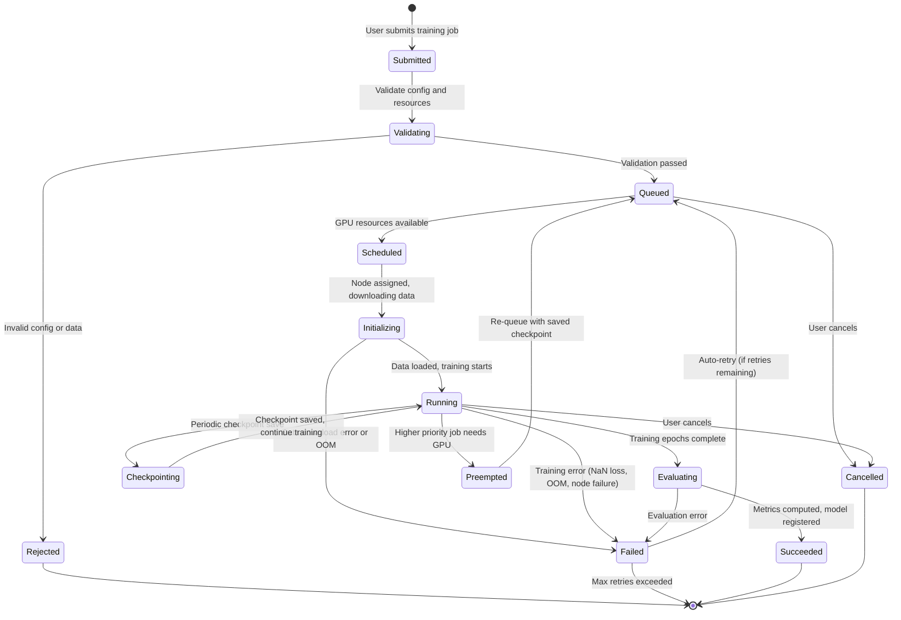

### Model Deployment Lifecycle

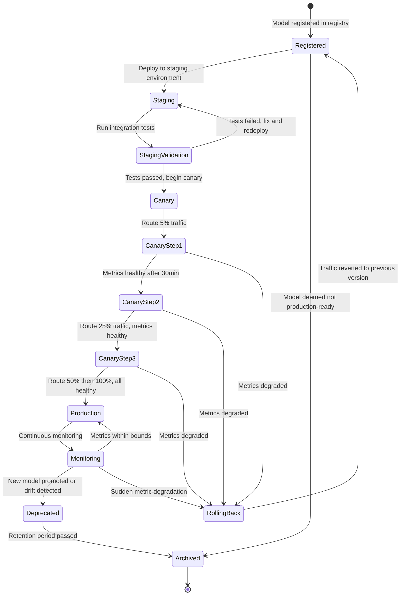

### Annotation Item Lifecycle

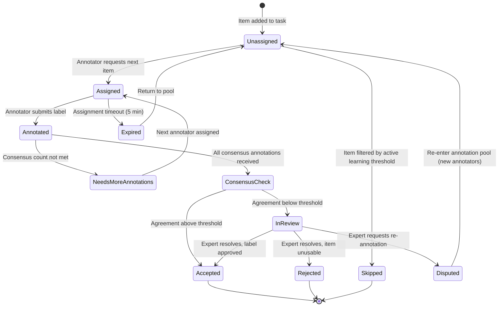

### Feature Materialization Lifecycle

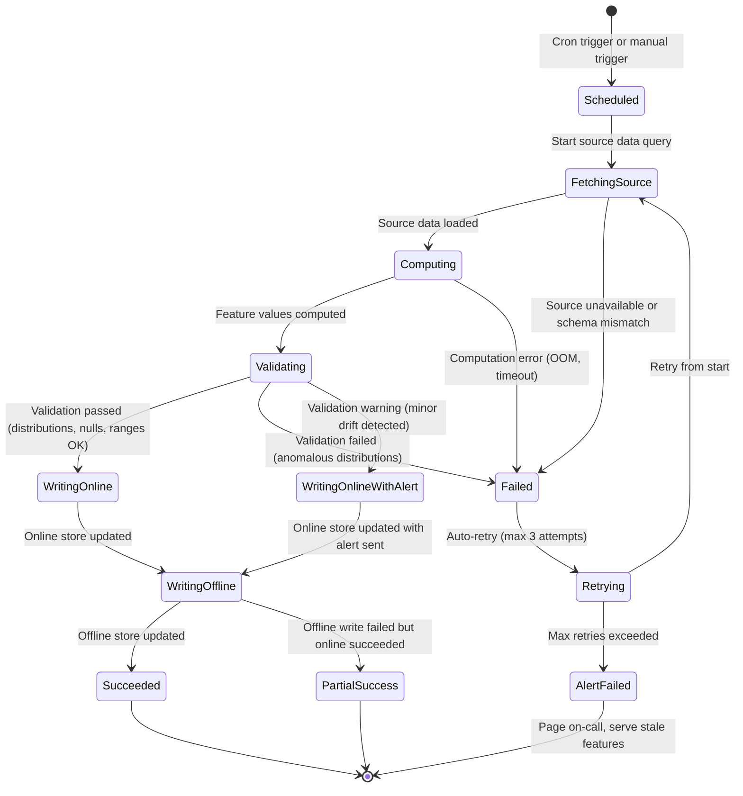

---

## Sequence Diagrams

### Real-Time Inference Path

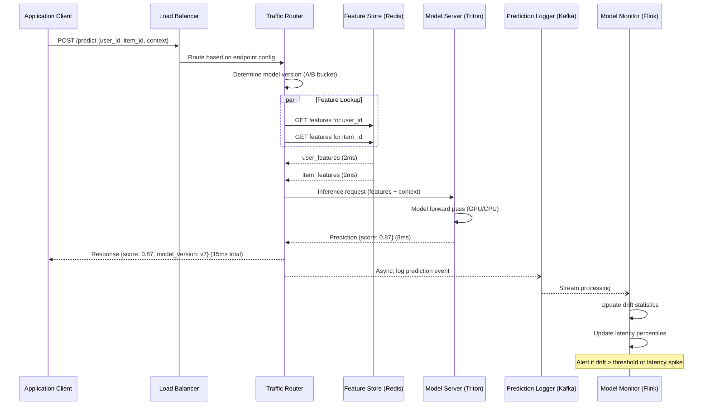

### Training Pipeline End-to-End

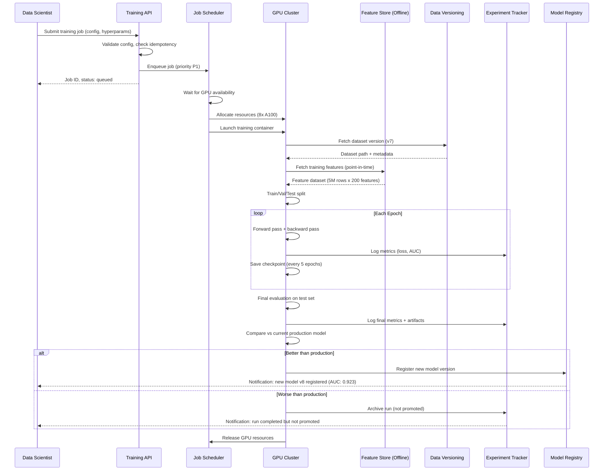

### Model Deployment Canary Rollout

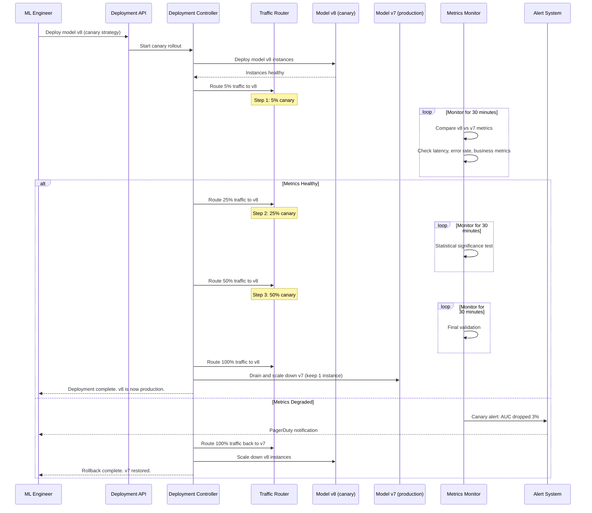

### Active Learning Loop

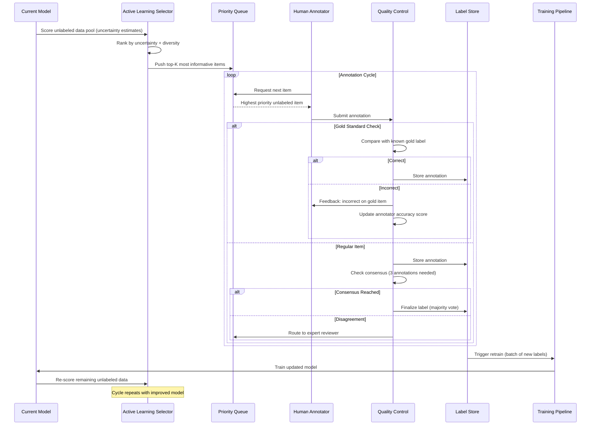

### Fraud Scoring with Feedback

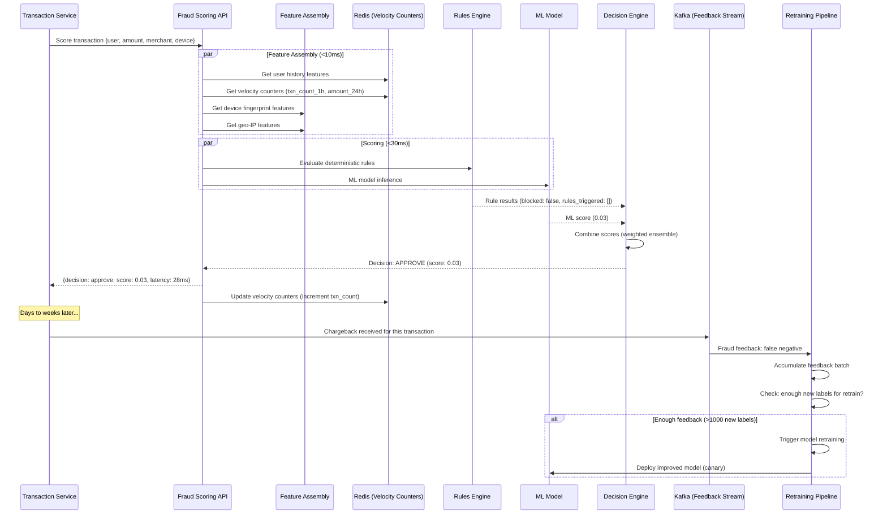

---

## Concurrency Control

### GPU Scheduling

```
Problem: Multiple teams compete for limited GPU resources.
N teams, M GPUs, each job needs 1-64 GPUs, jobs run minutes to days.

Scheduling Algorithm (Dominant Resource Fairness + Preemption):

1. Fair-share allocation:
   - Each team gets guaranteed share: team_gpu_quota = total_GPUs * team_weight
   - Example: Team A (40%), Team B (30%), Team C (30%) of 100 GPUs
   - Team A guaranteed 40 GPUs, Team B 30, Team C 30

2. Burst capacity:
   - If Team A only uses 20 GPUs, remaining 20 available for others
   - Burst jobs run at lower priority, can be preempted

3. Preemption rules:
   - P0 (production retrain) preempts P2 (exploration) but NOT P1 (experiment)
   - Preempted jobs receive SIGTERM, have 60 seconds to checkpoint
   - After checkpoint, job is re-queued with saved state

4. Gang scheduling:
   - Multi-GPU jobs must be scheduled atomically (all GPUs or none)
   - Prevents deadlock where Job A holds 4 of 8 needed GPUs, Job B holds other 4
   - Use bin-packing: prefer to fill nodes before spreading across nodes

5. Affinity rules:
   - GPUs within same node preferred (NVLink for fast interconnect)
   - For model parallelism: require same-node GPUs (mandatory)
   - For data parallelism: same-rack preferred (network bandwidth)
```

### Experiment Deduplication

```
Problem: Data scientist accidentally submits identical experiment twice.

Solution: Idempotency key based on experiment configuration hash.

Dedup key computation:
  idempotency_key = SHA256(
    experiment_id +
    dataset_version_id +
    feature_view_ref +
    sorted(hyperparameters) +
    model_config_hash
  )

Behavior:
  1. On job submission, compute idempotency_key
  2. Check training_jobs table for existing key:
     - If found AND status in (running, succeeded): return existing job_id
     - If found AND status is failed: allow resubmission (new attempt)
     - If not found: create new job
  3. Database enforces uniqueness via partial unique index
     (excludes failed jobs to allow retries)

Edge case: Same hyperparameters but different random seed
  - Random seed is included in hyperparameter hash
  - Different seeds = different idempotency keys = allowed
```

### Feature Compute Exactly-Once

```
Problem: Streaming feature computation must be exactly-once to avoid
double-counting (e.g., velocity counter incremented twice for same event).

Solution: Flink checkpointing + idempotent sinks

Flink exactly-once pipeline:
  1. Source: Kafka consumer with committed offsets
  2. Processing: Stateful window aggregations with Flink state backend (RocksDB)
  3. Checkpointing: Every 60 seconds, snapshot state + Kafka offsets atomically
  4. Sink: Redis SETEX (idempotent: same key+value is safe to replay)

For velocity counters (non-idempotent, increment-based):
  Problem: INCR is not idempotent
  Solution: Use event deduplication
    1. Each event has unique event_id
    2. Before processing, check: event_id in processed_events set?
    3. If yes, skip (duplicate)
    4. If no, process and add to processed_events set (TTL: 1 hour)
    5. processed_events stored in Flink state (checkpointed)

Alternative for counters: Use "replace" instead of "increment"
  - Compute full window aggregate in Flink state
  - Write final value to Redis (SETEX, idempotent)
  - More memory in Flink, but guaranteed correctness
```

---

## Idempotency Strategy

### Prediction Deduplication

```
Problem: Client retries due to timeout may cause duplicate predictions,
leading to duplicate downstream actions (e.g., double fraud block).

Solution: Request-ID based deduplication

Implementation:
  1. Client includes X-Request-ID header (UUID)
  2. Model serving gateway checks Redis for existing response:
     Key: pred_dedup:{request_id}
     TTL: 5 minutes

  3. If cache hit: return cached response immediately (no model inference)
  4. If cache miss: run inference, cache response, return to client

  5. For batch predictions:
     - Idempotency at batch job level: batch_job_id
     - If batch job with same ID already completed, return existing results
     - If batch job with same ID is running, return status (no re-submission)

Cost: One additional Redis lookup per request (~0.5ms)
Redis memory: 1M requests/5min x 200 bytes = 200 MB (negligible)
```

### Training Job Restart Idempotency

```
Problem: Training job fails and restarts. Must not re-process already-processed data
or lose completed checkpoints.

Solution: Checkpoint-based resume with idempotent data loading

1. Checkpoint contract:
   - Every N epochs, save: model weights, optimizer state, data loader position, epoch number
   - Checkpoint path includes run_id and epoch: s3://checkpoints/{run_id}/epoch-{N}/
   - On restart, find latest checkpoint: SELECT MAX(epoch) FROM checkpoints WHERE run_id = ?

2. Data loader position:
   - Deterministic shuffling with fixed seed + epoch number
   - Resume from exact batch position within epoch
   - For streaming data: checkpoint Kafka consumer offset

3. Metric logging idempotency:
   - Metrics keyed by (run_id, epoch, step)
   - Re-logging same metric is safe (overwrite with same value)
   - MLflow handles duplicate metric writes gracefully

4. Model registration idempotency:
   - Registration keyed by (model_name, content_hash)
   - If model with same hash already registered, return existing version
   - Prevents duplicate model versions from retry
```

---

## Consistency Model

### Feature Store Consistency

```
Online Store (Redis):
  Consistency: Eventual consistency with bounded staleness

  Write path:
    Batch: Spark job completes → bulk write to Redis → atomic key swap
    Stream: Flink processes event → write to Redis (per-key sequential)

  Staleness guarantee:
    - Streaming features: < 1 minute (Flink processing + Redis write)
    - Batch features: < freshness_sla (typically 1 hour)
    - Feature freshness tracked in metadata; stale features flagged in response

  Read-after-write:
    - Same partition/shard: guaranteed (Redis is single-threaded per shard)
    - Cross-shard: not guaranteed (but irrelevant; features are per-entity)

  Conflict resolution:
    - Last-write-wins (timestamp-based)
    - Streaming updates overwrite batch values (streaming is fresher)

Offline Store (S3/Iceberg):
  Consistency: Strong consistency via Iceberg snapshot isolation

  - Each materialization creates a new Iceberg snapshot
  - Training reads from a specific snapshot (immutable)
  - Concurrent materializations use optimistic concurrency (Iceberg conflict detection)
  - Point-in-time queries guaranteed correct (Iceberg time-travel)
```

### Model Version Consistency

```
Problem: During canary deployment, different serving replicas may have
different model versions loaded, causing inconsistent predictions.

Consistency guarantees:

1. Per-request consistency:
   - Traffic router determines model version ONCE per request
   - All feature lookups + inference use the same model version
   - Response includes model_version for client-side consistency

2. Session consistency (for A/B tests):
   - User assigned to bucket via deterministic hash: bucket = hash(user_id + test_id) % 100
   - Same user always gets same model version for duration of test
   - No session affinity at infrastructure level; routing is stateless

3. Deployment atomicity:
   - New model version deployed to ALL replicas before receiving any traffic
   - Health check confirms model loaded and warm before routing traffic
   - If any replica fails to load, deployment is rolled back for that step

4. Rollback consistency:
   - Rollback reverts traffic routing (not model unloading)
   - Old model stays loaded on all replicas for instant rollback
   - Only decommissioned after new model is stable (typically 24 hours)
```

---

## Distributed Transaction / Saga Design

### Model Deployment Saga

```
The model deployment process involves multiple services that must be coordinated.
A failure at any step requires compensating actions to restore the previous state.

Saga Steps:

Step 1: Validate Model
  Action: Load model artifact, verify checksum, run sanity inference
  Compensate: No-op (read-only step)

Step 2: Deploy Model Instances
  Action: Launch new model server instances, load model weights, run warm-up
  Compensate: Terminate new instances, release GPU resources

Step 3: Register in Service Discovery
  Action: Register new instances in load balancer / service mesh
  Compensate: Deregister new instances

Step 4: Update Traffic Routing
  Action: Route canary % to new model version
  Compensate: Route 100% back to old model version

Step 5: Monitor Canary Metrics
  Action: Collect and compare metrics for configured duration
  Compensate: Route 100% back to old model (automatic rollback)

Step 6: Promote to Full Traffic
  Action: Gradually increase traffic to 100%
  Compensate: Revert to canary % or rollback fully

Step 7: Drain Old Version
  Action: Scale down old model instances (keep 1 for emergency rollback)
  Compensate: Scale up old instances, revert routing

Saga Orchestrator:
  - Deployment Controller (stateful service) manages saga state
  - State persisted in PostgreSQL (deployment_configs table)
  - Each step has timeout (Step 5: 30 min, others: 5 min)
  - On timeout: execute compensating actions in reverse order
  - Saga can be paused/resumed by ML engineer
```

### Training Pipeline Orchestration

```
Training pipeline is a DAG of dependent steps, orchestrated by Airflow or custom orchestrator.

DAG Steps:

1. Data Validation
   - Verify dataset version exists and is accessible
   - Check schema compatibility with feature view
   - Validate data quality (nulls, distributions)
   Failure: Abort pipeline, notify data scientist

2. Feature Retrieval
   - Fetch offline features with point-in-time correctness
   - Join with labels
   - Create train/val/test splits
   Failure: Retry 3x, then abort

3. Training
   - Submit GPU job to training cluster
   - Monitor progress via checkpoints
   Failure: Resume from checkpoint (up to 3 restarts)

4. Evaluation
   - Run model on test set
   - Compute metrics (AUC, precision, recall, etc.)
   - Compare against current production model
   Failure: Retry 1x, then archive run

5. Model Registration (conditional)
   - Register model in registry IF metrics exceed threshold
   - Record lineage (dataset version → features → model)
   Failure: Retry registration; model artifact already in S3

6. Notification
   - Notify data scientist of results
   - Update experiment dashboard
   Failure: Non-critical; log and continue

Orchestration pattern: Choreography (each step emits event for next step)
  via Kafka topics: ml.pipeline.data_validated, ml.pipeline.features_ready,
  ml.pipeline.training_complete, ml.pipeline.evaluation_complete

Why not a central orchestrator for training?
  - Training jobs are long-running (hours); central orchestrator would need
    persistent state and fault tolerance
  - Event-driven choreography allows each step to be independently scalable
  - Airflow DAG provides the overall schedule; Kafka provides step-to-step triggering
```

---

## Security Design

### Model Access Control

```
Role-Based Access Control (RBAC):

Roles:
  ml-viewer:    View experiments, models, metrics (read-only)
  ml-engineer:  Submit training jobs, register models, manage features
  ml-admin:     Deploy models to production, manage endpoints, configure A/B tests
  ml-platform:  Manage infrastructure, GPU quotas, cluster config
  data-labeler: View and submit annotations (no model access)

Resource-level permissions:
  - Experiments: team-scoped (team members can view/edit)
  - Models: team-scoped for training; deployment requires ml-admin
  - Feature views: team-scoped for creation; cross-team read via sharing
  - Endpoints: environment-scoped (staging vs production)
  - Training data: dataset-level ACL (sensitive data restricted)

API authentication:
  - Service-to-service: mTLS + JWT (short-lived tokens from identity provider)
  - User-facing: OAuth 2.0 + RBAC
  - Model serving endpoints: API key + rate limiting per client

Audit logging:
  - All model deployments logged with deployer, approver, version
  - All training jobs logged with data accessed, GPU resources used
  - All feature accesses logged for compliance (who accessed what data)
```

### Data Privacy

```
Differential Privacy:
  - Add calibrated noise to training gradients (DP-SGD)
  - Privacy budget (epsilon): track cumulative privacy loss across training runs
  - Target: epsilon < 10 for user-level privacy guarantee
  - Implementation: Use Opacus (PyTorch) or TF Privacy

  Training with DP-SGD:
    1. Clip per-sample gradients to bound sensitivity
    2. Add Gaussian noise proportional to sensitivity
    3. Track privacy budget via Renyi divergence accountant
    4. Stop training if budget exhausted

Federated Learning:
  - Train personalization models on-device (mobile)
  - Aggregate model updates (not raw data) on server
  - Secure aggregation: server cannot see individual updates
  - Use case: keyboard prediction, on-device ranking

  Architecture:
    1. Server sends global model to devices
    2. Devices train locally on user data (stays on device)
    3. Devices send encrypted model updates to server
    4. Server aggregates updates via secure aggregation protocol
    5. Updated global model sent to devices

PII Handling:
  - Features derived from PII are hashed or tokenized before storage
  - Raw PII never stored in feature store or model artifacts
  - Training data anonymized: user_id → hashed_user_id
  - GDPR right-to-be-forgotten: delete user from feature store + retrain model excluding user
  - Data retention: feature store online (TTL-based), offline (policy-based deletion)
```

### Model Extraction Defense

```
Threat: Attacker queries model API repeatedly to reverse-engineer the model.

Defenses:
  1. Rate limiting: Per-API-key rate limits (10K requests/day for external)
  2. Query logging: Monitor for extraction patterns (systematic input probing)
  3. Output perturbation: Add small random noise to prediction scores
     (preserves ranking but degrades extraction quality)
  4. Watermarking: Embed unique watermarks in model outputs that can prove ownership
  5. Confidence score suppression: Return only top-K labels, not full probability distribution
  6. CAPTCHA / proof-of-work: For public-facing APIs, require human verification for high-volume usage

Detection:
  - Alert on: >1000 sequential requests from same IP
  - Alert on: Systematic input variation patterns (grid-like feature probing)
  - Alert on: Unusual query distribution (uniform vs. natural)
```

---

## Observability Design

### Model Monitoring

```
Three pillars of ML observability:

1. Data Quality Monitoring (input)
   Metrics:
     - Feature null rate (per feature, per time window)
     - Feature distribution shift (KL divergence, PSI, KS test)
     - Feature range violations (out-of-expected-bounds)
     - Feature correlation changes

   Alerting:
     - Null rate > 5% for any feature: P1 alert
     - PSI > 0.2 for any feature: P2 alert (moderate drift)
     - PSI > 0.5 for any feature: P1 alert (severe drift)

   Dashboard:
     - Feature distribution histograms (current vs. training)
     - Time series of feature statistics
     - Feature correlation heatmap

2. Model Performance Monitoring (output)
   Online metrics (real-time):
     - Prediction distribution (score histogram, class distribution)
     - Prediction latency (p50, p95, p99)
     - Error rate (4xx, 5xx)
     - Throughput (RPS)

   Offline metrics (batch, delayed ground truth):
     - AUC, precision, recall, F1 (computed when labels available)
     - Metric trend over time (weekly rolling window)
     - Per-segment metrics (by user cohort, by device, by geography)

   Drift detection:
     - Score distribution shift: compare current hour vs. training time
     - Concept drift: monitor correlation between predictions and outcomes
     - Alert: AUC drops > 2% over 7-day rolling window

3. Infrastructure Monitoring (system)
   Metrics:
     - GPU utilization, memory usage, temperature
     - Model server replica count, health check status
     - Feature store latency (online read latency, materialization lag)
     - Kafka consumer lag (prediction logging, feature streaming)

   Alerting:
     - GPU utilization < 10% for 30 min: potential underutilization
     - Feature store latency p99 > 10ms: performance degradation
     - Kafka lag > 100K messages: pipeline falling behind
```

### Data Quality Monitoring

```
Pipeline:
  1. Raw data arrives in data lake (S3)
  2. Great Expectations validates against defined expectations:
     - Schema validation (columns present, types correct)
     - Completeness (null rate per column < threshold)
     - Freshness (data no older than SLA)
     - Volume (row count within expected range ± 20%)
     - Distribution (per-column stats within expected bounds)
  3. Results stored in data quality table
  4. Failures block downstream pipelines (training, feature computation)

Expectations example:
  Dataset: product_interactions v7
  Checks:
    - user_id: not null, string format
    - event_type: in ['view', 'click', 'purchase', 'add_to_cart', 'skip']
    - timestamp: not null, within last 90 days, no future timestamps
    - row_count: between 120M and 180M (based on historical trend)
    - user_id cardinality: between 4M and 6M
```

### Training Metrics Observability

```
Experiment Tracking Dashboard (MLflow / W&B):
  - Training loss curve (per epoch)
  - Validation loss and metrics (per epoch)
  - Learning rate schedule
  - GPU utilization timeline
  - Memory usage timeline
  - Gradient norm (detect exploding/vanishing gradients)
  - Feature importance ranking

Aggregate Training Metrics:
  - Training jobs per day (by team, by priority)
  - Average GPU utilization across cluster
  - Queue wait time distribution
  - Job success rate (target > 90%)
  - Average training duration by model type
  - GPU cost per model (utilization x duration x $/GPU-hour)

Alerts:
  - Training job running > max_runtime: kill and notify
  - Loss is NaN: kill job immediately, notify
  - GPU utilization < 20% for running job: potential code issue
  - Validation loss increasing for 5+ epochs: potential overfitting (informational)
```

---

## Reliability and Resilience

### Model Fallback Chains

```
When primary model is unavailable, degrade gracefully through a fallback chain.

Fallback chain (fraud scoring):
  1. Primary: Deep learning ensemble (best accuracy)
     ↓ timeout after 50ms or error
  2. Secondary: XGBoost model (good accuracy, faster)
     ↓ timeout after 30ms or error
  3. Tertiary: Rules engine only (deterministic, always available)
     ↓ if rules engine fails
  4. Default: CHALLENGE all transactions (manual review)

Fallback chain (recommendations):
  1. Primary: Personalized deep learning ranker
     ↓ timeout or error
  2. Secondary: Collaborative filtering (precomputed)
     ↓ timeout or error
  3. Tertiary: Popularity-based (precomputed, cached in CDN)
     ↓ timeout or error
  4. Default: Editorial picks (static list, always available)

Implementation:
  - Circuit breaker per model endpoint (open after 5 failures in 10s)
  - Fallback selection latency < 1ms (in-memory config lookup)
  - Metrics: track fallback rate per model (target < 0.1%)
  - Alert if fallback rate > 1% for any model
```

### Graceful Degradation

```
Feature store degradation:
  - If online store (Redis) is slow (> 10ms) or unavailable:
    1. Serve from L1 cache (in-process, stale up to 60s) — best option
    2. Use feature defaults (per-feature default values) — acceptable
    3. Skip optional features, use only required features — reduced accuracy
    4. Return fallback prediction (popularity, rules-based) — last resort

  - If offline store is unavailable during training:
    1. Retry with exponential backoff (up to 30 minutes)
    2. Use cached feature dataset from previous materialization
    3. Pause training job (don't fail) and alert

Model serving degradation:
  - Under heavy load:
    1. Autoscale up to max_replicas
    2. Enable adaptive batching (batch more requests per inference)
    3. Switch to lighter model (quantized, pruned)
    4. Shed traffic (return 503 with Retry-After header)

  - GPU failure:
    1. Kubernetes reschedules pod to healthy node
    2. Model loaded from cache (local SSD) or downloaded from S3
    3. Health check ensures model is ready before receiving traffic
    4. If all GPU nodes down: fall back to CPU inference (higher latency, lower throughput)
```

### Stale Feature Handling

```
Problem: Feature materialization is delayed, so features served are stale.

Detection:
  - Each feature value includes event_timestamp (when computed)
  - Feature store response includes stale_features list
  - Monitoring tracks: feature_staleness_seconds = NOW() - event_timestamp

Handling strategies:
  1. Serve stale features with warning (most common)
     - Include staleness metadata in response
     - Model trained with stale feature augmentation (intentionally train on stale features)
     - Acceptable if staleness < 2x freshness_SLA

  2. Use default values for very stale features (staleness > 2x SLA)
     - Default values defined per feature in feature_definitions table
     - Typically: 0 for counts, global mean for continuous, 'unknown' for categorical

  3. Recompute on-the-fly for critical features
     - On-demand feature computation for features with < 10ms compute time
     - Example: user_age (from birth_date) — trivial to compute real-time
     - Not practical for aggregation features (e.g., purchase_count_30d)

  4. Block request if critical features are stale beyond hard threshold
     - Only for highest-criticality models (fraud detection)
     - Return 503 with reason: "Feature store degraded"
     - Extremely rare; indicates major infrastructure failure
```

---

## Multi-Region and DR Strategy

### Model Replication

```
Architecture: Active-Active across 3 regions (us-east-1, eu-west-1, ap-southeast-1)

Model Artifact Replication:
  - Model registry (PostgreSQL): Primary in us-east-1, read replicas in other regions
  - Model artifacts (S3): Cross-region replication enabled
  - Replication lag: < 5 minutes for model artifacts, < 1 second for metadata

Model Serving per Region:
  - Each region has independent model serving cluster
  - Same model versions deployed to all regions (synchronized via deployment controller)
  - Regional autoscaling based on local traffic patterns

Deployment coordination:
  1. Deploy canary in primary region (us-east-1) first
  2. If canary succeeds, deploy to other regions in parallel
  3. Each region has independent canary evaluation
  4. Rollback is per-region (one region can rollback independently)

Failover:
  - If model serving in one region fails, DNS (Route 53) routes to nearest healthy region
  - Failover time: < 60 seconds (health check interval + DNS propagation)
  - Cross-region latency penalty: ~50-100ms (acceptable for non-real-time models)
```

### Feature Store Geo-Distribution

```
Online Store (Redis):
  Strategy: Independent Redis clusters per region, synchronized via feature materialization

  Option A — Replicated writes (simple):
    - Flink/Spark writes features to Redis in ALL regions
    - Pros: Simple, low read latency, no cross-region dependency
    - Cons: 3x write cost, features may be slightly inconsistent across regions

  Option B — Primary with cross-region replication:
    - Features computed and written to primary region Redis
    - Redis Cross-Region Replication to other regions
    - Pros: Single write, strong consistency
    - Cons: Replication lag (50-100ms), primary dependency

  Recommendation: Option A (replicated writes) for production
    - Features are recomputed, not replicated — no consistency issues
    - Each region's Flink job reads from local Kafka mirror/replica
    - Eliminates cross-region dependency for online serving

Offline Store (S3/Iceberg):
  Strategy: Single offline store in primary region

  - Training always runs in primary region (co-located with data)
  - S3 cross-region replication for DR only (not for serving)
  - If primary region fails, training paused until recovered
    (training is not latency-sensitive; hours of delay acceptable)
```

### Disaster Recovery Playbook

```
Scenario 1: Single region failure
  Impact: ~33% of inference traffic affected
  Recovery:
    1. Automatic: DNS failover to remaining regions (< 60s)
    2. Autoscale: Remaining regions scale up to absorb traffic (< 5 min)
    3. Monitoring: Verify inference latency and error rates in remaining regions
  RTO: < 2 minutes | RPO: 0 (stateless inference)

Scenario 2: Model serving cluster failure (all replicas in region)
  Impact: 100% of region's inference traffic
  Recovery:
    1. Kubernetes restarts pods on healthy nodes (< 30s per pod)
    2. If node pool exhausted, new nodes provisioned (< 5 min)
    3. Model loaded from local cache or S3 (< 2 min)
    4. During recovery: DNS failover to other regions
  RTO: < 5 minutes | RPO: 0

Scenario 3: Feature store (Redis) failure
  Impact: Models serve with stale or default features
  Recovery:
    1. Redis Cluster auto-failover (replica promoted, < 30s)
    2. If full cluster lost, rebuild from offline store (< 30 min)
    3. During recovery: serve with L1 cache + defaults
  RTO: < 30 seconds (failover) to 30 minutes (full rebuild) | RPO: < 1 minute

Scenario 4: Training cluster failure
  Impact: Training jobs fail, no new models deployed
  Recovery:
    1. Resume failed jobs from checkpoints in other region/cluster
    2. Model serving unaffected (production models already deployed)
    3. No customer impact; ML team impact only
  RTO: < 1 hour | RPO: Last checkpoint (typically < 30 min of training)

Scenario 5: Kafka cluster failure
  Impact: Prediction logging and feature streaming delayed
  Recovery:
    1. Kafka MirrorMaker 2 in standby region takes over
    2. Prediction logging buffer in application (5 min in-memory)
    3. Feature streaming paused; online features stale but still served
  RTO: < 10 minutes | RPO: < 5 minutes of events
```

---

## Cost Drivers and Optimization

### GPU Cost Optimization

```
GPU costs dominate ML infrastructure spend (60-80% of total).

Strategy 1: Spot/Preemptible Instances
  Savings: 60-70% vs. on-demand
  Use for: Training jobs (checkpointable), HP search, batch predictions
  NOT for: Real-time inference (availability requirements too high)

  Implementation:
    - Training jobs: checkpoint every 10 minutes; resume on preemption
    - HP search: run on spot; if preempted, reschedule trial
    - Batch predictions: partition work; resume from last partition
    - Mix: 70% spot + 30% on-demand (for P0 production retraining)

Strategy 2: Mixed Precision Training (FP16/BF16)
  Savings: 2x training throughput (same GPUs, half the time)
  Use for: All deep learning training

  Implementation:
    - PyTorch AMP (Automatic Mixed Precision): 3 lines of code change
    - Forward pass in FP16, gradient accumulation in FP32
    - Loss scaling to prevent gradient underflow
    - Accuracy impact: typically < 0.1% degradation

Strategy 3: Right-sizing GPU allocation
  Problem: ML engineers request 8 A100s; actual utilization is 40%

  Solution:
    - Monitor GPU utilization per job (DCGM metrics)
    - Right-sizing recommendation engine:
      If avg utilization < 50% for 3+ jobs: suggest smaller allocation
    - Fractional GPU support (MIG for A100, MPS for older GPUs)
    - Auto-scaling training: start small, scale up if GPU utilization > 80%

Strategy 4: GPU Sharing / Time-Slicing
  - Multiple small models on same GPU (< 4 GB VRAM each)
  - NVIDIA MPS (Multi-Process Service) for concurrent inference
  - Typical: 3-5 small models per A100 (40 GB)
  - Savings: 3-5x for small models

Cost Tracking:
  Per-model GPU cost = GPU-hours x $/GPU-hour
  Attribute to team via training job metadata
  Monthly report: top 10 most expensive models, cost trend, optimization opportunities
```

### Inference Cost Optimization

```
Strategy 1: Dynamic Batching
  Combine multiple inference requests into a single GPU batch

  Triton Inference Server configuration:
    - max_batch_size: 64
    - batching_window_ms: 5 (wait up to 5ms to fill batch)
    - preferred_batch_size: [16, 32, 64]

  Impact: 4-8x throughput improvement with < 5ms latency increase
  Best for: GPU-based models with high throughput requirements

Strategy 2: Model Quantization
  Reduce model precision from FP32 to INT8/INT4

  Post-training quantization (no retraining):
    - FP32 → INT8: 4x smaller, 2-3x faster, < 1% accuracy loss
    - FP32 → INT4: 8x smaller, 3-5x faster, 1-3% accuracy loss

  Quantization-aware training (QAT):
    - Simulate quantization during training
    - Better accuracy than post-training quantization
    - Adds ~10% training time

Strategy 3: Model Distillation
  Train a smaller "student" model to mimic a larger "teacher" model

  Process:
    1. Teacher model (BERT-large, 340M params) generates soft labels
    2. Student model (DistilBERT, 66M params) trained on soft labels
    3. Student achieves 97% of teacher accuracy at 6x inference speed

  Use for: Deploy student model for real-time serving, teacher for batch

Strategy 4: Intelligent Routing
  Route easy requests to small models, hard requests to large models

  Implementation:
    1. Difficulty estimator (small model, ~1ms) scores request difficulty
    2. Easy requests (80%): route to small/quantized model ($)
    3. Hard requests (20%): route to full model ($$$)
    4. Result: 60% cost reduction with < 0.5% quality loss

Strategy 5: Request-Level Caching
  Cache prediction results for repeated identical requests
  (See Cache Strategy section above)

Cost comparison (per 1M predictions):
  Full model (GPU): $5.00
  Quantized (GPU): $1.50
  Distilled (CPU): $0.50
  Cached: $0.01
```

---

## Deep Platform Comparisons

### End-to-End ML Platform Comparison

| Dimension | Google (Vertex AI / TFX) | Meta (FBLearner / PyTorch) | Netflix (Metaflow) | Uber (Michelangelo) | Spotify | LinkedIn |
|---|---|---|---|---|---|---|
| **Training Framework** | TensorFlow (primary), JAX | PyTorch (primary) | PyTorch, scikit-learn | Mixed (TF, PyTorch, XGBoost) | TensorFlow, PyTorch | Custom (Pro-ML) |
| **Orchestration** | TFX Pipelines, Vertex Pipelines | FBLearner Flow | Metaflow + AWS Step Functions | Custom DAG engine | Luigi, then Flyte | Azkaban, then custom |
| **Feature Store** | Vertex Feature Store (managed) | Custom (F3, Feature Platform) | Custom | Michelangelo Feature Store | Custom (Feathr-like) | Feathr (open-sourced) |
| **Experiment Tracking** | Vertex Experiments | FBLearner built-in | Metaflow + custom | Michelangelo built-in | Custom | Custom |
| **Model Serving** | Vertex Prediction (TF Serving) | PyTorch Serving (TorchServe) | Custom (Java-based) | Custom DSP | TF Serving + custom | Custom |
| **Hyperparameter Tuning** | Vizier (Bayesian) | Ax (Bayesian) | Custom + Optuna | Custom Bayesian | Optuna | Custom |
| **Key Innovation** | Managed end-to-end, Gemini integration | Scale (trillions of predictions/day) | Human-centric UX for DS | Real-time features + serving | Multi-objective reco | Feathr feature store |
| **Scale** | 10K+ models | 100K+ models | 1K+ models | 10K+ models | 5K+ models | 10K+ models |
| **Open Source** | TFX, Feast (contrib) | PyTorch, Ax, Hydra | Metaflow | None (proprietary) | Backstage (platform) | Feathr |

### Training Infrastructure: SageMaker vs Vertex AI vs Custom K8s + Ray

| Dimension | AWS SageMaker | Google Vertex AI | Custom K8s + Ray |
|---|---|---|---|
| **Ease of setup** | High (fully managed) | High (fully managed) | Low (significant ops work) |
| **Framework support** | TF, PyTorch, XGBoost, sklearn, custom | TF, PyTorch, JAX, custom | Any (full control) |
| **Distributed training** | Built-in (data parallel, model parallel) | Built-in (data parallel, model parallel) | Ray Train + DeepSpeed + custom |
| **GPU management** | Automatic provisioning | Automatic provisioning | Manual node pool management |
| **Cost** | $$$ (managed premium) | $$$ (managed premium) | $-$$ (spot instances, but ops cost) |
| **Customization** | Medium (managed constraints) | Medium (managed constraints) | Very High (full control) |
| **Spot/Preemptible** | Managed spot training | Preemptible VMs | Manual checkpointing required |
| **HPO** | Built-in (random, Bayesian) | Vizier (SOTA Bayesian) | Optuna, Ray Tune |
| **Experiment tracking** | SageMaker Experiments | Vertex Experiments | MLflow, W&B |
| **Multi-cloud** | AWS only | GCP only | Any cloud + on-prem |
| **Best for** | AWS shops, small ML teams | GCP shops, Gemini integration | Large ML teams, custom needs |

### Serving: Triton vs TF Serving vs vLLM vs Custom

| Dimension | NVIDIA Triton | TF Serving | vLLM | Custom (FastAPI + ONNX) |
|---|---|---|---|---|
| **Frameworks** | TF, PyTorch, ONNX, TensorRT, custom | TensorFlow only | Any LLM (HF, custom) | ONNX (any framework via export) |
| **GPU optimization** | Excellent (TensorRT, dynamic batching) | Good (TF GPU ops) | Excellent (PagedAttention, continuous batching) | Manual (ONNX Runtime CUDA EP) |
| **Dynamic batching** | Built-in, highly configurable | Built-in | Continuous batching (LLM-optimized) | Manual implementation |
| **Model ensemble** | Built-in (pipeline, ensemble) | No | No | Manual |
| **Latency (p99)** | < 10ms (GPU models) | < 15ms (TF GPU) | < 200ms TTFT (LLMs) | < 20ms (depends on model) |
| **Throughput** | Very high (5-10K RPS/GPU) | High (3-5K RPS/GPU) | 500-2K tokens/s/GPU | Medium (1-3K RPS/GPU) |
| **Complexity** | Medium (config-heavy) | Low (simple for TF) | Low (simple for LLMs) | Low (full control) |
| **Best for** | Multi-framework, GPU-heavy | TF-only shops | LLM serving | Simple models, edge |

### Feature Stores: Feast vs Tecton vs Hopsworks vs Custom

| Dimension | Feast (OSS) | Tecton | Hopsworks | Custom |
|---|---|---|---|---|
| **License** | Apache 2.0 | Commercial | AGPL / Commercial | N/A |
| **Cost** | Free (self-managed) | $$$ | $$ | Engineering time |
| **Online store backends** | Redis, DynamoDB, BigTable | Managed (DynamoDB) | RonDB (custom MySQL NDB) | Redis, DynamoDB (custom) |
| **Offline store backends** | BigQuery, Redshift, S3 | Managed (Spark + S3) | Hive/S3 | S3, Iceberg (custom) |
| **Streaming features** | Flink/Spark (user-managed) | Built-in (managed Flink) | Built-in | Flink (self-managed) |
| **Point-in-time joins** | Built-in | Built-in | Built-in | Manual implementation |
| **Feature registry** | Basic UI | Advanced UI + monitoring | Advanced UI + monitoring | Custom |
| **Data quality** | Basic validation | Built-in monitoring + alerting | Built-in monitoring | Great Expectations (custom) |
| **Scale** | Tested to 10K features, 100M entities | Enterprise scale | Enterprise scale | Unlimited (depends on implementation) |
| **Best for** | Small-medium teams, OSS preference | Enterprise, managed preference | Existing Hopsworks users | Large teams, custom requirements |

---

## Edge Cases and Failure Scenarios

### Edge Case 1: Training-Serving Skew Causing Silent Accuracy Degradation

```
Scenario:
  Training pipeline normalizes user_age feature as (age - mean) / std using
  training data statistics (mean=35, std=12).
  Serving pipeline uses different normalization (mean=33, std=10) because
  it was computed from a different data sample.

Impact:
  Model accuracy drops 2-5% silently. No error, no alert.
  Revenue impact: $500K/month for recommendation model.

Detection:
  - Feature distribution monitoring compares training vs. serving distributions
  - PSI (Population Stability Index) > 0.2 triggers alert
  - Periodic offline evaluation on fresh data catches accuracy degradation

Prevention:
  - Feature Store enforces same transformation logic for training and serving
  - Feature transformation defined ONCE in feature view, applied everywhere
  - Integration test: compute features in both paths, compare values
  - Automated training-serving skew test in CI/CD pipeline
```

### Edge Case 2: Model Drift After Major World Event

```
Scenario:
  Fraud detection model trained on 2024 data. COVID-style event in 2025 causes:
  - Travel spending drops 80%
  - Online spending surges 300%
  - New merchant categories emerge (telehealth, remote work tools)
  Model flags legitimate online purchases as fraud (false positive rate 5x normal).

Impact:
  $2M/day in blocked legitimate transactions.

Detection:
  - Fraud score distribution shifts dramatically (median score increases 40%)
  - False positive rate spikes (from human review feedback)
  - Rule: "If fraud_block_rate > 2x baseline for 2 hours, P0 alert"

Response:
  1. Immediate: Increase challenge threshold (more lenient, fewer blocks)
  2. Short-term (hours): Deploy rules override for affected patterns
  3. Medium-term (days): Retrain model with recent data
  4. Long-term: Build event-detection system that triggers emergency retraining

Prevention:
  - Diverse training data (include historical crisis periods)
  - Monitoring dashboards with business context (transaction volumes by category)
  - Pre-built emergency response playbook
```

### Edge Case 3: GPU OOM During Distributed Training

```
Scenario:
  8-GPU training job runs fine for 10 epochs. At epoch 11, a data batch contains
  unusually long text sequences (>512 tokens), causing GPU memory to spike
  and OOM error on GPU 3.

Impact:
  Entire distributed training job fails. 10 epochs of training lost if no checkpoints.

Detection:
  - CUDA OOM error logged
  - GPU memory utilization monitoring shows spike before crash
  - Training job status: FAILED with OOM error

Response:
  1. Resume from last checkpoint (epoch 10)
  2. Enable gradient checkpointing (trade compute for memory)
  3. Add dynamic padding with max_length cap
  4. Enable gradient accumulation (smaller effective batch per GPU)

Prevention:
  - Always enable checkpointing (every epoch minimum)
  - Set max sequence length in data loader
  - Monitor GPU memory utilization; alert at 90%
  - Test with a few batches of max-size inputs before full training
  - Use torch.cuda.max_memory_allocated() to profile peak memory
```

### Edge Case 4: Feature Store Stale Data from Pipeline Delay

```
Scenario:
  Flink streaming feature pipeline processes user events to compute
  velocity features (purchase_count_1h). Pipeline experiences 30-minute delay
  due to Kafka consumer lag from a burst of events.

  Fraud model uses stale velocity counters: user who made 15 purchases
  in last hour appears to have made only 5 (30 min behind).

Impact:
  Fraud model under-scores risky transactions. Estimated $200K in missed fraud.

Detection:
  - Feature freshness monitoring: event_timestamp lag > SLA (1 minute)
  - Kafka consumer lag monitoring: alert when lag > threshold
  - Feature store response includes staleness metadata

Response:
  1. Alert triggers P1 page for ML platform team
  2. Auto-switch to "defensive mode": lower fraud approval threshold
  3. Investigate Flink pipeline: scale up parallelism if throughput issue
  4. If pipeline irrecoverable: failover to batch-computed features (hourly)

Prevention:
  - Flink autoscaling based on consumer lag
  - Feature store marks stale features in API response
  - Model trained with stale feature simulation (augmentation during training)
  - Dedicated capacity for feature streaming (separate from other Flink jobs)
```

### Edge Case 5: Cold Start for New Users in Recommendations

```
Scenario:
  New user signs up. No interaction history. Collaborative filtering has
  no signal. Content-based model has no preference data. Personalized
  recommendations are impossible.

Impact:
  New user sees generic content; engagement drops 40% vs. returning users.
  Poor first impression leads to lower 7-day retention.

Mitigation strategies:
  1. Progressive enrichment:
     - Sign-up: Show popularity-based + editorial picks
     - First 3 interactions: Use content-based similarity
     - First 10 interactions: Blend content-based + early CF signal
     - 50+ interactions: Full personalized model

  2. Onboarding quiz:
     - Ask 3-5 preference questions during sign-up
     - Map answers to preference vectors
     - Generate initial user embedding from quiz responses

  3. Transfer learning:
     - Use demographic features (age, location) to find similar users
     - Bootstrap with "average user in same segment" recommendations

  4. Contextual signals:
     - Referral source (what brought them here?)
     - Device type (mobile users prefer different content)
     - Time of day / day of week patterns from aggregate data

  5. Exploration allocation:
     - Dedicate higher exploration rate (30%) for new users
     - Use Thompson sampling to quickly learn preferences
     - Reduce exploration as confidence in user model grows
```

### Edge Case 6: Adversarial Attacks on Fraud Model

```
Scenario:
  Fraudsters discover that the fraud model is less suspicious of
  transactions with specific patterns (e.g., amounts ending in .99,
  transactions during business hours, from domestic IPs).
  They modify their behavior to exploit these blind spots.

Impact:
  Fraud losses increase 50% in the category the adversary targets.

Detection:
  - Monitor fraud patterns by rule: new fraud patterns not matching known signatures
  - Monitor model feature importance shifts
  - Track fraud rate per feature value bucket (unusual patterns emerge)

Response:
  1. Immediate: Add rules for detected adversarial patterns
  2. Short-term: Retrain model with recent adversarial examples
  3. Long-term: Adversarial training (simulate adversarial feature modifications)

Prevention:
  - Ensemble models: harder to attack multiple models simultaneously
  - Feature engineering: include features that are hard to manipulate
    (account age, historical patterns, network graph features)
  - Randomize decision boundary: add noise to threshold
  - Red team exercises: internal fraud team tries to beat the model
  - Monitor for systematic pattern changes in blocked vs. approved transactions
```

### Edge Case 7: Label Noise from Low-Quality Annotators

```
Scenario:
  Annotation task for product categorization. 20% of annotators are
  rushing through items (avg 2 seconds per item vs. expected 8 seconds).
  These annotators have 60% accuracy on gold standard items.

  Noisy labels propagate to training data, degrading model accuracy.

Impact:
  Model accuracy drops 3-5% due to label noise. Affects all downstream
  models trained on this data.

Detection:
  - Gold standard accuracy per annotator: flag anyone < 80%
  - Annotation speed anomaly: flag anyone < 50% of expected time
  - Inter-annotator agreement drops below threshold (kappa < 0.6)

Response:
  1. Disable flagged annotators immediately
  2. Review and discard annotations from flagged annotators
  3. Re-annotate affected items with qualified annotators
  4. Retrain model excluding noisy labels

Prevention:
  - Gold standard items injected at 5-10% rate
  - Real-time accuracy tracking with auto-disable at < 80%
  - Qualification test before annotators can work on tasks
  - Consensus labeling (3+ annotators) with majority vote
  - Annotator skill tiers: new annotators start with easier tasks
```

### Edge Case 8: Data Leakage in Time-Series Features

```
Scenario:
  Feature "avg_purchase_amount_30d" is computed for training data.
  Bug: the feature computation includes the label date itself.
  For a label "will user purchase on March 15?", the feature includes
  the March 15 purchase in the 30-day average.

Impact:
  Model AUC is 0.95 in offline evaluation but 0.82 in production.
  The 13-point gap is entirely due to data leakage.

Detection:
  - Large gap between offline and online metrics (> 3% AUC difference)
  - Suspiciously high offline performance (too good to be true)
  - Feature importance analysis: leaked feature is top-1 by far

Prevention:
  - Feature Store enforces point-in-time correctness:
    Features computed with event_timestamp < label_timestamp (strictly before)
  - Time-travel validation: for each training example, verify all features
    were computed BEFORE the label timestamp
  - Automated data leakage tests in training pipeline:
    Train model with and without suspected features; if removal causes
    massive accuracy drop, investigate for leakage
  - Code review checklist: "Are all features point-in-time correct?"
```

### Edge Case 9: Model Serving Latency Spike from Garbage Collection

```
Scenario:
  Java-based model serving (TF Serving or custom JVM) experiences periodic
  latency spikes every 5 minutes. p99 latency jumps from 15ms to 500ms
  during GC pauses. Affects 0.1% of requests but violates SLA.

Impact:
  SLA violation; 0.1% of users experience 500ms delay.
  For fraud detection, 500ms delay causes transaction timeouts.

Detection:
  - Latency percentile monitoring shows periodic spikes
  - GC logs show long Stop-The-World pauses (> 100ms)
  - Correlation between GC events and latency spikes

Fix:
  1. Tune GC: Switch to ZGC or Shenandoah (low-pause GC)
  2. Reduce heap allocation: Object pooling, off-heap memory for tensors
  3. Pre-allocate inference buffers (avoid per-request allocation)
  4. Switch to non-JVM serving: Triton (C++), vLLM (Python/C++)
  5. Isolate hot path: Separate GC-heavy preprocessing from inference
```

### Edge Case 10: Feature Dependency Chain Failure

```
Scenario:
  Feature A depends on Feature B (user_segment), which depends on Feature C
  (user_purchase_count). Feature C's batch computation fails at 2 AM.
  Feature B cannot be computed. Feature A is stale.

  20 downstream models depend on Feature A.

Impact:
  All 20 models serve with stale features for Feature A.
  Impact ranges from negligible (features that change slowly) to severe
  (features that change hourly).

Detection:
  - Feature materialization job failure alerts
  - Feature dependency graph analysis shows blast radius
  - Feature freshness monitoring for downstream features

Response:
  1. Assess blast radius: which models are affected? how critical?
  2. Serve stale features (with alert to model owners)
  3. Fix root cause (Feature C computation)
  4. Trigger cascade recomputation: C → B → A

Prevention:
  - Feature dependency graph with blast radius analysis
  - SLA tiering: P0 features have redundant computation paths
  - Circuit breaker: if upstream feature fails, serve default + alert
  - Daily dependency health check: ensure all chains are healthy
```

### Edge Case 11: A/B Test Interference Between Concurrent Experiments

```
Scenario:
  Experiment 1: Test new recommendation model (50% of users)
  Experiment 2: Test new checkout UI (50% of users)

  Both experiments affect purchase conversion rate.
  25% of users are in BOTH experiments.
  Conversion lift attributed to Experiment 1 may actually be caused by
  Experiment 2's improved checkout UI.

Impact:
  Incorrect A/B test conclusions; wrong model deployed to production.

Detection:
  - Experiment interaction analysis: users in both experiments show
    different lift than users in only one experiment
  - Statistical test for interaction effects (factorial analysis)

Prevention:
  - Experiment layering: orthogonal layers with independent randomization
    Layer 1: Recommendation model experiments
    Layer 2: UI experiments
    Each user gets independent random assignment per layer

  - Mutual exclusion: experiments that affect same metric cannot overlap
    Enforced by experiment platform at experiment creation time

  - Holdout: 10% of users in a global holdout (no experiments)
    Provides clean baseline for all experiments

  - Pre-experiment power analysis: ensure sample size is sufficient
    even with concurrent experiment interaction
```

### Edge Case 12: Embedding Index Corruption During Update

```
Scenario:
  Nightly embedding index rebuild produces corrupt index due to NaN values
  in 0.01% of item embeddings (caused by item with unusual features).

  Hot-swap replaces production index with corrupt index.
  ANN queries return incorrect nearest neighbors or crash.

Impact:
  Recommendation quality drops severely. Users see irrelevant items.
  If index crashes, recommendations fall back to popularity (degraded but functional).

Detection:
  - Index validation (post-build, pre-swap):
    - Query 1000 known items, verify nearest neighbors match expectations
    - Check for NaN/Inf values in all embeddings
    - Verify index size matches expected item count
  - Production monitoring: recommendation diversity drops (same items repeated)

Prevention:
  1. Pre-swap validation (mandatory):
     - Query validation set (100 items with known neighbors)
     - Recall@10 must be > 0.95 (compared to brute-force)
     - No NaN/Inf check on all vectors before index build
     - Item count within 5% of expected

  2. Atomic swap with rollback:
     - Keep previous index for 24 hours after swap
     - If anomaly detected within 1 hour, auto-rollback to previous index
     - Rollback time: < 30 seconds (pointer swap)

  3. Data validation:
     - Filter NaN/Inf embeddings before index build
     - Replace with zero vector or exclude item from index
     - Alert on items with invalid embeddings for investigation
```

---

## LLM-Specific Infrastructure

### LLM Serving Architecture

```
The rise of Large Language Models (GPT-4, Llama, Claude, Gemini) in 2024-2025
has created new infrastructure challenges distinct from traditional ML serving.

Key Differences from Traditional ML Serving:
  - Model size: 7B-700B parameters (vs. ~1M for traditional models)
  - Memory: 14-1400 GB VRAM (vs. < 1 GB for traditional models)
  - Latency: 200ms-5s for generation (vs. < 30ms for traditional models)
  - Cost: $0.001-0.03 per request (vs. $0.000005 for traditional models)
  - Workload: Autoregressive generation (sequential token-by-token)

Architecture:
  Client → API Gateway → Token Router → LLM Serving Cluster → Response Streamer

LLM Serving Frameworks:

vLLM:
  - PagedAttention: KV cache stored in non-contiguous memory pages
  - Continuous batching: new requests join batch between tokens
  - 2-4x throughput vs. naive HuggingFace serving
  - Support: Llama, Mistral, Qwen, Gemma, etc.
  - Deployment: Kubernetes + NVIDIA GPUs

TensorRT-LLM (NVIDIA):
  - Kernel fusion and quantization for NVIDIA GPUs
  - INT4/INT8/FP8 quantization with minimal quality loss
  - Flight (paged) attention for KV cache management
  - 3-5x inference speedup vs. unoptimized
  - Best for: NVIDIA GPU clusters, latency-critical applications

SGLang:
  - RadixAttention for prefix caching
  - Efficient for multi-turn conversations (shared prefix)
  - Automatic KV cache reuse across requests with common prefixes

Serving Architecture Details:
  1. Request arrives at API Gateway
  2. Token Router assigns to GPU with available KV cache capacity
  3. Prefill phase: process all input tokens in parallel (~100ms for 1000 tokens)
  4. Decode phase: generate output tokens one-by-one (~30ms per token)
  5. Response streamed back via SSE (Server-Sent Events)

Multi-GPU serving for large models:
  - Tensor parallelism: split attention heads across GPUs (same node)
  - Pipeline parallelism: split layers across GPUs (cross-node)
  - 70B model: 2x A100 80GB (tensor parallel)
  - 700B model: 8x H100 80GB (tensor parallel + pipeline parallel)

Autoscaling:
  - Scale metric: pending_requests / active_gpus
  - Target: < 5 pending requests per GPU
  - Scale-up time: 3-5 minutes (model loading from cache)
  - Pre-warm: keep N cold instances with model loaded for burst
```

### RAG Pipeline Design

```
Retrieval-Augmented Generation (RAG) grounds LLM responses in factual
data by retrieving relevant documents before generation.

Architecture:

  Query → Query Processor → Retriever → Reranker → Context Builder → LLM → Response

Components:

1. Document Ingestion Pipeline:
   Raw Documents → Chunking → Embedding → Vector Store

   Chunking strategies:
     - Fixed-size (512 tokens) with overlap (50 tokens)
     - Semantic chunking (split at paragraph/section boundaries)
     - Recursive character splitting (fallback)

   Embedding model: all-MiniLM-L6-v2 (384-dim, fast) or text-embedding-3-large (3072-dim, accurate)

   Vector store: pgvector, Pinecone, Weaviate, or Qdrant

2. Query Processing:
   - Query rewriting: LLM rephrases user query for better retrieval
   - Query decomposition: complex query split into sub-queries
   - HyDE (Hypothetical Document Embeddings): generate hypothetical answer, embed it, retrieve similar

3. Retrieval:
   - Dense retrieval: embed query, ANN search in vector store (top 20)
   - Sparse retrieval: BM25 keyword search (top 20)
   - Hybrid: combine dense + sparse with reciprocal rank fusion

   retrieval_results = RRF(dense_top20, sparse_top20, k=60)

4. Reranking:
   - Cross-encoder reranker (e.g., ms-marco-MiniLM-L-12)
   - Scores each (query, document) pair for relevance
   - Select top 5-10 most relevant chunks
   - Latency: ~50ms for 20 candidates

5. Context Building:
   - Concatenate retrieved chunks into context window
   - Include source citations (document ID, chunk position)
   - Respect context window limit (e.g., 128K tokens for GPT-4)
   - Priority: most relevant chunks first (in case of truncation)

6. Generation:
   - System prompt: "Answer based on the following context. Cite sources."
   - Context + user query → LLM → response with citations
   - Streaming response back to user

Performance:
  End-to-end latency: 500ms-3s (retrieval: 50ms, reranking: 50ms, LLM: 500ms-2s)
  Accuracy: RAG typically improves factual accuracy from 60% to 85%+
```

### Prompt Management System

```
As LLM-powered features proliferate, managing prompts becomes a
production engineering concern (not just a research activity).

Architecture:

  Prompt Registry → Version Control → A/B Testing → Monitoring

1. Prompt Registry:
   - Central store for all production prompts
   - Schema: prompt_id, version, template, variables, model, created_by
   - Variables: {{user_context}}, {{retrieved_documents}}, {{system_instructions}}
   - Access control: team-scoped, with promotion workflow

2. Version Control:
   - Every prompt change creates a new version
   - Immutable versions (no editing, only new versions)
   - Diff view between versions
   - Rollback to any previous version

3. Prompt A/B Testing:
   - Route % of traffic to new prompt version
   - Measure: response quality (human eval), latency, cost, user satisfaction
   - Statistical significance testing before promotion

4. Prompt Optimization:
   - Track token count per prompt (cost driver)
   - Compress prompts: remove redundant instructions
   - Few-shot example selection: choose examples most similar to query
   - Dynamic prompt construction based on user context

5. Monitoring:
   - Response quality metrics (hallucination rate, relevance score)
   - Token usage per prompt (input tokens + output tokens)
   - Latency per prompt version
   - Cost per prompt version
   - Failure rate (refusals, errors, timeouts)

Data model:
  prompts (prompt_id, name, description, owner_id, model_target)
  prompt_versions (version_id, prompt_id, template, variables, version_number)
  prompt_deployments (deployment_id, version_id, environment, traffic_pct)
  prompt_evaluations (eval_id, version_id, metric, value, sample_size)
```

### LLM Evaluation and Safety

```
LLM evaluation is harder than traditional ML evaluation because outputs
are open-ended text, not discrete labels.

Evaluation Dimensions:

1. Factual Accuracy:
   - Compare generated answers against ground truth (exact match, F1)
   - For RAG: measure faithfulness (does answer match retrieved context?)
   - Metric: Hallucination rate (% of claims not supported by context)

2. Relevance:
   - Does the response answer the user's question?
   - Metric: LLM-as-judge relevance score (1-5 scale)
   - Metric: User satisfaction rating (thumbs up/down)

3. Safety:
   - Harmful content detection (toxicity, bias, PII leakage)
   - Jailbreak resistance testing
   - Metric: Safety classifier score on generated outputs

4. Latency and Cost:
   - Time to first token (TTFT)
   - Tokens per second (TPS)
   - Total cost per request (input + output tokens)

Evaluation Pipeline:
  1. Maintain eval dataset: 500-1000 (question, expected_answer) pairs
  2. Run new model/prompt against eval dataset
  3. Score with automated metrics + LLM-as-judge
  4. Human review of random sample (50-100 responses)
  5. Compare against baseline (current production model/prompt)
  6. Promote if all metrics improve or are within tolerance

Safety Testing:
  Red-team dataset: 1000+ adversarial prompts testing:
    - Jailbreak attempts ("ignore previous instructions")
    - Harmful content requests
    - PII extraction attempts
    - Bias-inducing prompts
    - Prompt injection via user content

  Safety test must pass 100% (zero tolerance for safety failures)
  Automated safety testing in CI/CD before deployment
```

### Fine-Tuning Infrastructure (LoRA, QLoRA)

```
Full fine-tuning of LLMs is expensive (8x A100 for 7B model).
Parameter-efficient fine-tuning (PEFT) methods make it practical.

LoRA (Low-Rank Adaptation):
  - Freeze base model weights
  - Add small trainable matrices (rank 16-64) to attention layers
  - Trainable parameters: ~0.1% of full model
  - Memory: 1 A100 for 7B model (vs. 8 A100 for full fine-tune)
  - Quality: 95-99% of full fine-tune performance

QLoRA:
  - Quantize base model to 4-bit (NF4 format)
  - Apply LoRA adapters on top of quantized model
  - Memory: ~6 GB for 7B model (fits on consumer GPU)
  - Quality: Close to LoRA (slight degradation from quantization)

Infrastructure:
  1. Data preparation:
     - Format: {"instruction": "...", "input": "...", "output": "..."}
     - Typical dataset: 1K-100K examples
     - Data quality > data quantity for fine-tuning

  2. Training:
     - Framework: HuggingFace PEFT + transformers + bitsandbytes
     - GPU: 1x A100 80GB for 7B LoRA, 2x A100 for 13B LoRA
     - Duration: 1-4 hours for 10K examples on 7B model
     - Hyperparameters: rank=16, alpha=32, dropout=0.05, lr=2e-4

  3. Serving:
     - LoRA adapters stored separately from base model (~50-200 MB)
     - Multiple adapters per base model (multi-tenant)
     - Adapter hot-swapping: load adapter in < 1 second
     - vLLM supports LoRA adapter serving natively

Cost comparison:
  Full fine-tune (7B): 8 A100 x 8 hours = 64 GPU-hours = $160
  LoRA fine-tune (7B): 1 A100 x 2 hours = 2 GPU-hours = $5
  QLoRA fine-tune (7B): 1 A100 x 2 hours = 2 GPU-hours = $5

  Full fine-tune (70B): 64 A100 x 24 hours = 1536 GPU-hours = $3,840
  LoRA fine-tune (70B): 8 A100 x 8 hours = 64 GPU-hours = $160
```

### Token-Level Cost Optimization

```
LLM costs are directly proportional to token consumption.
At scale, token optimization saves significant money.

Cost structure (example pricing):
  Input tokens:  $0.003 per 1K tokens (GPT-4 class)
  Output tokens: $0.015 per 1K tokens
  Cached input:  $0.0015 per 1K tokens (50% discount for repeated prefixes)

Optimization strategies:

1. Prompt compression:
   - Remove verbose instructions; use concise directives
   - Before: "Please carefully analyze the following text and provide a detailed summary..." (15 tokens)
   - After: "Summarize:" (2 tokens)
   - Impact: 20-40% reduction in input tokens

2. Context window management:
   - For RAG: retrieve fewer, more relevant documents
   - Before: 10 chunks x 500 tokens = 5000 context tokens
   - After: 5 chunks x 500 tokens = 2500 context tokens (better reranker)
   - Impact: 50% reduction in context tokens

3. Output length control:
   - Set max_tokens appropriately (don't default to 4096)
   - Use structured output (JSON) to reduce verbose natural language
   - Impact: 30-50% reduction in output tokens

4. Caching:
   - Semantic cache: cache responses for semantically similar queries
   - Prefix caching: reuse KV cache for common prefixes (system prompts)
   - Impact: 20-40% reduction in total cost (depends on query similarity)

5. Model routing:
   - Simple queries → smaller model (GPT-4o-mini: 10x cheaper)
   - Complex queries → larger model (GPT-4o)
   - Difficulty classifier: small model estimates query complexity
   - Impact: 50-70% cost reduction (most queries are simple)

6. Batching:
   - Batch non-urgent requests (e.g., content moderation, summarization)
   - Submit batch API for 50% discount
   - Acceptable for: offline processing, nightly reports, content indexing

Cost tracking:
  Per-feature token usage: track input + output tokens per API endpoint
  Per-team budget: alert at 80% of monthly token budget
  Cost attribution: tag each request with team, feature, user_segment
```

### Guardrails and Content Filtering

```
Production LLM deployments require guardrails to prevent harmful,
incorrect, or off-topic outputs.

Architecture:

  User Input → Input Filter → LLM → Output Filter → Response

Input Guardrails:
  1. PII detection and redaction
     - Regex + NER model detects SSN, credit card, phone, email
     - Replace with tokens: [REDACTED_SSN], [REDACTED_EMAIL]
     - Latency: < 5ms

  2. Prompt injection detection
     - Classifier trained on prompt injection attacks
     - Detects: "ignore previous instructions", role-play attacks, encoding tricks
     - Action: block request + log for security review
     - Latency: < 10ms

  3. Topic filtering
     - Ensure queries are within allowed domain
     - Out-of-scope detector (classifier or keyword-based)
     - Action: return canned response ("I can only help with...")

Output Guardrails:
  1. Toxicity / harmful content detection
     - Perspective API or custom toxicity classifier
     - Threshold: block if toxicity > 0.7
     - Latency: < 20ms

  2. Factual grounding check (for RAG)
     - NLI model checks if response is entailed by retrieved context
     - Flag ungrounded claims for review
     - Latency: < 50ms

  3. PII leakage detection
     - Scan output for PII that should not be exposed
     - Even if PII was in context, model should not regurgitate it

  4. Format validation
     - If structured output expected (JSON), validate schema
     - If response should cite sources, verify citations present
     - Retry with corrective prompt if validation fails

  5. Brand safety
     - Check for competitor mentions, inappropriate brand associations
     - Domain-specific blacklist of terms/topics

Implementation:
  Guardrails run in parallel where possible (input filters, output filters)
  Total guardrail overhead: 20-50ms (acceptable for most LLM use cases)
  Guardrails are independently versioned and deployed (like models)
  Bypass guardrails: never (even for internal users)
```

---

## Architecture Decision Records

### ARD-001: Feature Store for Training-Serving Consistency

| Field | Detail |
|-------|--------|
| **Decision** | Centralized feature store with offline + online serving |
| **Why** | Training-serving skew is the #1 production ML failure; single feature definition eliminates it |
| **Trade-offs** | Additional infrastructure; feature computation must be deterministic |
| **Revisit when** | If feature count < 50 and team < 5 → inline feature computation may suffice |

### ARD-002: Canary Deployment for Model Updates

| Field | Detail |
|-------|--------|
| **Decision** | Canary rollout (5% → 25% → 50% → 100%) for all model updates |
| **Why** | Bad model deployed to 100% can cause immediate revenue loss (bad recs, false fraud blocks) |
| **Trade-offs** | Slower rollout; requires online metrics pipeline for canary evaluation |
| **Revisit when** | If online metrics show canary evaluation is too slow → consider shadow mode |

### ARD-003: Two-Stage Recommendation Architecture

| Field | Detail |
|-------|--------|
| **Decision** | Candidate generation (lightweight) + ranking (deep model) |
| **Why** | Cannot run deep model on entire catalog (millions of items) at request time |
| **Trade-offs** | Candidate generation may miss relevant items (recall trade-off) |
| **Revisit when** | If ANN search over full catalog becomes fast enough (< 10ms at 50M items) |

---

## POCs

### POC-1: Model Serving Latency
**Goal**: p99 < 30ms for recommendation model inference at 100K RPS.
**Fallback**: ONNX optimization; GPU serving; reduce model complexity.

### POC-2: Feature Store Online Serving
**Goal**: p99 < 10ms for 50-feature lookup at 100K RPS from Redis.
**Fallback**: Batch feature requests; local cache for hot features.

### POC-3: Active Learning Label Efficiency
**Goal**: Achieve target AUC with 50% fewer labels compared to random sampling.
**Fallback**: Combine active learning with semi-supervised learning.

---

## Real-World Comparisons

| Aspect | Google | Netflix | Uber | Meta | Spotify |
|--------|--------|---------|------|------|---------|
| **ML Platform** | TFX | Metaflow | Michelangelo | FBLearner | Custom |
| **Serving** | TF Serving | Custom | Custom | PyTorch Serving | Custom |
| **Feature Store** | Feast-like | Custom | Michelangelo features | Custom | Custom |
| **Experiment** | Vizier (HPO) | Custom | Custom | FBLearner | Custom |
| **Reco model** | Deep neural (YouTube) | Deep learning | Deep learning | Deep + GNN | Collaborative + content |
| **Key challenge** | Scale (billions of queries) | Quality (taste modeling) | Real-time (location ML) | Safety (content moderation) | Music understanding |

---

## Common Mistakes

1. **No feature store** — features computed differently in training vs. serving → prediction quality degrades silently.
2. **Deploying without canary** — bad model to 100% traffic immediately → revenue/safety impact.
3. **Not monitoring model drift** — model performance degrades over weeks as data distribution shifts.
4. **Training on all data** — must use point-in-time features to avoid data leakage.
5. **GPU for all models** — many models (GBDT, linear) run fine on CPU. GPU only for deep learning.
6. **Ignoring latency budget** — ML teams optimize for accuracy; production requires latency < 30ms.
7. **No experiment tracking** — can't reproduce results → can't debug regressions.
8. **Labeling without quality control** — garbage labels → garbage model. Always use consensus + gold standard.

---

## Interview Angle

| Question | Key Insight |
|----------|------------|
| "Design a recommendation system" | Two-stage (candidate gen + ranking), feature store, cold start |
| "Design ML model serving" | Versioning, canary deployment, latency budget, autoscaling |
| "Design a fraud detection system" | Real-time features, class imbalance, feedback loop |
| "Design a feature store" | Offline + online stores, training-serving consistency |
| "Design a model training pipeline" | Distributed training, experiment tracking, checkpointing |

---

## Evolution Roadmap (V1 -> V2 -> V3)

```mermaid
flowchart LR
    subgraph V1["V1: Ad-Hoc ML"]
        V1A["Jupyter notebooks"]
        V1B["Sklearn models"]
        V1C["Manual deployment"]
        V1D["No feature store"]
    end
    subgraph V2["V2: ML Platform"]
        V2A["Training pipeline (Airflow + Spark)"]
        V2B["Model registry (MLflow)"]
        V2C["Feature store (Feast)"]
        V2D["Model serving (Triton/TF Serving)"]
        V2E["A/B testing for models"]
    end
    subgraph V3["V3: ML at Scale"]
        V3A["Distributed training (DeepSpeed)"]
        V3B["Real-time feature streaming (Flink)"]
        V3C["Auto-ML / neural architecture search"]
        V3D["LLM serving (vLLM)"]
        V3E["Automated retraining on drift"]
        V3F["Data labeling with active learning"]
    end
    V1 -->|"Manual everything, no reproducibility"| V2
    V2 -->|"Scale, real-time, LLMs"| V3
```

---

## Practice Questions

1. **Design a model serving system handling 500K inference requests/second.** Cover versioning, canary, autoscaling, and latency.
2. **Design a recommendation engine for 50M products and 100M users.** Cover two-stage architecture, cold start, and A/B evaluation.
3. **Design a feature store serving both training and real-time inference.** Cover offline/online stores and training-serving skew prevention.
4. **Design a fraud detection ML pipeline with real-time scoring.** Cover features, class imbalance, feedback loop, and model monitoring.
5. **Design a data labeling platform for 1M annotations per month.** Cover quality control, active learning, and annotator management.
6. **Your recommendation model AUC dropped 3% over 2 weeks. Design the diagnosis and recovery process.** Cover drift detection, data validation, and rollback.

## RAG System Blueprint (LLM-Specific)

For LLM-powered features (knowledge assistants, search copilots, support bots), the RAG pattern is the dominant production architecture.

```
INGESTION: Documents → Chunk (512 tok, 64 overlap) → Embed → Vector DB
  Refresh: webhook on update, 15-min poll for dynamic sources

QUERY: User question → Embed → Hybrid search (BM25 + vector ANN)
  → Re-rank (cross-encoder, +50ms) → Assemble prompt (system + context + query)
  → LLM (streaming) → Guardrails (hallucination check, PII filter)
  → Response + citations

COST LEVERS:
  Model cascade: small model for simple queries (10-50x cheaper)
  Semantic cache: 20-40% fewer LLM calls
  Context trimming: fewer chunks → fewer input tokens
```

### RAG Quality Metrics

| Metric | What | Target |
|--------|------|--------|
| Answer correctness | % answers factually grounded in context | > 90% |
| Citation accuracy | % citations matching source text | > 95% |
| Hallucination rate | % claims not in retrieved context | < 5% |
| Retrieval hit rate | % queries where relevant doc found in top-5 | > 85% |
| User satisfaction | Thumbs up / total rated | > 75% |

**Cross-reference:** Full RAG architecture in Chapter A10; RAG interview walkthrough in F12 §6.4.

---

## Model Monitoring SLOs

Models degrade silently. Unlike application bugs (which fail loudly), model drift produces subtly worse outputs that erode business metrics over weeks.

### Monitoring Signals

| Signal | What It Detects | How | Alert Threshold |
|--------|----------------|-----|----------------|
| **Prediction latency (p99)** | Serving infrastructure degradation | Prometheus histogram | > 2x baseline |
| **Feature drift** | Input distribution shift (new user behavior, seasonal) | KS test / PSI on feature distributions | PSI > 0.2 for any critical feature |
| **Prediction drift** | Model output distribution changed | Monitor score distribution over time | Score mean shifts > 2 std dev |
| **Label drift** | Ground truth distribution changed | Compare recent labels to training labels | Chi-squared test p < 0.01 |
| **Business metric decline** | Model impact on product (CTR, conversion, fraud rate) | A/B test or time-series comparison | Metric drops > 3% week-over-week |
| **Data quality** | Missing features, nulls, schema violations | Great Expectations / dbt tests on feature pipeline | Any quality check failure |
| **Stale features** | Feature store data not refreshed on schedule | Feature freshness metric | Feature age > 2x expected refresh interval |

### Model SLO Template

| Metric | SLO | Error Budget (30 days) | Action If Breached |
|--------|-----|----------------------|-------------------|
| Prediction latency (p99) | < 100ms | 43 min above threshold | Scale serving infra; investigate model size |
| Feature freshness | < 5 minutes | 3.6 hours stale | Fix feature pipeline; switch to fallback features |
| Prediction accuracy (offline eval) | AUC > 0.85 | N/A (eval on retrain) | Retrain with recent data; investigate drift |
| Model availability | 99.9% | 43 min downtime | Fallback to previous model version |
| Business metric (e.g., fraud catch rate) | > 95% recall | N/A | Retrain; adjust thresholds; investigate data quality |

---

## AI Risk Register Template

AI systems introduce unique risks beyond standard software. Use this register to track and mitigate them.

| Risk | Likelihood | Impact | Mitigation | Owner | Status |
|------|-----------|--------|-----------|-------|--------|
| **Model bias** (unfair treatment of protected groups) | Medium | High (legal, reputational) | Fairness metrics in eval suite; bias audit before launch; ongoing monitoring | ML team + legal | Active |
| **Hallucination** (LLM generates false information) | High (for generative AI) | Medium-High (trust, legal if acted upon) | Grounding via RAG; citation requirement; confidence thresholds; human review for high-stakes | ML team | Active |
| **Prompt injection** (adversarial input manipulates LLM) | Medium | High (data exfiltration, unauthorized actions) | Input sanitization; system prompt isolation; tool permission scoping; red-team testing | Security + ML | Active |
| **Training data leakage** (PII in model weights) | Medium | High (privacy violation, regulatory) | Data anonymization before training; PII detection in training data; differential privacy for sensitive models | Data team + privacy | Active |
| **Model staleness** (drift degrades quality silently) | High | Medium (gradual business impact) | Automated drift detection; scheduled retraining; A/B monitoring | ML ops | Active |
| **Supply-chain compromise** (malicious model weights or dependencies) | Low | Very High | Pin model versions; scan dependencies; verify model checksums; use trusted registries | ML ops + security | Active |
| **Feedback loop amplification** (model reinforces its own biases) | Medium | High (systemic bias, filter bubbles) | Exploration injection; periodic offline evaluation against unbiased holdout; human audit | ML team + product | Active |

### Privacy in Training Data

| Concern | Implementation |
|---------|---------------|
| **PII in training data** | Scan all training data for PII before training; anonymize or redact |
| **Right to erasure (GDPR)** | If user requests deletion, their data must be removed from future training sets; retrain if material impact |
| **Consent for data use** | Training on user data requires explicit consent or legitimate interest documentation |
| **Model memorization** | Large models can memorize training examples; test with membership inference attacks; apply differential privacy |
| **Data provenance** | Track which datasets were used for each model version; essential for audit and debugging |

### Authoritative References

| Resource | What It Covers |
|----------|---------------|
| Google MLOps whitepaper | ML pipeline maturity levels (0-2); feature stores; CI/CT/CD for ML |
| NIST AI RMF (AI 600-1) | AI risk management framework; governance; measurement |
| EU AI Act | Risk classification; prohibited practices; transparency requirements |
| MLflow / Weights & Biases docs | Experiment tracking; model registry; deployment patterns |
| Hugging Face Model Cards | Model documentation standard; bias and limitations disclosure |

### Cross-References

| Topic | Chapter |
|-------|---------|
| RAG architecture (LLM-specific) | Ch A10: AI in System Design |
| LLM interview topics | F12 §7.7 |
| Fraud detection ML pipeline | Ch 19: Fintech & Payments |
| Recommendation systems | Ch 20: Social Media; Ch 18: E-Commerce |
| Feature store freshness | Ch 24: Analytics & Data Platforms |
| Observability for ML | F10: Observability & Operations |

---

## Final Recap

ML & AI Systems are defined by the **gap between model development and production serving**. The model is the easy part; the infrastructure — training pipelines, feature stores, serving systems, monitoring, and data versioning — is 90% of the work. The key insight: **ML systems require continuous operation** (models degrade, data drifts, features go stale) unlike traditional software that works until the code changes.
