# 28. Security Systems

## Part Context
**Part:** Part 5 — Real-World System Design Examples
**Position:** Chapter 28 of 60

---

## Overview

Security systems protect platforms from unauthorized access, data breaches, abuse, and denial-of-service attacks. Every other system in this curriculum depends on security infrastructure — authentication gates every API call, authorization controls every data access, rate limiting protects every endpoint, and fraud detection guards every financial transaction.

This chapter covers **6 subsystems** that form the security backbone:

1. **Authentication System (OAuth, JWT)** — verifying user identity across web, mobile, and API clients.
2. **Authorization System (RBAC/ABAC)** — controlling who can access what resources and actions.
3. **Secrets Management System** — securely storing, rotating, and distributing API keys, passwords, and certificates.
4. **Rate Limiting System** — protecting services from abuse, scraping, and accidental overload.
5. **DDoS Protection System** — absorbing and mitigating volumetric, protocol, and application-layer attacks.
6. **Fraud Detection System** — identifying and blocking malicious actors using behavioral analysis and ML.

---

## Why This System Matters in Real Systems

- A single **authentication bypass** can expose millions of user accounts. Equifax, Facebook, and Uber have all suffered massive breaches from auth flaws.
- **Authorization bugs** are the most common web vulnerability (OWASP Top 10: Broken Access Control is #1).
- **Leaked secrets** (API keys, database passwords committed to Git) cause breaches weekly across the industry.
- **DDoS attacks** can take down any service regardless of its internal design quality. GitHub survived a 1.35 Tbps attack in 2018 only because of DDoS protection infrastructure.
- Security is **not optional** — it's a regulatory requirement (GDPR, PCI-DSS, SOC2, HIPAA).

---

## High-Level Architecture

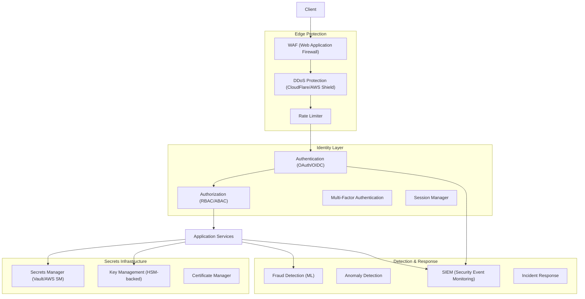
```mermaid
flowchart TB
    subgraph Edge["Edge Protection"]
        WAF["WAF (Web Application Firewall)"]
        DDoS["DDoS Protection (CloudFlare/AWS Shield)"]
        RateLimiter["Rate Limiter"]
    end

    subgraph Identity["Identity Layer"]
        AuthN["Authentication (OAuth/OIDC)"]
        AuthZ["Authorization (RBAC/ABAC)"]
        MFA["Multi-Factor Authentication"]
        SessionMgr["Session Manager"]
    end

    subgraph Secrets["Secrets Infrastructure"]
        Vault["Secrets Manager (Vault/AWS SM)"]
        KMS["Key Management (HSM-backed)"]
        CertMgr["Certificate Manager"]
    end

    subgraph Detection["Detection & Response"]
        FraudEngine["Fraud Detection (ML)"]
        AnomalyDet["Anomaly Detection"]
        SIEM["SIEM (Security Event Monitoring)"]
        IncidentResp["Incident Response"]
    end

    Client["Client"] --> WAF --> DDoS --> RateLimiter
    RateLimiter --> AuthN --> AuthZ --> Application["Application Services"]
    Application --> Vault & KMS
    Application --> FraudEngine
    AuthN & Application --> SIEM
```

---

## Low-Level Design

### 1. Authentication System (OAuth, JWT)

#### Overview

Authentication verifies **who the user is**. Modern systems use **OAuth 2.0** for delegated authorization, **OpenID Connect (OIDC)** for identity, and **JWT** (JSON Web Tokens) for stateless session management.

#### OAuth 2.0 Authorization Code Flow

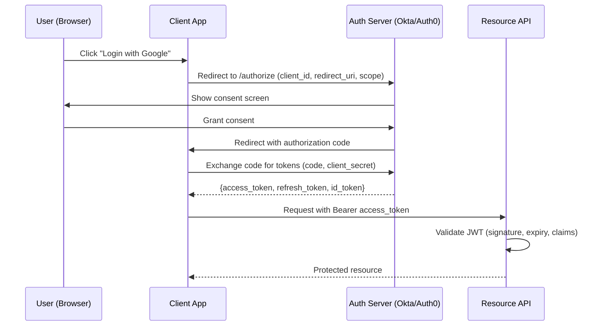
```mermaid
sequenceDiagram
    participant User as User (Browser)
    participant App as Client App
    participant AuthServer as Auth Server (Okta/Auth0)
    participant API as Resource API

    User->>App: Click "Login with Google"
    App->>AuthServer: Redirect to /authorize (client_id, redirect_uri, scope)
    AuthServer->>User: Show consent screen
    User->>AuthServer: Grant consent
    AuthServer->>App: Redirect with authorization code
    App->>AuthServer: Exchange code for tokens (code, client_secret)
    AuthServer-->>App: {access_token, refresh_token, id_token}
    App->>API: Request with Bearer access_token
    API->>API: Validate JWT (signature, expiry, claims)
    API-->>App: Protected resource
```

#### JWT Structure

```
Header: {"alg": "RS256", "typ": "JWT", "kid": "key-2026-03"}
Payload: {
  "sub": "usr_xyz",           // user ID
  "iss": "auth.example.com",  // issuer
  "aud": "api.example.com",   // audience
  "exp": 1711101600,          // expiry (15 min)
  "iat": 1711100700,          // issued at
  "scope": "read write",      // permissions
  "roles": ["user", "admin"]  // roles
}
Signature: RS256(header + "." + payload, private_key)
```

**Validation at every API call**:
1. Verify signature using public key (no auth server call needed — stateless)
2. Check `exp` > current time
3. Check `iss` matches expected issuer
4. Check `aud` matches this API
5. Extract `sub` (user ID) and `roles` for authorization

#### Token Lifecycle

| Token | Lifetime | Storage | Purpose |
|-------|---------|---------|---------|
| **Access Token (JWT)** | 15 minutes | Memory / Authorization header | Authenticate API requests |
| **Refresh Token** | 30 days | HTTP-only, Secure, SameSite cookie | Obtain new access tokens |
| **ID Token** | 1 hour | Client memory | User identity info for the client app |

**Why short-lived access tokens?** If an access token leaks, the damage window is 15 minutes. Refresh tokens are stored more securely (HTTP-only cookie, not accessible via JavaScript) and can be revoked server-side.

#### Session Management

```sql
CREATE TABLE sessions (
    session_id      UUID PRIMARY KEY,
    user_id         UUID NOT NULL,
    refresh_token_hash TEXT NOT NULL,
    device_info     JSONB,
    ip_address      INET,
    created_at      TIMESTAMPTZ NOT NULL DEFAULT now(),
    last_used_at    TIMESTAMPTZ NOT NULL DEFAULT now(),
    expires_at      TIMESTAMPTZ NOT NULL,
    is_revoked      BOOLEAN DEFAULT false
);
```

**Refresh token rotation**: Each time a refresh token is used, issue a new one and invalidate the old. If an old refresh token is reused (token theft detected), revoke all sessions for that user.

#### Multi-Factor Authentication (MFA)

| Factor | Type | Implementation |
|--------|------|---------------|
| **TOTP** | Something you have | Google Authenticator, shared secret + time-based code |
| **SMS OTP** | Something you have | Send 6-digit code via SMS (less secure — SIM swap attacks) |
| **WebAuthn / FIDO2** | Something you have | Hardware key (YubiKey) or platform biometric |
| **Push notification** | Something you have | Approve login on trusted device |
| **Biometric** | Something you are | Face ID, fingerprint (device-level, not sent to server) |

**Step-up authentication**: MFA required only for sensitive operations (password change, payment, admin access), not for every login.

#### Edge Cases

- **Token stolen via XSS**: Access token in memory (not localStorage) mitigates this. HTTP-only cookies for refresh token prevent JS access.
- **Refresh token reuse after rotation**: Indicates token theft. Revoke all user sessions immediately.
- **Clock skew on JWT validation**: Allow 30-second leeway on `exp` and `iat` checks.
- **Service-to-service auth**: Use mutual TLS (mTLS) or signed JWTs with service identity — not user tokens.

---

### 2. Authorization System (RBAC/ABAC)

#### Overview

Authorization controls **what an authenticated user can do**. Two primary models:

| Model | How It Works | Best For |
|-------|-------------|----------|
| **RBAC** (Role-Based Access Control) | Users → Roles → Permissions | Simple hierarchies (admin, editor, viewer) |
| **ABAC** (Attribute-Based Access Control) | Policies evaluate attributes of user, resource, and environment | Complex rules (owner of resource, same department, business hours) |

#### RBAC Data Model

```sql
CREATE TABLE roles (
    role_id     UUID PRIMARY KEY,
    name        TEXT UNIQUE NOT NULL,       -- 'admin', 'editor', 'viewer'
    description TEXT
);

CREATE TABLE permissions (
    permission_id UUID PRIMARY KEY,
    resource      TEXT NOT NULL,             -- 'orders', 'products', 'users'
    action        TEXT NOT NULL,             -- 'read', 'write', 'delete', 'admin'
    UNIQUE(resource, action)
);

CREATE TABLE role_permissions (
    role_id       UUID REFERENCES roles(role_id),
    permission_id UUID REFERENCES permissions(permission_id),
    PRIMARY KEY (role_id, permission_id)
);

CREATE TABLE user_roles (
    user_id     UUID NOT NULL,
    role_id     UUID REFERENCES roles(role_id),
    scope       TEXT,                        -- optional: 'org:acme', 'team:backend'
    granted_at  TIMESTAMPTZ DEFAULT now(),
    granted_by  UUID,
    PRIMARY KEY (user_id, role_id, scope)
);
```

#### ABAC Policy Example

```
POLICY: "Users can edit their own orders"
RULE:
  IF user.id == resource.owner_id
  AND resource.type == "order"
  AND action == "edit"
  AND resource.status IN ["pending", "confirmed"]
  THEN ALLOW
```

#### Authorization Check Flow

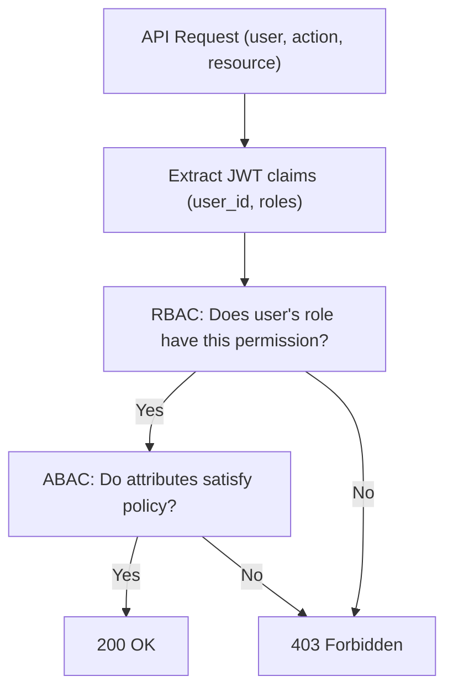
```mermaid
flowchart TD
    Request["API Request (user, action, resource)"] --> ExtractClaims["Extract JWT claims (user_id, roles)"]
    ExtractClaims --> RBACCheck["RBAC: Does user's role have this permission?"]
    RBACCheck -->|Yes| ABACCheck["ABAC: Do attributes satisfy policy?"]
    RBACCheck -->|No| Deny["403 Forbidden"]
    ABACCheck -->|Yes| Allow["200 OK"]
    ABACCheck -->|No| Deny
```

**Performance**: Cache user roles in Redis (5-minute TTL). Permission checks happen in-memory after initial lookup — < 1ms per check.

#### Edge Cases

- **Role hierarchy**: Admin inherits all Editor permissions; Editor inherits Viewer. Implement via role inheritance graph.
- **Resource-scoped roles**: User is admin for Org A but viewer for Org B. Scope roles to organizational unit.
- **Temporary permissions**: Grant time-limited access (e.g., contractor access for 30 days). Use `expires_at` on role assignment.
- **Emergency access (break glass)**: Privileged access for on-call engineers during incidents. Heavily audited, auto-expires after 4 hours.

---

### 3. Secrets Management System

#### Overview

Secrets Management handles the secure storage, access control, rotation, and auditing of sensitive credentials: API keys, database passwords, encryption keys, TLS certificates, and service tokens.

#### Architecture

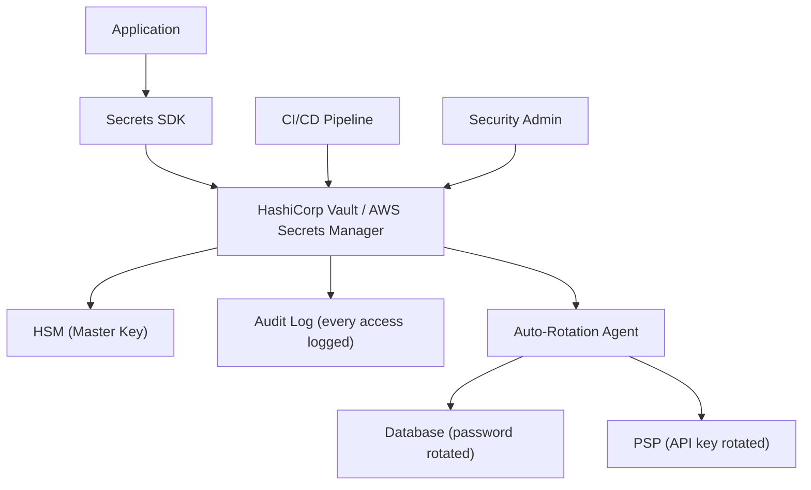
```mermaid
flowchart TD
    App["Application"] --> SecretsSDK["Secrets SDK"]
    SecretsSDK --> Vault["HashiCorp Vault / AWS Secrets Manager"]
    Vault --> HSM["HSM (Master Key)"]
    Vault --> AuditLog["Audit Log (every access logged)"]

    CI["CI/CD Pipeline"] --> Vault
    Admin["Security Admin"] --> Vault
    Vault --> Rotation["Auto-Rotation Agent"]
    Rotation --> DB["Database (password rotated)"]
    Rotation --> PSP["PSP (API key rotated)"]
```

#### Secret Types and Rotation

| Secret Type | Rotation Frequency | Method |
|-------------|-------------------|--------|
| Database passwords | 90 days | Auto-rotate; dual-credential pattern (old valid during transition) |
| API keys | 180 days | Issue new key; old key valid for 7-day overlap |
| TLS certificates | 90 days (Let's Encrypt) or 1 year | Auto-renew with cert-manager |
| Encryption keys | Annually | Key versioning; old key used for decryption only |
| JWT signing keys | 90 days | Key ID (`kid`) in JWT header; multiple active keys during rotation |
| Service tokens | 24 hours | Auto-issued by identity provider; short-lived |

#### Design Principles

- **Never in code**: Secrets never committed to Git — use .gitignore, pre-commit hooks, and secret scanning.
- **Never in environment variables at rest**: Inject at runtime from Vault/Secrets Manager.
- **Encrypt at rest**: All secrets encrypted with master key stored in HSM.
- **Audit everything**: Every secret read, write, and rotation logged with actor, timestamp, and IP.
- **Least privilege**: Each service only accesses the secrets it needs. No "admin key" that accesses everything.
- **Revocation**: Ability to immediately revoke any secret. All dependent services must handle revocation gracefully (re-fetch, fail, alert).

---

### 4. Rate Limiting System

#### Overview

Rate limiting protects services from abuse (scraping, brute force), accidental overload (buggy client in a loop), and ensures fair resource allocation across users.

#### Algorithms

| Algorithm | Behavior | Best For |
|-----------|---------|----------|
| **Token Bucket** | Tokens refill at fixed rate; burst allowed up to bucket size | API rate limiting with burst tolerance |
| **Sliding Window Log** | Track exact timestamps of requests; count in rolling window | Precise rate enforcement |
| **Sliding Window Counter** | Weighted average of current and previous fixed windows | Balance precision and memory |
| **Leaky Bucket** | Requests queued; processed at fixed rate | Smooth output rate (traffic shaping) |

#### Distributed Rate Limiting with Redis

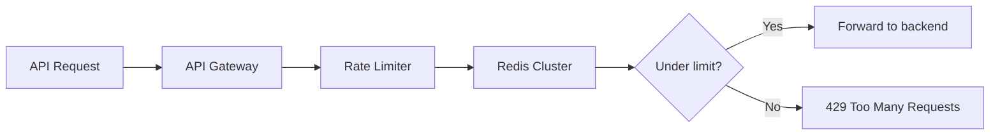
```mermaid
flowchart LR
    Request["API Request"] --> GW["API Gateway"]
    GW --> RateLimiter["Rate Limiter"]
    RateLimiter --> Redis["Redis Cluster"]
    Redis --> Decision{"Under limit?"}
    Decision -->|Yes| Allow["Forward to backend"]
    Decision -->|No| Reject["429 Too Many Requests"]
```

```lua
-- Redis Lua script for sliding window rate limit
local key = KEYS[1]
local limit = tonumber(ARGV[1])
local window = tonumber(ARGV[2])
local now = tonumber(ARGV[3])

-- Remove expired entries
redis.call('ZREMRANGEBYSCORE', key, 0, now - window)

-- Count current window
local count = redis.call('ZCARD', key)

if count < limit then
    redis.call('ZADD', key, now, now .. math.random())
    redis.call('EXPIRE', key, window)
    return 1  -- allowed
else
    return 0  -- rate limited
end
```

#### Rate Limit Dimensions

| Dimension | Example | Use Case |
|-----------|---------|----------|
| Per user | 100 req/min per authenticated user | Fair usage |
| Per IP | 1000 req/min per IP | Anonymous abuse prevention |
| Per API key | 10,000 req/min per merchant API key | SaaS tier enforcement |
| Per endpoint | 10 req/min on /login (per IP) | Brute force prevention |
| Global | 100,000 req/min total for service | Service protection |

#### Response Headers

```http
HTTP/1.1 429 Too Many Requests
Retry-After: 30
X-RateLimit-Limit: 100
X-RateLimit-Remaining: 0
X-RateLimit-Reset: 1711100760
```

---

### 5. DDoS Protection System

#### Overview

DDoS (Distributed Denial of Service) attacks flood a service with traffic to make it unavailable. Attacks range from **volumetric** (saturate bandwidth) to **application-layer** (exhaust server resources with expensive requests).

#### Attack Types and Mitigations

| Type | Layer | Example | Mitigation |
|------|-------|---------|-----------|
| **Volumetric** | L3/L4 | UDP flood, ICMP flood (1+ Tbps) | ISP-level scrubbing (CloudFlare, AWS Shield) |
| **Protocol** | L4 | SYN flood, TCP state exhaustion | SYN cookies, connection rate limiting |
| **Application** | L7 | HTTP flood, slowloris, API abuse | WAF rules, rate limiting, CAPTCHA |
| **Amplification** | L3 | DNS amplification, NTP reflection | Block spoofed source IPs at ISP |

#### Multi-Layer Defense

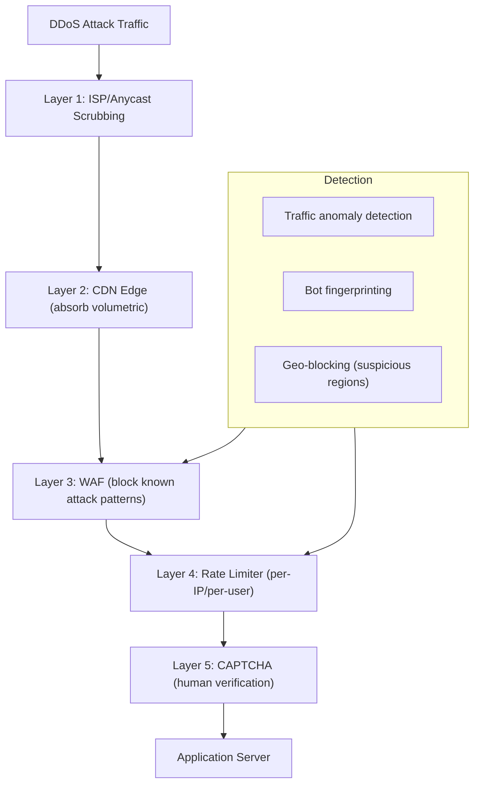
```mermaid
flowchart TD
    Attack["DDoS Attack Traffic"] --> ISP["Layer 1: ISP/Anycast Scrubbing"]
    ISP --> CDN["Layer 2: CDN Edge (absorb volumetric)"]
    CDN --> WAF["Layer 3: WAF (block known attack patterns)"]
    WAF --> RateLimit["Layer 4: Rate Limiter (per-IP/per-user)"]
    RateLimit --> CAPTCHA["Layer 5: CAPTCHA (human verification)"]
    CAPTCHA --> App["Application Server"]

    subgraph Detection["Detection"]
        TrafficAnalysis["Traffic anomaly detection"]
        BotDetect["Bot fingerprinting"]
        GeoBlock["Geo-blocking (suspicious regions)"]
    end

    Detection --> WAF & RateLimit
```

#### Anycast Defense

**Anycast** routes traffic to the nearest PoP. During a DDoS attack, traffic is distributed across 200+ PoPs worldwide rather than concentrated on one origin. Each PoP absorbs a fraction of the attack.

If one PoP is overwhelmed, anycast BGP routing automatically shifts traffic to the next-nearest PoP.

#### Application-Layer DDoS

Harder to detect because requests look legitimate:
- **Detection**: Track request rate per IP, request complexity (expensive queries), session behavior (no cookies, no JS execution).
- **Mitigation**: Progressive challenges: rate limit → CAPTCHA → temporary IP block → permanent block.
- **Honeypot endpoints**: Fake endpoints that no legitimate user would access. Traffic to honeypots = bot → block IP.

---

### 6. Fraud Detection System

#### Overview

The Fraud Detection System identifies malicious actors across authentication (account takeover), payments (card fraud), and platform abuse (fake accounts, spam). It combines **rules-based detection** for known patterns with **ML models** for novel attacks.

Covered in depth in Chapter 19 (Fintech — Fraud Detection ML) and Chapter 20 (Social Media — Abuse Detection). Here we focus on the cross-cutting security architecture.

#### Architecture

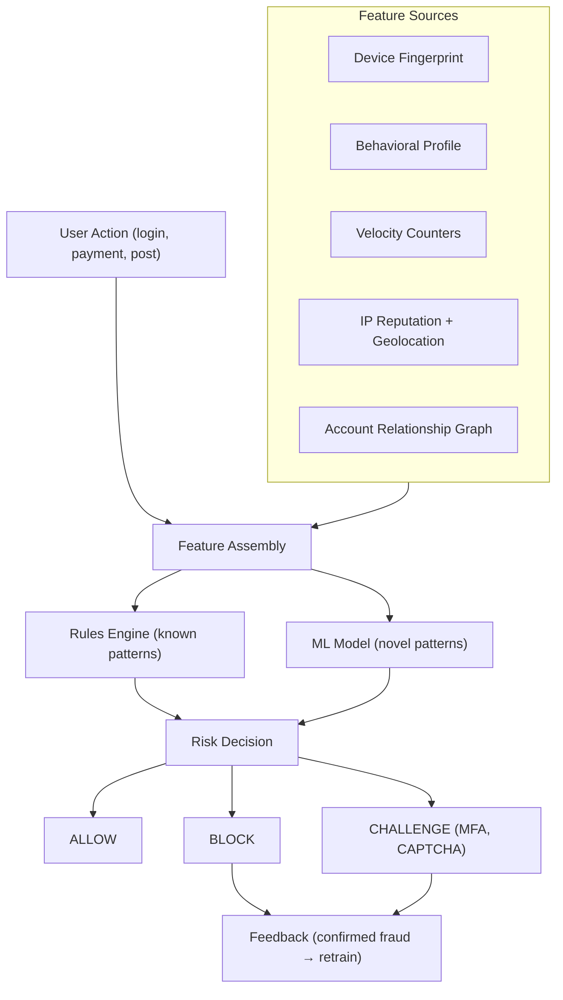
```mermaid
flowchart TD
    Event["User Action (login, payment, post)"] --> FeatureAssembly["Feature Assembly"]

    subgraph Features["Feature Sources"]
        DeviceFP["Device Fingerprint"]
        BehaviorProfile["Behavioral Profile"]
        VelocityCounters["Velocity Counters"]
        GeoIP["IP Reputation + Geolocation"]
        NetworkGraph["Account Relationship Graph"]
    end

    Features --> FeatureAssembly
    FeatureAssembly --> RulesEngine["Rules Engine (known patterns)"]
    FeatureAssembly --> MLModel["ML Model (novel patterns)"]
    RulesEngine & MLModel --> Decision["Risk Decision"]
    Decision --> Allow["ALLOW"]
    Decision --> Challenge["CHALLENGE (MFA, CAPTCHA)"]
    Decision --> Block["BLOCK"]

    Block & Challenge --> FeedbackLoop["Feedback (confirmed fraud → retrain)"]
```

#### Device Fingerprinting

Even without cookies, a device can be identified by:
- Browser: user agent, screen resolution, timezone, language, installed fonts, WebGL renderer, canvas fingerprint
- Mobile: device model, OS version, carrier, battery level, sensor data
- Network: IP address, ASN, VPN detection, proxy detection

Fingerprint is hashed and stored. If a "new device" has the same fingerprint as a known bad actor → flag.

#### Account Takeover (ATO) Detection

| Signal | Indicator |
|--------|-----------|
| **New device + new IP** | Login from unrecognized device and location |
| **Impossible travel** | Login from NYC at 10:00 AM, then London at 10:05 AM |
| **Password spray** | Many accounts attempted with same password |
| **Credential stuffing** | Known leaked email/password pairs tried |
| **Session anomaly** | Session behavior changes (different user agent mid-session) |

**Response**: Step-up authentication (MFA challenge), account lock after N failed attempts, email notification of suspicious login.

---

## Functional Requirements

Detailed functional requirements for each of the 6 security subsystems.

### Authentication System — Functional Requirements

| ID | Requirement | Description | Priority |
|----|------------|-------------|----------|
| AUTH-FR-01 | User Registration | Register new users with email, phone, or federated identity (Google, GitHub, Apple). Validate email via confirmation link. Enforce password strength policy (min 12 chars, 1 upper, 1 lower, 1 digit, 1 special). | P0 |
| AUTH-FR-02 | Login with Password | Authenticate user with email/username and password. Hash password with bcrypt (cost factor 12) or Argon2id. Return access token (JWT) and set refresh token cookie. | P0 |
| AUTH-FR-03 | OAuth 2.0 Authorization Code Flow | Support authorization code flow with PKCE for web and mobile clients. Support Google, GitHub, Apple, Microsoft as identity providers. Map external identity to internal user record. | P0 |
| AUTH-FR-04 | Token Refresh | Exchange valid refresh token for new access token. Implement refresh token rotation (issue new refresh token, invalidate old). Detect reuse of revoked refresh tokens and invalidate all user sessions. | P0 |
| AUTH-FR-05 | Logout | Revoke current session refresh token. Optionally revoke all sessions for the user ("log out everywhere"). Add current access token to blacklist (Redis, TTL = remaining token lifetime). | P0 |
| AUTH-FR-06 | MFA Enrollment | Allow user to enroll TOTP (Google Authenticator), SMS OTP, WebAuthn (hardware key), or push notification as second factor. Store encrypted TOTP secret. Generate and display recovery codes (10 single-use codes). | P0 |
| AUTH-FR-07 | MFA Verification | After primary authentication, prompt for second factor. Verify TOTP code (30-second window, allow 1 drift). Verify SMS OTP (6-digit, 5-minute expiry). Verify WebAuthn assertion. | P0 |
| AUTH-FR-08 | Step-Up Authentication | Require MFA for sensitive operations (password change, payment above threshold, admin actions) even if user already authenticated. Issue elevated-privilege token with short TTL (5 minutes). | P1 |
| AUTH-FR-09 | Session Management | Track active sessions per user (device, IP, last active). Allow user to view and revoke individual sessions. Automatically expire sessions after 30 days of inactivity. | P0 |
| AUTH-FR-10 | SSO (Single Sign-On) | Support SAML 2.0 and OIDC for enterprise SSO. Allow organizations to configure their own IdP (Okta, Azure AD, OneLogin). Map IdP groups to internal roles. | P1 |
| AUTH-FR-11 | Password Reset | Send password reset link via email (single-use token, 1-hour expiry). Require current password for authenticated password change. Invalidate all sessions after password change. | P0 |
| AUTH-FR-12 | Account Lockout | Lock account after 5 consecutive failed login attempts. Unlock after 30-minute cooldown or via email verification. Notify user of lockout via email. | P0 |
| AUTH-FR-13 | Service-to-Service Auth | Issue service identity tokens via mTLS or signed JWT. Validate service identity at API gateway. Support service account creation and key rotation. | P1 |
| AUTH-FR-14 | API Key Authentication | Allow creation of long-lived API keys for machine-to-machine access. Support multiple API keys per account with individual scopes. Allow revocation of individual keys. | P1 |
| AUTH-FR-15 | Login History | Record all login attempts (success and failure) with timestamp, IP, device fingerprint, and geolocation. Expose login history to user in account settings. | P1 |

### Authorization System — Functional Requirements

| ID | Requirement | Description | Priority |
|----|------------|-------------|----------|
| AUTHZ-FR-01 | Policy Evaluation | Evaluate access control decisions given (subject, action, resource, context). Return ALLOW, DENY, or CHALLENGE. Complete evaluation in under 5ms for cached policies. | P0 |
| AUTHZ-FR-02 | Role Management | CRUD operations for roles. Support system-defined roles (admin, editor, viewer) and custom roles. Support role hierarchy (admin inherits editor; editor inherits viewer). | P0 |
| AUTHZ-FR-03 | Permission Management | Define granular permissions as (resource, action) tuples. Support wildcards (orders:*, *:read). Group permissions into permission sets for easier assignment. | P0 |
| AUTHZ-FR-04 | User-Role Assignment | Assign roles to users with optional scope (org, team, project). Support time-limited role assignments (expires_at). Track who granted each role and when. | P0 |
| AUTHZ-FR-05 | ABAC Policy Authoring | Define attribute-based policies using a policy language (OPA Rego, Cedar, or custom DSL). Support conditions on user attributes, resource attributes, and environment context. | P1 |
| AUTHZ-FR-06 | Multi-Tenancy | Isolate authorization data per tenant/organization. Ensure users in Org A cannot access resources in Org B. Support cross-org sharing with explicit grants. | P0 |
| AUTHZ-FR-07 | Permission Checking API | Provide a synchronous API for real-time permission checks: POST /authorize with body {subject, action, resource}. Return decision with explanation (which policy matched). | P0 |
| AUTHZ-FR-08 | Bulk Permission Check | Check multiple permissions in a single request (e.g., "can user X read, write, delete resource Y?"). Return array of decisions. | P1 |
| AUTHZ-FR-09 | Policy Simulation | Simulate policy changes before deployment ("what if I remove this permission?"). Show affected users and resources. Dry-run mode for policy updates. | P2 |
| AUTHZ-FR-10 | Audit Trail | Log every authorization decision (allow and deny) with subject, action, resource, decision, and matching policy. Retain audit logs for compliance (minimum 1 year). | P0 |
| AUTHZ-FR-11 | Emergency Access (Break Glass) | Allow pre-approved on-call engineers to assume elevated privileges during incidents. Require approval from second engineer. Auto-expire after 4 hours. Log all actions taken. | P1 |
| AUTHZ-FR-12 | Delegation | Allow users to delegate specific permissions to other users for a limited time. Support delegation chains (A delegates to B, B cannot delegate to C unless explicitly allowed). | P2 |

### Secrets Management — Functional Requirements

| ID | Requirement | Description | Priority |
|----|------------|-------------|----------|
| SEC-FR-01 | Secret Creation | Create secrets with name, value, type (password, API key, certificate, generic), and metadata. Encrypt value at rest using envelope encryption (data key encrypted by master key). | P0 |
| SEC-FR-02 | Secret Retrieval | Retrieve current secret value by name and version. Authenticate caller via service identity (mTLS or IAM role). Check access policy before returning value. | P0 |
| SEC-FR-03 | Secret Rotation | Automatically rotate secrets on a configurable schedule. Support dual-credential rotation (new + old valid simultaneously during transition window). Notify dependent services of rotation. | P0 |
| SEC-FR-04 | Secret Versioning | Maintain version history of each secret. Allow retrieval of specific versions. Mark versions as active, deprecated, or destroyed. | P0 |
| SEC-FR-05 | Access Control | Define per-secret access policies (which services/users can read, write, rotate). Support path-based policies (service/payments/* accessible only to payments service). | P0 |
| SEC-FR-06 | Audit Logging | Log every secret access (read, write, rotate, delete) with actor identity, timestamp, IP, and operation. Tamper-proof audit trail (append-only, signed logs). | P0 |
| SEC-FR-07 | Dynamic Secrets | Generate short-lived credentials on demand (e.g., temporary database credentials, cloud IAM tokens). Auto-revoke after TTL expiry. | P1 |
| SEC-FR-08 | Encryption as a Service | Provide encrypt/decrypt API without exposing the encryption key. Support AES-256-GCM for data encryption. Support RSA and ECDSA for signing operations. | P1 |
| SEC-FR-09 | Certificate Management | Store and rotate TLS certificates. Integrate with ACME (Let's Encrypt) for automated certificate issuance. Alert on certificates expiring within 30 days. | P1 |
| SEC-FR-10 | Emergency Revocation | Immediately revoke any secret. Propagate revocation to all caching layers within 60 seconds. Alert all dependent services via webhook or message bus. | P0 |
| SEC-FR-11 | Secret Scanning | Integrate with CI/CD to scan code and configuration for accidentally committed secrets. Block deployment if secrets detected. | P1 |
| SEC-FR-12 | Import/Export | Bulk import secrets from environment files or other secret managers. Export secrets for migration (encrypted export only). | P2 |

### Rate Limiting — Functional Requirements

| ID | Requirement | Description | Priority |
|----|------------|-------------|----------|
| RL-FR-01 | Sliding Window Rate Limit | Enforce request count limits within a sliding time window (e.g., 100 requests per 60 seconds). Use weighted average of current and previous windows. | P0 |
| RL-FR-02 | Fixed Window Rate Limit | Enforce request count limits within fixed time windows (e.g., 100 requests per minute, resetting on the minute). Simple and efficient. | P0 |
| RL-FR-03 | Token Bucket Rate Limit | Allow burst traffic up to bucket capacity, refill tokens at fixed rate. Configure bucket size and refill rate per client/endpoint. | P0 |
| RL-FR-04 | Multi-Dimensional Limiting | Apply different limits per dimension: per-user, per-IP, per-API-key, per-endpoint, global. Most restrictive limit wins. | P0 |
| RL-FR-05 | Tiered Rate Limits | Different rate limits per subscription tier (free: 100/min, pro: 1000/min, enterprise: 10000/min). Look up tier from user metadata. | P1 |
| RL-FR-06 | Rate Limit Response | Return standard headers: X-RateLimit-Limit, X-RateLimit-Remaining, X-RateLimit-Reset, Retry-After. Return 429 Too Many Requests when limit exceeded. | P0 |
| RL-FR-07 | Rate Limit Override | Allow temporary rate limit overrides for specific users or IPs (e.g., during data migration, load testing). Require admin approval with expiry time. | P1 |
| RL-FR-08 | Endpoint-Specific Rules | Configure different rate limits per API endpoint (e.g., /login: 10/min per IP; /search: 50/min per user; /webhook: 1000/min per API key). | P0 |
| RL-FR-09 | Gradual Backoff | Instead of hard reject at limit, progressively slow responses (add 100ms, 500ms, 1000ms delay) before hard rejection. | P2 |
| RL-FR-10 | Rate Limit Analytics | Track and report rate limit hits per user, IP, endpoint. Dashboard showing top rate-limited users and endpoints. Alert on anomalous rate limit patterns. | P1 |

### DDoS Protection — Functional Requirements

| ID | Requirement | Description | Priority |
|----|------------|-------------|----------|
| DDOS-FR-01 | Traffic Analysis | Continuously monitor incoming traffic patterns. Establish baseline metrics (requests/sec, bandwidth, connection rate) per region and time of day. Detect deviations > 3 standard deviations. | P0 |
| DDOS-FR-02 | Automatic Mitigation | Automatically activate mitigation rules when attack detected. Apply WAF rules to block attack signatures. Activate rate limiting escalation. No manual intervention required for known attack patterns. | P0 |
| DDOS-FR-03 | Manual Mitigation | Allow security engineers to manually activate mitigation modes: rate limit escalation, geographic blocking, CAPTCHA challenge, full lockdown. Override automatic decisions. | P0 |
| DDOS-FR-04 | Allowlist Management | Maintain IP and CIDR allowlists for trusted partners, monitoring services, and internal IPs. Allowlisted IPs bypass DDoS rate limiting but still go through WAF. | P0 |
| DDOS-FR-05 | Blocklist Management | Maintain IP and CIDR blocklists. Automatically add IPs that trigger DDoS detection. Support manual blocklist entries with expiry. Sync blocklists across all edge PoPs within 30 seconds. | P0 |
| DDOS-FR-06 | Geographic Filtering | Block or challenge traffic from specific countries/regions during an attack. Configure per-region policies (allow, challenge, block). | P1 |
| DDOS-FR-07 | Attack Reporting | Generate post-attack reports: duration, peak volume, attack type, mitigation actions taken, legitimate traffic impact. | P1 |
| DDOS-FR-08 | Bot Detection | Distinguish bot traffic from legitimate users using JavaScript challenges, browser fingerprinting, and behavioral analysis. Allow known good bots (Googlebot, etc.). | P1 |
| DDOS-FR-09 | Origin Shielding | Hide origin server IPs. Route all traffic through CDN/proxy. Detect and alert if origin IP is exposed. | P0 |
| DDOS-FR-10 | Capacity Scaling | Auto-scale edge capacity during attacks. Pre-provision headroom for 10x normal traffic. Maintain service quality for legitimate traffic during attacks. | P0 |

### Fraud Detection — Functional Requirements

| ID | Requirement | Description | Priority |
|----|------------|-------------|----------|
| FRAUD-FR-01 | Risk Scoring | Score every high-value action (login, payment, account change) with a fraud risk score (0.0 to 1.0). Complete scoring within 100ms p99. | P0 |
| FRAUD-FR-02 | Rules Engine | Support configurable fraud rules: velocity checks (> 5 logins in 1 min), geo-anomaly (impossible travel), device anomaly (new device + high-value action), value thresholds. | P0 |
| FRAUD-FR-03 | ML Model Scoring | Run ML model (gradient boosted trees or neural network) on assembled features. Support A/B testing of model versions. Auto-retrain on confirmed fraud feedback. | P0 |
| FRAUD-FR-04 | Action Decisioning | Based on combined score: ALLOW (score < 0.3), CHALLENGE (0.3 <= score < 0.7), or BLOCK (score >= 0.7). Thresholds configurable per action type. | P0 |
| FRAUD-FR-05 | Review Queue | Route CHALLENGE and flagged BLOCK decisions to human review queue. Provide analyst with full context (user history, device info, transaction details). Support approve/reject/escalate workflow. | P0 |
| FRAUD-FR-06 | Feedback Loop | Capture analyst decisions as training labels for ML model. Track false positive rate and false negative rate. Alert if model performance degrades. | P1 |
| FRAUD-FR-07 | Device Fingerprinting | Collect and hash device attributes (screen, browser, fonts, WebGL, canvas). Associate devices with user accounts. Flag when known-bad device fingerprint appears on new account. | P0 |
| FRAUD-FR-08 | Velocity Counters | Maintain real-time counters: logins per user per hour, transactions per card per day, account creations per IP per hour. Configurable thresholds and time windows. | P0 |
| FRAUD-FR-09 | Account Takeover Detection | Detect ATO signals: credential stuffing (many users, same password), password spray (many passwords, same user), impossible travel, session hijacking. Trigger MFA or account lock. | P0 |
| FRAUD-FR-10 | Fraud Case Management | Create fraud cases from blocked actions. Track investigation workflow: open, investigating, confirmed_fraud, false_positive, closed. Link related events to same case. | P1 |
| FRAUD-FR-11 | Network/Graph Analysis | Build account relationship graph (shared devices, shared IPs, shared payment methods). Detect fraud rings (cluster of accounts with shared signals). | P2 |
| FRAUD-FR-12 | Real-Time Alerting | Alert security team when: fraud score spike detected, new attack pattern identified, model confidence drops, high-value transaction blocked. | P1 |

---

## Non-Functional Requirements

### Performance Targets

| Subsystem | Metric | P50 | P99 | P99.9 |
|-----------|--------|-----|-----|-------|
| Authentication — Login | Latency | 80ms | 250ms | 500ms |
| Authentication — Token Validation (JWT) | Latency | 0.5ms | 2ms | 5ms |
| Authentication — Token Refresh | Latency | 30ms | 100ms | 200ms |
| Authentication — MFA Verification | Latency | 50ms | 150ms | 300ms |
| Authorization — Policy Evaluation (cached) | Latency | 1ms | 5ms | 10ms |
| Authorization — Policy Evaluation (uncached) | Latency | 10ms | 50ms | 100ms |
| Secrets Management — Secret Retrieval | Latency | 5ms | 20ms | 50ms |
| Secrets Management — Secret Rotation | Latency | 500ms | 2s | 5s |
| Rate Limiting — Decision | Latency | 0.5ms | 2ms | 5ms |
| DDoS Protection — Traffic Classification | Latency | 1ms | 5ms | 10ms |
| DDoS Protection — Mitigation Activation | Latency | N/A | N/A | < 10s |
| Fraud Detection — Risk Scoring | Latency | 30ms | 100ms | 200ms |
| Fraud Detection — Feature Assembly | Latency | 15ms | 50ms | 100ms |

### Availability Targets

| Subsystem | Availability Target | Max Downtime/Year | Justification |
|-----------|-------------------|-------------------|---------------|
| Authentication | 99.99% | 52 minutes | Login is critical path for all users |
| Authorization | 99.99% | 52 minutes | Every API call depends on authz |
| Secrets Management | 99.95% | 4.4 hours | Secrets cached locally; brief outages tolerable |
| Rate Limiting | 99.9% | 8.8 hours | Fail-open acceptable for brief periods |
| DDoS Protection | 99.999% | 5.3 minutes | Must be available especially during attacks |
| Fraud Detection | 99.95% | 4.4 hours | Can fall back to rules-only during ML outage |

### Throughput Targets

| Subsystem | Metric | Target |
|-----------|--------|--------|
| Authentication | Logins per second (peak) | 50,000 |
| Authentication | JWT validations per second | 500,000 |
| Authentication | Token refreshes per second | 100,000 |
| Authorization | Policy evaluations per second | 1,000,000 |
| Secrets Management | Secret reads per second | 10,000 |
| Secrets Management | Secret rotations per day | 5,000 |
| Rate Limiting | Decisions per second | 2,000,000 |
| DDoS Protection | Traffic analysis (requests/sec) | 10,000,000 |
| DDoS Protection | Mitigation capacity (requests/sec) | 50,000,000 |
| Fraud Detection | Scores per second | 100,000 |

### Data Retention Requirements

| Data Type | Retention | Regulation |
|-----------|-----------|------------|
| Authentication audit logs | 7 years | SOC2, PCI-DSS |
| Authorization decision logs | 3 years | SOC2 |
| Session records | 90 days after expiry | GDPR (purpose limitation) |
| Secret access logs | 7 years | PCI-DSS |
| Rate limit analytics | 90 days | Operational |
| DDoS attack reports | 3 years | Compliance |
| Fraud cases | 7 years | Financial regulation |
| Fraud scores | 1 year | Model retraining |
| Device fingerprints | 2 years | GDPR (legitimate interest) |

---

## Capacity Estimation

### Authentication System

```
Registered users:             100,000,000
Daily active users (DAU):     20,000,000 (20% of registered)
Peak concurrent users:        5,000,000
Average sessions per user:    2.5 (phone + laptop + tablet)

Login rate:
  - Average: 20M logins/day = ~230 logins/sec
  - Peak (morning rush, 4x average): ~1,000 logins/sec
  - Burst (after outage, 20x): ~5,000 logins/sec

Token refresh rate:
  - 5M concurrent users x 2.5 sessions = 12.5M active sessions
  - Each session refreshes every 15 minutes
  - 12.5M / 900 sec = ~14,000 refreshes/sec average
  - Peak (2x): ~28,000 refreshes/sec

JWT validation rate:
  - Each active user makes ~20 API calls per minute
  - 5M concurrent x 20 / 60 = ~1.67M JWT validations/sec peak
  - JWT validation is in-memory (no DB call): < 1ms per validation

Session storage:
  - 12.5M active sessions x 512 bytes/session = ~6.4 GB
  - Redis cluster with 3 replicas: ~20 GB total

Password hash storage:
  - 100M users x 60 bytes (Argon2id hash) = ~6 GB
  - PostgreSQL with read replicas
```

### Authorization System

```
Policy evaluation rate:
  - Every API call requires authz check
  - ~1.67M API calls/sec peak (from above)
  - 95% served from cache (role-permission mapping): ~1.58M/sec from cache
  - 5% require DB lookup: ~83K/sec uncached evaluations

Policy cache:
  - ~500 roles x ~200 permissions = 100K role-permission pairs
  - ~100M user-role assignments x 32 bytes = ~3.2 GB
  - Redis cache with 5-minute TTL

ABAC policy store:
  - ~10,000 ABAC policies x 2 KB = ~20 MB
  - Loaded into memory on each authz service instance
```

### Secrets Management

```
Managed secrets:              50,000 (across 500 microservices)
Secret read rate:
  - Services fetch secrets at startup + periodic refresh
  - 500 services x 100 secrets x refresh every 5 min = ~167 reads/sec average
  - Spike during deployment (all pods restart): ~5,000 reads/sec

Secret rotation:
  - 50,000 secrets / average 90-day rotation = ~556 rotations/day
  - Rotation is async, not latency-sensitive

Audit log volume:
  - ~200 reads/sec x 86,400 sec/day = ~17M audit entries/day
  - ~500 bytes per entry = ~8.5 GB/day raw
  - Compressed: ~2 GB/day
  - 7-year retention: ~5 TB compressed
```

### Rate Limiting

```
Rate limit check rate:
  - Every API request requires rate limit check
  - ~1.67M requests/sec peak
  - Redis sorted set per rate limit key
  - Average keys active: ~5M (per-user) + ~1M (per-IP) = ~6M keys

Redis memory for rate limiting:
  - Sliding window log: each key stores timestamps
  - Average 50 entries per key x 16 bytes = 800 bytes/key
  - 6M keys x 800 bytes = ~4.8 GB
  - With overhead and replicas: ~15 GB

Redis operations:
  - Each rate limit check = 1 Lua script execution (3-4 Redis commands)
  - ~1.67M x 4 = ~6.7M Redis operations/sec
  - Redis cluster with 6 shards handles this
```

### DDoS Protection

```
Normal traffic:               50,000 requests/sec
Attack traffic (mitigated):   Up to 50,000,000 requests/sec (1000x normal)
Attack bandwidth:             Up to 2 Tbps volumetric

CDN edge capacity:
  - 200+ PoPs worldwide
  - Each PoP handles up to 500K RPS
  - Total edge capacity: 100M+ RPS

WAF rule evaluation:
  - 200 WAF rules per request
  - Each rule evaluation: ~5 microseconds
  - Total WAF overhead: ~1ms per request

Traffic baseline storage:
  - Per-endpoint x per-region x per-hour baselines
  - 1000 endpoints x 50 regions x 24 hours x 7 days = 8.4M baseline entries
  - ~200 bytes per entry = ~1.7 GB
```

### Fraud Detection

```
Events requiring scoring:
  - Logins: ~1,000/sec peak
  - Payments: ~5,000/sec peak
  - Account changes: ~500/sec peak
  - Total: ~6,500 events/sec peak

Feature assembly:
  - 50 features per event
  - Features from: device fingerprint DB, velocity counters (Redis),
    IP reputation DB, user behavior profile
  - 4 parallel lookups, ~15ms each = ~15ms total (parallel)

ML model inference:
  - Gradient boosted trees (XGBoost): ~5ms per inference
  - Feature assembly (15ms) + inference (5ms) + overhead (10ms) = ~30ms p50

Feature store:
  - 100M user profiles x 2 KB = ~200 GB
  - Served from Redis cluster for hot users (20M x 2 KB = ~40 GB)
  - Cold profiles in PostgreSQL

Velocity counters (Redis):
  - 100M users x 10 counter types x 32 bytes = ~32 GB
  - Counters with TTL (auto-expire sliding windows)

Fraud case volume:
  - 0.1% of events flagged = ~6.5 events/sec = ~560K/day
  - Human review queue: ~10% of flagged = ~56K/day
  - Analyst capacity: 50 analysts x 100 cases/day = 5,000/day
  - Remaining auto-resolved by ML confidence
```

---

## Detailed Data Models

### Authentication Data Model

```sql
-- Core user table for authentication
CREATE TABLE users (
    user_id             UUID PRIMARY KEY DEFAULT gen_random_uuid(),
    email               TEXT UNIQUE NOT NULL,
    email_verified      BOOLEAN NOT NULL DEFAULT false,
    phone               TEXT,
    phone_verified      BOOLEAN NOT NULL DEFAULT false,
    password_hash       TEXT,                          -- NULL for OAuth-only users
    password_algorithm  TEXT DEFAULT 'argon2id',       -- argon2id, bcrypt
    status              TEXT NOT NULL DEFAULT 'active'
                        CHECK (status IN ('active', 'locked', 'suspended', 'deleted')),
    lock_reason         TEXT,
    lock_until          TIMESTAMPTZ,
    failed_login_count  INTEGER NOT NULL DEFAULT 0,
    last_login_at       TIMESTAMPTZ,
    password_changed_at TIMESTAMPTZ,
    created_at          TIMESTAMPTZ NOT NULL DEFAULT now(),
    updated_at          TIMESTAMPTZ NOT NULL DEFAULT now()
);

CREATE INDEX idx_users_email ON users (email);
CREATE INDEX idx_users_phone ON users (phone) WHERE phone IS NOT NULL;
CREATE INDEX idx_users_status ON users (status);

-- Session tracking (server-side session store)
CREATE TABLE sessions (
    session_id          UUID PRIMARY KEY DEFAULT gen_random_uuid(),
    user_id             UUID NOT NULL REFERENCES users(user_id) ON DELETE CASCADE,
    refresh_token_hash  TEXT NOT NULL,
    token_family        UUID NOT NULL,                 -- for refresh token rotation detection
    device_fingerprint  TEXT,
    user_agent          TEXT,
    ip_address          INET,
    geo_country         TEXT,
    geo_city            TEXT,
    created_at          TIMESTAMPTZ NOT NULL DEFAULT now(),
    last_used_at        TIMESTAMPTZ NOT NULL DEFAULT now(),
    expires_at          TIMESTAMPTZ NOT NULL,
    is_revoked          BOOLEAN NOT NULL DEFAULT false,
    revoked_at          TIMESTAMPTZ,
    revoke_reason       TEXT
);

CREATE INDEX idx_sessions_user_id ON sessions (user_id);
CREATE INDEX idx_sessions_token_family ON sessions (token_family);
CREATE INDEX idx_sessions_expires ON sessions (expires_at) WHERE NOT is_revoked;

-- OAuth client applications
CREATE TABLE oauth_clients (
    client_id           UUID PRIMARY KEY DEFAULT gen_random_uuid(),
    client_name         TEXT NOT NULL,
    client_secret_hash  TEXT,                          -- NULL for public clients (PKCE)
    client_type         TEXT NOT NULL CHECK (client_type IN ('confidential', 'public')),
    redirect_uris       TEXT[] NOT NULL,
    allowed_scopes      TEXT[] NOT NULL DEFAULT '{}',
    allowed_grant_types TEXT[] NOT NULL DEFAULT '{authorization_code}',
    owner_user_id       UUID REFERENCES users(user_id),
    is_first_party      BOOLEAN NOT NULL DEFAULT false,
    status              TEXT NOT NULL DEFAULT 'active'
                        CHECK (status IN ('active', 'suspended', 'revoked')),
    created_at          TIMESTAMPTZ NOT NULL DEFAULT now(),
    updated_at          TIMESTAMPTZ NOT NULL DEFAULT now()
);

CREATE INDEX idx_oauth_clients_owner ON oauth_clients (owner_user_id);

-- OAuth tokens (authorization codes, access tokens for opaque mode)
CREATE TABLE oauth_tokens (
    token_id            UUID PRIMARY KEY DEFAULT gen_random_uuid(),
    token_hash          TEXT NOT NULL,
    token_type          TEXT NOT NULL CHECK (token_type IN ('authorization_code', 'access_token', 'refresh_token')),
    client_id           UUID NOT NULL REFERENCES oauth_clients(client_id),
    user_id             UUID NOT NULL REFERENCES users(user_id),
    scopes              TEXT[] NOT NULL DEFAULT '{}',
    redirect_uri        TEXT,
    code_challenge       TEXT,                         -- PKCE
    code_challenge_method TEXT,                        -- S256
    expires_at          TIMESTAMPTZ NOT NULL,
    is_used             BOOLEAN NOT NULL DEFAULT false,
    is_revoked          BOOLEAN NOT NULL DEFAULT false,
    created_at          TIMESTAMPTZ NOT NULL DEFAULT now()
);

CREATE INDEX idx_oauth_tokens_hash ON oauth_tokens (token_hash);
CREATE INDEX idx_oauth_tokens_user ON oauth_tokens (user_id, token_type);
CREATE INDEX idx_oauth_tokens_client ON oauth_tokens (client_id, token_type);
CREATE INDEX idx_oauth_tokens_expires ON oauth_tokens (expires_at);

-- MFA devices
CREATE TABLE mfa_devices (
    device_id           UUID PRIMARY KEY DEFAULT gen_random_uuid(),
    user_id             UUID NOT NULL REFERENCES users(user_id) ON DELETE CASCADE,
    device_type         TEXT NOT NULL
                        CHECK (device_type IN ('totp', 'sms', 'webauthn', 'push', 'recovery_codes')),
    device_name         TEXT,                          -- "My YubiKey", "Work phone"
    secret_encrypted    BYTEA,                         -- encrypted TOTP secret or WebAuthn credential
    phone_number        TEXT,                          -- for SMS type
    webauthn_credential_id TEXT,                       -- for WebAuthn
    webauthn_public_key  BYTEA,                        -- for WebAuthn
    recovery_codes_hash TEXT[],                        -- hashed recovery codes
    is_primary          BOOLEAN NOT NULL DEFAULT false,
    is_verified         BOOLEAN NOT NULL DEFAULT false,
    last_used_at        TIMESTAMPTZ,
    created_at          TIMESTAMPTZ NOT NULL DEFAULT now()
);

CREATE INDEX idx_mfa_devices_user ON mfa_devices (user_id);
CREATE UNIQUE INDEX idx_mfa_devices_webauthn ON mfa_devices (webauthn_credential_id)
    WHERE webauthn_credential_id IS NOT NULL;

-- Login attempt tracking (for lockout and audit)
CREATE TABLE login_attempts (
    attempt_id          UUID PRIMARY KEY DEFAULT gen_random_uuid(),
    user_id             UUID REFERENCES users(user_id),      -- NULL if user not found
    email_attempted     TEXT NOT NULL,
    ip_address          INET NOT NULL,
    user_agent          TEXT,
    device_fingerprint  TEXT,
    geo_country         TEXT,
    geo_city            TEXT,
    attempt_type        TEXT NOT NULL
                        CHECK (attempt_type IN ('password', 'oauth', 'mfa', 'api_key', 'sso')),
    status              TEXT NOT NULL
                        CHECK (status IN ('success', 'failed_password', 'failed_mfa',
                                         'account_locked', 'account_suspended', 'blocked_by_rate_limit')),
    failure_reason      TEXT,
    mfa_method          TEXT,
    session_id          UUID,                          -- populated on success
    created_at          TIMESTAMPTZ NOT NULL DEFAULT now()
);

CREATE INDEX idx_login_attempts_user ON login_attempts (user_id, created_at DESC);
CREATE INDEX idx_login_attempts_ip ON login_attempts (ip_address, created_at DESC);
CREATE INDEX idx_login_attempts_email ON login_attempts (email_attempted, created_at DESC);
CREATE INDEX idx_login_attempts_created ON login_attempts (created_at);

-- Password history (prevent reuse)
CREATE TABLE password_history (
    history_id          UUID PRIMARY KEY DEFAULT gen_random_uuid(),
    user_id             UUID NOT NULL REFERENCES users(user_id) ON DELETE CASCADE,
    password_hash       TEXT NOT NULL,
    created_at          TIMESTAMPTZ NOT NULL DEFAULT now()
);

CREATE INDEX idx_password_history_user ON password_history (user_id, created_at DESC);

-- Federated identity links (OAuth providers)
CREATE TABLE federated_identities (
    id                  UUID PRIMARY KEY DEFAULT gen_random_uuid(),
    user_id             UUID NOT NULL REFERENCES users(user_id) ON DELETE CASCADE,
    provider            TEXT NOT NULL,                 -- 'google', 'github', 'apple', 'microsoft'
    provider_user_id    TEXT NOT NULL,
    provider_email      TEXT,
    provider_name       TEXT,
    access_token_enc    BYTEA,                         -- encrypted
    refresh_token_enc   BYTEA,                         -- encrypted
    token_expires_at    TIMESTAMPTZ,
    created_at          TIMESTAMPTZ NOT NULL DEFAULT now(),
    updated_at          TIMESTAMPTZ NOT NULL DEFAULT now(),
    UNIQUE (provider, provider_user_id)
);

CREATE INDEX idx_federated_user ON federated_identities (user_id);
```

### Authorization Data Model

```sql
-- Roles
CREATE TABLE roles (
    role_id             UUID PRIMARY KEY DEFAULT gen_random_uuid(),
    name                TEXT NOT NULL,
    display_name        TEXT NOT NULL,
    description         TEXT,
    is_system           BOOLEAN NOT NULL DEFAULT false, -- system roles cannot be deleted
    parent_role_id      UUID REFERENCES roles(role_id), -- for role hierarchy
    org_id              UUID,                           -- NULL = global role
    created_at          TIMESTAMPTZ NOT NULL DEFAULT now(),
    updated_at          TIMESTAMPTZ NOT NULL DEFAULT now(),
    UNIQUE (name, org_id)
);

CREATE INDEX idx_roles_org ON roles (org_id);
CREATE INDEX idx_roles_parent ON roles (parent_role_id);

-- Permissions
CREATE TABLE permissions (
    permission_id       UUID PRIMARY KEY DEFAULT gen_random_uuid(),
    resource            TEXT NOT NULL,                  -- 'orders', 'products', 'users', '*'
    action              TEXT NOT NULL,                  -- 'read', 'write', 'delete', 'admin', '*'
    description         TEXT,
    is_sensitive        BOOLEAN NOT NULL DEFAULT false, -- requires step-up auth
    created_at          TIMESTAMPTZ NOT NULL DEFAULT now(),
    UNIQUE (resource, action)
);

CREATE INDEX idx_permissions_resource ON permissions (resource);

-- Role-Permission mapping
CREATE TABLE role_permissions (
    role_id             UUID NOT NULL REFERENCES roles(role_id) ON DELETE CASCADE,
    permission_id       UUID NOT NULL REFERENCES permissions(permission_id) ON DELETE CASCADE,
    conditions          JSONB,                         -- optional ABAC conditions
    granted_at          TIMESTAMPTZ NOT NULL DEFAULT now(),
    granted_by          UUID,
    PRIMARY KEY (role_id, permission_id)
);

-- User-Role assignment
CREATE TABLE user_roles (
    user_id             UUID NOT NULL,
    role_id             UUID NOT NULL REFERENCES roles(role_id) ON DELETE CASCADE,
    scope               TEXT NOT NULL DEFAULT '*',      -- 'org:acme', 'team:backend', 'project:xyz', '*'
    granted_at          TIMESTAMPTZ NOT NULL DEFAULT now(),
    granted_by          UUID,
    expires_at          TIMESTAMPTZ,                   -- NULL = permanent
    is_active           BOOLEAN NOT NULL DEFAULT true,
    grant_reason        TEXT,
    PRIMARY KEY (user_id, role_id, scope)
);

CREATE INDEX idx_user_roles_user ON user_roles (user_id) WHERE is_active;
CREATE INDEX idx_user_roles_expires ON user_roles (expires_at)
    WHERE expires_at IS NOT NULL AND is_active;

-- ABAC policies
CREATE TABLE policies (
    policy_id           UUID PRIMARY KEY DEFAULT gen_random_uuid(),
    name                TEXT UNIQUE NOT NULL,
    description         TEXT,
    policy_type         TEXT NOT NULL CHECK (policy_type IN ('allow', 'deny')),
    priority            INTEGER NOT NULL DEFAULT 100,   -- lower = higher priority
    resource_pattern    TEXT NOT NULL,                  -- 'orders', 'orders/*', '*'
    action_pattern      TEXT NOT NULL,                  -- 'read', 'write', '*'
    condition_expr      JSONB NOT NULL,                 -- ABAC condition expression
    effect              TEXT NOT NULL CHECK (effect IN ('allow', 'deny')),
    is_active           BOOLEAN NOT NULL DEFAULT true,
    version             INTEGER NOT NULL DEFAULT 1,
    created_at          TIMESTAMPTZ NOT NULL DEFAULT now(),
    updated_at          TIMESTAMPTZ NOT NULL DEFAULT now(),
    created_by          UUID
);

CREATE INDEX idx_policies_resource ON policies (resource_pattern) WHERE is_active;
CREATE INDEX idx_policies_priority ON policies (priority) WHERE is_active;

-- Policy evaluation audit log
CREATE TABLE policy_evaluations (
    eval_id             UUID PRIMARY KEY DEFAULT gen_random_uuid(),
    user_id             UUID NOT NULL,
    resource            TEXT NOT NULL,
    action              TEXT NOT NULL,
    scope               TEXT,
    decision            TEXT NOT NULL CHECK (decision IN ('allow', 'deny')),
    matched_policy_id   UUID REFERENCES policies(policy_id),
    matched_role_id     UUID REFERENCES roles(role_id),
    evaluation_time_ms  REAL NOT NULL,
    context             JSONB,                         -- request context for debugging
    ip_address          INET,
    created_at          TIMESTAMPTZ NOT NULL DEFAULT now()
);

CREATE INDEX idx_policy_evals_user ON policy_evaluations (user_id, created_at DESC);
CREATE INDEX idx_policy_evals_resource ON policy_evaluations (resource, action, created_at DESC);
CREATE INDEX idx_policy_evals_decision ON policy_evaluations (decision, created_at DESC);
CREATE INDEX idx_policy_evals_created ON policy_evaluations (created_at);
```

### Secrets Management Data Model

```sql
-- Secrets metadata (value is encrypted, stored separately or in encrypted column)
CREATE TABLE secrets (
    secret_id           UUID PRIMARY KEY DEFAULT gen_random_uuid(),
    path                TEXT UNIQUE NOT NULL,           -- 'service/payments/db_password'
    secret_type         TEXT NOT NULL
                        CHECK (secret_type IN ('password', 'api_key', 'certificate',
                                               'encryption_key', 'token', 'generic')),
    description         TEXT,
    current_version     INTEGER NOT NULL DEFAULT 1,
    rotation_interval   INTERVAL,                      -- '90 days', '24 hours'
    next_rotation_at    TIMESTAMPTZ,
    last_rotated_at     TIMESTAMPTZ,
    owner_service       TEXT NOT NULL,                  -- service that owns this secret
    access_policy       JSONB NOT NULL DEFAULT '{}',    -- which services can read
    max_versions        INTEGER NOT NULL DEFAULT 10,
    is_dynamic          BOOLEAN NOT NULL DEFAULT false, -- dynamic secrets (generated on demand)
    status              TEXT NOT NULL DEFAULT 'active'
                        CHECK (status IN ('active', 'rotating', 'deprecated', 'destroyed')),
    created_at          TIMESTAMPTZ NOT NULL DEFAULT now(),
    updated_at          TIMESTAMPTZ NOT NULL DEFAULT now(),
    created_by          TEXT NOT NULL
);

CREATE INDEX idx_secrets_path ON secrets (path);
CREATE INDEX idx_secrets_owner ON secrets (owner_service);
CREATE INDEX idx_secrets_rotation ON secrets (next_rotation_at)
    WHERE status = 'active' AND rotation_interval IS NOT NULL;
CREATE INDEX idx_secrets_type ON secrets (secret_type);

-- Secret versions (the actual encrypted values)
CREATE TABLE secret_versions (
    version_id          UUID PRIMARY KEY DEFAULT gen_random_uuid(),
    secret_id           UUID NOT NULL REFERENCES secrets(secret_id) ON DELETE CASCADE,
    version_number      INTEGER NOT NULL,
    encrypted_value     BYTEA NOT NULL,                -- AES-256-GCM encrypted
    encryption_key_id   UUID NOT NULL REFERENCES encryption_keys(key_id),
    nonce               BYTEA NOT NULL,                -- GCM nonce (12 bytes)
    status              TEXT NOT NULL DEFAULT 'active'
                        CHECK (status IN ('active', 'deprecated', 'destroyed')),
    checksum            TEXT NOT NULL,                  -- SHA-256 of plaintext for integrity
    created_at          TIMESTAMPTZ NOT NULL DEFAULT now(),
    destroyed_at        TIMESTAMPTZ,
    UNIQUE (secret_id, version_number)
);

CREATE INDEX idx_secret_versions_secret ON secret_versions (secret_id, version_number DESC);
CREATE INDEX idx_secret_versions_status ON secret_versions (status);

-- Secret access audit log
CREATE TABLE secret_access_log (
    log_id              UUID PRIMARY KEY DEFAULT gen_random_uuid(),
    secret_id           UUID NOT NULL REFERENCES secrets(secret_id),
    secret_path         TEXT NOT NULL,
    version_number      INTEGER,
    operation           TEXT NOT NULL
                        CHECK (operation IN ('read', 'create', 'update', 'rotate',
                                            'destroy', 'policy_change', 'revoke')),
    actor_type          TEXT NOT NULL CHECK (actor_type IN ('service', 'user', 'system')),
    actor_id            TEXT NOT NULL,
    actor_ip            INET,
    success             BOOLEAN NOT NULL,
    failure_reason      TEXT,
    created_at          TIMESTAMPTZ NOT NULL DEFAULT now()
);

CREATE INDEX idx_secret_access_secret ON secret_access_log (secret_id, created_at DESC);
CREATE INDEX idx_secret_access_actor ON secret_access_log (actor_id, created_at DESC);
CREATE INDEX idx_secret_access_op ON secret_access_log (operation, created_at DESC);
CREATE INDEX idx_secret_access_created ON secret_access_log (created_at);

-- Encryption keys (used for envelope encryption of secrets)
CREATE TABLE encryption_keys (
    key_id              UUID PRIMARY KEY DEFAULT gen_random_uuid(),
    key_type            TEXT NOT NULL CHECK (key_type IN ('aes-256-gcm', 'rsa-4096', 'ecdsa-p256')),
    purpose             TEXT NOT NULL CHECK (purpose IN ('data_encryption', 'signing', 'wrapping')),
    encrypted_key_material BYTEA NOT NULL,             -- encrypted by HSM master key
    hsm_master_key_id   TEXT NOT NULL,                 -- reference to HSM master key
    status              TEXT NOT NULL DEFAULT 'active'
                        CHECK (status IN ('active', 'rotate_pending', 'decrypt_only', 'destroyed')),
    activated_at        TIMESTAMPTZ,
    deactivated_at      TIMESTAMPTZ,
    created_at          TIMESTAMPTZ NOT NULL DEFAULT now()
);

CREATE INDEX idx_enc_keys_status ON encryption_keys (status);
CREATE INDEX idx_enc_keys_purpose ON encryption_keys (purpose, status);

-- Key rotation schedule
CREATE TABLE key_rotation_schedule (
    schedule_id         UUID PRIMARY KEY DEFAULT gen_random_uuid(),
    key_id              UUID NOT NULL REFERENCES encryption_keys(key_id),
    rotation_interval   INTERVAL NOT NULL,             -- '365 days'
    next_rotation_at    TIMESTAMPTZ NOT NULL,
    last_rotated_at     TIMESTAMPTZ,
    auto_rotate         BOOLEAN NOT NULL DEFAULT true,
    created_at          TIMESTAMPTZ NOT NULL DEFAULT now()
);

CREATE INDEX idx_key_rotation_next ON key_rotation_schedule (next_rotation_at)
    WHERE auto_rotate;
```

### Rate Limiting Data Model

```sql
-- Rate limit rule definitions
CREATE TABLE rate_limit_rules (
    rule_id             UUID PRIMARY KEY DEFAULT gen_random_uuid(),
    name                TEXT NOT NULL,
    description         TEXT,
    endpoint_pattern    TEXT NOT NULL,                  -- '/api/v1/login', '/api/*', '*'
    method              TEXT,                           -- 'POST', 'GET', NULL = all
    dimension           TEXT NOT NULL
                        CHECK (dimension IN ('per_user', 'per_ip', 'per_api_key',
                                            'per_endpoint', 'global')),
    algorithm           TEXT NOT NULL DEFAULT 'sliding_window'
                        CHECK (algorithm IN ('sliding_window', 'fixed_window',
                                            'token_bucket', 'leaky_bucket')),
    limit_count         INTEGER NOT NULL,              -- max requests
    window_seconds      INTEGER NOT NULL,              -- time window
    burst_size          INTEGER,                       -- for token bucket only
    refill_rate         REAL,                          -- for token bucket: tokens/sec
    tier                TEXT DEFAULT 'default',        -- 'free', 'pro', 'enterprise', 'default'
    action_on_limit     TEXT NOT NULL DEFAULT 'reject'
                        CHECK (action_on_limit IN ('reject', 'delay', 'degrade', 'captcha')),
    retry_after_seconds INTEGER DEFAULT 60,
    is_active           BOOLEAN NOT NULL DEFAULT true,
    priority            INTEGER NOT NULL DEFAULT 100,
    created_at          TIMESTAMPTZ NOT NULL DEFAULT now(),
    updated_at          TIMESTAMPTZ NOT NULL DEFAULT now()
);

CREATE INDEX idx_rl_rules_endpoint ON rate_limit_rules (endpoint_pattern) WHERE is_active;
CREATE INDEX idx_rl_rules_dimension ON rate_limit_rules (dimension) WHERE is_active;
CREATE INDEX idx_rl_rules_tier ON rate_limit_rules (tier) WHERE is_active;

-- Rate limit overrides (temporary exceptions)
CREATE TABLE rate_limit_overrides (
    override_id         UUID PRIMARY KEY DEFAULT gen_random_uuid(),
    rule_id             UUID REFERENCES rate_limit_rules(rule_id),
    target_type         TEXT NOT NULL CHECK (target_type IN ('user', 'ip', 'api_key', 'cidr')),
    target_value        TEXT NOT NULL,                  -- user ID, IP, API key, CIDR
    override_limit      INTEGER NOT NULL,
    override_window     INTEGER NOT NULL,
    reason              TEXT NOT NULL,
    approved_by         UUID NOT NULL,
    starts_at           TIMESTAMPTZ NOT NULL DEFAULT now(),
    expires_at          TIMESTAMPTZ NOT NULL,
    created_at          TIMESTAMPTZ NOT NULL DEFAULT now()
);

CREATE INDEX idx_rl_overrides_target ON rate_limit_overrides (target_type, target_value)
    WHERE expires_at > now();
CREATE INDEX idx_rl_overrides_expires ON rate_limit_overrides (expires_at);
```

### DDoS Protection Data Model

```sql
-- Traffic baseline measurements
CREATE TABLE traffic_baselines (
    baseline_id         UUID PRIMARY KEY DEFAULT gen_random_uuid(),
    endpoint_pattern    TEXT NOT NULL,
    region              TEXT NOT NULL,                  -- 'us-east-1', 'eu-west-1'
    day_of_week         INTEGER NOT NULL CHECK (day_of_week BETWEEN 0 AND 6),
    hour_of_day         INTEGER NOT NULL CHECK (hour_of_day BETWEEN 0 AND 23),
    avg_rps             REAL NOT NULL,
    stddev_rps          REAL NOT NULL,
    p50_rps             REAL NOT NULL,
    p95_rps             REAL NOT NULL,
    p99_rps             REAL NOT NULL,
    avg_bandwidth_mbps  REAL NOT NULL,
    sample_count        INTEGER NOT NULL,              -- how many weeks of data
    last_updated_at     TIMESTAMPTZ NOT NULL DEFAULT now(),
    UNIQUE (endpoint_pattern, region, day_of_week, hour_of_day)
);

CREATE INDEX idx_baselines_lookup ON traffic_baselines (endpoint_pattern, region, day_of_week, hour_of_day);

-- DDoS mitigation events
CREATE TABLE mitigation_events (
    event_id            UUID PRIMARY KEY DEFAULT gen_random_uuid(),
    attack_type         TEXT NOT NULL
                        CHECK (attack_type IN ('volumetric', 'protocol', 'application', 'amplification', 'mixed')),
    severity            TEXT NOT NULL CHECK (severity IN ('low', 'medium', 'high', 'critical')),
    status              TEXT NOT NULL
                        CHECK (status IN ('detected', 'mitigating', 'mitigated', 'resolved', 'false_positive')),
    detected_at         TIMESTAMPTZ NOT NULL DEFAULT now(),
    mitigated_at        TIMESTAMPTZ,
    resolved_at         TIMESTAMPTZ,
    peak_rps            BIGINT,
    peak_bandwidth_gbps REAL,
    total_requests_blocked BIGINT,
    legitimate_requests_impacted BIGINT,
    source_ips_count    INTEGER,
    source_countries    TEXT[],
    target_endpoints    TEXT[],
    mitigation_actions  JSONB NOT NULL DEFAULT '[]',    -- actions taken
    notes               TEXT,
    created_at          TIMESTAMPTZ NOT NULL DEFAULT now()
);

CREATE INDEX idx_mitigation_status ON mitigation_events (status, detected_at DESC);
CREATE INDEX idx_mitigation_severity ON mitigation_events (severity, detected_at DESC);
CREATE INDEX idx_mitigation_detected ON mitigation_events (detected_at);

-- IP reputation database
CREATE TABLE ip_reputation (
    ip_address          INET PRIMARY KEY,
    reputation_score    REAL NOT NULL DEFAULT 0.5       -- 0 = malicious, 1 = trusted
                        CHECK (reputation_score BETWEEN 0 AND 1),
    threat_types        TEXT[] DEFAULT '{}',            -- 'ddos', 'scraping', 'spam', 'brute_force'
    asn                 INTEGER,
    asn_org             TEXT,
    country             TEXT,
    is_vpn              BOOLEAN DEFAULT false,
    is_proxy            BOOLEAN DEFAULT false,
    is_tor              BOOLEAN DEFAULT false,
    is_datacenter       BOOLEAN DEFAULT false,
    first_seen_at       TIMESTAMPTZ NOT NULL DEFAULT now(),
    last_seen_at        TIMESTAMPTZ NOT NULL DEFAULT now(),
    last_attack_at      TIMESTAMPTZ,
    total_attacks       INTEGER NOT NULL DEFAULT 0,
    updated_at          TIMESTAMPTZ NOT NULL DEFAULT now()
);

CREATE INDEX idx_ip_rep_score ON ip_reputation (reputation_score);
CREATE INDEX idx_ip_rep_threats ON ip_reputation USING gin (threat_types);

-- Allowlists (trusted IPs that bypass DDoS rules)
CREATE TABLE allowlists (
    entry_id            UUID PRIMARY KEY DEFAULT gen_random_uuid(),
    cidr                CIDR NOT NULL,
    label               TEXT NOT NULL,                 -- 'monitoring-service', 'partner-api'
    reason              TEXT NOT NULL,
    added_by            TEXT NOT NULL,
    expires_at          TIMESTAMPTZ,                   -- NULL = permanent
    is_active           BOOLEAN NOT NULL DEFAULT true,
    created_at          TIMESTAMPTZ NOT NULL DEFAULT now()
);

CREATE INDEX idx_allowlists_cidr ON allowlists USING gist (cidr inet_ops) WHERE is_active;

-- Blocklists
CREATE TABLE blocklists (
    entry_id            UUID PRIMARY KEY DEFAULT gen_random_uuid(),
    cidr                CIDR NOT NULL,
    label               TEXT,
    reason              TEXT NOT NULL
                        CHECK (reason IN ('ddos', 'abuse', 'manual', 'threat_intel', 'automated')),
    source              TEXT NOT NULL,                 -- 'auto_ddos', 'manual', 'threat_feed'
    added_by            TEXT NOT NULL,
    mitigation_event_id UUID REFERENCES mitigation_events(event_id),
    expires_at          TIMESTAMPTZ NOT NULL,
    is_active           BOOLEAN NOT NULL DEFAULT true,
    created_at          TIMESTAMPTZ NOT NULL DEFAULT now()
);

CREATE INDEX idx_blocklists_cidr ON blocklists USING gist (cidr inet_ops) WHERE is_active;
CREATE INDEX idx_blocklists_expires ON blocklists (expires_at) WHERE is_active;
```

### Fraud Detection Data Model

```sql
-- Fraud risk scores
CREATE TABLE fraud_scores (
    score_id            UUID PRIMARY KEY DEFAULT gen_random_uuid(),
    event_type          TEXT NOT NULL
                        CHECK (event_type IN ('login', 'payment', 'account_change',
                                             'signup', 'transfer', 'withdrawal')),
    event_id            TEXT NOT NULL,                  -- reference to the scored event
    user_id             UUID NOT NULL,
    risk_score          REAL NOT NULL CHECK (risk_score BETWEEN 0 AND 1),
    decision            TEXT NOT NULL CHECK (decision IN ('allow', 'challenge', 'block')),
    model_version       TEXT NOT NULL,
    model_type          TEXT NOT NULL,                  -- 'rules', 'ml', 'ensemble'
    feature_vector      JSONB NOT NULL,                -- features used for scoring
    top_risk_factors    JSONB NOT NULL DEFAULT '[]',   -- top 5 contributing features
    rules_triggered     TEXT[] DEFAULT '{}',            -- IDs of rules that fired
    latency_ms          REAL NOT NULL,
    created_at          TIMESTAMPTZ NOT NULL DEFAULT now()
);

CREATE INDEX idx_fraud_scores_user ON fraud_scores (user_id, created_at DESC);
CREATE INDEX idx_fraud_scores_event ON fraud_scores (event_type, event_id);
CREATE INDEX idx_fraud_scores_decision ON fraud_scores (decision, created_at DESC);
CREATE INDEX idx_fraud_scores_score ON fraud_scores (risk_score DESC, created_at DESC);
CREATE INDEX idx_fraud_scores_created ON fraud_scores (created_at);

-- Fraud detection rules
CREATE TABLE fraud_rules (
    rule_id             UUID PRIMARY KEY DEFAULT gen_random_uuid(),
    name                TEXT UNIQUE NOT NULL,
    description         TEXT,
    event_types         TEXT[] NOT NULL,                -- which events this rule applies to
    condition_expr      JSONB NOT NULL,                 -- rule condition in structured format
    risk_score_delta    REAL NOT NULL,                  -- score adjustment when rule fires
    action              TEXT NOT NULL CHECK (action IN ('flag', 'challenge', 'block')),
    priority            INTEGER NOT NULL DEFAULT 100,
    is_active           BOOLEAN NOT NULL DEFAULT true,
    false_positive_rate REAL,                           -- measured FP rate
    true_positive_rate  REAL,                           -- measured TP rate
    version             INTEGER NOT NULL DEFAULT 1,
    created_at          TIMESTAMPTZ NOT NULL DEFAULT now(),
    updated_at          TIMESTAMPTZ NOT NULL DEFAULT now(),
    created_by          TEXT NOT NULL
);

CREATE INDEX idx_fraud_rules_active ON fraud_rules (is_active, priority);
CREATE INDEX idx_fraud_rules_event_types ON fraud_rules USING gin (event_types);

-- Fraud investigation cases
CREATE TABLE fraud_cases (
    case_id             UUID PRIMARY KEY DEFAULT gen_random_uuid(),
    user_id             UUID NOT NULL,
    case_type           TEXT NOT NULL
                        CHECK (case_type IN ('account_takeover', 'payment_fraud',
                                            'fake_account', 'abuse', 'money_laundering', 'other')),
    status              TEXT NOT NULL DEFAULT 'open'
                        CHECK (status IN ('open', 'investigating', 'confirmed_fraud',
                                         'false_positive', 'escalated', 'closed')),
    severity            TEXT NOT NULL CHECK (severity IN ('low', 'medium', 'high', 'critical')),
    assigned_to         TEXT,                          -- analyst ID
    score_ids           UUID[] NOT NULL,               -- related fraud_scores
    event_summary       JSONB NOT NULL,
    investigation_notes TEXT,
    resolution          TEXT,
    financial_impact    NUMERIC(12,2),                  -- estimated loss amount
    created_at          TIMESTAMPTZ NOT NULL DEFAULT now(),
    updated_at          TIMESTAMPTZ NOT NULL DEFAULT now(),
    resolved_at         TIMESTAMPTZ
);

CREATE INDEX idx_fraud_cases_user ON fraud_cases (user_id);
CREATE INDEX idx_fraud_cases_status ON fraud_cases (status, severity DESC);
CREATE INDEX idx_fraud_cases_assigned ON fraud_cases (assigned_to) WHERE status IN ('open', 'investigating');
CREATE INDEX idx_fraud_cases_created ON fraud_cases (created_at);

-- Fraud signals (individual risk indicators)
CREATE TABLE fraud_signals (
    signal_id           UUID PRIMARY KEY DEFAULT gen_random_uuid(),
    user_id             UUID NOT NULL,
    signal_type         TEXT NOT NULL
                        CHECK (signal_type IN ('impossible_travel', 'new_device', 'velocity_spike',
                                              'ip_reputation', 'credential_stuffing', 'device_mismatch',
                                              'geo_anomaly', 'behavioral_anomaly', 'known_fraud_device')),
    severity            TEXT NOT NULL CHECK (severity IN ('low', 'medium', 'high', 'critical')),
    details             JSONB NOT NULL,
    related_score_id    UUID REFERENCES fraud_scores(score_id),
    is_resolved         BOOLEAN NOT NULL DEFAULT false,
    created_at          TIMESTAMPTZ NOT NULL DEFAULT now()
);

CREATE INDEX idx_fraud_signals_user ON fraud_signals (user_id, created_at DESC);
CREATE INDEX idx_fraud_signals_type ON fraud_signals (signal_type, created_at DESC);
CREATE INDEX idx_fraud_signals_severity ON fraud_signals (severity, created_at DESC);

-- Device fingerprints
CREATE TABLE device_fingerprints (
    fingerprint_id      UUID PRIMARY KEY DEFAULT gen_random_uuid(),
    fingerprint_hash    TEXT NOT NULL,
    user_id             UUID NOT NULL,
    screen_resolution   TEXT,
    timezone            TEXT,
    language            TEXT,
    platform            TEXT,
    user_agent_hash     TEXT,
    webgl_renderer      TEXT,
    canvas_hash         TEXT,
    font_list_hash      TEXT,
    audio_context_hash  TEXT,
    is_known_bad        BOOLEAN NOT NULL DEFAULT false,
    risk_score          REAL NOT NULL DEFAULT 0.0,
    first_seen_at       TIMESTAMPTZ NOT NULL DEFAULT now(),
    last_seen_at        TIMESTAMPTZ NOT NULL DEFAULT now(),
    times_seen          INTEGER NOT NULL DEFAULT 1
);

CREATE INDEX idx_device_fp_hash ON device_fingerprints (fingerprint_hash);
CREATE INDEX idx_device_fp_user ON device_fingerprints (user_id);
CREATE INDEX idx_device_fp_bad ON device_fingerprints (is_known_bad) WHERE is_known_bad;
CREATE UNIQUE INDEX idx_device_fp_user_hash ON device_fingerprints (user_id, fingerprint_hash);
```

---

## Detailed API Specifications

### Authentication APIs

#### POST /auth/login — User Login

```
Method:     POST
Path:       /auth/login
Auth:       None (public endpoint)
Rate Limit: 10 requests/minute per IP, 5 requests/minute per email
```

**Request:**
```json
{
  "email": "user@example.com",
  "password": "s3cureP@ssw0rd!",
  "device_fingerprint": "fp_abc123def456",
  "client_id": "web-app-prod"
}
```

**Response (200 OK — MFA not required):**
```json
{
  "access_token": "eyJhbGciOiJSUzI1NiIs...",
  "token_type": "Bearer",
  "expires_in": 900,
  "refresh_token_set": true,
  "user": {
    "user_id": "usr_abc123",
    "email": "user@example.com",
    "email_verified": true,
    "roles": ["user"]
  }
}
```

**Response (200 OK — MFA required):**
```json
{
  "mfa_required": true,
  "mfa_token": "mfa_temp_xyz789",
  "mfa_methods": [
    {"type": "totp", "device_name": "Google Authenticator"},
    {"type": "sms", "phone_last4": "1234"}
  ],
  "expires_in": 300
}
```

**Response (401 Unauthorized):**
```json
{
  "error": "invalid_credentials",
  "message": "Invalid email or password"
}
```

**Response (423 Locked):**
```json
{
  "error": "account_locked",
  "message": "Account locked due to too many failed attempts",
  "locked_until": "2026-03-22T10:30:00Z",
  "retry_after": 1800
}
```

#### POST /auth/token/refresh — Refresh Access Token

```
Method:     POST
Path:       /auth/token/refresh
Auth:       Refresh token cookie (HTTP-only, Secure, SameSite=Strict)
Rate Limit: 30 requests/minute per user
```

**Request:**
```
Cookie: refresh_token=rt_encrypted_value_here; HttpOnly; Secure; SameSite=Strict
```

**Response (200 OK):**
```json
{
  "access_token": "eyJhbGciOiJSUzI1NiIs...",
  "token_type": "Bearer",
  "expires_in": 900
}
```
*Also sets new `refresh_token` cookie (rotation).*

**Response (401 — Refresh token reuse detected):**
```json
{
  "error": "token_reuse_detected",
  "message": "Potential token theft detected. All sessions revoked."
}
```

#### POST /auth/mfa/setup — Enroll MFA Device

```
Method:     POST
Path:       /auth/mfa/setup
Auth:       Bearer access_token (must have recent authentication)
Rate Limit: 5 requests/hour per user
```

**Request:**
```json
{
  "type": "totp",
  "device_name": "My Authenticator"
}
```

**Response (200 OK):**
```json
{
  "setup_id": "setup_abc123",
  "type": "totp",
  "secret": "JBSWY3DPEHPK3PXP",
  "qr_code_uri": "otpauth://totp/MyApp:user@example.com?secret=JBSWY3DPEHPK3PXP&issuer=MyApp",
  "recovery_codes": [
    "ABCD-1234-EFGH", "IJKL-5678-MNOP", "QRST-9012-UVWX",
    "YZAB-3456-CDEF", "GHIJ-7890-KLMN", "OPQR-1234-STUV",
    "WXYZ-5678-ABCD", "EFGH-9012-IJKL", "MNOP-3456-QRST",
    "UVWX-7890-YZAB"
  ],
  "verification_required": true
}
```

#### POST /auth/mfa/verify — Verify MFA Code

```
Method:     POST
Path:       /auth/mfa/verify
Auth:       mfa_token from login response
Rate Limit: 5 requests/minute per mfa_token
```

**Request:**
```json
{
  "mfa_token": "mfa_temp_xyz789",
  "type": "totp",
  "code": "123456"
}
```

**Response (200 OK):**
```json
{
  "access_token": "eyJhbGciOiJSUzI1NiIs...",
  "token_type": "Bearer",
  "expires_in": 900,
  "refresh_token_set": true,
  "user": {
    "user_id": "usr_abc123",
    "email": "user@example.com",
    "roles": ["user"]
  }
}
```

**Response (401 — Invalid MFA code):**
```json
{
  "error": "invalid_mfa_code",
  "message": "Invalid or expired MFA code",
  "attempts_remaining": 2
}
```

### Authorization APIs

#### POST /authorize/check — Check Permission

```
Method:     POST
Path:       /authorize/check
Auth:       Service-to-service mTLS or internal Bearer token
Rate Limit: 100,000 requests/minute (internal API)
```

**Request:**
```json
{
  "subject": {
    "user_id": "usr_abc123",
    "roles": ["editor"],
    "attributes": {
      "department": "engineering",
      "org_id": "org_xyz"
    }
  },
  "action": "write",
  "resource": {
    "type": "orders",
    "id": "ord_456",
    "owner_id": "usr_abc123",
    "org_id": "org_xyz",
    "status": "pending"
  },
  "context": {
    "ip_address": "203.0.113.42",
    "time": "2026-03-22T14:30:00Z"
  }
}
```

**Response (200 OK):**
```json
{
  "decision": "allow",
  "matched_policies": [
    {
      "policy_id": "pol_rbac_editor_write",
      "type": "rbac",
      "role": "editor",
      "permission": "orders:write"
    },
    {
      "policy_id": "pol_abac_own_orders",
      "type": "abac",
      "condition": "user.id == resource.owner_id AND resource.status IN ['pending', 'confirmed']"
    }
  ],
  "evaluation_time_ms": 2.1
}
```

#### CRUD /authorize/roles — Role Management

```
Method:     POST
Path:       /authorize/roles
Auth:       Bearer token with 'roles:admin' permission
Rate Limit: 100 requests/minute per user
```

**Request (Create Role):**
```json
{
  "name": "project_lead",
  "display_name": "Project Lead",
  "description": "Can manage project resources and assign tasks",
  "parent_role_id": "role_editor",
  "org_id": "org_xyz",
  "permissions": [
    "projects:read", "projects:write", "projects:admin",
    "tasks:read", "tasks:write", "tasks:assign"
  ]
}
```

**Response (201 Created):**
```json
{
  "role_id": "role_proj_lead_abc",
  "name": "project_lead",
  "display_name": "Project Lead",
  "org_id": "org_xyz",
  "parent_role_id": "role_editor",
  "inherited_permissions": ["documents:read", "documents:write", "comments:read", "comments:write"],
  "direct_permissions": ["projects:read", "projects:write", "projects:admin", "tasks:read", "tasks:write", "tasks:assign"],
  "total_effective_permissions": 10,
  "created_at": "2026-03-22T14:30:00Z"
}
```

### Secrets Management APIs

#### POST /secrets — Create Secret

```
Method:     POST
Path:       /secrets
Auth:       Service identity (mTLS) with secrets:write policy
Rate Limit: 100 requests/minute per service
```

**Request:**
```json
{
  "path": "service/payments/stripe_api_key",
  "secret_type": "api_key",
  "value": "sk_live_abc123...",
  "description": "Stripe production API key for payments service",
  "rotation_interval": "180 days",
  "access_policy": {
    "read": ["service/payments", "service/billing"],
    "rotate": ["service/payments"]
  }
}
```

**Response (201 Created):**
```json
{
  "secret_id": "sec_abc123",
  "path": "service/payments/stripe_api_key",
  "version": 1,
  "status": "active",
  "next_rotation_at": "2026-09-18T14:30:00Z",
  "created_at": "2026-03-22T14:30:00Z"
}
```

#### GET /secrets/{path} — Get Secret

```
Method:     GET
Path:       /secrets/service/payments/stripe_api_key
Auth:       Service identity (mTLS) with read access to path
Rate Limit: 1000 requests/minute per service
Query:      ?version=2 (optional, default=current)
```

**Response (200 OK):**
```json
{
  "secret_id": "sec_abc123",
  "path": "service/payments/stripe_api_key",
  "version": 2,
  "value": "sk_live_xyz789...",
  "secret_type": "api_key",
  "status": "active",
  "created_at": "2026-03-22T14:30:00Z",
  "lease_duration": 3600,
  "lease_id": "lease_abc123"
}
```

#### POST /secrets/{path}/rotate — Rotate Secret

```
Method:     POST
Path:       /secrets/service/payments/db_password/rotate
Auth:       Service identity (mTLS) with rotate access to path
Rate Limit: 10 requests/hour per secret
```

**Request:**
```json
{
  "rotation_strategy": "dual_credential",
  "transition_window": "7 days",
  "new_value": null
}
```

**Response (202 Accepted):**
```json
{
  "rotation_id": "rot_abc123",
  "secret_id": "sec_def456",
  "new_version": 3,
  "previous_version": 2,
  "transition_window_ends": "2026-03-29T14:30:00Z",
  "status": "rotating",
  "deprecated_version_status": "active_until_transition_end"
}
```

### Rate Limiting APIs

#### PUT /admin/rate-limits/rules — Configure Rate Limit

```
Method:     PUT
Path:       /admin/rate-limits/rules
Auth:       Bearer token with rate_limits:admin permission
Rate Limit: 50 requests/minute per admin
```

**Request:**
```json
{
  "rules": [
    {
      "name": "login-per-ip",
      "endpoint_pattern": "/auth/login",
      "method": "POST",
      "dimension": "per_ip",
      "algorithm": "sliding_window",
      "limit_count": 10,
      "window_seconds": 60,
      "action_on_limit": "reject",
      "priority": 10
    },
    {
      "name": "api-per-user-free",
      "endpoint_pattern": "/api/v1/*",
      "dimension": "per_user",
      "algorithm": "token_bucket",
      "limit_count": 100,
      "window_seconds": 60,
      "burst_size": 20,
      "refill_rate": 1.67,
      "tier": "free",
      "action_on_limit": "reject",
      "priority": 50
    }
  ]
}
```

**Response (200 OK):**
```json
{
  "rules_updated": 2,
  "active_rules_total": 15,
  "effective_at": "2026-03-22T14:30:05Z"
}
```

### DDoS Protection APIs

#### GET /admin/ddos/status — Get DDoS Status

```
Method:     GET
Path:       /admin/ddos/status
Auth:       Bearer token with security:admin permission
Rate Limit: 60 requests/minute per admin
```

**Response (200 OK):**
```json
{
  "status": "normal",
  "current_rps": 48500,
  "baseline_rps": 50000,
  "deviation_percent": -3.0,
  "active_mitigations": [],
  "recent_attacks": [
    {
      "event_id": "evt_abc123",
      "attack_type": "application",
      "severity": "medium",
      "detected_at": "2026-03-21T02:14:00Z",
      "resolved_at": "2026-03-21T02:47:00Z",
      "peak_rps": 2500000,
      "requests_blocked": 45000000
    }
  ],
  "blocklist_size": 1247,
  "allowlist_size": 42
}
```

### Fraud Detection APIs

#### POST /fraud/score — Score an Event

```
Method:     POST
Path:       /fraud/score
Auth:       Service-to-service mTLS
Rate Limit: 200,000 requests/minute (internal API)
```

**Request:**
```json
{
  "event_type": "payment",
  "event_id": "pay_abc123",
  "user_id": "usr_xyz789",
  "amount": 499.99,
  "currency": "USD",
  "payment_method": "card_ending_4242",
  "device_fingerprint": "fp_def456",
  "ip_address": "203.0.113.42",
  "user_agent": "Mozilla/5.0...",
  "geo": {
    "country": "US",
    "city": "San Francisco",
    "lat": 37.7749,
    "lon": -122.4194
  },
  "custom_fields": {
    "merchant_category": "electronics",
    "is_recurring": false,
    "shipping_address_new": true
  }
}
```

**Response (200 OK):**
```json
{
  "score_id": "scr_abc123",
  "risk_score": 0.42,
  "decision": "challenge",
  "challenge_type": "mfa",
  "top_risk_factors": [
    {"factor": "new_shipping_address", "contribution": 0.18},
    {"factor": "high_value_transaction", "contribution": 0.12},
    {"factor": "ip_risk_moderate", "contribution": 0.07},
    {"factor": "device_age_recent", "contribution": 0.03},
    {"factor": "merchant_category_risk", "contribution": 0.02}
  ],
  "rules_triggered": ["high_value_new_address", "ip_datacenter"],
  "model_version": "fraud_v3.2.1",
  "latency_ms": 28,
  "recommendations": [
    "Request MFA verification before processing payment",
    "Flag for manual review if MFA fails"
  ]
}
```

---

## Indexing and Partitioning

### Session Table Partitioning

Sessions are high-volume and time-sensitive. Partition by creation time to enable efficient pruning of expired sessions.

```sql
-- Partition sessions by month for efficient cleanup
CREATE TABLE sessions (
    session_id          UUID NOT NULL,
    user_id             UUID NOT NULL,
    refresh_token_hash  TEXT NOT NULL,
    token_family        UUID NOT NULL,
    device_fingerprint  TEXT,
    user_agent          TEXT,
    ip_address          INET,
    geo_country         TEXT,
    geo_city            TEXT,
    created_at          TIMESTAMPTZ NOT NULL DEFAULT now(),
    last_used_at        TIMESTAMPTZ NOT NULL DEFAULT now(),
    expires_at          TIMESTAMPTZ NOT NULL,
    is_revoked          BOOLEAN NOT NULL DEFAULT false,
    revoked_at          TIMESTAMPTZ,
    revoke_reason       TEXT,
    PRIMARY KEY (session_id, created_at)
) PARTITION BY RANGE (created_at);

-- Create monthly partitions
CREATE TABLE sessions_2026_01 PARTITION OF sessions
    FOR VALUES FROM ('2026-01-01') TO ('2026-02-01');
CREATE TABLE sessions_2026_02 PARTITION OF sessions
    FOR VALUES FROM ('2026-02-01') TO ('2026-03-01');
CREATE TABLE sessions_2026_03 PARTITION OF sessions
    FOR VALUES FROM ('2026-03-01') TO ('2026-04-01');
-- ... auto-create future partitions via cron

-- Drop old partitions after 90 days (data retention policy)
-- DROP TABLE sessions_2025_12;

-- Partition-local indexes
CREATE INDEX idx_sessions_user_id ON sessions (user_id, created_at DESC);
CREATE INDEX idx_sessions_expires ON sessions (expires_at) WHERE NOT is_revoked;
```

### Audit Log Partitioning

All audit tables (login_attempts, policy_evaluations, secret_access_log, fraud_scores) are partitioned by time for compliance retention and efficient querying.

```sql
-- Login attempts: partitioned by month, 7-year retention
CREATE TABLE login_attempts (
    attempt_id          UUID NOT NULL,
    user_id             UUID,
    email_attempted     TEXT NOT NULL,
    ip_address          INET NOT NULL,
    user_agent          TEXT,
    device_fingerprint  TEXT,
    geo_country         TEXT,
    geo_city            TEXT,
    attempt_type        TEXT NOT NULL,
    status              TEXT NOT NULL,
    failure_reason      TEXT,
    mfa_method          TEXT,
    session_id          UUID,
    created_at          TIMESTAMPTZ NOT NULL DEFAULT now(),
    PRIMARY KEY (attempt_id, created_at)
) PARTITION BY RANGE (created_at);

-- Policy evaluations: partitioned by week (high volume)
CREATE TABLE policy_evaluations (
    eval_id             UUID NOT NULL,
    user_id             UUID NOT NULL,
    resource            TEXT NOT NULL,
    action              TEXT NOT NULL,
    scope               TEXT,
    decision            TEXT NOT NULL,
    matched_policy_id   UUID,
    matched_role_id     UUID,
    evaluation_time_ms  REAL NOT NULL,
    context             JSONB,
    ip_address          INET,
    created_at          TIMESTAMPTZ NOT NULL DEFAULT now(),
    PRIMARY KEY (eval_id, created_at)
) PARTITION BY RANGE (created_at);

-- Secret access log: partitioned by month, 7-year retention
CREATE TABLE secret_access_log (
    log_id              UUID NOT NULL,
    secret_id           UUID NOT NULL,
    secret_path         TEXT NOT NULL,
    version_number      INTEGER,
    operation           TEXT NOT NULL,
    actor_type          TEXT NOT NULL,
    actor_id            TEXT NOT NULL,
    actor_ip            INET,
    success             BOOLEAN NOT NULL,
    failure_reason      TEXT,
    created_at          TIMESTAMPTZ NOT NULL DEFAULT now(),
    PRIMARY KEY (log_id, created_at)
) PARTITION BY RANGE (created_at);
```

### Fraud Score Indexing Strategy

Fraud scores are queried by multiple dimensions: user, event type, decision, time range, and score value. A composite indexing strategy handles common query patterns.

```sql
-- Primary lookup: "all scores for user X in the last 24 hours"
CREATE INDEX idx_fraud_scores_user_recent ON fraud_scores (user_id, created_at DESC)
    INCLUDE (risk_score, decision);

-- Dashboard query: "all blocked events in the last hour"
CREATE INDEX idx_fraud_scores_decision_time ON fraud_scores (decision, created_at DESC)
    WHERE decision IN ('challenge', 'block');

-- Model analysis: "score distribution by model version"
CREATE INDEX idx_fraud_scores_model ON fraud_scores (model_version, created_at DESC)
    INCLUDE (risk_score, decision);

-- High-risk alert: "scores above 0.8 in the last 10 minutes"
CREATE INDEX idx_fraud_scores_high_risk ON fraud_scores (created_at DESC)
    WHERE risk_score >= 0.8;

-- Partition fraud_scores by day (high volume, shorter retention)
ALTER TABLE fraud_scores PARTITION BY RANGE (created_at);
```

---

## Cache Strategy

### Session Cache (Redis)

```
Purpose:     Avoid database lookups for every API call
Store:       Redis Cluster (3 shards, 3 replicas)
Key Pattern: session:{session_id}
Value:       JSON {user_id, roles, scopes, expires_at, ip_address}
TTL:         Same as session expiry (max 30 days)
Size:        ~500 bytes per session, 12.5M sessions = ~6.4 GB
Eviction:    LRU (but TTL-based expiry handles most)

Operations:
  - Login:    SET session:{id} {data} EX {ttl}
  - API call: GET session:{id} → if miss, query DB
  - Logout:   DEL session:{id}
  - Refresh:  SET session:{id} {updated_data} EX {new_ttl}

Consistency:
  - Write-through: always update cache and DB together
  - On cache miss: populate from DB (read-through)
  - On session revocation: DEL from cache + set tombstone with short TTL
```

### Policy Decision Cache (Redis)

```
Purpose:     Cache RBAC role-permission lookups (95% hit rate target)
Store:       Redis Cluster (dedicated from session cache)
Key Pattern: authz:user_roles:{user_id}
Value:       JSON {roles: [{role_id, scope, permissions: [...]}], fetched_at}
TTL:         5 minutes (balance freshness vs DB load)
Size:        ~2 KB per user, 5M active users = ~10 GB

Key Pattern: authz:role_perms:{role_id}
Value:       JSON {permissions: [{resource, action}], inherited_from: [...]}
TTL:         15 minutes (roles change infrequently)
Size:        ~1 KB per role, ~500 roles = ~500 KB

Invalidation:
  - Role change: publish to Redis Pub/Sub channel 'authz:invalidate'
  - Subscriber nodes: DEL matching keys
  - Stale reads (up to 5 min): acceptable for most applications
  - Sensitive operations: always check DB (bypass cache)
```

### Rate Limit Counter Cache (Redis)

```
Purpose:     Store rate limit counters in Redis for distributed enforcement
Store:       Redis Cluster (6 shards for rate limiting traffic)

Sliding Window Log:
  Key Pattern: rl:{dimension}:{id}:{endpoint}
  Value:       Sorted Set (score = timestamp, member = unique request ID)
  TTL:         Equal to window size + buffer
  Example:     rl:ip:203.0.113.42:/auth/login → ZSET with timestamps

Token Bucket:
  Key Pattern: rl:bucket:{dimension}:{id}:{endpoint}
  Value:       Hash {tokens: N, last_refill: timestamp}
  TTL:         2x window size (cleanup)
  Example:     rl:bucket:user:usr_abc:/api/v1 → {tokens: 85, last_refill: 1711101000}

Fixed Window:
  Key Pattern: rl:fw:{dimension}:{id}:{endpoint}:{window_start}
  Value:       Integer counter
  TTL:         2x window size
  Example:     rl:fw:user:usr_abc:/api/v1:1711101000 → 42

Operations per request:
  - Sliding Window: ZREMRANGEBYSCORE + ZCARD + ZADD + EXPIRE (Lua script, atomic)
  - Token Bucket: HGET + compute refill + HSET (Lua script, atomic)
  - Fixed Window: INCR + EXPIRE (atomic)
```

### Token Blacklist Cache (Redis)

```
Purpose:     Block revoked JWT access tokens before they expire naturally
Store:       Redis (same cluster as sessions)
Key Pattern: blacklist:jwt:{jti}
Value:       "1" (existence check only)
TTL:         Remaining lifetime of the JWT (max 15 minutes)
Size:        Negligible (only tokens explicitly revoked before expiry)

Operations:
  - Logout/Revoke:    SET blacklist:jwt:{jti} 1 EX {remaining_ttl}
  - JWT Validation:   EXISTS blacklist:jwt:{jti} → if exists, reject
  - Natural expiry:   TTL handles cleanup automatically

Trade-off:
  - Without blacklist: revoked tokens valid for up to 15 minutes
  - With blacklist: adds 1 Redis lookup per API call (~0.2ms)
  - Recommended: use blacklist for sensitive APIs only
```

---

## Queue / Stream Design

### Auth Event Stream

```
Technology:  Apache Kafka
Topic:       auth.events
Partitions:  12 (partitioned by user_id for ordering)
Retention:   7 days (hot), 90 days (cold tier in S3)

Event Types:
  - auth.login.success
  - auth.login.failed
  - auth.logout
  - auth.token.refresh
  - auth.token.revoked
  - auth.mfa.enrolled
  - auth.mfa.verified
  - auth.mfa.failed
  - auth.password.changed
  - auth.password.reset
  - auth.session.created
  - auth.session.expired
  - auth.account.locked
  - auth.account.unlocked

Event Schema:
{
  "event_id": "evt_abc123",
  "event_type": "auth.login.success",
  "timestamp": "2026-03-22T14:30:00Z",
  "user_id": "usr_xyz789",
  "session_id": "sess_def456",
  "ip_address": "203.0.113.42",
  "device_fingerprint": "fp_ghi789",
  "geo": {"country": "US", "city": "San Francisco"},
  "metadata": {
    "auth_method": "password",
    "mfa_used": true,
    "mfa_method": "totp",
    "client_id": "web-app-prod"
  }
}

Consumers:
  - Fraud Detection Service: scores login events for ATO
  - SIEM: aggregates security events
  - Analytics: login metrics, MFA adoption
  - Notification Service: sends alerts for suspicious logins
  - Session Audit: maintains login history
```

### Security Audit Stream

```
Technology:  Apache Kafka
Topic:       security.audit
Partitions:  24 (high volume, partitioned by service_id)
Retention:   30 days (hot), 7 years (archived to S3 + Glacier)

Event Types:
  - audit.authz.decision (allow/deny)
  - audit.secret.access
  - audit.secret.rotated
  - audit.config.changed
  - audit.role.assigned
  - audit.role.revoked
  - audit.policy.updated
  - audit.emergency_access.activated
  - audit.emergency_access.deactivated

Event Schema:
{
  "event_id": "audit_abc123",
  "event_type": "audit.secret.access",
  "timestamp": "2026-03-22T14:30:00Z",
  "actor": {
    "type": "service",
    "id": "payments-service",
    "ip": "10.0.1.42"
  },
  "resource": {
    "type": "secret",
    "path": "service/payments/stripe_api_key",
    "version": 2
  },
  "action": "read",
  "result": "success",
  "service": "secrets-manager"
}

Consumers:
  - Compliance Archive: writes to immutable storage (S3 + WORM)
  - SIEM: real-time security monitoring
  - Anomaly Detection: detects unusual access patterns
  - Compliance Reporting: generates SOC2/PCI-DSS reports
```

### Fraud Scoring Pipeline

```
Technology:  Apache Kafka + Apache Flink (stream processing)
Topics:
  - fraud.events.raw        (incoming events to score)
  - fraud.features.assembled (enriched feature vectors)
  - fraud.scores.computed    (scoring results)
  - fraud.alerts             (high-risk alerts)
  - fraud.feedback           (analyst decisions for retraining)

Pipeline Steps:
1. Event ingestion (Kafka: fraud.events.raw)
   - Login, payment, account change events
   - ~6,500 events/sec peak

2. Feature assembly (Flink streaming job)
   - Enrich with device fingerprint (Redis lookup)
   - Enrich with velocity counters (Redis ZCOUNT)
   - Enrich with IP reputation (Redis HGET)
   - Enrich with user behavior profile (Redis/PostgreSQL)
   - Output to fraud.features.assembled

3. ML scoring (Flink + ML model serving)
   - Load XGBoost model via ONNX Runtime
   - Score feature vector: ~5ms per inference
   - Combine with rules engine result
   - Output to fraud.scores.computed

4. Decision routing
   - ALLOW: log only
   - CHALLENGE: publish to challenge topic + respond to caller
   - BLOCK: publish to fraud.alerts + respond to caller

5. Feedback loop
   - Analyst decisions from review queue → fraud.feedback
   - Weekly model retraining job consumes fraud.feedback
   - Model A/B test via feature flags

Partitioning: by user_id (ensures all events for a user are processed in order)
```

### DDoS Alert Stream

```
Technology:  Apache Kafka
Topic:       ddos.alerts
Partitions:  6
Retention:   30 days

Event Types:
  - ddos.anomaly.detected
  - ddos.attack.started
  - ddos.mitigation.activated
  - ddos.mitigation.escalated
  - ddos.attack.peak
  - ddos.mitigation.deactivated
  - ddos.attack.resolved
  - ddos.false_positive

Consumers:
  - PagerDuty/OpsGenie: pages on-call SRE for high-severity attacks
  - DDoS Orchestrator: triggers automated mitigation rules
  - Dashboard: real-time attack visualization
  - Post-Incident Reporter: generates attack reports
```

---

## State Machines

### OAuth Authorization Code Flow

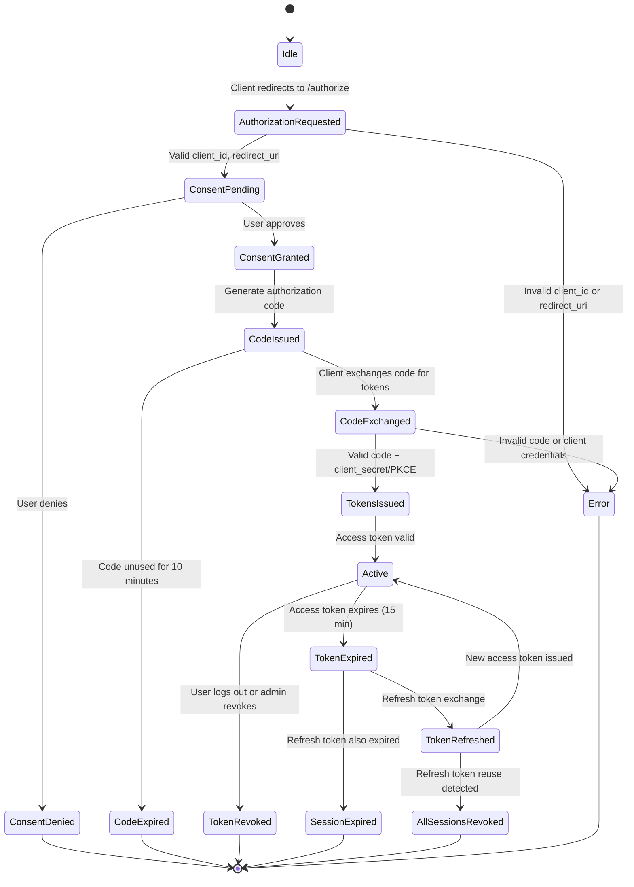
```mermaid
stateDiagram-v2
    [*] --> Idle
    Idle --> AuthorizationRequested: Client redirects to /authorize
    AuthorizationRequested --> ConsentPending: Valid client_id, redirect_uri
    AuthorizationRequested --> Error: Invalid client_id or redirect_uri
    ConsentPending --> ConsentGranted: User approves
    ConsentPending --> ConsentDenied: User denies
    ConsentDenied --> [*]
    ConsentGranted --> CodeIssued: Generate authorization code
    CodeIssued --> CodeExchanged: Client exchanges code for tokens
    CodeIssued --> CodeExpired: Code unused for 10 minutes
    CodeExpired --> [*]
    CodeExchanged --> TokensIssued: Valid code + client_secret/PKCE
    CodeExchanged --> Error: Invalid code or client credentials
    TokensIssued --> Active: Access token valid
    Active --> TokenExpired: Access token expires (15 min)
    Active --> TokenRevoked: User logs out or admin revokes
    TokenExpired --> TokenRefreshed: Refresh token exchange
    TokenExpired --> SessionExpired: Refresh token also expired
    TokenRefreshed --> Active: New access token issued
    TokenRefreshed --> AllSessionsRevoked: Refresh token reuse detected
    TokenRevoked --> [*]
    SessionExpired --> [*]
    AllSessionsRevoked --> [*]
    Error --> [*]
```

### MFA Enrollment Lifecycle

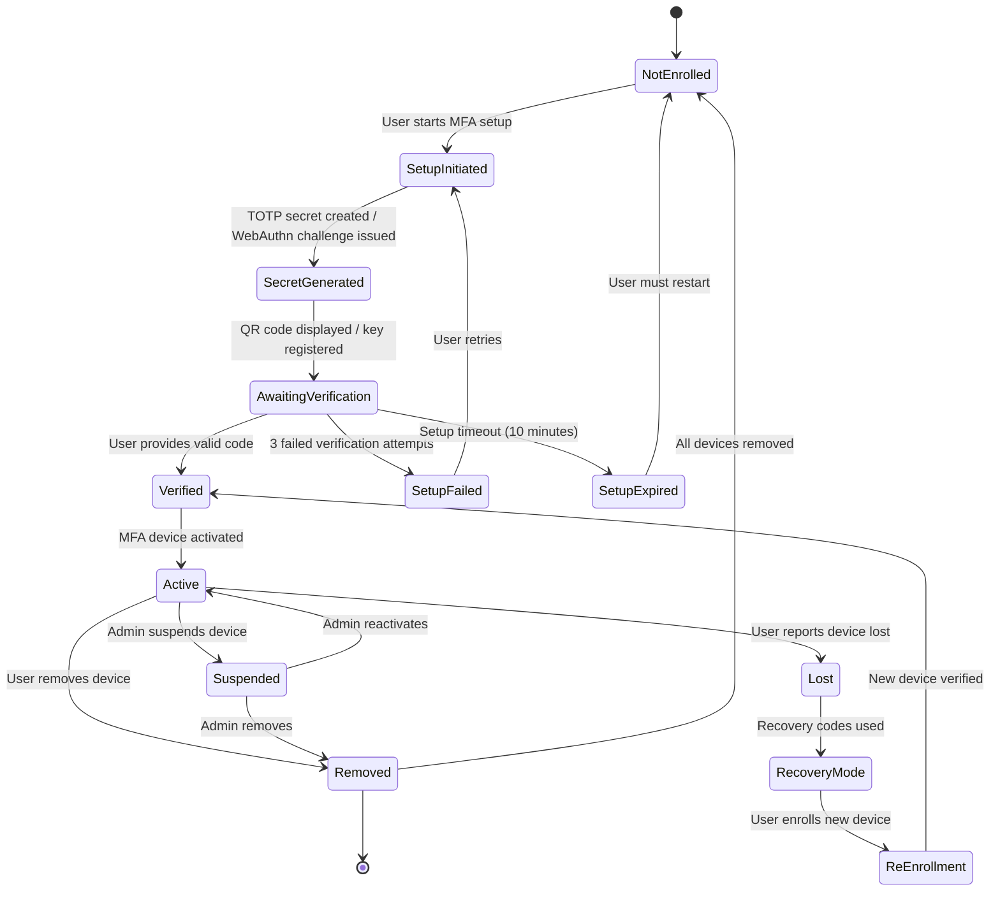
```mermaid
stateDiagram-v2
    [*] --> NotEnrolled
    NotEnrolled --> SetupInitiated: User starts MFA setup
    SetupInitiated --> SecretGenerated: TOTP secret created / WebAuthn challenge issued
    SecretGenerated --> AwaitingVerification: QR code displayed / key registered
    AwaitingVerification --> Verified: User provides valid code
    AwaitingVerification --> SetupFailed: 3 failed verification attempts
    AwaitingVerification --> SetupExpired: Setup timeout (10 minutes)
    SetupFailed --> SetupInitiated: User retries
    SetupExpired --> NotEnrolled: User must restart
    Verified --> Active: MFA device activated
    Active --> Suspended: Admin suspends device
    Active --> Lost: User reports device lost
    Active --> Removed: User removes device
    Suspended --> Active: Admin reactivates
    Suspended --> Removed: Admin removes
    Lost --> RecoveryMode: Recovery codes used
    RecoveryMode --> ReEnrollment: User enrolls new device
    ReEnrollment --> Verified: New device verified
    Removed --> NotEnrolled: All devices removed
    Removed --> [*]
```

### Fraud Case Lifecycle

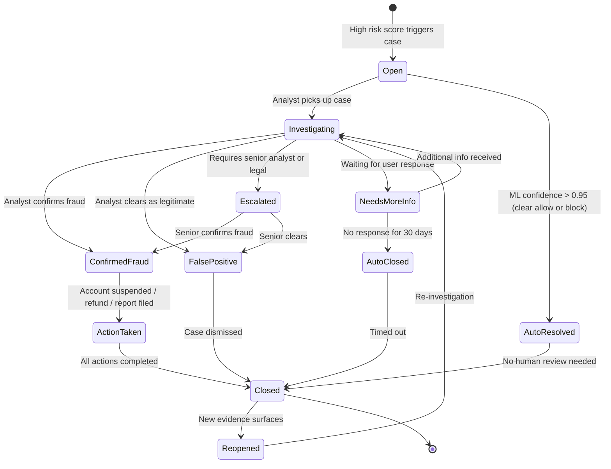
```mermaid
stateDiagram-v2
    [*] --> Open: High risk score triggers case
    Open --> Investigating: Analyst picks up case
    Open --> AutoResolved: ML confidence > 0.95 (clear allow or block)
    Investigating --> ConfirmedFraud: Analyst confirms fraud
    Investigating --> FalsePositive: Analyst clears as legitimate
    Investigating --> Escalated: Requires senior analyst or legal
    Investigating --> NeedsMoreInfo: Waiting for user response
    NeedsMoreInfo --> Investigating: Additional info received
    NeedsMoreInfo --> AutoClosed: No response for 30 days
    Escalated --> ConfirmedFraud: Senior confirms fraud
    Escalated --> FalsePositive: Senior clears
    ConfirmedFraud --> ActionTaken: Account suspended / refund / report filed
    ActionTaken --> Closed: All actions completed
    FalsePositive --> Closed: Case dismissed
    AutoResolved --> Closed: No human review needed
    AutoClosed --> Closed: Timed out
    Closed --> Reopened: New evidence surfaces
    Reopened --> Investigating: Re-investigation
    Closed --> [*]
```

### DDoS Mitigation Lifecycle

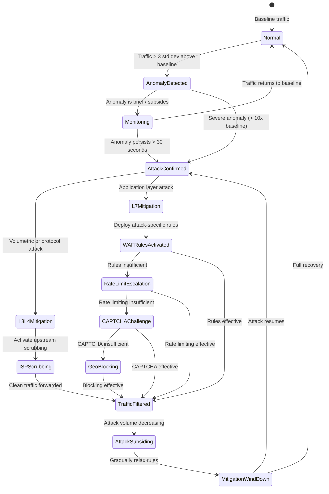
```mermaid
stateDiagram-v2
    [*] --> Normal: Baseline traffic
    Normal --> AnomalyDetected: Traffic > 3 std dev above baseline
    AnomalyDetected --> Monitoring: Anomaly is brief / subsides
    Monitoring --> Normal: Traffic returns to baseline
    Monitoring --> AttackConfirmed: Anomaly persists > 30 seconds
    AnomalyDetected --> AttackConfirmed: Severe anomaly (> 10x baseline)
    AttackConfirmed --> L3L4Mitigation: Volumetric or protocol attack
    AttackConfirmed --> L7Mitigation: Application layer attack
    L3L4Mitigation --> ISPScrubbing: Activate upstream scrubbing
    ISPScrubbing --> TrafficFiltered: Clean traffic forwarded
    L7Mitigation --> WAFRulesActivated: Deploy attack-specific rules
    WAFRulesActivated --> RateLimitEscalation: Rules insufficient
    WAFRulesActivated --> TrafficFiltered: Rules effective
    RateLimitEscalation --> CAPTCHAChallenge: Rate limiting insufficient
    RateLimitEscalation --> TrafficFiltered: Rate limiting effective
    CAPTCHAChallenge --> GeoBlocking: CAPTCHA insufficient
    CAPTCHAChallenge --> TrafficFiltered: CAPTCHA effective
    GeoBlocking --> TrafficFiltered: Blocking effective
    TrafficFiltered --> AttackSubsiding: Attack volume decreasing
    AttackSubsiding --> MitigationWindDown: Gradually relax rules
    MitigationWindDown --> Normal: Full recovery
    MitigationWindDown --> AttackConfirmed: Attack resumes
```

### Secret Rotation Lifecycle

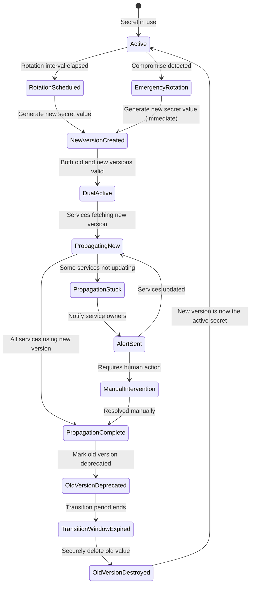
```mermaid
stateDiagram-v2
    [*] --> Active: Secret in use
    Active --> RotationScheduled: Rotation interval elapsed
    Active --> EmergencyRotation: Compromise detected
    RotationScheduled --> NewVersionCreated: Generate new secret value
    EmergencyRotation --> NewVersionCreated: Generate new secret value (immediate)
    NewVersionCreated --> DualActive: Both old and new versions valid
    DualActive --> PropagatingNew: Services fetching new version
    PropagatingNew --> PropagationComplete: All services using new version
    PropagatingNew --> PropagationStuck: Some services not updating
    PropagationStuck --> AlertSent: Notify service owners
    AlertSent --> PropagatingNew: Services updated
    AlertSent --> ManualIntervention: Requires human action
    ManualIntervention --> PropagationComplete: Resolved manually
    PropagationComplete --> OldVersionDeprecated: Mark old version deprecated
    OldVersionDeprecated --> TransitionWindowExpired: Transition period ends
    TransitionWindowExpired --> OldVersionDestroyed: Securely delete old value
    OldVersionDestroyed --> Active: New version is now the active secret
```

---

## Sequence Diagrams

### OAuth2 Authorization Code Flow with PKCE

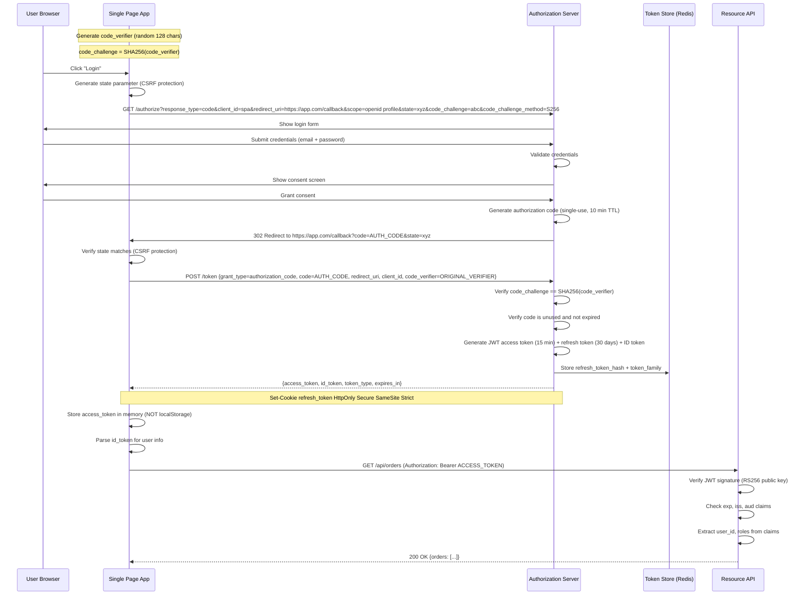
```mermaid
sequenceDiagram
    participant User as User Browser
    participant SPA as Single Page App
    participant AuthServer as Authorization Server
    participant TokenDB as Token Store (Redis)
    participant API as Resource API

    Note over SPA: Generate code_verifier (random 128 chars)
    Note over SPA: code_challenge = SHA256(code_verifier)

    User->>SPA: Click "Login"
    SPA->>SPA: Generate state parameter (CSRF protection)
    SPA->>AuthServer: GET /authorize?response_type=code&client_id=spa&redirect_uri=https://app.com/callback&scope=openid profile&state=xyz&code_challenge=abc&code_challenge_method=S256
    AuthServer->>User: Show login form
    User->>AuthServer: Submit credentials (email + password)
    AuthServer->>AuthServer: Validate credentials
    AuthServer->>User: Show consent screen
    User->>AuthServer: Grant consent

    AuthServer->>AuthServer: Generate authorization code (single-use, 10 min TTL)
    AuthServer->>SPA: 302 Redirect to https://app.com/callback?code=AUTH_CODE&state=xyz

    SPA->>SPA: Verify state matches (CSRF protection)
    SPA->>AuthServer: POST /token {grant_type=authorization_code, code=AUTH_CODE, redirect_uri, client_id, code_verifier=ORIGINAL_VERIFIER}

    AuthServer->>AuthServer: Verify code_challenge == SHA256(code_verifier)
    AuthServer->>AuthServer: Verify code is unused and not expired
    AuthServer->>AuthServer: Generate JWT access token (15 min) + refresh token (30 days) + ID token

    AuthServer->>TokenDB: Store refresh_token_hash + token_family
    AuthServer-->>SPA: {access_token, id_token, token_type, expires_in}
    Note over AuthServer,SPA: Set-Cookie refresh_token HttpOnly Secure SameSite Strict

    SPA->>SPA: Store access_token in memory (NOT localStorage)
    SPA->>SPA: Parse id_token for user info

    SPA->>API: GET /api/orders (Authorization: Bearer ACCESS_TOKEN)
    API->>API: Verify JWT signature (RS256 public key)
    API->>API: Check exp, iss, aud claims
    API->>API: Extract user_id, roles from claims
    API-->>SPA: 200 OK {orders: [...]}
```

### JWT Validation with Refresh

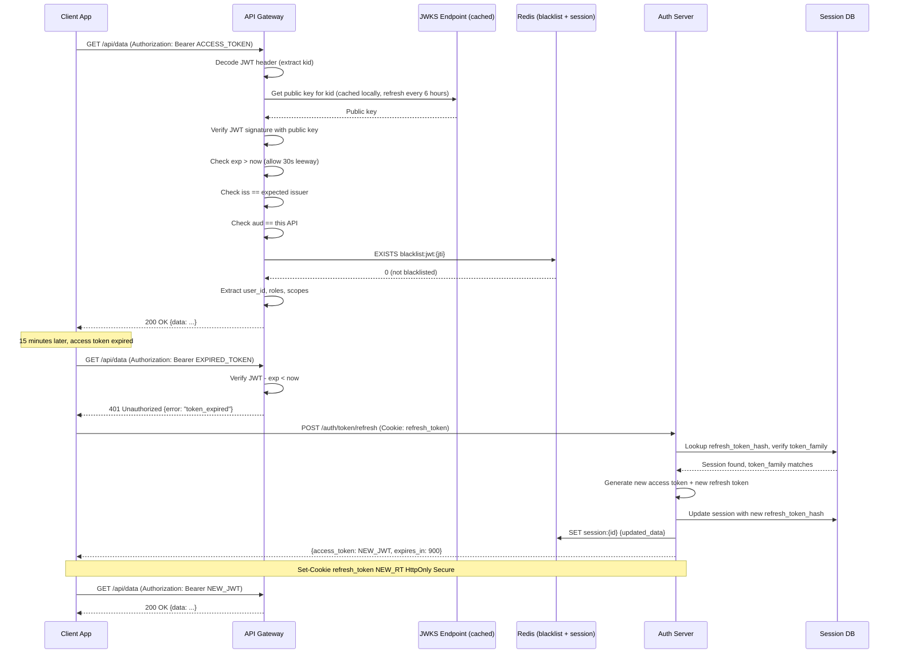
```mermaid
sequenceDiagram
    participant Client as Client App
    participant API as API Gateway
    participant JWKS as JWKS Endpoint (cached)
    participant Redis as Redis (blacklist + session)
    participant AuthServer as Auth Server
    participant DB as Session DB

    Client->>API: GET /api/data (Authorization: Bearer ACCESS_TOKEN)

    API->>API: Decode JWT header (extract kid)
    API->>JWKS: Get public key for kid (cached locally, refresh every 6 hours)
    JWKS-->>API: Public key

    API->>API: Verify JWT signature with public key
    API->>API: Check exp > now (allow 30s leeway)
    API->>API: Check iss == expected issuer
    API->>API: Check aud == this API

    API->>Redis: EXISTS blacklist:jwt:{jti}
    Redis-->>API: 0 (not blacklisted)

    API->>API: Extract user_id, roles, scopes
    API-->>Client: 200 OK {data: ...}

    Note over Client: 15 minutes later, access token expired

    Client->>API: GET /api/data (Authorization: Bearer EXPIRED_TOKEN)
    API->>API: Verify JWT - exp < now
    API-->>Client: 401 Unauthorized {error: "token_expired"}

    Client->>AuthServer: POST /auth/token/refresh (Cookie: refresh_token)
    AuthServer->>DB: Lookup refresh_token_hash, verify token_family
    DB-->>AuthServer: Session found, token_family matches

    AuthServer->>AuthServer: Generate new access token + new refresh token
    AuthServer->>DB: Update session with new refresh_token_hash
    AuthServer->>Redis: SET session:{id} {updated_data}

    AuthServer-->>Client: {access_token: NEW_JWT, expires_in: 900}
    Note over AuthServer,Client: Set-Cookie refresh_token NEW_RT HttpOnly Secure

    Client->>API: GET /api/data (Authorization: Bearer NEW_JWT)
    API-->>Client: 200 OK {data: ...}
```

### RBAC Policy Evaluation

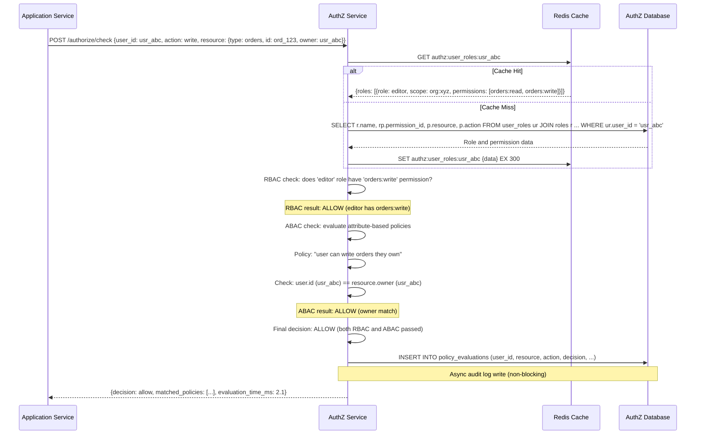
```mermaid
sequenceDiagram
    participant Service as Application Service
    participant AuthZ as AuthZ Service
    participant Cache as Redis Cache
    participant DB as AuthZ Database

    Service->>AuthZ: POST /authorize/check {user_id: usr_abc, action: write, resource: {type: orders, id: ord_123, owner: usr_abc}}

    AuthZ->>Cache: GET authz:user_roles:usr_abc
    alt Cache Hit
        Cache-->>AuthZ: {roles: [{role: editor, scope: org:xyz, permissions: [orders:read, orders:write]}]}
    else Cache Miss
        AuthZ->>DB: SELECT r.name, rp.permission_id, p.resource, p.action FROM user_roles ur JOIN roles r ... WHERE ur.user_id = 'usr_abc'
        DB-->>AuthZ: Role and permission data
        AuthZ->>Cache: SET authz:user_roles:usr_abc {data} EX 300
    end

    AuthZ->>AuthZ: RBAC check: does 'editor' role have 'orders:write' permission?
    Note over AuthZ: RBAC result: ALLOW (editor has orders:write)

    AuthZ->>AuthZ: ABAC check: evaluate attribute-based policies
    AuthZ->>AuthZ: Policy: "user can write orders they own"
    AuthZ->>AuthZ: Check: user.id (usr_abc) == resource.owner (usr_abc)
    Note over AuthZ: ABAC result: ALLOW (owner match)

    AuthZ->>AuthZ: Final decision: ALLOW (both RBAC and ABAC passed)

    AuthZ->>DB: INSERT INTO policy_evaluations (user_id, resource, action, decision, ...)
    Note over AuthZ,DB: Async audit log write (non-blocking)

    AuthZ-->>Service: {decision: allow, matched_policies: [...], evaluation_time_ms: 2.1}
```

### Rate Limiting with Redis

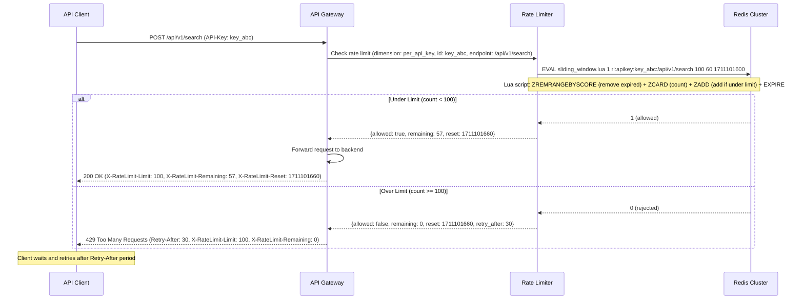
```mermaid
sequenceDiagram
    participant Client as API Client
    participant GW as API Gateway
    participant RL as Rate Limiter
    participant Redis as Redis Cluster

    Client->>GW: POST /api/v1/search (API-Key: key_abc)

    GW->>RL: Check rate limit (dimension: per_api_key, id: key_abc, endpoint: /api/v1/search)

    RL->>Redis: EVAL sliding_window.lua 1 rl:apikey:key_abc:/api/v1/search 100 60 1711101600
    Note over RL,Redis: Lua script: ZREMRANGEBYSCORE (remove expired) + ZCARD (count) + ZADD (add if under limit) + EXPIRE

    alt Under Limit (count < 100)
        Redis-->>RL: 1 (allowed)
        RL-->>GW: {allowed: true, remaining: 57, reset: 1711101660}
        GW->>GW: Forward request to backend
        GW-->>Client: 200 OK (X-RateLimit-Limit: 100, X-RateLimit-Remaining: 57, X-RateLimit-Reset: 1711101660)

    else Over Limit (count >= 100)
        Redis-->>RL: 0 (rejected)
        RL-->>GW: {allowed: false, remaining: 0, reset: 1711101660, retry_after: 30}
        GW-->>Client: 429 Too Many Requests (Retry-After: 30, X-RateLimit-Limit: 100, X-RateLimit-Remaining: 0)
    end

    Note over Client: Client waits and retries after Retry-After period
```

### DDoS Detection and Mitigation

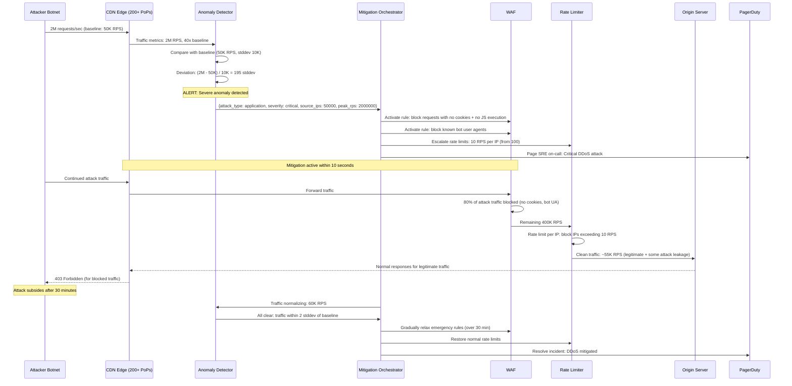
```mermaid
sequenceDiagram
    participant Attacker as Attacker Botnet
    participant CDN as CDN Edge (200+ PoPs)
    participant Detector as Anomaly Detector
    participant Orchestrator as Mitigation Orchestrator
    participant WAF as WAF
    participant RL as Rate Limiter
    participant Origin as Origin Server
    participant PagerDuty as PagerDuty

    Attacker->>CDN: 2M requests/sec (baseline: 50K RPS)

    CDN->>Detector: Traffic metrics: 2M RPS, 40x baseline
    Detector->>Detector: Compare with baseline (50K RPS, stddev 10K)
    Detector->>Detector: Deviation: (2M - 50K) / 10K = 195 stddev
    Note over Detector: ALERT: Severe anomaly detected

    Detector->>Orchestrator: {attack_type: application, severity: critical, source_ips: 50000, peak_rps: 2000000}

    Orchestrator->>WAF: Activate rule: block requests with no cookies + no JS execution
    Orchestrator->>WAF: Activate rule: block known bot user agents
    Orchestrator->>RL: Escalate rate limits: 10 RPS per IP (from 100)
    Orchestrator->>PagerDuty: Page SRE on-call: Critical DDoS attack

    Note over CDN,WAF: Mitigation active within 10 seconds

    Attacker->>CDN: Continued attack traffic
    CDN->>WAF: Forward traffic
    WAF->>WAF: 80% of attack traffic blocked (no cookies, bot UA)
    WAF->>RL: Remaining 400K RPS
    RL->>RL: Rate limit per IP: block IPs exceeding 10 RPS
    RL->>Origin: Clean traffic: ~55K RPS (legitimate + some attack leakage)

    Origin-->>CDN: Normal responses for legitimate traffic
    CDN-->>Attacker: 403 Forbidden (for blocked traffic)

    Note over Attacker: Attack subsides after 30 minutes

    Orchestrator->>Detector: Traffic normalizing: 60K RPS
    Detector->>Orchestrator: All clear: traffic within 2 stddev of baseline
    Orchestrator->>WAF: Gradually relax emergency rules (over 30 min)
    Orchestrator->>RL: Restore normal rate limits
    Orchestrator->>PagerDuty: Resolve incident: DDoS mitigated
```

### Fraud Scoring Pipeline

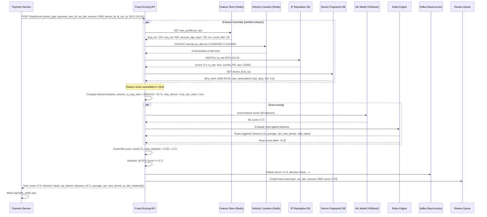
```mermaid
sequenceDiagram
    participant PaymentSvc as Payment Service
    participant FraudAPI as Fraud Scoring API
    participant FeatureStore as Feature Store (Redis)
    participant VelocityDB as Velocity Counters (Redis)
    participant IPDB as IP Reputation DB
    participant DeviceDB as Device Fingerprint DB
    participant MLModel as ML Model (XGBoost)
    participant Rules as Rules Engine
    participant Kafka as Kafka (fraud.scores)
    participant ReviewQueue as Review Queue

    PaymentSvc->>FraudAPI: POST /fraud/score {event_type: payment, user_id: usr_abc, amount: 2500, device_fp: fp_xyz, ip: 203.0.113.42}

    par Feature Assembly (parallel lookups)
        FraudAPI->>FeatureStore: GET user_profile:usr_abc
        FeatureStore-->>FraudAPI: {avg_txn: 150, max_txn: 500, account_age_days: 730, txn_count_30d: 12}

        FraudAPI->>VelocityDB: ZCOUNT velocity:usr_abc:txn 1711097000 1711101600
        VelocityDB-->>FraudAPI: 3 transactions in last hour

        FraudAPI->>IPDB: HGETALL ip_rep:203.0.113.42
        IPDB-->>FraudAPI: {score: 0.4, is_vpn: true, country: RO, asn: 12345}

        FraudAPI->>DeviceDB: GET device_fp:fp_xyz
        DeviceDB-->>FraudAPI: {first_seen: 2026-03-22, user_associations: [usr_abc], risk: 0.3}
    end

    Note over FraudAPI: Feature vector assembled in 15ms

    FraudAPI->>FraudAPI: Compute derived features: amount_vs_avg_ratio = 2500/150 = 16.7x, new_device = true, vpn_used = true

    par Dual scoring
        FraudAPI->>MLModel: Score feature vector (50 features)
        MLModel-->>FraudAPI: ML score: 0.72

        FraudAPI->>Rules: Evaluate rules against features
        Rules-->>FraudAPI: Rules triggered: [amount_5x_average, vpn_new_device, high_value]
        Rules-->>FraudAPI: Rules score delta: +0.25
    end

    FraudAPI->>FraudAPI: Ensemble score: max(0.72, rules_baseline + 0.25) = 0.72
    FraudAPI->>FraudAPI: Decision: BLOCK (score >= 0.7)

    FraudAPI->>Kafka: Publish {score: 0.72, decision: block, ...}
    FraudAPI->>ReviewQueue: Create fraud case {user: usr_abc, amount: 2500, score: 0.72}

    FraudAPI-->>PaymentSvc: {risk_score: 0.72, decision: block, top_factors: [amount_16.7x_average, vpn_new_device, ip_risk_moderate]}

    PaymentSvc->>PaymentSvc: Block payment, notify user
```

---

## Concurrency Control

### Rate Limit Counter Atomicity

Rate limit counters must be atomic across concurrent requests. A race condition where two requests read "99/100" simultaneously and both increment would allow 101 requests (1% over-admission).

**Solution: Redis Lua scripts for atomic read-check-increment.**

```lua
-- Atomic sliding window rate limit (single Redis roundtrip)
-- This runs atomically in Redis: no interleaving with other commands
local key = KEYS[1]
local limit = tonumber(ARGV[1])
local window = tonumber(ARGV[2])
local now = tonumber(ARGV[3])
local request_id = ARGV[4]

-- Step 1: Remove expired entries (atomic within Lua)
redis.call('ZREMRANGEBYSCORE', key, '-inf', now - window)

-- Step 2: Count current entries
local count = redis.call('ZCARD', key)

-- Step 3: Admit or reject (atomic decision)
if count < limit then
    -- Admit: add this request to the window
    redis.call('ZADD', key, now, request_id)
    redis.call('EXPIRE', key, window + 1)
    return {1, limit - count - 1}  -- {allowed, remaining}
else
    -- Reject: do not add
    return {0, 0}  -- {rejected, remaining=0}
end
```

**Why Lua scripts?** Redis executes Lua scripts atomically (single-threaded execution). No other Redis command can interleave between ZCARD and ZADD, eliminating race conditions without distributed locks.

**Token Bucket Atomic Refill:**

```lua
-- Atomic token bucket refill + consume
local key = KEYS[1]
local max_tokens = tonumber(ARGV[1])
local refill_rate = tonumber(ARGV[2])  -- tokens per second
local now = tonumber(ARGV[3])

local bucket = redis.call('HMGET', key, 'tokens', 'last_refill')
local tokens = tonumber(bucket[1]) or max_tokens
local last_refill = tonumber(bucket[2]) or now

-- Calculate refill
local elapsed = now - last_refill
local refill = math.min(max_tokens, tokens + elapsed * refill_rate)

if refill >= 1 then
    -- Consume one token
    redis.call('HMSET', key, 'tokens', refill - 1, 'last_refill', now)
    redis.call('EXPIRE', key, math.ceil(max_tokens / refill_rate) + 1)
    return {1, math.floor(refill - 1)}  -- {allowed, remaining}
else
    -- No tokens available
    redis.call('HMSET', key, 'tokens', refill, 'last_refill', now)
    return {0, 0}  -- {rejected, remaining=0}
end
```

### Session Invalidation Across Nodes

When a user logs out or an admin revokes a session, all API gateway nodes must stop accepting the revoked JWT.

**Problem:** JWT is stateless. Gateway nodes validate JWTs locally without querying a central database. A revoked session's JWT remains valid until expiry (up to 15 minutes).

**Solution: Redis Pub/Sub + local blacklist cache.**

```
1. User logs out (or admin revokes session)
2. Auth service:
   a. Mark session as revoked in DB
   b. SET blacklist:jwt:{jti} 1 EX {remaining_jwt_lifetime} in Redis
   c. PUBLISH channel:session_revoked {jti, user_id}

3. Each API gateway node:
   a. Subscribes to channel:session_revoked
   b. On message: add jti to local in-memory blacklist (LRU cache, 15-min max TTL)
   c. On each JWT validation: check local blacklist first (0.01ms), then Redis if miss

Propagation time: < 50ms (Redis Pub/Sub latency)
```

**Trade-off:** There is a brief window (< 50ms) where a revoked token might be accepted by a node that hasn't received the Pub/Sub message yet. For most applications this is acceptable. For highly sensitive operations, always check Redis directly.

### Policy Cache Consistency

Authorization policy changes (role updates, permission changes) must propagate to all service instances.

```
Consistency model: Eventual consistency with bounded staleness (5 minutes max)

Approach:
1. Policy change occurs (admin updates role permissions)
2. AuthZ service writes to DB
3. AuthZ service publishes to Kafka topic: authz.policy.changed
4. AuthZ service invalidates Redis cache: DEL authz:role_perms:{role_id}

Consumer behavior:
  - Each authz service instance subscribes to authz.policy.changed
  - On message: invalidate local in-memory cache for affected roles
  - Next request for that role will miss cache, fetch from DB, repopulate cache

Worst case staleness:
  - Redis TTL: 5 minutes (cache entries expire naturally)
  - Kafka propagation: < 1 second
  - Combined: 5 minutes max (if Kafka consumer is lagging)

For sensitive operations (admin actions, financial transactions):
  - Bypass cache entirely: always query DB for current permissions
  - Add header X-AuthZ-Bypass-Cache: true
```

---

## Idempotency Strategy

### Idempotent Token Refresh

**Problem:** If a token refresh request times out and the client retries, the server might issue two new refresh tokens, invalidating the first one. This causes a false "token reuse detected" alert and unnecessarily revokes all user sessions.

**Solution: Token family-based idempotency.**

```
Each refresh token belongs to a "token family" (UUID).
All refresh tokens in a family form a chain:
  RT1 → RT2 → RT3 → ...

On refresh:
1. Client sends refresh token RT2
2. Server checks: is RT2 the latest in its family?
   a. YES: issue RT3, invalidate RT2 → return RT3 + new access token
   b. NO (RT2 already used, RT3 exists): this is a replay
      - If the caller also has RT3 (timeout retry): return same RT3 + access token (idempotent)
      - If caller has RT2 but RT3 was issued to someone else: token theft → revoke entire family

Implementation in Redis:
  Key: token_family:{family_id}
  Value: {current_rt_hash, previous_rt_hash, user_id, issued_at}
  TTL: 30 days

  On refresh attempt:
    If request_rt_hash == current_rt_hash:
      → Already refreshed (idempotent replay): return cached response
    If request_rt_hash == previous_rt_hash:
      → First refresh of this token: issue new tokens, rotate
    Else:
      → Token theft detected: revoke family

Idempotency window: until the next refresh (typically 15 minutes)
```

### Idempotent Secret Rotation

**Problem:** If a secret rotation request is retried (network timeout, operator double-click), creating two new versions would cause confusion about which is "current."

**Solution: Rotation ID-based idempotency.**

```
Each rotation request includes a client-generated idempotency key (rotation_id).

Steps:
1. Client: POST /secrets/{path}/rotate
   Headers: Idempotency-Key: rot_abc123
   Body: {rotation_strategy: "dual_credential", transition_window: "7 days"}

2. Server:
   a. Check Redis: EXISTS idempotency:rotation:rot_abc123
   b. If exists: return cached response (same new version, same status)
   c. If not exists:
      - Begin rotation: create new secret version
      - Store response in Redis: SET idempotency:rotation:rot_abc123 {response} EX 86400
      - Return response

3. On retry (same Idempotency-Key):
   - Return cached response immediately
   - No second rotation occurs

Idempotency window: 24 hours (long enough for any reasonable retry)

Implementation:
  Key: idempotency:rotation:{rotation_id}
  Value: {response_body, status_code, secret_id, new_version}
  TTL: 86400 (24 hours)
```

---

## Consistency Model

### Session Consistency

```
Model: Strong consistency for writes, eventual consistency for reads

Write path (login, logout, revoke):
  1. Write to PostgreSQL (primary) — synchronous
  2. Write to Redis cache — synchronous
  3. Publish to Kafka (session events) — async

  Both DB and cache must succeed before returning success to client.
  If Redis write fails: retry 3 times, then fail the operation (don't create
  a session that exists in DB but not in cache).

Read path (JWT validation):
  1. Check local in-memory blacklist — 0.01ms
  2. Check Redis blacklist — 0.2ms
  3. JWT signature + claims validation — 0.5ms
  (No DB read required — stateless)

Session revocation propagation:
  - Redis: immediate (write-through)
  - Other nodes: < 50ms (Pub/Sub)
  - Worst case: 15 minutes (JWT expiry)

Why not strong consistency for reads?
  - JWT is inherently eventually consistent (stateless, time-bounded)
  - Strong consistency would require DB lookup per request (defeats JWT purpose)
  - 15-minute bounded staleness is acceptable for most applications
```

### Policy Evaluation Consistency

```
Model: Eventual consistency with bounded staleness (5 minutes)

Write path (policy change):
  1. Write to PostgreSQL — synchronous
  2. Invalidate Redis cache — synchronous
  3. Publish to Kafka (policy change event) — async

Read path (permission check):
  1. Check Redis cache — 0.2ms (95% hit rate)
  2. On miss: query PostgreSQL — 10ms
  3. Populate cache with 5-minute TTL

Staleness impact:
  - Newly granted permissions: user may not have access for up to 5 minutes
  - Revoked permissions: user may retain access for up to 5 minutes

Mitigation for sensitive operations:
  - DELETE, admin actions, financial operations bypass cache
  - X-AuthZ-Fresh: true header forces DB lookup

Why not strong consistency?
  - 1M+ policy evaluations/sec would overwhelm the DB
  - 95% cache hit rate reduces DB load by 20x
  - 5-minute staleness is acceptable for most CRUD operations
```

### Rate Limit Counter Eventual Consistency

```
Model: Single-leader per key (Redis shard), strong consistency within shard

Each rate limit key is hashed to a specific Redis shard.
All increments for that key go to the same shard (strong consistency).

Cross-region rate limiting:
  Option A: Global Redis (high latency — 50-100ms cross-region)
    - Accurate global counts
    - Adds 50ms to every request

  Option B: Per-region Redis (low latency — 0.2ms)
    - Each region maintains independent counters
    - User with 100/min global limit gets 100/min per region
    - Total actual capacity: 100 x N regions

  Option C: Per-region with async sync (recommended)
    - Each region maintains local counters
    - Every 5 seconds: publish counter snapshots to Kafka
    - Each region adjusts local limits based on global aggregate
    - Accuracy: +/- 10% over-admission during sync window
    - Latency: 0.2ms (local Redis)

Chosen approach: Option C for most rate limits.
Exception: login rate limiting uses Option A (critical security, tolerate latency).
```

---

## Distributed Transaction / Saga Design

### User Registration Saga

User registration spans multiple services: create user record, assign default roles, send verification email, initialize user profile, and create audit trail. If any step fails, previously completed steps must be compensated.

```
Saga: UserRegistration
Orchestrator: Registration Service

Step 1: Create User Record (Auth Service)
  Action:       INSERT INTO users (email, password_hash, ...)
  Compensation: DELETE FROM users WHERE user_id = ?
  Timeout:      5 seconds

Step 2: Assign Default Roles (AuthZ Service)
  Action:       INSERT INTO user_roles (user_id, role_id='viewer', scope='*')
  Compensation: DELETE FROM user_roles WHERE user_id = ?
  Timeout:      3 seconds
  Depends on:   Step 1 success (needs user_id)

Step 3: Send Verification Email (Notification Service)
  Action:       Enqueue email with verification token
  Compensation: Cancel queued email (if not yet sent)
  Timeout:      3 seconds
  Depends on:   Step 1 success (needs email)

Step 4: Initialize User Profile (Profile Service)
  Action:       INSERT INTO user_profiles (user_id, display_name, ...)
  Compensation: DELETE FROM user_profiles WHERE user_id = ?
  Timeout:      3 seconds
  Depends on:   Step 1 success (needs user_id)

Step 5: Audit Log (Audit Service)
  Action:       Publish auth.user.registered event to Kafka
  Compensation: None (audit log is append-only, write compensating event instead)
  Timeout:      2 seconds
```

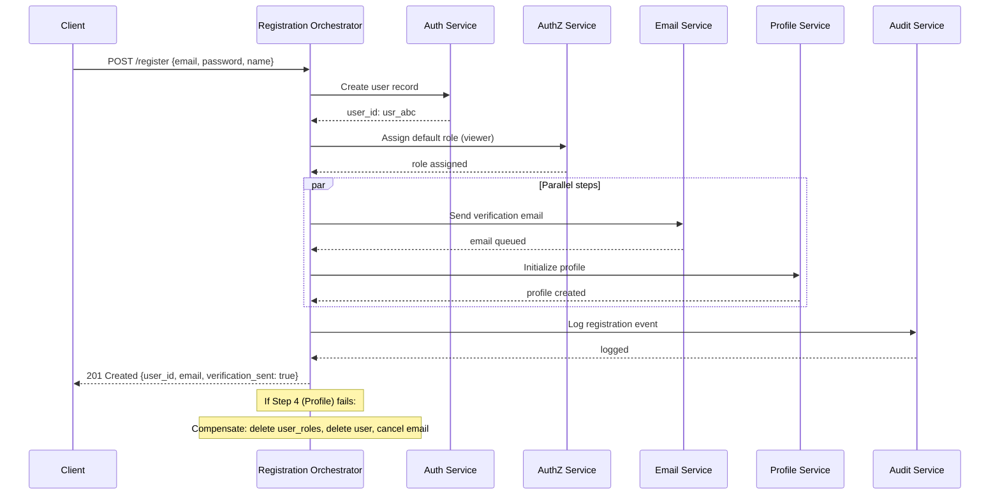
```mermaid
sequenceDiagram
    participant Client as Client
    participant Orch as Registration Orchestrator
    participant Auth as Auth Service
    participant AuthZ as AuthZ Service
    participant Email as Email Service
    participant Profile as Profile Service
    participant Audit as Audit Service

    Client->>Orch: POST /register {email, password, name}

    Orch->>Auth: Create user record
    Auth-->>Orch: user_id: usr_abc

    Orch->>AuthZ: Assign default role (viewer)
    AuthZ-->>Orch: role assigned

    par Parallel steps
        Orch->>Email: Send verification email
        Email-->>Orch: email queued

        Orch->>Profile: Initialize profile
        Profile-->>Orch: profile created
    end

    Orch->>Audit: Log registration event
    Audit-->>Orch: logged

    Orch-->>Client: 201 Created {user_id, email, verification_sent: true}

    Note over Orch: If Step 4 (Profile) fails:
    Note over Orch: Compensate: delete user_roles, delete user, cancel email
```

### Fraud Investigation Saga

When a fraud case is confirmed, multiple actions must occur across services: freeze user account, reverse transactions, notify user, create compliance report, and update fraud models.

```
Saga: FraudInvestigationResolution
Orchestrator: Fraud Service
Trigger: Analyst confirms fraud on case

Step 1: Freeze User Account (Auth Service)
  Action:       UPDATE users SET status = 'suspended' WHERE user_id = ?
                Revoke all sessions for user
  Compensation: UPDATE users SET status = 'active' (if false positive determined later)
  Timeout:      5 seconds

Step 2: Reverse Fraudulent Transactions (Payment Service)
  Action:       For each fraud transaction: initiate chargeback/reversal
  Compensation: Cancel pending reversals
  Timeout:      30 seconds (payment processing is slow)

Step 3: Notify User (Notification Service)
  Action:       Send "account suspended due to suspicious activity" email
                Include support contact and appeal process
  Compensation: Send "account restored" email
  Timeout:      5 seconds

Step 4: Create Compliance Report (Compliance Service)
  Action:       Generate Suspicious Activity Report (SAR) if amount > $5,000
  Compensation: None (regulatory: once filed, cannot be withdrawn)
  Timeout:      10 seconds

Step 5: Update Fraud Models (ML Service)
  Action:       Add confirmed fraud label to training data
                Trigger model retraining if enough new labels accumulated
  Compensation: Remove label (if false positive)
  Timeout:      5 seconds

Step 6: Block Associated Devices/IPs (DDoS/Fraud Service)
  Action:       Add device fingerprints and IPs from fraud case to blocklist
  Compensation: Remove from blocklist (if false positive)
  Timeout:      3 seconds
```

---

## Security Design (Meta — Security of the Security System Itself)

### HSM Integration

```
Hardware Security Modules protect the master keys that encrypt all other secrets.

Key Hierarchy:
  Level 0: HSM Master Key (never leaves HSM hardware)
    |
    ├── Level 1: Key Encryption Keys (KEKs) — stored in HSM, wrap data keys
    |     |
    |     ├── Level 2: Data Encryption Keys (DEKs) — wrapped by KEK, stored in Vault
    |     |     |
    |     |     └── Level 3: Secret values — encrypted by DEK
    |     |
    |     └── Level 2: JWT Signing Keys — wrapped by KEK
    |
    └── Level 1: Audit Log Signing Key — signs audit log entries for tamper detection

Envelope Encryption:
  1. Service requests secret from Vault
  2. Vault retrieves encrypted secret (DEK-encrypted)
  3. Vault sends encrypted DEK to HSM
  4. HSM decrypts DEK using KEK (in HSM hardware)
  5. Vault uses decrypted DEK to decrypt secret value (in Vault memory)
  6. Vault returns plaintext secret to service (over mTLS)
  7. Vault zeroes DEK from memory

HSM Operations (via PKCS#11 or KMIP):
  - GenerateKey: create new KEK in HSM
  - Encrypt/Decrypt: wrap/unwrap DEKs
  - Sign/Verify: sign audit logs, JWT signing keys
  - Key rotation: create new KEK, re-wrap all DEKs

HSM Availability:
  - Primary + secondary HSM in same datacenter (active-active)
  - Disaster recovery HSM in separate region (warm standby)
  - If all HSMs unavailable: Vault operates in sealed mode (no new secret access)
  - Existing cached secrets remain available until TTL expires
```

### Audit Trail Tamper Protection

```
Requirement: prove that audit logs have not been modified after writing

Approach: Hash chain + periodic signing

1. Each audit log entry includes:
   {
     entry_id: "audit_001",
     timestamp: "2026-03-22T14:30:00Z",
     event: {... audit data ...},
     previous_hash: "sha256_of_previous_entry",
     entry_hash: "sha256(timestamp + event + previous_hash)"
   }

2. Every 1000 entries (or every 5 minutes):
   - Compute Merkle root of the last 1000 entry hashes
   - Sign Merkle root with HSM audit signing key
   - Store signed checkpoint in separate tamper-evident store

3. Verification:
   - To verify log integrity: recompute hash chain from any checkpoint
   - Any modified entry breaks the chain (hash mismatch)
   - Signed checkpoints prove the chain was valid at checkpoint time

4. Storage:
   - Primary: append-only PostgreSQL table (no UPDATE/DELETE permissions)
   - Archive: AWS S3 with Object Lock (WORM — Write Once Read Many)
   - Signed checkpoints: separate S3 bucket with Object Lock
```

### Zero-Trust Internal Authentication

```
Principle: Never trust network location. Every service-to-service call is authenticated.

Implementation:
1. mTLS Service Mesh (Istio/Linkerd)
   - Every pod has a unique X.509 certificate
   - Certificates issued by internal CA (short-lived: 24 hours)
   - All inter-service traffic encrypted with mutual TLS
   - No plaintext traffic allowed, even within the cluster

2. Service Identity
   - Each service has a SPIFFE identity: spiffe://cluster.local/ns/payments/sa/payments-api
   - Identity is attested by the platform (Kubernetes ServiceAccount)
   - No static credentials: identity derived from platform attestation

3. Internal Authorization
   - Even authenticated services are authorized per-endpoint
   - Payments service can call Vault for its secrets, not for other services' secrets
   - Policy: allow payments-api to read secrets/payments/*, deny secrets/*

4. Network Policies
   - Kubernetes NetworkPolicies restrict pod-to-pod communication
   - Default deny: no pod can communicate unless explicitly allowed
   - Payments pod can reach: payments-db, vault, kafka
   - Payments pod cannot reach: user-service, admin-dashboard

5. Egress Control
   - All outbound traffic routed through egress proxy
   - Only allow listed external endpoints (Stripe API, email provider)
   - Log all egress traffic for audit
```

---

## Observability Design

### Security Metrics

```
Authentication Metrics:
  - auth.login.success.count (by method: password, oauth, sso, api_key)
  - auth.login.failure.count (by reason: bad_password, locked, rate_limited)
  - auth.login.latency.p50/p99 (by method)
  - auth.token.refresh.count
  - auth.token.refresh.failure.count (by reason: expired, revoked, reuse_detected)
  - auth.mfa.enrollment.count (by type: totp, sms, webauthn)
  - auth.mfa.verification.success.count
  - auth.mfa.verification.failure.count
  - auth.session.active.gauge (current active sessions)
  - auth.account.lockout.count

Authorization Metrics:
  - authz.decision.count (by result: allow, deny)
  - authz.evaluation.latency.p50/p99
  - authz.cache.hit_rate
  - authz.policy.count.gauge (active policies)

Rate Limiting Metrics:
  - ratelimit.decision.count (by result: allowed, rejected)
  - ratelimit.rejected.count (by dimension: per_user, per_ip, per_apikey)
  - ratelimit.top_limited_users (top 10 users hitting limits)
  - ratelimit.redis.latency.p50/p99

DDoS Metrics:
  - ddos.traffic.rps.gauge (by region)
  - ddos.baseline.deviation.gauge
  - ddos.mitigation.active.gauge (number of active mitigations)
  - ddos.blocked.rps.gauge
  - ddos.legitimate_impact.percent

Fraud Metrics:
  - fraud.score.distribution.histogram
  - fraud.decision.count (by decision: allow, challenge, block)
  - fraud.scoring.latency.p50/p99
  - fraud.false_positive_rate.gauge
  - fraud.true_positive_rate.gauge
  - fraud.review_queue.depth.gauge
  - fraud.case.count (by status: open, investigating, confirmed, closed)
```

### Alert Rules

```yaml
# Authentication Alerts
- alert: HighLoginFailureRate
  expr: rate(auth_login_failure_count[5m]) / rate(auth_login_total[5m]) > 0.3
  for: 5m
  labels:
    severity: warning
  annotations:
    summary: "Login failure rate above 30% for 5 minutes"

- alert: TokenReuseDetected
  expr: increase(auth_token_reuse_detected_count[1m]) > 0
  labels:
    severity: critical
  annotations:
    summary: "Refresh token reuse detected - potential token theft"

- alert: MassiveAccountLockouts
  expr: increase(auth_account_lockout_count[5m]) > 100
  for: 2m
  labels:
    severity: critical
  annotations:
    summary: "Over 100 account lockouts in 5 minutes - credential stuffing attack"

# DDoS Alerts
- alert: TrafficAnomalyDetected
  expr: ddos_baseline_deviation > 5
  for: 30s
  labels:
    severity: warning
  annotations:
    summary: "Traffic is 5+ standard deviations above baseline"

- alert: DDoSAttackCritical
  expr: ddos_baseline_deviation > 20
  for: 10s
  labels:
    severity: critical
  annotations:
    summary: "Severe DDoS attack: traffic 20+ stddev above baseline"

# Fraud Alerts
- alert: FraudSpikeDetected
  expr: rate(fraud_decision_count{decision="block"}[5m]) > 2 * rate(fraud_decision_count{decision="block"}[1h])
  for: 5m
  labels:
    severity: warning
  annotations:
    summary: "Fraud block rate is 2x the hourly average"

- alert: FraudModelDegradation
  expr: fraud_false_positive_rate > 0.05
  for: 1h
  labels:
    severity: warning
  annotations:
    summary: "Fraud model false positive rate above 5%"

# Secrets Alerts
- alert: SecretAccessAnomalous
  expr: rate(secret_access_count{operation="read"}[5m]) > 10 * avg_over_time(secret_access_count{operation="read"}[24h])
  for: 5m
  labels:
    severity: warning
  annotations:
    summary: "Secret access rate 10x above 24h average"

- alert: SecretRotationOverdue
  expr: (time() - secret_last_rotated_timestamp) > (secret_rotation_interval * 1.1)
  labels:
    severity: warning
  annotations:
    summary: "Secret rotation overdue by more than 10%"
```

---

## Reliability and Resilience

### Authentication Service Circuit Breaker

```
The auth service depends on: PostgreSQL, Redis, external IdPs (Google, GitHub).
Each dependency gets its own circuit breaker.

PostgreSQL Circuit Breaker:
  - Closed (normal): all requests go to DB
  - Open (tripped): after 5 consecutive failures or 50% error rate in 30s
    → Return cached sessions from Redis (degraded but functional)
    → New logins fail with 503 (can't verify password without DB)
  - Half-open: after 30 seconds, allow 1 request through
    → If success: close circuit
    → If failure: keep open for another 30 seconds

Redis Circuit Breaker:
  - Closed (normal): all cache operations go to Redis
  - Open (tripped): after 10 consecutive failures
    → JWT validation still works (stateless, no Redis needed)
    → Token blacklist unavailable: revoked tokens accepted for up to 15 min
    → Rate limiting in degraded mode (local in-memory counters)
  - Half-open: after 15 seconds, test connection

External IdP Circuit Breaker (per provider):
  - Closed (normal): OAuth flows work
  - Open (tripped): after 3 consecutive failures to a specific IdP
    → Show "Login with Google unavailable, use email/password" message
    → Other IdPs unaffected
  - Half-open: after 60 seconds

Implementation: Resilience4j (Java), Polly (.NET), or custom middleware
```

### Rate Limiter Fallback

```
If Redis (rate limit store) is unavailable:

Fallback Strategy: Local in-memory rate limiting

1. Each API gateway instance maintains local token buckets in memory
2. Limits are divided by the number of gateway instances
   - Global limit: 100 req/min per user
   - 10 gateway instances → local limit: 10 req/min per user per instance
   - Inaccurate (user might hit different instances) but prevents total abuse

3. Fallback activation:
   - Redis circuit breaker opens
   - Switch to local rate limiting within 100ms
   - Log warning: "Rate limiting in degraded mode (local only)"

4. Recovery:
   - Redis circuit breaker half-opens
   - Gradually migrate back to Redis-based limiting
   - Clear local counters

Trade-off:
  - Local limiting: less accurate (users can exceed limits by N_instances x)
  - But: prevents catastrophic abuse (no rate limiting at all)
  - Alternative: fail-open (no rate limiting) — acceptable for brief Redis outages
  - Fail-open is NOT acceptable for login endpoints (brute force protection)
```

### DDoS Absorb Capacity

```
Capacity planning for DDoS absorption:

Normal traffic:        50,000 RPS
Design capacity:       50,000,000 RPS (1000x normal — handles large L7 attacks)

Layer 1 — CDN Edge (CloudFlare/AWS CloudFront):
  - 200+ PoPs worldwide
  - Total capacity: 100M+ RPS
  - Each PoP: up to 500K RPS
  - Anycast distributes load across PoPs

Layer 2 — WAF:
  - Deployed at CDN edge (no additional hop)
  - Rule evaluation: ~1ms per request
  - Capacity: same as CDN (processed inline)

Layer 3 — Origin shielding:
  - CDN-to-origin connections limited and pooled
  - Origin auto-scales to 10x normal (500K RPS)
  - Beyond that: CDN absorbs and filters

Pre-provisioned headroom:
  - Always run at < 30% capacity during normal traffic
  - Auto-scaling triggers at 50% capacity
  - Emergency scaling (pre-warmed instances) available within 60 seconds

Graceful degradation under extreme attack:
  1. First: block all traffic without valid session cookie
  2. Then: serve static error page from CDN cache
  3. Last resort: geographic blocking of attack source regions
```

### Fraud Service Degradation

```
If ML model serving is unavailable:

Degradation Level 1: Rules-only mode
  - Disable ML scoring
  - Use rules engine only (always available, no external dependency)
  - Higher false positive rate (~5% vs ~1% with ML)
  - No degradation in latency (rules are faster than ML)

Degradation Level 2: Cached model
  - Each fraud service instance caches the ML model locally
  - If model server is down: use locally cached model
  - Model may be up to 24 hours stale (acceptable)
  - Accuracy slightly degraded but much better than rules-only

Degradation Level 3: Conservative defaults
  - If both ML and rules engine fail
  - Apply conservative thresholds:
    - All transactions > $1,000: CHALLENGE (require MFA)
    - All transactions > $5,000: BLOCK (require manual approval)
    - All transactions from new devices: CHALLENGE
  - High friction for users, but prevents fraud during outage

Degradation Level 4: Fail-open with post-hoc review
  - If fraud service is completely down
  - Allow all transactions (fail-open)
  - Queue all events for post-hoc scoring when service recovers
  - Maximum exposure: fraud service downtime x transaction volume
  - Trigger: only if fraud service SLA < 99.9% (> 8.8 hours/year)
```

---

## Multi-Region and Disaster Recovery

### Session Replication

```
Strategy: Active-active with regional session affinity

Region A (us-east-1):
  - PostgreSQL primary for sessions
  - Redis cluster for session cache
  - Handles sessions created in this region

Region B (eu-west-1):
  - PostgreSQL primary for sessions (separate from Region A)
  - Redis cluster for session cache
  - Handles sessions created in this region

Cross-region:
  - Sessions are NOT replicated between regions in real-time
  - Each session is pinned to the region where it was created
  - If user travels: session cookie includes region hint
  - API gateway routes to correct region based on session

Failover:
  - If Region A fails: sessions created in Region A are lost
  - Users must re-login (refresh tokens are region-specific)
  - New sessions created in Region B
  - Acceptable trade-off: re-login once vs cross-region replication latency

Alternative (higher consistency, higher cost):
  - CockroachDB or YugabyteDB for globally distributed sessions
  - Session available in any region with ~100ms cross-region read latency
  - Recommended only if re-login on failover is unacceptable
```

### Policy Sync Across Regions

```
Strategy: Single-leader replication with async sync

Primary region (us-east-1):
  - All policy writes go to primary region
  - PostgreSQL primary for roles, permissions, policies
  - Kafka publishes policy changes

Secondary regions (eu-west-1, ap-southeast-1):
  - Read replicas of policy database (async replication, < 1s lag)
  - Local Redis cache for policy decisions
  - Subscribe to Kafka for policy change notifications

Replication lag impact:
  - New role assignment: available in secondary region within 1-2 seconds
  - During replication lag: secondary serves slightly stale policies
  - Acceptable: security policies change infrequently (hours/days between changes)

Failover:
  - If primary region fails: promote secondary to primary
  - RPO: < 1 second (async replication lag)
  - RTO: 2-5 minutes (failover + promotion)
  - During failover: authz service continues serving from local cache
```

### Rate Limit Per-Region vs Global

```
Per-Region Rate Limiting (default):
  - Each region maintains independent rate limit counters in local Redis
  - Limits are per-region: user gets 100 req/min per region
  - Simple, low latency (0.2ms), no cross-region dependency
  - Risk: user can exceed global intent by hitting multiple regions

Global Rate Limiting (for critical endpoints):
  - Login endpoint: global rate limit (10 attempts/min per IP)
  - Uses global Redis (cross-region replication)
  - Higher latency: 50-100ms (cross-region Redis read)
  - Required for: brute force prevention, account lockout

Hybrid approach (recommended):
  - Most API endpoints: per-region limits (low latency, good enough)
  - Security-critical endpoints: global limits (login, password reset, MFA)
  - Fraud-sensitive endpoints: per-region + async global aggregation
```

---

## Cost Drivers

### Infrastructure Cost Breakdown

| Component | Service | Monthly Cost (est.) | Notes |
|-----------|---------|-------------------|-------|
| **HSM** | AWS CloudHSM | $1.50/hr x 2 = ~$2,200/mo | Primary + failover HSM |
| **HSM (DR)** | AWS CloudHSM | $1.50/hr x 1 = ~$1,100/mo | DR region |
| **Secrets Manager** | HashiCorp Vault Enterprise | ~$5,000/mo | License + infrastructure |
| **WAF** | AWS WAF | ~$3,000/mo | 50M requests/day, 200 rules |
| **DDoS Protection** | AWS Shield Advanced | $3,000/mo flat | Includes cost protection |
| **CDN** | CloudFront | ~$5,000/mo | 50K RPS normal traffic |
| **Redis (Auth)** | ElastiCache | ~$4,000/mo | 3 shards, 3 replicas, r6g.xlarge |
| **Redis (Rate Limit)** | ElastiCache | ~$6,000/mo | 6 shards, 3 replicas, r6g.xlarge |
| **Redis (Fraud)** | ElastiCache | ~$3,000/mo | 3 shards, 3 replicas, r6g.xlarge |
| **PostgreSQL (Auth)** | RDS | ~$3,000/mo | db.r6g.2xlarge, multi-AZ |
| **PostgreSQL (Audit)** | RDS | ~$4,000/mo | db.r6g.2xlarge, high IOPS |
| **Kafka** | MSK | ~$5,000/mo | 6 brokers, m5.xlarge |
| **Fraud ML Inference** | SageMaker | ~$2,000/mo | 4 ml.c5.xlarge endpoints |
| **Fraud ML Training** | SageMaker | ~$500/mo | Weekly retraining |
| **Audit Log Storage** | S3 + Glacier | ~$1,000/mo | 2 GB/day, 7-year retention |
| **Monitoring** | Datadog/Grafana Cloud | ~$3,000/mo | Metrics, logs, traces |
| **Total** | | **~$51,800/mo** | |

### Cost Optimization Strategies

```
1. Audit Log Tiering:
   - Hot (30 days): PostgreSQL — fast queries for recent investigations
   - Warm (1 year): S3 Standard — compliance queries
   - Cold (7 years): S3 Glacier — regulatory retention
   - Savings: 80% reduction in audit log storage costs

2. Fraud ML Inference:
   - Use spot instances for batch retraining (70% cost reduction)
   - Quantize XGBoost model (int8): 2x inference speed, half the instances
   - Savings: ~$800/mo

3. Redis Right-Sizing:
   - Rate limit Redis: use smaller instances during off-peak (auto-scaling)
   - Session Redis: implement aggressive TTL cleanup
   - Savings: ~$2,000/mo during off-peak

4. WAF Rule Optimization:
   - Remove redundant rules (audit rule effectiveness quarterly)
   - Use managed rule groups instead of custom (lower per-request cost)
   - Savings: ~$500/mo

5. Reserved Instances:
   - 1-year reservations for base load (RDS, ElastiCache, MSK)
   - Savings: ~30% on compute = ~$8,000/mo
```

---

## Deep Platform Comparisons

### Authentication Platforms

| Feature | Auth0 | Okta | Keycloak | AWS Cognito |
|---------|-------|------|----------|-------------|
| **Type** | SaaS | SaaS | Open-source (self-hosted) | AWS managed service |
| **OAuth 2.0 / OIDC** | Full support | Full support | Full support | Full support |
| **SAML** | Yes | Yes (strong) | Yes | Limited |
| **MFA** | TOTP, SMS, Push, WebAuthn | TOTP, SMS, Push, WebAuthn, Voice | TOTP, WebAuthn | SMS, TOTP |
| **Social Login** | 30+ providers | 15+ providers | Google, GitHub, Facebook, etc. | Google, Facebook, Amazon, Apple |
| **Custom DB** | Yes (custom DB connections) | Yes (profile mastering) | Yes (user federation) | Yes (user migration Lambda) |
| **Pricing** | Free up to 7,500 MAU; $23/mo per 1K MAU after | Enterprise pricing ($$$$) | Free (self-hosted); support plans available | $0.0055/MAU (first 50K); decreasing after |
| **Max Scale** | 100M+ MAU | 100M+ MAU | Limited by infrastructure | Soft limit 40M users/pool |
| **Extensibility** | Actions (serverless hooks) | Event Hooks, Inline Hooks | SPI (Service Provider Interface) | Lambda triggers |
| **Compliance** | SOC2, ISO27001, HIPAA BAA | SOC2, ISO27001, FedRAMP, HIPAA | Depends on deployment | SOC, ISO, HIPAA, PCI |
| **Self-hosted option** | No (SaaS only) | No (SaaS only) | Yes (primary mode) | No (AWS managed) |
| **Best for** | Startups, mid-size B2C | Large enterprise, workforce identity | Cost-conscious, full control | AWS-native applications |
| **Vendor lock-in** | Medium (standard protocols) | Medium | Low (open-source) | High (AWS-specific) |

### Secrets Management Platforms

| Feature | HashiCorp Vault | AWS Secrets Manager | Azure Key Vault | GCP Secret Manager |
|---------|----------------|--------------------|-----------------|--------------------|
| **Type** | Open-source + Enterprise | AWS managed | Azure managed | GCP managed |
| **Dynamic Secrets** | Yes (DB, cloud, PKI) | Limited (RDS rotation) | No | No |
| **Encryption as a Service** | Yes (Transit engine) | No (use KMS separately) | Yes | No (use Cloud KMS) |
| **Secret Rotation** | Yes (custom + built-in) | Yes (Lambda-based) | Yes (event-driven) | Yes (Cloud Functions) |
| **HSM Integration** | Yes (Auto-Unseal, Seal Wrap) | Yes (backed by AWS KMS/CloudHSM) | Yes (FIPS 140-2 Level 2/3) | Yes (Cloud HSM) |
| **Access Control** | ACL policies (path-based) | IAM policies | Azure RBAC | IAM policies |
| **Audit Logging** | Yes (built-in audit backend) | Yes (CloudTrail) | Yes (Azure Monitor) | Yes (Cloud Audit Logs) |
| **Multi-cloud** | Yes (runs anywhere) | AWS only | Azure only | GCP only |
| **PKI/Certificate** | Yes (built-in PKI engine) | Yes (ACM) | Yes (built-in) | Yes (Certificate Authority) |
| **Pricing** | Free (OSS); Enterprise: $/node/month | $0.40/secret/month + $0.05/10K API calls | $0.03/key/month + $0.03/10K operations | $0.06/secret version/month + $0.03/10K operations |
| **Best for** | Multi-cloud, complex requirements | AWS-native, simple rotation | Azure-native | GCP-native |

### DDoS Protection Platforms

| Feature | Cloudflare | AWS Shield + WAF | Akamai Prolexic | Google Cloud Armor |
|---------|-----------|-----------------|-----------------|-------------------|
| **Type** | CDN + Security platform | AWS managed | Dedicated DDoS platform | GCP managed |
| **L3/L4 Protection** | Always-on, unlimited | Standard: free; Advanced: $3K/mo | Always-on BGP redirection | Always-on |
| **L7 Protection** | WAF + Bot Management | AWS WAF (separate) | Application-layer included | Cloud Armor WAF |
| **Capacity** | 248+ Tbps network | 2+ Tbps (Shield Advanced) | 20+ Tbps | Scales with Google network |
| **PoPs** | 310+ cities | 400+ CloudFront edge locations | 32 scrubbing centers | 200+ Google edge PoPs |
| **Time to Mitigate** | < 3 seconds (L3/L4) | Minutes (auto); < 15 min (DRT) | < 10 seconds | < 1 second (auto rules) |
| **Bot Detection** | Bot Management (ML) | Bot Control (managed rules) | Bot Manager | reCAPTCHA Enterprise |
| **Rate Limiting** | Built-in (edge) | AWS API Gateway throttling | Application-layer | Rate limiting rules |
| **Cost Protection** | Included (enterprise) | Included (Shield Advanced) | Included | Not included |
| **Pricing** | Free tier; Pro: $20/mo; Enterprise: custom | Shield Standard: free; Advanced: $3K/mo + WAF costs | Enterprise pricing ($$$$) | $5/policy/mo + $0.75/M requests |
| **Best for** | General web protection | AWS-native workloads | Large enterprise, financial | GCP-native workloads |

### Fraud Detection Platforms

| Feature | Custom (In-house) | Sift Science | Stripe Radar | AWS Fraud Detector |
|---------|-------------------|-------------|-------------|-------------------|
| **Type** | Self-built ML pipeline | SaaS platform | Payment-integrated | AWS managed ML |
| **ML Models** | Full control (XGBoost, neural nets) | Pre-built + custom rules | Pre-built (Stripe data) | AutoML (your data) |
| **Training Data** | Your data only | Cross-merchant consortium | Stripe network (billions of txns) | Your data |
| **Customization** | Full | Rules + ML | Rules + custom models | Rules + custom models |
| **Latency** | ~30ms (optimized pipeline) | ~100ms | < 100ms (inline with payment) | ~100ms |
| **Coverage** | Payments, auth, account | Payments, account, content | Payments only | Payments, account, custom |
| **Device Fingerprinting** | Build or buy (FingerprintJS) | Built-in | Built-in (JS SDK) | Not built-in |
| **Review Queue** | Build your own | Built-in | Built-in (Radar for Teams) | Not built-in |
| **Pricing** | Infrastructure + eng time | Per-decision pricing ($$) | Free (basic); $0.02/txn (Radar for Fraud Teams) | $7.50/hr + $0.0005/prediction |
| **Best for** | Large scale, unique fraud patterns | Mid-size, need full platform | Stripe-only payments | AWS-native, fast deployment |

---

## Edge Cases and Failure Scenarios

### 1. Token Replay Attack

**Scenario:** Attacker intercepts a valid JWT access token (via network sniffing, log exposure, or XSS) and replays it to access protected resources.

**Detection:**
- Bind access tokens to client fingerprint (IP, user-agent hash)
- If token is used from a different IP/UA than the original session, flag as suspicious
- Monitor for concurrent use of the same token from different IPs

**Mitigation:**
- Short-lived tokens (15 min) limit the replay window
- Token binding: include client IP hash in JWT claims; verify on each request
- For high-security APIs: require DPoP (Demonstration of Proof-of-Possession) — client must prove possession of private key

**Caveat:** IP binding breaks for mobile users (IP changes on network switch). Use token binding only for sensitive operations; use IP as a signal for fraud scoring on others.

### 2. MFA Device Lost

**Scenario:** User loses their phone (TOTP app) or hardware key and cannot pass MFA challenge. They are locked out of their account.

**Recovery flow:**
1. User clicks "Lost MFA device" on login page
2. Present recovery code input (10 single-use codes issued during MFA enrollment)
3. If valid recovery code: grant access, prompt to enroll new MFA device
4. If no recovery codes: identity verification via email + ID verification flow
5. Support escalation: manual identity verification by customer support

**Prevention:**
- Always issue recovery codes during MFA enrollment (require user to save them)
- Encourage enrollment of multiple MFA methods (TOTP + backup phone + hardware key)
- Allow SMS OTP as emergency fallback (despite lower security)

### 3. Rate Limit Bypass via Distributed IPs

**Scenario:** Attacker uses a botnet (10,000+ IPs) to distribute requests, staying under per-IP rate limits while overwhelming the service in aggregate.

**Detection:**
- Monitor global request rate, not just per-IP
- Detect patterns: many IPs hitting the same endpoint with similar payloads
- Fingerprint requests beyond IP: TLS fingerprint (JA3), header order, timing patterns

**Mitigation:**
- Apply rate limits per multiple dimensions simultaneously (per-IP AND per-endpoint global AND per-user)
- Implement progressive challenges: CAPTCHA for suspicious traffic patterns
- Use bot detection (JavaScript challenge, browser fingerprint) to block headless browsers
- JA3 fingerprint rate limiting: group requests by TLS client fingerprint

### 4. DDoS During Deployment

**Scenario:** An application deployment is in progress (rolling update) when a DDoS attack begins. Reduced capacity (pods cycling) meets increased load.

**Mitigation:**
- Deployment strategy: never reduce capacity below 80% during rolling update
- DDoS detection pauses deployments automatically (via deployment controller webhook)
- CDN absorbs attack at edge; origin never sees the full attack volume
- Pre-scaled deployment: before deploying, scale up to 150% capacity, then deploy, then scale down

**Recovery:**
- If deployment is stuck: rollback to previous version (known-good capacity)
- Resume deployment after DDoS subsides

### 5. Fraud False Positive on VIP Customer

**Scenario:** A high-value customer makes a large legitimate purchase from an unusual location (business travel). Fraud system blocks the transaction. Customer is frustrated and threatens to leave.

**Handling:**
- VIP accounts have lower friction thresholds (higher score threshold for BLOCK)
- Challenge instead of block: request MFA rather than outright rejection
- Fast-lane review: VIP cases routed to priority queue with 5-minute SLA
- Proactive notification: "We detected unusual activity; please verify via MFA"
- Post-incident: add the new location/device to customer's trusted profile

**System design:**
- Customer tier as a feature in fraud model (VIP customers get 0.1 risk score reduction)
- Configurable per-customer risk thresholds
- Travel notification feature: "I'm traveling to London March 20-25"

### 6. Secret Rotation Failure Mid-Deploy

**Scenario:** Database password rotation is in progress. New password is set in Vault but not yet propagated to all application pods. Some pods have the old password, some have the new one. Some pods cannot connect to the database.

**Prevention (Dual-Credential Rotation):**
1. Generate new password
2. Add new password to database (both old and new work)
3. Update Vault with new password
4. Wait for all pods to fetch new password (health check endpoint)
5. Only after all pods use new password: remove old password from database

**Failure recovery:**
- If step 3 fails: old password still works, no impact
- If step 4 stalls (some pods not updating):
  - Alert on-call (secret rotation stuck)
  - Old password still works (dual-credential)
  - Manually restart stuck pods
- If step 5 fails: both passwords remain valid (security window but functional)
- Timeout: if rotation not complete in 24 hours, alert as critical

### 7. RBAC Policy Conflict Resolution

**Scenario:** User has two roles: "editor" (which allows document:write) and "restricted-viewer" (which explicitly denies document:write for sensitive documents). Which policy wins?

**Resolution strategy:**
1. **Explicit deny wins**: If any applicable policy denies, the request is denied (regardless of allow policies). This is the safest default.
2. **Most specific scope wins**: Policy with scope "project:xyz" takes precedence over scope "*"
3. **Highest priority wins**: If two policies at the same scope conflict, lower priority number wins

```
Resolution algorithm:
  1. Gather all applicable policies for (user, action, resource)
  2. If ANY policy has effect=DENY and matches: return DENY
  3. Among remaining ALLOW policies: pick most specific scope
  4. Among ties: pick highest priority (lowest number)
  5. If no matching policy: default DENY (closed by default)
```

### 8. Session Fixation Attack

**Scenario:** Attacker sets a known session ID in the victim's browser (via URL parameter, XSS, or subdomain cookie). Victim logs in with the attacker's session ID. Attacker now has an authenticated session.

**Prevention:**
- Always regenerate session ID on authentication (never reuse pre-login session ID)
- Bind session to authentication event (session created_at must be within seconds of login)
- Use random, cryptographically secure session IDs (128-bit UUID v4)
- Set cookies with Secure, HttpOnly, SameSite=Strict
- Never accept session IDs from URL parameters

### 9. JWT Algorithm Confusion Attack

**Scenario:** JWT header says `{"alg": "HS256"}` but the server expects RS256. Attacker signs the JWT with the public key (which is, well, public) using HMAC-SHA256. If the server uses the public key as the HMAC secret (confusion between asymmetric and symmetric), the forged JWT is accepted.

**Prevention:**
- Explicitly configure expected algorithm on the server: `verify(token, expected_alg="RS256")`
- Never let the JWT header dictate which algorithm to use
- Use a JWT library that requires explicit algorithm specification
- Reject tokens with `alg: "none"` (unsigned JWTs)
- Pin the signing algorithm in server configuration; reject all others

### 10. Credential Stuffing Defense

**Scenario:** Attacker obtains a list of email/password pairs from a data breach (not your breach) and tries them against your login endpoint. Since many users reuse passwords, some will succeed.

**Defense layers:**
1. **Rate limiting**: 10 login attempts per IP per minute; 5 per email per minute
2. **Credential breach detection**: Check passwords against Have I Been Pwned API (k-anonymity model, privacy-safe)
3. **Bot detection**: JavaScript challenge, CAPTCHA after 3 failed attempts
4. **Anomaly detection**: Alert on login attempts from many different emails at the same IP
5. **MFA**: Even if password is correct, MFA blocks the attacker
6. **Account lockout**: Lock account after 5 failed attempts (30-minute cooldown)
7. **Notification**: Email user about failed login attempts from unknown devices

---

## Expanded Architecture Decision Records

### ARD-004: JWT vs Opaque Tokens

| Field | Detail |
|-------|--------|
| **Context** | Choosing token format for API authentication across 500+ microservices |
| **Options** | (A) JWT (self-contained, stateless validation), (B) Opaque tokens (reference tokens, require introspection endpoint) |
| **Decision** | JWT for access tokens, opaque for refresh tokens |
| **Rationale** | JWT access tokens: validated locally at each service (no auth server call) = sub-ms validation at 500K+ RPS. Opaque refresh tokens: can be immediately revoked by deleting from DB, without waiting for JWT expiry. Combining both gives us stateless performance for the hot path and instant revocation for the security-sensitive path. |
| **Trade-offs** | JWT: cannot be instantly revoked (15-min window); claims visible (encrypted or signed, not hidden); larger than opaque tokens (~800 bytes vs ~32 bytes). Opaque: requires centralized introspection (bottleneck, latency). |
| **Revisit when** | If 15-minute revocation window is unacceptable for regulatory reasons, add Redis JWT blacklist (adds ~0.2ms per validation). If token size is a concern (mobile), consider switching to opaque with aggressive caching at API gateway. |

### ARD-005: RBAC vs ABAC vs ReBAC

| Field | Detail |
|-------|--------|
| **Context** | Authorization model for multi-tenant SaaS platform with org-scoped roles, resource ownership, and cross-org sharing |
| **Options** | (A) Pure RBAC, (B) Pure ABAC, (C) RBAC + ABAC hybrid, (D) ReBAC (Relationship-Based Access Control, Google Zanzibar model) |
| **Decision** | RBAC + ABAC hybrid (Option C) |
| **Rationale** | Pure RBAC cannot express "user can edit only their own orders" without creating per-user roles (role explosion). Pure ABAC is powerful but complex to author and debug. RBAC + ABAC hybrid gives us simple role assignments for common cases (admin, editor, viewer) and attribute-based policies for fine-grained rules (ownership, department, time-based access). ReBAC (Zanzibar) is ideal for relationship-heavy systems (Google Docs sharing) but adds complexity of a dedicated authorization service (SpiceDB/Authzed). |
| **Trade-offs** | Hybrid: two systems to maintain (role engine + policy engine). ABAC policies harder to audit than RBAC. Policy conflicts between RBAC and ABAC require clear resolution strategy (deny wins). |
| **Revisit when** | If sharing/collaboration features become central (like Google Docs), migrate to ReBAC (SpiceDB). If policy complexity exceeds what custom DSL can handle, adopt OPA (Open Policy Agent) for ABAC. |

### ARD-006: Sliding Window vs Token Bucket for Rate Limiting

| Field | Detail |
|-------|--------|
| **Context** | Choosing rate limiting algorithm for API with 2M+ rate limit checks per second |
| **Options** | (A) Fixed window counter, (B) Sliding window log, (C) Sliding window counter, (D) Token bucket, (E) Leaky bucket |
| **Decision** | Sliding window counter for most endpoints, token bucket for API keys with burst tolerance |
| **Rationale** | Sliding window counter: accurate (avoids fixed window boundary burst issue), memory-efficient (two counters per key vs log of all timestamps), predictable behavior for users. Token bucket: allows burst traffic (good for API consumers who batch requests), natural fit for tiered SaaS pricing (bucket size = burst limit, refill rate = sustained limit). |
| **Trade-offs** | Sliding window counter: slightly less accurate than sliding window log (weighted approximation). Token bucket: more complex to implement correctly (atomic refill + consume). Both: Redis dependency on hot path. |
| **Revisit when** | If Redis latency becomes a bottleneck: consider local rate limiting with periodic sync. If accuracy requirements increase: switch to sliding window log (more memory but exact counts). |

### ARD-007: WAF Placement — CDN Edge vs Origin

| Field | Detail |
|-------|--------|
| **Context** | Where to deploy WAF rules: at CDN edge PoPs or at origin load balancer |
| **Options** | (A) CDN edge only, (B) Origin only, (C) Both (defense in depth) |
| **Decision** | CDN edge as primary, origin as secondary (Option C) |
| **Rationale** | CDN edge WAF: blocks attack traffic before it reaches origin (reduces load, bandwidth costs). Processes requests at 310+ PoPs near the attacker. Origin WAF: catches attacks that bypass CDN (direct-to-origin, internal), applies application-specific rules that require request body inspection. Both: defense in depth — if CDN WAF is misconfigured or bypassed, origin WAF is the backstop. |
| **Trade-offs** | CDN edge: limited rule complexity (no request body for some CDN WAFs). Origin: sees all traffic (if CDN fails, origin WAF is overwhelmed). Running both: higher cost, two rule sets to maintain, potential rule conflicts. |
| **Revisit when** | If CDN WAF adds significant latency (unlikely, ~1ms), consider origin-only. If CDN WAF supports full request body inspection, simplify to CDN-only for most rules. |

### ARD-008: Fraud ML Model Architecture

| Field | Detail |
|-------|--------|
| **Context** | Choosing ML model architecture for real-time fraud scoring at 6,500 events/sec with < 100ms p99 latency |
| **Options** | (A) Gradient boosted trees (XGBoost/LightGBM), (B) Deep neural network, (C) Ensemble of both, (D) Rule-based only (no ML) |
| **Decision** | Gradient boosted trees (XGBoost) as primary, with rules as fallback |
| **Rationale** | XGBoost: fast inference (~5ms), interpretable (feature importance for analysts), works well with tabular features (velocity counters, amounts, categorical attributes). Matches our latency budget (feature assembly 15ms + inference 5ms + overhead 10ms = 30ms p50). Neural networks: better for sequential/behavioral patterns but 10-50x slower inference, harder to explain to regulators. Rules-only: insufficient for novel attack patterns (too many false positives). |
| **Trade-offs** | XGBoost: may miss complex sequential patterns (user behavior over time). Neural network: too slow for inline scoring without GPU inference infrastructure. Ensemble: best accuracy but doubles latency and infrastructure. |
| **Revisit when** | If false negative rate exceeds 5%: add neural network as async second-pass scorer (not on hot path). If GPU inference becomes cost-effective: switch to neural network for richer feature representation. If regulations require full explainability: rules-only mode with manual feature engineering. |

---

## Architecture Decision Records

### ARD-001: JWT with Short-Lived Access + Refresh Token Rotation

| Field | Detail |
|-------|--------|
| **Decision** | 15-minute JWT access tokens + rotating refresh tokens |
| **Why** | Stateless validation (no DB lookup per request); short-lived limits exposure window; rotation detects token theft |
| **Trade-offs** | Refresh token infrastructure needed; 15-min window of exposure if token leaks |
| **Revisit when** | If token revocation latency (15 min) is unacceptable → add token blacklist in Redis |

### ARD-002: ABAC Over Pure RBAC

| Field | Detail |
|-------|--------|
| **Decision** | RBAC for coarse roles + ABAC for fine-grained resource policies |
| **Why** | Pure RBAC cannot express "user can edit only their own orders." ABAC adds attribute-based conditions. |
| **Trade-offs** | ABAC policies are more complex to write and debug |
| **Revisit when** | If policy complexity becomes unmanageable → consider OPA (Open Policy Agent) |

### ARD-003: Redis-Based Distributed Rate Limiting

| Field | Detail |
|-------|--------|
| **Decision** | Sliding window rate limiting via Redis Lua scripts |
| **Why** | Sub-ms decision latency; cluster-wide consistency; supports multiple rate limit dimensions |
| **Trade-offs** | Redis is a dependency on every API request path; must be highly available |
| **Revisit when** | If Redis overhead on hot path is too high → consider local rate limiting with periodic sync |

---

## POCs

### POC-1: JWT Validation Throughput
**Goal**: Validate JWT (RS256) at 100K requests/second per API gateway instance.
**Fallback**: Cache public key; use ES256 (faster verification); pre-validate at LB.

### POC-2: Rate Limiter Accuracy Under Load
**Goal**: Sliding window rate limit enforces limits with < 1% over-admission at 50K QPS.
**Fallback**: Switch to token bucket for simpler enforcement.

### POC-3: DDoS Absorption at CDN Edge
**Goal**: CDN absorbs 1M RPS L7 attack with WAF rules, < 5% impact on legitimate traffic.
**Fallback**: Tighter WAF rules; geographic blocking during attack.

### POC-4: Fraud Scoring Latency
**Goal**: Feature assembly + ML scoring < 100ms p99.
**Fallback**: Reduce feature count; pre-compute expensive features.

---

## Real-World Comparisons

| Aspect | Auth0/Okta | AWS IAM | Cloudflare | Stripe Radar |
|--------|-----------|---------|------------|-------------|
| **Primary function** | Authentication + SSO | Cloud authorization | DDoS + WAF | Payment fraud detection |
| **Auth model** | OAuth 2.0 + OIDC | IAM policies (ABAC) | N/A | ML fraud scoring |
| **Rate limiting** | Built-in for auth endpoints | API Gateway throttling | Edge rate limiting | Transaction-level |
| **MFA** | TOTP, push, WebAuthn | Virtual MFA, U2F | N/A | 3DS integration |
| **DDoS** | N/A | AWS Shield | Core product (200+ Tbps) | N/A |
| **Scale** | 100M+ logins/month | Billions of policy evals | 50M+ RPS attack mitigation | 1B+ transactions scored |

---

## Common Mistakes

1. **Storing JWT in localStorage** — vulnerable to XSS. Use HTTP-only cookies for refresh tokens; memory for access tokens.
2. **Long-lived access tokens (24h+)** — if leaked, attacker has a full day of access. Use 15-minute tokens.
3. **No refresh token rotation** — stolen refresh token is a persistent backdoor. Rotate on every use.
4. **Authorization checks only at API gateway** — must also check at service level (defense in depth).
5. **Secrets in environment variables checked into .env files** — use Vault/Secrets Manager; never commit .env.
6. **Rate limiting only by IP** — NAT, VPN, and cloud IPs mean many users share one IP. Combine IP + user ID + API key.
7. **No DDoS protection** — a $50 booter service can take down an unprotected site. Use CDN + WAF + rate limiting.
8. **Fraud detection as post-hoc** — score transactions before authorization, not after. Post-auth detection means money is already gone.

---

## Interview Angle

| Question | Key Insight |
|----------|------------|
| "Design an authentication system" | OAuth 2.0 flow, JWT structure, refresh token rotation, MFA |
| "Design an authorization system" | RBAC for roles + ABAC for resource-level policies |
| "Design a rate limiter" | Token bucket or sliding window; Redis-based; multi-dimensional |
| "How do you protect against DDoS?" | Multi-layer: ISP scrubbing → CDN → WAF → rate limit → CAPTCHA |
| "Design a secrets management system" | Vault, auto-rotation, audit logging, HSM for master key |

---

## Evolution Roadmap (V1 -> V2 -> V3)


```mermaid
flowchart LR
    subgraph V1["V1: Basic"]
        V1A["Session cookies"]
        V1B["Hardcoded passwords in config"]
        V1C["No rate limiting"]
        V1D["No MFA"]
    end
    subgraph V2["V2: Production"]
        V2A["OAuth 2.0 + JWT"]
        V2B["Secrets Manager (Vault)"]
        V2C["Redis rate limiting"]
        V2D["TOTP MFA"]
        V2E["WAF + CDN"]
        V2F["RBAC authorization"]
    end
    subgraph V3["V3: Enterprise"]
        V3A["Zero-trust (mTLS service mesh)"]
        V3B["ABAC + OPA policies"]
        V3C["FIDO2/WebAuthn MFA"]
        V3D["ML fraud detection"]
        V3E["SIEM + automated incident response"]
        V3F["Automated secret rotation"]
    end
    V1 -->|"Breach, compliance failure"| V2
    V2 -->|"Sophisticated attacks, regulatory demands"| V3
```

---

## Practice Questions

1. **Design an authentication system supporting OAuth 2.0, JWT, and MFA for 100M users.** Cover token lifecycle, refresh rotation, and session management.
2. **Design an authorization system with RBAC and ABAC for a multi-tenant SaaS platform.** Cover role hierarchy, resource-scoped permissions, and policy evaluation.
3. **Design a distributed rate limiter handling 100K decisions per second.** Cover algorithm choice, Redis implementation, and multi-dimensional limiting.
4. **Design DDoS protection for a high-traffic API (50K RPS legitimate, up to 5M RPS attack).** Cover multi-layer defense, detection, and mitigation.
5. **Design a secrets management system with automated rotation for 500 microservices.** Cover Vault architecture, rotation strategies, and emergency revocation.
6. **Design an account takeover detection system.** Cover device fingerprinting, impossible travel detection, and step-up authentication.

## Final Recap

Security Systems are the **trust layer** that every other system depends on. The 6 subsystems form a defense-in-depth architecture: authentication at the front door (who are you?), authorization at every resource (what can you do?), secrets management in the vault (what credentials exist?), rate limiting as the bouncer (are you abusing this?), DDoS protection as the wall (is this an attack?), and fraud detection as the detective (is this malicious?). The key insight: **security is not a feature — it's a property of the architecture**. Every design decision (token lifetime, cache invalidation, error messages) has security implications.
