# 29. Content & Knowledge Systems

## Part Context
**Part:** Part 5 - Real-World System Design Examples  
**Position:** Chapter 29 of 60
**Why this part exists:** This section translates distributed-systems theory into realistic product designs across consumer apps, marketplaces, media, payments, search, notifications, collaboration, infrastructure, and operations-heavy platforms.

## Overview
Knowledge systems mix content modeling, collaboration, publishing workflows, search, and access control. Their architecture often shifts from simple CMS patterns to versioned collaborative editing and permissions-heavy serving.

This chapter covers publishing and internal-knowledge platforms so the reader can compare SEO-oriented content serving with enterprise collaboration behavior.

## Why This Domain Matters in Real Systems
- Content platforms appear simple until versioning, workflows, comments, search, and collaboration all meet in one product.
- They provide a practical context for understanding read models, collaborative edits, and permission propagation.
- They are useful for comparing internet-scale publishing systems with enterprise knowledge bases.
- This domain is a strong place to apply collaborative-editing and indexing ideas.

## Real-World Examples and Comparisons
- This domain repeatedly appears in systems such as WordPress, Confluence, Notion, Stack Overflow, GitBook.
- Startups typically collapse many of these capabilities into a smaller number of services, while platform-scale companies split them into specialized ownership boundaries with stronger internal contracts.
- The architectural shape changes across B2C, B2B, and regulated deployments, but the key trade-offs around latency, correctness, and operability remain recognizable.

## Domain Architecture Map
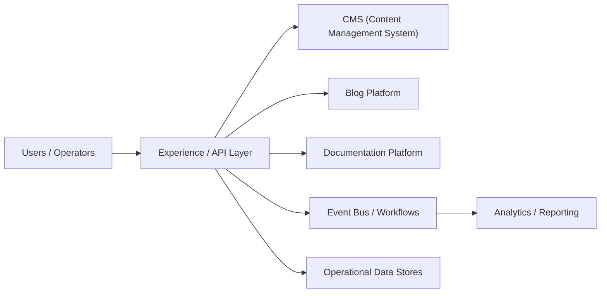

## Cross-Cutting Design Themes
- Separate user-facing hot paths from heavy asynchronous work such as analytics, indexing, compliance review, or backfills.
- Be explicit about which parts of the domain need strong correctness and which can tolerate eventual consistency.
- Model operator workflows and reconciliation early; real systems are maintained, not only executed.
- Use events and materialized views deliberately so teams can scale read models without overloading the transactional path.

## Why Design Matters in Collaborative Knowledge Systems
Documentation and collaboration products blend durable content storage with highly interactive editing. That mix creates design pressure that ordinary CMS products do not have. A wiki can tolerate slower writes. A collaborative editor cannot. A knowledge platform also needs search, comments, permissions, history, notifications, and exports to keep working while users are editing the same page.

Design matters because collaboration systems often fail at the boundary between real-time sync and durable state. If the system treats every keystroke like a heavyweight transaction, latency explodes. If it treats the document as only an in-memory stream, recovery and history become unreliable. Good architectures explicitly separate session-time synchronization from durable document persistence.

## Microservices Patterns Used in This Domain
- **Room coordinator or collaboration gateway:** handles session membership, presence, and operation distribution.
- **Operation log + snapshot pattern:** append operations durably, then periodically compact into document snapshots for fast load.
- **Permission and sharing service:** authorization lives outside the collaboration engine so document logic stays focused.
- **Async indexing and notification pipeline:** search, mentions, comments, and activity feeds consume committed document events.
- **History and export services:** audit history, rollback, and document export are isolated from the real-time editing loop.

## Design Principles for Real-Time Collaboration Products
- Keep session-time sync fast and tolerant of reconnects, but make committed document versions durable and explainable.
- Prefer deterministic conflict-resolution models such as OT or CRDT families, not ad hoc last-write-wins hacks.
- Separate presence from durable content. Online indicators and cursor positions are valuable but disposable.
- Build replay and snapshot tooling early because corrupted document state is hard to debug without history.
- Treat search and notifications as downstream projections. They should reflect the document state, not own it.

## 12.1 Publishing & Knowledge
12.1 Publishing & Knowledge collects the boundaries around CMS (Content Management System), Blog Platform, Documentation Platform and related capabilities in Content & Knowledge Systems. Teams usually start with a simpler combined service, then split these systems once data ownership, latency goals, or operator workflows begin to conflict.

### CMS (Content Management System)

#### Overview

CMS (Content Management System) is the domain boundary responsible for owning a canonical content or entity model that many downstream systems depend on for reads. In Content & Knowledge Systems, this system usually has to balance direct user experience with downstream effects on adjacent systems in 12.1 Publishing & Knowledge.

#### Real-world examples

- Comparable patterns appear in WordPress, Confluence, Notion.
- Startups often keep CMS (Content Management System) inside a larger service, while large platforms split it out once ownership, scale, or correctness requirements diverge.
- The exact implementation changes between B2C, B2B, and regulated variants, but the architectural boundary stays useful.

#### Requirements and workflows

- Expose APIs or events that let product users, internal operators, and downstream consumers create, update, query, and reconcile cms (content management system) state.
- Support synchronous user-facing flows for the hot path and asynchronous processing for enrichment, retries, and downstream propagation.
- Preserve a clear state model so support teams and automated workflows can explain why the system is in its current state.
- Provide audit or analytics hooks without coupling reporting latency to the primary user journey.

#### Architecture, data, and APIs

- Model the write path around versioned entities, metadata, access policies, denormalized read models, and change events.
- Keep a normalized source of truth for critical state and publish derived read models or events for consumer services.
- Use caches, projections, or search indexes only for latency-sensitive reads; treat rebuildability as a design requirement.
- Define idempotent write contracts, versioned events, and explicit ownership boundaries so dependent systems can evolve safely.

#### Scaling, reliability, and operations

- Watch for schema drift, stale read models, hot entities, invalid content, and permission mismatch.
- Protect hot partitions with rate limiting, request coalescing, queue buffering, and selective denormalization where appropriate.
- Design operator dashboards, replay tooling, and reconciliation or backfill workflows before incidents force them into existence.
- Track service-level indicators for latency, success, queue lag, freshness, and correctness signals instead of only infrastructure health.

#### Trade-offs and interview notes

- The key interview move is to explain why CMS (Content Management System) deserves its own boundary and what can remain eventual around it.
- Strong answers call out what requires strong correctness versus what can be computed asynchronously.
- Weak answers collapse storage, orchestration, and downstream fan-out into one service without discussing scale or failure modes.

### Blog Platform

#### Overview

Blog Platform is the domain boundary responsible for owning a canonical content or entity model that many downstream systems depend on for reads. In Content & Knowledge Systems, this system usually has to balance direct user experience with downstream effects on adjacent systems in 12.1 Publishing & Knowledge.

#### Real-world examples

- Comparable patterns appear in WordPress, Confluence, Notion.
- Startups often keep Blog Platform inside a larger service, while large platforms split it out once ownership, scale, or correctness requirements diverge.
- The exact implementation changes between B2C, B2B, and regulated variants, but the architectural boundary stays useful.

#### Requirements and workflows

- Expose APIs or events that let product users, internal operators, and downstream consumers create, update, query, and reconcile blog platform state.
- Support synchronous user-facing flows for the hot path and asynchronous processing for enrichment, retries, and downstream propagation.
- Preserve a clear state model so support teams and automated workflows can explain why the system is in its current state.
- Provide audit or analytics hooks without coupling reporting latency to the primary user journey.

#### Architecture, data, and APIs

- Model the write path around versioned entities, metadata, access policies, denormalized read models, and change events.
- Keep a normalized source of truth for critical state and publish derived read models or events for consumer services.
- Use caches, projections, or search indexes only for latency-sensitive reads; treat rebuildability as a design requirement.
- Define idempotent write contracts, versioned events, and explicit ownership boundaries so dependent systems can evolve safely.

#### Scaling, reliability, and operations

- Watch for schema drift, stale read models, hot entities, invalid content, and permission mismatch.
- Protect hot partitions with rate limiting, request coalescing, queue buffering, and selective denormalization where appropriate.
- Design operator dashboards, replay tooling, and reconciliation or backfill workflows before incidents force them into existence.
- Track service-level indicators for latency, success, queue lag, freshness, and correctness signals instead of only infrastructure health.

#### Trade-offs and interview notes

- The key interview move is to explain why Blog Platform deserves its own boundary and what can remain eventual around it.
- Strong answers call out what requires strong correctness versus what can be computed asynchronously.
- Weak answers collapse storage, orchestration, and downstream fan-out into one service without discussing scale or failure modes.

### Documentation Platform

#### Overview

Documentation Platform is the domain boundary responsible for owning a canonical content or entity model that many downstream systems depend on for reads. In Content & Knowledge Systems, this system usually has to balance direct user experience with downstream effects on adjacent systems in 12.1 Publishing & Knowledge.

#### Real-world examples

- Comparable patterns appear in WordPress, Confluence, Notion.
- Startups often keep Documentation Platform inside a larger service, while large platforms split it out once ownership, scale, or correctness requirements diverge.
- The exact implementation changes between B2C, B2B, and regulated variants, but the architectural boundary stays useful.

#### Requirements and workflows

- Expose APIs or events that let product users, internal operators, and downstream consumers create, update, query, and reconcile documentation platform state.
- Support synchronous user-facing flows for the hot path and asynchronous processing for enrichment, retries, and downstream propagation.
- Preserve a clear state model so support teams and automated workflows can explain why the system is in its current state.
- Provide audit or analytics hooks without coupling reporting latency to the primary user journey.

#### Architecture, data, and APIs

- Model the write path around versioned entities, metadata, access policies, denormalized read models, and change events.
- Keep a normalized source of truth for critical state and publish derived read models or events for consumer services.
- Use caches, projections, or search indexes only for latency-sensitive reads; treat rebuildability as a design requirement.
- Define idempotent write contracts, versioned events, and explicit ownership boundaries so dependent systems can evolve safely.

#### Scaling, reliability, and operations

- Watch for schema drift, stale read models, hot entities, invalid content, and permission mismatch.
- Protect hot partitions with rate limiting, request coalescing, queue buffering, and selective denormalization where appropriate.
- Design operator dashboards, replay tooling, and reconciliation or backfill workflows before incidents force them into existence.
- Track service-level indicators for latency, success, queue lag, freshness, and correctness signals instead of only infrastructure health.

#### Trade-offs and interview notes

- The key interview move is to explain why Documentation Platform deserves its own boundary and what can remain eventual around it.
- Strong answers call out what requires strong correctness versus what can be computed asynchronously.
- Weak answers collapse storage, orchestration, and downstream fan-out into one service without discussing scale or failure modes.

### Wiki System (like Confluence)

#### System snapshot

Wiki System (like Confluence) is a high-signal system inside Content & Knowledge Systems. The current repository already carried a deeper dedicated walkthrough for this topic, so that material is merged here and treated as the detailed reference path for this sub-subchapter.


#### Overview
Collaborative editing systems allow multiple users to modify the same document or workspace concurrently while preserving a coherent shared result. They power products such as Google Docs, Notion, Figma, and multiplayer whiteboards. Architecturally, they are useful because they force explicit thinking about conflict resolution, synchronization, presence, and durable history.

This chapter focuses on text-document collaboration but calls out how the model changes for rich blocks, databases, and design surfaces. The main learning objective is to understand how operational transforms, CRDT-style approaches, and document snapshots influence architecture and product behavior.


#### Why This Matters in Real Systems
- It exposes real-time synchronization challenges that differ from chat or notifications.
- It demonstrates why version history, conflict resolution, and offline support are product-level requirements.
- It shows how document storage and live editing often need different representations.
- It is increasingly relevant because many modern products expose shared workspaces and concurrent editing.

#### Core Concepts
##### Document model
The product must define what a document is. A plain text buffer, a rich block tree, a spreadsheet grid, and a design canvas all have different merge semantics. The document model determines whether edits are represented as character operations, block mutations, structured patches, or CRDT updates.


##### Operational transform versus CRDT
Operational transform, OT, rebases concurrent edits so all clients converge. Conflict-free replicated data types, CRDTs, encode operations or state so convergence is mathematically guaranteed under defined merge rules. Both approaches can work, but they carry different complexity around ordering, payload size, offline edits, and implementation difficulty.


##### Presence and awareness
Users expect to see cursors, selections, comments, and collaborator presence in real time. These signals improve collaboration but are softer requirements than document correctness. Presence channels should therefore be designed separately from the durable document state path.


##### Snapshots and history
Live operation streams alone are not enough. Systems also need document snapshots, checkpoints, or compaction so reopening a large document does not require replaying a huge history from the beginning. Version history and restore points further improve trust and auditability.


##### Offline and reconnect behavior
Offline edits and reconnect storms are common in collaborative tools. The system must define how local changes are queued, merged, and surfaced when connectivity returns. A naive design that assumes always-on connectivity becomes frustrating in real usage quickly.

#### Key Terminology
| Term | Definition |
| --- | --- |
| Operational transform | A technique that transforms concurrent edits so they can be applied consistently. |
| CRDT | A conflict-free replicated data type that guarantees convergence under defined merge rules. |
| Snapshot | A stored point-in-time representation of the document state. |
| Presence | Live awareness data such as online users, cursor position, or selection. |
| Patch | A change operation applied to a document structure. |
| Checkpoint | A compacted document state used to avoid replaying the entire edit history. |
| Merge | The process of reconciling concurrent edits from different clients. |
| Revision | A durable document version or sequence marker. |

#### Detailed Explanation
##### Functional requirements
Users open a shared document, edit concurrently, see collaborator presence, and review version history. The system should support comments, basic permissions, offline edits, and fast reopen time. Richer products may add embedded objects, structured databases, or multiplayer cursors across many surfaces.

- Support concurrent editing with low perceived latency.
- Preserve document convergence and durable history.
- Show collaborator presence, cursors, and comments.
- Handle reconnect and offline scenarios safely.

##### Capacity estimation
The heaviest pressure often comes from hot documents with many active collaborators rather than global user count alone. Suppose the platform has 10 million daily active users, but a small subset of documents attract dozens or hundreds of simultaneous editors. The architecture must handle those hot collaboration rooms while still supporting millions of mostly idle documents efficiently.

- Presence updates are frequent but usually less critical than operation durability.
- Document history may grow quickly, so compaction and snapshots matter.
- Rich block or design documents often produce larger operations than plain text.

##### High-level architecture
A practical design includes session gateways, collaboration room service, operation processing engine, document store, snapshot service, presence channel, permissions service, and comment or metadata service. Session traffic is real-time and connection-heavy, while document durability and history can flow into separate storage systems.


##### Data model
Many systems keep both an authoritative document state and an operation log. Snapshots provide fast load times. The operation log supports merge, audit, and playback. Presence and cursor updates are often stored ephemerally or not durably at all because they are transient awareness signals.

- Document: doc_id, owner_id, permissions, latest_revision, snapshot_reference.
- Operation: op_id, doc_id, author_id, base_revision, payload, timestamp.
- Snapshot: snapshot_id, doc_id, revision, encoded_state, created_at.
- Presence: doc_id, user_id, cursor_position, selection_range, last_heartbeat.

##### Scaling challenges and failure scenarios
Hot documents, reconnect storms, large history replay, and merge bugs are the hardest issues. If the collaboration room fails over, clients may reconnect and replay unacked operations. If snapshots lag too far behind, open latency degrades. If merge logic is wrong, users lose trust immediately because the product's core promise, shared correctness, has been broken.

- Keep presence and document correctness on separate paths so cursor issues do not risk content loss.
- Use snapshots or checkpoints to bound replay cost.
- Version protocol and operation formats so clients can evolve safely.

##### How this differs from similar systems
Collaborative editing differs from chat because multiple users mutate the same shared object instead of appending independent messages. It differs from source-control workflows because users expect near-instant convergence rather than explicit merge commits. It also differs from general database concurrency because human-visible editing latency and UX continuity are central.

#### Diagram / Flow Representation
##### Real-Time Collaboration Architecture
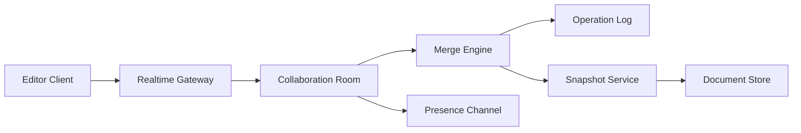

##### Concurrent Edit Flow
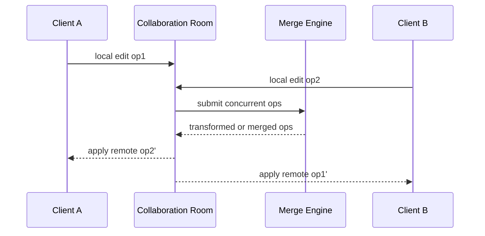

#### Real-World Examples
- Google Docs popularized text collaboration with low-latency editing, cursor presence, and version history, making OT-style thinking accessible to many engineers.
- Notion-like products show how collaboration changes when the document model is block-based and mixed with databases, comments, and embeds.
- Figma demonstrates collaborative editing on a richer graph-like design surface, where the document model and conflict semantics differ from text.
- Code-collaboration tools usually keep explicit commit-based workflows, which highlights how different collaborative editing is from traditional source control.

#### Case Study
##### CASE STUDY: Designing a shared document editor
###### Problem framing
Assume the platform supports rich text and block-based documents for small teams. Multiple collaborators can edit concurrently, comment, and reopen history. Mobile and web clients must tolerate unstable connectivity.


###### Functional and non-functional requirements
- Show local edits immediately while preserving eventual document convergence.
- Keep document history durable and restorable.
- Provide presence and cursor awareness with low latency.
- Support permissions, comments, and reconnect handling.
- Avoid long open times for large or long-lived documents.

###### Capacity and estimation
The platform may have millions of documents, but the hardest workloads are hot collaboration rooms with many simultaneous editors. If a popular meeting note document has 80 active users typing, presence and patch throughput matter far more than the global average document size.


###### Design evolution
- Launch with one document model, operation log, snapshots, and basic OT or CRDT-based sync.
- Add comments, mentions, and permissions as parallel metadata services.
- Introduce offline queuing and richer block structures after core convergence is stable.
- Expand to embedded objects or databases only after the document model is mature.

###### Scaling challenges and failure handling
- Hot documents require per-room scaling and backpressure controls.
- Merge bugs are higher severity than presence bugs because content loss destroys trust quickly.
- Reconnection storms should replay only missing operations, not the full document history.
- Version mismatches between clients need protocol compatibility rules and migration safety.

###### Final architecture
A mature collaborative editor separates low-latency room coordination from durable document history, uses snapshots to cap replay cost, and treats presence as a fast but weaker signal. This structure supports both day-to-day editing and operational debugging when users report merge or sync issues.

#### Architect's Mindset
- Start from the document model because sync semantics depend on it.
- Separate transient awareness, presence, from durable document correctness.
- Design for reconnect and offline usage early, not as an afterthought.
- Use snapshots or checkpoints to control replay cost.
- Treat merge correctness as a product trust problem, not only a technical correctness problem.

#### Common Mistakes
- Treating collaborative editing like chat plus shared storage.
- Ignoring document-model complexity and assuming all edits are simple text appends.
- Making presence and cursor data part of the durable correctness path.
- Skipping version history or snapshot strategy.
- Assuming network stability and ignoring offline reconciliation.

#### Interview Angle
- Interviewers expect explicit discussion of concurrency and merge strategy, OT or CRDT.
- Strong answers separate collaboration rooms, operation logs, snapshots, and presence channels.
- Candidates stand out when they explain why the document model changes the architecture.
- Weak answers stop at WebSockets and a document database without a merge or history strategy.

#### Quick Recap
- Collaborative editing is a synchronization and merge problem, not just a storage problem.
- Document model, operation model, and snapshot strategy all matter.
- Presence is useful but should remain separate from correctness-critical state.
- Hot documents and reconnect storms dominate operational complexity.
- This chapter extends real-time thinking beyond messaging into shared-state systems.

#### Practice Questions
1. How would you choose between OT and CRDT-style approaches?
2. Why should presence be separate from durable document state?
3. What role do snapshots play in collaborative editing?
4. How would you model offline edits and reconnect behavior?
5. Why does document model shape system design so strongly?
6. What failure modes matter most for hot documents?
7. How would you support comments and metadata without polluting the operation stream?
8. What metrics indicate collaboration-room health?
9. How is collaborative editing different from chat or source control?
10. How would you support a richer block-based document model?

#### Further Exploration
- Compare this chapter with chat to see how append-only events differ from shared-object mutation.
- Study OT, CRDT, and hybrid collaboration models in more detail.
- Extend the design to whiteboards, spreadsheets, or design surfaces with richer object graphs.

### Q&A System (StackOverflow-like)

#### Overview

Q&A System (StackOverflow-like) is the domain boundary responsible for owning a clear domain boundary with its own state model, APIs, and operational SLOs. In Content & Knowledge Systems, this system usually has to balance direct user experience with downstream effects on adjacent systems in 12.1 Publishing & Knowledge.

#### Real-world examples

- Comparable patterns appear in WordPress, Confluence, Notion.
- Startups often keep Q&A System (StackOverflow-like) inside a larger service, while large platforms split it out once ownership, scale, or correctness requirements diverge.
- The exact implementation changes between B2C, B2B, and regulated variants, but the architectural boundary stays useful.

#### Requirements and workflows

- Expose APIs or events that let product users, internal operators, and downstream consumers create, update, query, and reconcile q&a system (stackoverflow-like) state.
- Support synchronous user-facing flows for the hot path and asynchronous processing for enrichment, retries, and downstream propagation.
- Preserve a clear state model so support teams and automated workflows can explain why the system is in its current state.
- Provide audit or analytics hooks without coupling reporting latency to the primary user journey.

#### Architecture, data, and APIs

- Model the write path around normalized transactional state, denormalized read models, events, and audit records.
- Keep a normalized source of truth for critical state and publish derived read models or events for consumer services.
- Use caches, projections, or search indexes only for latency-sensitive reads; treat rebuildability as a design requirement.
- Define idempotent write contracts, versioned events, and explicit ownership boundaries so dependent systems can evolve safely.

#### Scaling, reliability, and operations

- Watch for hotspots, stale projections, ambiguous retries, and under-specified operator workflows.
- Protect hot partitions with rate limiting, request coalescing, queue buffering, and selective denormalization where appropriate.
- Design operator dashboards, replay tooling, and reconciliation or backfill workflows before incidents force them into existence.
- Track service-level indicators for latency, success, queue lag, freshness, and correctness signals instead of only infrastructure health.

#### Trade-offs and interview notes

- The key interview move is to explain why Q&A System (StackOverflow-like) deserves its own boundary and what can remain eventual around it.
- Strong answers call out what requires strong correctness versus what can be computed asynchronously.
- Weak answers collapse storage, orchestration, and downstream fan-out into one service without discussing scale or failure modes.

## Architect's Mindset
- Start by drawing the domain boundaries, then explain which systems deserve isolated ownership first.
- Talk about why a single end-user workflow crosses multiple services and where you would place synchronous versus asynchronous boundaries.
- Include operator tooling, data quality checks, and backfill strategy in the architecture from day one.
- Be honest about evolution: V1 usually combines systems that later become separate once traffic, teams, or compliance demands grow.

## Further Exploration
- Revisit adjacent Part 5 chapters after reading Content & Knowledge Systems to compare how similar patterns change across domains.
- Practice redrawing one of these systems for startup scale, then for enterprise or multi-region scale.
- Use the sub-subchapter sections as interview prompts: pick one system, frame the requirements, and sketch the trade-offs from memory.

---

## Functional Requirements

### CMS (Content Management System) - Functional Requirements

| ID | Requirement | Description | Priority |
|----|-------------|-------------|----------|
| CMS-FR-01 | Content Creation | Authors create content items with structured fields (title, body, metadata, SEO fields, featured image) | P0 |
| CMS-FR-02 | Content Types | Administrators define custom content types with configurable field schemas (text, rich text, media, reference, date, boolean, JSON) | P0 |
| CMS-FR-03 | Content Versioning | Every edit produces an immutable version; authors can view diff, restore, or branch from any historical version | P0 |
| CMS-FR-04 | Publishing Workflow | Content moves through draft, review, approved, scheduled, published, archived states with role-based transitions | P0 |
| CMS-FR-05 | Scheduled Publishing | Authors schedule content to publish or unpublish at a future date and time with timezone support | P1 |
| CMS-FR-06 | Media Asset Management | Upload, organize, tag, crop, resize, and serve images, videos, PDFs, and other binary assets through a media library | P0 |
| CMS-FR-07 | Template Management | Define page templates that combine content types with layout instructions for rendering | P1 |
| CMS-FR-08 | Content Localization | Support multi-language content with locale-specific field overrides and translation workflows | P1 |
| CMS-FR-09 | Content Search | Full-text search across all content fields with faceted filtering by type, status, author, date range, and tags | P0 |
| CMS-FR-10 | Headless API | Expose all content through a versioned REST and GraphQL API for frontend applications and third-party consumers | P0 |
| CMS-FR-11 | Webhook Notifications | Fire webhooks on content lifecycle events (create, update, publish, unpublish, delete) for downstream integrations | P1 |
| CMS-FR-12 | Role-Based Access Control | Define roles (admin, editor, author, reviewer, viewer) with granular permissions per content type and content item | P0 |
| CMS-FR-13 | Content Preview | Generate a preview URL that renders unpublished content exactly as it will appear when published | P1 |
| CMS-FR-14 | Bulk Operations | Import, export, and bulk-update content items via CSV, JSON, or API batch endpoints | P2 |
| CMS-FR-15 | Audit Trail | Log every content mutation with actor, timestamp, changed fields, and previous values | P0 |

### Blog Platform - Functional Requirements

| ID | Requirement | Description | Priority |
|----|-------------|-------------|----------|
| BLOG-FR-01 | Post Creation | Authors compose posts using a rich text or markdown editor with inline media embedding | P0 |
| BLOG-FR-02 | Draft and Publish | Posts exist in draft, published, or scheduled states; authors control visibility | P0 |
| BLOG-FR-03 | Categories and Tags | Organize posts with hierarchical categories and flat tags; each post can have multiple tags and one primary category | P0 |
| BLOG-FR-04 | Author Profiles | Each author has a profile page with bio, avatar, social links, and a list of their published posts | P1 |
| BLOG-FR-05 | Comments | Readers leave threaded comments on posts; comments support moderation (pending, approved, spam, deleted) | P0 |
| BLOG-FR-06 | Comment Voting | Readers upvote or downvote comments; sort comments by newest, oldest, or top-voted | P1 |
| BLOG-FR-07 | RSS and Atom Feeds | Generate syndication feeds at the blog level, per category, per tag, and per author | P1 |
| BLOG-FR-08 | SEO Optimization | Auto-generate meta tags, Open Graph tags, structured data (JSON-LD), canonical URLs, and XML sitemaps | P0 |
| BLOG-FR-09 | Email Subscriptions | Readers subscribe to the blog or specific categories; receive email notifications for new posts | P1 |
| BLOG-FR-10 | Related Posts | Display algorithmically or manually selected related posts at the end of each article | P2 |
| BLOG-FR-11 | Reading Time Estimate | Calculate and display estimated reading time based on word count | P2 |
| BLOG-FR-12 | Social Sharing | One-click sharing to Twitter, LinkedIn, Facebook, and copy-link with pre-populated metadata | P1 |
| BLOG-FR-13 | Analytics Dashboard | Track page views, unique visitors, read completion rate, comment count, and share count per post | P1 |
| BLOG-FR-14 | Content Scheduling | Schedule posts to auto-publish at a specified date and time | P0 |
| BLOG-FR-15 | Multi-Author Support | Multiple authors can co-author a post with attribution shown in the byline | P2 |

### Documentation Platform - Functional Requirements

| ID | Requirement | Description | Priority |
|----|-------------|-------------|----------|
| DOC-FR-01 | Doc Pages | Authors create documentation pages with markdown or rich text, code blocks, callouts, and embedded media | P0 |
| DOC-FR-02 | Doc Spaces | Group documentation into spaces (e.g., per product, per API version) with independent navigation trees | P0 |
| DOC-FR-03 | Navigation Trees | Define hierarchical sidebar navigation with sections, pages, and external links; drag-and-drop reordering | P0 |
| DOC-FR-04 | Versioned Documentation | Maintain multiple documentation versions (v1, v2, latest) with version switcher in the UI | P0 |
| DOC-FR-05 | API Reference Generation | Auto-generate API reference pages from OpenAPI, GraphQL SDL, or protobuf definitions | P1 |
| DOC-FR-06 | Code Samples | Embed runnable or copy-able code samples with syntax highlighting and language tabs | P0 |
| DOC-FR-07 | Search | Full-text search scoped to a doc space and version with highlighted result snippets | P0 |
| DOC-FR-08 | Feedback Collection | Readers rate pages (helpful / not helpful) and submit inline feedback for doc quality tracking | P1 |
| DOC-FR-09 | Git Integration | Sync documentation content with a Git repository; support docs-as-code workflows with PR-based review | P1 |
| DOC-FR-10 | Custom Domains | Serve documentation under a custom domain with TLS and CNAME configuration | P1 |
| DOC-FR-11 | Access Control | Public docs, private docs behind authentication, or role-gated docs for partners and internal teams | P0 |
| DOC-FR-12 | PDF Export | Export a doc space or selected pages as a PDF with table of contents and consistent formatting | P2 |
| DOC-FR-13 | Redirect Management | Define URL redirects when pages move or are renamed so existing links do not break | P1 |
| DOC-FR-14 | Changelog | Maintain a changelog feed showing recent documentation updates with diffs | P2 |
| DOC-FR-15 | Analytics | Track page views, search queries with no results, feedback scores, and time on page | P1 |

### Wiki System - Functional Requirements

| ID | Requirement | Description | Priority |
|----|-------------|-------------|----------|
| WIKI-FR-01 | Page Creation | Users create wiki pages with rich text, tables, macros, and embedded media | P0 |
| WIKI-FR-02 | Wiki Spaces | Organize pages into spaces with independent permissions and navigation | P0 |
| WIKI-FR-03 | Page Hierarchy | Pages have parent-child relationships forming a tree; breadcrumb navigation reflects the hierarchy | P0 |
| WIKI-FR-04 | Page Versioning | Every save creates a new version; users can diff, restore, or view any historical version | P0 |
| WIKI-FR-05 | Inline Comments | Users comment on specific sections or highlighted text within a page | P1 |
| WIKI-FR-06 | Page Labels | Apply labels (tags) to pages for cross-cutting organization and label-based search | P0 |
| WIKI-FR-07 | Attachments | Upload file attachments to pages; attachments are versioned alongside page content | P1 |
| WIKI-FR-08 | Page Permissions | Set view and edit permissions at space level or individual page level; inherit from parent by default | P0 |
| WIKI-FR-09 | Templates | Create page templates with pre-filled structure that users select when creating new pages | P1 |
| WIKI-FR-10 | Full-Text Search | Search across all spaces with filters for space, label, author, date range, and content type | P0 |
| WIKI-FR-11 | Watch and Notify | Users watch pages or spaces and receive notifications on edits, comments, or permission changes | P1 |
| WIKI-FR-12 | Page Export | Export pages or spaces as PDF, HTML, or Word format with formatting preserved | P2 |
| WIKI-FR-13 | Macro System | Extensible macro system for embedding dynamic content (table of contents, child page list, JIRA tickets) | P1 |
| WIKI-FR-14 | Collaborative Editing | Multiple users edit the same page simultaneously with real-time cursor presence | P1 |
| WIKI-FR-15 | Trash and Recovery | Deleted pages move to trash; administrators can restore or permanently delete within a retention window | P0 |

### Q&A System (StackOverflow-like) - Functional Requirements

| ID | Requirement | Description | Priority |
|----|-------------|-------------|----------|
| QA-FR-01 | Ask Question | Users post questions with title, body (markdown), and up to 5 tags | P0 |
| QA-FR-02 | Answer Question | Users post answers to questions; answers support markdown with code blocks | P0 |
| QA-FR-03 | Accept Answer | The question author marks one answer as accepted; accepted answer is pinned at the top | P0 |
| QA-FR-04 | Voting | Users upvote or downvote questions and answers; vote score determines sort order | P0 |
| QA-FR-05 | Comments | Users leave short comments on questions or answers for clarification | P0 |
| QA-FR-06 | Tags | Community-maintained tag taxonomy with tag descriptions, synonyms, and usage counts | P0 |
| QA-FR-07 | User Reputation | Users earn reputation points from upvotes, accepted answers, and bounties; reputation unlocks privileges | P0 |
| QA-FR-08 | Badges | Award badges for achievements (first answer, 100 upvotes, editor, etc.) | P1 |
| QA-FR-09 | Bounties | Users spend reputation to place a bounty on a question to attract answers | P1 |
| QA-FR-10 | Duplicate Detection | Flag and close questions as duplicates of existing questions with a redirect link | P1 |
| QA-FR-11 | Close and Reopen | Community or moderator voting to close questions as off-topic, unclear, or duplicate; reopen voting | P0 |
| QA-FR-12 | Edit Suggestions | Users below edit threshold suggest edits; edits are queued for peer review | P1 |
| QA-FR-13 | Search | Full-text search with tag filters, sort by relevance, votes, activity, or date | P0 |
| QA-FR-14 | Moderation Tools | Flag posts for moderator review; moderator dashboard for flags, close votes, and user suspensions | P0 |
| QA-FR-15 | Hot Questions | Algorithmic ranking of trending questions based on views, votes, answers, and recency | P1 |

---

## Non-Functional Requirements

### Latency Targets

| Subsystem | Operation | P50 Latency | P99 Latency | Notes |
|-----------|-----------|-------------|-------------|-------|
| CMS | Content read (published) | 15 ms | 80 ms | Served from CDN or edge cache |
| CMS | Content read (API, uncached) | 50 ms | 200 ms | Direct database read with index |
| CMS | Content create/update | 100 ms | 500 ms | Includes validation and versioning |
| CMS | Content publish | 200 ms | 2,000 ms | Includes cache invalidation and webhook fire |
| Blog | Published post read | 10 ms | 50 ms | Pre-rendered HTML from CDN |
| Blog | Post creation (draft save) | 80 ms | 300 ms | Autosave every 30 seconds |
| Blog | Comment submission | 100 ms | 400 ms | Includes spam check |
| Docs | Doc page read | 15 ms | 60 ms | CDN-served with version routing |
| Docs | Search query | 100 ms | 500 ms | Elasticsearch query scoped to space and version |
| Wiki | Page read | 30 ms | 150 ms | Cached rendered output |
| Wiki | Page save | 150 ms | 800 ms | Includes versioning and permission check |
| Wiki | Real-time edit sync | 50 ms | 200 ms | WebSocket operation broadcast latency |
| Q&A | Question page read | 20 ms | 100 ms | Includes question, top answers, and comments |
| Q&A | Vote submission | 30 ms | 150 ms | Optimistic update to client, async to read model |
| Q&A | Search | 80 ms | 400 ms | Full-text with tag boosting |

### Availability Targets

| Subsystem | Read Availability | Write Availability | Notes |
|-----------|-------------------|---------------------|-------|
| CMS | 99.99% | 99.95% | Published content must always be readable from CDN |
| Blog | 99.99% | 99.9% | Blog reads are more critical than writes |
| Docs | 99.99% | 99.9% | Documentation availability directly impacts developer experience |
| Wiki | 99.95% | 99.9% | Enterprise wiki tolerates brief write outages |
| Q&A | 99.95% | 99.9% | Read-heavy; write degradation acceptable during incidents |

### Throughput Targets

| Subsystem | Metric | Target | Notes |
|-----------|--------|--------|-------|
| CMS | Published content reads | 500,000 req/s | CDN-absorbed; origin sees 5,000 req/s |
| CMS | Content mutations | 500 req/s | Across all content types |
| CMS | Webhook deliveries | 2,000 events/s | Burst during bulk publish |
| Blog | Published page reads | 1,000,000 req/s | CDN layer handles majority |
| Blog | Comment submissions | 200 req/s | With spam filtering |
| Docs | Page reads | 200,000 req/s | Per doc site; CDN-heavy |
| Docs | Search queries | 5,000 req/s | Peak during business hours |
| Wiki | Page reads | 50,000 req/s | Enterprise-scale; mostly internal traffic |
| Wiki | Page saves | 500 req/s | Burst during end-of-sprint documentation |
| Wiki | Real-time ops broadcast | 10,000 ops/s | Across all active collaboration rooms |
| Q&A | Page reads | 100,000 req/s | Question pages with answers |
| Q&A | Vote submissions | 5,000 req/s | Peak during popular question activity |
| Q&A | New questions | 100 req/s | Steady state |
| Q&A | New answers | 300 req/s | Higher than questions due to answer incentives |

---

## Capacity Estimation

### Content Volume Estimates

| Metric | CMS | Blog | Docs | Wiki | Q&A |
|--------|-----|------|------|------|-----|
| Total content items | 10M | 50M posts | 5M pages | 20M pages | 100M questions |
| Average item size (text) | 15 KB | 8 KB | 12 KB | 10 KB | 3 KB (question) + 5 KB (avg answer) |
| Media assets per item | 3 | 2 | 1 | 1.5 | 0.2 |
| Average media size | 500 KB | 300 KB | 200 KB | 250 KB | 100 KB |
| Total text storage | 150 GB | 400 GB | 60 GB | 200 GB | 800 GB |
| Total media storage | 15 TB | 30 TB | 1 TB | 7.5 TB | 2 TB |
| Version history multiplier | 10x | 3x | 8x | 15x | 5x |
| Total with versions (text) | 1.5 TB | 1.2 TB | 480 GB | 3 TB | 4 TB |

### Read/Write Ratios

| Subsystem | Read:Write Ratio | Reads/sec (peak) | Writes/sec (peak) |
|-----------|------------------|-------------------|--------------------|
| CMS | 1000:1 | 500,000 (CDN), 5,000 (origin) | 500 |
| Blog | 5000:1 | 1,000,000 (CDN), 10,000 (origin) | 200 |
| Docs | 2000:1 | 200,000 (CDN), 5,000 (origin) | 100 |
| Wiki | 100:1 | 50,000 | 500 |
| Q&A | 500:1 | 100,000 | 5,600 (questions + answers + votes + comments) |

### Storage Growth Projections (Monthly)

| Subsystem | New text content/month | New media/month | Search index growth/month | Total annual growth |
|-----------|------------------------|-----------------|---------------------------|---------------------|
| CMS | 5 GB | 500 GB | 2 GB | 6 TB |
| Blog | 3 GB | 800 GB | 1.5 GB | 10 TB |
| Docs | 2 GB | 100 GB | 1 GB | 1.2 TB |
| Wiki | 8 GB | 300 GB | 3 GB | 3.7 TB |
| Q&A | 10 GB | 50 GB | 5 GB | 780 GB |

### CDN Bandwidth Estimation

| Subsystem | Cache Hit Rate | CDN Bandwidth (peak) | Origin Bandwidth (peak) |
|-----------|----------------|----------------------|-------------------------|
| CMS | 95% | 20 Gbps | 1 Gbps |
| Blog | 98% | 50 Gbps | 1 Gbps |
| Docs | 97% | 10 Gbps | 300 Mbps |
| Wiki | 80% | 5 Gbps | 1.25 Gbps |
| Q&A | 90% | 15 Gbps | 1.5 Gbps |

---

## Detailed Data Models

### CMS Data Model

```sql
-- Content type definitions (e.g., "Article", "Landing Page", "Product")
CREATE TABLE content_types (
    id              UUID PRIMARY KEY DEFAULT gen_random_uuid(),
    slug            VARCHAR(128) NOT NULL UNIQUE,
    display_name    VARCHAR(256) NOT NULL,
    description     TEXT,
    icon            VARCHAR(64),
    is_singleton    BOOLEAN NOT NULL DEFAULT FALSE,
    created_by      UUID NOT NULL REFERENCES users(id),
    created_at      TIMESTAMPTZ NOT NULL DEFAULT now(),
    updated_at      TIMESTAMPTZ NOT NULL DEFAULT now()
);

-- Field definitions for each content type
CREATE TABLE content_fields (
    id              UUID PRIMARY KEY DEFAULT gen_random_uuid(),
    content_type_id UUID NOT NULL REFERENCES content_types(id) ON DELETE CASCADE,
    field_name      VARCHAR(128) NOT NULL,
    field_slug      VARCHAR(128) NOT NULL,
    field_type      VARCHAR(64) NOT NULL CHECK (field_type IN (
                        'text', 'rich_text', 'markdown', 'number', 'boolean',
                        'date', 'datetime', 'media', 'reference', 'json',
                        'select', 'multi_select', 'url', 'email', 'color'
                    )),
    is_required     BOOLEAN NOT NULL DEFAULT FALSE,
    is_localized    BOOLEAN NOT NULL DEFAULT FALSE,
    is_unique       BOOLEAN NOT NULL DEFAULT FALSE,
    default_value   JSONB,
    validation_rules JSONB,  -- min/max length, regex, allowed values
    sort_order      INTEGER NOT NULL DEFAULT 0,
    created_at      TIMESTAMPTZ NOT NULL DEFAULT now(),
    UNIQUE (content_type_id, field_slug)
);

-- Core content items
CREATE TABLE content_items (
    id              UUID PRIMARY KEY DEFAULT gen_random_uuid(),
    content_type_id UUID NOT NULL REFERENCES content_types(id),
    slug            VARCHAR(512) NOT NULL,
    locale          VARCHAR(10) NOT NULL DEFAULT 'en',
    status          VARCHAR(32) NOT NULL DEFAULT 'draft' CHECK (status IN (
                        'draft', 'in_review', 'approved', 'scheduled',
                        'published', 'unpublished', 'archived'
                    )),
    current_version_id UUID,  -- FK added after content_versions table
    published_version_id UUID,  -- the version currently live
    created_by      UUID NOT NULL REFERENCES users(id),
    published_by    UUID REFERENCES users(id),
    published_at    TIMESTAMPTZ,
    created_at      TIMESTAMPTZ NOT NULL DEFAULT now(),
    updated_at      TIMESTAMPTZ NOT NULL DEFAULT now(),
    deleted_at      TIMESTAMPTZ,  -- soft delete
    UNIQUE (content_type_id, slug, locale)
);

CREATE INDEX idx_content_items_status ON content_items(status);
CREATE INDEX idx_content_items_type_status ON content_items(content_type_id, status);
CREATE INDEX idx_content_items_published_at ON content_items(published_at DESC) WHERE status = 'published';
CREATE INDEX idx_content_items_slug ON content_items(slug);

-- Content versions (immutable history)
CREATE TABLE content_versions (
    id              UUID PRIMARY KEY DEFAULT gen_random_uuid(),
    content_item_id UUID NOT NULL REFERENCES content_items(id) ON DELETE CASCADE,
    version_number  INTEGER NOT NULL,
    field_data      JSONB NOT NULL,  -- all field values for this version
    change_summary  TEXT,
    created_by      UUID NOT NULL REFERENCES users(id),
    created_at      TIMESTAMPTZ NOT NULL DEFAULT now(),
    UNIQUE (content_item_id, version_number)
);

CREATE INDEX idx_content_versions_item ON content_versions(content_item_id, version_number DESC);

ALTER TABLE content_items
    ADD CONSTRAINT fk_current_version FOREIGN KEY (current_version_id) REFERENCES content_versions(id),
    ADD CONSTRAINT fk_published_version FOREIGN KEY (published_version_id) REFERENCES content_versions(id);

-- Media asset library
CREATE TABLE media_assets (
    id              UUID PRIMARY KEY DEFAULT gen_random_uuid(),
    filename        VARCHAR(512) NOT NULL,
    original_filename VARCHAR(512) NOT NULL,
    mime_type       VARCHAR(128) NOT NULL,
    file_size_bytes BIGINT NOT NULL,
    storage_provider VARCHAR(64) NOT NULL DEFAULT 's3',
    storage_key     VARCHAR(1024) NOT NULL,
    cdn_url         VARCHAR(2048),
    width           INTEGER,  -- for images and videos
    height          INTEGER,
    duration_seconds NUMERIC(10, 2),  -- for audio and video
    alt_text        TEXT,
    caption         TEXT,
    focal_point_x   NUMERIC(5, 4),  -- 0.0 to 1.0
    focal_point_y   NUMERIC(5, 4),
    metadata        JSONB,  -- EXIF, color palette, etc.
    folder_path     VARCHAR(1024) DEFAULT '/',
    uploaded_by     UUID NOT NULL REFERENCES users(id),
    created_at      TIMESTAMPTZ NOT NULL DEFAULT now(),
    updated_at      TIMESTAMPTZ NOT NULL DEFAULT now()
);

CREATE INDEX idx_media_assets_folder ON media_assets(folder_path);
CREATE INDEX idx_media_assets_mime ON media_assets(mime_type);
CREATE INDEX idx_media_assets_created ON media_assets(created_at DESC);

-- Publishing workflows
CREATE TABLE workflows (
    id              UUID PRIMARY KEY DEFAULT gen_random_uuid(),
    name            VARCHAR(256) NOT NULL,
    content_type_id UUID REFERENCES content_types(id),  -- NULL means applies to all types
    stages          JSONB NOT NULL,  -- ordered list of stage definitions
    -- Example stages: [{"name":"draft","transitions":["in_review"]},
    --                  {"name":"in_review","transitions":["approved","draft"],"requires_role":"reviewer"},
    --                  {"name":"approved","transitions":["published","draft"]}]
    is_active       BOOLEAN NOT NULL DEFAULT TRUE,
    created_by      UUID NOT NULL REFERENCES users(id),
    created_at      TIMESTAMPTZ NOT NULL DEFAULT now(),
    updated_at      TIMESTAMPTZ NOT NULL DEFAULT now()
);

-- Scheduled publish/unpublish actions
CREATE TABLE publish_schedules (
    id              UUID PRIMARY KEY DEFAULT gen_random_uuid(),
    content_item_id UUID NOT NULL REFERENCES content_items(id) ON DELETE CASCADE,
    action          VARCHAR(32) NOT NULL CHECK (action IN ('publish', 'unpublish')),
    scheduled_at    TIMESTAMPTZ NOT NULL,
    version_id      UUID REFERENCES content_versions(id),  -- which version to publish
    status          VARCHAR(32) NOT NULL DEFAULT 'pending' CHECK (status IN (
                        'pending', 'processing', 'completed', 'failed', 'cancelled'
                    )),
    executed_at     TIMESTAMPTZ,
    error_message   TEXT,
    created_by      UUID NOT NULL REFERENCES users(id),
    created_at      TIMESTAMPTZ NOT NULL DEFAULT now()
);

CREATE INDEX idx_publish_schedules_pending ON publish_schedules(scheduled_at)
    WHERE status = 'pending';

-- Page templates
CREATE TABLE templates (
    id              UUID PRIMARY KEY DEFAULT gen_random_uuid(),
    name            VARCHAR(256) NOT NULL,
    slug            VARCHAR(128) NOT NULL UNIQUE,
    content_type_id UUID REFERENCES content_types(id),
    template_body   TEXT NOT NULL,  -- Liquid, Handlebars, or JSX template
    template_engine VARCHAR(32) NOT NULL DEFAULT 'liquid',
    preview_image   VARCHAR(2048),
    is_default      BOOLEAN NOT NULL DEFAULT FALSE,
    created_by      UUID NOT NULL REFERENCES users(id),
    created_at      TIMESTAMPTZ NOT NULL DEFAULT now(),
    updated_at      TIMESTAMPTZ NOT NULL DEFAULT now()
);
```

### Blog Platform Data Model

```sql
-- Authors
CREATE TABLE authors (
    id              UUID PRIMARY KEY DEFAULT gen_random_uuid(),
    user_id         UUID NOT NULL REFERENCES users(id) UNIQUE,
    display_name    VARCHAR(256) NOT NULL,
    slug            VARCHAR(128) NOT NULL UNIQUE,
    bio             TEXT,
    avatar_url      VARCHAR(2048),
    website_url     VARCHAR(2048),
    twitter_handle  VARCHAR(64),
    linkedin_url    VARCHAR(2048),
    is_active       BOOLEAN NOT NULL DEFAULT TRUE,
    created_at      TIMESTAMPTZ NOT NULL DEFAULT now(),
    updated_at      TIMESTAMPTZ NOT NULL DEFAULT now()
);

-- Categories (hierarchical)
CREATE TABLE categories (
    id              UUID PRIMARY KEY DEFAULT gen_random_uuid(),
    name            VARCHAR(256) NOT NULL,
    slug            VARCHAR(128) NOT NULL UNIQUE,
    description     TEXT,
    parent_id       UUID REFERENCES categories(id),
    sort_order      INTEGER NOT NULL DEFAULT 0,
    meta_title      VARCHAR(256),
    meta_description VARCHAR(512),
    created_at      TIMESTAMPTZ NOT NULL DEFAULT now()
);

CREATE INDEX idx_categories_parent ON categories(parent_id);

-- Tags (flat taxonomy)
CREATE TABLE tags (
    id              UUID PRIMARY KEY DEFAULT gen_random_uuid(),
    name            VARCHAR(128) NOT NULL,
    slug            VARCHAR(128) NOT NULL UNIQUE,
    description     TEXT,
    post_count      INTEGER NOT NULL DEFAULT 0,  -- denormalized counter
    created_at      TIMESTAMPTZ NOT NULL DEFAULT now()
);

-- Blog posts
CREATE TABLE posts (
    id              UUID PRIMARY KEY DEFAULT gen_random_uuid(),
    title           VARCHAR(512) NOT NULL,
    slug            VARCHAR(512) NOT NULL,
    excerpt         TEXT,
    body_markdown   TEXT NOT NULL,
    body_html       TEXT,  -- pre-rendered HTML for fast serving
    featured_image_url VARCHAR(2048),
    featured_image_alt TEXT,
    status          VARCHAR(32) NOT NULL DEFAULT 'draft' CHECK (status IN (
                        'draft', 'scheduled', 'published', 'unlisted', 'archived'
                    )),
    primary_category_id UUID REFERENCES categories(id),
    primary_author_id UUID NOT NULL REFERENCES authors(id),
    reading_time_minutes INTEGER,
    word_count      INTEGER,
    is_featured     BOOLEAN NOT NULL DEFAULT FALSE,
    allow_comments  BOOLEAN NOT NULL DEFAULT TRUE,
    meta_title      VARCHAR(256),
    meta_description VARCHAR(512),
    canonical_url   VARCHAR(2048),
    og_image_url    VARCHAR(2048),
    published_at    TIMESTAMPTZ,
    scheduled_at    TIMESTAMPTZ,
    created_at      TIMESTAMPTZ NOT NULL DEFAULT now(),
    updated_at      TIMESTAMPTZ NOT NULL DEFAULT now(),
    deleted_at      TIMESTAMPTZ,
    UNIQUE (slug, published_at)
);

CREATE INDEX idx_posts_status ON posts(status);
CREATE INDEX idx_posts_published ON posts(published_at DESC) WHERE status = 'published';
CREATE INDEX idx_posts_author ON posts(primary_author_id);
CREATE INDEX idx_posts_category ON posts(primary_category_id);
CREATE INDEX idx_posts_featured ON posts(is_featured, published_at DESC) WHERE status = 'published';

-- Post-author many-to-many (for co-authored posts)
CREATE TABLE post_authors (
    post_id         UUID NOT NULL REFERENCES posts(id) ON DELETE CASCADE,
    author_id       UUID NOT NULL REFERENCES authors(id),
    is_primary      BOOLEAN NOT NULL DEFAULT FALSE,
    sort_order      INTEGER NOT NULL DEFAULT 0,
    PRIMARY KEY (post_id, author_id)
);

-- Post-tag many-to-many
CREATE TABLE post_tags (
    post_id         UUID NOT NULL REFERENCES posts(id) ON DELETE CASCADE,
    tag_id          UUID NOT NULL REFERENCES tags(id),
    PRIMARY KEY (post_id, tag_id)
);

CREATE INDEX idx_post_tags_tag ON post_tags(tag_id);

-- Comments (threaded)
CREATE TABLE comments (
    id              UUID PRIMARY KEY DEFAULT gen_random_uuid(),
    post_id         UUID NOT NULL REFERENCES posts(id) ON DELETE CASCADE,
    parent_id       UUID REFERENCES comments(id),  -- for threading
    author_name     VARCHAR(256) NOT NULL,
    author_email    VARCHAR(512) NOT NULL,
    author_user_id  UUID REFERENCES users(id),  -- NULL for anonymous comments
    body            TEXT NOT NULL,
    body_html       TEXT,
    status          VARCHAR(32) NOT NULL DEFAULT 'pending' CHECK (status IN (
                        'pending', 'approved', 'spam', 'deleted'
                    )),
    ip_address      INET,
    user_agent      VARCHAR(512),
    upvote_count    INTEGER NOT NULL DEFAULT 0,
    downvote_count  INTEGER NOT NULL DEFAULT 0,
    created_at      TIMESTAMPTZ NOT NULL DEFAULT now(),
    updated_at      TIMESTAMPTZ NOT NULL DEFAULT now()
);

CREATE INDEX idx_comments_post ON comments(post_id, created_at) WHERE status = 'approved';
CREATE INDEX idx_comments_parent ON comments(parent_id);
CREATE INDEX idx_comments_status ON comments(status);

-- Comment votes
CREATE TABLE comment_votes (
    id              UUID PRIMARY KEY DEFAULT gen_random_uuid(),
    comment_id      UUID NOT NULL REFERENCES comments(id) ON DELETE CASCADE,
    user_id         UUID NOT NULL REFERENCES users(id),
    vote_type       SMALLINT NOT NULL CHECK (vote_type IN (-1, 1)),  -- -1 = downvote, 1 = upvote
    created_at      TIMESTAMPTZ NOT NULL DEFAULT now(),
    UNIQUE (comment_id, user_id)
);

-- Email subscriptions
CREATE TABLE subscriptions (
    id              UUID PRIMARY KEY DEFAULT gen_random_uuid(),
    email           VARCHAR(512) NOT NULL,
    user_id         UUID REFERENCES users(id),
    subscription_type VARCHAR(32) NOT NULL DEFAULT 'all' CHECK (subscription_type IN (
                        'all', 'category', 'tag', 'author'
                    )),
    target_id       UUID,  -- category_id, tag_id, or author_id depending on type
    is_confirmed    BOOLEAN NOT NULL DEFAULT FALSE,
    confirmation_token VARCHAR(128),
    unsubscribe_token VARCHAR(128) NOT NULL DEFAULT gen_random_uuid()::VARCHAR,
    confirmed_at    TIMESTAMPTZ,
    unsubscribed_at TIMESTAMPTZ,
    created_at      TIMESTAMPTZ NOT NULL DEFAULT now(),
    UNIQUE (email, subscription_type, target_id)
);

CREATE INDEX idx_subscriptions_active ON subscriptions(subscription_type, target_id)
    WHERE is_confirmed = TRUE AND unsubscribed_at IS NULL;
```

### Documentation Platform Data Model

```sql
-- Documentation spaces (e.g., "API Reference", "User Guide")
CREATE TABLE doc_spaces (
    id              UUID PRIMARY KEY DEFAULT gen_random_uuid(),
    name            VARCHAR(256) NOT NULL,
    slug            VARCHAR(128) NOT NULL UNIQUE,
    description     TEXT,
    logo_url        VARCHAR(2048),
    custom_domain   VARCHAR(512),
    default_version VARCHAR(64) NOT NULL DEFAULT 'latest',
    is_public       BOOLEAN NOT NULL DEFAULT TRUE,
    theme_config    JSONB,  -- colors, fonts, sidebar settings
    git_repo_url    VARCHAR(2048),  -- for docs-as-code sync
    git_branch      VARCHAR(256) DEFAULT 'main',
    owner_team_id   UUID,
    created_at      TIMESTAMPTZ NOT NULL DEFAULT now(),
    updated_at      TIMESTAMPTZ NOT NULL DEFAULT now()
);

-- Documentation pages
CREATE TABLE doc_pages (
    id              UUID PRIMARY KEY DEFAULT gen_random_uuid(),
    space_id        UUID NOT NULL REFERENCES doc_spaces(id) ON DELETE CASCADE,
    title           VARCHAR(512) NOT NULL,
    slug            VARCHAR(512) NOT NULL,
    body_markdown   TEXT NOT NULL,
    body_html       TEXT,  -- pre-rendered
    version_label   VARCHAR(64) NOT NULL DEFAULT 'latest',  -- e.g., 'v1', 'v2', 'latest'
    page_type       VARCHAR(32) NOT NULL DEFAULT 'guide' CHECK (page_type IN (
                        'guide', 'tutorial', 'reference', 'changelog', 'faq', 'api_endpoint'
                    )),
    meta_title      VARCHAR(256),
    meta_description VARCHAR(512),
    reading_time_minutes INTEGER,
    is_deprecated   BOOLEAN NOT NULL DEFAULT FALSE,
    deprecation_message TEXT,
    last_reviewed_at TIMESTAMPTZ,
    last_reviewed_by UUID REFERENCES users(id),
    created_by      UUID NOT NULL REFERENCES users(id),
    created_at      TIMESTAMPTZ NOT NULL DEFAULT now(),
    updated_at      TIMESTAMPTZ NOT NULL DEFAULT now(),
    deleted_at      TIMESTAMPTZ,
    UNIQUE (space_id, slug, version_label)
);

CREATE INDEX idx_doc_pages_space_version ON doc_pages(space_id, version_label);
CREATE INDEX idx_doc_pages_type ON doc_pages(page_type);

-- Documentation page versions (change history)
CREATE TABLE doc_versions (
    id              UUID PRIMARY KEY DEFAULT gen_random_uuid(),
    doc_page_id     UUID NOT NULL REFERENCES doc_pages(id) ON DELETE CASCADE,
    version_number  INTEGER NOT NULL,
    body_markdown   TEXT NOT NULL,
    change_summary  TEXT,
    git_commit_sha  VARCHAR(64),
    created_by      UUID NOT NULL REFERENCES users(id),
    created_at      TIMESTAMPTZ NOT NULL DEFAULT now(),
    UNIQUE (doc_page_id, version_number)
);

CREATE INDEX idx_doc_versions_page ON doc_versions(doc_page_id, version_number DESC);

-- Navigation trees (sidebar structure)
CREATE TABLE navigation_trees (
    id              UUID PRIMARY KEY DEFAULT gen_random_uuid(),
    space_id        UUID NOT NULL REFERENCES doc_spaces(id) ON DELETE CASCADE,
    version_label   VARCHAR(64) NOT NULL DEFAULT 'latest',
    tree_data       JSONB NOT NULL,  -- ordered tree structure
    -- Example: [{"title":"Getting Started","page_id":"...","children":[
    --            {"title":"Installation","page_id":"..."},
    --            {"title":"Quick Start","page_id":"..."}
    --          ]},
    --          {"title":"API Reference","type":"section","children":[...]}]
    updated_by      UUID REFERENCES users(id),
    created_at      TIMESTAMPTZ NOT NULL DEFAULT now(),
    updated_at      TIMESTAMPTZ NOT NULL DEFAULT now(),
    UNIQUE (space_id, version_label)
);

-- API reference entries (auto-generated from OpenAPI/protobuf)
CREATE TABLE api_references (
    id              UUID PRIMARY KEY DEFAULT gen_random_uuid(),
    space_id        UUID NOT NULL REFERENCES doc_spaces(id) ON DELETE CASCADE,
    version_label   VARCHAR(64) NOT NULL DEFAULT 'latest',
    method          VARCHAR(10) NOT NULL CHECK (method IN ('GET', 'POST', 'PUT', 'PATCH', 'DELETE', 'HEAD', 'OPTIONS')),
    path            VARCHAR(1024) NOT NULL,
    summary         VARCHAR(512),
    description     TEXT,
    request_body    JSONB,  -- schema definition
    response_schemas JSONB,  -- { "200": {...}, "400": {...} }
    parameters      JSONB,  -- path params, query params, headers
    tags            TEXT[],
    is_deprecated   BOOLEAN NOT NULL DEFAULT FALSE,
    source_file     VARCHAR(512),  -- OpenAPI source file path
    doc_page_id     UUID REFERENCES doc_pages(id),  -- linked doc page if any
    created_at      TIMESTAMPTZ NOT NULL DEFAULT now(),
    updated_at      TIMESTAMPTZ NOT NULL DEFAULT now(),
    UNIQUE (space_id, version_label, method, path)
);

CREATE INDEX idx_api_refs_space_version ON api_references(space_id, version_label);

-- Code samples embedded in documentation
CREATE TABLE code_samples (
    id              UUID PRIMARY KEY DEFAULT gen_random_uuid(),
    doc_page_id     UUID REFERENCES doc_pages(id) ON DELETE CASCADE,
    api_reference_id UUID REFERENCES api_references(id) ON DELETE CASCADE,
    language        VARCHAR(32) NOT NULL,  -- python, javascript, curl, go, java, etc.
    title           VARCHAR(256),
    code            TEXT NOT NULL,
    expected_output TEXT,
    is_runnable     BOOLEAN NOT NULL DEFAULT FALSE,
    sort_order      INTEGER NOT NULL DEFAULT 0,
    created_at      TIMESTAMPTZ NOT NULL DEFAULT now(),
    updated_at      TIMESTAMPTZ NOT NULL DEFAULT now(),
    CHECK (doc_page_id IS NOT NULL OR api_reference_id IS NOT NULL)
);

CREATE INDEX idx_code_samples_page ON code_samples(doc_page_id);
CREATE INDEX idx_code_samples_api ON code_samples(api_reference_id);
```

### Wiki System Data Model

```sql
-- Wiki spaces
CREATE TABLE wiki_spaces (
    id              UUID PRIMARY KEY DEFAULT gen_random_uuid(),
    space_key       VARCHAR(32) NOT NULL UNIQUE,  -- short key like "ENG", "HR", "PROD"
    name            VARCHAR(256) NOT NULL,
    description     TEXT,
    icon_url        VARCHAR(2048),
    space_type      VARCHAR(32) NOT NULL DEFAULT 'global' CHECK (space_type IN (
                        'global', 'personal', 'team', 'archived'
                    )),
    homepage_id     UUID,  -- FK added after wiki_pages table
    default_permission VARCHAR(32) NOT NULL DEFAULT 'read' CHECK (default_permission IN (
                        'none', 'read', 'write', 'admin'
                    )),
    owner_id        UUID NOT NULL REFERENCES users(id),
    created_at      TIMESTAMPTZ NOT NULL DEFAULT now(),
    updated_at      TIMESTAMPTZ NOT NULL DEFAULT now()
);

-- Wiki pages
CREATE TABLE wiki_pages (
    id              UUID PRIMARY KEY DEFAULT gen_random_uuid(),
    space_id        UUID NOT NULL REFERENCES wiki_spaces(id) ON DELETE CASCADE,
    parent_id       UUID REFERENCES wiki_pages(id),  -- page hierarchy
    title           VARCHAR(512) NOT NULL,
    slug            VARCHAR(512) NOT NULL,
    body_storage    TEXT NOT NULL,  -- internal storage format (XHTML or markdown)
    body_html       TEXT,  -- rendered HTML for display
    body_format     VARCHAR(16) NOT NULL DEFAULT 'storage' CHECK (body_format IN (
                        'storage', 'markdown', 'wiki'
                    )),
    current_version INTEGER NOT NULL DEFAULT 1,
    status          VARCHAR(32) NOT NULL DEFAULT 'current' CHECK (status IN (
                        'current', 'draft', 'trashed'
                    )),
    position        INTEGER NOT NULL DEFAULT 0,  -- sort order among siblings
    creator_id      UUID NOT NULL REFERENCES users(id),
    last_modifier_id UUID NOT NULL REFERENCES users(id),
    created_at      TIMESTAMPTZ NOT NULL DEFAULT now(),
    updated_at      TIMESTAMPTZ NOT NULL DEFAULT now(),
    trashed_at      TIMESTAMPTZ,
    UNIQUE (space_id, slug)
);

CREATE INDEX idx_wiki_pages_space ON wiki_pages(space_id, status);
CREATE INDEX idx_wiki_pages_parent ON wiki_pages(parent_id, position);
CREATE INDEX idx_wiki_pages_updated ON wiki_pages(updated_at DESC);

ALTER TABLE wiki_spaces
    ADD CONSTRAINT fk_homepage FOREIGN KEY (homepage_id) REFERENCES wiki_pages(id);

-- Page versions (full history)
CREATE TABLE page_versions (
    id              UUID PRIMARY KEY DEFAULT gen_random_uuid(),
    page_id         UUID NOT NULL REFERENCES wiki_pages(id) ON DELETE CASCADE,
    version_number  INTEGER NOT NULL,
    title           VARCHAR(512) NOT NULL,
    body_storage    TEXT NOT NULL,
    change_message  TEXT,
    is_minor_edit   BOOLEAN NOT NULL DEFAULT FALSE,
    author_id       UUID NOT NULL REFERENCES users(id),
    created_at      TIMESTAMPTZ NOT NULL DEFAULT now(),
    UNIQUE (page_id, version_number)
);

CREATE INDEX idx_page_versions_page ON page_versions(page_id, version_number DESC);

-- Page attachments
CREATE TABLE page_attachments (
    id              UUID PRIMARY KEY DEFAULT gen_random_uuid(),
    page_id         UUID NOT NULL REFERENCES wiki_pages(id) ON DELETE CASCADE,
    filename        VARCHAR(512) NOT NULL,
    mime_type       VARCHAR(128) NOT NULL,
    file_size_bytes BIGINT NOT NULL,
    storage_key     VARCHAR(1024) NOT NULL,
    version_number  INTEGER NOT NULL DEFAULT 1,
    uploaded_by     UUID NOT NULL REFERENCES users(id),
    created_at      TIMESTAMPTZ NOT NULL DEFAULT now(),
    UNIQUE (page_id, filename, version_number)
);

CREATE INDEX idx_page_attachments_page ON page_attachments(page_id);

-- Page comments (inline and page-level)
CREATE TABLE page_comments (
    id              UUID PRIMARY KEY DEFAULT gen_random_uuid(),
    page_id         UUID NOT NULL REFERENCES wiki_pages(id) ON DELETE CASCADE,
    parent_id       UUID REFERENCES page_comments(id),  -- for threaded replies
    comment_type    VARCHAR(16) NOT NULL DEFAULT 'page' CHECK (comment_type IN (
                        'page', 'inline'
                    )),
    inline_marker   JSONB,  -- for inline comments: selection range or anchor
    body            TEXT NOT NULL,
    body_html       TEXT,
    is_resolved     BOOLEAN NOT NULL DEFAULT FALSE,
    resolved_by     UUID REFERENCES users(id),
    author_id       UUID NOT NULL REFERENCES users(id),
    created_at      TIMESTAMPTZ NOT NULL DEFAULT now(),
    updated_at      TIMESTAMPTZ NOT NULL DEFAULT now()
);

CREATE INDEX idx_page_comments_page ON page_comments(page_id, created_at);

-- Page permissions (overrides space-level defaults)
CREATE TABLE page_permissions (
    id              UUID PRIMARY KEY DEFAULT gen_random_uuid(),
    page_id         UUID NOT NULL REFERENCES wiki_pages(id) ON DELETE CASCADE,
    principal_type  VARCHAR(16) NOT NULL CHECK (principal_type IN ('user', 'group', 'role')),
    principal_id    UUID NOT NULL,  -- user_id, group_id, or role_id
    permission      VARCHAR(16) NOT NULL CHECK (permission IN ('read', 'write', 'admin', 'none')),
    granted_by      UUID NOT NULL REFERENCES users(id),
    created_at      TIMESTAMPTZ NOT NULL DEFAULT now(),
    UNIQUE (page_id, principal_type, principal_id)
);

CREATE INDEX idx_page_perms_page ON page_permissions(page_id);
CREATE INDEX idx_page_perms_principal ON page_permissions(principal_type, principal_id);

-- Page labels (tags)
CREATE TABLE page_labels (
    id              UUID PRIMARY KEY DEFAULT gen_random_uuid(),
    page_id         UUID NOT NULL REFERENCES wiki_pages(id) ON DELETE CASCADE,
    label_name      VARCHAR(128) NOT NULL,
    label_namespace VARCHAR(64) NOT NULL DEFAULT 'global',  -- 'global', 'team', 'personal'
    created_by      UUID NOT NULL REFERENCES users(id),
    created_at      TIMESTAMPTZ NOT NULL DEFAULT now(),
    UNIQUE (page_id, label_name, label_namespace)
);

CREATE INDEX idx_page_labels_name ON page_labels(label_name);
CREATE INDEX idx_page_labels_page ON page_labels(page_id);
```

### Q&A System Data Model

```sql
-- Questions
CREATE TABLE questions (
    id              UUID PRIMARY KEY DEFAULT gen_random_uuid(),
    title           VARCHAR(512) NOT NULL,
    slug            VARCHAR(512) NOT NULL UNIQUE,
    body_markdown   TEXT NOT NULL,
    body_html       TEXT,
    author_id       UUID NOT NULL REFERENCES users(id),
    status          VARCHAR(32) NOT NULL DEFAULT 'open' CHECK (status IN (
                        'open', 'closed', 'duplicate', 'deleted', 'locked', 'protected'
                    )),
    close_reason    VARCHAR(64),  -- 'duplicate', 'off_topic', 'unclear', 'too_broad', 'opinion_based'
    duplicate_of_id UUID REFERENCES questions(id),
    accepted_answer_id UUID,  -- FK added after answers table
    view_count      BIGINT NOT NULL DEFAULT 0,
    upvote_count    INTEGER NOT NULL DEFAULT 0,
    downvote_count  INTEGER NOT NULL DEFAULT 0,
    score           INTEGER NOT NULL DEFAULT 0,  -- upvotes - downvotes
    answer_count    INTEGER NOT NULL DEFAULT 0,
    comment_count   INTEGER NOT NULL DEFAULT 0,
    favorite_count  INTEGER NOT NULL DEFAULT 0,
    bounty_amount   INTEGER,  -- active bounty value
    bounty_expires_at TIMESTAMPTZ,
    last_activity_at TIMESTAMPTZ NOT NULL DEFAULT now(),
    is_community_wiki BOOLEAN NOT NULL DEFAULT FALSE,
    created_at      TIMESTAMPTZ NOT NULL DEFAULT now(),
    updated_at      TIMESTAMPTZ NOT NULL DEFAULT now(),
    closed_at       TIMESTAMPTZ,
    deleted_at      TIMESTAMPTZ
);

CREATE INDEX idx_questions_status ON questions(status);
CREATE INDEX idx_questions_score ON questions(score DESC) WHERE status = 'open';
CREATE INDEX idx_questions_activity ON questions(last_activity_at DESC) WHERE status = 'open';
CREATE INDEX idx_questions_author ON questions(author_id);
CREATE INDEX idx_questions_created ON questions(created_at DESC);
CREATE INDEX idx_questions_bounty ON questions(bounty_expires_at) WHERE bounty_amount IS NOT NULL;

-- Answers
CREATE TABLE answers (
    id              UUID PRIMARY KEY DEFAULT gen_random_uuid(),
    question_id     UUID NOT NULL REFERENCES questions(id) ON DELETE CASCADE,
    body_markdown   TEXT NOT NULL,
    body_html       TEXT,
    author_id       UUID NOT NULL REFERENCES users(id),
    is_accepted     BOOLEAN NOT NULL DEFAULT FALSE,
    upvote_count    INTEGER NOT NULL DEFAULT 0,
    downvote_count  INTEGER NOT NULL DEFAULT 0,
    score           INTEGER NOT NULL DEFAULT 0,
    comment_count   INTEGER NOT NULL DEFAULT 0,
    is_community_wiki BOOLEAN NOT NULL DEFAULT FALSE,
    created_at      TIMESTAMPTZ NOT NULL DEFAULT now(),
    updated_at      TIMESTAMPTZ NOT NULL DEFAULT now(),
    deleted_at      TIMESTAMPTZ
);

CREATE INDEX idx_answers_question ON answers(question_id, is_accepted DESC, score DESC);
CREATE INDEX idx_answers_author ON answers(author_id);

ALTER TABLE questions
    ADD CONSTRAINT fk_accepted_answer FOREIGN KEY (accepted_answer_id) REFERENCES answers(id);

-- Votes (on questions and answers)
CREATE TABLE votes (
    id              UUID PRIMARY KEY DEFAULT gen_random_uuid(),
    user_id         UUID NOT NULL REFERENCES users(id),
    target_type     VARCHAR(16) NOT NULL CHECK (target_type IN ('question', 'answer')),
    target_id       UUID NOT NULL,
    vote_type       SMALLINT NOT NULL CHECK (vote_type IN (-1, 1)),  -- -1 = downvote, 1 = upvote
    created_at      TIMESTAMPTZ NOT NULL DEFAULT now(),
    UNIQUE (user_id, target_type, target_id)
);

CREATE INDEX idx_votes_target ON votes(target_type, target_id);

-- Q&A Tags
CREATE TABLE qa_tags (
    id              UUID PRIMARY KEY DEFAULT gen_random_uuid(),
    name            VARCHAR(64) NOT NULL UNIQUE,
    slug            VARCHAR(64) NOT NULL UNIQUE,
    description     TEXT,
    wiki_body       TEXT,  -- tag wiki excerpt and full body
    question_count  INTEGER NOT NULL DEFAULT 0,
    is_moderator_only BOOLEAN NOT NULL DEFAULT FALSE,
    is_required     BOOLEAN NOT NULL DEFAULT FALSE,
    synonym_of_id   UUID REFERENCES qa_tags(id),
    created_at      TIMESTAMPTZ NOT NULL DEFAULT now(),
    updated_at      TIMESTAMPTZ NOT NULL DEFAULT now()
);

-- Question-tag junction
CREATE TABLE question_tags (
    question_id     UUID NOT NULL REFERENCES questions(id) ON DELETE CASCADE,
    tag_id          UUID NOT NULL REFERENCES qa_tags(id),
    PRIMARY KEY (question_id, tag_id)
);

CREATE INDEX idx_question_tags_tag ON question_tags(tag_id);

-- User reputation
CREATE TABLE user_reputation (
    id              UUID PRIMARY KEY DEFAULT gen_random_uuid(),
    user_id         UUID NOT NULL REFERENCES users(id),
    reputation      INTEGER NOT NULL DEFAULT 1,
    reputation_today INTEGER NOT NULL DEFAULT 0,  -- daily cap tracking
    question_count  INTEGER NOT NULL DEFAULT 0,
    answer_count    INTEGER NOT NULL DEFAULT 0,
    accept_rate     NUMERIC(5, 2),
    last_reputation_change TIMESTAMPTZ,
    UNIQUE (user_id)
);

CREATE INDEX idx_user_reputation_score ON user_reputation(reputation DESC);

-- Reputation history
CREATE TABLE reputation_events (
    id              UUID PRIMARY KEY DEFAULT gen_random_uuid(),
    user_id         UUID NOT NULL REFERENCES users(id),
    event_type      VARCHAR(64) NOT NULL,  -- 'answer_upvoted', 'answer_accepted', 'question_downvoted', 'bounty_awarded', etc.
    reputation_change INTEGER NOT NULL,
    source_type     VARCHAR(16),  -- 'question', 'answer', 'bounty'
    source_id       UUID,
    created_at      TIMESTAMPTZ NOT NULL DEFAULT now()
);

CREATE INDEX idx_rep_events_user ON reputation_events(user_id, created_at DESC);

-- Badges
CREATE TABLE badges (
    id              UUID PRIMARY KEY DEFAULT gen_random_uuid(),
    name            VARCHAR(128) NOT NULL UNIQUE,
    description     TEXT NOT NULL,
    badge_class     VARCHAR(16) NOT NULL CHECK (badge_class IN ('gold', 'silver', 'bronze')),
    badge_type      VARCHAR(32) NOT NULL CHECK (badge_type IN (
                        'named', 'tag_based'
                    )),
    criteria        JSONB NOT NULL,  -- machine-readable criteria for auto-award
    icon_url        VARCHAR(2048),
    award_count     INTEGER NOT NULL DEFAULT 0,
    created_at      TIMESTAMPTZ NOT NULL DEFAULT now()
);

-- User badge awards
CREATE TABLE user_badges (
    id              UUID PRIMARY KEY DEFAULT gen_random_uuid(),
    user_id         UUID NOT NULL REFERENCES users(id),
    badge_id        UUID NOT NULL REFERENCES badges(id),
    awarded_at      TIMESTAMPTZ NOT NULL DEFAULT now(),
    source_id       UUID  -- the question/answer/tag that triggered it
);

CREATE INDEX idx_user_badges_user ON user_badges(user_id);

-- Bounties
CREATE TABLE bounties (
    id              UUID PRIMARY KEY DEFAULT gen_random_uuid(),
    question_id     UUID NOT NULL REFERENCES questions(id),
    offered_by      UUID NOT NULL REFERENCES users(id),
    amount          INTEGER NOT NULL CHECK (amount >= 50 AND amount <= 500),
    message         TEXT,
    status          VARCHAR(32) NOT NULL DEFAULT 'active' CHECK (status IN (
                        'active', 'awarded', 'expired', 'cancelled'
                    )),
    awarded_to_answer_id UUID REFERENCES answers(id),
    awarded_to_user_id UUID REFERENCES users(id),
    started_at      TIMESTAMPTZ NOT NULL DEFAULT now(),
    expires_at      TIMESTAMPTZ NOT NULL,
    awarded_at      TIMESTAMPTZ
);

CREATE INDEX idx_bounties_active ON bounties(expires_at) WHERE status = 'active';
CREATE INDEX idx_bounties_question ON bounties(question_id);

-- Close votes
CREATE TABLE close_votes (
    id              UUID PRIMARY KEY DEFAULT gen_random_uuid(),
    question_id     UUID NOT NULL REFERENCES questions(id) ON DELETE CASCADE,
    voter_id        UUID NOT NULL REFERENCES users(id),
    close_reason    VARCHAR(64) NOT NULL CHECK (close_reason IN (
                        'duplicate', 'off_topic', 'unclear', 'too_broad', 'opinion_based'
                    )),
    duplicate_target_id UUID REFERENCES questions(id),
    created_at      TIMESTAMPTZ NOT NULL DEFAULT now(),
    UNIQUE (question_id, voter_id)
);

CREATE INDEX idx_close_votes_question ON close_votes(question_id);

-- Edit suggestions (suggested edits queue)
CREATE TABLE edit_suggestions (
    id              UUID PRIMARY KEY DEFAULT gen_random_uuid(),
    target_type     VARCHAR(16) NOT NULL CHECK (target_type IN ('question', 'answer', 'tag_wiki')),
    target_id       UUID NOT NULL,
    suggested_by    UUID NOT NULL REFERENCES users(id),
    title_diff      TEXT,  -- for questions only
    body_diff       TEXT NOT NULL,
    tags_diff       JSONB,  -- for questions only: {"added":["tag1"],"removed":["tag2"]}
    edit_comment    VARCHAR(512),
    status          VARCHAR(32) NOT NULL DEFAULT 'pending' CHECK (status IN (
                        'pending', 'approved', 'rejected'
                    )),
    reviewed_by     UUID REFERENCES users(id),
    reviewed_at     TIMESTAMPTZ,
    created_at      TIMESTAMPTZ NOT NULL DEFAULT now()
);

CREATE INDEX idx_edit_suggestions_pending ON edit_suggestions(created_at)
    WHERE status = 'pending';
CREATE INDEX idx_edit_suggestions_target ON edit_suggestions(target_type, target_id);
```

---

## Detailed API Specifications

### CMS API

```
# Content Items CRUD

POST   /api/v1/content/{content_type_slug}
  Request:  { "fields": { "title": "...", "body": "...", ... }, "locale": "en", "status": "draft" }
  Response: 201 { "id": "uuid", "version": 1, "status": "draft", "fields": {...}, "created_at": "..." }

GET    /api/v1/content/{content_type_slug}
  Query:    ?status=published&locale=en&page=1&per_page=25&sort=-published_at&fields=title,slug,excerpt
  Response: 200 { "data": [...], "meta": { "total": 1500, "page": 1, "per_page": 25 } }

GET    /api/v1/content/{content_type_slug}/{id}
  Query:    ?locale=en&version=latest|published|{version_number}
  Response: 200 { "id": "uuid", "version": 5, "status": "published", "fields": {...}, "published_at": "..." }

PUT    /api/v1/content/{content_type_slug}/{id}
  Request:  { "fields": { "title": "Updated Title", ... }, "change_summary": "Fixed typo in intro" }
  Headers:  If-Match: "version-4"  (optimistic concurrency)
  Response: 200 { "id": "uuid", "version": 5, ... }
  Error:    409 Conflict if version mismatch

DELETE /api/v1/content/{content_type_slug}/{id}
  Response: 204 No Content (soft delete)

# Versioning

GET    /api/v1/content/{content_type_slug}/{id}/versions
  Response: 200 { "data": [{ "version": 5, "created_by": "...", "created_at": "...", "change_summary": "..." }, ...] }

GET    /api/v1/content/{content_type_slug}/{id}/versions/{version_number}
  Response: 200 { full version data }

POST   /api/v1/content/{content_type_slug}/{id}/restore
  Request:  { "version_number": 3 }
  Response: 200 { "id": "uuid", "version": 6, ... }  (creates new version from restored state)

# Publishing

POST   /api/v1/content/{content_type_slug}/{id}/publish
  Request:  { "version_id": "uuid" }  (optional; defaults to current version)
  Response: 200 { "id": "uuid", "status": "published", "published_at": "...", "published_version": 5 }

POST   /api/v1/content/{content_type_slug}/{id}/unpublish
  Response: 200 { "id": "uuid", "status": "unpublished" }

POST   /api/v1/content/{content_type_slug}/{id}/schedule
  Request:  { "publish_at": "2026-04-01T09:00:00Z", "version_id": "uuid" }
  Response: 200 { "schedule_id": "uuid", "scheduled_at": "..." }

DELETE /api/v1/content/{content_type_slug}/{id}/schedule/{schedule_id}
  Response: 204 No Content

# Media Assets

POST   /api/v1/media/upload
  Request:  multipart/form-data with file, alt_text, folder_path
  Response: 201 { "id": "uuid", "cdn_url": "https://cdn.example.com/...", "mime_type": "image/png", "file_size_bytes": 245000 }

GET    /api/v1/media
  Query:    ?folder=/images&mime_type=image/*&page=1&per_page=50
  Response: 200 { "data": [...], "meta": {...} }

DELETE /api/v1/media/{id}
  Response: 204 No Content

# Search

GET    /api/v1/search
  Query:    ?q=deployment+guide&type=article&status=published&locale=en&page=1&per_page=20
  Response: 200 { "data": [{ "id": "...", "title": "...", "excerpt": "...", "score": 0.95, "highlights": {...} }], "meta": {...} }

# Webhooks

POST   /api/v1/webhooks
  Request:  { "url": "https://...", "events": ["content.published", "content.updated"], "secret": "..." }
  Response: 201 { "id": "uuid", "url": "...", "events": [...] }
```

### Blog Platform API

```
# Posts

POST   /api/v1/posts
  Request:  { "title": "...", "body_markdown": "...", "category_id": "uuid", "tag_ids": ["uuid1","uuid2"], "status": "draft" }
  Response: 201 { "id": "uuid", "slug": "my-post-title", "status": "draft", ... }

GET    /api/v1/posts
  Query:    ?status=published&category=tech&tag=kubernetes&author=john-doe&page=1&per_page=20&sort=-published_at
  Response: 200 { "data": [...], "meta": { "total": 340, ... } }

GET    /api/v1/posts/{slug}
  Response: 200 { full post data including rendered HTML }

PUT    /api/v1/posts/{id}
  Request:  { "title": "Updated", "body_markdown": "..." }
  Response: 200 { updated post }

POST   /api/v1/posts/{id}/publish
  Response: 200 { "status": "published", "published_at": "..." }

# Comments

POST   /api/v1/posts/{post_id}/comments
  Request:  { "body": "Great article!", "parent_id": null, "author_name": "Jane", "author_email": "jane@example.com" }
  Response: 201 { "id": "uuid", "status": "pending", ... }

GET    /api/v1/posts/{post_id}/comments
  Query:    ?sort=top|newest|oldest&page=1&per_page=50
  Response: 200 { threaded comment tree }

POST   /api/v1/comments/{comment_id}/vote
  Request:  { "vote_type": 1 }  // 1 = upvote, -1 = downvote
  Response: 200 { "upvote_count": 15, "downvote_count": 2 }

# Subscriptions

POST   /api/v1/subscriptions
  Request:  { "email": "reader@example.com", "type": "category", "target_id": "uuid" }
  Response: 201 { "id": "uuid", "status": "pending_confirmation" }

POST   /api/v1/subscriptions/{token}/confirm
  Response: 200 { "status": "confirmed" }

DELETE /api/v1/subscriptions/{unsubscribe_token}
  Response: 204

# RSS Feeds

GET    /feed.xml                          -- full blog feed
GET    /category/{slug}/feed.xml          -- category feed
GET    /tag/{slug}/feed.xml               -- tag feed
GET    /author/{slug}/feed.xml            -- author feed
```

### Documentation Platform API

```
# Doc Spaces

GET    /api/v1/spaces
  Response: 200 { "data": [{ "id": "uuid", "slug": "api-reference", "name": "API Reference", ... }] }

GET    /api/v1/spaces/{slug}
  Response: 200 { space details with navigation tree }

# Doc Pages

GET    /api/v1/spaces/{space_slug}/pages
  Query:    ?version=v2&type=guide
  Response: 200 { "data": [...] }

GET    /api/v1/spaces/{space_slug}/pages/{page_slug}
  Query:    ?version=v2
  Response: 200 { page content with rendered HTML and code samples }

PUT    /api/v1/spaces/{space_slug}/pages/{page_slug}
  Request:  { "body_markdown": "...", "change_summary": "Updated installation steps" }
  Response: 200 { updated page }

# Navigation

GET    /api/v1/spaces/{space_slug}/navigation
  Query:    ?version=v2
  Response: 200 { navigation tree JSON }

PUT    /api/v1/spaces/{space_slug}/navigation
  Request:  { "tree_data": [...] }
  Response: 200 { updated tree }

# Search

GET    /api/v1/spaces/{space_slug}/search
  Query:    ?q=authentication&version=v2&page=1&per_page=20
  Response: 200 { search results with highlighted snippets }

# Feedback

POST   /api/v1/pages/{page_id}/feedback
  Request:  { "helpful": false, "comment": "Code sample is outdated" }
  Response: 201 { "id": "uuid" }
```

### Wiki System API

```
# Spaces

GET    /api/v1/wiki/spaces
  Response: 200 { "data": [{ "space_key": "ENG", "name": "Engineering", ... }] }

# Pages

POST   /api/v1/wiki/spaces/{space_key}/pages
  Request:  { "title": "New Page", "parent_id": "uuid", "body_storage": "<p>Content</p>" }
  Response: 201 { "id": "uuid", "version": 1, ... }

GET    /api/v1/wiki/spaces/{space_key}/pages/{page_id}
  Query:    ?expand=version,children,ancestors,permissions
  Response: 200 { page with expanded relations }

PUT    /api/v1/wiki/spaces/{space_key}/pages/{page_id}
  Request:  { "title": "Updated", "body_storage": "...", "version": { "number": 5, "message": "Added diagrams" } }
  Headers:  If-Match: "version-4"
  Response: 200 { updated page, version 5 }
  Error:    409 Conflict if concurrent edit detected

# Page History

GET    /api/v1/wiki/pages/{page_id}/versions
  Response: 200 { version list }

GET    /api/v1/wiki/pages/{page_id}/versions/{version_number}
  Response: 200 { historical version content }

POST   /api/v1/wiki/pages/{page_id}/restore
  Request:  { "version_number": 3 }
  Response: 200 { restored as new version }

# Comments

POST   /api/v1/wiki/pages/{page_id}/comments
  Request:  { "body": "...", "type": "inline", "inline_marker": { "start": 100, "end": 150 } }
  Response: 201 { comment }

# Labels

POST   /api/v1/wiki/pages/{page_id}/labels
  Request:  { "labels": ["architecture", "q4-review"] }
  Response: 200 { "labels": [...] }

# Search

GET    /api/v1/wiki/search
  Query:    ?q=deployment+runbook&space=ENG&label=architecture&page=1&per_page=20
  Response: 200 { search results }
```

### Q&A System API

```
# Questions

POST   /api/v1/questions
  Request:  { "title": "How to...", "body_markdown": "...", "tags": ["python", "flask"] }
  Response: 201 { "id": "uuid", "slug": "how-to-...", ... }

GET    /api/v1/questions
  Query:    ?tab=newest|active|unanswered|hot&tagged=python&page=1&per_page=30
  Response: 200 { "data": [...], "meta": {...} }

GET    /api/v1/questions/{id}
  Response: 200 { question with answers sorted by accepted first then score }

# Answers

POST   /api/v1/questions/{question_id}/answers
  Request:  { "body_markdown": "..." }
  Response: 201 { "id": "uuid", ... }

PUT    /api/v1/answers/{id}
  Request:  { "body_markdown": "updated..." }
  Response: 200 { updated answer }

# Accept Answer

POST   /api/v1/questions/{question_id}/accept
  Request:  { "answer_id": "uuid" }
  Response: 200 { "accepted_answer_id": "uuid" }

# Voting

POST   /api/v1/votes
  Request:  { "target_type": "question", "target_id": "uuid", "vote_type": 1 }
  Response: 200 { "new_score": 42 }
  Error:    409 if already voted (must undo first)

DELETE /api/v1/votes/{vote_id}
  Response: 204 (undo vote)

# Bounties

POST   /api/v1/questions/{question_id}/bounty
  Request:  { "amount": 100, "message": "Need expert help" }
  Response: 201 { "id": "uuid", "expires_at": "..." }

POST   /api/v1/bounties/{bounty_id}/award
  Request:  { "answer_id": "uuid" }
  Response: 200 { "status": "awarded" }

# Close/Reopen

POST   /api/v1/questions/{question_id}/close-vote
  Request:  { "reason": "duplicate", "duplicate_target_id": "uuid" }
  Response: 200 { "close_vote_count": 3, "threshold": 5 }

POST   /api/v1/questions/{question_id}/reopen-vote
  Response: 200 { "reopen_vote_count": 2, "threshold": 5 }

# Edit Suggestions

POST   /api/v1/questions/{question_id}/suggest-edit
  Request:  { "body_diff": "...", "edit_comment": "Fixed formatting" }
  Response: 201 { "id": "uuid", "status": "pending" }

POST   /api/v1/edit-suggestions/{id}/review
  Request:  { "action": "approve" }  // or "reject"
  Response: 200 { "status": "approved" }

# Search

GET    /api/v1/search
  Query:    ?q=flask+authentication&tagged=python&sort=relevance|votes|newest&page=1&per_page=20
  Response: 200 { search results with score and snippet }
```

---

## Indexing and Partitioning

### Full-Text Search Indexing

All five subsystems use Elasticsearch (or OpenSearch) as the full-text search engine. Content is indexed asynchronously from a change event stream.

**CMS Index Mapping:**
```json
{
  "cms_content": {
    "mappings": {
      "properties": {
        "content_item_id": { "type": "keyword" },
        "content_type": { "type": "keyword" },
        "locale": { "type": "keyword" },
        "status": { "type": "keyword" },
        "title": { "type": "text", "analyzer": "content_analyzer", "fields": { "keyword": { "type": "keyword" } } },
        "body": { "type": "text", "analyzer": "content_analyzer" },
        "excerpt": { "type": "text", "analyzer": "content_analyzer" },
        "tags": { "type": "keyword" },
        "author_id": { "type": "keyword" },
        "published_at": { "type": "date" },
        "updated_at": { "type": "date" },
        "seo_fields": {
          "properties": {
            "meta_title": { "type": "text" },
            "meta_description": { "type": "text" }
          }
        }
      }
    },
    "settings": {
      "analysis": {
        "analyzer": {
          "content_analyzer": {
            "type": "custom",
            "tokenizer": "standard",
            "filter": ["lowercase", "stop", "snowball", "synonym_filter"]
          }
        }
      }
    }
  }
}
```

**Q&A Index Mapping:**
```json
{
  "qa_questions": {
    "mappings": {
      "properties": {
        "question_id": { "type": "keyword" },
        "title": { "type": "text", "analyzer": "qa_analyzer", "boost": 2.0 },
        "body": { "type": "text", "analyzer": "qa_analyzer" },
        "tags": { "type": "keyword", "boost": 1.5 },
        "author_id": { "type": "keyword" },
        "status": { "type": "keyword" },
        "score": { "type": "integer" },
        "view_count": { "type": "long" },
        "answer_count": { "type": "integer" },
        "has_accepted_answer": { "type": "boolean" },
        "created_at": { "type": "date" },
        "last_activity_at": { "type": "date" },
        "answers": {
          "type": "nested",
          "properties": {
            "answer_id": { "type": "keyword" },
            "body": { "type": "text", "analyzer": "qa_analyzer" },
            "score": { "type": "integer" },
            "is_accepted": { "type": "boolean" }
          }
        }
      }
    }
  }
}
```

### Content Versioning Storage Strategy

Content versioning uses a **snapshot-per-version** strategy for simplicity and fast read access, rather than a delta-chain approach.

| Approach | Pros | Cons | Used By |
|----------|------|------|---------|
| Full snapshot per version | Fast reads, simple restore, no chain dependency | Higher storage cost | CMS, Wiki, Blog |
| Delta chain (base + diffs) | Lower storage, efficient for small changes | Slow reads for old versions, complex rebuild | Not used (too fragile) |
| Hybrid (snapshot every N + deltas) | Balanced read speed and storage | More complex implementation | Docs platform for git-synced content |

For the CMS and Wiki, every version stores the complete field data as a JSONB blob. This allows any version to be read in a single query without reconstructing from a delta chain. Storage cost is managed by:
- Compressing JSONB at the application layer before storage
- Archiving versions older than 90 days to cold storage (S3/GCS)
- Retaining only the latest 50 versions in the hot database; older versions served from object storage

### Partitioning Strategy

**Database Partitioning:**

```sql
-- Content items partitioned by status for CMS (hot published vs cold draft/archived)
CREATE TABLE content_items_partitioned (
    LIKE content_items INCLUDING ALL
) PARTITION BY LIST (status);

CREATE TABLE content_items_published PARTITION OF content_items_partitioned
    FOR VALUES IN ('published');

CREATE TABLE content_items_draft PARTITION OF content_items_partitioned
    FOR VALUES IN ('draft', 'in_review', 'approved', 'scheduled');

CREATE TABLE content_items_archived PARTITION OF content_items_partitioned
    FOR VALUES IN ('unpublished', 'archived');

-- Q&A questions partitioned by creation date for time-based queries
CREATE TABLE questions_partitioned (
    LIKE questions INCLUDING ALL
) PARTITION BY RANGE (created_at);

CREATE TABLE questions_2025 PARTITION OF questions_partitioned
    FOR VALUES FROM ('2025-01-01') TO ('2026-01-01');

CREATE TABLE questions_2026 PARTITION OF questions_partitioned
    FOR VALUES FROM ('2026-01-01') TO ('2027-01-01');

-- Wiki page versions partitioned by page_id hash for even distribution
CREATE TABLE page_versions_partitioned (
    LIKE page_versions INCLUDING ALL
) PARTITION BY HASH (page_id);

CREATE TABLE page_versions_p0 PARTITION OF page_versions_partitioned
    FOR VALUES WITH (MODULUS 8, REMAINDER 0);
CREATE TABLE page_versions_p1 PARTITION OF page_versions_partitioned
    FOR VALUES WITH (MODULUS 8, REMAINDER 1);
-- ... through p7
```

**Elasticsearch Index Partitioning:**
- CMS: one index per locale (e.g., `cms_content_en`, `cms_content_fr`) for locale-scoped search
- Blog: single index with date-based rollover (monthly indices: `blog_posts_2026_03`)
- Docs: one index per doc space and version (e.g., `docs_api_reference_v2`)
- Wiki: one index per wiki space (e.g., `wiki_eng`, `wiki_hr`)
- Q&A: time-based indices with aliases (`qa_questions_2026_q1`, aliased as `qa_questions_current`)

**Tag-Based Partitioning (Q&A):**

For the Q&A system, popular tags create hot spots. Tag-based sharding in the search index allows popular tags to be distributed across more shards:

```
Tag "python"    -> 3 dedicated shards (high volume)
Tag "javascript" -> 3 dedicated shards (high volume)
Tag "go"        -> 1 shard (moderate volume)
Long-tail tags  -> shared shards with consistent hashing
```

---

## Cache Strategy

### CDN Caching for Published Content

```
CDN Edge Cache Hierarchy:

    [User Browser]
         |
    [CDN Edge PoP]        TTL: 5 min (blog/docs), 1 min (CMS API), 30 sec (Q&A pages)
         |
    [CDN Shield/Origin Shield]   TTL: 15 min (collapse multiple edge misses)
         |
    [Application Cache (Redis)]  TTL: 5 min (rendered pages), 1 min (API responses)
         |
    [Database / Search Index]
```

**Cache Key Design:**

| Subsystem | Cache Key Pattern | TTL | Invalidation |
|-----------|-------------------|-----|--------------|
| CMS (published) | `cms:pub:{content_type}:{slug}:{locale}:{version}` | 5 min | Explicit purge on publish/unpublish |
| CMS (API) | `cms:api:{content_type}:{query_hash}` | 1 min | Tag-based invalidation |
| Blog (page) | `blog:page:{slug}` | 5 min | Purge on update |
| Blog (feed) | `blog:feed:{type}:{slug}` | 10 min | Purge on new post publish |
| Blog (listing) | `blog:list:{category}:{tag}:{page}` | 2 min | Purge on any post in category/tag |
| Docs (page) | `docs:{space}:{version}:{page_slug}` | 15 min | Purge on page update |
| Docs (nav) | `docs:nav:{space}:{version}` | 30 min | Purge on navigation change |
| Wiki (page) | `wiki:page:{space_key}:{page_id}:{version}` | 3 min | Purge on edit |
| Q&A (question) | `qa:q:{question_id}` | 30 sec | Purge on answer/vote/comment |
| Q&A (listing) | `qa:list:{tab}:{tags}:{page}` | 1 min | Periodic TTL expiry |

### Rendered Page Cache (Redis)

```python
# Pseudocode for rendered page caching

def get_rendered_page(page_key):
    # Check L1 cache (in-process, 10 second TTL)
    cached = local_cache.get(page_key)
    if cached:
        return cached

    # Check L2 cache (Redis)
    cached = redis.get(f"rendered:{page_key}")
    if cached:
        local_cache.set(page_key, cached, ttl=10)
        return decompress(cached)

    # Cache miss: render from database
    content = database.get_published_content(page_key)
    rendered = render_template(content)
    compressed = compress(rendered)

    # Write-through to Redis
    redis.setex(f"rendered:{page_key}", 300, compressed)  # 5 min TTL
    local_cache.set(page_key, rendered, ttl=10)

    return rendered

def invalidate_page(page_key):
    # Delete from Redis
    redis.delete(f"rendered:{page_key}")
    # Purge from CDN
    cdn.purge(f"/content/{page_key}")
    # Publish invalidation event for other app instances
    redis.publish("cache_invalidation", page_key)
```

### Hot Content Cache (Q&A)

The Q&A system identifies hot content (trending questions, popular tags) and pre-warms the cache:

```python
# Hot content pre-warming runs every 60 seconds
def prewarm_hot_content():
    # Get top 100 questions by recent activity
    hot_questions = db.query("""
        SELECT id FROM questions
        WHERE status = 'open'
        ORDER BY last_activity_at DESC
        LIMIT 100
    """)
    for q in hot_questions:
        question_data = build_question_page(q.id)
        redis.setex(f"qa:q:{q.id}", 60, serialize(question_data))

    # Get top 50 tag pages
    hot_tags = db.query("""
        SELECT slug FROM qa_tags
        ORDER BY question_count DESC
        LIMIT 50
    """)
    for tag in hot_tags:
        listing = build_tag_listing(tag.slug, page=1)
        redis.setex(f"qa:list:newest:{tag.slug}:1", 120, serialize(listing))
```

---

## Queue / Stream Design

### Content Publishing Pipeline

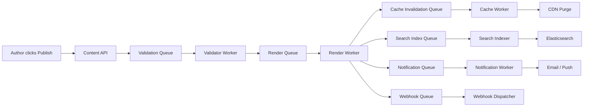

**Queue Technology:** Apache Kafka for the main event stream; SQS/Redis streams for task queues.

**Topic Design:**

| Topic | Partitions | Retention | Consumers |
|-------|------------|-----------|-----------|
| `content.events` | 16 | 7 days | Search indexer, cache invalidator, webhook dispatcher, analytics |
| `content.publish` | 8 | 3 days | Render worker, notification worker |
| `comment.events` | 8 | 3 days | Moderation worker, notification worker, search indexer |
| `vote.events` | 16 | 1 day | Score aggregator, reputation calculator, badge checker |
| `search.reindex` | 4 | 1 day | Search bulk indexer |
| `notification.send` | 8 | 1 day | Email sender, push sender, in-app notifier |

### Comment Moderation Queue

```
Comment Submitted
       |
       v
  [Spam Filter (ML)] -- spam_score > 0.9 --> [Auto-reject, log]
       |
  spam_score < 0.3 --> [Auto-approve]
       |
  0.3 <= spam_score <= 0.9 --> [Manual Review Queue]
       |
       v
  [Moderator Dashboard]
       |
  approve / reject / spam
       |
       v
  [Update Comment Status]
       |
       v
  [Notify Author if rejected]
```

### Notification Stream

```
Event Sources:
  - Content published        --> notify subscribers
  - Comment on my post       --> notify post author
  - Reply to my comment      --> notify comment author
  - Answer on my question    --> notify question author
  - Answer accepted          --> notify answer author
  - Upvote milestone         --> notify content author
  - @mention in wiki/comment --> notify mentioned user
  - Page watched edit        --> notify watchers

Notification Pipeline:
  [Event Stream] --> [Notification Router]
                         |
              +---------+---------+
              |         |         |
         [In-App]   [Email]   [Push]
              |         |         |
         [WebSocket] [SES/SG]  [FCM/APNS]
              |         |         |
         [Delivered] [Delivered] [Delivered]
              |         |         |
         [Read/Dismissed tracking]
```

### Search Index Update Stream

```
Database Change (CDC via Debezium or application-level events)
       |
       v
  [Kafka: content.events]
       |
       v
  [Search Index Consumer Group]
       |
       +-- Batch accumulator (collect changes for 500ms or 100 changes)
       |
       v
  [Elasticsearch Bulk Index API]
       |
       v
  [Index Refresh (1 second default)]
       |
       v
  [Searchable]

Lag monitoring:
  - Consumer lag > 10,000 events --> alert
  - Consumer lag > 100,000 events --> page on-call
  - Reindex trigger: full reindex from database if lag > 1 hour or index corruption detected
```

---

## State Machines

### Content Publishing Lifecycle

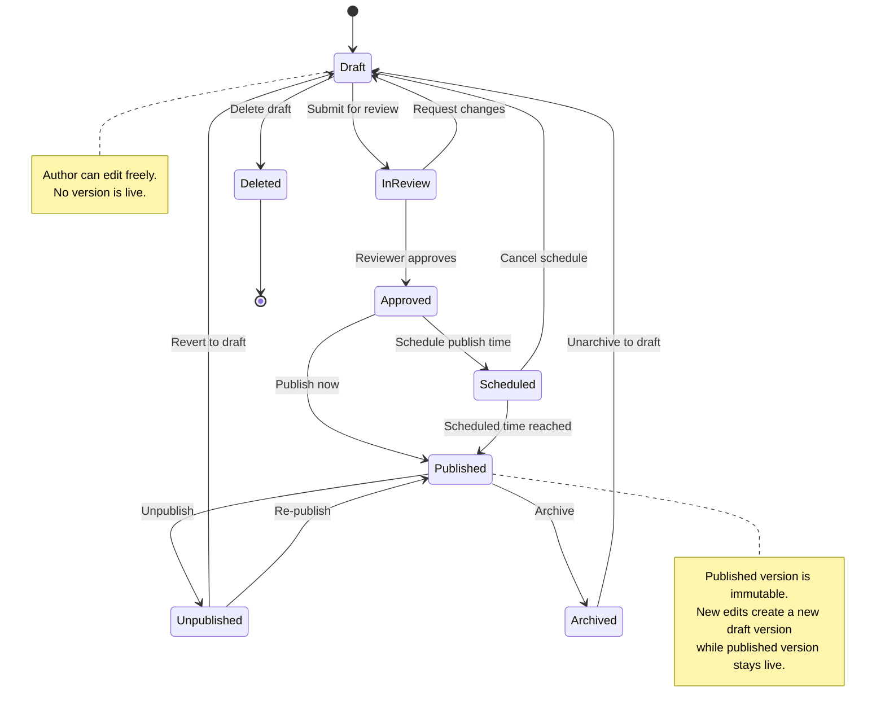

### Q&A Question Lifecycle

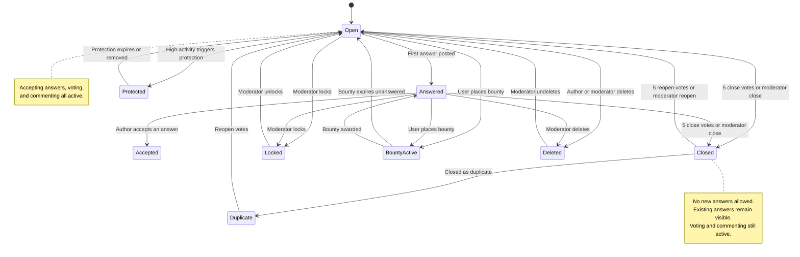

### Wiki Page Approval Workflow

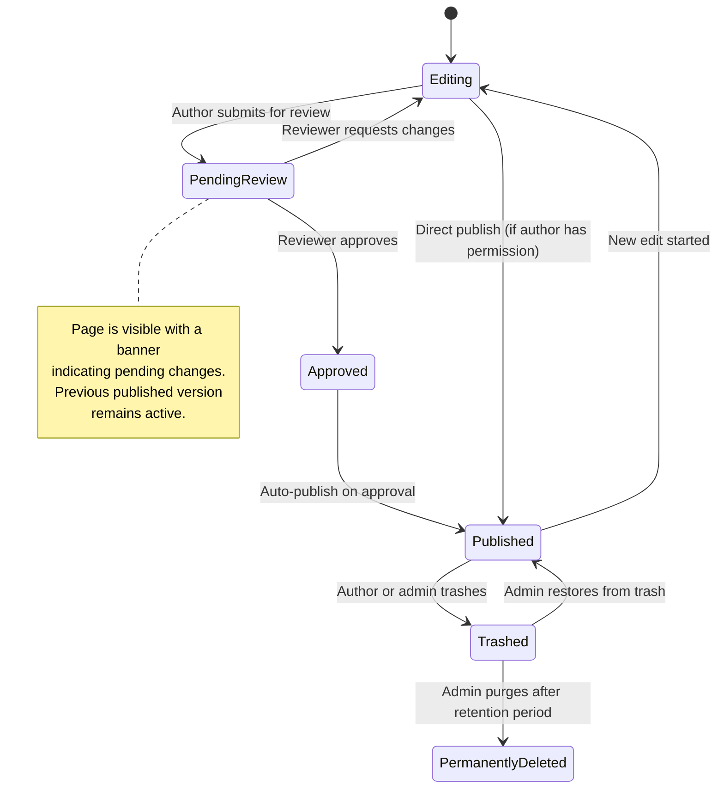

### Comment Moderation Lifecycle

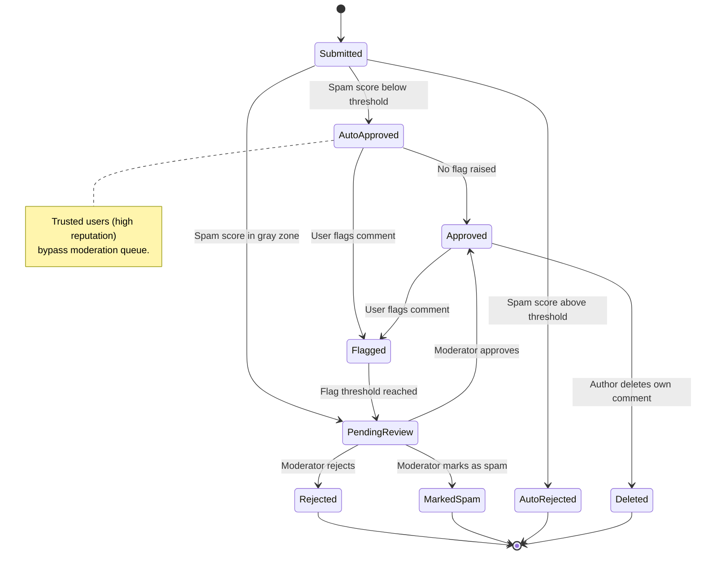

---

## Sequence Diagrams

### Content Publishing Flow

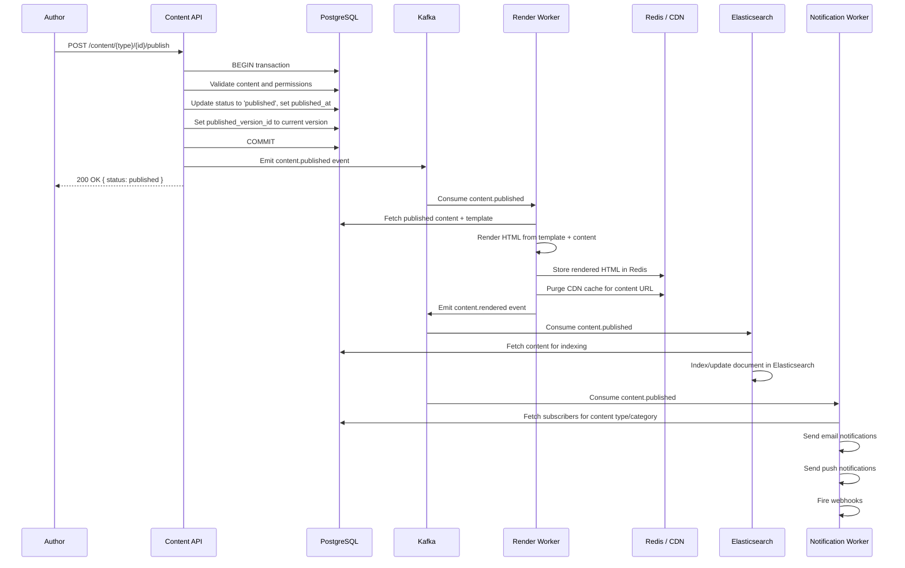

### Real-Time Collaborative Editing (OT)

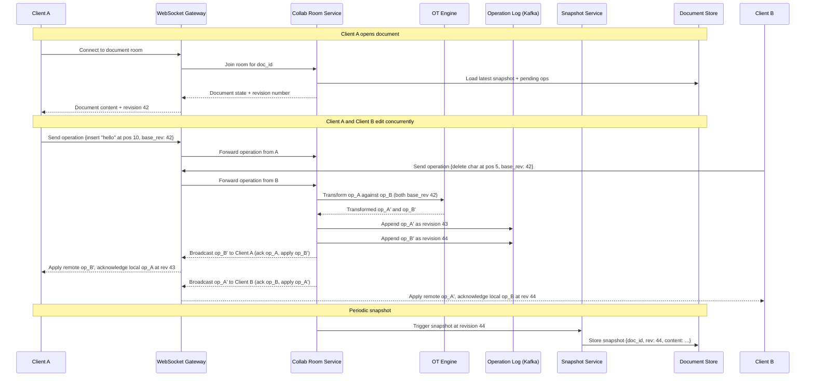

### Q&A Answer and Accept Flow

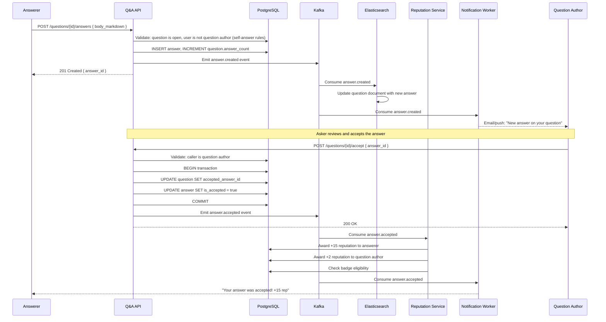

### Wiki Page Edit Conflict Resolution

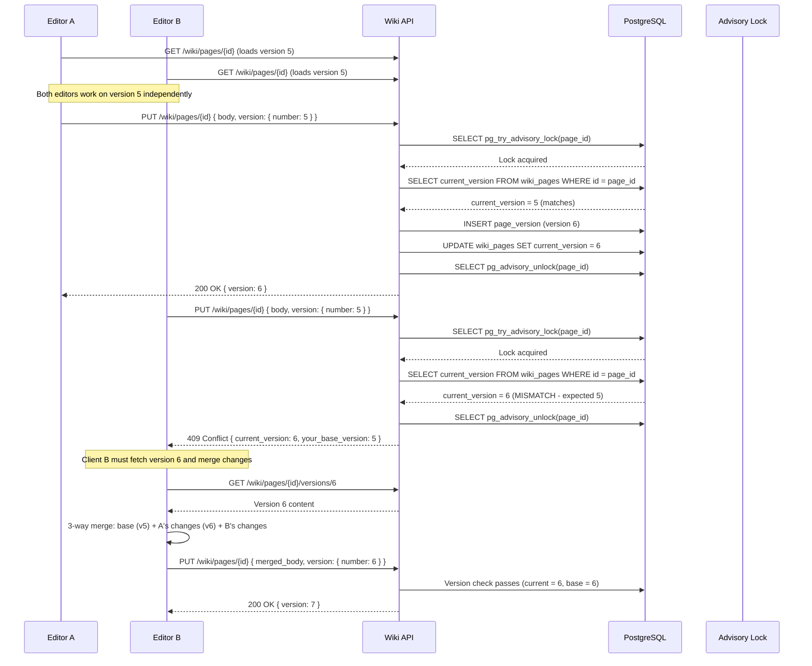

---

## Concurrency Control

### Collaborative Editing: OT vs CRDT

| Aspect | Operational Transform (OT) | CRDT |
|--------|---------------------------|------|
| **Convergence guarantee** | Server-mediated; all clients converge through a central transform server | Mathematically guaranteed; peers can merge independently |
| **Server requirement** | Requires a central server to order and transform operations | Can work peer-to-peer; server optional for persistence |
| **Latency** | Low (one round-trip to server for acknowledgment) | Very low (apply locally first, sync later) |
| **Offline support** | Limited; operations queue locally but need server to resolve | Strong; local edits are first-class and merge automatically |
| **Implementation complexity** | High; transform functions are hard to get right for rich documents | High; CRDT data structures are complex but merge is simpler |
| **Payload size** | Small (operations are compact) | Can be large (tombstones accumulate over time) |
| **History/undo** | Natural (operation-based undo) | Complex (inverting CRDT operations is non-trivial) |
| **Used by** | Google Docs, Etherpad | Figma (custom CRDT-like), Yjs, Automerge |
| **Best for** | Server-centric architectures with reliable connectivity | Offline-first, peer-to-peer, or local-first applications |

**Recommendation for wiki/docs systems:** Use OT for server-centric collaboration (wiki, CMS) where a reliable server is always available. Use CRDTs for offline-first or peer-to-peer scenarios (mobile editing, field documentation).

### Wiki Edit Conflicts

Wiki systems that do not support real-time collaboration use **optimistic concurrency control** with version numbers:

```python
def update_wiki_page(page_id, new_body, base_version, author_id):
    with advisory_lock(page_id):
        current = db.query("SELECT current_version FROM wiki_pages WHERE id = %s", page_id)

        if current.current_version != base_version:
            # Conflict detected
            raise ConflictError(
                current_version=current.current_version,
                base_version=base_version,
                message="Page was modified since you started editing. "
                        "Please reload and merge your changes."
            )

        new_version = base_version + 1

        db.execute("""
            INSERT INTO page_versions (page_id, version_number, title, body_storage, author_id)
            VALUES (%s, %s, %s, %s, %s)
        """, page_id, new_version, title, new_body, author_id)

        db.execute("""
            UPDATE wiki_pages
            SET current_version = %s, body_storage = %s, updated_at = now()
            WHERE id = %s
        """, new_version, new_body, page_id)

        return new_version
```

### Q&A Vote Counting

Vote counting in Q&A uses **atomic database operations** to prevent double-voting and ensure consistency:

```python
def cast_vote(user_id, target_type, target_id, vote_type):
    with db.transaction():
        # Check for existing vote (unique constraint also enforces this)
        existing = db.query("""
            SELECT id, vote_type FROM votes
            WHERE user_id = %s AND target_type = %s AND target_id = %s
        """, user_id, target_type, target_id)

        if existing:
            if existing.vote_type == vote_type:
                raise AlreadyVotedError("You already cast this vote")
            # Changing vote direction: undo old vote, apply new
            old_delta = -existing.vote_type  # undo old
            new_delta = vote_type             # apply new
            db.execute("UPDATE votes SET vote_type = %s WHERE id = %s", vote_type, existing.id)
            score_delta = old_delta + new_delta
        else:
            db.execute("""
                INSERT INTO votes (user_id, target_type, target_id, vote_type)
                VALUES (%s, %s, %s, %s)
            """, user_id, target_type, target_id, vote_type)
            score_delta = vote_type

        # Atomic score update
        if target_type == 'question':
            db.execute("""
                UPDATE questions
                SET score = score + %s,
                    upvote_count = upvote_count + CASE WHEN %s > 0 THEN greatest(0, %s) ELSE least(0, %s) END,
                    downvote_count = downvote_count + CASE WHEN %s < 0 THEN abs(least(0, %s)) ELSE -abs(greatest(0, %s)) END
                WHERE id = %s
            """, score_delta, vote_type, score_delta, score_delta, vote_type, score_delta, score_delta, target_id)
        elif target_type == 'answer':
            db.execute("""
                UPDATE answers
                SET score = score + %s,
                    upvote_count = upvote_count + CASE WHEN %s > 0 THEN greatest(0, %s) ELSE 0 END,
                    downvote_count = downvote_count + CASE WHEN %s < 0 THEN abs(least(0, %s)) ELSE 0 END
                WHERE id = %s
            """, score_delta, score_delta, score_delta, score_delta, score_delta, target_id)

        # Emit event for async reputation calculation
        emit_event('vote.cast', {
            'user_id': user_id,
            'target_type': target_type,
            'target_id': target_id,
            'vote_type': vote_type,
            'score_delta': score_delta
        })
```

---

## Idempotency Strategy

### Idempotent Publish

Content publishing must be idempotent because network failures can cause the client to retry. Without idempotency, a retry could create duplicate webhook fires, multiple CDN purges, or duplicate notifications.

```python
def publish_content(content_id, idempotency_key):
    # Check if this publish was already processed
    existing = redis.get(f"publish_idempotency:{idempotency_key}")
    if existing:
        return json.loads(existing)  # Return cached result

    with db.transaction():
        content = db.query("SELECT * FROM content_items WHERE id = %s FOR UPDATE", content_id)

        if content.status == 'published' and content.published_version_id == content.current_version_id:
            # Already published with current version - idempotent success
            result = build_publish_response(content)
            redis.setex(f"publish_idempotency:{idempotency_key}", 3600, json.dumps(result))
            return result

        # Perform publish
        db.execute("""
            UPDATE content_items
            SET status = 'published',
                published_version_id = current_version_id,
                published_at = now(),
                published_by = %s
            WHERE id = %s
        """, current_user_id, content_id)

        # Emit event with idempotency key so downstream consumers can deduplicate
        emit_event('content.published', {
            'content_id': content_id,
            'idempotency_key': idempotency_key,
            'version_id': content.current_version_id,
        })

    result = build_publish_response(content)
    # Cache result for 1 hour for idempotent retries
    redis.setex(f"publish_idempotency:{idempotency_key}", 3600, json.dumps(result))
    return result
```

### Idempotent Vote

```python
def idempotent_vote(user_id, target_type, target_id, vote_type, idempotency_key):
    # The unique constraint (user_id, target_type, target_id) provides natural idempotency
    # for the initial vote. The idempotency key handles retry of the full operation
    # including the score update and event emission.

    cache_key = f"vote_idempotency:{idempotency_key}"
    existing_result = redis.get(cache_key)
    if existing_result:
        return json.loads(existing_result)

    try:
        result = cast_vote(user_id, target_type, target_id, vote_type)
        redis.setex(cache_key, 3600, json.dumps(result))
        return result
    except AlreadyVotedError:
        # Idempotent: return current state
        current_score = get_current_score(target_type, target_id)
        result = {"new_score": current_score, "your_vote": vote_type}
        redis.setex(cache_key, 3600, json.dumps(result))
        return result
```

---

## Consistency Model

### Eventual Consistency for View Counts

View counts are high-volume, low-stakes metrics. They use **eventual consistency** with batch updates:

```python
# View count increment (fire-and-forget to Redis)
def record_view(content_type, content_id, viewer_ip):
    # Deduplicate views per IP per 15-minute window
    dedup_key = f"view_dedup:{content_type}:{content_id}:{viewer_ip}"
    if redis.set(dedup_key, 1, nx=True, ex=900):  # 15 min window
        # Increment counter in Redis (not in database)
        redis.hincrby(f"view_counts:{content_type}", str(content_id), 1)

# Batch flush to database every 60 seconds
def flush_view_counts(content_type):
    counts = redis.hgetall(f"view_counts:{content_type}")
    if not counts:
        return

    # Batch UPDATE for all accumulated counts
    values = [(int(count), content_id) for content_id, count in counts.items()]
    db.executemany(f"""
        UPDATE {content_type}s SET view_count = view_count + %s WHERE id = %s
    """, values)

    # Clear flushed counts
    redis.delete(f"view_counts:{content_type}")
```

**Consistency guarantees:**
- View counts may be stale by up to 60 seconds
- No view is double-counted within a 15-minute window per IP
- If Redis crashes, at most 60 seconds of view counts are lost (acceptable for analytics)

### Strong Consistency for Votes

Votes affect reputation, badge awards, and content ranking. They require **strong consistency**:

- Votes are written transactionally to PostgreSQL with a UNIQUE constraint preventing double-votes
- Score updates happen atomically in the same transaction as the vote INSERT
- The vote result is returned synchronously to the user
- Reputation changes are processed asynchronously but are eventually consistent within seconds
- The read model (question page) may show a slightly stale score if served from cache, but the cache TTL is 30 seconds

### CDN Cache Invalidation

CDN invalidation follows a **write-through invalidation** pattern:

```
Content Update Flow:
  1. Author publishes content
  2. Database transaction commits
  3. Application emits content.published event
  4. Cache worker receives event
  5. Worker invalidates Redis cache (delete key)
  6. Worker sends CDN purge request (by URL or surrogate key)
  7. CDN acknowledges purge (async, typically completes in 1-5 seconds)
  8. Next request hits origin, rebuilds cache

Surrogate Key Strategy:
  - Each content item tagged with surrogate keys in CDN response headers
  - Surrogate-Key: content-{id} type-{content_type} locale-{locale} author-{author_id}
  - Purge by surrogate key to invalidate all related pages at once
  - Example: purging "author-abc123" invalidates all cached pages by that author
```

**Consistency window:**
- After publish: content is stale on CDN for 1-5 seconds (purge propagation time)
- Mitigation: Return `Cache-Control: no-cache` with stale-while-revalidate for logged-in authors viewing their own content

---

## Distributed Transaction / Saga

### Content Publish Saga

Publishing content touches multiple systems (database, cache, CDN, search index, webhooks, notifications). This is modeled as a saga with compensating actions.

```
Content Publish Saga Steps:

Step 1: VALIDATE
  Action:  Validate content fields, permissions, and workflow state
  Compensate: None (read-only)
  Failure: Return 400/403 to caller

Step 2: PERSIST
  Action:  Update content status to 'published' in database
  Compensate: Revert status to previous state
  Failure: Rollback database transaction

Step 3: RENDER
  Action:  Render content HTML from template and content data
  Compensate: None (idempotent, can retry)
  Failure: Retry 3 times, then mark as 'publish_failed' and alert

Step 4: CACHE
  Action:  Store rendered HTML in Redis; purge CDN
  Compensate: Delete Redis key (content falls back to origin)
  Failure: Non-critical; retry in background. Content served from origin.

Step 5: INDEX
  Action:  Update search index with published content
  Compensate: Remove from search index
  Failure: Non-critical; retry from event log. Search shows stale data temporarily.

Step 6: NOTIFY
  Action:  Send notifications to subscribers and fire webhooks
  Compensate: Cannot unsend; log for manual review
  Failure: Non-critical; retry with exponential backoff. Users get delayed notification.
```

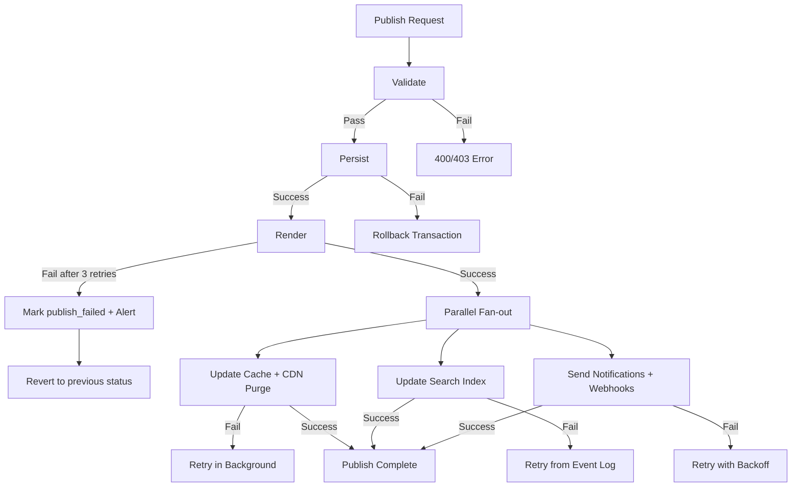

**Key design decisions:**
- Steps 1-3 are synchronous (user waits for response)
- Steps 4-6 are asynchronous (fire-and-forget via event stream)
- Steps 4-6 are idempotent and can be retried safely
- The user sees a successful publish response after Step 3 completes
- If Step 3 fails, the saga compensates by reverting Step 2

---

## Security Design

### Content Access Control

```
Permission Model (hierarchical):

  Organization
    |
    +-- Workspace / Site
          |
          +-- Content Type (e.g., "Blog Post", "Landing Page")
                |
                +-- Content Item

Permission Levels:
  - Admin:    full control, manage users and settings
  - Editor:   create, edit, publish, delete content
  - Author:   create and edit own content, submit for review
  - Reviewer: approve/reject content in review
  - Viewer:   read-only access to drafts and internal content

Access Check Pseudocode:
  def check_access(user, resource, action):
      # 1. Check item-level override
      item_perm = get_item_permission(user, resource.id)
      if item_perm: return evaluate(item_perm, action)

      # 2. Check content-type-level permission
      type_perm = get_type_permission(user, resource.content_type_id)
      if type_perm: return evaluate(type_perm, action)

      # 3. Check workspace-level role
      workspace_role = get_workspace_role(user, resource.workspace_id)
      if workspace_role: return evaluate(workspace_role, action)

      # 4. Default deny
      return DENY
```

### XSS Prevention

All content systems must sanitize user-generated content to prevent cross-site scripting:

```python
# Server-side HTML sanitization for all rendered content

import bleach

ALLOWED_TAGS = [
    'p', 'br', 'strong', 'em', 'u', 's', 'code', 'pre', 'blockquote',
    'h1', 'h2', 'h3', 'h4', 'h5', 'h6',
    'ul', 'ol', 'li',
    'a', 'img', 'figure', 'figcaption',
    'table', 'thead', 'tbody', 'tr', 'th', 'td',
    'div', 'span', 'hr',
    'details', 'summary',
]

ALLOWED_ATTRIBUTES = {
    'a': ['href', 'title', 'rel', 'target'],
    'img': ['src', 'alt', 'width', 'height', 'loading'],
    'td': ['colspan', 'rowspan'],
    'th': ['colspan', 'rowspan'],
    'code': ['class'],  # for syntax highlighting: class="language-python"
    'div': ['class'],
    'span': ['class'],
}

ALLOWED_PROTOCOLS = ['http', 'https', 'mailto']

def sanitize_html(dirty_html):
    clean = bleach.clean(
        dirty_html,
        tags=ALLOWED_TAGS,
        attributes=ALLOWED_ATTRIBUTES,
        protocols=ALLOWED_PROTOCOLS,
        strip=True
    )
    # Also linkify bare URLs safely
    clean = bleach.linkify(clean, callbacks=[set_noopener])
    return clean

def set_noopener(attrs, new=False):
    attrs[(None, 'rel')] = 'noopener noreferrer nofollow'
    attrs[(None, 'target')] = '_blank'
    return attrs
```

### Markdown Sanitization

```python
# Markdown rendering pipeline with sanitization

import markdown
from markupsafe import Markup

def render_markdown_safe(md_source):
    # Step 1: Parse markdown to HTML
    raw_html = markdown.markdown(
        md_source,
        extensions=['fenced_code', 'tables', 'toc', 'attr_list']
    )

    # Step 2: Sanitize the rendered HTML (remove script, event handlers, etc.)
    safe_html = sanitize_html(raw_html)

    # Step 3: Apply syntax highlighting to code blocks
    safe_html = apply_syntax_highlighting(safe_html)

    return Markup(safe_html)

# Additional protections:
# - Strip HTML comments that could contain IE conditional execution
# - Block data: URIs in img src (can contain JavaScript)
# - Block javascript: URIs everywhere
# - Remove style attributes (prevent CSS-based attacks)
# - Set Content-Security-Policy headers to block inline scripts
```

### Spam Prevention (Q&A and Blog Comments)

```
Spam Prevention Pipeline:

Layer 1: Rate Limiting
  - Max 5 questions per hour per user
  - Max 20 answers per hour per user
  - Max 30 comments per hour per user
  - New users (< 24 hours): max 1 question per 30 minutes

Layer 2: Content Analysis
  - Honeypot hidden form fields (bots fill these)
  - Check body for spam patterns (excessive links, known spam phrases)
  - Check if body is mostly copy-pasted from other posts (plagiarism)
  - Minimum body length: 30 characters for questions, 15 for answers

Layer 3: ML-Based Spam Scoring
  - Feed title + body + user metadata to spam classification model
  - Score 0.0 (clean) to 1.0 (spam)
  - < 0.3: auto-approve
  - 0.3 - 0.9: queue for human review
  - > 0.9: auto-reject + flag account

Layer 4: Reputation-Based Trust
  - Users with reputation > 1000: bypass ML check, auto-approve
  - Users with reputation > 100: lower spam threshold (0.5 instead of 0.3)
  - New accounts: all posts go through ML check
  - Accounts with > 3 spam flags: all posts require human review

Layer 5: Community Moderation
  - Users can flag posts as spam
  - 5 spam flags from trusted users (rep > 500): auto-hide post
  - Moderator queue for flagged content
```

---

## Observability Design

### Content Metrics

```
Key Business Metrics (dashboards):

CMS:
  - content_items_total{content_type, status}              -- gauge
  - content_publish_total{content_type}                      -- counter
  - content_publish_latency_seconds{content_type}            -- histogram
  - content_version_count{content_type}                      -- histogram
  - workflow_stage_duration_seconds{workflow, stage}          -- histogram

Blog:
  - blog_posts_published_total                               -- counter
  - blog_post_views_total{post_slug}                         -- counter
  - blog_post_read_completion_rate{post_slug}                -- gauge (0-1)
  - blog_comments_total{status}                              -- gauge
  - blog_subscriber_count{type}                              -- gauge

Docs:
  - doc_page_views_total{space, version, page_slug}          -- counter
  - doc_search_queries_total{space}                          -- counter
  - doc_search_no_results_total{space}                       -- counter
  - doc_feedback_score{space, page_slug}                     -- gauge (helpful rate)
  - doc_page_staleness_days{space}                           -- histogram

Wiki:
  - wiki_page_edits_total{space_key}                         -- counter
  - wiki_active_collaborators{space_key}                     -- gauge
  - wiki_page_views_total{space_key}                         -- counter
  - wiki_search_queries_total                                -- counter
  - wiki_attachment_storage_bytes{space_key}                  -- gauge

Q&A:
  - qa_questions_asked_total                                  -- counter
  - qa_answers_posted_total                                   -- counter
  - qa_answer_acceptance_rate                                 -- gauge
  - qa_median_time_to_first_answer_seconds                    -- gauge
  - qa_median_time_to_accepted_answer_seconds                 -- gauge
  - qa_vote_total{type, direction}                            -- counter
  - qa_unanswered_questions_total                             -- gauge
  - qa_reputation_distribution                                -- histogram
```

### Engagement Analytics

```
Event Tracking Schema (sent to analytics pipeline):

{
  "event_type": "page_view" | "content_interact" | "search" | "comment" | "vote",
  "timestamp": "2026-03-22T14:30:00Z",
  "user_id": "anonymous-hash-or-user-id",
  "session_id": "uuid",
  "properties": {
    "content_type": "blog_post",
    "content_id": "uuid",
    "slug": "how-to-deploy-kubernetes",
    "referrer": "google",
    "device_type": "desktop",
    "time_on_page_seconds": 180,
    "scroll_depth_percent": 75,
    "action": "upvote"
  }
}
```

### Search Quality Monitoring

```
Search Quality Signals:

1. Click-through rate (CTR) by position
   - Track which search results users click
   - Healthy: position 1 CTR > 30%, position 2 CTR > 15%
   - Alert if CTR drops significantly

2. Zero-result query rate
   - Track queries that return no results
   - Healthy: < 10% of queries return zero results
   - Feed zero-result queries to content gap analysis

3. Search abandonment rate
   - User searches, sees results, does not click any
   - Healthy: < 40% abandonment
   - High abandonment suggests poor relevance

4. Query reformulation rate
   - User searches, then immediately searches again with different terms
   - Healthy: < 20% reformulation
   - High reformulation suggests poor initial results

5. Time to result
   - P50 search latency < 100ms
   - P99 search latency < 500ms
   - Alert if latency degrades

Monitoring Dashboard:
  - Real-time search latency percentiles
  - Top 100 queries by volume (last 24 hours)
  - Top 50 zero-result queries (last 24 hours)
  - Search CTR trend (7-day rolling average)
  - Index lag (seconds behind latest content change)
```

---

## Reliability and Resilience

### CDN Failover

```
CDN Failover Architecture:

Primary CDN (CloudFront/Fastly)
       |
  [Health Check: every 10s]
       |
  Healthy? --> Serve from primary
       |
  Unhealthy? --> DNS failover to secondary CDN (Cloudflare)
       |
  Both unhealthy? --> Serve directly from origin (degraded mode)

Implementation:
  - Route 53 health checks ping CDN edge PoPs every 10 seconds
  - If primary fails 3 consecutive checks (30 seconds), switch DNS to secondary
  - Secondary CDN pulls from same origin servers
  - Origin servers have their own load balancer and auto-scaling

Cache Warming for Secondary:
  - Secondary CDN runs in warm-standby: receives 1% of traffic via weighted routing
  - When promoted to primary, cache is partially warm
  - Cold cache miss rate estimated at 20-30% during first 5 minutes after failover
```

### Database Replication

```
PostgreSQL Replication Topology:

  [Primary (us-east-1)]
       |
  +----+----+
  |         |
  [Sync Replica]   [Async Replica (us-west-2)]
  (us-east-1b)           |
       |            [Read Replicas]
  [Read Replicas]
  (for read-heavy    (for cross-region reads)
   queries)

Read Routing:
  - Published content reads: any replica (eventual consistency acceptable)
  - Content writes: primary only
  - Vote reads: primary or sync replica (strong consistency)
  - Search: Elasticsearch cluster (not database)
  - Analytics queries: dedicated analytics replica (no impact on production)

Failover:
  - Automatic failover to sync replica within 30 seconds
  - Async cross-region replica promoted manually if entire region fails
  - RPO for cross-region: < 5 seconds of data loss (async replication lag)
  - RTO for cross-region: < 15 minutes (manual promotion + DNS update)
```

### Search Index Rebuild

```
Search Index Rebuild Procedure:

Trigger Conditions:
  - Index corruption detected (checksum mismatch)
  - Schema mapping change requires re-index
  - Consumer lag exceeds 1 hour
  - Periodic rebuild (monthly) for index optimization

Rebuild Steps:
  1. Create new index with updated mapping (e.g., cms_content_v2)
  2. Start bulk indexing from database (source of truth)
     - Use database cursor with batch size 1000
     - Rate limit to 5000 docs/second to avoid overloading DB
     - Estimated time for 10M documents: ~30 minutes
  3. While bulk indexing runs, continue consuming real-time events into OLD index
  4. When bulk indexing completes, replay any events that occurred during rebuild
  5. Switch alias from old index to new index (atomic, zero-downtime)
  6. Continue consuming real-time events into new index
  7. Delete old index after 24-hour grace period

Zero-Downtime Guarantee:
  - Users always search against the alias, which points to whichever index is active
  - During rebuild, searches hit the old index (slightly stale but functional)
  - After alias switch, searches hit the new index with fresh data
```

---

## Multi-Region and DR

### Content Replication Strategy

```
Multi-Region Architecture:

  [us-east-1 (Primary)]              [eu-west-1 (Secondary)]
       |                                    |
  [PostgreSQL Primary]  ----async--->  [PostgreSQL Replica]
  [Elasticsearch]       ----async--->  [Elasticsearch Replica]
  [Redis Primary]       ----async--->  [Redis Replica]
  [S3 (media)]          ----CRR---->   [S3 (media replica)]
       |                                    |
  [CloudFront PoPs]    <-- same origin --> [CloudFront PoPs]

Write Routing:
  - All writes go to us-east-1 (single-writer model)
  - Reads are served from the nearest region
  - CDN serves published content from edge; origin region is transparent to users

Data Replication:
  - PostgreSQL: async streaming replication, < 5 second lag
  - Elasticsearch: cross-cluster replication (CCR), < 10 second lag
  - Redis: Redis Cluster with cross-region replication
  - S3: Cross-Region Replication (CRR), eventual consistency
  - Media assets: served from CDN; S3 replication is for DR, not serving
```

### CDN Distribution

```
CDN PoP Strategy:

Content Type          | Edge TTL  | Shield TTL | Stale-While-Revalidate
Published blog posts  | 5 min     | 15 min     | 60 min
Published doc pages   | 15 min    | 30 min     | 120 min
CMS API responses     | 1 min     | 5 min      | 10 min
Wiki pages            | 3 min     | 10 min     | 30 min
Q&A question pages    | 30 sec    | 2 min      | 5 min
Static assets (JS/CSS)| 1 year    | 1 year     | N/A (immutable with hash)
Media assets (images) | 30 days   | 30 days    | 365 days

Cache Headers Example:
  Cache-Control: public, max-age=300, stale-while-revalidate=3600
  Surrogate-Key: content-abc123 type-blog_post author-user456 locale-en
  Surrogate-Control: max-age=900
```

### DR Playbook

```
Disaster Recovery Runbook:

Scenario 1: Primary Region Complete Failure
  Time 0:    Monitoring detects us-east-1 failure
  Time +2m:  On-call paged, incident declared
  Time +5m:  Confirm failure is regional, not transient
  Time +10m: Promote eu-west-1 PostgreSQL replica to primary
  Time +12m: Update application config to point to eu-west-1 database
  Time +13m: Restart application services in eu-west-1
  Time +15m: Update DNS weighted routing to send 100% traffic to eu-west-1
  Time +20m: Verify content serving, search, and write paths functional
  Time +25m: Resume processing of queued events (Kafka consumer catchup)
  RTO: ~20 minutes | RPO: < 5 seconds

Scenario 2: Database Primary Failure (region healthy)
  Time 0:    RDS automated failover begins to sync replica
  Time +30s: Sync replica promoted to primary
  Time +45s: Application reconnects to new primary
  Time +60s: Service fully restored
  RTO: ~60 seconds | RPO: 0 (sync replication)

Scenario 3: Search Index Corruption
  Time 0:    Alert on search result quality degradation
  Time +5m:  Confirm index corruption
  Time +10m: Switch search traffic to stale replica index
  Time +15m: Begin index rebuild from database
  Time +45m: Rebuild complete, switch alias to new index
  RTO: ~10 minutes (degraded) | RPO: 0 (rebuilt from source of truth)

Scenario 4: CDN Complete Outage
  Time 0:    CDN health checks fail globally
  Time +30s: DNS failover to secondary CDN
  Time +5m:  Secondary CDN warming (20-30% cache miss rate)
  Time +15m: Secondary CDN fully warm
  RTO: ~30 seconds | RPO: 0 (content served from origin on cache miss)
```

---

## Cost Drivers

### CDN Costs

| Cost Component | CMS | Blog | Docs | Wiki | Q&A |
|----------------|-----|------|------|------|-----|
| CDN bandwidth ($/month) | $15,000 | $40,000 | $8,000 | $4,000 | $12,000 |
| CDN requests ($/month) | $5,000 | $10,000 | $3,000 | $2,000 | $8,000 |
| CDN purge requests ($/month) | $500 | $200 | $100 | $300 | $100 |
| **CDN total ($/month)** | **$20,500** | **$50,200** | **$11,100** | **$6,300** | **$20,100** |

### Storage Costs

| Cost Component | CMS | Blog | Docs | Wiki | Q&A |
|----------------|-----|------|------|------|-----|
| PostgreSQL RDS ($/month) | $8,000 | $5,000 | $3,000 | $6,000 | $12,000 |
| S3 media storage ($/month) | $3,500 | $7,000 | $250 | $1,800 | $500 |
| S3 requests ($/month) | $1,000 | $2,000 | $200 | $500 | $300 |
| Redis cache ($/month) | $2,000 | $1,500 | $800 | $1,200 | $3,000 |
| **Storage total ($/month)** | **$14,500** | **$15,500** | **$4,250** | **$9,500** | **$15,800** |

### Search Infrastructure Costs

| Cost Component | CMS | Blog | Docs | Wiki | Q&A |
|----------------|-----|------|------|------|-----|
| Elasticsearch nodes ($/month) | $6,000 | $4,000 | $2,000 | $5,000 | $10,000 |
| Index storage ($/month) | $500 | $300 | $200 | $600 | $1,500 |
| **Search total ($/month)** | **$6,500** | **$4,300** | **$2,200** | **$5,600** | **$11,500** |

### Cost Optimization Strategies

| Strategy | Savings Estimate | Subsystems |
|----------|------------------|------------|
| S3 Intelligent-Tiering for old media | 30-50% on media storage | All |
| Reserved instances for database and Elasticsearch | 30-40% on compute | All |
| CDN cache hit rate improvement (longer TTLs + stale-while-revalidate) | 20-30% on CDN bandwidth | Blog, Docs, CMS |
| Archive old content versions to S3 Glacier | 80% on version storage | CMS, Wiki |
| Use Elasticsearch data tiers (hot-warm-cold) | 40-60% on search storage | Q&A, Wiki |
| Compress images on upload (WebP/AVIF) | 40-60% on media storage and CDN | Blog, CMS |

---

## Deep Platform Comparisons

### CMS Comparison: WordPress vs Contentful vs Strapi vs Sanity

| Dimension | WordPress | Contentful | Strapi | Sanity |
|-----------|-----------|------------|--------|--------|
| **Architecture** | Monolithic PHP, coupled frontend | Headless SaaS, API-first | Headless open-source, Node.js | Headless SaaS, real-time data layer |
| **Content Modeling** | Fixed post/page types, custom fields via plugins | Flexible content types via UI | Flexible content types, code-generated or UI | GROQ-based schema, extremely flexible |
| **API Style** | REST (built-in), GraphQL (plugin) | REST + GraphQL (built-in) | REST + GraphQL (built-in) | GROQ query language (proprietary) + GraphQL |
| **Hosting** | Self-hosted or managed (WordPress.com, WP Engine) | Fully managed SaaS | Self-hosted or Strapi Cloud | Fully managed SaaS |
| **Scalability** | Challenging without caching layers (WP Super Cache, Varnish) | Built for scale, global CDN | Depends on hosting; requires manual scaling | Built for scale, global edge network |
| **Versioning** | Post revisions (basic) | Content versioning with diff | Draft/publish with revisions | Full history, real-time collaboration |
| **Localization** | Plugin-based (WPML, Polylang) | Built-in, field-level localization | Built-in (i18n plugin) | Built-in, field-level |
| **Workflow** | Plugin-based (EditFlow) | Built-in roles and workflow | Basic roles, customizable via plugins | Built-in workflow with custom stages |
| **Ecosystem** | Massive (60,000+ plugins) | Growing marketplace | Community plugins | Growing ecosystem |
| **Cost at Scale** | Low (open-source) + hosting costs | Expensive ($489+/month for teams) | Free (self-hosted) + infra costs | Moderate ($99+/month for teams) |
| **Best For** | Marketing sites, blogs, agencies | Enterprise headless, multi-channel delivery | Developer-owned headless CMS | Content-heavy applications, real-time needs |

### Wiki Comparison: Confluence vs Notion vs GitBook

| Dimension | Confluence | Notion | GitBook |
|-----------|------------|--------|---------|
| **Primary Use** | Enterprise wiki and documentation | All-in-one workspace (docs, databases, wikis) | Developer documentation |
| **Architecture** | Server/Cloud, Java-based monolith | Cloud SaaS, custom block editor | Cloud SaaS, Git-backed content |
| **Content Model** | XHTML storage, macro system | Block-based, database-integrated | Markdown-first, Git-synced |
| **Collaboration** | Page-level locking (Cloud: real-time) | Real-time collaborative editing | Git-based collaboration (PRs) |
| **Hierarchy** | Spaces > Pages > Child Pages | Workspaces > Pages (infinite nesting) | Spaces > Sections > Pages |
| **Search** | Full-text (CQL query language) | Full-text, database filtering | Full-text with AI-powered search |
| **Permissions** | Granular: space, page, group level | Workspace and page level | Space-level, team-based |
| **Versioning** | Full page history with diff | Page history (limited diff) | Git history with full diff |
| **Integrations** | Deep Atlassian ecosystem (JIRA, Bitbucket) | 100+ integrations, API | GitHub/GitLab sync, CI/CD |
| **Offline Support** | Desktop app (limited) | Desktop/mobile apps (sync) | Git clone for offline |
| **API** | REST API (comprehensive) | REST API, limited | REST API, Git webhooks |
| **Pricing** | $5.75/user/month (Standard) | $8/user/month (Plus) | Free for open-source, $6.70/user/month |
| **Best For** | Large enterprises with Atlassian stack | Small-medium teams, flexible needs | Developer-facing documentation |

### Q&A Comparison: StackOverflow vs Discourse vs Reddit

| Dimension | StackOverflow | Discourse | Reddit |
|-----------|---------------|-----------|--------|
| **Primary Use** | Technical Q&A | Community discussion forums | Link sharing and discussion |
| **Content Model** | Question + Answers (strict) | Topics + Posts (threaded) | Posts + Comments (flat/threaded) |
| **Voting** | Upvote/downvote on Q and A | Like (no downvote by default) | Upvote/downvote |
| **Reputation System** | Detailed: rep points unlock privileges | Trust levels (0-4) | Karma (simpler) |
| **Moderation** | Community-driven (close votes, flags, review queues) | Community + admin flagging | Subreddit moderators + admin |
| **Answer Quality** | High (accepted answer, voting, editing) | Variable (discussion-oriented) | Variable (popularity-based) |
| **Search** | Full-text with tag filtering | Full-text | Basic search + subreddit scoping |
| **Gamification** | Badges, reputation, privileges | Trust levels, badges | Awards, karma |
| **Self-Hosted** | StackOverflow for Teams (SaaS) | Open-source, self-hostable | No (proprietary) |
| **API** | Comprehensive REST API | Comprehensive REST API | REST API |
| **Best For** | Technical knowledge base | General community discussion | Broad interest communities |

### Blog Comparison: Medium vs Ghost vs Substack

| Dimension | Medium | Ghost | Substack |
|-----------|--------|-------|----------|
| **Architecture** | Centralized platform (SaaS) | Self-hosted or managed, Node.js | Centralized platform (SaaS) |
| **Revenue Model** | Metered paywall (platform-wide) | Memberships and subscriptions (per-publication) | Paid newsletters (per-writer) |
| **Customization** | Minimal (platform design) | Full theme and code control | Minimal (simple template) |
| **SEO Control** | Limited (medium.com domain) | Full (custom domain, meta tags) | Moderate (custom domain available) |
| **Content Ownership** | Platform-owned (export available) | Self-owned (open-source) | Platform-dependent (export available) |
| **Email Newsletters** | No built-in newsletter | Built-in newsletter system | Core feature (email-first) |
| **Analytics** | Basic stats | Built-in + Google Analytics | Basic stats per post |
| **API** | No public API | Full REST and Webhooks API | Limited API |
| **Pricing** | Free to publish; $5/month for readers | Self-hosted: free; Ghost(Pro): $9+/month | Free; Substack takes 10% of paid subs |
| **Best For** | Writers wanting built-in audience | Independent publishers wanting control | Newsletter-first writers |

### Documentation Comparison: ReadTheDocs vs Docusaurus vs GitBook

| Dimension | ReadTheDocs | Docusaurus | GitBook |
|-----------|-------------|------------|---------|
| **Architecture** | Hosted build service for Sphinx/MkDocs | Static site generator (React) | Cloud SaaS with Git sync |
| **Content Format** | reStructuredText or Markdown | Markdown + MDX (React components) | Markdown (WYSIWYG editor or Git) |
| **Build System** | Server-side build from Git repo | Client-side build (npm/yarn) | Cloud build from Git or editor |
| **Versioning** | Built-in (branch or tag based) | Built-in (versioned sidebars) | Built-in (branch-based) |
| **Search** | Built-in (Elasticsearch-backed) | Algolia DocSearch (community) or local | Built-in AI-powered search |
| **i18n** | Sphinx: gettext-based | Built-in i18n support | Manual (separate spaces) |
| **Hosting** | readthedocs.io or self-hosted | Self-hosted (any static host) | GitBook cloud |
| **Custom Domain** | Yes (paid) | Yes (any static host) | Yes (all plans) |
| **API Reference** | Sphinx autodoc, breathe | Swagger/OpenAPI plugins | OpenAPI integration |
| **Pricing** | Free for open-source, $50+/month for private | Free (open-source) + hosting costs | Free for open-source, $6.70+/user/month |
| **Best For** | Python/Sphinx ecosystem, open-source docs | React ecosystem, MDX-powered docs | Team docs, non-technical editors |

---

## Edge Cases

### Content Version Conflict

**Scenario:** Two editors open the same CMS content item simultaneously. Editor A saves first, creating version 5. Editor B then saves, still based on version 4.

**Detection:** The `If-Match` header carries the base version. The API checks the current version before writing. If they do not match, a 409 Conflict is returned.

**Resolution strategies:**
1. **Reject and ask to merge (default):** Return 409 with the current version so the client can show a diff and let the editor merge manually.
2. **Three-way merge (docs/wiki):** The server performs a three-way merge using the common base (version 4), version 5 (A's changes), and B's changes. If no overlapping lines changed, the merge succeeds automatically. If overlapping lines conflict, fall back to strategy 1.
3. **Last-write-wins (low-stakes fields):** For non-critical fields like tags or metadata, accept the latest write. For body content, always require explicit conflict resolution.

### Spam Flood on Q&A

**Scenario:** A bot network creates hundreds of low-quality questions and answers per minute.

**Mitigation layers:**
1. **Rate limiting:** IP-based and account-based rate limits trigger after 5 questions/hour, returning 429 Too Many Requests.
2. **CAPTCHA escalation:** After 3 rate limit hits, require CAPTCHA for the next 24 hours.
3. **Account age gates:** Accounts younger than 1 hour cannot post more than 1 question. Accounts younger than 24 hours have a lower rate limit.
4. **Automated quality check:** Posts shorter than 30 characters or containing > 5 links are auto-queued for review.
5. **Emergency mode:** If total question creation rate exceeds 10x normal, activate emergency mode: all posts require CAPTCHA + moderator approval.
6. **Cleanup:** Batch-delete posts from suspended accounts; revert reputation changes; rebuild search index to remove spam entries.

### Wiki Vandalism

**Scenario:** A user with edit access maliciously deletes content from important wiki pages or replaces content with garbage.

**Detection:**
- Monitor for large deletions (> 50% of page content removed in a single edit).
- Monitor for rapid sequential edits to many pages from the same user.
- Alert if page revision rate from a single user exceeds 20 pages/minute.

**Response:**
1. Auto-revert edits that remove > 80% of content from pages with > 10 views/day.
2. Temporarily restrict the user's edit permissions.
3. Page administrators receive notification with diff of suspicious edits.
4. Bulk revert: moderator tool to revert all edits from a user in a time range to their previous versions.

### Blog Post Going Viral (Traffic Spike)

**Scenario:** A blog post is shared on social media and receives 100x normal traffic within 30 minutes.

**Protection layers:**
1. **CDN absorbs majority:** Published blog posts are cached at CDN edge for 5 minutes. A viral post is served from CDN cache; origin sees minimal load increase.
2. **Stale-while-revalidate:** Even after CDN TTL expires, `stale-while-revalidate: 3600` serves stale content while revalidating in the background. One origin request per edge PoP, not one per user.
3. **Origin shield:** CDN shield collapses multiple edge cache misses into a single origin request.
4. **Redis page cache:** If CDN misses, the rendered page is in Redis. Redis serves thousands of reads per second.
5. **Auto-scaling:** If origin request rate exceeds threshold, application instances auto-scale within 2 minutes.
6. **Graceful degradation:** If all caches fail, serve a static snapshot of the post (pre-rendered HTML in S3) as the ultimate fallback.

### Stale CDN Cache

**Scenario:** Content is updated but CDN serves the old version because purge failed or propagated slowly.

**Diagnosis:** Author sees old content after publishing. Support checks CDN cache status and purge logs.

**Mitigation:**
1. **Surrogate key purge retry:** If CDN purge fails, retry 3 times with exponential backoff (1s, 5s, 15s).
2. **Fallback: short max-age:** If surrogate purge API is unavailable, temporarily reduce max-age to 30 seconds via origin header.
3. **Cache-busting query parameter:** For critical pages, the publish API returns a URL with a version query parameter (e.g., `?v=1234567890`). This bypasses CDN cache entirely.
4. **Author bypass:** Logged-in authors requesting their own content receive `Cache-Control: no-store` so they always see the latest version.

### Markdown Rendering XSS

**Scenario:** A user submits markdown containing crafted HTML that bypasses sanitization, such as:
```markdown
[Click me](javascript:alert('xss'))
)
```

**Protection:**
1. **Allowlist-based sanitization:** Only permit `http`, `https`, and `mailto` protocols in URLs. Strip all others.
2. **Attribute sanitization:** Only allow whitelisted attributes per tag. `onerror`, `onclick`, and all event handlers are stripped.
3. **Content Security Policy:** Set `Content-Security-Policy: script-src 'self'` to block inline scripts even if sanitization misses something.
4. **Double-render check:** After sanitization, parse the output HTML and verify no `<script>` tags, event handler attributes, or `javascript:` URIs exist.
5. **Automated tests:** A test suite of 200+ known XSS payloads runs against the sanitization pipeline on every deployment.

### Large Media Upload Timeout

**Scenario:** A user uploads a 500 MB video to the CMS. The upload times out after 60 seconds.

**Solution: Multipart upload with pre-signed URLs:**
1. Client requests an upload session: `POST /api/v1/media/upload-session { filename, file_size, mime_type }`.
2. Server returns a list of pre-signed S3 upload URLs for each 10 MB chunk.
3. Client uploads chunks directly to S3 in parallel (browser to S3, bypasses application server).
4. Client notifies server when all chunks are uploaded: `POST /api/v1/media/upload-session/{id}/complete`.
5. Server triggers S3 multipart complete, then processes the asset (thumbnail generation, metadata extraction).
6. Upload progress is tracked client-side with percentage per chunk.

**Timeout strategy:**
- Application server timeout: 120 seconds (for metadata operations only)
- S3 pre-signed URL expiry: 1 hour (for individual chunk uploads)
- Upload session expiry: 24 hours (abandoned uploads cleaned up)

### Concurrent Edits on Same Wiki Page

**Scenario:** 10 users edit the same wiki page simultaneously during a team planning session.

**Without real-time collaboration (simple wiki):**
- First save wins; subsequent saves receive 409 Conflict.
- Users must manually merge their changes with the latest version.
- UX is frustrating; users learn to coordinate via chat before editing.

**With real-time collaboration (advanced wiki):**
- WebSocket connection per user in the editing room.
- OT or CRDT engine transforms concurrent operations.
- All users see each other's cursors and edits in real-time.
- Server periodically snapshots the document state.
- When a user disconnects and reconnects, they receive the latest snapshot plus any operations they missed.
- If the collaboration server crashes, clients buffer operations locally and replay on reconnect.

---

## Expanded Architecture Decision Records

### ARD-001: Headless CMS vs Traditional CMS

**Status:** Accepted

**Context:** The CMS needs to serve content to web, mobile, email, and third-party applications. A traditional CMS (like WordPress) couples content management with frontend rendering. A headless CMS separates the content backend from the presentation layer.

**Decision:** Adopt a headless CMS architecture with a content API (REST + GraphQL) and separate frontend applications.

**Rationale:**
- Multi-channel delivery: same content serves web, mobile, email, partner portals, and IoT displays without duplicating content management.
- Frontend flexibility: each channel uses its preferred framework (React, Swift, Flutter) without being constrained by the CMS template engine.
- Performance: static site generation or server-side rendering with CDN caching is faster than dynamic PHP/Java page rendering.
- Developer experience: frontend and backend teams can work independently with a clear API contract.

**Trade-offs:**
- Preview is harder: content editors cannot easily see how content looks on the frontend without a dedicated preview service.
- More infrastructure: need to build and maintain separate frontend applications plus a preview service.
- Content editor experience: editors accustomed to WYSIWYG editing may find a field-based editor less intuitive.
- SEO: requires server-side rendering or static generation; pure client-side rendering hurts SEO.

**Alternatives Considered:**
- Traditional CMS with theme system (WordPress): simpler for content editors but locks into a single rendering approach.
- Hybrid CMS (Contentful with built-in preview): middle ground but vendor lock-in.

### ARD-002: Markdown vs Rich Text Editor

**Status:** Accepted (Markdown with rich text preview)

**Context:** Content authors need to write and format content. The choice between markdown and a rich text editor (WYSIWYG) affects the content storage format, rendering pipeline, and author experience.

**Decision:** Use markdown as the canonical storage format with a rich text editor that stores markdown and renders a live preview.

**Rationale:**
- Portability: markdown is plain text, easily exported, imported, diffed, and version-controlled.
- Git-friendly: markdown changes produce clean diffs in version control, enabling docs-as-code workflows.
- Rendering control: markdown is rendered server-side to HTML with full control over sanitization and styling.
- Developer familiarity: most technical users already know markdown; code blocks and inline code are natural.

**Trade-offs:**
- Non-technical authors may struggle with markdown syntax (mitigated by WYSIWYG editor that abstracts it).
- Rich content (tables, callouts, embeds) requires markdown extensions, which can become non-standard.
- Some content types (landing pages with complex layouts) are hard to express in markdown (these use a separate visual builder).

**Alternatives Considered:**
- Pure WYSIWYG with HTML storage: easier for non-technical users but HTML diffs are noisy and hard to sanitize.
- Block-based editor (Notion-style): excellent UX but proprietary storage format makes export and diffing harder.
- reStructuredText: more powerful than markdown but steeper learning curve and smaller community.

### ARD-003: OT vs CRDT for Collaborative Editing

**Status:** Accepted (OT for server-centric wiki and docs; CRDT-based library for mobile/offline scenarios)

**Context:** The wiki and documentation platforms support collaborative editing where multiple users modify the same page simultaneously. The system must guarantee convergence (all users see the same result) without data loss.

**Decision:** Use Operational Transform (OT) as the primary collaboration engine for the web-based wiki and documentation platforms. Evaluate CRDT-based libraries (Yjs, Automerge) for mobile offline editing scenarios.

**Rationale:**
- Server-centric model: the wiki and docs platforms always have server connectivity; a central server for OT is natural and simplifies the architecture.
- Proven at scale: Google Docs has validated OT for text collaboration at massive scale.
- Compact operations: OT operations are small, reducing bandwidth for real-time sync.
- Undo is natural: OT operations can be inverted for undo/redo support.

**Trade-offs:**
- Server dependency: OT requires a central server to order and transform operations; true offline editing is limited to queueing.
- Transform complexity: writing correct transform functions for rich documents (not just plain text) is difficult and error-prone.
- CRDTs would provide better offline support but at the cost of larger data structures (tombstones) and more complex undo semantics.

**Alternatives Considered:**
- CRDT-only (Yjs): better offline support, mathematically guaranteed convergence, but larger payload and more complex integration with server-side persistence.
- Hybrid: OT for real-time with CRDT for offline conflict resolution. Attractive in theory but adds significant implementation complexity.
- No real-time collaboration: simple version locking with manual merge. Simpler but poor user experience for team editing.

### ARD-004: Self-Hosted vs SaaS

**Status:** Accepted (Self-hosted with managed cloud services)

**Context:** The content and knowledge platform could be built on top of SaaS services (Contentful, Algolia, Auth0) or self-hosted using open-source components (PostgreSQL, Elasticsearch, Keycloak).

**Decision:** Self-host core data infrastructure (database, search, cache) on cloud-managed services (RDS, OpenSearch Service, ElastiCache). Use SaaS only for non-core capabilities (CDN, email delivery, monitoring).

**Rationale:**
- Data sovereignty: content and user data remain in controlled infrastructure without third-party access.
- Cost predictability: managed cloud services have predictable pricing that scales linearly, unlike SaaS API-based pricing that can spike unexpectedly.
- Customization: full control over schema, indexing, caching, and replication topology.
- No vendor lock-in for core data: can migrate between cloud providers or to on-premises if needed.

**Trade-offs:**
- Higher operational burden: team must manage database upgrades, Elasticsearch cluster health, cache sizing.
- Slower initial development: building content modeling, versioning, and workflow requires more upfront engineering than using Contentful.
- Need dedicated DevOps/SRE capacity for infrastructure management.

**SaaS exceptions (accepted):**
- CDN (CloudFront/Fastly): CDN is a commodity; switching cost is low.
- Email delivery (SES/SendGrid): transactional email is a commodity.
- Monitoring (Datadog/Grafana Cloud): observability platforms provide value that is hard to replicate.
- Error tracking (Sentry): specialized SaaS with clear value.

**Alternatives Considered:**
- Full SaaS stack (Contentful + Algolia + Auth0 + Vercel): fastest time to market but highest ongoing cost and vendor dependency.
- Full self-hosted including CDN and email: maximum control but excessive operational burden for capabilities that are true commodities.

---

## Navigation
- Previous: [Security Systems](28-security-systems.md)
- Next: [Gaming Systems](30-gaming-systems.md)
