# 30. Gaming Systems

## Part Context
**Part:** Part 5 - Real-World System Design Examples  
**Position:** Chapter 30 of 42  
**Why this part exists:** This section translates distributed-systems theory into realistic product designs across consumer apps, marketplaces, media, payments, search, notifications, collaboration, infrastructure, and operations-heavy platforms.

## Overview
Gaming backends combine low-latency state sync, fairness controls, matchmaking, and cheat resistance. Their architecture varies sharply by game genre, but the core system boundaries repeat across many multiplayer products.

This chapter groups gameplay state, player matching, leaderboards, and anti-cheat concerns so the learner can reason about real-time consistency versus cost and developer velocity.

## Why This Domain Matters in Real Systems
- Game systems expose some of the hardest latency and fairness trade-offs in distributed systems.
- They require strong anti-abuse design and careful treatment of authoritative versus client state.
- They show where eventual consistency is acceptable and where it immediately becomes visible to users.
- This domain is useful for understanding region placement and state partitioning.

## Real-World Examples and Comparisons
- This domain repeatedly appears in systems such as Riot, Epic, Steam, PlayFab, Unity Gaming Services.
- Startups typically collapse many of these capabilities into a smaller number of services, while platform-scale companies split them into specialized ownership boundaries with stronger internal contracts.
- The architectural shape changes across B2C, B2B, and regulated deployments, but the key trade-offs around latency, correctness, and operability remain recognizable.

## Domain Architecture Map
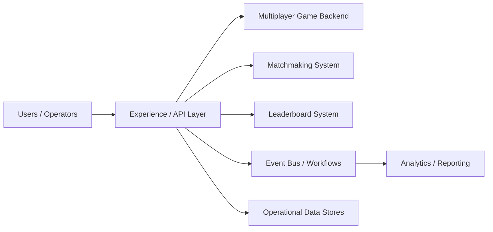

## Cross-Cutting Design Themes
- Separate user-facing hot paths from heavy asynchronous work such as analytics, indexing, compliance review, or backfills.
- Be explicit about which parts of the domain need strong correctness and which can tolerate eventual consistency.
- Model operator workflows and reconciliation early; real systems are maintained, not only executed.
- Use events and materialized views deliberately so teams can scale read models without overloading the transactional path.

## Why Design Matters in Real-Time Game Backends
Real-time games compress distributed-systems problems into milliseconds. Match quality, movement validation, hit registration, anti-cheat, and session fairness all depend on architecture decisions that users feel immediately. Unlike many web systems, correctness is not only about data integrity. It is also about perceived fairness and consistent simulation.

Design matters because game backends need an authoritative state model. If the architecture lets every client become a partial source of truth, cheating and desynchronization become normal. If it pushes every event through a heavy central pipeline, latency becomes unacceptable. The architecture pattern must strike a deliberate balance between local responsiveness and server authority.

## Microservices Patterns Used in This Domain
- **Authoritative game session servers:** game state lives close to the action and owns conflict resolution.
- **Control plane versus match plane:** matchmaking, account services, inventory, and leaderboards run separately from live match servers.
- **Regional session placement:** match allocators and regional fleets keep latency local to the player set.
- **Event journal and replay services:** match events are recorded for dispute investigation, anti-cheat, and highlights.
- **Anti-cheat pipeline:** suspicious inputs and telemetry stream into offline or near-real-time detectors without blocking every frame.

## Design Principles for Real-Time Game Systems
- Keep the authoritative simulation narrow and deterministic.
- Optimize for fairness and consistency of outcome before perfect global feature richness.
- Separate hot match traffic from social, store, and progression systems so one incident does not kill gameplay.
- Design for reconnects, packet loss, and latency variance as default operating conditions.
- Treat observability as gameplay infrastructure. Without replay and telemetry, cheating and desync bugs become guesswork.

## 13.1 Core Gaming
13.1 Core Gaming collects the boundaries around Multiplayer Game Backend, Matchmaking System, Leaderboard System and related capabilities in Gaming Systems. Teams usually start with a simpler combined service, then split these systems once data ownership, latency goals, or operator workflows begin to conflict.

### Multiplayer Game Backend

#### Overview

Multiplayer Game Backend is the domain boundary responsible for coordinating latency-sensitive player state and fairness controls in a highly interactive environment. In Gaming Systems, this system usually has to balance direct user experience with downstream effects on adjacent systems in 13.1 Core Gaming.

#### Real-world examples

- Comparable patterns appear in Riot, Epic, Steam.
- Startups often keep Multiplayer Game Backend inside a larger service, while large platforms split it out once ownership, scale, or correctness requirements diverge.
- The exact implementation changes between B2C, B2B, and regulated variants, but the architectural boundary stays useful.

#### Requirements and workflows

- Expose APIs or events that let product users, internal operators, and downstream consumers create, update, query, and reconcile multiplayer game backend state.
- Support synchronous user-facing flows for the hot path and asynchronous processing for enrichment, retries, and downstream propagation.
- Preserve a clear state model so support teams and automated workflows can explain why the system is in its current state.
- Provide audit or analytics hooks without coupling reporting latency to the primary user journey.

#### Architecture, data, and APIs

- Model the write path around player state, sessions, scores, match tickets, and anti-cheat evidence.
- Keep a normalized source of truth for critical state and publish derived read models or events for consumer services.
- Use caches, projections, or search indexes only for latency-sensitive reads; treat rebuildability as a design requirement.
- Define idempotent write contracts, versioned events, and explicit ownership boundaries so dependent systems can evolve safely.

#### Scaling, reliability, and operations

- Watch for desync, unfair ranking, cheat evasion, and region-induced latency spikes.
- Protect hot partitions with rate limiting, request coalescing, queue buffering, and selective denormalization where appropriate.
- Design operator dashboards, replay tooling, and reconciliation or backfill workflows before incidents force them into existence.
- Track service-level indicators for latency, success, queue lag, freshness, and correctness signals instead of only infrastructure health.

#### Trade-offs and interview notes

- The key interview move is to explain why Multiplayer Game Backend deserves its own boundary and what can remain eventual around it.
- Strong answers call out what requires strong correctness versus what can be computed asynchronously.
- Weak answers collapse storage, orchestration, and downstream fan-out into one service without discussing scale or failure modes.

### Matchmaking System

#### Overview

Matchmaking System is the domain boundary responsible for coordinating latency-sensitive player state and fairness controls in a highly interactive environment. In Gaming Systems, this system usually has to balance direct user experience with downstream effects on adjacent systems in 13.1 Core Gaming.

#### Real-world examples

- Comparable patterns appear in Riot, Epic, Steam.
- Startups often keep Matchmaking System inside a larger service, while large platforms split it out once ownership, scale, or correctness requirements diverge.
- The exact implementation changes between B2C, B2B, and regulated variants, but the architectural boundary stays useful.

#### Requirements and workflows

- Expose APIs or events that let product users, internal operators, and downstream consumers create, update, query, and reconcile matchmaking system state.
- Support synchronous user-facing flows for the hot path and asynchronous processing for enrichment, retries, and downstream propagation.
- Preserve a clear state model so support teams and automated workflows can explain why the system is in its current state.
- Provide audit or analytics hooks without coupling reporting latency to the primary user journey.

#### Architecture, data, and APIs

- Model the write path around player state, sessions, scores, match tickets, and anti-cheat evidence.
- Keep a normalized source of truth for critical state and publish derived read models or events for consumer services.
- Use caches, projections, or search indexes only for latency-sensitive reads; treat rebuildability as a design requirement.
- Define idempotent write contracts, versioned events, and explicit ownership boundaries so dependent systems can evolve safely.

#### Scaling, reliability, and operations

- Watch for desync, unfair ranking, cheat evasion, and region-induced latency spikes.
- Protect hot partitions with rate limiting, request coalescing, queue buffering, and selective denormalization where appropriate.
- Design operator dashboards, replay tooling, and reconciliation or backfill workflows before incidents force them into existence.
- Track service-level indicators for latency, success, queue lag, freshness, and correctness signals instead of only infrastructure health.

#### Trade-offs and interview notes

- The key interview move is to explain why Matchmaking System deserves its own boundary and what can remain eventual around it.
- Strong answers call out what requires strong correctness versus what can be computed asynchronously.
- Weak answers collapse storage, orchestration, and downstream fan-out into one service without discussing scale or failure modes.

### Leaderboard System

#### Overview

Leaderboard System is the domain boundary responsible for coordinating latency-sensitive player state and fairness controls in a highly interactive environment. In Gaming Systems, this system usually has to balance direct user experience with downstream effects on adjacent systems in 13.1 Core Gaming.

#### Real-world examples

- Comparable patterns appear in Riot, Epic, Steam.
- Startups often keep Leaderboard System inside a larger service, while large platforms split it out once ownership, scale, or correctness requirements diverge.
- The exact implementation changes between B2C, B2B, and regulated variants, but the architectural boundary stays useful.

#### Requirements and workflows

- Expose APIs or events that let product users, internal operators, and downstream consumers create, update, query, and reconcile leaderboard system state.
- Support synchronous user-facing flows for the hot path and asynchronous processing for enrichment, retries, and downstream propagation.
- Preserve a clear state model so support teams and automated workflows can explain why the system is in its current state.
- Provide audit or analytics hooks without coupling reporting latency to the primary user journey.

#### Architecture, data, and APIs

- Model the write path around player state, sessions, scores, match tickets, and anti-cheat evidence.
- Keep a normalized source of truth for critical state and publish derived read models or events for consumer services.
- Use caches, projections, or search indexes only for latency-sensitive reads; treat rebuildability as a design requirement.
- Define idempotent write contracts, versioned events, and explicit ownership boundaries so dependent systems can evolve safely.

#### Scaling, reliability, and operations

- Watch for desync, unfair ranking, cheat evasion, and region-induced latency spikes.
- Protect hot partitions with rate limiting, request coalescing, queue buffering, and selective denormalization where appropriate.
- Design operator dashboards, replay tooling, and reconciliation or backfill workflows before incidents force them into existence.
- Track service-level indicators for latency, success, queue lag, freshness, and correctness signals instead of only infrastructure health.

#### Trade-offs and interview notes

- The key interview move is to explain why Leaderboard System deserves its own boundary and what can remain eventual around it.
- Strong answers call out what requires strong correctness versus what can be computed asynchronously.
- Weak answers collapse storage, orchestration, and downstream fan-out into one service without discussing scale or failure modes.

### Real-time Game State Sync

#### Overview

Real-time Game State Sync is the domain boundary responsible for coordinating latency-sensitive player state and fairness controls in a highly interactive environment. In Gaming Systems, this system usually has to balance direct user experience with downstream effects on adjacent systems in 13.1 Core Gaming.

#### Real-world examples

- Comparable patterns appear in Riot, Epic, Steam.
- Startups often keep Real-time Game State Sync inside a larger service, while large platforms split it out once ownership, scale, or correctness requirements diverge.
- The exact implementation changes between B2C, B2B, and regulated variants, but the architectural boundary stays useful.

#### Requirements and workflows

- Expose APIs or events that let product users, internal operators, and downstream consumers create, update, query, and reconcile real-time game state sync state.
- Support synchronous user-facing flows for the hot path and asynchronous processing for enrichment, retries, and downstream propagation.
- Preserve a clear state model so support teams and automated workflows can explain why the system is in its current state.
- Provide audit or analytics hooks without coupling reporting latency to the primary user journey.

#### Architecture, data, and APIs

- Model the write path around player state, sessions, scores, match tickets, and anti-cheat evidence.
- Keep a normalized source of truth for critical state and publish derived read models or events for consumer services.
- Use caches, projections, or search indexes only for latency-sensitive reads; treat rebuildability as a design requirement.
- Define idempotent write contracts, versioned events, and explicit ownership boundaries so dependent systems can evolve safely.

#### Scaling, reliability, and operations

- Watch for desync, unfair ranking, cheat evasion, and region-induced latency spikes.
- Protect hot partitions with rate limiting, request coalescing, queue buffering, and selective denormalization where appropriate.
- Design operator dashboards, replay tooling, and reconciliation or backfill workflows before incidents force them into existence.
- Track service-level indicators for latency, success, queue lag, freshness, and correctness signals instead of only infrastructure health.

#### Trade-offs and interview notes

- The key interview move is to explain why Real-time Game State Sync deserves its own boundary and what can remain eventual around it.
- Strong answers call out what requires strong correctness versus what can be computed asynchronously.
- Weak answers collapse storage, orchestration, and downstream fan-out into one service without discussing scale or failure modes.

### Anti-cheat System

#### Overview

Anti-cheat System is the domain boundary responsible for coordinating latency-sensitive player state and fairness controls in a highly interactive environment. In Gaming Systems, this system usually has to balance direct user experience with downstream effects on adjacent systems in 13.1 Core Gaming.

#### Real-world examples

- Comparable patterns appear in Riot, Epic, Steam.
- Startups often keep Anti-cheat System inside a larger service, while large platforms split it out once ownership, scale, or correctness requirements diverge.
- The exact implementation changes between B2C, B2B, and regulated variants, but the architectural boundary stays useful.

#### Requirements and workflows

- Expose APIs or events that let product users, internal operators, and downstream consumers create, update, query, and reconcile anti-cheat system state.
- Support synchronous user-facing flows for the hot path and asynchronous processing for enrichment, retries, and downstream propagation.
- Preserve a clear state model so support teams and automated workflows can explain why the system is in its current state.
- Provide audit or analytics hooks without coupling reporting latency to the primary user journey.

#### Architecture, data, and APIs

- Model the write path around player state, sessions, scores, match tickets, and anti-cheat evidence.
- Keep a normalized source of truth for critical state and publish derived read models or events for consumer services.
- Use caches, projections, or search indexes only for latency-sensitive reads; treat rebuildability as a design requirement.
- Define idempotent write contracts, versioned events, and explicit ownership boundaries so dependent systems can evolve safely.

#### Scaling, reliability, and operations

- Watch for desync, unfair ranking, cheat evasion, and region-induced latency spikes.
- Protect hot partitions with rate limiting, request coalescing, queue buffering, and selective denormalization where appropriate.
- Design operator dashboards, replay tooling, and reconciliation or backfill workflows before incidents force them into existence.
- Track service-level indicators for latency, success, queue lag, freshness, and correctness signals instead of only infrastructure health.

#### Trade-offs and interview notes

- The key interview move is to explain why Anti-cheat System deserves its own boundary and what can remain eventual around it.
- Strong answers call out what requires strong correctness versus what can be computed asynchronously.
- Weak answers collapse storage, orchestration, and downstream fan-out into one service without discussing scale or failure modes.

---

## Functional Requirements

### Multiplayer Game Backend - Functional Requirements

| ID | Requirement | Description | Priority |
|----|------------|-------------|----------|
| MGB-FR-01 | Create Game Session | Players can create a new game session specifying game mode, map, max players, and visibility (public/private) | P0 |
| MGB-FR-02 | Join Game Session | Players can join an existing session via invite code, session browser, or matchmaking placement | P0 |
| MGB-FR-03 | Leave Game Session | Players can voluntarily leave a session; system handles graceful disconnect vs abandon | P0 |
| MGB-FR-04 | Player Input Processing | Server receives, validates, and applies player inputs (movement, actions, abilities) each tick | P0 |
| MGB-FR-05 | Game State Broadcasting | Server sends authoritative game state snapshots to all connected clients at the configured tick rate | P0 |
| MGB-FR-06 | Session Lifecycle Management | Sessions transition through lobby, loading, in-progress, paused, and completed states | P0 |
| MGB-FR-07 | Player Reconnection | Disconnected players can rejoin an active session within a configurable grace period | P0 |
| MGB-FR-08 | Server-side Hit Detection | All damage calculations and hit registration occur on the authoritative server | P1 |
| MGB-FR-09 | Chat and Voice Routing | In-game text chat and voice communication routing scoped to team/all/proximity | P1 |
| MGB-FR-10 | Match Result Recording | On session completion, record winner(s), individual stats, timeline, and final state | P0 |
| MGB-FR-11 | Spectator Mode | Non-players can observe a live session with a configurable delay to prevent ghosting | P1 |
| MGB-FR-12 | Game Server Allocation | Automatically provision or select a game server in the optimal region for the player set | P0 |
| MGB-FR-13 | Session Configuration | Support multiple game modes (ranked, casual, custom, tournament) with different rulesets | P1 |
| MGB-FR-14 | Replay Recording | Record all inputs and state transitions for replay generation and dispute review | P1 |
| MGB-FR-15 | Bot Backfill | Fill empty player slots with AI-controlled bots when human players are unavailable | P2 |

### Matchmaking System - Functional Requirements

| ID | Requirement | Description | Priority |
|----|------------|-------------|----------|
| MM-FR-01 | Queue Entry | Players or parties submit a matchmaking request specifying game mode and region preferences | P0 |
| MM-FR-02 | Queue Cancellation | Players can cancel their matchmaking request at any time before match confirmation | P0 |
| MM-FR-03 | Skill-based Matching | System groups players with similar skill ratings to produce fair matches | P0 |
| MM-FR-04 | Latency-aware Matching | System considers player-to-server latency when forming matches to minimize network disadvantage | P0 |
| MM-FR-05 | Party Support | Groups of players queue together and are placed on the same team | P0 |
| MM-FR-06 | Match Confirmation | All matched players must confirm readiness before the session is created | P1 |
| MM-FR-07 | Backfill Matching | Fill vacant slots in in-progress sessions when players disconnect | P1 |
| MM-FR-08 | Queue Time Estimation | Provide estimated wait time based on current queue depth and historical data | P1 |
| MM-FR-09 | Skill Rating Update | After match completion, adjust player skill ratings based on outcome and performance | P0 |
| MM-FR-10 | Match Quality Scoring | Score each proposed match for balance, latency fairness, and party-size symmetry before acceptance | P1 |
| MM-FR-11 | Pool Expansion | Gradually widen skill and latency constraints as queue time increases | P0 |
| MM-FR-12 | Role/Position Queuing | Support role-based matchmaking where players select preferred positions | P2 |
| MM-FR-13 | Map/Mode Voting | Allow matched players to vote on map or mode before session creation | P2 |
| MM-FR-14 | Anti-smurf Detection | Detect and flag accounts with suspiciously high performance at low skill tiers | P1 |
| MM-FR-15 | Dodge Penalty | Apply queue cooldowns to players who repeatedly decline match confirmations | P1 |

### Leaderboard System - Functional Requirements

| ID | Requirement | Description | Priority |
|----|------------|-------------|----------|
| LB-FR-01 | Score Submission | Accept score updates from match completion events and update player rankings | P0 |
| LB-FR-02 | Global Ranking Query | Return a player's rank among all players on a given leaderboard | P0 |
| LB-FR-03 | Top-N Query | Return the top N entries on a leaderboard with pagination | P0 |
| LB-FR-04 | Neighborhood Query | Return entries surrounding a specific player's rank (e.g., rank 500 +/- 10) | P0 |
| LB-FR-05 | Multiple Leaderboard Types | Support per-season, all-time, weekly, daily, and per-game-mode leaderboards | P0 |
| LB-FR-06 | Regional Leaderboards | Partition rankings by geographic region in addition to global | P1 |
| LB-FR-07 | Friends Leaderboard | Show rankings filtered to a player's friends list | P1 |
| LB-FR-08 | Season Reset | Archive current leaderboard state and start a new season with clean rankings | P0 |
| LB-FR-09 | Leaderboard Snapshots | Take periodic snapshots for historical analysis and reward distribution | P1 |
| LB-FR-10 | Tie-breaking Rules | Apply configurable tie-breaking criteria (time of achievement, secondary metrics) | P1 |
| LB-FR-11 | Score Validation | Reject scores that violate game rules or exceed statistical norms | P0 |
| LB-FR-12 | Retroactive Removal | Remove or recalculate rankings when a player is banned for cheating | P1 |
| LB-FR-13 | Clan/Team Leaderboards | Aggregate individual scores into team-level rankings | P2 |
| LB-FR-14 | Achievement Milestones | Track and announce when players reach specific rank thresholds | P2 |
| LB-FR-15 | Real-time Update Streaming | Push leaderboard changes to subscribed clients for live displays | P2 |

### Real-time Game State Sync - Functional Requirements

| ID | Requirement | Description | Priority |
|----|------------|-------------|----------|
| GS-FR-01 | State Snapshot Delivery | Deliver authoritative game state snapshots to all clients at the server tick rate | P0 |
| GS-FR-02 | Input Collection | Collect and timestamp player inputs for server-side processing | P0 |
| GS-FR-03 | Delta Compression | Send only changed state fields to minimize bandwidth consumption | P0 |
| GS-FR-04 | Client-side Prediction | Support client-side movement prediction with server reconciliation | P0 |
| GS-FR-05 | Interpolation Support | Provide sufficient historical state for clients to interpolate between snapshots | P0 |
| GS-FR-06 | Lag Compensation | Rewind server state to validate actions based on the client's perceived world at input time | P0 |
| GS-FR-07 | Entity Interest Management | Only send entity updates relevant to a player's viewport or proximity | P1 |
| GS-FR-08 | Priority-based Updates | Prioritize updates for entities closer to the player or with higher gameplay relevance | P1 |
| GS-FR-09 | Bandwidth Adaptation | Dynamically adjust update frequency and detail based on client connection quality | P1 |
| GS-FR-10 | State Checksum Verification | Periodically verify client and server state alignment via checksums | P1 |
| GS-FR-11 | Dead Reckoning | Extrapolate entity positions between snapshots using velocity and acceleration data | P1 |
| GS-FR-12 | Snapshot History Buffer | Maintain a rolling window of recent snapshots for lag compensation rewind | P0 |
| GS-FR-13 | Connection Quality Metrics | Track and report per-client RTT, packet loss, jitter, and bandwidth | P0 |
| GS-FR-14 | State Recovery on Reconnect | Send a full state snapshot to reconnecting clients and resume delta updates | P0 |
| GS-FR-15 | Spectator State Stream | Provide a delayed, filtered state stream for spectators and broadcast systems | P2 |

### Anti-cheat System - Functional Requirements

| ID | Requirement | Description | Priority |
|----|------------|-------------|----------|
| AC-FR-01 | Server-side Validation | Validate all player actions server-side before applying to game state | P0 |
| AC-FR-02 | Statistical Anomaly Detection | Flag players whose performance metrics deviate significantly from their skill tier | P0 |
| AC-FR-03 | Player Reporting | Allow players to report suspected cheaters with evidence attachment | P0 |
| AC-FR-04 | Replay Analysis | Analyze recorded match replays for evidence of unauthorized modifications | P1 |
| AC-FR-05 | Behavior Pattern Analysis | Detect non-human input patterns (perfect aim tracking, impossible reaction times) | P0 |
| AC-FR-06 | Ban Management | Issue temporary or permanent bans with appeal workflow support | P0 |
| AC-FR-07 | Hardware Fingerprinting | Track hardware identifiers to detect ban evasion on new accounts | P1 |
| AC-FR-08 | Real-time Ejection | Kick players mid-match when cheat detection confidence exceeds threshold | P1 |
| AC-FR-09 | Cheat Signature Database | Maintain and update a database of known cheat tool signatures | P1 |
| AC-FR-10 | Tribunal System | Enable community-driven review of flagged behavior with weighted voting | P2 |
| AC-FR-11 | Shadow Detection | Silently flag suspected cheaters without alerting them, for extended data collection | P1 |
| AC-FR-12 | Economic Fraud Detection | Detect in-game economy exploits such as item duplication or currency generation | P1 |
| AC-FR-13 | Match Invalidation | Retroactively invalidate match results when a participant is confirmed cheating | P1 |
| AC-FR-14 | False Positive Review | Provide operator tooling to review and overturn automated cheat detections | P0 |
| AC-FR-15 | Detection Rate Reporting | Track and report detection rates, false positive rates, and ban appeal outcomes | P1 |

---

## Non-Functional Requirements

### Latency Requirements

| Subsystem | Metric | Target | Rationale |
|-----------|--------|--------|-----------|
| Game State Sync | Server tick rate | 20-128 Hz depending on genre | FPS games need 64-128 Hz; strategy games can use 20 Hz |
| Game State Sync | Client-to-server input latency (p50) | < 20 ms (LAN), < 80 ms (regional) | Player actions must feel immediate |
| Game State Sync | Client-to-server input latency (p99) | < 50 ms (LAN), < 150 ms (regional) | Tail latency causes rubber-banding |
| Game State Sync | State snapshot delivery (p99) | < 50 ms from tick completion | Stale state causes desync |
| Matchmaking | Queue-to-match time (p50) | < 30 seconds | Long waits cause player churn |
| Matchmaking | Queue-to-match time (p99) | < 120 seconds | Acceptable with quality constraints |
| Matchmaking | Match confirmation round-trip | < 5 seconds | Fast confirmation prevents dodge cascades |
| Leaderboard | Top-N read (p99) | < 50 ms | Leaderboard pages must load instantly |
| Leaderboard | Score submission to rank update (p99) | < 5 seconds | Near-real-time rank visibility |
| Leaderboard | Neighborhood query (p99) | < 100 ms | Acceptable for personal rank views |
| Anti-cheat | Real-time validation per tick | < 1 ms per player per tick | Must not add frame latency |
| Anti-cheat | Statistical detection pipeline | < 30 seconds from event to flag | Near-real-time for mid-match ejection |
| Anti-cheat | Batch replay analysis | < 10 minutes per match | Acceptable for post-match review |
| Multiplayer Backend | Session creation (p99) | < 2 seconds | From matchmaking placement to playable lobby |
| Multiplayer Backend | Player reconnection (p99) | < 3 seconds | Fast rejoin preserves game experience |

### Availability Requirements

| Subsystem | Target | Justification |
|-----------|--------|---------------|
| Game Session Servers | 99.95% (26 min downtime/month) | Active sessions cannot tolerate unexpected outage |
| Matchmaking | 99.9% (43 min downtime/month) | Brief outages are annoying but not session-destroying |
| Leaderboard Reads | 99.9% | Stale leaderboards are acceptable briefly; unavailability is not |
| Leaderboard Writes | 99.5% | Writes can be queued and retried |
| Anti-cheat Pipeline | 99.0% | Temporary anti-cheat lag is acceptable; matches continue |
| Player Profile Service | 99.9% | Required for login, matchmaking, and social features |

### Throughput Requirements

| Metric | Scale Target | Notes |
|--------|-------------|-------|
| Concurrent players (peak) | 10 million | Major titles regularly hit this |
| Concurrent game sessions | 500,000 | Assuming 20 players/session average |
| State updates per second (all sessions) | 32 million | 500K sessions * 64 ticks/sec |
| Player inputs per second (all sessions) | 320 million | 10M players * 32 inputs/sec average |
| Matchmaking tickets per second | 50,000 | Peak queue entry rate |
| Matches formed per second | 5,000 | 50K tickets / 10 players per match |
| Leaderboard reads per second | 200,000 | Post-match views, browsing, friends lists |
| Leaderboard writes per second | 10,000 | Match completion rate * players per match |
| Anti-cheat events per second | 5 million | Subset of state updates flagged for analysis |
| Replay recordings per second | 5,000 | One per match formed |

---

## Capacity Estimation

### Compute Estimation

| Component | Per-unit Resource | Units at Peak | Total Compute |
|-----------|------------------|---------------|---------------|
| Game server process | 2 vCPUs, 4 GB RAM per 20-player session | 500,000 sessions | ~1M vCPUs, 2 PB RAM (in practice, 50-100 players per physical server via process density) |
| Matchmaking workers | 0.5 vCPU per worker, 100 tickets/sec/worker | 500 workers for 50K tickets/sec | 250 vCPUs |
| Leaderboard Redis cluster | 1 GB per 10M entries with scores | 50M total entries across all leaderboards | 5 GB RAM (trivial; CPU-bound on sorted set ops) |
| Anti-cheat inference | 1 GPU for ML model serving, 1000 inferences/sec | 5000 inferences/sec peak | 5 GPUs |
| Replay storage writers | 0.25 vCPU per writer, 50 replays/sec/writer | 100 writers for 5K replays/sec | 25 vCPUs |

### Storage Estimation

| Data Type | Size per Unit | Units per Day | Daily Growth | Retention | Total Storage |
|-----------|--------------|---------------|-------------|-----------|---------------|
| Game state snapshots (hot) | 10 KB per snapshot | 2.7 trillion (32M/sec * 86400) | 27 PB (not stored; streamed only) | Real-time only | ~0 (not persisted) |
| Match results | 5 KB per match | 432K matches (5K/sec * 86400) | 2.16 GB | Forever | ~2 TB (3 years) |
| Replay recordings | 5 MB per match (compressed inputs) | 432K matches | 2.16 TB | 90 days | ~194 TB |
| Player profiles | 2 KB per player | 50M total players | N/A (updates) | Forever | 100 GB |
| Leaderboard entries | 100 bytes per entry | 50M entries per season | N/A (updates) | 5 GB per season snapshot | ~60 GB (12 seasons) |
| Anti-cheat events | 500 bytes per event | 432 billion (5M/sec * 86400) | 216 TB (not all stored) | Sampled: 1% stored = 2.16 TB | 194 TB (90 days) |
| Matchmaking logs | 200 bytes per ticket | 4.32 billion tickets | 864 GB | 30 days | 25.9 TB |
| Chat messages | 200 bytes per message | 500M messages | 100 GB | 30 days | 3 TB |

### Bandwidth Estimation

| Path | Per-unit Bandwidth | Multiplier | Total |
|------|-------------------|------------|-------|
| Server-to-client state updates | 2 KB per snapshot per client at 64 Hz = 128 KB/s per client | 10M clients | 1.28 TB/s outbound |
| Client-to-server inputs | 100 bytes per input at 32 Hz = 3.2 KB/s per client | 10M clients | 32 GB/s inbound |
| Matchmaking API | 1 KB per request | 50K req/s | 50 MB/s |
| Leaderboard API | 2 KB per response | 200K req/s | 400 MB/s |
| Voice chat (relay) | 32 Kbps per player | 2M active voice users | 64 Gbps |

---

## Detailed Data Models

### Multiplayer Game Backend - Data Models

#### PostgreSQL: game_sessions

```sql
CREATE TABLE game_sessions (
    session_id          UUID PRIMARY KEY DEFAULT gen_random_uuid(),
    game_mode           VARCHAR(50) NOT NULL,          -- 'ranked', 'casual', 'custom', 'tournament'
    map_id              VARCHAR(100) NOT NULL,
    server_id           UUID NOT NULL REFERENCES game_servers(server_id),
    region              VARCHAR(20) NOT NULL,           -- 'us-east', 'eu-west', 'ap-southeast'
    status              VARCHAR(20) NOT NULL DEFAULT 'lobby',  -- 'lobby','loading','in_progress','paused','completed','cancelled'
    max_players         SMALLINT NOT NULL DEFAULT 20,
    current_player_count SMALLINT NOT NULL DEFAULT 0,
    match_quality_score DECIMAL(5,4),                   -- 0.0000 to 1.0000
    avg_latency_ms      SMALLINT,
    created_at          TIMESTAMPTZ NOT NULL DEFAULT NOW(),
    started_at          TIMESTAMPTZ,
    ended_at            TIMESTAMPTZ,
    duration_seconds    INTEGER,
    winning_team        SMALLINT,
    metadata            JSONB DEFAULT '{}',             -- game-mode-specific settings
    version             INTEGER NOT NULL DEFAULT 1      -- optimistic concurrency
);

CREATE INDEX idx_game_sessions_status ON game_sessions(status) WHERE status IN ('lobby', 'in_progress');
CREATE INDEX idx_game_sessions_region_status ON game_sessions(region, status);
CREATE INDEX idx_game_sessions_created ON game_sessions(created_at DESC);
CREATE INDEX idx_game_sessions_server ON game_sessions(server_id);
```

#### PostgreSQL: players

```sql
CREATE TABLE players (
    player_id           UUID PRIMARY KEY DEFAULT gen_random_uuid(),
    username            VARCHAR(50) UNIQUE NOT NULL,
    display_name        VARCHAR(100) NOT NULL,
    email               VARCHAR(255) UNIQUE,
    region              VARCHAR(20) NOT NULL,
    status              VARCHAR(20) NOT NULL DEFAULT 'online',  -- 'online','in_game','idle','offline'
    current_session_id  UUID REFERENCES game_sessions(session_id),
    account_level       INTEGER NOT NULL DEFAULT 1,
    total_matches       INTEGER NOT NULL DEFAULT 0,
    total_wins          INTEGER NOT NULL DEFAULT 0,
    total_playtime_sec  BIGINT NOT NULL DEFAULT 0,
    ban_status          VARCHAR(20) NOT NULL DEFAULT 'none',    -- 'none','temp_ban','perma_ban','shadow_ban'
    ban_expires_at      TIMESTAMPTZ,
    hardware_fingerprint VARCHAR(64),
    last_login_at       TIMESTAMPTZ,
    created_at          TIMESTAMPTZ NOT NULL DEFAULT NOW(),
    updated_at          TIMESTAMPTZ NOT NULL DEFAULT NOW()
);

CREATE INDEX idx_players_status ON players(status);
CREATE INDEX idx_players_region ON players(region);
CREATE INDEX idx_players_session ON players(current_session_id) WHERE current_session_id IS NOT NULL;
CREATE INDEX idx_players_hardware ON players(hardware_fingerprint);
CREATE INDEX idx_players_ban ON players(ban_status) WHERE ban_status != 'none';
```

#### PostgreSQL: game_servers

```sql
CREATE TABLE game_servers (
    server_id           UUID PRIMARY KEY DEFAULT gen_random_uuid(),
    hostname            VARCHAR(255) NOT NULL,
    ip_address          INET NOT NULL,
    port                INTEGER NOT NULL,
    region              VARCHAR(20) NOT NULL,
    provider            VARCHAR(30) NOT NULL,           -- 'aws', 'gcp', 'bare_metal', 'edge'
    instance_type       VARCHAR(50),
    status              VARCHAR(20) NOT NULL DEFAULT 'available', -- 'available','allocated','draining','offline'
    current_session_count INTEGER NOT NULL DEFAULT 0,
    max_sessions        INTEGER NOT NULL DEFAULT 10,
    cpu_usage_pct       DECIMAL(5,2),
    memory_usage_pct    DECIMAL(5,2),
    network_usage_mbps  DECIMAL(8,2),
    game_version        VARCHAR(30) NOT NULL,
    last_heartbeat_at   TIMESTAMPTZ NOT NULL DEFAULT NOW(),
    launched_at         TIMESTAMPTZ NOT NULL DEFAULT NOW(),
    metadata            JSONB DEFAULT '{}'
);

CREATE INDEX idx_game_servers_region_status ON game_servers(region, status);
CREATE INDEX idx_game_servers_heartbeat ON game_servers(last_heartbeat_at);
CREATE INDEX idx_game_servers_available ON game_servers(region, current_session_count)
    WHERE status = 'available';
```

#### PostgreSQL: server_regions

```sql
CREATE TABLE server_regions (
    region_id           VARCHAR(20) PRIMARY KEY,        -- 'us-east', 'eu-west', etc.
    display_name        VARCHAR(100) NOT NULL,
    cloud_provider      VARCHAR(30) NOT NULL,
    datacenter_location VARCHAR(100) NOT NULL,
    latitude            DECIMAL(9,6),
    longitude           DECIMAL(9,6),
    max_server_capacity INTEGER NOT NULL,
    current_server_count INTEGER NOT NULL DEFAULT 0,
    avg_player_latency_ms SMALLINT,
    status              VARCHAR(20) NOT NULL DEFAULT 'active', -- 'active','degraded','offline'
    updated_at          TIMESTAMPTZ NOT NULL DEFAULT NOW()
);
```

#### PostgreSQL: game_events

```sql
CREATE TABLE game_events (
    event_id            UUID PRIMARY KEY DEFAULT gen_random_uuid(),
    session_id          UUID NOT NULL REFERENCES game_sessions(session_id),
    player_id           UUID REFERENCES players(player_id),
    event_type          VARCHAR(50) NOT NULL,           -- 'kill','death','objective','ability_use','item_pickup'
    tick_number         BIGINT NOT NULL,
    server_timestamp    TIMESTAMPTZ NOT NULL,
    client_timestamp    TIMESTAMPTZ,
    payload             JSONB NOT NULL,                 -- event-specific data
    position_x          REAL,
    position_y          REAL,
    position_z          REAL,
    created_at          TIMESTAMPTZ NOT NULL DEFAULT NOW()
) PARTITION BY RANGE (created_at);

-- Monthly partitions
CREATE TABLE game_events_2026_01 PARTITION OF game_events
    FOR VALUES FROM ('2026-01-01') TO ('2026-02-01');
CREATE TABLE game_events_2026_02 PARTITION OF game_events
    FOR VALUES FROM ('2026-02-01') TO ('2026-03-01');
CREATE TABLE game_events_2026_03 PARTITION OF game_events
    FOR VALUES FROM ('2026-03-01') TO ('2026-04-01');

CREATE INDEX idx_game_events_session_tick ON game_events(session_id, tick_number);
CREATE INDEX idx_game_events_player ON game_events(player_id, created_at DESC);
CREATE INDEX idx_game_events_type ON game_events(event_type);
```

#### PostgreSQL: player_stats

```sql
CREATE TABLE player_stats (
    player_id           UUID NOT NULL REFERENCES players(player_id),
    game_mode           VARCHAR(50) NOT NULL,
    season_id           VARCHAR(20) NOT NULL,
    matches_played      INTEGER NOT NULL DEFAULT 0,
    matches_won         INTEGER NOT NULL DEFAULT 0,
    kills               INTEGER NOT NULL DEFAULT 0,
    deaths              INTEGER NOT NULL DEFAULT 0,
    assists             INTEGER NOT NULL DEFAULT 0,
    damage_dealt        BIGINT NOT NULL DEFAULT 0,
    damage_taken        BIGINT NOT NULL DEFAULT 0,
    healing_done        BIGINT NOT NULL DEFAULT 0,
    objectives_completed INTEGER NOT NULL DEFAULT 0,
    playtime_seconds    BIGINT NOT NULL DEFAULT 0,
    avg_score_per_match DECIMAL(10,2) NOT NULL DEFAULT 0,
    best_streak         INTEGER NOT NULL DEFAULT 0,
    last_match_at       TIMESTAMPTZ,
    updated_at          TIMESTAMPTZ NOT NULL DEFAULT NOW(),
    PRIMARY KEY (player_id, game_mode, season_id)
);

CREATE INDEX idx_player_stats_season ON player_stats(season_id, game_mode);
CREATE INDEX idx_player_stats_kd ON player_stats(
    season_id, game_mode,
    (kills::decimal / GREATEST(deaths, 1)) DESC
);
```

#### PostgreSQL: match_history

```sql
CREATE TABLE match_history (
    match_id            UUID PRIMARY KEY,               -- same as session_id
    player_id           UUID NOT NULL REFERENCES players(player_id),
    session_id          UUID NOT NULL REFERENCES game_sessions(session_id),
    game_mode           VARCHAR(50) NOT NULL,
    season_id           VARCHAR(20) NOT NULL,
    team                SMALLINT,
    result              VARCHAR(20) NOT NULL,            -- 'win','loss','draw','abandon'
    kills               INTEGER NOT NULL DEFAULT 0,
    deaths              INTEGER NOT NULL DEFAULT 0,
    assists             INTEGER NOT NULL DEFAULT 0,
    score               INTEGER NOT NULL DEFAULT 0,
    damage_dealt        INTEGER NOT NULL DEFAULT 0,
    character_played    VARCHAR(50),
    playtime_seconds    INTEGER NOT NULL,
    skill_rating_before DECIMAL(8,2),
    skill_rating_after  DECIMAL(8,2),
    skill_rating_change DECIMAL(8,2),
    mvp                 BOOLEAN NOT NULL DEFAULT FALSE,
    completed_at        TIMESTAMPTZ NOT NULL,
    replay_url          TEXT,
    metadata            JSONB DEFAULT '{}'
) PARTITION BY RANGE (completed_at);

CREATE TABLE match_history_2026_q1 PARTITION OF match_history
    FOR VALUES FROM ('2026-01-01') TO ('2026-04-01');
CREATE TABLE match_history_2026_q2 PARTITION OF match_history
    FOR VALUES FROM ('2026-04-01') TO ('2026-07-01');

CREATE INDEX idx_match_history_player ON match_history(player_id, completed_at DESC);
CREATE INDEX idx_match_history_session ON match_history(session_id);
CREATE INDEX idx_match_history_season ON match_history(season_id, game_mode);
```

### Matchmaking System - Data Models

#### PostgreSQL: matchmaking_tickets

```sql
CREATE TABLE matchmaking_tickets (
    ticket_id           UUID PRIMARY KEY DEFAULT gen_random_uuid(),
    player_id           UUID NOT NULL REFERENCES players(player_id),
    party_id            UUID,                           -- NULL for solo queue
    game_mode           VARCHAR(50) NOT NULL,
    preferred_regions   VARCHAR(20)[] NOT NULL,
    preferred_roles     VARCHAR(50)[],                  -- for role-based queuing
    status              VARCHAR(20) NOT NULL DEFAULT 'queued',
        -- 'queued','searching','proposed','accepted','matched','cancelled','expired','dodged'
    skill_rating        DECIMAL(8,2) NOT NULL,
    skill_uncertainty   DECIMAL(6,2) NOT NULL DEFAULT 100.0,
    search_start_time   TIMESTAMPTZ NOT NULL DEFAULT NOW(),
    search_end_time     TIMESTAMPTZ,
    expansion_level     SMALLINT NOT NULL DEFAULT 0,    -- how many times constraints were widened
    current_skill_range_min DECIMAL(8,2),
    current_skill_range_max DECIMAL(8,2),
    matched_session_id  UUID REFERENCES game_sessions(session_id),
    match_quality_score DECIMAL(5,4),
    wait_time_seconds   INTEGER,
    cancellation_reason VARCHAR(50),
    dodge_count         INTEGER NOT NULL DEFAULT 0,
    created_at          TIMESTAMPTZ NOT NULL DEFAULT NOW(),
    updated_at          TIMESTAMPTZ NOT NULL DEFAULT NOW()
);

CREATE INDEX idx_tickets_status_mode ON matchmaking_tickets(status, game_mode)
    WHERE status IN ('queued', 'searching');
CREATE INDEX idx_tickets_player ON matchmaking_tickets(player_id, created_at DESC);
CREATE INDEX idx_tickets_party ON matchmaking_tickets(party_id) WHERE party_id IS NOT NULL;
CREATE INDEX idx_tickets_skill ON matchmaking_tickets(game_mode, skill_rating)
    WHERE status = 'queued';
```

#### PostgreSQL: matchmaking_pools

```sql
CREATE TABLE matchmaking_pools (
    pool_id             UUID PRIMARY KEY DEFAULT gen_random_uuid(),
    game_mode           VARCHAR(50) NOT NULL,
    region              VARCHAR(20) NOT NULL,
    skill_bracket_min   DECIMAL(8,2) NOT NULL,
    skill_bracket_max   DECIMAL(8,2) NOT NULL,
    current_ticket_count INTEGER NOT NULL DEFAULT 0,
    avg_wait_time_sec   DECIMAL(6,1) NOT NULL DEFAULT 0,
    matches_formed_last_min INTEGER NOT NULL DEFAULT 0,
    is_active           BOOLEAN NOT NULL DEFAULT TRUE,
    created_at          TIMESTAMPTZ NOT NULL DEFAULT NOW(),
    updated_at          TIMESTAMPTZ NOT NULL DEFAULT NOW(),
    UNIQUE (game_mode, region, skill_bracket_min, skill_bracket_max)
);

CREATE INDEX idx_pools_active ON matchmaking_pools(game_mode, region)
    WHERE is_active = TRUE;
```

#### PostgreSQL: skill_ratings

```sql
CREATE TABLE skill_ratings (
    player_id           UUID NOT NULL REFERENCES players(player_id),
    game_mode           VARCHAR(50) NOT NULL,
    rating_system       VARCHAR(20) NOT NULL DEFAULT 'glicko2',  -- 'elo','trueskill','glicko2'
    -- Glicko-2 fields
    rating              DECIMAL(8,2) NOT NULL DEFAULT 1500.00,
    rating_deviation    DECIMAL(6,2) NOT NULL DEFAULT 350.00,   -- uncertainty
    volatility          DECIMAL(8,6) NOT NULL DEFAULT 0.060000, -- Glicko-2 volatility
    -- ELO fallback fields
    elo_rating          INTEGER,
    elo_k_factor        SMALLINT,
    -- TrueSkill fields
    trueskill_mu        DECIMAL(8,2),                           -- mean
    trueskill_sigma     DECIMAL(6,2),                           -- std deviation
    -- Common fields
    peak_rating         DECIMAL(8,2) NOT NULL DEFAULT 1500.00,
    matches_rated       INTEGER NOT NULL DEFAULT 0,
    win_streak          INTEGER NOT NULL DEFAULT 0,
    loss_streak         INTEGER NOT NULL DEFAULT 0,
    last_match_at       TIMESTAMPTZ,
    rank_tier           VARCHAR(30),                            -- 'bronze','silver','gold','platinum','diamond','master','grandmaster'
    rank_division       SMALLINT,                               -- 1-4 within tier
    promotion_series    JSONB,                                  -- tracks best-of-N promotion games
    decay_immune_until  TIMESTAMPTZ,                            -- grace period before rank decay
    updated_at          TIMESTAMPTZ NOT NULL DEFAULT NOW(),
    PRIMARY KEY (player_id, game_mode)
);

CREATE INDEX idx_skill_ratings_rating ON skill_ratings(game_mode, rating DESC);
CREATE INDEX idx_skill_ratings_tier ON skill_ratings(game_mode, rank_tier, rank_division);
CREATE INDEX idx_skill_ratings_decay ON skill_ratings(decay_immune_until)
    WHERE decay_immune_until IS NOT NULL;
```

#### PostgreSQL: match_quality_metrics

```sql
CREATE TABLE match_quality_metrics (
    metric_id           UUID PRIMARY KEY DEFAULT gen_random_uuid(),
    session_id          UUID NOT NULL REFERENCES game_sessions(session_id),
    game_mode           VARCHAR(50) NOT NULL,
    region              VARCHAR(20) NOT NULL,
    -- Balance metrics
    team_skill_diff     DECIMAL(8,2),                   -- absolute skill difference between teams
    skill_spread        DECIMAL(8,2),                   -- max - min skill in match
    predicted_win_prob  DECIMAL(5,4),                   -- predicted probability of team 1 winning (ideal: 0.50)
    -- Latency metrics
    avg_latency_ms      SMALLINT,
    max_latency_ms      SMALLINT,
    latency_spread_ms   SMALLINT,                       -- max - min latency
    -- Party metrics
    party_size_symmetry DECIMAL(5,4),                   -- 1.0 = perfectly mirrored party sizes
    solo_vs_party_count INTEGER,                        -- solos facing full parties
    -- Wait time metrics
    avg_wait_time_sec   DECIMAL(8,1),
    max_wait_time_sec   DECIMAL(8,1),
    expansion_levels_used SMALLINT,
    -- Outcome metrics (filled post-match)
    actual_winner       SMALLINT,
    match_duration_sec  INTEGER,
    stomp_detected      BOOLEAN,                        -- one-sided match detection
    early_surrender     BOOLEAN,
    player_reports      INTEGER DEFAULT 0,
    created_at          TIMESTAMPTZ NOT NULL DEFAULT NOW()
);

CREATE INDEX idx_match_quality_session ON match_quality_metrics(session_id);
CREATE INDEX idx_match_quality_mode ON match_quality_metrics(game_mode, created_at DESC);
CREATE INDEX idx_match_quality_region ON match_quality_metrics(region, created_at DESC);
```

### Leaderboard System - Data Models

#### PostgreSQL: leaderboards

```sql
CREATE TABLE leaderboards (
    leaderboard_id      UUID PRIMARY KEY DEFAULT gen_random_uuid(),
    name                VARCHAR(100) NOT NULL,
    game_mode           VARCHAR(50) NOT NULL,
    season_id           VARCHAR(20),                    -- NULL for all-time
    region              VARCHAR(20),                    -- NULL for global
    period_type         VARCHAR(20) NOT NULL,           -- 'all_time','seasonal','weekly','daily'
    scoring_metric      VARCHAR(50) NOT NULL,           -- 'rating','wins','kills','score'
    sort_direction      VARCHAR(4) NOT NULL DEFAULT 'desc',  -- 'asc' or 'desc'
    tiebreaker_metric   VARCHAR(50),                    -- secondary sort field
    max_entries         INTEGER,                        -- NULL for unlimited
    reset_schedule      VARCHAR(50),                    -- cron expression for periodic reset
    is_active           BOOLEAN NOT NULL DEFAULT TRUE,
    entry_count         INTEGER NOT NULL DEFAULT 0,
    last_snapshot_at    TIMESTAMPTZ,
    created_at          TIMESTAMPTZ NOT NULL DEFAULT NOW(),
    updated_at          TIMESTAMPTZ NOT NULL DEFAULT NOW()
);

CREATE UNIQUE INDEX idx_leaderboards_unique ON leaderboards(game_mode, season_id, region, period_type, scoring_metric);
CREATE INDEX idx_leaderboards_active ON leaderboards(is_active) WHERE is_active = TRUE;
```

#### PostgreSQL: leaderboard_entries

```sql
CREATE TABLE leaderboard_entries (
    leaderboard_id      UUID NOT NULL REFERENCES leaderboards(leaderboard_id),
    player_id           UUID NOT NULL REFERENCES players(player_id),
    score               DECIMAL(14,4) NOT NULL,
    secondary_score     DECIMAL(14,4),                  -- tiebreaker value
    rank                INTEGER,                        -- materialized rank (updated periodically)
    matches_played      INTEGER NOT NULL DEFAULT 0,
    last_score_change   DECIMAL(14,4),
    peak_score          DECIMAL(14,4),
    score_updated_at    TIMESTAMPTZ NOT NULL DEFAULT NOW(),
    entered_at          TIMESTAMPTZ NOT NULL DEFAULT NOW(),
    PRIMARY KEY (leaderboard_id, player_id)
);

CREATE INDEX idx_lb_entries_score ON leaderboard_entries(leaderboard_id, score DESC, secondary_score DESC);
CREATE INDEX idx_lb_entries_player ON leaderboard_entries(player_id);
CREATE INDEX idx_lb_entries_rank ON leaderboard_entries(leaderboard_id, rank) WHERE rank IS NOT NULL;
```

#### Redis: Leaderboard Sorted Sets

```
-- Primary leaderboard sorted set
-- Key pattern: lb:{leaderboard_id}
-- Member: player_id, Score: composite score
ZADD lb:ranked-s15-global {score} {player_id}

-- Get rank (0-indexed)
ZREVRANK lb:ranked-s15-global {player_id}

-- Get top 100
ZREVRANGE lb:ranked-s15-global 0 99 WITHSCORES

-- Get neighborhood (+/- 5 around player)
-- First get rank, then range
ZREVRANK lb:ranked-s15-global {player_id}   --> rank N
ZREVRANGE lb:ranked-s15-global (N-5) (N+5) WITHSCORES

-- Get player count
ZCARD lb:ranked-s15-global

-- Regional leaderboard
ZADD lb:ranked-s15-us-east {score} {player_id}

-- Daily leaderboard with TTL
ZADD lb:daily-kills-20260322 {kills} {player_id}
EXPIRE lb:daily-kills-20260322 172800   -- 48h TTL

-- Friends leaderboard (computed on read)
-- Intersect player's friend set with leaderboard
ZINTERSTORE temp:friends-lb:{player_id} 2 lb:ranked-s15-global friends:{player_id} WEIGHTS 1 0
ZREVRANGE temp:friends-lb:{player_id} 0 49 WITHSCORES
DEL temp:friends-lb:{player_id}
```

#### PostgreSQL: leaderboard_snapshots

```sql
CREATE TABLE leaderboard_snapshots (
    snapshot_id         UUID PRIMARY KEY DEFAULT gen_random_uuid(),
    leaderboard_id      UUID NOT NULL REFERENCES leaderboards(leaderboard_id),
    snapshot_type       VARCHAR(20) NOT NULL,            -- 'periodic','season_end','manual'
    total_entries       INTEGER NOT NULL,
    top_entries         JSONB NOT NULL,                  -- top 1000 entries serialized
    snapshot_taken_at   TIMESTAMPTZ NOT NULL DEFAULT NOW(),
    storage_url         TEXT,                            -- S3 path for full snapshot
    metadata            JSONB DEFAULT '{}'
);

CREATE INDEX idx_lb_snapshots_lb ON leaderboard_snapshots(leaderboard_id, snapshot_taken_at DESC);
```

#### PostgreSQL: seasonal_rankings

```sql
CREATE TABLE seasonal_rankings (
    player_id           UUID NOT NULL REFERENCES players(player_id),
    season_id           VARCHAR(20) NOT NULL,
    game_mode           VARCHAR(50) NOT NULL,
    final_rank          INTEGER NOT NULL,
    final_rating        DECIMAL(8,2) NOT NULL,
    final_tier          VARCHAR(30) NOT NULL,
    peak_rating         DECIMAL(8,2) NOT NULL,
    peak_rank           INTEGER,
    matches_played      INTEGER NOT NULL,
    win_rate            DECIMAL(5,4) NOT NULL,
    rewards_granted     JSONB DEFAULT '[]',             -- list of reward IDs
    reward_claimed      BOOLEAN NOT NULL DEFAULT FALSE,
    season_ended_at     TIMESTAMPTZ NOT NULL,
    PRIMARY KEY (player_id, season_id, game_mode)
);

CREATE INDEX idx_seasonal_rankings_season ON seasonal_rankings(season_id, game_mode, final_rank);
```

### Real-time Game State Sync - Data Models

#### In-Memory: game_states (Server Process Memory)

```
// Game state is NOT stored in a database during gameplay.
// It lives in the game server process memory for minimum latency.
// Represented here as a data structure specification.

GameState {
    session_id:         UUID
    tick_number:        uint64          // monotonically increasing
    tick_timestamp:     float64         // server time in seconds
    tick_duration_ms:   float32         // actual tick duration

    entities: Map<EntityID, Entity> {
        entity_id:      uint32
        entity_type:    enum(Player, Projectile, NPC, Vehicle, Pickup, Obstacle)
        owner_id:       UUID            // player who controls this entity
        position:       Vector3(float32, float32, float32)
        velocity:       Vector3(float32, float32, float32)
        rotation:       Quaternion(float32, float32, float32, float32)
        health:         int16
        max_health:     int16
        status_flags:   uint32          // bitfield: alive, stunned, shielded, etc.
        animation_state: uint8
        custom_state:   bytes           // game-specific entity data
    }

    teams: Map<TeamID, TeamState> {
        team_id:        uint8
        score:          int32
        player_ids:     UUID[]
        objectives:     Map<ObjectiveID, ObjectiveState>
    }

    world_state: {
        game_clock:     float64         // in-game time
        round_number:   uint8
        round_phase:    enum(Warmup, Active, PostRound, Overtime)
        zone_state:     bytes           // shrinking zone, capture points, etc.
    }

    pending_inputs: Queue<PlayerInput> {
        player_id:      UUID
        input_sequence: uint32          // client sequence number
        client_time:    float64
        server_receive_time: float64
        input_data:     bytes           // movement, actions, abilities
    }
}
```

#### Redis: state_snapshots (for spectators and reconnection)

```
-- Compressed latest state snapshot for reconnection
-- Key: state:{session_id}:latest
-- Value: compressed binary state
SET state:{session_id}:latest {compressed_state} EX 3600

-- Tick counter
INCR state:{session_id}:tick

-- Per-player last acknowledged tick (for delta compression)
HSET state:{session_id}:ack {player_id} {last_ack_tick}

-- Connection quality metrics
HSET state:{session_id}:quality:{player_id} rtt {ms} loss {pct} jitter {ms}
```

#### In-Memory: input_buffers

```
// Input buffer per player - ring buffer in server memory
InputBuffer {
    player_id:          UUID
    buffer_size:        uint16          // typically 128 entries
    head:               uint16          // write position
    tail:               uint16          // oldest unprocessed

    entries: [BufferEntry; 128] {
        sequence_number: uint32
        client_timestamp: float64
        server_timestamp: float64
        input_data:     bytes
        processed:      bool
        latency_ms:     uint16
    }

    // Statistics
    avg_latency_ms:     float32
    jitter_ms:          float32
    packet_loss_pct:    float32
    last_received_seq:  uint32
    expected_next_seq:  uint32
    duplicate_count:    uint32
    out_of_order_count: uint32
}
```

#### In-Memory: entity_positions (Spatial Partitioning)

```
// Spatial hash grid for interest management
SpatialGrid {
    cell_size:          float32         // world units per cell (e.g., 50.0)
    grid_width:         uint16
    grid_height:        uint16

    cells: Map<CellCoord, EntitySet> {
        (x, y) -> Set<EntityID>
    }

    // Query: get all entities within radius of point
    fn query_radius(center: Vector2, radius: float32) -> Vec<EntityID>

    // Query: get all entities visible to a player
    fn query_visibility(player_pos: Vector2, view_distance: float32) -> Vec<EntityID>

    // Update: move entity between cells
    fn update_entity(entity_id: EntityID, old_pos: Vector2, new_pos: Vector2)
}
```

### Anti-cheat System - Data Models

#### PostgreSQL: cheat_reports

```sql
CREATE TABLE cheat_reports (
    report_id           UUID PRIMARY KEY DEFAULT gen_random_uuid(),
    reporter_id         UUID NOT NULL REFERENCES players(player_id),
    reported_id         UUID NOT NULL REFERENCES players(player_id),
    session_id          UUID REFERENCES game_sessions(session_id),
    report_type         VARCHAR(30) NOT NULL,           -- 'aimbot','wallhack','speed','exploit','griefing','boosting'
    description         TEXT,
    evidence_urls       TEXT[],                         -- screenshot/clip URLs
    tick_range_start    BIGINT,                         -- suspicious tick range
    tick_range_end      BIGINT,
    status              VARCHAR(20) NOT NULL DEFAULT 'pending',  -- 'pending','reviewing','confirmed','dismissed','escalated'
    reviewer_id         UUID,                           -- admin who reviewed
    review_notes        TEXT,
    auto_detection_id   UUID REFERENCES cheat_detections(detection_id),
    priority            SMALLINT NOT NULL DEFAULT 5,    -- 1=highest, 10=lowest
    created_at          TIMESTAMPTZ NOT NULL DEFAULT NOW(),
    resolved_at         TIMESTAMPTZ
);

CREATE INDEX idx_cheat_reports_reported ON cheat_reports(reported_id, created_at DESC);
CREATE INDEX idx_cheat_reports_status ON cheat_reports(status) WHERE status IN ('pending', 'reviewing');
CREATE INDEX idx_cheat_reports_session ON cheat_reports(session_id);
CREATE INDEX idx_cheat_reports_priority ON cheat_reports(priority, created_at)
    WHERE status = 'pending';
```

#### PostgreSQL: cheat_detections

```sql
CREATE TABLE cheat_detections (
    detection_id        UUID PRIMARY KEY DEFAULT gen_random_uuid(),
    player_id           UUID NOT NULL REFERENCES players(player_id),
    session_id          UUID REFERENCES game_sessions(session_id),
    detection_type      VARCHAR(50) NOT NULL,
        -- 'aim_snap','impossible_reaction','speed_anomaly','wallhack_trace',
        -- 'input_pattern','statistical_outlier','economy_exploit','signature_match'
    detection_source    VARCHAR(30) NOT NULL,           -- 'realtime_validator','ml_pipeline','replay_analyzer','manual'
    confidence_score    DECIMAL(5,4) NOT NULL,          -- 0.0000 to 1.0000
    severity            VARCHAR(10) NOT NULL,           -- 'low','medium','high','critical'
    evidence            JSONB NOT NULL,                 -- detection-specific evidence payload
    tick_number         BIGINT,
    action_taken        VARCHAR(30),                    -- 'none','flagged','warned','kicked','banned'
    false_positive      BOOLEAN,                        -- set during review
    reviewed_by         UUID,
    review_notes        TEXT,
    model_version       VARCHAR(30),                    -- ML model version
    created_at          TIMESTAMPTZ NOT NULL DEFAULT NOW(),
    reviewed_at         TIMESTAMPTZ
);

CREATE INDEX idx_detections_player ON cheat_detections(player_id, created_at DESC);
CREATE INDEX idx_detections_confidence ON cheat_detections(confidence_score DESC)
    WHERE action_taken IS NULL;
CREATE INDEX idx_detections_type ON cheat_detections(detection_type, created_at DESC);
CREATE INDEX idx_detections_session ON cheat_detections(session_id);
```

#### PostgreSQL: player_bans

```sql
CREATE TABLE player_bans (
    ban_id              UUID PRIMARY KEY DEFAULT gen_random_uuid(),
    player_id           UUID NOT NULL REFERENCES players(player_id),
    ban_type            VARCHAR(20) NOT NULL,           -- 'temp','permanent','shadow','competitive_only'
    reason              VARCHAR(100) NOT NULL,
    evidence_ids        UUID[],                         -- references to cheat_detections
    issued_by           VARCHAR(50) NOT NULL,           -- 'auto_system','admin:{admin_id}','tribunal'
    starts_at           TIMESTAMPTZ NOT NULL DEFAULT NOW(),
    expires_at          TIMESTAMPTZ,                    -- NULL for permanent
    status              VARCHAR(20) NOT NULL DEFAULT 'active',  -- 'active','expired','appealed','overturned','escalated'
    appeal_text         TEXT,
    appeal_submitted_at TIMESTAMPTZ,
    appeal_reviewed_by  UUID,
    appeal_decision     VARCHAR(20),                    -- 'upheld','reduced','overturned'
    appeal_notes        TEXT,
    hardware_fingerprints VARCHAR(64)[],                -- ban these hardware IDs too
    ip_ranges           CIDR[],                         -- optional IP bans
    offense_count       INTEGER NOT NULL DEFAULT 1,     -- nth offense for this player
    created_at          TIMESTAMPTZ NOT NULL DEFAULT NOW(),
    updated_at          TIMESTAMPTZ NOT NULL DEFAULT NOW()
);

CREATE INDEX idx_bans_player ON player_bans(player_id, created_at DESC);
CREATE INDEX idx_bans_active ON player_bans(status, expires_at)
    WHERE status = 'active';
CREATE INDEX idx_bans_hardware ON player_bans USING GIN(hardware_fingerprints)
    WHERE status = 'active';
CREATE INDEX idx_bans_appeal ON player_bans(status)
    WHERE status = 'appealed';
```

#### PostgreSQL: replay_analysis

```sql
CREATE TABLE replay_analysis (
    analysis_id         UUID PRIMARY KEY DEFAULT gen_random_uuid(),
    session_id          UUID NOT NULL REFERENCES game_sessions(session_id),
    player_id           UUID NOT NULL REFERENCES players(player_id),
    replay_url          TEXT NOT NULL,
    analysis_status     VARCHAR(20) NOT NULL DEFAULT 'queued',  -- 'queued','processing','completed','failed'
    trigger_source      VARCHAR(30) NOT NULL,           -- 'player_report','auto_flag','random_audit','manual'
    -- Aim analysis
    avg_time_to_target_ms DECIMAL(8,2),
    headshot_rate       DECIMAL(5,4),
    snap_angle_events   INTEGER DEFAULT 0,              -- sudden aim changes
    tracking_smoothness DECIMAL(5,4),                   -- human-like aim tracking score
    -- Movement analysis
    avg_reaction_time_ms DECIMAL(8,2),
    impossible_movements INTEGER DEFAULT 0,
    path_predictability DECIMAL(5,4),
    -- Information analysis
    pre_aim_events      INTEGER DEFAULT 0,              -- aiming at enemies through walls
    information_advantage_score DECIMAL(5,4),
    -- Overall
    cheat_probability   DECIMAL(5,4),
    findings            JSONB,
    analyzer_version    VARCHAR(30),
    processing_time_sec INTEGER,
    started_at          TIMESTAMPTZ,
    completed_at        TIMESTAMPTZ,
    created_at          TIMESTAMPTZ NOT NULL DEFAULT NOW()
);

CREATE INDEX idx_replay_analysis_session ON replay_analysis(session_id);
CREATE INDEX idx_replay_analysis_player ON replay_analysis(player_id, created_at DESC);
CREATE INDEX idx_replay_analysis_status ON replay_analysis(analysis_status)
    WHERE analysis_status IN ('queued', 'processing');
```

#### PostgreSQL: behavior_patterns

```sql
CREATE TABLE behavior_patterns (
    pattern_id          UUID PRIMARY KEY DEFAULT gen_random_uuid(),
    player_id           UUID NOT NULL REFERENCES players(player_id),
    pattern_type        VARCHAR(50) NOT NULL,
        -- 'aim_consistency','reaction_distribution','movement_entropy',
        -- 'session_performance_curve','input_timing_regularity'
    time_window_start   TIMESTAMPTZ NOT NULL,
    time_window_end     TIMESTAMPTZ NOT NULL,
    sample_count        INTEGER NOT NULL,               -- number of data points
    -- Statistical features
    mean_value          DECIMAL(10,4),
    std_deviation       DECIMAL(10,4),
    percentile_5        DECIMAL(10,4),
    percentile_25       DECIMAL(10,4),
    percentile_50       DECIMAL(10,4),
    percentile_75       DECIMAL(10,4),
    percentile_95       DECIMAL(10,4),
    -- Deviation from population
    z_score_vs_tier     DECIMAL(6,2),                   -- how many std devs from tier average
    z_score_vs_global   DECIMAL(6,2),
    is_anomalous        BOOLEAN NOT NULL DEFAULT FALSE,
    anomaly_details     JSONB,
    model_version       VARCHAR(30),
    created_at          TIMESTAMPTZ NOT NULL DEFAULT NOW()
);

CREATE INDEX idx_behavior_player ON behavior_patterns(player_id, pattern_type, created_at DESC);
CREATE INDEX idx_behavior_anomaly ON behavior_patterns(is_anomalous, created_at DESC)
    WHERE is_anomalous = TRUE;
```

---

## Detailed API Specifications

### WebSocket APIs

#### Game State Sync - WebSocket Protocol

```
Endpoint: wss://play.example.com/game/{session_id}
Protocol: Custom binary protocol over WebSocket (not JSON for bandwidth reasons)

-- Connection Handshake --
Client -> Server: CONNECT
{
    "session_id": "uuid",
    "player_id": "uuid",
    "auth_token": "jwt",
    "client_version": "2.4.1",
    "protocol_version": 3
}

Server -> Client: CONNECTED
{
    "server_tick_rate": 64,
    "interpolation_delay_ms": 100,
    "your_entity_id": 42,
    "full_state": <binary_snapshot>,
    "server_time": 1711100000.000
}

-- Game Tick Loop (Binary Frames) --

Client -> Server: INPUT (sent every client frame, ~60Hz)
Binary Layout:
[1 byte: msg_type=0x01]
[4 bytes: sequence_number (uint32)]
[8 bytes: client_timestamp (float64)]
[1 byte: input_flags (bitfield: forward, back, left, right, jump, crouch, sprint, interact)]
[2 bytes: aim_yaw (int16, fixed point)]
[2 bytes: aim_pitch (int16, fixed point)]
[1 byte: action_id (0=none, 1=fire, 2=reload, 3=ability1, etc)]
[4 bytes: action_data (context-dependent)]
-- Total: 23 bytes per input packet

Server -> Client: STATE_SNAPSHOT (sent at tick rate, ~64Hz)
Binary Layout:
[1 byte: msg_type=0x02]
[8 bytes: tick_number (uint64)]
[8 bytes: server_timestamp (float64)]
[4 bytes: last_processed_input_seq (uint32)]
[2 bytes: entity_count (uint16)]
[N * EntityUpdate]:
    [4 bytes: entity_id (uint32)]
    [1 byte: update_flags (bitfield: position, velocity, rotation, health, status, animation)]
    [conditional fields based on flags]:
        position: [12 bytes: x,y,z as float32]
        velocity: [12 bytes: vx,vy,vz as float32]
        rotation: [8 bytes: yaw,pitch as float32]
        health: [2 bytes: int16]
        status: [4 bytes: uint32 bitfield]
        animation: [1 byte: uint8]
-- Total: ~40-80 bytes per entity, typically 200-2000 bytes per snapshot

Server -> Client: DELTA_SNAPSHOT (optimization - only changed fields)
[1 byte: msg_type=0x03]
[8 bytes: tick_number]
[8 bytes: base_tick (delta relative to)]
[2 bytes: changed_entity_count]
[changed entities only with change flags]

-- Events (JSON over WebSocket for non-critical data) --

Server -> Client: GAME_EVENT
{
    "type": "kill",
    "tick": 50432,
    "killer_id": 42,
    "victim_id": 17,
    "weapon": "rifle",
    "headshot": true,
    "position": [120.5, 30.2, 0.0]
}

Server -> Client: CHAT_MESSAGE
{
    "type": "chat",
    "from_player_id": "uuid",
    "channel": "team",        // "team", "all", "system"
    "message": "Nice shot!",
    "timestamp": 1711100042.5
}

Client -> Server: CHAT_SEND
{
    "channel": "team",
    "message": "Thanks!"
}

-- Connection Management --

Client -> Server: PING
[1 byte: msg_type=0x10]
[8 bytes: client_time]

Server -> Client: PONG
[1 byte: msg_type=0x11]
[8 bytes: client_time_echo]
[8 bytes: server_time]

Server -> Client: KICK
{
    "reason": "anti_cheat_violation",
    "message": "Disconnected due to suspicious activity.",
    "ban_duration_seconds": 3600
}

Server -> Client: SESSION_END
{
    "reason": "match_complete",
    "result": {
        "winning_team": 1,
        "your_stats": { "kills": 15, "deaths": 8, "score": 2400 },
        "rating_change": +18.5,
        "replay_url": "https://replays.example.com/abc123"
    }
}
```

### REST APIs

#### Create Game Session

```
POST /api/v1/sessions
Authorization: Bearer {jwt}
Content-Type: application/json
Idempotency-Key: {client-generated-uuid}

Request:
{
    "game_mode": "ranked",
    "map_id": "dust2",
    "max_players": 10,
    "visibility": "private",
    "region_preference": ["us-east", "us-west"],
    "settings": {
        "friendly_fire": false,
        "round_time_seconds": 180,
        "max_rounds": 30
    }
}

Response: 201 Created
{
    "session_id": "550e8400-e29b-41d4-a716-446655440000",
    "status": "lobby",
    "server": {
        "region": "us-east",
        "ip": "10.0.1.50",
        "port": 27015,
        "websocket_url": "wss://play.example.com/game/550e8400-e29b-41d4-a716-446655440000"
    },
    "invite_code": "ABCD-1234",
    "created_at": "2026-03-22T10:00:00Z"
}

Error Responses:
- 400: Invalid game mode or settings
- 403: Player is banned
- 429: Too many session creation requests
- 503: No available game servers in requested regions
```

#### Join Game Session

```
POST /api/v1/sessions/{session_id}/join
Authorization: Bearer {jwt}
Idempotency-Key: {client-generated-uuid}

Request:
{
    "invite_code": "ABCD-1234",       // required for private sessions
    "preferred_team": null             // null for auto-assign
}

Response: 200 OK
{
    "session_id": "550e8400-e29b-41d4-a716-446655440000",
    "player_slot": 4,
    "team": 1,
    "server": {
        "websocket_url": "wss://play.example.com/game/550e8400-e29b-41d4-a716-446655440000",
        "auth_ticket": "short-lived-connection-token"
    }
}

Error Responses:
- 400: Session is full or already started
- 403: Banned from this session / game mode
- 404: Session not found
- 409: Already in another active session
```

#### Matchmaking Queue Entry

```
POST /api/v1/matchmaking/queue
Authorization: Bearer {jwt}
Idempotency-Key: {client-generated-uuid}

Request:
{
    "game_mode": "ranked",
    "party_id": "party-uuid-or-null",
    "region_preferences": ["us-east", "us-west"],
    "role_preferences": ["support", "tank"],
    "map_preferences": []               // empty = no preference
}

Response: 202 Accepted
{
    "ticket_id": "ticket-uuid",
    "status": "queued",
    "estimated_wait_seconds": 45,
    "queue_position": 128,
    "skill_rating": 1850.00,
    "search_constraints": {
        "skill_range": [1750, 1950],
        "max_latency_ms": 80,
        "expansion_schedule": [
            { "after_seconds": 30, "skill_range": [1700, 2000], "max_latency_ms": 100 },
            { "after_seconds": 60, "skill_range": [1600, 2100], "max_latency_ms": 120 },
            { "after_seconds": 90, "skill_range": [1500, 2200], "max_latency_ms": 150 }
        ]
    },
    "status_websocket": "wss://mm.example.com/status/ticket-uuid"
}

-- Matchmaking status updates via WebSocket --
Server -> Client: MATCH_FOUND
{
    "type": "match_found",
    "ticket_id": "ticket-uuid",
    "session_id": "new-session-uuid",
    "match_quality": 0.92,
    "confirm_deadline_seconds": 15,
    "players_confirmed": 0,
    "players_required": 10
}

Client -> Server: CONFIRM
{
    "type": "confirm",
    "ticket_id": "ticket-uuid",
    "accepted": true
}

Server -> Client: MATCH_READY
{
    "type": "match_ready",
    "session_id": "new-session-uuid",
    "server": {
        "websocket_url": "wss://play.example.com/game/new-session-uuid",
        "auth_ticket": "connection-token"
    }
}
```

#### Cancel Matchmaking

```
DELETE /api/v1/matchmaking/queue/{ticket_id}
Authorization: Bearer {jwt}

Response: 200 OK
{
    "ticket_id": "ticket-uuid",
    "status": "cancelled",
    "wait_time_seconds": 23
}

Error Responses:
- 404: Ticket not found or already resolved
- 409: Match already confirmed, cannot cancel
```

#### Get Leaderboard

```
GET /api/v1/leaderboards/{leaderboard_id}?offset=0&limit=50
Authorization: Bearer {jwt}

Response: 200 OK
{
    "leaderboard_id": "lb-uuid",
    "name": "Ranked Season 15 - Global",
    "game_mode": "ranked",
    "season": "s15",
    "total_entries": 2847392,
    "entries": [
        {
            "rank": 1,
            "player_id": "uuid",
            "display_name": "ProGamer99",
            "score": 3247.50,
            "matches_played": 892,
            "win_rate": 0.7241,
            "tier": "grandmaster",
            "region": "eu-west"
        },
        ...
    ],
    "pagination": {
        "offset": 0,
        "limit": 50,
        "has_more": true,
        "next_offset": 50
    },
    "last_updated_at": "2026-03-22T10:05:00Z"
}
```

#### Get Player Rank

```
GET /api/v1/leaderboards/{leaderboard_id}/players/{player_id}?neighborhood=5
Authorization: Bearer {jwt}

Response: 200 OK
{
    "player": {
        "rank": 4821,
        "player_id": "uuid",
        "display_name": "MyUsername",
        "score": 1855.25,
        "matches_played": 234,
        "percentile": 94.2
    },
    "neighborhood": [
        { "rank": 4816, "display_name": "Player4816", "score": 1857.00 },
        { "rank": 4817, "display_name": "Player4817", "score": 1856.80 },
        ...
        { "rank": 4826, "display_name": "Player4826", "score": 1853.10 }
    ]
}
```

#### Update Leaderboard Score

```
POST /api/v1/leaderboards/{leaderboard_id}/scores
Authorization: Bearer {service-to-service-jwt}
Idempotency-Key: {match_id}:{player_id}

Request:
{
    "player_id": "uuid",
    "score": 1873.50,
    "match_id": "match-uuid",
    "score_breakdown": {
        "rating_before": 1855.25,
        "rating_change": 18.25,
        "match_result": "win",
        "performance_bonus": 2.50
    }
}

Response: 200 OK
{
    "player_id": "uuid",
    "new_score": 1873.50,
    "previous_score": 1855.25,
    "new_rank": 4102,
    "previous_rank": 4821,
    "rank_change": 719,
    "updated_at": "2026-03-22T10:12:00Z"
}
```

#### Report Cheater

```
POST /api/v1/anti-cheat/reports
Authorization: Bearer {jwt}

Request:
{
    "reported_player_id": "uuid",
    "session_id": "session-uuid",
    "report_type": "aimbot",
    "description": "Tracking through walls and instant headshots",
    "tick_range": {
        "start": 50000,
        "end": 52000
    },
    "evidence_urls": [
        "https://clips.example.com/clip123"
    ]
}

Response: 201 Created
{
    "report_id": "report-uuid",
    "status": "pending",
    "estimated_review_time": "24-48 hours",
    "created_at": "2026-03-22T10:15:00Z"
}
```

#### Ban Player (Admin API)

```
POST /api/v1/admin/anti-cheat/bans
Authorization: Bearer {admin-jwt}
Idempotency-Key: {detection_id}

Request:
{
    "player_id": "uuid",
    "ban_type": "temp",
    "duration_hours": 168,              // 7 days; null for permanent
    "reason": "Confirmed aimbot usage",
    "evidence_detection_ids": ["detection-uuid-1", "detection-uuid-2"],
    "ban_hardware": true,
    "invalidate_recent_matches": true,
    "match_lookback_hours": 72
}

Response: 201 Created
{
    "ban_id": "ban-uuid",
    "player_id": "uuid",
    "ban_type": "temp",
    "starts_at": "2026-03-22T10:20:00Z",
    "expires_at": "2026-03-29T10:20:00Z",
    "matches_invalidated": 12,
    "leaderboard_entries_removed": 3,
    "status": "active"
}
```

---

## Indexing and Partitioning

### Leaderboard Partitioning

Leaderboards require careful partitioning because a single global sorted set can become a bottleneck at scale.

**By Region:**
- Each region gets its own Redis sorted set: `lb:{mode}:{season}:{region}`
- Global leaderboard is a separate set that mirrors all regions
- Cross-region queries fan out to regional sets and merge results
- Regional sets are smaller and faster for the majority of queries (players usually care about their region first)

**By Season:**
- Each season creates fresh sorted sets: `lb:{mode}:s15:global`, `lb:{mode}:s16:global`
- Old season sets are snapshotted to PostgreSQL and removed from Redis after 30 days
- Seasonal rotation prevents unbounded growth in hot sorted sets

**By Time Period (Daily/Weekly):**
- Daily leaderboards use TTL-based keys: `lb:daily-kills:{date}` with 48-hour TTL
- Weekly leaderboards reset every Monday via a cron job that snapshots and deletes

### Game State Sharding by Session

Each game session runs on a single game server process. State is sharded naturally by session.

```
Session Routing:
    session_id -> consistent_hash -> game_server_id -> server_ip:port

No cross-session state sharing is needed during gameplay.
Post-match data flows to shared stores via event bus.

Game Server Fleet:
    Region: us-east
    ├── Server us-east-001 (sessions: A, B, C, D, E)
    ├── Server us-east-002 (sessions: F, G, H, I, J)
    └── Server us-east-003 (sessions: K, L, M, N, O)

Each server holds 5-50 sessions depending on player count and tick rate.
```

### Player Data Partitioning

```sql
-- Player-related tables are partitioned by player_id hash for write distribution
-- PostgreSQL hash partitioning example:
CREATE TABLE match_history (
    ...
) PARTITION BY HASH (player_id);

CREATE TABLE match_history_p0 PARTITION OF match_history
    FOR VALUES WITH (MODULUS 16, REMAINDER 0);
CREATE TABLE match_history_p1 PARTITION OF match_history
    FOR VALUES WITH (MODULUS 16, REMAINDER 1);
-- ... through p15

-- Time-range partitioning for event-heavy tables (game_events, cheat_detections)
-- Enables efficient retention policies: DROP PARTITION for old months

-- Composite partitioning for match_history: range on time, then hash on player
-- First level: quarterly time range
-- Second level: hash by player_id within each quarter
```

### Index Strategy Summary

| Table | Hot Query Pattern | Index Type | Notes |
|-------|------------------|------------|-------|
| game_sessions | By region + status (find joinable) | B-tree composite, partial | WHERE status IN ('lobby','in_progress') |
| matchmaking_tickets | By mode + skill (pool scanning) | B-tree composite, partial | WHERE status = 'queued' |
| leaderboard_entries | By score descending (top-N) | B-tree descending | Primary query path |
| cheat_detections | By player + time (history) | B-tree composite | Most common admin lookup |
| game_events | By session + tick (replay) | B-tree composite | Sequential scan within session |
| player_bans | By hardware fingerprint (evasion check) | GIN array | Checked at login time |

---

## Cache Strategy

### Leaderboard Top-N Cache

```
Cache Layer: Redis (separate from leaderboard sorted sets)
Key Pattern: cache:lb:top:{leaderboard_id}:{page_size}:{page}
Value: Serialized JSON array of leaderboard entries
TTL: 30 seconds (high read frequency, acceptable staleness)

Invalidation: Time-based expiry only.
Score updates happen continuously; cache-busting on every write
would defeat the purpose. 30-second staleness is acceptable for
top-N views.

Special case: Top 10 is cached with 5-second TTL because it appears
on the main game menu for all players.
Key: cache:lb:top10:{leaderboard_id}
```

### Player Profile Cache

```
Cache Layer: Redis
Key Pattern: cache:player:{player_id}
Value: {
    "player_id": "uuid",
    "display_name": "...",
    "region": "us-east",
    "account_level": 42,
    "ban_status": "none",
    "skill_ratings": {
        "ranked": 1850.0,
        "casual": 1200.0
    },
    "current_session_id": null
}
TTL: 300 seconds (5 minutes)

Invalidation:
- Write-through on profile updates (name change, level up)
- Write-through on ban status change (critical path)
- Write-through on session join/leave (for presence)
- TTL as safety net for cache consistency

Cache-aside for cold players who log in after long absence.
```

### Matchmaking Pool Cache

```
Cache Layer: Redis
Key Pattern: cache:mm:pool:{game_mode}:{region}
Value: {
    "ticket_count": 342,
    "avg_wait_seconds": 28,
    "skill_distribution": {
        "brackets": [
            { "min": 0, "max": 1000, "count": 45 },
            { "min": 1000, "max": 1500, "count": 120 },
            { "min": 1500, "max": 2000, "count": 98 },
            { "min": 2000, "max": 2500, "count": 52 },
            { "min": 2500, "max": 9999, "count": 27 }
        ]
    },
    "updated_at": "2026-03-22T10:00:05Z"
}
TTL: 5 seconds

Used for:
- Estimated wait time display to players entering queue
- Internal pool balancing decisions
- Dashboard monitoring
```

### Game Server List Cache

```
Cache Layer: Redis
Key Pattern: cache:servers:{region}:available
Value: Sorted list of available servers with capacity
[
    { "server_id": "uuid", "ip": "...", "sessions": 3, "max": 10, "cpu_pct": 45 },
    { "server_id": "uuid", "ip": "...", "sessions": 5, "max": 10, "cpu_pct": 62 },
    ...
]
TTL: 10 seconds

Invalidation:
- Server heartbeats update availability every 5 seconds
- TTL provides consistency guarantee
- Session allocator reads from cache, falls back to DB query

Write path: Game servers send heartbeats -> Aggregator updates cache
Read path: Session allocator reads cache -> picks server -> allocates session
```

---

## Queue / Stream Design

### Matchmaking Queue

```
Technology: Redis Streams + dedicated matchmaking workers

Stream: matchmaking:tickets:{game_mode}:{region}
Consumer Group: matchmaker-workers

-- Player submits ticket --
XADD matchmaking:tickets:ranked:us-east * \
    ticket_id "uuid" \
    player_id "uuid" \
    skill_rating "1850" \
    party_size "1" \
    timestamp "1711100000"

-- Worker reads batch of tickets --
XREADGROUP GROUP matchmaker-workers worker-1 COUNT 100 \
    BLOCK 1000 STREAMS matchmaking:tickets:ranked:us-east >

-- Worker acknowledges processed tickets --
XACK matchmaking:tickets:ranked:us-east matchmaker-workers {message_id}

Worker Logic:
1. Read batch of pending tickets
2. Sort by skill rating
3. Attempt to form matches meeting quality thresholds
4. For formed matches: emit MATCH_FORMED event, update ticket status
5. For unmatched tickets: increment wait time, check expansion schedule
6. Re-enqueue unmatched tickets with widened constraints
```

### Game Event Stream

```
Technology: Apache Kafka

Topic: game-events
Partitions: 256 (partitioned by session_id for ordering within session)
Retention: 7 days
Replication Factor: 3

Producers: Game server processes (one per session)
Consumers:
    - replay-recorder (Consumer Group: replay-writers)
    - analytics-pipeline (Consumer Group: analytics)
    - anti-cheat-pipeline (Consumer Group: anti-cheat)
    - match-result-processor (Consumer Group: match-results)
    - leaderboard-updater (Consumer Group: leaderboard)

Message Schema:
{
    "event_id": "uuid",
    "session_id": "uuid",
    "event_type": "kill|death|round_end|match_end|...",
    "tick_number": 50432,
    "timestamp": "2026-03-22T10:00:00.123Z",
    "player_id": "uuid",
    "payload": { ... }
}

Key: session_id (ensures all events for a session go to same partition)

Throughput: ~5M events/sec across all partitions
Per-partition: ~20K events/sec
```

### Anti-cheat Analysis Pipeline

```
Technology: Kafka -> Flink -> Redis (flags) + PostgreSQL (detections)

                    ┌─────────────┐
                    │ Game Events  │
                    │   (Kafka)    │
                    └──────┬──────┘
                           │
                    ┌──────▼──────┐
                    │  Flink CEP  │  Complex Event Processing
                    │  (Streaming)│
                    └──┬──────┬───┘
                       │      │
              ┌────────▼┐  ┌──▼────────┐
              │ Real-time│  │   Batch   │
              │  Flags   │  │  Analysis │
              │ (Redis)  │  │   (Spark) │
              └────┬─────┘  └─────┬─────┘
                   │              │
              ┌────▼──────────────▼────┐
              │   Detection Store      │
              │   (PostgreSQL)         │
              └────────┬───────────────┘
                       │
              ┌────────▼───────────────┐
              │   Action Engine        │
              │ (warn/kick/ban/flag)   │
              └────────────────────────┘

Real-time Flink Rules:
1. Aim snap detection: angular velocity exceeding human limits (>2000 deg/sec)
2. Speed anomaly: position delta exceeds max movement speed for tick interval
3. Fire rate anomaly: shots per tick exceeding weapon fire rate
4. Impossible knowledge: consistently pre-aiming enemies not yet visible

Batch Analysis (hourly):
1. Statistical outlier detection across player population
2. ML model inference on behavior feature vectors
3. Replay sampling and automated review
```

### Replay Recording Stream

```
Technology: Kafka -> S3 (via Kafka Connect S3 Sink)

Topic: replay-inputs
Partitions: 128 (by session_id)
Retention: 24 hours (replays written to S3 within minutes)

Producer: Game servers emit all player inputs + tick metadata
Consumer: Replay writer service

Replay Format (stored in S3):
s3://replays/{region}/{date}/{session_id}.replay.gz

Contents:
{
    "header": {
        "session_id": "uuid",
        "game_mode": "ranked",
        "map_id": "dust2",
        "server_version": "2.4.1",
        "tick_rate": 64,
        "player_count": 10,
        "duration_seconds": 1847,
        "players": [
            { "player_id": "uuid", "team": 1, "character": "agent_1" },
            ...
        ]
    },
    "ticks": [
        {
            "tick": 0,
            "timestamp": 1711100000.000,
            "inputs": [
                { "player_id": "uuid", "seq": 1, "data": "<base64>" },
                ...
            ],
            "events": [
                { "type": "round_start", "data": {} }
            ]
        },
        ...
    ]
}

Size: ~5 MB compressed for a 30-minute match
Total daily: ~2.16 TB
Lifecycle: 90-day retention, then glacier or delete
```

---

## State Machines

### Game Session Lifecycle

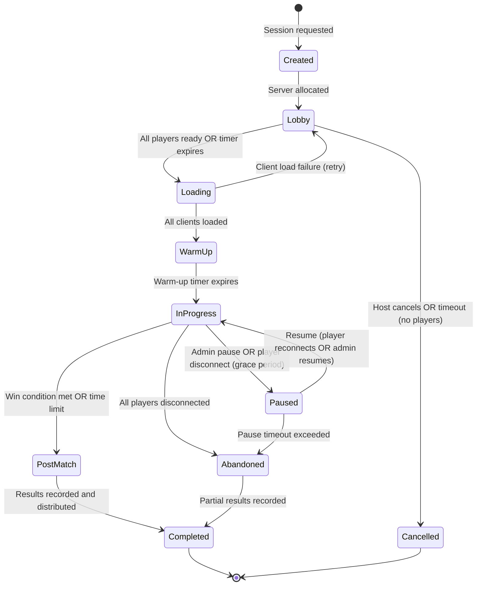

### Matchmaking Ticket Lifecycle

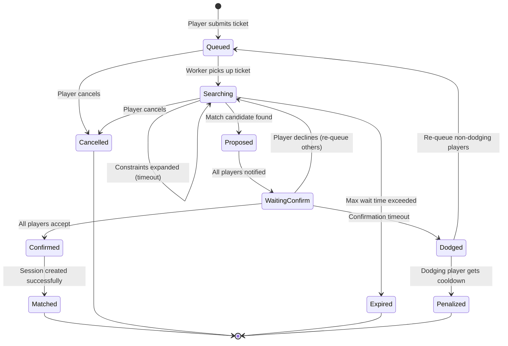

### Player Ban Lifecycle

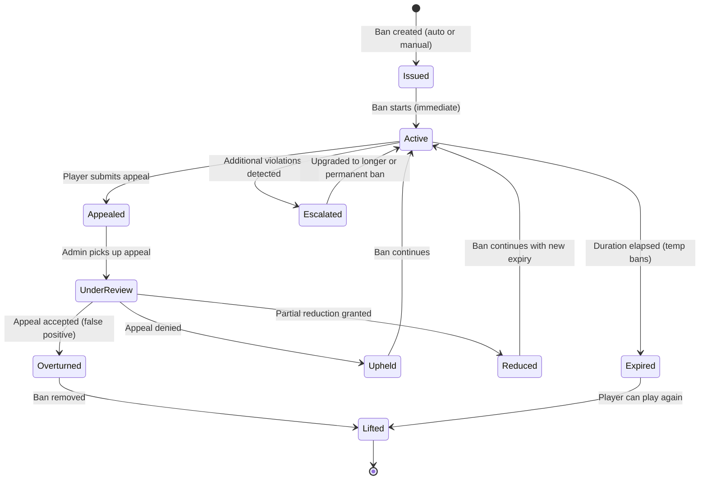

### Game Round Lifecycle

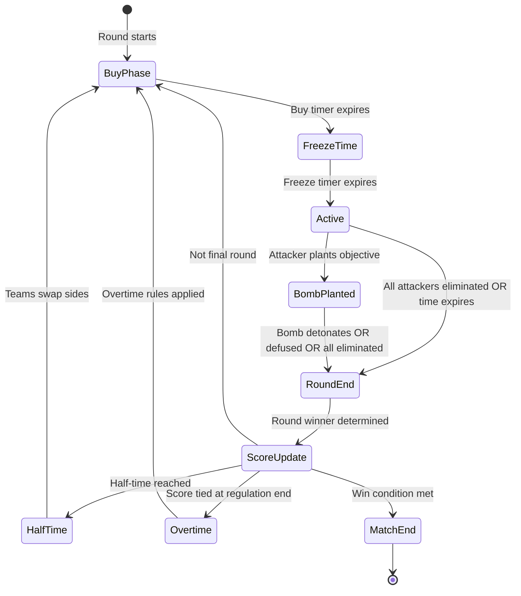

---

## Sequence Diagrams

### Multiplayer Game Tick Loop

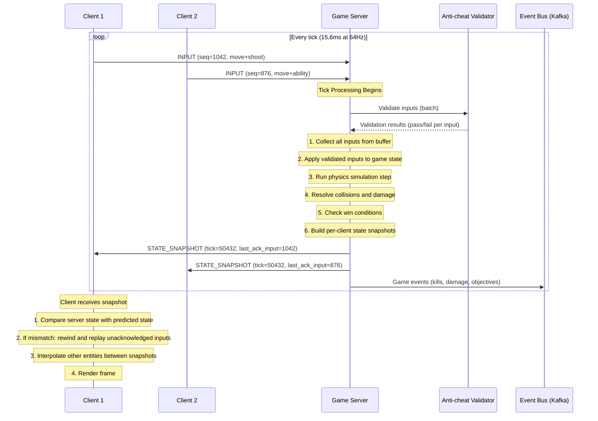

### Matchmaking Flow

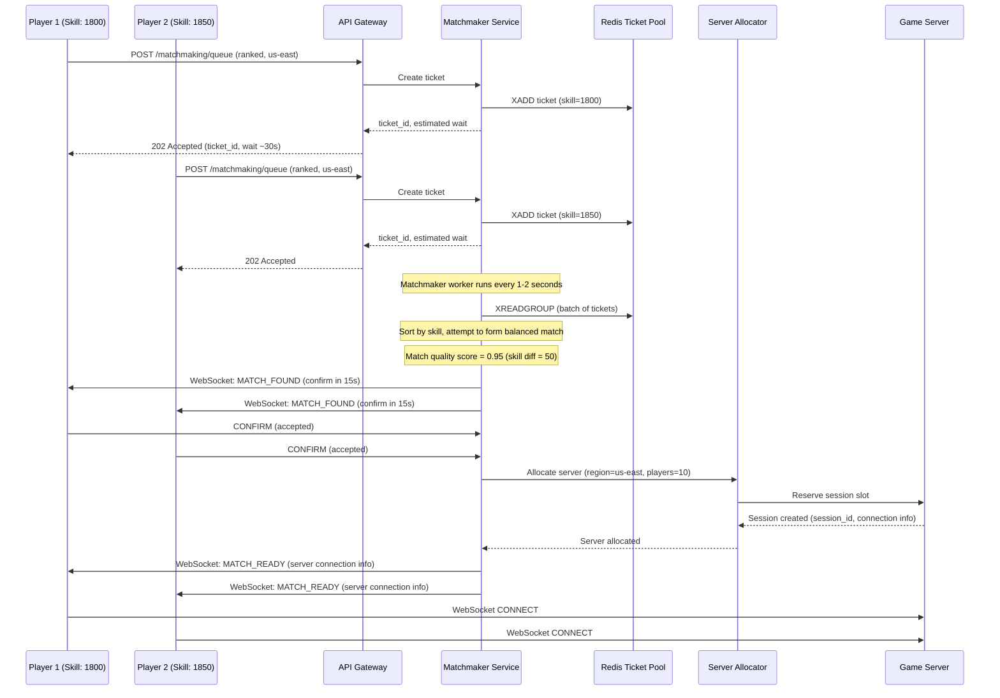

### Client-Server State Sync with Prediction

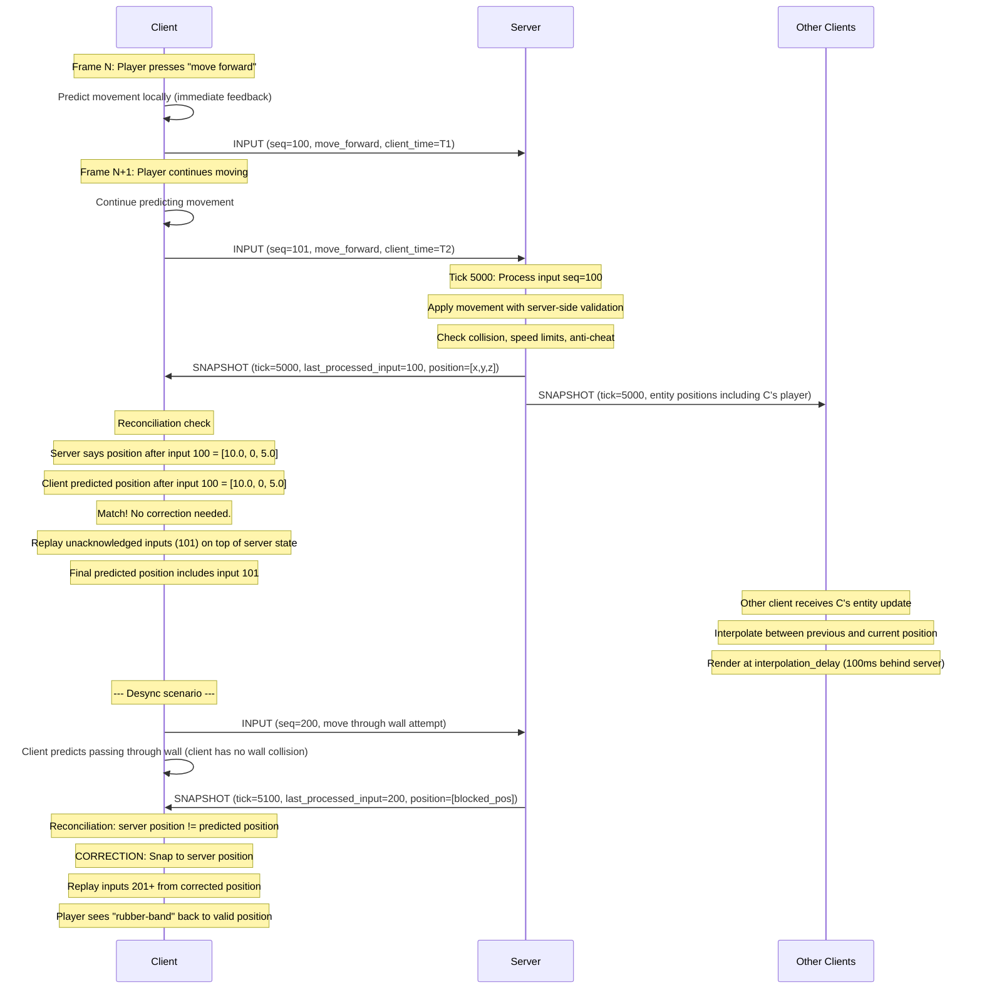

### Anti-cheat Detection Pipeline

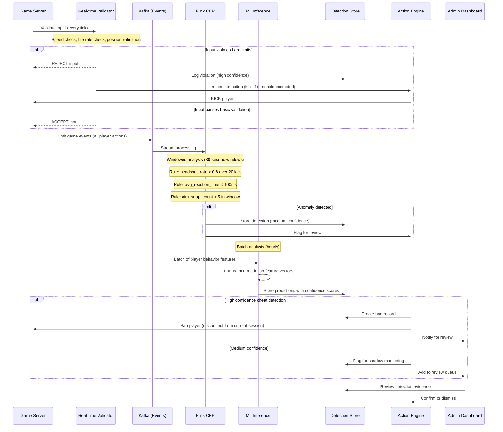

### Leaderboard Update Propagation

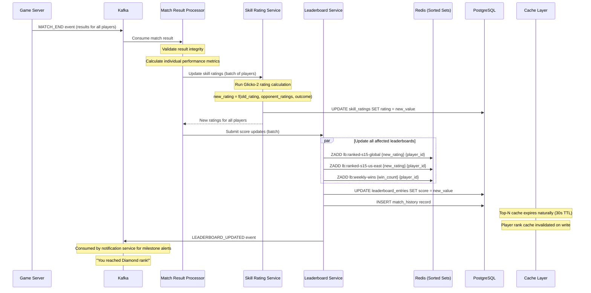

---

## Concurrency Control

### Game State: Lock-step vs Client Prediction

**Lock-step Model (Fighting games, RTS):**
- All clients send inputs; server waits for ALL inputs before advancing the tick
- Deterministic simulation means all clients compute identical state
- Latency equals the slowest player's round-trip time
- Any packet loss stalls all players
- Used in games where frame-perfect accuracy matters more than responsiveness

**Client Prediction Model (FPS, Battle Royale):**
- Server does not wait for all inputs; processes whatever is available each tick
- Client predicts its own movement/actions immediately
- Server sends authoritative state; client reconciles differences
- Late inputs are processed with lag compensation (rewind server state)
- Better responsiveness at the cost of occasional corrections (rubber-banding)

**Implementation Pattern:**

```
// Server-side: Non-blocking input processing
fn process_tick(tick_number: u64, game_state: &mut GameState) {
    let tick_deadline = current_time();

    // Collect all inputs received since last tick
    for player in game_state.players {
        let inputs = player.input_buffer.drain_up_to(tick_deadline);
        for input in inputs {
            // Validate input
            if anti_cheat.validate(&input, &game_state) {
                apply_input(&mut game_state, &input);
            }
            player.last_processed_input_seq = input.sequence;
        }

        // If no input received, use last known input (dead reckoning)
        if inputs.is_empty() {
            apply_last_input(&mut game_state, &player);
        }
    }

    // Physics step
    physics.simulate_step(&mut game_state, TICK_DURATION);

    // Resolve collisions, damage, etc.
    resolve_interactions(&mut game_state);

    // Build per-client snapshots
    for player in game_state.players {
        let snapshot = build_snapshot(&game_state, &player);
        player.connection.send(snapshot);
    }
}
```

### Leaderboard Atomic Updates with Redis ZADD

```
// Redis ZADD is atomic - no race condition on concurrent score updates
// Multiple match results arriving simultaneously for same player:

// Match 1 completes: player rating 1800 -> 1825
ZADD lb:ranked-s15-global 1825 player_uuid
// Returns 0 (updated existing member)

// Match 2 completes (from different session): player rating 1825 -> 1842
ZADD lb:ranked-s15-global 1842 player_uuid
// Returns 0 (updated again)

// Both writes are atomic. Final state is deterministic.
// The LAST write wins, which is correct because each score
// submission includes the absolute new rating, not a delta.

// For delta-based scoring (e.g., "add 50 kills"), use ZINCRBY:
ZINCRBY lb:daily-kills-20260322 50 player_uuid
// Atomic increment, safe for concurrent updates.

// For conditional updates (only update if higher score):
// Use ZADD with GT flag (Redis 6.2+):
ZADD lb:high-score-global GT 15000 player_uuid
// Only updates if 15000 > current score
```

### Matchmaking Race Conditions

**Problem 1: Double-booking a player**

A player could be assigned to two matches simultaneously if two matchmaker workers process overlapping ticket sets.

```
Solution: Redis-based ticket locking with SETNX

-- Before including a player in a match proposal:
SET mm:lock:{player_id} {worker_id} NX EX 10
-- If SET returns OK: player is locked to this worker
-- If SET returns nil: player already claimed by another worker

-- After match is confirmed or cancelled:
DEL mm:lock:{player_id}

-- Additional safety: ticket status in PostgreSQL uses optimistic locking
UPDATE matchmaking_tickets
SET status = 'proposed', updated_at = NOW()
WHERE ticket_id = :id AND status = 'queued'
RETURNING ticket_id;
-- If 0 rows affected: ticket was already claimed
```

**Problem 2: Ticket expiry during match formation**

A ticket might expire while the matchmaker is forming a match that includes it.

```
Solution: Two-phase matching
1. PROPOSE phase: Lock all tickets, check all are still valid
2. CONFIRM phase: Wait for player confirmations with timeout
3. COMMIT phase: Create session only after all confirmations
4. ROLLBACK: If any step fails, release all locks, re-queue valid tickets
```

**Problem 3: Server allocation race**

Two match formations might try to allocate the same game server simultaneously.

```
Solution: Atomic server slot reservation
-- Redis-based atomic decrement:
DECR server:{server_id}:available_slots
-- If result >= 0: reservation succeeded
-- If result < 0: no slots available, INCR to restore and try next server
INCR server:{server_id}:available_slots
```

---

## Idempotency

### Idempotent Score Submission

Score submissions from match results must be idempotent because the match result processor might retry on failure, or multiple consumers might process the same Kafka message.

```
Idempotency Key: {match_id}:{player_id}

Implementation:

-- PostgreSQL: Unique constraint prevents duplicate match history
CREATE UNIQUE INDEX idx_match_history_unique
    ON match_history(session_id, player_id);

-- Application layer:
fn submit_score(match_id, player_id, score):
    // Check if already processed
    existing = SELECT * FROM match_history
        WHERE session_id = match_id AND player_id = player_id;

    if existing:
        return existing;  // Already processed, return cached result

    // Process score update
    BEGIN TRANSACTION;
        INSERT INTO match_history (...) VALUES (...);
        UPDATE skill_ratings SET rating = new_rating
            WHERE player_id = :id AND game_mode = :mode;
        ZADD lb:ranked-s15-global new_rating player_id;
    COMMIT;

    return new_result;

-- Redis: Track processed idempotency keys with TTL
SET idempotent:score:{match_id}:{player_id} "processed" EX 86400
-- Check before processing: GET idempotent:score:{match_id}:{player_id}
```

### Idempotent Matchmaking Join

Players might double-tap the "Find Match" button or their client might retry on network timeout.

```
Idempotency Key: {player_id}:{game_mode}:{timestamp_bucket}

Implementation:
1. On queue entry, check for existing active ticket:
   SELECT * FROM matchmaking_tickets
   WHERE player_id = :id
     AND game_mode = :mode
     AND status IN ('queued', 'searching', 'proposed')

2. If active ticket exists: return existing ticket (idempotent response)

3. If no active ticket: create new ticket

4. Additional safety: Redis set tracks active player-mode pairs
   SADD mm:active:{game_mode} {player_id}
   -- On ticket completion/cancellation:
   SREM mm:active:{game_mode} {player_id}

5. API returns same ticket_id for duplicate requests within the same
   queue session, preventing duplicate entries in the matchmaking pool.
```

---

## Consistency Model

### Game State: Strong Consistency (Authoritative Server)

The game server is the single source of truth for all game state during an active session. This is non-negotiable for competitive games.

```
Consistency Model: Linearizable within a session

All game state mutations flow through the authoritative server:
    Client Input -> Server Validation -> State Update -> Broadcast

No client-to-client state sharing. Clients may predict locally,
but the server's state always wins in case of disagreement.

Why strong consistency:
- Damage calculations must be deterministic and fair
- Position data must be validated to prevent speed hacks
- Score and objective state must be authoritative
- Cheat prevention requires server-side truth

Trade-off: Added latency for player actions (1 round-trip)
Mitigation: Client-side prediction hides the latency for most actions
```

### Leaderboard: Eventual Consistency

Leaderboard data is eventually consistent, with different staleness windows for different read paths.

```
Consistency Model: Eventual consistency with bounded staleness

Write Path:
    Match Result -> Kafka -> Rating Calculator -> Redis ZADD + PostgreSQL UPDATE
    End-to-end latency: 2-5 seconds (acceptable)

Read Paths:
    Top-N cached view: up to 30 seconds stale (TTL-based cache)
    Player rank query: up to 5 seconds stale (near-real-time from Redis)
    Season-end snapshot: strongly consistent (point-in-time snapshot)

Why eventual consistency is acceptable:
- Leaderboards are informational, not transactional
- Players tolerate minor rank display delays
- The Redis sorted set converges quickly
- Season-end rewards are based on snapshots, not live data

Consistency guarantee: Each player's rating is updated at most once
per match (idempotency), and the Redis sorted set always reflects
the latest known rating.
```

### Matchmaking: Causal Consistency

Matchmaking requires causal consistency to prevent anomalies like matching a player who just left the queue.

```
Consistency Model: Causal consistency within a player's ticket lifecycle

Invariants:
1. A player can have at most one active ticket per game mode
2. A ticket's status transitions follow the state machine (no skips)
3. A cancelled ticket is never included in a match after cancellation
4. A matched ticket's session is always created before players are notified

Implementation:
- Ticket status changes are serialized through PostgreSQL row-level locks
- Matchmaker workers use optimistic concurrency (version checks) when
  claiming tickets
- Redis pub/sub ensures cancel messages propagate to workers quickly
- Match confirmation uses a distributed transaction pattern to ensure
  all-or-nothing match creation
```

---

## Distributed Transaction / Saga

### Match Completion Saga

When a match ends, multiple downstream systems must be updated consistently. This is implemented as a choreography-based saga with compensation handlers.

```
Match Completion Saga Steps:

Step 1: VALIDATE MATCH RESULT
    Action: Verify match result integrity (scores, timestamps, player list)
    Service: Match Result Processor
    Compensation: None (validation only)

Step 2: UPDATE PLAYER STATISTICS
    Action: Update player_stats table with match performance data
    Service: Player Stats Service
    Compensation: Rollback stat increments (subtract added values)

Step 3: CALCULATE AND UPDATE SKILL RATINGS
    Action: Run Glicko-2 calculation, update skill_ratings table
    Service: Skill Rating Service
    Compensation: Revert to previous rating values (stored in match_history)

Step 4: UPDATE LEADERBOARDS
    Action: ZADD to Redis sorted sets, UPDATE leaderboard_entries
    Service: Leaderboard Service
    Compensation: ZADD with previous score to revert rank

Step 5: DISTRIBUTE REWARDS
    Action: Grant XP, currency, items based on match performance
    Service: Rewards Service
    Compensation: Revoke granted rewards (mark as clawed back)

Step 6: RECORD REPLAY
    Action: Finalize replay file, store in S3, update match_history.replay_url
    Service: Replay Service
    Compensation: Delete replay file (idempotent)

Step 7: EMIT NOTIFICATIONS
    Action: Send rank change notifications, achievement unlocks
    Service: Notification Service
    Compensation: None (notifications are best-effort)
```

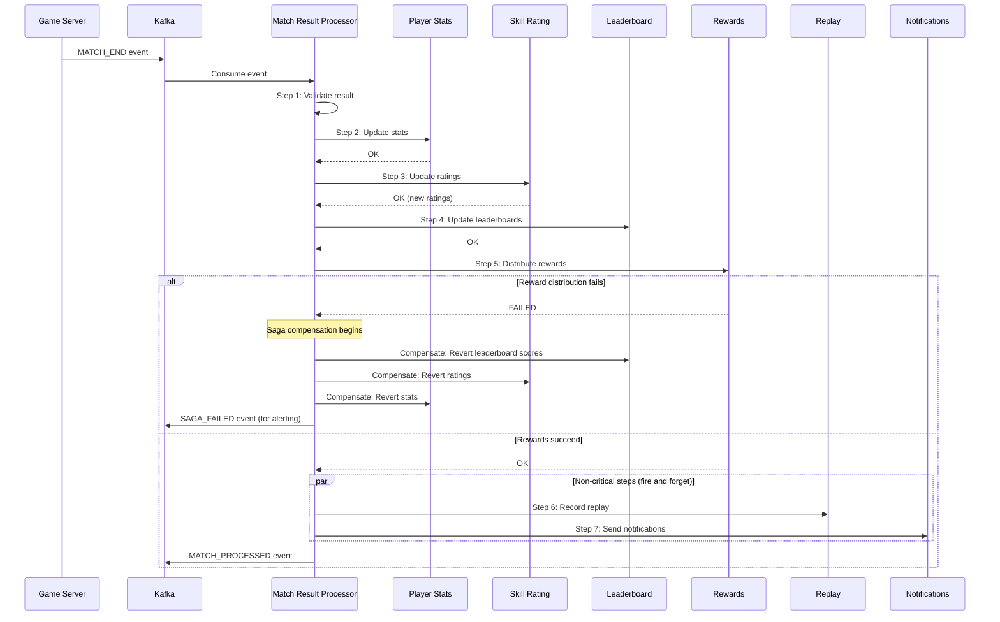

**Saga state tracking:**

```sql
CREATE TABLE saga_instances (
    saga_id             UUID PRIMARY KEY DEFAULT gen_random_uuid(),
    saga_type           VARCHAR(50) NOT NULL,            -- 'match_completion'
    correlation_id      UUID NOT NULL,                   -- match_id
    current_step        SMALLINT NOT NULL,
    status              VARCHAR(20) NOT NULL,            -- 'running','completed','compensating','failed'
    step_results        JSONB NOT NULL DEFAULT '[]',
    started_at          TIMESTAMPTZ NOT NULL DEFAULT NOW(),
    completed_at        TIMESTAMPTZ,
    retry_count         INTEGER NOT NULL DEFAULT 0,
    max_retries         INTEGER NOT NULL DEFAULT 3,
    error_message       TEXT
);

CREATE INDEX idx_saga_status ON saga_instances(status) WHERE status IN ('running', 'compensating');
CREATE INDEX idx_saga_correlation ON saga_instances(correlation_id);
```

---

## Security Design

### Packet Encryption

```
Transport Security:
- WebSocket connections use TLS 1.3 (wss://)
- Game server UDP traffic uses DTLS 1.3 for encryption
- Session-specific encryption keys derived during handshake
- Key rotation every 30 minutes within a session

Authentication Flow:
1. Client authenticates via REST API (JWT token)
2. JWT used to request a short-lived game session ticket (5 minutes)
3. Session ticket presented during WebSocket/UDP handshake
4. Server validates ticket, establishes encrypted channel
5. Per-session symmetric key derived via ECDH key exchange

Replay Attack Prevention:
- Each packet includes a monotonic sequence number
- Server tracks expected sequence range per client
- Duplicate or out-of-window sequence numbers are dropped
- Timestamp-based freshness check (reject packets > 5 seconds old)
```

### Server-side Validation

```
Every client input is validated before affecting game state:

Movement Validation:
- Delta position per tick <= max_speed * tick_duration * 1.1 (10% tolerance for float precision)
- Position must not intersect solid geometry (collision check)
- No teleportation (position delta continuity check)

Action Validation:
- Fire rate does not exceed weapon's maximum rate
- Ability cooldowns are respected
- Ammunition count is server-tracked
- Item usage requires item ownership (server-side inventory)

Economic Validation:
- All transactions (buy, sell, trade) are server-authoritative
- Currency balances are server-side only
- Item generation only through authorized game events
- No client-initiated item creation or duplication

Anti-tampering:
- Client sends only inputs, never state modifications
- Game state is never directly writable by clients
- Entity positions, health, inventory are server-owned
- Client "suggestions" (e.g., "I picked up item X") are validated against proximity
```

### Replay System for Dispute Resolution

```
Replay Capabilities:
- Full input recording at server tick rate
- Deterministic replay: given same inputs + same random seed = same outcome
- Annotated timeline: kills, objectives, suspicious events are bookmarked
- Slow-motion analysis: replay at 0.25x speed with frame-by-frame advance
- Multi-perspective: view any player's perspective during replay
- Overlay data: show hit registration, damage numbers, network stats

Dispute Resolution Workflow:
1. Player submits report with tick range
2. System loads replay for the specified session
3. Automated analyzer runs on the flagged tick range
4. Results queued for human review if confidence < 95%
5. Admin reviews replay with overlay tooling
6. Decision: dismiss, warn, ban (with evidence)
7. Affected matches can be retroactively invalidated

Integrity:
- Replays are stored immutably (write-once to S3)
- SHA-256 hash of replay stored in match_history for tamper detection
- Replay includes server version and patch for accurate reconstruction
```

### DDoS Protection for Game Servers

```
Defense in Depth:

Layer 1: Network Edge (Cloud Provider)
- AWS Shield Advanced / GCP Cloud Armor / Cloudflare Spectrum
- Volumetric attack mitigation (absorb up to 1 Tbps)
- SYN flood protection
- DNS amplification filtering

Layer 2: Game Server Network
- Dedicated anti-DDoS appliances for UDP traffic
- Rate limiting per source IP (max packets/sec)
- Geographic filtering (block traffic from unexpected regions)
- Protocol validation (drop malformed game packets early)

Layer 3: Application Level
- Per-player packet rate limiting (max 128 packets/sec from one client)
- Connection authentication required before processing game traffic
- IP reputation scoring (block known botnet IPs)
- Automatic server migration: move active session to a new IP if under attack

Layer 4: Architecture
- Game server IPs are not directly exposed to players
- Traffic routed through relay/proxy layer
- Session-specific relay addresses (attacker cannot predict server IP)
- Relay addresses rotate if compromised

Incident Response:
- Automated detection: traffic spike > 10x normal for server
- Automatic mitigation: engage upstream scrubbing
- Automatic failover: migrate sessions to unaffected servers
- Alert on-call team for manual investigation
```

---

## Observability

### Tick Rate Monitoring

```
Metrics:
- server.tick.duration_ms (histogram)
    Target: < 15.6ms for 64Hz tick rate
    Alert: p99 > 14ms (approaching budget)
    Critical: p99 > 15.6ms (tick overrun, simulation slowing down)

- server.tick.overrun_count (counter)
    Number of ticks that exceeded budget
    Alert: > 0 per minute

- server.tick.entity_count (gauge)
    Entities processed per tick
    Used for capacity planning

- server.tick.input_queue_depth (gauge)
    Unprocessed inputs waiting in buffer
    Alert: > 100 per player (input processing falling behind)

Dashboard Layout:
    ┌──────────────────────────────────────────────┐
    │  Tick Duration (p50, p95, p99) - Time Series  │
    ├──────────────────────────────────────────────┤
    │  Tick Overruns - Bar Chart (per minute)       │
    ├──────────────────────────────────────────────┤
    │  Entity Count vs Tick Duration - Scatter      │
    ├──────────────────────────────────────────────┤
    │  Input Queue Depth - Per Server Heatmap       │
    └──────────────────────────────────────────────┘
```

### Latency Heatmaps

```
Metrics:
- client.rtt_ms (histogram, per region, per server)
    Buckets: [5, 10, 20, 30, 50, 75, 100, 150, 200, 300, 500]

- client.packet_loss_pct (histogram)
    Buckets: [0, 0.1, 0.5, 1.0, 2.0, 5.0, 10.0]

- client.jitter_ms (histogram)
    Buckets: [1, 2, 5, 10, 20, 50, 100]

Heatmap Dimensions:
    X-axis: Time (5-minute buckets)
    Y-axis: Latency bucket
    Color intensity: Number of clients in that bucket

Regional Breakdown:
    Separate heatmap per region
    Cross-region latency matrix (region-to-region RTT)

Alerts:
    - p95 RTT > 100ms for any region: warn
    - p95 RTT > 200ms for any region: critical
    - Packet loss p95 > 2%: warn
    - Packet loss p95 > 5%: critical (unplayable)
```

### Matchmaking Wait Time Metrics

```
Metrics:
- matchmaking.wait_time_seconds (histogram, per mode, per region, per skill bracket)
    Buckets: [5, 10, 15, 30, 45, 60, 90, 120, 180, 300]

- matchmaking.queue_depth (gauge, per mode, per region)
    Current number of players waiting

- matchmaking.match_quality_score (histogram)
    Buckets: [0.5, 0.6, 0.7, 0.8, 0.85, 0.9, 0.95, 0.98, 1.0]

- matchmaking.expansion_level (histogram)
    How many times constraints were widened before match formed
    Buckets: [0, 1, 2, 3, 4, 5]

- matchmaking.dodge_rate (gauge)
    Percentage of proposed matches declined by players

- matchmaking.matches_per_second (counter)
    Throughput of match formation

Alerts:
    - p50 wait time > 60s: warn (may need queue pool expansion)
    - p95 wait time > 180s: critical (players are leaving)
    - Match quality p50 < 0.8: warn (constraints too loose)
    - Dodge rate > 10%: investigate (bad match quality or toxic meta)
```

### Cheat Detection Rates

```
Metrics:
- anticheat.detections_per_hour (counter, by detection_type)
    Track detection volume per category

- anticheat.confidence_distribution (histogram)
    Distribution of detection confidence scores

- anticheat.false_positive_rate (gauge)
    Detections overturned during review / total detections
    Target: < 1%
    Alert: > 2% (model needs retraining)

- anticheat.ban_rate (counter)
    Bans issued per hour (auto + manual)

- anticheat.appeal_rate (gauge)
    Appeals submitted / bans issued
    Alert: > 20% (too many bans, possible false positive spike)

- anticheat.detection_latency_seconds (histogram)
    Time from suspicious event to detection flag

- anticheat.review_queue_depth (gauge)
    Pending manual reviews
    Alert: > 1000 (review team needs scaling)

Dashboard:
    ┌──────────────────────────────────────────────┐
    │  Detection Volume by Type - Stacked Area      │
    ├──────────────────────────────────────────────┤
    │  False Positive Rate - Time Series            │
    ├──────────────────────────────────────────────┤
    │  Confidence Distribution - Histogram          │
    ├──────────────────────────────────────────────┤
    │  Ban/Appeal Funnel - Sankey Diagram           │
    └──────────────────────────────────────────────┘
```

---

## Reliability and Resilience

### Game Server Failover

```
Scenario: A game server process crashes mid-match.

Detection:
- Health check: game server sends heartbeat every 5 seconds
- Missing 3 consecutive heartbeats = declared dead (15 seconds)
- Clients detect disconnect and begin reconnection attempts

Recovery Strategy (Ranked/Competitive):
1. Orchestrator detects dead server
2. Allocate new server in same region
3. Load last checkpoint from Redis (state:{session_id}:latest)
4. New server initializes with checkpoint state
5. Clients reconnect to new server via session discovery service
6. New server sends full state snapshot to reconnecting clients
7. Match resumes from checkpoint (lost ticks: ~15 seconds)

Recovery Strategy (Casual):
1. Match is marked as abandoned
2. No rating changes applied (match nullified)
3. Players returned to lobby

State Checkpointing:
- Game server writes compressed state to Redis every 5 seconds
- Checkpoint includes: tick number, all entity state, score, round info
- Redis key TTL: 1 hour (covers match duration)
- Checkpoint size: ~50 KB per session (compressed)

Limitations:
- ~15 seconds of game state is lost on crash
- Players experience a brief interruption
- Network state (who was shooting, mid-air projectiles) may be inconsistent
- Acceptable trade-off vs cost of full replication
```

### Matchmaking Service Resilience

```
Failure Modes and Mitigations:

1. Matchmaker Worker Crash
   - Workers are stateless; Kafka consumer group rebalances
   - Unacknowledged tickets are reprocessed by surviving workers
   - No ticket loss due to Kafka's at-least-once delivery

2. Redis Ticket Pool Unavailable
   - Fallback: queue tickets in Kafka with longer processing delay
   - Players see increased wait times but can still queue
   - Circuit breaker prevents cascading failures

3. Match Confirmation Timeout
   - If a player doesn't confirm within 15 seconds: mark as dodge
   - Re-queue all other players with priority boost (front of queue)
   - Dodging player receives queue cooldown

4. Server Allocator Failure
   - Retry with exponential backoff (3 attempts)
   - On persistent failure: dissolve match, re-queue all players
   - Players notified: "Server unavailable, searching again..."

5. Cascading Match Failures
   - Circuit breaker on match formation rate
   - If > 50% of matches fail to start in 5 minutes: pause matchmaking
   - Display maintenance message to players
   - Alert on-call team

Health Check Endpoints:
    GET /health/live   -> 200 (process alive)
    GET /health/ready  -> 200 (can accept tickets)
    GET /health/deep   -> 200 (Redis + Kafka + PostgreSQL all accessible)
```

### Leaderboard Cache Rebuild

```
Scenario: Redis sorted set is lost (node failure, eviction, corruption)

Rebuild Strategy:

Step 1: Detect
    - Monitoring alert: ZCARD returns 0 or key missing
    - Heartbeat check: periodic ZCARD comparison with expected count

Step 2: Serve from PostgreSQL (degraded mode)
    - Top-N queries hit PostgreSQL (slower but functional)
    - Player rank queries return "calculating..." with stale data
    - Response headers include: X-Leaderboard-Degraded: true

Step 3: Rebuild from PostgreSQL
    -- Batch load all entries
    SELECT player_id, score
    FROM leaderboard_entries
    WHERE leaderboard_id = :id
    ORDER BY score DESC;

    -- Pipeline ZADD commands in batches of 1000
    PIPELINE:
        ZADD lb:ranked-s15-global score1 player1
        ZADD lb:ranked-s15-global score2 player2
        ... (1000 entries per batch)
    EXEC

    -- For 50M entries at 1000/batch = 50,000 pipeline calls
    -- At ~1ms per pipeline = ~50 seconds total rebuild time

Step 4: Verify
    - Compare ZCARD with PostgreSQL count
    - Spot-check: verify top 100 entries match between Redis and PostgreSQL
    - Flip traffic back to Redis

Step 5: Prevent
    - Redis persistence: RDB snapshots every 5 minutes + AOF
    - Redis Cluster with 1 replica per primary
    - Automated failover via Redis Sentinel
```

---

## Multi-Region Architecture

### Regional Game Servers

```
Architecture:
    Each major region runs its own fleet of game servers.
    Players connect to the nearest regional fleet.

    ┌─────────────────────────────────────────────────────┐
    │                    Global Services                   │
    │  (Account, Matchmaking Coordinator, Leaderboards)   │
    └────────────────────┬────────────────────────────────┘
                         │
         ┌───────────────┼───────────────┐
         │               │               │
    ┌────▼────┐    ┌─────▼────┐    ┌─────▼────┐
    │ US-East │    │ EU-West  │    │ AP-SE    │
    │ Fleet   │    │ Fleet    │    │ Fleet    │
    │ 2000    │    │ 1500     │    │ 800      │
    │ servers │    │ servers  │    │ servers  │
    └─────────┘    └──────────┘    └──────────┘

Regional Fleet Management:
- Auto-scaling based on time-of-day player patterns
- US-East peaks at ~8PM EST, EU-West at ~8PM CET, AP-SE at ~8PM JST
- Pre-warming: scale up 30 minutes before expected peak
- Scale-down: drain sessions gracefully, scale down during off-peak

Server Placement:
- AWS: us-east-1, eu-west-1, ap-southeast-1
- GCP: us-central1, europe-west1, asia-east1
- Bare metal in major PoPs for lowest latency (< 10ms for local players)

Region Selection:
- Player's region is auto-detected from IP geolocation
- Player can override region preference
- Matchmaking considers cross-region play when pool is too small
```

### Global Leaderboards

```
Architecture: Each region writes to regional leaderboard, global
leaderboard aggregates.

Write Path:
    Match completes in US-East
    -> US-East leaderboard service updates regional Redis
    -> Publishes SCORE_UPDATED event to Kafka
    -> Global aggregator consumes event
    -> Updates global Redis sorted set

Read Path:
    Player requests global leaderboard
    -> Read from global Redis sorted set
    -> If global unavailable: fan-out to all regional sets and merge

Consistency:
    Regional leaderboards: immediately consistent after write
    Global leaderboard: eventually consistent (2-5 second lag)
    Season-end: quiesce all writes, take consistent snapshot

Conflict Resolution:
    Global leaderboard uses latest-write-wins with player_id as member
    Each score update includes the absolute rating (not delta)
    Concurrent updates from different regions resolve naturally
```

### Cross-Region Matchmaking

```
Strategy: Prefer same-region matches; allow cross-region with consent

Tier 1: Same region (latency < 50ms)
    - Default search scope
    - 80% of matches formed here

Tier 2: Adjacent regions (latency < 100ms)
    - Activated after 60 seconds of queue time
    - Example: US-East players can match with US-West
    - Players notified of expected latency

Tier 3: Cross-continent (latency < 200ms)
    - Activated after 120 seconds of queue time
    - Only with player consent (opt-in setting)
    - Game is hosted in the region closest to the center of the player set

Server Selection for Cross-Region:
    Given players in US-East and EU-West:
    1. Calculate centroid of player locations
    2. Select server region minimizing maximum latency across all players
    3. Often US-East if majority are US, or EU-West if majority are EU
    4. If balanced: select region with lower average latency

Party Restrictions:
    - Parties with members in different regions auto-enter cross-region mode
    - Warning shown: "Players in different regions may experience higher latency"
    - Competitive modes may restrict cross-continent parties
```

---

## Cost Drivers

### Game Server Compute Costs

```
Bare Metal vs Cloud:

Bare Metal:
    - Cost: ~$0.02 per player-hour at scale
    - Pros: Lowest latency, best performance per dollar, predictable pricing
    - Cons: Long provisioning (weeks), no auto-scaling, capacity management burden
    - Best for: Steady baseline load, performance-critical competitive servers
    - Example: Riot Games runs own data centers for League of Legends

Cloud (AWS GameLift / GCP Agones / Azure PlayFab):
    - Cost: ~$0.05-0.08 per player-hour
    - Pros: Instant scaling, managed fleet, global regions, pay-per-use
    - Cons: 2-4x more expensive than bare metal, variable performance
    - Best for: Spike handling, new game launches, smaller studios
    - Example: Fortnite uses AWS for scaling during events

Hybrid Strategy:
    - Bare metal for baseline (handles 60% of peak capacity)
    - Cloud burst for peaks (handles remaining 40%)
    - Cost savings: ~40% vs pure cloud at scale

Cost Breakdown (10M CCU game):
    ┌─────────────────────────────────────┐
    │ Game Servers (compute)    65%       │
    │ Bandwidth                 15%       │
    │ Storage (replays, logs)   8%        │
    │ Anti-cheat ML inference   5%        │
    │ Databases (PG, Redis)     4%        │
    │ Matchmaking + APIs        3%        │
    └─────────────────────────────────────┘
```

### Bandwidth Costs

```
Major Cost Factor: State snapshot delivery

At 10M CCU:
    Outbound: ~1.28 TB/s = ~110 PB/day
    At $0.05/GB (cloud egress): $5.5M/day (!!)

Mitigation Strategies:
1. Delta compression: Send only changed fields (70-90% bandwidth reduction)
2. Interest management: Only send visible entities (50-80% reduction)
3. Quantization: Reduce precision of position/rotation data (20-30% reduction)
4. Bare metal + peering: Direct peering agreements at major IXPs
5. Regional edge servers: Minimize cross-region traffic

Realistic cost with optimizations:
    Effective outbound: ~50 GB/s (after compression and interest management)
    Monthly: ~130 PB
    With peering/bare metal: ~$0.01/GB = ~$1.3M/month

Voice chat bandwidth:
    2M concurrent voice users * 32 Kbps = 64 Gbps
    Monthly: ~20 PB
    Cost: ~$200K/month with TURN relay optimization
```

### Anti-cheat ML Inference Costs

```
Real-time inference (per-tick validation):
    - Simple rule-based checks: negligible (runs on game server CPU)
    - No GPU needed for basic validation

Near-real-time ML inference (Flink streaming):
    - Model: Lightweight neural network (behavior classification)
    - Inference: 1000 classifications/sec per GPU
    - Needed: 5000 classifications/sec at peak
    - GPUs needed: 5 (e.g., NVIDIA T4)
    - Monthly cost: 5 * $500 = $2,500/month (cloud GPU instances)

Batch replay analysis:
    - Model: Larger vision/sequence model for replay review
    - Inference: 2 replays/minute per GPU
    - Volume: ~5000 replays flagged for analysis per day
    - GPUs needed: 2 (processing 16 hours/day)
    - Monthly cost: 2 * $2000 = $4,000/month

Total anti-cheat ML cost: ~$7,000/month
(Tiny compared to game server compute costs)

Alternative: Outsource to anti-cheat providers
    - Easy Anti-Cheat (Epic): per-seat licensing
    - BattlEye: per-seat licensing
    - Costs vary: $0.01-0.05 per player per month
    - At 50M total players: $500K-$2.5M/month
    - Trade-off: less customization, dependency on third party
```

---

## Deep Platform Comparisons

### Architecture Comparison: Major Studios

| Aspect | Fortnite (Epic) | Riot Games (League) | Valve (CS2/Dota) | Blizzard (OW2) | Supercell (Clash) |
|--------|-----------------|--------------------|--------------------|-----------------|-------------------|
| Server Model | Dedicated servers (AWS GameLift) | Dedicated servers (own DCs + cloud) | Dedicated servers (own DCs) | Dedicated servers (cloud) | Authoritative server (custom) |
| Tick Rate | 30 Hz (Battle Royale) | 30 Hz (MOBA) | 64-128 Hz (FPS) | 63 Hz (FPS) | 10-20 Hz (mobile strategy) |
| Netcode | Client prediction + server rewind | Lock-step with input delay | Client prediction + lag compensation | Client prediction + favor-the-shooter | Turn-based with real-time elements |
| Max Players/Session | 100 (BR), 8-16 (other) | 10 | 10 (CS), 10 (Dota) | 10 | 2-50 (varies by mode) |
| Matchmaking | Custom skill system (Arena Hype) | Custom (MMR + LP system) | Glicko-2 (CS Rating), custom (Dota) | Custom (SR/MMR) | Trophies + card levels |
| Anti-cheat | Easy Anti-Cheat (owned by Epic) | Vanguard (custom kernel-level) | VAC + Overwatch (community review) | Custom server-side | Server-authoritative (mobile) |
| Scale | 80M+ monthly players | 150M+ monthly players | 30M+ monthly players (CS2) | 25M+ monthly players | 100M+ daily players |
| Infrastructure | AWS-primary, multi-region | Own DCs + AWS/GCP hybrid | Own DCs + Valve hardware | Cloud-first (multiple providers) | Google Cloud primary |
| Replay System | Full replay with spectator cam | Replay files + spectator | GOTV (in-game spectator) + demos | Replay codes + Play of the Game | Battle replays (limited) |

### Backend Platform Comparison

| Feature | PlayFab (Microsoft) | GameLift (AWS) | Photon (Exit Games) | Custom (self-built) |
|---------|--------------------|-----------------|--------------------|---------------------|
| Server Hosting | Managed multiplayer servers | Fleet management + scaling | Photon Cloud (managed) | Self-managed (K8s, bare metal) |
| Matchmaking | FlexMatch (rules-based) | FlexMatch integration | Built-in matchmaking | Custom implementation |
| Leaderboards | Built-in leaderboard API | None (build yourself) | None (build yourself) | Custom Redis + PostgreSQL |
| Player Data | Entity system (key-value) | None (bring your own DB) | Custom properties | Custom database design |
| Anti-cheat | PlayFab abuse detection | None | None | Custom or third-party (EAC, BattlEye) |
| Real-time | Azure SignalR + custom | UDP/TCP fleet | Photon Realtime (UDP) | Custom WebSocket/UDP |
| Pricing | Per-API-call + hosting | EC2 instances + data | CCU-based | Infrastructure cost only |
| Lock-in | High (Microsoft ecosystem) | Medium (AWS services) | Medium (Photon protocol) | None |
| Best For | Full-stack game backend | Scaling dedicated servers | Real-time multiplayer | Large studios, custom needs |

### Engine Backend Integration

| Aspect | Unity Gaming Services | Unreal Engine (Epic Online Services) |
|--------|----------------------|--------------------------------------|
| Matchmaking | Unity Matchmaker (managed) | EOS Matchmaking + GameLift integration |
| Lobbies | Unity Lobby (REST API) | EOS Lobby (P2P or dedicated) |
| Relay/Transport | Unity Relay (NAT traversal) | EOS P2P + dedicated server support |
| Player Auth | Unity Authentication (multi-platform) | EOS Connect (cross-platform) |
| Leaderboards | Unity Leaderboards (managed) | EOS Leaderboards + Stats |
| Anti-cheat | None built-in | Easy Anti-Cheat (bundled) |
| Voice Chat | Vivox (Unity acquired) | EOS Voice |
| Analytics | Unity Analytics | None (third-party) |
| Pricing | Usage-based (CCU + API calls) | Free (cross-platform services) |
| Flexibility | Opinionated, managed | More flexible, some self-hosting |

---

## Edge Cases

### Player Disconnect Mid-Match

```
Scenario: Player loses internet connection during a ranked match.

Detection:
- Server stops receiving inputs from player
- 3 missed heartbeats (3 seconds) = connection timeout

Handling:
1. Mark player status as "disconnected" in session
2. Start grace period timer (60-120 seconds for ranked)
3. Player's character enters "AFK" state (stationary, invulnerable or auto-controlled)
4. Notify other players: "Player X disconnected"

If player reconnects within grace period:
    - Send full state snapshot
    - Resume normal play
    - No rating penalty

If grace period expires:
    - Player is removed from session
    - Match continues as N-1
    - Disconnected player receives a loss + minor rating penalty
    - Remaining players may receive adjusted rating change

Edge case: Player disconnects during final kill-cam
    - Match result already determined; apply results normally
    - Disconnected player still receives rewards/rating change

Edge case: Multiple players disconnect simultaneously
    - If > 50% of a team disconnects: offer safe-to-leave to remaining
    - If > 80% of all players disconnect: likely server issue, nullify match
```

### Server Crash During Ranked Game

```
Scenario: Game server process segfaults during a ranked match.

Detection:
- Orchestrator heartbeat timeout (15 seconds)
- All clients disconnect simultaneously

Handling Strategy (attempt recovery):
1. Orchestrator detects server failure
2. Check Redis for latest state checkpoint
3. If checkpoint exists and is < 30 seconds old:
   a. Allocate new server in same region
   b. Restore from checkpoint
   c. Clients auto-reconnect via session discovery
   d. Resume match from checkpoint
4. If checkpoint is stale or missing:
   a. Match is nullified (no rating change)
   b. All players returned to lobby
   c. Players receive "match cancelled" notification

Rating Protection:
- If crash occurs < 2 minutes into match: full nullification
- If crash occurs > 50% through match: partial results based on
  last known score (winner gets reduced gains, loser gets no loss)
- If crash is server-side (not client DoS): no penalties for anyone

Root Cause Tracking:
- Core dump collected from crashed server
- Game events up to crash point analyzed
- Session flagged in monitoring for post-mortem
```

### Leaderboard Tie-breaking

```
Scenario: Two players have identical scores on the leaderboard.

Tie-breaking Hierarchy:
1. Primary score (e.g., rating of 2500.00)
2. Secondary metric (e.g., total wins)
3. Tertiary metric (e.g., win rate)
4. Time of achievement (earlier = higher rank)

Redis Implementation:
- Store composite score in sorted set:
  score = primary_score * 1_000_000 + secondary_score * 1_000 + (MAX_TIMESTAMP - timestamp)
- This ensures that for identical primary scores, the player who achieved it
  first or has a better secondary metric ranks higher

Example:
  Player A: rating 2500, 200 wins, achieved at T=1000
  Player B: rating 2500, 180 wins, achieved at T=900

  Score A = 2500 * 1_000_000 + 200 * 1_000 + (9999999 - 1000) = 2_500_200_998_999
  Score B = 2500 * 1_000_000 + 180 * 1_000 + (9999999 - 900)  = 2_500_180_999_099

  Player A ranks higher (more wins despite later achievement).

Edge case: Thousands of players at same rating
- In lower tiers, thousands of players may share the same rating
- Display as "Rank ~50,000" with a note "tied with 2,341 other players"
- Detailed ranking uses secondary metrics for anyone who inspects
```

### Matchmaking with Extreme Skill Disparity

```
Scenario: A Grandmaster-tier player and a Bronze-tier player queue together as a party.

Problem: No single match can be fair for both.

Strategies:
1. Party-averaged MMR: match at the average (unfair to opponents)
2. Highest-MMR matching: match at the Grandmaster level (Bronze player gets stomped)
3. Restricted queuing: block parties with skill range > threshold

Common Solution (Riot/Blizzard approach):
- Ranked modes: restrict party skill range
  "Cannot queue ranked together: skill difference too large"
  Threshold: ~2 tiers apart (e.g., Gold with Diamond = blocked)

- Casual modes: match at weighted average (weight toward higher player)
  effective_mmr = 0.3 * low_player + 0.7 * high_player
  This slightly favors the opponents to compensate

- Custom/Unranked: no restrictions, match at average

Edge case: Smurfing to bypass restrictions
- Player creates alt account at Bronze to queue with Bronze friend
- Detection: new account with abnormally high performance
- Mitigation: accelerated placement (detect skill within 5-10 games)
- New accounts face higher uncertainty in matchmaking (wider initial search)
```

### Anti-cheat False Positive on Pro Player

```
Scenario: Automated anti-cheat flags a professional player during a tournament
because their aim patterns exceed statistical thresholds.

Problem: False ban on a pro player during a streamed event is catastrophic for trust.

Prevention Layers:
1. Pro player whitelist: known competitive players have elevated thresholds
   - Not immunity, but higher confidence requirement (0.99 vs 0.90)
   - All detections still logged but auto-ban is suppressed

2. Tournament mode: separate anti-cheat configuration
   - LAN events: hardware inspected before play, different detection rules
   - Online tournaments: human reviewer must confirm before any action

3. Human-in-the-loop for high-profile detections
   - Detection confidence > 0.95 on whitelisted player: alert to senior reviewer
   - 1-hour SLA for tournament situations
   - No automated action taken during live competition

4. Appeal fast-track
   - Pro player bans get priority appeal queue
   - Hardware inspection + replay review within 24 hours
   - Public statement if ban was a false positive

Root Cause Analysis:
- Pro players genuinely have superhuman reaction times and aim
- Statistical models trained on average player population
- Need separate reference distributions for top-tier players
- Regularly update training data with verified pro play samples
```

### DDoS on Game Server During Tournament

```
Scenario: Attackers DDoS a specific game server during a major esports match.

Immediate Response (automated, < 30 seconds):
1. Traffic spike detected (> 10x normal for server)
2. Upstream scrubbing enabled (cloud provider DDoS protection)
3. Server IP is rotated (traffic redirected to new IP via relay)
4. Active sessions migrate to new server using checkpoint restore
5. Players experience brief lag spike but match continues

Tournament-specific Protections:
1. Tournament servers use hidden IPs (relay-only access)
2. Multiple standby servers pre-allocated in same region
3. Dedicated bandwidth allocation (not shared with public servers)
4. Network engineering team on standby during major events
5. Alternate server in different datacenter ready for instant failover

If Migration Fails:
1. Match paused (tournament admin approval)
2. Restore from last checkpoint on completely new infrastructure
3. Match resumes after verification
4. If restoration impossible: schedule rematch

Post-incident:
1. Trace attack source (work with ISP/cloud provider)
2. Update IP rotation strategy
3. Review relay layer for leaked server IPs
4. Legal action if attacker identified
```

### Desync Between Clients

```
Scenario: Two clients see different game states (one player sees a kill,
the other sees a miss).

Causes:
1. Lag compensation disagreement (shooter's view vs victim's view)
2. Dropped packets causing missed state updates
3. Client-side prediction divergence exceeding reconciliation limits
4. Physics engine floating-point non-determinism across platforms

Detection:
- State checksum mismatch between client and server
- Player reports of "I clearly hit them but no damage registered"
- Automated desync detection: client sends periodic state hash to server

Resolution Hierarchy:
1. Server is always authoritative (by design)
2. Kill credit goes to the server-side simulation result
3. Lag compensation rewinds server to validate hits at the shooter's perceived time
4. If still ambiguous: favor the shooter (most games use "favor the shooter" policy)

Mitigation:
- Increase tick rate (reduces time between state corrections)
- Tighter interpolation delay (less visual divergence from server state)
- Deterministic physics (use fixed-point math instead of floating-point)
- Send full state snapshots periodically (not just deltas) as consistency anchors

Player Communication:
- Kill feed and damage numbers always reflect server state
- Death screen shows "killed by X" based on server data, not client data
- Replay system shows server-side truth for dispute resolution
```

### Lag Compensation (Hit Registration)

```
Scenario: Player A has 20ms ping, Player B has 150ms ping.
Player B sees Player A, shoots, and aims perfectly.
On the server, Player A has already moved behind cover.

Lag Compensation Solution:
1. When Player B's shot input arrives at server:
   a. Note the client timestamp on the input
   b. Calculate how far back in time to rewind: ~150ms
   c. Rewind server state to tick at (current - 150ms)
   d. Check if shot would have hit Player A at that historical position
   e. If yes: register the hit (Player A takes damage)
   f. If no: miss (Player A is genuinely behind cover)

Trade-off: "Peeker's advantage"
- Player B (high ping) can shoot Player A from around a corner
  before Player A even sees Player B appear on their screen
- This is inherent to lag compensation and cannot be fully eliminated
- Mitigation: cap rewind window (e.g., max 200ms rewind)
  Players with > 200ms ping cannot benefit from full lag compensation

Implementation (Valve-style):
- Server maintains a buffer of last N ticks of entity positions
- On shot verification: lerp entity positions at the shooter's perceived time
- Apply hit detection against rewound hitboxes
- Apply damage to current game state (not rewound state)

Edge case: Shot through a wall that was intact 150ms ago but destroyed now
- Rewind destruction state as well? (complex, most games don't)
- Simplification: only rewind entity positions, not world state
```

### Smurfing Detection

```
Scenario: High-skill player creates new account to play against beginners.

Detection Signals:
1. Performance vs account age:
   - New account with > 80% win rate in first 20 games
   - K/D ratio significantly above tier average (z-score > 3)

2. Behavioral markers:
   - Advanced movement techniques not typical for beginners
   - Game sense metrics (crosshair placement, pre-aim) above tier norm
   - Familiarity with map geometry inconsistent with playtime

3. Hardware/IP overlap:
   - Same hardware fingerprint as existing high-rank account
   - Same IP address as banned or high-rank account
   - Rapid account switching patterns

Mitigation:
1. Accelerated placement: If smurf detected, skill uncertainty is increased
   and rating adjustments per game are amplified (converge to true skill fast)
   - Normal: rating moves ~15 points per game
   - Suspected smurf: rating moves ~50-100 points per game
   - Reaches true skill within 5-10 games instead of 50

2. Smurf queue: Match suspected smurfs against each other
   - Separate matchmaking pool for high-performance new accounts
   - Players in this pool face others with similar smurf signals

3. Account-level restrictions:
   - Require phone number for ranked play
   - Minimum account level before competitive modes
   - Progressive unlock of ranked queue (play 20 casual games first)
```

### Rubber-banding Artifacts

```
Scenario: Player moves forward smoothly, then suddenly snaps back
to a previous position, then catches up again.

Causes:
1. Packet loss: Server didn't receive recent inputs, used stale data
2. Server correction: Client prediction diverged from server state
3. Network jitter: Inputs arrived out of order or in bursts

Mitigation Strategies:
1. Smooth correction (instead of hard snap):
   - When correction needed, interpolate over 100-200ms
   - Player slides to corrected position instead of teleporting
   - Less jarring but temporarily inaccurate

2. Input redundancy:
   - Each input packet includes last 3 inputs
   - If one packet is lost, next packet carries the missing data
   - Reduces effective impact of packet loss

3. Jitter buffer:
   - Buffer incoming inputs for 1-2 ticks to smooth out arrival variation
   - Adds slight input latency (~15-30ms) but reduces rubber-banding
   - Configurable per client based on connection quality

4. Adaptive tick rate:
   - For players with poor connections, reduce their effective update rate
   - 64Hz -> 32Hz -> 16Hz as connection degrades
   - Lower fidelity but fewer corrections needed

Player Communication:
- Show network quality indicator (green/yellow/red bars)
- Display current ping in HUD
- Warn when connection quality drops below playable threshold
- "Your connection is unstable" warning before forced disconnect
```

---

## Networking Deep Dive

### UDP vs TCP for Game State

```
UDP for Game State (overwhelmingly preferred):

Advantages:
- No head-of-line blocking: dropped packet doesn't stall entire stream
- Lower overhead: no TCP handshake, no ACK overhead, smaller headers
- More control: game can implement exactly the reliability it needs
- Latency: no Nagle's algorithm, no delayed ACK

Disadvantages:
- Must implement reliability layer for critical messages
- NAT traversal complexity (STUN/TURN/ICE)
- Some networks/firewalls block UDP
- Must handle packet ordering, duplication, loss in application

TCP for Non-critical Traffic:

Used for:
- Authentication and lobby (pre-game)
- Chat messages
- Store/inventory transactions
- Matchmaking queue status
- Social features (friends, parties)

Hybrid Approach (most games):
    ┌──────────────────────────────────┐
    │          Game Client             │
    │                                  │
    │  ┌──────────┐  ┌──────────────┐ │
    │  │ UDP      │  │ TCP/WebSocket│ │
    │  │ Channel  │  │ Channel      │ │
    │  │          │  │              │ │
    │  │ - Inputs │  │ - Auth       │ │
    │  │ - State  │  │ - Chat       │ │
    │  │ - Events │  │ - Social     │ │
    │  │ - Voice  │  │ - Store      │ │
    │  └──────────┘  └──────────────┘ │
    └──────────────────────────────────┘

Custom Reliability on UDP:
    Unreliable channel: state snapshots (drop old ones, always use latest)
    Reliable-unordered channel: game events (kills, objectives)
    Reliable-ordered channel: chat, commands (TCP-like, but only for this channel)
```

### Client-side Prediction and Server Reconciliation

```
Detailed Algorithm:

Client State:
    - pending_inputs: Queue of inputs sent to server but not yet acknowledged
    - predicted_state: Game state including unacknowledged inputs
    - server_state: Last known authoritative state

On Player Input:
    1. Record input with sequence number and timestamp
    2. Apply input to predicted_state immediately (player sees instant feedback)
    3. Add input to pending_inputs queue
    4. Send input to server

On Server Snapshot Received:
    1. Read last_processed_input_seq from snapshot
    2. Remove all pending_inputs with seq <= last_processed_input_seq (acknowledged)
    3. Compare server position with where client predicted it would be after
       processing up to last_processed_input_seq

    If positions match (within tolerance):
        4a. No correction needed
        5a. Apply remaining pending_inputs on top of server state
        6a. This is the new predicted_state

    If positions differ (outside tolerance):
        4b. Set base state = server state (trust the server)
        5b. Re-apply all remaining pending_inputs from the queue
        6b. This produces corrected predicted_state
        7b. Optionally: smooth the visual correction over a few frames

Pseudo-code:
    fn on_server_snapshot(snapshot):
        // Remove acknowledged inputs
        while pending_inputs.front().seq <= snapshot.last_ack_seq:
            pending_inputs.pop_front()

        // Check for prediction error
        server_pos = snapshot.entities[my_entity_id].position
        predicted_pos = get_predicted_pos_at(snapshot.last_ack_seq)

        if distance(server_pos, predicted_pos) > TOLERANCE:
            // Reconciliation needed
            state = snapshot.state  // start from server state
            for input in pending_inputs:
                state = apply_input(state, input)  // replay pending inputs
            predicted_state = state
            // Smooth visual transition
            visual_correction = predicted_pos - state.position
            correction_timer = SMOOTHING_DURATION

        // Update entity positions for other players (interpolation)
        for entity in snapshot.entities:
            if entity.id != my_entity_id:
                interpolation_buffer.push(entity.id, snapshot.tick, entity.position)
```

### Lag Compensation Deep Dive

```
Server-side Implementation:

Data Structure: State history buffer
    history[MAX_HISTORY]: Array<WorldSnapshot>
    Each snapshot: tick_number, timestamp, all entity positions/hitboxes

On Shot Verification:
    fn verify_shot(shooter_id, shot_input):
        // Calculate how far back to rewind
        shooter_rtt = get_client_rtt(shooter_id)
        rewind_time = shooter_rtt / 2 + interpolation_delay
        rewind_tick = current_tick - (rewind_time / tick_duration)

        // Clamp rewind to prevent abuse
        max_rewind_ticks = MAX_REWIND_MS / tick_duration  // e.g., 200ms max
        rewind_tick = max(rewind_tick, current_tick - max_rewind_ticks)

        // Get historical state
        past_state = interpolate_state(history, rewind_tick)

        // Perform hit detection against past hitboxes
        ray = create_ray(shot_input.origin, shot_input.direction)
        for entity in past_state.entities:
            if entity.id == shooter_id: continue
            if ray_intersects_hitbox(ray, entity.hitbox):
                // Hit confirmed at historical position
                apply_damage(entity.id, weapon.damage, is_headshot(entity, ray))
                return HitResult::Hit(entity.id)

        return HitResult::Miss

Visual Explanation:
    Timeline:
    T=0ms      T=50ms     T=100ms    T=150ms    T=200ms (NOW)
    |          |          |          |          |
    Server:    A at X1    A at X2    A at X3    A at X4 (behind cover)
    Shooter sees:                    A at X2 (150ms behind server)
    Shooter fires at T=200ms, aiming at position X2

    Lag compensation rewinds to T=50ms
    Checks: was A at X2 at that time? Yes -> Hit registered

    Player A's perspective: "I was behind cover!"
    Server's decision: "Shooter's view was valid 150ms ago, hit counts."
```

### Interpolation and Extrapolation

```
Interpolation (rendering other players):

Problem: Server sends updates at 64Hz, client renders at 60-240 FPS.
Between server updates, where should other entities be drawn?

Solution: Render entities in the PAST (typically 2 ticks behind server)

    Server ticks: ──T1────T2────T3────T4────T5──>
    Client render time:              ^
                                     |
                    Interpolating between T2 and T3

    render_position = lerp(T2.position, T3.position, alpha)
    where alpha = (render_time - T2.time) / (T3.time - T2.time)

    Interpolation delay = 2 * tick_interval = 2 * 15.6ms = 31.2ms (at 64Hz)

    Total visual delay for other players:
        = server processing (half tick) + network latency + interpolation delay
        = ~8ms + ~30ms + ~31ms = ~69ms

Extrapolation (when packets are late):

Problem: Expected snapshot hasn't arrived yet (packet delay or loss).

Solution: Predict entity position based on last known velocity.

    last_known_pos = T3.position
    last_known_vel = T3.velocity
    time_since_last = current_time - T3.time
    extrapolated_pos = last_known_pos + last_known_vel * time_since_last

    Limits:
    - Cap extrapolation to 200ms (avoid ridiculous predictions)
    - Reduce entity speed during extrapolation (assume deceleration)
    - Show visual indicator if extrapolation > 100ms (laggy entity icon)

    When delayed packet finally arrives:
    - Snap to correct position (if < 1 frame difference)
    - Smooth interpolation to correct position (if larger difference)
```

### Dead Reckoning

```
Purpose: Reduce bandwidth by not sending updates for entities moving predictably.

Algorithm:
    Server maintains two states per entity:
    1. actual_state: true simulation state
    2. dead_reckoned_state: what the client would predict

    Each tick:
        dead_reckoned_state.position += dead_reckoned_state.velocity * dt
        dead_reckoned_state.velocity += dead_reckoned_state.acceleration * dt

        error = distance(actual_state.position, dead_reckoned_state.position)
        if error > THRESHOLD:
            send_update(entity_id, actual_state)
            dead_reckoned_state = actual_state  // reset prediction

    Threshold tuning:
    - High-importance entities (players near you): 0.1 units threshold
    - Medium-importance (players far away): 1.0 units threshold
    - Low-importance (ambient NPCs): 5.0 units threshold

    Bandwidth savings: 40-70% reduction for smoothly moving entities
    Only sudden direction changes or stops require explicit updates

    Client-side dead reckoning (between snapshots):
    - Apply same algorithm using last known velocity/acceleration
    - Produces smooth motion even at low update rates
    - Corrected when next snapshot arrives
```

### Netcode Architecture: Lockstep vs Rollback

```
LOCKSTEP (Deterministic):
    Used in: Fighting games, RTS, some mobile games
    Principle: All clients simulate identically given same inputs

    Protocol:
    1. All clients send inputs for frame N to all others (P2P or via server)
    2. Wait until ALL inputs for frame N are received
    3. All clients simulate frame N identically
    4. Advance to frame N+1

    Advantages:
    - Perfect sync (no desync possible if simulation is deterministic)
    - Minimal bandwidth (only inputs sent, not state)
    - No reconciliation needed

    Disadvantages:
    - Game speed limited by slowest player's connection
    - Any packet loss = stall for everyone
    - Requires fully deterministic simulation (no floating-point divergence)
    - Input delay = round-trip time to slowest peer

    Input delay mitigation:
    - Fixed input delay of 3-4 frames (pre-buffer inputs)
    - Hides network latency up to the buffer size
    - Beyond buffer: game stutter (waiting for inputs)

ROLLBACK (GGPO-style):
    Used in: Modern fighting games, some action games
    Principle: Predict other players' inputs, correct on mismatch

    Protocol:
    1. Client predicts other players will repeat last known input
    2. Simulate frame immediately using prediction
    3. When actual inputs arrive for past frames:
       a. If prediction was correct: no action needed
       b. If prediction was wrong: rollback to last known-good state,
          re-simulate with correct inputs, fast-forward to present

    Advantages:
    - Responsive (no input delay from network)
    - Handles packet loss gracefully (just predict and correct)
    - Better player experience than lockstep for high-latency connections

    Disadvantages:
    - Requires fast re-simulation (must replay multiple frames in one tick)
    - Visual corrections when predictions are wrong (character teleports)
    - More complex implementation
    - CPU-intensive (multiple simulation steps per frame during rollback)

    Rollback budget:
    - Typically supports up to 7-8 frames of rollback (~116ms at 60Hz)
    - Beyond that: visual artifacts become too jarring
    - Connections with > 120ms RTT may need additional input delay

CLIENT-AUTHORITATIVE (P2P, deprecated for competitive):
    Used in: Old console games, some casual mobile games
    Each client is authoritative over its own entities.
    Trivially cheatable (modify your own state).
    Only acceptable when cheating prevention is not critical.

SERVER-AUTHORITATIVE WITH CLIENT PREDICTION (modern standard):
    Used in: Most modern FPS, Battle Royale, MMO
    Described in detail in the Client-side Prediction section above.
    Best trade-off between responsiveness and cheat prevention.
```

---

## Architect's Mindset
- Start by drawing the domain boundaries, then explain which systems deserve isolated ownership first.
- Talk about why a single end-user workflow crosses multiple services and where you would place synchronous versus asynchronous boundaries.
- Include operator tooling, data quality checks, and backfill strategy in the architecture from day one.
- Be honest about evolution: V1 usually combines systems that later become separate once traffic, teams, or compliance demands grow.

## Further Exploration
- Revisit adjacent Part 5 chapters after reading Gaming Systems to compare how similar patterns change across domains.
- Practice redrawing one of these systems for startup scale, then for enterprise or multi-region scale.
- Use the sub-subchapter sections as interview prompts: pick one system, frame the requirements, and sketch the trade-offs from memory.


## Navigation
- Previous: [Content & Knowledge Systems](29-content-knowledge-systems.md)
- Next: [Healthcare Systems](31-healthcare-systems.md)
