# 31. Healthcare Systems

## Part Context
**Part:** Part 5 - Real-World System Design Examples  
**Position:** Chapter 31 of 42  
**Why this part exists:** This section translates distributed-systems theory into realistic product designs across consumer apps, marketplaces, media, payments, search, notifications, collaboration, infrastructure, and operations-heavy platforms.

## Overview
Healthcare systems carry regulated data, durable clinical records, and auditability requirements that frequently outweigh raw throughput concerns. They also integrate with external providers, imaging systems, and appointment workflows.

This chapter brings healthcare into the system-design curriculum so the reader can see how compliance, data retention, and interoperability reshape standard product patterns.

## Why This Domain Matters in Real Systems
- Healthcare is an excellent domain for studying privacy, data residency, and operational reliability.
- It contains a mix of transactional booking, document storage, eventing, and regulated identity concerns.
- The domain helps architects reason about integration-heavy systems with strict correctness and audit demands.
- It also illustrates why domain language matters as much as technology choices.

## Real-World Examples and Comparisons
- This domain repeatedly appears in systems such as Epic, Cerner, Practo, Teladoc, PACS vendors.
- Startups typically collapse many of these capabilities into a smaller number of services, while platform-scale companies split them into specialized ownership boundaries with stronger internal contracts.
- The architectural shape changes across B2C, B2B, and regulated deployments, but the key trade-offs around latency, correctness, and operability remain recognizable.

## Domain Architecture Map
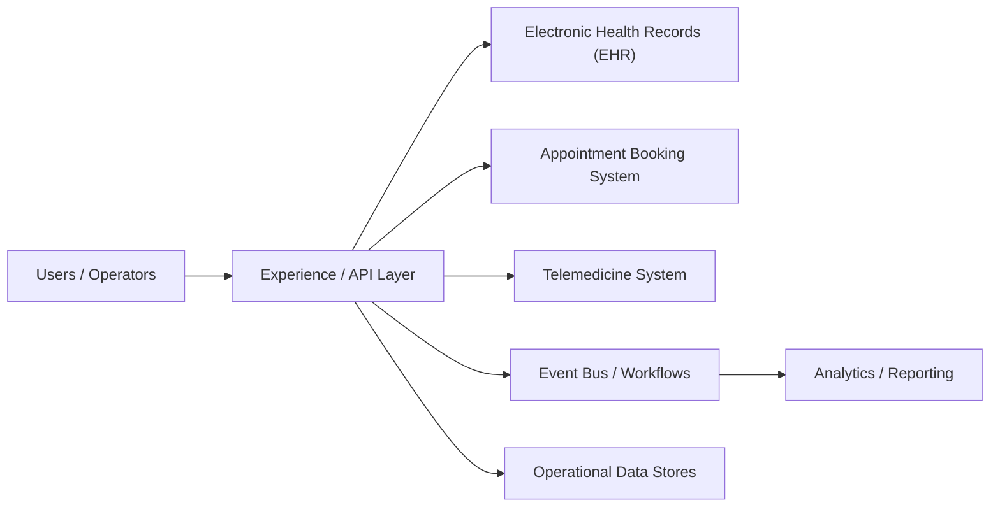

## Cross-Cutting Design Themes
- Separate user-facing hot paths from heavy asynchronous work such as analytics, indexing, compliance review, or backfills.
- Be explicit about which parts of the domain need strong correctness and which can tolerate eventual consistency.
- Model operator workflows and reconciliation early; real systems are maintained, not only executed.
- Use events and materialized views deliberately so teams can scale read models without overloading the transactional path.

## 14.1 Clinical and Patient Systems
14.1 Clinical and Patient Systems collects the boundaries around Electronic Health Records (EHR), Appointment Booking System, Telemedicine System and related capabilities in Healthcare Systems. Teams usually start with a simpler combined service, then split these systems once data ownership, latency goals, or operator workflows begin to conflict.

### Electronic Health Records (EHR)

#### Overview

Electronic Health Records (EHR) is the domain boundary responsible for owning a canonical content or entity model that many downstream systems depend on for reads. In Healthcare Systems, this system usually has to balance direct user experience with downstream effects on adjacent systems in 14.1 Clinical and Patient Systems.

#### Real-world examples

- Comparable patterns appear in Epic, Cerner, Practo.
- Startups often keep Electronic Health Records (EHR) inside a larger service, while large platforms split it out once ownership, scale, or correctness requirements diverge.
- The exact implementation changes between B2C, B2B, and regulated variants, but the architectural boundary stays useful.

#### Requirements and workflows

- Expose APIs or events that let product users, internal operators, and downstream consumers create, update, query, and reconcile electronic health records (ehr) state.
- Support synchronous user-facing flows for the hot path and asynchronous processing for enrichment, retries, and downstream propagation.
- Preserve a clear state model so support teams and automated workflows can explain why the system is in its current state.
- Provide audit or analytics hooks without coupling reporting latency to the primary user journey.

#### Architecture, data, and APIs

- Model the write path around versioned entities, metadata, access policies, denormalized read models, and change events.
- Keep a normalized source of truth for critical state and publish derived read models or events for consumer services.
- Use caches, projections, or search indexes only for latency-sensitive reads; treat rebuildability as a design requirement.
- Define idempotent write contracts, versioned events, and explicit ownership boundaries so dependent systems can evolve safely.

#### Scaling, reliability, and operations

- Watch for schema drift, stale read models, hot entities, invalid content, and permission mismatch.
- Protect hot partitions with rate limiting, request coalescing, queue buffering, and selective denormalization where appropriate.
- Design operator dashboards, replay tooling, and reconciliation or backfill workflows before incidents force them into existence.
- Track service-level indicators for latency, success, queue lag, freshness, and correctness signals instead of only infrastructure health.

#### Trade-offs and interview notes

- The key interview move is to explain why Electronic Health Records (EHR) deserves its own boundary and what can remain eventual around it.
- Strong answers call out what requires strong correctness versus what can be computed asynchronously.
- Weak answers collapse storage, orchestration, and downstream fan-out into one service without discussing scale or failure modes.

### Appointment Booking System

#### Overview

Appointment Booking System is the domain boundary responsible for orchestrating a multi-step workflow that spans validation, state transitions, external dependencies, and operator visibility. In Healthcare Systems, this system usually has to balance direct user experience with downstream effects on adjacent systems in 14.1 Clinical and Patient Systems.

#### Real-world examples

- Comparable patterns appear in Epic, Cerner, Practo.
- Startups often keep Appointment Booking System inside a larger service, while large platforms split it out once ownership, scale, or correctness requirements diverge.
- The exact implementation changes between B2C, B2B, and regulated variants, but the architectural boundary stays useful.

#### Requirements and workflows

- Expose APIs or events that let product users, internal operators, and downstream consumers create, update, query, and reconcile appointment booking system state.
- Support synchronous user-facing flows for the hot path and asynchronous processing for enrichment, retries, and downstream propagation.
- Preserve a clear state model so support teams and automated workflows can explain why the system is in its current state.
- Provide audit or analytics hooks without coupling reporting latency to the primary user journey.

#### Architecture, data, and APIs

- Model the write path around workflow state, submitted forms, resource locks, side-effect intents, and audit events.
- Keep a normalized source of truth for critical state and publish derived read models or events for consumer services.
- Use caches, projections, or search indexes only for latency-sensitive reads; treat rebuildability as a design requirement.
- Define idempotent write contracts, versioned events, and explicit ownership boundaries so dependent systems can evolve safely.

#### Scaling, reliability, and operations

- Watch for partial success, duplicate submission, timeout ambiguity, and compensation complexity.
- Protect hot partitions with rate limiting, request coalescing, queue buffering, and selective denormalization where appropriate.
- Design operator dashboards, replay tooling, and reconciliation or backfill workflows before incidents force them into existence.
- Track service-level indicators for latency, success, queue lag, freshness, and correctness signals instead of only infrastructure health.

#### Trade-offs and interview notes

- The key interview move is to explain why Appointment Booking System deserves its own boundary and what can remain eventual around it.
- Strong answers call out what requires strong correctness versus what can be computed asynchronously.
- Weak answers collapse storage, orchestration, and downstream fan-out into one service without discussing scale or failure modes.

### Telemedicine System

#### Overview

Telemedicine System is the domain boundary responsible for owning a clear domain boundary with its own state model, APIs, and operational SLOs. In Healthcare Systems, this system usually has to balance direct user experience with downstream effects on adjacent systems in 14.1 Clinical and Patient Systems.

#### Real-world examples

- Comparable patterns appear in Epic, Cerner, Practo.
- Startups often keep Telemedicine System inside a larger service, while large platforms split it out once ownership, scale, or correctness requirements diverge.
- The exact implementation changes between B2C, B2B, and regulated variants, but the architectural boundary stays useful.

#### Requirements and workflows

- Expose APIs or events that let product users, internal operators, and downstream consumers create, update, query, and reconcile telemedicine system state.
- Support synchronous user-facing flows for the hot path and asynchronous processing for enrichment, retries, and downstream propagation.
- Preserve a clear state model so support teams and automated workflows can explain why the system is in its current state.
- Provide audit or analytics hooks without coupling reporting latency to the primary user journey.

#### Architecture, data, and APIs

- Model the write path around normalized transactional state, denormalized read models, events, and audit records.
- Keep a normalized source of truth for critical state and publish derived read models or events for consumer services.
- Use caches, projections, or search indexes only for latency-sensitive reads; treat rebuildability as a design requirement.
- Define idempotent write contracts, versioned events, and explicit ownership boundaries so dependent systems can evolve safely.

#### Scaling, reliability, and operations

- Watch for hotspots, stale projections, ambiguous retries, and under-specified operator workflows.
- Protect hot partitions with rate limiting, request coalescing, queue buffering, and selective denormalization where appropriate.
- Design operator dashboards, replay tooling, and reconciliation or backfill workflows before incidents force them into existence.
- Track service-level indicators for latency, success, queue lag, freshness, and correctness signals instead of only infrastructure health.

#### Trade-offs and interview notes

- The key interview move is to explain why Telemedicine System deserves its own boundary and what can remain eventual around it.
- Strong answers call out what requires strong correctness versus what can be computed asynchronously.
- Weak answers collapse storage, orchestration, and downstream fan-out into one service without discussing scale or failure modes.

### Medical Imaging Storage System

#### Overview

Medical Imaging Storage System is the domain boundary responsible for owning a clear domain boundary with its own state model, APIs, and operational SLOs. In Healthcare Systems, this system usually has to balance direct user experience with downstream effects on adjacent systems in 14.1 Clinical and Patient Systems.

#### Real-world examples

- Comparable patterns appear in Epic, Cerner, Practo.
- Startups often keep Medical Imaging Storage System inside a larger service, while large platforms split it out once ownership, scale, or correctness requirements diverge.
- The exact implementation changes between B2C, B2B, and regulated variants, but the architectural boundary stays useful.

#### Requirements and workflows

- Expose APIs or events that let product users, internal operators, and downstream consumers create, update, query, and reconcile medical imaging storage system state.
- Support synchronous user-facing flows for the hot path and asynchronous processing for enrichment, retries, and downstream propagation.
- Preserve a clear state model so support teams and automated workflows can explain why the system is in its current state.
- Provide audit or analytics hooks without coupling reporting latency to the primary user journey.

#### Architecture, data, and APIs

- Model the write path around normalized transactional state, denormalized read models, events, and audit records.
- Keep a normalized source of truth for critical state and publish derived read models or events for consumer services.
- Use caches, projections, or search indexes only for latency-sensitive reads; treat rebuildability as a design requirement.
- Define idempotent write contracts, versioned events, and explicit ownership boundaries so dependent systems can evolve safely.

#### Scaling, reliability, and operations

- Watch for hotspots, stale projections, ambiguous retries, and under-specified operator workflows.
- Protect hot partitions with rate limiting, request coalescing, queue buffering, and selective denormalization where appropriate.
- Design operator dashboards, replay tooling, and reconciliation or backfill workflows before incidents force them into existence.
- Track service-level indicators for latency, success, queue lag, freshness, and correctness signals instead of only infrastructure health.

#### Trade-offs and interview notes

- The key interview move is to explain why Medical Imaging Storage System deserves its own boundary and what can remain eventual around it.
- Strong answers call out what requires strong correctness versus what can be computed asynchronously.
- Weak answers collapse storage, orchestration, and downstream fan-out into one service without discussing scale or failure modes.

### Prescription Management System

#### Overview

Prescription Management System is the domain boundary responsible for owning a clear domain boundary with its own state model, APIs, and operational SLOs. In Healthcare Systems, this system usually has to balance direct user experience with downstream effects on adjacent systems in 14.1 Clinical and Patient Systems.

#### Real-world examples

- Comparable patterns appear in Epic, Cerner, Practo.
- Startups often keep Prescription Management System inside a larger service, while large platforms split it out once ownership, scale, or correctness requirements diverge.
- The exact implementation changes between B2C, B2B, and regulated variants, but the architectural boundary stays useful.

#### Requirements and workflows

- Expose APIs or events that let product users, internal operators, and downstream consumers create, update, query, and reconcile prescription management system state.
- Support synchronous user-facing flows for the hot path and asynchronous processing for enrichment, retries, and downstream propagation.
- Preserve a clear state model so support teams and automated workflows can explain why the system is in its current state.
- Provide audit or analytics hooks without coupling reporting latency to the primary user journey.

#### Architecture, data, and APIs

- Model the write path around normalized transactional state, denormalized read models, events, and audit records.
- Keep a normalized source of truth for critical state and publish derived read models or events for consumer services.
- Use caches, projections, or search indexes only for latency-sensitive reads; treat rebuildability as a design requirement.
- Define idempotent write contracts, versioned events, and explicit ownership boundaries so dependent systems can evolve safely.

#### Scaling, reliability, and operations

- Watch for hotspots, stale projections, ambiguous retries, and under-specified operator workflows.
- Protect hot partitions with rate limiting, request coalescing, queue buffering, and selective denormalization where appropriate.
- Design operator dashboards, replay tooling, and reconciliation or backfill workflows before incidents force them into existence.
- Track service-level indicators for latency, success, queue lag, freshness, and correctness signals instead of only infrastructure health.

#### Trade-offs and interview notes

- The key interview move is to explain why Prescription Management System deserves its own boundary and what can remain eventual around it.
- Strong answers call out what requires strong correctness versus what can be computed asynchronously.
- Weak answers collapse storage, orchestration, and downstream fan-out into one service without discussing scale or failure modes.

---

## Functional Requirements

Functional requirements define **what** each subsystem must do. These tables enumerate every capability that must exist before the system can be considered complete.

### EHR Functional Requirements

| ID | Requirement | Description | Priority |
|----|------------|-------------|----------|
| EHR-FR-001 | Patient Registration | Create a new patient record with demographics, insurance, emergency contacts, and consent forms | P0 |
| EHR-FR-002 | Patient Search | Search patients by MRN, name, DOB, SSN (last 4), phone, or insurance ID with sub-second response | P0 |
| EHR-FR-003 | Encounter Creation | Open a new clinical encounter linking patient, provider, facility, and encounter type (inpatient, outpatient, emergency) | P0 |
| EHR-FR-004 | Diagnosis Recording | Record diagnoses using ICD-10-CM codes with onset date, status (active, resolved, chronic), and ranking (primary, secondary) | P0 |
| EHR-FR-005 | Procedure Documentation | Document procedures with CPT/HCPCS codes, provider, timestamps, and outcome notes | P0 |
| EHR-FR-006 | Lab Result Ingestion | Receive lab results via HL7 ORU messages, parse into structured fields, and attach to patient chart | P0 |
| EHR-FR-007 | Vital Signs Recording | Record vitals (BP, HR, temp, SpO2, weight, height, BMI) with timestamps and abnormal flagging | P0 |
| EHR-FR-008 | Allergy Management | Maintain allergy list with allergen, reaction type, severity, onset date, and verification status | P0 |
| EHR-FR-009 | Immunization Tracking | Record immunizations with vaccine type (CVX code), lot number, site, administrator, and VIS date | P1 |
| EHR-FR-010 | Clinical Notes | Support structured and free-text clinical notes with templates, co-signatures, and addenda | P0 |
| EHR-FR-011 | Care Plan Management | Create and track care plans with goals, interventions, responsible parties, and target dates | P1 |
| EHR-FR-012 | Problem List | Maintain an active problem list per patient with SNOMED CT coding, onset dates, and status tracking | P0 |
| EHR-FR-013 | Medication List | Display current, historical, and discontinued medications with dosage, route, and frequency | P0 |
| EHR-FR-014 | Document Management | Store, version, and retrieve clinical documents (discharge summaries, consult notes, referral letters) | P1 |
| EHR-FR-015 | Audit Trail | Log every read, write, and export of PHI with user identity, timestamp, IP address, and action type | P0 |
| EHR-FR-016 | Patient Portal Access | Allow patients to view their records, lab results, medications, and upcoming appointments via a secure portal | P1 |
| EHR-FR-017 | Clinical Decision Support | Fire alerts for drug-allergy interactions, abnormal lab values, overdue screenings, and duplicate orders | P1 |
| EHR-FR-018 | Continuity of Care Document | Generate and consume CCD/CDA documents for patient transfers between facilities | P1 |
| EHR-FR-019 | Chart Deficiency Tracking | Flag incomplete charts (missing signatures, unsigned notes, incomplete diagnoses) for HIM review | P2 |
| EHR-FR-020 | Record Merge/Unmerge | Merge duplicate patient records and support unmerge when errors are discovered | P1 |

### Appointment Booking Functional Requirements

| ID | Requirement | Description | Priority |
|----|------------|-------------|----------|
| APT-FR-001 | Slot Management | Define available appointment slots per provider, location, and visit type with configurable duration | P0 |
| APT-FR-002 | Appointment Booking | Book an appointment by selecting patient, provider, slot, visit type, and reason for visit | P0 |
| APT-FR-003 | Appointment Cancellation | Cancel an appointment with reason code, cancellation fee logic, and automatic slot release | P0 |
| APT-FR-004 | Appointment Rescheduling | Move an existing appointment to a new slot while preserving booking history | P0 |
| APT-FR-005 | Recurring Appointments | Schedule recurring visits (e.g., weekly physical therapy) with configurable recurrence rules | P1 |
| APT-FR-006 | Waitlist Management | Add patients to a waitlist when preferred slots are full; auto-notify when slots open | P1 |
| APT-FR-007 | Reminder Notifications | Send appointment reminders via SMS, email, and push notification at configurable intervals (48h, 24h, 2h) | P0 |
| APT-FR-008 | Check-In | Support patient self-check-in via kiosk, mobile app, or front desk with insurance verification trigger | P1 |
| APT-FR-009 | Provider Schedule View | Display provider daily/weekly/monthly calendar with color-coded appointment types | P0 |
| APT-FR-010 | Multi-Resource Booking | Book appointments requiring multiple resources (room, equipment, provider) simultaneously | P2 |
| APT-FR-011 | Insurance Pre-Authorization | Check if visit type requires pre-authorization and flag appointments needing approval | P1 |
| APT-FR-012 | No-Show Tracking | Record no-shows, calculate no-show rates per patient and provider, enforce no-show policies | P1 |
| APT-FR-013 | Walk-In Support | Allow unscheduled walk-in patients to be queued and assigned to available providers | P1 |
| APT-FR-014 | Overbooking Rules | Support configurable overbooking limits per provider and time slot | P2 |
| APT-FR-015 | Appointment History | Maintain full appointment history per patient including all status changes and timestamps | P0 |

### Telemedicine Functional Requirements

| ID | Requirement | Description | Priority |
|----|------------|-------------|----------|
| TM-FR-001 | Session Creation | Create a telemedicine session linked to appointment, patient, and provider with scheduled start time | P0 |
| TM-FR-002 | Video Consultation | Provide real-time video and audio connection between patient and provider with adaptive bitrate | P0 |
| TM-FR-003 | Waiting Room | Hold patients in a virtual waiting room until the provider is ready to begin | P0 |
| TM-FR-004 | Screen Sharing | Allow provider to share screen for reviewing lab results, imaging, or educational materials | P1 |
| TM-FR-005 | Session Recording | Record sessions with explicit patient consent for documentation and quality review | P1 |
| TM-FR-006 | In-Session Chat | Provide text chat alongside video for sharing links, instructions, or when audio fails | P1 |
| TM-FR-007 | E-Prescribing Integration | Allow provider to create prescriptions during or immediately after a telemedicine session | P0 |
| TM-FR-008 | Consent Collection | Collect and store digital consent for telemedicine services before session start | P0 |
| TM-FR-009 | Multi-Party Session | Support sessions with multiple participants (patient, specialist, PCP, interpreter) | P2 |
| TM-FR-010 | Session Notes | Auto-link session encounter notes to the patient EHR record upon session completion | P0 |
| TM-FR-011 | Connection Quality Monitoring | Monitor and display connection quality metrics; suggest fallback to audio-only when needed | P1 |
| TM-FR-012 | Session Handoff | Transfer an active session to another provider without disconnecting the patient | P2 |
| TM-FR-013 | Peripheral Device Integration | Support connected devices (stethoscope, otoscope, dermatoscope) for remote examination | P2 |
| TM-FR-014 | Post-Visit Summary | Generate and send a patient-friendly visit summary via portal and email after session ends | P1 |

### Medical Imaging Functional Requirements

| ID | Requirement | Description | Priority |
|----|------------|-------------|----------|
| IMG-FR-001 | DICOM Study Ingestion | Receive DICOM studies from modalities via DICOM C-STORE with SOP class validation | P0 |
| IMG-FR-002 | Study Storage | Store DICOM objects with full metadata preservation and lossless compression options | P0 |
| IMG-FR-003 | Study Retrieval | Retrieve studies by patient, accession number, study date, modality, or referring physician | P0 |
| IMG-FR-004 | DICOM Viewer Integration | Serve studies to zero-footprint web viewers and thick-client PACS workstations via WADO-RS | P0 |
| IMG-FR-005 | Imaging Order Management | Create, track, and fulfill imaging orders with order status lifecycle | P0 |
| IMG-FR-006 | Radiology Report | Support structured and narrative radiology reports with critical findings workflow | P0 |
| IMG-FR-007 | Prior Study Linking | Automatically link current studies with relevant prior studies for comparison | P1 |
| IMG-FR-008 | Image Routing | Route studies to appropriate reading worklists based on modality, body part, and urgency | P1 |
| IMG-FR-009 | Tiered Storage | Move older studies from hot (SSD) to warm (HDD) to cold (tape/glacier) storage based on age and access patterns | P1 |
| IMG-FR-010 | Study Sharing | Share studies with external facilities via DICOM exchange, XDS, or secure links | P1 |
| IMG-FR-011 | AI Integration | Support AI algorithm results (e.g., lung nodule detection) as supplementary series or structured reports | P2 |
| IMG-FR-012 | Dose Tracking | Record and report radiation dose per study for cumulative dose monitoring | P1 |
| IMG-FR-013 | Image Anonymization | De-identify DICOM headers for research exports while maintaining referential integrity | P1 |

### Prescription Management Functional Requirements

| ID | Requirement | Description | Priority |
|----|------------|-------------|----------|
| RX-FR-001 | Prescription Creation | Create a prescription with medication (NDC/RxNorm), dosage, route, frequency, duration, and quantity | P0 |
| RX-FR-002 | Drug Interaction Check | Check new prescriptions against current medications for interactions using severity levels (major, moderate, minor) | P0 |
| RX-FR-003 | Allergy Check | Validate prescriptions against patient allergy list with cross-reactivity detection | P0 |
| RX-FR-004 | Formulary Check | Verify medication is covered by patient insurance formulary; suggest alternatives if not | P1 |
| RX-FR-005 | E-Prescribing | Transmit prescriptions electronically to patient-selected pharmacy via Surescripts NCPDP SCRIPT | P0 |
| RX-FR-006 | Controlled Substance Prescribing | Support EPCS (Electronic Prescribing for Controlled Substances) with two-factor authentication and PDMP check | P0 |
| RX-FR-007 | Refill Management | Process refill requests from pharmacies and patients with remaining refill count tracking | P0 |
| RX-FR-008 | Prior Authorization | Initiate and track prior authorization requests for medications requiring insurer approval | P1 |
| RX-FR-009 | Medication Reconciliation | Compare and reconcile medication lists during transitions of care (admission, discharge, transfer) | P1 |
| RX-FR-010 | Prescription History | Display full prescription history per patient with fill status from pharmacy | P0 |
| RX-FR-011 | Therapeutic Duplication | Detect duplicate therapeutic class prescriptions and alert prescriber | P1 |
| RX-FR-012 | Dose Range Check | Validate dosage against weight-based and age-based dose ranges | P1 |
| RX-FR-013 | Pharmacy Directory | Maintain pharmacy directory with addresses, fax numbers, NCPDP IDs, and e-prescribing capabilities | P1 |
| RX-FR-014 | Prescription Cancellation | Cancel a previously sent prescription with reason code and notify pharmacy | P0 |
| RX-FR-015 | Medication Adherence | Track prescription fill history and flag non-adherence patterns | P2 |

---

## Non-Functional Requirements

Non-functional requirements define **how well** the system must perform. Healthcare systems face unusually strict requirements because failures can directly impact patient safety.

### Latency Requirements

| Subsystem | Operation | P50 Target | P99 Target | Rationale |
|-----------|-----------|-----------|-----------|-----------|
| EHR | Patient lookup by MRN | 50ms | 200ms | Clinicians need instant access during patient encounters |
| EHR | Patient search by name/DOB | 100ms | 500ms | Front desk and triage workflows require fast search |
| EHR | Lab result display | 100ms | 300ms | Critical results must surface immediately |
| EHR | Clinical note save | 200ms | 1s | Providers document in real-time during encounters |
| EHR | Audit log write | 50ms | 100ms | Must not block clinical workflows |
| Appointments | Slot availability query | 100ms | 300ms | Users expect responsive calendar rendering |
| Appointments | Booking confirmation | 200ms | 500ms | Must confirm before patient navigates away |
| Appointments | Reminder dispatch | N/A (async) | 30s queue-to-send | Reminders are batch-processed but must not be stale |
| Telemedicine | Session join (signaling) | 500ms | 2s | Video must connect quickly to maintain trust |
| Telemedicine | Video frame latency | 150ms | 300ms | Conversational quality requires low latency |
| Telemedicine | Chat message delivery | 100ms | 500ms | Near-real-time text alongside video |
| Imaging | DICOM C-STORE acknowledgment | 200ms | 1s | Modality must not time out during study push |
| Imaging | Study metadata query | 100ms | 500ms | Radiologists browsing worklists need fast queries |
| Imaging | First image display (WADO-RS) | 500ms | 2s | Time to first diagnostic-quality image on viewer |
| Prescriptions | Interaction check | 200ms | 500ms | Must complete before prescriber clicks "Send" |
| Prescriptions | E-prescribe transmission | 1s | 5s | Surescripts SLA allows up to 10s but aim lower |
| Prescriptions | Formulary lookup | 300ms | 1s | Real-time during prescribing workflow |

### Availability Requirements

| Subsystem | Target Availability | Annual Downtime Budget | Justification |
|-----------|-------------------|----------------------|---------------|
| EHR (core read/write) | 99.99% | 52 minutes/year | Patient safety depends on EHR access; ED physicians cannot wait |
| EHR (patient portal) | 99.95% | 4.4 hours/year | Patient-facing but not life-critical |
| Appointment Booking | 99.95% | 4.4 hours/year | Missed bookings cause revenue loss but not immediate safety risk |
| Telemedicine | 99.9% | 8.76 hours/year | Sessions can be rescheduled; pre-session downtime is less critical |
| Telemedicine (active session) | 99.99% | Must not drop mid-consultation | Active sessions have higher SLA than session creation |
| Medical Imaging (ingest) | 99.99% | 52 minutes/year | Modalities buffer limited studies; prolonged outage causes exam delays |
| Medical Imaging (retrieval) | 99.95% | 4.4 hours/year | Prior studies can be delayed briefly for non-emergency reads |
| Prescription Management | 99.99% | 52 minutes/year | Medication errors from downtime-induced workarounds are a safety risk |
| Audit Logging | 99.999% | 5.2 minutes/year | HIPAA mandates complete audit trails; gaps create compliance violations |

### Throughput Requirements

| Subsystem | Metric | Steady State | Peak (Monday 8-10 AM) | Design Ceiling |
|-----------|--------|-------------|----------------------|----------------|
| EHR | Patient record reads | 5,000/sec | 15,000/sec | 50,000/sec |
| EHR | Clinical note writes | 500/sec | 2,000/sec | 10,000/sec |
| EHR | Audit log events | 10,000/sec | 40,000/sec | 100,000/sec |
| Appointments | Booking requests | 200/sec | 1,000/sec | 5,000/sec |
| Appointments | Slot queries | 2,000/sec | 8,000/sec | 20,000/sec |
| Telemedicine | Concurrent sessions | 10,000 | 30,000 | 100,000 |
| Telemedicine | Signaling messages | 50,000/sec | 150,000/sec | 500,000/sec |
| Imaging | DICOM instances ingested | 100/sec | 500/sec | 2,000/sec |
| Imaging | WADO-RS retrievals | 1,000/sec | 5,000/sec | 20,000/sec |
| Prescriptions | New prescriptions | 300/sec | 1,500/sec | 5,000/sec |
| Prescriptions | Interaction checks | 600/sec | 3,000/sec | 10,000/sec |

### Compliance Requirements

| Regulation | Scope | Key Requirements | Impact on Architecture |
|-----------|-------|-----------------|----------------------|
| HIPAA Privacy Rule | All subsystems | Minimum necessary access, patient consent, designated record set | Role-based access control on every API; consent service gating data release |
| HIPAA Security Rule | All subsystems | PHI encryption at rest and in transit, access controls, audit controls, integrity controls | AES-256 encryption, TLS 1.3, comprehensive audit logging, integrity checksums |
| HIPAA Breach Notification | All subsystems | Report breaches of unsecured PHI within 60 days | Automated breach detection, incident response workflows, notification service |
| HITECH Act | All subsystems | Meaningful Use requirements, increased penalties for willful neglect | Certified EHR functionality, CDS alerts, patient portal access |
| HL7 FHIR R4 | EHR, Prescriptions | Standardized REST APIs for healthcare data exchange | FHIR resource models as API contracts, SMART on FHIR for app authorization |
| GDPR | All (EU patients) | Right to erasure, data portability, explicit consent, DPO appointment | Soft-delete with audit retention, FHIR export, granular consent management |
| 21st Century Cures Act | EHR | Information blocking prohibition, standardized patient access APIs | FHIR patient access API, no data withholding, ONC certification |
| DEA EPCS | Prescriptions | Two-factor authentication for controlled substance e-prescribing | Hardware token or biometric + password, identity proofing, PDMP integration |
| FDA 21 CFR Part 11 | Imaging, EHR | Electronic signatures, audit trails for regulated records | Digital signatures on reports, tamper-evident audit logs |
| State Medical Licensing | Telemedicine | Provider must be licensed in patient's state for telemedicine | License verification service, cross-state practice rules engine |
| CLIA | Lab Results | Laboratory certification for testing and reporting | Lab interface validation, result format compliance |

---

## Capacity Estimation

These calculations size the infrastructure for a large multi-facility health system serving 5 million active patients across 200 facilities.

### Patient Record Storage

```
Active patients: 5,000,000
Average record size (structured data): 50 KB per patient
    Demographics: 2 KB
    Problem list: 3 KB
    Medication list: 2 KB
    Allergy list: 1 KB
    Encounter history (summaries): 20 KB
    Lab results (structured): 15 KB
    Vital signs history: 5 KB
    Immunizations: 2 KB

Total structured EHR data: 5M * 50 KB = 250 GB (fits in memory for hot cache)

Clinical notes (unstructured text):
    Average 10 encounters/year/patient with 2 KB average note
    5M * 10 * 2 KB = 100 GB/year new notes
    7-year retention: 700 GB of clinical notes

Document storage (PDFs, scanned records):
    Average 5 documents/patient, 500 KB average
    5M * 5 * 500 KB = 12.5 TB
    Annual growth: ~2.5 TB/year
```

### Appointment Volume

```
Active providers: 15,000
Average patients/provider/day: 20
Daily appointments: 15,000 * 20 = 300,000

Peak scheduling hour: 8-9 AM
    30% of daily bookings in 2-hour morning window
    90,000 bookings / 7,200 seconds = 12.5 bookings/sec sustained
    Burst: 50 bookings/sec

Appointment record size: 1 KB (structured)
Annual appointment records: 300,000 * 250 working days = 75M records = 75 GB/year

Slot records: 15,000 providers * 20 slots * 250 days = 75M slots/year

Reminder messages: 300,000/day * 3 reminders = 900,000 messages/day
```

### Telemedicine Sessions

```
Telemedicine adoption rate: 25% of outpatient visits
Daily telemedicine sessions: 300,000 * 0.25 = 75,000

Average session duration: 15 minutes
Concurrent sessions at peak (assuming 4-hour peak window):
    75,000 * 15 min / (4 hours * 60 min) = ~4,700 concurrent sessions

Bandwidth per session:
    Video (720p adaptive): 1.5 Mbps per participant * 2 = 3 Mbps
    Peak bandwidth: 4,700 * 3 Mbps = 14.1 Gbps

Session recordings (if 30% are recorded):
    75,000 * 0.30 * 15 min * 100 MB/hour = 56 TB/day (!!)
    Retention: 90 days = 5 PB (strong argument for selective recording)

Chat messages: 75,000 sessions * avg 20 messages * 200 bytes = 300 MB/day
Signaling metadata: 75,000 sessions * 5 KB = 375 MB/day
```

### Medical Imaging Volume (DICOM)

```
Daily imaging studies: 50,000
Average instances per study: 200 (CT/MR can be 500+, X-ray ~2)
Daily DICOM instances: 50,000 * 200 = 10,000,000

Average instance size: 512 KB (mix of modalities)
    CR/DX: 10 MB per image, few images
    CT: 512 KB per slice, 200-500 slices
    MR: 256 KB per slice, 200-2000 slices
    US: 1 MB per frame, 50-200 frames
    MG: 50 MB per image, 4-8 images

Daily ingest: 10M instances * 512 KB = 5 TB/day
Annual ingest: 5 TB * 365 = 1.825 PB/year
7-year retention: ~13 PB

Storage tiering:
    Hot (< 90 days): ~450 TB on SSD/NVMe
    Warm (90 days - 2 years): ~3.6 PB on HDD
    Cold (2-7 years): ~9 PB on object storage/tape

DICOM metadata: 10M instances/day * 2 KB metadata = 20 GB/day metadata
Study-level metadata: 50,000/day * 5 KB = 250 MB/day
```

### Prescription Volume

```
Daily prescriptions: 200,000 (new + refills)
    New prescriptions: 120,000/day
    Refill requests: 80,000/day

Interaction checks per prescription: 1 check * current med list avg 8 drugs
    120,000 * 8 pairwise checks = 960,000 interaction lookups/day

E-prescribe transmissions: 200,000/day
    Peak hour: 40,000/hour = ~11/sec

Prescription record size: 2 KB
Annual storage: 200,000 * 365 * 2 KB = 146 GB/year

Medication database: ~200,000 NDC codes, 50,000 drug products
Drug interaction database: ~15,000 interaction pairs
Formulary data: ~500 insurance plans * 50,000 drugs = 25M formulary entries
```

---

## Detailed Data Models

All schemas use PostgreSQL with healthcare-specific considerations including encryption, audit tracking, and regulatory retention requirements.

### EHR Data Model

```sql
-- ============================================================
-- EHR: Core Patient Tables
-- ============================================================

CREATE TABLE patients (
    patient_id          UUID PRIMARY KEY DEFAULT gen_random_uuid(),
    mrn                 VARCHAR(20) NOT NULL,           -- Medical Record Number, facility-scoped
    enterprise_id       VARCHAR(30),                    -- Enterprise-wide patient identifier
    status              VARCHAR(20) NOT NULL DEFAULT 'active'
                        CHECK (status IN ('active', 'inactive', 'deceased', 'merged')),
    created_at          TIMESTAMPTZ NOT NULL DEFAULT now(),
    updated_at          TIMESTAMPTZ NOT NULL DEFAULT now(),
    created_by          UUID NOT NULL REFERENCES staff(staff_id),
    merged_into_id      UUID REFERENCES patients(patient_id), -- for duplicate resolution
    version             INT NOT NULL DEFAULT 1,
    CONSTRAINT uq_patients_mrn UNIQUE (mrn)
);

CREATE INDEX idx_patients_enterprise_id ON patients(enterprise_id);
CREATE INDEX idx_patients_status ON patients(status) WHERE status = 'active';

CREATE TABLE patient_demographics (
    demographic_id      UUID PRIMARY KEY DEFAULT gen_random_uuid(),
    patient_id          UUID NOT NULL REFERENCES patients(patient_id),
    first_name          VARCHAR(100) NOT NULL,          -- encrypted at application layer
    last_name           VARCHAR(100) NOT NULL,          -- encrypted at application layer
    middle_name         VARCHAR(100),
    date_of_birth       DATE NOT NULL,
    gender              VARCHAR(20) NOT NULL
                        CHECK (gender IN ('male', 'female', 'other', 'unknown')),
    sex_at_birth        VARCHAR(20),
    race                VARCHAR(50),
    ethnicity           VARCHAR(50),
    preferred_language  VARCHAR(10) DEFAULT 'en',       -- ISO 639-1
    marital_status      VARCHAR(20),
    ssn_last_four       VARCHAR(4),                     -- encrypted, only last 4 stored
    address_line_1      VARCHAR(200),                   -- encrypted
    address_line_2      VARCHAR(200),
    city                VARCHAR(100),
    state               VARCHAR(2),
    zip_code            VARCHAR(10),
    country             VARCHAR(3) DEFAULT 'USA',       -- ISO 3166-1 alpha-3
    phone_home          VARCHAR(20),                    -- encrypted
    phone_mobile        VARCHAR(20),                    -- encrypted
    phone_work          VARCHAR(20),
    email               VARCHAR(200),                   -- encrypted
    emergency_contact_name    VARCHAR(200),
    emergency_contact_phone   VARCHAR(20),
    emergency_contact_relation VARCHAR(50),
    insurance_primary_id      UUID REFERENCES insurance_policies(policy_id),
    insurance_secondary_id    UUID REFERENCES insurance_policies(policy_id),
    pcp_provider_id     UUID REFERENCES providers(provider_id),
    effective_date      DATE NOT NULL DEFAULT CURRENT_DATE,
    end_date            DATE,                           -- NULL = current
    created_at          TIMESTAMPTZ NOT NULL DEFAULT now(),
    updated_at          TIMESTAMPTZ NOT NULL DEFAULT now()
);

CREATE INDEX idx_demographics_patient ON patient_demographics(patient_id);
CREATE INDEX idx_demographics_name ON patient_demographics(last_name, first_name);
CREATE INDEX idx_demographics_dob ON patient_demographics(date_of_birth);

CREATE TABLE encounters (
    encounter_id        UUID PRIMARY KEY DEFAULT gen_random_uuid(),
    patient_id          UUID NOT NULL REFERENCES patients(patient_id),
    visit_number        VARCHAR(30) NOT NULL,
    encounter_type      VARCHAR(30) NOT NULL
                        CHECK (encounter_type IN (
                            'inpatient', 'outpatient', 'emergency',
                            'observation', 'ambulatory', 'telemedicine', 'home_health'
                        )),
    status              VARCHAR(20) NOT NULL DEFAULT 'planned'
                        CHECK (status IN (
                            'planned', 'arrived', 'triaged', 'in_progress',
                            'on_leave', 'completed', 'cancelled', 'entered_in_error'
                        )),
    class_code          VARCHAR(10),                    -- FHIR encounter class (AMB, EMER, IMP, etc.)
    priority            VARCHAR(20) DEFAULT 'routine'
                        CHECK (priority IN ('stat', 'urgent', 'routine', 'elective')),
    admit_datetime      TIMESTAMPTZ,
    discharge_datetime  TIMESTAMPTZ,
    attending_provider_id UUID REFERENCES providers(provider_id),
    admitting_provider_id UUID REFERENCES providers(provider_id),
    referring_provider_id UUID REFERENCES providers(provider_id),
    facility_id         UUID NOT NULL REFERENCES facilities(facility_id),
    department_id       UUID REFERENCES departments(department_id),
    bed_id              UUID REFERENCES beds(bed_id),
    admission_source    VARCHAR(50),                    -- physician referral, ER, transfer, etc.
    discharge_disposition VARCHAR(50),                  -- home, SNF, AMA, expired, etc.
    chief_complaint     TEXT,
    reason_for_visit    TEXT,
    created_at          TIMESTAMPTZ NOT NULL DEFAULT now(),
    updated_at          TIMESTAMPTZ NOT NULL DEFAULT now(),
    CONSTRAINT uq_encounter_visit UNIQUE (visit_number)
);

CREATE INDEX idx_encounters_patient ON encounters(patient_id);
CREATE INDEX idx_encounters_patient_date ON encounters(patient_id, admit_datetime DESC);
CREATE INDEX idx_encounters_status ON encounters(status) WHERE status IN ('in_progress', 'arrived', 'triaged');
CREATE INDEX idx_encounters_provider ON encounters(attending_provider_id);
CREATE INDEX idx_encounters_facility_date ON encounters(facility_id, admit_datetime DESC);

CREATE TABLE diagnoses (
    diagnosis_id        UUID PRIMARY KEY DEFAULT gen_random_uuid(),
    encounter_id        UUID NOT NULL REFERENCES encounters(encounter_id),
    patient_id          UUID NOT NULL REFERENCES patients(patient_id),
    icd10_code          VARCHAR(10) NOT NULL,           -- ICD-10-CM code
    icd10_description   VARCHAR(500),
    snomed_code         VARCHAR(20),                    -- SNOMED CT concept ID
    diagnosis_type      VARCHAR(20) NOT NULL DEFAULT 'encounter'
                        CHECK (diagnosis_type IN (
                            'admitting', 'principal', 'secondary',
                            'encounter', 'billing', 'problem_list'
                        )),
    ranking             INT,                            -- 1 = primary, 2 = secondary, etc.
    status              VARCHAR(20) NOT NULL DEFAULT 'active'
                        CHECK (status IN ('active', 'resolved', 'chronic', 'recurrence', 'inactive')),
    onset_date          DATE,
    resolved_date       DATE,
    clinical_status     VARCHAR(20),
    verification_status VARCHAR(20) DEFAULT 'confirmed'
                        CHECK (verification_status IN (
                            'unconfirmed', 'provisional', 'differential',
                            'confirmed', 'refuted', 'entered_in_error'
                        )),
    recorded_by         UUID NOT NULL REFERENCES staff(staff_id),
    recorded_at         TIMESTAMPTZ NOT NULL DEFAULT now(),
    notes               TEXT,
    created_at          TIMESTAMPTZ NOT NULL DEFAULT now()
);

CREATE INDEX idx_diagnoses_encounter ON diagnoses(encounter_id);
CREATE INDEX idx_diagnoses_patient ON diagnoses(patient_id);
CREATE INDEX idx_diagnoses_icd10 ON diagnoses(icd10_code);
CREATE INDEX idx_diagnoses_patient_active ON diagnoses(patient_id, status) WHERE status = 'active';

CREATE TABLE procedures (
    procedure_id        UUID PRIMARY KEY DEFAULT gen_random_uuid(),
    encounter_id        UUID NOT NULL REFERENCES encounters(encounter_id),
    patient_id          UUID NOT NULL REFERENCES patients(patient_id),
    cpt_code            VARCHAR(10),                    -- CPT/HCPCS code
    cpt_description     VARCHAR(500),
    snomed_code         VARCHAR(20),                    -- SNOMED CT procedure concept
    icd10_pcs_code      VARCHAR(10),                    -- ICD-10-PCS for inpatient
    status              VARCHAR(20) NOT NULL DEFAULT 'completed'
                        CHECK (status IN (
                            'preparation', 'in_progress', 'completed',
                            'not_done', 'on_hold', 'stopped', 'entered_in_error'
                        )),
    performed_datetime  TIMESTAMPTZ NOT NULL,
    performer_id        UUID NOT NULL REFERENCES providers(provider_id),
    assistant_id        UUID REFERENCES providers(provider_id),
    body_site           VARCHAR(100),
    laterality          VARCHAR(10) CHECK (laterality IN ('left', 'right', 'bilateral')),
    outcome             TEXT,
    complications       TEXT,
    anesthesia_type     VARCHAR(50),
    duration_minutes    INT,
    notes               TEXT,
    created_at          TIMESTAMPTZ NOT NULL DEFAULT now()
);

CREATE INDEX idx_procedures_encounter ON procedures(encounter_id);
CREATE INDEX idx_procedures_patient ON procedures(patient_id);
CREATE INDEX idx_procedures_cpt ON procedures(cpt_code);

CREATE TABLE lab_results (
    result_id           UUID PRIMARY KEY DEFAULT gen_random_uuid(),
    patient_id          UUID NOT NULL REFERENCES patients(patient_id),
    encounter_id        UUID REFERENCES encounters(encounter_id),
    order_id            UUID REFERENCES lab_orders(order_id),
    loinc_code          VARCHAR(10) NOT NULL,           -- LOINC code for the test
    test_name           VARCHAR(200) NOT NULL,
    value_numeric       DECIMAL(12,4),
    value_string        VARCHAR(500),
    value_coded         VARCHAR(50),                    -- for coded results (pos/neg, etc.)
    units               VARCHAR(50),                    -- UCUM units
    reference_range_low DECIMAL(12,4),
    reference_range_high DECIMAL(12,4),
    reference_range_text VARCHAR(200),
    abnormal_flag       VARCHAR(10)
                        CHECK (abnormal_flag IN ('N', 'L', 'H', 'LL', 'HH', 'A', 'AA', 'S', 'R')),
    critical_flag       BOOLEAN DEFAULT FALSE,
    status              VARCHAR(20) NOT NULL DEFAULT 'final'
                        CHECK (status IN (
                            'registered', 'preliminary', 'final',
                            'amended', 'corrected', 'cancelled', 'entered_in_error'
                        )),
    specimen_type       VARCHAR(100),
    collected_at        TIMESTAMPTZ,
    received_at         TIMESTAMPTZ,
    resulted_at         TIMESTAMPTZ NOT NULL DEFAULT now(),
    performing_lab      VARCHAR(200),
    performing_lab_clia VARCHAR(20),
    reviewed_by         UUID REFERENCES providers(provider_id),
    reviewed_at         TIMESTAMPTZ,
    hl7_message_id      VARCHAR(100),                   -- source HL7 ORU message control ID
    created_at          TIMESTAMPTZ NOT NULL DEFAULT now()
);

CREATE INDEX idx_lab_results_patient ON lab_results(patient_id);
CREATE INDEX idx_lab_results_patient_loinc ON lab_results(patient_id, loinc_code, resulted_at DESC);
CREATE INDEX idx_lab_results_encounter ON lab_results(encounter_id);
CREATE INDEX idx_lab_results_critical ON lab_results(critical_flag, reviewed_at) WHERE critical_flag = TRUE;
CREATE INDEX idx_lab_results_status ON lab_results(status) WHERE status IN ('preliminary', 'registered');

CREATE TABLE vital_signs (
    vital_id            UUID PRIMARY KEY DEFAULT gen_random_uuid(),
    patient_id          UUID NOT NULL REFERENCES patients(patient_id),
    encounter_id        UUID REFERENCES encounters(encounter_id),
    recorded_at         TIMESTAMPTZ NOT NULL DEFAULT now(),
    recorded_by         UUID NOT NULL REFERENCES staff(staff_id),
    systolic_bp         SMALLINT,                       -- mmHg
    diastolic_bp        SMALLINT,                       -- mmHg
    heart_rate          SMALLINT,                       -- bpm
    respiratory_rate    SMALLINT,                       -- breaths/min
    temperature         DECIMAL(4,1),                   -- Celsius
    temperature_route   VARCHAR(20),                    -- oral, rectal, axillary, tympanic
    spo2                SMALLINT,                       -- percentage
    weight_kg           DECIMAL(5,1),
    height_cm           DECIMAL(5,1),
    bmi                 DECIMAL(4,1),
    pain_scale          SMALLINT CHECK (pain_scale BETWEEN 0 AND 10),
    blood_glucose       SMALLINT,                       -- mg/dL
    head_circumference_cm DECIMAL(4,1),                 -- pediatric
    notes               TEXT,
    created_at          TIMESTAMPTZ NOT NULL DEFAULT now()
);

CREATE INDEX idx_vitals_patient ON vital_signs(patient_id);
CREATE INDEX idx_vitals_patient_date ON vital_signs(patient_id, recorded_at DESC);
CREATE INDEX idx_vitals_encounter ON vital_signs(encounter_id);

CREATE TABLE allergies (
    allergy_id          UUID PRIMARY KEY DEFAULT gen_random_uuid(),
    patient_id          UUID NOT NULL REFERENCES patients(patient_id),
    allergen_type       VARCHAR(20) NOT NULL
                        CHECK (allergen_type IN ('drug', 'food', 'environment', 'biologic')),
    allergen_code       VARCHAR(20),                    -- RxNorm for drugs, SNOMED for others
    allergen_name       VARCHAR(200) NOT NULL,
    reaction_type       VARCHAR(100),                   -- rash, anaphylaxis, nausea, etc.
    severity            VARCHAR(20) NOT NULL DEFAULT 'moderate'
                        CHECK (severity IN ('mild', 'moderate', 'severe', 'life_threatening')),
    criticality         VARCHAR(20) DEFAULT 'unable-to-assess'
                        CHECK (criticality IN ('low', 'high', 'unable-to-assess')),
    clinical_status     VARCHAR(20) NOT NULL DEFAULT 'active'
                        CHECK (clinical_status IN ('active', 'inactive', 'resolved')),
    verification_status VARCHAR(20) DEFAULT 'confirmed'
                        CHECK (verification_status IN ('unconfirmed', 'confirmed', 'refuted', 'entered_in_error')),
    onset_date          DATE,
    recorded_by         UUID NOT NULL REFERENCES staff(staff_id),
    recorded_at         TIMESTAMPTZ NOT NULL DEFAULT now(),
    notes               TEXT,
    created_at          TIMESTAMPTZ NOT NULL DEFAULT now(),
    updated_at          TIMESTAMPTZ NOT NULL DEFAULT now()
);

CREATE INDEX idx_allergies_patient ON allergies(patient_id);
CREATE INDEX idx_allergies_patient_active ON allergies(patient_id, clinical_status)
    WHERE clinical_status = 'active';
CREATE INDEX idx_allergies_allergen ON allergies(allergen_code);

CREATE TABLE immunizations (
    immunization_id     UUID PRIMARY KEY DEFAULT gen_random_uuid(),
    patient_id          UUID NOT NULL REFERENCES patients(patient_id),
    encounter_id        UUID REFERENCES encounters(encounter_id),
    cvx_code            VARCHAR(10) NOT NULL,           -- CDC CVX vaccine code
    mvx_code            VARCHAR(10),                    -- Manufacturer code
    vaccine_name        VARCHAR(200) NOT NULL,
    lot_number          VARCHAR(50),
    expiration_date     DATE,
    dose_number         SMALLINT,
    dose_quantity       DECIMAL(5,2),
    dose_unit           VARCHAR(10),                    -- mL
    route               VARCHAR(20),                    -- IM, SQ, ID, PO, IN
    site                VARCHAR(50),                    -- left deltoid, right thigh, etc.
    administered_at     TIMESTAMPTZ NOT NULL,
    administered_by     UUID REFERENCES staff(staff_id),
    ordering_provider   UUID REFERENCES providers(provider_id),
    vis_given_date      DATE,                           -- Vaccine Information Statement date
    status              VARCHAR(20) NOT NULL DEFAULT 'completed'
                        CHECK (status IN ('completed', 'not_done', 'entered_in_error')),
    reason_not_given    VARCHAR(200),
    reaction            VARCHAR(200),
    registry_reported   BOOLEAN DEFAULT FALSE,          -- reported to state IIS
    registry_reported_at TIMESTAMPTZ,
    created_at          TIMESTAMPTZ NOT NULL DEFAULT now()
);

CREATE INDEX idx_immunizations_patient ON immunizations(patient_id);
CREATE INDEX idx_immunizations_cvx ON immunizations(cvx_code);

CREATE TABLE clinical_notes (
    note_id             UUID PRIMARY KEY DEFAULT gen_random_uuid(),
    patient_id          UUID NOT NULL REFERENCES patients(patient_id),
    encounter_id        UUID NOT NULL REFERENCES encounters(encounter_id),
    note_type           VARCHAR(50) NOT NULL
                        CHECK (note_type IN (
                            'progress_note', 'history_physical', 'discharge_summary',
                            'consultation', 'operative_note', 'procedure_note',
                            'nursing_note', 'social_work', 'dietary',
                            'radiology_report', 'pathology_report', 'ed_note'
                        )),
    status              VARCHAR(20) NOT NULL DEFAULT 'in_progress'
                        CHECK (status IN (
                            'in_progress', 'preliminary', 'final',
                            'amended', 'entered_in_error'
                        )),
    author_id           UUID NOT NULL REFERENCES providers(provider_id),
    cosigner_id         UUID REFERENCES providers(provider_id),
    cosigned_at         TIMESTAMPTZ,
    note_datetime       TIMESTAMPTZ NOT NULL DEFAULT now(),
    note_text           TEXT NOT NULL,                  -- may contain structured SOAP sections
    template_id         UUID REFERENCES note_templates(template_id),
    parent_note_id      UUID REFERENCES clinical_notes(note_id), -- for addenda
    is_addendum         BOOLEAN DEFAULT FALSE,
    signed_at           TIMESTAMPTZ,
    locked_at           TIMESTAMPTZ,                    -- once locked, no further edits
    word_count          INT,
    created_at          TIMESTAMPTZ NOT NULL DEFAULT now(),
    updated_at          TIMESTAMPTZ NOT NULL DEFAULT now()
);

CREATE INDEX idx_notes_patient ON clinical_notes(patient_id);
CREATE INDEX idx_notes_encounter ON clinical_notes(encounter_id);
CREATE INDEX idx_notes_author ON clinical_notes(author_id);
CREATE INDEX idx_notes_unsigned ON clinical_notes(author_id, signed_at) WHERE signed_at IS NULL;

CREATE TABLE care_plans (
    care_plan_id        UUID PRIMARY KEY DEFAULT gen_random_uuid(),
    patient_id          UUID NOT NULL REFERENCES patients(patient_id),
    encounter_id        UUID REFERENCES encounters(encounter_id),
    title               VARCHAR(200) NOT NULL,
    status              VARCHAR(20) NOT NULL DEFAULT 'active'
                        CHECK (status IN (
                            'draft', 'active', 'on_hold', 'revoked',
                            'completed', 'entered_in_error'
                        )),
    intent              VARCHAR(20) DEFAULT 'plan'
                        CHECK (intent IN ('proposal', 'plan', 'order', 'option')),
    category            VARCHAR(50),                    -- longitudinal, encounter, episode
    description         TEXT,
    start_date          DATE NOT NULL DEFAULT CURRENT_DATE,
    end_date            DATE,
    author_id           UUID NOT NULL REFERENCES providers(provider_id),
    care_team           UUID[],                         -- array of provider IDs
    goals               JSONB,                          -- structured goals with targets
    activities          JSONB,                          -- interventions, referrals, medications
    notes               TEXT,
    created_at          TIMESTAMPTZ NOT NULL DEFAULT now(),
    updated_at          TIMESTAMPTZ NOT NULL DEFAULT now()
);

CREATE INDEX idx_careplans_patient ON care_plans(patient_id);
CREATE INDEX idx_careplans_active ON care_plans(patient_id, status) WHERE status = 'active';

CREATE TABLE ehr_audit_logs (
    audit_id            BIGSERIAL PRIMARY KEY,          -- BIGSERIAL for high-volume append-only
    event_timestamp     TIMESTAMPTZ NOT NULL DEFAULT now(),
    user_id             UUID NOT NULL,
    user_role           VARCHAR(50) NOT NULL,
    patient_id          UUID,                           -- NULL for non-patient actions
    resource_type       VARCHAR(50) NOT NULL,           -- patients, encounters, lab_results, etc.
    resource_id         UUID,
    action              VARCHAR(20) NOT NULL
                        CHECK (action IN (
                            'create', 'read', 'update', 'delete',
                            'search', 'print', 'export', 'fax',
                            'login', 'logout', 'emergency_access', 'break_glass'
                        )),
    ip_address          INET NOT NULL,
    user_agent          VARCHAR(500),
    facility_id         UUID,
    department_id       UUID,
    access_reason       VARCHAR(200),                   -- required for break-glass scenarios
    phi_accessed        BOOLEAN DEFAULT FALSE,
    fields_accessed     TEXT[],                         -- which specific PHI fields were viewed
    previous_value      JSONB,                          -- for update tracking
    new_value           JSONB,
    request_id          UUID,                           -- correlation ID for request tracing
    session_id          UUID,
    outcome             VARCHAR(20) DEFAULT 'success'
                        CHECK (outcome IN ('success', 'failure', 'denied')),
    denial_reason       VARCHAR(200)
) PARTITION BY RANGE (event_timestamp);

-- Create monthly partitions (automate with pg_partman)
CREATE TABLE ehr_audit_logs_2026_01 PARTITION OF ehr_audit_logs
    FOR VALUES FROM ('2026-01-01') TO ('2026-02-01');
CREATE TABLE ehr_audit_logs_2026_02 PARTITION OF ehr_audit_logs
    FOR VALUES FROM ('2026-02-01') TO ('2026-03-01');
CREATE TABLE ehr_audit_logs_2026_03 PARTITION OF ehr_audit_logs
    FOR VALUES FROM ('2026-03-01') TO ('2026-04-01');
-- ... continue for each month, typically automated

CREATE INDEX idx_audit_user ON ehr_audit_logs(user_id, event_timestamp DESC);
CREATE INDEX idx_audit_patient ON ehr_audit_logs(patient_id, event_timestamp DESC);
CREATE INDEX idx_audit_action ON ehr_audit_logs(action, event_timestamp DESC);
CREATE INDEX idx_audit_break_glass ON ehr_audit_logs(action, event_timestamp)
    WHERE action = 'break_glass';
```

### Appointment Booking Data Model

```sql
-- ============================================================
-- Appointment Booking System
-- ============================================================

CREATE TABLE providers (
    provider_id         UUID PRIMARY KEY DEFAULT gen_random_uuid(),
    npi                 VARCHAR(10) NOT NULL,           -- National Provider Identifier
    first_name          VARCHAR(100) NOT NULL,
    last_name           VARCHAR(100) NOT NULL,
    credentials         VARCHAR(20),                    -- MD, DO, NP, PA, etc.
    specialty           VARCHAR(100),
    department_id       UUID REFERENCES departments(department_id),
    facility_id         UUID NOT NULL REFERENCES facilities(facility_id),
    email               VARCHAR(200),
    phone               VARCHAR(20),
    status              VARCHAR(20) DEFAULT 'active'
                        CHECK (status IN ('active', 'inactive', 'on_leave', 'terminated')),
    accepts_new_patients BOOLEAN DEFAULT TRUE,
    max_daily_patients  INT DEFAULT 25,
    telemedicine_enabled BOOLEAN DEFAULT FALSE,
    license_states      TEXT[],                         -- states where licensed for telemedicine
    taxonomy_code       VARCHAR(20),                    -- NUCC taxonomy code
    created_at          TIMESTAMPTZ NOT NULL DEFAULT now(),
    updated_at          TIMESTAMPTZ NOT NULL DEFAULT now(),
    CONSTRAINT uq_provider_npi UNIQUE (npi)
);

CREATE INDEX idx_providers_specialty ON providers(specialty);
CREATE INDEX idx_providers_facility ON providers(facility_id);
CREATE INDEX idx_providers_active ON providers(status) WHERE status = 'active';

CREATE TABLE provider_schedules (
    schedule_id         UUID PRIMARY KEY DEFAULT gen_random_uuid(),
    provider_id         UUID NOT NULL REFERENCES providers(provider_id),
    facility_id         UUID NOT NULL REFERENCES facilities(facility_id),
    day_of_week         SMALLINT NOT NULL CHECK (day_of_week BETWEEN 0 AND 6), -- 0=Sunday
    start_time          TIME NOT NULL,
    end_time            TIME NOT NULL,
    slot_duration_min   SMALLINT NOT NULL DEFAULT 30,   -- default appointment length
    break_start         TIME,
    break_end           TIME,
    effective_from      DATE NOT NULL,
    effective_until     DATE,                           -- NULL = indefinite
    visit_types_allowed TEXT[],                         -- array of allowed visit type codes
    overbooking_limit   SMALLINT DEFAULT 0,             -- how many overbookings allowed per slot
    is_active           BOOLEAN DEFAULT TRUE,
    created_at          TIMESTAMPTZ NOT NULL DEFAULT now(),
    updated_at          TIMESTAMPTZ NOT NULL DEFAULT now(),
    CONSTRAINT chk_schedule_times CHECK (start_time < end_time)
);

CREATE INDEX idx_schedules_provider ON provider_schedules(provider_id);
CREATE INDEX idx_schedules_active ON provider_schedules(provider_id, is_active, day_of_week)
    WHERE is_active = TRUE;

CREATE TABLE appointment_slots (
    slot_id             UUID PRIMARY KEY DEFAULT gen_random_uuid(),
    provider_id         UUID NOT NULL REFERENCES providers(provider_id),
    facility_id         UUID NOT NULL REFERENCES facilities(facility_id),
    slot_date           DATE NOT NULL,
    start_time          TIMESTAMPTZ NOT NULL,
    end_time            TIMESTAMPTZ NOT NULL,
    slot_type           VARCHAR(30) DEFAULT 'regular'
                        CHECK (slot_type IN ('regular', 'overbook', 'walk_in', 'urgent', 'telemedicine')),
    status              VARCHAR(20) NOT NULL DEFAULT 'available'
                        CHECK (status IN ('available', 'booked', 'blocked', 'cancelled')),
    visit_type          VARCHAR(50),
    room_id             UUID REFERENCES rooms(room_id),
    current_bookings    SMALLINT DEFAULT 0,
    max_bookings        SMALLINT DEFAULT 1,
    version             INT NOT NULL DEFAULT 1,         -- optimistic locking
    created_at          TIMESTAMPTZ NOT NULL DEFAULT now(),
    updated_at          TIMESTAMPTZ NOT NULL DEFAULT now()
);

CREATE INDEX idx_slots_provider_date ON appointment_slots(provider_id, slot_date, start_time);
CREATE INDEX idx_slots_available ON appointment_slots(provider_id, slot_date, status)
    WHERE status = 'available';
CREATE INDEX idx_slots_facility_date ON appointment_slots(facility_id, slot_date);

CREATE TABLE appointments (
    appointment_id      UUID PRIMARY KEY DEFAULT gen_random_uuid(),
    patient_id          UUID NOT NULL REFERENCES patients(patient_id),
    provider_id         UUID NOT NULL REFERENCES providers(provider_id),
    slot_id             UUID REFERENCES appointment_slots(slot_id),
    facility_id         UUID NOT NULL REFERENCES facilities(facility_id),
    appointment_type    VARCHAR(50) NOT NULL,           -- new_patient, follow_up, annual_physical, etc.
    visit_reason        TEXT,
    status              VARCHAR(30) NOT NULL DEFAULT 'scheduled'
                        CHECK (status IN (
                            'requested', 'scheduled', 'confirmed', 'checked_in',
                            'in_progress', 'completed', 'cancelled', 'no_show',
                            'rescheduled', 'waitlisted'
                        )),
    scheduled_start     TIMESTAMPTZ NOT NULL,
    scheduled_end       TIMESTAMPTZ NOT NULL,
    actual_start        TIMESTAMPTZ,
    actual_end          TIMESTAMPTZ,
    check_in_time       TIMESTAMPTZ,
    is_telemedicine     BOOLEAN DEFAULT FALSE,
    telemedicine_session_id UUID,
    cancellation_reason VARCHAR(200),
    cancelled_by        UUID,
    cancelled_at        TIMESTAMPTZ,
    rescheduled_from_id UUID REFERENCES appointments(appointment_id),
    booking_source      VARCHAR(30) DEFAULT 'portal'
                        CHECK (booking_source IN ('portal', 'phone', 'kiosk', 'provider', 'api', 'referral')),
    insurance_verified  BOOLEAN DEFAULT FALSE,
    pre_auth_required   BOOLEAN DEFAULT FALSE,
    pre_auth_status     VARCHAR(20),
    copay_amount        DECIMAL(8,2),
    notes               TEXT,
    idempotency_key     VARCHAR(64),                    -- for idempotent booking
    created_at          TIMESTAMPTZ NOT NULL DEFAULT now(),
    updated_at          TIMESTAMPTZ NOT NULL DEFAULT now(),
    CONSTRAINT uq_appointment_idempotency UNIQUE (idempotency_key)
);

CREATE INDEX idx_appointments_patient ON appointments(patient_id);
CREATE INDEX idx_appointments_provider_date ON appointments(provider_id, scheduled_start);
CREATE INDEX idx_appointments_status ON appointments(status) WHERE status IN ('scheduled', 'confirmed');
CREATE INDEX idx_appointments_patient_upcoming ON appointments(patient_id, scheduled_start)
    WHERE status IN ('scheduled', 'confirmed') AND scheduled_start > now();

CREATE TABLE appointment_reminders (
    reminder_id         UUID PRIMARY KEY DEFAULT gen_random_uuid(),
    appointment_id      UUID NOT NULL REFERENCES appointments(appointment_id),
    patient_id          UUID NOT NULL REFERENCES patients(patient_id),
    channel             VARCHAR(20) NOT NULL
                        CHECK (channel IN ('sms', 'email', 'push', 'voice')),
    scheduled_send_at   TIMESTAMPTZ NOT NULL,
    actual_sent_at      TIMESTAMPTZ,
    status              VARCHAR(20) NOT NULL DEFAULT 'pending'
                        CHECK (status IN ('pending', 'sent', 'delivered', 'failed', 'cancelled')),
    message_template    VARCHAR(50),
    confirmation_received BOOLEAN DEFAULT FALSE,
    confirmation_response VARCHAR(20),                  -- 'confirmed', 'cancel_requested'
    failure_reason      VARCHAR(200),
    attempt_count       SMALLINT DEFAULT 0,
    created_at          TIMESTAMPTZ NOT NULL DEFAULT now()
);

CREATE INDEX idx_reminders_pending ON appointment_reminders(scheduled_send_at)
    WHERE status = 'pending';
CREATE INDEX idx_reminders_appointment ON appointment_reminders(appointment_id);

CREATE TABLE waitlists (
    waitlist_id         UUID PRIMARY KEY DEFAULT gen_random_uuid(),
    patient_id          UUID NOT NULL REFERENCES patients(patient_id),
    provider_id         UUID REFERENCES providers(provider_id),
    facility_id         UUID NOT NULL REFERENCES facilities(facility_id),
    appointment_type    VARCHAR(50) NOT NULL,
    preferred_dates     DATERANGE,
    preferred_times     VARCHAR(20),                    -- 'morning', 'afternoon', 'any'
    urgency             VARCHAR(20) DEFAULT 'routine',
    status              VARCHAR(20) NOT NULL DEFAULT 'active'
                        CHECK (status IN ('active', 'notified', 'booked', 'expired', 'cancelled')),
    position            INT,
    notified_at         TIMESTAMPTZ,
    offered_slot_id     UUID REFERENCES appointment_slots(slot_id),
    response_deadline   TIMESTAMPTZ,
    created_at          TIMESTAMPTZ NOT NULL DEFAULT now(),
    updated_at          TIMESTAMPTZ NOT NULL DEFAULT now()
);

CREATE INDEX idx_waitlist_active ON waitlists(provider_id, facility_id, status)
    WHERE status = 'active';

CREATE TABLE recurring_appointments (
    recurrence_id       UUID PRIMARY KEY DEFAULT gen_random_uuid(),
    patient_id          UUID NOT NULL REFERENCES patients(patient_id),
    provider_id         UUID NOT NULL REFERENCES providers(provider_id),
    facility_id         UUID NOT NULL REFERENCES facilities(facility_id),
    appointment_type    VARCHAR(50) NOT NULL,
    recurrence_rule     VARCHAR(200) NOT NULL,          -- iCal RRULE format
    start_date          DATE NOT NULL,
    end_date            DATE,
    slot_duration_min   SMALLINT NOT NULL,
    preferred_time      TIME,
    preferred_day       SMALLINT,
    status              VARCHAR(20) DEFAULT 'active'
                        CHECK (status IN ('active', 'paused', 'completed', 'cancelled')),
    generated_through   DATE,                           -- last date for which appointments were generated
    notes               TEXT,
    created_at          TIMESTAMPTZ NOT NULL DEFAULT now(),
    updated_at          TIMESTAMPTZ NOT NULL DEFAULT now()
);

CREATE INDEX idx_recurring_active ON recurring_appointments(status, generated_through)
    WHERE status = 'active';
```

### Telemedicine Data Model

```sql
-- ============================================================
-- Telemedicine System
-- ============================================================

CREATE TABLE telemedicine_sessions (
    session_id          UUID PRIMARY KEY DEFAULT gen_random_uuid(),
    appointment_id      UUID REFERENCES appointments(appointment_id),
    patient_id          UUID NOT NULL REFERENCES patients(patient_id),
    host_provider_id    UUID NOT NULL REFERENCES providers(provider_id),
    encounter_id        UUID REFERENCES encounters(encounter_id),
    session_type        VARCHAR(30) DEFAULT 'video'
                        CHECK (session_type IN ('video', 'audio', 'chat', 'async')),
    status              VARCHAR(30) NOT NULL DEFAULT 'scheduled'
                        CHECK (status IN (
                            'scheduled', 'waiting_room', 'provider_ready',
                            'in_progress', 'paused', 'reconnecting',
                            'completed', 'cancelled', 'failed', 'no_show'
                        )),
    scheduled_start     TIMESTAMPTZ NOT NULL,
    scheduled_duration_min SMALLINT DEFAULT 30,
    actual_start        TIMESTAMPTZ,
    actual_end          TIMESTAMPTZ,
    actual_duration_min SMALLINT,
    waiting_room_joined_at TIMESTAMPTZ,
    provider_joined_at  TIMESTAMPTZ,
    room_name           VARCHAR(100) NOT NULL,          -- unique room identifier for WebRTC
    room_token          VARCHAR(500),                   -- encrypted access token
    recording_enabled   BOOLEAN DEFAULT FALSE,
    recording_consent   BOOLEAN DEFAULT FALSE,
    platform            VARCHAR(50) DEFAULT 'internal'
                        CHECK (platform IN ('internal', 'zoom_health', 'doxy_me', 'twilio')),
    video_codec         VARCHAR(20) DEFAULT 'VP8',
    max_participants    SMALLINT DEFAULT 4,
    patient_state       VARCHAR(2),                     -- state where patient is located (for licensing)
    provider_state      VARCHAR(2),                     -- state where provider is practicing
    connection_quality_avg DECIMAL(3,1),                -- 1-5 quality score average
    disconnect_count    SMALLINT DEFAULT 0,
    notes               TEXT,
    created_at          TIMESTAMPTZ NOT NULL DEFAULT now(),
    updated_at          TIMESTAMPTZ NOT NULL DEFAULT now()
);

CREATE INDEX idx_tele_patient ON telemedicine_sessions(patient_id);
CREATE INDEX idx_tele_provider ON telemedicine_sessions(host_provider_id, scheduled_start);
CREATE INDEX idx_tele_appointment ON telemedicine_sessions(appointment_id);
CREATE INDEX idx_tele_active ON telemedicine_sessions(status)
    WHERE status IN ('waiting_room', 'in_progress', 'reconnecting');

CREATE TABLE session_participants (
    participant_id      UUID PRIMARY KEY DEFAULT gen_random_uuid(),
    session_id          UUID NOT NULL REFERENCES telemedicine_sessions(session_id),
    user_id             UUID NOT NULL,
    role                VARCHAR(30) NOT NULL
                        CHECK (role IN ('patient', 'provider', 'specialist', 'interpreter', 'caregiver', 'observer')),
    display_name        VARCHAR(100),
    joined_at           TIMESTAMPTZ,
    left_at             TIMESTAMPTZ,
    audio_enabled       BOOLEAN DEFAULT TRUE,
    video_enabled       BOOLEAN DEFAULT TRUE,
    screen_sharing      BOOLEAN DEFAULT FALSE,
    connection_type     VARCHAR(20),                    -- wifi, cellular, wired
    device_type         VARCHAR(20),                    -- desktop, mobile, tablet
    browser             VARCHAR(50),
    ip_address          INET,
    avg_latency_ms      INT,
    avg_packet_loss_pct DECIMAL(5,2),
    created_at          TIMESTAMPTZ NOT NULL DEFAULT now()
);

CREATE INDEX idx_participants_session ON session_participants(session_id);

CREATE TABLE session_recordings (
    recording_id        UUID PRIMARY KEY DEFAULT gen_random_uuid(),
    session_id          UUID NOT NULL REFERENCES telemedicine_sessions(session_id),
    storage_bucket      VARCHAR(200) NOT NULL,
    storage_key         VARCHAR(500) NOT NULL,
    format              VARCHAR(20) DEFAULT 'webm',
    duration_seconds    INT,
    file_size_bytes     BIGINT,
    resolution          VARCHAR(20),                    -- 720p, 1080p
    encryption_key_id   VARCHAR(100) NOT NULL,          -- KMS key reference
    consent_form_id     UUID NOT NULL REFERENCES consent_forms(consent_id),
    status              VARCHAR(20) DEFAULT 'processing'
                        CHECK (status IN ('recording', 'processing', 'available', 'deleted', 'failed')),
    retention_until     DATE NOT NULL,                  -- auto-delete after this date
    transcription_id    UUID,
    created_at          TIMESTAMPTZ NOT NULL DEFAULT now()
);

CREATE INDEX idx_recordings_session ON session_recordings(session_id);
CREATE INDEX idx_recordings_retention ON session_recordings(retention_until)
    WHERE status = 'available';

CREATE TABLE telemedicine_chat_messages (
    message_id          UUID PRIMARY KEY DEFAULT gen_random_uuid(),
    session_id          UUID NOT NULL REFERENCES telemedicine_sessions(session_id),
    sender_id           UUID NOT NULL,
    sender_role         VARCHAR(30) NOT NULL,
    message_type        VARCHAR(20) DEFAULT 'text'
                        CHECK (message_type IN ('text', 'image', 'file', 'system')),
    content             TEXT NOT NULL,                  -- encrypted at rest
    attachment_url      VARCHAR(500),
    sent_at             TIMESTAMPTZ NOT NULL DEFAULT now(),
    read_at             TIMESTAMPTZ,
    created_at          TIMESTAMPTZ NOT NULL DEFAULT now()
);

CREATE INDEX idx_chat_session ON telemedicine_chat_messages(session_id, sent_at);

CREATE TABLE consent_forms (
    consent_id          UUID PRIMARY KEY DEFAULT gen_random_uuid(),
    patient_id          UUID NOT NULL REFERENCES patients(patient_id),
    session_id          UUID REFERENCES telemedicine_sessions(session_id),
    consent_type        VARCHAR(50) NOT NULL
                        CHECK (consent_type IN (
                            'telemedicine_general', 'recording', 'data_sharing',
                            'research', 'treatment', 'hipaa_notice'
                        )),
    status              VARCHAR(20) NOT NULL DEFAULT 'pending'
                        CHECK (status IN ('pending', 'granted', 'declined', 'revoked', 'expired')),
    granted_at          TIMESTAMPTZ,
    revoked_at          TIMESTAMPTZ,
    expiration_date     DATE,
    ip_address          INET,
    digital_signature   TEXT,                           -- base64-encoded signature image or cryptographic sig
    form_version        VARCHAR(20) NOT NULL,           -- version of the consent form text
    form_content_hash   VARCHAR(64),                    -- SHA-256 of the form content at time of signing
    witness_id          UUID,
    created_at          TIMESTAMPTZ NOT NULL DEFAULT now()
);

CREATE INDEX idx_consent_patient ON consent_forms(patient_id);
CREATE INDEX idx_consent_session ON consent_forms(session_id);
```

### Medical Imaging Data Model

```sql
-- ============================================================
-- Medical Imaging Storage System (DICOM-based)
-- ============================================================

CREATE TABLE imaging_orders (
    order_id            UUID PRIMARY KEY DEFAULT gen_random_uuid(),
    patient_id          UUID NOT NULL REFERENCES patients(patient_id),
    encounter_id        UUID REFERENCES encounters(encounter_id),
    ordering_provider_id UUID NOT NULL REFERENCES providers(provider_id),
    order_number        VARCHAR(30) NOT NULL,
    accession_number    VARCHAR(30),                    -- assigned by radiology
    modality            VARCHAR(10) NOT NULL,           -- CT, MR, CR, US, MG, NM, PT, XA, etc.
    body_part           VARCHAR(100),
    laterality          VARCHAR(10),
    procedure_code      VARCHAR(20),                    -- RadLex or CPT
    procedure_description VARCHAR(500),
    clinical_indication TEXT NOT NULL,
    priority            VARCHAR(20) DEFAULT 'routine'
                        CHECK (priority IN ('stat', 'urgent', 'routine', 'elective')),
    status              VARCHAR(30) NOT NULL DEFAULT 'ordered'
                        CHECK (status IN (
                            'ordered', 'scheduled', 'in_progress', 'completed',
                            'preliminary_reported', 'final_reported',
                            'cancelled', 'on_hold'
                        )),
    ordered_at          TIMESTAMPTZ NOT NULL DEFAULT now(),
    scheduled_at        TIMESTAMPTZ,
    performed_at        TIMESTAMPTZ,
    icd10_codes         TEXT[],                         -- diagnosis codes justifying the order
    special_instructions TEXT,
    contrast_required   BOOLEAN DEFAULT FALSE,
    sedation_required   BOOLEAN DEFAULT FALSE,
    pregnancy_status    VARCHAR(20),
    created_at          TIMESTAMPTZ NOT NULL DEFAULT now(),
    updated_at          TIMESTAMPTZ NOT NULL DEFAULT now(),
    CONSTRAINT uq_order_number UNIQUE (order_number)
);

CREATE INDEX idx_imaging_orders_patient ON imaging_orders(patient_id);
CREATE INDEX idx_imaging_orders_status ON imaging_orders(status)
    WHERE status NOT IN ('completed', 'cancelled', 'final_reported');
CREATE INDEX idx_imaging_orders_accession ON imaging_orders(accession_number);

CREATE TABLE imaging_studies (
    study_id            UUID PRIMARY KEY DEFAULT gen_random_uuid(),
    study_instance_uid  VARCHAR(128) NOT NULL,          -- DICOM Study Instance UID (globally unique)
    order_id            UUID REFERENCES imaging_orders(order_id),
    patient_id          UUID NOT NULL REFERENCES patients(patient_id),
    accession_number    VARCHAR(30),
    study_date          DATE NOT NULL,
    study_time          TIME,
    study_description   VARCHAR(500),
    modality            VARCHAR(10) NOT NULL,
    modalities_in_study TEXT[],                         -- for multi-modality studies
    referring_physician VARCHAR(200),
    performing_physician VARCHAR(200),
    institution_name    VARCHAR(200),
    station_name        VARCHAR(100),
    body_part_examined  VARCHAR(100),
    number_of_series    INT DEFAULT 0,
    number_of_instances INT DEFAULT 0,
    total_size_bytes    BIGINT DEFAULT 0,
    study_status        VARCHAR(20) DEFAULT 'received'
                        CHECK (study_status IN (
                            'received', 'processing', 'available', 'archived',
                            'partially_available', 'error'
                        )),
    storage_tier        VARCHAR(20) DEFAULT 'hot'
                        CHECK (storage_tier IN ('hot', 'warm', 'cold', 'archive')),
    last_accessed_at    TIMESTAMPTZ,
    patient_age_at_study VARCHAR(10),                   -- DICOM format: 045Y
    radiation_dose_total DECIMAL(10,4),                 -- mSv
    created_at          TIMESTAMPTZ NOT NULL DEFAULT now(),
    updated_at          TIMESTAMPTZ NOT NULL DEFAULT now(),
    CONSTRAINT uq_study_uid UNIQUE (study_instance_uid)
);

CREATE INDEX idx_studies_patient ON imaging_studies(patient_id, study_date DESC);
CREATE INDEX idx_studies_accession ON imaging_studies(accession_number);
CREATE INDEX idx_studies_modality_date ON imaging_studies(modality, study_date DESC);
CREATE INDEX idx_studies_tier ON imaging_studies(storage_tier, last_accessed_at)
    WHERE storage_tier = 'hot';

CREATE TABLE imaging_series (
    series_id           UUID PRIMARY KEY DEFAULT gen_random_uuid(),
    series_instance_uid VARCHAR(128) NOT NULL,          -- DICOM Series Instance UID
    study_id            UUID NOT NULL REFERENCES imaging_studies(study_id),
    series_number       INT,
    series_description  VARCHAR(500),
    modality            VARCHAR(10) NOT NULL,
    body_part_examined  VARCHAR(100),
    protocol_name       VARCHAR(200),
    number_of_instances INT DEFAULT 0,
    total_size_bytes    BIGINT DEFAULT 0,
    created_at          TIMESTAMPTZ NOT NULL DEFAULT now(),
    CONSTRAINT uq_series_uid UNIQUE (series_instance_uid)
);

CREATE INDEX idx_series_study ON imaging_series(study_id);

CREATE TABLE imaging_instances (
    instance_id         UUID PRIMARY KEY DEFAULT gen_random_uuid(),
    sop_instance_uid    VARCHAR(128) NOT NULL,          -- DICOM SOP Instance UID
    series_id           UUID NOT NULL REFERENCES imaging_series(series_id),
    study_id            UUID NOT NULL REFERENCES imaging_studies(study_id),
    sop_class_uid       VARCHAR(128) NOT NULL,          -- identifies the type (CT Image, MR Image, etc.)
    instance_number     INT,
    rows                INT,
    columns             INT,
    bits_allocated      SMALLINT,
    transfer_syntax_uid VARCHAR(128),                   -- compression format
    file_size_bytes     BIGINT NOT NULL,
    content_hash        VARCHAR(64) NOT NULL,           -- SHA-256 for integrity verification
    created_at          TIMESTAMPTZ NOT NULL DEFAULT now(),
    CONSTRAINT uq_sop_uid UNIQUE (sop_instance_uid)
);

CREATE INDEX idx_instances_series ON imaging_instances(series_id);
CREATE INDEX idx_instances_study ON imaging_instances(study_id);

CREATE TABLE storage_locations (
    location_id         UUID PRIMARY KEY DEFAULT gen_random_uuid(),
    instance_id         UUID NOT NULL REFERENCES imaging_instances(instance_id),
    storage_tier        VARCHAR(20) NOT NULL,
    storage_backend     VARCHAR(30) NOT NULL
                        CHECK (storage_backend IN ('s3', 'azure_blob', 'gcs', 'local_nas', 'tape')),
    bucket_name         VARCHAR(200) NOT NULL,
    object_key          VARCHAR(500) NOT NULL,
    region              VARCHAR(30),
    encryption_key_id   VARCHAR(100) NOT NULL,
    stored_at           TIMESTAMPTZ NOT NULL DEFAULT now(),
    verified_at         TIMESTAMPTZ,                    -- last integrity check
    is_primary          BOOLEAN DEFAULT TRUE,           -- primary copy vs replica
    CONSTRAINT uq_storage_location UNIQUE (instance_id, storage_tier, storage_backend)
);

CREATE INDEX idx_storage_instance ON storage_locations(instance_id);
CREATE INDEX idx_storage_tier ON storage_locations(storage_tier);

CREATE TABLE imaging_reports (
    report_id           UUID PRIMARY KEY DEFAULT gen_random_uuid(),
    study_id            UUID NOT NULL REFERENCES imaging_studies(study_id),
    order_id            UUID REFERENCES imaging_orders(order_id),
    patient_id          UUID NOT NULL REFERENCES patients(patient_id),
    radiologist_id      UUID NOT NULL REFERENCES providers(provider_id),
    report_status       VARCHAR(20) NOT NULL DEFAULT 'draft'
                        CHECK (report_status IN (
                            'draft', 'preliminary', 'final', 'amended',
                            'addendum', 'cancelled', 'entered_in_error'
                        )),
    report_text         TEXT NOT NULL,
    impression          TEXT,                           -- summary finding
    findings            JSONB,                          -- structured findings (RadLex terms)
    critical_finding    BOOLEAN DEFAULT FALSE,
    critical_finding_communicated BOOLEAN,
    critical_finding_communicated_to VARCHAR(200),
    critical_finding_communicated_at TIMESTAMPTZ,
    dictated_at         TIMESTAMPTZ,
    preliminary_at      TIMESTAMPTZ,
    finalized_at        TIMESTAMPTZ,
    amended_at          TIMESTAMPTZ,
    signed_by           UUID REFERENCES providers(provider_id),
    signed_at           TIMESTAMPTZ,
    addendum_to_id      UUID REFERENCES imaging_reports(report_id),
    birads_category     VARCHAR(5),                     -- for mammography: 0-6
    created_at          TIMESTAMPTZ NOT NULL DEFAULT now(),
    updated_at          TIMESTAMPTZ NOT NULL DEFAULT now()
);

CREATE INDEX idx_reports_study ON imaging_reports(study_id);
CREATE INDEX idx_reports_patient ON imaging_reports(patient_id);
CREATE INDEX idx_reports_critical ON imaging_reports(critical_finding, critical_finding_communicated)
    WHERE critical_finding = TRUE AND critical_finding_communicated = FALSE;
```

### Prescription Management Data Model

```sql
-- ============================================================
-- Prescription Management System
-- ============================================================

CREATE TABLE medications (
    medication_id       UUID PRIMARY KEY DEFAULT gen_random_uuid(),
    ndc_code            VARCHAR(11),                    -- National Drug Code
    rxnorm_cui          VARCHAR(20),                    -- RxNorm Concept Unique Identifier
    generic_name        VARCHAR(300) NOT NULL,
    brand_name          VARCHAR(300),
    dose_form           VARCHAR(100),                   -- tablet, capsule, solution, etc.
    strength            VARCHAR(100),                   -- 500mg, 10mg/5mL, etc.
    route               VARCHAR(50),                    -- oral, IV, topical, etc.
    therapeutic_class   VARCHAR(100),
    ahfs_class          VARCHAR(20),                    -- AHFS pharmacologic class
    schedule            VARCHAR(5)
                        CHECK (schedule IN ('I', 'II', 'III', 'IV', 'V', 'none')),
    is_controlled       BOOLEAN DEFAULT FALSE,
    is_generic          BOOLEAN DEFAULT TRUE,
    manufacturer        VARCHAR(200),
    dea_required        BOOLEAN DEFAULT FALSE,
    pregnancy_category  VARCHAR(5),
    black_box_warning   BOOLEAN DEFAULT FALSE,
    status              VARCHAR(20) DEFAULT 'active'
                        CHECK (status IN ('active', 'discontinued', 'recalled')),
    created_at          TIMESTAMPTZ NOT NULL DEFAULT now(),
    updated_at          TIMESTAMPTZ NOT NULL DEFAULT now()
);

CREATE INDEX idx_medications_ndc ON medications(ndc_code);
CREATE INDEX idx_medications_rxnorm ON medications(rxnorm_cui);
CREATE INDEX idx_medications_name ON medications(generic_name);
CREATE INDEX idx_medications_class ON medications(therapeutic_class);

CREATE TABLE drug_interactions (
    interaction_id      UUID PRIMARY KEY DEFAULT gen_random_uuid(),
    drug_a_rxnorm       VARCHAR(20) NOT NULL,
    drug_b_rxnorm       VARCHAR(20) NOT NULL,
    severity            VARCHAR(20) NOT NULL
                        CHECK (severity IN ('contraindicated', 'major', 'moderate', 'minor')),
    interaction_type    VARCHAR(50),                    -- pharmacokinetic, pharmacodynamic
    description         TEXT NOT NULL,
    clinical_effect     TEXT,
    management          TEXT,                           -- recommended clinical action
    evidence_level      VARCHAR(20)
                        CHECK (evidence_level IN ('established', 'probable', 'suspected', 'possible')),
    source              VARCHAR(100),                   -- FDB, Medi-Span, Clinical Pharmacology
    source_updated_at   DATE,
    created_at          TIMESTAMPTZ NOT NULL DEFAULT now(),
    CONSTRAINT uq_interaction_pair UNIQUE (drug_a_rxnorm, drug_b_rxnorm),
    CONSTRAINT chk_interaction_order CHECK (drug_a_rxnorm < drug_b_rxnorm) -- canonical ordering
);

CREATE INDEX idx_interactions_drug_a ON drug_interactions(drug_a_rxnorm);
CREATE INDEX idx_interactions_drug_b ON drug_interactions(drug_b_rxnorm);
CREATE INDEX idx_interactions_severity ON drug_interactions(severity)
    WHERE severity IN ('contraindicated', 'major');

CREATE TABLE prescriptions (
    prescription_id     UUID PRIMARY KEY DEFAULT gen_random_uuid(),
    patient_id          UUID NOT NULL REFERENCES patients(patient_id),
    encounter_id        UUID REFERENCES encounters(encounter_id),
    prescriber_id       UUID NOT NULL REFERENCES providers(provider_id),
    medication_id       UUID NOT NULL REFERENCES medications(medication_id),
    medication_name     VARCHAR(300) NOT NULL,          -- denormalized for display
    ndc_code            VARCHAR(11),
    rxnorm_cui          VARCHAR(20),
    sig                 TEXT NOT NULL,                  -- complete signature (Take 1 tablet by mouth twice daily)
    dose_quantity       DECIMAL(8,2) NOT NULL,
    dose_unit           VARCHAR(30) NOT NULL,           -- mg, mL, units, etc.
    route               VARCHAR(50) NOT NULL,
    frequency           VARCHAR(100) NOT NULL,          -- BID, TID, Q6H, PRN, etc.
    duration_value      INT,
    duration_unit       VARCHAR(20),                    -- days, weeks, months
    dispense_quantity   DECIMAL(8,2) NOT NULL,
    dispense_unit       VARCHAR(30) NOT NULL,           -- tablets, mL, patches, etc.
    refills_authorized  SMALLINT NOT NULL DEFAULT 0,
    refills_remaining   SMALLINT NOT NULL DEFAULT 0,
    daw_code            SMALLINT DEFAULT 0,             -- Dispense As Written (0-9)
    is_controlled       BOOLEAN DEFAULT FALSE,
    schedule            VARCHAR(5),
    prn_reason          VARCHAR(200),                   -- if PRN, the indication
    start_date          DATE NOT NULL DEFAULT CURRENT_DATE,
    end_date            DATE,
    status              VARCHAR(30) NOT NULL DEFAULT 'active'
                        CHECK (status IN (
                            'draft', 'pending_review', 'active', 'on_hold',
                            'completed', 'cancelled', 'discontinued',
                            'entered_in_error', 'expired'
                        )),
    discontinued_reason VARCHAR(200),
    discontinued_by     UUID REFERENCES providers(provider_id),
    discontinued_at     TIMESTAMPTZ,
    interaction_override BOOLEAN DEFAULT FALSE,
    interaction_override_reason TEXT,
    allergy_override    BOOLEAN DEFAULT FALSE,
    allergy_override_reason TEXT,
    formulary_status    VARCHAR(20),
    prior_auth_required BOOLEAN DEFAULT FALSE,
    prior_auth_id       UUID,
    notes_to_pharmacist TEXT,
    internal_notes      TEXT,
    idempotency_key     VARCHAR(64),
    created_at          TIMESTAMPTZ NOT NULL DEFAULT now(),
    updated_at          TIMESTAMPTZ NOT NULL DEFAULT now(),
    CONSTRAINT uq_rx_idempotency UNIQUE (idempotency_key)
);

CREATE INDEX idx_rx_patient ON prescriptions(patient_id);
CREATE INDEX idx_rx_patient_active ON prescriptions(patient_id, status)
    WHERE status IN ('active', 'on_hold');
CREATE INDEX idx_rx_prescriber ON prescriptions(prescriber_id);
CREATE INDEX idx_rx_medication ON prescriptions(medication_id);
CREATE INDEX idx_rx_controlled ON prescriptions(is_controlled, prescriber_id, created_at)
    WHERE is_controlled = TRUE;

CREATE TABLE pharmacy_orders (
    pharmacy_order_id   UUID PRIMARY KEY DEFAULT gen_random_uuid(),
    prescription_id     UUID NOT NULL REFERENCES prescriptions(prescription_id),
    pharmacy_ncpdp_id   VARCHAR(10) NOT NULL,           -- NCPDP pharmacy ID
    pharmacy_name       VARCHAR(200),
    pharmacy_address    VARCHAR(500),
    pharmacy_phone      VARCHAR(20),
    pharmacy_fax        VARCHAR(20),
    transmission_method VARCHAR(20) NOT NULL
                        CHECK (transmission_method IN ('erx', 'fax', 'phone', 'print')),
    erx_message_id      VARCHAR(100),                   -- Surescripts message tracking ID
    ncpdp_script_version VARCHAR(10),                   -- NCPDP SCRIPT version (e.g., 2017071)
    status              VARCHAR(30) NOT NULL DEFAULT 'queued'
                        CHECK (status IN (
                            'queued', 'transmitted', 'received', 'in_progress',
                            'dispensed', 'partially_dispensed', 'rejected',
                            'cancelled', 'transfer_requested', 'failed'
                        )),
    transmitted_at      TIMESTAMPTZ,
    received_at         TIMESTAMPTZ,
    dispensed_at        TIMESTAMPTZ,
    rejection_reason    VARCHAR(500),
    fill_number         SMALLINT DEFAULT 0,             -- 0 = original, 1+ = refill
    days_supply         INT,
    quantity_dispensed  DECIMAL(8,2),
    ndc_dispensed       VARCHAR(11),                    -- actual NDC dispensed (may differ for generics)
    created_at          TIMESTAMPTZ NOT NULL DEFAULT now(),
    updated_at          TIMESTAMPTZ NOT NULL DEFAULT now()
);

CREATE INDEX idx_pharmacy_orders_rx ON pharmacy_orders(prescription_id);
CREATE INDEX idx_pharmacy_orders_status ON pharmacy_orders(status)
    WHERE status NOT IN ('dispensed', 'cancelled', 'rejected');

CREATE TABLE refill_requests (
    refill_id           UUID PRIMARY KEY DEFAULT gen_random_uuid(),
    prescription_id     UUID NOT NULL REFERENCES prescriptions(prescription_id),
    patient_id          UUID NOT NULL REFERENCES patients(patient_id),
    pharmacy_ncpdp_id   VARCHAR(10),
    request_source      VARCHAR(20) NOT NULL
                        CHECK (request_source IN ('patient_portal', 'pharmacy', 'phone', 'auto')),
    status              VARCHAR(20) NOT NULL DEFAULT 'pending'
                        CHECK (status IN (
                            'pending', 'approved', 'denied', 'modified', 'expired'
                        )),
    requested_at        TIMESTAMPTZ NOT NULL DEFAULT now(),
    reviewed_by         UUID REFERENCES providers(provider_id),
    reviewed_at         TIMESTAMPTZ,
    denial_reason       VARCHAR(200),
    notes               TEXT,
    created_at          TIMESTAMPTZ NOT NULL DEFAULT now()
);

CREATE INDEX idx_refills_rx ON refill_requests(prescription_id);
CREATE INDEX idx_refills_pending ON refill_requests(status, requested_at)
    WHERE status = 'pending';

CREATE TABLE e_prescriptions (
    erx_id              UUID PRIMARY KEY DEFAULT gen_random_uuid(),
    prescription_id     UUID NOT NULL REFERENCES prescriptions(prescription_id),
    pharmacy_order_id   UUID NOT NULL REFERENCES pharmacy_orders(pharmacy_order_id),
    message_type        VARCHAR(30) NOT NULL
                        CHECK (message_type IN (
                            'new_rx', 'refill_request', 'refill_response',
                            'cancel_rx', 'cancel_response', 'rx_change_request',
                            'rx_change_response', 'rx_fill_status', 'epcs'
                        )),
    ncpdp_message       TEXT NOT NULL,                  -- full NCPDP SCRIPT XML
    surescripts_trace_id VARCHAR(100),
    direction           VARCHAR(10) NOT NULL
                        CHECK (direction IN ('outbound', 'inbound')),
    status              VARCHAR(20) NOT NULL DEFAULT 'pending'
                        CHECK (status IN ('pending', 'sent', 'acknowledged', 'error', 'timeout')),
    error_code          VARCHAR(20),
    error_description   VARCHAR(500),
    sent_at             TIMESTAMPTZ,
    acknowledged_at     TIMESTAMPTZ,
    created_at          TIMESTAMPTZ NOT NULL DEFAULT now()
);

CREATE INDEX idx_erx_prescription ON e_prescriptions(prescription_id);
CREATE INDEX idx_erx_trace ON e_prescriptions(surescripts_trace_id);

CREATE TABLE formulary_checks (
    check_id            UUID PRIMARY KEY DEFAULT gen_random_uuid(),
    prescription_id     UUID REFERENCES prescriptions(prescription_id),
    patient_id          UUID NOT NULL REFERENCES patients(patient_id),
    insurance_plan_id   UUID NOT NULL,
    medication_id       UUID NOT NULL REFERENCES medications(medication_id),
    ndc_code            VARCHAR(11),
    formulary_status    VARCHAR(30) NOT NULL
                        CHECK (formulary_status IN (
                            'covered', 'not_covered', 'prior_auth_required',
                            'step_therapy_required', 'quantity_limit',
                            'preferred_alternative', 'non_formulary'
                        )),
    tier                SMALLINT,                       -- formulary tier (1=generic, 2=preferred, 3=non-preferred)
    copay_amount        DECIMAL(8,2),
    coinsurance_pct     DECIMAL(5,2),
    prior_auth_type     VARCHAR(50),
    alternatives        JSONB,                          -- suggested covered alternatives
    checked_at          TIMESTAMPTZ NOT NULL DEFAULT now(),
    source              VARCHAR(50) DEFAULT 'surescripts'
                        CHECK (source IN ('surescripts', 'manual', 'payer_api', 'cached')),
    cache_expires_at    TIMESTAMPTZ,
    created_at          TIMESTAMPTZ NOT NULL DEFAULT now()
);

CREATE INDEX idx_formulary_rx ON formulary_checks(prescription_id);
CREATE INDEX idx_formulary_patient ON formulary_checks(patient_id);
```

---

## Detailed API Specifications

All APIs follow HL7 FHIR R4 conventions where applicable, using JSON as the default representation. Authentication uses SMART on FHIR (OAuth 2.0) with scope-based access control.

### Common API Conventions

```
Base URL: https://api.healthsystem.org/fhir/r4

Authentication: Bearer token (SMART on FHIR)
Content-Type: application/fhir+json
Headers:
    Authorization: Bearer {access_token}
    X-Request-ID: {uuid}            -- idempotency and tracing
    X-Correlation-ID: {uuid}        -- cross-service tracing
    X-Facility-ID: {facility_uuid}  -- multi-facility routing

Rate Limiting: 1000 req/min per user, 10000 req/min per application
Pagination: _count (page size), _offset or Link header (next page)

Error Response Format:
{
    "resourceType": "OperationOutcome",
    "issue": [{
        "severity": "error",
        "code": "processing",
        "diagnostics": "Detailed error message",
        "details": {
            "coding": [{ "system": "http://terminology.hl7.org/CodeSystem/operation-outcome", "code": "MSG_PARAM_INVALID" }]
        }
    }]
}
```

### Patient APIs (EHR)

```
POST /Patient
    Description: Register a new patient
    Request Body: FHIR Patient resource
    Required Fields: name, birthDate, gender, identifier (MRN)
    Response: 201 Created with Patient resource including server-assigned id
    Notes: Triggers duplicate detection check asynchronously

GET /Patient/{id}
    Description: Retrieve a patient by FHIR resource ID
    Response: 200 OK with Patient resource
    Scopes: patient/Patient.read or user/Patient.read

GET /Patient?name=Smith&birthdate=1980-01-15
    Description: Search patients by demographics
    Parameters:
        name: string (partial match supported)
        birthdate: date (eq, lt, gt, ge, le prefixes)
        identifier: MRN or other identifier
        family: last name exact match
        given: first name exact match
        phone: phone number
        email: email address
        address-state: 2-letter state code
        _count: results per page (max 50)
    Response: 200 OK with Bundle of Patient resources
    Notes: All search results are audit-logged

PUT /Patient/{id}
    Description: Update patient demographics
    Headers: If-Match: W/"{version}" (optimistic concurrency)
    Request Body: Complete FHIR Patient resource
    Response: 200 OK with updated Patient resource
    Notes: Generates audit event; previous version retained

GET /Patient/{id}/$everything
    Description: Retrieve all data for a patient (encounters, conditions, observations, etc.)
    Parameters:
        _since: only resources updated after this date
        _type: comma-separated resource types to include
    Response: 200 OK with Bundle of all patient resources
    Notes: Paginated; may take several seconds for complex patients
```

### Encounter APIs (EHR)

```
POST /Encounter
    Description: Create a new clinical encounter
    Request Body:
    {
        "resourceType": "Encounter",
        "status": "arrived",
        "class": { "code": "AMB" },
        "type": [{ "coding": [{ "system": "http://www.ama-assn.org/go/cpt", "code": "99213" }] }],
        "subject": { "reference": "Patient/{patient_id}" },
        "participant": [{
            "individual": { "reference": "Practitioner/{provider_id}" },
            "type": [{ "coding": [{ "code": "ATND" }] }]
        }],
        "period": { "start": "2026-03-22T09:00:00-05:00" },
        "serviceProvider": { "reference": "Organization/{facility_id}" },
        "reasonCode": [{ "text": "Annual physical examination" }]
    }
    Response: 201 Created

PATCH /Encounter/{id}
    Description: Update encounter status (arrived -> in-progress -> finished)
    Request Body: JSON Patch operations
    Notes: Status transitions are validated against allowed state machine
```

### Diagnosis APIs (EHR)

```
POST /Condition
    Description: Record a diagnosis
    Request Body:
    {
        "resourceType": "Condition",
        "clinicalStatus": { "coding": [{ "code": "active" }] },
        "verificationStatus": { "coding": [{ "code": "confirmed" }] },
        "category": [{ "coding": [{ "code": "encounter-diagnosis" }] }],
        "code": {
            "coding": [
                { "system": "http://hl7.org/fhir/sid/icd-10-cm", "code": "E11.9", "display": "Type 2 diabetes mellitus without complications" },
                { "system": "http://snomed.info/sct", "code": "44054006" }
            ]
        },
        "subject": { "reference": "Patient/{patient_id}" },
        "encounter": { "reference": "Encounter/{encounter_id}" },
        "onsetDateTime": "2020-06-15",
        "recorder": { "reference": "Practitioner/{provider_id}" }
    }
    Response: 201 Created
```

### Appointment APIs

```
POST /Appointment
    Description: Book a new appointment
    Headers: X-Idempotency-Key: {unique_key}
    Request Body:
    {
        "resourceType": "Appointment",
        "status": "booked",
        "serviceType": [{ "coding": [{ "code": "follow_up" }] }],
        "appointmentType": { "coding": [{ "code": "ROUTINE" }] },
        "reasonCode": [{ "text": "Follow-up for diabetes management" }],
        "start": "2026-03-25T10:00:00-05:00",
        "end": "2026-03-25T10:30:00-05:00",
        "slot": [{ "reference": "Slot/{slot_id}" }],
        "participant": [
            {
                "actor": { "reference": "Patient/{patient_id}" },
                "required": "required",
                "status": "accepted"
            },
            {
                "actor": { "reference": "Practitioner/{provider_id}" },
                "required": "required",
                "status": "accepted"
            }
        ]
    }
    Response: 201 Created
    Error 409: Slot already booked (race condition handled)
    Notes: Atomically claims slot using optimistic locking

PUT /Appointment/{id}
    Description: Reschedule an appointment
    Notes: Must include new slot reference; old slot released atomically

PATCH /Appointment/{id}
    Description: Cancel an appointment
    Request Body: { "status": "cancelled", "cancelationReason": { "text": "Patient request" } }
    Notes: Triggers slot release and reminder cancellation

GET /Slot?schedule=Schedule/{provider_schedule_id}&start=ge2026-03-22&start=le2026-03-29&status=free
    Description: Find available slots for a provider in a date range
    Response: Bundle of Slot resources with status=free
```

### Telemedicine APIs

```
POST /telemedicine/sessions
    Description: Create a telemedicine session
    Request Body:
    {
        "appointment_id": "{uuid}",
        "patient_id": "{uuid}",
        "provider_id": "{uuid}",
        "session_type": "video",
        "scheduled_start": "2026-03-22T14:00:00-05:00",
        "scheduled_duration_min": 30,
        "recording_enabled": false
    }
    Response: 201 Created with session_id and room credentials

POST /telemedicine/sessions/{session_id}/join
    Description: Join an active session (generates participant-specific token)
    Request Body:
    {
        "user_id": "{uuid}",
        "role": "patient",
        "device_type": "mobile",
        "audio_enabled": true,
        "video_enabled": true
    }
    Response: 200 OK with:
    {
        "room_url": "wss://media.healthsystem.org/rooms/{room_name}",
        "token": "{participant_jwt}",
        "ice_servers": [...],
        "session_status": "in_progress"
    }

PATCH /telemedicine/sessions/{session_id}/status
    Description: Update session status (e.g., complete, pause)
    Request Body: { "status": "completed", "notes": "Patient stable, follow up in 2 weeks" }

GET /telemedicine/sessions/{session_id}/recording
    Description: Get recording download URL (if authorized)
    Response: 200 OK with time-limited presigned URL
    Scopes: user/Recording.read, requires recording consent verification
```

### Medical Imaging APIs

```
POST /imaging/studies (DICOM Web STOW-RS)
    Description: Upload DICOM instances for a study
    Content-Type: multipart/related; type="application/dicom"
    Notes: Accepts DICOM Part 10 files; validates SOP classes; extracts metadata

GET /imaging/studies/{study_instance_uid} (WADO-RS)
    Description: Retrieve a complete study
    Accept: multipart/related; type="application/dicom" OR application/dicom+json (metadata only)
    Parameters:
        includefield: specific DICOM tags to return
    Response: Multipart DICOM instances or JSON metadata

GET /imaging/studies?PatientID={mrn}&StudyDate=20260301-20260322&ModalitiesInStudy=CT
    Description: Query studies (QIDO-RS)
    Parameters:
        PatientID: MRN
        StudyDate: date range (YYYYMMDD-YYYYMMDD)
        ModalitiesInStudy: CT, MR, US, etc.
        AccessionNumber: specific accession
        ReferringPhysicianName: ordering doc
        limit: results per page
        offset: pagination offset
    Response: JSON array of study-level DICOM metadata

GET /imaging/studies/{study_uid}/series/{series_uid}/instances/{instance_uid}/rendered
    Description: Get a rendered (JPEG/PNG) version of a DICOM instance
    Parameters:
        quality: 1-100 (JPEG quality)
        viewport: WxH pixel dimensions
        window: center,width (windowing parameters)
    Response: image/jpeg or image/png
```

### Prescription APIs

```
POST /MedicationRequest
    Description: Create a new prescription
    Headers: X-Idempotency-Key: {unique_key}
    Request Body:
    {
        "resourceType": "MedicationRequest",
        "status": "active",
        "intent": "order",
        "medicationCodeableConcept": {
            "coding": [
                { "system": "http://www.nlm.nih.gov/research/umls/rxnorm", "code": "860975", "display": "Metformin 500mg tablet" }
            ]
        },
        "subject": { "reference": "Patient/{patient_id}" },
        "encounter": { "reference": "Encounter/{encounter_id}" },
        "requester": { "reference": "Practitioner/{provider_id}" },
        "dosageInstruction": [{
            "text": "Take 1 tablet by mouth twice daily with meals",
            "timing": { "repeat": { "frequency": 2, "period": 1, "periodUnit": "d" } },
            "route": { "coding": [{ "code": "PO" }] },
            "doseAndRate": [{ "doseQuantity": { "value": 500, "unit": "mg" } }]
        }],
        "dispenseRequest": {
            "numberOfRepeatsAllowed": 3,
            "quantity": { "value": 180, "unit": "tablets" },
            "expectedSupplyDuration": { "value": 90, "unit": "days" }
        }
    }
    Response: 201 Created with interaction check results in extension

POST /prescriptions/{id}/verify
    Description: Run clinical decision support checks
    Response:
    {
        "interaction_checks": [
            { "severity": "moderate", "drug_pair": ["Metformin", "Lisinopril"], "description": "..." }
        ],
        "allergy_checks": [],
        "dose_range_check": { "status": "within_range" },
        "therapeutic_duplication": { "status": "no_duplication" },
        "formulary_status": { "status": "covered", "tier": 1, "copay": 10.00 }
    }

POST /prescriptions/{id}/send
    Description: Transmit prescription to pharmacy via e-prescribing
    Request Body:
    {
        "pharmacy_ncpdp_id": "1234567",
        "transmission_method": "erx"
    }
    Response: 202 Accepted with pharmacy_order_id for tracking
    Notes: Controlled substances require EPCS two-factor auth prior to this call
```

---

## Indexing and Partitioning

### Patient Data Partitioning by Region

```
Strategy: Hash partition patients table by facility_region to support data residency
requirements and distribute load across database shards.

-- Regional partitioning for multi-region deployments
CREATE TABLE patients_regional (
    LIKE patients INCLUDING ALL
) PARTITION BY LIST (region);

CREATE TABLE patients_northeast PARTITION OF patients_regional FOR VALUES IN ('NE');
CREATE TABLE patients_southeast PARTITION OF patients_regional FOR VALUES IN ('SE');
CREATE TABLE patients_midwest   PARTITION OF patients_regional FOR VALUES IN ('MW');
CREATE TABLE patients_west      PARTITION OF patients_regional FOR VALUES IN ('W');
CREATE TABLE patients_pacific   PARTITION OF patients_regional FOR VALUES IN ('PC');

Rationale:
- Data residency laws may require patient data to stay in specific regions
- Query patterns are facility-centric (most queries come from the treating facility)
- Cross-region queries (patient transfers) use federated queries or CDC replication
- Each partition can be backed by a regional database cluster
```

### Encounter Temporal Partitioning

```
Strategy: Range partition encounters by admit_datetime for efficient time-range queries
and archival management.

-- Time-based partitioning for encounters (most queries are recent)
CREATE TABLE encounters_partitioned (
    LIKE encounters INCLUDING ALL
) PARTITION BY RANGE (admit_datetime);

CREATE TABLE encounters_2026_q1 PARTITION OF encounters_partitioned
    FOR VALUES FROM ('2026-01-01') TO ('2026-04-01');
CREATE TABLE encounters_2026_q2 PARTITION OF encounters_partitioned
    FOR VALUES FROM ('2026-04-01') TO ('2026-07-01');
-- Continue quarterly

-- Older partitions can be moved to cheaper tablespaces
ALTER TABLE encounters_2024_q1 SET TABLESPACE cold_storage;

Benefits:
- Queries for "current encounters" only scan recent partitions
- Partition pruning eliminates 95%+ of data for typical queries
- Old partitions can be compressed, moved, or archived independently
- VACUUM and maintenance operations are partition-scoped
```

### Imaging Data Tiered Storage

```
Strategy: Three-tier storage with automated lifecycle policies.

Tier 1 - Hot (SSD/NVMe, < 90 days):
    - All new studies land here
    - WADO-RS retrieval target: < 500ms for first image
    - Storage: AWS S3 Standard or local NVMe arrays

Tier 2 - Warm (HDD, 90 days - 2 years):
    - Studies accessed infrequently but still needed for comparison
    - WADO-RS retrieval target: < 2s (on-demand rehydration)
    - Storage: S3 Infrequent Access or Azure Cool Blob

Tier 3 - Cold (Object/Archive, 2+ years):
    - Regulatory retention (7-year minimum for medical records)
    - Retrieval target: < 12 hours (acceptable for legal/research)
    - Storage: S3 Glacier Deep Archive or tape library

Lifecycle automation:
    - Nightly job checks last_accessed_at on imaging_studies
    - Studies not accessed in 90 days: hot -> warm
    - Studies not accessed in 2 years: warm -> cold
    - Prefetch: when a patient checks in, warm-up their prior studies to hot tier
```

### Key Index Strategy

```
-- Composite indexes for common query patterns

-- EHR: "Show me this patient's recent labs"
CREATE INDEX idx_lab_patient_recent ON lab_results(patient_id, resulted_at DESC)
    INCLUDE (loinc_code, test_name, value_numeric, abnormal_flag);

-- Appointments: "What's available next Tuesday for Dr. Smith?"
CREATE INDEX idx_slots_availability ON appointment_slots(provider_id, slot_date, start_time)
    WHERE status = 'available';

-- Prescriptions: "Active medications for this patient"
CREATE INDEX idx_rx_active_meds ON prescriptions(patient_id)
    INCLUDE (medication_name, dose_quantity, dose_unit, frequency, status)
    WHERE status = 'active';

-- Imaging: "Prior CTs for this patient"
CREATE INDEX idx_studies_prior ON imaging_studies(patient_id, modality, study_date DESC)
    INCLUDE (study_description, number_of_instances);

-- Audit: "Who accessed this patient's record in the last 24 hours?"
CREATE INDEX idx_audit_patient_recent ON ehr_audit_logs(patient_id, event_timestamp DESC)
    INCLUDE (user_id, action, resource_type);

-- Full-text search on clinical notes
CREATE INDEX idx_notes_fulltext ON clinical_notes USING gin(to_tsvector('english', note_text));

-- Medication name search (for prescribing typeahead)
CREATE INDEX idx_medications_search ON medications
    USING gin(to_tsvector('english', generic_name || ' ' || COALESCE(brand_name, '')));
```

---

## Cache Strategy

### Provider Schedule Cache

```
Purpose: Provider availability is the hottest read path in appointment booking.

Cache Layer: Redis Cluster
Key Pattern: schedule:{provider_id}:{date}
Value: JSON array of available slot objects
TTL: 5 minutes (slots change infrequently within a day)
Invalidation: Write-through on slot status change

Cache Population:
    1. On first query for a provider+date, compute availability from DB
    2. Store in Redis with 5-min TTL
    3. On booking/cancellation, invalidate affected provider+date keys
    4. Background job pre-warms cache for next 7 days of all active providers at 6 AM

Consistency Guarantee:
    - Write-through invalidation ensures bookings are immediately reflected
    - 5-min TTL provides safety net for missed invalidations
    - Double-booking prevention is handled at DB level (optimistic lock), not cache level

HIPAA Note: Schedule cache contains provider availability (not PHI), so standard
encryption-in-transit (TLS to Redis) is sufficient. No patient data in cache keys/values.
```

### Medication Formulary Cache

```
Purpose: Formulary checks during prescribing must be fast but formulary data changes
infrequently (plan updates are monthly).

Cache Layer: Redis with read replicas
Key Pattern: formulary:{insurance_plan_id}:{ndc_code}
Value: JSON with coverage status, tier, copay, alternatives
TTL: 24 hours
Full Refresh: Nightly batch from payer feeds

Cache Population:
    1. Nightly ETL job loads formulary data from payer eligibility feeds
    2. Bulk-load into Redis using pipelining (25M entries in ~30 minutes)
    3. Real-time lookups hit cache first; DB fallback on miss
    4. Cache miss triggers async cache population for that key

Consistency:
    - Formulary data is eventually consistent (acceptable: changes are monthly)
    - Force-refresh available via admin API for emergency formulary updates
    - Cache entries include source_timestamp to detect stale data
```

### Patient Demographics Cache

```
Purpose: Patient demographics are read on virtually every clinical interaction but
change infrequently.

Cache Layer: Application-level (Caffeine/Guava) + Redis L2
Key Pattern: patient:{patient_id}:demographics
Value: Encrypted JSON blob (demographics contain PHI)
TTL: 15 minutes (application cache), 1 hour (Redis)
Invalidation: Event-driven via patient_updated Kafka topic

HIPAA Considerations:
    - Cache values are AES-256 encrypted at rest in Redis
    - Redis requires TLS for all connections
    - Cache keys use opaque patient_id (no MRN, no name)
    - Application-level cache is in-process memory (no disk persistence)
    - Cache eviction is logged for audit trail completeness
    - Redis is deployed within the VPC, never internet-accessible
    - Redis AUTH is enabled with strong passwords rotated quarterly
    - Cache nodes are included in BAA with cloud provider

Cache-Aside Pattern:
    1. Read: Check L1 (in-process) -> L2 (Redis) -> DB
    2. Write: Update DB -> Publish event -> Event consumer invalidates L1+L2
    3. On patient merge: Invalidate both source and target patient caches
```

---

## Queue and Stream Design

### Appointment Reminder Queue

```
Technology: Amazon SQS with Dead Letter Queue (DLQ)
Queue: appointment-reminders

Message Schema:
{
    "reminder_id": "uuid",
    "appointment_id": "uuid",
    "patient_id": "uuid",
    "channel": "sms",
    "scheduled_send_at": "2026-03-24T08:00:00Z",
    "template": "reminder_24h",
    "patient_phone": "+15551234567",   -- encrypted
    "provider_name": "Dr. Smith",
    "appointment_datetime": "2026-03-25T10:00:00-05:00",
    "facility_name": "Main Campus",
    "attempt": 1
}

Flow:
    1. Scheduler service runs every 5 minutes
    2. Queries appointment_reminders WHERE status='pending' AND scheduled_send_at <= now()
    3. Enqueues batch of messages to SQS
    4. Marks reminders as 'sent' in DB
    5. Consumer workers:
        a. Dequeue message
        b. Render template with patient-specific data
        c. Send via channel-specific gateway (Twilio for SMS, SES for email)
        d. Update reminder status to 'delivered' or 'failed'
        e. On failure: retry up to 3 times with exponential backoff
    6. DLQ: Messages that fail 3 times go to DLQ for manual review

Scaling: Auto-scale consumers based on queue depth
Visibility Timeout: 60 seconds (send operations should complete in < 30s)
Message Retention: 4 days
```

### Prescription Verification Pipeline

```
Technology: Apache Kafka with exactly-once semantics

Topics:
    prescription.created         -- new prescription events
    prescription.checks.drug     -- drug interaction check results
    prescription.checks.allergy  -- allergy check results
    prescription.checks.formulary -- formulary check results
    prescription.checks.dose     -- dose range check results
    prescription.verified        -- aggregated verification result
    prescription.ready_to_send   -- cleared for e-prescribing

Flow (Fan-Out/Fan-In):
    1. Prescriber submits prescription -> published to prescription.created
    2. Four parallel consumers each perform independent checks:
        a. Drug Interaction Service -> prescription.checks.drug
        b. Allergy Check Service -> prescription.checks.allergy
        c. Formulary Service -> prescription.checks.formulary
        d. Dose Range Service -> prescription.checks.dose
    3. Aggregator Service listens to all four check topics
        - Waits for all 4 results per prescription_id (windowed join, 10s timeout)
        - Combines results into unified verification outcome
        - Publishes to prescription.verified
    4. If all checks pass -> prescription.ready_to_send
       If any check fails -> UI notification to prescriber with details

Kafka Configuration:
    Replication Factor: 3 (across AZs)
    Partitions: 12 per topic (partition by patient_id for ordering)
    Retention: 7 days (with compaction on patient_id for latest state)
    Consumer Groups: One per service, enabling independent scaling
```

### Lab Result Notification Stream

```
Technology: Kafka Streams for real-time processing

Topics:
    lab.results.raw              -- incoming HL7 ORU messages (parsed to JSON)
    lab.results.normalized       -- mapped to LOINC codes, units standardized
    lab.results.critical         -- critical values requiring immediate notification
    lab.results.patient.notify   -- patient portal notifications
    lab.results.provider.notify  -- provider inbox alerts

Processing Pipeline:
    1. HL7 Interface Engine receives ORU message from lab system
    2. Parser extracts results and publishes to lab.results.raw
    3. Normalization stream:
        - Maps local lab codes to LOINC
        - Converts units to standard (UCUM)
        - Calculates abnormal flags against reference ranges
        - Outputs to lab.results.normalized
    4. Critical value detector:
        - Filters for critical abnormal flags (HH, LL, AA)
        - Publishes to lab.results.critical
        - Triggers immediate provider page/call via PagerDuty integration
    5. Notification dispatcher:
        - Patient notifications: delayed 24h (give provider time to review first)
        - Provider notifications: immediate for critical, batched hourly for routine
```

### Imaging Processing Pipeline

```
Technology: AWS Step Functions (orchestration) + SQS (task queues)

Pipeline Stages:
    1. DICOM Receive
        - C-STORE SCP accepts instances from modality
        - Writes raw DICOM to staging S3 bucket
        - Enqueues study_received event

    2. Validation
        - Validates DICOM conformance (mandatory tags, SOP class)
        - Checks patient identity against MRN/accession number
        - Rejects corrupt or non-conformant instances

    3. Metadata Extraction
        - Parses DICOM headers into structured metadata
        - Creates/updates study, series, instance records in DB

    4. Storage Processing
        - Moves from staging to permanent storage bucket
        - Generates content hash (SHA-256) for integrity
        - Creates storage_locations record

    5. Thumbnail Generation
        - Generates JPEG previews for each instance
        - Creates study-level key image thumbnails

    6. Worklist Update
        - Updates reading worklist for assigned radiologist
        - Applies routing rules (modality, body part, urgency)
        - Triggers prior study prefetch for the patient

    7. AI Analysis (optional)
        - Sends to AI inference pipeline for applicable studies
        - Results stored as supplementary SR (Structured Report) series

Error Handling:
    - Each stage has its own DLQ
    - Partial study receipt: wait 30 min for remaining instances before flagging
    - Corrupt instance: quarantine and alert, continue processing remaining
    - Storage failure: retry with exponential backoff, alert after 3 failures
```

---

## State Machines

### Appointment Lifecycle

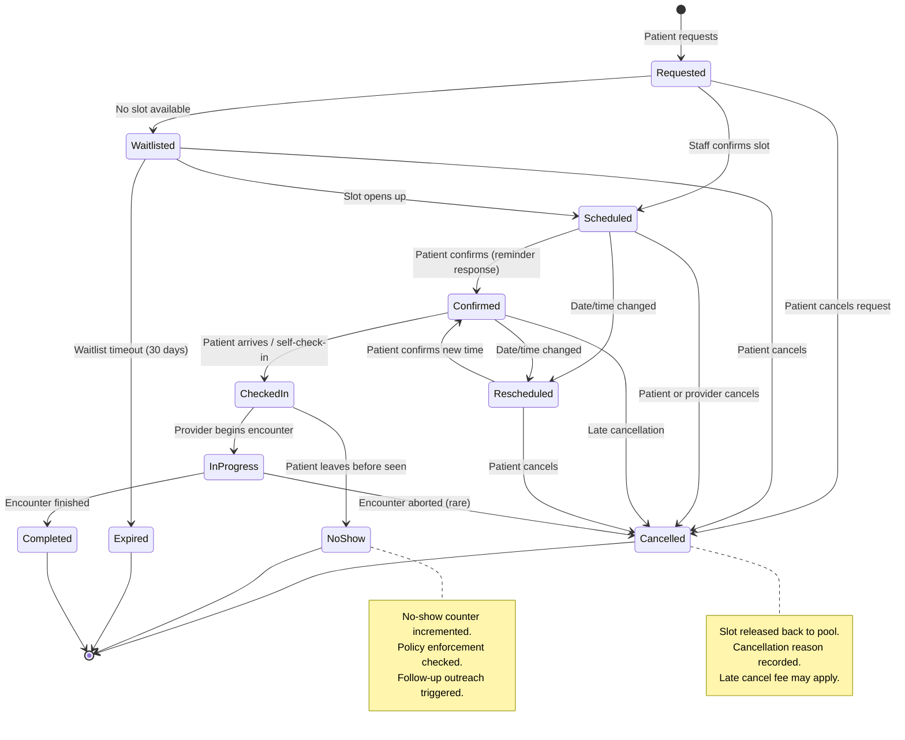

### Prescription Lifecycle

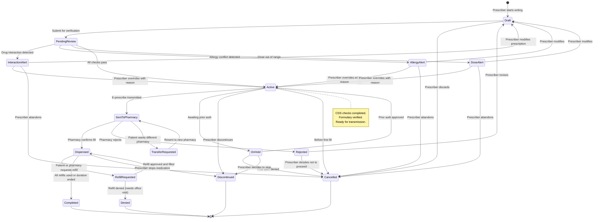

### Telemedicine Session Lifecycle

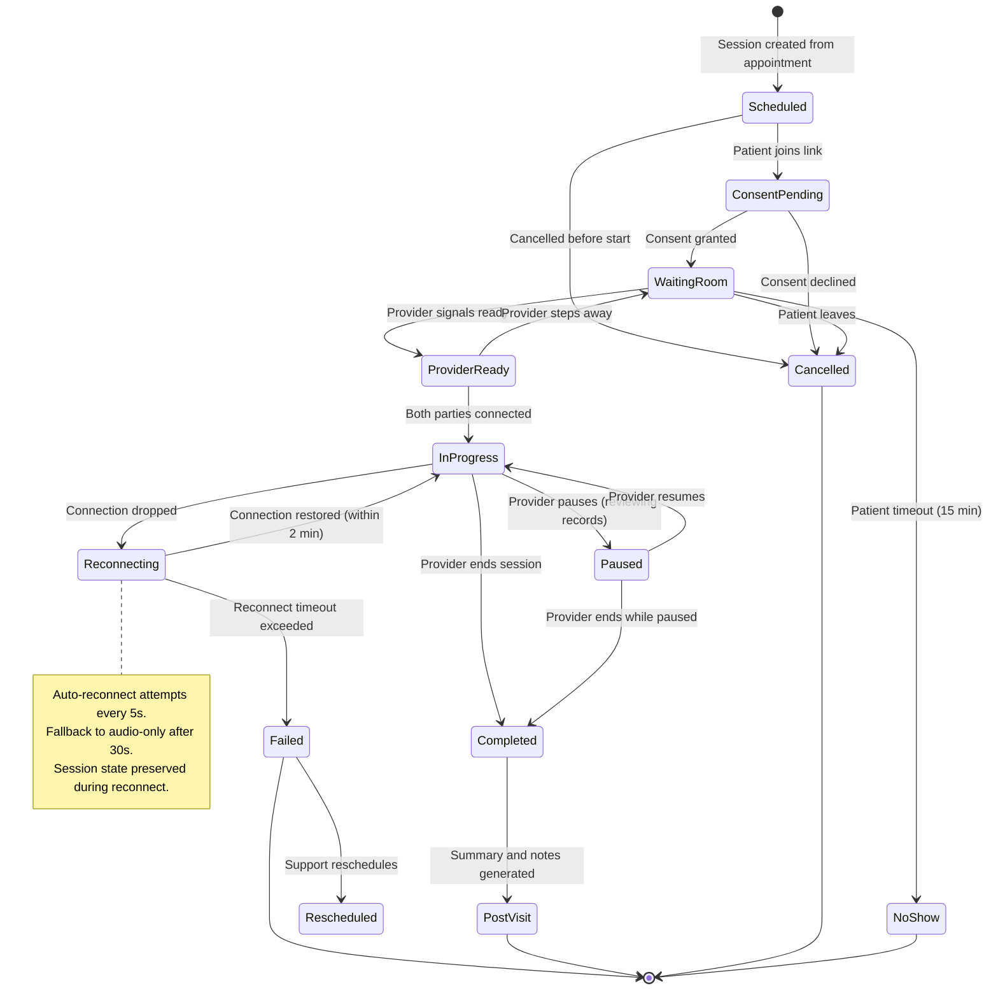

### Imaging Study Processing Lifecycle

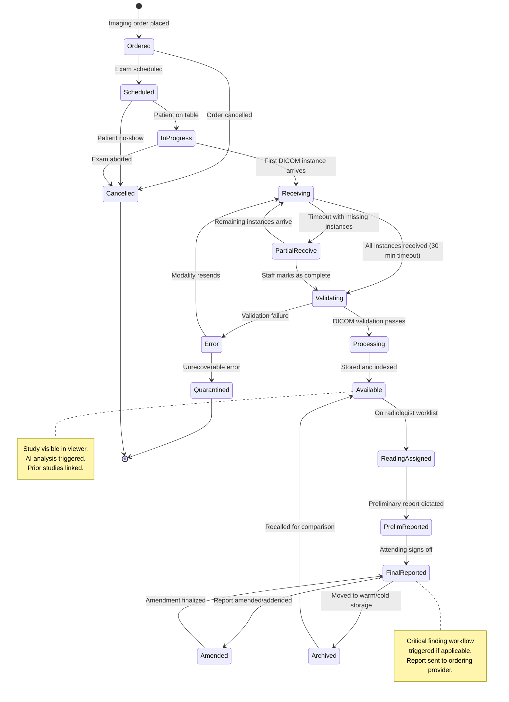

### Clinical Order Lifecycle

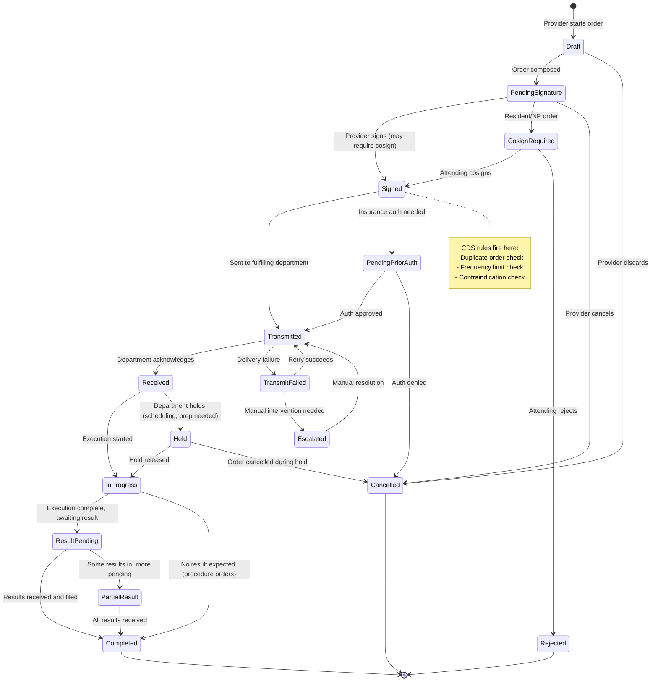

---

## Sequence Diagrams

### Patient Check-In to Encounter Completion

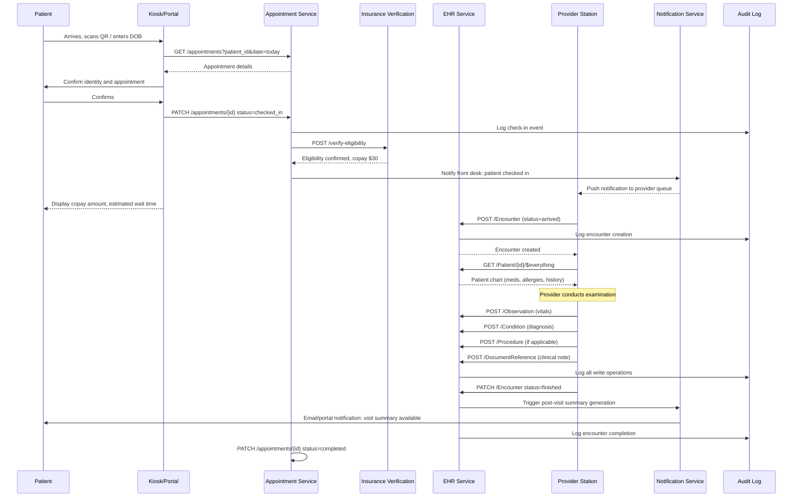

### E-Prescribing Flow

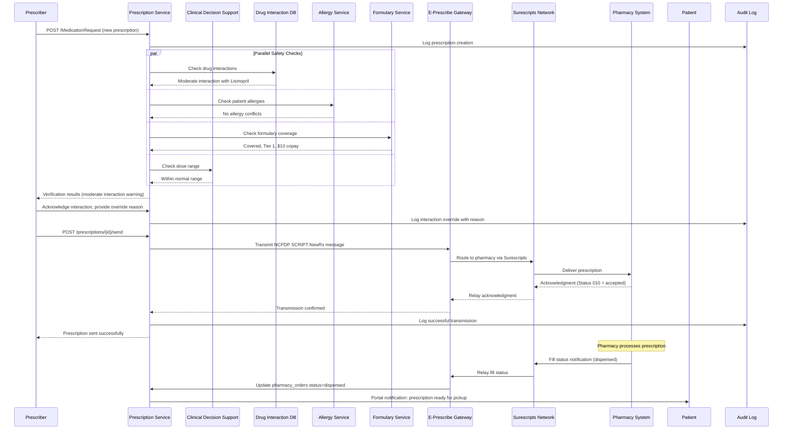

### DICOM Imaging Upload and Storage

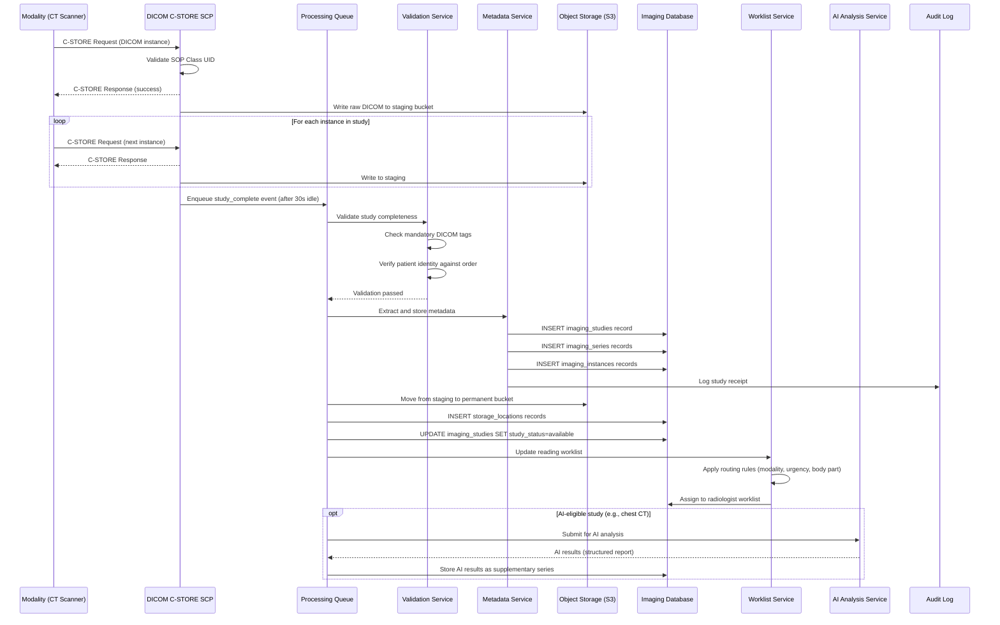

### Telemedicine Session with Recording

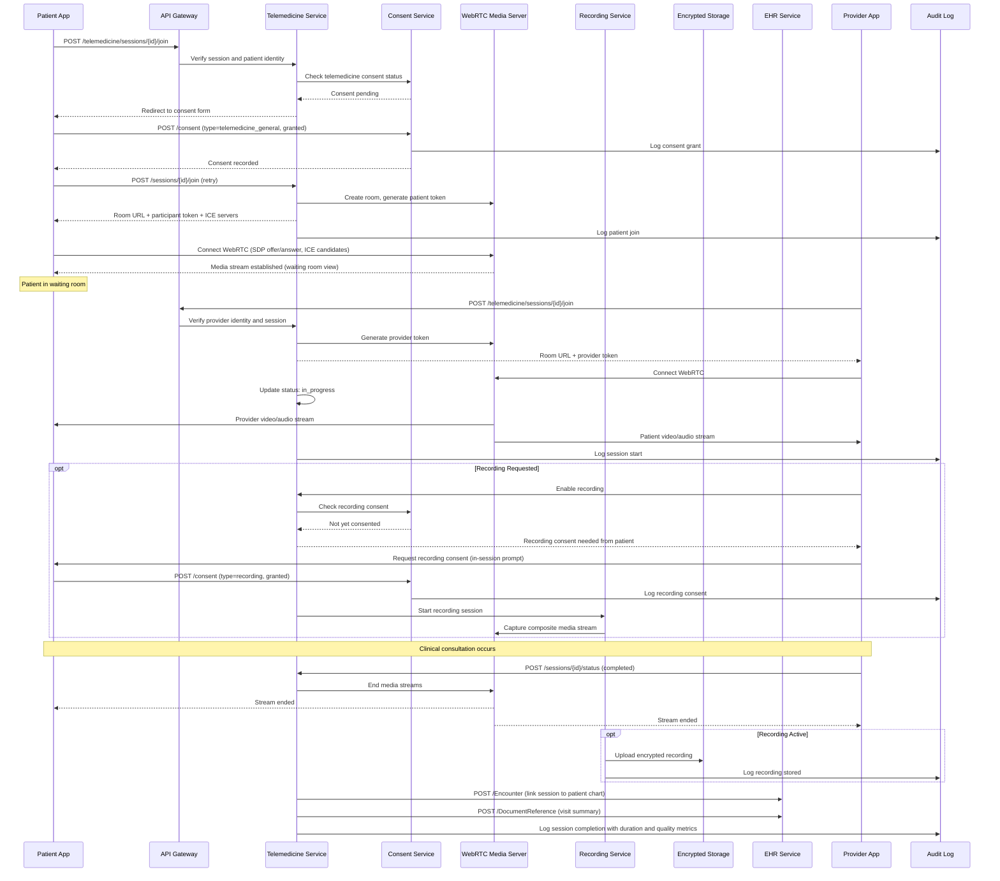

### Lab Order to Result Notification

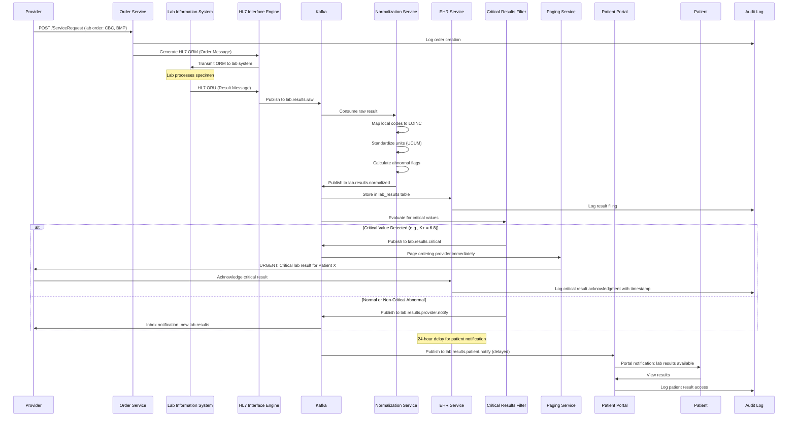

---

## Concurrency Control

### Concurrent Appointment Booking (Double-Booking Prevention)

```
Problem: Two patients simultaneously try to book the same provider slot.

Solution: Optimistic Concurrency Control with version counter on appointment_slots.

Algorithm:
    1. Client requests available slots:
       SELECT * FROM appointment_slots WHERE provider_id = ? AND slot_date = ? AND status = 'available'

    2. Client selects a slot and submits booking request

    3. Service attempts atomic slot claim:
       UPDATE appointment_slots
       SET status = 'booked',
           current_bookings = current_bookings + 1,
           version = version + 1,
           updated_at = now()
       WHERE slot_id = ?
         AND version = ?              -- optimistic lock
         AND status = 'available'     -- guard against race
         AND current_bookings < max_bookings  -- overbooking guard
       RETURNING *;

    4. If rows_affected = 1: Slot claimed successfully, create appointment record
       If rows_affected = 0: Slot was taken by another request
          -> Return 409 Conflict with suggested alternative slots

    5. Both slot claim and appointment creation happen in a single DB transaction:
       BEGIN;
         UPDATE appointment_slots ... (as above);
         INSERT INTO appointments (...) VALUES (...);
       COMMIT;

Why not SELECT FOR UPDATE (pessimistic locking)?
    - Holds row locks, increases contention under high load
    - Optimistic locking scales better when conflicts are infrequent
    - For appointment booking, conflict rate is < 1% (most slots are different)
    - Pessimistic locking is acceptable for very small slot pools (e.g., 1 specialist)

Overbooking Support:
    - When max_bookings > 1, multiple patients CAN book the same slot
    - The version + current_bookings < max_bookings check handles this atomically
```

### Medication Order Conflict Detection

```
Problem: Two providers simultaneously prescribe conflicting medications for the same patient.

Solution: Patient-level advisory lock + interaction check before commit.

Algorithm:
    1. Prescriber submits new prescription

    2. Acquire patient-level advisory lock:
       SELECT pg_advisory_xact_lock(hashtext('rx:' || patient_id::text));
       -- This serializes all prescription writes for a single patient
       -- Lock is automatically released at transaction end

    3. Within the lock, perform interaction check:
       SELECT * FROM prescriptions
       WHERE patient_id = ? AND status = 'active';
       -- Get current medication list

       For each active medication:
           SELECT * FROM drug_interactions
           WHERE (drug_a_rxnorm = ? AND drug_b_rxnorm = ?)
              OR (drug_a_rxnorm = ? AND drug_b_rxnorm = ?)
           -- Canonical ordering ensures consistent lookup

    4. If contraindicated interaction found:
       - Reject prescription with detailed interaction info
       - Prescriber must acknowledge and provide override reason

    5. If no critical interactions:
       - INSERT prescription
       - COMMIT (releases advisory lock)

Why advisory lock instead of row lock?
    - We are not updating existing rows; we are checking a SET of rows
    - Advisory lock gives us a logical mutex per patient
    - Very short hold time (< 100ms for the check)
    - Scales well because locks are per-patient (no hot rows)
```

### EHR Record Locking During Edit

```
Problem: Two clinicians simultaneously edit the same clinical note, causing lost updates.

Solution: Pessimistic locking with timeout and break-lock capability.

Implementation:

    Table: record_locks
    {
        lock_id:        UUID,
        resource_type:  'clinical_note',
        resource_id:    UUID,
        locked_by:      UUID (user_id),
        locked_at:      TIMESTAMPTZ,
        expires_at:     TIMESTAMPTZ (locked_at + 15 minutes),
        lock_reason:    'editing'
    }

    Acquire Lock:
        INSERT INTO record_locks (resource_type, resource_id, locked_by, locked_at, expires_at)
        VALUES ('clinical_note', ?, ?, now(), now() + interval '15 minutes')
        ON CONFLICT (resource_type, resource_id)
        DO NOTHING;
        -- If insert succeeds: lock acquired
        -- If conflict: check if existing lock is expired

    If existing lock is expired:
        DELETE FROM record_locks
        WHERE resource_type = ? AND resource_id = ? AND expires_at < now();
        -- Retry insert

    If existing lock is active:
        Return 423 Locked with lock holder info:
        { "locked_by": "Dr. Smith", "locked_at": "2026-03-22T10:00:00Z", "expires_in": "12 minutes" }

    Release Lock:
        DELETE FROM record_locks
        WHERE resource_type = ? AND resource_id = ? AND locked_by = ?;

    Break Lock (supervisor override):
        -- Requires 'admin' or 'supervisor' role
        DELETE FROM record_locks WHERE resource_type = ? AND resource_id = ?;
        -- Logged as break_lock event in audit trail

    Auto-Extend:
        -- Client sends heartbeat every 5 minutes while editing
        UPDATE record_locks SET expires_at = now() + interval '15 minutes'
        WHERE resource_type = ? AND resource_id = ? AND locked_by = ?;
```

---

## Idempotency

### Idempotent Prescription Submission

```
Problem: Network timeout during prescription creation. Client retries and creates a
duplicate prescription, leading to potential double-dosing.

Solution: Client-generated idempotency key stored in prescriptions table.

Implementation:
    1. Client generates a UUID idempotency_key before the first request
    2. Client sends: POST /MedicationRequest
       Headers: X-Idempotency-Key: 550e8400-e29b-41d4-a716-446655440000

    3. Server logic:
       BEGIN;
         -- Attempt insert with idempotency key
         INSERT INTO prescriptions (prescription_id, idempotency_key, patient_id, ...)
         VALUES (gen_random_uuid(), '550e8400-...', ?, ...)
         ON CONFLICT (idempotency_key) DO NOTHING
         RETURNING *;

         IF found THEN
             -- New prescription created, proceed with CDS checks
             COMMIT;
             RETURN 201 Created;
         ELSE
             -- Duplicate request, return the existing prescription
             SELECT * FROM prescriptions WHERE idempotency_key = '550e8400-...';
             RETURN 200 OK; -- (not 201, to signal it was a replay)
         END IF;

    4. Idempotency key is unique per prescription intent:
       - Same patient + same medication + same prescriber in same session = same key
       - Changing any clinical parameter generates a new key

    5. Key retention:
       - Keys are retained for 7 days (covers any reasonable retry window)
       - After 7 days, the unique constraint remains but collision is astronomically unlikely

    Safety Impact:
       - Prevents accidental double prescriptions from retries
       - Audit trail shows idempotent replays distinctly from genuine new orders
```

### Idempotent Appointment Booking

```
Problem: Patient double-clicks "Book" button or network retry creates duplicate appointment.

Solution: Idempotency key scoped to patient + provider + time window.

Implementation:
    1. Client generates idempotency_key = SHA256(patient_id + provider_id + slot_id + timestamp_minute)
       This ensures the same booking attempt within the same minute is idempotent.

    2. Server:
       BEGIN;
         -- Check for existing booking with same idempotency key
         SELECT * FROM appointments WHERE idempotency_key = ?;

         IF found AND status NOT IN ('cancelled', 'rescheduled') THEN
             RETURN 200 OK with existing appointment; -- idempotent replay
         END IF;

         -- Proceed with slot claim (optimistic locking)
         UPDATE appointment_slots SET status = 'booked', version = version + 1
         WHERE slot_id = ? AND version = ? AND status = 'available'
         RETURNING *;

         IF NOT found THEN
             RETURN 409 Conflict; -- slot taken
         END IF;

         INSERT INTO appointments (..., idempotency_key) VALUES (..., ?);
       COMMIT;
       RETURN 201 Created;

    3. Additional safeguard: Business rule prevents booking same patient with
       same provider within 30 minutes (regardless of idempotency key).
```

---

## Consistency Model

### Strong Consistency for Medication Orders (Patient Safety)

```
Requirement: Medication orders MUST be strongly consistent because eventual consistency
could allow two providers to prescribe contraindicated medications simultaneously.

Implementation:
    - Single primary database for prescription writes (no multi-master)
    - Patient-level advisory locks serialize concurrent prescription writes
    - Synchronous replication to standby (synchronous_commit = on)
    - Read-after-write guarantee: prescribing service reads from primary
    - Interaction checks always query primary (not read replica)

    Why not eventual consistency?
    - 5-second replication lag could allow Provider A and Provider B to each
      see only their own prescription, missing a life-threatening interaction
    - Patient safety is non-negotiable: we accept higher write latency for correctness

    Performance Mitigation:
    - Advisory locks are held < 100ms (interaction check is fast with proper indexes)
    - Only prescription WRITES go to primary; prescription READS for display can use replicas
    - Formulary checks are independently cacheable (eventual is fine for pricing data)
```

### Eventual Consistency for Analytics

```
Requirement: Analytics dashboards (appointment utilization, prescription volumes,
imaging throughput) do not need real-time data.

Implementation:
    - Analytics database is a read replica with up to 30-second replication lag
    - Materialized views refresh every 5 minutes for dashboard queries
    - Kafka consumers populate a data warehouse (Snowflake/BigQuery) with 1-hour delay
    - Reports marked with "Data as of: {timestamp}" to set user expectations

    Benefits:
    - Zero impact on transactional write path
    - Analytics queries (aggregations, joins) don't compete with OLTP workload
    - Data warehouse can be denormalized for query performance without affecting source schemas
```

### Read-Your-Writes for EHR

```
Requirement: When a clinician saves a clinical note, they must immediately see the
saved version. But other clinicians can tolerate a brief delay.

Implementation:
    - Write Path: All writes go to PostgreSQL primary
    - Read Path (same user who just wrote):
        Session affinity routes to primary for 5 seconds after any write
        Implementation: Set a cookie/header "read-from-primary-until: {timestamp+5s}"
        API gateway checks this header and routes accordingly

    - Read Path (other users):
        Reads go to nearest read replica
        Typical replication lag: < 1 second
        Acceptable for chart review by other providers

    - Implementation in API Gateway:
        if (request.header['X-Read-After-Write'] &&
            request.header['X-Read-After-Write'] > now()) {
            route_to_primary();
        } else {
            route_to_nearest_replica();
        }

    - On successful write, response includes:
        X-Read-After-Write: {current_time + 5s}
        Client must include this in subsequent reads
```

---

## Distributed Transaction / Saga

### Prescription Saga

```
The prescription workflow spans multiple services that cannot participate in a single
ACID transaction. We use a choreography-based saga with compensating actions.

Saga Steps:

Step 1: Create Prescription Draft
    Service: Prescription Service
    Action: INSERT prescription with status='pending_review'
    Compensating Action: UPDATE status='cancelled', reason='saga_rollback'

Step 2: Check Drug Interactions
    Service: Drug Interaction Service
    Action: Query interaction database for conflicts
    Result: PASS (no critical interactions) or FAIL (contraindication found)
    On FAIL: Saga stops, prescription stays in 'pending_review' with interaction details
    Compensating Action: None needed (read-only step)

Step 3: Check Allergies
    Service: Allergy Service
    Action: Query patient allergies against medication
    Result: PASS or FAIL
    On FAIL: Saga stops, prescription stays with allergy alert
    Compensating Action: None needed (read-only step)

Step 4: Check Formulary
    Service: Formulary Service
    Action: Verify insurance coverage and get copay
    Result: COVERED, NOT_COVERED, PRIOR_AUTH_REQUIRED
    On NOT_COVERED: Saga pauses, suggests alternatives
    Compensating Action: None needed (read-only step)

Step 5: Activate Prescription
    Service: Prescription Service
    Action: UPDATE prescription status='active'
    Compensating Action: UPDATE status='cancelled'

Step 6: Transmit to Pharmacy
    Service: E-Prescribing Gateway
    Action: Send NCPDP SCRIPT message via Surescripts
    Result: ACCEPTED or REJECTED
    On REJECTED: Compensate Step 5 (deactivate prescription), notify prescriber
    Compensating Action: Send CancelRx message to pharmacy

Step 7: Confirm Transmission
    Service: Prescription Service
    Action: UPDATE status='sent_to_pharmacy', record pharmacy_order
    Compensating Action: UPDATE status='active' (revert to pre-send state)

Saga Orchestrator State Machine:
    STARTED -> INTERACTIONS_CHECKED -> ALLERGIES_CHECKED -> FORMULARY_CHECKED
    -> ACTIVATED -> TRANSMITTED -> CONFIRMED

Timeout Handling:
    - Each step has a 30-second timeout
    - On timeout: retry once, then compensate from current step backward
    - Surescripts transmission timeout: 60 seconds (per their SLA)

Idempotency:
    - Each saga step is idempotent (safe to retry)
    - Saga instance tracked by prescription_id
    - Saga state persisted in saga_instances table for recovery after crashes
```

### Appointment Saga

```
Appointment booking is simpler but still involves multiple services.

Saga Steps:

Step 1: Validate Patient
    Service: Patient Service
    Action: Verify patient exists and is active
    Compensating Action: None

Step 2: Claim Slot
    Service: Scheduling Service
    Action: Optimistic lock slot (UPDATE with version check)
    Compensating Action: Release slot (UPDATE status='available')

Step 3: Verify Insurance
    Service: Insurance Service
    Action: Real-time eligibility check
    Result: ELIGIBLE or NOT_ELIGIBLE
    On NOT_ELIGIBLE: Compensate Step 2, notify patient
    Compensating Action: None (read-only)

Step 4: Create Appointment
    Service: Appointment Service
    Action: INSERT appointment record
    Compensating Action: UPDATE status='cancelled'

Step 5: Schedule Reminders
    Service: Notification Service
    Action: Create reminder records (48h, 24h, 2h before appointment)
    Compensating Action: Cancel pending reminders

Step 6: Confirm to Patient
    Service: Notification Service
    Action: Send booking confirmation (email + SMS)
    Compensating Action: Send cancellation notice (best effort)

Failure Scenarios:
    - Insurance check fails at Step 3: Release slot, notify patient
    - DB failure at Step 4: Release slot, return error
    - Notification failure at Step 5: Appointment still valid (non-critical)
    - Confirmation fails at Step 6: Appointment still valid (retry async)
```

---

## Security Design

### HIPAA Compliance Architecture

```
PHI Encryption:
    At Rest:
        - Database: PostgreSQL TDE (Transparent Data Encryption) with AES-256
        - Object Storage: S3 SSE-KMS with customer-managed keys
        - Backups: Encrypted with separate backup encryption key
        - Key rotation: Every 90 days (automated via AWS KMS)

    In Transit:
        - All internal service-to-service: mTLS (mutual TLS 1.3)
        - External APIs: TLS 1.3 minimum (TLS 1.2 deprecated)
        - Database connections: SSL required (sslmode=verify-full)
        - DICOM transfers: DICOM TLS (per DICOM PS3.15)

    Application-Level Encryption:
        - SSN, phone, email, address encrypted at application layer
        - Encryption keys managed per-patient for compartmentalization
        - Key derivation: HKDF from master key + patient_id
        - Enables per-patient key revocation on breach

Access Controls:
    Authentication:
        - SMART on FHIR (OAuth 2.0) for API access
        - SAML 2.0 for enterprise SSO
        - Multi-factor authentication required for all clinical users
        - EPCS requires two distinct factors (something you know + have/are)
        - Session timeout: 15 minutes idle, 8 hours absolute

    Authorization:
        - RBAC (Role-Based Access Control) with fine-grained scopes
        - Attribute-Based Access Control (ABAC) for context-sensitive rules
        - Minimum necessary access principle enforced at API layer

Audit Trail:
    - Every PHI access logged (see ehr_audit_logs schema above)
    - Audit logs are append-only (no UPDATE or DELETE permitted)
    - Audit logs stored for 7 years minimum (HIPAA requirement: 6 years)
    - Tamper-evident: cryptographic hash chain linking consecutive entries
    - Real-time audit monitoring for anomalous access patterns
    - Break-glass access: emergency override with mandatory justification and supervisor review
```

### Role-Based Access Control Matrix

```
| Resource              | Patient | Nurse | Physician | Specialist | Admin | Researcher |
|-----------------------|---------|-------|-----------|------------|-------|------------|
| Own demographics      | R/W     | R     | R         | R          | R/W   | -          |
| Own lab results       | R       | R     | R/W       | R          | R     | -          |
| Own medications       | R       | R     | R/W       | R/W        | R     | -          |
| Own appointments      | R/W     | R/W   | R         | R          | R/W   | -          |
| Other patient records | -       | R*    | R/W*      | R*         | R*    | R**        |
| Clinical notes        | R***    | R/W   | R/W       | R/W        | R     | -          |
| Prescribe medications | -       | -     | W         | W          | -     | -          |
| Controlled substances | -       | -     | W+EPCS    | W+EPCS     | -     | -          |
| Imaging studies       | R       | R     | R         | R/W        | R     | -          |
| Audit logs            | -       | -     | -         | -          | R     | -          |
| System configuration  | -       | -     | -         | -          | R/W   | -          |
| De-identified data    | -       | -     | -         | -          | -     | R          |

* = Only patients in their care (treatment relationship verified)
** = De-identified data only, IRB approval required
*** = Provider-controlled release; psychotherapy notes excluded per HIPAA
R = Read, W = Write, - = No access
```

### Consent Management

```
Consent Model:
    - Granular consent per data category (demographics, diagnoses, medications,
      mental health, substance abuse, HIV status, genetic data)
    - Consent tracked per purpose (treatment, payment, operations, research)
    - Time-bounded consent with expiration
    - Revocable at any time with immediate effect

    Table: patient_consents
    {
        consent_id, patient_id, category, purpose,
        granted_to (provider/organization),
        status (granted/revoked/expired),
        granted_at, revoked_at, expires_at,
        form_version, digital_signature
    }

    API Enforcement:
    - Every data access API checks consent status before returning data
    - Consent denials return 403 with specific denied categories
    - 42 CFR Part 2 (substance abuse records) requires separate consent with
      stricter controls than standard HIPAA
    - Minor consent rules vary by state (emancipated minors, reproductive health)

BAA (Business Associate Agreement) Requirements:
    - All cloud providers (AWS, GCP, Azure) must have signed BAA
    - All SaaS integrations (Surescripts, telemedicine platform) covered by BAA
    - BAA tracker in compliance dashboard
    - Annual BAA review and renewal process
```

### De-Identification for Research

```
Methods:
    Safe Harbor (18 identifiers removed):
        - Names, geographic data below state, dates (except year), phone, fax, email
        - SSN, MRN, health plan IDs, account numbers, certificate/license numbers
        - Vehicle IDs, device IDs, URLs, IPs, biometric IDs, photos, other unique IDs

    Expert Determination:
        - Statistical/scientific expert certifies very small re-identification risk
        - Allows retention of more data elements (useful for research)

    Implementation:
        - De-identification pipeline runs in isolated environment
        - Source data never leaves production; de-identified output goes to research DB
        - Date shifting: all dates shifted by random offset per patient (consistent within patient)
        - Age bucketing: ages > 89 bucketed as "90+"
        - Zip code truncation: only first 3 digits (or "000" if population < 20,000)
        - DICOM de-identification: burn-in PHI detection via OCR + removal
```

---

## Observability

### Clinical Workflow Metrics

```
EHR Metrics:
    - ehr.patient.lookup.latency (P50, P95, P99) by search type
    - ehr.encounter.create.rate per facility per hour
    - ehr.note.unsigned.count (gauge) -- compliance risk indicator
    - ehr.note.signing.latency (time from creation to signature)
    - ehr.critical_lab.acknowledgment.latency (time to provider ack)
    - ehr.chart.completeness.score per encounter
    - ehr.cds.alert.fire.rate by alert type
    - ehr.cds.alert.override.rate (high override rate = alert fatigue)

Appointment Metrics:
    - appointment.booking.latency (time from request to confirmation)
    - appointment.booking.conflict.rate (optimistic lock failures)
    - appointment.noshow.rate per provider, per day-of-week
    - appointment.cancellation.rate by reason code
    - appointment.wait.time (check-in to provider start)
    - appointment.utilization.rate (booked slots / available slots)
    - appointment.reminder.delivery.rate by channel
    - appointment.reminder.confirmation.rate

Telemedicine Metrics:
    - telemedicine.session.join.latency (time to first frame)
    - telemedicine.session.duration.avg
    - telemedicine.video.quality.score (MOS-equivalent)
    - telemedicine.audio.packet_loss.rate
    - telemedicine.reconnect.count per session
    - telemedicine.session.completed.rate vs failed/dropped
    - telemedicine.consent.completion.rate
    - telemedicine.waiting_room.avg_time

Imaging Metrics:
    - imaging.ingest.rate (instances per second)
    - imaging.ingest.latency (C-STORE to available in viewer)
    - imaging.storage.total_bytes by tier
    - imaging.retrieval.latency (WADO-RS first image)
    - imaging.worklist.pending.count per radiologist
    - imaging.report.turnaround.time (study received to final report)
    - imaging.critical_finding.communication.time
    - imaging.storage.tier_migration.rate

Prescription Metrics:
    - rx.create.rate per hour
    - rx.interaction_check.latency
    - rx.interaction.detected.rate by severity
    - rx.override.rate (prescriber overrides safety alert)
    - rx.eprescribe.transmission.latency
    - rx.eprescribe.success.rate
    - rx.refill.request.rate
    - rx.controlled_substance.rate (monitored for compliance)

HIPAA Audit Metrics:
    - audit.events.rate per action type
    - audit.break_glass.count (should be rare; spike = incident)
    - audit.access_denied.rate (elevated = potential attack)
    - audit.phi_access.unique_patients per user per day (anomaly detection)
    - audit.after_hours.access.rate (context-aware alerting)
```

### Alerting Rules

```
Critical (PagerDuty - immediate page):
    - EHR primary database replication lag > 5 seconds
    - Prescription service error rate > 1% (medication safety)
    - Critical lab result unacknowledged > 30 minutes
    - DICOM ingest failure rate > 5% (modality may be down)
    - Audit log write failure (HIPAA compliance gap)
    - Break-glass access detected (security review required)

Warning (Slack notification):
    - Appointment booking conflict rate > 5%
    - Telemedicine reconnect rate > 10%
    - E-prescribe transmission failure rate > 2%
    - Unsigned clinical notes > 24 hours old
    - Imaging report turnaround > SLA threshold

Informational (Dashboard only):
    - Appointment no-show rate trending up
    - Telemedicine adoption rate changes
    - Storage tier migration metrics
    - CDS alert override rates by provider
```

---

## Reliability and Resilience

### EHR 99.99% Uptime Architecture

```
Database Layer:
    - PostgreSQL with synchronous streaming replication
    - Primary + 2 synchronous standbys (same region, different AZ)
    - Automatic failover via Patroni/etcd (failover time < 30 seconds)
    - Connection pooling via PgBouncer (handles 10,000+ connections)

Application Layer:
    - Minimum 3 instances per service across 3 AZs
    - Health check endpoint: /health (DB connectivity + cache + dependencies)
    - Graceful degradation: if cache is down, serve from DB (slower but functional)
    - Circuit breaker on all external dependencies (lab interfaces, pharmacy gateways)

Load Balancer:
    - ALB with health checks every 10 seconds
    - Unhealthy threshold: 2 consecutive failures
    - Connection draining: 30 seconds on instance removal

Chaos Engineering:
    - Monthly failure injection tests
    - Scenarios: AZ failure, database failover, cache cluster loss, network partition
    - All scenarios must complete within availability budget
```

### Offline Mode for Clinical Workflows

```
Problem: Network outages in rural clinics or during disasters must not stop patient care.

Solution: Local-first architecture with sync-when-connected.

Implementation:
    1. Clinical workstation runs a local SQLite database
    2. Essential data pre-cached locally:
        - Patient demographics for scheduled patients
        - Active medication lists
        - Allergy lists
        - Recent lab results
        - Provider schedules

    3. During outage:
        - Clinician works against local database
        - All writes are journaled with timestamps and user identity
        - Clinical notes, vitals, orders saved locally
        - UI shows "OFFLINE MODE" banner prominently

    4. When connectivity restores:
        - Sync engine uploads journaled changes to central EHR
        - Conflict resolution: last-writer-wins for demographics
        - Conflict resolution: both-kept for clinical notes (with merge review)
        - Orders are validated against current state (drug interactions rechecked)
        - Sync status dashboard shows pending/completed/conflicted items

    5. Data freshness guarantee:
        - Local cache refreshed every 15 minutes when online
        - Stale data older than 24 hours flagged in UI
        - Controlled substances CANNOT be prescribed in offline mode
```

### Disaster Recovery for Patient Data

```
RPO (Recovery Point Objective):
    - EHR transactional data: RPO = 0 (synchronous replication, zero data loss)
    - DICOM imaging: RPO = 1 hour (async replication to DR site)
    - Audit logs: RPO = 0 (synchronous replication, compliance requirement)
    - Analytics/reporting: RPO = 24 hours (daily backup)

RTO (Recovery Time Objective):
    - EHR: RTO = 15 minutes (automated failover)
    - DICOM viewing: RTO = 1 hour (warm standby PACS)
    - E-prescribing: RTO = 30 minutes (failover to backup gateway)
    - Patient portal: RTO = 4 hours (acceptable for non-emergency)

Backup Strategy:
    - Continuous WAL archiving to S3 (point-in-time recovery)
    - Daily full database snapshots retained for 30 days
    - Monthly snapshots retained for 7 years (regulatory retention)
    - DICOM: Cross-region replication for hot/warm tiers
    - DICOM cold tier: Tape backup with offsite storage

DR Drills:
    - Quarterly full DR failover test
    - Annual tabletop exercise for ransomware scenario
    - Recovery runbooks maintained in version control (not in the systems they recover)
```

---

## Multi-Region and Disaster Recovery

### Data Residency for Healthcare

```
Requirement: Patient data must remain in the jurisdiction where the patient receives care.
Some states and countries have additional data residency requirements.

Architecture:
    Region Definition:
        - US: Single region with multi-AZ deployment (HIPAA does not mandate geographic restriction)
        - EU: Data must stay in EU (GDPR Article 44-49)
        - Canada: PIPEDA requires Canadian data to stay in Canada
        - Australia: Australian Privacy Principles (APPs) with local storage

    Implementation:
        - Each region has its own database cluster (not cross-region replication for PHI)
        - Patient's home region determined by treating facility location
        - Cross-region patient transfers use FHIR document exchange (push model)
        - Global patient index (non-PHI: hashed identifiers) for cross-region lookup
        - DNS-based routing: patients and providers connect to regional endpoints

    Cross-Facility Data Exchange:
        - Internal (same health system): Direct FHIR API calls within region
        - External (different health system): HL7 FHIR exchange via Carequality/CommonWell
        - Emergency: Break-glass cross-region access with full audit trail
```

### Cross-Facility Data Exchange (HL7 FHIR)

```
Exchange Patterns:

    1. Patient Referral (Push):
        Source EHR -> FHIR $document-reference-create -> Target EHR
        Document: CCD (Continuity of Care Document) containing:
            - Demographics, Problems, Medications, Allergies
            - Recent encounters, Lab results, Immunizations
        Format: FHIR Bundle with DocumentReference wrapper

    2. Patient Record Request (Pull):
        Target EHR -> FHIR /Patient/{id}/$everything -> Source EHR
        Authorization: Patient consent verified at both ends
        Scope: patient/*.read (SMART on FHIR scope)

    3. Real-Time Notifications (Subscribe):
        ADT (Admit/Discharge/Transfer) events via FHIR Subscription
        Topic: Patient admission, discharge, or transfer
        Channel: rest-hook (webhook) to subscribed facilities
        Payload: FHIR Encounter resource with minimal PHI

    4. Lab Result Sharing:
        Lab -> HL7 v2 ORU -> Interface Engine -> FHIR DiagnosticReport
        Consuming EHR receives via FHIR API or HL7 FHIR messaging

Network Participation:
    - Carequality: Framework for nationwide health information exchange
    - CommonWell Health Alliance: Patient matching and record linking
    - eHealth Exchange: Federal/VA/DoD health data sharing
    - DirectTrust: Secure email-like exchange for clinical documents
```

---

## Cost Drivers

### DICOM Storage Costs

```
Scenario: 1.8 PB/year ingest, 13 PB total with 7-year retention

Storage Costs (AWS, monthly):
    Hot (S3 Standard, 450 TB):     450,000 GB * $0.023/GB = $10,350/mo
    Warm (S3 IA, 3.6 PB):         3,600,000 GB * $0.0125/GB = $45,000/mo
    Cold (S3 Glacier DA, 9 PB):   9,000,000 GB * $0.00099/GB = $8,910/mo

    Total Storage: ~$64,260/month = ~$771,120/year

    Data Transfer (retrieval from warm/cold):
        Warm retrievals: 100 TB/month * $0.01/GB = $1,000/mo
        Cold retrievals: 1 TB/month * $0.02/GB = $20/mo

    Request Costs:
        PUT requests (ingest): 10M/day * 30 * $0.005/1000 = $1,500/mo
        GET requests (retrieval): 5M/day * 30 * $0.0004/1000 = $60/mo

Cost Optimization Strategies:
    - Aggressive lifecycle policies (auto-tier based on access patterns)
    - Lossless compression before storage (20-40% reduction for uncompressed DICOM)
    - Study-level deduplication (re-sent studies from modalities)
    - Negotiate reserved capacity pricing for predictable storage growth
    - Consider on-premises NAS for hot tier (cheaper at scale)
```

### Compliance Audit Costs

```
Annual Compliance Costs:
    HIPAA Risk Assessment:              $50,000 - $200,000
    SOC 2 Type II Audit:                $100,000 - $300,000
    HITRUST CSF Certification:          $200,000 - $500,000
    Penetration Testing (annual):       $30,000 - $100,000
    Security Information and Event Management (SIEM): $50,000 - $150,000/year
    Compliance Officer (FTE):           $120,000 - $180,000
    Privacy Officer (FTE):              $110,000 - $160,000
    Staff Training (HIPAA, security):   $20,000 - $50,000
    Incident Response Retainer:         $30,000 - $60,000
    Cyber Insurance Premium:            $50,000 - $200,000

    Total Annual Compliance Overhead:   $760,000 - $1,900,000

Cost Reduction Strategies:
    - Use HITRUST to satisfy multiple frameworks simultaneously
    - Automate audit evidence collection (reduces assessment time by 50%)
    - Continuous compliance monitoring vs. point-in-time audits
    - Cloud provider shared responsibility model (BAA covers infrastructure controls)
```

### Telemedicine Bandwidth

```
Bandwidth Costs for 75,000 sessions/day:

    Per Session: 3 Mbps * 15 min * 60 sec = 337.5 MB per session
    Daily: 75,000 * 337.5 MB = 25.3 TB/day
    Monthly: 25.3 TB * 30 = 759 TB/month

    AWS Data Transfer Out: 759 TB * $0.05/GB (blended at volume) = $37,950/month

    Media Server Infrastructure:
        WebRTC SFU servers: 50 c5.4xlarge instances = $25,000/month
        TURN/STUN servers: 10 c5.xlarge instances = $2,000/month

    Total Telemedicine Infrastructure: ~$65,000/month = ~$780,000/year

Cost Optimization:
    - Adaptive bitrate reduces bandwidth 30-40% vs. fixed 720p
    - Audio-only fallback for poor connections saves 90% bandwidth
    - Regional media servers reduce cross-region data transfer
    - Negotiate committed use discounts for predictable load
    - Consider dedicated interconnect for high-volume facilities
```

---

## Deep Platform Comparisons

### EHR Platform Comparison

| Dimension | Epic | Cerner (Oracle Health) | Allscripts | OpenMRS |
|-----------|------|----------------------|------------|---------|
| **Market Position** | #1 US market share (38%) | #2 US market share (25%) | Mid-market focus | Open-source, developing world |
| **Architecture** | Monolithic (Caché/IRIS) | Client-server, moving to cloud | Web-based, modular | Java-based, modular |
| **Database** | InterSystems IRIS (proprietary) | Oracle DB / Millennium | Microsoft SQL Server | MySQL / PostgreSQL |
| **Interoperability** | FHIR R4, Epic on FHIR, Care Everywhere | FHIR R4, CommonWell, Carequality | FHIR R4, dbMotion | FHIR module, REST API |
| **Hosting** | On-premises or Epic-hosted | Oracle Cloud, on-premises | Cloud or on-premises | Self-hosted or cloud |
| **Patient Portal** | MyChart (industry standard) | HealtheLife / Oracle Health Portal | FollowMyHealth | Patient-facing modules |
| **CDS Engine** | Best Practice Alerts (BPA) | MPages, Discern Rules | Avenel Clinical Rules | Bahmni, add-on modules |
| **Customization** | Chronicles, Clarity, Caboodle | Millennium customization, PowerChart | Extensive configuration | Fully open source |
| **Implementation** | 12-24 months, $100M+ (large IDN) | 12-18 months, $50-200M | 6-12 months, $5-50M | Weeks-months, minimal cost |
| **Annual License** | $1,500-2,500/provider/year | $1,000-2,000/provider/year | $500-1,500/provider/year | Free (support contracts optional) |
| **Best For** | Large academic medical centers, IDNs | Mid-large hospitals, federal/VA | Community hospitals, ambulatory | Low-resource settings, research |
| **Weaknesses** | Cost, vendor lock-in, slow to adopt standards | Oracle acquisition uncertainty, integration complexity | Smaller R&D investment, market share declining | Limited out-of-box features, requires development |

### Telemedicine Platform Comparison

| Dimension | Zoom for Healthcare | Doxy.me | Teladoc Health | Custom (WebRTC) |
|-----------|-------------------|---------|----------------|-----------------|
| **HIPAA Compliance** | BAA available, encrypted | BAA available, peer-to-peer encrypted | Full HIPAA, SOC 2 | Depends on implementation |
| **Setup Complexity** | Low (SaaS) | Very low (browser-based) | Medium (platform) | High (build from scratch) |
| **EHR Integration** | Epic, Cerner plugins | Limited, iframe embed | Proprietary EHR | Full control |
| **Waiting Room** | Yes | Yes | Yes | Must build |
| **Recording** | Cloud recording with consent | No native recording | Session recording | Must implement |
| **Max Participants** | 300 (healthcare plan) | 2 (free), group (paid) | 2 (standard visit) | Configurable |
| **Cost** | $200-300/provider/month | Free (basic), $35/mo (pro) | Per-visit model ($50-75/visit) | Infrastructure + development |
| **Peripheral Support** | Limited | No | Proprietary devices | Custom integration |
| **Scalability** | Excellent (Zoom infrastructure) | Good for small practices | Enterprise scale | Depends on architecture |
| **Latency** | < 150ms globally | Variable (P2P dependent) | Optimized for their network | Depends on media server deployment |
| **Best For** | Organizations already using Zoom | Solo/small practices, cost-sensitive | Full virtual care platform needs | Health systems wanting full control |

### E-Prescribing Platform Comparison

| Dimension | Surescripts (Network) | DoseSpot (API) | DrFirst (Rcopia) | Custom Integration |
|-----------|---------------------|----------------|-------------------|-------------------|
| **Network Coverage** | 99%+ US pharmacies | Via Surescripts | Via Surescripts | Via Surescripts (required) |
| **EPCS Support** | Network backbone | Full EPCS certified | Full EPCS certified | Must implement + certify |
| **PDMP Integration** | Gateway only | State PDMP integration | NarxCare integration | State-by-state integration |
| **Formulary/Eligibility** | Real-time formulary | Formulary via Surescripts | Formulary + PA | Must integrate |
| **EHR Integration** | API standard (NCPDP SCRIPT) | RESTful API, easy embed | Widget or API | Full control |
| **Certification** | N/A (they are the network) | NCPDP certified sender | NCPDP certified sender | Must obtain certification |
| **Cost Model** | Per-transaction to sender | Per-provider/month ($200-400) | Per-provider/month ($150-350) | Surescripts fees + dev cost |
| **Implementation Time** | N/A | 4-8 weeks | 4-12 weeks | 6-18 months (with certification) |
| **Best For** | Required backbone for all | Startups, EHR vendors | Established EHR vendors | Health systems with dev capacity |

### PACS Vendor Comparison

| Dimension | Sectra | Horos/OsiriX | Google Health (DICOM) | Ambra Health |
|-----------|--------|-------------|----------------------|--------------|
| **Deployment** | On-premises + cloud hybrid | On-premises (Mac) | Google Cloud native | Cloud-native SaaS |
| **DICOM Conformance** | Full | Full | Full (Cloud Healthcare API) | Full |
| **Viewer** | Zero-footprint web + thick | Thick client (Mac only) | Cloud-based viewer | Zero-footprint web |
| **AI Integration** | AI orchestrator marketplace | Plugin-based | Vertex AI integration | AI marketplace |
| **Storage Backend** | Proprietary + vendor NAS | Local filesystem | Google Cloud Storage | AWS S3 |
| **Scalability** | Enterprise (millions of studies) | Single workstation | Petabyte-scale | Enterprise cloud |
| **Cost** | $500K-5M (enterprise license) | Free (open source) | Pay-per-use (storage + API) | Per-study pricing |
| **Best For** | Large radiology departments | Research, small practices | Cloud-first organizations | Image exchange, cloud archive |

---

## Edge Cases

### 1. Medication Interaction Detected After Prescribing

```
Scenario: A drug interaction database update reveals a previously unknown major
interaction between two medications a patient is already taking.

Detection: Nightly batch job compares all active prescriptions against updated
interaction database.

Response:
    1. Flag all affected patient-medication pairs
    2. Generate "retrospective interaction alert" for each prescriber
    3. Route alerts to prescriber inbox with priority based on severity
    4. For contraindicated interactions: escalate to pharmacy director
    5. Pharmacist reviews each case and contacts prescriber
    6. Document outcome in patient chart (medication changed, risk accepted, etc.)
    7. Audit trail captures the entire retrospective review workflow

Prevention:
    - Subscribe to drug database vendor's real-time update feed
    - Run interaction re-check whenever database updates
    - Maintain version history of interaction database for forensic review
```

### 2. Appointment Slot Race Condition

```
Scenario: 50 patients simultaneously hit "Book" for the last available slot
with a popular specialist.

Handling:
    1. Optimistic locking ensures exactly 1 patient gets the slot
    2. 49 patients receive 409 Conflict response
    3. Response includes: alternative available slots (next 3 available times)
    4. Client UI immediately shows alternatives without requiring a new search
    5. Waitlist option presented if no acceptable alternatives

Monitoring:
    - Alert if conflict rate > 10% for any provider (indicates undersupply)
    - Dashboard shows "slot contention" metric per provider for capacity planning
```

### 3. Telemedicine Connection Drop During Consultation

```
Scenario: Patient's internet drops mid-consultation during a critical discussion
about a new cancer diagnosis.

Handling:
    1. Media server detects connection loss (no RTCP packets for 5 seconds)
    2. Session status -> "reconnecting"
    3. Provider sees "Patient disconnected - waiting for reconnect" message
    4. Auto-reconnect attempts every 5 seconds for 2 minutes
    5. If video fails: fallback offer to audio-only (lower bandwidth)
    6. If audio fails: fallback to phone call (provider dials patient)
    7. Session state (chat history, shared documents) preserved across reconnects
    8. If reconnect fails after 2 minutes:
        - Session marked as "interrupted"
        - Provider prompted to call patient on phone
        - Rescheduling offered automatically
    9. Session duration excludes disconnected time for billing

Recording Impact:
    - Recording captures up to disconnection point
    - New segment starts on reconnect
    - Segments linked by session_id for continuity
```

### 4. DICOM Study Corruption Detection

```
Scenario: Storage system bit-rot or transfer error causes a DICOM file to become
unreadable, discovered when a radiologist tries to open a prior study for comparison.

Detection:
    1. On retrieval: Compare SHA-256 hash against stored content_hash
    2. Hash mismatch -> file is corrupt

Recovery:
    1. Check replica storage locations (different AZ/region)
    2. If replica exists and hash matches: serve replica, initiate repair of primary
    3. If no healthy replica: check backup (point-in-time recovery)
    4. If backup available: restore specific study from backup
    5. If no backup: flag as "unrecoverable", notify radiology QA team
    6. Request re-transmission from originating modality (if within retention window)

Prevention:
    - Weekly integrity scan: randomly sample 1% of studies and verify hashes
    - Maintain minimum 2 copies in different storage backends
    - Use erasure coding (e.g., S3 11 9s durability) for primary storage
    - Annual full integrity audit of cold storage tier
```

### 5. Patient Record Merge (Duplicate Detection)

```
Scenario: Same patient registered twice with slightly different demographics
(e.g., "Jon Smith" DOB 1980-01-15 and "Jonathan Smith" DOB 01/15/1980).

Detection:
    - Probabilistic matching algorithm runs on new patient registration
    - Match criteria: normalized name + DOB + gender + last 4 SSN + phone
    - Scoring: exact DOB match (+40), phonetic name match (+30), SSN match (+50)
    - Threshold: > 80 = likely duplicate, > 95 = definite duplicate
    - Daily batch job scans for new potential duplicates

Merge Process:
    1. HIM (Health Information Management) reviews potential match
    2. If confirmed duplicate: initiate merge
    3. Surviving record chosen (usually the one with more data)
    4. Data from deprecated record merged:
        - Encounters: re-linked to surviving patient_id
        - Lab results: re-linked
        - Medications: merged and de-duplicated
        - Allergies: union of both lists
        - Appointments: re-linked
        - Imaging studies: re-linked (DICOM metadata updated)
    5. Deprecated patient_id marked as merged (merged_into_id set)
    6. All future lookups by deprecated MRN redirect to surviving record
    7. Audit trail records the merge with both identities

Unmerge:
    - If merge was incorrect: unmerge restores the deprecated record
    - All data movements are reversible (original patient_id stored in audit)
    - Extremely rare but must be supported (wrong patient data in chart = safety issue)
```

### 6. Emergency Override of Access Controls (Break-Glass)

```
Scenario: ER physician needs to treat an unconscious patient. The patient's records
are restricted (e.g., VIP patient, psychiatric records, substance abuse records).

Implementation:
    1. Physician clicks "Emergency Access" button
    2. System presents acknowledgment: "You are accessing restricted records
       outside your normal authorization. All access will be audited and reviewed."
    3. Physician must provide:
        - Reason for emergency access (free text + reason code)
        - Patient identifier (MRN or name)
    4. Access granted immediately (no approval workflow -- patient safety first)
    5. All actions during break-glass session are flagged in audit log
    6. Automatic notification to:
        - Privacy officer (within 1 hour)
        - Patient's primary care provider
        - Department supervisor
    7. Privacy officer reviews within 24 hours:
        - Legitimate: documented and closed
        - Inappropriate: escalated to compliance
    8. Break-glass sessions auto-expire after 4 hours

42 CFR Part 2 Override:
    - Substance abuse records require SEPARATE break-glass acknowledgment
    - Even in emergency, only minimum necessary data is displayed
    - Additional audit entry specifically for Part 2 records
```

### 7. Cross-State Telemedicine Licensing

```
Scenario: Provider licensed in New York has a telemedicine session with a patient
currently in New Jersey.

Handling:
    1. At session creation: capture patient's current state (geo-IP or self-report)
    2. License verification service checks: provider.license_states contains patient_state?
    3. If licensed in patient's state: proceed normally
    4. If NOT licensed:
        - Block session creation with clear error message
        - Suggest: in-state providers available for referral
        - Exception: IMLC (Interstate Medical Licensure Compact) participating states
        - Exception: COVID-era waivers (if still active)
        - Exception: established patient relationship (state-specific rules)
    5. License status cached with 24-hour TTL (licenses don't change frequently)
    6. Nightly batch verifies all active provider licenses against state boards

Edge Case within Edge Case:
    - Patient starts session in NY, drives to NJ mid-session
    - Policy: State at session START governs the entire session
    - Provider must verify at session start; no mid-session re-verification
```

### 8. Controlled Substance Prescribing (EPCS)

```
Scenario: Provider prescribes Schedule II opioid via e-prescribing.

Additional Requirements (beyond standard e-prescribing):
    1. Identity Proofing: Provider identity verified to NIST IAL2 level
    2. Two-Factor Authentication:
        - Factor 1: Password or biometric (something you know/are)
        - Factor 2: Hardware token or approved authenticator app (something you have)
        - Both factors required at time of signing, not just login
    3. PDMP Check:
        - Query state Prescription Drug Monitoring Program
        - Display patient's controlled substance history
        - Provider must acknowledge PDMP results before prescribing
    4. Logical Access Controls:
        - Only DEA-registered providers can prescribe controlled substances
        - DEA number validated against DEA database
        - Schedule II: no refills allowed (new prescription required each time)
    5. Audit Requirements:
        - Every EPCS signing event logged with both authentication factors
        - Third-party audit of EPCS system required annually
        - Signing certificate chain preserved for 2 years

    Technical Implementation:
        - EPCS signing uses FIPS 140-2 certified cryptographic module
        - Digital signature applied to prescription content (not just authentication)
        - Prescription content hash included in signature for tamper detection
```

### 9. Imaging Study Too Large for Single Upload

```
Scenario: Cardiac CT with retrospective gating produces 5,000+ slices totaling 3 GB.
Single HTTP upload times out.

Handling:
    1. DICOM C-STORE: Already instance-by-instance (no size limit per study)
        - Each instance is ~512 KB, sent individually
        - SCP assembles study from individual instances

    2. Web Upload (DICOMweb STOW-RS):
        - Chunked transfer encoding for multipart DICOM
        - Maximum 100 instances per STOW-RS request
        - Client sends multiple STOW-RS requests for large studies
        - Server correlates by Study Instance UID
        - Progress tracking via study-level "instances received" counter

    3. Timeout Configuration:
        - HTTP timeout: 5 minutes per STOW-RS request
        - Study assembly timeout: 30 minutes from first to last instance
        - If timeout exceeded: flag as partially received

    4. Resumable Upload:
        - Client tracks which instances have been acknowledged
        - On failure: query server for received instances, send only missing ones
        - Idempotency: SOP Instance UID uniqueness prevents duplicate storage
```

### 10. Consent Withdrawal Mid-Treatment

```
Scenario: Patient revokes consent for data sharing while actively being treated
at a facility that received their records via HIE.

Handling:
    1. Consent revocation recorded immediately
    2. Downstream effects:
        - Future data queries from external facilities return "consent revoked"
        - Data already received by external facilities:
            State law governs whether they must delete or may retain
            Most jurisdictions: data received in good faith may be retained
            for continuity of care but not shared further
    3. Internal access: treating providers retain access for current encounter
    4. Research data: any de-identified data already in research datasets is unaffected
    5. Audit trail: consent revocation and all subsequent access logged
    6. Notification: all facilities that received data are notified of revocation
    7. Portal access: patient portal immediately reflects new consent status

    Technical Implementation:
        - Consent status checked on every data access (not cached for long)
        - Consent revocation event published to Kafka topic
        - All consuming services must process revocation within 1 hour
        - Consent status included in FHIR Consent resource, queryable via API
```

---

## Interoperability

### HL7 FHIR Resource Mapping

```
Healthcare Domain Concept -> FHIR R4 Resource:

    Patient demographics     -> Patient
    Provider information     -> Practitioner, PractitionerRole
    Organization/Facility    -> Organization, Location
    Clinical encounter       -> Encounter
    Diagnosis               -> Condition
    Procedure               -> Procedure
    Lab order               -> ServiceRequest
    Lab result              -> Observation, DiagnosticReport
    Vital signs             -> Observation (vital-signs profile)
    Allergy                 -> AllergyIntolerance
    Immunization            -> Immunization
    Medication              -> Medication
    Prescription            -> MedicationRequest
    Dispense record         -> MedicationDispense
    Clinical note           -> DocumentReference, Composition
    Care plan               -> CarePlan
    Appointment             -> Appointment, Slot, Schedule
    Imaging study           -> ImagingStudy
    Radiology report        -> DiagnosticReport (imaging profile)
    Consent                 -> Consent
    Insurance               -> Coverage, ExplanationOfBenefit
    Referral                -> ServiceRequest (referral intent)

FHIR Capability Statement:
    - Published at /metadata endpoint
    - Declares supported resources, search parameters, operations
    - Versioned independently from application releases
    - SMART on FHIR authorization configuration at /.well-known/smart-configuration
```

### CDA Document Types

```
Clinical Document Architecture (CDA) documents used for cross-system exchange:

    CCD (Continuity of Care Document):
        - Most common exchange document
        - Contains: problems, medications, allergies, procedures, results, immunizations
        - Used for: referrals, patient transfers, patient portal downloads
        - Structure: Header (patient, author, custodian) + Body (sections with entries)

    Discharge Summary:
        - Generated at hospital discharge
        - Contains: hospital course, discharge diagnoses, medications at discharge,
          follow-up instructions, pending results
        - Sent to: PCP, receiving facility

    Consultation Note:
        - Specialist's evaluation sent back to referring provider
        - Contains: reason for referral, findings, recommendations

    Progress Note:
        - Ongoing treatment documentation
        - Contains: subjective, objective, assessment, plan (SOAP format)

    Operative Report:
        - Surgical procedure documentation
        - Contains: pre-op diagnosis, procedure performed, findings, specimens,
          estimated blood loss, complications

CDA to FHIR Mapping:
    - CDA documents can be converted to FHIR Bundles using established transforms
    - FHIR $document operation generates CDA-equivalent documents
    - Dual-format support recommended during industry transition period
```

### Code Systems

```
ICD-10-CM (International Classification of Diseases, 10th Revision, Clinical Modification):
    Purpose: Diagnosis coding for billing and clinical documentation
    Example: E11.65 = Type 2 diabetes mellitus with hyperglycemia
    Structure: 3-7 characters (category.etiology.manifestation.extension)
    FHIR System URI: http://hl7.org/fhir/sid/icd-10-cm
    Total codes: ~72,000
    Updated: Annually (October 1)

ICD-10-PCS (Procedure Coding System):
    Purpose: Inpatient procedure coding
    Example: 0DBN4ZX = Excision of sigmoid colon, percutaneous endoscopic, diagnostic
    Structure: 7 characters (section, body system, operation, body part, approach, device, qualifier)
    FHIR System URI: http://www.cms.gov/Medicare/Coding/ICD10

SNOMED CT (Systematized Nomenclature of Medicine - Clinical Terms):
    Purpose: Clinical terminology for problems, findings, procedures, body structures
    Example: 44054006 = Diabetes mellitus type 2
    Structure: Concept ID (numeric) with hierarchical relationships
    FHIR System URI: http://snomed.info/sct
    Total concepts: ~350,000
    Updated: Biannually (January, July)

LOINC (Logical Observation Identifiers Names and Codes):
    Purpose: Lab test and observation identification
    Example: 2345-7 = Glucose [Mass/volume] in Serum or Plasma
    Structure: numeric code with component, property, time, system, scale, method
    FHIR System URI: http://loinc.org
    Total codes: ~99,000

CPT (Current Procedural Terminology):
    Purpose: Outpatient procedure and service coding (billing)
    Example: 99213 = Office visit, established patient, low complexity
    Structure: 5-digit numeric code
    FHIR System URI: http://www.ama-assn.org/go/cpt

HCPCS (Healthcare Common Procedure Coding System):
    Purpose: Supplies, equipment, and services not covered by CPT
    Example: J0129 = Abatacept injection, 10 mg
    Structure: 1 letter + 4 digits

RxNorm:
    Purpose: Normalized drug naming
    Example: 860975 = Metformin hydrochloride 500 MG Oral Tablet
    Structure: Concept Unique Identifier (CUI)
    FHIR System URI: http://www.nlm.nih.gov/research/umls/rxnorm

NDC (National Drug Code):
    Purpose: Drug product identification (package level)
    Structure: 10-11 digits (labeler-product-package)
    Example: 0093-7212-01 = Metformin HCl 500mg, 100 tablets, Teva

CVX (Vaccine Administered):
    Purpose: Vaccine type identification
    Example: 208 = COVID-19 Pfizer-BioNTech vaccine
    FHIR System URI: http://hl7.org/fhir/sid/cvx
```

### ADT Messaging (Admit, Discharge, Transfer)

```
ADT messages are HL7 v2.x messages that track patient movement through a facility.

Common ADT Event Types:
    A01 - Admit/Visit Notification (patient admitted)
    A02 - Transfer (patient moved to new unit/bed)
    A03 - Discharge (patient leaving facility)
    A04 - Register (outpatient registration)
    A05 - Pre-Admit (scheduled future admission)
    A06 - Change Outpatient to Inpatient
    A07 - Change Inpatient to Outpatient
    A08 - Update Patient Information
    A11 - Cancel Admit
    A12 - Cancel Transfer
    A13 - Cancel Discharge
    A28 - Add Person (new patient in master index)
    A31 - Update Person (demographics update)
    A40 - Merge Patient (duplicate resolution)

ADT Message Flow:
    1. ADT system generates HL7 v2 message
    2. Interface engine (Mirth Connect, Rhapsody) routes message
    3. Subscribing systems (EHR, billing, bed management, dietary) receive and process
    4. Acknowledgment (ACK) sent back per HL7 reliable delivery protocol

FHIR Equivalent:
    - ADT A01/A03/A04 -> Encounter resource create/update
    - ADT A08/A31 -> Patient resource update
    - ADT A40 -> Patient $merge operation
    - Real-time notification via FHIR Subscription (R5) or Event hooks
```

### Lab Interface (ORU/ORM)

```
Lab interfaces use HL7 v2.x for bidirectional communication between EHR and LIS.

ORM (Order Message) - EHR to LIS:
    Direction: EHR -> Interface Engine -> Lab Information System
    Purpose: Transmit lab orders with patient demographics and test codes
    Key Segments:
        MSH - Message Header (sending/receiving application, timestamp)
        PID - Patient Identification (MRN, name, DOB, gender)
        PV1 - Patient Visit (encounter, attending physician, facility)
        ORC - Common Order (order number, order status, ordering provider)
        OBR - Observation Request (test code, clinical info, specimen)

ORU (Result Message) - LIS to EHR:
    Direction: LIS -> Interface Engine -> EHR
    Purpose: Transmit lab results back to ordering system
    Key Segments:
        MSH - Message Header
        PID - Patient Identification
        PV1 - Patient Visit
        ORC - Common Order (order number, result status)
        OBR - Observation Request (test code, specimen, result status)
        OBX - Observation Result (test name, value, units, reference range, abnormal flag)
        NTE - Notes (comments, interpretive text)

Interface Engine Processing:
    1. Receive HL7 message
    2. Validate message structure and required fields
    3. Transform codes (local -> LOINC, local -> SNOMED)
    4. Route to destination system(s)
    5. Monitor for ACK/NAK responses
    6. Queue failed messages for retry (exponential backoff)
    7. Alert on persistent failures (interface down)

FHIR Migration Path:
    - ORU -> FHIR DiagnosticReport + Observation resources
    - ORM -> FHIR ServiceRequest resource
    - Gradual migration: interface engine translates HL7v2 <-> FHIR
    - Dual-stack period: support both formats during transition
    - Target: Full FHIR-native lab interface within 3-5 years
```

---

## Architecture Decision Records

### ADR-001: FHIR R4 as Primary API Standard

**Status:** Accepted

**Context:** The healthcare system needs standardized APIs for internal microservice communication, external partner integration, and regulatory compliance (21st Century Cures Act).

**Decision:** Adopt HL7 FHIR R4 as the primary API standard for all patient-facing data exchange. Internal service-to-service communication may use optimized protobuf/gRPC where FHIR overhead is prohibitive, but all external APIs and inter-system boundaries use FHIR.

**Consequences:**
- Positive: Regulatory compliance, ecosystem compatibility, developer familiarity
- Positive: Patient access APIs are standards-based from day one
- Negative: FHIR resources are verbose (JSON payload size); mitigate with compression
- Negative: Some clinical concepts map awkwardly to FHIR resources; use extensions
- Negative: FHIR search specification is complex; implement incrementally

### ADR-002: PostgreSQL as Primary Data Store

**Status:** Accepted

**Context:** Healthcare data is relational (patients have encounters, encounters have diagnoses, etc.) with strong consistency requirements. The system needs JSONB support for semi-structured clinical data and robust partitioning for temporal queries.

**Decision:** Use PostgreSQL as the primary transactional database for all subsystems. Supplement with Redis for caching, Elasticsearch for clinical note search, and S3 for DICOM object storage.

**Consequences:**
- Positive: ACID transactions for patient safety, mature ecosystem
- Positive: JSONB for flexible clinical data, excellent indexing options
- Positive: Partitioning for temporal data and audit log management
- Negative: Horizontal write scaling requires application-level sharding
- Negative: Single-leader replication limits write throughput per shard

### ADR-003: Event-Driven Architecture for Cross-Subsystem Communication

**Status:** Accepted

**Context:** Healthcare workflows span multiple subsystems (a prescription triggers interaction checks, formulary verification, and pharmacy transmission). Synchronous orchestration creates tight coupling and cascading failures.

**Decision:** Use Apache Kafka as the event backbone for cross-subsystem communication. Synchronous APIs are used only for user-facing request-response patterns. All cross-boundary data propagation uses events.

**Consequences:**
- Positive: Loose coupling, independent deployability, natural audit trail
- Positive: Replay capability for recovery and debugging
- Negative: Eventual consistency between subsystems (mitigated by strong consistency where needed)
- Negative: Operational complexity of managing Kafka cluster
- Negative: Event schema evolution requires careful governance

### ADR-004: Separate DICOM Storage from EHR Database

**Status:** Accepted

**Context:** DICOM imaging data is 100-1000x larger than structured EHR data, has different access patterns (write-once, read-occasionally), and requires specialized protocols (DICOM, WADO-RS).

**Decision:** Store DICOM objects in S3-compatible object storage with a metadata catalog in PostgreSQL. Use tiered storage lifecycle policies for cost optimization. EHR database references imaging studies by study_instance_uid but does not store pixel data.

**Consequences:**
- Positive: Independent scaling of imaging storage (petabyte-scale)
- Positive: Cost-effective tiered storage with lifecycle automation
- Positive: Standard DICOM protocols for modality interoperability
- Negative: Cross-system queries (e.g., "show labs and images for this encounter") require join at application layer
- Negative: Additional infrastructure to manage (object storage, CDN for viewer)

### ADR-005: Saga Pattern for Prescription Workflow

**Status:** Accepted

**Context:** Prescription creation involves verification steps across multiple services (drug interactions, allergies, formulary, pharmacy transmission). A single distributed transaction is impractical and would hold locks for too long.

**Decision:** Implement the prescription workflow as a choreography-based saga with compensating actions. Each step publishes an event; the next step subscribes. An aggregator collects all check results before proceeding to pharmacy transmission.

**Consequences:**
- Positive: No distributed locks, each service processes independently
- Positive: Natural parallelism for safety checks (all 4 checks run simultaneously)
- Negative: Complex failure handling (must track which steps completed for compensation)
- Negative: Debugging requires correlation across multiple event streams (mitigated by correlation ID)

---

## Architect's Mindset
- Start by drawing the domain boundaries, then explain which systems deserve isolated ownership first.
- Talk about why a single end-user workflow crosses multiple services and where you would place synchronous versus asynchronous boundaries.
- Include operator tooling, data quality checks, and backfill strategy in the architecture from day one.
- Be honest about evolution: V1 usually combines systems that later become separate once traffic, teams, or compliance demands grow.

## Further Exploration
- Revisit adjacent Part 5 chapters after reading Healthcare Systems to compare how similar patterns change across domains.
- Practice redrawing one of these systems for startup scale, then for enterprise or multi-region scale.
- Use the sub-subchapter sections as interview prompts: pick one system, frame the requirements, and sketch the trade-offs from memory.


## Navigation
- Previous: [Gaming Systems](30-gaming-systems.md)
- Next: [EdTech Systems](32-edtech-systems.md)
