# 32. EdTech Systems

## Part Context
**Part:** Part 5 - Real-World System Design Examples  
**Position:** Chapter 32 of 60
**Why this part exists:** This section translates distributed-systems theory into realistic product designs across consumer apps, marketplaces, media, payments, search, notifications, collaboration, infrastructure, and operations-heavy platforms.

## Overview
Education platforms combine content delivery, progress tracking, assessments, personalization, and certification workflows. They often span consumer and institutional buyers, which changes the architecture around tenancy and reporting.

This chapter structures the space into learning delivery, evaluation, credentials, and adaptive systems so the learner can compare content-heavy platforms with workflow-heavy academic products.

## Why This Domain Matters in Real Systems
- EdTech is useful for reasoning about content, progress state, learning analytics, and personalization together.
- The domain contains both bursty synchronous events such as exams and long-lived progress workflows.
- It also highlights tenant isolation and reporting needs for schools and enterprises.
- This is a practical domain for applying quiz, certification, and media-platform ideas.

## Real-World Examples and Comparisons
- This domain repeatedly appears in systems such as Moodle, Coursera, Udemy, Khan Academy, Duolingo.
- Startups typically collapse many of these capabilities into a smaller number of services, while platform-scale companies split them into specialized ownership boundaries with stronger internal contracts.
- The architectural shape changes across B2C, B2B, and regulated deployments, but the key trade-offs around latency, correctness, and operability remain recognizable.

## Domain Architecture Map
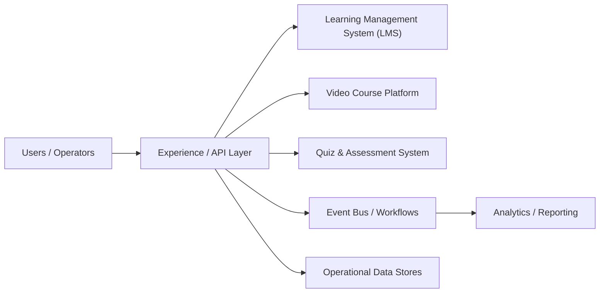

## Cross-Cutting Design Themes
- Separate user-facing hot paths from heavy asynchronous work such as analytics, indexing, compliance review, or backfills.
- Be explicit about which parts of the domain need strong correctness and which can tolerate eventual consistency.
- Model operator workflows and reconciliation early; real systems are maintained, not only executed.
- Use events and materialized views deliberately so teams can scale read models without overloading the transactional path.

## 15.1 Learning Platforms
15.1 Learning Platforms collects the boundaries around Learning Management System (LMS), Video Course Platform, Quiz & Assessment System and related capabilities in EdTech Systems. Teams usually start with a simpler combined service, then split these systems once data ownership, latency goals, or operator workflows begin to conflict.

### Learning Management System (LMS)

#### Overview

Learning Management System (LMS) is the domain boundary responsible for owning a clear domain boundary with its own state model, APIs, and operational SLOs. In EdTech Systems, this system usually has to balance direct user experience with downstream effects on adjacent systems in 15.1 Learning Platforms.

#### Real-world examples

- Comparable patterns appear in Moodle, Coursera, Udemy.
- Startups often keep Learning Management System (LMS) inside a larger service, while large platforms split it out once ownership, scale, or correctness requirements diverge.
- The exact implementation changes between B2C, B2B, and regulated variants, but the architectural boundary stays useful.

#### Requirements and workflows

- Expose APIs or events that let product users, internal operators, and downstream consumers create, update, query, and reconcile learning management system (lms) state.
- Support synchronous user-facing flows for the hot path and asynchronous processing for enrichment, retries, and downstream propagation.
- Preserve a clear state model so support teams and automated workflows can explain why the system is in its current state.
- Provide audit or analytics hooks without coupling reporting latency to the primary user journey.

#### Architecture, data, and APIs

- Model the write path around normalized transactional state, denormalized read models, events, and audit records.
- Keep a normalized source of truth for critical state and publish derived read models or events for consumer services.
- Use caches, projections, or search indexes only for latency-sensitive reads; treat rebuildability as a design requirement.
- Define idempotent write contracts, versioned events, and explicit ownership boundaries so dependent systems can evolve safely.

#### Scaling, reliability, and operations

- Watch for hotspots, stale projections, ambiguous retries, and under-specified operator workflows.
- Protect hot partitions with rate limiting, request coalescing, queue buffering, and selective denormalization where appropriate.
- Design operator dashboards, replay tooling, and reconciliation or backfill workflows before incidents force them into existence.
- Track service-level indicators for latency, success, queue lag, freshness, and correctness signals instead of only infrastructure health.

#### Trade-offs and interview notes

- The key interview move is to explain why Learning Management System (LMS) deserves its own boundary and what can remain eventual around it.
- Strong answers call out what requires strong correctness versus what can be computed asynchronously.
- Weak answers collapse storage, orchestration, and downstream fan-out into one service without discussing scale or failure modes.

### Video Course Platform

#### Overview

Video Course Platform is the domain boundary responsible for processing or delivering large media artifacts while balancing latency, quality, storage, and egress cost. In EdTech Systems, this system usually has to balance direct user experience with downstream effects on adjacent systems in 15.1 Learning Platforms.

#### Real-world examples

- Comparable patterns appear in Moodle, Coursera, Udemy.
- Startups often keep Video Course Platform inside a larger service, while large platforms split it out once ownership, scale, or correctness requirements diverge.
- The exact implementation changes between B2C, B2B, and regulated variants, but the architectural boundary stays useful.

#### Requirements and workflows

- Expose APIs or events that let product users, internal operators, and downstream consumers create, update, query, and reconcile video course platform state.
- Support synchronous user-facing flows for the hot path and asynchronous processing for enrichment, retries, and downstream propagation.
- Preserve a clear state model so support teams and automated workflows can explain why the system is in its current state.
- Provide audit or analytics hooks without coupling reporting latency to the primary user journey.

#### Architecture, data, and APIs

- Model the write path around source media, renditions, manifests, metadata, playback sessions, and edge caches.
- Keep a normalized source of truth for critical state and publish derived read models or events for consumer services.
- Use caches, projections, or search indexes only for latency-sensitive reads; treat rebuildability as a design requirement.
- Define idempotent write contracts, versioned events, and explicit ownership boundaries so dependent systems can evolve safely.

#### Scaling, reliability, and operations

- Watch for slow transcodes, packaging errors, origin overload, cache fragmentation, and regional egress spikes.
- Protect hot partitions with rate limiting, request coalescing, queue buffering, and selective denormalization where appropriate.
- Design operator dashboards, replay tooling, and reconciliation or backfill workflows before incidents force them into existence.
- Track service-level indicators for latency, success, queue lag, freshness, and correctness signals instead of only infrastructure health.

#### Trade-offs and interview notes

- The key interview move is to explain why Video Course Platform deserves its own boundary and what can remain eventual around it.
- Strong answers call out what requires strong correctness versus what can be computed asynchronously.
- Weak answers collapse storage, orchestration, and downstream fan-out into one service without discussing scale or failure modes.

### Quiz & Assessment System

#### Overview

Quiz & Assessment System is the domain boundary responsible for owning a clear domain boundary with its own state model, APIs, and operational SLOs. In EdTech Systems, this system usually has to balance direct user experience with downstream effects on adjacent systems in 15.1 Learning Platforms.

#### Real-world examples

- Comparable patterns appear in Moodle, Coursera, Udemy.
- Startups often keep Quiz & Assessment System inside a larger service, while large platforms split it out once ownership, scale, or correctness requirements diverge.
- The exact implementation changes between B2C, B2B, and regulated variants, but the architectural boundary stays useful.

#### Requirements and workflows

- Expose APIs or events that let product users, internal operators, and downstream consumers create, update, query, and reconcile quiz & assessment system state.
- Support synchronous user-facing flows for the hot path and asynchronous processing for enrichment, retries, and downstream propagation.
- Preserve a clear state model so support teams and automated workflows can explain why the system is in its current state.
- Provide audit or analytics hooks without coupling reporting latency to the primary user journey.

#### Architecture, data, and APIs

- Model the write path around normalized transactional state, denormalized read models, events, and audit records.
- Keep a normalized source of truth for critical state and publish derived read models or events for consumer services.
- Use caches, projections, or search indexes only for latency-sensitive reads; treat rebuildability as a design requirement.
- Define idempotent write contracts, versioned events, and explicit ownership boundaries so dependent systems can evolve safely.

#### Scaling, reliability, and operations

- Watch for hotspots, stale projections, ambiguous retries, and under-specified operator workflows.
- Protect hot partitions with rate limiting, request coalescing, queue buffering, and selective denormalization where appropriate.
- Design operator dashboards, replay tooling, and reconciliation or backfill workflows before incidents force them into existence.
- Track service-level indicators for latency, success, queue lag, freshness, and correctness signals instead of only infrastructure health.

#### Trade-offs and interview notes

- The key interview move is to explain why Quiz & Assessment System deserves its own boundary and what can remain eventual around it.
- Strong answers call out what requires strong correctness versus what can be computed asynchronously.
- Weak answers collapse storage, orchestration, and downstream fan-out into one service without discussing scale or failure modes.

### Certification System

#### Overview

Certification System is the domain boundary responsible for orchestrating a multi-step workflow that spans validation, state transitions, external dependencies, and operator visibility. In EdTech Systems, this system usually has to balance direct user experience with downstream effects on adjacent systems in 15.1 Learning Platforms.

#### Real-world examples

- Comparable patterns appear in Moodle, Coursera, Udemy.
- Startups often keep Certification System inside a larger service, while large platforms split it out once ownership, scale, or correctness requirements diverge.
- The exact implementation changes between B2C, B2B, and regulated variants, but the architectural boundary stays useful.

#### Requirements and workflows

- Expose APIs or events that let product users, internal operators, and downstream consumers create, update, query, and reconcile certification system state.
- Support synchronous user-facing flows for the hot path and asynchronous processing for enrichment, retries, and downstream propagation.
- Preserve a clear state model so support teams and automated workflows can explain why the system is in its current state.
- Provide audit or analytics hooks without coupling reporting latency to the primary user journey.

#### Architecture, data, and APIs

- Model the write path around workflow state, submitted forms, resource locks, side-effect intents, and audit events.
- Keep a normalized source of truth for critical state and publish derived read models or events for consumer services.
- Use caches, projections, or search indexes only for latency-sensitive reads; treat rebuildability as a design requirement.
- Define idempotent write contracts, versioned events, and explicit ownership boundaries so dependent systems can evolve safely.

#### Scaling, reliability, and operations

- Watch for partial success, duplicate submission, timeout ambiguity, and compensation complexity.
- Protect hot partitions with rate limiting, request coalescing, queue buffering, and selective denormalization where appropriate.
- Design operator dashboards, replay tooling, and reconciliation or backfill workflows before incidents force them into existence.
- Track service-level indicators for latency, success, queue lag, freshness, and correctness signals instead of only infrastructure health.

#### Trade-offs and interview notes

- The key interview move is to explain why Certification System deserves its own boundary and what can remain eventual around it.
- Strong answers call out what requires strong correctness versus what can be computed asynchronously.
- Weak answers collapse storage, orchestration, and downstream fan-out into one service without discussing scale or failure modes.

### Adaptive Learning Engine

#### Overview

Adaptive Learning Engine is the domain boundary responsible for owning a clear domain boundary with its own state model, APIs, and operational SLOs. In EdTech Systems, this system usually has to balance direct user experience with downstream effects on adjacent systems in 15.1 Learning Platforms.

#### Real-world examples

- Comparable patterns appear in Moodle, Coursera, Udemy.
- Startups often keep Adaptive Learning Engine inside a larger service, while large platforms split it out once ownership, scale, or correctness requirements diverge.
- The exact implementation changes between B2C, B2B, and regulated variants, but the architectural boundary stays useful.

#### Requirements and workflows

- Expose APIs or events that let product users, internal operators, and downstream consumers create, update, query, and reconcile adaptive learning engine state.
- Support synchronous user-facing flows for the hot path and asynchronous processing for enrichment, retries, and downstream propagation.
- Preserve a clear state model so support teams and automated workflows can explain why the system is in its current state.
- Provide audit or analytics hooks without coupling reporting latency to the primary user journey.

#### Architecture, data, and APIs

- Model the write path around normalized transactional state, denormalized read models, events, and audit records.
- Keep a normalized source of truth for critical state and publish derived read models or events for consumer services.
- Use caches, projections, or search indexes only for latency-sensitive reads; treat rebuildability as a design requirement.
- Define idempotent write contracts, versioned events, and explicit ownership boundaries so dependent systems can evolve safely.

#### Scaling, reliability, and operations

- Watch for hotspots, stale projections, ambiguous retries, and under-specified operator workflows.
- Protect hot partitions with rate limiting, request coalescing, queue buffering, and selective denormalization where appropriate.
- Design operator dashboards, replay tooling, and reconciliation or backfill workflows before incidents force them into existence.
- Track service-level indicators for latency, success, queue lag, freshness, and correctness signals instead of only infrastructure health.

#### Trade-offs and interview notes

- The key interview move is to explain why Adaptive Learning Engine deserves its own boundary and what can remain eventual around it.
- Strong answers call out what requires strong correctness versus what can be computed asynchronously.
- Weak answers collapse storage, orchestration, and downstream fan-out into one service without discussing scale or failure modes.

---

## Functional Requirements

### LMS Functional Requirements

| ID | Requirement | Description | Priority |
|----|------------|-------------|----------|
| LMS-FR-01 | Course Creation | Instructors create courses with modules, lessons, and materials | P0 |
| LMS-FR-02 | Course Catalog | Searchable, filterable catalog with categories, tags, ratings | P0 |
| LMS-FR-03 | Student Enrollment | Students enroll in courses with optional approval workflows | P0 |
| LMS-FR-04 | Progress Tracking | Track lesson completion, module progress, and overall course completion percentage | P0 |
| LMS-FR-05 | Assignment Management | Create, submit, grade, and return assignments with rubrics | P0 |
| LMS-FR-06 | Discussion Forums | Threaded discussions per course with moderation capabilities | P1 |
| LMS-FR-07 | Announcements | Instructors broadcast announcements to enrolled students | P1 |
| LMS-FR-08 | Grading & Gradebook | Weighted grading with configurable grade scales and export | P0 |
| LMS-FR-09 | Calendar & Scheduling | Due dates, live sessions, and exam schedules with timezone support | P1 |
| LMS-FR-10 | Multi-Tenancy | Institutional tenants with isolated data, branding, and configuration | P0 |
| LMS-FR-11 | Roles & Permissions | Admin, instructor, TA, student, auditor roles with fine-grained permissions | P0 |
| LMS-FR-12 | Content Versioning | Version control for course materials with rollback support | P1 |
| LMS-FR-13 | Bulk Import/Export | SCORM, xAPI, LTI, and CSV import/export for interoperability | P1 |
| LMS-FR-14 | Notifications | Email, push, and in-app notifications for deadlines, grades, announcements | P1 |
| LMS-FR-15 | Attendance Tracking | Track attendance for live sessions and in-person classes | P2 |

### Video Course Platform Functional Requirements

| ID | Requirement | Description | Priority |
|----|------------|-------------|----------|
| VID-FR-01 | Video Upload | Instructors upload video files up to 10 GB with resumable uploads | P0 |
| VID-FR-02 | Transcoding | Automatic transcoding to multiple resolutions (360p, 480p, 720p, 1080p, 4K) | P0 |
| VID-FR-03 | Adaptive Streaming | HLS/DASH adaptive bitrate streaming based on network conditions | P0 |
| VID-FR-04 | Subtitle Management | Upload, auto-generate, and edit subtitles in multiple languages | P1 |
| VID-FR-05 | Video Chapters | Segment videos into chapters with timestamps and titles | P1 |
| VID-FR-06 | Watch Progress | Track per-second watch progress and resume from last position | P0 |
| VID-FR-07 | Video Annotations | Students and instructors add timestamped notes and bookmarks | P2 |
| VID-FR-08 | Playlists | Organize videos into ordered playlists for sequential learning | P1 |
| VID-FR-09 | Playback Speed | Support 0.5x to 3.0x playback speed | P1 |
| VID-FR-10 | DRM Protection | Content protection via Widevine/FairPlay for premium content | P1 |
| VID-FR-11 | Offline Download | Download encrypted videos for offline viewing on mobile | P2 |
| VID-FR-12 | Video Analytics | View counts, average watch time, drop-off points, engagement heatmap | P1 |
| VID-FR-13 | Live Streaming | Support live lectures with recording and automatic VOD conversion | P2 |
| VID-FR-14 | Screen Recording | In-browser screen recording for tutorials and presentations | P2 |
| VID-FR-15 | Thumbnail Generation | Auto-generate thumbnails at key frames with manual override | P1 |

### Quiz & Assessment System Functional Requirements

| ID | Requirement | Description | Priority |
|----|------------|-------------|----------|
| QZ-FR-01 | Quiz Creation | Create quizzes with MCQ, true/false, fill-in-blank, matching, essay, code | P0 |
| QZ-FR-02 | Question Bank | Reusable question pool with tagging, difficulty levels, and randomization | P0 |
| QZ-FR-03 | Quiz Configuration | Time limits, attempt limits, randomization, question shuffle, answer shuffle | P0 |
| QZ-FR-04 | Auto-Grading | Instant grading for objective questions with partial credit support | P0 |
| QZ-FR-05 | Manual Grading | Instructor grading interface for essays and code with rubric support | P0 |
| QZ-FR-06 | Proctoring | Browser lockdown, webcam monitoring, screen recording, AI flag review | P1 |
| QZ-FR-07 | Quiz Analytics | Question-level analytics: difficulty index, discrimination index, distractor analysis | P1 |
| QZ-FR-08 | Scheduled Exams | Schedule exams with precise start/end times and grace periods | P0 |
| QZ-FR-09 | Accommodations | Extended time, separate settings, and accessibility accommodations per student | P1 |
| QZ-FR-10 | Plagiarism Detection | Cross-submission similarity check for essay and code answers | P1 |
| QZ-FR-11 | Exam Review | Students review graded exams with correct answers and explanations | P1 |
| QZ-FR-12 | Grade Export | Export grades in CSV, integrate with LMS gradebook via API | P1 |
| QZ-FR-13 | Formative Assessment | Low-stakes practice quizzes with immediate feedback and hints | P1 |
| QZ-FR-14 | Code Execution | Sandboxed code execution for programming questions with test cases | P2 |
| QZ-FR-15 | Peer Review | Configure peer grading workflows with anonymization and calibration | P2 |

### Certification System Functional Requirements

| ID | Requirement | Description | Priority |
|----|------------|-------------|----------|
| CERT-FR-01 | Certificate Templates | Design certificate templates with branding, fields, and layouts | P0 |
| CERT-FR-02 | Requirement Rules | Define completion rules: courses, quizzes, minimum grades, assignments | P0 |
| CERT-FR-03 | Auto-Issuance | Automatically issue certificates when all requirements are met | P0 |
| CERT-FR-04 | Manual Issuance | Instructors manually issue certificates with override capability | P1 |
| CERT-FR-05 | Verification Portal | Public URL for third parties to verify certificate authenticity | P0 |
| CERT-FR-06 | Digital Signatures | Cryptographic signing of certificates for tamper detection | P1 |
| CERT-FR-07 | PDF Generation | Generate high-quality PDF certificates with QR codes | P0 |
| CERT-FR-08 | Credential Sharing | Share to LinkedIn, email, and generate embeddable badges | P1 |
| CERT-FR-09 | Revocation | Revoke certificates with reason tracking and public status update | P1 |
| CERT-FR-10 | Expiration | Certificates with expiration dates and renewal workflows | P2 |
| CERT-FR-11 | Batch Issuance | Issue certificates in bulk for cohort completions | P1 |
| CERT-FR-12 | Blockchain Anchoring | Optional blockchain anchoring for institutional credentials | P2 |
| CERT-FR-13 | Transcript Generation | Aggregate certificates into a learner transcript | P2 |
| CERT-FR-14 | Open Badges | Support Mozilla Open Badges 2.0 standard for interoperability | P1 |
| CERT-FR-15 | Analytics | Track issuance rates, verification lookups, sharing metrics | P2 |

### Adaptive Learning Engine Functional Requirements

| ID | Requirement | Description | Priority |
|----|------------|-------------|----------|
| ALE-FR-01 | Learner Profiling | Build and maintain learner profile with knowledge state, preferences, pace | P0 |
| ALE-FR-02 | Knowledge Tracing | Track mastery of individual skills/concepts over time | P0 |
| ALE-FR-03 | Content Recommendation | Recommend next lessons, exercises, or reviews based on learner state | P0 |
| ALE-FR-04 | Difficulty Calibration | Dynamically adjust content difficulty based on performance | P0 |
| ALE-FR-05 | Learning Path Generation | Generate personalized learning paths through course material | P0 |
| ALE-FR-06 | Prerequisite Graph | Model prerequisite relationships between concepts and skills | P1 |
| ALE-FR-07 | Spaced Repetition | Schedule reviews using spaced repetition algorithms (SM-2, FSRS) | P1 |
| ALE-FR-08 | Mastery Levels | Define and track mastery levels (novice, developing, proficient, expert) | P1 |
| ALE-FR-09 | A/B Testing | Run experiments on recommendation algorithms and content ordering | P2 |
| ALE-FR-10 | Instructor Dashboard | Show class-level knowledge gaps and struggling student alerts | P1 |
| ALE-FR-11 | Cold Start Handling | Diagnostic pre-assessments for new students to bootstrap profile | P1 |
| ALE-FR-12 | Multi-Modal Content | Recommend across content types: video, text, interactive, quiz | P2 |
| ALE-FR-13 | Engagement Optimization | Balance learning effectiveness with engagement and motivation | P2 |
| ALE-FR-14 | Explainability | Explain why content was recommended to build learner trust | P2 |
| ALE-FR-15 | Model Retraining | Periodic retraining of recommendation models with new data | P1 |

---

## Non-Functional Requirements

### Latency Requirements

| Subsystem | Operation | P50 Latency | P99 Latency | Notes |
|-----------|-----------|-------------|-------------|-------|
| LMS | Course catalog page load | 200ms | 800ms | Cached for logged-out users |
| LMS | Enrollment action | 300ms | 1s | Includes seat-capacity check |
| LMS | Progress update | 150ms | 500ms | Fire-and-forget with ack |
| LMS | Gradebook load | 400ms | 1.5s | Paginated, 50 students per page |
| Video | HLS manifest request | 50ms | 200ms | CDN edge cache hit |
| Video | Video segment fetch | 30ms | 150ms | CDN edge, 2-4 second segments |
| Video | Transcoding start | 5s | 30s | Queue pickup time |
| Video | Transcoding complete (1hr video) | 15min | 45min | Depends on resolution targets |
| Quiz | Quiz page load | 200ms | 600ms | Questions pre-fetched |
| Quiz | Answer submission | 100ms | 400ms | Write-ahead log for durability |
| Quiz | Auto-grade result | 200ms | 800ms | Synchronous for objective questions |
| Quiz | Manual grade notification | 5min | 24hr | Async, depends on instructor |
| Certification | Certificate generation | 2s | 10s | PDF rendering + signing |
| Certification | Verification lookup | 100ms | 300ms | Cached verification page |
| Adaptive | Next recommendation | 150ms | 500ms | Pre-computed, model inference |
| Adaptive | Knowledge state update | 200ms | 700ms | After quiz/lesson completion |

### Availability Requirements

| Subsystem | Target SLA | Justification |
|-----------|-----------|---------------|
| LMS - Core | 99.95% | Students depend on access for daily learning |
| LMS - Enrollment | 99.9% | Not time-critical, can retry |
| Video - Playback | 99.95% | Core learning experience |
| Video - Upload | 99.9% | Can retry, not time-critical |
| Quiz - During Exams | 99.99% | Exam windows are irreversible; downtime causes major disruption |
| Quiz - Practice | 99.9% | Non-critical, retry-friendly |
| Certification | 99.9% | Issuance can be delayed; verification should be highly available |
| Certification - Verify | 99.95% | Employers check certificates; should always work |
| Adaptive | 99.9% | Graceful degradation to non-personalized content |

### Throughput Requirements

| Scenario | Metric | Target |
|----------|--------|--------|
| Normal course browsing | Requests/sec | 10,000 |
| Peak enrollment (semester start) | Enrollments/sec | 500 |
| Concurrent video viewers | Streams | 200,000 |
| Normal quiz activity | Submissions/sec | 100 |
| Peak exam window (10,000 students, 1hr exam) | Submissions/sec | 5,000 |
| Certificate generation after course end | Certificates/min | 1,000 |
| Adaptive recommendations | Inferences/sec | 2,000 |
| Video uploads (peak) | Concurrent uploads | 500 |
| Transcoding pipeline | Jobs/hour | 2,000 |
| Discussion forum posts | Posts/sec | 50 |

### Video Streaming Quality Requirements

| Quality Tier | Resolution | Bitrate (video) | Audio Bitrate | Segment Duration |
|-------------|-----------|-----------------|---------------|------------------|
| Low (mobile) | 360p | 400 kbps | 64 kbps | 4s |
| Medium | 480p | 800 kbps | 96 kbps | 4s |
| Standard | 720p | 2.5 Mbps | 128 kbps | 4s |
| High | 1080p | 5 Mbps | 192 kbps | 2s |
| Ultra | 4K | 15 Mbps | 256 kbps | 2s |

---

## Capacity Estimation

### User Base Assumptions

| Metric | Value |
|--------|-------|
| Total registered learners | 10 million |
| Monthly active learners | 3 million |
| Daily active learners | 500,000 |
| Peak concurrent learners | 100,000 |
| Total courses | 50,000 |
| Average enrollments per student | 5 |
| Total instructors | 20,000 |
| Institutional tenants | 500 |

### Video Storage Estimation

| Parameter | Value |
|-----------|-------|
| Total video hours | 500,000 hours |
| Average source file size per hour | 3 GB |
| Total source storage | 1.5 PB |
| Transcoded versions per video | 5 (360p, 480p, 720p, 1080p, 4K) |
| Average transcoded storage per hour (all versions) | 5 GB |
| Total transcoded storage | 2.5 PB |
| Total video storage (source + transcoded) | 4 PB |
| Monthly new video uploads | 5,000 hours |
| Monthly storage growth | 40 TB |
| CDN egress per month (200K concurrent, avg 30 min/day) | 15 PB |

### Quiz and Exam Capacity

| Parameter | Value |
|-----------|-------|
| Total quizzes in system | 500,000 |
| Average questions per quiz | 25 |
| Total questions in question bank | 5 million |
| Daily quiz attempts (normal) | 50,000 |
| Peak exam window (finals week) | 500,000 attempts in 5 days |
| Peak concurrent exam takers | 50,000 |
| Quiz responses per second (peak) | 5,000 |
| Storage per quiz attempt (responses + metadata) | 50 KB |
| Daily quiz storage growth | 2.5 GB |
| Proctoring video per exam (1 hr, 720p) | 1.5 GB |
| Peak proctoring storage per day | 75 TB |

### Certificate Generation Capacity

| Parameter | Value |
|-----------|-------|
| Certificates issued per month | 200,000 |
| Average PDF size | 500 KB |
| Monthly certificate storage growth | 100 GB |
| Peak issuance (end of semester) | 50,000 in 24 hours |
| Peak generation rate | 35 certificates/min sustained |
| Verification lookups per month | 500,000 |
| Blockchain anchoring batch size | 1,000 certificates per batch |

### Adaptive Learning Engine Capacity

| Parameter | Value |
|-----------|-------|
| Learner profiles maintained | 10 million |
| Knowledge state dimensions per learner | 200 skills |
| Total knowledge state entries | 2 billion |
| Recommendation requests per day | 2 million |
| Model inference latency budget | 100ms |
| Model retraining frequency | Weekly |
| Training data size | 50 GB of interaction logs |
| Feature store size | 500 GB |

---

## Detailed Data Models

### LMS Data Model

```sql
-- ============================================================
-- LMS: Course and Content Management
-- ============================================================

CREATE TABLE courses (
    course_id UUID PRIMARY KEY DEFAULT gen_random_uuid(),
    tenant_id UUID NOT NULL,
    instructor_id UUID NOT NULL,
    title VARCHAR(500) NOT NULL,
    slug VARCHAR(500) NOT NULL,
    description TEXT,
    short_description VARCHAR(1000),
    category VARCHAR(100),
    subcategory VARCHAR(100),
    tags TEXT[] DEFAULT '{}',
    language VARCHAR(10) DEFAULT 'en',
    difficulty_level VARCHAR(20) CHECK (difficulty_level IN ('beginner', 'intermediate', 'advanced', 'expert')),
    status VARCHAR(20) DEFAULT 'draft' CHECK (status IN ('draft', 'review', 'published', 'archived', 'suspended')),
    visibility VARCHAR(20) DEFAULT 'public' CHECK (visibility IN ('public', 'private', 'institutional', 'invite_only')),
    enrollment_limit INTEGER,
    enrollment_count INTEGER DEFAULT 0,
    price_cents INTEGER DEFAULT 0,
    currency VARCHAR(3) DEFAULT 'USD',
    estimated_duration_minutes INTEGER,
    thumbnail_url TEXT,
    preview_video_url TEXT,
    syllabus JSONB,
    prerequisites JSONB DEFAULT '[]',
    learning_outcomes TEXT[] DEFAULT '{}',
    grading_policy JSONB DEFAULT '{"weights": {}}',
    completion_criteria JSONB DEFAULT '{"type": "all_modules"}',
    metadata JSONB DEFAULT '{}',
    version INTEGER DEFAULT 1,
    published_at TIMESTAMPTZ,
    created_at TIMESTAMPTZ DEFAULT NOW(),
    updated_at TIMESTAMPTZ DEFAULT NOW(),
    UNIQUE(tenant_id, slug)
);

CREATE INDEX idx_courses_tenant ON courses(tenant_id);
CREATE INDEX idx_courses_instructor ON courses(instructor_id);
CREATE INDEX idx_courses_status ON courses(status) WHERE status = 'published';
CREATE INDEX idx_courses_category ON courses(category, subcategory);
CREATE INDEX idx_courses_tags ON courses USING GIN(tags);
CREATE INDEX idx_courses_search ON courses USING GIN(to_tsvector('english', title || ' ' || COALESCE(description, '')));

CREATE TABLE course_modules (
    module_id UUID PRIMARY KEY DEFAULT gen_random_uuid(),
    course_id UUID NOT NULL REFERENCES courses(course_id) ON DELETE CASCADE,
    title VARCHAR(500) NOT NULL,
    description TEXT,
    sort_order INTEGER NOT NULL,
    unlock_rule JSONB DEFAULT '{"type": "sequential"}',
    is_required BOOLEAN DEFAULT TRUE,
    estimated_duration_minutes INTEGER,
    created_at TIMESTAMPTZ DEFAULT NOW(),
    updated_at TIMESTAMPTZ DEFAULT NOW(),
    UNIQUE(course_id, sort_order)
);

CREATE INDEX idx_modules_course ON course_modules(course_id, sort_order);

CREATE TABLE lessons (
    lesson_id UUID PRIMARY KEY DEFAULT gen_random_uuid(),
    module_id UUID NOT NULL REFERENCES course_modules(module_id) ON DELETE CASCADE,
    course_id UUID NOT NULL REFERENCES courses(course_id) ON DELETE CASCADE,
    title VARCHAR(500) NOT NULL,
    content_type VARCHAR(30) NOT NULL CHECK (content_type IN (
        'video', 'text', 'interactive', 'quiz', 'assignment',
        'live_session', 'external_link', 'download', 'code_lab'
    )),
    content_body TEXT,
    content_url TEXT,
    content_metadata JSONB DEFAULT '{}',
    sort_order INTEGER NOT NULL,
    is_preview BOOLEAN DEFAULT FALSE,
    is_required BOOLEAN DEFAULT TRUE,
    estimated_duration_minutes INTEGER,
    completion_criteria JSONB DEFAULT '{"type": "view"}',
    created_at TIMESTAMPTZ DEFAULT NOW(),
    updated_at TIMESTAMPTZ DEFAULT NOW()
);

CREATE INDEX idx_lessons_module ON lessons(module_id, sort_order);
CREATE INDEX idx_lessons_course ON lessons(course_id);

CREATE TABLE enrollments (
    enrollment_id UUID PRIMARY KEY DEFAULT gen_random_uuid(),
    course_id UUID NOT NULL REFERENCES courses(course_id),
    student_id UUID NOT NULL,
    tenant_id UUID NOT NULL,
    status VARCHAR(20) DEFAULT 'active' CHECK (status IN (
        'pending', 'active', 'completed', 'dropped', 'expired', 'suspended'
    )),
    enrollment_type VARCHAR(20) DEFAULT 'self' CHECK (enrollment_type IN (
        'self', 'admin_assigned', 'imported', 'gifted', 'trial'
    )),
    role VARCHAR(20) DEFAULT 'student' CHECK (role IN ('student', 'auditor', 'ta')),
    progress_percent NUMERIC(5,2) DEFAULT 0.00,
    current_grade NUMERIC(5,2),
    grade_letter VARCHAR(5),
    last_accessed_at TIMESTAMPTZ,
    completed_at TIMESTAMPTZ,
    dropped_at TIMESTAMPTZ,
    expires_at TIMESTAMPTZ,
    payment_id UUID,
    metadata JSONB DEFAULT '{}',
    enrolled_at TIMESTAMPTZ DEFAULT NOW(),
    updated_at TIMESTAMPTZ DEFAULT NOW(),
    UNIQUE(course_id, student_id)
);

CREATE INDEX idx_enrollments_student ON enrollments(student_id);
CREATE INDEX idx_enrollments_course_status ON enrollments(course_id, status);
CREATE INDEX idx_enrollments_tenant ON enrollments(tenant_id);
CREATE INDEX idx_enrollments_active ON enrollments(student_id, status) WHERE status = 'active';

CREATE TABLE progress_tracking (
    progress_id UUID PRIMARY KEY DEFAULT gen_random_uuid(),
    enrollment_id UUID NOT NULL REFERENCES enrollments(enrollment_id),
    lesson_id UUID NOT NULL REFERENCES lessons(lesson_id),
    student_id UUID NOT NULL,
    status VARCHAR(20) DEFAULT 'not_started' CHECK (status IN (
        'not_started', 'in_progress', 'completed', 'skipped'
    )),
    progress_percent NUMERIC(5,2) DEFAULT 0.00,
    time_spent_seconds INTEGER DEFAULT 0,
    completed_at TIMESTAMPTZ,
    last_accessed_at TIMESTAMPTZ,
    interaction_data JSONB DEFAULT '{}',
    created_at TIMESTAMPTZ DEFAULT NOW(),
    updated_at TIMESTAMPTZ DEFAULT NOW(),
    UNIQUE(enrollment_id, lesson_id)
);

CREATE INDEX idx_progress_enrollment ON progress_tracking(enrollment_id);
CREATE INDEX idx_progress_student ON progress_tracking(student_id);
CREATE INDEX idx_progress_lesson ON progress_tracking(lesson_id);

CREATE TABLE assignments (
    assignment_id UUID PRIMARY KEY DEFAULT gen_random_uuid(),
    course_id UUID NOT NULL REFERENCES courses(course_id),
    lesson_id UUID REFERENCES lessons(lesson_id),
    title VARCHAR(500) NOT NULL,
    description TEXT,
    instructions TEXT,
    assignment_type VARCHAR(30) CHECK (assignment_type IN (
        'file_upload', 'text_entry', 'code', 'url_submission', 'peer_review', 'group_project'
    )),
    max_score NUMERIC(8,2) NOT NULL DEFAULT 100,
    weight NUMERIC(5,4) DEFAULT 1.0,
    rubric JSONB,
    allowed_file_types TEXT[] DEFAULT '{}',
    max_file_size_mb INTEGER DEFAULT 50,
    max_attempts INTEGER DEFAULT 1,
    due_date TIMESTAMPTZ,
    late_policy JSONB DEFAULT '{"type": "none"}',
    peer_review_config JSONB,
    plagiarism_check BOOLEAN DEFAULT FALSE,
    is_group_assignment BOOLEAN DEFAULT FALSE,
    group_config JSONB,
    created_at TIMESTAMPTZ DEFAULT NOW(),
    updated_at TIMESTAMPTZ DEFAULT NOW()
);

CREATE INDEX idx_assignments_course ON assignments(course_id);
CREATE INDEX idx_assignments_due ON assignments(due_date) WHERE due_date IS NOT NULL;

CREATE TABLE submissions (
    submission_id UUID PRIMARY KEY DEFAULT gen_random_uuid(),
    assignment_id UUID NOT NULL REFERENCES assignments(assignment_id),
    student_id UUID NOT NULL,
    enrollment_id UUID NOT NULL REFERENCES enrollments(enrollment_id),
    attempt_number INTEGER DEFAULT 1,
    status VARCHAR(20) DEFAULT 'submitted' CHECK (status IN (
        'draft', 'submitted', 'grading', 'graded', 'returned', 'resubmit_requested'
    )),
    submission_type VARCHAR(20) NOT NULL,
    content_text TEXT,
    file_urls TEXT[] DEFAULT '{}',
    code_content TEXT,
    url_submission TEXT,
    submitted_at TIMESTAMPTZ DEFAULT NOW(),
    is_late BOOLEAN DEFAULT FALSE,
    late_penalty_percent NUMERIC(5,2) DEFAULT 0,
    plagiarism_score NUMERIC(5,2),
    plagiarism_report_url TEXT,
    graded_by UUID,
    graded_at TIMESTAMPTZ,
    score NUMERIC(8,2),
    feedback TEXT,
    rubric_scores JSONB,
    metadata JSONB DEFAULT '{}',
    created_at TIMESTAMPTZ DEFAULT NOW(),
    updated_at TIMESTAMPTZ DEFAULT NOW()
);

CREATE INDEX idx_submissions_assignment ON submissions(assignment_id);
CREATE INDEX idx_submissions_student ON submissions(student_id);
CREATE INDEX idx_submissions_status ON submissions(status);
CREATE INDEX idx_submissions_enrollment ON submissions(enrollment_id);

CREATE TABLE grades (
    grade_id UUID PRIMARY KEY DEFAULT gen_random_uuid(),
    enrollment_id UUID NOT NULL REFERENCES enrollments(enrollment_id),
    course_id UUID NOT NULL REFERENCES courses(course_id),
    student_id UUID NOT NULL,
    grade_type VARCHAR(20) NOT NULL CHECK (grade_type IN (
        'assignment', 'quiz', 'exam', 'participation', 'final', 'override'
    )),
    source_id UUID,
    source_type VARCHAR(30),
    raw_score NUMERIC(8,2),
    max_score NUMERIC(8,2),
    weighted_score NUMERIC(8,4),
    weight NUMERIC(5,4),
    letter_grade VARCHAR(5),
    graded_by UUID,
    override_reason TEXT,
    is_final BOOLEAN DEFAULT FALSE,
    created_at TIMESTAMPTZ DEFAULT NOW(),
    updated_at TIMESTAMPTZ DEFAULT NOW()
);

CREATE INDEX idx_grades_enrollment ON grades(enrollment_id);
CREATE INDEX idx_grades_course_student ON grades(course_id, student_id);
CREATE INDEX idx_grades_source ON grades(source_type, source_id);

CREATE TABLE discussion_forums (
    forum_id UUID PRIMARY KEY DEFAULT gen_random_uuid(),
    course_id UUID NOT NULL REFERENCES courses(course_id) ON DELETE CASCADE,
    title VARCHAR(500) NOT NULL,
    description TEXT,
    forum_type VARCHAR(20) DEFAULT 'discussion' CHECK (forum_type IN (
        'discussion', 'question_answer', 'announcement', 'group'
    )),
    sort_order INTEGER DEFAULT 0,
    is_locked BOOLEAN DEFAULT FALSE,
    is_pinned BOOLEAN DEFAULT FALSE,
    post_count INTEGER DEFAULT 0,
    last_post_at TIMESTAMPTZ,
    created_at TIMESTAMPTZ DEFAULT NOW(),
    updated_at TIMESTAMPTZ DEFAULT NOW()
);

CREATE INDEX idx_forums_course ON discussion_forums(course_id);

CREATE TABLE forum_posts (
    post_id UUID PRIMARY KEY DEFAULT gen_random_uuid(),
    forum_id UUID NOT NULL REFERENCES discussion_forums(forum_id) ON DELETE CASCADE,
    parent_post_id UUID REFERENCES forum_posts(post_id),
    author_id UUID NOT NULL,
    title VARCHAR(500),
    body TEXT NOT NULL,
    body_format VARCHAR(10) DEFAULT 'markdown',
    is_answer BOOLEAN DEFAULT FALSE,
    is_pinned BOOLEAN DEFAULT FALSE,
    is_anonymous BOOLEAN DEFAULT FALSE,
    upvote_count INTEGER DEFAULT 0,
    reply_count INTEGER DEFAULT 0,
    status VARCHAR(20) DEFAULT 'active' CHECK (status IN ('active', 'hidden', 'deleted', 'flagged')),
    edited_at TIMESTAMPTZ,
    created_at TIMESTAMPTZ DEFAULT NOW(),
    updated_at TIMESTAMPTZ DEFAULT NOW()
);

CREATE INDEX idx_posts_forum ON forum_posts(forum_id, created_at DESC);
CREATE INDEX idx_posts_parent ON forum_posts(parent_post_id);
CREATE INDEX idx_posts_author ON forum_posts(author_id);

CREATE TABLE announcements (
    announcement_id UUID PRIMARY KEY DEFAULT gen_random_uuid(),
    course_id UUID NOT NULL REFERENCES courses(course_id) ON DELETE CASCADE,
    author_id UUID NOT NULL,
    title VARCHAR(500) NOT NULL,
    body TEXT NOT NULL,
    body_format VARCHAR(10) DEFAULT 'markdown',
    is_pinned BOOLEAN DEFAULT FALSE,
    publish_at TIMESTAMPTZ DEFAULT NOW(),
    expires_at TIMESTAMPTZ,
    send_notification BOOLEAN DEFAULT TRUE,
    audience VARCHAR(20) DEFAULT 'all' CHECK (audience IN ('all', 'students', 'tas', 'instructors')),
    read_count INTEGER DEFAULT 0,
    created_at TIMESTAMPTZ DEFAULT NOW(),
    updated_at TIMESTAMPTZ DEFAULT NOW()
);

CREATE INDEX idx_announcements_course ON announcements(course_id, publish_at DESC);
```

### Video Platform Data Model

```sql
-- ============================================================
-- Video Course Platform: Media Management
-- ============================================================

CREATE TABLE videos (
    video_id UUID PRIMARY KEY DEFAULT gen_random_uuid(),
    course_id UUID,
    lesson_id UUID,
    uploader_id UUID NOT NULL,
    tenant_id UUID NOT NULL,
    title VARCHAR(500) NOT NULL,
    description TEXT,
    source_url TEXT NOT NULL,
    source_format VARCHAR(20),
    source_size_bytes BIGINT,
    duration_seconds NUMERIC(10,2),
    resolution_width INTEGER,
    resolution_height INTEGER,
    frame_rate NUMERIC(6,2),
    codec VARCHAR(30),
    status VARCHAR(20) DEFAULT 'uploaded' CHECK (status IN (
        'uploaded', 'queued', 'transcoding', 'ready', 'failed', 'deleted', 'processing'
    )),
    visibility VARCHAR(20) DEFAULT 'private' CHECK (visibility IN ('public', 'private', 'unlisted', 'institutional')),
    drm_enabled BOOLEAN DEFAULT FALSE,
    thumbnail_url TEXT,
    poster_url TEXT,
    hls_manifest_url TEXT,
    dash_manifest_url TEXT,
    view_count BIGINT DEFAULT 0,
    like_count INTEGER DEFAULT 0,
    average_watch_percent NUMERIC(5,2) DEFAULT 0,
    tags TEXT[] DEFAULT '{}',
    metadata JSONB DEFAULT '{}',
    transcription_status VARCHAR(20) DEFAULT 'pending',
    transcription_text TEXT,
    content_hash VARCHAR(64),
    created_at TIMESTAMPTZ DEFAULT NOW(),
    updated_at TIMESTAMPTZ DEFAULT NOW()
);

CREATE INDEX idx_videos_course ON videos(course_id);
CREATE INDEX idx_videos_lesson ON videos(lesson_id);
CREATE INDEX idx_videos_tenant ON videos(tenant_id);
CREATE INDEX idx_videos_status ON videos(status);
CREATE INDEX idx_videos_uploader ON videos(uploader_id);

CREATE TABLE video_versions (
    version_id UUID PRIMARY KEY DEFAULT gen_random_uuid(),
    video_id UUID NOT NULL REFERENCES videos(video_id) ON DELETE CASCADE,
    resolution VARCHAR(10) NOT NULL,
    bitrate_kbps INTEGER NOT NULL,
    codec VARCHAR(30) NOT NULL,
    container_format VARCHAR(20) NOT NULL,
    file_url TEXT NOT NULL,
    file_size_bytes BIGINT,
    width INTEGER,
    height INTEGER,
    segment_count INTEGER,
    manifest_url TEXT,
    status VARCHAR(20) DEFAULT 'pending' CHECK (status IN ('pending', 'processing', 'ready', 'failed')),
    created_at TIMESTAMPTZ DEFAULT NOW()
);

CREATE INDEX idx_versions_video ON video_versions(video_id);

CREATE TABLE transcoding_jobs (
    job_id UUID PRIMARY KEY DEFAULT gen_random_uuid(),
    video_id UUID NOT NULL REFERENCES videos(video_id),
    version_id UUID REFERENCES video_versions(version_id),
    target_resolution VARCHAR(10) NOT NULL,
    target_bitrate_kbps INTEGER,
    target_codec VARCHAR(30) DEFAULT 'h264',
    priority INTEGER DEFAULT 5,
    status VARCHAR(20) DEFAULT 'queued' CHECK (status IN (
        'queued', 'assigned', 'processing', 'completed', 'failed', 'cancelled'
    )),
    worker_id VARCHAR(100),
    progress_percent NUMERIC(5,2) DEFAULT 0,
    started_at TIMESTAMPTZ,
    completed_at TIMESTAMPTZ,
    error_message TEXT,
    retry_count INTEGER DEFAULT 0,
    max_retries INTEGER DEFAULT 3,
    output_url TEXT,
    processing_time_seconds INTEGER,
    created_at TIMESTAMPTZ DEFAULT NOW(),
    updated_at TIMESTAMPTZ DEFAULT NOW()
);

CREATE INDEX idx_transcode_video ON transcoding_jobs(video_id);
CREATE INDEX idx_transcode_status ON transcoding_jobs(status, priority DESC) WHERE status = 'queued';

CREATE TABLE subtitles (
    subtitle_id UUID PRIMARY KEY DEFAULT gen_random_uuid(),
    video_id UUID NOT NULL REFERENCES videos(video_id) ON DELETE CASCADE,
    language VARCHAR(10) NOT NULL,
    label VARCHAR(100),
    subtitle_format VARCHAR(10) DEFAULT 'vtt' CHECK (subtitle_format IN ('vtt', 'srt', 'ass')),
    file_url TEXT NOT NULL,
    is_auto_generated BOOLEAN DEFAULT FALSE,
    is_default BOOLEAN DEFAULT FALSE,
    status VARCHAR(20) DEFAULT 'active',
    created_at TIMESTAMPTZ DEFAULT NOW(),
    updated_at TIMESTAMPTZ DEFAULT NOW(),
    UNIQUE(video_id, language)
);

CREATE INDEX idx_subtitles_video ON subtitles(video_id);

CREATE TABLE video_segments (
    segment_id UUID PRIMARY KEY DEFAULT gen_random_uuid(),
    video_id UUID NOT NULL REFERENCES videos(video_id) ON DELETE CASCADE,
    version_id UUID NOT NULL REFERENCES video_versions(version_id),
    segment_index INTEGER NOT NULL,
    start_time_ms BIGINT NOT NULL,
    end_time_ms BIGINT NOT NULL,
    duration_ms INTEGER NOT NULL,
    file_url TEXT NOT NULL,
    file_size_bytes INTEGER,
    is_key_frame_start BOOLEAN DEFAULT TRUE,
    created_at TIMESTAMPTZ DEFAULT NOW(),
    UNIQUE(version_id, segment_index)
);

CREATE INDEX idx_segments_video ON video_segments(video_id);
CREATE INDEX idx_segments_version ON video_segments(version_id, segment_index);

CREATE TABLE watch_progress (
    progress_id UUID PRIMARY KEY DEFAULT gen_random_uuid(),
    video_id UUID NOT NULL REFERENCES videos(video_id),
    user_id UUID NOT NULL,
    last_position_seconds NUMERIC(10,2) DEFAULT 0,
    total_watched_seconds NUMERIC(10,2) DEFAULT 0,
    max_position_seconds NUMERIC(10,2) DEFAULT 0,
    watch_percent NUMERIC(5,2) DEFAULT 0,
    completed BOOLEAN DEFAULT FALSE,
    playback_speed NUMERIC(3,1) DEFAULT 1.0,
    quality_selected VARCHAR(10),
    watch_segments JSONB DEFAULT '[]',
    session_count INTEGER DEFAULT 1,
    last_watched_at TIMESTAMPTZ DEFAULT NOW(),
    created_at TIMESTAMPTZ DEFAULT NOW(),
    updated_at TIMESTAMPTZ DEFAULT NOW(),
    UNIQUE(video_id, user_id)
);

CREATE INDEX idx_watch_user ON watch_progress(user_id);
CREATE INDEX idx_watch_video ON watch_progress(video_id);

CREATE TABLE video_annotations (
    annotation_id UUID PRIMARY KEY DEFAULT gen_random_uuid(),
    video_id UUID NOT NULL REFERENCES videos(video_id) ON DELETE CASCADE,
    user_id UUID NOT NULL,
    timestamp_seconds NUMERIC(10,2) NOT NULL,
    annotation_type VARCHAR(20) DEFAULT 'note' CHECK (annotation_type IN ('note', 'bookmark', 'question', 'highlight')),
    content TEXT,
    is_private BOOLEAN DEFAULT TRUE,
    created_at TIMESTAMPTZ DEFAULT NOW(),
    updated_at TIMESTAMPTZ DEFAULT NOW()
);

CREATE INDEX idx_annotations_video ON video_annotations(video_id, timestamp_seconds);
CREATE INDEX idx_annotations_user ON video_annotations(user_id);

CREATE TABLE playlists (
    playlist_id UUID PRIMARY KEY DEFAULT gen_random_uuid(),
    course_id UUID,
    creator_id UUID NOT NULL,
    title VARCHAR(500) NOT NULL,
    description TEXT,
    visibility VARCHAR(20) DEFAULT 'private',
    video_count INTEGER DEFAULT 0,
    total_duration_seconds INTEGER DEFAULT 0,
    created_at TIMESTAMPTZ DEFAULT NOW(),
    updated_at TIMESTAMPTZ DEFAULT NOW()
);

CREATE TABLE playlist_items (
    item_id UUID PRIMARY KEY DEFAULT gen_random_uuid(),
    playlist_id UUID NOT NULL REFERENCES playlists(playlist_id) ON DELETE CASCADE,
    video_id UUID NOT NULL REFERENCES videos(video_id),
    sort_order INTEGER NOT NULL,
    added_at TIMESTAMPTZ DEFAULT NOW(),
    UNIQUE(playlist_id, video_id)
);

CREATE INDEX idx_playlist_items ON playlist_items(playlist_id, sort_order);
```

### Quiz & Assessment Data Model

```sql
-- ============================================================
-- Quiz & Assessment System
-- ============================================================

CREATE TABLE quizzes (
    quiz_id UUID PRIMARY KEY DEFAULT gen_random_uuid(),
    course_id UUID NOT NULL,
    lesson_id UUID,
    title VARCHAR(500) NOT NULL,
    description TEXT,
    instructions TEXT,
    quiz_type VARCHAR(20) DEFAULT 'standard' CHECK (quiz_type IN (
        'standard', 'practice', 'midterm', 'final', 'diagnostic', 'survey'
    )),
    time_limit_minutes INTEGER,
    max_attempts INTEGER DEFAULT 1,
    passing_score NUMERIC(5,2) DEFAULT 60.00,
    total_points NUMERIC(8,2),
    question_count INTEGER DEFAULT 0,
    shuffle_questions BOOLEAN DEFAULT FALSE,
    shuffle_options BOOLEAN DEFAULT FALSE,
    show_correct_answers BOOLEAN DEFAULT FALSE,
    show_correct_answers_after TIMESTAMPTZ,
    show_score_immediately BOOLEAN DEFAULT TRUE,
    one_question_at_a_time BOOLEAN DEFAULT FALSE,
    prevent_backtracking BOOLEAN DEFAULT FALSE,
    require_lockdown_browser BOOLEAN DEFAULT FALSE,
    require_proctoring BOOLEAN DEFAULT FALSE,
    proctoring_config JSONB DEFAULT '{}',
    ip_whitelist TEXT[] DEFAULT '{}',
    available_from TIMESTAMPTZ,
    available_until TIMESTAMPTZ,
    grace_period_minutes INTEGER DEFAULT 0,
    late_submission_policy JSONB DEFAULT '{"allowed": false}',
    randomize_from_pool BOOLEAN DEFAULT FALSE,
    pool_question_count INTEGER,
    weight NUMERIC(5,4) DEFAULT 1.0,
    status VARCHAR(20) DEFAULT 'draft' CHECK (status IN ('draft', 'published', 'closed', 'archived')),
    created_by UUID NOT NULL,
    created_at TIMESTAMPTZ DEFAULT NOW(),
    updated_at TIMESTAMPTZ DEFAULT NOW()
);

CREATE INDEX idx_quizzes_course ON quizzes(course_id);
CREATE INDEX idx_quizzes_available ON quizzes(available_from, available_until) WHERE status = 'published';

CREATE TABLE quiz_questions (
    question_id UUID PRIMARY KEY DEFAULT gen_random_uuid(),
    quiz_id UUID NOT NULL REFERENCES quizzes(quiz_id) ON DELETE CASCADE,
    question_bank_id UUID,
    question_type VARCHAR(30) NOT NULL CHECK (question_type IN (
        'multiple_choice', 'multiple_select', 'true_false', 'fill_in_blank',
        'matching', 'ordering', 'short_answer', 'essay', 'code',
        'numeric', 'file_upload', 'hotspot'
    )),
    question_text TEXT NOT NULL,
    question_html TEXT,
    question_media JSONB DEFAULT '{}',
    explanation TEXT,
    points NUMERIC(6,2) NOT NULL DEFAULT 1.00,
    partial_credit BOOLEAN DEFAULT FALSE,
    sort_order INTEGER NOT NULL,
    difficulty VARCHAR(10) CHECK (difficulty IN ('easy', 'medium', 'hard', 'expert')),
    tags TEXT[] DEFAULT '{}',
    topic VARCHAR(200),
    grading_rubric JSONB,
    code_config JSONB,
    matching_pairs JSONB,
    ordering_items JSONB,
    created_at TIMESTAMPTZ DEFAULT NOW(),
    updated_at TIMESTAMPTZ DEFAULT NOW()
);

CREATE INDEX idx_questions_quiz ON quiz_questions(quiz_id, sort_order);
CREATE INDEX idx_questions_bank ON quiz_questions(question_bank_id);
CREATE INDEX idx_questions_tags ON quiz_questions USING GIN(tags);

CREATE TABLE question_options (
    option_id UUID PRIMARY KEY DEFAULT gen_random_uuid(),
    question_id UUID NOT NULL REFERENCES quiz_questions(question_id) ON DELETE CASCADE,
    option_text TEXT NOT NULL,
    option_html TEXT,
    is_correct BOOLEAN NOT NULL DEFAULT FALSE,
    sort_order INTEGER NOT NULL,
    partial_credit_weight NUMERIC(5,4) DEFAULT 0,
    feedback TEXT,
    created_at TIMESTAMPTZ DEFAULT NOW()
);

CREATE INDEX idx_options_question ON question_options(question_id, sort_order);

CREATE TABLE quiz_attempts (
    attempt_id UUID PRIMARY KEY DEFAULT gen_random_uuid(),
    quiz_id UUID NOT NULL REFERENCES quizzes(quiz_id),
    student_id UUID NOT NULL,
    enrollment_id UUID NOT NULL,
    attempt_number INTEGER NOT NULL DEFAULT 1,
    status VARCHAR(20) DEFAULT 'in_progress' CHECK (status IN (
        'not_started', 'in_progress', 'submitted', 'auto_submitted',
        'grading', 'graded', 'voided'
    )),
    started_at TIMESTAMPTZ DEFAULT NOW(),
    submitted_at TIMESTAMPTZ,
    graded_at TIMESTAMPTZ,
    time_spent_seconds INTEGER DEFAULT 0,
    deadline_at TIMESTAMPTZ,
    raw_score NUMERIC(8,2),
    max_score NUMERIC(8,2),
    percentage_score NUMERIC(5,2),
    passed BOOLEAN,
    question_order JSONB,
    ip_address INET,
    user_agent TEXT,
    proctoring_session_id UUID,
    integrity_flags JSONB DEFAULT '[]',
    idempotency_key VARCHAR(100),
    graded_by VARCHAR(20) DEFAULT 'auto' CHECK (graded_by IN ('auto', 'manual', 'mixed')),
    created_at TIMESTAMPTZ DEFAULT NOW(),
    updated_at TIMESTAMPTZ DEFAULT NOW(),
    UNIQUE(quiz_id, student_id, attempt_number)
);

CREATE INDEX idx_attempts_quiz ON quiz_attempts(quiz_id);
CREATE INDEX idx_attempts_student ON quiz_attempts(student_id);
CREATE INDEX idx_attempts_status ON quiz_attempts(status) WHERE status = 'in_progress';
CREATE INDEX idx_attempts_idempotency ON quiz_attempts(idempotency_key) WHERE idempotency_key IS NOT NULL;

CREATE TABLE quiz_responses (
    response_id UUID PRIMARY KEY DEFAULT gen_random_uuid(),
    attempt_id UUID NOT NULL REFERENCES quiz_attempts(attempt_id),
    question_id UUID NOT NULL REFERENCES quiz_questions(question_id),
    selected_option_ids UUID[] DEFAULT '{}',
    text_response TEXT,
    code_response TEXT,
    file_url TEXT,
    numeric_response NUMERIC,
    matching_response JSONB,
    ordering_response JSONB,
    is_correct BOOLEAN,
    points_earned NUMERIC(6,2),
    auto_graded BOOLEAN DEFAULT FALSE,
    manual_grade NUMERIC(6,2),
    manual_feedback TEXT,
    graded_by UUID,
    time_spent_seconds INTEGER DEFAULT 0,
    flagged_for_review BOOLEAN DEFAULT FALSE,
    answered_at TIMESTAMPTZ DEFAULT NOW(),
    created_at TIMESTAMPTZ DEFAULT NOW(),
    updated_at TIMESTAMPTZ DEFAULT NOW()
);

CREATE INDEX idx_responses_attempt ON quiz_responses(attempt_id);
CREATE INDEX idx_responses_question ON quiz_responses(question_id);

CREATE TABLE question_bank (
    bank_id UUID PRIMARY KEY DEFAULT gen_random_uuid(),
    tenant_id UUID NOT NULL,
    name VARCHAR(500) NOT NULL,
    description TEXT,
    subject VARCHAR(200),
    course_id UUID,
    question_count INTEGER DEFAULT 0,
    tags TEXT[] DEFAULT '{}',
    shared_with UUID[] DEFAULT '{}',
    created_by UUID NOT NULL,
    created_at TIMESTAMPTZ DEFAULT NOW(),
    updated_at TIMESTAMPTZ DEFAULT NOW()
);

CREATE INDEX idx_bank_tenant ON question_bank(tenant_id);
CREATE INDEX idx_bank_course ON question_bank(course_id);

CREATE TABLE quiz_analytics (
    analytics_id UUID PRIMARY KEY DEFAULT gen_random_uuid(),
    quiz_id UUID NOT NULL REFERENCES quizzes(quiz_id),
    question_id UUID REFERENCES quiz_questions(question_id),
    metric_type VARCHAR(30) NOT NULL CHECK (metric_type IN (
        'difficulty_index', 'discrimination_index', 'distractor_efficiency',
        'average_time', 'completion_rate', 'score_distribution', 'reliability'
    )),
    metric_value NUMERIC(10,4),
    sample_size INTEGER,
    details JSONB DEFAULT '{}',
    computed_at TIMESTAMPTZ DEFAULT NOW(),
    created_at TIMESTAMPTZ DEFAULT NOW()
);

CREATE INDEX idx_analytics_quiz ON quiz_analytics(quiz_id);
CREATE INDEX idx_analytics_question ON quiz_analytics(question_id);

CREATE TABLE proctoring_sessions (
    session_id UUID PRIMARY KEY DEFAULT gen_random_uuid(),
    attempt_id UUID NOT NULL REFERENCES quiz_attempts(attempt_id),
    student_id UUID NOT NULL,
    status VARCHAR(20) DEFAULT 'active' CHECK (status IN (
        'initializing', 'active', 'paused', 'completed', 'flagged', 'voided'
    )),
    webcam_recording_url TEXT,
    screen_recording_url TEXT,
    events JSONB DEFAULT '[]',
    flags JSONB DEFAULT '[]',
    flag_count INTEGER DEFAULT 0,
    browser_lockdown BOOLEAN DEFAULT FALSE,
    face_detection_enabled BOOLEAN DEFAULT TRUE,
    multiple_faces_detected INTEGER DEFAULT 0,
    tab_switches INTEGER DEFAULT 0,
    copy_paste_attempts INTEGER DEFAULT 0,
    reviewer_id UUID,
    review_status VARCHAR(20) DEFAULT 'pending' CHECK (review_status IN (
        'pending', 'reviewing', 'approved', 'flagged', 'voided'
    )),
    review_notes TEXT,
    started_at TIMESTAMPTZ DEFAULT NOW(),
    ended_at TIMESTAMPTZ,
    created_at TIMESTAMPTZ DEFAULT NOW(),
    updated_at TIMESTAMPTZ DEFAULT NOW()
);

CREATE INDEX idx_proctoring_attempt ON proctoring_sessions(attempt_id);
CREATE INDEX idx_proctoring_review ON proctoring_sessions(review_status) WHERE review_status = 'pending';
```

### Certification System Data Model

```sql
-- ============================================================
-- Certification System
-- ============================================================

CREATE TABLE certificate_templates (
    template_id UUID PRIMARY KEY DEFAULT gen_random_uuid(),
    tenant_id UUID NOT NULL,
    name VARCHAR(500) NOT NULL,
    description TEXT,
    template_type VARCHAR(20) DEFAULT 'completion' CHECK (template_type IN (
        'completion', 'achievement', 'professional', 'degree', 'micro_credential'
    )),
    html_template TEXT NOT NULL,
    css_styles TEXT,
    page_size VARCHAR(10) DEFAULT 'A4' CHECK (page_size IN ('A4', 'letter', 'custom')),
    orientation VARCHAR(10) DEFAULT 'landscape' CHECK (orientation IN ('landscape', 'portrait')),
    custom_width_mm INTEGER,
    custom_height_mm INTEGER,
    background_image_url TEXT,
    logo_url TEXT,
    signature_image_url TEXT,
    signer_name VARCHAR(200),
    signer_title VARCHAR(200),
    fields JSONB DEFAULT '[]',
    branding JSONB DEFAULT '{}',
    is_default BOOLEAN DEFAULT FALSE,
    status VARCHAR(20) DEFAULT 'active',
    version INTEGER DEFAULT 1,
    created_by UUID NOT NULL,
    created_at TIMESTAMPTZ DEFAULT NOW(),
    updated_at TIMESTAMPTZ DEFAULT NOW()
);

CREATE INDEX idx_cert_templates_tenant ON certificate_templates(tenant_id);

CREATE TABLE certificates (
    certificate_id UUID PRIMARY KEY DEFAULT gen_random_uuid(),
    tenant_id UUID NOT NULL,
    template_id UUID NOT NULL REFERENCES certificate_templates(template_id),
    course_id UUID,
    program_id UUID,
    title VARCHAR(500) NOT NULL,
    description TEXT,
    issuer_name VARCHAR(200) NOT NULL,
    issuer_org VARCHAR(200),
    badge_image_url TEXT,
    credential_type VARCHAR(20) DEFAULT 'certificate',
    skills TEXT[] DEFAULT '{}',
    status VARCHAR(20) DEFAULT 'active',
    created_at TIMESTAMPTZ DEFAULT NOW(),
    updated_at TIMESTAMPTZ DEFAULT NOW()
);

CREATE INDEX idx_certificates_course ON certificates(course_id);
CREATE INDEX idx_certificates_tenant ON certificates(tenant_id);

CREATE TABLE certificate_requirements (
    requirement_id UUID PRIMARY KEY DEFAULT gen_random_uuid(),
    certificate_id UUID NOT NULL REFERENCES certificates(certificate_id) ON DELETE CASCADE,
    requirement_type VARCHAR(30) NOT NULL CHECK (requirement_type IN (
        'course_completion', 'quiz_pass', 'minimum_grade', 'assignment_completion',
        'attendance', 'project_submission', 'peer_review', 'manual_approval'
    )),
    target_id UUID,
    target_type VARCHAR(30),
    threshold_value NUMERIC(8,2),
    threshold_unit VARCHAR(20),
    is_required BOOLEAN DEFAULT TRUE,
    sort_order INTEGER DEFAULT 0,
    description TEXT,
    created_at TIMESTAMPTZ DEFAULT NOW()
);

CREATE INDEX idx_cert_requirements ON certificate_requirements(certificate_id);

CREATE TABLE issued_certificates (
    issued_id UUID PRIMARY KEY DEFAULT gen_random_uuid(),
    certificate_id UUID NOT NULL REFERENCES certificates(certificate_id),
    student_id UUID NOT NULL,
    enrollment_id UUID,
    credential_id VARCHAR(100) NOT NULL UNIQUE,
    verification_code VARCHAR(50) NOT NULL UNIQUE,
    verification_url TEXT NOT NULL,
    pdf_url TEXT,
    badge_url TEXT,
    student_name VARCHAR(200) NOT NULL,
    student_email VARCHAR(200),
    course_title VARCHAR(500),
    final_grade NUMERIC(5,2),
    grade_letter VARCHAR(5),
    completion_date DATE NOT NULL,
    issued_at TIMESTAMPTZ DEFAULT NOW(),
    expires_at TIMESTAMPTZ,
    status VARCHAR(20) DEFAULT 'active' CHECK (status IN (
        'active', 'revoked', 'expired', 'suspended', 'replaced'
    )),
    revocation_reason TEXT,
    revoked_at TIMESTAMPTZ,
    revoked_by UUID,
    digital_signature TEXT,
    signature_algorithm VARCHAR(50) DEFAULT 'ECDSA-SHA256',
    blockchain_tx_hash VARCHAR(200),
    blockchain_network VARCHAR(50),
    open_badge_assertion JSONB,
    metadata JSONB DEFAULT '{}',
    idempotency_key VARCHAR(100) UNIQUE,
    created_at TIMESTAMPTZ DEFAULT NOW(),
    updated_at TIMESTAMPTZ DEFAULT NOW()
);

CREATE INDEX idx_issued_certificate ON issued_certificates(certificate_id);
CREATE INDEX idx_issued_student ON issued_certificates(student_id);
CREATE INDEX idx_issued_verification ON issued_certificates(verification_code);
CREATE INDEX idx_issued_credential ON issued_certificates(credential_id);
CREATE INDEX idx_issued_status ON issued_certificates(status);
CREATE INDEX idx_issued_idempotency ON issued_certificates(idempotency_key) WHERE idempotency_key IS NOT NULL;

CREATE TABLE verification_records (
    record_id UUID PRIMARY KEY DEFAULT gen_random_uuid(),
    issued_id UUID NOT NULL REFERENCES issued_certificates(issued_id),
    verifier_ip INET,
    verifier_user_agent TEXT,
    verifier_org VARCHAR(200),
    verification_method VARCHAR(20) CHECK (verification_method IN ('url', 'qr_code', 'api', 'blockchain')),
    result VARCHAR(20) NOT NULL CHECK (result IN ('valid', 'revoked', 'expired', 'not_found', 'tampered')),
    verified_at TIMESTAMPTZ DEFAULT NOW()
);

CREATE INDEX idx_verification_issued ON verification_records(issued_id);
CREATE INDEX idx_verification_time ON verification_records(verified_at DESC);

CREATE TABLE credential_sharing (
    sharing_id UUID PRIMARY KEY DEFAULT gen_random_uuid(),
    issued_id UUID NOT NULL REFERENCES issued_certificates(issued_id),
    student_id UUID NOT NULL,
    platform VARCHAR(50) NOT NULL CHECK (platform IN (
        'linkedin', 'twitter', 'facebook', 'email', 'embed', 'direct_link'
    )),
    share_url TEXT,
    shared_at TIMESTAMPTZ DEFAULT NOW(),
    click_count INTEGER DEFAULT 0
);

CREATE INDEX idx_sharing_issued ON credential_sharing(issued_id);
CREATE INDEX idx_sharing_student ON credential_sharing(student_id);
```

### Adaptive Learning Engine Data Model

```sql
-- ============================================================
-- Adaptive Learning Engine
-- ============================================================

CREATE TABLE learning_paths (
    path_id UUID PRIMARY KEY DEFAULT gen_random_uuid(),
    student_id UUID NOT NULL,
    course_id UUID NOT NULL,
    path_type VARCHAR(20) DEFAULT 'adaptive' CHECK (path_type IN (
        'adaptive', 'remedial', 'accelerated', 'standard', 'custom'
    )),
    status VARCHAR(20) DEFAULT 'active' CHECK (status IN ('active', 'completed', 'paused', 'abandoned')),
    total_items INTEGER DEFAULT 0,
    completed_items INTEGER DEFAULT 0,
    current_item_index INTEGER DEFAULT 0,
    path_items JSONB NOT NULL DEFAULT '[]',
    generation_model VARCHAR(100),
    generation_params JSONB DEFAULT '{}',
    effectiveness_score NUMERIC(5,4),
    estimated_completion_hours NUMERIC(6,2),
    actual_time_spent_hours NUMERIC(6,2) DEFAULT 0,
    generated_at TIMESTAMPTZ DEFAULT NOW(),
    last_updated_at TIMESTAMPTZ DEFAULT NOW(),
    completed_at TIMESTAMPTZ,
    created_at TIMESTAMPTZ DEFAULT NOW()
);

CREATE INDEX idx_paths_student ON learning_paths(student_id);
CREATE INDEX idx_paths_course ON learning_paths(course_id);
CREATE INDEX idx_paths_active ON learning_paths(student_id, status) WHERE status = 'active';

CREATE TABLE knowledge_states (
    state_id UUID PRIMARY KEY DEFAULT gen_random_uuid(),
    student_id UUID NOT NULL,
    skill_id VARCHAR(200) NOT NULL,
    course_id UUID,
    mastery_probability NUMERIC(5,4) NOT NULL DEFAULT 0.0,
    confidence NUMERIC(5,4) DEFAULT 0.5,
    attempt_count INTEGER DEFAULT 0,
    correct_count INTEGER DEFAULT 0,
    streak_count INTEGER DEFAULT 0,
    last_attempt_at TIMESTAMPTZ,
    last_correct_at TIMESTAMPTZ,
    decay_factor NUMERIC(5,4) DEFAULT 1.0,
    model_version VARCHAR(50),
    bkt_params JSONB DEFAULT '{"p_init": 0.0, "p_transit": 0.1, "p_slip": 0.1, "p_guess": 0.25}',
    irt_params JSONB DEFAULT '{}',
    history JSONB DEFAULT '[]',
    next_review_at TIMESTAMPTZ,
    review_interval_days NUMERIC(8,2) DEFAULT 1.0,
    ease_factor NUMERIC(5,2) DEFAULT 2.5,
    created_at TIMESTAMPTZ DEFAULT NOW(),
    updated_at TIMESTAMPTZ DEFAULT NOW(),
    UNIQUE(student_id, skill_id)
);

CREATE INDEX idx_knowledge_student ON knowledge_states(student_id);
CREATE INDEX idx_knowledge_skill ON knowledge_states(skill_id);
CREATE INDEX idx_knowledge_mastery ON knowledge_states(student_id, mastery_probability);
CREATE INDEX idx_knowledge_review ON knowledge_states(next_review_at) WHERE next_review_at IS NOT NULL;

CREATE TABLE skill_models (
    skill_id VARCHAR(200) PRIMARY KEY,
    course_id UUID,
    skill_name VARCHAR(500) NOT NULL,
    skill_description TEXT,
    parent_skill_id VARCHAR(200) REFERENCES skill_models(skill_id),
    prerequisite_skills TEXT[] DEFAULT '{}',
    difficulty NUMERIC(5,2) DEFAULT 0.5,
    domain VARCHAR(100),
    subdomain VARCHAR(100),
    bloom_level VARCHAR(20) CHECK (bloom_level IN (
        'remember', 'understand', 'apply', 'analyze', 'evaluate', 'create'
    )),
    content_ids UUID[] DEFAULT '{}',
    question_ids UUID[] DEFAULT '{}',
    irt_discrimination NUMERIC(6,4) DEFAULT 1.0,
    irt_difficulty NUMERIC(6,4) DEFAULT 0.0,
    irt_guessing NUMERIC(6,4) DEFAULT 0.25,
    sample_size INTEGER DEFAULT 0,
    created_at TIMESTAMPTZ DEFAULT NOW(),
    updated_at TIMESTAMPTZ DEFAULT NOW()
);

CREATE INDEX idx_skills_course ON skill_models(course_id);
CREATE INDEX idx_skills_parent ON skill_models(parent_skill_id);
CREATE INDEX idx_skills_domain ON skill_models(domain, subdomain);

CREATE TABLE content_recommendations (
    recommendation_id UUID PRIMARY KEY DEFAULT gen_random_uuid(),
    student_id UUID NOT NULL,
    course_id UUID,
    content_id UUID NOT NULL,
    content_type VARCHAR(30) NOT NULL,
    reason VARCHAR(50) NOT NULL CHECK (reason IN (
        'knowledge_gap', 'spaced_review', 'prerequisite', 'next_in_path',
        'remediation', 'enrichment', 'practice', 'challenge', 'cold_start'
    )),
    priority_score NUMERIC(5,4) NOT NULL,
    target_skills TEXT[] DEFAULT '{}',
    model_version VARCHAR(50),
    model_confidence NUMERIC(5,4),
    presented BOOLEAN DEFAULT FALSE,
    presented_at TIMESTAMPTZ,
    accepted BOOLEAN,
    accepted_at TIMESTAMPTZ,
    completed BOOLEAN DEFAULT FALSE,
    completed_at TIMESTAMPTZ,
    outcome_score NUMERIC(5,2),
    feedback_rating INTEGER CHECK (feedback_rating BETWEEN 1 AND 5),
    created_at TIMESTAMPTZ DEFAULT NOW(),
    expires_at TIMESTAMPTZ
);

CREATE INDEX idx_recs_student ON content_recommendations(student_id, created_at DESC);
CREATE INDEX idx_recs_presented ON content_recommendations(student_id, presented) WHERE presented = FALSE;

CREATE TABLE difficulty_calibrations (
    calibration_id UUID PRIMARY KEY DEFAULT gen_random_uuid(),
    content_id UUID NOT NULL,
    content_type VARCHAR(30) NOT NULL,
    skill_id VARCHAR(200),
    estimated_difficulty NUMERIC(5,4) NOT NULL,
    confidence_interval NUMERIC(5,4),
    sample_size INTEGER NOT NULL,
    average_score NUMERIC(5,2),
    average_time_seconds NUMERIC(10,2),
    completion_rate NUMERIC(5,4),
    irt_a NUMERIC(6,4),
    irt_b NUMERIC(6,4),
    irt_c NUMERIC(6,4),
    model_version VARCHAR(50),
    calibrated_at TIMESTAMPTZ DEFAULT NOW(),
    created_at TIMESTAMPTZ DEFAULT NOW()
);

CREATE INDEX idx_calibration_content ON difficulty_calibrations(content_id, content_type);
CREATE INDEX idx_calibration_skill ON difficulty_calibrations(skill_id);

CREATE TABLE learner_profiles (
    profile_id UUID PRIMARY KEY DEFAULT gen_random_uuid(),
    student_id UUID NOT NULL UNIQUE,
    preferred_content_types TEXT[] DEFAULT '{}',
    preferred_difficulty VARCHAR(20) DEFAULT 'adaptive',
    learning_pace VARCHAR(20) DEFAULT 'moderate' CHECK (learning_pace IN ('slow', 'moderate', 'fast')),
    daily_study_goal_minutes INTEGER DEFAULT 30,
    preferred_session_length_minutes INTEGER DEFAULT 25,
    preferred_languages TEXT[] DEFAULT '{en}',
    timezone VARCHAR(50),
    active_hours JSONB DEFAULT '{}',
    strengths TEXT[] DEFAULT '{}',
    weaknesses TEXT[] DEFAULT '{}',
    learning_style JSONB DEFAULT '{}',
    engagement_score NUMERIC(5,2) DEFAULT 50.0,
    retention_rate NUMERIC(5,4) DEFAULT 0.5,
    total_study_hours NUMERIC(10,2) DEFAULT 0,
    total_items_completed INTEGER DEFAULT 0,
    average_session_minutes NUMERIC(6,2),
    last_active_at TIMESTAMPTZ,
    onboarded BOOLEAN DEFAULT FALSE,
    diagnostic_completed BOOLEAN DEFAULT FALSE,
    created_at TIMESTAMPTZ DEFAULT NOW(),
    updated_at TIMESTAMPTZ DEFAULT NOW()
);

CREATE INDEX idx_learner_student ON learner_profiles(student_id);

CREATE TABLE mastery_levels (
    mastery_id UUID PRIMARY KEY DEFAULT gen_random_uuid(),
    student_id UUID NOT NULL,
    skill_id VARCHAR(200) NOT NULL REFERENCES skill_models(skill_id),
    course_id UUID,
    level VARCHAR(20) NOT NULL CHECK (level IN (
        'novice', 'developing', 'proficient', 'advanced', 'expert'
    )),
    mastery_score NUMERIC(5,4) NOT NULL,
    evidence_count INTEGER DEFAULT 0,
    evidence JSONB DEFAULT '[]',
    promoted_at TIMESTAMPTZ,
    previous_level VARCHAR(20),
    created_at TIMESTAMPTZ DEFAULT NOW(),
    updated_at TIMESTAMPTZ DEFAULT NOW(),
    UNIQUE(student_id, skill_id)
);

CREATE INDEX idx_mastery_student ON mastery_levels(student_id);
CREATE INDEX idx_mastery_skill ON mastery_levels(skill_id);
CREATE INDEX idx_mastery_level ON mastery_levels(level);
```

---

## Detailed API Specifications

### Course Enrollment API

```
POST /api/v1/courses/{course_id}/enroll
```

**Description:** Enroll a student in a course. Checks seat capacity, prerequisites, payment, and enrollment eligibility.

**Request Headers:**
```
Authorization: Bearer <jwt_token>
Content-Type: application/json
Idempotency-Key: <client-generated-uuid>
```

**Request Body:**
```json
{
  "enrollment_type": "self",
  "role": "student",
  "payment_token": "pay_abc123",
  "coupon_code": "SPRING2026"
}
```

**Response (201 Created):**
```json
{
  "enrollment_id": "e7a1b2c3-d4e5-f6a7-b8c9-d0e1f2a3b4c5",
  "course_id": "c1a2b3c4-d5e6-f7a8-b9c0-d1e2f3a4b5c6",
  "student_id": "s1a2b3c4-d5e6-f7a8-b9c0-d1e2f3a4b5c6",
  "status": "active",
  "enrolled_at": "2026-03-22T10:30:00Z",
  "progress_percent": 0.00
}
```

**Error Responses:**
| Code | Reason |
|------|--------|
| 400 | Missing required fields or invalid enrollment type |
| 402 | Payment required but not provided or failed |
| 403 | Student does not meet prerequisites |
| 409 | Student already enrolled (idempotent return of existing) |
| 422 | Course is full (enrollment_limit reached) |
| 404 | Course not found or not published |

---

### Lesson Completion API

```
POST /api/v1/lessons/{lesson_id}/complete
```

**Description:** Mark a lesson as completed for the authenticated student. Updates progress tracking and triggers downstream events (module completion check, course completion check).

**Request Headers:**
```
Authorization: Bearer <jwt_token>
Content-Type: application/json
Idempotency-Key: <client-generated-uuid>
```

**Request Body:**
```json
{
  "time_spent_seconds": 1245,
  "interaction_data": {
    "video_watch_percent": 95.5,
    "quiz_score": 85.0,
    "notes_taken": 3
  }
}
```

**Response (200 OK):**
```json
{
  "progress_id": "p1a2b3c4-d5e6-f7a8-b9c0-d1e2f3a4b5c6",
  "lesson_id": "l1a2b3c4-d5e6-f7a8-b9c0-d1e2f3a4b5c6",
  "status": "completed",
  "completed_at": "2026-03-22T11:00:00Z",
  "module_progress_percent": 75.00,
  "course_progress_percent": 45.00,
  "next_lesson": {
    "lesson_id": "l2b3c4d5-e6f7-a8b9-c0d1-e2f3a4b5c6d7",
    "title": "Advanced Concepts",
    "content_type": "video"
  }
}
```

---

### Video Streaming API (HLS Manifest)

```
GET /api/v1/videos/{video_id}/manifest.m3u8
```

**Description:** Returns the HLS master manifest for adaptive bitrate streaming. Requires valid enrollment or access token. Manifest includes all available quality levels.

**Request Headers:**
```
Authorization: Bearer <jwt_token>
```

**Query Parameters:**
| Parameter | Type | Description |
|-----------|------|-------------|
| token | string | Signed short-lived playback token (alternative to Bearer) |
| start | integer | Start time in seconds for seeking |

**Response (200 OK, Content-Type: application/vnd.apple.mpegurl):**
```
#EXTM3U
#EXT-X-VERSION:6
#EXT-X-STREAM-INF:BANDWIDTH=400000,RESOLUTION=640x360,CODECS="avc1.42e00a,mp4a.40.2"
/api/v1/videos/vid123/stream/360p/index.m3u8?token=eyJhbGciOiJIUzI1NiJ9...
#EXT-X-STREAM-INF:BANDWIDTH=800000,RESOLUTION=854x480,CODECS="avc1.42e01e,mp4a.40.2"
/api/v1/videos/vid123/stream/480p/index.m3u8?token=eyJhbGciOiJIUzI1NiJ9...
#EXT-X-STREAM-INF:BANDWIDTH=2500000,RESOLUTION=1280x720,CODECS="avc1.4d401f,mp4a.40.2"
/api/v1/videos/vid123/stream/720p/index.m3u8?token=eyJhbGciOiJIUzI1NiJ9...
#EXT-X-STREAM-INF:BANDWIDTH=5000000,RESOLUTION=1920x1080,CODECS="avc1.640028,mp4a.40.2"
/api/v1/videos/vid123/stream/1080p/index.m3u8?token=eyJhbGciOiJIUzI1NiJ9...
```

**Token Generation (Internal):**
```json
{
  "video_id": "vid123",
  "user_id": "usr456",
  "enrollment_id": "enr789",
  "permissions": ["stream"],
  "max_quality": "1080p",
  "expires_at": "2026-03-22T12:00:00Z",
  "ip_lock": "203.0.113.42"
}
```

---

### Quiz Start API

```
POST /api/v1/quizzes/{quiz_id}/attempts
```

**Description:** Start a new quiz attempt. Validates availability window, attempt limits, proctoring requirements. Creates an attempt record and returns the questions.

**Request Body:**
```json
{
  "proctoring_token": "proctor_abc123",
  "accommodation_id": "acc_789",
  "idempotency_key": "attempt-usr456-quiz123-3"
}
```

**Response (201 Created):**
```json
{
  "attempt_id": "a1b2c3d4-e5f6-a7b8-c9d0-e1f2a3b4c5d6",
  "quiz_id": "q1a2b3c4-d5e6-f7a8-b9c0-d1e2f3a4b5c6",
  "attempt_number": 1,
  "status": "in_progress",
  "started_at": "2026-03-22T14:00:00Z",
  "deadline_at": "2026-03-22T15:00:00Z",
  "time_limit_minutes": 60,
  "question_count": 25,
  "questions": [
    {
      "question_id": "qq1",
      "question_type": "multiple_choice",
      "question_text": "What is the time complexity of binary search?",
      "points": 4.0,
      "options": [
        {"option_id": "o1", "option_text": "O(1)"},
        {"option_id": "o2", "option_text": "O(log n)"},
        {"option_id": "o3", "option_text": "O(n)"},
        {"option_id": "o4", "option_text": "O(n log n)"}
      ]
    }
  ],
  "proctoring": {
    "session_id": "ps_abc123",
    "webcam_required": true,
    "screen_share_required": true,
    "lockdown_browser": false
  }
}
```

---

### Quiz Submit API

```
POST /api/v1/quizzes/{quiz_id}/attempts/{attempt_id}/submit
```

**Description:** Submit a completed quiz attempt for grading. Validates deadline, processes auto-grading for objective questions, queues manual grading for essays/code.

**Request Headers:**
```
Idempotency-Key: submit-a1b2c3d4-v1
```

**Request Body:**
```json
{
  "responses": [
    {
      "question_id": "qq1",
      "selected_option_ids": ["o2"],
      "time_spent_seconds": 45
    },
    {
      "question_id": "qq2",
      "text_response": "A binary tree is a data structure where each node has at most two children...",
      "time_spent_seconds": 300
    },
    {
      "question_id": "qq3",
      "code_response": "def binary_search(arr, target):\n    lo, hi = 0, len(arr) - 1\n    while lo <= hi:\n        mid = (lo + hi) // 2\n        if arr[mid] == target:\n            return mid\n        elif arr[mid] < target:\n            lo = mid + 1\n        else:\n            hi = mid - 1\n    return -1",
      "time_spent_seconds": 480
    }
  ],
  "submission_type": "manual"
}
```

**Response (200 OK):**
```json
{
  "attempt_id": "a1b2c3d4-e5f6-a7b8-c9d0-e1f2a3b4c5d6",
  "status": "grading",
  "submitted_at": "2026-03-22T14:55:00Z",
  "time_spent_seconds": 3300,
  "auto_graded_score": 68.0,
  "max_auto_graded": 80.0,
  "pending_manual_grading": 2,
  "total_points": 100.0,
  "estimated_grade_ready": "2026-03-23T14:00:00Z"
}
```

---

### Certificate Issue API

```
POST /api/v1/certificates/{certificate_id}/issue
```

**Description:** Issue a certificate to a student. Validates all requirements are met, generates PDF, signs cryptographically, and optionally anchors to blockchain.

**Request Body:**
```json
{
  "student_id": "s1a2b3c4-d5e6-f7a8-b9c0-d1e2f3a4b5c6",
  "enrollment_id": "e7a1b2c3-d4e5-f6a7-b8c9-d0e1f2a3b4c5",
  "override_requirements": false,
  "blockchain_anchor": true,
  "idempotency_key": "issue-s1a2-cert456-v1"
}
```

**Response (201 Created):**
```json
{
  "issued_id": "ic_abc123",
  "credential_id": "CRED-2026-ABC123DEF",
  "verification_code": "VRF-XYZ789",
  "verification_url": "https://verify.platform.com/VRF-XYZ789",
  "pdf_url": "https://cdn.platform.com/certs/ic_abc123.pdf",
  "badge_url": "https://cdn.platform.com/badges/ic_abc123.png",
  "issued_at": "2026-03-22T16:00:00Z",
  "expires_at": null,
  "digital_signature": "MEUCIQC...",
  "blockchain_status": "pending",
  "share_links": {
    "linkedin": "https://www.linkedin.com/profile/add?startTask=CERTIFICATION_NAME&certId=CRED-2026-ABC123DEF",
    "twitter": "https://platform.com/share/twitter/ic_abc123",
    "embed": "<div data-cert='ic_abc123'></div>"
  }
}
```

---

### Certificate Verify API

```
GET /api/v1/verify/{verification_code}
```

**Description:** Public endpoint for third-party verification of certificate authenticity. No authentication required.

**Response (200 OK):**
```json
{
  "status": "valid",
  "credential_id": "CRED-2026-ABC123DEF",
  "student_name": "Jane Smith",
  "course_title": "Advanced System Design",
  "issuer": "Platform Academy",
  "issued_at": "2026-03-22T16:00:00Z",
  "expires_at": null,
  "final_grade": "A",
  "skills": ["system-design", "distributed-systems", "databases"],
  "digital_signature_valid": true,
  "blockchain_verified": true,
  "blockchain_tx": "0xabc123..."
}
```

---

### Adaptive Path Recommendation API

```
GET /api/v1/adaptive/{course_id}/recommendations
```

**Description:** Get personalized content recommendations for the authenticated student based on their knowledge state, learning path, and spaced repetition schedule.

**Query Parameters:**
| Parameter | Type | Default | Description |
|-----------|------|---------|-------------|
| limit | integer | 5 | Number of recommendations |
| types | string | all | Filter: lesson, quiz, review, practice |
| include_reasons | boolean | true | Include explanation for each recommendation |

**Response (200 OK):**
```json
{
  "student_id": "s1a2b3c4-d5e6-f7a8-b9c0-d1e2f3a4b5c6",
  "knowledge_summary": {
    "total_skills": 45,
    "mastered": 18,
    "developing": 15,
    "novice": 12,
    "overall_mastery": 0.62
  },
  "recommendations": [
    {
      "recommendation_id": "r1",
      "content_id": "lesson_42",
      "content_type": "lesson",
      "title": "Database Indexing Strategies",
      "reason": "knowledge_gap",
      "priority_score": 0.95,
      "target_skills": ["database-indexing", "query-optimization"],
      "current_mastery": 0.25,
      "estimated_time_minutes": 20,
      "explanation": "Your quiz performance indicates a gap in indexing concepts. This lesson covers B-tree and hash indexes."
    },
    {
      "recommendation_id": "r2",
      "content_id": "quiz_review_17",
      "content_type": "review",
      "title": "Review: CAP Theorem",
      "reason": "spaced_review",
      "priority_score": 0.88,
      "target_skills": ["cap-theorem"],
      "current_mastery": 0.78,
      "estimated_time_minutes": 10,
      "explanation": "Scheduled spaced review. Last practiced 7 days ago. Mastery may decay without review."
    },
    {
      "recommendation_id": "r3",
      "content_id": "practice_8",
      "content_type": "practice",
      "title": "Practice: Consistent Hashing",
      "reason": "prerequisite",
      "priority_score": 0.82,
      "target_skills": ["consistent-hashing"],
      "current_mastery": 0.45,
      "estimated_time_minutes": 15,
      "explanation": "Consistent hashing is a prerequisite for the upcoming Distributed Caching module."
    }
  ],
  "next_review_scheduled": "2026-03-23T09:00:00Z",
  "study_streak_days": 12,
  "model_version": "adaptive-v3.2"
}
```

---

## Indexing and Partitioning

### Course Content Indexing

**Full-Text Search Index (Elasticsearch):**
```json
{
  "settings": {
    "number_of_shards": 5,
    "number_of_replicas": 2,
    "analysis": {
      "analyzer": {
        "course_analyzer": {
          "type": "custom",
          "tokenizer": "standard",
          "filter": ["lowercase", "stop", "snowball", "synonym_filter"]
        }
      },
      "filter": {
        "synonym_filter": {
          "type": "synonym",
          "synonyms": [
            "ML, machine learning",
            "AI, artificial intelligence",
            "DB, database",
            "JS, javascript",
            "DS, data structures"
          ]
        }
      }
    }
  },
  "mappings": {
    "properties": {
      "course_id": { "type": "keyword" },
      "title": { "type": "text", "analyzer": "course_analyzer", "boost": 3.0 },
      "description": { "type": "text", "analyzer": "course_analyzer" },
      "category": { "type": "keyword" },
      "subcategory": { "type": "keyword" },
      "tags": { "type": "keyword" },
      "difficulty_level": { "type": "keyword" },
      "language": { "type": "keyword" },
      "instructor_name": { "type": "text", "boost": 1.5 },
      "learning_outcomes": { "type": "text", "analyzer": "course_analyzer" },
      "rating": { "type": "float" },
      "enrollment_count": { "type": "integer" },
      "price_cents": { "type": "integer" },
      "status": { "type": "keyword" },
      "tenant_id": { "type": "keyword" },
      "published_at": { "type": "date" },
      "updated_at": { "type": "date" },
      "lesson_content": {
        "type": "nested",
        "properties": {
          "lesson_id": { "type": "keyword" },
          "title": { "type": "text", "analyzer": "course_analyzer" },
          "content_body": { "type": "text", "analyzer": "course_analyzer" },
          "content_type": { "type": "keyword" }
        }
      }
    }
  }
}
```

### Quiz Response Partitioning

Quiz responses generate extremely high write volume during exam windows. Partition by exam time window and quiz_id to isolate hot partitions.

```sql
-- Range partition quiz_responses by submission time (monthly)
CREATE TABLE quiz_responses_partitioned (
    response_id UUID NOT NULL,
    attempt_id UUID NOT NULL,
    question_id UUID NOT NULL,
    selected_option_ids UUID[] DEFAULT '{}',
    text_response TEXT,
    code_response TEXT,
    is_correct BOOLEAN,
    points_earned NUMERIC(6,2),
    answered_at TIMESTAMPTZ NOT NULL DEFAULT NOW(),
    created_at TIMESTAMPTZ NOT NULL DEFAULT NOW(),
    updated_at TIMESTAMPTZ DEFAULT NOW()
) PARTITION BY RANGE (answered_at);

-- Monthly partitions for quiz responses
CREATE TABLE quiz_responses_2026_01 PARTITION OF quiz_responses_partitioned
    FOR VALUES FROM ('2026-01-01') TO ('2026-02-01');
CREATE TABLE quiz_responses_2026_02 PARTITION OF quiz_responses_partitioned
    FOR VALUES FROM ('2026-02-01') TO ('2026-03-01');
CREATE TABLE quiz_responses_2026_03 PARTITION OF quiz_responses_partitioned
    FOR VALUES FROM ('2026-03-01') TO ('2026-04-01');
CREATE TABLE quiz_responses_2026_04 PARTITION OF quiz_responses_partitioned
    FOR VALUES FROM ('2026-04-01') TO ('2026-05-01');
CREATE TABLE quiz_responses_2026_05 PARTITION OF quiz_responses_partitioned
    FOR VALUES FROM ('2026-05-01') TO ('2026-06-01');
CREATE TABLE quiz_responses_2026_06 PARTITION OF quiz_responses_partitioned
    FOR VALUES FROM ('2026-06-01') TO ('2026-07-01');

-- Partition quiz_attempts by quiz_id hash for write distribution during exams
CREATE TABLE quiz_attempts_partitioned (
    attempt_id UUID NOT NULL,
    quiz_id UUID NOT NULL,
    student_id UUID NOT NULL,
    enrollment_id UUID NOT NULL,
    attempt_number INTEGER NOT NULL DEFAULT 1,
    status VARCHAR(20) DEFAULT 'in_progress',
    started_at TIMESTAMPTZ DEFAULT NOW(),
    submitted_at TIMESTAMPTZ,
    raw_score NUMERIC(8,2),
    max_score NUMERIC(8,2),
    idempotency_key VARCHAR(100),
    created_at TIMESTAMPTZ DEFAULT NOW(),
    updated_at TIMESTAMPTZ DEFAULT NOW()
) PARTITION BY HASH (quiz_id);

CREATE TABLE quiz_attempts_p0 PARTITION OF quiz_attempts_partitioned FOR VALUES WITH (MODULUS 8, REMAINDER 0);
CREATE TABLE quiz_attempts_p1 PARTITION OF quiz_attempts_partitioned FOR VALUES WITH (MODULUS 8, REMAINDER 1);
CREATE TABLE quiz_attempts_p2 PARTITION OF quiz_attempts_partitioned FOR VALUES WITH (MODULUS 8, REMAINDER 2);
CREATE TABLE quiz_attempts_p3 PARTITION OF quiz_attempts_partitioned FOR VALUES WITH (MODULUS 8, REMAINDER 3);
CREATE TABLE quiz_attempts_p4 PARTITION OF quiz_attempts_partitioned FOR VALUES WITH (MODULUS 8, REMAINDER 4);
CREATE TABLE quiz_attempts_p5 PARTITION OF quiz_attempts_partitioned FOR VALUES WITH (MODULUS 8, REMAINDER 5);
CREATE TABLE quiz_attempts_p6 PARTITION OF quiz_attempts_partitioned FOR VALUES WITH (MODULUS 8, REMAINDER 6);
CREATE TABLE quiz_attempts_p7 PARTITION OF quiz_attempts_partitioned FOR VALUES WITH (MODULUS 8, REMAINDER 7);
```

### Video Segment Indexing

```sql
-- Composite index for segment lookup during playback
CREATE INDEX idx_segments_playback
    ON video_segments(version_id, segment_index)
    INCLUDE (file_url, start_time_ms, end_time_ms, file_size_bytes);

-- Index for seeking to a specific timestamp
CREATE INDEX idx_segments_time_range
    ON video_segments(video_id, start_time_ms, end_time_ms);

-- Partial index for ready-only segments (exclude processing)
CREATE INDEX idx_segments_ready
    ON video_segments(version_id, segment_index)
    WHERE is_key_frame_start = TRUE;
```

### Enrollment Partitioning

```sql
-- Partition enrollments by tenant for institutional isolation
CREATE TABLE enrollments_partitioned (
    enrollment_id UUID NOT NULL,
    course_id UUID NOT NULL,
    student_id UUID NOT NULL,
    tenant_id UUID NOT NULL,
    status VARCHAR(20) DEFAULT 'active',
    progress_percent NUMERIC(5,2) DEFAULT 0.00,
    enrolled_at TIMESTAMPTZ DEFAULT NOW(),
    updated_at TIMESTAMPTZ DEFAULT NOW()
) PARTITION BY LIST (tenant_id);

-- Large tenants get dedicated partitions; small tenants share a default partition
-- CREATE TABLE enrollments_tenant_harvard PARTITION OF enrollments_partitioned FOR VALUES IN ('tenant-harvard-uuid');
-- CREATE TABLE enrollments_tenant_mit PARTITION OF enrollments_partitioned FOR VALUES IN ('tenant-mit-uuid');
-- CREATE TABLE enrollments_default PARTITION OF enrollments_partitioned DEFAULT;
```

---

## Cache Strategy

### Course Catalog Cache

```
Layer: Redis Cluster + CDN
TTL: 5 minutes for catalog listings, 1 minute for course detail pages
Invalidation: Event-driven on course publish/update/archive

Key patterns:
  catalog:{tenant_id}:{category}:{page} -> JSON list of course summaries
  course:{course_id}:detail -> Full course object with modules
  course:{course_id}:syllabus -> Syllabus structure only
  course:{course_id}:enrollment_count -> Counter (INCR on enroll, DECR on drop)
  search:{tenant_id}:{query_hash} -> Cached search results (TTL: 2 min)

Invalidation strategy:
  - Course update event -> delete course:{course_id}:* keys
  - Publish event -> rebuild catalog:{tenant_id}:* for affected categories
  - Use cache-aside pattern: check cache, miss -> DB -> populate cache
  - CDN: Cache catalog pages with Surrogate-Key headers for targeted purge
```

### Video Manifest Cache

```
Layer: CDN Edge + Origin Shield + Redis
TTL: CDN edge: 60 seconds, Origin shield: 5 minutes, Redis: 10 minutes

Key patterns:
  manifest:{video_id}:master -> HLS master manifest
  manifest:{video_id}:{resolution}:index -> Per-resolution variant manifest
  segment:{version_id}:{index} -> Segment URL mapping (CDN handles actual segments)
  playback_token:{token_hash} -> Token validation cache (TTL: token expiry)

Strategy:
  - Master manifest: Cache at CDN edge with short TTL for token rotation
  - Segment files: Long CDN TTL (1 hour), immutable content-addressed
  - Token validation: Redis for sub-millisecond token checks
  - Origin shield: Prevents thundering herd on popular videos
  - Use Vary header on Authorization for per-user manifest personalization
```

### Quiz Question Cache (Anti-Cheating Considerations)

```
Layer: Application-level cache (in-memory) + Redis for question bank
TTL: Per-attempt session only, never persist beyond attempt end

Key patterns:
  quiz_session:{attempt_id}:questions -> Shuffled question set for this attempt
  quiz_session:{attempt_id}:responses -> In-progress responses (backup)
  question_bank:{bank_id}:pool -> Pre-loaded question pool for randomization

CRITICAL ANTI-CHEATING RULES:
  1. NEVER cache correct answers at the client or CDN level
  2. Question shuffling must be server-side; shuffle seed stored per attempt
  3. Cache question content separately from answer keys
  4. Invalidate session cache immediately on attempt submission or timeout
  5. Do NOT cache questions across different student attempts
  6. Rate-limit question fetch APIs to prevent scraping
  7. Log all cache hits/misses for integrity audit trail

Implementation:
  - On quiz start: server generates shuffled question order, caches in Redis
  - Each question fetch: return question text + options (shuffled), no correct flag
  - On submit: compare responses against answer key from DB, not cache
  - On timeout: auto-submit from cached in-progress responses
  - Encryption at rest for cached quiz sessions
```

### Leaderboard Cache

```
Layer: Redis Sorted Sets
TTL: Real-time for active competitions, 5 minutes for course leaderboards

Key patterns:
  leaderboard:{course_id}:overall -> ZSET (student_id, weighted_score)
  leaderboard:{quiz_id}:scores -> ZSET (student_id, quiz_score)
  leaderboard:{course_id}:weekly -> ZSET with weekly expiry
  leaderboard:{course_id}:streak -> ZSET (student_id, streak_days)

Operations:
  ZADD leaderboard:{course_id}:overall {score} {student_id}  -- update score
  ZREVRANGE leaderboard:{course_id}:overall 0 9              -- top 10
  ZREVRANK leaderboard:{course_id}:overall {student_id}      -- my rank
  ZCOUNT leaderboard:{course_id}:overall -inf +inf           -- total participants

Rebuild:
  - Full rebuild from grades table nightly
  - Incremental update on grade post event
  - Separate leaderboards per tenant for privacy
```

---

## Queue and Stream Design

### Assignment Grading Queue

```
Queue: SQS FIFO (or Kafka topic with key = assignment_id)
Purpose: Decouple submission from grading to handle instructor availability and auto-grading load

Message Schema:
{
  "event_type": "submission.grading_requested",
  "submission_id": "sub_abc123",
  "assignment_id": "asgn_456",
  "student_id": "stu_789",
  "submission_type": "code",
  "grading_type": "auto",
  "priority": "normal",
  "submitted_at": "2026-03-22T14:00:00Z",
  "idempotency_key": "grade-sub_abc123-v1",
  "metadata": {
    "language": "python",
    "test_cases_count": 15,
    "plagiarism_check": true
  }
}

Consumer Groups:
  - auto-grader: Handles MCQ, true/false, numeric, code with test cases
  - plagiarism-checker: Runs similarity analysis against submission corpus
  - manual-grading-router: Routes essays/subjective to instructor queue
  - notification-sender: Sends grade notification after all grading complete

DLQ Strategy:
  - Max retries: 3 with exponential backoff (1s, 4s, 16s)
  - DLQ messages trigger operator alert
  - DLQ replay tool for re-processing failed submissions

Scaling:
  - Normal: 5 consumers
  - Exam grading burst: auto-scale to 50 consumers
  - Code execution: dedicated sandboxed workers (Firecracker VMs)
```

### Video Transcoding Pipeline

```
Queue: SQS Standard + Step Functions (or Temporal workflow)
Purpose: Orchestrate multi-resolution transcoding with retry and progress tracking

Pipeline Steps:
  1. validate_source -> Verify source file integrity, extract metadata
  2. split_segments -> Split source into segments for parallel processing
  3. transcode_parallel -> Fan-out: transcode each resolution in parallel
  4. package_hls -> Generate HLS manifests and segment playlists
  5. generate_thumbnails -> Extract key frames for thumbnails
  6. generate_subtitles -> Run speech-to-text for auto-subtitles
  7. quality_check -> Validate output quality (VMAF score)
  8. publish -> Update DB status, invalidate CDN, notify

Message Schema (transcode job):
{
  "job_id": "tj_abc123",
  "video_id": "vid_456",
  "source_url": "s3://uploads/raw/vid_456.mp4",
  "target_resolutions": ["360p", "480p", "720p", "1080p"],
  "target_codec": "h264",
  "priority": 5,
  "callback_url": "https://api.internal/webhooks/transcode-complete",
  "created_at": "2026-03-22T10:00:00Z"
}

Worker Fleet:
  - GPU instances (g5.xlarge) for transcoding: auto-scale 5-50 based on queue depth
  - CPU instances for packaging and thumbnail generation
  - Spot instances for non-urgent transcoding (60% cost savings)
  - Reserved instances for priority transcoding queue

Progress Tracking:
  - Each worker publishes progress to Redis: transcode_progress:{job_id} -> percent
  - Websocket push to uploader for real-time progress bar
  - Dead job detection: no progress update in 10 minutes -> reassign
```

### Certificate Generation Queue

```
Queue: SQS FIFO with MessageGroupId = certificate_id
Purpose: Ensure exactly-once certificate generation with PDF rendering

Message Schema:
{
  "event_type": "certificate.generation_requested",
  "certificate_id": "cert_abc",
  "student_id": "stu_123",
  "enrollment_id": "enr_456",
  "template_id": "tmpl_789",
  "fields": {
    "student_name": "Jane Smith",
    "course_title": "Advanced System Design",
    "completion_date": "2026-03-22",
    "final_grade": "A",
    "instructor_name": "Dr. Alex Johnson"
  },
  "options": {
    "generate_pdf": true,
    "generate_badge": true,
    "blockchain_anchor": true,
    "send_notification": true
  },
  "idempotency_key": "certgen-stu_123-cert_abc-v1"
}

Processing Steps:
  1. Check idempotency (skip if already issued)
  2. Render HTML template with field substitution
  3. Convert to PDF via headless Chrome (Puppeteer)
  4. Sign PDF with ECDSA private key
  5. Upload PDF to S3 with permanent URL
  6. Generate Open Badge assertion JSON
  7. If blockchain enabled: submit to anchoring service
  8. Update issued_certificates record
  9. Send notification email with PDF attachment and share links

Scaling:
  - Normal: 5 workers
  - End of semester burst: 50 workers
  - PDF rendering is CPU-intensive: use c6i instances
  - Blockchain anchoring: batch every 15 minutes (Merkle tree of cert hashes)
```

### Adaptive Learning Event Stream

```
Stream: Kafka topic "learning-events" (partitioned by student_id)
Purpose: Real-time ingestion of learning events to update knowledge state and trigger recommendations

Event Types:
{
  "event_type": "lesson.completed | quiz.submitted | video.watched | question.answered | review.completed",
  "student_id": "stu_123",
  "course_id": "course_456",
  "content_id": "lesson_789",
  "skill_ids": ["database-indexing", "b-tree"],
  "outcome": {
    "score": 0.85,
    "time_spent_seconds": 300,
    "correct": true,
    "difficulty": 0.6
  },
  "timestamp": "2026-03-22T14:30:00Z",
  "session_id": "sess_abc"
}

Consumer Groups:
  - knowledge-state-updater: Updates BKT/DKT models per student-skill pair
  - spaced-repetition-scheduler: Calculates next review dates using FSRS
  - difficulty-calibrator: Updates item difficulty estimates from population data
  - recommendation-engine: Triggers path recalculation on significant state changes
  - analytics-aggregator: Writes to analytics data warehouse

Partitioning:
  - Partition key: student_id (all events for one student go to same partition)
  - 32 partitions for parallelism
  - Retention: 30 days (raw events), aggregated data in warehouse indefinitely

Backpressure:
  - Consumer lag monitoring with alerts at 1000 messages behind
  - Priority lane for real-time recommendation requests (separate topic)
  - Batch processing lane for analytics (separate consumer group, higher lag tolerance)
```

### Plagiarism Check Queue

```
Queue: SQS Standard (order not critical)
Purpose: Asynchronous plagiarism detection for essays and code submissions

Message Schema:
{
  "event_type": "plagiarism.check_requested",
  "submission_id": "sub_abc",
  "assignment_id": "asgn_456",
  "content_type": "essay | code",
  "content_text": "<full submission text>",
  "language": "python",
  "check_against": ["corpus", "internet", "peer_submissions"],
  "callback_topic": "grading-events"
}

Processing:
  - Essay: TF-IDF + cosine similarity against corpus, external API for internet check
  - Code: AST comparison, token-based similarity (MOSS algorithm), variable normalization
  - Threshold: > 30% similarity flags for review, > 70% auto-flag as suspected plagiarism
  - Results stored in submissions table (plagiarism_score, plagiarism_report_url)

Workers: 10 steady-state, scales to 30 during assignment deadline windows
```

---

## State Machines

### Course Enrollment Lifecycle

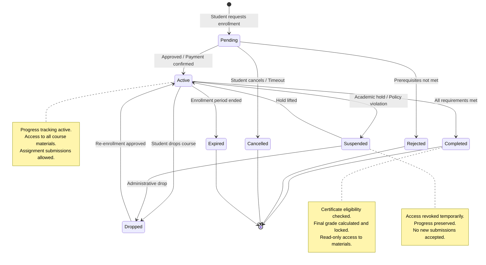

### Quiz Attempt Lifecycle

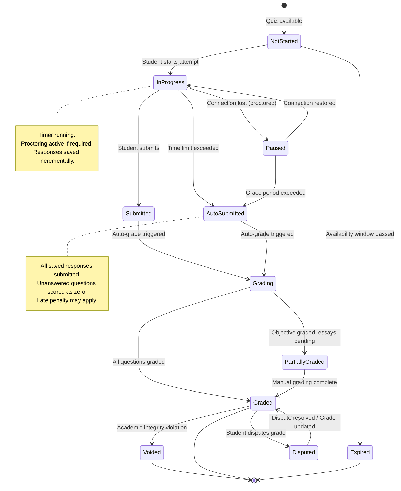

### Assignment Submission Lifecycle

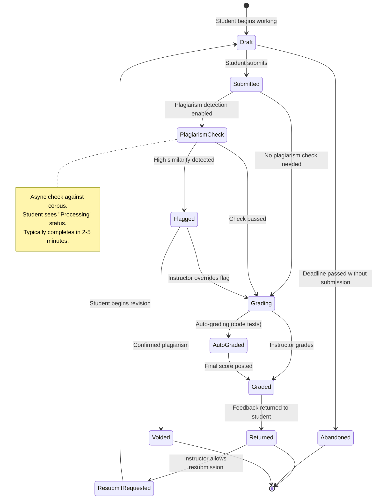

### Certificate Issuance Lifecycle

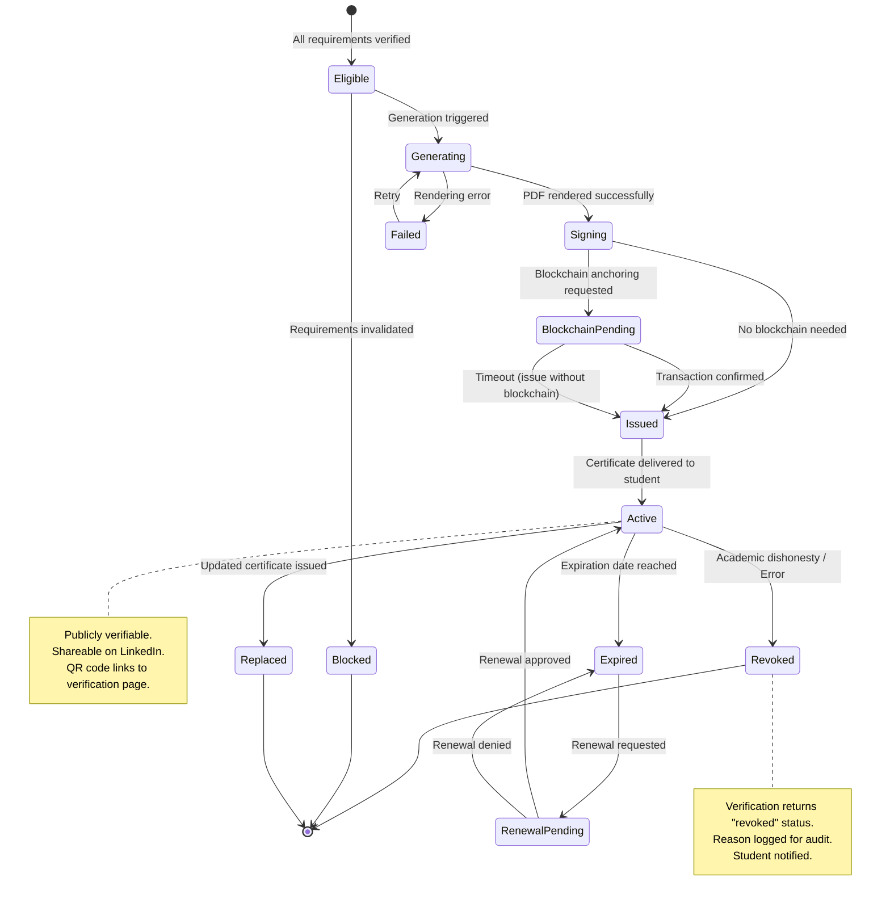

### Video Processing Lifecycle

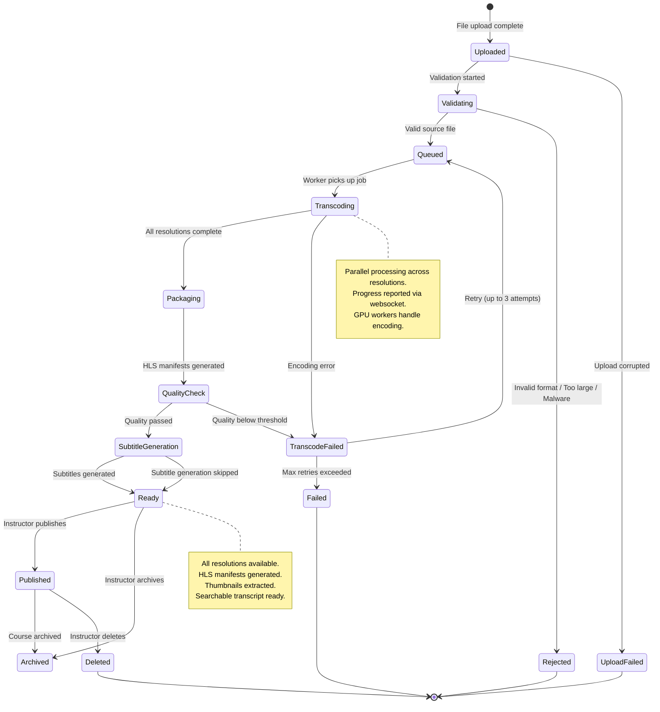

---

## Sequence Diagrams

### Student Enrolls and Completes Course

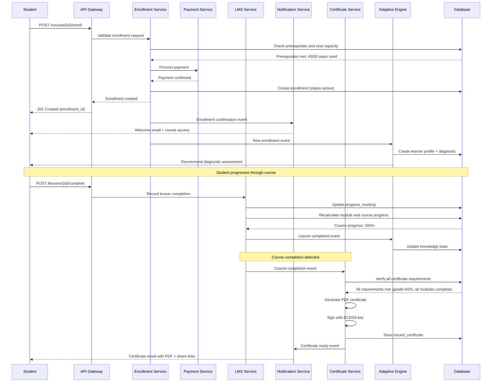

### Quiz Taking with Proctoring

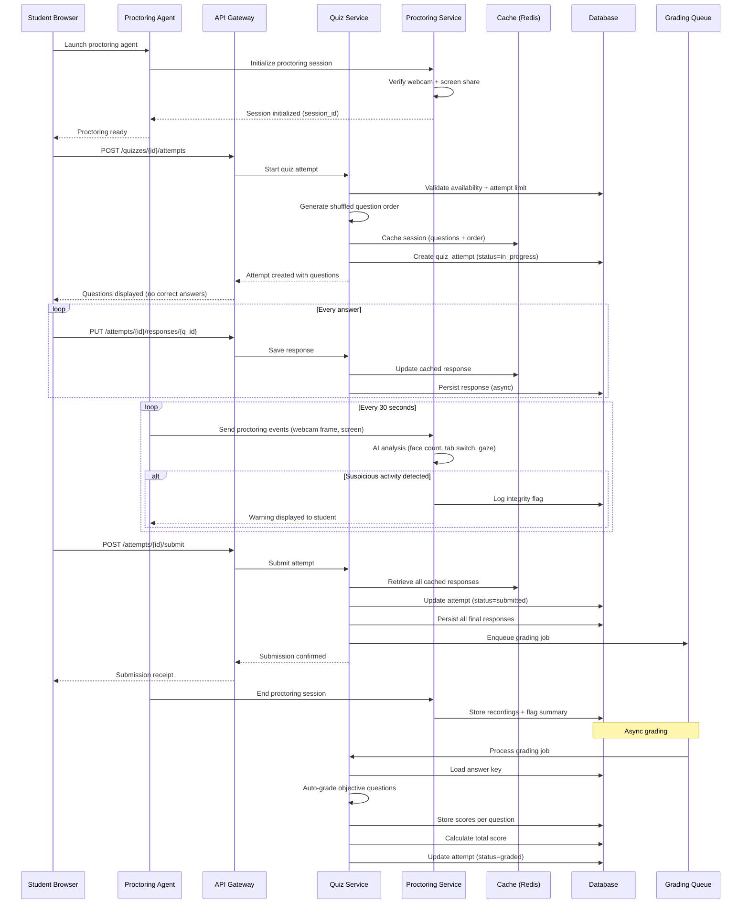

### Video Upload and Transcoding

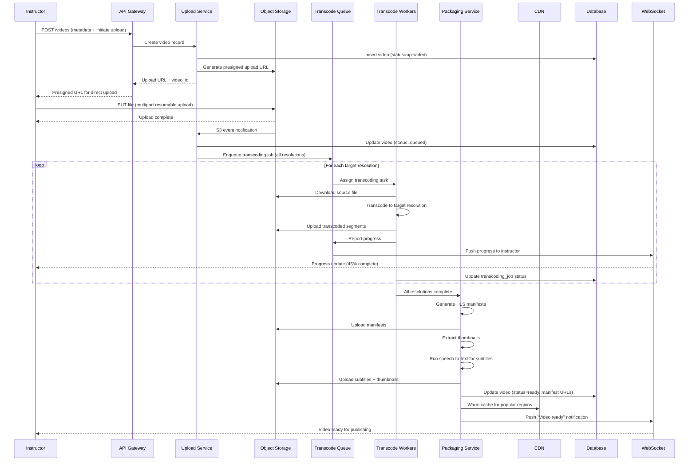

### Certificate Generation and Verification

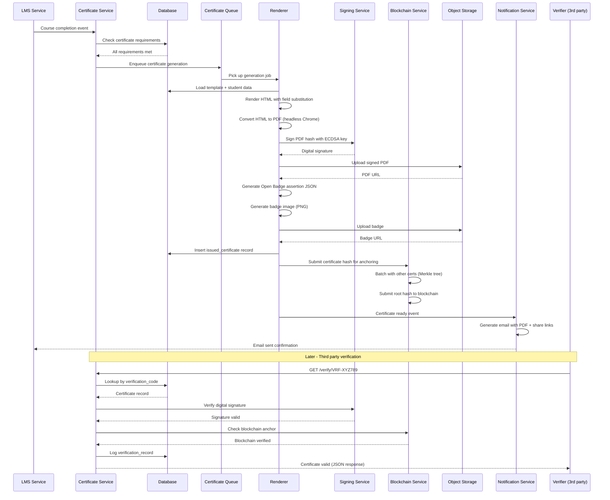

### Adaptive Learning Recommendation Cycle

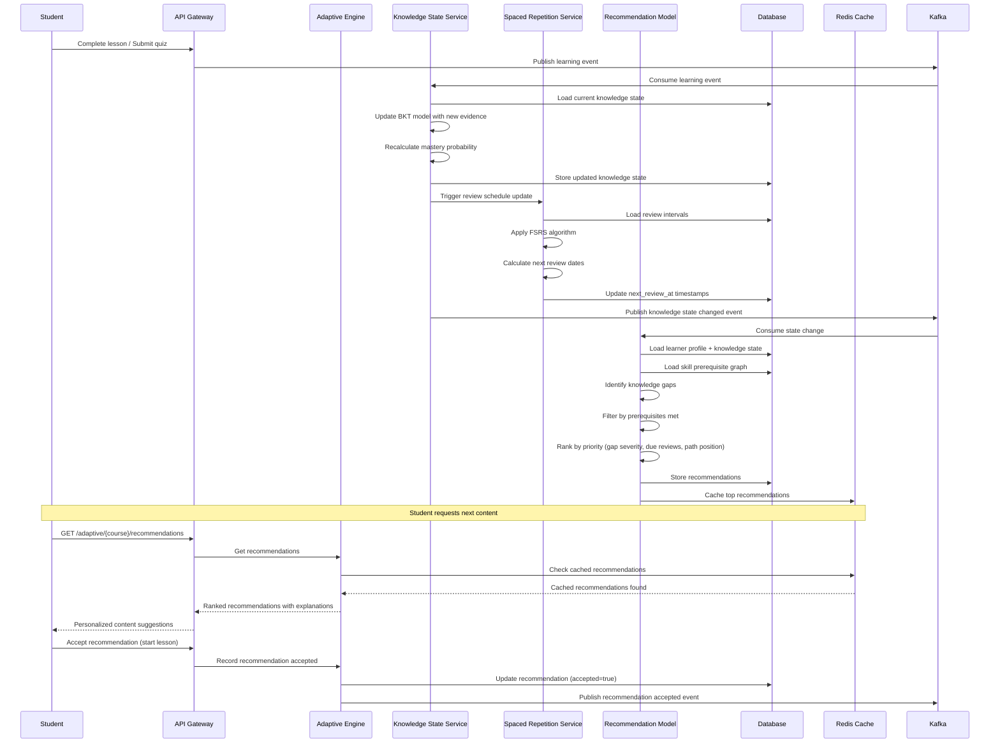

---

## Concurrency Control

### Quiz Submission at Exam Deadline

When thousands of students submit at the exam deadline simultaneously, the system must handle:

1. **Exactly-once submission guarantee** even with network retries
2. **Grace period enforcement** (allow submissions within N minutes of deadline)
3. **No lost responses** if the server receives a submission but crashes before persisting

**Implementation:**

```sql
-- Optimistic locking on quiz_attempts
BEGIN;
  -- Lock the attempt row
  SELECT attempt_id, status, version
  FROM quiz_attempts
  WHERE attempt_id = $1 AND status = 'in_progress'
  FOR UPDATE SKIP LOCKED;

  -- If status already submitted (idempotent check), return existing result
  -- If deadline + grace_period has passed, mark as auto_submitted

  -- Persist all responses in batch
  INSERT INTO quiz_responses (attempt_id, question_id, selected_option_ids, text_response, answered_at)
  VALUES ($1, $2, $3, $4, NOW())
  ON CONFLICT (attempt_id, question_id)
  DO UPDATE SET selected_option_ids = EXCLUDED.selected_option_ids,
               text_response = EXCLUDED.text_response,
               answered_at = EXCLUDED.answered_at;

  -- Update attempt status atomically
  UPDATE quiz_attempts
  SET status = CASE
        WHEN NOW() > deadline_at + (grace_period_minutes || ' minutes')::INTERVAL
        THEN 'auto_submitted'
        ELSE 'submitted'
      END,
      submitted_at = NOW(),
      version = version + 1
  WHERE attempt_id = $1 AND version = $expected_version;

COMMIT;
```

**Write-Ahead Response Buffer:**
```
During an active exam, responses are written to both:
1. Redis (immediate, low-latency): quiz_buffer:{attempt_id}:{question_id}
2. Database (durable, async batch every 10 seconds)

On submit:
  - Read all responses from Redis buffer
  - Write final responses to DB in a single transaction
  - If DB write fails, responses are recoverable from Redis (TTL: 24 hours)
  - Background reconciliation job compares Redis and DB for consistency
```

### Enrollment Limits (Seat Capacity)

```sql
-- Atomic seat reservation using advisory locks
-- Prevents overselling when many students enroll simultaneously

CREATE OR REPLACE FUNCTION enroll_with_seat_check(
    p_course_id UUID,
    p_student_id UUID,
    p_tenant_id UUID,
    p_idempotency_key VARCHAR
) RETURNS UUID AS $$
DECLARE
    v_enrollment_id UUID;
    v_current_count INTEGER;
    v_limit INTEGER;
BEGIN
    -- Idempotency check: return existing enrollment if key matches
    SELECT enrollment_id INTO v_enrollment_id
    FROM enrollments
    WHERE course_id = p_course_id AND student_id = p_student_id;

    IF FOUND THEN
        RETURN v_enrollment_id;
    END IF;

    -- Acquire advisory lock on course_id to serialize enrollment checks
    PERFORM pg_advisory_xact_lock(hashtext(p_course_id::TEXT));

    -- Check capacity
    SELECT enrollment_count, enrollment_limit
    INTO v_current_count, v_limit
    FROM courses
    WHERE course_id = p_course_id;

    IF v_limit IS NOT NULL AND v_current_count >= v_limit THEN
        RAISE EXCEPTION 'Course is full: % of % seats used', v_current_count, v_limit;
    END IF;

    -- Create enrollment
    INSERT INTO enrollments (course_id, student_id, tenant_id, status, enrolled_at)
    VALUES (p_course_id, p_student_id, p_tenant_id, 'active', NOW())
    RETURNING enrollment_id INTO v_enrollment_id;

    -- Increment count
    UPDATE courses SET enrollment_count = enrollment_count + 1
    WHERE course_id = p_course_id;

    RETURN v_enrollment_id;
END;
$$ LANGUAGE plpgsql;
```

### Concurrent Video Upload Processing

```
Problem: Multiple transcoding workers must not duplicate work on the same video.

Solution: Distributed locking with lease-based ownership.

1. Worker claims a job:
   SET transcode_lock:{job_id} {worker_id} NX EX 600  -- 10 min lease
   If SET returns OK: worker owns the job
   If SET returns nil: another worker already claimed it

2. Worker renews lease during processing:
   Every 2 minutes: EXPIRE transcode_lock:{job_id} 600
   If key expired (worker crashed): another worker can claim

3. Worker completes:
   DEL transcode_lock:{job_id}
   Update DB: transcoding_jobs SET status = 'completed'

4. Dead worker detection:
   Cron job scans for jobs in 'processing' status with no lock
   Re-queues orphaned jobs after 15 minutes
```

---

## Idempotency

### Idempotent Quiz Submission

```
Every quiz submission carries an Idempotency-Key header.

Key format: submit-{attempt_id}-v{version}

Server behavior:
  1. Check idempotency_key in quiz_attempts table
  2. If found with status=submitted or graded: return cached result (200 OK)
  3. If found with status=in_progress: process submission normally
  4. If not found: reject (attempt does not exist)

Implementation:
  - The idempotency_key is stored on the quiz_attempts row
  - The submission response is cached in Redis for 24 hours:
    idempotent_response:{key} -> full response JSON
  - Network timeouts: client retries with same key, gets same result
  - Database constraint: UNIQUE(idempotency_key) prevents double-insert

Edge case: client submits, server processes, response lost in transit
  - Client retries with same key
  - Server finds attempt already submitted
  - Returns the same grading result
  - No double-grading, no score changes
```

### Idempotent Grade Posting

```
Problem: Instructor grades an essay, clicks "Save" twice, or network retries.

Key format: grade-{submission_id}-{grader_id}-v{timestamp_hash}

Implementation:
  1. Each grade POST includes idempotency key
  2. Server checks: does a grade already exist for this submission with this key?
  3. If yes: return existing grade (no modification)
  4. If no: insert grade, update submission status

  Additional safeguard:
  - Optimistic locking on submissions.version
  - If two instructors grade simultaneously, second one gets 409 Conflict
  - UI shows "Grade was updated by another instructor" prompt

  Grade audit trail:
  - Every grade change creates a new grades row (append-only)
  - Previous grades are never deleted, only superseded
  - Audit query: SELECT * FROM grades WHERE submission_id = $1 ORDER BY created_at
```

### Idempotent Certificate Generation

```
Problem: Course completion event fires twice (at-least-once delivery).

Key format: certgen-{student_id}-{certificate_id}-v1

Implementation:
  1. Certificate queue consumer checks idempotency_key in issued_certificates
  2. If found: skip generation, ack message
  3. If not found: proceed with generation

  The idempotency_key column has a UNIQUE constraint:
  INSERT INTO issued_certificates (... idempotency_key ...)
  VALUES (... 'certgen-stu123-cert456-v1' ...)
  ON CONFLICT (idempotency_key) DO NOTHING
  RETURNING issued_id;

  If RETURNING is empty: certificate already existed, skip PDF generation.

  This prevents:
  - Duplicate PDFs consuming storage
  - Duplicate emails confusing the student
  - Duplicate blockchain anchoring transactions
  - Race conditions when completion events arrive from multiple sources
```

---

## Consistency Model

### Strong Consistency Requirements

The following data requires strong consistency because errors directly impact students and have regulatory or grade-record implications:

| Data | Consistency Level | Reason |
|------|------------------|--------|
| Quiz responses | Strongly consistent | Responses must be durable before confirming submission. Lost responses mean lost exam answers. |
| Grades | Strongly consistent | Grade changes are audited. Wrong grades affect academic records and financial aid. |
| Quiz attempt status | Strongly consistent | Double-submission or lost submission status leads to disputes. |
| Enrollment status | Strongly consistent | Seat counting must be accurate to prevent overselling. |
| Certificate issuance | Strongly consistent | Duplicate or missing certificates are visible externally. |
| Payment records | Strongly consistent | Financial transactions require ACID guarantees. |

**Implementation:** All writes for these entities use synchronous replication (PostgreSQL synchronous_commit = on) with transactions spanning a single database. No cross-database transactions; use sagas instead.

### Eventual Consistency Requirements

The following data tolerates seconds-to-minutes of staleness because the impact of temporary inconsistency is low:

| Data | Consistency Level | Staleness Tolerance | Reason |
|------|------------------|---------------------|--------|
| Course progress percentage | Eventually consistent | 30 seconds | Cosmetic; recalculated from progress_tracking |
| Video view counts | Eventually consistent | 5 minutes | Analytics only; not user-critical |
| Discussion forum post counts | Eventually consistent | 1 minute | Counter accuracy not critical |
| Leaderboard rankings | Eventually consistent | 5 minutes | Sorted set rebuilt periodically |
| Course catalog search index | Eventually consistent | 2 minutes | Elasticsearch reindex lag acceptable |
| Adaptive recommendations | Eventually consistent | 1 minute | Recommendations can lag behind latest quiz |
| Video watch progress | Eventually consistent | 10 seconds | Buffered writes; resume position approximate |
| Analytics dashboards | Eventually consistent | 15 minutes | Reporting lag is expected |

**Implementation:** These use async replication (read replicas), event-driven materialized views, or eventual cache updates. Write-path acknowledges immediately; read-path may serve stale data from replicas or caches.

---

## Distributed Transaction / Saga

### Course Completion Saga

When a student completes all course requirements, multiple systems must coordinate. This is a choreography-based saga with compensating actions.

```
Saga: Course Completion -> Grade -> Certificate -> Transcript -> Notification

Step 1: Verify All Requirements (LMS Service)
  Action: Check all modules complete, all required quizzes passed, minimum grade met
  Success: Emit "requirements.verified" event
  Failure: Emit "requirements.failed" event (student notified of remaining items)

Step 2: Calculate Final Grade (Grading Service)
  Trigger: "requirements.verified" event
  Action: Calculate weighted final grade from all grade components
  Success: Write final grade to DB, emit "grade.finalized" event
  Failure: Emit "grade.calculation_failed" (retry 3x, then manual review queue)
  Compensate: Mark grade as "pending_review" if downstream fails

Step 3: Issue Certificate (Certificate Service)
  Trigger: "grade.finalized" event
  Action: Generate PDF, sign, store, optionally anchor to blockchain
  Success: Emit "certificate.issued" event
  Failure: Emit "certificate.generation_failed" (retry, then manual queue)
  Compensate: Revoke certificate if grade is later corrected downward

Step 4: Update Transcript (Transcript Service)
  Trigger: "certificate.issued" event
  Action: Add course completion + certificate to learner transcript
  Success: Emit "transcript.updated" event
  Failure: Emit "transcript.update_failed" (retry, eventually consistent)
  Compensate: Remove transcript entry if certificate revoked

Step 5: Send Notification (Notification Service)
  Trigger: "transcript.updated" event
  Action: Send completion email with certificate PDF and share links
  Success: Saga complete
  Failure: Log and retry (notification failure does not roll back saga)

Saga State Machine:
  STARTED -> REQUIREMENTS_VERIFIED -> GRADE_FINALIZED ->
  CERTIFICATE_ISSUED -> TRANSCRIPT_UPDATED -> COMPLETED

Timeout handling:
  - Each step has a 5-minute timeout
  - If no progress event in 5 minutes, saga coordinator retries the step
  - After 3 retries, saga enters MANUAL_REVIEW state
  - Operator dashboard shows stuck sagas with last successful step
```

### Enrollment Saga

```
Saga: Enrollment Request -> Payment -> Seat Reservation -> Access Grant -> Welcome

Step 1: Validate Enrollment (Enrollment Service)
  Action: Check prerequisites, eligibility, no duplicate enrollment
  Success: Emit "enrollment.validated"
  Failure: Return 400/403 to student synchronously

Step 2: Process Payment (Payment Service)
  Trigger: "enrollment.validated" (only for paid courses)
  Action: Charge payment method via Stripe
  Success: Emit "payment.completed"
  Failure: Emit "payment.failed" -> Cancel enrollment
  Compensate: Refund payment if later steps fail

Step 3: Reserve Seat (Enrollment Service)
  Trigger: "payment.completed" (or "enrollment.validated" for free courses)
  Action: Atomic seat reservation (advisory lock + increment)
  Success: Emit "seat.reserved"
  Failure: Emit "seat.unavailable" -> Refund payment -> Cancel enrollment
  Compensate: Release seat (decrement count)

Step 4: Grant Access (LMS Service)
  Trigger: "seat.reserved"
  Action: Create enrollment record, initialize progress tracking
  Success: Emit "access.granted"
  Failure: Release seat -> Refund payment

Step 5: Welcome Flow (Notification + Adaptive)
  Trigger: "access.granted"
  Action: Send welcome email, create learner profile, schedule diagnostic
  Success: Saga complete
  Failure: Non-critical; log and continue (enrollment stands)
```

---

## Security Design

### Exam Integrity

**Question Randomization:**
- Each quiz attempt gets a unique question order (shuffled server-side)
- Question pool randomization: pull N questions from pool of M (N < M)
- Option order shuffled per student to prevent answer-sharing by position
- Shuffle seed stored per attempt for reproducibility during appeals

**Browser Lockdown:**
- Lockdown browser integration (Respondus-compatible)
- Detects: virtual machines, screen capture software, second monitors
- Disables: copy, paste, print, right-click, keyboard shortcuts
- Full-screen enforcement with exit detection

**Proctoring Layers:**
```
Layer 1: Automated AI Monitoring
  - Face detection: verify single test-taker present
  - Gaze tracking: detect sustained off-screen looking
  - Audio analysis: detect voices suggesting assistance
  - Tab/window switch detection
  - Clipboard monitoring

Layer 2: Behavioral Analysis
  - Keystroke dynamics: detect unusual typing patterns
  - Answer time analysis: flag impossibly fast correct answers
  - Response pattern analysis: detect coordinated cheating (same wrong answers)
  - IP geolocation: flag multiple students from same IP

Layer 3: Human Review
  - Flagged sessions reviewed by proctors within 48 hours
  - Side-by-side video + event timeline view
  - Reviewer can confirm, dismiss, or escalate flags
  - All decisions logged for appeals process
```

**Time Limit Enforcement:**
```
- Server-side timer is authoritative (not client-side JavaScript)
- Attempt.deadline_at set on quiz start: NOW() + time_limit + accommodation_extra
- Grace period: configurable per quiz (default 2 minutes for network latency)
- Auto-submit: background job checks for expired in-progress attempts every 30 seconds
- Client sync: client timer synced via NTP-based server time endpoint
- Clock skew tolerance: 5 seconds
```

### Plagiarism Detection

**Essay Plagiarism:**
```
Pipeline:
  1. Text preprocessing: remove formatting, normalize whitespace
  2. Sentence-level fingerprinting (SHA-256 of normalized n-grams)
  3. Compare fingerprints against:
     a. Internal corpus (all prior submissions for this course)
     b. Cross-course corpus (all submissions across platform)
     c. External web sources (via Turnitin/Copyleaks API)
  4. Calculate similarity percentage per source
  5. Generate highlighted report showing matched passages
  6. Threshold: >30% flags for instructor review

Storage:
  - Fingerprint index in Elasticsearch for fast lookup
  - Reports stored in S3 with pre-signed URL for instructor access
```

**Code Plagiarism:**
```
Pipeline:
  1. AST parsing: convert source code to abstract syntax tree
  2. Normalization: rename variables to generic names, remove comments
  3. Token sequence generation
  4. Apply MOSS (Measure Of Software Similarity) algorithm
  5. Compare against all submissions for same assignment
  6. Flag pairs with >40% structural similarity

Additional checks:
  - Git blame analysis if repo submitted
  - Timestamp analysis: submissions within minutes of each other
  - Identical error patterns or typos across submissions
```

### Certificate Tamper-Proofing

**Digital Signatures:**
```
Algorithm: ECDSA with P-256 curve (SHA-256)

Signing process:
  1. Create canonical JSON representation of certificate data
  2. Compute SHA-256 hash of canonical JSON
  3. Sign hash with platform's ECDSA private key (HSM-stored)
  4. Embed signature in certificate PDF metadata and issued_certificates table

Verification process:
  1. Extract signature from certificate
  2. Recompute SHA-256 of certificate data fields
  3. Verify signature against platform's public key
  4. Return: valid | tampered | key_mismatch

Key management:
  - Private key stored in AWS CloudHSM (FIPS 140-2 Level 3)
  - Key rotation: annual, with old keys retained for verification
  - Public key published at /.well-known/certificate-keys.json
```

**Blockchain Anchoring (Optional):**
```
Approach: Periodic Merkle tree anchoring (not per-certificate transactions)

Process:
  1. Every 15 minutes, collect all newly issued certificate hashes
  2. Build Merkle tree from certificate hashes
  3. Submit Merkle root to Ethereum/Polygon as a single transaction
  4. Store Merkle proof per certificate for independent verification

Verification:
  1. Compute certificate hash
  2. Retrieve Merkle proof from DB
  3. Verify proof against on-chain Merkle root
  4. Confirm block timestamp predates any tampering claim

Cost optimization:
  - Batching 1000 certs per transaction reduces cost to ~$0.001 per certificate
  - Use L2 (Polygon) for lower gas fees
  - Fallback to centralized verification if blockchain is unavailable
```

### Student Data Privacy

**FERPA Compliance (US):**
```
- Student education records are protected
- Directory information opt-out mechanism
- Access logs for all student record views
- Instructor access scoped to enrolled students only
- No cross-tenant data leakage
- Annual access audit reports for institutional tenants
- Right to inspect and amend records via support workflow
```

**COPPA Compliance (users under 13):**
```
- Parental consent collection before account creation
- Limited data collection for minors
- No behavioral advertising for minor accounts
- Parental access to child's data and deletion rights
- Age gate at registration with verification
```

**Data Security:**
```
- Encryption at rest: AES-256 for all databases and object storage
- Encryption in transit: TLS 1.3 for all API traffic
- PII tokenization: student names and emails stored tokenized in analytics
- Data residency: tenant-configurable storage regions (EU, US, APAC)
- Data retention: configurable per tenant, minimum 7 years for academic records
- Right to deletion: GDPR Article 17 workflow with cascading deletion across services
- Audit logging: immutable append-only log of all data access and modifications
```

---

## Observability

### Learning Analytics Dashboard

```
Metrics collected:
  - Enrollment funnel: visit -> enroll -> start -> complete (conversion rates)
  - Course completion rate by cohort, instructor, category
  - Average time to completion (per course, per module)
  - Student engagement: daily active learners, session duration, content interactions
  - Drop-off analysis: which lesson/module causes most drops
  - Grade distribution per course and assignment
  - Discussion engagement: posts per student, response time

Technology stack:
  - Events -> Kafka -> Flink (real-time aggregation) -> ClickHouse (analytics DB)
  - Dashboard: Grafana (operational), Looker/Metabase (business analytics)
  - Alerting: PagerDuty for operational, email digests for instructors

Key dashboards:
  1. Instructor Dashboard: per-course metrics, student progress heatmap, at-risk students
  2. Admin Dashboard: platform-wide KPIs, revenue, usage trends
  3. Student Dashboard: personal progress, study streak, peer comparison
  4. Operations Dashboard: system health, queue depths, error rates
```

### Video Quality Metrics

```
Player-side telemetry (collected every 30 seconds):
  - Buffering events: count, total duration, timestamps
  - Bitrate switches: from/to resolution, trigger reason (bandwidth drop, manual)
  - Startup time: time from play click to first frame rendered
  - Rebuffering ratio: time spent buffering / total watch time
  - Average bitrate delivered
  - CDN edge node served from
  - Error events: manifest fetch failure, segment decode error

Server-side metrics:
  - CDN cache hit ratio (target: >95%)
  - Origin request rate (should be <5% of total requests)
  - Transcoding job duration by resolution
  - Transcoding failure rate
  - Storage growth rate

SLOs:
  - Video startup time P50 < 2s, P99 < 5s
  - Rebuffering ratio < 1% of watch time
  - CDN availability > 99.95%
  - Transcoding completion within 30 minutes for 1-hour video
```

### Quiz Completion Metrics

```
Operational metrics:
  - Quiz submission rate (per second, per minute)
  - Auto-grading latency (P50, P95, P99)
  - Manual grading turnaround time (hours)
  - Proctoring flag rate (flags per exam session)
  - Question load time
  - Response save latency

Quality metrics:
  - Average quiz score per quiz
  - Question difficulty index (% correct)
  - Question discrimination index (correlation with total score)
  - Distractor efficiency (per-option selection rates)
  - Time-per-question distribution
  - Completion rate (started vs submitted)
  - Cheating detection rate (flagged sessions / total sessions)

Alerting:
  - Submission rate spike (>10x normal) -> potential exam window
  - Auto-scale quiz service and grading workers
  - Error rate > 1% on submissions -> page on-call
  - Grading queue depth > 10,000 -> alert grading team
```

### Adaptive Learning Effectiveness

```
Metrics:
  - Recommendation acceptance rate (accepted / presented)
  - Learning velocity: skills mastered per week (adaptive vs non-adaptive students)
  - Knowledge retention: spaced review performance (correct % on reviews)
  - Path completion rate: % of students completing personalized path
  - Cold start accuracy: diagnostic assessment prediction accuracy
  - A/B test results: adaptive vs standard path learning outcomes
  - Model prediction accuracy: predicted mastery vs actual quiz performance
  - Engagement: session frequency and duration for adaptive learners vs control

Model monitoring:
  - Feature drift detection on learner interaction data
  - Prediction calibration: model confidence vs actual outcome
  - Feedback loop latency: event to updated recommendation
  - Stale recommendation rate: recommendations not updated after new evidence
```

---

## Reliability and Resilience

### Exam System 99.99% During Exam Windows

```
99.99% uptime = 52 seconds of downtime per year. During exam windows, this is critical.

Architecture for exam resilience:
  1. Dedicated exam cluster: isolated database, API servers, and cache for exams
     - No shared resources with general LMS traffic
     - Pre-warmed capacity before scheduled exam windows

  2. Multi-AZ deployment:
     - Primary DB in AZ-a, synchronous standby in AZ-b
     - API servers across 3 AZs with health-check-based routing
     - Redis sentinel with automatic failover

  3. Circuit breakers:
     - Non-essential features disabled during exams (analytics, recommendations, forums)
     - Proctoring degrades gracefully (recording continues, AI analysis deferred)
     - Grade calculation queued rather than synchronous if system stressed

  4. Write-ahead response buffer:
     - Every response saved to Redis AND local disk before DB write
     - If DB is down, responses are recoverable from buffer
     - Background reconciliation syncs buffer to DB when restored

  5. Graceful degradation hierarchy:
     Priority 1: Accept and persist quiz responses (never lose an answer)
     Priority 2: Quiz timer accuracy (server-side authoritative)
     Priority 3: Auto-grading (can be deferred)
     Priority 4: Proctoring analysis (can run post-exam)
     Priority 5: Analytics and reporting (non-urgent)

  6. Pre-exam health checks (30 minutes before scheduled exam):
     - DB connectivity and replication lag
     - Redis cluster health
     - API server capacity and response times
     - Automated go/no-go check with operator notification

  7. Exam-specific runbook:
     - Automated rollback of any deployment within exam window
     - Pre-staged database queries for common exam issues
     - Direct communication channel to on-call exam support team
```

### Video CDN Failover

```
Multi-CDN strategy:
  Primary: CloudFront (AWS)
  Secondary: Fastly
  Tertiary: Akamai (for specific regions)

Failover logic (at DNS level via Route53 health checks):
  1. Health check probes manifest URLs from each CDN every 10 seconds
  2. If primary fails 3 consecutive checks: shift 50% traffic to secondary
  3. If primary fails 6 consecutive checks: shift 100% to secondary
  4. Recovery: gradually shift back over 10 minutes once primary healthy

Origin shield:
  - Single origin shield layer between CDN and object storage
  - Prevents thundering herd on origin when CDN cache expires
  - Origin shield in us-east-1, eu-west-1, ap-southeast-1

Segment-level resilience:
  - Each video segment is replicated to 3 S3 regions
  - CDN origin fallback chain: primary region -> secondary region -> tertiary
  - Client player: if segment fetch fails, retry with exponential backoff
  - After 3 segment failures: drop quality tier and retry

Manifest freshness:
  - Master manifest cached at edge for 60 seconds
  - Variant manifests (per-resolution) cached for 5 minutes
  - Segments cached for 1 hour (immutable)
  - Invalidation: push-based purge on video update/delete
```

### Offline Learning Support

```
Architecture for offline-capable learning:

1. Content Pre-download:
   - Students explicitly download lessons/videos for offline use
   - DRM-encrypted video files stored in device sandbox
   - Lesson text content cached in local SQLite database
   - Quiz questions pre-fetched (without correct answers)

2. Offline Progress Tracking:
   - Progress events queued in local storage (IndexedDB or SQLite)
   - Conflict resolution on sync: last-write-wins for progress, merge for responses
   - Sync protocol: client sends events with local timestamps + sequence numbers
   - Server reconciles based on sequence numbers, not wall clock

3. Offline Quiz Taking:
   - Practice quizzes available offline with client-side grading
   - Graded quizzes NOT available offline (security risk)
   - Responses encrypted and signed locally, synced when online

4. Sync Protocol:
   POST /api/v1/sync
   Body: { events: [...], last_sync_sequence: 42, device_id: "..." }
   Response: { server_events: [...], new_sync_sequence: 58, conflicts: [...] }

5. Storage Limits:
   - Default: 2 GB per course for offline content
   - Video: only selected quality level downloaded (not all resolutions)
   - Automatic cleanup of stale content after 30 days offline
```

---

## Multi-Region

### Content Delivery Optimization

```
Region topology:
  - US-East (primary): Main application servers, primary database
  - US-West: Read replica, CDN origin
  - EU-West (Ireland): Full regional deployment for EU data residency
  - AP-Southeast (Singapore): Read replica, CDN origin for Asia-Pacific

Content distribution:
  - Static course content (videos, PDFs): CDN with regional caching
  - Dynamic course data (progress, grades): served from nearest read replica
  - Writes: routed to primary region, async replicated to read replicas

  Video content strategy:
  - Popular videos pre-warmed in all regional CDN POPs
  - Long-tail content fetched on-demand with origin shield
  - User's region detected via IP geolocation at login
  - Manifest URLs point to region-specific CDN endpoints
```

### Exam Scheduling Across Timezones

```
Challenge: A global exam must be fair across timezones.

Approaches:

1. Synchronized Window (all students at same UTC time):
   - Exam available from 2026-03-25T12:00:00Z to 2026-03-25T14:00:00Z
   - Pro: prevents answer sharing across timezones
   - Con: inconvenient for some timezones (3 AM local)

2. Rolling Window (per-timezone):
   - Exam available at "9:00 AM local time" in each timezone
   - Implemented: available_from / available_until per timezone group
   - Question pool rotation: different question sets for different windows
   - Pro: fair scheduling for all students
   - Con: requires larger question pools to prevent cross-timezone sharing

3. On-Demand Window (student chooses start time within a date range):
   - "Take the exam anytime between March 25-27"
   - Time limit starts when student begins
   - Maximum question pool randomization required
   - Pro: maximum flexibility
   - Con: hardest to prevent answer sharing

Implementation:
  - Quiz model stores timezone_policy: 'utc_synchronized' | 'rolling' | 'on_demand'
  - For rolling: available_from/until stored as time-of-day + date range
  - Server resolves student's timezone from profile and calculates actual window
  - All deadlines stored and enforced in UTC server-side
```

### Data Residency for Student Records

```
Requirement: Student PII must remain in the student's declared region.

Architecture:
  - Each tenant declares a "data region" at onboarding
  - Student PII (name, email, address) stored only in declared region
  - Academic records (grades, transcripts) co-located with PII
  - Course content (non-PII) replicated globally for performance

Database topology:
  Region US: PostgreSQL primary (US student PII + grades)
  Region EU: PostgreSQL primary (EU student PII + grades)
  Region APAC: PostgreSQL primary (APAC student PII + grades)

  Cross-region references: use opaque student_id (UUID), never embed PII

  Course catalog: global read replica, writes to primary then fan-out

API routing:
  - API gateway inspects tenant_id -> resolves data region
  - Routes PII-touching requests to correct regional backend
  - Non-PII requests (course catalog, video streaming) served from nearest region

Compliance audit:
  - Data flow mapping document maintained per region
  - Automated scan: flag any PII found in non-designated region
  - Cross-region data transfer requires explicit legal basis (consent or contract)
```

---

## Cost Drivers

### Video Storage and CDN

```
Cost breakdown (monthly, at scale):
  Storage:
  - S3 Standard (hot): 1 PB transcoded video = $23,000/month
  - S3 Infrequent Access (source files): 1.5 PB = $12,000/month
  - S3 Glacier (archived courses): 500 TB = $2,000/month
  Total storage: ~$37,000/month

  CDN egress:
  - 15 PB egress/month via CloudFront = ~$150,000/month (at $0.01/GB negotiated)
  - This is typically the single largest cost in an EdTech platform

  Optimization strategies:
  - Negotiate committed-use CDN pricing (30-50% discount)
  - Implement intelligent quality selection (don't serve 4K on mobile)
  - Aggressive cache TTLs for immutable segments
  - Origin shield to reduce origin fetches
  - Regional tiering: serve from cheapest CDN per region
  - Lazy transcoding: only transcode 4K when first 4K-capable viewer requests it
```

### GPU Costs for Transcoding

```
  Per-video transcoding cost:
  - 1-hour source video, 5 resolutions
  - GPU instance (g5.xlarge): $1.006/hour
  - Average transcoding time: 30 minutes total (parallel across resolutions)
  - Cost per video: ~$0.50

  Monthly transcoding (5,000 hours of new video):
  - 5,000 videos x $0.50 = $2,500/month on GPU instances

  Optimization:
  - Use Spot instances for non-urgent transcoding (60% savings): $1,000/month
  - Hardware encoder (NVENC) vs software (x264): 3x faster, same quality
  - Skip 4K transcoding for courses with <100 enrollments
  - Re-use transcoded versions when source hasn't changed
```

### Proctoring Service Costs

```
  Third-party proctoring (Examity/ProctorU):
  - AI-proctored (automated): $5-10 per exam session
  - Live proctored (human): $20-35 per exam session

  Self-hosted proctoring:
  - Video recording storage: 1.5 GB per 1-hour session
  - 50,000 proctored exams/semester
  - Storage: 75 TB x $0.023/GB = $1,725/month
  - AI processing (face detection, gaze tracking): $0.05 per session
  - Total self-hosted: ~$4,225/month vs $250,000-500,000 for third-party

  Trade-off: Self-hosted requires ML team investment; third-party is turnkey but expensive.
```

### Certificate Storage

```
  PDF storage:
  - 200,000 certificates/month x 500 KB = 100 GB/month growth
  - After 5 years: 6 TB = $140/month (S3 Standard)

  Blockchain anchoring:
  - Ethereum L1: ~$5 per transaction (batch of 1,000 certs)
  - 200 transactions/month = $1,000/month
  - Polygon L2: ~$0.01 per transaction
  - 200 transactions/month = $2/month

  Verification infrastructure:
  - CDN-cached verification pages: negligible cost
  - Database reads for verification: included in main DB cost
  - Total certificate system cost: <$500/month (excluding blockchain on L1)
```

---

## Deep Platform Comparisons

### Coursera vs Udemy vs edX vs Khan Academy vs Skillshare

| Dimension | Coursera | Udemy | edX | Khan Academy | Skillshare |
|-----------|---------|-------|-----|-------------|-----------|
| **Business Model** | B2C + B2B (Coursera for Business), degree programs | Marketplace (instructor-set pricing) | B2C + B2B, university-partnered degrees | Non-profit, free for all | Subscription-based creative classes |
| **Content Model** | Structured courses with peer-graded assignments | Instructor-uploaded videos (minimal structure) | University-designed with rigorous assessments | Mastery-based learning with exercises | Project-based creative tutorials |
| **Video Architecture** | HLS streaming, DRM for paid content, subtitles in 20+ languages | HLS streaming, watermarking, basic DRM | HLS, open-source player (xblock-based) | YouTube-hosted with custom player overlay | HLS streaming, no DRM (subscription gated) |
| **Assessment** | Auto-graded quizzes + peer review + programming assignments (Jupyter) | Basic quizzes only (MCQ, true/false) | Sophisticated: proctored exams, auto-graded code, peer review | Mastery-based exercises with hints and adaptive difficulty | Project-based (no formal assessment) |
| **Adaptive Learning** | Course recommendations via ML, personalized study plans | Basic recommendation (collaborative filtering on purchase history) | MIT-developed adaptive engine for some courses | Deep adaptive learning: BKT, knowledge map, mastery progression | No adaptive features |
| **Certification** | Verified certificates with identity verification, degree certificates | Certificate of completion (no identity verification) | Verified certificates, MicroMasters, university credits | No formal certificates | Certificate of completion |
| **Scale** | 130M+ learners, 7,000+ courses | 70M+ learners, 200K+ courses | 40M+ learners, 3,000+ courses | 150M+ learners, math/science focus | 12M+ learners, 30K+ classes |
| **Tenancy** | Multi-tenant (B2B) with institutional branding | Single platform, no tenancy | Multi-tenant (Open edX supports self-hosted) | Single platform | Single platform |
| **Key Technical Differentiator** | Jupyter notebook integration for data science, peer review at scale | Marketplace scalability (millions of instructor-created courses) | Open-source (Open edX), LTI interoperability | Real-time adaptive exercise engine, knowledge graph | Class project community and collaboration |

### Canvas vs Moodle vs Blackboard (LMS)

| Dimension | Canvas (Instructure) | Moodle | Blackboard |
|-----------|---------------------|--------|-----------|
| **Deployment** | Cloud-native SaaS | Self-hosted (PHP/MySQL), Moodle Cloud option | Cloud + on-premise legacy |
| **Architecture** | Ruby on Rails monolith + microservices, PostgreSQL, Redis, S3 | PHP monolith, MySQL/PostgreSQL, file-based storage | Java-based monolith, Oracle DB (legacy) |
| **API** | REST + GraphQL, comprehensive LTI 1.3 support | REST API, LTI 1.3, extensive plugin system | REST API, LTI, Building Blocks API |
| **Scale** | 30M+ users across institutions | 300M+ users globally (largest install base) | 20M+ users, declining market share |
| **Extensibility** | LTI integrations, limited plugin model | 1,500+ plugins, highly customizable | Building Blocks (deprecated), LTI |
| **Video** | Integrated with Studio (Arc), third-party via LTI | Plugin-based (Kaltura, Panopto) | Collaborate Ultra (built-in), Kaltura |
| **Assessment** | New Quizzes engine (React-based), classic quizzes | Quiz engine with 15+ question types, question bank | Extensive assessment with SafeAssign plagiarism |
| **Analytics** | Canvas Data 2 (data warehouse export), basic built-in | Limited built-in, plugins for analytics | Blackboard Analytics (separate product) |
| **Cost** | Per-student SaaS pricing | Free (open source), hosting costs | Enterprise licensing (expensive) |

### Examity vs ProctorU (Proctoring)

| Dimension | Examity | ProctorU |
|-----------|---------|----------|
| **AI Proctoring** | Automated with human review escalation | Automated (Guardian) + live (Classic) |
| **Live Proctoring** | Available at higher tier | Core offering with real-time proctor |
| **Integration** | LTI, direct API | LTI, direct API, browser extension |
| **Browser Lockdown** | Partnered with Respondus | Built-in secure browser option |
| **Identity Verification** | Multi-factor: photo ID + keystroke biometrics | Photo ID + facial recognition |
| **Pricing** | AI: $5-8/session, Live: $20-30/session | AI: $7-12/session, Live: $25-35/session |
| **Accessibility** | VPAT documented, accommodations workflow | ADA compliant, extended time support |
| **Data Retention** | Recordings retained 1 year default | Recordings retained 1 year, configurable |

### Credly vs Accredible (Digital Credentials)

| Dimension | Credly | Accredible |
|-----------|--------|-----------|
| **Badge Standard** | Open Badges 2.0 | Open Badges 2.0 |
| **Blockchain** | No native blockchain | Optional blockchain anchoring |
| **Template Design** | Drag-and-drop designer | HTML/CSS template editor |
| **Verification** | Credly.com verification page | Custom domain verification portal |
| **LinkedIn Integration** | One-click LinkedIn add | One-click LinkedIn add |
| **API** | REST API with webhooks | REST API with webhooks |
| **Pricing** | Per-credential, enterprise tier | Per-credential, tiered plans |
| **Analytics** | Credential sharing analytics, labor market insights | Sharing analytics, engagement tracking |
| **Key Differentiator** | Labor market analytics, skill mapping | Certificate PDF generation, custom branding |

---

## Edge Cases

### 1. Student Submits Quiz at Exact Deadline

**Scenario:** Student clicks "Submit" at 14:59:59.800, but the server receives the request at 15:00:00.200 (after the deadline).

**Resolution:**
- Use server-side `submitted_at` timestamp, not client time
- Grace period (default 2 minutes) absorbs network latency
- If `submitted_at <= deadline + grace_period`: accept as on-time submission
- If `submitted_at > deadline + grace_period`: mark as `auto_submitted` with saved responses
- The quiz_attempt `deadline_at` is the authoritative cutoff, set when the attempt starts
- Log both client-claimed submit time and server-received time for dispute resolution

### 2. Internet Drop During Proctored Exam

**Scenario:** Student's internet drops for 3 minutes during a proctored exam.

**Resolution:**
- Client-side: responses are saved locally every 10 seconds (IndexedDB)
- Proctoring session enters "paused" state; timer continues on server
- When connection resumes:
  - Client syncs locally saved responses to server
  - Proctoring agent reconnects and resumes recording
  - Proctoring event log records: `{type: "connection_lost", duration_seconds: 180}`
- If disconnection > configurable threshold (e.g., 10 minutes):
  - Attempt auto-submitted with saved responses
  - Flag for instructor review with disconnection evidence
- Student can request accommodations for verified network issues (ISP outage records)

### 3. Video Buffering in Low-Bandwidth Regions

**Scenario:** Students in rural areas with 500 kbps connections cannot stream 720p video.

**Resolution:**
- ABR (Adaptive Bitrate) automatically drops to 360p (400 kbps) or lower
- Provide explicit quality selector in player UI for manual override
- "Audio-only" mode: strip video track, deliver audio + slides as images
- Pre-download option: students download lessons during off-peak hours
- Low-bandwidth detection: if average throughput < 500 kbps for 30 seconds, prompt "Download for offline viewing?"
- Regional CDN edge servers in underserved areas (partner with local ISPs)
- Video compression optimization: use H.265/HEVC for 40% better compression at same quality

### 4. Certificate Verification for Revoked Credential

**Scenario:** An employer verifies a certificate that was revoked for academic dishonesty.

**Resolution:**
- Verification endpoint returns `{"status": "revoked", "revoked_at": "...", "reason": "academic_integrity_violation"}`
- Certificate PDF has a visible watermark: "REVOKED" overlaid (re-generated on revocation)
- Blockchain record: revocation transaction published, Merkle proof updated
- LinkedIn badge: integration calls back to verify endpoint; LinkedIn shows "This credential has been revoked"
- Legal: revocation includes notification to the student with appeal rights and timeline
- Audit: all verification lookups for revoked certificates are logged for legal discovery

### 5. Adaptive Engine Cold Start for New Student

**Scenario:** A new student enrolls with no prior activity data. The adaptive engine cannot make personalized recommendations.

**Resolution:**
- **Diagnostic Pre-Assessment:** 10-15 question adaptive quiz covering key skills
  - Uses computerized adaptive testing (CAT) to quickly estimate ability
  - IRT-based: each question selected to maximize information gain
  - Results bootstrap the knowledge_state for all assessed skills

- **Collaborative Filtering Fallback:** recommend popular/effective content from similar cohort
  - "Students in your program typically start with..."
  - Match by: course, prior education level, self-reported experience

- **Progressive Personalization:** recommendations improve as more data arrives
  - After 5 interactions: basic personalization active
  - After 20 interactions: full personalized path
  - After 50 interactions: confident mastery estimates

- **Explicit Preferences:** ask student during onboarding
  - Preferred content types (video, text, interactive)
  - Learning pace (self-paced, structured schedule)
  - Daily study time goal

### 6. Plagiarism in Code Submissions

**Scenario:** Two students submit structurally identical code with different variable names.

**Resolution:**
- AST-based comparison normalizes variable names, so renaming is detected
- MOSS algorithm compares token sequences and finds >90% similarity
- System flags both submissions and notifies the instructor
- Instructor sees side-by-side diff with highlighted matching sections
- Timestamp analysis: if Student A submitted 2 hours before Student B, Student A is likely the source
- Git integration: if students submitted repos, check commit history for evidence of independent work
- False positive handling: common algorithms (e.g., bubble sort) expected to be similar
  - Maintain a "known patterns" allowlist that reduces similarity scores for standard implementations

### 7. Concurrent Enrollment Exceeding Capacity

**Scenario:** 10 students simultaneously try to enroll in a course with 1 remaining seat.

**Resolution:**
- Advisory lock on course_id serializes enrollment checks (see Concurrency Control section)
- First student to acquire lock gets the seat
- Remaining 9 receive 422 "Course is full" response
- Waitlist: offer automatic enrollment when a seat opens
  - Waitlist position tracked in enrollments table with `status = 'waitlisted'`
  - On drop: notify first waitlisted student with 24-hour enrollment window
  - If window expires: move to next in waitlist

### 8. Video Subtitle Sync Issues

**Scenario:** Auto-generated subtitles are 2 seconds out of sync with audio after a specific timestamp.

**Resolution:**
- Root cause: speech-to-text model produces timestamps relative to audio track, but video has variable frame rate causing drift
- Detection: QA check compares subtitle timestamps against audio peak detection
- Auto-correction: re-align subtitles using forced alignment (match transcript to audio waveform)
- Manual override: subtitle editor UI with waveform display for fine-tuning
- Prevention: normalize source video to constant frame rate during transcoding
- Student-facing: subtitle offset slider in player UI (+/- 5 seconds adjustment)

### 9. Grade Dispute Resolution

**Scenario:** A student claims their quiz was graded incorrectly and requests a review.

**Resolution:**
- Dispute workflow:
  1. Student submits dispute via API with reason and evidence
  2. Dispute creates a `grade_dispute` record linked to the submission/attempt
  3. Original responses and grading data are frozen (snapshot taken)
  4. Assigned to instructor or department head for review
  5. Reviewer sees: original responses, auto-grading logic, correct answers, time logs
  6. Reviewer can: uphold grade, adjust grade (with reason), void and allow retake
  7. All changes create new grades rows (audit trail preserved)
  8. Student notified of outcome with explanation
- SLA: disputes resolved within 5 business days
- Escalation: if instructor doesn't respond in 3 days, escalate to department admin

### 10. Course Content Update While Students In Progress

**Scenario:** An instructor updates lesson content while 500 students are mid-course.

**Resolution:**
- **Content Versioning:** each lesson has a version number
- **Enrolled students see the version they started with** (snapshot at enrollment)
  - Version pinning: enrollment record stores `course_version` at enrollment time
  - Students can opt-in to new version if they prefer
- **New enrollees get the latest version**
- **Breaking changes** (removed lessons, changed requirements):
  - Instructor must publish as "new version" explicitly
  - System warns: "500 students are in progress. Changes will not affect them."
  - Admin can force-migrate students with notification
- **Non-breaking changes** (typo fixes, additional resources):
  - Applied immediately to all versions
  - Tracked as minor version update (no student notification needed)

---

## Adaptive Learning Deep Dive

### Knowledge Tracing Models

**Bayesian Knowledge Tracing (BKT):**

BKT models student knowledge as a hidden Markov model with four parameters per skill:

```
Parameters:
  P(L0) = Initial probability of knowing the skill (prior)
  P(T)  = Probability of learning the skill after each opportunity (transit)
  P(S)  = Probability of making a mistake despite knowing (slip)
  P(G)  = Probability of getting correct despite not knowing (guess)

Update equations:
  After observing a correct response:
    P(L_n | correct) = P(L_n-1) * (1 - P(S)) / (P(L_n-1) * (1 - P(S)) + (1 - P(L_n-1)) * P(G))

  After observing an incorrect response:
    P(L_n | incorrect) = P(L_n-1) * P(S) / (P(L_n-1) * P(S) + (1 - P(L_n-1)) * (1 - P(G)))

  Learning transition:
    P(L_n) = P(L_n | observed) + (1 - P(L_n | observed)) * P(T)

Implementation:
  - Stored per student-skill pair in knowledge_states.bkt_params
  - Updated on every quiz response or exercise attempt
  - Mastery threshold: P(L) >= 0.95 -> skill is "mastered"
  - Typically fit parameters from population data, then individualize

Limitations:
  - Binary knowledge state (knows or doesn't)
  - Same parameters for all students (unless individualized)
  - Doesn't model forgetting
  - Doesn't account for question difficulty
```

**Deep Knowledge Tracing (DKT):**

```
Architecture: LSTM/Transformer that models the entire interaction sequence

Input: sequence of (skill_id, correct/incorrect) tuples
Output: predicted probability of correct response on next item for each skill

Advantages over BKT:
  - Automatically captures inter-skill relationships
  - Models complex learning patterns (plateaus, breakthroughs)
  - Can incorporate additional features (time, content type, difficulty)
  - No need to manually specify skill prerequisites

Implementation:
  - Model trained offline on historical interaction data
  - Online inference: append new interaction to student's sequence, run forward pass
  - Latency: <50ms for inference on a single student's sequence (GPU)
  - Retrained weekly on new data

  Model architecture (simplified):
    Input embedding: skill_id (one-hot or learned embedding) + correct (binary)
    LSTM layers: 2 layers, 200 hidden units
    Output: sigmoid over all skills (multi-label probability)

Practical considerations:
  - Cold start: use average knowledge state for new students
  - Sequence length: truncate to last 200 interactions for inference speed
  - Feature enrichment: add time between attempts, content type, hint usage
```

**SPARFA (Sparse Factor Analysis for Knowledge Tracing):**

```
SPARFA decomposes the student-question interaction matrix to discover:
  1. Latent knowledge concepts (learned from data, not manually defined)
  2. Student ability on each concept
  3. Question-concept associations

Model:
  Y_ij = sigmoid(sum_k(W_ik * C_kj) + d_j)
  Where:
    Y_ij = probability student i answers question j correctly
    W_ik = student i's ability on concept k
    C_kj = question j's association with concept k
    d_j = question j's intrinsic difficulty

Advantages:
  - Discovers skill structure from data (no manual tagging needed)
  - Sparse: each question maps to few concepts (interpretable)
  - Provides question analytics as a byproduct

Implementation:
  - Batch computation: run on all quiz data monthly
  - Use discovered concepts to validate manual skill tags
  - Feed concept-student matrix into recommendation engine
```

### Item Response Theory (IRT)

```
IRT models the probability of a correct response as a function of student ability
and item (question) characteristics.

3-Parameter Logistic (3PL) Model:
  P(correct | theta, a, b, c) = c + (1 - c) / (1 + exp(-a * (theta - b)))

  Where:
    theta = student ability (estimated, continuous)
    a = discrimination parameter (how well the item differentiates students)
    b = difficulty parameter (ability level for 50% correct probability)
    c = guessing parameter (probability of correct answer by random guess)

Parameter estimation:
  - Fit a, b, c for each question using EM algorithm on response data
  - Requires minimum 100 responses per question for stable estimates
  - Student theta estimated using maximum likelihood after answering multiple questions

Applications in EdTech:
  1. Computerized Adaptive Testing (CAT):
     - Select next question to maximize information about student ability
     - Fisher information: I(theta) = a^2 * P * Q / (P - c)^2
     - Select question with highest information at current theta estimate
     - Converges to accurate ability estimate in 10-15 questions

  2. Question Quality Analysis:
     - Low discrimination (a < 0.5): question doesn't differentiate skill levels
     - High guessing (c > 0.4): too easy to guess correctly
     - Extreme difficulty (|b| > 3): too easy or too hard for most students

  3. Score Equating:
     - Compare scores across different quiz versions fairly
     - IRT theta scores are test-independent (same scale regardless of which questions asked)

Storage:
  - IRT parameters stored in skill_models (irt_discrimination, irt_difficulty, irt_guessing)
  - Student ability theta stored in knowledge_states (within irt_params JSONB)
  - Updated after each graded response using online theta estimation
```

### Spaced Repetition Algorithms

**SM-2 Algorithm (SuperMemo 2):**

```
The classic spaced repetition algorithm used by Anki and many learning apps.

After each review, student rates recall quality (0-5):
  0: Complete blackout
  1: Incorrect, but recognized correct answer
  2: Incorrect, but correct answer seemed easy to recall
  3: Correct with serious difficulty
  4: Correct after hesitation
  5: Perfect recall

Algorithm:
  If quality >= 3 (successful recall):
    If first review: interval = 1 day
    If second review: interval = 6 days
    If subsequent: interval = previous_interval * ease_factor

  If quality < 3 (failed recall):
    Reset interval to 1 day
    Repetition number resets to 0

  Ease factor update:
    EF' = EF + (0.1 - (5 - quality) * (0.08 + (5 - quality) * 0.02))
    EF = max(1.3, EF')  -- minimum ease factor

  Where:
    EF = ease_factor (starts at 2.5, adjustable per card)
    interval = days until next review

Implementation:
  Stored in knowledge_states:
    review_interval_days: current interval
    ease_factor: current EF
    next_review_at: calculated review date
```

**FSRS (Free Spaced Repetition Scheduler):**

```
FSRS is a modern algorithm that outperforms SM-2 using machine learning.

Key differences from SM-2:
  - Models memory as two components: stability (S) and difficulty (D)
  - Uses a power forgetting curve: R(t) = (1 + t / (9 * S))^(-1)
  - Parameters learned from individual review history
  - Accounts for time between reviews more accurately

Core equations:
  Retrievability: R(t, S) = (1 + t / (9 * S))^(-1)
  Where:
    t = days since last review
    S = memory stability (days until R drops to 90%)

  After successful recall:
    S' = S * (1 + exp(w_factor) * (11 - D) * S^(-w_decay) * (exp(w_success * (1 - R)) - 1))

  After failed recall:
    S' = w_forget * D^(-w_diff_factor) * ((S + 1)^w_stability_factor - 1) * exp(w_fail * (1 - R))

  Difficulty update:
    D' = D - w_d_offset * (grade - 3)
    D' = clamp(D', 1, 10)

Parameters (w_*):
  - 17 trainable parameters per learner (or global defaults)
  - Trained using RMSE minimization on predicted vs actual recall
  - Default parameters calibrated on millions of Anki reviews

Implementation:
  - Compute next_review_at based on desired retention rate (default 90%)
  - Solve: t = 9 * S * (desired_retention^(-1) - 1)
  - Store S, D, and last_review_t in knowledge_states
  - More accurate scheduling leads to 20-30% fewer reviews for same retention
```

### Knowledge Graph for Prerequisites

```
The prerequisite graph models dependencies between skills and content.

Structure:
  Nodes: skills (from skill_models table)
  Edges: prerequisite relationships (prerequisite_skills array)
  Properties: minimum mastery required for each prerequisite

Example graph (System Design course):
  "networking-basics" -> "http-protocol" -> "rest-api-design"
  "networking-basics" -> "tcp-ip" -> "load-balancing"
  "data-structures" -> "hash-tables" -> "consistent-hashing"
  "databases-intro" -> "sql-queries" -> "database-indexing" -> "query-optimization"
  "databases-intro" -> "transactions" -> "distributed-transactions"
  "operating-systems" -> "processes-threads" -> "concurrency" -> "distributed-locks"

Prerequisite enforcement:
  1. Before recommending content for skill S:
     - Query all prerequisite skills of S
     - Check mastery_probability >= 0.7 for each prerequisite
     - If prerequisites not met: recommend prerequisite content first

  2. Learning path generation:
     - Topological sort of prerequisite graph
     - Filter to skills the student needs to learn
     - Order by: prerequisites first, then by priority score
     - Result: a sequence of content that respects all dependencies

  3. Cycle detection:
     - Run cycle detection on graph during content authoring
     - Reject prerequisite additions that create cycles
     - Use Kahn's algorithm for topological sort (detects cycles)

Storage:
  - Graph stored in skill_models.prerequisite_skills (adjacency list)
  - For complex queries: materialize in Neo4j or use recursive CTE in PostgreSQL

  Recursive CTE for prerequisite chain:
  WITH RECURSIVE prereq_chain AS (
      SELECT skill_id, prerequisite_skills, 0 AS depth
      FROM skill_models
      WHERE skill_id = 'target-skill'
      UNION ALL
      SELECT sm.skill_id, sm.prerequisite_skills, pc.depth + 1
      FROM skill_models sm
      JOIN prereq_chain pc ON sm.skill_id = ANY(pc.prerequisite_skills)
      WHERE pc.depth < 10  -- prevent infinite recursion
  )
  SELECT DISTINCT skill_id, depth FROM prereq_chain ORDER BY depth DESC;
```

### Mastery-Based Progression

```
Unlike time-based or completion-based progression, mastery-based progression
requires demonstrated competency before advancing.

Mastery levels:
  1. Novice      (mastery_score 0.0 - 0.3): Introduced to concept
  2. Developing  (mastery_score 0.3 - 0.6): Understands basics, makes errors
  3. Proficient  (mastery_score 0.6 - 0.8): Applies consistently with minor errors
  4. Advanced    (mastery_score 0.8 - 0.95): Deep understanding, handles edge cases
  5. Expert      (mastery_score 0.95 - 1.0): Can teach others, novel applications

Promotion criteria:
  - Score threshold: mastery_probability from BKT/DKT >= level threshold
  - Evidence requirement: minimum N correct responses at current difficulty
  - Consistency: correct on 3 consecutive attempts (streak requirement)
  - Recency: most recent attempts weighted more heavily than old ones

Demotion:
  - If spaced review performance drops below level threshold
  - Demotion only after 2 consecutive failed reviews (prevents noise)
  - Student notified with suggested remediation content

Gate checks:
  - Module advancement requires "Proficient" on all prerequisite skills
  - Final exam eligibility requires "Proficient" on 80% of course skills
  - Certificate issuance requires "Advanced" on all core skills

Implementation:
  - mastery_levels table updated after each knowledge_state change
  - Event emitted on level change: "mastery.level_changed"
  - Instructor dashboard shows class-wide mastery heatmap
  - Student dashboard shows mastery progress per skill with clear indicators
```

---

## Architecture Decision Records

### ADR-001: Separate Quiz Service from LMS

**Status:** Accepted

**Context:** Quiz submissions during exams create extreme write bursts that differ from normal LMS read-heavy traffic patterns. During finals week, quiz submission rates can spike 50x while the LMS catalog traffic remains steady.

**Decision:** Deploy Quiz and Assessment as a separate service with its own database, cache layer, and scaling group.

**Consequences:**
- Quiz service can auto-scale independently during exam windows
- Dedicated database prevents exam traffic from impacting course browsing
- Requires event-based integration with LMS for grade synchronization
- Additional operational complexity of a separate service

### ADR-002: Event-Driven Certificate Issuance

**Status:** Accepted

**Context:** Certificate generation involves PDF rendering, cryptographic signing, optional blockchain anchoring, and notification. Doing this synchronously in the course completion API path would add 5-30 seconds of latency.

**Decision:** Certificate issuance is triggered by a "course.completed" event and processed asynchronously via a dedicated queue.

**Consequences:**
- Course completion API responds immediately (<500ms)
- Certificate may not be available for 1-5 minutes after completion
- Requires idempotent generation to handle duplicate events
- Student UI shows "Certificate generating..." with WebSocket update when ready

### ADR-003: FSRS Over SM-2 for Spaced Repetition

**Status:** Accepted

**Context:** SM-2 is widely understood but has known limitations: it does not model memory stability or difficulty independently, and it cannot adapt to individual learner patterns without manual parameter tuning.

**Decision:** Use FSRS as the primary spaced repetition algorithm, with SM-2 as a fallback for cold-start scenarios.

**Consequences:**
- 20-30% fewer review sessions needed for the same retention rate
- More complex implementation requiring ML model training
- Need to maintain both algorithms during migration
- Per-learner parameter training requires sufficient review history (50+ reviews)

### ADR-004: Write-Ahead Buffer for Exam Responses

**Status:** Accepted

**Context:** During exams, response durability is critical. If a student's response is lost, the exam is compromised. However, synchronous writes to PostgreSQL add latency under peak load.

**Decision:** Buffer exam responses in Redis and local storage (double-write) before async flush to PostgreSQL. The client also saves responses locally as a tertiary backup.

**Consequences:**
- Sub-100ms response save latency even during peak exam windows
- Triple redundancy: Redis + local disk + PostgreSQL
- Background reconciliation job ensures all three stores converge
- Added complexity in consistency checking and recovery procedures

### ADR-005: Multi-CDN Strategy for Video

**Status:** Accepted

**Context:** A single CDN provider creates a single point of failure for video playback, which is the core learning experience. CDN outages, while rare, affect all learners simultaneously.

**Decision:** Use primary CDN (CloudFront) with automatic failover to secondary CDN (Fastly) via DNS health checks.

**Consequences:**
- Video availability improves from 99.95% to 99.99%
- Cost increase of approximately 15% for dual-CDN contracts
- Origin shield required to prevent thundering herd on failover
- Manifest URLs must be CDN-agnostic (use platform domain with CDN routing behind it)

---

## Architect's Mindset
- Start by drawing the domain boundaries, then explain which systems deserve isolated ownership first.
- Talk about why a single end-user workflow crosses multiple services and where you would place synchronous versus asynchronous boundaries.
- Include operator tooling, data quality checks, and backfill strategy in the architecture from day one.
- Be honest about evolution: V1 usually combines systems that later become separate once traffic, teams, or compliance demands grow.

## Further Exploration
- Revisit adjacent Part 5 chapters after reading EdTech Systems to compare how similar patterns change across domains.
- Practice redrawing one of these systems for startup scale, then for enterprise or multi-region scale.
- Use the sub-subchapter sections as interview prompts: pick one system, frame the requirements, and sketch the trade-offs from memory.


## Navigation
- Previous: [Healthcare Systems](31-healthcare-systems.md)
- Next: [Enterprise Systems](33-enterprise-systems.md)
