# 33. Enterprise Systems

## Part Context
**Part:** Part 5 - Real-World System Design Examples
**Position:** Chapter 33 of 60
**Why this part exists:** This section translates distributed-systems theory into realistic product designs across consumer apps, marketplaces, media, payments, search, notifications, collaboration, infrastructure, and operations-heavy platforms.

---

## Overview
Enterprise systems are workflow-dense, configuration-heavy, and integration-driven. Their architecture is shaped by tenancy, audit, authorization, reporting, and change management more than pure consumer latency goals.

This chapter covers operational business systems so the reader can reason about system boundaries where product logic, policy logic, and organizational process intersect.

We perform a deep-dive into **five subsystems** that together form a complete enterprise platform:

1. **ERP System** -- modules spanning finance, procurement, inventory, manufacturing, and HR; master data management; and a workflow engine that orchestrates cross-module business processes.
2. **CRM System** -- contact management, sales pipeline tracking, lead scoring, campaign management, and a unified customer 360 view that aggregates touchpoints across channels.
3. **HRMS System** -- employee lifecycle from hire to exit, leave management, performance reviews, organizational hierarchy modeling, and an employee self-service portal.
4. **Payroll System** -- salary computation with complex rule engines, multi-jurisdiction tax calculation, statutory compliance (PF, ESI, 401k), pay slip generation, and bank integration for disbursement.
5. **Ticketing/Support System** -- ticket lifecycle management, SLA enforcement, escalation rule engines, a knowledge base for deflection, and omnichannel support across email, chat, phone, and social.

Every section is written to be useful for learners building mental models, engineers designing production systems, and candidates preparing for system design interviews.

---

## Why This Domain Matters in Real Systems
- Enterprise systems show how architecture changes when operators and administrators are primary users.
- They usually require strong auditability, access control, customization, and bulk APIs.
- The domain helps learners understand how internal systems still face serious scale and correctness challenges.
- It is also useful for reasoning about data ownership across large organizations.
- Enterprise software generates over $600B in annual revenue globally; understanding these systems is a career differentiator.
- Multi-tenant SaaS delivery (Salesforce, Workday, ServiceNow) introduces isolation, noisy-neighbor, and upgrade challenges not found in consumer apps.

---

## Real-World Examples and Comparisons
- This domain repeatedly appears in systems such as SAP, Salesforce, Workday, ServiceNow, Zendesk.
- Startups typically collapse many of these capabilities into a smaller number of services, while platform-scale companies split them into specialized ownership boundaries with stronger internal contracts.
- The architectural shape changes across B2C, B2B, and regulated deployments, but the key trade-offs around latency, correctness, and operability remain recognizable.

| Platform | Strengths | Weaknesses | Typical Deployment |
|----------|-----------|------------|-------------------|
| SAP S/4HANA | Deep manufacturing, finance, supply chain | Complex customization, high TCO | On-premise + private cloud |
| Oracle Fusion Cloud | Broad ERP + HCM + CX suite | Integration complexity across acquisitions | Cloud + hybrid |
| Microsoft Dynamics 365 | Tight Office 365 integration, Power Platform | Module depth vs. best-of-breed | Azure cloud |
| Salesforce | CRM dominance, AppExchange ecosystem | ERP gaps, platform lock-in | Multi-tenant SaaS |
| Workday | Modern HCM + Financials, single-codebase SaaS | Limited manufacturing, smaller partner ecosystem | Multi-tenant SaaS |
| ServiceNow | IT service management, workflow automation | Less depth outside ITSM | Multi-tenant SaaS |
| Zendesk | Purpose-built support, fast time-to-value | Limited beyond ticketing | Multi-tenant SaaS |
| Odoo | Open-source, modular, low cost | Community depth, enterprise support | Self-hosted or SaaS |

---

## Problem Framing

### Business Context

A mid-to-large enterprise operates across multiple countries with 5,000 to 50,000 employees. The organization runs procurement, manufacturing, finance, HR, payroll, customer relationship management, and customer support. Revenue depends on operational efficiency, employee productivity, customer satisfaction, and regulatory compliance.

Key business constraints:
- **Regulatory penalties from non-compliance**: SOX violations can result in criminal penalties; GDPR fines reach 4% of global revenue; payroll tax errors incur interest and penalties.
- **Month-end and year-end close**: Finance teams must close books within 3-5 business days; system downtime during close is unacceptable.
- **Payroll accuracy is non-negotiable**: Incorrect salary disbursement erodes employee trust and creates legal liability.
- **Integration density**: A typical enterprise runs 200+ applications; the ERP/CRM/HRMS core must integrate with dozens of upstream and downstream systems.
- **Change management overhead**: Enterprise systems serve thousands of users with different roles; configuration changes require testing, approval, and rollback capability.

### System Boundaries

This chapter covers the **core operational backbone**: ERP, CRM, HRMS, Payroll, and Ticketing/Support. It does **not** deeply cover:
- Supply chain management and logistics (covered in Chapter 23)
- Payment processing internals (covered in Chapter 19: Fintech & Payments)
- Business intelligence and data warehousing (covered in Chapter 28: Analytics)
- Identity and access management platform internals (covered in Chapter 30: Security)

However, each boundary is identified with integration points and API contracts.

### Assumptions

- The platform serves a **multi-tenant B2B SaaS** deployment with **500 tenant organizations**.
- The largest tenant has **50,000 employees** and **200,000 CRM contacts**.
- Across all tenants: **2 million employee records**, **50 million CRM contacts**, **10 million support tickets per year**.
- Payroll runs are monthly for most tenants, bi-weekly for North American tenants.
- The system operates across **3 geographic regions** (NA, EU, APAC) with data residency requirements.
- Integration with external systems via REST APIs, SFTP file drops, EDI, and webhook callbacks.

### Explicit Exclusions

- Supply chain management and warehouse operations
- Manufacturing execution systems (MES)
- Business intelligence / data lake architecture
- Identity provider internals (SAML/OIDC treated as external)
- Mobile app architecture (treated as an API consumer)
- AI/ML model training pipelines (inference endpoints are referenced)

---

## Clarifying Questions

| Question | Assumed Answer |
|----------|---------------|
| Multi-tenant or single-tenant? | Multi-tenant with logical isolation; largest tenants get dedicated database schemas |
| On-premise or cloud? | Cloud-native SaaS with option for dedicated VPC deployment |
| How many employees per tenant? | Range from 50 to 50,000; median 500 |
| What payroll jurisdictions? | US (federal + 50 states), UK, EU (Germany, France, Netherlands), India, Australia |
| What CRM model -- B2B or B2C? | Primarily B2B with account-contact hierarchy |
| Do we handle payment collection? | No -- payroll disbursement via bank integration; customer payments via external PSP |
| What compliance frameworks? | SOX for finance, GDPR/CCPA for personal data, HIPAA for HR health data, SOC 2 Type II |
| What SLA tier for support? | Enterprise: 15-min response for P1; Standard: 4-hour response for P1 |
| How are integrations handled? | REST APIs for real-time, SFTP for batch files, Kafka for event streaming, EDI for supply chain |
| Is there a mobile app? | Yes -- employee self-service and CRM mobile; treated as API consumer |

---

## Glossary / Abbreviations

| Term | Definition |
|------|-----------|
| ERP | Enterprise Resource Planning -- integrated management of core business processes |
| CRM | Customer Relationship Management -- managing interactions with customers and prospects |
| HRMS | Human Resource Management System -- managing employee lifecycle and HR processes |
| SLA | Service Level Agreement -- contractual commitment on service quality |
| SLO / SLI | Service Level Objective / Indicator |
| RBAC | Role-Based Access Control |
| ABAC | Attribute-Based Access Control |
| SOX | Sarbanes-Oxley Act -- financial reporting compliance |
| GDPR | General Data Protection Regulation -- EU data privacy law |
| HIPAA | Health Insurance Portability and Accountability Act |
| EDI | Electronic Data Interchange -- structured B2B document exchange |
| PII | Personally Identifiable Information |
| MDM | Master Data Management |
| GL | General Ledger |
| AP / AR | Accounts Payable / Accounts Receivable |
| PO | Purchase Order |
| BOM | Bill of Materials |
| MRP | Material Requirements Planning |
| CQRS | Command Query Responsibility Segregation |
| CDC | Change Data Capture |
| Saga | Distributed transaction pattern using compensating actions |
| Idempotency Key | Client-generated unique key to prevent duplicate operations |
| Tenant | An organization that subscribes to the SaaS platform |
| Org Hierarchy | Tree structure representing reporting relationships |
| CTC | Cost to Company -- total compensation package |

---

## Actors and Personas

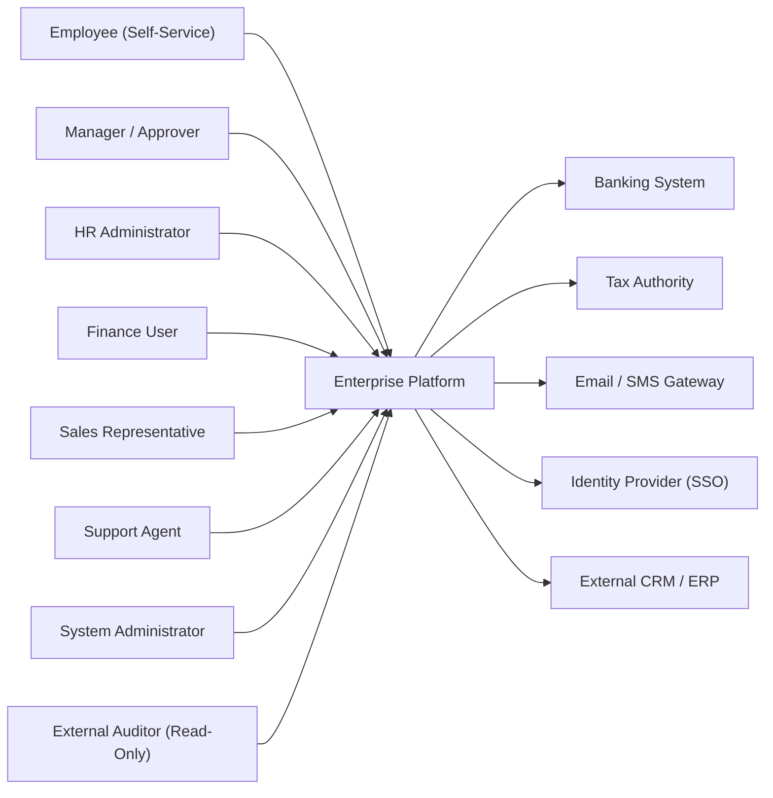

| Actor | Description | Key Workflows |
|-------|-------------|---------------|
| Employee | End user consuming self-service HR, viewing payslips, submitting leave | Apply leave, view payslip, update personal info, submit expense |
| Manager | Approves requests, views team dashboards, conducts reviews | Approve leave, review performance, view team reports |
| HR Administrator | Configures policies, manages employee data, runs reports | Onboard employee, configure leave policy, generate compliance report |
| Finance User | Manages GL, AP/AR, runs month-end close, reconciles | Post journal entry, run trial balance, reconcile bank statement |
| Sales Representative | Manages leads, opportunities, quotes, and customer interactions | Log activity, update opportunity, generate quote |
| Support Agent | Handles customer tickets, escalates issues, uses knowledge base | Create ticket, update status, escalate, resolve |
| System Administrator | Configures tenant settings, manages integrations, monitors health | Configure workflow, manage users/roles, monitor system |
| External Auditor | Read-only access to financial records and audit trails | View audit logs, export financial reports |

---

## Domain Architecture Map
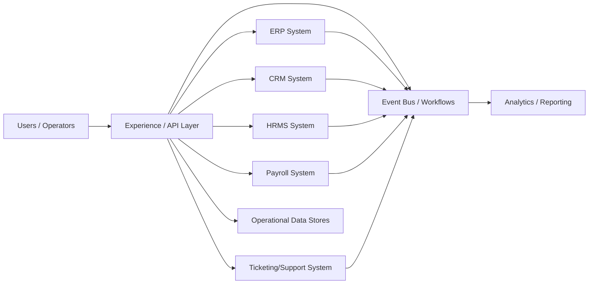

---

## Cross-Cutting Design Themes
- Separate user-facing hot paths from heavy asynchronous work such as analytics, indexing, compliance review, or backfills.
- Be explicit about which parts of the domain need strong correctness and which can tolerate eventual consistency.
- Model operator workflows and reconciliation early; real systems are maintained, not only executed.
- Use events and materialized views deliberately so teams can scale read models without overloading the transactional path.
- Multi-tenancy is a first-class architectural concern: every query, every cache key, every queue partition must be tenant-scoped.
- Audit logging is not optional -- every state mutation must produce an immutable audit record with actor, timestamp, before-state, and after-state.

---

## 16.1 Core Enterprise Platforms
16.1 Core Enterprise Platforms collects the boundaries around ERP System, CRM System, HRMS System and related capabilities in Enterprise Systems. Teams usually start with a simpler combined service, then split these systems once data ownership, latency goals, or operator workflows begin to conflict.

### ERP System

#### Overview

ERP System is the domain boundary responsible for owning a clear domain boundary with its own state model, APIs, and operational SLOs. In Enterprise Systems, this system usually has to balance direct user experience with downstream effects on adjacent systems in 16.1 Core Enterprise Platforms.

#### Real-world examples

- Comparable patterns appear in SAP, Salesforce, Workday.
- Startups often keep ERP System inside a larger service, while large platforms split it out once ownership, scale, or correctness requirements diverge.
- The exact implementation changes between B2C, B2B, and regulated variants, but the architectural boundary stays useful.

#### Requirements and workflows

- Expose APIs or events that let product users, internal operators, and downstream consumers create, update, query, and reconcile erp system state.
- Support synchronous user-facing flows for the hot path and asynchronous processing for enrichment, retries, and downstream propagation.
- Preserve a clear state model so support teams and automated workflows can explain why the system is in its current state.
- Provide audit or analytics hooks without coupling reporting latency to the primary user journey.

#### Architecture, data, and APIs

- Model the write path around normalized transactional state, denormalized read models, events, and audit records.
- Keep a normalized source of truth for critical state and publish derived read models or events for consumer services.
- Use caches, projections, or search indexes only for latency-sensitive reads; treat rebuildability as a design requirement.
- Define idempotent write contracts, versioned events, and explicit ownership boundaries so dependent systems can evolve safely.

#### Scaling, reliability, and operations

- Watch for hotspots, stale projections, ambiguous retries, and under-specified operator workflows.
- Protect hot partitions with rate limiting, request coalescing, queue buffering, and selective denormalization where appropriate.
- Design operator dashboards, replay tooling, and reconciliation or backfill workflows before incidents force them into existence.
- Track service-level indicators for latency, success, queue lag, freshness, and correctness signals instead of only infrastructure health.

#### Trade-offs and interview notes

- The key interview move is to explain why ERP System deserves its own boundary and what can remain eventual around it.
- Strong answers call out what requires strong correctness versus what can be computed asynchronously.
- Weak answers collapse storage, orchestration, and downstream fan-out into one service without discussing scale or failure modes.

### CRM System

#### Overview

CRM System is the domain boundary responsible for owning a clear domain boundary with its own state model, APIs, and operational SLOs. In Enterprise Systems, this system usually has to balance direct user experience with downstream effects on adjacent systems in 16.1 Core Enterprise Platforms.

#### Real-world examples

- Comparable patterns appear in SAP, Salesforce, Workday.
- Startups often keep CRM System inside a larger service, while large platforms split it out once ownership, scale, or correctness requirements diverge.
- The exact implementation changes between B2C, B2B, and regulated variants, but the architectural boundary stays useful.

#### Requirements and workflows

- Expose APIs or events that let product users, internal operators, and downstream consumers create, update, query, and reconcile crm system state.
- Support synchronous user-facing flows for the hot path and asynchronous processing for enrichment, retries, and downstream propagation.
- Preserve a clear state model so support teams and automated workflows can explain why the system is in its current state.
- Provide audit or analytics hooks without coupling reporting latency to the primary user journey.

#### Architecture, data, and APIs

- Model the write path around normalized transactional state, denormalized read models, events, and audit records.
- Keep a normalized source of truth for critical state and publish derived read models or events for consumer services.
- Use caches, projections, or search indexes only for latency-sensitive reads; treat rebuildability as a design requirement.
- Define idempotent write contracts, versioned events, and explicit ownership boundaries so dependent systems can evolve safely.

#### Scaling, reliability, and operations

- Watch for hotspots, stale projections, ambiguous retries, and under-specified operator workflows.
- Protect hot partitions with rate limiting, request coalescing, queue buffering, and selective denormalization where appropriate.
- Design operator dashboards, replay tooling, and reconciliation or backfill workflows before incidents force them into existence.
- Track service-level indicators for latency, success, queue lag, freshness, and correctness signals instead of only infrastructure health.

#### Trade-offs and interview notes

- The key interview move is to explain why CRM System deserves its own boundary and what can remain eventual around it.
- Strong answers call out what requires strong correctness versus what can be computed asynchronously.
- Weak answers collapse storage, orchestration, and downstream fan-out into one service without discussing scale or failure modes.

### HRMS System

#### Overview

HRMS System is the domain boundary responsible for owning a clear domain boundary with its own state model, APIs, and operational SLOs. In Enterprise Systems, this system usually has to balance direct user experience with downstream effects on adjacent systems in 16.1 Core Enterprise Platforms.

#### Real-world examples

- Comparable patterns appear in SAP, Salesforce, Workday.
- Startups often keep HRMS System inside a larger service, while large platforms split it out once ownership, scale, or correctness requirements diverge.
- The exact implementation changes between B2C, B2B, and regulated variants, but the architectural boundary stays useful.

#### Requirements and workflows

- Expose APIs or events that let product users, internal operators, and downstream consumers create, update, query, and reconcile hrms system state.
- Support synchronous user-facing flows for the hot path and asynchronous processing for enrichment, retries, and downstream propagation.
- Preserve a clear state model so support teams and automated workflows can explain why the system is in its current state.
- Provide audit or analytics hooks without coupling reporting latency to the primary user journey.

#### Architecture, data, and APIs

- Model the write path around normalized transactional state, denormalized read models, events, and audit records.
- Keep a normalized source of truth for critical state and publish derived read models or events for consumer services.
- Use caches, projections, or search indexes only for latency-sensitive reads; treat rebuildability as a design requirement.
- Define idempotent write contracts, versioned events, and explicit ownership boundaries so dependent systems can evolve safely.

#### Scaling, reliability, and operations

- Watch for hotspots, stale projections, ambiguous retries, and under-specified operator workflows.
- Protect hot partitions with rate limiting, request coalescing, queue buffering, and selective denormalization where appropriate.
- Design operator dashboards, replay tooling, and reconciliation or backfill workflows before incidents force them into existence.
- Track service-level indicators for latency, success, queue lag, freshness, and correctness signals instead of only infrastructure health.

#### Trade-offs and interview notes

- The key interview move is to explain why HRMS System deserves its own boundary and what can remain eventual around it.
- Strong answers call out what requires strong correctness versus what can be computed asynchronously.
- Weak answers collapse storage, orchestration, and downstream fan-out into one service without discussing scale or failure modes.

### Payroll System

#### Overview

Payroll System is the domain boundary responsible for owning a clear domain boundary with its own state model, APIs, and operational SLOs. In Enterprise Systems, this system usually has to balance direct user experience with downstream effects on adjacent systems in 16.1 Core Enterprise Platforms.

#### Real-world examples

- Comparable patterns appear in SAP, Salesforce, Workday.
- Startups often keep Payroll System inside a larger service, while large platforms split it out once ownership, scale, or correctness requirements diverge.
- The exact implementation changes between B2C, B2B, and regulated variants, but the architectural boundary stays useful.

#### Requirements and workflows

- Expose APIs or events that let product users, internal operators, and downstream consumers create, update, query, and reconcile payroll system state.
- Support synchronous user-facing flows for the hot path and asynchronous processing for enrichment, retries, and downstream propagation.
- Preserve a clear state model so support teams and automated workflows can explain why the system is in its current state.
- Provide audit or analytics hooks without coupling reporting latency to the primary user journey.

#### Architecture, data, and APIs

- Model the write path around normalized transactional state, denormalized read models, events, and audit records.
- Keep a normalized source of truth for critical state and publish derived read models or events for consumer services.
- Use caches, projections, or search indexes only for latency-sensitive reads; treat rebuildability as a design requirement.
- Define idempotent write contracts, versioned events, and explicit ownership boundaries so dependent systems can evolve safely.

#### Scaling, reliability, and operations

- Watch for hotspots, stale projections, ambiguous retries, and under-specified operator workflows.
- Protect hot partitions with rate limiting, request coalescing, queue buffering, and selective denormalization where appropriate.
- Design operator dashboards, replay tooling, and reconciliation or backfill workflows before incidents force them into existence.
- Track service-level indicators for latency, success, queue lag, freshness, and correctness signals instead of only infrastructure health.

#### Trade-offs and interview notes

- The key interview move is to explain why Payroll System deserves its own boundary and what can remain eventual around it.
- Strong answers call out what requires strong correctness versus what can be computed asynchronously.
- Weak answers collapse storage, orchestration, and downstream fan-out into one service without discussing scale or failure modes.

### Ticketing/Support System

#### Overview

Ticketing/Support System is the domain boundary responsible for owning a clear domain boundary with its own state model, APIs, and operational SLOs. In Enterprise Systems, this system usually has to balance direct user experience with downstream effects on adjacent systems in 16.1 Core Enterprise Platforms.

#### Real-world examples

- Comparable patterns appear in SAP, Salesforce, Workday.
- Startups often keep Ticketing/Support System inside a larger service, while large platforms split it out once ownership, scale, or correctness requirements diverge.
- The exact implementation changes between B2C, B2B, and regulated variants, but the architectural boundary stays useful.

#### Requirements and workflows

- Expose APIs or events that let product users, internal operators, and downstream consumers create, update, query, and reconcile ticketing/support system state.
- Support synchronous user-facing flows for the hot path and asynchronous processing for enrichment, retries, and downstream propagation.
- Preserve a clear state model so support teams and automated workflows can explain why the system is in its current state.
- Provide audit or analytics hooks without coupling reporting latency to the primary user journey.

#### Architecture, data, and APIs

- Model the write path around normalized transactional state, denormalized read models, events, and audit records.
- Keep a normalized source of truth for critical state and publish derived read models or events for consumer services.
- Use caches, projections, or search indexes only for latency-sensitive reads; treat rebuildability as a design requirement.
- Define idempotent write contracts, versioned events, and explicit ownership boundaries so dependent systems can evolve safely.

#### Scaling, reliability, and operations

- Watch for hotspots, stale projections, ambiguous retries, and under-specified operator workflows.
- Protect hot partitions with rate limiting, request coalescing, queue buffering, and selective denormalization where appropriate.
- Design operator dashboards, replay tooling, and reconciliation or backfill workflows before incidents force them into existence.
- Track service-level indicators for latency, success, queue lag, freshness, and correctness signals instead of only infrastructure health.

#### Trade-offs and interview notes

- The key interview move is to explain why Ticketing/Support System deserves its own boundary and what can remain eventual around it.
- Strong answers call out what requires strong correctness versus what can be computed asynchronously.
- Weak answers collapse storage, orchestration, and downstream fan-out into one service without discussing scale or failure modes.

---

## Low-Level Design

This section contains the deep technical design for all five enterprise subsystems. Each section provides production-grade depth including data models, API specifications, state machines, sequence diagrams, and operational strategies.

---

## Functional Requirements

### ERP System -- Functional Requirements

| ID | Requirement | Module | Priority |
|----|------------|--------|----------|
| ERP-FR-01 | Finance users can create, post, and reverse journal entries in the general ledger | Finance | P0 |
| ERP-FR-02 | System maintains a complete chart of accounts with hierarchical account groups | Finance | P0 |
| ERP-FR-03 | Accounts payable tracks vendor invoices, matches them to POs, and schedules payments | Finance | P0 |
| ERP-FR-04 | Accounts receivable tracks customer invoices, records payments, and manages aging | Finance | P0 |
| ERP-FR-05 | Month-end close workflow locks periods, runs accruals, and generates trial balance | Finance | P0 |
| ERP-FR-06 | Procurement users can create purchase requisitions that route through approval workflows | Procurement | P0 |
| ERP-FR-07 | Approved requisitions convert to purchase orders sent to vendors via EDI or email | Procurement | P0 |
| ERP-FR-08 | Three-way matching validates PO, goods receipt, and vendor invoice before payment | Procurement | P0 |
| ERP-FR-09 | Inventory tracks stock levels per item per warehouse with lot/serial tracking | Inventory | P0 |
| ERP-FR-10 | Goods receipts and goods issues update inventory in real time with audit trail | Inventory | P0 |
| ERP-FR-11 | Cycle counting and physical inventory workflows reconcile system vs. actual stock | Inventory | P1 |
| ERP-FR-12 | Bill of materials (BOM) defines multi-level product structures for manufactured items | Manufacturing | P1 |
| ERP-FR-13 | MRP run calculates material requirements based on demand forecasts and BOMs | Manufacturing | P1 |
| ERP-FR-14 | Production orders track work-in-progress with operation routing and labor tracking | Manufacturing | P1 |
| ERP-FR-15 | Master data management enforces single source of truth for vendors, customers, items, and GL accounts | Cross-module | P0 |
| ERP-FR-16 | Workflow engine supports configurable approval chains with delegation, escalation, and SLA tracking | Cross-module | P0 |
| ERP-FR-17 | Multi-currency support with real-time exchange rate feeds and unrealized gain/loss calculation | Finance | P1 |
| ERP-FR-18 | Budget management tracks commitments and actuals against approved budgets with variance alerts | Finance | P1 |
| ERP-FR-19 | Fixed asset register tracks acquisition, depreciation, disposal, and revaluation | Finance | P1 |
| ERP-FR-20 | Intercompany transactions automatically generate elimination entries for consolidated reporting | Finance | P2 |

### CRM System -- Functional Requirements

| ID | Requirement | Module | Priority |
|----|------------|--------|----------|
| CRM-FR-01 | Sales reps can create and manage contacts with full interaction history | Contact Mgmt | P0 |
| CRM-FR-02 | Accounts represent organizations with hierarchical parent-child relationships | Contact Mgmt | P0 |
| CRM-FR-03 | Contacts are linked to accounts with role designations (decision maker, influencer, user) | Contact Mgmt | P0 |
| CRM-FR-04 | Leads capture inbound interest with source tracking and automatic deduplication | Lead Mgmt | P0 |
| CRM-FR-05 | Lead scoring model assigns numeric scores based on demographic and behavioral signals | Lead Mgmt | P0 |
| CRM-FR-06 | Qualified leads convert to contacts + accounts + opportunities in a single workflow | Lead Mgmt | P0 |
| CRM-FR-07 | Opportunities track deal progression through configurable pipeline stages | Sales Pipeline | P0 |
| CRM-FR-08 | Weighted pipeline forecasting aggregates opportunity values by probability and close date | Sales Pipeline | P0 |
| CRM-FR-09 | Quotes generate from opportunities with line items, discounts, and approval workflows | Sales Pipeline | P1 |
| CRM-FR-10 | Activity tracking logs calls, emails, meetings, and notes against contacts and opportunities | Activity | P0 |
| CRM-FR-11 | Campaign management creates multi-channel campaigns with audience segmentation | Marketing | P1 |
| CRM-FR-12 | Campaign performance tracks impressions, clicks, conversions, and ROI per campaign | Marketing | P1 |
| CRM-FR-13 | Email templates support merge fields, A/B testing, and send-time optimization | Marketing | P1 |
| CRM-FR-14 | Customer 360 view aggregates contacts, opportunities, tickets, invoices, and activities in a single pane | Analytics | P0 |
| CRM-FR-15 | Territory management assigns accounts and opportunities to sales reps by geography or segment | Sales Ops | P1 |
| CRM-FR-16 | Configurable sales processes enforce required fields and validation rules per stage | Sales Pipeline | P1 |
| CRM-FR-17 | Duplicate detection identifies potential duplicate contacts and accounts with merge capability | Data Quality | P1 |
| CRM-FR-18 | Integration with email systems syncs sent/received emails to contact activity timeline | Integration | P1 |
| CRM-FR-19 | Mobile CRM provides offline-capable access to contacts, opportunities, and activities | Mobile | P1 |
| CRM-FR-20 | Sales analytics dashboard shows pipeline health, win rates, cycle times, and rep performance | Analytics | P0 |

### HRMS System -- Functional Requirements

| ID | Requirement | Module | Priority |
|----|------------|--------|----------|
| HRMS-FR-01 | Onboarding workflow captures personal details, documents, bank info, and assigns assets | Employee Lifecycle | P0 |
| HRMS-FR-02 | Employee master record stores demographics, employment details, compensation, and emergency contacts | Employee Lifecycle | P0 |
| HRMS-FR-03 | Organization hierarchy models reporting relationships as a directed tree with effective dating | Org Structure | P0 |
| HRMS-FR-04 | Position management defines roles, grades, and headcount per department | Org Structure | P0 |
| HRMS-FR-05 | Leave management supports configurable leave types with accrual rules and carry-forward policies | Leave Mgmt | P0 |
| HRMS-FR-06 | Employees can apply for leave; managers approve/reject with delegation support | Leave Mgmt | P0 |
| HRMS-FR-07 | Leave balance calculation respects accrual schedules, holidays, and prorated entitlements | Leave Mgmt | P0 |
| HRMS-FR-08 | Attendance tracking integrates with biometric devices, geo-fencing, and manual entry | Attendance | P1 |
| HRMS-FR-09 | Performance review cycles support goal setting, self-assessment, manager assessment, and calibration | Performance | P0 |
| HRMS-FR-10 | 360-degree feedback collects input from peers, direct reports, and cross-functional stakeholders | Performance | P1 |
| HRMS-FR-11 | Performance ratings feed into compensation planning and succession planning | Performance | P1 |
| HRMS-FR-12 | Employee self-service portal allows viewing payslips, updating personal info, and submitting requests | Self-Service | P0 |
| HRMS-FR-13 | Document management stores offer letters, contracts, ID proofs, and policy acknowledgments | Documents | P0 |
| HRMS-FR-14 | Separation workflow handles resignation, termination, and retirement with exit checklist | Employee Lifecycle | P0 |
| HRMS-FR-15 | Benefits enrollment supports medical, dental, vision, life insurance, and retirement plans | Benefits | P1 |
| HRMS-FR-16 | Training management tracks courses, certifications, and mandatory compliance training | Learning | P1 |
| HRMS-FR-17 | Expense management allows submission, approval, and reimbursement of business expenses | Expenses | P1 |
| HRMS-FR-18 | Recruitment module tracks job postings, applications, interviews, and offers | Recruitment | P1 |
| HRMS-FR-19 | Compliance reporting generates EEO-1, OSHA, and other regulatory reports | Compliance | P1 |
| HRMS-FR-20 | Employee analytics dashboard shows headcount trends, attrition rates, and diversity metrics | Analytics | P1 |

### Payroll System -- Functional Requirements

| ID | Requirement | Module | Priority |
|----|------------|--------|----------|
| PAY-FR-01 | Salary structure defines components: basic, HRA, DA, special allowance, bonuses | Compensation | P0 |
| PAY-FR-02 | Gross salary computation applies component rules based on employee grade and location | Computation | P0 |
| PAY-FR-03 | Tax calculation engine computes income tax based on jurisdiction-specific rules and declarations | Tax | P0 |
| PAY-FR-04 | Statutory deductions calculate provident fund, ESI, professional tax (India) or 401k, FICA, Medicare (US) | Statutory | P0 |
| PAY-FR-05 | Voluntary deductions handle loan EMIs, insurance premiums, and charitable contributions | Deductions | P0 |
| PAY-FR-06 | Payroll run processes all employees in a pay period with pre-run validation and error reporting | Processing | P0 |
| PAY-FR-07 | Payroll run produces detailed pay register, bank disbursement file, and GL posting entries | Processing | P0 |
| PAY-FR-08 | Pay slip generation creates itemized digital pay slips accessible via self-service portal | Pay Slip | P0 |
| PAY-FR-09 | Bank integration generates NACHA (US), BACS (UK), or NEFT/RTGS (India) payment files | Banking | P0 |
| PAY-FR-10 | Arrears processing calculates and disburses retroactive pay adjustments | Processing | P0 |
| PAY-FR-11 | Bonus and incentive processing handles performance bonuses, commissions, and one-time payments | Compensation | P1 |
| PAY-FR-12 | Full and final settlement computes dues for separated employees including leave encashment | Settlement | P0 |
| PAY-FR-13 | Tax filing generates W-2 (US), P60 (UK), Form 16 (India) year-end tax documents | Tax | P0 |
| PAY-FR-14 | Payroll audit trail records every computation step with before/after values | Audit | P0 |
| PAY-FR-15 | Multi-currency payroll supports employees paid in different currencies with exchange rate management | Multi-currency | P1 |
| PAY-FR-16 | Off-cycle payroll runs handle terminations, corrections, and ad-hoc payments | Processing | P0 |
| PAY-FR-17 | Payroll lock prevents changes to employee data during active payroll processing | Processing | P0 |
| PAY-FR-18 | Payroll reconciliation report compares current run to previous run with variance highlighting | Reporting | P0 |
| PAY-FR-19 | Statutory remittance tracking records payments to tax authorities with due date alerts | Compliance | P0 |
| PAY-FR-20 | Payroll costing allocates salary expenses to cost centers, projects, and GL accounts | Finance Integration | P1 |

### Ticketing/Support System -- Functional Requirements

| ID | Requirement | Module | Priority |
|----|------------|--------|----------|
| TKT-FR-01 | Customers can create tickets via email, web form, chat, phone, or social media | Ticket Creation | P0 |
| TKT-FR-02 | Tickets are auto-categorized and auto-prioritized based on content analysis | Triage | P0 |
| TKT-FR-03 | Tickets progress through a defined lifecycle: open, in-progress, waiting, resolved, closed | Lifecycle | P0 |
| TKT-FR-04 | SLA timers track first response time, resolution time, and next response time per priority | SLA | P0 |
| TKT-FR-05 | SLA breach triggers automatic escalation to next-level support or management | Escalation | P0 |
| TKT-FR-06 | Assignment rules route tickets to agents based on skill, availability, and workload | Routing | P0 |
| TKT-FR-07 | Round-robin and least-loaded assignment algorithms distribute tickets evenly | Routing | P1 |
| TKT-FR-08 | Agents can add internal notes (not visible to customer) and public replies | Communication | P0 |
| TKT-FR-09 | Customers receive email notifications for ticket updates with reply-to-update capability | Communication | P0 |
| TKT-FR-10 | Knowledge base allows creating, categorizing, and searching help articles | Knowledge Base | P0 |
| TKT-FR-11 | Knowledge base article suggestions appear during ticket creation for self-service deflection | Knowledge Base | P1 |
| TKT-FR-12 | Canned responses / macros allow agents to insert templated replies with merge fields | Productivity | P1 |
| TKT-FR-13 | Ticket merging combines duplicate tickets while preserving all communication history | Lifecycle | P1 |
| TKT-FR-14 | Parent-child ticket relationships track related issues and dependencies | Lifecycle | P1 |
| TKT-FR-15 | Customer satisfaction survey (CSAT) is sent after ticket resolution | Analytics | P0 |
| TKT-FR-16 | Agent performance dashboard shows tickets handled, response times, and CSAT scores | Analytics | P0 |
| TKT-FR-17 | Live chat integration provides real-time support with chat-to-ticket conversion | Omnichannel | P1 |
| TKT-FR-18 | Chatbot handles common queries and creates tickets for unresolved issues | Omnichannel | P2 |
| TKT-FR-19 | Asset and configuration item tracking links tickets to specific products or services | CMDB | P1 |
| TKT-FR-20 | Custom fields and forms allow tenants to configure ticket fields per category | Customization | P1 |

---

## Non-Functional Requirements

| Category | Requirement | Target | Subsystem |
|----------|------------|--------|-----------|
| Latency | Dashboard page load p95 | < 800ms | All |
| Latency | Form submission (single record) p95 | < 500ms | All |
| Latency | Search query p95 | < 300ms | CRM, Ticketing |
| Latency | Payroll computation (single employee) p95 | < 200ms | Payroll |
| Latency | Report generation (standard) p95 | < 5s | All |
| Latency | Report generation (complex cross-module) p95 | < 30s | ERP, HRMS |
| Throughput | API requests (steady state) | 10,000 RPS | All |
| Throughput | API requests (peak -- month-end close) | 50,000 RPS | ERP |
| Throughput | Payroll batch processing | 50,000 employees/hour | Payroll |
| Throughput | Ticket creation (peak) | 500 tickets/minute | Ticketing |
| Throughput | CRM bulk data import | 100,000 records/hour | CRM |
| Availability | Core transactional services | 99.95% (4.4 hours/year downtime) | All |
| Availability | Payroll processing window | 99.99% during payroll runs | Payroll |
| Availability | Customer-facing support portal | 99.9% | Ticketing |
| Consistency | Financial transactions (GL posting) | Strong consistency (serializable) | ERP |
| Consistency | Payroll computation | Strong consistency (read-your-writes) | Payroll |
| Consistency | CRM contact updates | Eventual consistency (< 2s propagation) | CRM |
| Consistency | Ticket status updates | Strong consistency within ticket | Ticketing |
| Consistency | Leave balance | Strong consistency | HRMS |
| Durability | All financial data | Zero data loss (synchronous replication) | ERP, Payroll |
| Durability | Employee records | Zero data loss | HRMS |
| Durability | Audit logs | Immutable, append-only, 7-year retention | All |
| Security | Authentication | SSO via SAML 2.0 / OIDC, MFA required | All |
| Security | Authorization | RBAC with field-level permissions | All |
| Security | Encryption | AES-256 at rest, TLS 1.3 in transit | All |
| Security | PII handling | Encrypted, access-logged, right-to-deletion | HRMS, Payroll |
| Compliance | SOX | Segregation of duties, approval workflows, audit trail | ERP |
| Compliance | GDPR | Data residency, consent management, data portability | All |
| Compliance | HIPAA | PHI encryption, access controls, BAA support | HRMS |
| Compliance | SOC 2 Type II | Annual audit certification | All |
| Scalability | Tenant count | Up to 1,000 tenants | All |
| Scalability | Largest tenant | 100,000 employees | HRMS, Payroll |
| Scalability | CRM records per tenant | 10 million contacts | CRM |
| Tenancy | Data isolation | Logical isolation (schema-per-tenant for large tenants) | All |
| Tenancy | Noisy neighbor protection | Per-tenant rate limiting and resource quotas | All |
| Backup | RPO | < 1 minute for financial data; < 15 minutes for all other data | All |
| Backup | RTO | < 1 hour for full system recovery | All |

---

## Capacity Estimation

### User and Transaction Volumes

| Metric | Value | Derivation |
|--------|-------|-----------|
| Total tenants | 500 | Business target |
| Total employees across tenants | 2,000,000 | 500 tenants x 4,000 avg employees |
| Daily active users (DAU) | 400,000 | ~20% of employees log in daily |
| Peak concurrent users | 80,000 | ~20% of DAU during business hours |
| CRM contacts (total) | 50,000,000 | 500 tenants x 100,000 avg contacts |
| Support tickets per year | 10,000,000 | 500 tenants x 20,000 avg tickets/year |
| Support tickets per day | ~27,400 | 10M / 365 |
| Payroll runs per month | 600 | 500 tenants (some run bi-weekly = ~1.2 runs/tenant/month) |
| Employees per payroll run (avg) | 4,000 | 2M / 500 tenants |
| GL journal entries per day | 500,000 | Across all tenants |
| Purchase orders per day | 50,000 | Across all tenants |
| Leave requests per day | 20,000 | ~1% of employees per day |
| API calls per day | 200,000,000 | ~200M (UI + integrations + batch) |

### Storage Estimation

| Data Category | Records | Avg Record Size | Total Size | Growth Rate |
|--------------|---------|----------------|-----------|-------------|
| Employee master records | 2,000,000 | 5 KB | 10 GB | 10% / year |
| Employee documents (PDFs, images) | 20,000,000 | 500 KB | 10 TB | 20% / year |
| CRM contacts | 50,000,000 | 3 KB | 150 GB | 15% / year |
| CRM activities (emails, calls, notes) | 500,000,000 | 2 KB | 1 TB | 25% / year |
| GL journal entries (historical) | 1,000,000,000 | 1 KB | 1 TB | 20% / year |
| Purchase orders + line items | 200,000,000 | 2 KB | 400 GB | 15% / year |
| Payroll run records | 200,000,000 | 3 KB | 600 GB | 10% / year |
| Pay slip PDFs | 200,000,000 | 100 KB | 20 TB | 10% / year |
| Support tickets + messages | 50,000,000 | 5 KB | 250 GB | 20% / year |
| Knowledge base articles | 500,000 | 10 KB | 5 GB | 10% / year |
| Audit logs | 5,000,000,000 | 500 bytes | 2.5 TB | 30% / year |
| **Total structured data** | | | **~4 TB** | |
| **Total unstructured (documents, PDFs)** | | | **~30 TB** | |
| **Total with replication (3x)** | | | **~100 TB** | |

### Compute Estimation

| Service Tier | Instances | vCPU per Instance | Memory per Instance | Purpose |
|-------------|-----------|-------------------|--------------------|---------|
| API Gateway | 6 | 4 | 8 GB | Rate limiting, auth, routing |
| ERP Service | 12 | 8 | 32 GB | Finance, procurement, inventory |
| CRM Service | 8 | 8 | 32 GB | Contact management, pipeline |
| HRMS Service | 8 | 4 | 16 GB | Employee lifecycle, leave |
| Payroll Service | 6 | 16 | 64 GB | CPU-intensive computation |
| Ticketing Service | 6 | 4 | 16 GB | Ticket lifecycle, routing |
| Workflow Engine | 4 | 8 | 32 GB | Approval chains, orchestration |
| Search Service (Elasticsearch) | 6 | 8 | 64 GB | Full-text search across modules |
| Cache (Redis Cluster) | 6 | 4 | 64 GB | Session, config, hot data |
| Database (PostgreSQL) | 6 (3 primary + 3 replica) | 16 | 128 GB | Transactional data |
| Message Broker (Kafka) | 6 | 8 | 32 GB | Event streaming |
| Object Storage (S3-compatible) | managed | N/A | N/A | Documents, PDFs, attachments |

---

## Detailed Data Models

### Multi-Tenant Foundation Tables

```sql
-- =====================================================
-- MULTI-TENANT FOUNDATION
-- =====================================================

CREATE TABLE tenants (
    tenant_id           UUID PRIMARY KEY DEFAULT gen_random_uuid(),
    name                VARCHAR(255) NOT NULL,
    slug                VARCHAR(100) NOT NULL UNIQUE,
    plan_tier           VARCHAR(50) NOT NULL DEFAULT 'standard',  -- standard, professional, enterprise
    status              VARCHAR(20) NOT NULL DEFAULT 'active',    -- active, suspended, churned
    data_region         VARCHAR(10) NOT NULL DEFAULT 'us-east',   -- us-east, eu-west, ap-south
    settings            JSONB NOT NULL DEFAULT '{}',
    max_employees       INTEGER NOT NULL DEFAULT 5000,
    max_crm_contacts    INTEGER NOT NULL DEFAULT 100000,
    created_at          TIMESTAMPTZ NOT NULL DEFAULT now(),
    updated_at          TIMESTAMPTZ NOT NULL DEFAULT now()
);

CREATE TABLE users (
    user_id             UUID PRIMARY KEY DEFAULT gen_random_uuid(),
    tenant_id           UUID NOT NULL REFERENCES tenants(tenant_id),
    email               VARCHAR(255) NOT NULL,
    display_name        VARCHAR(255) NOT NULL,
    status              VARCHAR(20) NOT NULL DEFAULT 'active',
    last_login_at       TIMESTAMPTZ,
    mfa_enabled         BOOLEAN NOT NULL DEFAULT false,
    created_at          TIMESTAMPTZ NOT NULL DEFAULT now(),
    updated_at          TIMESTAMPTZ NOT NULL DEFAULT now(),
    UNIQUE (tenant_id, email)
);

CREATE TABLE roles (
    role_id             UUID PRIMARY KEY DEFAULT gen_random_uuid(),
    tenant_id           UUID NOT NULL REFERENCES tenants(tenant_id),
    role_name           VARCHAR(100) NOT NULL,
    description         TEXT,
    is_system_role      BOOLEAN NOT NULL DEFAULT false,
    permissions         JSONB NOT NULL DEFAULT '[]',
    created_at          TIMESTAMPTZ NOT NULL DEFAULT now(),
    UNIQUE (tenant_id, role_name)
);

CREATE TABLE user_roles (
    user_id             UUID NOT NULL REFERENCES users(user_id),
    role_id             UUID NOT NULL REFERENCES roles(role_id),
    granted_at          TIMESTAMPTZ NOT NULL DEFAULT now(),
    granted_by          UUID REFERENCES users(user_id),
    PRIMARY KEY (user_id, role_id)
);

CREATE TABLE audit_logs (
    log_id              BIGSERIAL PRIMARY KEY,
    tenant_id           UUID NOT NULL,
    user_id             UUID,
    action              VARCHAR(50) NOT NULL,        -- CREATE, UPDATE, DELETE, READ, LOGIN, EXPORT
    entity_type         VARCHAR(100) NOT NULL,       -- employee, journal_entry, ticket, etc.
    entity_id           VARCHAR(255),
    changes             JSONB,                        -- { field: { old: ..., new: ... } }
    ip_address          INET,
    user_agent          TEXT,
    request_id          UUID,
    created_at          TIMESTAMPTZ NOT NULL DEFAULT now()
) PARTITION BY RANGE (created_at);

-- Monthly partitions for audit logs
CREATE TABLE audit_logs_2026_01 PARTITION OF audit_logs
    FOR VALUES FROM ('2026-01-01') TO ('2026-02-01');
CREATE TABLE audit_logs_2026_02 PARTITION OF audit_logs
    FOR VALUES FROM ('2026-02-01') TO ('2026-03-01');
CREATE TABLE audit_logs_2026_03 PARTITION OF audit_logs
    FOR VALUES FROM ('2026-03-01') TO ('2026-04-01');
-- ... additional monthly partitions created by automation
```

### ERP System -- Data Model

```sql
-- =====================================================
-- ERP: FINANCE MODULE
-- =====================================================

CREATE TABLE chart_of_accounts (
    account_id          UUID PRIMARY KEY DEFAULT gen_random_uuid(),
    tenant_id           UUID NOT NULL REFERENCES tenants(tenant_id),
    account_code        VARCHAR(20) NOT NULL,
    account_name        VARCHAR(255) NOT NULL,
    account_type        VARCHAR(30) NOT NULL,  -- ASSET, LIABILITY, EQUITY, REVENUE, EXPENSE
    parent_account_id   UUID REFERENCES chart_of_accounts(account_id),
    is_active           BOOLEAN NOT NULL DEFAULT true,
    is_header           BOOLEAN NOT NULL DEFAULT false,  -- grouping account, no postings
    currency_code       CHAR(3) NOT NULL DEFAULT 'USD',
    description         TEXT,
    created_at          TIMESTAMPTZ NOT NULL DEFAULT now(),
    updated_at          TIMESTAMPTZ NOT NULL DEFAULT now(),
    UNIQUE (tenant_id, account_code)
);

CREATE TABLE fiscal_periods (
    period_id           UUID PRIMARY KEY DEFAULT gen_random_uuid(),
    tenant_id           UUID NOT NULL REFERENCES tenants(tenant_id),
    fiscal_year         INTEGER NOT NULL,
    period_number       INTEGER NOT NULL,          -- 1-12 for monthly, 1-4 for quarterly
    period_name         VARCHAR(50) NOT NULL,       -- 'Jan 2026', 'Q1 2026'
    start_date          DATE NOT NULL,
    end_date            DATE NOT NULL,
    status              VARCHAR(20) NOT NULL DEFAULT 'open',  -- open, closing, closed
    closed_by           UUID REFERENCES users(user_id),
    closed_at           TIMESTAMPTZ,
    UNIQUE (tenant_id, fiscal_year, period_number)
);

CREATE TABLE journal_entries (
    entry_id            UUID PRIMARY KEY DEFAULT gen_random_uuid(),
    tenant_id           UUID NOT NULL REFERENCES tenants(tenant_id),
    entry_number        VARCHAR(20) NOT NULL,
    entry_date          DATE NOT NULL,
    period_id           UUID NOT NULL REFERENCES fiscal_periods(period_id),
    description         TEXT NOT NULL,
    source              VARCHAR(50) NOT NULL,      -- MANUAL, AP, AR, PAYROLL, INVENTORY, SYSTEM
    status              VARCHAR(20) NOT NULL DEFAULT 'draft', -- draft, posted, reversed
    total_debit         NUMERIC(18,2) NOT NULL DEFAULT 0,
    total_credit        NUMERIC(18,2) NOT NULL DEFAULT 0,
    currency_code       CHAR(3) NOT NULL DEFAULT 'USD',
    exchange_rate       NUMERIC(12,6) DEFAULT 1.0,
    reference_type      VARCHAR(50),               -- INVOICE, PAYMENT, RECEIPT, ADJUSTMENT
    reference_id        UUID,
    posted_by           UUID REFERENCES users(user_id),
    posted_at           TIMESTAMPTZ,
    reversed_by_entry   UUID REFERENCES journal_entries(entry_id),
    idempotency_key     UUID UNIQUE,
    created_at          TIMESTAMPTZ NOT NULL DEFAULT now(),
    updated_at          TIMESTAMPTZ NOT NULL DEFAULT now(),
    UNIQUE (tenant_id, entry_number),
    CONSTRAINT chk_balanced CHECK (total_debit = total_credit)
);

CREATE TABLE journal_entry_lines (
    line_id             UUID PRIMARY KEY DEFAULT gen_random_uuid(),
    entry_id            UUID NOT NULL REFERENCES journal_entries(entry_id),
    line_number         INTEGER NOT NULL,
    account_id          UUID NOT NULL REFERENCES chart_of_accounts(account_id),
    debit_amount        NUMERIC(18,2) NOT NULL DEFAULT 0,
    credit_amount       NUMERIC(18,2) NOT NULL DEFAULT 0,
    description         TEXT,
    cost_center_id      UUID,
    project_id          UUID,
    dimension_values    JSONB DEFAULT '{}',         -- flexible tagging: department, region, etc.
    CONSTRAINT chk_single_side CHECK (
        (debit_amount > 0 AND credit_amount = 0) OR
        (credit_amount > 0 AND debit_amount = 0)
    )
);

CREATE TABLE account_balances (
    tenant_id           UUID NOT NULL,
    account_id          UUID NOT NULL REFERENCES chart_of_accounts(account_id),
    period_id           UUID NOT NULL REFERENCES fiscal_periods(period_id),
    opening_balance     NUMERIC(18,2) NOT NULL DEFAULT 0,
    debit_total         NUMERIC(18,2) NOT NULL DEFAULT 0,
    credit_total        NUMERIC(18,2) NOT NULL DEFAULT 0,
    closing_balance     NUMERIC(18,2) NOT NULL DEFAULT 0,
    last_updated        TIMESTAMPTZ NOT NULL DEFAULT now(),
    PRIMARY KEY (tenant_id, account_id, period_id)
);

-- =====================================================
-- ERP: PROCUREMENT MODULE
-- =====================================================

CREATE TABLE vendors (
    vendor_id           UUID PRIMARY KEY DEFAULT gen_random_uuid(),
    tenant_id           UUID NOT NULL REFERENCES tenants(tenant_id),
    vendor_code         VARCHAR(20) NOT NULL,
    vendor_name         VARCHAR(255) NOT NULL,
    tax_id              VARCHAR(50),
    payment_terms       VARCHAR(20) DEFAULT 'NET30',
    currency_code       CHAR(3) DEFAULT 'USD',
    bank_account_info   JSONB,                      -- encrypted at application layer
    address             JSONB,
    contact_info        JSONB,
    status              VARCHAR(20) NOT NULL DEFAULT 'active',
    approved_by         UUID REFERENCES users(user_id),
    created_at          TIMESTAMPTZ NOT NULL DEFAULT now(),
    updated_at          TIMESTAMPTZ NOT NULL DEFAULT now(),
    UNIQUE (tenant_id, vendor_code)
);

CREATE TABLE purchase_requisitions (
    requisition_id      UUID PRIMARY KEY DEFAULT gen_random_uuid(),
    tenant_id           UUID NOT NULL REFERENCES tenants(tenant_id),
    requisition_number  VARCHAR(20) NOT NULL,
    requested_by        UUID NOT NULL REFERENCES users(user_id),
    department_id       UUID,
    status              VARCHAR(20) NOT NULL DEFAULT 'draft',
    -- draft -> submitted -> approved -> converted -> cancelled
    priority            VARCHAR(10) DEFAULT 'normal',
    required_date       DATE,
    justification       TEXT,
    total_amount        NUMERIC(18,2),
    currency_code       CHAR(3) DEFAULT 'USD',
    approved_by         UUID REFERENCES users(user_id),
    approved_at         TIMESTAMPTZ,
    converted_to_po     UUID,
    created_at          TIMESTAMPTZ NOT NULL DEFAULT now(),
    updated_at          TIMESTAMPTZ NOT NULL DEFAULT now(),
    UNIQUE (tenant_id, requisition_number)
);

CREATE TABLE purchase_orders (
    po_id               UUID PRIMARY KEY DEFAULT gen_random_uuid(),
    tenant_id           UUID NOT NULL REFERENCES tenants(tenant_id),
    po_number           VARCHAR(20) NOT NULL,
    vendor_id           UUID NOT NULL REFERENCES vendors(vendor_id),
    status              VARCHAR(20) NOT NULL DEFAULT 'draft',
    -- draft -> approved -> sent -> partially_received -> received -> invoiced -> closed -> cancelled
    order_date          DATE NOT NULL,
    expected_date       DATE,
    payment_terms       VARCHAR(20),
    shipping_address    JSONB,
    subtotal            NUMERIC(18,2) NOT NULL DEFAULT 0,
    tax_amount          NUMERIC(18,2) NOT NULL DEFAULT 0,
    total_amount        NUMERIC(18,2) NOT NULL DEFAULT 0,
    currency_code       CHAR(3) NOT NULL DEFAULT 'USD',
    notes               TEXT,
    approved_by         UUID REFERENCES users(user_id),
    approved_at         TIMESTAMPTZ,
    version             INTEGER NOT NULL DEFAULT 1,
    idempotency_key     UUID UNIQUE,
    created_at          TIMESTAMPTZ NOT NULL DEFAULT now(),
    updated_at          TIMESTAMPTZ NOT NULL DEFAULT now(),
    UNIQUE (tenant_id, po_number)
);

CREATE TABLE po_line_items (
    line_id             UUID PRIMARY KEY DEFAULT gen_random_uuid(),
    po_id               UUID NOT NULL REFERENCES purchase_orders(po_id),
    line_number         INTEGER NOT NULL,
    item_id             UUID REFERENCES inventory_items(item_id),
    description         TEXT NOT NULL,
    quantity            NUMERIC(12,3) NOT NULL,
    unit_price          NUMERIC(18,4) NOT NULL,
    tax_rate            NUMERIC(5,2) DEFAULT 0,
    total_amount        NUMERIC(18,2) NOT NULL,
    received_quantity   NUMERIC(12,3) NOT NULL DEFAULT 0,
    invoiced_quantity   NUMERIC(12,3) NOT NULL DEFAULT 0,
    gl_account_id       UUID REFERENCES chart_of_accounts(account_id),
    cost_center_id      UUID
);

-- =====================================================
-- ERP: INVENTORY MODULE
-- =====================================================

CREATE TABLE inventory_items (
    item_id             UUID PRIMARY KEY DEFAULT gen_random_uuid(),
    tenant_id           UUID NOT NULL REFERENCES tenants(tenant_id),
    item_code           VARCHAR(50) NOT NULL,
    item_name           VARCHAR(255) NOT NULL,
    category_id         UUID,
    item_type           VARCHAR(20) NOT NULL,       -- RAW_MATERIAL, FINISHED_GOOD, SERVICE, CONSUMABLE
    unit_of_measure     VARCHAR(20) NOT NULL,
    reorder_point       NUMERIC(12,3),
    reorder_quantity    NUMERIC(12,3),
    standard_cost       NUMERIC(18,4),
    is_serialized       BOOLEAN NOT NULL DEFAULT false,
    is_lot_tracked      BOOLEAN NOT NULL DEFAULT false,
    status              VARCHAR(20) NOT NULL DEFAULT 'active',
    created_at          TIMESTAMPTZ NOT NULL DEFAULT now(),
    updated_at          TIMESTAMPTZ NOT NULL DEFAULT now(),
    UNIQUE (tenant_id, item_code)
);

CREATE TABLE warehouses (
    warehouse_id        UUID PRIMARY KEY DEFAULT gen_random_uuid(),
    tenant_id           UUID NOT NULL REFERENCES tenants(tenant_id),
    warehouse_code      VARCHAR(20) NOT NULL,
    warehouse_name      VARCHAR(255) NOT NULL,
    address             JSONB,
    is_active           BOOLEAN NOT NULL DEFAULT true,
    UNIQUE (tenant_id, warehouse_code)
);

CREATE TABLE inventory_stock (
    tenant_id           UUID NOT NULL,
    item_id             UUID NOT NULL REFERENCES inventory_items(item_id),
    warehouse_id        UUID NOT NULL REFERENCES warehouses(warehouse_id),
    quantity_on_hand    NUMERIC(12,3) NOT NULL DEFAULT 0,
    quantity_reserved   NUMERIC(12,3) NOT NULL DEFAULT 0,
    quantity_available  NUMERIC(12,3) GENERATED ALWAYS AS (quantity_on_hand - quantity_reserved) STORED,
    lot_number          VARCHAR(50),
    serial_number       VARCHAR(100),
    last_count_date     DATE,
    version             INTEGER NOT NULL DEFAULT 1,
    updated_at          TIMESTAMPTZ NOT NULL DEFAULT now(),
    PRIMARY KEY (tenant_id, item_id, warehouse_id),
    CONSTRAINT chk_non_negative CHECK (quantity_on_hand >= 0 AND quantity_reserved >= 0)
);

CREATE TABLE inventory_transactions (
    transaction_id      UUID PRIMARY KEY DEFAULT gen_random_uuid(),
    tenant_id           UUID NOT NULL,
    item_id             UUID NOT NULL REFERENCES inventory_items(item_id),
    warehouse_id        UUID NOT NULL REFERENCES warehouses(warehouse_id),
    transaction_type    VARCHAR(30) NOT NULL,  -- RECEIPT, ISSUE, TRANSFER, ADJUSTMENT, COUNT
    quantity            NUMERIC(12,3) NOT NULL,
    reference_type      VARCHAR(30),           -- PO, PRODUCTION_ORDER, SALES_ORDER, MANUAL
    reference_id        UUID,
    lot_number          VARCHAR(50),
    serial_number       VARCHAR(100),
    unit_cost           NUMERIC(18,4),
    total_cost          NUMERIC(18,2),
    posted_by           UUID REFERENCES users(user_id),
    notes               TEXT,
    idempotency_key     UUID UNIQUE,
    created_at          TIMESTAMPTZ NOT NULL DEFAULT now()
);
```

### CRM System -- Data Model

```sql
-- =====================================================
-- CRM: CONTACT AND ACCOUNT MANAGEMENT
-- =====================================================

CREATE TABLE crm_accounts (
    account_id          UUID PRIMARY KEY DEFAULT gen_random_uuid(),
    tenant_id           UUID NOT NULL REFERENCES tenants(tenant_id),
    account_name        VARCHAR(255) NOT NULL,
    parent_account_id   UUID REFERENCES crm_accounts(account_id),
    account_type        VARCHAR(30) NOT NULL DEFAULT 'prospect',  -- prospect, customer, partner, competitor
    industry            VARCHAR(100),
    employee_count      INTEGER,
    annual_revenue      NUMERIC(18,2),
    website             VARCHAR(500),
    phone               VARCHAR(50),
    billing_address     JSONB,
    shipping_address    JSONB,
    owner_user_id       UUID REFERENCES users(user_id),
    territory_id        UUID,
    tags                TEXT[],
    custom_fields       JSONB DEFAULT '{}',
    status              VARCHAR(20) NOT NULL DEFAULT 'active',
    created_at          TIMESTAMPTZ NOT NULL DEFAULT now(),
    updated_at          TIMESTAMPTZ NOT NULL DEFAULT now()
);

CREATE INDEX idx_crm_accounts_tenant ON crm_accounts(tenant_id);
CREATE INDEX idx_crm_accounts_owner ON crm_accounts(tenant_id, owner_user_id);
CREATE INDEX idx_crm_accounts_type ON crm_accounts(tenant_id, account_type);
CREATE INDEX idx_crm_accounts_name_gin ON crm_accounts USING gin(to_tsvector('english', account_name));

CREATE TABLE crm_contacts (
    contact_id          UUID PRIMARY KEY DEFAULT gen_random_uuid(),
    tenant_id           UUID NOT NULL REFERENCES tenants(tenant_id),
    account_id          UUID REFERENCES crm_accounts(account_id),
    first_name          VARCHAR(100) NOT NULL,
    last_name           VARCHAR(100) NOT NULL,
    email               VARCHAR(255),
    phone               VARCHAR(50),
    mobile              VARCHAR(50),
    title               VARCHAR(100),
    department          VARCHAR(100),
    role_type           VARCHAR(30),                -- decision_maker, influencer, user, champion, blocker
    lead_source         VARCHAR(50),                -- web, referral, event, cold_call, inbound
    mailing_address     JSONB,
    social_profiles     JSONB,                      -- { linkedin: "...", twitter: "..." }
    tags                TEXT[],
    custom_fields       JSONB DEFAULT '{}',
    opt_in_email        BOOLEAN DEFAULT true,
    opt_in_phone        BOOLEAN DEFAULT true,
    last_activity_at    TIMESTAMPTZ,
    owner_user_id       UUID REFERENCES users(user_id),
    status              VARCHAR(20) NOT NULL DEFAULT 'active',
    created_at          TIMESTAMPTZ NOT NULL DEFAULT now(),
    updated_at          TIMESTAMPTZ NOT NULL DEFAULT now()
);

CREATE INDEX idx_crm_contacts_tenant ON crm_contacts(tenant_id);
CREATE INDEX idx_crm_contacts_account ON crm_contacts(tenant_id, account_id);
CREATE INDEX idx_crm_contacts_email ON crm_contacts(tenant_id, email);
CREATE INDEX idx_crm_contacts_name_gin ON crm_contacts USING gin(
    to_tsvector('english', first_name || ' ' || last_name)
);

CREATE TABLE crm_leads (
    lead_id             UUID PRIMARY KEY DEFAULT gen_random_uuid(),
    tenant_id           UUID NOT NULL REFERENCES tenants(tenant_id),
    first_name          VARCHAR(100) NOT NULL,
    last_name           VARCHAR(100) NOT NULL,
    email               VARCHAR(255),
    phone               VARCHAR(50),
    company             VARCHAR(255),
    title               VARCHAR(100),
    source              VARCHAR(50) NOT NULL,       -- web_form, trade_show, referral, ad_campaign, cold_outreach
    campaign_id         UUID,
    status              VARCHAR(30) NOT NULL DEFAULT 'new',
    -- new -> contacted -> qualified -> converted -> disqualified
    lead_score          INTEGER NOT NULL DEFAULT 0,
    score_factors       JSONB DEFAULT '{}',         -- { demographic: 30, behavioral: 45, firmographic: 20 }
    assigned_to         UUID REFERENCES users(user_id),
    converted_to_contact UUID REFERENCES crm_contacts(contact_id),
    converted_to_opportunity UUID,
    converted_at        TIMESTAMPTZ,
    disqualification_reason TEXT,
    custom_fields       JSONB DEFAULT '{}',
    created_at          TIMESTAMPTZ NOT NULL DEFAULT now(),
    updated_at          TIMESTAMPTZ NOT NULL DEFAULT now()
);

CREATE TABLE crm_opportunities (
    opportunity_id      UUID PRIMARY KEY DEFAULT gen_random_uuid(),
    tenant_id           UUID NOT NULL REFERENCES tenants(tenant_id),
    opportunity_name    VARCHAR(255) NOT NULL,
    account_id          UUID NOT NULL REFERENCES crm_accounts(account_id),
    primary_contact_id  UUID REFERENCES crm_contacts(contact_id),
    stage               VARCHAR(50) NOT NULL,       -- prospecting, qualification, proposal, negotiation, closed_won, closed_lost
    probability         INTEGER DEFAULT 0,          -- 0-100
    amount              NUMERIC(18,2),
    currency_code       CHAR(3) DEFAULT 'USD',
    expected_close_date DATE,
    actual_close_date   DATE,
    close_reason        TEXT,
    owner_user_id       UUID NOT NULL REFERENCES users(user_id),
    pipeline_id         UUID,
    source_lead_id      UUID REFERENCES crm_leads(lead_id),
    competitor_info     JSONB,
    next_step           TEXT,
    custom_fields       JSONB DEFAULT '{}',
    version             INTEGER NOT NULL DEFAULT 1,
    created_at          TIMESTAMPTZ NOT NULL DEFAULT now(),
    updated_at          TIMESTAMPTZ NOT NULL DEFAULT now()
);

CREATE TABLE crm_activities (
    activity_id         UUID PRIMARY KEY DEFAULT gen_random_uuid(),
    tenant_id           UUID NOT NULL REFERENCES tenants(tenant_id),
    activity_type       VARCHAR(30) NOT NULL,       -- call, email, meeting, task, note
    subject             VARCHAR(500) NOT NULL,
    description         TEXT,
    contact_id          UUID REFERENCES crm_contacts(contact_id),
    account_id          UUID REFERENCES crm_accounts(account_id),
    opportunity_id      UUID REFERENCES crm_opportunities(opportunity_id),
    performed_by        UUID NOT NULL REFERENCES users(user_id),
    activity_date       TIMESTAMPTZ NOT NULL DEFAULT now(),
    duration_minutes    INTEGER,
    outcome             VARCHAR(50),                -- completed, no_answer, left_voicemail, rescheduled
    follow_up_date      DATE,
    is_completed        BOOLEAN NOT NULL DEFAULT false,
    created_at          TIMESTAMPTZ NOT NULL DEFAULT now()
);

CREATE TABLE crm_campaigns (
    campaign_id         UUID PRIMARY KEY DEFAULT gen_random_uuid(),
    tenant_id           UUID NOT NULL REFERENCES tenants(tenant_id),
    campaign_name       VARCHAR(255) NOT NULL,
    campaign_type       VARCHAR(50) NOT NULL,       -- email, event, webinar, social, ad, direct_mail
    status              VARCHAR(20) NOT NULL DEFAULT 'draft',  -- draft, scheduled, active, paused, completed
    start_date          DATE,
    end_date            DATE,
    budget              NUMERIC(18,2),
    actual_cost         NUMERIC(18,2) DEFAULT 0,
    expected_revenue    NUMERIC(18,2),
    description         TEXT,
    target_audience     JSONB,                      -- segmentation criteria
    owner_user_id       UUID REFERENCES users(user_id),
    metrics             JSONB DEFAULT '{}',         -- { sent: 0, opened: 0, clicked: 0, converted: 0 }
    created_at          TIMESTAMPTZ NOT NULL DEFAULT now(),
    updated_at          TIMESTAMPTZ NOT NULL DEFAULT now()
);
```

### HRMS System -- Data Model

```sql
-- =====================================================
-- HRMS: EMPLOYEE AND ORG MANAGEMENT
-- =====================================================

CREATE TABLE departments (
    department_id       UUID PRIMARY KEY DEFAULT gen_random_uuid(),
    tenant_id           UUID NOT NULL REFERENCES tenants(tenant_id),
    department_code     VARCHAR(20) NOT NULL,
    department_name     VARCHAR(255) NOT NULL,
    parent_department_id UUID REFERENCES departments(department_id),
    head_employee_id    UUID,                       -- filled after employee creation
    cost_center_id      UUID,
    is_active           BOOLEAN NOT NULL DEFAULT true,
    created_at          TIMESTAMPTZ NOT NULL DEFAULT now(),
    UNIQUE (tenant_id, department_code)
);

CREATE TABLE designations (
    designation_id      UUID PRIMARY KEY DEFAULT gen_random_uuid(),
    tenant_id           UUID NOT NULL REFERENCES tenants(tenant_id),
    designation_code    VARCHAR(20) NOT NULL,
    designation_name    VARCHAR(255) NOT NULL,
    grade               VARCHAR(10),                -- L1, L2, ... L10
    band                VARCHAR(10),                -- A, B, C, D
    min_salary          NUMERIC(18,2),
    max_salary          NUMERIC(18,2),
    UNIQUE (tenant_id, designation_code)
);

CREATE TABLE employees (
    employee_id         UUID PRIMARY KEY DEFAULT gen_random_uuid(),
    tenant_id           UUID NOT NULL REFERENCES tenants(tenant_id),
    employee_number     VARCHAR(20) NOT NULL,
    user_id             UUID REFERENCES users(user_id),
    first_name          VARCHAR(100) NOT NULL,
    last_name           VARCHAR(100) NOT NULL,
    middle_name         VARCHAR(100),
    date_of_birth       DATE,
    gender              VARCHAR(20),
    nationality         VARCHAR(50),
    marital_status      VARCHAR(20),
    personal_email      VARCHAR(255),
    work_email          VARCHAR(255) NOT NULL,
    phone               VARCHAR(50),
    emergency_contact   JSONB,                      -- { name, relationship, phone }
    current_address     JSONB,
    permanent_address   JSONB,
    department_id       UUID REFERENCES departments(department_id),
    designation_id      UUID REFERENCES designations(designation_id),
    reporting_manager_id UUID REFERENCES employees(employee_id),
    employment_type     VARCHAR(30) NOT NULL,        -- full_time, part_time, contract, intern
    employment_status   VARCHAR(30) NOT NULL DEFAULT 'active',
    -- active, on_leave, on_probation, suspended, resigned, terminated, retired
    date_of_joining     DATE NOT NULL,
    probation_end_date  DATE,
    confirmation_date   DATE,
    date_of_exit        DATE,
    exit_reason         VARCHAR(50),                 -- resignation, termination, retirement, layoff
    work_location       VARCHAR(100),
    shift_id            UUID,
    notice_period_days  INTEGER DEFAULT 30,
    tax_identification  VARCHAR(50),                 -- SSN (US), PAN (India), NI Number (UK) -- encrypted
    bank_details        JSONB,                       -- encrypted at application layer
    ctc                 NUMERIC(18,2),
    custom_fields       JSONB DEFAULT '{}',
    version             INTEGER NOT NULL DEFAULT 1,
    created_at          TIMESTAMPTZ NOT NULL DEFAULT now(),
    updated_at          TIMESTAMPTZ NOT NULL DEFAULT now(),
    UNIQUE (tenant_id, employee_number)
);

CREATE INDEX idx_employees_tenant_dept ON employees(tenant_id, department_id);
CREATE INDEX idx_employees_tenant_manager ON employees(tenant_id, reporting_manager_id);
CREATE INDEX idx_employees_tenant_status ON employees(tenant_id, employment_status);
CREATE INDEX idx_employees_name_gin ON employees USING gin(
    to_tsvector('english', first_name || ' ' || last_name)
);

-- =====================================================
-- HRMS: LEAVE MANAGEMENT
-- =====================================================

CREATE TABLE leave_types (
    leave_type_id       UUID PRIMARY KEY DEFAULT gen_random_uuid(),
    tenant_id           UUID NOT NULL REFERENCES tenants(tenant_id),
    leave_type_code     VARCHAR(20) NOT NULL,
    leave_type_name     VARCHAR(100) NOT NULL,
    is_paid             BOOLEAN NOT NULL DEFAULT true,
    max_days_per_year   NUMERIC(5,1),
    accrual_frequency   VARCHAR(20) DEFAULT 'monthly',  -- monthly, quarterly, annual, none
    accrual_amount      NUMERIC(5,1),
    carry_forward       BOOLEAN DEFAULT false,
    max_carry_forward   NUMERIC(5,1),
    encashable          BOOLEAN DEFAULT false,
    requires_approval   BOOLEAN DEFAULT true,
    applicable_gender   VARCHAR(10),                    -- null means all
    min_service_months  INTEGER DEFAULT 0,
    is_active           BOOLEAN NOT NULL DEFAULT true,
    UNIQUE (tenant_id, leave_type_code)
);

CREATE TABLE leave_balances (
    tenant_id           UUID NOT NULL,
    employee_id         UUID NOT NULL REFERENCES employees(employee_id),
    leave_type_id       UUID NOT NULL REFERENCES leave_types(leave_type_id),
    fiscal_year         INTEGER NOT NULL,
    opening_balance     NUMERIC(5,1) NOT NULL DEFAULT 0,
    accrued             NUMERIC(5,1) NOT NULL DEFAULT 0,
    taken               NUMERIC(5,1) NOT NULL DEFAULT 0,
    adjustment          NUMERIC(5,1) NOT NULL DEFAULT 0,
    available           NUMERIC(5,1) GENERATED ALWAYS AS
        (opening_balance + accrued - taken + adjustment) STORED,
    version             INTEGER NOT NULL DEFAULT 1,
    updated_at          TIMESTAMPTZ NOT NULL DEFAULT now(),
    PRIMARY KEY (tenant_id, employee_id, leave_type_id, fiscal_year)
);

CREATE TABLE leave_requests (
    request_id          UUID PRIMARY KEY DEFAULT gen_random_uuid(),
    tenant_id           UUID NOT NULL REFERENCES tenants(tenant_id),
    employee_id         UUID NOT NULL REFERENCES employees(employee_id),
    leave_type_id       UUID NOT NULL REFERENCES leave_types(leave_type_id),
    start_date          DATE NOT NULL,
    end_date            DATE NOT NULL,
    duration_days       NUMERIC(5,1) NOT NULL,
    is_half_day         BOOLEAN DEFAULT false,
    half_day_type       VARCHAR(10),                    -- first_half, second_half
    reason              TEXT,
    status              VARCHAR(20) NOT NULL DEFAULT 'pending',
    -- pending -> approved -> active -> completed
    -- pending -> rejected
    -- approved -> cancelled
    approver_id         UUID REFERENCES employees(employee_id),
    approved_at         TIMESTAMPTZ,
    rejection_reason    TEXT,
    cancellation_reason TEXT,
    idempotency_key     UUID UNIQUE,
    created_at          TIMESTAMPTZ NOT NULL DEFAULT now(),
    updated_at          TIMESTAMPTZ NOT NULL DEFAULT now()
);

-- =====================================================
-- HRMS: PERFORMANCE MANAGEMENT
-- =====================================================

CREATE TABLE review_cycles (
    cycle_id            UUID PRIMARY KEY DEFAULT gen_random_uuid(),
    tenant_id           UUID NOT NULL REFERENCES tenants(tenant_id),
    cycle_name          VARCHAR(255) NOT NULL,
    cycle_type          VARCHAR(30) NOT NULL,        -- annual, mid_year, quarterly, probation
    fiscal_year         INTEGER NOT NULL,
    start_date          DATE NOT NULL,
    end_date            DATE NOT NULL,
    self_review_deadline DATE,
    manager_review_deadline DATE,
    calibration_deadline DATE,
    status              VARCHAR(20) NOT NULL DEFAULT 'draft',
    -- draft -> active -> self_review -> manager_review -> calibration -> completed
    rating_scale        JSONB NOT NULL,              -- [{ value: 1, label: "Needs Improvement" }, ...]
    created_at          TIMESTAMPTZ NOT NULL DEFAULT now()
);

CREATE TABLE performance_reviews (
    review_id           UUID PRIMARY KEY DEFAULT gen_random_uuid(),
    tenant_id           UUID NOT NULL REFERENCES tenants(tenant_id),
    cycle_id            UUID NOT NULL REFERENCES review_cycles(cycle_id),
    employee_id         UUID NOT NULL REFERENCES employees(employee_id),
    reviewer_id         UUID NOT NULL REFERENCES employees(employee_id),
    review_type         VARCHAR(30) NOT NULL,        -- self, manager, peer, skip_level
    status              VARCHAR(20) NOT NULL DEFAULT 'pending',
    -- pending -> in_progress -> submitted -> calibrated -> acknowledged
    goals_json          JSONB,                       -- [{ goal, weight, self_rating, manager_rating }]
    competencies_json   JSONB,
    overall_rating      NUMERIC(3,1),
    self_summary        TEXT,
    manager_summary     TEXT,
    development_plan    TEXT,
    submitted_at        TIMESTAMPTZ,
    calibrated_rating   NUMERIC(3,1),
    acknowledged_at     TIMESTAMPTZ,
    UNIQUE (cycle_id, employee_id, review_type)
);
```

### Payroll System -- Data Model

```sql
-- =====================================================
-- PAYROLL: SALARY STRUCTURE AND COMPONENTS
-- =====================================================

CREATE TABLE salary_components (
    component_id        UUID PRIMARY KEY DEFAULT gen_random_uuid(),
    tenant_id           UUID NOT NULL REFERENCES tenants(tenant_id),
    component_code      VARCHAR(30) NOT NULL,
    component_name      VARCHAR(255) NOT NULL,
    component_type      VARCHAR(20) NOT NULL,        -- EARNING, DEDUCTION, EMPLOYER_CONTRIBUTION
    is_taxable          BOOLEAN NOT NULL DEFAULT true,
    is_statutory        BOOLEAN NOT NULL DEFAULT false,
    calculation_type    VARCHAR(20) NOT NULL,         -- FIXED, PERCENTAGE, FORMULA
    calculation_basis   VARCHAR(50),                  -- null for FIXED, 'basic' for % of basic, formula expression
    percentage_value    NUMERIC(8,4),
    formula_expression  TEXT,                         -- e.g., 'IF(basic > 15000, 1800, basic * 0.12)'
    max_limit           NUMERIC(18,2),
    is_active           BOOLEAN NOT NULL DEFAULT true,
    display_order       INTEGER,
    UNIQUE (tenant_id, component_code)
);

CREATE TABLE salary_structures (
    structure_id        UUID PRIMARY KEY DEFAULT gen_random_uuid(),
    tenant_id           UUID NOT NULL REFERENCES tenants(tenant_id),
    structure_name      VARCHAR(255) NOT NULL,
    applicable_grades   TEXT[],                      -- ['L1', 'L2', 'L3']
    applicable_locations TEXT[],
    is_default          BOOLEAN DEFAULT false,
    is_active           BOOLEAN NOT NULL DEFAULT true,
    created_at          TIMESTAMPTZ NOT NULL DEFAULT now()
);

CREATE TABLE salary_structure_components (
    structure_id        UUID NOT NULL REFERENCES salary_structures(structure_id),
    component_id        UUID NOT NULL REFERENCES salary_components(component_id),
    is_mandatory        BOOLEAN NOT NULL DEFAULT true,
    default_amount      NUMERIC(18,2),
    default_percentage  NUMERIC(8,4),
    override_formula    TEXT,
    display_order       INTEGER,
    PRIMARY KEY (structure_id, component_id)
);

CREATE TABLE employee_salary_assignments (
    assignment_id       UUID PRIMARY KEY DEFAULT gen_random_uuid(),
    tenant_id           UUID NOT NULL REFERENCES tenants(tenant_id),
    employee_id         UUID NOT NULL REFERENCES employees(employee_id),
    structure_id        UUID NOT NULL REFERENCES salary_structures(structure_id),
    effective_date      DATE NOT NULL,
    end_date            DATE,
    ctc                 NUMERIC(18,2) NOT NULL,
    component_values    JSONB NOT NULL,              -- { "basic": 50000, "hra": 25000, "special": 15000 }
    status              VARCHAR(20) NOT NULL DEFAULT 'active',
    approved_by         UUID REFERENCES users(user_id),
    created_at          TIMESTAMPTZ NOT NULL DEFAULT now(),
    UNIQUE (tenant_id, employee_id, effective_date)
);

-- =====================================================
-- PAYROLL: PAYROLL RUNS AND PAYSLIPS
-- =====================================================

CREATE TABLE payroll_runs (
    run_id              UUID PRIMARY KEY DEFAULT gen_random_uuid(),
    tenant_id           UUID NOT NULL REFERENCES tenants(tenant_id),
    run_number          VARCHAR(20) NOT NULL,
    pay_period_start    DATE NOT NULL,
    pay_period_end      DATE NOT NULL,
    payment_date        DATE NOT NULL,
    run_type            VARCHAR(20) NOT NULL DEFAULT 'regular', -- regular, off_cycle, bonus, final_settlement
    status              VARCHAR(30) NOT NULL DEFAULT 'draft',
    -- draft -> processing -> computed -> validated -> approved -> disbursed -> posted -> closed
    total_employees     INTEGER DEFAULT 0,
    total_gross         NUMERIC(18,2) DEFAULT 0,
    total_deductions    NUMERIC(18,2) DEFAULT 0,
    total_net           NUMERIC(18,2) DEFAULT 0,
    total_employer_cost NUMERIC(18,2) DEFAULT 0,
    processing_errors   JSONB DEFAULT '[]',
    computed_at         TIMESTAMPTZ,
    approved_by         UUID REFERENCES users(user_id),
    approved_at         TIMESTAMPTZ,
    disbursed_at        TIMESTAMPTZ,
    gl_posted           BOOLEAN DEFAULT false,
    gl_entry_id         UUID,
    bank_file_generated BOOLEAN DEFAULT false,
    bank_file_url       TEXT,
    idempotency_key     UUID UNIQUE,
    created_at          TIMESTAMPTZ NOT NULL DEFAULT now(),
    updated_at          TIMESTAMPTZ NOT NULL DEFAULT now(),
    UNIQUE (tenant_id, run_number)
);

CREATE TABLE payslips (
    payslip_id          UUID PRIMARY KEY DEFAULT gen_random_uuid(),
    tenant_id           UUID NOT NULL REFERENCES tenants(tenant_id),
    run_id              UUID NOT NULL REFERENCES payroll_runs(run_id),
    employee_id         UUID NOT NULL REFERENCES employees(employee_id),
    pay_period_start    DATE NOT NULL,
    pay_period_end      DATE NOT NULL,
    payment_date        DATE NOT NULL,
    working_days        NUMERIC(5,1) NOT NULL,
    days_worked         NUMERIC(5,1) NOT NULL,
    loss_of_pay_days    NUMERIC(5,1) NOT NULL DEFAULT 0,
    gross_earnings      NUMERIC(18,2) NOT NULL,
    total_deductions    NUMERIC(18,2) NOT NULL,
    net_pay             NUMERIC(18,2) NOT NULL,
    employer_contributions NUMERIC(18,2) NOT NULL DEFAULT 0,
    ctc_for_period      NUMERIC(18,2),
    earnings_breakdown  JSONB NOT NULL,              -- [{ component, amount }]
    deductions_breakdown JSONB NOT NULL,             -- [{ component, amount }]
    employer_breakdown  JSONB NOT NULL DEFAULT '[]',
    tax_details         JSONB NOT NULL DEFAULT '{}', -- { taxable_income, tax_computed, cess, surcharge }
    year_to_date        JSONB NOT NULL DEFAULT '{}', -- { gross_ytd, tax_ytd, pf_ytd }
    bank_account_last4  VARCHAR(4),
    payment_status      VARCHAR(20) NOT NULL DEFAULT 'pending', -- pending, paid, failed, reversed
    payment_reference   VARCHAR(100),
    pdf_url             TEXT,
    created_at          TIMESTAMPTZ NOT NULL DEFAULT now(),
    UNIQUE (run_id, employee_id)
);

CREATE TABLE tax_declarations (
    declaration_id      UUID PRIMARY KEY DEFAULT gen_random_uuid(),
    tenant_id           UUID NOT NULL REFERENCES tenants(tenant_id),
    employee_id         UUID NOT NULL REFERENCES employees(employee_id),
    fiscal_year         INTEGER NOT NULL,
    declaration_data    JSONB NOT NULL,              -- { section_80c: { ppf: 150000, elss: 50000 }, hra: {...} }
    proof_submitted     BOOLEAN DEFAULT false,
    verified_by         UUID REFERENCES users(user_id),
    verified_at         TIMESTAMPTZ,
    status              VARCHAR(20) NOT NULL DEFAULT 'draft', -- draft, submitted, verified, rejected
    created_at          TIMESTAMPTZ NOT NULL DEFAULT now(),
    updated_at          TIMESTAMPTZ NOT NULL DEFAULT now(),
    UNIQUE (tenant_id, employee_id, fiscal_year)
);
```

### Ticketing/Support System -- Data Model

```sql
-- =====================================================
-- TICKETING: CORE TICKET MANAGEMENT
-- =====================================================

CREATE TABLE ticket_categories (
    category_id         UUID PRIMARY KEY DEFAULT gen_random_uuid(),
    tenant_id           UUID NOT NULL REFERENCES tenants(tenant_id),
    category_name       VARCHAR(255) NOT NULL,
    parent_category_id  UUID REFERENCES ticket_categories(category_id),
    description         TEXT,
    default_priority    VARCHAR(10) DEFAULT 'medium',
    default_sla_policy_id UUID,
    custom_fields_schema JSONB DEFAULT '[]',         -- defines extra fields for this category
    is_active           BOOLEAN NOT NULL DEFAULT true,
    UNIQUE (tenant_id, category_name)
);

CREATE TABLE sla_policies (
    sla_policy_id       UUID PRIMARY KEY DEFAULT gen_random_uuid(),
    tenant_id           UUID NOT NULL REFERENCES tenants(tenant_id),
    policy_name         VARCHAR(255) NOT NULL,
    description         TEXT,
    is_default          BOOLEAN DEFAULT false,
    rules               JSONB NOT NULL,
    -- [{ priority: "critical", first_response_minutes: 15, resolution_minutes: 240, business_hours_only: true }]
    business_hours      JSONB,                      -- { timezone: "America/New_York", hours: { mon: "09:00-17:00", ... } }
    escalation_rules    JSONB DEFAULT '[]',
    -- [{ breach_type: "first_response", minutes_before: 5, notify: ["manager@example.com"] }]
    is_active           BOOLEAN NOT NULL DEFAULT true,
    created_at          TIMESTAMPTZ NOT NULL DEFAULT now()
);

CREATE TABLE tickets (
    ticket_id           UUID PRIMARY KEY DEFAULT gen_random_uuid(),
    tenant_id           UUID NOT NULL REFERENCES tenants(tenant_id),
    ticket_number       VARCHAR(20) NOT NULL,
    subject             VARCHAR(500) NOT NULL,
    description         TEXT NOT NULL,
    channel             VARCHAR(30) NOT NULL,        -- email, web, chat, phone, social, api
    status              VARCHAR(30) NOT NULL DEFAULT 'open',
    -- open -> in_progress -> waiting_on_customer -> waiting_on_third_party -> resolved -> closed -> reopened
    priority            VARCHAR(10) NOT NULL DEFAULT 'medium', -- critical, high, medium, low
    category_id         UUID REFERENCES ticket_categories(category_id),
    subcategory         VARCHAR(100),
    requester_email     VARCHAR(255) NOT NULL,
    requester_name      VARCHAR(255),
    requester_contact_id UUID,                      -- link to CRM contact if exists
    assigned_agent_id   UUID REFERENCES users(user_id),
    assigned_group_id   UUID,
    sla_policy_id       UUID REFERENCES sla_policies(sla_policy_id),
    first_response_due  TIMESTAMPTZ,
    resolution_due      TIMESTAMPTZ,
    first_responded_at  TIMESTAMPTZ,
    resolved_at         TIMESTAMPTZ,
    closed_at           TIMESTAMPTZ,
    sla_first_response_breached BOOLEAN DEFAULT false,
    sla_resolution_breached BOOLEAN DEFAULT false,
    tags                TEXT[],
    custom_fields       JSONB DEFAULT '{}',
    parent_ticket_id    UUID REFERENCES tickets(ticket_id),
    merged_into_ticket  UUID REFERENCES tickets(ticket_id),
    satisfaction_rating INTEGER,                    -- 1-5
    satisfaction_comment TEXT,
    source_message_id   VARCHAR(500),               -- email Message-ID for threading
    version             INTEGER NOT NULL DEFAULT 1,
    created_at          TIMESTAMPTZ NOT NULL DEFAULT now(),
    updated_at          TIMESTAMPTZ NOT NULL DEFAULT now(),
    UNIQUE (tenant_id, ticket_number)
);

CREATE INDEX idx_tickets_tenant_status ON tickets(tenant_id, status);
CREATE INDEX idx_tickets_tenant_agent ON tickets(tenant_id, assigned_agent_id);
CREATE INDEX idx_tickets_tenant_priority ON tickets(tenant_id, priority, status);
CREATE INDEX idx_tickets_sla_breach ON tickets(tenant_id, sla_resolution_breached) WHERE sla_resolution_breached = true;
CREATE INDEX idx_tickets_fulltext ON tickets USING gin(to_tsvector('english', subject || ' ' || description));

CREATE TABLE ticket_messages (
    message_id          UUID PRIMARY KEY DEFAULT gen_random_uuid(),
    ticket_id           UUID NOT NULL REFERENCES tickets(ticket_id),
    sender_type         VARCHAR(20) NOT NULL,        -- customer, agent, system
    sender_id           UUID,
    sender_email        VARCHAR(255),
    message_type        VARCHAR(20) NOT NULL DEFAULT 'reply',  -- reply, note, system_event
    body_text           TEXT,
    body_html           TEXT,
    attachments         JSONB DEFAULT '[]',          -- [{ filename, size_bytes, content_type, storage_url }]
    is_internal         BOOLEAN NOT NULL DEFAULT false,
    channel             VARCHAR(30),                 -- email, web, chat
    email_message_id    VARCHAR(500),
    created_at          TIMESTAMPTZ NOT NULL DEFAULT now()
);

CREATE TABLE ticket_history (
    history_id          BIGSERIAL PRIMARY KEY,
    ticket_id           UUID NOT NULL REFERENCES tickets(ticket_id),
    field_name          VARCHAR(100) NOT NULL,
    old_value           TEXT,
    new_value           TEXT,
    changed_by          UUID REFERENCES users(user_id),
    change_type         VARCHAR(30),                 -- manual, automation, escalation, sla_breach
    created_at          TIMESTAMPTZ NOT NULL DEFAULT now()
);

-- =====================================================
-- TICKETING: KNOWLEDGE BASE
-- =====================================================

CREATE TABLE kb_articles (
    article_id          UUID PRIMARY KEY DEFAULT gen_random_uuid(),
    tenant_id           UUID NOT NULL REFERENCES tenants(tenant_id),
    title               VARCHAR(500) NOT NULL,
    slug                VARCHAR(500) NOT NULL,
    body_markdown       TEXT NOT NULL,
    body_html           TEXT,
    category_id         UUID REFERENCES ticket_categories(category_id),
    tags                TEXT[],
    status              VARCHAR(20) NOT NULL DEFAULT 'draft',  -- draft, published, archived
    author_id           UUID REFERENCES users(user_id),
    published_at        TIMESTAMPTZ,
    view_count          INTEGER NOT NULL DEFAULT 0,
    helpful_count       INTEGER NOT NULL DEFAULT 0,
    not_helpful_count   INTEGER NOT NULL DEFAULT 0,
    seo_metadata        JSONB DEFAULT '{}',
    version             INTEGER NOT NULL DEFAULT 1,
    created_at          TIMESTAMPTZ NOT NULL DEFAULT now(),
    updated_at          TIMESTAMPTZ NOT NULL DEFAULT now(),
    UNIQUE (tenant_id, slug)
);

CREATE INDEX idx_kb_articles_fulltext ON kb_articles USING gin(
    to_tsvector('english', title || ' ' || body_markdown)
);
```

---

## Detailed API Specifications

### ERP APIs

#### Create Journal Entry

```
POST /api/v1/erp/journal-entries
Authorization: Bearer {token}
X-Tenant-Id: {tenant_id}
X-Idempotency-Key: {uuid}
Content-Type: application/json
```

**Request Body:**
```json
{
  "entry_date": "2026-03-15",
  "description": "Office supplies purchase - March 2026",
  "source": "MANUAL",
  "currency_code": "USD",
  "lines": [
    {
      "account_code": "6100",
      "debit_amount": 1500.00,
      "credit_amount": 0,
      "description": "Office supplies expense",
      "cost_center_id": "cc-marketing-01",
      "dimension_values": { "department": "marketing", "region": "us-west" }
    },
    {
      "account_code": "2100",
      "debit_amount": 0,
      "credit_amount": 1500.00,
      "description": "Accounts payable - OfficeMax",
      "dimension_values": { "vendor": "officemax" }
    }
  ]
}
```

**Response (201 Created):**
```json
{
  "entry_id": "je-2026-0315-001",
  "entry_number": "JE-2026-0042",
  "status": "draft",
  "total_debit": 1500.00,
  "total_credit": 1500.00,
  "is_balanced": true,
  "period": { "fiscal_year": 2026, "period_number": 3, "status": "open" },
  "created_at": "2026-03-15T10:30:00Z",
  "_links": {
    "self": "/api/v1/erp/journal-entries/je-2026-0315-001",
    "post": "/api/v1/erp/journal-entries/je-2026-0315-001/post",
    "reverse": "/api/v1/erp/journal-entries/je-2026-0315-001/reverse"
  }
}
```

**Error Response (422 Unprocessable Entity):**
```json
{
  "error": "UNBALANCED_ENTRY",
  "message": "Journal entry is not balanced. Total debits (1500.00) do not equal total credits (1200.00).",
  "details": { "total_debit": 1500.00, "total_credit": 1200.00, "difference": 300.00 }
}
```

#### Create Purchase Order

```
POST /api/v1/erp/purchase-orders
Authorization: Bearer {token}
X-Tenant-Id: {tenant_id}
X-Idempotency-Key: {uuid}
```

**Request Body:**
```json
{
  "vendor_id": "v-001",
  "order_date": "2026-03-15",
  "expected_date": "2026-03-25",
  "payment_terms": "NET30",
  "shipping_address": {
    "line1": "100 Enterprise Way",
    "city": "San Francisco",
    "state": "CA",
    "postal_code": "94105",
    "country": "US"
  },
  "line_items": [
    {
      "item_code": "RM-STEEL-304",
      "description": "Stainless Steel Sheet 304 - 4x8 ft",
      "quantity": 100,
      "unit_price": 45.50,
      "tax_rate": 8.25,
      "gl_account_code": "1400",
      "cost_center_id": "cc-manufacturing"
    },
    {
      "item_code": "RM-BOLT-M10",
      "description": "M10 Hex Bolts - Grade 8.8 (Box of 100)",
      "quantity": 50,
      "unit_price": 12.00,
      "tax_rate": 8.25,
      "gl_account_code": "1400",
      "cost_center_id": "cc-manufacturing"
    }
  ]
}
```

**Response (201 Created):**
```json
{
  "po_id": "po-uuid-001",
  "po_number": "PO-2026-0158",
  "status": "draft",
  "vendor": { "vendor_id": "v-001", "vendor_name": "ABC Metals Corp" },
  "subtotal": 5150.00,
  "tax_amount": 424.88,
  "total_amount": 5574.88,
  "line_items": [
    {
      "line_number": 1,
      "item_code": "RM-STEEL-304",
      "quantity": 100,
      "unit_price": 45.50,
      "total_amount": 4550.00
    },
    {
      "line_number": 2,
      "item_code": "RM-BOLT-M10",
      "quantity": 50,
      "unit_price": 12.00,
      "total_amount": 600.00
    }
  ],
  "approval_required": true,
  "approval_chain": ["manager@company.com", "finance-director@company.com"],
  "created_at": "2026-03-15T11:00:00Z"
}
```

### CRM APIs

#### Create Lead

```
POST /api/v1/crm/leads
Authorization: Bearer {token}
X-Tenant-Id: {tenant_id}
```

**Request Body:**
```json
{
  "first_name": "Sarah",
  "last_name": "Chen",
  "email": "sarah.chen@techcorp.com",
  "phone": "+1-415-555-0123",
  "company": "TechCorp Inc.",
  "title": "VP of Engineering",
  "source": "web_form",
  "campaign_id": "camp-spring-2026",
  "custom_fields": {
    "company_size": "500-1000",
    "use_case": "devops_automation",
    "budget_range": "$50k-$100k"
  }
}
```

**Response (201 Created):**
```json
{
  "lead_id": "lead-uuid-001",
  "first_name": "Sarah",
  "last_name": "Chen",
  "email": "sarah.chen@techcorp.com",
  "status": "new",
  "lead_score": 72,
  "score_factors": {
    "demographic": { "score": 25, "reasons": ["VP title (+15)", "tech industry (+10)"] },
    "firmographic": { "score": 30, "reasons": ["500-1000 employees (+15)", "known tech company (+15)"] },
    "behavioral": { "score": 17, "reasons": ["web form submission (+10)", "campaign engagement (+7)"] }
  },
  "assigned_to": { "user_id": "rep-uuid-001", "name": "Mike Johnson" },
  "duplicate_check": { "possible_duplicates": 0 },
  "created_at": "2026-03-15T14:30:00Z"
}
```

#### Update Opportunity Stage

```
PATCH /api/v1/crm/opportunities/{opportunity_id}/stage
Authorization: Bearer {token}
X-Tenant-Id: {tenant_id}
```

**Request Body:**
```json
{
  "stage": "proposal",
  "probability": 60,
  "amount": 85000.00,
  "expected_close_date": "2026-06-30",
  "next_step": "Send SOW and pricing by March 20",
  "notes": "Customer confirmed budget approval. Decision expected Q2."
}
```

**Response (200 OK):**
```json
{
  "opportunity_id": "opp-uuid-001",
  "opportunity_name": "TechCorp - DevOps Platform",
  "previous_stage": "qualification",
  "current_stage": "proposal",
  "probability": 60,
  "amount": 85000.00,
  "weighted_value": 51000.00,
  "days_in_pipeline": 45,
  "stage_history": [
    { "stage": "prospecting", "entered_at": "2026-01-30T10:00:00Z", "duration_days": 14 },
    { "stage": "qualification", "entered_at": "2026-02-13T09:00:00Z", "duration_days": 30 },
    { "stage": "proposal", "entered_at": "2026-03-15T14:45:00Z", "duration_days": null }
  ],
  "updated_at": "2026-03-15T14:45:00Z"
}
```

### HRMS APIs

#### Submit Leave Request

```
POST /api/v1/hrms/leave-requests
Authorization: Bearer {token}
X-Tenant-Id: {tenant_id}
X-Idempotency-Key: {uuid}
```

**Request Body:**
```json
{
  "employee_id": "emp-uuid-001",
  "leave_type_code": "ANNUAL",
  "start_date": "2026-04-01",
  "end_date": "2026-04-05",
  "is_half_day": false,
  "reason": "Family vacation"
}
```

**Response (201 Created):**
```json
{
  "request_id": "lr-uuid-001",
  "employee_id": "emp-uuid-001",
  "employee_name": "John Smith",
  "leave_type": { "code": "ANNUAL", "name": "Annual Leave", "is_paid": true },
  "start_date": "2026-04-01",
  "end_date": "2026-04-05",
  "duration_days": 5.0,
  "status": "pending",
  "balance_before": 18.0,
  "balance_after_approval": 13.0,
  "approver": { "employee_id": "emp-uuid-002", "name": "Jane Manager" },
  "team_overlap": [
    { "employee_name": "Bob Wilson", "leave_dates": "2026-04-03 to 2026-04-04", "leave_type": "ANNUAL" }
  ],
  "created_at": "2026-03-15T09:00:00Z"
}
```

### Payroll APIs

#### Trigger Payroll Run

```
POST /api/v1/payroll/runs
Authorization: Bearer {token}
X-Tenant-Id: {tenant_id}
X-Idempotency-Key: {uuid}
```

**Request Body:**
```json
{
  "pay_period_start": "2026-03-01",
  "pay_period_end": "2026-03-31",
  "payment_date": "2026-03-31",
  "run_type": "regular",
  "include_employees": "all_active",
  "exclude_employee_ids": ["emp-on-sabbatical-001"]
}
```

**Response (202 Accepted):**
```json
{
  "run_id": "pr-uuid-001",
  "run_number": "PR-2026-03-001",
  "status": "processing",
  "pay_period": { "start": "2026-03-01", "end": "2026-03-31" },
  "estimated_employees": 4200,
  "estimated_completion_minutes": 15,
  "progress_url": "/api/v1/payroll/runs/pr-uuid-001/progress",
  "webhook_url": "https://hooks.example.com/payroll/complete",
  "created_at": "2026-03-28T06:00:00Z"
}
```

#### Get Payroll Run Progress

```
GET /api/v1/payroll/runs/{run_id}/progress
```

**Response (200 OK):**
```json
{
  "run_id": "pr-uuid-001",
  "status": "computed",
  "progress": {
    "total_employees": 4200,
    "processed": 4200,
    "succeeded": 4185,
    "failed": 15,
    "percentage": 100
  },
  "summary": {
    "total_gross": 28500000.00,
    "total_deductions": 8550000.00,
    "total_net": 19950000.00,
    "total_employer_cost": 4275000.00
  },
  "errors": [
    { "employee_id": "emp-003", "employee_name": "Alice Brown", "error": "Missing bank account details" },
    { "employee_id": "emp-017", "employee_name": "David Lee", "error": "Tax declaration not submitted" }
  ],
  "variance_from_last_run": {
    "net_pay_change_pct": 2.3,
    "headcount_change": 12,
    "new_joiners": 15,
    "exits": 3
  },
  "next_actions": ["review_errors", "approve", "generate_bank_file"]
}
```

### Ticketing APIs

#### Create Ticket

```
POST /api/v1/tickets
Authorization: Bearer {token}
X-Tenant-Id: {tenant_id}
```

**Request Body:**
```json
{
  "subject": "Unable to generate monthly financial report",
  "description": "When I click 'Generate Report' for the March P&L statement, the system shows a loading spinner for 30 seconds and then returns a 500 error. This has been happening since the March 10th update. I need this report for the board meeting on March 18th.",
  "channel": "web",
  "priority": "high",
  "category": "reporting",
  "requester_email": "finance-director@acmecorp.com",
  "requester_name": "Patricia Williams",
  "custom_fields": {
    "product_area": "ERP - Finance",
    "environment": "production",
    "affected_users": 5,
    "business_impact": "Board meeting preparation blocked"
  },
  "attachments": [
    { "filename": "error_screenshot.png", "content_type": "image/png", "size_bytes": 245000, "upload_token": "ut-abc123" }
  ]
}
```

**Response (201 Created):**
```json
{
  "ticket_id": "tkt-uuid-001",
  "ticket_number": "TKT-2026-04521",
  "subject": "Unable to generate monthly financial report",
  "status": "open",
  "priority": "high",
  "category": "reporting",
  "assigned_agent": { "user_id": "agent-uuid-003", "name": "Support Team - Finance" },
  "sla": {
    "policy": "Enterprise SLA",
    "first_response_due": "2026-03-15T16:00:00Z",
    "resolution_due": "2026-03-16T16:00:00Z",
    "business_hours_only": true
  },
  "suggested_articles": [
    { "article_id": "kb-042", "title": "Troubleshooting Report Generation Errors", "relevance_score": 0.87 },
    { "article_id": "kb-018", "title": "Known Issues After March 10 Update", "relevance_score": 0.72 }
  ],
  "created_at": "2026-03-15T15:30:00Z"
}
```

---

## Indexing and Partitioning Strategy

### Partitioning Strategy by Subsystem

| Subsystem | Table | Partition Strategy | Partition Key | Rationale |
|-----------|-------|-------------------|---------------|-----------|
| ERP | audit_logs | Range (monthly) | created_at | High-volume append-only; old partitions archived to cold storage |
| ERP | journal_entry_lines | Range (quarterly) | entry_date (via parent) | Query patterns are period-based; month-end close scans single partition |
| ERP | inventory_transactions | Range (monthly) | created_at | Append-only history; queries filter by date range |
| CRM | crm_activities | Range (monthly) | activity_date | Timeline queries; old activities rarely accessed |
| HRMS | leave_requests | Range (yearly) | start_date | Leave queries are fiscal-year scoped |
| Payroll | payslips | Range (yearly) | pay_period_start | Year-end tax reporting scans single year |
| Payroll | payroll_runs | List (by status) | status | Active runs are hot; closed runs are cold |
| Ticketing | tickets | Range (quarterly) | created_at | Operational queries focus on recent tickets |
| Ticketing | ticket_messages | Range (monthly) | created_at | High volume; old messages accessed only on ticket reopen |
| All | audit_logs | Range (monthly) | created_at | Compliance retention; drop partitions after 7 years |

### Indexing Strategy

| Subsystem | Table | Index | Type | Purpose |
|-----------|-------|-------|------|---------|
| ERP | journal_entries | (tenant_id, period_id, status) | B-tree | Month-end close queries filter by period and status |
| ERP | journal_entries | (tenant_id, entry_date) | B-tree | Date-range queries for audit |
| ERP | purchase_orders | (tenant_id, vendor_id, status) | B-tree | Vendor-specific PO lookup |
| ERP | purchase_orders | (tenant_id, status, order_date) | B-tree | Dashboard filtering |
| ERP | inventory_stock | (tenant_id, item_id) | B-tree (PK) | Stock lookup is always by item |
| CRM | crm_contacts | (tenant_id, email) | B-tree (unique) | Deduplication and lookup |
| CRM | crm_contacts | (tenant_id, account_id) | B-tree | List contacts per account |
| CRM | crm_contacts | full-text on name | GIN | Contact search |
| CRM | crm_opportunities | (tenant_id, owner_user_id, stage) | B-tree | Pipeline view per rep |
| CRM | crm_opportunities | (tenant_id, expected_close_date) | B-tree | Forecast queries |
| CRM | crm_leads | (tenant_id, status, lead_score DESC) | B-tree | Prioritized lead queue |
| HRMS | employees | (tenant_id, department_id) | B-tree | Department roster |
| HRMS | employees | (tenant_id, reporting_manager_id) | B-tree | Org chart traversal |
| HRMS | employees | full-text on name | GIN | Employee search |
| HRMS | leave_requests | (tenant_id, employee_id, status) | B-tree | My leave requests |
| HRMS | leave_requests | (tenant_id, approver_id, status) | B-tree | Pending approvals queue |
| Payroll | payslips | (tenant_id, employee_id, pay_period_start) | B-tree | Payslip history per employee |
| Payroll | payroll_runs | (tenant_id, status) | B-tree | Active/draft runs |
| Ticketing | tickets | (tenant_id, status, priority) | B-tree | Agent queue |
| Ticketing | tickets | (tenant_id, assigned_agent_id, status) | B-tree | My tickets view |
| Ticketing | tickets | (tenant_id, sla_resolution_breached) | Partial (WHERE true) | SLA breach dashboard |
| Ticketing | tickets | full-text on subject + description | GIN | Ticket search |
| Ticketing | kb_articles | full-text on title + body | GIN | Knowledge base search |

### Large Tenant Isolation

For tenants exceeding 50,000 employees or 5 million CRM contacts, the system promotes them to a dedicated schema:

1. **Schema-per-tenant**: Tables are created in a tenant-specific schema (e.g., `tenant_acmecorp.employees`).
2. **Connection routing**: The API gateway routes based on `X-Tenant-Id` header to the correct database/schema.
3. **Migration path**: A background job copies data from the shared schema to the dedicated schema, then flips the routing.
4. **Benefits**: Eliminates noisy-neighbor concerns, allows per-tenant index tuning, enables per-tenant backup/restore.

---

## Cache Strategy

### Cache Layers

| Cache Layer | Technology | Purpose | TTL | Invalidation |
|-------------|-----------|---------|-----|-------------|
| L1 - Application | In-process (Caffeine / Guava) | Hot config, role definitions | 5 min | Event-driven |
| L2 - Distributed | Redis Cluster | Session, tenant config, org hierarchy | Varies | Event-driven + TTL |
| L3 - CDN | CloudFront / Fastly | Static assets, KB articles, public API docs | 1 hour | Deploy-triggered purge |

### What to Cache per Subsystem

| Subsystem | Cached Data | Cache Key Pattern | TTL | Invalidation Trigger |
|-----------|------------|-------------------|-----|---------------------|
| All | Tenant configuration and feature flags | `tenant:{tenant_id}:config` | 5 min | Tenant settings update event |
| All | User roles and permissions | `user:{user_id}:permissions` | 10 min | Role assignment change event |
| All | Session data | `session:{session_id}` | 30 min (sliding) | Logout or timeout |
| ERP | Chart of accounts (hierarchical) | `tenant:{tid}:coa` | 30 min | Account create/update event |
| ERP | Fiscal period status | `tenant:{tid}:periods:{year}` | 15 min | Period open/close event |
| ERP | Vendor master (frequent lookups) | `tenant:{tid}:vendor:{vendor_id}` | 1 hour | Vendor update event |
| CRM | Account summary (for 360 view) | `tenant:{tid}:account360:{account_id}` | 5 min | Any related entity change |
| CRM | Pipeline stage definitions | `tenant:{tid}:pipeline:{pipeline_id}` | 1 hour | Pipeline config change |
| CRM | Lead scoring model weights | `tenant:{tid}:lead_scoring_model` | 1 hour | Model retrain event |
| HRMS | Organization hierarchy tree | `tenant:{tid}:org_tree` | 15 min | Employee transfer / org change |
| HRMS | Leave balances (current year) | `tenant:{tid}:leave:{emp_id}:{year}` | 5 min | Leave approval/cancellation event |
| HRMS | Holiday calendar | `tenant:{tid}:holidays:{year}` | 24 hours | Holiday config change |
| Payroll | Salary component definitions | `tenant:{tid}:salary_components` | 1 hour | Component config change |
| Payroll | Tax slab tables | `global:tax_slabs:{jurisdiction}:{year}` | 24 hours | Annual regulatory update |
| Ticketing | SLA policy definitions | `tenant:{tid}:sla_policies` | 30 min | SLA policy update |
| Ticketing | Canned responses | `tenant:{tid}:canned_responses` | 30 min | Response template update |
| Ticketing | KB article (rendered HTML) | `tenant:{tid}:kb:{article_id}:v{version}` | 1 hour | Article publish event |

### Cache Invalidation Patterns

1. **Write-through for critical data**: Leave balance updates invalidate cache synchronously before returning response.
2. **Event-driven invalidation for config**: Tenant config changes publish events; all service instances subscribe and invalidate local + distributed cache.
3. **Version-stamped cache keys**: KB articles use `v{version}` suffix; new versions create new cache entries; old entries expire naturally.
4. **Bulk invalidation**: Org hierarchy changes (reorg) invalidate the entire org tree cache via a single event.
5. **Negative caching**: Cache "not found" results for 60 seconds to prevent thundering herd on non-existent records.

---

## Queue / Stream Design

### Event Taxonomy

```
enterprise.erp.journal_entry.posted
enterprise.erp.journal_entry.reversed
enterprise.erp.purchase_order.approved
enterprise.erp.purchase_order.received
enterprise.erp.inventory.stock_updated
enterprise.erp.inventory.reorder_triggered
enterprise.crm.lead.created
enterprise.crm.lead.scored
enterprise.crm.lead.converted
enterprise.crm.opportunity.stage_changed
enterprise.crm.opportunity.won
enterprise.crm.opportunity.lost
enterprise.crm.activity.logged
enterprise.hrms.employee.onboarded
enterprise.hrms.employee.transferred
enterprise.hrms.employee.separated
enterprise.hrms.leave.requested
enterprise.hrms.leave.approved
enterprise.hrms.leave.rejected
enterprise.hrms.review.submitted
enterprise.hrms.review.calibrated
enterprise.payroll.run.started
enterprise.payroll.run.computed
enterprise.payroll.run.approved
enterprise.payroll.run.disbursed
enterprise.payroll.run.posted
enterprise.ticketing.ticket.created
enterprise.ticketing.ticket.assigned
enterprise.ticketing.ticket.escalated
enterprise.ticketing.ticket.resolved
enterprise.ticketing.ticket.sla_breached
enterprise.ticketing.csat.submitted
```

### Kafka Topic Design

| Topic | Partitions | Partition Key | Retention | Consumers |
|-------|-----------|---------------|-----------|-----------|
| `erp.journal-entries` | 16 | tenant_id | 30 days | Analytics, Audit, Reporting |
| `erp.purchase-orders` | 8 | tenant_id | 30 days | Inventory, Finance, Notifications |
| `erp.inventory-events` | 16 | tenant_id + item_id | 7 days | Reorder service, Analytics |
| `crm.lead-events` | 8 | tenant_id | 30 days | Lead scoring, Notifications, Analytics |
| `crm.opportunity-events` | 8 | tenant_id | 30 days | Forecasting, Notifications, Analytics |
| `crm.activity-events` | 16 | tenant_id | 14 days | Contact timeline, Analytics |
| `hrms.employee-events` | 8 | tenant_id | 90 days | Payroll, IT provisioning, Analytics |
| `hrms.leave-events` | 8 | tenant_id | 30 days | Payroll (LOP), Calendar sync, Analytics |
| `payroll.run-events` | 4 | tenant_id | 90 days | Finance (GL posting), Banking, Notifications |
| `ticketing.ticket-events` | 16 | tenant_id | 30 days | SLA engine, Notifications, Analytics |
| `ticketing.sla-events` | 4 | tenant_id | 30 days | Escalation engine, Manager alerts |
| `platform.audit-events` | 32 | tenant_id | 7 years | Audit log store, Compliance |

### Async Workflow Patterns

| Workflow | Trigger | Queue/Stream | Processing | Outcome |
|----------|---------|-------------|------------|---------|
| Payroll computation | Payroll run initiated | `payroll.run-events` | Fan-out: 1 message per employee to `payroll.compute-tasks` | Payslip records created |
| GL posting from payroll | Payroll approved | `payroll.run-events` | Single consumer creates journal entries | GL entries posted |
| Bank file generation | Payroll approved | `payroll.run-events` | Single consumer generates NACHA/BACS file | File uploaded to SFTP |
| Lead scoring | Lead created/updated | `crm.lead-events` | Scoring service re-evaluates score | Score updated, notification if hot |
| SLA timer check | Ticket created/updated | `ticketing.ticket-events` | SLA engine schedules timer checks | Escalation if breached |
| Email notification | Various entity events | `platform.notifications` | Notification service renders and sends | Email/SMS delivered |
| Audit log persistence | All write operations | `platform.audit-events` | Audit consumer writes to append-only store | Immutable audit record |
| Search index update | Entity CRUD events | `platform.search-index` | Elasticsearch consumer updates index | Search results current |
| Report generation | User-triggered | `platform.report-jobs` (SQS) | Report worker generates PDF/Excel | File available for download |
| IT provisioning | Employee onboarded | `hrms.employee-events` | IT service creates accounts, assigns assets | AD account, laptop assigned |

---

## State Machines

### Leave Request Lifecycle

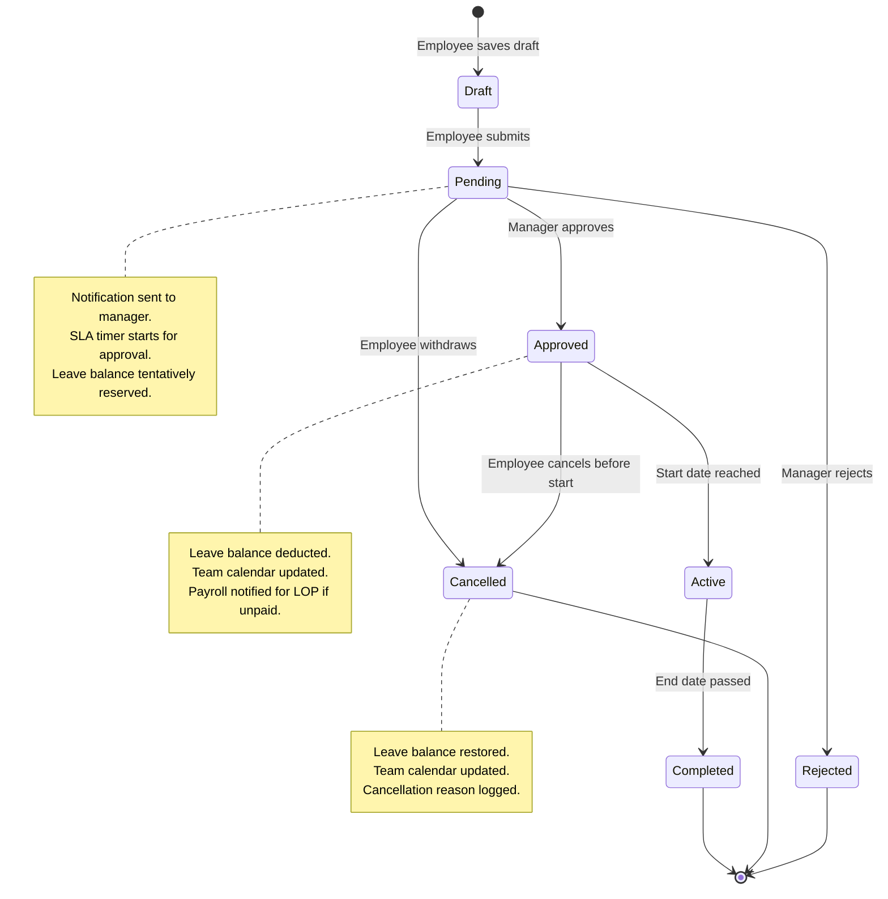

### Ticket Lifecycle

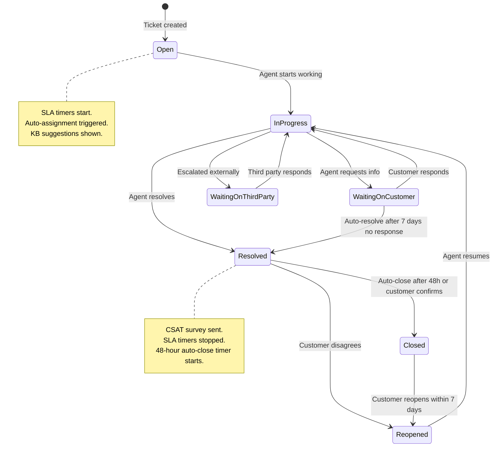

### Payroll Run Lifecycle

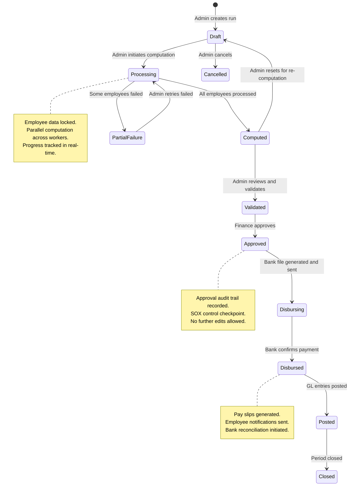

### Purchase Order Lifecycle

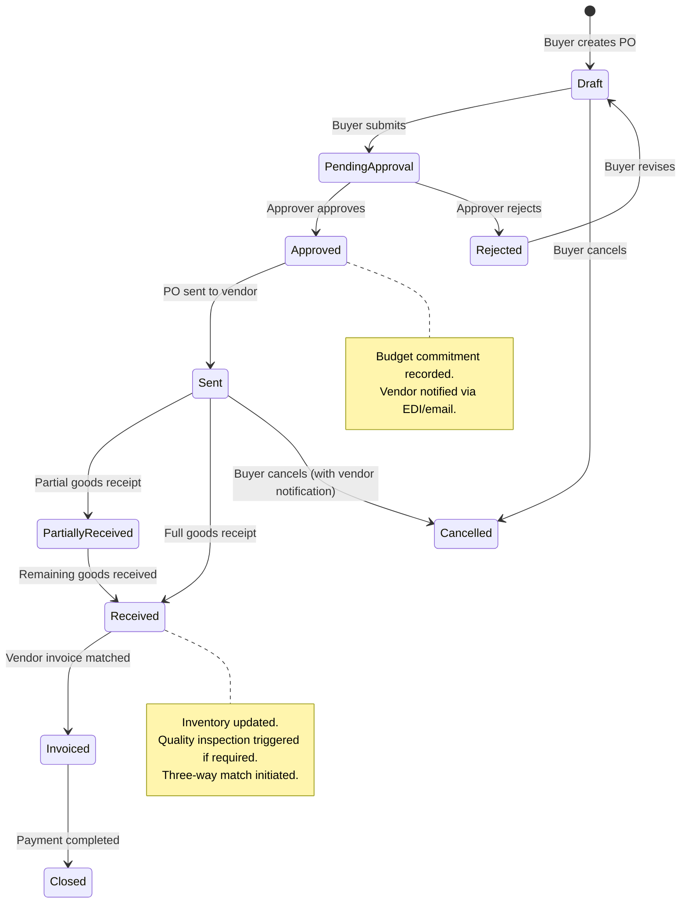

### Opportunity Pipeline

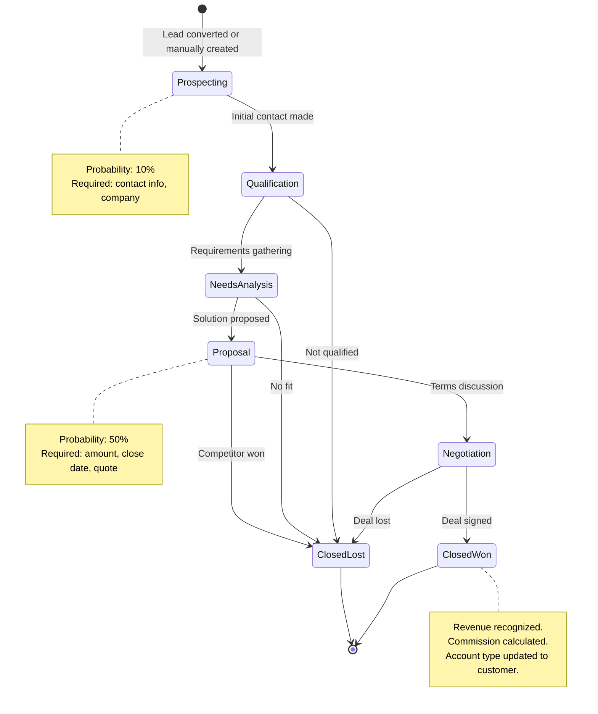

---

## Sequence Diagrams

### Leave Request Approval Flow

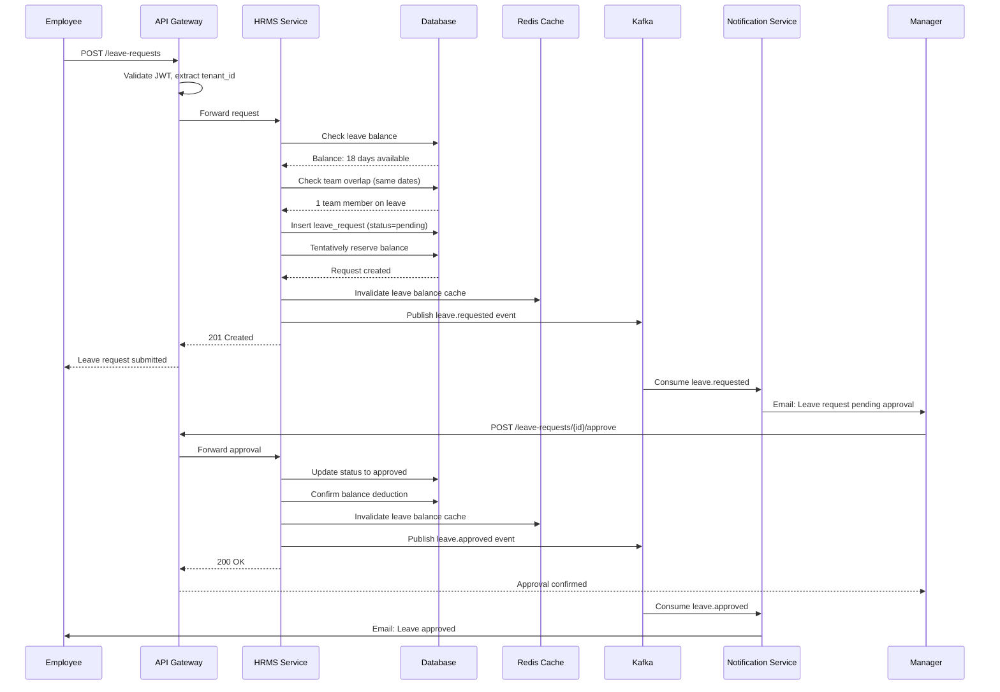

### Payroll Processing Flow

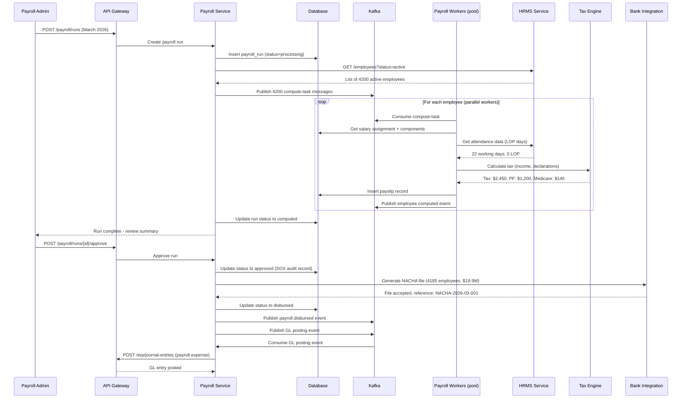

### Ticket Escalation Flow

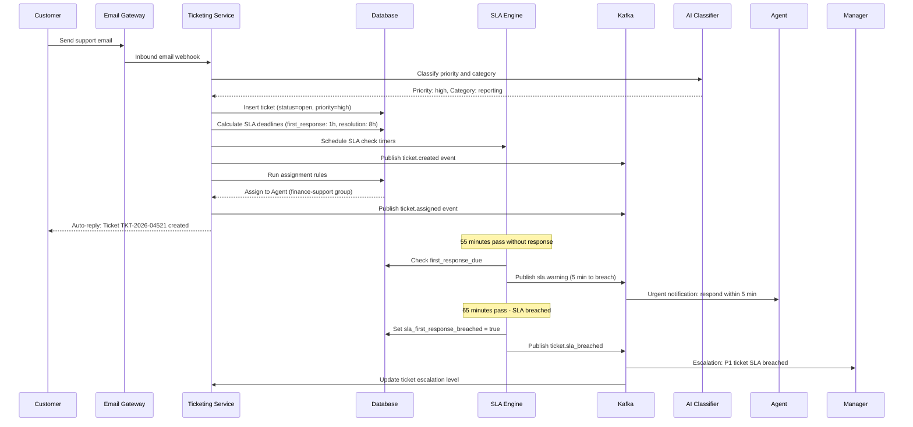

### CRM Lead-to-Opportunity Conversion

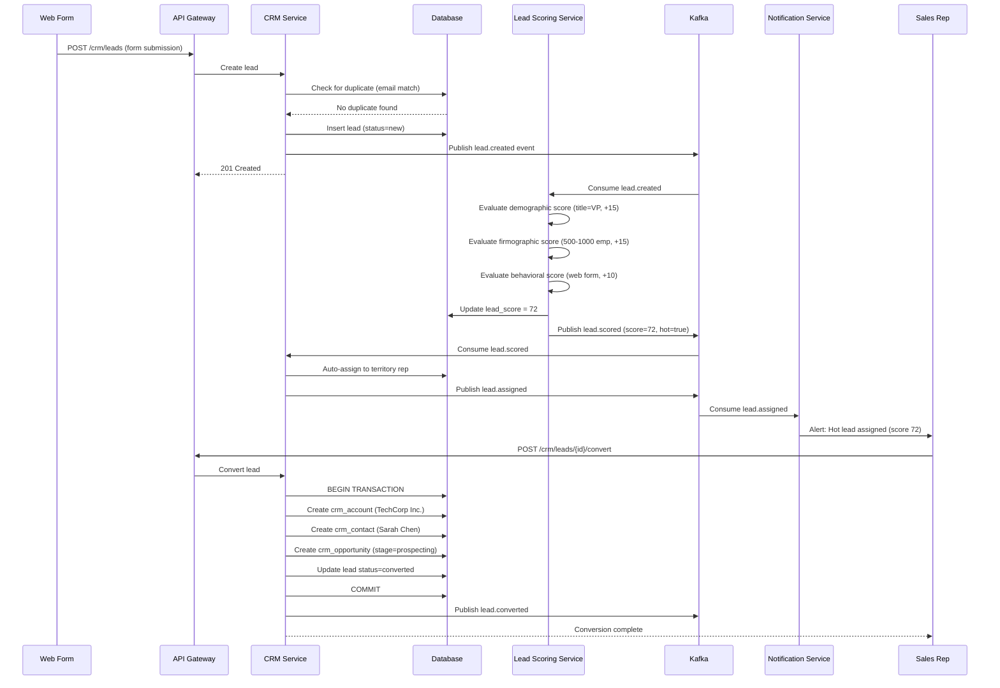

### ERP Three-Way Match Flow

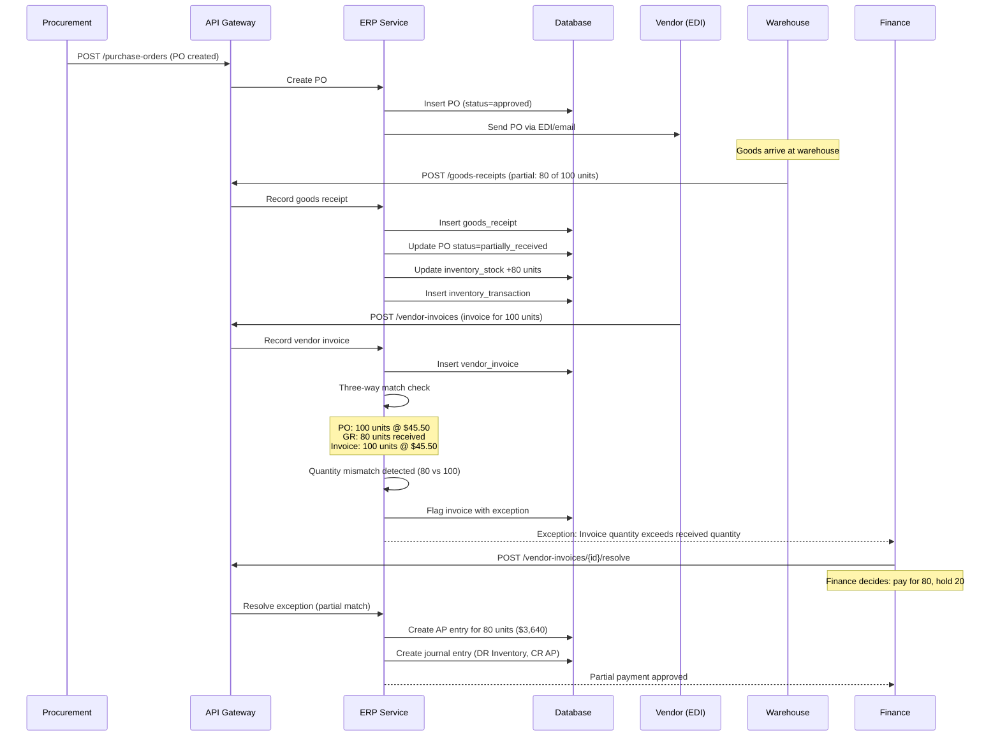

---

## Concurrency Control

### Optimistic Concurrency Control (OCC)

Most enterprise entities use optimistic concurrency with version columns to prevent lost updates:

```sql
-- Example: updating an employee record
UPDATE employees
SET department_id = 'new-dept-uuid',
    designation_id = 'new-desig-uuid',
    updated_at = now(),
    version = version + 1
WHERE employee_id = 'emp-uuid-001'
  AND tenant_id = 'tenant-uuid'
  AND version = 5;  -- expected version from read

-- If affected_rows = 0, the record was modified by another user; return HTTP 409 Conflict
```

**Applied to:**
- Employee record updates
- CRM opportunity stage transitions
- Purchase order modifications
- Ticket status changes
- Leave request processing

### Pessimistic Locking for Critical Paths

Certain operations require pessimistic locks to prevent inconsistency:

```sql
-- Leave balance deduction: SELECT FOR UPDATE prevents double-booking
BEGIN;
SELECT available FROM leave_balances
WHERE tenant_id = $1 AND employee_id = $2 AND leave_type_id = $3 AND fiscal_year = $4
FOR UPDATE;

-- Check available >= requested_days, then update
UPDATE leave_balances
SET taken = taken + $5, version = version + 1
WHERE tenant_id = $1 AND employee_id = $2 AND leave_type_id = $3 AND fiscal_year = $4;
COMMIT;
```

```sql
-- Inventory stock deduction: prevent overselling
BEGIN;
SELECT quantity_on_hand, quantity_reserved FROM inventory_stock
WHERE tenant_id = $1 AND item_id = $2 AND warehouse_id = $3
FOR UPDATE;

-- Validate availability, then update
UPDATE inventory_stock
SET quantity_on_hand = quantity_on_hand - $4, version = version + 1
WHERE tenant_id = $1 AND item_id = $2 AND warehouse_id = $3;
COMMIT;
```

### Payroll Run Lock

Payroll processing requires a tenant-level advisory lock to prevent concurrent runs:

```sql
-- Acquire advisory lock before payroll computation
SELECT pg_advisory_lock(hashtext('payroll_run:' || $tenant_id));

-- Verify no other active run exists
SELECT COUNT(*) FROM payroll_runs
WHERE tenant_id = $1 AND status IN ('processing', 'computed', 'validated')
  AND run_id != $2;

-- If count > 0, release lock and return error
-- Otherwise, proceed with computation

-- Release after run completion
SELECT pg_advisory_unlock(hashtext('payroll_run:' || $tenant_id));
```

### Journal Entry Posting Lock

To maintain GL balance integrity during period close:

```sql
-- Period close acquires exclusive lock
BEGIN;
SELECT * FROM fiscal_periods
WHERE tenant_id = $1 AND period_id = $2
FOR UPDATE;

-- Verify period is still open
-- Process all pending entries
-- Update period status to 'closed'
COMMIT;
```

---

## Idempotency Strategy

### Idempotency Key Design

Every write API accepts an `X-Idempotency-Key` header (UUID v4). The system guarantees that replaying a request with the same key produces the same result without side effects.

**Implementation:**

```sql
CREATE TABLE idempotency_records (
    idempotency_key     UUID PRIMARY KEY,
    tenant_id           UUID NOT NULL,
    endpoint            VARCHAR(255) NOT NULL,
    request_hash        VARCHAR(64) NOT NULL,       -- SHA-256 of request body
    response_status     INTEGER NOT NULL,
    response_body       JSONB NOT NULL,
    created_at          TIMESTAMPTZ NOT NULL DEFAULT now(),
    expires_at          TIMESTAMPTZ NOT NULL DEFAULT now() + INTERVAL '24 hours'
);

CREATE INDEX idx_idempotency_expires ON idempotency_records(expires_at);
```

**Processing flow:**

1. API receives request with idempotency key.
2. Look up key in `idempotency_records`.
3. If found and request hash matches: return stored response (HTTP 200, not 201).
4. If found but request hash differs: return HTTP 422 (key reuse with different payload).
5. If not found: process request, store result, return response.
6. Background job cleans up expired records daily.

### Critical Idempotent Operations

| Operation | Idempotency Mechanism | Failure Behavior |
|-----------|----------------------|------------------|
| Journal entry posting | idempotency_key in journal_entries | Replay returns existing entry |
| Payroll run creation | idempotency_key in payroll_runs | Replay returns existing run |
| Leave request submission | idempotency_key in leave_requests | Replay returns existing request |
| PO creation | idempotency_key in purchase_orders | Replay returns existing PO |
| Ticket creation (email) | source_message_id dedup | Same email creates one ticket |
| Bank file generation | run_id uniqueness | Same run generates one file |
| GL posting from payroll | payroll run_id + period uniqueness | Same run posts once |

---

## Consistency Model

| Data Domain | Consistency Level | Mechanism | Rationale |
|-------------|------------------|-----------|-----------|
| GL journal entries | Serializable | PostgreSQL serializable isolation | Double-entry accounting must balance |
| Account balances | Strong (read-your-writes) | Synchronous update after posting | Balance queries must reflect latest postings |
| Inventory stock levels | Serializable (for reservation) | SELECT FOR UPDATE | Prevent overselling |
| Leave balances | Serializable | SELECT FOR UPDATE | Prevent over-booking |
| Payroll computation | Read-your-writes | Single-writer per tenant during run | Employee changes locked during processing |
| CRM contacts | Eventual (< 2s) | Async search index update | Search results can lag slightly |
| CRM pipeline forecast | Eventual (< 5s) | Materialized view refresh | Forecast aggregation is approximate |
| Ticket status | Strong within ticket | Optimistic concurrency per ticket | Status transitions must be sequential |
| Ticket search results | Eventual (< 3s) | Elasticsearch async sync | Search can lag behind writes |
| Audit logs | Eventually durable | Async write via Kafka | Audit logs can lag but must not be lost |
| Report data | Eventual (< 30s) | CQRS read model refresh | Reports can use slightly stale data |
| Org hierarchy cache | Eventual (< 15s) | Cache invalidation on event | Hierarchy changes are infrequent |

### Cross-Service Consistency

When operations span multiple subsystems, we use the Saga pattern (see next section) rather than distributed transactions. Each service maintains its own consistency boundary, and cross-service consistency is achieved through compensating transactions.

---

## Distributed Transaction / Saga Design

### Saga: Employee Onboarding (Choreography-based)

This saga coordinates across HRMS, Payroll, IT, and CRM when a new employee joins.

**Steps:**

| Step | Service | Action | Compensation |
|------|---------|--------|-------------|
| 1 | HRMS | Create employee record | Delete employee record |
| 2 | HRMS | Create user account + assign roles | Deactivate user account |
| 3 | Payroll | Create salary assignment | Delete salary assignment |
| 4 | IT Provisioning | Create AD account, assign laptop | Disable AD account, reclaim laptop |
| 5 | CRM (if sales) | Create CRM user, assign territory | Remove CRM user |
| 6 | ERP | Create cost center allocation | Remove allocation |

**Event flow:**
```
HRMS publishes: employee.onboarded
  -> Payroll consumes: creates salary assignment, publishes payroll.salary_assigned
  -> IT consumes: creates AD account, publishes it.account_provisioned
  -> CRM consumes (if applicable): creates CRM user
  -> ERP consumes: creates cost allocation

If Payroll fails:
  Payroll publishes: payroll.salary_assignment_failed
  -> HRMS consumes: marks employee as onboarding_incomplete
  -> Admin notified to resolve manually
```

### Saga: Payroll Disbursement (Orchestration-based)

Payroll disbursement uses an orchestrator because the steps are sequential and order-dependent.

```
Orchestrator: Payroll Service

Step 1: Lock payroll run (prevent concurrent modifications)
Step 2: Generate bank file (NACHA/BACS)
Step 3: Upload to bank SFTP
Step 4: Wait for bank acknowledgment (async, with timeout)
Step 5: Mark payslips as paid
Step 6: Post GL journal entries to ERP
Step 7: Generate pay slip PDFs
Step 8: Notify employees
Step 9: Unlock payroll run, set status = closed

Compensation:
- If Step 3 fails: Mark run as disbursement_failed, alert admin
- If Step 4 times out: Mark as pending_bank_confirmation, schedule retry
- If Step 6 fails: Mark as disbursed_gl_pending, retry GL posting
- Bank reversals (e.g., invalid account): Process in next payroll cycle as adjustment
```

### Saga: Period-End Close (Orchestration-based)

```
Orchestrator: ERP Close Service

Step 1: Run pre-close validations (unposted entries, unmatched invoices)
Step 2: Post accrual entries
Step 3: Calculate depreciation entries
Step 4: Post intercompany elimination entries
Step 5: Run trial balance reconciliation
Step 6: Lock fiscal period (no new postings allowed)
Step 7: Generate financial statements (P&L, Balance Sheet)
Step 8: Create audit snapshot
Step 9: Open next period

Compensation:
- If validation fails: Return detailed error list; admin fixes and retries
- If any posting fails: Reverse all posted entries for this close cycle
- Period lock is reversible by admin with SOX-compliant approval
```

---

## Security Design

### RBAC Model

```
Hierarchy:
  Tenant Admin
    -> Module Admin (ERP Admin, HR Admin, CRM Admin, Support Admin)
      -> Functional Roles (Finance User, Procurement User, Sales Rep, HR User, Support Agent)
        -> Self-Service (Employee)
          -> Read-Only (Auditor, Viewer)
```

**Permission Structure:**

| Permission | Format | Example |
|-----------|--------|---------|
| Module access | `{module}.access` | `erp.access`, `crm.access` |
| Entity CRUD | `{module}.{entity}.{action}` | `erp.journal_entry.create`, `crm.contact.read` |
| Field-level | `{module}.{entity}.{field}.{action}` | `hrms.employee.salary.read`, `payroll.payslip.view_others` |
| Workflow | `{module}.{workflow}.{action}` | `erp.po.approve`, `hrms.leave.approve` |
| Admin | `{module}.admin.{action}` | `hrms.admin.configure_leave_policy` |
| Data scope | `{module}.scope.{level}` | `crm.scope.territory`, `hrms.scope.department` |

### Field-Level Security

Sensitive fields are protected with field-level access control:

| Field | Module | Accessible By | Encryption |
|-------|--------|--------------|-----------|
| employee.salary / CTC | HRMS | HR Admin, Finance, Self (own record) | Application-layer AES-256 |
| employee.tax_identification (SSN/PAN) | HRMS | HR Admin, Payroll Admin | Application-layer AES-256, masked in UI |
| employee.bank_details | HRMS/Payroll | Payroll Admin, Self (own record) | Application-layer AES-256 |
| employee.date_of_birth | HRMS | HR Admin, Self, Manager (age only) | None (PII policies apply) |
| employee.medical_records | HRMS | HR Admin (restricted), Self | AES-256, separate encryption key |
| payslip.earnings_breakdown | Payroll | Self (own), HR Admin, Payroll Admin | None (access-controlled) |
| vendor.bank_account_info | ERP | Finance Admin, AP Clerk | Application-layer AES-256 |

### Audit Trail Design

Every state mutation produces an audit record:

```json
{
  "log_id": 1234567890,
  "tenant_id": "tenant-uuid",
  "user_id": "user-uuid",
  "action": "UPDATE",
  "entity_type": "employee",
  "entity_id": "emp-uuid-001",
  "changes": {
    "department_id": {
      "old": "dept-engineering",
      "new": "dept-product"
    },
    "designation_id": {
      "old": "desig-senior-eng",
      "new": "desig-staff-eng"
    }
  },
  "ip_address": "10.0.1.45",
  "user_agent": "Mozilla/5.0...",
  "request_id": "req-uuid-001",
  "created_at": "2026-03-15T10:30:00Z"
}
```

**Audit log properties:**
- Immutable: append-only table with no UPDATE or DELETE permissions.
- Partitioned by month for efficient retention management.
- Retained for 7 years (SOX requirement).
- Separate read-only replica for audit queries (no impact on transactional performance).
- Tamper-evident: each log entry includes a hash chain linking to the previous entry.

### Segregation of Duties (SOX Compliance)

| Process | Roles That Must Be Separated | Enforcement |
|---------|------------------------------|-------------|
| Purchase requisition + PO approval | Requester cannot approve own PO | System prevents same user_id |
| Journal entry creation + posting | Creator cannot post own entry (above threshold) | Workflow requires different approver |
| Payroll computation + approval | Payroll processor cannot approve same run | Different user_id required |
| Vendor creation + payment processing | Vendor creator cannot process payment to same vendor | System cross-check |
| Employee salary change + payroll run | HR making salary change cannot run payroll | Role separation |

### Data Isolation (Multi-Tenant)

1. **Row-level security (RLS)**: Every query includes `WHERE tenant_id = :current_tenant_id` enforced by PostgreSQL RLS policies.
2. **API gateway enforcement**: `X-Tenant-Id` is set by the gateway from the JWT; applications cannot override it.
3. **Cross-tenant access prevention**: No API endpoint accepts tenant_id as a parameter; it is always derived from the auth token.
4. **Database connection pooling**: Connection pool tags connections with tenant context; queries failing RLS checks are logged as security events.

---

## Observability Design

### Key Metrics by Subsystem

| Subsystem | Metric | Type | Alert Threshold |
|-----------|--------|------|----------------|
| All | `api_request_duration_seconds` | Histogram | p99 > 2s |
| All | `api_request_total` | Counter (by status code) | 5xx rate > 1% |
| All | `active_sessions` | Gauge (per tenant) | > tenant limit |
| ERP | `journal_entries_posted_total` | Counter | N/A (volume tracking) |
| ERP | `period_close_duration_seconds` | Histogram | > 30 min |
| ERP | `unmatched_invoices_count` | Gauge (per tenant) | > 50 |
| CRM | `leads_created_total` | Counter (by source) | N/A |
| CRM | `lead_scoring_duration_ms` | Histogram | p99 > 500ms |
| CRM | `pipeline_value_total` | Gauge (by stage, per tenant) | N/A |
| HRMS | `leave_balance_negative_count` | Gauge | > 0 (critical) |
| HRMS | `pending_approvals_count` | Gauge (per approver) | > 20 |
| HRMS | `onboarding_completion_rate` | Gauge | < 90% |
| Payroll | `payroll_run_duration_seconds` | Histogram | > 60 min |
| Payroll | `payroll_computation_errors` | Counter (per run) | > 0 |
| Payroll | `payroll_disbursement_amount` | Gauge (per run) | Variance > 5% from last run |
| Ticketing | `tickets_open_count` | Gauge (per tenant, per priority) | P1 > 10 |
| Ticketing | `sla_breach_rate` | Gauge | > 5% |
| Ticketing | `first_response_time_seconds` | Histogram | p95 > SLA target |
| Ticketing | `csat_score_avg` | Gauge (per tenant) | < 3.5 |
| Platform | `kafka_consumer_lag` | Gauge (per topic, per group) | > 10,000 |
| Platform | `db_connection_pool_active` | Gauge | > 80% capacity |
| Platform | `cache_hit_rate` | Gauge | < 80% |

### Dashboard Design

**Executive Dashboard:**
- Total active users (real-time), API requests per second, error rate
- Tenant health heatmap (green/yellow/red based on SLO compliance)
- Revenue-impacting alerts (payroll failures, finance system outages)

**ERP Operations Dashboard:**
- Period close status across tenants, unposted entries count
- AP/AR aging summary, budget utilization
- Purchase order pipeline (draft -> approved -> received -> invoiced)

**Payroll Operations Dashboard:**
- Active payroll runs with progress bars
- Error count per run, variance from previous run
- Disbursement status, bank file generation status
- Tax filing deadlines and compliance status

**Support Operations Dashboard:**
- Real-time ticket queue by priority, agent workload distribution
- SLA compliance rate (first response, resolution) with trend
- CSAT scores trending, top ticket categories
- Knowledge base deflection rate

### Alerting Rules

| Alert | Severity | Condition | Action |
|-------|----------|-----------|--------|
| Payroll run failure | P1 (Critical) | Any employee computation fails during active run | Page on-call, notify payroll admin |
| SLA breach rate spike | P2 (High) | Breach rate > 10% in 15-minute window | Notify support manager |
| Database replication lag | P1 (Critical) | Replica lag > 30 seconds | Page DBA on-call |
| Leave balance negative | P1 (Critical) | Any employee has negative leave balance | Notify HR admin immediately |
| GL imbalance detected | P1 (Critical) | Trial balance does not balance to zero | Page finance operations |
| Kafka consumer lag | P2 (High) | Lag > 50,000 messages for 10 minutes | Notify platform team |
| API error rate | P2 (High) | 5xx rate > 2% for 5 minutes | Page on-call engineer |
| Tenant rate limit exhaustion | P3 (Medium) | Tenant hitting 80% of rate limit | Notify account manager |

---

## Reliability and Resilience

### Failure Mode Analysis

| Component | Failure Mode | Impact | Mitigation |
|-----------|-------------|--------|-----------|
| Primary database | Node failure | Write path unavailable | Automatic failover to synchronous replica (< 30s) |
| Read replica | Node failure | Read-heavy queries degrade | Route reads to other replicas; fallback to primary |
| Redis cache | Cluster partition | Increased database load | Circuit breaker on cache; serve from DB with rate limiting |
| Kafka broker | Broker failure | Event processing delays | Replication factor = 3; ISR-based leader election |
| Payroll worker | Worker crash mid-computation | Partial payroll run | Checkpoint per employee; resume from last checkpoint |
| Bank SFTP | Connection failure | Payroll disbursement delayed | Retry with exponential backoff; alert admin after 3 failures |
| Search (Elasticsearch) | Cluster red | Search unavailable | Serve degraded results from database; show "search temporarily unavailable" |
| Email gateway | Delivery failure | Notifications delayed | Queue with retry; fallback to secondary provider |
| External tax API | Timeout | Payroll computation blocked | Cache last-known tax tables; use cached rates with staleness warning |

### Circuit Breaker Configuration

| Downstream Service | Failure Threshold | Open Duration | Half-Open Probes |
|-------------------|-------------------|---------------|-----------------|
| Bank integration | 3 failures in 60s | 5 minutes | 1 probe every 30s |
| Tax calculation API | 5 failures in 60s | 2 minutes | 1 probe every 15s |
| Email gateway | 10 failures in 60s | 3 minutes | 2 probes every 30s |
| Search service | 5 failures in 30s | 1 minute | 1 probe every 10s |
| External CRM sync | 3 failures in 60s | 5 minutes | 1 probe every 60s |

### Graceful Degradation

| Feature | Degradation Behavior | User Experience |
|---------|---------------------|----------------|
| Search | Fall back to database LIKE queries | Slower results, no fuzzy matching |
| Dashboard charts | Serve last-cached snapshot | "Data as of 5 minutes ago" indicator |
| Lead scoring | Use last-computed score | Score badge shows "updating" state |
| KB article suggestions | Disable AI suggestions | Show top articles by category only |
| Email notifications | Queue silently, deliver later | User sees "notification delayed" in UI |
| Report generation | Queue with lower priority | "Report will be ready in ~10 minutes" |

---

## Multi-Region and DR Strategy

### Deployment Topology

```
Region: US-East (Primary for NA tenants)
  - API Gateway (3 instances)
  - All microservices (standard deployment)
  - PostgreSQL Primary + 1 sync replica
  - Redis Cluster (3 masters + 3 replicas)
  - Kafka Cluster (3 brokers)
  - Elasticsearch (3 data nodes)

Region: EU-West (Primary for EU tenants, DR for US-East)
  - API Gateway (3 instances)
  - All microservices (standard deployment)
  - PostgreSQL Primary + 1 sync replica (EU tenant data)
  - PostgreSQL async replica of US-East (for DR)
  - Redis Cluster
  - Kafka Cluster (MirrorMaker from US-East)
  - Elasticsearch

Region: AP-South (Primary for APAC tenants)
  - API Gateway (2 instances)
  - All microservices (reduced scale)
  - PostgreSQL Primary + 1 sync replica (APAC tenant data)
  - Redis Cluster
  - Kafka Cluster
  - Elasticsearch
```

### Data Residency

| Tenant Region | Data Primary | Data Replicated To | GDPR Scope |
|--------------|-------------|-------------------|-----------|
| NA | US-East | EU-West (encrypted, DR only) | CCPA applies |
| EU | EU-West | EU-West DR zone only (no cross-region) | Full GDPR |
| APAC | AP-South | US-East (encrypted, DR only) | Local data laws |

### DR Procedures

| Scenario | RPO | RTO | Procedure |
|----------|-----|-----|-----------|
| Single AZ failure | 0 (sync replica) | < 5 min | Automatic failover to standby AZ |
| Full region failure | < 1 min | < 60 min | DNS failover to DR region; promote async replica |
| Database corruption | Point-in-time | < 2 hours | Restore from WAL archive to specific timestamp |
| Ransomware | < 1 hour | < 4 hours | Restore from immutable backups in separate account |

### Backup Strategy

- **Continuous WAL archiving**: Every transaction is archived to S3 (cross-region, cross-account).
- **Daily base backups**: Full PostgreSQL base backup at 02:00 UTC; retained for 90 days.
- **Immutable backups**: Weekly backup to separate AWS account with Object Lock (WORM); retained for 7 years.
- **Backup testing**: Monthly automated restore test to verify backup integrity.

---

## Cost Drivers and Optimization

### Cost Breakdown (Estimated Monthly)

| Category | Component | Monthly Cost | Percentage |
|----------|-----------|-------------|-----------|
| Compute | Application instances (60 instances) | $45,000 | 30% |
| Database | PostgreSQL (RDS Multi-AZ, 6 instances) | $35,000 | 23% |
| Storage | S3 (documents, backups, audit logs) | $8,000 | 5% |
| Cache | Redis Cluster (6 instances) | $6,000 | 4% |
| Messaging | Kafka (MSK, 6 brokers) | $10,000 | 7% |
| Search | Elasticsearch (6 instances) | $12,000 | 8% |
| Networking | Data transfer, NAT gateway, load balancers | $8,000 | 5% |
| Monitoring | DataDog / Grafana Cloud | $5,000 | 3% |
| Security | WAF, secrets management, HSM | $4,000 | 3% |
| DR | Cross-region replication, backup storage | $12,000 | 8% |
| Other | DNS, CDN, email gateway, third-party APIs | $5,000 | 3% |
| **Total** | | **~$150,000** | **100%** |

### Cost Optimization Strategies

| Strategy | Savings | Trade-off |
|----------|---------|-----------|
| Reserved instances (1-year) for baseline compute | 30-40% on compute | Commitment risk |
| Spot instances for payroll batch workers | 60-70% on batch compute | Need fault-tolerant design |
| Tiered storage for audit logs (S3 IA after 90 days, Glacier after 1 year) | 50-70% on audit storage | Slower retrieval for old logs |
| Read replica scale-down during off-hours | 15-20% on DB cost | Reduced read capacity at night |
| Elasticsearch index lifecycle (warm/cold tiers) | 30% on search storage | Slower search on old tickets |
| Compress Kafka messages (LZ4) | 30-40% on messaging storage | Minor CPU overhead |
| CDN caching for KB articles and static assets | 20% on compute (fewer origin requests) | Cache invalidation complexity |
| Per-tenant resource metering for chargeback | Cost accountability | Metering overhead |

---

## Deep Platform Comparisons

### ERP Platforms

| Capability | SAP S/4HANA | Oracle Fusion | Dynamics 365 | Odoo | Custom Build |
|-----------|-------------|---------------|--------------|------|-------------|
| **Finance/GL** | Best-in-class, multi-GAAP | Strong, complex config | Good, Power BI integration | Adequate for SMB | Full control, high effort |
| **Procurement** | Deep, end-to-end | Strong, Procurement Cloud | Good, LinkedIn integration | Basic-adequate | Tailored to needs |
| **Manufacturing** | Industry leader (MRP, PP) | Strong (discrete + process) | Limited | Community modules | Requires domain expertise |
| **Inventory** | Excellent (WMS integration) | Good | Basic | Adequate | Can optimize for scale |
| **Multi-currency** | Excellent | Excellent | Good | Basic | Moderate effort |
| **Customization** | ABAP, BTP extensions | Groovy, Visual Builder | Power Platform, Dataverse | Python, OWL framework | Unlimited flexibility |
| **Integration** | RFC, IDoc, OData, REST | REST, SOAP, Integration Cloud | Dataverse, Power Automate | XML-RPC, REST | Any protocol |
| **TCO (500 users, 5 yr)** | $2M - $5M | $1.5M - $4M | $800K - $2M | $100K - $500K | $500K - $3M |
| **Implementation time** | 12-24 months | 9-18 months | 6-12 months | 3-6 months | 6-18 months |
| **Best for** | Large enterprises, manufacturing | Large enterprises, complex orgs | Mid-market, Microsoft shops | SMB, cost-conscious | Unique requirements |

### CRM Platforms

| Capability | Salesforce | HubSpot | Dynamics 365 | Zoho CRM | Custom Build |
|-----------|-----------|---------|--------------|----------|-------------|
| **Contact management** | Best-in-class | Strong | Good | Good | Tailored |
| **Sales pipeline** | Excellent, highly configurable | Good, opinionated UX | Good | Adequate | Full control |
| **Lead scoring** | Einstein AI | Built-in ML | AI Builder | Zia AI | Custom ML model |
| **Marketing automation** | Pardot/Marketing Cloud | Native, excellent | Limited (separate module) | Built-in | Requires building |
| **Customization** | Apex, LWC, Flow | Limited (Operations Hub) | Power Platform | Deluge scripting | Unlimited |
| **Ecosystem** | 5000+ AppExchange apps | 1000+ integrations | Microsoft ecosystem | 500+ extensions | Build what you need |
| **API quality** | Excellent (REST + SOAP + Bulk) | Excellent REST | Good (OData) | Good (REST) | Your design |
| **Pricing (50 users/mo)** | $6,250 - $15,000 | $2,500 - $6,000 | $3,250 - $6,500 | $1,000 - $2,500 | Engineering cost |
| **Best for** | Enterprise B2B | SMB to mid-market | Microsoft-centric orgs | Cost-conscious orgs | Unique workflows |

### HRMS / Payroll Platforms

| Capability | Workday | SAP SuccessFactors | BambooHR | Gusto | Custom Build |
|-----------|---------|-------------------|----------|-------|-------------|
| **Employee lifecycle** | Best-in-class | Excellent | Good (SMB) | Basic | Tailored |
| **Payroll** | Workday Payroll (US, UK, FR, CA) | Separate (SAP Payroll) | Via partners | US-only, excellent UX | Complex, jurisdiction-specific |
| **Performance mgmt** | Excellent | Good | Basic | N/A | Custom |
| **Global coverage** | Strong (200+ countries) | Best (100+ countries) | Limited | US only | Requires per-country rules |
| **Compliance** | SOX, GDPR, HIPAA | SOX, GDPR | Basic | US compliance | Must build |
| **Self-service** | Excellent mobile + web | Good | Good | Excellent | Custom UX |
| **Analytics** | Prism Analytics | People Analytics | Basic | Basic | Custom (but powerful) |
| **Pricing (1000 emp/mo)** | $10,000 - $25,000 | $8,000 - $20,000 | $5,000 - $8,000 | $6,000 - $12,000 | Engineering cost |
| **Best for** | Large enterprise (1000+) | SAP ecosystem orgs | SMB (< 500) | US SMB (< 200) | Unique payroll rules |

### Ticketing Platforms

| Capability | ServiceNow | Zendesk | Freshdesk | Jira SM | Custom Build |
|-----------|-----------|---------|-----------|---------|-------------|
| **Ticket lifecycle** | Excellent (ITIL-aligned) | Excellent | Good | Good (ITSM) | Tailored |
| **SLA management** | Best-in-class | Good | Good | Good | Custom rules |
| **Knowledge base** | Good | Excellent (Guide) | Good | Confluence integration | Must build |
| **Omnichannel** | Good | Excellent | Good | Limited | Requires integrations |
| **Automation/workflow** | Flow Designer (powerful) | Triggers + Automations | Freddy AI | Automation rules | Custom engine |
| **ITSM/ITIL** | Best-in-class | Basic (not ITIL-focused) | Basic | Moderate | Build what you need |
| **Integration** | IntegrationHub | Marketplace (1200+) | Marketplace | Atlassian ecosystem | Any protocol |
| **API quality** | REST, GraphQL | Excellent REST | Good REST | Good REST | Your design |
| **Pricing (50 agents/mo)** | $5,000 - $15,000 | $2,500 - $7,500 | $1,500 - $5,000 | $1,000 - $5,000 | Engineering cost |
| **Best for** | Enterprise ITSM | Customer support (B2C/B2B) | SMB support | Dev-oriented teams | Unique workflows |

---

## Edge Cases and Failure Scenarios

### Edge Case 1: Payroll Run During Employee Transfer

**Scenario**: Employee transfers from Department A to Department B on March 15. Payroll runs on March 28 for the full month of March.

**Problem**: Which department bears the salary cost? Which cost center? Which manager approves?

**Solution**:
- Payroll engine prorates salary by days in each department (15 days Dept A, 16 days Dept B).
- Two GL posting lines are created, one per cost center.
- Approval routes to the manager as of the payroll run date (new manager).
- Employee's payslip shows single net pay; costing report shows the split.

### Edge Case 2: Concurrent Leave Requests Exhaust Balance

**Scenario**: Employee has 5 days remaining. Two leave requests submitted simultaneously: 3 days and 4 days.

**Problem**: Without proper locking, both requests could be approved (7 days > 5 available).

**Solution**:
- `SELECT FOR UPDATE` on `leave_balances` row serializes requests.
- First request locks the row, validates 3 <= 5, deducts. Balance = 2.
- Second request waits for lock, then validates 4 > 2, returns "Insufficient balance."
- UI shows real-time balance including pending requests to set expectations.

### Edge Case 3: Journal Entry Posted to Closed Period

**Scenario**: Finance user creates a journal entry dated February 28, but the February period was closed on March 3.

**Problem**: Posting would violate period close integrity.

**Solution**:
- Journal entry creation checks `fiscal_periods.status` for the entry date's period.
- If period is "closed," return HTTP 422: "Cannot post to closed period. Adjust to current open period or request period reopen."
- Period reopen requires Finance Director approval (SOX control).
- If reopened, an audit trail records who reopened and why.

### Edge Case 4: SLA Timer Across Business Hours and Holidays

**Scenario**: A P1 ticket is created at 4:50 PM on Friday. SLA is 1-hour first response, business hours only (9 AM - 5 PM, Mon-Fri). Monday is a holiday.

**Problem**: Naive timer would expire at 5:50 PM Friday. Correct timer should pause at 5 PM Friday and resume at 9 AM Tuesday.

**Solution**:
- SLA engine calculates using business calendar per tenant (configurable timezone, holidays, business hours).
- Timer pauses at 5:00 PM Friday. Remaining: 50 minutes.
- Timer does not run Saturday, Sunday, or Monday (holiday).
- Timer resumes at 9:00 AM Tuesday. First response due: 9:50 AM Tuesday.
- Calendar is tenant-configurable; each tenant uploads their holiday list.

### Edge Case 5: Payroll Tax Regulation Change Mid-Period

**Scenario**: Government announces new tax slab effective March 1. Payroll for March must use new rates, but the system has the old rates.

**Problem**: Running payroll with old rates causes incorrect tax deduction; employees may be under/over-taxed.

**Solution**:
- Tax tables are versioned with effective dates: `tax_slab_v2026_03`.
- Payroll computation always looks up the tax table effective for the pay period.
- Admin updates tax tables with effective date; old table remains for historical runs.
- Reconciliation report compares actual deductions vs. corrected rates.
- Arrears processing handles retroactive adjustments if update was late.

### Edge Case 6: CRM Duplicate Lead from Multiple Channels

**Scenario**: Same person submits a web form, attends a trade show, and is cold-called -- creating three lead records.

**Problem**: Three sales reps may contact the same person; pipeline is inflated.

**Solution**:
- Real-time dedup check on lead creation: match on email (exact) + phone (fuzzy) + company name (fuzzy).
- If match found with confidence > 0.9, merge automatically and log.
- If match found with confidence 0.7-0.9, flag for manual review.
- Merge preserves all activity history from all sources.
- Original lead source is preserved as "first touch"; subsequent sources are "assist touches."

### Edge Case 7: Ticket Created via Email with Invalid Tenant Context

**Scenario**: Email arrives at support@platform.com but the sender email does not match any tenant's customer.

**Problem**: Cannot route ticket to a tenant; SLA policies are tenant-specific.

**Solution**:
- Email gateway attempts domain matching: `sender@acmecorp.com` -> match to tenant "AcmeCorp."
- If no domain match, check `support-to` address: `support+acmecorp@platform.com` -> tenant identified.
- If still no match, create ticket in "unassigned" queue; send auto-reply asking sender to provide account details.
- Unassigned tickets alert platform support team; no SLA timer starts until tenant is identified.

### Edge Case 8: Inventory Count Discrepancy During Active Operations

**Scenario**: Physical inventory count shows 95 units, system shows 100 units. During the count, 3 units were shipped.

**Problem**: Was the discrepancy 5 units (100-95) or 2 units (100-3-95)?

**Solution**:
- Inventory count workflow creates a "count freeze" snapshot at count start time.
- Transactions after freeze are tracked separately.
- Reconciliation: System at freeze (100) - shipped during count (3) = expected (97) vs. counted (95) = variance (2).
- Adjustment transaction records the 2-unit variance with reason code and approval.

### Edge Case 9: Performance Review Cycle with Org Change

**Scenario**: A review cycle is in progress (self-review phase). Employee's manager changes mid-cycle.

**Problem**: Who does the manager review -- the old manager (who observed the employee for most of the period) or the new manager?

**Solution**:
- Review assignment includes `reviewer_id` set at cycle creation.
- Manager change does not automatically re-assign existing reviews.
- HR Admin can manually re-assign or add the new manager as an additional reviewer.
- System supports "shared review" where old manager provides input, new manager submits final rating.
- Policy is configurable per tenant: auto-reassign vs. manual decision.

### Edge Case 10: Payroll Bank Rejection After Disbursement Recorded

**Scenario**: Bank file sent successfully, payroll marked as disbursed, but bank returns 15 rejections (invalid account numbers) the next day.

**Problem**: System shows "paid" but 15 employees did not actually receive funds.

**Solution**:
- Bank reconciliation file (return file) is processed daily.
- Rejected transactions update payslip status from "paid" to "rejected."
- Rejected employees are flagged for off-cycle payroll run.
- Notification sent to HR: "Please verify bank details for 15 employees."
- Finance GL entries: reverse the original bank debit for rejected amount; create new payable.
- Off-cycle run generates a new bank file for the 15 employees after bank details are corrected.

### Edge Case 11: Multi-Timezone Tenant with Overlapping Pay Periods

**Scenario**: A global tenant has employees in US (bi-weekly), UK (monthly), and India (monthly). All three pay periods overlap in March.

**Problem**: Single payroll run cannot accommodate different pay period structures.

**Solution**:
- Payroll runs are configured per "pay group" (US-biweekly, UK-monthly, India-monthly).
- Each pay group has its own run schedule and pay period dates.
- GL posting consolidates across pay groups for the tenant's consolidated financial view.
- Pay slip format adapts to local requirements (W-2 format vs. P60 vs. Form 16).
- Tax calculations use jurisdiction-specific engines.

---

## Architecture Decision Records

### ADR-001: Multi-Tenant Data Isolation Strategy

**Status:** Accepted
**Date:** 2026-01-15

**Context:**
The platform must serve 500+ tenants ranging from 50 to 50,000 employees. Tenant data must be isolated for security, compliance, and performance. Options considered:
1. Separate database per tenant
2. Separate schema per tenant
3. Shared schema with `tenant_id` column (+ row-level security)
4. Hybrid: shared schema for small tenants, dedicated schema for large tenants

**Decision:**
Option 4 -- Hybrid approach. Small and medium tenants (< 10,000 employees) share a schema with RLS. Large tenants (> 10,000 employees or enterprise-tier contract) get a dedicated schema.

**Rationale:**
- Separate DB per tenant: Too expensive and operationally complex at 500+ tenants.
- Separate schema per tenant: Schema migrations become O(n) per tenant; manageable but slow.
- Shared schema with RLS: Most cost-effective; PostgreSQL RLS provides strong isolation; works well for 90% of tenants.
- Hybrid: Large tenants get performance isolation, custom indexes, and independent backup/restore while keeping infrastructure manageable.

**Consequences:**
- Application routing layer must resolve tenant to schema at connection time.
- Schema migrations must support both shared and dedicated schemas.
- Monitoring must be per-tenant to detect noisy neighbors in shared schema.

---

### ADR-002: Event-Driven vs. Synchronous Inter-Service Communication

**Status:** Accepted
**Date:** 2026-01-20

**Context:**
Enterprise systems have many cross-service interactions: employee onboarding triggers payroll setup, IT provisioning, and CRM user creation. Options:
1. Synchronous REST calls between services
2. Event-driven (Kafka) choreography
3. Orchestration with a workflow engine (Temporal/Cadence)
4. Hybrid: synchronous for user-facing hot paths, events for background propagation

**Decision:**
Option 4 -- Hybrid approach.

**Rationale:**
- Pure synchronous: Creates tight coupling and cascading failures; leave approval should not fail because the email service is down.
- Pure event-driven: Makes debugging difficult; hard to show immediate confirmation to users.
- Pure orchestration: Adds operational complexity for simple fire-and-forget scenarios.
- Hybrid: User-facing operations (leave request, ticket creation) are synchronous within their owning service. Cross-service propagation (payroll notification, search index update) uses Kafka events.

**Consequences:**
- Each service must handle the case where downstream event consumers lag.
- UI must clearly indicate what is confirmed vs. what is "in progress."
- Dead-letter queues and event replay tooling are required from day one.

---

### ADR-003: Payroll Computation Architecture

**Status:** Accepted
**Date:** 2026-02-01

**Context:**
Payroll for a large tenant (50,000 employees) must complete within a reasonable window. Computation involves fetching salary structures, attendance data, tax declarations, loan deductions, and statutory rules per employee. Options:
1. Sequential processing on a single server
2. Parallel processing with fan-out via message queue
3. Map-reduce style batch processing
4. Pre-computed incremental payroll (compute delta from last run)

**Decision:**
Option 2 -- Parallel fan-out via Kafka.

**Rationale:**
- Sequential: 200ms per employee x 50,000 = ~2.8 hours. Too slow for operational windows.
- Parallel fan-out: 50,000 compute-task messages on Kafka, consumed by a pool of payroll workers. With 20 workers at 200ms/employee, completion in ~8 minutes.
- Map-reduce: Over-engineered; Kafka consumer groups provide sufficient parallelism.
- Incremental: Attractive but too risky -- a single missed delta causes incorrect pay. Full recomputation is safer and auditable.

**Consequences:**
- Payroll workers must be stateless and idempotent (reprocessing an employee produces the same result).
- Checkpointing is needed for progress tracking and resume-on-failure.
- Employee data must be "frozen" during computation to prevent mid-run changes.
- Reconciliation report compares current run to previous run to catch anomalies.

---

### ADR-004: Search Infrastructure

**Status:** Accepted
**Date:** 2026-02-10

**Context:**
Multiple subsystems need full-text and faceted search: CRM contacts (50M records), tickets (10M), KB articles (500K), employees (2M). Options:
1. PostgreSQL full-text search (built-in GIN indexes)
2. Elasticsearch as a dedicated search service
3. PostgreSQL for small datasets + Elasticsearch for large datasets
4. Typesense or Meilisearch (lighter-weight alternatives)

**Decision:**
Option 3 -- PostgreSQL for small datasets (employees, KB articles), Elasticsearch for large datasets (CRM contacts, tickets, activities).

**Rationale:**
- PostgreSQL GIN indexes handle 2M employees well; no need for a separate system.
- CRM contacts at 50M with complex faceted search (industry, revenue range, tags) needs Elasticsearch.
- Tickets at 10M with full-text search and faceted filtering (status, priority, agent, date range) benefits from Elasticsearch.
- Typesense: Attractive for simpler use cases but lacks Elasticsearch's maturity for enterprise-scale analytics.

**Consequences:**
- Elasticsearch indexes are populated via Kafka CDC events; search results may lag writes by 1-3 seconds.
- Elasticsearch is not the source of truth; all writes go to PostgreSQL first.
- Elasticsearch cluster requires operational investment (sharding, rebalancing, upgrades).
- Fallback to database LIKE queries if Elasticsearch is unavailable (degraded experience).

---

### ADR-005: Audit Log Storage and Retention

**Status:** Accepted
**Date:** 2026-02-15

**Context:**
SOX compliance requires 7-year audit log retention. Audit logs are append-only and grow at ~30% annually (currently ~500M records/year). Options:
1. Same PostgreSQL database with partitioning
2. Separate PostgreSQL instance for audit logs
3. Object storage (S3) with Athena/Presto for querying
4. Hybrid: PostgreSQL for recent (90 days) + S3 Parquet for historical

**Decision:**
Option 4 -- Hybrid approach.

**Rationale:**
- Same database: Audit log volume would dominate storage; impact backup/restore times.
- Separate database: Still expensive for 7 years of hot storage.
- Pure S3: Query latency too high for operational use (e.g., "show me who changed this employee's salary last week").
- Hybrid: Recent audit logs in PostgreSQL (partitioned by month, 90-day hot window) for fast operational queries. Older logs exported to S3 in Parquet format, queryable via Athena for compliance audits.

**Consequences:**
- Monthly job exports closed partitions to S3 and drops PostgreSQL partitions older than 90 days.
- Athena queries for historical audits may take 5-30 seconds (acceptable for compliance use cases).
- S3 storage with Glacier transition after 1 year minimizes long-term cost.
- Immutable backup in a separate AWS account ensures tamper resistance.

---

### ADR-006: Workflow Engine Selection

**Status:** Accepted
**Date:** 2026-02-20

**Context:**
Enterprise systems require configurable approval workflows (PO approval, leave approval, expense approval) and long-running orchestrations (payroll, period close). Options:
1. Custom state machine in application code
2. BPMN engine (Camunda, Flowable)
3. Durable execution framework (Temporal)
4. Simple database-backed workflow with configurable rules

**Decision:**
Option 4 for approval workflows; Option 3 (Temporal) for long-running orchestrations.

**Rationale:**
- Approval workflows are relatively simple (linear chains with delegation and escalation) and do not justify BPMN engine complexity.
- A database-backed approach with configurable rules (JSON-defined approval chains per entity type, amount thresholds, and escalation timers) is sufficient and easier to operate.
- Long-running orchestrations (payroll processing, period close) benefit from Temporal's durable execution model: automatic retries, visibility, and compensation.
- Camunda/Flowable: Powerful but operationally heavy; introduces another infrastructure component and skill requirement for a relatively simple approval use case.

**Consequences:**
- Custom approval engine is ~2 weeks of engineering effort but fully understood by the team.
- Temporal is deployed as a managed service (Temporal Cloud) to minimize operational burden.
- Temporal workflows are versioned to support rolling upgrades without breaking in-flight executions.

---

### ADR-007: API Versioning Strategy

**Status:** Accepted
**Date:** 2026-03-01

**Context:**
Enterprise B2B APIs have long-lived integrations. Breaking changes cause customer outages. Options:
1. URL path versioning (`/api/v1/`, `/api/v2/`)
2. Header versioning (`Accept: application/vnd.enterprise.v2+json`)
3. Query parameter versioning (`?version=2`)
4. Additive-only changes (no versioning; never break, only add)

**Decision:**
Option 1 (URL path versioning) combined with Option 4 (additive-only as default policy).

**Rationale:**
- URL path versioning is the most discoverable and easiest for enterprise customers to understand.
- Additive-only policy (new fields are always optional; deprecated fields are never removed within a major version) minimizes version proliferation.
- Major version bumps (`v1` -> `v2`) happen only for breaking structural changes (rare, ~every 2-3 years).
- Header versioning: Less discoverable; enterprise integration teams often struggle with custom headers.

**Consequences:**
- API contracts are documented with OpenAPI 3.1 specs; backward compatibility is enforced in CI.
- Deprecated fields carry a `deprecated` annotation in API docs and response headers (`Sunset` header).
- `v1` is supported for at least 18 months after `v2` launch.
- Integration partners are notified 6 months before any version sunset.

---

## Architect's Mindset
- Start by drawing the domain boundaries, then explain which systems deserve isolated ownership first.
- Talk about why a single end-user workflow crosses multiple services and where you would place synchronous versus asynchronous boundaries.
- Include operator tooling, data quality checks, and backfill strategy in the architecture from day one.
- Be honest about evolution: V1 usually combines systems that later become separate once traffic, teams, or compliance demands grow.
- In interviews, demonstrate awareness of enterprise-specific concerns: multi-tenancy, audit trails, SOX compliance, approval workflows, and the tension between configurability and simplicity.
- Call out the "buy vs. build" decision explicitly: most companies should buy ERP/HRMS/CRM and customize; only build custom when the domain is a competitive differentiator.

---

## Further Exploration
- Revisit adjacent Part 5 chapters after reading Enterprise Systems to compare how similar patterns change across domains.
- Practice redrawing one of these systems for startup scale, then for enterprise or multi-region scale.
- Use the sub-subchapter sections as interview prompts: pick one system, frame the requirements, and sketch the trade-offs from memory.
- Study SAP's ABAP-based customization model vs. Salesforce's Apex/Flow platform to understand the spectrum of enterprise extensibility.
- Read about the Workday single-codebase SaaS architecture to understand how forced upgrades simplify multi-tenant operations.
- Explore ServiceNow's workflow automation patterns to see how low-code platforms handle enterprise process orchestration.

---

## Navigation
- Previous: [EdTech Systems](32-edtech-systems.md)
- Next: [IoT & Real-Time Systems](34-iot-real-time-systems.md)
