# 34. IoT & Real-Time Systems

## Part Context
**Part:** Part 5 - Real-World System Design Examples
**Position:** Chapter 34 of 60
**Why this part exists:** This section translates distributed-systems theory into realistic product designs across consumer apps, marketplaces, media, payments, search, notifications, collaboration, infrastructure, and operations-heavy platforms.

## Overview
IoT systems collect device telemetry, distribute commands, and operate over unreliable networks with constrained clients. Their architecture must handle device identity, bursts, ordering gaps, and long-lived fleet operations.

This chapter groups telemetry, smart environments, tracking, and industrial monitoring so the learner can compare human-centric real-time systems with device-centric ones.

This chapter performs a deep-dive into **four subsystems** that together form a complete IoT and real-time platform:

### Subsystem A -- Device Telemetry System
The ingestion backbone that captures, normalizes, and stores high-volume device data:

1. **MQTT/CoAP Ingestion Gateway** -- protocol-aware endpoints that terminate device connections and normalize payloads into a canonical event envelope.
2. **Time-Series Storage** -- high-write-throughput databases (TimescaleDB, InfluxDB, QuestDB) optimized for append-only telemetry with time-based retention.
3. **Device Registry** -- the system of record for device identity, metadata, firmware version, certificate state, and fleet membership.
4. **Data Pipeline** -- stream processing (Kafka Streams, Flink) for enrichment, aggregation, anomaly detection, and fan-out to cold storage.
5. **Alerting Engine** -- rule-based and ML-driven threshold evaluation that produces alerts within sub-100ms of telemetry arrival.

### Subsystem B -- Smart Home System
The consumer-facing layer that turns device data into user experiences:

1. **Device Pairing Service** -- BLE/Wi-Fi provisioning, QR-code onboarding, and Matter/Thread protocol negotiation.
2. **Scene Automation Engine** -- if-this-then-that rule execution with time, location, and device-state triggers.
3. **Voice Control Integration** -- Alexa, Google Assistant, and Siri HomeKit intent mapping and device capability discovery.
4. **Local/Cloud Processing** -- edge hub for latency-critical commands with cloud fallback for complex automations.
5. **Energy Management** -- demand-response scheduling, solar integration, time-of-use optimization, and consumption dashboards.

### Subsystem C -- Fleet Tracking System
The logistics and mobility layer that tracks vehicles, drivers, and cargo:

1. **GPS Tracking Engine** -- high-frequency position ingestion with Kalman filtering and map matching.
2. **Geofencing Service** -- polygon-based and radial geofence evaluation with entry/exit/dwell event generation.
3. **Route Replay** -- historical trip reconstruction with playback, annotation, and compliance audit.
4. **Driver Behavior Scoring** -- accelerometer and GPS-derived scoring for harsh braking, speeding, cornering, and distraction.
5. **Fuel Monitoring** -- tank-level sensor integration, consumption calculation, and theft detection.

### Subsystem D -- Industrial Monitoring System
The safety-critical layer for factories, utilities, and process industries:

1. **SCADA Integration** -- protocol bridges for Modbus, DNP3, and IEC 61850 into modern IP-based telemetry.
2. **PLC Data Collection** -- polling and subscription-based data acquisition from programmable logic controllers.
3. **Predictive Maintenance** -- vibration analysis, thermal profiling, and ML-driven remaining-useful-life estimation.
4. **Safety Interlocks** -- hardwired and software-defined safety functions with deterministic response guarantees.
5. **OPC-UA Gateway** -- unified architecture gateway for vendor-neutral industrial data modeling and secure transport.

Every section is written to be useful for learners building mental models, engineers designing production systems, and candidates preparing for system design interviews.

---

## Why This Domain Matters in Real Systems
- IoT adds scale through device count rather than only user count.
- It forces architects to think about offline operation, protocol choice, and command safety.
- The domain is useful for understanding time-series data and fleet observability.
- It also shows how control loops and telemetry loops should often be isolated.
- A single fleet management platform may ingest **billions of GPS points per day** while simultaneously sending commands to vehicles in real time.
- Industrial IoT must operate under regulatory constraints (IEC 62443, NIST 800-82) that do not exist in consumer systems.
- Smart home systems must degrade gracefully when internet connectivity fails -- lights and locks cannot wait for the cloud.
- The economic model differs from user-based SaaS: cost scales with device count, message volume, and data retention rather than user seats.

---

## Real-World Examples and Comparisons
- This domain repeatedly appears in systems such as Tesla fleet telemetry, AWS IoT, Nest, industrial SCADA platforms.
- Startups typically collapse many of these capabilities into a smaller number of services, while platform-scale companies split them into specialized ownership boundaries with stronger internal contracts.
- The architectural shape changes across B2C, B2B, and regulated deployments, but the key trade-offs around latency, correctness, and operability remain recognizable.

| Platform | Scale | Key Architectural Choice |
|----------|-------|--------------------------|
| Tesla Fleet | 5M+ vehicles, billions of msgs/day | Edge compute on vehicle, differential upload, custom MQTT |
| AWS IoT Core | Billions of messages/day across customers | Multi-tenant MQTT broker, device shadow, rules engine |
| Google Nest | 100M+ devices | Local Thread mesh, cloud ML for Nest Aware |
| Siemens MindSphere | Industrial plants globally | OPC-UA ingestion, edge gateway, digital twin |
| Samsara | 1M+ connected assets | Cellular gateway, video AI at edge, cloud analytics |
| Home Assistant | 1M+ self-hosted instances | Local-first architecture, no cloud dependency |

---

## Domain Architecture Map
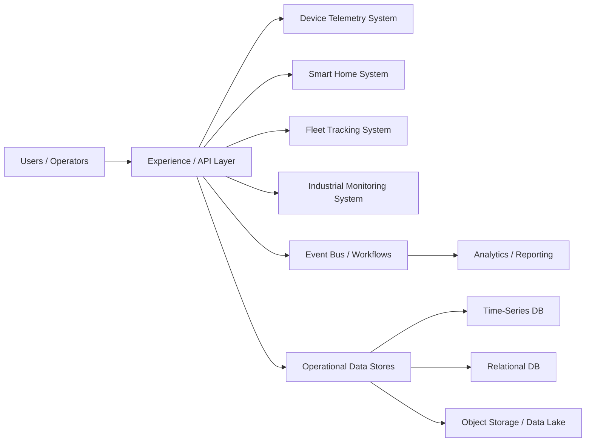
```mermaid
flowchart LR
    User["Users / Operators"] --> Entry["Experience / API Layer"]
    Entry --> device-telemetry-s["Device Telemetry System"]
    Entry --> smart-home-system["Smart Home System"]
    Entry --> fleet-tracking-sys["Fleet Tracking System"]
    Entry --> industrial-monitor["Industrial Monitoring System"]
    Entry --> Events["Event Bus / Workflows"]
    Events --> Analytics["Analytics / Reporting"]
    Entry --> Store["Operational Data Stores"]
    Store --> TSDB["Time-Series DB"]
    Store --> RelDB["Relational DB"]
    Store --> ObjStore["Object Storage / Data Lake"]
```

---

## Cross-Cutting Design Themes
- Separate user-facing hot paths from heavy asynchronous work such as analytics, indexing, compliance review, or backfills.
- Be explicit about which parts of the domain need strong correctness and which can tolerate eventual consistency.
- Model operator workflows and reconciliation early; real systems are maintained, not only executed.
- Use events and materialized views deliberately so teams can scale read models without overloading the transactional path.

---

## Why Design Matters in Device-Centric Real-Time Systems
IoT systems are often underestimated because each device looks simple. The real complexity appears when millions of devices connect intermittently, publish uneven telemetry, receive commands over unreliable networks, and need long-lived fleet management. The architecture must support both observation loops and control loops, and those loops usually have different failure tolerances.

Design matters because telemetry and command execution should not share the same assumptions. Telemetry can often be buffered, downsampled, or replayed. Commands may control doors, vehicles, pumps, or industrial equipment and therefore need stronger authorization, sequencing, and rollback semantics. Architectures that do not separate them create either unsafe control paths or overpriced telemetry paths.

---

## Microservices Patterns Used in This Domain
- **Protocol gateway pattern:** MQTT, HTTP, gRPC, BLE gateway bridges, and proprietary protocols terminate into a normalized ingestion layer.
- **Digital twin or device shadow service:** the system maintains desired state, reported state, and last-known connectivity separately from raw telemetry streams.
- **Hot path and cold path split:** operational alerts and command acknowledgements use low-latency processing, while bulk telemetry flows into time-series and lake storage.
- **Fleet management control plane:** device registration, certificate rotation, OTA rollout, and policy assignment are isolated from telemetry ingestion.
- **Rule engine and automation workers:** threshold alerts, anomaly detection, and automated remediation consume normalized device events asynchronously.

---

## Design Principles for Real-Time IoT Architectures
- Separate control safety from telemetry scale.
- Assume offline and out-of-order delivery as normal behavior, not exceptional behavior.
- Use device identity, certificate lifecycle, and enrollment as core architectural concerns.
- Preserve enough raw telemetry to reprocess incidents, but downsample aggressively for cost control.
- Design for per-device and per-tenant isolation so one bad fleet cannot starve the whole platform.

---

## Problem Framing

### Business Context

A mid-to-large IoT platform manages devices across consumer (smart home), commercial (fleet tracking), and industrial (factory monitoring) verticals. Revenue depends on device subscriptions, data analytics upsells, and enterprise SLA tiers. The platform operates globally with edge gateways in customer premises and cloud processing in three regions.

Key business constraints:
- **Safety liability**: A missed industrial alarm or a stuck smart lock creates physical-world consequences that software bugs in most domains do not.
- **Bandwidth cost at scale**: A fleet of 1 million devices sending 1 KB every 10 seconds generates 100 GB/day of raw telemetry. At cloud ingress rates, this becomes a dominant cost driver.
- **Firmware fragmentation**: Unlike mobile apps, IoT devices cannot be force-updated. The platform must support multiple firmware versions simultaneously for years.
- **Regulatory pressure**: Industrial IoT faces IEC 62443, NIST 800-82, and sector-specific safety standards. Consumer IoT faces Matter certification, regional radio regulations, and privacy laws (GDPR, CCPA).
- **Offline operation**: Edge gateways and devices must operate autonomously during network partitions -- sometimes for hours or days.

### System Boundaries

This chapter covers the **device-to-insight path**: from device enrollment and telemetry ingestion through processing, storage, alerting, and command execution. It does **not** deeply cover:
- Billing and subscription management (covered in Chapter 19: Fintech & Payments)
- ML model training pipelines (covered in Chapter 27: ML & AI Systems)
- Mobile app architecture (treated as an API consumer)
- Physical hardware design and RF engineering

However, each boundary is identified with integration points and API contracts.

### Assumptions

- The platform manages **5 million connected devices** across all verticals at steady state.
- Peak telemetry ingestion reaches **2 million messages per second** during industrial shift changes.
- The device registry contains **10 million registered devices** (including inactive/decommissioned).
- Smart home devices send telemetry every **30-60 seconds**; industrial sensors every **100ms-1s**; fleet trackers every **5-15 seconds**.
- The system operates across **3 geographic regions** (NA, EU, APAC) with data residency requirements.
- Edge gateways run Linux-based compute (ARM/x86) with 2-8 GB RAM and local SSD.
- The platform has been operating for 3+ years and supports devices with firmware versions spanning 18 months.

### Explicit Exclusions

- Hardware design and PCB layout
- Radio frequency engineering and antenna design
- Cellular carrier integration internals (treated as a connectivity layer)
- Billing and subscription management
- Customer support ticketing system
- Mobile app UI/UX design

---

## Clarifying Questions

| Question | Assumed Answer |
|----------|---------------|
| Is this a single-tenant or multi-tenant platform? | Multi-tenant with tenant-level isolation for data and configuration |
| Do devices connect directly to the cloud or through gateways? | Both -- constrained devices use gateways; capable devices connect directly |
| What protocols do devices use? | MQTT (primary), CoAP (constrained), HTTP (provisioning), Modbus/OPC-UA (industrial) |
| Do we need offline operation? | Yes -- edge gateways must buffer and forward; smart home hubs must operate locally |
| What is the telemetry retention policy? | Raw: 30 days hot, 1 year warm; Aggregated: 5 years; Compliance: 7 years |
| How are devices authenticated? | X.509 mutual TLS for production; pre-shared keys for development |
| Do we support OTA firmware updates? | Yes -- staged rollout with automatic rollback on failure metrics |
| What is the command latency requirement? | Smart home: < 200ms; Fleet: < 2s; Industrial safety: < 50ms (handled at edge) |
| Do we support multi-region deployments? | Yes -- devices connect to nearest region; cross-region replication for DR |
| What is the expected device lifespan? | Consumer: 5-7 years; Industrial: 15-20 years |

---

## Glossary / Abbreviations

| Term | Definition |
|------|-----------|
| MQTT | Message Queuing Telemetry Transport -- lightweight publish/subscribe protocol for IoT |
| CoAP | Constrained Application Protocol -- UDP-based REST-like protocol for constrained devices |
| TSDB | Time-Series Database -- storage optimized for timestamped append-only data |
| OPC-UA | Open Platform Communications Unified Architecture -- industrial interoperability standard |
| SCADA | Supervisory Control and Data Acquisition -- industrial control system architecture |
| PLC | Programmable Logic Controller -- industrial computing device for automation |
| OTA | Over-The-Air -- firmware update mechanism for deployed devices |
| Digital Twin | Virtual representation of a physical device with desired and reported state |
| Device Shadow | AWS IoT term for digital twin; stores last-known and desired device state |
| DTDL | Digital Twin Definition Language -- schema for modeling device capabilities |
| Matter | Smart home interoperability standard (formerly CHIP) by CSA |
| Thread | Low-power mesh networking protocol for IoT devices |
| BLE | Bluetooth Low Energy -- short-range wireless protocol for device pairing |
| Geofence | Virtual geographic boundary that triggers events on entry/exit |
| Kalman Filter | Algorithm for estimating position from noisy GPS measurements |
| Map Matching | Snapping GPS coordinates to road network geometry |
| IEC 62443 | International standard for industrial cybersecurity |
| SIL | Safety Integrity Level -- measure of safety function reliability (IEC 61508) |
| QoS | Quality of Service -- MQTT message delivery guarantee level (0, 1, or 2) |
| Edge Gateway | On-premise device that aggregates, processes, and forwards device data |
| Store-and-Forward | Pattern where edge buffers data during network outage and replays on reconnection |
| Downsampling | Reducing telemetry resolution (e.g., 1-second to 1-minute averages) for cost control |

---

## Actors and Personas

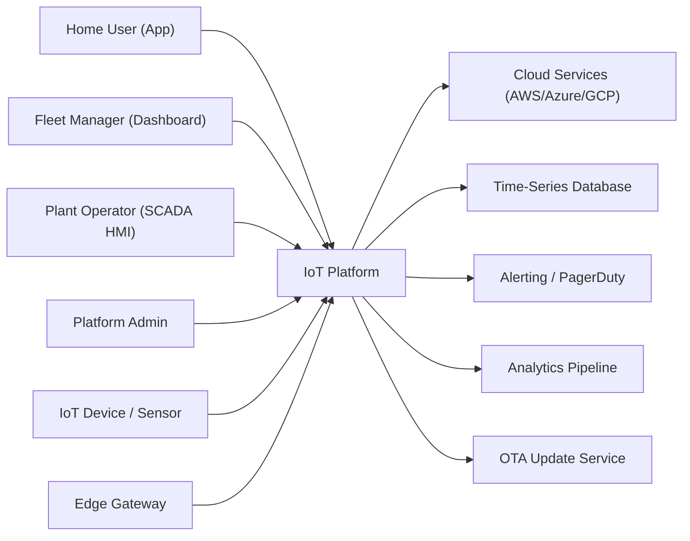
```mermaid
flowchart LR
    HomeUser["Home User (App)"] --> Platform["IoT Platform"]
    FleetMgr["Fleet Manager (Dashboard)"] --> Platform
    PlantOp["Plant Operator (SCADA HMI)"] --> Platform
    Admin["Platform Admin"] --> Platform
    Device["IoT Device / Sensor"] --> Platform
    Gateway["Edge Gateway"] --> Platform
    Platform --> Cloud["Cloud Services (AWS/Azure/GCP)"]
    Platform --> TSDB["Time-Series Database"]
    Platform --> Alerts["Alerting / PagerDuty"]
    Platform --> Analytics["Analytics Pipeline"]
    Platform --> OTA["OTA Update Service"]
```

| Actor | Description | Key Interactions |
|-------|------------|-----------------|
| **Home User** | Consumer controlling smart home devices via mobile app | Device pairing, scene setup, voice commands, energy dashboard |
| **Fleet Manager** | Logistics operator monitoring vehicle fleet | Live map, geofence alerts, driver scores, route replay, fuel reports |
| **Plant Operator** | Industrial operator monitoring factory equipment | SCADA dashboards, alarm management, maintenance scheduling |
| **Platform Admin** | Internal engineer managing the IoT platform | Device registry, firmware rollouts, tenant configuration, billing |
| **IoT Device** | Physical sensor, actuator, or controller | Telemetry publish, command subscribe, firmware download, certificate renewal |
| **Edge Gateway** | On-premise aggregation and processing node | Protocol translation, local rule execution, store-and-forward buffering |
| **Cloud Provider** | Infrastructure for compute, storage, networking | VM/container hosting, managed MQTT, object storage, CDN |

---

## Core Workflows

### Happy Path: Device Enrollment to Telemetry Ingestion

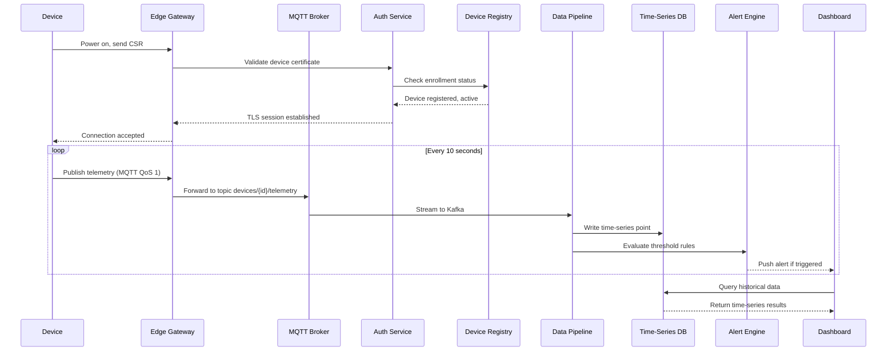
```mermaid
sequenceDiagram
    participant D as Device
    participant GW as Edge Gateway
    participant MQTT as MQTT Broker
    participant Auth as Auth Service
    participant Reg as Device Registry
    participant Pipe as Data Pipeline
    participant TSDB as Time-Series DB
    participant Alert as Alert Engine
    participant Dash as Dashboard

    D->>GW: Power on, send CSR
    GW->>Auth: Validate device certificate
    Auth->>Reg: Check enrollment status
    Reg-->>Auth: Device registered, active
    Auth-->>GW: TLS session established
    GW-->>D: Connection accepted

    loop Every 10 seconds
        D->>GW: Publish telemetry (MQTT QoS 1)
        GW->>MQTT: Forward to topic devices/{id}/telemetry
        MQTT->>Pipe: Stream to Kafka
        Pipe->>TSDB: Write time-series point
        Pipe->>Alert: Evaluate threshold rules
        Alert-->>Dash: Push alert if triggered
    end

    Dash->>TSDB: Query historical data
    TSDB-->>Dash: Return time-series results
```

### Happy Path: Command Execution (Smart Home)

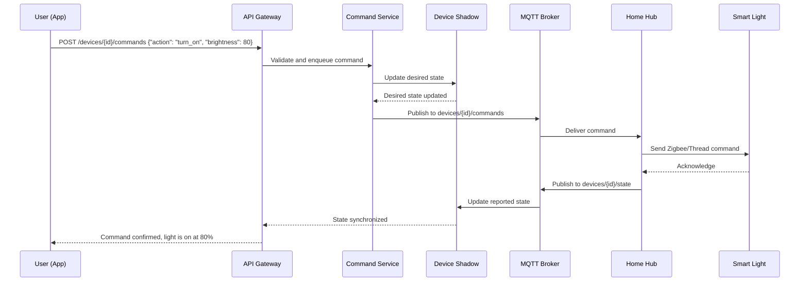
```mermaid
sequenceDiagram
    participant U as User (App)
    participant API as API Gateway
    participant Cmd as Command Service
    participant Shadow as Device Shadow
    participant MQTT as MQTT Broker
    participant Hub as Home Hub
    participant Dev as Smart Light

    U->>API: POST /devices/{id}/commands {"action": "turn_on", "brightness": 80}
    API->>Cmd: Validate and enqueue command
    Cmd->>Shadow: Update desired state
    Shadow-->>Cmd: Desired state updated
    Cmd->>MQTT: Publish to devices/{id}/commands
    MQTT->>Hub: Deliver command
    Hub->>Dev: Send Zigbee/Thread command
    Dev-->>Hub: Acknowledge
    Hub->>MQTT: Publish to devices/{id}/state
    MQTT->>Shadow: Update reported state
    Shadow-->>API: State synchronized
    API-->>U: Command confirmed, light is on at 80%
```

### Alternate Paths

| Path | Description | Key Difference |
|------|------------|----------------|
| **Offline Gateway** | Gateway loses internet connectivity | Store-and-forward buffer; local rules continue executing; telemetry replayed on reconnection |
| **Bulk OTA Update** | Firmware update rolled to 100K devices | Staged rollout (1% -> 10% -> 100%); health metric monitoring between stages; automatic rollback |
| **Geofence Alert** | Vehicle enters restricted zone | Real-time polygon evaluation; driver notification; fleet manager alert; audit log |
| **Predictive Maintenance** | Vibration pattern indicates bearing wear | ML model scores telemetry; work order created; spare part reserved; maintenance scheduled |
| **Scene Automation** | "Good Night" scene triggered at 11 PM | Time trigger fires; lights dim; thermostat adjusts; doors lock; confirmation sent |
| **Safety Interlock** | Temperature exceeds critical threshold | Edge PLC triggers hardware interlock in < 50ms; cloud receives alarm for logging and escalation |
| **Device Decommission** | Device removed from fleet | Certificate revoked; data retained per policy; license freed; shadow archived |

---

## Workload Characterization

| Metric | Steady State | Peak | Notes |
|--------|-------------|------|-------|
| Connected devices | 5M | 5M | All devices maintain persistent MQTT connections |
| Telemetry messages/sec | 500K | 2M | Peak during industrial shift changes |
| Command messages/sec | 10K | 50K | Peak during smart home evening routines |
| Device registry reads/sec | 20K | 100K | Auth checks, shadow reads |
| Device registry writes/sec | 500 | 5K | Enrollment bursts, firmware rollouts |
| Alert evaluations/sec | 500K | 2M | One evaluation per telemetry message |
| GPS points/sec (fleet) | 100K | 300K | 1M vehicles at 5-15 sec intervals |
| SCADA data points/sec | 200K | 500K | 50K sensors at 1-4 Hz |
| Time-series writes/sec | 500K | 2M | Aggregate across all subsystems |
| Dashboard queries/sec | 5K | 20K | Read-heavy; mostly aggregations |
| Read:Write ratio (telemetry) | 1:100 | 1:500 | Extreme write-heavy |
| Read:Write ratio (registry) | 40:1 | 20:1 | Read-heavy |
| Average message size | 200 bytes | 2 KB | Industrial messages larger due to multi-point batches |

---

## Functional Requirements

### Device Telemetry System

| ID | Requirement | Priority | Notes |
|----|------------|----------|-------|
| DT-FR-01 | Devices publish telemetry via MQTT QoS 0/1 with topic-based routing | P0 | Topic format: `tenants/{tid}/devices/{did}/telemetry` |
| DT-FR-02 | CoAP endpoint accepts telemetry from constrained devices over UDP | P1 | Translates to same canonical envelope as MQTT |
| DT-FR-03 | Telemetry is persisted to time-series database within 2 seconds of receipt | P0 | Includes device ID, timestamp, metric name, value, tags |
| DT-FR-04 | Device registry stores identity, metadata, firmware version, and fleet membership | P0 | System of record for device lifecycle |
| DT-FR-05 | Devices are authenticated via X.509 mutual TLS or pre-shared key | P0 | Certificate rotation supported without downtime |
| DT-FR-06 | Alert rules evaluate telemetry against configurable thresholds in near-real-time | P0 | Static thresholds, rate-of-change, and anomaly detection |
| DT-FR-07 | Alerts are delivered to configured channels (webhook, email, SMS, PagerDuty) | P0 | Configurable escalation policies per tenant |
| DT-FR-08 | Telemetry data can be queried by device, time range, metric name, and aggregation | P0 | Support min, max, avg, sum, count, percentile |
| DT-FR-09 | Raw telemetry is retained for 30 days; aggregated data retained for 5 years | P1 | Configurable per tenant; compliance override to 7 years |
| DT-FR-10 | Data pipeline supports enrichment with device metadata and geolocation | P1 | Lookup joins against device registry |
| DT-FR-11 | Downsampling reduces resolution from raw to 1-min, 5-min, 1-hour, 1-day aggregates | P1 | Runs as background job; does not block ingestion |
| DT-FR-12 | Device shadow maintains last-known reported state and desired state | P0 | JSON document per device; versioned |
| DT-FR-13 | Batch telemetry upload supported for devices that buffer locally | P1 | Accepts array of timestamped points; reorders on ingest |
| DT-FR-14 | Telemetry schema validation rejects malformed payloads with error feedback | P1 | Schema registered per device type |
| DT-FR-15 | Dashboard API supports real-time subscription via WebSocket for live telemetry | P1 | Fan-out from Kafka consumer to WebSocket connections |
| DT-FR-16 | Multi-tenant isolation ensures one tenant cannot read another tenant's data | P0 | Enforced at broker ACL, pipeline, and storage layers |

### Smart Home System

| ID | Requirement | Priority | Notes |
|----|------------|----------|-------|
| SH-FR-01 | Users pair devices via BLE, Wi-Fi, QR code, or Matter commissioning | P0 | Guided flow in mobile app |
| SH-FR-02 | Paired devices appear in user's home with room assignment | P0 | Home -> Room -> Device hierarchy |
| SH-FR-03 | Users control devices with on/off, brightness, color, temperature, lock/unlock | P0 | Device capabilities discovered from device type registry |
| SH-FR-04 | Scene automation executes a set of device commands on a single trigger | P0 | Triggers: time, device state, location, manual |
| SH-FR-05 | Automation rules support if-then-else logic with AND/OR conditions | P1 | Visual rule builder in app |
| SH-FR-06 | Voice assistants (Alexa, Google, Siri) can discover and control devices | P0 | OAuth-based account linking; capability sync |
| SH-FR-07 | Local hub executes latency-critical commands without cloud round-trip | P0 | < 200ms local response; cloud notified async |
| SH-FR-08 | Cloud processes complex automations that span multiple homes or use ML | P1 | e.g., energy optimization across grid signal |
| SH-FR-09 | Energy dashboard shows consumption by device, room, and time period | P1 | Integrates with smart meter and utility API |
| SH-FR-10 | Users receive push notifications for security events (door open, motion detected) | P0 | Configurable per device and event type |
| SH-FR-11 | Device firmware updates are delivered OTA with user consent | P1 | Background download; install on schedule or demand |
| SH-FR-12 | Users can share home access with family members with role-based permissions | P0 | Owner, admin, member, guest roles |
| SH-FR-13 | System operates in degraded mode during internet outage (local control continues) | P0 | Hub maintains device state and automation rules locally |
| SH-FR-14 | Activity log shows all device state changes with actor attribution | P1 | Who/what changed the device and when |
| SH-FR-15 | Geolocation-based automation triggers scenes on user arrival/departure | P1 | Phone GPS; configurable radius per home |
| SH-FR-16 | Device health monitoring alerts users to low battery, offline devices, or failures | P1 | Heartbeat-based liveness detection |

### Fleet Tracking System

| ID | Requirement | Priority | Notes |
|----|------------|----------|-------|
| FT-FR-01 | Vehicles report GPS position every 5-15 seconds via cellular or satellite | P0 | Configurable reporting interval per fleet policy |
| FT-FR-02 | Live map displays all fleet vehicles with position, speed, heading, and status | P0 | WebSocket-based real-time updates |
| FT-FR-03 | Geofences trigger alerts on vehicle entry, exit, and dwell-time threshold | P0 | Polygon and circular geofence support |
| FT-FR-04 | Route replay shows historical vehicle path with speed, stops, and events | P0 | Playback with timeline scrubbing |
| FT-FR-05 | Driver behavior scoring evaluates harsh braking, acceleration, speeding, and cornering | P1 | Accelerometer + GPS derived; daily/weekly/monthly scores |
| FT-FR-06 | Fuel level monitoring detects consumption rate and theft (rapid drops) | P1 | Tank sensor integration; threshold alerts |
| FT-FR-07 | Trip detection auto-segments continuous GPS into discrete trips with start/end | P0 | Ignition-based or motion-based trip detection |
| FT-FR-08 | Fleet manager can assign vehicles to routes and monitor adherence | P1 | Planned vs actual route comparison |
| FT-FR-09 | ETA calculation uses live traffic and vehicle speed history | P1 | Integration with mapping API (Google, HERE, Mapbox) |
| FT-FR-10 | Maintenance reminders trigger based on odometer, engine hours, or calendar | P1 | Configurable thresholds per vehicle type |
| FT-FR-11 | OBD-II diagnostic data (engine codes, coolant temp) is captured and stored | P1 | Fault code lookup and severity classification |
| FT-FR-12 | Reports generated for mileage, fuel efficiency, utilization, and compliance | P1 | Scheduled (daily/weekly) and on-demand |
| FT-FR-13 | Multi-tenant isolation separates fleet data across different customers | P0 | Tenant-scoped queries at every layer |
| FT-FR-14 | Vehicle immobilization command can be sent remotely with audit trail | P2 | Requires two-factor authorization; safety checks |
| FT-FR-15 | Driver identification via NFC/Bluetooth links trips to individual drivers | P1 | Driver assignment for shared vehicles |
| FT-FR-16 | Cargo temperature monitoring for cold-chain logistics | P1 | Threshold alerts; compliance reports for food/pharma |

### Industrial Monitoring System

| ID | Requirement | Priority | Notes |
|----|------------|----------|-------|
| IM-FR-01 | SCADA systems push data via Modbus TCP, DNP3, or IEC 61850 to platform gateway | P0 | Protocol-specific adapters on edge gateway |
| IM-FR-02 | PLC data is collected via polling (100ms-1s intervals) or subscription (change-of-value) | P0 | OPC-UA preferred for new installations |
| IM-FR-03 | Predictive maintenance models score equipment health from vibration, temperature, current | P1 | ML models deployed at edge for low-latency scoring |
| IM-FR-04 | Safety interlocks execute within 50ms at the edge PLC level | P0 | Software interlock backs up hardwired interlock |
| IM-FR-05 | OPC-UA server exposes unified data model for all connected equipment | P0 | Browse/subscribe/read/write operations |
| IM-FR-06 | Alarm management follows ISA-18.2 lifecycle (active, acknowledged, cleared, shelved) | P0 | Priority levels 1-4; escalation policies |
| IM-FR-07 | Historian stores all process data at full resolution for regulatory compliance | P0 | 7-year retention for FDA, EPA, NRC regulated facilities |
| IM-FR-08 | Operator dashboards display real-time process variables with trend charts | P0 | HMI-grade refresh rate (< 1 second update) |
| IM-FR-09 | Shift handover reports auto-generate summaries of alarms, events, and production metrics | P1 | PDF/email delivery at shift boundary |
| IM-FR-10 | Digital twin mirrors physical plant state for simulation and what-if analysis | P1 | 3D model with live data overlay |
| IM-FR-11 | Change management tracks all configuration changes to PLC programs and setpoints | P0 | Version control with approval workflow |
| IM-FR-12 | Cybersecurity monitoring detects anomalous network traffic in OT environment | P1 | IDS/IPS integration; NIST 800-82 compliance |
| IM-FR-13 | Batch/recipe execution tracks production runs with material genealogy | P1 | ISA-88 compliant batch control |
| IM-FR-14 | Energy metering tracks consumption per production line, shift, and product | P1 | Integration with smart meters and utility data |
| IM-FR-15 | Mobile operator rounds digitize inspection checklists with photo/signature capture | P1 | Offline-capable mobile app |
| IM-FR-16 | Integration with ERP/CMMS for work order generation and spare parts inventory | P1 | SAP, Maximo, or custom CMMS via API |

---

## Non-Functional Requirements

| Category | Requirement | Target | Subsystem |
|----------|------------|--------|-----------|
| **Latency** | Telemetry ingestion to storage p99 | < 2 seconds | Device Telemetry |
| **Latency** | Alert evaluation p99 | < 100ms from telemetry arrival | Device Telemetry |
| **Latency** | Smart home command execution (local) p99 | < 200ms | Smart Home |
| **Latency** | Smart home command execution (cloud) p99 | < 500ms | Smart Home |
| **Latency** | Live map position update p99 | < 3 seconds from GPS fix | Fleet Tracking |
| **Latency** | Industrial safety interlock | < 50ms (edge PLC) | Industrial |
| **Latency** | Dashboard query p99 | < 1 second for 24-hour range | All |
| **Throughput** | Telemetry ingestion | 2M messages/sec peak | Device Telemetry |
| **Throughput** | MQTT broker concurrent connections | 5M persistent connections | Device Telemetry |
| **Throughput** | Time-series writes | 2M points/sec | Device Telemetry |
| **Throughput** | GPS point ingestion | 300K points/sec peak | Fleet Tracking |
| **Throughput** | SCADA data points | 500K points/sec peak | Industrial |
| **Availability** | Telemetry ingestion path | 99.95% (4.4 hours downtime/year) | Device Telemetry |
| **Availability** | Smart home local control | 99.99% (52 min downtime/year) | Smart Home |
| **Availability** | Fleet tracking live map | 99.9% (8.8 hours downtime/year) | Fleet Tracking |
| **Availability** | Industrial safety systems | 99.999% (5.3 min downtime/year) | Industrial |
| **Availability** | Industrial monitoring dashboards | 99.99% | Industrial |
| **Consistency** | Device shadow | Eventual (< 5s convergence) | All |
| **Consistency** | Command execution | At-least-once with idempotency | All |
| **Consistency** | Alarm state | Strong consistency within plant | Industrial |
| **Consistency** | Geofence evaluation | Strong consistency for entry/exit events | Fleet Tracking |
| **Durability** | Telemetry data | Zero data loss for safety-critical; best-effort for high-volume | All |
| **Durability** | Alarm and audit logs | Zero data loss, 7-year retention | Industrial |
| **Security** | Device authentication | Mutual TLS with X.509 certificates | All |
| **Security** | API authentication | OAuth 2.0 + JWT | All |
| **Security** | Industrial network isolation | Air-gapped OT network with DMZ | Industrial |
| **Compliance** | Data residency | Telemetry stays in region of origin | All |
| **Compliance** | Industrial cybersecurity | IEC 62443 SL-2 minimum | Industrial |
| **Scalability** | Horizontal scaling | All services stateless and independently scalable | All |

---

## Capacity Estimation

### Device Population and Message Volume

| Device Category | Device Count | Msg Interval | Msg Size (avg) | Messages/sec | Data/day |
|----------------|-------------|-------------|----------------|-------------|---------|
| Smart home sensors | 2,000,000 | 60s | 150 bytes | 33,333 | 4.3 GB |
| Smart home actuators | 500,000 | On-change (~5/hour) | 200 bytes | 694 | 0.1 GB |
| Fleet GPS trackers | 1,000,000 | 10s | 300 bytes | 100,000 | 25.9 GB |
| Fleet OBD-II readers | 500,000 | 30s | 500 bytes | 16,667 | 7.2 GB |
| Industrial sensors | 500,000 | 1s | 200 bytes | 500,000 | 86.4 GB |
| Industrial PLCs | 50,000 | 250ms (batch) | 2 KB | 200,000 | 34.6 GB |
| Edge gateways | 100,000 | 10s (heartbeat) | 100 bytes | 10,000 | 0.9 GB |
| **Total** | **4,650,000** | -- | -- | **~860,000** | **~159 GB/day** |

### Storage Estimates

**Time-Series Data:**
- Raw telemetry: 159 GB/day x 30 days = **4.8 TB** hot storage
- 1-minute aggregates: ~5 GB/day x 365 days = **1.8 TB** warm storage
- 1-hour aggregates: ~200 MB/day x 1,825 days (5 years) = **365 GB** cold storage
- Industrial historian (full resolution, 7 years): **~220 TB** (compliance-driven)

**Relational Data:**
- Device registry: 10M devices x 2 KB avg = **20 GB**
- Device shadows: 5M active x 5 KB avg = **25 GB**
- Fleet trips: 1M vehicles x 10 trips/day x 365 days x 1 KB = **3.65 TB/year**
- Geofences: 500K polygons x 5 KB = **2.5 GB**
- Alarm history: 10K alarms/day x 365 days x 500 bytes = **1.8 GB/year**
- Automation rules: 2M rules x 2 KB = **4 GB**

**Object Storage:**
- Firmware images: 500 versions x 50 MB avg = **25 GB**
- Industrial shift reports: 50K reports/day x 365 days x 100 KB = **1.8 TB/year**
- Fleet dashcam clips: 100K clips/day x 5 MB = **500 GB/day** (video is dominant cost)

### Bandwidth

- Telemetry ingress: ~159 GB/day = **1.8 MB/s** average, **15 MB/s** peak
- Dashboard egress: 20K queries/sec x 10 KB response = **200 MB/s** peak
- OTA firmware distribution: 100K devices x 50 MB = **5 TB** per rollout batch
- WebSocket live feeds: 10K concurrent subscribers x 1 KB/s = **10 MB/s**

### Compute

- MQTT broker: 5M connections x 1 KB memory/connection = **5 GB** RAM minimum; CPU bound by message routing
- Stream processing (Kafka Streams/Flink): 860K msgs/sec x 0.5ms CPU = **430 CPU-cores**
- Alert engine: 860K evaluations/sec x 0.1ms = **86 CPU-cores**
- Time-series writes: 860K points/sec -- requires distributed TSDB cluster
- API servers: 25K req/sec x 5ms = **125 CPU-cores**

### Database Sizing

| Component | Technology | Size | Nodes | Replication |
|-----------|-----------|------|-------|-------------|
| Telemetry (hot) | TimescaleDB | 5 TB | 6 data nodes | Replication factor 2 |
| Telemetry (warm) | InfluxDB / S3+Parquet | 2 TB | 3 nodes | RF 2 |
| Telemetry (cold) | S3 + Parquet | 220+ TB | Managed | 3 AZ redundancy |
| Device Registry | PostgreSQL | 50 GB | 1 primary + 2 replicas | Sync to 1, async to 1 |
| Device Shadows | Redis Cluster | 25 GB | 6 shards | 1 replica per shard |
| Fleet Geospatial | PostGIS | 100 GB | 1 primary + 2 replicas | Sync replication |
| Automation Rules | PostgreSQL | 10 GB | 1 primary + 1 replica | Sync replication |
| Event Bus | Kafka | 5 TB retention | 9 brokers | RF 3, ISR 2 |
| Search/Analytics | Elasticsearch | 500 GB | 5 data nodes | 1 replica per shard |

---

## High-Level Architecture

### Context Diagram

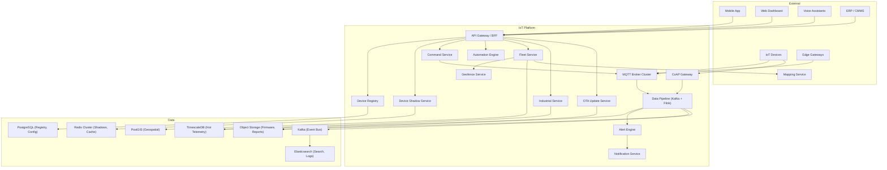
```mermaid
flowchart TB
    subgraph External
        Device["IoT Devices"]
        Gateway["Edge Gateways"]
        MobileApp["Mobile App"]
        WebDash["Web Dashboard"]
        Voice["Voice Assistants"]
        ERP["ERP / CMMS"]
        Maps["Mapping Service"]
    end

    subgraph Platform["IoT Platform"]
        MQTTB["MQTT Broker Cluster"]
        CoAPGW["CoAP Gateway"]
        APIGW["API Gateway / BFF"]
        DevReg["Device Registry"]
        Shadow["Device Shadow Service"]
        Pipeline["Data Pipeline (Kafka + Flink)"]
        AlertEng["Alert Engine"]
        CmdSvc["Command Service"]
        AutoEng["Automation Engine"]
        FleetSvc["Fleet Service"]
        GeoSvc["Geofence Service"]
        IndSvc["Industrial Service"]
        OTASvc["OTA Update Service"]
        NotifSvc["Notification Service"]
    end

    subgraph Data
        TSDB["TimescaleDB (Hot Telemetry)"]
        PG["PostgreSQL (Registry, Config)"]
        Redis["Redis Cluster (Shadows, Cache)"]
        Kafka["Kafka (Event Bus)"]
        S3["Object Storage (Firmware, Reports)"]
        PostGIS["PostGIS (Geospatial)"]
        ES["Elasticsearch (Search, Logs)"]
    end

    Device --> MQTTB
    Device --> CoAPGW
    Gateway --> MQTTB
    MobileApp --> APIGW
    WebDash --> APIGW
    Voice --> APIGW

    MQTTB --> Pipeline
    CoAPGW --> Pipeline
    APIGW --> DevReg & Shadow & CmdSvc & AutoEng & FleetSvc & IndSvc & OTASvc
    Pipeline --> TSDB & AlertEng & Kafka
    AlertEng --> NotifSvc
    CmdSvc --> MQTTB
    FleetSvc --> GeoSvc & PostGIS
    IndSvc --> TSDB

    DevReg --> PG
    Shadow --> Redis
    OTASvc --> S3
    Pipeline --> S3
    Kafka --> ES
    ERP --> APIGW
    FleetSvc --> Maps
```

### High-Level Architecture Flowchart

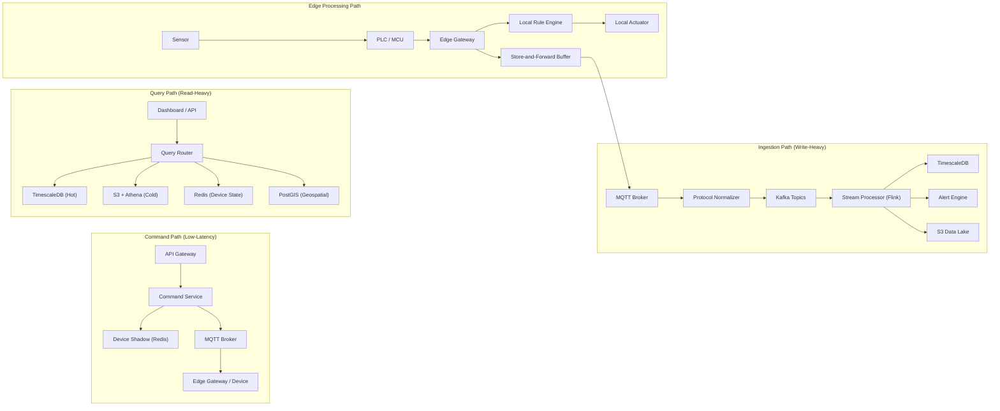
```mermaid
flowchart LR
    subgraph IngestPath["Ingestion Path (Write-Heavy)"]
        I1["MQTT Broker"] --> I2["Protocol Normalizer"]
        I2 --> I3["Kafka Topics"]
        I3 --> I4["Stream Processor (Flink)"]
        I4 --> I5["TimescaleDB"]
        I4 --> I6["Alert Engine"]
        I4 --> I7["S3 Data Lake"]
    end

    subgraph CommandPath["Command Path (Low-Latency)"]
        C1["API Gateway"] --> C2["Command Service"]
        C2 --> C3["Device Shadow (Redis)"]
        C2 --> C4["MQTT Broker"]
        C4 --> C5["Edge Gateway / Device"]
    end

    subgraph QueryPath["Query Path (Read-Heavy)"]
        Q1["Dashboard / API"] --> Q2["Query Router"]
        Q2 --> Q3["TimescaleDB (Hot)"]
        Q2 --> Q4["S3 + Athena (Cold)"]
        Q2 --> Q5["Redis (Device State)"]
        Q2 --> Q6["PostGIS (Geospatial)"]
    end

    subgraph EdgePath["Edge Processing Path"]
        E1["Sensor"] --> E2["PLC / MCU"]
        E2 --> E3["Edge Gateway"]
        E3 --> E4["Local Rule Engine"]
        E4 --> E5["Local Actuator"]
        E3 --> E6["Store-and-Forward Buffer"]
        E6 --> I1
    end
```

---

## Low-Level Design

### 1. Device Telemetry System

#### Overview

The Device Telemetry System is the **ingestion backbone** of the entire platform. It terminates millions of concurrent MQTT and CoAP connections, normalizes heterogeneous payloads into a canonical event envelope, routes events through stream processing for enrichment and alerting, and persists data to time-series storage with configurable retention policies.

At scale, a telemetry platform ingesting 1 million messages per second must handle burst absorption (devices reconnect simultaneously after an outage), schema evolution (new device types add new metric names), and multi-tenant isolation (one tenant's misbehaving devices must not starve another tenant's ingestion).

#### Architecture

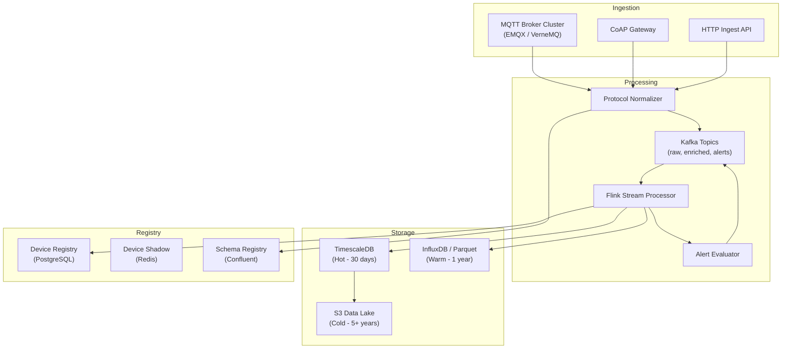
```mermaid
flowchart TB
    subgraph Ingestion
        MQTT["MQTT Broker Cluster<br/>(EMQX / VerneMQ)"]
        CoAP["CoAP Gateway"]
        HTTP["HTTP Ingest API"]
    end

    subgraph Processing
        Norm["Protocol Normalizer"]
        Kafka["Kafka Topics<br/>(raw, enriched, alerts)"]
        Flink["Flink Stream Processor"]
        AlertEval["Alert Evaluator"]
    end

    subgraph Storage
        TSDB["TimescaleDB<br/>(Hot - 30 days)"]
        Warm["InfluxDB / Parquet<br/>(Warm - 1 year)"]
        Cold["S3 Data Lake<br/>(Cold - 5+ years)"]
    end

    subgraph Registry
        DevReg["Device Registry<br/>(PostgreSQL)"]
        Shadow["Device Shadow<br/>(Redis)"]
        Schema["Schema Registry<br/>(Confluent)"]
    end

    MQTT --> Norm
    CoAP --> Norm
    HTTP --> Norm
    Norm --> Kafka
    Kafka --> Flink
    Flink --> TSDB
    Flink --> AlertEval
    Flink --> Warm
    TSDB --> Cold
    Flink --> DevReg
    Norm --> Schema
    AlertEval --> Kafka
```

### 2. Smart Home System

#### Overview

The Smart Home System translates raw device capabilities into user-friendly experiences. It manages device pairing, room organization, scene automation, voice assistant integration, and energy management. The critical architectural decision is the **split between local and cloud processing**: latency-critical commands (light switches, door locks) execute on the local hub, while complex automations and ML-driven optimizations run in the cloud.

#### Architecture

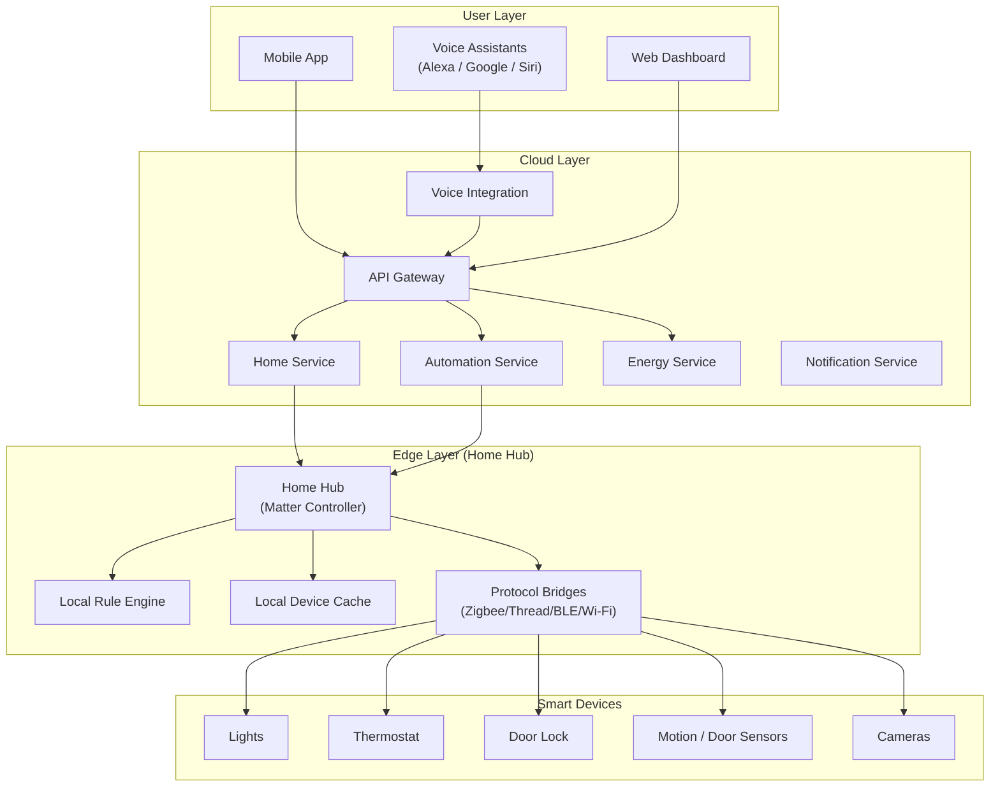
```mermaid
flowchart TB
    subgraph UserLayer["User Layer"]
        App["Mobile App"]
        Voice["Voice Assistants<br/>(Alexa / Google / Siri)"]
        Web["Web Dashboard"]
    end

    subgraph CloudLayer["Cloud Layer"]
        API["API Gateway"]
        HomeSvc["Home Service"]
        AutoSvc["Automation Service"]
        EnergySvc["Energy Service"]
        VoiceSvc["Voice Integration"]
        NotifSvc["Notification Service"]
    end

    subgraph EdgeLayer["Edge Layer (Home Hub)"]
        Hub["Home Hub<br/>(Matter Controller)"]
        LocalRule["Local Rule Engine"]
        LocalShadow["Local Device Cache"]
        Protocols["Protocol Bridges<br/>(Zigbee/Thread/BLE/Wi-Fi)"]
    end

    subgraph Devices["Smart Devices"]
        Light["Lights"]
        Thermo["Thermostat"]
        Lock["Door Lock"]
        Sensor["Motion / Door Sensors"]
        Camera["Cameras"]
    end

    App --> API
    Voice --> VoiceSvc --> API
    Web --> API
    API --> HomeSvc & AutoSvc & EnergySvc

    HomeSvc --> Hub
    AutoSvc --> Hub
    Hub --> LocalRule
    Hub --> Protocols
    Protocols --> Light & Thermo & Lock & Sensor & Camera
    Hub --> LocalShadow
```

### 3. Fleet Tracking System

#### Overview

The Fleet Tracking System ingests high-frequency GPS data from vehicles, evaluates geofences in real time, reconstructs historical routes, and scores driver behavior. The primary challenge is **geospatial processing at scale**: evaluating 100,000 GPS points per second against 500,000 geofence polygons requires efficient spatial indexing (R-tree, S2 geometry) and partitioned processing.

#### Architecture

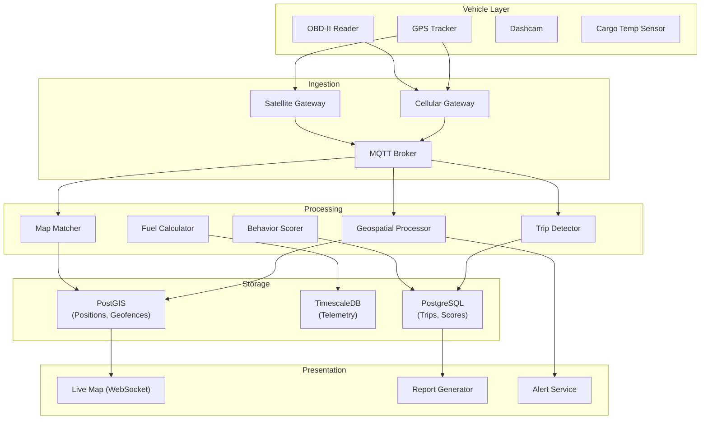
```mermaid
flowchart TB
    subgraph VehicleLayer["Vehicle Layer"]
        Tracker["GPS Tracker"]
        OBD["OBD-II Reader"]
        Camera["Dashcam"]
        TempSensor["Cargo Temp Sensor"]
    end

    subgraph Ingestion
        Cell["Cellular Gateway"]
        Sat["Satellite Gateway"]
        MQTT["MQTT Broker"]
    end

    subgraph Processing
        GeoProc["Geospatial Processor"]
        TripDet["Trip Detector"]
        BehavScore["Behavior Scorer"]
        FuelCalc["Fuel Calculator"]
        MapMatch["Map Matcher"]
    end

    subgraph Storage
        PostGIS["PostGIS<br/>(Positions, Geofences)"]
        TSDB["TimescaleDB<br/>(Telemetry)"]
        TripDB["PostgreSQL<br/>(Trips, Scores)"]
    end

    subgraph Presentation
        LiveMap["Live Map (WebSocket)"]
        Reports["Report Generator"]
        Alerts["Alert Service"]
    end

    Tracker --> Cell --> MQTT
    Tracker --> Sat --> MQTT
    OBD --> Cell
    MQTT --> GeoProc & TripDet & MapMatch
    GeoProc --> PostGIS & Alerts
    TripDet --> TripDB
    BehavScore --> TripDB
    MapMatch --> PostGIS
    FuelCalc --> TSDB
    PostGIS --> LiveMap
    TripDB --> Reports
```

### 4. Industrial Monitoring System

#### Overview

The Industrial Monitoring System bridges the gap between operational technology (OT) and information technology (IT). It collects data from PLCs, SCADA systems, and sensors via industrial protocols (Modbus, DNP3, OPC-UA), processes it for alarming and predictive maintenance, and presents it on operator dashboards. **Safety is paramount**: missed alarms or incorrect interlock behavior can cause equipment damage, environmental release, or injury.

#### Architecture

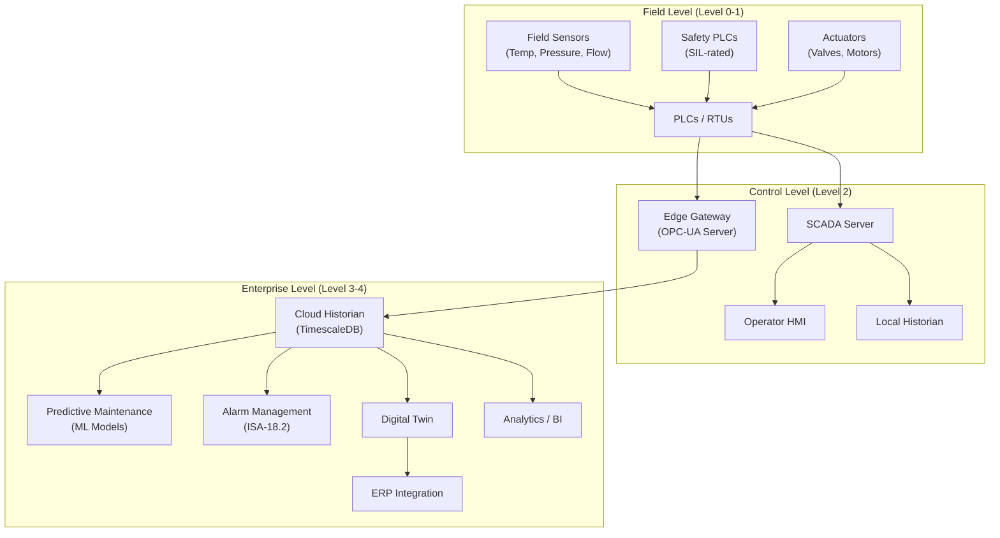
```mermaid
flowchart TB
    subgraph FieldLevel["Field Level (Level 0-1)"]
        Sensors["Field Sensors<br/>(Temp, Pressure, Flow)"]
        Actuators["Actuators<br/>(Valves, Motors)"]
        PLC["PLCs / RTUs"]
        Safety["Safety PLCs<br/>(SIL-rated)"]
    end

    subgraph ControlLevel["Control Level (Level 2)"]
        SCADA["SCADA Server"]
        HMI["Operator HMI"]
        Historian["Local Historian"]
        EdgeGW["Edge Gateway<br/>(OPC-UA Server)"]
    end

    subgraph EnterpriseLevel["Enterprise Level (Level 3-4)"]
        CloudHist["Cloud Historian<br/>(TimescaleDB)"]
        PredMaint["Predictive Maintenance<br/>(ML Models)"]
        AlarmMgmt["Alarm Management<br/>(ISA-18.2)"]
        DigTwin["Digital Twin"]
        Analytics["Analytics / BI"]
        ERP["ERP Integration"]
    end

    Sensors --> PLC
    PLC --> SCADA --> HMI
    PLC --> EdgeGW
    Safety --> PLC
    SCADA --> Historian
    EdgeGW --> CloudHist
    CloudHist --> PredMaint & AlarmMgmt & DigTwin & Analytics
    DigTwin --> ERP
    Actuators --> PLC
```

---

## 17.1 Device and Telemetry Platforms
17.1 Device and Telemetry Platforms collects the boundaries around Device Telemetry System, Smart Home System, Fleet Tracking System and related capabilities in IoT & Real-Time Systems. Teams usually start with a simpler combined service, then split these systems once data ownership, latency goals, or operator workflows begin to conflict.

### Device Telemetry System

#### Overview

Device Telemetry System is the domain boundary responsible for capturing, processing, and serving large event streams or operational views for downstream consumption. In IoT & Real-Time Systems, this system usually has to balance direct user experience with downstream effects on adjacent systems in 17.1 Device and Telemetry Platforms.

#### Real-world examples

- Comparable patterns appear in Tesla fleet telemetry, AWS IoT, Nest.
- Startups often keep Device Telemetry System inside a larger service, while large platforms split it out once ownership, scale, or correctness requirements diverge.
- The exact implementation changes between B2C, B2B, and regulated variants, but the architectural boundary stays useful.

#### Requirements and workflows

- Expose APIs or events that let product users, internal operators, and downstream consumers create, update, query, and reconcile device telemetry system state.
- Support synchronous user-facing flows for the hot path and asynchronous processing for enrichment, retries, and downstream propagation.
- Preserve a clear state model so support teams and automated workflows can explain why the system is in its current state.
- Provide audit or analytics hooks without coupling reporting latency to the primary user journey.

#### Architecture, data, and APIs

- Model the write path around events, metrics, traces, dashboards, materialized views, and retention policies.
- Keep a normalized source of truth for critical state and publish derived read models or events for consumer services.
- Use caches, projections, or search indexes only for latency-sensitive reads; treat rebuildability as a design requirement.
- Define idempotent write contracts, versioned events, and explicit ownership boundaries so dependent systems can evolve safely.

#### Scaling, reliability, and operations

- Watch for back-pressure, lag, schema changes, runaway cost, and incorrect aggregation.
- Protect hot partitions with rate limiting, request coalescing, queue buffering, and selective denormalization where appropriate.
- Design operator dashboards, replay tooling, and reconciliation or backfill workflows before incidents force them into existence.
- Track service-level indicators for latency, success, queue lag, freshness, and correctness signals instead of only infrastructure health.

#### Trade-offs and interview notes

- The key interview move is to explain why Device Telemetry System deserves its own boundary and what can remain eventual around it.
- Strong answers call out what requires strong correctness versus what can be computed asynchronously.
- Weak answers collapse storage, orchestration, and downstream fan-out into one service without discussing scale or failure modes.

### Smart Home System

#### Overview

Smart Home System is the domain boundary responsible for owning a clear domain boundary with its own state model, APIs, and operational SLOs. In IoT & Real-Time Systems, this system usually has to balance direct user experience with downstream effects on adjacent systems in 17.1 Device and Telemetry Platforms.

#### Real-world examples

- Comparable patterns appear in Tesla fleet telemetry, AWS IoT, Nest.
- Startups often keep Smart Home System inside a larger service, while large platforms split it out once ownership, scale, or correctness requirements diverge.
- The exact implementation changes between B2C, B2B, and regulated variants, but the architectural boundary stays useful.

#### Requirements and workflows

- Expose APIs or events that let product users, internal operators, and downstream consumers create, update, query, and reconcile smart home system state.
- Support synchronous user-facing flows for the hot path and asynchronous processing for enrichment, retries, and downstream propagation.
- Preserve a clear state model so support teams and automated workflows can explain why the system is in its current state.
- Provide audit or analytics hooks without coupling reporting latency to the primary user journey.

#### Architecture, data, and APIs

- Model the write path around normalized transactional state, denormalized read models, events, and audit records.
- Keep a normalized source of truth for critical state and publish derived read models or events for consumer services.
- Use caches, projections, or search indexes only for latency-sensitive reads; treat rebuildability as a design requirement.
- Define idempotent write contracts, versioned events, and explicit ownership boundaries so dependent systems can evolve safely.

#### Scaling, reliability, and operations

- Watch for hotspots, stale projections, ambiguous retries, and under-specified operator workflows.
- Protect hot partitions with rate limiting, request coalescing, queue buffering, and selective denormalization where appropriate.
- Design operator dashboards, replay tooling, and reconciliation or backfill workflows before incidents force them into existence.
- Track service-level indicators for latency, success, queue lag, freshness, and correctness signals instead of only infrastructure health.

#### Trade-offs and interview notes

- The key interview move is to explain why Smart Home System deserves its own boundary and what can remain eventual around it.
- Strong answers call out what requires strong correctness versus what can be computed asynchronously.
- Weak answers collapse storage, orchestration, and downstream fan-out into one service without discussing scale or failure modes.

### Fleet Tracking System

#### Overview

Fleet Tracking System is the domain boundary responsible for capturing, processing, and serving large event streams or operational views for downstream consumption. In IoT & Real-Time Systems, this system usually has to balance direct user experience with downstream effects on adjacent systems in 17.1 Device and Telemetry Platforms.

#### Real-world examples

- Comparable patterns appear in Tesla fleet telemetry, AWS IoT, Nest.
- Startups often keep Fleet Tracking System inside a larger service, while large platforms split it out once ownership, scale, or correctness requirements diverge.
- The exact implementation changes between B2C, B2B, and regulated variants, but the architectural boundary stays useful.

#### Requirements and workflows

- Expose APIs or events that let product users, internal operators, and downstream consumers create, update, query, and reconcile fleet tracking system state.
- Support synchronous user-facing flows for the hot path and asynchronous processing for enrichment, retries, and downstream propagation.
- Preserve a clear state model so support teams and automated workflows can explain why the system is in its current state.
- Provide audit or analytics hooks without coupling reporting latency to the primary user journey.

#### Architecture, data, and APIs

- Model the write path around events, metrics, traces, dashboards, materialized views, and retention policies.
- Keep a normalized source of truth for critical state and publish derived read models or events for consumer services.
- Use caches, projections, or search indexes only for latency-sensitive reads; treat rebuildability as a design requirement.
- Define idempotent write contracts, versioned events, and explicit ownership boundaries so dependent systems can evolve safely.

#### Scaling, reliability, and operations

- Watch for back-pressure, lag, schema changes, runaway cost, and incorrect aggregation.
- Protect hot partitions with rate limiting, request coalescing, queue buffering, and selective denormalization where appropriate.
- Design operator dashboards, replay tooling, and reconciliation or backfill workflows before incidents force them into existence.
- Track service-level indicators for latency, success, queue lag, freshness, and correctness signals instead of only infrastructure health.

#### Trade-offs and interview notes

- The key interview move is to explain why Fleet Tracking System deserves its own boundary and what can remain eventual around it.
- Strong answers call out what requires strong correctness versus what can be computed asynchronously.
- Weak answers collapse storage, orchestration, and downstream fan-out into one service without discussing scale or failure modes.

### Industrial Monitoring System

#### Overview

Industrial Monitoring System is the domain boundary responsible for owning a clear domain boundary with its own state model, APIs, and operational SLOs. In IoT & Real-Time Systems, this system usually has to balance direct user experience with downstream effects on adjacent systems in 17.1 Device and Telemetry Platforms.

#### Real-world examples

- Comparable patterns appear in Tesla fleet telemetry, AWS IoT, Nest.
- Startups often keep Industrial Monitoring System inside a larger service, while large platforms split it out once ownership, scale, or correctness requirements diverge.
- The exact implementation changes between B2C, B2B, and regulated variants, but the architectural boundary stays useful.

#### Requirements and workflows

- Expose APIs or events that let product users, internal operators, and downstream consumers create, update, query, and reconcile industrial monitoring system state.
- Support synchronous user-facing flows for the hot path and asynchronous processing for enrichment, retries, and downstream propagation.
- Preserve a clear state model so support teams and automated workflows can explain why the system is in its current state.
- Provide audit or analytics hooks without coupling reporting latency to the primary user journey.

#### Architecture, data, and APIs

- Model the write path around normalized transactional state, denormalized read models, events, and audit records.
- Keep a normalized source of truth for critical state and publish derived read models or events for consumer services.
- Use caches, projections, or search indexes only for latency-sensitive reads; treat rebuildability as a design requirement.
- Define idempotent write contracts, versioned events, and explicit ownership boundaries so dependent systems can evolve safely.

#### Scaling, reliability, and operations

- Watch for hotspots, stale projections, ambiguous retries, and under-specified operator workflows.
- Protect hot partitions with rate limiting, request coalescing, queue buffering, and selective denormalization where appropriate.
- Design operator dashboards, replay tooling, and reconciliation or backfill workflows before incidents force them into existence.
- Track service-level indicators for latency, success, queue lag, freshness, and correctness signals instead of only infrastructure health.

#### Trade-offs and interview notes

- The key interview move is to explain why Industrial Monitoring System deserves its own boundary and what can remain eventual around it.
- Strong answers call out what requires strong correctness versus what can be computed asynchronously.
- Weak answers collapse storage, orchestration, and downstream fan-out into one service without discussing scale or failure modes.

---

## Detailed Data Models

### Device Registry (PostgreSQL)

```sql
-- Core device table (system of record for all device metadata)
CREATE TABLE devices (
    device_id       UUID PRIMARY KEY DEFAULT gen_random_uuid(),
    tenant_id       UUID NOT NULL REFERENCES tenants(tenant_id),
    device_type_id  UUID NOT NULL REFERENCES device_types(device_type_id),
    serial_number   TEXT UNIQUE NOT NULL,
    friendly_name   TEXT,
    status          TEXT NOT NULL DEFAULT 'provisioned'
                    CHECK (status IN ('provisioned', 'active', 'inactive', 'suspended', 'decommissioned')),
    firmware_version TEXT,
    hardware_version TEXT,
    certificate_id  UUID REFERENCES certificates(certificate_id),
    fleet_id        UUID REFERENCES fleets(fleet_id),
    tags            JSONB NOT NULL DEFAULT '{}',
    metadata        JSONB NOT NULL DEFAULT '{}',
    last_seen_at    TIMESTAMPTZ,
    enrolled_at     TIMESTAMPTZ NOT NULL DEFAULT now(),
    created_at      TIMESTAMPTZ NOT NULL DEFAULT now(),
    updated_at      TIMESTAMPTZ NOT NULL DEFAULT now(),
    version         INT NOT NULL DEFAULT 1
);

-- Device type catalog
CREATE TABLE device_types (
    device_type_id  UUID PRIMARY KEY DEFAULT gen_random_uuid(),
    name            TEXT NOT NULL,
    manufacturer    TEXT,
    model           TEXT,
    protocol        TEXT NOT NULL CHECK (protocol IN ('mqtt', 'coap', 'http', 'opcua', 'modbus', 'ble')),
    capabilities    JSONB NOT NULL DEFAULT '[]',
    telemetry_schema JSONB,
    command_schema  JSONB,
    created_at      TIMESTAMPTZ NOT NULL DEFAULT now()
);

-- Device certificates for mTLS
CREATE TABLE certificates (
    certificate_id  UUID PRIMARY KEY DEFAULT gen_random_uuid(),
    device_id       UUID REFERENCES devices(device_id),
    certificate_pem TEXT NOT NULL,
    fingerprint     TEXT UNIQUE NOT NULL,
    issuer          TEXT NOT NULL,
    subject         TEXT NOT NULL,
    not_before      TIMESTAMPTZ NOT NULL,
    not_after       TIMESTAMPTZ NOT NULL,
    status          TEXT NOT NULL DEFAULT 'active'
                    CHECK (status IN ('active', 'revoked', 'expired', 'pending_renewal')),
    created_at      TIMESTAMPTZ NOT NULL DEFAULT now()
);

-- Fleet grouping
CREATE TABLE fleets (
    fleet_id        UUID PRIMARY KEY DEFAULT gen_random_uuid(),
    tenant_id       UUID NOT NULL REFERENCES tenants(tenant_id),
    name            TEXT NOT NULL,
    description     TEXT,
    parent_fleet_id UUID REFERENCES fleets(fleet_id),
    tags            JSONB NOT NULL DEFAULT '{}',
    created_at      TIMESTAMPTZ NOT NULL DEFAULT now()
);

-- Multi-tenant isolation
CREATE TABLE tenants (
    tenant_id       UUID PRIMARY KEY DEFAULT gen_random_uuid(),
    name            TEXT NOT NULL,
    plan            TEXT NOT NULL DEFAULT 'standard'
                    CHECK (plan IN ('free', 'standard', 'professional', 'enterprise')),
    max_devices     INT NOT NULL DEFAULT 100,
    max_msg_rate    INT NOT NULL DEFAULT 1000,
    data_region     TEXT NOT NULL DEFAULT 'us-east-1',
    created_at      TIMESTAMPTZ NOT NULL DEFAULT now()
);

-- Indexes
CREATE INDEX idx_devices_tenant ON devices(tenant_id);
CREATE INDEX idx_devices_fleet ON devices(fleet_id);
CREATE INDEX idx_devices_status ON devices(status);
CREATE INDEX idx_devices_type ON devices(device_type_id);
CREATE INDEX idx_devices_serial ON devices(serial_number);
CREATE INDEX idx_devices_last_seen ON devices(last_seen_at);
CREATE INDEX idx_certs_device ON certificates(device_id);
CREATE INDEX idx_certs_fingerprint ON certificates(fingerprint);
CREATE INDEX idx_certs_expiry ON certificates(not_after) WHERE status = 'active';
```

### Telemetry Storage (TimescaleDB)

```sql
-- Hypertable for device telemetry (time-series optimized)
CREATE TABLE telemetry (
    time            TIMESTAMPTZ NOT NULL,
    device_id       UUID NOT NULL,
    tenant_id       UUID NOT NULL,
    metric_name     TEXT NOT NULL,
    value_numeric   DOUBLE PRECISION,
    value_string    TEXT,
    value_bool      BOOLEAN,
    tags            JSONB NOT NULL DEFAULT '{}',
    quality         SMALLINT NOT NULL DEFAULT 192   -- OPC-UA quality code (192 = Good)
);

-- Convert to hypertable with 1-hour chunks
SELECT create_hypertable('telemetry', 'time',
    chunk_time_interval => INTERVAL '1 hour',
    create_default_indexes => FALSE
);

-- Composite indexes for common query patterns
CREATE INDEX idx_telemetry_device_time ON telemetry (device_id, time DESC);
CREATE INDEX idx_telemetry_tenant_metric ON telemetry (tenant_id, metric_name, time DESC);

-- Compression policy (compress chunks older than 2 hours)
ALTER TABLE telemetry SET (
    timescaledb.compress,
    timescaledb.compress_segmentby = 'device_id, tenant_id, metric_name',
    timescaledb.compress_orderby = 'time DESC'
);
SELECT add_compression_policy('telemetry', INTERVAL '2 hours');

-- Retention policy (drop chunks older than 30 days)
SELECT add_retention_policy('telemetry', INTERVAL '30 days');

-- Continuous aggregates for pre-computed rollups
CREATE MATERIALIZED VIEW telemetry_1min
WITH (timescaledb.continuous) AS
SELECT
    time_bucket('1 minute', time) AS bucket,
    device_id,
    tenant_id,
    metric_name,
    avg(value_numeric) AS avg_value,
    min(value_numeric) AS min_value,
    max(value_numeric) AS max_value,
    count(*) AS sample_count,
    last(value_numeric, time) AS last_value
FROM telemetry
GROUP BY bucket, device_id, tenant_id, metric_name
WITH NO DATA;

SELECT add_continuous_aggregate_policy('telemetry_1min',
    start_offset => INTERVAL '2 hours',
    end_offset => INTERVAL '1 minute',
    schedule_interval => INTERVAL '1 minute'
);

-- 1-hour rollup
CREATE MATERIALIZED VIEW telemetry_1hour
WITH (timescaledb.continuous) AS
SELECT
    time_bucket('1 hour', bucket) AS bucket,
    device_id,
    tenant_id,
    metric_name,
    avg(avg_value) AS avg_value,
    min(min_value) AS min_value,
    max(max_value) AS max_value,
    sum(sample_count) AS sample_count
FROM telemetry_1min
GROUP BY time_bucket('1 hour', bucket), device_id, tenant_id, metric_name
WITH NO DATA;

SELECT add_continuous_aggregate_policy('telemetry_1hour',
    start_offset => INTERVAL '4 hours',
    end_offset => INTERVAL '1 hour',
    schedule_interval => INTERVAL '1 hour'
);
```

### Smart Home Data Model (PostgreSQL)

```sql
-- Home hierarchy
CREATE TABLE homes (
    home_id         UUID PRIMARY KEY DEFAULT gen_random_uuid(),
    owner_user_id   UUID NOT NULL REFERENCES users(user_id),
    name            TEXT NOT NULL,
    address         TEXT,
    latitude        DOUBLE PRECISION,
    longitude       DOUBLE PRECISION,
    timezone        TEXT NOT NULL DEFAULT 'UTC',
    created_at      TIMESTAMPTZ NOT NULL DEFAULT now()
);

CREATE TABLE rooms (
    room_id         UUID PRIMARY KEY DEFAULT gen_random_uuid(),
    home_id         UUID NOT NULL REFERENCES homes(home_id) ON DELETE CASCADE,
    name            TEXT NOT NULL,
    room_type       TEXT CHECK (room_type IN ('bedroom', 'living_room', 'kitchen', 'bathroom',
                    'garage', 'outdoor', 'office', 'hallway', 'other')),
    sort_order      INT NOT NULL DEFAULT 0,
    created_at      TIMESTAMPTZ NOT NULL DEFAULT now()
);

-- Device assignment to homes and rooms
CREATE TABLE home_devices (
    home_device_id  UUID PRIMARY KEY DEFAULT gen_random_uuid(),
    home_id         UUID NOT NULL REFERENCES homes(home_id),
    room_id         UUID REFERENCES rooms(room_id),
    device_id       UUID NOT NULL REFERENCES devices(device_id),
    friendly_name   TEXT NOT NULL,
    capabilities    JSONB NOT NULL DEFAULT '[]',
    paired_at       TIMESTAMPTZ NOT NULL DEFAULT now(),
    UNIQUE (home_id, device_id)
);

-- Automation scenes
CREATE TABLE scenes (
    scene_id        UUID PRIMARY KEY DEFAULT gen_random_uuid(),
    home_id         UUID NOT NULL REFERENCES homes(home_id),
    name            TEXT NOT NULL,
    icon            TEXT,
    actions         JSONB NOT NULL DEFAULT '[]',
    is_favorite     BOOLEAN DEFAULT false,
    created_at      TIMESTAMPTZ NOT NULL DEFAULT now()
);

-- Automation rules (if-then)
CREATE TABLE automation_rules (
    rule_id         UUID PRIMARY KEY DEFAULT gen_random_uuid(),
    home_id         UUID NOT NULL REFERENCES homes(home_id),
    name            TEXT NOT NULL,
    enabled         BOOLEAN NOT NULL DEFAULT true,
    trigger_type    TEXT NOT NULL CHECK (trigger_type IN ('time', 'device_state', 'location',
                    'sunrise_sunset', 'manual')),
    trigger_config  JSONB NOT NULL,
    conditions      JSONB NOT NULL DEFAULT '[]',
    actions         JSONB NOT NULL DEFAULT '[]',
    last_triggered  TIMESTAMPTZ,
    execution_count INT NOT NULL DEFAULT 0,
    created_at      TIMESTAMPTZ NOT NULL DEFAULT now()
);

-- Home member access
CREATE TABLE home_members (
    home_id         UUID NOT NULL REFERENCES homes(home_id),
    user_id         UUID NOT NULL REFERENCES users(user_id),
    role            TEXT NOT NULL CHECK (role IN ('owner', 'admin', 'member', 'guest')),
    invited_at      TIMESTAMPTZ NOT NULL DEFAULT now(),
    PRIMARY KEY (home_id, user_id)
);

-- Energy consumption tracking
CREATE TABLE energy_readings (
    time            TIMESTAMPTZ NOT NULL,
    home_id         UUID NOT NULL,
    device_id       UUID NOT NULL,
    power_watts     DOUBLE PRECISION,
    energy_kwh      DOUBLE PRECISION,
    voltage         DOUBLE PRECISION,
    current_amps    DOUBLE PRECISION
);
SELECT create_hypertable('energy_readings', 'time', chunk_time_interval => INTERVAL '1 day');

-- Indexes
CREATE INDEX idx_home_devices_home ON home_devices(home_id);
CREATE INDEX idx_rooms_home ON rooms(home_id);
CREATE INDEX idx_scenes_home ON scenes(home_id);
CREATE INDEX idx_rules_home ON automation_rules(home_id);
CREATE INDEX idx_rules_enabled ON automation_rules(home_id) WHERE enabled = true;
```

### Fleet Tracking Data Model (PostGIS + PostgreSQL)

```sql
-- Vehicle registry
CREATE TABLE vehicles (
    vehicle_id      UUID PRIMARY KEY DEFAULT gen_random_uuid(),
    tenant_id       UUID NOT NULL REFERENCES tenants(tenant_id),
    fleet_id        UUID NOT NULL REFERENCES vehicle_fleets(fleet_id),
    device_id       UUID NOT NULL REFERENCES devices(device_id),
    vin             TEXT UNIQUE,
    license_plate   TEXT,
    make            TEXT,
    model           TEXT,
    year            INT,
    fuel_type       TEXT CHECK (fuel_type IN ('gasoline', 'diesel', 'electric', 'hybrid', 'cng')),
    tank_capacity_l DOUBLE PRECISION,
    odometer_km     DOUBLE PRECISION NOT NULL DEFAULT 0,
    status          TEXT NOT NULL DEFAULT 'active'
                    CHECK (status IN ('active', 'maintenance', 'inactive', 'decommissioned')),
    created_at      TIMESTAMPTZ NOT NULL DEFAULT now()
);

-- GPS position history (TimescaleDB hypertable)
CREATE TABLE gps_positions (
    time            TIMESTAMPTZ NOT NULL,
    vehicle_id      UUID NOT NULL,
    tenant_id       UUID NOT NULL,
    latitude        DOUBLE PRECISION NOT NULL,
    longitude       DOUBLE PRECISION NOT NULL,
    altitude_m      DOUBLE PRECISION,
    speed_kmh       DOUBLE PRECISION,
    heading_deg     DOUBLE PRECISION,
    hdop            DOUBLE PRECISION,
    satellites      SMALLINT,
    position        GEOMETRY(Point, 4326) GENERATED ALWAYS AS
                    (ST_SetSRID(ST_MakePoint(longitude, latitude), 4326)) STORED
);
SELECT create_hypertable('gps_positions', 'time', chunk_time_interval => INTERVAL '1 hour');
CREATE INDEX idx_gps_vehicle_time ON gps_positions (vehicle_id, time DESC);
CREATE INDEX idx_gps_position_gist ON gps_positions USING GIST (position);

-- Geofences
CREATE TABLE geofences (
    geofence_id     UUID PRIMARY KEY DEFAULT gen_random_uuid(),
    tenant_id       UUID NOT NULL REFERENCES tenants(tenant_id),
    name            TEXT NOT NULL,
    fence_type      TEXT NOT NULL CHECK (fence_type IN ('polygon', 'circle')),
    geometry        GEOMETRY(Geometry, 4326) NOT NULL,
    radius_m        DOUBLE PRECISION,
    alert_on        TEXT[] NOT NULL DEFAULT '{enter,exit}',
    speed_limit_kmh DOUBLE PRECISION,
    active          BOOLEAN NOT NULL DEFAULT true,
    created_at      TIMESTAMPTZ NOT NULL DEFAULT now()
);
CREATE INDEX idx_geofences_geom ON geofences USING GIST (geometry);
CREATE INDEX idx_geofences_tenant ON geofences (tenant_id) WHERE active = true;

-- Trips
CREATE TABLE trips (
    trip_id         UUID PRIMARY KEY DEFAULT gen_random_uuid(),
    vehicle_id      UUID NOT NULL REFERENCES vehicles(vehicle_id),
    driver_id       UUID REFERENCES drivers(driver_id),
    tenant_id       UUID NOT NULL,
    start_time      TIMESTAMPTZ NOT NULL,
    end_time        TIMESTAMPTZ,
    start_location  GEOMETRY(Point, 4326),
    end_location    GEOMETRY(Point, 4326),
    distance_km     DOUBLE PRECISION,
    duration_min    DOUBLE PRECISION,
    max_speed_kmh   DOUBLE PRECISION,
    avg_speed_kmh   DOUBLE PRECISION,
    fuel_consumed_l DOUBLE PRECISION,
    idle_time_min   DOUBLE PRECISION,
    status          TEXT NOT NULL DEFAULT 'in_progress'
                    CHECK (status IN ('in_progress', 'completed', 'flagged'))
);

-- Driver behavior events
CREATE TABLE behavior_events (
    event_id        UUID PRIMARY KEY DEFAULT gen_random_uuid(),
    trip_id         UUID NOT NULL REFERENCES trips(trip_id),
    vehicle_id      UUID NOT NULL,
    driver_id       UUID,
    event_type      TEXT NOT NULL CHECK (event_type IN ('harsh_brake', 'harsh_accel',
                    'harsh_corner', 'speeding', 'phone_use', 'fatigue', 'seatbelt')),
    severity        TEXT NOT NULL CHECK (severity IN ('low', 'medium', 'high', 'critical')),
    value           DOUBLE PRECISION,
    location        GEOMETRY(Point, 4326),
    time            TIMESTAMPTZ NOT NULL,
    created_at      TIMESTAMPTZ NOT NULL DEFAULT now()
);

-- Driver scores
CREATE TABLE driver_scores (
    driver_id       UUID NOT NULL REFERENCES drivers(driver_id),
    period_start    DATE NOT NULL,
    period_end      DATE NOT NULL,
    overall_score   DOUBLE PRECISION NOT NULL,
    braking_score   DOUBLE PRECISION,
    acceleration_score DOUBLE PRECISION,
    cornering_score DOUBLE PRECISION,
    speeding_score  DOUBLE PRECISION,
    trip_count      INT NOT NULL,
    distance_km     DOUBLE PRECISION NOT NULL,
    PRIMARY KEY (driver_id, period_start)
);
```

### Industrial Monitoring Data Model

```sql
-- Equipment registry
CREATE TABLE equipment (
    equipment_id    UUID PRIMARY KEY DEFAULT gen_random_uuid(),
    tenant_id       UUID NOT NULL REFERENCES tenants(tenant_id),
    plant_id        UUID NOT NULL REFERENCES plants(plant_id),
    name            TEXT NOT NULL,
    equipment_type  TEXT NOT NULL,
    manufacturer    TEXT,
    model           TEXT,
    serial_number   TEXT,
    install_date    DATE,
    criticality     TEXT NOT NULL CHECK (criticality IN ('critical', 'important', 'standard', 'auxiliary')),
    parent_equipment_id UUID REFERENCES equipment(equipment_id),
    opcua_node_id   TEXT,
    status          TEXT NOT NULL DEFAULT 'operational'
                    CHECK (status IN ('operational', 'degraded', 'faulted', 'maintenance', 'decommissioned')),
    created_at      TIMESTAMPTZ NOT NULL DEFAULT now()
);

-- Process data points (tag registry)
CREATE TABLE data_points (
    tag_id          UUID PRIMARY KEY DEFAULT gen_random_uuid(),
    equipment_id    UUID NOT NULL REFERENCES equipment(equipment_id),
    tag_name        TEXT NOT NULL,
    description     TEXT,
    data_type       TEXT NOT NULL CHECK (data_type IN ('float', 'integer', 'boolean', 'string', 'enum')),
    engineering_unit TEXT,
    low_limit       DOUBLE PRECISION,
    high_limit      DOUBLE PRECISION,
    low_low_limit   DOUBLE PRECISION,
    high_high_limit DOUBLE PRECISION,
    scan_rate_ms    INT NOT NULL DEFAULT 1000,
    source_protocol TEXT NOT NULL CHECK (source_protocol IN ('opcua', 'modbus', 'dnp3', 'iec61850', 'mqtt')),
    source_address  TEXT NOT NULL,
    created_at      TIMESTAMPTZ NOT NULL DEFAULT now(),
    UNIQUE (equipment_id, tag_name)
);

-- Process data history (TimescaleDB)
CREATE TABLE process_data (
    time            TIMESTAMPTZ NOT NULL,
    tag_id          UUID NOT NULL,
    tenant_id       UUID NOT NULL,
    value_numeric   DOUBLE PRECISION,
    value_string    TEXT,
    quality         SMALLINT NOT NULL DEFAULT 192,
    status_bits     INT NOT NULL DEFAULT 0
);
SELECT create_hypertable('process_data', 'time', chunk_time_interval => INTERVAL '1 hour');
CREATE INDEX idx_process_data_tag ON process_data (tag_id, time DESC);

-- Alarms (ISA-18.2 compliant)
CREATE TABLE alarms (
    alarm_id        UUID PRIMARY KEY DEFAULT gen_random_uuid(),
    tag_id          UUID NOT NULL REFERENCES data_points(tag_id),
    equipment_id    UUID NOT NULL REFERENCES equipment(equipment_id),
    tenant_id       UUID NOT NULL,
    alarm_type      TEXT NOT NULL CHECK (alarm_type IN ('high', 'high_high', 'low', 'low_low',
                    'rate_of_change', 'deviation', 'discrete', 'equipment_fault')),
    priority        SMALLINT NOT NULL CHECK (priority BETWEEN 1 AND 4),
    state           TEXT NOT NULL DEFAULT 'active_unacknowledged'
                    CHECK (state IN ('active_unacknowledged', 'active_acknowledged',
                    'cleared_unacknowledged', 'cleared_acknowledged', 'shelved', 'suppressed')),
    trigger_value   DOUBLE PRECISION,
    trigger_time    TIMESTAMPTZ NOT NULL,
    acknowledged_by UUID REFERENCES operators(operator_id),
    acknowledged_at TIMESTAMPTZ,
    cleared_at      TIMESTAMPTZ,
    shelved_until   TIMESTAMPTZ,
    message         TEXT,
    created_at      TIMESTAMPTZ NOT NULL DEFAULT now()
);
CREATE INDEX idx_alarms_state ON alarms (tenant_id, state) WHERE state NOT IN ('cleared_acknowledged');
CREATE INDEX idx_alarms_equipment ON alarms (equipment_id, trigger_time DESC);
CREATE INDEX idx_alarms_priority ON alarms (tenant_id, priority) WHERE state LIKE 'active%';

-- Maintenance work orders
CREATE TABLE work_orders (
    work_order_id   UUID PRIMARY KEY DEFAULT gen_random_uuid(),
    equipment_id    UUID NOT NULL REFERENCES equipment(equipment_id),
    tenant_id       UUID NOT NULL,
    type            TEXT NOT NULL CHECK (type IN ('corrective', 'preventive', 'predictive', 'emergency')),
    priority        TEXT NOT NULL CHECK (priority IN ('critical', 'high', 'medium', 'low')),
    status          TEXT NOT NULL DEFAULT 'open'
                    CHECK (status IN ('open', 'assigned', 'in_progress', 'parts_pending',
                    'completed', 'cancelled')),
    description     TEXT NOT NULL,
    assigned_to     UUID,
    predicted_failure_date DATE,
    scheduled_date  DATE,
    completed_date  DATE,
    parts_used      JSONB NOT NULL DEFAULT '[]',
    labor_hours     DOUBLE PRECISION,
    created_at      TIMESTAMPTZ NOT NULL DEFAULT now()
);
```

---

## Detailed API Specifications

### REST APIs

#### Device Registry API

```
POST   /api/v1/devices                          -- Register a new device
GET    /api/v1/devices/{device_id}               -- Get device details
PUT    /api/v1/devices/{device_id}               -- Update device metadata
DELETE /api/v1/devices/{device_id}               -- Decommission device
GET    /api/v1/devices?tenant_id=X&status=active -- List devices with filters
POST   /api/v1/devices/{device_id}/commands      -- Send command to device
GET    /api/v1/devices/{device_id}/shadow        -- Get device shadow (desired + reported)
PUT    /api/v1/devices/{device_id}/shadow/desired -- Update desired state
GET    /api/v1/devices/{device_id}/telemetry     -- Query historical telemetry
POST   /api/v1/devices/bulk-register             -- Register devices in batch
POST   /api/v1/devices/{device_id}/certificate/rotate -- Trigger certificate rotation
```

**Example: Send Command to Device**
```
POST /api/v1/devices/d-1234/commands
Content-Type: application/json
Authorization: Bearer {jwt}
Idempotency-Key: cmd-5678-abc

{
    "command_type": "set_state",
    "payload": {
        "brightness": 80,
        "color_temp_kelvin": 3000
    },
    "timeout_seconds": 30,
    "qos": 1
}

Response 202 Accepted:
{
    "command_id": "cmd-5678-abc",
    "device_id": "d-1234",
    "status": "pending",
    "created_at": "2025-03-15T10:30:00Z",
    "expires_at": "2025-03-15T10:30:30Z"
}
```

**Example: Query Telemetry**
```
GET /api/v1/devices/d-1234/telemetry?metric=temperature&start=2025-03-15T00:00:00Z&end=2025-03-15T23:59:59Z&aggregation=avg&interval=5m
Authorization: Bearer {jwt}

Response 200:
{
    "device_id": "d-1234",
    "metric": "temperature",
    "aggregation": "avg",
    "interval": "5m",
    "data": [
        {"time": "2025-03-15T00:00:00Z", "value": 22.3},
        {"time": "2025-03-15T00:05:00Z", "value": 22.5},
        {"time": "2025-03-15T00:10:00Z", "value": 22.1}
    ]
}
```

#### Fleet Tracking API

```
GET    /api/v1/fleet/vehicles                    -- List vehicles with live position
GET    /api/v1/fleet/vehicles/{vehicle_id}        -- Vehicle details with last position
GET    /api/v1/fleet/vehicles/{vehicle_id}/trips   -- List trips for vehicle
GET    /api/v1/fleet/vehicles/{vehicle_id}/trips/{trip_id}/replay -- Get trip replay data
POST   /api/v1/fleet/geofences                   -- Create geofence
GET    /api/v1/fleet/geofences                   -- List geofences
GET    /api/v1/fleet/drivers/{driver_id}/scores    -- Get driver behavior scores
GET    /api/v1/fleet/reports/fuel                 -- Fuel consumption report
POST   /api/v1/fleet/vehicles/{vehicle_id}/commands -- Send vehicle command (immobilize)
```

#### Industrial API

```
GET    /api/v1/industrial/equipment               -- List equipment hierarchy
GET    /api/v1/industrial/equipment/{id}/data-points -- List tags for equipment
GET    /api/v1/industrial/tags/{tag_id}/history    -- Query process data history
GET    /api/v1/industrial/alarms                  -- List active alarms
POST   /api/v1/industrial/alarms/{alarm_id}/acknowledge -- Acknowledge alarm
POST   /api/v1/industrial/alarms/{alarm_id}/shelve     -- Shelve alarm
GET    /api/v1/industrial/equipment/{id}/health    -- Equipment health score
POST   /api/v1/industrial/work-orders              -- Create work order
GET    /api/v1/industrial/reports/shift-handover    -- Generate shift report
```

### MQTT Topic Design

```
# Telemetry (device -> cloud)
tenants/{tenant_id}/devices/{device_id}/telemetry
tenants/{tenant_id}/devices/{device_id}/telemetry/{metric_name}
tenants/{tenant_id}/devices/{device_id}/events
tenants/{tenant_id}/devices/{device_id}/health

# Commands (cloud -> device)
tenants/{tenant_id}/devices/{device_id}/commands
tenants/{tenant_id}/devices/{device_id}/commands/{command_id}/response

# Device Shadow
tenants/{tenant_id}/devices/{device_id}/shadow/get
tenants/{tenant_id}/devices/{device_id}/shadow/get/accepted
tenants/{tenant_id}/devices/{device_id}/shadow/get/rejected
tenants/{tenant_id}/devices/{device_id}/shadow/update
tenants/{tenant_id}/devices/{device_id}/shadow/update/accepted
tenants/{tenant_id}/devices/{device_id}/shadow/update/delta

# OTA Updates
tenants/{tenant_id}/devices/{device_id}/ota/notify
tenants/{tenant_id}/devices/{device_id}/ota/progress
tenants/{tenant_id}/devices/{device_id}/ota/result

# Fleet-specific
tenants/{tenant_id}/vehicles/{vehicle_id}/gps
tenants/{tenant_id}/vehicles/{vehicle_id}/obd
tenants/{tenant_id}/vehicles/{vehicle_id}/fuel

# Industrial-specific
tenants/{tenant_id}/plants/{plant_id}/tags/{tag_name}/value
tenants/{tenant_id}/plants/{plant_id}/alarms
tenants/{tenant_id}/plants/{plant_id}/events
```

### WebSocket API (Dashboard Live Feed)

```
WebSocket Endpoint: wss://api.iot-platform.com/ws/v1/live

-- Subscribe to device telemetry
{
    "action": "subscribe",
    "channel": "device_telemetry",
    "filters": {
        "device_ids": ["d-1234", "d-5678"],
        "metrics": ["temperature", "humidity"]
    }
}

-- Subscribe to fleet live positions
{
    "action": "subscribe",
    "channel": "fleet_positions",
    "filters": {
        "fleet_id": "fleet-abc",
        "bounds": {"sw": [40.7, -74.0], "ne": [40.8, -73.9]}
    }
}

-- Subscribe to industrial alarms
{
    "action": "subscribe",
    "channel": "alarms",
    "filters": {
        "plant_id": "plant-xyz",
        "min_priority": 2
    }
}

-- Incoming message format
{
    "channel": "device_telemetry",
    "device_id": "d-1234",
    "metric": "temperature",
    "value": 23.5,
    "time": "2025-03-15T10:30:01.234Z",
    "quality": 192
}
```

---

## IoT Protocol Comparison: MQTT vs AMQP vs CoAP

| Feature | MQTT | AMQP | CoAP |
|---------|------|------|------|
| **Transport** | TCP (TLS optional) | TCP (TLS optional) | UDP (DTLS optional) |
| **Model** | Publish/Subscribe | Pub/Sub + Queues + Routing | Request/Response (REST-like) |
| **Header Overhead** | 2 bytes minimum | 8+ bytes | 4 bytes |
| **QoS Levels** | 0 (fire-forget), 1 (at-least-once), 2 (exactly-once) | Settled, unsettled, transactional | Confirmable, Non-confirmable |
| **Best For** | Low-bandwidth IoT devices, telemetry | Enterprise messaging, complex routing | Constrained devices (< 10KB RAM) |
| **Connection** | Persistent TCP | Persistent TCP | Connectionless UDP |
| **Battery Impact** | Medium (TCP keepalive) | High (complex protocol) | Low (UDP, no keepalive) |
| **Payload Format** | Binary (opaque) | Binary (typed) | Binary (opaque) |
| **Discovery** | None built-in | None built-in | Built-in resource discovery |
| **Scalability** | Excellent (millions of connections) | Good (thousands of queues) | Excellent (stateless) |
| **Broker Required** | Yes | Yes | Optional (peer-to-peer possible) |
| **Retained Messages** | Yes | No (use durable queues) | Observable resources |
| **Last Will** | Yes | No | No |
| **Maturity in IoT** | De facto standard | Common in enterprise | Growing in constrained IoT |
| **When to use** | Default choice for most IoT | Complex routing, enterprise integration | Battery-powered, constrained MCUs |

**Recommendation:** Use MQTT as the primary protocol for most devices. Use CoAP for extremely constrained devices (microcontrollers with < 64KB RAM). Use AMQP only when integrating with enterprise messaging systems that already use it. Provide an HTTP REST fallback for provisioning and management operations.

---

## Indexing and Partitioning

### Time-Based Partitioning Strategy

Time-series data is the dominant storage concern. The partitioning strategy uses multiple tiers:

| Tier | Time Range | Partition Interval | Compression | Storage |
|------|-----------|-------------------|-------------|---------|
| Hot | 0-2 hours | 1 hour chunks (TimescaleDB) | None | NVMe SSD |
| Warm | 2 hours - 30 days | 1 hour chunks, compressed | TimescaleDB compression (90% reduction) | SSD |
| Cold | 30 days - 1 year | Daily partitions, Parquet | Columnar compression (95% reduction) | S3/GCS |
| Archive | 1-7 years | Monthly partitions, Parquet | Columnar + zstd | S3 Glacier / Archive |

### Device-Based Sharding

For the device registry and shadow service:

```
Shard key: tenant_id (co-locate all devices for a tenant)
Shard count: 16 logical shards (PostgreSQL table partitioning)
Distribution: Consistent hashing on tenant_id

-- PostgreSQL range partitioning by tenant hash
CREATE TABLE devices (
    device_id UUID NOT NULL,
    tenant_id UUID NOT NULL,
    ...
) PARTITION BY HASH (tenant_id);

CREATE TABLE devices_p0 PARTITION OF devices FOR VALUES WITH (MODULUS 16, REMAINDER 0);
CREATE TABLE devices_p1 PARTITION OF devices FOR VALUES WITH (MODULUS 16, REMAINDER 1);
-- ... through p15
```

### Geospatial Indexing (Fleet Tracking)

```sql
-- R-tree index on geofence polygons
CREATE INDEX idx_geofence_geom ON geofences USING GIST (geometry);

-- S2 cell index for fast point-in-polygon lookups
-- Pre-compute S2 cell coverings for each geofence at levels 10-16
CREATE TABLE geofence_s2_cells (
    geofence_id UUID NOT NULL REFERENCES geofences(geofence_id),
    s2_cell_id  BIGINT NOT NULL,
    cell_level  SMALLINT NOT NULL,
    PRIMARY KEY (s2_cell_id, geofence_id)
);
CREATE INDEX idx_s2_cell_lookup ON geofence_s2_cells (s2_cell_id);

-- Lookup flow: GPS point -> compute S2 cell at level 12 -> find candidate geofences -> exact ST_Contains check
```

### Kafka Topic Partitioning

```
Topic: telemetry.raw
  Partitions: 128
  Partition key: device_id (ensures per-device ordering)
  Retention: 7 days
  Compaction: disabled (append-only telemetry)

Topic: commands.outbound
  Partitions: 64
  Partition key: device_id
  Retention: 24 hours
  Compaction: enabled (keep latest command per key)

Topic: alerts.evaluated
  Partitions: 32
  Partition key: tenant_id
  Retention: 30 days

Topic: device.shadow.updates
  Partitions: 64
  Partition key: device_id
  Compaction: enabled (keep latest shadow per device)
```

---

## Cache Strategy

### Device State Cache (Redis)

```
Purpose: Sub-millisecond access to device shadow (desired + reported state)
Technology: Redis Cluster (6 shards, 1 replica each)
Capacity: 5M devices x 5 KB = 25 GB

Key schema:
  shadow:{device_id}           -> JSON hash of desired/reported state
  shadow:{device_id}:version   -> Integer version counter
  device:online:{device_id}    -> Boolean with 90-second TTL (heartbeat-based)

Eviction: No eviction (all shadows fit in memory)
Write-through: Shadow updates write to Redis first, then async to PostgreSQL
Read pattern: Cache-aside for registry lookups; write-through for shadow

Cache warming: On device connection, load shadow from PostgreSQL if not in Redis
```

### Recent Telemetry Cache

```
Purpose: Fast access to last N minutes of telemetry for dashboards and alert evaluation
Technology: Redis Streams or Redis TimeSeries module
Capacity: Top 500K active devices x 60 data points x 200 bytes = 6 GB

Key schema:
  ts:{device_id}:{metric_name}  -> Redis TimeSeries with 5-minute retention
  latest:{device_id}             -> Hash of latest values per metric

Usage:
  - Dashboard "current value" widgets read from latest:{device_id}
  - Alert engine reads from ts:{device_id}:{metric_name} for rate-of-change evaluation
  - Full historical queries go to TimescaleDB

Invalidation: Automatic via TTL (data expires after 5 minutes in cache)
```

### Geofence Cache

```
Purpose: Avoid PostgreSQL roundtrip for geofence evaluation on every GPS point
Technology: Local in-memory cache on geofence evaluator nodes
Capacity: 500K geofences x 5 KB = 2.5 GB (fits in JVM heap)

Loading: Full load on startup; CDC-driven incremental updates via Kafka
Structure: R-tree spatial index in memory (JTS or S2 library)
Invalidation: Kafka consumer applies geofence CRUD events within 2 seconds
```

---

## Queue / Stream Design

### MQTT Broker Architecture

```
Technology: EMQX Enterprise (clustered) or VerneMQ
Cluster size: 5 nodes (3 core + 2 replicant for EMQX)
Connections per node: 1M persistent connections
Message throughput: 400K msg/sec per node

Session persistence: Built-in Mnesia/Rlog for QoS 1/2 sessions
Authentication: X.509 client certificate + username/password fallback
Authorization: ACL rules per tenant (topic prefix matching)

Bridging: MQTT -> Kafka bridge for all telemetry topics
  - Bridge processes run on each broker node
  - Batch size: 1000 messages or 100ms, whichever comes first
  - Back-pressure: If Kafka is slow, broker buffers up to 100K messages per bridge
```

### Kafka Streams Topology

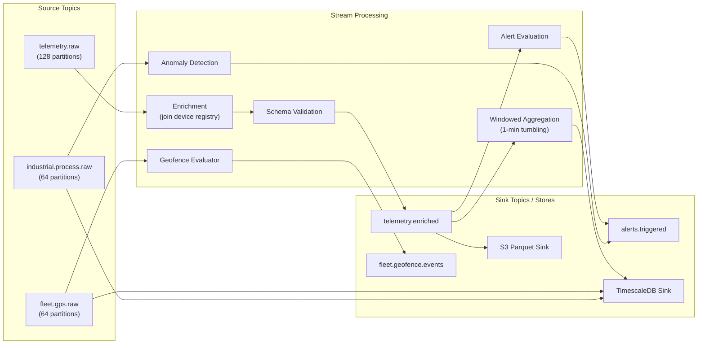
```mermaid
flowchart LR
    subgraph Sources["Source Topics"]
        Raw["telemetry.raw<br/>(128 partitions)"]
        GPS["fleet.gps.raw<br/>(64 partitions)"]
        Industrial["industrial.process.raw<br/>(64 partitions)"]
    end

    subgraph Processing["Stream Processing"]
        Enrich["Enrichment<br/>(join device registry)"]
        Validate["Schema Validation"]
        Aggregate["Windowed Aggregation<br/>(1-min tumbling)"]
        AlertEval["Alert Evaluation"]
        GeoEval["Geofence Evaluator"]
        Anomaly["Anomaly Detection"]
    end

    subgraph Sinks["Sink Topics / Stores"]
        Enriched["telemetry.enriched"]
        Alerts["alerts.triggered"]
        GeoEvents["fleet.geofence.events"]
        TSDB["TimescaleDB Sink"]
        S3Sink["S3 Parquet Sink"]
    end

    Raw --> Enrich --> Validate --> Enriched
    Enriched --> Aggregate --> TSDB
    Enriched --> AlertEval --> Alerts
    Enriched --> S3Sink
    GPS --> GeoEval --> GeoEvents
    GPS --> TSDB
    Industrial --> Anomaly --> Alerts
    Industrial --> TSDB
```

### Edge Processing Architecture

```
Edge gateway runs lightweight stream processing for:
1. Local alert evaluation (safety-critical, must not depend on cloud)
2. Data buffering during network outages (store-and-forward)
3. Data reduction (downsampling before upload to save bandwidth)
4. Protocol translation (Modbus/BLE -> MQTT)

Technology: Lightweight containers (Docker/K3s) or native agents
Buffer: SQLite or RocksDB for store-and-forward (configurable 1-100 GB)
Priority: Safety alerts uploaded first; bulk telemetry uploaded in background

Store-and-forward flow:
1. Sensor data arrives at edge gateway
2. Gateway writes to local RocksDB with timestamp key
3. Gateway attempts MQTT publish to cloud
4. If publish succeeds: mark record as synced
5. If publish fails (network down): continue buffering locally
6. On reconnection: replay buffered data in chronological order with backpressure
7. Cloud deduplicates using (device_id, timestamp, metric_name) tuple
```

---

## State Machines

### Device Lifecycle State Machine

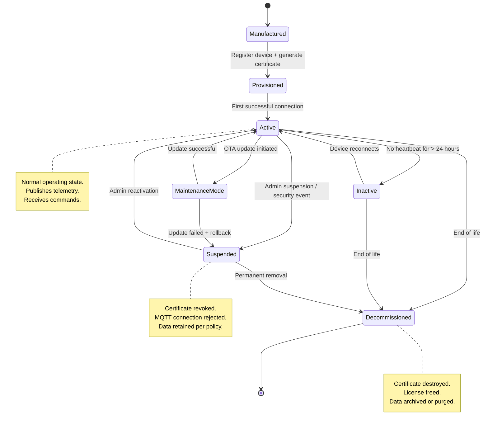
```mermaid
stateDiagram-v2
    [*] --> Manufactured
    Manufactured --> Provisioned : Register device + generate certificate
    Provisioned --> Active : First successful connection
    Active --> Inactive : No heartbeat for > 24 hours
    Inactive --> Active : Device reconnects
    Active --> Suspended : Admin suspension / security event
    Suspended --> Active : Admin reactivation
    Active --> MaintenanceMode : OTA update initiated
    MaintenanceMode --> Active : Update successful
    MaintenanceMode --> Suspended : Update failed + rollback
    Active --> Decommissioned : End of life
    Inactive --> Decommissioned : End of life
    Suspended --> Decommissioned : Permanent removal
    Decommissioned --> [*]

    note right of Active
        Normal operating state.
        Publishes telemetry.
        Receives commands.
    end note

    note right of Suspended
        Certificate revoked.
        MQTT connection rejected.
        Data retained per policy.
    end note

    note right of Decommissioned
        Certificate destroyed.
        License freed.
        Data archived or purged.
    end note
```

### Alert Lifecycle State Machine

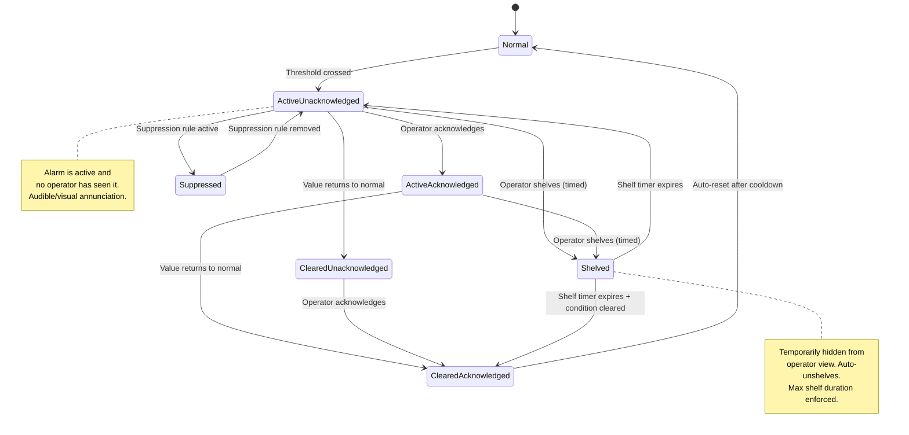
```mermaid
stateDiagram-v2
    [*] --> Normal
    Normal --> ActiveUnacknowledged : Threshold crossed
    ActiveUnacknowledged --> ActiveAcknowledged : Operator acknowledges
    ActiveUnacknowledged --> ClearedUnacknowledged : Value returns to normal
    ActiveAcknowledged --> ClearedAcknowledged : Value returns to normal
    ClearedUnacknowledged --> ClearedAcknowledged : Operator acknowledges
    ClearedAcknowledged --> Normal : Auto-reset after cooldown
    ActiveUnacknowledged --> Shelved : Operator shelves (timed)
    ActiveAcknowledged --> Shelved : Operator shelves (timed)
    Shelved --> ActiveUnacknowledged : Shelf timer expires
    Shelved --> ClearedAcknowledged : Shelf timer expires + condition cleared
    ActiveUnacknowledged --> Suppressed : Suppression rule active
    Suppressed --> ActiveUnacknowledged : Suppression rule removed

    note right of ActiveUnacknowledged
        Alarm is active and
        no operator has seen it.
        Audible/visual annunciation.
    end note

    note right of Shelved
        Temporarily hidden from
        operator view. Auto-unshelves.
        Max shelf duration enforced.
    end note
```

### Automation Rule Execution State Machine

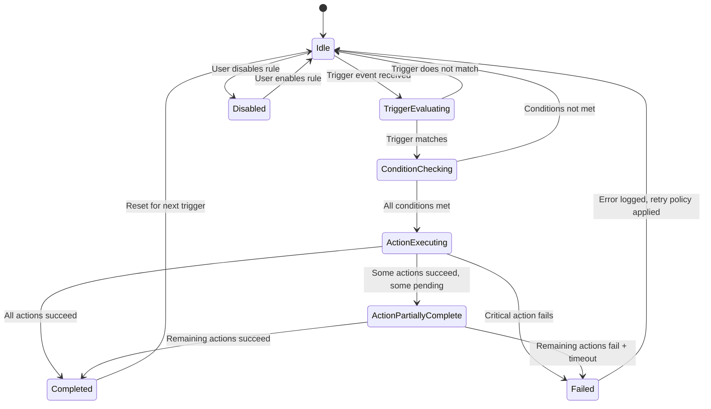
```mermaid
stateDiagram-v2
    [*] --> Idle
    Idle --> TriggerEvaluating : Trigger event received
    TriggerEvaluating --> ConditionChecking : Trigger matches
    TriggerEvaluating --> Idle : Trigger does not match
    ConditionChecking --> ActionExecuting : All conditions met
    ConditionChecking --> Idle : Conditions not met
    ActionExecuting --> ActionPartiallyComplete : Some actions succeed, some pending
    ActionExecuting --> Completed : All actions succeed
    ActionExecuting --> Failed : Critical action fails
    ActionPartiallyComplete --> Completed : Remaining actions succeed
    ActionPartiallyComplete --> Failed : Remaining actions fail + timeout
    Completed --> Idle : Reset for next trigger
    Failed --> Idle : Error logged, retry policy applied
    Idle --> Disabled : User disables rule
    Disabled --> Idle : User enables rule
```

### Fleet Vehicle State Machine

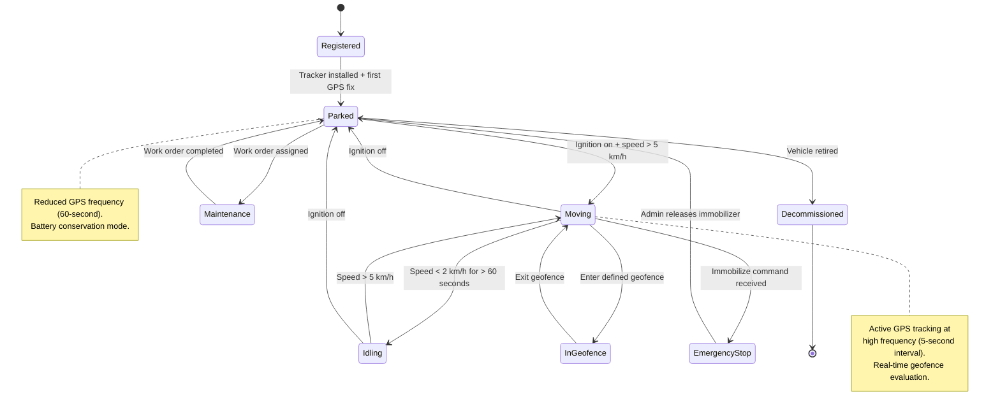
```mermaid
stateDiagram-v2
    [*] --> Registered
    Registered --> Parked : Tracker installed + first GPS fix
    Parked --> Moving : Ignition on + speed > 5 km/h
    Moving --> Idling : Speed < 2 km/h for > 60 seconds
    Idling --> Moving : Speed > 5 km/h
    Moving --> Parked : Ignition off
    Idling --> Parked : Ignition off
    Moving --> InGeofence : Enter defined geofence
    InGeofence --> Moving : Exit geofence
    Parked --> Maintenance : Work order assigned
    Maintenance --> Parked : Work order completed
    Moving --> EmergencyStop : Immobilize command received
    EmergencyStop --> Parked : Admin releases immobilizer
    Parked --> Decommissioned : Vehicle retired
    Decommissioned --> [*]

    note right of Moving
        Active GPS tracking at
        high frequency (5-second interval).
        Real-time geofence evaluation.
    end note

    note right of Parked
        Reduced GPS frequency (60-second).
        Battery conservation mode.
    end note
```

### Industrial Alarm Priority State Machine

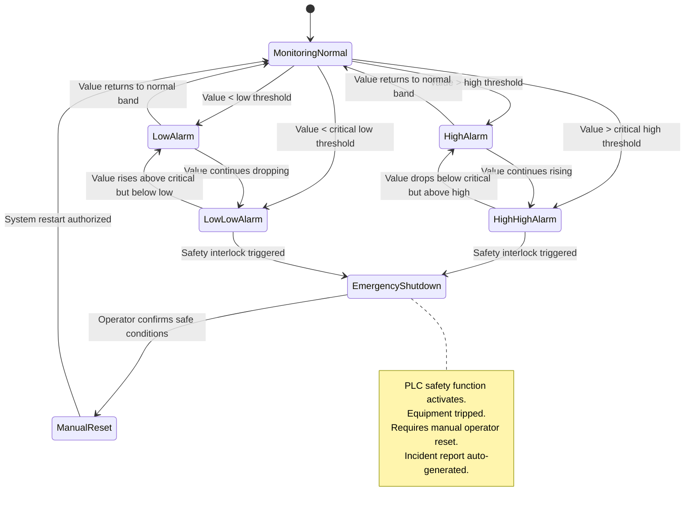
```mermaid
stateDiagram-v2
    [*] --> MonitoringNormal
    MonitoringNormal --> HighAlarm : Value > high threshold
    MonitoringNormal --> LowAlarm : Value < low threshold
    MonitoringNormal --> HighHighAlarm : Value > critical high threshold
    MonitoringNormal --> LowLowAlarm : Value < critical low threshold
    HighAlarm --> HighHighAlarm : Value continues rising
    LowAlarm --> LowLowAlarm : Value continues dropping
    HighHighAlarm --> EmergencyShutdown : Safety interlock triggered
    LowLowAlarm --> EmergencyShutdown : Safety interlock triggered
    HighAlarm --> MonitoringNormal : Value returns to normal band
    LowAlarm --> MonitoringNormal : Value returns to normal band
    HighHighAlarm --> HighAlarm : Value drops below critical but above high
    LowLowAlarm --> LowAlarm : Value rises above critical but below low
    EmergencyShutdown --> ManualReset : Operator confirms safe conditions
    ManualReset --> MonitoringNormal : System restart authorized

    note right of EmergencyShutdown
        PLC safety function activates.
        Equipment tripped.
        Requires manual operator reset.
        Incident report auto-generated.
    end note
```

---

## Sequence Diagrams

### Device Enrollment and First Connection

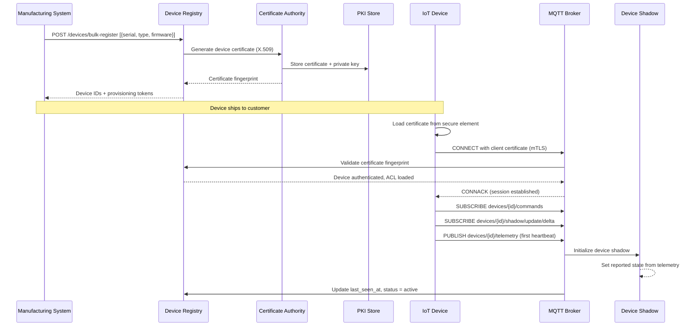
```mermaid
sequenceDiagram
    participant Mfg as Manufacturing System
    participant Reg as Device Registry
    participant CA as Certificate Authority
    participant PKI as PKI Store
    participant Dev as IoT Device
    participant MQTT as MQTT Broker
    participant Shadow as Device Shadow

    Mfg->>Reg: POST /devices/bulk-register [{serial, type, firmware}]
    Reg->>CA: Generate device certificate (X.509)
    CA->>PKI: Store certificate + private key
    CA-->>Reg: Certificate fingerprint
    Reg-->>Mfg: Device IDs + provisioning tokens

    Note over Mfg,Dev: Device ships to customer

    Dev->>Dev: Load certificate from secure element
    Dev->>MQTT: CONNECT with client certificate (mTLS)
    MQTT->>Reg: Validate certificate fingerprint
    Reg-->>MQTT: Device authenticated, ACL loaded
    MQTT-->>Dev: CONNACK (session established)

    Dev->>MQTT: SUBSCRIBE devices/{id}/commands
    Dev->>MQTT: SUBSCRIBE devices/{id}/shadow/update/delta

    Dev->>MQTT: PUBLISH devices/{id}/telemetry (first heartbeat)
    MQTT->>Shadow: Initialize device shadow
    Shadow-->>Shadow: Set reported state from telemetry
    MQTT->>Reg: Update last_seen_at, status = active
```

### OTA Firmware Update Rollout

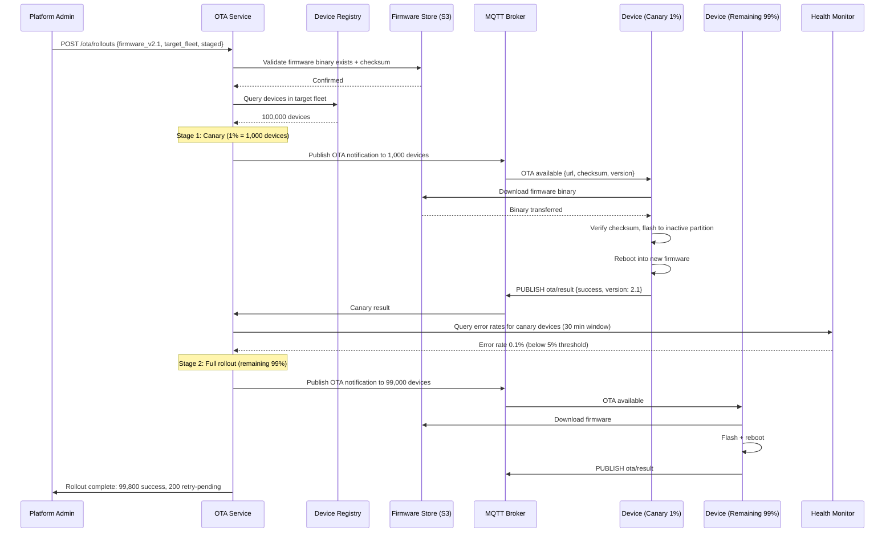
```mermaid
sequenceDiagram
    participant Admin as Platform Admin
    participant OTA as OTA Service
    participant Reg as Device Registry
    participant S3 as Firmware Store (S3)
    participant MQTT as MQTT Broker
    participant Dev1 as Device (Canary 1%)
    participant Dev2 as Device (Remaining 99%)
    participant Mon as Health Monitor

    Admin->>OTA: POST /ota/rollouts {firmware_v2.1, target_fleet, staged}
    OTA->>S3: Validate firmware binary exists + checksum
    S3-->>OTA: Confirmed
    OTA->>Reg: Query devices in target fleet
    Reg-->>OTA: 100,000 devices

    Note over OTA: Stage 1: Canary (1% = 1,000 devices)
    OTA->>MQTT: Publish OTA notification to 1,000 devices
    MQTT->>Dev1: OTA available {url, checksum, version}
    Dev1->>S3: Download firmware binary
    S3-->>Dev1: Binary transferred
    Dev1->>Dev1: Verify checksum, flash to inactive partition
    Dev1->>Dev1: Reboot into new firmware
    Dev1->>MQTT: PUBLISH ota/result {success, version: 2.1}
    MQTT->>OTA: Canary result

    OTA->>Mon: Query error rates for canary devices (30 min window)
    Mon-->>OTA: Error rate 0.1% (below 5% threshold)

    Note over OTA: Stage 2: Full rollout (remaining 99%)
    OTA->>MQTT: Publish OTA notification to 99,000 devices
    MQTT->>Dev2: OTA available
    Dev2->>S3: Download firmware
    Dev2->>Dev2: Flash + reboot
    Dev2->>MQTT: PUBLISH ota/result

    OTA->>Admin: Rollout complete: 99,800 success, 200 retry-pending
```

### Geofence Alert Processing

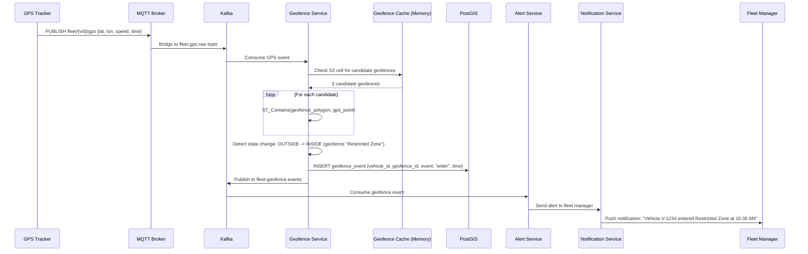
```mermaid
sequenceDiagram
    participant Tracker as GPS Tracker
    participant MQTT as MQTT Broker
    participant Kafka as Kafka
    participant GeoSvc as Geofence Service
    participant Cache as Geofence Cache (Memory)
    participant DB as PostGIS
    participant Alert as Alert Service
    participant Notif as Notification Service
    participant Mgr as Fleet Manager

    Tracker->>MQTT: PUBLISH fleet/{vid}/gps {lat, lon, speed, time}
    MQTT->>Kafka: Bridge to fleet.gps.raw topic
    Kafka->>GeoSvc: Consume GPS event

    GeoSvc->>Cache: Check S2 cell for candidate geofences
    Cache-->>GeoSvc: 3 candidate geofences

    loop For each candidate
        GeoSvc->>GeoSvc: ST_Contains(geofence_polygon, gps_point)
    end

    GeoSvc->>GeoSvc: Detect state change: OUTSIDE -> INSIDE (geofence "Restricted Zone")
    GeoSvc->>DB: INSERT geofence_event {vehicle_id, geofence_id, event: "enter", time}
    GeoSvc->>Kafka: Publish to fleet.geofence.events

    Kafka->>Alert: Consume geofence event
    Alert->>Notif: Send alert to fleet manager
    Notif->>Mgr: Push notification: "Vehicle V-1234 entered Restricted Zone at 10:30 AM"
```

### Smart Home Scene Execution

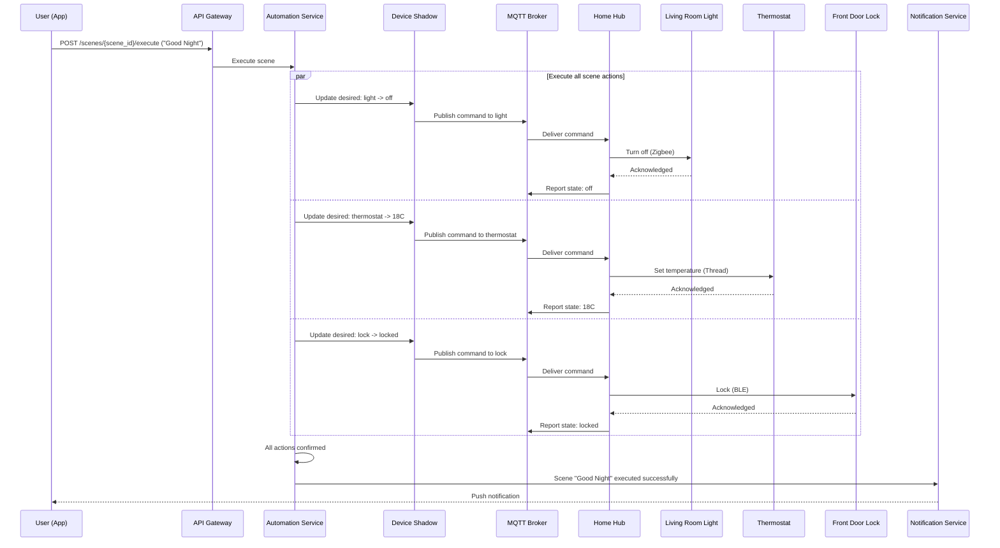
```mermaid
sequenceDiagram
    participant User as User (App)
    participant API as API Gateway
    participant Auto as Automation Service
    participant Shadow as Device Shadow
    participant MQTT as MQTT Broker
    participant Hub as Home Hub
    participant Light as Living Room Light
    participant Thermo as Thermostat
    participant Lock as Front Door Lock
    participant Notif as Notification Service

    User->>API: POST /scenes/{scene_id}/execute ("Good Night")
    API->>Auto: Execute scene

    par Execute all scene actions
        Auto->>Shadow: Update desired: light -> off
        Shadow->>MQTT: Publish command to light
        MQTT->>Hub: Deliver command
        Hub->>Light: Turn off (Zigbee)
        Light-->>Hub: Acknowledged
        Hub->>MQTT: Report state: off
    and
        Auto->>Shadow: Update desired: thermostat -> 18C
        Shadow->>MQTT: Publish command to thermostat
        MQTT->>Hub: Deliver command
        Hub->>Thermo: Set temperature (Thread)
        Thermo-->>Hub: Acknowledged
        Hub->>MQTT: Report state: 18C
    and
        Auto->>Shadow: Update desired: lock -> locked
        Shadow->>MQTT: Publish command to lock
        MQTT->>Hub: Deliver command
        Hub->>Lock: Lock (BLE)
        Lock-->>Hub: Acknowledged
        Hub->>MQTT: Report state: locked
    end

    Auto->>Auto: All actions confirmed
    Auto->>Notif: Scene "Good Night" executed successfully
    Notif-->>User: Push notification
```

### Industrial Predictive Maintenance Flow

```mermaid
sequenceDiagram
    participant Sensor as Vibration Sensor
    participant PLC as PLC
    participant Edge as Edge Gateway
    participant Kafka as Kafka
    participant ML as ML Scoring Service
    participant CMMS as CMMS Integration
    participant Ops as Plant Operator
    participant Inv as Spare Parts Inventory

    Sensor->>PLC: Vibration reading (100 Hz sampling)
    PLC->>Edge: Batch (1 second of samples via OPC-UA)
    Edge->>Edge: Extract FFT features locally
    Edge->>Kafka: Publish features to industrial.vibration.features

    Kafka->>ML: Consume feature vector
    ML->>ML: Score bearing health model
    ML->>ML: Predicted RUL = 14 days (below 30-day threshold)

    ML->>Kafka: Publish predictive_maintenance.alert
    Kafka->>CMMS: Create work order
    CMMS->>Inv: Check spare part availability
    Inv-->>CMMS: Bearing SKU-1234 in stock (qty: 5)
    CMMS->>Ops: Work order notification: "Replace bearing on Pump P-301, scheduled in 10 days"

    Note over Ops: Operator schedules maintenance during planned downtime
    Ops->>CMMS: Acknowledge work order, schedule for next maintenance window
```

---

## Concurrency Control

### Device Twin Consistency

The device shadow (digital twin) must handle concurrent updates from three sources:
1. **Device** reports current state (e.g., temperature reading)
2. **User** sets desired state (e.g., thermostat setpoint)
3. **Automation engine** sets desired state (e.g., schedule-based adjustment)

**Strategy: Optimistic Concurrency with Version Vectors**

```
Shadow document structure:
{
    "version": 42,
    "desired": {
        "brightness": 80,
        "color_temp": 3000,
        "_version": 15
    },
    "reported": {
        "brightness": 60,
        "color_temp": 2700,
        "_version": 41
    },
    "delta": {
        "brightness": 80,
        "color_temp": 3000
    },
    "metadata": {
        "desired": {"brightness": {"timestamp": 1710500000}},
        "reported": {"brightness": {"timestamp": 1710499990}}
    }
}

Rules:
1. Desired state updates use compare-and-swap on _version field
2. Reported state updates always win (device is source of truth for current state)
3. Delta is computed automatically: desired fields that differ from reported
4. If desired._version in request does not match stored _version, return 409 Conflict
5. Metadata timestamps enable last-writer-wins for individual fields when version conflicts
```

### Command Deduplication

```
Problem: Network retries may deliver the same command to a device multiple times.
         MQTT QoS 1 guarantees at-least-once, not exactly-once.

Solution: Client-generated idempotency keys

Flow:
1. API client includes Idempotency-Key header with each command request
2. Command service stores (idempotency_key, command_result, expires_at) in Redis
3. If key already exists: return cached result without re-executing
4. If key is new: execute command, store result with 24-hour TTL
5. Device-side deduplication: device tracks last N command IDs and ignores duplicates

Redis key:
  idem:{idempotency_key} -> {command_id, status, result, created_at}
  TTL: 24 hours

Device-side:
  Circular buffer of last 100 command IDs in device firmware
  If incoming command_id exists in buffer: send ACK but do not execute
```

### Concurrent Geofence Evaluation

```
Problem: High-frequency GPS updates for many vehicles must be evaluated against many geofences.
         Naive approach: For each GPS point, check all geofences -> O(vehicles * geofences) per second.

Solution: Partitioned parallel processing with spatial indexing

1. GPS points partitioned by vehicle_id in Kafka (ensures per-vehicle ordering)
2. Each consumer instance loads all geofences into memory as R-tree
3. For each GPS point: R-tree lookup returns candidate geofences in O(log N)
4. Exact ST_Contains check only on candidates (typically 0-3 geofences)
5. Per-vehicle state machine tracks current geofence membership
6. State change (enter/exit) triggers event only on transition

Throughput: 100K GPS points/sec across 32 consumer instances = 3,125 points/sec per instance
Geofence count: 500K polygons fit in ~3 GB RAM per instance
```

---

## Idempotency Strategy

### Telemetry Ingestion Idempotency

```
Challenge: Devices may retransmit telemetry (MQTT QoS 1 retry, store-and-forward replay).
           Duplicate writes to TSDB waste storage and skew aggregations.

Strategy: Natural idempotency key = (device_id, timestamp, metric_name)

Implementation:
1. TimescaleDB: UPSERT with ON CONFLICT DO NOTHING
   INSERT INTO telemetry (time, device_id, tenant_id, metric_name, value_numeric)
   VALUES ($1, $2, $3, $4, $5)
   ON CONFLICT (device_id, time, metric_name) DO NOTHING;

2. For sub-second resolution: include sequence_number in idempotency key
   (device_id, timestamp_microseconds, metric_name, sequence_number)

3. Kafka deduplication: Flink processor maintains window of recent (device_id, timestamp) pairs
   in RocksDB state store. Duplicates detected within 10-minute window.
```

### Command Execution Idempotency

```
Challenge: Commands may be retried by API clients, automation engines, or network retransmission.
           Executing "unlock door" twice is fine; executing "toggle door" twice reverses the action.

Strategy: Command-specific idempotency

1. Idempotent commands (set absolute state): Safe to retry
   - "Set brightness to 80" -> same result regardless of repetition
   - "Set thermostat to 22C" -> same result

2. Non-idempotent commands (relative/toggle): Require deduplication
   - "Toggle light" -> must deduplicate
   - "Increment counter" -> must deduplicate

Implementation:
- API requires Idempotency-Key for all non-idempotent commands
- Command service maintains deduplication window in Redis (24 hours)
- Device firmware maintains sliding window of last 100 command_ids
- OTA commands use firmware_version as natural idempotency key (re-flash same version is no-op)
```

### Alert Deduplication

```
Challenge: Sustained threshold violation produces the same alert every telemetry cycle.
           Operators should see one alert, not thousands.

Strategy: State-machine-based deduplication

1. Alert engine maintains per-(device, alert_rule) state machine
2. Alert fires on state transition Normal -> Active (one alert created)
3. Subsequent evaluations that remain Active update the alert but do not create new alerts
4. Alert clears on state transition Active -> Cleared
5. Re-alerting requires passing through Cleared state first
6. Hysteresis: configurable deadband prevents rapid flapping at threshold boundary
   - Example: High alarm at 80C, clear at 75C (5C deadband)
```

---

## Consistency Model

### Edge vs Cloud Consistency

IoT systems operate across a **consistency spectrum** from edge devices to cloud storage:

| Layer | Consistency Model | Rationale |
|-------|------------------|-----------|
| Device firmware | Local-first, eventually consistent with cloud | Device must operate during network outage |
| Edge gateway | Local-first with store-and-forward | Safety-critical rules must execute locally |
| MQTT broker | At-least-once delivery (QoS 1) | Tradeoff between reliability and throughput |
| Device shadow (Redis) | Eventual consistency (< 5s convergence) | Multiple writers; last-writer-wins per field |
| Device registry (PostgreSQL) | Strong consistency (single-leader) | Enrollment and certificate state must be authoritative |
| Telemetry (TimescaleDB) | Append-only, eventually consistent | Out-of-order data accepted; time is the ordering key |
| Alarm state (Industrial) | Strong consistency within plant region | Safety-critical; ISA-18.2 requires deterministic state |
| Geofence state | Strong consistency per vehicle | Entry/exit events must not be duplicated or lost |
| Configuration / rules | Read-your-writes within session | User should see their automation rule immediately |

### Conflict Resolution Strategies

```
1. Device Shadow (Last-Writer-Wins with Timestamps):
   - Each field has a metadata timestamp
   - On conflict, the field with the later timestamp wins
   - Desired vs reported never conflict (they are separate namespaces)
   - Two simultaneous desired-state updates: use version vector; reject stale write

2. Telemetry (Timestamp-Ordered Append):
   - No conflicts possible: each (device_id, timestamp, metric) is unique
   - Out-of-order arrival handled by TSDB ordering at query time
   - Late-arriving data (store-and-forward replay) simply inserts with original timestamp

3. Automation Rules (User Intent Wins):
   - If user manually overrides automation, manual action takes priority
   - "Override until" timer restores automation control after specified duration
   - Conflict between two automation rules: priority field determines winner

4. Alarm State (Deterministic State Machine):
   - No conflicts: state machine transitions are deterministic given input sequence
   - Edge and cloud maintain independent alarm evaluators
   - Cloud alarm state is authoritative for reporting; edge state is authoritative for interlocks
```

---

## Distributed Transaction / Saga Design

### Device Enrollment Saga

```
Saga: Enroll a new device (spans registry, PKI, broker, billing)

Steps:
1. Create device record in registry (status: provisioning)
2. Generate X.509 certificate via CA
3. Store certificate in PKI store
4. Configure MQTT broker ACL for device
5. Create device shadow
6. Update billing (increment device count for tenant)
7. Update device status to provisioned

Compensations:
7' -> No compensation needed (status update)
6' -> Decrement device count
5' -> Delete device shadow
4' -> Remove MQTT ACL entry
3' -> Revoke certificate in PKI
2' -> Mark certificate as never-issued
1' -> Delete device record or set status to failed

Orchestrator: Device Registry Service (synchronous saga with timeout)
Timeout: 30 seconds total; individual step timeout: 5 seconds
Retry policy: 3 retries with exponential backoff before compensation
```

### OTA Firmware Update Saga

```
Saga: Staged firmware rollout (spans OTA service, device fleet, monitoring)

Steps:
1. Validate firmware binary (checksum, signature, compatibility)
2. Upload firmware to CDN/S3
3. Select canary devices (1% of fleet)
4. Notify canary devices of available update
5. Wait for canary update results (30-minute window)
6. Evaluate canary health metrics
7. If healthy: notify remaining fleet
8. Monitor full rollout (4-hour window)
9. Mark rollout as complete

Compensations:
8' -> Send rollback command to devices that updated (if supported by dual-partition firmware)
7' -> Cancel remaining notifications
6' -> Mark rollout as failed; send rollback to canary devices
5' -> Timeout -> mark as failed
4' -> Cancel pending notifications
3' -> No compensation needed
2' -> Remove firmware from CDN (optional; old version still available)
1' -> No compensation needed

Key design: Each device independently decides whether to update.
            Rollback = push a new OTA with the previous firmware version.
            Dual-partition (A/B) firmware allows instant revert on boot failure.
```

### Industrial Safety Interlock Saga

```
Note: Safety interlocks are NOT implemented as distributed sagas.
      They execute locally on the PLC/safety PLC within deterministic timing.

The saga applies only to the REPORTING and RECOVERY workflow:

Steps:
1. PLC executes hardwired safety function (< 50ms)
2. Edge gateway reports interlock activation to cloud
3. Cloud alarm management creates incident record
4. Notification service alerts operators and management
5. Incident investigation workflow initiated
6. Corrective action tracked
7. Operator performs manual reset on PLC
8. PLC reports normal state
9. Cloud alarm management closes incident

No compensations needed: safety actions are permanent until manual reset.
The saga is informational, not transactional.
```

---

## Security Design

### Device Authentication (X.509 Mutual TLS)

```
Architecture:
                                    +-----------------+
    Device                          |  MQTT Broker     |
    +----------+                    |                 |
    | Secure   |---mTLS handshake-->| TLS Termination |
    | Element  |<--Server cert------| + Client cert   |
    | (X.509)  |---Client cert----->|   validation    |
    +----------+                    +-----------------+
                                           |
                                    +------v------+
                                    | Certificate |
                                    | Validation  |
                                    | Service     |
                                    +------+------+
                                           |
                                    +------v------+
                                    | Device      |
                                    | Registry    |
                                    +-------------+

Flow:
1. Manufacturing: Device generates keypair in secure element (HSM/TPM)
2. Manufacturing: CSR sent to platform CA; certificate returned and stored
3. Deployment: Device presents client certificate during TLS handshake
4. Broker: Validates certificate chain, checks CRL/OCSP for revocation
5. Broker: Maps certificate CN/SAN to device_id; loads tenant ACL
6. Ongoing: Certificate rotation every 12 months via MQTT-based renewal protocol

Certificate hierarchy:
  Root CA (offline, HSM-stored)
    -> Intermediate CA (per-region, HSM-stored)
      -> Device certificates (per-device, secure element stored)

Revocation:
  - CRL published hourly to S3; broker caches in memory
  - OCSP stapling for real-time revocation check
  - Emergency revocation: push updated CRL to all broker nodes within 5 minutes
```

### Firmware OTA Security

```
Signing:
1. Firmware binary signed with Ed25519 key (stored in HSM)
2. Manifest file includes: version, checksum (SHA-256), signature, minimum HW version
3. Device verifies signature before flashing
4. If signature invalid: reject update, report to cloud

Secure Boot:
1. Boot ROM verifies bootloader signature (hardware root of trust)
2. Bootloader verifies firmware partition signature
3. Failed verification: boot from last-known-good partition (A/B scheme)
4. If both partitions fail: enter recovery mode (factory reset)

Transport Security:
1. Firmware downloaded over HTTPS (TLS 1.3)
2. Download URL includes time-limited signed token (expires in 1 hour)
3. Resumable downloads supported (HTTP Range headers)
4. Integrity verified after download (SHA-256 checksum)

Anti-Rollback:
1. Device maintains monotonic firmware version counter in one-time-programmable (OTP) fuse
2. New firmware must have version > current OTP counter
3. After successful boot: increment OTP counter
4. Prevents attacker from flashing older, vulnerable firmware
```

### Network Security Architecture

```
Zones:
  Zone 0 - Field (sensors, actuators, PLCs) -> unmanaged network
  Zone 1 - Control (SCADA, HMI, edge gateway) -> air-gapped OT network
  Zone 2 - DMZ (data diode, OPC-UA gateway) -> one-way data flow
  Zone 3 - Enterprise (cloud platform, dashboards) -> standard IT security

Data flow:
  Zone 0 -> Zone 1: Direct wired connection (Modbus, HART, 4-20mA)
  Zone 1 -> Zone 2: OPC-UA with certificate-based auth
  Zone 2 -> Zone 3: MQTT over TLS (outbound only, no inbound from cloud to OT)
  Zone 3 -> Zone 2: Commands via separate, audited command channel with MFA

Key principles:
  - No direct cloud-to-PLC communication (always through edge gateway)
  - Data diode for safety-critical systems (one-way, physics-enforced)
  - All east-west traffic within Zone 3 encrypted (mutual TLS between services)
  - API authentication: OAuth 2.0 with short-lived JWTs (15-minute expiry)
  - Role-based access: operator, engineer, admin, auditor
```

---

## Observability Design

### Metrics (Prometheus + Grafana)

```
Platform-level metrics:
  iot_mqtt_connections_active                     -- gauge: current MQTT connections
  iot_mqtt_messages_received_total                -- counter: messages received by topic
  iot_mqtt_messages_published_total               -- counter: messages sent to devices
  iot_telemetry_ingestion_latency_seconds         -- histogram: time from MQTT receive to TSDB write
  iot_alert_evaluation_latency_seconds            -- histogram: time to evaluate alert rules
  iot_alert_fired_total                           -- counter: alerts fired by type and severity
  iot_device_shadow_updates_total                 -- counter: shadow update operations
  iot_device_shadow_conflicts_total               -- counter: optimistic lock conflicts
  iot_command_execution_latency_seconds           -- histogram: end-to-end command latency
  iot_command_timeout_total                       -- counter: commands that timed out
  iot_ota_rollout_progress                        -- gauge: percentage of devices updated
  iot_ota_failure_total                           -- counter: OTA failures by reason

Subsystem metrics:
  fleet_gps_points_per_second                     -- gauge: GPS ingestion rate
  fleet_geofence_evaluations_per_second           -- gauge: geofence check rate
  fleet_geofence_events_total                     -- counter: enter/exit events
  industrial_scada_points_per_second              -- gauge: SCADA data ingestion
  industrial_alarms_active                        -- gauge: currently active alarms by priority
  smart_home_scenes_executed_total                -- counter: scene executions
  smart_home_local_command_latency_seconds        -- histogram: hub-to-device latency

Infrastructure metrics:
  kafka_consumer_lag                              -- gauge: messages behind per consumer group
  timescaledb_chunks_total                        -- gauge: number of chunks by state
  timescaledb_compression_ratio                   -- gauge: compression effectiveness
  redis_memory_usage_bytes                        -- gauge: shadow cache memory
  mqtt_broker_cpu_utilization                     -- gauge: broker CPU usage
```

### Distributed Tracing (OpenTelemetry)

```
Trace spans for a command execution:
  [api.command.receive]                           -- 1ms
    [auth.validate_token]                         -- 2ms
    [registry.lookup_device]                      -- 3ms
    [shadow.update_desired]                       -- 2ms
      [redis.hset]                                -- 0.5ms
    [mqtt.publish_command]                        -- 1ms
    [command.await_ack]                            -- 50-200ms
      [mqtt.receive_ack]                          -- varies
    [shadow.update_reported]                      -- 2ms

Trace context propagation:
  - HTTP: W3C Trace Context headers (traceparent, tracestate)
  - MQTT: Trace context in MQTT v5 user properties
  - Kafka: Trace context in record headers
  - Edge gateway: Trace context in custom payload envelope field

Sampling strategy:
  - Always sample: commands, alerts, OTA events
  - Head-based 1% sampling: telemetry ingestion (too high volume for full tracing)
  - Error-based: 100% sample on errors and timeouts
```

### Logging

```
Structured logging format (JSON):
{
    "timestamp": "2025-03-15T10:30:01.234Z",
    "level": "INFO",
    "service": "command-service",
    "trace_id": "abc123def456",
    "span_id": "789ghi",
    "tenant_id": "t-001",
    "device_id": "d-1234",
    "message": "Command delivered to device",
    "command_id": "cmd-5678",
    "command_type": "set_state",
    "latency_ms": 150,
    "mqtt_qos": 1
}

Log levels by component:
  - MQTT broker: WARN and above (too high volume for INFO)
  - Stream processor: INFO for processing summaries, WARN for lag alerts
  - Command service: INFO for all commands (audit trail)
  - Alert engine: INFO for all alert state transitions
  - OTA service: INFO for all rollout events
  - Edge gateway: DEBUG available but off by default; enable per-device for troubleshooting

Log aggregation: Fluentd -> Kafka -> Elasticsearch -> Kibana
Retention: 30 days hot (Elasticsearch), 1 year cold (S3)
```

---

## Reliability and Resilience

### Offline Operation and Store-and-Forward

```
Smart Home Hub:
  - Maintains full device state in local SQLite database
  - Automation rules cached locally; executes without cloud
  - Limitations during offline: no voice control, no remote access, no energy analytics
  - On reconnection: sync state delta to cloud (last-write-wins per device field)
  - Conflict resolution: if user changed state locally AND remotely during outage, local state wins
    (user was physically present and intended the local action)

Edge Gateway (Industrial):
  - RocksDB buffer: configurable 10-100 GB for store-and-forward
  - Telemetry buffered with original timestamps
  - On reconnection: replay at configurable rate (e.g., 10x real-time) with backpressure
  - Priority queue: safety alerts sent first, bulk telemetry after
  - Buffer overflow policy: drop oldest non-safety data; never drop safety events
  - Typical buffer duration: 48-72 hours at full data rate

Fleet Tracker:
  - Flash storage buffer: 2-8 GB depending on hardware
  - GPS points stored with sequence number for gap detection
  - On cellular reconnection: bulk upload with chronological ordering
  - Cloud detects gaps via sequence numbers and requests retransmission
```

### Circuit Breaker and Bulkhead Patterns

```
Circuit breakers between services:
  - Command service -> MQTT broker: Trip after 5 failures in 10 seconds; half-open after 30 seconds
  - Pipeline -> TimescaleDB: Trip after 10 failures; buffer in Kafka (Kafka acts as shock absorber)
  - Alert engine -> Notification service: Trip after 3 failures; alerts queued for retry
  - API gateway -> Device registry: Trip after 5 failures; serve from cache (stale reads acceptable)

Bulkhead isolation:
  - Separate MQTT listener threads per tenant tier (enterprise vs standard)
  - Separate Kafka consumer groups per subsystem (telemetry vs fleet vs industrial)
  - Separate TimescaleDB connection pools per write path (telemetry vs alerts vs commands)
  - Thread pool isolation in API gateway: 60% telemetry, 20% commands, 20% admin
```

### Graceful Degradation Hierarchy

```
Level 0 (Fully operational): All features available
Level 1 (Cloud analytics degraded): Dashboards show stale data; ingestion and commands work
Level 2 (Cloud command degraded): Commands queued; local hub/edge commands work; telemetry flows
Level 3 (Cloud fully down): Edge gateways and hubs operate independently; store-and-forward active
Level 4 (Edge gateway down): PLCs and safety systems operate independently; no data collection
Level 5 (PLC down): Hardwired safety interlocks are last line of defense

Each level is designed to be safe. The system never fails in a way that leaves
physical equipment in a dangerous state.
```

---

## Multi-Region and DR Strategy

### Regional Architecture

```
Region deployment:
  US-East (primary): Full platform services
  EU-West: Full platform services (GDPR data residency)
  AP-Southeast: Full platform services

Device routing:
  - DNS-based routing: devices.us.iot-platform.com, devices.eu.iot-platform.com
  - Anycast for UDP/CoAP traffic
  - MQTT broker cluster per region (no cross-region MQTT)
  - API gateway per region with regional routing

Data replication:
  - Device registry: Bi-directional async replication via CDC (Debezium -> Kafka -> target region)
  - Telemetry: No cross-region replication (stays in region of origin)
  - Firmware: Replicated to all regions via S3 Cross-Region Replication
  - Configuration: Primary region is source of truth; replicated to secondaries within 30 seconds

Failover:
  - Device failover: DNS update to redirect devices to backup region (TTL: 60 seconds)
  - Devices reconnect automatically via MQTT reconnect with exponential backoff
  - Store-and-forward buffers data during failover window
  - RPO: 0 for telemetry (buffered on device/gateway), < 30 seconds for configuration
  - RTO: < 5 minutes for device reconnection, < 15 minutes for dashboard availability
```

### Disaster Recovery

```
Backup strategy:
  - PostgreSQL: Continuous WAL archiving to S3 (PITR capability)
  - TimescaleDB: Chunk-level backup to S3 (incremental)
  - Redis: RDB snapshots every 15 minutes + AOF for point-in-time recovery
  - Kafka: Topic data replicated across brokers (RF=3); MirrorMaker 2 for cross-region
  - Firmware binaries: S3 versioning + cross-region replication

Recovery procedures:
  1. Region-level failure: DNS failover to secondary region
  2. Database failure: Promote read replica; restore from WAL archive if needed
  3. Kafka cluster failure: Consumers restart from last committed offset
  4. MQTT broker failure: Devices auto-reconnect; session state restored from Mnesia
  5. Edge gateway failure: Devices continue operating independently; manual gateway replacement

Testing:
  - Quarterly DR drills with simulated region failure
  - Monthly chaos engineering (random broker/node termination)
  - Weekly backup restoration verification
```

---

## Cost Drivers

### Device Scale Economics

| Cost Component | Driver | Monthly Cost at 5M Devices |
|---------------|--------|---------------------------|
| MQTT broker compute | Concurrent connections | $15,000 (5 x c5.4xlarge) |
| Kafka cluster | Message throughput + retention | $12,000 (9 x i3.xlarge) |
| TimescaleDB cluster | Write throughput + storage | $20,000 (6 x r5.2xlarge) |
| S3 (data lake) | Storage volume | $5,000 (200 TB) |
| S3 (firmware CDN) | Transfer during OTA | $2,000-50,000 (burst during rollouts) |
| Redis cluster | Shadow memory | $3,000 (6 x r5.large) |
| Stream processing (Flink) | CPU for enrichment/alerting | $8,000 (16 x c5.xlarge) |
| API servers | Request volume | $5,000 (10 x c5.xlarge) |
| Networking (NAT/LB) | Data transfer | $10,000 |
| Monitoring (Prometheus/Grafana) | Metrics cardinality | $3,000 |
| **Total infrastructure** | | **~$83,000/month** |
| **Per-device cost** | | **~$0.017/device/month** |

### Bandwidth Cost Optimization

```
Strategies to reduce bandwidth (dominant cost at scale):

1. Telemetry compression: gzip/snappy on MQTT payloads -> 60-80% reduction
2. Delta encoding: Send only changed values -> 40-70% reduction for slow-changing sensors
3. Downsampling at edge: Aggregate 1-second data to 10-second at gateway -> 10x reduction
4. Adaptive reporting: Increase interval when value is stable; decrease when changing rapidly
5. Binary protocols: Protobuf/CBOR instead of JSON -> 50-70% smaller payloads
6. Batch uploads: Accumulate 100 points and send as single message -> fewer TCP overhead

Impact example:
  Before optimization: 159 GB/day raw telemetry
  After edge downsampling (5x): 32 GB/day
  After compression (3x): 11 GB/day
  After delta encoding (2x): 5.5 GB/day
  Net reduction: ~97% bandwidth savings
```

### Cost Comparison: Build vs Buy

| Capability | Build (Custom) | AWS IoT Core | Azure IoT Hub | ThingsBoard |
|-----------|---------------|-------------|--------------|-------------|
| 5M device connections | $15K/mo (EMQX) | $75K/mo (pricing model) | $50K/mo | $10K/mo (self-hosted) |
| 500K msg/sec ingestion | $20K/mo (Kafka+Flink) | Included | Included | $5K/mo (self-hosted) |
| Time-series storage | $20K/mo (TimescaleDB) | $30K/mo (Timestream) | $25K/mo (ADX) | $15K/mo (self-hosted) |
| Device management | $5K/mo (custom) | Included | Included | Included |
| OTA updates | $3K/mo (custom) | $5K/mo (Greengrass) | $3K/mo | Included |
| Engineering effort | 5 engineers full-time | 2 engineers | 2 engineers | 3 engineers |
| Lock-in risk | None | High | High | Low |
| Customization | Full | Limited | Limited | Moderate |

---

## Deep Platform Comparisons

### AWS IoT vs Azure IoT vs GCP IoT vs ThingsBoard vs Custom

| Feature | AWS IoT Core | Azure IoT Hub | GCP IoT Core (sunset) | ThingsBoard | Custom (EMQX + Kafka) |
|---------|-------------|--------------|----------------------|-------------|----------------------|
| **Status** | Active | Active | Deprecated (2023) | Active, open-source | Active |
| **MQTT Support** | v3.1.1, v5 | v3.1.1 | v3.1.1 | v3.1, v5 | v3.1.1, v5 |
| **Max Connections** | Unlimited (with limits per account) | 1M per hub (scale units) | N/A | Unlimited (self-hosted) | Unlimited |
| **Device Shadow** | Yes (Thing Shadow) | Yes (Device Twin) | N/A | Yes (Attributes) | Custom (Redis-based) |
| **Rules Engine** | SQL-based rules | Stream Analytics | N/A | Rule chains (visual) | Kafka Streams / Flink |
| **Edge Computing** | Greengrass | IoT Edge | N/A | IoT Gateway | Custom containers |
| **OTA Updates** | Jobs (custom) | Auto device management | N/A | Built-in | Custom service |
| **Time-Series DB** | Timestream | Azure Data Explorer | N/A | Built-in (Cassandra/Postgres) | TimescaleDB / InfluxDB |
| **Pricing Model** | Per-message | Per-message + per-device | N/A | Self-hosted or SaaS | Infrastructure cost |
| **Multi-Tenancy** | Account-level | IoT Hub level | N/A | Built-in | Custom |
| **Industrial Protocol** | Greengrass (OPC-UA) | IoT Edge (Modbus, OPC-UA) | N/A | Limited | Custom adapters |
| **Vendor Lock-in** | High | High | N/A | Low | None |
| **Best For** | AWS-native teams | Azure-native teams | N/A | OSS-first, budget-conscious | Full control, scale |

### Time-Series Database Selection

| Feature | TimescaleDB | InfluxDB (v3) | QuestDB |
|---------|-------------|---------------|---------|
| **Foundation** | PostgreSQL extension | Apache Arrow + DataFusion | Zero-GC Java + column-store |
| **Query Language** | SQL (full PostgreSQL) | SQL (InfluxQL deprecated) | SQL + InfluxQL wire protocol |
| **Write Throughput** | 500K-1M points/sec (clustered) | 1M+ points/sec | 2M+ points/sec (single node) |
| **Compression** | 90-95% (columnar) | 80-90% | 85-95% |
| **Continuous Aggregates** | Yes (materialized views) | Tasks (async) | No built-in |
| **Retention Policies** | Yes (automatic chunk drop) | Yes (bucket-based) | Yes (partition-based) |
| **Joins** | Full SQL joins | Limited | Full SQL joins |
| **Clustering** | Multi-node (TimescaleDB 2.0+) | Enterprise only | Single-node (replication planned) |
| **Ecosystem** | PostgreSQL tools, Grafana, etc. | Telegraf, Grafana, etc. | Grafana, PostgreSQL wire protocol |
| **License** | Apache 2.0 (community) | Apache 2.0 (v3), MIT (v2) | Apache 2.0 |
| **Best For** | Teams using PostgreSQL; need SQL joins | High cardinality metrics | Extreme write performance, single node |
| **Recommendation** | Default choice for IoT | Good for metrics-heavy workloads | When write speed is paramount |

---

## Edge Computing Patterns

### Pattern 1: Thin Edge (Protocol Translation Only)

```
Use case: Simple sensor gateways that translate Modbus/BLE to MQTT
Compute: MCU or low-power SBC (< 512 MB RAM)
Processing: None -- raw data forwarded to cloud
Buffering: Minimal (1000 messages, ~200 KB)
Advantage: Low cost, low maintenance
Disadvantage: No local intelligence; cloud dependency for all processing
```

### Pattern 2: Smart Edge (Local Rules + Buffering)

```
Use case: Smart home hubs, fleet gateways
Compute: ARM SBC (2-4 GB RAM, 16-64 GB storage)
Processing: Local rule engine, device state management, store-and-forward
Buffering: 24-72 hours of telemetry
Advantage: Local responsiveness, offline operation
Disadvantage: Limited ML capability; firmware update complexity
```

### Pattern 3: Heavy Edge (ML + Analytics)

```
Use case: Industrial edge, video analytics
Compute: x86 server or GPU-enabled edge (8-64 GB RAM, 256 GB+ SSD)
Processing: ML inference, FFT/vibration analysis, video processing, local historian
Buffering: 7-30 days of full-resolution data
Advantage: Bandwidth reduction, real-time inference, regulatory compliance (data stays on-prem)
Disadvantage: Higher cost, complex lifecycle management
```

### Edge-to-Cloud Synchronization

```
Sync patterns:

1. Event streaming (preferred for telemetry):
   Edge -> MQTT -> Cloud Kafka -> TSDB
   One-way, append-only, idempotent via timestamp dedup

2. State sync (for configuration and shadows):
   Cloud -> MQTT retained messages -> Edge
   Edge -> MQTT -> Cloud shadow service
   Bidirectional, last-writer-wins with version vectors

3. Batch sync (for large datasets):
   Edge -> compressed file -> S3 -> cloud processing
   Used for: firmware logs, crash dumps, video clips

4. Command-response (for control):
   Cloud -> MQTT command topic -> Edge -> Device
   Device -> Edge -> MQTT response topic -> Cloud
   Timeout + retry + idempotency key
```

---

## Digital Twin Architecture

```
A digital twin is a virtual representation of a physical device or system.
It serves three purposes:

1. State Mirror: Reflects the last-known state of the physical device
2. Desired State: Holds the intended state that the device should converge to
3. Simulation: Enables what-if analysis without affecting the physical device

Components:

+------------------+     +------------------+     +------------------+
| Physical Device  |     | Digital Twin     |     | Applications     |
|                  |     |                  |     |                  |
| Reports state    |---->| Reported state   |---->| Dashboards       |
| (telemetry)      |     | {temp: 25.3}     |     | Analytics        |
|                  |     |                  |     | ML models        |
| Receives commands|<----| Desired state    |<----| Automation       |
|                  |     | {temp_sp: 22.0}  |     | User commands    |
|                  |     |                  |     |                  |
|                  |     | Delta            |     |                  |
|                  |     | {temp_sp: 22.0}  |     | (computed diff)  |
|                  |     |                  |     |                  |
|                  |     | Metadata         |     |                  |
|                  |     | {last_seen: ...} |     |                  |
+------------------+     +------------------+     +------------------+

Implementation:
  - Simple twin (device shadow): Redis hash per device (AWS IoT Thing Shadow model)
  - Rich twin (simulation): 3D model + physics engine + live data (Azure Digital Twins, custom)
  - Fleet twin: Aggregation of individual twins for fleet-level simulation

Storage tiers:
  - Hot state (Redis): Current desired/reported state (~5 KB per device)
  - State history (TimescaleDB): Historical state changes for replay
  - Model definition (PostgreSQL): DTDL or custom schema defining twin properties
  - 3D assets (S3): CAD models, floor plans, visualization assets
```

---

## OTA Firmware Update Strategies

### A/B Partition Scheme

```
Device flash layout:
  +-----------------+
  | Bootloader      |  (read-only, signed, verified by hardware root of trust)
  +-----------------+
  | Partition A     |  (active firmware)
  | (running)       |
  +-----------------+
  | Partition B     |  (inactive, receives new firmware)
  | (staging)       |
  +-----------------+
  | Config / NVS    |  (persistent configuration, not overwritten by OTA)
  +-----------------+

Update flow:
1. New firmware downloaded to inactive partition (B)
2. Bootloader flag set to boot from B on next restart
3. Device reboots into new firmware (B)
4. New firmware runs self-test (connectivity, sensor reads, actuator test)
5. If self-test passes: mark B as "confirmed"; B becomes active
6. If self-test fails: reboot; bootloader falls back to A (last-known-good)

Advantages:
  - Instant rollback (reboot to other partition)
  - No bricking risk from interrupted download
  - Atomic update (no partial firmware state)

Cost: Requires 2x flash for firmware (typical: 4-16 MB per partition)
```

### Staged Rollout Strategy

```
Rollout stages for a fleet of 100,000 devices:

Stage 1 (Internal): 10 devices owned by engineering team -> 1 hour observation
Stage 2 (Canary): 100 devices (0.1%) across diverse hardware versions -> 4 hours
Stage 3 (Early adopters): 1,000 devices (1%) -> 24 hours
Stage 4 (Gradual): 10,000 devices (10%) -> 48 hours
Stage 5 (Full): Remaining 88,890 devices -> 7 days (rate-limited)

Health metrics monitored between stages:
  - Device boot success rate (must be > 99.9%)
  - Telemetry reporting rate (must not decrease > 5%)
  - Error log rate (must not increase > 2x baseline)
  - Memory usage (must not increase > 20%)
  - CPU usage (must not increase > 30%)
  - Customer support ticket rate (must not increase > 10%)

Automatic rollback trigger:
  - Any health metric breaches threshold -> pause rollout
  - After 30-minute observation, if metric recovers: resume
  - If metric does not recover: rollback canary devices, abort rollout
```

---

## MQTT Broker Comparison and Selection

| Feature | EMQX | VerneMQ | Mosquitto | HiveMQ |
|---------|------|---------|-----------|--------|
| **License** | Apache 2.0 (OSS) / Commercial | Apache 2.0 | EPL 2.0 | Commercial |
| **Language** | Erlang/OTP | Erlang/OTP | C | Java |
| **Clustering** | Built-in (Mria/Rlog) | Built-in (Plumtree) | None (single node) | Built-in |
| **Max Connections/Node** | 5M+ | 1M+ | 100K | 10M+ (claimed) |
| **MQTT v5** | Full | Partial | Full | Full |
| **Shared Subscriptions** | Yes | Yes | No | Yes |
| **WebSocket** | Yes | Yes | Yes | Yes |
| **Authentication Plugins** | JWT, LDAP, MySQL, PostgreSQL, Redis, HTTP | MySQL, PostgreSQL, Redis, HTTP | Password file, plugins | LDAP, OAuth, custom |
| **Rule Engine** | Built-in SQL-like rules | Plugin-based | None | Extensions |
| **Kafka Bridge** | Built-in | Plugin | External | Built-in |
| **Prometheus Metrics** | Built-in | Plugin | External | Built-in |
| **Session Persistence** | Mnesia/RocksDB | LevelDB | In-memory / file | Disk-based |
| **Best For** | Production IoT at scale | Mid-scale, Erlang teams | Development, small deployments | Enterprise with support needs |
| **Recommendation** | Default for production | Good alternative | Development/testing only | When commercial support required |

### MQTT Broker Sizing Guidelines

```
Connections per broker node:
  - EMQX: Plan for 500K-1M connections per node (c5.4xlarge equivalent)
  - Memory: ~1 KB per idle connection, ~5 KB per active connection with QoS 1
  - 1M connections = ~5 GB RAM for connection state

Throughput per broker node:
  - Message routing: 200K-400K msg/sec per node (depends on topic fan-out)
  - With Kafka bridge: ~80% of raw routing capacity
  - CPU-bound by topic matching and ACL evaluation

Cluster sizing formula:
  Nodes = max(
    ceil(total_connections / connections_per_node),
    ceil(total_msg_rate / msg_rate_per_node),
    3  -- minimum for HA
  )

  Example (5M devices, 500K msg/sec):
    Connection-based: ceil(5M / 1M) = 5 nodes
    Throughput-based: ceil(500K / 300K) = 2 nodes
    Result: 5 nodes (connection-bound) + 2 standby = 7 total

Disk requirements:
  - QoS 0: No disk needed (fire-and-forget)
  - QoS 1: ~10 bytes per in-flight message (until ACK)
  - QoS 2: ~20 bytes per in-flight message (4-step handshake)
  - Retained messages: depends on topic count (1M topics x 1 KB = 1 GB)
  - Session persistence: 1M sessions x 2 KB = 2 GB
```

---

## Device Provisioning Patterns

### Zero-Touch Provisioning

```
Flow for factory-provisioned devices:

1. Manufacturing line:
   a. Device generates keypair in secure element (ATECC608B / TPM 2.0)
   b. CSR sent to manufacturing provisioning service
   c. Device certificate signed by platform intermediate CA
   d. Certificate + device ID + provisioning token stored in secure element
   e. Device serial number registered in cloud device registry (status: manufactured)

2. Customer deployment:
   a. Customer scans device QR code (contains device_id + provisioning_token)
   b. Mobile app calls POST /devices/{device_id}/claim with provisioning_token
   c. Backend validates token, assigns device to customer tenant
   d. Backend configures MQTT ACL for device under customer's tenant prefix
   e. Device connects to MQTT broker with mTLS
   f. Broker validates certificate, grants access to tenant-scoped topics
   g. Device status transitions: manufactured -> claimed -> active
```

### Just-In-Time Registration (JITR)

```
Flow for devices that self-register on first connection:

1. Device manufactured with certificate signed by a known CA
2. CA certificate registered in platform as "trusted issuer"
3. Device connects to MQTT broker for the first time
4. Broker validates certificate chain against trusted CA
5. Broker publishes event to $aws/events/certificates/registered/{cert_id} (AWS model)
   or triggers webhook to registration service (custom model)
6. Registration service:
   a. Creates device record in registry
   b. Assigns to default tenant/fleet
   c. Configures MQTT ACL
   d. Publishes welcome message to device
7. Device receives configuration and begins normal operation

Advantage: No pre-registration step; devices self-onboard
Risk: Must validate CA trust carefully; rogue CA = unauthorized devices
Mitigation: Allowlist specific CA fingerprints; rate-limit registrations
```

---

## Telemetry Data Quality Framework

### Data Quality Dimensions

| Dimension | Description | Measurement | Target |
|-----------|------------|-------------|--------|
| **Completeness** | Percentage of expected data points received | (received / expected) per device per hour | > 99% |
| **Timeliness** | Delay between sensor reading and storage | p99 ingestion latency | < 5 seconds |
| **Accuracy** | Deviation from known reference value | Calibration check against reference sensor | Within sensor spec |
| **Consistency** | Agreement between related sensors | Cross-sensor correlation coefficient | > 0.95 for co-located |
| **Freshness** | Time since last data point from device | now() - last_seen_at | < 2x reporting interval |
| **Ordering** | Percentage of out-of-order data points | (out_of_order / total) per device | < 1% |

### Quality Assessment Pipeline

```
1. Completeness checker (Flink streaming job):
   - Maintains expected reporting rate per device type
   - Tumbling window: 5-minute check
   - If received < 80% of expected: flag device as "data_quality_warning"
   - If received = 0% for 3 consecutive windows: flag as "offline"

2. Range validator:
   - Rejects values outside physical limits (e.g., temperature > 200C for room sensor)
   - Configurable per device type and metric name
   - Out-of-range values logged but not stored in TSDB (quarantine table)

3. Spike detector:
   - Detects sudden jumps > 3 standard deviations from rolling mean
   - Flags for investigation but does not reject (could be real event)

4. Drift detector (batch job, daily):
   - Compares device readings against nearby devices
   - Linear regression of sensor drift over time
   - Generates calibration recommendations when drift exceeds threshold

5. Gap detector:
   - Identifies missing time ranges in stored data
   - Triggers backfill request to device/gateway if store-and-forward buffer available
   - Generates data quality report per device per day
```

---

## Fleet Tracking: Map Matching and Position Processing

### GPS Position Processing Pipeline

```
Raw GPS -> Kalman Filter -> Map Matching -> Speed Calculation -> Geofence Evaluation

1. Kalman Filter:
   - State vector: [lat, lon, speed, heading]
   - Process model: constant velocity between updates
   - Measurement noise: based on HDOP from GPS receiver
   - Smooths noisy GPS, especially in urban canyons
   - Predicts position between updates for animation smoothness

2. Map Matching (Viterbi algorithm on road network):
   - Input: sequence of GPS points
   - Road network: OpenStreetMap or HERE/TomTom road graph
   - Output: matched road segment + offset along segment
   - Corrects GPS drift (places vehicle on road, not in building)
   - Enables accurate distance calculation (road distance, not straight line)

3. Speed Calculation:
   - Instantaneous: GPS-reported speed (Doppler-based, more accurate than position delta)
   - Average: road distance / time between points
   - Smoothed: Kalman-filtered speed estimate

4. Geofence Evaluation:
   - Input: filtered position (lat, lon)
   - S2 cell lookup for candidate geofences
   - ST_Contains for exact polygon evaluation
   - State machine per (vehicle, geofence) pair for enter/exit/dwell tracking
```

### Driver Behavior Scoring Algorithm

```
Input signals:
  - GPS: position, speed, heading (5-15 Hz)
  - Accelerometer: x, y, z acceleration (25-100 Hz)
  - Gyroscope: angular velocity (25-100 Hz)

Event detection:
  1. Harsh braking: deceleration > 0.45g for > 0.5 seconds
  2. Harsh acceleration: acceleration > 0.35g for > 0.5 seconds
  3. Harsh cornering: lateral acceleration > 0.3g for > 1 second
  4. Speeding: GPS speed > road speed limit + tolerance (10 km/h)
  5. Phone distraction: gyroscope pattern matching (phone pickup while driving)

Scoring model:
  Base score: 100 points per trip
  Deductions:
    - Harsh brake (low severity): -2 points
    - Harsh brake (high severity): -5 points
    - Harsh acceleration: -2 points
    - Harsh cornering: -3 points
    - Speeding (5-15 km/h over): -1 point per minute
    - Speeding (15+ km/h over): -3 points per minute
    - Phone distraction: -10 points per event

  Period score: weighted average of trip scores
    Weight = trip distance (longer trips contribute more)
    Period: daily, weekly, monthly

  Grade mapping:
    90-100: A (Excellent)
    80-89:  B (Good)
    70-79:  C (Fair)
    60-69:  D (Poor)
    < 60:   F (Dangerous)
```

---

## Industrial Alarm Rationalization

### ISA-18.2 Alarm Management Lifecycle

```
Alarm management is not just about detecting threshold violations.
ISA-18.2 defines a lifecycle for managing alarm quality:

1. Identification: What conditions warrant an alarm?
   - Only conditions requiring operator action should be alarms
   - Status messages, equipment states are NOT alarms

2. Rationalization: Is each alarm necessary?
   - EEMUA 191 guidelines: max 6 alarms per operator per hour (steady state)
   - Alarm flood: > 10 alarms per 10 minutes is unmanageable
   - Review: priority, setpoint, deadband, delay, suppression logic

3. Design: How should the alarm behave?
   - Priority assignment (1=emergency, 2=high, 3=medium, 4=low)
   - Deadband: prevents chattering at threshold boundary
   - Delay: time delay before alarm activates (filters transients)
   - Setpoint: configurable threshold per operating mode

4. Implementation: Configure in alarm system
   - Tag definition in data_points table
   - Alarm rule in alert engine
   - Notification routing per priority

5. Operation: Day-to-day alarm handling
   - Acknowledge, shelve, suppress operations
   - Alarm response procedures documented and linked

6. Maintenance: Ongoing alarm health monitoring
   - Standing alarms (active > 24 hours without action): review
   - Chattering alarms (> 5 activations per hour): review deadband/delay
   - Stale alarms (never activated): remove or re-evaluate
   - Nuisance alarms (always ignored by operator): remove or re-prioritize

7. Monitoring and Assessment: KPIs
   - Alarms per hour per operator (target: < 6)
   - Alarm flood rate (target: < 1% of operating hours)
   - Standing alarm count (target: < 5)
   - Priority 1 alarm response time (target: < 5 minutes)
```

---

## Edge Cases and Failure Scenarios

| # | Edge Case | Impact | Mitigation |
|---|-----------|--------|------------|
| 1 | **Firmware brick**: OTA update fails mid-flash, device unresponsive | Device permanently offline; customer replacement cost | A/B partition scheme; bootloader watchdog triggers fallback; recovery mode via USB/UART |
| 2 | **Sensor drift**: Temperature sensor gradually reads 5C too high over months | False alerts; incorrect automation triggers; energy waste | Periodic calibration checks; compare readings across co-located sensors; flag devices with statistical outliers for maintenance |
| 3 | **Network partition at edge**: Gateway loses internet for 72 hours | No cloud visibility; store-and-forward buffer may overflow | Size buffer for 72+ hours at full rate; prioritize safety data; drop low-priority telemetry first; alert on gateway offline status |
| 4 | **Clock skew on device**: Battery-powered device clock drifts by minutes | Out-of-order telemetry; incorrect alert timestamps | NTP sync on each connection; server-side timestamp as fallback; accept data within +/- 24 hour window |
| 5 | **Thundering herd reconnection**: Power outage affects 100K devices; all reconnect simultaneously | MQTT broker overwhelmed; connection storm | Randomized reconnect backoff (jitter); broker-side connection rate limiting per IP/subnet; pre-scaled broker capacity |
| 6 | **Rogue device flooding**: Compromised device publishes 10K msg/sec | Tenant quota exhausted; other devices starved | Per-device rate limiting at MQTT broker (ACL-based); automatic device suspension after threshold; alert to admin |
| 7 | **Geofence false positive**: GPS multipath in urban canyon places vehicle inside geofence momentarily | Spurious alerts; alert fatigue for fleet managers | Minimum dwell time (e.g., 30 seconds inside fence); Kalman-filtered position; confidence threshold on HDOP |
| 8 | **Time-series write amplification**: Compression/aggregation background jobs compete with live ingestion | Ingestion latency increases; data loss risk | Separate compute pools for ingestion vs background; priority scheduling; monitoring of chunk compaction lag |
| 9 | **Multi-region device migration**: Device physically moves from US to EU; data residency changes | GDPR violation if telemetry routes to US region | Device re-registration on region change; DNS redirect; historical data remains in original region per policy |
| 10 | **Zombie device session**: Device crashes but MQTT session not cleaned up; broker holds QoS 1 messages indefinitely | Memory leak on broker; messages pile up | MQTT session expiry interval (e.g., 24 hours); clean session on next connect if stale; monitor session count vs active connections |
| 11 | **Daylight saving time transition**: Automation rule scheduled for 2:00 AM during spring-forward (2 AM does not exist) | Rule does not fire; security scene not activated | Store all schedules in UTC; convert to local time at evaluation; handle DST gaps and overlaps explicitly |
| 12 | **Certificate expiry cascade**: CA intermediate cert expires; all devices using it lose authentication | Mass device disconnection | Certificate monitoring dashboard; 90-day expiry warning; automated renewal workflow; emergency CRL bypass for known devices |

---

## Architecture Decision Records

### ADR-001: MQTT as Primary Device Protocol

**Status:** Accepted
**Context:** Devices need a lightweight, battery-friendly protocol for telemetry and commands. Candidates are MQTT, CoAP, AMQP, HTTP long-polling, and WebSocket.
**Decision:** Use MQTT v5 as the primary protocol for all device communication. Provide CoAP gateway for constrained devices and HTTP API for provisioning.
**Rationale:** MQTT has the largest IoT ecosystem, supports QoS levels, retained messages, and last will. Its persistent TCP connection enables bidirectional communication. MQTT v5 adds shared subscriptions, message expiry, and user properties needed for tracing.
**Consequences:** Requires maintaining MQTT broker cluster (EMQX). Devices must support TCP/TLS. Battery-powered devices with intermittent connectivity may prefer CoAP.
**Alternatives rejected:** CoAP (primary) -- smaller ecosystem, harder to debug, no built-in pub/sub. AMQP -- too heavy for constrained devices. HTTP -- no server-to-device push without polling.

### ADR-002: TimescaleDB for Hot Telemetry Storage

**Status:** Accepted
**Context:** Telemetry data needs a storage engine that supports high write throughput (500K-2M points/sec), time-range queries with aggregation, and automatic retention management. Candidates: TimescaleDB, InfluxDB, QuestDB, Cassandra+custom, PostgreSQL (plain).
**Decision:** Use TimescaleDB (PostgreSQL extension) for hot telemetry storage (0-30 days). Use S3+Parquet for cold storage (30+ days).
**Rationale:** TimescaleDB provides full SQL compatibility (joins with device registry), continuous aggregates for rollups, built-in compression (90%+ reduction), and chunk-based retention policies. The team already knows PostgreSQL, reducing operational learning curve.
**Consequences:** Requires TimescaleDB cluster management. Write throughput may be lower than InfluxDB or QuestDB at extreme scale; mitigated by multi-node deployment. Cold data in S3+Parquet queried via Athena/Trino.
**Alternatives rejected:** InfluxDB -- enterprise clustering requires license; query language less familiar. QuestDB -- excellent write performance but immature clustering. Cassandra -- operational complexity; no built-in time-series features.

### ADR-003: Edge-First Architecture for Safety-Critical Commands

**Status:** Accepted
**Context:** Industrial safety interlocks and smart home door locks require sub-100ms response time. Cloud round-trip latency is 50-200ms under normal conditions and unbounded during network partitions.
**Decision:** Execute safety-critical and latency-sensitive commands at the edge (PLC, home hub, edge gateway). Cloud is notified asynchronously.
**Rationale:** Physical safety must not depend on network availability. A door lock that waits for cloud authorization is unacceptable. Edge execution with cloud notification provides both responsiveness and auditability.
**Consequences:** Edge devices need sufficient compute for local rule evaluation. Configuration sync from cloud to edge must be reliable. Split-brain scenarios possible (edge and cloud disagree on state) -- resolved by treating edge as authoritative for physical state.
**Alternatives rejected:** Cloud-only command execution -- unacceptable latency and availability for safety. Device-only logic -- limits automation complexity and prevents fleet-wide policy changes.

### ADR-004: Kafka as Central Event Backbone

**Status:** Accepted
**Context:** Multiple systems (telemetry, alerts, fleet, industrial) need to consume the same device data with different processing patterns and latencies. Candidates: Kafka, RabbitMQ, AWS Kinesis, Pulsar, direct MQTT subscription.
**Decision:** Use Apache Kafka as the central event bus between MQTT broker and all downstream consumers.
**Rationale:** Kafka provides durable, replayable, partitioned event streams. Multiple consumer groups process the same data independently. Kafka Connect simplifies integration with TimescaleDB, S3, and Elasticsearch. The MQTT-to-Kafka bridge decouples device protocol from processing topology.
**Consequences:** Adds operational complexity (ZooKeeper/KRaft, broker management). Adds ~10ms latency between MQTT and consumers. Kafka becomes a critical dependency.
**Alternatives rejected:** Direct MQTT consumption -- each consumer subscribes to MQTT topics; works at small scale but creates N x M connections and no replay. RabbitMQ -- no built-in replay; limited partition scalability. Kinesis -- AWS lock-in; shard limits.

### ADR-005: X.509 Certificates for Device Authentication

**Status:** Accepted
**Context:** Devices need strong authentication for MQTT connections. Candidates: username/password, API keys, X.509 mutual TLS, OAuth 2.0 device flow, pre-shared keys (PSK).
**Decision:** Use X.509 mutual TLS as the primary device authentication mechanism. Support PSK as a fallback for development and constrained devices.
**Rationale:** X.509 provides strong cryptographic identity tied to a hardware secure element. No shared secrets transmitted over the network. Certificate revocation provides fine-grained device deactivation. Industry standard for IoT (AWS IoT, Azure IoT Hub both support it).
**Consequences:** Requires PKI infrastructure (Certificate Authority, CRL/OCSP). Certificate provisioning must be integrated into manufacturing. Certificate rotation adds operational complexity. Constrained devices (< 32KB RAM) may not support TLS.
**Alternatives rejected:** Username/password -- easily leaked; no hardware binding. API keys -- similar risks; no revocation without rotation. OAuth device flow -- designed for user-operated devices, not autonomous sensors.

### ADR-006: Dual A/B Partition for OTA Firmware

**Status:** Accepted
**Context:** Over-the-air firmware updates must be reliable. A failed update should not brick the device.
**Decision:** Require all devices to use A/B partition scheme with hardware watchdog and automatic rollback.
**Rationale:** A/B partitioning provides atomic updates and instant rollback. The bootloader watchdog detects boot failures and reverts to the last-known-good partition. This is the only strategy that prevents bricking from interrupted or corrupted updates.
**Consequences:** Requires 2x flash storage for firmware. Bootloader must be immutable and cryptographically verified. Hardware watchdog timer must be implemented at the SoC level.
**Alternatives rejected:** In-place update -- bricking risk if power lost during flash write. Differential updates -- smaller download but same bricking risk without A/B.

### ADR-007: S2 Geometry for Geofence Spatial Indexing

**Status:** Accepted
**Context:** Evaluating 100K+ GPS points/sec against 500K geofences requires efficient spatial indexing. Candidates: PostGIS R-tree, S2 cell covering, H3 hexagonal indexing, brute-force bounding box.
**Decision:** Use Google S2 cell coverings for fast candidate filtering, with PostGIS ST_Contains for exact polygon evaluation on candidates.
**Rationale:** S2 cell lookup is O(1) hash lookup for candidate geofences. Reduces the average geofence evaluation from checking all 500K polygons to checking 0-5 candidates. S2 cells handle antimeridian and polar regions correctly (unlike simple lat/lon bounding boxes).
**Consequences:** Requires pre-computing S2 cell coverings when geofences are created/updated. Additional storage for cell-to-geofence mapping table. S2 library dependency in geofence evaluator.
**Alternatives rejected:** Pure PostGIS R-tree -- good for moderate scale but too slow for 100K points/sec at 500K geofences. H3 -- hexagonal cells have gaps/overlaps at boundaries; less precise for small geofences.

---

## Architect's Mindset
- Start by drawing the domain boundaries, then explain which systems deserve isolated ownership first.
- Talk about why a single end-user workflow crosses multiple services and where you would place synchronous versus asynchronous boundaries.
- Include operator tooling, data quality checks, and backfill strategy in the architecture from day one.
- Be honest about evolution: V1 usually combines systems that later become separate once traffic, teams, or compliance demands grow.
- In IoT, always ask: "What happens when the network is down?" If the answer is "the system stops working," the design is incomplete.
- Separate the telemetry plane (high volume, best effort) from the command plane (low volume, strong delivery) from the safety plane (deterministic, edge-executed).
- Cost modeling matters more in IoT than most domains because cost scales with device count and message volume, not user count.

---

## Further Exploration
- Revisit adjacent Part 5 chapters after reading IoT & Real-Time Systems to compare how similar patterns change across domains.
- Practice redrawing one of these systems for startup scale, then for enterprise or multi-region scale.
- Use the sub-subchapter sections as interview prompts: pick one system, frame the requirements, and sketch the trade-offs from memory.
- Study the Matter protocol specification to understand how smart home interoperability is evolving.
- Compare the ISA-95/Purdue model for industrial network segmentation with modern zero-trust approaches.
- Implement a minimal MQTT broker to understand QoS levels, session persistence, and retained messages at the protocol level.

---

## Interview Quick Reference

### Key Talking Points by Subsystem

**Device Telemetry System:**
- Explain the hot path / cold path split and why they have different SLOs.
- Discuss MQTT QoS trade-offs (0 for high-frequency telemetry, 1 for commands, 2 rarely justified).
- Show how TimescaleDB continuous aggregates reduce query cost by 100x for dashboard workloads.
- Address multi-tenancy: topic-level ACLs, per-tenant Kafka partitions, row-level security in TSDB.

**Smart Home System:**
- Lead with the local-first architecture decision and why cloud dependency is unacceptable for locks/lights.
- Discuss Matter protocol adoption and how it changes the pairing/discovery model.
- Explain scene execution as a parallel fan-out with per-device timeout and partial success handling.
- Address voice integration: OAuth account linking, capability discovery, intent mapping.

**Fleet Tracking System:**
- Start with the geospatial indexing challenge: S2 cells for O(1) candidate filtering.
- Explain map matching (Viterbi on road graph) and why raw GPS is insufficient for mileage/compliance.
- Discuss driver scoring: signal processing at edge, scoring in cloud, feedback loop to driver.
- Address data volume: 1M vehicles x 10-second intervals = 100K points/sec.

**Industrial Monitoring System:**
- Emphasize safety-first design: edge interlocks execute in < 50ms, independent of cloud.
- Explain the ISA-18.2 alarm lifecycle and why alarm rationalization prevents operator fatigue.
- Discuss the Purdue model (Level 0-4) and where the DMZ sits between OT and IT.
- Address regulatory requirements: 7-year data retention, audit trails, change management.

---

## Navigation
- Previous: [Enterprise Systems](33-enterprise-systems.md)
- Next: [AdTech Systems](35-adtech-systems.md)
