# 35. AdTech Systems

## Part Context
**Part:** Part 5 - Real-World System Design Examples
**Position:** Chapter 35 of 42
**Why this part exists:** This section translates distributed-systems theory into realistic product designs across consumer apps, marketplaces, media, payments, search, notifications, collaboration, infrastructure, and operations-heavy platforms.

---

## Overview
AdTech systems make ranking and decisioning choices under strict latency budgets while handling auctions, attribution, fraud, and campaign accounting. They are event-heavy and abuse-prone by default.

This chapter groups auction, targeting, tracking, and attribution surfaces so the learner can see how bidding, measurement, and delivery fit together.

This chapter performs a deep-dive into **five subsystems** that together form a complete programmatic advertising platform:

1. **Ad Exchange (DSP/SSP)** -- the marketplace that connects supply-side publishers with demand-side advertisers through programmatic auctions, managing bid floors, deal IDs, and exchange-level policy.
2. **Real-time Bidding System (RTB)** -- the sub-100ms auction engine that evaluates bid requests against the OpenRTB protocol, executes first-price or second-price auctions, and returns winning creatives.
3. **Ad Targeting Engine** -- the audience resolution layer that assembles user segments, contextual signals, behavioral history, and lookalike models to score ad candidates against targeting criteria.
4. **Impression Tracking System** -- the measurement backbone that records viewable impressions, clicks, and conversions with fraud detection, deduplication, and billable event reconciliation.
5. **Attribution System** -- the analytics layer that assigns conversion credit across touchpoints using last-click, linear, time-decay, data-driven, and incrementality models.

Every section is written to be useful for learners building mental models, engineers designing production systems, and candidates preparing for system design interviews.

---

## Why This Domain Matters in Real Systems
- AdTech is one of the clearest examples of low-latency decisioning with large offline feedback loops.
- It requires careful event correctness because reporting drives billing.
- The domain is useful for understanding how optimization and fraud prevention coexist on the same path.
- It also reveals how campaign systems differ from consumer app product systems.
- Global programmatic advertising spend exceeds $600 billion annually, making correctness failures extremely expensive.
- Cookie deprecation, Privacy Sandbox, and mobile identifier changes (IDFA/GAID) are reshaping the entire targeting and measurement stack.
- CTV/OTT advertising is the fastest-growing channel and introduces new auction mechanics, device graphs, and measurement challenges.

---

## Real-World Examples and Comparisons
- This domain repeatedly appears in systems such as Google Ads (DV360), Meta Ads, The Trade Desk, Amazon DSP, AppLovin, AppsFlyer, Adjust, IAS, DoubleVerify.
- Startups typically collapse many of these capabilities into a smaller number of services, while platform-scale companies split them into specialized ownership boundaries with stronger internal contracts.
- The architectural shape changes across B2C, B2B, and regulated deployments, but the key trade-offs around latency, correctness, and operability remain recognizable.

---

## Problem Framing

### Business Context

A mid-to-large advertising technology platform serves both publishers (supply) and advertisers (demand). Revenue depends on auction volume, win rates, fill rates, advertiser ROI, and publisher yield. The platform operates globally with regional privacy regulations and varying inventory quality.

Key business constraints:
- **Revenue loss from latency**: Every millisecond of bid latency reduces win rate. Exchanges typically enforce 100ms timeouts; bids arriving late are discarded.
- **Budget accuracy is trust**: Overspending a campaign budget erodes advertiser confidence. Underspending leaves revenue on the table.
- **Fraud eats margin**: Invalid traffic (IVT), click injection, domain spoofing, and pixel stuffing can consume 10-20% of ad spend without detection.
- **Privacy regulations reshape targeting**: GDPR, CCPA, ePrivacy, and platform-level changes (Apple ATT, Chrome Privacy Sandbox) constrain what data can be used for targeting and measurement.
- **Billing disputes are costly**: If impression counts disagree between DSP, SSP, and third-party verification, reconciliation becomes a business-critical process.

### System Boundaries

This chapter covers the **core programmatic advertising path**: from bid request through auction, ad serving, impression tracking, and attribution. It does **not** deeply cover:
- Creative production and asset management (design tools)
- Publisher content management systems
- Payment processing for advertiser billing (covered in Fintech chapters)
- ML model training pipelines (covered in ML & AI Systems)

However, each boundary is identified with integration points and API contracts.

### Assumptions

- The platform handles **10 million bid requests per second** at peak across all exchanges.
- The ad server delivers **2 billion impressions per day**.
- The platform operates across **5 geographic regions** (NA-East, NA-West, EU, APAC, LATAM).
- **500,000 active campaigns** run concurrently with varying budgets and pacing strategies.
- **200 million unique user profiles** are maintained for targeting.
- Attribution windows span up to **30 days** post-impression and **7 days** post-click.
- The system must comply with GDPR, CCPA, COPPA, and emerging state-level privacy laws.

### Explicit Exclusions

- Creative design tools and asset rendering pipelines
- Publisher CMS and content recommendation engines
- Advertiser billing and invoicing internals
- ML model training infrastructure (inference is in-scope)
- Ad creative review and brand safety ML model internals (API contracts are in-scope)

---

## Glossary / Abbreviations

| Term | Definition |
|------|-----------|
| DSP | Demand-Side Platform -- buys ad inventory on behalf of advertisers |
| SSP | Supply-Side Platform -- sells ad inventory on behalf of publishers |
| RTB | Real-Time Bidding -- programmatic auction executed in under 100ms |
| OpenRTB | IAB standard protocol for real-time bidding communication |
| CPM | Cost Per Mille -- price per 1,000 impressions |
| CPC | Cost Per Click -- price per click |
| CPA | Cost Per Action/Acquisition -- price per conversion |
| eCPM | Effective CPM -- normalized revenue metric across pricing models |
| CTR | Click-Through Rate -- clicks divided by impressions |
| CVR | Conversion Rate -- conversions divided by clicks |
| ROAS | Return On Ad Spend -- revenue generated per dollar of ad spend |
| IVT | Invalid Traffic -- non-human or fraudulent ad interactions |
| SIVT | Sophisticated Invalid Traffic -- advanced fraud requiring ML detection |
| GIVT | General Invalid Traffic -- known bots, spiders, data center traffic |
| MRC | Media Rating Council -- accreditation body for ad measurement |
| VAST | Video Ad Serving Template -- IAB standard for video ad serving |
| MRAID | Mobile Rich Media Ad Interface Definitions |
| ATT | App Tracking Transparency -- Apple's consent framework for IDFA |
| IDFA | Identifier for Advertisers -- Apple's device-level ad identifier |
| GAID | Google Advertising ID -- Google's device-level ad identifier |
| Topics API | Chrome Privacy Sandbox API replacing third-party cookies |
| FLEDGE/Protected Audiences | Chrome Privacy Sandbox API for interest-based targeting |
| Header Bidding | Technique where publishers solicit bids from multiple exchanges simultaneously before the ad server |
| Bid Floor | Minimum price a publisher will accept for an impression |
| Bid Shading | Algorithm that reduces first-price bids toward the estimated market-clearing price |
| Fill Rate | Percentage of ad requests that result in a served impression |
| Win Rate | Percentage of bids that win the auction |
| Pacing | Algorithm that distributes campaign budget evenly over time |
| Frequency Cap | Maximum number of times a user sees the same ad in a time window |
| Viewability | Measurement of whether an ad was actually visible to the user (MRC standard: 50% of pixels in viewport for 1 second) |
| CTV | Connected TV -- internet-connected television devices |
| OTT | Over-The-Top -- content delivered via internet bypassing traditional broadcast |
| DMP | Data Management Platform -- aggregates audience data from multiple sources |
| CDP | Customer Data Platform -- first-party data aggregation for advertisers |
| SKAdNetwork | Apple's privacy-preserving attribution framework for iOS |
| Attribution Window | Time period after an ad interaction during which conversions are credited |
| Incrementality | Measurement of the true causal lift from advertising versus organic conversions |

---

## Actors and Personas

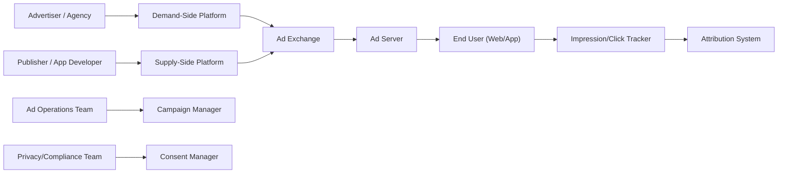

| Actor | Role | Key Concerns |
|-------|------|-------------|
| Advertiser | Buys ad inventory to promote products/services | ROI, brand safety, targeting accuracy, budget control |
| Agency | Manages campaigns on behalf of multiple advertisers | Cross-client reporting, bulk operations, margin management |
| Publisher | Sells ad inventory on websites/apps | Yield optimization, user experience, fill rate |
| Ad Operations | Configures campaigns, manages creatives, monitors delivery | Pacing, troubleshooting, creative compliance |
| Data Analyst | Builds audiences, analyzes campaign performance | Segment reach, attribution accuracy, incrementality |
| Compliance Officer | Ensures privacy regulation adherence | Consent management, data retention, audit trails |
| End User | Views ads as part of content consumption | Relevance, frequency, privacy expectations |

---

## Domain Architecture Map
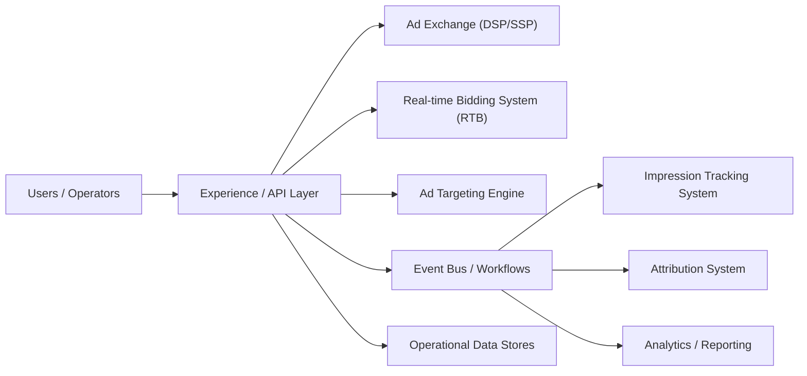

---

## Cross-Cutting Design Themes
- Separate user-facing hot paths from heavy asynchronous work such as analytics, indexing, compliance review, or backfills.
- Be explicit about which parts of the domain need strong correctness and which can tolerate eventual consistency.
- Model operator workflows and reconciliation early; real systems are maintained, not only executed.
- Use events and materialized views deliberately so teams can scale read models without overloading the transactional path.

---

## Why Design Matters in Real-Time Bidding and Ad Serving
AdTech systems make decisions under some of the hardest latency budgets in software. A bid request may have only tens of milliseconds from receipt to response, yet the business still expects targeting accuracy, fraud controls, pacing, budget enforcement, and billable event integrity. That combination punishes sloppy architecture.

Design matters because the request path and the accounting path cannot be the same system. The hot path must be tiny, precomputed, and aggressively cached. Reporting, attribution, fraud re-scoring, and invoicing need richer but slower pipelines. If those concerns mix, either latency blows up or billing correctness disappears.

---

## Microservices Patterns Used in This Domain
- **Edge bidding plane:** ad request evaluation sits close to users and exchanges, with tiny request handlers and feature caches.
- **Feature and eligibility services:** campaign rules, user features, pacing state, and budget snapshots are precomputed and served from specialized stores.
- **Event sourcing for billing:** impressions, clicks, conversions, and attribution events feed durable logs and reconciliation pipelines.
- **Fraud and traffic-quality pipelines:** suspicious traffic is scored asynchronously and can trigger retroactive billing or campaign suppression.
- **Control plane for campaign management:** advertiser UI, creative review, policy, and budget config are isolated from real-time bidding execution.

---

## Design Principles for Real-Time AdTech Systems
- Keep the hot path deterministic and data-local.
- Precompute aggressively; anything expensive in the bid path should be suspect.
- Treat billing and attribution as correctness systems with replay and reconciliation, not just analytics.
- Build graceful degradation, such as fallback targeting, cache-only serving, or safe no-bid behavior.
- Isolate tenant and campaign blast radius so a bad creative or runaway budget does not destabilize the entire exchange.

---

## Functional Requirements

### Ad Exchange (DSP/SSP) Functional Requirements

| ID | Requirement | Priority | Notes |
|----|------------|----------|-------|
| FX-01 | SSP receives ad requests from publisher pages/apps and enriches them with floor prices, deal IDs, and publisher metadata | P0 | Must handle 10M+ requests/second globally |
| FX-02 | SSP fans out bid requests to eligible DSPs based on deal eligibility, geo, and format matching | P0 | Fan-out to 10-50 DSPs per request |
| FX-03 | DSP evaluates bid requests against active campaigns and returns bid responses with creative markup | P0 | Must respond within 80ms to leave 20ms for network |
| FX-04 | Exchange runs auction (first-price or second-price) and selects winning bid | P0 | Support both auction types per publisher config |
| FX-05 | Exchange enforces bid floor policies, blocked advertiser lists, and category exclusions | P0 | Real-time enforcement on hot path |
| FX-06 | Support header bidding integration where publishers solicit bids from multiple exchanges before the primary ad server | P1 | Prebid.js server-side adapter support |
| FX-07 | Support Programmatic Guaranteed (PG) and Preferred Deals alongside open auction | P1 | Deal ID matching with priority ordering |
| FX-08 | Publisher can configure floor price rules by geo, device, ad format, and time of day | P1 | Floor optimization ML model integration |
| FX-09 | DSP supports campaign CRUD operations with targeting, budget, schedule, and creative assignment | P0 | Bulk operations for agencies managing thousands of campaigns |
| FX-10 | Exchange provides real-time bid stream logging for debugging and optimization | P2 | Sampled at 1-5% for cost control |

### Real-time Bidding System (RTB) Functional Requirements

| ID | Requirement | Priority | Notes |
|----|------------|----------|-------|
| RT-01 | Parse OpenRTB 2.6 bid requests including device, user, site/app, impression, and regulation objects | P0 | Full spec compliance |
| RT-02 | Evaluate campaign eligibility: budget remaining, schedule active, geo match, device match, frequency cap | P0 | All checks must complete in <10ms |
| RT-03 | Score eligible campaigns using predicted CTR, CVR, and advertiser bid to compute expected value | P0 | ML model inference on hot path |
| RT-04 | Apply bid shading to first-price auctions to optimize between win rate and cost efficiency | P0 | Algorithmic bid reduction |
| RT-05 | Enforce frequency capping across devices using probabilistic or deterministic user graphs | P0 | Cross-device cap enforcement |
| RT-06 | Apply budget pacing to distribute spend evenly across the campaign flight | P0 | Multiple pacing algorithms: even, ASAP, front-loaded |
| RT-07 | Support VAST/VPAID for video bid responses and MRAID for rich media mobile | P1 | CTV/OTT specific VAST extensions |
| RT-08 | Return no-bid response within timeout if no eligible campaign exists | P0 | No-bid must be fast and not waste exchange resources |
| RT-09 | Support deal ID matching for PMP (Private Marketplace) and PG deals | P1 | Priority over open auction |
| RT-10 | Log bid decisions with enough detail for offline analysis without impacting latency | P1 | Async logging with sampled detail levels |

### Ad Targeting Engine Functional Requirements

| ID | Requirement | Priority | Notes |
|----|------------|----------|-------|
| AT-01 | Resolve user identity from cookies, device IDs (IDFA/GAID), or first-party publisher IDs | P0 | Privacy-compliant resolution |
| AT-02 | Look up user segment memberships from DMP/CDP with <5ms latency | P0 | Pre-materialized in edge cache |
| AT-03 | Evaluate contextual targeting signals: page URL, content category, keywords, brand safety score | P0 | Real-time page classification |
| AT-04 | Support behavioral targeting using browsing history, purchase intent, and recency/frequency signals | P1 | Privacy-aware with consent checks |
| AT-05 | Build and serve lookalike audiences based on seed audience expansion using ML models | P1 | Offline model, online scoring |
| AT-06 | Enforce consent and privacy rules per jurisdiction (GDPR consent string, US Privacy String, GPP) | P0 | TCF 2.2 compliance |
| AT-07 | Support Topics API and Protected Audiences API for Chrome Privacy Sandbox | P1 | Transition path from cookie-based targeting |
| AT-08 | Support contextual-only targeting fallback when user identity is unavailable | P0 | Graceful degradation path |
| AT-09 | Maintain audience segment reach estimates for campaign planning | P2 | Updated daily with 24-hour freshness |
| AT-10 | Support custom audience uploads from advertisers (CRM lists, email hashes) | P1 | Secure hashed matching |

### Impression Tracking System Functional Requirements

| ID | Requirement | Priority | Notes |
|----|------------|----------|-------|
| IT-01 | Record impression events with timestamp, campaign, creative, placement, user, and device metadata | P0 | Billable event -- must never lose |
| IT-02 | Measure viewability per MRC standard (50% pixels visible for 1 second display, 2 seconds video) | P0 | JavaScript/SDK-based measurement |
| IT-03 | Track click events with redirect-through or JavaScript beacon | P0 | Click-through URL signing |
| IT-04 | Record conversion events via pixel, postback, or server-to-server integration | P0 | Multi-channel conversion support |
| IT-05 | Deduplicate impressions and clicks to prevent double-counting | P0 | Idempotency within 24-hour window |
| IT-06 | Detect and flag invalid traffic (IVT) in near-real-time | P0 | GIVT filtering on ingest, SIVT scoring async |
| IT-07 | Provide real-time event counts for pacing and budget enforcement | P0 | Within 1-second freshness |
| IT-08 | Generate billing reconciliation reports matching DSP, SSP, and third-party verification counts | P1 | Daily reconciliation with dispute workflow |
| IT-09 | Support VAST tracking events for video: start, firstQuartile, midpoint, thirdQuartile, complete | P1 | Video completion rate reporting |
| IT-10 | Measure attention metrics: time-in-view, scroll depth, interaction rate | P2 | Emerging measurement standard |

### Attribution System Functional Requirements

| ID | Requirement | Priority | Notes |
|----|------------|----------|-------|
| AB-01 | Record touchpoints (impressions, clicks) with timestamps and channel metadata for attribution | P0 | High-volume event ingestion |
| AB-02 | Support last-click attribution as the default model | P0 | Industry standard baseline |
| AB-03 | Support multi-touch attribution models: linear, time-decay, position-based, data-driven | P1 | Configurable per advertiser |
| AB-04 | Match conversions to touchpoints within configurable attribution windows (1-30 days) | P0 | Separate impression and click windows |
| AB-05 | Support cross-device attribution using deterministic and probabilistic device graphs | P1 | Privacy-compliant device linking |
| AB-06 | Integrate with SKAdNetwork for iOS attribution with conversion value mapping | P0 | Apple privacy framework compliance |
| AB-07 | Support incrementality testing via randomized control trials (ghost bids / PSA approach) | P2 | Causal measurement capability |
| AB-08 | Generate attribution reports with channel, campaign, and creative breakdowns | P0 | Daily and real-time reporting |
| AB-09 | Support view-through attribution with configurable lookback windows | P1 | Separate from click-through attribution |
| AB-10 | Handle attribution for CTV/OTT with household-level attribution and IP-based matching | P2 | Emerging channel support |

---

## Non-Functional Requirements

| Category | Requirement | Target | Subsystem |
|----------|------------|--------|-----------|
| Latency | Bid response end-to-end p99 | < 100ms (exchange timeout) | RTB |
| Latency | Bid evaluation (DSP internal) p99 | < 50ms | RTB |
| Latency | Targeting lookup p99 | < 5ms | Targeting Engine |
| Latency | Impression pixel response p99 | < 10ms | Impression Tracking |
| Latency | Campaign CRUD API p99 | < 500ms | Ad Exchange |
| Latency | Reporting query p99 | < 5s | Attribution / Reporting |
| Throughput | Bid requests processed | 10,000,000 QPS peak | RTB |
| Throughput | Impression events ingested | 2,000,000,000 per day | Impression Tracking |
| Throughput | Click events ingested | 50,000,000 per day | Impression Tracking |
| Throughput | Conversion events ingested | 5,000,000 per day | Attribution |
| Throughput | Campaign management operations | 10,000 writes/second | Ad Exchange |
| Availability | RTB bidding path | 99.99% (52 min downtime/year) | RTB |
| Availability | Impression tracking | 99.99% | Impression Tracking |
| Availability | Campaign management | 99.95% | Ad Exchange |
| Availability | Reporting and analytics | 99.9% | Attribution |
| Consistency | Budget enforcement | Strong consistency (per-campaign) | RTB |
| Consistency | Frequency capping | Eventual consistency (< 5s lag acceptable) | Targeting Engine |
| Consistency | Impression counts for billing | Exactly-once semantics after dedup pipeline | Impression Tracking |
| Consistency | Attribution credit | Eventual consistency (daily reconciliation) | Attribution |
| Consistency | Campaign configuration | Read-after-write within region | Ad Exchange |
| Durability | Billable events (impressions, clicks) | Zero data loss -- synchronous replication | Impression Tracking |
| Durability | Campaign configuration | Zero data loss | Ad Exchange |
| Durability | Bid logs (sampled) | Best-effort, 99.9% capture rate | RTB |
| Security | User data in transit | TLS 1.3 mandatory | All |
| Security | PII handling | Encrypted at rest, tokenized in logs | Targeting, Tracking |
| Compliance | GDPR consent enforcement | Real-time TCF 2.2 string parsing | Targeting Engine |
| Compliance | CCPA opt-out enforcement | USP string / GPP processing | Targeting Engine |
| Compliance | Data retention | Configurable per jurisdiction (max 13 months for EU) | All |
| Scalability | Horizontal scaling | All stateless services auto-scale on CPU/QPS | All |
| Scalability | Storage growth | 50 TB/day raw event data, 2 PB retained | Impression Tracking |

---

## Capacity Estimation

### Traffic Model

| Metric | Value | Derivation |
|--------|-------|-----------|
| Peak bid requests/second | 10,000,000 | 5 major SSP integrations x 2M QPS each |
| Average bid requests/second | 3,000,000 | ~30% of peak (off-hours, weekends) |
| Bid response rate | 60% | 40% no-bid due to no eligible campaign |
| Win rate | 15% of bids placed | Industry average for mid-tier DSP |
| Daily impressions served | 2,000,000,000 | 10M QPS x 0.6 bid rate x 0.15 win rate x 86400s / scale factor |
| Daily clicks | 50,000,000 | ~2.5% average CTR across all formats |
| Daily conversions | 5,000,000 | ~10% average CVR from clicks |
| Active campaigns | 500,000 | Concurrent campaigns across all advertisers |
| Active creatives | 2,000,000 | ~4 creatives per campaign average |
| User profiles in targeting cache | 200,000,000 | Addressable audience across all markets |

### Storage Model

| Data Type | Record Size | Daily Volume | Daily Storage | 13-Month Retention |
|-----------|------------|-------------|--------------|-------------------|
| Bid request logs (5% sampled) | 2 KB | 500M records | 1 TB | 400 TB |
| Bid response logs (5% sampled) | 1 KB | 300M records | 300 GB | 120 TB |
| Impression events | 500 bytes | 2B records | 1 TB | 400 TB |
| Click events | 400 bytes | 50M records | 20 GB | 8 TB |
| Conversion events | 600 bytes | 5M records | 3 GB | 1.2 TB |
| Attribution touchpoints | 300 bytes | 2B records | 600 GB | 240 TB |
| User segment profiles | 2 KB | 200M profiles (full refresh) | 400 GB | N/A (latest only) |
| Campaign configuration | 5 KB | 500K records | 2.5 GB | N/A (latest + audit log) |
| Creative assets (metadata) | 1 KB | 2M records | 2 GB | N/A |
| Fraud detection features | 500 bytes | 2B records | 1 TB | 90 TB (90 days) |

**Total estimated storage:** ~1.3 PB retained at 13 months with tiered storage (hot/warm/cold).

### Compute Model

| Component | Instance Type | Instance Count | Scaling Trigger |
|-----------|--------------|---------------|----------------|
| RTB Bid Evaluator | c7g.4xlarge (16 vCPU, 32 GB) | 2,000 across 5 regions | CPU > 60% or QPS threshold |
| Targeting Lookup Service | r7g.2xlarge (8 vCPU, 64 GB) | 500 across 5 regions | Memory pressure or cache miss rate |
| Impression Ingest | c7g.2xlarge (8 vCPU, 16 GB) | 300 across 5 regions | Kafka consumer lag |
| Attribution Pipeline | m7g.4xlarge (16 vCPU, 64 GB) | 100 centralized | Pipeline lag > 5 minutes |
| Campaign API | m7g.xlarge (4 vCPU, 16 GB) | 50 per region | Request latency p99 |
| Reporting Query Engine | r7g.4xlarge (16 vCPU, 128 GB) | 30 per region | Query queue depth |

### Bandwidth Model

| Traffic Type | Per-Request Size | Peak QPS | Peak Bandwidth |
|-------------|-----------------|----------|---------------|
| Bid request (SSP to DSP) | 2 KB | 10M | 20 GB/s inbound |
| Bid response (DSP to SSP) | 1 KB | 6M (60% bid rate) | 6 GB/s outbound |
| Impression beacons | 200 bytes | 23K/s (2B/day) | 4.6 MB/s |
| Click redirects | 500 bytes | 580/s (50M/day) | 290 KB/s |
| Event stream (Kafka) | 500 bytes | 50K/s (internal) | 25 MB/s per broker |

---

## Clarifying Questions

| Question | Assumed Answer |
|----------|---------------|
| Are we building a DSP, SSP, or full-stack exchange? | Full-stack: DSP + SSP + exchange in one platform (like The Trade Desk + exchange) |
| First-price or second-price auction? | First-price with bid shading (industry standard since 2019) |
| What ad formats do we support? | Display (banner), video (in-stream, out-stream), native, CTV/OTT, audio |
| Do we handle creative rendering? | We serve creative markup; rendering happens in the browser/app/SDK |
| Single-currency or multi-currency? | Multi-currency with real-time FX conversion at bid time |
| How is user identity resolved? | Cookie sync for web, device ID for mobile, IP+UA for CTV, first-party publisher IDs |
| What privacy frameworks must we support? | GDPR (TCF 2.2), CCPA (USP/GPP), COPPA, Apple ATT, Chrome Privacy Sandbox |
| Do we need to support header bidding? | Yes, both client-side (Prebid.js) and server-side (Prebid Server) |
| What is the attribution model? | Configurable per advertiser; last-click default with multi-touch options |
| Do we build our own fraud detection or use third-party? | Hybrid: in-house GIVT filtering + third-party SIVT verification (IAS/DV) |

---

## 35.1 Advertising Core

35.1 Advertising Core collects the boundaries around Ad Exchange (DSP/SSP), Real-time Bidding System (RTB), Ad Targeting Engine, Impression Tracking System, and Attribution System. Teams usually start with a simpler combined service, then split these systems once data ownership, latency goals, or operator workflows begin to conflict.

### Ad Exchange (DSP/SSP)

#### Overview

The Ad Exchange is the marketplace layer that connects supply (publishers with ad inventory) to demand (advertisers with budgets). It encompasses both the SSP function (aggregating publisher inventory, setting floor prices, managing deals) and the DSP function (campaign management, bid strategy, budget allocation). In practice, some companies build only one side; full-stack platforms like Google and Amazon build both.

The exchange enforces auction rules, manages deal hierarchies (Programmatic Guaranteed > Preferred Deals > Private Marketplace > Open Auction), and ensures policy compliance (blocked categories, advertiser exclusions, competitive separation).

#### Header Bidding vs Waterfall

Traditional waterfall ad serving calls exchanges sequentially, giving priority to direct-sold inventory, then preferred exchanges, then backfill. Header bidding revolutionized this by soliciting bids from multiple exchanges simultaneously, increasing competition and publisher yield.

**Client-side header bidding (Prebid.js):**
- JavaScript library runs in the browser and calls multiple SSPs in parallel.
- Bids are collected and passed to the publisher's primary ad server as key-value targeting.
- Advantages: publisher transparency, increased competition.
- Disadvantages: browser latency (additional 200-500ms), limited to ~5-8 bidders before UX degrades.

**Server-side header bidding (Prebid Server):**
- Server-to-server auction eliminates browser latency.
- Publisher sends one request to Prebid Server, which fans out to multiple SSPs.
- Advantages: no browser performance impact, unlimited bidders.
- Disadvantages: cookie sync challenges (SSPs cannot read their own cookies from server context), reduced match rates.

**Hybrid approach (most common at scale):**
- Client-side for a few high-value SSPs with strong cookie match rates.
- Server-side for long-tail SSPs and emerging channels.

#### Real-world examples

- Comparable patterns appear in Google Ad Manager (DFP + AdX), Xandr (Microsoft), Magnite, PubMatic, Index Exchange.
- Startups often keep Ad Exchange inside a larger service, while large platforms split it out once ownership, scale, or correctness requirements diverge.
- The exact implementation changes between B2C, B2B, and regulated variants, but the architectural boundary stays useful.

#### Requirements and workflows

- Expose APIs or events that let advertisers, agencies, publishers, and downstream consumers create, update, query, and reconcile exchange state.
- Support synchronous user-facing flows for the hot path (auction execution) and asynchronous processing for enrichment, retries, and downstream propagation.
- Preserve a clear state model so support teams and automated workflows can explain why the system is in its current state.
- Provide audit or analytics hooks without coupling reporting latency to the primary auction journey.

#### Architecture, data, and APIs

- Model the write path around normalized transactional state (campaigns, creatives, deals), denormalized read models (bid eligibility caches), events, and audit records.
- Keep a normalized source of truth for critical state and publish derived read models or events for consumer services.
- Use caches, projections, or search indexes only for latency-sensitive reads; treat rebuildability as a design requirement.
- Define idempotent write contracts, versioned events, and explicit ownership boundaries so dependent systems can evolve safely.

#### Scaling, reliability, and operations

- Watch for hotspots (viral placements), stale projections (campaign changes not propagated to bid servers), ambiguous retries, and under-specified operator workflows.
- Protect hot partitions with rate limiting, request coalescing, queue buffering, and selective denormalization where appropriate.
- Design operator dashboards, replay tooling, and reconciliation or backfill workflows before incidents force them into existence.
- Track service-level indicators for latency, success, queue lag, freshness, and correctness signals instead of only infrastructure health.

#### Trade-offs and interview notes

- The key interview move is to explain why Ad Exchange deserves its own boundary and what can remain eventual around it.
- Strong answers call out what requires strong correctness (budget, auction result) versus what can be computed asynchronously (reporting, fraud re-scoring).
- Weak answers collapse storage, orchestration, and downstream fan-out into one service without discussing scale or failure modes.

---

### Real-time Bidding System (RTB)

#### Overview

The RTB system is the latency-critical auction engine. It receives bid requests from exchanges (or directly from publishers via header bidding), evaluates them against active campaigns, computes bid prices, and returns responses -- all within a 100ms budget that includes network round-trip time. The actual compute budget for bid evaluation is typically 30-50ms.

#### OpenRTB 2.6 Protocol

The OpenRTB protocol (maintained by IAB Tech Lab) defines the standard communication format between exchanges and bidders. Key objects:

**Bid Request structure:**
- `BidRequest` -- top-level container with request ID, auction type, timeout
- `BidRequest.imp[]` -- impression opportunities (one request can contain multiple ad slots)
- `BidRequest.imp[].banner` / `.video` / `.native` / `.audio` -- format-specific parameters
- `BidRequest.site` or `BidRequest.app` -- publisher context
- `BidRequest.device` -- user agent, IP, geo, device type, OS, language
- `BidRequest.user` -- user ID, buyer UID, consent strings, data segments
- `BidRequest.regs` -- regulatory signals (GDPR flag, COPPA flag, US privacy string, GPP)
- `BidRequest.source` -- supply chain (schain) for transparency

**Bid Response structure:**
- `BidResponse.seatbid[]` -- bids grouped by seat (advertiser account)
- `BidResponse.seatbid[].bid[]` -- individual bids with price, ad markup, creative ID
- `BidResponse.seatbid[].bid[].ext` -- extensions for deal ID, advertiser domain, categories

**Auction mechanics in first-price world:**
- Since 2019, most exchanges moved to first-price auctions (winner pays their bid).
- This shifted optimization complexity to the buy side: bid too high and overpay, bid too low and lose.
- Bid shading algorithms estimate the market-clearing price and reduce bids accordingly.
- Common bid shading approaches: historical win-price analysis, censored regression models, contextual adjustments.

#### Real-world examples

- Comparable patterns appear in Google Authorized Buyers, The Trade Desk, Amazon DSP, MediaMath, Criteo.
- Startups often keep the RTB engine inside a larger service, while large platforms split it out once ownership, scale, or correctness requirements diverge.

#### Requirements and workflows

- Parse bid requests, evaluate targeting, compute bids, and respond within 100ms total.
- Support synchronous bid evaluation and asynchronous budget/pacing reconciliation.
- Preserve decision logs so support teams can explain why a specific bid was placed or skipped.
- Provide analytics hooks without coupling them to bid latency.

#### Architecture, data, and APIs

- The RTB hot path reads from precomputed local caches: campaign eligibility, user segments, budget snapshots, pacing multipliers.
- Campaign and budget state is synchronized from the control plane to edge bid servers via push or pull with eventual consistency (sub-second propagation target).
- ML models for CTR/CVR prediction are loaded as serialized artifacts and scored inline.
- Bid logs are written asynchronously to avoid blocking the response path.

#### Scaling, reliability, and operations

- Horizontal scaling of bid servers across regions; each server handles requests independently.
- No cross-server coordination on the hot path -- all state is local or cached.
- Watch for stale campaign caches, budget drift between regions, and model serving latency.
- Track win rate, bid-to-spend ratio, latency distribution, and no-bid reasons as SLIs.

#### Trade-offs and interview notes

- The key interview move is to explain the latency budget breakdown: network (20ms) + parsing (5ms) + targeting (5ms) + scoring (10ms) + bid computation (5ms) + response serialization (5ms) = 50ms, leaving 50ms margin.
- Strong answers discuss bid shading, pacing, and budget consistency as the core algorithmic challenges.
- Weak answers focus only on caching and ignore the feedback loop between bidding and measurement.

---

### Ad Targeting Engine

#### Overview

The Ad Targeting Engine resolves user identity, retrieves segment memberships, evaluates contextual signals, and determines which campaigns are eligible to bid on a given impression. It is the intelligence layer that sits between raw bid requests and bid computation.

#### Targeting Approaches

**Audience-based targeting (who the user is):**
- First-party data: advertiser CRM lists, website visitors, app users.
- Third-party data: purchased audience segments from data providers (e.g., Oracle Data Cloud, Lotame).
- Lookalike modeling: ML expands a seed audience to statistically similar users.
- Interest segments: user browsing behavior clustered into interest categories.

**Contextual targeting (what the content is):**
- Page URL classification: map URLs to IAB content taxonomy categories.
- Keyword extraction: NLP analysis of page content for keyword matching.
- Brand safety scoring: classify pages as safe/risky for specific advertiser categories.
- Sentiment analysis: avoid placing ads next to negative content.

**Behavioral targeting (what the user has done):**
- Recency signals: user visited product page within last 24 hours (high-intent retargeting).
- Frequency signals: user has seen this ad 3 times already (frequency capping).
- Purchase history: user bought running shoes (cross-sell athletic wear).
- Search history: user searched for "flights to Paris" (travel intent).

**Privacy-preserving targeting (post-cookie world):**
- Topics API: browser provides coarse interest topics without cross-site tracking.
- Protected Audiences API (FLEDGE): on-device auction for remarketing without server-side user tracking.
- Publisher-provided IDs: first-party authenticated user identifiers.
- Contextual renaissance: increased investment in content-based targeting as user-based signals decrease.
- Cohort-based approaches: grouping users into privacy-safe cohorts rather than individual profiles.

#### Lookalike Modeling

Lookalike audiences start with a seed set (e.g., "users who converted on advertiser X's campaign") and use ML to find similar users in the broader population:

1. Feature extraction: extract behavioral, demographic, and contextual features from seed users.
2. Model training: train a binary classifier (logistic regression, gradient boosting, or neural network) to distinguish seed users from random users.
3. Scoring: score the entire addressable population and rank by similarity.
4. Threshold selection: advertiser chooses audience size (1%, 5%, 10% of population) trading off similarity for reach.
5. Refresh: retrain models weekly as seed audience and population features change.

#### Real-world examples

- Comparable patterns appear in Google Ads audience targeting, Meta Custom/Lookalike Audiences, The Trade Desk data marketplace.
- Privacy-first approaches from Apple (SKAdNetwork, ATT) and Google (Privacy Sandbox) are forcing fundamental redesign of targeting infrastructure.

#### Requirements and workflows

- Resolve identity and retrieve segments within 5ms for the hot path.
- Support asynchronous audience building, segment refresh, and lookalike model training.
- Enforce privacy consent in real-time based on TCF 2.2 / GPP consent strings.
- Provide segment reach estimates for campaign planning without exposing individual user data.

#### Architecture, data, and APIs

- User segments are pre-materialized in a distributed key-value store (e.g., Aerospike, Redis Cluster) keyed by user ID.
- Contextual classification runs as a separate pipeline that pre-scores URLs and caches results.
- Privacy consent is evaluated inline on every bid request -- no caching of consent decisions.
- Segment membership changes propagate from batch (daily audience rebuilds) and streaming (real-time event triggers) pipelines.

#### Scaling, reliability, and operations

- The segment store is the most memory-intensive component: 200M profiles x 2KB = 400GB per region.
- Segment store must replicate across regions for data locality -- a segment lookup cannot cross the Atlantic and stay within 5ms.
- Watch for stale segments after pipeline failures, consent flag misinterpretation, and segment explosion (too many micro-segments).
- Design graceful fallback: if the segment store is unavailable, the system should fall back to contextual-only targeting, not fail open with no targeting.

#### Trade-offs and interview notes

- The key interview move is to explain the tension between targeting precision and privacy compliance.
- Strong answers discuss the transition from third-party cookies to Privacy Sandbox and how system architecture must change.
- Weak answers assume unlimited access to user data and ignore consent management.

---

### Impression Tracking System

#### Overview

The Impression Tracking System is the measurement backbone. It records every billable event (impression, click, conversion), measures viewability, detects fraud, and feeds data into billing, reporting, and attribution pipelines. Accuracy here directly affects revenue: if impressions are undercounted, the platform undercharges; if overcounted, advertisers lose trust.

#### Viewability Measurement

The MRC (Media Rating Council) standard defines a viewable impression as:
- **Display ads**: at least 50% of the ad's pixels are in the viewable area of the browser for at least 1 continuous second.
- **Video ads**: at least 50% of the ad's pixels are in the viewable area for at least 2 continuous seconds.
- **Large display ads** (242,500+ pixels): at least 30% of pixels visible for 1 second.

Measurement approaches:
- **JavaScript-based**: IntersectionObserver API or custom geometry calculations in the browser.
- **SDK-based**: native app measurement using platform-provided view hierarchy APIs.
- **OMSDK (Open Measurement SDK)**: IAB standard SDK that allows multiple verification vendors to measure from a single integration.

#### Click Tracking

Click tracking typically uses one of two approaches:
- **Redirect tracking**: the ad's click URL points to a tracking server, which records the click and redirects to the landing page. Adds 50-200ms latency.
- **Beacon tracking**: JavaScript fires a tracking pixel on click and opens the landing page directly. No redirect latency but less reliable (browser may navigate before pixel fires).

Most systems use redirect tracking for the primary click event and fire supplementary beacons for enhanced metadata.

#### Fraud Detection

Invalid traffic (IVT) is categorized by the MRC/TAG framework:

**General Invalid Traffic (GIVT)** -- filterable with lists and rules:
- Known bots and spiders (IAB/ABC International Spiders & Bots List)
- Data center traffic (IP ranges from known hosting providers)
- Non-browser user agents
- Pre-fetch and prefetch traffic
- Known crawler traffic

**Sophisticated Invalid Traffic (SIVT)** -- requires advanced detection:
- Click injection on mobile (malware triggers clicks just before app install)
- Ad stacking (multiple ads layered on top of each other)
- Pixel stuffing (ads rendered in 1x1 pixel iframes)
- Domain spoofing (bid request claims to be from premium publisher but is from a low-quality site)
- Cookie stuffing (artificially inflating audience segments)
- Bot farms (coordinated non-human traffic from residential IPs)
- SDK spoofing (fabricated app install events without real installs)

Detection approaches:
- IP reputation scoring with threat intelligence feeds.
- Device fingerprinting anomaly detection.
- Click-to-install time (CTIT) analysis for mobile install fraud.
- Traffic pattern analysis: abnormal click rates, geometric click distributions, session anomalies.
- Ads.txt / sellers.json verification for supply chain integrity.

#### Real-world examples

- Comparable patterns appear in Google Campaign Manager (DCM), DoubleVerify, IAS (Integral Ad Science), MOAT (Oracle), AppsFlyer.
- The industry trend is toward independent third-party verification, with major brands requiring at least two verification vendors.

#### Requirements and workflows

- Ingest impression and click events at 2B+ per day with zero loss.
- Provide real-time counters for budget pacing and frequency capping.
- Run fraud detection in near-real-time (GIVT) and batch (SIVT).
- Generate billing-grade event counts with reconciliation against third-party verification.

#### Architecture, data, and APIs

- Impression and click events are collected via lightweight HTTP endpoints (tracking pixels, redirect servers).
- Events are published to Kafka for durable storage and downstream processing.
- Real-time counters are maintained in Redis/Aerospike for pacing and frequency.
- Batch pipelines (Spark/Flink) process events for billing, reporting, and fraud re-scoring.

#### Scaling, reliability, and operations

- The impression endpoint is one of the highest-QPS services: 23K+ requests/second sustained.
- Zero-downtime deployment is mandatory -- any gap in tracking directly affects billing accuracy.
- Watch for clock skew between tracking servers (affects attribution windows), event pipeline lag (affects pacing), and deduplication window sizing.
- Design reconciliation tooling that compares DSP impression counts, SSP impression counts, and third-party verification counts.

#### Trade-offs and interview notes

- The key interview move is to explain the tension between real-time counting (for pacing) and accurate counting (for billing).
- Strong answers discuss deduplication strategies, eventual consistency in event counts, and how reconciliation resolves discrepancies.
- Weak answers treat tracking as a simple event logging problem and ignore fraud, viewability, and billing reconciliation.

---

### Attribution System

#### Overview

The Attribution System assigns conversion credit to advertising touchpoints. When a user converts (purchases, installs an app, signs up), the system determines which ad interactions (impressions, clicks) across which channels contributed, and how to allocate credit.

#### Attribution Models

**Last-click attribution:**
- All credit goes to the last click before conversion.
- Simple, deterministic, and universally supported.
- Biased toward lower-funnel channels (search, retargeting) that capture existing intent.
- Still the industry default for most advertisers.

**Last-touch attribution:**
- All credit goes to the last touchpoint (click or impression) before conversion.
- Includes view-through attribution for display and video campaigns.

**Linear attribution:**
- Equal credit to all touchpoints in the conversion path.
- Simple multi-touch model but does not account for recency or position.

**Time-decay attribution:**
- More credit to touchpoints closer to the conversion event.
- Typically uses an exponential decay function with a configurable half-life.

**Position-based (U-shaped) attribution:**
- 40% credit to first touch, 40% to last touch, 20% distributed among middle touches.
- Acknowledges the importance of awareness (first) and conversion (last) touchpoints.

**Data-driven attribution (DDA):**
- ML-based model that learns the marginal contribution of each touchpoint.
- Commonly uses Shapley values or Markov chain models.
- Requires sufficient conversion volume for statistical significance.
- Google Ads and Meta both offer proprietary DDA models.

**Incrementality testing:**
- The gold standard: measures the causal lift from advertising.
- Approach: randomly hold out a control group that does not see ads (ghost bids or PSA ads).
- Compare conversion rates between exposed and control groups.
- Computationally expensive and requires significant traffic volume.
- Most useful for strategic budget allocation decisions rather than real-time optimization.

#### Cross-Device Attribution

Users interact with ads on multiple devices before converting. Cross-device attribution requires linking these interactions:

**Deterministic matching:**
- Same logged-in user ID across devices (e.g., Google account, Facebook login).
- High accuracy but limited reach (only logged-in users).

**Probabilistic matching:**
- Statistical models that link devices based on IP address, location patterns, browsing behavior.
- Broader reach but lower accuracy (typically 60-80% confidence).
- Increasingly restricted by privacy regulations.

**Device graphs:**
- Persistent mappings of device-to-user relationships maintained by identity providers (LiveRamp, Tapad).
- Combine deterministic and probabilistic signals.
- Privacy Sandbox challenges the sustainability of third-party device graphs.

#### CTV/OTT Attribution

Connected TV presents unique attribution challenges:
- No cookies or click-through URLs on TV screens.
- Attribution relies on IP matching (same household IP for TV and conversion device).
- Household-level attribution rather than individual-level.
- Exposed vs control group analysis using ACR (Automatic Content Recognition) data.
- Incrementality measurement is the most reliable approach for CTV.

#### Real-world examples

- Comparable patterns appear in Google Analytics 4, Meta Conversion API, AppsFlyer, Adjust, Branch, Kochava.
- Apple's SKAdNetwork fundamentally changed mobile attribution by limiting data to aggregated, delayed conversion values.

#### Requirements and workflows

- Ingest touchpoint events from impression and click tracking systems.
- Match conversions to touchpoints within configurable attribution windows.
- Support multiple attribution models concurrently per advertiser.
- Generate attribution reports with channel, campaign, and creative breakdowns.

#### Architecture, data, and APIs

- Touchpoints are stored in a time-series-optimized store keyed by user ID and timestamp.
- Conversion events trigger attribution lookups across the touchpoint history.
- Attribution computation can be real-time (for simple last-click) or batch (for multi-touch and DDA).
- Results feed into reporting databases and campaign optimization feedback loops.

#### Scaling, reliability, and operations

- The touchpoint store must support high write throughput (billions of events) and point lookups by user ID.
- Attribution windows of 30 days mean retaining 30 days of touchpoint data in a queryable state.
- Watch for delayed conversion events (postbacks arriving days late), attribution window boundary effects, and model training data quality.
- Reconciliation between attributed conversions and actual business outcomes (sales data) is a critical trust-building workflow.

#### Trade-offs and interview notes

- The key interview move is to explain why different attribution models give different answers and how to help advertisers choose.
- Strong answers discuss incrementality as the ground truth and other models as approximations.
- Weak answers describe only last-click and ignore the multi-channel, cross-device reality.

---

## Detailed Data Models

### Campaign and Creative Schema

```
TABLE campaigns {
    campaign_id         UUID PRIMARY KEY
    advertiser_id       UUID NOT NULL            -- FK to advertisers table
    name                VARCHAR(255) NOT NULL
    status              ENUM('draft','pending_review','active','paused','completed','archived')
    objective           ENUM('awareness','consideration','conversion','app_install')

    -- Budget
    total_budget_micros BIGINT NOT NULL          -- Budget in micros (1 USD = 1,000,000 micros)
    daily_budget_micros BIGINT NOT NULL
    currency            CHAR(3) NOT NULL         -- ISO 4217 currency code
    spent_micros        BIGINT DEFAULT 0         -- Running total, updated via async reconciliation

    -- Schedule
    start_date          TIMESTAMP NOT NULL
    end_date            TIMESTAMP NOT NULL
    timezone            VARCHAR(50) NOT NULL     -- IANA timezone for schedule evaluation

    -- Bidding
    bid_strategy        ENUM('manual_cpm','manual_cpc','target_cpa','target_roas','maximize_conversions')
    bid_amount_micros   BIGINT                   -- Manual bid amount when applicable
    bid_floor_micros    BIGINT                   -- Minimum bid the campaign will place

    -- Pacing
    pacing_type         ENUM('even','asap','front_loaded')
    pacing_multiplier   DECIMAL(5,4) DEFAULT 1.0 -- Dynamic pacing adjustment factor

    -- Targeting (stored as JSONB for flexibility)
    targeting_spec      JSONB NOT NULL           -- Geo, device, audience segments, contextual

    -- Frequency
    frequency_cap_count INTEGER
    frequency_cap_window_hours INTEGER

    -- Metadata
    created_at          TIMESTAMP DEFAULT NOW()
    updated_at          TIMESTAMP DEFAULT NOW()
    created_by          UUID NOT NULL
    version             INTEGER DEFAULT 1        -- Optimistic concurrency control
}

TABLE creatives {
    creative_id         UUID PRIMARY KEY
    advertiser_id       UUID NOT NULL
    name                VARCHAR(255) NOT NULL
    status              ENUM('draft','pending_review','approved','rejected','paused','archived')
    format              ENUM('banner','video','native','audio','ctv')

    -- Dimensions
    width               INTEGER                  -- Pixels (NULL for native/audio)
    height              INTEGER
    duration_seconds    INTEGER                  -- For video/audio

    -- Content
    ad_markup           TEXT                     -- HTML/VAST/Native JSON
    click_through_url   VARCHAR(2048) NOT NULL
    impression_tracking_urls TEXT[]              -- Array of tracking pixel URLs
    click_tracking_urls TEXT[]

    -- Brand Safety
    advertiser_domain   VARCHAR(255) NOT NULL    -- For ads.txt verification
    iab_categories      VARCHAR(10)[]            -- IAB content taxonomy categories

    -- Review
    review_status       ENUM('pending','approved','rejected')
    review_notes        TEXT
    reviewed_at         TIMESTAMP
    reviewed_by         UUID

    -- Metadata
    created_at          TIMESTAMP DEFAULT NOW()
    updated_at          TIMESTAMP DEFAULT NOW()
}

TABLE campaign_creative_assignments {
    campaign_id         UUID NOT NULL
    creative_id         UUID NOT NULL
    weight              INTEGER DEFAULT 100      -- For creative rotation
    status              ENUM('active','paused')
    PRIMARY KEY (campaign_id, creative_id)
}
```

### Bid and Auction Schema

```
TABLE bid_requests_log {
    -- Partitioned by timestamp (hourly partitions)
    request_id          VARCHAR(36) NOT NULL     -- OpenRTB request ID
    timestamp           TIMESTAMP NOT NULL
    exchange_id         VARCHAR(50) NOT NULL     -- Which SSP/exchange sent the request

    -- Publisher context
    publisher_id        VARCHAR(50)
    site_domain         VARCHAR(255)
    app_bundle          VARCHAR(255)
    page_url            VARCHAR(2048)

    -- Impression details
    imp_id              VARCHAR(50)
    ad_format           ENUM('banner','video','native','audio')
    ad_width            INTEGER
    ad_height           INTEGER
    bid_floor_micros    BIGINT

    -- User context
    user_id             VARCHAR(255)             -- Exchange user ID (cookie/device ID)
    device_type         ENUM('desktop','mobile','tablet','ctv','other')
    os                  VARCHAR(50)
    geo_country         CHAR(3)
    geo_region          VARCHAR(10)

    -- Regulatory
    gdpr_applies        BOOLEAN
    consent_string      TEXT
    us_privacy          VARCHAR(10)

    -- Partition key
    PRIMARY KEY (timestamp, request_id)
}
-- Partition by: RANGE (timestamp) with hourly partitions
-- Retention: 90 days hot, 13 months cold (Parquet in S3)

TABLE bid_responses_log {
    response_id         UUID PRIMARY KEY
    request_id          VARCHAR(36) NOT NULL
    timestamp           TIMESTAMP NOT NULL

    -- Bid details
    campaign_id         UUID
    creative_id         UUID
    bid_price_micros    BIGINT                   -- What we bid
    win_price_micros    BIGINT                   -- What we paid (filled after win notice)
    bid_currency        CHAR(3)

    -- Decision metadata
    bid_reason          ENUM('eligible','no_budget','no_targeting_match','frequency_capped',
                             'pacing_throttled','bid_below_floor','no_eligible_creative','timeout')
    predicted_ctr       DECIMAL(8,6)
    predicted_cvr       DECIMAL(8,6)
    expected_value_micros BIGINT                 -- eCPM computation result
    bid_shading_factor  DECIMAL(5,4)             -- Reduction from initial bid

    -- Outcome (filled asynchronously)
    won                 BOOLEAN

    PRIMARY KEY (timestamp, response_id)
}
```

### Impression, Click, and Conversion Schema

```
TABLE impressions {
    -- Partitioned by event_time (hourly)
    impression_id       VARCHAR(36) NOT NULL     -- Globally unique, generated at serve time
    event_time          TIMESTAMP NOT NULL

    -- Campaign context
    campaign_id         UUID NOT NULL
    creative_id         UUID NOT NULL
    advertiser_id       UUID NOT NULL

    -- Placement context
    publisher_id        VARCHAR(50)
    site_domain         VARCHAR(255)
    placement_id        VARCHAR(50)
    ad_format           ENUM('banner','video','native','audio')

    -- User context (hashed/anonymized)
    user_id_hash        VARCHAR(64)              -- SHA-256 of user identifier
    device_type         ENUM('desktop','mobile','tablet','ctv')
    geo_country         CHAR(3)
    geo_region          VARCHAR(10)

    -- Measurement
    viewable            BOOLEAN                  -- MRC viewability standard
    time_in_view_ms     INTEGER                  -- Milliseconds the ad was viewable

    -- Billing
    cost_micros         BIGINT NOT NULL          -- Advertiser cost
    revenue_micros      BIGINT NOT NULL          -- Publisher revenue
    currency            CHAR(3)

    -- Fraud
    ivt_status          ENUM('clean','givt','sivt_suspect','sivt_confirmed')
    fraud_score         DECIMAL(5,4)

    -- Deduplication
    dedup_key           VARCHAR(100)             -- campaign_id + user_id_hash + placement_id + hour

    PRIMARY KEY (event_time, impression_id)
}

TABLE clicks {
    click_id            VARCHAR(36) NOT NULL
    impression_id       VARCHAR(36) NOT NULL     -- Parent impression
    event_time          TIMESTAMP NOT NULL

    campaign_id         UUID NOT NULL
    creative_id         UUID NOT NULL
    advertiser_id       UUID NOT NULL

    -- Click metadata
    click_through_url   VARCHAR(2048)
    landing_page_url    VARCHAR(2048)
    referrer_url        VARCHAR(2048)

    -- User context
    user_id_hash        VARCHAR(64)
    device_type         ENUM('desktop','mobile','tablet','ctv')
    ip_address_hash     VARCHAR(64)
    user_agent_hash     VARCHAR(64)

    -- Fraud signals
    click_to_impression_ms INTEGER              -- Time between impression and click
    ivt_status          ENUM('clean','givt','sivt_suspect','sivt_confirmed')

    PRIMARY KEY (event_time, click_id)
}

TABLE conversions {
    conversion_id       VARCHAR(36) NOT NULL
    event_time          TIMESTAMP NOT NULL

    -- Attribution
    attributed_click_id VARCHAR(36)              -- NULL for view-through conversions
    attributed_impression_id VARCHAR(36)
    attribution_model   ENUM('last_click','last_touch','linear','time_decay','position_based','data_driven')
    attribution_credit  DECIMAL(5,4)             -- 0.0 to 1.0, for multi-touch models

    -- Campaign context (from attributed touchpoint)
    campaign_id         UUID
    creative_id         UUID
    advertiser_id       UUID NOT NULL

    -- Conversion details
    conversion_type     ENUM('purchase','signup','app_install','add_to_cart','lead','custom')
    conversion_value_micros BIGINT               -- Revenue value of the conversion
    currency            CHAR(3)

    -- Advertiser-provided metadata
    order_id            VARCHAR(255)             -- Deduplicate using advertiser's order ID
    conversion_pixel_id VARCHAR(50)

    -- User context
    user_id_hash        VARCHAR(64)
    device_type         ENUM('desktop','mobile','tablet','ctv')

    -- Attribution metadata
    touchpoint_count    INTEGER                  -- Total touchpoints in the conversion path
    days_to_conversion  INTEGER                  -- Days from first touchpoint to conversion

    PRIMARY KEY (event_time, conversion_id)
}
```

### User Profile and Segment Schema

```
TABLE user_profiles {
    -- Stored in Aerospike/Redis, not SQL -- shown as logical schema
    user_id             VARCHAR(64) PRIMARY KEY  -- Hashed identifier

    -- Identity graph
    cookie_ids          VARCHAR(64)[]            -- Browser cookie IDs
    device_ids          VARCHAR(64)[]            -- IDFA/GAID hashes
    publisher_ids       JSONB                    -- {publisher_id: user_id} mappings

    -- Segments
    audience_segments   INTEGER[]                -- Array of segment IDs (compact representation)
    segment_timestamps  JSONB                    -- {segment_id: last_qualified_timestamp}

    -- Behavioral features
    interest_categories VARCHAR(10)[]            -- IAB content taxonomy categories
    recency_scores      JSONB                    -- {category: recency_score}

    -- Frequency data
    frequency_counts    JSONB                    -- {campaign_id: {count: N, last_seen: timestamp}}

    -- Privacy
    consent_status      JSONB                    -- {jurisdiction: consent_details}
    opt_out_flags       JSONB                    -- {framework: boolean}

    -- Metadata
    last_seen           TIMESTAMP
    profile_version     INTEGER
}

TABLE audience_segments {
    segment_id          INTEGER PRIMARY KEY
    name                VARCHAR(255) NOT NULL
    description         TEXT
    segment_type        ENUM('first_party','third_party','lookalike','contextual','custom')

    -- Ownership
    owner_type          ENUM('platform','advertiser','data_provider')
    owner_id            UUID

    -- Size
    estimated_reach     BIGINT                   -- Approximate number of users in segment
    last_computed       TIMESTAMP

    -- Definition
    segment_rules       JSONB                    -- Rule-based segment definition
    model_id            VARCHAR(50)              -- For ML-based segments (lookalike)

    -- Status
    status              ENUM('active','paused','expired','archived')
    expiry_date         TIMESTAMP
}
```

---

## Detailed API Specifications

### OpenRTB 2.6 Bid Request API

```
POST /openrtb/2.6/bid
Content-Type: application/json
X-OpenRTB-Version: 2.6

-- Request Body (bid request from exchange to DSP):
{
  "id": "req-uuid-12345",
  "imp": [{
    "id": "imp-1",
    "banner": {
      "w": 300,
      "h": 250,
      "pos": 1,
      "btype": [4],
      "battr": [14],
      "api": [3, 5],
      "format": [
        {"w": 300, "h": 250},
        {"w": 320, "h": 50}
      ]
    },
    "bidfloor": 0.50,
    "bidfloorcur": "USD",
    "secure": 1,
    "exp": 300,
    "metric": [{
      "type": "viewability",
      "value": 0.85,
      "vendor": "doubleverify"
    }]
  }],
  "site": {
    "id": "site-123",
    "domain": "example.com",
    "page": "https://example.com/article/12345",
    "cat": ["IAB1-1"],
    "publisher": {
      "id": "pub-456",
      "name": "Example Publisher"
    }
  },
  "device": {
    "ua": "Mozilla/5.0 ...",
    "ip": "203.0.113.1",
    "geo": {
      "lat": 37.7749,
      "lon": -122.4194,
      "country": "USA",
      "region": "CA",
      "metro": "807",
      "type": 2
    },
    "devicetype": 2,
    "os": "iOS",
    "osv": "17.0",
    "language": "en",
    "ifa": ""
  },
  "user": {
    "id": "user-exchange-id-789",
    "buyeruid": "user-dsp-id-abc",
    "consent": "CPXxRfAPXxRfAAfKABENB-CgAAAAAAAAAAYgAAAAAAAA",
    "data": [{
      "id": "dmp-segment-provider",
      "segment": [
        {"id": "seg-auto-intender"},
        {"id": "seg-sports-fan"}
      ]
    }],
    "ext": {
      "eids": [{
        "source": "liveramp.com",
        "uids": [{"id": "XY12345", "atype": 3}]
      }]
    }
  },
  "regs": {
    "coppa": 0,
    "ext": {
      "gdpr": 1,
      "us_privacy": "1YNN",
      "gpp": "DBACNYA~CPXxRfAPXxRfAAfKABENB-CgAAAAAAAAAAYg",
      "gpp_sid": [2]
    }
  },
  "source": {
    "ext": {
      "schain": {
        "ver": "1.0",
        "complete": 1,
        "nodes": [{
          "asi": "exchange.com",
          "sid": "pub-456",
          "hp": 1
        }]
      }
    }
  },
  "at": 1,
  "tmax": 100,
  "cur": ["USD"]
}

-- Response Body (bid response from DSP to exchange):
{
  "id": "req-uuid-12345",
  "seatbid": [{
    "seat": "advertiser-seat-1",
    "bid": [{
      "id": "bid-uuid-67890",
      "impid": "imp-1",
      "price": 2.35,
      "adid": "creative-12345",
      "nurl": "https://dsp.example.com/win?price=${AUCTION_PRICE}&bidid=bid-uuid-67890",
      "adm": "<div class='ad'>...creative markup...</div>",
      "adomain": ["advertiser.com"],
      "crid": "creative-12345",
      "cat": ["IAB2-1"],
      "w": 300,
      "h": 250,
      "attr": [4],
      "ext": {
        "bidshading": {
          "original_bid": 3.10,
          "shading_factor": 0.758
        }
      }
    }]
  }],
  "cur": "USD"
}
```

### Campaign Management API

```
-- Create Campaign
POST /api/v2/campaigns
Authorization: Bearer <token>
Content-Type: application/json
Idempotency-Key: <client-generated-uuid>

Request:
{
  "name": "Q1 2026 Brand Awareness - Auto",
  "advertiser_id": "adv-uuid-123",
  "objective": "awareness",
  "total_budget": {"amount": 500000, "currency": "USD"},
  "daily_budget": {"amount": 15000, "currency": "USD"},
  "schedule": {
    "start": "2026-01-15T00:00:00-08:00",
    "end": "2026-03-31T23:59:59-08:00",
    "timezone": "America/Los_Angeles"
  },
  "bid_strategy": {
    "type": "target_cpm",
    "target_cpm": {"amount": 8.50, "currency": "USD"},
    "bid_cap": {"amount": 15.00, "currency": "USD"}
  },
  "pacing": "even",
  "targeting": {
    "geo": {"countries": ["US", "CA"], "regions": ["US-CA", "US-NY"]},
    "device_types": ["desktop", "mobile"],
    "os": ["iOS", "Android"],
    "audiences": {
      "include": ["seg-auto-intender", "seg-luxury-auto"],
      "exclude": ["seg-existing-customer"]
    },
    "contextual": {
      "categories": ["IAB2-1", "IAB2-2"],
      "brand_safety": "standard"
    }
  },
  "frequency_cap": {"count": 5, "window_hours": 24},
  "creative_ids": ["cre-uuid-1", "cre-uuid-2"]
}

Response (201 Created):
{
  "campaign_id": "cmp-uuid-456",
  "status": "draft",
  "version": 1,
  "created_at": "2026-01-10T14:30:00Z",
  "links": {
    "self": "/api/v2/campaigns/cmp-uuid-456",
    "creatives": "/api/v2/campaigns/cmp-uuid-456/creatives",
    "reporting": "/api/v2/campaigns/cmp-uuid-456/reports"
  }
}

-- Update Campaign (PATCH for partial updates)
PATCH /api/v2/campaigns/{campaign_id}
If-Match: "version-1"

{
  "daily_budget": {"amount": 20000, "currency": "USD"},
  "targeting": {
    "geo": {"countries": ["US", "CA", "UK"]}
  }
}

-- Pause Campaign
POST /api/v2/campaigns/{campaign_id}/pause

-- Resume Campaign
POST /api/v2/campaigns/{campaign_id}/resume
```

### Reporting API

```
-- Campaign Performance Report
POST /api/v2/reports/campaign-performance
Authorization: Bearer <token>

Request:
{
  "advertiser_id": "adv-uuid-123",
  "campaign_ids": ["cmp-uuid-456"],
  "date_range": {
    "start": "2026-01-15",
    "end": "2026-01-31"
  },
  "granularity": "daily",
  "dimensions": ["campaign", "creative", "device_type", "geo_country"],
  "metrics": ["impressions", "viewable_impressions", "clicks", "conversions",
              "spend", "cpm", "cpc", "ctr", "cvr", "roas", "viewability_rate"],
  "filters": {
    "device_type": ["desktop", "mobile"]
  },
  "sort": {"metric": "spend", "direction": "desc"},
  "pagination": {"offset": 0, "limit": 100}
}

Response:
{
  "report_id": "rpt-uuid-789",
  "status": "complete",
  "data": [{
    "dimensions": {
      "campaign": "cmp-uuid-456",
      "creative": "cre-uuid-1",
      "device_type": "mobile",
      "geo_country": "US"
    },
    "metrics": {
      "impressions": 1250000,
      "viewable_impressions": 812500,
      "clicks": 18750,
      "conversions": 1875,
      "spend_micros": 10625000000,
      "cpm_micros": 8500000,
      "cpc_micros": 566667,
      "ctr": 0.015,
      "cvr": 0.10,
      "roas": 3.45,
      "viewability_rate": 0.65
    }
  }],
  "totals": {
    "impressions": 5000000,
    "spend_micros": 42500000000
  },
  "pagination": {
    "offset": 0,
    "limit": 100,
    "total": 24
  }
}
```

### Conversion Tracking API

```
-- Server-to-Server Conversion Postback
POST /api/v2/conversions
Authorization: Bearer <token>
Idempotency-Key: <order-id-or-client-uuid>

{
  "pixel_id": "px-uuid-123",
  "event_type": "purchase",
  "event_time": "2026-01-20T15:30:00Z",
  "conversion_value": {"amount": 149.99, "currency": "USD"},
  "order_id": "order-12345",
  "user_identifiers": {
    "hashed_email": "sha256:abc123...",
    "click_id": "clk-uuid-789",
    "device_id_hash": "sha256:def456..."
  },
  "custom_data": {
    "product_category": "electronics",
    "new_customer": true
  }
}

Response (202 Accepted):
{
  "conversion_id": "conv-uuid-012",
  "status": "accepted",
  "attribution": {
    "status": "pending",
    "estimated_processing_time_seconds": 60
  }
}
```

---

## Indexing and Partitioning

### Time-Series Partitioning for Event Data

Event data (impressions, clicks, conversions, bid logs) follows a time-series access pattern: recent data is queried frequently, older data is accessed for reconciliation and reporting. The partitioning strategy reflects this:

**Impression and Click Events (ClickHouse / TimescaleDB):**
- **Partition key**: `toStartOfHour(event_time)` -- hourly partitions.
- **Sort key**: `(campaign_id, event_time)` -- optimizes campaign-level reporting queries.
- **Hot tier**: last 7 days on NVMe SSD (fast queries for pacing and real-time reporting).
- **Warm tier**: 7-90 days on standard SSD (daily reconciliation and standard reporting).
- **Cold tier**: 90 days - 13 months on S3 in Parquet format (compliance retention, ad-hoc analysis).
- **TTL policy**: automatic partition drop after 13 months (GDPR compliance).

**Bid Request/Response Logs:**
- **Partition key**: `toStartOfHour(timestamp)` -- aligned with impression partitions.
- **Sample rate**: 5% of all bid requests (full logging would be 10M/s x 2KB = 20GB/s).
- **Full logging trigger**: enabled per campaign for debugging (time-limited, max 1 hour).
- **Retention**: 90 days sampled, 7 days full for triggered campaigns.

**Attribution Touchpoints:**
- **Partition key**: `toStartOfDay(event_time)`.
- **Sort key**: `(user_id_hash, event_time)` -- optimizes user-level touchpoint lookups.
- **Retention**: sliding window equal to maximum attribution window (30 days) plus 7-day buffer.
- **Compaction**: old touchpoints for converted users are archived; touchpoints for non-converted users are dropped at window expiry.

### Campaign and Targeting Indexes

**Campaign Eligibility Index (Redis / in-memory):**
- Purpose: quickly determine which campaigns can bid on a given impression.
- Structure: inverted index from targeting dimensions to campaign IDs.
- Example: `geo:US:CA -> [cmp-1, cmp-5, cmp-12]`, `device:mobile -> [cmp-1, cmp-3, cmp-5]`.
- Intersection of matching sets yields eligible campaigns.
- Rebuild frequency: every 30 seconds from campaign management database via CDC.

**User Segment Index (Aerospike / Redis Cluster):**
- Purpose: look up user segment memberships with <5ms latency.
- Key: user ID hash.
- Value: packed integer array of segment IDs (compact representation).
- Size: 200M users x 2KB avg = 400GB (replicated across regions).
- Refresh: streaming updates from audience pipeline + daily full rebuild.

**Creative Index (PostgreSQL + read replica):**
- Purpose: retrieve approved creatives matching campaign and format requirements.
- Indexes: `(advertiser_id, status, format)`, `(campaign_id)` via junction table.
- Denormalized into bid server cache alongside campaign data.

### Partitioning Strategy Summary

```
| Data Store | Partition Strategy | Shard Key | Replication |
|-----------|-------------------|-----------|-------------|
| Impressions (ClickHouse) | Hourly time range | campaign_id hash | 3x within region |
| Clicks (ClickHouse) | Hourly time range | campaign_id hash | 3x within region |
| Conversions (ClickHouse) | Daily time range | advertiser_id hash | 3x cross-region |
| Bid logs (ClickHouse) | Hourly time range | request_id hash | 2x within region |
| User profiles (Aerospike) | Hash on user_id | user_id | 2x cross-region |
| Campaigns (PostgreSQL) | None (single region master) | N/A | 1 primary + 2 read replicas |
| Campaign cache (Redis) | Hash slot | campaign_id | Per-region cluster |
| Budget counters (Redis) | Hash slot | campaign_id | Per-region + async cross-region sync |
```

---

## Cache Strategy

### Bid Server Cache (Campaign Eligibility)

- **What is cached**: active campaign configurations, targeting rules, creative metadata, budget snapshots, pacing multipliers.
- **Cache location**: local memory on each bid server instance (L1) + regional Redis cluster (L2).
- **L1 cache size**: ~2GB per instance (fits all active campaigns in compressed form).
- **L1 refresh**: pull from L2 every 10 seconds, or push via pub/sub on campaign changes.
- **L2 refresh**: CDC stream from campaign database with <1 second propagation.
- **Eviction**: LRU for inactive campaigns; no eviction for active campaigns (dataset fits in memory).
- **Invalidation trigger**: campaign status change, budget exhaustion, creative approval/rejection.
- **Stale read impact**: worst case is bidding on a paused campaign for 10 seconds. Budget enforcement catches overspend in reconciliation.

### Audience Segment Cache

- **What is cached**: user-to-segment mappings, segment metadata.
- **Cache location**: Aerospike cluster (primary) + local LRU cache on targeting service (L1).
- **L1 hit rate target**: 40% (frequent users seen multiple times in a session).
- **Aerospike hit rate target**: 95% (most users have profile records).
- **Miss handling**: on cache miss, fall back to contextual-only targeting (do not block bid path).
- **Refresh**: streaming updates from Kafka (real-time segment qualification events) + daily batch rebuild.
- **TTL**: segment memberships expire based on segment definition (e.g., "visited site in last 7 days" expires after 7 days).

### Budget and Pacing Cache

- **What is cached**: per-campaign spent amount, daily pacing position, frequency counts.
- **Cache location**: regional Redis cluster with cross-region async sync.
- **Consistency model**: eventually consistent across regions (see Consistency Model section).
- **Update frequency**: budget decremented on every win notification; pacing recalculated every 60 seconds.
- **Stale read impact**: budget may overshoot by the value of impressions in-flight across regions. Overshoot tolerance is configured per campaign (typically 1-5% of daily budget).
- **Recovery**: reconciliation pipeline compares Redis counters against impression event stream every 5 minutes and corrects drift.

### Frequency Cap Cache

- **What is cached**: per-user, per-campaign impression counts within the capping window.
- **Cache location**: Redis cluster with Bloom filter fallback.
- **Key structure**: `freq:{campaign_id}:{user_id_hash}:{window_start_hour}`.
- **TTL**: aligned to frequency cap window (e.g., 24-hour window -> 24-hour TTL).
- **Consistency**: best-effort across regions. A user in NA who is capped may briefly see an additional impression if they switch to EU before cross-region sync completes.
- **Overflow handling**: when Redis is unavailable, bid servers use local Bloom filters (higher false-positive rate -> over-capping is safer than under-capping).

### Cache Warming Strategy

- On bid server startup, preload all active campaigns from L2 cache before accepting traffic.
- Health check reports "not ready" until campaign cache is populated.
- Rolling deployments ensure at least 80% of instances are warm at all times.
- Pre-warm audience cache for top 10M most active users at region startup.

---

## Queue / Stream Design

### Event Streaming Architecture

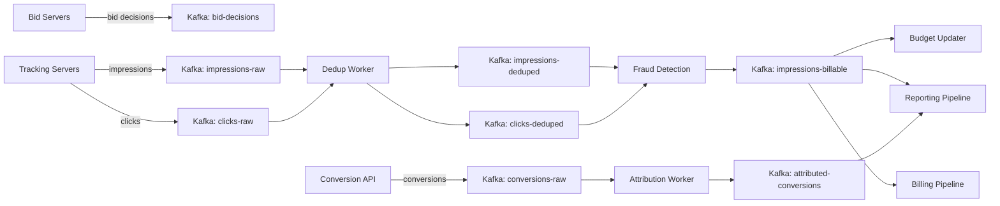

### Kafka Topic Design

| Topic | Partitions | Replication | Retention | Key | Consumer Groups |
|-------|-----------|-------------|-----------|-----|----------------|
| `bid-decisions` | 256 | 3 | 7 days | request_id | reporting, bid-analysis |
| `impressions-raw` | 512 | 3 | 3 days | impression_id | dedup-worker |
| `impressions-deduped` | 512 | 3 | 7 days | impression_id | fraud-detector, budget-updater |
| `impressions-billable` | 256 | 3 | 30 days | campaign_id | reporting, billing, attribution |
| `clicks-raw` | 128 | 3 | 3 days | click_id | dedup-worker |
| `clicks-deduped` | 128 | 3 | 7 days | click_id | fraud-detector, attribution |
| `conversions-raw` | 64 | 3 | 7 days | conversion_id | attribution-worker |
| `attributed-conversions` | 64 | 3 | 30 days | advertiser_id | reporting, optimization |
| `campaign-changes` | 32 | 3 | 7 days | campaign_id | cache-updater, bid-servers |
| `budget-updates` | 128 | 3 | 3 days | campaign_id | budget-aggregator |

### Real-Time Aggregation Pipeline

Budget pacing requires near-real-time spend tracking. The pipeline uses Kafka Streams (or Flink) to maintain running spend counters:

1. `impressions-billable` events flow into the pacing aggregator.
2. Aggregator maintains a windowed counter per campaign_id (tumbling 1-minute windows).
3. Counter updates are pushed to Redis budget cache every second.
4. Pacing controller reads current spend rate and adjusts pacing multiplier.
5. Pacing multiplier is published to `campaign-changes` topic for bid server consumption.

### Back-Pressure and Overflow Handling

- **Producer back-pressure**: if Kafka is slow, tracking servers buffer events in a local disk-backed queue (max 10GB). If local buffer fills, events are dropped with a counter increment (metric: `events_dropped_total`).
- **Consumer lag alerting**: if any consumer group lag exceeds 5 minutes, alert fires. If lag exceeds 15 minutes, pacing switches to conservative mode (reduce spend rate by 50%).
- **Dead letter queue**: events that fail processing after 3 retries are routed to a DLQ topic for manual investigation.
- **Partition rebalancing**: consumer group rebalancing during deployments is mitigated using cooperative sticky assignor and incremental rebalancing.

---

## State Machines

### Campaign Lifecycle State Machine

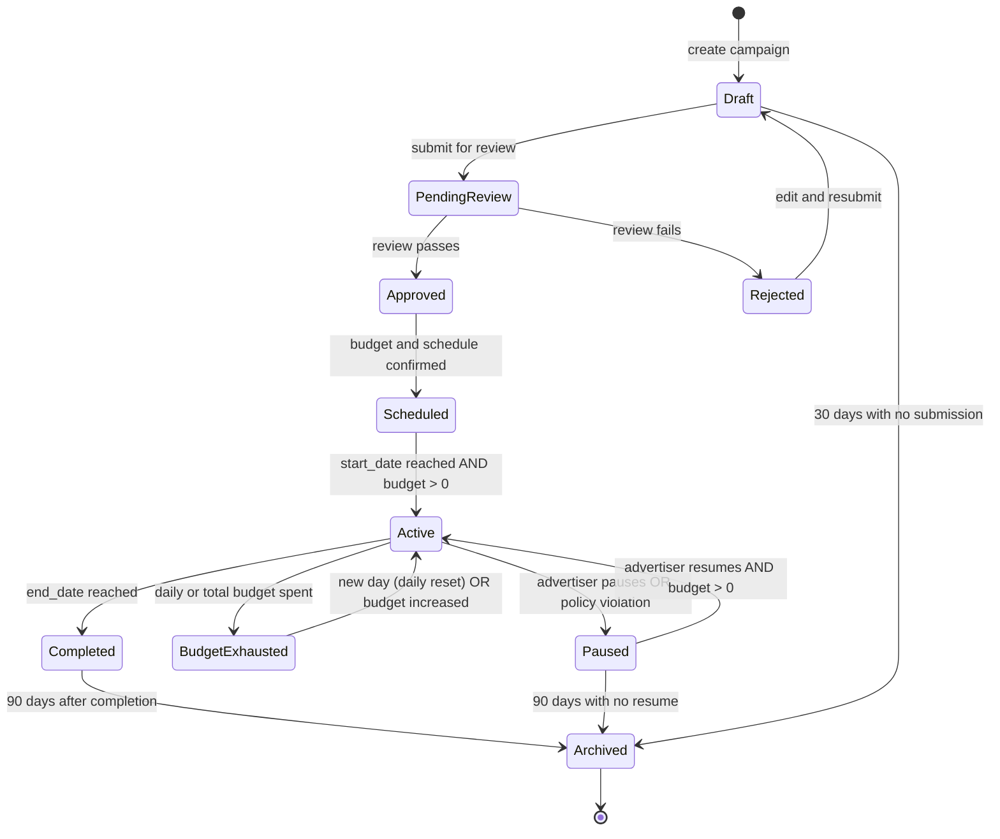

### Creative Review State Machine

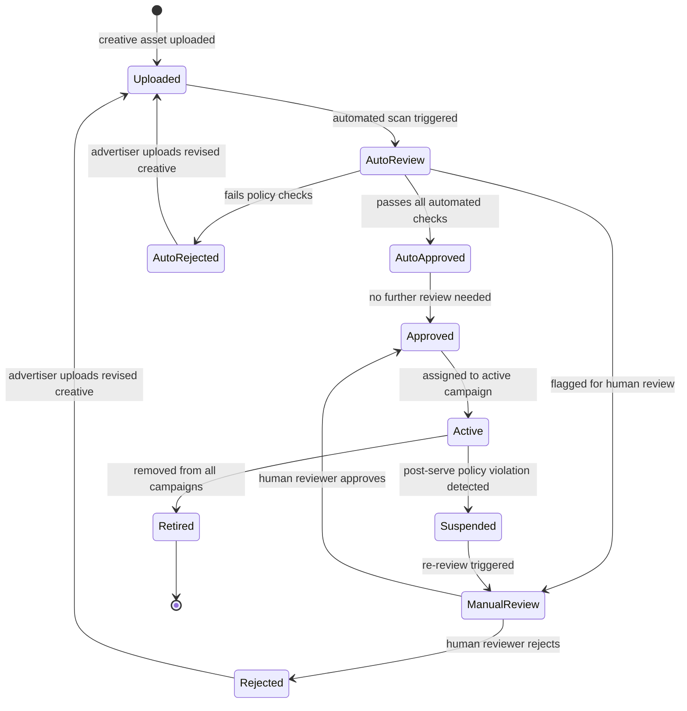

### Attribution Window State Machine

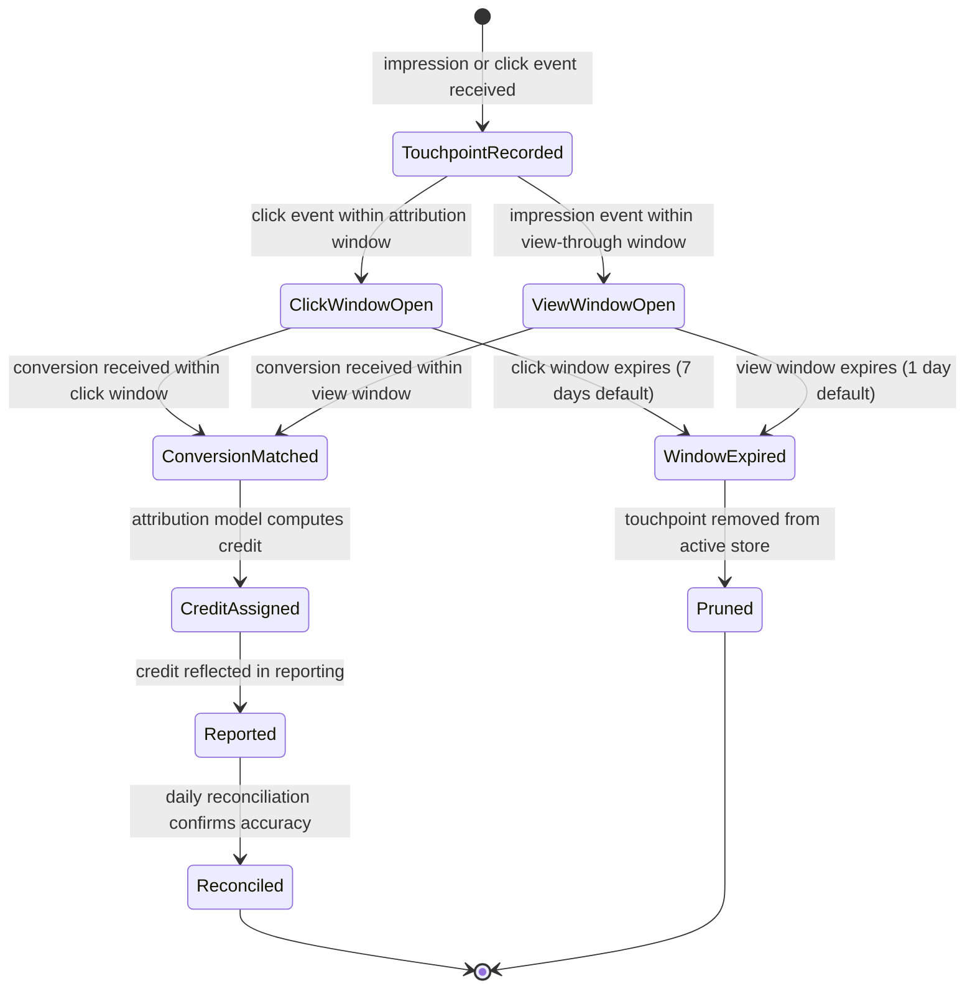

### Budget Pacing State Machine

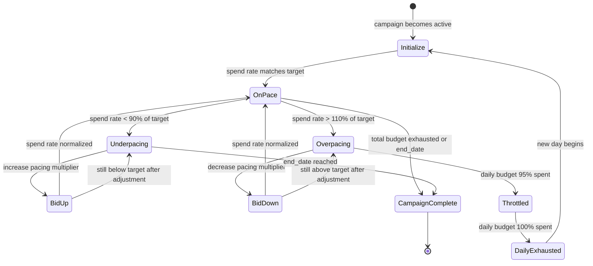

### RTB Auction State Machine

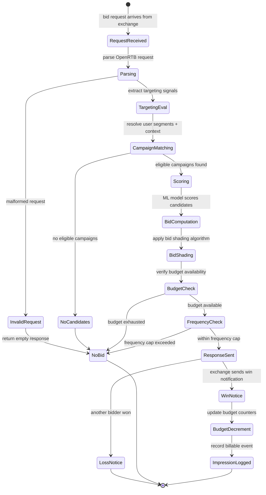

---

## Sequence Diagrams

### RTB Auction Flow (End-to-End)

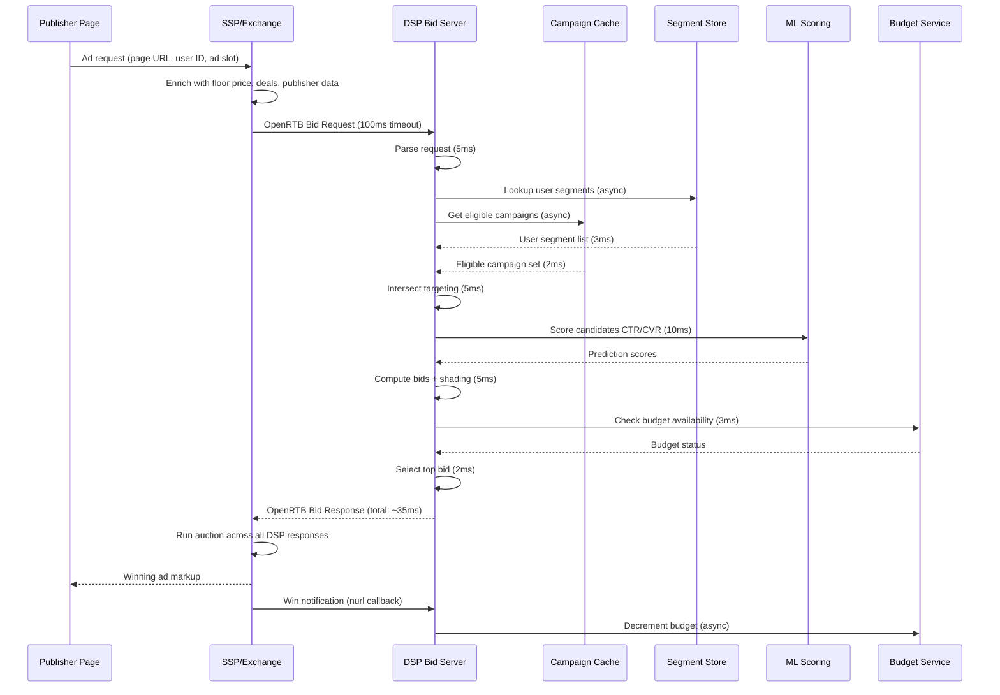

### Impression-to-Conversion Flow

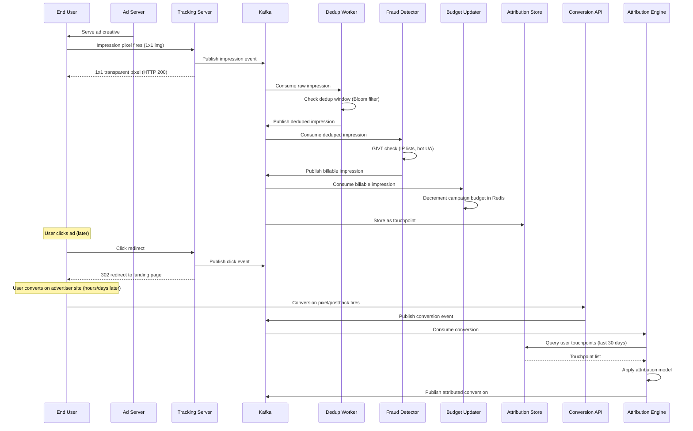

### Campaign Launch Flow

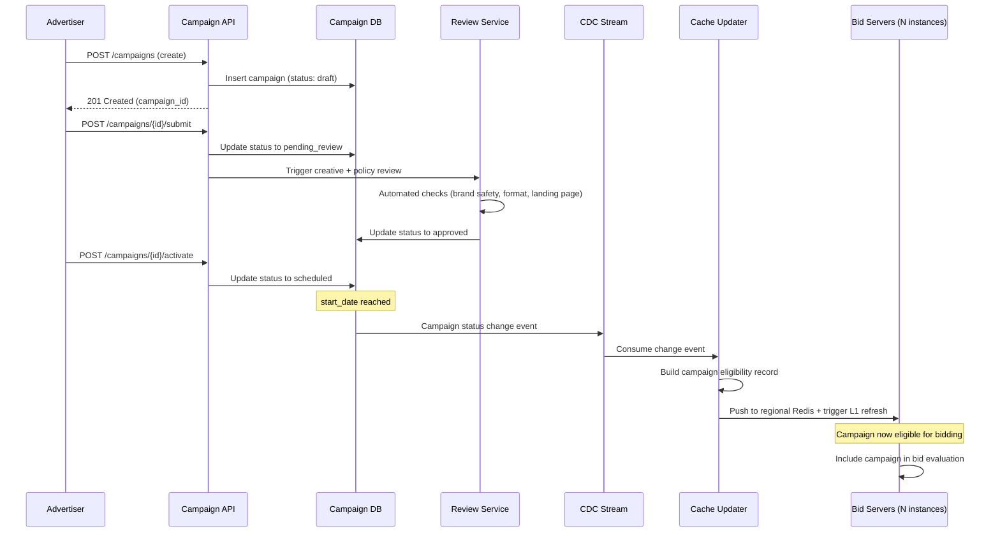

### Budget Pacing Flow

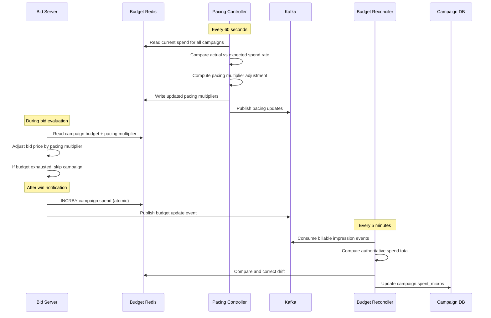

### Fraud Detection Flow

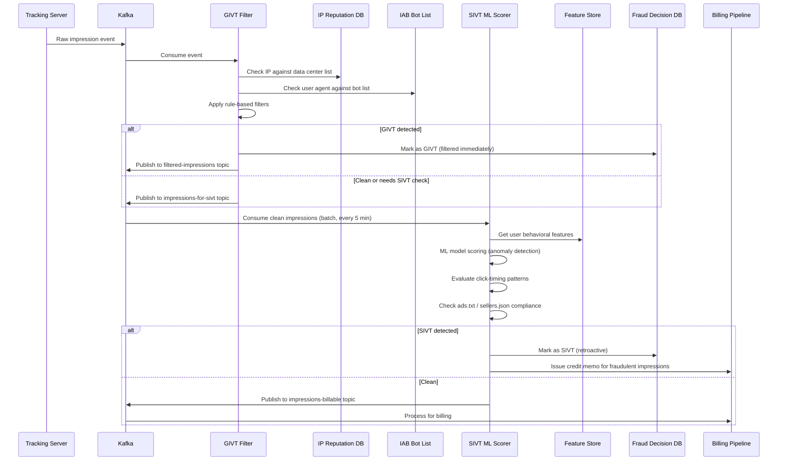

---

## Concurrency Control

### Budget Race Conditions

Budget enforcement is the hardest concurrency problem in AdTech. Multiple bid servers across regions can simultaneously win auctions for the same campaign, each decrementing the budget. Without coordination, the campaign will overspend.

**The problem:**
- Campaign has $100 daily budget remaining.
- Bid servers in NA and EU simultaneously win auctions worth $0.01 each.
- Both read budget as $100, both decrement, both think $99.99 remains.
- At 10,000 concurrent wins/second, overspend accumulates rapidly.

**Solution: tiered budget enforcement**

1. **Per-region budget allocation**: divide daily budget across regions based on historical traffic share (e.g., NA: 60%, EU: 30%, APAC: 10%). Each region operates independently within its allocation.

2. **Atomic decrement with check**: use Redis `EVAL` (Lua script) for atomic "check and decrement":
```
-- Lua script for atomic budget check and decrement
local remaining = redis.call('GET', KEYS[1])
if tonumber(remaining) >= tonumber(ARGV[1]) then
    redis.call('DECRBY', KEYS[1], ARGV[1])
    return 1  -- bid allowed
else
    return 0  -- budget exhausted
end
```

3. **Cross-region rebalancing**: every 5 minutes, a central coordinator reads actual spend from all regions and rebalances unused allocation.

4. **Overspend tolerance**: accept that 1-5% overspend is possible during rebalancing windows. This is a business-acceptable trade-off vs the latency cost of cross-region synchronous coordination.

### Frequency Capping Across Regions

Frequency capping faces a similar distributed counting problem:

**Approach: probabilistic with reconciliation**
- Each region maintains its own frequency counters in Redis.
- Cross-region sync happens every 30 seconds via Kafka.
- A user traveling between regions may see 1-2 extra impressions during the sync gap.
- This is acceptable: frequency caps are user-experience guardrails, not billing constraints.
- Bloom filters provide a space-efficient fallback when Redis is unavailable.

### Auction Concurrency

When multiple DSPs respond to the same bid request, the exchange must handle concurrent auction evaluation:

- The SSP collects all bid responses within the timeout window (100ms).
- Auction evaluation is single-threaded per request (no race condition).
- Win notifications are sent asynchronously after auction completion.
- If two exchanges conduct simultaneous auctions for the same impression (e.g., header bidding), the publisher's ad server resolves the final winner.

---

## Idempotency

### Impression Deduplication

Duplicate impressions occur due to:
- Browser retries (network timeout, user refreshes page).
- SDK double-firing (mobile SDK lifecycle issues).
- CDN/proxy retries.
- Publisher page loading the same ad slot multiple times.

**Deduplication strategy:**

1. **Dedup key**: `hash(campaign_id + user_id_hash + placement_id + hour_bucket)`.
2. **Window**: 1-hour sliding window (impressions for the same user/campaign/placement within 1 hour are duplicates).
3. **Implementation**: Bloom filter for hot path (fast, probabilistic) + exact dedup in batch pipeline.
4. **Bloom filter parameters**: 2B elements, 0.01% false positive rate, ~2.4GB memory.
5. **Exact dedup**: batch pipeline (every 5 minutes) checks against a RocksDB-backed state store keyed by impression_id.
6. **Metric**: track `dedup_rate` per publisher. A suddenly high dedup rate signals a publisher integration issue.

### Conversion Deduplication

Duplicate conversions are more damaging because they directly affect advertiser billing:

1. **Idempotency key**: advertiser-provided `order_id` or `transaction_id`.
2. **Window**: 24-hour dedup window for the same idempotency key.
3. **Storage**: Redis SET with TTL for fast lookup + persistent store for audit.
4. **Edge case**: same order_id with different conversion values -> reject the second event and log for investigation.
5. **Server-to-server postbacks**: require signed requests with timestamp validation (reject events older than 24 hours).

### Bid Response Idempotency

- Each bid response includes a unique `bid_id`.
- Win notifications reference the `bid_id` for exactly-once budget decrement.
- If a win notification is received for an already-processed `bid_id`, it is acknowledged but not re-processed.
- Win notification replay window: 1 hour (beyond that, late win notifications are logged but not processed for budget).

---

## Consistency Model

### Budget Consistency (Strong Within Region, Eventual Across Regions)

Budget enforcement uses a hybrid consistency model:

- **Within a region**: Redis atomic operations provide strong consistency for budget checks.
- **Across regions**: eventual consistency with 5-minute rebalancing cycle.
- **Reconciliation**: every 5 minutes, the authoritative spend total is computed from the impression event stream and compared against Redis counters.
- **Drift correction**: if Redis counter diverges from event stream total by more than 0.1% of daily budget, Redis is corrected.
- **Total budget**: campaign total budget (across the entire flight) is enforced with stronger consistency -- a central coordinator can pause the campaign across all regions within 30 seconds.

### Reporting Consistency (Eventual)

Reporting numbers are eventually consistent by design:

- **Real-time dashboard**: updated every 60 seconds, may differ from final billing by up to 5%.
- **Daily reconciliation**: runs at 2 AM UTC, produces authoritative daily numbers.
- **Billing-grade numbers**: available 24 hours after the day ends, after fraud filtering and dedup.
- **Advertisers are informed**: UI shows "estimated" badge on recent data and "final" on reconciled data.

### Campaign Configuration Consistency (Read-After-Write Within Region)

- Campaign changes are written to PostgreSQL primary.
- Within the same region, read replicas receive updates within 100ms (synchronous replication).
- Cross-region propagation uses CDC to Kafka to remote cache updater (1-5 second lag).
- An advertiser who pauses a campaign in NA may see 1-5 seconds of additional impressions in EU before the pause propagates.

### Impression Count Consistency

- Impression counts disagree between DSP, SSP, and third-party verification vendors.
- Industry-accepted discrepancy threshold: 10% (MRC standard).
- Reconciliation compares counts daily and flags discrepancies above threshold.
- Common causes: different viewability standards, timing differences, fraud filtering differences.
- Resolution: contractual terms specify which count is authoritative for billing.

---

## Distributed Transaction / Saga

### Campaign Activation Saga

Activating a campaign involves multiple services that must be coordinated:

```
Saga: Campaign Activation
Step 1: Campaign Service   -> Update status to "scheduled" in DB
Step 2: Budget Service     -> Reserve budget allocation across regions
Step 3: Creative Service   -> Verify all assigned creatives are approved
Step 4: Targeting Service  -> Validate audience segments exist and have sufficient reach
Step 5: Cache Service      -> Push campaign to bid server caches
Step 6: Campaign Service   -> Update status to "active"

Compensating actions (on failure):
Step 6 fails: Retry (status update is idempotent)
Step 5 fails: Roll back cache push (remove campaign from cache)
Step 4 fails: Release budget reservation (Step 2 compensation)
Step 3 fails: Release budget reservation, mark campaign as "creative_review_needed"
Step 2 fails: Revert campaign status to "approved" (Step 1 compensation)
```

### Impression Processing Saga

Processing a billable impression involves multiple downstream effects:

```
Saga: Impression Processing
Step 1: Dedup Service      -> Verify impression is not a duplicate
Step 2: Fraud Service      -> GIVT filter (synchronous, <5ms)
Step 3: Budget Service     -> Decrement campaign budget
Step 4: Frequency Service  -> Increment frequency counter
Step 5: Event Store        -> Persist billable impression to Kafka
Step 6: Attribution Store  -> Record touchpoint for future attribution

Failure handling:
- Steps 1-2 are filters; failure means the event is not processed further (no compensation needed).
- Step 3 failure: log and retry. Budget decrement must eventually succeed for billing accuracy.
- Step 4 failure: tolerate (frequency count will be corrected on next sync).
- Step 5 failure: retry with backoff. If Kafka is down, buffer locally and replay.
- Step 6 failure: tolerate (attribution will be missing this touchpoint, which slightly reduces attribution accuracy).
```

### Budget Rebalancing Saga

When traffic patterns shift and one region needs more budget:

```
Saga: Cross-Region Budget Rebalancing
Step 1: Monitor Service    -> Detect region spend rate imbalance
Step 2: Coordinator        -> Compute optimal allocation per region
Step 3: Region A Budget    -> Reduce allocation (release funds)
Step 4: Region B Budget    -> Increase allocation (claim funds)
Step 5: Coordinator        -> Record new allocation in central store

Compensating actions:
- Step 4 fails: Restore Region A allocation (Step 3 compensation)
- Steps are ordered so that funds are released before claimed (prevents over-allocation)
- Coordinator uses a distributed lock to prevent concurrent rebalancing
```

---

## Security Design

### Ad Fraud Prevention Architecture

Ad fraud is the primary security threat in AdTech. The defense is layered:

**Layer 1: Pre-bid filtering (real-time, <5ms)**
- IP blocklist checking (known data centers, VPNs, proxies).
- User agent filtering (known bot signatures).
- ads.txt / sellers.json verification (authorized seller chain).
- Device fingerprint validation (impossible device characteristics).

**Layer 2: Post-bid GIVT filtering (near-real-time, <1 minute)**
- IAB/ABC International Spiders & Bots List matching.
- Data center IP range filtering.
- Non-browser traffic detection.
- Pre-render and prefetch traffic filtering.

**Layer 3: SIVT detection (batch, 5-60 minutes)**
- Click injection detection: analyze time between ad impression and click (CTIT). Abnormally fast clicks indicate injection.
- Ad stacking detection: correlate viewability signals across stacked ads on the same page.
- Domain spoofing detection: compare declared domain in bid request against actual serving domain via ads.txt.
- Bot farm detection: cluster analysis of user behavior patterns (click rate, session duration, geo-diversity).
- SDK spoofing detection: cryptographic validation of install postbacks.

**Layer 4: Retrospective analysis (daily)**
- Full dataset analysis for patterns not visible in real-time.
- Advertiser-specific fraud patterns (e.g., competitor click fraud).
- Publisher quality scoring and tiering.
- Refund/credit issuance for confirmed fraud.

### Brand Safety

Brand safety ensures ads do not appear next to harmful or controversial content:

- **Pre-bid**: page URL classification against IAB content taxonomy. Advertisers specify blocked categories.
- **Post-bid verification**: third-party verification vendors (IAS, DoubleVerify, MOAT) measure actual placement context.
- **Keyword blocking**: advertisers provide keyword blocklists; bid requests containing blocked keywords are filtered.
- **Domain blocklists**: global and advertiser-specific domain blocklists.
- **Sentiment analysis**: ML models classify page sentiment and flag negative contexts.

### Privacy Compliance Architecture

```
Consent Processing Pipeline:
1. Bid request arrives with consent signals (TCF string, USP string, GPP string).
2. Consent parser extracts per-purpose, per-vendor consent.
3. Consent evaluator checks:
   a. Is our vendor ID consented for the requested purpose?
   b. Is the legal basis valid for this jurisdiction?
   c. Are data processing restrictions in effect?
4. If consent is insufficient:
   a. Fall back to contextual-only targeting (no user data).
   b. Do not store or process user identifiers.
   c. Do not fire third-party tracking pixels.
5. Consent decision is logged for audit.
```

**Data minimization:**
- User identifiers are hashed (SHA-256) before storage.
- Raw IP addresses are truncated (last octet zeroed for IPv4).
- Logs are stripped of PII after 24 hours.
- User profiles are deleted within 30 days of opt-out or deletion request.

**Right to deletion:**
- GDPR Article 17 and CCPA deletion requests processed within 30 days.
- Deletion propagates to all stores: user profiles, segment memberships, touchpoint history, conversion records.
- Deletion receipts are maintained for compliance audit.

---

## Observability

### Key Metrics Dashboard

**RTB Bidding Metrics:**
| Metric | Definition | Alert Threshold |
|--------|-----------|----------------|
| Bid Request Rate | Incoming bid requests per second | < 50% of expected baseline |
| Bid Rate | Percentage of requests that receive a bid | Drop > 20% in 5 minutes |
| Win Rate | Percentage of bids that win auction | Drop > 30% in 15 minutes |
| No-Bid Reasons | Breakdown by reason (budget, targeting, pacing, timeout) | Any single reason > 80% |
| Bid Latency p50/p95/p99 | Time from request receipt to response | p99 > 80ms |
| Timeout Rate | Percentage of responses that exceed exchange timeout | > 1% |
| Bid Shading Factor | Average reduction from initial bid | Sudden change > 20% |

**Delivery Metrics:**
| Metric | Definition | Alert Threshold |
|--------|-----------|----------------|
| Fill Rate | Impressions served / ad requests received | Drop > 15% in 30 minutes |
| eCPM | Effective revenue per 1000 impressions | Drop > 25% in 1 hour |
| Viewability Rate | Viewable impressions / total impressions | Drop below 50% |
| CTR | Clicks / impressions | Spike > 5x average (fraud signal) |
| Invalid Traffic Rate | GIVT + SIVT / total impressions | > 5% of traffic |

**Budget and Pacing Metrics:**
| Metric | Definition | Alert Threshold |
|--------|-----------|----------------|
| Budget Utilization | Spend / daily budget | < 70% at midday (underpacing) or > 100% (overspend) |
| Pacing Error | Actual spend rate vs target | Deviation > 20% for 30+ minutes |
| Budget Exhaustion Rate | Campaigns exhausting daily budget early | > 30% of campaigns by noon |
| Cross-Region Budget Drift | Difference between Redis counter and reconciled total | > 2% of daily budget |

**Event Pipeline Metrics:**
| Metric | Definition | Alert Threshold |
|--------|-----------|----------------|
| Kafka Consumer Lag | Messages behind latest offset | > 1M messages or > 5 minutes |
| Dedup Rate | Duplicate events filtered / total events | Sudden change > 50% |
| Event Processing Latency | Time from event creation to downstream availability | > 60 seconds |
| DLQ Rate | Events sent to dead letter queue / total events | > 0.1% |

### Distributed Tracing

- Every bid request generates a trace ID that follows the request through targeting, scoring, bid computation, win notification, impression tracking, and attribution.
- Traces are sampled at 1% for normal traffic and 100% for flagged campaigns (debugging mode).
- Trace data is stored in Jaeger/Tempo with 7-day retention.
- Critical path analysis: identify which component contributes most to bid latency.

### Alerting Strategy

- **P0 (page immediately)**: bid rate drops > 50%, impression tracking returns errors, budget service unavailable.
- **P1 (page within 15 minutes)**: win rate anomaly, pacing error > 30%, Kafka lag > 15 minutes.
- **P2 (ticket, next business day)**: fraud rate increase, viewability drop, reporting delay > 2 hours.

---

## Reliability and Resilience

### Graceful Degradation Under Load

The RTB system must degrade gracefully rather than fail catastrophically:

**Load shedding strategy:**
1. **Tier 1 (100% capacity)**: full targeting + ML scoring + bid shading.
2. **Tier 2 (80% capacity)**: simplified targeting (skip lookalike, use pre-computed segments only) + ML scoring.
3. **Tier 3 (50% capacity)**: contextual-only targeting + rule-based bidding (no ML).
4. **Tier 4 (20% capacity)**: bid only on high-value deals (PG/PMP), no-bid on open auction.
5. **Tier 5 (emergency)**: return no-bid on all requests. System stays up but stops spending money.

**Trigger**: CPU utilization > thresholds, or p99 latency approaching timeout.

**Implementation**: feature flags per degradation tier, controlled by the load shedding controller.

### Circuit Breakers

| Dependency | Failure Mode | Circuit Breaker Action |
|-----------|-------------|----------------------|
| Segment Store (Aerospike) | High latency or errors | Fall back to contextual-only targeting |
| Budget Redis | Unavailable | Bid with conservative budget estimates; reconcile later |
| ML Model Service | Timeout | Use fallback rule-based scoring |
| Kafka | Producer failures | Buffer to local disk queue (10GB max) |
| Campaign Cache | Stale data | Continue bidding with stale data; alert ops |
| Fraud Detection | Pipeline lag | Process impressions as clean; flag for re-scoring |

### Failure Mode Analysis

| Failure | Impact | Mitigation | Recovery Time |
|---------|--------|-----------|---------------|
| Single bid server crash | 0.05% traffic dropped | Load balancer health checks, auto-restart | 30 seconds |
| Region-level Redis failure | Budget drift in affected region | Cross-region budget rebalancing, conservative bidding | 5 minutes |
| Kafka broker failure | Event processing delay | Multi-broker replication (3x), consumer rebalancing | 2 minutes |
| Segment store outage | Targeting degrades to contextual | Circuit breaker, contextual fallback | Minutes to hours |
| ML model serving failure | Bid quality degrades | Rule-based fallback scoring | Immediate fallback, model fix: hours |
| Full region failure | Traffic shifts to other regions | DNS-based failover, cross-region campaign caches | 2-5 minutes |
| Campaign DB failure | No new campaign changes | Read replicas serve existing state; writes queued | Minutes |

### Chaos Engineering Practices

- **Monthly**: kill random bid server instances during business hours; verify no impression loss.
- **Quarterly**: simulate full region failure; verify cross-region failover.
- **Bi-annually**: simulate Kafka outage; verify local buffering and replay.
- **Ad-hoc**: inject latency into segment store; verify graceful degradation tiers activate.

---

## Multi-Region Architecture

### Global RTB with Regional Bid Servers

```
Region Architecture:

NA-East (Virginia):
  - 600 bid servers (handles 35% of global traffic)
  - Aerospike segment store (full replica)
  - Redis cluster (budget + pacing + frequency)
  - Kafka cluster (regional events)
  - Campaign cache (synced from primary DB)

NA-West (Oregon):
  - 300 bid servers (handles 15% of global traffic)
  - Aerospike segment store (full replica)
  - Redis cluster (regional)
  - Kafka cluster (regional)

EU-West (Frankfurt):
  - 500 bid servers (handles 25% of global traffic)
  - Aerospike segment store (EU-only profiles, GDPR compliance)
  - Redis cluster (regional)
  - Kafka cluster (regional, EU data stays in EU)

APAC (Singapore):
  - 400 bid servers (handles 20% of global traffic)
  - Aerospike segment store (full replica)
  - Redis cluster (regional)
  - Kafka cluster (regional)

LATAM (Sao Paulo):
  - 200 bid servers (handles 5% of global traffic)
  - Aerospike segment store (partial replica)
  - Redis cluster (regional)
  - Kafka cluster (regional)
```

### Data Residency

- **EU user data**: stored and processed only in EU-West region (GDPR requirement).
- **Campaign configuration**: primary DB in NA-East, read replicas in all regions via CDC.
- **Billing/reporting data**: aggregated centrally in NA-East after anonymization.
- **Bid logs**: stored in the region where the bid was processed (no cross-region transfer for raw logs).
- **Attribution data**: processed in the region where the conversion occurred; cross-region touchpoint matching uses anonymized join keys.

### Cross-Region Synchronization

| Data Type | Sync Mechanism | Latency | Direction |
|-----------|---------------|---------|-----------|
| Campaign changes | CDC -> Kafka -> Cache updater | 1-5 seconds | Primary -> all regions |
| Budget counters | Kafka replication | 5-30 seconds | Bidirectional (regional -> central -> regional) |
| User segments | Aerospike XDR (cross-datacenter replication) | 1-10 seconds | Bidirectional (except EU: EU -> others, not reverse for GDPR) |
| Frequency counts | Kafka | 30-60 seconds | Bidirectional |
| Impression events | Kafka MirrorMaker | 1-5 minutes | Regional -> central (for reporting) |

### Exchange Connectivity

- Bid servers maintain persistent HTTP/2 connections to exchanges.
- Each region connects to exchanges with the closest network proximity.
- An exchange in EU sends bid requests to EU bid servers; a US exchange sends to NA-East/NA-West.
- If a region is down, exchanges fail open (stop sending requests) rather than routing to a distant region (latency would exceed timeout).

---

## Cost Drivers

### Infrastructure Cost Breakdown

| Component | Monthly Cost (estimated) | % of Total | Optimization Lever |
|-----------|------------------------|-----------|-------------------|
| Bid server compute (2,000 instances) | $1,200,000 | 30% | Right-size instances, spot for non-critical; ARM (Graviton) |
| Kafka clusters (5 regions) | $400,000 | 10% | Tiered storage, reduce retention, compression |
| Aerospike segment store | $300,000 | 7.5% | Compact segment encoding, evict stale profiles |
| Redis clusters (budget/pacing/frequency) | $200,000 | 5% | Key TTL tuning, Bloom filter for frequency |
| ClickHouse (event storage) | $500,000 | 12.5% | Tiered storage (hot/warm/cold), aggressive compression |
| S3 (cold storage) | $150,000 | 3.75% | Lifecycle policies, Intelligent-Tiering |
| Network/bandwidth (bid traffic) | $600,000 | 15% | Bid request filtering (no-bid fast path), response compression |
| ML model serving | $250,000 | 6.25% | Model distillation, batched inference, quantization |
| Monitoring/observability | $150,000 | 3.75% | Sample traces, aggregate metrics, retention policies |
| Other (DNS, CDN, misc) | $250,000 | 6.25% | -- |
| **Total** | **$4,000,000/month** | **100%** | -- |

### Cost Optimization Strategies

1. **Bid request filtering**: reject obviously ineligible requests before entering the full bid pipeline. A fast no-bid path (IP blocklist, no matching geo, no active deals) can reject 30-40% of traffic in <5ms, saving compute on full evaluation.

2. **Spot instances for bid servers**: bid servers are stateless and can tolerate interruption. Use spot instances for 30-50% of capacity, with on-demand for the baseline. Savings: 60-70% on compute.

3. **Event data tiering**: move impression data older than 7 days from ClickHouse to Parquet on S3. Query with Trino/Presto for ad-hoc analysis. Savings: 50% on ClickHouse storage.

4. **ML model optimization**: use quantized models (INT8) for inference, reducing compute requirements by 2-4x with minimal accuracy loss.

5. **Bandwidth optimization**: compress bid responses (gzip/brotli), use HTTP/2 multiplexing to reduce connection overhead, and filter unnecessary fields from bid requests.

---

## Deep Platform Comparisons

### Google Ads (DV360 / Google Ad Manager)

| Dimension | Google Ads Approach |
|-----------|-------------------|
| Scale | Largest ad platform globally; processes millions of QPS across search, display, video, and CTV |
| Auction model | Transitioned to first-price auction for Ad Manager (2019); search ads use Vickrey-Clarke-Groves (VCG) |
| Targeting | Strongest first-party data moat (Search, YouTube, Gmail, Maps); pushing Privacy Sandbox for Chrome |
| Attribution | Google Analytics 4 with data-driven attribution as default; cross-channel via Google signals |
| Identity | Google Account (logged-in) for deterministic matching; Privacy Sandbox for Chrome |
| Strengths | Unmatched first-party data, full-stack (DSP + SSP + exchange + measurement), YouTube premium inventory |
| Weaknesses | Antitrust scrutiny, walled garden limits transparency, potential forced divestiture of ad exchange |
| Key architectural lesson | Vertical integration allows end-to-end optimization but creates anticompetitive concerns |

### Meta Ads (Facebook/Instagram Ads)

| Dimension | Meta Ads Approach |
|-----------|-----------------|
| Scale | Second largest ad platform; primarily mobile and social |
| Auction model | Internal auction (not open exchange); Vickrey auction for ad slots in News Feed, Stories, Reels |
| Targeting | Strongest social graph data; Custom Audiences, Lookalike Audiences; severely impacted by Apple ATT |
| Attribution | Conversions API (server-to-server); modeled conversions to fill data gaps from ATT |
| Identity | Facebook/Instagram login for deterministic matching; limited cross-app tracking post-ATT |
| Strengths | Rich user engagement data, strong creative optimization, Advantage+ automated campaigns |
| Weaknesses | Apple ATT reduced iOS targeting effectiveness by 30-50%; brand safety concerns with user-generated content |
| Key architectural lesson | First-party data is defensible; dependency on third-party signals (IDFA) creates existential risk |

### Amazon Ads (Amazon DSP)

| Dimension | Amazon Ads Approach |
|-----------|-------------------|
| Scale | Third largest and fastest growing; unique purchase intent data |
| Auction model | First-price for programmatic display; internal auction for sponsored products (search-like) |
| Targeting | Purchase and shopping behavior data; Amazon audiences based on actual buying patterns |
| Attribution | Amazon Attribution for off-Amazon campaigns; 14-day attribution window by default |
| Identity | Amazon customer ID; purchase data not available to external platforms |
| Strengths | Closed-loop attribution (ad exposure -> purchase on Amazon), unique bottom-funnel intent data |
| Weaknesses | Limited to Amazon ecosystem for best data; DSP user experience historically weaker than competitors |
| Key architectural lesson | Commerce data creates the most valuable attribution signal; closed-loop measurement is the gold standard |

### The Trade Desk (TTD)

| Dimension | The Trade Desk Approach |
|-----------|----------------------|
| Scale | Largest independent DSP; demand-side only (no supply-side conflicts) |
| Auction model | Participates in first-price auctions across 100+ exchanges; advanced bid shading (Koa AI) |
| Targeting | Unified ID 2.0 (open identity initiative); large third-party data marketplace |
| Attribution | Cross-device, cross-channel measurement; integrates with multiple measurement partners |
| Identity | Unified ID 2.0 based on hashed email; post-cookie identity strategy |
| Strengths | Independence (no supply-side conflicts), transparency, omnichannel (display, video, CTV, audio) |
| Weaknesses | Dependent on third-party data and exchanges; no first-party user data |
| Key architectural lesson | Platform independence and transparency are competitive advantages in a market with trust issues |

### AppLovin

| Dimension | AppLovin Approach |
|-----------|-----------------|
| Scale | Dominant in mobile gaming advertising; growing into broader mobile ecosystem |
| Auction model | In-app bidding (server-to-server, replacing waterfall); first-price |
| Targeting | ML-driven user value prediction; optimizes for in-app events and LTV |
| Attribution | Integrated with Adjust (acquired); SKAdNetwork optimization for iOS |
| Identity | Device-level (GAID/IDFA where available); contextual and ML-based signals post-ATT |
| Strengths | Deep mobile gaming expertise, AXON ML engine, vertical integration (mediation + exchange + DSP) |
| Weaknesses | Concentrated in gaming; brand advertiser adoption still growing |
| Key architectural lesson | ML-first approach to bidding and optimization outperforms rule-based systems; vertical integration in a niche creates compounding advantages |

### Comparison Summary

| Capability | Google | Meta | Amazon | TTD | AppLovin |
|-----------|--------|------|--------|-----|----------|
| First-party data strength | Very High | High | Very High | Low | Medium |
| Cross-channel coverage | Very High | Medium | Medium | Very High | Medium |
| Privacy resilience (post-cookie) | High | Medium | High | Medium | Medium |
| Auction transparency | Low | Low | Low | High | Medium |
| CTV/OTT strength | High | Low | Medium | High | Low |
| Mobile strength | High | Very High | Medium | Medium | Very High |
| Attribution accuracy | High | Medium (post-ATT) | Very High | Medium | High (mobile) |

---

## Edge Cases and Failure Scenarios

### 1. Budget Overspend During Cross-Region Rebalancing

**Scenario**: Campaign has $1,000 remaining. Budget is allocated 60/30/10 across NA/EU/APAC. NA rapidly spends its $600 allocation. Before rebalancing can reclaim from EU/APAC, NA bid servers see the budget as exhausted and stop bidding, while EU/APAC still have unused allocation.

**Impact**: underspend (campaign does not deliver its full budget).

**Mitigation**: trigger emergency rebalancing when any region exhausts its allocation. Allow 5% overshoot per region with reconciliation.

### 2. Click Flooding Attack

**Scenario**: a competitor or malicious actor sends millions of click events to a campaign's tracking URL, rapidly exhausting the CPC budget.

**Impact**: budget wasted on fraudulent clicks; campaign stops delivering to real users.

**Mitigation**: rate limiting on click tracking endpoints (per IP, per device fingerprint). SIVT detection flags abnormal click patterns. Automated budget protection pauses campaigns with CTR > 10x historical average.

### 3. Cookie Deprecation (Third-Party Cookie Removal in Chrome)

**Scenario**: Chrome fully deprecates third-party cookies. 60% of web targeting relies on cookie-based user identification.

**Impact**: targeting accuracy drops, retargeting campaigns lose effectiveness, frequency capping becomes unreliable.

**Mitigation**: invest in first-party data strategies, publisher-provided IDs, contextual targeting, Privacy Sandbox APIs (Topics, Protected Audiences). Build server-side cookie sync alternatives.

### 4. Consent Management Failure

**Scenario**: TCF consent string parser has a bug and fails to detect that a user has not consented to purpose 1 (store and access information on a device). The system proceeds with cookie-based targeting.

**Impact**: GDPR violation; potential fines up to 4% of global revenue.

**Mitigation**: fail-closed consent processing (if consent parsing fails, treat as no consent). Automated consent compliance testing. Third-party consent verification audit. Regular consent parser updates for TCF spec changes.

### 5. Stale Campaign Cache After CDC Failure

**Scenario**: the CDC stream from campaign database to bid server cache fails silently. Campaign changes (pauses, budget increases, targeting changes) are not propagated for 30 minutes.

**Impact**: paused campaigns continue to serve; budget changes not reflected; targeting changes not applied.

**Mitigation**: cache entries include a "last_refreshed" timestamp. Bid servers check staleness and alert if cache is older than 2 minutes. Heartbeat monitoring on the CDC pipeline. Fallback: periodic full cache rebuild every 5 minutes.

### 6. IDFA/GAID Opt-Out Surge

**Scenario**: Apple releases a new iOS version that prompts users again about tracking. Opt-out rate jumps from 75% to 95% overnight.

**Impact**: iOS audience segments shrink dramatically. Frequency capping becomes ineffective for opted-out users.

**Mitigation**: model-based estimation of frequency (probabilistic frequency management). Shift budget to contextual campaigns. Increase investment in SKAdNetwork-optimized campaigns.

### 7. Exchange Timeout Storm

**Scenario**: a major exchange reduces its bid timeout from 100ms to 80ms without notice. 15% of bid responses now arrive late and are discarded.

**Impact**: win rate drops; revenue decreases; wasted compute on bids that will never win.

**Mitigation**: monitor timeout rate per exchange. Automatically adjust latency budget when timeout rate increases. Implement adaptive timeout detection that observes exchange behavior.

### 8. Attribution Window Boundary Effect

**Scenario**: an impression served at 11:59 PM on day 7 of a 7-day click attribution window. The conversion happens at 12:01 AM on day 8. One-second difference determines whether the conversion is attributed.

**Impact**: sensitive to timestamp precision; advertisers may dispute attribution results.

**Mitigation**: use consistent timestamp source (event_time from the source system, not processing time). Document attribution window semantics clearly. Allow 1-hour grace period at window boundaries for clock skew.

### 9. CTV Impression Fraud via SSAI Spoofing

**Scenario**: a fraudulent CTV app generates fake Server-Side Ad Insertion (SSAI) requests, claiming to serve ads during legitimate streaming content. The bid request looks authentic because SSAI traffic originates from known CDN IP ranges.

**Impact**: advertiser budget spent on non-viewable, non-human traffic that is difficult to distinguish from legitimate CTV inventory.

**Mitigation**: app-ads.txt verification for CTV apps. IFA (Identifier for Advertising) validation. SSAI provider certification. Anomaly detection on session length, content patterns.

### 10. Data-Driven Attribution Model Collapse

**Scenario**: a major advertiser changes their conversion pixel, breaking the training data pipeline for their DDA model. The model continues serving but with degrading accuracy.

**Impact**: attribution credit is misassigned across channels, leading to incorrect budget allocation.

**Mitigation**: model monitoring for prediction drift. Automatic fallback to last-click attribution when DDA confidence drops below threshold. Data quality checks on conversion event streams.

### 11. Flash Sale / Event Traffic Spike

**Scenario**: Super Bowl ads drive 50x normal traffic to advertiser landing pages. Conversion tracking pixels receive 50x normal volume simultaneously.

**Impact**: tracking infrastructure overwhelmed; lost conversion events; budget pacing algorithms miscalibrate.

**Mitigation**: auto-scaling for tracking endpoints. Pre-provision for known events. Kafka partitioning handles throughput spikes. Pacing algorithm includes "event mode" that expects abnormal traffic patterns.

### 12. Supply Chain Fraud (Bid Request Spoofing)

**Scenario**: a malicious entity sends bid requests claiming to be from premium publishers (e.g., nytimes.com) but actually serving ads on low-quality sites.

**Impact**: advertiser pays premium CPMs for low-quality inventory.

**Mitigation**: ads.txt and sellers.json verification (authorized digital sellers). Supply chain object (schain) validation in OpenRTB. Post-serve URL verification comparing declared domain against actual serving domain.

---

## Architecture Decision Records

### ADR-001: First-Price Auction with Bid Shading Over Second-Price Auction

**Status**: Accepted

**Context**: The industry transitioned from second-price to first-price auctions between 2017-2019. In second-price, the winner pays the second-highest bid plus $0.01. In first-price, the winner pays their actual bid. We need to decide which auction model to implement.

**Decision**: implement first-price auction with algorithmic bid shading on the buy side.

**Rationale**:
- First-price is now the industry standard for display and video. SSPs and exchanges have already transitioned.
- Second-price auctions had game-theoretic elegance (truthful bidding is optimal) but were undermined by exchange-level price manipulation and hidden fees.
- First-price requires bid shading on the DSP side to avoid overpaying, but this is a solvable ML problem.
- Supporting only first-price simplifies the exchange logic and makes pricing transparent.

**Consequences**:
- Must invest in bid shading algorithms (significant ML engineering effort).
- Advertisers may initially overpay until bid shading models converge.
- Exchange revenue may decrease compared to opaque second-price manipulation.
- Pricing becomes more transparent and trust increases.

**Alternatives considered**:
- Second-price: rejected because industry has moved away; exchanges no longer support it for programmatic.
- Hybrid (second-price for PMP, first-price for open): rejected for complexity; standardize on one model.

---

### ADR-002: Eventual Consistency for Budget Enforcement Across Regions

**Status**: Accepted

**Context**: budget enforcement requires knowing how much a campaign has spent. With bid servers in 5 regions, maintaining a globally consistent spend counter would require cross-region coordination on every bid, adding 50-100ms of latency (unacceptable for a 100ms total budget).

**Decision**: use eventually consistent budget counters with per-region allocation and periodic rebalancing.

**Rationale**:
- Cross-region strong consistency adds latency that would make bidding impossible within the 100ms timeout.
- Budget overspend of 1-5% of daily budget is a business-acceptable trade-off.
- Per-region allocation with rebalancing provides good budget utilization.
- Reconciliation pipeline corrects drift within 5 minutes.

**Consequences**:
- Campaigns may overspend by up to 5% of daily budget during allocation rebalancing.
- Budget exhaustion may not propagate to all regions for up to 30 seconds.
- Must build reconciliation tooling and drift monitoring.
- Advertiser-facing UI shows "estimated spend" with a reconciled number available next day.

**Alternatives considered**:
- Global strong consistency (Redis with cross-region replication): rejected due to latency.
- Token bucket per bid server: rejected because token distribution does not adapt well to traffic shifts.
- Central budget service with async confirmation: rejected because bids cannot wait for confirmation.

---

### ADR-003: Kafka as the Event Backbone Over Kinesis or Pulsar

**Status**: Accepted

**Context**: the system produces billions of events per day (impressions, clicks, bids, conversions) that must be processed by multiple consumers (dedup, fraud detection, billing, reporting, attribution). We need a durable, scalable event streaming platform.

**Decision**: use Apache Kafka (self-managed on EC2) as the primary event streaming platform.

**Rationale**:
- Kafka handles the required throughput (500K+ events/second per topic) with proven reliability.
- Multi-consumer support with consumer groups allows independent processing pipelines.
- Kafka's log-based architecture provides natural replay capability for reconciliation.
- Self-managed Kafka on EC2 provides cost control and tuning flexibility at our scale (vs managed services).
- Strong ecosystem: Kafka Connect, Kafka Streams, and integration with ClickHouse, Flink, Spark.

**Consequences**:
- Operational burden of managing Kafka clusters across 5 regions.
- Need Kafka expertise on the team (SRE investment).
- Cross-region replication via MirrorMaker adds complexity.
- Must implement monitoring for consumer lag, partition skew, and broker health.

**Alternatives considered**:
- Amazon Kinesis: rejected because per-shard pricing is expensive at our scale; limited partition count.
- Apache Pulsar: evaluated but rejected due to smaller ecosystem and less operational familiarity.
- Managed Kafka (Confluent Cloud / Amazon MSK): evaluated but cost at our throughput exceeds self-managed by 3x.

---

### ADR-004: Privacy-First Targeting Architecture with Contextual Fallback

**Status**: Accepted

**Context**: third-party cookies are being deprecated in Chrome, IDFA access is restricted by Apple ATT, and privacy regulations (GDPR, CCPA) increasingly constrain user-level targeting. We need a targeting architecture that works in this evolving landscape.

**Decision**: build a dual-path targeting architecture where user-based targeting degrades gracefully to contextual targeting when identity signals are unavailable.

**Rationale**:
- Cookie deprecation and ATT mean user-based targeting will have diminishing reach over time.
- Contextual targeting is privacy-safe and does not require user consent.
- A dual-path approach allows the system to maximize targeting precision when identity is available and maintain relevance when it is not.
- Privacy Sandbox APIs (Topics, Protected Audiences) will supplement contextual signals over time.

**Consequences**:
- Must invest in contextual classification infrastructure (NLP, content taxonomy).
- Targeting effectiveness will decrease for some campaigns (especially retargeting).
- Must educate advertisers about the targeting precision trade-offs.
- Need to support Privacy Sandbox APIs as they mature (ongoing engineering investment).

**Alternatives considered**:
- User-ID-only targeting (require login): rejected because most users do not log in to publisher sites.
- Cohort-based targeting only: evaluated but cohort approaches are still maturing and not ready as sole strategy.
- Fingerprinting: strictly rejected due to privacy regulation violations and browser countermeasures.

---

### ADR-005: ClickHouse Over BigQuery for Event Analytics

**Status**: Accepted

**Context**: the reporting and analytics pipeline needs to query billions of events per day with sub-5-second response times for advertiser dashboards. We need a columnar analytics database.

**Decision**: use ClickHouse (self-managed) as the primary analytics database for impression, click, and conversion data.

**Rationale**:
- ClickHouse provides the required query performance (sub-second for aggregation queries on billions of rows).
- Column-oriented storage with LZ4/ZSTD compression achieves 10-20x compression ratios on event data.
- ClickHouse's merge tree engine with partition pruning and primary key indexes supports our access patterns (time-range + campaign filtering).
- Self-managed provides cost control at our data volume (50+ TB/day).
- Strong community and adoption in AdTech (used by CloudFlare, Uber, eBay, numerous AdTech companies).

**Consequences**:
- Operational burden of managing ClickHouse clusters (complex replication and resharding).
- Limited transaction support (ClickHouse is not suitable for campaign CRUD; PostgreSQL handles that).
- Must implement tiered storage (hot ClickHouse -> cold S3/Parquet) manually.
- Need ClickHouse expertise on the team.

**Alternatives considered**:
- BigQuery: excellent for ad-hoc analysis but query latency too high for interactive dashboards at our scale; per-query pricing is expensive for high-frequency reporting.
- Apache Druid: evaluated but operational complexity is similar to ClickHouse with less community adoption in AdTech.
- Snowflake: strong but per-credit pricing is prohibitive at our query volume.

---

### ADR-006: Hybrid Fraud Detection (In-House GIVT + Third-Party SIVT)

**Status**: Accepted

**Context**: ad fraud detection is critical for platform trust. We must decide between building a full in-house fraud detection system, relying entirely on third-party verification, or a hybrid approach.

**Decision**: build in-house GIVT filtering for the hot path and integrate third-party SIVT verification (IAS, DoubleVerify) for advanced fraud detection.

**Rationale**:
- GIVT filtering (IP lists, bot lists, data center detection) is straightforward and must run inline for pacing accuracy.
- SIVT detection (sophisticated fraud) requires specialized ML models, threat intelligence, and industry-wide signal sharing that third-party vendors do better.
- Advertisers and agencies require MRC-accredited third-party verification for trust.
- In-house GIVT filtering saves the cost of running every event through third-party scoring.

**Consequences**:
- Must maintain and update GIVT rule sets and IP lists.
- Third-party verification adds cost (~$0.01-0.05 CPM) and latency (async, not on hot path).
- Fraud detection results may disagree between in-house and third-party (requires reconciliation process).
- Must support multiple verification vendors as different advertisers require different providers.

---

## CTV/OTT Advertising Deep Dive

Connected TV and Over-The-Top streaming represent the fastest-growing ad channel, but they introduce architectural challenges that differ fundamentally from display and mobile.

### How CTV Differs from Display

| Dimension | Display/Mobile | CTV/OTT |
|-----------|---------------|---------|
| User interaction | Click-through to landing page | No click; "lean back" viewing experience |
| Device identification | Cookies, IDFA/GAID | IP address, device ID (RIDA/TIFA/VIDA), ACR data |
| Auction timing | Real-time per impression | Often pre-fetched in pods (multiple ad slots) |
| Ad format | Banner, native, rich media | 15s/30s video (VAST 4.2), interactive CTV (iCTV) |
| Measurement | Pixel-based viewability, click tracking | Completion rate, attention time, brand lift surveys |
| Fraud risk | Bot traffic, pixel stuffing | SSAI spoofing, CTV app spoofing, background playback |
| Latency tolerance | 100ms for bid response | 200-500ms acceptable (ads pre-fetched before pod) |
| Attribution | Cookie/device-level | Household-level (IP matching, device graph) |

### CTV Ad Pod Architecture

CTV advertising often uses ad pods -- groups of ads played together during a commercial break, similar to traditional TV:

1. **Pod request**: the CTV app requests a pod of N ad slots (e.g., 4 slots in a 2-minute break).
2. **Competitive separation**: no two competing brands in the same pod (e.g., no two car ads back-to-back).
3. **Frequency management**: across the pod and across the streaming session.
4. **Ad stitching**: Server-Side Ad Insertion (SSAI) stitches ads into the content stream for seamless playback.

**SSAI vs Client-Side Ad Insertion (CSAI):**

| Aspect | SSAI | CSAI |
|--------|------|------|
| Buffering | Seamless (ad stitched into stream) | May cause buffering during ad transition |
| Ad blocking | Resistant (ads come from same CDN as content) | Vulnerable to ad blockers |
| Measurement | Harder (server-side, limited client signals) | Easier (SDK has full client context) |
| Fraud | Harder to detect (traffic from CDN IPs) | Easier to validate (client-side signals) |

### CTV Identity and Measurement

CTV measurement requires mapping ad exposure on a TV to conversion on a phone/laptop:

1. **IP-based household matching**: CTV device and conversion device share the same household IP. Match rate: 70-80%. Risk: shared IPs in apartments, dorms, offices.
2. **Device graph matching**: deterministic (same account across devices) or probabilistic (same WiFi network, usage patterns). Match rate: 40-60% for probabilistic.
3. **ACR (Automatic Content Recognition)**: technology that identifies what content is playing on a TV screen. Used by companies like Samba TV, iSpot.tv for exposure measurement.
4. **Brand lift studies**: survey-based measurement comparing ad-exposed vs control households.

### CTV-Specific Data Model Extensions

```
TABLE ctv_pod_requests {
    pod_request_id      UUID PRIMARY KEY
    timestamp           TIMESTAMP NOT NULL
    device_id           VARCHAR(64)              -- CTV device identifier (RIDA/TIFA/VIDA)
    ip_address_hash     VARCHAR(64)
    app_bundle          VARCHAR(255)             -- Streaming app (e.g., Hulu, Peacock)
    content_id          VARCHAR(255)             -- Content being watched
    content_genre       VARCHAR(50)
    content_rating      VARCHAR(10)              -- TV-MA, TV-14, etc.
    pod_position        ENUM('pre_roll','mid_roll','post_roll')
    pod_size            INTEGER                  -- Number of ad slots in pod
    pod_duration_sec    INTEGER                  -- Total pod duration
    ssai_provider       VARCHAR(50)              -- SpringServe, FreeWheel, etc.
}

TABLE ctv_household_graph {
    household_id        UUID PRIMARY KEY
    ip_addresses        VARCHAR(64)[]            -- Historical IP addresses for this household
    device_ids          VARCHAR(64)[]            -- CTV, mobile, desktop device IDs
    confidence_score    DECIMAL(5,4)             -- Graph accuracy estimate
    last_updated        TIMESTAMP
    member_count_estimate INTEGER                -- Estimated household members
}
```

---

## Attention Metrics Deep Dive

Traditional AdTech measurement focused on viewability (was the ad visible?) and completion (did the video play to the end?). The industry is evolving toward attention metrics that measure whether the user actually noticed the ad.

### Attention Measurement Signals

| Signal | How Measured | Reliability |
|--------|-------------|-------------|
| Time in view | IntersectionObserver API duration | High (objective) |
| Active tab | Page Visibility API | High (objective) |
| Scroll velocity | JavaScript scroll event monitoring | Medium (proxy for engagement) |
| Mouse/touch proximity | Cursor/touch position relative to ad | Medium (desktop only) |
| Audio audibility | Audio context API (video ads) | Medium (permission-dependent) |
| Eye tracking | Panel-based studies (not at scale) | Very High (but limited sample) |
| Interaction rate | Click, hover, expand events | High (but rare for passive formats) |

### Attention Score Computation

A composite attention score can be computed from multiple signals:

```
attention_score = (
    0.30 * normalized_time_in_view +       -- How long the ad was viewable
    0.20 * active_tab_ratio +              -- Was the tab active during ad display
    0.15 * ad_area_visible_ratio +         -- What percentage of the ad was visible
    0.15 * scroll_engagement_score +        -- Was the user scrolling (engaged with content)
    0.10 * audio_audible_flag +            -- Was audio playing (video ads)
    0.10 * interaction_flag                -- Did the user interact with the ad
)
```

### Integration with Bidding

Attention data feeds back into bid optimization:
- Historical attention scores per placement inform bid shading (pay less for low-attention placements).
- Attention-weighted CPM (aCPM) becomes a more meaningful optimization metric than raw CPM.
- Advertisers can set attention thresholds: "only bid on placements with historical attention score > 0.6."

---

## Bid Shading Algorithm Deep Dive

Bid shading is the most critical algorithmic challenge in first-price auctions. Without it, DSPs systematically overpay.

### The Bid Shading Problem

In a first-price auction, the optimal bid is just above the second-highest bid (the market clearing price). But the bidder does not know the other bids. Bid shading estimates the clearing price and reduces the bid accordingly.

### Algorithmic Approaches

**Approach 1: Historical Win-Price Analysis**
- For each targeting segment (publisher, geo, device, format), maintain a distribution of historical win prices.
- Estimate the clearing price as the Nth percentile of the win price distribution (e.g., 50th percentile for balanced approach).
- Shade the bid to be slightly above the estimated clearing price.
- Limitation: historical data may not reflect current market conditions.

**Approach 2: Censored Regression**
- Win price data is censored: you observe the clearing price only when you win (you know what you paid), but when you lose, you only know your bid was below the clearing price.
- Use censored survival analysis (e.g., Kaplan-Meier estimator or Tobit regression) to model the clearing price distribution.
- Features: publisher domain, ad format, geo, time of day, device type, historical fill rate.
- This approach handles the selection bias in win-only data.

**Approach 3: Reinforcement Learning**
- Model bid shading as a contextual bandit problem.
- Actions: shading factor (0.5 to 1.0, where 1.0 means no shading).
- Reward: value gained when winning (campaign value - price paid) minus opportunity cost when losing.
- Explore different shading factors and learn the optimal factor per context.
- Advantage: adapts to changing market conditions in real-time.

### Bid Shading Feature Vector

```
Features used for bid shading prediction:
{
    "publisher_domain_hash": 12345,          -- Historical clearing prices vary by publisher
    "ad_format": "banner_300x250",           -- Video clears higher than display
    "geo_country": "US",                     -- US inventory is more expensive
    "geo_dma": "501",                        -- NYC DMA clears higher than rural areas
    "device_type": "mobile",                 -- Mobile vs desktop pricing differs
    "hour_of_day": 14,                       -- Peak hours have higher clearing prices
    "day_of_week": 2,                        -- Weekdays vs weekends
    "historical_win_rate_7d": 0.18,          -- Recent win rate for this segment
    "historical_avg_win_price_7d": 3.20,     -- Recent average win price
    "bid_floor": 0.50,                       -- Exchange-specified minimum
    "exchange_id": "openx",                  -- Different exchanges have different dynamics
    "deal_type": "open_auction",             -- PMP deals clear differently
    "num_bidders_estimate": 8                -- More competition = higher clearing price
}
```

---

## Budget Pacing Algorithm Deep Dive

Budget pacing distributes campaign spend evenly (or according to a strategy) over the campaign flight to avoid exhausting the budget too early or underdelivering.

### Pacing Problem Formulation

Given:
- Daily budget: B dollars
- Campaign hours: H hours in the day when the campaign is active
- Traffic pattern: f(t) = fraction of daily traffic at hour t
- Goal: spend B dollars distributed proportionally to traffic pattern

### Even Pacing Algorithm

```
Ideal spend at hour h = B * sum(f(t) for t=0 to h) / sum(f(t) for t=0 to H)

Actual implementation:
1. At the start of each minute, compute:
   - target_spend_so_far = B * elapsed_fraction_of_day_weighted_by_traffic
   - actual_spend_so_far = read from budget counter
   - deficit = target_spend_so_far - actual_spend_so_far

2. Compute pacing multiplier:
   - If deficit > 0 (underspending): multiplier > 1.0 (bid more aggressively)
   - If deficit < 0 (overspending): multiplier < 1.0 (bid less aggressively)
   - Multiplier = 1.0 + (deficit / remaining_budget) * sensitivity_factor

3. Apply multiplier to bids:
   - adjusted_bid = base_bid * pacing_multiplier
   - Clamp to [0.5 * base_bid, 2.0 * base_bid] to prevent extreme swings

4. Safety rails:
   - If daily budget is 95% spent, reduce multiplier to 0.1 (trickle mode)
   - If daily budget is 100% spent, multiplier = 0 (stop bidding)
```

### ASAP Pacing

For campaigns that want to spend their budget as fast as possible:
- Pacing multiplier is always >= 1.0
- Bid at maximum allowable price
- Useful for time-sensitive promotions or flash sales
- Risk: budget exhausts in first few hours with no delivery in the afternoon

### Front-Loaded Pacing

For campaigns that want to spend more early in the day (e.g., morning news advertisers):
- Use a non-uniform traffic weight: w(t) = 2.0 for morning hours, 0.5 for afternoon
- Spend is distributed according to the weighted traffic curve
- Transitions to even pacing for remaining budget after the front-loaded period

### Pacing Feedback Loop

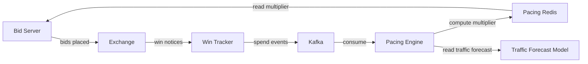

---

## Header Bidding Architecture Deep Dive

### Client-Side Header Bidding (Prebid.js) Flow

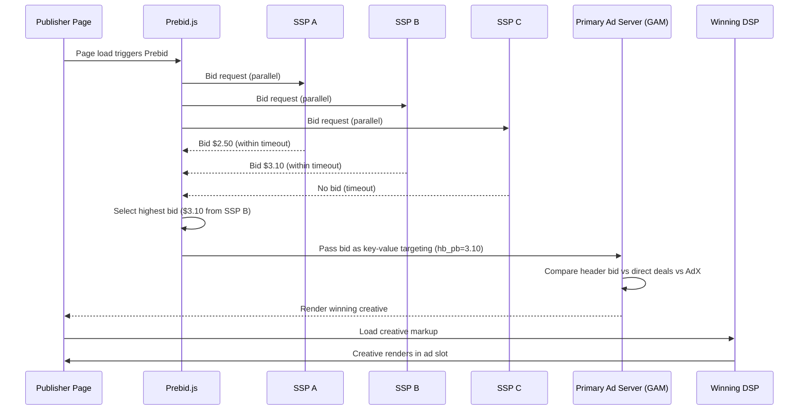

### Server-Side Header Bidding (Prebid Server) Flow

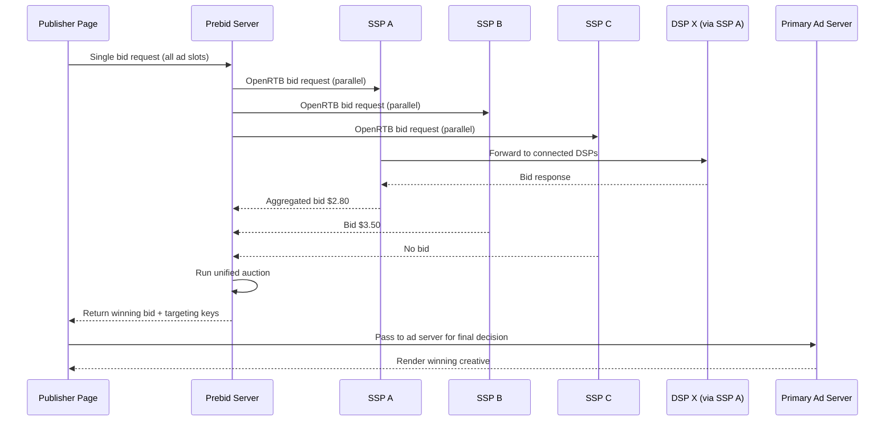

### Header Bidding Key Design Decisions

**Timeout management:**
- Client-side: 700-1500ms timeout (includes network to each SSP).
- Server-side: 200-300ms timeout per SSP (server-to-server, lower latency).
- Adaptive timeout: start high, reduce based on historical SSP response times.
- Timeout causes no-bid from slow SSPs; revenue vs latency trade-off.

**Floor price strategy for header bidding:**
- Publishers can set different floors for header bidding vs primary ad server.
- Dynamic floors based on historical clearing prices.
- Floor optimization: ML model predicts optimal floor that maximizes yield without reducing fill rate.

**Cookie sync in server-side:**
- The primary challenge: in server-side, the SSP cannot read its own cookie (the request comes from the Prebid Server, not the user's browser).
- Solution: client-side cookie sync fires match pixels before the auction.
- Impact: server-side match rates are 20-40% lower than client-side.

---

## Case Study: Designing a Full-Stack AdTech Platform

### Problem Framing

A mid-size AdTech company wants to build a full-stack platform that serves as both DSP and SSP, competing with The Trade Desk (DSP) and Magnite (SSP). The platform must handle:
- 5 million bid requests per second at launch, scaling to 15 million within 2 years.
- 50,000 active campaigns across 5,000 advertisers.
- 200 publisher integrations providing inventory.
- Compliance with GDPR, CCPA, and COPPA from day one.

### Phase 1: MVP (Months 1-6)

**Scope**: single-region (NA-East), display-only (banner 300x250, 728x90, 320x50), open auction only.

**Architecture**:
- Monolithic campaign management API (Go).
- Stateless bid evaluation service (Rust, for low-latency parsing and evaluation).
- PostgreSQL for campaign data.
- Redis for budget counters and campaign cache.
- Kafka for event streaming (single cluster, 64 partitions).
- ClickHouse for event storage and reporting.
- Simple last-click attribution.
- Rule-based GIVT filtering (IP blocklist, bot list).

**Team**: 8 engineers (2 backend, 2 infra, 1 ML, 1 data, 1 frontend, 1 QA).

**Key metrics at launch**: 1M QPS, 100ms p99 bid latency, <2% budget overshoot.

### Phase 2: Scale and Multi-Format (Months 7-12)

**Additions**:
- Video ad support (VAST 4.2).
- Native ad support.
- Second region (EU-West) for GDPR-compliant European traffic.
- Header bidding (Prebid Server adapter).
- ML-based CTR prediction model (gradient boosted trees).
- Bid shading algorithm (censored regression).
- SIVT detection integration (IAS).
- Multi-touch attribution (linear and time-decay models).

**Architecture changes**:
- Split campaign management into separate microservice.
- Add Aerospike for user segment storage.
- Kafka cross-region replication via MirrorMaker.
- ClickHouse cluster with tiered storage.

**Team growth**: 15 engineers.

### Phase 3: Advanced Features (Months 13-24)

**Additions**:
- CTV/OTT support (SSAI integration).
- Private marketplace (PMP) and Programmatic Guaranteed deals.
- Lookalike audience modeling.
- Data-driven attribution.
- Contextual targeting (NLP-based page classification).
- Privacy Sandbox API support (Topics, Protected Audiences).
- Third and fourth regions (APAC, NA-West).
- Incrementality testing framework.

**Architecture changes**:
- Separate SSP and DSP auction engines.
- ML model serving infrastructure (feature store, model registry, online inference).
- Dedicated fraud detection pipeline.
- Cross-region budget rebalancing system.

**Team growth**: 30 engineers across 5 pods (RTB, Targeting, Measurement, Platform, ML).

### Phase 4: Enterprise and Optimization (Months 25-36)

**Additions**:
- Self-serve advertiser UI with full campaign management.
- Automated campaign optimization (auto-bidding).
- Attention metrics measurement.
- Cross-device identity graph (in-house).
- Audio ad support.
- Publisher yield optimization tools.
- White-label platform for agency partners.

**Team growth**: 50+ engineers.

### Key Lessons from the Case Study

1. **Start with the hot path**: get bid evaluation right first. Everything else (reporting, attribution, fraud) can be added incrementally.
2. **Rust/C++ for the bid path**: the 100ms budget is unforgiving. Garbage collection pauses in Java/Go can cause timeout spikes.
3. **Invest in event infrastructure early**: Kafka and ClickHouse are foundational. Changing the event backbone later is extremely disruptive.
4. **Privacy compliance from day one**: retrofitting GDPR compliance is 10x harder than building it in from the start.
5. **Budget accuracy over bid sophistication**: advertisers forgive suboptimal bidding but not budget overspend.

---

## Supply Chain Transparency (ads.txt / sellers.json / SupplyChain Object)

### ads.txt (Authorized Digital Sellers)

ads.txt is a text file hosted on a publisher's domain (e.g., `example.com/ads.txt`) that lists the exchanges and SSPs authorized to sell that publisher's inventory.

**Purpose**: prevent domain spoofing (a fraudster claiming to sell inventory from a premium publisher).

**Format**:
```
# example.com/ads.txt
google.com, pub-1234567890, DIRECT, f08c47fec0942fa0
exchange.example.com, 12345, RESELLER, abcdef0123456789
```

**Verification in the bid path**:
1. Receive bid request claiming to be from `example.com`.
2. Look up cached `example.com/ads.txt` (refreshed every 24 hours).
3. Verify that the exchange sending the request is listed as an authorized seller.
4. If not authorized, reject the bid request (potential domain spoofing).

### sellers.json

sellers.json is hosted by exchanges (e.g., `exchange.example.com/sellers.json`) and lists all entities that sell inventory through that exchange.

**Format**:
```json
{
  "contact_email": "compliance@exchange.example.com",
  "sellers": [
    {
      "seller_id": "pub-456",
      "name": "Example Publisher",
      "domain": "example.com",
      "seller_type": "PUBLISHER",
      "is_confidential": 0
    }
  ]
}
```

### SupplyChain Object (schain)

The OpenRTB schain object provides a complete chain of custody for an impression, from publisher to final exchange:

```json
{
  "schain": {
    "ver": "1.0",
    "complete": 1,
    "nodes": [
      {"asi": "publisher-ssp.com", "sid": "pub-456", "hp": 1, "rid": "req-123"},
      {"asi": "reseller-exchange.com", "sid": "reseller-789", "hp": 1}
    ]
  }
}
```

**Verification**: each node in the chain should be verifiable via ads.txt and sellers.json. A broken or suspicious chain is a fraud signal.

---

## Privacy Sandbox Technical Deep Dive

### Topics API

The Topics API replaces interest-based targeting that previously relied on third-party cookies:

1. **Browser observes**: Chrome tracks which topics (from a taxonomy of ~470 topics) the user's browsing behavior indicates.
2. **Weekly computation**: at the end of each week (epoch), Chrome computes top 5 topics for the user.
3. **Random topic selection**: when a site calls the Topics API, it receives one topic from each of the last 3 epochs, with a 5% chance of a random topic (for privacy).
4. **No cross-site tracking**: the API provides coarse interest signals without revealing specific browsing history.

**Impact on targeting architecture**:
- Topics replace detailed interest segments with coarse categories.
- Targeting granularity decreases significantly (~470 topics vs millions of cookie-based segments).
- DSPs must adapt bidding models to work with coarser signals.
- Contextual targeting becomes more valuable to supplement Topics.

### Protected Audiences API (formerly FLEDGE)

Protected Audiences enables interest-group-based remarketing without cross-site tracking:

1. **Interest group joining**: when a user visits an advertiser site, the site adds the user to an interest group stored locally in the browser.
2. **On-device auction**: when the user visits a publisher site, an on-device auction runs between interest groups and contextual bids.
3. **No server-side user data**: the auction happens in the browser; the DSP server never knows which interest groups the user belongs to.
4. **Reporting**: aggregate reporting only (no individual-level event data).

**Impact on architecture**:
- RTB bidding shifts partially from server to browser (for remarketing use cases).
- Server-side bidding continues for contextual and first-party data use cases.
- Reporting becomes aggregate rather than event-level for Protected Audiences campaigns.
- Budget pacing must account for on-device auctions that the DSP cannot directly observe.

### Attribution Reporting API

Chrome's Attribution Reporting API provides privacy-preserving conversion measurement:

- **Event-level reports**: limited data (3 bits for click attribution, 1 bit for view-through) with time delay (2-30 days).
- **Summary reports**: aggregated data with noise added (differential privacy) for broader measurement.
- **No individual-level tracking**: cannot link specific impressions to specific conversions at the individual user level.

**Impact on attribution architecture**:
- Individual-level multi-touch attribution becomes impossible for Chrome users.
- Aggregate measurement and incrementality testing become more important.
- Modeling and statistical inference replace deterministic matching.

---

## Architect's Mindset
- Start by drawing the domain boundaries, then explain which systems deserve isolated ownership first.
- Talk about why a single end-user workflow crosses multiple services and where you would place synchronous versus asynchronous boundaries.
- Include operator tooling, data quality checks, and backfill strategy in the architecture from day one.
- Be honest about evolution: V1 usually combines systems that later become separate once traffic, teams, or compliance demands grow.
- The RTB hot path is the hardest latency constraint in the system -- protect it ruthlessly from scope creep.
- Privacy compliance is not a feature; it is a constraint that affects every component from targeting to tracking to attribution.
- Budget accuracy and fraud prevention are trust foundations -- advertisers who do not trust the numbers will leave.

---

## Billing Reconciliation Deep Dive

### Why Counts Disagree

In programmatic advertising, at least three parties count impressions independently: the DSP, the SSP, and the third-party verification vendor. These counts almost never match exactly.

**Common sources of discrepancy:**

| Source | DSP vs SSP | DSP vs 3rd Party | Typical Magnitude |
|--------|-----------|-------------------|------------------|
| Timing differences | SSP counts at auction win; DSP counts at creative serve | DSP counts at serve; 3P counts at viewable render | 2-5% |
| Fraud filtering | DSP filters GIVT pre-bid; SSP may not | DSP removes GIVT; 3P removes GIVT + SIVT | 5-15% |
| Viewability filtering | DSP counts all serves; some report viewable only | N/A; 3P specifically measures viewability | 30-50% (viewable vs served) |
| Timeout and latency | SSP records win; creative fails to load | Creative loads; verification pixel fails | 1-3% |
| Geographic filtering | DSP geo-targets; some impressions serve before geo is confirmed | Geo classification differs between vendors | 1-2% |
| Deduplication logic | Different dedup windows and key definitions | Different dedup algorithms | 1-5% |

### Reconciliation Workflow

```
Daily Reconciliation Process (runs at T+24 hours):

1. Export DSP impression counts by (date, campaign, publisher, format)
2. Export SSP impression counts by (date, publisher, ad slot, exchange)
3. Export 3P verification counts by (date, campaign, placement)

4. Join datasets on common dimensions
5. Compute discrepancy percentage for each row:
   discrepancy = abs(dsp_count - ssp_count) / max(dsp_count, ssp_count)

6. Flag rows with discrepancy > 10% (MRC threshold)
7. For flagged rows, investigate root cause:
   a. Check fraud filter differences
   b. Check timeout/error logs
   c. Check geo-classification disagreements
   d. Check dedup window alignment

8. Generate reconciliation report with:
   - Total billable impressions (authoritative source per contract)
   - Discrepancy breakdown by cause
   - Credit/debit adjustments for overcount/undercount

9. If discrepancy cannot be explained, escalate to partnership team
```

### Financial Impact of Discrepancies

For a platform processing $100M in monthly ad spend:
- A 5% systematic overcount = $5M in disputed charges per month.
- A 2% systematic undercount = $2M in lost revenue per month.
- Reconciliation accuracy directly affects gross margin.

---

## Real-Time vs Batch Processing Boundaries

Understanding which processing must be real-time and which can be batch is a core architectural decision:

| Process | Timing | Rationale |
|---------|--------|-----------|
| Bid evaluation | Real-time (<100ms) | Exchange timeout; cannot defer |
| Campaign eligibility check | Real-time (<10ms) | Part of bid evaluation |
| User segment lookup | Real-time (<5ms) | Part of targeting |
| Budget check/decrement | Real-time (<5ms) | Must prevent overspend on bid path |
| Frequency cap check | Real-time (<3ms) | Must prevent over-frequency on bid path |
| Impression deduplication | Near-real-time (<1 min) | Affects pacing accuracy |
| GIVT fraud filtering | Near-real-time (<1 min) | Affects pacing and budget accuracy |
| SIVT fraud detection | Batch (5-60 min) | ML models need feature aggregation |
| Attribution matching | Near-real-time (conversion) / Batch (MTA models) | Last-click can be near-real-time; complex models need batch |
| Billing aggregation | Batch (daily) | Requires complete data after dedup and fraud filtering |
| Reporting dashboard refresh | Near-real-time (1 min) | Advertiser/publisher UX expectation |
| Campaign optimization | Batch (hourly) | ML model retraining and bid adjustment |
| Audience segment rebuild | Batch (daily) | Full population re-scoring |
| Pacing multiplier computation | Near-real-time (1 min) | Affects budget distribution |
| Budget reconciliation | Batch (every 5 min) | Cross-check counters against event stream |
| Floor price optimization | Batch (hourly) | ML model for optimal floor prices |

---

## ML Model Serving on the Bid Path

### Models Used in Real-Time Bidding

| Model | Purpose | Latency Budget | Update Frequency |
|-------|---------|---------------|-----------------|
| CTR prediction | Estimate probability of click given impression context | <5ms | Daily retrain, hourly feature refresh |
| CVR prediction | Estimate probability of conversion given click | <3ms | Daily retrain |
| Bid shading | Estimate market clearing price to reduce bid | <2ms | Hourly retrain |
| Pacing model | Predict traffic volume for pacing optimization | <1ms (lookup) | Hourly retrain |
| Brand safety | Classify page content for safety | Pre-computed (cached) | Daily retrain |
| Fraud scoring | Pre-bid fraud probability for the request | <2ms | Daily retrain |

### Model Serving Architecture

```
Model Lifecycle:
1. Training: offline on Spark/PyTorch (GPU cluster)
2. Validation: A/B test against champion model (1% traffic)
3. Export: serialize model to ONNX or custom binary format
4. Distribution: push model artifact to S3, then to each bid server
5. Loading: bid server loads model into memory on startup or hot-reload
6. Inference: model scored inline during bid evaluation

Key constraints:
- Models must fit in memory (~500MB per model maximum)
- Inference must be deterministic (same input -> same output for debugging)
- Feature computation must be done before model scoring (features are pre-computed and cached)
- Model loading must not cause latency spikes (shadow loading + atomic swap)
```

### Feature Store for Real-Time Inference

```
Feature categories served on the bid path:

User features (from Aerospike, pre-computed):
- Segment memberships
- Historical CTR per category
- Recency of last site visit
- Purchase intent score

Context features (from bid request, computed inline):
- Publisher domain
- Ad format and size
- Device type and OS
- Geo (country, region, DMA)
- Time of day and day of week

Campaign features (from campaign cache):
- Bid strategy type
- Historical campaign CTR
- Creative format
- Target audience match score

Cross features (computed inline):
- User-publisher affinity score
- Campaign-context relevance score
```

---

## Common Mistakes

- Designing the RTB system without accounting for the 100ms total latency budget including network time.
- Ignoring the difference between budget pacing (distributing spend over time) and budget enforcement (not overspending).
- Treating fraud detection as a batch-only problem; GIVT must be filtered in near-real-time for pacing accuracy.
- Assuming unlimited access to user data and ignoring consent management.
- Describing only last-click attribution and ignoring multi-touch, cross-device, and incrementality.
- Underestimating storage requirements -- 2B impressions/day at 500 bytes each is 1TB/day.
- Conflating DSP and SSP responsibilities; they have different incentives and data access.
- Ignoring the ads.txt / sellers.json supply chain transparency requirements.
- Designing attribution without considering cookie deprecation and mobile ID changes.
- Treating viewability and impression counting as the same thing.

---

## Interview Angle

- Interviewers expect a clear progression: requirements, capacity estimation, high-level architecture, data model, then deep-dive into the hardest parts (latency budget, budget consistency, fraud).
- Strong answers explain the RTB latency budget breakdown (where every millisecond goes).
- Candidates stand out when they discuss bid shading, budget pacing algorithms, and the privacy landscape without being prompted.
- Strong answers differentiate between the hot path (bidding) and the cold path (reporting, attribution, reconciliation).
- A weak answer describes "a database that stores campaigns" and "a cache for fast lookups" without discussing consistency, pacing, fraud, or the feedback loop between measurement and optimization.
- Mentioning header bidding (client-side vs server-side), CTV/OTT challenges, and Privacy Sandbox shows industry awareness.
- The best candidates explain trade-offs: why budget enforcement is eventually consistent across regions, why SIVT is async while GIVT is inline, why attribution models disagree with each other.

---

## Quick Recap

- AdTech is fundamentally a low-latency decisioning system with large asynchronous feedback loops.
- The RTB hot path must complete in <100ms including network, which constrains every design decision.
- Budget, pacing, and frequency enforcement face distributed counting challenges solved with eventual consistency and reconciliation.
- Privacy regulations and platform changes (cookie deprecation, ATT) are reshaping targeting and measurement architecture.
- Fraud detection is layered: fast rule-based filtering inline, sophisticated ML detection async, third-party verification for trust.
- Attribution is an unsolved problem: every model gives different answers, and incrementality testing is the only ground truth.
- The system produces petabytes of event data that must be stored, queried, and eventually aged out.
- Multi-region deployment is mandatory for latency but creates consistency challenges for budget and targeting.

---

## Practice Questions

1. Walk through the complete lifecycle of a single bid request, from publisher page load to impression tracking and attribution.
2. How would you design the budget pacing algorithm to distribute spend evenly across a 24-hour day with variable traffic patterns?
3. What happens if the segment store (Aerospike) goes down in one region? How does the system degrade?
4. How would you detect and prevent click injection fraud on a mobile DSP?
5. Design the data pipeline from raw impression events to billing-grade reconciled numbers.
6. How does frequency capping work across devices when the user has opted out of tracking?
7. Compare first-price and second-price auctions. Why did the industry move to first-price? What changes on the DSP side?
8. How would you design a bid shading algorithm for first-price auctions?
9. What changes in your targeting architecture when Chrome fully deprecates third-party cookies?
10. How would you implement multi-touch attribution at scale with a 30-day lookback window and 2 billion impressions per day?
11. Design the cross-region budget rebalancing system. What happens during a region failover?
12. How would you measure incrementality for a large brand advertiser running campaigns across display, video, and CTV?
13. What are the trade-offs between client-side and server-side header bidding?
14. How would you design the creative review pipeline to balance speed (creative goes live quickly) with safety (no policy violations)?
15. A major advertiser reports that their conversion numbers disagree between your platform and Google Analytics by 30%. Walk through how you would diagnose and resolve this discrepancy.
16. How would you design the ads.txt and sellers.json verification system to run in the bid path without adding latency?
17. Explain the trade-offs between Aerospike, Redis Cluster, and DynamoDB for storing 200 million user profiles with sub-5ms reads.
18. How does the Privacy Sandbox Attribution Reporting API change your attribution system architecture? What new capabilities do you need?
19. Design a creative review pipeline that handles 50,000 new creatives per day with a mix of automated ML checks and human review.
20. How would you implement competitive separation in CTV ad pods (no two car ads in the same commercial break)?
21. Walk through how you would detect SDK spoofing fraud in a mobile app install campaign.
22. Design the floor price optimization system for a publisher that wants to maximize yield without hurting fill rate.
23. How would you build an incrementality testing framework that uses ghost bids (PSA approach) to measure true advertising lift?
24. Explain how you would handle the transition period when Chrome deprecates third-party cookies -- how do you maintain advertiser performance during the transition?
25. Design a system that supports both client-side and server-side header bidding simultaneously, with unified reporting.

---

## Further Exploration

- Revisit adjacent Part 5 chapters after reading AdTech Systems to compare how similar patterns change across domains.
- Practice redrawing one of these systems for startup scale, then for enterprise or multi-region scale.
- Use the sub-subchapter sections as interview prompts: pick one system, frame the requirements, and sketch the trade-offs from memory.
- Study the OpenRTB 2.6 specification from IAB Tech Lab for protocol details.
- Review Google's Privacy Sandbox documentation for the transition from third-party cookies.
- Explore the MRC viewability standards and TAG fraud guidelines for measurement details.
- Compare this chapter's attribution design with the ML chapter's recommendation system design -- both use feedback loops from measurement to optimization.
- Investigate how CTV/OTT ad serving differs from web display by examining SSAI providers (SpringServe, FreeWheel) and their integration patterns.
- Study the IAB Tech Lab OpenRTB 2.6 specification in detail to understand protocol extensions for video, native, and CTV formats.
- Explore how attention metrics are being standardized by organizations like the Attention Council and how they integrate with existing viewability measurement.
- Compare the fraud detection approaches of IAS, DoubleVerify, and MOAT -- each has different strengths in SIVT detection, brand safety, and viewability.
- Build a prototype bid shading algorithm using censored regression on historical win-price data to understand the practical challenges of first-price auction optimization.
- Study Apple's SKAdNetwork 4.0 and Google's Privacy Sandbox Attribution Reporting API side by side to understand how privacy-preserving attribution works in practice.
- Revisit the budget pacing section after studying control theory -- PID controllers and Kalman filters are applicable to pacing optimization.
- Explore the intersection of AdTech and retail media networks (Amazon, Walmart, Instacart) to understand how commerce data creates closed-loop advertising systems.
- Practice designing the billing reconciliation pipeline as a standalone system design problem -- it combines event processing, data quality, and financial correctness.
- Study how The Trade Desk's Unified ID 2.0 and LiveRamp's RampID work as post-cookie identity solutions and their trade-offs versus probabilistic matching.
- Investigate the emerging audio advertising ecosystem (Spotify, podcasts) and how it differs architecturally from display and video in terms of measurement, targeting, and auction mechanics.

---

## Navigation
- Previous: [IoT & Real-Time Systems](34-iot-real-time-systems.md)
- Next: [Blockchain & Distributed Systems](36-blockchain-distributed-systems.md)
