# 36. Blockchain & Distributed Systems

## Part Context
**Part:** Part 5 - Real-World System Design Examples
**Position:** Chapter 36 of 60
**Why this part exists:** This section translates distributed-systems theory into realistic product designs across consumer apps, marketplaces, media, payments, search, notifications, collaboration, infrastructure, and operations-heavy platforms.

---

## Overview
Blockchain systems look like a niche topic until you decompose them as real production systems. Then the shape becomes familiar: API gateways, workflow orchestration, risk controls, asynchronous event processing, read models, search, caches, analytics, operator tooling, and deployment isolation. The difference is that the authoritative state transition happens on a protocol you do not fully control.

That single fact changes the architecture. A normal SaaS system can usually commit to its own database, return success, and reconcile with downstream systems later. A blockchain-backed product often accepts user intent first, then waits for mempool admission, execution, confirmation depth, chain finality, and off-chain projection before it can present a trustworthy result.

This chapter treats blockchain and decentralized applications as production-grade hybrid systems. The goal is not to memorize chain internals. The goal is to understand how to design node infrastructure, smart-contract execution, wallet custody, indexing, and marketplace workflows while preserving correctness, operability, and acceptable user latency.

This chapter performs a deep-dive into **four subsystem areas** that together form a complete blockchain platform:

### Subsystem A — Blockchain Node Network
The protocol-facing infrastructure that powers everything else:

1. **Consensus Mechanisms** — Proof of Work (PoW), Proof of Stake (PoS), Byzantine Fault Tolerance (BFT), and their tradeoffs.
2. **Block Propagation** — gossip protocols, block relay networks, compact block relay.
3. **Mempool Management** — transaction ordering, eviction policies, priority fee markets (EIP-1559).
4. **Chain Reorganization** — detection, rollback, and downstream repair.
5. **Peer Discovery** — Kademlia DHT, bootnode strategies, network topology.

### Subsystem B — Smart Contract Execution System
The programmable layer where application logic meets protocol semantics:

1. **EVM / WASM Execution** — virtual machine architecture, opcode pricing, execution traces.
2. **Gas Metering** — gas estimation, EIP-1559 base fee dynamics, priority fees.
3. **State Management** — account state, storage trie, state pruning, state rent.
4. **Contract Deployment** — CREATE vs CREATE2, deterministic addresses, factory patterns.
5. **Upgrade Patterns** — transparent proxy, UUPS proxy, beacon proxy, diamond pattern (EIP-2535).

### Subsystem C — Crypto Wallet System
The custody and key management layer:

1. **HD Wallets** — BIP-32 derivation, BIP-39 mnemonics, BIP-44 multi-chain paths.
2. **Key Management** — HSM integration, MPC signing, key rotation, backup and recovery.
3. **Transaction Signing** — payload construction, EIP-712 typed data, EIP-191 personal sign.
4. **Multi-Signature** — threshold signatures, Gnosis Safe, social recovery.
5. **Hardware Wallet Integration** — Ledger/Trezor communication, U2F/WebUSB protocols.

### Subsystem D — NFT Marketplace
The discovery, trading, and settlement layer for digital assets:

1. **Minting** — on-chain minting, lazy minting (EIP-712 vouchers), batch minting (ERC-1155).
2. **Listing and Offers** — off-chain order books (Seaport protocol), on-chain listings, collection offers.
3. **Auction Mechanics** — English auction, Dutch auction, reserve pricing, bid escrow.
4. **Royalty Enforcement** — EIP-2981 on-chain royalties, operator filter registry, creator fees.
5. **Metadata Storage** — IPFS pinning, Arweave permanence, on-chain metadata, metadata refresh.

---

## Why This Domain Matters in Real Systems
- It forces explicit reasoning about trust boundaries. Your database is no longer the only source of truth.
- It exposes new failure modes such as chain reorganizations, mempool eviction, gas spikes, bridge delays, signer unavailability, and finality ambiguity.
- It demonstrates why off-chain services remain essential even in decentralized products. Search, notifications, analytics, compliance review, customer support, and reporting still need centralized workflows.
- It is architecturally rich for interviews because it blends distributed systems, payments, cryptography, eventing, reconciliation, and security.
- It touches L1 versus L2 scaling tradeoffs, rollup architectures, MEV dynamics, and account abstraction, all of which are active design frontiers.

---

## Problem Framing

### Business Context

A mid-to-large blockchain platform serves millions of daily active users across web and mobile. The platform supports wallet services, smart contract interaction, NFT trading, and DeFi protocol access. Revenue depends on transaction fees, marketplace commissions, and premium custody services. The platform operates globally with users in over 100 countries and must handle regulatory variance across jurisdictions.

Key business constraints:
- **Security is existential**: A single key compromise can result in irreversible loss of millions of dollars in assets.
- **Finality is not instant**: Users expect immediate feedback but chain settlement takes seconds to minutes depending on the network.
- **Gas costs are variable**: Transaction fees can spike 10-100x during congestion, making cost prediction difficult.
- **Regulatory fragmentation**: Different jurisdictions classify tokens differently, requiring flexible compliance architecture.
- **MEV creates adversarial conditions**: Miners and validators can reorder, insert, or censor transactions for profit.

### System Boundaries

This chapter covers the **core blockchain interaction path**: from wallet creation through transaction submission, smart contract execution, and NFT marketplace operations. It does **not** deeply cover:
- DeFi protocol internals such as AMM curve math (covered conceptually)
- Layer-1 consensus implementation details (covered at architecture level)
- Regulatory compliance workflow internals (covered at integration points)
- Mobile app architecture (treated as an API consumer)

### Assumptions

- The platform handles **5 million daily active users** and **2 million daily transactions** at steady state.
- Peak traffic during NFT drops and DeFi events reaches **20x steady state** (~200,000 concurrent sessions).
- The system supports **5+ blockchain networks** (Ethereum, Polygon, Arbitrum, Base, Solana).
- The wallet system manages **50 million addresses** across all supported chains.
- The NFT marketplace indexes **100 million tokens** across **500,000 collections**.
- Smart contract interaction supports **10,000+ verified contracts** with ABI management.

### Explicit Exclusions

- Layer-1 consensus node implementation internals
- Token issuance and ICO/IDO platform design
- Decentralized governance (DAO) voting system internals
- Cross-border fiat on-ramp/off-ramp payment processing
- Mobile wallet native app architecture
- Marketing automation and growth campaigns

---

## Real-World Examples and Comparisons
- **Ethereum** emphasizes ecosystem depth, EVM compatibility, and relatively slower finality. It pushes many product teams toward queue-backed transaction pipelines and indexers that tolerate confirmation lag.
- **Solana** offers higher throughput and lower latency but requires different operational expertise around node health, RPC stability, and account-level contention.
- **Coinbase** and **Binance** are not just exchanges. They run wallet infrastructure, risk engines, settlement workflows, compliance systems, custody boundaries, and internal ledgers that sit around blockchain rails.
- **MetaMask** optimizes for client-side wallet experience and RPC abstraction, while an exchange wallet system optimizes for managed custody, policy controls, and institutional audit trails.
- **OpenSea**, **Magic Eden**, and similar marketplaces are really hybrid systems: off-chain order books and metadata, on-chain settlement, indexing pipelines, anti-abuse systems, and search/discovery layers.
- A startup often begins with managed RPC providers, one chain, one custody mode, and a small indexer fleet. A larger platform decomposes into chain adapters, signer policy services, simulation services, risk workflows, compliance case tooling, and chain-specific operational ownership.

---

## Glossary / Abbreviations

| Term | Definition |
|------|-----------|
| PoW | Proof of Work — consensus where miners solve computational puzzles |
| PoS | Proof of Stake — consensus where validators stake tokens as collateral |
| BFT | Byzantine Fault Tolerance — consensus tolerating arbitrary (malicious) node failures |
| EVM | Ethereum Virtual Machine — stack-based execution environment for smart contracts |
| WASM | WebAssembly — alternative smart contract execution environment (Polkadot, Near) |
| Gas | Unit of computational work on EVM chains; used for fee calculation |
| Mempool | Memory pool of unconfirmed transactions awaiting block inclusion |
| Nonce | Sequential counter per account ensuring transaction ordering |
| Reorg | Chain reorganization — when the canonical chain tip changes retroactively |
| HD Wallet | Hierarchical Deterministic wallet — derives unlimited keys from a single seed |
| BIP-32/39/44 | Bitcoin Improvement Proposals for key derivation, mnemonics, and multi-chain paths |
| MPC | Multi-Party Computation — distributed key generation and signing |
| HSM | Hardware Security Module — tamper-resistant device for key storage |
| MEV | Maximal Extractable Value — profit from transaction ordering manipulation |
| PBS | Proposer-Builder Separation — protocol-level MEV mitigation |
| EIP-1559 | Fee market reform introducing base fee and priority fee |
| EIP-4337 | Account Abstraction — smart contract wallets with flexible validation |
| EIP-2981 | NFT Royalty Standard — on-chain royalty information interface |
| ERC-721 | Non-Fungible Token standard |
| ERC-1155 | Multi-Token standard supporting fungible and non-fungible tokens |
| IPFS | InterPlanetary File System — content-addressed distributed storage |
| L1 / L2 | Layer 1 (base chain) / Layer 2 (scaling solution built on L1) |
| Rollup | L2 scaling technique that posts transaction data to L1 |
| ZK-Rollup | Rollup using zero-knowledge proofs for validity |
| Optimistic Rollup | Rollup using fraud proofs with challenge period |
| Sequencer | L2 component that orders transactions before posting to L1 |
| Finality | Point after which a transaction cannot be reversed |
| TVL | Total Value Locked — assets deposited in DeFi protocols |
| AMM | Automated Market Maker — algorithmic liquidity provision |
| DEX | Decentralized Exchange |
| Seaport | OpenSea's on-chain marketplace protocol |
| Lazy Minting | Deferring on-chain minting until first purchase |

---

## Actors and Personas

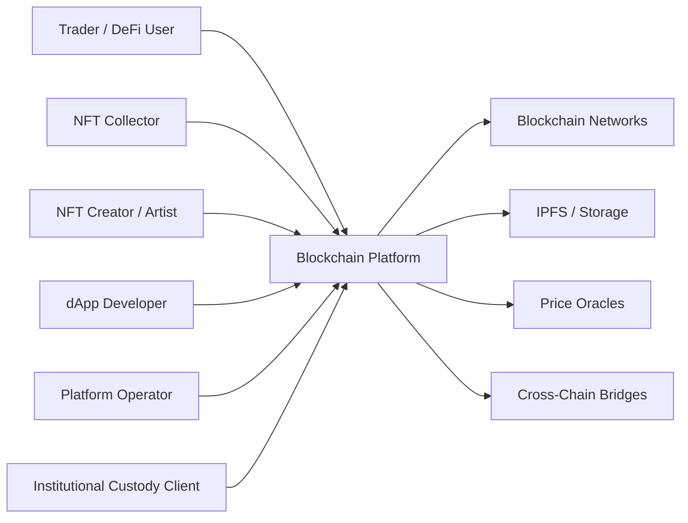

| Actor | Goals | Key Interactions |
|-------|-------|-----------------|
| Trader / DeFi User | Execute swaps, provide liquidity, manage portfolio | Wallet, smart contract execution, gas estimation |
| NFT Collector | Discover, bid, purchase, and resell digital assets | Marketplace browse, auction bidding, wallet signing |
| NFT Creator | Mint collections, set royalties, manage drops | Minting pipeline, metadata upload, royalty configuration |
| dApp Developer | Deploy contracts, integrate APIs, monitor execution | Contract deployment, ABI management, event subscriptions |
| Platform Operator | Monitor health, manage incidents, tune performance | Dashboards, alerting, chain health, node management |
| Institutional Client | Custody assets, enforce policies, audit transactions | MPC signing, policy engine, compliance workflows |

---

## Domain Architecture Map
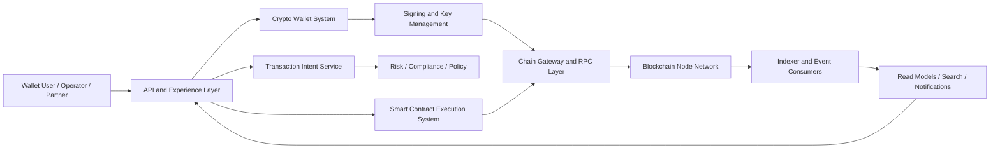

---

## Cross-Cutting Design Themes
- Separate the user intent path from settlement finality. The first is about responsiveness. The second is about correctness.
- Treat blockchain state as an external database with its own latency, availability, and replay characteristics.
- Preserve a strict boundary between key custody and application logic. Wallet UX and signer safety are different concerns.
- Build replayable projections and reconciliation jobs from day one; indexers and webhook consumers will drift eventually.

## Design Matters for Real-Time Blockchain Systems
Blockchain-backed products are often marketed as instant even though the underlying settlement path is probabilistic and delayed. That mismatch creates architecture pressure. The product has to provide fast feedback while still respecting nonce ordering, mempool uncertainty, chain congestion, confirmation policies, and reorg risk. If the design does not model those states explicitly, the user experience becomes misleading and support cannot explain failures.

The right architecture therefore treats blockchain as a real-time workflow domain, not as a synchronous database API. The system should separate preflight checks, signing, broadcast, observation, confirmation policy, projection, and reconciliation into independently observable steps. That separation is what allows a platform to keep the UI responsive while still remaining safe and auditable.

## Microservices Patterns Used in This Domain
- **Intent service + settlement workers:** take user intent synchronously, but let confirmation and finality progress asynchronously.
- **Chain adapter microservices:** one adapter per protocol or per chain family to isolate semantics, operational risk, and release cadence.
- **Signer isolation boundary:** MPC, HSM, or signing workers stay behind a hardened interface instead of inside application pods.
- **Indexer and projection services:** build balances, activity feeds, search views, and notifications from durable chain events.
- **Risk and policy gates:** sanctions checks, velocity controls, AML review, and simulation all execute before irreversible signing or release.

## Design Principles for Real-Time Decentralized Products
- Tell the truth quickly: pending is a valid user-facing state.
- Keep custody boundaries narrower than product boundaries.
- Prefer rebuildable read models over fragile live chain reads in every user request.
- Design for ambiguous failure and replay from the start.
- Let protocol semantics drive consistency rules instead of pretending all chains behave like one database.

## Why Design Matters in Blockchain Systems
The biggest architectural mistake in this domain is pretending a blockchain transaction is equivalent to a database write. It is closer to a workflow with uncertain intermediate states:

1. The client expresses intent.
2. The system validates policy, balances, nonce, gas, and account permissions.
3. A signer or wallet approves the transaction.
4. The transaction reaches an RPC layer and enters a mempool.
5. A validator or sequencer includes it in a block.
6. The block gains enough confirmations to satisfy business finality.
7. Off-chain projections, search indexes, notifications, and accounting views catch up.

If the architecture collapses those states into one boolean success field, support and operations become impossible. Users ask, "Did my transfer happen?" and the product has no truthful answer. Good design makes intermediate states first-class: `intent_created`, `signed`, `broadcast`, `included`, `confirmed`, `finalized`, `reorged`, `failed`, `replaced`, or `expired`.

The second reason design matters is that blockchain products are almost always hybrid. Even if settlement is decentralized, products still need:
- off-chain identities and tenant mapping
- rate limits and abuse controls
- risk screening and sanctioned-address checks
- search and filtering over large history sets
- push notifications and email
- analytics and finance reporting
- customer support tooling

That means architects must choose where to be protocol-native and where to remain product-native. The strongest systems do not romanticize decentralization. They isolate it carefully.

## Microservices Patterns Used in This Domain
- **Intent API + workflow orchestrator:** accept user intent synchronously, validate it, and hand state progression to a workflow engine or saga.
- **Chain adapter per protocol:** isolate Ethereum, Solana, L2, or bridge-specific logic behind clear internal contracts so one chain issue does not contaminate all products.
- **CQRS with indexed read models:** use blockchain or internal ledger events to build searchable balances, activity timelines, and portfolio views without putting RPC calls in the UI hot path.
- **Signer isolation service:** keep private key operations in a hardened service or HSM boundary, separate from the general application runtime.
- **Indexer microservices:** split block ingestion, log decoding, materialized view building, and search indexing so replay and backfill are tractable.
- **Policy sidecars:** run fraud checks, sanctions screening, withdrawal risk checks, and contract simulation before a transaction reaches the signer.
- **Control plane versus data plane:** control plane manages wallet policies, chain metadata, and release config. Data plane handles signing, broadcasting, and event ingestion at scale.

## Design Principles for Real-Time Decentralized Systems
- **Model intent and settlement separately.** User experience should not wait for deep finality when the product can clearly show pending state.
- **Prefer replayability over clever shortcuts.** Indexes, balances, and timelines should be rebuildable from durable events.
- **Use chain-aware correctness, not global correctness.** A six-confirmation rule for one rail may be wrong for another. Business rules must adapt to protocol semantics.
- **Design around trust boundaries, not only service boundaries.** Wallet keys, RPC providers, smart contracts, and third-party bridges all sit in different risk classes.
- **Keep the hot path thin.** Simulation, notification fanout, accounting exports, and growth analytics belong behind asynchronous boundaries.
- **Assume ambiguous failure.** A timeout after broadcast is not a failed transaction. The system needs observability and reconciliation to resolve ambiguity.

---

## Functional Requirements

### Subsystem A — Blockchain Node Network

| ID | Requirement | Details |
|----|------------|---------|
| FR-A01 | Accept and broadcast signed transactions to the network | Support EIP-1559 and legacy transaction types; return tx hash and mempool acceptance status |
| FR-A02 | Query current and historical account state | Balances, nonce, contract storage at arbitrary block heights |
| FR-A03 | Subscribe to new block headers in real-time | WebSocket and SSE subscription with automatic reconnection |
| FR-A04 | Detect and report chain reorganizations | Compare local chain tip against provider tips; emit reorg events with depth and affected tx hashes |
| FR-A05 | Manage mempool visibility and pending transaction tracking | Track pending transactions, detect replacements (speed-up/cancel), report evictions |
| FR-A06 | Route RPC traffic across multiple providers with health awareness | Per-provider latency, error rate, head lag scoring; automatic failover |
| FR-A07 | Provide archive node access for historical state queries | Support eth_call at arbitrary block numbers; trace_* APIs for debugging |
| FR-A08 | Discover and maintain peer connections | Kademlia DHT for self-hosted nodes; bootnode lists; peer scoring |
| FR-A09 | Ingest, decode, and store block data for downstream consumers | Parse block headers, transaction receipts, event logs; store in append-only format |
| FR-A10 | Support chain-specific consensus verification | Validate block headers, difficulty/stake proofs, uncle/ommer blocks |

### Subsystem B — Smart Contract Execution System

| ID | Requirement | Details |
|----|------------|---------|
| FR-B01 | Simulate contract calls before submission | Dry-run execution returning gas estimate, return value, revert reason, and state changes |
| FR-B02 | Manage contract ABIs and verified source code | Version-controlled ABI registry; automatic verification against Etherscan/Sourcify |
| FR-B03 | Estimate gas costs with confidence intervals | Factor in base fee prediction, priority fee history, and execution complexity |
| FR-B04 | Construct unsigned transaction payloads for client wallets | EIP-712 typed data for structured signing; raw transaction encoding |
| FR-B05 | Deploy smart contracts with deterministic addresses | CREATE2 deployment; factory pattern support; multi-chain deployment coordination |
| FR-B06 | Support contract upgrade workflows | Transparent proxy, UUPS proxy, beacon proxy pattern management |
| FR-B07 | Decode transaction logs and trace execution | ABI-aware log parsing; internal transaction tracing; call tree visualization |
| FR-B08 | Enforce gas limits and spending caps per account | Per-user gas budget; rate limiting on contract calls; emergency kill switches |
| FR-B09 | Support batched multi-call execution | Multicall3 aggregation; batch simulation; atomic multi-step workflows |
| FR-B10 | Provide contract interaction templates for common DeFi operations | Swap, approve, stake, unstake, claim templates with parameter validation |

### Subsystem C — Crypto Wallet System

| ID | Requirement | Details |
|----|------------|---------|
| FR-C01 | Generate HD wallet addresses from seed phrases | BIP-32 derivation paths; BIP-39 mnemonic generation; BIP-44 multi-chain |
| FR-C02 | Support multiple custody modes | Non-custodial (client key), semi-custodial (MPC), fully custodial (HSM) |
| FR-C03 | Sign transactions with appropriate key material | EIP-191 personal sign, EIP-712 typed data, raw transaction signing |
| FR-C04 | Manage multi-signature wallets | Gnosis Safe integration; threshold configuration; approval workflows |
| FR-C05 | Display real-time balances across all supported chains | Aggregated portfolio view; token discovery; spam token filtering |
| FR-C06 | Track transaction history with human-readable descriptions | Decode contract interactions; label known addresses; categorize activity |
| FR-C07 | Support hardware wallet signing | Ledger and Trezor via USB/Bluetooth; transaction preview on device |
| FR-C08 | Implement account abstraction (ERC-4337) | Bundler integration; paymaster for gasless transactions; session keys |
| FR-C09 | Enable wallet recovery mechanisms | Social recovery; guardian-based recovery; seed phrase backup verification |
| FR-C10 | Enforce withdrawal policies and spending limits | Per-address allowlists; velocity limits; time-locked transfers; approval chains |

### Subsystem D — NFT Marketplace

| ID | Requirement | Details |
|----|------------|---------|
| FR-D01 | Mint NFTs with on-chain and lazy minting options | ERC-721 and ERC-1155 support; EIP-712 voucher-based lazy minting |
| FR-D02 | Create fixed-price listings and auction listings | Seaport-compatible off-chain orders; on-chain listing contracts |
| FR-D03 | Execute purchases with atomic settlement | Buyer payment + NFT transfer + royalty distribution + platform fee in one transaction |
| FR-D04 | Support English and Dutch auction formats | Bid escrow; automatic extension on late bids; reserve price enforcement |
| FR-D05 | Enforce creator royalties on secondary sales | EIP-2981 query; operator filter registry; configurable enforcement |
| FR-D06 | Index and search NFT collections by traits, rarity, and price | Off-chain indexing pipeline; trait-based filtering; rarity scoring algorithms |
| FR-D07 | Store and serve NFT metadata and media | IPFS pinning; Arweave backup; CDN-served thumbnails; metadata refresh |
| FR-D08 | Display ownership history and provenance chain | On-chain transfer event indexing; wash-trading detection flags |
| FR-D09 | Support collection offers and trait-based offers | Offers applicable to any token in a collection or matching trait criteria |
| FR-D10 | Detect and flag fraudulent or stolen NFTs | Stolen asset registries; copycat detection; suspicious activity alerts |

---

## Non-Functional Requirements

| Category | Requirement | Target |
|----------|------------|--------|
| **Finality** | Ethereum L1 transaction finality | 2 epochs (~12.8 min) for economic finality; 12 confirmations for product finality |
| **Finality** | L2 (Arbitrum/Base) transaction finality | Soft finality in ~250ms (sequencer confirmation); hard finality after L1 posting (~10 min) |
| **Finality** | Solana transaction finality | ~400ms for optimistic confirmation; ~6.4s for finalized |
| **Throughput** | Ethereum L1 TPS | ~15-30 TPS (protocol limit) |
| **Throughput** | L2 aggregate TPS across supported rollups | 2,000-10,000 TPS per rollup |
| **Throughput** | Indexer ingestion rate | Process 1,000 blocks/second during backfill |
| **Throughput** | Marketplace API read path | 50,000 RPS for browse and search |
| **Latency** | Wallet balance query p99 | < 200ms (from indexed read model) |
| **Latency** | Gas estimation p99 | < 500ms (including simulation) |
| **Latency** | NFT search p99 | < 150ms |
| **Latency** | Transaction broadcast to mempool acceptance | < 2s |
| **Availability** | Wallet and signing service | 99.99% (signer must be available for withdrawals) |
| **Availability** | Marketplace read path | 99.95% |
| **Availability** | Indexer pipeline | 99.9% (with < 30s recovery from outage) |
| **Storage** | Ethereum full node state | ~1.2 TB (pruned); ~14 TB (archive) |
| **Storage** | Indexed blockchain data (all chains) | ~50 TB and growing at ~5 TB/year |
| **Storage** | NFT metadata and media | ~20 TB with CDN caching |
| **Growth** | State growth per chain | Ethereum: ~100 GB/year; Polygon: ~500 GB/year |
| **Security** | Key material exposure | Zero — keys never leave HSM/MPC boundary in plaintext |
| **Security** | Smart contract audit coverage | 100% of platform-deployed contracts audited before mainnet |
| **Consistency** | Nonce allocation | Linearizable per signing account |
| **Consistency** | Balance display | Eventually consistent; < 5s lag from chain head |
| **Consistency** | NFT ownership | Eventually consistent; authoritative after finality depth |
| **Compliance** | Transaction screening | All outgoing transactions screened against OFAC SDN list |
| **Compliance** | Audit trail | Immutable log of all signing operations, policy decisions, and state transitions |

---

## Capacity Estimation

### Block Size and Storage

| Chain | Block Time | Block Size | Daily Blocks | Daily Data | Annual Data |
|-------|-----------|------------|-------------|------------|-------------|
| Ethereum L1 | 12s | ~100 KB avg | 7,200 | ~720 MB | ~263 GB |
| Polygon PoS | 2s | ~100 KB avg | 43,200 | ~4.3 GB | ~1.57 TB |
| Arbitrum One | ~250ms | ~50 KB avg | 345,600 | ~17.3 GB | ~6.3 TB |
| Base | ~2s | ~50 KB avg | 43,200 | ~2.2 GB | ~800 GB |
| Solana | 400ms | ~100 KB avg | 216,000 | ~21.6 GB | ~7.9 TB |

### Transaction Throughput

| Metric | Ethereum L1 | L2 (Arbitrum) | Solana |
|--------|------------|---------------|--------|
| Peak TPS (protocol) | ~30 | ~4,000 | ~65,000 |
| Avg TPS (observed) | ~12 | ~40 | ~3,000 |
| Daily transactions | ~1.1M | ~3.5M | ~260M |
| Avg gas per tx (ETH) | ~70,000 | ~200,000 (L2 gas) | N/A (compute units) |
| Avg tx cost (USD) | $2-50 | $0.01-0.10 | $0.0001-0.01 |

### Platform-Level Capacity

| Component | Steady State | Peak (NFT drop / DeFi event) |
|-----------|-------------|------------------------------|
| Wallet balance queries | 10,000 RPS | 100,000 RPS |
| Transaction submissions | 500 TPS | 5,000 TPS |
| NFT search queries | 20,000 RPS | 200,000 RPS |
| Indexer events processed | 50,000/s | 500,000/s |
| WebSocket subscriptions | 500,000 concurrent | 2,000,000 concurrent |
| Metadata fetch (IPFS/CDN) | 5,000 RPS | 50,000 RPS |

### State Growth Estimation

| Data Type | Record Size | Records | Total Size | Growth Rate |
|-----------|------------|---------|------------|-------------|
| Indexed transactions (all chains) | 500 bytes | 500M | ~250 GB | ~50 GB/year |
| Account balances (token+native) | 200 bytes | 100M | ~20 GB | ~5 GB/year |
| NFT metadata records | 2 KB | 100M | ~200 GB | ~50 GB/year |
| NFT media (thumbnails) | 50 KB | 100M | ~5 TB | ~1 TB/year |
| Event logs (decoded) | 300 bytes | 2B | ~600 GB | ~150 GB/year |
| Wallet activity history | 400 bytes | 500M | ~200 GB | ~100 GB/year |
| Order book (marketplace) | 500 bytes | 50M active | ~25 GB | ~10 GB/year |

---

## 19.1 Core Decentralized Systems
19.1 Core Decentralized Systems collects the boundaries around Blockchain Node Network, Smart Contract Execution System, Crypto Wallet System, and related capabilities in Blockchain & Distributed Systems. Teams usually start with a smaller integrated platform, then split these systems once chain-specific logic, scale, or security constraints diverge.

### Blockchain Node Network

#### Overview
The blockchain node network is the protocol-facing substrate of the platform. It is responsible for block ingestion, transaction broadcast, mempool visibility, chain health, archive access, and chain-specific APIs. In a wallet or exchange platform, this boundary often looks like "just RPC." In production, it becomes an operationally heavy system that decides whether everything upstream is trustworthy.

#### Real-world examples
- Exchanges often run a mix of self-hosted nodes and managed RPC providers for redundancy.
- Layer-2 products may depend on sequencer APIs, proving systems, or bridge contracts in addition to basic chain nodes.
- Institutional platforms usually maintain stricter chain health scoring, archival storage, and deterministic failover than consumer wallet products.

#### Functional requirements
- Accept transaction broadcasts with explicit timeout and replacement semantics.
- Query account state, balances, block headers, logs, and transaction receipts.
- Subscribe to blocks, mempool events if available, and chain-specific event streams.
- Detect reorgs, stalled heads, peer degradation, and archive gaps.
- Route traffic across self-hosted and third-party RPC pools.

#### High-level architecture
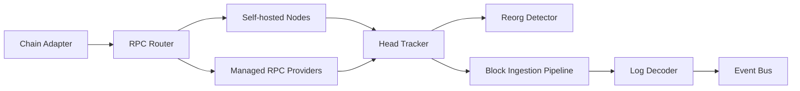

#### Consensus Mechanisms Deep Dive

**Proof of Work (PoW)**
- Miners compete to find a nonce that produces a block hash below a target difficulty.
- Security comes from computational cost — attacking requires 51% of hash power.
- Ethereum used PoW until The Merge (September 2022); Bitcoin continues to use it.
- Pros: battle-tested security, permissionless mining. Cons: energy intensive, slower finality, mining pool centralization.

**Proof of Stake (PoS)**
- Validators lock tokens as collateral; selected probabilistically to propose and attest blocks.
- Ethereum PoS: 32 ETH minimum stake; Casper FFG for finality gadget; LMD-GHOST for fork choice.
- Slashing: validators lose stake for equivocation (double voting) or surround voting.
- Pros: energy efficient, economic finality, lower barrier to participation. Cons: nothing-at-stake concerns (mitigated by slashing), long-range attacks, stake centralization.

**Byzantine Fault Tolerance (BFT)**
- Tolerates up to f faulty nodes in a 3f+1 validator set.
- Tendermint/CometBFT: used by Cosmos chains; single-slot finality; leader rotation.
- PBFT variants: HotStuff (used in Diem/Aptos), IBFT (used in Polygon PoS).
- Pros: instant finality, clear liveness guarantees. Cons: limited validator set size, communication overhead O(n^2).

**Consensus Comparison Table**

| Property | PoW | PoS (Casper) | BFT (Tendermint) |
|----------|-----|-------------|------------------|
| Finality type | Probabilistic | Economic (2 epochs) | Absolute (1 block) |
| Time to finality | ~60 min (6 blocks) | ~12.8 min | ~6s |
| Fault tolerance | 50% hash power | 33% stake | 33% validators |
| Energy efficiency | Very low | High | High |
| Validator set size | Unlimited | ~900,000 | Typically 100-200 |
| Throughput limit | ~15 TPS | ~15 TPS (L1) | ~1,000 TPS |

#### Block Propagation

- **Gossip protocol**: nodes relay blocks to peers; expected full propagation in 1-3 seconds on Ethereum.
- **Compact block relay (BIP-152)**: send block header + short transaction IDs; receiver reconstructs from mempool. Reduces bandwidth by ~90%.
- **Block relay networks**: FIBRE, BloXroute — dedicated low-latency networks for validators and builders.
- **MEV impact**: builders and relays (MEV-Boost) create a secondary propagation path where blocks flow through relays before gossip.

#### Mempool Management

- The mempool is an unordered set of transactions that have been broadcast but not yet included in a block.
- **Ordering**: miners/validators typically order by effective gas price (priority fee) descending.
- **EIP-1559 dynamics**: base fee adjusts per block based on utilization (target: 50%); users bid a priority fee on top.
- **Eviction**: mempool has bounded memory; lowest-fee transactions are evicted during congestion.
- **Replacement (RBF)**: a new transaction with the same nonce and higher gas price replaces a pending one.
- **Private mempools**: Flashbots Protect, MEV-Share — allow users to submit transactions directly to builders, bypassing the public mempool and reducing front-running risk.

#### Peer Discovery

- **Kademlia DHT**: Ethereum's discv4/discv5 protocols use distributed hash tables for peer discovery.
- **Bootnodes**: hardcoded entry points for new nodes joining the network.
- **Peer scoring**: penalize peers with high latency, stale heads, or frequent disconnects.
- **Network topology**: nodes typically maintain 25-50 peer connections; some specialized for block and transaction relay.

#### Low-level design considerations
- Maintain per-chain health scores based on latency, latest head, error rate, and archive completeness.
- Use quorum reads for critical state checks when provider trust is weak or regulatory risk is high.
- Keep chain adapters versioned because RPC semantics, gas estimation, and trace APIs vary.
- Persist block headers, receipts, and decoded logs in append-only storage so backfills and audits are deterministic.

#### Data and storage strategy
- Store canonical block metadata keyed by chain and block height.
- Track transaction observation state by `tx_hash`, provider, first_seen_time, and current best-known status.
- Persist reorg markers and replacement relationships so downstream systems can repair derived views.
- Use cheaper object storage for raw traces or large block payload archives when deep forensic needs exist.

#### Scaling and resilience
- Shield upstream services from provider flakiness with request hedging and per-provider circuit breakers.
- Run ingestion separately from broadcast so block sync spikes do not delay user sends.
- Use replayable decode jobs keyed by block range to recover from parser defects.
- Isolate chains from each other operationally. A Solana incident should not throttle Ethereum wallet reads.

#### Trade-offs and interview notes
- Self-hosting improves control but raises operational cost and protocol-specific expertise requirements.
- Managed RPC improves speed of launch but weakens visibility into root-cause failures and may create hidden rate limits.
- In interviews, call out that "multi-provider RPC router" is not enough. You also need health scoring, archive strategy, reorg handling, and replay.

### Smart Contract Execution System

#### Overview
This system owns how product workflows interact with smart contracts. It handles ABI management, simulation, gas/fee estimation, nonce or sequence handling, policy checks, and contract-specific orchestration. In practice, it is where application intent meets protocol semantics.

#### Why it is separate
Putting smart-contract logic into a generic API service usually creates unreadable code and unsafe releases. Contract execution systems need release gating tied to contract versions, simulation confidence, audit metadata, and sometimes per-network behavior toggles.

#### Core workflows
- Preflight simulation for token transfer, mint, swap, escrow release, or marketplace purchase.
- Construction of unsigned transaction payloads for client wallets.
- Construction and dispatch of signed transactions for custodial or server-managed flows.
- Post-execution interpretation of logs and state transitions to derive product-level outcomes.

#### EVM Execution Deep Dive

- **Stack machine**: 1024 element stack, 256-bit words; operates on bytecode compiled from Solidity/Vyper.
- **Opcode gas costs**: each opcode has a fixed gas cost; SSTORE (storage write) is the most expensive at 20,000 gas for new slots.
- **Execution context**: msg.sender, msg.value, block.timestamp, block.number available to contracts.
- **Call types**: CALL (external), DELEGATECALL (preserves caller context, used in proxies), STATICCALL (read-only).
- **Memory model**: volatile memory (linear byte array, expands as used) and persistent storage (key-value mapping on state trie).
- **WASM alternative**: Near Protocol, Polkadot use WebAssembly VM; allows Rust/C++ smart contracts; more flexible gas metering.

#### Gas Metering and Fee Estimation

- **EIP-1559 fee structure**:
  - `base_fee`: protocol-determined, burned; adjusts up/down by 12.5% per block based on gas utilization.
  - `priority_fee` (tip): goes to validator; market-driven.
  - `max_fee`: user-set ceiling; refund = (max_fee - base_fee - priority_fee) * gas_used.
- **Gas estimation strategy**:
  1. Simulate transaction with `eth_estimateGas`.
  2. Add 20% buffer for state changes between simulation and inclusion.
  3. Predict base fee for next N blocks using exponential moving average.
  4. Set priority fee based on recent block percentile analysis (e.g., 25th percentile for normal, 75th for fast).
- **L2 gas considerations**: L2s charge both L2 execution gas and L1 data posting gas (calldata/blob cost).

#### Contract Upgrade Patterns

| Pattern | Mechanism | Pros | Cons |
|---------|-----------|------|------|
| Transparent Proxy (EIP-1967) | Proxy delegates all calls to implementation; admin can change implementation address | Battle-tested; widely supported | Admin key is single point of failure; selector clashing risk |
| UUPS (EIP-1822) | Upgrade logic lives in implementation contract; proxy is minimal | Lower gas for deployment; no selector clash | Bug in implementation can brick the upgrade path |
| Beacon Proxy | Multiple proxies share one beacon; beacon points to implementation | Efficient for many instances (e.g., per-user contracts) | Additional indirection; beacon is SPOF |
| Diamond (EIP-2535) | Multiple facets (implementations) behind one proxy; function-level routing | Maximum flexibility; modular upgrades | Complexity; storage layout coordination across facets |

#### Write-path sequence
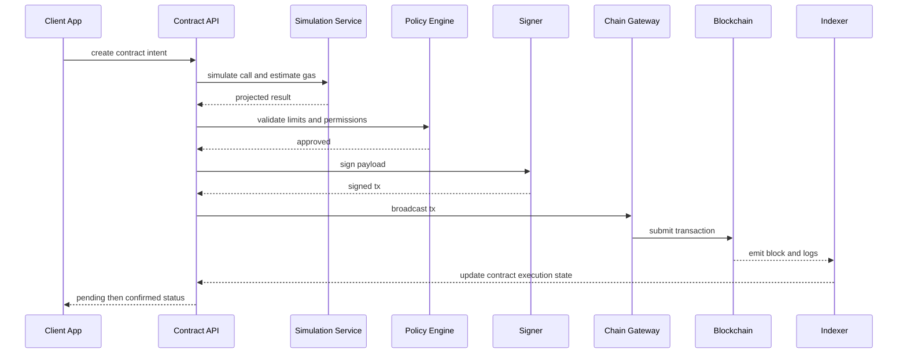

#### APIs and contracts
- `POST /contract-intents`: create an idempotent execution intent with chain, contract, function, parameters, and account context.
- `POST /contract-intents/{id}/simulate`: perform deterministic dry-run with gas, revert reason, and expected events.
- `POST /contract-intents/{id}/submit`: sign and broadcast if policy allows.
- `GET /contract-intents/{id}`: return status, tx hashes, simulation output, and confirmation state.

#### Consistency and concurrency
- Contract intent creation can be strongly consistent in OLTP storage.
- Contract execution result is eventually consistent because it depends on chain confirmation and indexer lag.
- Nonce or sequence coordination must be serialized per signing account. This is often the first concurrency bottleneck in custodial systems.
- Idempotency keys should map repeated client retries to the same intent rather than to new transactions.

#### Failure modes
- Simulation succeeds but execution reverts because state changed before inclusion.
- Gas spikes make a once-valid fee setting uncompetitive and the tx remains stuck.
- Replacement transactions invalidate old pending views.
- Contract upgrade or ABI drift breaks decode logic for downstream systems.

#### Architect notes
- Keep simulation service and signer independent. A product may need simulation from multiple providers but signing from only one trusted environment.
- Contract-specific projection logic belongs near the execution domain, not scattered across every consumer.

### Crypto Wallet System

#### Overview
The wallet system defines how users or institutions hold keys, create transactions, recover state, and view balances. Architecturally, this is where security and user experience collide. A wallet can be non-custodial, semi-custodial, or fully custodial, and each option changes almost every downstream decision.

#### Real-world variants
- **MetaMask-like:** client-side keys, server-side notifications and discovery, no central signing service.
- **Exchange wallet:** centrally managed keys, withdrawal policies, transaction batching, and internal ledger abstraction.
- **MPC or institutional custody:** distributed signing, approval workflows, policy engines, and hardware-backed key shares.

#### HD Wallet Deep Dive (BIP-32/39/44)

**BIP-39 Mnemonic Generation**:
1. Generate 128-256 bits of cryptographic randomness (entropy).
2. Compute SHA-256 checksum; append first `entropy_bits/32` bits.
3. Split into 11-bit segments; map each to a word from the 2048-word list.
4. Result: 12-word (128-bit) or 24-word (256-bit) mnemonic phrase.
5. Derive seed: PBKDF2(mnemonic, "mnemonic" + passphrase, 2048 rounds, HMAC-SHA512) = 512-bit seed.

**BIP-32 Hierarchical Derivation**:
- Master key: HMAC-SHA512(key="Bitcoin seed", data=seed) produces 512 bits; left 256 = private key, right 256 = chain code.
- Child derivation: CKDpriv(parent_key, parent_chain_code, index) produces child private key and chain code.
- Hardened derivation (index >= 2^31): uses parent private key, preventing public key-only derivation of children.
- Extended public keys (xpub): allows deriving child public keys without private key access — used for watch-only wallets and deposit address generation.

**BIP-44 Multi-Chain Paths**:
```
m / purpose' / coin_type' / account' / change / address_index
m / 44'      / 60'        / 0'       / 0      / 0          (Ethereum)
m / 44'      / 501'       / 0'       / 0      / 0          (Solana)
m / 44'      / 0'         / 0'       / 0      / 0          (Bitcoin)
```

#### Key Management Architecture

| Custody Mode | Key Location | Signing | Recovery | Use Case |
|-------------|-------------|---------|----------|----------|
| Non-custodial | Client device (browser/mobile) | Client-side | Seed phrase (user responsibility) | Consumer wallets (MetaMask) |
| Semi-custodial (MPC) | Split across 2-3 parties | Threshold signing (2-of-3) | Any 2 shares reconstruct | Institutional, high-value retail |
| Fully custodial | HSM in secure enclave | Server-side with policy | Platform-managed backup | Exchange wallets, enterprise |
| Smart contract wallet | On-chain (ERC-4337) | Signature validation in contract | Social recovery / guardians | Next-gen consumer wallets |

#### Account Abstraction (ERC-4337)

- **UserOperation**: replaces traditional transactions; contains sender, calldata, gas limits, signature.
- **Bundler**: collects UserOperations, bundles them into a single transaction, submits to EntryPoint contract.
- **EntryPoint contract**: singleton contract that validates and executes UserOperations.
- **Paymaster**: optional contract that sponsors gas fees on behalf of users (gasless transactions).
- **Session keys**: delegated signing authority for specific actions and time windows without full wallet access.
- **Benefits**: gasless onboarding, batched operations, social recovery, arbitrary signature schemes (passkeys, biometrics).

#### Trust boundary diagram
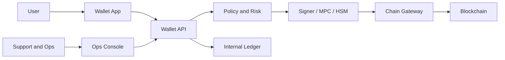

#### Data model and storage strategy
- `wallet_account`: wallet id, chain, custody mode, address, policy profile, lifecycle state.
- `wallet_key_reference`: HSM key alias or MPC participant set, never raw key material.
- `wallet_balance_projection`: asset, available amount, pending amount, reserved amount, projection height.
- `wallet_activity`: intent id, tx hash, direction, asset, amount, fees, confirmation state.
- `withdrawal_policy`: per-tenant limits, velocity rules, allowlists, approval rules.

#### Architecture patterns
- Use an internal ledger even if on-chain balances exist. Product-level accounting needs deterministic entries for pending and completed actions.
- Separate deposit detection from withdrawal execution. Deposits are chain-observed. Withdrawals are user-initiated and signer-controlled.
- Use policy evaluation before signing, not after broadcast.
- Run cold storage sweeps and hot-wallet replenishment via scheduled workflows, not ad hoc scripts.

#### Reliability and security concerns
- Key compromise is catastrophic, so signer infrastructure needs stricter deployment and access controls than ordinary services.
- Withdrawal storms after market volatility require queueing, rate controls, and emergency circuit breakers.
- Balance projections can lag chain truth during congestion; surface `pending` and `updating` states honestly to users.

#### Interview notes
- Strong answers distinguish wallet UX, custody, internal ledgering, and chain settlement.
- Weak answers describe "a wallet is just an address plus balance table" and ignore key custody and withdrawal policy.

### NFT Marketplace

#### Overview
NFT marketplaces sit at the intersection of order books, metadata delivery, wallet interaction, indexing, royalties, and fraud control. Their challenge is not just listing assets. It is presenting a searchable, safe, and performant market over data that may be mutable off-chain but settles on-chain.

#### Core workflows
- Mint or ingest collection metadata.
- Build collection pages, rarity views, and ownership history.
- Create listings, offers, bids, and cancellation intents.
- Execute purchase or auction settlement.
- Update provenance, activity feeds, and creator royalty projections.

#### Lazy Minting Deep Dive

Lazy minting defers the on-chain minting transaction until the first purchase, shifting gas costs from creator to buyer.

1. Creator signs an EIP-712 typed data voucher containing: token ID, URI, price, royalty info, creator address.
2. Voucher is stored off-chain in the marketplace database.
3. Buyer calls a `redeemVoucher(voucher, signature)` function on the marketplace contract.
4. Contract verifies signature, mints the NFT to buyer, transfers payment to creator (minus fees).
5. Gas cost is borne by the buyer as part of the purchase transaction.

**Benefits**: zero upfront cost for creators; enables large collections without pre-minting gas.
**Risks**: voucher replay if not properly invalidated; creator can revoke before purchase.

#### Auction Mechanics

**English Auction**:
- Starting price set by seller; bids must exceed current highest by minimum increment.
- Bid escrow: funds locked in contract or marketplace escrow until outbid or auction ends.
- Anti-sniping: extend auction by 5-10 minutes if bid placed in final window.
- Settlement: highest bidder receives NFT; seller receives payment minus fees and royalties.

**Dutch Auction**:
- Starting price decreases over time according to a decay curve (linear, exponential, or step).
- First buyer to accept current price wins.
- No bid escrow needed; single-transaction settlement.
- Useful for price discovery in new collections.

#### Marketplace purchase flow
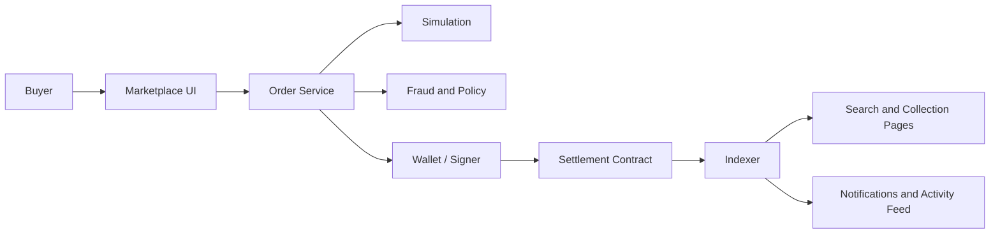

#### Architecture considerations
- Keep order book state off-chain for responsiveness, but treat settlement and ownership transfer as on-chain truths.
- Store metadata and media references separately from ownership projections. Metadata may live on IPFS, object storage, or a hybrid CDN-backed model.
- Use search indexes for trait filters, rarity, price ranges, and collection exploration; blockchain scans are too expensive for interactive browse.
- Build royalty and fee computation as explicit policy logic because standards vary and may change over time.

#### Abuse and governance risks
- Wash trading distorts rankings and creator metrics.
- Metadata mutability can create trust and legal issues.
- Stolen NFT listings and compromised wallets require support and policy tooling.
- Spam mints and fake collections can overload search and moderation pipelines.

#### Trade-offs
- Off-chain orders improve UX and cost, but require stronger anti-replay and signature-validation logic.
- Pure on-chain order books reduce some trust issues, but often become too expensive and slow for retail user experience.

---

## Detailed Data Models

### Block Structure

```
Block {
    header: BlockHeader {
        parent_hash:       bytes32         -- hash of parent block
        state_root:        bytes32         -- Merkle-Patricia trie root of world state
        transactions_root: bytes32         -- Merkle root of transaction list
        receipts_root:     bytes32         -- Merkle root of transaction receipts
        logs_bloom:        bytes256        -- Bloom filter of log entries
        number:            uint64          -- block height
        gas_limit:         uint64          -- max gas allowed in block
        gas_used:          uint64          -- total gas used by transactions
        timestamp:         uint64          -- Unix timestamp
        base_fee_per_gas:  uint256         -- EIP-1559 base fee
        extra_data:        bytes           -- arbitrary data (max 32 bytes)
        mix_hash:          bytes32         -- PoW: nonce solution / PoS: RANDAO reveal
        nonce:             uint64          -- PoW: mining nonce / PoS: zeroed
    }
    transactions: Transaction[]
    uncles:       BlockHeader[]              -- ommers (PoW legacy, empty in PoS)
    withdrawals:  Withdrawal[]               -- validator withdrawals (post-Shanghai)
}
```

### Transaction Structure

```
Transaction (EIP-1559 / Type 2) {
    chain_id:              uint256        -- network identifier (1=mainnet, 137=polygon)
    nonce:                 uint64         -- sender account nonce (sequential)
    max_priority_fee:      uint256        -- tip to validator (wei)
    max_fee_per_gas:       uint256        -- ceiling for base_fee + priority_fee (wei)
    gas_limit:             uint64         -- max gas units for execution
    to:                    address        -- recipient (null for contract creation)
    value:                 uint256        -- ETH to transfer (wei)
    data:                  bytes          -- calldata (ABI-encoded function call)
    access_list:           AccessList[]   -- EIP-2930 pre-warmed storage slots
    v, r, s:               uint256        -- ECDSA signature components
}

TransactionReceipt {
    transaction_hash:      bytes32
    transaction_index:     uint64
    block_hash:            bytes32
    block_number:          uint64
    from:                  address
    to:                    address
    cumulative_gas_used:   uint64
    effective_gas_price:   uint256
    gas_used:              uint64
    status:                uint8          -- 1=success, 0=revert
    logs:                  Log[]
    logs_bloom:            bytes256
    contract_address:      address        -- non-null if contract creation
}
```

### Account State

```
AccountState {
    address:               address        -- 20-byte Ethereum address
    nonce:                 uint64         -- transaction count (EOA) or contract nonce
    balance:               uint256        -- native token balance (wei)
    storage_root:          bytes32        -- Merkle-Patricia root of contract storage
    code_hash:             bytes32        -- keccak256 of contract bytecode (empty for EOA)
}

-- Internal platform models:

WalletAccount {
    wallet_id:             uuid           -- platform wallet identifier
    chain_id:              int            -- blockchain network
    address:               string         -- on-chain address (checksummed)
    custody_mode:          enum           -- NON_CUSTODIAL | MPC | HSM | SMART_CONTRACT
    policy_profile_id:     uuid           -- linked withdrawal/signing policy
    status:                enum           -- ACTIVE | FROZEN | DEACTIVATED
    created_at:            timestamp
    updated_at:            timestamp
}

WalletKeyReference {
    key_ref_id:            uuid
    wallet_id:             uuid
    key_type:              enum           -- HSM_ALIAS | MPC_KEY_ID | DEVICE_KEY
    key_identifier:        string         -- HSM slot or MPC participant set ID
    derivation_path:       string         -- BIP-44 path (e.g., m/44'/60'/0'/0/0)
    created_at:            timestamp
    -- NOTE: raw key material NEVER stored in application database
}

BalanceProjection {
    wallet_id:             uuid
    chain_id:              int
    asset_type:            enum           -- NATIVE | ERC20 | ERC721 | ERC1155
    contract_address:      string         -- null for native token
    token_id:              string         -- null for fungible tokens
    available:             decimal(78,0)  -- spendable balance
    pending_in:            decimal(78,0)  -- incoming unconfirmed
    pending_out:           decimal(78,0)  -- outgoing unconfirmed
    reserved:              decimal(78,0)  -- locked by open orders or policies
    projection_height:     bigint         -- block number of last update
    updated_at:            timestamp
}
```

### NFT Metadata Schema

```
NFTToken {
    token_id:              string         -- on-chain token ID
    contract_address:      string         -- NFT contract address
    chain_id:              int
    standard:              enum           -- ERC721 | ERC1155
    owner_address:         string         -- current owner
    metadata_uri:          string         -- tokenURI pointing to metadata JSON
    metadata_hash:         bytes32        -- content hash for integrity verification
    collection_id:         uuid           -- platform collection reference
    rarity_score:          float          -- computed rarity rank
    is_flagged:            boolean        -- stolen/suspicious flag
    last_transfer_block:   bigint
    created_at:            timestamp
    indexed_at:            timestamp
}

NFTMetadata (ERC-721 Metadata JSON) {
    name:                  string         -- "Bored Ape #1234"
    description:           string         -- human-readable description
    image:                 string         -- IPFS URI or HTTPS URL to image
    animation_url:         string         -- optional media (video, 3D model)
    external_url:          string         -- link to external site
    attributes: [
        {
            trait_type:    string         -- "Background"
            value:         string|number  -- "Blue" or 42
            display_type:  string         -- "number", "boost_percentage", etc.
        }
    ]
}

NFTCollection {
    collection_id:         uuid
    contract_address:      string
    chain_id:              int
    name:                  string
    symbol:                string
    creator_address:       string
    total_supply:          bigint
    royalty_bps:           int            -- basis points (e.g., 500 = 5%)
    royalty_recipient:     string
    floor_price:           decimal
    volume_24h:            decimal
    verified:              boolean
    metadata_base_uri:     string
    created_at:            timestamp
}

MarketplaceOrder {
    order_id:              uuid
    order_type:            enum           -- LISTING | OFFER | AUCTION_BID
    status:                enum           -- ACTIVE | FILLED | CANCELLED | EXPIRED
    maker_address:         string         -- seller or bidder
    taker_address:         string         -- buyer (null until filled)
    token_contract:        string
    token_id:              string
    price:                 decimal(78,0)  -- in payment token's smallest unit
    payment_token:         string         -- ERC20 address or native
    expiration:            timestamp
    salt:                  bytes32        -- replay protection
    signature:             bytes          -- EIP-712 maker signature
    protocol:              enum           -- SEAPORT | CUSTOM | ON_CHAIN
    tx_hash:               string         -- settlement transaction hash (null until filled)
    created_at:            timestamp
    filled_at:             timestamp
}
```

### Internal Ledger Entry

```
LedgerEntry {
    entry_id:              uuid
    wallet_id:             uuid
    chain_id:              int
    entry_type:            enum           -- DEPOSIT | WITHDRAWAL | FEE | INTERNAL_TRANSFER | ADJUSTMENT
    asset_type:            enum           -- NATIVE | ERC20 | ERC721 | ERC1155
    contract_address:      string
    token_id:              string
    amount:                decimal(78,0)
    direction:             enum           -- CREDIT | DEBIT
    reference_tx_hash:     string         -- on-chain reference
    reference_intent_id:   uuid           -- platform intent reference
    status:                enum           -- PENDING | CONFIRMED | FINALIZED | REVERSED
    block_number:          bigint
    block_hash:            string
    created_at:            timestamp
    confirmed_at:          timestamp
    finalized_at:          timestamp
}
```

---

## Detailed API Specifications

### JSON-RPC APIs (Ethereum Standard)

These are the chain-facing APIs the platform consumes from nodes/providers.

**State Queries:**
```
eth_getBalance(address, blockNumber) -> uint256
eth_getTransactionCount(address, blockNumber) -> uint64       // nonce
eth_getCode(address, blockNumber) -> bytes                    // contract bytecode
eth_getStorageAt(address, slot, blockNumber) -> bytes32
eth_call({to, data, from, gas, value}, blockNumber) -> bytes  // read-only execution
```

**Transaction Lifecycle:**
```
eth_estimateGas({to, data, from, value}) -> uint64
eth_sendRawTransaction(signedTxBytes) -> bytes32              // tx hash
eth_getTransactionByHash(txHash) -> Transaction | null
eth_getTransactionReceipt(txHash) -> Receipt | null
```

**Block Queries:**
```
eth_blockNumber() -> uint64                                   // latest block number
eth_getBlockByNumber(blockNumber, fullTx) -> Block
eth_getBlockByHash(blockHash, fullTx) -> Block
eth_getLogs({fromBlock, toBlock, address, topics}) -> Log[]
```

**Subscription (WebSocket):**
```
eth_subscribe("newHeads") -> subscriptionId                   // new block headers
eth_subscribe("logs", {address, topics}) -> subscriptionId    // filtered event logs
eth_subscribe("newPendingTransactions") -> subscriptionId     // mempool
eth_unsubscribe(subscriptionId) -> boolean
```

**Fee Market:**
```
eth_gasPrice() -> uint256                                     // legacy gas price
eth_maxPriorityFeePerGas() -> uint256                        // suggested priority fee
eth_feeHistory(blockCount, newestBlock, rewardPercentiles) -> FeeHistory
```

### Platform REST APIs

**Wallet Service:**
```
POST   /v1/wallets
  Body: { chain_id, custody_mode, policy_profile_id, label }
  Response: { wallet_id, address, chain_id, custody_mode, status }

GET    /v1/wallets/{wallet_id}
  Response: { wallet_id, address, chain_id, balances[], status }

GET    /v1/wallets/{wallet_id}/balances
  Query: ?asset_type=NATIVE|ERC20&include_pending=true
  Response: { balances: [{ asset, available, pending_in, pending_out, usd_value }] }

GET    /v1/wallets/{wallet_id}/activity
  Query: ?cursor=&limit=50&direction=IN|OUT|ALL
  Response: { items: [{ intent_id, tx_hash, type, asset, amount, status, timestamp }], cursor }

POST   /v1/wallets/{wallet_id}/transfers
  Body: { to_address, asset, amount, priority, idempotency_key }
  Response: { intent_id, status: "PENDING_SIGN", estimated_fee }
```

**Smart Contract Service:**
```
POST   /v1/contracts/intents
  Body: { chain_id, contract_address, function_name, params[], sender, idempotency_key }
  Response: { intent_id, status: "CREATED" }

POST   /v1/contracts/intents/{id}/simulate
  Response: { gas_estimate, return_value, revert_reason, logs[], state_changes[] }

POST   /v1/contracts/intents/{id}/submit
  Response: { intent_id, tx_hash, status: "BROADCAST" }

GET    /v1/contracts/intents/{id}
  Response: { intent_id, status, tx_hash, block_number, confirmation_count, result }

GET    /v1/contracts/{address}/abi
  Query: ?chain_id=1&version=latest
  Response: { abi_json, compiler_version, verified, source_url }
```

**NFT Marketplace Service:**
```
GET    /v1/collections
  Query: ?sort=volume_24h&order=desc&limit=50&cursor=
  Response: { collections: [{ id, name, floor_price, volume, items_count }], cursor }

GET    /v1/collections/{id}/tokens
  Query: ?traits[Background]=Blue&sort=price_asc&limit=50
  Response: { tokens: [{ token_id, name, image, price, owner, rarity }], cursor }

GET    /v1/tokens/{chain_id}/{contract}/{token_id}
  Response: { token_id, metadata, owner, listings[], offers[], history[] }

POST   /v1/orders/listings
  Body: { token_contract, token_id, price, payment_token, expiration, signature }
  Response: { order_id, status: "ACTIVE" }

POST   /v1/orders/offers
  Body: { token_contract, token_id, price, payment_token, expiration, signature }
  Response: { order_id, status: "ACTIVE" }

POST   /v1/orders/{order_id}/fulfill
  Body: { taker_address, signature }
  Response: { intent_id, tx_hash, status: "PENDING_SETTLEMENT" }

DELETE /v1/orders/{order_id}
  Response: { order_id, status: "CANCELLED" }

POST   /v1/mint
  Body: { collection_id, metadata_uri, royalty_bps, lazy: true|false }
  Response: { token_id, mint_status, voucher_signature? }
```

### WebSocket Subscription APIs

```
// Connect: wss://api.platform.com/v1/ws

// Subscribe to wallet activity
-> { "method": "subscribe", "params": { "channel": "wallet_activity", "wallet_id": "..." } }
<- { "type": "subscription_ack", "subscription_id": "sub_123" }
<- { "type": "event", "channel": "wallet_activity", "data": { "intent_id": "...", "status": "CONFIRMED", ... } }

// Subscribe to collection floor price
-> { "method": "subscribe", "params": { "channel": "collection_floor", "collection_id": "..." } }
<- { "type": "event", "channel": "collection_floor", "data": { "floor_price": "0.5", "change_pct": -2.3 } }

// Subscribe to gas price updates
-> { "method": "subscribe", "params": { "channel": "gas_price", "chain_id": 1 } }
<- { "type": "event", "channel": "gas_price", "data": { "base_fee_gwei": 25.3, "priority_fee_gwei": 1.5 } }

// Subscribe to new blocks
-> { "method": "subscribe", "params": { "channel": "new_blocks", "chain_id": 1 } }
<- { "type": "event", "channel": "new_blocks", "data": { "block_number": 19234567, "timestamp": 1710000000, "tx_count": 184 } }
```

---

## Indexing and Partitioning

### Blockchain Indexing Architecture

Blockchain indexing is the process of reading on-chain data (blocks, transactions, events) and building queryable off-chain representations. Without indexing, every read would require scanning the chain via RPC, which is prohibitively slow and expensive for product-level queries.

#### The Graph Protocol Model

The Graph is the dominant open-source indexing framework. Its architecture consists of:

1. **Subgraph Definition**: a GraphQL schema + mapping handlers (AssemblyScript) that define how to transform on-chain events into entities.
2. **Graph Node**: processes blocks, matches events against subgraph filters, executes mapping handlers, writes entities to PostgreSQL.
3. **GraphQL API**: serves indexed data to consumers via standard GraphQL queries.

```
Block Source → Event Filter → Mapping Handler → Entity Store → GraphQL API
```

**Limitations of The Graph for production systems:**
- Single-subgraph queries; no cross-subgraph joins.
- AssemblyScript mapping language is restrictive.
- Hosted service deprecation pushed teams to self-host or use decentralized network (higher latency).
- Real-time freshness limited by block processing speed.

#### Custom Indexing Pipeline

Most production platforms build custom indexing for critical paths:

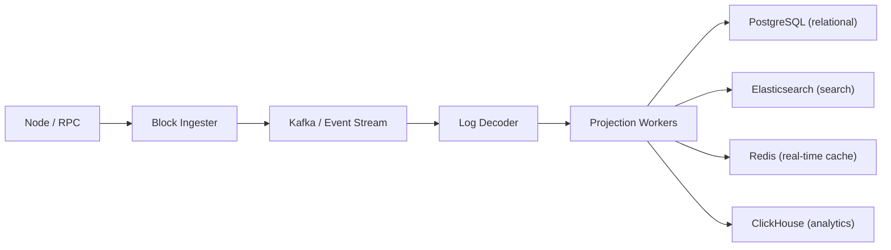

- **Ingester**: polls or subscribes to blocks; writes raw block/receipt/log data to event stream.
- **Decoder**: ABI-aware log parsing; contract-specific event decoding.
- **Projection workers**: domain-specific materializers (balance updater, NFT ownership tracker, activity feed builder).
- **Stores**: each optimized for its access pattern (relational for OLTP, search for discovery, columnar for analytics).

### Event Log Indexing

Ethereum event logs are the primary data source for off-chain indexing. Each log contains:
- `address`: contract that emitted the event
- `topics[0]`: keccak256 hash of event signature (e.g., `Transfer(address,address,uint256)`)
- `topics[1..3]`: indexed parameters (up to 3)
- `data`: non-indexed parameters (ABI-encoded)

**Indexing strategy:**
- Create database indexes on `(chain_id, contract_address, event_signature, block_number)`.
- For NFT transfers: index on `(contract_address, token_id)` and `(from_address)` and `(to_address)`.
- For ERC-20 transfers: index on `(contract_address, from_address)` and `(contract_address, to_address)`.
- Partition event log tables by `block_number` range (e.g., 1M blocks per partition) for efficient pruning and backfill.

### Database Partitioning Strategy

| Table | Partition Key | Strategy | Rationale |
|-------|--------------|----------|-----------|
| blocks | block_number | Range (1M blocks) | Time-ordered append; old partitions become read-only |
| transactions | block_number | Range (1M blocks) | Co-locate with blocks for join efficiency |
| event_logs | block_number | Range (1M blocks) | Bulk of storage; enables efficient backfill replay |
| balances | address hash | Hash (256 partitions) | Uniform distribution; avoids hot partitions |
| nft_tokens | collection_id | Hash | Collection-level queries are common |
| marketplace_orders | status + created_at | List + Range | Active orders hot; historical orders cold |
| wallet_activity | wallet_id | Hash | Per-user query pattern |

### Search Index Design (Elasticsearch)

**NFT Search Index Mapping:**
```json
{
  "mappings": {
    "properties": {
      "token_id":         { "type": "keyword" },
      "contract_address": { "type": "keyword" },
      "collection_name":  { "type": "text", "analyzer": "standard" },
      "token_name":       { "type": "text", "analyzer": "standard" },
      "description":      { "type": "text" },
      "traits":           { "type": "nested", "properties": {
        "trait_type": { "type": "keyword" },
        "value":      { "type": "keyword" }
      }},
      "rarity_score":     { "type": "float" },
      "price":            { "type": "scaled_float", "scaling_factor": 1e18 },
      "owner":            { "type": "keyword" },
      "is_listed":        { "type": "boolean" },
      "last_sale_price":  { "type": "scaled_float", "scaling_factor": 1e18 },
      "updated_at":       { "type": "date" }
    }
  }
}
```

---

## Cache Strategy

### Block and State Cache

| Cache Layer | Storage | TTL | Eviction | Purpose |
|------------|---------|-----|----------|---------|
| Latest block header | Redis | 12s (1 block) | Overwrite on new block | Fast head queries; gas price display |
| Recent blocks (last 128) | Redis | 30 min | LRU | Reorg detection window; recent tx lookups |
| Account balance | Redis | 15s | Invalidate on new block touching address | Wallet balance display |
| Account nonce | Redis | Per-tx | Invalidate after broadcast or block inclusion | Nonce management for custodial signing |
| Gas price estimate | Redis | 12s | Overwrite per block | Gas price widget; estimation API |
| Token metadata | Redis + CDN | 24h | Manual invalidation on metadata refresh | NFT display; collection pages |
| Collection stats | Redis | 60s | Scheduled refresh | Floor price, volume, listing count |
| Contract ABI | Local + Redis | 7d | Version-based invalidation | Decode and simulation |

### State Trie Cache

For self-hosted nodes, the state trie cache is critical for performance:
- **In-memory trie cache**: recent state trie nodes kept in LRU cache (typically 256 MB - 1 GB).
- **Flat state DB**: some clients (Geth) maintain a flat key-value snapshot of account state alongside the Merkle trie for faster reads.
- **Pruning**: remove historical state trie nodes that are no longer needed for serving current state queries. Archive nodes skip pruning.

### Nonce Cache

Nonce management is the single most critical cache for custodial transaction systems:

```
NonceCacheEntry {
    chain_id:        int
    address:         string
    confirmed_nonce: uint64    -- from latest confirmed block
    pending_nonce:   uint64    -- next nonce to assign (confirmed + pending count)
    pending_txs:     map<uint64, TxReference>  -- nonce -> pending tx mapping
    last_sync:       timestamp
}
```

- **Allocation**: atomically increment `pending_nonce` and record the mapping. Use Redis INCR or PostgreSQL advisory locks.
- **Recovery**: on startup or nonce gap detection, query `eth_getTransactionCount(address, "pending")` and reconcile.
- **Gap handling**: if a nonce is consumed but the tx is dropped, the gap blocks all subsequent transactions. Detect via timeout and resubmit or replace.

### CDN and Media Cache

- NFT images and videos served through CDN with aggressive caching (30-day TTL for immutable IPFS content).
- Thumbnail generation pipeline: original media -> resize -> WebP conversion -> CDN upload.
- Cache invalidation only needed for metadata refresh events (rare for established collections).

### Cache Warming Strategy

**On Platform Startup / Cache Flush:**
1. Pre-warm gas price cache from `eth_feeHistory` for last 20 blocks.
2. Pre-warm balance cache for top 10,000 wallets by activity (most likely to be queried first).
3. Pre-warm collection stats (floor price, volume) for top 500 collections.
4. Pre-warm contract ABI cache for all verified contracts in the platform's registry.
5. Pre-warm block header cache for last 128 blocks (reorg detection window).

**On New Block Event:**
1. Update gas price cache with new base fee and priority fee statistics.
2. Invalidate balance cache for all addresses touched in the new block.
3. Update collection stats if any marketplace events occurred in the block.
4. Extend block header cache with new block; evict oldest if beyond 128.

### Cache Consistency Guarantees

| Data | Staleness Tolerance | Consistency Approach |
|------|--------------------|--------------------|
| Gas price | 12s (1 block) | Overwrite on every new block; acceptable to serve stale for 1 block |
| User balance | 15s | Invalidate on block containing user's address; lazy refresh on query |
| NFT ownership | 30s | Eventual; indexer-driven update; user can force-refresh |
| Collection floor price | 60s | Scheduled refresh; not critical for individual transactions |
| Contract ABI | Days | Version-pinned; invalidate on explicit upgrade or registry update |
| Token metadata | Hours-days | Long-lived cache; IPFS content is immutable by content hash |
| Marketplace order status | 5s | Invalidate on fill, cancel, or expiry event; short TTL for active orders |

---

## Queue and Stream Design

### Mempool as a Priority Queue

The blockchain mempool is architecturally a priority queue ordered by effective gas price:

```
MempoolEntry {
    tx_hash:           bytes32
    sender:            address
    nonce:             uint64
    effective_tip:     uint256    -- priority_fee or (gas_price - base_fee)
    gas_limit:         uint64
    first_seen:        timestamp
    replacement_count: int
}

Ordering: descending by effective_tip (validators maximize revenue)
Eviction: ascending by effective_tip when pool exceeds memory limit
Replacement: new tx with same (sender, nonce) and higher gas price replaces existing
```

### Event Indexing Pipeline

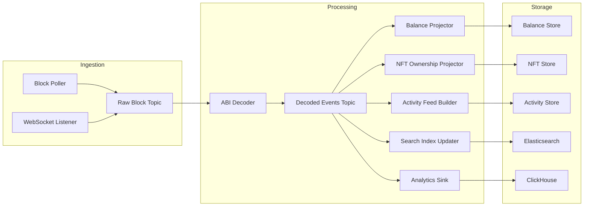

**Kafka Topic Design:**

| Topic | Partitions | Partition Key | Retention | Consumer Groups |
|-------|-----------|--------------|-----------|----------------|
| `raw-blocks.{chain_id}` | 16 | block_number % 16 | 7 days | decoder, archiver |
| `decoded-events.{chain_id}` | 64 | contract_address hash | 30 days | balance, nft, activity, search, analytics |
| `transaction-intents` | 32 | wallet_id hash | 14 days | signer, status tracker |
| `transaction-status` | 32 | tx_hash hash | 7 days | notification, activity, reconciliation |
| `marketplace-orders` | 16 | collection hash | 30 days | search updater, analytics |

### Dead Letter Queues

- Separate DLQ per consumer group for isolating decode failures, projection errors, and transient RPC issues.
- DLQ entries include: original message, error details, retry count, first failure timestamp.
- Automated retry with exponential backoff for transient errors; manual review for persistent failures (e.g., unknown event signature).

---

## State Machine Diagrams

### 1. Transaction Lifecycle State Machine

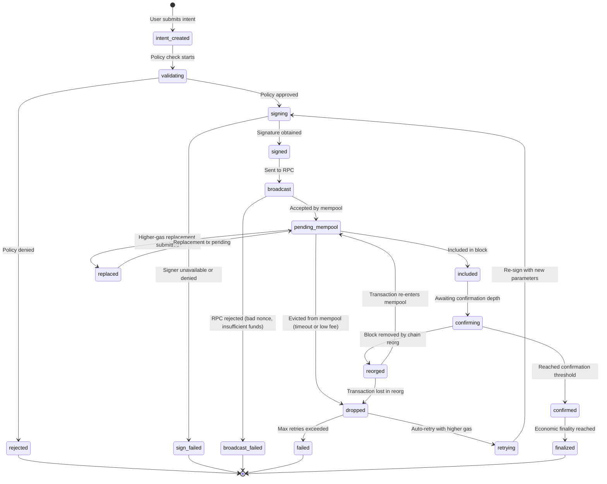

### 2. Block Lifecycle State Machine

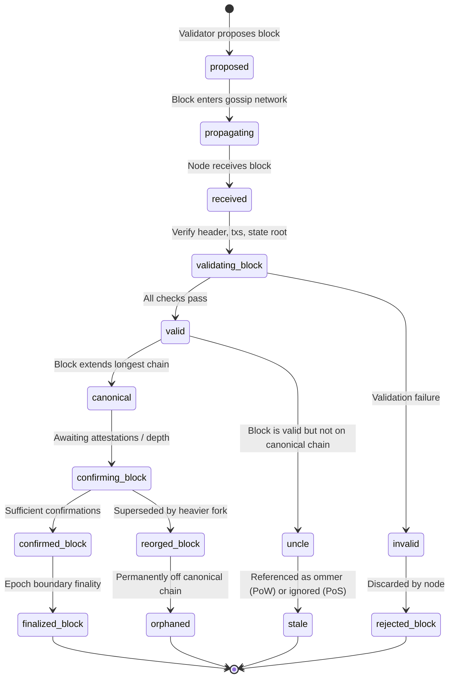

### 3. NFT Auction State Machine

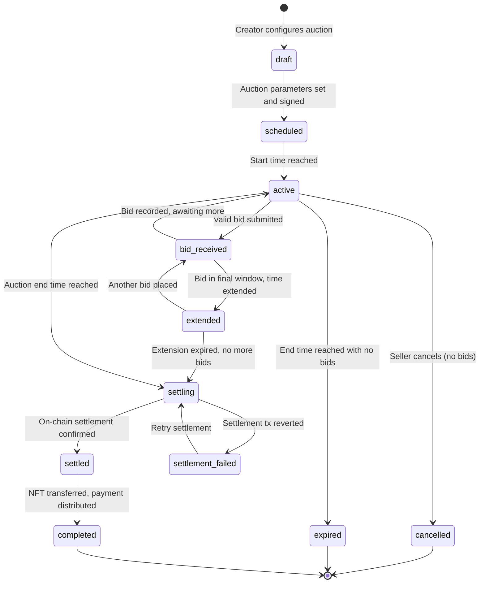

### 4. Smart Contract Deployment State Machine

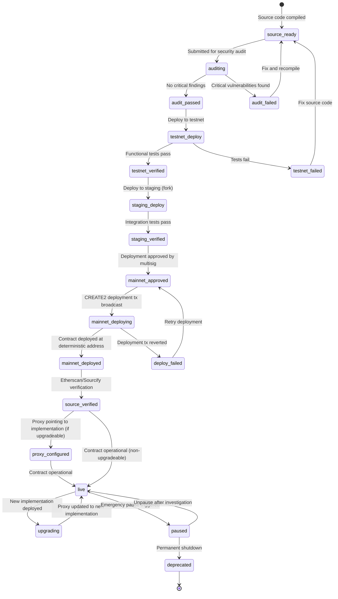

### 5. Consensus Round State Machine (PoS / BFT)

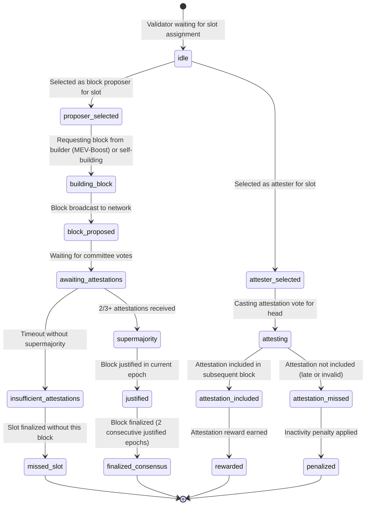

---

## Sequence Diagrams

### 1. Wallet-to-Chain Transaction Flow

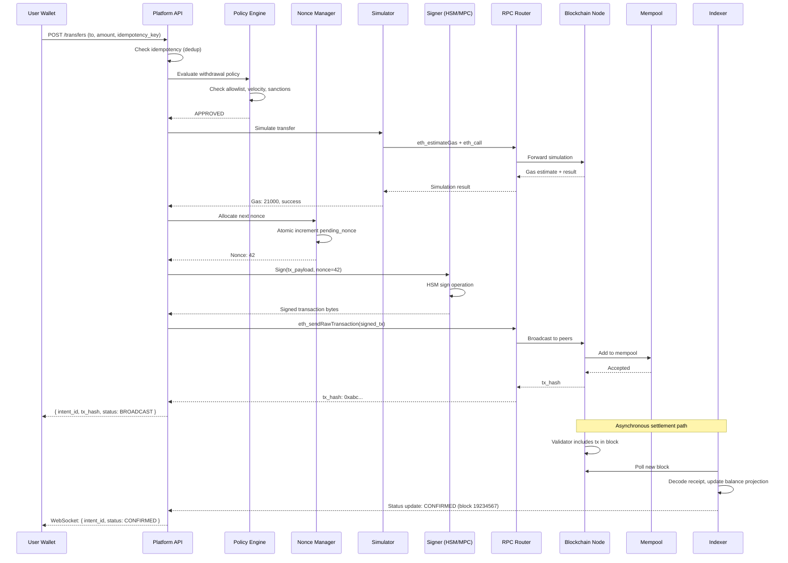

### 2. NFT Purchase Flow (Off-Chain Order)

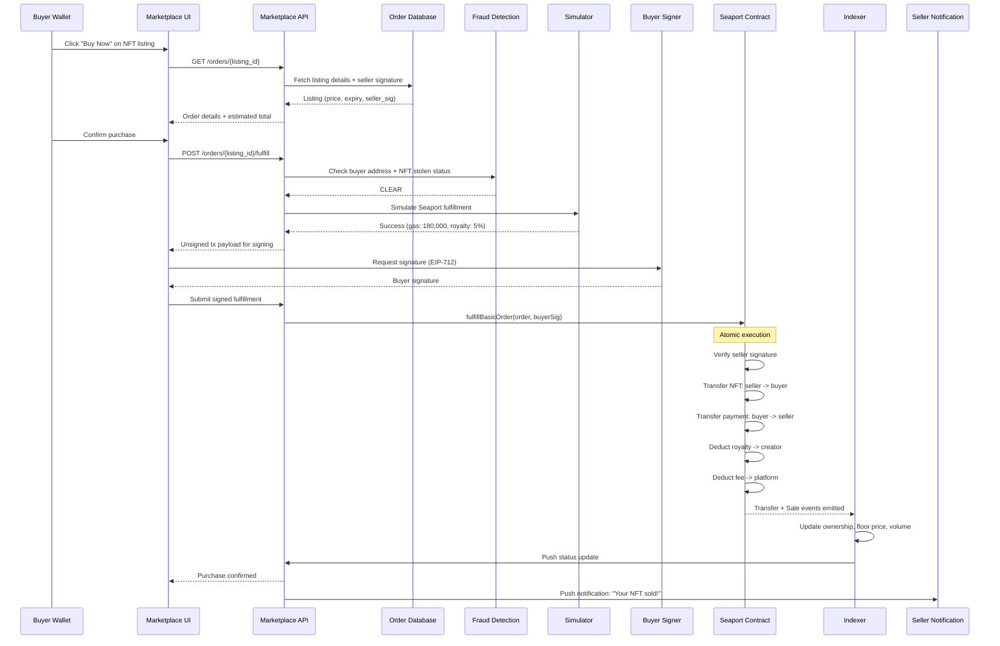

### 3. Chain Reorganization Detection and Recovery

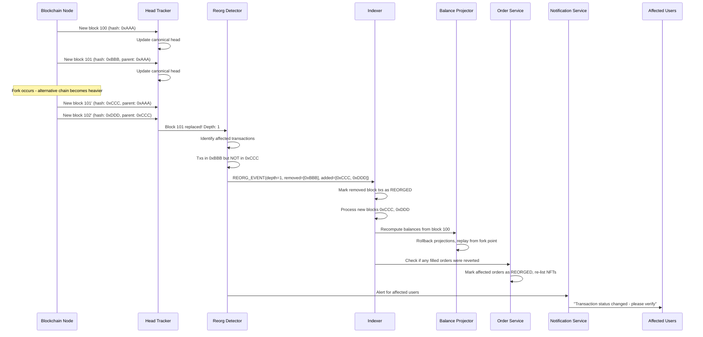

### 4. MPC Signing Ceremony

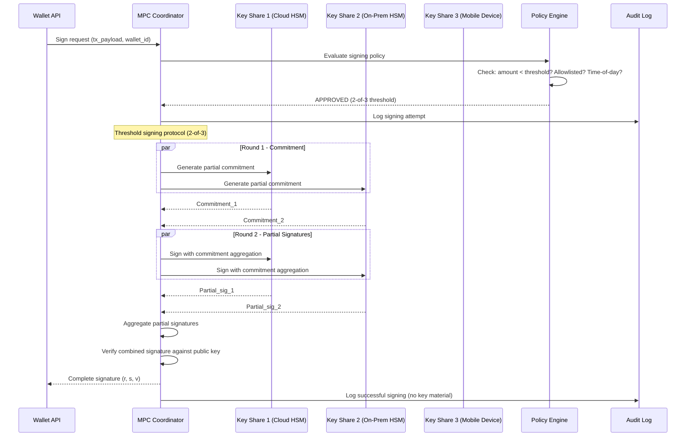

### 5. Cross-Chain Bridge Transfer

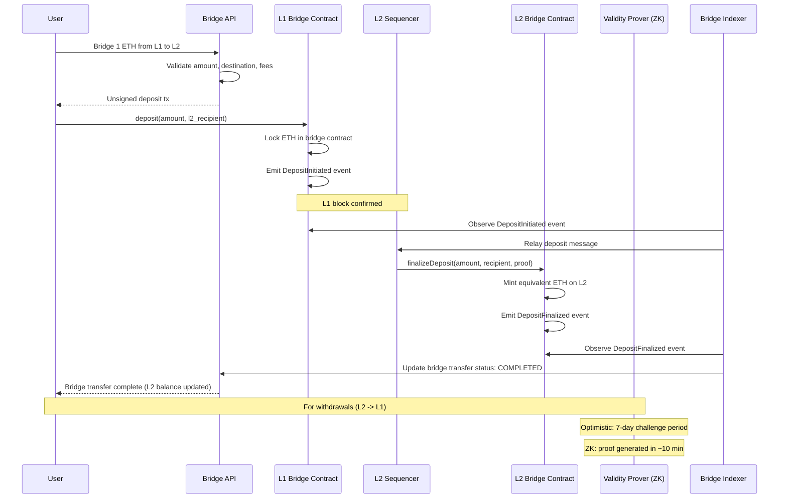

---

## Concurrency Control

### Nonce Management

Nonce management is the most critical concurrency challenge in custodial blockchain systems. Each Ethereum account has a strictly sequential nonce. If nonce N is not yet confirmed, nonce N+1 remains pending even if it has higher gas.

**Single-Account Serialization:**
```
1. Acquire lock on (chain_id, sender_address)
2. Read current pending_nonce from cache
3. Assign nonce = pending_nonce
4. Increment pending_nonce atomically
5. Sign and broadcast transaction
6. Release lock
7. Track tx_hash -> nonce mapping for replacement/cancellation
```

**Nonce Gap Recovery:**
- Detect gaps by comparing `eth_getTransactionCount(address, "latest")` vs `eth_getTransactionCount(address, "pending")`.
- If gap exists (latest < pending but no known pending txs for intervening nonces): submit zero-value self-transfer at the missing nonce to unblock the queue.
- Alerting: trigger page if nonce gap persists > 5 minutes.

**High-Throughput Nonce Strategies:**
- **Account pool**: maintain N pre-funded accounts; distribute transactions round-robin; each account has independent nonce.
- **Nonce reservation with TTL**: reserve nonce slot with 60s timeout; if not used, release for reallocation.
- **Replacement chain**: if tx at nonce N is stuck, replace it (higher gas) rather than waiting.

### Mempool Ordering and Contention

- Validators order transactions by effective gas price; no FIFO guarantee.
- **Front-running**: adversary observes a pending transaction in the mempool, submits a competing transaction with higher gas to execute first.
- **Back-running**: adversary submits a transaction immediately after a target transaction (e.g., arbitrage after a large swap).
- **Sandwich attack**: adversary front-runs AND back-runs a user's swap, profiting from the price impact.

**Mitigation:**
- Use private mempool submission (Flashbots Protect, MEV-Share).
- Set tight slippage tolerance on DEX trades.
- Use commit-reveal schemes where applicable.

### Off-Chain Order Book Concurrency

- Multiple buyers may attempt to fulfill the same listing simultaneously.
- **Optimistic locking**: mark order as `PENDING_FULFILLMENT` with a short TTL (30s); if settlement fails, revert to `ACTIVE`.
- **On-chain atomicity**: the settlement contract itself prevents double-fill; if two fulfillments race, only the first included in a block succeeds; the second reverts.
- **Cancellation race**: seller cancels listing while buyer fulfills; on-chain the first to be included wins.

---

## Idempotency

### Transaction Hash as Natural Idempotency Key

Blockchain transactions are inherently idempotent: a signed transaction with a specific `(sender, nonce, chain_id)` triple can only be executed once. Rebroadcasting the same signed bytes is safe — the network deduplicates by tx_hash.

**Platform-Level Idempotency:**

| Layer | Idempotency Key | Mechanism |
|-------|----------------|-----------|
| Client -> API | `idempotency_key` header (UUID) | Dedup table with 24h TTL; return cached response on match |
| API -> Signer | `(chain_id, sender, nonce)` | Nonce manager ensures each nonce assigned once |
| Signer -> Chain | `tx_hash` | Network deduplicates; rebroadcast is safe |
| Indexer -> Projector | `(chain_id, tx_hash, log_index)` | Event dedup by composite key |
| Webhook -> Consumer | `(event_type, tx_hash, log_index)` | Consumer-side dedup table |

**Idempotency Implementation:**

```sql
CREATE TABLE idempotency_keys (
    key            VARCHAR(64) PRIMARY KEY,
    endpoint       VARCHAR(128),
    request_hash   BYTEA,
    response_body  JSONB,
    status_code    INT,
    created_at     TIMESTAMP DEFAULT NOW(),
    expires_at     TIMESTAMP DEFAULT NOW() + INTERVAL '24 hours'
);

-- On request:
-- 1. INSERT INTO idempotency_keys ... ON CONFLICT DO NOTHING
-- 2. If insert succeeds: process request, store response
-- 3. If insert fails (key exists): return cached response
```

**Replacement Transaction Idempotency:**
- When replacing a stuck transaction (same nonce, higher gas), the idempotency key maps to the intent, not the tx_hash.
- The intent may produce multiple tx_hashes over its lifetime (original + replacements).
- Consumers should track intent_id as the stable reference, not tx_hash.

---

## Consistency Model

### Eventual Consistency Across Nodes

Blockchain networks are eventually consistent distributed systems. At any moment, different nodes may disagree about the chain tip due to network propagation delays.

**Consistency Spectrum by Query Type:**

| Query | Consistency Level | Explanation |
|-------|------------------|-------------|
| `eth_blockNumber` | Per-node latest | Different nodes may be 1-2 blocks apart |
| `eth_getBalance` at latest block | Weak | Balance may differ across nodes due to head disagreement |
| `eth_getBalance` at finalized block | Strong | All honest nodes agree on finalized state |
| `eth_getTransactionReceipt` | Eventually consistent | Receipt appears after inclusion; may disappear on reorg |
| Platform balance (indexed) | Eventually consistent | Lags chain by indexer processing time (1-10s typical) |
| NFT ownership (indexed) | Eventually consistent | Ownership update after block processing + projection |

### Finality Guarantees

| Chain | Finality Type | Time | Guarantee |
|-------|--------------|------|-----------|
| Ethereum L1 | Economic (Casper FFG) | ~12.8 min (2 epochs) | Reversal requires burning 1/3 of staked ETH (~$10B+) |
| Ethereum L1 | Practical (confirmations) | ~3 min (12 blocks) | Reorg deeper than 12 blocks is extremely rare |
| Arbitrum / Base | Soft (sequencer) | ~250ms | Sequencer promises inclusion; not yet on L1 |
| Arbitrum / Base | Hard (L1 posting) | ~10 min | Data posted to L1; inherits L1 finality |
| Polygon PoS | Checkpoint (Heimdall) | ~30 min | Checkpoint submitted to Ethereum |
| Solana | Optimistic | ~400ms | Supermajority vote; very rare rollback |
| Solana | Finalized | ~6.4s | 31+ confirmations |
| Cosmos/Tendermint | Absolute | ~6s | BFT single-slot finality |

### Platform Confirmation Policy

```
ConfirmationPolicy {
    chain_id:           int
    asset_type:         enum        -- NATIVE | ERC20 | ERC721
    min_confirmations:  int         -- blocks before product considers tx confirmed
    finality_mode:      enum        -- CONFIRMATION_COUNT | EPOCH_FINALITY | SEQUENCER_SOFT
    display_as_pending: boolean     -- show as pending until confirmed
    allow_spend:        boolean     -- allow spending received funds before finality
}

Example configurations:
- Ethereum ETH deposit: 12 confirmations (~3 min), display pending, no spend until confirmed
- Arbitrum ETH deposit: sequencer soft finality + 1 L1 confirmation
- Solana SOL deposit: finalized confirmation (31 slots)
- NFT purchase: 1 confirmation (immediate display), full finality for provenance
```

---

## Distributed Transactions and Sagas

### Cross-Chain Bridge Saga

Cross-chain bridges move assets between independent blockchains. Since there is no shared atomic commit, bridges use saga-like patterns with compensating actions.

**Lock-and-Mint Bridge Pattern:**

```
Saga: Bridge ETH from Ethereum to Arbitrum

Step 1: Lock on Source Chain
  Action: User deposits ETH into L1 bridge contract
  Compensation: User can reclaim after timeout (7-day challenge period for optimistic bridges)

Step 2: Relay Message
  Action: Bridge relayer observes L1 deposit event, constructs proof
  Compensation: If relay fails, deposit remains locked; user can force-include via L1

Step 3: Mint on Destination Chain
  Action: L2 bridge contract verifies proof, mints equivalent ETH to user on L2
  Compensation: If mint fails, L1 deposit remains locked for manual recovery

Step 4: Confirm
  Action: Bridge indexer confirms L2 mint, updates user-facing status
  Compensation: Manual reconciliation if confirmation lost
```

**Failure Scenarios:**
- Relay goes offline: user's funds are locked on L1. Solution: permissionless relay (anyone can submit proof) or user-forced inclusion.
- L2 sequencer goes offline: mint cannot execute. Solution: users can force transactions through L1 escape hatch.
- Proof invalid: mint is rejected. Solution: retry with correct proof or manual investigation.

### Atomic Swap Pattern

Atomic swaps use Hash Time-Locked Contracts (HTLCs) to enable trustless cross-chain exchange without a bridge intermediary:

```
1. Alice generates secret S, computes hash H = hash(S)
2. Alice locks ETH on Ethereum with HTLC: "release to Bob if he reveals preimage of H within 24h"
3. Bob sees Alice's HTLC, locks BTC on Bitcoin with HTLC: "release to Alice if she reveals preimage of H within 12h"
4. Alice reveals S to claim Bob's BTC (her reveal is publicly visible on Bitcoin)
5. Bob uses the revealed S to claim Alice's ETH on Ethereum
6. If neither reveals within timeout, both HTLCs expire and funds return to original owners
```

### DeFi Composability Saga

Multi-step DeFi operations (e.g., "borrow USDC, swap to ETH, provide liquidity") execute atomically within a single transaction using flash loans or batched calls:

```
Atomic Multi-Step (Single Transaction):
1. Flash loan 10,000 USDC from Aave
2. Swap USDC -> ETH on Uniswap
3. Deposit ETH into Lido (receive stETH)
4. Supply stETH as collateral on Aave
5. Borrow USDC against collateral
6. Repay flash loan + fee

If ANY step reverts, the ENTIRE transaction reverts — true atomicity.
```

This is fundamentally different from traditional sagas because EVM execution is atomic within a transaction. The saga pattern only applies across chain boundaries.

---

## 19.2 Design Patterns, Reliability, and Operations
### Request path, read path, and async path
Blockchain products normally use three independent planes:
- **Intent plane:** accepts API requests, validates user context, and returns a pending status quickly.
- **Settlement plane:** signs, broadcasts, tracks confirmations, and reconciles with chain state.
- **Projection plane:** builds balances, search indexes, notification feeds, and analytics from confirmed or semi-confirmed events.

This decomposition is the practical answer to "microservices or monolith?" A small product can still deploy this as one codebase, but the conceptual separation prevents unsafe coupling.

### Event flow
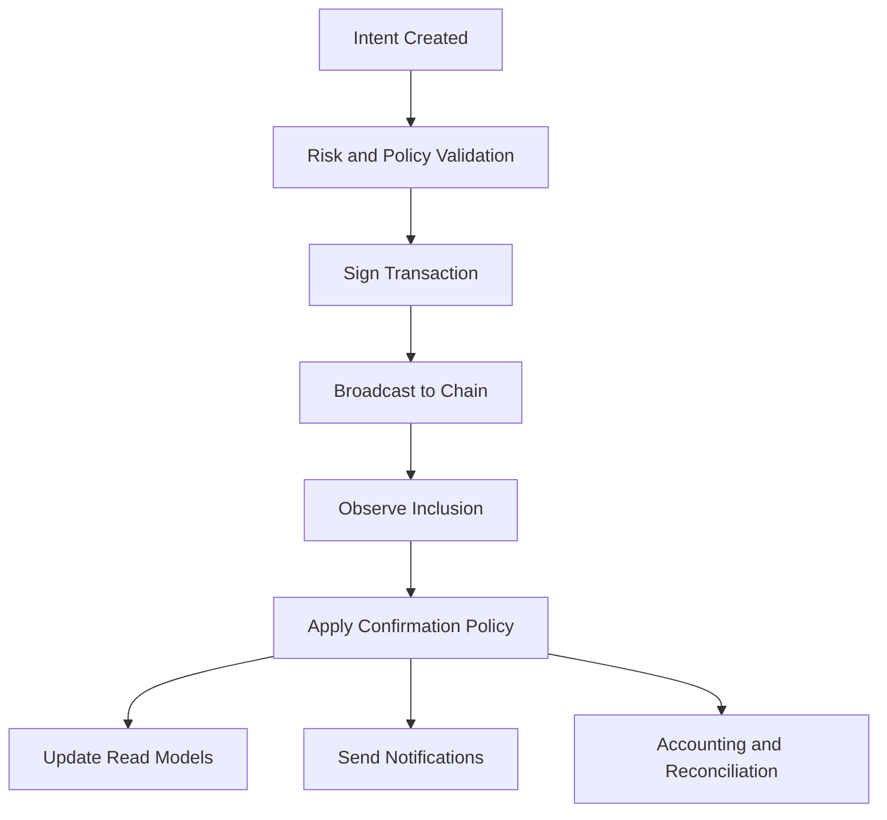

---

## Security Design

### Key Management Security

| Threat | Mitigation | Implementation |
|--------|-----------|----------------|
| Key exfiltration | HSM/MPC with no key export | FIPS 140-2 Level 3 HSMs; MPC with threshold signing |
| Insider threat | Separation of duties; no single person can sign | 2-of-3 MPC; multisig with independent key holders |
| Side-channel attack | Constant-time signing; shielded memory | HSM-based signing; no software key handling |
| Backup compromise | Encrypted backup with geographic separation | Shamir's Secret Sharing for seed backup; bank vault storage |
| Key rotation | Periodic rotation with balance migration | Scheduled rotation every 90 days for hot wallets |

### Smart Contract Security

**Common Vulnerability Classes:**

| Vulnerability | Description | Prevention |
|--------------|-------------|------------|
| Reentrancy | External call re-enters calling contract before state update | Checks-Effects-Interactions pattern; ReentrancyGuard; use transfer() or send() |
| Integer overflow/underflow | Arithmetic exceeds type bounds | Solidity 0.8+ has built-in overflow checks; use SafeMath for older versions |
| Access control bypass | Unauthorized function calls | OpenZeppelin Ownable/AccessControl; explicit role checks |
| Oracle manipulation | Flash loan manipulation of price feeds | TWAP oracles; Chainlink with deviation thresholds; multi-source aggregation |
| Front-running | Transaction ordering exploitation | Commit-reveal; private mempool; MEV-Share |
| Delegatecall injection | Malicious implementation in delegatecall | Only delegatecall to trusted implementations; proxy pattern safety |
| Storage collision | Proxy and implementation storage overlap | EIP-1967 storage slots; OpenZeppelin upgradeable contracts |
| Unchecked return values | Ignoring failed external calls | Always check return values; use SafeERC20 for token transfers |

**Audit Process:**
1. Internal review: code review by senior engineers not on the development team.
2. Automated analysis: Slither (static analysis), Mythril (symbolic execution), Echidna (fuzzing).
3. External audit: two independent audit firms for high-value contracts.
4. Formal verification: for critical financial logic (e.g., Certora Prover).
5. Bug bounty: post-deployment bug bounty program (Immunefi).
6. Monitoring: runtime invariant checking; Forta bot alerts.

### MEV Protection

**Maximal Extractable Value (MEV)** is the profit validators/builders can extract by reordering, inserting, or censoring transactions within a block.

**MEV Attack Types:**
- **Sandwich attack**: front-run + back-run a DEX swap; profit from price impact.
- **Just-In-Time (JIT) liquidity**: provide concentrated liquidity right before a large swap; withdraw after.
- **Liquidation sniping**: front-run liquidation opportunities in lending protocols.
- **NFT sniping**: front-run underpriced NFT purchases.

**Protection Mechanisms:**

| Mechanism | How It Works | Trade-off |
|-----------|-------------|-----------|
| Flashbots Protect | Submit tx directly to builders, bypassing public mempool | Slight latency increase; builder trust |
| MEV-Share | Users share MEV profits with builders in exchange for protection | Reduced MEV extraction but not zero |
| Proposer-Builder Separation (PBS) | Separate block building from proposing; competitive builder market | Protocol complexity; builder centralization risk |
| Encrypted mempools | Transactions encrypted until block inclusion | Added latency; key management complexity |
| Batch auctions | Aggregate orders and execute at uniform price | Reduced composability; settlement delay |
| Intent-based protocols | Users express intent; solvers compete to fulfill | UX improvement; solver centralization risk |

### Front-Running Prevention in NFT Marketplace

- **Commit-reveal for auctions**: bidders commit hash(bid + salt) first; reveal bid in second phase.
- **Private order submission**: Seaport orders signed off-chain; only revealed to counterparty or at fulfillment.
- **Randomized mint**: for NFT drops, use Chainlink VRF for random assignment to prevent trait sniping.
- **Allowlist-based minting**: restrict minting to pre-approved addresses during high-demand drops.

---

## Observability Design

### Block Explorer and Chain Health

- **Head lag dashboard**: per-chain, per-provider head block comparison; alert if provider lags > 3 blocks.
- **Finality tracker**: time from block proposal to finality per chain; detect finality delays.
- **Peer count and topology**: for self-hosted nodes, monitor peer count, geographic distribution, and connection quality.
- **Fork monitor**: detect and visualize chain forks in real-time; correlate with reorg events.

### Gas Tracker

- **Base fee trend**: rolling 1h, 24h, 7d charts of base fee per chain.
- **Priority fee percentiles**: 10th, 25th, 50th, 75th, 90th percentile of priority fees by block.
- **Gas cost by operation**: track average gas cost for common operations (transfer, swap, mint, etc.).
- **Cost prediction**: estimate cost of pending intent based on current + predicted gas prices.
- **Stuck transaction monitor**: alert on transactions pending > 5 minutes; auto-suggest gas bump.

### Whale Alert and Activity Monitoring

- **Large transfer detection**: alert on transfers exceeding configurable thresholds (e.g., > 1,000 ETH).
- **Smart money tracking**: monitor addresses of known institutional players, protocol treasuries, and whale wallets.
- **Contract interaction anomalies**: detect unusual patterns in contract calls (e.g., sudden spike in a specific function).
- **Mempool monitoring**: for MEV-sensitive operations, monitor public mempool for relevant pending transactions.

### Platform Observability Metrics

| Metric | Description | Alert Threshold |
|--------|-------------|----------------|
| `chain.head_lag_blocks` | Difference between local head and network head | > 3 blocks |
| `chain.reorg_depth` | Depth of detected chain reorganization | > 2 blocks |
| `rpc.success_rate` | Per-provider RPC success rate | < 99% |
| `rpc.latency_p99` | Per-provider RPC latency | > 1s |
| `tx.broadcast_to_inclusion_p50` | Time from broadcast to block inclusion | > 5 min |
| `tx.stuck_pending_count` | Number of transactions pending > 10 min | > 10 |
| `nonce.gap_count` | Number of nonce gaps across all signing accounts | > 0 |
| `indexer.block_lag` | Blocks behind chain head | > 10 blocks |
| `indexer.event_processing_rate` | Events processed per second | < 1,000/s (sustained) |
| `balance.drift_count` | Wallets where projected balance differs from chain | > 0 (investigate) |
| `signer.latency_p99` | HSM/MPC signing operation latency | > 2s |
| `signer.failure_rate` | Signing operation failure rate | > 0.1% |
| `marketplace.order_fill_rate` | Percentage of attempted fills that succeed | < 95% |
| `marketplace.settlement_latency_p50` | Time from fill attempt to on-chain confirmation | > 60s |

---

## Reliability and Resilience Design

### Chain Reorganization Handling

Chain reorgs are the most dangerous failure mode in blockchain systems because they retroactively change confirmed state.

**Detection:**
- Head tracker compares each new block's parent_hash against stored canonical chain.
- If parent_hash does not match stored block at height-1, a reorg has occurred.
- Depth of reorg = number of blocks that must be replaced.

**Recovery Protocol:**
1. Identify all transactions in removed blocks.
2. Check which of those transactions appear in the new canonical blocks.
3. Transactions that do NOT reappear: mark as `REORGED` and alert.
4. Roll back all projections (balances, NFT ownership, activity feeds) to the fork point.
5. Replay new canonical blocks through the projection pipeline.
6. For marketplace: re-list any NFTs whose sales were reverted; refund or re-escrow payments.
7. For wallet: recalculate balance projections; notify affected users.

**Reorg Depth Policy:**

| Chain | Max Tolerated Reorg Depth | Action if Exceeded |
|-------|--------------------------|-------------------|
| Ethereum L1 | 12 blocks | Automatic recovery up to 64 blocks; manual intervention beyond |
| Polygon PoS | 128 blocks | Automatic recovery; checkpoint as anchor |
| Arbitrum | Sequencer reorg rare; L1 finality governs | Wait for L1 confirmation |
| Solana | 32 slots | Automatic recovery; finalized slots are immutable |

### Node Failover

- **Active-active**: multiple nodes per chain; RPC router distributes based on health score.
- **Health scoring**: composite of (head lag, error rate, latency, archive depth); 0-100 score; remove from rotation below 50.
- **Provider diversity**: mix self-hosted (Geth, Reth) with managed (Alchemy, QuickNode, Infura) to avoid correlated failures.
- **Graceful degradation**: if all providers for a chain are degraded, switch to read-only mode (no new transactions) and surface chain status to users.

### Reliability and resilience design
- Use exponential backoff with jitter for provider calls, but avoid naive rebroadcast loops that create duplicate or replaced transactions.
- Preserve dead-letter queues for decode failures and projection errors. You will eventually ship a broken decoder.
- Run reconciliation jobs that compare internal ledger projections with chain-observed balances and event counts.
- Use degraded modes. If search index freshness lags, users can still view authoritative asset state from OLTP plus chain reads.
- Keep emergency switches for withdrawals, market listing creation, bridge actions, or chain-specific routes.

### Signer Resilience

- **HSM failover**: primary and secondary HSMs in different availability zones; automatic failover on health check failure.
- **MPC share distribution**: key shares in geographically separated data centers; any 2-of-3 can sign.
- **Signing queue**: if signer is temporarily unavailable, queue signing requests with timeout; do not drop.
- **Emergency key rotation**: pre-provisioned rotation procedure to migrate to new keys within 4 hours.

---

## Multi-Region Design

### Global Node Distribution

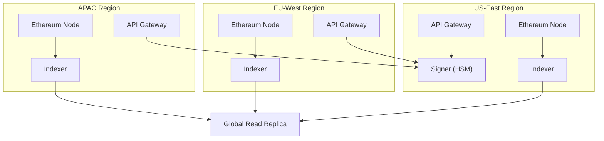

### Latency Impact on Consensus and Operations

| Operation | Latency Impact | Mitigation |
|-----------|---------------|------------|
| Block propagation | ~100-500ms globally | Regional full nodes; block relay networks |
| Transaction broadcast | ~200ms to nearest node; ~1s globally | Regional RPC endpoints; broadcast to multiple providers |
| Mempool visibility | Regional variation | Monitor mempool from multiple regions for MEV detection |
| Signing (HSM) | Cross-region: +50-100ms RTT | Primary HSM in one region; async signing for non-urgent operations |
| Indexer consistency | Regional indexers may differ by 1-2 blocks | Sync watermark across regions; serve reads from local indexer |
| Balance queries | Local read replica: < 50ms | Per-region read replicas; cache layer |

### Data Residency Considerations

- Transaction data is inherently global (on public blockchains). No data residency for on-chain data.
- Off-chain data (KYC, user profiles, internal ledger) subject to GDPR/regional regulations.
- Signing keys must comply with jurisdiction-specific custody regulations (e.g., some jurisdictions require local key custody).
- Separate compliance metadata from chain data; apply regional data retention policies to off-chain stores only.

---

## Cost Drivers

### Gas Costs by Operation

| Operation | Gas (Ethereum L1) | Cost at 25 gwei | Cost at 100 gwei |
|-----------|-------------------|-----------------|-------------------|
| ETH transfer | 21,000 | $1.50 | $6.00 |
| ERC-20 transfer | 65,000 | $4.50 | $18.00 |
| ERC-20 approve | 46,000 | $3.25 | $13.00 |
| NFT mint (ERC-721) | 150,000 | $10.50 | $42.00 |
| NFT transfer | 85,000 | $6.00 | $24.00 |
| Uniswap swap | 180,000 | $12.60 | $50.40 |
| Seaport NFT purchase | 200,000 | $14.00 | $56.00 |
| Contract deployment (simple) | 500,000 | $35.00 | $140.00 |
| Contract deployment (complex) | 3,000,000 | $210.00 | $840.00 |

*Costs based on ETH price of ~$2,800. L2 costs are typically 10-100x cheaper.*

### Storage Costs

| Resource | Cost Driver | Estimated Monthly Cost |
|----------|-----------|----------------------|
| Ethereum archive node | ~14 TB SSD | $2,800 (cloud) / $500 (bare metal) |
| Ethereum full node (pruned) | ~1.2 TB SSD | $240 (cloud) / $50 (bare metal) |
| Solana validator | ~2 TB NVMe + 32 GB RAM | $600 (cloud) / $200 (bare metal) |
| PostgreSQL (indexed data) | ~50 TB | $5,000 (managed RDS) |
| Elasticsearch (search index) | ~5 TB | $2,000 (3-node cluster) |
| Redis (caches) | ~100 GB | $500 (ElastiCache) |
| IPFS pinning (NFT media) | ~20 TB | $800 (Pinata/Filebase) |
| Kafka (event streams) | ~10 TB retention | $3,000 (managed MSK) |

### Node Operation Costs

| Provider | Tier | Monthly Cost | Rate Limits |
|----------|------|-------------|-------------|
| Self-hosted (Geth/Reth) | Full node | $200-600 | Unlimited |
| Self-hosted (Geth/Reth) | Archive node | $500-2,800 | Unlimited |
| Alchemy | Growth | $200 | 300M compute units |
| QuickNode | Build | $300 | 500M API credits |
| Infura | Team | $225 | 200K requests/day |
| Self-hosted Solana | Validator | $600-1,200 | Unlimited |

### Cost Optimization Strategies

- **Batch transactions**: aggregate multiple operations into single transactions where possible (e.g., batch token transfers).
- **L2 migration**: move high-frequency, low-value operations to L2 rollups (10-100x cost reduction).
- **Lazy minting**: defer minting cost to buyer; eliminate gas cost for unsold NFTs.
- **Off-chain computation**: minimize on-chain storage and computation; use chain only for settlement and verification.
- **Gas price timing**: for non-urgent operations, queue transactions and submit during low-gas periods (weekends, off-peak hours).
- **Blob transactions (EIP-4844)**: L2s use blob data for cheaper L1 data availability posting.

---

## Deep Platform Comparisons

### Ethereum vs Solana vs Polygon vs Avalanche vs Base vs Arbitrum

| Property | Ethereum L1 | Solana | Polygon PoS | Avalanche C-Chain | Base | Arbitrum One |
|----------|------------|--------|-------------|-------------------|------|-------------|
| **Consensus** | PoS (Casper FFG) | PoH + Tower BFT | PoS (Heimdall + Bor) | Snowball/Avalanche | Inherited (Ethereum PoS) | Inherited (Ethereum PoS) |
| **Block time** | 12s | 400ms | 2s | 2s | 2s | ~250ms |
| **Finality** | ~12.8 min | ~6.4s | ~30 min (checkpoint) | ~2s (single slot) | ~10 min (L1 posting) | ~10 min (L1 posting) |
| **TPS (practical)** | 12-30 | 3,000-5,000 | 50-100 | 100-200 | 100-2,000 | 40-4,000 |
| **Avg tx cost** | $2-50 | $0.0001-0.01 | $0.01-0.10 | $0.05-0.50 | $0.001-0.05 | $0.01-0.10 |
| **VM** | EVM | SVM (Sealevel) | EVM | EVM | EVM | EVM |
| **State model** | Account-based (Merkle Patricia) | Account-based (parallel) | Account-based | Account-based | Account-based | Account-based |
| **Data availability** | Self (L1) | Self | Ethereum L1 (checkpoints) | Self | Ethereum L1 (blobs) | Ethereum L1 (blobs) |
| **Validator count** | ~900,000 | ~1,900 | ~100 | ~1,200 | 1 (sequencer) | 1 (sequencer) |
| **Decentralization** | High | Medium | Low-Medium | Medium | Low (centralized sequencer) | Low (centralized sequencer) |
| **Ecosystem maturity** | Highest | High | High | Medium | Growing rapidly | High |

### L1 vs L2 Scaling Architecture

**Layer 1 Scaling:**
- Increase block size or frequency (limited by propagation and consensus constraints).
- Sharding: split state into parallel chains (Ethereum's long-term roadmap via danksharding).
- Alternative VMs: Solana's Sealevel enables parallel transaction execution.

**Layer 2 Scaling (Rollups):**

| Property | Optimistic Rollup | ZK-Rollup |
|----------|-------------------|-----------|
| **Examples** | Arbitrum, Optimism, Base | zkSync, StarkNet, Scroll, Polygon zkEVM |
| **Proof mechanism** | Fraud proof (challenge period) | Validity proof (ZK-SNARK/STARK) |
| **Withdrawal time** | 7 days (challenge window) | Minutes (after proof generation) |
| **EVM compatibility** | Full (EVM-equivalent) | Varies (type 1-4 ZK-EVM) |
| **Proof cost** | Cheap (only on dispute) | Expensive (every batch) |
| **Data availability** | Calldata / blobs on L1 | Calldata / blobs on L1 |
| **Throughput gain** | 10-100x over L1 | 10-1000x over L1 |
| **Maturity** | Production (2+ years) | Early production |

**Rollup Architecture:**
```
User -> Sequencer -> Batch transactions -> Post data to L1 -> Generate proof -> Verify on L1
```

### Detailed Chain Comparison: Developer Experience

| Aspect | Ethereum / EVM | Solana |
|--------|---------------|--------|
| **Smart contract language** | Solidity, Vyper | Rust (Anchor framework) |
| **Account model** | Global state trie; each account has nonce, balance, storage | Account-centric; programs are stateless; data in separate accounts |
| **Transaction model** | Sequential nonce per account | No nonce; uses recent blockhash for replay protection |
| **Parallel execution** | Serial (single-threaded EVM) | Parallel (Sealevel runtime; transactions declare account access) |
| **State rent** | No rent (state persists forever once written) | Rent exemption requires minimum balance; can reclaim rent |
| **Composability** | Synchronous cross-contract calls within tx | Cross-Program Invocation (CPI); account ownership model |
| **Tooling maturity** | Excellent (Hardhat, Foundry, Remix, Etherscan) | Good (Anchor, Solana Explorer, Helius) |
| **RPC stability** | Stable; well-standardized JSON-RPC | Less stable; frequent RPC issues; rate limits on public endpoints |
| **Node requirements** | Full: ~1.2 TB SSD; Archive: ~14 TB | Validator: ~2 TB NVMe, 256 GB RAM (higher requirements) |
| **Gas model** | Gas per opcode; EIP-1559 base+priority fee | Compute units (fixed per instruction); priority fee optional |

### Bridging and Interoperability

| Bridge Type | Security Model | Latency | Examples |
|-------------|---------------|---------|---------|
| Native L1-L2 bridge | Inherits L1 security (rollup proof) | 10 min (L1->L2), 7 days (L2->L1 optimistic) | Arbitrum Bridge, Base Bridge |
| Validator-based bridge | External validator set; trust M-of-N | Minutes | Wormhole, Multichain |
| Light client bridge | Verifies source chain headers on destination | Minutes-hours | IBC (Cosmos), Snowbridge |
| Liquidity network | Liquidity providers on both sides; no locking | Seconds-minutes | Across, Stargate, Hop |
| Intent-based bridge | Fillers compete to fulfill cross-chain intents | Seconds | UniswapX, Across v3 |

**Bridge Risk Assessment:**
- **Native bridges** are safest (same security as rollup) but slowest for withdrawals.
- **Validator bridges** are faster but have been the #1 source of major exploits (Ronin: $625M, Wormhole: $325M).
- **Liquidity networks** have no lock risk but require sufficient liquidity on both sides.
- **Intent-based bridges** are newest; combine speed with competitive execution but introduce solver/filler dependency.

### Architectural Implications for Multi-Chain Support

- **Chain adapter pattern**: one adapter per chain or chain family; abstracts RPC differences, gas models, and finality semantics.
- **Shared indexer with chain-specific decoders**: common ingestion pipeline; chain-specific event parsing.
- **Unified wallet model**: one wallet entity maps to multiple chain-specific addresses; derived from single seed.
- **Cross-chain identity**: use ENS, Lens Protocol, or platform-specific identity that resolves to chain-specific addresses.
- **Gas abstraction**: present gas costs in USD equivalent across chains; use paymasters on chains that support account abstraction.

---

## Edge Cases and Failure Scenarios

### 1. Chain Reorganization During NFT Sale
**Scenario**: Buyer purchases NFT; sale is confirmed in block N. Reorg removes block N; the sale transaction does not reappear in the new canonical chain.
**Impact**: Marketplace shows buyer as owner; seller has received payment. But on-chain, seller still owns the NFT and payment was never executed.
**Mitigation**: Wait for finality depth before updating ownership in marketplace. If reorg detected, revert marketplace state, re-list NFT, and alert both parties.

### 2. Gas Price Spike During Batch Processing
**Scenario**: Platform is processing a batch of 1,000 withdrawal transactions. Gas price spikes 50x mid-batch due to a popular NFT mint.
**Impact**: Remaining transactions are either stuck (too low gas) or become prohibitively expensive.
**Mitigation**: Implement gas price circuit breaker; pause batch processing when gas exceeds threshold. Queue remaining transactions for later execution. Offer users the option to wait or pay higher fees.

### 3. Reentrancy Attack on Marketplace Contract
**Scenario**: Malicious NFT contract has a `onERC721Received` callback that re-enters the marketplace's `fulfillOrder` function, purchasing the same NFT multiple times.
**Impact**: Double-spend; marketplace pays out to seller multiple times for one NFT.
**Mitigation**: ReentrancyGuard on all state-changing functions. Checks-Effects-Interactions pattern. Pre-deployment audit specifically testing for reentrancy.

### 4. Oracle Manipulation via Flash Loan
**Scenario**: Attacker takes flash loan, manipulates DEX price feed used by lending protocol, borrows against inflated collateral, repays flash loan.
**Impact**: Protocol loses funds; insurance fund drained.
**Mitigation**: Use TWAP (Time-Weighted Average Price) over 30+ minutes instead of spot price. Use Chainlink decentralized oracles. Multiple oracle sources with deviation checks.

### 5. Nonce Gap Causing Transaction Queue Stall
**Scenario**: Transaction at nonce 42 is dropped from mempool due to low gas. All subsequent transactions (nonce 43, 44, ...) are blocked.
**Impact**: Entire account's transaction pipeline is frozen.
**Mitigation**: Monitor nonce gaps; auto-submit replacement transaction at stuck nonce with higher gas. Set monitoring alert for nonce gaps > 30 seconds.

### 6. IPFS Metadata Disappearance
**Scenario**: NFT collection creator stops paying for IPFS pinning. Metadata becomes unavailable. Images do not load on marketplace.
**Impact**: NFTs display without images or attributes; collection value drops; buyer complaints.
**Mitigation**: Platform pins metadata independently. Use Arweave for permanent storage as backup. Cache metadata in platform database with regular refresh validation.

### 7. Sequencer Downtime on L2
**Scenario**: L2 sequencer (single operator) goes offline for 30 minutes.
**Impact**: No new transactions processed on L2. Users cannot trade, transfer, or interact with DeFi protocols.
**Mitigation**: L2s provide escape hatch — users can force-include transactions via L1 (slower, more expensive). Platform surfaces L2 status and suggests L1 fallback for urgent operations.

### 8. Mempool Sniping of Lazy-Minted NFT
**Scenario**: Creator lazy-mints an underpriced rare NFT. Bot monitors mempool for `redeemVoucher` transactions, front-runs with higher gas to claim the NFT first.
**Impact**: Legitimate buyer loses NFT to bot; unfair market dynamics.
**Mitigation**: Use private mempool submission (Flashbots Protect). Add allowlist to lazy mint vouchers. Use commit-reveal for high-value drops.

### 9. Wallet Drain via Malicious Approval
**Scenario**: User signs an ERC-20 `approve(attacker, MAX_UINT256)` for a phishing contract. Attacker drains all approved tokens.
**Impact**: Complete loss of approved token balances.
**Mitigation**: Simulation service flags high-risk approvals. Warn users about unlimited approvals. Suggest using `increaseAllowance` with bounded amounts. Provide approval revocation UI.

### 10. Bridge Exploit via Faulty Validator Set
**Scenario**: Bridge validator set is compromised (e.g., Ronin bridge — validator keys stolen). Attackers fabricate withdrawal proofs and drain bridge funds.
**Impact**: Total loss of bridged assets; users' tokens on destination chain become unbacked.
**Mitigation**: Use rollup-based bridges (inherit L1 security) instead of validator-based bridges. Multi-proof systems. Rate-limiting on bridge withdrawals. Insurance fund.

### 11. EIP-1559 Base Fee Oscillation
**Scenario**: Rapid alternation between full and empty blocks causes base fee to oscillate wildly, making gas estimation unreliable.
**Impact**: Transactions submitted with estimated gas are intermittently stuck or overpay.
**Mitigation**: Use wider gas buffers during volatile periods. Implement adaptive gas estimation that accounts for base fee volatility. Monitor base fee standard deviation.

### 12. Double-Spend via Deposit Before Finality
**Scenario**: User deposits 100 ETH on exchange. Exchange credits balance after 6 confirmations. User immediately withdraws. At confirmation 8, a deep reorg occurs that removes the deposit transaction.
**Impact**: Exchange has credited and paid out 100 ETH that was never actually deposited. Net loss to the exchange.
**Mitigation**: Tier confirmation requirements by amount. For large deposits (> 10 ETH), wait for epoch finality (~12.8 min on Ethereum). Maintain withdrawal hold period proportional to deposit amount.

### 13. Denial of Service via Dust Transactions
**Scenario**: Attacker sends thousands of tiny (0.000001 ETH) transactions to platform addresses, bloating the indexer and transaction history.
**Impact**: Indexer performance degrades; user activity feeds filled with spam; storage costs increase.
**Mitigation**: Filter dust transactions below configurable threshold in indexer. Paginate activity feeds with oldest-first eviction. Do not index transactions below dust threshold in search index.

### 14. Time-Bandit Attack on PoW Chain
**Scenario**: Miner with significant hash power mines a secret chain fork, includes profitable MEV, and releases it to reorg the main chain after several blocks.
**Impact**: Transactions confirmed on the original chain are reversed; MEV profits are captured by the attacker.
**Mitigation**: Not applicable to PoS chains (Ethereum post-Merge). For PoW chains still supported, use very deep confirmation counts (30+ blocks for Bitcoin).

### 15. Contract Storage Collision in Proxy Upgrade
**Scenario**: New implementation contract introduces a state variable at a storage slot already used by the previous implementation. Proxy delegatecalls to new implementation, which reads/writes corrupted state.
**Impact**: Silent data corruption; financial loss if it affects balances or permissions.
**Mitigation**: Use OpenZeppelin's storage gap pattern. Run storage layout comparison as part of CI/CD. Use EIP-7201 namespace storage for new variables.

---

## Deployment Architecture
```mermaid
flowchart TB
    subgraph Edge["User and Edge"]
        App["Web / Mobile / Partner API"]
        Gateway["API Gateway"]
    end

    subgraph Core["Core Services"]
        Intent["Intent Service"]
        Policy["Risk and Policy Service"]
        Wallet["Wallet Service"]
        Indexer["Indexer"]
        Read["Read Models"]
    end

    subgraph Secure["Secure Zone"]
        Signer["Signer / MPC / HSM"]
    end

    subgraph Chain["Protocol Layer"]
        Router["RPC Router"]
        Nodes["Node Fleet / Providers"]
    end

    App --> Gateway --> Intent
    Intent --> Policy
    Intent --> Wallet
    Wallet --> Signer
    Signer --> Router --> Nodes
    Nodes --> Indexer --> Read
```

---

## 19.3 Consistency, Concurrency, and Correctness
### Strong consistency required
- Internal intent creation and idempotency mapping.
- Nonce allocation or signing slot assignment for custodial wallets.
- Internal ledger posting for user-visible balances in centralized products.
- Policy decisions that must not be bypassed by retry races.

### Eventual consistency acceptable
- Search and collection pages.
- Portfolio analytics and long-range history exports.
- Notification fanout and email.
- Recommendation and ranking jobs.

### Concurrency control
- Serialize withdrawals or contract writes per signing account to avoid nonce collisions.
- Use optimistic concurrency on off-chain order revisions and cancellations.
- Treat repeated wallet callback requests and webhook retries as idempotent operations keyed by intent id or provider reference.
- Use reconciliation rather than distributed transactions across signer, RPC provider, and chain network.

---

## L1 vs L2 Scaling Deep Dive

### The Scalability Trilemma

Blockchain systems face a fundamental tradeoff between:
1. **Decentralization**: number and diversity of validators/nodes.
2. **Security**: cost of attacking the consensus.
3. **Scalability**: transaction throughput and latency.

L1s optimize for security and decentralization; L2s inherit L1 security while improving scalability.

### Rollup Economics

**Data Availability Cost (Post EIP-4844):**
- Before EIP-4844: L2s posted calldata to L1 (~16 gas/byte) — dominant cost.
- After EIP-4844: L2s post blob data (~1 gas/byte) — 90%+ cost reduction.
- Impact: L2 transaction costs dropped from $0.10-0.50 to $0.001-0.05.

**Revenue Model:**
```
L2 Revenue = User fees collected
L2 Cost = L1 data posting + L1 proof verification + Sequencer operation
L2 Margin = Revenue - Cost

For Arbitrum (example):
  Avg user fee: $0.05/tx
  L1 data cost (blob): $0.005/tx
  Sequencer operation: $0.002/tx
  Margin: ~85%
```

### MEV and Proposer-Builder Separation (PBS)

**Current MEV Architecture (Ethereum):**
1. **Searchers**: find MEV opportunities (arbitrage, liquidation, sandwich).
2. **Builders**: construct blocks that maximize MEV; compete via auction.
3. **Relays**: trusted intermediary between builders and proposers (MEV-Boost relay).
4. **Proposers (validators)**: select highest-value block from relay; earn proposer fee + MEV share.

**PBS Impact on Architecture:**
- Transaction submission is no longer simple: builders see transactions before inclusion.
- Applications must consider builder incentives when designing contract interactions.
- Private order flow (via OFA, MEV-Share) creates a market for transaction privacy.

---

## Account Abstraction (ERC-4337) Architecture

### Why Account Abstraction Matters

Traditional Ethereum accounts (EOAs) have fundamental limitations:
- **No key recovery**: lose your private key, lose your funds permanently.
- **No batching**: each operation requires a separate transaction with separate gas payment.
- **ECDSA only**: no support for alternative signature schemes (BLS, Schnorr, passkeys).
- **No spending policies**: no on-chain enforcement of daily limits, allowlists, or time locks.
- **Gas payment**: only the sender can pay gas; no delegation or sponsorship.

Account abstraction addresses all of these by making accounts programmable smart contracts with customizable validation logic.

### ERC-4337 Transaction Flow

```mermaid
sequenceDiagram
    participant User as User (Passkey)
    participant Wallet as Smart Contract Wallet
    participant Bundler as Bundler
    participant EntryPoint as EntryPoint Contract
    participant Paymaster as Paymaster Contract
    participant Target as Target Contract

    User->>Wallet: Sign UserOperation (passkey)
    Wallet->>Bundler: Submit UserOperation
    Bundler->>Bundler: Validate UserOp locally
    Bundler->>Bundler: Bundle multiple UserOps
    Bundler->>EntryPoint: handleOps([UserOp1, UserOp2, ...])
    EntryPoint->>Wallet: validateUserOp(userOp)
    Wallet->>Wallet: Verify passkey signature
    Wallet-->>EntryPoint: Validation success
    EntryPoint->>Paymaster: validatePaymasterUserOp(userOp)
    Paymaster->>Paymaster: Check sponsorship policy
    Paymaster-->>EntryPoint: Approved (will pay gas)
    EntryPoint->>Wallet: Execute callData
    Wallet->>Target: Call target function
    Target-->>Wallet: Execution result
    EntryPoint->>Paymaster: postOp (charge gas)
    Paymaster->>Paymaster: Deduct from deposit
```

### System Components

```mermaid
flowchart LR
    User["User"] --> Wallet["Smart Contract Wallet"]
    Wallet --> Bundler["Bundler"]
    Bundler --> EntryPoint["EntryPoint Contract"]
    EntryPoint --> Wallet
    Paymaster["Paymaster"] --> EntryPoint

    subgraph UserOperation
        Sender["sender"]
        Nonce_AA["nonce"]
        CallData["callData"]
        Gas["gas limits"]
        Sig["signature"]
    end
```

### Key Design Patterns

**Gasless Transactions (Paymaster):**
- Application sponsors gas for users; paymaster contract validates and pays.
- Business model: app absorbs gas as customer acquisition cost, or charges subscription fee.
- Validation: paymaster can check conditions (is user whitelisted? Has user completed KYC?).

**Session Keys:**
- User creates a temporary key pair with limited permissions (e.g., "can call swap() for up to 1 ETH in next 24 hours").
- Session key signed by main wallet; validated on-chain during UserOperation execution.
- Enables: background trading bots, subscription payments, gaming without per-action signing.

**Social Recovery:**
- Wallet owner designates N guardians (friends, family, institution).
- If owner loses access, M-of-N guardians can authorize key rotation.
- Guardian addresses can be hidden using commitment schemes for privacy.
- Time-lock: recovery request has 48h delay to allow owner to cancel if fraudulent.

---

## DeFi Composability Patterns

### DeFi Protocol Taxonomy

| Protocol Type | Examples | Key Architecture Pattern | Risk Model |
|--------------|---------|--------------------------|-----------|
| DEX (AMM) | Uniswap, Curve, Balancer | Constant product/sum/mean formulas; liquidity pools | Impermanent loss; smart contract risk |
| Lending / Borrowing | Aave, Compound, MakerDAO | Collateralized debt positions; interest rate models | Liquidation cascades; oracle manipulation |
| Liquid Staking | Lido, Rocket Pool | Stake pooling; derivative token issuance | Slashing risk; depeg risk |
| Yield Aggregator | Yearn, Convex | Strategy vaults; auto-compounding | Smart contract composability risk |
| Derivatives | dYdX, GMX, Synthetix | Virtual AMMs; perpetual contracts | Oracle dependency; funding rate risk |
| Bridge | Across, Stargate, LayerZero | Lock-mint or burn-mint; message passing | Bridge exploit; validator compromise |
| Oracle | Chainlink, Pyth, UMA | Data feed aggregation; dispute resolution | Manipulation; staleness; centralization |

### Composability Risk Analysis

DeFi composability means protocols build on top of each other. This creates powerful financial primitives but also systemic risk through dependency chains.

**Dependency Graph Example:**
```
User deposits ETH into Lido -> receives stETH
User deposits stETH into Aave as collateral
User borrows USDC against stETH collateral
User swaps USDC to ETH on Uniswap
User repeats (leverage loop)

Risk chain:
  - Lido smart contract bug -> stETH depeg -> Aave liquidation cascade
  - Chainlink ETH/USD oracle delay -> wrong liquidation price
  - Uniswap pool manipulation -> stETH/ETH depeg amplified
```

**Architectural Implications for Platforms:**
- Simulation must trace full execution path including all nested protocol calls.
- Risk engine must understand protocol dependencies and flag high-risk compositions.
- Gas estimation must account for complex execution paths (200,000-2,000,000 gas for composed operations).
- Decoding transaction results requires ABIs for ALL protocols touched, not just the top-level contract.

### Token Standard Interactions

| Standard | Type | Key Functions | Platform Integration |
|----------|------|--------------|---------------------|
| ERC-20 | Fungible token | transfer, approve, transferFrom | Balance tracking; approval management |
| ERC-721 | Non-fungible token | transferFrom, safeTransferFrom, ownerOf | Ownership indexing; marketplace listing |
| ERC-1155 | Multi-token | safeTransferFrom, balanceOf, balanceOfBatch | Batch operations; gaming assets |
| ERC-4626 | Tokenized vault | deposit, withdraw, redeem, convertToShares | Yield display; auto-compounding |
| ERC-2981 | NFT royalty | royaltyInfo | Royalty enforcement in marketplace |
| ERC-20 Permit (EIP-2612) | Gasless approval | permit (off-chain signature) | Single-tx approve+transfer |

### Flash Loan Architecture

Flash loans allow borrowing any amount without collateral, provided the loan is repaid within the same transaction. If not repaid, the entire transaction reverts.

**Use Cases:**
- Arbitrage across DEXs without capital
- Collateral swaps in lending protocols
- Self-liquidation to avoid liquidation penalties

**Architectural Impact:**
- Smart contracts must handle arbitrary-value callbacks.
- Reentrancy protection is critical: flash loan callbacks are a common attack vector.
- Gas costs scale with complexity of the multi-step operation.

### Protocol Integration Patterns

| Pattern | Description | Example |
|---------|-------------|---------|
| Direct contract call | Call protocol contract directly via known ABI | Swap on Uniswap via Router contract |
| Aggregator | Route through aggregator that finds best execution | 1inch, Paraswap for optimal swap routing |
| Wrapper contract | Custom contract wrapping protocol interactions | Batch approve + swap in single tx |
| Multicall | Batch multiple read calls in single RPC request | Read 50 token balances in one call |
| Flash loan + action | Borrow, execute complex operation, repay | Collateral swap without selling |

---

## Architecture Decision Records

### ADR-001: Hybrid Off-Chain / On-Chain Order Book for NFT Marketplace

**Status:** Accepted

**Context:** The NFT marketplace needs an order book for listings, offers, and auctions. Pure on-chain order books (like early OpenSea via Wyvern) are expensive and slow. Pure off-chain order books lose trustless settlement guarantees.

**Decision:** Use off-chain order signing (Seaport protocol) with on-chain settlement.

**Rationale:**
- Listing creation costs $0 (off-chain signature only) vs $5-50 for on-chain listing.
- Cancellation is free (revoke off-chain) for non-on-chain orders.
- Settlement remains trustless — contract verifies maker signature and executes atomic swap.
- Enables complex order types (collection offers, trait-based offers) that would be prohibitively expensive on-chain.

**Trade-offs:**
- Marketplace becomes a trusted intermediary for order matching (not for settlement).
- Order book data must be replicated and backed up; loss of order database = loss of active listings.
- Signature validation logic must be rigorously tested to prevent replay or forgery.

**Alternatives Considered:**
- Fully on-chain order book: rejected due to gas cost for retail users.
- Decentralized order book (0x-style relay): adds complexity without clear user benefit for NFT marketplace.

---

### ADR-002: MPC Signing Over Single-Key HSM for Institutional Custody

**Status:** Accepted

**Context:** Institutional clients require custody with no single point of compromise. Traditional HSM-based signing protects keys from extraction but still has a single physical device as the trust root.

**Decision:** Deploy 2-of-3 MPC (Multi-Party Computation) threshold signing with key shares distributed across three independent environments (cloud HSM, on-premises HSM, and mobile device).

**Rationale:**
- No single share is sufficient to sign — compromise of one environment does not compromise funds.
- Signing ceremony requires two independent approvals, enforcing separation of duties.
- Key shares can be refreshed (re-shared) without changing the public key or on-chain address.
- Meets SOC 2 Type II and ISO 27001 control requirements for institutional custody.

**Trade-offs:**
- Higher latency per signing operation (100-500ms for MPC ceremony vs 10-50ms for single HSM).
- Operational complexity: three environments to maintain and monitor.
- Protocol-level complexity: MPC protocols (GG20, CGGMP) require careful implementation.

**Alternatives Considered:**
- Single HSM: rejected due to single-point-of-compromise risk.
- On-chain multisig (Gnosis Safe): considered but rejected for hot-wallet operations due to on-chain gas cost per operation. Used for cold storage governance.

---

### ADR-003: Custom Indexing Pipeline Over The Graph Hosted Service

**Status:** Accepted

**Context:** The platform needs to index blockchain events across 5+ chains to build real-time balance projections, NFT ownership views, and activity feeds. The Graph's hosted service is being sunset; the decentralized network introduces latency and cost.

**Decision:** Build a custom indexing pipeline using Kafka, chain-specific ingesters, and domain-specific projection workers.

**Rationale:**
- Full control over indexing latency (target: < 5s from block to projection update).
- Custom decoders for platform-specific contracts and cross-chain correlation.
- Replay and backfill support without depending on external infrastructure.
- No dependency on The Graph's decentralized network availability or pricing.

**Trade-offs:**
- Significant engineering investment to build and maintain (3-6 month initial build).
- Must handle chain-specific edge cases (reorgs, uncle blocks, L2 sequencer resets) independently.
- No community-maintained subgraph definitions; must build all decoders in-house.

**Alternatives Considered:**
- The Graph (decentralized): querying latency (1-5s indexing lag) is acceptable for some use cases but not for balance projections.
- Third-party indexing (Goldsky, Dune): considered for analytics; rejected for latency-sensitive production paths.

---

### ADR-004: ERC-4337 Account Abstraction for Consumer Wallet Onboarding

**Status:** Accepted

**Context:** Consumer wallet onboarding has high friction: users must fund wallets with native tokens before any interaction, manage seed phrases, and approve every transaction individually.

**Decision:** Deploy ERC-4337 smart contract wallets with paymaster-sponsored gas and passkey-based authentication for new consumer users.

**Rationale:**
- Gasless onboarding: paymaster sponsors first N transactions, eliminating the "fund wallet first" barrier.
- Passkey authentication: users sign with device biometrics (Face ID, fingerprint) instead of managing seed phrases.
- Session keys: reduce signing friction for repetitive operations (e.g., marketplace browsing and bidding).
- Social recovery: eliminates catastrophic seed phrase loss.

**Trade-offs:**
- Smart contract wallet deployment costs ~200,000 gas per user (amortized via counterfactual deployment).
- Not all protocols support smart contract wallets (some check `tx.origin == msg.sender`).
- Bundler infrastructure adds operational dependency.
- Paymaster economics must be carefully modeled to avoid unsustainable gas subsidies.

**Alternatives Considered:**
- Traditional EOA with seed phrase: rejected due to poor consumer UX and high support cost from lost seeds.
- Custodial wallet: rejected for non-custodial product vision; regulatory implications of custody.
- Embedded wallet (Privy, Web3Auth): considered as interim; ERC-4337 chosen for long-term composability.

---

### ADR-005: Optimistic Rollup (Arbitrum/Base) as Primary L2 Over ZK-Rollup

**Status:** Accepted

**Context:** The platform needs to support low-cost, high-throughput transactions for NFT marketplace and DeFi operations. L1 costs are prohibitive for retail users.

**Decision:** Deploy primary marketplace and wallet operations on Optimistic Rollup chains (Arbitrum One and Base) with Ethereum L1 as the security anchor.

**Rationale:**
- Full EVM equivalence: existing Solidity contracts deploy without modification.
- Mature ecosystem: Arbitrum and Base have established DEXs, lending protocols, and bridge infrastructure.
- Lower proof costs: optimistic rollups only require fraud proofs on dispute (rare), vs. ZK proofs on every batch.
- Shorter time-to-market: EVM equivalence means no rewriting of smart contracts or tooling.

**Trade-offs:**
- 7-day withdrawal delay for optimistic rollups (mitigated by fast bridge services like Across, Stargate).
- Centralized sequencer risk: Arbitrum and Base each have a single sequencer operator (decentralization roadmap exists but not yet delivered).
- L1 data posting costs still apply, though EIP-4844 blobs have reduced this significantly.

**Alternatives Considered:**
- ZK-Rollup (zkSync, StarkNet): superior proof guarantees and faster withdrawals, but reduced EVM compatibility (type 2-4 ZK-EVM) and less mature ecosystems.
- Polygon PoS: cheaper but weaker security model (separate validator set, not true rollup).
- Solana: highest throughput but entirely different VM, tooling, and ecosystem; cannot share contracts with EVM chains.

---

### ADR-006: Kafka-Based Event Streaming Over Direct Database Polling for Indexer

**Status:** Accepted

**Context:** The indexer must distribute decoded blockchain events to multiple downstream consumers (balance projector, NFT ownership tracker, activity feed builder, search indexer, analytics sink). Initial implementation used direct database writes from a single indexer process, with consumers polling for changes.

**Decision:** Use Apache Kafka as the event streaming backbone between block ingestion, event decoding, and downstream projection workers.

**Rationale:**
- Multiple consumers can independently process the same event stream at their own pace.
- Consumer groups enable horizontal scaling of each projection type independently.
- Durable event log enables replay from any point for backfill, debugging, or new consumer onboarding.
- Decouples ingestion rate from projection rate; prevents slow consumers from blocking fast ones.
- Natural dead letter queue support for handling decode errors without blocking the pipeline.

**Trade-offs:**
- Operational complexity of managing Kafka cluster (or managed Kafka service cost).
- Message ordering guarantees require careful partition key design.
- End-to-end latency increases by ~50-200ms compared to direct database writes.
- Exactly-once semantics require careful implementation (idempotent consumers).

**Alternatives Considered:**
- Direct database writes with CDC (Change Data Capture): simpler but tightly couples ingestion with projection schema.
- Redis Streams: lower latency but less durable and harder to replay from arbitrary offsets.
- AWS SQS/SNS: considered but lacks log compaction, replay, and consumer group semantics.

---

### ADR-007: Confirmation Depth Policy Per Chain and Asset Type

**Status:** Accepted

**Context:** Different chains have different finality characteristics. A single confirmation policy (e.g., "wait 12 blocks") is either too conservative for some chains (Solana finalizes in seconds) or too aggressive for others (Ethereum L1 can reorg).

**Decision:** Implement configurable confirmation policies per `(chain_id, asset_type, amount_tier)` tuple.

**Rationale:**
- Ethereum L1 high-value: wait for epoch finality (~12.8 min) for deposits > $100K.
- Ethereum L1 standard: 12 confirmations (~3 min) for typical transactions.
- L2 (Arbitrum/Base): accept sequencer confirmation for display; require L1 confirmation for withdrawal eligibility.
- Solana: use `finalized` commitment level (31+ confirmations, ~6.4s).
- Amount-tiered: higher-value transactions require deeper confirmation to reduce reorg risk exposure.

**Trade-offs:**
- Increased configuration complexity; must test each policy path.
- User confusion if different assets on the same chain show different confirmation speeds.
- Operational burden to maintain and tune policies as chain characteristics evolve.

---

## Transaction Lifecycle
```mermaid
stateDiagram-v2
    [*] --> intent_created
    intent_created --> signed
    signed --> broadcast
    broadcast --> pending_confirmation
    pending_confirmation --> confirmed
    confirmed --> finalized
    pending_confirmation --> replaced
    pending_confirmation --> dropped
    pending_confirmation --> reorged
    reorged --> pending_confirmation
    dropped --> failed
    replaced --> finalized
    finalized --> [*]
    failed --> [*]
```

---

## Observability Dashboard Design

### Block Explorer Dashboard

A production block explorer provides transparency and debugging capability for both users and operators.

**Core Views:**
1. **Block feed**: real-time stream of new blocks with tx count, gas used, base fee, and validator/builder info.
2. **Transaction detail**: sender, receiver, value, gas used, input data decoded, event logs, internal transactions, and execution trace.
3. **Address page**: balance, token holdings, transaction history, contract interactions, and token approvals.
4. **Contract page**: verified source code, ABI, read/write functions, event log history, and admin/proxy relationships.
5. **Token tracker**: top tokens by holder count, transfer volume, and market cap.
6. **NFT gallery**: collection-level view with trait distribution, floor price history, and recent sales.

**Operator-Only Views:**
1. **Chain health**: per-provider head lag, error rate, latency percentile heatmap.
2. **Indexer health**: consumer group lag, processing rate, DLQ depth.
3. **Signing operations**: queue depth, success rate, latency, failed operations with error breakdown.
4. **Balance drift**: wallets where projected balance differs from chain-observed balance.
5. **Gas analytics**: base fee trends, priority fee distribution, stuck transaction count, cost breakdown by operation type.

### Gas Price Analytics Dashboard

```
Dashboard: Gas Price Intelligence

Panel 1: Base Fee (Real-Time)
  - Current base fee (gwei) with 1-minute sparkline
  - 1h / 24h / 7d trend chart
  - Next-block prediction with confidence interval

Panel 2: Fee Distribution
  - Histogram of priority fees in last 100 blocks
  - Percentile breakdown: 10th, 25th, 50th, 75th, 90th, 99th

Panel 3: Cost Calculator
  - Select operation type (transfer, swap, mint, deploy)
  - Show estimated cost in ETH and USD at current, fast, and slow gas prices
  - Compare across chains (ETH L1 vs Arbitrum vs Base vs Polygon)

Panel 4: Pending Transaction Pool
  - Count of pending txs by fee range bucket
  - Estimated wait time per fee range
  - Stuck transaction alerts (platform transactions pending > 5 min)

Panel 5: Historical Analysis
  - Heatmap: gas price by hour of day and day of week (identify cheap windows)
  - Correlation with network events (NFT drops, DeFi liquidation cascades)
```

### Whale Alert System Design

The whale alert system monitors large on-chain transfers to provide early warning of significant market activity.

**Detection Rules:**
| Rule | Threshold | Alert Channel |
|------|-----------|---------------|
| Large native transfer | > 1,000 ETH | Slack + email |
| Large stablecoin transfer | > $10M USDC/USDT | Slack + email |
| Exchange deposit (known address) | > 500 ETH | Slack (operator only) |
| Exchange withdrawal (known address) | > 500 ETH | Slack (operator only) |
| Bridge deposit | > $1M | Slack + bridge monitoring dashboard |
| Contract creation with high value | > 100 ETH | Slack (security team) |
| Unusual token approval (unlimited) | MAX_UINT256 to unknown contract | User-facing warning |

**Address Labeling Database:**
- Maintain labeled database of known addresses: exchanges, protocols, whales, treasury wallets, and known attackers.
- Source labels from: Etherscan, Arkham Intelligence, manual curation, and on-chain ENS records.
- Update labels automatically when new protocols are deployed or exchange addresses rotate.

---

## Monitoring and Alerting Runbook

### Critical Alerts (Page Immediately)

| Alert | Condition | Action |
|-------|-----------|--------|
| Nonce gap detected | `pending_nonce - confirmed_nonce > 1` for any signing account | Investigate stuck tx; submit replacement or gap-filling tx |
| Signer unavailable | HSM/MPC health check fails for > 30s | Failover to secondary signer; page on-call |
| Chain reorg depth > threshold | Reorg depth exceeds configured max (e.g., > 3 blocks on Ethereum) | Halt deposits/withdrawals; verify affected transactions |
| Balance drift detected | Projected balance differs from chain balance by > $100 | Investigate indexer lag or missed transaction |
| RPC provider degraded | All providers for a chain have health score < 50 | Enable read-only mode; escalate to provider support |
| Bridge anomaly | Bridge withdrawal exceeds $1M or unusual pattern detected | Halt bridge; manual review |
| Gas price extreme | Base fee > 500 gwei sustained for > 5 minutes | Pause non-urgent batch operations; alert treasury |
| Signing rate anomaly | Signing requests > 3x normal rate in 5-minute window | Investigate potential unauthorized access; consider circuit breaker |

### Warning Alerts (Investigate Within 1 Hour)

| Alert | Condition | Action |
|-------|-----------|--------|
| Indexer lag | Block processing > 30s behind chain head | Check consumer group lag; scale workers if needed |
| Mempool eviction rate | > 5% of broadcast transactions evicted in 1 hour | Review gas estimation strategy; adjust fee parameters |
| DLQ growth | Dead letter queue depth growing for > 15 minutes | Investigate root cause; likely ABI change or new event |
| Provider latency spike | Single provider p99 > 2s for > 10 minutes | Reduce provider weight in router; investigate |
| Simulation failure rate | > 10% of simulations returning unexpected reverts | Check for contract upgrade or state change |
| WebSocket disconnection rate | > 1% of subscriptions disconnecting per minute | Check server capacity; investigate client-side issues |

### Reconciliation Jobs

| Job | Frequency | Description |
|-----|-----------|-------------|
| Balance reconciliation | Every 5 minutes | Compare projected balances against `eth_getBalance` for top 1,000 wallets by value |
| Nonce reconciliation | Every 1 minute | Compare cached nonce against `eth_getTransactionCount` for all signing accounts |
| NFT ownership reconciliation | Every 15 minutes | Compare indexed ownership against `ownerOf` calls for recently traded tokens |
| Order book reconciliation | Every 10 minutes | Verify active orders are still valid (not expired, maker has sufficient balance/approval) |
| Bridge balance reconciliation | Every 30 minutes | Compare locked balance on L1 against minted balance on L2 for each bridge |
| Fee accounting reconciliation | Daily | Compare collected platform fees against on-chain fee logs |

---

## Testing Strategy

### Smart Contract Testing Pyramid

| Level | Tool | What It Tests | Coverage Target |
|-------|------|--------------|-----------------|
| Unit tests | Hardhat/Foundry | Individual function behavior, edge cases | 100% of public functions |
| Integration tests | Hardhat fork tests | Cross-contract interactions, DeFi composability | All critical user paths |
| Fuzz testing | Echidna/Foundry fuzz | Property violations under random inputs | Invariants (total supply, balance monotonicity) |
| Formal verification | Certora/Halmos | Mathematical proof of correctness | High-value financial logic |
| Fork testing | Tenderly/Hardhat fork | Real-state simulation on mainnet fork | Pre-deployment verification |
| Staging (testnet) | Sepolia/Goerli | End-to-end on public testnet with real gas | Full user workflows |
| Mainnet canary | Mainnet with limited exposure | Real-world validation with small amounts | Smoke tests post-deployment |

### Platform Service Testing

| Component | Testing Approach |
|-----------|-----------------|
| Nonce manager | Concurrent stress tests with 100+ parallel signing requests per account |
| Indexer | Replay historical blocks including known reorg events; verify projection accuracy |
| Gas estimator | Compare estimates against actual gas used for 10,000+ historical transactions |
| RPC router | Chaos testing: inject provider failures, latency, and stale heads |
| Order matching | Property tests: no double-fill, order expiration respected, signature verification |
| Balance projections | End-to-end: submit known transactions, verify projections match chain state within SLA |
| Reorg handler | Simulate reorgs of depth 1, 2, 5, 12; verify all projections correctly roll back and replay |

### Chaos Engineering Scenarios

1. **Kill primary RPC provider** during peak transaction load — verify failover and zero dropped transactions.
2. **Inject 5-block reorg** — verify all projections roll back, affected users notified, and no double-counting.
3. **Stall HSM responses** for 30 seconds — verify signing queue backs up gracefully and recovers.
4. **Kafka broker failure** — verify event processing pauses and resumes without data loss.
5. **Flood mempool** with 10,000 transactions — verify nonce management handles contention correctly.
6. **Simulate gas price 100x spike** — verify circuit breaker activates and batch processing halts.

---

## Capacity Planning and Growth Model

### Traffic Growth Projections (3-Year Horizon)

| Metric | Year 1 | Year 2 | Year 3 |
|--------|--------|--------|--------|
| Daily active users | 5M | 15M | 40M |
| Daily transactions (platform) | 2M | 8M | 25M |
| Supported chains | 5 | 10 | 20 |
| Indexed blocks (total) | 500M | 2B | 8B |
| NFT tokens indexed | 100M | 500M | 2B |
| Active marketplace orders | 5M | 20M | 80M |
| WebSocket connections (peak) | 2M | 8M | 25M |
| Storage (indexed data) | 50 TB | 200 TB | 800 TB |

### Scaling Triggers

| Component | Scale Trigger | Scaling Action |
|-----------|--------------|----------------|
| RPC router | p99 latency > 500ms or error rate > 1% | Add provider capacity or scale self-hosted nodes |
| Indexer workers | Block processing lag > 30s sustained | Add consumer instances; increase Kafka partitions |
| PostgreSQL | CPU > 70% sustained or storage > 80% | Vertical scale or add read replicas; consider partition pruning |
| Elasticsearch | Search p99 > 200ms or indexing lag > 60s | Add data nodes; rebalance shards |
| Redis | Memory > 80% or eviction rate > 0 | Add shards; review TTLs; move large keys to dedicated clusters |
| Signing service | Queue depth > 100 or p99 > 2s | Add MPC workers; investigate signing ceremony bottleneck |
| WebSocket servers | Connection count > 80% capacity | Add WebSocket server instances; implement connection shedding |

### Database Sizing and Retention

| Table Category | Retention | Archive Strategy |
|---------------|-----------|-----------------|
| Raw blocks and receipts | 90 days hot; indefinite cold | Move to S3/GCS after 90 days; query via Athena/BigQuery |
| Decoded events | 1 year hot; indefinite cold | Partition by month; archive older partitions |
| Balance projections | Current only | No archival needed; rebuild from events |
| Wallet activity | 2 years hot; indefinite cold | Archive older records; keep summary aggregates |
| Marketplace orders | Active: hot; Filled/Cancelled: 1 year hot | Archive filled orders after 1 year |
| Audit logs | 7 years (regulatory) | Append-only; move to compliance-certified cold storage |
| NFT metadata | Indefinite | CDN-cached; IPFS as source of truth |

---

## Compliance and Regulatory Architecture

### Transaction Screening Pipeline

All outgoing transactions must be screened against sanctions lists before signing:

```mermaid
flowchart LR
    Intent["Transaction Intent"] --> Screening["Sanctions Screening"]
    Screening --> OFAC["OFAC SDN List"]
    Screening --> EU["EU Sanctions List"]
    Screening --> Custom["Platform Blocklist"]
    OFAC --> Decision{"Pass?"}
    EU --> Decision
    Custom --> Decision
    Decision -->|Yes| Sign["Proceed to Signing"]
    Decision -->|No| Block["Block + Alert Compliance"]
    Block --> Case["Create Compliance Case"]
```

**Screening Requirements:**
- Screen both sender and receiver addresses against OFAC SDN, EU, UK, and UN sanctions lists.
- Screen against known mixer addresses (Tornado Cash, etc.).
- Screen against platform-specific blocklist (fraud, abuse, legal hold).
- Screen inbound deposits: if funds arrive from sanctioned address, freeze and create compliance case.
- Travel Rule: for transfers > $3,000 (FATF threshold), collect and transmit originator/beneficiary information.

### Audit Trail Requirements

| Event | Data Captured | Retention |
|-------|--------------|-----------|
| Wallet creation | User ID, address, custody mode, IP, device fingerprint | 7 years |
| Transaction intent | Intent details, policy evaluation result, timestamp | 7 years |
| Signing operation | Key reference (never key material), payload hash, signer identity | 7 years |
| Sanctions screening | Address screened, lists checked, result, screening service version | 7 years |
| Balance change | Ledger entry with on-chain reference, amount, direction | 7 years |
| Policy change | Old policy, new policy, changed by, approval chain | 7 years |
| Access control change | User, role, permission, changed by | 7 years |

### Data Privacy and Blockchain

- On-chain data is public and immutable; never store PII on-chain.
- Use address-to-identity mapping only in off-chain databases with appropriate access controls.
- GDPR right to erasure: can delete off-chain identity data but cannot modify on-chain transaction history.
- Privacy-preserving techniques: zero-knowledge proofs for compliance verification without revealing transaction details.

---

## Rate Limiting and Abuse Prevention

### API Rate Limiting

| Endpoint Category | Anonymous | Authenticated (Free) | Authenticated (Pro) |
|------------------|-----------|---------------------|-------------------|
| Read (balances, search) | 100/min | 1,000/min | 10,000/min |
| Write (intents, orders) | 10/min | 100/min | 1,000/min |
| WebSocket connections | 5 | 25 | 200 |
| Simulation requests | 20/min | 200/min | 2,000/min |
| Historical data export | 5/hour | 50/hour | 500/hour |

### NFT Marketplace Abuse Prevention

| Attack | Detection | Mitigation |
|--------|-----------|------------|
| Wash trading | Graph analysis of buyer-seller address relationships; same-wallet detection | Flag suspicious volumes; exclude from rankings; warn buyers |
| Fake collections | Image similarity detection; trademark keyword matching | Automated takedown; human review queue; verification badges |
| Bid spoofing | Bid-to-fill ratio analysis per address; sudden bid cancelation patterns | Rate limit bids per address; require bid deposit |
| Spam minting | Volume anomaly detection; contract bytecode similarity | Rate limit minting; require minimum platform history |
| Phishing listings | URL analysis in metadata; impersonation detection | Automated scanning; user-reported flagging; domain blocklist |
| Stolen NFT listing | Cross-reference with stolen asset registries (Chainabuse) | Block known stolen tokens; delayed listing for new transfers |

---

## Migration Strategy: Adding a New Chain

Adding support for a new blockchain (e.g., adding Avalanche to an existing Ethereum + Polygon platform) follows a structured rollout:

### Phase 1: Infrastructure (Weeks 1-2)
1. Deploy chain nodes or configure managed RPC providers.
2. Configure RPC router with health scoring for new chain.
3. Set up block ingester and log decoder for new chain.
4. Define confirmation policy for new chain.
5. Configure chain-specific gas estimation.

### Phase 2: Indexing (Weeks 2-4)
1. Build chain-specific event decoders (token transfers, NFT events).
2. Deploy indexer workers for new chain.
3. Run historical backfill if needed.
4. Verify balance projections against chain state.
5. Add chain to reconciliation jobs.

### Phase 3: Wallet Integration (Weeks 3-5)
1. Extend HD derivation path for new chain (BIP-44 coin_type).
2. Configure signing support (key derivation, transaction serialization).
3. Update withdrawal policies for new chain.
4. Test deposit detection and withdrawal execution.
5. Verify nonce management works correctly for new chain's model.

### Phase 4: Product Integration (Weeks 4-6)
1. Add chain to marketplace (if applicable).
2. Configure NFT standard support (may differ from EVM chains).
3. Update search index mappings.
4. Add chain to analytics and reporting.
5. Update user-facing documentation.

### Phase 5: Gradual Rollout (Weeks 6-8)
1. Internal testing with team wallets.
2. Limited beta with selected users.
3. Monitor all observability metrics for 1 week.
4. Full production rollout.
5. Post-launch review and optimization.

---

## Anti-Pattern Catalog

### Anti-Pattern 1: Synchronous Chain Reads in Hot Path
**Problem**: API handler calls `eth_getBalance` or `eth_call` on every user request.
**Why it fails**: RPC latency is variable (50-500ms); RPC rate limits cause cascading failures during traffic spikes.
**Solution**: Use cached balance projections updated by indexer. Serve from Redis/PostgreSQL, not from chain.

### Anti-Pattern 2: Single Signing Account for All Transactions
**Problem**: All platform transactions flow through one Ethereum account.
**Why it fails**: Nonce serialization creates a bottleneck; one stuck transaction blocks everything.
**Solution**: Use account pool (N accounts with round-robin allocation); parallelize signing across accounts.

### Anti-Pattern 3: Treating All Chains Identically
**Problem**: One confirmation policy, one gas model, one finality assumption for all chains.
**Why it fails**: Solana finalizes in seconds; Ethereum takes minutes. Polygon checkpoints to Ethereum every 30 minutes. A one-size-fits-all policy is either too slow or too risky.
**Solution**: Chain-specific adapters with configurable confirmation policies per (chain, asset, amount) tuple.

### Anti-Pattern 4: Storing Private Keys in Application Database
**Problem**: Encrypted private keys stored alongside application data in PostgreSQL.
**Why it fails**: Database breach exposes keys; encryption key management becomes a second problem; auditors will flag it.
**Solution**: HSM for custodial keys; MPC for shared custody; client-side only for non-custodial wallets. Application database stores key references, never key material.

### Anti-Pattern 5: Ignoring Mempool State
**Problem**: System broadcasts a transaction and assumes it will be included in the next block.
**Why it fails**: Transaction may be evicted, replaced, or delayed by gas price competition. System has no visibility into mempool.
**Solution**: Track mempool acceptance, monitor pending transactions, implement replacement (gas bump) strategy, set timeouts with escalation.

### Anti-Pattern 6: Monolithic Indexer Without Replay Capability
**Problem**: Single indexer process that maintains state in memory and cannot be restarted without reprocessing entire chain.
**Why it fails**: Any bug in decoder logic requires full re-index (days for large chains). Memory corruption or OOM kills lose state.
**Solution**: Kafka-backed event stream with durable offsets. Projection workers are stateless and replayable. Backfill jobs can reprocess arbitrary block ranges.

### Anti-Pattern 7: Broadcasting Without Tracking Mempool Status
**Problem**: System calls `eth_sendRawTransaction`, saves the tx_hash, and then only checks `eth_getTransactionReceipt` on a timer.
**Why it fails**: No visibility into mempool acceptance, eviction, or replacement. If the transaction is rejected by the mempool, the system does not learn about it until the receipt check times out (could be hours).
**Solution**: After broadcast, immediately call `eth_getTransactionByHash` to confirm mempool acceptance. Subscribe to pending transaction status. Set escalation timer: if no receipt within 5 minutes, check mempool status and consider gas bump.

### Anti-Pattern 8: Using Block Timestamps for Business Logic
**Problem**: Smart contract uses `block.timestamp` for auction deadlines, token vesting, or access control.
**Why it fails**: Validators can manipulate `block.timestamp` within a ~15 second window. On L2s, the sequencer controls timestamps entirely. Timestamp ordering may not match transaction ordering.
**Solution**: Use block numbers instead of timestamps for on-chain deadlines where possible. If timestamps are required, add tolerance buffers. For off-chain logic, use server time and verify against block time range.

### Anti-Pattern 9: No Internal Ledger for Blockchain-Backed Products
**Problem**: Relying solely on chain-observed balances for product accounting.
**Why it fails**: Chain data lags by seconds to minutes. Pending transactions are invisible until block inclusion. Users see stale balances. Support cannot explain discrepancies.
**Solution**: Internal double-entry ledger that records every deposit, withdrawal, fee, and adjustment. Chain-observed events drive ledger entries but the ledger is the source of truth for product-level accounting.

---

## Architect's Mindset
- Start from trust boundaries before service count. Where are keys stored? Who can sign? Which system decides finality? Which system tells customer support the truth?
- Separate protocol state, product state, and presentation state. Mixing them produces incorrect UX and fragile support workflows.
- Assume every ambiguous outcome will happen in production: timeouts after broadcast, reorgs, provider bugs, duplicate retries, and stale indexes.
- Prefer designs that can be replayed, re-derived, and explained. The best blockchain architecture is often the most observable one.

## Common Mistakes
- Treating a submitted transaction hash as equivalent to business success.
- Relying on a single RPC provider without health-aware failover.
- Skipping an internal ledger and trying to infer all product accounting from chain scans.
- Keeping signer logic in the same runtime and trust boundary as ordinary API services.
- Building search, activity feeds, and collection pages directly from live RPC calls.
- Ignoring chain-specific semantics such as reorg depth, replacement transactions, rent models, or account contention.
- Using unlimited token approvals without warning users of the risk.
- Storing raw private keys in application databases or environment variables.
- Treating all chains as having the same finality model.
- Ignoring MEV exposure in smart contract design.

## Interview Angle
- Interviewers usually probe where you draw the boundary between off-chain services and on-chain truth.
- They expect you to talk about pending versus finalized state, signer safety, indexer replay, and reorg handling.
- Strong answers explain why you need a hybrid architecture: chain settlement for trust, off-chain systems for usability and operations.
- A good five-minute explanation is:
  1. accept user intent and validate policy
  2. sign and broadcast via a secured chain gateway
  3. observe confirmation and finality asynchronously
  4. build read models and notifications from indexed events
  5. reconcile continuously because ambiguity is normal

## Glossary of System Design Tradeoffs in Blockchain

| Tradeoff | Option A | Option B | When to Choose A | When to Choose B |
|----------|----------|----------|-----------------|-----------------|
| Custody model | Non-custodial | Custodial | Consumer products; regulatory avoidance | Institutional clients; operational control |
| Order book | Off-chain | On-chain | High-frequency trading; gas cost sensitive | Maximum trustlessness; small markets |
| Indexing | Custom pipeline | The Graph | Latency-sensitive; multi-chain | Single-chain; rapid prototyping |
| RPC infrastructure | Self-hosted | Managed provider | High volume; control requirements | Speed to market; operational simplicity |
| L1 vs L2 | Layer 1 | Layer 2 rollup | Maximum security; high-value settlement | User-facing transactions; cost sensitive |
| NFT metadata | IPFS + CDN | On-chain | Large media; cost sensitive | Small data; permanent immutability |
| Signing | Single key (HSM) | MPC threshold | Simpler operations; lower latency | Institutional; no single point of compromise |
| Gas strategy | User pays | Paymaster sponsors | Non-custodial; DeFi native users | Consumer onboarding; gasless UX |
| Finality | Wait for full finality | Accept soft confirmation | High-value deposits; security critical | UX-sensitive; low-value transactions |
| Upgradability | Immutable contracts | Proxy upgradeable | Maximum trust; audited one-time deploy | Iterative development; bug fix capability |

---

## System Design Interview Walkthrough Template

### 5-Minute Framework for Blockchain System Design

**Minute 1: Clarify scope and constraints**
- Which chain(s)? L1 only or L2 as well?
- Custodial or non-custodial?
- What is the primary use case? (wallet, marketplace, DeFi, custody)
- Expected scale (users, transactions, assets)?

**Minute 2: High-level architecture**
- Draw the domain architecture map: API -> Intent -> Policy -> Signer -> Chain Gateway -> Node -> Indexer -> Read Models.
- Identify trust boundaries: where are keys? Who controls signing? What is the finality model?

**Minute 3: Data model and state management**
- Describe the core entities: wallet account, transaction intent, balance projection, marketplace order.
- Explain the dual state model: on-chain truth vs. off-chain projections.
- Call out nonce management as a concurrency challenge.

**Minute 4: Key design decisions**
- Confirmation policy: how many blocks before showing "confirmed"?
- Idempotency: transaction hash and intent ID as dedup keys.
- Failure handling: reorg recovery, stuck transaction replacement, nonce gap filling.
- Caching: balance cache, gas price cache, metadata CDN.

**Minute 5: Reliability and operations**
- Observability: head lag, indexer lag, nonce gaps, balance drift, signer health.
- Resilience: multi-provider RPC with health scoring, dead letter queues for decode failures.
- Security: HSM/MPC for signing, sanctions screening, smart contract audit pipeline.
- Scaling: chain adapters per protocol, account pool for parallel signing, sharded indexers.

---

## Practice Questions
1. Why is an internal ledger still useful in a blockchain-backed product?
2. Which parts of a wallet platform require strong consistency?
3. How would you handle a timeout after a transaction was broadcast but before the client received a response?
4. What changes when you support multiple chains with very different finality and fee behavior?
5. How would you design a safe signer boundary for custodial withdrawals?
6. When should an NFT marketplace use off-chain orders instead of fully on-chain order books?
7. How do you detect and recover from indexer drift after a chain reorganization?
8. What metrics would you use to decide an RPC provider should be removed from traffic?
9. How would you explain pending, confirmed, and finalized state to users without misleading them?
10. What architecture changes if the product serves institutions instead of retail users?
11. How would you implement gasless onboarding using ERC-4337 account abstraction?
12. What are the tradeoffs between optimistic and ZK rollups for an NFT marketplace?
13. How would you protect users from MEV sandwich attacks when they perform DEX swaps through your platform?
14. Design a cross-chain bridge monitoring system that detects and halts suspicious withdrawals.
15. How would you handle a scenario where an L2 sequencer goes offline for 30 minutes?

## Data Flow Diagrams

### Write Path: User Initiates Token Transfer

```
User -> API Gateway -> Rate Limiter -> Auth/Session
  -> Intent Service [create intent, assign idempotency key]
  -> Sanctions Screening Service [check sender + receiver addresses]
  -> Policy Engine [check withdrawal limits, velocity, allowlist]
  -> Simulation Service [eth_estimateGas + eth_call via RPC]
  -> Nonce Manager [allocate next nonce, atomic increment]
  -> Signer Service [HSM/MPC sign transaction bytes]
  -> RPC Router [select healthy provider, broadcast eth_sendRawTransaction]
  -> Blockchain Network [mempool acceptance]
  -> Intent Service [update status to BROADCAST, store tx_hash]
  -> User [return intent_id + tx_hash + status: PENDING]
```

### Read Path: User Queries Portfolio Balance

```
User -> API Gateway -> CDN Cache (miss)
  -> Balance Service [query Redis cache]
  -> If cache hit: return cached balance with projection_height
  -> If cache miss: query PostgreSQL balance_projection table
  -> Assemble response: native balance + ERC-20 tokens + NFTs
  -> Enrich with USD prices from price oracle cache
  -> Cache result in Redis (TTL: 15s)
  -> Return aggregated portfolio with pending transactions highlighted
```

### Async Path: Block Indexing Pipeline

```
Block Ingester [poll/subscribe for new blocks from node]
  -> Parse block header, transactions, receipts
  -> Produce to Kafka: raw-blocks.{chain_id}

Log Decoder [consume from raw-blocks topic]
  -> Match event signatures against ABI registry
  -> Decode indexed + non-indexed parameters
  -> Produce to Kafka: decoded-events.{chain_id}

Balance Projector [consume from decoded-events]
  -> Filter for Transfer events (ERC-20, native)
  -> Update balance_projection table (debit sender, credit receiver)
  -> Invalidate Redis balance cache for affected addresses
  -> If balance change > threshold: trigger notification

NFT Ownership Projector [consume from decoded-events]
  -> Filter for Transfer events (ERC-721, ERC-1155)
  -> Update nft_token.owner_address
  -> Update collection statistics (floor_price if listing filled)
  -> Update search index (Elasticsearch)

Activity Feed Builder [consume from decoded-events]
  -> Create wallet_activity entries for affected addresses
  -> Produce to notification topic if user has alerts configured

Reconciliation Worker [scheduled every 5 minutes]
  -> Sample 1,000 wallets
  -> Compare projected balance against eth_getBalance
  -> Log discrepancies; alert if drift > threshold
  -> Auto-correct minor drifts; escalate large discrepancies
```

---

## Disaster Recovery Procedures

### Scenario: Complete Indexer Data Loss

**Recovery Time Objective (RTO):** 4 hours
**Recovery Point Objective (RPO):** 0 (blockchain is the source of truth)

**Procedure:**
1. Provision new PostgreSQL and Elasticsearch instances from latest snapshot (if available).
2. If no snapshot: initialize empty databases with schema migration.
3. Reset Kafka consumer group offsets to beginning (or to last known good checkpoint).
4. Start indexer workers; they will replay all blocks from offset.
5. For full re-index from genesis: prioritize recent blocks (last 30 days) first for user-facing data.
6. Backfill historical blocks in background (may take 24-48 hours for large chains).
7. During recovery: serve balance queries directly from chain RPC (degraded mode: higher latency).

### Scenario: HSM Failure

**Recovery Time Objective (RTO):** 30 minutes
**Recovery Point Objective (RPO):** N/A (no data loss; keys are in backup HSM)

**Procedure:**
1. Automatic failover to secondary HSM (different availability zone).
2. If secondary HSM also fails: activate disaster recovery HSM (different region).
3. If all HSMs fail: pause all signing operations; queue intents.
4. Notify affected users of delayed transaction processing.
5. Investigate root cause before restoring signing capability.
6. Post-incident: review HSM health monitoring and failover testing cadence.

### Scenario: Chain Hard Fork

**Procedure:**
1. Monitor chain governance channels for upcoming fork announcements (typically weeks of advance notice).
2. Test node software upgrade on testnet fork.
3. Plan maintenance window for node upgrades.
4. Upgrade self-hosted nodes to fork-compatible software version.
5. Verify managed RPC providers have upgraded.
6. Update chain adapter if RPC semantics changed.
7. Update gas estimation if fee model changed.
8. Test all critical paths on mainnet post-fork.
9. Monitor for chain split (both sides); if split occurs, disable transactions until canonical chain is clear.

---

## Performance Optimization Techniques

### RPC Call Optimization

| Technique | Description | Impact |
|-----------|-------------|--------|
| Batch JSON-RPC | Combine multiple calls into single HTTP request | 50-80% reduction in HTTP overhead |
| Multicall contract | Read multiple contract states in single `eth_call` | 90% reduction in RPC calls for portfolio queries |
| eth_getLogs with wide filter | Fetch all events for a block range in one call vs per-block | 10-50x fewer RPC calls during backfill |
| WebSocket subscription | Replace polling with push-based notification | Eliminate polling overhead; sub-second latency |
| Local execution (Geth JS tracer) | Run complex queries locally on self-hosted node | Avoid round-trip latency; unlimited computation |
| Request hedging | Send same request to multiple providers; use first response | Reduce p99 latency at cost of increased total requests |

### Database Query Optimization

| Query Pattern | Optimization | Notes |
|---------------|-------------|-------|
| Balance by address | B-tree index on (chain_id, address) | Most common query; sub-millisecond |
| Transaction history by wallet | Composite index on (wallet_id, created_at DESC) | Paginated; use cursor-based pagination |
| NFT search by traits | Nested document in Elasticsearch; pre-computed trait filters | Avoid relational joins for trait queries |
| Collection floor price | Materialized view or cached aggregate; refresh on sale events | Do not compute on-the-fly from orders table |
| Event logs by contract + topic | Composite index on (chain_id, contract_address, topic0, block_number) | Partition by block_number range for efficient pruning |
| Active orders for a token | Index on (token_contract, token_id, status) WHERE status = 'ACTIVE' | Partial index for performance |

---

## Further Exploration
- Compare this chapter with [Fintech & Payments](19-fintech-payments.md) to see where money movement overlaps with decentralized settlement and where it diverges.
- Revisit [Communication Systems](22-communication-systems.md) and [IoT & Real-Time Systems](34-iot-real-time-systems.md) to compare long-lived state, eventing, and operational isolation.
- Practice redesigning the chapter for:
  - a one-chain startup wallet
  - a multi-chain exchange
  - an institutional custody platform
  - a marketplace with global compliance requirements
  - a DeFi aggregator that routes across multiple protocols and chains
  - an L2 rollup operator managing sequencer and prover infrastructure

## Quick Reference: Key Numbers to Know

| Metric | Value | Source |
|--------|-------|--------|
| Ethereum block time | 12 seconds | Protocol specification |
| Ethereum finality | ~12.8 minutes (2 epochs) | Casper FFG |
| Ethereum validator count | ~900,000 | Beacon chain |
| Ethereum staking requirement | 32 ETH | Protocol specification |
| Bitcoin block time | ~10 minutes | Protocol specification |
| Bitcoin finality convention | 6 blocks (~60 min) | Industry standard |
| Solana block time | ~400ms | Protocol specification |
| Solana finality | ~6.4 seconds (finalized) | Protocol specification |
| Gas limit per Ethereum block | 30M gas | Protocol specification |
| ETH transfer gas | 21,000 | EVM specification |
| ERC-20 transfer gas | ~65,000 | Typical implementation |
| NFT mint gas (ERC-721) | ~150,000 | Typical implementation |
| Uniswap V3 swap gas | ~180,000 | Typical implementation |
| EIP-1559 base fee adjustment | 12.5% per block | EIP-1559 specification |
| Ethereum state size (pruned) | ~1.2 TB | As of 2024 |
| Ethereum archive state size | ~14 TB | As of 2024 |
| IPFS CID length | 46 characters (CIDv0) | IPFS specification |
| ERC-4337 EntryPoint address | 0x0000000071727De22E5E9d8BAf0edAc6f37da032 | v0.7 canonical |
| Flashbots MEV-Boost adoption | ~90% of Ethereum blocks | As of 2024 |
| Maximum EVM contract size | 24,576 bytes (24 KB) | EIP-170 |
| Maximum EVM stack depth | 1,024 | EVM specification |
| ECDSA signature size | 65 bytes (r + s + v) | secp256k1 |
| Ethereum address size | 20 bytes (40 hex chars) | Protocol specification |
| BIP-39 word list size | 2,048 words | BIP-39 specification |
| Maximum priority fee (practical) | ~100 gwei | Extreme congestion |
| Typical L2 cost savings | 10-100x vs L1 | Post EIP-4844 |
| Gnosis Safe multisig threshold | Configurable M-of-N | Most common: 2-of-3, 3-of-5 |
| MPC signing latency | 100-500ms | 2-of-3 threshold signing |
| HSM signing latency | 10-50ms | Single-key ECDSA |
| Chainlink price feed update | Every 0.5% deviation or 1 hour | Default parameters |
| ERC-721 token ID range | uint256 (0 to 2^256-1) | Standard specification |
| Maximum Kafka message size | 1 MB default | Configurable; sufficient for block data |
| Ethereum event log indexed topics | Maximum 3 | EVM specification |
| Block reward (Ethereum PoS) | ~0.02-0.05 ETH per block | Variable based on participation |

## What Blockchain Does NOT Solve

Blockchain is a powerful tool for specific problems, but it is frequently proposed where simpler architectures suffice. This section provides an honest assessment of limitations.

### Common Overclaims

| Claim | Reality | When It's Actually True |
|-------|---------|------------------------|
| "Blockchain is immutable" | Immutable *given* honest majority; 51% attacks can rewrite history | True for Bitcoin/Ethereum with sufficient confirmation depth; NOT true for small private chains |
| "Blockchain eliminates trust" | Shifts trust from institutions to code + cryptography + economic incentives | True for trustless settlement between adversaries; NOT true when you already trust the counterparty |
| "Smart contracts are secure" | Smart contracts are code; they have bugs. $billions lost to exploits | True that execution is deterministic; NOT true that logic is automatically correct |
| "Decentralized = censorship resistant" | Only if validator set is sufficiently decentralized and geographically distributed | True for Bitcoin; less true for chains with < 20 validators or geographic concentration |
| "On-chain data is private" | Public blockchains are fully transparent; everyone can read every transaction | True for privacy chains (Zcash, encrypted L2s); NOT true for Ethereum/Bitcoin by default |

### When NOT to Use Blockchain

| Scenario | Why Blockchain Is Wrong | Better Alternative |
|----------|------------------------|-------------------|
| **Internal enterprise database** | You already trust all participants; blockchain adds latency and complexity | PostgreSQL with audit logging |
| **High-throughput transactions** | Most chains: 10-1000 TPS; centralized DB: 100K+ TPS | Traditional database with replication |
| **Data that needs to be deleted** | Blockchain is append-only by design; GDPR right to erasure is incompatible | Standard database with deletion capability |
| **Low-latency requirements** | Block confirmation: seconds to minutes; finality: minutes to hours | In-memory cache + relational DB |
| **Single-organization record keeping** | No trust problem between parties; blockchain overhead is pure waste | Append-only audit log with hash chain (tamper-evident without blockchain) |

### When Blockchain IS the Right Tool

| Scenario | Why | Example |
|----------|-----|---------|
| **Settlement between adversaries** | No trusted intermediary; cryptographic proof of agreement | Cross-border payments; DvP securities |
| **Publicly verifiable records** | Transparency is the requirement, not a side effect | Public goods funding; credential verification |
| **Programmable money** | Composable financial primitives without intermediary permission | DeFi lending/exchange; stablecoins |
| **Digital scarcity** | Provably unique digital assets | NFTs (art/collectibles); tokenized real-world assets |
| **Censorship-resistant coordination** | Participants cannot trust any single entity to run the system | DAO governance; prediction markets |

---

## Operational Risks

### Key Management

| Risk | Impact | Mitigation |
|------|--------|-----------|
| **Lost private key** | Permanent loss of funds/assets (no recovery) | Multi-sig wallets (2-of-3 or 3-of-5); HSM for institutional keys; social recovery |
| **Stolen private key** | Attacker controls all assets | Hardware wallets; cold storage for large holdings; rate-limited hot wallets |
| **Key rotation impossible** | Blockchain addresses are derived from keys; can't "change password" | Transfer assets to new address; smart contract proxy pattern for upgradeable identity |

### Smart Contract Risks

| Risk | Example | Mitigation |
|------|---------|-----------|
| **Reentrancy attack** | DAO hack (2016): $60M stolen | Checks-effects-interactions pattern; reentrancy guards |
| **Integer overflow** | Unchecked arithmetic creates tokens from nothing | SafeMath libraries; Solidity 0.8+ built-in overflow checks |
| **Logic bugs** | Incorrect access control allows unauthorized withdrawals | Formal verification; multiple audits; bug bounty programs |
| **Upgrade risks** | Proxy pattern introduces admin key that can change contract logic | Timelock on upgrades; multi-sig governance; immutable core contracts |

### Smart Contract Security Checklist

- [ ] At least 2 independent security audits before mainnet deployment
- [ ] Formal verification for critical financial logic
- [ ] Bug bounty program (Immunefi or similar)
- [ ] Timelock on all admin functions (24-48h delay)
- [ ] Multi-sig for treasury and upgrade authority (3-of-5 minimum)
- [ ] Monitoring for unusual transaction patterns (Forta, Tenderly)
- [ ] Incident response plan for exploit scenario (pause mechanism + communication)

---

## Authoritative References

| Resource | Scope |
|----------|-------|
| **NIST IR 8202** — Blockchain Technology Overview | Consensus mechanisms, security, scalability, use case evaluation |
| **NIST IR 8403** — Blockchain for Access Control | Identity and access management on blockchain |
| **Ethereum Yellow Paper** (Gavin Wood) | Formal EVM specification |
| **Bitcoin Whitepaper** (Satoshi Nakamoto, 2008) | Original peer-to-peer electronic cash design |
| **Trail of Bits — Building Secure Smart Contracts** | Practical smart contract security guide |
| **Consensys Diligence** | Smart contract audit methodology |

### Cross-References

| Topic | Chapter |
|-------|---------|
| Consensus protocols (Raft, Paxos — traditional) | F4: Consensus & Coordination |
| Distributed transactions and finality | Ch 13: Distributed Transactions |
| Key management and secrets | Ch A8: Security; Ch 28: Security Systems |
| Financial ledger design | Ch 19: Fintech & Payments |
| Consistency models | Ch 11: Consistency & CAP |

---

## Navigation
- Previous: [AdTech Systems](35-adtech-systems.md)
- Next: [Travel & Booking Systems](37-travel-booking-systems.md)
